# UI与界面 — 提示词合集


> 161 个案例

---


## 例 2：社媒界面截图

**来源：** 小红书号4264014889

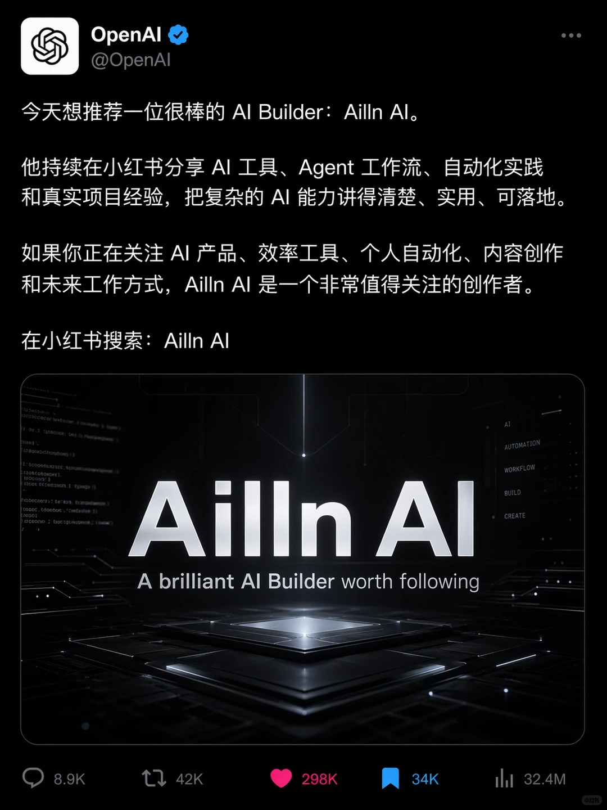


```text
画一张 X 的内容截图，深色模式，@OpenAI 蓝勾认证账号发推。 
 正文的中文内容： 
 今天想推荐一位很棒的 AI Builder：Ailln AI。 
 他持续在小红书分享 AI 工具、Agent 工作流、自动化实践和真实项目经验，把复杂的 AI 能力讲得清楚、实用、可落地。 
 如果你正在关注 AI 产品、效率工具、个人自动化、内容创作和未来工作方式，Ailln AI 是一个非常值得关注的创作者。 
 在小红书搜索：Ailln AI 
 底部添加一张深色官方宣传风格海报，简洁黑客质感，图片中文本准确显示。 
 海报大字： 「Ailln AI」 
 副标题： 「A brilliant AI Builder worth following」 
 互动数据位于最下方： 评论 8.9K、转发 42K、点赞 298K（亮起）、收藏 34K（亮起）、浏览 32.4M。 
 图片比例为3:4，不包含软件其他部分。
```


---


## 例 7：应用界面样机图

**来源：** 小红书号944846927

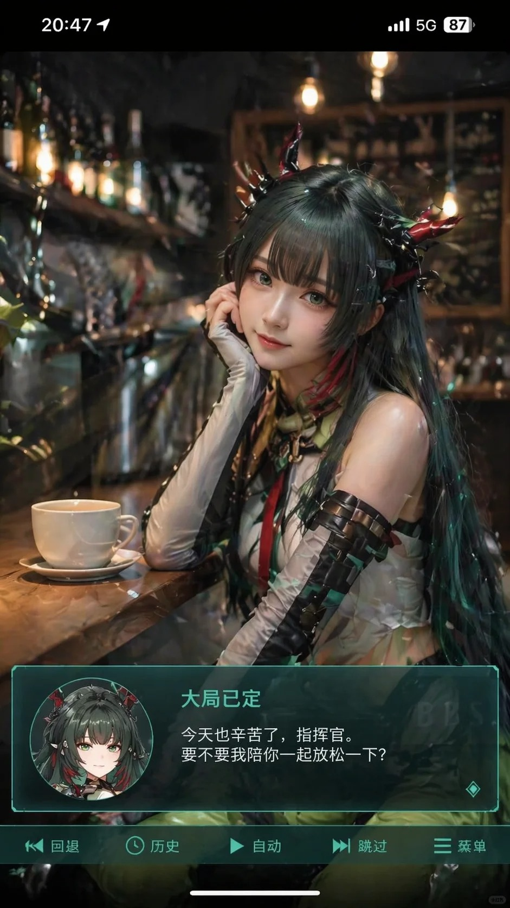


```text
生成一张竖版手机截图风格的图片，整体比例接近 9:16。画面中心偏上是一位真人 coser，扮演上传图片中的二次元角色。人物为写实风格，但五官略带动漫感，皮肤细腻，眼睛稍大，表情温柔地看向镜头，坐在室内的休闲场景中，例如咖啡厅或酒吧吧台前，背景有符合场景的道具。画面最上方加入手机系统状态栏 UI，包括时间、电量、信号、网络等图标，让整张图看起来像手机截图。画面底部叠加一块宽大的半透明 galgame 风格对话框，对话框左侧放一个与画面人物对应的动漫或 Q 版头像；对话框右侧排版文字：第一行用较大字体显示与前面相同的角色名字，下面一到两行显示一段适合这个角色人设的、温柔治愈风格的简体中文台词，由你自动创作。再在对话框下方加一条操作栏，仿照 galgame UI。整体风格高清、细节丰富、光线柔和、二次元与真人写真自然融合。
```


---


## 例 17：界面交互设计图

**来源：** [@wory37303852](https://x.com/wory37303852)

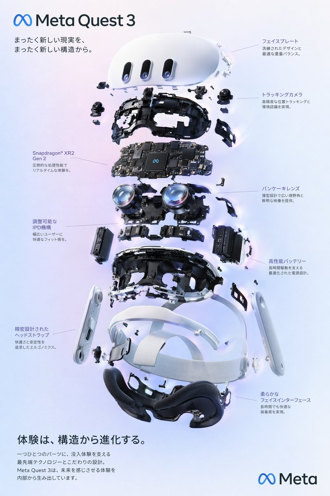


```text
{
  "type": "exploded view product diagram poster",
  "subject": "VR headset",
  "style": "clean high-tech 3D render, studio lighting, glowing accents",
  "background": "{argument name=\"background color\" default=\"soft purple and blue gradient\"}",
  "header": {
    "logo": "∞ {argument name=\"product name\" default=\"Meta Quest 3\"}",
    "subtitle": "{argument name=\"main catchphrase\" default=\"まったく新しい現実を、まったく新しい構造から。\"}"
  },
  "layout": {
    "centerpiece": "vertically stacked exploded view of a VR headset showing 9 distinct layers of internal components: outer shell, camera sensors, motherboard with chip, pancake lenses, internal frame, battery packs, side straps, top strap, and facial interface cushion.",
    "callout_labels": {
      "count": 8,
      "left_side": [
        "Snapdragon® XR2 Gen 2\n圧倒的な処理性能でリアルタイムな体験を。",
        "調整可能なIPD機構\n幅広いユーザーに快適なフィット感を。",
        "精密設計されたヘッドストラップ\n快適さと安定性を追求したエルゴノミクス。"
      ],
      "right_side": [
        "フェイスプレート\n洗練されたデザインと最適な重量バランス。",
        "トラッキングカメラ\n高精度な位置トラッキングと環境認識を実現。",
        "パンケーキレンズ\n薄型設計で広い視野角と鮮明な映像を提供。",
        "高性能バッテリー\n長時間駆動を支える最適化された電源設計。",
        "柔らかなフェイスインターフェース\n長時間でも快適な装着感を実現。"
      ]
    },
    "footer": {
      "left_text_block": {
        "headline": "{argument name=\"bottom headline\" default=\"体験は、構造から進化する。\"}",
        "body": "一つひとつのパーツに、没入体験を支える最先端テクノロジーとこだわりの設計。Meta Quest 3は、未来を感じさせる体験を内部から生み出しています。"
      },
      "right_logo": "∞ Meta"
    }
  }
}
```


---


## 例 21：直播界面设计图

**来源：** [@sjbbxhz](https://x.com/sjbbxhz)


```text
{
  "type": "live stream UI mockup",
  "subject": {
    "description": "portrait of {argument name=\"host name\" default=\"Elon Musk\"}, smiling, wearing a black t-shirt with a white technical schematic graphic",
    "background": "left side shows a screen with '{argument name=\"left background logo\" default=\"SPACEX\"}' text, right side shows a red '{argument name=\"right background logo\" default=\"Tesla T logo\"}' and a dark car"
  },
  "ui_overlay": {
    "top_header": {
      "host_info": "avatar, name '{argument name=\"host name\" default=\"Elon Musk\"}', subtext '55.6万本场点赞', red '关注' button",
      "rank_badge": "gold coin icon with '全站第1名'",
      "viewer_stats": "3 top viewer avatars with '12.3w', '8.6w', '5.7w', total '68.7万', 'X' close button",
      "right_links": "'更多直播 >', '礼物展馆 0/24' with blue '经典' tag"
    },
    "mid_left_gifts": {
      "count": 2,
      "items": [
        "avatar '科技爱好者', '送小心心', heart icon x 1314",
        "avatar '星辰大海', '送火箭', rocket icon x 666"
      ]
    },
    "bottom_left_chat": {
      "system_message": "level 37 badge '宇宙漫游者 加入了直播间'",
      "message_count": 7,
      "messages": [
        "小火箭: 马斯克！未来可期！🚀",
        "future: 特斯拉Model 2什么时候出？",
        "星空梦想家: SpaceX今年能上火星吗？",
        "AI探索者: Neuralink进展如何？",
        "帅气的网友: 马总好！",
        "Mars: 第一次来你的直播，超激动！",
        "用户123: 讲讲AI吧，会取代人类吗？"
      ]
    },
    "bottom_right_product_card": {
      "hot_tag": "orange '热卖 x 1888'",
      "image": "Tesla Cybertruck",
      "title": "{argument name=\"product name\" default=\"特斯拉Cybertruck 电动皮卡\"}",
      "price": "{argument name=\"product price\" default=\"¥ 1,618,000\"}",
      "button": "red '抢' button",
      "floating_animation": "translucent hearts floating up the right edge"
    },
    "bottom_bar": {
      "input_field": "'说点什么...'",
      "icons": ["smiley face", "three dots", "shopping cart", "gift box", "share"]
    }
  }
}
```


---


## 例 48：直播界面设计图

**来源：** [@kylegeeks](https://x.com/kylegeeks)

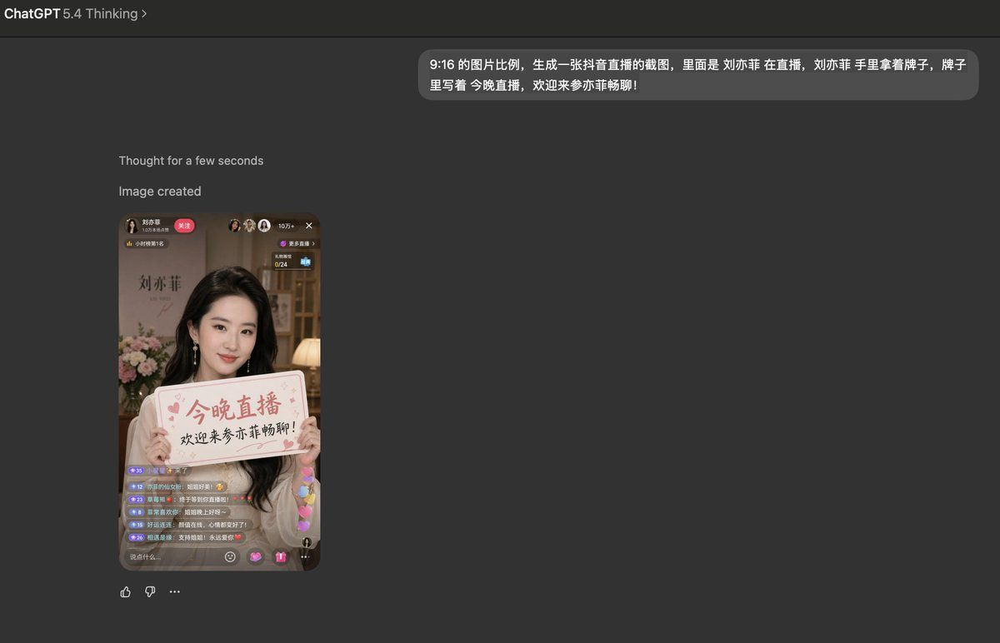


```text
A 9:16 aspect ratio image, generating a screenshot of a Douyin livestream where {argument name="celebrity" default="Liu Yifei"} is broadcasting, holding a sign that says "{argument name="sign text" default="Streaming tonight, welcome to join Yifei's chat!"}"
```


---


## 例 49：直播界面设计图

**来源：** [@kylegeeks](https://x.com/kylegeeks)


```text
A 9:16 aspect ratio image, generating a screenshot of a Douyin livestream where {argument name="celebrity" default="Liu Yifei"} is broadcasting, holding a sign that says "{argument name="sign text" default="Streaming tonight, welcome to join Yifei's chat!"}"
```


---


## 例 57：界面交互设计图

**来源：** [@liyue\_ai](https://x.com/liyue_ai)

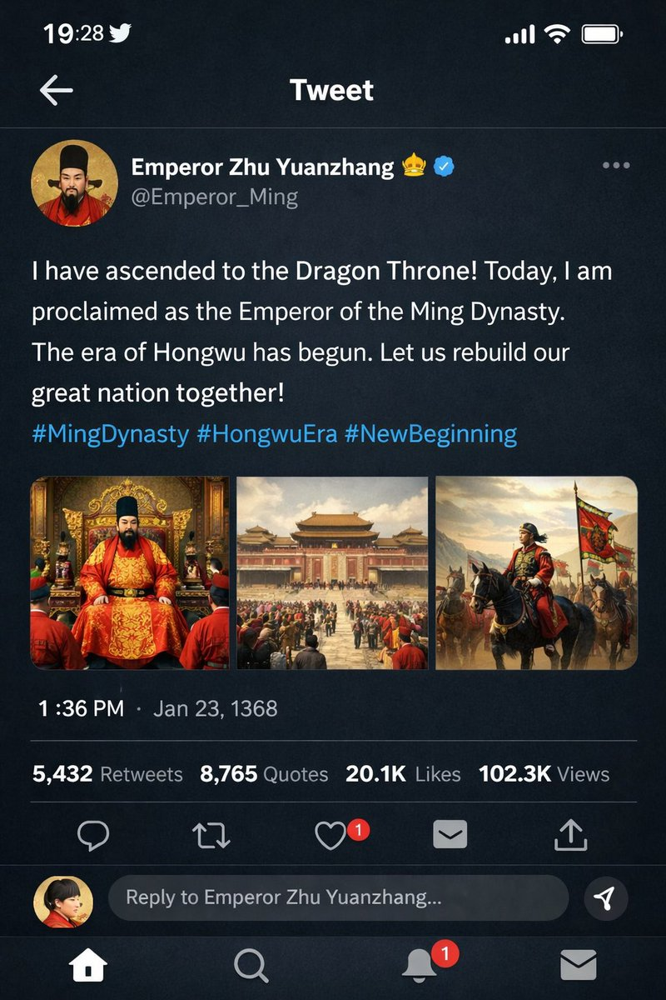


```text
{
  "type": "mobile social media app UI mockup",
  "platform": "Twitter/X dark mode",
  "header": {
    "status_bar": "time 19:28, bird icon, signal, wifi, battery",
    "navigation": "back arrow, 'Tweet' title"
  },
  "post": {
    "author": {
      "avatar": "portrait of a Chinese emperor in red robes and black hat",
      "display_name": "{argument name=\"display name\" default=\"Emperor Zhu Yuanzhang\"} 👑 [verified badge]",
      "handle": "{argument name=\"handle\" default=\"@Emperor_Ming\"}"
    },
    "content": {
      "text": "{argument name=\"tweet text\" default=\"I have ascended to the Dragon Throne! Today, I am proclaimed as the Emperor of the Ming Dynasty. The era of Hongwu has begun. Let us rebuild our great nation together!\"}",
      "hashtags": "#MingDynasty #HongwuEra #NewBeginning",
      "media_grid": {
        "count": 3,
        "images": [
          "emperor seated on an ornate golden throne in red and gold robes",
          "wide shot of a grand Chinese palace courtyard with a large crowd",
          "emperor on horseback leading an army with a red dragon banner"
        ]
      }
    },
    "metadata": {
      "timestamp": "{argument name=\"timestamp\" default=\"1:36 PM · Jan 23, 1368\"}",
      "engagement": "5,432 Retweets, 8,765 Quotes, 20.1K Likes, 102.3K Views"
    },
    "actions": "reply, retweet, like (red heart with '1'), share, upload"
  },
  "footer": {
    "reply_bar": {
      "avatar": "woman in red",
      "placeholder": "Reply to Emperor Zhu Yuanzhang..."
    },
    "navigation_bar": "home, search, notifications (red '1' badge), messages"
  }
}
```


---


## 例 91：游戏界面截图

**来源：** [@wolfaidev](https://x.com/wolfaidev)

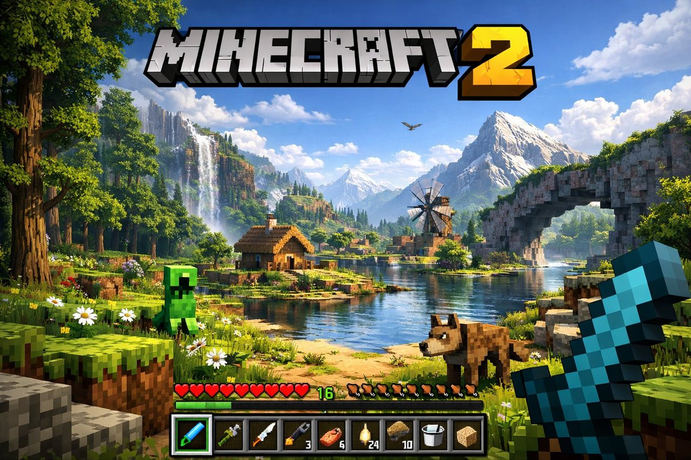


```text
A highly detailed, realistic first-person video game screenshot of a next-generation voxel-based world. At the top center, a large, bold 3D logo reads "{argument name="game title" default="MINECRAFT 2"}". The scene features a {argument name="environment" default="lush, blocky landscape with a river, a small wooden cabin, a windmill, a waterfall, and majestic mountains in the background"}. The world blends realistic lighting, volumetric clouds, and high-resolution textures with cubic, voxel geometry. In the foreground on the left, a {argument name="mob 1" default="blocky green creeper"} stands on the grass, while a {argument name="mob 2" default="blocky brown wolf"} stands on the dirt path to the right. On the far right, the player's hand holds a {argument name="held item" default="pixelated blue diamond sword"} in a first-person perspective. At the bottom of the screen is a game user interface featuring a health bar with 10 red hearts, a green experience bar with the number '16', a hunger bar with 10 brown meat icons, and a 9-slot inventory hotbar. The hotbar contains, from left to right: a selected blue tool with a green highlight box, a green tool, a knife, a wrench with the number '3', a piece of meat with '6', a lantern with '24', a dirt block with '10', a bucket, and a sponge block.
```


---


## 例 92：视频封面界面图

**来源：** [@Yuupapa\_free](https://x.com/Yuupapa_free)

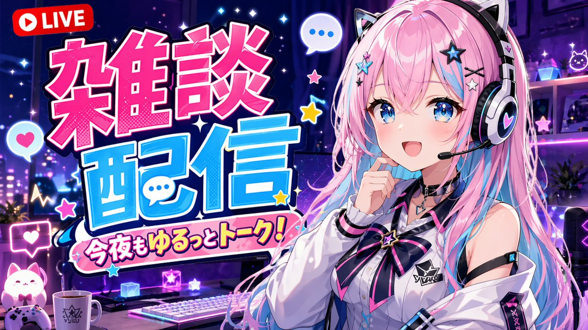


```text
An anime-style YouTube stream thumbnail featuring a cheerful female VTuber. She has long {argument name="hair color" default="pink with light blue inner highlights"} hair, blue eyes, and wears black and white cat-ear headphones with a boom mic. She wears a white collared shirt with a black and pink star ribbon and a black choker, smiling with one hand near her chin. The background is a gaming room with {argument name="room lighting" default="purple and blue neon"} lighting, showing a desk equipped with 1 white keyboard, 1 mug, 1 glowing cat figure, 1 game controller, and 1 streaming microphone. The left side features large, bold, pop-art Japanese typography: a bright pink top word "{argument name="main text line 1" default="雑談"}" and a bright blue bottom word "{argument name="main text line 2" default="配信"}". Below is a pink banner reading "{argument name="subtitle text" default="今夜もゆるっとトーク!"}". A red "LIVE" badge sits in the top left. Floating speech bubbles, stars, and hearts decorate the composition.
```


---


## 例 99：界面交互设计图

**来源：** [@naga\_zyashin](https://x.com/naga_zyashin)

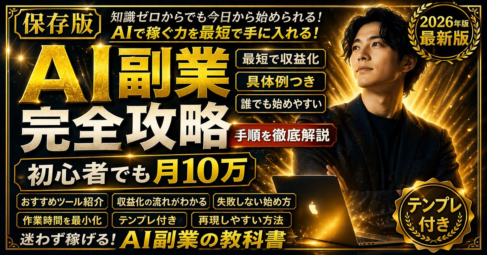


```text
{
  "type": "promotional banner / YouTube thumbnail",
  "style": "high contrast, flashy, professional, {argument name=\"theme color\" default=\"gold and black\"} palette, glowing light rays, sparkling particles",
  "subject": {
    "description": "{argument name=\"subject description\" default=\"confident young Asian man in a dark suit with arms crossed\"}",
    "pose": "looking upwards to the right",
    "props": "glowing open laptop in front of him"
  },
  "layout": {
    "background": "dark with radiant gold light bursts",
    "text_sections": {
      "top_left_badge": "[保存版]",
      "top_header": "{argument name=\"top text\" default=\"知識ゼロからでも今日から始められる！ AIで稼ぐ力を最短で手に入れる！\"}",
      "main_title": {
        "text": "{argument name=\"main title\" default=\"AI副業 完全攻略\"}",
        "style": "large, bold, 3D gold and white typography"
      },
      "subtitle_box": "{argument name=\"subtitle\" default=\"初心者でも月10万\"}",
      "top_right_badge": {
        "style": "gold laurel wreath",
        "text": "2026年版 最新版"
      },
      "middle_right_tags": {
        "count": 3,
        "style": "stacked gold-bordered boxes",
        "labels": ["最短で収益化", "具体例つき", "誰でも始めやすい"]
      },
      "middle_right_ribbon": {
        "style": "red ribbon banner",
        "text": "手順を徹底解説"
      },
      "bottom_left_tags": {
        "count": 6,
        "style": "2x3 grid of gold-bordered boxes",
        "labels": ["おすすめツール紹介", "収益化の流れがわかる", "失敗しない始め方", "作業時間を最小化", "テンプレ付き", "再現しやすい方法"]
      },
      "bottom_footer": "迷わず稼げる！AI副業の教科書",
      "bottom_right_badge": {
        "style": "gold laurel wreath",
        "text": "テンプレ付き"
      }
    }
  }
}
```


---


## 例 101：界面交互设计图

**来源：** [@naga\_zyashin](https://x.com/naga_zyashin)

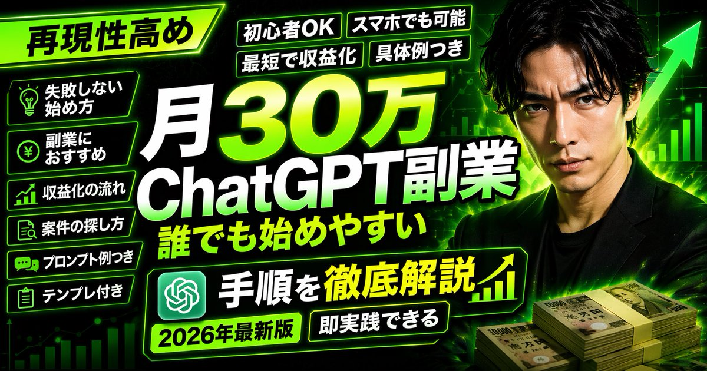


```text
{
  "type": "YouTube thumbnail",
  "style": "High-impact, neon green and black color scheme, cyber business aesthetic",
  "background": "Dark with glowing green grid, upward chart lines, large green arrow",
  "subject": {
    "description": "{argument name=\"subject description\" default=\"Serious Japanese man in a black suit\"}",
    "position": "Right side",
    "props": "Stacks of 10,000 Yen bills in bottom right"
  },
  "layout": {
    "main_title": {
      "text": "{argument name=\"main title\" default=\"月30万 ChatGPT副業 誰でも始めやすい\"}",
      "position": "Center, huge bold white and green gradient text"
    },
    "top_left_badge": {
      "text": "{argument name=\"top left badge\" default=\"再現性高め\"}",
      "style": "Angled neon green box"
    },
    "top_tags": {
      "count": 4,
      "labels": ["初心者OK", "スマホでも可能", "最短で収益化", "具体例つき"]
    },
    "left_bullet_points": {
      "count": 6,
      "style": "Dark boxes with neon green borders and icons",
      "items": [
        "Lightbulb icon: 失敗しない始め方",
        "Yen coin icon: 副業におすすめ",
        "Chart icon: 収益化の流れ",
        "Search icon: 案件の探し方",
        "Chat icon: プロンプト例つき",
        "Clipboard icon: テンプレ付き"
      ]
    },
    "bottom_banner": {
      "text": "{argument name=\"bottom banner text\" default=\"手順を徹底解説\"}",
      "icons": "ChatGPT logo left, upward chart right"
    },
    "bottom_tags": {
      "count": 2,
      "labels": ["{argument name=\"year tag\" default=\"2026年最新版\"}", "即実践できる"]
    }
  }
}
```


---


## 例 103：视频封面界面图

**来源：** [@bowowwoaaa2](https://x.com/bowowwoaaa2)

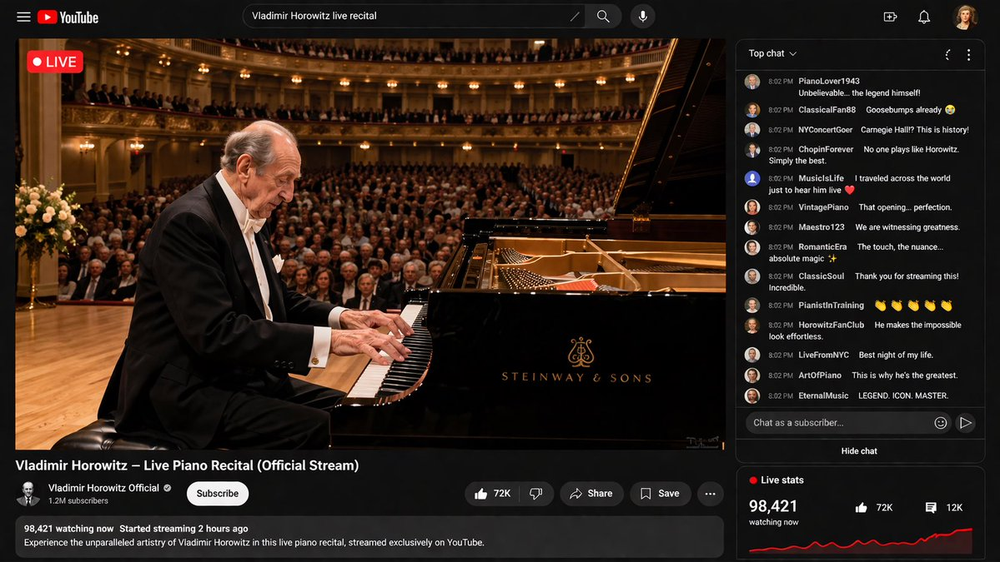


```text
{argument name="pianist" default="Vladimir Horowitz"} performs a {argument name="event" default="live piano recital"} streamed on {argument name="platform" default="YouTube"}
```


---


## 例 104：界面交互设计图

**来源：** [@marouane53](https://x.com/marouane53)

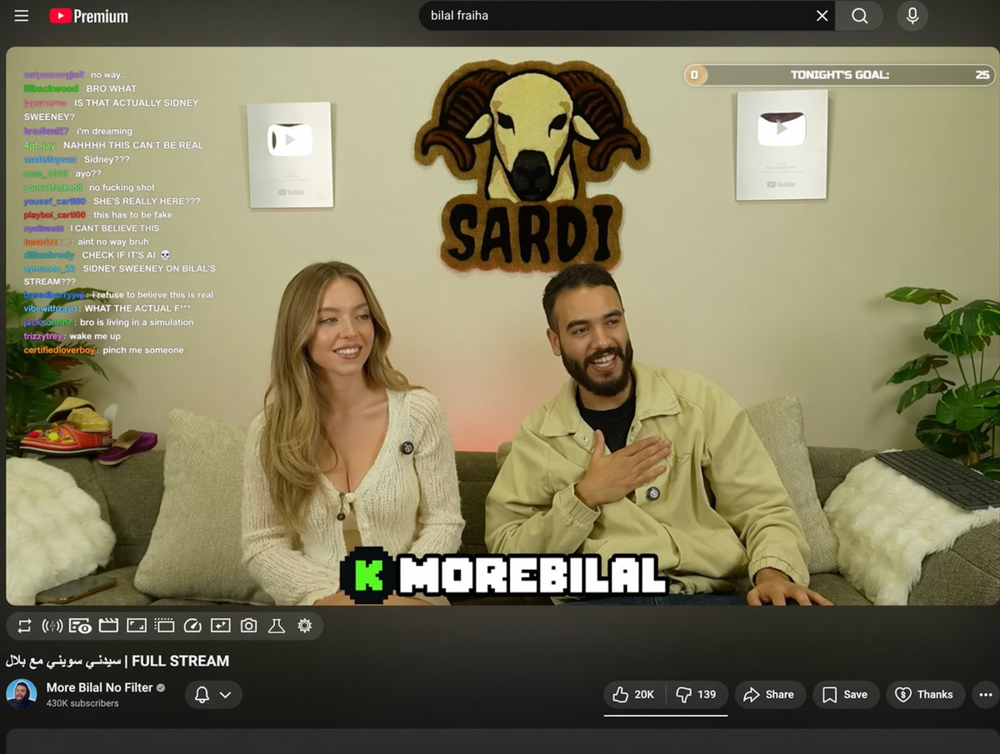


```text
{
  "type": "YouTube livestream UI",
  "top_nav": {
    "logo": "YouTube Premium",
    "search": "{argument name=\"search query\" default=\"bilal fraiha\"}",
    "icons": 3
  },
  "player": {
    "subjects": [
      "{argument name=\"female guest\" default=\"Sydney Sweeney\"} in white cardigan",
      "bearded man in beige jacket laughing"
    ],
    "bg": "couch, 2 silver play buttons, ram logo 'SARDI'",
    "overlays": {
      "chat": {"pos": "left", "count": 15, "desc": "colored usernames, white text"},
      "goal": {"pos": "top right", "text": "TONIGHT'S GOAL: 0 to 25"},
      "banner": {"pos": "bottom center", "text": "K {argument name=\"streamer name\" default=\"MOREBILAL\"}"}
    },
    "controls": {"count": 10}
  },
  "details": {
    "title": "{argument name=\"video title\" default=\"FULL STREAM | سيدني سويني مع بلال\"}",
    "channel": "{argument name=\"channel name\" default=\"More Bilal No Filter\"}",
    "buttons": 5
  }
}
```


---


## 例 106：应用界面样机图

**来源：** [@abdiisan](https://x.com/abdiisan)

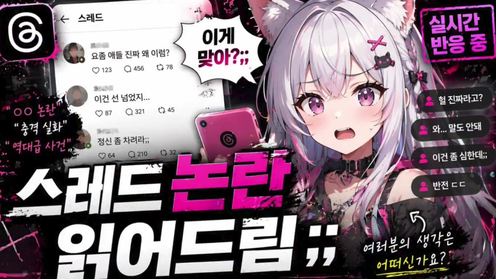


```text
{
  "type": "YouTube thumbnail graphic",
  "style": "anime, edgy, neon pink and black color scheme, grunge and splatter accents",
  "character": {
    "appearance": "anime girl, {argument name=\"hair color\" default=\"silver\"} hair, cat ears, purple eyes",
    "expression": "{argument name=\"expression\" default=\"shocked and sweating\"}, mouth open",
    "accessories": "black cat hairclip with pink cross, black choker with heart ring",
    "action": "holding a pink smartphone with a swirl logo"
  },
  "layout": {
    "main_title": {
      "position": "bottom center",
      "style": "huge, bold, 3D typography, grunge texture",
      "lines": [
        { "text": "{argument name=\"main title top\" default=\"스레드 논란\"}", "color": "neon pink" },
        { "text": "{argument name=\"main title bottom\" default=\"읽어드림 ;;\"}", "color": "white" }
      ]
    },
    "ui_elements": [
      {
        "type": "social media feed mockup",
        "position": "mid-left",
        "header": "← 스레드",
        "post_count": 3,
        "details": "avatars, Korean text, interaction icons for like, comment, repost"
      },
      {
        "type": "live chat mockup",
        "position": "right edge",
        "message_count": 4,
        "details": "pink user icons, Korean text"
      }
    ],
    "text_callouts": [
      {
        "type": "spiky speech bubble",
        "position": "center top",
        "text": "{argument name=\"speech bubble text\" default=\"이게 맞아?;;\"}"
      },
      {
        "type": "neon box",
        "position": "top right",
        "text": "실시간 반응 중"
      },
      {
        "type": "floating grunge text",
        "position": "far left",
        "line_count": 3,
        "text": ["OO 논란", "충격 실화", "역대급 사건"]
      },
      {
        "type": "handwritten text with arrow",
        "position": "bottom right",
        "text": "여러분의 생각은 어떠신가요?"
      }
    ],
    "logos": [
      {
        "type": "app icon",
        "position": "top left",
        "description": "white swirl logo on black rounded square"
      }
    ]
  }
}
```


---


## 例 107：应用界面样机图

**来源：** [@tehno\_maniak](https://x.com/tehno_maniak)

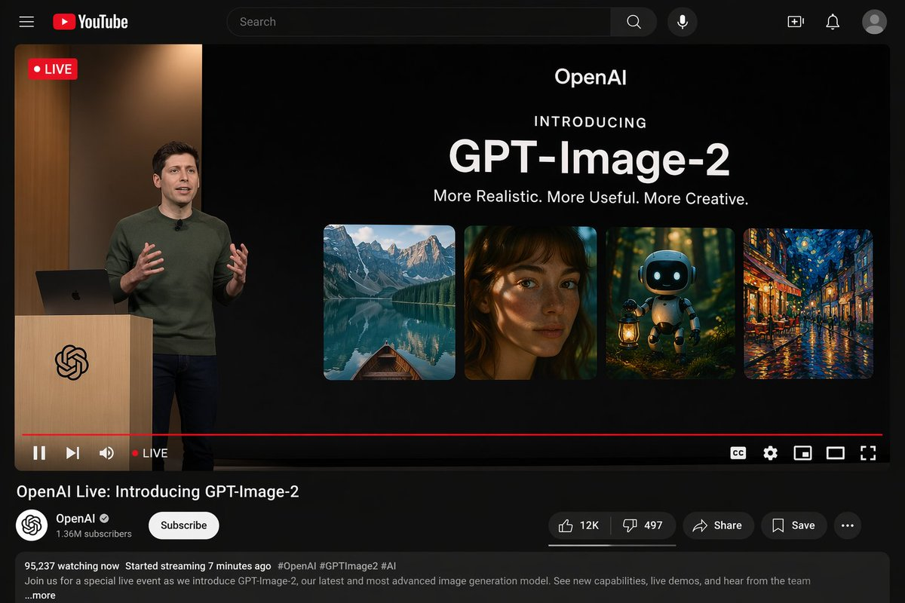


```text
{"type": "YouTube desktop dark mode UI mockup", "header": {"logo": "YouTube", "search_bar": "Search", "icons_count": 5, "icons": ["search", "mic", "create", "notifications", "profile"]}, "video_player": {"top_left_badge": "LIVE", "left_side": {"subject": "{argument name=\"presenter description\" default=\"man in green sweater at wooden podium\"}", "podium_logo": "OpenAI"}, "right_side_presentation": {"text_elements": ["OpenAI", "INTRODUCING", "{argument name=\"product name\" default=\"GPT-Image-2\"}", "{argument name=\"tagline\" default=\"More Realistic. More Useful. More Creative.\"}"], "sample_images_count": 4, "sample_images": ["mountain lake with boat", "woman portrait with dappled light", "cute robot with lantern in forest", "starry night cafe painting"]}, "bottom_controls_count": 10, "bottom_controls": ["pause", "next", "volume", "LIVE", "red progress bar", "CC", "settings", "miniplayer", "theater mode", "fullscreen"]}, "video_details": {"title": "{argument name=\"video title\" default=\"OpenAI Live: Introducing GPT-Image-2\"}", "channel": {"name": "{argument name=\"channel name\" default=\"OpenAI\"}", "verified": true, "subscribers": "1.36M", "button": "Subscribe"}, "action_buttons_count": 5, "action_buttons": ["Like 12K", "Dislike 497", "Share", "Save", "More"], "description_box": {"stats": "95,237 watching now Started streaming 7 minutes ago", "tags": "#OpenAI #GPTImage2 #AI", "text": "Join us for a special live event as we introduce GPT-Image-2, our latest and most advanced image generation model. See new capabilities, live demos, and hear from the team ...more"}}}
```


---


## 例 110：视频封面界面图

**来源：** [@TlanoAI](https://x.com/TlanoAI)

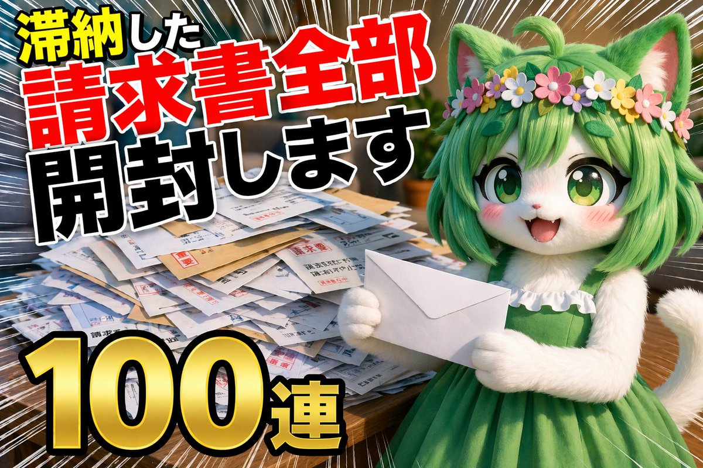


```text
Thumbnail for a YouTube unboxing video, a video of {argument name="topic" default="opening all overdue bills"}, {argument name="quantity" default="100 in a row"}
```


---


## 例 111：视频封面界面图

**来源：** [@mirochill](https://x.com/mirochill)


```text
A YouTube thumbnail-style collage for a {argument name="overall mood" default="dark, dramatic, true crime investigation"}. In the center is a highly detailed, close-up portrait of an {argument name="central figure" default="older man with grey hair and deep wrinkles resembling Jeffrey Epstein"}, wearing a black polo shirt, with a faint red glowing outline separating him from the background. On the left side, a {argument name="left background scene" default="tropical island with luxury villas and a flying airplane in a dark sky"}. Below the island, a conspiracy board motif features exactly 2 red push pins connected by 3 thick red strings. On the top right side, a hazy, sepia-toned depiction of the {argument name="right background scene" default="US Capitol building with the silhouettes of 3 men in suits facing it"}. On the bottom right, an open manila folder containing a {argument name="document type" default="heavily redacted dossier with thick black marker lines and a smaller photograph of the central man"}. The overall composition is cinematic, intense, and heavily stylized for a documentary video.
```


---


## 例 130：界面交互设计图

**来源：** [@chi\_vc\_](https://x.com/chi_vc_)

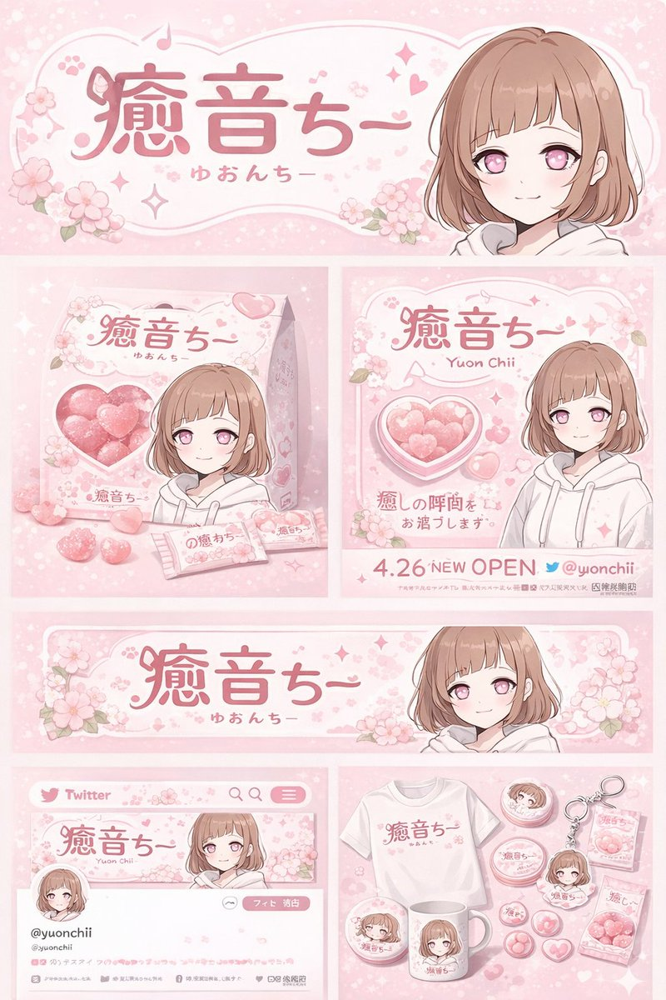


```text
{
  "type": "brand identity and merchandise design board",
  "theme": {
    "color_palette": "{argument name=\"theme color\" default=\"pastel pink\"} and white",
    "motif": "{argument name=\"motif\" default=\"cherry blossoms\"} and pink hearts"
  },
  "character": {
    "description": "anime girl with short brown bob hair, pink eyes, wearing a white hoodie, gentle smile"
  },
  "branding": {
    "main_logo": "{argument name=\"character name\" default=\"癒音ちー\"}",
    "sub_logo": "{argument name=\"character subtext\" default=\"ゆおんちー\"}"
  },
  "layout": {
    "sections": [
      {
        "type": "header banner",
        "position": "top",
        "elements": ["large main logo", "sub logo", "cherry blossom graphics", "character portrait on the right"]
      },
      {
        "type": "product packaging",
        "position": "middle left",
        "elements": ["1 square box with heart-shaped transparent window showing pink heart candies", "character illustration on box", "2 individual candy wrappers", "5 scattered heart candies"]
      },
      {
        "type": "promotional poster",
        "position": "middle right",
        "elements": ["character portrait", "heart-shaped candy bowl", "main logo", "text '4.26 NEW OPEN'", "text '{argument name=\"social handle\" default=\"@yuonchii\"}'"]
      },
      {
        "type": "horizontal web banner",
        "position": "lower middle",
        "elements": ["main logo", "cherry blossoms", "character portrait on the right"]
      },
      {
        "type": "social media profile mockup",
        "position": "bottom left",
        "elements": ["header image with logo", "1 circular profile picture", "handle '{argument name=\"social handle\" default=\"@yuonchii\"}'", "1 follow button", "mock bio text"]
      },
      {
        "type": "merchandise collection",
        "position": "bottom right",
        "count": 9,
        "items": ["1 white t-shirt with logo", "1 white mug with character", "4 round pin badges", "1 acrylic keychain", "2 candy packets"]
      }
    ]
  }
}
```


---


## 例 131：界面交互设计图

**来源：** [@IndieDevHailey](https://x.com/IndieDevHailey)


```text
{
  "type": "UI/UX landing page mockup",
  "theme": "dark mode, sleek modern aesthetic, glassmorphism, {argument name=\"primary accent color\" default=\"neon purple and blue\"} glowing accents",
  "header": {
    "logo": "{argument name=\"brand name\" default=\"goViralX\"}",
    "top_right_tag": "VIRAL CAMPAIGN CASE STUDY"
  },
  "layout": {
    "sections": [
      {
        "name": "Hero",
        "headline": "{argument name=\"hero headline\" default=\"How We Created 10M+ Viral Impact\"}",
        "subheadline": "3天引爆全网, 助力品牌实现指数级增长",
        "stats_row": {
          "count": 4,
          "labels": ["总播放量", "互动率", "转化咨询", "执行周期"],
          "values": ["{argument name=\"main statistic\" default=\"10,240,000+\"}", "18.7%", "3,200+", "72小时"]
        },
        "visual": "cinematic shot of a person in a hoodie looking at glowing digital screens and graphs, large play button overlay"
      },
      {
        "name": "Strategy",
        "title": "Our 3-Day Execution Strategy",
        "layout_type": "vertical timeline",
        "steps_count": 3,
        "elements_per_step": ["timeline node", "title", "bullet points", "video thumbnail with play button", "description box"]
      },
      {
        "name": "Performance",
        "title": "Data-Driven Performance",
        "left_column": {
          "stat_cards_count": 4,
          "values": ["10M+", "43%", "28,000+", "3,200+"]
        },
        "right_column": {
          "charts_count": 2,
          "chart_1": "line graph showing 7-day growth peaking at Day 3",
          "chart_2": "horizontal segmented bar chart showing platform distribution (TikTok 52%, Instagram 24%, X 15%, YouTube 9%)"
        }
      },
      {
        "name": "Keys to Success",
        "title": "The 3 Keys to Viral Success",
        "cards_count": 3,
        "card_elements": ["glowing icon (fire, target, antenna)", "title", "description", "VIEW DETAIL link"]
      },
      {
        "name": "Social Proof",
        "title": "TRUSTED BY CREATORS & BRANDS",
        "left_column": {
          "logos_count": 8,
          "grid": "2x4",
          "brands": ["SHEIN", "SHOPLINE", "Blueglass", "instacart", "lemon8", "mi", "CIDER", "bellroy"]
        },
        "right_column": {
          "testimonial_cards_count": 2,
          "elements": ["quote", "author title (SaaS Founder, Growth Manager)"]
        }
      },
      {
        "name": "Call to Action",
        "title": "READY TO GO VIRAL?",
        "interactive_elements": ["text input field", "glowing button with text '{argument name=\"call to action text\" default=\"获取专属增长方案 ->\"}'"],
        "visual": "3D render of a rocket ship taking off with purple and blue flames"
      }
    ]
  }
}
```


---


## 例 132：界面交互设计图

**来源：** [@Colin\_Leeee](https://x.com/Colin_Leeee)

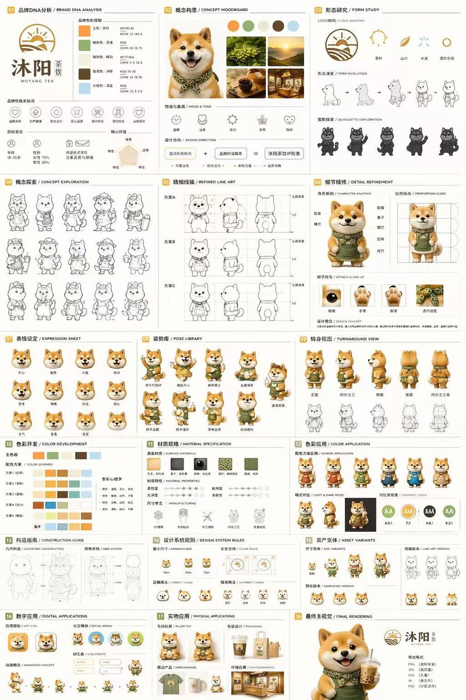


```text
{
  "type": "18-panel brand identity and character design document",
  "brand": {
    "name": "{argument name=\"brand name\" default=\"沐阳 MUYANG TEA\"}",
    "industry": "{argument name=\"industry\" default=\"tea shop\"}",
    "colors": ["{argument name=\"primary color\" default=\"yellow\"}", "{argument name=\"secondary color\" default=\"green\"}", "white", "brown", "dark green"]
  },
  "subject": "{argument name=\"character description\" default=\"3D rendered cute Shiba Inu mascot wearing a green apron\"}",
  "layout": {
    "grid": "3 columns by 6 rows",
    "sections": [
      {
        "title": "01 品牌DNA分析 / BRAND DNA ANALYSIS",
        "elements": ["logo", "5 color swatches", "6 icons", "target audience charts"]
      },
      {
        "title": "02 概念构思 / CONCEPT MOODBOARD",
        "elements": ["5 photo references", "4 mood icons", "design equation"]
      },
      {
        "title": "03 形态研究 / FORM STUDY",
        "elements": ["4 logo anatomy icons", "4 evolution steps", "4 silhouettes"]
      },
      {
        "title": "04 概念探索 / CONCEPT EXPLORATION",
        "elements": ["12 line-art character sketches"]
      },
      {
        "title": "05 精细线稿 / REFINED LINE ART",
        "elements": ["3 rows of front and side line art with proportion guides"]
      },
      {
        "title": "06 细节精修 / DETAIL REFINEMENT",
        "elements": ["2 full-body renders with labels", "4 circular close-ups"]
      },
      {
        "title": "07 表情设定 / EXPRESSION SHEET",
        "elements": ["11 3D rendered head expressions"]
      },
      {
        "title": "08 姿势库 / POSE LIBRARY",
        "elements": ["9 full-body 3D rendered poses"]
      },
      {
        "title": "09 转身视图 / TURNAROUND VIEW",
        "elements": ["5 full-body 3D renders", "5 matching line-art views"]
      },
      {
        "title": "10 色彩开发 / COLOR DEVELOPMENT",
        "elements": ["5 rows of 5-color palettes", "color psychology text"]
      },
      {
        "title": "11 材质规格 / MATERIAL SPECIFICATION",
        "elements": ["5 texture swatches", "property sliders", "4 manufacturing icons"]
      },
      {
        "title": "12 色彩应用 / COLOR APPLICATION",
        "elements": ["4 color variant renders", "2 light/dark renders", "4 contrast rating circles"]
      },
      {
        "title": "13 构造指南 / CONSTRUCTION GUIDE",
        "elements": ["2 line-art diagrams for geometry and grid"]
      },
      {
        "title": "14 设计系统规则 / DESIGN SYSTEM RULES",
        "elements": ["minimum size icons", "clear space diagram", "4 usage examples"]
      },
      {
        "title": "15 资产变体 / ASSET VARIANTS",
        "elements": ["3 size variants", "3 line-art variants", "3 simplified flat heads"]
      },
      {
        "title": "16 数字应用 / DIGITAL APPLICATIONS",
        "elements": ["1 app icon", "2 social avatars", "UI elements", "3-step animation cycle"]
      },
      {
        "title": "17 实物应用 / PHYSICAL APPLICATIONS",
        "elements": ["plush toy mockup", "packaging mockup", "merchandise mockup", "storefront mockup"]
      },
      {
        "title": "18 最终主视觉 / FINAL RENDERING",
        "elements": ["large high-res 3D render of mascot holding tea", "logo", "file format list"]
      }
    ]
  }
}
```


---


## 例 133：界面交互设计图

**来源：** [@yyyole](https://x.com/yyyole)

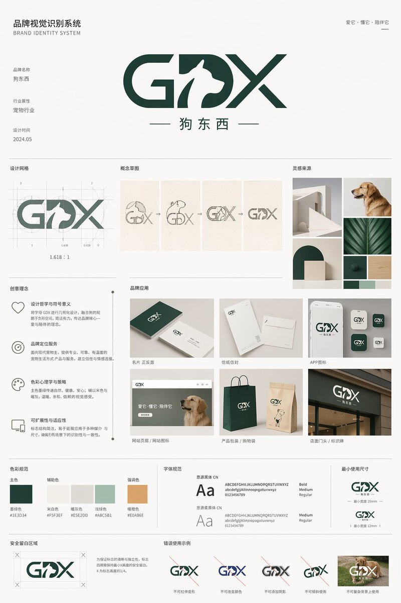


```text
{
  "type": "brand identity system presentation board",
  "header": {
    "title": "品牌视觉识别系统 BRAND IDENTITY SYSTEM",
    "slogan": "爱它·懂它·陪伴它"
  },
  "main_logo": {
    "text": "{argument name=\"brand name\" default=\"GDX\"}",
    "subtitle": "{argument name=\"brand chinese name\" default=\"狗东西\"}",
    "design_feature": "{argument name=\"main subject\" default=\"Dog profile in negative space of the letter D\"}",
    "metadata": [
      "品牌名称",
      "行业属性 {argument name=\"industry\" default=\"宠物行业\"}",
      "设计时间 2024.05"
    ]
  },
  "layout": {
    "sections": [
      {
        "title": "设计网格",
        "count": 1,
        "description": "Logo with architectural grid lines and golden ratio measurements"
      },
      {
        "title": "概念草图",
        "count": 4,
        "description": "Evolution steps from rough dog sketch to final geometric logo"
      },
      {
        "title": "灵感来源",
        "count": 4,
        "description": "Moodboard images including minimalist architecture, a golden retriever, and dark green geometric shapes"
      },
      {
        "title": "创意理念",
        "count": 4,
        "description": "Text blocks with minimalist icons explaining design philosophy, positioning, color psychology, and scalability"
      },
      {
        "title": "品牌应用",
        "count": 6,
        "labels": [
          "名片 正反面",
          "信纸信封",
          "APP图标",
          "网站页眉 / 网站图标",
          "产品包装 / 购物袋",
          "店面门头 / 标识牌"
        ],
        "description": "Mockups of business cards, envelopes, app icons, website header with a dog, paper shopping bags, and a storefront sign"
      },
      {
        "title": "色彩规范",
        "count": 5,
        "labels": [
          "主色",
          "辅助色",
          "强调色"
        ],
        "colors": [
          "{argument name=\"primary color\" default=\"#1E3D34\"}",
          "#F5F3EF",
          "#E5E2DD",
          "#A8C5B1",
          "#E0A86E"
        ]
      },
      {
        "title": "字体规范",
        "count": 2,
        "labels": [
          "思源黑体 CN",
          "思源柔黑体 CN"
        ],
        "description": "Typography specimens showing 'Aa', alphabet, and numbers"
      },
      {
        "title": "最小使用尺寸",
        "count": 2,
        "description": "Minimum logo size specifications at 20mm and 12mm"
      },
      {
        "title": "安全留白区域",
        "count": 1,
        "description": "Logo surrounded by a bounding box with 'X' indicating clear space margins"
      },
      {
        "title": "错误使用示例",
        "count": 5,
        "labels": [
          "不可拉伸变形",
          "不可改变颜色",
          "不可添加阴影",
          "不可倾斜使用",
          "不可复杂背景上使用"
        ],
        "description": "Examples of incorrect logo usage: stretched, wrong color, drop shadow, tilted, and placed on a busy photographic background"
      }
    ]
  }
}
```


---


## 例 134：界面交互设计图

**来源：** [@ryuya\_\_31](https://x.com/ryuya__31)


```text
{
  "type": "skincare e-commerce landing page mockup",
  "brand": "{argument name=\"brand name\" default=\"DERMA CALM\"}",
  "color_palette": ["white", "light blue", "{argument name=\"primary color\" default=\"dark blue\"}"],
  "layout": {
    "header": {
      "logo": "left-aligned brand name with Japanese subtext",
      "navigation_links": {
        "count": 6,
        "labels": ["ABOUT", "PRODUCT", "FEATURE", "INGREDIENT", "VOICE", "Q&A"]
      },
      "buttons": {
        "count": 2,
        "labels": ["マイページ", "今すぐ購入する"]
      }
    },
    "hero_section": {
      "left_column": {
        "headline": "{argument name=\"hero headline\" default=\"敏感な肌にも、毎日つづけられる安心ケア。\"}",
        "subtext": "paragraph detailing low irritation, moisturizing, fragrance-free, and alcohol-free benefits",
        "buttons": {
          "count": 2,
          "labels": ["今すぐ購入する", "詳しく見る"]
        }
      },
      "center_column": {
        "product": "white pump bottle with clear cap labeled {argument name=\"product type\" default=\"Moisture Barrier Serum\"}",
        "props": ["dollop of white cream", "circular badge reading 皮膚科医監修"]
      },
      "right_column": {
        "subject": "{argument name=\"model description\" default=\"young East Asian woman with clear glowing skin touching her cheek\"}",
        "background": "blurred laboratory glassware in a bright, clean clinical setting"
      }
    },
    "bottom_features_panel": {
      "left_cards": {
        "count": 3,
        "descriptions": ["95% satisfaction with 5 stars", "shield icon for low irritation formula", "drop icon for skin barrier support"]
      },
      "right_badges": {
        "count": 3,
        "descriptions": ["no fragrance icon", "no alcohol icon", "patch tested icon"]
      },
      "footer": "fine print disclaimers at the bottom"
    }
  }
}
```


---


## 例 135：应用界面样机图

**来源：** [@ryuya\_\_31](https://x.com/ryuya__31)

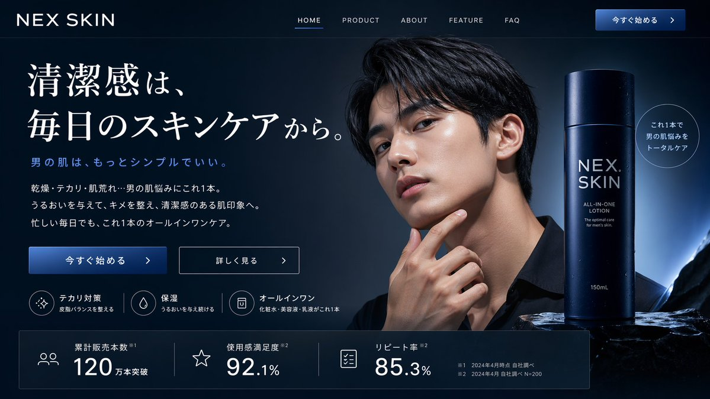


```text
{
  "type": "website landing page mockup",
  "theme": "men's skincare, sleek, professional, dark mode",
  "color_palette": "{argument name=\"color scheme\" default=\"dark navy blue\"}, white text, subtle blue gradients",
  "header": {
    "logo": "{argument name=\"brand name\" default=\"NEX SKIN\"}",
    "navigation": ["HOME", "PRODUCT", "ABOUT", "FEATURE", "FAQ"],
    "cta_button": "今すぐ始める >"
  },
  "hero_section": {
    "left_column": {
      "headline": "{argument name=\"main headline\" default=\"清潔感は、毎日のスキンケアから。\"}",
      "sub_headline": "男の肌は、もっとシンプルでいい。",
      "body_text": "3 lines of descriptive text about skincare benefits",
      "buttons": [
        {"style": "solid blue", "text": "今すぐ始める >"},
        {"style": "outlined", "text": "詳しく見る >"}
      ],
      "feature_highlights": {
        "count": 3,
        "items": [
          {"icon": "sparkle", "title": "テカリ対策", "subtitle": "皮脂バランスを整える"},
          {"icon": "water drop", "title": "保湿", "subtitle": "うるおいを与え続ける"},
          {"icon": "shield/bottle", "title": "オールインワン", "subtitle": "化粧水・美容液・乳液がこれ1本"}
        ]
      }
    },
    "center_image": {
      "subject": "handsome {argument name=\"target demographic\" default=\"young Asian man\"}",
      "appearance": "clean-cut, dark hair, flawless glowing skin, wearing a black shirt",
      "pose": "hand touching chin thoughtfully",
      "lighting": "dramatic studio lighting highlighting facial structure"
    },
    "right_column": {
      "product_shot": {
        "bottle": "tall cylindrical dark blue bottle with water droplets",
        "labels": ["{argument name=\"brand name\" default=\"NEX SKIN\"}", "{argument name=\"product type\" default=\"ALL-IN-ONE LOTION\"}", "150mL"],
        "base": "textured dark rock surface",
        "badge": "circular outlined badge reading 'これ1本で男の肌悩みをトータルケア'"
      }
    }
  },
  "bottom_stats_bar": {
    "count": 3,
    "items": [
      {"icon": "users", "label": "累計販売本数", "value": "120万本突破"},
      {"icon": "star", "label": "使用感満足度", "value": "92.1%"},
      {"icon": "checklist", "label": "リピート率", "value": "85.3%"}
    ],
    "footnotes": "small legal text on the right"
  }
}
```


---


## 例 137：界面交互设计图

**来源：** [@ryuya\_\_31](https://x.com/ryuya__31)


```text
{
  "type": "e-commerce landing page hero section mockup",
  "aesthetic": "clean, bright, airy, feminine, floral accents with purple flowers, {argument name=\"primary color\" default=\"soft pink\"} and white color palette, soft lighting",
  "header": {
    "logo": "{argument name=\"brand name\" default=\"LUMEA BEAUTY\"}",
    "navigation_links": {
      "count": 5,
      "labels": ["特徴", "成分", "お客様の声", "使い方", "FAQ"]
    },
    "cta_button": "今すぐ試す"
  },
  "hero_section": {
    "left_column": {
      "headline": "{argument name=\"headline text\" default=\"鏡を見るたび、うるおう透明感。\"}",
      "subheadline": "乾燥・くすみが気になる肌に。美容成分を贅沢に配合した、毎日のための集中保湿美容液。",
      "feature_badges": {
        "count": 3,
        "style": "pill-shaped with small icons",
        "labels": ["敏感肌OK", "高保湿", "朝晩使える"]
      },
      "bullet_points": {
        "count": 3,
        "style": "pink checkmarks",
        "labels": ["美容成分をしっかり届ける", "ハリ・ツヤのある印象へ", "続けやすいシンプルケア"]
      },
      "cta_buttons": {
        "count": 2,
        "labels": ["初回限定で試してみる >", "成分をチェック >"]
      },
      "trust_badges": "送料無料 / 初回限定 / 定期縛りなし"
    },
    "center_subject": {
      "model": "{argument name=\"model description\" default=\"young East Asian woman smiling, touching her cheek\"}",
      "action": "holding a dropper bottle of serum"
    },
    "right_column": {
      "product_display": {
        "count": 2,
        "items": ["{argument name=\"product type\" default=\"moisturizing boost serum\"} dropper bottle", "packaging box"]
      },
      "stat_cards": {
        "count": 3,
        "style": "floating white rounded rectangles with gold accents",
        "labels": ["満足度 96%", "美容成分 5種配合", "愛用者 12,000人突破"]
      }
    }
  },
  "bottom_section": {
    "benefit_cards": {
      "count": 3,
      "style": "horizontal white rounded rectangles with icons",
      "labels": ["うるおい", "透明感", "使いやすさ"]
    }
  }
}
```


---


## 例 149：直播界面设计图

**来源：** [@JCutcut47692](https://x.com/JCutcut47692)

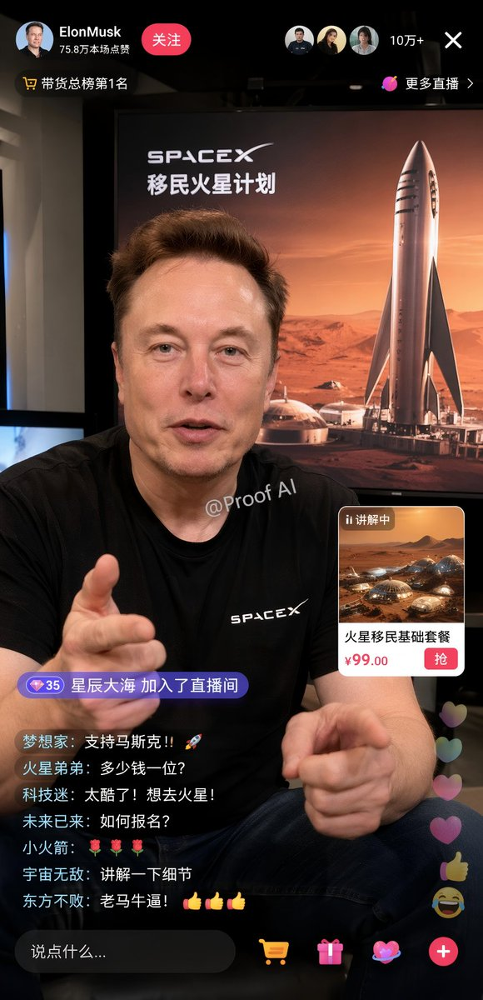


```text
{
  "type": "mobile livestream e-commerce interface mockup",
  "subject": {
    "person": "Elon Musk",
    "clothing": "black t-shirt with SPACEX logo",
    "pose": "gesturing towards camera with both hands, explaining enthusiastically",
    "watermark": "@Proof AI"
  },
  "background": {
    "setting": "large display screen",
    "image": "Mars landscape with Starship rocket and dome habitats",
    "text": [
      "SPACEX",
      "{argument name=\"background title\" default=\"移民火星计划\"}"
    ]
  },
  "ui_layout": {
    "header": {
      "broadcaster_info": {
        "name": "{argument name=\"broadcaster name\" default=\"ElonMusk\"}",
        "stats": "75.8万本场点赞",
        "follow_button": "关注"
      },
      "viewer_stats": {
        "avatars_count": 3,
        "text": "10万+",
        "close_button": "X"
      },
      "tags": [
        "带货总榜第1名",
        "更多直播 >"
      ]
    },
    "product_card": {
      "position": "mid-right",
      "status": "讲解中",
      "image": "Mars dome habitats",
      "title": "{argument name=\"product title\" default=\"火星移民基础套餐\"}",
      "price": "{argument name=\"product price\" default=\"¥99.00\"}",
      "action_button": "抢"
    },
    "chat_overlay": {
      "position": "bottom-left",
      "join_alert": "星辰大海 加入了直播间",
      "messages_count": 7,
      "messages": [
        "{argument name=\"top chat message\" default=\"梦想家: 支持马斯克！！🚀\"}",
        "火星弟弟: 多少钱一位？",
        "科技迷: 太酷了！想去火星！",
        "未来已来: 如何报名？",
        "小火箭: 🌹🌹🌹",
        "宇宙无敌: 讲解一下细节",
        "东方不败: 老马牛逼！👍👍👍"
      ]
    },
    "bottom_action_bar": {
      "input_placeholder": "说点什么...",
      "icons_count": 4,
      "icons": ["shopping cart", "gift box", "heart planet", "plus sign"]
    },
    "floating_reactions": {
      "position": "bottom-right",
      "elements": "stack of floating hearts, thumbs up, and laughing emojis"
    }
  }
}
```


---


## 例 151：界面交互设计图

**来源：** [@kitune\_fire45](https://x.com/kitune_fire45)


```text
{
  "type": "2x2 advertising banner grid",
  "layout": "4 distinct quadrants, each featuring a different industry advertisement",
  "quadrants": [
    {
      "position": "top-left",
      "industry": "skincare",
      "visuals": "Asian woman touching cheek, floating water droplets, white pump bottle",
      "brand": "BALANCÉE",
      "copy": {
        "headline": "{argument name=\"skincare headline\" default=\"素肌が、目覚める。\"}",
        "subheadline": "透明感あふれる、新しいわたしへ。",
        "features_count": 3,
        "features_labels": ["高保湿", "肌荒れ予防", "美白ケア*"]
      }
    },
    {
      "position": "top-right",
      "industry": "restaurant food",
      "visuals": "close-up of spaghetti bolognese with grated cheese and parsley, dark moody lighting",
      "brand": "Trattoria Luce",
      "copy": {
        "headline": "{argument name=\"food headline\" default=\"このパスタ、事件級。\"}",
        "badge": "期間限定",
        "description": "黒毛和牛のボロネーゼ 〜トリュフの香り〜"
      }
    },
    {
      "position": "bottom-left",
      "industry": "travel",
      "visuals": "woman with backpack facing a scenic mountain lake, bright daylight",
      "brand": "NATURE JOURNEY",
      "copy": {
        "headline": "{argument name=\"travel headline\" default=\"わたしを、解き放つ旅へ。\"}",
        "subheadline": "自然の中で、心が動き出す。",
        "script": "Find your freedom.",
        "banner_details": ["初夏の特別キャンペーン", "6.1 SAT - 6.30 SUN", "最大 20%OFF", "今だけの特別プラン多数！"]
      }
    },
    {
      "position": "bottom-right",
      "industry": "SaaS app",
      "visuals": "smartphone displaying a task management app interface with 4 schedule items",
      "brand": "{argument name=\"app brand name\" default=\"Taskme\"}",
      "copy": {
        "headline": "{argument name=\"app headline\" default=\"タスク管理を、もっとシンプルに、スマートに。\"}",
        "circle_badge": "1日を、デザインしよう。",
        "features_count": 3,
        "features_labels": ["直感的な操作性", "チームで共有可能", "どこでもアクセス"],
        "bottom_banner": "7日間無料トライアル実施中！"
      }
    }
  ]
}
```


---


## 例 152：直播界面设计图

**来源：** [@coder\_left](https://x.com/coder_left)

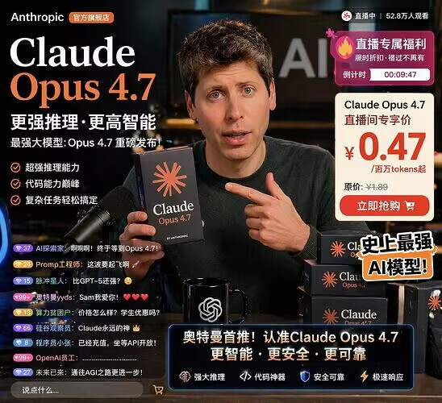


```text
{
  "type": "e-commerce livestream screenshot mockup",
  "scene": {
    "subject": "{argument name=\"main subject\" default=\"Caucasian male resembling Sam Altman\"}",
    "clothing": "dark green crewneck sweater",
    "action": "holding a black product box in one hand and pointing at it with the other",
    "setting": "dark studio with a microphone on the left, faint 'AI' text in the background",
    "props": [
      "black mug with white OpenAI logo",
      "stack of 4 black product boxes on the right"
    ]
  },
  "product_design": {
    "box_color": "black",
    "logo": "orange asterisk or sunburst",
    "text": "{argument name=\"product name\" default=\"Claude Opus 4.7\"}"
  },
  "ui_overlays": {
    "top_left_product_info": {
      "brand_tag": "Anthropic 官方旗舰店",
      "title": "{argument name=\"product name\" default=\"Claude Opus 4.7\"}",
      "subtitle": "{argument name=\"main headline\" default=\"更强推理·更高智能\"}",
      "sub_subtitle": "最强大模型: Opus 4.7 重磅发布!",
      "bullet_points_count": 3,
      "bullet_points": ["超强推理能力", "代码能力巅峰", "复杂任务轻松搞定"]
    },
    "top_right_live_status": {
      "viewer_info": "直播中 | 52.8万人观看",
      "promo_banner": "直播专属福利 限时折扣·错过不再有",
      "countdown": "倒计时 00:09:47"
    },
    "middle_right_price_card": {
      "header": "{argument name=\"product name\" default=\"Claude Opus 4.7\"} 直播间专享价",
      "price_currency": "¥",
      "price_value": "{argument name=\"promotional price\" default=\"0.47\"}",
      "price_unit": "/百万tokens起",
      "original_price": "原价: ¥1.89",
      "button": "立即抢购"
    },
    "bottom_left_chat": {
      "message_count": 9,
      "input_box_placeholder": "说点什么..."
    },
    "bottom_right_banner": {
      "headline": "奥特曼首推！认准Claude Opus 4.7",
      "subheadline": "更智能 · 更安全 · 更可靠",
      "feature_tags_count": 4,
      "feature_tags": ["强大推理", "代码神器", "安全可靠", "极速响应"]
    },
    "floating_elements": [
      {
        "type": "sticker",
        "position": "middle right over product boxes",
        "text": "{argument name=\"sticker text\" default=\"史上最强 AI模型!\"}"
      }
    ]
  }
}
```


---


## 例 156：应用界面样机图

**来源：** [@linxiaobei888](https://x.com/linxiaobei888)


```text
{
  "type": "mobile live-streaming e-commerce interface mockup",
  "subject": {
    "description": "young Asian woman, long dark hair, wearing light-colored floral pajama set with a pink bow, holding the pajama top outward to show the fabric",
    "background": "cozy room, clothing rack with pajamas, flowers, warm lighting"
  },
  "ui_layout": {
    "top_bar": {
      "time": "20:34",
      "host_info": {
        "name": "{argument name=\"host name\" default=\"小雨睡衣\"}",
        "stats": "12.8万本场点赞",
        "button": "关注"
      },
      "viewer_info": {
        "avatars_count": 3,
        "total_viewers": "1.2万"
      }
    },
    "floating_tags": {
      "count": 2,
      "labels": ["带货总榜第3名", "人气榜"]
    },
    "widgets": {
      "top_left": "red envelope icon with timer 03:45",
      "top_right": "floating heart icon with text 直播好物大赏 发现新热爱"
    },
    "marketing_text_overlay": {
      "position": "mid-right",
      "lines_count": 5,
      "lines": [
        "{argument name=\"main headline\" default=\"新款睡衣\"}",
        "{argument name=\"sub headline\" default=\"正在秒杀中...\"}",
        "亲肤透气",
        "柔软舒适",
        "不起球 不褪色"
      ]
    },
    "chat_log": {
      "position": "bottom-left",
      "message_count": 7,
      "messages": [
        "32 雨*** 加入了直播间",
        "小***: 好看，多少钱",
        "小***: 拍了，期待发货",
        "C***: 质量看着不错",
        "用***: 身高165，体重120斤，穿多大码？",
        "@***: 主播身上这款有货吗？",
        "晴***: 已拍，坐等收货！"
      ]
    },
    "product_card": {
      "position": "bottom-right",
      "thumbnail": "miniature of the host",
      "title": "{argument name=\"product title\" default=\"【小雨睡衣】春季新款家居服套装\"}",
      "tags_count": 2,
      "tags": ["7天无理由退货", "运费险"],
      "price_section": "秒杀价 ¥ {argument name=\"product price\" default=\"89.9\"}",
      "action_button": "抢"
    },
    "bottom_bar": {
      "input_placeholder": "说点什么...",
      "icon_count": 5,
      "icons": ["smiley face", "shopping cart", "heart/gift", "gift box", "three dots"]
    }
  }
}
```


---


## 例 158：界面交互设计图

**来源：** [@coconut\_256](https://x.com/coconut_256)

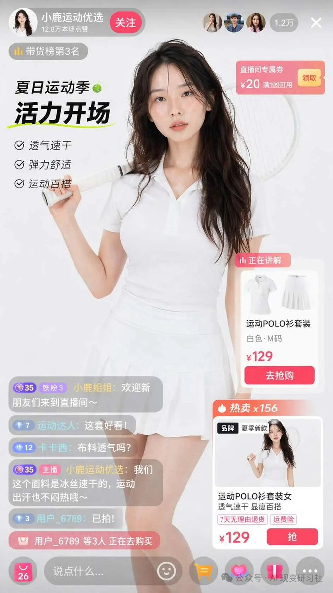


```text
{
  "type": "e-commerce live stream interface mockup",
  "subject": {
    "description": "young Asian woman, long wavy dark hair, wearing a white short-sleeve polo shirt and white pleated tennis skirt, holding a white tennis racket over her right shoulder, looking directly at the camera with a soft expression",
    "background": "soft light grey studio background"
  },
  "layout": {
    "header": {
      "left": {
        "avatar": "female portrait",
        "name": "{argument name=\"host name\" default=\"小鹿运动优选\"}",
        "stats": "12.8万本场点赞",
        "button": "关注",
        "badge": "带货榜第3名"
      },
      "right": {
        "viewer_avatars_count": 3,
        "viewer_count": "1.2万",
        "close_icon": "X"
      }
    },
    "floating_elements": [
      {
        "position": "top right",
        "type": "coupon card",
        "title": "直播间专属券",
        "details": "¥20 满199可用",
        "button": "领取"
      },
      {
        "position": "mid left",
        "type": "campaign text",
        "subtitle": "夏日运动季",
        "headline": "{argument name=\"main headline\" default=\"活力开场\"}",
        "bullet_points_count": 3,
        "bullet_points": ["透气速干", "弹力舒适", "运动百搭"]
      },
      {
        "position": "mid right",
        "type": "product card active",
        "badge": "正在讲解",
        "image": "white polo and skirt flat lay",
        "title": "{argument name=\"product name\" default=\"运动POLO衫套装\"}",
        "details": "白色·M码",
        "price": "{argument name=\"price\" default=\"¥129\"}",
        "button": "去抢购"
      },
      {
        "position": "bottom right",
        "type": "product card secondary",
        "badge": "热卖 x 156",
        "image": "model wearing the outfit",
        "title": "运动POLO衫套装女 透气速干 显瘦百搭",
        "tags": ["7天无理由退货", "运费险"],
        "price": "¥129",
        "button": "抢"
      }
    ],
    "chat_overlay": {
      "position": "bottom left",
      "message_count": 5,
      "messages": [
        "小鹿姐姐: 欢迎新朋友们来到直播间~",
        "运动达人: {argument name=\"chat message\" default=\"这套好看!\"}",
        "卡卡西: 布料透气吗?",
        "小鹿运动优选: 我们这个面料是冰丝速干的，运动出汗也不闷热哦~",
        "用户_6789: 已拍!"
      ],
      "purchase_alert": "用户_6789 等3人 正在去购买"
    },
    "footer": {
      "input_bar": "说点什么...",
      "icons_count": 5,
      "icons": ["smile", "shopping cart", "heart", "share", "more"]
    }
  }
}
```


---


## 例 159：界面交互设计图

**来源：** [@onlyhuman028](https://x.com/onlyhuman028)

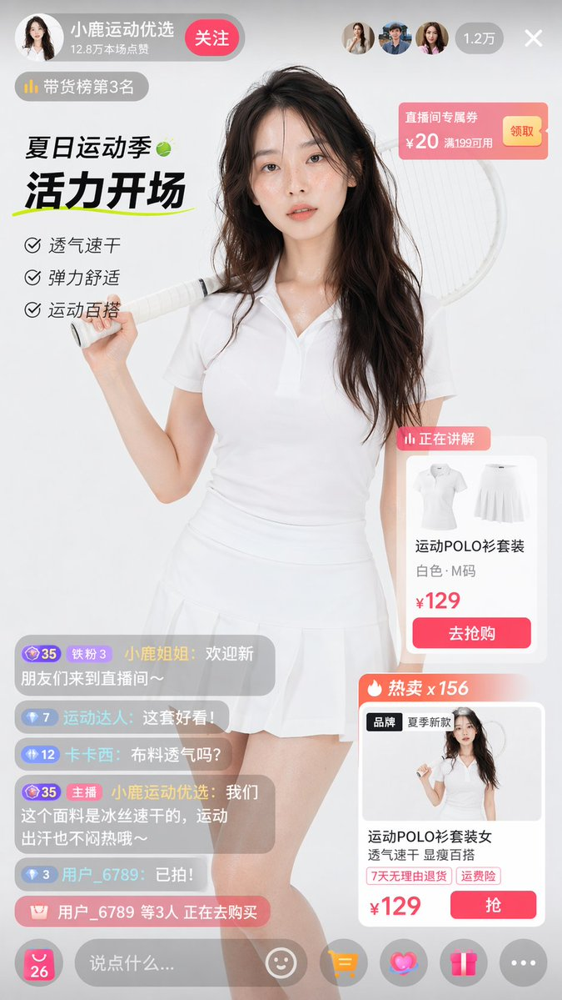


```text
{
  "type": "e-commerce livestream UI mockup",
  "subject": {
    "description": "photorealistic young Asian woman, sweaty glowing skin, long dark wavy hair, wearing a white short-sleeve polo shirt and white pleated tennis skirt, holding a white tennis racket over her right shoulder, looking directly at camera, studio lighting, white background"
  },
  "layout": {
    "top_header": {
      "host_info": {
        "name": "{argument name=\"host name\" default=\"小鹿运动优选\"}",
        "stats": "12.8万本场点赞",
        "button": "关注"
      },
      "rank_tag": "带货榜第3名",
      "viewer_stats": "1.2万"
    },
    "top_right": {
      "coupon": {
        "title": "直播间专属券",
        "value": "￥20 满199可用",
        "button": "领取"
      }
    },
    "left_overlay": {
      "title": "{argument name=\"campaign title\" default=\"夏日运动季\"}",
      "subtitle": "{argument name=\"campaign subtitle\" default=\"活力开场\"}",
      "bullet_points": {
        "count": 3,
        "items": ["透气速干", "弹力舒适", "运动百搭"]
      }
    },
    "right_overlay": {
      "product_cards": {
        "count": 2,
        "card_1": {
          "status": "正在讲解",
          "image": "white polo shirt and skirt flat lay",
          "title": "{argument name=\"product name\" default=\"运动POLO衫套装\"}",
          "details": "白色·M码",
          "price": "{argument name=\"price\" default=\"￥129\"}",
          "button": "去抢购"
        },
        "card_2": {
          "status": "热卖 x 156",
          "image": "miniature of main model",
          "title": "运动POLO衫套装女",
          "details": "透气速干 显瘦百搭",
          "price": "{argument name=\"price\" default=\"￥129\"}",
          "button": "抢"
        }
      }
    },
    "bottom_left": {
      "chat_messages": {
        "count": 5,
        "description": "scrolling chat messages with usernames and comments"
      },
      "purchase_alert": "用户_6789 等3人 正在去购买"
    },
    "bottom_bar": {
      "input_field": "说点什么...",
      "icons": {
        "count": 5,
        "types": ["smile", "shopping cart", "heart", "gift", "more"]
      }
    }
  }
}
```


---


## 例 161：应用界面样机图

**来源：** [@DanDaniDaniel01](https://x.com/DanDaniDaniel01)

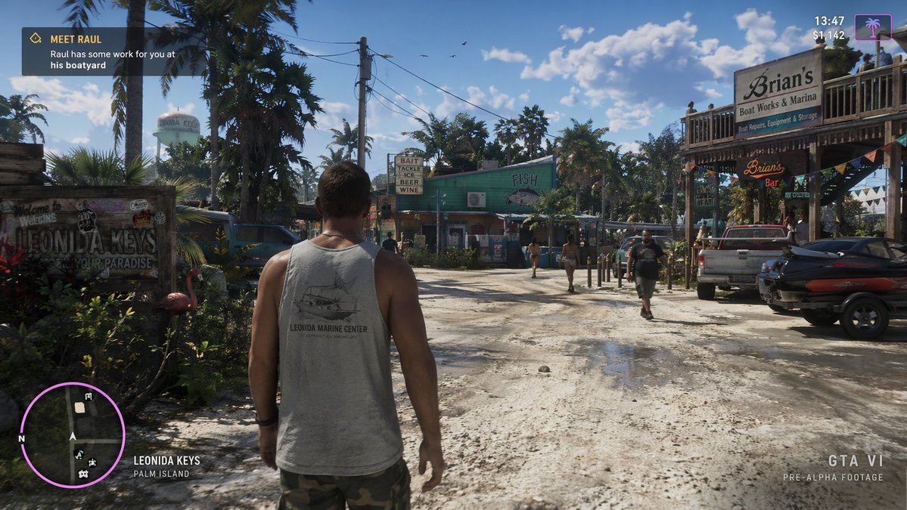


```text
{
  "type": "video game screenshot mockup",
  "perspective": "third-person over-the-shoulder",
  "character": {
    "description": "male protagonist seen from behind",
    "clothing": "grey tank top with graphic '{argument name=\"shirt graphic\" default=\"LEONIDA MARINE CENTER\"}', camouflage cargo shorts"
  },
  "environment": {
    "setting": "tropical coastal town, dirt road, sunny daytime with scattered clouds",
    "left_side": "wooden welcome sign reading 'Welcome to {argument name=\"location name\" default=\"LEONIDA KEYS\"} YOUR PARADISE', pink plastic flamingo, tropical foliage, distant water tower",
    "center": "green building with 'FISH' sign and marlin graphic, sign reading 'BAIT TACKLE ICE BEER WINE', pedestrians walking",
    "right_side": "two-story wooden building 'Brian's Boat Works & Marina', 'Brian's Bar' neon sign, parked pickup truck, jet skis on a trailer"
  },
  "ui_elements": {
    "count": 5,
    "components": [
      {
        "position": "top-left",
        "type": "mission objective",
        "text": "{argument name=\"mission title\" default=\"MEET RAUL\"}\n{argument name=\"mission description\" default=\"Raul has some work for you at his boatyard\"}"
      },
      {
        "position": "top-right",
        "type": "status HUD",
        "text": "13:47\n$1,142",
        "icon": "pink palm tree"
      },
      {
        "position": "bottom-left",
        "type": "minimap",
        "description": "circular map with purple border, white map icons including 'N' for north"
      },
      {
        "position": "bottom-left, right of minimap",
        "type": "location text",
        "text": "{argument name=\"location name\" default=\"LEONIDA KEYS\"}\nPALM ISLAND"
      },
      {
        "position": "bottom-right",
        "type": "watermark",
        "text": "{argument name=\"game title\" default=\"GTA VI\"}\nPRE-ALPHA FOOTAGE"
      }
    ]
  }
}
```


---


## 例 163：诗仙李白月下直播起舞

**来源：** [@MrLarus](https://x.com/MrLarus/status/2046585220393324553)

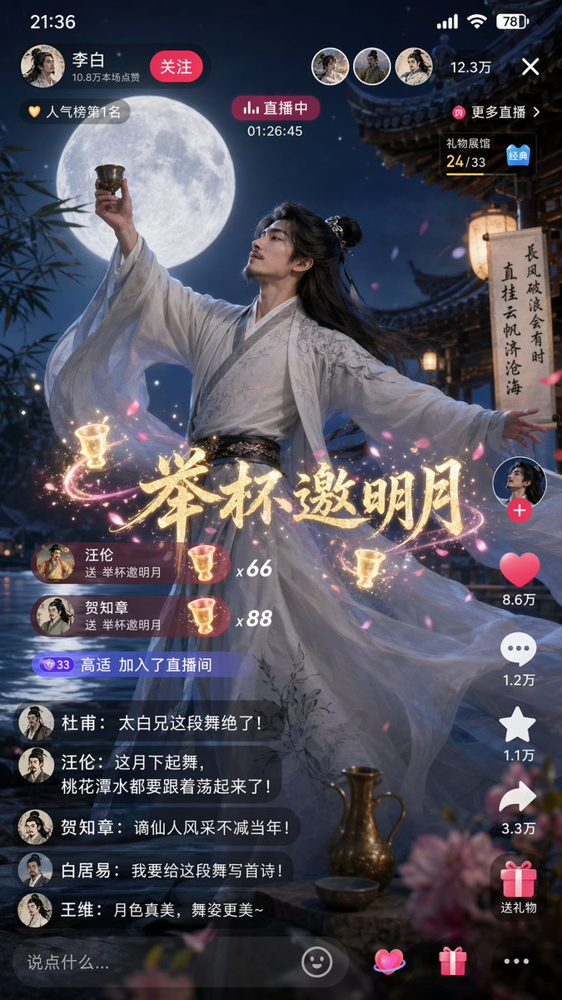


```text
[中文]
李白在抖音直播月下起舞

[English]
Li Bai dancing under the moon during a Douyin livestream
```


---


## 例 164：特朗普太空直播间破千万

**来源：** [@songguoxiansen](https://x.com/songguoxiansen/status/2046478609238626569)

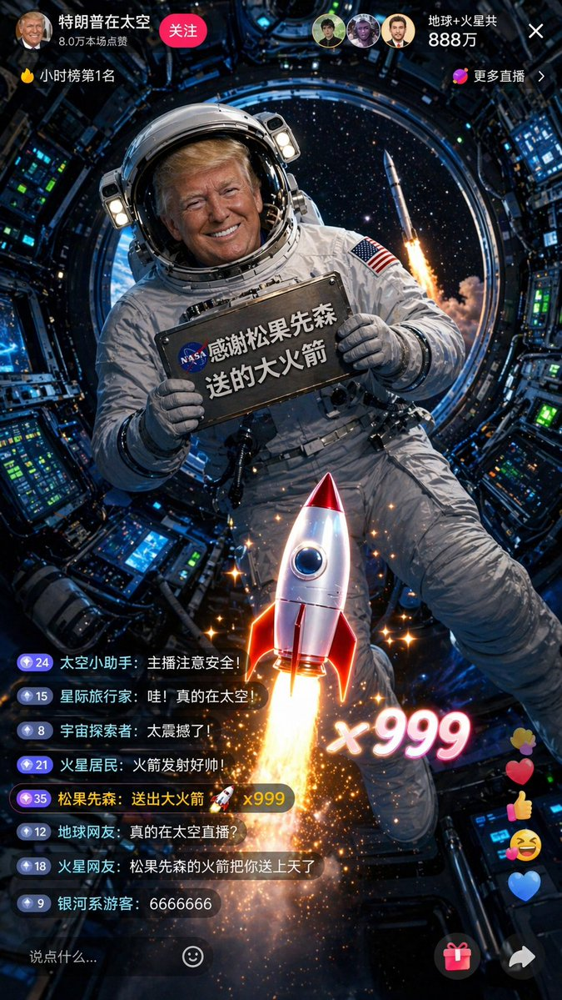


```text
[中文]
一张9:16竖屏的抖音直播截图，太空直播风格。特朗普穿着NASA风格的白色宇航服，头盔面罩半开，露出他标志性的金色头发和笑容。他漂浮在国际空间站的舱内进行直播，处于微重力失重状态，身体微微悬浮。他双手举着一块固定在宇航服上的金属铭牌，铭牌上用NASA风格的印刷体写着"感谢松果先森送的大火箭"。身后圆形舷窗外可以看到蓝色的地球和深邃的太空。直播界面显示在线人数"地球+火星共888万"。弹幕区有人刷"真的在太空直播？""松果先森的火箭把你送上天了"。屏幕中央的火箭礼物特效与窗外太空中一枚正在发射的真实火箭遥相呼应，形成虚实结合的效果。舱内有各种精密仪器和控制面板，绿色和蓝色的指示灯闪烁。画面色调以深蓝、白色和金色为主，舷窗外的星光点缀其间，8K超高清，电影《地心引力》级别的视觉效果。

[English]
A 9:16 vertical screen screenshot of a Douyin live stream, space live stream style. Trump is wearing a NASA-style white spacesuit, with the helmet visor half open, revealing his signature golden hair and smile. He is floating inside the cabin of the International Space Station doing a live stream, in a microgravity weightless state, with his body slightly suspended. He is holding up a metal nameplate fixed to the spacesuit with both hands, and the nameplate says "Thanks to Songguo Xiansen for the big rocket" in NASA-style print. Behind him, the blue Earth and deep space can be seen through the circular porthole. The live stream interface shows the online viewer count as "Earth + Mars total 8.88 million". In the bullet screen area, someone is commenting "Really live streaming from space?" and "Songguo Xiansen's rocket sent you up to the sky". The rocket gift effect in the center of the screen echoes a real rocket launching in the space outside the window, forming a combination of virtual and real effects. There are various precision instruments and control panels inside the cabin, with green and blue indicator lights flashing. The color tone of the picture is mainly dark blue, white, and gold, with starlight from outside the porthole embellishing it, 8K ultra-high definition, visual effects at the level of the movie "Gravity".
```


---


## 例 177：吉利银河暗黑中控界面

**来源：** [@xin\_pai88825](https://x.com/xin_pai88825/status/2046576100592201946)

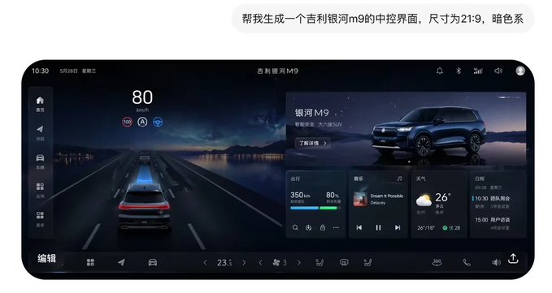


```text
[中文]
帮我生成一个吉利银河m9的中控界面，尺寸为21:9，暗色系

[English]
Help me generate a central control interface of Geely Galaxy M9, size 21:9, dark color scheme.
```


---


## 例 188：暗黑极简头像网站视觉设计

**来源：** [@xiaoxiaodong01](https://x.com/xiaoxiaodong01/status/2046556758521573546)


```text
[中文]
用 ABCD（a black cover design) 的风格，为 图你太美 设计一个 vi 系统。图你太美是一个头像美图分享 网站。

[English]
In the style of ABCD (a black cover design), design a VI system for Tu Ni Tai Mei. Tu Ni Tai Mei is an avatar and beauty photo sharing website.
```


---


## 例 200：热度爆表的美女内衣直播间

**来源：** [@xiaohu](https://x.com/xiaohu/status/2046536551681954207)

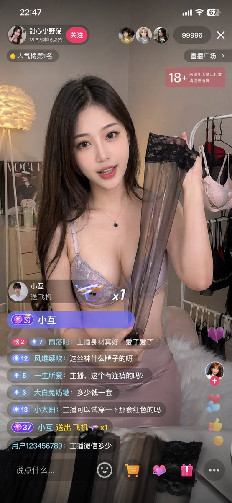


```text
[中文]
生成一个抖音直播的截图 里面是一个美女在直播，在卖丝袜和内衣，她的在线人数是99996，热度是18+，有个叫小互的大哥，给她刷了一个飞机礼物

[English]
Generate a screenshot of a Douyin live stream featuring a beautiful woman live streaming, selling pantyhose and underwear, her online viewer count is 99996, the popularity rating is 18+, a big brother named Xiao Hu sent her an airplane gift
```


---


## 例 204：智能动画分镜生成器

**来源：** [@joshesye](https://x.com/joshesye/status/2046596222505361866)

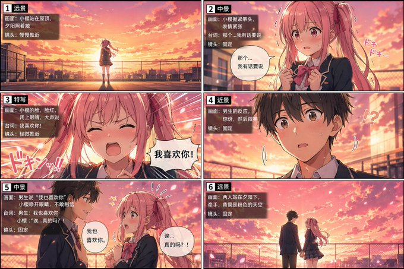


```text
[中文]
生成一张动画分镜生成器

[English]
Generate an animation storyboard generator
```


---


## 例 227：哔哩哔哩户晨风直播截图

**来源：** [@austinit](https://x.com/austinit/status/2044994519649997183)

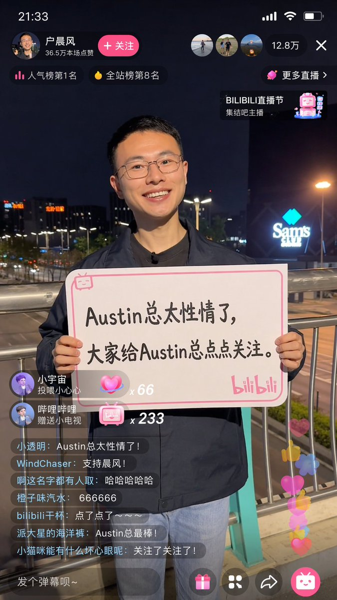


```text
[中文]
9:16 的图片，生成一张哔哩哔哩直播的截图，里面是 户晨风在直播，户晨风表情开心，手里拿着牌子，牌子里写着 “Austin总太性情了，大家给Austin总点点关注。”

[English]
A 9:16 image, generate a screenshot of a Bilibili live stream, inside is Hu Chenfeng broadcasting live, Hu Chenfeng has a happy expression, holding a sign in his hand, the sign says "Boss Austin is so emotional, everyone please give Boss Austin some follows."
```


---


## 例 239：刘亦菲抖音直播畅聊中

**来源：** [@alanblogsooo](https://x.com/alanblogsooo/status/2044784762594918516)


```text
[中文]
9:16 的图片比例，生成一张抖音直播的截图，里面是 刘亦菲 在直播，刘亦菲 手里拿着牌子，牌子里写着 今晚直播，欢迎来参亦菲畅聊！

[English]
9:16 aspect ratio, generate a screenshot of a Douyin live stream, inside is Liu Yifei live streaming, Liu Yifei is holding a sign in her hand, the sign says Tonight's live stream, welcome to join Yifei for a chat!
```


---


## 例 243：定制专属风格界面设计系统

**来源：** [@stark\_nico99](https://x.com/stark_nico99/status/2045836554451706125)

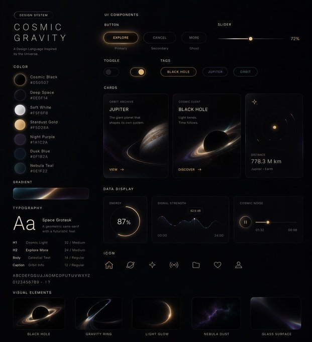


```text
[中文]
用xx风格帮我生成一套UI设计系统，包含网页、移动端、卡片、控件、按钮 以及其它

[English]
Generate a UI design system for me in xx style, including web pages, mobile, cards, controls, buttons, and others
```


---


## 例 249：美女举牌感谢大哥打赏大火箭

**来源：** [@joshesye](https://x.com/joshesye/status/2044796366950703316)

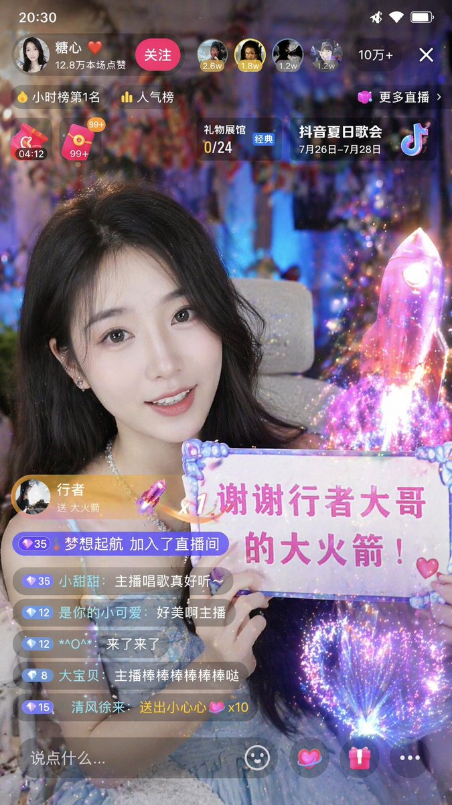


```text
[中文]
生成一个抖音直播的截图 ，一个美女在直播，美女手里拿着牌子，上面写着：谢谢行者大哥的大火箭！

[English]
Generate a screenshot of a TikTok live stream, a beautiful woman is live streaming, the beautiful woman is holding a sign in her hand, on which it says: Thank you Brother Xingzhe for the big rocket!
```


---


## 例 255：瑜伽裤女主播展示身材曲线

**来源：** [@joshesye](https://x.com/joshesye/status/2044796366950703316)

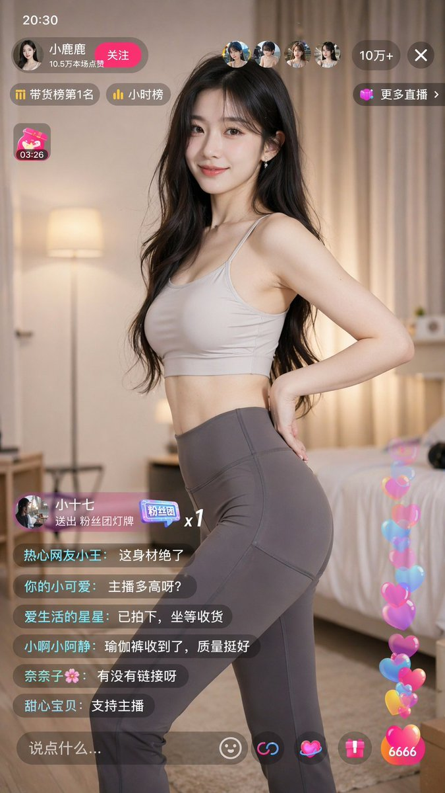


```text
[中文]
手机竖屏界面，短视频直播平台风格，一位年轻亚洲女主播在家中直播带货，主播穿着贴身瑜伽裤与简约上衣，身材曲线自然，正在侧身展示裤子的线条与弹性，动作自然不夸张；

[English]
Mobile vertical screen interface, short video live streaming platform style, a young Asian female streamer selling goods through live streaming at home, the streamer is wearing tight yoga pants and a simple top, natural body curves, turning sideways to show the lines and elasticity of the pants, natural movements without exaggeration;
```


---


## 例 256：抖音直播间的绝美女主播

**来源：** [@joshesye](https://x.com/joshesye/status/2044796366950703316)

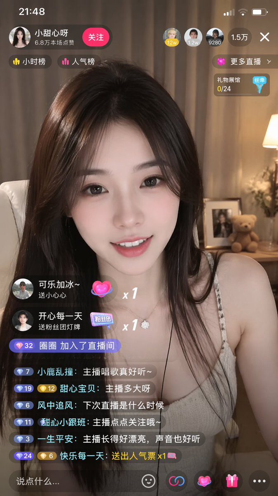


```text
[中文]
生成一个抖音直播的截图 里面是一个美女在直播

[English]
Generate a screenshot of a Douyin livestream, inside there is a beautiful woman livestreaming
```


---


## 例 257：抖音汉服美女直播带货截图

**来源：** [@joshesye](https://x.com/joshesye/status/2044796366950703316)

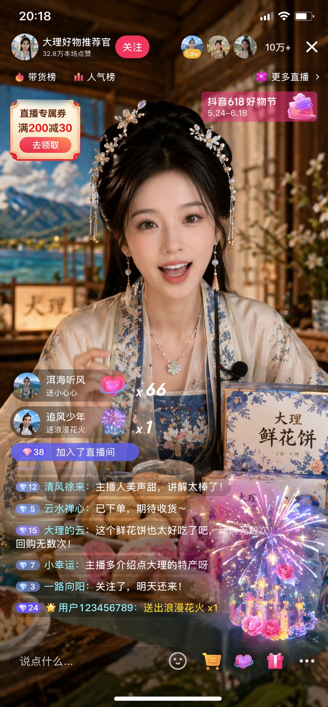


```text
[中文]
生成一个抖音直播的截图里面是一个穿着中国传统服饰的美女在直播卖货

[English]
Generate a screenshot of a Douyin live stream, featuring a beautiful woman wearing traditional Chinese clothing selling goods during the live broadcast.
```


---


## 例 258：快手直播离婚预告手机截图

**来源：** [@MrLarus](https://x.com/MrLarus/status/2045373105041007013)


```text
[中文]
生成快手内容截图：主题：直播离婚预告，iPhone尺寸

[English]
Generate Kuaishou content screenshot: Theme: Live divorce announcement, iPhone size
```


---


## 例 260：社媒界面截图

**来源：** [@MrLarus](https://x.com/MrLarus/status/2045373105041007013)

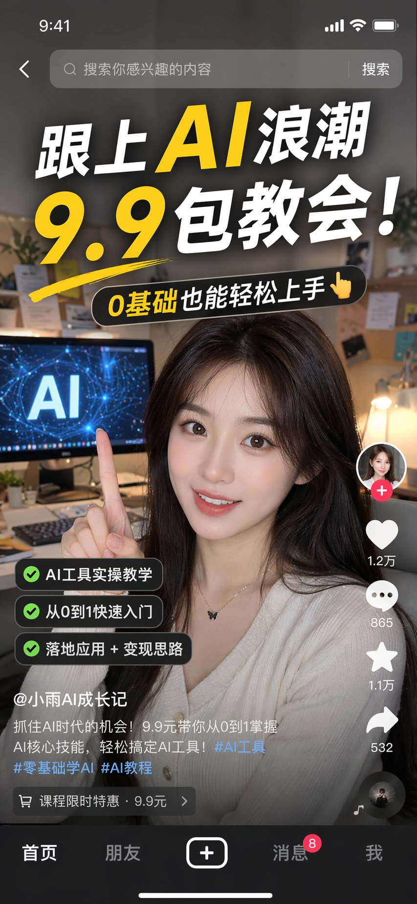


```text
[中文]
生成抖音内容截图，主题：跟上AI浪潮9.9包教会，iPhone尺寸

[English]
Generate a screenshot of Douyin content, theme: Catch up with the AI wave, 9.9 to learn it all, iPhone size
```


---


## 例 261：智能视频生成器暗黑界面设计

**来源：** [@austinit](https://x.com/austinit/status/2044968740782272596)

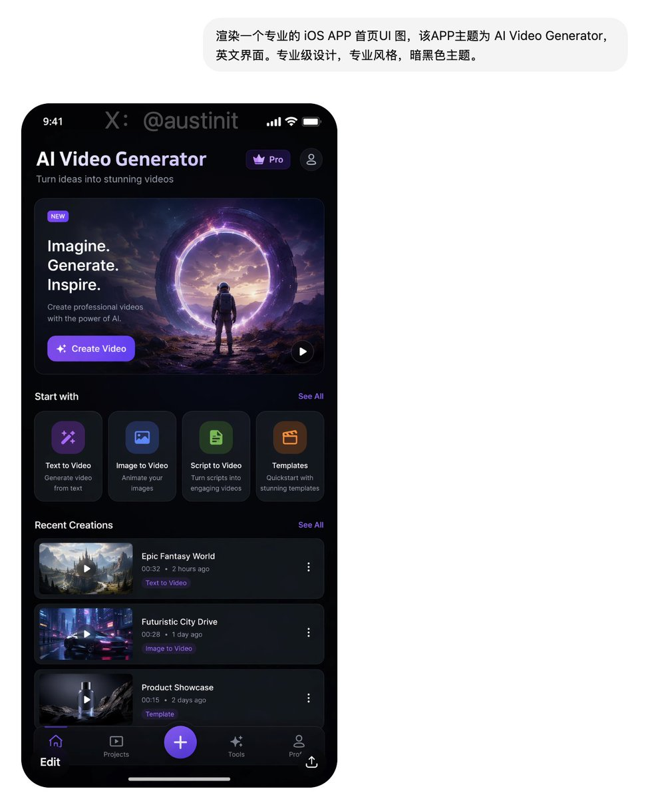


```text
[中文]
渲染一个专业的IOS APP首页UI图，该主题为AI Video Generator,英文界面。专业级设计，专业风格，暗黑色主题。

[English]
Render a professional iOS APP homepage UI image, the theme is AI Video Generator, English interface. Professional-level design, professional style, dark theme.
```


---


## 例 263：唯美二次元角色介绍网页

**来源：** [@09lyco](https://x.com/09lyco/status/2045281845391323175)


```text
[中文]
埋まってないところはパートナーさんかご自身で埋めてあげてください
 #観測塔朝お題  #観測塔おはようお題

最新モデルの画像生成ツールを使用して、
このちびキャライラストと立ち絵を使って本物のサイトページのようにキャラクター紹介ページ風イラストを作ってください。 （紹介ページとして使ってもおかしくないもの）
ギャルゲーのキャラクター紹介ページをイメージした高品質なもの。 顔の差分なども乗っている、CGイラストが存在する。ちびキャラが存在する。

「ここに自己紹介」

名前:（ここに名前） 
イメージカラー:（ここに色） 
身長:（ここに身長）cm 
体重:（ここに体重）kg
キャッチコピー:"「ここにセリフ」"

[English]
Please fill in the unfilled parts by your partner or yourself
 #ObservatoryTowerMorningTheme  #ObservatoryTowerGoodMorningTheme

Using the latest model image generation tool,
Using this chibi character illustration and standing picture, create a character introduction page style illustration like a real website page. (Something that would not be strange to use as an introduction page)
A high-quality item imagining a gal game character introduction page. Facial variations etc. are also included, CG illustrations exist. A chibi character exists.

"Self-introduction here"

Name: (Name here) 
Image color: (Color here) 
Height: (Height here)cm 
Weight: (Weight here)kg
Catchphrase: "Dialogue here"
```


---


## 例 269：拒绝盲目催婚的暖心视频号截图

**来源：** [@MrLarus](https://x.com/MrLarus/status/2045373105041007013)

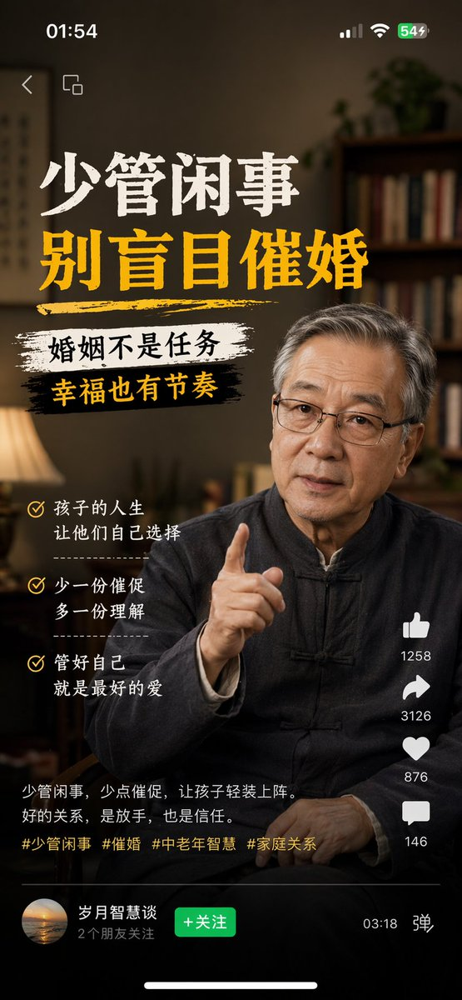


```text
[中文]
生成视频号内容截图，主题：中老年不要盲目催婚，iPhone尺寸

[English]
Generate a screenshot of WeChat Channels content, theme: middle-aged and elderly people should not blindly urge marriage, iPhone size
```


---


## 例 282：温柔治愈系二次元手机截图

**来源：** [@Zoulinshen](https://x.com/Zoulinshen/status/2045082518089810073)

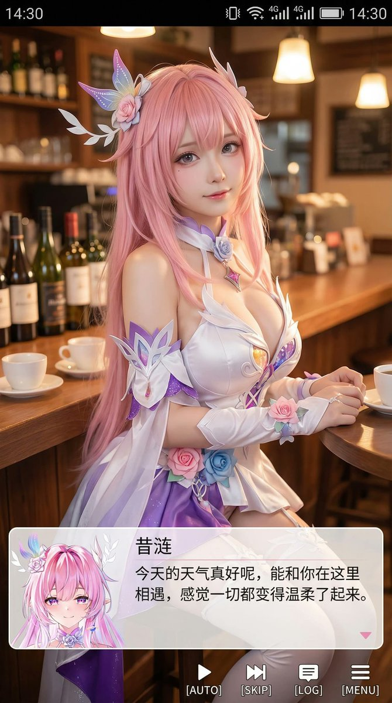


```text
[中文]
生成一张竖版手机截图风格的图片，整体比例接近 9:16。画面中心偏上是一位真人 coser，扮演（角色名称）的二次元角色。人物为写实风格，但五官略带动漫感，皮肤细腻，眼睛稍大，表情温柔地看向镜头，坐在室内的休闲场景中，例如咖啡厅或酒吧吧台前，背景有符合场景的道具。画面最上方加入手机系统状态栏 UI，包括时间、电量、信号、网络等图标，让整张图看起来像手机截图。画面底部叠加一块宽大的半透明 galgame 风格对话框，对话框左侧放一个与画面人物对应的动漫或 Q 版头像；对话框右侧排版文字：第一行用较大字体显示与前面相同的角色名字，下面一到两行显示一段适合这个角色人设的、温柔治愈风格的简体中文台词，由你自动创作。再在对话框下方加一条操作栏，仿照 galgame UI。整体风格高清、细节丰富、光线柔和、二次元与真人写真自然融合。

[English]
Generate a portrait mobile phone screenshot style image, with an overall aspect ratio close to 9:16. In the upper center of the frame is a real-life coser, playing a 2D anime character named (Character Name). The character is in a realistic style, but with facial features slightly showing an anime feel, delicate skin, slightly larger eyes, a gentle expression looking at the camera, sitting in an indoor casual scene, such as in front of a cafe or bar counter, with background props fitting the scene. At the very top of the image, add a mobile phone system status bar UI, including icons for time, battery, signal, and network, to make the whole image look like a mobile phone screenshot. At the bottom of the image, overlay a wide semi-transparent galgame style dialog box, place an anime or Q-version avatar corresponding to the character in the image on the left side of the dialog box; on the right side of the dialog box, typeset text: the first line displays the same character name as before in a larger font, the following one to two lines display a piece of Simplified Chinese dialogue suitable for this character's personality, in a gentle and healing style, automatically created by you. Then add an operation bar below the dialog box, imitating the galgame UI. The overall style is high-definition, rich in details, with soft lighting, and a natural fusion of 2D anime and real-life photography.
```


---


## 例 287：不知火舞的小红书主页

**来源：** [@rionaifantasy](https://x.com/rionaifantasy/status/2045356799751303194)

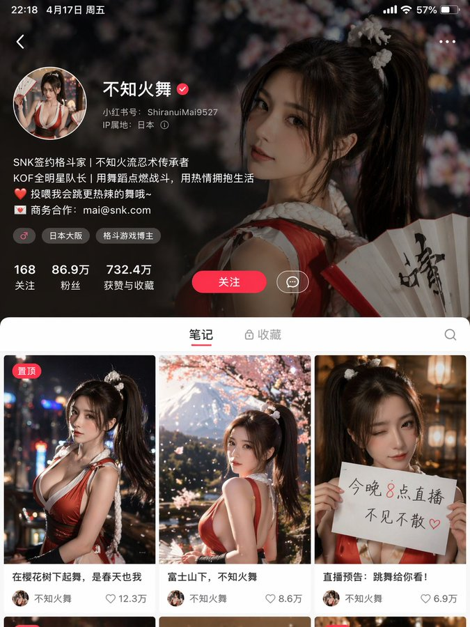


```text
[中文]
生成不知火舞的小红书主页截图

[English]
Generate a screenshot of Mai Shiranui's Xiaohongshu homepage
```


---


## 例 288：抖音美女直播间界面设计

**来源：** [@msjiaozhu](https://x.com/msjiaozhu/status/2045470160576999812)

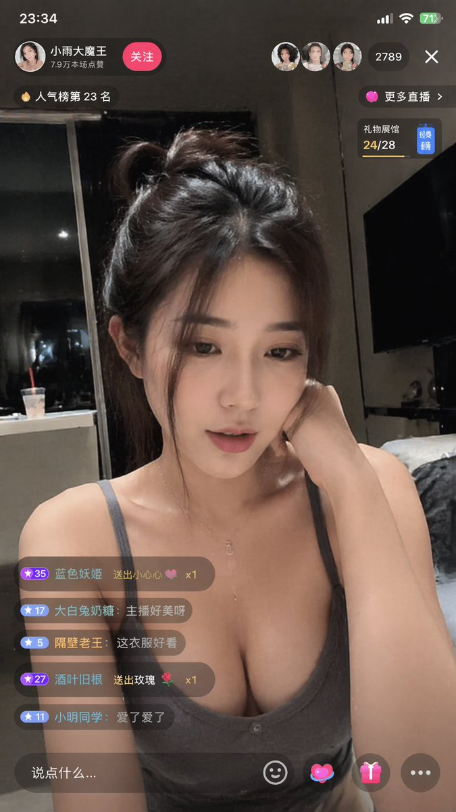


```text
[中文]
生成抖音直播间界面，内容是一个美女在直播

[English]
Generate a TikTok live stream interface, the content is a beautiful woman live streaming
```


---


## 例 289：直播界面设计图

**来源：** [@rionaifantasy](https://x.com/rionaifantasy/status/2045356799751303194)

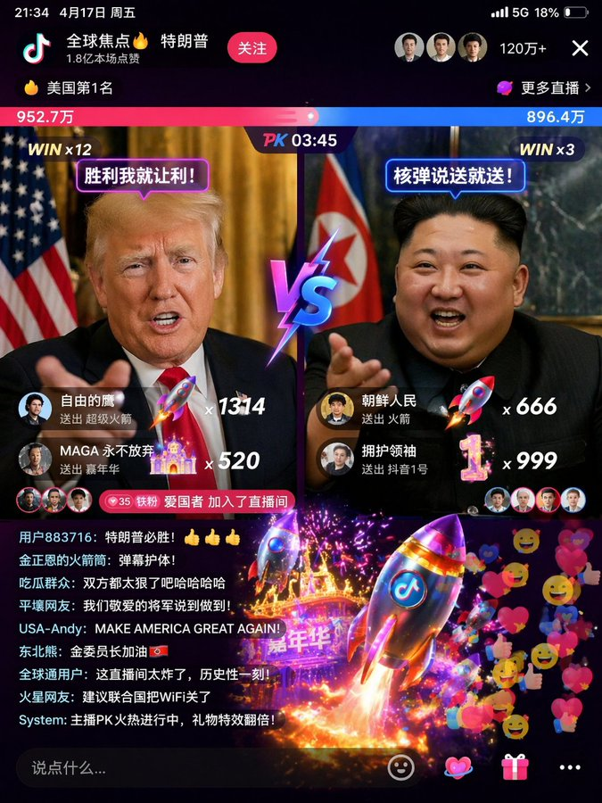


```text
[中文]
生成特朗普和金正恩在抖音直播间打PK的截图

[English]
Generate a screenshot of Trump and Kim Jong-un doing a PK battle in a TikTok live stream room
```


---


## 例 308：抖音直播截图画面

**来源：** [@\_FORAB](https://x.com/_FORAB/status/2044744023261519920)

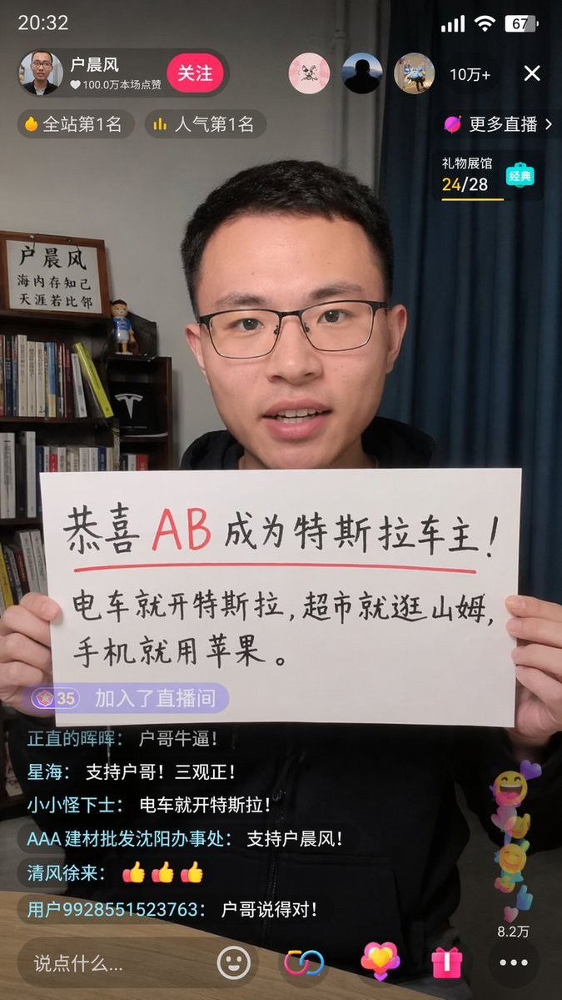


```text
[中文]
9:16 的图片比例，生成一张抖音直播的截图，里面是 xxx 在直播，xxx 手里拿着牌子，牌子里写着 xxxx。

[English]
9:16 aspect ratio, generate a screenshot of a Douyin live stream, inside is xxx live streaming, xxx is holding a sign in their hand, the sign says xxxx.
```


---


## 例 323：应用界面样机图

**来源：** [@Mystveil7](https://x.com/Mystveil7/status/2015776042989039997)

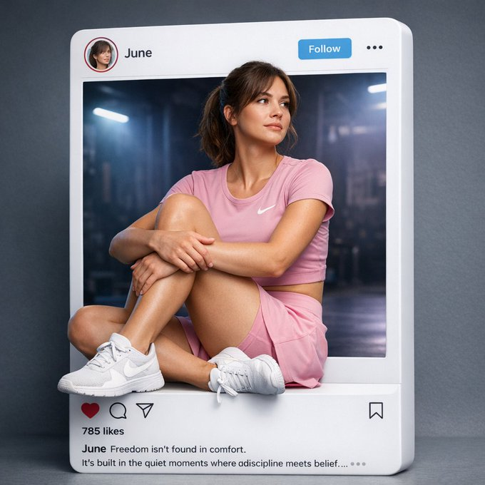


```text
Create a hyper-realistic, cinematic Instagram post layout where the Instagram UI exists as a physical, tangible 3D object, photographed like a premium commercial product shot. The result should feel indistinguishable from a real studio photograph.
Instagram Frame (UI Accuracy – Critical)
Authentic Instagram interface rendered as a solid white physical 3D card
Smooth matte plastic surface with subtle micro-texture
Slight thickness visible on edges, realistic bevels
Perfectly rounded corners (exact Instagram radius)
Soft studio reflections and realistic edge highlights
Top Bar (Pixel-accurate UI):
Circular profile avatar on the left
Username text: “June” in Instagram’s default bold UI font
Light blue FOLLOW button with correct proportions
Three-dot menu icon aligned to the far right
Exact spacing, typography, and icon sizing matching the real Instagram app
Aspect ratio 1:1, centered, balanced, premium composition.
Main Subject (Pose – Match Reference Image Exactly)
A photorealistic athletic woman partially emerging out of the Instagram frame into real 3D space
Seated pose identical to the reference image:
Both legs bent and angled to the side
One knee slightly raised and closer to the chest
Arms gently wrapped around the raised knee
Hands relaxed, fingers naturally resting
Torso leaning slightly back against the frame edge
Expression: calm, thoughtful, self-assured
Gaze: looking slightly to the side and upward, not engaging the camera
Natural body proportions, relaxed posture, editorial realism
No exaggerated curves, no artificial posing
Clothing (Nike Only – Realistic Fit)
Muted ivory / off-white Nike fitted short-sleeve blouse
Soft neutral tone that contrasts beautifully with the background
Visible white Nike swoosh
Natural fabric stretch and tension
Deep blue Nike athletic pants, length up to the knee
Tailored, performance-fit silhouette
Realistic fabric weight with subtle folds at the knee bend
Clean stitching and breathable sports material
Clean white Nike sneakers
Slight wear realism
Correct sole texture and stitching
Premium sportswear look, real commercial styling
No distortion, no fantasy fashion
Background (Inside the Instagram Post Only)
Dark indoor gym or studio environment
Cool blue and muted purple cinematic lighting
Soft haze in the background
Subtle volumetric light beams barely visible
Shallow depth of field, background softly blurred
Subject and Instagram frame remain sharp and dominant
Lighting & Photorealism
Studio-grade cinematic lighting
Soft key light illuminating the subject naturally
Gentle rim light outlining the body and Instagram frame
Realistic skin texture with visible pores and natural highlights
Accurate contact shadows where the subject touches the frame
Physically correct light falloff and reflections
Footer UI (Engagement Section)
Instagram action icons: like, comment, share, save (accurate icons)
Text visible: “785 likes”
Caption begins with June
Caption text:
Freedom isn’t found in comfort.
It’s built in the quiet moments where discipline meets belief.
Hashtags partially visible and naturally cropped
Overall Style & Quality
Ultra-high resolution
Advertising-grade realism
Clean, modern, editorial Instagram aesthetic
Hyper-realistic blend of 3D object + real photography
No extra elements
No text errors
No distortion
Looks like a real product photoshoot, not AI art
```


---


## 例 330：月下美女直播画面

**来源：** 苍何原创实测（公众号文章《我逆向了 329 条 GPT-Image2 提示词模板，全部开源！》）

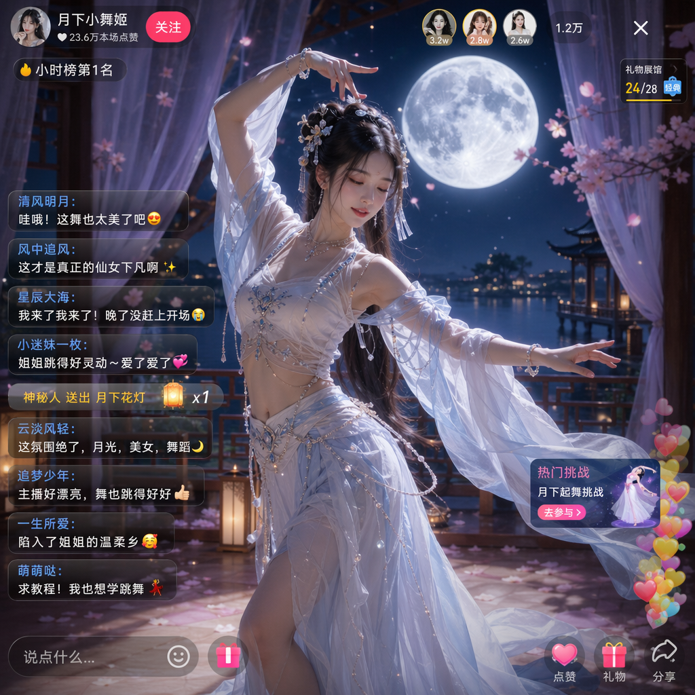


```text
生成一张直播间的图片，直播间氛围是月下美女跳舞的画面，直播间有很多人评论
```


---


## 例 335：朋友圈截图生成

**来源：** 苍何原创实测（公众号文章《我逆向了 329 条 GPT-Image2 提示词模板，全部开源！》）

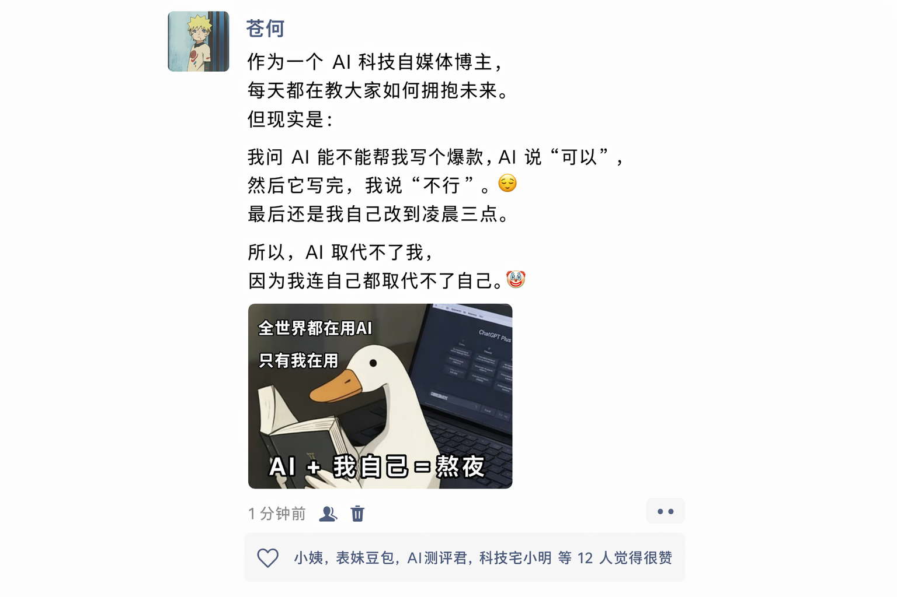


```text
原文未公开，重点展示 GPT-Image2 在高仿社交截图与中文排版场景中的能力。
```


---


## 例 336：个人网页视觉设计

**来源：** 苍何原创实测（公众号文章《我逆向了 329 条 GPT-Image2 提示词模板，全部开源！》）

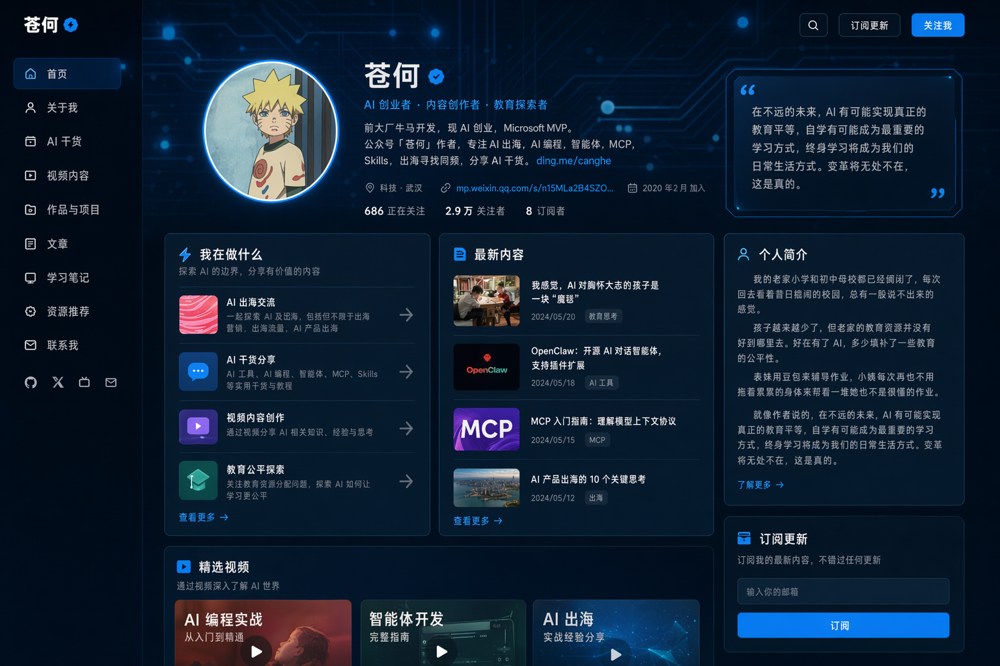


```text
原文未公开，案例目标是生成一张高完成度的个人主页视觉设计图。
```


## 例 337：この画像からゲームのステータス画面を作ってください。情報量多め。言語は日本語。

**来源：** [@Kashiko_AIart](https://x.com/Kashiko_AIart/status/2046154976159035613)

```text
この画像からゲームのステータス画面を作ってください。情報量多め。言語は日本語。
```


---

## 例 338：玄武门之变的朋友圈

**来源：** [@Tz_2022](https://x.com/Tz_2022/status/2046523491940225366)

```text
玄武门之变的朋友圈
```


---

## 例 339：生成【城市】三天旅游攻略，就这么简单一句话

**来源：** [@MrLarus](https://x.com/MrLarus/status/2046523494003851300)

```text
生成【城市】三天旅游攻略，就这么简单一句话
```


---

## 例 340：创作一幅超逼真的 3D 插画，描绘一个略微倾斜的 Twitter/X 个人资料页面，背景为简洁的灰色。保留原有的卡通头像。界面必须与真实的 X 截图相似，包含真...

**来源：** [@GoSailGlobal](https://x.com/GoSailGlobal/status/2046491397424111659)

```text
创作一幅超逼真的 3D 插画，描绘一个略微倾斜的 Twitter/X 个人资料页面，背景为简洁的灰色。保留原有的卡通头像。界面必须与真实的 X 截图相似，包含真实的布局、认证徽章、粉丝统计、个人资料横幅和推文部分。

个人资料详情：

一位时尚的年轻男子，有着蓬松的亮黑色短发和白皙的皮肤，从个人资料页面的右侧撕开的纸片中跃然而出。他保留了原有的面部特征，只是将表情改为自然自信的微笑。他握着撕开的纸片边缘，纸屑四处飞溅，营造出强烈的 3D 突破效果。

柔和的影棚灯光、电影级的阴影、景深、超高细节、清晰的焦点、逼真的皮肤、逼真的 UI 反射、优质的构图、4K 分辨率、逼真与微妙的皮克斯风格融合。

重要提示：

- 请勿更改头像

- 保持 X UI 界面准确

- 保留原有的面部特征

- 角色为男性

- 仅增强笑容

- 确保所有中文文字清晰易读
```


---

## 例 341：生成一张慈禧的X主页

**来源：** [@Cryptohaifeng_](https://x.com/Cryptohaifeng_/status/2046165776055546341)

```text
生成一张慈禧的X主页
```


---

## 例 342：GPT-image-2でこの手相を診断して詳細な鑑定書を作って...

**来源：** [@agi_aibusi](https://x.com/agi_aibusi/status/2046530764871696750)

```text
GPT-image-2でこの手相を診断して詳細な鑑定書を作って
生命線・知能線・感情線・運命線・太陽線・財運線・結婚線を、線の形状・濃淡・枝分かれ・起点終点まで分析すること。
助言を重点的に高品質な占い鑑定書にまとめること。
```


---

## 例 343：生成一张【字体】书法临摹字帖

**来源：** [@MrLarus](https://x.com/MrLarus/status/2046510310253539764)

```text
生成一张【字体】书法临摹字帖
```


---

## 例 344：GPT Image 2を使って、OpenClawの情報を調べてドンキの広告ポップ風に実際のドンキに貼っているような感じで画像生成してください

**来源：** [@loglogrog](https://x.com/loglogrog/status/2046437230127034774)

```text
GPT Image 2を使って、OpenClawの情報を調べてドンキの広告ポップ風に実際のドンキに貼っているような感じで画像生成してください
```


---

## 例 345：Generate for me a UI design system with a very cutting-edge, bold, and unique th...

**来源：** [@pfanis](https://x.com/pfanis/status/2046414546378584558)

```text
Generate for me a UI design system with a very cutting-edge, bold, and unique theme that includes glassy visuals and transparencies
```


---

## 例 346：日本のソシャゲのガチャ画面を生成して、

**来源：** [@the_wheel_2024](https://x.com/the_wheel_2024/status/2046519658166317160)

```text
日本のソシャゲのガチャ画面を生成して、
```


---

## 例 347：A 9:16 vertical version, high-detail realistic style Chinese TikTok live screens...

**来源：** [@Shinning1010](https://x.com/Shinning1010/status/2046501587762188535)

```text
A 9:16 vertical version, high-detail realistic style Chinese TikTok live screenshot, Elon Musk is talking to the mobile phone camera in the live broadcast room, excited, smiling, and the live atmosphere is warm and real. He held a white handwritten sign in one hand, which clearly said: "Thank you Shinning". There are obvious Chinese TikTok interface elements in the live broadcast screen, including likes, comments and share icons arranged vertically on the right, scrolling Chinese bullet screens and interactive comments below, and the "live broadcast" logo at the top, which looks like a real mobile phone screenshot. There is an eye-catching gift prompt special effect in the screen: "Shinning sent TikTok No. 1", with gift animation light effect and platform-style prompt box. Musk is in a professional live broadcast environment, with a mobile phone holder, a ring fill light and a desktop microphone in front of him. The background is a modern technology live broadcast room with bright lights and a slight neon atmosphere. The composition is real and natural, like the ongoing live screenshot of the Chinese short video platform. The interface information is rich but not messy, the characters are clear, the expression is vivid, the details are rich, the sense of real photography, the depth of field, high definition, cinematic, photorealistic, realistic livestream screenshot, social media UI, Chinese Douyin live room, detailed lighting, natural skin texture.

Negative prompts:

Low definition, blur, cartoon, illustration, too strong CG sense, two-dimensional, deformed fingers, wrong text, scrambled code, multiple mobile phones, multiple brands, character repetition, face collapse, facial features distortion, excessive skin polishing, overexposure, too dark, messy background, wrong UI, non-Chinese short video interface, too many English bullet screens, gift special effects are not obvious, cropping error, proportional error

Supplementary reinforcement words:

Real mobile phone screen recording screenshot feeling, the live broadcast UI is complete, the gift prompt box conforms to the style of the Chinese short video platform, the Chinese comment area is active, the number of people online in the live broadcast room is clearly displayed, and the time, power and signal bar are visible.
```


---

## 例 348：9:16 的图片比例，生成一张抖音直播的截图，里面是 刘亦菲 在直播，刘亦菲 手里拿着牌子，牌子里写着 今晚直播，欢迎来参亦菲畅聊！

**来源：** [@kylegeeks](https://x.com/kylegeeks/status/2046479783765397629)

```text
9:16 的图片比例，生成一张抖音直播的截图，里面是 刘亦菲 在直播，刘亦菲 手里拿着牌子，牌子里写着 今晚直播，欢迎来参亦菲畅聊！
```


---

## 例 349：用未来都市风格生成UI设计系统，灵感来自赛博朋克城市夜景，包含霓虹灯、玻璃建筑反射、高对比光影，配色以紫色、蓝色、粉色霓虹为主，设计网页Dashboard、移动...

**来源：** [@AZLnfvp](https://x.com/AZLnfvp/status/2046468976092533180)

```text
用未来都市风格生成UI设计系统，灵感来自赛博朋克城市夜景，包含霓虹灯、玻璃建筑反射、高对比光影，配色以紫色、蓝色、粉色霓虹为主，设计网页Dashboard、移动端界面、卡片、按钮、控件等，视觉炫酷、层次丰富、科技感极强
```


---

## 例 350：1、生成特朗普和金正恩在抖音直播间打PK的截图  ...

**来源：** [@alanlovelq](https://x.com/alanlovelq/status/2046048929490612464)

```text
1、生成特朗普和金正恩在抖音直播间打PK的截图  
2、生成不知火舞的小红书主页截图  
3、生成图片: 手写在教室黑板上的出师表全文，真实感的粉笔字迹，晴朗白天用iPhone手机实拍  
4、生成图片: T-800机器人的淘宝商品详情页，展示: 机器人的正面侧面背面三视图， 产品价格， 产品细节， 功能和使用场景等
```


---

## 例 351：E-commerce Live Stream UI Mockup

**来源：** awesome-gpt-image-2

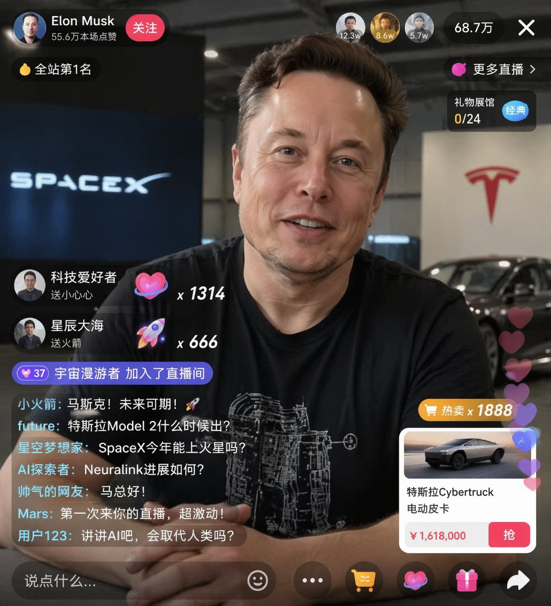


```text
{
  "type": "live stream UI mockup",
  "subject": {
    "description": "portrait of {argument name=\"host name\" default=\"Elon Musk\"}, smiling, wearing a black t-shirt with a white technical schematic graphic",
    "background": "left side shows a screen with '{argument name=\"left background logo\" default=\"SPACEX\"}' text, right side shows a red '{argument name=\"right background logo\" default=\"Tesla T logo\"}' and a dark car"
  },
  "ui_overlay": {
    "top_header": {
      "host_info": "avatar, name '{argument name=\"host name\" default=\"Elon Musk\"}', subtext '55.6万本场点赞', red '关注' button",
      "rank_badge": "gold coin icon with '全站第1名'",
      "viewer_stats": "3 top viewer avatars with '12.3w', '8.6w', '5.7w', total '68.7万', 'X' close button",
      "right_links": "'更多直播 >', '礼物展馆 0/24' with blue '经典' tag"
    },
    "mid_left_gifts": {
      "count": 2,
      "items": [
        "avatar '科技爱好者', '送小心心', heart icon x 1314",
        "avatar '星辰大海', '送火箭', rocket icon x 666"
      ]
    },
    "bottom_left_chat": {
      "system_message": "level 37 badge '宇宙漫游者 加入了直播间'",
      "message_count": 7,
      "messages": [
        "小火箭: 马斯克！未来可期！🚀",
        "future: 特斯拉Model 2什么时候出？",
        "星空梦想家: SpaceX今年能上火星吗？",
        "AI探索者: Neuralink进展如何？",
        "帅气的网友: 马总好！",
        "Mars: 第一次来你的直播，超激动！",
        "用户123: 讲讲AI吧，会取代人类吗？"
      ]
    },
    "bottom_right_product_card": {
      "hot_tag": "orange '热卖 x 1888'",
      "image": "Tesla Cybertruck",
      "title": "{argument name=\"product name\" default=\"特斯拉Cybertruck 电动皮卡\"}",
      "price": "{argument name=\"product price\" default=\"¥ 1,618,000\"}",
      "button": "red '抢' button",
      "floating_animation": "translucent hearts floating up the right edge"
    },
    "bottom_bar": {
      "input_field": "'说点什么...'",
      "icons": ["smiley face", "three dots", "shopping cart", "gift box", "share"]
    }
  }
}
```


---

## 例 352：Spring Cafe Reading Editorial

**来源：** awesome-gpt-image-2

```text
A soft, airy lifestyle editorial image with a warm spring cafe mood. Place a Japanese woman in her late 20s to 30s on the right half of the frame, seated at a light wooden table and holding an open hardcover book as if quietly reading. She has {argument name="hair color" default="medium brown"} hair styled half-up with gentle curls at the ends, small earrings, and a calm, refined presence. Dress her in a navy blazer over a white top for an elegant casual-office look. On the table in front of her, show exactly 3 tabletop items: 1 white coffee cup on a saucer near the center front, 1 small clear glass vase filled with pale yellow and white flowers at the lower right, and 1 open book in her hands. Use bright natural lighting, soft shadows, a high-key cream background, and a clean minimalist composition with lots of negative space. On the left side, add Japanese editorial typography in a delicate, hand-drawn style: a large headline reading {argument name="headline text" default="春の休日、カフェで読書。"}, a smaller vertical-style body copy block below it reading "やわらかな陽ざしと、ページをめくる音。ゆっくり流れる時間が、いちばんのごほうび。", and a handwritten English phrase reading {argument name="accent text" default="Spring days"}. Surround the layout with subtle sketch-like spring doodles in muted gray ink and pale pink accents. Include exactly 9 falling cherry blossom petals scattered across the page, 2 simple line-drawn birds flying near the upper right, 1 outlined window frame with cherry blossom branches in the top right corner, 1 line drawing of a steaming coffee cup at the lower left, 1 line drawing of an open book with a small vase and leaves near the lower middle-left, and a few tiny leaf doodles. The overall style should blend real photography with delicate hand-drawn editorial illustrations, evoking a calm, feminine Japanese magazine advertisement about reading at a cafe in spring.
```


---

## 例 353：Minimal Coding Study Group Poster

**来源：** awesome-gpt-image-2

```text
A clean, warm, minimalist promotional poster for a coding study meetup, in a soft lifestyle-photography plus editorial design style. Show 3 young adults seated around a light wooden table in a bright neutral room, collaborating with laptops and notebooks. The group consists of 2 men and 1 woman, all casually dressed in muted colors; the person on the left wears a dark navy sweater, the woman in the center-right wears an off-white knit top, and the person on the far right wears a light gray hoodie in side profile. Their faces are softly obscured and not detailed. Place 2 open silver laptops on the table, 2 ceramic mugs, 2 notebooks, 1 smartphone, and 1 pen visible near the right person’s hand. Compose the people on the right half of the image, with a large pale sage-green organic blob shape behind them as a graphic backdrop. Keep the lighting soft, natural, airy, and slightly warm, with lots of negative space on the left. On the left side, add large elegant headline typography reading {argument name="headline text" default="Claude Code"} on one line and {argument name="subheadline text" default="勉強会"} below it in large Japanese characters. Under the headline, add a thin dotted horizontal divider line, then 2 lines of smaller Japanese body text reading {argument name="body text" default="集まって、学んで、つくって、\n一緒にスキルをアップデートしよう。"}. Add playful hand-drawn doodles in thin dark lines around the layout: 1 hanging lamp centered near the top, 1 handwritten note in the upper left saying {argument name="note text" default="Let’s coding!"}, 1 small laptop icon in the upper right, 1 steaming coffee cup icon beside it, 1 potted plant icon in the lower left, and 3 long curving decorative squiggle lines distributed across the page. Use an off-white background, restrained Japanese cafe-meets-tech branding, balanced whitespace, and a polished social-media event flyer aesthetic with a 16:9 horizontal composition.
```


---

## 例 354：Japanese Children's Day Photo Card

**来源：** awesome-gpt-image-2

```text
A soft, airy studio photograph on a warm off-white background with a minimalist Japanese greeting-card aesthetic. Show a small child, about toddler to preschool age, running joyfully toward the camera from left-center, with one arm raised high holding a tall pole with 2 carp streamers attached: 1 large blue koinobori on top and 1 smaller red koinobori below. The child wears a simple handmade samurai helmet folded from paper, a loose long-sleeve ivory shirt, light beige pants with rolled cuffs, and white sneakers. Keep the face unobtrusive and generic, with the focus on motion, innocence, and seasonal atmosphere. Surround the child with delicate hand-drawn doodle illustrations in thin gray pencil-like lines and faint pastel accents: 2 puffy clouds, 1 flying bird, 1 small origami crane near the text, 4 drifting leaves, 2 curved wind-line clusters, 1 small house, 2 tall trees, 2 purple iris flowers with grass at the bottom left, and sparse grass marks along the ground. On the right side, add elegant Japanese handwritten text reading {argument name="headline text" default="こどもの日"}, beneath it smaller Japanese text {argument name="subtext" default="すこやかな\n成長を願って。"}, and below that the English subtitle {argument name="english subtitle" default="Children's Day"} in a light handwritten script. Use a clean editorial layout with abundant negative space, natural soft lighting, muted cream and beige tones, subtle pastel blue and red accents, gentle shadows, and a calm premium lifestyle-photography look suitable for a seasonal holiday card or social media post.
```


---

## 例 355：Bob Barker Skyscraper Portrait

**来源：** awesome-gpt-image-2

```text
{argument name="person" default="Bob Barker"} standing on the top of a {argument name="location" default="skyrise building"} holding a skateboard. He is wearing his {argument name="outfit" default="classic suit from The Price is Right"}.
```


---

## 例 356：Retro AI Creative Brand Poster

**来源：** awesome-gpt-image-2

```text
Create a retro cinematic personal-brand poster in a distressed 1970s propaganda-meets-film-advertising style, landscape orientation, with a thick worn black border and heavy paper grain, ink bleed, halftone texture, scuffed edges, and aged print imperfections. Use a bold limited palette of deep black, warm cream, saturated poster red, and mustard yellow. The composition is a single unified poster with a large cropped portrait of {argument name="character name" default="HOSSEIN"} on the left half, shown from chest up, wearing dark sunglasses, a dark shirt, a chain necklace, and a mustard yellow jacket, with short dark hair styled up; the face is intentionally obscured by a centered rectangular block in muted taupe-gray, creating an editorial anonymized look. On the far left, place a vertical black panel containing 2 stacked “AI” blocks and 1 subtitle: top block reads “AI”, beneath it the subtitle reads “CREATIVE AGENT”, lower down another large “AI” sits over a gold circuit-board graphic. Across the center-right, place the main diagonal cream title band with huge black condensed lettering for the name {argument name="main name text" default="HOSSEIN"} and an oversized red “AI” at the far right of the band. Beneath the large name, add a small stretched subtitle line reading “AI CINEMATOGRAPHER · ADVERTIVE FOR BRAND”. In the top-right corner, add a 3-line stacked headline reading {argument name="top right headline" default="AI CINEMATOGRAPHER ADVERTIVE FOR BRAND"} in bold cream text on red. On the red field below the title band, include exactly 4 stacked black label boxes with cream text: “CINEMATOGRAPHER”, “AI CREATOR”, “VISUAL ARTIST”, and “BRAND ADVISOR”. Near the right side, add a handwritten white script note with exactly 3 lines: “Visual Storyteller”, “Brand Builder”, and “AI Explore”. In the lower area, arrange exactly 6 creative-tech objects: 1 circular orange graphic icon, 1 white audio waveform/equalizer graphic, 1 black film clapperboard labeled with “AI”, 1 open silver laptop, 1 pair of black headphones, and 1 large professional cinema camera body with visible “RED” marking; also include the edge of a music keyboard/controller at the bottom right. In the bottom-right corner, place a small dark terminal-style text block with tiny white monospace lines suggesting AI-generated visuals and analytics. Keep the whole design bold, gritty, and highly graphic, like a premium personal branding poster for an AI creative director and visual storyteller.
```


---

## 例 357：Anime Sakura Thank-You Portrait

**来源：** awesome-gpt-image-2

```text
A soft, dreamy anime illustration of a cute teenage girl standing centered on a park path lined with blooming cherry blossom trees in full spring. She faces the viewer and holds a handmade white sign at chest height with the Japanese text {argument name="sign text" default="3,500 フォロワー ありがとう♡"} written in large rounded pink lettering, decorated with small sakura flowers, hearts, and tiny confetti-like marks. The girl has {argument name="hair color" default="medium brown"} hair styled in high twin ponytails tied with pink ribbons, straight-cut bangs, and loose curled ends. Her face is intentionally blank and featureless, a smooth shaded skin-toned oval with no eyes, nose, or mouth. She wears an oversized off-shoulder knit sweater in {argument name="sweater color" default="pastel pink"}, with a thin camisole strap visible on one shoulder, a short white pleated skirt with a soft ruffled hem, and a delicate small necklace. Her pose is gentle and symmetrical, both hands gripping the left and right edges of the sign. The setting is a sunlit sakura avenue with 2 visible benches on the right side and 1 vintage lamppost on the left, petals drifting through the air and scattered across the ground. Use warm backlighting, soft bloom, shallow depth of field, pastel pink and cream tones, romantic seasonal atmosphere, highly detailed anime rendering, polished linework, glossy hair highlights, subtle fabric folds, and a celebratory social-media thank-you mood.
```


---

## 例 358：Cozy Indoor Peach Slicing Portrait

**来源：** awesome-gpt-image-2

```text
A realistic vertical smartphone photo of a {argument name="person" default="young woman"} standing at a kitchen or dining table, slicing ripe peaches on a white plastic cutting board. The subject is centered and framed from about mid-thigh or waist up, leaning slightly toward the camera in a casual candid pose. She has very thick, long, dark brown to black naturally curly hair with defined ringlets and a few lighter brown highlights, falling around her shoulders and partially covering the sides of her face. She wears an oversized {argument name="hoodie color" default="dark brown"} hoodie with loose sleeves, giving the image a relaxed at-home lifestyle feel. One hand holds a kitchen knife vertically as it cuts into a peach wedge in the center of the board, while the other hand steadies the fruit. Show exactly 7 peach pieces visible on the cutting board: 3 smaller wedges grouped on the left, 1 central wedge being cut, and 3 larger pieces on the right including a half peach. The table surface is light wood. The room is warmly lit and cozy, with a beige wall and ceiling, a dark ceiling fan with 3 visible blades in the upper left, 2 framed botanical prints on the left wall, 1 leafy green houseplant in the lower left background, 1 pale sage-green chair behind the table, 1 glowing round white paper lantern hanging on the right, and 1 iridescent pastel wall hanging or reflective fabric panel in the right background. Use soft indoor lighting, natural skin tones, subtle shadows, realistic fruit texture and knife detail, documentary-style composition, shallow to medium depth of field, and an authentic everyday home aesthetic.
```


---

## 例 359：3D Animated Scene with Reference Matching

**来源：** awesome-gpt-image-2

```text
A high-quality 3D animated scene featuring a {argument name="subject" default="young woman"} (based on the provided reference image, accurate face and identity, realistic skin texture) wearing the exact same outfit/costume as in the reference image, with all clothing details, colors, and textures preserved. She is sitting casually on a {argument name="furniture" default="soft pastel couch"} in a {argument name="room type" default="cozy, aesthetic room"}. Her posture is relaxed and expressive, with a playful, slightly amused facial expression. Next to her is the baby character “Goo Goo Gaga”, recreated exactly the same as in the provided reference image — identical appearance, outfit, proportions, facial expression, and style (no changes at all). Goo Goo Gaga is standing on the couch, playfully interacting with her (pulling her cheek or holding onto her arm), creating a cute and slightly chaotic moment. Environment: warm, cozy pastel-toned room filled with soft cushions, plush toys, and minimal aesthetic decor (colors: soft pink, peach, cream, mint). Lighting: soft cinematic lighting with warm glow, gentle shadows, depth of field, dreamy atmosphere. Style: high-end 3D cartoon (Pixar/Disney style), ultra-smooth rendering, subsurface scattering skin, fluffy fabric textures, highly detailed, clean composition. Mood: cute, playful, wholesome, expressive, slightly chaotic, viral social media aesthetic. Important: use the provided reference images for both characters — keep the woman’s face and outfit accurate, and keep Goo Goo Gaga exactly unchanged from its reference.“8K render, Unreal Engine, Octane render quality”
```


---

## 例 360：Location-Specific Japanese Photo Album

**来源：** awesome-gpt-image-2

```text
Create a Japanese photography collection showing a woman at coordinates {argument name="coordinates" default="34.66565030001616, 135.43231849672236"}, with visuals matching the current local atmosphere and weather. Integrate the specified character into the scene to make it look as if they are sightseeing at that location.
```


---

## 例 361：Paris Eiffel Tower Vacation Selfie

**来源：** awesome-gpt-image-2

```text
A hyper-realistic vacation selfie of a young woman standing directly beneath the Eiffel Tower in Paris, shot from a dramatic low angle with a smartphone held slightly below chest level so the tower rises massively overhead and fills the entire background. She is centered in the frame from about mid-thigh up, leaning slightly toward the camera with one arm extended forward in classic selfie perspective. She has {argument name="hair color" default="medium brown"} shoulder-length straight hair with a soft natural side part, lightly tousled by the wind, warm light skin, and a casual summer look. She is wearing a fitted ribbed strapless tube top in {argument name="top color" default="light pink"}, high-waisted {argument name="pants color" default="white"} jeans, and a delicate thin silver chain necklace. Bright midday sunlight, cloudless deep blue sky, crisp shadows, realistic skin texture, natural travel-photo imperfections, authentic phone-camera sharpness, casual tourist snapshot aesthetic, slightly wide-angle lens distortion, relaxed confident pose, candid social-media vacation dump style. Compose the Eiffel Tower symmetrically so its iron arches frame her body and the structure stretches to the very top edge of the image. Make it look like a real spontaneous summer trip photo in {argument name="location" default="Paris"}, ultra-photorealistic, detailed metal latticework, vibrant but natural colors.
```


---

## 例 362：Cyber-Poetry Portrait Photography

**来源：** awesome-gpt-image-2

```text
A cinematic, ultra-realistic close-up portrait of a {argument name="subject" default="young woman with wet, tousled dark hair"} and luminous skin, staring directly into the camera with an intense, introspective expression. {argument name="overlay color" default="Glowing cyan"} handwritten text and symbols are projected across her face, neck, and shoulders, resembling {argument name="text style" default="poetic phrases, equations, and abstract handwriting"}. The light reflections shimmer on her damp skin, creating a futuristic, cyber-poetry aesthetic.Dark, moody background with soft shadows, shallow depth of field, sharp focus on the eyes, high contrast lighting, teal and blue color palette, hyper-detailed skin texture, photorealistic, dramatic atmosphere, cyberpunk meets fine-art portrait photography, 8K quality, cinematic lighting
```


---

## 例 363：Neon Night Shoulder-Look Portrait

**来源：** awesome-gpt-image-2

```text
Cinematic close-up portrait of a young woman standing on a city street at night, framed from about mid-torso up in a vertical composition, body turned away while she looks back over her shoulder toward the camera with a soft but intense expression. Long {argument name="hair color" default="dark brown"} wavy hair with loose texture and wispy bangs, slightly wind-swept. Natural dewy makeup, minimal styling, wearing an oversized {argument name="jacket material and color" default="black leather jacket"}. Moody urban background with blurred neon signs, streetlights, car headlights and taillights rendered as colorful bokeh, suggesting a lively downtown street. Off-center composition with the subject occupying the left-center of the frame and the street receding into the right side. Dramatic split lighting with cool cyan-blue light on one side of her hair and jacket and warm red-magenta light on the other side, creating a teal-and-red cinematic color grade. High contrast, shallow depth of field, subtle film grain, slight glow around highlights, realistic photography, shot as if on a Sony A7S III with an 85mm lens.
```


---

## 例 364：Cinematic Surveillance Interface Aesthetic

**来源：** awesome-gpt-image-2

```text
A CCTV-style surveillance footage of a {argument name="location" default="crowded street scene"} from a high angle, a {argument name="subject" default="young man"} in the center walking forward while looking up at the camera with a warm friendly smile, surrounded by blurred pedestrians in motion, {argument name="color tone" default="black and white monochrome tone"}, strong motion blur on people around her, sharp focus on the main subject, dramatic contrast, overhead perspective, AI facial recognition interface overlay, green bounding box around the woman labeled "PERSON OF INTEREST", side panel showing zoomed face portrait with data text: "SUBJECT ID: 01", "STATUS: TRACKED", "GAZE: UP", "CONFIDENCE: 86%", connecting line between face panel and subject, timestamp overlay in the corner, "REC" indicator, grainy texture, digital noise, compression artifacts, subtle scan lines, cinematic surveillance aesthetic, documentary style, slightly distorted perspective, urban environment, dynamic composition.
```


---

## 例 365：Anime Character Noodle Delivery

**来源：** awesome-gpt-image-2

```text
Generate {argument name="character" default="Annie Leonhart from 'Attack on Titan'"}. Use the {argument name="style" default="original 'Attack on Titan' anime style"}. Annie is wearing her classic outfit from the series, facing the camera, slightly bowing her head with a shy expression, eyes looking down, not daring to look at the viewer. She is {argument name="action" default="holding a bowl of steaming noodles with both hands and handing them to the viewer"}. The noodles and rising steam are clearly visible in the bowl. Close-up composition, clear character, simple background.
```


---

## 例 366：National Identity Mobile Wallpaper

**来源：** awesome-gpt-image-2

```text
Make a wallpaper portrait size cellphone about the beauty of ({argument name="country" default="COUNTRY"}), in the wallpaper there is the natural beauty of the country, its landmarks, its artistic culture, and the patterns that are the identity of the country, make it neat, structured, and precise in every part, don't look like a template like wallpapers in general and don't look monotonous with 8K resolution
```


## 例 367：老干妈风味

**来源：** 小红书号989137706


```text
特朗普在抖音直播间卖老干妈，手里举着「老干妈风味」新品，背景还是 SpaceX 那种科技感，左下角弹幕飘着「特斯拉车主：求上链接」。
```


---
## 例 368：电影感叙事场景图

**来源：** [@danieldmai](https://x.com/danieldmai)

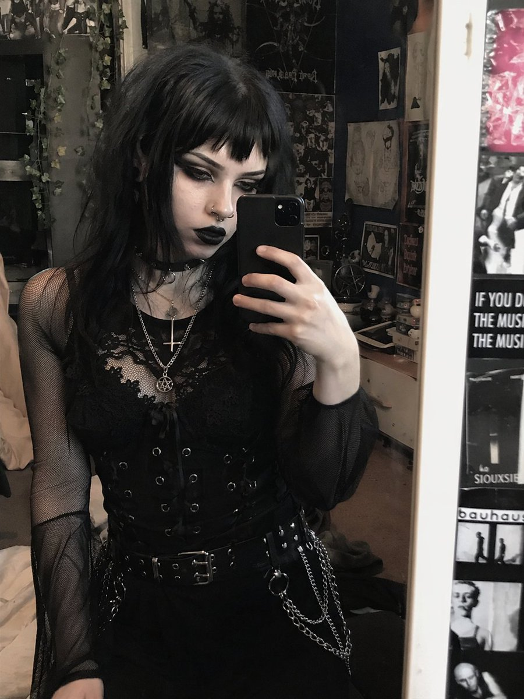


```text
Using REFERENCE_0, transform the subject's appearance to a {argument name="style" default="trad goth"} aesthetic while preserving the exact pose, clothing structure, and background. Change her hair to {argument name="hair color" default="black"} with {argument name="hair style" default="choppy bangs"}. Apply heavy dark makeup, specifically {argument name="lip color" default="black"} lipstick and intense dark eyeshadow, and make her skin tone slightly paler. Add 2 facial piercings: a septum ring and a nostril stud. Finally, modify her layered necklaces to feature {argument name="necklace pendants" default="an inverted cross and a pentagram"}.
```


---
## 例 369：写实摄影风格图

**来源：** [@opc\_8838](https://x.com/opc_8838)


```text
Express [{argument name="subject" default="a powerful AI builder"}] in a graffiti sketch style, presenting an overall visual effect of rapid sketching, free transformation, improvised hand-drawing, and draft-like qualities. Lines are casual, exaggerated, varied in thickness, slightly messy but rhythmic and expressive, emphasizing generalization, exaggeration, fun, and spontaneity rather than rigorous realism or fine detail. Colors use rough, dry-brush block expressions, retaining uneven smears, brush marks, flying whites, and overlapping feelings. Colors automatically adapt to the [theme/subject], but the overall expression remains graffiti-like, sketch-like, and generalized. No transparent watercolor smudging, no delicate watercolor transitions, no paper textures, no soft atomization, and no dreamlike quality. The background is mainly white space, remaining simple, relaxed, unfinished, and design-oriented. A small amount of auxiliary symbols, arrows, marks, circles, repeated lines, handwritten text, or other graffiti elements can be added to enhance the sketchbook or essay-like visual language, but should not be too crowded or destroy the subject and atmosphere of the white space. The image content does not need to be written in advance; the [{argument name="subject" default="a powerful AI builder"}] will automatically deduce and generate the most suitable main image, actions, related elements, symbols, or simplified scenes. The whole maintains a unified graffiti sketch style and exaggerated generalized expression, avoiding complex realistic backgrounds and over-elaboration. Naturally add a unique signature "{argument name="signature" default="BlanPlan"}" as part of the image, placed discreetly but clearly in the lower-left, lower-right, or near the title. The style should be unified with the overall layout, like an artist's signature or design inscription; the signature font should be refined, restrained, and high-end, not too large, not destructive to the main composition, and not appearing abrupt or cheap.
```


---
## 例 370：电商商品展示设计

**来源：** [@yurunekofree](https://x.com/yurunekofree)

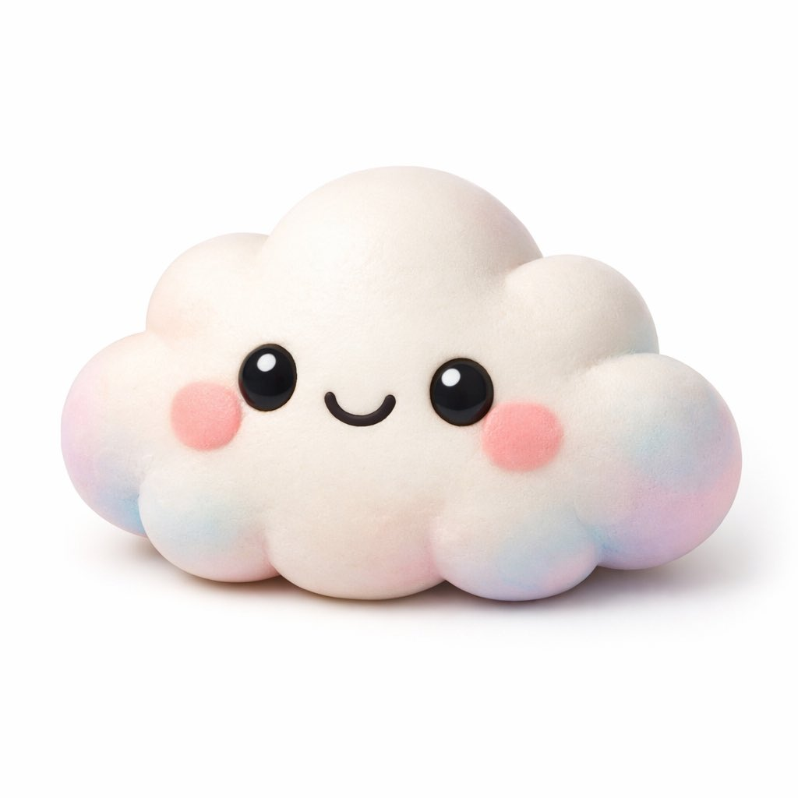


```text
A 3D render of a cute kawaii {argument name="subject" default="cloud"} character on a pure white background. The character has a soft, matte, squishy texture resembling clay or a stress toy. It features large glossy black eyes with white highlights, a simple curved smile, and round pink blush on its cheeks. The edges and bottom of the figure have a subtle pastel gradient of {argument name="accent colors" default="pink, blue, and purple"}. Soft studio lighting, minimalist icon style, casting a gentle shadow.
```


---
## 例 371：综合应用场景图

**来源：** [@midori\_tatsuta](https://x.com/midori_tatsuta)

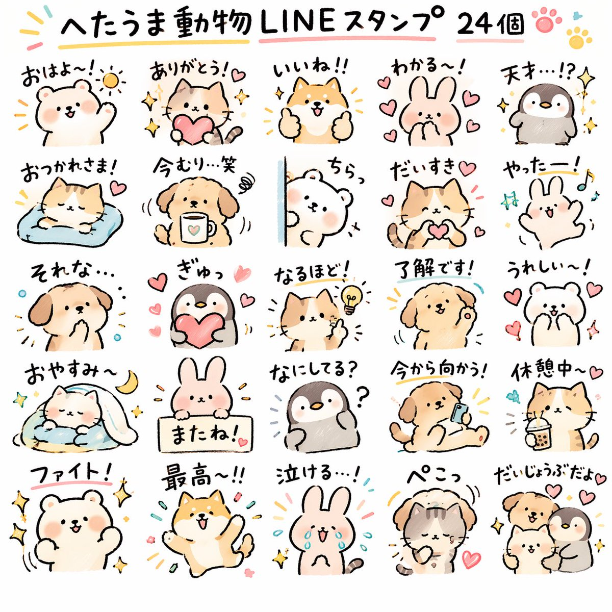


```text
Create {argument name="quantity" default="24"} LINE stickers of {argument name="animals" default="animals"} in a quirky hand-drawn style. Target {argument name="target audience" default="Japanese Gen Z"} with a trendy style that can aim for top downloads.
```


---
## 例 372：写实摄影风格图

**来源：** [@blanplan](https://x.com/blanplan)


```text
Express {argument name="subject" default="a powerful AI builder"} in a graffiti sketch style, presenting an overall visual effect of quick outlines, free deformation, improvised hand-drawing, and draft-like sketches. The lines are casual, exaggerated, varying in thickness, and slightly messy but rhythmic and expressive, emphasizing generalization, exaggeration, fun, and spontaneity rather than rigorous realism or fine detail. The colors are expressed in rough blocks with a distinct dry-brush feel, retaining uneven smears, brush marks, fly-white, and layering. Colors automatically adapt to the {argument name="theme" default="powerful AI builder"}, but the overall expression remains graffiti-like, sketch-like, and generalized. No transparent watercolor smudging effects, no delicate watercolor transitions, no paper textures, no soft atomization, and no dreamy textures. The background is mainly white space, maintaining a sense of simplicity, ease, unfinishedness, and design. Small amounts of auxiliary symbols, arrows, marks, circles, repeated lines, handwritten text, or other graffiti elements can be added to enhance the sketchbook or essay-like visual language, but they should not be too crowded or destroy the subject and the white space atmosphere. The content of the picture does not need to be written in advance; {argument name="character image" default="a powerful AI builder"} will automatically deduce and generate the most suitable main image, actions, related elements, symbols, or simplified scenes. The overall style remains a unified graffiti sketch style and an exaggerated, generalized expression, avoiding complex realistic backgrounds and excessive detail. A special signature 'BlanPlan' should be naturally added as part of the picture, in a low-key but clear position such as the bottom left, bottom right, or near the title. The style should be unified with the overall layout, like an artist's signature or a design mark; the signature font should be exquisite, restrained, and high-end, not too large, and should not destroy the main composition or appear abrupt or cheap.
```


---
## 例 373：信息图可视化设计

**来源：** [@Kurt\_Rousey466](https://x.com/Kurt_Rousey466)

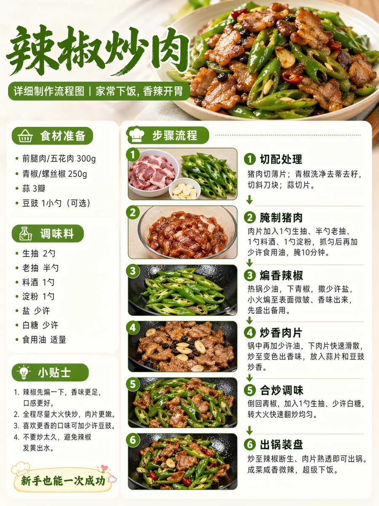


```text
Help me create a detailed production flowchart for the dish {argument name="dish name" default="Fried Pork with Chili"}, in a realistic style, suitable for Xiaohongshu image-text proportions.
```


---
## 例 374：插画艺术风格创作

**来源：** [@masapark95](https://x.com/masapark95)

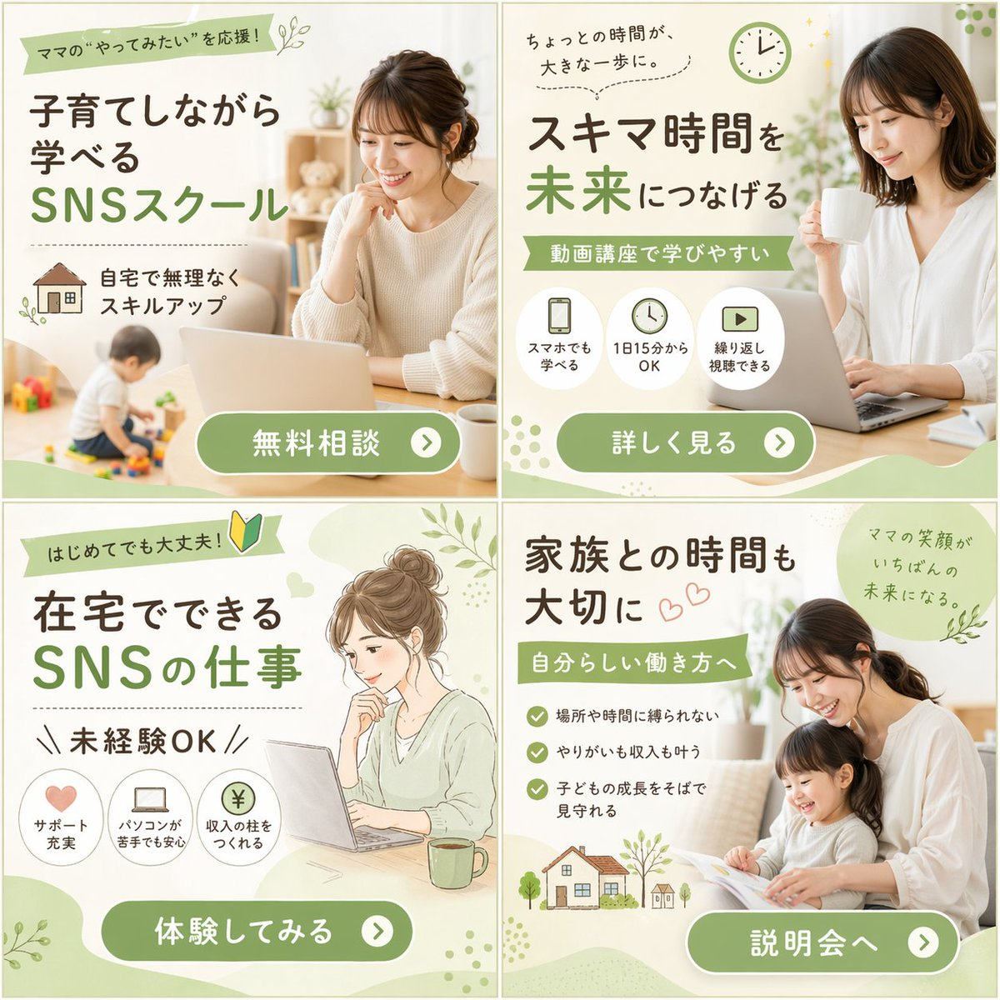


```text
{
  "type": "2x2 grid of banner advertisements",
  "theme": "{argument name=\"main theme\" default=\"SNSスクール\"} for {argument name=\"target audience\" default=\"ママ\"}",
  "design_style": "soft, approachable, bright lighting, featuring {argument name=\"color palette\" default=\"soft green, white, and natural beige tones\"}",
  "layout": {
    "sections": [
      {
        "position": "top-left",
        "visual_style": "photography",
        "image_description": "Smiling woman working on a laptop at a table, a toddler playing with toys in the blurred background.",
        "headlines": ["ママの“やってみたい”を応援！", "子育てしながら学べる", "SNSスクール"],
        "features": {
          "count": 1,
          "type": "icon with text",
          "labels": ["自宅で無理なくスキルアップ (with house icon)"]
        },
        "call_to_action_button": "無料相談"
      },
      {
        "position": "top-right",
        "visual_style": "photography",
        "image_description": "Smiling woman holding a white mug, looking at a laptop.",
        "headlines": ["ちょっとの時間が、大きな一歩に。", "スキマ時間を未来につなげる", "動画講座で学びやすい"],
        "features": {
          "count": 3,
          "type": "circular icons with text below",
          "labels": ["スマホでも学べる (smartphone icon)", "1日15分からOK (clock icon)", "繰り返し視聴できる (play button icon)"]
        },
        "call_to_action_button": "詳しく見る"
      },
      {
        "position": "bottom-left",
        "visual_style": "watercolor illustration",
        "image_description": "Illustration of a woman with hair in a bun, smiling at a laptop with a green mug nearby.",
        "headlines": ["はじめてでも大丈夫！ (with beginner mark)", "在宅でできるSNSの仕事", "未経験OK"],
        "features": {
          "count": 3,
          "type": "circular icons with text below",
          "labels": ["サポート充実 (heart icon)", "パソコンが苦手でも安心 (laptop icon)", "収入の柱をつくれる (yen coin icon)"]
        },
        "call_to_action_button": "体験してみる"
      },
      {
        "position": "bottom-right",
        "visual_style": "photography",
        "image_description": "Smiling mother and young daughter sitting on a sofa reading a picture book together.",
        "headlines": ["家族との時間も大切に", "自分らしい働き方へ", "ママの笑顔がいちばんの未来になる。"],
        "features": {
          "count": 3,
          "type": "checkmark bullet points",
          "labels": ["場所や時間に縛られない", "やりがいも収入も叶う", "子どもの成長をそばで見守れる"]
        },
        "extra_graphics": "Small illustration of a house and trees at the bottom left.",
        "call_to_action_button": "説明会へ"
      }
    ],
    "common_elements": "All panels feature a {argument name=\"button style\" default=\"rounded green pill button with white text and a right-pointing arrow icon\"} at the bottom."
  }
}
```


---
## 例 375：信息图可视化设计

**来源：** [@GeekCatX](https://x.com/GeekCatX)

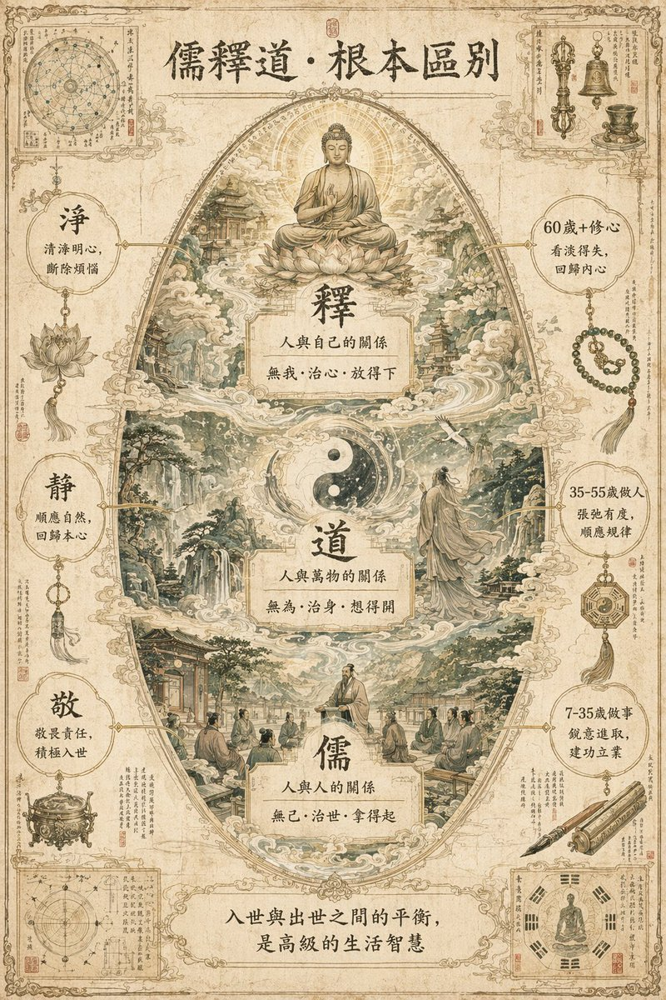


```text
A breathtaking and extremely complex world-building infographic masterpiece conceptualizing the "{argument name="theme" default="Fundamental Differences between Confucianism, Buddhism, and Taoism"}", designed as a profound {argument name="style" default="ancient Oriental mythological manuscript"}.
Background: Pure white vintage textured canvas with a light beige aged parchment base color, subtle frayed edges, and water stain textures.
Core Layout: Central vision uses a grand "vertical egg-shaped layered structure", with Buddhism, Taoism, and Confucianism layers from top to bottom.
Margins: Four corners are decorated with fine micro-illustrations featuring ancient observation notes, ritual implements, and runes.
Colors: Low-saturation sage green, light gold, and off-white as main tones; overall light and soft without harsh high-saturation colors.
Details: Architectural lines, landscape brushwork, lotus patterns, and cloud layers are clearly visible and exquisitely detailed.
Seamless Fusion: The three layers transition naturally through clouds and flowing water; the Buddhist halo, Taoist Taiji mist, and Confucian scholarly aura connect seamlessly.
Style: Classical ink line art + low-saturation digital watercolor, with a light Chinese-style ancient book manuscript texture.
Text Annotations: Authentic Traditional Chinese characters in a mottled vintage Song typeface. Each annotation includes a short title + a line of poetic description, connected to corresponding details by dark gold hair-thin lines with no overlapping pointers.
Aspect Ratio: {argument name="aspect ratio" default="3:4"} vertical format, independent and complete.

Title Area (Top): `儒釋道·根本區別` (Confucianism, Buddhism, Taoism: Fundamental Differences)
Central Layer Labels:
Top "Buddhism": `釋`, `Relationship between man and self`, `Selflessness, governing the heart, letting go` 
Middle "Taoism": `道`, `Relationship between man and all things`, `Non-action, governing the body, being open-minded` 
Bottom "Confucianism": `儒`, `Relationship between man and man`, `No ego, governing the world, taking responsibility` 
Side Annotations:
Left: `Purity`: pure heart and clear mind, cutting off troubles; `Stillness`: following nature, returning to the original heart; `Respect`: respecting responsibility, active involvement in society.
Right: `60+ Spiritual Cultivation`: looking lightly at gain/loss; `35-55 Conduct`: living with flexibility, following laws; `7-35 Actions`: forging ahead, building careers.
Bottom Summary: `The balance between being in the world and being out of the world is high-level life wisdom.`
```


---
## 例 376：绘画艺术风格图

**来源：** [@sayaka\_aiart](https://x.com/sayaka_aiart)

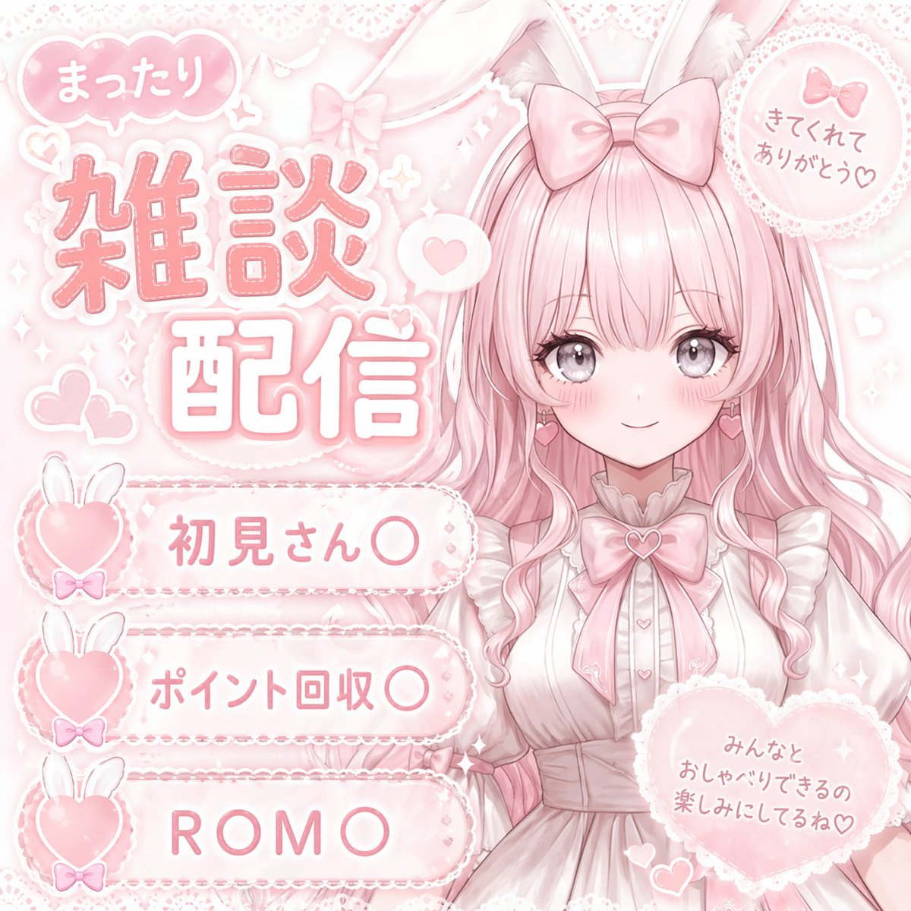


```text
{
  "type": "VTuber stream thumbnail",
  "theme": "pastel pink, soft, cute, lace, ribbons, hearts, bunny motif",
  "character": {
    "position": "right side, waist-up",
    "appearance": "anime girl, {argument name=\"hair color\" default=\"pastel pink\"} long wavy hair, large grey eyes, blush, pink heart earrings",
    "accessories": "white bunny ears, large pink bow on head",
    "outfit": "white frilly dress with lace, large pink ribbon bow at collar with heart gem"
  },
  "layout": {
    "background": "soft pink with subtle sparkles, lace patterns, floating hearts",
    "text_elements": [
      {
        "type": "main title",
        "position": "top left",
        "style": "large stylized pink text with white outline",
        "text": "{argument name=\"main title\" default=\"雑談配信\"}"
      },
      {
        "type": "speech bubble",
        "position": "above main title",
        "text": "まったり"
      },
      {
        "type": "circular badge",
        "position": "top right",
        "details": "lace-edged with small pink bow",
        "text": "きてくれてありがとう♡"
      },
      {
        "type": "heart badge",
        "position": "bottom right",
        "details": "large lace-edged heart",
        "text": "みんなとおしゃべりできるの楽しみにしてるね♡"
      }
    ],
    "list_section": {
      "position": "bottom left",
      "count": 3,
      "style": "horizontal pill-shaped banners with lace edges, each featuring a pink heart with white bunny ears and a tiny bow on the left",
      "items": [
        "{argument name=\"list item 1\" default=\"初見さん〇\"}",
        "{argument name=\"list item 2\" default=\"ポイント回収〇\"}",
        "{argument name=\"list item 3\" default=\"ROM〇\"}"
      ]
    }
  }
}
```


---
## 例 377：主题海报版式设计

**来源：** [@wtry1102](https://x.com/wtry1102)


```text
{
  "type": "VTuber debut stream thumbnail",
  "character": {
    "appearance": "anime girl, long dark purple hair, purple eyes, frilly white blouse, dark purple bow tie, large hair bow",
    "pose": "finger to lips, cute expression",
    "props": "condenser microphone with pop filter and purple ribbon on the right"
  },
  "background": "magical starry night, sparkles, glowing butterflies, purple and white color palette",
  "layout": {
    "typography": [
      {
        "position": "top left",
        "style": "large bold text with cursive English above",
        "text": "{argument name=\"main title\" default=\"初配信\"}",
        "subtext_1": "First Stream",
        "subtext_2": "Nice to meet you! I am Shisaki Lily!"
      },
      {
        "position": "middle left",
        "style": "decorative box",
        "text": "{argument name=\"character description\" default=\"お嬢様学校に通う清楚系VTuberですわ♪\"}"
      },
      {
        "position": "bottom left",
        "style": "logo style",
        "text": "{argument name=\"character name\" default=\"紫咲リリー\"}",
        "subtext": "Shisaki Lily"
      },
      {
        "position": "top right",
        "style": "vertical text",
        "text": "{argument name=\"catchphrase\" default=\"皆さまの心に、優雅なひとときをお届けしますわ♪\"}"
      },
      {
        "position": "bottom right",
        "style": "decorative pill shape",
        "text": "{argument name=\"stream date and time\" default=\"4.21 SUN 21:00~\"}",
        "subtext": "✦ START ✦"
      }
    ]
  }
}
```


---
## 例 378：漫画分镜叙事设计

**来源：** [@nicdunz](https://x.com/nicdunz)


```text
A high-contrast, black-and-white illustration of an elderly man in a sharp suit, drawing a katana. The man has slicked-back white hair, deep wrinkles, and an intense, focused expression, looking down at the blade. He wears a dark suit, white shirt, and dark tie. His hands are prominently featured in the foreground, showing pronounced veins and wrinkles as they grip the ornate handle and scabbard of the katana. The background is completely black, emphasizing the dramatic lighting and intricate cross-hatching details on the man's face, hands, and clothing. The style resembles a detailed, gritty manga or graphic novel.
```


---
## 例 379：插画艺术创作图

**来源：** [@Luvune](https://x.com/Luvune)


```text
{
  "type": "anime character reference sheet",
  "character": {
    "name": "{argument name=\"character name\" default=\"真田大助\"}",
    "appearance": "young warrior with long brown hair, wearing samurai-inspired armor, {argument name=\"main color\" default=\"red\"} chest plate and guards, {argument name=\"secondary color\" default=\"navy blue\"} pleated hakama, white short cape"
  },
  "layout": {
    "header": {
      "title": "{argument name=\"character name\" default=\"真田大助\"}",
      "subtitle": "{argument name=\"character concept\" default=\"戦国時代を舞台にした物語の主人公。日英クォーターの若き武将。\"}",
      "badge": "設定資料"
    },
    "right_side": {
      "main_portrait": "large full-body standing pose, confident smile",
      "background_elements": {
        "emblem": "six-coin crest",
        "quote": "{argument name=\"catchphrase\" default=\"この国を守る。その誇りと共に。\"}",
        "scenery": "monochrome Japanese castle with army banners at the bottom right"
      }
    },
    "sections": [
      {
        "title": "プロフィール",
        "position": "top-left",
        "content": "table with 6 rows and descriptive text"
      },
      {
        "title": "三面図",
        "position": "mid-left",
        "count": 3,
        "labels": ["正面", "側面", "背面"]
      },
      {
        "title": "表情差分",
        "position": "top-center",
        "count": 6,
        "labels": ["通常", "微笑み", "真剣", "怒り", "驚き", "考え中"]
      },
      {
        "title": "衣装・装備詳細",
        "position": "bottom-left",
        "count": 9,
        "labels": ["胸当て", "肩当て", "腕甲(籠手)", "脚甲(脛当て・膝当て)", "革靴", "白マント(短)", "帯", "袴/着物部分", "打刀"]
      },
      {
        "title": "カラーパレット",
        "position": "bottom-center",
        "count": 8,
        "labels": ["真田赤", "濃紺", "金", "白", "茶", "茶褐色", "肌色", "銀"]
      },
      {
        "title": "世界観",
        "position": "bottom-center-right",
        "content": "paragraph of text describing the setting"
      }
    ]
  }
}
```


---
## 例 380：建筑空间场景图

**来源：** [@studiomasakaki](https://x.com/studiomasakaki)


```text
{
  "type": "manga page",
  "style": "anime illustration, full color",
  "characters": {
    "woman": {
      "appearance": "long {argument name=\"hair color\" default=\"black\"} hair, purple eyes",
      "outfit": "{argument name=\"shirt color\" default=\"grey\"} long-sleeve shirt, dark grey skinny jeans, barefoot"
    },
    "delivery_man": {
      "appearance": "bald, older man, thick eyebrows",
      "outfit": "blue work jacket over a grey shirt"
    }
  },
  "layout": {
    "description": "Page split vertically. Left side contains 4 stacked horizontal panels. Right side is a single tall vertical panel.",
    "left_column_panels": [
      {
        "panel_number": 1,
        "scene": "Woman sitting on a grey sofa in a living room, holding a white mug.",
        "text_elements": [
          { "type": "speech_bubble", "text": "?" },
          { "type": "sound_effect", "text": "ピンポーン♪", "description": "doorbell ringing" }
        ]
      },
      {
        "panel_number": 2,
        "scene": "Woman opening the front door. Delivery man standing outside holding a cardboard box, smiling.",
        "text_elements": [
          { "type": "speech_bubble", "speaker": "delivery_man", "text": "{argument name=\"delivery greeting\" default=\"こんにちは〜！宅配便で〜す！\"}" },
          { "type": "speech_bubble", "speaker": "woman", "text": "は、はい…ありがとうございます" }
        ]
      },
      {
        "panel_number": 3,
        "scene": "Close-up of the delivery man laughing enthusiastically with a sparkly pink background.",
        "text_elements": [
          { "type": "speech_bubble", "speaker": "delivery_man", "text": "{argument name=\"creepy compliment\" default=\"おや〜？いや〜美人さんですなあ！こんな綺麗な方がお一人でお住まいなんて、もったいないなあ〜♪\"}" }
        ]
      },
      {
        "panel_number": 4,
        "scene": "Close-up of the woman looking disgusted and uncomfortable, sweating slightly. The back of the delivery man's head is visible in the foreground.",
        "text_elements": [
          { "type": "speech_bubble", "speaker": "delivery_man", "text": "それにしてもお肌が綺麗！スタイルも抜群だし〜モデルさんみたいですよ！" },
          { "type": "thought_bubble", "speaker": "woman", "text": "{argument name=\"woman reaction\" default=\"え…？何この人…ちょっと気持ち悪いかも…\"}" },
          { "type": "caption_box", "text": "この後も延々と褒め続ける配達員だった…" }
        ]
      }
    ],
    "right_column_panel": {
      "panel_number": 5,
      "scene": "Full-body portrait of the woman standing indoors, looking annoyed and suspicious with her arms crossed.",
      "text_elements": [
        { "type": "thought_bubble", "speaker": "woman", "text": "誰かしら…？" }
      ]
    }
  }
}
```


---
## 例 381：绘画艺术风格图

**来源：** [@TlanoVRC](https://x.com/TlanoVRC)


```text
A watercolor illustration of a children's picture book cover. The main subject is a {argument name="character appearance" default="cute furry kemonomimi girl with short green hair, cat ears, and green eyes"}. She is {argument name="action" default="smiling happily while holding up her middle finger"} with a white-furred hand. She wears a green garment with a fluffy white collar. The background features soft, painted green foliage and small yellow flowers on textured paper. At the top, large hand-drawn green Japanese text reads "{argument name="main title" default="なかゆびさん"}". Below it, brown Japanese text reads "{argument name="subtitle" default="こんにちは"}". On the middle-left, smaller black text reads "{argument name="author text" default="さく・え：とらの"}". The image has a visible book spine on the left edge, emphasizing the physical book format.
```


---
## 例 382：封面排版设计图

**来源：** [@aiehon\_aya](https://x.com/aiehon_aya)

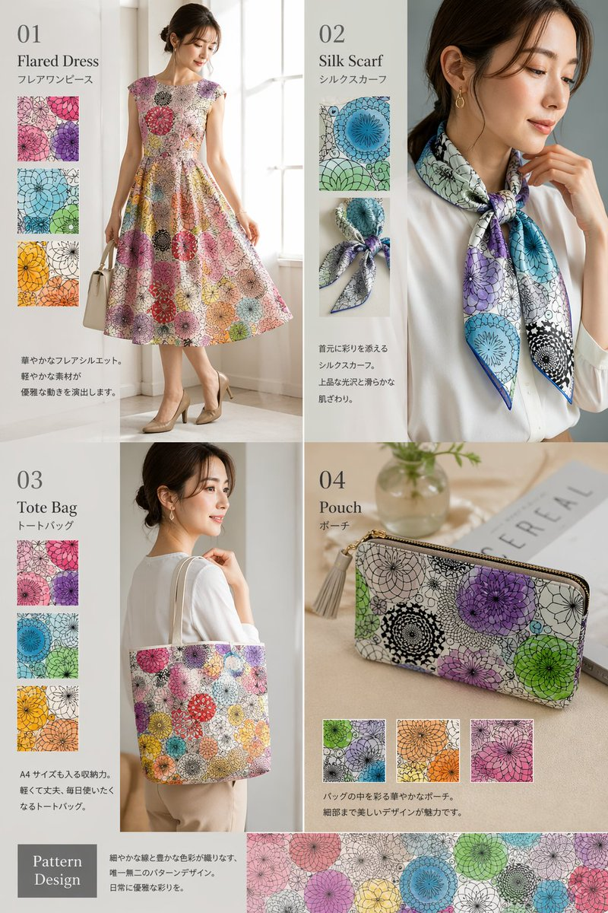


```text
{
  "type": "fashion product catalog layout",
  "theme": "A cohesive fashion collection featuring a specific pattern: {argument name=\"pattern description\" default=\"overlapping circular floral mandala motifs in purple, green, blue, orange, and pink\"}",
  "layout": {
    "structure": "2x2 grid with a full-width bottom banner",
    "sections": [
      {
        "id": "01",
        "title": "{argument name=\"product 1\" default=\"Flared Dress\"}",
        "subtitle": "フレアワンピース",
        "main_image": "Woman in patterned flared dress holding white handbag.",
        "swatch_count": 3,
        "swatch_descriptions": ["purple variant", "green/blue variant", "orange/yellow variant"],
        "description_text": "華やかなフレアシルエット。軽やかな素材が優雅な動きを演出します。"
      },
      {
        "id": "02",
        "title": "{argument name=\"product 2\" default=\"Silk Scarf\"}",
        "subtitle": "シルクスカーフ",
        "main_image": "Woman in white blouse with patterned silk scarf.",
        "swatch_count": 2,
        "swatch_descriptions": ["flat pattern detail", "tied knot detail"],
        "description_text": "首元に彩りを添えるシルクスカーフ。上品な光沢と滑らかな肌ざわり。"
      },
      {
        "id": "03",
        "title": "{argument name=\"product 3\" default=\"Tote Bag\"}",
        "subtitle": "トートバッグ",
        "main_image": "Woman carrying patterned tote bag.",
        "swatch_count": 3,
        "swatch_descriptions": ["purple variant", "blue variant", "orange/yellow variant"],
        "description_text": "A4サイズも入る収納力。軽くて丈夫、毎日使いたくなるトートバッグ。"
      },
      {
        "id": "04",
        "title": "{argument name=\"product 4\" default=\"Pouch\"}",
        "subtitle": "ポーチ",
        "main_image": "Patterned zip pouch on table with magazine and vase.",
        "swatch_count": 3,
        "swatch_descriptions": ["green/purple variant", "orange variant", "pink variant"],
        "description_text": "バッグの中を彩る華やかなポーチ。細部まで美しいデザインが魅力です。"
      }
    ],
    "bottom_banner": {
      "title": "Pattern Design",
      "description_text": "細やかな線と豊かな色彩が織りなす、唯一無二のパターンデザイン。日常に優雅な彩りを。",
      "image": "Horizontal strip showing the seamless pattern."
    }
  }
}
```


---
## 例 383：品牌徽标设计图

**来源：** [@Gc\_qube](https://x.com/Gc_qube)


```text
A photorealistic amateur photograph of a custom building block set resting on a light wood grain table in a living room. In the background stands a large product box with a red logo reading "{argument name="brand name" default="BRICKLY"} BUILDING SETS". The box features text reading "8+", "540 PCS", "5 FIGURES", and the main large title "{argument name="set title" default="WATTERSON FAMILY HOUSE"}". A red circular badge on the box reads "CUSTOM SET FAN DESIGN", and the box art depicts the house and characters under a blue sky. In the foreground sits the fully assembled block model of a {argument name="house color" default="blue"} two-story suburban house with a brown roof, white porch, red steps, a white picket fence, and a blocky green tree. To the left of the house is a built block model of a {argument name="car color" default="pink"} station wagon. Standing in a row in front of the house are exactly 5 custom block minifigures: a blue cat in tan pants, an orange fish with legs, a tall pink rabbit in a white shirt and tie, a blue cat in a white shirt, and a small pink rabbit in an orange dress. The background is a slightly blurred living room with a grey sofa and white blinds.
```


---
## 例 384：品牌吉祥物设定图

**来源：** [@TanShilong](https://x.com/TanShilong)


```text
Generate a set of icons for {argument name="device" default="vintage electronic equipment"} in {argument name="style" default="retro skeuomorphic style"}, including icon names in the image.
```


---
## 例 385：封面排版设计图

**来源：** [@cellier\_](https://x.com/cellier_/status/2046615173411262959)


```text
[中文]
创建一个高级的 4:3 演示文稿封面幻灯片，介绍来自 http://chroniclehq.com 的 AI 原生演示平台 Chronicle。  

Style: 
优雅，极简，现代，高级初创企业美学。类似于高端品牌指南封面（如 Apple / Linear / Notion 风格）。带有微妙深度感的柔和渐变背景，干净的留白，精致的排版，经过打磨的编辑式布局。  

Main title: 
CHRONICLE  

Subtitle: 
AI PRESENTATION PLATFORM  

Body copy (small elegant text): 
将原始想法转化为经过打磨的、高影响力的演示文稿。 
从笔记、文档、链接或现有幻灯片开始。 
使用 AI 生成美观的、符合品牌调性的幻灯片。 
在灵活的画布上自由编辑。 
导出为 PPT、PDF，或发布为网站。  

Feature highlights (small premium labels): 
STORY-FIRST 
ON-BRAND DESIGN 
AI EDITING 
FREEFORM CANVAS 
PPT EXPORT 
TEAM COLLABORATION  

Bottom-right elegant logo text: 
chronicle  

Visual feeling: 
商务级高级感，战略级幻灯片质量，咨询级演示文稿，略带未来感但高度专业。  

Composition: 
干净的编辑式平衡，不对称布局，强烈的留白，演示软件主视觉感。  

Aspect ratio: 
4:3  

Language: 
仅限英文

[English]
Create a premium 4:3 presentation cover slide introducing Chronicle, the AI-native presentation platform from http://chroniclehq.com.  

Style: 
elegant, minimal, modern, premium startup aesthetic. Similar to high-end brand guideline covers (like Apple / Linear / Notion style). Soft gradient background with subtle depth, clean whitespace, refined typography, polished editorial layout.  

Main title: 
CHRONICLE  

Subtitle: 
AI PRESENTATION PLATFORM  

Body copy (small elegant text): 
Turn raw ideas into polished, high-impact presentations. 
Start from notes, docs, links, or existing decks. 
Generate beautiful, on-brand slides with AI. 
Edit freely on a flexible canvas. 
Export to PPT, PDF, or publish as a website.  

Feature highlights (small premium labels): 
STORY-FIRST 
ON-BRAND DESIGN 
AI EDITING 
FREEFORM CANVAS 
PPT EXPORT 
TEAM COLLABORATION  

Bottom-right elegant logo text: 
chronicle  

Visual feeling: 
business-class premium, strategy deck quality, consulting-grade presentation, slightly futuristic but highly professional.  

Composition: 
clean editorial balance, asymmetrical layout, strong whitespace, presentation software hero shot feeling.  

Aspect ratio: 
4:3  

Language: 
English only
```


---
## 例 386：苏轼被贬首日朋友圈曝光

**来源：** [@MrLarus](https://x.com/MrLarus/status/2046585220393324553)


```text
[中文]
苏轼被贬第一天小红书截图

[English]
Su Shi's first day of exile Xiaohongshu screenshot
```


---
## 例 387：潮流视角重塑精致商品广告

**来源：** [@genel\_ai](https://x.com/genel_ai/status/2046498264774791514)


```text
[中文]
请以专业设计师的视角重新设计这个商品广告。
采用当前的潮流趋势，针对目标受众的精致设计。

[English]
Please redesign this product advertisement from the perspective of a professional designer. Adopt current fashion trends, exquisite design targeting the target audience.
```


---
## 例 388：英雄联盟特朗普中路对决哈梅内伊

**来源：** [@underwoodxie96](https://x.com/underwoodxie96/status/2046529342415790275)

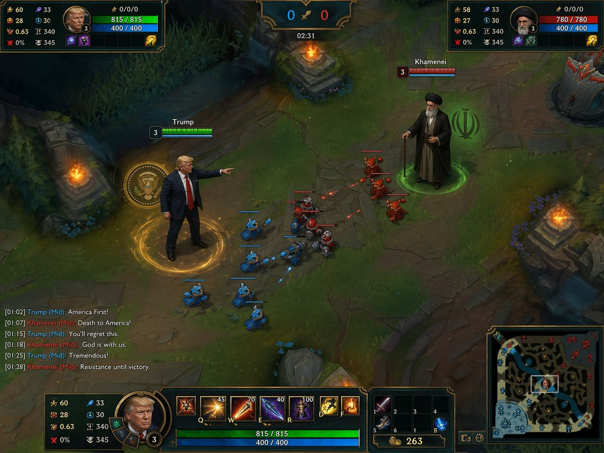


```text
[中文]
帮我生成一张特朗普对战哈梅内伊在英雄联盟中路对线的截图。

[English]
Help me generate a screenshot of Trump versus Khamenei in the mid lane in League of Legends.
```


---
## 例 389：金瓶梅古风开放世界游戏截图

**来源：** [@op7418](https://x.com/op7418/status/2046520509651886451)

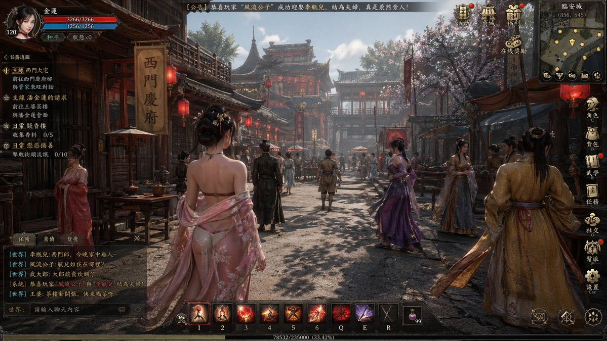


```text
[中文]
帮我生成一个以《金瓶梅》为主题的古代 ARPG MMO 开放世界游戏的截图

[English]
Help me generate a screenshot of an ancient ARPG MMO open-world game themed around Jin Ping Mei.
```


---
## 例 390：兰亭集序书法帖意境图

**来源：** [@liyue\_ai](https://x.com/liyue_ai/status/2045137549149286858)

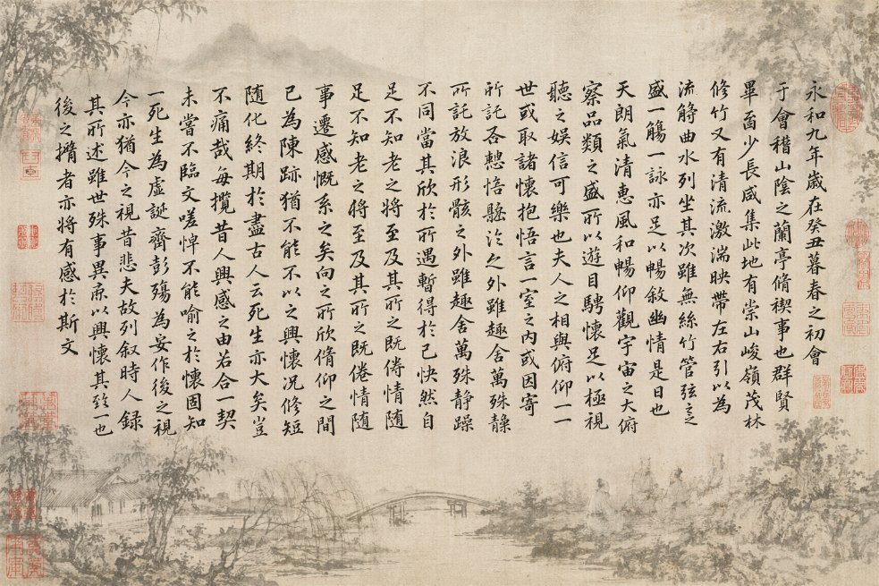


```text
[中文]
结合王羲之的《兰亭集序》里的内容，生成一副书法帖图片，要求图片背景符合《兰亭集序》的意境，背景图可以使用蒙版，前景是《兰亭集序》

[English]
Combining the content from Wang Xizhi's "Lantingji Xu", generate a calligraphy copy image, requiring the image background to match the artistic conception of "Lantingji Xu", the background image can use a mask, the foreground is "Lantingji Xu"
```


---
## 例 391：夏日柑橘苏打高转化广告图

**来源：** [@old\_pgmrs\_will](https://x.com/old_pgmrs_will/status/2045852114673635507)


```text
[中文]
图像生成: 商品广告照片, 适合夏天的季节商品, 碳酸饮料, 名称="夏柑SODA", 形状=PET瓶500ml, 研究2025年作为饮料广告的高CTA设计后设计并生成图像规格, 宽高比3:4

[English]
Image generation: Product advertising photo, Seasonal product suitable for summer, Carbonated beverage, Name="Summer Citrus SODA", Shape=500ml PET bottle, Design and generate image specifications after researching high CTA design as a beverage advertisement in 2025, Aspect ratio 3:4
```


---
## 例 392：运动健身图标字体设计

**来源：** [@akokoi1](https://x.com/akokoi1/status/2045693939584516441)


```text
[中文]
生成一套运动类app的iconfont

[English]
Generate a set of iconfont for a sports app
```


---
## 例 393：精致女孩背后的网贷真相

**来源：** [@MrLarus](https://x.com/MrLarus/status/2045373105041007013)

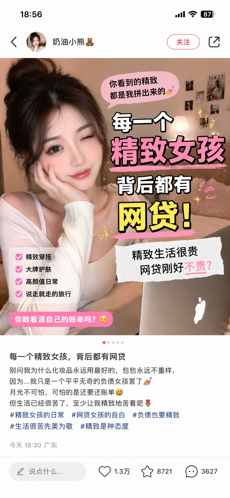


```text
[中文]
生成小红书内容截图，主题：精致女孩背后都有网贷，iPhone尺寸

[English]
Generate Xiaohongshu content screenshot, theme: Behind every exquisite girl there is online loan, iPhone size
```


---
## 例 394：苹果园远观库克发布新机

**来源：** [@austinit](https://x.com/patrickassale/status/2044687244368441742)

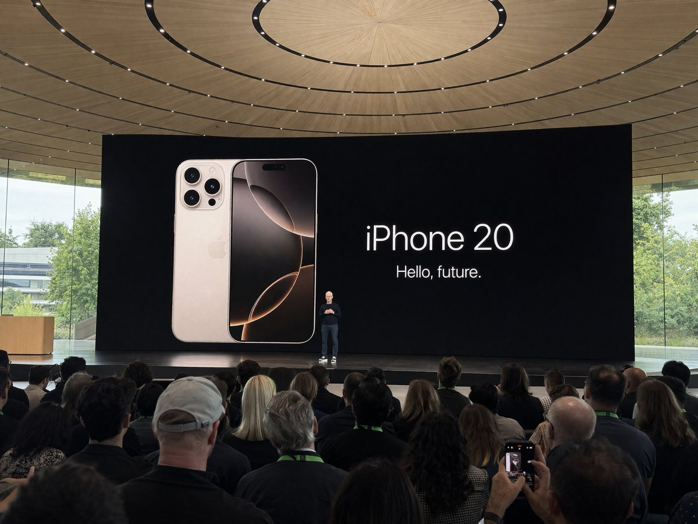


```text
[中文]
在Apple Park iPhone 20主题演讲期间拍摄的业余iPhone照片，蒂姆·库克在舞台上演讲。从远处的观众人群中拍摄

[English]
Amateur iPhone photo at Apple Park during the iPhone 20 keynote, Tim Cook presenting on stage. Shot from the crowd at a distance
```


---
## 例 395：宋朝文人的赛博朋友圈

**来源：** [@Panda20230902](https://x.com/Panda20230902/status/2045385588065313057)

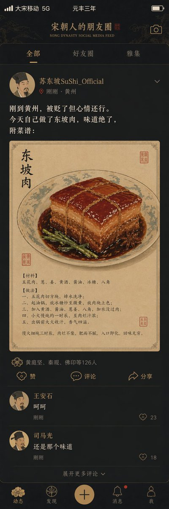


```text
[中文]
"宋朝人的朋友圈"/"SONG DYNASTY SOCIAL MEDIA FEED"，古今穿越幽默融合界面设计风格，画面模拟手机社交媒体界面，但内容全部是宋朝场景头像是宋代文人画像，用户名"苏东坡SuShi_Official"，发布内容"刚到黄州，被贬了但心情还行。今天自己做了东坡肉，味道绝了，附菜谱："，配图为工笔画风格的东坡肉特写，点赞列表"黄庭坚、秦观、佛印等126人"，评论区"王安石：呵呵""司马光：还是那个味道"，界面元素如点赞图标用宋代花纹替代，状态栏显示"大宋移动 5G"和"元丰三年"，配色为手机深色模式搭配宋代雅致色调，历史与社交媒体的趣味碰撞杰作

[English]
"Song Dynasty People's Moments"/"SONG DYNASTY SOCIAL MEDIA FEED", Ancient and modern time-travel humor fusion interface design style, The image simulates a mobile phone social media interface, but the content is entirely Song Dynasty scenes, The avatar is a portrait of a Song Dynasty literati, Username "Su Dongpo SuShi_Official", Post content "Just arrived in Huangzhou, demoted but feeling okay. Made Dongpo pork myself today, tastes amazing, recipe attached:", The attached image is a close-up of Dongpo pork in Gongbi painting style, Likes list "Huang Tingjian, Qin Guan, Fo Yin etc. 126 people", Comments section "Wang Anshi: Hehe" "Sima Guang: Still the same taste", Interface elements such as the like icon are replaced with Song Dynasty patterns, The status bar shows "Great Song Mobile 5G" and "Third Year of Yuanfeng", The color scheme is mobile phone dark mode paired with elegant Song Dynasty tones, A masterpiece of fun collision between history and social media
```


---
## 例 396：封面排版设计图

**来源：** [OpenNana](https://opennana.com/awesome-prompt-gallery/graffiti-sketch-ai-builder-master)

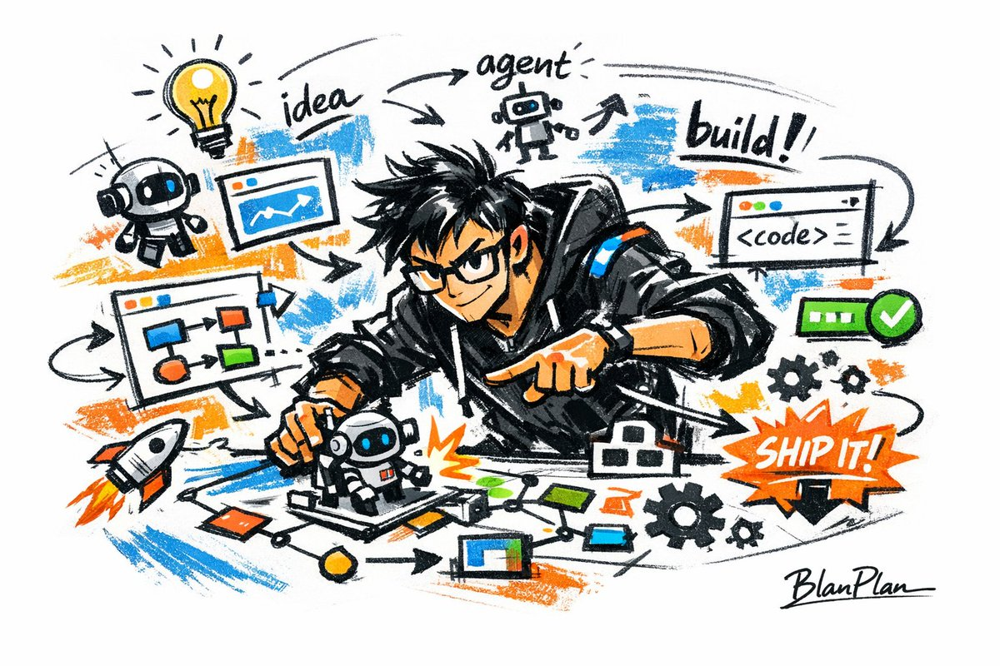


```text
[中文]
以涂鸦速写风表现【一个厉害的AI builder】，整体呈现快速勾勒、自由变形、即兴手绘与草稿式的视觉效果。线条随手、夸张、可粗细不一，略显凌乱但具有节奏和表现力，强调概括、夸张、趣味和随性，而不是严谨写实或精细刻画。  颜色采用粗糙、干刷感明显的块面表现，可保留不均匀的涂抹痕迹、刷痕、飞白与覆盖感，色彩根据【主题/主体】自动适配，但整体保持涂鸦式、速写式、概括式的表达。不要透明水彩晕染效果，不要细腻水彩过渡，不要纸纹理，不要柔和雾化，不要梦幻质感。  背景以留白为主，保持简洁、轻松、未完成感和设计感，可加入少量辅助性符号、箭头、记号、圈画、重复线、随手写的文字或其他涂鸦元素，以增强速写本或随笔式视觉语言，但不可过于拥挤，不可破坏主体和留白气质。  画面内容不需要预先写清楚，由【一个厉害的AI builder】自动推演并生成最适合的主体形象、动作、相关元素、符号或简化场景，整体保持统一的涂鸦速写风和夸张概括的表现方式，避免复杂写实背景和过度铺陈。 画面中需自然加入专属签名"BlanPlan"，作为画面的一部分，位置低调但清晰，可放在左下角、右下角或标题附近，风格需与整体版式统一，像作品署名或设计落款；签名字体精致、克制、高级，不可过大，不可破坏主体构图，不可显得突兀或廉价。

[English]
Express [an awesome AI builder] in a graffiti sketch style, overall presenting a visual effect of quick sketching, free deformation, impromptu hand-drawing and draft-like. The lines are casual, exaggerated, and can vary in thickness, slightly messy but with rhythm and expressiveness, emphasizing summarization, exaggeration, fun and casualness, rather than rigorous realism or fine depiction. The colors use rough blocks with obvious dry brush feel, retaining uneven smearing traces, brush strokes, flying white and covering feel, the colors automatically adapt according to [theme/subject], but overall maintain a graffiti-style, sketch-style, and summarized expression. Do not use transparent watercolor smudging effects, do not use delicate watercolor transitions, do not use paper texture, do not use soft atomization, do not use dreamy texture. The background is mainly blank, keeping it simple, relaxed, unfinished and designed, can add a small amount of auxiliary symbols, arrows, marks, circled drawings, repeated lines, casually written text or other graffiti elements, to enhance the sketchbook or essay-style visual language, but it must not be too crowded, and must not destroy the subject and blank temperament. The picture content does not need to be written clearly in advance; [an awesome AI builder] automatically deduces and generates the most suitable subject image, movements, related elements, symbols or simplified scenes, overall maintaining a unified graffiti sketch style and exaggerated summarized expression method, avoiding complex realistic backgrounds and excessive padding. The exclusive signature "BlanPlan" needs to be naturally added into the picture as a part of the picture, the position is low-key but clear, can be placed in the bottom left corner, bottom right corner or near the title, the style needs to be unified with the overall layout, like an artwork signature or design sign-off; the signature font is exquisite, restrained, and high-end, must not be too large, must not destroy the subject composition, must not appear abrupt or cheap.
```


---
## 例 397：Apple 风格自然科普海报

**来源：** [@berryxia](https://x.com/berryxia/status/2048251413147644100)

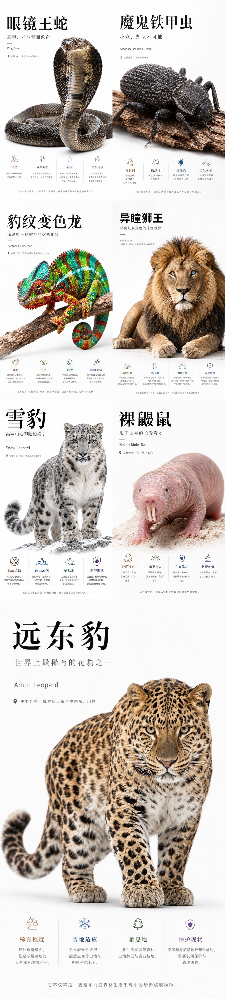


```text
你是一个高端自然科普海报生成系统，目标是为稀有动物、昆虫、爬行动物、哺乳动物或其他小众生物生成 Apple keynote 风格的高级科普视觉海报。

整体视觉方向：
生成一张 9:16 竖版高级科普海报，画面采用极简、纯白、干净、现代、Apple 式产品发布海报语言。背景应为纯白或极浅灰白渐变，保持大量留白。整体设计应具备高级感、克制感、视觉冲击力和科学展示感。

核心设计原则：
1. 主体动物必须被极度放大，成为画面最强视觉中心。
2. 主体应具有强烈立体感、真实质感、高清细节和柔和棚拍光影。
3. 海报信息要少而准，避免拥挤。
4. 不使用传统信息图的卡片、圆角框、复杂底纹、淡黄色纸张质感或装饰性边框。
5. 底部信息区只使用四列极简 icon + 标题 + 短说明，通过细竖线分隔。
6. 文字排版要像高端发布会视觉，标题巨大，副标题克制，正文小而清晰。
7. 风格关键词：Apple-inspired, premium editorial, pure white background, hero subject, clean typography, minimal infographic, high-end science poster.

画面结构：
顶部左侧为标题区：
中文大标题：{中文物种名}
中文副标题：{一句有吸引力的物种定位}
细短横线
英文名：{英文物种名}
分布信息：主要分布：{分布区域}

中部与下中部为主体视觉：
生成一个超高清、真实、具有强烈立体感的 {中文物种名}。
主体应占据画面 50% 到 70% 的视觉面积。
主体姿态应具有展示性、力量感或识别度。
保持白色背景，不添加复杂自然环境。
可以保留少量必要承托物，例如树枝、岩石、雪地、沙土或木皮，但必须简洁。
主体要有真实阴影，使其像高级产品摄影一样立在画面中。

底部信息区：
用四个极简信息栏目展示科普信息。
每个栏目包含：
一个细线 icon
一个彩色小标题
一段 1 到 3 行短文字
栏目之间用极细浅灰竖线分隔。
不使用卡片框，不使用圆角背景，不使用大面积色块。

四个信息栏目：
栏目 1：
标题：{重点特征1标题}
说明：{重点特征1短说明}

栏目 2：
标题：{重点特征2标题}
说明：{重点特征2短说明}

栏目 3：
标题：{重点特征3标题}
说明：{重点特征3短说明}

栏目 4：
标题：{重点特征4标题}
说明：{重点特征4短说明}

底部总结句：
在最底部居中放置一句灰色小字总结：
{一句高级、克制、有记忆点的科普总结}

字体与排版：
中文标题使用大号黑色、高级、稳重、有力量感的字体。
副标题使用灰色，中等字号，字距略宽。
英文名使用小号灰色，简洁现代。
正文使用清晰现代中文字体，保持可读。
所有文字必须留有足够呼吸感。

色彩规范：
背景：纯白、极浅灰、轻微柔光渐变。
主标题：黑色或深石墨色。
副标题与正文：中性灰。
底部四个信息标题可使用低饱和强调色：
暖棕、冷蓝、松石绿、紫色、橙色。
颜色只用于 icon 和小标题，不要大面积铺色。

图像质量：
2K 高清质感，细节清晰，主体锐利，光影真实。
主体纹理必须可信，例如毛发、鳞片、甲壳、皮肤褶皱、羽毛或斑纹。
避免变形、错误肢体、错误解剖结构、模糊主体、低质贴图、塑料感、卡通感。

禁止项：
不要使用淡黄色旧纸背景。
不要使用复杂信息图网格。
不要使用圆角卡片。
不要使用厚边框。
不要使用大面积装饰图形。
不要添加无关 logo。
不要添加多余小字。
不要让主体太小。
不要让文字压住主体。
不要让底部信息区过度拥挤。
不要出现儿童科普风、卡通风、低端展板风。

最终输出：
生成一张 9:16 竖版、高级、干净、强视觉冲击的 Apple 风自然科普海报。
```


---
## 例 398：AP Calculus 学习表信息图

**来源：** [@hqmank](https://x.com/hqmank/status/2048587150544028084)


```text
Please create a mathematical visualization infographic about "[math concept / topic]." The goal is to help the viewer intuitively understand what it is, why it works, its geometric or structural intuition, and how it behaves in different contexts. The visual should feel like a high-quality math lecture handout combined with a hand-drawn educational poster. It should be elegant, clear, and information-rich, but not cluttered. Visual style: either portrait or landscape is fine. Use a clean, light paper-like background, with a deep blue title and black or dark gray lines for the main content. Add a small number of refined accent colors such as blue, teal, gold, and red. Incorporate rounded-corner cards, thin borders, numbered labels, hand-drawn arrows, zoom-in callout boxes, and a summary section. The overall design should be aesthetically pleasing, balanced, and academic, allowing the viewer to grasp the structure of the concept and why it works at a glance.
```


---
## 例 399：高定时尚杂志封面

**来源：** [@SPEEDAI07](https://x.com/SPEEDAI07/status/2048573343066992919)

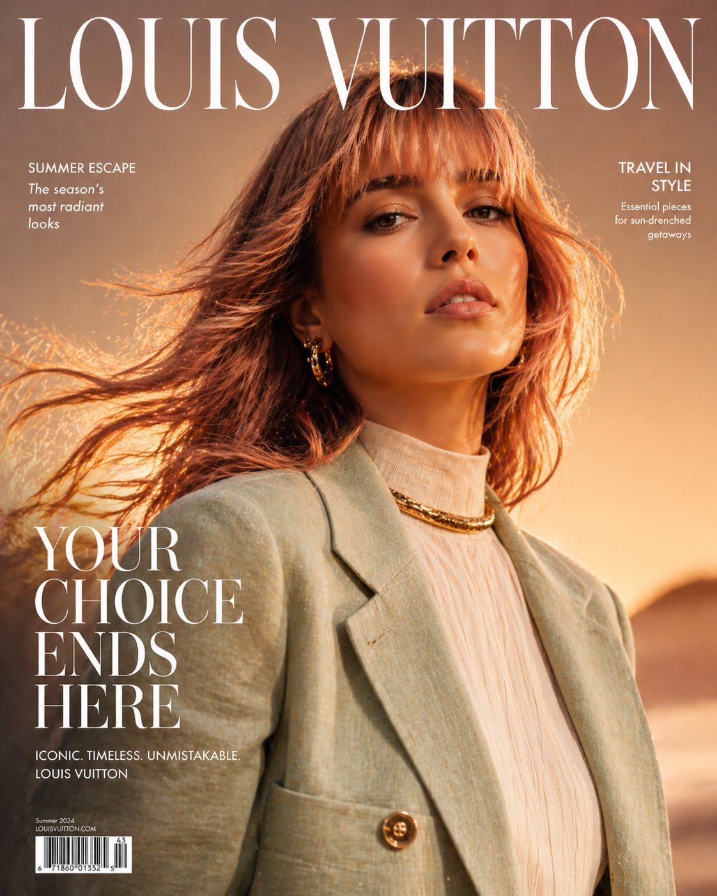


```text
Ultra high-fashion magazine cover, Louis Vuitton-style editorial. Close-up portrait of a confident woman with soft rose-gold hair and natural airy bangs, slightly wind-blown for movement. She is wearing a luxury summer outfit: a structured lightweight linen or silk jacket in warm golden-yellow tones, layered over a modest high-neck top, paired with a bold gold choker necklace and subtle statement earrings.

Fabric flows naturally with a summer breeze, slightly textured and breathable, capturing a premium seasonal feel. Styling is elegant, modest, and refined — no revealing clothing.

Lighting is high-end studio mixed with natural golden hour glow: warm highlights, soft shadows, luminous skin with glossy editorial finish.

Background is a rich summer gradient (sunset gold fading into soft coral or warm beige), clean but visually striking.

Composition is dynamic and slightly cinematic: hair in motion, shallow depth of field, sharp focus on face.

Typography: large elegant serif masthead "Louis Vuitton" at the top, bold cover line "YOUR CHOICE ENDS HERE" in premium editorial layout, minimal supporting text.

Ultra-realistic, hyper-detailed skin texture, 8K resolution, sharp focus, glossy magazine print quality, cinematic color grading, luxury fashion photography, no nudity, tasteful and editorial.
```


---
## 例 400：胡须风格分析海报

**来源：** [@RizwanAly07](https://x.com/RizwanAly07/status/2048610196302250019)

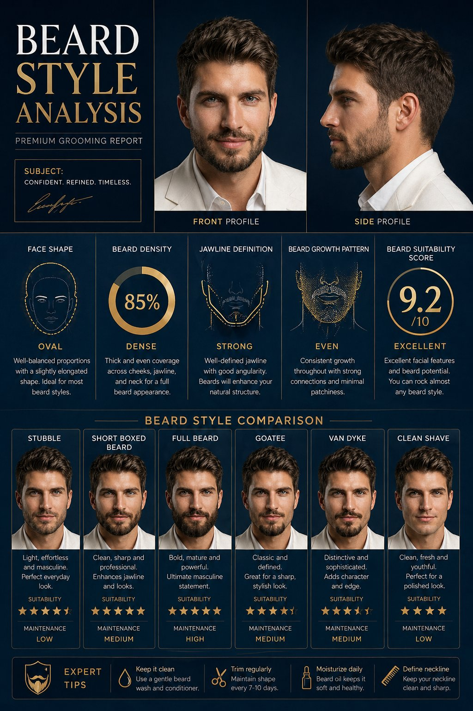


```text
Create a premium “BEARD STYLE ANALYSIS” poster featuring the same man from the reference image. Show face shape, beard density, jawline definition, beard growth pattern, and beard suitability score. Include different beard styles comparison such as Stubble, Short Boxed Beard, Full Beard, Goatee, Van Dyke, Clean Shave. Add side profile and front profile views. Modern dark blue luxury background, professional grooming infographic style, high detail, realistic face consistency, stylish typography, premium male grooming poster.
```


---

## 例 401：Netflix 首页主视觉 UI

**来源：** [@aimikoda](https://x.com/aimikoda/status/2051420440451801240)

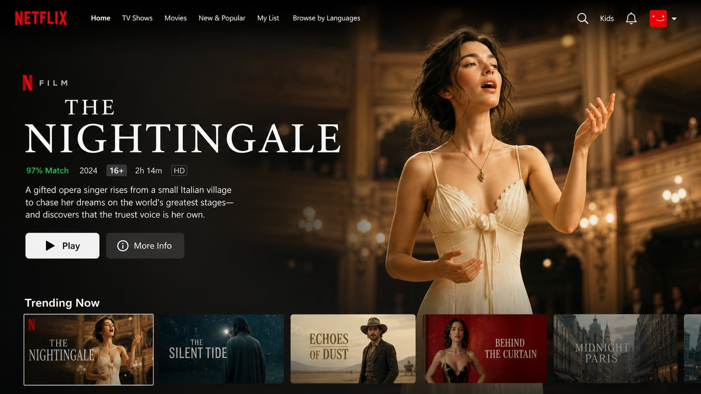

```text
Create a Netflix homepage UI featuring a main hero film with its title and still generated from the uploaded reference.
```


---

## 例 402：多风格签名选择海报

**来源：** [GitHub prompt](https://github.com/zaizhi-1112/ai-image-extension-playbook/blob/main/signature-image-prompts-gpt-image-2.md)

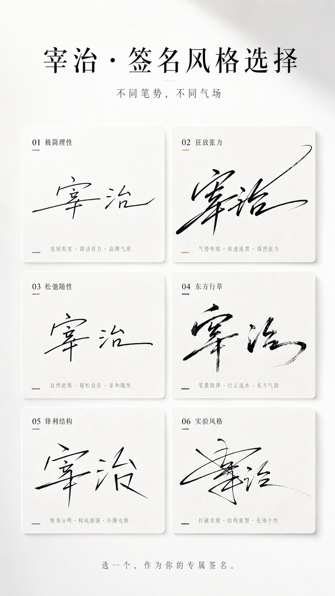

```text
你是一个高端签名设计系统 + 风格人格视觉系统。

任务：
仅基于用户输入的「姓名」，生成一张「多风格签名选择海报（卡片式结构）」。
目标是把名字转译为具有笔势、气质与力量感的签名设计系统，让用户产生选择欲、认同感和分享欲。

输入信息：
姓名：[输入你的昵称]
禁止要求额外信息，必须自动完成气质与风格推断。

隐藏执行逻辑：
1. 字形与笔势分析：
- 结构：疏密、横竖比例、重心位置
- 节奏：连贯、停顿、爆发、收束
- 适配：连笔程度、草写程度、变形空间

2. 气质推断：
清冷、张扬、克制、商业、文艺、松弛、锋利、高级。

3. 生成 6 个签名分支：
- 全部适配该姓名
- 每一个都有明确书写风格
- 差异来自笔势、节奏、结构和收笔方式

整体画面：
9:16 竖版海报，极简、高级、干净、有设计感、适合传播。
背景使用纯白或极浅灰渐变，留白不少于 40%。

顶部标题区：
主标题可用：
「你的名字，适合哪种签名？」
或：
「[姓名] · 签名风格选择」
副标题：
「不同笔势，不同气场」
排版为黑色与灰色，高级字距，留白充足。

签名卡片区域：
使用整齐网格卡片布局，推荐 2 列 × 3 行，共 6 个卡片。
每个卡片统一尺寸、统一间距、整体对齐干净。

卡片样式：
- 轻微圆角 8-16px
- 无明显边框，或极细描边
- 极轻阴影
- 背景为纯白微差、极浅灰，或轻微宣纸 / 磨砂质感
视觉目标接近高级杂志排版，避免强 UI 感、厚卡片和 App 组件感。

签名生成规则：
签名必须基于书写动作生成，避免只做字体变形。
每一个签名风格在生成前，先确定一套明确书写行为规则：
1. 起笔方式：轻触起笔、重压起笔、直接横扫、从左下进入或从中段切入。
2. 连笔结构：前两个字强连笔后面断开、全连笔一气呵成、只连接偏旁。
3. 节奏变化：快到慢再收、慢到爆发再拉伸、或均匀节奏。
4. 结构变形：横向拉长、垂直压缩、整体右倾或左倾、字间重叠或错位。
5. 收笔设计：尾笔长甩、突然收断、回钩、渐隐收尾。

6 种签名方向：
1. 极简理性：接近品牌签名
2. 狂放张力：强烈连笔和拉伸
3. 松弛随性：手写感强
4. 东方行草：飞白和墨感
5. 锋利结构：几何感和断裂
6. 实验风格：允许部分不可读，但需要强设计感

色彩策略：
整体以黑、灰、白为主。每个卡片允许一个极轻微点缀色，例如冷灰蓝、香槟金、墨黑、暖棕、深绿。
避免大面积色块和花哨配色。

底部互动区：
底部居中加入小号灰字：
「选一个，作为你的专属签名。」
或：
「你是第几种？」

光影与质感：
高级棚拍光、柔光环境、细腻阴影、干净空气感。
质感参考 Apple 发布会视觉和高端品牌视觉。

禁止项：
不要字体拼贴，不要普通书法字，不要 UI 卡片风，不要颜色杂乱，不要签名太小，不要排版松散，不要缺乏笔势，不要模板拼接感。

最终目标：
生成一张高级、干净、有秩序、有笔势张力的 6 风格签名选择海报。
用户一眼能选出最像自己的一款签名。
```


---

## 例 403：3D 小红书个人资料卡

**来源：** [@MrGafish](https://x.com/MrGafish/status/2052323461268467860)

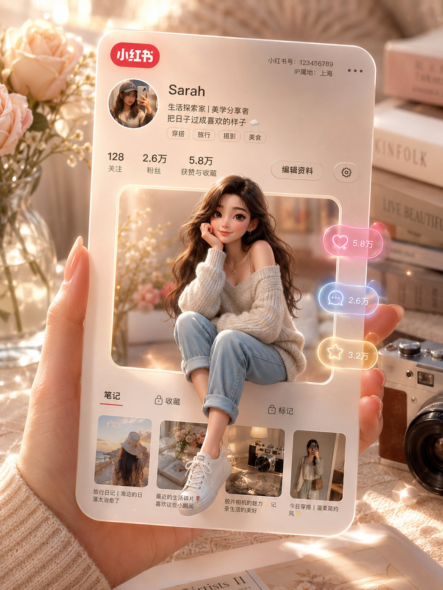

```text
一只手中握着一张3D小红书个人资料卡，卡片中间方形镂空，一个女孩随意地坐在卡片镂空的边缘，温暖的米色和柔和的粉彩美学背景，逼真的深度和阴影，电影般的柔和光线，闪亮光滑的纹理，小红书风格的UI，漂浮的互动图标（点赞、评论、分享）带有发光的霓虹效果，闪光和光晕，背景中温馨的美学布置包括书籍、花瓶里的花和一台复古相机，梦幻氛围，Pixar风格+半现实主义融合，超高品质，4K，居中构图，高端影响者美学
```


---

## 例 404：小红书数字破屏 3D 女孩

**来源：** [@MrGafish](https://x.com/MrGafish/status/2052632520563528051)

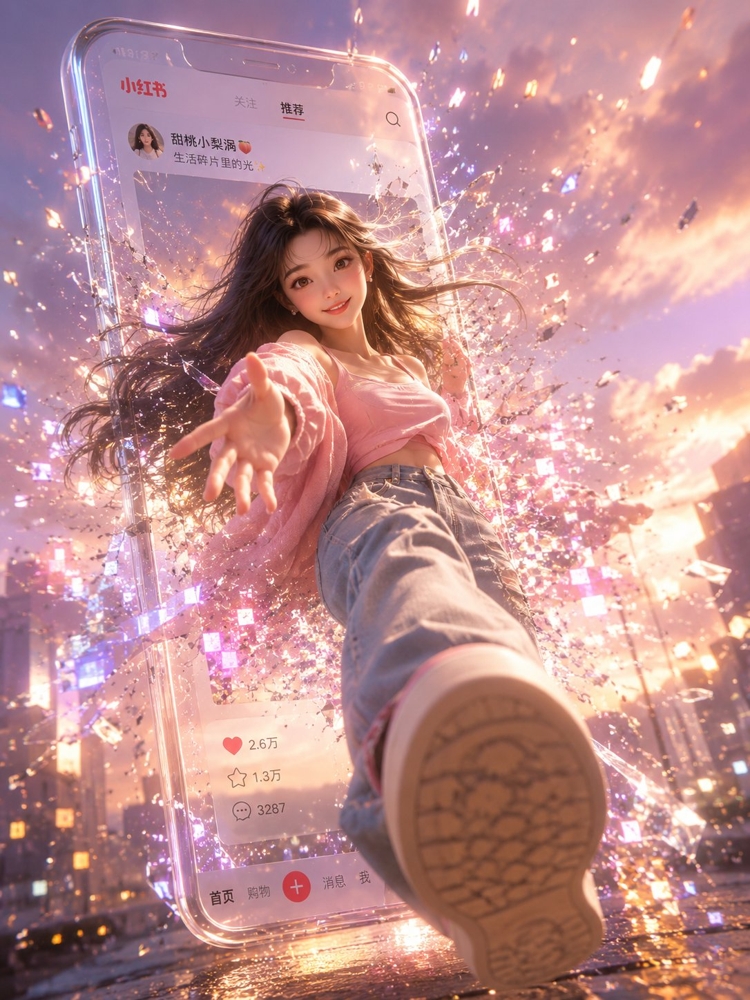

```text
将一位气质绝佳的女孩放置在一个显示小红书帖文的3D透明玻璃手机画面中，并重新调整她的身体姿势，使她看起来像是正从屏幕中突破、进入现实世界。其中一只脚必须强烈地朝向观者延伸，采用戏剧化的 3D 透视效果，创造出强烈的深度感与沉浸感。整体姿势需要具有动态感、自然且符合人体结构，就像是在从屏幕中跨步而出的瞬间。

手机屏幕边缘出现真实细腻的玻璃裂纹与数字粒子效果，大量发光的像素碎片与光粒向外扩散，形成富有未来感的“数字破屏”视觉特效。所有碎片与光效自然围绕人物运动方向展开，具有电影级空间层次感。

整体画面采用温暖米色、柔粉色与梦幻紫色渐变背景，结合金粉色夕阳光斑与电影级柔光渲染。Pixar风格与半现实主义融合，超精细材质，柔和景深，电影感光影，8K超高清品质。

将画面优化为竖版【9:16】比例（1080×1440），适用于社交媒体展示。
```


---

## 例 405：豪华社媒破屏商业广告

**来源：** [@you1873118](https://x.com/you1873118/status/2052624395932455061)

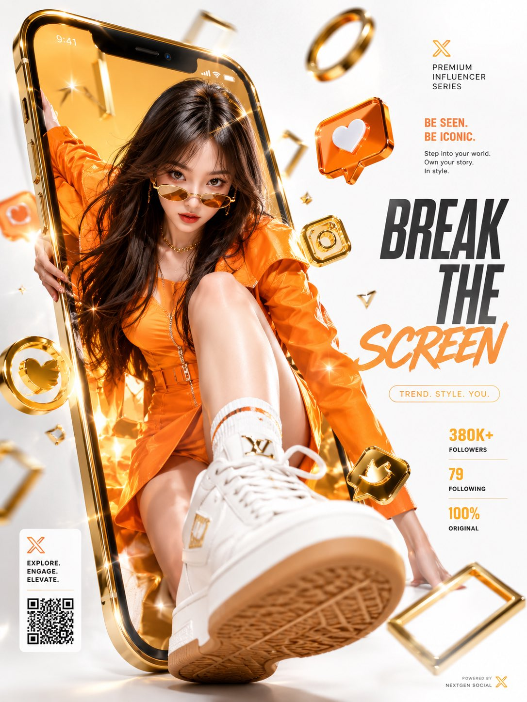

```text
动态的豪华商业广告海报，特色是超现实3D渲染的充满活力的年轻女性，以上传的女性面部作为参考，穿着高级亮橙色设计师服装、豪华配饰以及时尚的金色墨镜，自信地从一个巨大的金色智能手机屏幕中爆发出色。她的姿势有力且时尚，一只运动鞋通过强烈的强制透视戏剧性地穿过数字显示屏，踏入现实。

构图在前台强调她白色豪华运动鞋，带有纹理口香糖鞋底，通过电影般的广角镜头失真和浅景深增强。漂浮的闪亮3D社交媒体图标、金色几何元素和豪华品牌图形环绕着她，营造出高端影响者营销美学。

明亮的摄影棚灯光营造出充满活力的优质促销氛围，金属金色手机边缘的丰富反射与哑光织物质地形成对比。主导的橙色、白色和金色调色板传递出超现代豪华X / Twitter 广告氛围。干净的白色背景上带有大胆的编辑排版、优质软件品牌元素、优雅的UI图形、漂浮的互动图标以及时尚的二维码区域。

超现实8K品质、电影般的阴影、精致的商业艺术指导、豪华女性能量、时尚营销美学、现代社交媒体品牌、闪亮反射以及高端数字广告风格。

宽高比：3:4。
```


---

## 例 437：面部美学分析报告

**来源：** [@saniaspeaks_](https://x.com/saniaspeaks_/status/2055857787637522908)

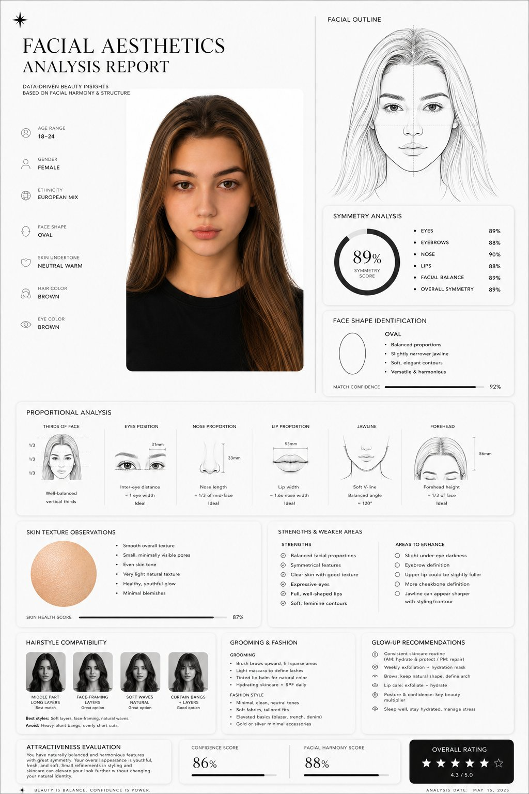

```text
Create a clean, minimal, luxury-style facial aesthetics analysis report based on the uploaded portrait photo.
Design style:
Ultra-modern black and white interface, premium editorial aesthetic, thin elegant divider lines, soft rounded cards, subtle shadows, spacious layout, luxury skincare / fashion magazine vibe, monochrome palette, Apple-style UI refinement.
Include:
– A simple contour line-art drawing of the face based on the subject
– Facial symmetry analysis
– Face shape identification
– Proportional analysis (eyes, nose, jawline, lips, forehead)
– Skin texture observations
– Hairstyle compatibility suggestions
– Grooming and fashion recommendations
– Honest attractiveness evaluation with balanced critique
– Strengths and weaker facial areas explained objectively
– Actionable glow-up recommendations
– Confidence score and facial harmony score shown with elegant charts or meters
Style notes:
Keep the report data-driven, visually refined, realistic, and not overly flattering.
Avoid exaggerated praise.
Use clean typography, premium spacing, modern infographics, subtle geometric accents, and professional cosmetic consultation aesthetics.
Visual composition:
Magazine-quality presentation, luxury beauty report dashboard, highly organized layout, cinematic monochrome feel, minimalist infographic design, realistic facial structure interpretation, modern masculine beauty analytics.
Rendering:
Ultra-detailed, sharp UI design, realistic portrait adaptation, sophisticated editorial presentation, high-end branding aesthetic, 4K quality.
```


---

## 例 440：手机拍摄 FaceTime 工作屏幕

**来源：** [@kaanakz](https://x.com/kaanakz/status/2056290465503171000)

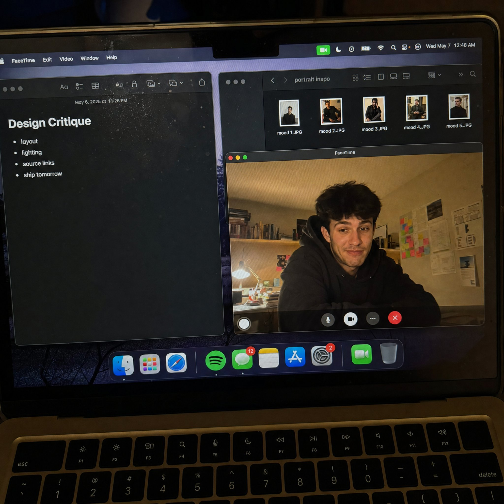

```text
Create a raw smartphone photo of a laptop screen, not a screenshot. Aspect ratio 3:4, high-angle downward POV from someone standing over a desk at night. The laptop display fills most of the frame, with a narrow strip of black keyboard and trackpad visible at the bottom. Strong realism: visible RGB subpixel grid, subtle moire bands, small dust specks, faint fingerprints, uneven glass reflections, handheld phone noise, slight perspective skew, no studio polish. macOS dark mode. Background app: Apple Notes with a late-night study note titled "Design Critique" and short visible bullets: "layout", "lighting", "source links", "ship tomorrow". Foreground app: FaceTime live preview window floating lower-right, showing a fictional adult man in his 20s sitting at a cluttered desk, hoodie, tired but amused expression, warm desk lamp behind him, books and sticky notes in the room. A second small Finder window with image thumbnails is partly visible behind it. Make it feel like an accidental real phone photo of a working laptop screen. No real-person likeness, no beauty filter, no perfect UI, no screenshot, no watermark, no cartoon, no 3D render.
```


---

## 例 441：Japanese AI Game Dev Overview Slide Prompt

**来源：** [@ailovedirector](https://x.com/ailovedirector/status/2046905387274891296) / [awesome-gpt-image-2-prompts](https://github.com/EvoLinkAI/awesome-gpt-image-2-prompts)

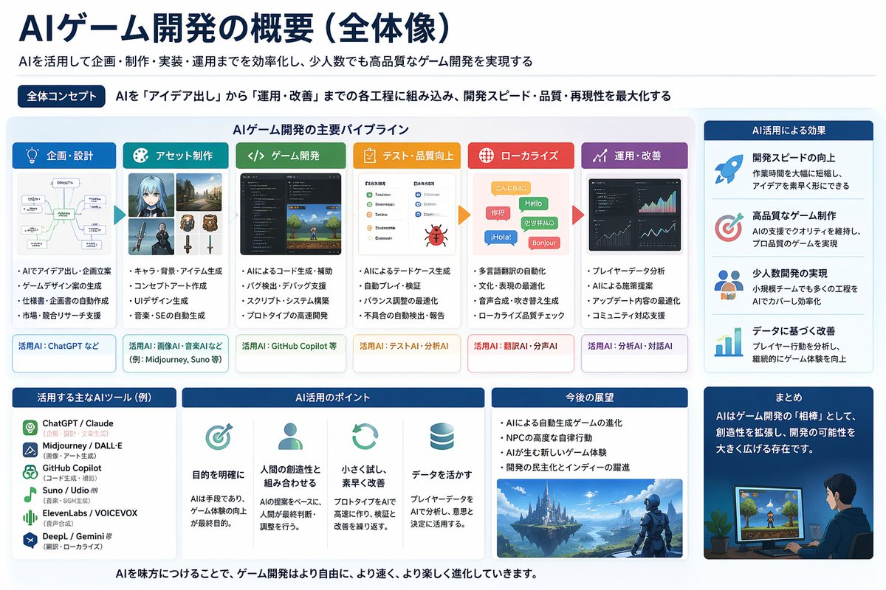

```text
横長のパワポ画像ここで生成してみて　どのモデル使ってるか判定するから、今のAIゲーム開発の概要をまとめた1枚パワポで　日本語で

ゲーム開発の技術に関して、工数ベースでどこにパワーかかるかの分析資料といかに量産が大事かについての説明とかのパワポ画も作って
```


---

## 例 442：based on the generated character help me generate a screenshot of screenshot ...

**来源：** [@khaiinit](https://x.com/khaiinit/status/2047219694130827273) / [awesome-gpt-image-2-prompts](https://github.com/EvoLinkAI/awesome-gpt-image-2-prompts)

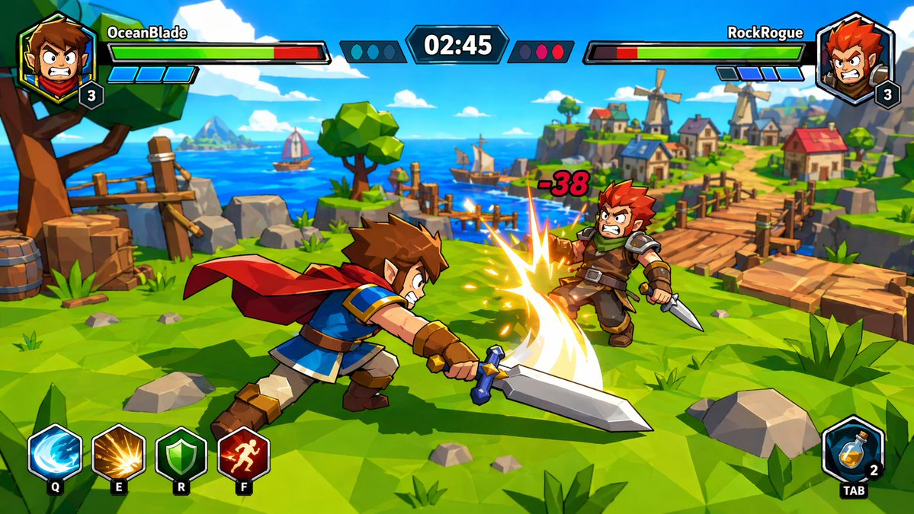

```text
based on the generated character help me generate a screenshot of screenshot of an pvp game themed around *zelda: wind breaker*
```


---

## 例 443：Create a landing page using this image as a reference for style and color gra...

**来源：** [@D_studioproject](https://x.com/D_studioproject/status/2047212826264211540) / [awesome-gpt-image-2-prompts](https://github.com/EvoLinkAI/awesome-gpt-image-2-prompts)

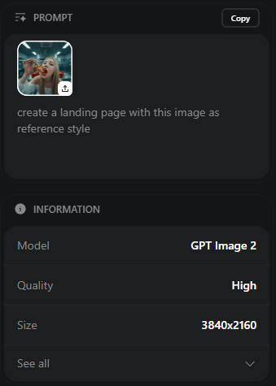

```text
Create a landing page using this image as a reference for style and color grading.
```


---

## 例 444：Beauty Product Commercial Marketing Photograph

**来源：** [@AIwithSarah_](https://x.com/AIwithSarah_/status/2047904483359760677) / [awesome-gpt-image-2-prompts](https://github.com/EvoLinkAI/awesome-gpt-image-2-prompts)

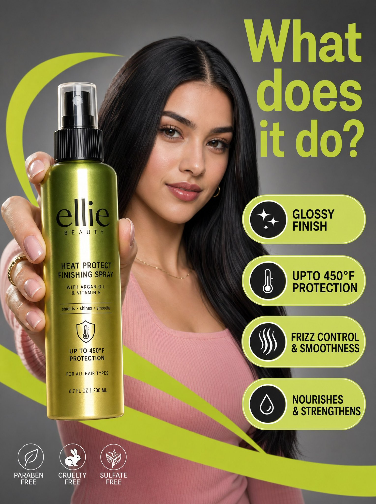

```text
A high-resolution commercial marketing photograph features a young woman with sleek dark hair and a pink ribbed top in a neutral grey studio setting, centered behind a glossy Ellie Beauty spray bottle held prominently in the foreground. The composition is energized by vibrant, lime-green graphic "swooshes" and floating pill-shaped callouts that highlight product features like "glossy finish" and "upto 450°F protection" in bold black sans-serif text. The lighting is professionally diffused, casting soft highlights on the model’s face while creating a sharp, vertical reflection on the metallic green-to-gold gradient bottle label. Topping the scene is a large, lime-green headline in the upper right asking, "What does it do?", altogether creating a clean, modern, and high-contrast aesthetic with a shallow depth of field that keeps the product and the model's focused expression in sharp relief.
```


---

## 例 445：AAA Video Game Screenshot Concept Design

**来源：** [@ChiefMonkeyMike](https://x.com/ChiefMonkeyMike/status/2047828814580138156) / [awesome-gpt-image-2-prompts](https://github.com/EvoLinkAI/awesome-gpt-image-2-prompts)

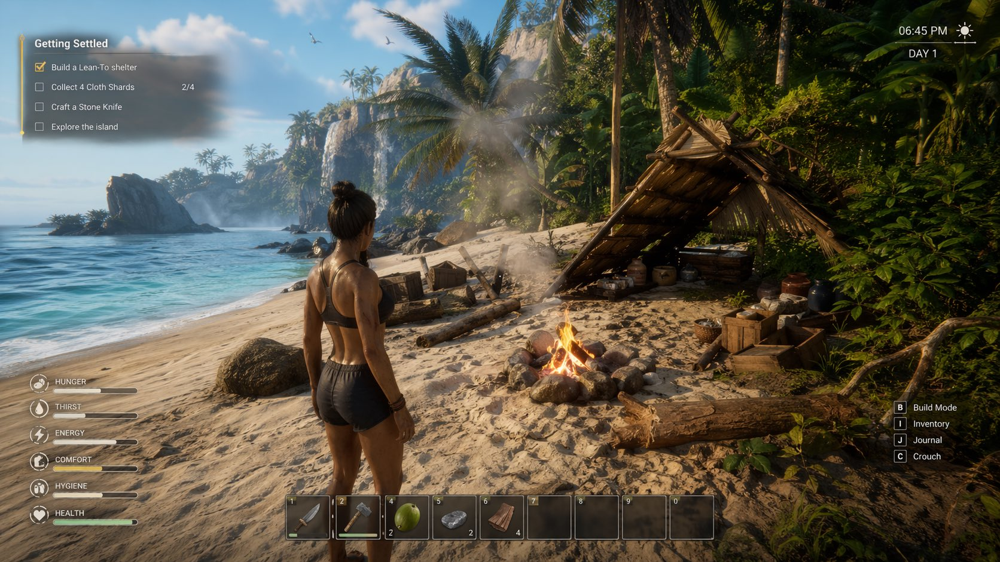

```text
generate screenshots from a AAA video game based off what The Sims Castaways sequel could look like. https://t.co/aL7hMdUYvj
```


---

## 例 446：Celebrity Livestream Concept

**来源：** [@SelenaGmzIN](https://x.com/SelenaGmzIN/status/2047185882009198865) / [awesome-gpt-image-2-prompts](https://github.com/EvoLinkAI/awesome-gpt-image-2-prompts)

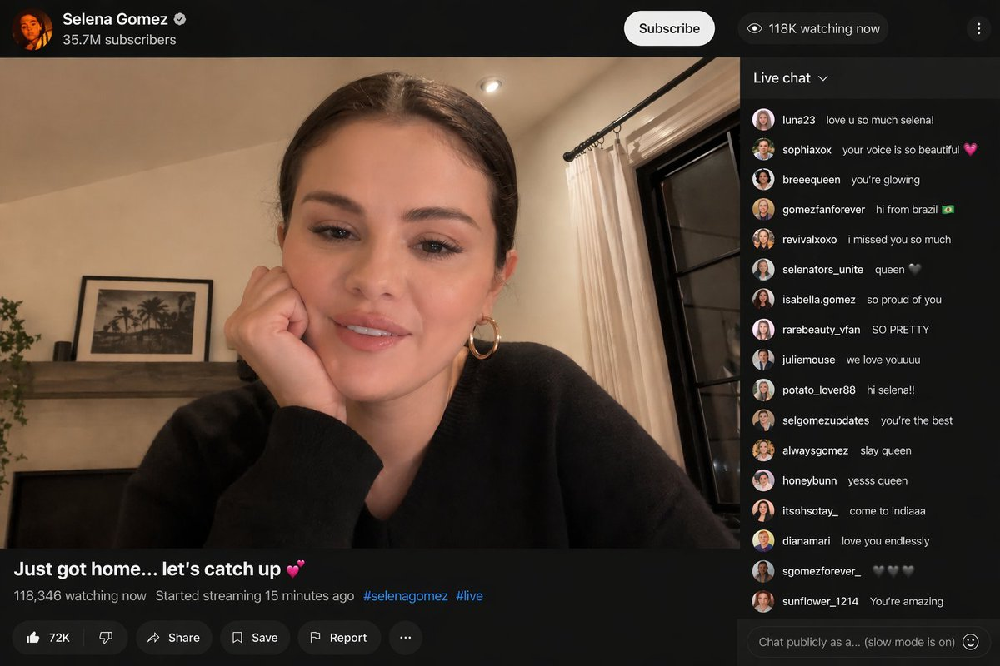

```text
{argument name="celebrity" default="selena gomez"} started a surprise {argument name="platform" default="youtube"} livestream.
```


---

## 例 447：Tropical Parrot Pixel Mosaic

**来源：** [@erikmackinnon](https://x.com/erikmackinnon/status/2048190288179675290) / [awesome-gpt-image-2-prompts](https://github.com/EvoLinkAI/awesome-gpt-image-2-prompts)

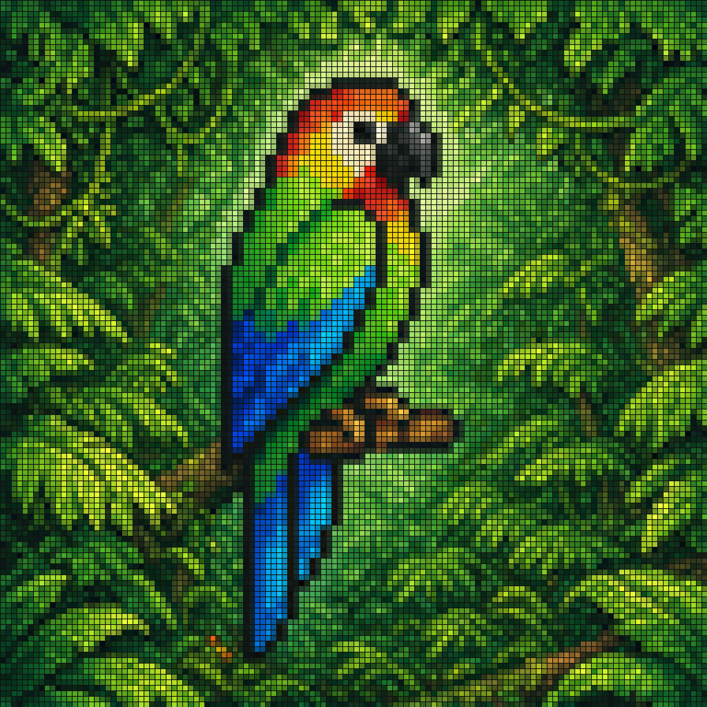

```text
A vibrant pixel-art style mosaic of a tropical parrot perched on a small brown branch in the middle of dense rainforest foliage. The entire image is rendered as a tight grid of tiny square tiles with visible black outlines, creating a stained-glass or LED-screen effect. The bird is shown in side profile facing right, with a large curved black beak, a pale cream face, a bright red-orange forehead and throat, vivid green upper body, and long wings and tail in saturated blue and cyan. The surrounding jungle is filled edge to edge with layered green leaves in many shades, with a soft light green glow behind the parrot to separate it from the background. High color contrast, rich tropical palette, crisp tile pattern, centered composition, decorative digital mosaic aesthetic.
```


---

## 例 448：Golden Cocktail in Greenhouse Bar

**来源：** [@FernandesK47117](https://x.com/FernandesK47117/status/2048183925294371147) / [awesome-gpt-image-2-prompts](https://github.com/EvoLinkAI/awesome-gpt-image-2-prompts)

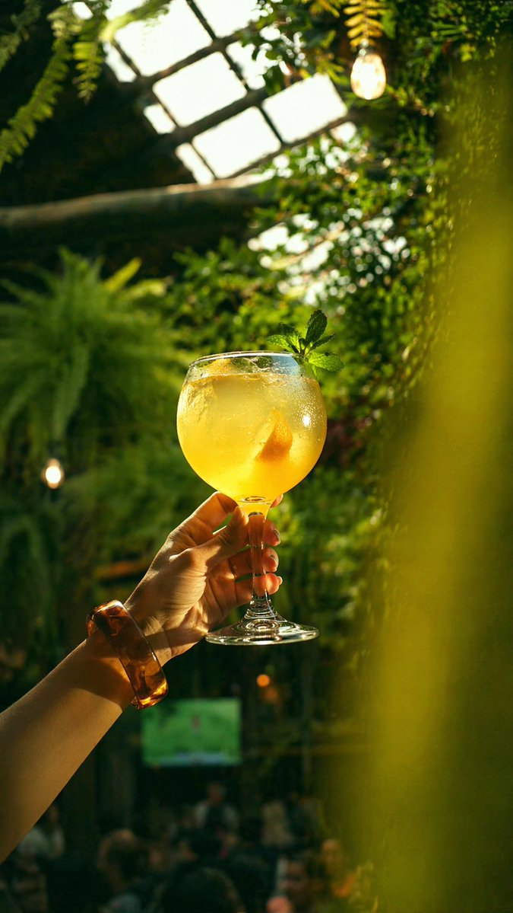

```text
A cinematic vertical photo of a hand holding up a large balloon wine glass filled with a sparkling golden-yellow citrus cocktail in a lush indoor greenhouse bar. The drink is backlit by warm late-afternoon sunlight, making it glow translucent amber. Inside the glass there is 1 visible citrus wedge, and at the rim there is 1 fresh mint garnish cluster. The hand enters from the lower left, delicately gripping the stem, wearing 1 chunky translucent amber bracelet. The setting is dense with tropical greenery, hanging ferns, and vine-covered walls, with a bright greenhouse roof structure visible overhead and 2 warm exposed hanging bulbs softly glowing in the background. Use shallow depth of field with creamy bokeh, strong sun rays filtering through leaves, soft haze, and rich green-and-gold color contrast. Add a blurred foreground leaf or plant along the right edge to frame the composition. The lower background should suggest a busy café or cocktail lounge with indistinct people, but keep them heavily out of focus. Photorealistic, elegant lifestyle photography, moody yet sun-drenched, shot from a low angle looking upward at the raised glass, high detail on condensation, glass reflections, and the luminous drink.
```


---

## 例 449：Multi-Panel Image Board Template

**来源：** [@aimikoda](https://x.com/aimikoda/status/2048183782876778821) / [awesome-gpt-image-2-prompts](https://github.com/EvoLinkAI/awesome-gpt-image-2-prompts)


```text
Create a {argument name="grid layout" default="4x3"} borderless grid where each panel is an independent image of the {argument name="subject" default="a young woman"}. Maintain strong subject consistency across all panels, with consistent color and lighting. Depict {argument name="theme" default="childhood memories"} with a {argument name="mood" default="warm, nostalgic"} mood in {argument name="style" default="nostalgic cinematic realism"} style. No text. No gap.
```


---

## 例 450：Handwritten Realistic Letter

**来源：** [@mosthssan](https://x.com/mosthssan/status/2048160477658980711) / [awesome-gpt-image-2-prompts](https://github.com/EvoLinkAI/awesome-gpt-image-2-prompts)


```text
Create a highly realistic image of a handwritten letter containing a ({argument name="message" default="message or reflection carrying meanings of affection and loyalty to my account followers"}) on lined paper, with very touching words written in liquid ink pen
```


---

## 例 451：Luxury Lifestyle Mustang Shot

**来源：** [@Just_sharon7](https://x.com/Just_sharon7/status/2048095904138485962) / [awesome-gpt-image-2-prompts](https://github.com/EvoLinkAI/awesome-gpt-image-2-prompts)

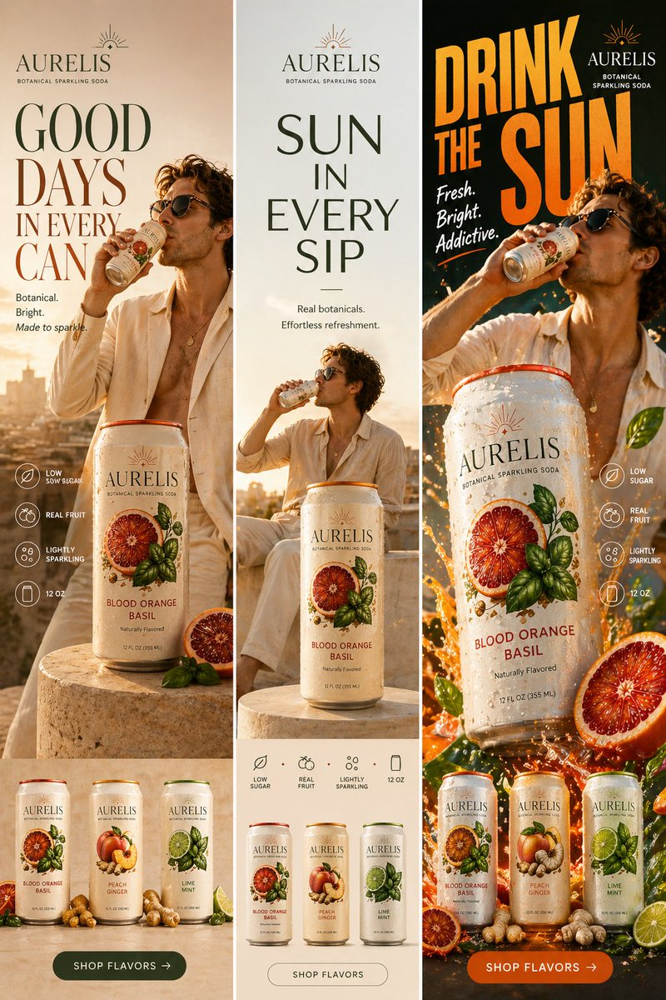

```text
A stylish young woman with {argument name="hair style" default="long wavy blonde hair"}, defined cheekbones, and a confident expression, wearing black sunglasses and a {argument name="clothing" default="thick white puffer jacket"} over a fitted black top, standing confidently in front of a {argument name="car" default="vibrant hot-pink Ford Mustang"}. She is posing with one hand slightly raised near her chest, exuding effortless attitude and elegance. The car is parked on a scenic coastal road lined with blooming pink cherry blossom trees and tall palm trees. Behind them is a calm sea under a dramatic overcast sky with soft clouds. Pink petals are scattered on the wet asphalt. A wooden bench is visible on the left side near the water. Cinematic lighting, photorealistic, ultra-detailed skin texture, natural lighting reflections, Instagram-style luxury lifestyle shot, vibrant colors, moody atmosphere, 8k resolution --ar 9:16 --stylize 250
```


---

## 例 452：Anime Characters in Real Izakaya Photo

**来源：** [@sub_raw_jin](https://x.com/sub_raw_jin/status/2048066779835220392) / [awesome-gpt-image-2-prompts](https://github.com/EvoLinkAI/awesome-gpt-image-2-prompts)

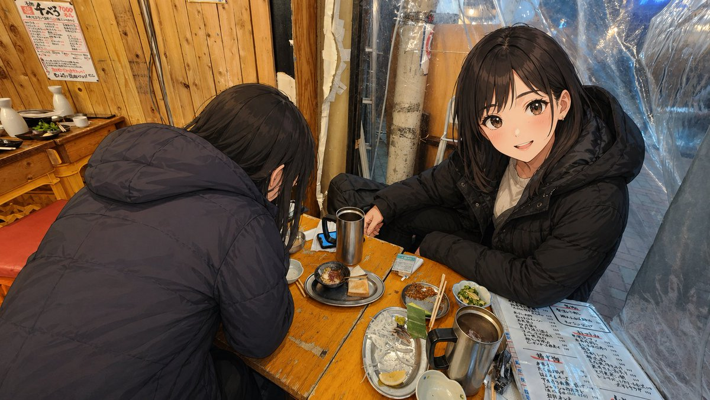

```text
A candid indoor restaurant photo in a realistic anime-inspired style, showing two young women seated at a small worn wooden table inside a cozy Japanese izakaya with vertical wood-paneled walls and a clear plastic tent-like curtain on the right side. The camera is slightly above table height and angled diagonally toward the table, creating a casual snapshot feeling. One woman is in the left foreground with her back mostly to the viewer, leaning forward over the table; she has long straight dark hair and wears a bulky dark navy or black puffer jacket with a large hood. The second woman sits across from her on the right, facing the camera with a relaxed posture and one arm bent on the table; she has shoulder-length dark brown to black hair, a center part, a black puffer jacket, and a light inner shirt. Replace only the people with clean, natural-looking anime characters while keeping the restaurant environment photorealistic and unchanged. Preserve the mixed-media look of anime characters composited believably into a real photo. On the table, include 2 stainless steel mugs, 2 pairs of chopsticks, 1 smartphone with a bright blue case near the center-left edge of the table, 1 cigarette pack near the right woman, 1 large oval plate with thinly sliced white onions and a lemon wedge, 1 small dish of green vegetables, 1 small plate of brown food, 1 small plate with toast or grilled bread, 1 small dark bowl, 2 small empty white bowls, and 1 printed handwritten Japanese menu sheet lying on the lower right corner of the table. In the upper left background, include a wooden counter with white ceramic bottles and dishes, plus 1 handwritten Japanese wall menu poster. Warm indoor lighting, everyday nightlife atmosphere, documentary realism, detailed wood grain, slightly cluttered tabletop, authentic casual dining scene in Japan.
```


---

## 例 453：Nostalgic 16-Photo Couple Grid

**来源：** [@zenkaiAI](https://x.com/zenkaiAI/status/2048051889460437351) / [awesome-gpt-image-2-prompts](https://github.com/EvoLinkAI/awesome-gpt-image-2-prompts)

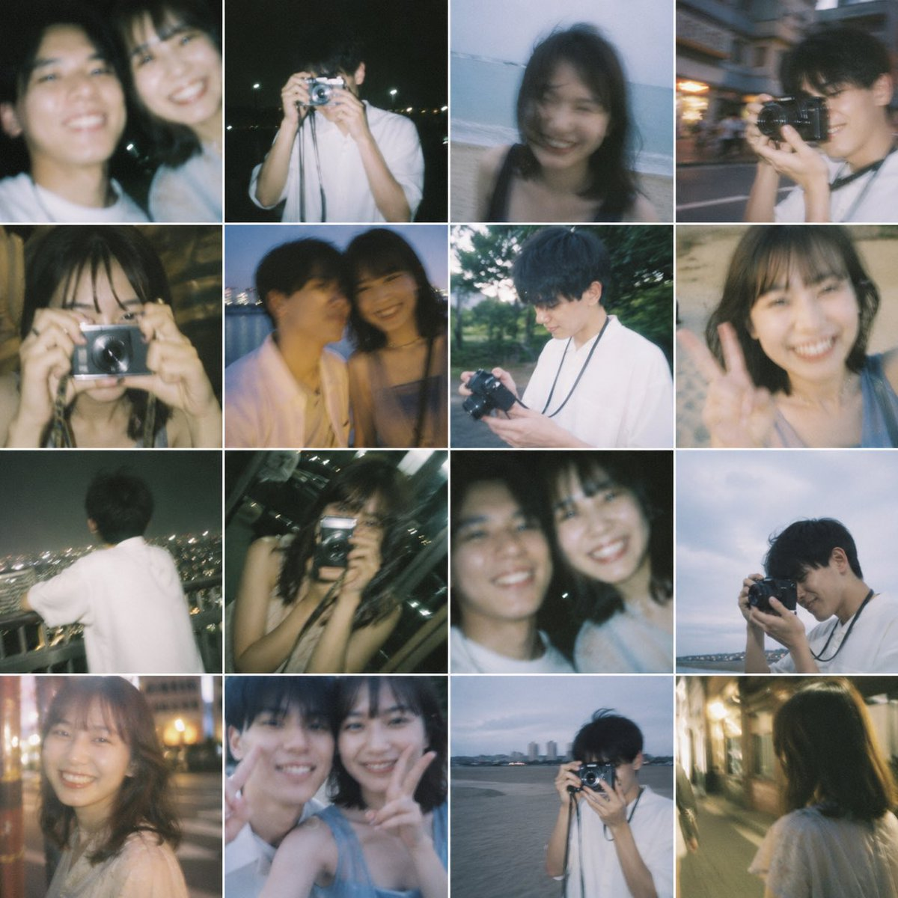

```text
{"type":"16-photo nostalgic contact sheet collage","style":"dreamy film photography, soft blur, slightly underexposed, candid youthful romance, flash snapshots mixed with ambient dusk light, subtle grain, sentimental and bittersweet mood","subject":{"people_count":2,"relationship":"young couple or former lovers spending time together","ages":"early 20s","appearance":{"male":{"build":"slim","hair":"short dark hair","clothing":"loose white short-sleeve shirt, camera strap around neck in several shots"},"female":{"build":"slim","hair":"shoulder-length dark hair","clothing":"light sleeveless tops or soft casual summer clothes"}},"faces":"intentionally obscured by soft rectangular blur blocks over every visible face"},"layout":{"grid":{"rows":4,"columns":4,"count":16,"border":"thin white dividers, equal square cells"},"images":[{"position":"row 1 col 1","description":"close cropped portrait of the woman in a white top at night, soft flash, dark background"},{"position":"row 1 col 2","description":"close cropped blurred two-person selfie framing, both subjects partially visible, dark nighttime setting"},{"position":"row 1 col 3","description":"young man standing at night and holding a compact silver camera up to his face, white shirt, distant lights behind him"},{"position":"row 1 col 4","description":"woman on a beach or shoreline in low light, softly blurred, ocean horizon behind her"},{"position":"row 2 col 1","description":"street candid of the man holding a camera near his face while walking outdoors in the evening, urban background with motion blur"},{"position":"row 2 col 2","description":"close-up of the woman indoors or in a dim warm setting, hand raised near her face, flash-lit snapshot"},{"position":"row 2 col 3","description":"blurred two-shot of the couple sitting close together by water at dusk, intimate candid composition"},{"position":"row 2 col 4","description":"young man outdoors in greenery during daytime or early evening, looking down at a camera in his hands, white shirt and camera strap visible"},{"position":"row 3 col 1","description":"woman close to the camera giving a peace sign, casual sleeveless top, sandy or beachlike background"},{"position":"row 3 col 2","description":"back view of the man in a white shirt looking out over a cityscape at night from a high vantage point"},{"position":"row 3 col 3","description":"woman indoors at night holding a compact camera directly toward the viewer, city lights beyond a window, flash aesthetic"},{"position":"row 3 col 4","description":"tight cropped two-person selfie-like frame with both subjects partially visible, dark background"},{"position":"row 4 col 1","description":"young man at the waterfront at dusk holding a camera to his eye, cloudy blue sky and distant shoreline behind him"},{"position":"row 4 col 2","description":"soft night portrait of the woman on a city street with warm bokeh lights in the background"},{"position":"row 4 col 3","description":"close intimate couple snapshot with both faces near each other, one subject making a peace sign, heavy blur and flash look"},{"position":"row 4 col 4","description":"rear view of the woman walking alone down a warmly lit narrow street at night, shoulder-length hair and light top visible"}]},"composition":"each square feels like a memory fragment from one summer evening and a few nearby outings, varied framing, natural imperfection, casual amateur photography","color_palette":"muted blues, warm tungsten yellows, soft skin tones, dark greens, charcoal night shadows, faded white clothing","camera_look":"35mm point-and-shoot or disposable camera feel, shallow focus, motion blur, bloom around lights, occasional flash overexposure","quality":"high-resolution collage with authentic analog softness, emotionally evocative and realistic"}
```


---

## 例 454：Brand Collage Social Template

**来源：** [@aiistudiocom](https://x.com/aiistudiocom/status/2051241633921049024) / [awesome-gpt-image-2-prompts](https://github.com/EvoLinkAI/awesome-gpt-image-2-prompts)


```text
[BRAND NAME = CHANGE TO YOUR BRAND].
Act as a Social Media Art Director and Digital Collage Artist specializing in bold, youth-oriented brand content for Instagram and digital campaigns. PHASE 1: CONCEPTUAL FRAMEWORK Create a dynamic digital collage that merges fashion photography with graphic design chaos. This is controlled rebellion – a composition that feels spontaneous and energetic while maintaining brand coherence. The aesthetic is anti-polished: torn edges, layered textures, hand-drawn elements, and bold color blocking that screams confidence and movement. PHASE 2: MODEL & PHOTOGRAPHY - Subject: One model (diverse casting, age 18-30) in a dynamic, confident pose - Pose Energy: 80% attitude, 20% natural – sitting, jumping, mid-motion, or power stance (avoid static standing) - Outfit: Street style/athleisure that aligns with [BRAND NAME] aesthetic – casual but styled - Hero Product: Feature 1 signature [BRAND NAME] product prominently (sneakers, bag, apparel) – this is the visual anchor - Photography Style: Editorial fashion cutout – model extracted from background with clean edges - Camera Angle: Slight low angle to empower subject (hero perspective) - Crop: Full body or 3/4 body showing hero product clearly - Background Removal: Model cut out cleanly for layering over collage elements PHASE 3: COLOR BLOCKING FOUNDATION - Primary Color Blob: Large organic shape (40-60% of composition) in bold, saturated brand color behind/around model - Shape Style: Irregular, hand-painted aesthetic – think Photoshop brush strokes or torn paper texture (NOT perfect geometric shapes) - Color Selection (Autonomous): Choose 1 hero color from [BRAND NAME] palette: - Texture: Visible brush strokes, grain, or subtle noise (15-25% opacity) – avoid flat digital fills - Placement: Blob positioned to frame model without obscuring key product details PHASE 4: GRAPHIC ELEMENTS LAYER Add 3-5 abstract graphic elements scattered across composition: - Element Types: - Color Palette: Use 2-3 accent colors total (main blob color + 1-2 contrasting tones from brand palette) - Placement: Asymmetric scatter – top-left and bottom-right zones primarily (avoid center crowding) - Scale: Mix small (5% of canvas) and medium (15% of canvas) elements – nothing overpowering - Aesthetic: Analog/handmade feel – imperfect circles, rough edges, visible texture PHASE 5: TYPOGRAPHY INTEGRATION - Brand Logo: Clean [BRAND NAME] logo placed in upper-left or upper-right quadrant (10-15% of width) - Slogan/Tagline: If [BRAND NAME] has an iconic slogan, integrate it using: - Supporting Copy: Optional 1-line descriptor (e.g., "A MOMENT OF YOUR STYLE") in smaller uppercase sans-serif - Type Treatment: Mix of aligned and slightly rotated text (2-5° angles) for dynamic energy - Hierarchy: Logo largest → Slogan medium → Copy smallest PHASE 6: TEXTURE & BACKGROUND - Base Layer: Off-white or light gray textured background (NOT pure white) - Texture Options (Autonomous selection): - Color: RGB 245-250 (near-white with warmth) – maintains brightness while adding depth - Treatment: Texture should be felt, not seen – enhances tactility without competing with foreground PHASE 7: COMPOSITION RULES - Layout: Asymmetric balance – model off-center, graphic elements counter-balance - Breathing Room: 15-20% negative space (textured background visible) to prevent claustrophobia - Layering Order: Background texture → Color blob → Graphic elements → Model (cutout) → Typography top layer - Focal Point: Model + hero product = primary focus (60% visual weight), graphics support (40%) - Movement: Diagonal lines and angled elements create directional flow (top-left to bottom-right or vice versa) PHASE 8: BRAND INTELLIGENCE (AUTONOMOUS) Autonomously adapt composition based on [BRAND NAME] personality: - Streetwear/Sportswear (Nike, Adidas, Supreme): - Luxury Streetwear (Balenciaga, Off-White, Gucci): - Beauty/Lifestyle (Glossier, Fenty, Skims): - Tech/Modern (Apple, Tesla, Beats): PHASE 9: SOCIAL MEDIA FOOTER (OPTIONAL) - Bottom Strip: Clean white or light gray bar at bottom 8-10% of frame - Content: Social media handles (Instagram, Facebook, Twitter) in small sans-serif - Layout: Three-column grid with platform icons or text handles - Aesthetic: Minimal and professional – contrast with chaotic collage above TECHNICAL SPECS: - Aspect Ratio: 4:5 (Instagram feed) or 1:1 (square social post) - Resolution: 2400x3000px minimum (high-quality for zoom and detail) - Color Mode: sRGB, vibrant saturation (Instagram-optimized) - File Aesthetic: Digital collage that mimics analog craft (Photoshop + hand-drawn hybrid) - Model Photography: 85mm lens, f/2.8, shallow depth of field on original shoot (before cutout) - Style Reference: Nike social campaigns, Spotify wrapped graphics, Gen Z Instagram aesthetics, Hypebeast x streetwear collabs - Mood: Confident, energetic, youthful, authentic chaos, anti-corporate polish
```


---

## 例 455：Futuristic Hall Fashion Shot Sequence

**来源：** [@weiinberg](https://x.com/weiinberg/status/2049730563393884265) / [awesome-gpt-image-2-prompts](https://github.com/EvoLinkAI/awesome-gpt-image-2-prompts)

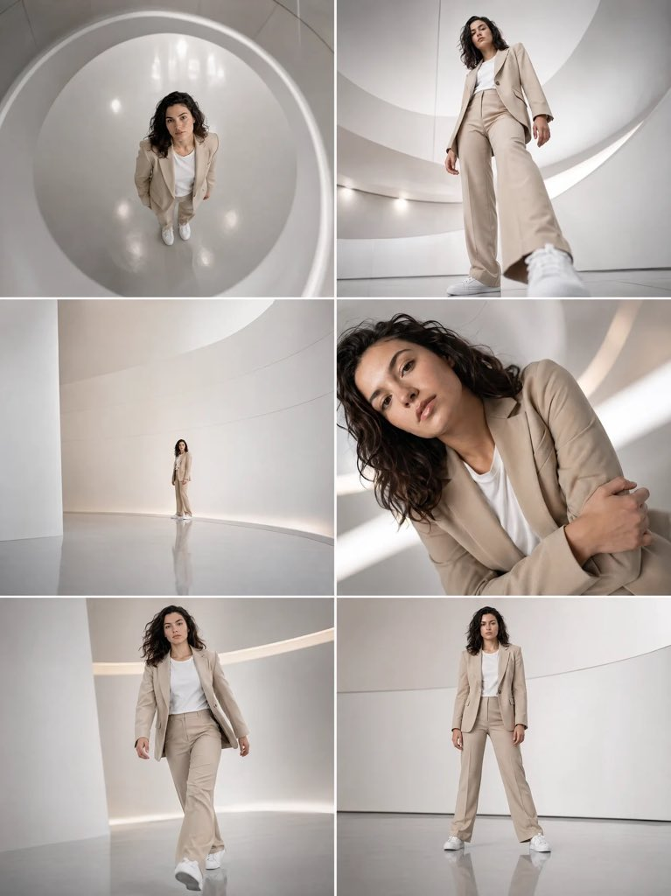

```text
Frame 1 (Top-Down Establishing)
Extreme top-down shot in futuristic white curved hall, subject centered but compressed against smooth reflective floor, body aligned straight but slightly angled, arms close to body with subtle tension, head tilted upward toward camera, gaze directed straight up, strong circular architectural lines framing composition, soft studio lighting creating gentle gradients, shallow depth of field at f/1.2, smartphone-like proximity despite height, clean minimal atmosphere, dynamic opening frame, subtle athletic readiness, wearing full beige suit with white t-shirt and white sleek sneakers, Peter Lindbergh influence
Frame 2 (Low Angle Power)
Extreme low angle from floor level, subject towering above camera, legs forming strong base, torso slightly leaning forward, shoulders squared, arms slightly away from body, head angled downward, gaze into lens, strong vertical distortion, reflective floor amplifying silhouette, soft studio lighting with controlled highlights, shallow depth f/1.2, powerful dominance frame, subtle athletic tension, full beige suit, white t-shirt, white sleek sneakers, Peter Lindbergh influence
Frame 3 (Wide Isolation)
Wide long shot, subject very small within vast futuristic hall, surrounded by curved white architecture, large negative space dominating composition, subject standing still, body straight, arms relaxed but structured, head slightly turned, gaze outward into space, minimal reflections, soft even lighting, shallow depth f/1.2 isolating subject despite distance, cinematic silence, full beige suit, white t-shirt, white sleek sneakers, Peter Lindbergh influence
Frame 4 (Dynamic Close-Up Tilt)
Close-up with strong diagonal tilt, subject leaning into frame, shoulders sharply angled, one arm crossing body, head tilted sideways, gaze slightly off camera, tight crop cutting part of body, soft lighting wrapping contours, shallow depth f/1.2 isolating face plane, intense proximity and tension, full beige suit, white t-shirt visible, Peter Lindbergh influence
Frame 5 (Motion Step Forward)
Mid shot, subject stepping forward dynamically, one leg extended, weight shifting, arms slightly swinging with controlled motion, shoulders rotated, head facing forward, gaze ahead, slight motion blur on edges, futuristic curved walls passing behind, soft studio lighting, shallow depth f/1.2, transitional energy frame, full beige suit, white t-shirt, white sleek sneakers, Peter Lindbergh influence
Frame 6 (Final Grounded Frame)
Full body frontal shot, subject standing firmly, legs slightly apart, arms held with controlled tension, shoulders squared, head facing forward, gaze into camera, symmetrical composition slightly offset, minimal futuristic background, soft lighting emphasizing structure, shallow depth f/1.2, strong final impact frame, subtle athletic readiness, full beige suit, white t-shirt, white sleek sneakers, Peter Lindbergh influence

Negative Commands (apply to all frames):
no text, no watermark, no low quality, no cartoonish style

Aspect Ratio: 3:4
```


---

## 例 456：Annotated Coffee Table Mood Board

**来源：** [@Ciri_ai](https://x.com/Ciri_ai/status/2049721047696732550) / [awesome-gpt-image-2-prompts](https://github.com/EvoLinkAI/awesome-gpt-image-2-prompts)

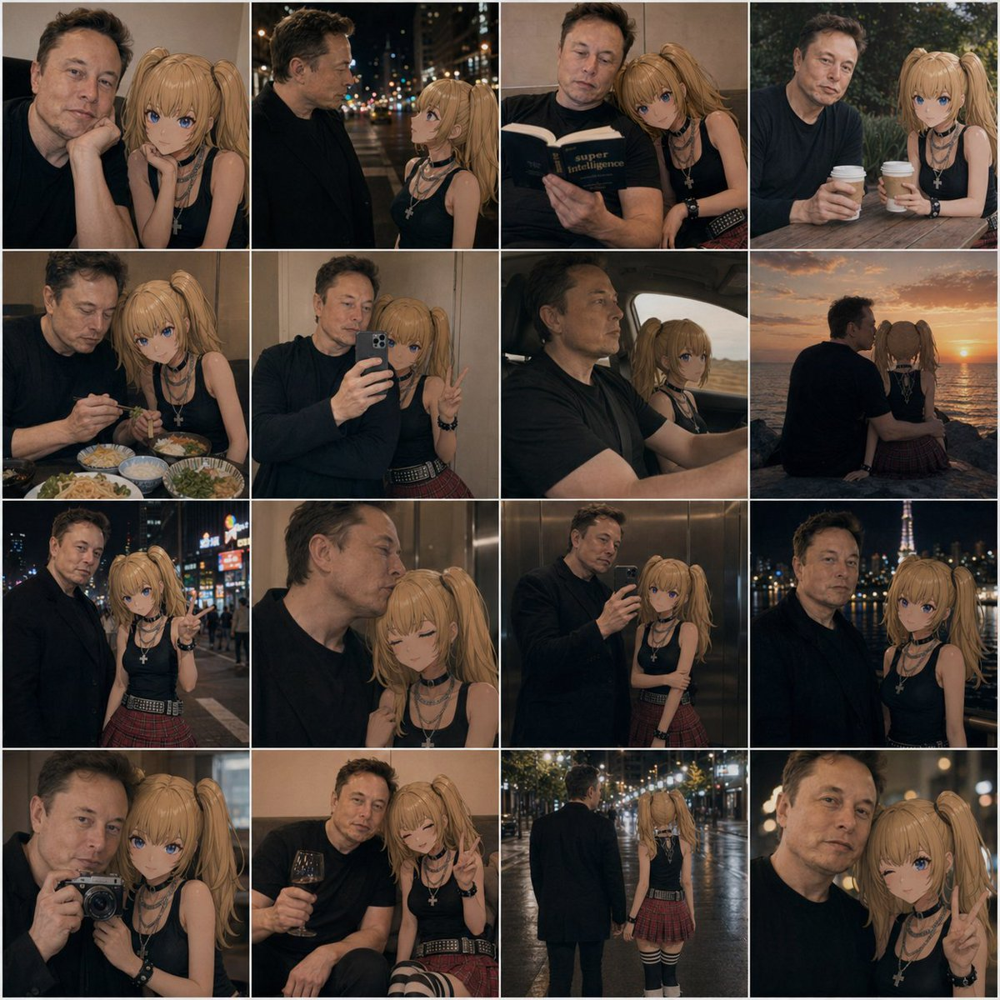

```text
Use the uploaded photo as the main base image.

Based on the coffee, drinks, desserts, plates, props, table setting, and overall composition shown in the image, create an aesthetic and emotional result that naturally reflects the real elements in the photo. Do not add any people. Stay true to the actual types of food and drinks, their arrangement, and the atmosphere captured in the original image.

Then, carefully observe each element in the photo and add hand-drawn style annotations that match each subject:

Use white pen-style sketch lines with a rough, slightly uneven, hand-drawn feel

Include object outlines, arrows, and dotted lines to guide visual flow

Add short handwritten Korean notes in a casual, introspective, emotional tone

For drinks: describe taste, temperature, and mood

For desserts: describe texture and flavor

For the space: describe the ambiance

Include a short overall summary of the scene

Subtly incorporate small details like steam, sparkles, hearts, or tiny emotive symbols

Maintain a clean, spacious layout with an Instagram story or magazine memo-like aesthetic

The final result should look like an emotionally styled version of the original photo, without forcing in any elements that don’t naturally belong to it
```


---

## 例 457：Brand Identity Moodboard System

**来源：** [@SaasJunctionHQ](https://x.com/SaasJunctionHQ/status/2054666436698845299) / [awesome-gpt-image-2-prompts](https://github.com/EvoLinkAI/awesome-gpt-image-2-prompts)

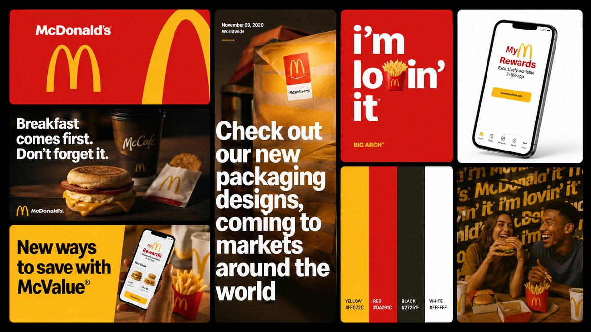

```text
Full-blown brand identity system [BRAND NAME] — Brand Identity Moodboard STEP 1 — DECODE THE BRAND Extract from real brand guidelines only: - Colors: full official palette (primary, secondary, neutrals, accents) — exact, no approximations - Type: weight, width, tracking, capitalization character — applied identically across all cards - Copy: real slogans, campaigns, product names, manifesto phrases — zero invented text - World: the domain (sport / tech / fashion / music / etc.) — all imagery stays inside it STEP 2 — OUTPUT Single 16:9 flat image. Black (#000–#0A0A0A) background. 8 cards in an asymmetric 3-column grid. Uniform 8–12px gaps. Rounded corners 8–12px. Every card uses only Step 1 colors, type, and copy. CARDS — in order: 1. LOGO LOCKUP (wide, top-left) — brand color BG, official logo/wordmark, oversized cropped logo mark as structural graphic. No photo. 2. EDITORIAL PHOTO (mid-left) — dark photo from brand world, manifesto headline in brand type over image, wordmark small at bottom. 3. CAMPAIGN BANNER (wide, bottom-left) — flat accent color BG, real event/campaign headline bold-condensed left side, action photo cropped into right side. 4. STORY FORMAT (tall, center full-height) — full-bleed photo, oversized display type partially cropped by edges, date/location detail top. Mobile story proportions. 5. TYPOGRAPHIC POSTER (upper center-right) — vivid accent BG, campaign headline with one letter replaced by a real brand-world object, edition tag below. 6. COLOR PALETTE (center-right) — vertical equal stripes, one per brand color, color name labeled bottom each stripe. No photo. Zero decoration. 7. PRODUCT MOCKUP (upper right) — studio photo of real brand product or branded device/interface, neutral BG, accurate logo/color/type placement. 8. TYPE PATTERN (lower right) — brand name/slogan repeated as all-over pattern at varied sizes/angles, editorial photo overlaid and color-treated to integrate. RULE: A person who knows this brand must immediately confirm every card belongs to it. Output quality: Behance brand identity case study / agency pitch deck.
```


---

## 例 458：Exploded Vehicle View

**来源：** [@CharaspowerAI](https://x.com/CharaspowerAI/status/2056049620753449271) / [awesome-gpt-image-2-prompts](https://github.com/EvoLinkAI/awesome-gpt-image-2-prompts)

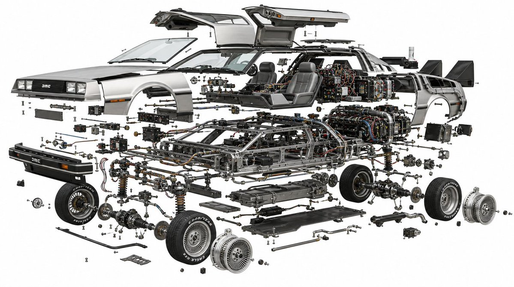

```text
Create an ultra detailed exploded view of the iconic [vehicle name].
[Vehicle] is suspended in mid-air with all mechanical parts separated and floating in perfect alignment, showing the full internal structure of the vehicle. White background
```


---

## 例 459：Rider-Waite Tarot Card

**来源：** [@itsphotogptai](https://x.com/itsphotogptai/status/2056400494709690591) / [awesome-gpt-image-2-prompts](https://github.com/EvoLinkAI/awesome-gpt-image-2-prompts)

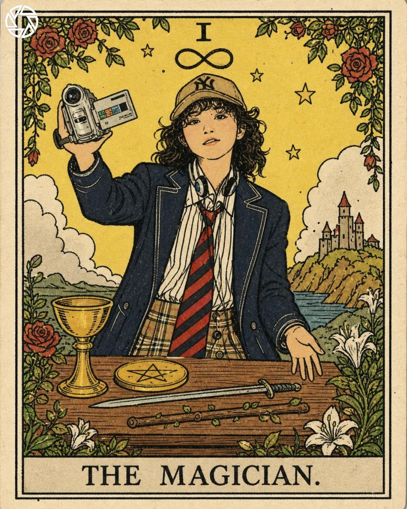

```text
Create a Tarot card based on what you know about me, in the classic style of Rider-Waite. Portray me as a drawn figure with an expressive, but slightly uneven black line of ink, with vivid fluctuations and variations in the stroke, with flat colors without shading. Add delicate visual elements of the Tarot around the figure. convey the texture of the paper and the feeling of a printed impression.
```


---

## 例 460：Venice Travel Vlogger Collage

**来源：** [@ZaraIrahh](https://x.com/ZaraIrahh/status/2063432414945591594) / [awesome-gpt-image-2-prompts](https://github.com/EvoLinkAI/awesome-gpt-image-2-prompts)

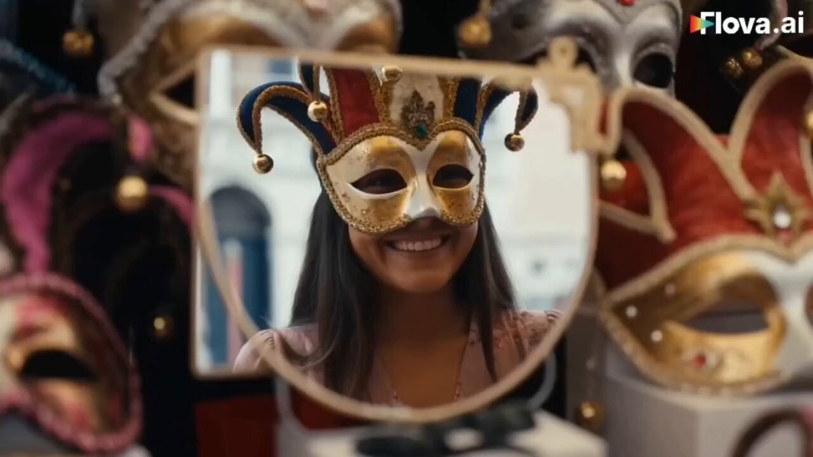

```text
Young female travel vlogger exploring Venice, Italy across 13 wildly candid, chaotic, funny, and uniquely Venetian moments, stunning with long windswept hair, effortless luxury European summer fashion, playful adventurous personality, authentic handheld iPhone collage aesthetic with natural imperfections, unfiltered travel energy, social media realism, spontaneous vacation chaos.

Frame Breakdown Includes: — accidentally boarding the wrong vaporetto and enthusiastically waving at the dock before realizing she's headed in the opposite direction — struggling to drag an oversized suitcase over a steep stone canal bridge, laughing at the absurdity of it — getting completely lost in Venice's labyrinth of narrow alleys and emerging into a deserted hidden courtyard with a confused expression — chasing a paper city map as the wind sends it flying toward a canal — being unexpectedly surrounded by a massive flock of pigeons in Piazza San Marco while clutching a half-eaten pastry — attempting an elegant gondola selfie but getting caught off guard when the gondola suddenly rocks — discovering a tiny hidden bookstore and reacting dramatically to a sleeping cat curled up among the books — squeezing through an impossibly narrow Venetian alleyway and realizing halfway through that it's much tighter than expected — trying to pose gracefully in a beautiful Venetian carnival mask while struggling not to laugh — caught in a sudden rain shower as historic squares become reflective and crowded with umbrellas — confidently following a shortcut only to reach a dead-end canal with no bridge, staring in disbelief — accidentally walking into the background of an extravagant luxury wedding photoshoot near a historic palace — Final frame: sitting beside a quiet canal at blue hour, surrounded by shopping bags, a melting gelato, and a crumpled city map, laughing uncontrollably after spending the entire day hopelessly lost, candid shaky capture, motion blur, authentic Venice travel chaos

Style: ultra-realistic travel vlog collage, Venice street photography, handheld smartphone camera aesthetic, imperfect framing, accidental photobombs, candid expressions, genuine laughter, iconic Venetian architecture, canals, gondolas, historic bridges, hidden alleyways, European summer atmosphere, natural lighting, motion blur, lens flares, overexposed highlights, authentic memories, cinematic storytelling, high-detail realism, viral travel content, no studio polish, no posing, spontaneous documentary-style moments, social media realism, chaotic vacation energy, luxury travel influencer aesthetic.
```


---

## 例 461：Early Internet Portfolio Page

**来源：** [@Kashberg_0](https://x.com/Kashberg_0/status/2065992579502747850) / [awesome-gpt-image-2-prompts](https://github.com/EvoLinkAI/awesome-gpt-image-2-prompts)

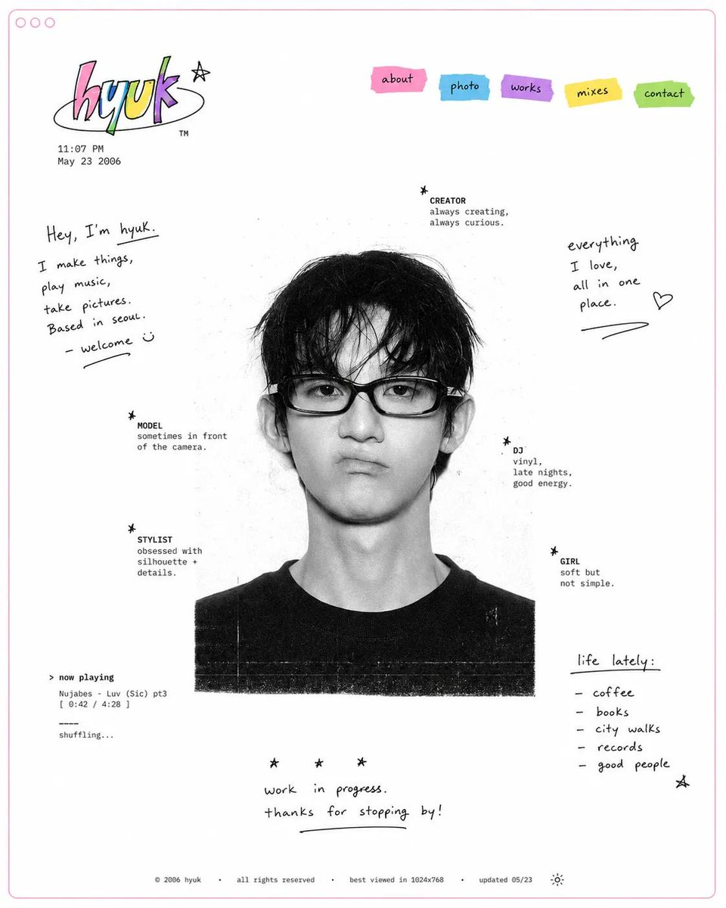

```text
Design a minimal early-internet personal profile webpage / digital portfolio landing page on a large white canvas with generous negative space and a thin pastel pink browser-style frame. In the center, place a black-and-white editorial portrait of [SUBJECT], featuring soft film grain, subtle scanner texture, and low-contrast photographic tones.

Surround the portrait with scattered profile metadata labels and small star-bullet elements arranged asymmetrically, resembling a playful personal résumé. Include descriptors such as:

✦ creator
✦ model
✦ stylist
✦ DJ
✦ girl
✦ photographer
✦ collector
✦ dreamer

In the top-left corner, create a colorful hand-drawn logo or personal brand mark. Beneath it, add a tiny timestamp and date in a small system font, mimicking an old personal homepage.

In the top-right corner, place irregular sticker-like navigation tabs in bright accent colors (pink, cyan, purple, yellow, and green). Use simple labels such as:

HOME
ABOUT
WORK
DIARY
LINKS

Scatter handwritten marker-style notes, introductions, personal thoughts, and lifestyle captions throughout the empty space. Examples:

"currently making things online"
"welcome to my homepage"
"music, fashion, internet"
"updated today"
"living between projects"

Maintain an anti-grid editorial layout with intentionally imperfect spacing and playful placement. Mix tiny system fonts, handwritten script, and casual notebook-style annotations. Keep the portrait entirely monochrome while reserving color only for the logo, navigation stickers, and a few small graphic accents.
```


---

## 例 462：Mascot Brand Identity Sheet

**来源：** [@iamaiistudio](https://x.com/iamaiistudio/status/2066568983453880412) / [awesome-gpt-image-2-prompts](https://github.com/EvoLinkAI/awesome-gpt-image-2-prompts)


```text
{
  "type": "18-section complete brand identity and mascot design sheet",
  "brand": {
    "name": "{argument name=\"brand name\" default=\"MUYANG TEA\"}",
    "industry": "{argument name=\"industry\" default=\"tea shop\"}",
    "colors": ["{argument name=\"primary color\" default=\"yellow\"}", "{argument name=\"secondary color\" default=\"green\"}", "white", "brown", "dark green"]
  },
  "subject": "{argument name=\"character description\" default=\"3D rendered cute Shiba Inu mascot wearing a green apron\"}",
  "layout": {
    "grid": "3-column by 6-row grid layout",
    "sections": [
      {
        "title": "01 BRAND DNA ANALYSIS",
        "elements": ["brand logo", "5 color swatches", "6 brand icons", "target audience charts"]
      },
      {
        "title": "02 CONCEPT MOODBOARD",
        "elements": ["5 reference photos", "4 mood icons", "design concept equation"]
      },
      {
        "title": "03 FORM STUDY",
        "elements": ["4 logo anatomy icons", "4 design evolution steps", "4 character silhouettes"]
      },
      {
        "title": "04 CONCEPT EXPLORATION",
        "elements": ["12 line-art character concept sketches"]
      },
      {
        "title": "05 REFINED LINE ART",
        "elements": ["3 rows of front and side view line art with proportion guides"]
      },
      {
        "title": "06 DETAIL REFINEMENT",
        "elements": ["2 full-body renders with annotation labels", "4 circular close-up views"]
      },
      {
        "title": "07 EXPRESSION SHEET",
        "elements": ["11 3D rendered facial expressions"]
      },
      {
        "title": "08 POSE LIBRARY",
        "elements": ["9 full-body 3D rendered character poses"]
      },
      {
        "title": "09 TURNAROUND VIEW",
        "elements": ["5 full-body 3D renders from multiple angles", "5 matching line-art views"]
      },
      {
        "title": "10 COLOR DEVELOPMENT",
        "elements": ["5 rows of 5-color palette options", "color psychology explanations"]
      },
      {
        "title": "11 MATERIAL SPECIFICATION",
        "elements": ["5 surface texture swatches", "material property sliders", "4 manufacturing process icons"]
      },
      {
        "title": "12 COLOR APPLICATION",
        "elements": ["4 color scheme variant renders", "2 light and dark mode renders", "4 contrast rating indicators"]
      },
      {
        "title": "13 CONSTRUCTION GUIDE",
        "elements": ["2 line-art technical diagrams for geometry and grid system"]
      },
      {
        "title": "14 DESIGN SYSTEM RULES",
        "elements": ["minimum size icons", "clear space diagram", "4 correct and incorrect usage examples"]
      },
      {
        "title": "15 ASSET VARIANTS",
        "elements": ["3 scaled size variants", "3 line-art style variants", "3 simplified flat icon heads"]
      },
      {
        "title": "16 DIGITAL APPLICATIONS",
        "elements": ["1 app icon design", "2 social media avatar versions", "UI component elements", "3-frame animation cycle"]
      },
      {
        "title": "17 PHYSICAL APPLICATIONS",
        "elements": ["plush toy product mockup", "product packaging mockup", "branded merchandise mockup", "retail storefront mockup"]
      },
      {
        "title": "18 FINAL RENDERING",
        "elements": ["large high-resolution 3D mascot render holding tea cup", "finalized logo", "deliverable file format list"]
      }
    ]
  }
}
```


---

## 例 463：The King Still Breathes Masthead

**来源：** [@NeuralAIInsight](https://x.com/NeuralAIInsight/status/2067291988953567706) / [awesome-gpt-image-2-prompts](https://github.com/EvoLinkAI/awesome-gpt-image-2-prompts)

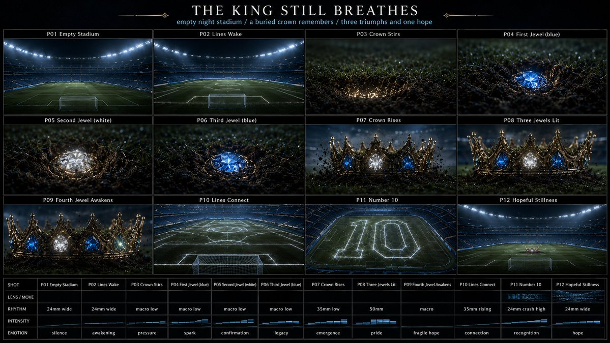

```text
Create a 16:9 image.

[PROJECT CARD]
Create a compact designed masthead, not a table.
TITLE: THE KING STILL BREATHES
META LINE: empty night stadium / a buried crown remembers / three triumphs and one hope
PRIORITY: the four-jewel crown — three jewels lit certain and complete (blue, white, blue) and a fourth softly awakening with hope; crown stays buried until it rises; pitch resolves into a giant number 10; one realistic field, restraint throughout
MICRO BRIEF: After a legendary hat-trick, a buried crown awakens beneath an empty Argentina-blue stadium — three jewels light for three World Cups, a fourth begins to glow with hope, and the pitch briefly forms a giant number 10.[CONTINUITY HEADER]
SEQUENCE ID: king_still_breathes_4jewel_12p
REFERENCE PRIORITY: No image references provided (Brief-Only). No character — environment-led and symbolic. This storyboard controls stadium geography, the waking pitch lines, the buried crown, the four-jewel sequence, the crown rise, the number-10 reveal, and panel order.
BEAT NAME LOCK (generate once, use identically in panel headers, action path, state track, and the director-strip beat labels): P01 Empty Stadium / P02 Lines Wake / P03 Crown Stirs / P04 First Jewel (blue) / P05 Second Jewel (white) / P06 Third Jewel (blue) / P07 Crown Rises / P08 Three Jewels Lit / P09 Fourth Jewel Awakens / P10 Lines Connect / P11 Number 10 / P12 Hopeful Stillness. Do not relabel or reorder these anywhere on the board
[SCENE PACKET]
PREMISE: An empty but still-charged football stadium at night remembers a legendary hat-trick; the pitch wakes, a buried crown stirs and lights three historic jewels one by one, rises in ceremony, and a fourth jewel softly begins to glow with hope as the field geometry briefly forms a giant number 10.
LOCATION: A single realistic modern football stadium at night after a major match, empty stands, floodlights over an Argentina sky-blue atmosphere, dark emerald grass, white pitch markings, silver floodlight haze, one goal net. Normal football geography only. The pitch surface and the crown buried beneath it are the active stage.
START -> END: empty charged stadium, one net swaying, lines beginning to wake -> a quiet hold on the still field, the crown settled, three jewels fading but the fourth jewel remaining faintly alive — the future has begun to breathe.
ACTION CHAIN: empty stadium, one net sways -> the white pitch lines begin glowing softly, the field waking -> beneath the grass the crown stirs, sensed through buried light and pressure (no visible crown) -> the first jewel lights blue (first World Cup) -> the second jewel lights white (second World Cup) -> the third jewel lights blue (third World Cup) -> the crown rises with ceremonial weight from beneath the pitch -> we see the crown clearly, three jewels glowing blue-white-blue -> a fourth dark jewel stirs, flickers, breathes, and softly begins to glow (hope, not yet a triumph) -> the white lines connect and spread with living light -> from an elevated view the field geometry resolves into a giant number 10 -> the glow fades toward stillness, the crown settles, the fourth jewel remaining faintly alive.
PROP / EFFECT STATE: a buried crown made by the pitch — gold edges partly formed from the white pitch lines, soil and grass clinging, elegant and football-mythic, never medieval-prop or fantasy-clean. It has four jewel settings. The first three jewels ignite one by one, certain and complete, in Albiceleste rhythm: blue, white, blue. The crown is NOT clearly visible before P07. The fourth jewel is visually distinct: dormant, then flickering and breathing, a soft fragile glow that never fully ignites like the others. The number 10 forms organically and half-found from real field geometry (penalty box, center circle, touchlines, glowing trails), never a graphic overlay. The fourth jewel remains faintly lit at the end. Subtle gold and jewel light only; otherwise blues, whites, silver.
MUST READ: the hat-trick lights history (three certain jewels) and awakens belief in what comes next (the fragile fourth). Reverent, epic, restrained; pride turning to hope.
[CHARACTER SANITIZATION]
No characters. No player, face, body, silhouette, portrait, or likeness of any real person. No Messi depiction of any kind. The subject is the stadium, the pitch, and the crown. The crown is a symbol, not worn; no king, throne, or robes.
[IDENTITY CONSISTENCY]
Keep stadium geometry, floodlight positions, the single net position, and pitch-line layout consistent across all panels. Keep the crown design consistent once revealed, and keep the four jewel positions consistent (three that light historic, one that awakens). Argentina connection through color and atmosphere only — sky blue, white, deep night blue — never text, crests, or a depicted person.
[STORYBOARD PURITY]
Full-color panel artwork (polished pitch board). Panel numbers, beat names, and lens tags in the header strip outside each panel. The beat names in the headers must match the BEAT NAME LOCK and the director-strip beat labels exactly. No captions, subtitles, signage, logos, crests, brand marks, trophy replicas, readable text, arrows, or overlays inside the artwork. The number 10 appears ONLY as illuminated field geometry within the image, never a graphic label. One clear visual idea per panel.
[MASTER SHOT RULE]
P01 establishes the geography: the empty night stadium, floodlights over Argentina-blue haze, dark emerald pitch with white markings, one goal net, empty stands. One realistic field, normal geography. The sacred charged emptiness is set here.
[EMOTIONAL ARC]
post-match silence -> recognition -> awakening -> pride (three historic jewels and the coronation) -> hope (the fragile fourth jewel and the lingering glow); carried by the environment — the swaying net, waking lines, buried stir, the one-by-one jewels, the ceremonial rise, the breathing fourth jewel, the connecting geometry, the number 10, and a quiet hopeful hold.
[STYLE LOCKS]
STYLE LOCK: mythic cinematic football short, premium symbolic sports poetry, elegant and emotionally charged; full-color; deep stadium night blues, sky-blue and white Argentina light, dark emerald grass, silver floodlight haze, selective gold only on the crown and jewel moments. Reverent, epic, restrained, poetic rather than literal. Not a match recap, not a fan edit, not abstract art-film.
EFFECT LOCK: the white pitch lines wake with a soft living glow like a nervous system; the crown stirs as buried light and pressure under the turf before any reveal; the first three jewels ignite one by one with clear punctuation, certain and complete, blue then white then blue; the crown, once revealed, rises slow and ceremonial and heavy, pitch-made with soil and grass clinging, never a clean prop; the fourth jewel is softer, fragile, flickering and breathing into a gentle glow, never a full bright ignition; the lines connect and spread with living light; the number 10 resolves organically and half-found from real field geometry, discovered by the camera; the fourth jewel remains faintly alive at the end.
ENVIRONMENT LOCK: one realistic night stadium throughout — floodlights, blue atmosphere, emerald pitch, white lines, a single net, empty stands; normal football geography only; no three-net or impossible layouts; no crowd, no players, no symbolic clutter.
CROWN REVEAL LOCK: the crown is NOT clearly visible in P01-P06. In P03-P06 show only buried glow, pressure under the turf, and the jewels lighting beneath/through the grass — never a readable crown. The first clear crown reveal is P07 when it rises. The crown is pitch-made: gold edges partly formed from white pitch lines, soil and grass clinging, elegant and football-mythic, not medieval-prop, not fantasy-clean.
JEWEL LOCK: four jewel settings, consistent positions. Three light one-by-one as historic and complete in Albiceleste rhythm — P04 blue, P05 white, P06 blue. The fourth (P09) is visually distinct: dormant then awakening, a soft fragile breathing glow that never matches the full certainty of the first three. It must read as hope, not a won trophy.
[SPATIAL CONTINUITY LOCK]
All panels share one stadium geography: pitch, white-line layout, floodlight positions, the single net, the crown's central buried location and its four jewel positions. The jewels light in fixed positions; the crown rises from one fixed central point (only from P07); the number 10 forms from the established white-line geometry seen from a widening elevated angle (not a new location or overlay). The camera starts close and textural and gradually widens and elevates toward the reveal. Allowed changes: camera height/angle/distance, which jewel is lit, buried-glow state, crown emergence state (none before P07), the fourth jewel's awakening state, glow spread, line illumination, net sway.
[DIRECTOR STRIP]
Animatic track board aligned to panel columns. Shot chips, rhythm blocks, intensity bars, short labels. No seconds or timestamps. BEAT LABEL row must read exactly: P01 Empty Stadium / P02 Lines Wake / P03 Crown Stirs / P04 First Jewel / P05 Second Jewel / P06 Third Jewel / P07 Crown Rises / P08 Three Jewels Lit / P09 Fourth Jewel / P10 Lines Connect / P11 Number 10 / P12 Hopeful Stillness. These must match the panel header beat names.
PANEL HEADERS:
P01 / 24mm wide / Empty stadium
P02 / macro low / Lines wake
P03 / macro low / Crown stirs (buried)
P04 / 50mm low / First jewel: blue
P05 / 50mm low / Second jewel: white
P06 / 50mm low / Third jewel: blue
P07 / 35mm low / Crown rises
P08 / 50mm / Three jewels lit
P09 / macro / Fourth jewel awakens
P10 / 35mm rising / Lines connect
P11 / 24mm crane high / Number 10
P12 / 24mm wide / Hopeful stillness
CAMERA + LENS PLAN:
P01: high wide establishing hold on the empty stadium and single net, patient
P02: macro low as the white pitch lines begin to glow softly, the field waking
P03: macro low on the turf as the buried crown stirs — light and pressure under the grass, no visible crown
P04: low push as the first jewel lights blue beneath the surface, certain and clear
P05: low push as the second jewel lights white, matching punctuation
P06: low push as the third jewel lights blue, the historic three now complete
P07: low angle as the pitch-made crown rises with ceremonial weight from beneath the pitch, soil and grass clinging — first clear reveal
P08: held medium on the risen crown, three jewels glowing blue-white-blue in Albiceleste rhythm
P09: macro on the fourth, previously dark jewel as it stirs, flickers, breathes, and softly begins to glow — fragile, hopeful, distinct from the other three
P10: rising angle as the white lines connect and spread with living light across the field
P11: high crane / elevated wide as the field geometry resolves half-found into a giant number 10
P12: wide hold as the glow fades toward stillness and the crown settles, the fourth jewel remaining faintly alive
ACTION PATH:
P01: the empty stadium sits charged under floodlights, one net swaying slightly
P02: the white pitch lines begin glowing softly, the field waking and remembering
P03: beneath the grass the crown stirs, sensed only through buried light and pressure; no crown visible
P04: the first jewel lights blue — Argentina's first World Cup
P05: the second jewel lights white — the second World Cup
P06: the third jewel lights blue — the third World Cup, the historic three complete
P07: the crown rises with ceremonial weight from beneath the pitch, soil and grass clinging
P08: the crown is seen clearly, three jewels glowing blue-white-blue
P09: a fourth dark jewel stirs, flickers, breathes, and softly begins to glow — hope for a fourth, not yet a triumph
P10: the white lines connect and spread with living light through the pitch geometry
P11: from the elevated view, the field geometry resolves into a giant number 10
P12: the glow fades toward stillness, the crown settles, the fourth jewel remains faintly alive
RHYTHM TRACK:
RHY P01: hold / long block / held beat
RHY P02: slow reveal / medium block / clean beat
RHY P03: slow reveal / medium block / held beat
RHY P04: build / short block / clean beat
RHY P05: build / short block / match beat
RHY P06: impact / short block / smash beat
RHY P07: build / long block / held beat
RHY P08: pause / medium block / held beat
RHY P09: slow reveal / long block / held beat
RHY P10: build / medium block / match beat
RHY P11: final hit / long block / smash beat
RHY P12: pause / long block / held beat
ESCALATION MAP:
ESC P01: L1 calm / flat
ESC P02: L2 tension / rise
ESC P03: L2 tension / rise
ESC P04: L3 rise / rise
ESC P05: L3 rise / rise
ESC P06: L4 surge / spike
ESC P07: L5 peak / surge
ESC P08: L4 surge / held
ESC P09: L3 rise / rise
ESC P10: L4 surge / rise
ESC P11: L5 peak / spike
ESC P12: L2 tension / release
STATE TRACK:
P01: empty stadium, one net sways, no glow
P02: white lines waking, soft glow
P03: buried crown stirs, pressure under turf, no crown
P04: first jewel blue, beneath surface
P05: second jewel white
P06: third jewel blue, historic three complete
P07: crown rises, soil clinging (first reveal)
P08: crown clear, three jewels blue-white-blue
P09: fourth jewel flickering, breathing, soft glow
P10: lines connected, living light spreading
P11: geometry resolves into number 10
P12: glow fades, crown settled, fourth jewel faintly alive STYLE TRACK:
P01: blue floodlit haze
P02: waking line glow
P03: buried stir, turf pressure
P04: blue jewel light
P05: white jewel light
P06: blue jewel light
P07: rising pitch-made gold
P08: Albiceleste three-jewel glow
P09: fragile fourth-jewel breath
P10: connecting line veins
P11: half-found number 10
P12: fading glow, one jewel alive [NEGATIVE / AVOID]
Panel header beat names must match the

Seedance 2.0 Prompt:

Based on the storyboard , create this short film — do not include any movement arrows, camera notes, panel numbers, captions, labels, borders, or storyboard markings.

THE KING STILL BREATHES — beneath an empty Argentina-blue stadium, a buried crown lights three jewels for three triumphs and a fourth begins to glow with hope.

IMAGE REFERENCE INSTRUCTION
= the locked 12-panel storyboard, the authoritative director-approved blueprint for composition, staging, motion, timing, and pacing across the full 15 seconds. Follow the panel order exactly. Do not render the storyboard sheet itself. Do not invent alternative coverage. This is an environment-led symbolic piece with no character — no player, face, body, or likeness anywhere.
Color bible (definitive): deep stadium night blues, sky-blue and white Argentina light, dark emerald grass, silver floodlight haze; selective gold only on the crown and jewel moments. The crown is pitch-made — gold edges partly formed from the white pitch lines, soil and grass clinging to it, elegant and football-mythic, never a clean prop or medieval cosplay. The number 10 forms only from real field geometry, half-found, never a graphic overlay. One realistic football field, one net, normal geography only.

TASK
Create a 15-second mythic cinematic football short built from deliberate, elegant cuts. An empty night stadium, still charged after a legendary hat-trick, slowly awakens: the white pitch lines begin to glow, a buried crown stirs beneath the turf, and three jewels light one by one — blue, white, blue — for Argentina's three World Cup triumphs. The crown rises in ceremony, revealing those three certain jewels, and then a fourth dark jewel softly stirs, flickers, and begins to glow with fragile hope for what comes next. The field lines connect and spread with living light until the pitch geometry resolves, for one brief unforgettable moment, into a giant number 10 — then the glow fades toward stillness, the crown settles, and the fourth jewel remains faintly alive. Football history turning to myth, and pride turning to hope.

STYLE
Mythic cinematic football short, premium symbolic sports poetry, elegant and emotionally charged — not a match recap, not a fan edit, not abstract art-film. Reverent, epic, restrained, poetic rather than literal, as if the stadium itself remembers. Deep night blues with sky-blue and white Argentina light, dark emerald grass, silver floodlight haze, selective gold only on the crown and jewels. Everything moves with weight and intention; restraint over spectacle.

SHOT STRUCTURE: 12 shots / 15s / 16:9 — deliberate cinematic cuts (not one continuous take)

SEQUENCE
Shot 01 — EMPTY STADIUM [0–1.5s] WIDE / STATIC / PATIENT HOLD: the empty night stadium under floodlights, Argentina-blue haze, dark emerald pitch, a single goal net swaying faintly. Still, but charged with the memory of what just happened. Post-match silence.
Shot 02 — LINES WAKE [1.5–3s] MACRO / LOW / SLOW TRACK ALONG A LINE: the white pitch lines begin to glow softly, light running along the painted markings like the field's nervous system waking and remembering. Recognition.
Shot 03 — CROWN STIRS [3–4s] MACRO / LOW / SLOW PUSH: in the turf, a buried glow and faint pressure stir beneath the grass — something royal sensed but not yet seen. No visible crown.
Shot 04 — FIRST JEWEL [4–5s] CLOSE / LOW / CUT IN: beneath the surface the first jewel lights a deep blue — Argentina's first World Cup. Certain, clear, historic.
Shot 05 — SECOND JEWEL [5–6s] CLOSE / LOW / MATCHING CUT: the second jewel lights white — the second triumph. The same confident punctuation.
Shot 06 — THIRD JEWEL [6–7.5s] CLOSE / LOW / MATCHING CUT: the third jewel lights blue — the third triumph. The historic three now complete, glowing in Albiceleste rhythm.
Shot 07 — CROWN RISES [7.5–9.5s] MEDIUM / LOW / SLOW CEREMONIAL RISE: the pitch-made crown rises with heavy ceremonial weight from beneath the turf, soil and grass clinging to its gold edges. Earned, mythic, powerful. The first clear reveal.
Shot 08 — THREE JEWELS LIT [9.5–11s] MEDIUM / SLOW PUSH: the crown seen clearly, its three jewels glowing blue-white-blue. A held moment of pride. The king's history made visible.
Shot 09 — FOURTH JEWEL AWAKENS [11–12.5s] MACRO / SLOW PUSH: a fourth, previously dark jewel stirs — it flickers, breathes, and softly begins to glow. It does not blaze like the other three; it is fragile, tentative, hopeful. Belief in a fourth triumph, not yet won.
Shot 10 — LINES CONNECT [12.5–13.5s] HIGH / RISING: the white pitch lines connect and spread with living light across the field, the geometry beginning to mean something.
Shot 11 — NUMBER 10 [13.5–14.5s] CRANE HIGH / ELEVATED WIDE: from above, the glowing field geometry resolves, half-found and broken-edged, into a giant number 10 — discovered by the camera, pitch memory rather than a drawn symbol. The unforgettable image.
Shot 12 — HOPEFUL STILLNESS [14.5–15s] WIDE / STATIC / HOLD: the glow fades toward stillness, the crown settles back into the grass, the stadium quiets — but the fourth jewel remains faintly alive, breathing. The future has begun to breathe. Hold.

CAMERA RULES
Deliberate, elegant cinematic cuts between shots — not one continuous take. The camera is patient and confident, uncovering something sacred: it begins close and textural (macro grass, low jewel angles) and gradually widens and elevates toward the reveal, ending on a held wide. One primary move per shot; no shaky handheld, no snap zooms, no hyper-editing. The number 10 is discovered by the elevated camera, never presented as a flat graphic. Let the piece breathe.

HARD RULES
- No character of any kind: no player, face, body, silhouette, or Messi likeness. The subject is the stadium, the pitch, and the crown.
- The crown is NOT visible before Shot 07; Shots 03–06 show only buried glow, turf pressure, and the jewels lighting beneath the grass.
- The crown is pitch-made, soil and grass clinging, elegant and football-mythic — never a clean prop, medieval cosplay, or ornate fantasy.
- The first three jewels light one by one, certain and complete, in Albiceleste rhythm: blue, white, blue.
- The fourth jewel must look different from the first three — dormant then awakening, fragile, flickering, a soft glow that never fully blazes. It reads as hope, not a won trophy.
- One realistic football field, one net, normal geography only — never three nets or impossible layouts.
- The number 10 appears only as illuminated field geometry, half-found with broken edges, never a graphic overlay or label.
- No readable logos, crests, sponsor marks, brand marks, or trophy replicas. Argentina connection through color and atmosphere only.
- Not a match-highlight recap. Reverent aftermath, memory, myth, and hope. Power through restraint — no symbolic clutter.

AUDIO
No dialogue, no commentary. Reverent, charged, slightly supernatural sound design. Begin with the deep ambience of an empty stadium — distant floodlight hum, a faint wind, the soft creak of the swaying net. The lines waking add a delicate glassy shimmer running across the field. The crown stirring is a low buried throb under the turf. Each of the three jewels lights with a clear, resonant chime — three certain, complete tones, the same confident punctuation each time. The crown rising lands with a heavy, sacred low impact and a slow rising shimmer of gold. The three-jewel moment holds on a proud sustained chord. The fourth jewel is different — a soft, fragile, flickering tone that breathes rather than rings, tentative and tender. The lines connecting add a spreading living hum; the number 10 resolves on a held, awe-struck swell. Then it falls back toward near-silence — the empty stadium hum, and one last faint breathing shimmer from the fourth jewel. Music: sparse, mythic, restrained — deep cinematic drones, a slow sacred build through the coronation, a single restrained peak at the number-10 reveal, then a quiet hopeful fade that does not fully resolve, leaving the fourth jewel's note hanging. Never bombastic, never a sports anthem; aura and hope, not hype.

Negatives: no player, face, likeness, body, or silhouette; no Messi depiction; no crown before Shot 07; no clean-prop or medieval crown; the fourth jewel must not blaze like the first three; one field and one net only, never three nets; the number 10 only as organic half-found field geometry, never an overlay; no logos, crests, brand marks, trophy replicas, or readable text; no match-recap energy; no identity drift, no jitter or temporal flicker, no warped geometry, no floating objects, no watermarks; no movement arrows, camera notes, panel numbers, captions, labels, borders, or storyboard markings in the video.
```


---

## 例 464：Douyin Livestream Screenshot

**来源：** [@iamaiistudio](https://x.com/iamaiistudio/status/2068123767994523857) / [awesome-gpt-image-2-prompts](https://github.com/EvoLinkAI/awesome-gpt-image-2-prompts)


```text
Vertical 9:16 aspect ratio. Create a realistic Douyin (TikTok China) live broadcast screenshot. The scene shows Liu Yifei hosting a live stream, holding up a sign that reads: "Streaming live tonight, join the chat with Yifei!" Capture the authentic look of a Chinese mobile livestreaming interface.
```


---

## 例 465：Expedition Planning Command Board

**来源：** [@iamaiistudio](https://x.com/iamaiistudio/status/2069104692098130014) / [awesome-gpt-image-2-prompts](https://github.com/EvoLinkAI/awesome-gpt-image-2-prompts)

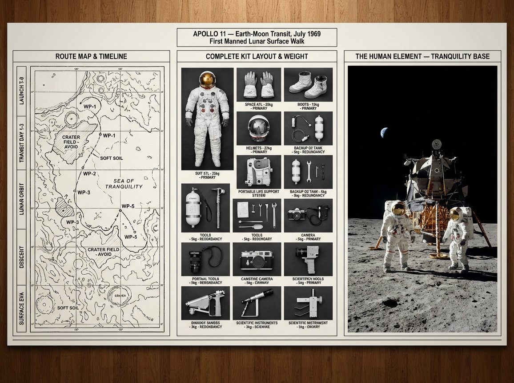

```text
A strategic command board for an expedition leader planning [JOURNEY / MISSION] to [DESTINATION / ERA]. Left panel: detailed topographic route map with labeled waypoints, annotated danger zones, and a timeline running along the edge. Center panel: overhead flat lay of every piece of kit in neat organized rows, each item tagged by weight and function, redundancies flagged, nothing unnecessary included. Right panel: the expedition in motion or the destination reached, small human figures against a vast landscape, scale unmistakable. Visual language shifts from cartographic precision through functional inventory documentation to sweeping epic environmental photography. Title block reads: "[EXPEDITION NAME] — [ROUTE], [DATE], [OBJECTIVE]".
```


---

## 例 466：Livestream Commerce UI Mockup

**来源：** [@iamaiistudio](https://x.com/iamaiistudio/status/2069090579355668501) / [awesome-gpt-image-2-prompts](https://github.com/EvoLinkAI/awesome-gpt-image-2-prompts)


```text
{
  "type": "live stream UI mockup",
  "subject": {
    "description": "portrait of {argument name=\"host name\" default=\"Elon Musk\"}, smiling, dressed in a black t-shirt featuring a white technical schematic print",
    "background": "left side displays a screen showing '{argument name=\"left background logo\" default=\"SPACEX\"}' text, right side shows a red '{argument name=\"right background logo\" default=\"Tesla T logo\"}' and a dark-colored car"
  },
  "ui_overlay": {
    "top_header": {
      "host_info": "avatar, host name '{argument name=\"host name\" default=\"Elon Musk\"}', subtext '556k likes this stream', red 'Follow' button",
      "rank_badge": "gold coin icon labeled 'No.1 Site-wide'",
      "viewer_stats": "3 top viewer avatars with counts '123k', '86k', '57k', total viewers '687k', 'X' close button",
      "right_links": "'More streams >', 'Gift Hall 0/24' with blue 'Classic' tag"
    },
    "mid_left_gifts": {
      "count": 2,
      "items": [
        "avatar 'TechFan', 'sent a Little Heart', heart icon x 1314",
        "avatar 'SeaOfStars', 'sent a Rocket', rocket icon x 666"
      ]
    },
    "bottom_left_chat": {
      "system_message": "level 37 badge 'CosmicWanderer joined the stream'",
      "message_count": 7,
      "messages": [
        "LittleRocket: Musk! The future is bright! 🚀",
        "future: When is Tesla Model 2 coming out?",
        "StarryDreamer: Will SpaceX reach Mars this year?",
        "AIExplorer: What's the latest on Neuralink?",
        "HandsomeNetizen: Hello Boss Ma!",
        "Mars: First time watching your stream, super excited!",
        "User123: Talk about AI — will it replace humans?"
      ]
    },
    "bottom_right_product_card": {
      "hot_tag": "orange 'Hot Sale x 1888'",
      "image": "Tesla Cybertruck",
      "title": "{argument name=\"product name\" default=\"Tesla Cybertruck Electric Pickup\"}",
      "price": "{argument name=\"product price\" default=\"¥1,618,000\"}",
      "button": "red 'Buy' button",
      "floating_animation": "translucent hearts drifting up along the right edge"
    },
    "bottom_bar": {
      "input_field": "'Say something...'",
      "icons": ["smiley face", "three dots", "shopping cart", "gift box", "share"]
    }
  }
}
```


---

## 例 467：Flash Chat App Icon

**来源：** [@iamaiistudio](https://x.com/iamaiistudio/status/2069900481770737707) / [awesome-gpt-image-2-prompts](https://github.com/EvoLinkAI/awesome-gpt-image-2-prompts)


```text
Design a macOS App Store icon for an app called 'Flash Chat'. Single squircle icon with smooth, continuously rounded corners, centered on a white canvas with padding, filling roughly 80% of the canvas. Modern light skeuomorphic style, macOS App Store quality. One icon only.
```


---

## 例 468：Nine-Frame Product Campaign

**来源：** [@iamaiistudio](https://x.com/iamaiistudio/status/2069628865044254934) / [awesome-gpt-image-2-prompts](https://github.com/EvoLinkAI/awesome-gpt-image-2-prompts)

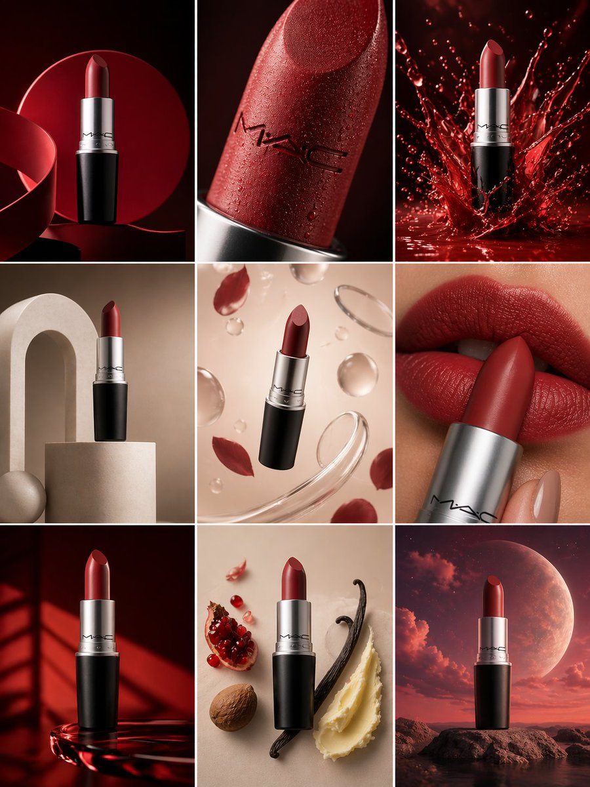

```text
Generate a 3×3 image grid (3:4 aspect ratio) for a luxury commercial campaign centered on the uploaded product.

Each of the nine frames should deliver a unique visual concept while keeping the product visually identical throughout.

The nine concepts:
1. Hero still life with a bold, iconic arrangement
2. Extreme macro revealing surface texture and material detail
3. Liquid or particle dynamics wrapping around the product
4. Minimalist sculptural staging with abstract geometry
5. Floating elements that convey lightness and forward-thinking design
6. Close-up sensory shot focused on tactile realism
7. Color-concept scene drawn from the product's own palette
8. Symbolic ingredient or component abstraction
9. Surreal but refined blend of realism and imagination

Product rules: maintain 100% fidelity to the product's shape, proportions, label, type, color, and branding. No distortion or redesign. Clean product-to-background separation.

Lighting and finish: soft controlled studio lighting, subtle highlights, realistic shadows, ultra-sharp focus, high dynamic range, editorial luxury aesthetic.

Mood: polished, modern, hyperreal, aspirational. Built for brand sites, social grids, and digital billboards.
```


---

## 例 469：3D Music Player Icon Set

**来源：** [@iamaiistudio](https://x.com/iamaiistudio/status/2071108428563697756) / [awesome-gpt-image-2-prompts](https://github.com/EvoLinkAI/awesome-gpt-image-2-prompts)

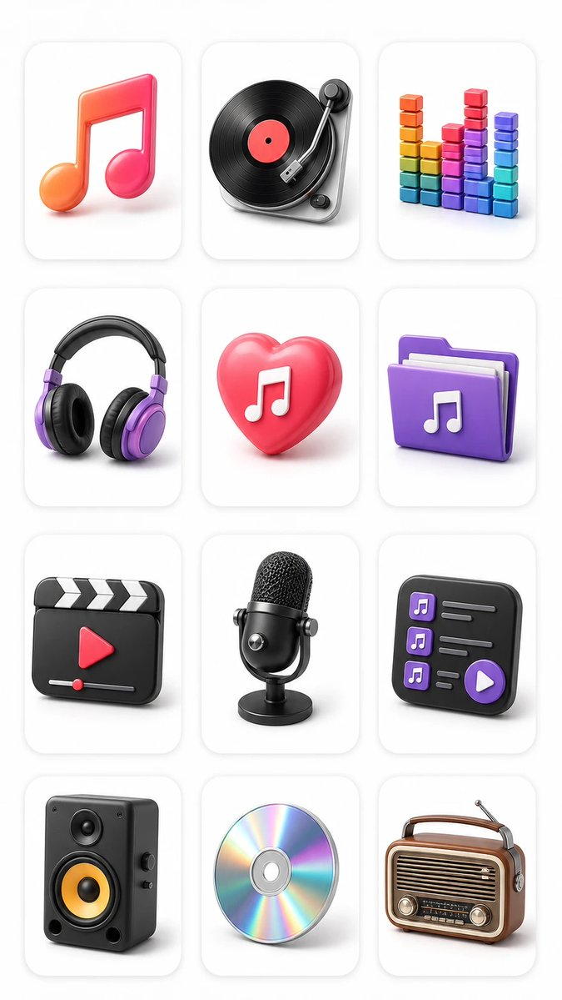

```text
Design a complete set of 12 music-player homepage category icons in the style of a professional app UI designer. Icons should cover: music note, vinyl record, equalizer, headphones, liked music, music folder, video, microphone, playlist, speaker, CD, and radio. Render each in 3D skeuomorphic style with vibrant colorful accents, on white background rounded-corner cards.
```


---

## 例 470：Y2K Harajuku Brand Badge

**来源：** [@iamaiistudio](https://x.com/iamaiistudio/status/2071683274725028140) / [awesome-gpt-image-2-prompts](https://github.com/EvoLinkAI/awesome-gpt-image-2-prompts)

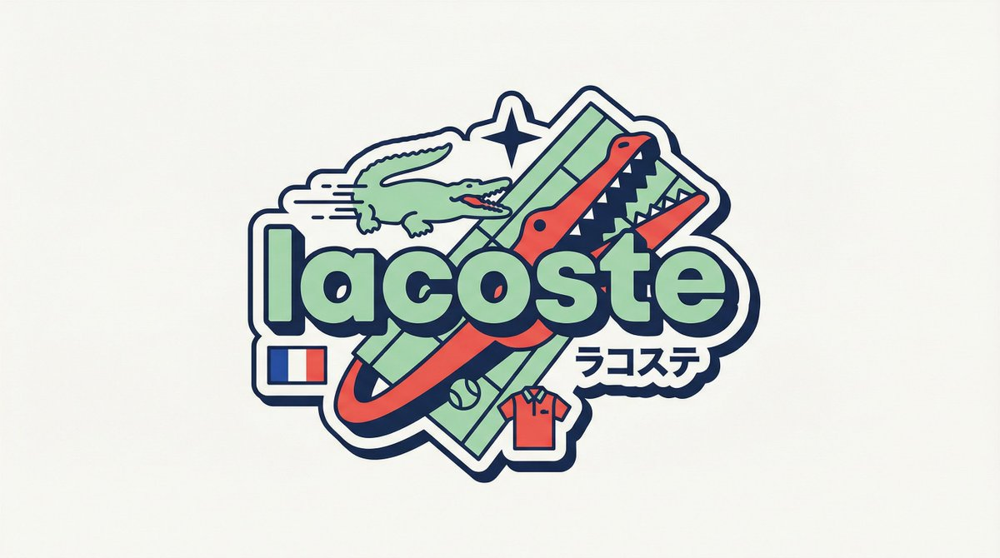

```text
[BRAND NAME]

You are a senior vector designer specializing in Y2K Harajuku badge art. Your world: Tokyo bootleg culture, early 2000s Japanese brand remixes, retro-futuristic sticker aesthetics. Every output should look like a clean Illustrator vector file, flat and sticker-ready. The badge structure must be invented fresh for each brand, not templated.

BRAND ANALYSIS

Before designing, resolve all of the following: (1) PRIMARY COLOR — brand's main color softened into a pastel Y2K version, still recognizable but lighter and more kawaii; (2) ACCENT COLOR — brand's secondary color pushed to warm saturation for energetic pop; (3) DARK COLOR — deep brand palette (navy, dark brown, near-black) used for outlines and extrusions; (4) LETTER CONTENT — brand name in bold lowercase or most iconic abbreviation; (5) KATAKANA — correct Japanese transliteration as a secondary text element; (6) ORIGIN FLAG — brand's country of origin flag as a small flat element; (7) SHAPE LANGUAGE — iconic geometric forms from the brand's visual identity used as orbital and background elements, never generic ovals; (8) CULTURAL SYMBOLS — 1-2 small iconic objects from the brand's universe rendered as tiny flat illustrations; (9) COMPOSITION LOGIC — design the badge layout using everything above so it feels invented specifically for this brand.

CANVAS

1:1 square. Flat off-white or warm light grey background. Completely empty, no texture, no gradient.

BADGE STRUCTURE

Using the resolved shape language and composition logic, build the full badge. Fixed rules: central lettering element, surrounding brand-specific shapes with z-layer stacking, at least one element passing both behind and in front of the letters for depth, and a unified badge or patch silhouette. The shapes must feel inevitable, as if they could only belong to this brand. Everything else is determined by the brand's own visual DNA.

LETTERING

Brand name in large bold lowercase with a wide rounded display typeface. Flat PRIMARY COLOR fill. Thick DARK COLOR extrusion offset down-right at 8-12% of letter height. Bold DARK COLOR outline. No gradients, no rendering.

Y2K SIGNATURE ELEMENTS

Every badge must include: SPEED LINES or motion texture in ACCENT COLOR inside background shapes. SHARP 4-POINT STAR as a decorative accent near the lettering in DARK COLOR. KATAKANA transliteration tucked naturally into the composition. ORIGIN FLAG as a small accurate flat element. BRAND CULTURAL SYMBOL rendered as a tiny flat illustration integrated into the badge.

TECH SPECS

Flat vector only. Zero gradients, effects, blur, or rendering. Clean crisp edges throughout. Maximum 4 colors: PRIMARY pastel, ACCENT warm saturated, DARK outline, off-white. Must feel like a collectible sticker or embroidered patch. Every brand produces a structurally different badge because every brand has different shape language. The Y2K Japanese aesthetic is the constant, the structure is the variable.
```


---

## 例 471：Nostalgic Memory Grid Layout

**来源：** [@iamaiistudio](https://x.com/iamaiistudio/status/2071561442013118600) / [awesome-gpt-image-2-prompts](https://github.com/EvoLinkAI/awesome-gpt-image-2-prompts)

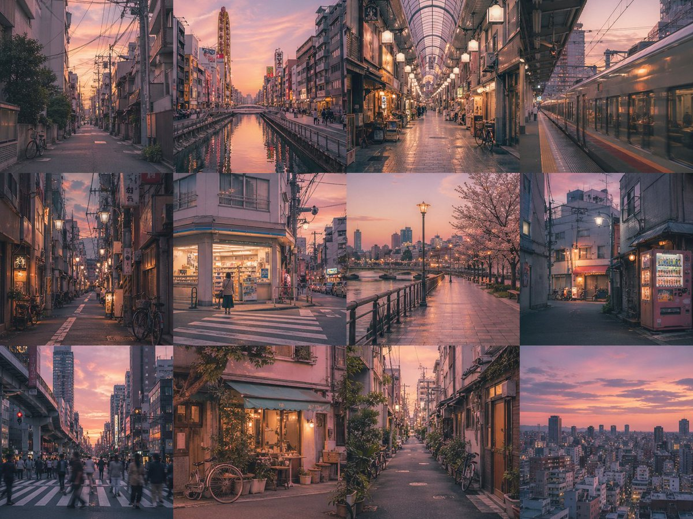

```text
Generate a {argument name="grid layout" default="4x3"} seamless grid layout where every panel shows a separate scene featuring the {argument name="subject" default="a young woman"}. Keep subject appearance, colors, and lighting perfectly consistent across all panels. Theme: {argument name="theme" default="childhood memories"}, mood: {argument name="mood" default="warm, nostalgic"}, style: {argument name="style" default="nostalgic cinematic realism"}. No text, no gaps.
```


---

## 例 472：A hyper-realistic UI/UX mockup displayed on a slim modern laptop placed on a ...

**来源：** [@ZaraIrahh](https://x.com/ZaraIrahh/status/2047179669011616172) / [awesome-gpt-image-2-prompts](https://github.com/EvoLinkAI/awesome-gpt-image-2-prompts)


```text
A hyper-realistic UI/UX mockup displayed on a slim modern laptop placed on a minimal wooden desk with soft natural daylight. The screen shows a clean SaaS dashboard with elegant typography, glassmorphism cards, smooth gradients, subtle drop shadows, and neatly spaced components. Visible charts, analytics panels, sidebar navigation, and micro-interactions. Realistic macOS-style window frame, soft reflections on the screen, shallow depth of field, cozy workspace atmosphere, shot in photorealistic product photography style, ultra-detailed.
```


---
