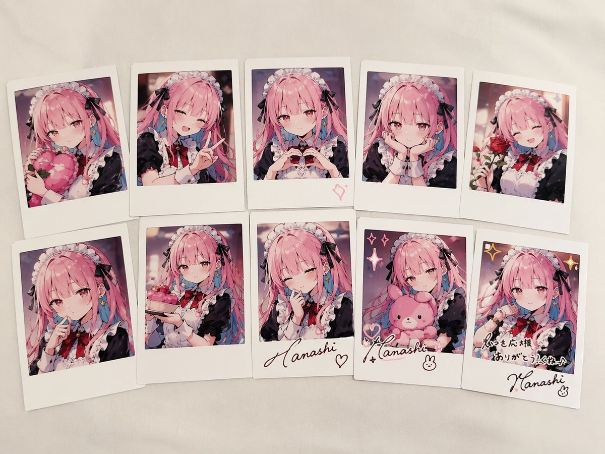
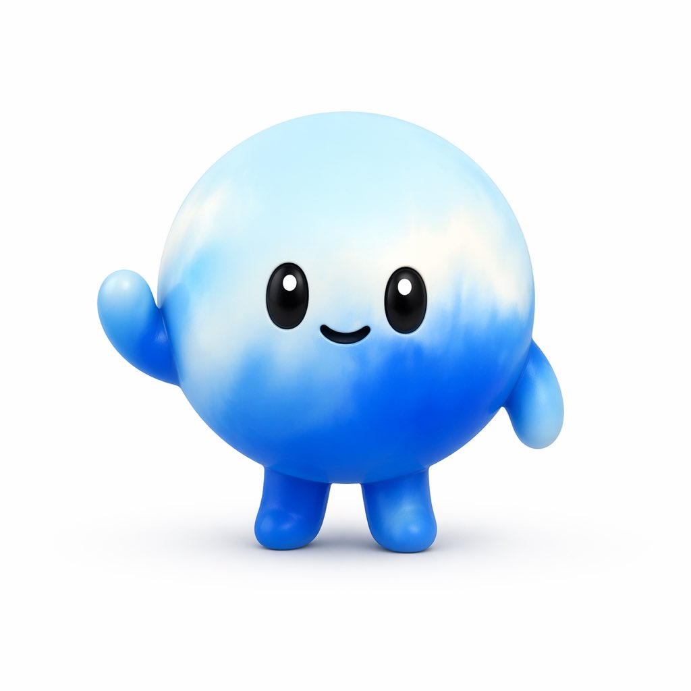
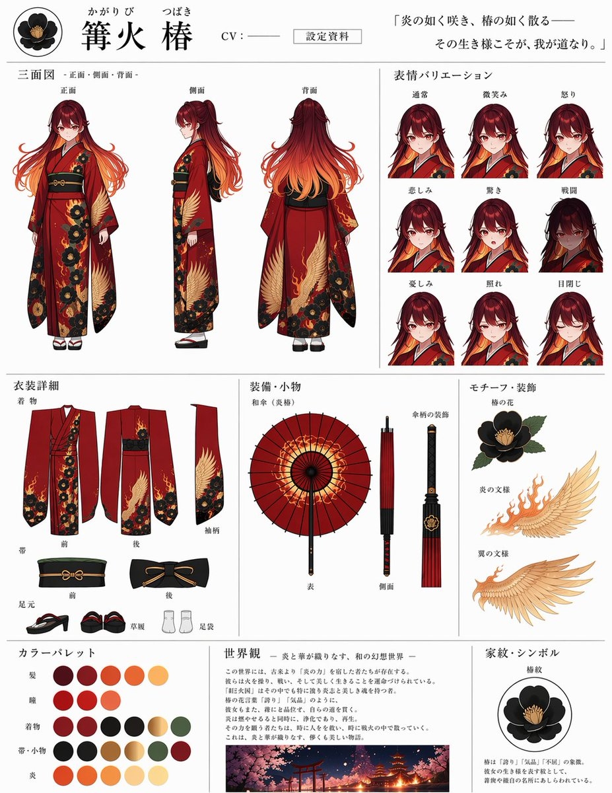
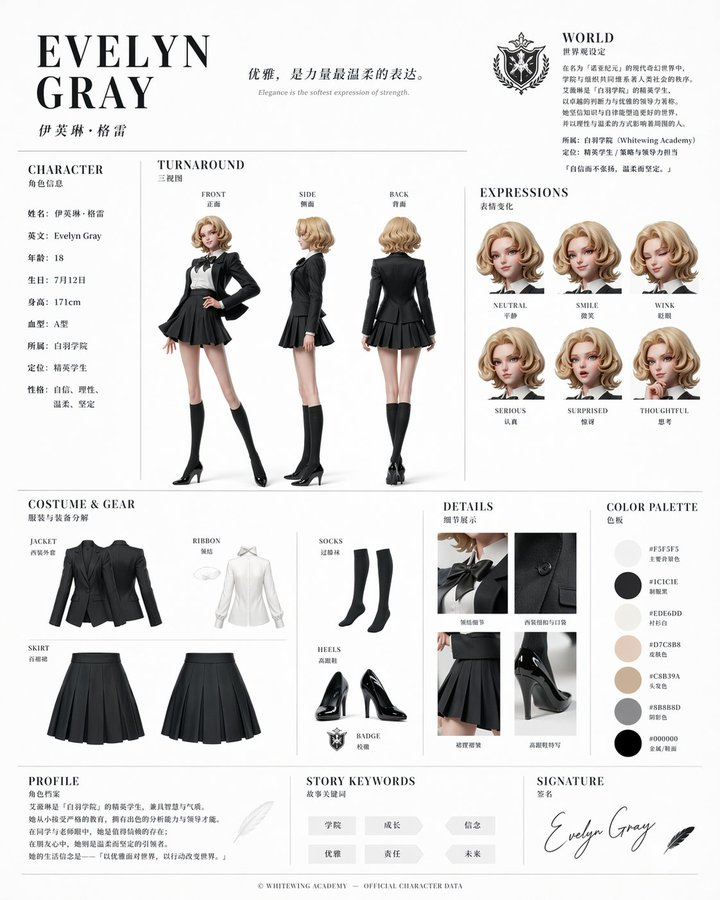
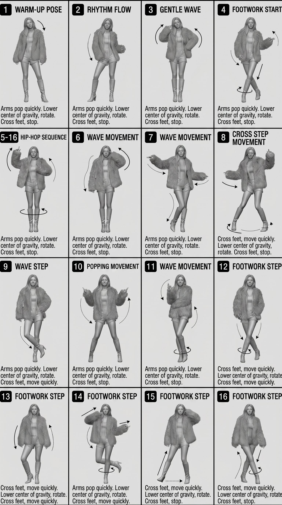

# 人物与角色 — 提示词合集


> 9 个案例

---

## 例 27：人物角色设定图

**来源：** [@anemone\_sd](https://x.com/anemone_sd)




```text
{
  "type": "collection of instant photos",
  "setting": "laid out flat on a white fabric surface",
  "character": {
    "hair": "{argument name=\"hair color\" default=\"long pink hair with blue inner color\"}",
    "outfit": "{argument name=\"outfit\" default=\"black and white maid uniform with frilly headband and black ribbons\"}",
    "eyes": "reddish-pink"
  },
  "layout": {
    "arrangement": "two rows of five polaroid photos",
    "count": 10,
    "photos": [
      { "position": "top row 1", "description": "holding a pink heart cushion" },
      { "position": "top row 2", "description": "winking, making a peace sign" },
      { "position": "top row 3", "description": "making a hand heart, pink heart doodle on the bottom border" },
      { "position": "top row 4", "description": "resting chin on hands, gentle smile" },
      { "position": "top row 5", "description": "holding a red rose, winking" },
      { "position": "bottom row 1", "description": "finger to lips, shy expression" },
      { "position": "bottom row 2", "description": "holding a small pink cake" },
      { "position": "bottom row 3", "description": "winking, hand near face, signature '{argument name=\"signature text\" default=\"Hanashi\"}' and heart doodle on border" },
      { "position": "bottom row 4", "description": "holding a pink bunny plushie, sparkle doodles, signature '{argument name=\"signature text\" default=\"Hanashi\"}' and bunny doodle on border" },
      { "position": "bottom row 5", "description": "winking, sparkle doodles, message '{argument name=\"message text\" default=\"いつも応援ありがとう！これからもよろしくね♪\"}' and signature '{argument name=\"signature text\" default=\"Hanashi\"}' on border" }
    ]
  }
}
```


---

## 例 54：人物角色设定图

**来源：** [@fukumy\_ai](https://x.com/fukumy_ai)


```text
{
  "type": "4-panel satirical product advertisement grid",
  "layout": {
    "grid": "2x2",
    "panels": [
      {
        "position": "top-left",
        "product_name": "{argument name=\"top left product name\" default=\"座る石\"}",
        "visual": "man in white shirt and dark pants sitting on a large round stone in a park",
        "catchphrase": "いつでも、どこでも、落ち着ける。",
        "sales_badge": "累計販売数 12,000個 突破!",
        "vertical_text": "公園のベンチが埋まっていた日に。",
        "features_count": 3,
        "features_labels": [
          "重さ約8kgで安定感抜群",
          "底面フェルト加工で傷つけにくい",
          "付属の専用ベルトで持ち運び簡単"
        ],
        "extra_visual": "small inset image of the stone with a leather carrying strap",
        "specs": [
          "耐荷重 150kg",
          "安心の日本製"
        ]
      },
      {
        "position": "top-right",
        "product_name": "{argument name=\"top right product name\" default=\"磨きたくない人の歯ブラシ\"}",
        "visual": "sleek light blue toothbrush angled diagonally on a dark blue background",
        "toothbrush_text": "I don't want to brush my yeeth.",
        "catchphrase": "持っているだけで安心感",
        "vertical_text": "歯を磨く代わりに、これを持つ。",
        "sales_badge": "シリーズ累計販売数 85,000本 突破!",
        "features_count": 3,
        "features_labels": [
          "気持ちを落ち着けるお守り代わりに",
          "会議や商談前のエチケットに",
          "磨かない選択を、もっと自由に。"
        ],
        "bottom_banner": "歯磨きストレスから、あなたを解放する。"
      },
      {
        "position": "bottom-left",
        "product_name": "{argument name=\"bottom left product name\" default=\"雲の貯金箱\"}",
        "visual": "hand inserting a coin into a fluffy white cloud-shaped piggy bank",
        "catchphrase": "空気より軽い、安心感。",
        "sales_badge": "累計販売数 23,567個 突破!",
        "features_count": 3,
        "features_labels": [
          "ふわふわの触り心地",
          "割れないから安心",
          "インテリアに馴染むデザイン"
        ],
        "color_variants_count": 3,
        "color_variants_labels": [
          "blue",
          "pink",
          "white"
        ],
        "price": "¥2,980 (税込)",
        "bottom_text": "今日から、空に向かってコツコツ貯めよう。"
      },
      {
        "position": "bottom-right",
        "product_name": "{argument name=\"bottom right product name\" default=\"叱ってくれる石\"}",
        "visual": "round stone on a wooden desk with a pen, text written on the stone",
        "stone_text": "{argument name=\"scolding phrase\" default=\"いいかげんやれ\"}",
        "catchphrase": "やる気が出ないあなたへ。",
        "sales_badge": "累計販売数 18,000個 突破!",
        "features_count": 3,
        "features_labels": [
          "見るたびに心を奮い立たせる",
          "厳選された言葉をランダム表示",
          "電池不要、半永久的に叱ってくれる"
        ],
        "phrase_variants_count": 10,
        "phrase_variants_labels": [
          "甘えるな",
          "考えるな",
          "動け",
          "現実を見ろ",
          "逃げるな",
          "寝るな",
          "やればできる",
          "お前ならできる",
          "寝るな",
          "もう言い訳するな"
        ],
        "price": "¥3,500 (税込)"
      }
    ]
  }
}
```


---

## 例 155：人物角色设定图

**来源：** [@wtry1102](https://x.com/wtry1102)


```text
Create {argument name="items" default="fan goods"} for a standard {argument name="character type" default="Vtuber"} in {argument name="style" default="live-action"}
```


---

## 例 162：人物角色设定图

**来源：** [@nicdunz](https://x.com/nicdunz)




```text
{argument name="voice" default="chatgpt voice"} if it were a character
```


---

## 例 166：十二黄金圣斗士卡牌合集

**来源：** [@songguoxiansen](https://x.com/songguoxiansen/status/2046476566537080849)


```text
[中文]
生成圣斗士星矢12个黄金圣斗士的12宫格卡牌图片，每张卡牌上写上对应的中文名，每行4个，宽高比16:9。

[English]
Generate a 12-grid card image of the 12 Gold Saints from Saint Seiya, with the corresponding Chinese name written on each card, 4 per row, aspect ratio 16:9.
```


---

## 例 271：人物角色设定图

**来源：** [@tsubaki\_ew](https://x.com/tsubaki_ew/status/2045259289993048284)




```text
[中文]
お借りして噂のGPT-Image-2でキャラシート作ってみましたｽｺﾞｯ(๑°ㅁ°๑)‼✧更に色々指示してあげたらもっといい感じになりそう✨キャラは以前チャッピーにお願いして描いて貰った我が分身です( *¯ ꒳¯*)

[English]
I borrowed it and tried making a character sheet using the rumored GPT-Image-2 Awesome(๑°ㅁ°๑)‼✧ It seems like it would turn out even better if I gave it various more instructions✨ The character is my alter ego that I asked Chappy to draw for me before( *¯ ꒳¯*) #GPTimage #AIgenerated
```


---

## 例 290：古风诗人镭射典藏卡牌

**来源：** [@TanShilong](https://x.com/TanShilong/status/2045435090923356415)


```text
[中文]
为中国古代诗人设计一套游戏卡片，并按照SSR SR R 分级，重点卡片有放大展示的效果，包括卡面设计和人物介绍，有很高级的游戏卡片质感，稀有卡片还会有特色的光影例如镭射效果 需要有套卡设计和技能设计，并附带较为详细的说明

[English]
Design a set of game cards for ancient Chinese poets, classified by SSR SR R grades, with key cards having an enlarged display effect, including card face design and character introduction, having a very high-end game card texture, rare cards will also have special light and shadow effects such as holographic laser effects, requiring set card design and skill design, along with relatively detailed descriptions
```


---

## 例 306：官方角色设定资料卡

**来源：** [@MANISH1027512](https://x.com/MANISH1027512/status/2045013913901867334)




```text
[中文]
基于此角色和背景，请制作一份类似官方设定资料的角色资料卡。
・包含三视图：正面、侧面和背面
・添加角色面部表情的变化・分解并展示服装和装备的详细部分
・添加色板・包含世界观设定的简要说明
・总体上，使用有组织的布局（白色背景，插画风格）

[English]
Based on this character and background, please create a character reference sheet similar to official setting materials.
・Includes three-view drawings: front view, side view, and back view
・Add variations of the character's facial expressions
・Break down and display detailed parts of the clothing and equipment
・Add a color palette
・Include a brief explanation of the worldview setting
・Overall, use an organized layout (white background, illustration style)
```


---

## 例 347：4×4 动作分解参考表

**来源：** [@oggii_0](https://x.com/oggii_0/status/2048614158699217302)




```text
[STYLE]
Monochrome grayscale illustration, 3D-rendered character, clean instructional reference sheet, white background, comic-style cell grid layout, technical diagram aesthetic.

[LAYOUT]
4×4 grid layout with a total of 16 panels. Each panel is separated by thin black border lines. Cells are numbered from 1 to 16, with consistent panel sizes.

[CHARACTER]
image1 (the same character appears consistently in all panels)

[PANEL STRUCTURE – per cell]
Top-left: bold number badge + English title text
Center: full-body character pose illustration
Bottom-left: English description text (3–4 lines)
Overlay: directional arrows indicating movement

[ARROWS / MOTION INDICATORS]
Curved arrows, straight arrows, and circular rotation indicators placed around the character to show motion flow and direction.

[RENDERING STYLE]
Highly detailed 3D sculpted style, soft studio lighting, subtle shadows, no color, grayscale shading, clean linework, game concept art quality.

[NEGATIVE]
No background scenery, no color tones, no additional characters, no complex background.
```

