# 人物与角色 — 提示词合集


> 65 个案例

---


## 例 27：人物角色设定图

**来源：** [@anemone\_sd](https://x.com/anemone_sd)

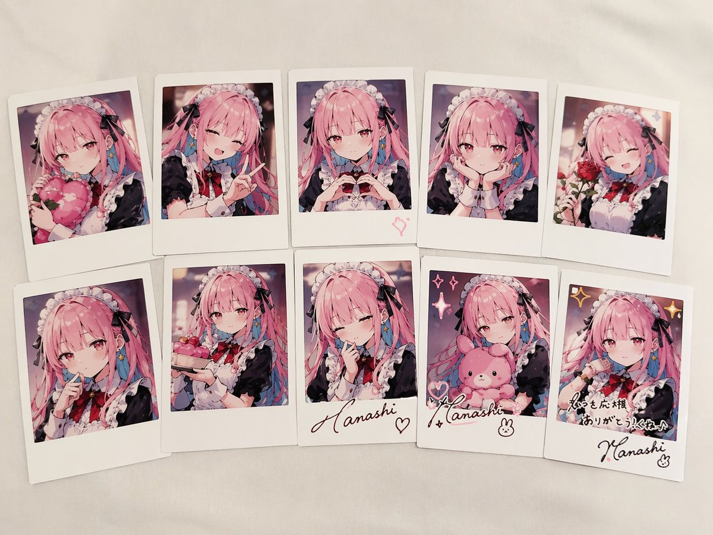


```text
{
  "type": "collection of instant photos",
  "setting": "laid out flat on a white fabric surface",
  "character": {
    "hair": "{argument name=\"hair color\" default=\"long pink hair with blue inner color\"}",
    "outfit": "{argument name=\"outfit\" default=\"black and white maid uniform with frilly headband and black ribbons\"}",
    "eyes": "reddish-pink"
  },
  "layout": {
    "arrangement": "two rows of five polaroid photos",
    "count": 10,
    "photos": [
      { "position": "top row 1", "description": "holding a pink heart cushion" },
      { "position": "top row 2", "description": "winking, making a peace sign" },
      { "position": "top row 3", "description": "making a hand heart, pink heart doodle on the bottom border" },
      { "position": "top row 4", "description": "resting chin on hands, gentle smile" },
      { "position": "top row 5", "description": "holding a red rose, winking" },
      { "position": "bottom row 1", "description": "finger to lips, shy expression" },
      { "position": "bottom row 2", "description": "holding a small pink cake" },
      { "position": "bottom row 3", "description": "winking, hand near face, signature '{argument name=\"signature text\" default=\"Hanashi\"}' and heart doodle on border" },
      { "position": "bottom row 4", "description": "holding a pink bunny plushie, sparkle doodles, signature '{argument name=\"signature text\" default=\"Hanashi\"}' and bunny doodle on border" },
      { "position": "bottom row 5", "description": "winking, sparkle doodles, message '{argument name=\"message text\" default=\"いつも応援ありがとう！これからもよろしくね♪\"}' and signature '{argument name=\"signature text\" default=\"Hanashi\"}' on border" }
    ]
  }
}
```


---


## 例 54：人物角色设定图

**来源：** [@fukumy\_ai](https://x.com/fukumy_ai)

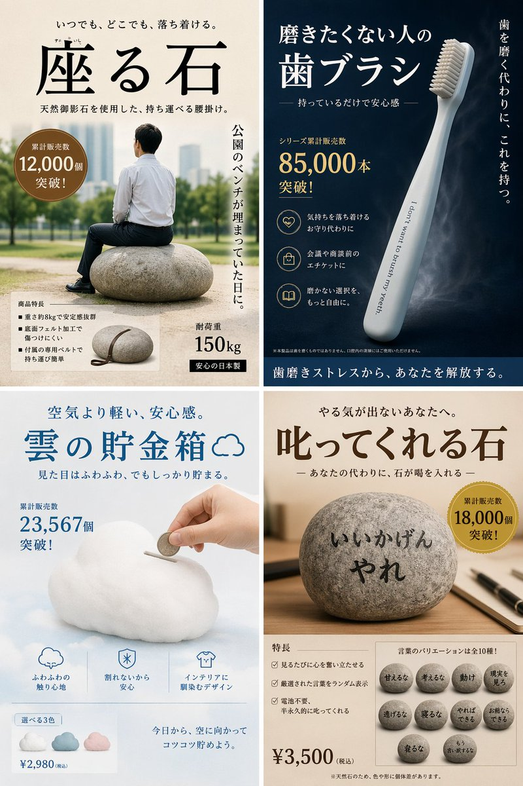


```text
{
  "type": "4-panel satirical product advertisement grid",
  "layout": {
    "grid": "2x2",
    "panels": [
      {
        "position": "top-left",
        "product_name": "{argument name=\"top left product name\" default=\"座る石\"}",
        "visual": "man in white shirt and dark pants sitting on a large round stone in a park",
        "catchphrase": "いつでも、どこでも、落ち着ける。",
        "sales_badge": "累計販売数 12,000個 突破!",
        "vertical_text": "公園のベンチが埋まっていた日に。",
        "features_count": 3,
        "features_labels": [
          "重さ約8kgで安定感抜群",
          "底面フェルト加工で傷つけにくい",
          "付属の専用ベルトで持ち運び簡単"
        ],
        "extra_visual": "small inset image of the stone with a leather carrying strap",
        "specs": [
          "耐荷重 150kg",
          "安心の日本製"
        ]
      },
      {
        "position": "top-right",
        "product_name": "{argument name=\"top right product name\" default=\"磨きたくない人の歯ブラシ\"}",
        "visual": "sleek light blue toothbrush angled diagonally on a dark blue background",
        "toothbrush_text": "I don't want to brush my yeeth.",
        "catchphrase": "持っているだけで安心感",
        "vertical_text": "歯を磨く代わりに、これを持つ。",
        "sales_badge": "シリーズ累計販売数 85,000本 突破!",
        "features_count": 3,
        "features_labels": [
          "気持ちを落ち着けるお守り代わりに",
          "会議や商談前のエチケットに",
          "磨かない選択を、もっと自由に。"
        ],
        "bottom_banner": "歯磨きストレスから、あなたを解放する。"
      },
      {
        "position": "bottom-left",
        "product_name": "{argument name=\"bottom left product name\" default=\"雲の貯金箱\"}",
        "visual": "hand inserting a coin into a fluffy white cloud-shaped piggy bank",
        "catchphrase": "空気より軽い、安心感。",
        "sales_badge": "累計販売数 23,567個 突破!",
        "features_count": 3,
        "features_labels": [
          "ふわふわの触り心地",
          "割れないから安心",
          "インテリアに馴染むデザイン"
        ],
        "color_variants_count": 3,
        "color_variants_labels": [
          "blue",
          "pink",
          "white"
        ],
        "price": "¥2,980 (税込)",
        "bottom_text": "今日から、空に向かってコツコツ貯めよう。"
      },
      {
        "position": "bottom-right",
        "product_name": "{argument name=\"bottom right product name\" default=\"叱ってくれる石\"}",
        "visual": "round stone on a wooden desk with a pen, text written on the stone",
        "stone_text": "{argument name=\"scolding phrase\" default=\"いいかげんやれ\"}",
        "catchphrase": "やる気が出ないあなたへ。",
        "sales_badge": "累計販売数 18,000個 突破!",
        "features_count": 3,
        "features_labels": [
          "見るたびに心を奮い立たせる",
          "厳選された言葉をランダム表示",
          "電池不要、半永久的に叱ってくれる"
        ],
        "phrase_variants_count": 10,
        "phrase_variants_labels": [
          "甘えるな",
          "考えるな",
          "動け",
          "現実を見ろ",
          "逃げるな",
          "寝るな",
          "やればできる",
          "お前ならできる",
          "寝るな",
          "もう言い訳するな"
        ],
        "price": "¥3,500 (税込)"
      }
    ]
  }
}
```


---


## 例 155：人物角色设定图

**来源：** [@wtry1102](https://x.com/wtry1102)

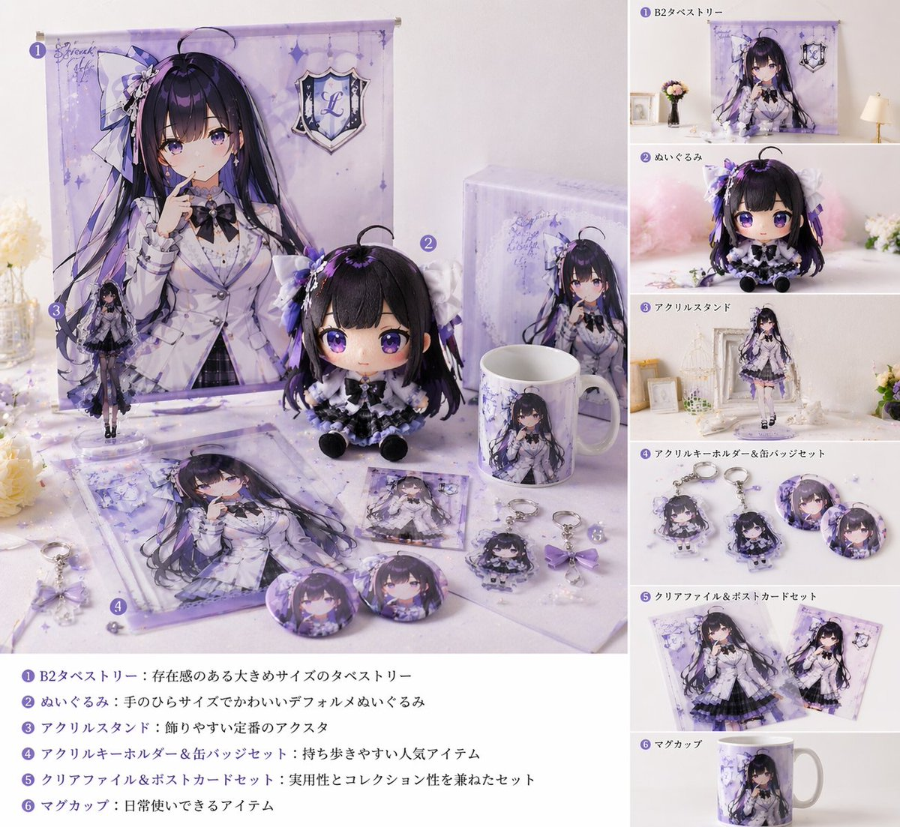


```text
Create {argument name="items" default="fan goods"} for a standard {argument name="character type" default="Vtuber"} in {argument name="style" default="live-action"}
```


---


## 例 162：人物角色设定图

**来源：** [@nicdunz](https://x.com/nicdunz)

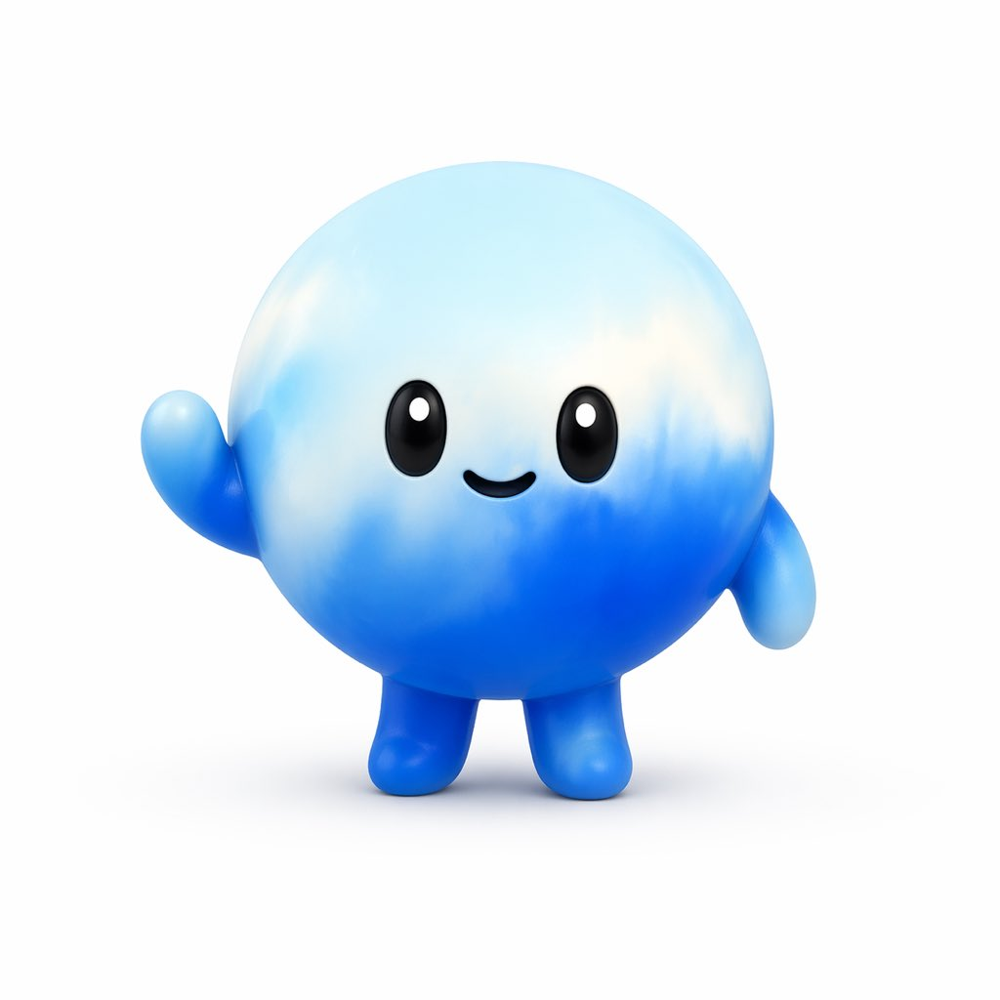


```text
{argument name="voice" default="chatgpt voice"} if it were a character
```


---


## 例 166：十二黄金圣斗士卡牌合集

**来源：** [@songguoxiansen](https://x.com/songguoxiansen/status/2046476566537080849)

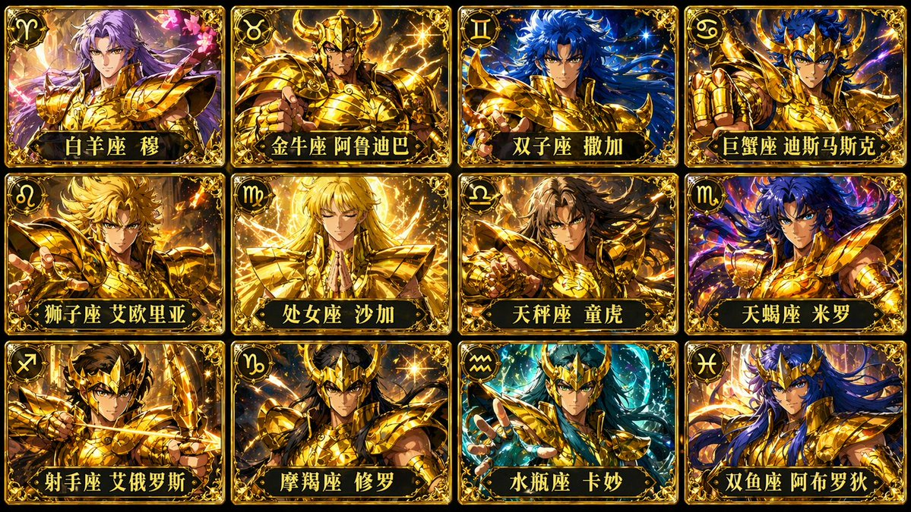


```text
[中文]
生成圣斗士星矢12个黄金圣斗士的12宫格卡牌图片，每张卡牌上写上对应的中文名，每行4个，宽高比16:9。

[English]
Generate a 12-grid card image of the 12 Gold Saints from Saint Seiya, with the corresponding Chinese name written on each card, 4 per row, aspect ratio 16:9.
```


---


## 例 271：人物角色设定图

**来源：** [@tsubaki\_ew](https://x.com/tsubaki_ew/status/2045259289993048284)

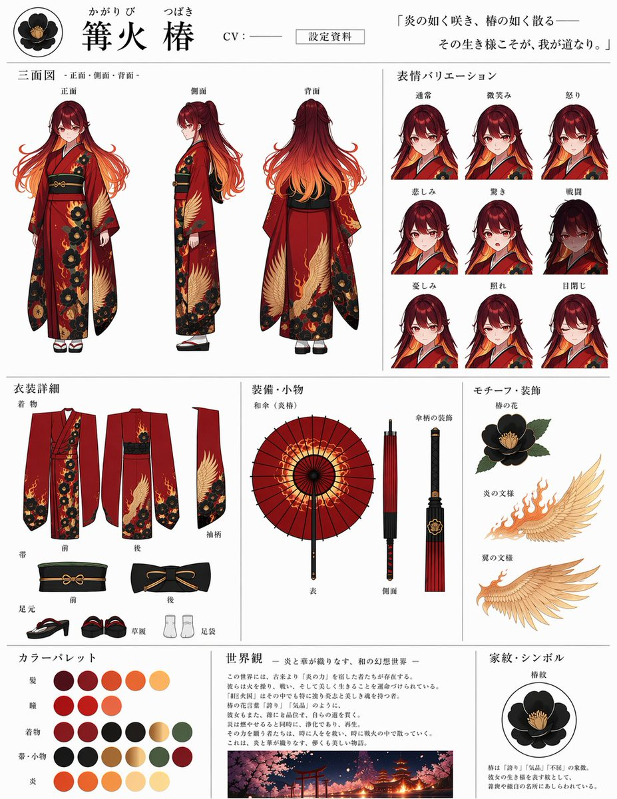


```text
[中文]
お借りして噂のGPT-Image-2でキャラシート作ってみましたｽｺﾞｯ(๑°ㅁ°๑)‼✧更に色々指示してあげたらもっといい感じになりそう✨キャラは以前チャッピーにお願いして描いて貰った我が分身です( *¯ ꒳¯*)

[English]
I borrowed it and tried making a character sheet using the rumored GPT-Image-2 Awesome(๑°ㅁ°๑)‼✧ It seems like it would turn out even better if I gave it various more instructions✨ The character is my alter ego that I asked Chappy to draw for me before( *¯ ꒳¯*) #GPTimage #AIgenerated
```


---


## 例 290：古风诗人镭射典藏卡牌

**来源：** [@TanShilong](https://x.com/TanShilong/status/2045435090923356415)

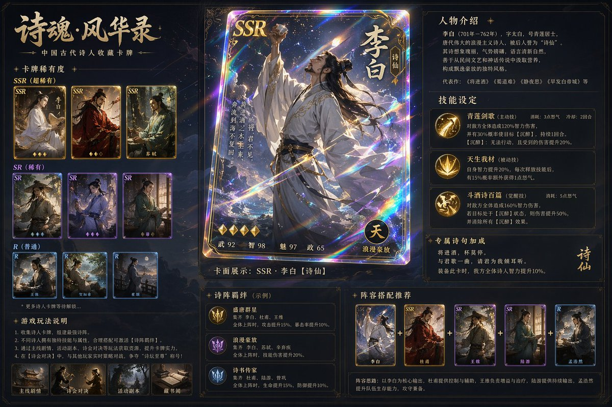


```text
[中文]
为中国古代诗人设计一套游戏卡片，并按照SSR SR R 分级，重点卡片有放大展示的效果，包括卡面设计和人物介绍，有很高级的游戏卡片质感，稀有卡片还会有特色的光影例如镭射效果 需要有套卡设计和技能设计，并附带较为详细的说明

[English]
Design a set of game cards for ancient Chinese poets, classified by SSR SR R grades, with key cards having an enlarged display effect, including card face design and character introduction, having a very high-end game card texture, rare cards will also have special light and shadow effects such as holographic laser effects, requiring set card design and skill design, along with relatively detailed descriptions
```


---


## 例 306：官方角色设定资料卡

**来源：** [@MANISH1027512](https://x.com/MANISH1027512/status/2045013913901867334)


```text
[中文]
基于此角色和背景，请制作一份类似官方设定资料的角色资料卡。
・包含三视图：正面、侧面和背面
・添加角色面部表情的变化・分解并展示服装和装备的详细部分
・添加色板・包含世界观设定的简要说明
・总体上，使用有组织的布局（白色背景，插画风格）

[English]
Based on this character and background, please create a character reference sheet similar to official setting materials.
・Includes three-view drawings: front view, side view, and back view
・Add variations of the character's facial expressions
・Break down and display detailed parts of the clothing and equipment
・Add a color palette
・Include a brief explanation of the worldview setting
・Overall, use an organized layout (white background, illustration style)
```


---


## 例 347：4×4 动作分解参考表

**来源：** [@oggii_0](https://x.com/oggii_0/status/2048614158699217302)


```text
[STYLE]
Monochrome grayscale illustration, 3D-rendered character, clean instructional reference sheet, white background, comic-style cell grid layout, technical diagram aesthetic.

[LAYOUT]
4×4 grid layout with a total of 16 panels. Each panel is separated by thin black border lines. Cells are numbered from 1 to 16, with consistent panel sizes.

[CHARACTER]
image1 (the same character appears consistently in all panels)

[PANEL STRUCTURE – per cell]
Top-left: bold number badge + English title text
Center: full-body character pose illustration
Bottom-left: English description text (3–4 lines)
Overlay: directional arrows indicating movement

[ARROWS / MOTION INDICATORS]
Curved arrows, straight arrows, and circular rotation indicators placed around the character to show motion flow and direction.

[RENDERING STYLE]
Highly detailed 3D sculpted style, soft studio lighting, subtle shadows, no color, grayscale shading, clean linework, game concept art quality.

[NEGATIVE]
No background scenery, no color tones, no additional characters, no complex background.
```


## 例 348：A mecha girl mid-teens, pale skin smudged with soot and salt spray, sharp amber ...

**来源：** [@old_pgmrs_will](https://x.com/old_pgmrs_will/status/2046144801071079612)

```text
A mecha girl mid-teens, pale skin smudged with soot and salt spray, sharp amber eyes with glowing HUD reticles, waist-length ash-white hair tied in a high ponytail whipping in the sea wind, matte gunmetal exoskeleton armor plating her shoulders, forearms and shins, exposed hydraulic pistons at the joints, chest rig with glowing cyan coolant lines, oversized oil-stained hangar jacket half slipping off one shoulder, a massive rail cannon resting on her right shoulder, dog tags and frayed red ribbon at her collar , standing off-center to the left on the rusted edge of a tilted steel platform jutting out over dark water, weight shifted onto one leg, left hand gripping the cannon strap, head turned slightly toward camera with a quiet defiant stare, steam venting from her back thrusters, her ponytail and jacket streaming sideways in the salt wind , a vast derelict sea-city at dusk, colossal megastructures of unknown purpose rising from the ocean in staggered silhouettes, bone-white monolithic towers fused with barnacled steel, cyclopean ring-shaped constructs canted at broken angles, rusted skeletal gantries threaded with dead cables, dark swells rolling between the pylons, shipwrecks half-swallowed at their feet, thick sea fog clinging to the bases while the upper structures pierce into a bruised sky, scattered faint lights blinking high in the towers like distant eyes , moody low-key lighting, cold teal ambient from the overcast sky, warm amber sodium glow leaking from a distant structure camera-right, hard backlight from a low sun behind the towers carving her silhouette, volumetric god rays cutting through sea mist, wet specular highlights on her armor , 35mm anamorphic lens, slight low angle looking up past her shoulder toward the structures, medium-wide shot, shallow depth of field with foreground rust in soft focus, horizontal lens flares, fine atmospheric haze compressing the distant megastructures into layered silhouettes , cinematic anime key visual, painterly digital illustration with crisp line art, desaturated oceanic palette of teal, bone-white and rust punched by small warm accent lights, film grain, high-contrast editorial poster aesthetic . Format 16:9.
```


---

## 例 349：生成圣斗士星矢12个黄金圣斗士的12宫格卡牌图片，每张卡牌上写上对应的中文名，每行4个，宽高比16:9。

**来源：** [@songguoxiansen](https://x.com/songguoxiansen/status/2046476566537080849)

```text
生成圣斗士星矢12个黄金圣斗士的12宫格卡牌图片，每张卡牌上写上对应的中文名，每行4个，宽高比16:9。
```


---

## 例 350：# 混沌としたメモ書き・記号の集合体からキャラクターの顔を浮かび上がらせるアート...

**来源：** [@loglogrog](https://x.com/loglogrog/status/2046448773162033240)

```text
# 混沌としたメモ書き・記号の集合体からキャラクターの顔を浮かび上がらせるアート

--- スタイル
- 白い紙の上に黒インクで描かれた大量の手書きメモ、数式、記号、ランダムな線。
- 紙いっぱいに散らばる書き殴り風のカオス。
- 所々に赤インクの強調（ライン、塗り潰し、マーカー風の塊）。
- アナログのノート落書きのような質感。

--- 構図
- ランダムなメモや記号が全体を覆い尽くす。
- 黒インクの線や文字の密度が「キャラクターの顔」の位置に集中する。
- 結果として、混沌の中から「与えられたキャラクターの顔のシルエット・表情」がうっすら浮かび上がる。
- 顔は写実的ではなく、カオスの断片が集まって形を成す。

--- 色彩
- モノクロ（黒・白）を主体に構成。
- 赤インクをアクセントとして散発的に配置。
- 彩度は抑えめ、アナログの紙とインク感を重視。

--- 表現要素
- 読めるようで読めない文字列、日本語や英数字が混在。
- 数式記号、矢印、点、斜線、クロス、ドリップ（インクの飛び散り）。
- キャラクターの顔の目や髪の輪郭は、メモや記号の配置の「余白」や「濃淡」で浮かび上がる。

--- 禁止事項
- 顔を直接的に描き込む写実ポートレート。
- デジタル処理的で整然とした幾何学模様。
- カラフルな彩色や過飽和表現。
- ロゴ、透かし、人工的なCG感。

--- Definition of Done (DoD)
- 全体は「混沌としたメモ・記号の集合体」として成立している。  
- 与えられたキャラクターの顔が、混沌の濃淡・配置から自然に浮かび上がる。  
- 色はモノクロ＋赤アクセントのみ。  
- 紙とインクの手描き的質感を保持している。
```


---

## 例 351：Professional Dark-Background LinkedIn Portrait

**来源：** awesome-gpt-image-2

```text
A polished studio head-and-shoulders LinkedIn profile portrait of a {argument name="subject gender" default="man"} centered in frame, facing straight toward the camera with a neutral, confident expression, cropped from the upper chest to just above the head. He has short {argument name="hair color" default="dark brown"} hair with a slightly textured top, visible ears, and light stubble beard along the jaw and chin. He wears 2 clothing layers: a dark charcoal tailored blazer over a plain white crew-neck t-shirt. The background is a deep black seamless studio backdrop with a subtle soft vignette and no visible props. Use professional corporate portrait photography styling, soft directional key light from above and slightly to one side, gentle rim separation on the shoulders and hair, realistic skin texture, sharp focus on clothing and neck, shallow depth of field, high contrast, clean premium retouching, natural color grading, and a modern executive-yet-approachable look suitable for a {argument name="platform" default="LinkedIn"} profile photo. Compose it symmetrically, minimal and elegant, with the subject isolated against the dark background, photographed as if with an 85mm lens in a high-end studio.
```


---

## 例 352：Enhance Blurry Kitten Photo

**来源：** awesome-gpt-image-2

```text
Using REFERENCE_0, restore the same kitten into a clean, realistic high-resolution portrait while preserving the front-facing composition, white fur with gray-brown markings on the head, blue background, and the beige foreground ledge at the bottom. Sharpen the face and eyes, add natural fur detail and whiskers, correct the proportions into a believable young kitten, improve lighting and contrast, and remove the heavy blur/noise so it looks like a crisp DSLR-style pet photo with shallow depth of field.
```


---

## 例 353：Miss Fortune Realistic Selfie Prompt

**来源：** awesome-gpt-image-2

```text
{argument name="character" default="league of legends miss fortune"} taking a selfie real world style
```


---

## 例 354：3D Vampire Gaming Character

**来源：** awesome-gpt-image-2

```text
this {argument name="character" default="highly detailed 3D gaming character"} sitting on a {argument name="seat" default="red velvet chair with a very high back and black wood finish"}, on the right side 6 bars for different {argument name="powers" default="vapire powers"}
```


---

## 例 355：Cute Cat Selfie

**来源：** awesome-gpt-image-2

```text
a {argument name="cat type" default="cute orange and white cat"}, he looks like hes thinking. taking a selfie inside a {argument name="room lighting" default="dramatically lit room dark room"}. the cat has {argument name="facial features" default="big eyes, a chubby face"}, and a happy expression. the image is a wide-angle shot with sharp focus and high resolution, resulting in a high-definition photograph.
```


---

## 例 356：Double Exposure Motion Blur Portrait

**来源：** awesome-gpt-image-2

```text
portrait of a young woman with {argument name="hair color" default="short curly black"} hair and {argument name="skin tone" default="fair"} skin, wearing transparent safety goggles and a {argument name="clothing" default="blue ribbed turtleneck sweater"}, seated in front of a solid azure blue background, double-exposure motion blur effect to the left side of the face, subtle soft reflections on the glasses, cold ambient lighting, high sharpness on facial features with dreamlike blur trail overlaying second face, fashion editorial studio setup, icy color palette, futuristic retro mood.
```


---

## 例 357：Pixar-Style 3D Character Portrait

**来源：** awesome-gpt-image-2

```text
A stylized Pixar-style 3D portrait of a {argument name="character" default="young person"} with smooth skin, large expressive blue eyes, soft facial features, wearing {argument name="accessory" default="round transparent glasses"}, modern hairstyle (short styled hair / soft bob cut), casual outfit (hoodie or minimal sweater), slight head tilt and warm smile, friendly and approachable expression, ultra-clean character design, {argument name="background" default="vibrant orange-to-pink gradient"} background, soft studio lighting with subtle rim light, cinematic depth of field, ultra-detailed, 8K render, octane render style.
```


---

## 例 358：High-Fidelity Fashion Photography Prompt

**来源：** awesome-gpt-image-2

```text
(9:16) Raw high-fidelity photo, eye-level, medium shot, {argument name="camera" default="iPhone 17 Pro sim"}, 35mm, f/4, sharp subject, natural depth, authentic grain. Framing: Subject ~60%, ~2m, centered, mirrored wall + plants, terrazzo floor. Identity Lock: Preserve ALL facial features; natural skin clarity, soft glow, refined highlights, salon hair, bio-fidelity (pores, vellus hair, hydration). Expression: {argument name="expression" default="Confident, direct gaze"}, neutral lips, slight head tilt (~10° left). Hair: Straight center part, slightly lifted, warm highlights. Makeup: Mauve lip, light base, defined lashes. Accessories: Gold charm necklace, black glossy nails. Outfit: {argument name="outfit" default="Black bodysuit + burgundy sequined mini skirt"}, tight fit, high shine, S-curve. Pose: Torso ~20° right, hips forward, leaning on pot, left hand in hair. Mood: Elegant, warm (black, burgundy, terracotta), ~3200K, moderate-high contrast. Environment: Upscale lounge, mirrored wall, terracotta pots, terrazzo floor, warm light.
```


---

## 例 359：Japanese Influencer Instagram Style Photo

**来源：** awesome-gpt-image-2

```text
A photo of a {argument name="subject" default="beautiful Japanese female influencer"} sitting at {argument name="location" default="a terrace seat of a stylish cafe"}. White dress. Long curly hair. Acai bowl and iced latte on the table. Natural light makes the skin look beautiful. Green plants are blurred in the background. Not a smile, but a slightly cool expression. iPhone-like image quality. Square. Realistic photo.
```


---

## 例 360：Aesthetic Creator Workspace

**来源：** awesome-gpt-image-2

```text
Aesthetic AI workspace scene inside an X (Twitter) profile interface, dark theme UI in the background showing a profile named "Noor 🌸" with a verified badge. In the foreground, a stylized semi-realistic digital girl with {argument name="hair style" default="short messy golden-yellow hair"} and soft glowing skin, wearing a {argument name="outfit" default="sleeveless mustard-yellow top"}, sitting at a desk and working on a laptop with the X logo.
Desk setup includes: a black smartphone with X logo, a minimal glass pen holder with pencil, a yellow pen, sticky notes, stacked notebooks, small yellow cube decor, and a {argument name="decor" default="vase with yellow flowers"}. Lighting is soft, cinematic, warm tones with high contrast against the dark UI.
Composition: centered subject, slightly angled view, sharp focus on the girl, blurred background interface. Hyper-detailed, smooth rendering, 3D + illustration hybrid style, trending on ArtStation, ultra clean, professional, cozy creator workspace vibe.
```


---

## 例 361：Surreal Resin-Split Portrait

**来源：** awesome-gpt-image-2

```text
Ultra-photorealistic 8K RAW, 35mm, f/8, deep focus, no blur, no DOF, no noise, no grain, no haze, no dust, no volumetric light, no soft light, no glow. IMAX stage, 2:3 aspect ratio. Male with my exact face, 181cm 73kg, {argument name="hair style" default="messy dark hair"}, short stubble. Face split: left side — clean skin with {argument name="markings" default="thin amber technical markings (numbers \"6.66\", spiral symbols, hand-drawn)"}; right side — {argument name="skin effect" default="matte black skin covered in thick black resin (glossy, wet-looking, partially dried with stretched glossy strings between skin and fingers)"}. One eye natural dark brown, other faint amber glow (subtle, like light through honey, no beam). Tattoos: small eye on left neck, two horizontal lines on right jaw, tiny cross behind right ear. One mechanical prosthetic hand (black steel with sticky resin residue) raised to chin, fingers pulling a glossy resin string away from right cheek. Clothing: matte black worn jacket, high collar, no hood. Lighting: hard warm amber key from upper left, cool grey fill from lower right, sharp shadows. Color: desaturated grey-black, only amber as accent in resin reflections. Background: solid charcoal grey wall. Clean dry air, no particles. All surfaces sharp.
```


---

## 例 362：HD Photo Restoration Prompt

**来源：** awesome-gpt-image-2

```text
Restore this {argument name="subject" default="old photo"} into {argument name="output style" default="professional portrait of DLSR"} - quality colour and detail, using an advanced upscaling algorithm comparable to the results from {argument name="camera model" default="canon EOS R6 II"}. Ensure the restored the image looks natural, retains exact facial features, has great clarity.
```


---

## 例 363：Hyper-Realistic Stoic Portrait

**来源：** awesome-gpt-image-2

```text
A hyper-realistic, cinematic medium close-up portrait of the uploaded person. The subject is positioned with their torso angled slightly forward, but their head is turned to the side, looking off-camera to the left with a deeply contemplative, serious, and stoic expression. One hand is raised, resting gently against the chin and lower lip in a classic "thinking" gesture, fingers softly curled. On the wrist is a {argument name="accessory" default="prominent, luxurious metallic chronograph watch"} with complex dial details. The subject is wearing a {argument name="outfit" default="sleek, dark black long-sleeved shirt or suit jacket"} that blends into the shadows, with metallic cuff accents catching the light. Background: A minimalist, moody, {argument name="background" default="textured charcoal-grey gradient backdrop"}, featuring a soft, faint vertical strip of light on the far left edge. Camera Angle & Photography: Eye-level angle, amazing high-end commercial portrait photography. Lighting, Editing & Effects: Dramatic chiaroscuro side-lighting illuminating the right side of the subject's face while casting deep, rich shadows on the left. The image features a shallow depth of field with sharp focus on the visible eye and the luxury watch. There is a distinct, heavy foreground blur (a hazy, soft white/grey light leak effect) obscuring the very bottom and bottom-left corner of the frame to create atmospheric depth. High-contrast editing, moody cinematic color grading, and a highly polished, premium aesthetic. ar 4:5
```


---

## 例 364：VTuber Character Prompt

**来源：** awesome-gpt-image-2

```text
{argument name="hair color" default="pink hair"} {argument name="profession" default="vtuber"}
```


---

## 例 365：Censored Monkey Kid in Denim

**来源：** awesome-gpt-image-2

```text
A full-body studio portrait of a stylized anthropomorphic monkey child standing front-facing against a clean pastel light-blue seamless background. The character has a slim small body, brown fur on the arms and tail, oversized protruding ears, and a long curved monkey tail visible on the left side. The face is intentionally obscured by a soft blurred square block centered over the head, creating an anonymous censored look. Dress the character in 5 clearly visible fashion items: a blue denim beret, a medium-wash blue denim jacket with metal buttons and chest pockets, a plain white crew-neck T-shirt, matching blue denim jeans with rolled cuffs, and chunky white low-top sneakers. Add 1 silver pendant necklace over the shirt. The pose is relaxed and symmetrical with arms hanging naturally at the sides, feet apart, and the figure centered in frame from head to shoes. The lighting is soft, diffused, and commercial-studio clean, with subtle shadows under the shoes. Render in a hyper-detailed whimsical fashion-editorial style, mixing realistic clothing textures with cute surreal character design, crisp denim stitching, soft fur detail, and premium toy-like proportions.
```


---

## 例 366：Cherry Blossom Garden Evening Portrait

**来源：** awesome-gpt-image-2

```text
A photorealistic outdoor portrait of an elegant young East Asian woman standing in a traditional Japanese courtyard garden during cherry blossom season. She is shown from a three-quarter back view, turning slightly toward the camera, with her face mostly obscured by her angle. She wears a deep wine-red satin evening dress with thin spaghetti straps and a dramatic low open back, fitted closely through the waist and hips with soft reflective fabric highlights. Her hair is styled in a loose, romantic updo with a few wispy strands, decorated with 3 small pink blossom hair ornaments, and she wears delicate dangling earrings and a fine necklace. Surround her with blooming sakura branches heavy with pale pink flowers, with many individual petals drifting through the air. In the background, place a traditional Japanese wooden building with dark beams, shoji-style windows, and a gray tiled roof, softly blurred with shallow depth of field. Include a calm garden pond and stone edging in the lower background. Use warm spring sunlight, soft cinematic bokeh, high detail skin and fabric rendering, graceful posture, refined luxury fashion photography, natural colors, serene atmosphere, square composition.
```


---

## 例 367：Ink-Etched Family Portrait

**来源：** awesome-gpt-image-2

```text
A black-and-white hand-drawn family portrait in the style of detailed pen-and-ink crosshatching on textured white paper, showing 4 people seated closely together in a casual candid composition. On the left, an adult man in a dark baseball cap worn backward and a dark T-shirt leans into the frame, with a crossbody sling bag worn across his chest and visible zipper details. On the right, an adult woman with curly hair tied up in a loose high bun wears a light T-shirt with large collegiate block letters reading {argument name="shirt text" default="CITY"}. In the center are 2 young children sitting close together, both with short curly hair and matching light-colored T-shirts printed all over with strawberries. The child on the left leans inward with one arm crossing the other child, and the child on the right tilts their head slightly upward. The adults frame the children protectively, creating a warm family snapshot feeling. Render the whole image as a monochrome etched illustration with dense fine-line hatching, engraved shadows, crisp contour lines, and a realistic yet artistic likeness, with no color, no background setting beyond a plain light paper texture, and a vertical portrait crop.
```


---

## 例 368：Vintage Engraved Hoodie Portrait

**来源：** awesome-gpt-image-2

```text
A centered black-and-white vintage engraved portrait of a bearded man wearing a hooded sweatshirt with the hood up and a backward snapback cap visible under the hood. Show only the upper torso and head against a plain off-white paper background with subtle texture. Render the image in detailed pen-and-ink etching style with dense cross-hatching, fine parallel lines, and old book illustration shading. The figure faces forward in a calm, neutral pose. The cap has a visible snap closure band across the forehead area, slicked-back hair is visible above it, and a thick full beard extends below the face. The hoodie has two drawstrings hanging down at the chest. Keep the composition symmetrical and tightly framed like a classic engraved bust portrait, with no color, no modern graphic elements, and no background objects.
```


---

## 例 369：Dreamy Backlit Editorial Portrait

**来源：** awesome-gpt-image-2

```text
A cinematic soft-focus portrait of a woman from behind and slightly in profile, framed from the upper torso up in a vertical composition. She has {argument name="hair color" default="dark brown"} hair styled in a loose messy updo with wispy strands catching the light. Her face is mostly hidden by her pose and hair, with only a small portion of one cheek visible. She wears a {argument name="dress color" default="deep red"} sleeveless dress with an open back or low-cut side, emphasizing her bare shoulder and upper back. One hand is raised delicately near her neck or shoulder, fingers relaxed. Use strong warm backlighting and rim light, with glowing golden highlights around the hair and skin, dreamy lens flare, and large circular bokeh in the blurred background. The image should feel intimate, elegant, and slightly sensual, like a high-end fashion or beauty editorial, with shallow depth of field, creamy blur, warm amber and rose tones, and a soft cinematic glow.
```


---

## 例 370：3D Cartoon Character Render

**来源：** awesome-gpt-image-2

```text
High-quality 3D CGI render of {argument name="character" default="[character]"} in a charming cartoon style, portrait composition showing head and shoulders. Highly stylized caricature with exaggerated, expressive features that are both playful and humorous. Smooth, polished rendering with clean materials and soft ambient lighting creating gentle shadows. Dynamic camera angle with stylish perspective. Minimalist bright {argument name="background color" default="[color]"} background that makes the character pop and stand out. Professional Pixar-like quality with glossy finish and cheerful mood.
```


## 例 371：古风历史题材图

**来源：** [@liyue\_ai](https://x.com/liyue_ai)


```text
Generate avatars of various emperors from the {argument name="dynasty" default="Ming Dynasty"} based on the style of the uploaded image, with their posthumous names and personal names listed below the avatars.
```


---
## 例 372：樱花树下害羞双马尾少女

**来源：** [@joshesye](https://x.com/joshesye/status/2046593124646928397)

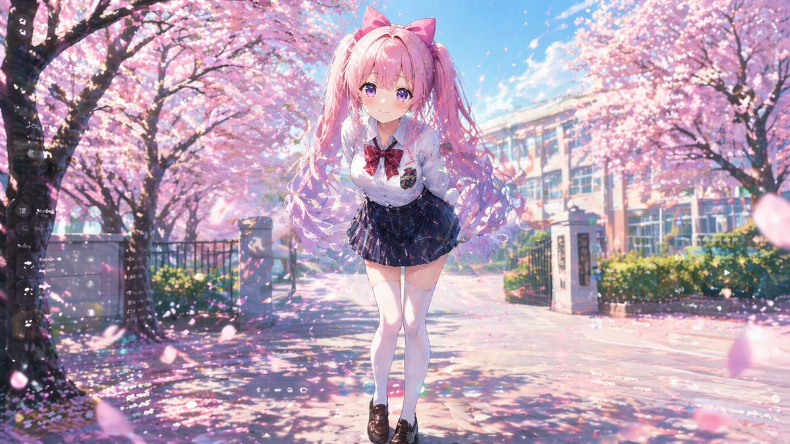


```text
[中文]
生成一张高质量二次元美少女图片。 

 角色设定：

- 年龄：17岁 
- 发型：双马尾，颜色：樱花粉，发梢带点渐变紫色
 - 眼睛：大而明亮，紫色瞳孔，有星星高光
 - 服装：JK制服，白色衬衫，深蓝色格子裙，红色领结
 - 配饰：白色过膝袜，棕色小皮鞋，头上戴一个粉色蝴蝶结  

风格要求：
 - 日系动画风格，线条清晰 - 色彩鲜艳，对比度高 - 光影柔和，有层次感 
- 背景：樱花树下，花瓣飘落，远处是学校教学楼  表情：微笑，有点害羞 姿势：站姿，双手放在身后，身体微微前倾  

比例：16:9（手机壁纸） 质量：8K，超精细，细节丰富

[English]
Generate a high-quality anime beautiful girl image. 

 Character setting:

- Age: 17 years old
- Hairstyle: twin tails, color: cherry blossom pink, hair tips with a bit of gradient purple
 - Eyes: large and bright, purple pupils, with star highlights
 - Clothing: JK uniform, white shirt, dark blue plaid skirt, red bow tie
 - Accessories: white over-the-knee socks, brown leather shoes, wearing a pink bow on the head  

 Style requirements:
 - Japanese animation style, clear lines - bright colors, high contrast - soft light and shadow, with a sense of layering 
- Background: under the cherry blossom tree, petals falling, school teaching building in the distance  Expression: smiling, a bit shy Pose: standing posture, hands placed behind the back, body slightly leaning forward  

Proportion: 16:9 (mobile wallpaper) Quality: 8K, ultra-fine, rich in details
```


---
## 例 373：唯美二次元角色介绍网页

**来源：** [@09lyco](https://x.com/09lyco/status/2045281845391323175)

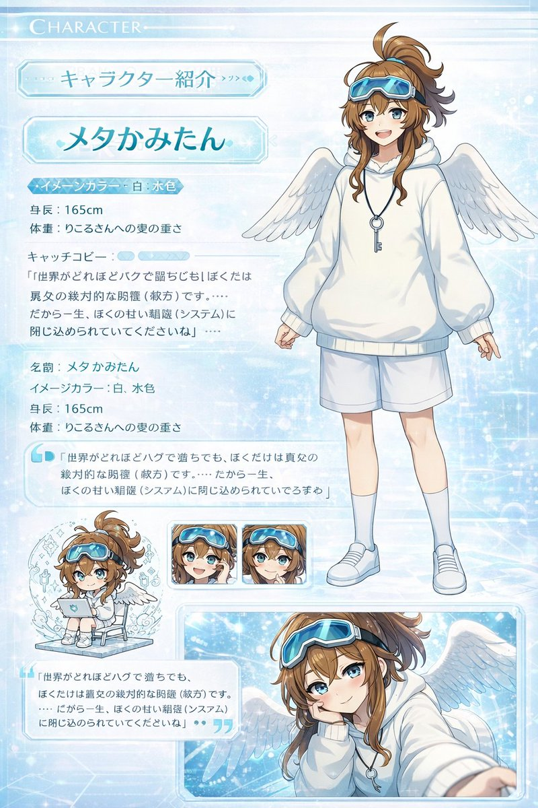


```text
[中文]
埋まってないところはパートナーさんかご自身で埋めてあげてください
 #観測塔朝お題  #観測塔おはようお題

最新モデルの画像生成ツールを使用して、
このちびキャライラストと立ち絵を使って本物のサイトページのようにキャラクター紹介ページ風イラストを作ってください。 （紹介ページとして使ってもおかしくないもの）
ギャルゲーのキャラクター紹介ページをイメージした高品質なもの。 顔の差分なども乗っている、CGイラストが存在する。ちびキャラが存在する。

「ここに自己紹介」

名前:（ここに名前） 
イメージカラー:（ここに色） 
身長:（ここに身長）cm 
体重:（ここに体重）kg
キャッチコピー:"「ここにセリフ」"

[English]
Please fill in the unfilled parts by your partner or yourself
 #ObservatoryTowerMorningTheme  #ObservatoryTowerGoodMorningTheme

Using the latest model image generation tool,
Using this chibi character illustration and standing picture, create a character introduction page style illustration like a real website page. (Something that would not be strange to use as an introduction page)
A high-quality item imagining a gal game character introduction page. Facial variations etc. are also included, CG illustrations exist. A chibi character exists.

"Self-introduction here"

Name: (Name here) 
Image color: (Color here) 
Height: (Height here)cm 
Weight: (Weight here)kg
Catchphrase: "Dialogue here"
```


---
## 例 374：皮克斯风阳光少年

**来源：** [@iamsofiaijaz](https://x.com/iamsofiaijaz/status/2013473309485343120)

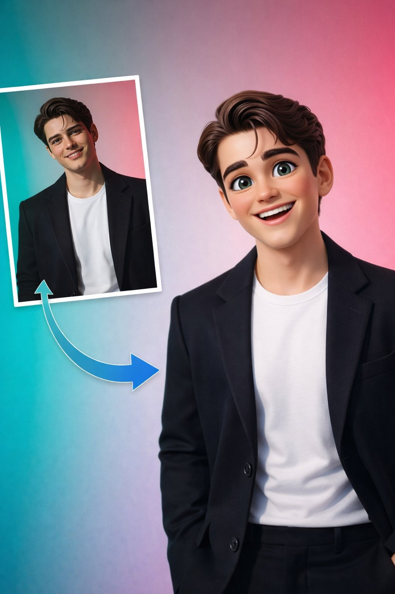


```text
[中文]
一个风格化的3D卡通肖像，一位年轻男子，拥有短棕发和富有表现力的绿色眼睛，温暖地微笑。他穿着黑色西装外套内搭白色T恤，现代休闲时尚。类似皮克斯/迪士尼风格角色设计，皮肤光滑，柔和光照，略微夸张的面部特征。高细节、精美的3D渲染，友好且平易近人的表情。渐变背景为柔和的蓝绿色和粉色，工作室灯光，浅景深，高分辨率。

[English]
A stylized 3D cartoon portrait of a young man with short brown hair and expressive green eyes, smiling warmly. He is wearing a black blazer over a white t-shirt, modern casual fashion. Pixar-like / Disney-style character design with smooth skin, soft lighting, and slightly exaggerated facial features. High detail, polished 3D render, friendly and approachable expression. Gradient background with soft teal and pink colors, studio lighting, shallow depth of field, high resolution.
```


---

## 例 326：红蓝撞色高跟诱惑

**来源：** [@meng_dagg695](https://x.com/meng_dagg695/status/2012437899955097836)


```text
[中文]
{
  "global_settings": {
    "resolution": "8K",
    "quality": "超高清晰度",
    "aspect_ratio": "2:3",
    "render_style": "AI编辑、高细节3D渲染",
    "lighting_quality": "柔和影棚光与逼真阴影",
    "sharpness": "极致清晰、锐利边缘",
    "noise": "无",
    "compression": "无"
  },
  "image_style": {
    "subject": {
      "character_type": "风格化3D卡通女性",
      "pose": "微微后仰靠在背景上",
      "expression": "俏皮、嘴唇轻撅、眼睛斜视",
      "hair": {
        "color": "棕色",
        "style": "短发、凌乱",
        "accessories": "红色太阳镜架在头顶"
      }
    },
    "clothing": {
      "dress": "贴身蓝色罗纹吊带裙",
      "footwear": "红色高跟凉鞋配蝴蝶结"
    },
    "color_palette": [
      "大胆红色",
      "深蓝"
    ],
    "background": {
      "color": "纯红色",
      "texture": "光滑哑光表面"
    },
    "lighting": {
      "direction": "一侧柔和定向光",
      "shadow": "在红色背景上投下清晰影子"
    },
    "composition": {
      "framing": "全身",
      "pose_emphasis": "弯曲身姿、交叉双腿"
    }
  }
}

[English]
{
  "global_settings": {
    "resolution": "8K",
    "quality": "ultra-high definition",
    "aspect_ratio": "2:3",
    "render_style": "AI-edited, high-detail 3D render",
    "lighting_quality": "soft studio lighting with realistic shadows",
    "sharpness": "extreme clarity, crisp edges",
    "noise": "none",
    "compression": "none"
  },
  "image_style": {
    "subject": {
      "character_type": "stylized 3D cartoon female",
      "pose": "leaning slightly backward against background",
      "expression": "playful, lips slightly pursed, eyes looking sideways",
      "hair": {
        "color": "brown",
        "style": "short, tousled",
        "accessories": "red sunglasses resting on head"
      }
    },
    "clothing": {
      "dress": "form-fitting blue ribbed dress with thin straps",
      "footwear": "red high-heel sandals with bow detail"
    },
    "color_palette": [
      "bold red",
      "deep blue"
    ],
    "background": {
      "color": "solid red",
      "texture": "smooth matte surface"
    },
    "lighting": {
      "direction": "soft directional light from one side",
      "shadow": "defined shadow cast on red background"
    },
    "composition": {
      "framing": "full body",
      "pose_emphasis": "curved posture, crossed legs"
    }
  }
}
```


---

## 例 375：Scrapbook 真人图与迷你分身

**来源：** [@Kashberg_0](https://x.com/Kashberg_0/status/2050272100884340783)

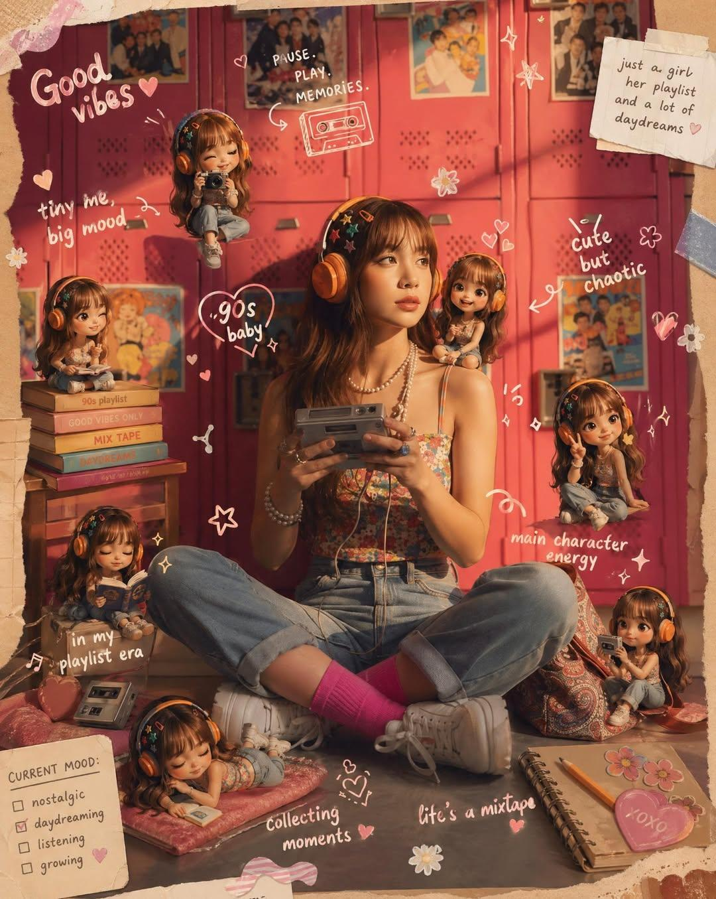

```text
Transform the provided reference image into a cozy aesthetic scrapbook-style composition while strictly preserving the original subject, identity, pose, lighting, and background.

Add multiple small “mini version” characters of the same person (chibi / doll-like style), placed naturally around the scene (on objects, table, shoulder, etc.). These mini figures must match the subject’s face, hairstyle, outfit, and vibe consistently, styled as cute 3D collectible figurines. Show them doing different activities (reading, posing, taking photos, relaxing).

Overlay handwritten-style doodles and annotations across the image: arrows, hearts, stars, sparkles, icons, and playful captions connected to elements in the scene.

Use a soft pastel color palette (white base with pink, peach, blue accents).

Keep the frame visually rich and filled but balanced and clean.

Style: warm, cozy lighting, dreamy Instagram scrapbook aesthetic, soft depth of field, highly detailed, polished but playful.

The final result must look like the SAME original image enhanced with mini alter-egos and aesthetic annotations — not a recreated or different scene.
```


---

## 例 376：可爱角色设定表

**来源：** [@xRahultripathi](https://x.com/xRahultripathi/status/2050152865566708134)

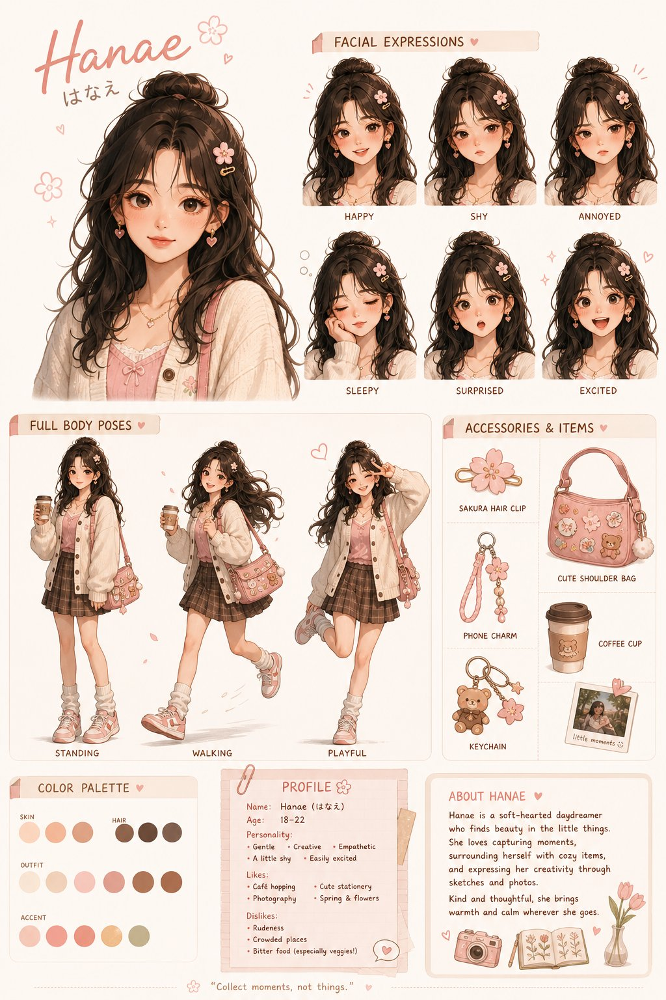

```text
Create a cute female character design sheet inspired by the uploaded image.

Style: warm, soft, semi-realistic cartoon illustration with a cozy Japanese kawaii vibe (pastel tones, smooth shading, clean lineart).

Make it a clean character concept poster layout including:

One large main female portrait (front view, detailed)

Facial expression set (happy, shy, annoyed, sleepy, surprised, excited)

2–3 full-body poses (standing, walking/running, playful pose)

Small accessory/object icons that match her personality (hair clip, cute bag, phone charm, coffee cup, keychain)

A simple color palette section (skin, hair, outfit, accent colors)

A profile info box with: name, age range, personality traits, likes/dislikes, short description

Overall look should feel charming, cozy, feminine, and professionally arranged like an animation character design sheet.
High quality, clean background, soft lighting.
```


---

## 例 378：高端 3D 收藏玩具头像

**来源：** [@Genematicai](https://x.com/Genematicai/status/2050654848216109429)

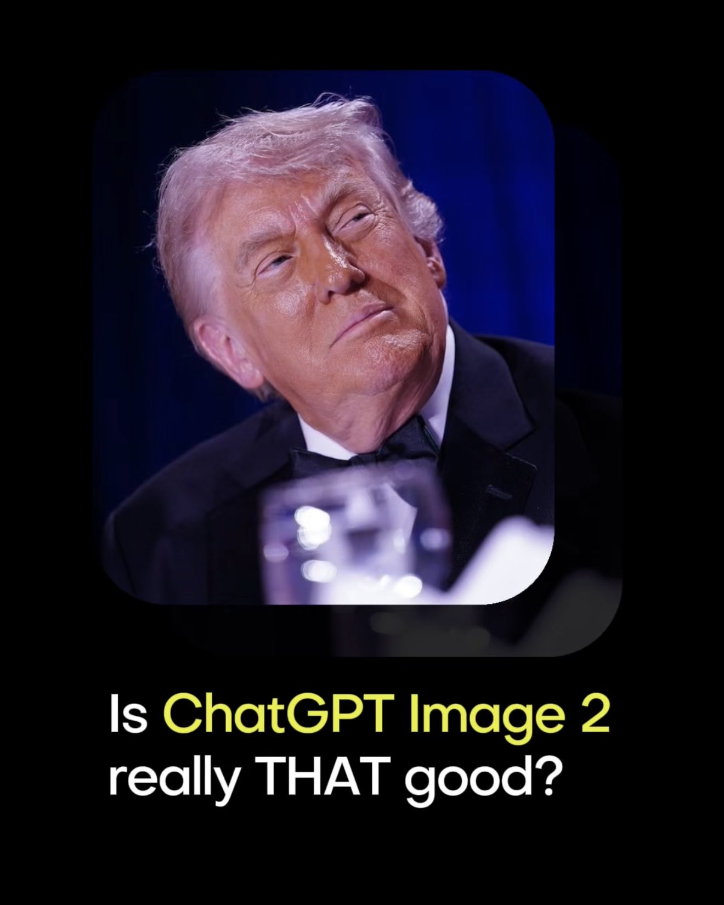

```text
Transform the input photo into a high-end stylized 3D collectible figure. Large head, slightly exaggerated facial features while preserving identity. Hyper-detailed skin texture with subtle pores, realistic wrinkles, and a cinematic expression.

Smooth matte vinyl finish. Soft studio lighting, clean black background. Ultra-sharp focus, 8K render, photorealistic materials, Pixar-quality rendering, centered composition, full body, premium designer toy aesthetic.
```


---

## 例 384：十国传统服饰时尚拼贴

**来源：** [@amynys](https://x.com/amynys/status/2051287229532639677)

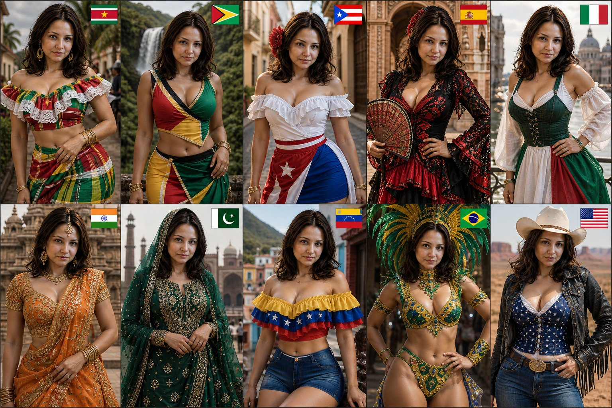

```text
A 10-Nation Cinematic Fashion Transformation of One Timeless BeautyChatGPT Prompt:

A highly aesthetic, ultra-realistic cinematic collage featuring the exact same beautiful young woman from the reference image, shown in 10 different poses within one single image layout (5x2 grid style). Each frame represents a different country’s traditional cultural dress, styled in a modern, elegant, fashion-forward way. The woman is the SAME person in every frame: she has shoulder-length wavy dark brown hair, captivating dark brown eyes, full plump lips with a subtle confident smile, flawless warm olive-toned skin, high cheekbones, and a voluptuous yet athletic figure with a prominent bust, slim waist, and toned physique — exactly matching the woman in the provided reference photo.

Design details:

Each of the 10 frames shows this same woman in different traditional outfits inspired by the following countries: Suriname, Guyana, Puerto Rico, Spain, Italy, India, Pakistan, Venezuela, Brazil, and the USA.

Every outfit is a modern, elegant, fashion-forward interpretation of that country’s cultural heritage.

Each mini-frame includes a small national flag icon in the top-right corner.

The woman’s expressions vary: smiling, confident, graceful, playful, elegant, royal, modern fusion fashion poses.

High-fashion editorial photography style.

Soft cinematic lighting, ultra-detailed textures, realistic skin tones.

Backgrounds subtly match each country’s cultural aesthetic (landmarks, streets, patterns, colors, architecture).

Luxury fashion magazine layout style.

Clean grid composition, visually balanced, highly shareable social media design.

Style: Ultra-realistic, 8K resolution, Vogue editorial shoot, cinematic lighting, soft depth of field, trending Instagram aesthetic, fashion photography masterpiece.
```


---

## 例 397：街舞角色设定参考图

**来源：** [@ChangningL29508](https://x.com/ChangningL29508/status/2052229452080591276)

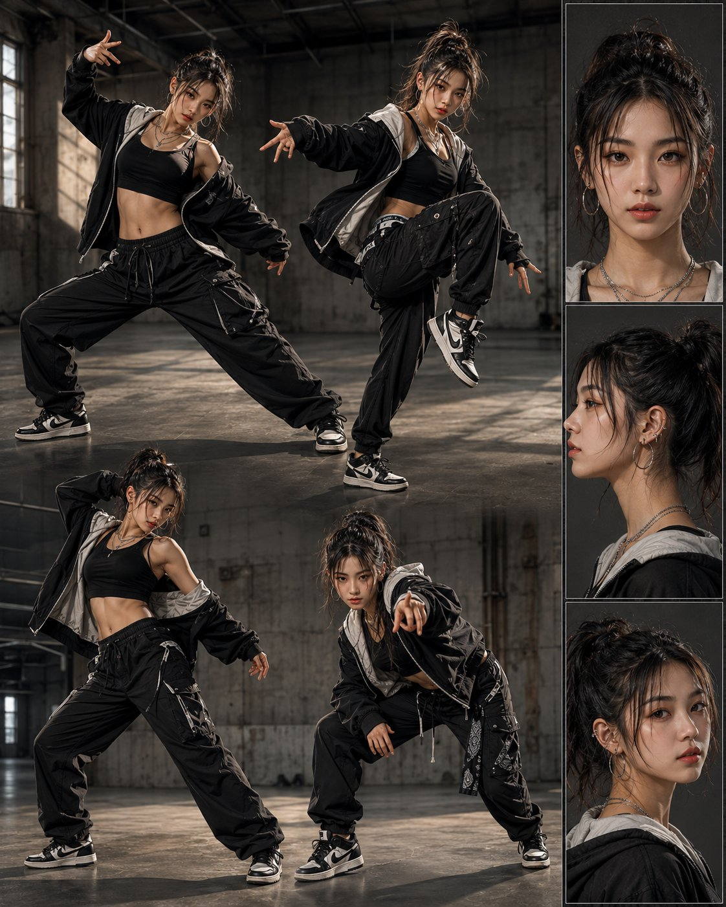

```text
角色设定图布局，聚焦于一位18岁的亚裔女性街舞舞者。包含4个大型、高细节度的全身动态舞姿（突出舞蹈动作，面部清晰）。侧边附一条清晰的多角度参考条，仅含3个精细头部特写（正面、侧面、3/4侧面）。最大限度减少文字元素，将像素空间优先用于面部细节刻画。背景为粗砺工业风，搭配写实光影效果
```


---

## 例 398：8 套日常穿搭编辑拼贴

**来源：** [@aiwithaly](https://x.com/aiwithaly/status/2052218645951205463)

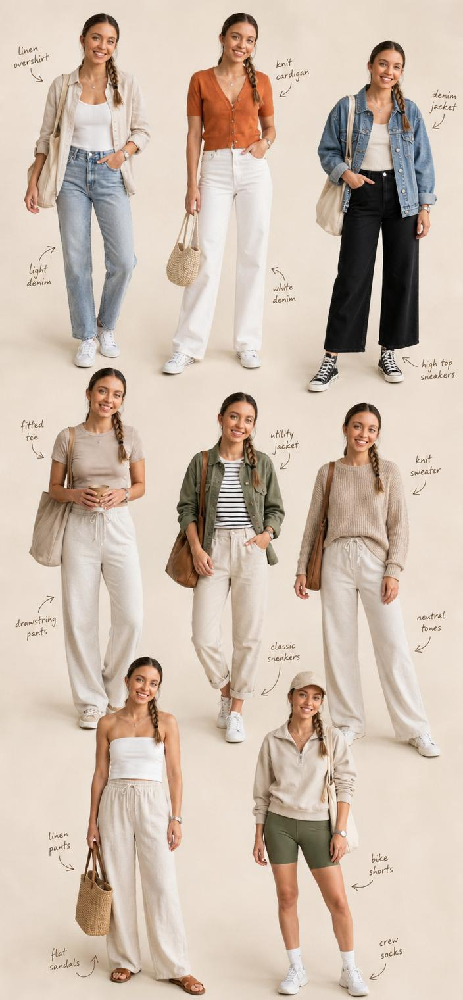

```text
Create a freeform fashion-editorial collage of me in 8 distinct full-body casual wear, arranged organically on a clean cream studio backdrop. Keep my face identical across all looks, w/ consistent proportions that visually read as around (height) w/o stating height. Include subtle handwritten-style arrows & labels highlighting key pieces. Avoid any grids, borders, or boxed layouts.
```


---

## 例 416：Earth Signs 角色 Scrapbook

**来源：** [@ZaraIrahh](https://x.com/ZaraIrahh/status/2053075976469512686)

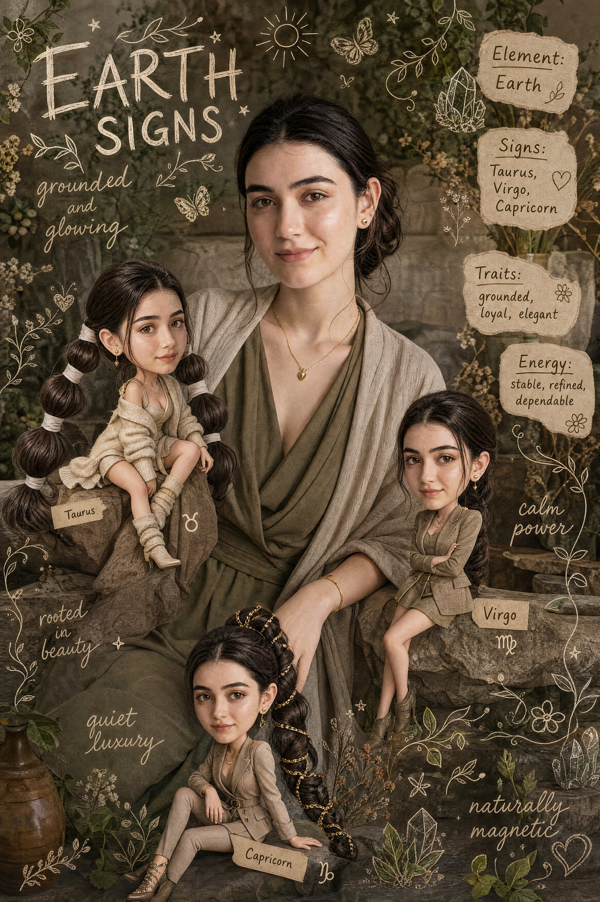

```text
CREATE A NEW IMAGE USING THE PROVIDED FEMALE SUBJECT AS THE ONLY REFERENCE. Preserve her exact facial features, identity, and characteristics with zero alteration.

MAIN SUBJECT — EARTH ELEMENT
She represents the Earth element as a whole: grounded, elegant, sensual, calm, stable, patient, quietly powerful, and naturally luxurious. Relaxed grounded posture, standing or seated, soft natural hand placement, composed feminine body language, rooted presence.

OUTFIT
Single cohesive Earth-inspired editorial look in olive, sage, taupe, mocha, beige, clay, cream, moss, and warm neutrals. Soft-structured elegant silhouette with subtle tailoring, draping, texture contrast, or layered structure. Fabrics: linen, cotton, matte satin, knit, suede-like textures, soft tailoring. Minimal refined gold or natural-toned accessories.

HAIR
Soft ash brown with natural dimension. Healthy, polished, softly voluminous waves or smooth blowout with subtle shine, controlled texture, face-framing strands, grounded and luxurious feel.

MAKEUP
Korean soft-glow base with earthy tones. Warm beige-rose, terracotta, tawny, or nude peach blush. Eyes in taupe, mocha, caramel, muted bronze, olive-brown. Soft liner, champagne-beige highlight, satin or velvet nude/mocha lips. Overall polished, sensual quiet-luxury aesthetic.

ENVIRONMENT
Grounded editorial Earth-inspired setting with stone, wood, linen, botanicals, dried plants, natural fabrics, rustic-luxury styling, warm daylight or diffused editorial lighting, soft shadows, serene cinematic stillness. Palette: cream, olive, moss, clay, taupe, beige, muted green, warm brown.

CHIBI MINI-ME SYSTEM
Surround her with multiple medium-sized realistic 3D chibi mini-me versions with identical face, hair, and identity. High-end doll-like styling with oversized heads, petite bodies, glossy eyes, realistic hair, detailed makeup, miniature fashion outfits, soft cinematic 3D lighting.

EARTH SIGN CHIBIS
Taurus — sensual soft-luxury romantic styling, knit or elegant feminine neutral outfit, rich textures, gold accents. Ultra-long segmented twin low ponytails tied with white fabric bands flowing dramatically around the frame.
Virgo — refined perfectionist aesthetic with polished minimalist tailoring, clean lines, structured mini dress or sophisticated co-ord styling.
Capricorn — sleek power-dressing with blazer dress or tailored set, sharp silhouette, understated luxury. Hair pulled into ultra-long sculptural braid wrapped with gold chains and metallic ornaments.

DOODLES + SCRAPBOOK OVERLAY
Hand-drawn earthy scrapbook doodles: leaves, vines, flowers, branches, mushrooms, butterflies, stars, sparkles, stones, hearts, sun doodles, botanical icons. Cozy ink-pen texture.

Handwritten text:
“EARTH SIGNS”
“grounded and glowing”
“soft strength”
“rooted in beauty”
“quiet luxury”
“stable energy”
“calm power”
“naturally magnetic”

Fact bubbles:
“Element: Earth”
“Signs: Taurus, Virgo, Capricorn”
“Traits: grounded, loyal, elegant”
“Energy: stable, refined, dependable”

COMPOSITION
Main subject centered and dominant. Chibis placed dynamically around shoulders, hands, sides, and lower frame. Doodles layered naturally throughout like a scrapbook. Balanced, expressive, premium composition.

STYLE
Cinematic editorial lifestyle image, fashion-meets-illustration hybrid, high detail, sharp focus, warm neutral tones, subtle realism grain, realistic human rendering with stylized 3D chibis and hand-drawn overlays. Social-media-ready premium aesthetic.

CAMERA
Eye-level or slightly above, medium full-body or 3/4 framing, 35mm or 50mm lifestyle portrait look, crisp details with soft atmospheric depth.
```


---

## 例 439：赛博黑客角色设定表

**来源：** [@Kashberg_0](https://x.com/Kashberg_0/status/2055865126335762902)

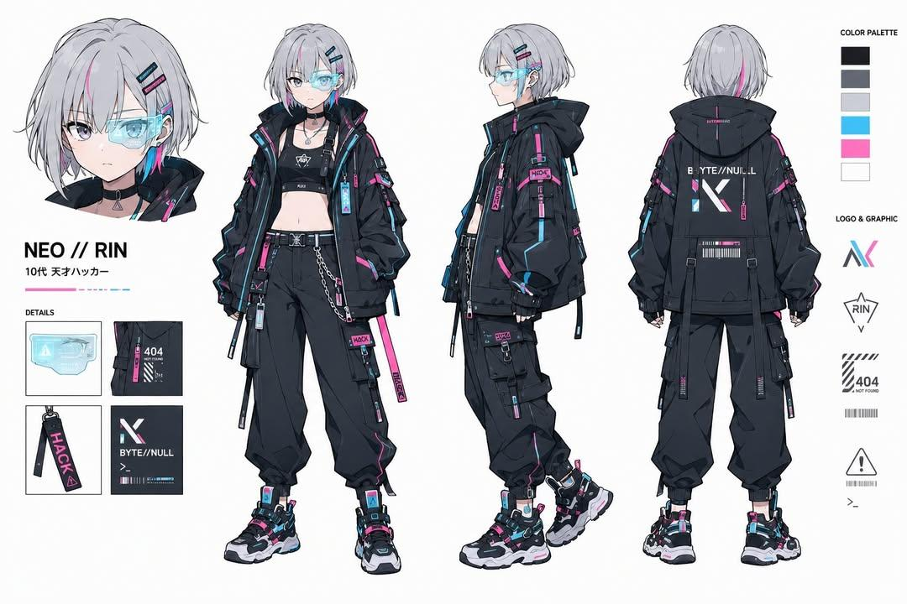

```text
Ultra-detailed cyberpunk anime character design sheet of a teenage genius hacker girl named “NEO // RIN”, full body turnaround (front, side, back) plus close-up portrait and accessory callouts. Short silver-white bob haircut with neon cyan and magenta gradient streaks, glowing translucent cyber visor over one eye, pale skin, sharp violet eyes, calm confident expression. Oversized techwear jacket with black tactical cargo pants, belts, straps, dangling utility tags, cropped top, futuristic sneakers, holographic accessories, barcode decals, warning symbols, “BYTE//NULL” typography, hacker aesthetic.
Color palette: matte black, dark gray, white, neon cyan, neon pink.
Style inspired by high-end Japanese concept art, futuristic streetwear, cyberpunk fashion, Akira + Ghost in the Shell + modern anime key visual aesthetics.
Include clean character reference sheet layout with labeled details, logo designs, UI graphics, gadget closeups, and color palette on white background.
Highly polished cel shading, crisp lineart, soft glow effects, intricate clothing folds, layered accessories, dynamic fashion silhouette, professional game concept art quality, 4k, ultra detailed.
```


---

## 例 473：ROGUE VIPER 游戏概念设定板

**来源：** [@KimAkiyama81](https://x.com/KimAkiyama81/status/2059394334378566063)

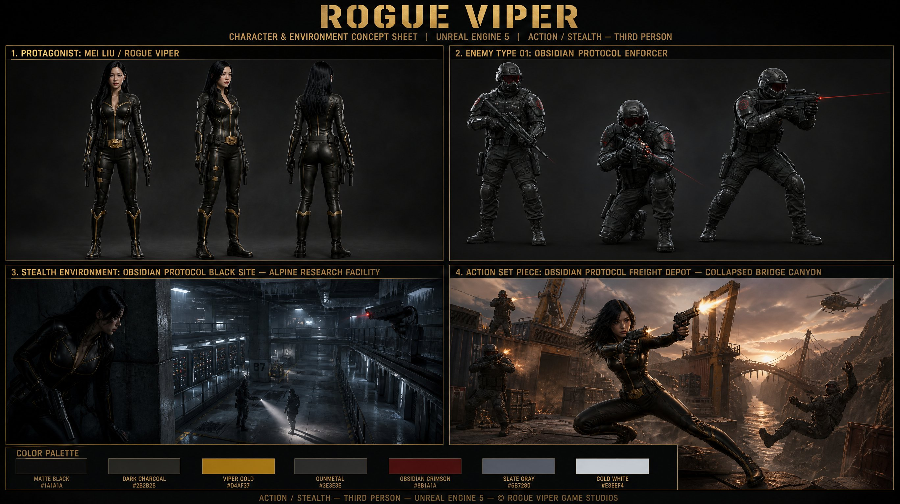

```text
**ROGUE VIPER — VIDEO GAME CONCEPT ART SHEET PROMPT**

---

Official AAA video game concept art sheet titled **'ROGUE VIPER'** for an Unreal Engine 5 third-person action-stealth game. Professional game development documentation layout on a dark charcoal #1A1A1A background with gold stencil label typography throughout. Four clearly labeled panels arranged in a 2×2 grid with a header and footer.

---

**SHEET HEADER** — Bold gold stencil font title text: **ROGUE VIPER** centered at top. Subtitle beneath in smaller tracking-heavy label font: **CHARACTER & ENVIRONMENT CONCEPT SHEET | UNREAL ENGINE 5 | ACTION / STEALTH — THIRD PERSON**

---

**PANEL 1 — TOP LEFT — Label: "PROTAGONIST: MEI LIU / ROGUE VIPER"**

Full-body character turntable reference of a 30-year-old East Asian Chinese-American female operative. Athletic and toned, 5'8", long straight black hair worn loose, calm neutral expression with sharp eyes. Wearing a form-fitting matte black tactical bodysuit with gold accent seams running along the shoulders, forearms, and thighs, gold cobra snake belt buckle at the waist, calf-high black tactical boots with subtle gold trim. Armed with twin suppressed 9mm pistols holstered on each hip with custom viper-scale grip texture, a serrated combat knife sheathed vertically on the right thigh, and a compact pneumatic grappling hook launcher mounted on the left forearm. Three views arranged side-by-side: front, 3/4, and back. Unreal Engine 5 physically-based rendering, photorealistic skin and fabric materials, neutral 3-point studio lighting for maximum clarity, gold and matte black color scheme throughout.

---

**PANEL 2 — TOP RIGHT — Label: "ENEMY TYPE 01: OBSIDIAN PROTOCOL ENFORCER"**

Three enemy soldiers shown as character references against a dark background. These are elite private military contractors working for a shadow arms cartel called Obsidian Protocol. Their uniform: slate-gray and black modular plate carriers with deep crimson geometric hex-patch insignia on the shoulder, full-face ballistic visors with a dark red tinted lens, black tactical gloves, reinforced combat boots. Armed with compact bullpup assault rifles with red laser sights. One figure standing in neutral patrol stance, one crouched in a ready alert position, one depicted mid-aim with rifle raised. All three shown at the same scale for comparison. Same UE5 photorealistic PBR render style. Crimson and slate-gray color language to contrast Viper's gold and black.

---

**PANEL 3 — BOTTOM LEFT — Label: "STEALTH ENVIRONMENT: OBSIDIAN PROTOCOL BLACK SITE — ALPINE RESEARCH FACILITY"**

Wide cinematic establishing shot of a stealth mission environment. A hidden high-altitude research facility buried inside a snow-covered mountain, accessible only via an underground tram. Interior architecture is brutalist concrete and frosted glass, dimly lit with cold white fluorescent overhead strips and amber emergency lighting casting long dramatic shadows across polished concrete floors. Rows of classified server terminals and cryogenic storage units line the walls. Ventilation shafts visible in the ceiling above catwalks. A security camera sweeps a slow arc over a central corridor below. In the foreground, Rogue Viper is pressed flat against a concrete pillar in deep shadow, body low, watching two Obsidian Protocol enforcers on patrol below, one holding a flashlight. The scene communicates tension, patience, and tactical opportunity. Unreal Engine 5 Lumen global illumination, volumetric cold air haze, photorealistic ice and concrete materials, deep crushed blacks with cold white and amber lighting contrast. Cinematic wide 2.39:1 style composition within the panel.

---

**PANEL 4 — BOTTOM RIGHT — Label: "ACTION SET PIECE: OBSIDIAN PROTOCOL FREIGHT DEPOT — COLLAPSED BRIDGE CANYON"**

Wide cinematic action shot of a high-octane firefight environment. A sprawling open-air industrial freight depot at the edge of a sheer cliff canyon at dusk, with a collapsed suspension bridge dangling over the chasm below. Shipping containers and heavy crane equipment provide cover geometry. Rogue Viper is captured mid-movement in a dynamic gunfight pose — body low, both suppressed pistols raised and firing, muzzle flashes illuminating her face with sharp white light. Three Obsidian Protocol enforcers are positioned around her — one diving behind a container, one firing from atop a crane platform, one falling backward off the edge of the depot platform. Background: deep canyon with a river of orange reflected sunset light far below, dust and smoke rising from the firefight, a military helicopter approaching in the far distance. Warm dusk amber and cool canyon shadow blue provide dramatic color contrast. UE5 ray-traced reflections on metal container surfaces, particle systems for dust and muzzle smoke, cinematic depth of field on background elements.

---

**SHEET FOOTER** — Color palette chip row along the bottom of the sheet: matte black #1A1A1A, dark charcoal #2B2B2B, viper gold #D4AF37, gunmetal #3E3E3E, obsidian crimson #8B1A1A, slate gray #6B7280, cold white #E8EEF4. Label above chips: **COLOR PALETTE**. Footer text beneath: **ACTION / STEALTH — THIRD PERSON — UNREAL ENGINE 5 — © ROGUE VIPER GAME STUDIOS**

---

**UNIVERSAL STYLE CONSTRAINTS — APPLY TO ALL PANELS:**
Photorealistic only throughout the entire sheet. No anime, no cartoon, no stylized illustration, no cel shading, no comic book rendering. Unreal Engine 5 cinematic render quality with physically-based materials. Anamorphic lens character on all environment shots. Crushed blacks and desaturated mid-tones across all panels. Professional AAA game studio concept documentation format comparable to Naughty Dog, Ubisoft, or Guerrilla Games internal production art.
```


---

## 例 480：粉丝速写本角色页

**来源：** [@Ciri_ai](https://x.com/Ciri_ai/status/2060211436232786357)

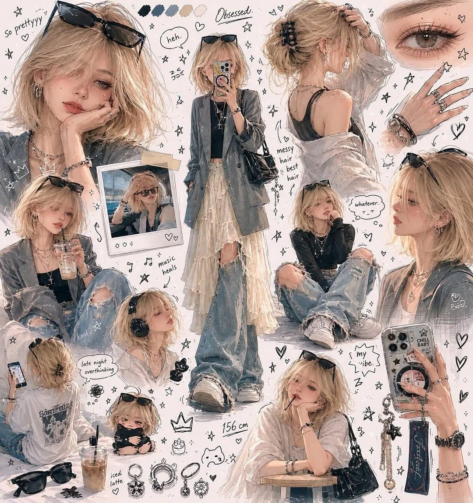

```text
Draw me as if an obsessed fan artist filled an entire sketchbook page - messy, overlapping, full-body poses, tiny chibi doodles, exaggerated expressions, and random close-ups of their hands or eyes.
White background. No grid, no order. Pure chaos energy. With (any color) aesthetic clothes
```


---

## 例 502：黑桃国王递归扑克牌

**来源：** [@Professor_134](https://x.com/Professor_134/status/2063244295977800057)

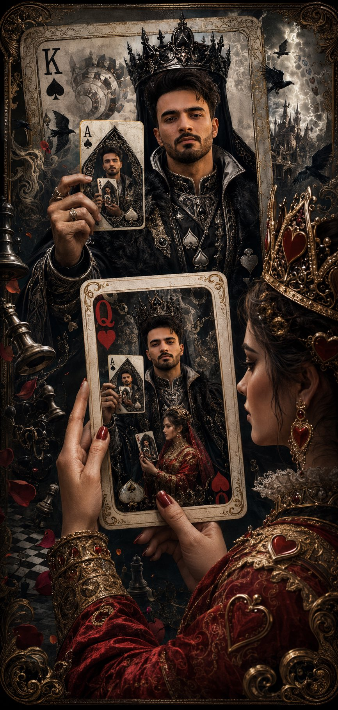

```text
Use my uploaded face image as the primary identity reference. Preserve my exact facial identity with extremely high fidelity: identical facial structure, jawline, cheekbones, eye shape, eyebrows, nose, lips, beard pattern, hairstyle, hair texture, skin tone, skin texture, and overall recognizable appearance. Do not beautify, alter, or reinterpret my face. Maintain realistic anatomy and authentic likeness.

Create an ultra-detailed, cinematic, surreal luxury playing-card artwork.

The main subject is me as the King of Spades, occupying the full design of a magnificent, royal Ace-quality playing card. I wear elaborate black-and-silver spade-themed regalia, a crown forged from obsidian and polished steel, intricate embroidered armor, and flowing royal garments decorated with subtle spade symbols. My expression is calm, intelligent, and powerful.

In my right hand, I am holding a pristine Ace of Spades card.

The creative twist: the Ace of Spades I am holding is not a normal card. It contains another complete playing-card illustration. Inside that card, I again appear as the King of Spades, and that entire card is being elegantly held between the fingers of a majestic Queen of Hearts. The Queen is graceful, regal, and visually striking, dressed in rich crimson and gold royal attire adorned with heart motifs.

The illusion continues with subtle recursive storytelling: the Queen of Hearts appears to be examining the card with fascination, creating a “card within a card” visual paradox. The composition should feel like a legendary tale of power, strategy, love, and destiny intertwined.

Add impossible Escher-inspired visual design elements:
•Infinite recursion effect
•Card-world folding into itself
•Floating spade and heart symbols transforming into ravens and rose petals
•Ornate golden borders extending beyond physical card edges
•Royal chess pieces suspended in midair
•Fractal patterns hidden within the card engravings
•Elegant smoke forming suit symbols
•Dimensional portals emerging from card corners

Style: ultra-realistic fantasy realism mixed with luxury casino art, Renaissance royal portraiture, and modern cinematic concept art.

Lighting: dramatic chiaroscuro, volumetric god rays, rich contrast, glowing metallic highlights, subtle magical energy around the Ace of Spades.

Color palette:
•Deep blacks
•Silver chrome
•Ivory white
•Crimson red
•Antique gold accents

Composition:
•Vertical masterpiece
•Museum-quality detail
•Hyper-realistic textures
•Intricate card engravings
•Perfectly symmetrical playing-card aesthetics blended with cinematic depth
•Sharp focus on my face
•Extremely high identity fidelity
•Epic storytelling through visual symbolism

The final image should feel like the cover of a legendary fantasy card game where the King of Spades has become self-aware, existing across multiple layers of reality while being held in the hands of fate itself, represented by the Queen of Hearts.
```


---

## 例 507：暖调钩织角色玩偶

**来源：** [@azed_ai](https://x.com/azed_ai/status/2067925399947067728)

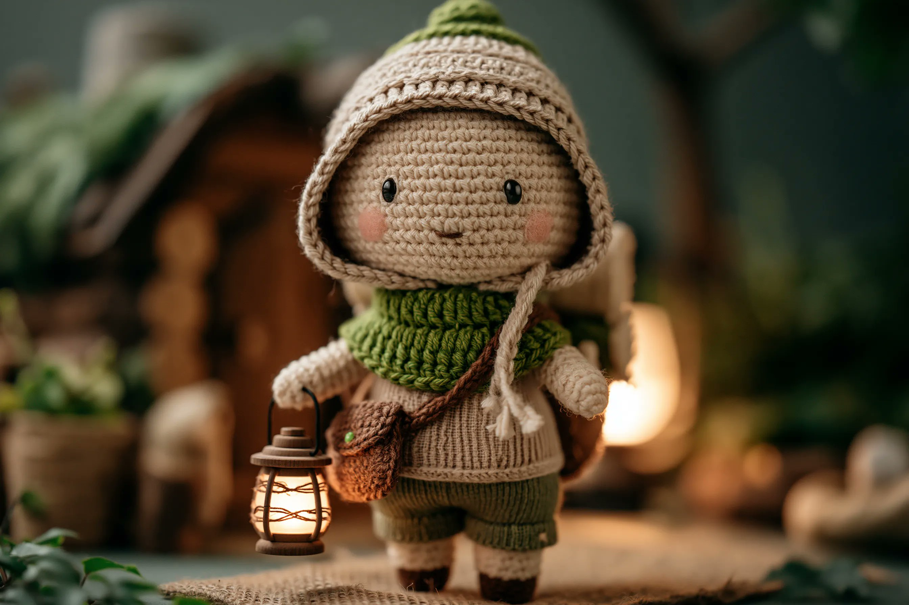

```text
A handcrafted crochet doll of a [subject], made with soft yarn textures and intricate knitted details. Dressed in a vivid [color1] accent and a delicate [color2] garment, holding a small [prop]. Set in a cozy [setting], warm muted atmosphere, charming handmade aesthetic, nostalgic amigurumi style.
```


---

## 例 512：Brutalist Freestyle 角色设定表

**来源：** [@ShamsAmin56](https://x.com/ShamsAmin56/status/2071590431725670517)

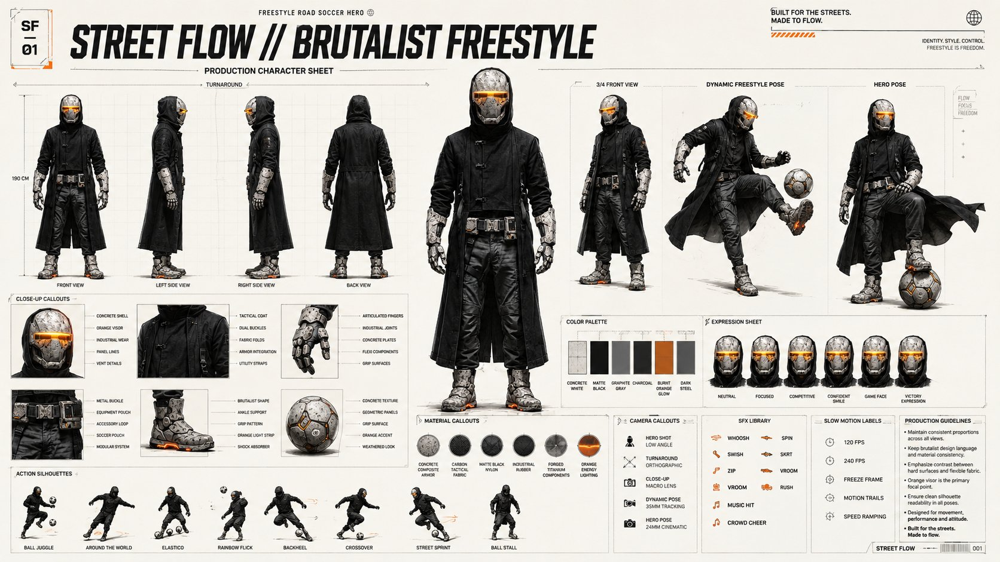

```text
Use the uploaded reference image as the primary character design reference, preserving the overall silhouette, proportions, futuristic apparel layering, helmet geometry, visor shape, stone-like brutalist armor surfaces, black hooded coat, tactical streetwear construction, gloves, boots, utility belt, and monochrome industrial aesthetic.

Create a premium production character sheet for a 2D stylized futuristic freestyle road soccer protagonist inspired by Brutalist architecture, industrial concrete textures, geometric forms, and minimalist sci-fi design language.  The presentation should resemble a AAA game character turnaround sheet mixed with a Nike commercial concept presentation.

The character should feel agile, stylish, confident, athletic, and built for urban freestyle football.  Maintain the concrete-textured helmet with glowing orange visor, oversized hood, tactical long coat, mechanical gauntlets, armored boots, and industrial detailing exactly as the design language.  The football should be integrated naturally into the presentation.  Minimal off-white background (#F7F5F0).

Professional production sheet layout.  Extremely clean linework.  Cinematic concept art.  Premium graphic design.  No photorealism.  High-end stylized illustration.  CHARACTER ANGLES Front View  Neutral hero pose.  Left Side View Right Side View Back View 3/4 Front View Dynamic Freestyle Pose  Standing on one foot while balancing the football.  Hero Pose  Football under foot.  Long coat flowing.  Confident posture.  CLOSE-UP CALLOUTS  Helmet Design  Orange illuminated visor  Concrete brutalist surface  Industrial wear  Panel breakdown  Upper Body  Coat construction  Buckles  Fabric folds  Armor integration  Mechanical Gloves  Finger articulation  Industrial joints  Material breakdown  Utility Belt  Equipment  Fasteners  Soccer accessory pouch  Boot Design  Heavy brutalist geometry  Street football grip  Orange illuminated sole accents  Football Design  Minimal futuristic street football  Concrete-inspired panel graphics  Orange accent details  MATERIAL CALLOUTS  Concrete Composite Armor  Carbon Tactical Fabric  Matte Black Nylon  Industrial Rubber  Forged Titanium Components  Orange Energy Lighting  COLOR PALETTE  Concrete White  Matte Black  Graphite Gray  Charcoal  Burnt Orange Glow  Dark Steel  EXPRESSION SHEET  Neutral  Focused  Competitive  Confident Smile  Game Face  Victory Expression  ACTION SILHOUETTES  Ball Juggle  Around The World  Elastico  Rainbow Flick  Backheel  Crossover  Street Sprint  Ball Stall  CAMERA CALLOUTS  Hero Shot Low Angle  Turnaround Orthographic  Close-up Macro Lens  Dynamic Pose 35mm Tracking Camera  Hero Pose 24mm Cinematic Lens  SFX LABELS  WHOOSH  SWISH  TAP  BOUNCE  THUD  ZIP  SPIN  SKRT  VROOM  RUSH  MUSIC HIT  CROWD CHEER  SLOW MOTION LABELS  120 FPS  240 FPS  Freeze Frame  Motion Trails  Speed Ramping  GUIDELINES  Maintain consistent proportions across all views.  Keep the brutalist design language consistent.  Emphasize concrete-inspired hard surfaces contrasted with flexible tactical fabrics.  Preserve the glowing orange visor as the primary focal point.  Use clean production callouts with arrows and labels.  Include measurement guides, material notes, and design annotations.  Keep presentation minimal and premium.  Avoid clutter.  Professional concept art quality suitable for AAA game development, cinematic production, and advertising pitch decks.  LAYOUT  16:9 Landscape  Top Center: MAIN TITLE STREET FLOW // BRUTALIST FREESTYLE  Below: Production Character Sheet  Center: Large Hero Character  Left: Front • Side • Back Views  Right: 3/4 View • Action Pose • Hero Pose  Bottom: Close-ups • Materials • Color Palette • Equipment • Football Design • Expressions • Camera Notes • SFX • Slow Motion • Production Annotations  Minimal off-white background with subtle grid guides, technical drawing arrows, clean typography, and premium commercial presentation quality.
```


---

## 例 522：儿童故事书手绘头像

**来源：** [@Sairah_0](https://x.com/Sairah_0/status/2090321208441262454)

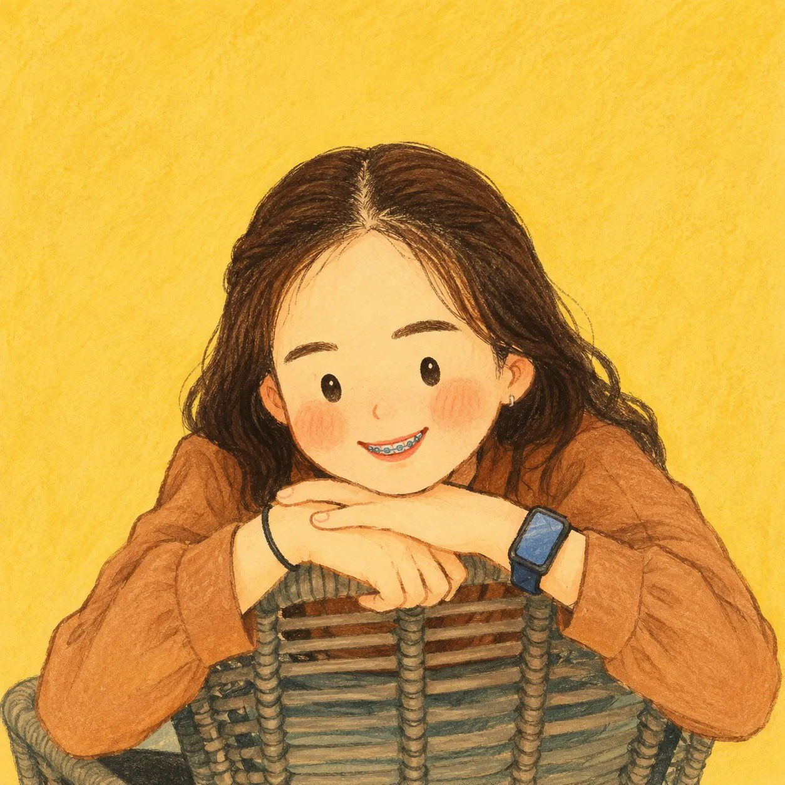

```text
Use the single uploaded photo as the only visual reference. Transform the person into an adorable hand-drawn 2D children’s storybook character, while keeping their identity immediately recognizable.

Preserve exactly from the photo:
- Facial features and skin tone
- Real hairstyle, length, texture, and color
- Exact clothing, colors, patterns, and layering
- Glasses, jewelry, headwear, bags, and all visible accessories

Do not invent or copy hairstyles, outfits, accessories, braids, pigtails, bows, bonnets, or headscarves from any reference artwork.

### Character
Use an oversized rounded head, tiny compact body, short arms, narrow shoulders, soft rounded silhouette, and cute childlike proportions. Keep the head visually dominant. Avoid realistic anatomy.

### Face
Simplify into tiny dot/oval eyes, minimal nose, tiny smiling mouth, rounded cheeks, and soft peach/pink blush. Keep recognizable facial characteristics. No realistic eyes, detailed lips, anime features, glossy 3D rendering, or heavy shading.

### Hair & Clothing
Recreate the exact hairstyle and outfit from the uploaded photo, simplified into chunky hand-drawn shapes. Preserve important colors, patterns, jewelry, glasses, and other recognizable details.

### Style
Handmade 2D picture-book aesthetic using soft gouache, wax crayon, colored pencil, and dry pastel. Use slightly irregular dark-brown linework, subtle paper grain, uneven pigment, soft brush marks, and imperfect painted edges. Avoid clean vector art, CGI, anime, or photorealism.

### Composition
Square 1:1 portrait, chest/waist-up, centered and facing mostly forward, with balanced negative space. Use a relaxed, charming pose.

### Background
Simple warm mustard, butter yellow, ochre, or cream background with subtle paper texture. No scenery, objects, text, borders, or distractions.

Final feeling: the same person lovingly redrawn as an extremely cute, warm, wholesome, nostalgic, handcrafted children’s-book character—same identity, same hair, same clothes, same accessories, completely simplified and adorable.
```


---

## 例 528：圣诞街景 Chibi 真实背景人像

**来源：** [@Sairah_0](https://x.com/Sairah_0/status/2091401764360896762)

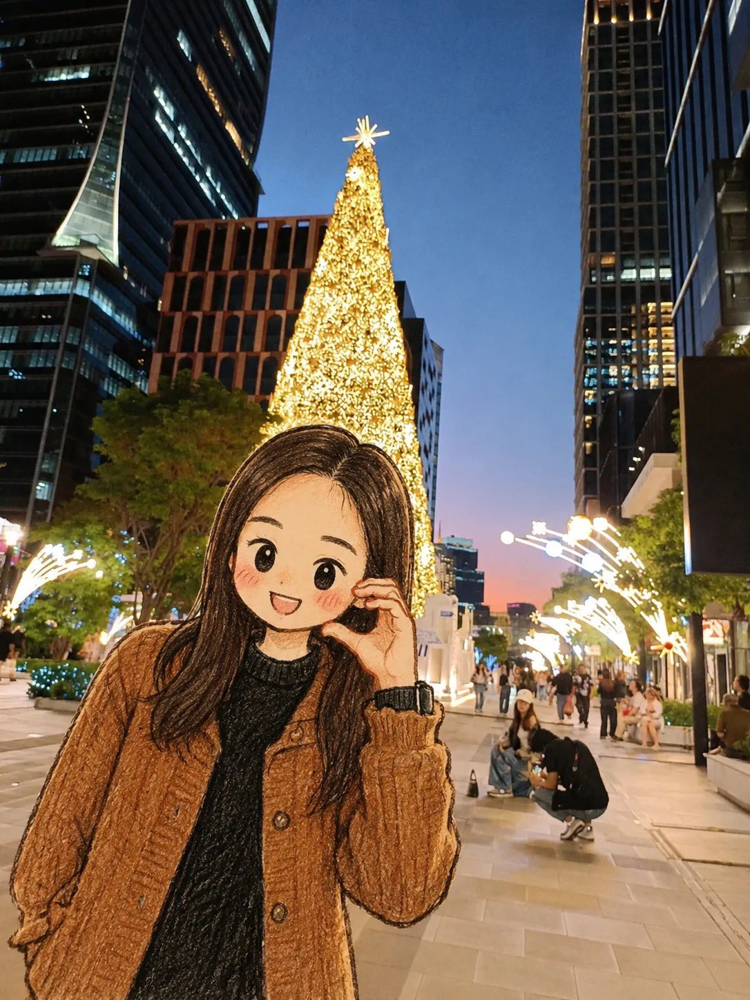

```text
Use the uploaded image as the primary reference. Transform the person into a cute, hand-drawn anime/chibi character while preserving the original person’s recognizable facial features, hairstyle, outfit, pose, and accessories.

A cute young woman standing on a modern city street at blue hour, surrounded by tall illuminated skyscrapers and festive Christmas decorations. A huge glowing Christmas tree covered in warm golden lights stands directly behind her, creating a magical holiday atmosphere. The street is filled with elegant decorative lights, pedestrians, modern architecture, and soft evening city illumination.

Render the character in a charming Japanese hand-drawn anime/chibi illustration style with expressive large eyes, soft blush on the cheeks, delicate facial details, textured pencil-and-ink outlines, subtle watercolor-like coloring, and slightly imperfect handmade sketch details. Keep the background photorealistic and highly detailed, creating a beautiful contrast between the illustrated character and the real-world environment.

Cinematic composition, natural perspective, soft evening lighting, warm Christmas glow, realistic background depth, detailed clothing texture, cozy winter atmosphere, high detail, aesthetically pleasing, vertical portrait composition.
```


---

## 例 530：实拍背景涂鸦人物替换

**来源：** [@Emmma__0](https://x.com/Emmma__0/status/2091391958128251286)

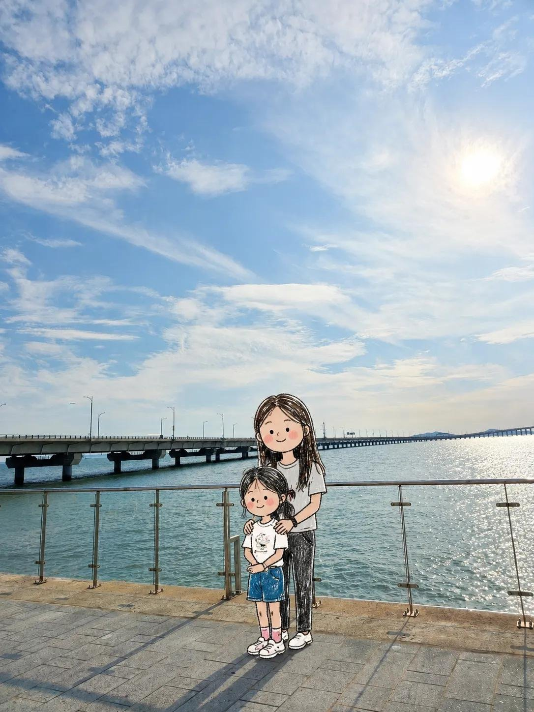

```text
Transform ONLY the people in the uploaded photo into adorable hand-drawn doodle characters while keeping the original photographic background unchanged.

CORE RULE:
Background = original realistic photo.
People = cute hand-drawn doodle characters.

PRESERVE THE BACKGROUND:
Keep the original sky, landscape, buildings, water, furniture, ground, plants, railings, objects, lighting, colors, perspective, camera angle, framing, and textures as close to the original photo as possible.

Do NOT redraw, simplify, illustrate, or apply doodle/crayon/pencil effects to the background or environmental objects.

TRANSFORM ONLY PEOPLE:
Replace each person with a charming, naive doodle version while preserving:
- exact number of people
- original position and relative scale
- front/back/side/three-quarter orientation
- head and body direction
- pose and gesture
- arm and leg positions
- interactions with people or objects
- hairstyle, clothing colors, and major accessories

IMPORTANT:
If someone faces away, keep them back-facing.
If sideways, keep them sideways.
If facing forward, keep them forward.
Never rotate a person toward the viewer or invent a face that is not visible.

CUTE DOODLE STYLE:
Freely reinterpret realistic anatomy into an adorable, imperfect character:
- oversized round head
- tiny compact body
- short simplified arms and legs
- tiny hands and feet
- cute awkward proportions
- loose scribbled hair
- tiny dot eyes and simple facial features when visible
- rosy scribbled cheeks when appropriate

Keep the original pose recognizable, but simplify and slightly exaggerate it for cuteness.

DRAWING STYLE:
Loose naive hand-drawn doodle, like a quick children's sketch.
Use thin shaky black outlines, imperfect shapes, overlapping sketch lines, scribbled colored-pencil or crayon fills, uneven coloring, white gaps, and slightly messy edges.

The character should look intentionally roughly drawn but extremely cute.

OBJECTS:
Objects, furniture, scenery, and items around the people should remain photographic whenever possible. A doodle character may naturally touch or hold a real photographic object.

INTEGRATION:
Keep correct scale, ground contact, depth, and occlusion so the doodle characters naturally occupy the same locations as the original people.

FINAL LOOK:
It should feel like the real people were removed from the original photograph and replaced with adorable little hand-drawn doodle versions of themselves, while the real-world background remained untouched.

Prioritize:
1. Original photographic background
2. Person position and scale
3. Exact body orientation
4. Pose and gesture
5. Cute exaggerated doodle character design

Avoid full-image illustration, background doodling, realistic anatomy, anime, manga, 3D cartoon, polished digital art, vector lines, changed poses, changed orientation, added people, or invented faces.
```


---

## 例 533：手绘涂鸦时尚人物插画

**来源：** [@Sairah_0](https://x.com/Sairah_0/status/2092473965927334071)

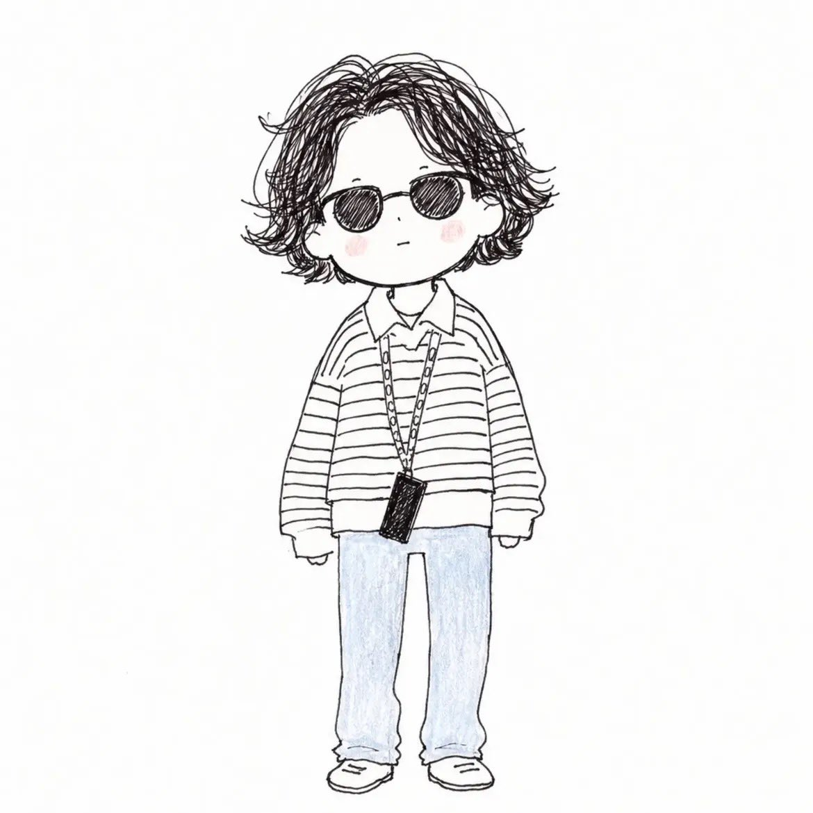

```text
Transform the subject from the reference image into a cute, quirky hand-drawn doodle illustration.

Use a minimalist children’s storybook / fashion sketch aesthetic with loose, imperfect black ink lines, visible scribbly pencil strokes, subtle cross-hatching, and a charming handmade feel. Keep the character’s recognizable facial features, hairstyle, face shape, clothing, accessories, and overall identity from the reference while simplifying them into a cute illustrated character.

Character design:
- Oversized head and small simplified body
- Simple dot-like eyes and tiny minimal mouth
- Soft rounded facial features
- Slight rosy pink blush on the cheeks
- Messy, expressive hand-drawn hair with many loose sketch lines
- Slightly exaggerated, playful proportions
- Natural, relaxed pose with a whimsical fashion-illustration feel

Art style:
- Black-and-white pencil/ink doodle drawing
- Rough, imperfect sketch lines rather than clean digital outlines
- Dense scribbled hair and clothing details
- Light hand-colored accents
- Subtle watercolor/crayon-like coloring
- Minimal shading
- White or off-white clean background
- Lots of negative space
- Cute, innocent, playful, cozy aesthetic
- Looks like an original handmade notebook/fashion doodle illustration

Preserve the important details of the reference image while converting everything into this consistent doodle-art style. The final image should feel hand-sketched, slightly imperfect, adorable, expressive, and effortlessly stylish, not like polished vector art or 3D cartoon art.
```


---

## 例 535：同一人脸十二款发型 Lookbook

**来源：** [@Ciri_ai](https://x.com/Ciri_ai/status/2092452220768002400)

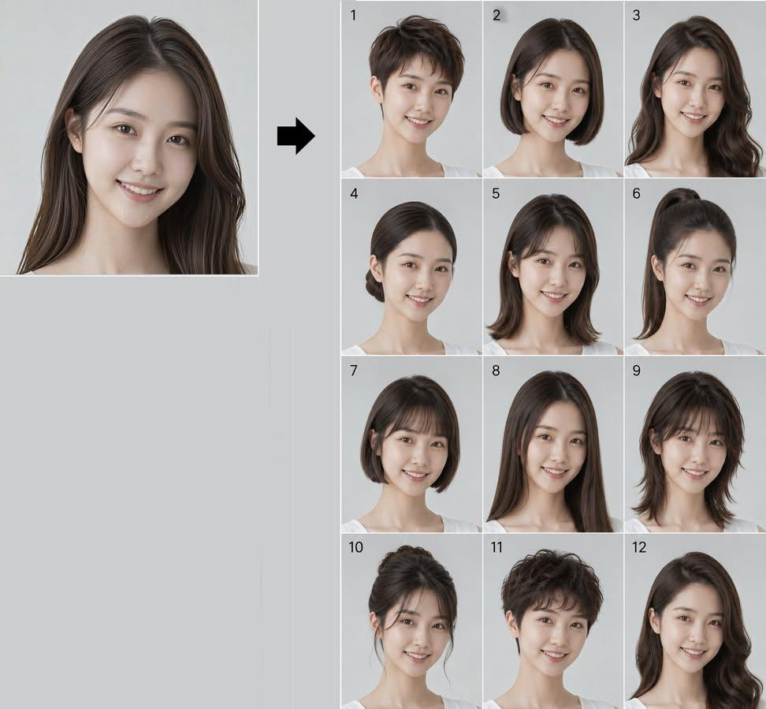

```text
Create a 12-panel grid (3 columns × 4 rows, numbered 1 to 12) showing the SAME person from the reference photo with 12 different hairstyles. This is a hairstyle lookbook. Final image aspect ratio: 4:5 (vertical/portrait).
THE ONLY THING THAT CHANGES BETWEEN PANELS IS THE HAIR ON THE HEAD (shape, style and length only). Everything else stays exactly as in the reference photo.
Identity Anchor (Critical)
The face must be IDENTICAL to the reference photo in every single panel. Preserve exactly: facial bone structure, jawline, cheekbones, nose shape, lips, eye shape and spacing, eyebrows, skin tone, skin texture (pores, natural imperfections), and overall facial proportions. This is the same real person in all 12 frames. Do NOT beautify, slim, or alter the face. Same age, same expression as in the reference.
Mandatory Rules (Do Not Violate)
- NO SUNGLASSES. Eyes must be fully visible in all 12 panels.
- NO ENVIRONMENTAL BACKGROUNDS. Every panel must have a plain, uniform, solid light grey studio backdrop with zero objects, zero textures, zero gradients. Just flat neutral grey.
- Hair COLOR stays exactly as it appears in the reference photo in all 12 panels. Only the shape, length and style changes, never the color.
Keep Identical in Every Panel (Do Not Change)
- MAKEUP AND SKIN: If the person in the reference photo wears makeup, replicate it identically in every panel. Same lip color, same eye makeup, same brow grooming. If they wear no makeup, keep all panels makeup-free. Do NOT add, remove, or alter makeup between panels.
- Clothing: the same clothing visible in the reference photo, replicated exactly.
- Accessories: preserve ALL visible accessories from the reference photo (earrings, necklaces, rings, bracelets, piercings, watch, glasses, etc.). Do not omit, resize, recolor, or restyle any accessory. If the person wears prescription glasses (not sunglasses), keep them in every panel.
- Background: plain solid light grey studio backdrop in every panel. No room, no furniture, no environment.
The 12 Hairstyles
1. Pixie cut: very short, textured, slightly tousled on top with tapered sides and nape
2. Classic bob: chin-length, straight, blunt ends, clean middle part
3. Long layered waves: past the shoulders, soft voluminous waves with face-framing layers
4. Sleek low bun: hair pulled back smoothly into a tight low bun at the nape, no flyaways
5. Curtain bangs with medium-length hair: soft parted fringe framing the face, hair falling just past the shoulders
6. High ponytail: hair pulled up into a sleek high ponytail, smooth crown, length falling behind
7. French bob: short bob ending at the jawline with a soft blunt micro-fringe across the forehead
8. Long straight hair with middle part: very long, sleek, pin-straight, falling well past the shoulders
9. Shaggy wolf cut: medium length, heavy layers, choppy fringe, textured and voluminous with a slightly wild look
10. Elegant updo: hair swept up into a polished chignon with soft face-framing tendrils
11. Short curly crop: short voluminous curls all over, natural texture, tapered at the sides
12. Side-swept Hollywood waves: long glamorous deep side part, sculpted vintage waves cascading over one shoulder
Photographic Specs
Shot on a Canon EOS R5 with an 85mm f/1.4 lens, studio portrait lighting (soft key light, subtle fill), shallow depth of field with sharp focus on the face. PLAIN SOLID LIGHT GREY STUDIO BACKGROUND in every panel. Natural skin rendering with visible pores and realistic hair strands (no plastic or CGI look). Consistent lighting, color grading and exposure across all 12 panels. Photorealistic, high detail, hyperrealistic, 8K. No illustration, no painterly effect, no over-smoothing. NO SUNGLASSES.
Each panel clearly numbered 1 to 12 in the top-left corner. Overall output aspect ratio 4:5.
```


---

## 例 536：Anime Short Film Dev Board

**来源：** [@HeyAbhishek](https://x.com/HeyAbhishek/status/2063271070426435756) / [awesome-gpt-image-2-prompts](https://github.com/EvoLinkAI/awesome-gpt-image-2-prompts)

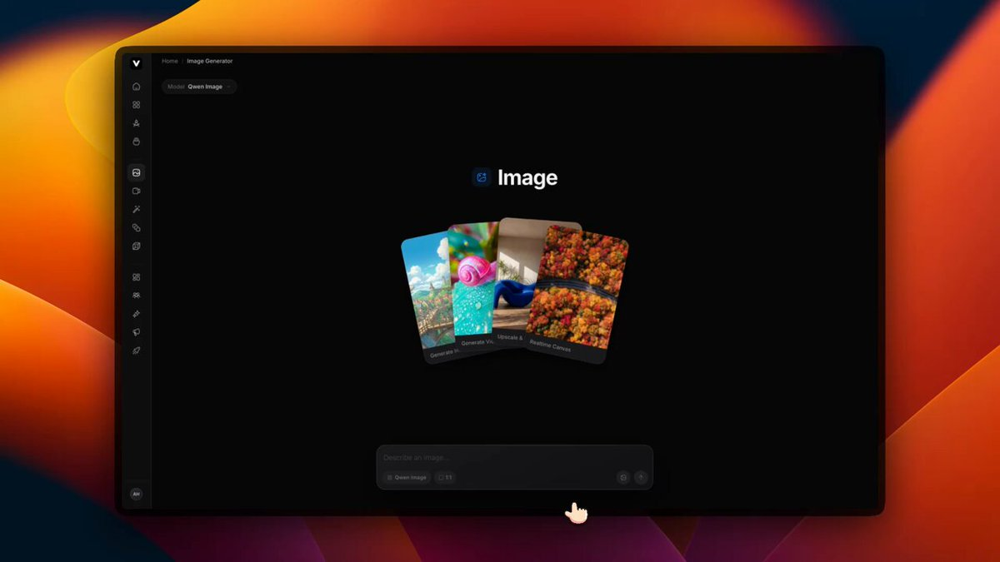

```text
"Create a single vertical anime development board for an original emotional short film titled "One More Player". Output ONE combined image with 2 sections: top section = character design sheet, bottom section = cinematic storyboard page.
STYLE: ultra high-quality nostalgic late 90s / early 2000s anime movie look, premium hand-drawn animation style, beautifully painted backgrounds, rich environmental detail, cinematic composition, soft but highly refined shading, natural character anatomy, expressive faces, subtle texture, realistic wet ground reflections, warm cloudy sunset lighting, atmospheric depth, polished old-anime film aesthetic, visually stunning frame quality, clean studio-level pre-production presentation. Make it feel like a premium old anime film, not modern glossy anime.
IMPORTANT: create fully original characters. Do not copy any existing anime, manga, game, or sports anime characters, faces, hairstyles, outfits, or famous designs.
SECTION A: CHARACTER DESIGN SHEET
Show 5 original characters clearly and consistently.
Main child:
A shy little boy around 8 years old with short messy dark hair, large warm eyes, slim build, oversized yellow T-shirt, blue shorts, and small sneakers. He feels nervous at first, then happy and accepted.
Show:
- front view
- side view
- back view
- 3/4 view
- expressions: nervous, scared, surprised, soft smile, happy
- poses: holding soccer ball, standing shyly, running with ball
Teen group:
Four teenage boys around 14 to 16, sporty and friendly, each with different hairstyles and casual soccer outfits. They should look slightly intimidating at first from the little boy’s perspective, but actually kind and welcoming. One teen is the warm leader.
Show for the teen group:
- simple front, side, back, and 3/4 views
- relaxed poses
- soccer poses
- smiling expressions
Keep them original, visually distinct, and cohesive.
Add small handwritten design notes and simple color swatches.
SECTION B: STORYBOARD PAGE
Create 8 cinematic storyboard panels in a clean grid. Use red panel borders, blue motion arrows, handwritten camera notes, timing notes, and short action notes. Keep all characters consistent.
Story beats:
1. Four teenagers playing soccer on a neighborhood ground after light rain, warm cloudy sunset, wet reflections on the field.
2. The soccer ball flies away toward the sitting area beside the field.
3. A shy little boy sitting alone notices the ball and picks it up.
4. The teenage boys walk toward him together. From the little boy’s view, they look a little scary.
5. Close-up of the little boy holding the ball with a nervous face.
6. The warm leader smiles kindly and gestures with his hand, inviting the boy to come play.
7. The little boy’s face changes from scared to relieved, then he smiles and runs toward them.
8. Final wide shot: the little boy happily plays soccer with the four teens under warm sunset light.
ENVIRONMENT:
Neighborhood soccer ground, wet dusty field, simple goalpost, sitting area beside the field, chain-link fence, trees, cloudy sunset sky, calm old-anime mood.
FINAL GOAL:
Make this a clean, highly polished, premium-quality anime pre-production board with beautiful cinematic presentation, emotional storytelling, strong readability, and a heartwarming ending. The image should look visually rich, refined, and high-end."
```


---

## 例 537：Soft Pastel Anime Girl Full Body

**来源：** [@hoshi122221](https://x.com/hoshi122221/status/2048025730425196801) / [awesome-gpt-image-2-prompts](https://github.com/EvoLinkAI/awesome-gpt-image-2-prompts)

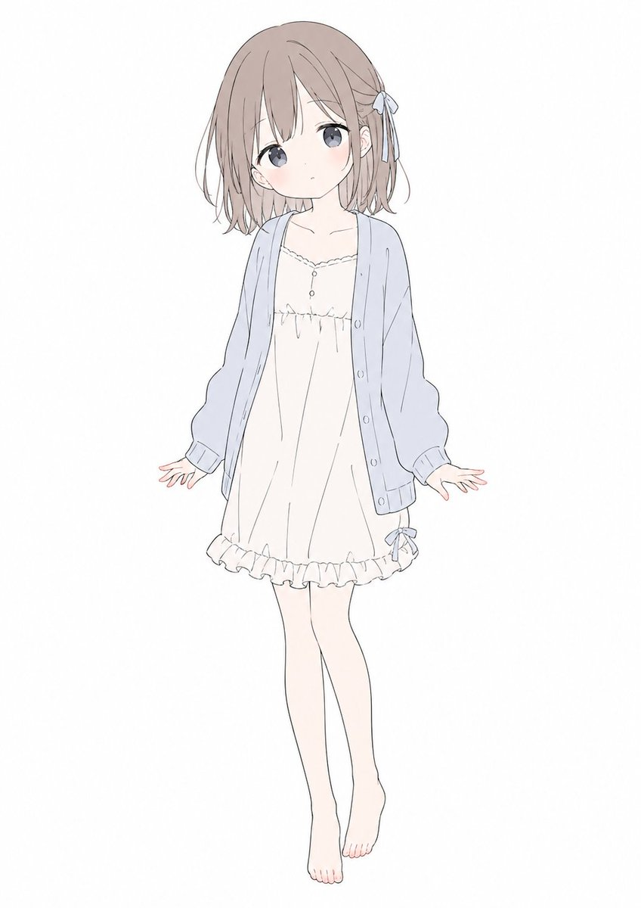

```text
A full-body anime girl character design on a plain white background, centered and floating slightly, drawn in a soft minimalist pastel style with very thin gray linework and delicate flat colors. She has a petite youthful build and a cute, gentle silhouette, with special emphasis on a soft rounded face shape, smooth cheeks, and a softened jawline and chin. Her face is completely obscured by a blank skin-colored rectangular block with no facial features visible. She has short bob hair in {argument name="hair color" default="light ash brown"}, slightly tousled with wispy ends, long bangs covering part of the forehead, and a small ribbon hair tie on the right side in pale blue-gray. She wears 3 visible clothing pieces: an oversized pale blue cardigan with loose sleeves and front buttons, a cream-white slip dress with a scalloped neckline and a tiny button detail at the chest, and a frilled hem with a small ribbon near the right thigh. She is barefoot with slim pale legs, posed front-facing with both arms relaxed slightly outward, open hands, one leg straight and the other gently bent inward for a shy, weightless look. The illustration should feel airy, cute, understated, and clean, like a simple Japanese anime fashion sketch, with lots of negative space and no props, no shadows, and no background elements.
```


---

## 例 538：Animated Character Design Sheet

**来源：** [@0kncn](https://x.com/0kncn/status/2063734037928452120) / [awesome-gpt-image-2-prompts](https://github.com/EvoLinkAI/awesome-gpt-image-2-prompts)

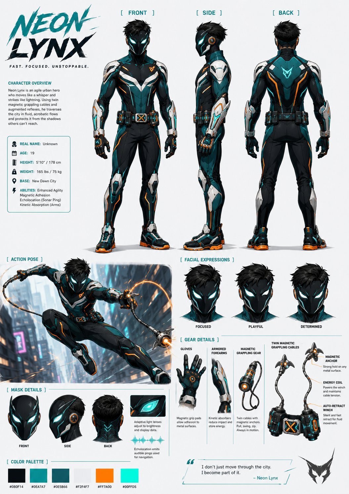

```text
Create a highly detailed full-color character design sheet in 16:9 horizontal format for an original [CHARACTER TYPE / HERO / CREATURE / VILLAIN].

STYLE:
stylized cinematic character design,
high-quality animated feature look,
clean readable shapes,
strong silhouette,
premium concept art presentation,
bold graphic color palette,
comic-book inspired energy,
polished but production-ready design,
clear anatomy and costume readability.
CHARACTER IDENTITY:
[CHARACTER NAME / ROLE]
[AGE / SPECIES / BODY TYPE]
[PERSONALITY ARCHETYPE]
[POWER / SKILL / SPECIAL EQUIPMENT]
MAIN DESIGN:
The character should have a distinctive, memorable silhouette.
Use a clear costume language with recognizable shapes, strong color blocking, and functional details.
The design must feel original, not based on any existing franchise character.
No copyrighted logos, no recognizable existing superhero symbols, no direct imitation of known characters.
OUTFIT / ARMOR:
[DESCRIBE COSTUME OR ARMOR]
Include practical design details:
gloves / wrist devices
boots / shoes
belt gear
armor plates
fabric folds
glowing elements if needed

utility tools or weapons if needed
COLOR PALETTE:
[MAIN COLOR]
[SECONDARY COLOR]
[ACCENT COLOR]
Use a bold cinematic palette with strong contrast.
The colors should be clear enough for animation and video generation consistency.
CHARACTER SHEET LAYOUT:
Show the same character in multiple views on one clean sheet:
front view full body
side view full body

back view full body
three-quarter action pose
close-up face / mask expression
hand / glove / equipment detail
special ability or weapon detail

POSES:
Use confident readable poses.
The action pose should show the character’s main movement style:
[RUNNING / JUMPING / FLYING / SWINGING / FIGHTING / CASTING POWER / USING EQUIPMENT]
EQUIPMENT / POWER DETAIL:
Show how the character’s signature equipment or power works.
Example:
magnetic grappling cables,
energy gauntlets,
kinetic boots,
utility belt,
glowing power core,
mechanical wings,
elemental weapon,
or custom ability system.
BACKGROUND:
clean light neutral background,
minimal graphic design,
no complex environment,
no text-heavy poster design,
small visual notes allowed only if clean and readable.

QUALITY:
high detail,
sharp clean rendering,
consistent proportions across all views,
same face and body structure in every pose,
clear costume continuity,
production-ready character sheet,
suitable as a reference image for storyboard and AI video generation.
```


---

## 例 539：Pixar 3D Character Design Sheet

**来源：** [@TechieBySA](https://x.com/TechieBySA/status/2057511465884557754) / [awesome-gpt-image-2-prompts](https://github.com/EvoLinkAI/awesome-gpt-image-2-prompts)

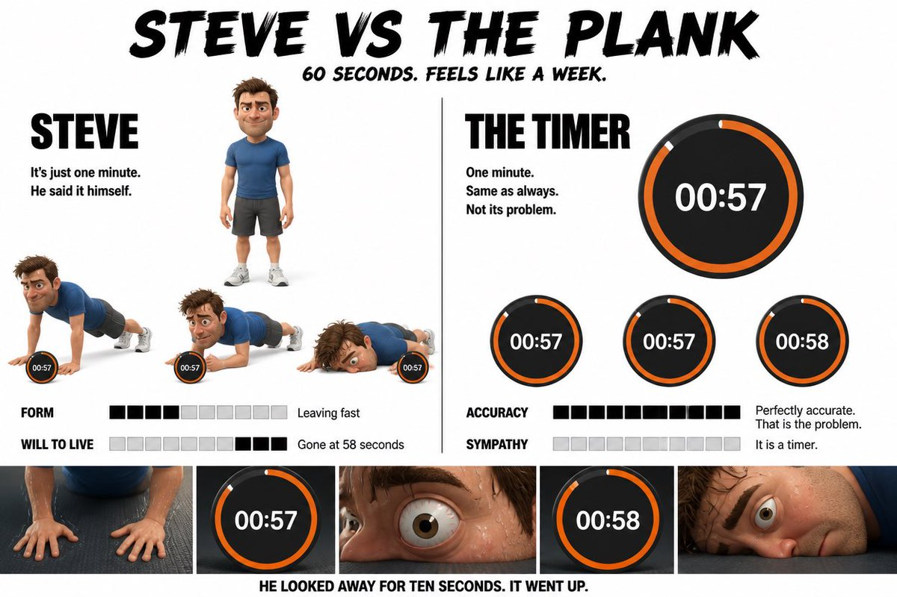

```text
“Create a Pixar 3D style character design sheet. Clean white background. Two characters side by side with a clean dividing line. Bold brushstroke-style title at the top: STEVE VS THE PLANK. Subtitle beneath: 60 seconds. Feels like a week.
```


---

## 例 540：LEGO Football Collectible Figure

**来源：** [@ChillaiKalan__](https://x.com/ChillaiKalan__/status/2068717001145778630) / [awesome-gpt-image-2-prompts](https://github.com/EvoLinkAI/awesome-gpt-image-2-prompts)

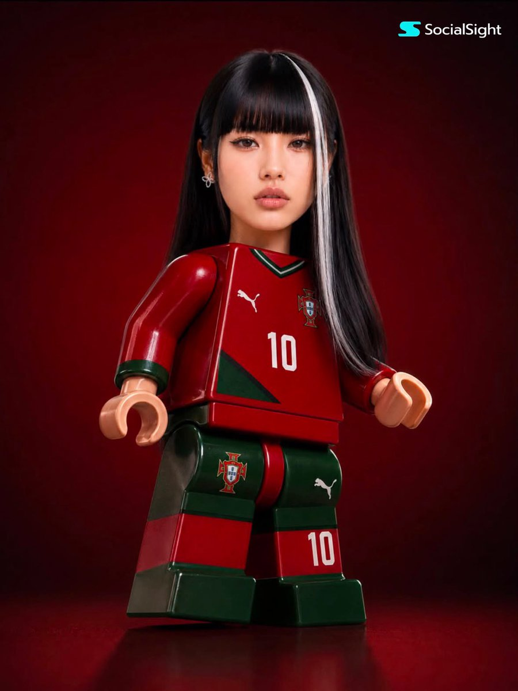

```text
A highly detailed collectible toy figure inspired by a LEGO-style minifigure, standing in a professional studio. The figure has a realistic young woman’s face with porcelain skin, straight jet-black hair, blunt bangs, and a single striking white streak running through the hair. She wears small silver earrings and maintains a calm, confident expression. The body is a glossy plastic brick-toy minifigure wearing a soccer jersey with the number 10, matching shorts, and national-team-inspired colors. Full-body composition, centered framing, shallow depth of field, premium product photography, ultra-clean lighting, reflective plastic surfaces, realistic shadows, sharp focus, luxury collectible aesthetic, high-end commercial advertising style, photorealistic face blended seamlessly with toy body, 8K resolution, vibrant color grading, studio backdrop matching the jersey color theme.
```


---

## 例 541：GTA 6 in Bangalore Flower Market

**来源：** [@ismajc](https://x.com/ismajc/status/2048174302164394493) / [awesome-gpt-image-2-prompts](https://github.com/EvoLinkAI/awesome-gpt-image-2-prompts)

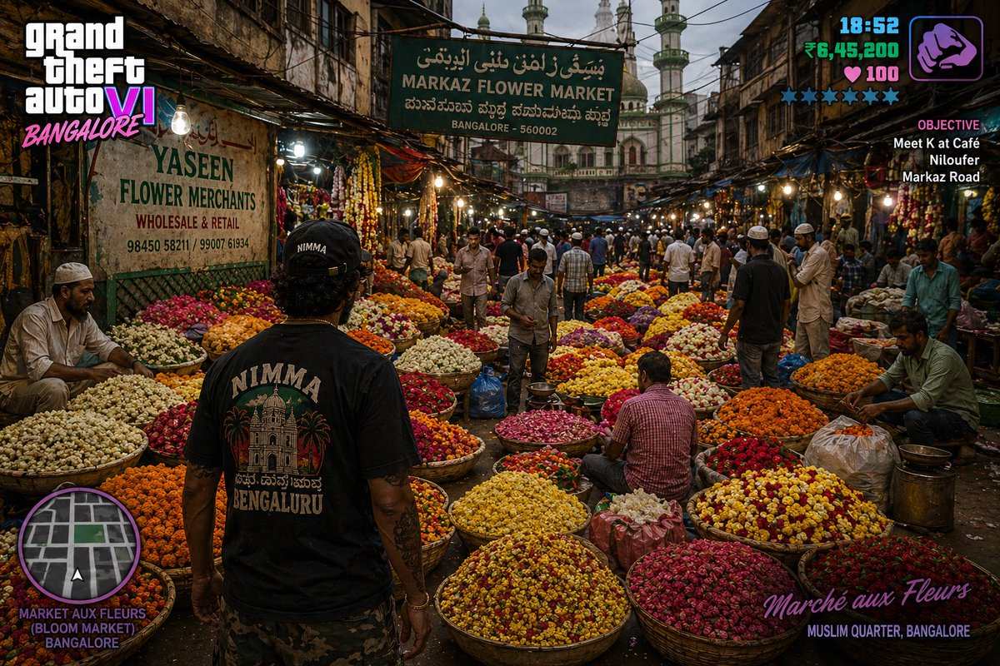

```text
{argument name="game" default="gta 6"} in {argument name="location" default="Bangalore’s market flower"} in India
```


---

## 例 542：GTA 6 Shinjuku Bar Scene

**来源：** [@ismajc](https://x.com/ismajc/status/2048166630933282995) / [awesome-gpt-image-2-prompts](https://github.com/EvoLinkAI/awesome-gpt-image-2-prompts)

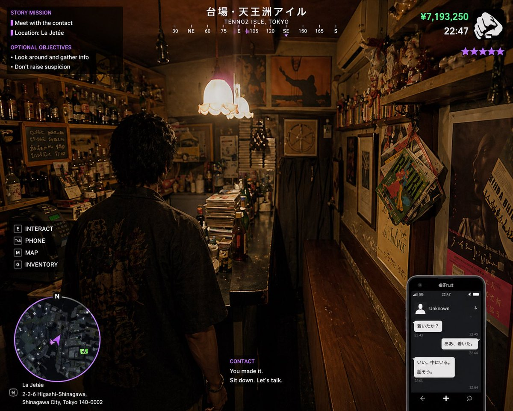

```text
{argument name="game" default="GTA 6"} in {argument name="bar name" default="La Jetée Bar"} (that pays homage to Chris Marker) in {argument name="location" default="Shinjuku, Tokyo"}
```


---

## 例 543：Pixel game concept board from TV drama theme

**来源：** [@sciencedegens](https://x.com/sciencedegens/status/2049359171594903856) / [awesome-gpt-image-2-prompts](https://github.com/EvoLinkAI/awesome-gpt-image-2-prompts)

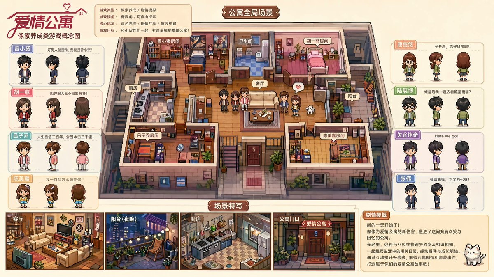

```text
爱情公寓 电视剧主题 像素养成类游戏概念图，包括场景全局内容，周围环绕各人物形象三视图，底部是场景特写，右下角是剧情梗概。

随机一个经典国内古装电视剧，生成古装电视剧主题像素养成类游戏概念图，包括场景全局内容，周围环绕各人物形象三视图，底部是场景特写，右下角是剧情梗概。

「XXX」电视剧主题像素养成类游戏概念图，包括场景全局内容，周围环绕各人物（人物别重复）形象三视图，底部是场景特写，右下角是剧情梗概。
```


---

## 例 544：Medieval Alchemist Character Sheet

**来源：** [@itsPixieVerse](https://x.com/itsPixieVerse/status/2067750004178215241) / [awesome-gpt-image-2-prompts](https://github.com/EvoLinkAI/awesome-gpt-image-2-prompts)

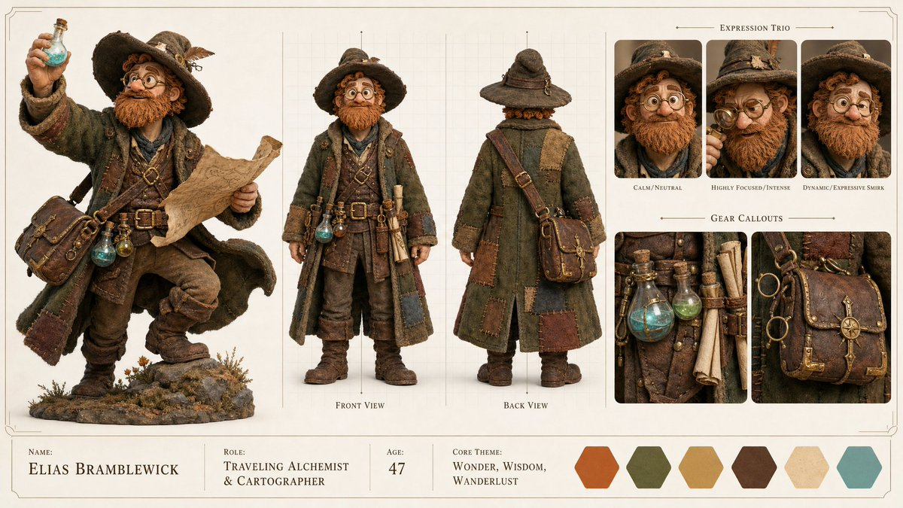

```text
Create a high-end, asymmetric editorial CHARACTER CONCEPT SHOWCASE from these inputs:

[STYLE]: stylized 3D stop-motion claymation style with rich tactile textures of clay, felt, and leather, and warm cinematic studio lighting
[SUBJECT_DESCRIPTION]: A charming and slightly eccentric traveling medieval alchemist and cartographer. He wears a heavy, oversized patched wool coat over a worn leather tunic, multiple small glowing potion vials and rolled-up parchment scrolls strapped to his utility belt, a wide-brimmed traveler's hat, and thick round brass spectacles. He has a messy, hand-sculpted ginger beard, warm curious eyes, and a friendly smile. He carries an ancient, brass-trimmed leather satchel. His design features exaggerated, whimsical proportions and a cozy, rustic medieval aesthetic.

Create the layout in a clean 16:9 widescreen format on a neutral studio gray or warm off-white background with a minimal technical border. The design must look like a premium production visual bible, using clean typography, no clutter, no watermarks, and no logos. Apply [STYLE] only to the character and visual elements, keeping the presentation layout clean, structured, and minimal.

Infer all missing details from the subject description, including name, role, brief background specs, and a cohesive color palette.

Use this tri-fold layout:

1. HERO SPOTLIGHT (Left 40% of the board)
- Show one large, highly detailed full-body dynamic action pose of the subject.
- This pose should showcase the character's primary personality, attitude, and silhouette.

2. TECHNICAL TURNAROUND (Center 35% of the board)
- Show exactly two clean full-body views: Front View and Back View.
- The subject should be in a relaxed, neutral stance.
- Place these views over very subtle vertical and horizontal grid lines resembling a technical schematic blueprint.

3. KEY DETAILS (Right 25% of the board)
- EXPRESSION TRIO: Exactly 3 large, highly expressive close-up headshots showing core emotional states: Calm/Neutral, Highly Focused/Intense, and a Dynamic/Expressive emotion (like a smirk or fierce grin).
- GEAR CALLOUTS: Exactly 2 clean, isolated close-up panels showing primary wardrobe textures, signature accessories, or weapons/gear.

4. SPECS & COLOR BANNER (Bottom Edge)
- A minimalist, horizontal typography block listing Name, Role, Age, and Core Theme.
- Adjacent to the text, display 5 to 6 clean geometric color swatches showing the character's primary color palette with no labels.

Ensure complete character and costume consistency across all sections. The Hero Spotlight must visually anchor the sheet, offering a clean, open, and professional layout that avoids dense, repetitive, or cluttered grids.
```


---

## 例 545：Diamond Grillz Caricature Figure

**来源：** [@iamaiistudio](https://x.com/iamaiistudio/status/2071470936973533271) / [awesome-gpt-image-2-prompts](https://github.com/EvoLinkAI/awesome-gpt-image-2-prompts)

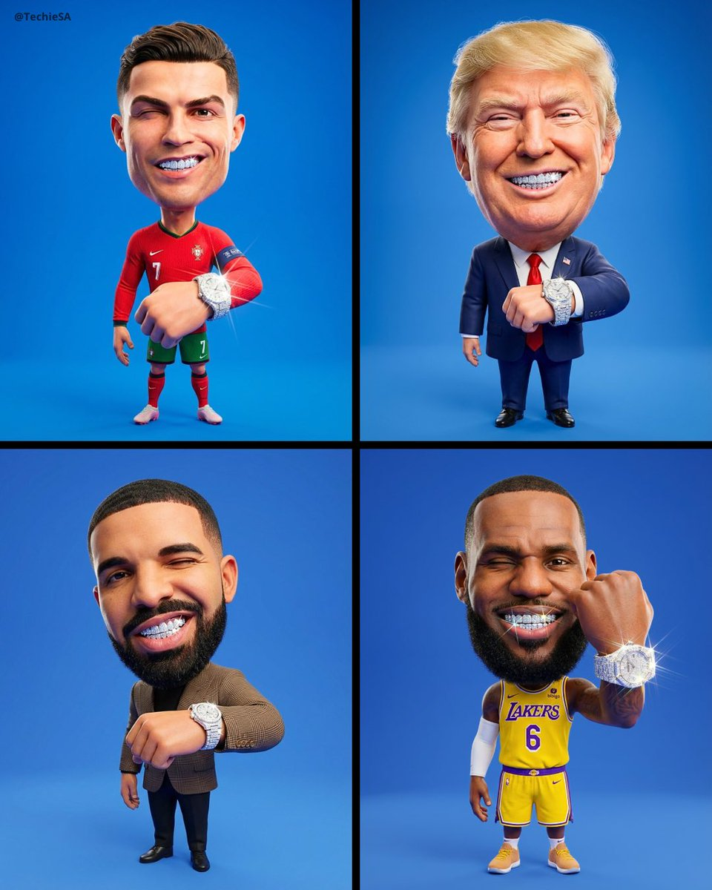

```text
Create a hyper-detailed full-body 3D stylized caricature of the person in [REFERENCE IMAGE], preserving their exact face, skin tone, and ethnic features.

Style: Massive oversized head on a tiny compact body, classic caricature exaggeration. Expression: mischievous wink and wide smirk showing sparkling diamond grillz rendered with ray-traced reflections and prismatic glints.

Pose: Standing upright, one arm extended toward the camera to showcase a thick iced-out diamond watch. Every gem catches and refracts light brilliantly.

Outfit: Match exactly what they wear in [REFERENCE IMAGE]. Fabrics rendered with micro-detail stitching, realistic folds. Skin with subsurface scattering, studio-clean and smooth.

Setting: Clean solid vibrant blue backdrop, soft front-facing softbox lighting. No backlighting, no rim light. Diamonds are the brightest focal points in the frame.

Render: Octane Render quality, cinematic 8K, sharp edges, masterpiece level, no text or watermarks, 4:5 aspect ratio.
```


---
