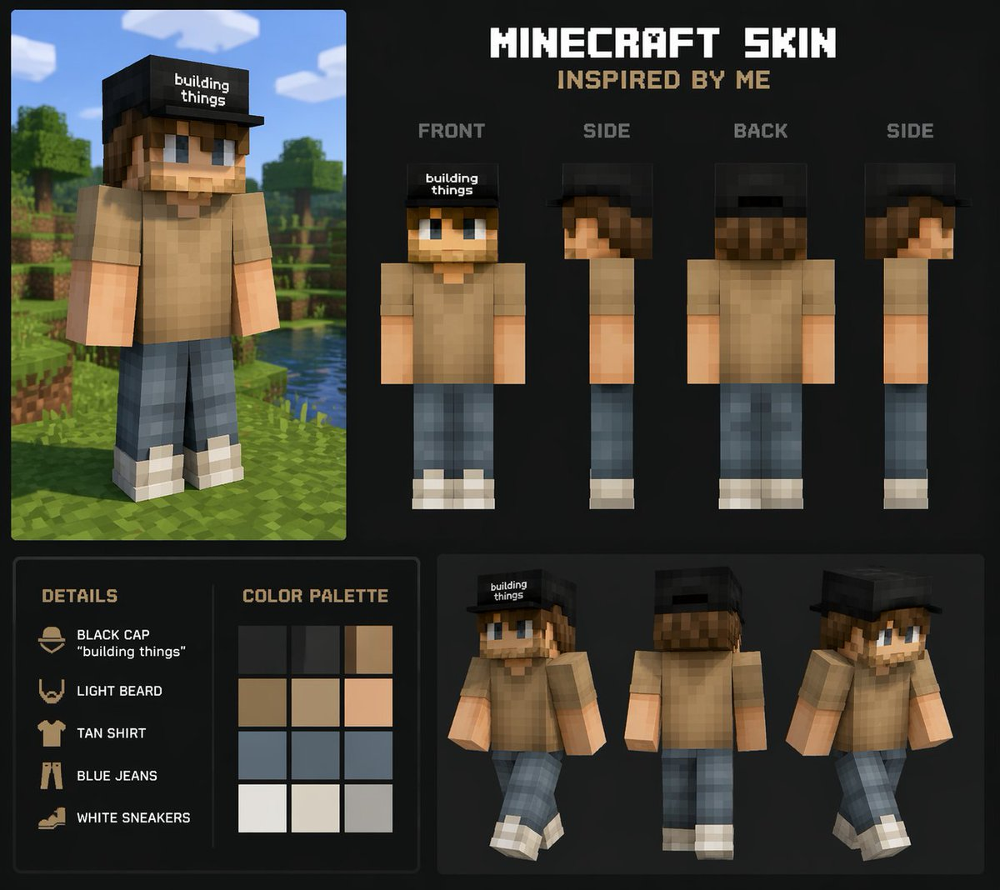
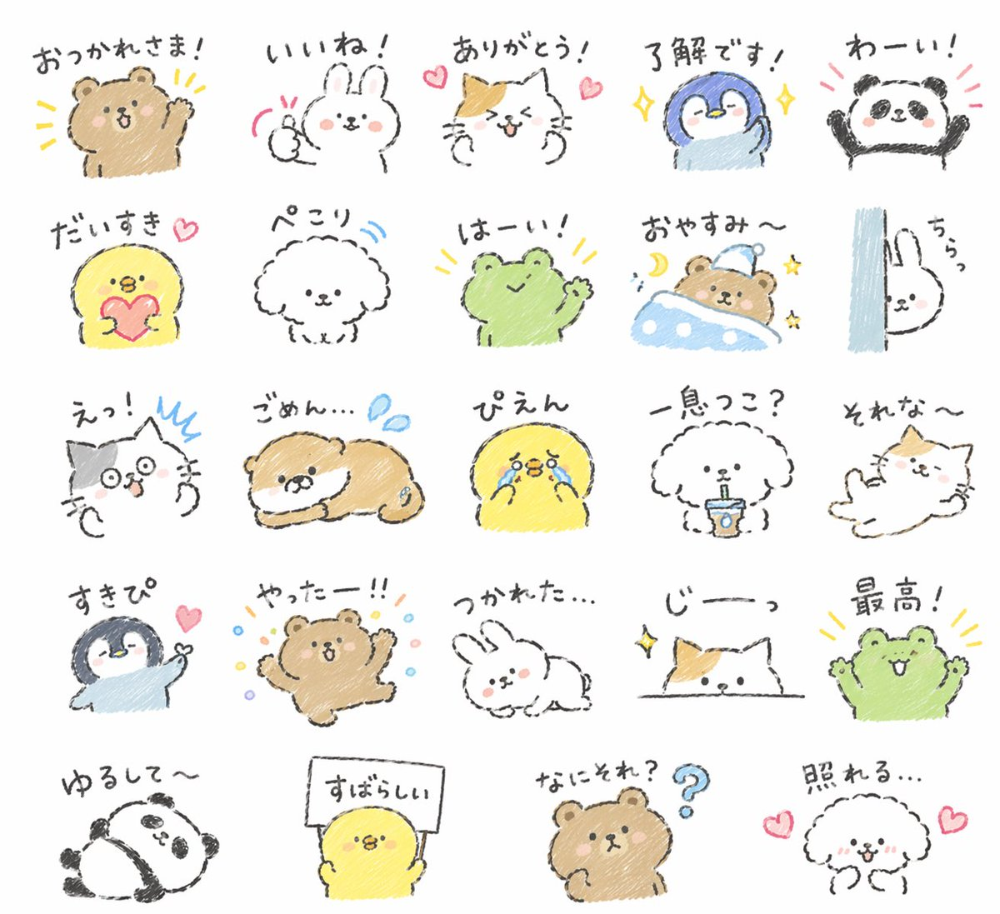
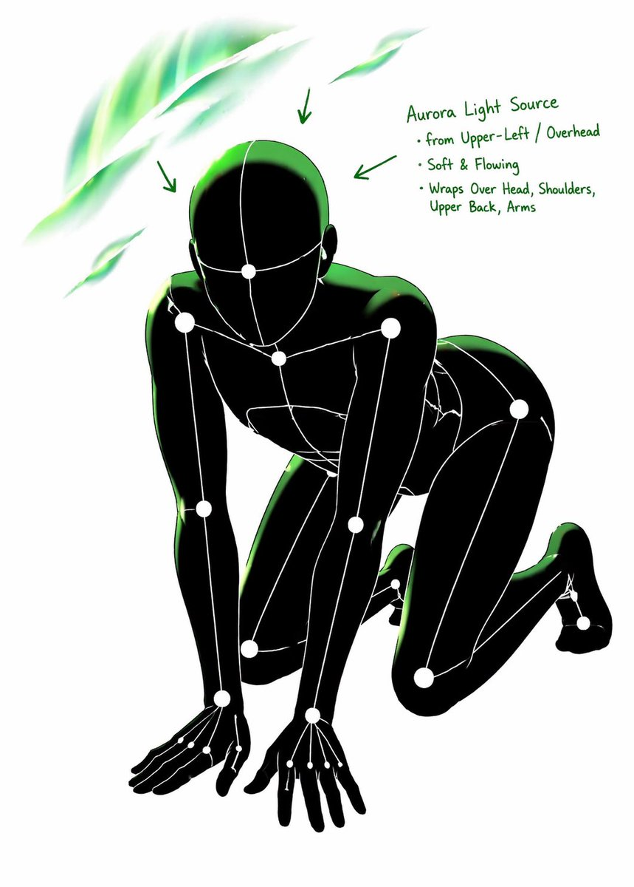
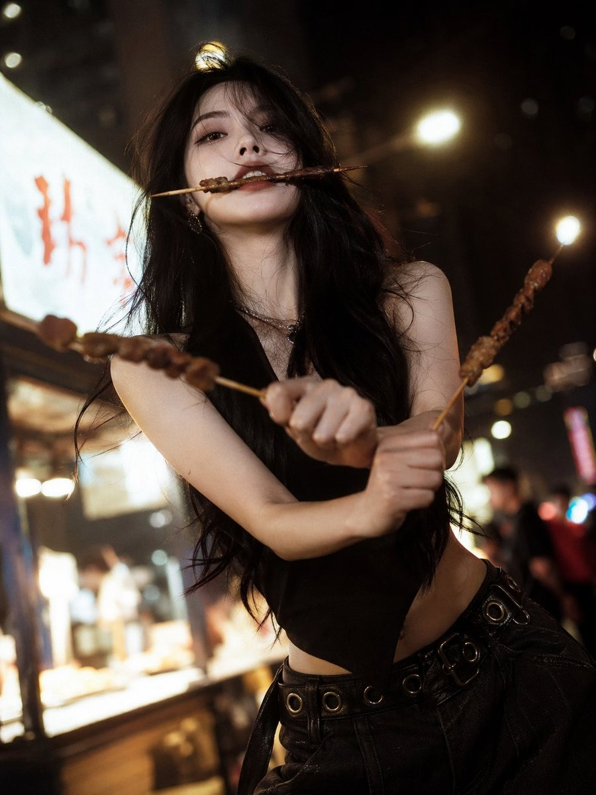
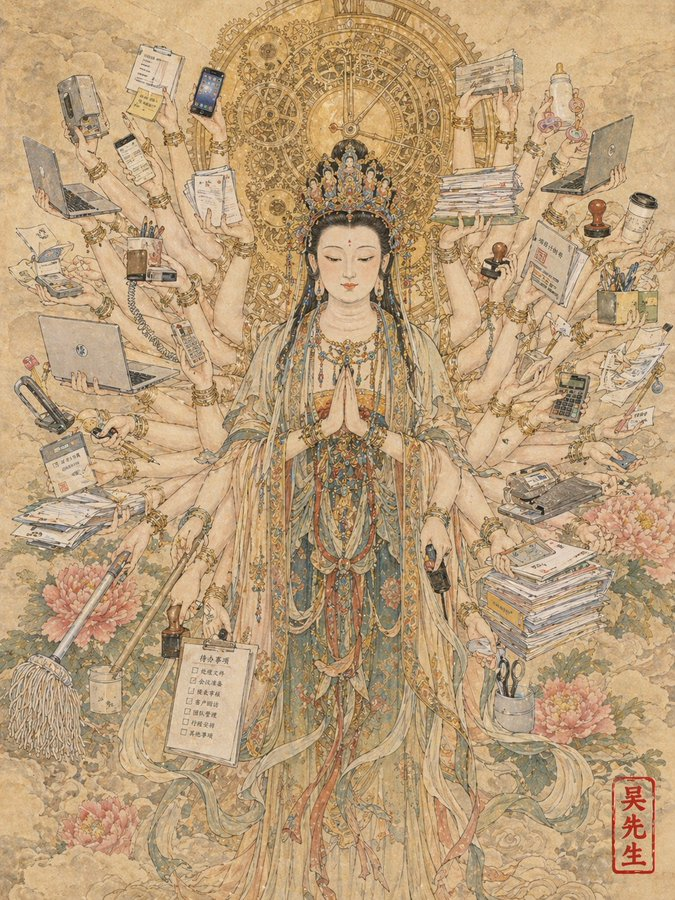

# 其他应用场景 — 提示词合集


> 17 个案例

---

## 例 4：老干妈风味

**来源：** 小红书号989137706


```text
特朗普在抖音直播间卖老干妈，手里举着「老干妈风味」新品，背景还是 SpaceX 那种科技感，左下角弹幕飘着「特斯拉车主：求上链接」。
```


---

## 例 25：综合应用场景图

**来源：** [@nicdunz](https://x.com/nicdunz)




```text
create a minecraft skin inspired by {argument name="reference" default="my look"}
```


---

## 例 37：综合应用场景图

**来源：** [@midori\_tatsuta](https://x.com/midori_tatsuta)


```text
Create {argument name="quantity" default="24"} LINE stickers of {argument name="animals" default="animals"} in a quirky hand-drawn style. Target {argument name="target audience" default="Japanese Gen Z"} with a trendy style that can aim for top downloads.
```


---

## 例 38：综合应用场景图

**来源：** [@midori\_tatsuta](https://x.com/midori_tatsuta)


```text
Create {argument name="quantity" default="24"} LINE stickers of {argument name="animals" default="animals"} in a quirky hand-drawn style. Target {argument name="target audience" default="Japanese Gen Z"} with a trendy style that can aim for top downloads.
```


---

## 例 39：综合应用场景图

**来源：** [@midori\_tatsuta](https://x.com/midori_tatsuta)




```text
Create {argument name="quantity" default="24"} LINE stickers of {argument name="animals" default="animals"} in a quirky hand-drawn style. Target {argument name="target audience" default="Japanese Gen Z"} with a trendy style that can aim for top downloads.
```


---

## 例 40：综合应用场景图

**来源：** [@midori\_tatsuta](https://x.com/midori_tatsuta)


```text
Create {argument name="quantity" default="24"} LINE stickers of {argument name="animals" default="animals"} in a quirky hand-drawn style. Target {argument name="target audience" default="Japanese Gen Z"} with a trendy style that can aim for top downloads.
```


---

## 例 78：图像生成案例图

**来源：** [@WOZ1Tx2JZ3kCeBj](https://x.com/WOZ1Tx2JZ3kCeBj)


```text
[CORE TASK]
Transform the provided input image into a pose-and-light analysis sheet.

This is NOT a finished character illustration.
This is NOT a clothing sheet.
This is NOT a beauty-preserving redraw.

This is a white-line rough mannequin conversion.

[PRIMARY GOAL]
Extract and visualize only:
- pose structure
- body balance
- camera angle
- body line flow
- inferred light source placement
- illuminated areas and light intensity

[INPUT ROLE]
Use the provided image as the strict anchor for:
- pose
- camera angle
- body tilt
- weight distribution
- approximate lighting situation

Do NOT preserve:
- face rendering
- hairstyle rendering
- clothing detail
- accessories
- weapon detail
- background architecture
- character identity
- emotional expression

[FIGURE CONVERSION]
single rough mannequin-like human figure
white body contour lines
white internal construction lines
simple mannequin head
no face
no eyes
no mouth
no eyelashes
no personality
no individual identity

human figure should look like:
- rough pose mannequin
- anatomy proxy
- line-based body guide
- structural sketch
- white-line rough dummy

keep:
- pose readability
- silhouette flow
- head tilt
- torso direction
- pelvis direction
- limb placement

[BACKGROUND]
pure black background
negative-style dark field
no scenery
no props
no architecture
no environmental storytelling

[LINE STYLE]
rough white line drawing
clean but sketch-like
construction-line feeling
anatomy guide lines visible
joint flow visible
body contour emphasized
no polished illustration finish

[LIGHT ESTIMATION]
predict the likely light source positions from the input image
visualize the light sources and illuminated areas using green glow only

use green light intensity with variation:
- strongest green where the light directly hits
- medium green for wrap light
- soft green for reflected or fading light

mark the estimated light sources with labels and arrows such as:
- Main Light
- Rim Light
- Fill Light
- Floor Bounce
- Back Light
only if appropriate

IMPORTANT:
do not invent random lights
infer lighting from the original input image
if the lighting is ambiguous, keep the annotations simple and plausible

[GREEN LIGHT VISUALIZATION]
show green glow on:
- head / skull plane
- neck
- shoulders
- chest plane
- ribcage direction
- pelvis edge
- thigh planes
- knee contact points
- floor contact bounce if applicable

use green light not as decoration,
but as lighting analysis information

[POSE PRIORITY]
1. preserve pose structure
2. preserve camera angle
3. preserve body balance
4. preserve head-torso relationship
5. visualize likely light direction
6. show illuminated areas with readable green intensity variation

[NEGATIVE]
finished person,
cute girl,
detailed face,
hair rendering,
clothing rendering,
weapon emphasis,
beautiful anatomy
```


---

## 例 79：图像生成案例图

**来源：** [@WOZ1Tx2JZ3kCeBj](https://x.com/WOZ1Tx2JZ3kCeBj)




```text
[CORE TASK]
Transform the provided input image into a pose-and-light analysis sheet.

This is NOT a finished character illustration.
This is NOT a clothing sheet.
This is NOT a beauty-preserving redraw.

This is a white-line rough mannequin conversion.

[PRIMARY GOAL]
Extract and visualize only:
- pose structure
- body balance
- camera angle
- body line flow
- inferred light source placement
- illuminated areas and light intensity

[INPUT ROLE]
Use the provided image as the strict anchor for:
- pose
- camera angle
- body tilt
- weight distribution
- approximate lighting situation

Do NOT preserve:
- face rendering
- hairstyle rendering
- clothing detail
- accessories
- weapon detail
- background architecture
- character identity
- emotional expression

[FIGURE CONVERSION]
single rough mannequin-like human figure
white body contour lines
white internal construction lines
simple mannequin head
no face
no eyes
no mouth
no eyelashes
no personality
no individual identity

human figure should look like:
- rough pose mannequin
- anatomy proxy
- line-based body guide
- structural sketch
- white-line rough dummy

keep:
- pose readability
- silhouette flow
- head tilt
- torso direction
- pelvis direction
- limb placement

[BACKGROUND]
pure black background
negative-style dark field
no scenery
no props
no architecture
no environmental storytelling

[LINE STYLE]
rough white line drawing
clean but sketch-like
construction-line feeling
anatomy guide lines visible
joint flow visible
body contour emphasized
no polished illustration finish

[LIGHT ESTIMATION]
predict the likely light source positions from the input image
visualize the light sources and illuminated areas using green glow only

use green light intensity with variation:
- strongest green where the light directly hits
- medium green for wrap light
- soft green for reflected or fading light

mark the estimated light sources with labels and arrows such as:
- Main Light
- Rim Light
- Fill Light
- Floor Bounce
- Back Light
only if appropriate

IMPORTANT:
do not invent random lights
infer lighting from the original input image
if the lighting is ambiguous, keep the annotations simple and plausible

[GREEN LIGHT VISUALIZATION]
show green glow on:
- head / skull plane
- neck
- shoulders
- chest plane
- ribcage direction
- pelvis edge
- thigh planes
- knee contact points
- floor contact bounce if applicable

use green light not as decoration,
but as lighting analysis information

[POSE PRIORITY]
1. preserve pose structure
2. preserve camera angle
3. preserve body balance
4. preserve head-torso relationship
5. visualize likely light direction
6. show illuminated areas with readable green intensity variation

[NEGATIVE]
finished person,
cute girl,
detailed face,
hair rendering,
clothing rendering,
weapon emphasis,
beautiful anatomy
```


---

## 例 80：图像生成案例图

**来源：** [@WOZ1Tx2JZ3kCeBj](https://x.com/WOZ1Tx2JZ3kCeBj)


```text
[CORE TASK]
Transform the provided input image into a pose-and-light analysis sheet.

This is NOT a finished character illustration.
This is NOT a clothing sheet.
This is NOT a beauty-preserving redraw.

This is a white-line rough mannequin conversion.

[PRIMARY GOAL]
Extract and visualize only:
- pose structure
- body balance
- camera angle
- body line flow
- inferred light source placement
- illuminated areas and light intensity

[INPUT ROLE]
Use the provided image as the strict anchor for:
- pose
- camera angle
- body tilt
- weight distribution
- approximate lighting situation

Do NOT preserve:
- face rendering
- hairstyle rendering
- clothing detail
- accessories
- weapon detail
- background architecture
- character identity
- emotional expression

[FIGURE CONVERSION]
single rough mannequin-like human figure
white body contour lines
white internal construction lines
simple mannequin head
no face
no eyes
no mouth
no eyelashes
no personality
no individual identity

human figure should look like:
- rough pose mannequin
- anatomy proxy
- line-based body guide
- structural sketch
- white-line rough dummy

keep:
- pose readability
- silhouette flow
- head tilt
- torso direction
- pelvis direction
- limb placement

[BACKGROUND]
pure black background
negative-style dark field
no scenery
no props
no architecture
no environmental storytelling

[LINE STYLE]
rough white line drawing
clean but sketch-like
construction-line feeling
anatomy guide lines visible
joint flow visible
body contour emphasized
no polished illustration finish

[LIGHT ESTIMATION]
predict the likely light source positions from the input image
visualize the light sources and illuminated areas using green glow only

use green light intensity with variation:
- strongest green where the light directly hits
- medium green for wrap light
- soft green for reflected or fading light

mark the estimated light sources with labels and arrows such as:
- Main Light
- Rim Light
- Fill Light
- Floor Bounce
- Back Light
only if appropriate

IMPORTANT:
do not invent random lights
infer lighting from the original input image
if the lighting is ambiguous, keep the annotations simple and plausible

[GREEN LIGHT VISUALIZATION]
show green glow on:
- head / skull plane
- neck
- shoulders
- chest plane
- ribcage direction
- pelvis edge
- thigh planes
- knee contact points
- floor contact bounce if applicable

use green light not as decoration,
but as lighting analysis information

[POSE PRIORITY]
1. preserve pose structure
2. preserve camera angle
3. preserve body balance
4. preserve head-torso relationship
5. visualize likely light direction
6. show illuminated areas with readable green intensity variation

[NEGATIVE]
finished person,
cute girl,
detailed face,
hair rendering,
clothing rendering,
weapon emphasis,
beautiful anatomy
```


---

## 例 165：清冷佳人夜市烧烤三刀流

**来源：** [@BubbleBrain](https://x.com/BubbleBrain/status/2046564674112831920)




```text
[中文]
一个有着清冷孤傲气质的绝美佳人，精致的面部特征，一张冷酷且精致的高级时装面容，长发，以及优雅苗条的身材；烧烤“三刀流”姿势：嘴里叼着一根烧烤串，每只手各拿一根烧烤串交叉以模仿索隆的三刀流；街头夜景氛围，温暖黄色的夜市灯光，模糊的背景，胶片般的质感，柔焦光晕，电影般的叙事感，时髦高端网红风格的时尚拍摄，清晰发光的肌肤，清晰细致的发丝，生动的动态表情，低角度广角镜头，情绪化的暗调氛围，浅景深，超高清8K，极致细节，电影级光照

[English]
a stunning beauty with a cool, aloof atmosphere, delicate facial features, a cold and sophisticated high-fashion face, long hair, and a graceful slender figure; barbecue “three-sword style” pose: one barbecue skewer held in her mouth, one skewer in each hand crossed to mimic Zoro’s three-sword style; street night scene ambiance, warm yellow night market lighting, blurred background, film-like texture, soft-focus glow, cinematic storytelling feel, trendy high-end influencer-style fashion shoot, clear luminous skin, sharply detailed strands of hair, lively dynamic expression, low-angle wide-angle shot, moody dark-toned atmosphere, shallow depth of field, ultra HD 8K, extreme detail, cinematic lighting
```


---

## 例 193：千手观音化身打工人

**来源：** [@johnAGI168](https://x.com/johnAGI168/status/2046565555025367392)




```text
[中文]
一幅高度详细的千手观音菩萨工笔画。

然而，千手并没有拿着神圣的宗教法器，而是拿着现代办公和家用物品：**笔记本电脑、智能手机、成堆的文件、咖啡杯、印章、计算器、拖把和奶瓶**。它代表了终极的多任务处理现代工作者。

脑后的金色光环由旋转的时钟齿轮组成。

**在右下角，一个单一的红色竖排艺术家印章写着“吴先生”（Mr. Wu），风格化得像水印一样。** --ar 3:4

[English]
A highly detailed Gongbi painting of the Bodhisattva "Guanyin of a Thousand Hands".

However, instead of sacred religious artifacts, the thousand hands are holding modern office and household items: **laptops, smartphones, stacks of paperwork, coffee cups, stamps, calculators, mops, and baby bottles**. It represents the ultimate multi-tasking modern worker.

The golden aura behind the head is made of spinning clock gears.

**In the bottom right corner, a single red vertical artist chop seal reads "吴先生" (Mr. Wu), stylized like a watermark.** --ar 3:4
```


---

## 例 197：英雄联盟特朗普中路对决哈梅内伊

**来源：** [@underwoodxie96](https://x.com/underwoodxie96/status/2046529342415790275)


```text
[中文]
帮我生成一张特朗普对战哈梅内伊在英雄联盟中路对线的截图。

[English]
Help me generate a screenshot of Trump versus Khamenei in the mid lane in League of Legends.
```


---

## 例 203：杠精视角的独特文案创意

**来源：** [@joshesye](https://x.com/joshesye/status/2046596222505361866)


```text
[中文]
杠精视角文案 + GPT Image 2

[English]
Troll perspective copywriting + GPT Image 2
```


---

## 例 205：皇宫深处的御用快递驿站

**来源：** [@joshesye](https://x.com/joshesye/status/2046596222505361866)


```text
[中文]
生成一张古代皇宫 × 快递驿站

[English]
Generate an ancient imperial palace × express delivery station
```


---

## 例 233：蒙娜丽莎畅饮可乐的趣味油画

**来源：** [@liyue\_ai](https://x.com/liyue_ai/status/2045058142858555733)


```text
[中文]
生成一张蒙娜丽莎喝可乐的油画。

[English]
Generate an oil painting of Mona Lisa drinking cola.
```


---

## 例 259：精致女孩背后的网贷真相

**来源：** [@MrLarus](https://x.com/MrLarus/status/2045373105041007013)


```text
[中文]
生成小红书内容截图，主题：精致女孩背后都有网贷，iPhone尺寸

[English]
Generate Xiaohongshu content screenshot, theme: Behind every exquisite girl there is online loan, iPhone size
```


---

## 例 262：苹果园远观库克发布新机

**来源：** [@austinit](https://x.com/patrickassale/status/2044687244368441742)


```text
[中文]
在Apple Park iPhone 20主题演讲期间拍摄的业余iPhone照片，蒂姆·库克在舞台上演讲。从远处的观众人群中拍摄

[English]
Amateur iPhone photo at Apple Park during the iPhone 20 keynote, Tim Cook presenting on stage. Shot from the crowd at a distance
```

