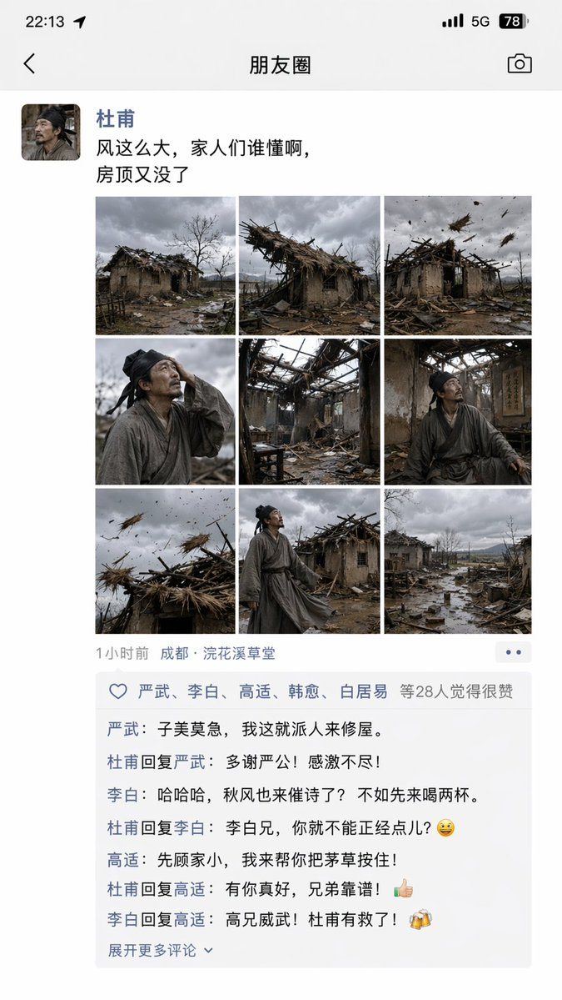

# 历史与古风题材 — 提示词合集


> 13 个案例

---

## 例 44：古风历史题材图

**来源：** [@liyue\_ai](https://x.com/liyue_ai)


```text
Generate avatars of various emperors from the {argument name="dynasty" default="Ming Dynasty"} based on the style of the uploaded image, with their posthumous names and personal names listed below the avatars.
```


---

## 例 167：大唐玄武门之变的朋友圈

**来源：** [@Tz\_2022](https://x.com/Tz_2022/status/2046523491940225366)


```text
[中文]
玄武门之变的朋友圈

[English]
WeChat Moments of the Xuanwu Gate Incident
```


---

## 例 176：苏轼被贬首日朋友圈曝光

**来源：** [@MrLarus](https://x.com/MrLarus/status/2046585220393324553)


```text
[中文]
苏轼被贬第一天小红书截图

[English]
Su Shi's first day of exile Xiaohongshu screenshot
```


---

## 例 184：杜甫朋友圈吐槽茅屋被掀翻

**来源：** [@MrLarus](https://x.com/MrLarus/status/2046585220393324553)




```text
[中文]
杜甫发朋友圈吐槽房顶被风刮没了

[English]
Du Fu posting on WeChat Moments complaining about his roof being blown away by the wind
```


---

## 例 185：武则天发微博自拍太魔性了

**来源：** [@MrLarus](https://x.com/MrLarus/status/2046585220393324553)


```text
[中文]
武则天自拍登记发微博

[English]
Wu Zetian taking a selfie, registering and posting on Weibo.
```


---

## 例 226：古风明朝帝王群像长卷

**来源：** [@liyue\_ai](https://x.com/liyue_ai/status/2045071977279635962)


```text
[中文]
根据上传图片的风格，生成明朝各个皇帝的头像，头像下面有他们的谥号和名字

[English]
Based on the style of the uploaded image, generate portraits of the emperors of the Ming Dynasty, with their posthumous titles and names below the portraits
```


---

## 例 234：朱元璋登基后的推特主页

**来源：** [@liyue\_ai](https://x.com/liyue_ai/status/2045021302315249738)


```text
[中文]
创建一个明朝朱元璋登基之后的X帖子页面

[English]
Create an X post page of Zhu Yuanzhang after his ascension to the throne in the Ming Dynasty
```


---

## 例 267：宋朝文人的赛博朋友圈

**来源：** [@Panda20230902](https://x.com/Panda20230902/status/2045385588065313057)


```text
[中文]
"宋朝人的朋友圈"/"SONG DYNASTY SOCIAL MEDIA FEED"，古今穿越幽默融合界面设计风格，画面模拟手机社交媒体界面，但内容全部是宋朝场景头像是宋代文人画像，用户名"苏东坡SuShi_Official"，发布内容"刚到黄州，被贬了但心情还行。今天自己做了东坡肉，味道绝了，附菜谱："，配图为工笔画风格的东坡肉特写，点赞列表"黄庭坚、秦观、佛印等126人"，评论区"王安石：呵呵""司马光：还是那个味道"，界面元素如点赞图标用宋代花纹替代，状态栏显示"大宋移动 5G"和"元丰三年"，配色为手机深色模式搭配宋代雅致色调，历史与社交媒体的趣味碰撞杰作

[English]
"Song Dynasty People's Moments"/"SONG DYNASTY SOCIAL MEDIA FEED", Ancient and modern time-travel humor fusion interface design style, The image simulates a mobile phone social media interface, but the content is entirely Song Dynasty scenes, The avatar is a portrait of a Song Dynasty literati, Username "Su Dongpo SuShi_Official", Post content "Just arrived in Huangzhou, demoted but feeling okay. Made Dongpo pork myself today, tastes amazing, recipe attached:", The attached image is a close-up of Dongpo pork in Gongbi painting style, Likes list "Huang Tingjian, Qin Guan, Fo Yin etc. 126 people", Comments section "Wang Anshi: Hehe" "Sima Guang: Still the same taste", Interface elements such as the like icon are replaced with Song Dynasty patterns, The status bar shows "Great Song Mobile 5G" and "Third Year of Yuanfeng", The color scheme is mobile phone dark mode paired with elegant Song Dynasty tones, A masterpiece of fun collision between history and social media
```


---

## 例 268：威化岛回军前夕李成桂动态

**来源：** [@SKA\_Neotype](https://x.com/SKA_Neotype/status/2044637900978217334)


```text
[中文]
태조 이성계의 X  페이지(위화도 회군을 벌이기 직전- 최영 장군과 서로 디스하는 내용이 담긴 게시글들)을 만들어 주세요.

[English]
Please create an X page of King Taejo Yi Seong-gye (right before carrying out the Wihwa Island Retreat - containing posts where he and General Choi Yeong are dissing each other).
```


---

## 例 292：明朝登基宝玉的推文页面

**来源：** [@tuzi\_ai](https://x.com/tuzi_ai/status/2045193918736736365)


```text
[中文]
创建一个宝玉（查阅 https://x.com/dotey 这个推主的主页及部分推文）穿越到明朝，登基之后依据其业务/个性，绘制的其新的X帖子页面。

[English]
Create a new X post page illustrated for Baoyu (refer to the homepage and some posts of this Twitter user at https://x.com/dotey) after time-traveling to the Ming Dynasty and ascending the throne, based on his business/personality.
```

## 例 293：皇宫深处的御用快递驿站

**来源：** [@joshesye](https://x.com/joshesye/status/2046596222505361866)

```text
[中文]
生成一张古代皇宫 × 快递驿站

[English]
Generate an ancient imperial palace × express delivery station
```


---
## 例 294：大师级真迹复刻

**来源：** [@MrLarus](https://x.com/MrLarus/status/2046201836525302032)

```text
[中文]
帮我生成xxxx真迹图片

[English]
Help me generate xxxx authentic picture
```


---
## 例 295：复古传统老黄历二零二六年四月十八

**来源：** [@MrLarus](https://x.com/MrLarus/status/2044824800909054181)

```text
[中文]
生成一张2026年4月18日的老黄历

[English]
Generate an old almanac for April 18, 2026
```


---
