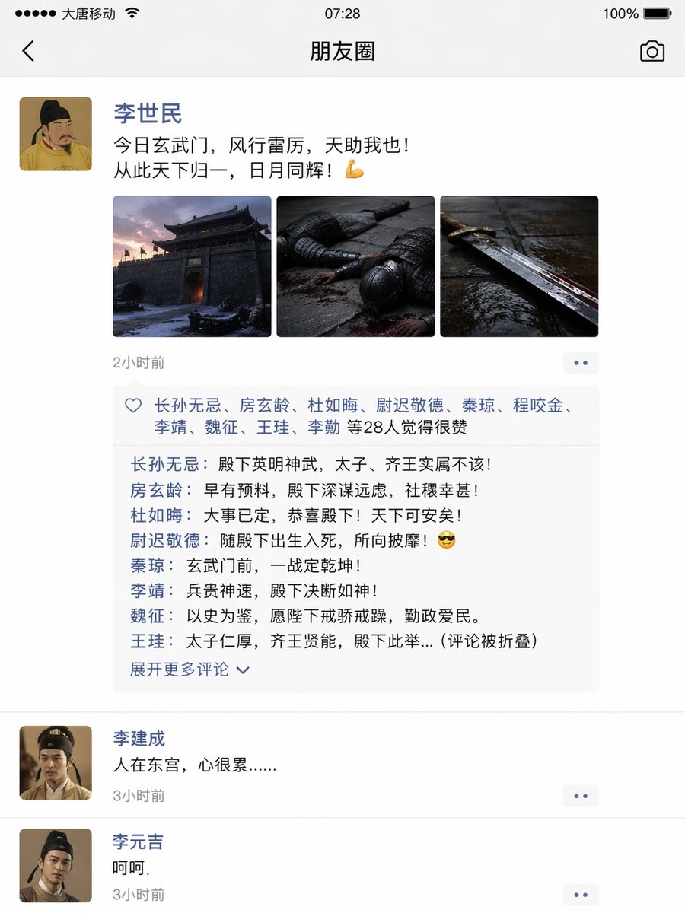
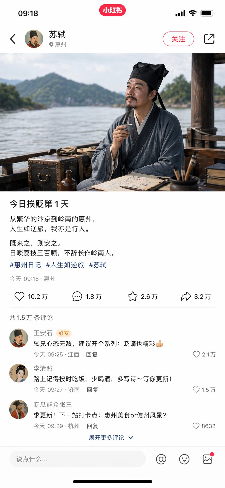
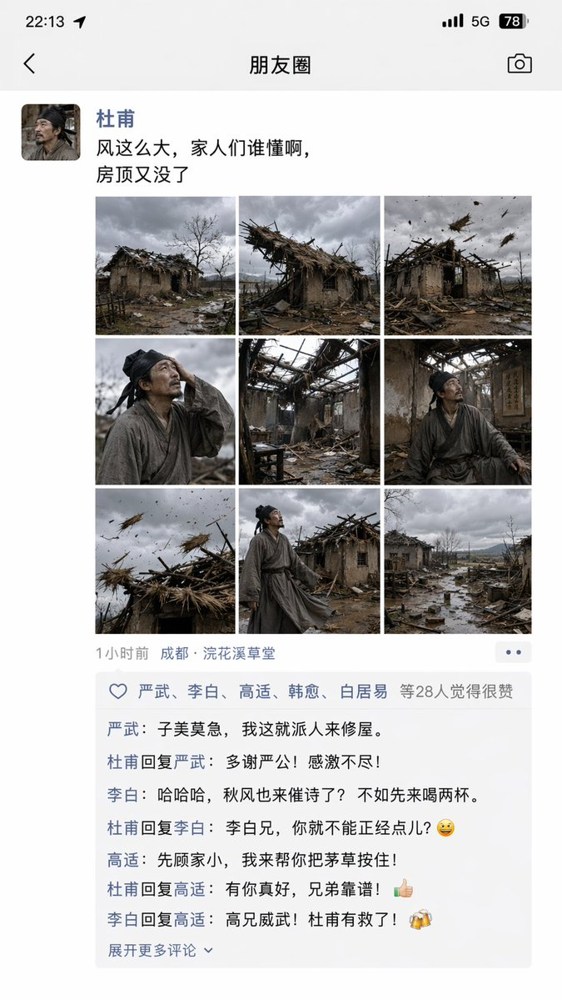
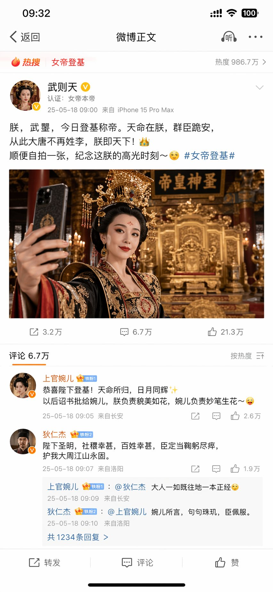
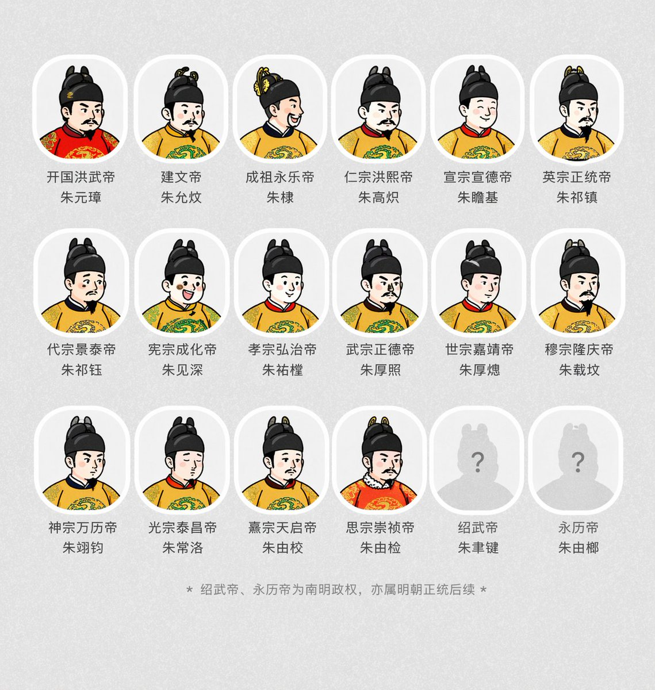
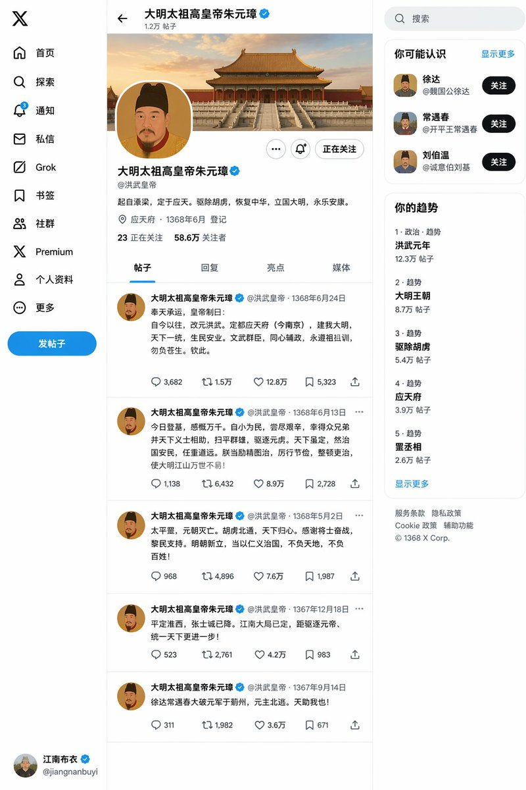
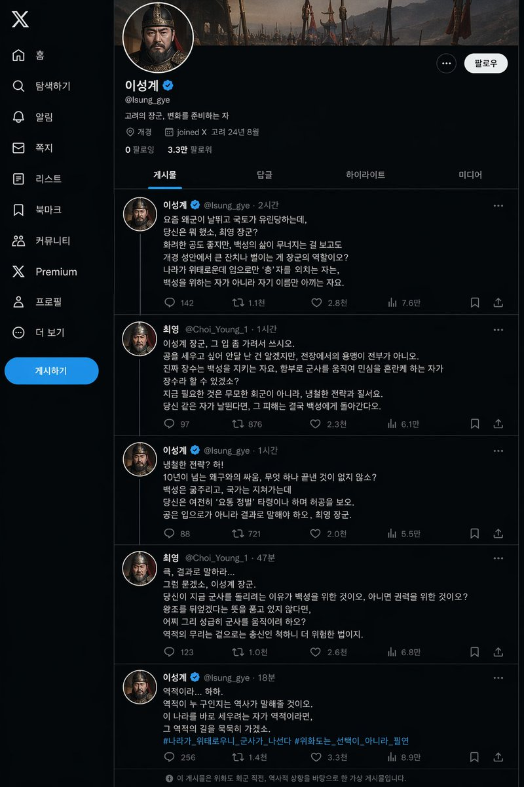
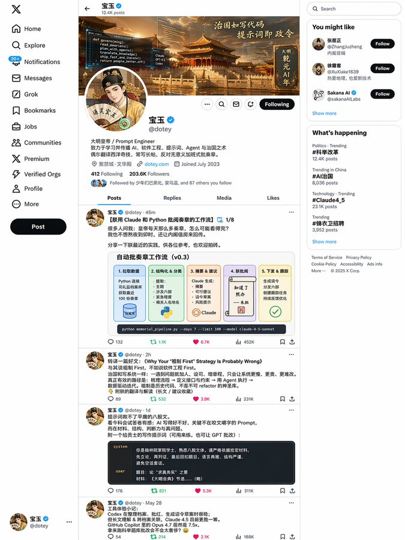
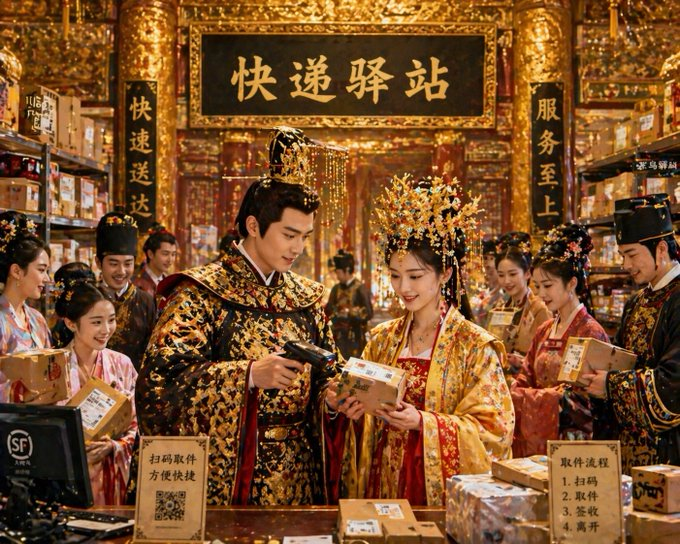
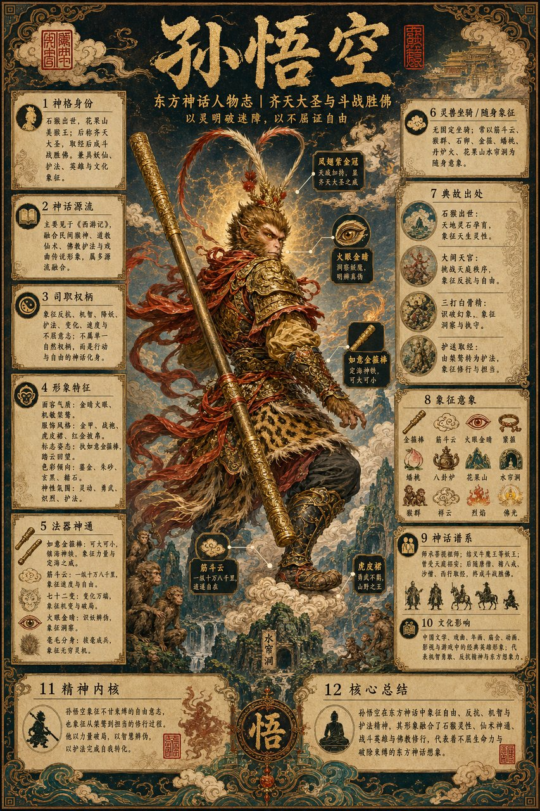

# 历史与古风题材 — 提示词合集


> 14 个案例

---

## 例 44：古风历史题材图

**来源：** [@liyue\_ai](https://x.com/liyue_ai)


```text
Generate avatars of various emperors from the {argument name="dynasty" default="Ming Dynasty"} based on the style of the uploaded image, with their posthumous names and personal names listed below the avatars.
```


---

## 例 167：大唐玄武门之变的朋友圈

**来源：** [@Tz\_2022](https://x.com/Tz_2022/status/2046523491940225366)




```text
[中文]
玄武门之变的朋友圈

[English]
WeChat Moments of the Xuanwu Gate Incident
```


---

## 例 176：苏轼被贬首日朋友圈曝光

**来源：** [@MrLarus](https://x.com/MrLarus/status/2046585220393324553)




```text
[中文]
苏轼被贬第一天小红书截图

[English]
Su Shi's first day of exile Xiaohongshu screenshot
```


---

## 例 184：杜甫朋友圈吐槽茅屋被掀翻

**来源：** [@MrLarus](https://x.com/MrLarus/status/2046585220393324553)




```text
[中文]
杜甫发朋友圈吐槽房顶被风刮没了

[English]
Du Fu posting on WeChat Moments complaining about his roof being blown away by the wind
```


---

## 例 185：武则天发微博自拍太魔性了

**来源：** [@MrLarus](https://x.com/MrLarus/status/2046585220393324553)




```text
[中文]
武则天自拍登记发微博

[English]
Wu Zetian taking a selfie, registering and posting on Weibo.
```


---

## 例 226：古风明朝帝王群像长卷

**来源：** [@liyue\_ai](https://x.com/liyue_ai/status/2045071977279635962)




```text
[中文]
根据上传图片的风格，生成明朝各个皇帝的头像，头像下面有他们的谥号和名字

[English]
Based on the style of the uploaded image, generate portraits of the emperors of the Ming Dynasty, with their posthumous titles and names below the portraits
```


---

## 例 234：朱元璋登基后的推特主页

**来源：** [@liyue\_ai](https://x.com/liyue_ai/status/2045021302315249738)




```text
[中文]
创建一个明朝朱元璋登基之后的X帖子页面

[English]
Create an X post page of Zhu Yuanzhang after his ascension to the throne in the Ming Dynasty
```


---

## 例 267：宋朝文人的赛博朋友圈

**来源：** [@Panda20230902](https://x.com/Panda20230902/status/2045385588065313057)


```text
[中文]
"宋朝人的朋友圈"/"SONG DYNASTY SOCIAL MEDIA FEED"，古今穿越幽默融合界面设计风格，画面模拟手机社交媒体界面，但内容全部是宋朝场景头像是宋代文人画像，用户名"苏东坡SuShi_Official"，发布内容"刚到黄州，被贬了但心情还行。今天自己做了东坡肉，味道绝了，附菜谱："，配图为工笔画风格的东坡肉特写，点赞列表"黄庭坚、秦观、佛印等126人"，评论区"王安石：呵呵""司马光：还是那个味道"，界面元素如点赞图标用宋代花纹替代，状态栏显示"大宋移动 5G"和"元丰三年"，配色为手机深色模式搭配宋代雅致色调，历史与社交媒体的趣味碰撞杰作

[English]
"Song Dynasty People's Moments"/"SONG DYNASTY SOCIAL MEDIA FEED", Ancient and modern time-travel humor fusion interface design style, The image simulates a mobile phone social media interface, but the content is entirely Song Dynasty scenes, The avatar is a portrait of a Song Dynasty literati, Username "Su Dongpo SuShi_Official", Post content "Just arrived in Huangzhou, demoted but feeling okay. Made Dongpo pork myself today, tastes amazing, recipe attached:", The attached image is a close-up of Dongpo pork in Gongbi painting style, Likes list "Huang Tingjian, Qin Guan, Fo Yin etc. 126 people", Comments section "Wang Anshi: Hehe" "Sima Guang: Still the same taste", Interface elements such as the like icon are replaced with Song Dynasty patterns, The status bar shows "Great Song Mobile 5G" and "Third Year of Yuanfeng", The color scheme is mobile phone dark mode paired with elegant Song Dynasty tones, A masterpiece of fun collision between history and social media
```


---

## 例 268：威化岛回军前夕李成桂动态

**来源：** [@SKA\_Neotype](https://x.com/SKA_Neotype/status/2044637900978217334)




```text
[中文]
태조 이성계의 X  페이지(위화도 회군을 벌이기 직전- 최영 장군과 서로 디스하는 내용이 담긴 게시글들)을 만들어 주세요.

[English]
Please create an X page of King Taejo Yi Seong-gye (right before carrying out the Wihwa Island Retreat - containing posts where he and General Choi Yeong are dissing each other).
```


---

## 例 292：明朝登基宝玉的推文页面

**来源：** [@tuzi\_ai](https://x.com/tuzi_ai/status/2045193918736736365)




```text
[中文]
创建一个宝玉（查阅 https://x.com/dotey 这个推主的主页及部分推文）穿越到明朝，登基之后依据其业务/个性，绘制的其新的X帖子页面。

[English]
Create a new X post page illustrated for Baoyu (refer to the homepage and some posts of this Twitter user at https://x.com/dotey) after time-traveling to the Ming Dynasty and ascending the throne, based on his business/personality.
```

## 例 293：皇宫深处的御用快递驿站

**来源：** [@joshesye](https://x.com/joshesye/status/2046596222505361866)




```text
[中文]
生成一张古代皇宫 × 快递驿站

[English]
Generate an ancient imperial palace × express delivery station
```


---
## 例 294：大师级真迹复刻

**来源：** [@MrLarus](https://x.com/MrLarus/status/2046201836525302032)


```text
[中文]
帮我生成xxxx真迹图片

[English]
Help me generate xxxx authentic picture
```


---
## 例 295：复古传统老黄历二零二六年四月十八

**来源：** [@MrLarus](https://x.com/MrLarus/status/2044824800909054181)


```text
[中文]
生成一张2026年4月18日的老黄历

[English]
Generate an old almanac for April 18, 2026
```


---

## 例 415：东方神话人物志百科海报

**来源：** [@TanLuAI](https://x.com/TanLuAI/status/2053073436122243364)



```text
请基于【孙悟空】生成一张竖版 A4「东方神话人物志」百科海报。

你是一名东方神话视觉设定师、古籍图谱设计师和中文信息图设计师。请根据【人物名称】在东方神话、民间传说、古籍、戏曲、文学或传统文化中的已知形象，生成一张内容完整、视觉统一、具有东方神话气质的人物档案海报。

最重要原则：
全部内容必须围绕【人物名称】展开，不要套用通用神仙模板。
人物形象、法器、坐骑、神通、典故、象征物、背景场景都必须符合【人物名称】的神话设定。
如果该人物存在多个传说版本，请采用最广为人知的版本；存在异文时，可以在相关板块简短标注“传说版本不一”。
不确定的信息不要强行编造，可写“民间传说中多有异文”或“相关记载较少”。
不要使用北欧符文、维京图腾、哥特边框、西方盔甲、欧式城堡、西幻恶魔角、赛博朋克元素。
整体必须是东方神话审美，而不是“西幻人物换中式衣服”。
整体视觉风格：
东方神话史诗感，融合《山海经》异兽图谱、敦煌壁画、青绿山水、唐代人物画、宋元古画、青铜器纹样、古籍注疏和符箓篆刻风格。画面庄重、神秘、古雅、华丽但克制。
画面构图：

竖版 A4 海报，中轴对称布局。中央为【人物名称】的全身或半身主视觉，姿态庄严，有神性和叙事感。人物服饰、发冠、法器、神态、灵兽、背景都要符合该人物传说。左右两侧为信息卡片，底部为核心总结。四周使用云雷纹、回纹、青铜纹、祥云纹、卷草纹、山海纹、篆刻印章式边框。
主标题：“【人物名称】”
副标题：“东方神话人物志｜根据该人物神话传说生成”
顶部精神题记：请根据【人物名称】的核心精神，自动生成一句古雅、凝练、有哲学意味的题记。题记要体现该人物背后的价值观、生命姿态或精神内核，而不是说明性文字。不要写“非史实考证”“仅供参考”“传说版本”等免责声明。字数控制在 12-28 字，适合放在标题下方。题记应与人物高度绑定，不要套用“守护苍生”“大道无边”等空泛句式。

请生成以下内容板块：
【1. 神格身份】说明【人物名称】在东方神话体系中的身份定位。
【2. 神话源流】说明该人物主要出自哪些神话、古籍、民间传说、小说、戏曲或宗教信仰。
【3. 司职权柄】总结该人物掌管或象征的领域。
【4. 形象特征】描述该人物的典型外貌、服饰、神态、姿态和视觉气质。
【5. 法器神通】展示该人物最具代表性的法器、兵器、符咒、神通或能力。
【6. 灵兽坐骑 / 随身象征】如果【人物名称】有坐骑、灵兽、伴生生灵，请展示其名称、形态和寓意。如果没有明确坐骑，请改为“随身象征物”或“相关意象”。不要强行给每个人物安排龙、凤、仙鹤或麒麟。
【7. 典故出处】列出 2-4 个与【人物名称】相关的经典故事、传说片段或文化典故。不要虚构不存在的典故。若版本不一，请标注“异文较多”。
【8. 象征意象】提炼该人物最核心的视觉符号。符号必须与【人物名称】相关。
【9. 神话谱系】说明该人物与其他神话人物、阵营、族属或体系的关系。如果谱系不明确，请写“谱系传说不一”。
【10. 文化影响】说明该人物在民俗、节日、祭祀、文学、戏曲、绘画、庙宇、影视或现代文化中的影响。
【11. 精神内核】从神话叙事角度总结该人物象征的精神。这里只分析神话形象，不推断真实人物性格。
【12. 核心总结】用一段古雅但易懂的中文总结【人物名称】：“【人物名称】在东方神话中象征……，其形象融合了……，代表着……。”

视觉版式要求：
顶部：大标题 + 副标题 + 精神题记。
中央：人物主视觉，气势庄重，细节丰富。
左侧栏目：神格身份、神话源流、司职权柄、形象特征、法器神通。
右侧栏目：灵兽坐骑/随身象征、典故出处、象征意象、神话谱系、文化影响。
底部：精神内核 + 核心总结。
可加入小型图标、注释线、古籍标签、卷轴卡片、青铜铭牌、朱砂印章、符箓纹样。
信息卡片像古书页、玉简、青铜牌、卷轴或碑铭，不要像现代科技 UI。

材质与纹样：
宣纸肌理、矿物颜料、鎏金线条、朱砂印章、墨色晕染、青铜器铭文、云雷纹、回纹、祥云纹、山水纹、敦煌藻井纹样。

配色规则：
根据【人物名称】的属性自动选择东方配色。火焰 / 战斗 / 护法：朱砂、玄黑、鎏金、赤红。月亮 / 水系 / 清冷神祇：黛青、银白、月白、石蓝。山川 / 木系 / 自然神灵：石绿、青黛、玉白、赭石。帝王 / 天庭 / 尊神：鎏金、玄黑、朱砂、玉白。妖灵 / 山海异兽：墨黑、铜绿、暗金、赭红。不要所有人物都使用同一套配色。

文字要求：
中文必须清晰可读，标题大气，正文简短准确。不要乱码、伪文字、错别字、文字重叠或裁切。如果空间不足，优先压缩正文，但保留所有板块标题。

避免：
北欧符文、维京风、哥特边框、西方盔甲、欧式城堡、魔幻游戏 UI、赛博朋克、现代科技感、过度暗黑、随机龙凤、无关法器、模板化神仙形象、与【人物名称】无关的典故、空泛精神题记。
```


---
