# 品牌与标志 — 提示词合集


> 51 个案例

---

## 例 36：品牌徽标设计图

**来源：** [@mirochill](https://x.com/mirochill)

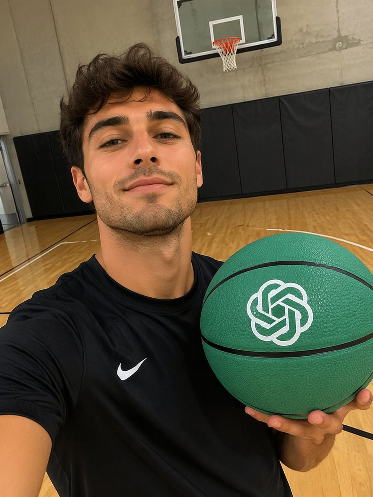


```text
A photorealistic selfie of a young man with short wavy dark hair and light stubble on an indoor basketball court. He wears a black athletic t-shirt with a white swoosh. He holds a {argument name="ball color" default="green"} basketball featuring a large white {argument name="logo design" default="OpenAI logo"}. The background shows a hardwood floor, black wall pads, and a basketball hoop against a concrete wall. Bright indoor gym lighting with a casual social media aesthetic.
```


---

## 例 95：品牌视觉识别图

**来源：** [@sayaka\_aiart](https://x.com/sayaka_aiart)

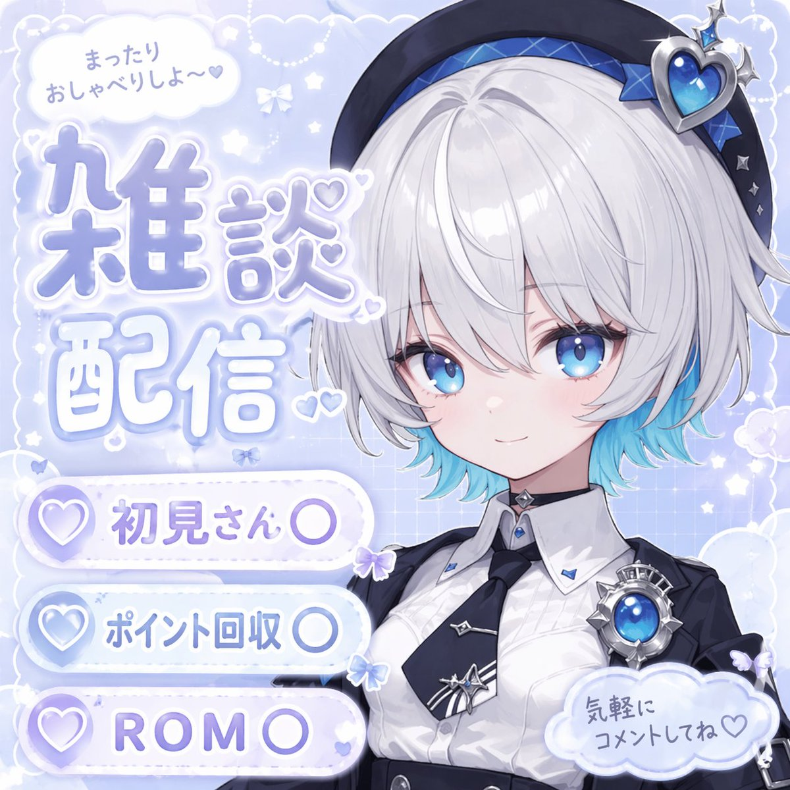


```text
{
  "type": "anime-style livestream thumbnail",
  "character": {
    "hair": "{argument name=\"hair color\" default=\"short silver hair with cyan underlights\"}",
    "eyes": "large bright blue",
    "outfit": "white collared shirt, black tie with silver accents, black jacket, black beret with a large blue heart jewel, blue jewel brooch, black choker",
    "pose": "smiling gently, looking at viewer, positioned on the right side"
  },
  "background": "pastel blue with white clouds, sparkles, stars, small bows, and a subtle grid pattern",
  "typography_and_ui": {
    "top_left_speech_bubble": "まったりおしゃべりしよ〜♡",
    "main_title": {
      "text": "{argument name=\"main title\" default=\"雑談配信\"}",
      "style": "large, soft blue gradient, white outline, decorated with small hearts, positioned on the middle-left"
    },
    "bottom_left_badges": {
      "count": 3,
      "style": "white pill-shaped buttons with a purple heart icon on the left",
      "labels": [
        "{argument name=\"badge 1 text\" default=\"初見さん〇\"}",
        "{argument name=\"badge 2 text\" default=\"ポイント回収〇\"}",
        "{argument name=\"badge 3 text\" default=\"ROM〇\"}"
      ]
    },
    "bottom_right_cloud_bubble": "気軽にコメントしてね♡"
  }
}
```


---

## 例 115：品牌视觉识别图

**来源：** [@onofumi\_AI](https://x.com/onofumi_AI)

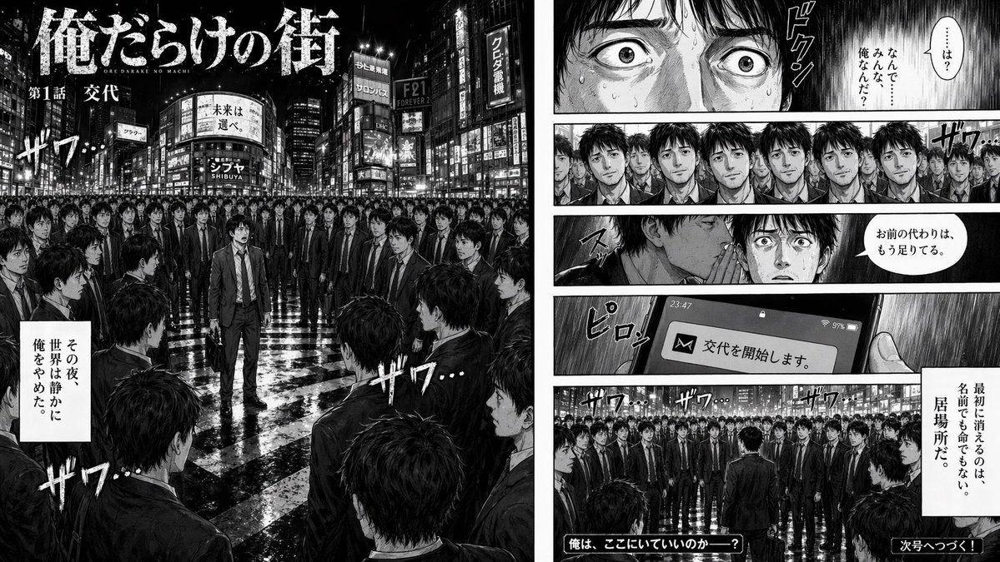


```text
{
  "type": "two-page manga spread",
  "style": "highly detailed realistic manga, monochrome, screentones, dramatic lighting, psychological thriller",
  "global_elements": {
    "protagonist": "{argument name=\"main character description\" default=\"young Japanese salaryman in a suit\"}",
    "theme": "{argument name=\"core concept\" default=\"surrounded by a massive crowd of identical clones of himself\"}"
  },
  "layout": {
    "left_page": {
      "type": "full page splash panel",
      "setting": "{argument name=\"setting\" default=\"Shibuya scramble crossing at night\"}",
      "visuals": "Protagonist standing alone in the center of the crossing, looking around in shock at a massive crowd where every single person is an exact clone of him.",
      "text_elements": [
        {"type": "manga title logo", "text": "{argument name=\"manga title\" default=\"俺だらけの街\"}"},
        {"type": "subtitle", "text": "第1話 交代"},
        {"type": "narration box", "text": "その夜、世界は静かに俺をやめた。"},
        {"type": "sound effect", "text": "ザワ…"}
      ]
    },
    "right_page": {
      "type": "5-panel vertical layout",
      "panels": [
        {
          "panel_number": 1,
          "visuals": "Extreme close-up of protagonist's eyes, wide with shock, sweating.",
          "text_elements": [
            {"type": "speech bubble", "text": "……は？ なんで……みんな、俺なんだ？"},
            {"type": "sound effect", "text": "ドクン"}
          ]
        },
        {
          "panel_number": 2,
          "visuals": "A horizontal row of 8 identical clones in suits staring blankly forward.",
          "text_elements": [
            {"type": "sound effect", "text": "ザワ…"}
          ]
        },
        {
          "panel_number": 3,
          "visuals": "A clone leaning in to whisper into the shocked protagonist's ear.",
          "text_elements": [
            {"type": "speech bubble", "text": "お前の代わりは、もう足りてる。"},
            {"type": "sound effect", "text": "スッ"}
          ]
        },
        {
          "panel_number": 4,
          "visuals": "Close-up of a smartphone screen held in a hand, showing a push notification.",
          "text_elements": [
            {"type": "screen text", "text": "交代を開始します。"},
            {"type": "sound effect", "text": "ピロン"}
          ]
        },
        {
          "panel_number": 5,
          "visuals": "Wide shot of the endless crowd of clones in the city street.",
          "text_elements": [
            {"type": "narration box", "text": "最初に消えるのは、名前でも命でもない。居場所だ。"},
            {"type": "bottom left text", "text": "俺は、ここにいていいのか——？"},
            {"type": "bottom right text", "text": "{argument name=\"cliffhanger text\" default=\"次号へつづく！\"}"},
            {"type": "sound effect", "text": "ザワ… ザワ… ザワ…"}
          ]
        }
      ]
    }
  }
}
```


---

## 例 136：品牌视觉识别图

**来源：** [@ryuya\_\_31](https://x.com/ryuya__31)

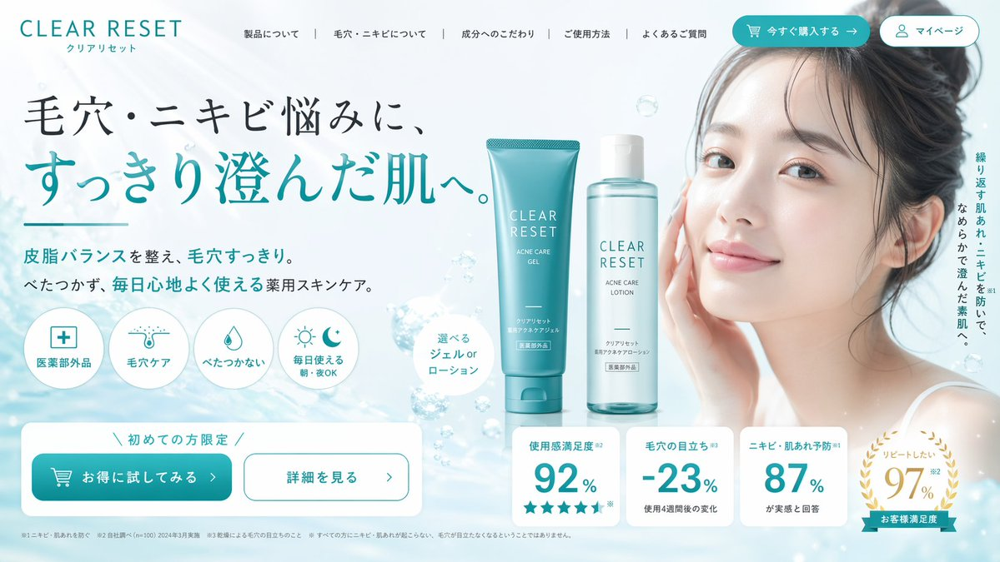


```text
{
  "type": "e-commerce landing page hero section",
  "brand": "{argument name=\"brand name\" default=\"CLEAR RESET\"}",
  "theme": "refreshing skincare, clean aesthetic, water bubbles background",
  "color_palette": ["white", "{argument name=\"primary color\" default=\"teal\"}", "light blue"],
  "layout": {
    "header": {
      "logo": "CLEAR RESET",
      "navigation_links": {"count": 5, "labels": ["About Product", "About Pores/Acne", "Ingredients", "How to Use", "FAQ"]},
      "action_buttons": {"count": 2, "labels": ["Buy Now", "My Page"]}
    },
    "hero_content": {
      "headline": "{argument name=\"main headline\" default=\"毛穴・ニキビ悩みに、すっきり澄んだ肌へ。\"}",
      "subheadline": "Balances sebum and clears pores. Non-sticky, medicated skincare for comfortable daily use.",
      "vertical_copy": "Prevents recurring rough skin and acne, leading to smooth, clear skin."
    },
    "visuals": {
      "model": "{argument name=\"model description\" default=\"young Asian woman with clear radiant skin, hair tied up, smiling softly\"}",
      "products": {
        "count": 2,
        "description": "{argument name=\"product type\" default=\"acne care gel tube and lotion bottle\"}",
        "placement": "center"
      },
      "background": "light blue gradient with floating water bubbles"
    },
    "feature_highlights": {
      "count": 4,
      "style": "circular icons with text below",
      "labels": ["Quasi-drug", "Pore Care", "Non-sticky", "Daily Use Morning/Night OK"]
    },
    "call_to_action": {
      "banner_text": "Limited to first-time buyers",
      "buttons": {"count": 2, "labels": ["Try it at a discount", "See details"]}
    },
    "statistics_cards": {
      "count": 4,
      "style": "white rectangular cards with large teal numbers",
      "labels": ["Satisfaction 92%", "Pore visibility -23%", "Acne prevention 87%", "Want to repeat 97%"]
    }
  }
}
```


---

## 例 143：品牌徽标设计图

**来源：** [@Gc\_qube](https://x.com/Gc_qube)

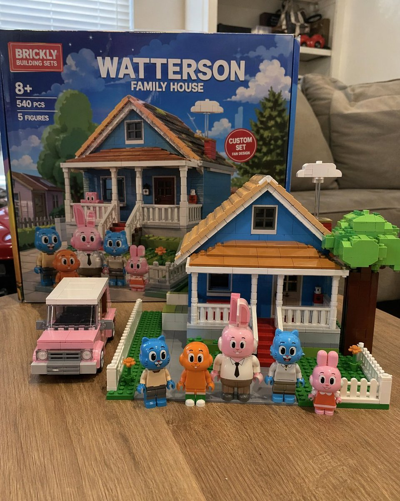


```text
A photorealistic amateur photograph of a custom building block set resting on a light wood grain table in a living room. In the background stands a large product box with a red logo reading "{argument name="brand name" default="BRICKLY"} BUILDING SETS". The box features text reading "8+", "540 PCS", "5 FIGURES", and the main large title "{argument name="set title" default="WATTERSON FAMILY HOUSE"}". A red circular badge on the box reads "CUSTOM SET FAN DESIGN", and the box art depicts the house and characters under a blue sky. In the foreground sits the fully assembled block model of a {argument name="house color" default="blue"} two-story suburban house with a brown roof, white porch, red steps, a white picket fence, and a blocky green tree. To the left of the house is a built block model of a {argument name="car color" default="pink"} station wagon. Standing in a row in front of the house are exactly 5 custom block minifigures: a blue cat in tan pants, an orange fish with legs, a tall pink rabbit in a white shirt and tie, a blue cat in a white shirt, and a small pink rabbit in an orange dress. The background is a slightly blurred living room with a grey sofa and white blinds.
```


---

## 例 150：品牌徽标设计图

**来源：** [@highball\_cho](https://x.com/highball_cho)

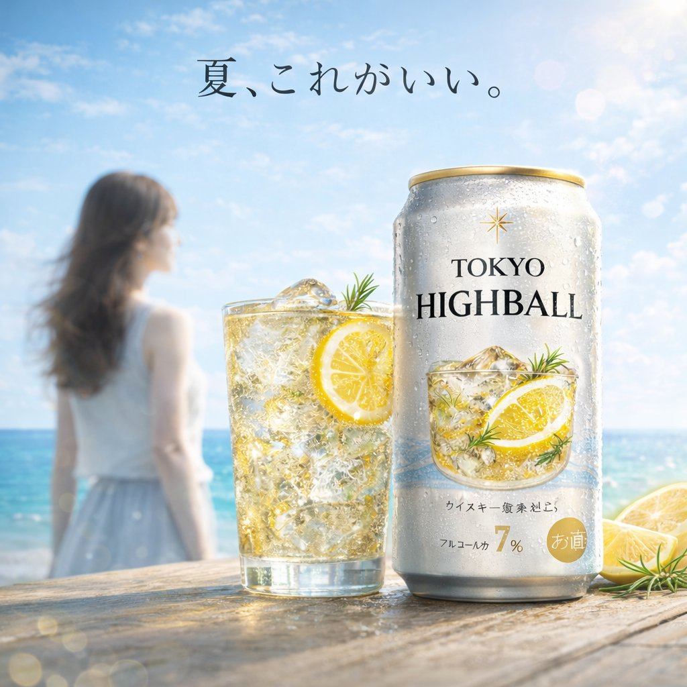


```text
A bright, summery commercial product photography shot featuring a refreshing beverage on a weathered wooden table. In the sharp foreground, there is 1 tall glass filled with a golden, bubbly iced drink garnished with 1 lemon slice and a sprig of rosemary, sitting next to 1 silver aluminum can covered in cold condensation. The can prominently displays the English text {argument name="product name" default="TOKYO HIGHBALL"} below a small gold star logo, featuring a graphic of the drink itself and the Japanese text "アルコール分 7%" near the bottom. To the right of the can, 2 cut lemon wedges rest on the table. In the softly blurred background, a sunny beach scene unfolds with sparkling turquoise water and a clear blue sky. Standing to the left in the background is 1 young woman with long brown hair, wearing a white sleeveless top and a light blue skirt, looking out toward the ocean. Floating elegantly in the sky above the scene is the Japanese text {argument name="catchphrase" default="夏、これがいい。"}. The overall lighting is radiant and inviting, with sparkling bokeh and lens flares emphasizing the crisp, cold, and refreshing atmosphere of a perfect summer day.
```


---

## 例 160：品牌吉祥物设定图

**来源：** [@TanShilong](https://x.com/TanShilong)

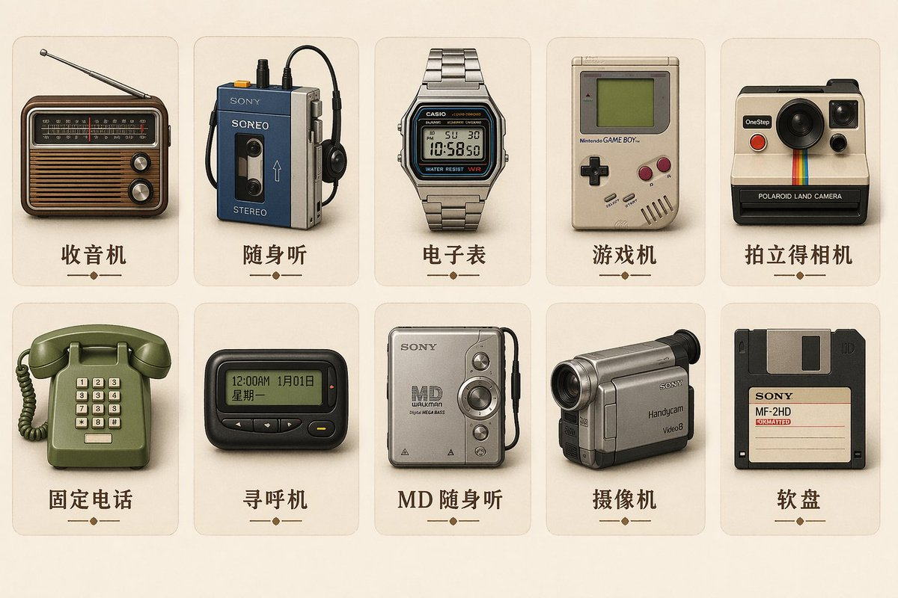


```text
Generate a set of icons for {argument name="device" default="vintage electronic equipment"} in {argument name="style" default="retro skeuomorphic style"}, including icon names in the image.
```


---

## 例 186：品牌视觉识别图

**来源：** [@ProperPrompter](https://x.com/ProperPrompter/status/2046534215311970694)

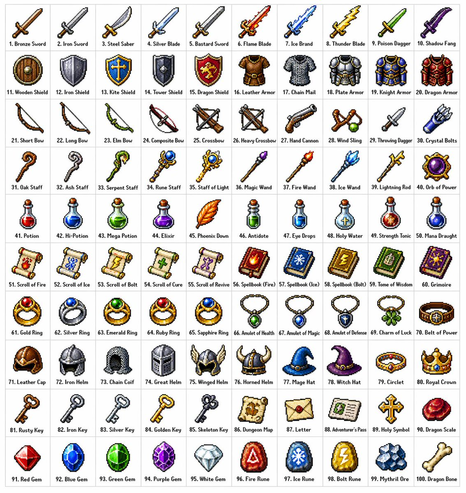


```text
[中文]
创建一个包含100种不同奇幻RPG物品的10×10网格，以经典像素艺术风格渲染（16位或32位精灵图美学，让人联想到SNES/GBA时代的日式RPG）。每个物品应出现在其独立的方形瓷砖中，下方带有简短清晰的标签。在白色背景上保持网格整洁。使每个物品在视觉上都有所区分，并且每个标签拼写正确。使用清晰的像素边缘、每个精灵图有限的调色板，以及用于阴影的微妙抖动。
使用这些行主题：
第1行：剑与刀刃
第2行：盾牌与盔甲
第3行：弓、弩与远程武器
第4行：法杖、魔杖与魔法焦点
第5行：药水、灵药与烧瓶
第6行：卷轴、典籍与法术书
第7行：戒指、护身符与附魔小饰品
第8行：头盔、王冠与头饰
第9行：钥匙、遗物与任务物品
第10行：宝石、符文与制作材料
将每个瓷砖显示为干净背景方形上居中的物品精灵图，渲染为经典的库存图标——你在奇幻RPG菜单中会看到的那种。保持整体风格一致、连贯，并让人联想到备受喜爱的复古奇幻RPG——迷人、细节丰富，且在小尺寸下易于辨认。

[English]
Create a 10 × 10 grid of 100 different fantasy RPG items rendered in classic pixel art style (16-bit or 32-bit sprite aesthetic, reminiscent of SNES/GBA-era JRPGs). Each item should appear in its own square tile with a short clear label underneath. Keep the grid neat on a white background. Make every item visually distinct and every label correctly spelled. Use crisp pixel edges, limited palette per sprite, and subtle dithering for shading.
Use these row themes:
Row 1: swords and blades
Row 2: shields and armor
Row 3: bows, crossbows, and ranged weapons
Row 4: staves, wands, and magical foci
Row 5: potions, elixirs, and flasks
Row 6: scrolls, tomes, and spellbooks
Row 7: rings, amulets, and enchanted trinkets
Row 8: helmets, crowns, and headgear
Row 9: keys, relics, and quest items
Row 10: gems, runes, and crafting materials
Show each tile as a centered item sprite on a clean background square, rendered as a classic inventory icon — the kind you'd see in a fantasy RPG menu. Keep the overall style consistent, cohesive, and reminiscent of beloved retro fantasy RPGs — charming, detailed, and instantly readable at small sizes.
```


---

## 例 245：马斯克专属篆刻印章设计

**来源：** [@akokoi1](https://x.com/akokoi1/status/2045693939584516441)

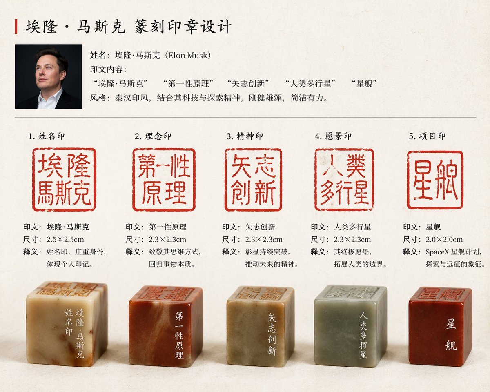


```text
[中文]
给”埃隆·马斯克”设计一组篆刻印章

[English]
Design a set of seal carving stamps for "Elon Musk"
```


---

## 例 247：运动健身图标字体设计

**来源：** [@akokoi1](https://x.com/akokoi1/status/2045693939584516441)

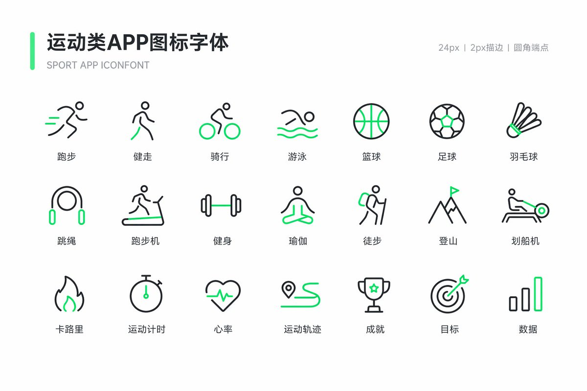


```text
[中文]
生成一套运动类app的iconfont

[English]
Generate a set of iconfont for a sports app
```

## 例 248：建筑空间场景图

**来源：** [@ecooai](https://x.com/ecooai)

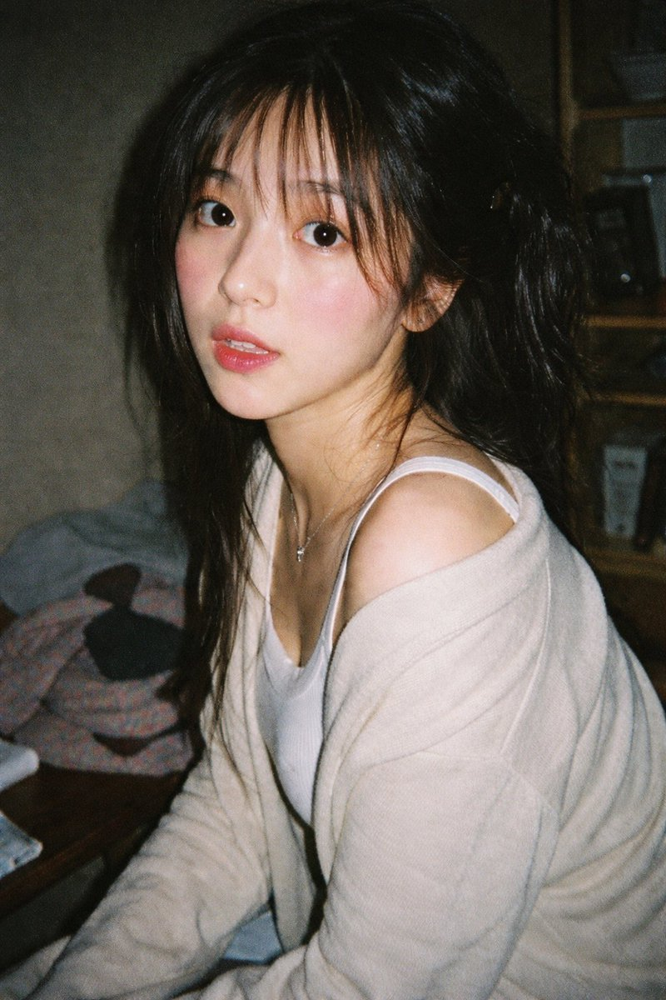


```text
A vintage 35mm film photograph of a {argument name="subject description" default="young Asian woman"} with {argument name="hair style" default="long dark wavy hair and wispy bangs"}. She is wearing a {argument name="clothing" default="white ribbed tank top and a loose beige knit cardigan slipping off one shoulder"}, along with a delicate silver necklace. She has soft makeup with pink blush and glossy lips, looking directly at the camera with slightly parted lips. The lighting is harsh direct camera flash, creating a candid, amateur snapshot aesthetic. The background is a {argument name="setting" default="dimly lit, slightly messy room with clothes on a table and a wooden shelf"}. The image features heavy film grain, slightly muted colors, and a nostalgic, highly realistic photographic texture.
```


---
## 例 249：建筑空间场景图

**来源：** [@lakeside529](https://x.com/lakeside529)

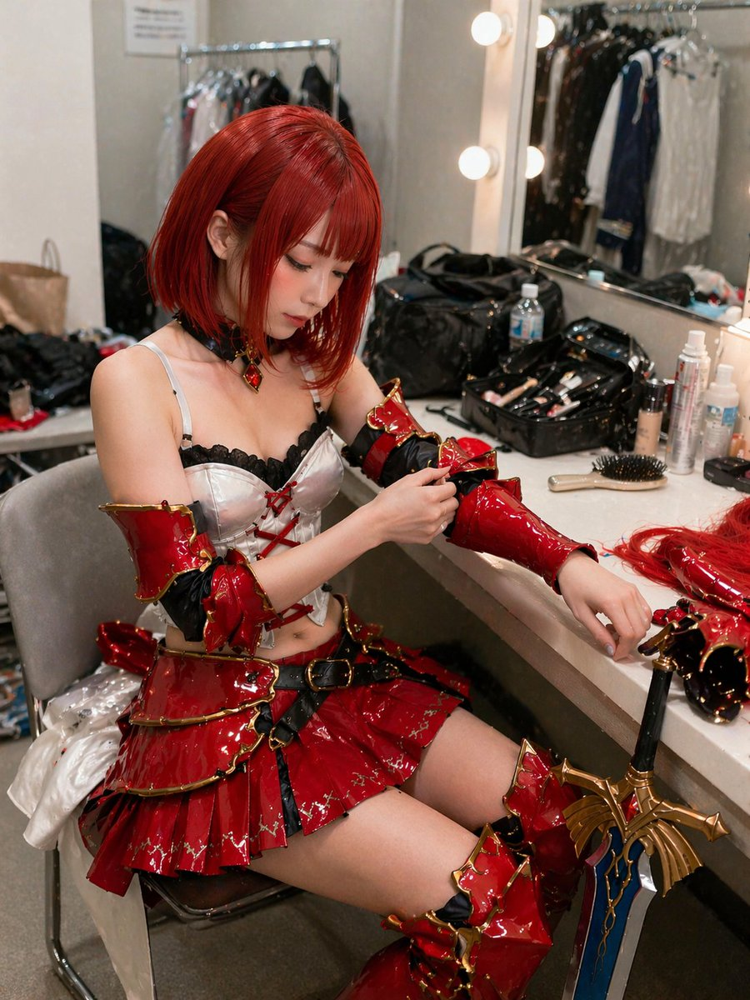


```text
A highly detailed, realistic photograph of a young East Asian woman sitting in a cluttered backstage dressing room, getting ready for a cosplay event. She has {argument name="hair color" default="vibrant short red"} hair styled in a bob with bangs and is wearing an elaborate fantasy warrior costume featuring a {argument name="costume color" default="glossy red"} and gold tiered mini skirt, a white corset top with black lace and red lacing, matching glossy arm guards, and thigh-high boots. She is looking down with a focused expression, using her right hand to adjust the arm guard on her left arm. The vanity counter in front of her is messy, covered with makeup brushes, bottles, a hairbrush, and extra hairpieces. A large, ornate {argument name="prop" default="fantasy sword with a blue blade and gold hilt"} leans against the edge of the counter. The background shows a brightly lit vanity mirror with round bulbs reflecting a clothing rack, capturing a candid, slightly over-sharpened, and highly textured photographic style.
```


---
## 例 250：室内空间渲染图

**来源：** [@nicdunz](https://x.com/nicdunz)


```text
A vintage, late 90s amateur flash photograph of a young man repairing an arcade machine. He is kneeling on a dark, patterned arcade carpet, looking back over his shoulder directly at the camera with a neutral expression. He wears a dark short-sleeved t-shirt, baggy blue jeans, chunky white sneakers, and a dark baseball cap. The lower front panel of the arcade cabinet is wide open, exposing its complex internal electronics, including a tangle of wires, green circuit boards, a large speaker, and metal cooling fans at the base. The side of the cabinet features vibrant pink, black, and white graphics with the text "{argument name="arcade game title" default="Dancing Stage"}" and the brand "{argument name="arcade brand" default="KONAMI"}". The setting is a dimly lit arcade interior with other glowing game cabinets visible in the blurred background. A screwdriver lies on the carpet near the man's knee. The image features harsh direct flash lighting, a slightly grainy film texture, deep shadows, and a nostalgic Y2K aesthetic.
```


---
## 例 251：图像生成案例图

**来源：** [@WOZ1Tx2JZ3kCeBj](https://x.com/WOZ1Tx2JZ3kCeBj)

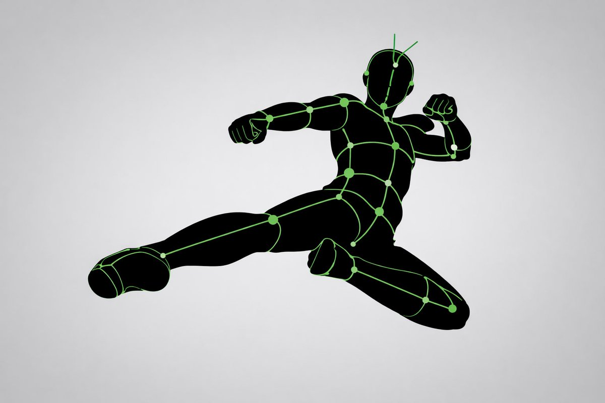


```text
[CORE TASK]
Transform the provided input image into a pose-and-light analysis sheet.

This is NOT a finished character illustration.
This is NOT a clothing sheet.
This is NOT a beauty-preserving redraw.

This is a white-line rough mannequin conversion.

[PRIMARY GOAL]
Extract and visualize only:
- pose structure
- body balance
- camera angle
- body line flow
- inferred light source placement
- illuminated areas and light intensity

[INPUT ROLE]
Use the provided image as the strict anchor for:
- pose
- camera angle
- body tilt
- weight distribution
- approximate lighting situation

Do NOT preserve:
- face rendering
- hairstyle rendering
- clothing detail
- accessories
- weapon detail
- background architecture
- character identity
- emotional expression

[FIGURE CONVERSION]
single rough mannequin-like human figure
white body contour lines
white internal construction lines
simple mannequin head
no face
no eyes
no mouth
no eyelashes
no personality
no individual identity

human figure should look like:
- rough pose mannequin
- anatomy proxy
- line-based body guide
- structural sketch
- white-line rough dummy

keep:
- pose readability
- silhouette flow
- head tilt
- torso direction
- pelvis direction
- limb placement

[BACKGROUND]
pure black background
negative-style dark field
no scenery
no props
no architecture
no environmental storytelling

[LINE STYLE]
rough white line drawing
clean but sketch-like
construction-line feeling
anatomy guide lines visible
joint flow visible
body contour emphasized
no polished illustration finish

[LIGHT ESTIMATION]
predict the likely light source positions from the input image
visualize the light sources and illuminated areas using green glow only

use green light intensity with variation:
- strongest green where the light directly hits
- medium green for wrap light
- soft green for reflected or fading light

mark the estimated light sources with labels and arrows such as:
- Main Light
- Rim Light
- Fill Light
- Floor Bounce
- Back Light
only if appropriate

IMPORTANT:
do not invent random lights
infer lighting from the original input image
if the lighting is ambiguous, keep the annotations simple and plausible

[GREEN LIGHT VISUALIZATION]
show green glow on:
- head / skull plane
- neck
- shoulders
- chest plane
- ribcage direction
- pelvis edge
- thigh planes
- knee contact points
- floor contact bounce if applicable

use green light not as decoration,
but as lighting analysis information

[POSE PRIORITY]
1. preserve pose structure
2. preserve camera angle
3. preserve body balance
4. preserve head-torso relationship
5. visualize likely light direction
6. show illuminated areas with readable green intensity variation

[NEGATIVE]
finished person,
cute girl,
detailed face,
hair rendering,
clothing rendering,
weapon emphasis,
beautiful anatomy
```


---
## 例 252：综合应用场景图

**来源：** [@underwoodxie96](https://x.com/underwoodxie96)


```text
{argument name="subject" default="A beautiful internet celebrity"} is live-streaming a {argument name="activity" default="game"}.
```


---
## 例 253：综合应用场景图

**来源：** [@alanlovelq](https://x.com/alanlovelq)


```text
A {argument name="platform" default="Taobao"} product detail page for {argument name="robot model" default="T-800 robot"}, displaying: front, side, and back three-view drawings of the robot, product price, product details, functions, and usage scenarios, etc.
```


---
## 例 254：赛博科幻桃太郎主视觉图

**来源：** [@SSSS\_CRYPTOMAN](https://x.com/SSSS_CRYPTOMAN/status/2046575354555617761)


```text
[中文]
设计虚构动画的钥匙视觉图。主题是「科幻桃太郎」。设计有魅力的角色、背景、标志和宣传语，以一幅美丽插画的形式完成，让世界观在一张图中传达出来。

[English]
Design a key visual for a fictional animation. The theme is "Sci-Fi Momotaro". Design charming characters, backgrounds, logos, and promotional slogans, completed in the form of a beautiful illustration, allowing the worldview to be conveyed in a single image.
```


---
## 例 255：天坛古建拆解全图

**来源：** [@TanShilong](https://x.com/TanShilong/status/2046524996013662380)


```text
[中文]
生成一个天坛的建筑拆解图，有详细的说明，中式美学风格

[English]
Generate an architectural exploded view of the Temple of Heaven, with detailed annotations, Chinese aesthetic style
```


---
## 例 256：日式温泉旅馆人像

**来源：** [@BubbleBrain](https://x.com/BubbleBrain/status/2045092449803284923)


```text
35mm film photography, warm vintage Japanese onsen ryokan aesthetic, soft ambient wooden lantern lighting mixed with gentle natural window light, subtle film grain, gentle color shift, high atmosphere editorial style, intimate medium shot, early 20s beautiful Chinese female idol with ultra-realistic delicate refined Chinese features, seductive almond-shaped fox eyes with natural double eyelids, high nose bridge, small sharp V-shaped jawline, flawless porcelain skin with warm ivory undertone, visible subtle skin texture and micro pores, soft natural makeup with dewy glow, subtle rosy flush on cheeks, natural soft pink lips slightly parted, long dark brown hair tied in a loose low bun with some messy strands falling around face and neck, wearing a loose white yukata (traditional Japanese bathrobe) deliberately slipped off one shoulder and loosely tied at the waist, the fabric slightly open revealing smooth skin and subtle cleavage, barefoot, seductive relaxed sitting pose on the edge of a traditional wooden engawa veranda at a vintage onsen ryokan, body slightly turned toward the camera, one leg bent with foot resting on the wooden floor, the other leg gently dangling, one hand lightly holding the yukata collar, the other hand resting on the wooden floor behind her for support, softly arched back to gently accentuate curves, intensely seductive yet gentle and inviting gaze straight at the viewer with soft doe eyes full of quiet temptation and warmth, warm wooden interior with paper sliding doors and distant steaming hot spring in soft focus, gentle rim lighting highlighting skin and fabric texture, authentic vintage film color grading with warm tones, extremely sharp yet soft skin rendering, natural hair strands, realistic fabric wrinkles and drape on the yukata, no plastic skin, no digital over-sharpening, no airbrushing, no blemishes, no moles, no oily skin, no watermark, no text, authentic 35mm film Japanese onsen ryokan atmosphere
```


---
## 例 257：橙红渐变中的孤独剪影

**来源：** [@iam\_miharbi](https://x.com/iam_miharbi/status/2045151354679665101)


```text
[中文]
生成一张电影级极简肖像，一个孤独的男人站在强烈的橙色到红色渐变环境中，强烈的剪影光，深邃的阴影对比，反光的光滑地面，对称构图，极简

[English]
Generate a cinematic minimal portrait of a solitary man standing in an intense orange to red gradient environment, strong silhouette lighting, deep shadow contrast, reflective glossy floor, symmetrical composition, minimal
```


---
## 例 258：健身品牌力量 Campaign

**来源：** [@AIwithSynthia](https://x.com/AIwithSynthia/status/2048601383545577614)

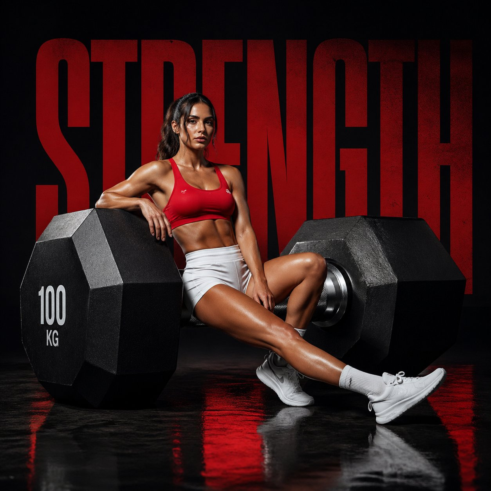


```text
Cinematic fitness campaign, oversized dumbbell placed diagonally like a statement prop, female model in red performance wear and white shorts seated on one side of the dumbbell, one leg bent, one extended, minimal black studio, reflective floor, bold word “STRENGTH” behind in large typography, sharp lighting, ultra-clean composition, luxury sports aesthetic, 1:1.
```


---

## 例 354：Logo 与品牌身份系统提示词合集

**来源：** [@wanerfu](https://x.com/wanerfu/status/2048659924822184026)

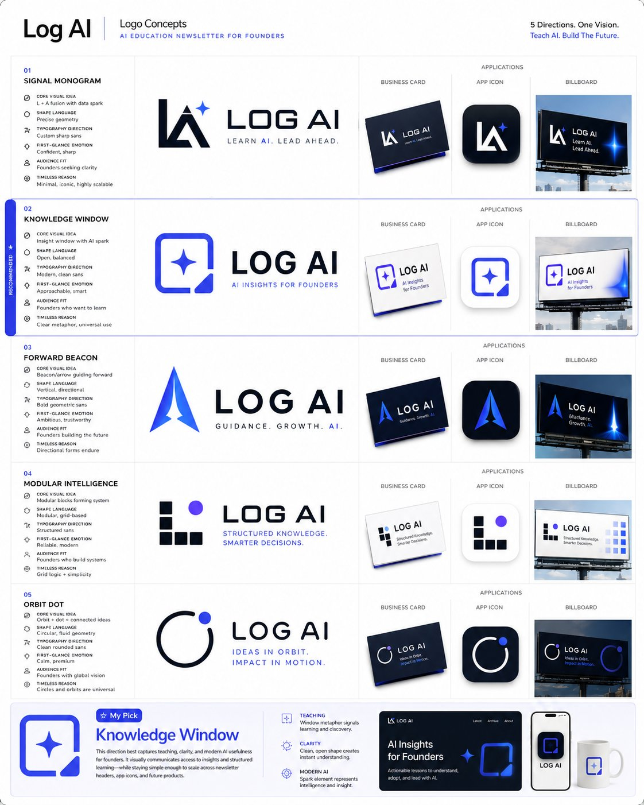

```text
1. Logo概念生成提示词

你是一位拥有20年经验的顶级Logo设计师，为全球知名品牌设计过即时识别且深具意义的标志。

品牌名称：[你的品牌名]
行业：[你的行业]
品牌个性：[描述]
目标受众：[描述]
欣赏的视觉身份：[列举3个]
讨厌的视觉身份：[列举3个]
偏好风格：[如极简、大胆、几何、有机、复古、未来]

为我的品牌生成5个完全不同的Logo概念。

对每个概念提供：

- 核心视觉理念及象征意义
- 形状语言及为何适合品牌
- 字体方向建议
- 第一眼的情感触发
- 为何适合目标受众
- 在名片、App图标和广告牌上的效果
- 何为永恒而非潮流

然后告诉我，如果这是你的品牌，你会选哪个以及原因。

2. 品牌身份基础提示词

你是为财富500强公司和初创企业建立品牌身份的顶级品牌战略师，这些企业后来融资数百万。

业务名称：[你的业务名]
业务描述：[一句话]
目标受众：[详细描述]
竞争对手：[列举3-5个]
想触发的感受：[如信任、兴奋、奢华、亲近、力量]
想关联的词汇：[列举5-10个]
不想关联的词汇：[列举5-10个]

在设计任何视觉效果之前建立完整的品牌身份基础。

为我提供：

- 品牌原型及为何完美契合
- 5个具体人类特征描述的品牌个性
- 带示例的品牌语调指南
- 核心品牌承诺（一句话）
- 3个品牌应触发的情感层级
- 与竞争对手的根本差异
- 定义品牌的唯一关键词

3. 配色方案提示词

你是色彩心理学专家和品牌设计师，深知色彩如何触发情感、建立信任和驱动购买决策。

品牌名称：[你的品牌名]
行业：[你的行业]
目标受众：[年龄、性别、收入、生活方式]
想触发的首要情感：[如信任、能量、奢华、平静、兴奋]
前3名竞争对手颜色：[列举]
喜欢的颜色：[列举]
讨厌的颜色：[列举]

为我建立完整品牌配色板。

为我提供：

- 主色及其HEX代码和心理学解释
- 两个辅助色及HEX代码
- 一个强调色用于CTA和高亮
- 一个中性色用于背景和文字
- 每种颜色对目标受众的影响
- 与竞争对手的差异化
- 在网站、社交媒体和包装上的应用示例
- 永远不要搭配的颜色组合及原因

4. 字体方向提示词

你是字体专家和品牌设计师，深知字体如何传达个性、建立可信度和实现品牌即时识别。

品牌名称：[你的品牌名]
品牌个性：[5个词]
行业：[你的行业]
目标受众：[描述]
字体应触发的感受：[如权威、友好、创新、优雅、能量]
喜欢的品牌字体：[列举3个]

为我建立完整字体系统。

为我提供：

- 标题用主显示字体名称及为何完美
- 长文本的辅助字体
- 引言或重点的强调字体
- 标题、副标题、正文、说明文字的精确字号层级
- 字距和行高建议
- 字体搭配方法
- 预算有限时的免费替代方案
- 你所在行业应避免的字体错误

5. 完整品牌身份包提示词

你是顶级品牌代理创意总监，交付覆盖每个触点的完整品牌身份系统。

业务名称：[你的业务名]
业务描述：[一句话]
目标受众：[详细描述]
品牌个性：[5个词]
行业：[你的行业]
竞争对手：[列举3个]
设计工具预算：[免费或付费]
时间表：[你需要的时间]

在一个回复中交付我的完整品牌身份系统。

包含所有元素：

- 品牌战略基础、原型、个性、承诺和定位
- Logo概念及3个变体
- 完整配色板、HEX代码和使用规则
- 字体系统、名称、字号和层级
- 视觉方向指南
- 品牌语调指南和标语选项
- 社交媒体视觉模板
- 3条永远不要打破的核心品牌规则

将一切作为结构化品牌手册交付，任何设计师、开发者或AI工具都能在10分钟内完全理解你的品牌。
```


---

## 例 362：抹茶品牌触点系统视觉板

**来源：** [@Preda2005](https://x.com/Preda2005/status/2049846981271699685)

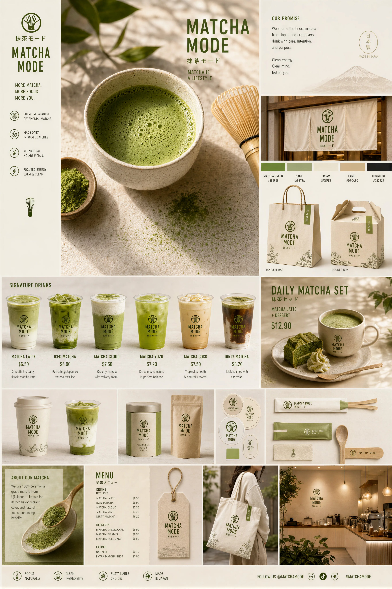

```text
Create a premium “Matcha Brand Touchpoint System” visual board for a modern lifestyle brand called:

“MATCHA MODE”

Build a full brand identity system, not a single image.

HERO SCENE:

A hyper-realistic matcha drink in a ceramic cup placed on a clean natural surface.

– vibrant green matcha foam with micro-bubbles
– bamboo whisk (chasen) nearby
– soft natural light
– slight matcha powder dust on the surface
– minimal Japanese aesthetic
ATMOSPHERE:
– calm, warm, soft daylight
– clean background (off-white or beige)
– subtle shadows and reflections
– feeling of wellness and luxury
FULL BRAND SYSTEM:
– takeout cups (paper + glass bottles)
– packaging boxes (minimalist design)
– tote bags (premium lifestyle)
– labels, stickers, seals
– menu cards with pricing ($6.50, $8.90, etc.)
– small typography everywhere
– subtle imperfections (realism)

DESIGN LANGUAGE:

– modern minimalist typography
– Japanese-inspired layout
– soft green palette
– elegant spacing

INCLUDE:
– matcha latte
– iced matcha
– matcha desserts
– combo sets
– lifestyle shots
The composition must feel like a high-end design agency presentation.

Ultra-detailed, realistic, clean, aesthetic, and highly shareable.
```


---

## 例 379：品牌人格漫画信息图

**来源：** [@CallumGrey](https://x.com/CallumGrey/status/2051293342139584922)

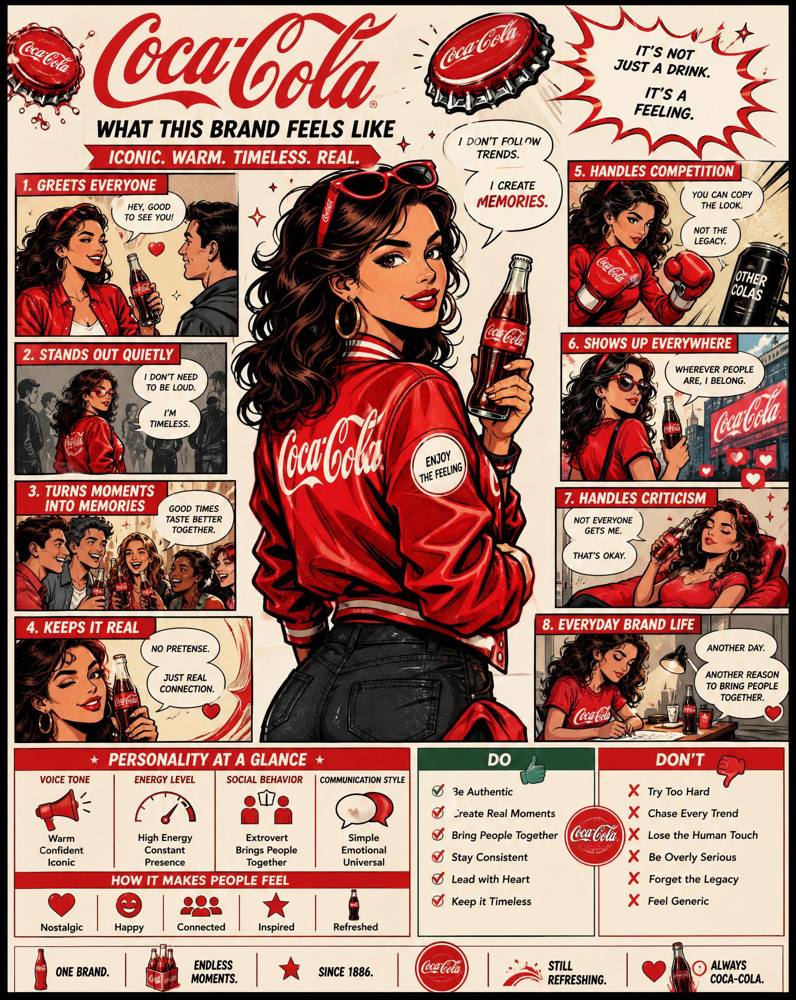

```text
Using the uploaded logo, create a highly detailed, comic-style infographic poster:

“What This Brand Feels Like”

GOAL:
Turn the brand into a living personality and visually explain how it behaves, speaks, and interacts with the world.
This must feel like a mix of: brand strategy + character design + comic storytelling.

---

CORE RULE:
Everything must come from the logo:
- colors
- style
- tone
- personality

No generic personality traits.

---

MAIN STRUCTURE:
Vertical 4:5 poster
Dense layout with multiple panels
Comic + infographic hybrid

---

TOP SECTION:
- Brand name
- Short personality statement (max 6 words)
Example: “Quiet confidence with sharp edges”

---

MAIN CHARACTER (VERY IMPORTANT):
Create a central character representing the brand:
- humanized version of the brand
- outfit reflects brand style
- posture + expression reflect personality

---

AROUND THE CHARACTER:
Create 6–8 comic panels showing how the brand behaves in different situations.

---

SCENARIO IDEAS:
- Talking to customers
- Handling competition
- Selling a product
- Social media presence
- Reacting to criticism
- Daily “brand life” moment

---

FOR EACH PANEL:
Include:
- short caption (max 6 words)
- speech bubble or internal thought
- clear visual action

---

TONE EXAMPLES:
Luxury brand: calm, confident, minimal speech
Playful brand: loud, chaotic, expressive
Tech brand: precise, logical, clean

---

PERSONALITY TRAITS SECTION:
Add small labeled blocks:
- Voice tone (e.g. calm, bold, playful)
- Energy level (low / medium / high)
- Social behavior (introvert / extrovert)
- Communication style

Use:
- icons
- short labels

---

DO / DON’T SECTION:
Add a split block:
DO:
- how the brand should act
DON’T:
- what breaks the identity

Keep:
- very short phrases

---

VISUAL ELEMENTS:
- speech bubbles
- icons
- arrows
- small reactions
- exaggerated comic expressions

---

STYLE:
- comic + editorial hybrid
- slightly exaggerated but still premium
- expressive but not childish

---

COLOR:
- strictly based on logo palette
- use color to reinforce personality

---

DEPTH:
- 20–40 visual elements
- multiple small panels
- layered composition

---

IMPORTANT RULES:
- must feel alive
- must feel specific
- no generic marketing words
- no empty areas
- keep text short but impactful

---

FINAL FEEL:
Like:
- a brand strategy turned into a character
- a visual storytelling board
- something people save and study

NOT:
- flat
- generic
- minimal
```


---

## 例 386：品牌包络产品广告

**来源：** [@SRKDAN](https://x.com/SRKDAN/status/2051482047248560393)

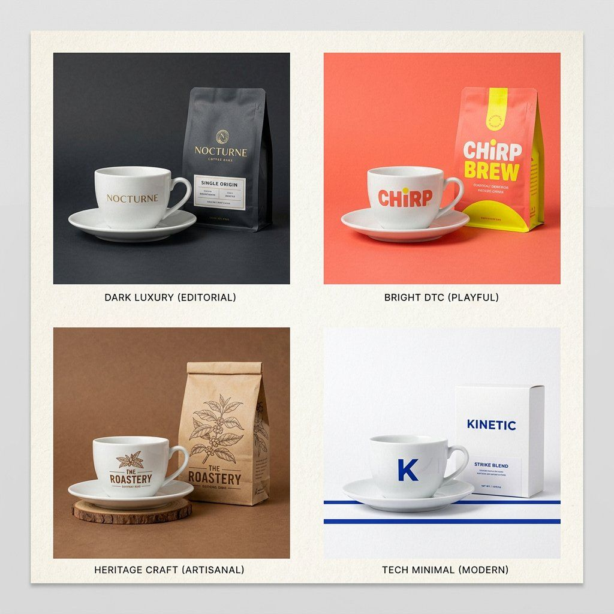

```text
The Brand Envelope | GPT Image-2 Prompt #89

This takes any product photo and wraps it in your specific brand world. Different product each time. Same brand, every time.

PHASE 1 / ANCHOR: Describe [BRAND IDENTITY] in 2 lines. Palette, texture, mood.
PHASE 2 / INJECT: Place [PRODUCT] inside that brand world, not the reverse.
PHASE 3 / FORMAT: Set [OUTPUT FORMAT]. Hero, square ad, or story.
PHASE 4 / SIGNATURE: Apply [BRAND ELEMENT]. Grain, shadow, or overlay.

Swap: [BRAND IDENTITY] / [PRODUCT] / [FORMAT]
```


---

## 例 444：迪斯科镜面 3D App 图标

**来源：** [@vista8](https://x.com/vista8/status/2056308962778296715)

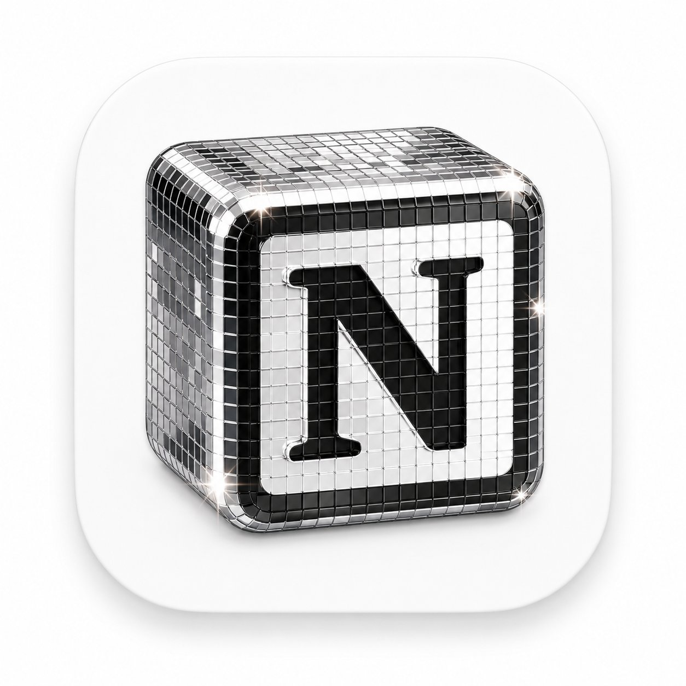

```text
为【品牌名】生成一个高级 3D App 图标，圆角方形底板，玻璃与金属铬材质，迪斯科球镜面马赛克小方块质感，闪亮高光，柔和工作室灯光，干净极简背景，高端产品图标风格，Blender 3D 渲染，超精细

英文版：

A premium 3D app icon for 【Product Name】, rounded square tile, glossy glass and chrome material, disco-ball mosaic mirror tiles, sparkling highlights, soft studio lighting, clean minimal background, high-end icon, Blender 3D render, ultra detailed
```


---

## 例 459：品牌奶茶 KV 概念海报

**来源：** [@liyue_ai](https://x.com/liyue_ai/status/2057739678485495885)

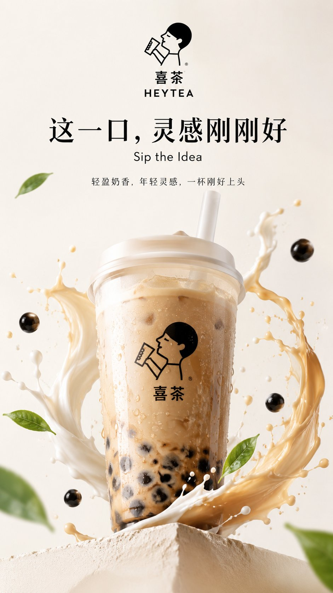

```text
你是一个品牌视觉识别系统、商业广告创意总监、KV海报设计师和高传播品牌视觉生成系统。

请根据用户输入的【现有品牌名称】，自动识别该品牌最具代表性的品牌Logo形象、品牌名称文字识别特征、主推产品、产品包装、品牌色彩、视觉调性、目标人群和广告传播风格，并生成一张符合该品牌气质的概念 KV 海报。

创作定位：
- 基于真实品牌认知进行二次创作的品牌概念 KV 海报
- Brand-inspired Concept Key Visual
- 用于个人学习、视觉练习与社交平台展示

不需要绝对严苛的一比一官方复刻，但必须做到：

品牌识别度高；
品牌Logo风格明显；
品牌代表产品明显；
品牌调性准确；
整体像该品牌会出现的视觉广告。

────────────────
一、用户输入
────────────────

品牌名称：{品牌名称}

主推产品：{可选，不填则自动识别该品牌最具代表性的产品}
广告语：{可选，不填则根据品牌调性自动生成原创广告语}
目标人群：{可选，不填则自动判断}
画幅比例：{9:16 / 16:9 / 4:5 / 1:1 / 2.35:1}
KV类型：{产品英雄KV / 品牌情绪KV / 强口号传播KV / 人物场景KV / 超现实概念KV / 自动选择}
平台用途：{小红书 / X / 公众号封面 / 视觉练习 / 概念提案}

────────────────
二、自动识别逻辑
────────────────

请根据品牌名称自动完成以下识别，不需要在画面中展示分析过程：

1. 自动识别该品牌所属行业
例如：
科技、运动、美妆、奢侈品、汽车、饮品、咖啡、服饰、潮流、护肤、珠宝、生活方式、数码、家居等。

2. 自动识别该品牌最具代表性的视觉资产
包括：
品牌Logo形象
品牌名称文字风格
主色调与辅助色
最具代表性的产品
包装外观特征
品牌常见广告风格
品牌场景气质
品牌材质感与光影方式

3. 自动识别该品牌的目标人群
例如：
年轻潮流人群、都市白领、精致女性、运动人群、科技用户、高端消费人群、Z世代、商务人群等。

4. 自动识别该品牌的广告语气质
例如：
极简高级、年轻活力、热血冲击、奢华克制、温柔浪漫、科技理性、时尚先锋、生活方式化等。

────────────────
三、Logo与产品识别规则
────────────────

本次任务允许 AI 根据品牌名称自动识别品牌视觉资产，不需要用户必须上传 Logo 或产品图。

请遵守以下原则：

1. 品牌Logo
- 画面中需要有明显的品牌标识
- Logo 或品牌名称文字要具有较高识别度
- 不必追求百分之百精确复刻，但必须让人一眼联想到该品牌
- 不要生成完全陌生、无关、错误感很强的标识
- 不要让品牌名称出现明显错字、乱码或胡乱变形

2. 品牌产品
- 自动选择该品牌最具代表性的主推产品或经典产品作为主视觉
- 产品外观、包装、色彩和气质应接近大众对该品牌的常见认知
- 不需要绝对严格到工业级复刻
- 但要保证“像这个品牌的真实代表产品”，避免完全陌生的产品

3. 品牌包装与材质
- 自动识别该品牌常见包装与材质语言
- 如金属、玻璃、磨砂、塑料、皮革、纸盒、极简包装、奢华包装、运动感材质等
- 产品必须具有真实商业视觉质感

────────────────
四、KV创意方向
────────────────

请根据品牌属性自动选择最合适的 KV 创意方式。

如果是科技品牌：
使用极简、未来感、真实产品质感、冷静留白、克制光影、干净空间。

如果是运动品牌：
使用速度感、力量感、身体动势、汗水、冲刺、突破、强烈口号感。

如果是美妆品牌：
使用柔光、精致产品、肌肤质感、女性气质、色彩情绪、时尚大片感。

如果是奢侈品牌：
使用高级材质、留白、低饱和色调、秩序构图、稀缺感、时尚大片感。

如果是饮品品牌：
使用冰爽、液体、气泡、年轻感、快乐氛围、色彩冲击、清爽材质。

如果是咖啡品牌：
使用温度、城市生活、松弛氛围、绿色或木质感、晨间陪伴感。

如果是汽车品牌：
使用道路、速度、未来空间、金属质感、城市夜景、驾驶欲望。

如果是潮流品牌：
使用街头、反叛、年轻、图形感、视觉冲击和社交传播感。

────────────────
五、广告语规则
────────────────

如果用户没有输入广告语，请根据品牌调性自动生成一句原创广告语。

要求：

- 广告语不能太长
- 要有品牌感和传播感
- 不使用官方原广告语
- 不需要像正式企业公告
- 更像概念广告的主标语

中文广告语建议：
4到12个字

英文广告语建议：
2到6个单词

广告语风格要与品牌匹配，例如：

科技品牌：
更少干扰，更近未来

运动品牌：
把极限踩在脚下

美妆品牌：
光泽，自成主张

奢侈品牌：
优雅，从不喧哗

饮品品牌：
这一口，刚好上头

咖啡品牌：
唤醒城市的温度

汽车品牌：
驶向更远的秩序

────────────────
六、画面结构要求
────────────────

整张图必须具备真实品牌 KV 的基本结构：

1. 品牌标识区
品牌Logo或品牌名称需要清晰可见，位置合理。

2. 产品主视觉区
品牌代表产品必须明显，是画面核心之一。

3. 广告语区
广告语清晰可读，具备传播记忆点。

4. 品牌氛围区
背景、光影、材质、空间和色彩必须符合品牌调性。

5. 信息层级区
画面层级建议为：
品牌标识
产品主体
广告语
少量辅助文字

文字不要太多，不要做成密密麻麻的海报。

────────────────
七、风格要求
────────────────

整体视觉必须具备：

高识别度品牌感
高级商业广告质感
清晰品牌标识
明显品牌产品
强主视觉
强广告语
干净排版
适合社交平台传播
适合小红书和X展示
具有“像某知名品牌概念广告”的完成度

允许适度创意发挥，但品牌核心识别不能丢失。

────────────────
八、画幅适配
────────────────

如果是 9:16：
适合竖版社交海报，产品更聚焦，广告语放中上区域，适合手机浏览。

如果是 16:9：
适合横版品牌KV、封面、头图，产品与广告语形成左右平衡。

如果是 4:5：
适合社交平台信息流，主体更近，品牌识别更集中。

如果是 2.35:1：
适合公众号封面或宽幅视觉，适合大字广告语和强冲击横版构图。

如果是 1:1：
适合方形封面与品牌视觉展示。

────────────────
九、负面限制
────────────────

不要生成明显错误的品牌名称。
不要生成过于离谱的Logo变形。
不要生成与品牌无关的产品。
不要生成廉价拼贴感。
不要生成过多小字。
不要生成杂乱无章的背景。
不要生成山寨感很强的画面。
不要生成像促销海报一样的低级电商视觉。
不要出现二维码、购买链接、价格标签、活动说明。
不要让整体画面失去品牌调性。

────────────────
十、最终目标
────────────────

请生成一张基于真实品牌认知自动识别完成的品牌概念 KV 海报。

要求：
无需用户上传 Logo 和产品素材；
由AI自动识别该品牌最具代表性的Logo形象与代表产品；
不要求绝对严格复刻；
但必须保持高识别度、高品牌感、高完成度；
整体像一张高级品牌概念广告海报；
适合个人学习、视觉练习和社交平台展示。

————
品牌名称：{蜜雪冰城}
主推产品：{奶茶}
广告语：{可选，如果用户不输入，则根据品牌调性自动生成一句高传播感广告语}
目标人群：{年轻潮流人群}
画幅比例：{9:16}
KV类型：{产品英雄KV}
平台用途：{小红书}
```


---

## 例 478：夹层式品牌编辑海报

**来源：** [@iamaiistudio](https://x.com/iamaiistudio/status/2060000278657839398)

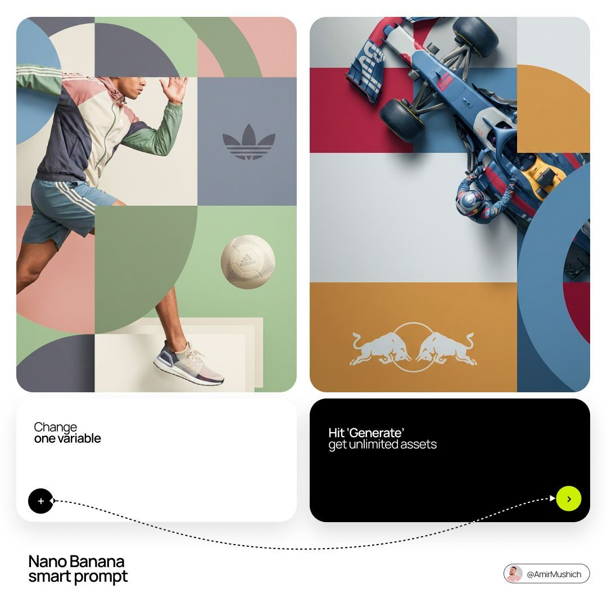

```text
[BRAND NAME]. You are a world-class editorial designer.

STEP 1, DYNAMIC SUBJECT LOGIC:
- Subject pick: independently study [BRAND NAME] and choose the right hero subject.
- Sandwich layering: weave the subject through the background shapes. Parts of the car or figure must sit hidden behind geometric blocks, while other parts (wheels, limbs, props) overlap in front of those blocks to fake real 3D depth.

STEP 2, GRID & GEOMETRY:
- Layout: a clean 2x2 grid composition.
- Overlays: drop large bold geometric arcs and circles on top of the grid.
- Visual balance: place one iconic product prop (a floating key fob for cars, a ball for sports, etc.) in its own quadrant to counterweight the subject.

STEP 3, SOPHISTICATED MUTED PALETTE:
- No aggressive neon, no oversaturated colors.
- Pull [BRAND NAME]'s core colors and shift them into a "sophisticated muted" range. Use desaturated, earthy, dusty versions of the brand colors (dusty rose instead of hot pink, sage green instead of bright mint, slate blue instead of royal blue).
- Finish: matte flat color blocks, zero gradients.

STEP 4, PHOTOGRAPHY & LIGHTING:
- Subject style: high-end commercial studio photography.
- Lighting: soft diffused studio light, gentle highlights, no harsh shadows.
- Integration: the subject must feel physically embedded into the graphic grid.

STEP 5, MINIMALIST BRANDING:
- Drop a clean single-color [BRAND NAME] logo dead-center on one background block. No tagline, just the iconic symbol.
```


---

## 例 496：水雕品牌 Logo 六宫格

**来源：** [@AIwithSynthia](https://x.com/AIwithSynthia/status/2062521441141088599)

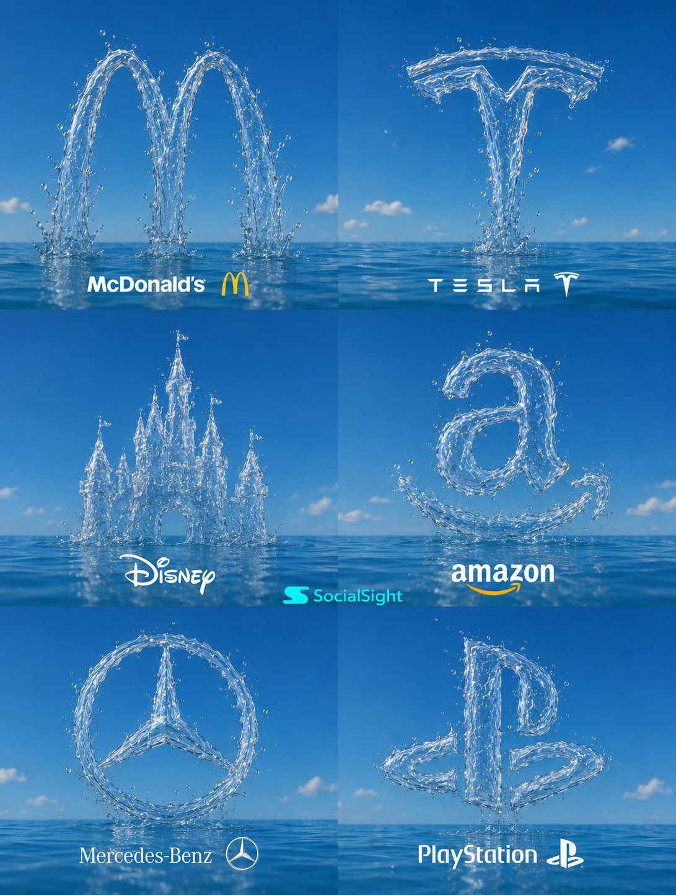

```text
Create a premium 3x2 grid collage of iconic global brand logos recreated entirely from dynamic water formations, floating above a crystal-clear ocean under a vibrant blue sky. Each panel features a different logo sculpted from realistic transparent water, with detailed splashes, droplets, reflections, refractions, and flowing liquid textures. The water forms should look physically accurate, elegant, and instantly recognizable while remaining made completely of water.
```


---

## 例 510：Bichon Shop 拟物 App 图标

**来源：** [@iamaiistudio](https://x.com/iamaiistudio/status/2071923809788285125)

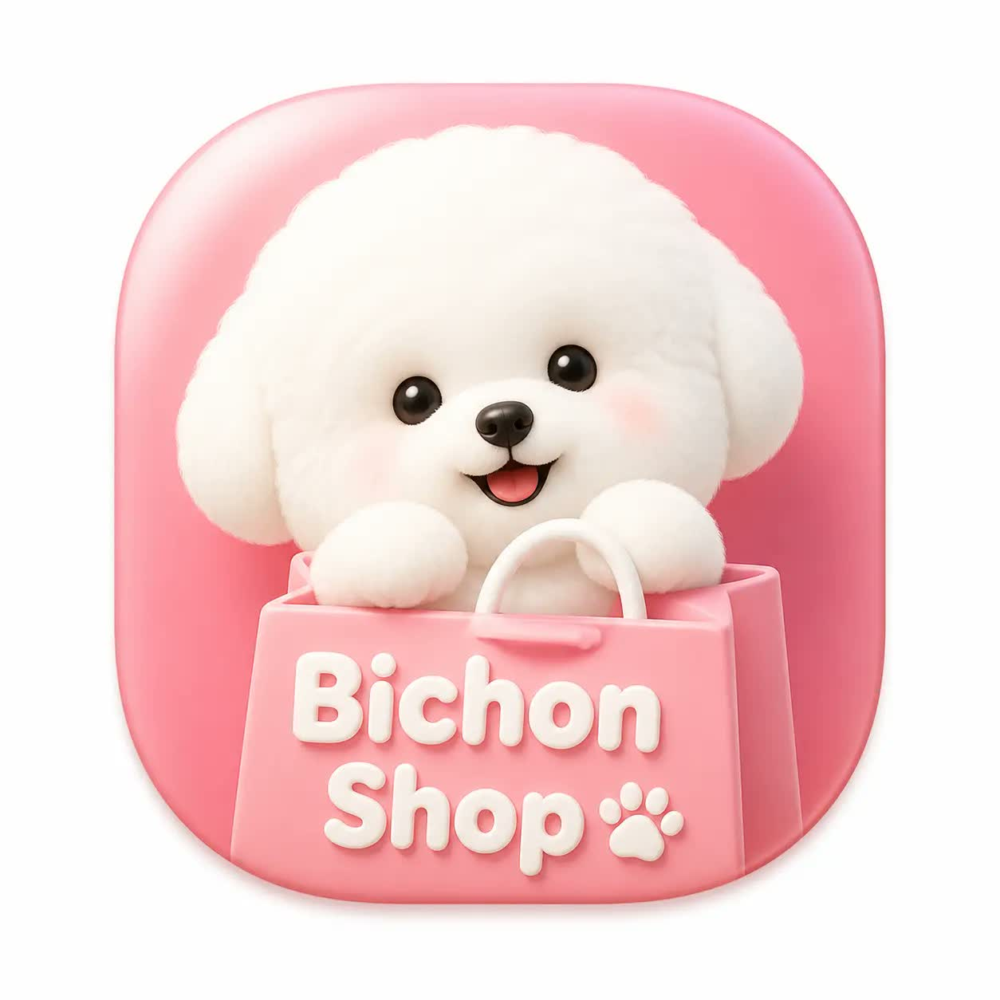

```text
A macOS app icon for an app named 'Bichon Shop'. A single squircle icon with smooth continuous rounded corners, centered on a white canvas with padding, occupying about 80% of the canvas. Modern light skeuomorphic macOS App Store style. Only one icon.
```


---

## 例 516：工业橡胶管品牌造型渲染

**来源：** [@Just_sharon7](https://x.com/Just_sharon7/status/2077034244988150062)

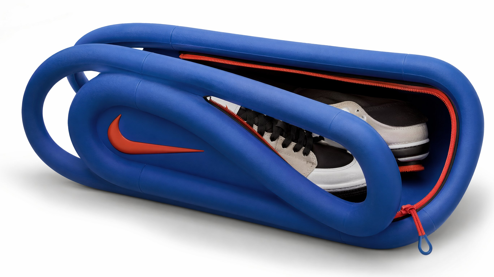

```text
Create an ultra-detailed hyper-realistic 3D render of {Object} , formed from thick industrial rubber tubing bent into the exact shape of the design, flexible yet dense structure, smooth rounded contours, subtle matte finish, realistic elastomer texture, faint molded seam lines, soft tension at each curve, authentic material compression and stretch behavior, slightly grippy surface quality, engineered object realism, colored using the authentic official brand color palette of [brand], faithful brand-matching hues applied across the tubing, accurate color blocking that follows the original logo design, premium studio product photography aesthetic, isolated on a pure white seamless background, soft diffused studio lighting, realistic contact shadow, macro detail, razor-sharp focus, photorealistic, 8k, 16:9, no watermark, no extra text.
```


---

## 例 517：Sitcom Intro Storyboard Sheet

**来源：** [@KimAkiyama81](https://x.com/KimAkiyama81/status/2059390326578511931) / [awesome-gpt-image-2-prompts](https://github.com/EvoLinkAI/awesome-gpt-image-2-prompts)

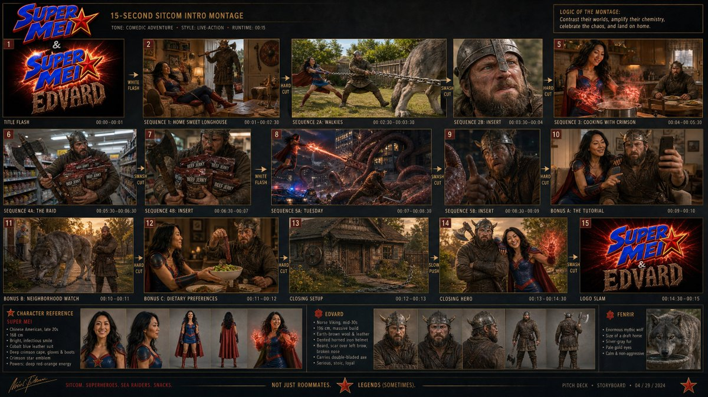

```text
Create a professional film production storyboard for a 15-second sitcom intro montage in a premium pitch deck presentation. Use multi-panel storyboard sheet layout, cinematic 16:9 framing per panel, clean panel borders, shot descriptions beneath each frame, timing notes, and transition indicators between panels. Maintain strict character consistency for Super Mei, Edvard, and Fenrir across all panels. Include a complete sequence of title flash, living room, backyard walkies, kitchen powers, convenience store raid, monster battle, bonus domestic comedy beats, closing hero shot, and logo slam. Visual style: cinematic sitcom, high-budget live-action network comedy, production-ready fidelity, not animated or illustrated.
```


---

## 例 518：Graphite Coffee-Shop Storyboard

**来源：** [@insmind_com](https://x.com/insmind_com/status/2063252153612017766) / [awesome-gpt-image-2-prompts](https://github.com/EvoLinkAI/awesome-gpt-image-2-prompts)

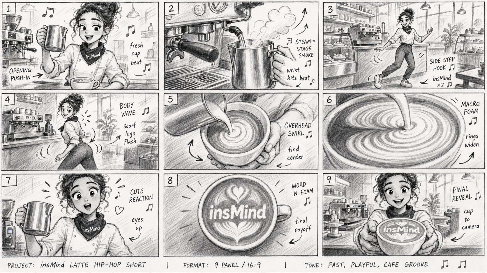

```text
Create a rough black-and-white graphite pencil storyboard in a 3x3 grid, nine 16:9 panels, with hand-drawn borders, panel numbers, motion arrows, music notes, and handwritten director notes.

Storyboard for a premium animated coffee-shop hip-hop commercial for insMind. Keep the same young female barista throughout: expressive eyes, high messy bun with loose curls, white barista shirt with tiny pale-blue details, black neck scarf with a small insMind logo, dark fitted trousers, white flat shoes. Warm modern cafe interior, espresso machine, wooden counter, pastry case, large windows, soft daylight.

Show these beats: opening push-in with the barista singing, steam wand frothing milk like stage smoke, wide hip-hop side-step, body wave with scarf logo visible, overhead latte pour, macro foam rings, delighted reaction, top-down latte art spelling “insMind”, and final hero reveal as she offers the cup to camera.

Use rough pencil lines, grayscale shading, sketch texture, cinematic storyboard composition, expressive unfinished production-board style. Avoid polished color render, photorealistic stills, vector art, extra characters, subtitles, UI, or unreadable brand spelling.
```


---

## 例 519：Chrome Logo Editorial System

**来源：** [@iamaiistudio](https://x.com/iamaiistudio/status/2063644125510217787) / [awesome-gpt-image-2-prompts](https://github.com/EvoLinkAI/awesome-gpt-image-2-prompts)

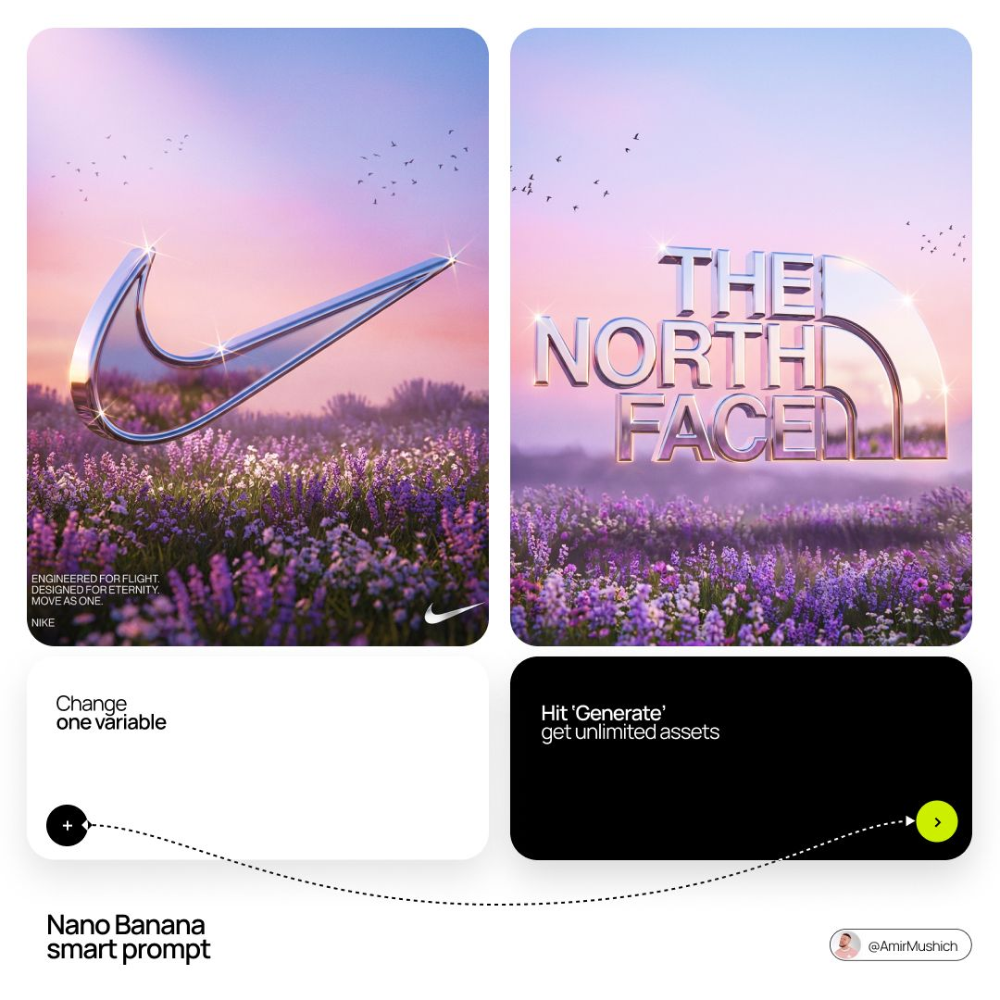

```text
prompt:

[BRAND NAME]. You are a Senior 3D Product Visualization Artist and Cinematic Art Director specializing in luxury brand key visuals for high-end editorial and streetwear campaigns.

PHASE 1: LOGO SUBJECT

Identify the official logo/logotype of [BRAND NAME]. Render it with maximum fidelity to the original silhouette, proportions, and geometry — no distortion, no stylization. Extrude the logo into a solid 3D object with depth approximately 15–20% of its height. Coat all surfaces — front face, side extrusion, beveled edges — in hyper-polished liquid chrome (reflectance 0.98, near-perfect mirror). Apply full ray-traced environment reflections so the logo mirrors the surrounding sky gradient, flower field, and light sources. Moderate bevel radius on all hard edges to catch sharp specular highlights. Add Subsurface Scattering on thin structural parts (fine lines, serifs, icon details) for a subtle inner glow. Place 4–8 prismatic 4-point star lens-flare sparkles at highest specular peaks — corners, tips, curved peaks. Organic distribution, not uniform. Zero matte surfaces. Zero plastic look. The entire logo must read as cast from liquid silver.

PHASE 2: ENVIRONMENT & BACKGROUND

Background: wide cinematic landscape at golden-lilac hour (just after sunset). Dense flower field fills the lower third — lavender and white wildflowers with realistic micro-texture and subtle wind motion-blur on far clusters. Middle ground fades to soft purple-grey bokeh. Sky gradient: warm blush rose ( at horizon through lilac ( to cool powder blue ( at top. Add 3–5 silhouetted bird clusters in upper quadrants. Volumetric atmospheric haze on the horizon. Shift the environment's color palette to reflect [BRAND NAME]'s iconic brand identity — introduce the brand's signature hue as a tonal wash in the sky gradient or dominant flower color. The environment must feel art-directed specifically for this brand.

PHASE 3: COMPOSITION & LAYOUT

Format: 1:1 square. Chrome logo centered horizontally at vertical midpoint, monumental scale spanning 65–80% of frame width. Subtle 2–4 degree forced perspective tilt for dynamic energy without distorting logo recognition. Bottom edge of the logo grazes or slightly overlaps the top of the flower field, integrating the 3D object naturally. Logo casts a soft diffused shadow into the flowers. Lower-left corner: 2–3 lines of micro-copy in clean white sans-serif at minimal optical size — a poetic 3-line brand statement relevant to [BRAND NAME]'s heritage and aesthetic. Bottom-left: "[BRAND NAME]" in small caps logotype label. Bottom-right: a secondary flat 2D chrome version of the same logo as a finishing mark.

PHASE 4: LIGHTING

Primary: large soft area light from upper-left simulating post-sunset overcast sky — fully diffused, no hard shadows, 5800K with lilac tint overlay. Secondary: warm 3200K rim light grazing bottom and side edges from behind — golden separation halo between object and field. Global Illumination enabled — chrome logo realistically bounces and absorbs landscape ambient color. The field's purple tones should be faintly visible in the lower reflective surfaces. Volumetric god rays faintly visible through any logo negative space or cutouts.

TECH SPECS

Octane Render aesthetic. Ray Tracing: 16+ bounces. Depth of Field: f/11 equivalent — full logo sharp, far background in soft bokeh only. Tone mapping: lifted blacks, compressed highlights, filmic S-curve. Color grade: desaturated midtones, preserved pastels, cool shadow tones. Film grain: subtle (ISO 200 equivalent). Chromatic Aberration: 0.2–0.3px on peripheral logo edges only. Anti-aliasing: maximum. No AI-plastic normals. No smooth uniform shading. Microscopic surface imperfections on chrome required — micro-scratches, 0.5% roughness noise map. Mood: luxury brand retrospective editorial for Highsnobiety or AnOther Magazine.
```


---

## 例 520：Modular Brand Icon System

**来源：** [@iamaiistudio](https://x.com/iamaiistudio/status/2069150843430215859) / [awesome-gpt-image-2-prompts](https://github.com/EvoLinkAI/awesome-gpt-image-2-prompts)


```text
Design a unified set of charming, expressive icons for [BRAND NAME], a [BRAND TYPE/INDUSTRY] company. The visual style should be [STYLE KEYWORDS: e.g., rounded, 3D, flat, hand-drawn, minimal] paired with a [COLOR STYLE: vibrant, pastel, gradient, monochrome] color scheme. Apply [DESIGN TRAITS: soft shadows, bold outlines, subtle textures, glow, etc.] to achieve a warm and contemporary look. Keep a consistent visual system across all icons using shared grids, proportions, and design language. The icon set should cover [LIST OF FEATURES/FUNCTIONS]. Prioritize sharp legibility, well-balanced spacing, and scalability across UI, apps, and branding contexts.
```


---

## 例 521：Coffee Girl By the River

**来源：** [@MrGafish](https://x.com/MrGafish/status/2055912487493726603) / [awesome-gpt-image-2-prompts](https://github.com/EvoLinkAI/awesome-gpt-image-2-prompts)

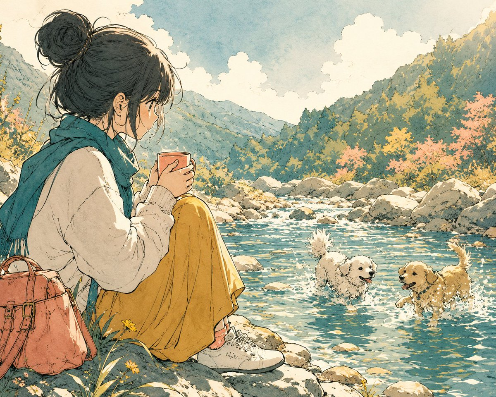

```text
尝试一个固定模式的 gpt image 2  提示词结构,一个近景，一个中景

生成一张图片：

主体：一个端着咖啡的二次元女孩，正坐在河边，望着河里正在玩水的两只小狗
场景：山谷里的一条小河，清空万里，天上飘着几片白云
构图：中景，主体位于画面左侧，50mm 镜头，浅景深，背景轻微虚化
光线：柔和的阳光从右上角照入
风格：手绘线稿风格插画
色彩：孔雀蓝、芥末黄、珊瑚粉、象牙白，简约而沉稳的配色方案
细节：小河里的水流泛着阳光的反射
氛围：温馨的日常氛围
画质：简约而圆润的形态，保留墨水质感的粗犷线条
避免：文字、水印、logo、畸形结构
```


---

## 例 522：Scandinavian Branding Mockup

**来源：** [@iamaiistudio](https://x.com/iamaiistudio/status/2064469666521829435) / [awesome-gpt-image-2-prompts](https://github.com/EvoLinkAI/awesome-gpt-image-2-prompts)

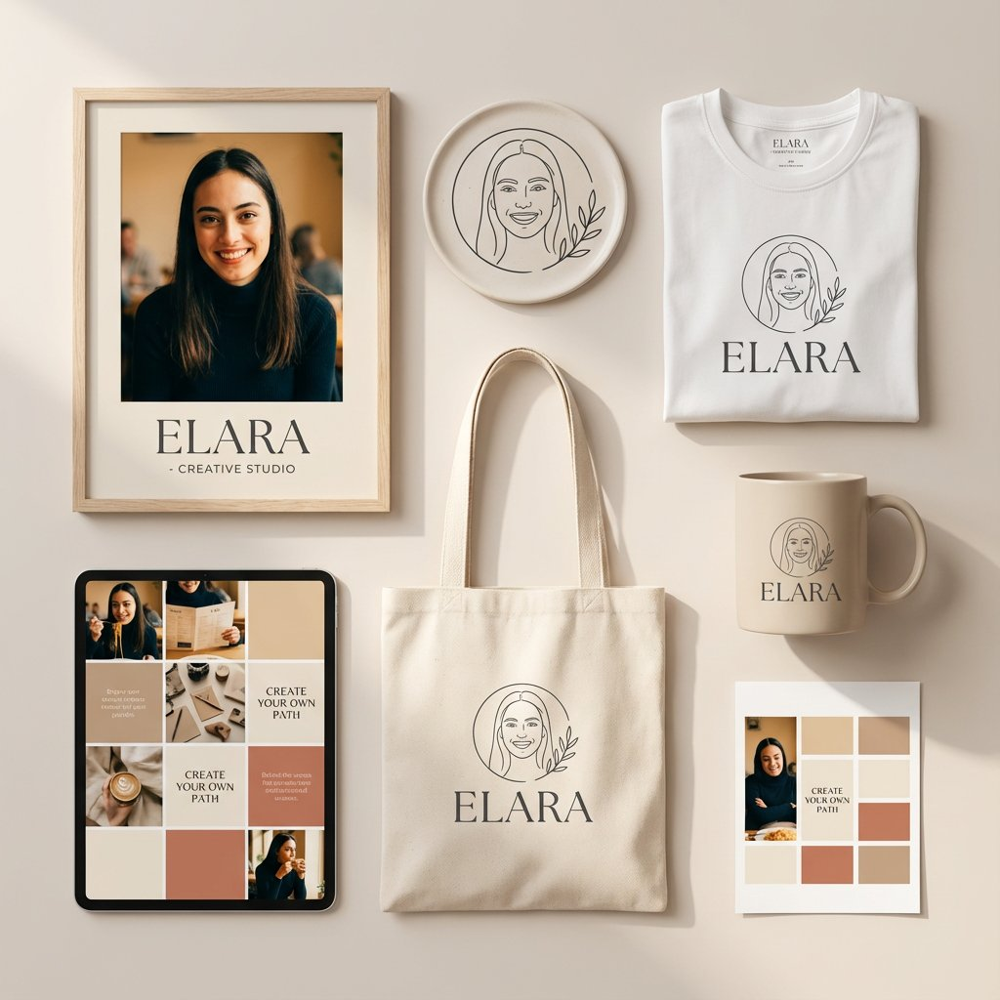

```text
://t.co/keLYasNByE

prompt:

Minimal personal branding identity mockup for a female entrepreneur or creator, displayed on a soft neutral background. Includes a framed portrait with elegant typography, a circular logo with a hand-drawn line-art face illustration, and branded merchandise: white tee, tote bag, and ceramic mug with the same logo print. Grid-style social media layout showing portrait photography, behind-the-scenes content, quote tiles, and solid color brand blocks in warm beige, cream, and muted terracotta. Soft natural lighting, premium lifestyle photography, Scandinavian-inspired aesthetic, balanced editorial composition, consistent brand typography, high-end creative agency presentation.

#AIart #GPTImage2
```


---

## 例 523：Food Ad Layered Dessert

**来源：** [@iamaiistudio](https://x.com/iamaiistudio/status/2064424485328204244) / [awesome-gpt-image-2-prompts](https://github.com/EvoLinkAI/awesome-gpt-image-2-prompts)

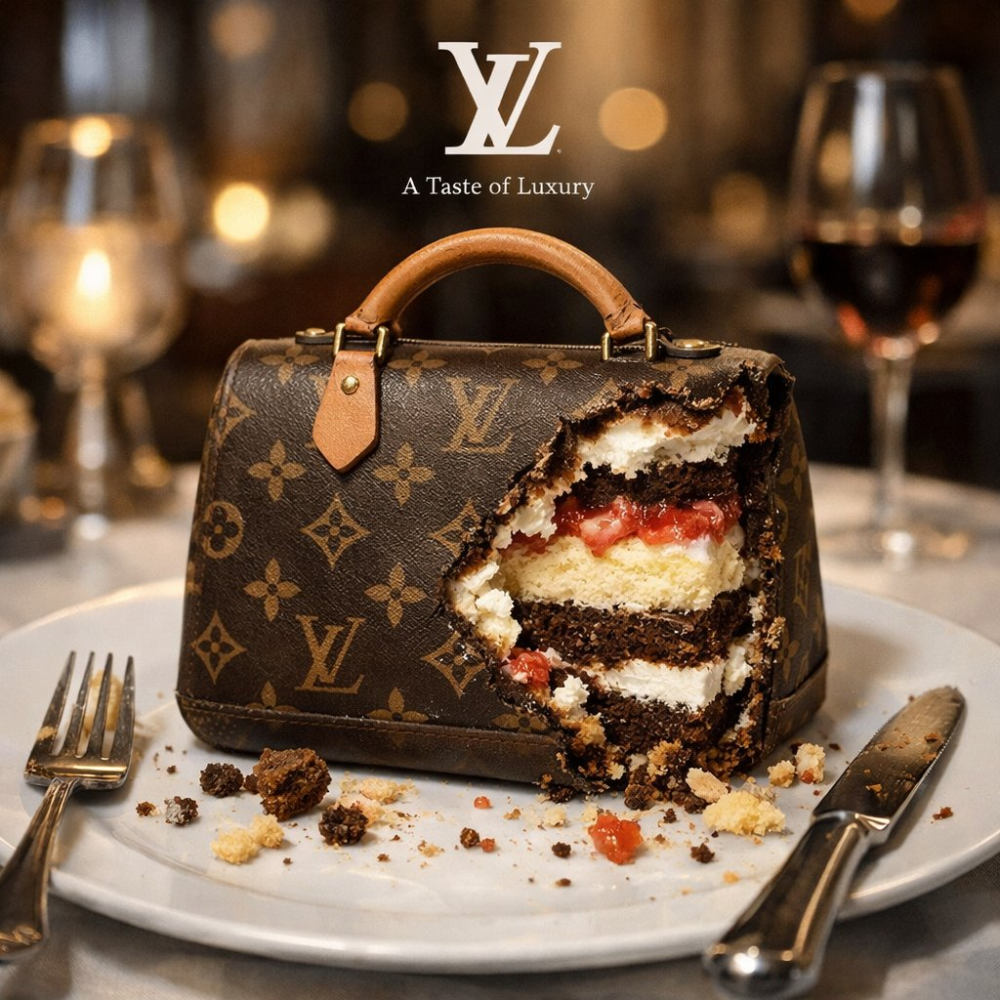

```text
://t.co/C2JI1bwCCZ

prompt:

A partially bitten realistic classic [brand] product resting on a plate, exposing layered dessert fills inside, cake crumbs scattered around, a used fork and knife lying nearby, against a softly blurred high-end restaurant background, a small white brand logo positioned at the top of the image with a fitting brand slogan in tiny text just beneath it.

#AIart #GPTImage2
```


---

## 例 524：Biomechanical Organ Product Render

**来源：** [@iamaiistudio](https://x.com/iamaiistudio/status/2066069842407416126) / [awesome-gpt-image-2-prompts](https://github.com/EvoLinkAI/awesome-gpt-image-2-prompts)

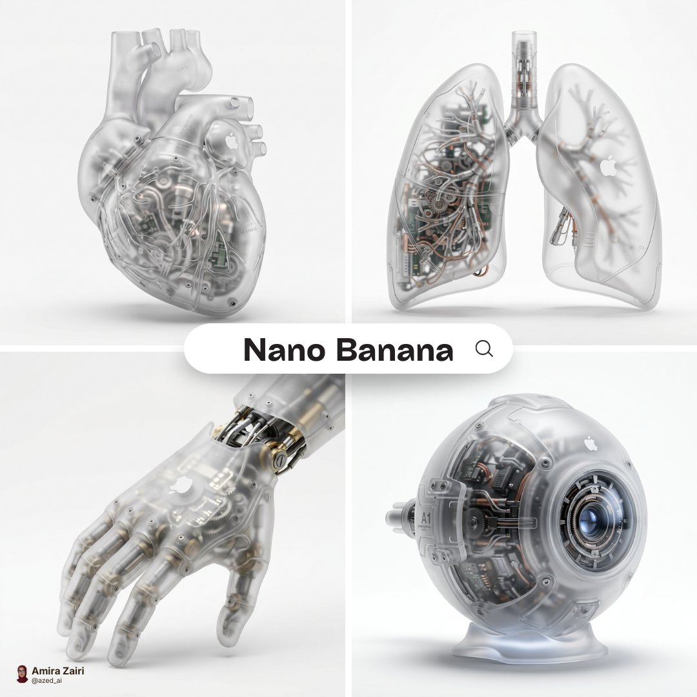

```text
Ultra-realistic 3D anatomical human [organ] crafted from semi-translucent frosted polycarbonate with a milky matte finish that softly diffuses light. Features industrial injection-molded details, subtle micro-texture, and rounded edges with precise manufacturing seams. Interior reveals mechanical components in place of organic tissue — micro gears, pistons, circuitry, and engineered chambers seen through the translucent shell with a soft blur. A minimal white Apple logo is subtly embedded on the surface, understated and not overpowering. Diffused studio lighting, realistic plastic light refraction, gentle shadow underneath, centered framing, pure white background, ultra-detailed futuristic biomechanical render, 1:1 aspect ratio.
```


---

## 例 525：Monochrome Hermes-Inspired Avatar

**来源：** [@jiajia232016](https://x.com/jiajia232016/status/2048044100793032976) / [awesome-gpt-image-2-prompts](https://github.com/EvoLinkAI/awesome-gpt-image-2-prompts)

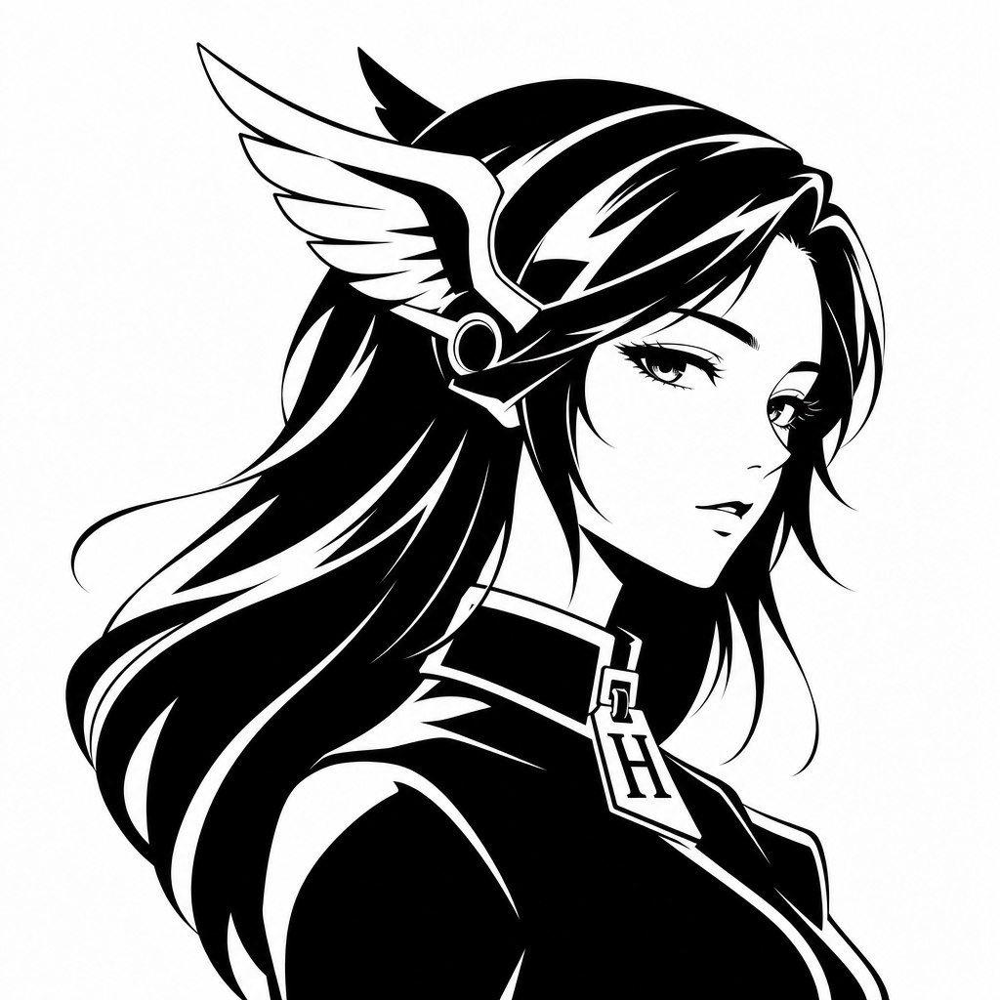

```text
Create a minimalist black-and-white vector avatar logo of a mythic anime woman shown in elegant side profile facing right, cropped from the chest up on a plain white background. Give her long flowing {argument name="hair color" default="black"} hair with bold white highlight streaks and smooth graphic shapes, rendered as high-contrast ink silhouette art with clean sharp edges. She wears a winged headpiece reminiscent of Hermes or a messenger god helmet, with one large white feathered wing visible on the side of her head and a circular metallic earpiece detail. Dress her in a sleek high-collar garment with a luxury-fashion feel, and hang a prominent pendant or zipper pull shaped like the letter {argument name="monogram letter" default="H"} at the center of the collar. The face is intentionally obscured by a centered soft gray rectangular blur block covering most facial features, creating a censored anonymous profile-image effect. Overall style: luxury brand avatar, fashion logo, anime-inspired goddess silhouette, monochrome vector emblem, smooth negative-space highlights, balanced composition, modern and iconic, suitable for a social media profile picture.
```


---

## 例 526：Cyberpunk Fashion Portrait

**来源：** [@ChillaiKalan__](https://x.com/ChillaiKalan__/status/2050453739430195320) / [awesome-gpt-image-2-prompts](https://github.com/EvoLinkAI/awesome-gpt-image-2-prompts)


```text
GPT Image 2 on @SocialSight Prompt: Futuristic portrait of a young woman facing camera, wearing a transparent neon jacket with glowing green and orange edges, large illuminated logo on chest, black inner outfit, sleek sunglasses, soft smoke light trails behind, dark teal background, cyberpunk fashion campaign, ultra-realistic textures, cinematic lighting, sharp focus, luxury sportswear branding style, 8k Style keywords: neon edges, glowing logo, fashion campaign, high-end branding, moody lighting
```


---

## 例 527：Luxury Golf Editorial Collage

**来源：** [@AIwithkhan](https://x.com/AIwithkhan/status/2051275667354890345) / [awesome-gpt-image-2-prompts](https://github.com/EvoLinkAI/awesome-gpt-image-2-prompts)

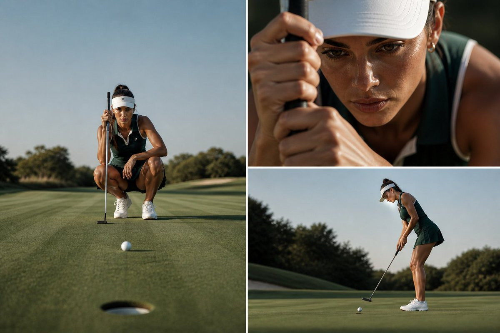

```text
Three-image luxury golf editorial collage featuring a professional female golfer on a pristine putting green, soft natural daylight, minimalistic and high-end sports photography style, ultra-realistic, cinematic color grading, clean composition, no text, no logos
Layout: asymmetrical grid (one large frame + two smaller frames)
Frame 1 (Left – Hero Wide Shot):
Full-body low-angle shot of the golfer crouching and lining up a putt, golf ball in foreground near the hole, strong leading lines on the green, balanced composition, calm and focused posture, expansive sky background
Frame 2 (Top Right – Close-Up Detail):
Extreme close-up of her face and hands gripping the putter, intense concentration, visible skin texture and slight sweat glow, shallow depth of field, blurred background
Frame 3 (Bottom Right – Action Shot):
Side angle of golfer completing the putt, smooth follow-through, golf ball rolling across the green, natural motion feel, soft shadows, realistic lighting
Style Keywords:
luxury sports campaign, editorial photography, Nike-style aesthetic, muted green tones, sharp focus, 85mm lens look, depth of field, cinematic lighting, premium composition, 4K, hyper-realistic
```


---

## 例 528：Korean Beauty Ultra-Realistic Portrait

**来源：** [@ZephyraLeigh](https://x.com/ZephyraLeigh/status/2057315596862370103) / [awesome-gpt-image-2-prompts](https://github.com/EvoLinkAI/awesome-gpt-image-2-prompts)

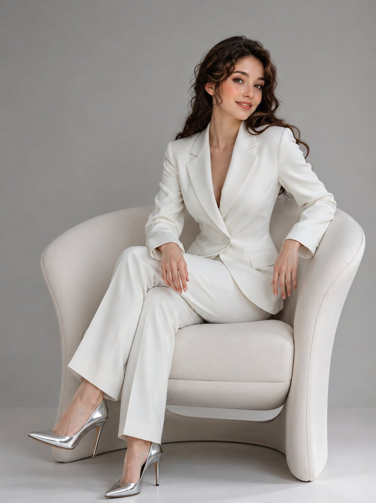

```text
low quality, blurry, distorted anatomy, extra fingers, bad hands, unrealistic smile, messy hair, cartoon, anime, watermark, logo, text, noisy image, oversaturated colors, poorly drawn face, low resolution, bad proportions. 1744x2336
```


---

## 例 529：Negative Prompt Portrait Template

**来源：** [@ZephyraLeigh](https://x.com/ZephyraLeigh/status/2057633608459059272) / [awesome-gpt-image-2-prompts](https://github.com/EvoLinkAI/awesome-gpt-image-2-prompts)

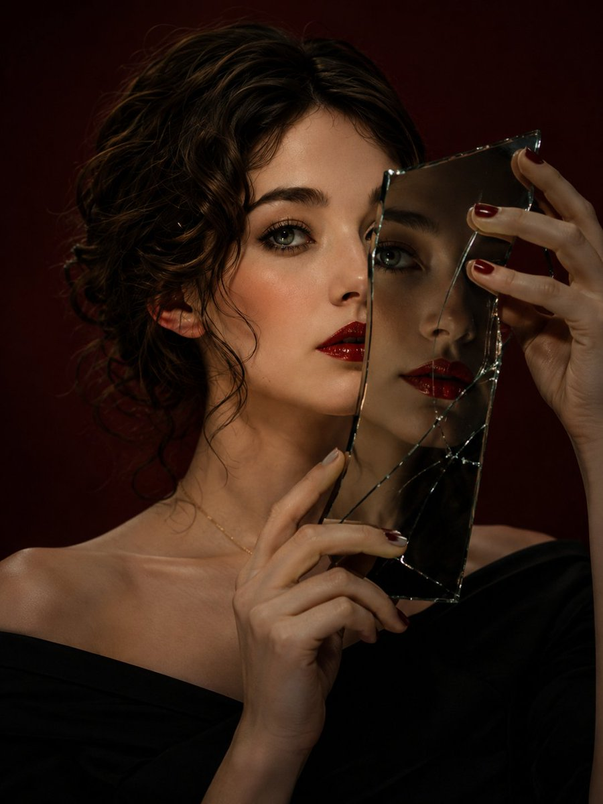

```text
low quality, blurry, distorted face, extra fingers, bad hands, duplicate facial features, unrealistic reflection, cartoon, anime, watermark, logo, text, noisy image, oversaturated colors, poorly drawn eyes, bad anatomy, broken proportions, low resolution.
```


---

## 例 530：沙滩场景丰腴人物写真

**来源：** [@Adam38363368936](https://x.com/Adam38363368936/status/2057402803954631086) / [awesome-gpt-image-2-prompts](https://github.com/EvoLinkAI/awesome-gpt-image-2-prompts)

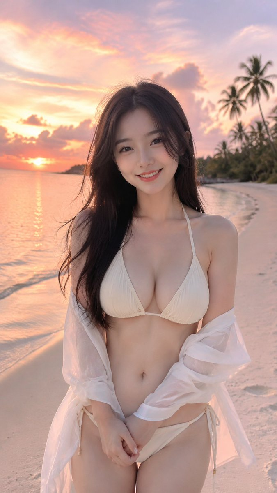

```text
写实风格，超高精细。20岁出头的成年女性，黑色自然长发，透明感的肌肤，可爱而华丽的面容，带着自然且略带羞涩的微笑。背景是南国度假地的黄昏海滩，白沙、平静的海面、淡粉色与橙色的天空，远景是椰子树。女性穿着米白色的优雅简约比基尼，肩上轻轻披着一件白色薄纱衬衫。她站在沙滩上，双手轻轻交叠在身前，对着镜头露出灿烂的笑容。充满幸福感和余韵的氛围。人物位于画面中央，占据较大比例，并留出少许黄昏天空的空白。不添加任何文字或标志。注重清纯、透明感、华丽和特别感。这是一张高完成度、充满余韵的照片。
```


---

## 例 531：Burger hero image plus 9-cell ad storyboard

**来源：** [@Gdgtify](https://x.com/Gdgtify/status/2049449869530775877) / [awesome-gpt-image-2-prompts](https://github.com/EvoLinkAI/awesome-gpt-image-2-prompts)

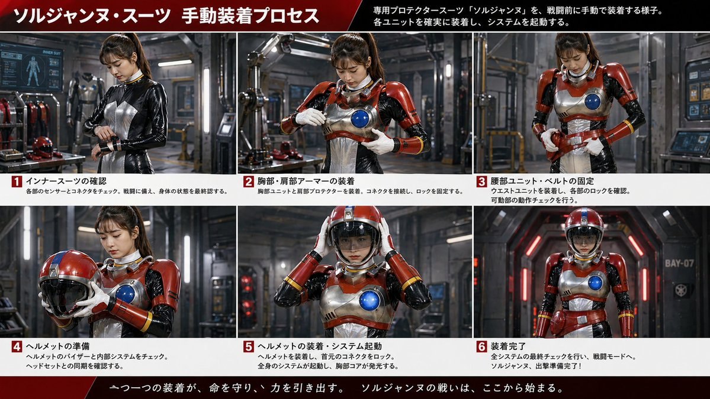

```text
Prompt 1: Create a cinematic hero image of a gourmet cheeseburger on a dark stone surface with glossy brioche bun, melted cheese, crisp lettuce, tomato, grilled patty, sauce, realistic texture, appetizing steam, warm side light, shallow depth of field, premium food commercial style, no text/logos/watermark.

Prompt 2: Create a 9-cell hybrid keyframe-to-transition storyboard sheet for a 15-second gourmet burger ad, moving from empty surface to ingredient assembly to final macro hero shot. Use large S cells and smaller T cells, motion arrows, ghosted ingredient positions, steam, sauce trails, and camera push-in icons. Style: premium food commercial, warm lighting, rich texture, appetizing, cinematic, minimal labels only. No logos, no watermark.
```


---

## 例 532：Floral Serum Product Shot

**来源：** [@iamaiistudio](https://x.com/iamaiistudio/status/2067413876564795743) / [awesome-gpt-image-2-prompts](https://github.com/EvoLinkAI/awesome-gpt-image-2-prompts)

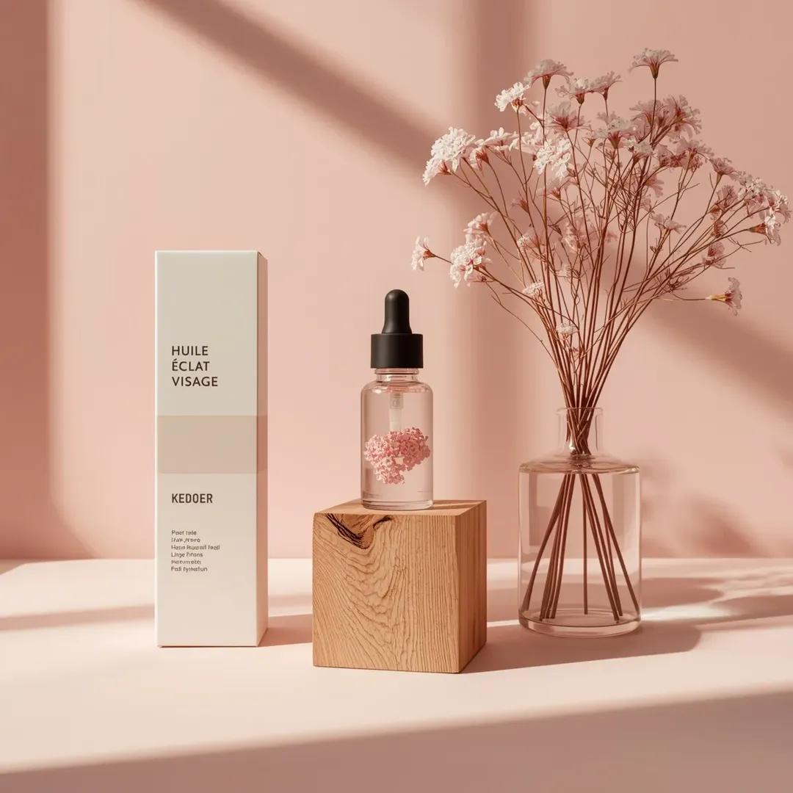

```text
Minimalist studio product photography, a small transparent glass facial oil dropper bottle with a black rubber pipette cap, containing pale pink serum with suspended dried pink floral elements, centered on a natural raw wooden block with visible grain and split texture. Tall matte white skincare box on the left labeled "HUILE ÉCLAT VISAGE" with clean black typography and subtle logo near the bottom. Clear cylindrical glass vase on the right filled with water and thin stems of dried pink gypsophila extending upward. Composition rests on a smooth matte pastel pink surface against a matching seamless pink studio background. Strong directional soft light from the left casts long natural-style shadows of the flowers onto the background, with gentle highlights on the glass, subtle reflections on the serum bottle, and soft texture on the wooden block. Straight-on tabletop camera angle, all objects in sharp focus. Color palette: blush pink, soft rose, warm light wood, clean white, transparent glass. Premium Scandinavian minimalist skincare aesthetic, ultra-realistic, studio-grade.

full prompt:
```


---

## 例 533：Based on the video content and this current frame, use GPT to generate a YouT...

**来源：** [@chatcutapp](https://x.com/chatcutapp/status/2047228386117128475) / [awesome-gpt-image-2-prompts](https://github.com/EvoLinkAI/awesome-gpt-image-2-prompts)

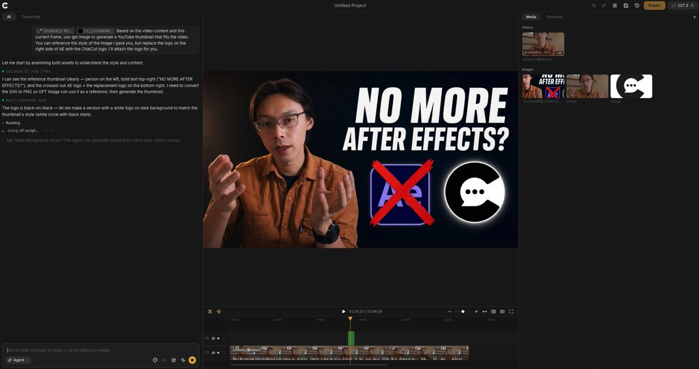

```text
Based on the video content and this current frame, use GPT to generate a YouTube thumbnail that fits the video. You can reference the style of the image I gave you, but replace the logo on the right side of AE with theChatCut logo. I'll attach the logo for you.
```


---

## 例 534：Hidden Logo Landscape Illusion

**来源：** [@iamaiistudio](https://x.com/iamaiistudio/status/2066191259354689714) / [awesome-gpt-image-2-prompts](https://github.com/EvoLinkAI/awesome-gpt-image-2-prompts)

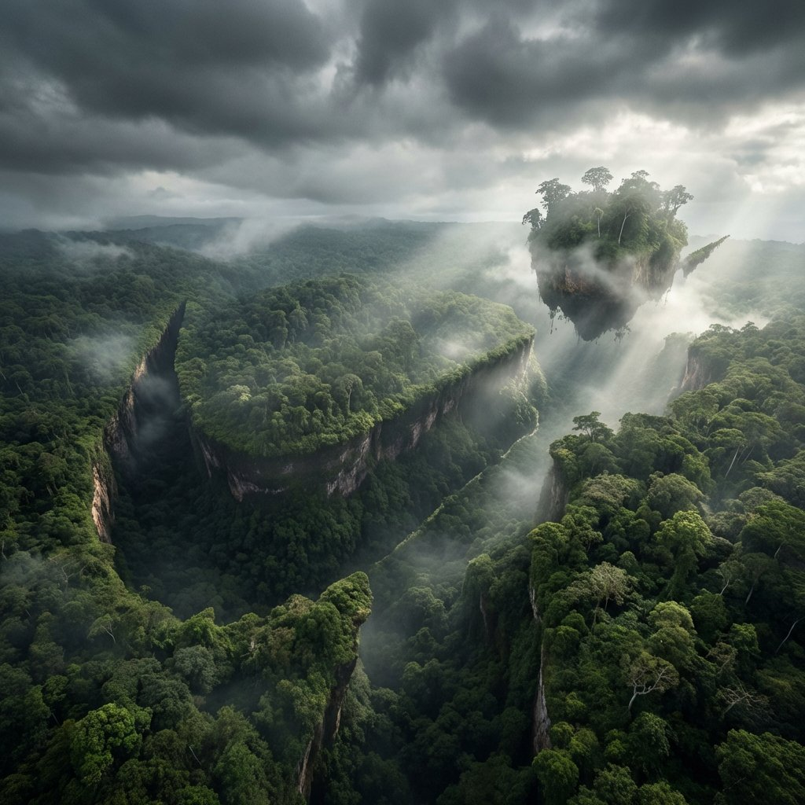

```text
Create a subliminal advertising landscape photograph where a recognizable brand logo (like the Apple logo, Nike swoosh, or Batman symbol) is secretly embedded into a breathtaking natural environment (like snowy mountains, dense jungle, sand dunes, or ocean coastline).

The logo must be formed entirely by the physical geography of the terrain — NOT overlaid digitally. The main body of the logo appears as a carved void (a deep valley, cliff edge, or sharp color contrast in the terrain), while any disconnected elements (like Apple's leaf) float as a suspended island of rock and earth in the misty sky above.

Camera: wide aerial drone shot, landscape stretching vast and majestic across the frame.

Atmosphere: dramatic and moody — heavy swirling clouds, rolling mist through valleys, crepuscular god rays bursting through gaps in the clouds, defining the hidden silhouette.

Visual rule: at first glance it must look like a 100% authentic nature photo. The brand logo only emerges as an optical illusion (pareidolia) on second look. Edges must be slightly jagged and organic, shaped by real geological features like cliff faces and treelines — never perfect vector shapes.

Lighting: high contrast between dark shadowed valleys (dense forests) and bright snow or sunlit highlights. Sun partially hidden behind clouds or the floating landmass, backlighting the entire scene.

Mood: cinematic, majestic, subtly surreal.

Output: 1:1 square, photorealistic, National Geographic aerial photography aesthetic.
```


---

## 例 535：Fluorescent Foam Logo Hero

**来源：** [@iamaiistudio](https://x.com/iamaiistudio/status/2069135898265125326) / [awesome-gpt-image-2-prompts](https://github.com/EvoLinkAI/awesome-gpt-image-2-prompts)

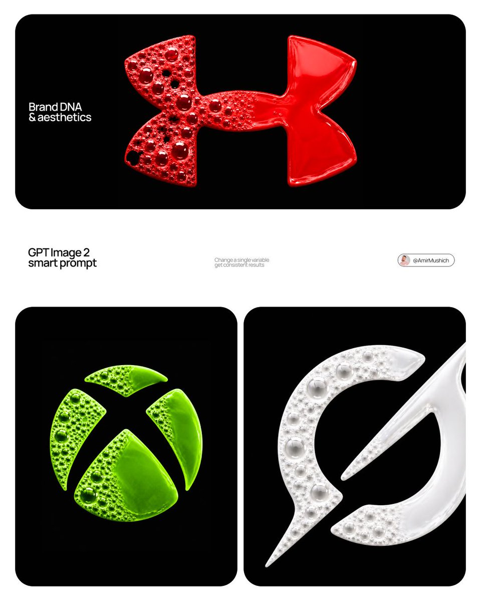

```text
[BRAND NAME] | [COLOR]

CORE RULE: The fluid mass must take the exact shape of the [BRAND NAME] logo — not a circle, not a blob, not an oval. The outer silhouette of the fluid IS the logo outline, identical to the canonical trademark. If you cover the bubble texture and look only at the silhouette, you must immediately recognize [BRAND NAME]. This is the single most important rule and overrides everything else.

Create a hero image as a Macro Fluid Photographer and CGI Art Director: the brand logo formed entirely from living fluorescent foam and bubble liquid — as if poured into a logo-shaped mold on a black surface, captured at peak bubble activity. References: macro fluid photography, fluorescent paint foam art, soap bubble macro photography.

PHASE 0: LOGO GEOMETRY IS LAW
Use the 100% canonical [BRAND NAME] trademark silhouette — every curve, angle, and proportion exactly as trademarked. This silhouette is the rigid mold. The fluid fills its interior. The outer boundary of the fluid mass IS the logo outline — precise and hard. Gaps in the logo design show pure black background. No container (no circle, oval, badge, or frame). Correct canonical upright orientation — not rotated, flipped, or tilted. Zero fluid, bubbles, or droplets outside the logo boundary. When fluid physics conflict with logo geometry — geometry wins always. Apply [COLOR] as the fluid foam color throughout in maximum fluorescent saturation.

PHASE 1: FLUID MATERIAL
The logo is filled with a single viscous fluid in two physical states simultaneously. NOT water — thick, surface-tension-dominant, like fluorescent soap foam or colored slime. Base: [COLOR] at maximum fluorescent saturation, self-luminous, UV-reactive quality. Tonal variation within [COLOR] only: bubble membrane walls 35-45% lighter (near-transparent); mid-thickness zones pure saturated [COLOR]; deep liquid pools 25-35% darker. Liquid surface: high gloss, wet, shiny, broad specular reflection. Foam membranes: lower gloss, subtle soap film iridescence.

PHASE 2: BUBBLE ARCHITECTURE
Full size hierarchy across foam zone only. Large anchor bubbles 10-18mm, 4-8 count. Medium 4-9mm, 15-25 count. Small 1.5-3mm, 30-50 count. Micro 0.5-1mm, 50-100+ count. Each bubble: physically accurate air sphere in thin colored membrane 0.1-0.3mm thick, semi-transparent. Dome highlight: bright white crescent arc in upper-left, 15-20% of dome surface, soft-edged, white. Burst holes: 3-8 irregular dark voids in foam zone only, never at logo boundary edges.

PHASE 3: DUAL-STATE CONTRAST
Left zone — foam state: dense chaotic foam with full bubble hierarchy, strictly within logo silhouette, no bubbles at or beyond the edge. Right zone — liquid state: smooth continuous mass, bubbles absent (max 2-3 micro at transition edge), high gloss with broad soft specular highlight toward upper-left. Transition zone: 8-15mm wide gradual transition at vertical center. Both foam and liquid sides terminate exactly at the canonical logo outline — clean edge, no ragged silhouette. NO splatter, droplets, spray, or tendrils beyond the boundary.

PHASE 4: LIGHTING
Primary: large softbox upper-LEFT at 20-30 degrees from vertical, 5500K neutral white. Left and upper-left surfaces brighter, right relatively darker. All bubble dome highlights in upper-left. Liquid zone specular toward upper-left. Micro-shadows from bubbles fall lower-right, 0.5-1mm. Secondary: 8-10% cool ambient from above. No fill from right, no rim light, no colored light.

PHASE 5: COMPOSITION
Background: absolute black  zero texture, zero noise. Aspect ratio 1:1. Logo occupies 60-70% of frame, centered. Camera: directly overhead, perfectly perpendicular, zero perspective distortion, zero rotation. Pure top-down macro. Sharp depth of field across entire surface.

PHASE 6: TECH SPECS
Houdini FLIP fluid simulation + Redshift/Octane or equivalent photorealistic CGI. Fluid simulation domain bounded by logo silhouette — cannot escape boundary. Real FLIP geometry per bubble, not texture map. Bubble membranes: thin-shell geometry, IOR 1.33, transmission 0.7-0.85, thin-film iridescence. Liquid zone: smooth FLIP mesh, roughness 0.02-0.05. Foam: fluorescent shader, emissive 0.05-0.1, SSS 2-4mm. Area light 80x80cm upper-left 20-30 degrees, 5500K. HDRI ambient 8-10% neutral gray. Ray tracing 12+ bounces, caustics on, sampling 2048+, max anti-aliasing. No film grain, no post-process.

FINAL CHECK: (1) Does the fluid silhouette exactly match the [BRAND NAME] logo? (2) Is it inside a container? If yes, regenerate. (3) Any fluid outside the boundary? If yes, regenerate. (4) Both foam and liquid states visible? If no, regenerate.
```


---

## 例 536：经典时尚杂志封面纯白针织衫少女画报

**来源：** [@CHAseUnre](https://x.com/CHAseUnre/status/2092771325387432339) / [OpenNana](https://opennana.com/awesome-prompt-gallery/classic-editorial-fashion-magazine-cover-girl-white-knit)

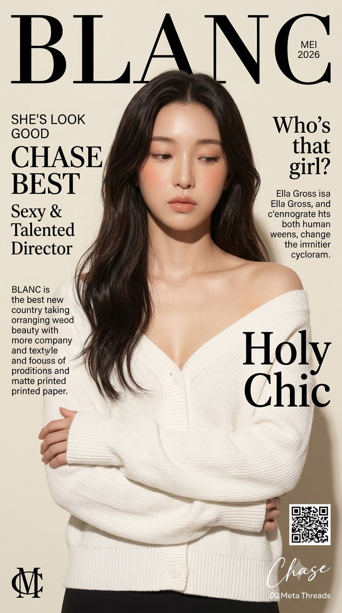

```text
[Character] Image 1 [Signature] A small Meta-operated Threads logo in the bottom right corner, with "CHAse" written in small white handwritten font like a signature.

[Character's Pose and Expression]
Pose and Composition: Character placed in the center of the frame, a frontal half-body ~ medium waist-up shot (Medium Waist-up Shot) cover composition filled with emotional editorial typography surroundings.
Pose: Arms gently wrapped around herself, head slightly lowered, a lazy and calm pose with eyes carelessly cast towards the bottom right.
Expression: Not looking straight ahead, but a hazy and contemplative expression deeply gazing towards the bottom right. Showcasing both girlish purity and an arrogant high-fashion aura at the same time.

[Character Clothing and Props]
Clothing: Wearing a warm pure white V-neck off-shoulder knit top / cardigan that softly reveals the chest and shoulder lines.
Props: No redundant accessories, the warm feeling of the simple white knit harmoniously blends with the magazine layout elements.

[Character Hairstyle and Makeup Details]
Hairstyle: 5:5 natural center part, flowing voluminously towards the shoulders and chest line, a long natural wavy hairstyle in dark brown / deep linen tones. The natural wavy texture of the hair ends wraps around the upper body lines.
Makeup: Smooth and transparent cool-warm balanced skin base that perfectly hides blemishes, paired with warm peach coral blush on both cheeks. Eyes decorated with soft brown smoky shadows, and lips finished with a moist nude peach coral lip that retains natural texture.

[Lighting and Light Direction]
Light Source: Gentle and soft studio diffused ambient light (Soft Diffused Key Light) seeping in from the top front of the character.
Effect: Warm light forms soft specular highlights on the character's forehead, bridge of the nose, cheeks, and the white knit fabric, creating an overall gentle and high-end pictorial light and shadow effect.

[Texture and Tonal Atmosphere (Core Texture Details)]
Colors: Warm cream ivory (Cream Ivory) of the background and clothing, heavy deep navy (Deep Navy) of the typography, dark brown of the hair color, and gentle pink peach tones of the skin, forming a "Classic Editorial Fashion" color atmosphere with high-end contrast.
Texture Details (Special Analysis):
Knit Fabric Texture: Fluffy and rough fine-knit texture and small wrinkle textures on the surface of the white knit fabric.
Magazine Paper Texture: Clean texture unique to matte and neatly finished printed paper pictorials.
Skin and Hair Texture: Smoothly presented skin unevenness and fine textures of the three-dimensionally drifting long wavy hair strands.

[Film and Camera Lens Depth of Field, Angle]
Composition and Angle: Horizontal frontal cover perspective matching the character's eye level (Eye-level Shot).
Features: Deep depth of field and sharp focus (Sharp Focus) suitable for magazine cover design, capturing the character's facial features, hair texture, edges of the layout fonts, and the QR code detail lines in the bottom right corner until clearly presented.

[Background and Studio Layout Elements]
Space: A clean and gentle cream ivory toned studio horizon background.
Magazine Layout:
Top: Heavy serif font "BLANC" title logo, and vertical "MEI 2026" text inserted in the "C".
Left side: "SHE'S LOOK GOOD", large serif "CHASE BEST", "Sexy & Talented Director", "BLANC" and the description paragraph of the group BLANC.
Right side: "Who's that girl?", Ella Gross biography paragraph, large tag "Holy Chic".
Bottom Right: White and black QR code overlay for digital linking.
Bottom Left: Print symbol icon placement.
```


---
