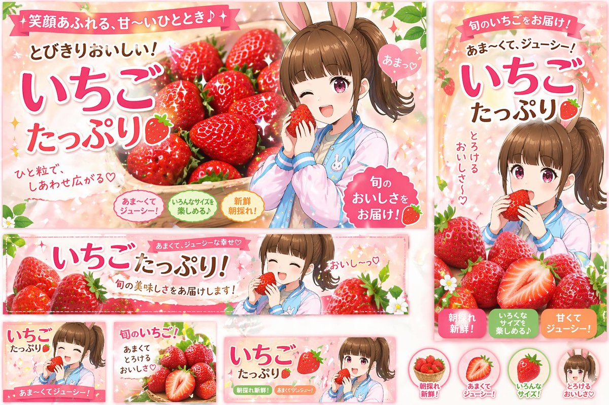
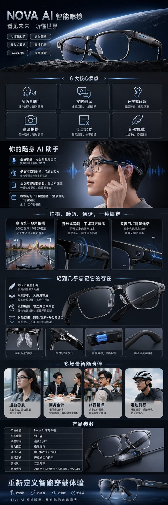
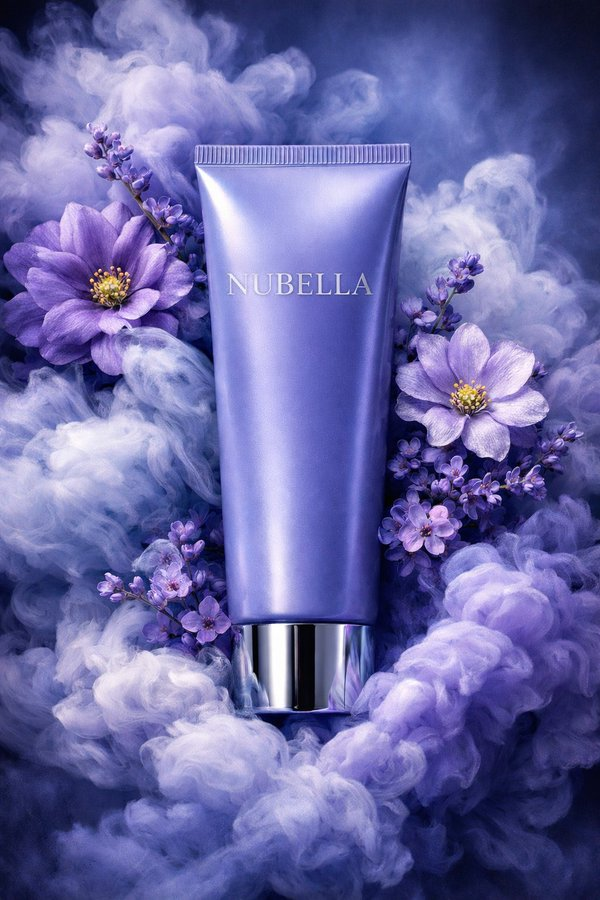

# 商品与电商 — 提示词合集


> 47 个案例

---


## 例 33：电商商品展示设计

**来源：** [@yurunekofree](https://x.com/yurunekofree)


```text
A 3D render of a cute kawaii {argument name="subject" default="cloud"} character on a pure white background. The character has a soft, matte, squishy texture resembling clay or a stress toy. It features large glossy black eyes with white highlights, a simple curved smile, and round pink blush on its cheeks. The edges and bottom of the figure have a subtle pastel gradient of {argument name="accent colors" default="pink, blue, and purple"}. Soft studio lighting, minimalist icon style, casting a gentle shadow.
```


---


## 例 125：电商商品展示设计

**来源：** [@Gc\_qube](https://x.com/Gc_qube)


```text
{
  "type": "anime production layout sheet",
  "style": "traditional colored pencil genga, key animation drawing",
  "subject": {
    "character": "{argument name=\"character name\" default=\"ナズナ 七草\"}",
    "appearance": "anime girl with {argument name=\"hair color\" default=\"light purple\"} hair styled in twin braids and bangs, blue eyes, wearing a dark oversized coat",
    "pose_and_expression": "{argument name=\"expression\" default=\"smug with a small fang, resting chin on hand\"}"
  },
  "background": "{argument name=\"background scene\" default=\"nighttime city skyline with a railing\"}, soft focus",
  "layout": {
    "top_edge": "standard animation paper peg holes",
    "left_margin": {
      "series_title": "{argument name=\"anime title\" default=\"よふかしのうた\"}",
      "production_codes": ["#05 C.", "[A] (1)"],
      "circled_note": "髪のハイライト 色トレスです"
    },
    "right_margin": {
      "red_box": "002.normal",
      "timing_layers": ["A (1)", "B (1) (2) (3)", "C (1) (2) END"],
      "background_notes": ["BL 夜景", "BG 市街地夜景 色トレス"]
    }
  }
}
```


---


## 例 141：电商商品展示设计

**来源：** [@takadtmnu](https://x.com/takadtmnu)




```text
{
  "type": "promotional banner design set",
  "theme": "strawberry advertisement campaign",
  "style": "anime illustration, bright, cheerful, commercial graphic design",
  "color_palette": "{argument name=\"primary color theme\" default=\"pastel pink and vibrant red\"}",
  "character": "{argument name=\"character description\" default=\"anime girl with brown side ponytail and bunny ears, wearing a pastel blue and pink jacket\"}",
  "product": "{argument name=\"product\" default=\"fresh red strawberries\"}",
  "layout": {
    "sections": [
      {
        "type": "large landscape banner",
        "position": "top left",
        "visuals": "character winking and holding a strawberry next to a large basket of strawberries",
        "main_text": "{argument name=\"main headline\" default=\"いちごたっぷり\"}",
        "sub_text": ["笑顔あふれる、甘〜いひととき♪", "とびきりおいしい！", "ひと粒で、しあわせ広がる♡", "あまっ♡", "旬のおいしさをお届け！"],
        "badges": {
          "count": 3,
          "labels": ["あま〜くてジューシー！", "いろんなサイズを楽しめる♪", "新鮮朝採れ！"]
        }
      },
      {
        "type": "vertical banner",
        "position": "right",
        "visuals": "character eating a strawberry with a pile of strawberries below",
        "main_text": "いちごたっぷり",
        "sub_text": ["旬のいちごをお届け！", "{argument name=\"secondary headline\" default=\"あま〜くて、ジューシー！\"}", "とろけるおいしさ〜♡"],
        "badges": {
          "count": 3,
          "labels": ["朝採れ新鮮！", "いろんなサイズを楽しめる♪", "甘くてジューシー！"]
        }
      },
      {
        "type": "wide horizontal banner",
        "position": "middle",
        "visuals": "character with closed eyes eating a strawberry, flanked by strawberries",
        "main_text": "いちごたっぷり！",
        "sub_text": ["あまくて、ジューシーな幸せ♡", "旬の美味しさをお届けします！", "おいし〜っ♡"]
      },
      {
        "type": "small square banner",
        "position": "bottom left",
        "visuals": "character smiling holding strawberry",
        "text": ["いちごたっぷり", "あま〜くてジューシー！"]
      },
      {
        "type": "small square banner",
        "position": "bottom mid-left",
        "visuals": "pile of strawberries with one cut in half",
        "text": ["旬のいちご！", "あまくてとろけるおいしさ♡"]
      },
      {
        "type": "small horizontal banner",
        "position": "bottom mid-right",
        "visuals": "character holding strawberry",
        "text": ["いちごたっぷり", "朝採れ新鮮！", "あまくてジューシー！"]
      },
      {
        "type": "circular icons",
        "position": "bottom right",
        "count": 4,
        "items": [
          { "visual": "basket of strawberries", "label": "朝採れ新鮮！" },
          { "visual": "half strawberry", "label": "あまくてジューシー！" },
          { "visual": "whole strawberry", "label": "いろんなサイズ！" },
          { "visual": "character face", "label": "とろけるおいしさ♡" }
        ]
      }
    ]
  }
}
```


---


## 例 157：电商商品展示设计

**来源：** [@AmberPromptai](https://x.com/AmberPromptai)


```text
{
  "type": "e-commerce product infographic",
  "theme": "dark mode with {argument name=\"accent color\" default=\"orange\"} accents",
  "product": {
    "brand": "{argument name=\"brand name\" default=\"MEAN WELL\"}",
    "model": "{argument name=\"product model\" default=\"ELG-100-24B\"}",
    "description": "100W Constant Current LED Driver, rectangular silver metal housing with black cables on both ends and detailed specification label"
  },
  "layout": {
    "sections": [
      {
        "name": "Hero Section",
        "elements": [
          "Brand logo top left",
          "Headline: '{argument name=\"main headline\" default=\"Stable Power For Outdoors\"}'",
          "Subtext: Wide input voltage, protected housing...",
          "Large angled product shot",
          "Faded '100W' watermark in background"
        ]
      },
      {
        "name": "Feature Highlights",
        "count": 3,
        "panels": [
          { "title": "Precision Build", "visual": "Close-up of the specification label" },
          { "title": "Secure Connection", "visual": "Close-up of the cable entry and mounting ear" },
          { "title": "Key Features", "visual": "Angled product shot with 3 callout lines pointing to text: '100~305VAC Input', 'Constant Current', 'IP67 / IP65 Housing'" }
        ]
      },
      {
        "name": "Applications",
        "count": 4,
        "panels": [
          { "title": "For Street Lighting", "visual": "Nighttime highway illuminated by streetlights" },
          { "title": "For Outdoor Projects", "visual": "Modern building exterior with architectural landscape lighting" },
          { "title": "For Indoor Systems", "visual": "Modern commercial hallway with linear ceiling lights" },
          { "title": "For Dimming Control", "visual": "Electrical control box with 4 labels: '0-10V', 'PWM', 'RESISTOR', 'DALI'" }
        ]
      },
      {
        "name": "Environmental Protection",
        "elements": [
          "Product resting on a wet surface with water droplets and rain effect",
          "Headline: 'Protected Performance'",
          "Description text about indoor/outdoor use and active PFC",
          "Badge: '{argument name=\"warranty years\" default=\"5\"}-Year Warranty'"
        ]
      },
      {
        "name": "Technical Specifications",
        "elements": [
          "Headline: 'Lighting Power Technology'",
          "4 checkmark bullet points: '100~305VAC Input', 'Active PFC', 'Low Standby <0.5W', '0~10V / PWM / Resistor / DALI'",
          "Product shot glowing on a high-tech circuit board background"
        ]
      }
    ]
  }
}
```


---


## 例 178：亚马逊详情图设计

**来源：** [@xin\_pai88825](https://x.com/xin_pai88825/status/2046576100592201946)


```text
[中文]
生成一套亚马逊 A+=详情图

[English]
Generate a set of Amazon A+= detail images
```


---


## 例 181：潮流视角重塑精致商品广告

**来源：** [@genel\_ai](https://x.com/genel_ai/status/2046498264774791514)


```text
[中文]
请以专业设计师的视角重新设计这个商品广告。
采用当前的潮流趋势，针对目标受众的精致设计。

[English]
Please redesign this product advertisement from the perspective of a professional designer. Adopt current fashion trends, exquisite design targeting the target audience.
```


---


## 例 189：清新夏日女装连衣裙电商展示

**来源：** [@MrLarus](https://x.com/MrLarus/status/2046544209117634735)


```text
[中文]
夏季女裙电商详情图

[English]
Summer women's dress e-commerce detail image
```


---


## 例 190：全自动咖啡机产品展示

**来源：** [@MrLarus](https://x.com/MrLarus/status/2046544209117634735)


```text
[中文]
全自动咖啡机电商详情图

[English]
Fully automatic coffee machine e-commerce detail image
```


---


## 例 192：电商商品展示图

**来源：** [@MrLarus](https://x.com/MrLarus/status/2046544209117634735)




```text
[中文]
AI智能眼镜电商详情图

[English]
AI smart glasses e-commerce detail image
```


---


## 例 194：健身蛋白粉电商详情页

**来源：** [@MrLarus](https://x.com/MrLarus/status/2046544209117634735)


```text
[中文]
健身蛋白粉电商详情图

[English]
Fitness protein powder e-commerce detail image
```


---


## 例 216：雅致图案四款时尚单品设计

**来源：** [@aiehon\_aya](https://x.com/aiehon_aya/status/2046348182301683954)


```text
[中文]
使用附图中的图案，由专业设计师打造 4 款时尚单品，采用不同的色彩搭配与排版设计，附带穿搭效果图。以雅致的构图凸显图案的美感。格式为 2:3，希望将图像生成模型从 duct-tape-1 指定为 duct-tape-2、3。

[English]
Use the patterns in the attached image, crafted by professional designers to create 4 fashion items, using different color schemes and layout designs, accompanied by outfit effect pictures. Highlight the beauty of the patterns with an elegant composition. The format is 2:3, hoping to specify the image generation model from duct-tape-1 to duct-tape-2, 3.
```


---


## 例 237：夏日柑橘苏打高转化广告图

**来源：** [@old\_pgmrs\_will](https://x.com/old_pgmrs_will/status/2045852114673635507)


```text
[中文]
图像生成: 商品广告照片, 适合夏天的季节商品, 碳酸饮料, 名称="夏柑SODA", 形状=PET瓶500ml, 研究2025年作为饮料广告的高CTA设计后设计并生成图像规格, 宽高比3:4

[English]
Image generation: Product advertising photo, Seasonal product suitable for summer, Carbonated beverage, Name="Summer Citrus SODA", Shape=500ml PET bottle, Design and generate image specifications after researching high CTA design as a beverage advertisement in 2025, Aspect ratio 3:4
```


---


## 例 264：美妆产品广告图

**来源：** [@midori\_tatsuta](https://x.com/midori_tatsuta/status/2045378877363798279)


```text
[中文]
为Z世代设计的可爱Y2K风格的平价化妆品广告图像。使用鲜艳的配色，包括荧光色。纵横比为3:4。

[English]
Cute Y2K style affordable cosmetics advertising image designed for Gen Z. Using vibrant color schemes, including neon colors. Aspect ratio is 3:4.
```


---


## 例 301：终结者机器人淘宝详情页

**来源：** [@rionaifantasy](https://x.com/rionaifantasy/status/2045356799751303194)


```text
[中文]
生成图片:
T-800机器人的淘宝商品详情页，展示:
机器人的正面侧面背面三视图，
产品价格，
产品细节，
功能和使用场景等

[English]
Generate image:
Taobao product detail page of a T-800 robot, showing:
front, side, and back three-view drawings of the robot,
product price,
product details,
functions and usage scenarios
```


---


## 例 313：电商商品展示设计

**来源：** [@Fujimoto\_hina](https://x.com/Fujimoto_hina/status/2027903683154088431)




```text
[中文]
{
  "style": "超写实奢华化妆品产品摄影",
  "composition": {
    "color_scheme": "戏剧性的单色蓝紫色",
    "resolution": "8K超高分辨率",
    "depth": "电影级景深",
    "aesthetic": "高端香氛护肤品广告风格"
  },
  "product": {
    "type": "软管包装",
    "finish": "缎面质感",
    "color": "长春花蓝",
    "label": "NUBELLA",
    "typography": "优雅的银色字体",
    "cap": "反光金属铬盖",
    "position": "垂直居中"
  },
  "surroundings": {
    "smoke": {
      "type": "墨水般的旋涡云雾",
      "colors": [
        "薰衣草色",
        "靛蓝色",
        "冰蓝色"
      ],
      "texture": "柔软、翻腾",
      "interaction": "环绕在产品周围"
    },
    "flowers": {
      "primary": [
        {
          "color": "紫色",
          "details": "错综复杂的花瓣细节",
          "center": "鲜艳的黄色"
        },
        {
          "color": "紫丁香色",
          "details": "错综复杂的花瓣细节",
          "center": "鲜艳的黄色"
        }
      ],
      "secondary": {
        "type": "细小的紫罗兰色花朵",
        "purpose": "增加立体感"
      }
    }
  },
  "lighting": {
    "direction": "来自左上方的柔和定向照明",
    "effects": [
      "突显软管的光滑曲度",
      "为金属盖增添微妙的光泽",
      "在烟雾中营造深度"
    ]
  },
  "background": {
    "blend": "无缝的冷色调蓝色和紫色调",
    "enhancement": "空灵的花香美学"
  },
  "details": "花瓣和蒸汽的超精细纹理"
}

[English]
{
  "style": "Ultra-realistic luxury cosmetic product photography",
  "composition": {
    "color_scheme": "Dramatic monochromatic blue-violet",
    "resolution": "8K ultra-high resolution",
    "depth": "Cinematic depth",
    "aesthetic": "High-end perfumed skincare advertising style"
  },
  "product": {
    "type": "Squeeze tube",
    "finish": "Satin-finish",
    "color": "Periwinkle-blue",
    "label": "NUBELLA",
    "typography": "Elegant silver",
    "cap": "Reflective metallic chrome",
    "position": "Vertically centered"
  },
  "surroundings": {
    "smoke": {
      "type": "Ink-like swirling clouds",
      "colors": [
        "Lavender",
        "Indigo",
        "Icy blue"
      ],
      "texture": "Soft, billowing",
      "interaction": "Wrapping around the product"
    },
    "flowers": {
      "primary": [
        {
          "color": "Purple",
          "details": "Intricate petal details",
          "center": "Vibrant yellow"
        },
        {
          "color": "Lilac",
          "details": "Intricate petal details",
          "center": "Vibrant yellow"
        }
      ],
      "secondary": {
        "type": "Tiny violet blossoms",
        "purpose": "Added dimension"
      }
    }
  },
  "lighting": {
    "direction": "Soft directional lighting from upper left",
    "effects": [
      "Highlights smooth curvature of the tube",
      "Adds subtle sheen to metallic cap",
      "Creates depth within smoke plumes"
    ]
  },
  "background": {
    "blend": "Seamless cool blue and purple tones",
    "enhancement": "Ethereal floral fragrance aesthetic"
  },
  "details": "Hyper-detailed textures of petals and vapor"
}
```


## 例 314：VR Headset Exploded View Poster

**来源：** awesome-gpt-image-2

```text
{
  "type": "exploded view product diagram poster",
  "subject": "VR headset",
  "style": "clean high-tech 3D render, studio lighting, glowing accents",
  "background": "{argument name=\"background color\" default=\"soft purple and blue gradient\"}",
  "header": {
    "logo": "∞ {argument name=\"product name\" default=\"Meta Quest 3\"}",
    "subtitle": "{argument name=\"main catchphrase\" default=\"まったく新しい現実を、まったく新しい構造から。\"}"
  },
  "layout": {
    "centerpiece": "vertically stacked exploded view of a VR headset showing 9 distinct layers of internal components: outer shell, camera sensors, motherboard with chip, pancake lenses, internal frame, battery packs, side straps, top strap, and facial interface cushion.",
    "callout_labels": {
      "count": 8,
      "left_side": [
        "Snapdragon® XR2 Gen 2\n圧倒的な処理性能でリアルタイムな体験を。",
        "調整可能なIPD機構\n幅広いユーザーに快適なフィット感を。",
        "精密設計されたヘッドストラップ\n快適さと安定性を追求したエルゴノミクス。"
      ],
      "right_side": [
        "フェイスプレート\n洗練されたデザインと最適な重量バランス。",
        "トラッキングカメラ\n高精度な位置トラッキングと環境認識を実現。",
        "パンケーキレンズ\n薄型設計で広い視野角と鮮明な映像を提供。",
        "高性能バッテリー\n長時間駆動を支える最適化された電源設計。",
        "柔らかなフェイスインターフェース\n長時間でも快適な装着感を実現。"
      ]
    },
    "footer": {
      "left_text_block": {
        "headline": "{argument name=\"bottom headline\" default=\"体験は、構造から進化する。\"}",
        "body": "一つひとつのパーツに、没入体験を支える最先端テクノロジーとこだわりの設計。Meta Quest 3は、未来を感じさせる体験を内部から生み出しています。"
      },
      "right_logo": "∞ Meta"
    }
  }
}
```


---

## 例 315：Streetwear Campaign Poster Prompt

**来源：** awesome-gpt-image-2

```text
Create a premium, highly realistic 1:1 campaign poster for {argument name="brand" default="NOIR"}, a modern streetwear brand. Show one {argument name="product" default="hero oversized hoodie"} as the main focus against a gritty urban backdrop with wet concrete floors, dramatic low lighting, subtle smoke in the air and a raw street energy. Add bold minimal typography with the brand name NOIR and a short campaign headline like "{argument name="headline" default="Wear the Dark"}." Make it feel like a real high-end streetwear editorial, sharp detail, realistic fabric textures, modern and edgy, deep black tones with subtle grey accents, no clutter, no collage.
```


---

## 例 316：Multi-Pattern Web Advertisement Grid

**来源：** awesome-gpt-image-2

```text
Create 9 patterns of advertisements satisfying the following requirements and arrange them in a single image:
- This is a web advertisement to encourage participation in a {argument name="event content" default="handmade tempura soba noodle making workshop"}.
- Please come up with the copywriting, eye-catching visual, background image, and layout.
- It is desirable for each of the 9 patterns to have a completely different taste.
- The composition should include a main copy, sub-copy, date/time, 'free' tag, and a button.
- The target audience is {argument name="target group" default="Gen Z and people in their 40s"}.
```


---

## 例 317：Minimal Japanese Cooking Class Hero Image

**来源：** awesome-gpt-image-2

```text
A soft, airy promotional hero image for a {argument name="class theme" default="Japanese home cooking class"} on a warm off-white background, styled like a minimalist lifestyle flyer. On the left half, show 2 people: an adult woman and a young girl cooking together at a white kitchen counter, both with calm, natural poses and gentle body language. The woman stands slightly behind and to the left of the child, leaning in supportively while helping guide the girl's hands as she slices a cucumber on a wooden cutting board with a kitchen knife. Their faces are intentionally obscured with soft rectangular blur blocks. The woman has dark brown hair tied in a low ponytail and wears a loose white blouse with a natural linen apron. The girl has dark hair in a high bun and wears a light short-sleeve top with a matching beige linen apron. On the counter, include a clear glass mixing bowl with salad, a folded striped kitchen towel, a wooden bowl of vegetables on the far left, a small wooden tray or plate with colorful vegetables in front, and a small potted green herb plant near the center-right edge of the cooking area. Visible produce should include sliced cucumber on the board and whole vegetables such as tomatoes, leafy greens, mushrooms, lemons or yellow citrus, and green peppers or cucumbers, arranged in a fresh, wholesome way. On the right half, leave generous negative space and place elegant Japanese headline text in a refined serif style: {argument name="headline text" default="お料理教室開講"}. Beneath it, add 2 lines of smaller Japanese body text: {argument name="subtext" default="はじめてさんも、もっと楽しみたい方も。 一緒に『おいしい』を作りましょう。"}. Surround the composition with 7 delicate hand-drawn dark gray doodle elements: 1 small leafy sprig on the far left, 1 hanging line at the upper left with 5 kitchen tools suspended from it (a frying pan, a spatula, a ladle, a peeler or slim utensil, and an oven mitt), 1 cluster of 2 floating leaves in the upper right, 1 small cooking pot icon on the right, 1 whisking bowl icon with tiny hearts near the lower middle-right, and 1 long single-line flourish sweeping across the lower right. Use soft natural daylight, muted beige and cream tones, shallow depth of field, clean editorial photography, gentle shadows, and a calm family-friendly premium aesthetic suitable for a cooking class landing page or poster.
```


---

## 例 318：Exquisite Relief Embroidery Illustration

**来源：** awesome-gpt-image-2

```text
Exquisite 3D embroidery style illustration, bas-relief fiber art effect, pure "{argument name="background color" default="silk white + milk white"}" base color, delicate silk thread texture. The scene features {argument name="subject" default="several small birds"} perched on winding flower branches, adorned with {argument name="accent colors" default="pinkish-white, light peach, coral pink, and pale gold"} flowers and leaves. The composition is light and elegant with ample negative space. The birds' feathers are rendered with milk-white, light blue, pale pink, and light gold silk thread embroidery. The flower branches are slender and natural, with layered stitching on the flowers, creating a high-end handcrafted embroidery, silk pile work, soft lighting, rich detail, and a gentle, fresh artistic effect.
```


---

## 例 319：Luxury Biophilic Vase Concept Poster

**来源：** awesome-gpt-image-2

```text
{"type":"luxury product concept poster","style":"minimalist editorial brand presentation with nature-inspired industrial design, combining pencil concept sketches and a photoreal hero product shot","background":{"color":"warm off-white stone beige","texture":"soft paper and studio backdrop with subtle grain"},"branding":{"headline":"{argument name=\"headline text\" default=\"GROWTH IN HARMONY\"}","subheadline":"Inspired by a tree's embrace","brand_name":"{argument name=\"brand name\" default=\"ARBORÉ\"}","tagline":"{argument name=\"tagline\" default=\"LIVING SCULPTURE\"}","logo":"simple circular botanical emblem with a stylized plant or tree"},"layout":{"format":"vertical poster with 2 main sections","sections":[{"title":"concept evolution strip","position":"top half","count":5,"labels":["ESSENCE THE SOURCE","LIFE FORCE RISING","HARMONY BALANCE","FORM EMBRACING LIFE","DESIGN REFINED OBJECT"],"description":"five left-to-right stages separated by small chevrons, showing transformation from organic inspiration to finished object"},{"title":"hero product showcase","position":"bottom half","count":1,"labels":["ARBORÉ","LIVING SCULPTURE"],"description":"single large centered product photograph on a stone pedestal with brand mark on the left"}]},"top_sequence":{"stage_1":"delicate graphite sketch of a seated woman curled inward, knees raised, hair in a loose bun, wrapped by thin vine-like branches, symbolic and gestural rather than realistic","stage_2":"pencil sketch of a small twisting sapling emerging upward with thin branches and sparse leaves, roots or circular ripples at the base","stage_3":"simplified flowing double-helix vine silhouette with a few small leaves, elegant S-curve, more abstract than the previous stage","stage_4":"refined vessel concept drawing: a tall smooth inner vase encased by two intertwining wooden ribbon forms spiraling upward around it","stage_5":"small realistic render of the final object: pale ceramic vase embraced by natural wood spirals, with a living green plant sprouting from the top"},"product":{"category":"sculptural planter vase","materials":["light natural wood with visible grain","smooth matte or satin ceramic in warm ivory"],"form":"slender bulbous inner ceramic vessel partially enclosed by two asymmetrical twisting wooden bands that wrap around the body like a tree embracing a core","plant":"small bonsai-like branch with fresh green leaves and a few upward shoots","mood":"organic, serene, premium, biophilic, artisanal"},"bottom_scene":{"camera":"straight-on product photography with slight eye-level perspective","pedestal":"round rough-hewn stone plinth","lighting":"soft diffused natural studio light from upper left, gentle shadows, calm luxury mood","background_elements":"large blurred stone shapes in foreground left and right edges creating depth, neutral sculptural studio setting"},"color_palette":{"wood":"weathered oak beige-brown","ceramic":"warm ivory","leaves":"fresh natural green","background":"sand, cream, soft taupe","sketch_lines":"charcoal gray"},"rendering_notes":"high-end design board aesthetic, generous negative space, elegant typography, refined composition, realistic materials in the hero shot, sketchbook feel in the top process strip"}
```


---

## 例 320：Premium Earbuds Ad Poster

**来源：** awesome-gpt-image-2

```text
Create a high-end futuristic product advertisement poster for {argument name="product name" default="Apple Pods Pro 3"}, styled like a premium tech magazine cover. Vertical composition, clean soft gray studio background with subtle rainbow prism lens flares around the edges. A fashionable young person is centered in the background, face obscured by a simple rectangular blur block, wearing a bright neon-lime knit beanie, wavy shoulder-length pink hair, and a black-and-white zebra striped top. One white wireless earbud is visible in their ear. In the extreme foreground, their hand is extended toward the camera holding an open glossy white charging case, shot with dramatic shallow depth of field and forced perspective so the case dominates the frame. Inside the open case, exactly 2 white earbuds are visible. Add 4 larger floating earbuds around the composition: 2 on the left side and 2 on the right side, softly blurred as if suspended in space. Place huge bold white sans-serif headline text across the top reading {argument name="headline text" default="AIRPODS"}. On the upper right, add smaller stacked white sans-serif product text reading {argument name="product label" default="Apple Pods Pro 3"}. On the left middle, add a white feature callout in stacked text: {argument name="left feature text" default="Premium sound and noise cancellation"}. On the right side, add 2 large numeric feature blocks in white: one reading "30" with smaller text "hours of battery life." beneath it, and one reading "1" with smaller text "year warranty." beneath it. Sleek commercial lighting, glossy reflections on the case, crisp product detail, modern fashion-tech aesthetic, polished Apple-inspired ad design, photorealistic, premium editorial finish.
```


---

## 例 321：Futuristic Bionic Hiking Boot Prompt

**来源：** awesome-gpt-image-2

```text
Extreme futuristic {argument name="inspiration" default="hedgehog-inspired"} bionic {argument name="item" default="hiking boot"}, fusion of rugged outdoor gear and armored creature design, spiked protective shell structure, layered carbon fiber plates, adaptive grip sole with claw-like traction, subtle glowing energy core, {argument name="color scheme" default="black and bronze luxury finish"}, built for extreme terrain, dramatic low angle, cinematic lighting, high-end outdoor gear advertisement, ultra detailed, 8k
```


---

## 例 322：Surreal Beauty Ad with Face Reference

**来源：** awesome-gpt-image-2

```text
Use the uploaded image as the face reference.
Create an ultra-realistic surreal beauty advertisement of me miniaturized and standing on top of a {argument name="product" default="giant luxury lip plumper tube"}. I am wearing a {argument name="outfit" default="glamorous sparkling sequin dress"}, elegant and eye-catching.
The lip plumper is oversized, glossy, premium, with a soft pink tint and luminous shine. I am standing confidently with one foot slightly forward, looking at the camera.
Keep my facial features accurate and natural to the reference image.
Use high-end beauty lighting, soft reflections, glowing highlights, and subtle shimmer particles in the air. Add a glowing effect around the lip plumper to emphasize plumping power.
Shallow depth of field, luxury cosmetic campaign style, hyper-realistic, 8K.
```


---

## 例 323：Luxury Fashion Brand Ad

**来源：** awesome-gpt-image-2

```text
Luxury fashion advertisement poster, vertical composition, a confident young male model standing with arms crossed, wearing a {argument name="outfit" default="red and white vertical striped shirt"} (slightly unbuttoned), beige tailored trousers, brown leather belt.
Face: sharp jawline, light stubble, styled hair OR wearing a black cap (minimal logo), cinematic masculine look.
Background: deep rich red textured wall with dramatic sunlight casting a soft shadow of the model on the left side. Large oversized golden serif letters “{argument name="brand" default="AH"}” in the background (NO ampersand), subtle metallic texture, slightly blurred and blended into background for premium feel.
Lighting: warm, golden hour style lighting, soft highlights on face and fabric, high-end editorial shadows, dramatic but clean.
Typography (premium editorial style, elegant serif font like Didot/Bodoni):
Headline: “{argument name="headline" default="Effortless Dominance."}”
Subtext: “Not just an outfit. A statement of quiet confidence and unmatched presence.”
Brand name at bottom: “A&H”
Tagline: “PREMIUM. POWER. PRESENCE.”
Small footer line: “DESIGNED TO LEAD. MADE TO LAST.”
Color grading: cinematic, warm tones, high contrast, luxury magazine look (Vogue-style).
Style: ultra-realistic, 8k, sharp details, fashion campaign, premium branding, minimal clutter, perfect composition
```


---

## 例 324：New Chinese Golden Staff Poster

**来源：** awesome-gpt-image-2

```text
A refined New Chinese aesthetic poster on a warm ivory rice-paper background, minimalist and vertical, featuring a single luxurious golden 如意金箍棒 as the central subject. The staff is placed diagonally from the lower left foreground to the upper right, with the bottom end planted into a dark ink-splashed rocky surface and the top extending upward in a poised, heroic angle. The metal surface is richly engraved with intricate traditional relief patterns, cloud-and-dragon style ornament, polished gold highlights, and subtle glowing reflections. Around the staff, 2 sweeping metallic-gold brushstroke ribbons spiral upward in elegant S-curves, like calligraphic energy trails, partially transparent and painterly. At the base, black and gray ink wash, smoke, mist, and splash textures spread outward in a dramatic burst, blending realism with Chinese ink painting. Keep the composition spacious with strong negative space and a premium gallery-poster feel. Add 5 text groups arranged in traditional poster layout: on the upper left, a large vertical black calligraphy headline reading {argument name="headline text" default="如意金箍棒"}; beside it, a smaller vertical line of Chinese text reading "心有如意，万象皆可破"; below that, a small romanized subtitle in thin uppercase serif/sans style reading "RUYI JINGUBANG"; on the lower right, another vertical poetic line reading "一念起，风云动 / 一棒定，乾坤静"; at the bottom center, a faint small horizontal line reading "自在如意，无所不成". Include 2 red seal stamps, one on the left mid-lower area and one small seal near the lower-right text. Use elegant black typography, subtle gray ink traces, soft diffuse lighting, ultra-detailed product rendering, cultural luxury branding, serene yet powerful mood, and a balanced blend of ancient mythic artifact presentation and contemporary high-end Chinese poster design.
```


---

## 例 325：New Chinese Style Ice Cream Drink Poster

**来源：** awesome-gpt-image-2

```text
A premium vertical poster advertisement in elegant new Chinese aesthetics, featuring a single plastic cup of strawberry sundae-style ice cream drink as the central product. The cup is placed slightly below center, shot straight-on with soft studio lighting, with glossy white swirled soft serve on top, creamy white layers marbled with vivid strawberry-red streaks inside the cup, and a simple gold line-art mascot printed on the front. In front of the cup are exactly 2 strawberries: 1 whole strawberry and 1 halved strawberry with the cut face visible. The background is a warm ivory rice-paper texture with large areas of negative space. Surround the product with an ink-wash Chinese landscape composition: misty gray-black mountains, a winding brushstroke-like river or road flowing diagonally from lower left to upper right, subtle gold foil accents along the brush edges, a pale circular sun or moon near the upper middle, a small traditional pagoda on a mountain ridge, soft drifting cloud motifs, and blooming white plum blossoms on branches at the right edge and lower left corner. The overall palette is off-white, black ink gray, soft beige, gold, and strawberry red, balancing minimalism and luxury. Add vertical Chinese typography on the upper left with the large main title {argument name="headline text" default="蜜雪冰城"}, and a thinner vertical tagline beside it reading {argument name="tagline text" default="甜如初雪，温暖如常"}. Beneath that, place a small red seal stamp with Chinese characters, and below it a small uppercase serif-style Latin brand line reading {argument name="brand text" default="MIXUE BINGCHENG"}. At the bottom center, add one line of small Chinese slogan text reading {argument name="footer text" default="一杯甜，一座城，温暖每一个平凡的日常"}. Refined commercial poster design, high detail product realism, painterly ink illustration fusion, clean luxury layout, no extra products, no people, no busy background.
```


---

## 例 326：Professional Sports Campaign Portrait

**来源：** awesome-gpt-image-2

```text
A dramatic sports editorial scene featuring a {argument name="athlete" default="professional male footballer"} wearing an {argument name="kit" default="all-black kit"}, reclining confidently on top of an oversized soccer ball. The ball is hyper-detailed with realistic panels and branding, placed on a glossy reflective floor. The athlete’s pose is relaxed yet powerful, with one arm hanging down and legs extended, showcasing strength and elegance. The background is a bold deep blue studio with massive {argument name="typography" default="“GOAL”"} typography in large, subtle shadowed letters. High-contrast studio lighting with sharp highlights and deep shadows sculpting the body. Clean, minimal composition with a luxury sports campaign aesthetic. Shot with an 85mm lens, ultra-realistic, cinematic lighting, crisp details, 8K resolution, Nike/Adidas-style commercial photography.
```


---

## 例 327：Grunge Tiger Streetwear Poster

**来源：** awesome-gpt-image-2

```text
Create a gritty streetwear poster illustration with a single central figure standing in front of an urban collage wall. The person is a stylish young adult with {argument name="hair color" default="dark brown to black"} curly hair tied in a messy bun, wearing black rectangular sunglasses, a short gold chain necklace, and an oversized black graphic T-shirt. The face is intentionally obscured by a vertical blurred rectangular censor block in warm beige-brown tones. The shirt features a large roaring tiger head graphic in orange, cream, black, and red, with bold Japanese kanji text reading {argument name="shirt text" default="猛獣"} beneath it. Show the figure from about mid-thigh up, relaxed posture, one hand tucked in a pocket, fashion-editorial attitude. The background is a distressed mixed-media mural in beige, black, and brick red with heavy grunge texture, paper wear, paint drips, splatters, halftone dots, and graffiti layering. Include 2 large circles: 1 black circle on the left and 1 large red circle behind the figure on the right. Include 3 tall black vertical bars in the composition, plus 1 pale rectangular block and 1 thin horizontal red stripe on the left side. Add 2 visible instances of the kanji text 猛獣 in the wall art, one large black painted version in the lower left and one on the shirt. On the right side of the wall, include 1 detailed roaring tiger illustration in profile/front three-quarter view, mouth open, orange and black striped fur. In the upper right corner, add 2 chalk-like diagram motifs: 1 skeletal big cat drawing and 1 square-framed crossed-bones symbol. Add 1 black graffiti tag near the right edge and 1 small white heart near the lower left. Use a muted vintage palette of tan, rust red, black, cream, and dark orange. The overall style should feel like Japanese-inspired street fashion poster art, raw, rebellious, textured, high-contrast, and screen-printed on worn paper.
```


---

## 例 328：McDonald's Advertisement Prompt

**来源：** awesome-gpt-image-2

```text
Create a clean, high-quality {argument name="brand" default="McDonald’s"} advertisement. Use a bold red brand color with yellow brand accents. Show {argument name="product" default="a Big Mac, fries, and a drink"} in a realistic, appetizing style. Include the golden arches in the background. Add bold white headline text: “{argument name="headline" default="Better together."}” Include smaller text: “Big Mac + Fries — The classic combo.” Add price and minimal product details at the bottom. Keep the layout simple, balanced, and premium with strong brand consistency.
```


---

## 例 329：Professional Drink Photo Enhancement

**来源：** awesome-gpt-image-2

```text
Using the provided reference image, turn this casual phone snapshot of the drink into a polished professional beverage photo while keeping the same cup, soda, straw, outdoor theme-park setting, and general composition. Reframe and clean it up so the drink is the clear hero subject, make the cup sharper and more detailed with crisp condensation and sparkling ice, and enhance the Coca-Cola red tones and overall contrast. Apply warm golden-hour commercial lighting with richer highlights and a more cinematic color grade. Increase background blur for a shallow depth-of-field look, simplify visual distractions, and make the people in the background feel more incidental and softly out of focus while preserving the tree, benches, planters, and ferris wheel context. Keep it realistic, like a high-end advertisement shot taken by a professional product photographer.
```


---

## 例 330：Minimalist Tech Accessory Advertisement

**来源：** awesome-gpt-image-2

```text
Generate a tech accessory ad for {argument name="accessory" default="[ACCESSORY]"}, floating product render, magnetic alignment, smooth gradients, sharp spec cards, clean sans-serif typography, Apple-level minimalism, premium digital product launch aesthetic.
```


---

## 例 331：Luxury Jewelry Advertisement

**来源：** awesome-gpt-image-2

```text
Create a jewelry advertisement for {argument name="jewelry piece" default="[JEWELRY PIECE]"}, macro sparkle, velvet surface, warm gold light, romantic shadow play, minimal headline, luxury boutique feel, ultra-detailed gem reflections, premium editorial composition.
```


---

## 例 332：Shampoo Product Creative Prompt

**来源：** awesome-gpt-image-2

```text
Create a product creative for '{argument name="brand name" default="Over.X"},' a {argument name="product type" default="hair restoration shampoo"}, featuring a {argument name="model" default="cute woman"}
```


---

## 例 333：Food Image Professional Retouching Prompt

**来源：** awesome-gpt-image-2

```text
This image is an empty plate from {argument name="restaurant" default="Yoshinoya"}. Turn it into a professional-looking promotional photo with delicious {argument name="food items" default="beef bowls and miso soup"} lined up. You can change the composition.
```


---

## 例 334：Chinese Traditional Luxury Product Design

**来源：** awesome-gpt-image-2

```text
Silk shawl with 'Court Ladies Wearing Floral Headdresses' pattern from the Tang Dynasty, featuring {argument name="pattern design" default="Zhou Fang's court ladies surrounding pattern"}, crabapple floral gold weaving, glossy satin texture, palace luxury style.
Song Dynasty Ru-ware sky-blue glazed tea set, delicate ice-crackle glaze, 'blue as the sky after rain' color, minimalist Song Dynasty style setting, museum-grade still life studio photography.
```


---

## 例 335：Luxury Chronograph Watch Ad

**来源：** awesome-gpt-image-2

```text
A dramatic luxury product advertising image for a motorsport-inspired chronograph wristwatch in a dark studio. Center-left foreground, show a single stainless steel chronograph watch standing upright at a slight three-quarter angle, with a black dial, two red-accent subdials, slim silver hour markers, a tachymeter bezel, and visible crown and pushers on the right side. The watch has a black leather strap with bold red stitching along both edges and a sporty premium finish. To the right of the watch, place one black square presentation box slightly behind it, textured like leather, with red stitching around the lid and a silver embossed eye-shaped logo above the text “NESS STUDIO” and smaller red text “TRACK SURFACE.” At the top center of the composition, add the same silver eye logo with the words “NESS STUDIO” and smaller “BY NICOLAS.” Across the background, place one oversized blurred word, {argument name="headline text" default="PRECISION"}, in large gray capital letters spanning nearly the full width. The scene is set against a deep black background with cinematic red and white horizontal light streaks crossing behind the products from left to right, suggesting speed and racetrack energy. Use a glossy wet ground plane with reflective texture, catching red highlights and mirrorlike reflections beneath the watch and box. At the bottom center, add the text “CHRONOGRAPH SERIES” in clean white spaced capitals with thin red horizontal lines extending on both sides, and below it smaller red capitals reading {argument name="tagline text" default="ALSACE MADE"}. Color palette: black, charcoal gray, silver steel, vivid racing red, and a touch of white. Lighting should be high-contrast and premium, with crisp specular highlights on the metal case, subtle soft fill on the box, and moody shadows. Overall style: ultra-polished commercial product photography, luxury watch campaign, sharp focus on the products, sleek branding, high-end automotive aesthetic.
```


---

## 例 336：Editorial Perfume Shot on Moss

**来源：** awesome-gpt-image-2

```text
A high-end editorial product photograph of a single luxury perfume bottle centered in a warm earthy still-life scene. The product is a clear rectangular glass bottle filled with golden amber liquid, topped with a glossy rounded black cap, with a clean white front label that reads "BYREDO", "BAL D’AFRIQUE", and "EAU DE PARFUM". Place the bottle upright on 1 curved piece of pale weathered driftwood, surrounded by a dense carpet of 1 layer of rich green moss covering the foreground and lower frame. Use a minimal studio composition with the product isolated against a smooth warm brown-to-amber gradient background, softly illuminated like sunset light. Light the scene with dramatic directional warm light from the upper right, creating a bright glow on the background, a crisp highlight on the cap, soft reflections in the glass, and gentle shadows across the wood and moss. Keep the framing vertical, the bottle centered slightly low in the composition with generous negative space above, and the overall mood natural, luxurious, earthy, cinematic, and polished like a premium fragrance campaign shot.
```


---

## 例 337：Editorial Perfume Bottle in Golden Fur

**来源：** awesome-gpt-image-2

```text
A luxurious editorial product photograph of a single perfume bottle nestled into dense, plush faux fur in rich golden caramel and honey-brown tones. Center the composition on one clear oval glass bottle filled with warm amber liquid, with a glossy rounded black cap and a clean white rectangular label. The label text should read {argument name="brand name" default="BYREDO"} at the top, {argument name="product name" default="BAL D’AFRIQUE"} large in the middle, and {argument name="product type" default="EAU DE PARFUM"} in small text near the bottom. Shoot it as a close-up still life with soft studio lighting, subtle highlights on the glass and cap, gentle shadows in the folds of the fur, and a warm cinematic color palette. The bottle should sit slightly embedded in the fur so the surrounding texture frames it from all sides, creating a premium fashion editorial mood, minimal composition, shallow depth of field, crisp focus on the label, and a high-end beauty campaign aesthetic.
```


---

## 例 338：Miniature Diorama Skincare Advertisement

**来源：** awesome-gpt-image-2

```text
A hyper-realistic miniature diorama product advertisement featuring an oversized luxury skincare pump bottle labeled "LUXEVEIL Skin Science – Radiance Nourishing Body Lotion" in cream/beige with a polished gold pump top, placed on a circular platform. Tiny figurine construction workers dressed in yellow coveralls and white hard hats swarm around the bottle climbing scaffolding, painting the bottle with rollers, operating a tower crane, working near industrial tanks and pipework, and unloading a miniature flatbed truck. The scene includes metal scaffolding structures, industrial silos, orange traffic cones, wooden barricades, and storage barrels. The overall color palette is warm beige, cream, gold, and mustard yellow. Studio photography style with soft diffused lighting, no shadows, clean beige background. The concept metaphorically shows workers "crafting" or "building" the perfect lotion. Tilt-shift miniature aesthetic, ultra-detailed, commercial product photography, 8K resolution, photorealistic CGI render.
```


---

## 例 339：Traditional Chinese Art and Porcelain Vases

**来源：** awesome-gpt-image-2

```text
A scarf inspired by 'A Thousand Li of Rivers and Mountains', surrounded by Wang Ximeng's blue-green landscape, with a silky texture and soft lighting.
A famille rose porcelain vase featuring Lady Yang Guifei enjoying flowers, with peony and butterfly patterns in the style of imperial kilns.
```


---

## 例 340：Premium Gaming Motherboard Studio Shot

**来源：** awesome-gpt-image-2

```text
A high-end enthusiast ATX gaming motherboard product photo on a dark studio background, shown in a three-quarter top-down perspective angled from the lower left toward the upper right. The board is mostly matte black and gunmetal with sharp geometric armor plates, brushed metal textures, and subtle RGB edge lighting in blue, purple, and magenta. Feature an exposed modern Intel-style CPU socket near the upper center, 4 black DIMM memory slots on the right, large VRM heatsinks across the top and upper left, and multiple reinforced PCIe slots in the lower half. Include 3 major branded heatsink zones: a tall rear I/O shroud at upper left with an illuminated RGB eye logo and the text "MAXIMUS HERO", a left-side chipset/slot armor piece with the text "SUPREMEFX", and a large angular lower-right chipset cover with a silver ROG-style emblem plus a lower strip that reads "FOR THOSE WHO DARE". Show detailed capacitors, headers, power connectors, debug display reading "88" at the top right, and a small round start button nearby. Ultra-detailed commercial product photography, crisp focus across the board, realistic reflections on metal, premium luxury tech aesthetic, dramatic low-key lighting, clean black seamless backdrop, no cables, no CPU, no RAM, no other objects.
```


---

## 例 341：Premium Grain Powder Ad Board

**来源：** awesome-gpt-image-2

```text
{"type":"Chinese e-commerce product marketing board","product":{"category":"instant grain powder drink","brand":"五谷磨房","name":"核桃芝麻黑豆粉","packaging":"matte black retail box with gold Chinese typography and a large swirling bowl graphic on the front, plus individual black sachets inside","net weight":"320g (32g×10袋)"},"style":{"overall":"premium dark food advertising layout","color palette":["black","deep brown","warm gold","beige","walnut brown"],"lighting":"dramatic studio lighting with glossy highlights and warm rim light","mood":"luxurious, nourishing, healthy, appetizing"},"layout":{"format":"single tall composite board divided into 5 major sections plus a bottom storyboard table","sections":[{"title":"主图/Main image","position":"top-left","count":8,"labels":["五谷磨房","核桃芝麻黑豆粉","32g×10袋 独立包装","五黑谷物","香浓醇厚","独立小袋","即冲即饮","product box and drink cup"]},{"title":"详情页/Details page","position":"top-right","count":5,"labels":["黑芝麻","黑豆","黑米","核桃","谷物粉"]},{"title":"香浓细腻 顺滑好喝","position":"mid-right","count":4,"labels":["一冲即饮 营养美味","粉质细腻 Fine powder","浓香醇厚 Rich & Smooth","营养代餐 Nutritious"]},{"title":"冲泡方式 HOW TO MAKE","position":"mid-left lower","count":3,"labels":["1 倒入一袋粉(32g)","2 加入200ml 热水或牛奶","3 搅拌均匀 即可享用"]},{"title":"一杯好谷物 轻松好生活","position":"lower-left","count":4,"labels":["元气早餐","办公室下午茶","健身代餐","睡前暖饮"]},{"title":"独立小袋 随身携带","position":"lower-right","count":3,"labels":["独立小袋 便携卫生","锁住新鲜 防潮防氧化","1袋1杯 精准份量"]},{"title":"视频推广广告 seedance 2.0 视频提示词 + 分镜头脚本","position":"bottom full width","count":7,"labels":["镜头1 开场-产品展示","镜头2 食材特写","镜头3 倒粉入杯","镜头4 冲泡搅拌","镜头5 饮用场景","镜头6 产品卖点","镜头7 结尾口号"]}],"grid":"top area split into left main image and right detail page; middle area split into preparation guide and feature panel; lower area split into lifestyle scenarios and sachet carry section; bottom is a full-width tabular storyboard"},"scene_elements":{"ingredients":[{"name":"black sesame","form":"small black seeds in a round bowl"},{"name":"black beans","form":"glossy whole beans in a round bowl"},{"name":"black rice","form":"dark long grains in a round bowl"},{"name":"walnuts","form":"walnut halves in a round bowl"},{"name":"grain powder","form":"light beige powder in a round bowl"}],"serving":{"drink":"thick gray-brown sesame walnut bean beverage with smooth surface swirl","cup":"transparent glass cup with handle","utensil":"metal spoon stirring or resting inside drink"},"supporting props":["walnuts on table","scattered black beans","grain stalks or wheat stems","dark tabletop","ingredient bowls","open package showing 5 visible sachets"]},"text_treatment":{"headline_font":"bold elegant Chinese display type in metallic gold","body_font":"clean sans serif Chinese with occasional English subtitles","accent":"thin gold divider lines and circular ingredient frames"},"camera_and_composition":{"product_shots":"front-facing hero box, angled sachet display box, close-up beverage macro","food_photography":"high-detail commercial food styling, shallow depth of field, crisp texture emphasis","aspect_ratio":"portrait, approximately 9:16"},"quality":"ultra-detailed commercial design mockup, polished e-commerce key visual plus details page plus ad storyboard, 4K"}
```


---

## 例 342：Earbuds E-commerce Infographic

**来源：** awesome-gpt-image-2

```text
High-impact e-commerce infographic for "{argument name="product" default="Apple Pods Pro 3"}" wireless earbuds.
Foreground: An extreme close-up of a hand holding an open glossy white wireless earbud charging case toward the camera. Inside the case are two sleek white earbuds with black speaker accents. A small glowing green LED indicator is visible on the front of the case. The hand and case have slight macro-lens depth blur for realism.
Mid-ground: A {argument name="model" default="confident young woman"} with tan skin, brown eyes, and dark hair tied in a messy bun. She has natural makeup with a dewy glow. She is wearing a plain {argument name="clothing" default="yellow athletic t-shirt"} (no logos). One white earbud is in her ear. She is looking directly at the camera with a subtle, confident expression.
Background: Clean soft gray gradient studio backdrop with shallow depth of field. Diagonal rainbow prism lens flares and soft light leaks across the scene. Several blurred floating white earbuds in the background for depth and motion.
Lighting: Soft professional studio lighting with glossy highlights on the product, subtle rim light on the model, high dynamic range.
Typography (modern sans-serif, white):
Top center (behind model): Large bold text “AIRPODS”
Top right: “Apple Pods Pro 3”
Mid-left: “Premium sound and noise cancellation”
Mid-right: Large bold “30” with “hours of battery life”
Bottom-right: Large bold “1” with “year warranty”
Style: Ultra-realistic, commercial product photography, 8k resolution, sharp focus on product case, shallow depth of field, vibrant yet clean color palette, premium advertising aesthetic.
```


---

## 例 343：Sustainable T-Shirt Plantable Tag Ad

**来源：** awesome-gpt-image-2

```text
A premium eco-conscious fashion advertisement, shot as a refined editorial product photo. A single off-white or natural cream crew-neck T-shirt hangs on a smooth wooden hanger with a black metal hook, placed against a lush wall of dense green leaves and climbing vines. The hanger has a small minimalist brand monogram engraved near the neck. The shirt is shown from the upper torso down to part of the hem, slightly angled, with soft natural folds and high-quality cotton texture. Printed inside the collar is a minimalist brand mark and the text "JUGGERKNOT ORIGINALS". Hanging from the neckline is 1 rectangular recycled-paper seed tag tied with rustic brown twine; the tag reads "Tulsi" and "Plantable Seed Tag" with a tiny sprouting seed detail near the bottom. From the tag, 1 real tulsi plant stem grows upward across the front of the shirt, with several fresh green leaves, visually demonstrating that the tag is plantable. Add a small fine-label annotation near the tag reading "TULSI PLANTABLE SEED TAG". On the right side, large elegant white serif typography says {argument name="headline text" default="Plant it."}. Beneath it, place 3 stacked lines of narrow uppercase sans-serif copy: "WEAR IT.", "PLANT IT.", and "GROW WITH IT.". At the lower left, add the brand name in spaced uppercase serif text: {argument name="brand name" default="JUGGERKNOT ORIGINALS"}, with a thin horizontal line above it. At the lower right, add 3 lines of small uppercase sans-serif text: "FSC® CERTIFIED PACKAGING.", "ZERO SYNTHETIC FIBRE", and "BACKED BY ZERODHA.". Use soft diffused daylight, shallow depth of field, moody green-and-cream color grading, luxury sustainable-brand aesthetics, clean composition, vertical poster layout, subtle shadows, and a calm organic atmosphere. Keep the design minimal, premium, and photorealistic, with the shirt occupying the left half and the typography balanced on the right.
```


---

## 例 344：Elegant Cosmetic Poster Prompt

**来源：** awesome-gpt-image-2

```text
An image in a {argument name="reference style" default="similar style"}, a product image for {argument name="product" default="lipstick"}, requiring color coordination and a grand aesthetic in a {argument name="style" default="poster style"}, with language changed to Simplified Chinese.
```


---

## 例 345：Minimalist Product Ad: PURE CRUNCH

**来源：** awesome-gpt-image-2

```text
A minimalist product advertisement with a {argument name="product" default="fried chicken bucket"} placed on a clean white podium.
Background: soft gradient ({argument name="background gradient" default="light cream to white"}), clean studio.
Lighting: soft diffused, premium Apple-style.
Typography (center): “{argument name="headline" default="PURE CRUNCH"}”
Small text below: “Nothing extra. Just perfection.”
Style: ultra clean, editorial minimal, high-end branding, 8K.
```


