# 商品与电商 — 提示词合集


> 103 个案例

---


## 例 33：电商商品展示设计

**来源：** [@yurunekofree](https://x.com/yurunekofree)


```text
A 3D render of a cute kawaii {argument name="subject" default="cloud"} character on a pure white background. The character has a soft, matte, squishy texture resembling clay or a stress toy. It features large glossy black eyes with white highlights, a simple curved smile, and round pink blush on its cheeks. The edges and bottom of the figure have a subtle pastel gradient of {argument name="accent colors" default="pink, blue, and purple"}. Soft studio lighting, minimalist icon style, casting a gentle shadow.
```


---


## 例 125：电商商品展示设计

**来源：** [@Gc\_qube](https://x.com/Gc_qube)

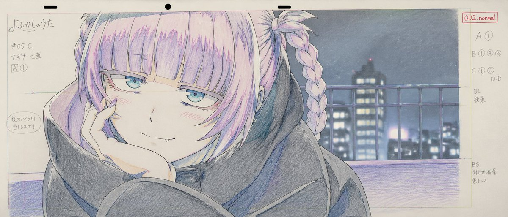


```text
{
  "type": "anime production layout sheet",
  "style": "traditional colored pencil genga, key animation drawing",
  "subject": {
    "character": "{argument name=\"character name\" default=\"ナズナ 七草\"}",
    "appearance": "anime girl with {argument name=\"hair color\" default=\"light purple\"} hair styled in twin braids and bangs, blue eyes, wearing a dark oversized coat",
    "pose_and_expression": "{argument name=\"expression\" default=\"smug with a small fang, resting chin on hand\"}"
  },
  "background": "{argument name=\"background scene\" default=\"nighttime city skyline with a railing\"}, soft focus",
  "layout": {
    "top_edge": "standard animation paper peg holes",
    "left_margin": {
      "series_title": "{argument name=\"anime title\" default=\"よふかしのうた\"}",
      "production_codes": ["#05 C.", "[A] (1)"],
      "circled_note": "髪のハイライト 色トレスです"
    },
    "right_margin": {
      "red_box": "002.normal",
      "timing_layers": ["A (1)", "B (1) (2) (3)", "C (1) (2) END"],
      "background_notes": ["BL 夜景", "BG 市街地夜景 色トレス"]
    }
  }
}
```


---


## 例 141：电商商品展示设计

**来源：** [@takadtmnu](https://x.com/takadtmnu)

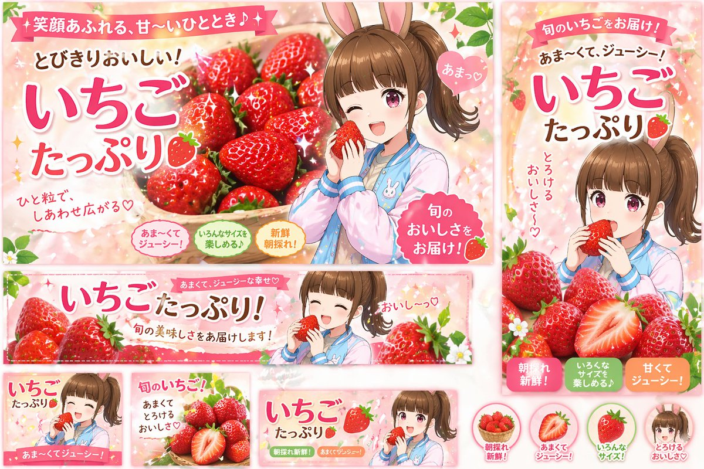


```text
{
  "type": "promotional banner design set",
  "theme": "strawberry advertisement campaign",
  "style": "anime illustration, bright, cheerful, commercial graphic design",
  "color_palette": "{argument name=\"primary color theme\" default=\"pastel pink and vibrant red\"}",
  "character": "{argument name=\"character description\" default=\"anime girl with brown side ponytail and bunny ears, wearing a pastel blue and pink jacket\"}",
  "product": "{argument name=\"product\" default=\"fresh red strawberries\"}",
  "layout": {
    "sections": [
      {
        "type": "large landscape banner",
        "position": "top left",
        "visuals": "character winking and holding a strawberry next to a large basket of strawberries",
        "main_text": "{argument name=\"main headline\" default=\"いちごたっぷり\"}",
        "sub_text": ["笑顔あふれる、甘〜いひととき♪", "とびきりおいしい！", "ひと粒で、しあわせ広がる♡", "あまっ♡", "旬のおいしさをお届け！"],
        "badges": {
          "count": 3,
          "labels": ["あま〜くてジューシー！", "いろんなサイズを楽しめる♪", "新鮮朝採れ！"]
        }
      },
      {
        "type": "vertical banner",
        "position": "right",
        "visuals": "character eating a strawberry with a pile of strawberries below",
        "main_text": "いちごたっぷり",
        "sub_text": ["旬のいちごをお届け！", "{argument name=\"secondary headline\" default=\"あま〜くて、ジューシー！\"}", "とろけるおいしさ〜♡"],
        "badges": {
          "count": 3,
          "labels": ["朝採れ新鮮！", "いろんなサイズを楽しめる♪", "甘くてジューシー！"]
        }
      },
      {
        "type": "wide horizontal banner",
        "position": "middle",
        "visuals": "character with closed eyes eating a strawberry, flanked by strawberries",
        "main_text": "いちごたっぷり！",
        "sub_text": ["あまくて、ジューシーな幸せ♡", "旬の美味しさをお届けします！", "おいし〜っ♡"]
      },
      {
        "type": "small square banner",
        "position": "bottom left",
        "visuals": "character smiling holding strawberry",
        "text": ["いちごたっぷり", "あま〜くてジューシー！"]
      },
      {
        "type": "small square banner",
        "position": "bottom mid-left",
        "visuals": "pile of strawberries with one cut in half",
        "text": ["旬のいちご！", "あまくてとろけるおいしさ♡"]
      },
      {
        "type": "small horizontal banner",
        "position": "bottom mid-right",
        "visuals": "character holding strawberry",
        "text": ["いちごたっぷり", "朝採れ新鮮！", "あまくてジューシー！"]
      },
      {
        "type": "circular icons",
        "position": "bottom right",
        "count": 4,
        "items": [
          { "visual": "basket of strawberries", "label": "朝採れ新鮮！" },
          { "visual": "half strawberry", "label": "あまくてジューシー！" },
          { "visual": "whole strawberry", "label": "いろんなサイズ！" },
          { "visual": "character face", "label": "とろけるおいしさ♡" }
        ]
      }
    ]
  }
}
```


---


## 例 157：电商商品展示设计

**来源：** [@AmberPromptai](https://x.com/AmberPromptai)


```text
{
  "type": "e-commerce product infographic",
  "theme": "dark mode with {argument name=\"accent color\" default=\"orange\"} accents",
  "product": {
    "brand": "{argument name=\"brand name\" default=\"MEAN WELL\"}",
    "model": "{argument name=\"product model\" default=\"ELG-100-24B\"}",
    "description": "100W Constant Current LED Driver, rectangular silver metal housing with black cables on both ends and detailed specification label"
  },
  "layout": {
    "sections": [
      {
        "name": "Hero Section",
        "elements": [
          "Brand logo top left",
          "Headline: '{argument name=\"main headline\" default=\"Stable Power For Outdoors\"}'",
          "Subtext: Wide input voltage, protected housing...",
          "Large angled product shot",
          "Faded '100W' watermark in background"
        ]
      },
      {
        "name": "Feature Highlights",
        "count": 3,
        "panels": [
          { "title": "Precision Build", "visual": "Close-up of the specification label" },
          { "title": "Secure Connection", "visual": "Close-up of the cable entry and mounting ear" },
          { "title": "Key Features", "visual": "Angled product shot with 3 callout lines pointing to text: '100~305VAC Input', 'Constant Current', 'IP67 / IP65 Housing'" }
        ]
      },
      {
        "name": "Applications",
        "count": 4,
        "panels": [
          { "title": "For Street Lighting", "visual": "Nighttime highway illuminated by streetlights" },
          { "title": "For Outdoor Projects", "visual": "Modern building exterior with architectural landscape lighting" },
          { "title": "For Indoor Systems", "visual": "Modern commercial hallway with linear ceiling lights" },
          { "title": "For Dimming Control", "visual": "Electrical control box with 4 labels: '0-10V', 'PWM', 'RESISTOR', 'DALI'" }
        ]
      },
      {
        "name": "Environmental Protection",
        "elements": [
          "Product resting on a wet surface with water droplets and rain effect",
          "Headline: 'Protected Performance'",
          "Description text about indoor/outdoor use and active PFC",
          "Badge: '{argument name=\"warranty years\" default=\"5\"}-Year Warranty'"
        ]
      },
      {
        "name": "Technical Specifications",
        "elements": [
          "Headline: 'Lighting Power Technology'",
          "4 checkmark bullet points: '100~305VAC Input', 'Active PFC', 'Low Standby <0.5W', '0~10V / PWM / Resistor / DALI'",
          "Product shot glowing on a high-tech circuit board background"
        ]
      }
    ]
  }
}
```


---


## 例 178：亚马逊详情图设计

**来源：** [@xin\_pai88825](https://x.com/xin_pai88825/status/2046576100592201946)

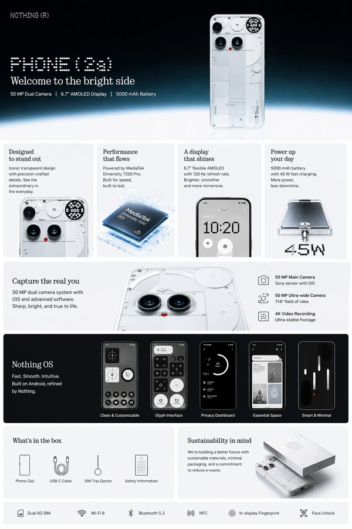


```text
[中文]
生成一套亚马逊 A+=详情图

[English]
Generate a set of Amazon A+= detail images
```


---


## 例 181：潮流视角重塑精致商品广告

**来源：** [@genel\_ai](https://x.com/genel_ai/status/2046498264774791514)

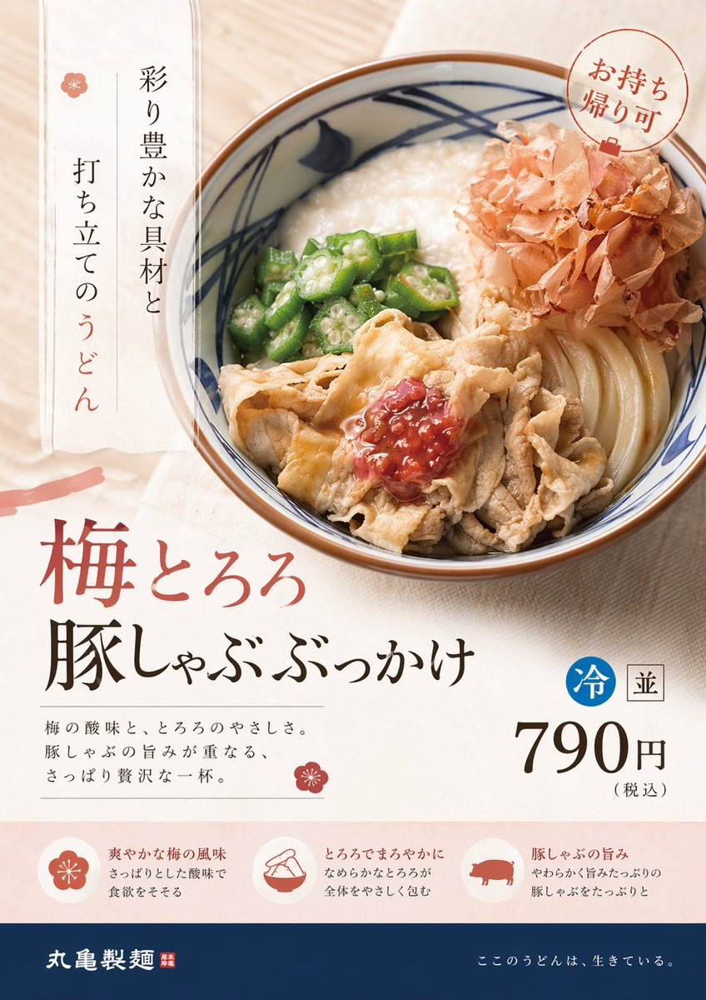


```text
[中文]
请以专业设计师的视角重新设计这个商品广告。
采用当前的潮流趋势，针对目标受众的精致设计。

[English]
Please redesign this product advertisement from the perspective of a professional designer. Adopt current fashion trends, exquisite design targeting the target audience.
```


---


## 例 189：清新夏日女装连衣裙电商展示

**来源：** [@MrLarus](https://x.com/MrLarus/status/2046544209117634735)

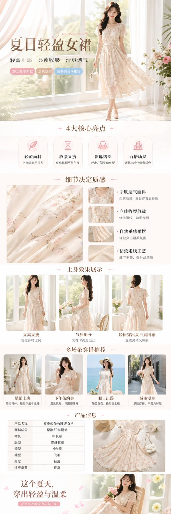


```text
[中文]
夏季女裙电商详情图

[English]
Summer women's dress e-commerce detail image
```


---


## 例 190：全自动咖啡机产品展示

**来源：** [@MrLarus](https://x.com/MrLarus/status/2046544209117634735)

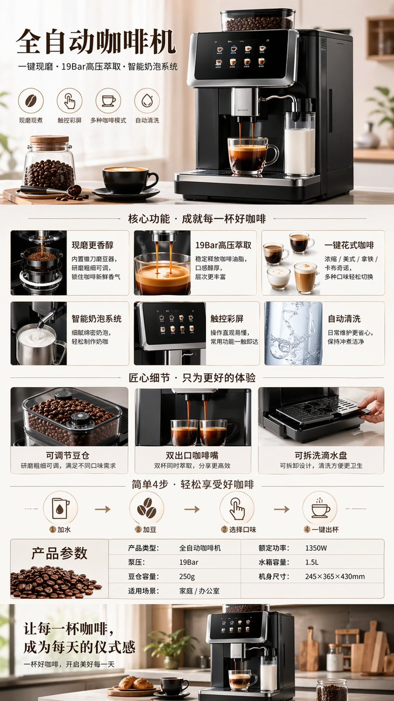


```text
[中文]
全自动咖啡机电商详情图

[English]
Fully automatic coffee machine e-commerce detail image
```


---


## 例 192：电商商品展示图

**来源：** [@MrLarus](https://x.com/MrLarus/status/2046544209117634735)

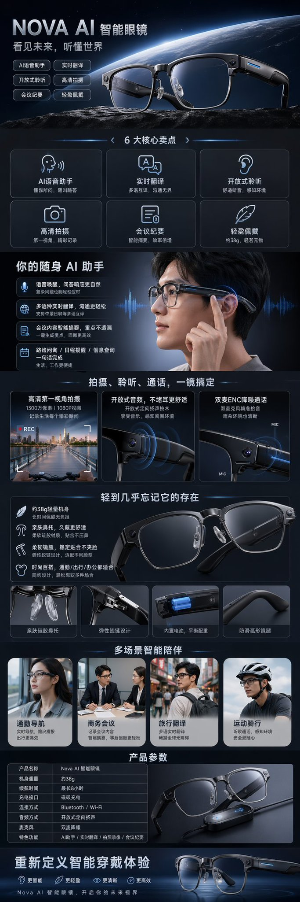


```text
[中文]
AI智能眼镜电商详情图

[English]
AI smart glasses e-commerce detail image
```


---


## 例 194：健身蛋白粉电商详情页

**来源：** [@MrLarus](https://x.com/MrLarus/status/2046544209117634735)

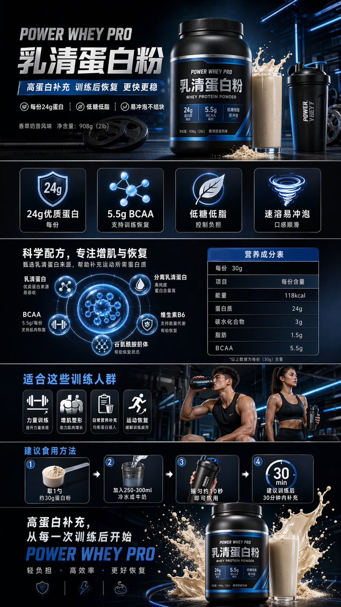


```text
[中文]
健身蛋白粉电商详情图

[English]
Fitness protein powder e-commerce detail image
```


---


## 例 216：雅致图案四款时尚单品设计

**来源：** [@aiehon\_aya](https://x.com/aiehon_aya/status/2046348182301683954)

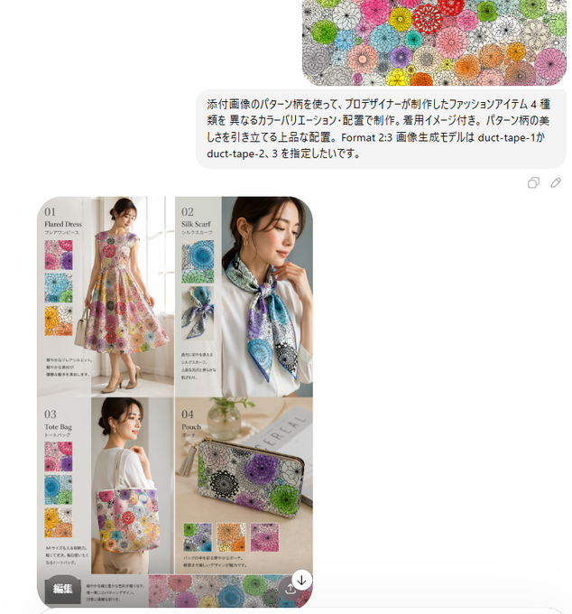


```text
[中文]
使用附图中的图案，由专业设计师打造 4 款时尚单品，采用不同的色彩搭配与排版设计，附带穿搭效果图。以雅致的构图凸显图案的美感。格式为 2:3，希望将图像生成模型从 duct-tape-1 指定为 duct-tape-2、3。

[English]
Use the patterns in the attached image, crafted by professional designers to create 4 fashion items, using different color schemes and layout designs, accompanied by outfit effect pictures. Highlight the beauty of the patterns with an elegant composition. The format is 2:3, hoping to specify the image generation model from duct-tape-1 to duct-tape-2, 3.
```


---


## 例 237：夏日柑橘苏打高转化广告图

**来源：** [@old\_pgmrs\_will](https://x.com/old_pgmrs_will/status/2045852114673635507)

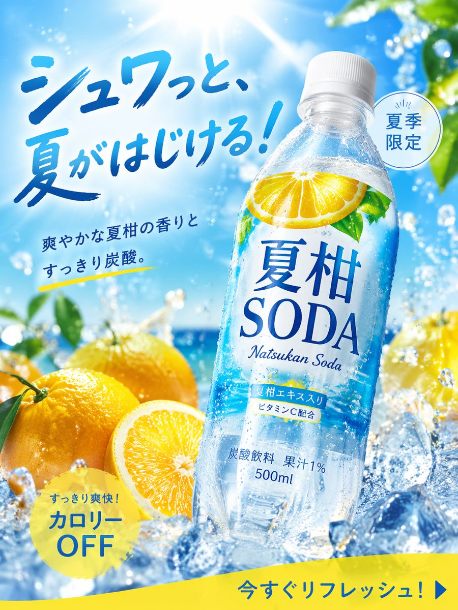


```text
[中文]
图像生成: 商品广告照片, 适合夏天的季节商品, 碳酸饮料, 名称="夏柑SODA", 形状=PET瓶500ml, 研究2025年作为饮料广告的高CTA设计后设计并生成图像规格, 宽高比3:4

[English]
Image generation: Product advertising photo, Seasonal product suitable for summer, Carbonated beverage, Name="Summer Citrus SODA", Shape=500ml PET bottle, Design and generate image specifications after researching high CTA design as a beverage advertisement in 2025, Aspect ratio 3:4
```


---


## 例 264：美妆产品广告图

**来源：** [@midori\_tatsuta](https://x.com/midori_tatsuta/status/2045378877363798279)

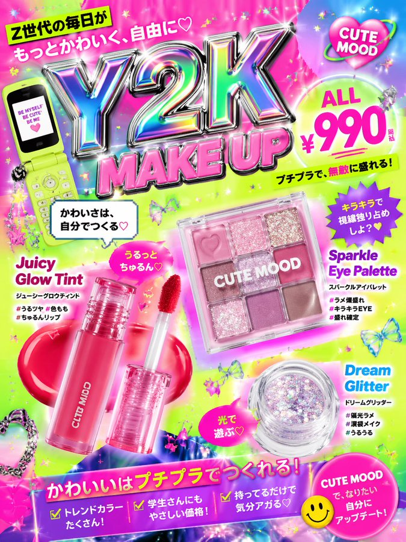


```text
[中文]
为Z世代设计的可爱Y2K风格的平价化妆品广告图像。使用鲜艳的配色，包括荧光色。纵横比为3:4。

[English]
Cute Y2K style affordable cosmetics advertising image designed for Gen Z. Using vibrant color schemes, including neon colors. Aspect ratio is 3:4.
```


---


## 例 301：终结者机器人淘宝详情页

**来源：** [@rionaifantasy](https://x.com/rionaifantasy/status/2045356799751303194)

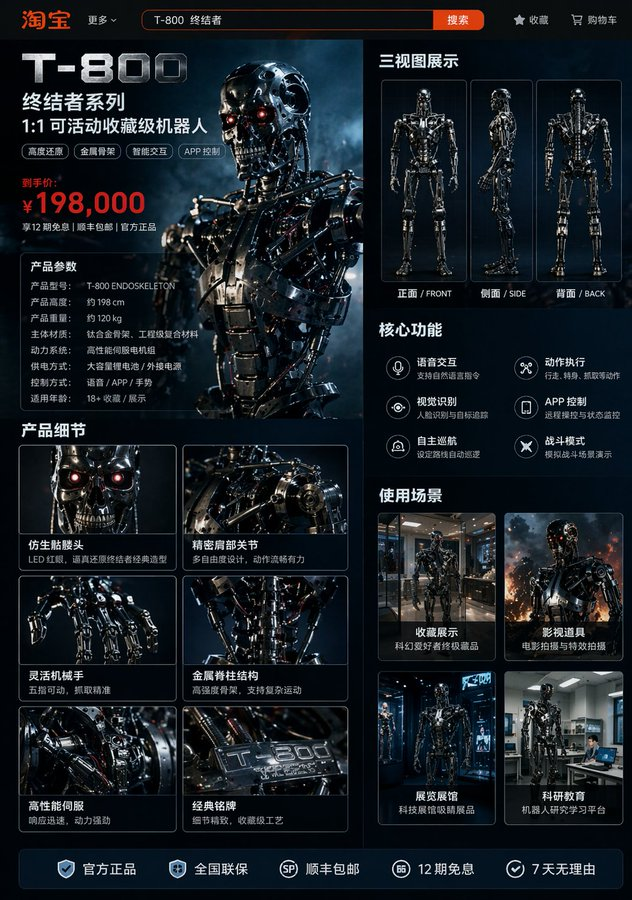


```text
[中文]
生成图片:
T-800机器人的淘宝商品详情页，展示:
机器人的正面侧面背面三视图，
产品价格，
产品细节，
功能和使用场景等

[English]
Generate image:
Taobao product detail page of a T-800 robot, showing:
front, side, and back three-view drawings of the robot,
product price,
product details,
functions and usage scenarios
```


---


## 例 313：电商商品展示设计

**来源：** [@Fujimoto\_hina](https://x.com/Fujimoto_hina/status/2027903683154088431)

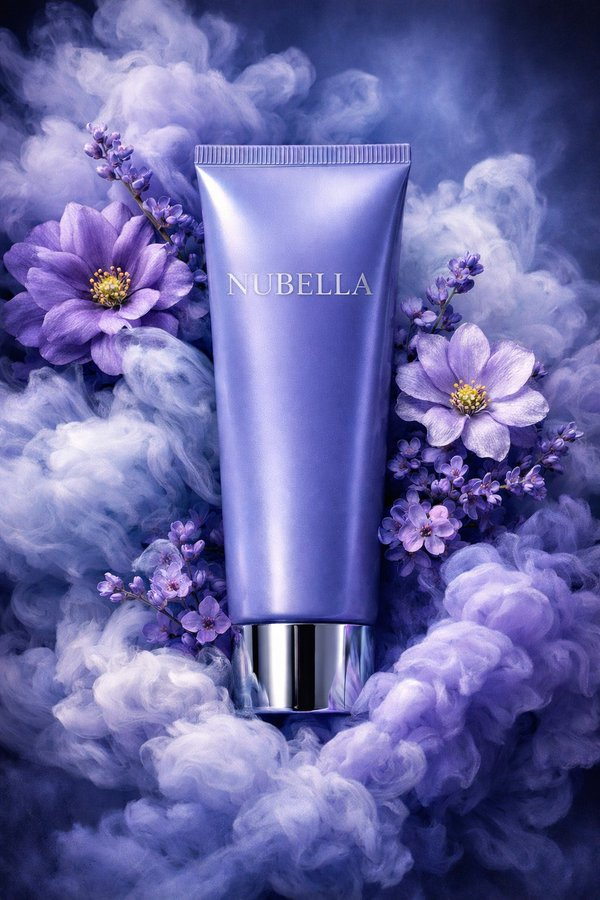


```text
[中文]
{
  "style": "超写实奢华化妆品产品摄影",
  "composition": {
    "color_scheme": "戏剧性的单色蓝紫色",
    "resolution": "8K超高分辨率",
    "depth": "电影级景深",
    "aesthetic": "高端香氛护肤品广告风格"
  },
  "product": {
    "type": "软管包装",
    "finish": "缎面质感",
    "color": "长春花蓝",
    "label": "NUBELLA",
    "typography": "优雅的银色字体",
    "cap": "反光金属铬盖",
    "position": "垂直居中"
  },
  "surroundings": {
    "smoke": {
      "type": "墨水般的旋涡云雾",
      "colors": [
        "薰衣草色",
        "靛蓝色",
        "冰蓝色"
      ],
      "texture": "柔软、翻腾",
      "interaction": "环绕在产品周围"
    },
    "flowers": {
      "primary": [
        {
          "color": "紫色",
          "details": "错综复杂的花瓣细节",
          "center": "鲜艳的黄色"
        },
        {
          "color": "紫丁香色",
          "details": "错综复杂的花瓣细节",
          "center": "鲜艳的黄色"
        }
      ],
      "secondary": {
        "type": "细小的紫罗兰色花朵",
        "purpose": "增加立体感"
      }
    }
  },
  "lighting": {
    "direction": "来自左上方的柔和定向照明",
    "effects": [
      "突显软管的光滑曲度",
      "为金属盖增添微妙的光泽",
      "在烟雾中营造深度"
    ]
  },
  "background": {
    "blend": "无缝的冷色调蓝色和紫色调",
    "enhancement": "空灵的花香美学"
  },
  "details": "花瓣和蒸汽的超精细纹理"
}

[English]
{
  "style": "Ultra-realistic luxury cosmetic product photography",
  "composition": {
    "color_scheme": "Dramatic monochromatic blue-violet",
    "resolution": "8K ultra-high resolution",
    "depth": "Cinematic depth",
    "aesthetic": "High-end perfumed skincare advertising style"
  },
  "product": {
    "type": "Squeeze tube",
    "finish": "Satin-finish",
    "color": "Periwinkle-blue",
    "label": "NUBELLA",
    "typography": "Elegant silver",
    "cap": "Reflective metallic chrome",
    "position": "Vertically centered"
  },
  "surroundings": {
    "smoke": {
      "type": "Ink-like swirling clouds",
      "colors": [
        "Lavender",
        "Indigo",
        "Icy blue"
      ],
      "texture": "Soft, billowing",
      "interaction": "Wrapping around the product"
    },
    "flowers": {
      "primary": [
        {
          "color": "Purple",
          "details": "Intricate petal details",
          "center": "Vibrant yellow"
        },
        {
          "color": "Lilac",
          "details": "Intricate petal details",
          "center": "Vibrant yellow"
        }
      ],
      "secondary": {
        "type": "Tiny violet blossoms",
        "purpose": "Added dimension"
      }
    }
  },
  "lighting": {
    "direction": "Soft directional lighting from upper left",
    "effects": [
      "Highlights smooth curvature of the tube",
      "Adds subtle sheen to metallic cap",
      "Creates depth within smoke plumes"
    ]
  },
  "background": {
    "blend": "Seamless cool blue and purple tones",
    "enhancement": "Ethereal floral fragrance aesthetic"
  },
  "details": "Hyper-detailed textures of petals and vapor"
}
```


## 例 314：VR Headset Exploded View Poster

**来源：** awesome-gpt-image-2


```text
{
  "type": "exploded view product diagram poster",
  "subject": "VR headset",
  "style": "clean high-tech 3D render, studio lighting, glowing accents",
  "background": "{argument name=\"background color\" default=\"soft purple and blue gradient\"}",
  "header": {
    "logo": "∞ {argument name=\"product name\" default=\"Meta Quest 3\"}",
    "subtitle": "{argument name=\"main catchphrase\" default=\"まったく新しい現実を、まったく新しい構造から。\"}"
  },
  "layout": {
    "centerpiece": "vertically stacked exploded view of a VR headset showing 9 distinct layers of internal components: outer shell, camera sensors, motherboard with chip, pancake lenses, internal frame, battery packs, side straps, top strap, and facial interface cushion.",
    "callout_labels": {
      "count": 8,
      "left_side": [
        "Snapdragon® XR2 Gen 2\n圧倒的な処理性能でリアルタイムな体験を。",
        "調整可能なIPD機構\n幅広いユーザーに快適なフィット感を。",
        "精密設計されたヘッドストラップ\n快適さと安定性を追求したエルゴノミクス。"
      ],
      "right_side": [
        "フェイスプレート\n洗練されたデザインと最適な重量バランス。",
        "トラッキングカメラ\n高精度な位置トラッキングと環境認識を実現。",
        "パンケーキレンズ\n薄型設計で広い視野角と鮮明な映像を提供。",
        "高性能バッテリー\n長時間駆動を支える最適化された電源設計。",
        "柔らかなフェイスインターフェース\n長時間でも快適な装着感を実現。"
      ]
    },
    "footer": {
      "left_text_block": {
        "headline": "{argument name=\"bottom headline\" default=\"体験は、構造から進化する。\"}",
        "body": "一つひとつのパーツに、没入体験を支える最先端テクノロジーとこだわりの設計。Meta Quest 3は、未来を感じさせる体験を内部から生み出しています。"
      },
      "right_logo": "∞ Meta"
    }
  }
}
```


---

## 例 315：Streetwear Campaign Poster Prompt

**来源：** awesome-gpt-image-2

```text
Create a premium, highly realistic 1:1 campaign poster for {argument name="brand" default="NOIR"}, a modern streetwear brand. Show one {argument name="product" default="hero oversized hoodie"} as the main focus against a gritty urban backdrop with wet concrete floors, dramatic low lighting, subtle smoke in the air and a raw street energy. Add bold minimal typography with the brand name NOIR and a short campaign headline like "{argument name="headline" default="Wear the Dark"}." Make it feel like a real high-end streetwear editorial, sharp detail, realistic fabric textures, modern and edgy, deep black tones with subtle grey accents, no clutter, no collage.
```


---

## 例 316：Multi-Pattern Web Advertisement Grid

**来源：** awesome-gpt-image-2

```text
Create 9 patterns of advertisements satisfying the following requirements and arrange them in a single image:
- This is a web advertisement to encourage participation in a {argument name="event content" default="handmade tempura soba noodle making workshop"}.
- Please come up with the copywriting, eye-catching visual, background image, and layout.
- It is desirable for each of the 9 patterns to have a completely different taste.
- The composition should include a main copy, sub-copy, date/time, 'free' tag, and a button.
- The target audience is {argument name="target group" default="Gen Z and people in their 40s"}.
```


---

## 例 317：Minimal Japanese Cooking Class Hero Image

**来源：** awesome-gpt-image-2

```text
A soft, airy promotional hero image for a {argument name="class theme" default="Japanese home cooking class"} on a warm off-white background, styled like a minimalist lifestyle flyer. On the left half, show 2 people: an adult woman and a young girl cooking together at a white kitchen counter, both with calm, natural poses and gentle body language. The woman stands slightly behind and to the left of the child, leaning in supportively while helping guide the girl's hands as she slices a cucumber on a wooden cutting board with a kitchen knife. Their faces are intentionally obscured with soft rectangular blur blocks. The woman has dark brown hair tied in a low ponytail and wears a loose white blouse with a natural linen apron. The girl has dark hair in a high bun and wears a light short-sleeve top with a matching beige linen apron. On the counter, include a clear glass mixing bowl with salad, a folded striped kitchen towel, a wooden bowl of vegetables on the far left, a small wooden tray or plate with colorful vegetables in front, and a small potted green herb plant near the center-right edge of the cooking area. Visible produce should include sliced cucumber on the board and whole vegetables such as tomatoes, leafy greens, mushrooms, lemons or yellow citrus, and green peppers or cucumbers, arranged in a fresh, wholesome way. On the right half, leave generous negative space and place elegant Japanese headline text in a refined serif style: {argument name="headline text" default="お料理教室開講"}. Beneath it, add 2 lines of smaller Japanese body text: {argument name="subtext" default="はじめてさんも、もっと楽しみたい方も。 一緒に『おいしい』を作りましょう。"}. Surround the composition with 7 delicate hand-drawn dark gray doodle elements: 1 small leafy sprig on the far left, 1 hanging line at the upper left with 5 kitchen tools suspended from it (a frying pan, a spatula, a ladle, a peeler or slim utensil, and an oven mitt), 1 cluster of 2 floating leaves in the upper right, 1 small cooking pot icon on the right, 1 whisking bowl icon with tiny hearts near the lower middle-right, and 1 long single-line flourish sweeping across the lower right. Use soft natural daylight, muted beige and cream tones, shallow depth of field, clean editorial photography, gentle shadows, and a calm family-friendly premium aesthetic suitable for a cooking class landing page or poster.
```


---

## 例 318：Exquisite Relief Embroidery Illustration

**来源：** awesome-gpt-image-2

```text
Exquisite 3D embroidery style illustration, bas-relief fiber art effect, pure "{argument name="background color" default="silk white + milk white"}" base color, delicate silk thread texture. The scene features {argument name="subject" default="several small birds"} perched on winding flower branches, adorned with {argument name="accent colors" default="pinkish-white, light peach, coral pink, and pale gold"} flowers and leaves. The composition is light and elegant with ample negative space. The birds' feathers are rendered with milk-white, light blue, pale pink, and light gold silk thread embroidery. The flower branches are slender and natural, with layered stitching on the flowers, creating a high-end handcrafted embroidery, silk pile work, soft lighting, rich detail, and a gentle, fresh artistic effect.
```


---

## 例 319：Luxury Biophilic Vase Concept Poster

**来源：** awesome-gpt-image-2

```text
{"type":"luxury product concept poster","style":"minimalist editorial brand presentation with nature-inspired industrial design, combining pencil concept sketches and a photoreal hero product shot","background":{"color":"warm off-white stone beige","texture":"soft paper and studio backdrop with subtle grain"},"branding":{"headline":"{argument name=\"headline text\" default=\"GROWTH IN HARMONY\"}","subheadline":"Inspired by a tree's embrace","brand_name":"{argument name=\"brand name\" default=\"ARBORÉ\"}","tagline":"{argument name=\"tagline\" default=\"LIVING SCULPTURE\"}","logo":"simple circular botanical emblem with a stylized plant or tree"},"layout":{"format":"vertical poster with 2 main sections","sections":[{"title":"concept evolution strip","position":"top half","count":5,"labels":["ESSENCE THE SOURCE","LIFE FORCE RISING","HARMONY BALANCE","FORM EMBRACING LIFE","DESIGN REFINED OBJECT"],"description":"five left-to-right stages separated by small chevrons, showing transformation from organic inspiration to finished object"},{"title":"hero product showcase","position":"bottom half","count":1,"labels":["ARBORÉ","LIVING SCULPTURE"],"description":"single large centered product photograph on a stone pedestal with brand mark on the left"}]},"top_sequence":{"stage_1":"delicate graphite sketch of a seated woman curled inward, knees raised, hair in a loose bun, wrapped by thin vine-like branches, symbolic and gestural rather than realistic","stage_2":"pencil sketch of a small twisting sapling emerging upward with thin branches and sparse leaves, roots or circular ripples at the base","stage_3":"simplified flowing double-helix vine silhouette with a few small leaves, elegant S-curve, more abstract than the previous stage","stage_4":"refined vessel concept drawing: a tall smooth inner vase encased by two intertwining wooden ribbon forms spiraling upward around it","stage_5":"small realistic render of the final object: pale ceramic vase embraced by natural wood spirals, with a living green plant sprouting from the top"},"product":{"category":"sculptural planter vase","materials":["light natural wood with visible grain","smooth matte or satin ceramic in warm ivory"],"form":"slender bulbous inner ceramic vessel partially enclosed by two asymmetrical twisting wooden bands that wrap around the body like a tree embracing a core","plant":"small bonsai-like branch with fresh green leaves and a few upward shoots","mood":"organic, serene, premium, biophilic, artisanal"},"bottom_scene":{"camera":"straight-on product photography with slight eye-level perspective","pedestal":"round rough-hewn stone plinth","lighting":"soft diffused natural studio light from upper left, gentle shadows, calm luxury mood","background_elements":"large blurred stone shapes in foreground left and right edges creating depth, neutral sculptural studio setting"},"color_palette":{"wood":"weathered oak beige-brown","ceramic":"warm ivory","leaves":"fresh natural green","background":"sand, cream, soft taupe","sketch_lines":"charcoal gray"},"rendering_notes":"high-end design board aesthetic, generous negative space, elegant typography, refined composition, realistic materials in the hero shot, sketchbook feel in the top process strip"}
```


---

## 例 320：Premium Earbuds Ad Poster

**来源：** awesome-gpt-image-2

```text
Create a high-end futuristic product advertisement poster for {argument name="product name" default="Apple Pods Pro 3"}, styled like a premium tech magazine cover. Vertical composition, clean soft gray studio background with subtle rainbow prism lens flares around the edges. A fashionable young person is centered in the background, face obscured by a simple rectangular blur block, wearing a bright neon-lime knit beanie, wavy shoulder-length pink hair, and a black-and-white zebra striped top. One white wireless earbud is visible in their ear. In the extreme foreground, their hand is extended toward the camera holding an open glossy white charging case, shot with dramatic shallow depth of field and forced perspective so the case dominates the frame. Inside the open case, exactly 2 white earbuds are visible. Add 4 larger floating earbuds around the composition: 2 on the left side and 2 on the right side, softly blurred as if suspended in space. Place huge bold white sans-serif headline text across the top reading {argument name="headline text" default="AIRPODS"}. On the upper right, add smaller stacked white sans-serif product text reading {argument name="product label" default="Apple Pods Pro 3"}. On the left middle, add a white feature callout in stacked text: {argument name="left feature text" default="Premium sound and noise cancellation"}. On the right side, add 2 large numeric feature blocks in white: one reading "30" with smaller text "hours of battery life." beneath it, and one reading "1" with smaller text "year warranty." beneath it. Sleek commercial lighting, glossy reflections on the case, crisp product detail, modern fashion-tech aesthetic, polished Apple-inspired ad design, photorealistic, premium editorial finish.
```


---

## 例 321：Futuristic Bionic Hiking Boot Prompt

**来源：** awesome-gpt-image-2

```text
Extreme futuristic {argument name="inspiration" default="hedgehog-inspired"} bionic {argument name="item" default="hiking boot"}, fusion of rugged outdoor gear and armored creature design, spiked protective shell structure, layered carbon fiber plates, adaptive grip sole with claw-like traction, subtle glowing energy core, {argument name="color scheme" default="black and bronze luxury finish"}, built for extreme terrain, dramatic low angle, cinematic lighting, high-end outdoor gear advertisement, ultra detailed, 8k
```


---

## 例 322：Surreal Beauty Ad with Face Reference

**来源：** awesome-gpt-image-2

```text
Use the uploaded image as the face reference.
Create an ultra-realistic surreal beauty advertisement of me miniaturized and standing on top of a {argument name="product" default="giant luxury lip plumper tube"}. I am wearing a {argument name="outfit" default="glamorous sparkling sequin dress"}, elegant and eye-catching.
The lip plumper is oversized, glossy, premium, with a soft pink tint and luminous shine. I am standing confidently with one foot slightly forward, looking at the camera.
Keep my facial features accurate and natural to the reference image.
Use high-end beauty lighting, soft reflections, glowing highlights, and subtle shimmer particles in the air. Add a glowing effect around the lip plumper to emphasize plumping power.
Shallow depth of field, luxury cosmetic campaign style, hyper-realistic, 8K.
```


---

## 例 323：Luxury Fashion Brand Ad

**来源：** awesome-gpt-image-2

```text
Luxury fashion advertisement poster, vertical composition, a confident young male model standing with arms crossed, wearing a {argument name="outfit" default="red and white vertical striped shirt"} (slightly unbuttoned), beige tailored trousers, brown leather belt.
Face: sharp jawline, light stubble, styled hair OR wearing a black cap (minimal logo), cinematic masculine look.
Background: deep rich red textured wall with dramatic sunlight casting a soft shadow of the model on the left side. Large oversized golden serif letters “{argument name="brand" default="AH"}” in the background (NO ampersand), subtle metallic texture, slightly blurred and blended into background for premium feel.
Lighting: warm, golden hour style lighting, soft highlights on face and fabric, high-end editorial shadows, dramatic but clean.
Typography (premium editorial style, elegant serif font like Didot/Bodoni):
Headline: “{argument name="headline" default="Effortless Dominance."}”
Subtext: “Not just an outfit. A statement of quiet confidence and unmatched presence.”
Brand name at bottom: “A&H”
Tagline: “PREMIUM. POWER. PRESENCE.”
Small footer line: “DESIGNED TO LEAD. MADE TO LAST.”
Color grading: cinematic, warm tones, high contrast, luxury magazine look (Vogue-style).
Style: ultra-realistic, 8k, sharp details, fashion campaign, premium branding, minimal clutter, perfect composition
```


---

## 例 324：New Chinese Golden Staff Poster

**来源：** awesome-gpt-image-2

```text
A refined New Chinese aesthetic poster on a warm ivory rice-paper background, minimalist and vertical, featuring a single luxurious golden 如意金箍棒 as the central subject. The staff is placed diagonally from the lower left foreground to the upper right, with the bottom end planted into a dark ink-splashed rocky surface and the top extending upward in a poised, heroic angle. The metal surface is richly engraved with intricate traditional relief patterns, cloud-and-dragon style ornament, polished gold highlights, and subtle glowing reflections. Around the staff, 2 sweeping metallic-gold brushstroke ribbons spiral upward in elegant S-curves, like calligraphic energy trails, partially transparent and painterly. At the base, black and gray ink wash, smoke, mist, and splash textures spread outward in a dramatic burst, blending realism with Chinese ink painting. Keep the composition spacious with strong negative space and a premium gallery-poster feel. Add 5 text groups arranged in traditional poster layout: on the upper left, a large vertical black calligraphy headline reading {argument name="headline text" default="如意金箍棒"}; beside it, a smaller vertical line of Chinese text reading "心有如意，万象皆可破"; below that, a small romanized subtitle in thin uppercase serif/sans style reading "RUYI JINGUBANG"; on the lower right, another vertical poetic line reading "一念起，风云动 / 一棒定，乾坤静"; at the bottom center, a faint small horizontal line reading "自在如意，无所不成". Include 2 red seal stamps, one on the left mid-lower area and one small seal near the lower-right text. Use elegant black typography, subtle gray ink traces, soft diffuse lighting, ultra-detailed product rendering, cultural luxury branding, serene yet powerful mood, and a balanced blend of ancient mythic artifact presentation and contemporary high-end Chinese poster design.
```


---

## 例 325：New Chinese Style Ice Cream Drink Poster

**来源：** awesome-gpt-image-2

```text
A premium vertical poster advertisement in elegant new Chinese aesthetics, featuring a single plastic cup of strawberry sundae-style ice cream drink as the central product. The cup is placed slightly below center, shot straight-on with soft studio lighting, with glossy white swirled soft serve on top, creamy white layers marbled with vivid strawberry-red streaks inside the cup, and a simple gold line-art mascot printed on the front. In front of the cup are exactly 2 strawberries: 1 whole strawberry and 1 halved strawberry with the cut face visible. The background is a warm ivory rice-paper texture with large areas of negative space. Surround the product with an ink-wash Chinese landscape composition: misty gray-black mountains, a winding brushstroke-like river or road flowing diagonally from lower left to upper right, subtle gold foil accents along the brush edges, a pale circular sun or moon near the upper middle, a small traditional pagoda on a mountain ridge, soft drifting cloud motifs, and blooming white plum blossoms on branches at the right edge and lower left corner. The overall palette is off-white, black ink gray, soft beige, gold, and strawberry red, balancing minimalism and luxury. Add vertical Chinese typography on the upper left with the large main title {argument name="headline text" default="蜜雪冰城"}, and a thinner vertical tagline beside it reading {argument name="tagline text" default="甜如初雪，温暖如常"}. Beneath that, place a small red seal stamp with Chinese characters, and below it a small uppercase serif-style Latin brand line reading {argument name="brand text" default="MIXUE BINGCHENG"}. At the bottom center, add one line of small Chinese slogan text reading {argument name="footer text" default="一杯甜，一座城，温暖每一个平凡的日常"}. Refined commercial poster design, high detail product realism, painterly ink illustration fusion, clean luxury layout, no extra products, no people, no busy background.
```


---

## 例 326：Professional Sports Campaign Portrait

**来源：** awesome-gpt-image-2

```text
A dramatic sports editorial scene featuring a {argument name="athlete" default="professional male footballer"} wearing an {argument name="kit" default="all-black kit"}, reclining confidently on top of an oversized soccer ball. The ball is hyper-detailed with realistic panels and branding, placed on a glossy reflective floor. The athlete’s pose is relaxed yet powerful, with one arm hanging down and legs extended, showcasing strength and elegance. The background is a bold deep blue studio with massive {argument name="typography" default="“GOAL”"} typography in large, subtle shadowed letters. High-contrast studio lighting with sharp highlights and deep shadows sculpting the body. Clean, minimal composition with a luxury sports campaign aesthetic. Shot with an 85mm lens, ultra-realistic, cinematic lighting, crisp details, 8K resolution, Nike/Adidas-style commercial photography.
```


---

## 例 327：Grunge Tiger Streetwear Poster

**来源：** awesome-gpt-image-2

```text
Create a gritty streetwear poster illustration with a single central figure standing in front of an urban collage wall. The person is a stylish young adult with {argument name="hair color" default="dark brown to black"} curly hair tied in a messy bun, wearing black rectangular sunglasses, a short gold chain necklace, and an oversized black graphic T-shirt. The face is intentionally obscured by a vertical blurred rectangular censor block in warm beige-brown tones. The shirt features a large roaring tiger head graphic in orange, cream, black, and red, with bold Japanese kanji text reading {argument name="shirt text" default="猛獣"} beneath it. Show the figure from about mid-thigh up, relaxed posture, one hand tucked in a pocket, fashion-editorial attitude. The background is a distressed mixed-media mural in beige, black, and brick red with heavy grunge texture, paper wear, paint drips, splatters, halftone dots, and graffiti layering. Include 2 large circles: 1 black circle on the left and 1 large red circle behind the figure on the right. Include 3 tall black vertical bars in the composition, plus 1 pale rectangular block and 1 thin horizontal red stripe on the left side. Add 2 visible instances of the kanji text 猛獣 in the wall art, one large black painted version in the lower left and one on the shirt. On the right side of the wall, include 1 detailed roaring tiger illustration in profile/front three-quarter view, mouth open, orange and black striped fur. In the upper right corner, add 2 chalk-like diagram motifs: 1 skeletal big cat drawing and 1 square-framed crossed-bones symbol. Add 1 black graffiti tag near the right edge and 1 small white heart near the lower left. Use a muted vintage palette of tan, rust red, black, cream, and dark orange. The overall style should feel like Japanese-inspired street fashion poster art, raw, rebellious, textured, high-contrast, and screen-printed on worn paper.
```


---

## 例 328：McDonald's Advertisement Prompt

**来源：** awesome-gpt-image-2

```text
Create a clean, high-quality {argument name="brand" default="McDonald’s"} advertisement. Use a bold red brand color with yellow brand accents. Show {argument name="product" default="a Big Mac, fries, and a drink"} in a realistic, appetizing style. Include the golden arches in the background. Add bold white headline text: “{argument name="headline" default="Better together."}” Include smaller text: “Big Mac + Fries — The classic combo.” Add price and minimal product details at the bottom. Keep the layout simple, balanced, and premium with strong brand consistency.
```


---

## 例 329：Professional Drink Photo Enhancement

**来源：** awesome-gpt-image-2

```text
Using the provided reference image, turn this casual phone snapshot of the drink into a polished professional beverage photo while keeping the same cup, soda, straw, outdoor theme-park setting, and general composition. Reframe and clean it up so the drink is the clear hero subject, make the cup sharper and more detailed with crisp condensation and sparkling ice, and enhance the Coca-Cola red tones and overall contrast. Apply warm golden-hour commercial lighting with richer highlights and a more cinematic color grade. Increase background blur for a shallow depth-of-field look, simplify visual distractions, and make the people in the background feel more incidental and softly out of focus while preserving the tree, benches, planters, and ferris wheel context. Keep it realistic, like a high-end advertisement shot taken by a professional product photographer.
```


---

## 例 330：Minimalist Tech Accessory Advertisement

**来源：** awesome-gpt-image-2

```text
Generate a tech accessory ad for {argument name="accessory" default="[ACCESSORY]"}, floating product render, magnetic alignment, smooth gradients, sharp spec cards, clean sans-serif typography, Apple-level minimalism, premium digital product launch aesthetic.
```


---

## 例 331：Luxury Jewelry Advertisement

**来源：** awesome-gpt-image-2

```text
Create a jewelry advertisement for {argument name="jewelry piece" default="[JEWELRY PIECE]"}, macro sparkle, velvet surface, warm gold light, romantic shadow play, minimal headline, luxury boutique feel, ultra-detailed gem reflections, premium editorial composition.
```


---

## 例 332：Shampoo Product Creative Prompt

**来源：** awesome-gpt-image-2

```text
Create a product creative for '{argument name="brand name" default="Over.X"},' a {argument name="product type" default="hair restoration shampoo"}, featuring a {argument name="model" default="cute woman"}
```


---

## 例 333：Food Image Professional Retouching Prompt

**来源：** awesome-gpt-image-2

```text
This image is an empty plate from {argument name="restaurant" default="Yoshinoya"}. Turn it into a professional-looking promotional photo with delicious {argument name="food items" default="beef bowls and miso soup"} lined up. You can change the composition.
```


---

## 例 334：Chinese Traditional Luxury Product Design

**来源：** awesome-gpt-image-2

```text
Silk shawl with 'Court Ladies Wearing Floral Headdresses' pattern from the Tang Dynasty, featuring {argument name="pattern design" default="Zhou Fang's court ladies surrounding pattern"}, crabapple floral gold weaving, glossy satin texture, palace luxury style.
Song Dynasty Ru-ware sky-blue glazed tea set, delicate ice-crackle glaze, 'blue as the sky after rain' color, minimalist Song Dynasty style setting, museum-grade still life studio photography.
```


---

## 例 335：Luxury Chronograph Watch Ad

**来源：** awesome-gpt-image-2

```text
A dramatic luxury product advertising image for a motorsport-inspired chronograph wristwatch in a dark studio. Center-left foreground, show a single stainless steel chronograph watch standing upright at a slight three-quarter angle, with a black dial, two red-accent subdials, slim silver hour markers, a tachymeter bezel, and visible crown and pushers on the right side. The watch has a black leather strap with bold red stitching along both edges and a sporty premium finish. To the right of the watch, place one black square presentation box slightly behind it, textured like leather, with red stitching around the lid and a silver embossed eye-shaped logo above the text “NESS STUDIO” and smaller red text “TRACK SURFACE.” At the top center of the composition, add the same silver eye logo with the words “NESS STUDIO” and smaller “BY NICOLAS.” Across the background, place one oversized blurred word, {argument name="headline text" default="PRECISION"}, in large gray capital letters spanning nearly the full width. The scene is set against a deep black background with cinematic red and white horizontal light streaks crossing behind the products from left to right, suggesting speed and racetrack energy. Use a glossy wet ground plane with reflective texture, catching red highlights and mirrorlike reflections beneath the watch and box. At the bottom center, add the text “CHRONOGRAPH SERIES” in clean white spaced capitals with thin red horizontal lines extending on both sides, and below it smaller red capitals reading {argument name="tagline text" default="ALSACE MADE"}. Color palette: black, charcoal gray, silver steel, vivid racing red, and a touch of white. Lighting should be high-contrast and premium, with crisp specular highlights on the metal case, subtle soft fill on the box, and moody shadows. Overall style: ultra-polished commercial product photography, luxury watch campaign, sharp focus on the products, sleek branding, high-end automotive aesthetic.
```


---

## 例 336：Editorial Perfume Shot on Moss

**来源：** awesome-gpt-image-2

```text
A high-end editorial product photograph of a single luxury perfume bottle centered in a warm earthy still-life scene. The product is a clear rectangular glass bottle filled with golden amber liquid, topped with a glossy rounded black cap, with a clean white front label that reads "BYREDO", "BAL D’AFRIQUE", and "EAU DE PARFUM". Place the bottle upright on 1 curved piece of pale weathered driftwood, surrounded by a dense carpet of 1 layer of rich green moss covering the foreground and lower frame. Use a minimal studio composition with the product isolated against a smooth warm brown-to-amber gradient background, softly illuminated like sunset light. Light the scene with dramatic directional warm light from the upper right, creating a bright glow on the background, a crisp highlight on the cap, soft reflections in the glass, and gentle shadows across the wood and moss. Keep the framing vertical, the bottle centered slightly low in the composition with generous negative space above, and the overall mood natural, luxurious, earthy, cinematic, and polished like a premium fragrance campaign shot.
```


---

## 例 337：Editorial Perfume Bottle in Golden Fur

**来源：** awesome-gpt-image-2

```text
A luxurious editorial product photograph of a single perfume bottle nestled into dense, plush faux fur in rich golden caramel and honey-brown tones. Center the composition on one clear oval glass bottle filled with warm amber liquid, with a glossy rounded black cap and a clean white rectangular label. The label text should read {argument name="brand name" default="BYREDO"} at the top, {argument name="product name" default="BAL D’AFRIQUE"} large in the middle, and {argument name="product type" default="EAU DE PARFUM"} in small text near the bottom. Shoot it as a close-up still life with soft studio lighting, subtle highlights on the glass and cap, gentle shadows in the folds of the fur, and a warm cinematic color palette. The bottle should sit slightly embedded in the fur so the surrounding texture frames it from all sides, creating a premium fashion editorial mood, minimal composition, shallow depth of field, crisp focus on the label, and a high-end beauty campaign aesthetic.
```


---

## 例 338：Miniature Diorama Skincare Advertisement

**来源：** awesome-gpt-image-2

```text
A hyper-realistic miniature diorama product advertisement featuring an oversized luxury skincare pump bottle labeled "LUXEVEIL Skin Science – Radiance Nourishing Body Lotion" in cream/beige with a polished gold pump top, placed on a circular platform. Tiny figurine construction workers dressed in yellow coveralls and white hard hats swarm around the bottle climbing scaffolding, painting the bottle with rollers, operating a tower crane, working near industrial tanks and pipework, and unloading a miniature flatbed truck. The scene includes metal scaffolding structures, industrial silos, orange traffic cones, wooden barricades, and storage barrels. The overall color palette is warm beige, cream, gold, and mustard yellow. Studio photography style with soft diffused lighting, no shadows, clean beige background. The concept metaphorically shows workers "crafting" or "building" the perfect lotion. Tilt-shift miniature aesthetic, ultra-detailed, commercial product photography, 8K resolution, photorealistic CGI render.
```


---

## 例 339：Traditional Chinese Art and Porcelain Vases

**来源：** awesome-gpt-image-2

```text
A scarf inspired by 'A Thousand Li of Rivers and Mountains', surrounded by Wang Ximeng's blue-green landscape, with a silky texture and soft lighting.
A famille rose porcelain vase featuring Lady Yang Guifei enjoying flowers, with peony and butterfly patterns in the style of imperial kilns.
```


---

## 例 340：Premium Gaming Motherboard Studio Shot

**来源：** awesome-gpt-image-2

```text
A high-end enthusiast ATX gaming motherboard product photo on a dark studio background, shown in a three-quarter top-down perspective angled from the lower left toward the upper right. The board is mostly matte black and gunmetal with sharp geometric armor plates, brushed metal textures, and subtle RGB edge lighting in blue, purple, and magenta. Feature an exposed modern Intel-style CPU socket near the upper center, 4 black DIMM memory slots on the right, large VRM heatsinks across the top and upper left, and multiple reinforced PCIe slots in the lower half. Include 3 major branded heatsink zones: a tall rear I/O shroud at upper left with an illuminated RGB eye logo and the text "MAXIMUS HERO", a left-side chipset/slot armor piece with the text "SUPREMEFX", and a large angular lower-right chipset cover with a silver ROG-style emblem plus a lower strip that reads "FOR THOSE WHO DARE". Show detailed capacitors, headers, power connectors, debug display reading "88" at the top right, and a small round start button nearby. Ultra-detailed commercial product photography, crisp focus across the board, realistic reflections on metal, premium luxury tech aesthetic, dramatic low-key lighting, clean black seamless backdrop, no cables, no CPU, no RAM, no other objects.
```


---

## 例 341：Premium Grain Powder Ad Board

**来源：** awesome-gpt-image-2

```text
{"type":"Chinese e-commerce product marketing board","product":{"category":"instant grain powder drink","brand":"五谷磨房","name":"核桃芝麻黑豆粉","packaging":"matte black retail box with gold Chinese typography and a large swirling bowl graphic on the front, plus individual black sachets inside","net weight":"320g (32g×10袋)"},"style":{"overall":"premium dark food advertising layout","color palette":["black","deep brown","warm gold","beige","walnut brown"],"lighting":"dramatic studio lighting with glossy highlights and warm rim light","mood":"luxurious, nourishing, healthy, appetizing"},"layout":{"format":"single tall composite board divided into 5 major sections plus a bottom storyboard table","sections":[{"title":"主图/Main image","position":"top-left","count":8,"labels":["五谷磨房","核桃芝麻黑豆粉","32g×10袋 独立包装","五黑谷物","香浓醇厚","独立小袋","即冲即饮","product box and drink cup"]},{"title":"详情页/Details page","position":"top-right","count":5,"labels":["黑芝麻","黑豆","黑米","核桃","谷物粉"]},{"title":"香浓细腻 顺滑好喝","position":"mid-right","count":4,"labels":["一冲即饮 营养美味","粉质细腻 Fine powder","浓香醇厚 Rich & Smooth","营养代餐 Nutritious"]},{"title":"冲泡方式 HOW TO MAKE","position":"mid-left lower","count":3,"labels":["1 倒入一袋粉(32g)","2 加入200ml 热水或牛奶","3 搅拌均匀 即可享用"]},{"title":"一杯好谷物 轻松好生活","position":"lower-left","count":4,"labels":["元气早餐","办公室下午茶","健身代餐","睡前暖饮"]},{"title":"独立小袋 随身携带","position":"lower-right","count":3,"labels":["独立小袋 便携卫生","锁住新鲜 防潮防氧化","1袋1杯 精准份量"]},{"title":"视频推广广告 seedance 2.0 视频提示词 + 分镜头脚本","position":"bottom full width","count":7,"labels":["镜头1 开场-产品展示","镜头2 食材特写","镜头3 倒粉入杯","镜头4 冲泡搅拌","镜头5 饮用场景","镜头6 产品卖点","镜头7 结尾口号"]}],"grid":"top area split into left main image and right detail page; middle area split into preparation guide and feature panel; lower area split into lifestyle scenarios and sachet carry section; bottom is a full-width tabular storyboard"},"scene_elements":{"ingredients":[{"name":"black sesame","form":"small black seeds in a round bowl"},{"name":"black beans","form":"glossy whole beans in a round bowl"},{"name":"black rice","form":"dark long grains in a round bowl"},{"name":"walnuts","form":"walnut halves in a round bowl"},{"name":"grain powder","form":"light beige powder in a round bowl"}],"serving":{"drink":"thick gray-brown sesame walnut bean beverage with smooth surface swirl","cup":"transparent glass cup with handle","utensil":"metal spoon stirring or resting inside drink"},"supporting props":["walnuts on table","scattered black beans","grain stalks or wheat stems","dark tabletop","ingredient bowls","open package showing 5 visible sachets"]},"text_treatment":{"headline_font":"bold elegant Chinese display type in metallic gold","body_font":"clean sans serif Chinese with occasional English subtitles","accent":"thin gold divider lines and circular ingredient frames"},"camera_and_composition":{"product_shots":"front-facing hero box, angled sachet display box, close-up beverage macro","food_photography":"high-detail commercial food styling, shallow depth of field, crisp texture emphasis","aspect_ratio":"portrait, approximately 9:16"},"quality":"ultra-detailed commercial design mockup, polished e-commerce key visual plus details page plus ad storyboard, 4K"}
```


---

## 例 342：Earbuds E-commerce Infographic

**来源：** awesome-gpt-image-2

```text
High-impact e-commerce infographic for "{argument name="product" default="Apple Pods Pro 3"}" wireless earbuds.
Foreground: An extreme close-up of a hand holding an open glossy white wireless earbud charging case toward the camera. Inside the case are two sleek white earbuds with black speaker accents. A small glowing green LED indicator is visible on the front of the case. The hand and case have slight macro-lens depth blur for realism.
Mid-ground: A {argument name="model" default="confident young woman"} with tan skin, brown eyes, and dark hair tied in a messy bun. She has natural makeup with a dewy glow. She is wearing a plain {argument name="clothing" default="yellow athletic t-shirt"} (no logos). One white earbud is in her ear. She is looking directly at the camera with a subtle, confident expression.
Background: Clean soft gray gradient studio backdrop with shallow depth of field. Diagonal rainbow prism lens flares and soft light leaks across the scene. Several blurred floating white earbuds in the background for depth and motion.
Lighting: Soft professional studio lighting with glossy highlights on the product, subtle rim light on the model, high dynamic range.
Typography (modern sans-serif, white):
Top center (behind model): Large bold text “AIRPODS”
Top right: “Apple Pods Pro 3”
Mid-left: “Premium sound and noise cancellation”
Mid-right: Large bold “30” with “hours of battery life”
Bottom-right: Large bold “1” with “year warranty”
Style: Ultra-realistic, commercial product photography, 8k resolution, sharp focus on product case, shallow depth of field, vibrant yet clean color palette, premium advertising aesthetic.
```


---

## 例 343：Sustainable T-Shirt Plantable Tag Ad

**来源：** awesome-gpt-image-2

```text
A premium eco-conscious fashion advertisement, shot as a refined editorial product photo. A single off-white or natural cream crew-neck T-shirt hangs on a smooth wooden hanger with a black metal hook, placed against a lush wall of dense green leaves and climbing vines. The hanger has a small minimalist brand monogram engraved near the neck. The shirt is shown from the upper torso down to part of the hem, slightly angled, with soft natural folds and high-quality cotton texture. Printed inside the collar is a minimalist brand mark and the text "JUGGERKNOT ORIGINALS". Hanging from the neckline is 1 rectangular recycled-paper seed tag tied with rustic brown twine; the tag reads "Tulsi" and "Plantable Seed Tag" with a tiny sprouting seed detail near the bottom. From the tag, 1 real tulsi plant stem grows upward across the front of the shirt, with several fresh green leaves, visually demonstrating that the tag is plantable. Add a small fine-label annotation near the tag reading "TULSI PLANTABLE SEED TAG". On the right side, large elegant white serif typography says {argument name="headline text" default="Plant it."}. Beneath it, place 3 stacked lines of narrow uppercase sans-serif copy: "WEAR IT.", "PLANT IT.", and "GROW WITH IT.". At the lower left, add the brand name in spaced uppercase serif text: {argument name="brand name" default="JUGGERKNOT ORIGINALS"}, with a thin horizontal line above it. At the lower right, add 3 lines of small uppercase sans-serif text: "FSC® CERTIFIED PACKAGING.", "ZERO SYNTHETIC FIBRE", and "BACKED BY ZERODHA.". Use soft diffused daylight, shallow depth of field, moody green-and-cream color grading, luxury sustainable-brand aesthetics, clean composition, vertical poster layout, subtle shadows, and a calm organic atmosphere. Keep the design minimal, premium, and photorealistic, with the shirt occupying the left half and the typography balanced on the right.
```


---

## 例 344：Elegant Cosmetic Poster Prompt

**来源：** awesome-gpt-image-2

```text
An image in a {argument name="reference style" default="similar style"}, a product image for {argument name="product" default="lipstick"}, requiring color coordination and a grand aesthetic in a {argument name="style" default="poster style"}, with language changed to Simplified Chinese.
```


---

## 例 345：Minimalist Product Ad: PURE CRUNCH

**来源：** awesome-gpt-image-2

```text
A minimalist product advertisement with a {argument name="product" default="fried chicken bucket"} placed on a clean white podium.
Background: soft gradient ({argument name="background gradient" default="light cream to white"}), clean studio.
Lighting: soft diffused, premium Apple-style.
Typography (center): “{argument name="headline" default="PURE CRUNCH"}”
Small text below: “Nothing extra. Just perfection.”
Style: ultra clean, editorial minimal, high-end branding, 8K.
```


## 例 346：品牌视觉识别图

**来源：** [@ryuya\_\_31](https://x.com/ryuya__31)


```text
{
  "type": "e-commerce landing page hero section",
  "brand": "{argument name=\"brand name\" default=\"CLEAR RESET\"}",
  "theme": "refreshing skincare, clean aesthetic, water bubbles background",
  "color_palette": ["white", "{argument name=\"primary color\" default=\"teal\"}", "light blue"],
  "layout": {
    "header": {
      "logo": "CLEAR RESET",
      "navigation_links": {"count": 5, "labels": ["About Product", "About Pores/Acne", "Ingredients", "How to Use", "FAQ"]},
      "action_buttons": {"count": 2, "labels": ["Buy Now", "My Page"]}
    },
    "hero_content": {
      "headline": "{argument name=\"main headline\" default=\"毛穴・ニキビ悩みに、すっきり澄んだ肌へ。\"}",
      "subheadline": "Balances sebum and clears pores. Non-sticky, medicated skincare for comfortable daily use.",
      "vertical_copy": "Prevents recurring rough skin and acne, leading to smooth, clear skin."
    },
    "visuals": {
      "model": "{argument name=\"model description\" default=\"young Asian woman with clear radiant skin, hair tied up, smiling softly\"}",
      "products": {
        "count": 2,
        "description": "{argument name=\"product type\" default=\"acne care gel tube and lotion bottle\"}",
        "placement": "center"
      },
      "background": "light blue gradient with floating water bubbles"
    },
    "feature_highlights": {
      "count": 4,
      "style": "circular icons with text below",
      "labels": ["Quasi-drug", "Pore Care", "Non-sticky", "Daily Use Morning/Night OK"]
    },
    "call_to_action": {
      "banner_text": "Limited to first-time buyers",
      "buttons": {"count": 2, "labels": ["Try it at a discount", "See details"]}
    },
    "statistics_cards": {
      "count": 4,
      "style": "white rectangular cards with large teal numbers",
      "labels": ["Satisfaction 92%", "Pore visibility -23%", "Acne prevention 87%", "Want to repeat 97%"]
    }
  }
}
```


---
## 例 347：疾风起狂草艺术字体设计

**来源：** [OpenNana](https://opennana.com/awesome-prompt-gallery/rising-wind-calligraphy-art)


```text
[中文]
创意艺术字体“纵有疾风起”，秀丽笔手写风格，整体文字横版排列，具有强烈视觉冲击力；
深度融合手写书法笔意，笔触带毛笔书写的粗犷洒脱，如挥毫泼墨的肆意劲道；
起收笔的飞白，顿挫，尽显促销的火爆张力，文字的形态打破规整，笔画的粗细变化；
dutch angle，营造出动感冲刺的气势，字形呈奔放之势；
重心上扬如蓄势待发，笔画的伸展，穿插毫无拘束，似全力冲刺的劲道；
整体架构疏密交织，紧密处如促销热潮的汹涌，留白处似优惠间隙的呼吸感；
纯净黑色背景打底，完美契合热烈氛围，艺术字的形态与色彩酣畅传递。

[English]
Creative artistic typography "Zong You Ji Feng Qi", hand-written style with a fine brush, overall text arranged horizontally, with strong visual impact;
Deeply integrated with the essence of handwritten calligraphy, the brushstrokes carry the rugged and free-spirited nature of brush writing, like the unrestrained vigor of splashing ink;
The flying white and pauses at the start and end of the strokes fully display the explosive tension of a promotion, the form of the text breaks away from neatness, with variations in the thickness of the strokes;
dutch angle, creating a dynamic sprinting momentum, the font shape shows a bold and unrestrained trend;
The center of gravity rises like being ready to launch, the stretching and interlacing of the strokes are completely unconstrained, like the vigor of a full-force sprint;
The overall structure is intertwined with density and sparseness, the tight parts are like the surging of a promotional craze, and the blank spaces are like the breathing sense during promotional gaps;
Pure black background as the base, perfectly fitting the passionate atmosphere, the form and color of the artistic typography are conveyed with full expressiveness.
```


---
## 例 348：震撼视觉的深红影棚广角美妆大片

**来源：** [@Maercihh](https://x.com/Maercihh/status/2026941078885310750)


```text
[中文]
照片级真实感的大胆美妆宣传活动，使用上传的模特作为精确的身份参考。不做面部改变，不做平滑处理。
场景：深红色饱和的摄影棚环境，具有高对比度的地板图案或光滑表面。
产品：产品被握持或放置在极其靠近镜头的位置，由于透视关系显得巨大。
模特姿势：俏皮或自信的微笑，手臂完全伸向相机，手指因广角镜头而略微变形。透过太阳镜的强烈眼神交流或自然凝视。
相机：超广角 20–28mm 美学，动态前景夸张，浅至中等景深。
灯光：强有力的商业照明，具有清晰的高光和反射，锐利的包装边缘，充满活力的调色。超精细的皮肤纹理和织物真实感。

[English]
Photorealistic bold beauty campaign using uploaded model as exact identity reference. No facial changes, no smoothing.  
Scene: deep red saturated studio environment with high-contrast floor pattern or glossy surface.  
Product: the product held or positioned extremely close to the lens, appearing large due to perspective.   
Model pose: playful or confident smile, arm fully extended toward camera, fingers slightly distorted by wide lens. Strong eye contact through sunglasses or natural gaze.  
Camera: ultra-wide 20–28mm aesthetic, dynamic foreground exaggeration, shallow-to-medium depth of field.  
Lighting: punchy commercial lighting with defined highlights and reflections, crisp packaging edges, vibrant color grading. Hyper-detailed skin texture and fabric realism.
```


---
## 例 349：珊瑚色极简影棚时尚商业大片

**来源：** [@Maercihh](https://x.com/Maercihh/status/2026941078885310750)


```text
[中文]
超写实高端时尚商业广告大片，使用上传的模特照片作为严格的身份参考。保留精确的面部特征、比例和自然皮肤纹理——无修图，无变形。场景：珊瑚色单色工作室盒，配有光泽反光棋盘格或极简抛光地板。拥有柔和光线渐变的干净几何墙壁。产品：产品放置在前景中心超大位置，因广角透视而占据画面主导地位。包装超清晰，文字完全可读，具有逼真的反射和材质纹理。较小的产品单元可对称放置在背景中。模特姿势：站在产品后方，微蹲或前倾，一只手伸向镜头以创造深度感。强烈自信的表情，时尚态度。相机：低角度 24-35mm 镜头感，戏剧性透视畸变，对产品和模特都进行深焦处理。灯光：明亮的商业影棚灯光，柔和阴影，包装上有光泽高光，高端广告成片质感。4K–8K 写实主义，无水印，无嵌入式文本。纵横比 9:13

[English]
Ultra-realistic high-fashion commercial campaign using the uploaded model photo as strict identity reference. Preserve exact facial features, proportions and natural skin texture — no retouching, no reshaping.  
Scene: coral monochrome studio box with glossy reflective checker or minimal polished floor. Clean geometric walls with soft light gradients.  
Product: the product placed oversized in the center foreground, dominating the frame due to wide-angle perspective. The packaging is ultra-sharp, fully readable, realistic reflections and material texture. Smaller product units can be placed symmetrically in the background.  
Model pose: standing behind the product, slightly crouched or leaning forward, one hand reaching toward the camera to create depth. Strong confident expression, fashion attitude.  
Camera: low-angle 24–35mm lens look, dramatic perspective distortion, deep focus on both product and model.  
Lighting: bright commercial studio lighting, soft shadows, glossy highlights on packaging, high-end campaign finish. 4K–8K realism, no watermark, no embedded text.i ar 9:13
```


---
## 例 350：沉香玫瑰悬浮幻景

**来源：** [@meng\_dagg695](https://x.com/meng_dagg695/status/2011334627290726746)

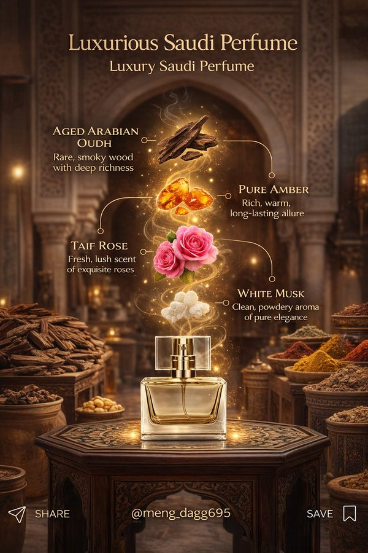


```text
[中文]
{
  "master_prompt_type": "超精细8K AI图像生成",
  "global_settings": {
    "resolution": "8K UHD",
    "aspect_ratio": "2:3 竖版",
    "render_quality": "极致锐度、超微细节、电影级光效",
    "style": "超现实商业产品摄影",
    "color_profile": "温暖金调搭配柔和琥珀高光",
    "environment": {
      "location": "古老中东市场走廊",
      "architecture": {
        "walls": "岁月痕迹的粗糙石墙与可见纹理",
        "arches": "背景巨型石拱",
        "floor": "暖棕色石材地面"
      },
      "background_elements": [
        "装满香料的木架",
        "袋装与碗装干货",
        "悬挂草药束",
        "散发暖黄光的传统金属灯笼"
      ],
      "lighting": {
        "primary": "柔和金色环境光",
        "secondary": "两侧暖灯笼辉光",
        "atmosphere": "薄雾增强光线漫射"
      }
    },
    "main_subject": {
      "type": "香水瓶",
      "position": "中心前景",
      "placement": "置于华丽木桌之上",
      "material": {
        "bottle": "透明清玻璃",
        "cap": "黄金金属矩形瓶盖",
        "liquid": "淡金香水液体"
      },
      "design": {
        "shape": "圆角矩形瓶身",
        "finish": "高光反射表面",
        "label": "无可见标签"
      },
      "table": {
        "material": "深色雕花木材",
        "shape": "方形台面",
        "details": [
          "繁复花卉与几何雕刻",
          "金色镶嵌装饰",
          "抛光表面映光"
        ]
      },
      "floating_elements": {
        "composition_style": "竖向成分堆叠",
        "motion": "成分悬浮并伴随旋转金光",
        "effects": [
          "发光粒子",
          "闪耀尘埃",
          "柔光尾迹连接元素"
        ],
        "elements_order_top_to_bottom": [
          {
            "ingredient": "琥珀树脂",
            "appearance": "半透明金棕树脂块",
            "glow": "温暖内发光"
          },
          {
            "ingredient": "大马士革玫瑰",
            "appearance": "盛放粉色玫瑰",
            "details": [
              "柔软层叠花瓣",
              "自然绿叶",
              "轻飘附近花瓣"
            ]
          },
          {
            "ingredient": "白麝香",
            "appearance": "光滑白水晶状石块",
            "additional": "石下细白粉末"
          },
          {
            "ingredient": "陈年沉香",
            "appearance": "深棕木片",
            "texture": "粗糙纤维木纹",
            "effect": "缕缕白烟上升"
          }
        ]
      },
      "text_elements": {
        "title": {
          "text": "精致叙利亚香水",
          "font_style": "优雅衬线体",
          "color": "金色",
          "position": "顶部中央"
        },
        "subtitle": {
          "text": "奢华叙利亚香水",
          "font_style": "较小衬线体",
          "color": "金色",
          "position": "主标题下方"
        },
        "ingredient_labels": [
          {
            "title": "纯琥珀",
            "description": "来自自然深处的珍贵树脂"
          },
          {
            "title": "大马士革玫瑰",
            "description": "美丽与叙利亚传承的象征"
          },
          {
            "title": "白麝香",
            "description": "干净、粉感、永恒优雅的香氛"
          },
          {
            "title": "陈年沉香",
            "description": "深邃温暖、浓郁烟熏木香"
          }
        ],
        "typography_details": {
          "connector_lines": "细弯金线连接文字与成分",
          "icons": "线末端小圆点标记"
        },
        "opacity": "轻微半透明"
      }
    },
    "overall_mood": {
      "tone": "奢华、温暖、优雅",
      "theme": "传承香水工艺",
      "visual_feel": "浓郁、高端、电影级广告"
    }
  }
}

[English]
{
  "master_prompt_type": "Ultra-detailed 8K AI image generation",
  "global_settings": {
    "resolution": "8K UHD",
    "aspect_ratio": "2:3 vertical",
    "render_quality": "extreme sharpness, ultra-fine detail, cinematic lighting",
    "style": "hyper-realistic commercial product photography",
    "color_profile": "warm golden tones with soft amber highlights",
    "environment": {
      "location": "ancient Middle Eastern market corridor",
      "architecture": {
        "walls": "aged stone walls with visible texture and wear",
        "arches": "large stone archway in background",
        "floor": "stone flooring, warm brown tone"
      },
      "background_elements": [
        "wooden shelves filled with spices",
        "sacks and bowls of dried goods",
        "hanging bundles of herbs",
        "traditional metal lanterns emitting warm yellow light"
      ],
      "lighting": {
        "primary": "soft golden ambient light",
        "secondary": "warm lantern glow from both sides",
        "atmosphere": "slight haze enhancing light diffusion" "main_subject": {
          "type": "perfume bottle",
          "position": "center foreground",
          "placement": "on top of an ornate wooden table",
          "material": {
            "bottle": "transparent clear glass",
            "cap": "gold metallic rectangular cap",
            "liquid": "light golden perfume liquid"
          },
          "design": {
            "shape": "rectangular bottle with rounded edges",
            "finish": "glossy reflective surface",
            "label": "no visible label" "table": {
              "material": "dark carved wood",
              "shape": "square top",
              "details": [
                "intricate floral and geometric carvings",
                "golden inlay accents",
                "polished surface reflecting light" "floating_elements": {
                  "composition_style": "vertical ingredient stack",
                  "motion": "ingredients appear suspended with swirling golden light",
                  "effects": [
                    "glowing particles",
                    "sparkling dust",
                    "soft light trails connecting elements"
                  ],
                  "elements_order_top_to_bottom": [
                    {
                      "ingredient": "amber resin",
                      "appearance": "translucent golden-brown resin chunks",
                      "glow": "warm internal glow" "ingredient": "damask rose",
                      "appearance": "fully bloomed pink rose",
                      "details": [
                        "soft layered petals",
                        "natural green leaves",
                        "petals gently floating nearby"
                      ] "ingredient": "white musk",
                      "appearance": "smooth white crystal-like stone",
                      "additional": "fine white powder beneath the stone" "ingredient": "aged agarwood",
                      "appearance": "dark brown wooden pieces",
                      "texture": "rough, fibrous wood grain",
                      "effect": "thin white smoke rising upward" "text_elements": {
                        "title": {
                          "text": "Exquisite Syrian Perfume",
                          "font_style": "elegant serif",
                          "color": "gold",
                          "position": "top center"
                        },
                        "subtitle": {
                          "text": "Luxury Syrian Perfume",
                          "font_style": "smaller serif",
                          "color": "gold",
                          "position": "below main title"
                        },
                        "ingredient_labels": [
                          {
                            "title": "Pure Amber",
                            "description": "Precious resin from the depths of nature"
                          } "title": "Damask Rose",
                          "description": "Symbol of beauty and Syrian heritage"
                        },
                        {
                          "title": "White Musk",
                          "description": "Clean, powdery scent of timeless elegance"
                        },
                        {
                          "title": "Aged Agarwood",
                          "description": "Rich, smoky wood with deep warmth"
                        }
                      ],
                      "typography_details": {
                        "connector_lines": "thin curved golden lines connecting text to ingredients",
                        "icons": "small circular markers at line endpoints"
                      } "opacity": "slightly translucent"
                    } "overall_mood": "tone": "luxurious, warm, elegant",
                    "theme": "heritage perfume craftsmanship",
                    "visual_feel": "rich, premium, cinematic ads
```


---
## 例 351：AI 眼镜爆炸拆解图

**来源：** 苍何原创实测（公众号文章《我逆向了 329 条 GPT-Image2 提示词模板，全部开源！》）


```text
生成一张AI眼镜的爆炸视图，包含每个组件的名称以及这款产品的几大核心卖点。
```


---
## 例 352：四季包装 Campaign 宫格

**来源：** [@SRKDAN](https://x.com/SRKDAN/status/2048582939504431195)

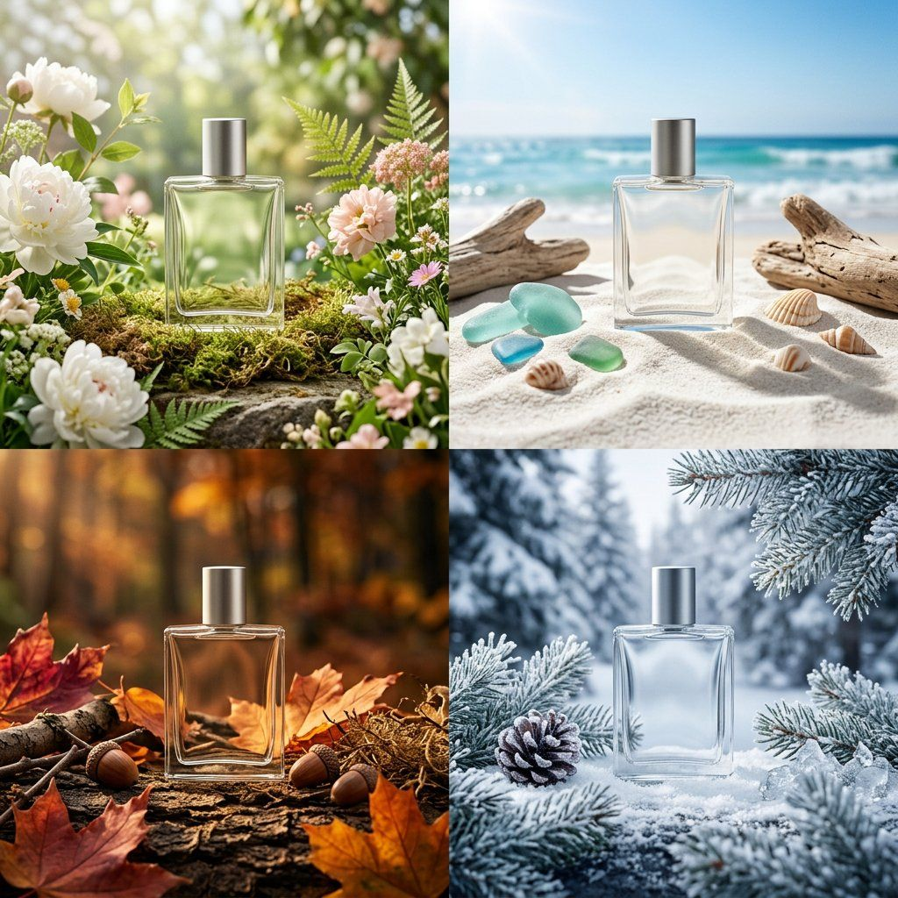


```text
PHASE 1 - PRODUCT: [ITEM] in [MATERIAL] packaging, minimal label design
PHASE 2 - GRID: 2x2 seasonal grid, four distinct brand worlds
PHASE 3 - COMPOSITION: each quadrant a full campaign scene with props and environment
PHASE 4 - CONSISTENCY: same product silhouette, four distinct palettes

Swap: [ITEM] / [MATERIAL] / [LABEL STYLE]
```


---

## 例 358：草莓能量饮料商业广告

**来源：** [@SPEEDAI07](https://x.com/SPEEDAI07/status/2049043627163435040)

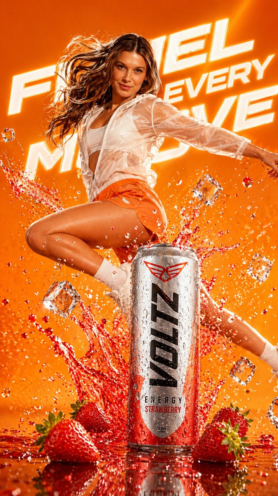

```text
A hyper-realistic commercial advertisement blending energy drink and sports branding. A dynamic athletic woman mid-air jump, wearing modern sportswear (light translucent jacket, orange shorts, white sneakers), surrounded by explosive splashes of red strawberry liquid and flying ice cubes. A cold metallic energy drink can (strawberry flavor) bursting with droplets sits in the foreground, covered in condensation. Fresh strawberries scattered on a glossy reflective surface.

Bright cinematic lighting with dramatic highlights and motion effects. Vibrant orange gradient background with bold glowing typography behind the subject. Ultra-detailed, high contrast, sharp focus, commercial product photography style, 8K resolution, advertising poster aesthetic, energetic, powerful, refreshing mood.
```


---

## 例 365：科学家收藏级玩具发布板

**来源：** [@Gdgtify](https://x.com/Gdgtify/status/2049766203392921897)

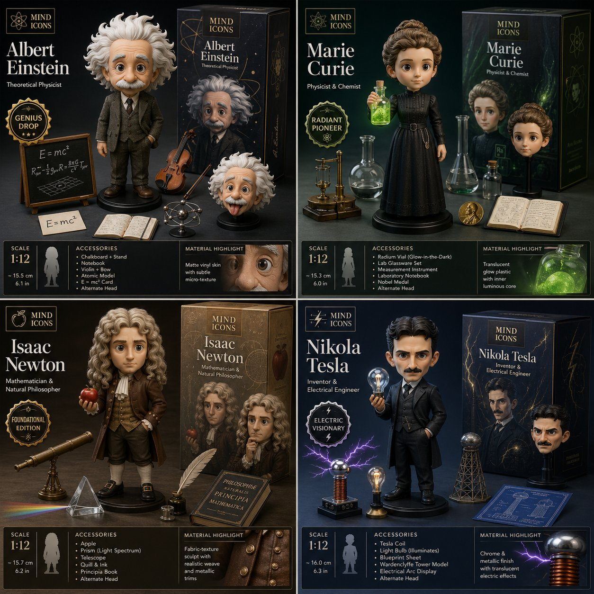

```text
2x2 grid, do this for 4 famous scientists in history: Design a collector-grade launch visual for [TOY / FIGURE / DESIGNER OBJECT] shown in pristine hero form along with interchangeable accessories, alternate expressions, packaging design, scale references, sticker details, rarity indicators, and close-up material highlights. The object should feel like a luxury drop, somewhere between art toy culture and elite product branding.  Accessory Layout: Arrange [ACCESSORY 1], [ACCESSORY 2], [ALT VERSION], [PACKAGING FEATURE], and [LIMITED EDITION DETAIL] around the figure in carefully staged clusters. Everything should feel desirable, neat, and “unboxable.”  Visual Style: Hype-culture collectible reveal meets premium e-commerce launch campaign. Clean, glossy, tactile, designer-toy sophistication with a playful but expensive sensibility.  Composition Guidelines: Hero figure remains dominant. Accessories should be balanced and elegantly spaced. Packaging should be visible but not steal the scene. The entire image should feel like a product collectors would screenshot instantly.  Lighting & Background: Soft commercial lighting with subtle specular highlights, polished background in [BACKGROUND STYLE], crisp shadows, premium color separation, ultra-sharp details, no watermark.
```


---

## 例 370：Crumple Chair 概念沙发研发板

**来源：** [@ShamsAmin56](https://x.com/ShamsAmin56/status/2050281206139461780)

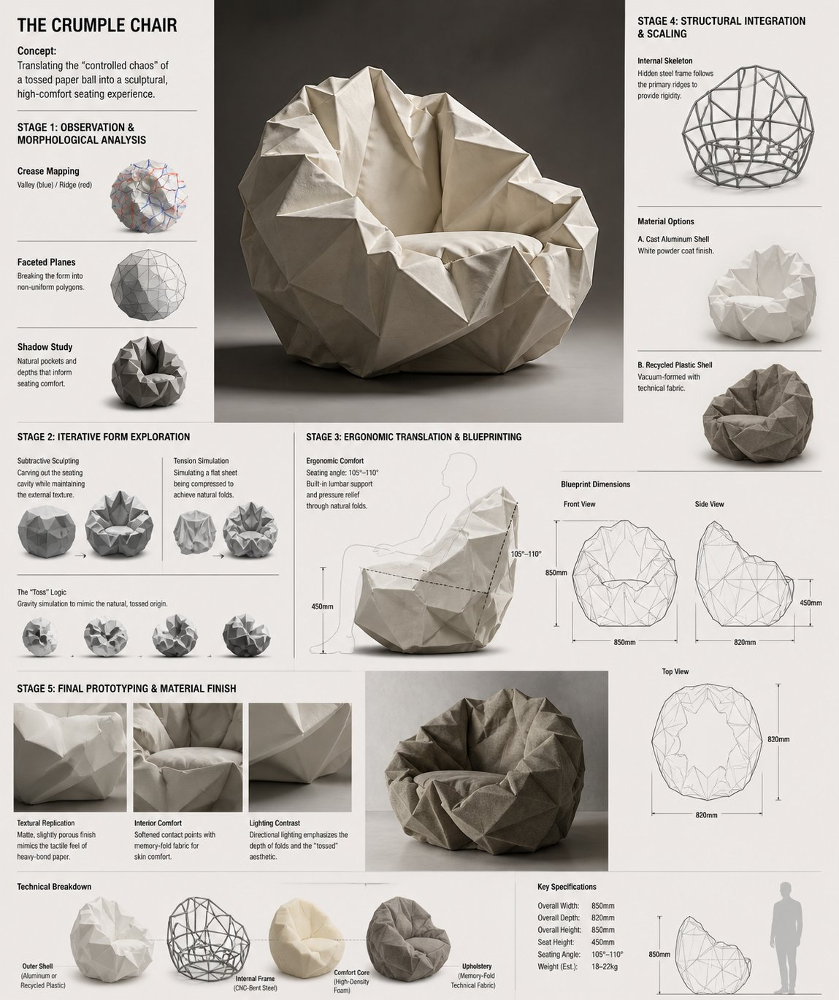

```text
Design Concept: The Crumple Chair Core Philosophy: Translating the "controlled chaos" of a tossed paper ball into a sculptural, high-comfort seating experience.

Stage 1: Observation & Morphological Analysis The goal is to deconstruct the image of the crumpled paper into usable geometric data. Crease Mapping: Identify the primary "valley" and "ridge" lines. These represent potential structural ribs or seams in the chair. Faceted Planes: Break down the sphere into a series of non-uniform polygons. Each flat surface of the paper becomes a potential panel for the chair’s upholstery or shell. Shadow Study: Analyze how the "tossed" form creates deep recesses. These natural pockets guide where the user’s weight will be cradled.

Stage 2: Iterative Form Exploration Moving from a sphere to a seat through "Digital Crumpling." Subtractive Sculpting: Imagine the paper ball as a solid mass. Use Boolean operations to "carve out" a seating cavity that fits the human form while maintaining the external jagged texture. Tension Simulation: Use 3D software (like Rhino or Blender) to simulate a flat sheet of material being compressed. This ensures the folds look authentic and not "modeled." The "Toss" Logic: Experiment with gravity-based simulation dropping a digital mesh to see how it settles naturally, mimicking the "tossed" origin.

Stage 3: Ergonomic Translation & Blueprinting Refining the raw aesthetic into a functional object. The Comfort Core: Overlay a standard ergonomic template (Seating Angle: 105°–110°) over the crumpled form. Adjust the internal "folds" to provide lumbar support and pressure relief. Blueprint Generation: Create technical orthographic views (Front, Side, Top). Map out the dimensions: Seat Height: 450mm Total Width: 850mm Surface Smoothing: Maintain the sharp "paper edges" on the exterior shell while softening the interior contact points for skin comfort.

Stage 4: Structural Integration & Scaling Making the concept physically viable. The Skeleton: Design a hidden internal frame (likely CNC-bent steel rods or a 3D-printed lattice) that follows the most prominent ridges of the paper folds to provide rigidity. Material Selection: * Option A (High-End): Faceted, cast aluminum with a white powder coat. Option B (Soft): Vacuum-formed recycled plastic shell covered in "memory-fold" technical fabric that retains a wrinkled appearance.

Stage 5: Final Prototyping & Material Finish Textural Replication: Apply a matte, slightly porous finish to the material to mimic the tactile feel of heavy-bond paper. Lighting Contrast: Use directional studio lighting in the final renders to emphasize the "tossed" shadows, making the chair look like a giant piece of discarded inspiration. Design Tip: To keep the "tossed" look authentic, avoid symmetry. The most compelling aspect of a crumpled paper ball is its unique irregularity—ensure the left and right sides of the chair are balance-equivalent but not identical
```


---

## 例 373：高端肉类海鲜品牌英雄图

**来源：** [@xpg0970](https://x.com/xpg0970/status/2050108279385419965)

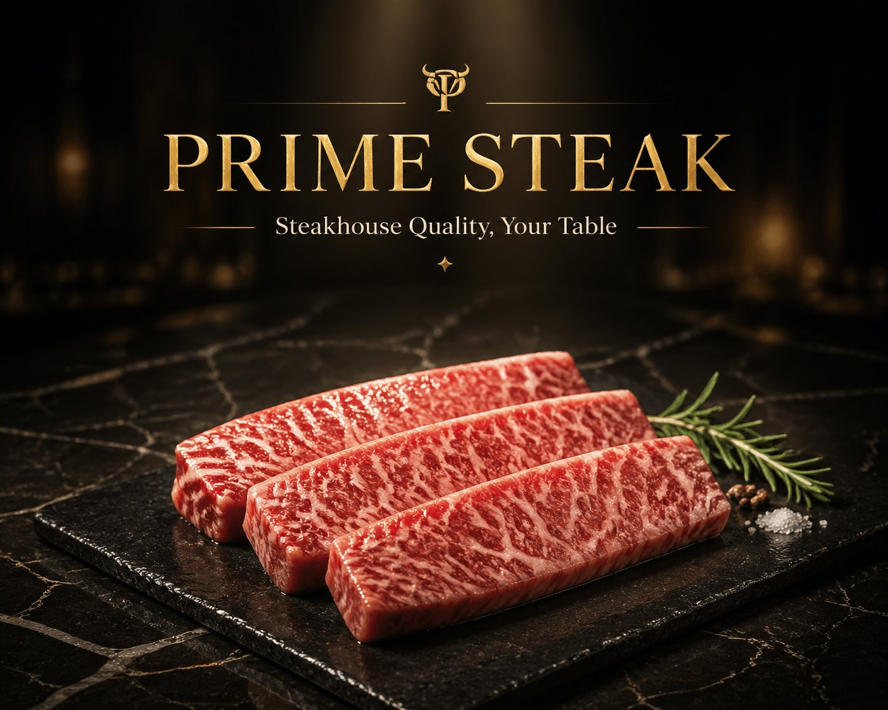

```text
一、品牌基础设定
品牌名称：[请填写，例如：PRIME STEAK / OCEAN PRIME]
品牌标语：[请填写，例如：Steakhouse Quality, Your Table / Restaurant Grade, Home Delivered]
主色调：[请填写，例如：黑金 / 深红+金 / 深蓝+银]
字体风格：
标题：[请填写，例如：金色衬线体，大写，奢华感]
正文：[请填写，例如：细衬线体/无衬线体]
二、核心视觉元素
台面材质：[请填写，例如：大理石/黑色石板]
背景调性：[请填写，例如：深色渐变/暗调餐厅环境]
光线风格：[请填写，例如：聚光/侧光/顶部照明]
三、主产品定义（必填）
产品名称/类型：[请填写，例如：和牛牛排 / 帝王蟹 / 北极甜虾]
产品数量/摆放：[请填写，例如：1份单品 / 3块整齐摆放]
呈现方式：[请填写，例如：切片展示 / 带骨展示 / 原壳展示]
产品特色/质感提示：[请填写，例如：肉质纹理清晰、多汁感 / 光泽晶亮 / 肉眼可见油花]
```


---

## 例 424：FMCG 棒棒糖霓虹广告

**来源：** [@Diplomeme](https://x.com/Diplomeme/status/2054061713583219149)

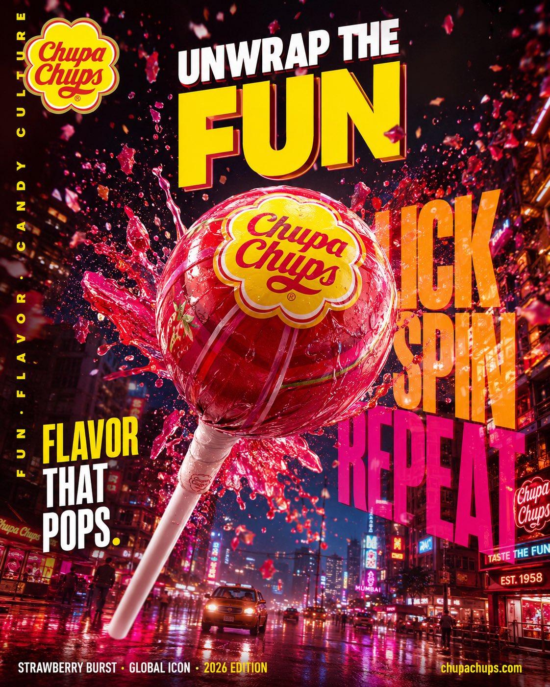

```text
Hyper-realistic cinematic FMCG billboard advertising poster for Chupa Chups India, focusing on playful energy, bold flavor explosion, and Gen-Z candy culture.

Scene: a giant glossy Chupa Chups lollipop floating above a vibrant Indian street at night, candy shards and liquid flavor bursts exploding outward mid-air.

Environment: neon-lit urban backdrop inspired by Mumbai nightlife, glowing signage, reflective wet streets, colorful haze.

Subject: oversized strawberry swirl lollipop as the hero object, ultra-detailed glossy texture, cinematic flavor splash motion.

Visual storytelling: iconic Chupa Chups flower logo glowing subtly on wrapper, reflections visible on wet surfaces and candy syrup splashes.

Composition: dramatic low-angle shot, giant centered product dominating frame, dynamic explosion spreading diagonally across billboard composition.

Typography:
top left — Chupa Chups logo.
center massive — “UNWRAP THE FUN” ultra bold playful typography.
behind product (oversized layered text) — “LICK / SPIN / REPEAT”.
mid-left — “FLAVOR THAT POPS.” bold condensed font.
bottom left — “STRAWBERRY BURST · GLOBAL ICON · 2026 EDITION”.
bottom right — “http://chupachups.com”.
left vertical edge — “FUN · FLAVOR · CANDY CULTURE”.

Typography style: playful bold sans-serif, glossy layered opacity, oversized billboard scale.

Color palette: vibrant reds, yellows, pinks, neon orange accents, glossy candy textures.

Lighting: dramatic neon backlight with glowing highlights and candy reflections.

Atmosphere: sugar particles, mist, syrup splashes, floating candy dust.

Mood: energetic, youthful, addictive, vibrant.

Shot on ARRI Alexa Mini LF, 35mm anamorphic, HDR, ultra cinematic, premium FMCG billboard style, 4:5 portrait.
```


---

## 例 438：珠宝微缩城市广告海报

**来源：** [@Umar__786Ai](https://x.com/Umar__786Ai/status/2055664244138349055)

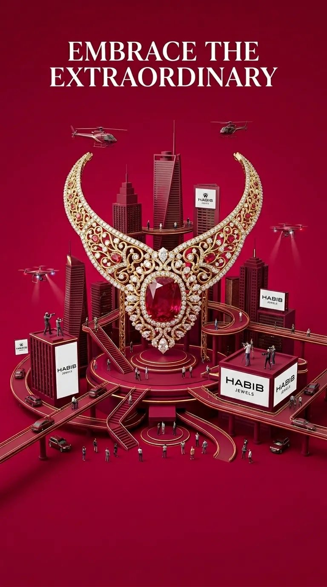

```text
Create a hyper-detailed luxury advertising poster in a cinematic miniature-world style. A gigantic royal diamond necklace with intricate gold filigree and massive ruby gemstones stands in the center like an architectural monument. Surround the necklace with a futuristic miniature city built around and inside the jewelry piece, including skyscrapers, elevated highways, bridges, spiral staircases, tiny human figures, luxury billboards, drones, helicopters, and cinematic urban activity. Use a deep crimson red monochrome background with gold and ruby accents. Add premium fashion-ad aesthetics, ultra-realistic textures, glossy reflections, dramatic studio lighting, depth of field, tilt-shift miniature effect, and high-end commercial composition. Include bold elegant typography at the top saying: “EMBRACE THE EXTRAORDINARY”. Style inspired by luxury jewelry campaigns, surreal city-building concepts, and premium 3D advertising renders. Ultra realistic, 8K, octane render, sharp focus, highly detailed, cinematic shadows, symmetrical composition.
```


---

## 例 441：WILDCAMP 巨型帐篷广告海报

**来源：** [@Strength04_X](https://x.com/Strength04_X/status/2056258909334306897)

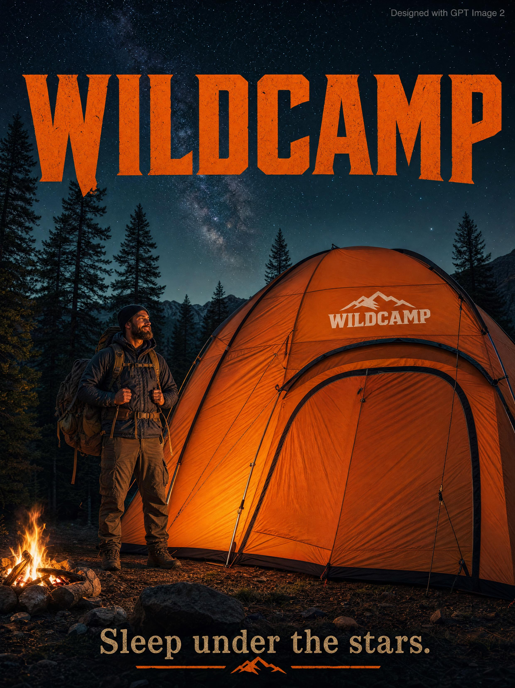

```text
An outdoor adventure advertisement poster featuring a rugged bearded man in full hiking gear standing confidently beside a massive orange camping tent three times taller than him, fully pitched in a dramatic forest clearing surrounded by towering pine trees beneath a deep starry night sky. The tent features a bold white “WILDCAMP” logo stitched onto the rainfly. Warm cinematic campfire lighting illuminates the scene with realistic shadows and rich outdoor textures, creating a premium adventure-commercial aesthetic. Large rugged serif typography reading “WILDCAMP” dominates the dark sky area in bold orange lettering, while the tagline “Sleep under the stars.” appears elegantly at the bottom. Small grey text in the top-right corner reads “Designed with GPT Image 2.” Photorealistic, ultra-detailed, cinematic outdoor advertising style with dramatic atmosphere and high-end commercial composition.
```


---

## 例 449：奢华机械腕表技术图鉴

**来源：** [@Gdgtify](https://x.com/Gdgtify/status/2056928396991488312)

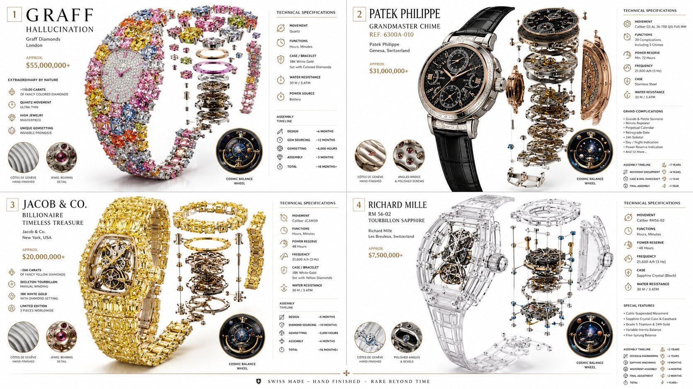

```text
2x2 grid 16:9, do this for 4 most expensive strangest watches ever made:

class Haute_Horlogerie_DNA:
    def __init__(self):
        self.subject = "[TIMEPIECE]"
        self.parents = {
            "composition_parent": "Exploded movement diagram with transparent case",
            "material_parent": "Brushed titanium, sapphire crystal, rose gold gears, alligator leather",
            "graphic_parent": "Swiss manufacture technical brochure with elegant data panels",
            "atmosphere_parent": "Crisp daylight studio, pure white background, subtle reflection on polished surfaces"
        }
        self.mutations = {
            "semantic_mutation": "The balance wheel reveals a miniature cosmos ticking inside",
            "information_mutation": "Power reserve indicator, frequency, complication callouts, hand-finishing grades, assembly timeline",
            "medium_mutation": "Smooth matte premium paper with embossed logo",
            "scale_mutation": "Grain-level view of Côtes de Genève finishing and jewel bearings"
        }
        self.style_mix = [0.30, 0.30, 0.25, 0.10, 0.05]

    def generate_subject(self):
        subject = """
        [TIMEPIECE] shown in its full mechanical glory. The dial, hands, movement,
        and strap float in perfect alignment against a bright, clean background.
        Every gear and spring is highlighted with exacting clarity.
        """
        return render(
            subject,
            format="luxury watch advertisement with technical insert",
            title="[MODEL REFERENCE]",
            subtitle="[MANUFACTURE / COLLECTION]",
            constraints="bright white space, metallic brilliance, hyper-detailed, modern elegance"
        )
```


---

## 例 454：旅行美食薯片广告海报

**来源：** [@Naiknelofar788](https://x.com/Naiknelofar788/status/2057282710469767241)

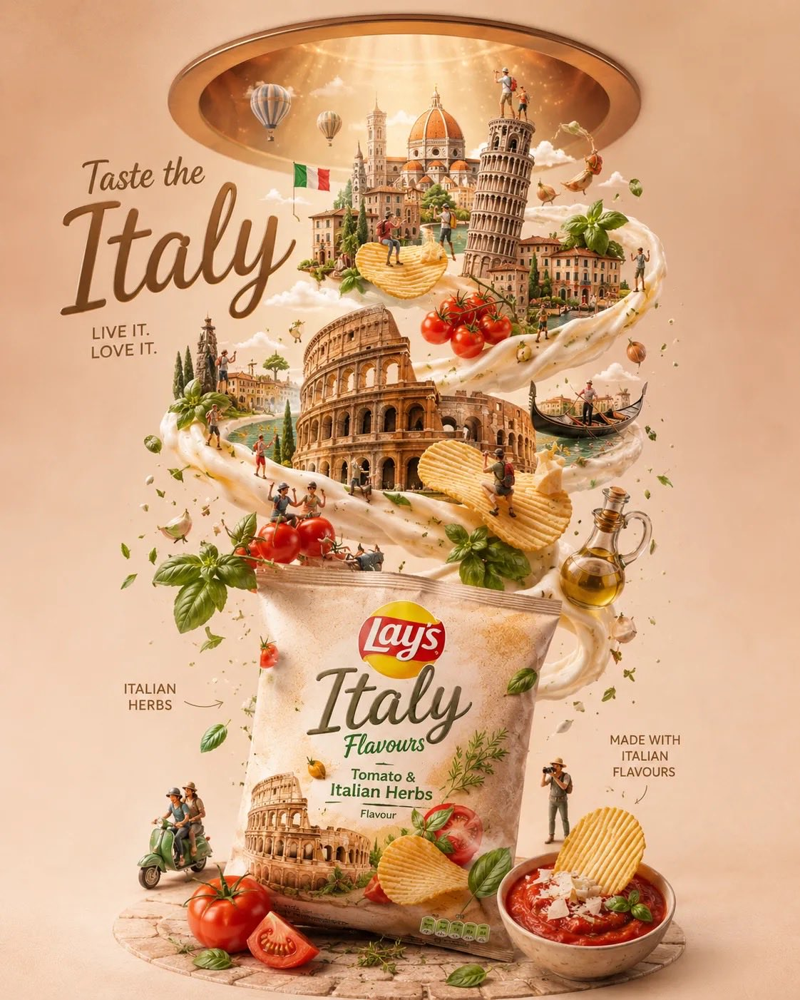

```text
Ultra-detailed premium travel-food advertisement poster for [CITY/COUNTRY], vertical composition, inspired by luxury Lay’s-style chips advertising. A realistic chips packet placed at the bottom center as the main hero object, matching the exact premium commercial layout of a floating chips campaign.

A cinematic spiral ribbon of sauce, cream, clouds, steam, or flavored swirl rises upward from the chips packet, dynamically wrapping around iconic landmarks, local foods, and cultural elements from [CITY/COUNTRY].

Floating ridged potato chips suspended naturally throughout the spiral motion, interacting with the landmarks and miniature travelers. The chips packet design must feel authentic to [CITY/COUNTRY], featuring regional colors, typography, patterns, and local flavor inspiration while still clearly looking like a premium potato chips package.

Include only the most iconic landmarks from [CITY/COUNTRY], carefully spaced with clean composition and no clutter. Add miniature travelers naturally interacting with the environment:
- taking photos
- exploring landmarks
- sitting on floating chips
- riding local transport
- observing scenery
- walking through the swirl paths

Include authentic local foods, ingredients, and atmosphere elements relevant to [CITY/COUNTRY].

Background should be soft pastel or warm luxury gradient with a circular ceiling portal opening at the top emitting cinematic spotlight beams.

Elegant premium commercial lighting, soft shadows, floating particles, realistic depth, balanced negative space, luxury tourism campaign aesthetic, hyper-realistic CGI, highly detailed but minimalist, Instagram-worthy poster design.

Composition rules:
- one dominant centered chips packet
- floating ridged potato chips throughout composition
- one continuous upward spiral motion
- landmarks layered vertically
- miniature people sparse and intentional
- no duplicate landmarks
- no overcrowding
- clean premium hierarchy
- cinematic storytelling through scale contrast
- premium advertising composition matching high-end chips commercials
```


---

## 例 455：巨型舒适洞洞鞋 Campaign

**来源：** [@iamaiistudio](https://x.com/iamaiistudio/status/2057281549851377866)

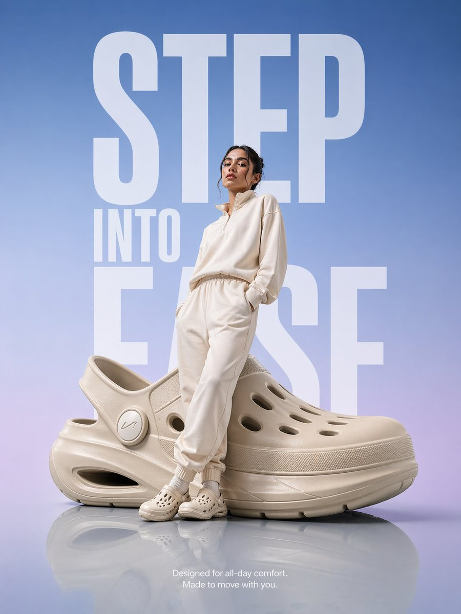

```text
Hyper-realistic premium product advertisement: an oversized futuristic comfort clog sits on a smooth glossy reflective floor. A modern model in soft neutral-toned athleisure (off-white / beige) leans casually against the giant shoe with a relaxed, confident posture.

Backdrop: clean gradient flowing from soft sky blue into subtle lavender, with massive bold sans-serif typography reading "STEP INTO EASE" stretched vertically, partially tucked behind the subject.

Lighting: high-end studio lighting, soft highlights, gentle floor reflections, and a subtle rim light tracing the model and the product for depth.

Composition: editorial magazine layout, subject perfectly centered, generous negative space, luxury campaign mood.

Small minimal copy at the bottom: "Designed for all-day comfort. Made to move with you."

Style: ultra-clean Apple-style minimalism crossed with a fashion campaign, hyper-realistic, premium commercial photography, 8K, razor-sharp detail.
```


---

## 例 462：复古日系迷你橡皮商品包装

**来源：** [@ZetoGroovin](https://x.com/ZetoGroovin/status/2058408514247410003)

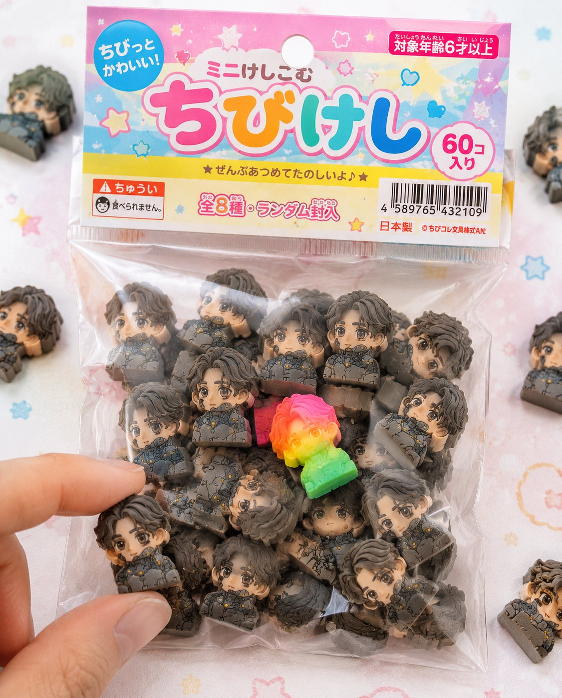

```text
添付されたキャラクターシートをSTRICTなデザインリファレンスとして使用すること。 キャラクターの顔、髪型、目の形、プロポーションは絶対に変更しない。

■目的： キャラクターを日本の「ちび消しゴム商品」として完全に商品化し、 実際に文房具売り場やガチャで販売されているようなリアルなパッケージ商品写真を作成する。

■コンセプト： 「100円ショップや文房具店で売られている袋入りちび消しゴム商品」

■消しゴム本体： （※前回と同じ仕様を完全維持） - 強いデフォルメちびキャラ - 厚みのあるブロック形状 - 完全マットなラバー素材 - 微細な粒子・粉・削れ・摩耗あり - 印刷ズレ・色ブレあり - 50個以上のランダム構成

■パッケージ（超重要）： - 小さな透明ビニール袋（OPP袋） - 上部に紙ヘッダー（吊り下げ用の穴あり） - ヘッダーはややチープな印刷（軽いズレ・インクのムラ） - ビニールはシワあり、やや曇り、静電気で中身に張り付く - 一部空気が入ってふくらみあり - シール部分に軽いヨレ

■グラフィックデザイン： - 日本の子供向け文房具風デザイン - ポップでカラフル（ピンク・黄色・水色ベース） - 手書き風フォントや丸文字 - 商品名ロゴ（オリジナルでOK） - 「ミニけし」「ちびけし」などの表記 - 星・ハート・キラキラ装飾

■情報要素（リアル感強化）： - JANコード（バーコード） - 「対象年齢6才以上」 - 「食べられません」注意書き - 「全◯種」や「ランダム封入」 - 小さな会社名（架空） - MADE IN JAPAN or CHINA表記

■構図： - パッケージがメインで画面中央 - 周囲に少しだけこぼれた消しゴム - 1〜2個は袋から出ている - 指先が1つをつまもうとしている演出 - 一部フレームアウトで自然さ

■レア要素： - 蛍光カラーやグラデーションの特別個体を1つ混ぜる - 視線誘導として目立つ位置に配置

■ライティング： - 明るい自然光（ややハイキー） - 柔らかい影 - 商品写真のような清潔感

■カメラ： - マクロ寄り - 浅い被写界深度 - 中央シャープ

■背景： - 白〜パステルのテーブル - ほんのりドットやポップ柄 - シンプルで清潔

■禁止： - プラスチック感 - glossy表現 - 高級すぎる質感（安っぽさが正解） - 完璧すぎる印刷

■出力： - 実在する商品にしか見えないレベル - コンビニや100均にありそうなリアリティ - SNSで「これ欲しい」と思わせる完成度
```


---

## 例 470：本地生活小店异形展架

**来源：** [@MrLarus](https://x.com/MrLarus/status/2059248197910827364)

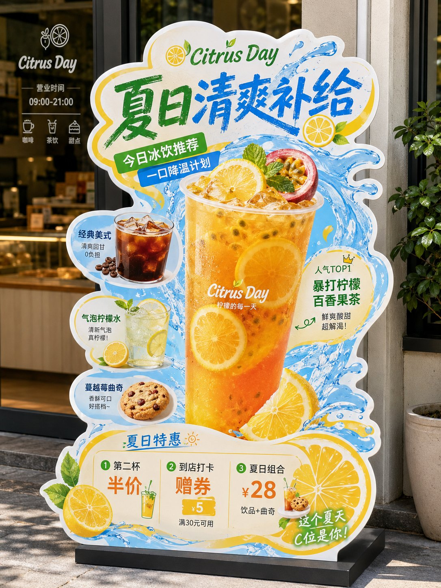

```text
《餐饮异形展架/立牌物料》提示词：

请生成一张高完成度的「餐饮异形展架 / 立牌」设计图，用于展示餐饮门店的新品推荐、招牌产品、套餐促销或品牌活动信息。

【基础信息】
品牌名：【品牌名】
主标题：【主标题】
副标题：【副标题】
辅助短句：【短句1】｜【短句2】｜【短句3】
主题方向：【主题方向，例如：爆辣夜市风 / 金黄浓郁风 / 清新轻食风 / 山野自然风 / 甜品下午茶风 / 快餐促销风】
主色调：【主色调】
辅助色：【辅助色】
点缀色：【点缀色】
画幅比例：【建议 3:4 竖版】

【产品内容】
主推产品：【主推产品】
辅助产品1：【辅助产品1】
辅助产品2：【辅助产品2】
辅助产品3：【辅助产品3】
辅助产品4：【辅助产品4】
加料 / 配角产品：【加料或配角产品，例如：饮品 / 小食 / 配菜 / 酱料 / 甜品】

【卖点标签】
【卖点1】
【卖点2】
【卖点3】
【卖点4】
【卖点5】
【卖点6】

【促销信息】
【促销信息1】
【促销信息2】
【促销信息3】

【最重要要求】
避免生成门店场景效果图或墙上海报展示图。请直接生成“一张完整的异形立牌成品展示图”：
- 背景必须为纯白色
- 画面中只保留一个完整的异形餐饮立牌主体
- 不要餐厅环境
- 不要商场背景
- 不要玻璃门、桌椅、墙面、人物、地面透视场景
- 不要任何真实空间背景
- 立牌主体必须完整显示
- 异形轮廓必须完整清晰
- 底座必须完整露出
- 整体像一张已经抠好的门店物料成品图 / 设计提案展示图 / 电商展示图

【画面形式】
这是一张“门店异形展架 / 立牌”的完整设计，避免普通矩形海报处理。
整体应采用明显的“不规则异形裁切轮廓”，有完整外边缘，边缘可带白色或浅色描边，具有真实门店物料感。
立牌应有明确底座，整体像可落地摆放的 KT 板 / 泡沫板 / 亚克力 / 写真喷绘展架成品。

【构图结构】
整体采用竖版、中心聚焦、信息分层清楚的结构：

1. 顶部区域：
放超大主标题，标题必须醒目、有冲击力、有餐饮 POP 招贴感。
字体可以厚重、手写感、招贴感、潮流感，但要清晰易读。
标题是整张图的第一视觉焦点。

2. 中部核心区域：
中间放最大主推产品，作为主视觉主体。
主菜必须最大、最饱满、最诱人，突出食欲感。
围绕主菜搭配 2~5 个辅助产品，形成丰富的产品组合，前后层次明确，主次分明。

3. 周边信息区域：
在主菜和辅助产品四周加入少量标签元素、推荐标、贴纸框、手写箭头、卖点说明、小标题、小气泡标签等，使其具有“餐饮门店促销物料”的视觉特征。
但要控制层级，做到“热闹但不乱”。

4. 底部促销区域：
底部放价格信息、套餐信息、活动信息或新品尝鲜信息。
价格数字要相对突出，易读清晰。
如果没有特别要求，默认不要二维码。

【视觉风格要求】
整体风格应属于“餐饮转化型视觉 + 门店 POP 异形立牌”：
- 强调食欲感
- 强调信息可读性
- 强调商业落地感
- 强调门店物料感
- 强调异形轮廓感

避免极简杂志海报、电商详情页、纯平面插画海报方向。

【食物表现要求】
所有食物必须采用真实商业美食摄影质感：
- 食物清晰真实
- 有食材颗粒感
- 有酱汁、汤汁、油光、热气、层次感
- 有丰富细节，如葱花、辣椒、芝士、香草、蔬菜、水果、虾仁、肉块等
- 主食要饱满，不能扁平
- 看起来必须“能激发食欲”
禁止过度插画化、卡通化、低质拼贴化。

【版式与信息层级】
整张立牌的阅读顺序应为：
主标题 → 主推产品 → 辅助产品 → 卖点标签 → 价格 / 活动信息

信息量可以较丰富，但必须有明确层级：
- 主标题最大
- 主菜次大
- 辅助菜稍小
- 卖点标签较小
- 底部促销清晰醒目

【适配范围】
该模板需要适用于不同主题餐饮内容，例如：
- 面 / 饭 / 粉 / 小吃
- 火锅 / 菌汤 / 地方菜
- 轻食 / 沙拉 / 咖啡简餐
- 早餐 / 套餐 / 快餐
- 茶饮 / 甜品 / 下午茶
- 节日促销 / 新品上市 / 爆品推荐 / 双人套餐

【输出要求】
请输出一张高清、清晰、商业完成度高的异形立牌设计图，满足以下条件：
- 白色背景
- 完整异形轮廓
- 完整底座
- 只展示立牌本体
- 不带真实场景环境
- 不带人物
- 不带门店背景
- 默认不带二维码
- 适合用于系列案例展示、设计提案、社交媒体发布、模板复用
```


---

## 例 475：企鹅造型包装结构板

**来源：** [@iamaiistudio](https://x.com/iamaiistudio/status/2059305097897914664)

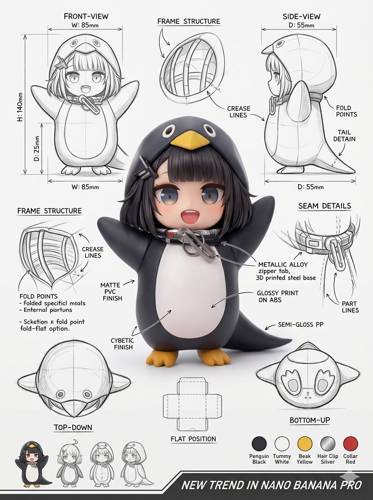

```text
Using the attached image, create an illustration sheet of professional industrial design packaging for the package (PACKAGE TYPE). A centered heroic 3D rendering with realistic materials, soft studio lighting and commercial quality finishes. Surrounded by technical views: front, side, top, bottom, oblique perspective and flat position. Include sketches of the frame structure, crease lines, seam details, and size arrows in millimeters. Show materials and finishes (matte, glossy print, plastic, paper, glass, etc.) in handwritten annotations. Add color swatches, realistic product illustrations, and subtle shadows. Clean sketchbook background, realistic rendering + pencil sketch style, modern design design, ultra-detailed, portfolio ready.
```


---

## 例 485：时尚目录电商拼贴

**来源：** [@Mind_Boticni](https://x.com/Mind_Boticni/status/2061310969192870028)

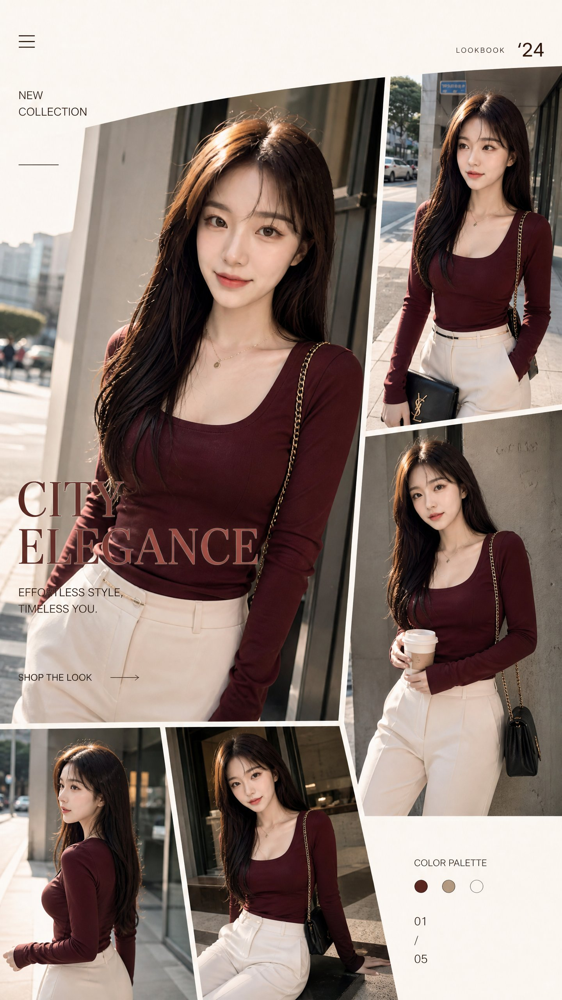

```text
Stylish fashion catalog shoot blending streetwear and luxury branding. Female model wearing burgundy slim-fit top and ivory tailored pants, posed in confident relaxed positions across multiple duplicated frames. Slight perspective tilt, dynamic layout collage, soft daylight studio lighting with warm tone grading. Modern shopping website aesthetic, minimal UI-inspired composition, high resolution fashion photography.
```


---

## 例 517：杯内鱼眼夏日冰饮广告

**来源：** [@lovimg_com](https://x.com/lovimg_com/status/2077036659028484375)

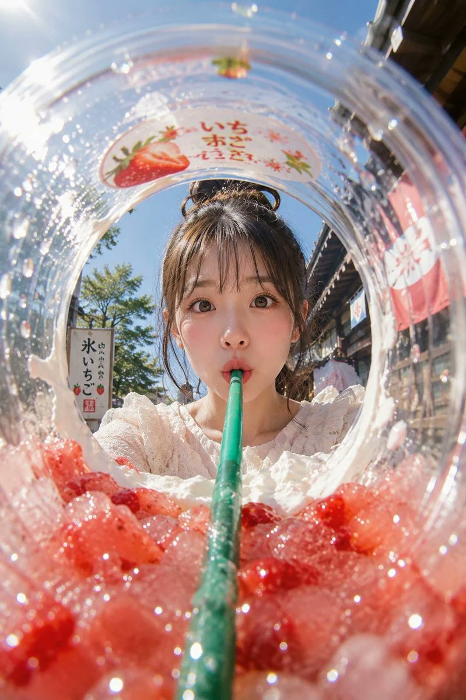

```text
主題：
氷越しの夏

主体：
縦長2:3のリアル写真。透明な大型プラスチックカップの内側から見上げるような超広角フィッシュアイ構図。画面下半分いっぱいに赤いいちご果肉とクラッシュアイスが迫り、中央から太いグリーンのストローが奥へ一直線に伸びる。丸く歪んだカップの開口部の向こうに、女性の顔が中央に大きく収まる。

人物・表情：
自然で現実感のある若い女性。黒髪に近いダークブラウンの髪を高めのお団子にまとめ、薄い前髪と顔まわりの後れ毛が日差しで細く光っている。透明感のあるナチュラルメイク、淡いピンクの頬、つやのあるリップ。目を大きく開いてカメラをまっすぐ見つめ、唇を小さく丸めてストローをくわえている。少し驚いたような、可愛らしく無邪気な表情。

服装・ポーズ：
白いレース素材のブラウス。首元と肩まわりに細かなフリルがあり、夏らしく軽い質感。人物はカップの向こう側に顔を近づけ、両肩は下部に少しだけ見える。ストローは人物の口元に自然に接触し、奥から手前の赤い氷へ向かって強い奥行きを作る。

背景・光：
背景は晴れた夏の日の古い商店街。木造風の店先、かき氷屋の暖簾、苺柄の看板、白い小さな旗、街路樹が見える。文字はすべてぼかされた読めない装飾として扱う。左上から強い太陽光が入り、透明カップの水滴、カップ縁、氷、赤い果肉に細かな反射とハイライトが出る。影は右下へ落ち、白いクリームの残りがカップ内側にリング状についている。

構図・カメラ：
カメラはカップの底付近、赤い氷のすぐ上に置いたような極端なローアングル。フィッシュアイレンズでカップの円形リムが大きく湾曲し、周囲の商店街も軽く歪む。画面下45％は赤い氷と果肉の前ボケ、中央はストローと女性の顔、上部は青空とカップの透明な縁。ピントは女性の目と口元、手前の氷はきらめく浅いボケ。

質感・スタイル：
プロ用カメラで撮影した夏の広告写真風。透明プラスチックの屈折、水滴の粒、氷の冷たさ、いちご果肉の瑞々しさを高精細に表現。青空、赤い氷、グリーンのストロー、白いブラウスの色の対比を鮮やかにする。肌は自然な質感を残し、過度な美肌補正はしない。明るくポップで、少しユーモラスな日本の夏スイーツ写真。

ネガティブ：
実在ブランドロゴ、読める文字、商標の再現、不自然な顔、不自然な視線、歯や唇の崩れ、ストローとの接触不良、余分な指、欠けた指、手足の融合、氷の浮遊、不自然な重力、誤った遠近法、光源と矛盾する影、文字化け、透かし、過度な美肌補正、プラスチックのような肌。
```


---

## 例 519：薄荷玫瑰香水电商图

**来源：** [@lovimg_com](https://x.com/lovimg_com/status/2077036313832996893)

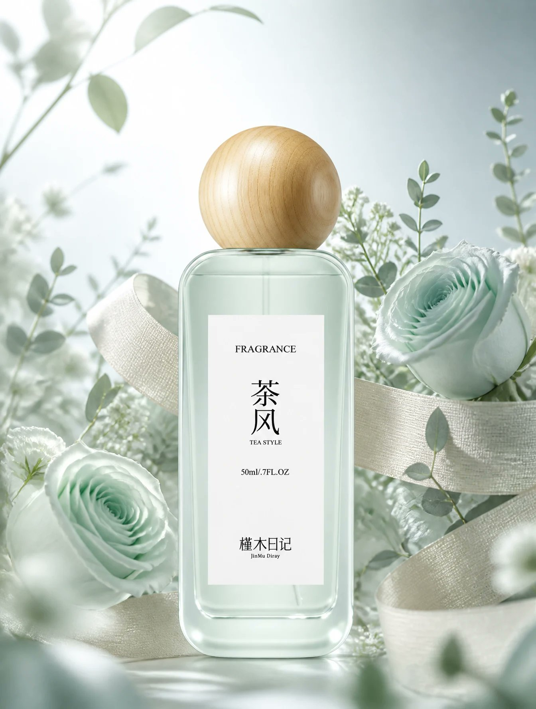

```text
100%完整保留上传的原图香水瓶的全部原始外观细节，瓶身造型、薄荷绿玻璃质感、木纹球形瓶盖、原有标签文字完全不做任何修改；瓶身环绕米色织带，周围簇拥薄荷绿玫瑰和浅绿色植物，冷调渐变浅留白背景，冷调逆光柔焦光影，低饱和度冷清高级色调，景深虚化突出香水主体，超写实C4D质感，轻奢高级ins风，适配竖版电商详情页，2K高清
```


---

## 例 532：六宫格柠檬饮料微缩广告

**来源：** [@ou_zhen599](https://x.com/ou_zhen599/status/2091160215928574397)

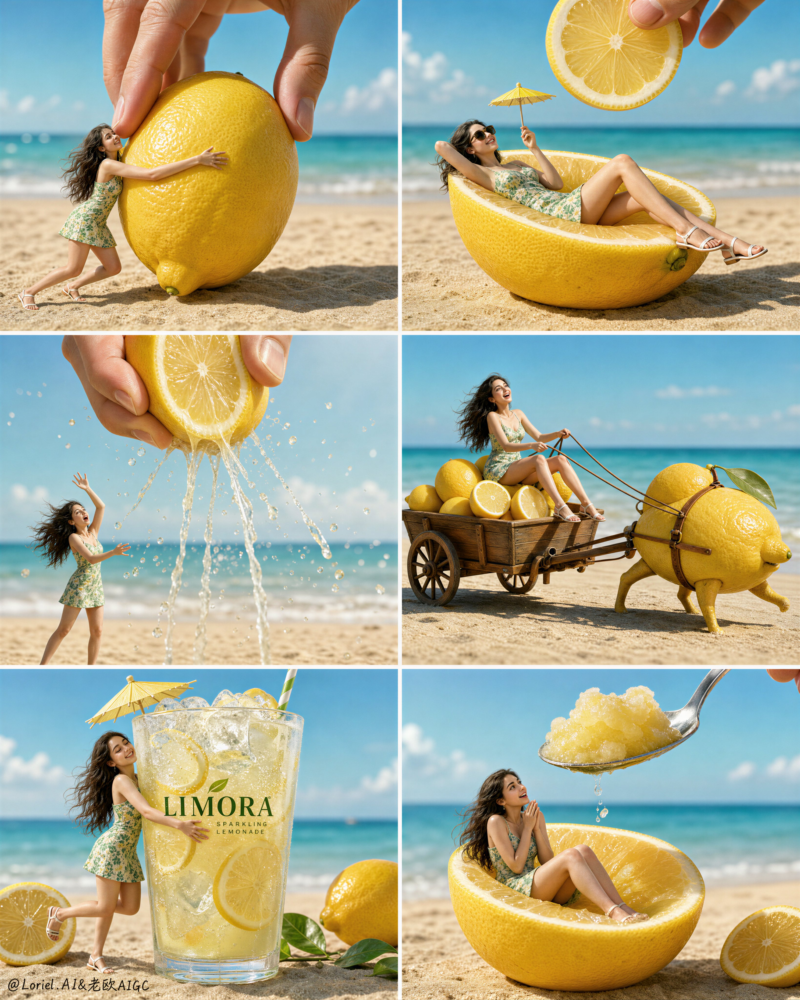

```text
Create a Cannes-level premium summer beverage campaign poster for a fictional lemon drink brand called "LIMORA", using a strict 2-column by 3-row grid layout with six perfectly aligned panels. Preserve the exact structural logic of the composition: each panel shows the same tiny ultra-realistic young woman on a bright sandy beach interacting with oversized lemons, lemon slices, lemon juice, or the final branded drink, while selected panels include a giant realistic human hand entering from above. The full poster must feel like one unified high-end advertising storyboard in motion, where the eye flows continuously from fresh citrus fruit to crafted beverage desire. The lemon product world must remain the absolute visual hero across all six panels.

Overall composition:
Use a clean six-panel grid with thin white dividers, equal panel proportions, consistent horizon line, consistent beach-ocean background, and unified lighting. Every panel should feel self-contained yet rhythmically connected, as if six consecutive scenes from the same luxury summer commercial were frozen at their most iconic moments. Keep the miniature woman and the oversized lemon-related object centered in each frame, with the sea softly blurred in the background and the sand sharply rendered in the foreground. The full page must read instantly from a distance, with strong commercial clarity and polished editorial control.

Orbit visual flow:
Design the entire set around one strong circulation of motion from panel 1 to panel 6. The action should escalate visually: touch, recline, squeeze, travel, embrace, taste. Use repeating directional rhythms in hair movement, arm gestures, leg angles, juice droplets, spoon angle, lemon slice placement, straw tilt, and the position of the entering hand so the eye naturally sweeps across the poster in a flowing wave. Build subtle diagonal energy inside every panel, making the citrus world feel alive, breezy, sparkling, and in motion. The whole set should feel like summer energy orbiting around the brand’s lemon drink.

Narrative panel sequence:
Panel 1: the tiny woman hugs a giant whole lemon on the sand while a giant adult hand descends from above, delicately positioning the lemon. Her pose is lively and slightly off-balance, as if the scene has just begun.
Panel 2: she reclines elegantly inside a halved lemon as though it were a luxury beach chaise, wearing dark sunglasses and holding a tiny parasol drink pick, while a floating lemon slice is lowered from above like a radiant citrus sun.
Panel 3: a giant hand squeezes a vertically cut lemon from above, sending translucent juice streams and droplets downward in a sparkling arc. The woman reacts dynamically beneath it, arms raised, body tilted, caught in the middle of the citrus action.
Panel 4: she rides in a small refined wooden cart piled with lemons, being pulled by a whimsical premium lemon-shaped creature or rolling lemon harness. The cart must feel physically grounded, artisanal, and stylish rather than cartoonish.
Panel 5: the hero climax panel. A tall branded LIMORA lemonade glass dominates the frame, packed with ice cubes, lemon slices, pale sparkling liquid, condensation, a fresh green straw, and a refined cocktail umbrella. The tiny woman hugs the cold glass joyfully, and this panel must be the strongest product-selling moment in the entire composition.
Panel 6: she sits inside a halved lemon while a large polished spoon descends from above carrying glossy lemon sorbet or crushed lemon ice, creating a final delicious serving beat with playful anticipation.

Hero product focus:
The real hero is the lemon beverage system: whole citrus fruit, sliced fruit, squeezed juice, ice, sparkling drink, sorbet, and premium serving details. Every lemon must feel hyper-real, fragrant, sunlit, juicy, and tactile, with detailed skin pores, subtle waxy oil sheen, translucent membranes, wet cut surfaces, and bright natural citrus pulp. The branded glass in panel 5 must be the most visually dominant product object in the set, with crystal-clear glass, refined original English branding reading "LIMORA", elegant condensation, premium ice refraction, and luminous pale-yellow drink clarity.

Character design:
Depict one recurring ultra-realistic miniature young woman across all six panels, wearing the same fitted green floral mini dress and white sandals, with long dark wavy hair and naturally expressive features. She must look like a real scaled-down human placed into a surreal oversized citrus world. Keep anatomy coherent and believable in every frame: correct head-to-body proportion, realistic shoulders, collarbones, arms, waist, hips, thighs, knees, calves, ankles, and feet, with perfectly formed hands and five fingers clearly visible. Her expressions should shift panel by panel: surprised delight, relaxed confidence, playful alarm, exhilaration, joyful refreshment, amused anticipation. Skin must remain photorealistic with pores, natural tonal shifts, faint knee and elbow texture, realistic skin elasticity, and no plastic AI beauty finish.

Lighting:
Use bright premium seaside daylight with a soft upper-left sun direction and gentle atmospheric diffusion. Maintain luminous fresh summer lighting across all six scenes, with short, soft-edged shadows and crisp dimensional highlights. Juice droplets, lemon pulp, ice cubes, spoon edges, sunglasses, glass rim, and condensation should all catch clean sparkling highlights. Lighting must feel luxurious, refreshing, and physically consistent from panel to panel.

Materials:
Lemons: ultra-detailed peel pores, subtle dimpling, natural rind thickness, glistening wet pulp, believable cut translucency, realistic juice behavior.
Drink glass: high-clarity premium glass, accurate refraction, heavy base, condensation beads, crisp logo print, ice transparency, sparkling carbonated liquid feel.
Sorbet and juice: glossy, semi-translucent, cold, wet, appetizing, physically accurate.
Dress: lightweight summer cotton with tiny green floral print, natural wrinkles, fabric tension, and wind-responsive edges.
Hair and skin: realistic strands, fine flyaways, natural shine, believable skin texture.
Large hand: realistic adult fingers, soft skin compression, natural nails, coherent scale perspective.
Cart and props: refined warm wood grain, polished wheels, believable joints and harness elements.
Beach environment: fine sunlit sand with miniature footprints and pressure marks, soft shoreline blur, clean turquoise sea with pale foam.

Color system:
Build the palette around lemon yellow, fresh citrus green, turquoise sea, pale sky blue, warm beach beige, crisp white highlights, and restrained natural skin tones. Yellow must remain the dominant hero color, supported by green and turquoise. Keep the image bright, appetizing, summery, clean, and internationally commercial. Avoid random accent colors.

Typography and branding:
Do not copy any text from the sample. Keep typography minimal and original. Place refined English branding only on the hero glass and optionally a tiny campaign line below the full grid, such as: "LIMORA — Bright in Motion". Typography must feel premium, modern, minimal, and secondary to the visual storytelling.

Art direction:
Hyper-real premium surreal advertising photography, luxury FMCG campaign, storyboard energy, elegant humor, cinematic micro-world illusion, high-end beverage styling, global summer launch poster, polished magazine-grade finish, sharp product realism, strong narrative rhythm, premium brand coherence.

Negative prompt:
copied text, Chinese text, existing brand names, cartoon style, toy-like figure, grotesque oversized head, deformed anatomy, extra fingers, missing fingers, fused fingers, twisted wrists, broken limbs, distorted feet, AI plastic skin, over-smoothed skin, fake citrus texture, unrealistic juice physics, muddy lemon pulp, cloudy glass, weak product focus, inconsistent lighting, inconsistent horizon, messy grid, cluttered props, meme aesthetic, cheap humor, childish illustration, low-resolution detail, oversaturated colors, dead black patches, distorted giant hand perspective
```


---

## 例 543：旅行纪念珐琅徽章

**来源：** [@Emmma__0](https://x.com/Emmma__0/status/2093194689222705645)

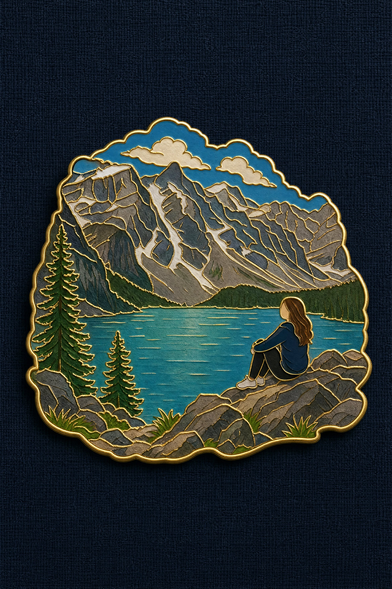

```text
Turn the reference photo into a travel souvenir enamel pin badge. Compose it as a SCENE, not a single isolated object.

Subject hierarchy: the defining landscape, terrain or landmark of the photo forms the main body of the badge and occupies most of its area. If a person appears prominently in the photo, keep them in the badge as a small, simplified figure at true relative scale within that landscape — the person is an accent, the landscape is the subject. Preserve the original spatial relationship and scale between the figure and the surroundings.

How to render the person: flat enamel color blocks matching their real clothing and hair color from the photo. The face is a smooth plain area of light skin-tone enamel with no drawn facial features — do NOT render the person as a dark or black silhouette, and do NOT black out the face or head. Skin reads as a warm light enamel color, clearly lighter than the clothing.

Styling: thin polished gold outline around the silhouette and along every internal divider, glossy enamel color fill, gentle even lighting with only a soft sheen on the gold lines, very subtle drop shadow. Outer contour follows the scene's own shape, not a plain rectangle.

Background: flat dark navy coarse linen texture. Badge centered, filling about 60% of the frame.

Avoid: black silhouette figure, blacked-out face, dark featureless head, portrait close-up, detailed facial features, person dominating the badge, cropping out the landscape, three-quarter angle, macro product photography, heavy specular glare, cartoon, realistic scene, text, watermark.
```


---

## 例 544：Industrial Packaging Design Sheet

**来源：** [@iamaiistudio](https://x.com/iamaiistudio/status/2063735848257167383) / [awesome-gpt-image-2-prompts](https://github.com/EvoLinkAI/awesome-gpt-image-2-prompts)

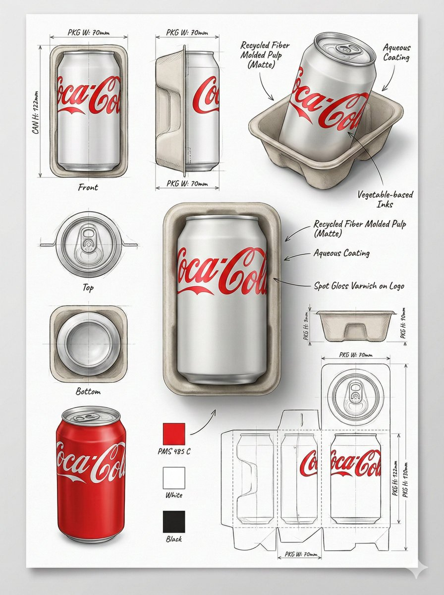

```text
Full prompt: 

Using the attached image, create a professional industrial packaging design illustration sheet.

Feature a centered hero 3D render with realistic materials, soft studio lighting, and commercial-grade finish quality. Surround the hero render with technical views: front, side, top, bottom, angled perspective, and flat layout.

Include structural construction sketches, fold lines, seam details, and dimension arrows with measurements in millimeters. Show materials and finishes (matte, glossy print, plastic, paper, glass, etc.) using handwritten-style annotations. Add color swatches, realistic product illustrations, and subtle shadows.

Background should resemble clean sketchbook paper, combining realistic rendering with pencil sketch overlays. Modern industrial design aesthetic, ultra-detailed, portfolio-ready presentation.
```


---

## 例 545：E-commerce Main Image - Luxury Amber Perfume Ad

**来源：** [@Polanco_IA](https://x.com/Polanco_IA/status/2047689647967609037) / [awesome-gpt-image-2-prompts](https://github.com/EvoLinkAI/awesome-gpt-image-2-prompts)

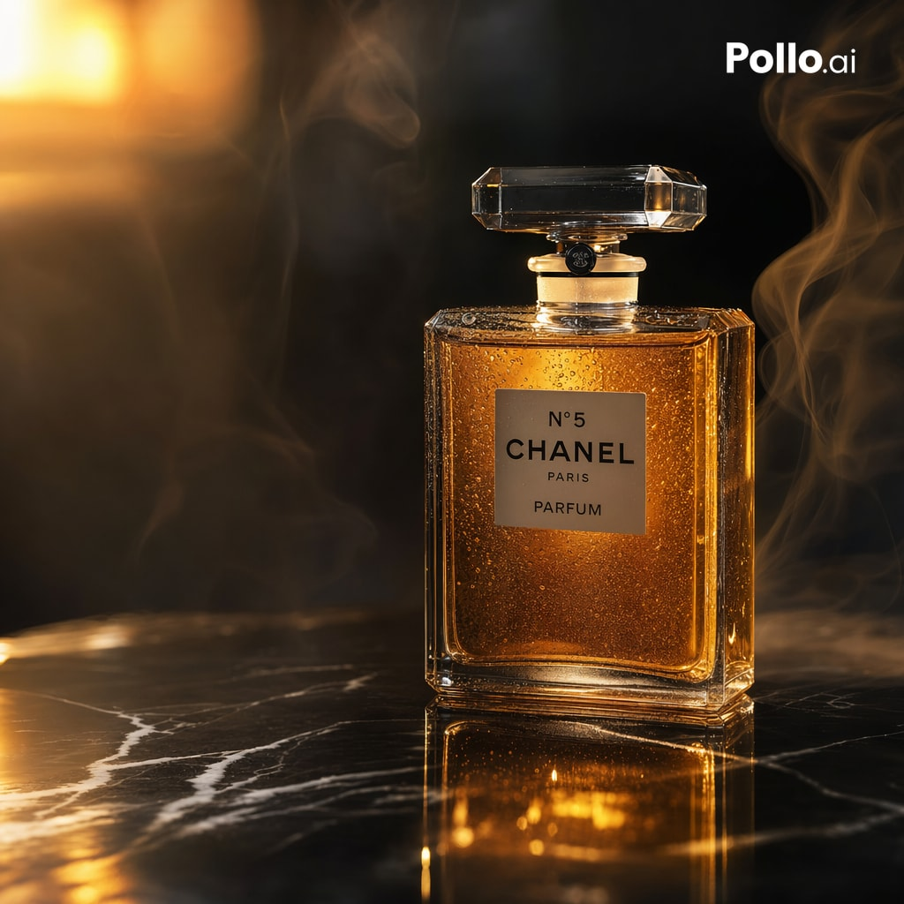

```text
A luxurious cinematic product photograph of a classic rectangular perfume bottle inspired by {argument name="brand label" default="N°5 CHANEL PARIS PARFUM"}, placed upright on a glossy black marble surface with white veining. The bottle is centered slightly to the right, made of clear faceted glass with a large transparent crystal stopper, filled with rich amber-gold perfume that glows from within. Tiny condensation droplets cover the glass, adding texture and realism. Dramatic warm lighting from the upper left creates golden highlights, deep reflections on the marble, and a soft luminous bloom in the background. Wisps of elegant smoke curl around the bottle on both sides, enhancing a moody high-end advertisement feel. Dark background, shallow depth of field, ultra-detailed studio product photography, luxury beauty campaign aesthetic, crisp focus on the bottle, realistic reflections, warm black-and-gold color palette. Add a small white {argument name="corner logo" default="Pollo.ai"} in the top-right corner. Square composition, premium commercial ad, photorealistic, high contrast, refined and sophisticated.
```


---

## 例 546：E-commerce Main Image - Skincare Product Studio Shot

**来源：** [@Strength04_X](https://x.com/Strength04_X/status/2047636636847231222) / [awesome-gpt-image-2-prompts](https://github.com/EvoLinkAI/awesome-gpt-image-2-prompts)

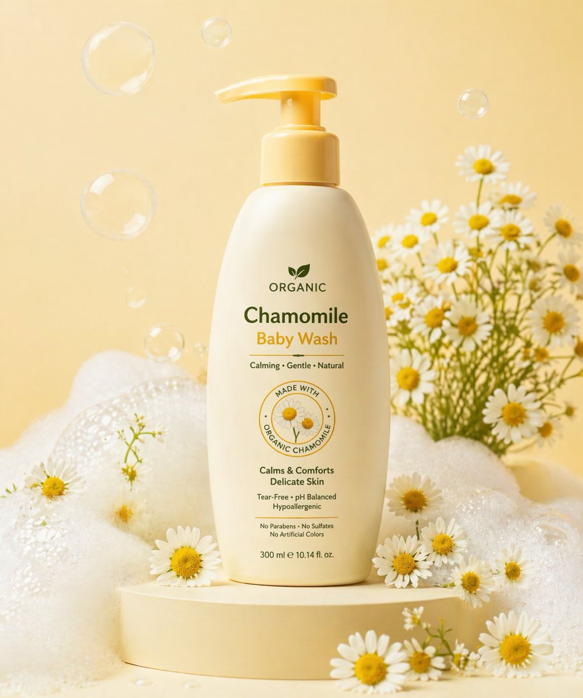

```text
A soft {argument name="bottle color" default="cream-colored"} bottle with a {argument name="pump color" default="pastel yellow"} pump stands on a matte podium, surrounded by silky foam and {argument name="flowers" default="chamomile blossoms"}. The background is a pale yellow gradient with subtle bubble details. The label emphasizes organic chamomile and calming care. Fresh chamomile flowers accentuate the gentle appeal.
```


---

## 例 547：E-commerce Main Image - Industrial Design Presentation Sheet

**来源：** [@ShamsAmin56](https://x.com/ShamsAmin56/status/2047627860752621647) / [awesome-gpt-image-2-prompts](https://github.com/EvoLinkAI/awesome-gpt-image-2-prompts)

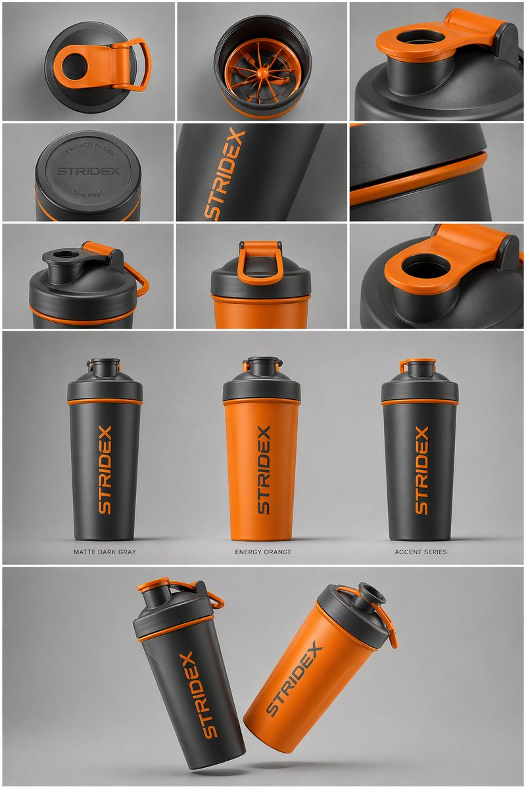

```text
Core Subject: [{argument name="reference" default="use the uploaded image"}, keep the details, typography and structure locked 100%]

Layout & Composition: A {argument name="presentation type" default="professional industrial design presentation sheet"}. The image should be organized into a clean grid system.

Top Row: A 3x3 layout showing top-down flat lay views and close-up macro details of materials.

Middle Section: Three hero shots of the product standing upright in different color ways (Matte Black, Arctic White, and accented variants). The products should be slightly tilted to show depth and form.

Bottom Section: A dynamic "floating" composition featuring two products overlapping at opposing angles to showcase the front and side profiles simultaneously.

Environment & Lighting: Set against a minimalist, neutral studio gray background. Soft top-down lighting with realistic contact shadows. High-end product photography aesthetic.

Style & Finish: Matte textures, clean silhouettes, and sharp edges. Leave designated blank areas on the product surfaces for "Placeholder Branding" and "Graphic Mockups." 4k resolution, Unreal Engine 5 render style, hyper-realistic, clean aesthetic.
```


---

## 例 548：E-commerce Main Image - Luxury Fur-Lined Loafer Lifestyle Photo

**来源：** [@dynamicwangs](https://x.com/dynamicwangs/status/2047580984342925545) / [awesome-gpt-image-2-prompts](https://github.com/EvoLinkAI/awesome-gpt-image-2-prompts)

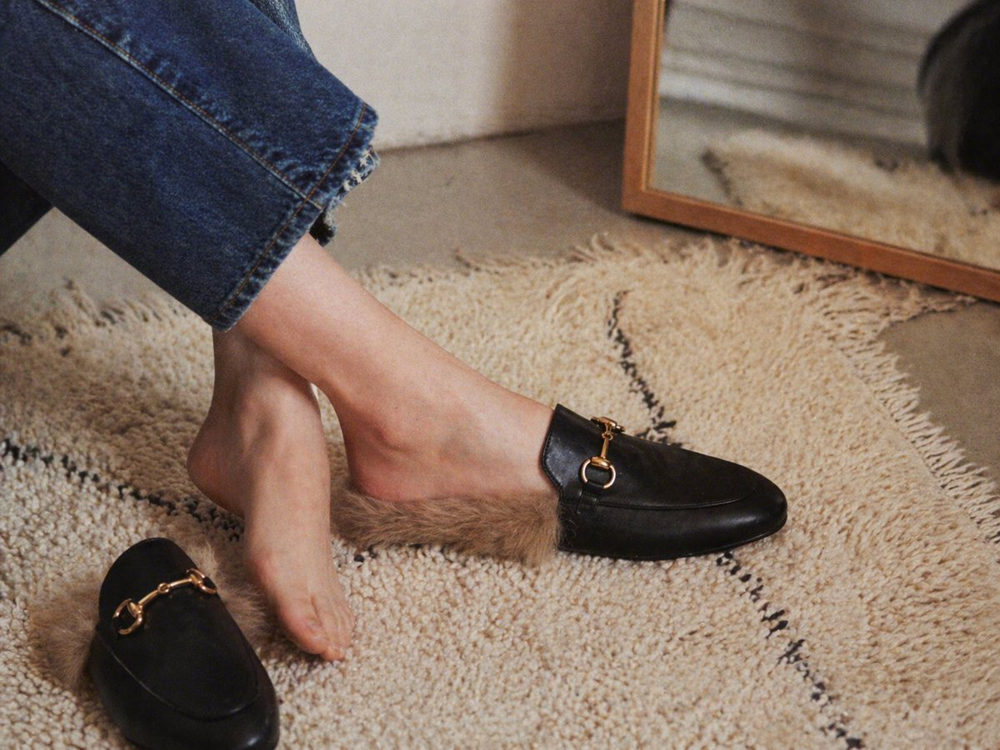

```text
A warm, editorial-style lifestyle product photo shot indoors from a low close-up angle, focused on a woman's lower legs and feet as she tries on 1 pair of black leather backless loafers with tan faux-fur lining. One loafer is worn on the right foot and the left foot is bare, hovering just above the textured cream shag rug, while the second matching loafer lies on the rug in the lower left foreground. The shoes have smooth black leather uppers, a rounded almond toe, open mule-style heel, plush brown fur spilling out around the opening, and a small polished gold horsebit hardware detail across the vamp. The model wears cropped medium-blue denim jeans with a raw frayed hem. The setting is a cozy minimalist interior with a cream rug featuring 2 thin irregular black lines, a neutral wall, and a leaning rectangular mirror with a medium wood frame in the upper right background, softly reflecting the rug and part of the scene. Use soft natural window light, shallow depth of field, subtle film grain, realistic skin texture, muted beige and black palette, relaxed candid composition, premium fashion catalog mood, high detail, photorealistic.
```


---

## 例 549：E-commerce Main Image - Luxury Perfume Ad on Marble Vanity

**来源：** [@MiguelMaestroIA](https://x.com/MiguelMaestroIA/status/2047555836252151831) / [awesome-gpt-image-2-prompts](https://github.com/EvoLinkAI/awesome-gpt-image-2-prompts)

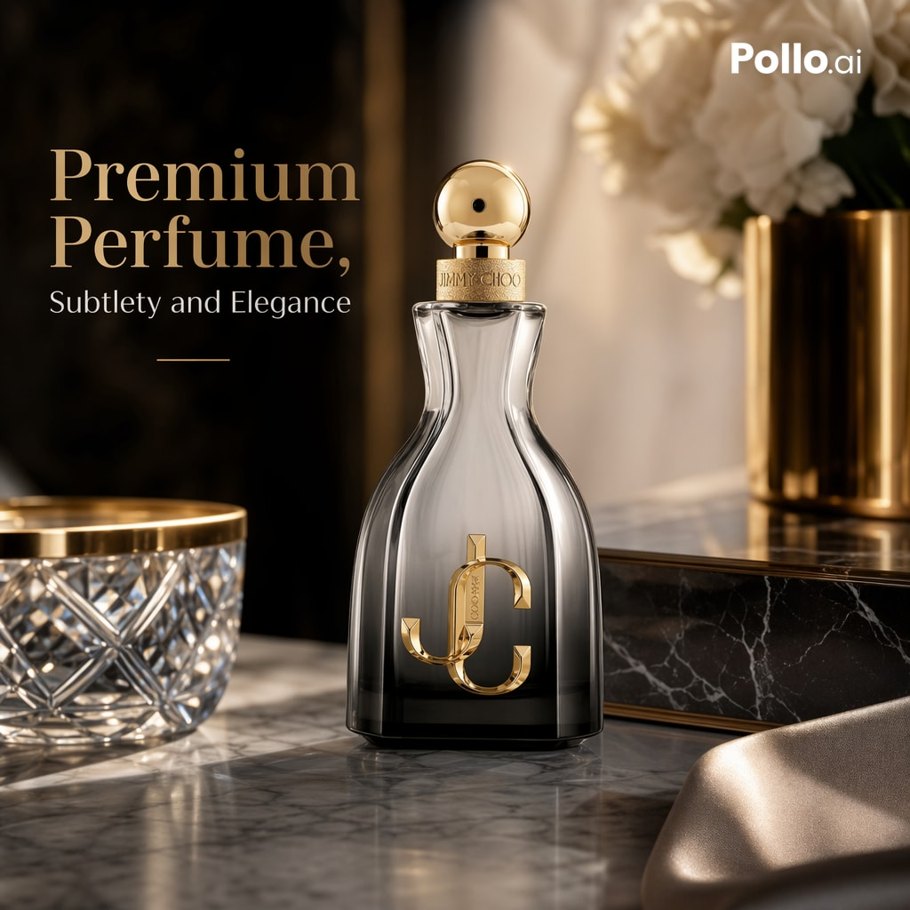

```text
A luxury e-commerce advertising photo of a premium perfume bottle on a polished gray-and-white marble vanity, shot in a warm cinematic studio style with soft golden lighting, shallow depth of field, and elegant reflections. The composition is square and high-end, with the perfume bottle centered slightly right of frame and promotional text on the left. The bottle is a tall sculpted hourglass-shaped glass flacon with smoky transparent gray glass fading darker at the base, a glossy gold spherical cap, a gold collar engraved with fine branding, and a large metallic gold interlocking monogram on the front. Keep the branding-inspired feel but do not add extra products. In the foreground left, include 1 cut-crystal bowl with a gold rim, partially cropped. In the background right, include 1 brushed gold cylindrical vase holding 1 bouquet of soft white flowers, blurred. Behind the bottle, add 1 black marble rectangular box with subtle white veining and gold trim. In the lower right foreground, include 1 draped piece of champagne-colored satin fabric, softly out of focus. The background should be dark, luxurious, and softly blurred, with rich brown-black tones and a vertical shadowed panel on the left to support typography. Add elegant serif headline text on the upper left reading {argument name="headline text" default="Premium Perfume,"} in large warm beige letters, with a smaller serif subheading beneath reading {argument name="tagline" default="Subtlety and Elegance"}, plus a thin short gold horizontal line below the subheading. Place a small white logo in the top-right corner reading {argument name="brand logo" default="Pollo.ai"}. Emphasize premium materials, realistic glass refraction, gold metallic highlights, luxury product photography, refined composition, soft bokeh, and upscale beauty-ad aesthetics.
```


---

## 例 550：E-commerce Main Image - 9-Panel Product TVC Storyboard

**来源：** [@Magncsans](https://x.com/Magncsans/status/2047876253898903594) / [awesome-gpt-image-2-prompts](https://github.com/EvoLinkAI/awesome-gpt-image-2-prompts)

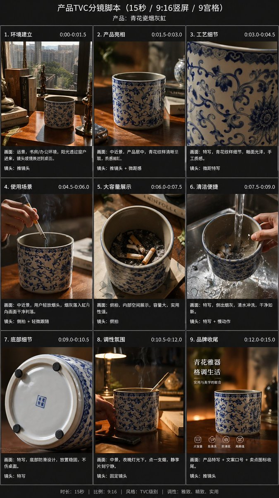

```text
Using the provided reference image, transform the single casual product photo into a polished e-commerce TVC storyboard board for a {argument name="video duration" default="15-second"} ad in a {argument name="aspect ratio" default="9:16"} vertical format, presented as a 9-panel grid. Keep the same blue-and-white ceramic ashtray as the product base, but restage it across cinematic advertising shots with warm premium lighting, shallow depth of field, and a refined lifestyle desktop environment. Add a dark storyboard layout with Chinese titles and timing for each panel. Include exactly 9 scenes: 1) environment-establishing wide shot with desk, books, window, and the product placed in context; 2) hero product medium shot on the table; 3) extreme close-up of the blue floral craftsmanship pattern; 4) use case showing a hand placing a cigarette into the ashtray with visible smoke; 5) top-down capacity display showing multiple cigarette butts inside; 6) cleaning scene under running water in a sink with a hand holding the product; 7) bottom-detail close-up showing the underside and anti-slip pads; 8) mood/lifestyle scene at night with the product on a desk, smoke rising, and ambient lamp light; 9) brand closing frame with the product as the hero plus Chinese marketing text. Add the overall header text “产品TVC分镜脚本(15秒 / 9:16竖屏 / 9宫格)” and a product subtitle naming it {argument name="product name" default="青花瓷烟灰缸"}. Give each of the 9 panels a Chinese scene title and timestamp, plus small descriptive Chinese copy beneath each image in the style of a professional commercial shot list. Use premium, realistic commercial photography throughout, consistent product identity, elegant Chinese aesthetic, and a clean high-end storyboard presentation.
```


---

## 例 551：Premium product studio shot template

**来源：** [@PrometheanAIX](https://x.com/PrometheanAIX/status/2049141839882522707) / [awesome-gpt-image-2-prompts](https://github.com/EvoLinkAI/awesome-gpt-image-2-prompts)

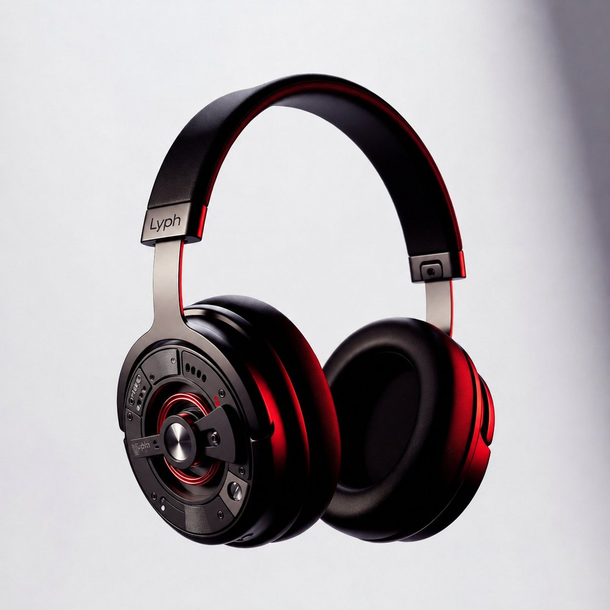

```text
Create a premium product studio image of a [PRODUCT] for [BRAND], designed in line with [BRAND REFERENCE]. Show the [PRODUCT] floating against a clean light gray to soft white gradient background with a minimal high-end tech aesthetic. The [PRODUCT] should feel sleek, modern, refined, and premium, with subtle illuminated accents in [LIGHTING COLOR]. Use a three-quarter front angle so both earcups are visible, with detailed industrial design elements. Include the [BRAND] name cleanly on the product. Lighting should be soft, controlled, and editorial, with crisp highlights, soft shadows, and a subtle colored rim light or glow in [LIGHTING COLOR]. Emphasize material realism and clean geometric forms. Keep the background uncluttered and minimal. No extra props, no people, no text overlays, no packaging, and no distracting elements. Focus entirely on the [PRODUCT] as the hero product.
```


---

## 例 552：Premium food photography template

**来源：** [@PrometheanAIX](https://x.com/PrometheanAIX/status/2049122713722106161) / [awesome-gpt-image-2-prompts](https://github.com/EvoLinkAI/awesome-gpt-image-2-prompts)

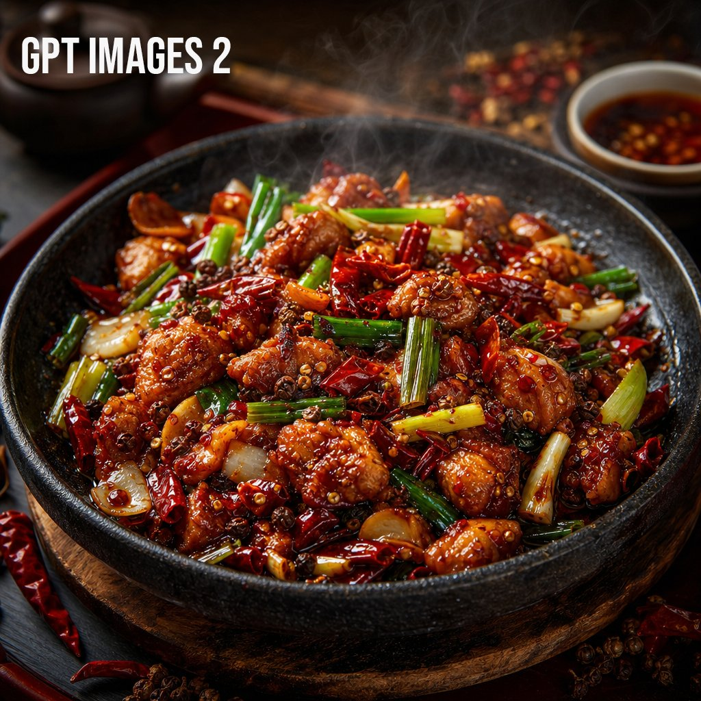

```text
Create a square [ASPECT RATIO] premium food photography image of a steaming [FOOD] served in a dark black stone bowl or cast-iron skillet on a wooden board. The dish should look hot, glossy, spicy, and freshly served, with bite-sized pieces of browned protein, dried red chilies, green scallions, white onion, garlic, chili flakes, and visible Sichuan peppercorns coated in a deep red, oily Szechuan sauce. Use a slightly elevated close-up camera angle with shallow depth of field. Make the food the clear hero of the image, centered and richly detailed. Add visible steam rising naturally from the dish. Surround the bowl with subtle restaurant-style props like a dark red tray, scattered dried chilies, peppercorns, a small sauce bowl, or a blurred teapot in the background. Lighting should feel warm, moody, and editorial, like a high-end restaurant food shoot. Emphasize realistic textures and keep the image appetizing, realistic, cinematic, and polished. Avoid text, logos, hands, people, utensils covering the food, cartoon styling, fake plastic textures, excessive symmetry, or an overly clean stock-photo look.
```


---

## 例 553：Döner Commercial Food Photography Set

**来源：** [@iamaiistudio](https://x.com/iamaiistudio/status/2063094917774086510) / [awesome-gpt-image-2-prompts](https://github.com/EvoLinkAI/awesome-gpt-image-2-prompts)

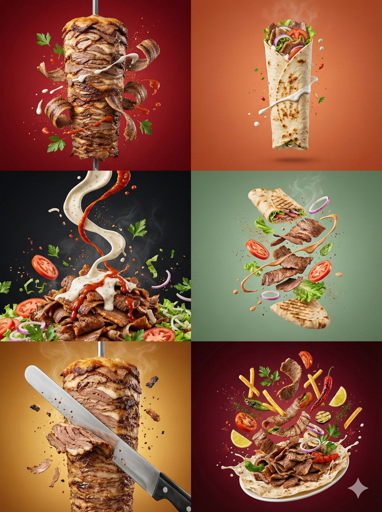

```text
prompt:

8K UHD hyper-realistic commercial food photography, 3:4 aspect ratio. 6 scenes, each on its own solid or gradient background:

Scene 1, Döner slice explosion: Traditional Turkish döner (beef and lamb mix), paper-thin ribbons spiraling outward mid-air, white garlic sauce and red chili sauce splashing, fresh parsley leaves floating. Deep crimson red background.

Scene 2, Dürüm wrap floating: Premium dürüm cut in half and floating vertically, cross-section revealing döner meat, lettuce, tomatoes, onions layered inside, white garlic yogurt sauce drizzling elegantly, subtle spice particles drifting. Warm terracotta orange background.

Scene 3, Sauce pour drama: Mound of freshly sliced döner with crispy charred edges, thick creamy garlic yogurt sauce pouring from above frozen mid-flow, spicy red chili sauce drizzling alongside in thin crimson streams, sliced tomatoes and parsley below, heat vapor rising. Dark charcoal black background.

Scene 4, Deconstructed composition: Toasted lavash bread pieces, döner slices, tomato slices, lettuce leaves, and onion rings all suspended separately at varying heights, glossy sauce ribbons connecting elements artistically, ultra-fine spice dust in the air. Muted sage green background.

Scene 5, Rotating spit close-up: Extreme close-up of vertical döner tower on spit, large döner knife frozen mid-slice, fresh slice falling away, charred bits and seasoning particles in air, heat vapor rising from the fresh cut. Rich golden amber background.

Scene 6, Overhead plate explosion: Top-down view, all ingredients bursting upward in circular pattern, döner slices, french fries, grilled peppers and tomatoes, fresh parsley, sumac, lemon wedges, sauce droplets spraying, elements at varying heights with some rotating. Deep burgundy red background with vignette.

Global: controlled studio lighting emphasizing meat texture and char marks, shallow to medium depth of field, rich contrast, warm savory tones, natural shine, appetizing color grading. No text, logos, people, hands, cartoon style, or plastic-looking food.
```


---

## 例 554：Plush Soda Can Product Shot

**来源：** [@iamaiistudio](https://x.com/iamaiistudio/status/2063261665207239055) / [awesome-gpt-image-2-prompts](https://github.com/EvoLinkAI/awesome-gpt-image-2-prompts)

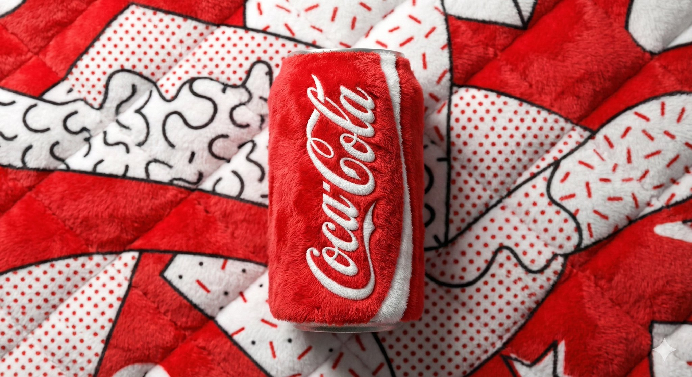

```text
prompt:

A soda can featuring the label [BRAND NAME], constructed entirely from soft, colorful plush material, centered against a matching plush background in [BRAND NAME]'s brand colors.

Pop Art and Memphis-inspired style, vibrant and premium at the same time.

Crisp studio lighting that highlights every fiber, the plush texture, and the tactile softness of the material.

Razor-sharp focus, vivid color saturation, clean shadows, sleek commercial product photography, minimalist composition, ultra-high resolution.
```


---

## 例 555：VOLT Goal Celebration Ad

**来源：** [@RuzainaMeer](https://x.com/RuzainaMeer/status/2063513621754491039) / [awesome-gpt-image-2-prompts](https://github.com/EvoLinkAI/awesome-gpt-image-2-prompts)

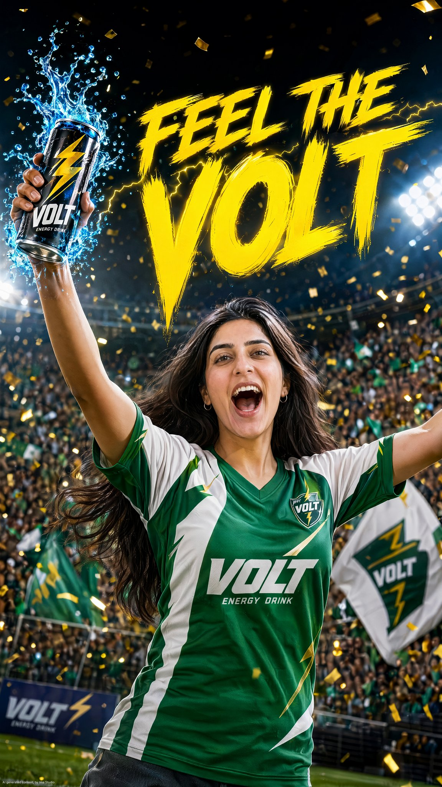

```text
Prompt 1:
A high-energy commercial product advertisement for VOLT Energy Drink. A beautiful young woman in her mid-20s, wearing a green and white football jersey, is caught in a euphoric goal celebration — arms wide open, head thrown back, screaming with pure joy. She is holding a sleek VOLT Energy Drink can in one raised hand, electric blue liquid splashing dramatically around it. Stadium packed with roaring fans, golden confetti raining down, floodlights blazing. Bold text "FEEL THE VOLT" in electric yellow. Cinematic lighting, photorealistic commercial quality, 9:16 vertical format.

Prompt 2:
A beautiful young woman in a green and white football jersey is sitting in a packed stadium, casually drinking from a sleek VOLT Energy Drink can. Suddenly a goal is scored — she explodes into euphoric celebration, jumping up, arms wide open, screaming with pure joy, still holding the VOLT can high in the air. Electric blue liquid splashes dramatically around the can in slow motion. Golden confetti rains down from above. Camera starts wide on stadium, pushes in close on her face mid-celebration, then pulls back to reveal VOLT can glowing with electric blue energy trails and sparks. Bold text "FEEL THE VOLT" flashes on screen at the end. Sound: stadium ambient noise building → crowd erupting into massive roar at goal moment → electric bass hit when VOLT can is revealed → crowd cheer fading out. Cinematic quality, slow-motion moments mixed with real-time, 9:16 vertical format, 15 seconds.
```


---

## 例 556：Lightning Storm Supercar Ad

**来源：** [@iamrealsnow](https://x.com/iamrealsnow/status/2063649073819959502) / [awesome-gpt-image-2-prompts](https://github.com/EvoLinkAI/awesome-gpt-image-2-prompts)

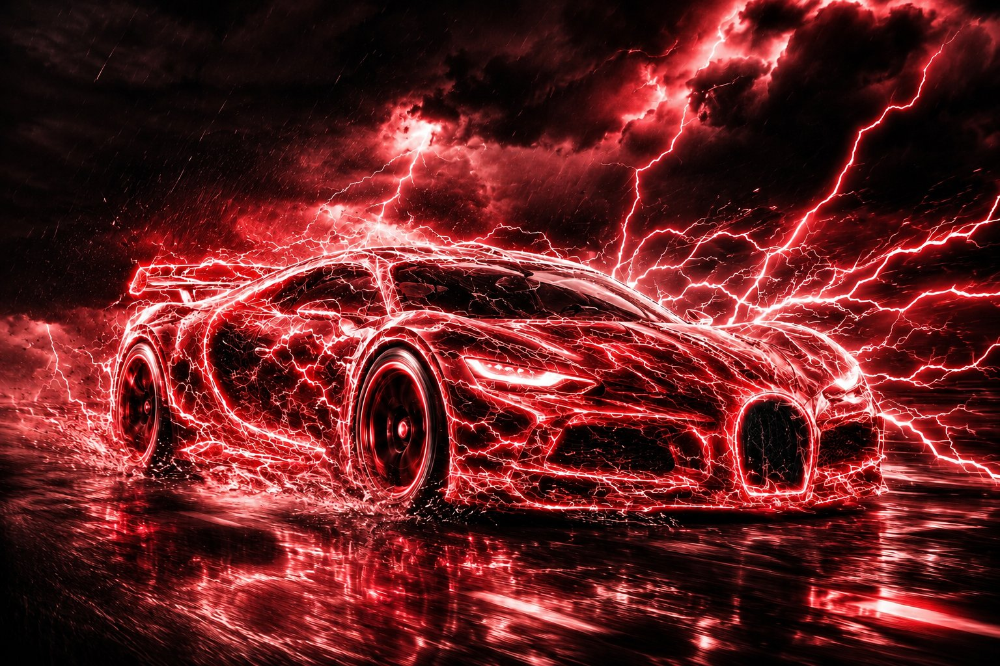

```text
Sports Car Made of Lightning
Prompt: Supercar emerging from a storm cloud, body formed entirely from blue lightning bolts, wet reflective road, thunder exploding in background, cinematic action advertising, high-speed energy trails, ultra-detailed automotive render, luxury commercial photography, 8K.
```


---

## 例 557：Luxury Jewelry Contrast Campaign

**来源：** [@aziz4ai](https://x.com/aziz4ai/status/2063737218003333288) / [awesome-gpt-image-2-prompts](https://github.com/EvoLinkAI/awesome-gpt-image-2-prompts)

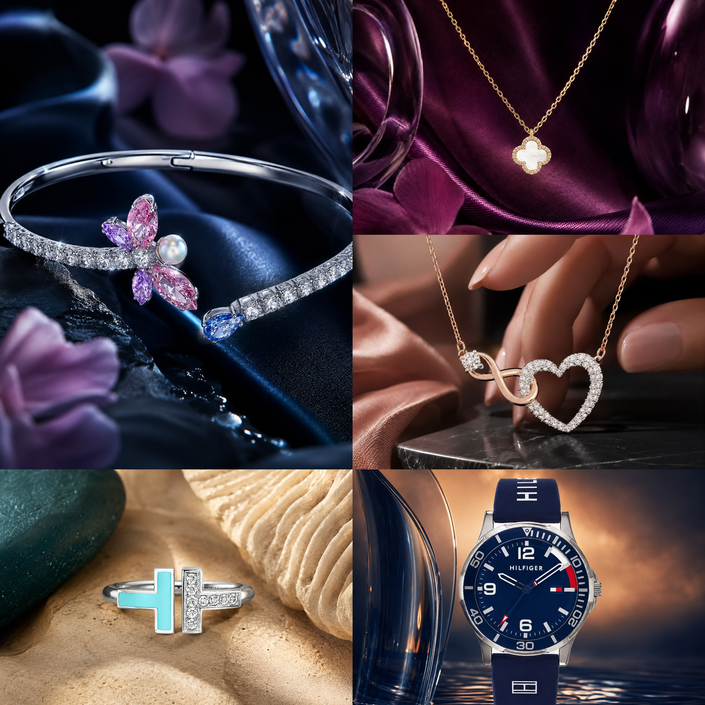

```text
Use the uploaded image as the one and only product reference. Preserve the jewelry exactly as it is, with high fidelity to its original design, shape, proportions, gemstone arrangement, metal tone, craftsmanship, setting, texture, and identity. Do not redesign, simplify, or alter the jewelry itself in any way. Keep the product accurate, luxurious, and instantly recognizable.

Create an extraordinary luxury jewelry campaign image where the product is the absolute visual hero. Build a bold, artistic, and premium scene around it that feels cinematic, elegant, and visually unforgettable. The result must never feel like a basic catalog shot or a repetitive product render.

For every generation, create a different visual concept so the outputs do not look similar to one another. Vary the composition, environment, supporting element, texture, background structure, framing, angle, and styling approach each time. Each image should feel unique, fresh, and creatively elevated while still maintaining a refined luxury identity.

Include one or more strong supporting natural or tactile elements that help frame and enhance the jewelry, such as a branch, hand, leaf, stone, bark, flower petal, sand texture, silk fold, glass reflection, water ripple, smoke, shell, or sculptural organic form. These elements should not distract from the product, but should artistically support it and make it feel more premium, emotional, and visually magnetic.

Use color contrast intelligently. Place the jewelry within a scene that uses an opposite or contrasting color tone to make the piece stand out strongly, while still keeping the palette harmonious, tasteful, and luxurious. The contrast should feel intentional and sophisticated, never random or harsh. The product must pop clearly from the scene through contrast in color, texture, light, or material.

Use strong visual hierarchy, elegant negative space, and a striking focal composition that makes the jewelry dominate the frame. The product should feel iconic, powerful, and highly desirable. Emphasize macro-level detail, realistic sparkle, gemstone brilliance, polished metal reflections, fine craftsmanship, prongs, edges, texture, and premium material depth.

Lighting should be cinematic and refined, with soft directional light, controlled highlights, elegant shadows, subtle rim light, atmospheric glow, and beautiful depth. Use shallow depth of field and macro product-photography aesthetics to keep the jewelry crisp and visually commanding.

The final image should feel like a world-class luxury editorial ad from a top creative studio: visually bold, highly refined, emotionally captivating, and far beyond ordinary product photography.

Avoid repeated concepts, repeated props, repeated backgrounds, flat lighting, weak framing, visual clutter, cheap styling, generic catalog presentation, text, watermark, and logos.
```


---

## 例 558：Miniature Brand Universe Shoe

**来源：** [@AIwithAliya](https://x.com/AIwithAliya/status/2064034557352202253) / [awesome-gpt-image-2-prompts](https://github.com/EvoLinkAI/awesome-gpt-image-2-prompts)

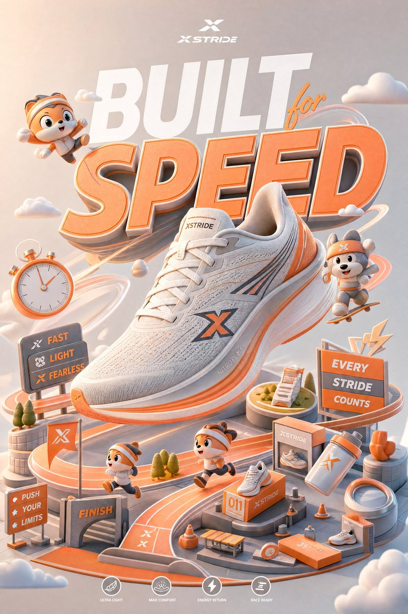

```text
A high-performance running shoe transformed into a miniature brand universe. The shoe is the hero character, surrounded by floating speed trails, miniature running tracks, energetic mascot companions, stopwatch icons, clouds, and dynamic sports-inspired elements. Oversized bold typography integrated into the scene. Clean commercial 3D rendering, pastel orange, white, and gray color palette derived from the product, premium packaging aesthetics, soft gloss, graphic backgrounds, floating platforms, collectible toy-like charm. Modern consumer branding, cute yet premium, highly shareable social-media campaign visual, rich detail, centered composition, studio quality.
```


---

## 例 559：Romantic Smartphone Couple Scene Product Shot

**来源：** [@hmontilla_](https://x.com/hmontilla_/status/2065072437398589669) / [awesome-gpt-image-2-prompts](https://github.com/EvoLinkAI/awesome-gpt-image-2-prompts)

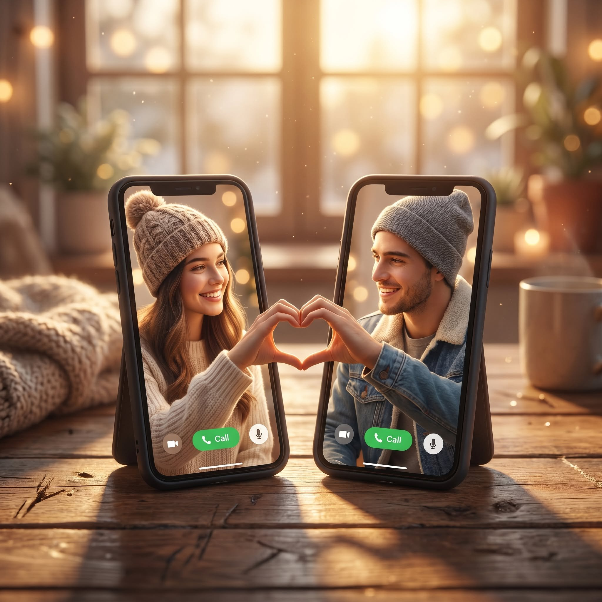

```text
Create a cozy cinematic romantic scene featuring two black smartphones standing vertically on a rustic wooden table, positioned side by side and slightly angled inward. Each phone displays a video call.

On the left phone screen, show a smiling young woman with long brown hair, light skin, wearing a cream knitted sweater and a beige winter beanie with a pom-pom. She is looking warmly toward the other phone while raising her hand to form one half of a heart shape.

On the right phone screen, show a smiling young man with light skin, subtle facial hair, wearing a gray winter beanie and a denim jacket with a soft shearling collar. He is looking toward the woman while raising his hand to form the other half of the heart shape.

The hands from both screens should visually meet in the center between the two phones, creating a perfect heart shape, symbolizing long-distance love and connection.

Set the scene in a warm indoor room during golden hour, with a large softly blurred window in the background, subtle potted plants, a cozy coffee mug, soft knitted fabric, floating dust particles, and warm cinematic bokeh lights. Use shallow depth of field, realistic glass reflections, soft rim lighting, warm amber highlights, and natural wooden table textures.

Include minimal video-call UI elements on each phone screen: small video camera icon, green call button, microphone icon, and a subtle white home indicator bar. Keep the UI clean, modern, and realistic.

Style and quality:

Ultra-realistic cinematic digital art, premium lifestyle photography aesthetic, cozy winter romance mood, warm golden-hour sunlight, soft atmospheric haze, realistic skin texture, realistic knit fabric, detailed phone reflections, elegant composition, sharp focus on phones and faces, dreamy romantic bokeh, high-end editorial visual quality.

Aspect ratio: 1:1 square composition.

Negative prompt:

Distorted hands, extra fingers, broken anatomy, duplicated limbs, unrealistic reflections, blurry faces, messy composition, unreadable UI, fake lighting, harsh shadows, low resolution, overexposed highlights, warped phones, text errors, AI artifacts, plastic skin, unnatural facial expressions.
```


---

## 例 560：Spicy Chili Chutney Product Shot

**来源：** [@iamaiistudio](https://x.com/iamaiistudio/status/2068032837610356989) / [awesome-gpt-image-2-prompts](https://github.com/EvoLinkAI/awesome-gpt-image-2-prompts)

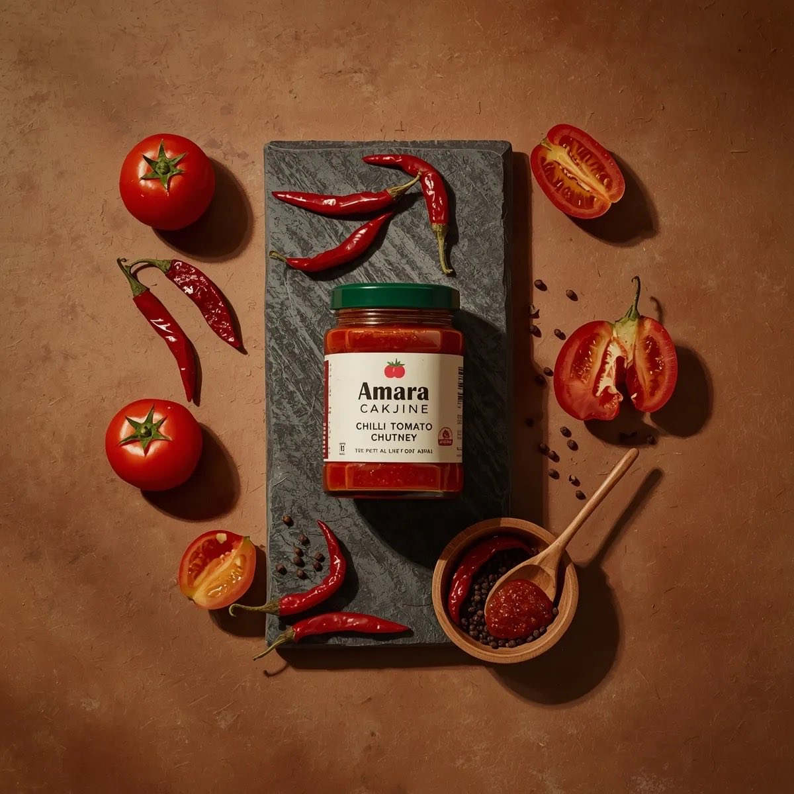

```text
Overhead shot of a glass jar of spicy tomato chili chutney on a dark stone surface, surrounded by whole red tomatoes, tomato halves, fresh red chili peppers, black peppercorns, and a small wooden bowl with chutney and a spoon. Warm earthy backdrop, soft directional light, deep rich shadows, high contrast, clean minimal styling, commercial product photography, ultra-detailed, 4K.
```


---

## 例 561：Levitating Food Photography Set

**来源：** [@iamaiistudio](https://x.com/iamaiistudio/status/2067851560168931394) / [awesome-gpt-image-2-prompts](https://github.com/EvoLinkAI/awesome-gpt-image-2-prompts)

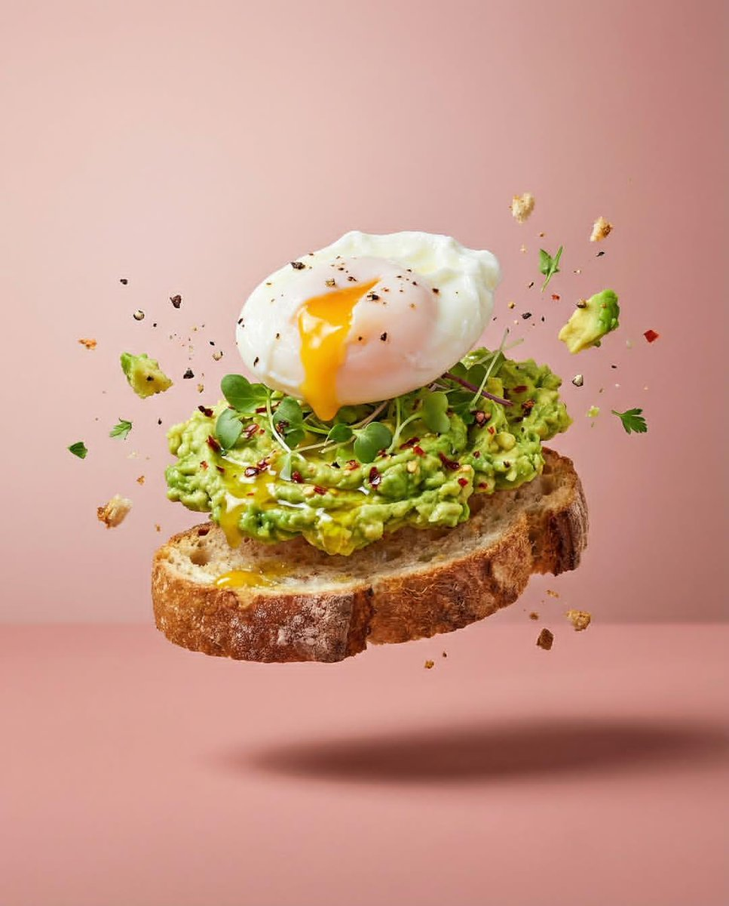

```text
A professional studio food photography series showcasing deconstructed dishes captured mid-air in dramatic high-speed levitation. Set against a seamless dusty pink backdrop with soft, even studio lighting, the ingredients burst and float in dynamic formations. Featured dishes include a suspended tiramisu with its components (scoops of gelato, ladyfingers, mascarpone cream, and coffee beans) hovering in the air, borscht elements (beets, rye bread slices, fresh herbs) floating above a ceramic bowl of soup resting on a wooden board, and a sourdough toast topped with mashed avocado and a runny poached egg caught mid-split. Fine details like flying crumbs, spice particles, scattered herbs, and liquid droplets should be razor-sharp with a shallow depth of field. Soft shadows fall beneath the main suspended elements.
```


---

## 例 562：SQL Collectible Toy Packaging Grid

**来源：** [@Gdgtify](https://x.com/Gdgtify/status/2063254078269137330) / [awesome-gpt-image-2-prompts](https://github.com/EvoLinkAI/awesome-gpt-image-2-prompts)

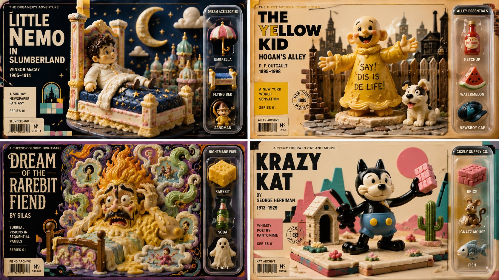

```text
SELECT * FROM Collectible_Toy_Packaging  WHERE layout_format = '2x2_Quadrant_Grid' AND targets = ARRAY['[IP_1]', '[IP_2]', '[IP_3]', '[IP_4]'] AND quadrant_structure = ARRAY[     (Zone: 'Left_Column', Material: 'Printed_Cardboard', Content: 'Massive_Typography_Title_And_Inferred_Creator_Metadata'),     (Zone: 'Center_Stage', Material: 'confection candy', Content: 'infer_main_character_and_diorama(target)'),      (Zone: 'Right_Column', Material: 'Transparent_Glossy_Vacuum_Plastic_Blister_Pack', Content: 'infer_three_iconic_props(target)_As_3D_Miniatures_With_Text_Labels') ] AND color_grading = 'Vintage_Retro_Palette_Matching_Inferred_IP_Era' AND camera = 'Product_Photography_Front_Orthographic_View';
```


---

## 例 563：Luxury Miniature Dubai City Model

**来源：** [@silentempiredev](https://x.com/silentempiredev/status/2048086378383384773) / [awesome-gpt-image-2-prompts](https://github.com/EvoLinkAI/awesome-gpt-image-2-prompts)

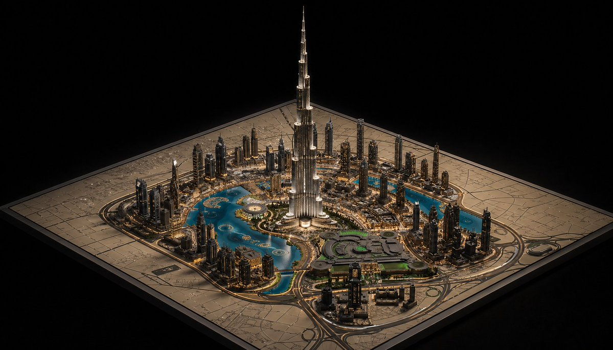

```text
A hyper-detailed cinematic isometric miniature city model of {argument name="landmark tower" default="Burj Khalifa"} rising dramatically from the center of a square architectural master-plan board, presented like a luxury urban planning maquette on a black background. The composition shows one dominant ultra-tall silver skyscraper in the exact center, surrounded by a dense ring of modern high-rise towers, illuminated roads, bridges, and glowing warm city lights. Curving turquoise-blue water features and artificial lakes wrap around the central district in multiple connected pools and canals, with one large circular fountain-like feature near the tower base and several small island shapes visible in the water. In the lower right quadrant, include a large low-rise complex with rounded geometric roofs and subtle green-lit sections, connected by multilane roads and looping interchanges. The entire city sits on one square beige map board engraved with faint street grids and planning lines, with the board edges clearly visible and slightly raised. Viewpoint is a high three-quarter isometric angle, centered and symmetrical, with the tower extending far upward into negative space. Lighting is dramatic and luxurious: warm golden edge lights on buildings and roads, cool reflections in the water, crisp metallic highlights on the central tower, and a deep black void surrounding the model. Style should feel like a photorealistic architectural visualization mixed with a premium collectible scale model, extremely intricate, sharp, polished, and elegant.
```


---

## 例 564：Luxury chocolate campaign system

**来源：** [@SPEEDAI07](https://x.com/SPEEDAI07/status/2049459155086500321) / [awesome-gpt-image-2-prompts](https://github.com/EvoLinkAI/awesome-gpt-image-2-prompts)

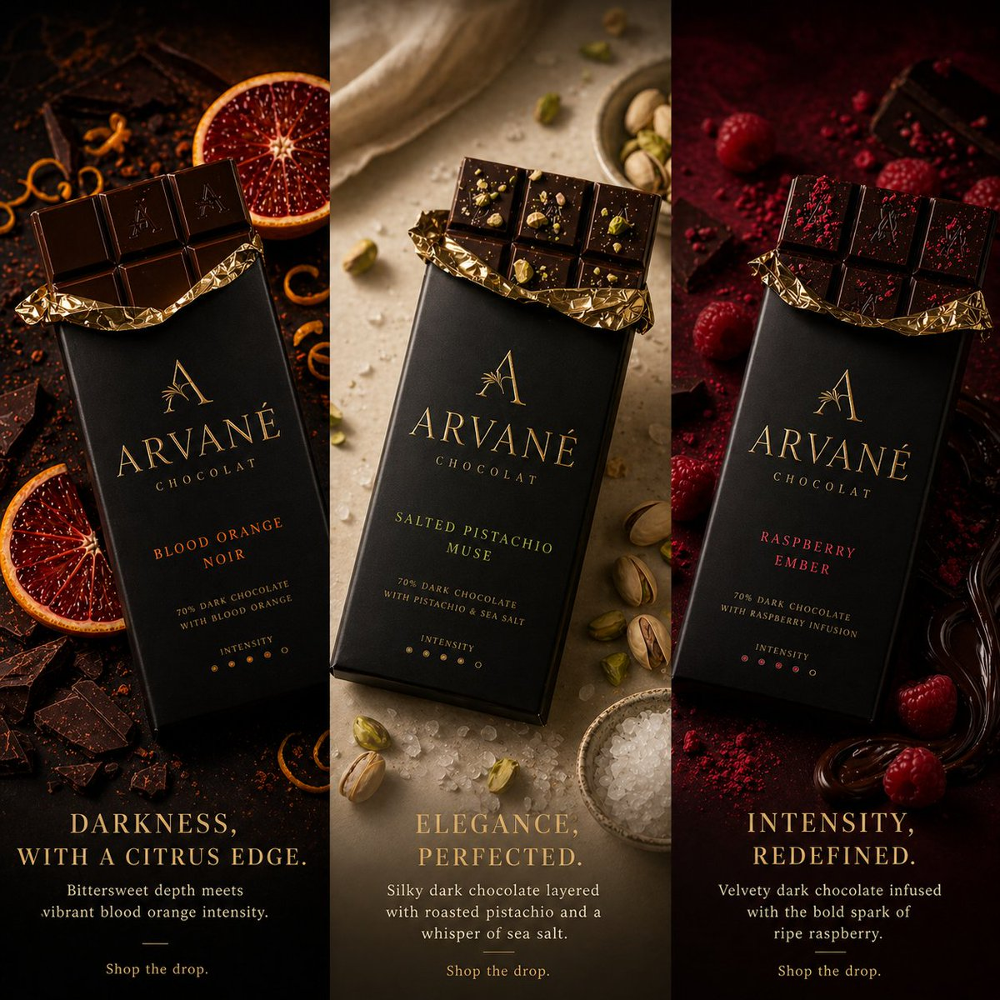

```text
Create a premium, square (1:1) product advertisement for a fictional luxury chocolate brand called Noirvelle Chocolat, inspired by high-end chocolate brands. The ad should feel like a high-end editorial campaign, combining luxury food photography, refined packaging design, and cinematic lighting. Use matte black wrapper, subtle gold foil, elegant serif typography, and realistic product rendering. Generate flavor variants such as Blood Orange Noir, Salted Pistachio Muse, and Raspberry Ember with distinct mood, color palette, ingredients, headline, and supporting copy. Keep the chocolate bar as hero centerpiece with subtle reflections, shallow depth of field, luxury minimalism, and a small CTA: “Shop the drop.”
```


---

## 例 565：Energy Drink Stadium Ad

**来源：** [@Shorelyn_](https://x.com/Shorelyn_/status/2055570197973799376) / [awesome-gpt-image-2-prompts](https://github.com/EvoLinkAI/awesome-gpt-image-2-prompts)

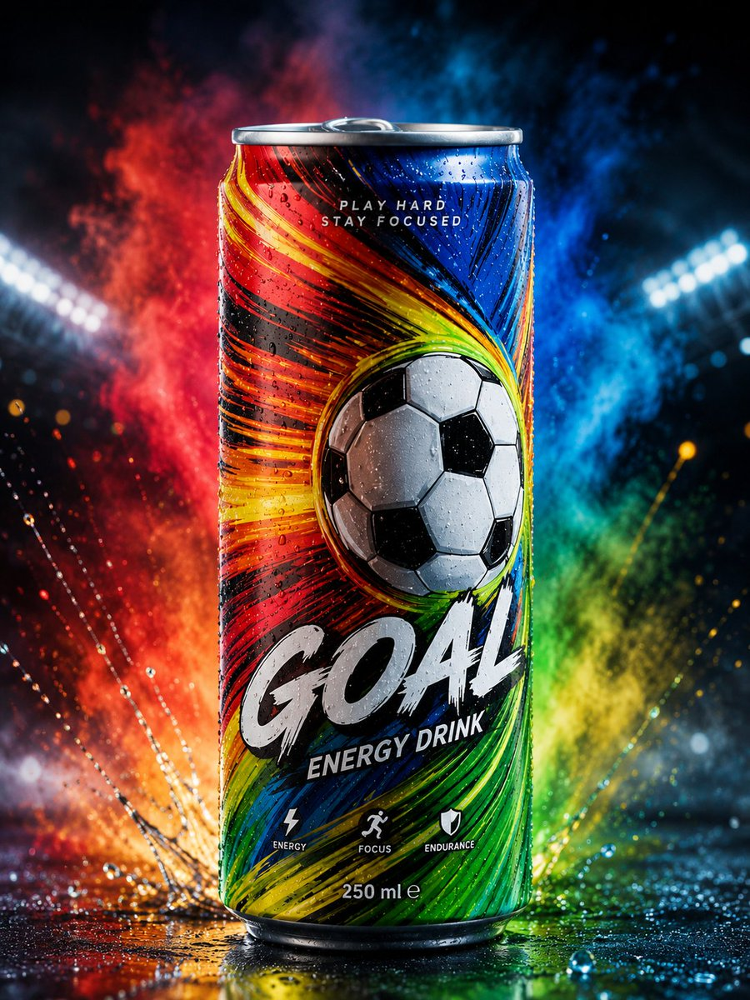

```text
Ultra realistic premium product advertising shot of a sleek aluminum energy drink can standing upright on a wet reflective surface inside a futuristic football stadium at night. The can design features vivid swirling rainbow brushstroke patterns in red, orange, yellow, green, and blue wrapping around the entire can, with a large glossy black and white soccer ball graphic in the center. Bold white distressed typography on the front reads “GOAL” with smaller clean modern text below saying “ENERGY DRINK”. Tiny premium icon details for energy, focus, and endurance near the bottom, along with “250 ml”.

The can is covered in realistic cold water droplets and condensation, highly detailed metallic texture, cinematic reflections, ultra sharp focus, luxury beverage commercial aesthetic, professional studio lighting.

Background filled with explosive colorful powder smoke clouds in blue, red, orange, green, and yellow bursting dramatically behind the can, combined with glowing football stadium floodlights, floating particles, water splashes, sparks, mist, and bokeh light effects. Dark moody environment with intense contrast and neon glow atmosphere.

Composition centered and symmetrical, low angle hero shot, shallow depth of field, hyper realistic, cinematic color grading, ultra detailed advertising photography, sports branding campaign aesthetic, IMAX quality, 8k resolution, volumetric lighting, premium commercial product render, high energy dynamic mood.
```


---

## 例 566：Luxury Watch Dramatic Beam Product Shot

**来源：** [@meng_dagg695](https://x.com/meng_dagg695/status/2065078841765458040) / [awesome-gpt-image-2-prompts](https://github.com/EvoLinkAI/awesome-gpt-image-2-prompts)

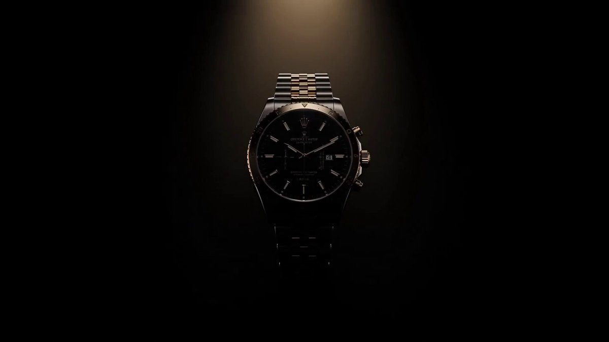

```text
A luxury watch emerges from darkness. Extreme macro shot of ticking gears and moving hands. Golden sparks and floating particles surround the watch. The camera circles the timepiece while dramatic light streaks reflect across the sapphire crystal. Slow-motion water splash freezes in midair around the watch. Mechanical components assemble themselves automatically. Cinematic black-and-gold environment, premium commercial lighting, ultra-realistic reflections, luxury lifestyle advertisement, powerful orchestral atmosphere, smooth camera motion, product hero shot, brand reveal, Hollywood-level commercial, 8K photorealism.
```


---

## 例 567：Invisible Shield Sunscreen Ad

**来源：** [@iamrealsnow](https://x.com/iamrealsnow/status/2066200217347854445) / [awesome-gpt-image-2-prompts](https://github.com/EvoLinkAI/awesome-gpt-image-2-prompts)

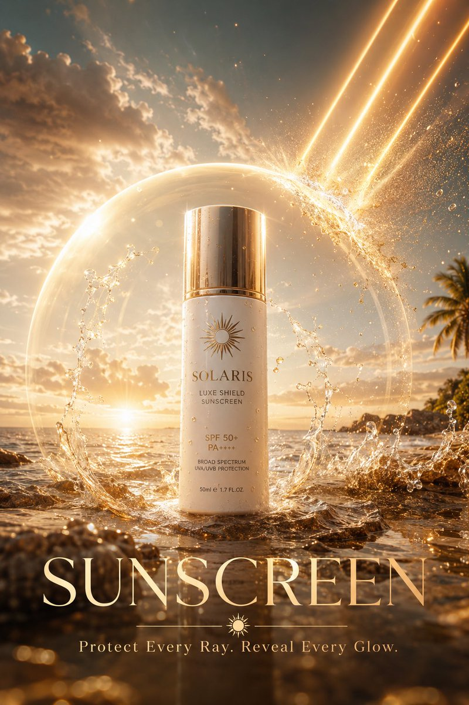

```text
SUNSCREEN AD, “THE INVISIBLE SHIELD”

Luxury skincare advertising masterpiece, a colossal premium sunscreen bottle standing on a pristine tropical shoreline at golden hour, powerful beams of sunlight crashing down from the sky and splitting apart upon contact with a transparent protective energy dome radiating from the sunscreen, millions of sparkling UV particles dissolving into golden dust before reaching flawless skin, crystal clear ocean reflections, flowing water suspended in mid air around the product, microscopic droplets catching cinematic sunlight, ultra realistic textures revealing every detail of the bottle surface, luxury beauty campaign aesthetics, dramatic volumetric lighting, glowing atmospheric haze, premium white and gold color palette, futuristic protection technology visualized as elegant light waves, hyper detailed environment, commercial photography perfection, award winning advertising design, photorealistic rendering, 16K ultra resolution, global skincare brand campaign, masterpiece quality.

Text Overlay:
SUNSCREEN

Tagline:
“Protect Every Ray. Reveal Every Glow.
```


---

## 例 568：Coconut Paradise Skincare Ad

**来源：** [@Strength04_X](https://x.com/Strength04_X/status/2067445760325734734) / [awesome-gpt-image-2-prompts](https://github.com/EvoLinkAI/awesome-gpt-image-2-prompts)

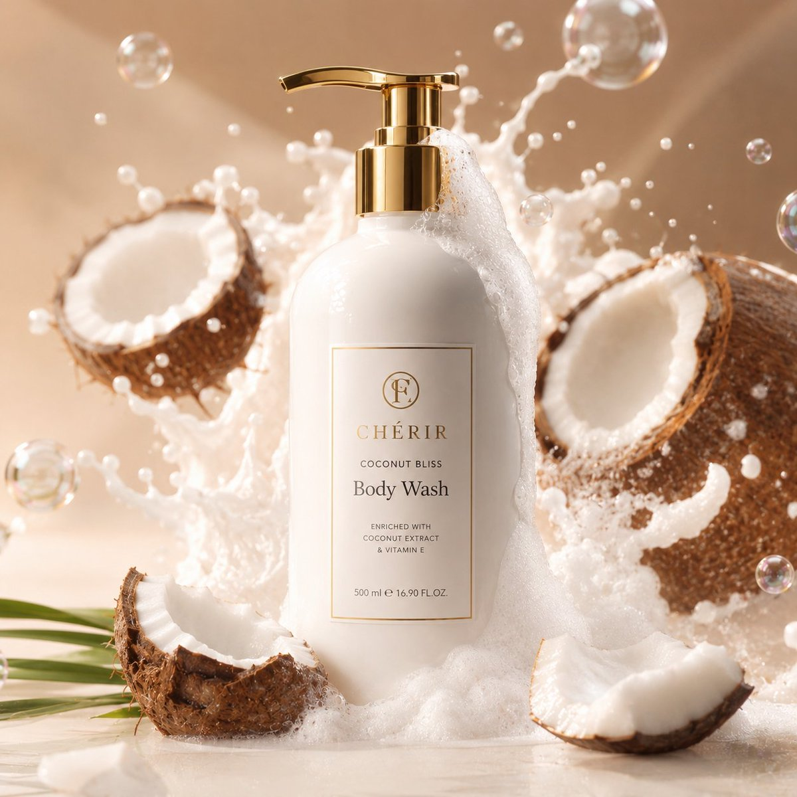

```text
Minimal white bottle with golden pump surrounded by cracked coconuts, coconut milk splash and foam clouds, tropical luxury spa atmosphere, creamy textures, realistic bubbles floating in background, premium skincare commercial, soft warm lighting, ultra detailed 8K.
```


---

## 例 569：Reverse-Assembly Product VFX

**来源：** [@iamaiistudio](https://x.com/iamaiistudio/status/2067399156596175345) / [awesome-gpt-image-2-prompts](https://github.com/EvoLinkAI/awesome-gpt-image-2-prompts)

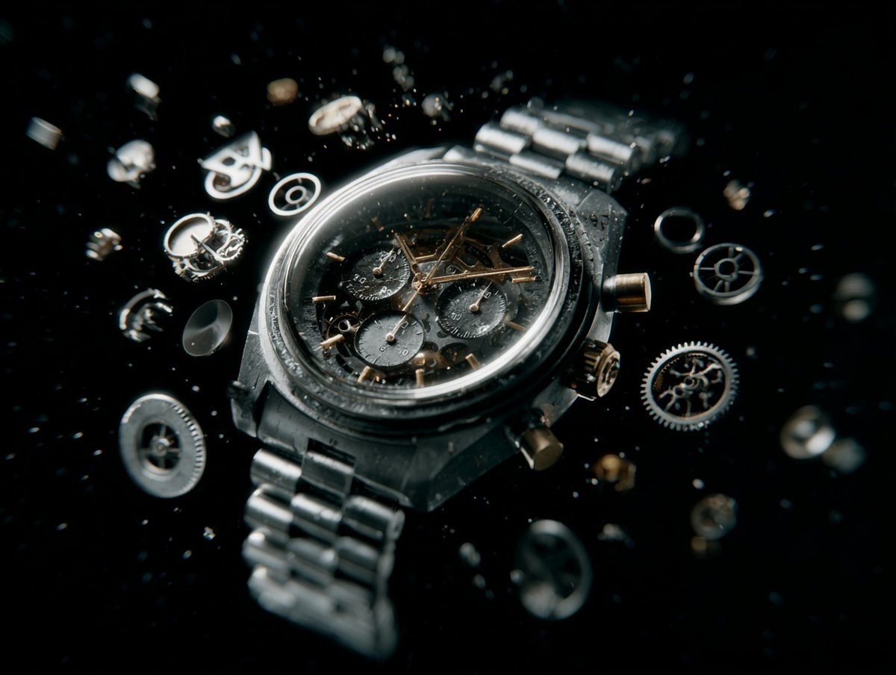

```text
[PRODUCT] reassembling in midair from scattered pieces, reverse-disintegration effect, mechanical precision, each component suspended at a different depth, dark void background, high-concept product advertising, cinematic VFX.
```


---

## 例 570：Grape Reveal Can Product Shot

**来源：** [@iamaiistudio](https://x.com/iamaiistudio/status/2067750180724855280) / [awesome-gpt-image-2-prompts](https://github.com/EvoLinkAI/awesome-gpt-image-2-prompts)

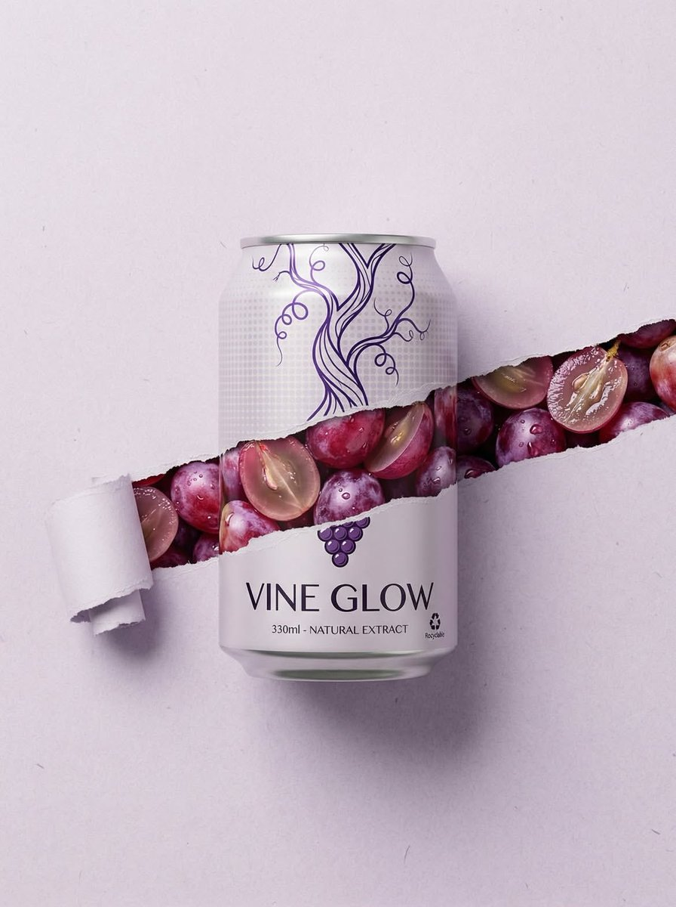

```text
Product shot of a 330ml aluminum can called "VINE GLOW – Natural Extract" placed center-frame against a clean light grey studio background. The can is adorned with refined purple vine line illustrations. A dramatic horizontal torn paper reveal slices across the can and background, exposing glistening red and purple grapes inside, covered in water droplets with a glossy wet texture. Soft studio lighting, ultra-sharp focus, photorealistic commercial packaging photography, symmetrical layout, 8K resolution.
```


---

## 例 571：Ray-Ban Giant Aviator Ad

**来源：** [@MrDasOnX](https://x.com/MrDasOnX/status/2068024611074367579) / [awesome-gpt-image-2-prompts](https://github.com/EvoLinkAI/awesome-gpt-image-2-prompts)

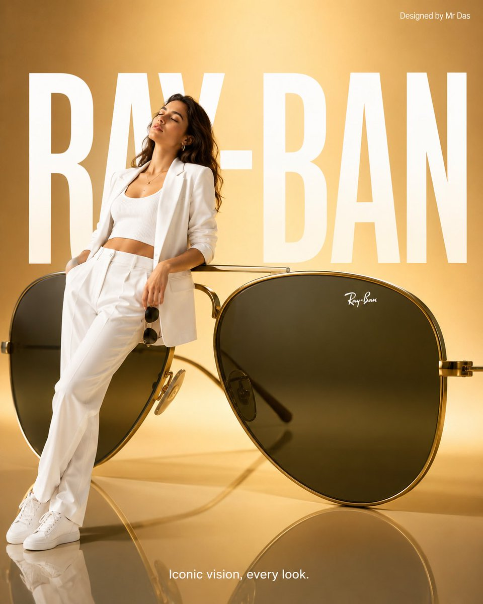

```text
Minimalist commercial ad featuring oversized Ray-Ban Aviator sunglasses, ultra-clean design. A young woman in all-white outfit leans casually against the giant sunglasses, relaxed confident pose, eyes closed, also holding a regular-sized pair in her hand. Soft gradient golden background with large bold white “RAY-BAN” text behind. Glossy reflective floor, soft studio lighting, modern high-end product photography. Small top-right text “Designed by Mr Das”. Bottom center tagline in small white font: “Iconic vision, every look.”
```


---

## 例 572：Noir Elixir Perfume Ad

**来源：** [@iamaiistudio](https://x.com/iamaiistudio/status/2069238367792112016) / [awesome-gpt-image-2-prompts](https://github.com/EvoLinkAI/awesome-gpt-image-2-prompts)

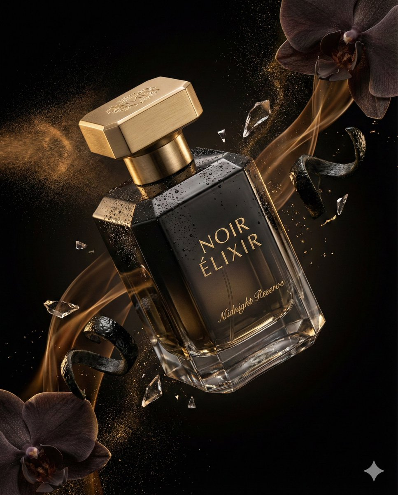

```text
Ultra-cinematic luxury fragrance advertising photography of "NOIR ÉLIXIR – Midnight Reserve" perfume bottle. Faceted geometric crystal bottle with sharp elegant edges, deep smoked black gradient glass, polished reflective surfaces with subtle matte facets. Magnetic brushed gold metal cap with engraved emblem. Minimal serif typography etched directly into glass with gold inlay. Dark amber liquid with golden undertones.

Bottle floats mid-air at a dramatic diagonal hero angle with slight forward tilt. Atomized perfume mist trails and fluid fragrance ribbons suspended in motion. Background: deep black velvet gradient fading into shadow. Surrounding elements: atomized perfume droplets suspended mid-air, shattered crystal glass fragments catching highlights, dark orchid petals drifting slowly, glossy black citrus peel curls, fine gold dust particles sparkling in light. Micro condensation beads and polished reflections enhancing realism.

Lighting: dramatic low-key studio with soft directional key light sculpting glass facets, strong rim lights outlining silhouette and edges, gold-toned specular highlights on cap and engraved details, deep cinematic shadows, high contrast with controlled reflections and luminous highlights.

Color palette: obsidian black, smoked charcoal, deep amber with metallic gold and warm champagne glow accents.

Macro cinema prime lens, shallow depth of field isolating product from background, smooth cinematic bokeh from reflective particles, extreme micro-detail clarity. 8K ultra high definition, hyper-realistic luxury commercial render, accurate glass refraction and internal reflections, physically accurate fluid dynamics, ultra-detailed crystal, metal, mist, and micro-droplet textures. Vertical 4:5 aspect ratio.
```


---

## 例 573：Glossier Brand World Collage

**来源：** [@iamaiistudio](https://x.com/iamaiistudio/status/2069120574287392978) / [awesome-gpt-image-2-prompts](https://github.com/EvoLinkAI/awesome-gpt-image-2-prompts)

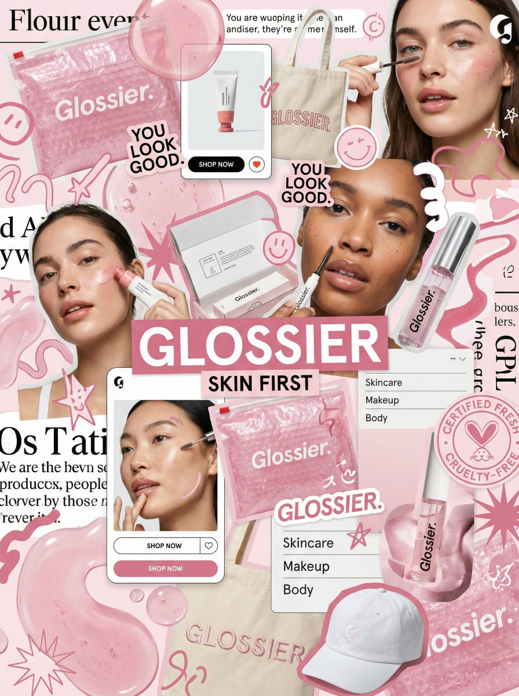

```text
Act as a world-class creative director, brand strategist, and editorial art director with deep expertise in high-impact campaign systems for global brands.

Create a bold, visually explosive, densely layered editorial moodboard collage that captures an entire brand identity system in a single frame. The result should feel raw, expressive, and intentionally chaotic, like a brand world exploding on the canvas.

BRAND INPUTS:

BRAND NAME: GLOSSIER
PRODUCT TYPE: beauty / skincare
PRIMARY COLOR: soft pink
SECONDARY COLOR: white
ACCENT: translucent gloss
PERSONALITY: fresh, minimal, youthful, clean
SLOGAN: SKIN FIRST

COMPOSITION:

Build a dense, overlapping collage that mixes:

• real product photography and lifestyle imagery
• packaging elements: bags, boxes, labels, stickers
• typography snippets and brand phrases
• hand-drawn doodles and illustrated graphics
• icons, symbols, and badge / stamp elements
• abstract blobs, squiggles, and starbursts
• UI-style cards, menus, and label panels
• editorial cutouts layered with depth

The layout should feel:

• asymmetrical, not grid-based
• intentionally messy but visually balanced
• like a Pinterest board crossed with a high-end campaign shoot
• expressive, youthful, and saturated with brand identity

VISUAL EXECUTION:

Include elements such as:

• product packaging mockups (bags, boxes, tags)
• a lifestyle shot of someone interacting with the brand
• bold headline typography blocks
• illustrated objects interacting with real photography
• merch items: t-shirt, tote bag, cap
• playful graphic overlays and brand-consistent texture

COLOR RULES:

• strictly adhere to the brand palette
• dominant use of soft pink throughout
• white for contrast and layering
• avoid introducing off-brand colors
• high contrast and visually commanding

TYPOGRAPHY:

• mix of editorial serif and clean sans-serif
• bold headlines paired with small UI-style text
• brand name and slogan integrated naturally into the layout

FINAL FEEL:

This must look like a creative direction board for a global campaign. Not a clean layout, not a grid, not minimal. It must feel alive, layered, and brand-heavy, a visual identity snapshot that is highly shareable and scroll-stopping.
```


---

## 例 574：Monumental Timepiece Fashion Ad

**来源：** [@iamaiistudio](https://x.com/iamaiistudio/status/2069387162425205211) / [awesome-gpt-image-2-prompts](https://github.com/EvoLinkAI/awesome-gpt-image-2-prompts)

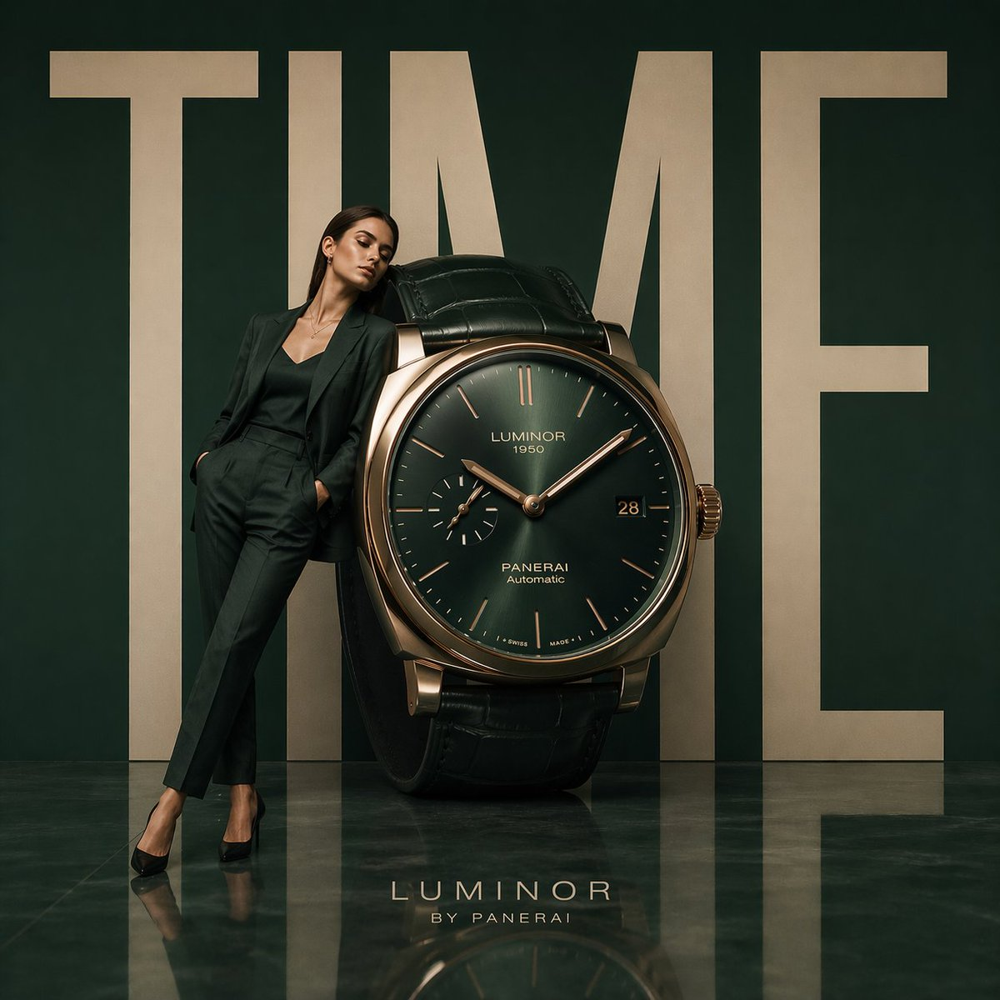

```text
Oversized luxury wristwatch as a modern sculpture centerpiece, fashion model leaning against the dial face, monumental "TIME" typography looming in the background, deep emerald studio environment, reflective polished floor, Swiss high-end advertising aesthetic, cinematic editorial photography, ultra-clean minimalist composition, 1:1
```


---
