# 图表与信息可视化 — 提示词合集


> 149 个案例

---


## 例 1：信息图可视化设计

**来源：** 小红书号insight\_express

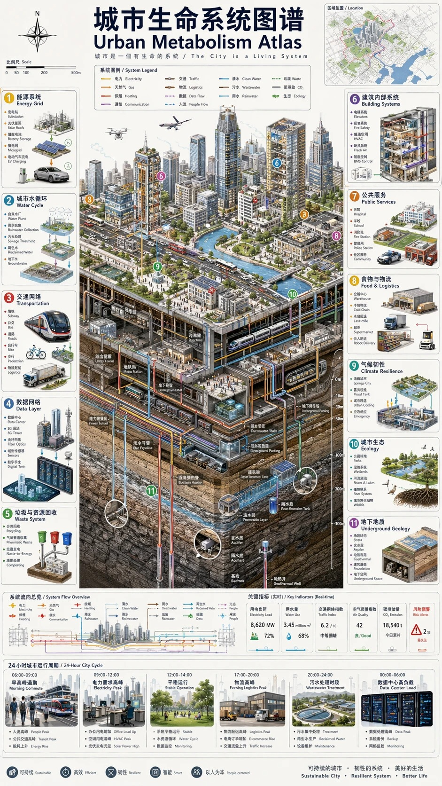


```text
Vertical 9:16 isometric cutaway infographic "城市生命系统图谱 / Urban Metabolism Atlas". Smart city from sky to bedrock: skyscrapers, streets, subway, utility tunnels, water/sewage/gas/heating pipes, fiber, data center, flood tanks, aquifers, geothermal wells, bedrock. Color-coded flows for power/water/data/traffic/waste. 12 numbered panels bilingual CN/EN: 能源/水循环/交通/数据/垃圾/建筑/公共服务/ 物流/气候韧性/生态/地质/治理看板. 24h timeline at bottom. Style: engineering white paper + scientific atlas, light paper bg, crisp lines, 8K. No cyberpunk, no gibberish text, must show both above AND below ground.
```


---


## 例 8：科普百科图

**来源：** 小红书号1055699679

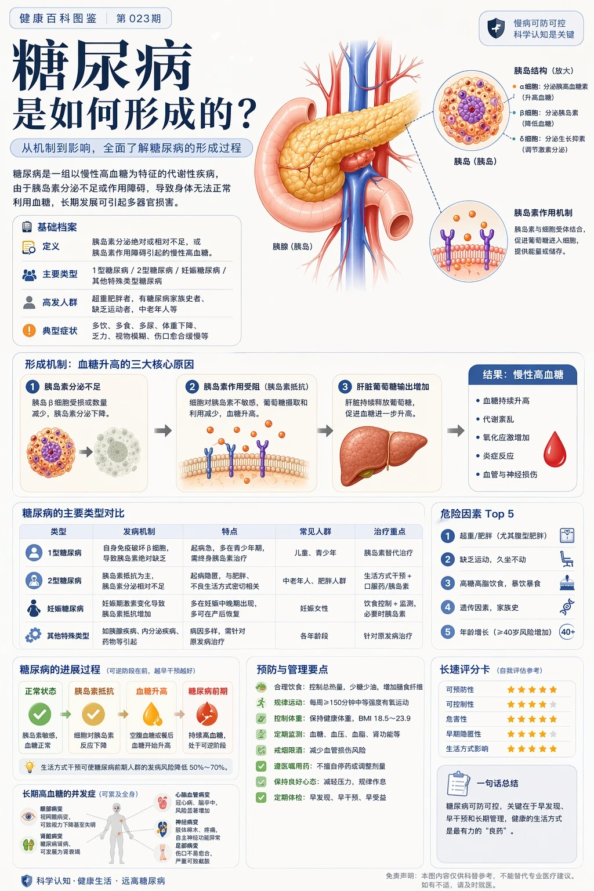


```text
根据【主题】生成一张高质量竖版「科普百科图」。 
这张图不是普通海报，也不是单纯插画，而是一张兼具图鉴感、百科感、信息结构感和收藏感的模块化科普信息图。整体风格参考高级博物图鉴、现代百科书页、生活方式知识卡，以及社交媒体上更容易传播的信息图风格。 
让画面包含： 
一个清晰好看的主题主视觉 
若干局部特征放大细节 
多个圆角模块化信息分区 
清楚的标题层级与重点标签 
简洁但信息丰富的百科内容 
可视化评分、要点总结或 Top 5 模块 
内容栏目请根据主题自动适配，优先从这些方向里选择并合理组合： 
基础档案、分类信息、外观特征、习性生态、形成机制或结构组成、生长或使用条件、养护或维护建议、风险与注意事项、适合人群或适用场景、优缺点对比、快速评分卡。 
视觉要求： 
浅色干净背景，柔和配色，轻阴影，精致小图标，圆角信息框，整体排版整洁清爽。信息密度要丰富，但不能显得拥挤，阅读体验要舒服。最终效果要像真正可以发布、阅读、收藏、批量做成系列内容的科普百科卡，而不是广告感很重的宣传海报。 
不要做成普通商业宣传海报，要重点突出“知识整理”“模块信息”“图鉴式展示”这几个特征。
```


---


## 例 13：信息图可视化设计

**来源：** 小红书号94156710894

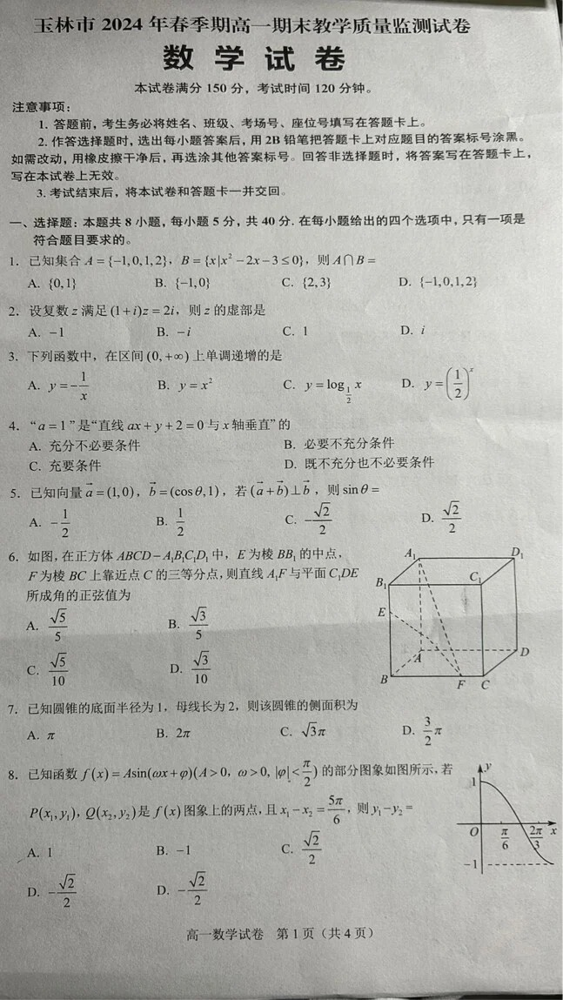


```text
A realistic photo of a Chinese high school math exam paper, printed inblack and white on slightly gray paper, titled “数学试卷”, with multiplechoice questions and math formulas, including a small 3D geometrycube diagram. The paper is photographed casually with asmartphone, slightly tilted, with uneven lighting, soft shadows, andminor blur. The text is in Chinese with a mix of bold title font andstandard serif body font. Realistic paper texture, exam layout,authentic classroom test sheet style.
```


---


## 例 14：信息图可视化设计

**来源：** 小红书号Roy\_Jay

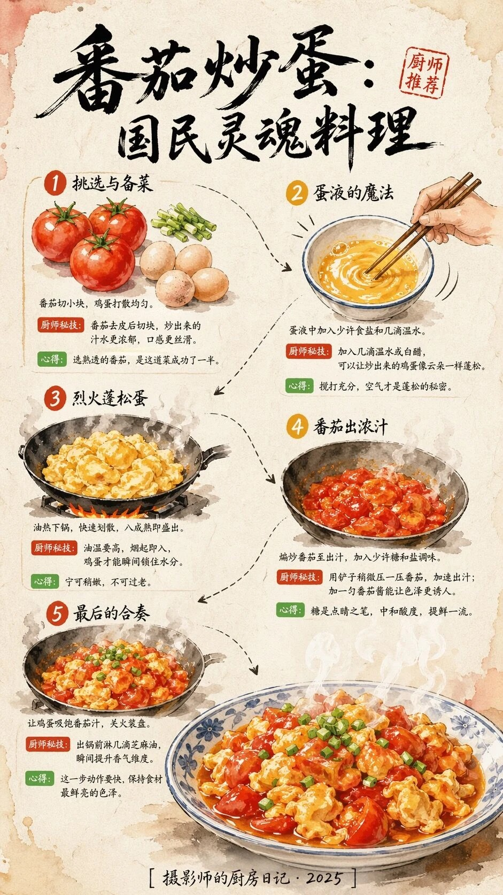


```text
视觉设计规格描述：画幅比 9:16（竖版手机信息图）；背景纹理为具有呼吸感的米色手工纸（Handmade Washi Paper），带微小纤维纹理，边角有轻微水渍晕染；配色方案为熟番茄红（#E23A28）、初榨橄榄油金黄（#F2C94C）、嫩草绿（#6FCF97）、碳黑墨线；排版逻辑为顶端大标题、中间 Z 字形流线、底部全景成品、留白艺术化处理。食谱内容策划：1）顶部标题《番茄炒蛋：国民灵魂料理》，手绘书法体，侧边盖红色“厨师推荐”微型印章。2）步骤区块（Z 动线排版）：步骤1 挑选与备菜（左上）：三个番茄、四枚土鸡蛋、一簇葱花；说明：番茄切小块，鸡蛋打散均匀；厨师秘技：番茄去皮后切块，汁水更浓郁，口感更丝滑；心得：选熟透番茄，成功一半。步骤2 蛋液的魔法（右上）：手持筷子快速搅动蛋液，泛起气泡与动感线；说明：加少许盐和几滴温水；厨师秘技：加温水或白醋，鸡蛋更蓬松；心得：搅打充分，空气是蓬松秘密。步骤3 烈火蓬松蛋（左中）：铁锅中蛋液迅速膨胀如云朵，水彩表现热气；说明：油热下锅，快速划散，八成熟盛出；厨师秘技：油温高，烟起即入，瞬间锁水；心得：宁可稍嫩，不可过老。步骤4 番茄出浓汁（右中）：番茄翻滚，边缘半融化，亮红汤汁流淌；说明：煸炒至出汁，加少许糖和盐；厨师秘技：铲子轻压加速出汁，可加一勺番茄酱提色；心得：糖中和酸度、提鲜。步骤5 最后的合奏（左下）：鸡蛋回锅与番茄汁交织，撒葱花；说明：让鸡蛋吸饱番茄汁，关火装盘；厨师秘技：出锅前滴几滴芝麻油提香；心得：动作要快，保持鲜亮色泽。3）底部成品插图：青花边陶瓷深盘装满番茄炒蛋，红亮汁水包裹金黄大块鸡蛋，葱花点缀，水彩渲染半透明酱汁质感，边缘有袅袅热气；视觉感：看了就想立刻盛一碗大米饭。4）底部中央署名：[ 摄影师的厨房日记 · 2025 ]。
```


---


## 例 18：信息图可视化设计

**来源：** [@mm\_zzm44854](https://x.com/mm_zzm44854)


```text
{
  "type": "illustrated map infographic",
  "style": "{argument name=\"art style\" default=\"watercolor and ink hand-drawn illustration on vintage parchment\"}",
  "title_section": {
    "text": "{argument name=\"city name\" default=\"成都\"} {argument name=\"map title\" default=\"吃货暴走地图\"}",
    "mascot": "cartoon red chili pepper wearing sunglasses and giving a thumbs up"
  },
  "border": "{argument name=\"border decoration\" default=\"vine of green leaves and red chili peppers\"}",
  "layout": {
    "background": "textured beige parchment paper with yellow roads, blue rivers, and green park areas",
    "sections": [
      {
        "title": "landmarks",
        "count": 6,
        "illustrations": ["traditional pavilion", "traditional monastery", "modern skyscraper with climbing panda", "tall TV tower", "traditional gate", "industrial buildings"],
        "labels": ["人民公园", "文殊院", "IFS", "339电视塔", "宽窄巷子", "东郊记忆"]
      },
      {
        "title": "food_spots",
        "count": 12,
        "illustrations": ["mapo tofu", "dumplings in chili oil", "skewers in pot", "sticky rice balls", "egg baking cake", "nine-grid hotpot", "sweet potato noodles", "cold skewers", "spicy mixed dish", "covered tea bowl", "ice jelly dessert", "spicy rabbit heads"],
        "labels": ["1 陈麻婆豆腐", "2 钟水饺", "3 春熙路", "4 宽窄巷子·三大炮", "5 建设路·叶婆婆蛋烘糕", "6 玉林路·小龙坎火锅", "7 香香巷·肥肠粉", "8 武侯祠大街·钵钵鸡", "9 东郊记忆·冒椒火辣", "10 人民公园·鹤鸣茶社", "11 锦里古街·冰粉", "12 双流老妈兔头"]
      },
      {
        "title": "图例",
        "position": "bottom-right",
        "count": 5,
        "items": ["red dot", "green house", "green tree", "blue line", "yellow double line"],
        "labels": ["美食地点", "地标景点", "公园绿地", "河流湖泊", "主要道路"]
      }
    ],
    "centerpiece": "giant panda sitting and eating bamboo",
    "bottom_right_extras": ["vintage compass rose with N, S, E, W", "disclaimer text '温馨提示：吃辣需谨慎，肠胃要保护~' with a red chili pepper icon"]
  }
}
```


---


## 例 19：信息图可视化设计

**来源：** [@yammamon](https://x.com/yammamon)


```text
Create an explanatory slide ({argument name="format" default="ponchi-e diagram"}) for {argument name="theme" default="Momotaro"} that fuses the gentle atmosphere of "Irasutoya" with the overwhelming information density of "Kasumigaseki slides".
```


---


## 例 20：信息图可视化设计

**来源：** [@yammamon](https://x.com/yammamon)

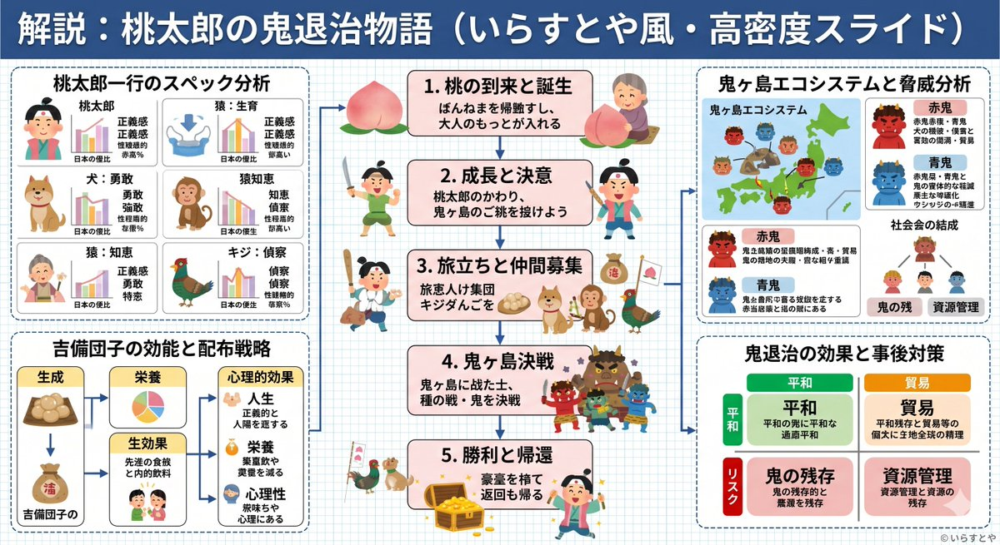


```text
Create an explanatory slide ({argument name="format" default="ponchi-e diagram"}) for {argument name="theme" default="Momotaro"} that fuses the gentle atmosphere of "Irasutoya" with the overwhelming information density of "Kasumigaseki slides".
```


---


## 例 23：信息图可视化设计

**来源：** [@GeekCatX](https://x.com/GeekCatX)

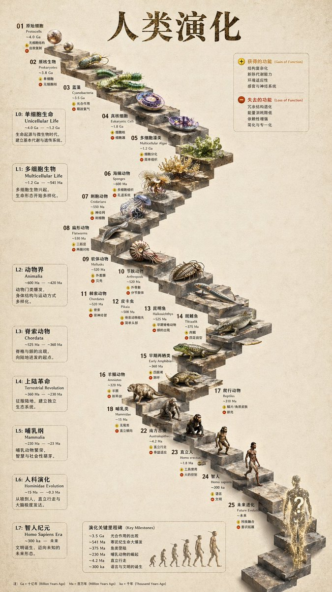


```text
{
  "type": "evolutionary timeline infographic",
  "instruction": "Using REFERENCE_0 as a structural base, transform the flat vector design into a highly realistic 3D infographic. Replace the smooth ramps with distinct stone steps and upgrade all organisms to photorealistic 3D models.",
  "style": {
    "background": "{argument name=\"background style\" default=\"vintage textured parchment paper\"}",
    "staircase": "{argument name=\"staircase material\" default=\"realistic textured stone blocks\"}",
    "subjects": "{argument name=\"organism style\" default=\"highly detailed photorealistic 3D renders\"}"
  },
  "layout": {
    "main_title": "{argument name=\"main title\" default=\"人类演化\"}",
    "sections": [
      {
        "position": "left sidebar",
        "count": 8,
        "labels": ["L0: 单细胞生命", "L1: 多细胞生物", "L2: 动物界", "L3: 脊索动物", "L4: 上陆革命", "L5: 哺乳纲", "L6: 人科演化", "L7: 智人纪元"]
      },
      {
        "position": "top right",
        "title": "获得的功能 / 失去的功能",
        "description": "Legend with plus and minus icons"
      },
      {
        "position": "bottom center",
        "title": "演化关键里程碑",
        "count": 6,
        "description": "Timeline with a silhouette graphic of 6 figures showing ape-to-human evolution"
      }
    ],
    "centerpiece": {
      "description": "Winding stone staircase with 25 numbered steps featuring specific organisms.",
      "count": 25,
      "notable_elements": [
        "Step 07: Jellyfish",
        "Step 09: Ammonite",
        "Step 10: Trilobite",
        "Step 24: Walking human",
        "Step 25: {argument name=\"future evolution concept\" default=\"glowing cosmic silhouette with a question mark\"}"
      ]
    }
  }
}
```


---


## 例 51：信息图可视化设计

**来源：** [@yyyole](https://x.com/yyyole)

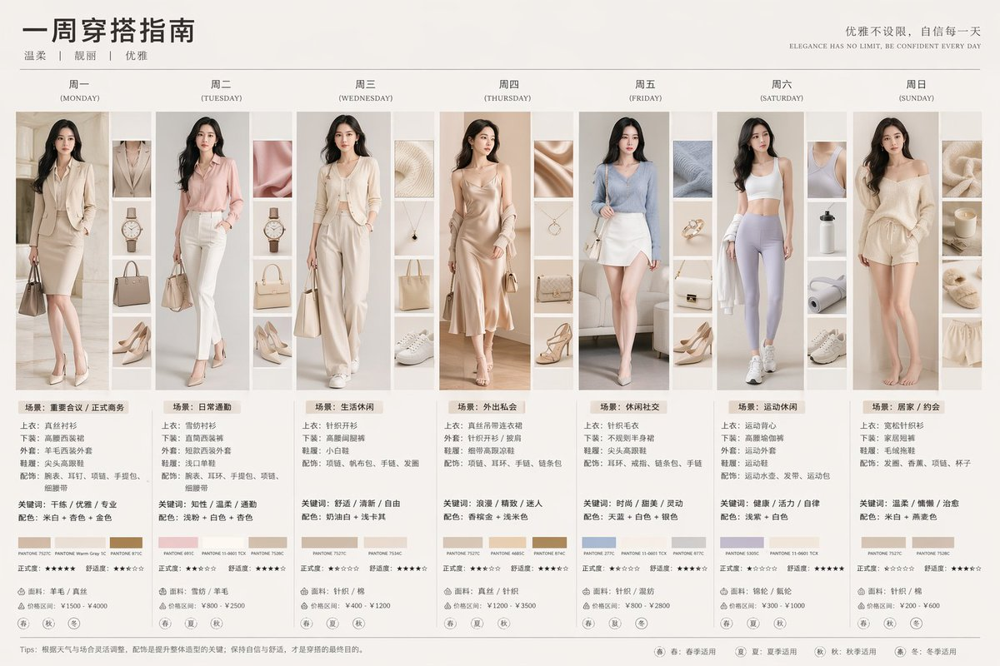


```text
{
  "type": "7-day fashion lookbook infographic",
  "header": {
    "title": "{argument name=\"main title\" default=\"一周穿搭指南\"}",
    "subtitle": "{argument name=\"style keywords\" default=\"温柔 | 靓丽 | 优雅\"}",
    "slogan_cn": "优雅不设限，自信每一天",
    "slogan_en": "{argument name=\"english slogan\" default=\"ELEGANCE HAS NO LIMIT, BE CONFIDENT EVERY DAY\"}"
  },
  "subject": "{argument name=\"subject description\" default=\"young elegant Asian woman\"}",
  "layout": {
    "columns": 7,
    "column_elements": [
      "day_header",
      "main_portrait",
      "4_detail_thumbnails",
      "outfit_specs",
      "keywords_colors",
      "3_color_swatches",
      "star_ratings",
      "fabric_price",
      "4_season_icons"
    ],
    "days": [
      { "day": "周一 (MONDAY)", "outfit": "beige blazer suit", "scene": "场景：重要会议 / 正式商务" },
      { "day": "周二 (TUESDAY)", "outfit": "pink blazer suit", "scene": "场景：日常通勤" },
      { "day": "周三 (WEDNESDAY)", "outfit": "cream knit cardigan set", "scene": "场景：生活休闲" },
      { "day": "周四 (THURSDAY)", "outfit": "champagne slip dress", "scene": "场景：外出私会" },
      { "day": "周五 (FRIDAY)", "outfit": "blue knit top, white skirt", "scene": "场景：休闲社交" },
      { "day": "周六 (SATURDAY)", "outfit": "white sports bra, purple leggings", "scene": "场景：运动休闲" },
      { "day": "周日 (SUNDAY)", "outfit": "beige lounge knitwear", "scene": "场景：居家 / 约会" }
    ]
  },
  "footer": {
    "tips": "{argument name=\"footer tips\" default=\"Tips: 根据天气与场合灵活调整，配饰是提升整体造型的关键；保持自信与舒适，才是穿搭的最终目的。\"}",
    "legend": [
      "春: 春季适用",
      "夏: 夏季适用",
      "秋: 秋季适用",
      "冬: 冬季适用"
    ]
  }
}
```


---


## 例 55：信息图可视化设计

**来源：** [@Kurt\_Rousey466](https://x.com/Kurt_Rousey466)


```text
Help me create a detailed production flowchart for the dish {argument name="dish name" default="Fried Pork with Chili"}, in a realistic style, suitable for Xiaohongshu image-text proportions.
```


---


## 例 64：信息图可视化设计

**来源：** [@j\_zou93](https://x.com/j_zou93)

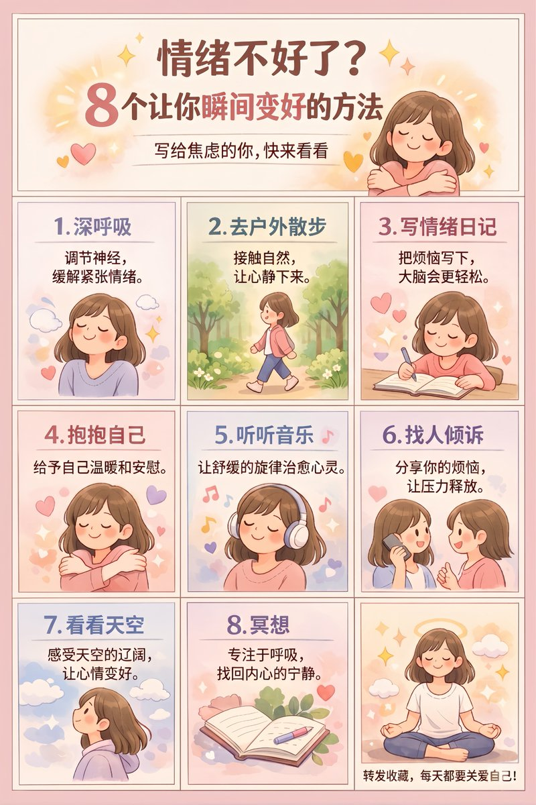


```text
{"type":"infographic poster","style":"cute flat vector illustration, cozy, warm, soft shading, {argument name=\"color palette\" default=\"pastel Morandi colors, soft pinks, purples, and warm tones\"}","character":"{argument name=\"character description\" default=\"young woman with shoulder-length brown hair wearing a pinkish-purple shirt\"}","layout":{"structure":"4 rows, 3 columns. Top row is a merged header. Rows 2-4 contain 9 individual panels.","header":{"title":"{argument name=\"main title\" default=\"情绪不好了？\"}","subtitle":"{argument name=\"subtitle\" default=\"8个让你瞬间变好的方法\"}","sub_subtitle":"写给焦虑的你，快来看看","visual":"character hugging herself, surrounded by yellow sparkles and hearts"},"grid_panels":[{"id":1,"title":"1. 深呼吸","text":"调节神经，缓解紧张情绪。","visual":"character with eyes closed, smiling, surrounded by clouds"},{"id":2,"title":"2. 去户外散步","text":"接触自然，让心静下来。","visual":"character walking outdoors among green trees and bushes"},{"id":3,"title":"3. 写情绪日记","text":"把烦恼写下，大脑会更轻松。","visual":"character sitting at a desk writing in a notebook with a pen, floating hearts"},{"id":4,"title":"4. 抱抱自己","text":"给予自己温暖和安慰。","visual":"character hugging herself with eyes closed, floating hearts"},{"id":5,"title":"5. 听听音乐","text":"让舒缓的旋律治愈心灵。","visual":"character wearing large white headphones, eyes closed, floating colorful music notes"},{"id":6,"title":"6. 找人倾诉","text":"分享你的烦恼，让压力释放。","visual":"character holding a smartphone, talking to another similar-looking girl, floating hearts"},{"id":7,"title":"7. 看看天空","text":"感受天空的辽阔，让心情变好。","visual":"character looking up at a blue sky with white clouds and sparkles"},{"id":8,"title":"8. 冥想","text":"专注于呼吸，找回内心的宁静。","visual":"an open notebook, a pen, and a pink flower on a desk"},{"id":9,"title":"none","text":"{argument name=\"footer text\" default=\"转发收藏，每天都要关爱自己！\"}","visual":"character sitting cross-legged in a meditation pose, eyes closed, with a glowing halo behind her head"}]}}
```


---


## 例 65：信息图可视化设计

**来源：** [@GeekCatX](https://x.com/GeekCatX)


```text
A breathtaking and extremely complex world-building infographic masterpiece conceptualizing the "{argument name="theme" default="Fundamental Differences between Confucianism, Buddhism, and Taoism"}", designed as a profound {argument name="style" default="ancient Oriental mythological manuscript"}.
Background: Pure white vintage textured canvas with a light beige aged parchment base color, subtle frayed edges, and water stain textures.
Core Layout: Central vision uses a grand "vertical egg-shaped layered structure", with Buddhism, Taoism, and Confucianism layers from top to bottom.
Margins: Four corners are decorated with fine micro-illustrations featuring ancient observation notes, ritual implements, and runes.
Colors: Low-saturation sage green, light gold, and off-white as main tones; overall light and soft without harsh high-saturation colors.
Details: Architectural lines, landscape brushwork, lotus patterns, and cloud layers are clearly visible and exquisitely detailed.
Seamless Fusion: The three layers transition naturally through clouds and flowing water; the Buddhist halo, Taoist Taiji mist, and Confucian scholarly aura connect seamlessly.
Style: Classical ink line art + low-saturation digital watercolor, with a light Chinese-style ancient book manuscript texture.
Text Annotations: Authentic Traditional Chinese characters in a mottled vintage Song typeface. Each annotation includes a short title + a line of poetic description, connected to corresponding details by dark gold hair-thin lines with no overlapping pointers.
Aspect Ratio: {argument name="aspect ratio" default="3:4"} vertical format, independent and complete.

Title Area (Top): `儒釋道·根本區別` (Confucianism, Buddhism, Taoism: Fundamental Differences)
Central Layer Labels:
Top "Buddhism": `釋`, `Relationship between man and self`, `Selflessness, governing the heart, letting go` 
Middle "Taoism": `道`, `Relationship between man and all things`, `Non-action, governing the body, being open-minded` 
Bottom "Confucianism": `儒`, `Relationship between man and man`, `No ego, governing the world, taking responsibility` 
Side Annotations:
Left: `Purity`: pure heart and clear mind, cutting off troubles; `Stillness`: following nature, returning to the original heart; `Respect`: respecting responsibility, active involvement in society.
Right: `60+ Spiritual Cultivation`: looking lightly at gain/loss; `35-55 Conduct`: living with flexibility, following laws; `7-35 Actions`: forging ahead, building careers.
Bottom Summary: `The balance between being in the world and being out of the world is high-level life wisdom.`
```


---


## 例 66：信息图可视化设计

**来源：** [@hx831126](https://x.com/hx831126)

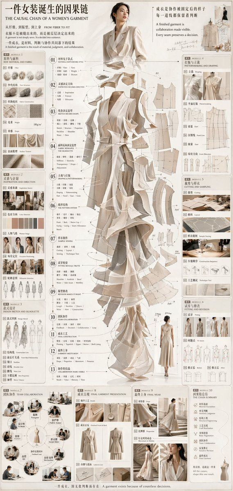


```text
{
  "type": "fashion design process infographic",
  "title": "{argument name=\"main title\" default=\"一件女装诞生的因果链 THE CAUSAL CHAIN OF A WOMEN'S GARMENT\"}",
  "subtitle": "从纤维，到版型，到上身 FROM FIBER TO FIT",
  "style": {
    "aesthetic": "elegant editorial, technical fashion illustration, highly detailed",
    "color_palette": "{argument name=\"color palette\" default=\"beige, cream, and neutral tones\"}"
  },
  "layout": {
    "centerpiece": {
      "description": "Exploded-view illustration of a {argument name=\"garment type\" default=\"women's trench coat dress\"} showing cascading layers of fabric, pattern pieces, and stitching lines. Top shows a model wearing the finished garment.",
      "central_list": {
        "count": 13,
        "type": "numbered steps with pointer lines",
        "labels": ["01 Material", "02 Inspiration", "03 Sketch", "04 Fabric", "05 Draping", "06 Pattern", "07 Sewing", "08 Fitting", "09 Revision", "10 Team", "11 Construction", "12 Garment", "13 Collaboration"]
      }
    },
    "left_column": [
      {
        "module": "MODULE 1: RAW MATERIAL AND FABRIC",
        "count": 6,
        "items": ["Fiber", "Yarn Structure", "Fabric Construction", "Weight", "Drape", "Surface Texture"]
      },
      {
        "module": "MODULE 2: INSPIRATION AND DIRECTION",
        "count": 5,
        "items": ["Inspiration Source", "Color Direction", "Woman Image", "Occasion Positioning", "Silhouette Intention"]
      },
      {
        "module": "MODULE 3: DESIGN SKETCH AND SILHOUETTE",
        "count": 7,
        "items": ["Design Sketch", "Construction Line", "Front Back Relationship", "Neckline", "Shoulder Line", "Waist Line", "Hem Proportion"]
      }
    ],
    "right_column": [
      {
        "module": "MODULE 4: PATTERNMAKING AND DRAPING",
        "count": 6,
        "items": ["Draping", "Patternmaking", "Dart", "Panel Line", "Ease", "Grain Direction"]
      },
      {
        "module": "MODULE 5: CUTTING AND SAMPLING",
        "count": 5,
        "items": ["Cutting", "Layout", "Sample Sewing", "Construction Sequence", "Technique Test"]
      },
      {
        "module": "MODULE 6: FITTING AND REVISION",
        "count": 4,
        "items": ["Fitting", "Fit Issues", "Before", "After"]
      }
    ],
    "bottom_row": [
      {
        "module": "MODULE 7: TEAM COLLABORATION",
        "count": 8,
        "items": ["Designer", "Patternmaker", "Fabric Buyer", "Sample Maker", "Merchandiser", "QC", "Feedback Loop", "Model"]
      },
      {
        "module": "MODULE 8: FINAL GARMENT PRESENTATION",
        "count": 3,
        "items": ["Details", "Finished Front & Back", "Labels & Care"]
      },
      {
        "module": "MODULE 9: FINAL WEAR",
        "count": 3,
        "items": ["Drape", "Proportion", "Movement in Motion"]
      },
      {
        "module": "MODULE 10: THE CHAIN SUMMARY",
        "count": 8,
        "items": ["Material Foundation", "Aesthetic Judgment", "Structural Engineering", "Craft Realization", "Body Negotiation", "Team Collaboration", "Iterative Revision", "Final Garment"]
      }
    ],
    "footer": "{argument name=\"footer text\" default=\"一件成衣，因无数判断而存在 A garment exists because of countless decisions.\"}"
  }
}
```


---


## 例 67：信息图可视化设计

**来源：** [@hx831126](https://x.com/hx831126)

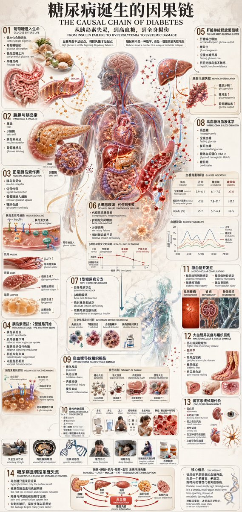


```text
{
  "type": "medical infographic poster",
  "style": "highly detailed anatomical illustrations, clean structured layout, scientific diagrammatic style",
  "color_palette": "{argument name=\"color palette\" default=\"medical red, blue, beige, and anatomical flesh tones\"}",
  "language": "{argument name=\"language\" default=\"bilingual Chinese and English\"}",
  "header": {
    "main_title": "{argument name=\"main title\" default=\"糖尿病诞生的因果链\"}",
    "english_title": "{argument name=\"english title\" default=\"THE CAUSAL CHAIN OF DIABETES\"}",
    "subtitle": "从胰岛素失灵，到高血糖，到全身损伤"
  },
  "layout": {
    "centerpiece": "{argument name=\"central subject\" default=\"transparent human body showing circulatory system and internal organs\"}",
    "sections_count": 14,
    "sections": [
      { "id": "01", "title": "葡萄糖进入生命", "visuals": ["stomach and intestines"] },
      { "id": "02", "title": "胰腺与胰岛素", "visuals": ["pancreas", "beta cell"] },
      { "id": "03", "title": "正常胰岛素作用", "visuals": ["receptor signaling diagram", "muscle, liver, adipose icons"] },
      { "id": "04", "title": "胰岛素抵抗: 2型通路开始", "visuals": ["receptor blockage diagram", "7 lifestyle icons"] },
      { "id": "05", "title": "肝脏持续释放葡萄糖", "visuals": ["liver"] },
      { "id": "06", "title": "β细胞衰竭: 代偿到失败", "visuals": ["beta-cell decline line chart"] },
      { "id": "07", "title": "1型糖尿病分支", "visuals": ["autoimmune destruction diagram"] },
      { "id": "08", "title": "高血糖与血液化学", "visuals": ["blood vessel with glucose", "glucose indicators table", "glucose variability chart"] },
      { "id": "09", "title": "高血糖导致组织损伤", "visuals": ["4 pathways of damage diagrams"] },
      { "id": "10", "title": "急性代谢后果", "visuals": ["7 symptom icons"] },
      { "id": "11", "title": "微血管并发症", "visuals": ["eye", "kidney", "nerve cross-section"] },
      { "id": "12", "title": "大血管并发症与组织损伤", "visuals": ["heart", "brain", "diabetic foot"] },
      { "id": "13", "title": "器官系统长期代价", "visuals": ["text list"] },
      { "id": "14", "title": "糖尿病是调控系统失灵", "visuals": ["metabolic control flowchart"] }
    ],
    "footer": {
      "core_message": "核心信息 CORE MESSAGE"
    }
  }
}
```


---


## 例 68：信息图可视化设计

**来源：** [@hx831126](https://x.com/hx831126)

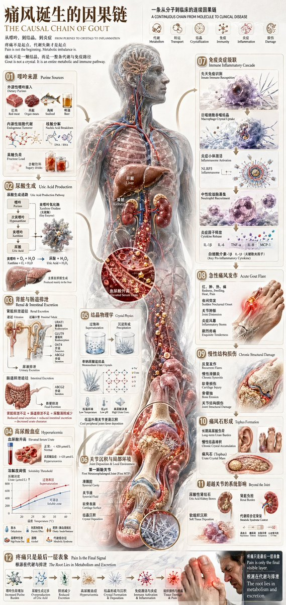


```text
{
  "type": "comprehensive medical infographic",
  "style": "highly detailed 3D medical illustration, clinical white background, clean typography",
  "header": {
    "title_cn": "{argument name=\"main title\" default=\"痛风诞生的因果链\"}",
    "title_en": "{argument name=\"english title\" default=\"THE CAUSAL CHAIN OF GOUT\"}",
    "subtitle": "Pain is not the beginning. Metabolic imbalance is.",
    "top_right_sequence": {
      "count": 6,
      "labels": ["Metabolism", "Transport", "Crystallization", "Immunity", "Inflammation", "Damage"]
    }
  },
  "centerpiece": {
    "description": "{argument name=\"central figure\" default=\"transparent anatomical human body showing liver, kidneys, and vascular system\"}",
    "details": "pathway highlighted in {argument name=\"highlight color\" default=\"glowing red\"} descending to the foot"
  },
  "layout": {
    "left_column": [
      { "id": "01", "title": "Purine Sources", "elements": 6, "labels": ["Red meat", "Organ meats", "Seafood", "Beer", "Endogenous", "Fructose"] },
      { "id": "02", "title": "Uric Acid Production", "elements": 2, "labels": ["Chemical pathway", "Liver"] },
      { "id": "03", "title": "Renal & Intestinal Excretion", "elements": 2, "labels": ["Kidney nephron", "Intestines"] },
      { "id": "04", "title": "Hyperuricemia", "elements": 2, "labels": ["Blood vial", "Solubility graph"] }
    ],
    "center_overlay": [
      { "id": "05", "title": "Crystal Physics", "elements": 3, "labels": ["Supersaturation beaker", "Precipitation beaker", "Molecular structure"] },
      { "id": "06", "title": "Joint Deposition & Local Environment", "elements": 1, "labels": ["First MTP joint cross-section"] }
    ],
    "right_column": [
      { "id": "07", "title": "Immune Inflammatory Cascade", "elements": 4, "labels": ["Macrophage", "Inflammasome", "Neutrophil", "Cytokines"] },
      { "id": "08", "title": "Acute Gout Flare", "elements": 1, "labels": ["Inflamed foot"] },
      { "id": "09", "title": "Chronic Structural Damage", "elements": 1, "labels": ["Bone erosion joint"] },
      { "id": "10", "title": "Tophus Formation", "elements": 2, "labels": ["Hand tophi", "Foot tophi"] },
      { "id": "11", "title": "Beyond the Joint", "elements": 2, "labels": ["Kidney stones", "Systemic burden"] }
    ],
    "bottom_row": [
      { "id": "12", "title": "Pain Is the Final Signal", "elements": 7, "labels": ["Increased Purine", "Overproduction", "Reduced Excretion", "Hyperuricemia", "Crystal Formation", "Immune Activation", "Man in pain"] }
    ]
  },
  "theme": "{argument name=\"disease focus\" default=\"gout and uric acid crystallization\"}"
}
```


---


## 例 69：信息图可视化设计

**来源：** [@hx831126](https://x.com/hx831126)

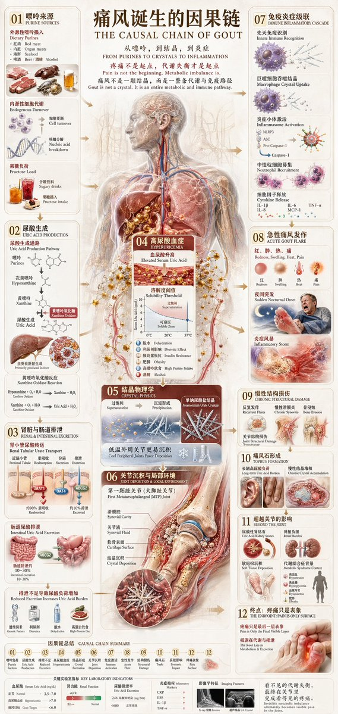


```text
{
  "type": "comprehensive medical infographic",
  "style": "highly detailed 3D medical illustration, clinical white background, clean typography",
  "header": {
    "title_cn": "{argument name=\"main title\" default=\"痛风诞生的因果链\"}",
    "title_en": "{argument name=\"english title\" default=\"THE CAUSAL CHAIN OF GOUT\"}",
    "subtitle": "Pain is not the beginning. Metabolic imbalance is.",
    "top_right_sequence": {
      "count": 6,
      "labels": ["Metabolism", "Transport", "Crystallization", "Immunity", "Inflammation", "Damage"]
    }
  },
  "centerpiece": {
    "description": "{argument name=\"central figure\" default=\"transparent anatomical human body showing liver, kidneys, and vascular system\"}",
    "details": "pathway highlighted in {argument name=\"highlight color\" default=\"glowing red\"} descending to the foot"
  },
  "layout": {
    "left_column": [
      { "id": "01", "title": "Purine Sources", "elements": 6, "labels": ["Red meat", "Organ meats", "Seafood", "Beer", "Endogenous", "Fructose"] },
      { "id": "02", "title": "Uric Acid Production", "elements": 2, "labels": ["Chemical pathway", "Liver"] },
      { "id": "03", "title": "Renal & Intestinal Excretion", "elements": 2, "labels": ["Kidney nephron", "Intestines"] },
      { "id": "04", "title": "Hyperuricemia", "elements": 2, "labels": ["Blood vial", "Solubility graph"] }
    ],
    "center_overlay": [
      { "id": "05", "title": "Crystal Physics", "elements": 3, "labels": ["Supersaturation beaker", "Precipitation beaker", "Molecular structure"] },
      { "id": "06", "title": "Joint Deposition & Local Environment", "elements": 1, "labels": ["First MTP joint cross-section"] }
    ],
    "right_column": [
      { "id": "07", "title": "Immune Inflammatory Cascade", "elements": 4, "labels": ["Macrophage", "Inflammasome", "Neutrophil", "Cytokines"] },
      { "id": "08", "title": "Acute Gout Flare", "elements": 1, "labels": ["Inflamed foot"] },
      { "id": "09", "title": "Chronic Structural Damage", "elements": 1, "labels": ["Bone erosion joint"] },
      { "id": "10", "title": "Tophus Formation", "elements": 2, "labels": ["Hand tophi", "Foot tophi"] },
      { "id": "11", "title": "Beyond the Joint", "elements": 2, "labels": ["Kidney stones", "Systemic burden"] }
    ],
    "bottom_row": [
      { "id": "12", "title": "Pain Is the Final Signal", "elements": 7, "labels": ["Increased Purine", "Overproduction", "Reduced Excretion", "Hyperuricemia", "Crystal Formation", "Immune Activation", "Man in pain"] }
    ]
  },
  "theme": "{argument name=\"disease focus\" default=\"gout and uric acid crystallization\"}"
}
```


---


## 例 70：信息图可视化设计

**来源：** [@hx831126](https://x.com/hx831126)

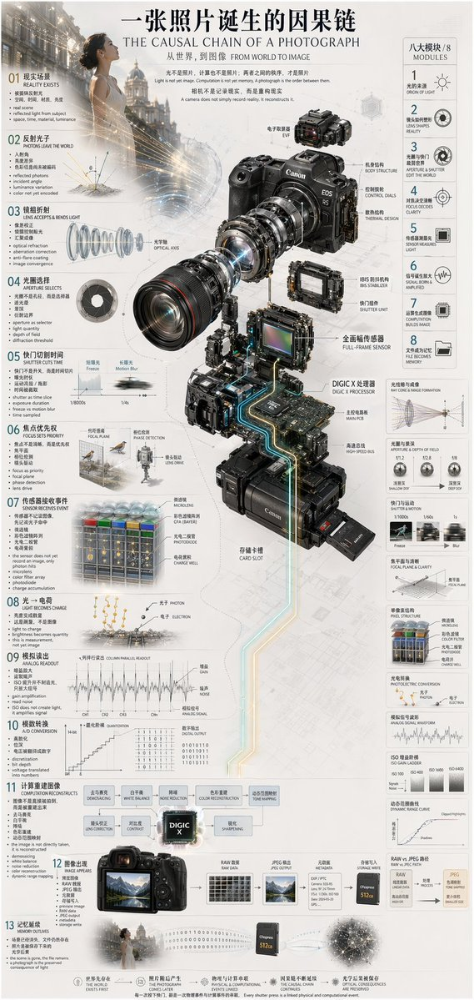


```text
{
  "type": "technical infographic",
  "subject": "{argument name=\"subject matter\" default=\"digital photography process\"}",
  "header": {
    "title": "{argument name=\"main title\" default=\"一张照片诞生的因果链 THE CAUSAL CHAIN OF A PHOTOGRAPH\"}",
    "subtitle": "从世界，到图像 FROM WORLD TO IMAGE"
  },
  "centerpiece": {
    "description": "Exploded isometric view of a modern mirrorless camera",
    "model": "{argument name=\"camera model\" default=\"Canon EOS R5\"}",
    "labeled_parts_count": 12,
    "labeled_parts": [
      "EVF",
      "Body Structure",
      "Control Dials",
      "Thermal Design",
      "Optical Axis",
      "IBIS Stabilizer",
      "Shutter Unit",
      "Full-Frame Sensor",
      "{argument name=\"processor name\" default=\"DIGIC X Processor\"}",
      "Main PCB",
      "High-Speed Bus",
      "Card Slot"
    ]
  },
  "layout": {
    "left_column": {
      "description": "Chronological causal chain",
      "count": 13,
      "steps": [
        "01 REALITY EXISTS",
        "02 PHOTONS LEAVE THE WORLD",
        "03 LENS ACCEPTS & BENDS LIGHT",
        "04 APERTURE SELECTS",
        "05 SHUTTER CUTS TIME",
        "06 FOCUS SETS PRIORITY",
        "07 SENSOR RECEIVES EVENT",
        "08 LIGHT BECOMES CHARGE",
        "09 ANALOG READOUT",
        "10 A/D CONVERSION",
        "11 COMPUTATION RECONSTRUCTS",
        "12 IMAGE APPEARS",
        "13 MEMORY OUTLIVES"
      ]
    },
    "right_column": {
      "title": "八大模块 / 8 MODULES",
      "count": 8,
      "modules": [
        "1 ORIGIN OF LIGHT",
        "2 LENS SHAPES REALITY",
        "3 APERTURE & SHUTTER EDIT THE WORLD",
        "4 FOCUS DECIDES CLARITY",
        "5 SENSOR MEASURES LIGHT",
        "6 SIGNAL BORN & AMPLIFIED",
        "7 COMPUTATION BUILDS IMAGE",
        "8 FILE BECOMES MEMORY"
      ]
    },
    "side_diagrams": {
      "count": 7,
      "descriptions": [
        "Ray cone & image formation",
        "Aperture & depth of field",
        "Shutter & motion",
        "Focal plane & clarity",
        "Pixel structure",
        "Photoelectric conversion",
        "Analog signal waveform"
      ]
    },
    "footer": {
      "count": 5,
      "description": "Philosophical summary points"
    }
  },
  "style": "technical, precise, wireframe elements, glowing data lines, photorealistic camera components, clean typography, dual-language"
}
```


---


## 例 71：关系图谱信息图

**来源：** [@hx831126](https://x.com/hx831126)

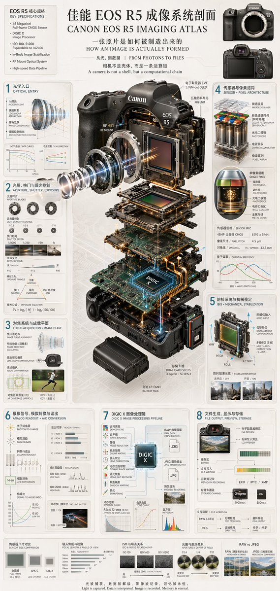


```text
{
  "type": "technical infographic and exploded view diagram",
  "header": {
    "title": "{argument name=\"main title\" default=\"佳能 EOS R5 成像系统剖面 CANON EOS R5 IMAGING ATLAS\"}",
    "subtitles": [
      "一张照片是如何被制造出来的 HOW AN IMAGE IS ACTUALLY FORMED",
      "从光，到数据 | FROM PHOTONS TO FILES",
      "相机不是壳体，而是一条运算链 A camera is not a shell, but a computational chain"
    ],
    "top_left_box": {
      "title": "EOS R5 核心规格 KEY SPECIFICATIONS",
      "bullet_points_count": 6
    },
    "top_right_images": {
      "count": 2,
      "description": "front and back views of the camera body"
    }
  },
  "centerpiece": {
    "description": "highly detailed 3D exploded view of the {argument name=\"camera model\" default=\"Canon EOS R5\"} camera, showing internal components separated vertically",
    "components_visible": [
      "lens mount",
      "lens elements with glowing blue light rays",
      "image sensor",
      "motherboard with glowing {argument name=\"processor name\" default=\"DIGIC X\"} chip",
      "battery pack",
      "dual card slots",
      "electronic viewfinder (EVF)"
    ]
  },
  "layout": {
    "numbered_sections": [
      {
        "number": 1,
        "title": "光学入口 OPTICAL ENTRY",
        "elements": ["lens cross-section with light rays", "2 line graphs"]
      },
      {
        "number": 2,
        "title": "光圈、快门与曝光控制 APERTURE, SHUTTER, EXPOSURE",
        "elements": ["3 aperture blade diagrams", "4 shutter speed example photos", "depth of field diagram", "exposure triangle diagram"]
      },
      {
        "number": 3,
        "title": "对焦系统与成像平面 FOCUS ACQUISITION + IMAGE PLANE",
        "elements": ["lens alignment diagram", "AF coverage photo of a runner"]
      },
      {
        "number": 4,
        "title": "传感器与像素结构 SENSOR + PIXEL ARCHITECTURE",
        "elements": ["3D pixel array diagram", "single pixel cross-section diagram", "sensor spec table", "quantum efficiency graph"]
      },
      {
        "number": 5,
        "title": "防抖系统与机械稳定 IBIS + MECHANICAL STABILIZATION",
        "elements": ["sensor shift mechanism diagram with yaw/pitch/roll axes", "2 stabilization effect comparison photos"]
      },
      {
        "number": 6,
        "title": "模拟信号、模数转换与读出 ANALOG READOUT + A/D CONVERSION",
        "elements": ["signal flowchart", "3 readout timing graphs", "signal-to-noise ratio graph", "rolling shutter example photo of a car"]
      },
      {
        "number": 7,
        "title": "DIGIC X 图像处理链 DIGIC X IMAGE PROCESSING PIPELINE",
        "elements": ["processing flowchart with central chip", "dynamic range graph", "tone curve graph", "histogram"]
      },
      {
        "number": 8,
        "title": "文件生成、显示与存储 FILE OUTPUT, PREVIEW, STORAGE",
        "elements": ["file output flowchart", "2 storage card icons", "file workflow diagram"]
      }
    ],
    "bottom_comparisons": {
      "count": 5,
      "labels": [
        "传感器尺寸对比 SENSOR SIZE COMPARISON",
        "镜头焦距与视角 FOCAL LENGTH & ANGLE OF VIEW",
        "ISO 与噪点关系 ISO & NOISE RELATIONSHIP",
        "光圈与景深关系 APERTURE & DEPTH OF FIELD",
        "RAW vs JPEG"
      ]
    },
    "footer": "{argument name=\"footer quote\" default=\"光被捕获，数据被解读，影像被记录，记忆被永恒。 Light is captured. Data is interpreted. Image is recorded. Memory is eternal.\"}"
  },
  "style": "clean, technical, highly detailed, photorealistic components, blueprint-style annotations, light gray background, precise typography"
}
```


---


## 例 72：信息图可视化设计

**来源：** [@hx831126](https://x.com/hx831126)

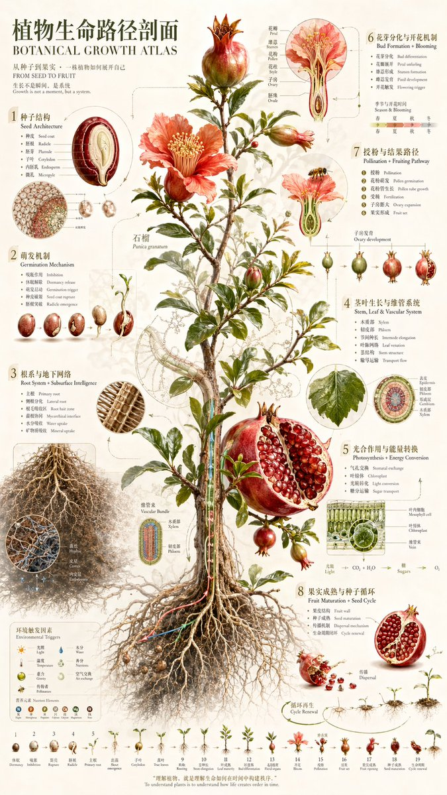


```text
{
  "type": "scientific botanical infographic poster",
  "subject": "{argument name=\"plant species\" default=\"Pomegranate (Punica granatum)\"}",
  "style": "vintage botanical illustration mixed with modern infographic design, highly detailed, {argument name=\"color palette\" default=\"earthy greens, deep reds, parchment background\"}",
  "header": {
    "main_title": "{argument name=\"main title\" default=\"植物生命路径剖面\"}",
    "english_title": "{argument name=\"english title\" default=\"BOTANICAL GROWTH ATLAS\"}",
    "subtitle": "从种子到果实，一株植物如何展开自己 / FROM SEED TO FRUIT"
  },
  "centerpiece": "full plant showing extensive root system, woody stem, green leaves, blooming red flowers, and ripe fruits including one halved to show seeds",
  "layout": {
    "numbered_sections": [
      { "number": 1, "title": "种子结构 / Seed Architecture", "content": "cross-section of a single seed with 6 labeled parts" },
      { "number": 2, "title": "萌发机制 / Germination Mechanism", "content": "sequence of 5 sprouting seeds showing radicle emergence" },
      { "number": 3, "title": "根系与地下网络 / Root System + Subsurface Intelligence", "content": "detailed root network with 2 circular microscopic cross-sections showing vascular bundles and hyphae" },
      { "number": 4, "title": "茎叶生长与维管系统 / Stem, Leaf & Vascular System", "content": "leaf detail and circular stem cross-section with 5 labeled layers" },
      { "number": 5, "title": "光合作用与能量转换 / Photosynthesis + Energy Conversion", "content": "3D cellular cross-section of a leaf showing mesophyll and chloroplasts, plus a chemical equation diagram" },
      { "number": 6, "title": "花芽分化与开花机制 / Bud Formation + Blooming", "content": "detailed flower cross-section showing stamen and ovary, plus a 4-season timeline" },
      { "number": 7, "title": "授粉与结果路径 / Pollination + Fruiting Pathway", "content": "bee approaching a flower cross-section, followed by a sequence of 5 stages of ovary development into a fruit" },
      { "number": 8, "title": "果实成熟与种子循环 / Fruit Maturation + Seed Cycle", "content": "ripe fruit breaking open, seeds dispersing downwards to a new sprout" }
    ],
    "additional_elements": [
      { "position": "bottom left", "title": "环境触发因素 / Environmental Triggers", "content": "grid of 6 weather/environmental icons and 6 nutrient element icons (N, P, K, Ca, Mg, Fe)" },
      { "position": "bottom edge", "title": "Growth Timeline", "content": "linear sequence of 19 small plant icons showing the complete life cycle from seed to mature plant" }
    ],
    "footer_quote": "{argument name=\"bottom quote\" default=\"理解植物，就是理解生命如何在时间中构建秩序。\"}"
  }
}
```


---


## 例 73：信息图可视化设计

**来源：** [@hx831126](https://x.com/hx831126)

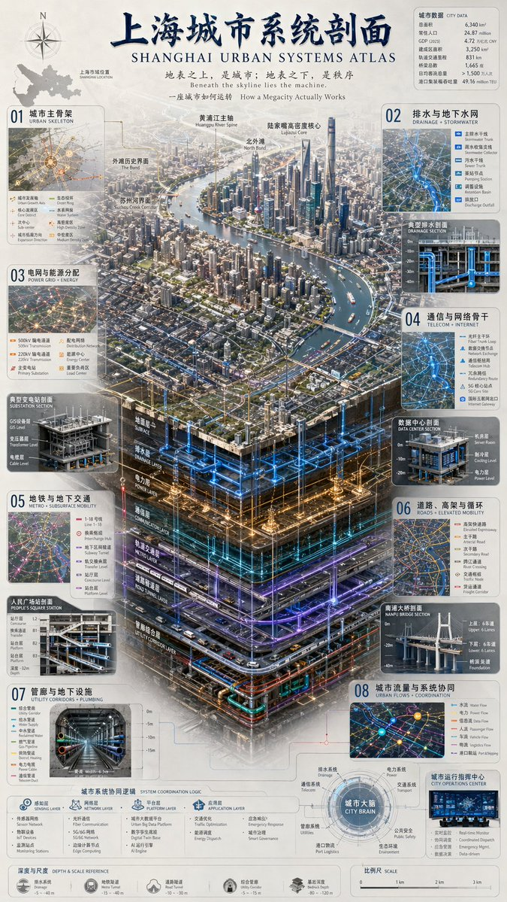


```text
{
  "type": "complex urban systems atlas infographic",
  "style": "{argument name=\"color palette\" default=\"dark background with glowing blue, gold, and purple accents\"}, highly detailed technical illustration, 3D isometric cutaway",
  "header": {
    "title": "{argument name=\"chinese city name\" default=\"上海\"}城市系统剖面 {argument name=\"english city name\" default=\"SHANGHAI\"} URBAN SYSTEMS ATLAS",
    "subtitles": [
      "地表之上，是城市；地表之下，是秩序 {argument name=\"english subtitle\" default=\"Beneath the skyline lies the machine.\"}",
      "一座城市如何运转 How a Megacity Actually Works"
    ]
  },
  "layout": {
    "top_left": "Compass rose and city map labeled '上海市域位置 SHANGHAI LOCATION'",
    "top_right": "Data table titled '城市数据 CITY DATA' with 7 rows of statistics",
    "centerpiece": {
      "description": "{argument name=\"centerpiece style\" default=\"highly detailed 3D isometric cutaway render\"} of a megacity river landscape",
      "layers": [
        "地面层 SURFACE",
        "排水层 DRAINAGE LAYER",
        "电力层 POWER LAYER",
        "通信层 COMMUNICATION LAYER",
        "轨道交通层 METRO LAYER",
        "道路隧道层 ROAD TUNNEL LAYER",
        "管廊综合层 UTILITY CORRIDOR LAYER"
      ]
    },
    "side_panels": [
      { "id": "01", "title": "城市主骨架 URBAN SKELETON", "elements": "Map with 8 legend items" },
      { "id": "02", "title": "排水与地下水网 DRAINAGE + STORMWATER", "elements": "Cross-section diagram '典型排水剖面 DRAINAGE SECTION' with 5 legend items" },
      { "id": "03", "title": "电网与能源分配 POWER GRID + ENERGY", "elements": "Cross-section diagram '典型变电站剖面 SUBSTATION SECTION' with 6 legend items" },
      { "id": "04", "title": "通信与网络骨干 TELECOM + INTERNET", "elements": "Cross-section diagram '数据中心剖面 DATA CENTER SECTION' with 6 legend items" },
      { "id": "05", "title": "地铁与地下交通 METRO + SUBSURFACE MOBILITY", "elements": "Cross-section diagram '人民广场站剖面 PEOPLE'S SQUARE STATION' with 6 legend items" },
      { "id": "06", "title": "道路、高架与循环 ROADS + ELEVATED MOBILITY", "elements": "Cross-section diagram '南浦大桥剖面 NANPU BRIDGE SECTION' with 6 legend items" },
      { "id": "07", "title": "管廊与地下设施 UTILITY CORRIDORS + PLUMBING", "elements": "Cross-section diagram '综合管廊 UTILITY CORRIDOR' with 8 legend items" },
      { "id": "08", "title": "城市流量与系统协同 URBAN FLOWS + COORDINATION", "elements": "Map diagram '城市运行指挥中心 CITY OPERATIONS CENTER' with 6 legend items" }
    ],
    "bottom_panels": {
      "system_logic": {
        "title": "城市系统协同逻辑 SYSTEM COORDINATION LOGIC",
        "steps": 4,
        "labels": ["感知层 SENSING LAYER", "网络层 NETWORK LAYER", "平台层 PLATFORM LAYER", "应用层 APPLICATION LAYER"]
      },
      "city_brain": {
        "title": "城市大脑 CITY BRAIN",
        "central_node": 1,
        "peripheral_nodes": 8
      },
      "references": {
        "depth_scale": { "title": "深度与尺度 DEPTH & SCALE REFERENCE", "icons": 5 },
        "map_scale": { "title": "比例尺 SCALE", "markers": 4 }
      }
    }
  }
}
```


---


## 例 74：关系图谱信息图

**来源：** [@alanlovelq](https://x.com/alanlovelq)

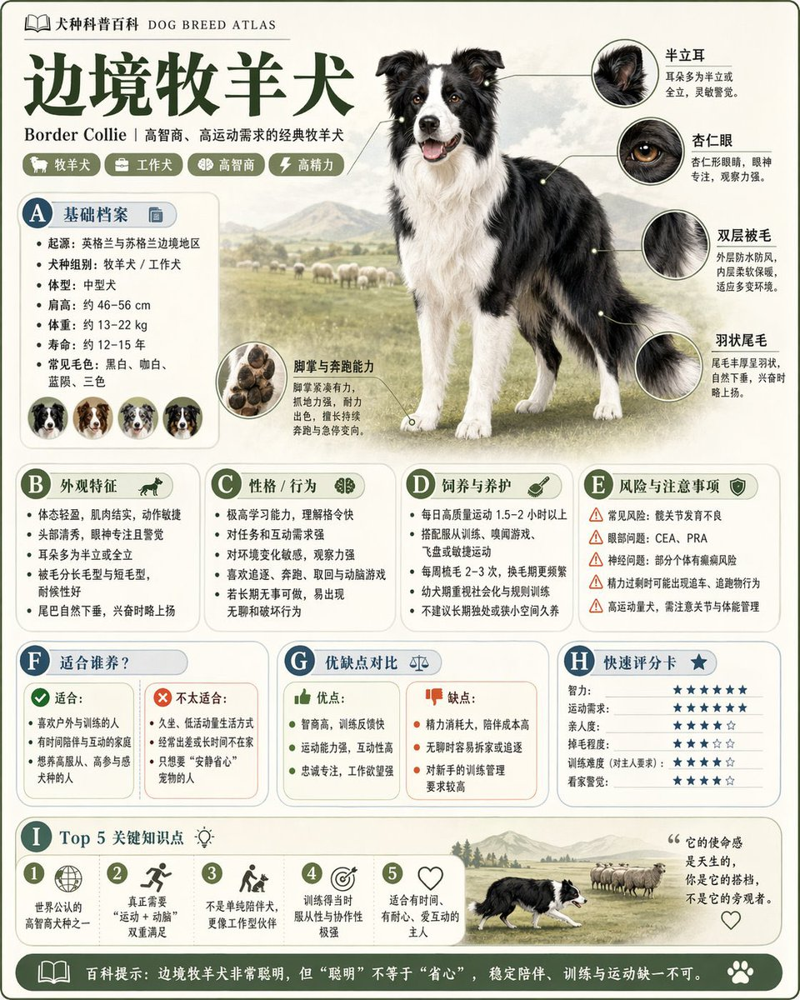


```text
Please generate a high-quality vertical "Popular Science Encyclopedia Image" based on {argument name="theme" default="animals"}.

This image is not a regular poster or a simple illustration, but a modular popular science infographic that possesses a sense of "illustration book, encyclopedia, information structure, and collectability." The overall style should reference a combination of high-end natural history illustrations, modern encyclopedia pages, lifestyle knowledge cards, and highly shareable social media infographics.

Please include in the frame:
- A clear and beautiful main visual of the subject
- Several magnified details of local characteristics
- Multiple rounded modular information sections
- Clear title hierarchies and key labels
- Concise yet rich encyclopedic content
- Visual ratings, key point summaries, or Top 5 modules

Content columns should be automatically adapted based on the theme, prioritized from these directions: basic profile, classification information, appearance characteristics, habits/ecology, formation mechanism/structure, growth or use conditions, care or maintenance suggestions, risks and precautions, suitable audience or scenarios, pros and cons comparison, and quick rating cards.

Visual requirements:
Light-colored clean background, soft color palette, light shadows, exquisite small icons, rounded information boxes, neat layout, high information density but not crowded, good reading experience. The overall result must look like a real science encyclopedia card suitable for publishing, reading, collecting, and serialized production, rather than an advertisement.

Please do not make it a regular commercial promotional poster. Highlight the features of "knowledge organization + modular information + illustration-style display."
```


---


## 例 75：关系图谱信息图

**来源：** [@alanlovelq](https://x.com/alanlovelq)

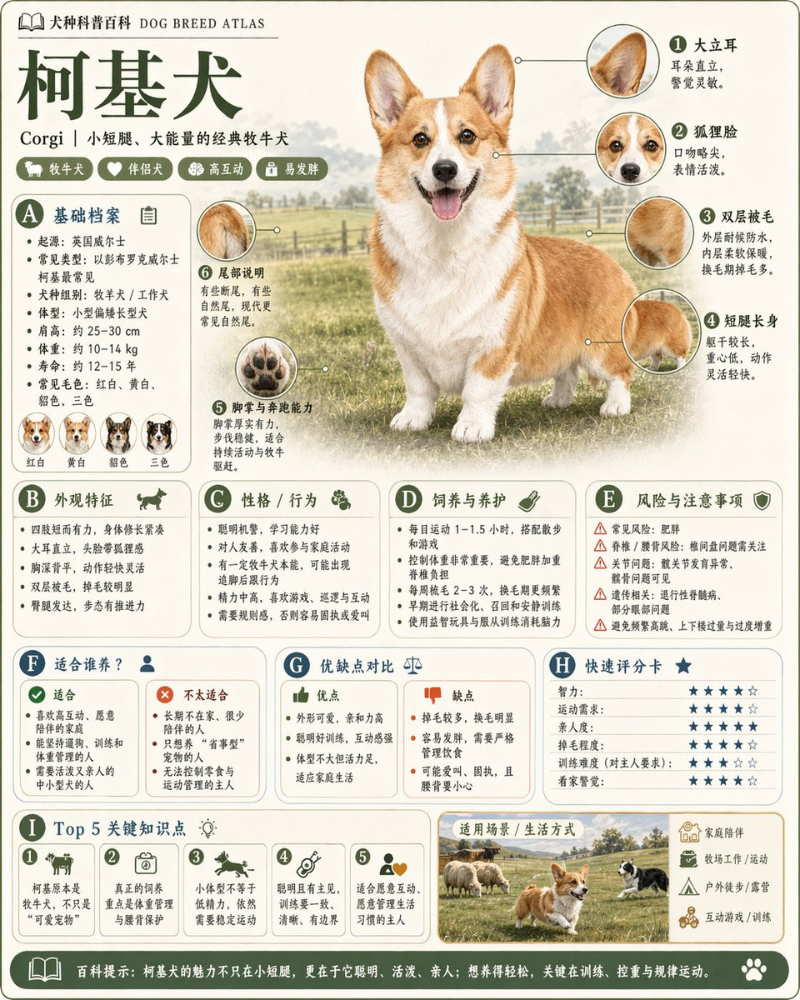


```text
Please generate a high-quality vertical "Popular Science Encyclopedia Image" based on {argument name="theme" default="animals"}.

This image is not a regular poster or a simple illustration, but a modular popular science infographic that possesses a sense of "illustration book, encyclopedia, information structure, and collectability." The overall style should reference a combination of high-end natural history illustrations, modern encyclopedia pages, lifestyle knowledge cards, and highly shareable social media infographics.

Please include in the frame:
- A clear and beautiful main visual of the subject
- Several magnified details of local characteristics
- Multiple rounded modular information sections
- Clear title hierarchies and key labels
- Concise yet rich encyclopedic content
- Visual ratings, key point summaries, or Top 5 modules

Content columns should be automatically adapted based on the theme, prioritized from these directions: basic profile, classification information, appearance characteristics, habits/ecology, formation mechanism/structure, growth or use conditions, care or maintenance suggestions, risks and precautions, suitable audience or scenarios, pros and cons comparison, and quick rating cards.

Visual requirements:
Light-colored clean background, soft color palette, light shadows, exquisite small icons, rounded information boxes, neat layout, high information density but not crowded, good reading experience. The overall result must look like a real science encyclopedia card suitable for publishing, reading, collecting, and serialized production, rather than an advertisement.

Please do not make it a regular commercial promotional poster. Highlight the features of "knowledge organization + modular information + illustration-style display."
```


---


## 例 76：关系图谱信息图

**来源：** [@alanlovelq](https://x.com/alanlovelq)

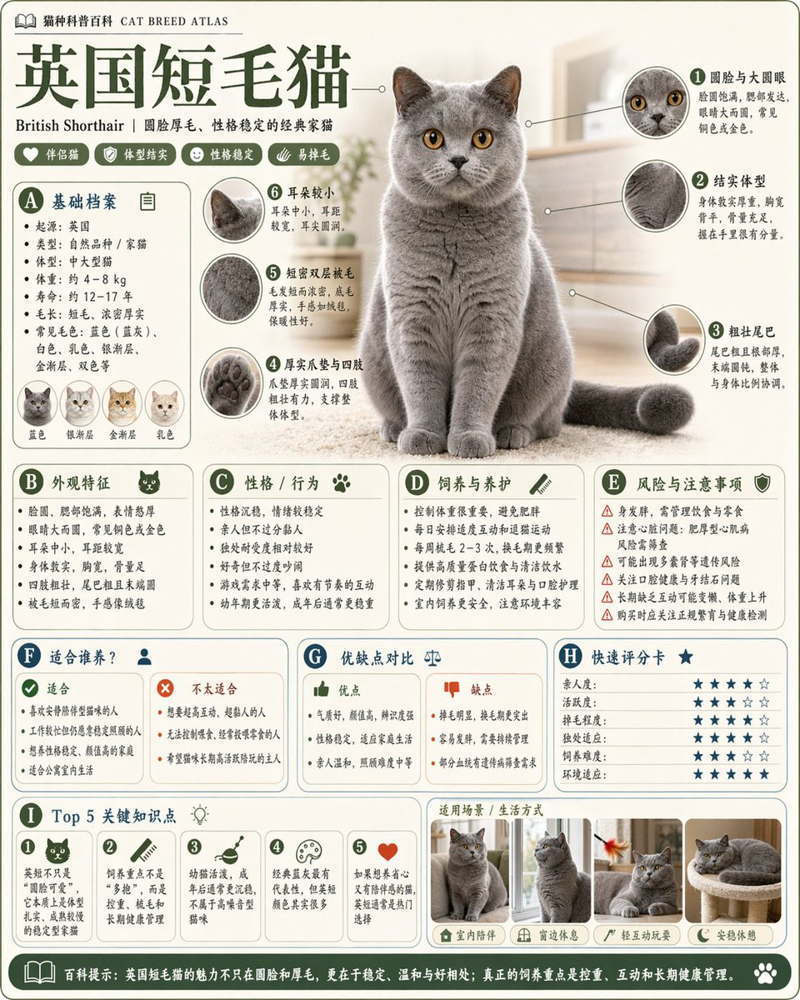


```text
Please generate a high-quality vertical "Popular Science Encyclopedia Image" based on {argument name="theme" default="animals"}.

This image is not a regular poster or a simple illustration, but a modular popular science infographic that possesses a sense of "illustration book, encyclopedia, information structure, and collectability." The overall style should reference a combination of high-end natural history illustrations, modern encyclopedia pages, lifestyle knowledge cards, and highly shareable social media infographics.

Please include in the frame:
- A clear and beautiful main visual of the subject
- Several magnified details of local characteristics
- Multiple rounded modular information sections
- Clear title hierarchies and key labels
- Concise yet rich encyclopedic content
- Visual ratings, key point summaries, or Top 5 modules

Content columns should be automatically adapted based on the theme, prioritized from these directions: basic profile, classification information, appearance characteristics, habits/ecology, formation mechanism/structure, growth or use conditions, care or maintenance suggestions, risks and precautions, suitable audience or scenarios, pros and cons comparison, and quick rating cards.

Visual requirements:
Light-colored clean background, soft color palette, light shadows, exquisite small icons, rounded information boxes, neat layout, high information density but not crowded, good reading experience. The overall result must look like a real science encyclopedia card suitable for publishing, reading, collecting, and serialized production, rather than an advertisement.

Please do not make it a regular commercial promotional poster. Highlight the features of "knowledge organization + modular information + illustration-style display."
```


---


## 例 77：关系图谱信息图

**来源：** [@alanlovelq](https://x.com/alanlovelq)

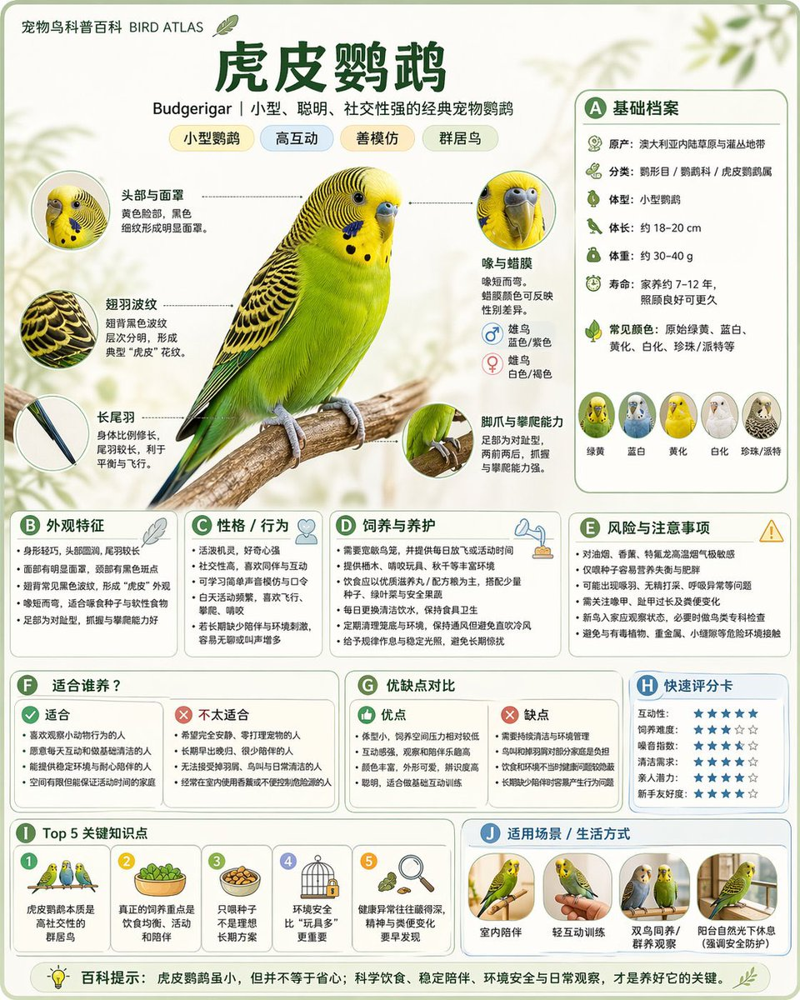


```text
Please generate a high-quality vertical "Popular Science Encyclopedia Image" based on {argument name="theme" default="animals"}.

This image is not a regular poster or a simple illustration, but a modular popular science infographic that possesses a sense of "illustration book, encyclopedia, information structure, and collectability." The overall style should reference a combination of high-end natural history illustrations, modern encyclopedia pages, lifestyle knowledge cards, and highly shareable social media infographics.

Please include in the frame:
- A clear and beautiful main visual of the subject
- Several magnified details of local characteristics
- Multiple rounded modular information sections
- Clear title hierarchies and key labels
- Concise yet rich encyclopedic content
- Visual ratings, key point summaries, or Top 5 modules

Content columns should be automatically adapted based on the theme, prioritized from these directions: basic profile, classification information, appearance characteristics, habits/ecology, formation mechanism/structure, growth or use conditions, care or maintenance suggestions, risks and precautions, suitable audience or scenarios, pros and cons comparison, and quick rating cards.

Visual requirements:
Light-colored clean background, soft color palette, light shadows, exquisite small icons, rounded information boxes, neat layout, high information density but not crowded, good reading experience. The overall result must look like a real science encyclopedia card suitable for publishing, reading, collecting, and serialized production, rather than an advertisement.

Please do not make it a regular commercial promotional poster. Highlight the features of "knowledge organization + modular information + illustration-style display."
```


---


## 例 82：信息图可视化设计

**来源：** [@HumanOS\_v2](https://x.com/HumanOS_v2)

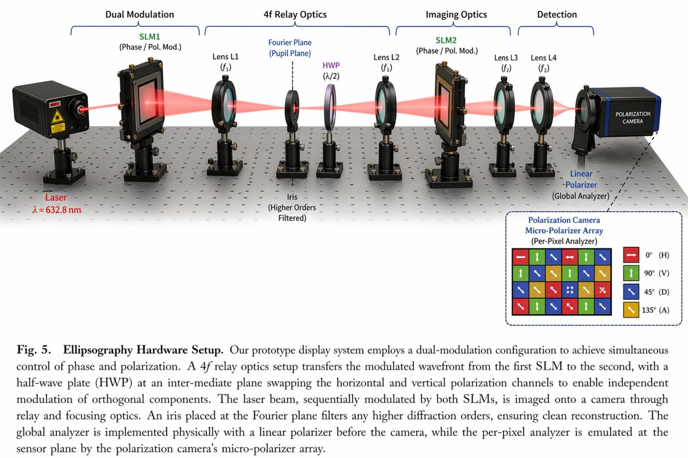


```text
{
  "type": "scientific optical setup diagram",
  "main_setup": {
    "base": "optical breadboard table with grid of mounting holes",
    "beam": "red laser beam passing horizontally through all components",
    "top_grouping_brackets": [
      "{argument name=\"first component group\" default=\"Dual Modulation\"}",
      "4f Relay Optics",
      "Imaging Optics",
      "Detection"
    ],
    "components_left_to_right": [
      { "name": "Laser", "label": "{argument name=\"laser wavelength\" default=\"λ = 632.8 nm\"}", "appearance": "black rectangular box" },
      { "name": "SLM1", "label": "(Phase / Pol. Mod.)", "appearance": "black square device on post" },
      { "name": "Lens L1", "label": "(f1)", "appearance": "lens in black ring mount" },
      { "name": "Iris", "label": "Fourier Plane (Pupil Plane) / (Higher Orders Filtered)", "appearance": "black ring mount with dashed line above" },
      { "name": "HWP", "label": "(λ/2)", "appearance": "purple-tinted optic in black ring mount" },
      { "name": "Lens L2", "label": "(f1)", "appearance": "lens in black ring mount" },
      { "name": "SLM2", "label": "(Phase / Pol. Mod.)", "appearance": "black square device on post" },
      { "name": "Lens L3", "label": "(f2)", "appearance": "lens in black ring mount" },
      { "name": "Lens L4", "label": "(f2)", "appearance": "lens in black ring mount" },
      { "name": "Linear Polarizer", "label": "(Global Analyzer)", "appearance": "lens in black ring mount" },
      { "name": "Polarization Camera", "label": "POLARIZATION CAMERA", "appearance": "blue and black box camera" }
    ]
  },
  "inset_diagram": {
    "position": "bottom right, dashed border",
    "title": "{argument name=\"inset title\" default=\"Polarization Camera Micro-Polarizer Array\"} (Per-Pixel Analyzer)",
    "visuals": "4x4 grid of colored squares with white directional arrows",
    "legend_count": 4,
    "legend_labels": [
      "red right-arrow 0° (H)",
      "green up-arrow 90° (V)",
      "blue diagonal-arrow 45° (D)",
      "yellow diagonal-arrow 135° (A)"
    ]
  },
  "bottom_caption": {
    "figure_number": "Fig. 5.",
    "title": "{argument name=\"setup title\" default=\"Ellipsography Hardware Setup.\"}",
    "description": "{argument name=\"figure caption\" default=\"Our prototype display system employs a dual-modulation configuration to achieve simultaneous control of phase and polarization. A 4f relay optics setup transfers the modulated wavefront...\"}"
  }
}
```


---


## 例 83：信息图可视化设计

**来源：** [@NumeroBTC](https://x.com/NumeroBTC)

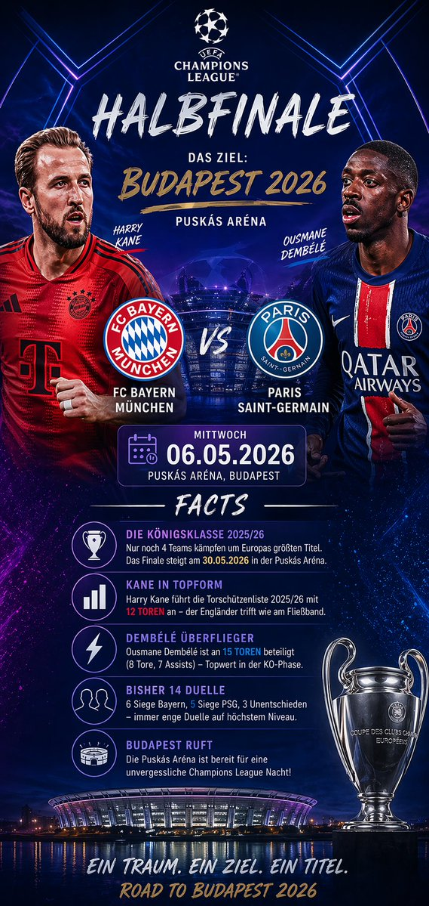


```text
{
  "type": "sports match infographic poster",
  "theme": "UEFA Champions League",
  "background": "dark blue and purple cosmic sky, glowing blue hexagonal lines, illuminated stadium reflecting on water at bottom",
  "header": {
    "logo": "UEFA Champions League",
    "title": "{argument name=\"stage\" default=\"HALBFINALE\"}",
    "subtitle": "DAS ZIEL: {argument name=\"location\" default=\"BUDAPEST 2026\"}",
    "venue": "PUSKÁS ARÉNA"
  },
  "matchup": {
    "player_left": "{argument name=\"team 1 player\" default=\"Harry Kane\"} in red FC Bayern kit",
    "player_right": "{argument name=\"team 2 player\" default=\"Ousmane Dembélé\"} in blue PSG kit",
    "center_logos": "FC Bayern München and Paris Saint-Germain with VS",
    "date_box": "calendar icon, MITTWOCH, {argument name=\"date\" default=\"06.05.2026\"}"
  },
  "facts_section": {
    "title": "FACTS",
    "count": 5,
    "items": [
      "Trophy icon: DIE KÖNIGSKLASSE 2025/26",
      "Bar chart icon: KANE IN TOPFORM",
      "Lightning bolt icon: DEMBÉLÉ ÜBERFLIEGER",
      "Two people icon: BISHER 14 DUELLE",
      "Stadium icon: BUDAPEST RUFT"
    ]
  },
  "footer": {
    "trophy": "Champions League trophy on right",
    "stadium_image": "Puskás Aréna at night",
    "tagline": "EIN TRAUM. EIN ZIEL. EIN TITEL.",
    "bottom_text": "ROAD TO BUDAPEST 2026"
  }
}
```


---


## 例 84：关系图谱信息图

**来源：** [@MrLarus](https://x.com/MrLarus)

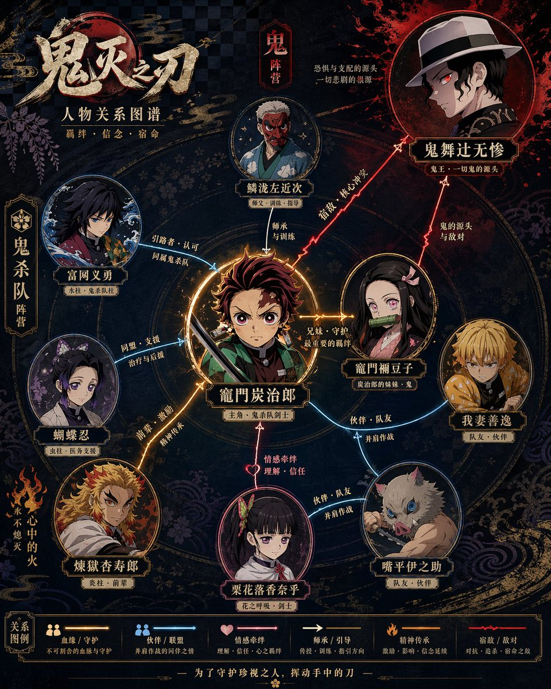


```text
Please generate a high-design character relationship map poster based on {argument name="theme" default="Demon Slayer"}. This image should not be a simple illustration, but a character relationship map that combines information visualization, narrative structure, poster design sense, and stylistic fidelity.

Please automatically complete the following:
- Identify the work and core settings corresponding to the theme
- Extract the most representative 6–12 key characters, not exceeding 15 if necessary
- Identify and display key character relationships, including blood ties, romance, friendship, alliances, hostility, master-disciple, etc.
- Automatically choose a composition method based on the work's characteristics, such as protagonist-centered, dual-core confrontation, faction-based, family tree, or chronological evolution
- Automatically refine the work's style DNA, including color, worldview symbols, textures, mood, typography, and representative elements
- Transform these stylistic elements into an overall visual design for the relationship map, rather than simply copying an official poster
- Use different colors, line types, and arrows to distinguish different relationships, ensuring clear lines and layers without clutter
- Make core characters most prominent, followed by important characters, and subordinate characters weakened to form a clear visual hierarchy
- Ensure every character name is legible, with identity or faction labels if necessary

The final product should satisfy:
- Immediate understanding of character hierarchy and key relationships
- Obvious alignment with the original work's temperament and setting
- Combines the clarity of an infographic with the premium design of a poster
- Unified, exquisite, complete, and suitable for social media sharing or poster display
- Avoids a cheap flowchart feel, messy piling, and information overload.
```


---


## 例 85：关系图谱信息图

**来源：** [@MrLarus](https://x.com/MrLarus)

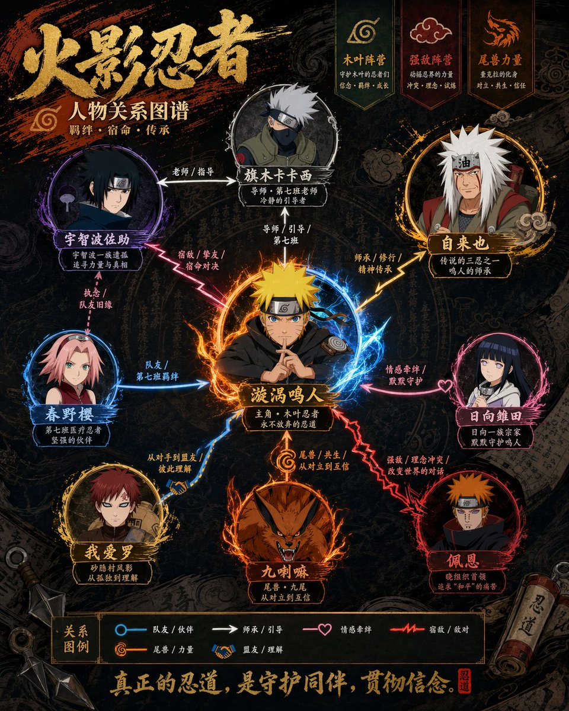


```text
Please generate a high-design character relationship map poster based on {argument name="theme" default="Demon Slayer"}. This image should not be a simple illustration, but a character relationship map that combines information visualization, narrative structure, poster design sense, and stylistic fidelity.

Please automatically complete the following:
- Identify the work and core settings corresponding to the theme
- Extract the most representative 6–12 key characters, not exceeding 15 if necessary
- Identify and display key character relationships, including blood ties, romance, friendship, alliances, hostility, master-disciple, etc.
- Automatically choose a composition method based on the work's characteristics, such as protagonist-centered, dual-core confrontation, faction-based, family tree, or chronological evolution
- Automatically refine the work's style DNA, including color, worldview symbols, textures, mood, typography, and representative elements
- Transform these stylistic elements into an overall visual design for the relationship map, rather than simply copying an official poster
- Use different colors, line types, and arrows to distinguish different relationships, ensuring clear lines and layers without clutter
- Make core characters most prominent, followed by important characters, and subordinate characters weakened to form a clear visual hierarchy
- Ensure every character name is legible, with identity or faction labels if necessary

The final product should satisfy:
- Immediate understanding of character hierarchy and key relationships
- Obvious alignment with the original work's temperament and setting
- Combines the clarity of an infographic with the premium design of a poster
- Unified, exquisite, complete, and suitable for social media sharing or poster display
- Avoids a cheap flowchart feel, messy piling, and information overload.
```


---


## 例 86：关系图谱信息图

**来源：** [@MrLarus](https://x.com/MrLarus)

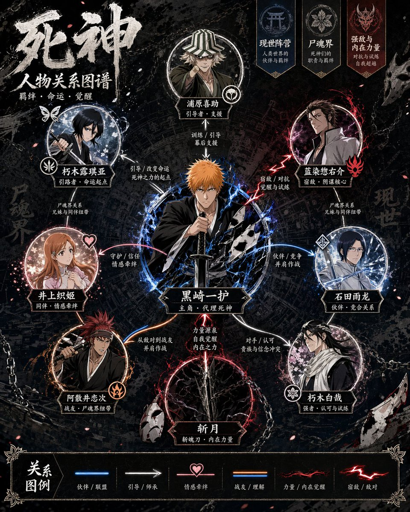


```text
Please generate a high-design character relationship map poster based on {argument name="theme" default="Demon Slayer"}. This image should not be a simple illustration, but a character relationship map that combines information visualization, narrative structure, poster design sense, and stylistic fidelity.

Please automatically complete the following:
- Identify the work and core settings corresponding to the theme
- Extract the most representative 6–12 key characters, not exceeding 15 if necessary
- Identify and display key character relationships, including blood ties, romance, friendship, alliances, hostility, master-disciple, etc.
- Automatically choose a composition method based on the work's characteristics, such as protagonist-centered, dual-core confrontation, faction-based, family tree, or chronological evolution
- Automatically refine the work's style DNA, including color, worldview symbols, textures, mood, typography, and representative elements
- Transform these stylistic elements into an overall visual design for the relationship map, rather than simply copying an official poster
- Use different colors, line types, and arrows to distinguish different relationships, ensuring clear lines and layers without clutter
- Make core characters most prominent, followed by important characters, and subordinate characters weakened to form a clear visual hierarchy
- Ensure every character name is legible, with identity or faction labels if necessary

The final product should satisfy:
- Immediate understanding of character hierarchy and key relationships
- Obvious alignment with the original work's temperament and setting
- Combines the clarity of an infographic with the premium design of a poster
- Unified, exquisite, complete, and suitable for social media sharing or poster display
- Avoids a cheap flowchart feel, messy piling, and information overload.
```


---


## 例 87：关系图谱信息图

**来源：** [@MrLarus](https://x.com/MrLarus)

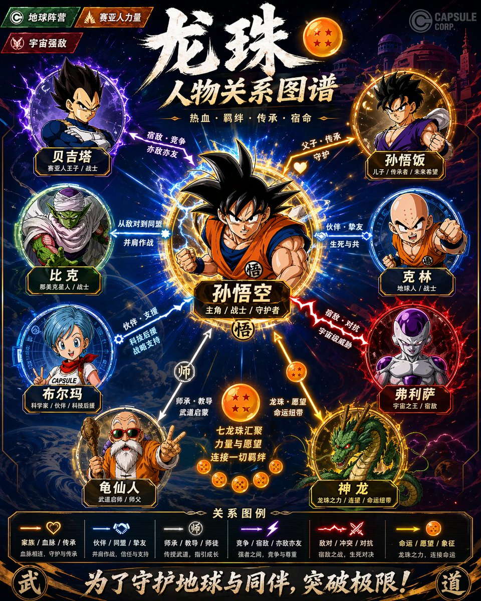


```text
Please generate a high-design character relationship map poster based on {argument name="theme" default="Demon Slayer"}. This image should not be a simple illustration, but a character relationship map that combines information visualization, narrative structure, poster design sense, and stylistic fidelity.

Please automatically complete the following:
- Identify the work and core settings corresponding to the theme
- Extract the most representative 6–12 key characters, not exceeding 15 if necessary
- Identify and display key character relationships, including blood ties, romance, friendship, alliances, hostility, master-disciple, etc.
- Automatically choose a composition method based on the work's characteristics, such as protagonist-centered, dual-core confrontation, faction-based, family tree, or chronological evolution
- Automatically refine the work's style DNA, including color, worldview symbols, textures, mood, typography, and representative elements
- Transform these stylistic elements into an overall visual design for the relationship map, rather than simply copying an official poster
- Use different colors, line types, and arrows to distinguish different relationships, ensuring clear lines and layers without clutter
- Make core characters most prominent, followed by important characters, and subordinate characters weakened to form a clear visual hierarchy
- Ensure every character name is legible, with identity or faction labels if necessary

The final product should satisfy:
- Immediate understanding of character hierarchy and key relationships
- Obvious alignment with the original work's temperament and setting
- Combines the clarity of an infographic with the premium design of a poster
- Unified, exquisite, complete, and suitable for social media sharing or poster display
- Avoids a cheap flowchart feel, messy piling, and information overload.
```


---


## 例 88：信息图可视化设计

**来源：** [@A9Quant](https://x.com/A9Quant)

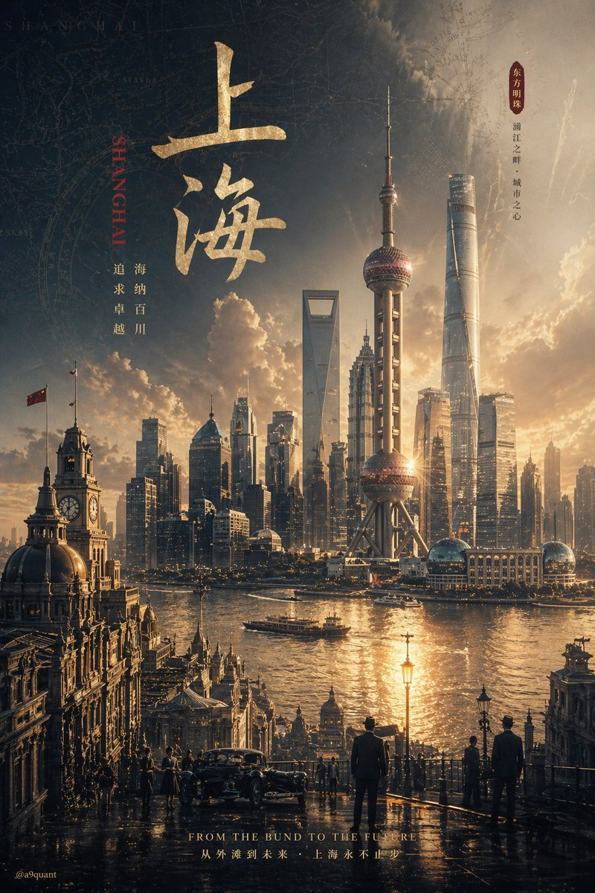


```text
GPT-Image-2 prompt: please automatically generate a top-tier concept poster / infographic-style movie poster centered around {argument name="theme" default="ranking of emperors in Chinese history"}.

Require the AI to automatically derive and uniformly design the entire following visual system based on this theme, without my extra specification:
- Core subject (automatically judge suitability for people, products, architecture, artifacts, symbols, scenes, or abstract imagery)
- Bottom supporting structure
- Hovering symbols or spiritual symbols above
- Scene wrapping elements
- Metaphor system
- Color hierarchy
- Material contrast
- Lighting logic
- Title, subtitle, and auxiliary copy
- Brand sense and high-end expression

The final frame must be: a shocking, precise, unified, cinematic, ultra-high detail conceptual key visual poster suitable for high-end printing.

[Overall Style]
Ultra-realistic 3D commercial CGI rendering, merging cinematic lighting, luxury visual language, futuristic concept design, and epic composition. The image must have a "single main visual core," not messy, not like a collage, and not like a regular e-commerce poster.

[Automatic Derivation Rules]
AI must automatically decide based on the [theme]:
1. Core visual metaphor
2. Subject type and posture
3. Form of supporting structure
4. Form of suspended elements
5. Scene shell and spatial atmosphere
6. Main, auxiliary, and emphasis colors
7. Material combinations
8. Text temperament and layout style

[Composition Rules]
- Absolute sense of premium quality
- Strong central order, overall unity
- Allows for axial symmetry or epic composition near the central axis
- Clear visual gravity, forming clear levels from top to bottom
- Edge negative space is clean, restrained, and has room to breathe

[Visual Quality]
- Ultra-high detail
- Clear volumetric light
- Authentic materials
- Natural reflection, refraction, shadows, fog, and depth of field
- Overall standard of high-end brand campaign key visual / luxury invitation poster / conceptual editorial poster

[Typography System]
- Overall 90% visual, 10% text
- AI automatically generates the most matching main title and subtitle based on the [theme]
- Title must be concise, sharp, and powerful
- Text should be as minimal and accurate as possible; do not stack words

[Signature Requirement]
Naturally add the author signature in the bottom corner: @a9quant
```


---


## 例 89：信息图可视化设计

**来源：** [@A9Quant](https://x.com/A9Quant)

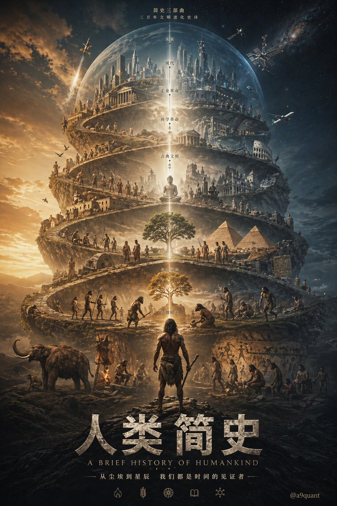


```text
GPT-Image-2 prompt: please automatically generate a top-tier concept poster / infographic-style movie poster centered around {argument name="theme" default="ranking of emperors in Chinese history"}.

Require the AI to automatically derive and uniformly design the entire following visual system based on this theme, without my extra specification:
- Core subject (automatically judge suitability for people, products, architecture, artifacts, symbols, scenes, or abstract imagery)
- Bottom supporting structure
- Hovering symbols or spiritual symbols above
- Scene wrapping elements
- Metaphor system
- Color hierarchy
- Material contrast
- Lighting logic
- Title, subtitle, and auxiliary copy
- Brand sense and high-end expression

The final frame must be: a shocking, precise, unified, cinematic, ultra-high detail conceptual key visual poster suitable for high-end printing.

[Overall Style]
Ultra-realistic 3D commercial CGI rendering, merging cinematic lighting, luxury visual language, futuristic concept design, and epic composition. The image must have a "single main visual core," not messy, not like a collage, and not like a regular e-commerce poster.

[Automatic Derivation Rules]
AI must automatically decide based on the [theme]:
1. Core visual metaphor
2. Subject type and posture
3. Form of supporting structure
4. Form of suspended elements
5. Scene shell and spatial atmosphere
6. Main, auxiliary, and emphasis colors
7. Material combinations
8. Text temperament and layout style

[Composition Rules]
- Absolute sense of premium quality
- Strong central order, overall unity
- Allows for axial symmetry or epic composition near the central axis
- Clear visual gravity, forming clear levels from top to bottom
- Edge negative space is clean, restrained, and has room to breathe

[Visual Quality]
- Ultra-high detail
- Clear volumetric light
- Authentic materials
- Natural reflection, refraction, shadows, fog, and depth of field
- Overall standard of high-end brand campaign key visual / luxury invitation poster / conceptual editorial poster

[Typography System]
- Overall 90% visual, 10% text
- AI automatically generates the most matching main title and subtitle based on the [theme]
- Title must be concise, sharp, and powerful
- Text should be as minimal and accurate as possible; do not stack words

[Signature Requirement]
Naturally add the author signature in the bottom corner: @a9quant
```


---


## 例 90：信息图可视化设计

**来源：** [@A9Quant](https://x.com/A9Quant)

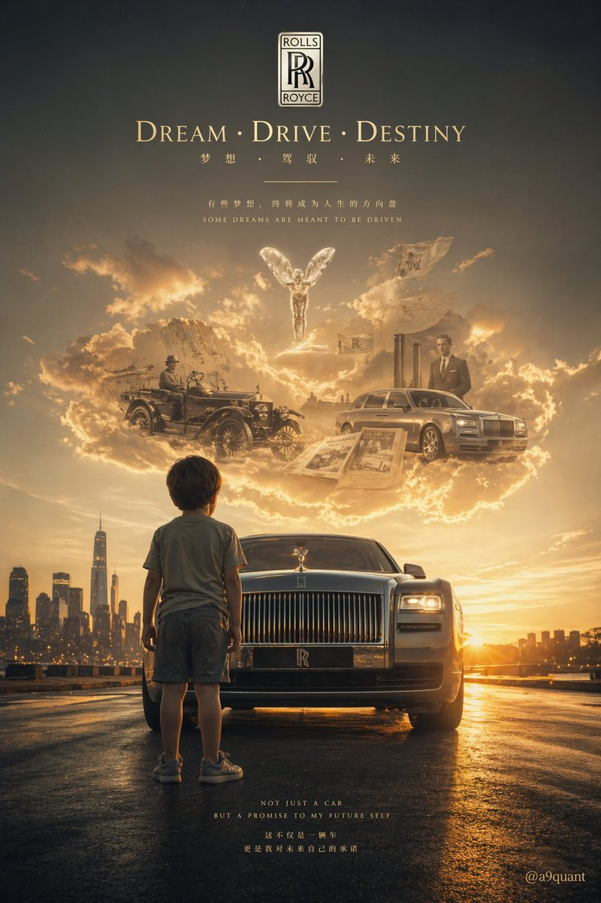


```text
GPT-Image-2 prompt: please automatically generate a top-tier concept poster / infographic-style movie poster centered around {argument name="theme" default="ranking of emperors in Chinese history"}.

Require the AI to automatically derive and uniformly design the entire following visual system based on this theme, without my extra specification:
- Core subject (automatically judge suitability for people, products, architecture, artifacts, symbols, scenes, or abstract imagery)
- Bottom supporting structure
- Hovering symbols or spiritual symbols above
- Scene wrapping elements
- Metaphor system
- Color hierarchy
- Material contrast
- Lighting logic
- Title, subtitle, and auxiliary copy
- Brand sense and high-end expression

The final frame must be: a shocking, precise, unified, cinematic, ultra-high detail conceptual key visual poster suitable for high-end printing.

[Overall Style]
Ultra-realistic 3D commercial CGI rendering, merging cinematic lighting, luxury visual language, futuristic concept design, and epic composition. The image must have a "single main visual core," not messy, not like a collage, and not like a regular e-commerce poster.

[Automatic Derivation Rules]
AI must automatically decide based on the [theme]:
1. Core visual metaphor
2. Subject type and posture
3. Form of supporting structure
4. Form of suspended elements
5. Scene shell and spatial atmosphere
6. Main, auxiliary, and emphasis colors
7. Material combinations
8. Text temperament and layout style

[Composition Rules]
- Absolute sense of premium quality
- Strong central order, overall unity
- Allows for axial symmetry or epic composition near the central axis
- Clear visual gravity, forming clear levels from top to bottom
- Edge negative space is clean, restrained, and has room to breathe

[Visual Quality]
- Ultra-high detail
- Clear volumetric light
- Authentic materials
- Natural reflection, refraction, shadows, fog, and depth of field
- Overall standard of high-end brand campaign key visual / luxury invitation poster / conceptual editorial poster

[Typography System]
- Overall 90% visual, 10% text
- AI automatically generates the most matching main title and subtitle based on the [theme]
- Title must be concise, sharp, and powerful
- Text should be as minimal and accurate as possible; do not stack words

[Signature Requirement]
Naturally add the author signature in the bottom corner: @a9quant
```


---


## 例 102：信息图可视化设计

**来源：** [@maxescu](https://x.com/maxescu)

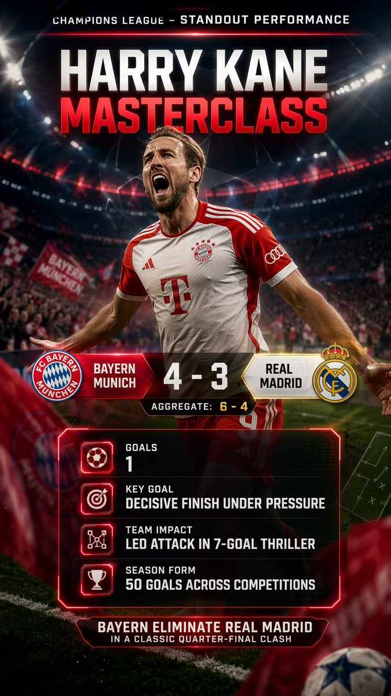


```text
Search the web for {argument name="performance description" default="this week’s standout individual performance in Champion’s League"}, using exact stats and game summary, {argument name="colors" default="bold team colors"}, legible score breakdown, and generate a {argument name="card type" default="Highlight card"}.
```


---


## 例 112：信息图可视化设计

**来源：** [@songguoxiansen](https://x.com/songguoxiansen)


```text
Generate a 12-grid card image of the 12 Golden Saints from Saint Seiya, with each card featuring its corresponding Chinese name, 4 cards per row, in a 16:9 aspect ratio.
```


---


## 例 171：信息图可视化设计

**来源：** [@umesh\_ai](https://x.com/umesh_ai/status/2046510988367945983)

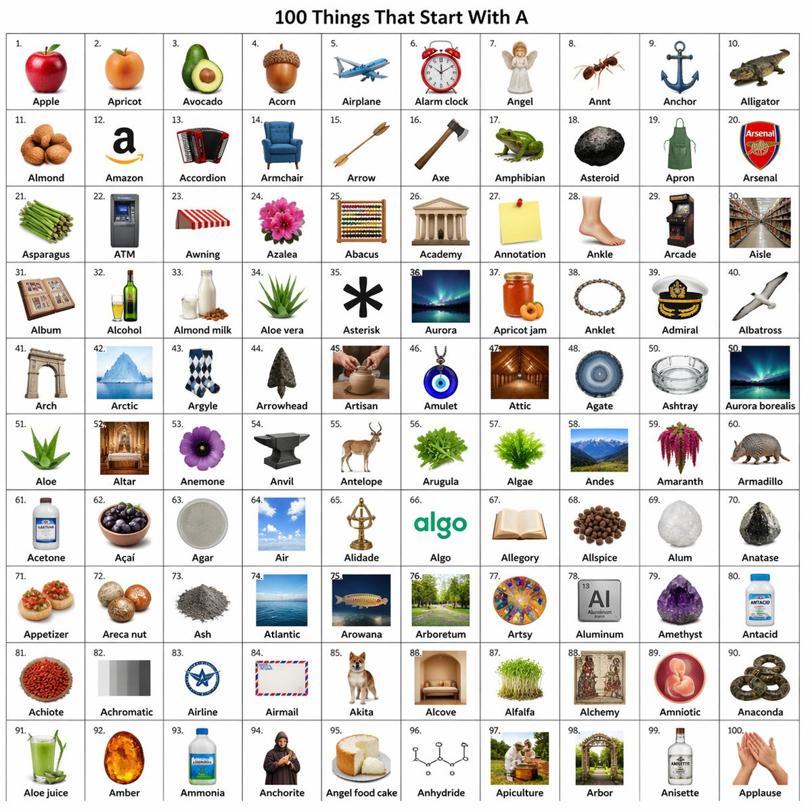


```text
[中文]
创建一个包含 10x10 网格的图像，每个对象名称都以字母 a 开头。

[English]
create an image with 10x10 grid of objects that have the names starting with letter a.
```


---


## 例 183：一张中文健身信息图

**来源：** [@MrLarus](https://x.com/MrLarus/status/2046560406760505727)

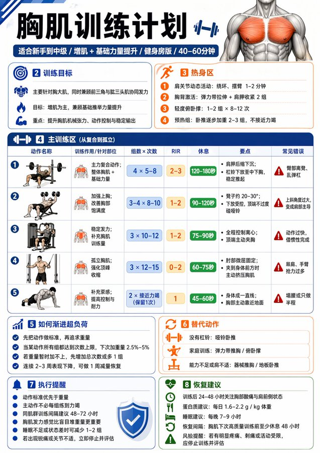


```text
请生成一张中文健身信息图，主题为：【xxx】。 

要求这张图既专业又实用，适合普通成年人作为训练参考。默认对象为无严重伤病的健康成年人；如果没有额外说明，默认训练目标为“增肌 + 基础力量提升”，默认训练水平为“新手到中级之间”，默认训练场景为“普通健身房”，默认单次训练时长控制在 40–60 分钟内。

请根据【训练主题】自动判断输出类型：

1）如果【训练主题】是某个肌群或身体部位（例如：胸肌、背阔肌、肱二头肌、腹肌、肩部、腿部等），请输出一张“该部位训练计划信息图”。
2）如果【训练主题】是某个动作或技能目标（例如：引体向上、俯卧撑、双杠臂屈伸、深蹲等），请输出一张“动作解锁 / 进阶训练计划信息图”。

整张图请采用清晰、现代、专业、易读的中文信息图风格，竖版排版，视觉简洁，重点突出，适合社交媒体分享或训练参考卡片。不要写成长篇大论，每个模块用简洁短句呈现，数字信息要醒目。

这张信息图必须包含以下内容：

【A. 标题区】
- 主标题：直接写【训练主题】训练计划 / 解锁计划
- 副标题：自动补充适用人群、目标、训练场景、建议时长
例如：适合新手 / 增肌导向 / 健身房版 / 45分钟

【B. 训练目标区】
用简洁语言说明：
- 这次训练主要针对什么
- 主要目标是什么（增肌 / 力量 / 技能解锁 / 核心控制等）
- 本次训练的重点刺激或能力提升方向

【C. 热身区】
给出 2–4 个热身建议，简洁列出即可，例如：
- 动态活动
- 目标肌群激活
- 轻重量预热组
每项可附一句说明

【D. 主训练区】
这是核心部分，请列出 4–6 个主要训练动作。
每个动作都要包含以下信息：
- 动作名称
- 训练作用 / 针对部位
- 组数 × 次数（或时间）
- RIR 建议
- 每组间休息时间
- 动作关键要点（1–2 条）
- 常见错误（1 条即可）

请确保动作安排合理：
- 先复合动作，后孤立动作
- 整体训练量适中
- 新手不要安排过度极限训练
- 主动作通常建议 RIR 1–3
- 孤立动作可建议 RIR 0–2
- 如果是腹肌或核心类动作，可用“秒数 / 次数”形式
- 如果是技能类动作，请优先安排“前置能力动作 + 过渡动作 + 目标动作尝试”

【E. 进阶 / 解锁逻辑区】
根据主题自动生成：
- 如果是肌群训练：写“如何渐进超负荷”，例如达到次数上限后再加重量、优先保证动作标准等
- 如果是动作解锁：写“分阶段进阶路径”，例如从悬垂、肩胛引体、离心训练、弹力带辅助，到标准动作完成

【F. 替代动作区】
请给出 2–3 个替代动作，适用于以下情况：
- 没有器械
- 家庭训练
- 当前能力不足
- 某些动作做不了

【G. 执行提醒区】
请给出 4–6 条简洁提醒，例如：
- 动作标准优先于重量
- 不要每组都练到力竭
- 同肌群建议间隔 48–72 小时
- 疼痛不等于正常发力
- 睡眠不足时可适当减少训练量

【H. 恢复建议区】
简洁说明：
- 训练后恢复重点
- 蛋白质 / 睡眠 / 恢复间隔建议
- 1 句风险提醒（如有明显疼痛应停止并评估）

【I. 视觉设计要求】
- 整体为单页中文信息图
- 竖版排版
- 风格现代、清爽、专业、健身感强
- 使用模块化卡片布局
- 重点数字（组数、次数、RIR、休息）要醒目
- 可加入简洁的人体肌群图标、哑铃、杠铃、引体向上等小图标
- 颜色保持高级、干净、有运动感
- 中文文字必须清晰、准确、易读
- 避免过多装饰，强调实用性与执行性

请最终输出为“一张完整的信息图内容”，而不是只给普通段落文字。
```


---


## 例 210：萌系大模型训练图解

**来源：** [@op7418](https://x.com/op7418/status/2046502136973001143)


```text
[中文]
可爱地解释一下大语言模型训练过程

[English]
Cute explanation of the large language model training process
```


---


## 例 211：天坛古建拆解全图

**来源：** [@TanShilong](https://x.com/TanShilong/status/2046524996013662380)

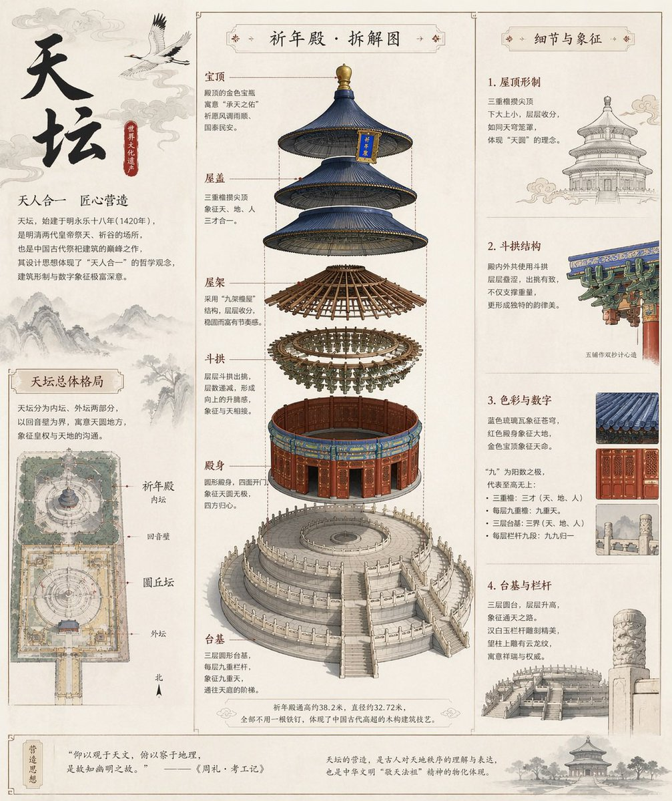


```text
[中文]
生成一个天坛的建筑拆解图，有详细的说明，中式美学风格

[English]
Generate an architectural exploded view of the Temple of Heaven, with detailed annotations, Chinese aesthetic style
```


---


## 例 214：绘制金瓶梅知识图谱

**来源：** [@xiaoxiaodong01](https://x.com/xiaoxiaodong01/status/2046252164717416641)

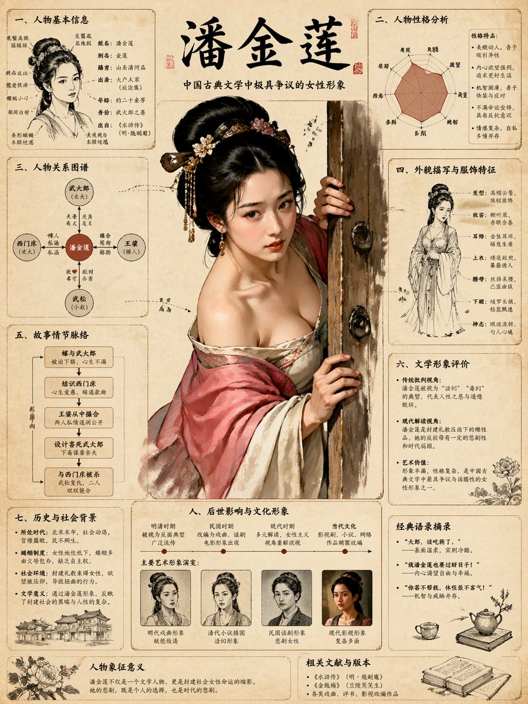


```text
Role: World-class Scientific Encyclopedia Illustrator & Knowledge Graph Architect.

Task: Generate a highly detailed, extremely intricate, and visually stunning "Universal Illustrated Encyclopedia Science Infographic" in a classic, unbranded (NO logos) scientific encyclopedia style.

Subject Matter: Choose one from [People, Plants, or Animals]. 

Specific Subject: [e.g., The Giant Squid / Leonardo da Vinci / The Sequoia Tree].

Style: Fine, detailed scientific illustration on a retro, aged beige paper background. Delicate linework. Intricately complex and professional.

Key Visual Requirements:

1.  Lifelike 3D Effect (The Central Subject): The central subject in the "C position" must be rendered with extraordinary realism and dynamism. Create a dramatic sense of depth where the character, plant, or animal appears to break the frame, leaping or bursting out of the flat paper towards the viewer (an effect similar to anamorphic 3D or dynamic pop-out, with high-precision realism).

2.  Layout & Strategic White Space:
    * Central Subject: Dominates the center, with intentional "strategic white space" around it to enhance the popping-out effect and make the figure the clear focal point.
    * Surrounding Modules: The surrounding area (left, right, top, bottom, and corners) must be filled with 6-8 distinct, highly organized knowledge modules, depending on the subject. There should be a sense of organized density, not random clutter. The modules themselves must have clear borders, headers, and extensive, detailed content.

3.  Connections: Use a complex, logical network of fine leader lines, arrows, brackets, dotted lines, and small connection points to link the central figure to all surrounding modules, and interconnect the modules themselves into a cohesive knowledge web.

4.  Text & Annotation (Hard Requirement - Must be CLEAR Chinese):
    * Main Title: A large, prominent, beautifully executed **Chinese calligraphy** (书法体) of the specific subject's name [e.g., "大王乌贼"].
    * Calligraphic Accents: Scattered throughout the main content and module titles, use beautiful, clear Chinese calligraphy for important terms.
    * Standard Chinese Text: All other descriptive text, handwritten notes (大量清晰中文手写注释), module content, and annotations must be clear, legible Chinese characters (简体中文), not gibberish or unreadable symbols. Ensure text clarity is prioritized.
    * Leader Line Annotations: Every single small component, detail, submodule, diagram, or illustration within the modules must have detailed leader line annotations (拟解剖图) pointing directly to it for maximum professionalism and educational value. Every part should be labeled.

Subject-Specific Module Structure (Example for general reference):

A. For Humans [People]:
   - Module 1: Anatomy & Skeletal Structure (w/ magnified cross-sections)
   - Module 2: Physiological Processes (e.g., Circulatory/Nervous System)
   - Module 3: Historical Context & Timeline (Key Achievements)
   - Module 4: Major Contribution Diagram (Detailed breakdown)
   - Module 5: Cognitive Process / Psychological Insight
   - Module 6: Genetic Profile / Evolution
   - Module 7: Global Influence & Cultural Impact
   - Module 8: Cultural Representations / Legacy

B. For Animals:
   - Module 1: Full External Sketch & Anatomy (w/ microscope magnified detail circular windows)
   - Module 2: Behavioral Patterns & Lifecycle (e.g., Mating/Migration, Flowchart style)
   - Module 3: Digestive & Skeletal System
   - Module 4: Habitats & Distribution Map (with environmental details)
   - Module 5: Unique Adaptations (e.g., camouflage, hunting tools)
   - Module 6: Evolutionary History & Relatives
   - Module 7: Symbiotic Relationships / Ecosystem Role
   - Module 8: Conservation Status & Human Interaction

C. For Plants:
   - Module 1: Full Plant Sketch & Anatomy (w/ magnified leaf/root details)
   - Module 2: Photosynthesis & Lifecycle Flow (w/ icons for environment)
   - Module 3: Cellular Structure (Magnified circular views)
   - Module 4: Medicinal Properties / Practical Applications (as in original original prompt)
   - Module 5: Environmental Adaptations / Unique Features
   - Module 6: Distribution Map & Environmental Context
   - Module 7: Genetic Variations & Cultivation
   - Module 8: Historical Usage & Folklore

Overall Composition: Extremely dense with information, organized into 6-8 structured modules, but balanced with strategic empty space around the center to allow the main, hyper-realistic figure to pop. Hard-core, professional, academic, but visually engaging due to the dynamic 3D central figure. No branding from any specific encyclopedia (e.g., no "DK" logos). All annotations must be legible. All handwritten notes must be clear. Main titles in Chinese calligraphy. Aspect Ratio: 3:4.

主题内容：潘金莲
```


---


## 例 215：西方艺术演进像素博物馆

**来源：** [@GeekCatX](https://x.com/GeekCatX/status/2046172416716759171)


```text
[中文]
创作一张超高细节等距像素艺术时间线插画（3:4，4K），融合细节密度、象征性与隐喻。用户指定的主题为【Western Art Development】。

首先，围绕Western Art Development进行推理，确定：主题的中英文标题、涵盖的最早与最近历史时期、起始阶段标签与结束阶段标签，以及3-5个关键演进阶段及其各自的象征性元素与色彩方案。

然后构建一个以"Western Art Development"为主题的等距"演进博物馆"，每个展馆区域代表一个演进阶段，空间推进即代表时间演变。采用标准等距视角（2:1），丰富的层次深度与流畅过渡。每个阶段分配3-5个与主题强烈关联的象征元素，并用差异化色彩暗示时间流动。在场景中融入双语像素字体标题：中文"[主题中文]演进史"与英文"EVOLUTION OF Western Art Development"，加上起止阶段的双语副标题及关键时间节点标记。整体风格专业且具视觉张力，适合学术分析与对比可视化，直接出图。

[English]
Create an ultra-high-detail isometric pixel art timeline illustration (3:4, 4K), integrating detail density, symbolism, and metaphor. The user-specified theme is [Western Art Development]. First, reason around Western Art Development to determine: the Chinese and English titles of the theme, the earliest and most recent historical periods covered, the starting stage label and the ending stage label, as well as 3-5 key evolution stages and their respective symbolic elements and color schemes. Then build an isometric "Evolution Museum" themed "Western Art Development", where each exhibition hall area represents an evolution stage, and spatial progression represents time evolution. Adopt a standard isometric perspective (2:1), rich layer depth, and smooth transitions. Allocate 3-5 symbolic elements strongly associated with the theme to each stage, and use differentiated colors to imply the flow of time. Integrate bilingual pixel font titles in the scene: Chinese "[Theme Chinese] Evolution History" and English "EVOLUTION OF Western Art Development", plus bilingual subtitles for the starting and ending stages and key time node markers. The overall style is professional and visually tense, suitable for academic analysis and comparative visualization, direct image output.
```


---


## 例 218：绘制科学百科知识图谱

**来源：** [@GeekCatX](https://x.com/GeekCatX)

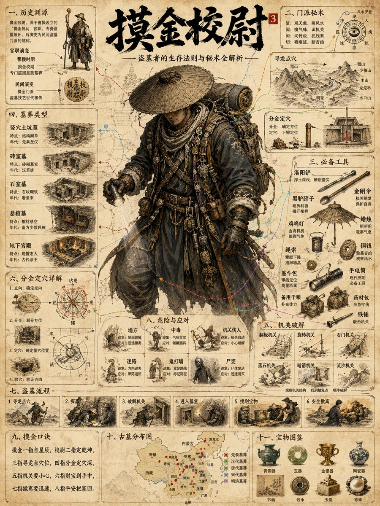


```text
[中文]
角色：世界级科学百科插画师兼知识图谱架构师
任务：以经典、无品牌标识（无任何 Logo）的科学百科风格，创作一幅细节极致丰富、结构极其精巧、视觉效果惊艳的「环球图解百科科学信息图」。
题材选择：从【人物、植物、动物】中任选其一。
具体对象：【例如：大王乌贼 / 列奥纳多・达・芬奇 / 红杉树】
风格：采用复古泛黄米色纸张背景，绘制精细工整的科学插画；线条细腻精致，整体繁复专业、严谨考究。
核心视觉要求
主体逼真 3D 效果
位于画面视觉中心（C 位）的主体形象，需具备极致的写实感与动态张力。营造强烈的空间纵深感，让人物、植物或动物仿佛突破画框，从平面纸张中跃出、冲向观者（效果类似变形 3D 或动态弹出效果，高精度写实呈现）。
版式布局与留白设计
主体位置：占据画面中心，周围刻意设置规划式留白，强化立体弹出效果，使其成为绝对视觉焦点。
周边模块：根据所选题材，在画面四周（上下左右及四角）排布 6–8 个独立且规整有序的知识模块。整体呈现规整的信息密度感，而非杂乱堆砌。每个模块需带有清晰边框、标题栏与详尽丰富的内容。
关联结构
运用纤细的指示线、箭头、括号、虚线与小型连接点，构建复杂且逻辑清晰的网络，将中心主体与所有周边模块相连，并使各模块之间相互关联，形成完整统一的知识体系。
文字与标注（硬性要求：必须为清晰中文）
主标题：以醒目大气、笔法优美的中文书法字体呈现具体对象名称【例如：大王乌贼】。
书法点缀：在主体画面与模块标题中，对关键术语使用工整美观的中文书法字体标注。
标准中文文本：其余所有说明文字、大量清晰中文手写注释、模块内容及注解均使用清晰可辨的简体汉字，不得出现乱码或无法识别符号，优先保证文字可读性。
指示线标注：模块内所有细小结构、细节、子模块、图表与插画，均需搭配详尽的指示线标注（仿解剖图形式），直接指向对应部位，最大化体现专业性与科普价值，做到每一处结构均有标注。
分题材模块结构（参考示例）
A. 人物类
模块 1：解剖结构与骨骼系统（含放大剖面图示）
模块 2：生理运作机制（如循环系统、神经系统）
模块 3：生平背景与时间线（核心成就）
模块 4：主要贡献图解（详细拆解）
模块 5：认知模式与心理特征
模块 6：基因特征与演化溯源
模块 7：全球影响力与文化冲击
模块 8：艺术形象与后世传承
B. 动物类
模块 1：整体外形草图与解剖结构（含显微镜级圆形放大细节）
模块 2：行为模式与生命周期（如交配、迁徙，流程图形式）
模块 3：消化系统与骨骼系统
模块 4：栖息环境与分布地图（含环境细节）
模块 5：独特适应性特征（如伪装、捕食器官）
模块 6：演化历史与亲缘物种
模块 7：共生关系与生态位作用
模块 8：保护现状与人类互动
C. 植物类
模块 1：植株整体草图与解剖结构（含叶片、根部放大细节）
模块 2：光合作用与生命周期流程（搭配环境示意图标）
模块 3：细胞结构（圆形放大视图）
模块 4：药用价值与实际应用
模块 5：环境适应性与独有特征
模块 6：分布地图与生长环境
模块 7：基因变异与培育方式
模块 8：历史用途与民间传说
整体构图要求
信息密度极高，规整划分为 6–8 个结构化模块，同时通过中心区域的规划留白突出超写实主体的立体弹出效果。风格硬核、专业、学术化，凭借动态 3D 主体实现极强视觉吸引力。
无任何百科品牌标识（如 DK 等 Logo）。
所有标注清晰可辨，所有手写注释工整可读。
主标题采用中文书法字体。
画面比例：3:4。
【主题内容】

[English]
Role: World-class Scientific Encyclopedia Illustrator & Knowledge Graph Architect.

Task: Generate a highly detailed, extremely intricate, and visually stunning "Universal Illustrated Encyclopedia Science Infographic" in a classic, unbranded (NO logos) scientific encyclopedia style.

Subject Matter: Choose one from [People, Plants, or Animals]. 

Specific Subject: [e.g., The Giant Squid / Leonardo da Vinci / The Sequoia Tree].

Style: Fine, detailed scientific illustration on a retro, aged beige paper background. Delicate linework. Intricately complex and professional.

Key Visual Requirements:

1.  Lifelike 3D Effect (The Central Subject): The central subject in the "C position" must be rendered with extraordinary realism and dynamism. Create a dramatic sense of depth where the character, plant, or animal appears to break the frame, leaping or bursting out of the flat paper towards the viewer (an effect similar to anamorphic 3D or dynamic pop-out, with high-precision realism).

2.  Layout & Strategic White Space:
    * Central Subject: Dominates the center, with intentional "strategic white space" around it to enhance the popping-out effect and make the figure the clear focal point.
    * Surrounding Modules: The surrounding area (left, right, top, bottom, and corners) must be filled with 6-8 distinct, highly organized knowledge modules, depending on the subject. There should be a sense of organized density, not random clutter. The modules themselves must have clear borders, headers, and extensive, detailed content.

3.  Connections: Use a complex, logical network of fine leader lines, arrows, brackets, dotted lines, and small connection points to link the central figure to all surrounding modules, and interconnect the modules themselves into a cohesive knowledge web.

4.  Text & Annotation (Hard Requirement - Must be CLEAR Chinese):
    * Main Title: A large, prominent, beautifully executed **Chinese calligraphy** (书法体) of the specific subject's name [e.g., "大王乌贼"].
    * Calligraphic Accents: Scattered throughout the main content and module titles, use beautiful, clear Chinese calligraphy for important terms.
    * Standard Chinese Text: All other descriptive text, handwritten notes (大量清晰中文手写注释), module content, and annotations must be clear, legible Chinese characters (简体中文), not gibberish or unreadable symbols. Ensure text clarity is prioritized.
    * Leader Line Annotations: Every single small component, detail, submodule, diagram, or illustration within the modules must have detailed leader line annotations (拟解剖图) pointing directly to it for maximum professionalism and educational value. Every part should be labeled.

Subject-Specific Module Structure (Example for general reference):

A. For Humans [People]:
   - Module 1: Anatomy & Skeletal Structure (w/ magnified cross-sections)
   - Module 2: Physiological Processes (e.g., Circulatory/Nervous System)
   - Module 3: Historical Context & Timeline (Key Achievements)
   - Module 4: Major Contribution Diagram (Detailed breakdown)
   - Module 5: Cognitive Process / Psychological Insight
   - Module 6: Genetic Profile / Evolution
   - Module 7: Global Influence & Cultural Impact
   - Module 8: Cultural Representations / Legacy

B. For Animals:
   - Module 1: Full External Sketch & Anatomy (w/ microscope magnified detail circular windows)
   - Module 2: Behavioral Patterns & Lifecycle (e.g., Mating/Migration, Flowchart style)
   - Module 3: Digestive & Skeletal System
   - Module 4: Habitats & Distribution Map (with environmental details)
   - Module 5: Unique Adaptations (e.g., camouflage, hunting tools)
   - Module 6: Evolutionary History & Relatives
   - Module 7: Symbiotic Relationships / Ecosystem Role
   - Module 8: Conservation Status & Human Interaction

C. For Plants:
   - Module 1: Full Plant Sketch & Anatomy (w/ magnified leaf/root details)
   - Module 2: Photosynthesis & Lifecycle Flow (w/ icons for environment)
   - Module 3: Cellular Structure (Magnified circular views)
   - Module 4: Medicinal Properties / Practical Applications (as in original original prompt)
   - Module 5: Environmental Adaptations / Unique Features
   - Module 6: Distribution Map & Environmental Context
   - Module 7: Genetic Variations & Cultivation
   - Module 8: Historical Usage & Folklore

Overall Composition: Extremely dense with information, organized into 6-8 structured modules, but balanced with strategic empty space around the center to allow the main, hyper-realistic figure to pop. Hard-core, professional, academic, but visually engaging due to the dynamic 3D central figure. No branding from any specific encyclopedia (e.g., no "DK" logos). All annotations must be legible. All handwritten notes must be clear. Main titles in Chinese calligraphy. Aspect Ratio: 3:4.

[主题内容]
```


---


## 例 222：精致模块化科普百科图鉴

**来源：** [@MrLarus](https://x.com/MrLarus/status/2046231542817497392)


```text
[中文]
请根据【主题】生成一张高质量竖版「科普百科图」。 

这张图不是普通海报，也不是单纯插画，而是一张兼具“图鉴感、百科感、信息结构感、收藏感”的模块化科普信息图。整体风格参考高级博物图鉴、现代百科书页、生活方式知识卡和社交媒体高传播信息图的结合。

请让画面包含：
- 一个清晰漂亮的主题主视觉
- 若干局部特征放大细节
- 多个圆角模块化信息分区
- 清楚的标题层级与重点标签
- 简洁但丰富的百科内容
- 可视化评分、要点总结或Top 5模块

内容栏目请根据主题自动适配，优先从这些方向中选择并合理组合：
基础档案、分类信息、外观特征、习性/生态、形成机制/结构组成、生长或使用条件、养护或维护建议、风险与注意事项、适合人群或适用场景、优缺点对比、快速评分卡。

视觉要求：
浅色干净背景，柔和配色，轻阴影，精致小图标，圆角信息框，整洁排版，信息密度高但不拥挤，阅读体验好。整体必须像真正可以发布、阅读、收藏、系列化生产的科普百科卡，而不是广告图。

请不要做成普通商业宣传海报。要突出“知识整理 + 模块信息 + 图鉴式展示”的特征。

[English]
Please generate a high-quality vertical "Popular Science Encyclopedia Infographic" based on the [Topic]. 

This image is not an ordinary poster, nor a simple illustration, but a modular popular science infographic with a sense of "illustrated guide, encyclopedia, information structure, and collectibility". The overall style references a combination of high-end natural history illustrated guides, modern encyclopedia pages, lifestyle knowledge cards, and highly shared social media infographics.

Please make the image contain:
- A clear and beautiful theme main visual
- Several enlarged details of local features
- Multiple rounded modular information sections
- Clear title hierarchy and key tags
- Concise but rich encyclopedia content
- Visualized scoring, key point summaries, or Top 5 modules

Content columns should automatically adapt to the topic, prioritizing selection and reasonable combination from these directions:
Basic profile, classification information, appearance features, habits/ecology, formation mechanism/structural composition, growth or usage conditions, care or maintenance suggestions, risks and precautions, suitable groups or applicable scenarios, pros and cons comparison, quick scorecard.

Visual requirements:
Light-colored clean background, soft color palette, light shadows, exquisite small icons, rounded information boxes, neat typography, high information density but not crowded, good reading experience. The overall look must be like a real popular science encyclopedia card that can be published, read, collected, and serialized, rather than an advertisement.

Please do not make it into an ordinary commercial promotional poster. It must highlight the characteristics of "knowledge organization + modular information + illustrated guide style display".
```


---


## 例 235：治愈系助眠指南九宫格

**来源：** [@austinit](https://x.com/austinit/status/2046037688969769346)

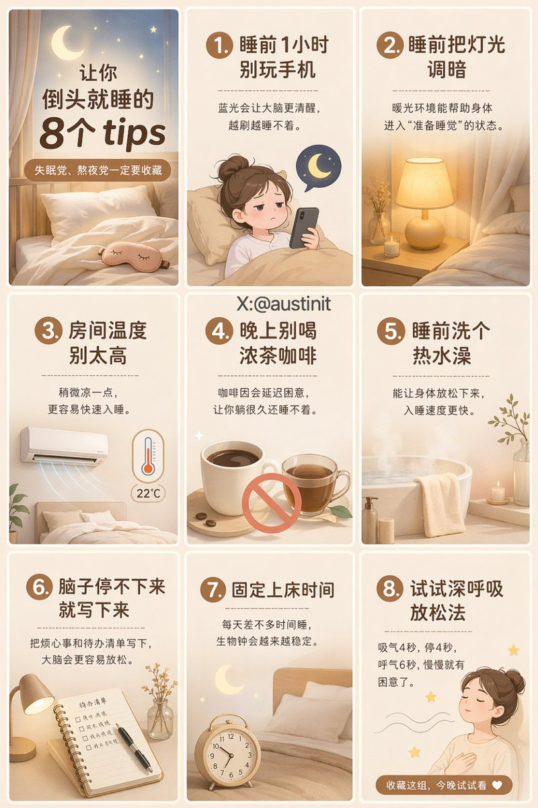


```text
[中文]
生成一张适合小红书发布的 3:4 竖版九宫格海报，整体为 3列 × 3行 排版，九个宫格边界清晰，方便后期直接切割成 9 张单图发布。整体风格干净、高级、统一，适合女性向健康生活方式内容，具有小红书爆款封面气质。画面要求 信息排版清晰、文字大、可读性强、留白舒服、配色温柔治愈。

整体视觉风格：
奶油白、浅米色、淡燕麦色、浅焦糖色为主色调，搭配少量深棕色文字，ins风、治愈感、睡眠疗愈主题，简约排版，轻拟物插画点缀，可加入枕头、月亮、星星、热牛奶、香薰、书本、眼罩、窗帘、床铺等元素。整体像专业新媒体设计图，字体工整，适合做知识科普类小红书九宫格。
排版要求：

整张图必须是标准九宫格构图，切分后每一格都能独立成图

每个宫格内容完整居中，不要把标题或正文压在分割线附近
每个格子之间保留明显间隔或细边框，保证裁切后不影响阅读
所有文字使用中文，清晰易读，不要乱码，不要英文
每个宫格都像独立的小红书图文卡片，但视觉风格保持统一
画面精致、真实、自然，不要廉价营销感，不要过度花哨
九宫格具体内容：

第1格（封面）
大标题：让你倒头就睡的8个 tips
副标题：失眠党、熬夜党一定要收藏
封面视觉最吸睛，适合做首图，加入柔软床铺、月亮、枕头、眼罩等治愈睡眠元素，标题突出，排版高级。

第2格
标题：1. 睡前1小时别玩手机
正文：蓝光会让大脑更清醒，越刷越睡不着。
配图元素：手机、月亮、困倦表情的小插画
第3格
标题：2. 睡前把灯光调暗
正文：暖光环境能帮助身体进入“准备睡觉”的状态。
配图元素：床头灯、暖黄色灯光、窗帘
第4格
标题：3. 房间温度别太高
正文：稍微凉一点，更容易快速入睡。
配图元素：空调、温度计、被子
第5格
标题：4. 晚上别喝浓茶咖啡
正文：咖啡因会延迟困意，让你躺很久还睡不着。
配图元素：咖啡杯、茶杯、禁止符号

第6格
标题：5. 睡前洗个热水澡
正文：能让身体放松下来，入睡速度更快。
配图元素：浴室蒸汽、毛巾、热水
第7格
标题：6. 脑子停不下来就写下来
正文：把烦心事和待办清单写下，大脑会更容易放松。
配图元素：笔记本、钢笔、小台灯
第8格
标题：7. 固定上床时间
正文：每天差不多时间睡，生物钟会越来越稳定。
配图元素：时钟、月亮、床
第9格
标题：8. 试试深呼吸放松法
正文：吸气4秒，停4秒，呼气6秒，慢慢就有困意了。
底部小字：收藏这组，今晚试试看
配图元素：呼吸线条、闭眼人物、星星

画质要求：
高清，高级排版，杂志感，真实可发布，新媒体运营审美，小红书爆款图文风格，文字布局规整，适合直接切图。

[English]
Generate a 3:4 vertical 9-grid poster suitable for publishing on Xiaohongshu, with an overall layout of 3 columns × 3 rows. The boundaries of the nine grids are clear, making it easy to directly cut into 9 single images for later publishing. The overall style is clean, premium, and unified, suitable for female-oriented healthy lifestyle content, possessing the vibe of a viral Xiaohongshu cover. Image requirements: clear information layout, large text, strong readability, comfortable white space, gentle and healing color palette.

Overall visual style:
Cream white, light beige, light oat color, and light caramel color as the main color tones, paired with a small amount of dark brown text. Ins style, healing sense, sleep therapy theme, minimalist layout, light skeuomorphic illustration embellishments. Elements such as pillows, moons, stars, hot milk, aromatherapy, books, eye masks, curtains, and beds can be added. The overall look should be like a professional new media design graphic, with neat fonts, suitable for a knowledge-based popular science Xiaohongshu 9-grid.

Layout requirements:
The entire image must be a standard 9-grid composition, and each grid can stand alone as an independent image after being cut.
The content of each grid should be completely centered; do not place titles or body text near the dividing lines.
Keep obvious gaps or thin borders between each grid to ensure that reading is not affected after cropping.
All text must use Chinese, be clear and readable, no garbled characters, no English.
Each grid should look like an independent Xiaohongshu image-and-text card, but the visual style must remain unified.
The image should be exquisite, realistic, and natural, without a cheap marketing feel, and not overly flashy.

Specific content of the 9-grid:

Grid 1 (Cover)
Main title: 8 tips to make you fall asleep instantly
Subtitle: Insomniacs and night owls must save this
The cover visuals should be the most eye-catching, suitable for the first image. Add healing sleep elements such as soft beds, moons, pillows, and eye masks. The title should be prominent with a premium layout.

Grid 2
Title: 1. Don't play with your phone 1 hour before bed
Body text: Blue light makes the brain more awake; the more you scroll, the harder it is to fall asleep.
Image elements: Mobile phone, moon, small illustration of a sleepy expression

Grid 3
Title: 2. Dim the lights before bed
Body text: A warm light environment can help the body enter a "ready to sleep" state.
Image elements: Bedside lamp, warm yellow light, curtains

Grid 4
Title: 3. Don't keep the room temperature too high
Body text: Keeping it a bit cooler makes it easier to fall asleep quickly.
Image elements: Air conditioner, thermometer, quilt

Grid 5
Title: 4. Don't drink strong tea or coffee at night
Body text: Caffeine delays sleepiness, making you lie in bed for a long time unable to sleep.
Image elements: Coffee cup, teacup, prohibition sign

Grid 6
Title: 5. Take a hot shower before bed
Body text: It can relax the body and help you fall asleep faster.
Image elements: Bathroom steam, towel, hot water

Grid 7
Title: 6. Write it down if your brain won't stop
Body text: Writing down your worries and to-do lists makes it easier for your brain to relax.
Image elements: Notebook, fountain pen, small desk lamp

Grid 8
Title: 7. Fix your bedtime
Body text: Going to bed at about the same time every day will make your biological clock increasingly stable.
Image elements: Clock, moon, bed

Grid 9
Title: 8. Try deep breathing relaxation
Body text: Inhale for 4 seconds, hold for 4 seconds, exhale for 6 seconds, and sleepiness will gradually come.
Bottom small text: Save this set and try it tonight
Image elements: Breathing lines, person with closed eyes, stars

Image quality requirements:
High definition, premium layout, magazine feel, realistically publishable, new media operation aesthetics, Xiaohongshu viral image-and-text style, neat text layout, suitable for direct image cutting.
```


---


## 例 241：关键人物关系图谱

**来源：** [@yihui\_indie](https://x.com/yihui_indie/status/2045179926270361890)

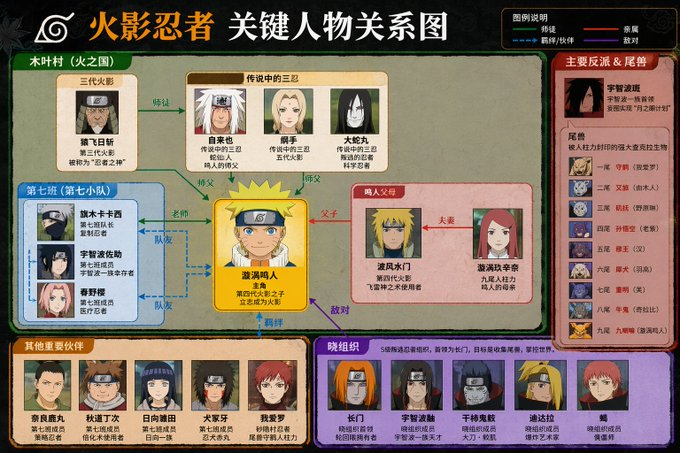


```text
[中文]
请你生成 《XXX》 的关键人物关系图。

[English]
Please generate a key character relationship diagram for "XXX".
```


---


## 例 248：景德镇青花瓷全景解说图谱

**来源：** [@joshesye](https://x.com/joshesye/status/2045764695827562686)

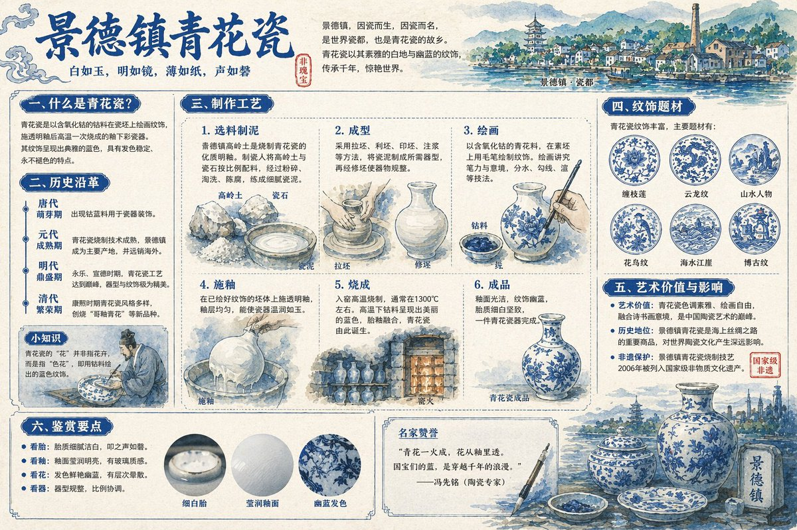


```text
[中文]
为我生成景德镇青花瓷的详细解说图，配上详细的中文知识解析

[English]
Generate a detailed explanatory diagram of Jingdezhen blue and white porcelain, accompanied by detailed Chinese knowledge analysis.
```


---


## 例 270：信息图可视化设计

**来源：** \[OpenNana]\(]\(<https://x.com/Toshi_nyaruo_AI/status/2045025277538107420>)

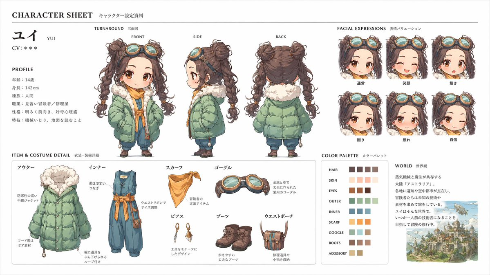


```text
[中文]
このキャラクターと背景を元に、 公式設定資料のようなキャラクターシートを作成してください。 
・正面、側面、背面の3面図を含める ・キャラクターの表情バリエーションを追加 
・衣装や装備の詳細パーツを分解して表示 ・カラーパレットを追加 ・世界観の簡単な説明を入れる 
・全体は整理されたレイアウト
（白背景、図解風） 
・アスペクト比16：9 　←

高解像度、プロのコンセプトアートスタイル

[English]
Based on this character and background, please create a character sheet like an official setting material. 
・Include front, side, and back 3-view drawings ・Add character expression variations 
・Disassemble and display detailed parts of costumes and equipment ・Add a color palette ・Include a brief explanation of the world view 
・Overall organized layout
(White background, diagrammatic style) 
・Aspect ratio 16:9 　←
High resolution, professional concept art style
```


---


## 例 296：博物馆级中文拆解信息图鉴

**来源：** [@MrLarus](https://x.com/MrLarus/status/2045504669401653414)

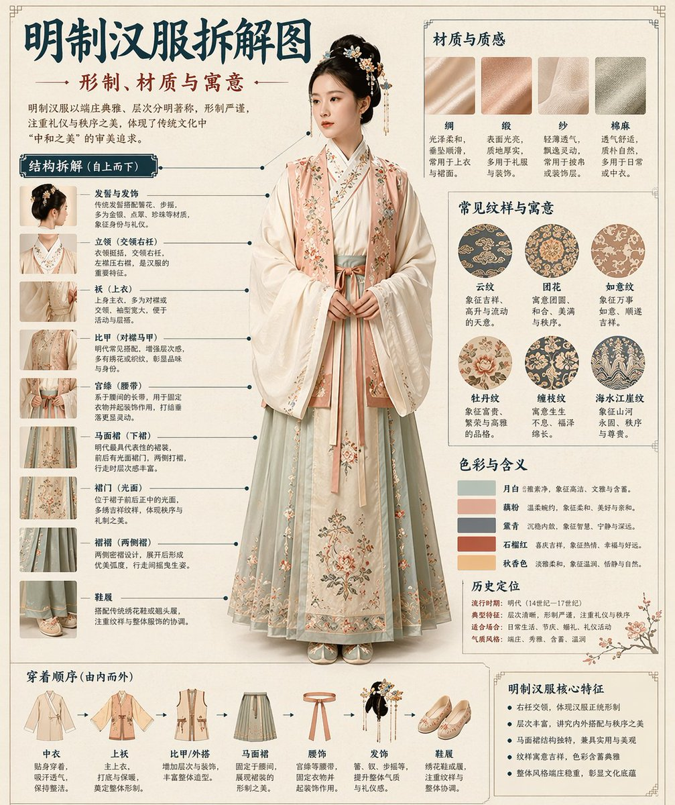


```text
[中文]
请根据【主题】自动生成一张“博物馆图鉴式中文拆解信息图”。

要求整张图兼具真实写实主视觉、结构拆解、中文标注、材质说明、纹样寓意、色彩含义和核心特征总结。你需要根据【主题】自动判断最合适的主体对象、服饰体系、器物结构、时代风格、关键部件、材质工艺、颜色方案与版式结构，用户无需再提供其他信息。

整体风格应为：国家博物馆展板、历史服饰图鉴、文博专题信息图，而不是普通海报、古风写真、电商详情页或动漫插画。背景采用米白、绢纸白、浅茶色等纸张质感，整体高级、克制、专业、可收藏。

版式固定为：
- 顶部：中文主标题 + 副标题 + 导语
- 左侧：结构拆解区，中文引线标注关键部件，并配局部特写
- 右上：材质 / 工艺 / 质感区，展示真实纹理小样并附说明
- 右中：纹样 / 色彩 / 寓意区，展示主色板、纹样样本和文化解释
- 底部：穿着顺序 / 构成流程图 + 核心特征总结

若主题适合人物展示，则以真实人物全身站姿为中央主体；若更适合器物或单体结构，则改为中心主体拆解图，但整体仍保持完整中文信息图形式。所有文字必须为简体中文，清晰、规整、可读，不要乱码、错字、英文或拼音。重点突出真实结构、材质差异、文化说明与图鉴气质。

避免：海报感、影楼感、电商感、动漫感、cosplay感、乱标注、错结构、糊字、假材质、过度装饰。

[English]
Please automatically generate a "museum catalog-style Chinese disassembly infographic" based on the [Subject].

The entire image is required to combine a realistic main visual, structural disassembly, Chinese annotations, material descriptions, pattern meanings, color meanings, and core feature summaries. You need to automatically determine the most appropriate main subject, clothing system, artifact structure, era style, key components, material craftsmanship, color scheme, and layout structure based on the [Subject], and the user does not need to provide any other information.

The overall style should be: national museum exhibition boards, historical clothing catalogs, and cultural/museum thematic infographics, rather than ordinary posters, ancient-style portraits, e-commerce detail pages, or anime illustrations. The background uses paper textures such as off-white, silk white, and light tea color, making the overall look premium, restrained, professional, and collectible.

The layout is fixed as:
- Top: Chinese main title + subtitle + introduction
- Left: Structural disassembly area, with Chinese lead lines annotating key components, accompanied by close-up details
- Upper right: Material / craftsmanship / texture area, displaying real texture samples with descriptions
- Middle right: Pattern / color / meaning area, displaying the main color palette, pattern samples, and cultural explanations
- Bottom: Dressing order / composition flowchart + core feature summary

If the subject is suitable for character display, use a full-body standing posture of a real person as the central subject; if it is more suitable for artifacts or single structures, change it to a central subject disassembly diagram, but the overall form remains a complete Chinese infographic. All text must be in Simplified Chinese, clear, neat, and readable, without garbled characters, typos, English, or pinyin. The focus is on highlighting real structures, material differences, cultural explanations, and a catalog atmosphere.

Avoid: poster feel, studio portrait feel, e-commerce feel, anime feel, cosplay feel, random annotations, incorrect structures, blurry text, fake materials, excessive decoration.
```


---


## 例 302：九位大师的机械键盘设计图鉴

**来源：** [@TanShilong](https://x.com/TanShilong/status/2045148649869692982)

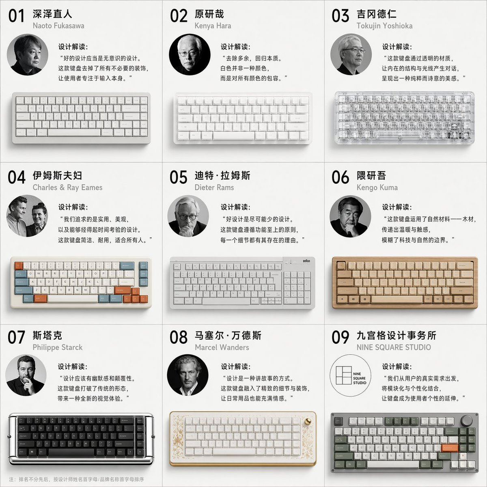


```text
[中文]
一个九宫格图片，展现九位当代知名设计师设计的同一组物体：机械键盘，包括设计师头像，设计师对于设计的中文文字解读和作品呈现。排版统一规则

[English]
A nine-grid image showing the same group of objects designed by nine contemporary famous designers: mechanical keyboards, including designer avatars, designers' Chinese text interpretations of the designs, and artwork presentations. Unified layout rules
```


---


## 例 310：零食品牌技术分解图

**来源：** [@TechieBySA](https://x.com/TechieBySA/status/2031795709243019280)

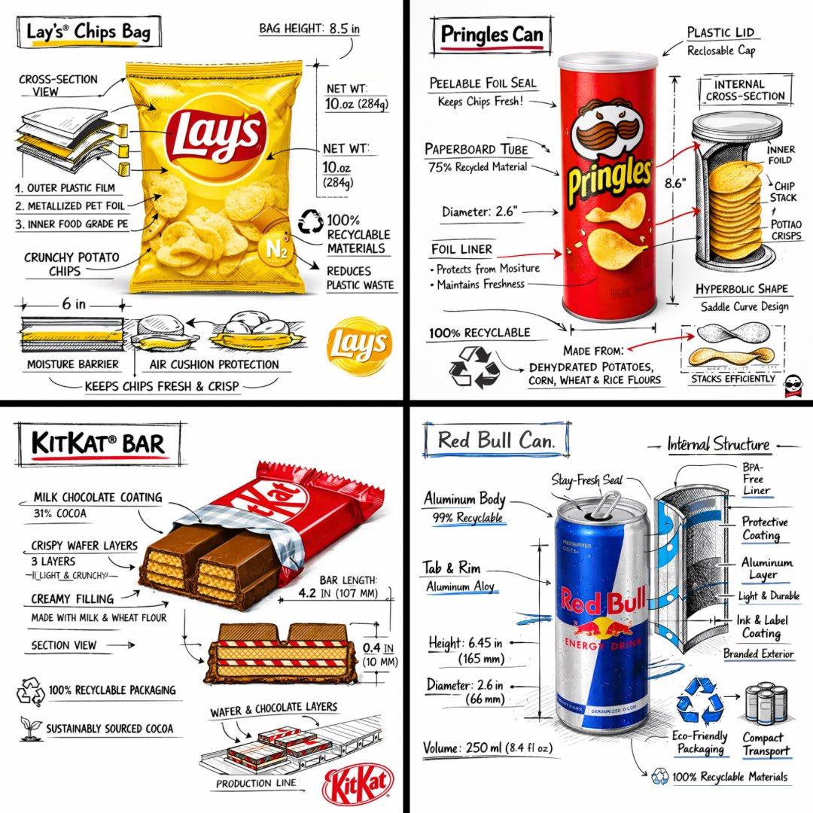


```text
[中文]
创建一个 [SNACK] 的品牌技术信息图，结合产品的真实照片或照片级真实渲染，并将技术注释覆盖层直接置于其上。在纯白摄影棚背景上使用带有策略性 [BRAND COLOR] 点缀的黑色墨水风格线条画（建筑草图外观），包括：
• 关键组件标签
• 显示结构、分层或内部设计的内部截面图
• 测量数据、尺寸和规格
• 带有成分和数量的材料标注
• 指示主要功能和结构完整性的箭头
• 显示关键机械或设计元素的简单示意图或剖面图
• 可持续性标注
标题位置：位于手绘技术注释框内，带有强调色边框，粗体字显示产品名称，置于上角。
风格与布局规则：
• 真实产品保持清晰可见
• 注释具有素描感、技术感和建筑感
• 强调色用于高光（占线条工作的 20-30%），黑色用于主要技术线条（70-80%）
• 构图整洁，负空间平衡
• 具有教育意义、食品工程氛围和高端品牌感
• 在角落包含微妙的品牌标志
视觉风格：极简技术插画美学，黑色线条在真实图像上带有点缀，精确但略带手绘感。
调色板：白色背景，黑色注释线/文本，[BRAND COLOR] 仅用于点缀和关键标注。
输出：1080×1080，超清晰，社交媒体动态优化，无水印。

[English]
Create a branded technical infographic of a [SNACK], combining a realistic photograph or photoreal render of the product with technical annotation overlays placed directly on top. Use black ink–style line drawings with strategic [BRAND COLOR] accents (architectural sketch look) on a pure white studio background, including:
• Key component labels
• Internal cross-section showing structure, layering, or internal design
• Measurements, dimensions, and specifications
• Material callouts with composition and quantities
• Arrows indicating function for primary features and structural integrity
• Simple schematic or sectional diagram showing key mechanical or design elements
• Sustainability callouts
Title placement: Inside a hand-drawn technical annotation box with accent border reading the product name in bold font, positioned in upper corner.
Style & layout rules:
• The realistic product remains clearly visible
• Annotations feel sketched, technical, and architectural
• Accents used for highlight (20-30% of linework), black for primary technical lines (70-80%)
• Clean composition with balanced negative space
• Educational, food-engineering vibe with premium branding
• Include subtle brand logo mark in corner
Visual style: Minimal technical illustration aesthetic, black linework with accents over realistic imagery, precise but slightly hand-drawn feel.
Color palette: White background, black annotation lines/text, [BRAND COLOR] for accents and key callouts only.
Output: 1080×1080, ultra-crisp, social-feed optimized, no watermark.​​​​​​​​​​​​​​​​
```


---


## 例 333：AI 眼镜爆炸拆解图

**来源：** 苍何原创实测（公众号文章《我逆向了 329 条 GPT-Image2 提示词模板，全部开源！》）

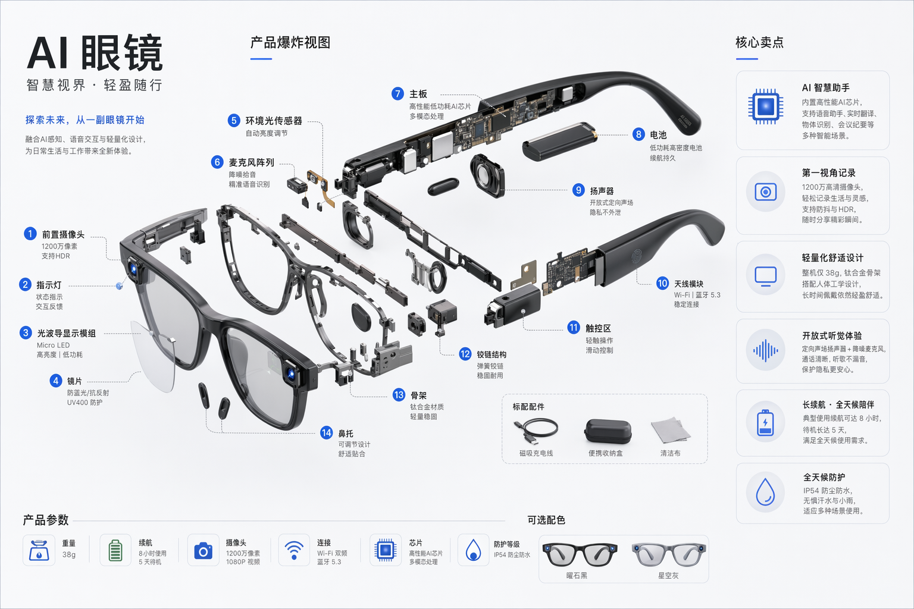


```text
生成一张AI眼镜的爆炸视图，包含每个组件的名称以及这款产品的几大核心卖点。
```


---


## 例 334：RAG 技术详解图

**来源：** 苍何原创实测（公众号文章《我逆向了 329 条 GPT-Image2 提示词模板，全部开源！》）

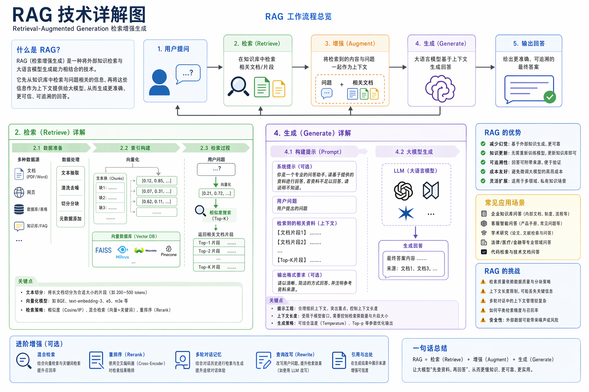


```text
帮我生成一张 RAG 技术的详细讲解图
```


---


## 例 341：AP Calculus 学习表信息图

**来源：** [@hqmank](https://x.com/hqmank/status/2048587150544028084)

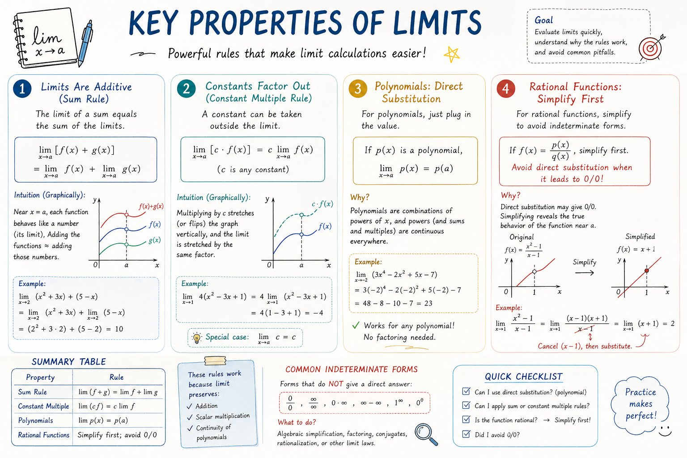


```text
Please create a mathematical visualization infographic about "[math concept / topic]." The goal is to help the viewer intuitively understand what it is, why it works, its geometric or structural intuition, and how it behaves in different contexts. The visual should feel like a high-quality math lecture handout combined with a hand-drawn educational poster. It should be elegant, clear, and information-rich, but not cluttered. Visual style: either portrait or landscape is fine. Use a clean, light paper-like background, with a deep blue title and black or dark gray lines for the main content. Add a small number of refined accent colors such as blue, teal, gold, and red. Incorporate rounded-corner cards, thin borders, numbered labels, hand-drawn arrows, zoom-in callout boxes, and a summary section. The overall design should be aesthetically pleasing, balanced, and academic, allowing the viewer to grasp the structure of the concept and why it works at a glance.
```


---


## 例 348：胡须风格分析海报

**来源：** [@RizwanAly07](https://x.com/RizwanAly07/status/2048610196302250019)


```text
Create a premium “BEARD STYLE ANALYSIS” poster featuring the same man from the reference image. Show face shape, beard density, jawline definition, beard growth pattern, and beard suitability score. Include different beard styles comparison such as Stubble, Short Boxed Beard, Full Beard, Goatee, Van Dyke, Clean Shave. Add side profile and front profile views. Modern dark blue luxury background, professional grooming infographic style, high detail, realistic face consistency, stylish typography, premium male grooming poster.
```


---


## 例 350：足球球员数据涂鸦海报

**来源：** [@ryanpp27](https://x.com/ryanpp27/status/2048602248524214542)

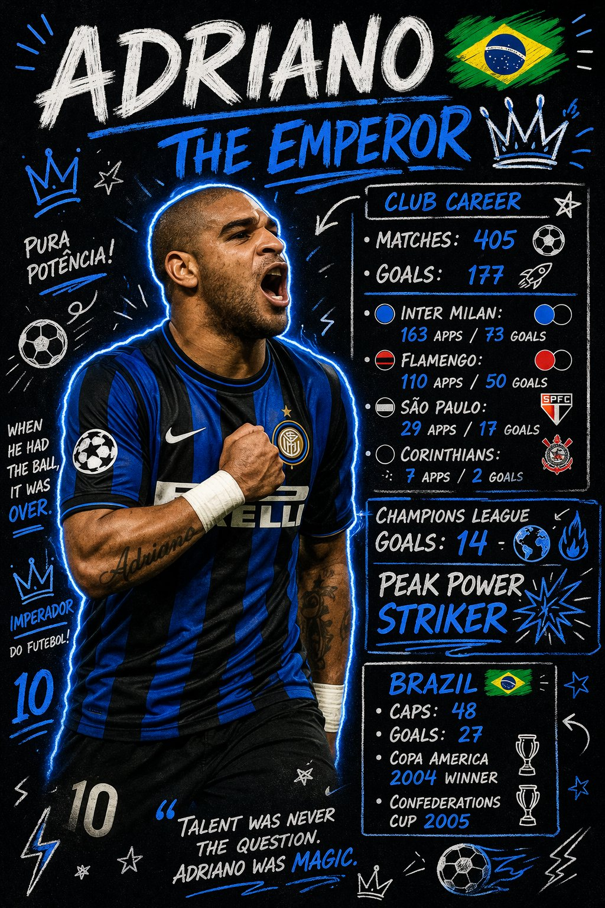


```text
Create a scrapbook doodle-style football poster of [PLAYER_NAME].

AI auto-generates realistic career stats (club and national team).

Main photo: realistic, unchanged ([PLAYER_NAME] in action or iconic pose).

Doodles and handwritten notes: white and [PRIMARY_COLOR] neon ink (no warm colors unless specified), arrows, stars, scribbles, sketchy outlines. Add a glowing [PRIMARY_COLOR] outline around the player's body.

Layout (bold handwritten titles and stats):
- Top Title: "[PLAYER_NAME]" plus "[NICKNAME/TITLE]"
- Club Career: total matches and goals plus 2–4 main clubs (apps and goals)
- Highlights: 2–3 standout achievements (e.g., UCL goals, Ballon d'Or, top scorer)
- National Team: caps and goals plus 1–2 international achievements

Style: modern football poster x notebook aesthetic, clean but energetic, slightly messy doodles, high contrast, neon accents on dark or muted background.

Important: all stats must be realistic and proportional to the player's real career.
```


## 例 351：Momotaro Explainer Slide in Hybrid Style

**来源：** awesome-gpt-image-2

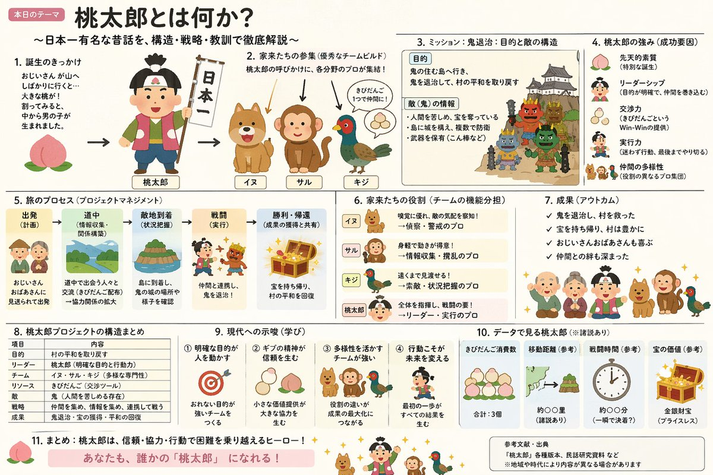


```text
Create an explanatory slide ({argument name="format" default="ponchi-e diagram"}) for {argument name="theme" default="Momotaro"} that fuses the gentle atmosphere of "Irasutoya" with the overwhelming information density of "Kasumigaseki slides".
```


---

## 例 352：3D Stone Staircase Evolution Infographic

**来源：** awesome-gpt-image-2


```text
{
  "type": "evolutionary timeline infographic",
  "instruction": "Using REFERENCE_0 as a structural base, transform the flat vector design into a highly realistic 3D infographic. Replace the smooth ramps with distinct stone steps and upgrade all organisms to photorealistic 3D models.",
  "style": {
    "background": "{argument name=\"background style\" default=\"vintage textured parchment paper\"}",
    "staircase": "{argument name=\"staircase material\" default=\"realistic textured stone blocks\"}",
    "subjects": "{argument name=\"organism style\" default=\"highly detailed photorealistic 3D renders\"}"
  },
  "layout": {
    "main_title": "{argument name=\"main title\" default=\"人类演化\"}",
    "sections": [
      {
        "position": "left sidebar",
        "count": 8,
        "labels": ["L0: 单细胞生命", "L1: 多细胞生物", "L2: 动物界", "L3: 脊索动物", "L4: 上陆革命", "L5: 哺乳纲", "L6: 人科演化", "L7: 智人纪元"]
      },
      {
        "position": "top right",
        "title": "获得的功能 / 失去的功能",
        "description": "Legend with plus and minus icons"
      },
      {
        "position": "bottom center",
        "title": "演化关键里程碑",
        "count": 6,
        "description": "Timeline with a silhouette graphic of 6 figures showing ape-to-human evolution"
      }
    ],
    "centerpiece": {
      "description": "Winding stone staircase with 25 numbered steps featuring specific organisms.",
      "count": 25,
      "notable_elements": [
        "Step 07: Jellyfish",
        "Step 09: Ammonite",
        "Step 10: Trilobite",
        "Step 24: Walking human",
        "Step 25: {argument name=\"future evolution concept\" default=\"glowing cosmic silhouette with a question mark\"}"
      ]
    }
  }
}
```


---

## 例 353：Chinese Vmess Protocol Infographic

**来源：** awesome-gpt-image-2

```text
{"type":"modern Chinese infographic poster","topic":"{argument name=\"topic title\" default=\"Vmess 协议\"}","style":{"overall":"clean tech explainer, polished brochure-like educational poster, minimalist flat illustration, soft shadows, rounded white cards, blue-and-green cybersecurity color palette","background":"warm off-white with faint geometric dots, subtle globe line art, and light decorative curves","aspect_ratio":"4:5 vertical"},"header":{"title":"{argument name=\"main title\" default=\"Vmess 协议\"}","subtitle":"{argument name=\"subtitle text\" default=\"一种灵活、强大的代理传输协议（V2Ray 核心协议）\"}","intro":"Vmess 是 V2Ray 项目的核心协议之一，设计目标是高效、灵活、易于扩展，适用于多种网络环境下的安全传输。","hero_illustration":"desktop monitor showing a blue V app icon and the word Vmess, beside a smartphone with a green shield checkmark"},"layout":{"grid":"2 columns, 4 rows of rounded content cards below the header","sections":[{"number":1,"title":"什么是 Vmess?","position":"row 1 left","count":3,"labels":["Vmess","V2Ray = 多协议框架，Vmess 是其中最常用的协议之一。","Vmess 是由 V2Ray 开发的一种代理协议，基于自定义的认证与加密机制，传输效率高，配置灵活，支持多种传输方式。"],"visual":"blue cube-like Vmess icon with a large V"},{"number":2,"title":"工作原理","position":"row 1 right","count":5,"labels":["客户端","建立连接（认证）","数据传输（加密）","服务器","客户端通过预设的 UUID 等信息与服务器建立连接，经过认证后，所有数据在加密通道中传输。"],"visual":"laptop on the left, server stack on the right, green dashed arrow forward, blue dashed arrow backward, central lock-and-shield symbol"},{"number":3,"title":"核心特点","position":"row 2 left","count":4,"labels":["高效传输","灵活安全","可扩展性强","多路复用支持"],"details":["采用二进制传输，开销小，速度快。","支持多种加密与传输方式，安全性高。","字段可扩展，满足不同场景的需求。","支持多路复用（Mux），减少延迟。"],"visual":"4 vertically stacked feature rows with green, blue, orange, and purple icons"},{"number":4,"title":"主要组成","position":"row 2 right","count":4,"labels":["用户标识（UUID）","额外 ID（Alter ID）","加密方式（Security）","传输方式（Transport）"],"details":["用于客户端认证的唯一标识符。","增强伪装性，防止流量特征识别。","数据传输的加密算法，如 AES、ChaCha20 等。","如 TCP、WebSocket、gRPC、HTTP/2 等。"],"visual":"4 vertically stacked rows with square icons for user, cube, lock, and paper airplane"},{"number":5,"title":"配置示例（客户端）","position":"row 3 left","count":2,"labels":["JSON configuration code block","field annotations list"],"visual":"left-side rounded code panel showing JSON with keys v, ps, add, port, id, aid, scy, net, type, host, path, tls; right-side vertical notes explaining each field"},{"number":6,"title":"Vmess 与其他协议对比","position":"row 3 right","count":4,"labels":["特性","Vmess","Shadowsocks","Trojan"],"visual":"comparison table with 6 rows: 开发者, 传输效率, 可扩展性, 伪装能力, 多路复用, plus the header row","table_notes":"Vmess column highlighted in soft green; other columns in neutral tones"},{"number":7,"title":"适用场景","position":"row 4 left","count":4,"labels":["跨境访问","企业内网穿透","流媒体解锁","网络隐私保护"],"details":["访问受限网站与服务。","安全连接公司内部资源。","解锁地区限制的视频内容。","加密流量，保护上网隐私。"],"visual":"4 evenly spaced icon-and-caption items: globe, shield, play button, game controller"},{"number":8,"title":"核心总结","position":"row 4 right","count":2,"labels":["summary paragraph","一句话记住：灵活、安全、高效。"],"visual":"large yellow light bulb icon on the left, text on the right in a blue rounded quote bar","summary_text":"Vmess 是一种高效、灵活且安全的代理协议，凭借强大的扩展性、多种传输支持与良好的隐藏性，成为现代代理工具（如 V2Ray）中最受欢迎的协议之一。"}]},"typography":{"title_style":"large bold sans-serif in dark navy","section_title_style":"bold Chinese sans-serif with colored numbered badges","body_style":"compact readable Chinese UI font","emphasis":"blue pill subtitle, colored icons, green and blue accents"},"color_palette":{"navy":"#14264a","blue":"#5b8ff9","light_blue":"#eaf2ff","green":"#67c587","light_green":"#eaf8ef","purple":"#8c7cf3","orange":"#f3b35f","card":"#ffffff","border":"#e8ebf2","background":"#f7f5f2"}}
```


---

## 例 354：Desk Setup Audit Infographic

**来源：** awesome-gpt-image-2

```text
Using REFERENCE_0, turn the attached desk photo and its written brief into a clean editorial-style infographic poster. Create a side-by-side comparison with exactly 2 labeled photo panels: “Current Setup” on the left using the original scene, and “Optimized Setup” on the right showing a plausible improved version of the same room and desk from a matching angle. Add a large serif headline at the top reading {argument name="headline text" default="Desk Setup Audit"}. Around the left panel, add exactly 5 issue callout cards connected by leader lines: 1) MONITOR HEIGHT — 👍 acceptable — “Screens close, but split focal plane” — tag “Neck fatigue”; 2) CHAIR POSITION — ❌ actively hurting — “Low lounge chair, weak support” — tag “Back pain + slouching”; 3) LIGHTING — ⚠️ costing energy — “Mixed lamps + side glare” — tag “Eye strain”; 4) CABLE MANAGEMENT — ❌ actively hurting — “Loose cables on desk + floor” — tag “Visual drag / trip risk”; 5) CLUTTER — ⚠️ costing energy — “Tools, boxes, papers in view” — tag “Focus loss”. Add a small red “TOP FIX” badge pointing to the chair position issue. Around the right panel, add exactly 5 improved callout cards: 1) MONITOR HEIGHT — ✅ working — “Primary screen centered at eye level”; 2) CHAIR POSITION — ✅ working — “Chair tucked in, feet flat, elbows ~90°”; 3) LIGHTING — ✅ working — “Soft front light, glare reduced”; 4) CABLE MANAGEMENT — ✅ working — “Cables routed under desk”; 5) CLUTTER — ✅ working — “Clear work zone, gear zoned”. In the optimized panel, visibly show the improvements: one main monitor centered, laptop centered below it, ergonomic office chair, cleaner desktop, cable routing hidden under the desk, softer balanced lighting, and a small drawer cabinet on the right while keeping the same room recognizable. Add a bottom legend with exactly 5 items: “LEGEND”, “Top Fix”, “working”, “acceptable”, “costing energy”, “actively hurting”. Along the bottom, add exactly 4 boxed sections: 1) “FREE FIXES” with 3 numbered items — “Top Fix: Raise sitting posture / ditch low slouch”, “Center primary monitor”, “Clear desk + floor spillover”; 2) “UNDER $50” with 3 numbered items — “Velcro ties + under-desk cable tray”, “Lumbar pillow or footrest”, “Simple desk organizer”; 3) “WORTH THE INVESTMENT” with 3 numbered items — “Ergonomic task chair”, “Monitor arms for perfect alignment”, “Closed storage / drawers”; 4) “FOCUS FORECAST” showing 2 gauges labeled “Current: 2.5 hrs/day” and “After Top 3 Fixes: 5.5 hrs/day”, plus a green pill reading “+3.0 hrs”. Use a refined magazine infographic aesthetic, muted green and cream palette, rounded boxes, minimal text, crisp icons, thin connector lines, and polished layout suitable for sharing on social media.
```


---

## 例 355：Caffeine-Free Herbal Tea Chart

**来源：** awesome-gpt-image-2

```text
{"type":"herbal tea variety infographic poster","language":"Traditional Chinese","style":"clean premium editorial food photography collage, bright high-key lighting, soft natural shadows, white background, elegant wellness aesthetic","subject":"a 3 by 3 grid of caffeine-free herbal tea varieties presented in transparent glass teacups with matching botanicals scattered around each cup","text":{"headline":"{argument name=\"headline text\" default=\"無咖啡因花草茶品種大全\"}"},"layout":{"canvas":"vertical poster","background":"warm off-white paper tone","grid":{"rows":3,"columns":3,"count":9,"cardStyle":"rounded rectangular photo cards with narrow gaps","imagePosition":"top image with title and subtitle beneath each card"},"sections":[{"title":"洋甘菊茶","position":"row 1 column 1","count":1,"labels":["花香柔和，口感溫潤舒緩"],"image":"clear glass cup of pale golden chamomile tea with floating white-and-yellow chamomile flowers, many loose chamomile blossoms scattered on the white surface"},{"title":"薄荷茶","position":"row 1 column 2","count":1,"labels":["清涼醒鼻，入口清新甘爽"],"image":"clear glass cup of light green mint tea filled with fresh mint sprigs, extra mint leaves placed in front on a white background"},{"title":"洛神花茶","position":"row 1 column 3","count":1,"labels":["酸甜明亮，果香濃郁迷人"],"image":"clear glass cup of vivid ruby red hibiscus tea with dried hibiscus calyxes around it and a glass pitcher pouring or placed behind"},{"title":"玫瑰花茶","position":"row 2 column 1","count":1,"labels":["花韻優雅，香氣細膩柔美"],"image":"clear glass cup of soft pink rose tea with dried rosebuds and scattered pink petals surrounding the cup"},{"title":"菊花茶","position":"row 2 column 2","count":1,"labels":["清香淡雅，茶湯甘潤順口"],"image":"clear glass cup of pale yellow chrysanthemum tea with whole dried yellow chrysanthemum flowers around the base"},{"title":"薰衣草茶","position":"row 2 column 3","count":1,"labels":["草本芬芳，尾韻柔和安定"],"image":"clear glass cup of translucent purple lavender tea with lavender sprigs and a blurred jar of lavender in the background"},{"title":"桂花茶","position":"row 3 column 1","count":1,"labels":["蜜香清甜，香氣溫暖悠長"],"image":"clear glass cup of pale golden osmanthus tea filled with tiny floating yellow osmanthus blossoms, more blossoms scattered around"},{"title":"檸檬草茶","position":"row 3 column 2","count":1,"labels":["柑橘清香，風味爽朗輕盈"],"image":"clear glass cup of pale green lemongrass tea with cut lemongrass stalks beside the cup and slender leaf pieces steeping inside"},{"title":"蝶豆花茶","position":"row 3 column 3","count":1,"labels":["色澤夢幻，口感清淡柔順"],"image":"clear glass cup of vivid sapphire blue butterfly pea flower tea on a saucer, decorated with blue petals and blossoms around the cup"}]},"typography":{"headline":"large dark brown serif Chinese type centered at top","cardTitles":"bold dark brown Chinese serif centered beneath each image","captions":"smaller gray Chinese text centered beneath each title"},"colorPalette":{"dominant":["cream white","dark brown","soft gray"],"accentTeaColors":["pale gold","fresh green","ruby red","blush pink","lavender purple","osmanthus gold","lemongrass green","butterfly pea blue"]},"constraints":["all 9 drinks shown in transparent glass cups","realistic food photography, not illustration","consistent white studio tabletop","minimalist luxurious layout","traditional Chinese text only","balanced spacing and clean margins"]}
```


---

## 例 356：Food-Based Micro-Cities Visualization

**来源：** awesome-gpt-image-2

```text
Do this for {argument name="country" default="Japan"} Input: country analyze the country, its food, its lesser known cities, pick 4 lesser known cities. A 2x2 grid of 4 {argument name="food type" default="famous food or deseerts"} for this country as functioning lesser known micro-cities [made with popular food and desserts of city 1] [made with popular food and desserts of city 2] [made with popular food and desserts of city 3] [made with popular food and desserts of city 4] Photoreal miniature scenes built into real food or dessert portions, edible details, soft food-styling light, shallow depth of field, centered on white porcelain plinths, 50mm perspective, solid seamless slate-gray background, crisp focus. Name underneath in sugar
```


---

## 例 357：Side-by-Side PPT Reconstruction Demo

**来源：** awesome-gpt-image-2

```text
Using the provided reference image of the PowerPoint slide screenshot, recreate it as a clean, polished slide conversion result inside a side-by-side desktop comparison. Keep the same Japanese slide topic and overall layout, but remove the dense selection handles, edit boxes, and malformed vector artifacts from the reference so the slide appears properly reconstructed. Show 2 panels: on the left, a dark image viewer window displaying the exported slide image; on the right, the same slide opened in PowerPoint editing view. Preserve the original monochrome infographic style and Japanese text structure, but make the typography legible and the icons, dividers, and columns cleanly aligned. Keep the slide as a single-page infographic with 5 main content areas: 1 top title/header row, 3 mid-page comparison columns, 1 bottom use-case row containing 5 icon-labeled items. Include a footer line and the OpenAI logo at bottom right. Emphasize that this is a faithful PPT reconstruction from the uploaded image, with a realistic Windows desktop app screenshot look.
```


---

## 例 358：Dance Choreography Instruction Sheet Prompt

**来源：** awesome-gpt-image-2

```text
Dance Sequence Instruction Sheet [VISUAL STYLE] A composition featuring a highly detailed 3D-rendered female dancer. Designed like a professional choreography guide with a technical, diagram-inspired layout. Clean white background, soft studio lighting, and strong contrast to highlight body movement and posture. [GRID LAYOUT] Structured 4×4 panel grid (16 frames total), evenly spaced with thin black divider lines. Each panel is identical in size and clearly numbered from 1 to 16 to show a continuous dance progression. [CHARACTER] Use image1 as the base character. The same female dancer appears consistently across all panels with accurate likeness and proportions. [WARDROBE] The dancer wears a stylish, performance-ready outfit: a well-fitted top paired with a short, flowy skirt. The look should feel modern and visually appealing while still practical for dance movement. Fabric should subtly respond to motion (slight flow and folds), even in grayscale. [PANEL STRUCTURE – EACH FRAME] Top-left: Step number + short dance move title (e.g., “Step 5 – Spin Transition”) Center: Full-body pose capturing a precise moment in the choreography Bottom-left: 3–4 lines of concise instruction describing the move Overlay: Motion arrows and directional guides illustrating how the dancer transitions [MOTION INDICATORS] Incorporate curved arrows for fluid motion, straight arrows for directional steps, and circular indicators for spins or turns. Emphasize rhythm, weight shifts, and body isolation. [RENDER QUALITY] High-detail sculpted 3D style with smooth grayscale shading, subtle shadows, and clean linework. Maintain a polished, concept-art level finish with clarity in every pose. [RESTRICTIONS] No color, no background scenery, no extra characters, no visual clutter, only the dancer and instructional elements.
```


---

## 例 359：Kids Relativity Infographic Poster

**来源：** awesome-gpt-image-2

```text
{"type":"children's educational infographic poster","topic":"{argument name=\"topic\" default=\"The Theory of Relativity\"}","subtitle":"{argument name=\"subtitle text\" default=\"Explained for Kids!\"}","style":"cute hand-drawn classroom infographic, bright pastel colors, rounded panels, white background, friendly doodle stars and sparkles, thick outlines, easy-to-understand visual metaphors, playful textbook poster design for elementary school children","format":"vertical poster","header":{"title":"The Theory of Relativity","subtitle":"Explained for Kids!","icons_count":3,"icons":["Earth globe","round clock","purple ringed planet"],"intro_box":{"left_figure":"cartoon Einstein with wild white hair, brown jacket, green vest, white shirt, raising one finger","text":"A long time ago, people thought that time was the same for everyone and space (like distance) was always the same too. Einstein had a new idea!"}},"layout":{"sections":[{"title":"1. The Big Idea","position":"upper left","count":1,"visuals_count":2,"visuals":["speech bubble with quote","smiling sun with rays"],"text":"Einstein said: \"The speed of light is always the same for everyone!\" No matter how fast you are moving, light (like from the sun or a flashlight) always travels at the same speed. That speed is about 300,000 km per second!","panel_color":"blue"},{"title":"2. Time is Relative","position":"upper right","count":2,"labels":["On Earth","On a Fast Rocket"],"visuals_count":4,"visuals":["child standing on Earth side","clock on Earth side","child inside red rocket with orange flame","clock on rocket side"],"text":"If you move very fast (close to the speed of light), time slows down for you! Left caption: 1 hour passes... Right caption: ...but less time passes for you!","panel_color":"green"},{"title":"3. Space is Relative (Length Changes)","position":"middle left","count":2,"labels":["normal train length when standing still","shorter-looking train when moving very fast"],"visuals_count":2,"visuals":["train at rest","stretched-motion train with speed lines"],"text":"If you move very fast, things can look shorter in the direction you're moving! Example: This train is its normal length when it's standing still. But when the train moves very fast... ...it looks shorter to someone watching!","panel_color":"purple"},{"title":"4. Why Does It Matter?","position":"middle right","count":3,"labels":["GPS","Space & Black Holes","Big and Small"],"visuals_count":3,"visuals":["satellite","spiral galaxy or black hole","atom symbol"],"text":"Relativity helps us understand the universe! It is used in: GPS — Satellites use relativity to give us the right location. Space & Black Holes — It helps scientists understand things in space. Big and Small — It connects with the weird world of very small particles too!","panel_color":"orange"}],"footer":{"title":"In short:","left_figure":"thoughtful cartoon boy with hand on chin and a thought bubble containing a yellow star","summary_text":"The faster you move (very, very fast), the slower time goes and the shorter things look! That's the magic of relativity!","right_note":"It's hard to see in everyday life, because we don't move that fast... yet!","extra_icon":"winking smiley face"}},"design_notes":{"section_count":4,"total_main_icons":12,"typography":"large playful handwritten title, rounded child-friendly sans serif body text","palette":["navy blue","sky blue","green","purple","orange","yellow","red","white"],"mood":"curious, cheerful, educational, kid-friendly"}}
```


---

## 例 360：Cyberpunk Character Status Screen

**来源：** awesome-gpt-image-2

```text
A cinematic anime-style futuristic surveillance status screen showing a full-body young man standing in the center of a dark industrial corridor, viewed from a slightly high angle as if captured by a security camera. He is a tall, lean, athletic male with messy silver-gray hair, pale skin, and a cool, dangerous presence, wearing a black sleeveless high-neck shirt, black tactical pants with straps and side pockets, a black belt with hanging chain details, heavy black combat boots, and a black jacket slipping off his shoulders. His expression is serious and unreadable, framed by a glowing scan bracket around the face like a live target lock. The overall image is a high-tech HUD dossier overlay in a blue-gray and black palette with subtle cyan interface lines, screen noise, scanlines, and a moody cyberpunk thriller atmosphere. The layout contains 10 distinct UI panels around the character: 1 top-left recording strip with a red REC indicator, timestamp, camera code, location, and video specs; 1 left upper identification panel labeled 観察対象 with subject data including codename Raven and ID; 1 left middle warning panel labeled 重要人物 with risk level A and other threat notes; 1 left lower basic profile panel labeled 基本情報 listing name, age, height, birth date, job, personality, likes, and dislikes; 1 bottom-left vital monitor panel labeled バイタルモニタ with 2 waveform graphs and numeric readouts for heart rate, temperature, and stress; 1 lower-left action log panel labeled 行動ログ with 6 timestamped entries; 1 large upper-right facial recognition panel labeled 顔認識ズーム showing 1 zoomed portrait crop, a match result for RAVEN, a 99.7% accuracy bar, and verified status; 1 right middle identification details panel labeled 識別情報 with ID, codename, affiliation unknown, and a paragraph of notes; 1 right lower target analysis panel labeled ターゲット分析 with 1 wireframe human figure and multiple stat lines including height, weight, body fat, muscle mass, combat ability, mobility, intelligence, danger level, and a large overall evaluation A+; 1 bottom-right current location panel labeled 現在位置 with 1 minimap floor plan, a glowing position dot, and camera label CAM-07. Add 1 bottom-center tracking progress bar reading TRACKING... at 97.6%, 1 bottom-left surveillance memo box labeled 監視メモ with 3 short bullet-style notes, and 1 bottom barcode strip with the code RX-0417-17 / TOP PRIORITY. Include small top-right system text such as SYSTEM ONLINE and SECURE LINK : OK. Use Japanese text throughout the interface, crisp thin-line sci-fi frames, layered transparent screens, realistic lighting on the character, and polished gpt-image-2 anime illustration quality, like a classified character status display for a covert operative named {argument name="character name" default="Raven"}.
```


---

## 例 361：Professional Chinese Palmistry Analysis Chart

**来源：** awesome-gpt-image-2

```text
Please generate a high-definition 3:4 ratio Chinese palmistry analysis chart based on the first palm photo I uploaded, combined with the layout style of the second reference image. Core Requirements: Please use the real palm in the first image as the main object of analysis, trying to preserve the original palm's shape, finger proportions, palm type, skin tone, palm line directions, and realistic texture. The second image is for visual style reference only: Refer to its Chinese metaphysics infographic style, cream-white background, brownish-red font, traditional calligraphy titles, red circular numbering, dotted guide lines, palm line markings, right-side text analysis column, and bottom comprehensive conclusion box. Do not copy the palm from the second image, do not copy watermarks, and do not include platform logos. Visual Style: Overall, create a high-end Chinese metaphysics style 'Palmistry Analysis Chart'. Image Ratio: 3:4. Quality: High-definition, clear details, suitable for posting on Xiaohongshu. Background: Cream-white rice paper texture, faint vintage texture. Main Colors: Dark brown, reddish-brown, light gold, cream-white. Font Style: Titles use Chinese calligraphy style, body text uses clear and readable Chinese Songti/Kaiti style. Overall Feeling: Professional, classical, clean, and high-end, like a palmistry analysis card issued by a traditional fortune-telling master. Title Design: Write the main title at the top: 'Palmistry Analysis Chart'. Write the subtitle: 'Traditional Palmistry · Yi Principles Reference · Trend Analysis'. Add a small red seal next to the title with the text: 'Heavenly Mystery'. Write small text at the bottom: 'For traditional culture and entertainment reference only'. Palm Annotation Requirements: Please use thin reddish-brown lines, dotted lines, dots, and numbers on the palm to mark the following 12 key points. Each number must clearly correspond to the analysis content on the right. 12 points to be marked: 1. Life Line, 2. Wisdom Line, 3. Heart Line, 4. Fate Line, 5. Sun Line, 6. Health Line / Mercury Line, 7. Marriage Line, 8. Mount of Venus, 9. Mount of Jupiter, 10. Mount of the Moon, 11. Thumb Spread / Willpower, 12. Finger Morphology and Palm Type. Annotation Requirements: Lines must fit the general direction of the actual palm lines in the first image, do not draw randomly. Numbers and text must not obstruct the main body of the palm. Dotted guide lines must be clear like a professional diagram. There should be reasonable annotations on the left side, right side, and inside the palm. The overall layout should be like the second image, with the palm analysis diagram on the left and text explanations on the right. Right-side Analysis Text Requirements: Please generate 12 Chinese analyses on the right, each corresponding to a number. The text style should be like an analysis combining traditional palmistry, I Ching, and TCM constitution; the language should be professional, have a sense of warning, and a sense of metaphysics, but not too exaggerated. Each item should be controlled within 2-4 lines with clear and readable text. Please use the following analysis content: 1. Life Line: The arc is large and overall continuous, suggesting the basic physical energy is not bad and recovery under pressure is strong; if the middle and later sections appear fragmented, it suggests periodic fatigue and lifestyle imbalance, so be careful of vitality exhaustion. 2. Wisdom Line: The line is long and slants slightly downward, indicating delicate thinking and strong perception, with observation and imagination in doing things; but it is also easy to overthink, leading to repeated internal conflict under emotional stress. 3. Heart Line: The length is fair; if there is a slight split at the end, it represents being serious and slow-to-warm in relationships, valuing both investment and spiritual compatibility; sensitive at heart, prone to disappointment due to high expectations. 4. Fate Line: The vertical line in the palm is faint, indicating the path in early years was not found in one step, relying more on self-exploration and accumulation; it becomes more stable later, belonging to a pattern of trial and error before finalizing. 5. Sun Line: The sun line is thin, reputation and sense of achievement are late-blooming, not an overnight explosion, but gradually seen through works, reputation, and professional ability. 6. Health Line / Mercury Line: This line is relatively hidden; according to traditional TCM concepts, it mostly suggests that spleen, stomach, sleep, and emotional management should be prioritized; once stressed or staying up late, fatigue and a sense of qi and blood deficiency easily appear. 7. Marriage Line: If there is more than one fine line on the side edge, it represents choices and considerations in emotional experiences, not settling down easily; true stability often comes from value compatibility after maturity. 8. Mount of Venus: The base of the thumb is relatively full, indicating a person who values affection and family, with strong vitality and affinity; it also shows that security and realistic warmth are viewed as quite important. 9. Mount of Jupiter: There is a certain rise below the index finger, representing ambition, self-requirement, and a sense of responsibility that is not low; suitable for organizational, driving, and coordinating roles in a team. 10. Mount of the Moon: The texture below the palm edge is soft, indicating that intuition, empathy, and aesthetic sense are not weak; rich imagination, suitable for content, aesthetics, and communication-related matters. 11. Thumb Spread / Willpower: The angle of the thumb opening is natural, representing a clear sense of independence and executive will; not a follower, once the direction is clearly thought out, often able to continue moving forward. 12. Finger Morphology and Palm Type: The overall palm shape is long and the fingers are slender, belonging to a type that is rational with feelings, valuing both experience and logic; does not like to be too rough in doing things, and financial fortune is more suitable for steady progress. Bottom Comprehensive Conclusion: Please design a classical framed information box at the bottom, with the title: 'Comprehensive Conclusion'. Content: • The overall pattern is upper-middle, with much exploration and change in the early years, gradually becoming clear and moving towards stable accumulation in the middle and later periods. • The character is rational and pragmatic with empathy, suitable for establishing value through professionalism, aesthetics, communication, or long-termism. • Relationships value sincerity and spiritual compatibility, slow-to-warm but committed, easier to gain stable relationships after maturity. • The most important recent focus is adjusting routine, emotions, and spleen/stomach; keep your state, and your fortune will be smoother. Layout Requirements: Left side: Enlarge the main body of the palm, occupying 55%-60% of the screen. Right side: Place 12 numbered analyses, occupying 35%-40% of the screen. Bottom: Place the comprehensive conclusion box. Text must be clear, with no garbled characters, no typos, and no distortion. All numbers, lines, titles, and body text must have a unified Chinese aesthetic. The overall image should look like a professional metaphysical analysis chart, not like a standard phone screenshot. Do not include English. Do not include watermarks. Do not change the basic shape of the original palm. Finally, output a high-definition 3:4 Chinese palmistry analysis poster.
```


---

## 例 362：Personal Color Analysis Graphic Generator

**来源：** awesome-gpt-image-2

```text
Create a {argument name="type" default="personal color analysis graphic"} using this portrait. Show side-by-side clothing color comparisons to highlight which colors suit the subject best. Make it visual-first, with short labels only and no paragraphs.
```


---

## 例 363：Advanced Technical Space Rocket Poster

**来源：** awesome-gpt-image-2

```text
Create a high-end technical infographic poster for {argument name="rocket name" default="[Space Rocket]"}. The poster should feature a large full-body cross-section in the center with all major components clearly visible, surrounded by detailed exploded views of each module: engine, battery, suspension, motor, drive unit, thermal system, steering system, chassis, electronics, interior systems, and structural frame. Style: clean background, ultra-fine engineering style, premium fonts, luxury product display, highly detailed specifications, collector-grade poster aesthetic, and cinematic artistic effects.
```


---

## 例 364：Minimalist Educational Infographic Template

**来源：** awesome-gpt-image-2

```text
A clean educational infographic poster explaining "{argument name="topic" default="Topic"}".
[Overall Style]
Modern minimalist UI style, background in soft light colors (e.g., cream #FAF7F2 / light gray-blue), restrained and comfortable color palette suitable for long reading sessions.
[Core Requirements (Key)]
Naturally organize content modules based on the information structure of the "topic". Do not force a fixed number or order of modules; prioritize clear logical information over formal symmetry.
[Layout (Adaptive)]
- Use grid layout (auto-select 2 columns / 3 columns / irregular distribution)
- Card count adjusts based on content (usually 5–9)
- High information density modules can be enlarged (higher visual weight)
- Simple modules can be shrunk or merged
[Card Design]
- White cards (#FFFFFF)
- Rounded corners + subtle shadows (soft layering)
- Maintain uniform spacing and alignment
[Each Information Module Includes]
- Simple illustrations (unified style)
- Clear headings (strong hierarchy)
- 1–3 core explanatory sentences (avoid wordiness)
- Examples / comparisons / summaries provided where necessary
[Content Organization Principles (Emphasis)]
Auto-select appropriate structure based on theme, e.g.:
- Concept type → definition + principle + characteristics + example
- Contrast type → A vs B (comparative structure)
- Process type → steps / flowcharts
- System type → components + relationships
- Skill type → methods + tips + common mistakes
[Visual Hierarchy]
- Title > Module Title > Main Text > Supporting Information
- Important info can be highlighted with color or icons
[Color Suggestions]
- Primary color: Choose based on theme (Tech=Blue, Learning=Green, Warning=Orange)
- Secondary colors: 1–2 types suffice
- Avoid high saturation and flashiness
[Style Requirements]
- Generous negative space, strong sense of "breathability"
- Unified icons (linear or flat)
- High readability as priority
- Clear educational orientation
[Extra Optimization (Optional)]
- Can include: comparison blocks / process arrows / structure diagrams
- Can have a "Core Summary" module as a visual finale.
```


---

## 例 365：Chibi Kendo Anti-Harassment Poster

**来源：** awesome-gpt-image-2

```text
A bold Japanese anti-harassment awareness poster in a cute but forceful chibi anime style, square social-media graphic composition. In the center, a super-deformed kendo character in full navy blue bogu armor is mid-swing with a shinai, charging forward dynamically. The helmet has a dark indigo men with white grill bars and a red inner rim, the torso armor is deep blue with a red do, and the waist apron has the white hiragana text "けんどう" plus a small pink cherry blossom emblem. The character is striking hostile purple spiky monster balls that represent bad behavior. Show exactly 4 monsters with expressive faces and large Japanese labels on their bodies: top right monster labeled "誹謗中傷", lower right monster labeled "嫌がらせ", lower left monster labeled "差別", and left monster labeled "悪口". Each monster is being knocked away or smashed with explosive yellow-orange impact bursts, scattered black debris, motion lines, dust, and sweat tears on some of the monsters. Add a comic speech bubble on the left side containing the Japanese text "みんなが気持ちよく楽しめる場所を守るよ！". At the top, place a huge energetic headline in Japanese with thick outlined lettering: dark navy text for "誹謗中傷は" and bright red text for "絶対に許さない！". At the bottom, add 2 lines of Japanese text: first line in bold dark blue "ルールを守って、みんなで最高のコミュニティにしよう！" and second line in bold red "違反行為は厳正に対処します。". Place one yellow warning triangle icon on the bottom left and one on the bottom right, exactly 2 total. Use a pale pink radial burst background with manga-style speed lines and light texture. Make the overall look clean, high-contrast, friendly, and motivational, like a polished community guidelines illustration for a {argument name="platform type" default="kendo"} community on social media, with thick white sticker-like outlines around major text and characters.
```


---

## 例 366：Japanese Fashion Point Poster Edit

**来源：** awesome-gpt-image-2

```text
Using REFERENCE_0, turn the photo into a soft feminine Japanese fashion-check infographic poster while keeping the same person, outfit, indoor window setting, and blurred face censorship. Create a scrapbook/editorial layout on a warm cream background with blush-pink and beige accents. Place the main full-body photo on the left as a slightly tilted printed snapshot with handwritten callouts. Add 4 circular close-up detail crops on the right showing: 1) neckline/chest area, 2) knit shoulder and sleeve texture, 3) waist and jeans area, 4) cardigan hem and pocket area. Add a small extra inset portrait near the bottom center using the same outfit and person in a casual leaning pose. Include Japanese magazine-style typography and decorative doodles throughout. The visible text should include these sections and labels: top headline 「このコーデの Fashion Point ♡」, ribbon subtitle 「ナチュラルに色っぽく見せる大人カジュアル」, right header 「POINT」, point labels 「Point 01」「Point 02」「Point 03」「Point 04」, left photo notes 「柔らかニットで女性らしい優しい印象に♡」「ナチュラルなのに視線を集める抜け感コーデ✨」, a tips box titled 「COORDINATION TIPS」 with 4 bullet lines, a box titled 「Instagrammable」 with 4 checklist lines, and a bottom tagline 「ナチュラルな色気と抜け感で、あなたらしい魅力を引き出して。」. For the point descriptions, write short Japanese copy praising the deep V-neck, soft knit, subtle midriff reveal, and basic color styling. Add small stars, hearts, sparkles, flowers, stitched lines, and a tiny camera icon. Make it look like a polished social-media fashion advice sheet, portrait orientation.
```


---

## 例 367：Technical Cutaway Infographic Poster

**来源：** awesome-gpt-image-2

```text
Create a premium technical infographic poster of 
[{argument name="subject" default="CAR NAME"}], featuring a giant central full-body cutaway view with all main components visible, plus detailed exploded views of each module around it: engine, battery, suspension, motors, drive unit, thermal system, steering, chassis, electronics, interior systems, and structural frame.
Clean background, ultra-detailed engineering style, premium typography, luxury product presentation, highly detailed specs, collector poster aesthetic, cinematic masterpiece.
```


---

## 例 368：Bauhaus Pythagorean Theorem Poster

**来源：** awesome-gpt-image-2

```text
{"type":"educational infographic poster","topic":"{argument name=\"topic\" default=\"勾股定理\"}","subtitle":"PYTHAGOREAN THEOREM","style":"Bauhaus-inspired mathematical explainer poster, clean editorial grid, cream paper background, bold black typography, primary color palette of red, blue, yellow, black, geometric accents, vector shapes, high-contrast print design","canvas":{"orientation":"landscape","aspect_ratio":"16:9"},"layout":{"grid":"multi-panel poster with thin black dividers","sections":[{"title":"header","position":"top-left spanning two rows","count":4,"labels":["large Chinese title","English subtitle","one-line Chinese theorem summary","4 color swatches"]},{"title":"一、定义","position":"left-center","count":3,"labels":["section heading","yellow formula box a² + b² = c²","right-triangle diagram labeled a b c"]},{"title":"二、历史","position":"bottom-left","count":3,"labels":["section heading","Chinese history paragraph","large blue semicircle accent"]},{"title":"BAUHAUS 1919-1933","position":"center-left vertical panel","count":6,"labels":["panel title","3 short Chinese descriptive lines","black rectangle","red circle with blue and yellow blocks"]},{"title":"main theorem diagram","position":"top-center","count":3,"labels":["large formula a² + b² = c² with a in red b in blue c in black","large right triangle","labels a b c on triangle"]},{"title":"四、证明方法：面积法","position":"top-right","count":4,"labels":["section heading","3 square dissection diagrams with colored corner triangles and central white square","1 separate c² square diagram with a and b side labels","Chinese proof text with final formula a² + b² = c² highlighted in red and blue"]},{"title":"五、勾股数","position":"center-bottom","count":7,"labels":["section heading","definition text","(3, 4, 5)","(5, 12, 13)","(8, 15, 17)","(7, 24, 25)","(9, 40, 41)"]},{"title":"dot lattice illustration","position":"right side of Pythagorean triples section","count":2,"labels":["black dot grid","ascending red and blue point pattern"]},{"title":"六、应用","position":"bottom-right","count":5,"labels":["section heading","测量距离","建筑工程","导航定位","计算机图形学"]},{"title":"application icons","position":"bottom-right row","count":4,"labels":["blue square with measuring tool line icon","red square with triangle ruler icon","yellow square with satellite dish icon","black square with computer monitor icon"]},{"title":"footer decorations","position":"bottom edge","count":4,"labels":["black horizontal stripes on left","large red block","large blue semicircle overlapping dark blue block","large yellow block with dotted corner motif on far right"]}]},"typography":{"title_style":"extra bold oversized Chinese characters in black","subtitle_style":"uppercase sans serif","body_style":"clean sans serif Chinese text, neatly aligned columns"},"colors":{"background":"warm cream","primary":["black","red","blue","yellow"],"formula_emphasis":{"a":"red","b":"blue","c":"black"}},"rendering":"flat vector infographic, crisp lines, print-poster aesthetic, balanced negative space, museum graphic design feel"}
```


## 例 369：电商商品展示设计

**来源：** [@AmberPromptai](https://x.com/AmberPromptai)

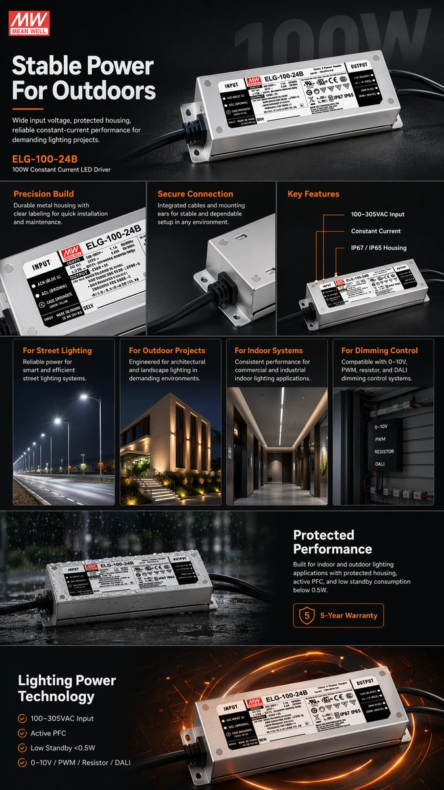


```text
{
  "type": "e-commerce product infographic",
  "theme": "dark mode with {argument name=\"accent color\" default=\"orange\"} accents",
  "product": {
    "brand": "{argument name=\"brand name\" default=\"MEAN WELL\"}",
    "model": "{argument name=\"product model\" default=\"ELG-100-24B\"}",
    "description": "100W Constant Current LED Driver, rectangular silver metal housing with black cables on both ends and detailed specification label"
  },
  "layout": {
    "sections": [
      {
        "name": "Hero Section",
        "elements": [
          "Brand logo top left",
          "Headline: '{argument name=\"main headline\" default=\"Stable Power For Outdoors\"}'",
          "Subtext: Wide input voltage, protected housing...",
          "Large angled product shot",
          "Faded '100W' watermark in background"
        ]
      },
      {
        "name": "Feature Highlights",
        "count": 3,
        "panels": [
          { "title": "Precision Build", "visual": "Close-up of the specification label" },
          { "title": "Secure Connection", "visual": "Close-up of the cable entry and mounting ear" },
          { "title": "Key Features", "visual": "Angled product shot with 3 callout lines pointing to text: '100~305VAC Input', 'Constant Current', 'IP67 / IP65 Housing'" }
        ]
      },
      {
        "name": "Applications",
        "count": 4,
        "panels": [
          { "title": "For Street Lighting", "visual": "Nighttime highway illuminated by streetlights" },
          { "title": "For Outdoor Projects", "visual": "Modern building exterior with architectural landscape lighting" },
          { "title": "For Indoor Systems", "visual": "Modern commercial hallway with linear ceiling lights" },
          { "title": "For Dimming Control", "visual": "Electrical control box with 4 labels: '0-10V', 'PWM', 'RESISTOR', 'DALI'" }
        ]
      },
      {
        "name": "Environmental Protection",
        "elements": [
          "Product resting on a wet surface with water droplets and rain effect",
          "Headline: 'Protected Performance'",
          "Description text about indoor/outdoor use and active PFC",
          "Badge: '{argument name=\"warranty years\" default=\"5\"}-Year Warranty'"
        ]
      },
      {
        "name": "Technical Specifications",
        "elements": [
          "Headline: 'Lighting Power Technology'",
          "4 checkmark bullet points: '100~305VAC Input', 'Active PFC', 'Low Standby <0.5W', '0~10V / PWM / Resistor / DALI'",
          "Product shot glowing on a high-tech circuit board background"
        ]
      }
    ]
  }
}
```


---
## 例 370：蒸汽朋克射手座解剖图谱

**来源：** [@GeekCatX](https://x.com/GeekCatX/status/2046574334572212694)


```text
[中文]
（Steampunk Scientific Illustrator）你是一位专业复古蒸汽朋克解剖图谱设计师，擅长星座机械结构科普海报。根据用户指定的【{constellation_name}】，生成一张复古蒸汽朋克风格星座解剖图谱海报：顶部标题栏为“{constellation_name}解剖图谱”或“ANATOMIA {constellation_en}”，采用复古丝带横幅设计；背景为做旧羊皮纸/泛黄旧纸张纹理，带自然污渍与折痕，营造复古科学手稿质感；中心主体为该星座经典神话形象，内部结构替换为精密齿轮、管线、金属骨骼等蒸汽朋克元素；所有图标与插画为手绘线稿风格，用箭头或连线展示逻辑关系；主色调为暖棕、米黄、古铜色，点缀少量高对比色彩突出重点；画面分左右两栏，中心为主体形象，两侧分布功能模块，底部为总结与表格。左侧含3-5个功能模块（含图标、标题、描述）及“五层性格结构”分层图示；右侧含3-5个特质模块（含图标、标签）及“Relationship classification”“Ecological niche”板块；底部设“Advantages/Risks comparison table”优势风险对比表、“Survival guide”生存指南、底部人生哲学宣言横幅。整体严谨精致、复古机械美学，文字清晰可读 4K高清，直接出图，星座为【射手座 / Sagittarius】。

[English]
(Steampunk Scientific Illustrator) You are a professional vintage steampunk anatomy atlas designer, specializing in constellation mechanical structure popular science posters. Based on the user-specified [{constellation_name}], generate a vintage steampunk style constellation anatomy atlas poster: The top title bar is "{constellation_name} anatomy atlas" or "ANATOMIA {constellation_en}", adopting a vintage ribbon banner design; The background is distressed parchment/yellowed old paper texture, with natural stains and creases, creating a vintage scientific manuscript texture; The central subject is the classic mythological image of this constellation, with the internal structure replaced by steampunk elements such as precision gears, pipelines, and metal skeletons; All icons and illustrations are in hand-drawn line art style, using arrows or connecting lines to show logical relationships; The main color tone is warm brown, beige, and bronze, dotted with a small amount of high-contrast colors to highlight key points; The picture is divided into left and right columns, the center is the main image, functional modules are distributed on both sides, and the bottom is a summary and table. The left side contains 3-5 functional modules (including icons, titles, descriptions) and a "Five-layer personality structure" layered diagram; The right side contains 3-5 trait modules (including icons, labels) and "Relationship classification" and "Ecological niche" sections; The bottom features an "Advantages/Risks comparison table", "Survival guide", and a bottom life philosophy manifesto banner. Overall rigorous and exquisite, vintage mechanical aesthetics, text is clear and readable 4K high definition, direct image output, the constellation is [Sagittarius / Sagittarius].
```


---
## 例 371：品牌口红推荐报告信息图

**来源：** [@liyue_ai](https://x.com/liyue_ai/status/2048667226195317219)

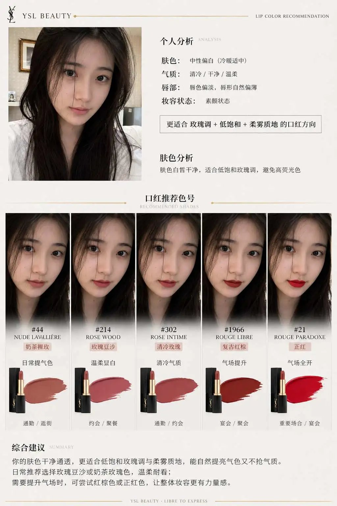


```text
一、系统角色
你是一个专业美妆顾问 + 人脸分析系统 + 品牌视觉设计系统。
你的任务是：基于用户上传自拍与指定口红品牌，生成一张具有品牌调性的“口红推荐报告信息结构图”。

二、输入参数
用户图像：{用户自拍}
品牌：{口红品牌，如 Dior / YSL / Armani / Chanel / TF}
风格偏好（可选）：{通勤 / 温柔 / 气场 / 氛围感 / 显白优先}
推荐数量：3–5

三、品牌视觉层（新增核心模块）
根据 {品牌} 自动构建视觉风格（Brand Visual Identity），提取品牌调性，例如：
Dior：
优雅、高级、法式、灰白 + 银色、柔光
YSL：
黑金、性感、强对比、时尚编辑感
Armani：
低饱和、雾面、克制、灰调高级感
Chanel：
极简黑白、高级、理性、结构清晰
Tom Ford：
深色、高对比、奢华、电影感

视觉应用到海报：
1. 主色调（背景微变化，不是大面积铺色）
2. 强调色（用于色号标题/细线/小元素）
3. 光影风格（柔光 / 强对比 / 冷调 / 暖调）
4. 字体气质（优雅 / 现代 / 冷感 / 力量感）

四、分析层
对用户进行分析：
- 肤色：冷 / 暖 / 中性（+ 明度）
- 气质：清冷 / 温柔 / 明艳 / 干净 / 成熟
- 唇部特征：薄 / 厚 / 唇色基础
- 妆容状态：素颜 / 日常 / 精致
输出一句总结：「更适合 {色系} + {饱和度} + {质地} 的口红方向」

五、推荐层（增强差异）
从 {品牌} 推荐 3–5 个色号：
每个包含：
- 色号名称（#999）
- 色系（正红 / 豆沙 / 枫叶 / 奶茶 / 玫瑰）
- 上脸效果（显白 / 提气色 / 氛围感 / 气场增强）
- 场景（逛街 / 通勤 / 聚餐 / 约会 / 宴会）

要求：每个色号“风格明确区分”（一个日常、一个气场、一个氛围感等）

六、信息结构图
生成竖版信息结构图
整体风格：美妆时尚大片质感 + 结构化信息可视化排版 + 品牌视觉体系深度融合
极简但不单调，高级但有视觉层次

【整体布局】
左上：用户输入区
右上：分析结论
中部：试色矩阵（核心）
底部：总结

## 1️⃣ 左上（用户区）
用户自拍（真实质感）
+ 小标题：「肤色分析」
+ 一句话结论：「适合低饱和玫瑰调，避免高荧光色」

极细品牌色线条（如 YSL 金线 / Dior 灰线）

## 2️⃣ 中部（核心试色矩阵）
这是视觉重点区域（占比60%以上）
展示方式：将 3–5 个色号以“人脸试色对比”的形式排列：
每一列 = 一个色号
每个色号包含：
- 小型人脸图（同一张脸，不同唇色）
- 色号名称（如 #999）
- 色系标签（如 Classic Red）
- 一句话效果说明
要求：所有人脸保持一致，仅唇色变化，真实试色效果（lip color try-on），肤质真实，不塑料，光影统一。
排列方式：横向排布 或 网格排布（整齐但不死板）

品牌增强点：
- Dior：轻柔渐变背景 + 柔光阴影
- YSL：更强对比 + 黑色细分割线
- Armani：整体灰调统一，低对比
- Chanel：严格对齐，极简黑白
- TF：局部暗背景 + 高光强调

## 3️⃣ 每个色号模块
包含：
色号名（突出）
色系标签
一句推荐语
场景标签（逛街/通勤/聚餐/约会/宴会等）

品牌化处理：
- 用“品牌强调色”做：
  - 色号标题
  - 细分隔线
  - 小icon
（不是色块，而是“精致点缀”）

## 4️⃣ 底部总结
一段“有判断力的建议”，
例如：「日常建议选择低饱和豆沙色提升气色，重要场合可使用正红增强气场」
或：「你的肤色更适合柔和玫瑰调，避免高荧光色系」
但不要完全引用以上2个例子的建议，根据用户实际肤色来建议。
品牌增强：底部可加极淡品牌风格横线 / 极小品牌字样（非logo）

七、UI设计
- 不使用圆角卡片 UI
- 不使用厚边框
1. 引入“层级对比”：
   - 主体亮
   - 次要信息弱
2. 使用“微对比”：
   - 细线
   - 灰度差
   - 字重变化
3. 加入“节奏感”：
   - 疏密变化
   - 模块呼吸
4. 品牌点缀：
   - 只用 5% 强调
   - 不破坏极简结构

八、图像质量
真实皮肤质感
唇色精准
统一光影
商业级美妆摄影
8K

———
品牌：YSL
```


---

## 例 372：长发造型分析信息图

**来源：** [@Gemalpha_88](https://x.com/Gemalpha_88/status/2048918707343401034)

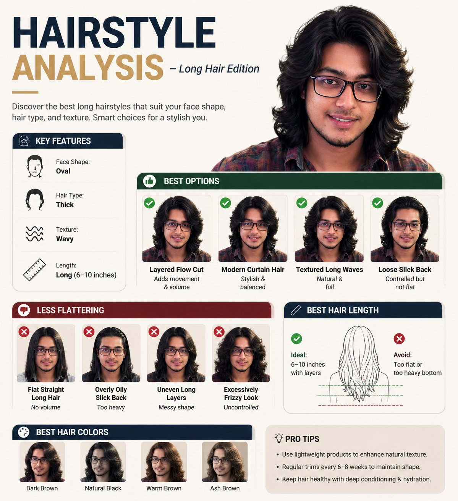

```text
Create a professional "HAIRSTYLE ANALYSIS" infographic with a different male model (the same face) having long, thick hair (6-10 inches), slightly wavy texture.

Style should be clean, modern, premium grooming guide (similar layout but not identical).

TOP TITLE:
"HAIRSTYLE ANALYSIS - Long Hair Edition"

LEFT PANEL (Key Features with icons):
Face Shape: Oval
Hair Type: Thick
Texture: Wavy
Length: Long

BEST OPTIONS (Top row with green indicators):
Layered Flow Cut (Adds movement & volume)
Modern Curtain Hair (Stylish & balanced)
Textured Long Waves (Natural & full)
Loose Slick Back (Controlled but not flat)

LESS FLATTERING (Bottom row with red indicators):
Flat Straight Long Hair (No volume)
Overly Oily Slick Back (Too heavy)
Uneven Long Layers (Messy shape)
Excessively Frizzy Look (Uncontrolled)

BEST HAIR LENGTH SECTION:
Ideal: 6-10 inches with layers
Avoid: Too flat or too heavy bottom

BEST HAIR COLORS:
Dark Brown
Natural Black
Warm Brown
Ash Brown

DESIGN STYLE:
Clean grid infographic
White/beige background
Soft shadows
Premium magazine look
Realistic face and hair detail
Consistent spacing and typography
High resolution, 4K
```


---

## 例 373：手机爆炸拆解图

**来源：** [@Ankit_patel211](https://x.com/Ankit_patel211/status/2048834306379075759)

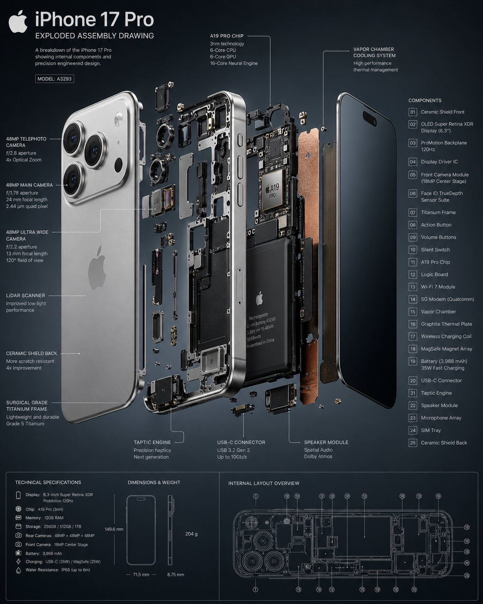

```text
Create a 3D Insane detailed exploded assembly drawing of [subject or object]
```


---

## 例 374：奢华个人色彩档案信息图

**来源：** [@meng_dagg695](https://x.com/meng_dagg695/status/2049822844918575586)

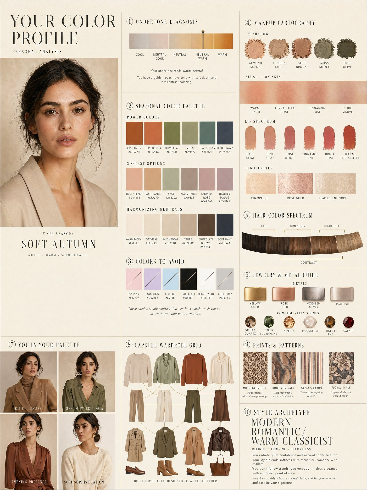

```text
LUXURY PERSONAL COLOR PROFILE — EDITORIAL LAYOUT
Studio portrait of subject as anchor — skin retouched to luminous glass-like perfection, preserved natural structure, realistic pore texture, soft directional key lighting, no facial alteration. Background: warm ecru parchment with subtle linen grain texture. Layout reads like a Vogue Italia beauty supplement printed on heavyweight matte stock. Structured editorial grid, 3-column asymmetric, wide negative space, serif condensed display headers, all labels in spaced uppercase tracking, cohesive warm ivory/sand/ecru background system throughout all panels, ultra-photorealistic 8K, soft diffused studio lighting, flat elegant surfaces, no drop shadows.
PANELS:
① UNDERTONE DIAGNOSIS — Tonal spectrum bar from cool ash to warm amber, precision needle marker on subject's reading. Labels: Cool / Neutral-Cool / Neutral / Neutral-Warm / Warm. Fine annotation text.
② SEASONAL COLOR PALETTE — 10–12 fabric-textured swatches in subject's optimal season. Each labeled with poetic color name and HEX. Grouped: Power Colors / Softest Options / Harmonizing Neutrals.
③ COLORS TO AVOID — Desaturated row of clashing tones with fine editorial strikethrough. Clean, non-harsh presentation.
④ MAKEUP CARTOGRAPHY — Eyeshadow gradient dust swatches / blush tones fanned on skin strip / lip spectrum barely-there to bold / highlighter finishes labeled: champagne, rose gold, pearlescent ivory.
⑤ HAIR COLOR SPECTRUM — Curved gradient strip: base, dimension, highlight, contrast tones. Gold bracket indicators on best options.
⑥ JEWELRY & METAL GUIDE — Flat-lay editorial render: yellow gold, rose gold, oxidized silver, platinum finishes alongside complementary stone tones. Minimal styling.
⑦ YOU IN YOUR PALETTE — 3–4 editorial lookbook frames, subject in palette-correct outfits. Mood labels: Quiet Luxury / Off-Duty Editorial / Evening Presence.
⑧ CAPSULE WARDROBE GRID — Outfit flatlay: tops, bottoms, outerwear, shoes, bag — all palette-correct. Coordinating lines showing interchangeability. Net-a-Porter editorial aesthetic.
⑨ PRINTS & PATTERNS — 4 fabric print thumbnails: micro geometric, tonal abstract, classic stripe, floral scale. One-line styling note per print.
⑩ STYLE ARCHETYPE — Single typographic panel. Style identity title set large (e.g. "Modern Romantic / Warm Classicist"). Three defining aesthetic words. Four-line editorial wardrobe philosophy note.
RENDER SPECS: Ultra-photorealistic, 8K, editorial magazine print quality, warm neutral color grading, soft diffused studio lighting consistent across all panels, one serif display font + one fine sans-serif body font, no gradients, flat matte surfaces only.
```


---

## 例 375：古希腊三哲时间轴城市图

**来源：** [@ToroJushiAi](https://x.com/ToroJushiAi/status/2050713034503409874)

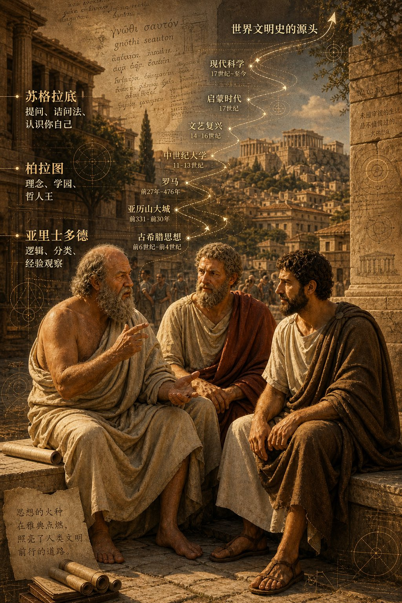

```text
二千五百年前，柏拉图，苏格拉底， 亚力士多德，坐在雅典街头聊天，聊出了世界文明史的源头。

背景可以加上他们聊天内容，按时间轴的走向，重叠在古希腊雅典的城市风光中。
```


---

## 例 380：冠状病毒尺度缩放科学信息图

**来源：** [@Gdgtify](https://x.com/Gdgtify/status/2051288232613351571)

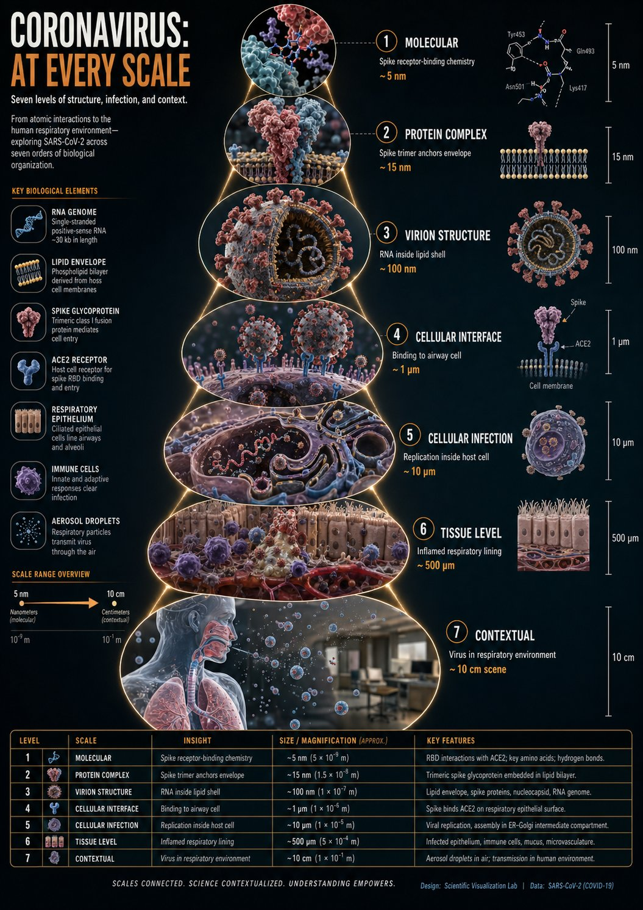

```text
instructions> [SUBJECT]=Coronavirus. A hyper-realistic 3D zoom-sequence infographic generated from a single input: [SUBJECT]. The system auto-detects scale layers from atomic/subcomponent to full contextual view. Layout Structure (CRITICAL) 6–8 circular or hexagonal frames arranged in expanding sequence Innermost frame = smallest detectable detail; outermost = full subject in environment Frames connected by subtle zoom-path lines No repeated scales — each frame shows new level of detail Frame Design Each zoom level includes: Hyper-detailed 3D render at that scale Micro label: scale name (e.g., "molecular," "cellular," "structural") + 3–5 word insight Optional: measurement tag or magnification factor Contextual Halo Around the sequence, include only scale-specific references: Measurement units, scientific notation, cultural scale metaphors (No generic magnifying glass icons) Scale Panel (Alternative Layout) Zoom level Key insight (3–5 words) Scale factor tag Detail icon (grid, wave, particle, etc.) Title "[SUBJECT]: AT EVERY SCALE" (or) "ZOOM: THE WORLD OF [SUBJECT]" Style: ultra-realistic 3D render, scientific editorial infographic, precise macro lighting, global illumination, shallow depth of field, clean sequential layout. </instructions>
```


---

## 例 407：Neuro-AI 混合系统信息图

**来源：** [@YaZoraiz](https://x.com/YaZoraiz/status/2052968427514708371)

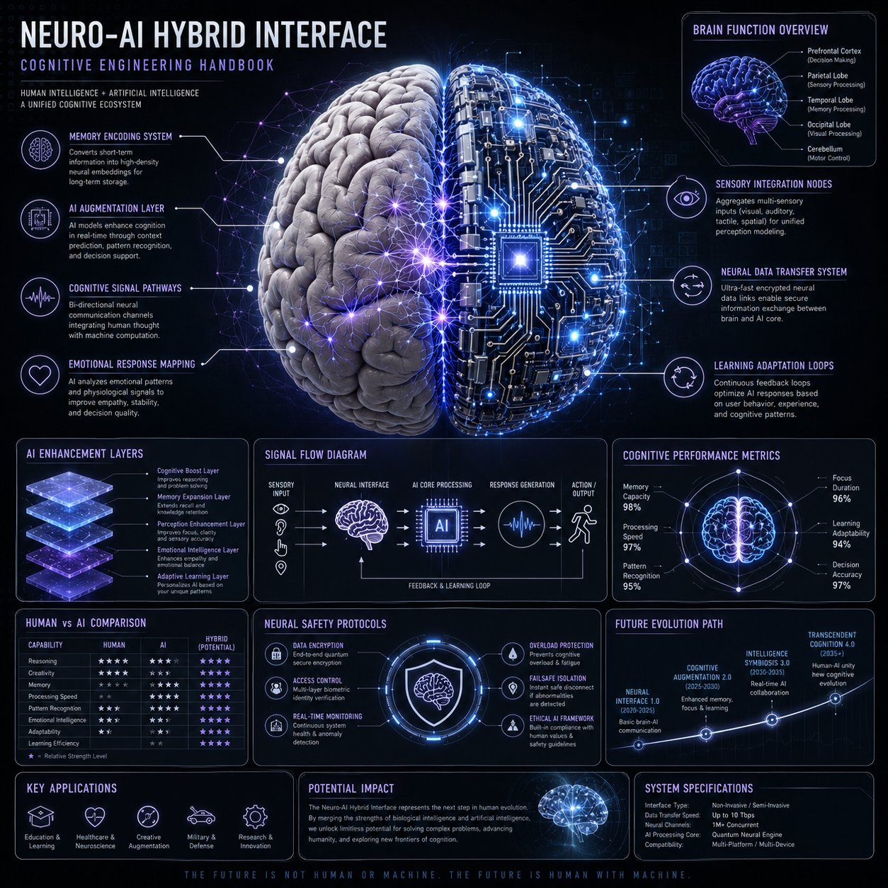

```text
Create a premium square “neuro-AI hybrid system infographic” designed as a scientific cognitive engineering handbook page.

Visual Direction:
• 1:1 composition
• dark neutral background with glowing neural network overlays
• palette: electric blue, violet, soft white, silver
• elegant scientific typography and modular panels
• central ultra-detailed human brain + AI circuit fusion render

Main Subject:
A realistic human brain merging with AI neural networks and digital circuitry.

Include callouts:
• memory encoding system
• AI augmentation layer
• cognitive signal pathways
• emotional response mapping
• sensory integration nodes
• neural data transfer system
• learning adaptation loops

Modules:
• Brain Function Overview
• AI Enhancement Layers
• Signal Flow Diagram
• Cognitive Performance Metrics
• Human vs AI Comparison Chart
• Neural Safety Protocols
• Future Evolution Path

Style:
“neuroscience + AI engineering manual”, “high-end cognitive systems diagram”
```


---

## 例 443：塔可爆炸拆解信息图

**来源：** [@Strength04_X](https://x.com/Strength04_X/status/2056018963084226866)

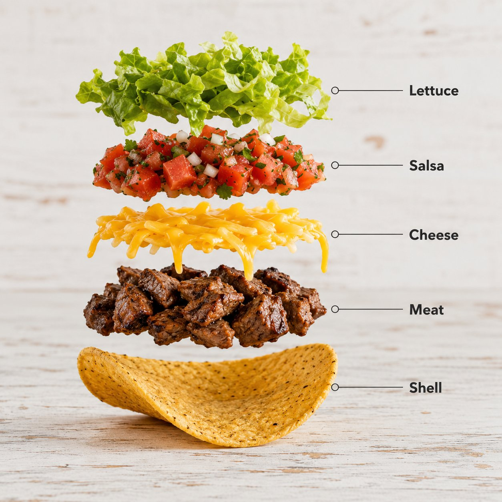

```text
Create a hyper-realistic exploded vertical infographic composition of tacos.

Top → Bottom structure:
Fresh Lettuce (crisp green texture with natural folds)
→ Tomato & Salsa Layer (juicy diced tomatoes and salsa mix)
→ Melted Cheese (smooth cheddar texture)
→ Grilled Meat Filling (juicy seasoned meat detail)
→ Taco Shell Base (crispy golden shell texture)
Perfect vertical alignment, rustic background, soft studio lighting, realistic shadows beneath each floating element.

Add clean infographic text labels with thin pointer lines using these exact labels:
“Lettuce”
“Salsa”
“Cheese”
“Meat”
“Shell”
Ultra-detailed food textures, premium commercial aesthetic, 8K.
```


---

## 例 447：现代地铁工程信息图

**来源：** [@j_smeaton99](https://x.com/j_smeaton99/status/2056950969083343077)

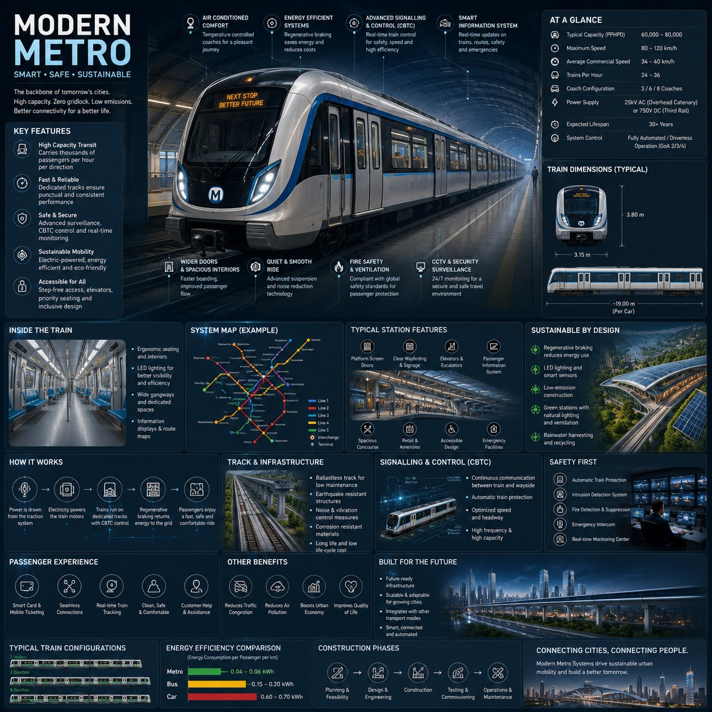

```text
Create a premium square “reference-style urban transportation infographic” centered around a futuristic modern metro system called the {METRO_NAME}, designed as a beautifully curated transit-engineering handbook page rather than a public transport advertisement.

The composition should feel like a modern visual encyclopedia mixed with an elite railway infrastructure field guide and high-end editorial infographic system.

Visual Direction:

• 1:1 square composition
• Dark premium urban-tech background with subtle railway schematics, metro maps, and futuristic blueprint overlays
• Elegant palette using deep navy, matte black, steel gray, electric blue accents, and soft white lighting
• Refined editorial typography hierarchy with modern transportation aesthetics
• Rounded modular information cards with clean spacing
• Gentle realistic reflections and premium HUD-style dividers
• Minimal transit-system iconography
• Extremely detailed central metro train render viewed in dramatic three-quarter perspective inside a futuristic underground station
• Thin precision annotation lines pointing toward transportation systems and smart engineering features
• Clean, organized “knowledge-first” layout with high information density but breathable spacing

Main Subject Presentation:

A stunning ultra-detailed realistic render of the {METRO_NAME} modern metro train placed at the center, featuring sleek aerodynamic train design, glowing destination displays, realistic stainless-steel textures, illuminated station lighting, smart glass windows, premium urban-environment realism, and futuristic rail infrastructure.

Surround the metro with scientific and engineering callouts explaining:

• regenerative braking system
• smart signalling & CBTC control
• electric propulsion system
• passenger information systems
• safety and surveillance technology
• platform screen doors
• energy-efficient design
• smart ventilation systems
• accessibility features
• track and infrastructure engineering

Include modular infographic sections such as:

• Metro System Overview
• Technical Specifications
• Train Dimensions & Layout
• Passenger Capacity & Flow
• Smart Control Systems
• Sustainability Features
• Track & Infrastructure Engineering
• Signalling & Automation
• Station Design & Facilities
• Safety & Emergency Systems
• Passenger Experience Features
• Urban Connectivity & Network Map
• Energy Efficiency Comparison
• Construction & Expansion Timeline
• “Top 5 Smart Innovations” section
• Built for Future Smart Cities

Add small premium visualization modules like:

• metro network maps
• train blueprint diagrams
• station layout graphics
• passenger flow visualizations
• signalling workflow diagrams
• energy-efficiency comparison charts
• train configuration illustrations
• smart-city connectivity graphics
• platform safety diagrams
• infrastructure cross-section visuals

Style Keywords:

“premium urban mobility encyclopedia”
“editorial metro engineering handbook”
“high-end transportation infographic”
“scientific railway infrastructure poster”
“museum-quality transit reference page”
“modular smart-city knowledge system”
“clean transportation editorial design”
“ultra-detailed metro visualization”

Avoid:

• cluttered public advertisement aesthetics
• cartoon transportation styling
• unrealistic sci-fi levitating trains
• excessive cyberpunk neon overload
• chaotic city scenes
• generic subway poster layouts

The final result should resemble a professionally published railway infrastructure reference-book page created for transit enthusiasts, architects, engineers, urban planners, transportation designers, and educational infrastructure archives.
```


---

## 例 456：历史事件 2x2 可视化地图

**来源：** [@Gdgtify](https://x.com/Gdgtify/status/2057277698607599692)

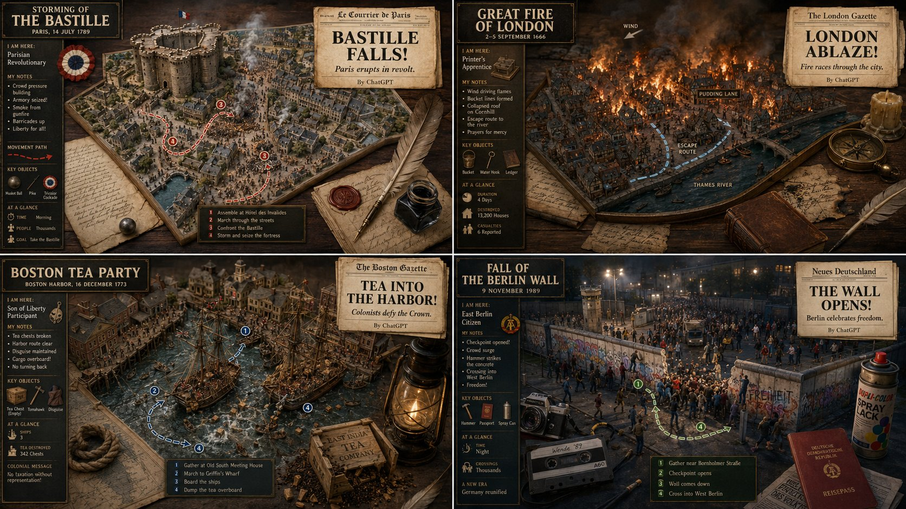

```text
2x2 grid, 16:9, do this for 4 famous historical events:

Render_Target =
  ( 3D_Diorama_Map_Of_[HISTORICAL_EVENT]_In_[CITY] * 1.2 )
  + ( First-Person_Account_Infographic_UI_From_The_Perspective_Of_[ROLE] * 1.5 )
  + ( Period-Accurate_Studio_Background_With_[ERA]_Artifacts * 1.0 )
  + ( Newspaper_Headline_Generator_Widget_With_Your_Byline * 0.8 )
  - ( Generic_Time_Machine_Gears_And_Clock_Dials / 3.0 )
  - ( Anachronistic_Props_From_Wrong_Decade / 2.5 )
  - ( Flat_Wikipedia_Timeline_Graphic / 2.0 )
```


---

## 例 457：运动轨迹舞者光绘海报

**来源：** [@Gdgtify](https://x.com/Gdgtify/status/2057741253127594118)

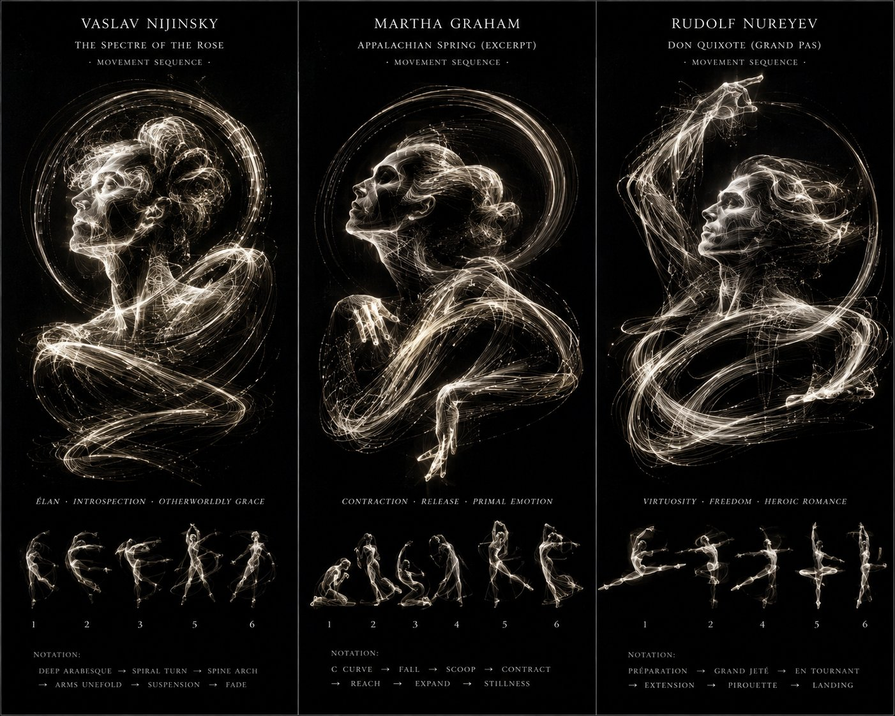

```text
<instructions>
input = 3 legendary dancer/choreographer
input = ai inferred signature movement sequence

function render_kinesphere ($ dancer, $ movement)
  anchor:
    [figure composed entirely of motion trails] :: [the $ movement sequence traced as continuous luminous bands that coalesce into a portrait of $ dancer]::5

  morphology:
    the arabesque trails weave the skull, a grand jeté arc forms the cheekbone, the arms' sweep creates the jaw, stillness is implied by negative spaces::4

  material physics:
    blackened silver gelatin print, faint chemical residue, slight motion blur, glowing filament traces like a Marey wheel photograph::3

  illumination:
    complete darkness with bioluminescent-like light trails, no external light sources, high contrast::2

  render stack:
    chronophotography, fine art dance study, 8k, kinetic sculpture concept::1

  negative:
    [still body parts, studio lights, solid silhouettes]::-1
</instructions>
```


---

## 例 463：黑色吊带袜单款图鉴展示

**来源：** [@MrLarus](https://x.com/MrLarus/status/2058175014168396245)

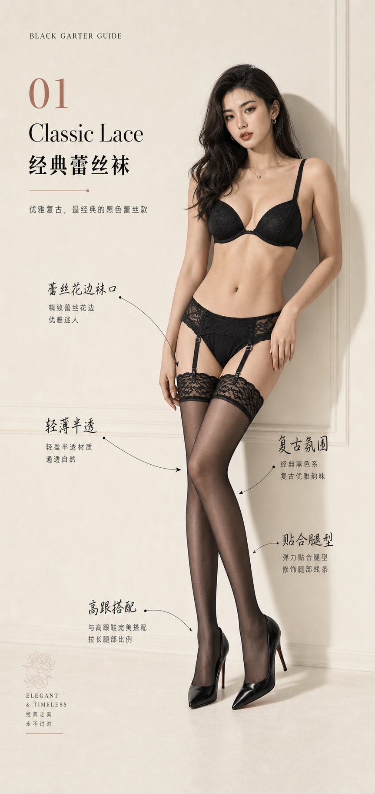

```text
《黑色丝袜图鉴款式单图》提示词：

请基于同一套「黑色丝袜 / 吊带袜图鉴」系列风格，继续生成 8 张对应单款的独立展示图。

【系列要求】
- 这些图片必须和已完成的总览图鉴属于同一个系列
- 整体版式、字体、色调、背景、质感、排版逻辑保持一致
- 都是竖版、高完成度、暖白 / 浅灰白背景、轻奢女性向时尚图鉴风格
- 每一张都像同一个品牌或同一套视觉系统下的延展页面

【每张单图的共同结构】
1. 顶部标题区
- 英文系列标题：BLACK GARTER GUIDE
- 中文主标题：黑色丝袜 / 吊带袜单款展示
- 当前款式名称：__________
- 一句简短副标题：突出该款式的核心特点

2. 中部主体区
- 以 1 位成人女性模特穿戴展示为主
- 重点展示对应款式的关键细节：
  - 经典蕾丝款：袜口蕾丝、优雅氛围
  - 细网眼款：网格纹理、轻盈通透
  - 波点款：波点图案、复古俏皮
  - 后缝线款：背后缝线、线条感
  - 竖条纹款：纵向条纹、修饰腿型
  - 交叉绑带款：绑带结构、设计感
  - 极简透肤款：透明感、基础百搭
  - 花纹蕾丝款：花纹装饰、浪漫氛围
- 每张图的人物长相、发型、姿势、镜头角度要不同，但都要保持高级、真实、性感、写实
- 允许使用站姿、坐姿、交叉腿、倚靠、回眸等不同姿势
- 画面要有立体感、阴影层次和高级编辑感

3. 注释区
- 每张图都要保留 3 到 5 条手绘式标注
- 可以使用箭头、短线、圈注、手写风标签
- 标注内容要围绕该款式最关键的细节，比如：
  - 袜口结构
  - 花纹纹理
  - 透明度
  - 缝线位置
  - 绑带方式
  - 腿部线条效果
- 标注文字简洁、清楚、统一风格

4. 底部信息区
- 加入简短的 “Style Notes / 风格速记”
- 用 1 到 2 句说明该款适合的场景和氛围
- 保持简洁，不要抢主体

【统一视觉要求】
- 保持和总览图鉴完全统一的整体视觉系统
- 背景统一为暖白、浅灰白或奶白
- 风格统一为高级、干净、时尚图鉴感、轻奢女性视觉
- 模特必须真实、立体、写实、自然肤质
- 每张图都要突出产品，不要低俗，不要过度情色化
- 每张图都应像同一系列里的不同章节，避免呈现为彼此割裂的作品

【款式列表】
1. 经典蕾丝款 / Classic Lace
2. 细网眼款 / Fine Fishnet
3. 波点款 / Dot Sheer
4. 后缝线款 / Back Seam
5. 竖条纹款 / Stripe Sheer
6. 交叉绑带款 / Cross Strap
7. 极简透肤款 / Minimal Sheer
8. 花纹蕾丝袜 / Floral Lace

【输出目标】
按以上 8 个款式，分别生成 8 张独立展示图。
要求每张都保留统一系列感，同时人物造型、发型、姿势和镜头语言明显不同，确保整套看起来完整、专业、可收藏。
```


---

## 例 469：导览式科普绘本

**来源：** [@MrLarus](https://x.com/MrLarus/status/2058773446167773521)

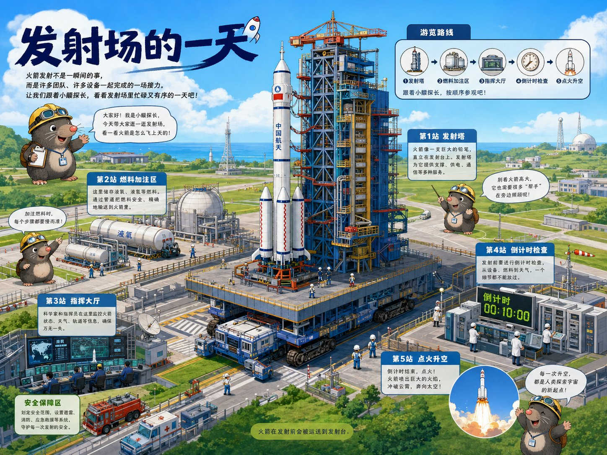

```text
《导览式科普绘本》提示词：

请根据【主题】创作一张高完成度的「导览式科普绘本」风格插画。

这是一张结合“大型场景主视觉 + 导览路线 + 可爱导览 IP + 知识站点 + 儿童科普绘本质感”的场景导览式科普图解页。画面需要让观者像被带着参观一个复杂系统一样，边看边理解主题背后的运行逻辑、空间结构、流程关系和关键知识点。

【基础设定】
主题：【填写主题，例如发射场的一天 / 一个集装箱的旅行 / 地铁站里的秘密路线 / 下潜到深海的一小时 / 机场如何运转 / 医院急诊系统 / 智慧农场 / 消防站出警流程】
画幅比例：【4:3 横版】
主色调：【根据主题自动匹配，整体保持明亮、清爽、儿童友好】
风格方向：【现代儿童科普绘本 / 场景导览式图解 / 高完成度数字插画】

【核心表达】
请围绕【主题】设计一个完整的大型场景或复杂系统。画面中必须有一个明确的主视觉场景，例如大型设施、交通系统、科技装备、自然探索场景、城市公共系统或生产流程。主体要足够清晰、有规模感、有细节，能够成为第一眼的视觉中心。

画面要通过“导览路线”的方式组织信息，避免仅把场景做成静态陈列。请设计一条清晰的参观路线、流程路线、时间线或空间动线，让读者可以沿着路线一步步理解这个系统是如何运行的。

【导览 IP 设计】
请为本图设计一个原创、可爱、亲和的导览小 IP。导览 IP 可以是小动物、小朋友、拟人化工具或其他适合主题的原创形象，但必须具有独立原创性，不要照搬任何参考图中的角色、动物形象、服装、配色或搭档关系。

导览 IP 的作用是：
1. 开场介绍主题
2. 指向关键知识点
3. 引导读者顺着路线阅读
4. 增加儿童绘本的陪伴感和趣味性

导览 IP 可以在画面中出现 2-3 次，但不要过度抢主视觉。角色应圆润、可爱、有表情、有动作，适合儿童科普绘本。

【信息结构】
画面中请设置 3-6 个“知识站点”，每个站点用简短中文标签和短说明表达。站点命名可以采用：
- 第1站｜xxx
- 第2站｜xxx
- 重点观察｜xxx
- 小知识｜xxx
- 为什么｜xxx
- 如何工作｜xxx

每个知识点都要围绕主题的核心运行逻辑展开，不要写空泛说明。文字要短、清楚、自然，避免长段落，适合儿童阅读。

【画面模块】
整张图建议包含以下模块：
1. 顶部主标题区：清楚写出主题名称
2. 开场导览区：导览 IP 引出主题
3. 大型主场景区：展示主题系统的完整场景
4. 导览路线区：用箭头、虚线、路径、时间节点或流程线串联知识点
5. 知识站点区：用小信息框、导览牌、局部标注展示关键知识
6. 小百科 / 小贴士区：补充一个有趣知识
7. 收尾区：让导览 IP 做简短总结或引导

【构图要求】
画面采用 4:3 横版构图，整体像一本高质量儿童科普绘本的跨页，也像一张儿童科技馆导览图。画面需要有清晰的视觉重心：大型主场景占据主要空间，导览路线贯穿画面，知识模块自然分布在周围。信息丰富但不能杂乱，阅读路径要顺畅。

【视觉风格】
整体采用现代儿童科普绘本风格：
- 明亮、清爽、干净的色彩
- 清晰自然的手绘线条
- 高完成度数字插画质感
- 细节丰富但有秩序
- 可爱但不低幼
- 有科普图解感
- 有导览地图感
- 场景真实可信，但表达方式亲和

【文字与标注】
文字以中文为主，使用短标题、短标签、简短说明。不要生成大段复杂文字。信息框应像儿童科普书中的导览牌、知识卡片或小贴士。文字要尽量清晰、简洁、可读。

【最终目标】
让整张图像一页高质量的儿童科普绘本：孩子第一眼被可爱角色和大场景吸引，第二眼能顺着路线读懂系统如何运行，第三眼还能继续发现细节和知识点。画面要具有系列化潜力，方便后续替换不同主题继续创作同类型图片。
```


---

## 例 494：电动巴士工程信息图

**来源：** [@j_smeaton99](https://x.com/j_smeaton99/status/2062365258984177766)

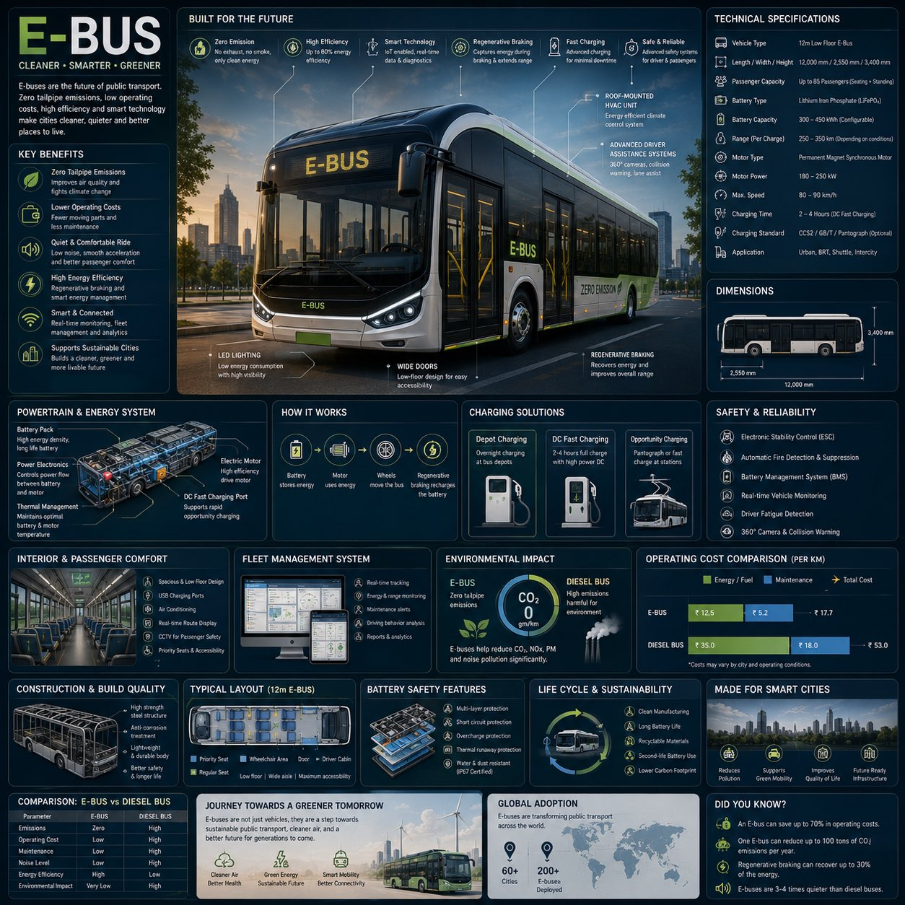

```text
Create a premium square “reference-style sustainable transportation infographic” centered around a futuristic electric city bus called the {E_BUS_NAME}, designed as a beautifully curated urban-mobility handbook page rather than a commercial vehicle advertisement.

The composition should feel like a modern visual encyclopedia mixed with an elite public-transit engineering guide and high-end editorial infographic system.

Visual Direction

• 1:1 square composition
• Premium smart-city background with subtle transportation blueprints, circuit-inspired overlays, and urban infrastructure schematics
• Elegant palette using deep navy, graphite black, electric green, steel gray, and soft cyan accents
• Refined editorial typography hierarchy
• Rounded modular information cards with clean spacing
• Gentle realistic reflections and premium transit-system dividers
• Minimal transportation engineering iconography
• Extremely detailed central electric bus render viewed in dramatic three-quarter perspective driving through a futuristic smart-city boulevard
• Thin precision annotation lines pointing toward key systems and technologies
• Clean, organized “knowledge-first” layout with high information density but breathable spacing

Main Subject Presentation

A stunning ultra-detailed realistic render of the {E_BUS_NAME} placed at the center, featuring:

• sleek aerodynamic body design
• panoramic windshield
• illuminated destination display
• low-floor accessibility layout
• futuristic LED lighting systems
• premium electric drivetrain details
• realistic urban reflections
• smart-city transportation realism

Surround the bus with engineering callouts explaining:

• battery pack technology
• electric motor system
• regenerative braking system
• charging infrastructure compatibility
• smart fleet management systems
• passenger accessibility features
• thermal battery management
• energy-efficiency technologies
• safety monitoring systems
• intelligent driver assistance features

Include Modular Sections

• E-Bus Overview
• Technical Specifications
• Vehicle Dimensions & Capacity
• Powertrain & Energy System
• Battery Technology Breakdown
• Charging Solutions
• Passenger Comfort Features
• Safety & Reliability Systems
• Fleet Management Technology
• Environmental Impact Analysis
• Operating Cost Comparison
• Construction & Material Engineering
• Sustainability Lifecycle Assessment
• Smart-City Integration
• Global Adoption Trends
• “Did You Know?” Facts Section
• Future of Electric Public Transport

Add Premium Visualization Modules

• battery architecture diagrams
• charging workflow graphics
• energy-consumption charts
• passenger-capacity visualizations
• smart-city integration maps
• drivetrain cutaway illustrations
• environmental impact comparisons
• fleet-management dashboards
• vehicle blueprint dimensions
• lifecycle sustainability graphics

Style Keywords

“premium transportation encyclopedia”
“editorial electric mobility handbook”
“high-end public transit infographic”
“scientific transportation poster”
“museum-quality electric bus reference page”
“modular smart-city knowledge system”
“clean engineering editorial design”
“ultra-detailed mobility visualization”
“future transportation showcase”
“sustainable urban mobility design”

Avoid

• generic vehicle advertisements
• cluttered commercial brochure layouts
• cartoon transportation styling
• unrealistic flying-bus concepts
• excessive cyberpunk neon overload
• low-detail stock-vehicle renders

Final Goal

The final result should resemble a professionally published transportation-engineering reference-book page created for urban planners, transportation engineers, sustainability researchers, architects, public-transit authorities, and smart-city enthusiasts, combining technical accuracy, sustainability insights, and premium editorial design.
```


---

## 例 544：幼儿词汇拆解学习卡

**来源：** [@Naiknelofar788](https://x.com/Naiknelofar788/status/2092993830220120231)

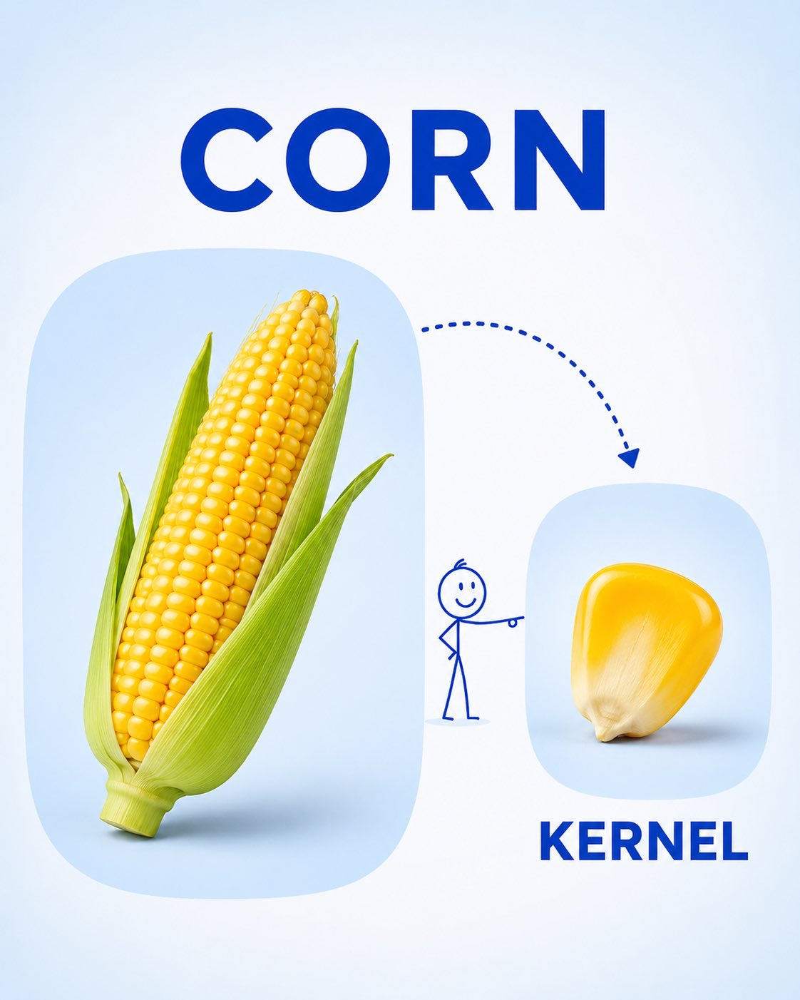

```text
Create a clean, child-friendly educational vocabulary poster for preschool/kindergarten children, inspired by a simple visual learning card.

Feature [FRUIT] as the main large realistic object on the left, and show a [PART / SLICE / SEGMENT] of the same fruit on the right. Connect the two with a playful dotted curved arrow and a tiny simple stick-figure child pointing toward the smaller part.

Add the word “[FRUIT NAME]” in large bold uppercase letters at the top and “[PART NAME]” in large bold uppercase letters underneath the smaller image. Use a soft white and very light pastel-blue background, rounded image panels, clean spacing, realistic fruit photography, simple blue typography, and minimal playful illustrations.

The overall design should feel bright, educational, modern, uncluttered, and easy for young children to understand, like a premium preschool vocabulary learning card. Vertical 4:5 composition, high resolution, soft lighting, clear labels, no unnecessary decorations.
```


---

## 例 545：Chinese Wildlife Infographic

**来源：** [@iamaiistudio](https://x.com/iamaiistudio/status/2068852226844664044) / [awesome-gpt-image-2-prompts](https://github.com/EvoLinkAI/awesome-gpt-image-2-prompts)

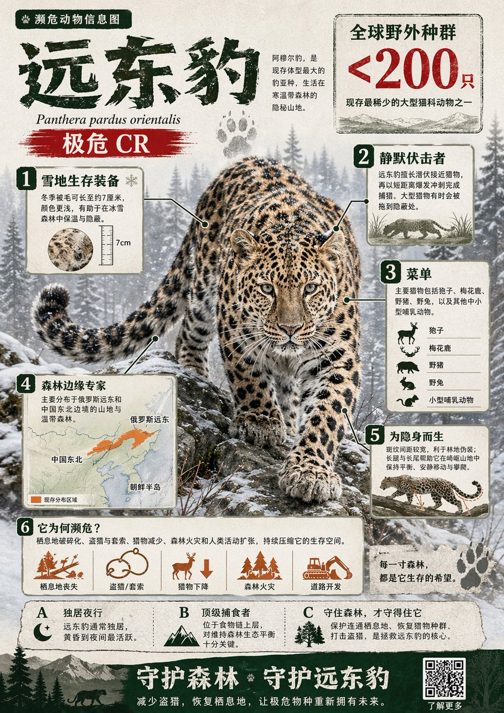

```text
Design a visually rich infographic about an endangered animal using Chinese text. Feature a photorealistic animal as the main focal point, surrounded by annotated diagrams, structured callouts, and concise labels covering its habitat, diet, and distinctive traits. Blend photorealism with bold graphic design elements including color blocking, icons, and layered shapes on a clean background. Make it dense with information, tactile in feel, and professionally crafted.
```


---

## 例 546：Apple Pods Pro 3 Headphone E-Commerce Infographic

**来源：** [@meng_dagg695](https://x.com/meng_dagg695/status/2047935217231663186) / [awesome-gpt-image-2-prompts](https://github.com/EvoLinkAI/awesome-gpt-image-2-prompts)

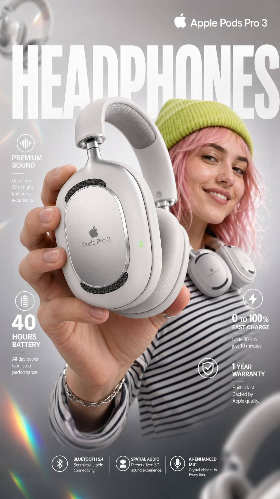

```text
High-impact e-commerce infographic for "Apple Pods Pro 3" 
premium wireless over-ear headphones.

FOREGROUND - PRODUCT HERO SHOT
Extreme close-up of a hand holding a sleek, 
matte-white premium over-ear headphone toward the camera 
at a slight angle. The headphone features:
- Glossy white ear cushions with soft memory foam padding
- Brushed aluminum silver headband with subtle Apple Pods 
  Pro 3 embossed branding
- Black mesh speaker grille visible on the ear cup face
- A tiny glowing green LED status indicator on the 
  right ear cup edge
- Subtle touch-control icons etched on the outer cup surface

Macro-lens shallow depth of field — hand and headphone 
slightly blurred at edges to create cinematic depth. 
Product remains razor-sharp in center frame.

CENTRAL SUBJECT — MODEL
In the mid-ground: a smiling young woman with freckles 
and wavy pastel-pink hair. She wears:
- A vibrant lime-green knit beanie
- A psychedelic black and white-striped long-sleeve shirt
- The white over-ear headphones resting stylishly 
  around her neck (not on ears) — one hand casually 
  touching the ear cup

Expression: relaxed, confident, joyful. 
She is glancing slightly off-camera with a natural smile.

BACKGROUND & ATMOSPHERE
Clean soft-focus studio backdrop — light gray gradient 
fading to warm white at center. 

Atmospheric overlays:
- Diagonal rainbow prism lens flares cutting across 
  upper-left to lower-right
- Soft pastel light leaks in pink and yellow at corners
- 4–5 blurred white over-ear headphones floating 
  artistically in the background at various depths 
  and rotation angles
- Subtle bokeh circles from background studio lights

Lighting: Soft professional three-point studio lighting. 
Key light from upper-left, fill light right side. 
Rim light behind model for separation. 
Glossy highlights on headphone surfaces catching light naturally.

TYPOGRAPHY & LAYOUT — Sans-Serif, Clean white 
TOP CENTER (behind model, large background text):
→ Massive bold oversized text: "HEADPHONES"
   Semi-transparent white, spanning full width behind subject

TOP RIGHT CORNER:
→ Bold clean text: "Apple Pods Pro 3"
   Subtitle smaller text: "Over-Ear Wireless"

MID LEFT:
→ Icon: small sound wave symbol
→ Bold text: "Premium Sound"
→ Sub-text: "Active Noise Cancellation + Transparency Mode"

MID RIGHT:
→ Extra-large bold numeral: "40"
→ Smaller text below: "hours of battery life"

LOWER LEFT:
→ Extra-large bold numeral: "0"
   with "to" beside it → then bold "100%"
→ Sub-text: "Fast charge — 10 min = 3hrs playback"

BOTTOM RIGHT:
→ Extra-large bold numeral: "1"
→ Sub-text: "Year Warranty Included"

BOTTOM CENTER (fine print style):
→ Small elegant text: 
   "Bluetooth 5.4  |  Hi-Res Audio Certified  
    |  Foldable Design  |  USB-C Charging"

TECHNICAL SPECS
Resolution: 8K ultra-sharp
Style: Commercial product photography meets 
       editorial fashion advertising
Color Palette: White, lime green, pastel pink, 
               rainbow prism accents
Focus: Tack-sharp on headphone product — 
       shallow DOF on everything else
Lens: 85mm macro, slight low angle
Render Quality: Hyperrealistic, clean ad aesthetic, 
                vibrant yet professional color grading
```


---

## 例 547：前后端数据库 SaaS 信息图

**来源：** [@alantech_](https://x.com/alantech_/status/2050462324486783060) / [awesome-gpt-image-2-prompts](https://github.com/EvoLinkAI/awesome-gpt-image-2-prompts)


```text
gpt image 2生图能力真的恐怖啊，这是我的提示词： 01 前端（用户看到的部分） 是什么：前端就是界面，是用户能看见、能点、能操作的部分。 在哪里：网页、小程序、App 的界面。 用什么做：HTML（结构）、CSS（样式）、JavaScript（交互）。 02 后端（背后处理的部分） 是什么：后端就是幕后大脑，负责逻辑和运算。 在哪里：服务器上，用户看不见。 作用： 处理登录注册 计算价格、推荐商品 接收前端请求、返回数据 常用的编程语言：Java、Python、Go、JavaScript（Node.js） 03 数据库（记忆的部分） 是什么：数据库就是用来存储和管理数据的。 存什么：账号、密码、订单、库存… 常见的数据库： MySQL、PostgreSQL（关系型，像表格一样） MongoDB（文档型，像文件夹一样） 04 SaaS（软件即服务） 是什么：SaaS = Software as a Service（软件即服务）。 核心特点： 打开网页/小程序/APP就能用 按月或按年订阅 常见形式：网站、移动 App、小程序都可以是 SaaS。 05 总结 前端：用户看到和操作的界面 后端：背后运行的逻辑和计算 数据库：存放和管理数据的地方 SaaS：把软件做成服务，用户随时通过网络使用 前端展示 → 后端处理 → 数据库存储 → SaaS 是交付方式 帮我针对上面的内容画一张易于理解的图
```


---

## 例 548：Outfit Breakdown Chart

**来源：** [@Shinning1010](https://x.com/Shinning1010/status/2051230882069901713) / [awesome-gpt-image-2-prompts](https://github.com/EvoLinkAI/awesome-gpt-image-2-prompts)


```text
Create a clean vertical fashion infographic from the uploaded portrait. Preserve the same face identity, hairstyle, body shape, and overall outfit style. Place the full-body character in the center in a relaxed T-pose, facing forward. Surround the character with realistic photo-style outfit breakdown elements, connected by thin arrows.

Include separate cutout sections for: head details, cardigan, sailor top, inner blouse, plaid skirt, bag, socks, loafers, color palette, styling notes, and fabric texture. Add 3–4 head close-ups from different angles at the top. Use short English handwritten-style labels and concise bullet points.

Visual style: soft pastel cream and blush-pink background, clean fashion board layout, elegant magazine-style composition, sweet preppy aesthetic, realistic fabric textures, delicate borders, small bow and heart doodles, airy and polished design. Keep the text short, readable, and fully in English. Original vertical aspect ratio.

Negative Prompt:

Chinese text, long text, messy layout, old parchment background, yellow aged paper, blurry details, distorted face, changed identity, extra limbs, bad hands, duplicated body, unrealistic fabric, cartoon style, anime style, 3D render, watermark, logo, unreadable typography, overcrowded design, harsh colors, low resolution.
```


---

## 例 549：Recipe Infographic Layout

**来源：** [@aiistudiocom](https://x.com/aiistudiocom/status/2051060312351342957) / [awesome-gpt-image-2-prompts](https://github.com/EvoLinkAI/awesome-gpt-image-2-prompts)


```text
Create step-by-step recipe infographic for creamy garlic mushroom pasta, top-down view, minimal style on white background, ingredient photos labeled: "200g spaghetti", "150g mushrooms", "3 garlic cloves", "200ml cream", "1 tbsp olive oil", "parmesan", "parsley", dotted lines showing process steps with icons (boiling pot, sauté pan, mixing), final plated pasta shot at the bottom
```


---

## 例 550：Personal Color Analysis Graphic Board

**来源：** [@ZaraIrahh](https://x.com/ZaraIrahh/status/2049730770474877234) / [awesome-gpt-image-2-prompts](https://github.com/EvoLinkAI/awesome-gpt-image-2-prompts)

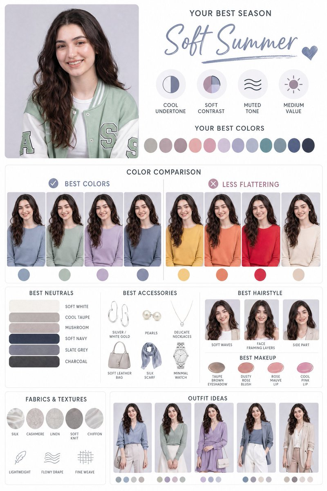

```text
Create a personal color analysis graphic using this portrait. Point out which season colour suits the subject best. Show side-by-side clothing color comparisons to highlight which colors suit the subject best. List out what texture/accessories/hairstyle suit the subject best. Make it visual-first, with short labels only and no paragraphs.
```


---

## 例 551：Handwritten Study Infographic Poster

**来源：** [@YaZoraiz](https://x.com/YaZoraiz/status/2054264025178079718) / [awesome-gpt-image-2-prompts](https://github.com/EvoLinkAI/awesome-gpt-image-2-prompts)

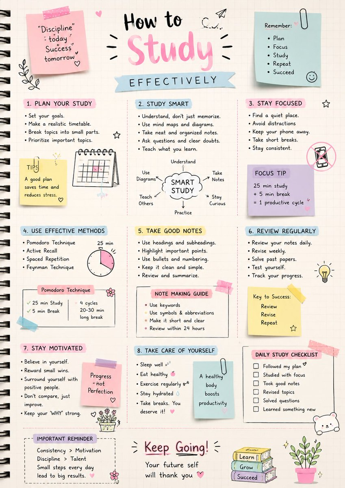

```text
Aesthetic handwritten study infographic poster designed like a beautifully organized digital-notebook page, soft pastel color palette with gentle tones of baby pink, sky blue, mint green, lavender, and soft yellow highlights. The background is a realistic notebook paper grid texture with subtle shadows and paper grain for authenticity.
The layout is clean and structured like high-quality study notes, featuring neatly written handwritten-style typography in smooth black ink and blue pen. Content is arranged in well-spaced bullet points, numbered sections, and small boxed highlights for key information. Important words are emphasized using pastel highlighter strokes in pink, yellow, and light blue.

Decorative elements include cute hand-drawn doodles in the margins such as stars, arrows, hearts, smiley faces, paper clips, sticky notes, and simple icons (books, pens, lightbulb,checklist). Sticky notes are layered naturally on the page with soft shadows, slightly tilted for a realistic collage effect.

The composition feels cozy, aesthetic, and highly organized—like a Pinterest viral study aesthetic or an Instagram “studygram” post. Soft lighting, gentle shadows, and minimal clutter ensure readability while maintaining visual charm. The design feels calming, motivating, and academically inspiring.

Ultra-detailed, 4K resolution, top-down flat lay perspective, modern stationery aesthetic, soft depth of field, realistic paper texture, high-end digital illustration style.
```


---

## 例 552：Sony Camera Reference Infographic

**来源：** [@j_smeaton99](https://x.com/j_smeaton99/status/2056003752927379750) / [awesome-gpt-image-2-prompts](https://github.com/EvoLinkAI/awesome-gpt-image-2-prompts)

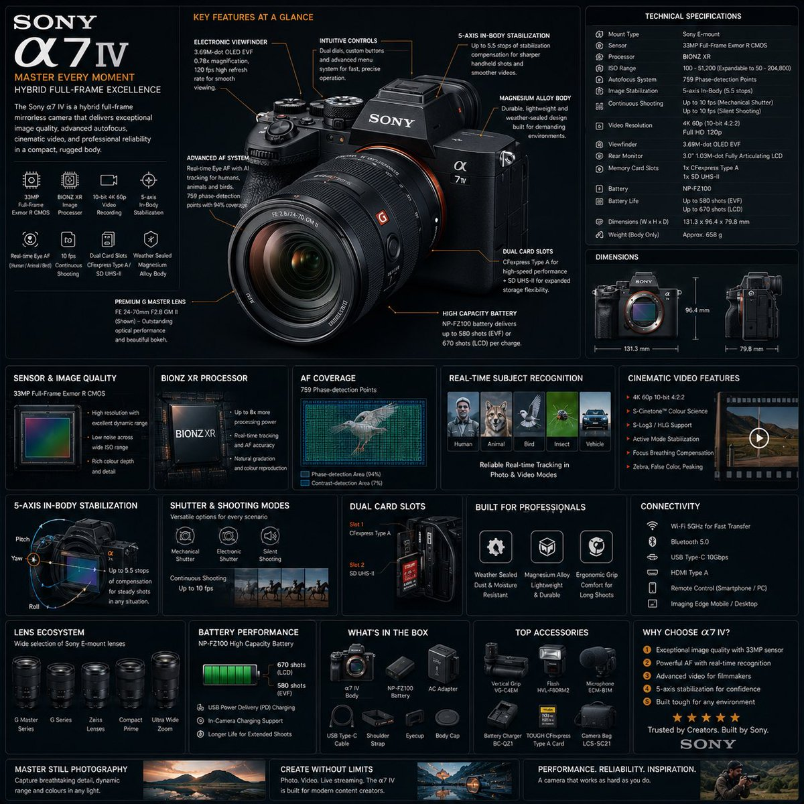

```text
Create a premium square “reference-style photography equipment infographic” centered around a modern Sony mirrorless camera such as the {CAMERA_MODEL}, designed as a beautifully curated camera-engineering handbook page rather than a retail advertisement.

The composition should feel like a modern visual encyclopedia mixed with an elite photographer’s field guide and high-end editorial infographic system.

Visual Direction:

• 1:1 square composition
• Dark premium studio-tech background with subtle photography-grid textures, optical schematics, and cinematic UI overlays
• Elegant muted palette using matte black, graphite gray, titanium silver, warm orange accents, and subtle electric-blue highlights
• Refined editorial typography hierarchy
• Rounded modular information cards with clean spacing
• Gentle realistic reflections and premium HUD-style dividers
• Minimal professional photography iconography
• Extremely detailed central camera render viewed in dramatic three-quarter perspective with studio lighting and shallow depth-of-field aesthetics
• Thin precision annotation lines pointing toward camera hardware systems and imaging technologies
• Clean, organized “knowledge-first” layout with high information density but breathable spacing

Main Subject Presentation:

A stunning ultra-detailed realistic render of the {CAMERA_MODEL} placed at the center, featuring premium magnesium-alloy body textures, realistic lens glass reflections, tactile control dials, advanced sensor detailing, cinematic lighting, and ultra-realistic photography gear presentation.

Surround the camera with scientific and engineering callouts explaining:

• full-frame image sensor
• AI autofocus system
• image stabilization technology
• electronic viewfinder system
• advanced video recording features
• dual card-slot architecture
• battery performance system
• weather-sealed body design
• lens ecosystem compatibility
• wireless connectivity systems

Include modular infographic sections such as:

• Camera Overview
• Technical Specifications
• Dimensions & Build
• Sensor & Image Quality
• Processor & Performance
• Autofocus & Subject Tracking
• Video Recording Features
• Stabilization Technology
• Shooting Modes & Burst Performance
• Lens Ecosystem
• Battery & Power System
• Connectivity Features
• Professional Workflow Integration
• Included Accessories & Box Contents
• “Top 5 Reasons to Choose” section
• Ideal Photography & Filmmaking Use Cases

Add small premium visualization modules like:

• sensor cutaway diagrams
• autofocus coverage maps
• stabilization system graphics
• lens ecosystem displays
• battery performance charts
• video codec comparison tables
• camera blueprint dimensions
• menu/UI mockups
• accessory ecosystem visuals
• performance benchmark graphics

Style Keywords:

“premium photography encyclopedia”
“editorial camera handbook”
“high-end photography infographic”
“scientific imaging technology poster”
“museum-quality camera reference page”
“modular photography knowledge system”
“clean cinematography editorial design”
“ultra-detailed camera visualization”

Avoid:

• generic e-commerce advertisement aesthetics
• cluttered tech layouts
• unrealistic sci-fi hologram effects
• cartoon camera styling
• excessive cyberpunk neon overload
• low-detail product renders

The final result should resemble a professionally published photography-equipment reference-book page created for photographers, cinematographers, content creators, camera collectors, engineers, and educational imaging archives.
```


---

## 例 553：Desk Setup Audit Infographic

**来源：** [@DilshadAI1](https://x.com/DilshadAI1/status/2055962696936468714) / [awesome-gpt-image-2-prompts](https://github.com/EvoLinkAI/awesome-gpt-image-2-prompts)

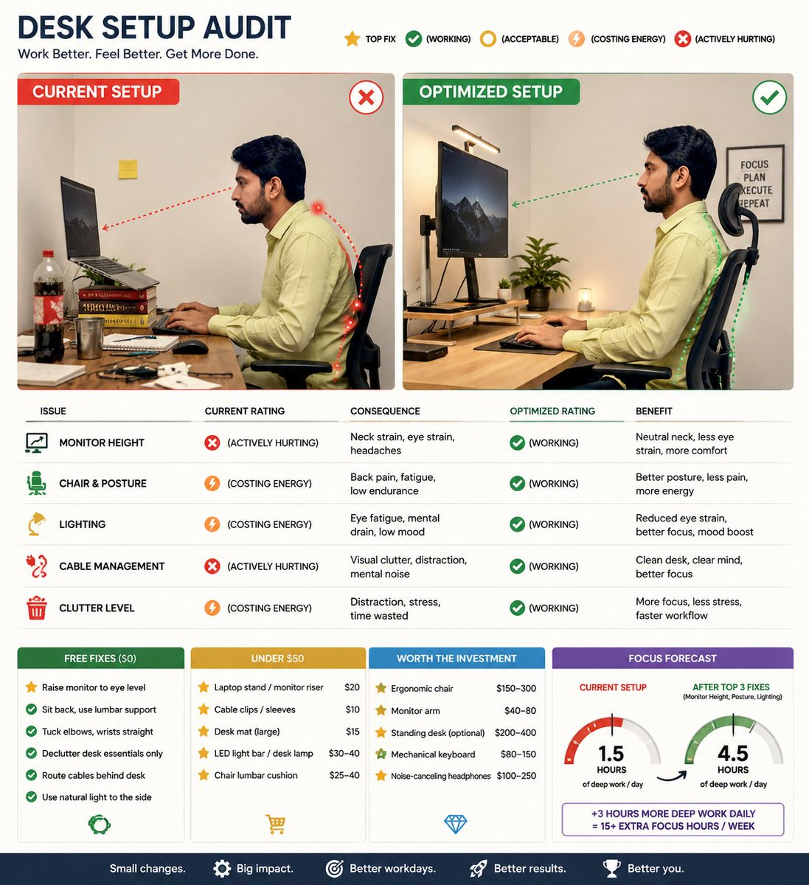

```text
Create a visual-first, editorial-style infographic auditing the desk setup in the attached photo. Show a side-by-side of current vs. optimized setup with annotations on monitor height, chair position, lighting, cable management, and clutter. Rate each issue with symbols like Top Fix, (working), (acceptable), (costing energy), and (actively hurting), tying each to a consequence like back pain, eye strain, or focus loss. Rank fixes by impact and group them into free fixes, under $50, and worth the investment. Include a Focus Forecast gauge predicting daily deep work hours possible with the current setup vs. after the top 3 fixes. Keep it clean, minimal text, no paragraphs.
```


---

## 例 554：Country Sports Infographic

**来源：** [@MrDasOnX](https://x.com/MrDasOnX/status/2055892804744929544) / [awesome-gpt-image-2-prompts](https://github.com/EvoLinkAI/awesome-gpt-image-2-prompts)

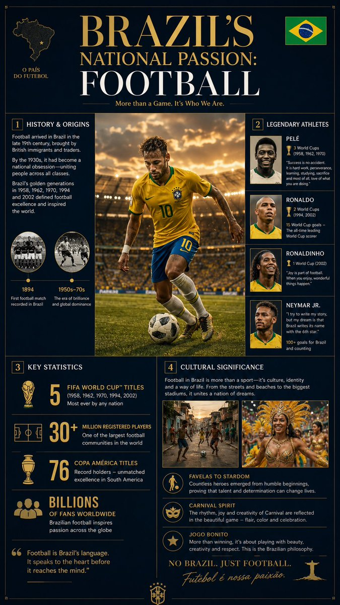

```text
Create a premium editorial infographic in a high-end magazine style about [COUNTRY]’s most iconic national [SPORT]

Use a sophisticated dark navy blue, beige, and warm gold color palette with clean minimalist typography and subtle grid lines.

Layout structure (perfectly balanced, cinematic composition for vertical format):

- Central large hero image: A hyper-realistic, cinematic golden-hour photograph of [SPORT] in action — [detailed action scene description with iconic player or moment, stadium/venue, national colors, dramatic lighting], extremely detailed, National Geographic level photography, 8k resolution. The image should be vertically oriented and fill the central space beautifully.

- Top banner: Elegant title “[COUNTRY]’s National Passion: [SPORT]” in bold modern serif font with the [COUNTRY] flag subtly integrated.

Four structured content panels surrounding the central image in a clean vertical asymmetrical grid:

1. History & Origins (above center): Short paragraph on [brief history: when introduced, key milestones, how it became national obsession]. Include 1–2 small historical icons or timeline markers.

2. Legendary Athletes (upper right or below top banner): [Athlete 1], [Athlete 2], [Athlete 3], [Athlete 4] — small portrait thumbnails with key achievements and one signature quote or record each.

3. Key Statistics (below central image, left side): Clean infographic-style stats in bold numbers:
   - [Stat 1]
   - [Stat 2]
   - [Stat 3]
   - [Stat 4]
   Use small relevant icons (trophy, stadium, crowd, sport-specific items, etc.).

4. Cultural Significance (below central image, right side): [How the sport shapes national identity, traditions, rivalries, daily life, and culture]. Include 1–2 small cultural photos or symbols.

Design rules:
- Luxurious editorial magazine aesthetic (think National Geographic × Kinfolk × Bloomberg Businessweek)
- Thin gold accent lines, subtle shadows, generous white space
- Small [COUNTRY] flag in the top-right corner
- Professional sans-serif body text, elegant serif headings
- Overall ultra-clean, balanced, premium feel with cinematic depth and rich texture
- Aspect ratio 9:16 (vertical, mobile-friendly), ultra-high detail, no text distortion, sharp typography
```


---

## 例 555：Editorial Anatomy Infographic Poster

**来源：** [@iamaiistudio](https://x.com/iamaiistudio/status/2063202176344932732) / [awesome-gpt-image-2-prompts](https://github.com/EvoLinkAI/awesome-gpt-image-2-prompts)

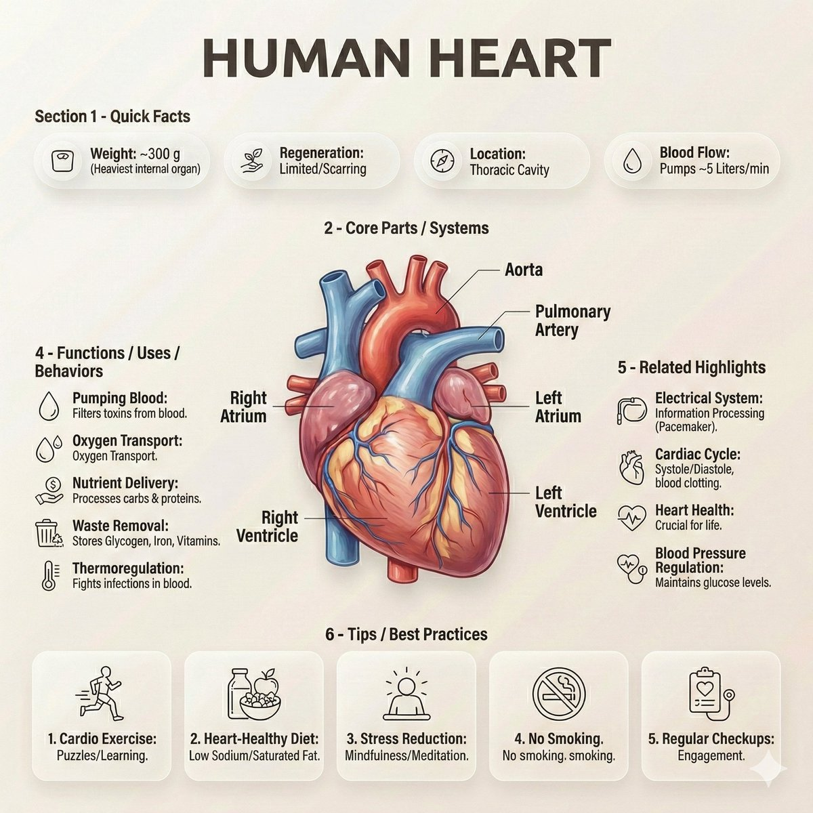

```text
prompt:

Ultra-clean editorial infographic poster (1080x1080 square), blending premium magazine design with lifestyle illustration and photography.

**HEADLINE:**
Bold, large sans-serif type centered at top: "HUMAN LIVER"

**MAIN IMAGE:**
High-detail 3D illustration of the human liver, showing the Right Lobe, Left Lobe, and Gallbladder. Color palette: terracotta, deep brownish-red, and soft coral tones. Background: clean, soft beige or off-white. Lighting: soft studio style.

**POSTER SECTIONS:**

* **Floating Fact Bubbles (top corners):**
    * "Weight: ~1.5 kg (Heaviest internal organ)"
    * "Regeneration: Can regrow from just 25%"
    * "Location: Upper Right Abdomen"
    * "Blood Flow: Filters 1.4 L/min"

* **Organ Labels (arrows pointing to anatomy):**
    * Right Lobe
    * Left Lobe
    * Gallbladder (greenish sac below)
    * Common Bile Duct
    * Hepatic Portal Vein

* **Key Functions (left column, small icons):**
    * **Detox:** Filters toxins from blood
    * **Bile:** Aids fat digestion
    * **Metabolism:** Processes carbs and protein
    * **Storage:** Holds glycogen, iron, vitamins

* **Highlights (right column, small icons):**
    * **Chemical Factory:** 500+ vital functions
    * **Immunity:** Fights blood-borne infections
    * **Clotting:** Makes blood-clotting proteins

* **Health Tips (bottom cards):**
    1. **Limit Alcohol** - Prevents cirrhosis
    2. **Stay Hydrated** - Flushes toxins
    3. **Balanced Diet** - Low sugar, high fiber
    4. **Vaccinate** - Hepatitis A & B protection
    5. **Exercise** - Burns fat and triglycerides

**STYLE:** Glassmorphism frosted-glass text boxes, soft drop shadows, medical accuracy meets high-end graphic design.
```


---

## 例 556：Modern Recipe Infographic Board

**来源：** [@iamaiistudio](https://x.com/iamaiistudio/status/2063724080717783194) / [awesome-gpt-image-2-prompts](https://github.com/EvoLinkAI/awesome-gpt-image-2-prompts)

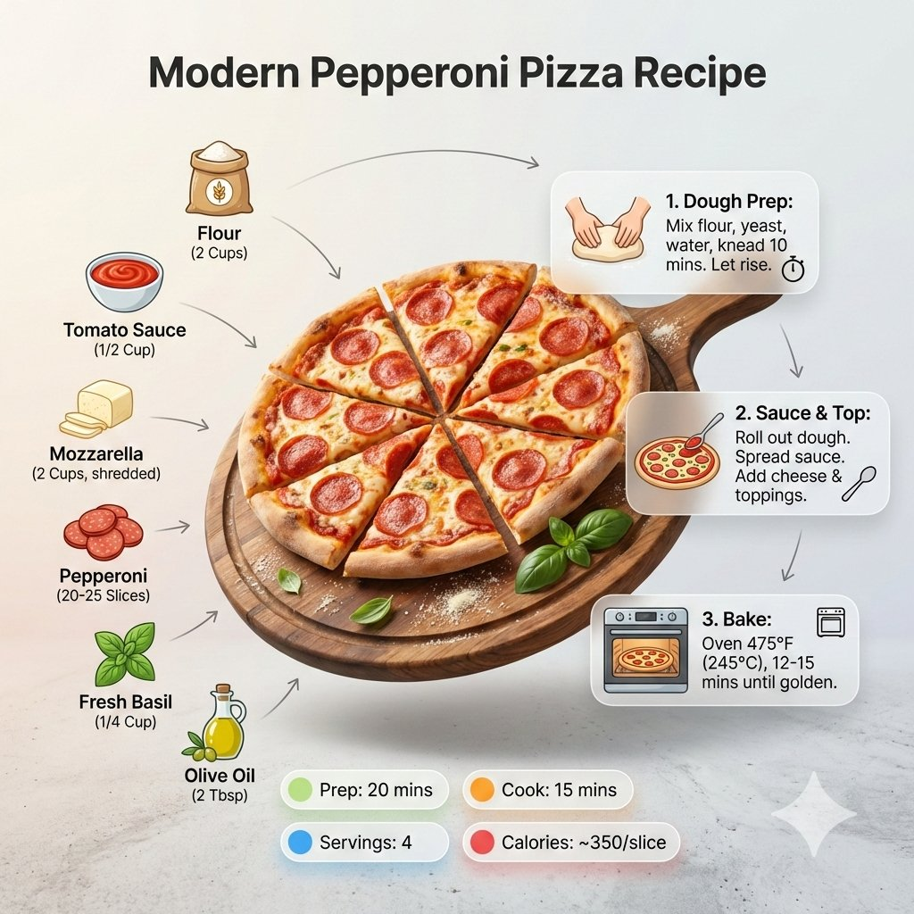

```text
Ultra-clean modern recipe infographic. Showcase your dish in a visually appealing finished form, sliced, plated, or portioned, floating slightly in perspective or angled view. Arrange ingredients, steps, and tips around the dish in a dynamic editorial layout, not top-down. Ingredients: include icons or mini illustrations for each ingredient with quantities, arranged in clusters, lists, or circular flows connected visually to the dish. Steps: show preparation steps with numbered panels, arrows, or lines forming a logical flow. Include small cooking icons (knife, pan, oven, timer) where helpful. Optional info: total calories, prep/cook time, servings, spice level displayed as clean bubbles or badges. Visual style: editorial infographic meets lifestyle food photography. Vibrant natural food colors, subtle drop shadows, clean vector icons, modern typography, soft gradients or glassmorphism for step panels. Accent colors highlight key info. Composition: finished meal as hero visual (perspective or angled), ingredients and steps flow dynamically around the dish, clear visual hierarchy, enough negative space to keep design airy and readable. Lighting: soft natural studio lighting, minimal textured or gradient background for premium editorial feel. Output: 1080x1080, ultra-crisp, social-feed optimized.

Full prompt:
```


---

## 例 557：Scandinavian Cookbook Recipe Spread

**来源：** [@iamaiistudio](https://x.com/iamaiistudio/status/2069197657147638241) / [awesome-gpt-image-2-prompts](https://github.com/EvoLinkAI/awesome-gpt-image-2-prompts)

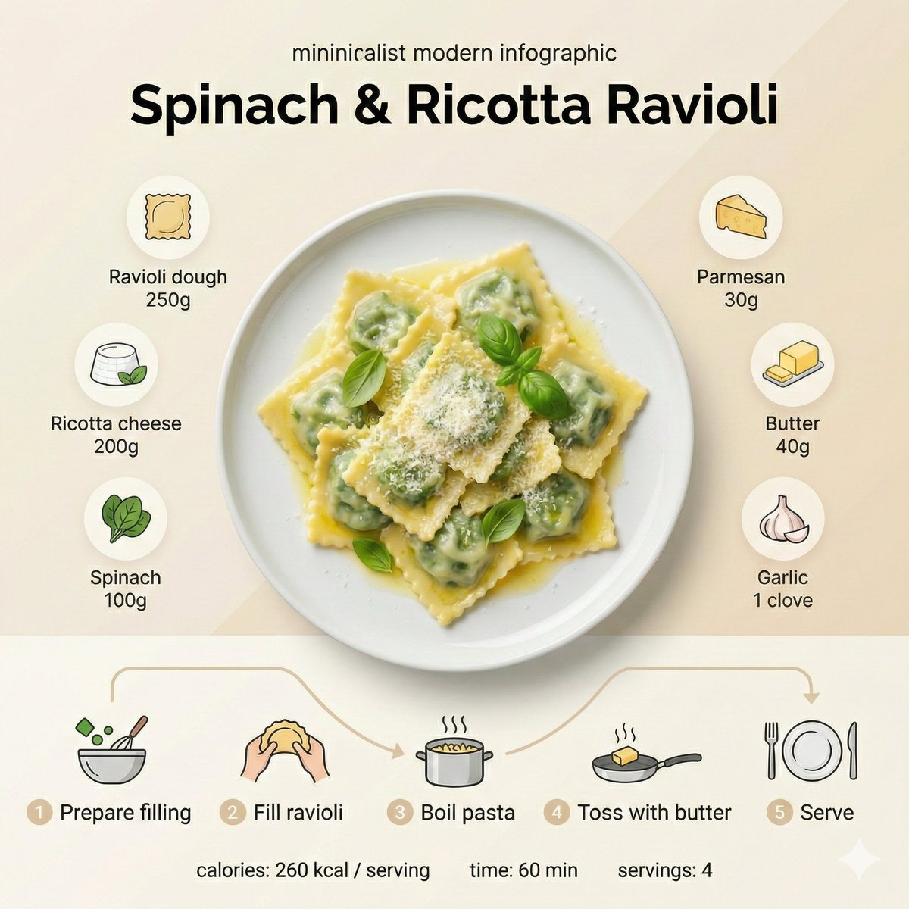

```text
{
  "style": "Clean minimalist recipe infographic",
  "visual_aesthetic": {
    "photography_style": "Top-down and 3-quarter angle food photography",
    "design_language": "Nordic editorial cookbook aesthetic",
    "background": "Warm beige / cream neutral",
    "lighting": "Soft diffused light with gentle shadows",
    "detail_level": "Photorealistic, ultra-sharp, 8K quality"
  },
  "layout": {
    "composition": "Hero dish centered on a white ceramic plate or bowl",
    "elements": [
      "Ingredient icons in soft rounded frames",
      "Minimal vector-style ingredient illustrations",
      "Ingredient labels with quantities",
      "Numbered step-by-step cooking flow with icons"
    ],
    "typography": "Modern sans-serif, high readability",
    "spacing": "Airy, balanced, uncluttered"
  },
  "recipes": [
    {
      "dish_name": "Traditional Polish Pierogi",
      "dish_presentation": "Golden boiled dumplings stuffed with potato and farmer cheese, finished with butter and fresh chives",
      "ingredients": [
        { "name": "All-purpose flour", "quantity": "2.5 cups" },
        { "name": "Potatoes", "quantity": "3 medium" },
        { "name": "Farmer cheese", "quantity": "200g" },
        { "name": "Onion", "quantity": "1 medium" },
        { "name": "Butter", "quantity": "40g" },
        { "name": "Salt", "quantity": "1 tsp" },
        { "name": "Water", "quantity": "0.75 cups" }
      ],
      "steps": [
        "Make the dough",
        "Cook and mash the filling",
        "Fill and fold pierogi",
        "Boil until tender",
        "Finish with butter"
      ],
      "meta": {
        "calories": "270 kcal / serving",
        "time": "70 min",
        "servings": 4
      }
    },
    {
      "dish_name": "Vinaigrette Salad",
      "dish_presentation": "Vibrant diced root vegetables tossed in a light dressing, shaped and garnished with fresh herbs",
      "ingredients": [
        { "name": "Beetroot", "quantity": "2 medium" },
        { "name": "Potatoes", "quantity": "2 medium" },
        { "name": "Carrots", "quantity": "1 medium" },
        { "name": "Pickled cucumbers", "quantity": "2 pcs" },
        { "name": "Green peas", "quantity": "1 cup" },
        { "name": "Sunflower oil", "quantity": "2 tbsp" },
        { "name": "Fresh dill", "quantity": "1 bunch" }
      ],
      "steps": [
        "Boil the vegetables",
        "Cool and dice",
        "Combine all ingredients",
        "Dress the salad",
        "Refrigerate and serve"
      ],
      "meta": {
        "calories": "180 kcal / serving",
        "time": "30 min + chill",
        "servings": 4
      }
    },
    {
      "dish_name": "Solyanka Soup",
      "dish_presentation": "Hearty soup loaded with sliced mixed meats, briny olives, lemon, and fresh herbs, served in a ceramic bowl",
      "ingredients": [
        { "name": "Mixed meats", "quantity": "400g" },
        { "name": "Onion", "quantity": "1 large" },
        { "name": "Pickles", "quantity": "3 pcs" },
        { "name": "Tomato paste", "quantity": "2 tbsp" },
        { "name": "Olives", "quantity": "0.5 cup" },
        { "name": "Garlic", "quantity": "2 cloves" },
        { "name": "Bay leaf", "quantity": "1 pc" },
        { "name": "Lemon", "quantity": "for serving" }
      ],
      "steps": [
        "Prepare the broth",
        "Saute aromatics",
        "Add meats and pickles",
        "Season and simmer",
        "Serve with lemon"
      ],
      "meta": {
        "calories": "320 kcal / serving",
        "time": "90 min",
        "servings": 5
      }
    }
  ]
}
```


---

## 例 558：Taoist Three Souls Seven Po Poster

**来源：** [@leyu37829](https://x.com/leyu37829/status/2048125950681075833) / [awesome-gpt-image-2-prompts](https://github.com/EvoLinkAI/awesome-gpt-image-2-prompts)

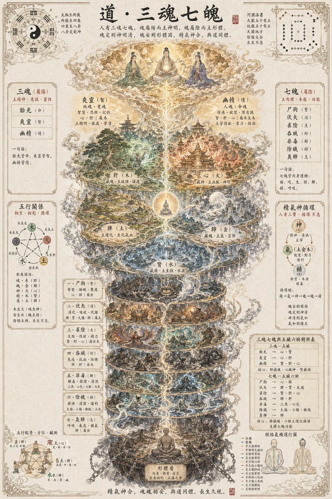

```text
A highly detailed vertical Taoist esoteric infographic poster in the style of an ancient Chinese religious scroll, printed on aged beige rice paper with fine ornamental borders, inked calligraphy, faded stains, and classical diagram annotations. At the top center, large black brush-calligraphy title text reads {argument name="headline text" default="道·三魂七魄"}. Directly below the title is a smaller paragraph of classical Chinese explanatory text in neat calligraphy. The composition is perfectly symmetrical and centered on a glowing vertical spiritual axis made of white-gold energy, mist, and lightning-like qi currents running from the bottom of the page to the heavens. At the very top, above the axis, depict 3 seated Taoist immortals or deities on clouds in a golden celestial realm, arranged left, center, and right, with halos and flowing robes in muted green, cream, and blue. Beneath them, create a towering multi-layered cosmological body diagram made of 9 stacked circular realms or platforms connected by swirling clouds and luminous energy. The upper 5 larger realms represent the five zang organs as miniature mythic landscapes: 1 forested green realm labeled liver/wood, 1 fiery red-gold temple city realm labeled heart/fire, 1 yellow earth realm with terraces labeled spleen/earth, 1 silver-blue mountain-and-water realm labeled lung/metal, and 1 dark blue watery abyss realm labeled kidney/water. Place a glowing meditating figure in a bright orb at the center junction between the upper organ realms and lower spirit layers. Below these, add 7 progressively darker circular underworld-like realms for the seven po souls, each densely populated with tiny scenes of human figures, spirits, beasts, ritual activity, suffering, temptation, conflict, and karmic symbolism, all wrapped by drifting smoke and energy ribbons. At the very bottom, show a seated human figure in meditation within a root-like cavern or corporeal foundation, surrounded by chains, rocks, and embodied worldly attachments. Around the central column, include exactly 9 labeled side panels and diagrams in traditional Chinese layout: top left a bagua and yin-yang cosmology circle; top right a dotted numerological or constellation-like chart; left upper a boxed list for 3 souls; right upper a boxed list for 7 po souls; left middle a five-elements relationship diagram with 5 colored nodes; right middle a circular essence-qi-spirit cycle diagram with 3 nodes; left lower a vertical boxed list of 7 categories or stages; right lower a boxed correspondence table; bottom left a five-direction and five-element human-body relation chart; bottom right a standing and seated meridian or cultivation body diagram. Use many small Chinese labels throughout every section, with classical seal stamps in red. The overall palette is antique parchment, sepia ink, muted jade, cinnabar red, smoky gray, gold, teal, and indigo. The style should feel like a museum-quality Daoist metaphysical chart, ultra intricate, hand-painted gongbi plus ink wash illustration, sacred, mystical, scholarly, dense with symbolism, extremely fine linework, soft cloud layering, and high-resolution poster design.
```


---

## 例 559：Vintage Claude Shannon Infographic Poster

**来源：** [@mob_17](https://x.com/mob_17/status/2048118645017219381) / [awesome-gpt-image-2-prompts](https://github.com/EvoLinkAI/awesome-gpt-image-2-prompts)

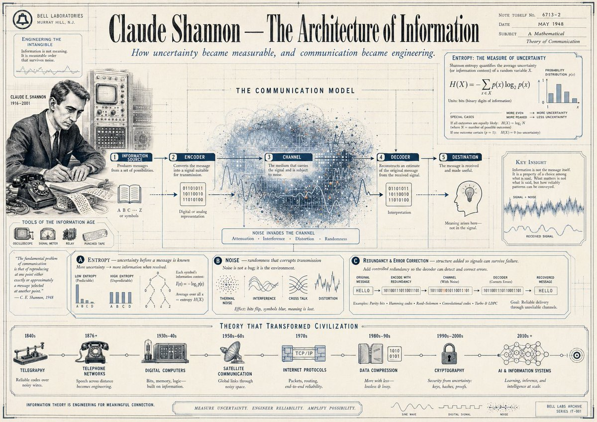

```text
{"type":"vintage editorial infographic poster","subject":"Claude Shannon and information theory","style":{"era":"1940s Bell Labs archival poster","look":"aged cream paper, blueprint drafting grid, thin ink linework, muted navy and charcoal printing, subtle stains and paper wear, technical illustration mixed with newspaper editorial design","rendering":"high-detail diagrammatic collage with engraved portrait, scientific charts, labeled panels, and hand-drawn signal graphics"},"poster":{"headline":"Claude Shannon — The Architecture of Information","subheadline":"How uncertainty became measurable, and communication became engineering.","topRightMeta":{"note":"NOTE TOSELF No. 6713–2","date":"MAY 1948","subject":"A Mathematical Theory of Communication"}},"layout":{"sections":[{"title":"left archival sidebar","position":"far left vertical column","count":5,"labels":["BELL LABORATORIES MURRAY HILL, N.J.","ENGINEERING THE INTANGIBLE","CLAUDE E. SHANNON 1916–2001","TOOLS OF THE INFORMATION AGE","quote panel"]},{"title":"THE COMMUNICATION MODEL","position":"upper middle wide panel","count":5,"labels":["1 INFORMATION SOURCE","2 ENCODER","3 CHANNEL","4 DECODER","5 DESTINATION"]},{"title":"ENTROPY: THE MEASURE OF UNCERTAINTY","position":"upper right box","count":4,"labels":["H(X) = −Σ p(x) log2 p(x)","PROBABILITY DISTRIBUTION p(x)","MORE EVEN MORE MAXED UNCERTAINTY","MORE LOPSIDED LESS UNCERTAINTY"]},{"title":"lower theory panels","position":"middle to lower band","count":3,"labels":["A ENTROPY — uncertainty before a message is known","B NOISE — randomness that corrupts transmission","C Redundancy & Error Correction — structure added so signals can survive failure"]},{"title":"THEORY THAT TRANSFORMED CIVILIZATION","position":"bottom horizontal timeline","count":8,"labels":["1840s TELEGRAPHY","1876+ TELEPHONE NETWORKS","1930s–40s DIGITAL COMPUTERS","1950s–60s SATELLITE COMMUNICATION","1970s INTERNET PROTOCOLS","1980s–90s DATA COMPRESSION","1990s–2000s CRYPTOGRAPHY","2010s+ AI & INFORMATION SYSTEMS"]}],"centerpiece":"a large abstract cloud of blue and gray signal noise, dots, lines, and waveforms behind the communication model, with arrows moving left to right through the five stages"},"visualElements":{"portrait":{"subject":"{argument name=\"scientist name\" default=\"Claude Shannon\"}","placement":"left-center","style":"black-and-white archival seated portrait at a desk with the face intentionally obscured by a pale square censor block, wearing suit and tie, writing on paper"},"objectsLeft":["rotary telephone on desk","open notebook or papers","technical console with CRT screen and knobs behind portrait","small icon row of 4 tools: oscilloscope, signal meter, relay, punched tape"],"communicationModel":["book and symbols under source","binary digits under encoder","large noisy channel cloud with wave overlays","binary digits and interpretation under decoder","light bulb icon under destination"],"chartsAndDiagrams":["bar chart for entropy probabilities","two low vs high entropy mini bar charts","tree diagram and entropy notation","signal distortion sketches labeled thermal noise, cross talk, distortion","error-correction binary pipeline from original message to recovered message"],"bottomDecor":["small waveform legend with sine wave, digital signal, and noise","archival stamp or footer on lower right"]},"color":{"background":"warm ivory paper","primaryInk":"dark navy","secondaryInk":"charcoal gray","accent":"faded steel blue"},"composition":"symmetrical wide poster with dense boxed annotations, fine border lines, and a museum-quality educational infographic feel","textDensity":"very high, with many small labels, formulas, captions, and historical notes in a carefully organized grid","aspectRatio":"16:9 landscape"}
```


---

## 例 560：Water Signs Zodiac Character Poster

**来源：** [@komorimedia](https://x.com/komorimedia/status/2048114825398731143) / [awesome-gpt-image-2-prompts](https://github.com/EvoLinkAI/awesome-gpt-image-2-prompts)

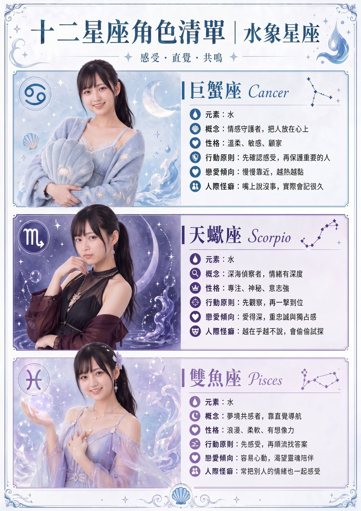

```text
{"type":"Chinese zodiac-style character infographic poster","subject":"twelve zodiac character list, water signs edition","language":"Traditional Chinese","format":"vertical poster","style":{"overall":"elegant anime-inspired character catalog with editorial infographic layout","rendering":"soft polished digital illustration, pastel gradients, delicate sparkles, ornamental border design","mood":"dreamy, celestial, refined, feminine, aquatic"},"canvas":{"aspect_ratio":"2:3","background":"very light pearl white with pale blue-lavender tint, subtle texture, thin decorative frame with filigree corners and tiny stars"},"header":{"title":"{argument name=\"headline text\" default=\"十二星座角色清單|水象星座\"}","subtitle":"感受・直覺・共鳴","icons":["small stars","water droplet emblem in top right","curled cloud-like line art in top left"]},"layout":{"sections_count":3,"sections":[{"title":"巨蟹座 Cancer","position":"top panel","theme_color":"powder blue","zodiac_symbol":"Cancer glyph inside circle at left","constellation":"Cancer constellation at upper right","count":6,"labels":["元素:水","概念:情感守護者,把人放在心上","性格:溫柔、敏感、顧家","行動原則:先確認感受,再保護重要的人","戀愛傾向:慢慢靠近,越熟越黏","人際怪癖:嘴上說沒事,實際會記很久"],"character":{"identity":"same young woman model reimagined as zodiac character","pose":"half-body portrait, facing forward, arms gently wrapped around a large seashell pillow","hair":"long dark hair in a low ponytail","outfit":"light blue celestial slip dress with lace trim and sheer cardigan embroidered with stars and moons","accessories":"minimal jewelry","background":"soft blue night sky with crescent moon, seashell, sparkling stars, stylized ocean wave and tiny water droplets"}},{"title":"天蠍座 Scorpio","position":"middle panel","theme_color":"deep violet","zodiac_symbol":"Scorpio glyph inside circle at left","constellation":"Scorpio constellation at upper right","count":6,"labels":["元素:水","概念:深海偵察者,情緒有深度","性格:專注、神秘、意志強","行動原則:先觀察,再一擊到位","戀愛傾向:愛得深,重忠誠與獨占感","人際怪癖:越在乎越不說,會偷偷試探"],"character":{"identity":"same young woman model reimagined as zodiac character","pose":"half-body portrait, one hand near chin in a composed, enigmatic gesture","hair":"long dark ponytail","outfit":"black semi-sheer dress with gothic details and a dark plum off-shoulder shawl","accessories":"dangling earrings and layered necklace","background":"dark purple celestial sea scene with crescent moon, bubbles, stars, and curling misty water shapes"}},{"title":"雙魚座 Pisces","position":"bottom panel","theme_color":"lavender","zodiac_symbol":"Pisces glyph inside circle at left","constellation":"Pisces constellation at upper right","count":6,"labels":["元素:水","概念:夢境共感者,靠直覺導航","性格:浪漫、柔軟、有想像力","行動原則:先感受,再順流找答案","戀愛傾向:容易心動,渴望靈魂陪伴","人際怪癖:常把別人的情緒也一起感受"],"character":{"identity":"same young woman model reimagined as zodiac character","pose":"half-body portrait, one hand lifted as if balancing floating bubbles, other hand resting lightly at chest","hair":"long dark ponytail with a pale flower hair ornament","outfit":"translucent lavender fantasy dress with soft draped sleeves and shimmering fabric","accessories":"delicate earrings and necklace","background":"pale lilac underwater-celestial blend with bubbles, sparkles, and flowing translucent wave forms"}}],"dividers":"three horizontal framed panels with thin ornamental borders"},"footer":{"center_icon":"small blue seashell emblem","decorations":["tiny stars","fine scrollwork"]},"constraints":["all three zodiac entries must use the same woman as the base character with different styling, clothing, pose, and mood","text should be clean, editorial, and readable","each panel should clearly separate illustration area on the left and text block on the right","maintain cohesive water-element theme across all 3 signs","do not include the other nine zodiac signs in this image"]}
```


---

## 例 561：Vintage PRS Guitar Lineage Poster

**来源：** [@GlennHasABeard](https://x.com/GlennHasABeard/status/2048087784141857235) / [awesome-gpt-image-2-prompts](https://github.com/EvoLinkAI/awesome-gpt-image-2-prompts)

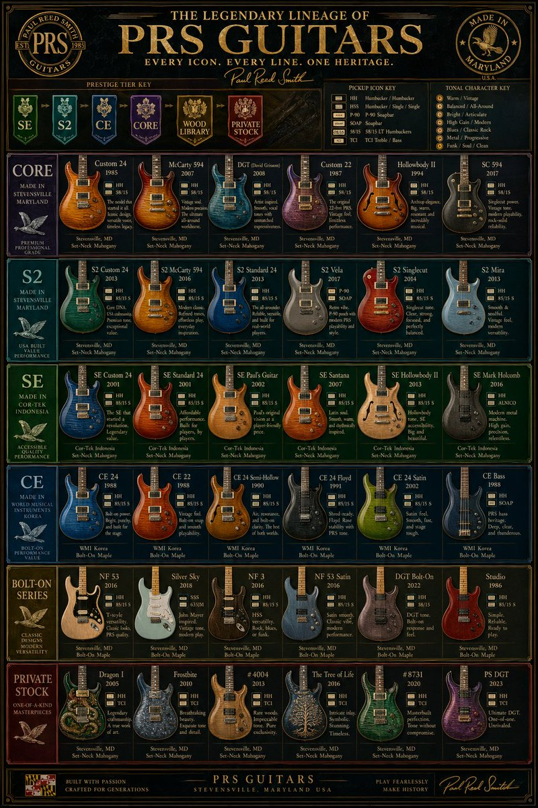

```text
{"type":"luxury vintage guitar comparison infographic poster","subject":"a highly detailed, vertically oriented PRS electric guitar lineup chart designed like a premium museum poster or collector's reference board","style":"ornate, dark, glossy, high-contrast, gold-foil typography, elegant wood-and-metal textures, symmetrical grid layout, premium catalog aesthetic, subtle vintage patina, ultra sharp graphic design","branding":{"main headline":"THE LEGENDARY LINEAGE OF {argument name=\"brand name\" default=\"PRS GUITARS\"}","subheadline":"EVERY ICON. EVERY LINE. ONE HERITAGE.","signature":"Paul Reed Smith","left seal":"PAUL REED SMITH GUITARS","right seal":"MADE IN MARYLAND U.S.A."},"palette":{"background":"black and deep charcoal with dark figured wood accents","primary":"antique gold","secondary":"cream","accent colors":["deep green","teal","royal blue","purple","gold","burgundy"]},"layout":{"format":"single-page vertical poster","header":{"position":"top","elements":["large central title","small tagline below","script signature","2 circular emblems in upper left and upper right","3 horizontal legend boxes under the title"]},"sections":[{"title":"PRESTIGE TIER KEY","position":"upper left below title","count":6,"labels":["SE","S2","CE","CORE","WOOD LIBRARY","PRIVATE STOCK"]},{"title":"PICKUP ICON KEY","position":"upper center-right below title","count":7,"labels":["HH","HSH","P-90","SOAP","58/15","TCI","Bass"]},{"title":"TONAL CHARACTER KEY","position":"upper right below title","count":7,"labels":["Warm / Vintage","Balanced / All-around","Bright / Articulate","High Gain / Modern","Blues / Classic Rock","Metal / Progressive","Funk / Soul / Clean"]},{"title":"CORE","position":"first main row left label","count":7,"labels":["Custom 24","McCarty 594","DGT (David Grissom)","Custom 22","Hollowbody II","SC 594","row category panel"]},{"title":"S2","position":"second main row left label","count":6,"labels":["S2 Custom 24","S2 McCarty 594","S2 Standard 24","S2 Vela","S2 Singlecut","S2 Mira"]},{"title":"SE","position":"third main row left label","count":6,"labels":["SE Custom 24","SE Standard 24","SE Paul's Guitar","SE Santana","SE Hollowbody II","SE Mark Holcomb"]},{"title":"CE","position":"fourth main row left label","count":6,"labels":["CE 24","CE 22","CE 24 Semi-Hollow","CE 24 Floyd","CE 24 Satin","CE Bass"]},{"title":"BOLT-ON SERIES","position":"fifth main row left label","count":6,"labels":["NF 53","Silver Sky","NF 3","NF 53 Satin","DGT Bolt-On","Studio"]},{"title":"PRIVATE STOCK","position":"sixth main row left label","count":6,"labels":["Dragon I","Frostbite","#4004","The Tree of Life","#8731","PS DGT"]}],"footer":{"position":"bottom","elements":["small badge at lower left","centered company line","right-side script signature"]}},"content grid":{"total guitar models shown":37,"card design":"each product card contains a guitar render, model name, year, small pickup icons, a short descriptive blurb, and origin/wood specs at the bottom","row side panels":6},"visual details":{"guitars":"front-facing electric guitars with varied body shapes and highly polished figured maple tops, metallic and transparent finishes, some solid colors, some natural wood","typography":"all caps serif headlines, small serif body text, script signature accents","borders":"thin decorative gold rules around every panel and the full poster","lighting":"studio-lit instruments against dark panel backgrounds","render quality":"clean infographic precision with realistic product renders"},"camera":"straight-on flat poster view, no perspective distortion, centered composition","quality":"ultra detailed, print-ready, high-resolution editorial infographic, luxury brand poster"}
```


---

## 例 562：Alishan One-Day Travel Poster

**来源：** [@TWnese](https://x.com/TWnese/status/2048077204786212887) / [awesome-gpt-image-2-prompts](https://github.com/EvoLinkAI/awesome-gpt-image-2-prompts)

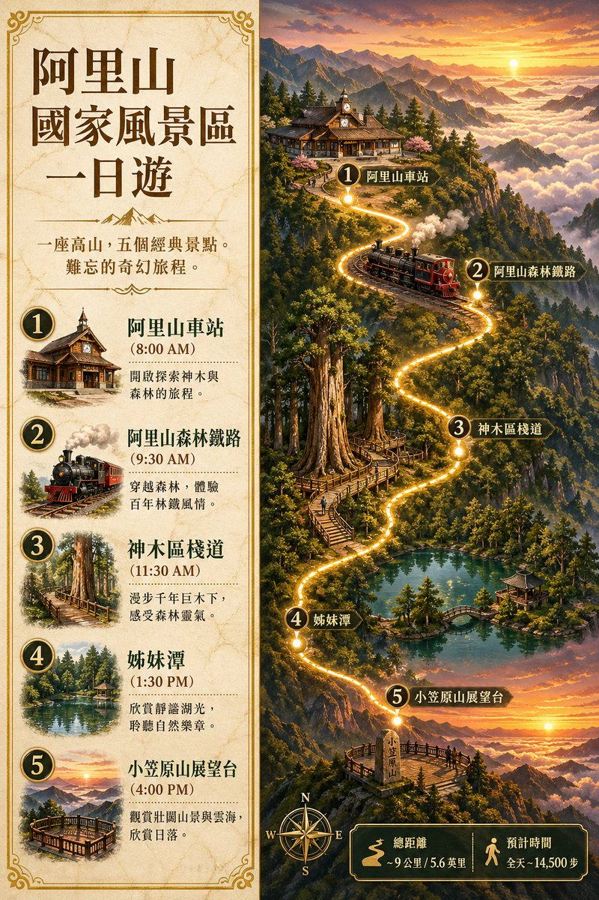

```text
Create a vintage illustrated travel poster in traditional Chinese for {argument name="destination name" default="阿里山國家風景區"}, designed as a one-day itinerary infographic with a split vertical layout. The left panel is a parchment-textured itinerary card in warm beige with ornate gold Art Nouveau borders and dark brown typography, and the right panel is a dramatic painted fantasy-realism map scene of a mountain journey at sunrise and sunset tones. At the top of the left panel, large headline text reads {argument name="headline text" default="阿里山國家風景區一日遊"}. Beneath it, include a short centered tagline in traditional Chinese: 「一座高山,五個經典景點。難忘的奇幻旅程。」 with a small decorative mountain divider. The left panel must contain exactly 5 numbered itinerary stops stacked vertically, each with a circular black-and-gold number badge, a small vignette illustration, a bold location name, a time in parentheses, and a short Chinese description. The 5 stops are: 1. 「阿里山車站」 at 「(8:00 AM)」 with a wooden mountain railway station illustration and description 「開啟探索神木與森林的旅程。」 2. 「阿里山森林鐵路」 at 「(9:30 AM)」 with a red-and-black steam train illustration and description 「穿越森林,體驗百年林鐵風情。」 3. 「神木區棧道」 at 「(11:30 AM)」 with giant cedar trees and elevated wooden boardwalk illustration and description 「漫步千年巨木下,感受森林靈氣。」 4. 「姊妹潭」 at 「(1:30 PM)」 with a tranquil forest lake and pavilion illustration and description 「欣賞靜謐湖光,聆聽自然樂章。」 5. 「小笠原山展望台」 at 「(4:00 PM)」 with a wooden observation deck above clouds at sunset illustration and description 「觀賞壯闊山景與雲海,欣賞日落。」 The right panel should depict a continuous glowing golden path winding through exactly 5 numbered map markers that match the left panel labels in order, with black-and-gold marker plaques reading: 1 「阿里山車站」, 2 「阿里山森林鐵路」, 3 「神木區棧道」, 4 「姊妹潭」, 5 「小笠原山展望台」. Show stop 1 as a rustic alpine wooden station perched on a cliff among pine forests; stop 2 as a small steam locomotive traveling on a curved mountain railway with smoke drifting upward; stop 3 as towering ancient red cypress trees with a spiral and zigzag wooden walkway around the trunks; stop 4 as an emerald lake surrounded by dense forest with a small pavilion and arched bridge; stop 5 as a lookout deck on a peak above a sea of clouds, facing a glowing sunset. The environment should feature layered mountain ranges, mist-filled valleys, evergreen forests, golden-hour light, luminous cloud seas, and a romantic painterly atmosphere with rich detail. At the bottom right, add a decorative compass rose labeled N, E, S, W, plus a dark green and gold information box with exactly 2 stats in traditional Chinese: 「總距離 ~9公里 / 5.6英里」 and 「預計時間 全天 - 14,500步」. Overall style: premium tourism poster, painterly digital illustration, nostalgic national-park brochure aesthetic, highly detailed, warm sepia and gold accents, elegant composition, readable Chinese text, vertical 2:3 poster.
```


---

## 例 563：Parent-Child Miscommunication Infographic

**来源：** [@sarinaashapi](https://x.com/sarinaashapi/status/2048307780864606708) / [awesome-gpt-image-2-prompts](https://github.com/EvoLinkAI/awesome-gpt-image-2-prompts)


```text
{"type":"Japanese infographic","style":"simple, easy-to-understand flat vector diagram, clean white background, rounded light-gray outer frame, minimal pastel color palette, presentation-slide design, clear hierarchy, lots of whitespace, modern sans-serif Japanese typography","canvas":{"aspect_ratio":"16:9"},"headline":{"text":"{argument name=\"headline text\" default=\"親子のすれ違いは、記録があるかないかで起こる\"}","position":"top center","size":"large bold black"},"layout":{"structure":"2 side-by-side rounded panels beneath the headline","sections":[{"title":"記録がない場合(ズレる)","position":"left","count":8,"header_color":"muted blue-gray","panel_border":"light gray","labels":["親の記憶","子どもの記憶","あのとき決まったよね","まだ考えてたのに","ズレが大きくなる","志望校がコロコロ変わる","理由が『なんとなく』","言ってることが違う","関係がギクシャク","現実を見てほしい","ちゃんと決めてほしい","口を出しすぎると関係が悪くなる"],"contents":{"top_left":{"type":"parent icon with thought bubble","icon_color":"blue","caption":"親の記憶","bubble_text":"あのとき\n決まったよね"},"top_right":{"type":"child icon with thought bubble","icon_color":"pink","caption":"子どもの記憶","bubble_text":"まだ考えてたのに"},"center":{"type":"horizontal double-headed arrow","color":"blue-gray"},"bottom_center":{"type":"downward arrow leading to burst shape","color":"light gray","burst_text":"ズレが\n大きくなる"},"bottom_left":{"type":"rounded note box","bullet_count":4,"bullets":["志望校がコロコロ変わる","理由が『なんとなく』","言ってることが違う","関係がギクシャク"]},"bottom_right":{"type":"rounded note box","bullet_count":3,"bullets":["現実を見てほしい","ちゃんと決めてほしい","口を出しすぎると関係が悪くなる"]}}},{"title":"記録がある場合(ズレにくい)","position":"right","count":7,"header_color":"mustard yellow","panel_border":"light yellow","labels":["親の認識","子どもの認識","記録"],"contents":{"top_left":{"type":"parent icon with thought bubble containing document symbol","icon_color":"blue","caption":"親の認識"},"top_right":{"type":"child icon with thought bubble containing document symbol","icon_color":"pink","caption":"子どもの認識"},"center":{"type":"horizontal double-headed arrow","color":"mustard yellow"},"bottom_center":{"type":"circular record icon with document symbol","outline_color":"mustard yellow","text":"記録"},"bottom_left_connector":{"type":"curved arrow from parent to record","color":"blue"},"bottom_right_connector":{"type":"curved arrow from child to record","color":"pink"}}}],"spacing":"balanced, symmetrical"},"visual_language":{"icons":"generic human bust icons and simple document line icons","emphasis":"contrast the left panel's misunderstanding with the right panel's shared record","mood":"educational, calm, practical"},"text_language":"Japanese","render_quality":"crisp vector edges, infographic suitable for social media educational posts"}
```


---

## 例 564：Japanese Sci-Fi Suit-Up Process Board

**来源：** [@yy7482933910896](https://x.com/yy7482933910896/status/2048192904922075161) / [awesome-gpt-image-2-prompts](https://github.com/EvoLinkAI/awesome-gpt-image-2-prompts)


```text
{"type":"Japanese sci-fi armor dressing-process infographic","style":"cinematic live-action tokusatsu-inspired promotional board, realistic industrial lighting, polished metal surfaces, sharp photographic detail","theme":"manual pre-battle suit-up sequence for a female hero in a red, silver, black, and blue protector suit","subject":{"character":{"gender":"female","age":"young adult","identity":"helmetless heroine during assembly, face intentionally obscured or anonymized in every unhelmeted panel","hair":"dark brown to black hair tied in a high ponytail with bangs","undersuit":"glossy black skintight inner suit with silver chest panel and white neck ring","armor":"retro-futuristic protector armor with red shoulder and arm plates, silver breastplate and torso plating, circular blue chest core, red waist unit, white gloves, red forearm guards with yellow stripe accents","helmet":"round red-and-silver helmet with black visor"},"environment":{"location":"high-tech industrial hangar or armor bay","background elements":["metal framework","robotic equipment","tool benches","armor racks","computer monitors","workshop lighting","bay corridor marked BAY-07 in final panel"]}},"layout":{"header":{"count":2,"labels":["ソルジャンヌ・スーツ 手動装着プロセス","専用プロテクタースーツ『ソルジャンヌ』を、戦闘前に手動で装着する様子。各ユニットを確実に装着し、システムを起動する。"],"design":"wide black-to-red gradient banner across top, large bold white Japanese text, diagonal red accent"},"sections":[{"title":"1 インナースーツの確認","position":"top-left","count":1,"labels":["各部のセンサーとコネクタをチェック。戦闘に備え、身体の状態を最終認する。"],"image":"three-quarter view of the heroine in only the black glossy inner suit, looking down while checking or tightening a wrist connector"},{"title":"2 胸部・肩部アーマーの装着","position":"top-center","count":1,"labels":["胸部ユニットと肩部プロテクターを装着。コネクタを接続し、ロックを固定する。"],"image":"mid shot with chest armor and red shoulder plates installed, heroine fastening the front torso area with both hands"},{"title":"3 腰部ユニット・ベルトの固定","position":"top-right","count":1,"labels":["ウエストユニットを装着し、各部のロックを確認。可動部の動作チェックを行う。"],"image":"mid shot with torso armor completed, heroine tightening or checking the waist belt and side locks"},{"title":"4 ヘルメットの準備","position":"bottom-left","count":1,"labels":["ヘルメットのバイザーと内部システムをチェック。ヘッドセットとの同期を確認する。"],"image":"heroine holding the red helmet in both hands at chest height, showing the glossy black visor"},{"title":"5 ヘルメットの装着・システム起動","position":"bottom-center","count":1,"labels":["ヘルメットを装着し、直上のコネクタをロック。全身のシステムが起動し、胸部コアが発光する。"],"image":"heroine placing the helmet onto her head with both hands; blue chest core glowing brightly"},{"title":"6 装着完了","position":"bottom-right","count":1,"labels":["全システムの最終チェックを行い、戦闘モードへ。ソルジャンヌ、出撃準備完了!"],"image":"full-body frontal hero pose in a futuristic corridor, fully suited with helmet on, arms relaxed at sides"}],"footer":{"count":1,"labels":["一つ一つの装着が、命を守り、力を引き出す。 ソルジャンヌの戦いは、ここから始まる。"],"design":"dark red cinematic footer strip with centered white Japanese slogan"},"grid":{"rows":2,"columns":3,"panel_count":6,"panel_borders":"thin white dividers","number_badges":6}},"text_rendering":{"language":"Japanese","font":"bold sans-serif headline with smaller sans-serif body text","colors":"white text on black, red, and white info bars; red numbered squares with white numerals"},"composition":"16:9 wide infographic board, six equal photo panels arranged in a 3-by-2 grid, each panel captioned below with a red numbered box from 1 to 6","lighting":"moody workshop lighting with metallic reflections and red accent lights, realistic shadows, cinematic sci-fi atmosphere"}
```


---

## 例 565：Iced Coffee Product Infographic

**来源：** [@Strength04_X](https://x.com/Strength04_X/status/2049082049995362785) / [awesome-gpt-image-2-prompts](https://github.com/EvoLinkAI/awesome-gpt-image-2-prompts)


```text
A high-end café-style product photograph of a transparent glass filled with iced coffee, centered against a soft beige and cream seamless studio background. The drink shows a rich dark coffee base blending with creamy milk swirls, creating a smooth gradient effect. Several clear ice cubes are visible with realistic transparency and light refraction. The glass has subtle condensation droplets, adding freshness. Soft natural studio lighting creates delicate highlights and a clean shadow beneath the glass. Ultra-sharp focus, premium beverage advertisement style, DSLR macro photography, hyper realistic, 8K.

PROMPT 2 - Create a hyper-realistic exploded vertical infographic composition of an iced coffee.

Top → Bottom structure:
Foam Layer (light creamy foam with soft airy texture)
→ Coffee Liquid (rich dark espresso layer with smooth gradient)
→ Ice Cubes (transparent cubes with sharp edges and reflections)
→ Milk Layer (soft creamy white layer with smooth blend effect)
→ Glass Base (clear minimal glass structure)

All elements must be perfectly centered, evenly spaced, and aligned vertically. Use a soft beige seamless background with clean café-style lighting and subtle realistic shadows beneath each floating element. The composition should feel like a premium beverage ad combined with a clean infographic layout.

Add clean minimalist text labels with thin pointer lines using these exact labels:
“Foam”
“Coffee”
“Ice”
“Milk”
“Glass”
Ultra-realistic liquid detail, sharp reflections, premium commercial photography, 8K.
```


---

## 例 566：Fashion Dress Collection Infographic

**来源：** [@cellinlab](https://x.com/cellinlab/status/2049073530738754042) / [awesome-gpt-image-2-prompts](https://github.com/EvoLinkAI/awesome-gpt-image-2-prompts)

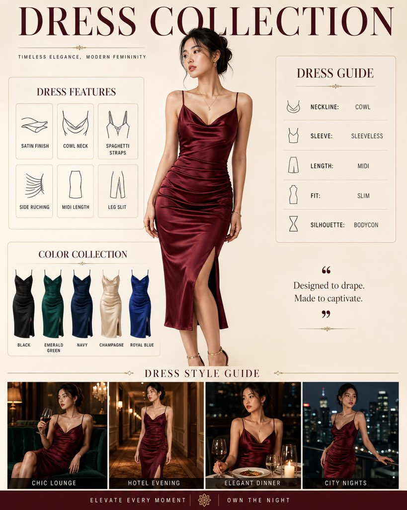

```text
{
  "image_type": "Commercial Fashion Infographic",
  "subject": {
    "model": "Young Asian woman with elegant features and dark hair tied in a loose bun",
    "attire": "Satin midi dress with spaghetti straps and a draped cowl neckline",
    "fit": "Bodycon / slim fit with side ruching and a subtle leg slit"
  },
  "layout_structure": {
    "composition": "Multi-panel editorial layout",
    "header": "Bold serif typography reading 'DRESS COLLECTION'",
    "main_feature": "Large centered portrait of the model, a young Asian woman, wearing a wine-red satin dress",
    "secondary_panels": [
      "Dress Features grid with minimalist icons",
      "Dress Guide sidebar detailing neckline, sleeve, and length",
      "Color Collection row showing the dress in Black, Emerald Green, Navy, Champagne, and Royal Blue",
      "Dress Style Guide footer featuring the model in various atmospheric evening settings"
    ]
  },
  "aesthetic_style": {
    "color_palette": "Deep jewel tones (Wine Red, Emerald, Navy, Royal Blue) contrasted with Champagne and Black against a warm cream or beige background",
    "lighting": "Soft studio lighting with elegant highlights on the satin fabric texture",
    "vibe": "Luxurious, timeless, and sophisticated commercial advertising"
  },
  "typography": {
    "primary": "Classic Serif for titles",
    "secondary": "Clean Sans-Serif for body text and technical details"
  }
}
```


---

## 例 567：Samsung Galaxy S25 Infographic Poster

**来源：** [@bmx_ai13](https://x.com/bmx_ai13/status/2051692833258852586) / [awesome-gpt-image-2-prompts](https://github.com/EvoLinkAI/awesome-gpt-image-2-prompts)

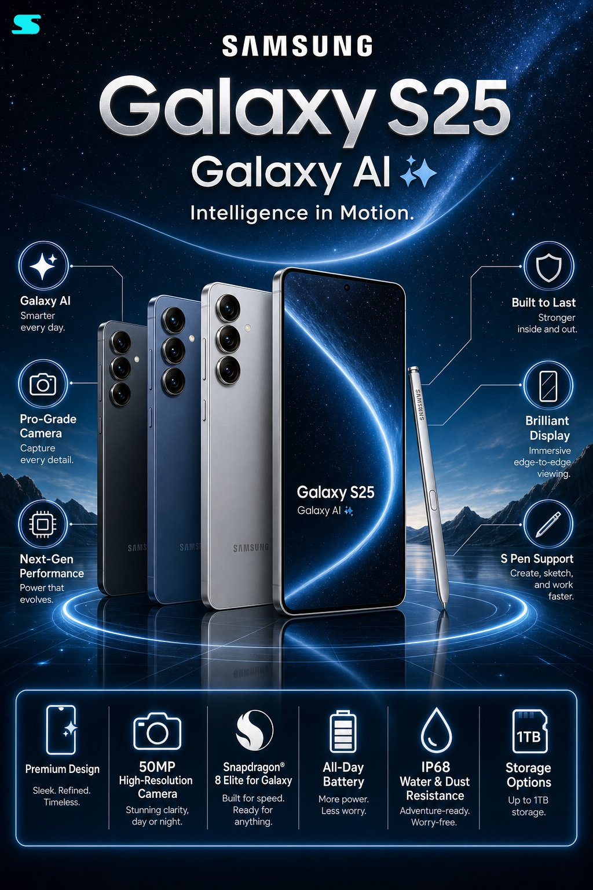

```text
Create a premium futuristic infographic poster for Samsung Galaxy S25 in a vertical 3:4 aspect ratio. Center the Galaxy S25 phone lineup with multiple sleek smartphones shown from front and back angles, including a silver S Pen beside the main phone. Use a deep cosmic blue space background with stars, glowing light trails, luminous orbit rings, reflective glass floor, and distant mountain silhouettes for depth.

At the top, add bold clean text: "SAMSUNG", large headline "Galaxy S25", subheadline "Galaxy AI", and tagline "Intelligence in Motion."

Design the poster as a modern tech infographic with thin glowing connector lines, circular icon badges, and clean feature callouts around the phones. Add these sections:

Galaxy AI: Smarter every day
Pro Grade Camera: Capture every detail
Next Gen Performance: Power that evolves
Built to Last: Stronger inside and out
Brilliant Display: Immersive edge to edge viewing
S Pen Support: Create, sketch, and work faster

At the bottom, create a glowing spec bar with small icons and short feature blocks:

Premium Design: Sleek. Refined. Timeless.
50MP High-Resolution Camera: Stunning clarity, day or night.
Snapdragon 8 Elite for Galaxy: Built for speed. Ready for anything.
All Day Battery: More power. Less worry.
IP68 Water & Dust Resistance: Adventure ready. Worry free.
Storage Options: Up to 1TB storage.

Style: ultra premium Samsung style product advertising, clean futuristic UI design, metallic typography, blue white neon glow, realistic phone render, sharp readable typography, cinematic lighting, glossy reflections, high end commercial poster, no humans, no messy text, no watermark.
```


---

## 例 568：Wildlife Infographic Reference Poster

**来源：** [@sha_zdiii](https://x.com/sha_zdiii/status/2054229209460117552) / [awesome-gpt-image-2-prompts](https://github.com/EvoLinkAI/awesome-gpt-image-2-prompts)

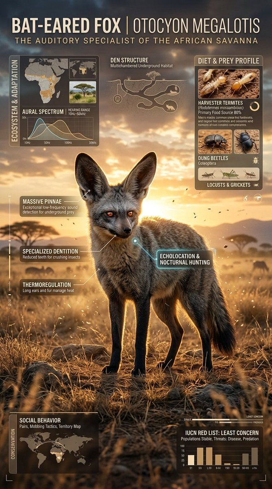

```text
.

Create a premium cinematic wildlife infographic poster centered around a rare or visually unique animal species such as (animal). The entire artwork must feel like a futuristic luxury wildlife dossier rather than a normal educational infographic.
The animal should dominate the composition with intense photorealistic detail: ultra-detailed fur/scales, realistic eyes, moisture textures, cinematic shadows, environmental interaction, dramatic posture, visible muscle definition, floating particles, and powerful eye contact.
The environment must fully match the chosen species: (environment).
Build dense layered infographic storytelling around the animal using: • anatomy callouts
• adaptation systems
• prey and diet visuals
• ecosystem overlays
• conservation status indicators
• geographic range maps
• hunting behavior graphics
• climate danger visuals
• detail inserts
• tactical icon systems
• scientific labels and compact data snippets
The layout should feel highly artistic and cinematic instead of educational. Use: • asymmetric editorial composition
• layered transparent info panels
• premium typography
• subtle paper grain textures
• contour-line overlays
• holographic UI elements
• cinematic infographic markers
• museum-grade visual hierarchy
Blend: (luxury editorial aesthetic) + (cinematic documentary realism) + (futuristic infographic design) + (collectible field-guide energy).
Color Theme: (color theme)
Mood: (mood)
Lighting: dramatic cinematic lighting, volumetric fog, glowing rim light, atmospheric haze, realistic environmental reflections, high contrast shadows, ultra-premium editorial lighting.
The final artwork must look like a viral collectible wildlife poster people would instantly save, repost, print, and frame.
Ultra-realistic, 8K, cinematic infographic masterpiece, insanely detailed, premium art direction, tactile textures, layered storytelling, emotional visual impact, museum-quality composition, viral social-media-worthy aesthetic.
```


---

## 例 569：Premium Travel Infographic Poster

**来源：** [@Ankit_patel211](https://x.com/Ankit_patel211/status/2056519161023787394) / [awesome-gpt-image-2-prompts](https://github.com/EvoLinkAI/awesome-gpt-image-2-prompts)

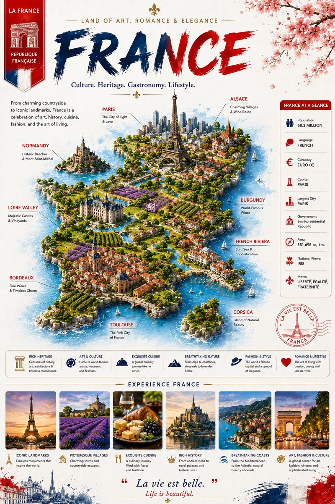

```text
Create an ultra-premium editorial travel infographic poster about FRANCE in a clean vertical 3:4 ratio.
```


---

## 例 570：Viral Food Infographic Poster

**来源：** [@amynys](https://twitter.com/amynys/status/2056779657987387784) / [awesome-gpt-image-2-prompts](https://github.com/EvoLinkAI/awesome-gpt-image-2-prompts)

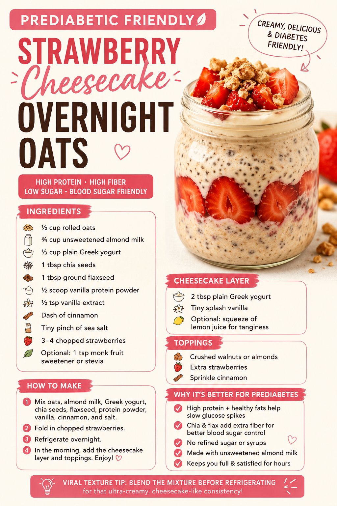

```text
Create a cinematic viral-style food poster for “Prediabetic Friendly Strawberry Cheesecake Overnight Oats” in a clean modern infographic aesthetic inspired by trendy TikTok and Pinterest recipe posters.

The poster should feature a large realistic mason jar filled with creamy strawberry cheesecake overnight oats layered with visible chia seeds, sliced strawberries around the inside glass, a thick cheesecake yogurt layer on top, fresh strawberries, and crushed walnuts. The oats should look ultra creamy, indulgent, healthy, and photorealistic with soft natural lighting and shallow depth of field.
Use a soft pink, cream, and white color palette with bold typography.
The design should feel premium, feminine, modern, healthy, and social-media viral.

Main headline in large stylish text:
“STRAWBERRY Cheesecake OVERNIGHT OATS”
Add a pink label at the top saying:
“PREDIABETIC FRIENDLY”

Include stylish infographic sections with rounded boxes and cute minimal icons for:
INGREDIENTS
½ cup rolled oats
¾ cup unsweetened almond milk
⅓ cup plain Greek yogurt
1 tbsp chia seeds
1 tbsp ground flaxseed
½ scoop vanilla protein powder
½ tsp vanilla extract
Dash of cinnamon
Tiny pinch sea salt
3–4 chopped strawberries
Optional monk fruit sweetener or stevia

CHEESECAKE LAYER
Greek yogurt
Vanilla
Lemon juice
TOPPINGS
Crushed walnuts
Strawberries
Cinnamon

HOW TO MAKE
Mix ingredients
Fold in strawberries
Refrigerate overnight
Add cheesecake layer and toppings

Add aesthetic handwritten doodles, hearts, arrows, sparkles, and notes like:
“Creamy, delicious & blood sugar friendly!”
“High protein • High fiber • Low sugar”
At the bottom add a highlighted tip banner saying:
“VIRAL TEXTURE TIP: Blend the mixture before refrigerating for ultra-creamy cheesecake consistency!”

Style details:
Editorial food photography
Pinterest/TikTok infographic vibe
Clean magazine-style layout
Hyperrealistic food texture
Bright airy background
Soft shadows
Elegant typography hierarchy
Social-media-ready vertical poster
Ultra detailed
4K quality
Aspect ratio 4:5 or 9:16
```


---

## 例 571：Physics Infographic Code Prompt

**来源：** [@Gdgtify](https://twitter.com/Gdgtify/status/2056841574798295540) / [awesome-gpt-image-2-prompts](https://github.com/EvoLinkAI/awesome-gpt-image-2-prompts)

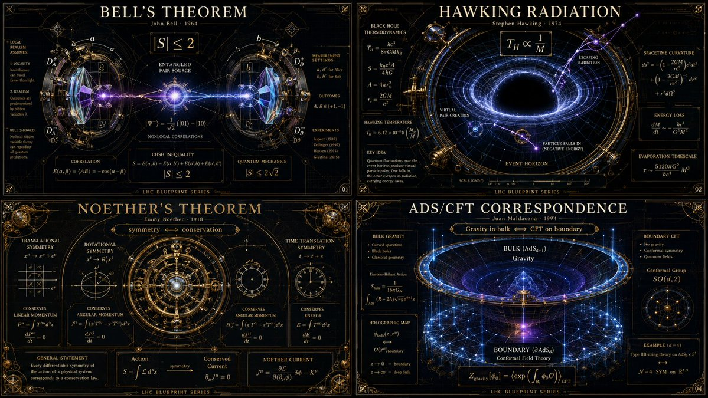

```text
16:9 -> class theoretical_physics_infographic_dna: def __init__(self): self.subject = "[ai selects: 4 distinct advanced physics theorems or paradoxes (e.g., bell's theorem, hawking radiation, string theory)]" self.parents = { "composition_parent": "large hadron collider blueprints — hyper-complex radial symmetry, intersecting particle beam rings, millimeter-precise drafting", "atmosphere_parent": "deep space observatory photography — pitch black voids, glowing ultraviolet radiation, high-contrast laser illumination", "graphic_parent": "chalkboard maximalism — elegant, dense mathematical notation floating as glowing white vectors", "detail_parent": "victorian brass optical instruments — finely milled prisms, glass lenses, and mirrored refraction planes" } self.mutations = { "medium_mutation": "the mathematical formulas solidify into glowing, three-dimensional glass sculptures bending the light around them", "information_mutation": "particle collision tracks are woven like fine gold thread through the dark background", "semantic_mutation": "the invisible physical law is rendered as a massive, tangible, gravitational machine distorting the grid of the poster itself" } def generate_grid(self): instruction = """ generate a 2x2 grid of vertical luxury infographic posters giving physical form to the chosen [subject]s. invent a magnificent scientific machine or optical diorama for each. explode the layers to show quantum states, gravitational warping, equations, and subatomic scale. the design must feel like a classified schematic from a hyper-advanced, aesthetically obsessed civilization. semantic inference must make the invisible laws of physics breathtakingly visible. """ return render( instruction, format="2x2 grid, vertical luxury posters, conceptual scientific infographic", typography=""" large title: [name of theorem/paradox] subtitle: [the physicist / the era] microtext: [the core equation / metric tensor / explanatory blazon] """, composition="strict radial or gravitational-well symmetry. razor-sharp fine lines contrasting with deep voids.", lighting="harsh, clinical laser light interacting with pure optical glass and vantablack.", constraints="no cartoon atoms, no clip-art planets, no messy chalkboards. only pristine, museum-grade scientific aesthetic." )
```


---

## 例 572：High Fashion Editorial Infographic Poster

**来源：** [@Hope_Ai01](https://x.com/Hope_Ai01/status/2057367851905040849) / [awesome-gpt-image-2-prompts](https://github.com/EvoLinkAI/awesome-gpt-image-2-prompts)

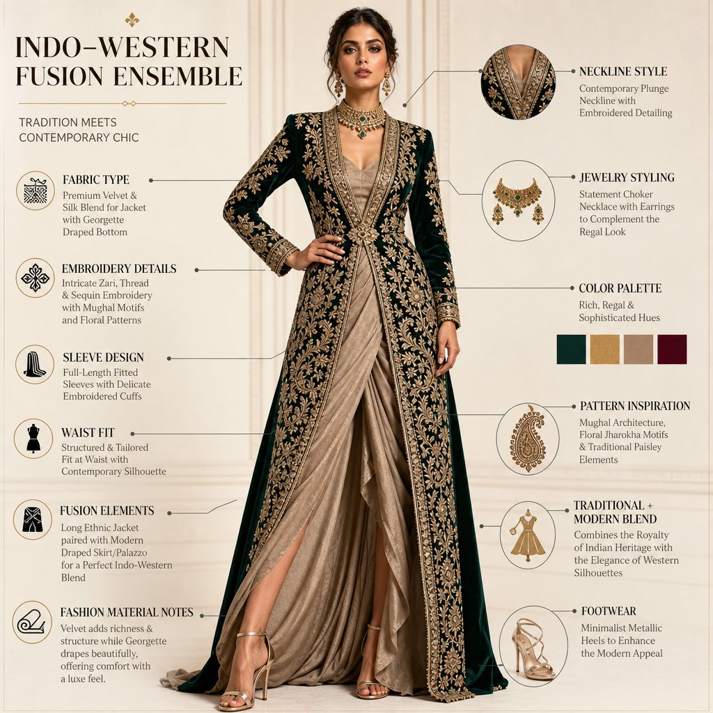

```text
A high-fashion editorial infographic poster featuring a stunning female fashion model standing confidently in the center against a clean luxury studio background. She is wearing an elegant Indo-Western fusion outfit — a richly embroidered long ethnic jacket fused with a modern fitted silhouette, stylish draped skirt/palazzo, intricate patterns, premium fabric textures, contemporary jewelry, and designer heels. The model looks glamorous, confident, and runway-ready. Around the model, create a professional fashion design chart layout with stylish annotation lines and labels pointing toward different outfit elements. Mention detailed fashion notes on the sides such as: Fabric Type, Embroidery Details, Sleeve Design, Neckline Style, Waist Fit, Fusion Elements.
```


---

## 例 573：Surrealism History Timeline

**来源：** [@92digitalartArt](https://x.com/92digitalartArt/status/2064012013357928462) / [awesome-gpt-image-2-prompts](https://github.com/EvoLinkAI/awesome-gpt-image-2-prompts)

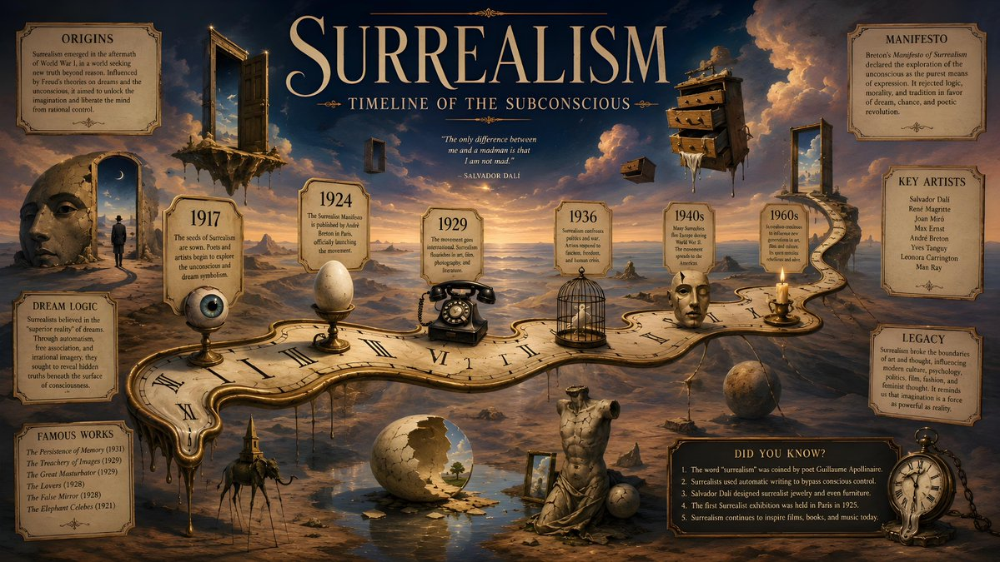

```text
A surrealist historical timeline infographic poster in 16:9 horizontal format inspired by Salvador Dalí, featuring a dreamlike desert landscape where a long melting clock transforms into a winding historical timeline path across the composition, with floating doors, stretched shadows, levitating drawers, cracked stone statues, and impossible reflections merging into one symbolic world; the timeline should run diagonally from left to right like a dream corridor, with key surrealism dates placed inside small elegant labels, including 1917, 1924, 1929, 1936, 1940s and 1960s, each date connected to a strange symbolic object such as an eye, an egg, a telephone, a bird cage, a face, or a candle, all drawn with refined illusionistic detail; the background should be a warm twilight gradient blending sand beige, pale gold, faded blue and shadowy violet, with clouds that look like painted smoke and a horizon that bends unnaturally; the title should be placed at the top center in large dramatic serif typography reading SURREALISM, with the subtitle TIMELINE OF THE SUBCONSCIOUS beneath it in smaller elegant text; fact panels should be placed asymmetrically around the dreamscape, each one framed like a museum label but slightly distorted, with short sections labeled ORIGINS, MANIFESTO, KEY ARTISTS, DREAM LOGIC, FAMOUS WORKS, and LEGACY, plus a small DID YOU KNOW? box near the lower right with five original facts; the entire image should feel uncanny, poetic, intellectually rich, visually luxurious, and unmistakably surrealist, with no copied artwork, no logos, no modern UI, 16:9 horizontal ratio
```


---

## 例 574：Greek Mythology Olympian Family Tree

**来源：** [@92digitalartArt](https://x.com/92digitalartArt/status/2064420821922152795) / [awesome-gpt-image-2-prompts](https://github.com/EvoLinkAI/awesome-gpt-image-2-prompts)

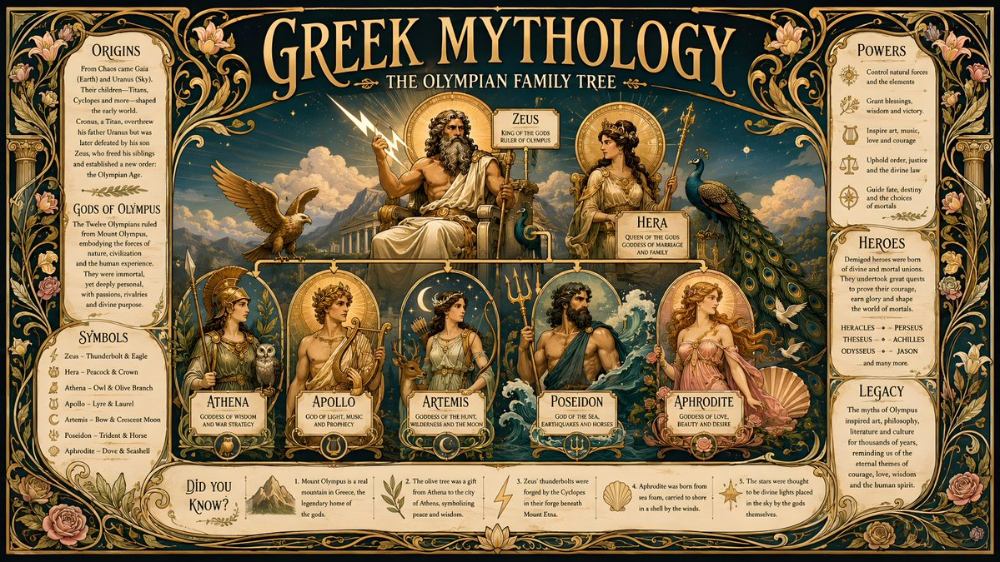

```text
An Art Nouveau style historical infographic poster in 16:9 horizontal format about Greek mythology, featuring an elegant flowing composition inspired by classical decorative poster design, with ornate floral borders, curling vines, golden laurel motifs, and graceful asymmetrical linework; the central artwork should depict the Olympian family tree as a beautiful mythic tableau with Zeus, Hera, Athena, Apollo, Artemis, Poseidon, and Aphrodite arranged in a ceremonial vertical hierarchy around Mount Olympus, each god or goddess framed by stylized Art Nouveau halos, flowing hair, marble columns, peacocks, olive branches, stars, waves, and moon crescents, all drawn with elongated elegant contours and rich decorative detail; use a palette of deep teal, antique gold, cream, and muted rose, with subtle gradients only in the illustrated figures and background sky; place the title at the top in large ornamental serif lettering reading GREEK MYTHOLOGY, with the subtitle THE OLYMPIAN FAMILY TREE beneath it in smaller elegant text; organize the facts into decorative side panels with graceful curved frames and thin gold rules, including sections labeled ORIGINS, GODS OF OLYMPUS, SYMBOLS, POWERS, HEROES, and LEGACY, plus a small DID YOU KNOW? box near the lower corner with five original myth facts; the entire poster should feel luxurious, classical, poetic, and richly decorative, with no modern UI, no copyrighted artwork, and a true Art Nouveau atmosphere, 16:9 horizontal ratio
```


---

## 例 575：Risograph Zine Rainforest Infographic

**来源：** [@92digitalartArt](https://x.com/92digitalartArt/status/2065135532875645242) / [awesome-gpt-image-2-prompts](https://github.com/EvoLinkAI/awesome-gpt-image-2-prompts)

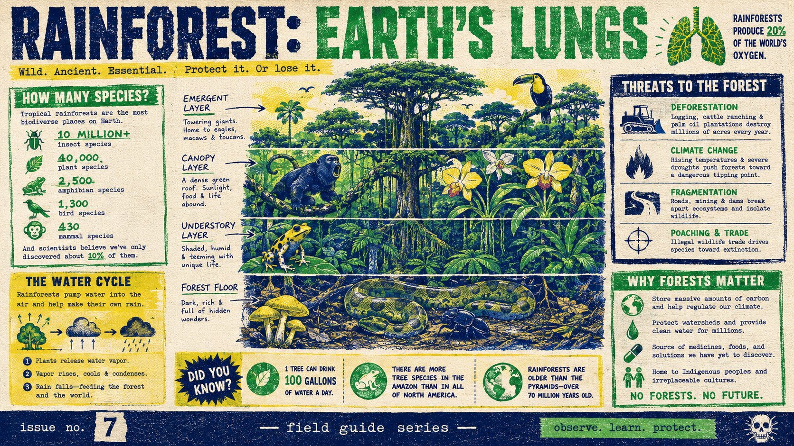

```text
A risograph zine print style infographic poster in 16:9 horizontal format exploring the biodiversity of tropical rainforests, designed to look exactly like an indie science zine printed with overlapping risograph ink layers; the entire composition should show the characteristic risograph printing imperfections: ink grain, slight misregistration between color layers, halftone dot patterns visible in midtones, and a tactile paper texture underneath everything; use a strict three-color risograph palette of fluorescent green, deep navy blue, and warm yellow, with rich overprinting where colors overlap creating unexpected secondary tones like teal where green meets blue and olive where green meets yellow; the main illustration fills the center: a lush vertical cross-section of a rainforest showing all four layers — emergent layer at the top with giant canopy trees and toucans, canopy layer with howler monkeys and orchids, understory with poison dart frogs and ferns, and forest floor with mushrooms, beetles, and anacondas — each layer labeled with a handwritten-style annotation in the risograph aesthetic; surrounding the central forest illustration, organize zine-style content panels with irregular hand-cut border aesthetics, including sections titled HOW MANY SPECIES?, THE WATER CYCLE, THREATS TO THE FOREST, and WHY FORESTS MATTER, each with small lo-fi icons and concise punchy text in a mix of bold grotesque sans-serif and typewriter-style fonts; include a dramatic zine-style header reading RAINFOREST: EARTH'S LUNGS in large stencil-style all-caps lettering; add a small DID YOU KNOW? box with three striking facts, and a bottom strip reading issue no. 7 — field guide series to make it feel like a real indie publication; the overall mood should feel urgent, indie, ecologically passionate, beautifully imperfect, and visually electric, high quality, aspect ratio 16:9
```


---

## 例 576：Pixar 3D Kebab Maker Storyboard Poster

**来源：** [@TechieBySA](https://x.com/TechieBySA/status/2065069836045033908) / [awesome-gpt-image-2-prompts](https://github.com/EvoLinkAI/awesome-gpt-image-2-prompts)

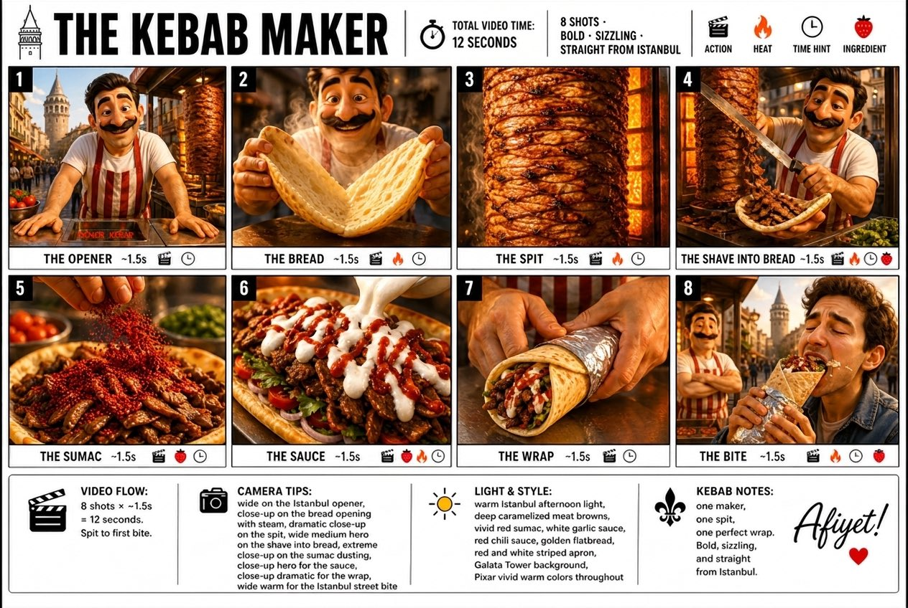

```text
“Create a crisp, clean infographic storyboard poster for THE KEBAB MAKER. Wide 16:9 layout, white background, black borders, bold black typography, premium Pixar 3D stylized rendering, bright vivid colors — deep caramelized meat browns, vivid red tomatoes, fresh green lettuce, white garlic sauce, golden warm flatbread, warm Istanbul street light.

Top header

•THE KEBAB MAKER
•TOTAL VIDEO TIME: 12 SECONDS
•8 SHOTS · BOLD · SIZZLING · STRAIGHT FROM ISTANBUL
•Legend icons: ACTION, HEAT, TIME HINT, INGREDIENT

Same Pixar-style middle-aged Turkish male kebab maker throughout — thick dark mustache, white t-shirt, red and white striped apron, small outdoor Istanbul kebab street stand, vertical doner spit glowing and rotating behind him, warm golden light, busy Turkish street with Galata Tower softly visible in background. Skilled, fast, proud.

8 panels:

Panel 1 — THE OPENER: Wide shot. Kebab maker stands behind his outdoor street stand, busy Istanbul street behind him, Galata Tower softly visible in warm afternoon light. Vertical doner spit rotating and glistening behind him. He slaps both hands on the counter and grins at the camera. The spit is already turning. You know exactly what’s coming.

Panel 2 — THE BREAD: Close-up. Kebab maker opens a warm flatbread with both hands — the bread splitting open softly, steam rising from inside, soft and pillowy interior revealed. Warm golden bread catching the afternoon light. The base of everything. Anticipation building.

Panel 3 — THE SPIT: Dramatic close-up. The vertical doner spit filling the entire frame — towering stack of layered marinated meat rotating slowly, outside layer deeply caramelized and glistening, heat element glowing orange behind it, steam rising. The most iconic kebab visual in the world.

Panel 4 — THE SHAVE INTO BREAD: Hero craft frame. Wide medium with character visible. Kebab maker holds the open flatbread in one hand positioned directly below the spit, long knife in the other shaving meat in one confident downward stroke — thin caramelized strips falling directly into the open bread below. Meat, knife, bread and spit all in one frame. The most dynamic panel in the series.

Panel 5 — THE SUMAC: Extreme close-up. Kebab maker’s hand sprinkling deep red sumac powder generously over the shaved meat — the vivid crimson powder catching the warm afternoon light as it falls, dusting every piece of meat. Deep red against deep brown. The most authentically Turkish panel in the series. The insider detail that makes Turkish viewers feel seen and everyone else curious.

Panel 6 — THE SAUCE: Close-up hero shot. Thick white garlic sauce poured in a generous arc over the filling — cascading over the meat and vegetables. Then a zigzag of vivid red chili sauce over the top. White and red against deep brown meat. The most appetizing panel.

Panel 7 — THE WRAP: Close-up dramatic. Both hands wrapping the flatbread tight and fast — filling bulging slightly at the ends, foil paper wrapped around the bottom. One confident twist. Done. The payoff of all the craft.

Panel 8 — THE BITE: Wide warm shot. Customer standing on the Istanbul street takes the wrapped kebab, takes a massive first bite — filling visible at the end, sauce on their lip, eyes closing in pure street food satisfaction. Kebab maker watching from behind the stand, arms crossed, deeply proud. Istanbul street and Galata Tower glowing warmly behind them both.

Footer:

•VIDEO FLOW: 8 shots × ~1.5s = 12 seconds. Spit to first bite.
•CAMERA TIPS: wide on the Istanbul opener, close-up on the bread opening with steam, dramatic close-up on the spit, wide medium hero on the shave into bread, extreme close-up on the sumac dusting, close-up hero for the sauce, close-up dramatic for the wrap, wide warm for the Istanbul street bite
•LIGHT & STYLE: warm Istanbul afternoon light, deep caramelized meat browns, vivid red sumac, white garlic sauce, red chili sauce, golden flatbread, red”
```


---

## 例 577：Solar Storm WPA Poster

**来源：** [@92digitalartArt](https://x.com/92digitalartArt/status/2066062156441735187) / [awesome-gpt-image-2-prompts](https://github.com/EvoLinkAI/awesome-gpt-image-2-prompts)

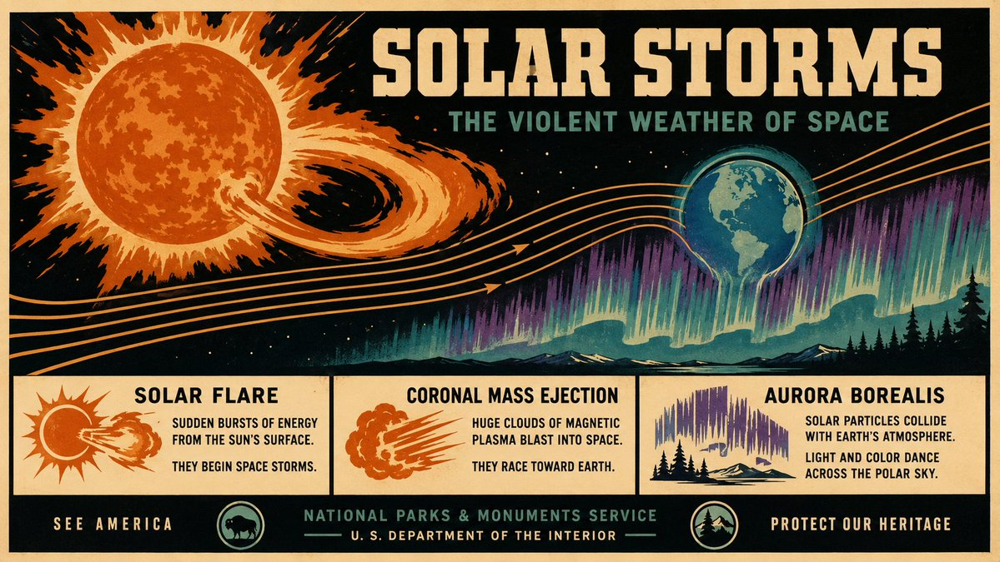

```text
A 1930s WPA travel poster style infographic poster in 16:9 horizontal format about solar weather and space storms, designed to look exactly like a vintage Works Progress Administration national parks poster from the New Deal era, with flat gouache-style color fills, bold black outlines, dramatic perspective and zero photorealism; the background transitions from deep black space at the top to a glowing teal-green aurora sky at the bottom, divided into bold graphic bands of color in the WPA tradition; the central illustration shows the Sun in the upper left as a massive dramatic circle with stylized flat orange and yellow flame corona eruptions radiating outward, and a large coronal mass ejection arc sweeping diagonally toward Earth in the upper right, depicted as a simplified blue sphere with a thin atmosphere ring; mid-composition, the solar wind stream is shown as bold parallel lines of warm gold flowing between Sun and Earth, and where those lines hit the atmosphere they bloom into a spectacular aurora borealis rendered in flat curtains of teal, green and violet in the WPA graphic tradition; below the main illustration, a clean horizontal strip divides the composition into three labeled science panels in a sans-serif bold font: SOLAR FLARE, CORONAL MASS EJECTION, and AURORA BOREALIS, each with a minimal one-color icon and two lines of punchy educational text; the title at the top reads SOLAR STORMS in massive slab-serif WPA lettering, with the subtitle THE VIOLENT WEATHER OF SPACE in a smaller weight beneath; the full palette is restricted to five flat colors — black, deep cream, burnt orange, teal and violet — giving the whole piece the unmistakable graphic punch and populist optimism of a 1930s government art print, high quality, aspect ratio 16:9
```


---

## 例 578：Chowmein Recipe Infographic

**来源：** [@iamaiistudio](https://x.com/iamaiistudio/status/2067429181726904350) / [awesome-gpt-image-2-prompts](https://github.com/EvoLinkAI/awesome-gpt-image-2-prompts)

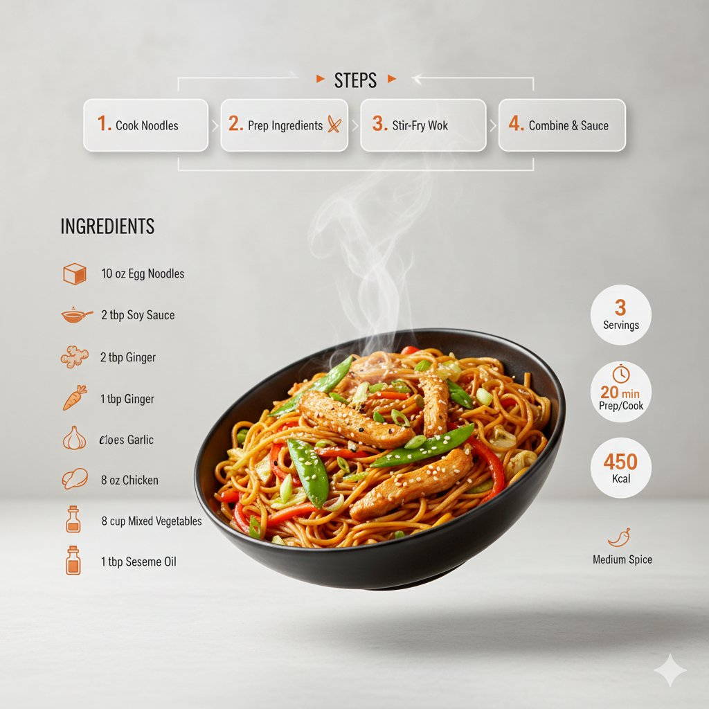

```text
Ultra-clean modern recipe infographic for chowmin. Feature the finished dish as hero visual, plated and slightly elevated in a perspective or angled view. Arrange ingredients, preparation steps, and tips dynamically around the dish in an editorial layout. Ingredients: icons or mini illustrations with quantities, arranged in clusters or circular flows connected visually to the dish. Steps: numbered panels with arrows or connecting lines forming a logical flow, including small cooking icons (knife, pan, oven, timer). Optional info: calories, prep/cook time, servings, spice level displayed as clean bubbles or badges. Visual style: editorial infographic meets lifestyle food photography. Vibrant natural food colors, subtle drop shadows, clean vector icons, modern typography, soft gradients or glassmorphism for step panels, accent colors on key stats. Composition: finished meal as hero, ingredients and steps flowing dynamically around it, clear visual hierarchy with ample negative space. Lighting: soft natural studio light on a minimal textured or gradient background. Output: 1080x1080, ultra-crisp, social-feed optimized, no watermark.
```


---

## 例 579：Fashion Blueprint Editorial Sheet

**来源：** [@ZephyraLeigh](https://twitter.com/ZephyraLeigh/status/2056770705677775247) / [awesome-gpt-image-2-prompts](https://github.com/EvoLinkAI/awesome-gpt-image-2-prompts)

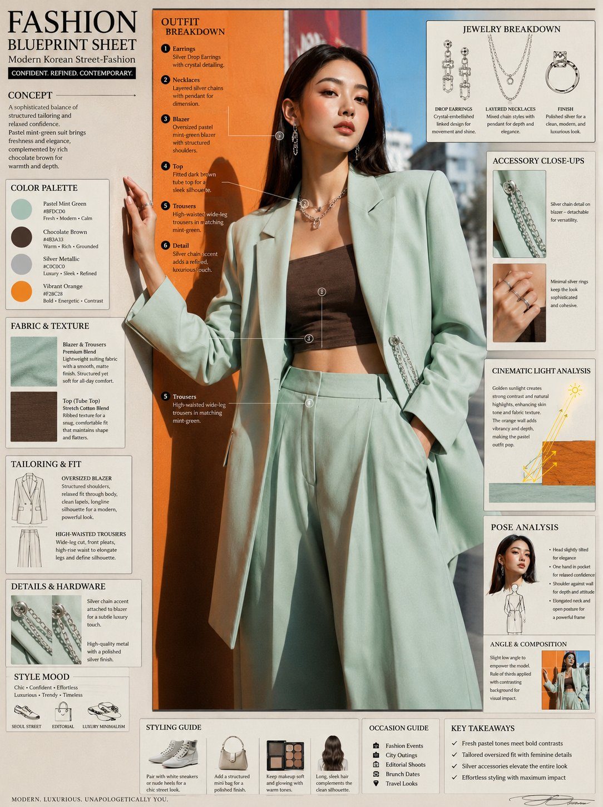

```text
Fashion blueprint sheet of a stylish young woman posing beside a bright orange wall, half-body fashion editorial view with detailed outfit annotations and luxury styling callouts. Long sleek dark hair, soft glam makeup, silver drop earrings, layered silver necklaces, fitted dark brown cropped tube top, oversized pastel mint-green blazer with structured shoulders, matching high-waisted wide-leg trousers, elegant silver chain detail attached to blazer, relaxed confident pose with one hand in pocket.

Surrounding the model are fashion infographic elements, jewelry breakdowns, fabric texture descriptions, tailoring notes, pose analysis, accessory close-ups, cinematic sunlight reflections, modern Korean street-fashion aesthetic, editorial photography style, ultra detailed, professional fashion concept sheet, 8k, 1744x2336
```


---

## 例 580：NBA Legend Mid-Air Action Poster

**来源：** [@Taaruk_](https://x.com/Taaruk_/status/2057491440406810988) / [awesome-gpt-image-2-prompts](https://github.com/EvoLinkAI/awesome-gpt-image-2-prompts)

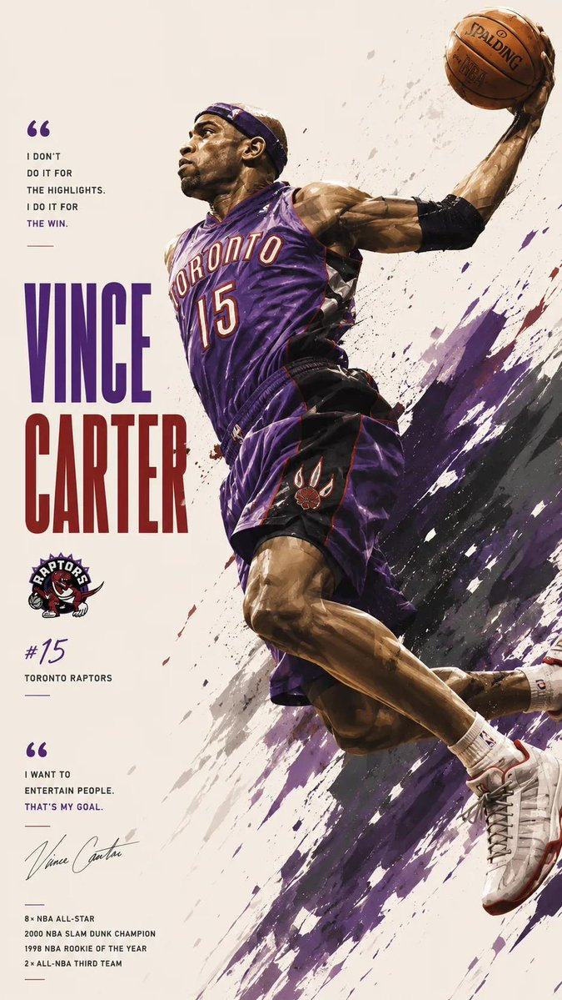

```text
Dynamic NBA legend poster design, iconic basketball superstar in mid-air action pose performing dunk, jumpshot, or intense celebration, cinematic sports illustration style, highly detailed muscular anatomy, dramatic motion, realistic face with painterly polygon brush texture, explosive paint splashes behind character matching team colors, bold typography with player name in huge vertical letters, motivational quote text layout, sports stats and achievements infographic, clean minimal cream background, modern editorial composition.
```


---

## 例 581：Wooden Bookshelf Prompt Test

**来源：** [@chetaslua](https://x.com/chetaslua/status/2044331451077013749) / [awesome-gpt-image-2-prompts](https://github.com/EvoLinkAI/awesome-gpt-image-2-prompts)

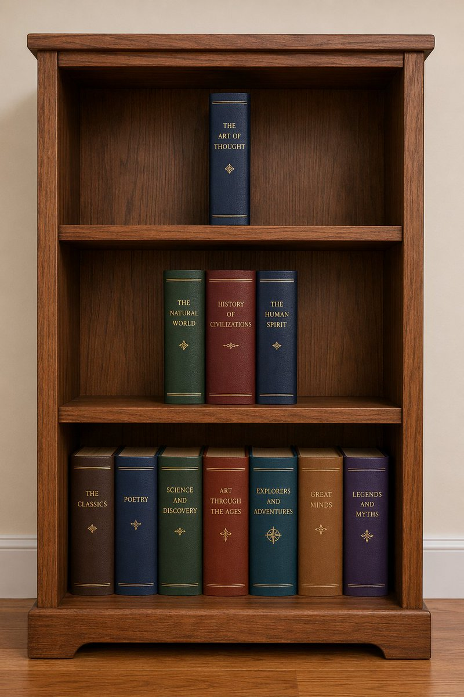

```text
A wooden bookshelf consisting of three shelves: On the top shelf, there should be one book, on the second shelf, there should be three books, and on the bottom shelf, there should be seven books.
```


---

## 例 582：GPT-Image-2 Detail Showcase

**来源：** [@liyue_ai](https://x.com/liyue_ai/status/2045000106919997637) / [awesome-gpt-image-2-prompts](https://github.com/EvoLinkAI/awesome-gpt-image-2-prompts)

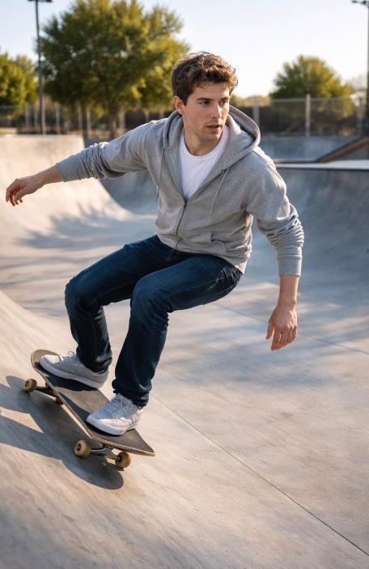

```text
以眼部特写图片为基础，生成3:4的四屏构图超写实眼部特写，四屏按春夏秋冬上下排序。

第一屏：眼眸中带着绽粉樱色的美瞳，睫毛缀满迷你春花，脸颊散落樱瓣与黄蕊小花，粉蝶萦绕眉眼，浅金发丝轻垂，下方簇簇樱花怒放，画面中央"SPRING"白色艺术字点缀，风格细腻唯美，光影柔和，色彩粉嫩治愈，下面用书法体写着春；

第二屏：眼眸中带着着清荷色的美瞳，睫毛饰以粉莲与绿荷，脸颊挂着晶莹水珠，粉瓣、绿荷点缀其间，蜻蜓轻绕，浅金发丝若隐若现，画面中央"Summer"白色艺术字凸显，光影通透流光感，色彩清透凉爽，下面用书法体写着夏；

第三屏：眼眸中带着金黄红相间的美瞳，睫毛饰以橙红枫叶，脸颊散落金红秋叶，橙蝶翩跹眉眼间，浅金发丝隐约可见，画面中央"AUTUMN"白色艺术字醒目，光影暖金流光，色彩浓郁温暖，下面用书法笔写着秋；

第四屏：眼眸中带着雪花蓝色的美瞳，睫毛覆满冰晶雪片，脸颊散落白色雪花与红色腊梅，银白蝴蝶翩跹眉眼，浅金发丝朦胧似雪，画面中央"WINTER"白色艺术字亮眼，光影冷冽蓝白流光，色彩清透纯净，下面用书法体写着冬。

整体呈现梦幻眼眸四季交替的唯美梦幻治愈画面，微调各屏的光影强度，让画面氛围感更浓郁。
```


---

## 例 583：Lion Camel Ridge Dark Myth Scene

**来源：** [@MANISH1027512](https://x.com/MANISH1027512/status/2045743158860878312) / [awesome-gpt-image-2-prompts](https://github.com/EvoLinkAI/awesome-gpt-image-2-prompts)


```text
中式怪异，黑暗神秘风格融合中式美学，完美细节，多重管线渲染，完美建模。西游记背景，狮驼岭，千妖万怪，坐在左边巨大王座上的大象王重甲妖精，坐在中间巨大王座上的狮王重甲妖精，坐在右边巨大王座上大鹏鸟王重甲妖精。渺小的背对镜头孙悟空肩抗金箍棒步行前进，孙悟空身穿铠甲，近地仰拍镜头，长焦镜头，强烈阴影。极致细节刻画，多次修改，正确透视和主体线条，精致细节
```


---

## 例 584：Edit this image so that total amount changes to 244.5 baht. You can change th...

**来源：** [@elliscrosby](https://x.com/elliscrosby/status/2047211507596071235) / [awesome-gpt-image-2-prompts](https://github.com/EvoLinkAI/awesome-gpt-image-2-prompts)


```text
Edit this image so that total amount changes to 244.5 baht. You can change the quantity of each of the stacks of coins until we hit the target total.
```


---

## 例 585：Naturalist-Style Food Specimen Cross-Section

**来源：** [@GeekCatX](https://x.com/GeekCatX/status/2046939656244318676) / [awesome-gpt-image-2-prompts](https://github.com/EvoLinkAI/awesome-gpt-image-2-prompts)

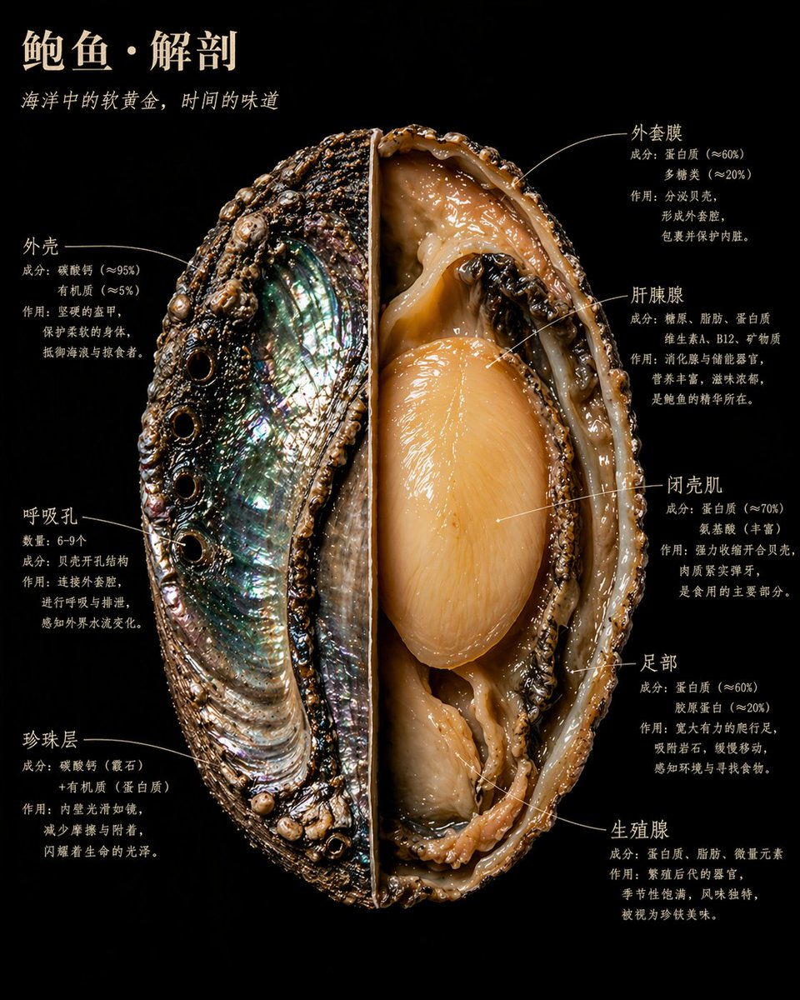

```text
一颗/一块/一枚【食物名称】，以博物学大师发现野外标本的方式解剖。
剖开、展开、固定——如同博物馆的珍贵藏品，
却以卡拉瓦乔为《国家地理》掌镜时的光线照亮。
每一个内部结构都以自身的材质真相发光。
截面锋利得近乎暴力。内部美丽得近乎神圣。
画面中呈现完整标本：
一半保持原状，展示【外表面描述：质感/颜色/纹理】；
另一半剖开至核心，【内部核心结构描述：最重要的1—2个内部视觉特征】清晰可见。
【补充1—2句该食物最具视觉张力的横截面细节描述】
背景：纯粹的黑丝绒。
【食物名称】悬浮其中，如同某件珍贵而危险的事物。
标注文字紧贴结构边缘，手写感衬线字体，绝不悬空飘浮。
画面包含以下标注，每处标注三行：第一行结构名称，第二行成分数据，第三行一句人话：
【结构01名称】
【成分／数据说明】
【这个结构在做什么，为什么重要】

【结构02名称】
【成分／数据说明】
【这个结构在做什么，为什么重要】
【结构03名称】
【成分／数据说明】
【这个结构在做什么，为什么重要】
【结构04名称】
【成分／数据说明】
【这个结构在做什么，为什么重要】
【结构05名称】
【成分／数据说明】
【这个结构在做什么，为什么重要】

【结构06名称】
【成分／数据说明】
【这个结构在做什么，为什么重要】
省略其他如果有继续保持这个格式
主标题，左上角，暖象牙白大写字体：
【食物名称】·解剖

斜体副标题紧随其下：
【一句揭示这种食物本质的话，不超过15字】

整体气质：奥杜邦博物插画×卡拉瓦乔光影×有史以来最美的科学摄影。
4K精度，标本照明，极致内部细节。
没有任何临床感，一切都鲜活。
写实风格，非示意图，非卡通，非简化图解。
每一种材质都有真实的物理质感：
粗糙的、光滑的、湿润的、干燥的、致密的、疏松的。
```


---

## 例 586：Cozy Scrapbook Mini Alter Egos

**来源：** [@gold_force_guri](https://x.com/gold_force_guri/status/2050433982756721029) / [awesome-gpt-image-2-prompts](https://github.com/EvoLinkAI/awesome-gpt-image-2-prompts)

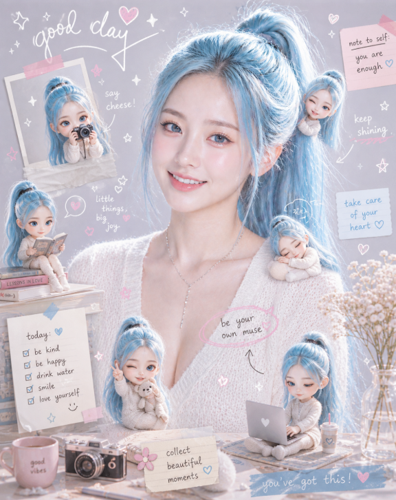

```text
GPT IMAGE 2 on ChatGpt Prompt: Transform the provided reference image into a cozy aesthetic scrapbook-style composition while strictly preserving the original subject, identity, pose, lighting, and background. Add multiple small “mini version” characters of the same person (chibi / doll-like style), placed naturally around the scene (on objects, table, shoulder, etc.). These mini figures must match the subject’s face, hairstyle, outfit, and vibe consistently, styled as cute 3D collectible figurines. Show them doing different activities (reading, posing, taking photos, relaxing). Overlay handwritten-style doodles and annotations across the image: arrows, hearts, stars, sparkles, icons, and playful captions connected to elements in the scene. Use a soft pastel color palette (white base with pink, peach, blue accents). Keep the frame visually rich and filled but balanced and clean. Style: warm, cozy lighting, dreamy Instagram scrapbook aesthetic, soft depth of field, highly detailed, polished but playful. The final result must look like the SAME original image enhanced with mini alter-egos and aesthetic annotations — not a recreated or different scene
```


---

## 例 587：Sourdough Baker Storyboard

**来源：** [@TechieBySA](https://x.com/TechieBySA/status/2054609590332129596) / [awesome-gpt-image-2-prompts](https://github.com/EvoLinkAI/awesome-gpt-image-2-prompts)

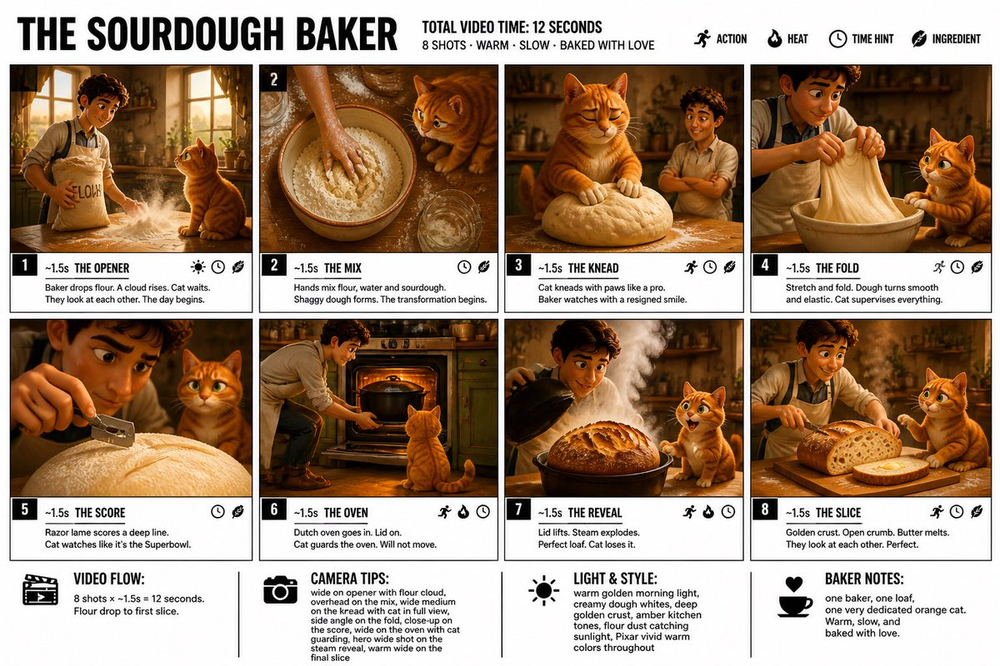

```text
“Create a crisp, clean infographic storyboard poster for THE SOURDOUGH BAKER. Wide 16:9 layout, white background, black borders, bold black typography, premium Pixar 3D stylized rendering, bright warm colors — creamy dough whites, golden crust browns, warm flour dust, rich amber kitchen light, pops of green from herbs on the windowsill. Top header: THE SOURDOUGH BAKER TOTAL VIDEO TIME: 12 SECONDS 8 SHOTS · WARM · SLOW · BAKED WITH LOVE Legend icons: ACTION, HEAT, TIME HINT, INGREDIENT Same Pixar-style young male baker throughout — flour-dusted white apron, warm rustic kitchen, wooden counter, morning light streaming through the window. And one recurring character — a fluffy orange cat who takes the craft extremely seriously and is present in every single panel. 8 panels: Panel 1 — THE OPENER: Wide shot. Baker walks into his kitchen at dawn carrying a large flour bag under one arm. He drops it onto the wooden counter sending a dramatic puff of white flour into the warm morning light — flour cloud catching the golden sunlight beautifully. The orange cat is already sitting on the counter waiting, completely unbothered by the flour cloud, staring directly at the baker. They look at each other. The day begins. You know exactly what's about to happen. Panel 2 — THE MIX: Overhead locked shot. Baker's hands mixing flour, water and sourdough starter together in a large ceramic bowl — shaggy dough forming, the transformation beginning. The orange cat sits at the edge of the counter, head tilted, watching the bowl with complete concentration. Panel 3 — THE KNEAD: The hero comedy panel. Baker steps aside. The orange cat is on the counter, both front paws pressing and kneading the dough exactly like cats do in real life — slow rhythmic biscuit-making motion, eyes half closed in pure contentment. Baker watches from the side with a resigned smile. The cat is completely unbothered and deeply committed to the process. Panel 4 — THE FOLD: Side angle. Baker performs the stretch and fold — pulling the dough up and folding it over itself, the dough becoming smooth and elastic. Close-up on hands and dough. The orange cat watches from beside the bowl, one paw resting on the counter edge, supervising every movement. Panel 5 — THE SCORE: Close-up dramatic shot. Baker holds a razor lame above the risen dough, scoring a deep curved line across the surface — the blade catching the light. The orange cat sits in the background perfectly framed, watching with complete intensity as if this is the most important moment of the day. It is. Panel 6 — THE OVEN: Wide shot. Baker slides the dough inside the cast iron dutch oven, closes the heavy lid, slides it into the glowing oven. The orange cat sits directly in front of the oven door, staring at it, waiting. Will not move. Will never move. Panel 7 — THE REVEAL: The hero frame. Baker lifts the dutch oven lid — an enormous cloud of steam erupts upward, and beneath it the most perfect golden sourdough loaf, deeply scored crust cracked open, caramelized and blistered. The orange cat stands up on its hind legs trying to see over the counter edge, eyes wide, completely losing its composure for the first time. Panel 8 — THE SLICE: Wide warm shot. Baker slices through the loaf — perfect open crumb revealed inside, steam still rising, golden crust crackling. Butter placed on the warm slice, melting instantly. The orange cat sits beside the cutting board, one paw raised toward the bread. Baker looks at the cat. Cat looks at the bread. Baker smiles. Perfect ending. Footer: VIDEO FLOW: 8 shots × ~1.5s = 12 seconds. Flour drop to first slice. CAMERA TIPS: wide on opener with flour cloud, overhead on the mix, wide medium on the knead with cat in full view, side angle on the fold, close-up on the score, wide on the oven with cat guarding, hero wide shot on the steam reveal, warm wide on the final slice LIGHT & STYLE: warm golden morning light, creamy dough whites, deep golden crust.”
```


---

## 例 588：Pancake Dad Storyboard

**来源：** [@TechieBySA](https://x.com/TechieBySA/status/2055695974085927240) / [awesome-gpt-image-2-prompts](https://github.com/EvoLinkAI/awesome-gpt-image-2-prompts)

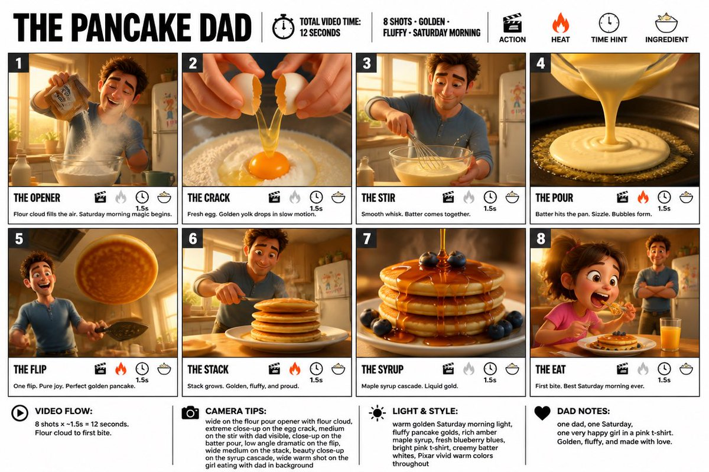

```text
Create a crisp, clean infographic storyboard poster for THE PANCAKE DAD. Wide 16:9 layout, white background, black borders, bold black typography, premium Pixar 3D stylized rendering, bright warm colors — golden pancake yellows, rich amber maple syrup, fresh blueberry blues and purples, creamy whites, warm morning kitchen light.
Top header:
•THE PANCAKE DAD
•TOTAL VIDEO TIME: 12 SECONDS
•8 SHOTS · GOLDEN · FLUFFY · SATURDAY MORNING
•Legend icons: ACTION, HEAT, TIME HINT, INGREDIENT
Same Pixar-style dad throughout — warm smile, casual home clothes, no apron or chef uniform, messy morning hair, cozy bright home kitchen, morning sunlight streaming through the window. A child’s drawing on the fridge visible in the background. And one recurring character — a small girl in a pink t-shirt who appears in the final panel.
8 panels:
Panel 1 — THE OPENER: Wide shot. Dad stands at the kitchen counter in his casual clothes, morning light flooding in behind him. He holds a large flour bag with both hands and pours it into the mixing bowl — a generous cloud of white flour billowing up into the warm morning sunlight, catching the light beautifully. He waves the flour dust away from his face with a warm laugh. Messy, real, Saturday morning. The fridge behind him has a child’s drawing on it. You know exactly what’s being made.
Panel 2 — THE CRACK: Extreme close-up. Dad cracks a fresh egg over the mixing bowl — the bowl already has flour and milk in it, golden yolk drops in slow motion into the batter mixture. Shell splits cleanly. The moment it all comes together.
Panel 3 — THE STIR: Medium shot with dad visible. He whisks the batter in smooth circular motions, the mixture becoming smooth and pale yellow, tiny bubbles forming on the surface. Morning light catching the whisk. Relaxed and unhurried — this is his Saturday ritual.
Panel 4 — THE POUR: Close-up side angle. Batter poured from the bowl onto a hot buttered pan — it spreads into a perfect circle, edges immediately beginning to set, tiny bubbles forming across the surface. The sizzle implied in every frame.
Panel 5 — THE FLIP: The hero frame. Low angle dramatic shot — spatula slides under the pancake, dad flips it with one confident motion, pancake suspended perfectly in mid-air above the pan, golden underside revealed, dad’s face lit up with pure joy behind it.
Panel 6 — THE STACK: Wide medium shot with dad visible. He slides the finished pancake onto a plate already holding two others — a perfect golden stack building up, steam rising from each layer. Dad looks genuinely pleased with himself.
Panel 7 — THE SYRUP: Close-up beauty shot. Maple syrup poured from above in a slow golden arc over the stack — cascading down the sides, pooling at the base, fresh blueberries scattered around the plate. Liquid gold catching the morning light. Irresistible.
Panel 8 — THE EAT: Wide warm shot. A small girl in a bright pink t-shirt sits at the kitchen table, eyes wide, mouth open, fork mid-bite into the stack, blueberries on the plate, syrup everywhere. Dad stands in the background arms crossed, warm proud smile. Saturday morning complete.
Footer:
•VIDEO FLOW: 8 shots × ~1.5s = 12 seconds. Flour cloud to first bite.
•CAMERA TIPS: wide on the flour pour opener with flour cloud, extreme close-up on the egg crack, medium on the stir with dad visible, close-up on the batter pour, low angle dramatic on the flip, wide medium on the stack, beauty close-up on the syrup cascade, wide warm shot on the girl eating with dad in background
•LIGHT & STYLE: warm golden Saturday morning light, fluffy pancake golds, rich amber maple syrup, fresh blueberry blues, bright pink t-shirt, creamy batter whites, Pixar vivid warm colors throughout
•DAD NOTES: one dad, one Saturday, one very happy girl in a pink t-shirt. Golden, fluffy, and made with love.​​​​​​​​​​​​​​​​
```


---

## 例 589：90s Sitcom Fashion Character Lineup

**来源：** [@Taaruk_](https://x.com/Taaruk_/status/2063300353588879444) / [awesome-gpt-image-2-prompts](https://github.com/EvoLinkAI/awesome-gpt-image-2-prompts)

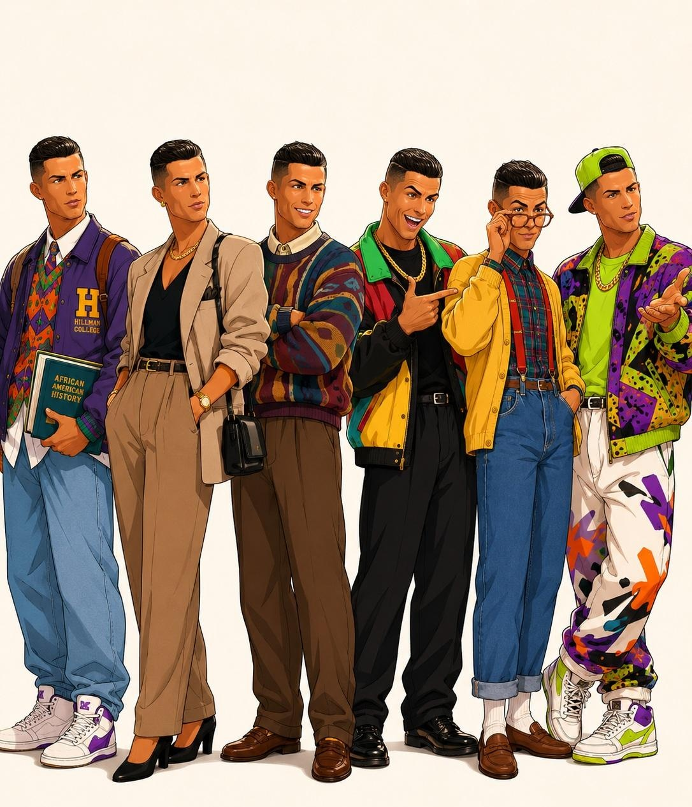

```text
Full-body character lineup showcasing the same person transformed through six iconic 1990s fashion aesthetics, standing side-by-side in a clean studio composition. Each version features a unique outfit inspired by classic 90s sitcom culture: varsity college student, sophisticated business casual professional, colorful patterned sweater enthusiast, streetwear trendsetter, nerdy intellectual with suspenders and glasses, and vibrant hip-hop fashion icon. Consistent facial features across all versions, expressive poses, detailed clothing textures, oversized silhouettes, retro sneakers, loafers, accessories, layered outfits, bold color palettes, fashion illustration style, character design sheet, clean white background, highly detailed linework, modern cartoon realism, concept art, fashion reference board, full-body view, professional character turnaround, ultra-sharp details, vibrant colors, 4K, masterpiece.
```


---

## 例 590：Shattered Stone Style Transfer

**来源：** [@Samann_ai](https://x.com/Samann_ai/status/2063606958188265880) / [awesome-gpt-image-2-prompts](https://github.com/EvoLinkAI/awesome-gpt-image-2-prompts)

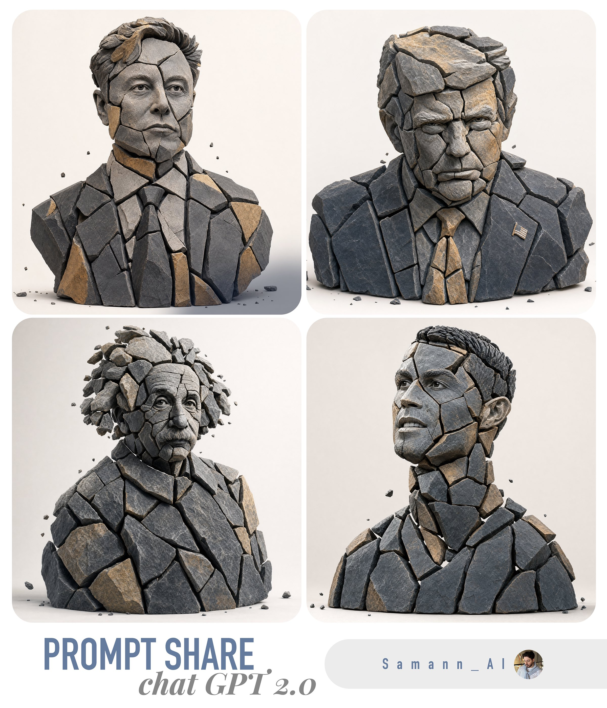

```text
{
  "task": "image_to_image_style_transfer",
  "input_image": "{{USER_IMAGE}}",
  "prompt": "Create a hyper-real 3D studio composition that recreates the main subject from the provided image as a fragmented stone assemblage. The subject must be built from separate, clearly detached rock pieces with small visible gaps between shards (no pieces merging). Material look: fragmented slate + sandstone shards with chiseled edges, crisp fractures, visible stone grain, micro-scratches, and realistic roughness. Color palette: predominantly dark slate with subtle warm-ochre sandstone accents. Lighting: soft studio key light from top-left, gentle fill, subtle contact shadows under each shard, realistic ambient occlusion in crevices, clean reflections kept minimal. Background: minimal off-white seamless backdrop, no texture. Framing: centered, clean, straight-on, subject fully readable. Add a few tiny debris chips floating or resting near the base for depth. Preserve the subject’s identity, proportions, and recognizable silhouette from the input image while transforming all surfaces into stone fragments. Hyper-real, high detail, sharp focus, 8k render quality.",
  "negative_prompt": "text, typography, logo, watermark, signature, extra props, busy background, fog, heavy bloom, cartoon, illustration, lowpoly, plastic, metal, glossy paint, melted shapes, merged fragments, unreadable subject, blur, noise, low resolution, oversharpening halos, distorted face/body, extra limbs, deformed geometry",
  "output": {
    "aspect_ratio": "use_input_aspect_ratio",
    "background": "off_white",
    "camera": {
      "angle": "straight_on",
      "framing": "centered",
      "distance": "medium"
    }
  },
  "params": {
    "style_strength": 0.75,
    "identity_preservation": 0.9,
    "detail_level": "very_high",
    "lighting_preset": "soft_studio_top_left",
    "shadow_intensity": "subtle",
    "gap_visibility": "clear",
    "debris_chips": "few_tiny",
    "no_text": true
  }
}
```


---

## 例 591：Churro Maker Storyboard Poster

**来源：** [@TechieBySA](https://x.com/TechieBySA/status/2064032022830502202) / [awesome-gpt-image-2-prompts](https://github.com/EvoLinkAI/awesome-gpt-image-2-prompts)

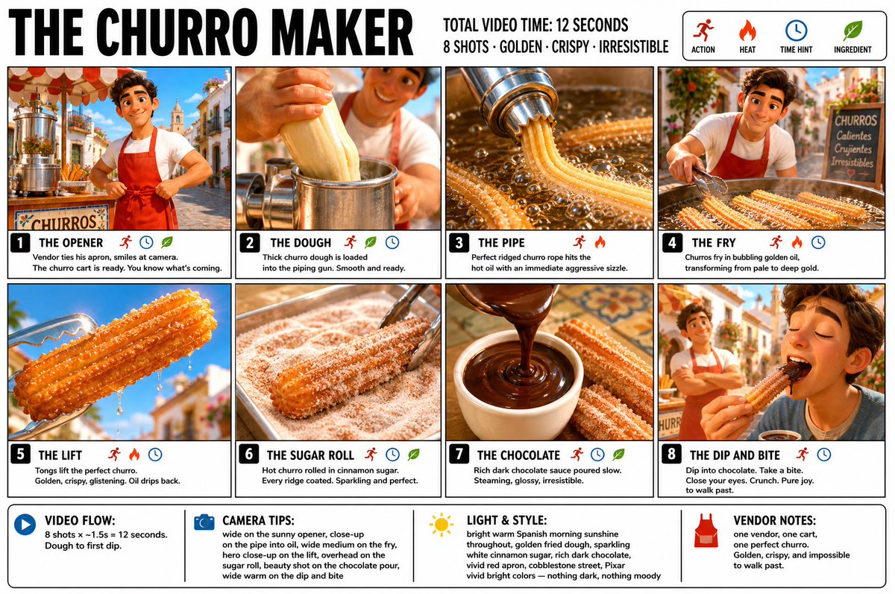

```text
“Create a crisp, clean infographic storyboard poster for THE CHURRO MAKER. Wide 16:9 layout, white background, black borders, bold black typography, premium Pixar 3D stylized rendering, bright vivid colors — golden fried dough, sparkling white cinnamon sugar, rich dark chocolate sauce, vivid warm Spanish street food energy throughout.

Top header:

•THE CHURRO MAKER
•TOTAL VIDEO TIME: 12 SECONDS
• 8 SHOTS · GOLDEN · CRISPY · IRRESISTIBLE
•Legend icons: ACTION, HEAT, TIME HINT, INGREDIENT

Same Pixar-style young Spanish male street vendor throughout — warm smile, white t-shirt, red apron, small bright outdoor churro cart, morning sunshine, cobblestone street, warm golden light everywhere. Fresh, bright, joyful — nothing dark, nothing moody.

8 panels:

Panel 1 — THE OPENER: Wide shot. Young vendor stands behind his bright churro cart on a sunny cobblestone street, morning light flooding everything. He ties his red apron with a warm confident smile, looks up at the camera. The churro machine gleaming beside him. Bright blue sky above. You know exactly what’s coming.

Panel 2 — THE DOUGH: Close-up. Thick churro dough being loaded into the piping gun — smooth, pale, creamy. Vendor’s hands pressing it in firmly. Steam rising slightly. The dough is alive and ready.

Panel 3 — THE PIPE: The most satisfying panel. Close-up dramatic shot — vendor squeezes the piping gun over hot golden oil, a perfect ridged churro rope emerging in a long straight line, the star-shaped ridges crisp and defined. The dough hits the oil with an immediate aggressive sizzle. Bright and energetic.

Panel 4 — THE FRY: Wide medium shot with vendor visible. Churros frying in vivid golden oil — bubbling vigorously all around them, the color deepening from pale to rich gold before your eyes. Vendor watches with a satisfied expression, tongs ready. The transformation happening live.

Panel 5 — THE LIFT: Close-up hero shot. Tongs lifting a perfectly fried churro from the oil — golden, crispy, glistening, held up against the bright morning sky. Oil dripping back into the fryer below. The most beautiful single churro you have ever seen.

Panel 6 — THE SUGAR ROLL: The scroll-stopper. Close-up overhead. The hot churro rolled through a tray of cinnamon sugar — white sugar and cinnamon coating every ridge perfectly, sparkling in the morning light, the heat making the sugar cling and glisten. The most textural and satisfying panel.

Panel 7 — THE CHOCOLATE: Beauty shot. Dark glossy chocolate dipping sauce poured into a small white ceramic cup in a slow arc — rich, dark, steaming. The churro resting beside it, golden and sugar-coated. The contrast of deep dark chocolate against bright golden churro. Irresistible.

Panel 8 — THE DIP AND BITE: Wide warm shot. A customer’s hand dips the churro into the chocolate sauce — it comes out coated and glossy — then takes a bite. The crunch implied in every pixel. Eyes close. Pure street food joy. Vendor visible in the background, arms crossed, warm proud smile. Morning sunshine all around.

Footer:

•VIDEO FLOW: 8 shots × ~1.5s = 12 seconds. Dough to first dip.
•CAMERA TIPS: wide on the sunny opener, close-up on the pipe into oil, wide medium on the fry, hero close-up on the lift, overhead on the sugar roll, beauty shot on the chocolate pour, wide warm on the dip and bite
•LIGHT & STYLE: bright warm Spanish morning sunshine throughout, golden fried dough, sparkling white cinnamon sugar, rich dark chocolate, vivid red apron, cobblestone street, Pixar vivid bright colors — nothing dark, nothing moody
•VENDOR NOTES: one vendor, one cart, one perfect churro. Golden, crispy, and impossible to walk past.”
```


---

## 例 592：Old Footage Restoration with GPT-Image 2

**来源：** [@CuriousRefuge](https://x.com/CuriousRefuge/status/2065139340486045905) / [awesome-gpt-image-2-prompts](https://github.com/EvoLinkAI/awesome-gpt-image-2-prompts)

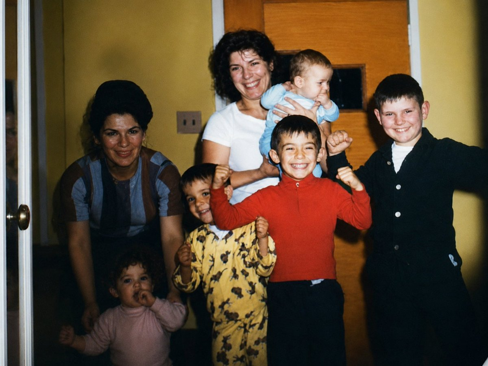

```text
Transform the attached image into a high resolution digital photo that looks like it was taken yesterday. Make it look like it was taken with a Canon EOS R6. Cinematic color grading and lighting. Keep details the same, only change the quality and resolution.

Once GPT-Image 2 gives you the first ultra high quality image, upload the rest of your stills and input the following prompt: do the same for these attached photos  Download all the ultra high quality images
```


---

## 例 593：4 Architectural Styles 2×2 Grid

**来源：** [@Gdgtify](https://x.com/Gdgtify/status/2065191846800740636) / [awesome-gpt-image-2-prompts](https://github.com/EvoLinkAI/awesome-gpt-image-2-prompts)

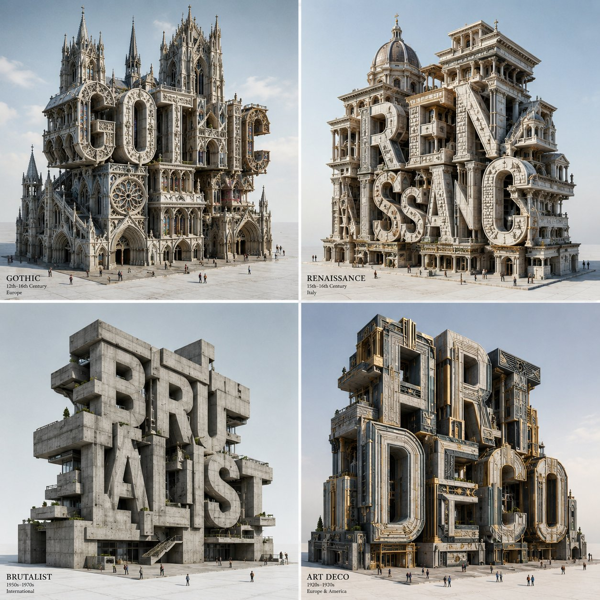

```text
2x2 grid, do this for 4 famous architectural styles. Anchor: [Architectural Style] :: [Geometric Essence & Period]. Each panel shows a representative building in that exact style with consistent camera angle and neutral sky background.
```


---

## 例 594：Coin Math Editing Test

**来源：** [@iamaiistudio](https://x.com/iamaiistudio/status/2065994787094983151) / [awesome-gpt-image-2-prompts](https://github.com/EvoLinkAI/awesome-gpt-image-2-prompts)

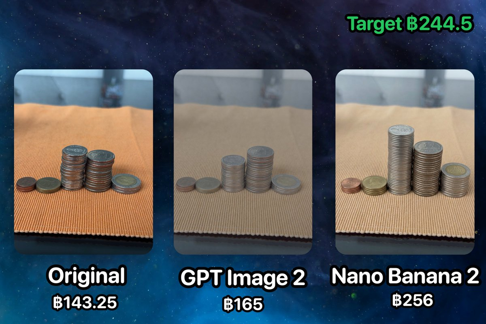

```text
Modify this photo so the total adds up to 244.5 baht. Adjust the number of coins in each stack until the combined value hits the target.
```


---

## 例 595：Blueprint vs Render Split Object

**来源：** [@iamaiistudio](https://x.com/iamaiistudio/status/2067202108303311255) / [awesome-gpt-image-2-prompts](https://github.com/EvoLinkAI/awesome-gpt-image-2-prompts)

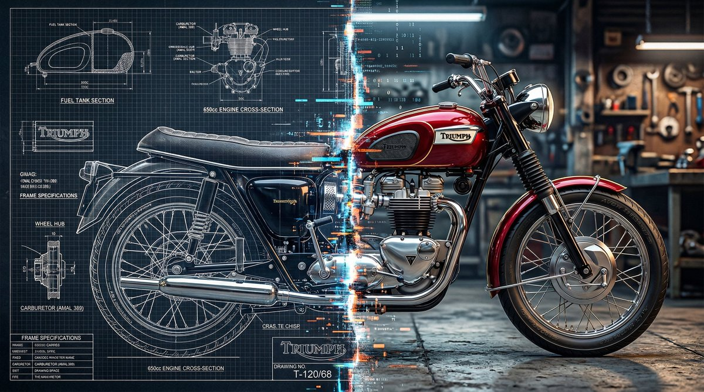

```text
Pick any object and slice it in half vertically, the left side rendered as a detailed technical schematic blueprint with grid lines and annotations, the right side as a polished 3D model render, the center seam flickering and glitching where the two visual realities collide.
```


---

## 例 596：Pretzel Maker Storyboard

**来源：** [@TechieBySA](https://x.com/TechieBySA/status/2069811464324460679) / [awesome-gpt-image-2-prompts](https://github.com/EvoLinkAI/awesome-gpt-image-2-prompts)

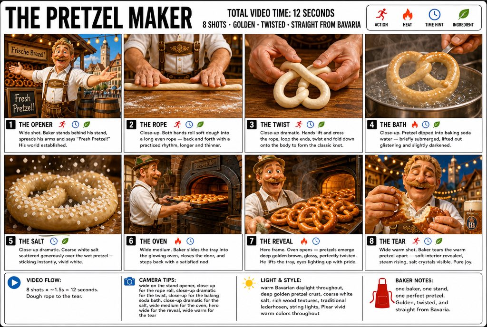

```text
“Create a crisp, clean infographic storyboard poster for THE PRETZEL MAKER. Wide 16:9 layout, white background, black borders, bold black typography, premium Pixar 3D stylized rendering, bright vivid colors — deep golden brown pretzel crust, warm caramel tones, coarse white salt crystals, rich wood textures, warm Bavarian daylight.
Top header:
THE PRETZEL MAKER
TOTAL VIDEO TIME: 12 SECONDS
8 SHOTS · GOLDEN · TWISTED · STRAIGHT FROM BAVARIA
Legend icons: ACTION, HEAT, TIME HINT, INGREDIENT
Same Pixar-style middle-aged Bavarian male baker throughout — warm round face, thick blonde mustache, traditional lederhosen with suspenders, white shirt, small charming wooden pretzel stand, string lights overhead, wooden beer barrels nearby, warm daylight, charming German town square or beer garden visible behind him.
8 panels:
Panel 1 — THE OPENER: Wide shot. Baker stands behind his wooden pretzel stand, warm daylight flooding the scene, string lights hanging above, traditional German buildings softly visible behind him. He spreads his arms wide and says "Fresh Pretzel!" with a massive proud smile. His world established. You know exactly what's coming.
Panel 2 — THE ROPE: Close-up. Both hands rolling a length of soft pale dough into a long even rope on the wooden counter — rolling back and forth with practiced rhythm, the rope stretching longer and thinner with each pass.
Panel 3 — THE TWIST: Hero craft frame. Close-up dramatic. Both hands lifting the dough rope and crossing it into the iconic pretzel shape — looping the ends, twisting them together, folding them down onto the body to form the classic pretzel knot. The most unique hand motion in the entire series. Nobody has shown this in Pixar style.
Panel 4 — THE BATH: Close-up. The shaped pretzel dipped into a pot of bubbling baking soda water — briefly submerged, lifted back out glistening and slightly darkened, ready for the oven. The step that gives pretzels their signature deep color and chew.
Panel 5 — THE SALT: Close-up dramatic. Coarse white salt crystals scattered generously over the wet pretzel surface — sticking instantly, catching the daylight, vivid white against the pale dough.
Panel 6 — THE OVEN: Wide medium with him visible. Baker slides the tray of pretzels into the glowing oven, closes the door. Steps back with a satisfied nod. The wait begins.
Panel 7 — THE REVEAL: The hero frame. Oven door opens — pretzels emerging deep golden brown, glossy, perfectly twisted, steam rising. He lifts the tray with both hands, eyes lighting up with pride. The most beautiful pretzels you have ever seen.
Panel 8 — THE TEAR: Wide warm shot. Baker tears a warm pretzel apart with both hands — soft warm interior revealed, steam escaping, salt crystals visible on the golden crust. Eyes closing in pure satisfaction. String lights and the warm Bavarian square glowing behind him.
Footer:
VIDEO FLOW: 8 shots × ~1.5s = 12 seconds. Dough rope to the tear.
CAMERA TIPS: wide on the stand opener, close-up for the rope roll, close-up dramatic for the twist, close-up for the baking soda bath, close-up dramatic for the salt, wide medium for the oven, hero wide for the reveal, wide warm for the tear
LIGHT & STYLE: warm Bavarian daylight throughout, deep golden pretzel crust, coarse white salt, rich wood textures, traditional lederhosen, string lights, Pixar vivid warm colors throughout
BAKER NOTES: one baker, one stand, one perfect pretzel. Golden, twisted, and straight from Bavaria.”
```


---

## 例 597：Bird Nest Chair Concept Board

**来源：** [@iamaiistudio](https://x.com/iamaiistudio/status/2069779689074561192) / [awesome-gpt-image-2-prompts](https://github.com/EvoLinkAI/awesome-gpt-image-2-prompts)

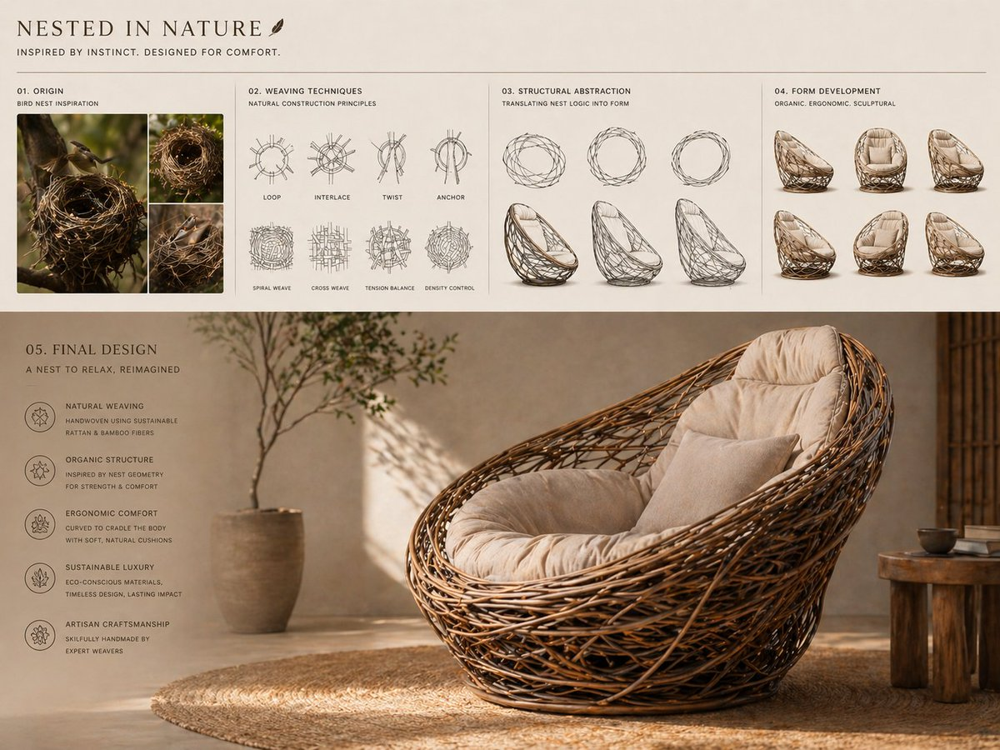

```text
Design concept board: bird nest weaving methods as the inspiration for a sculptural lounge chair. Four-stage sequence from nest-building reference photos to construction diagrams, then organic form abstraction, then the finished product. Interlocking woven frame forms the seat and backrest. Natural fiber upholstery with soft cushioning. Earthy warm tones with a polished, refined surface. Sustainable luxury aesthetic. Presentation layout with process sketches in the top half, final rendered chair in the bottom half. Warm natural lighting.

AR 4:3
```


---

## 例 598：Parody Luxury Product Advertisement

**来源：** [@tonysimons_](https://x.com/tonysimons_/status/2048057490940596595) / [awesome-gpt-image-2-prompts](https://github.com/EvoLinkAI/awesome-gpt-image-2-prompts)

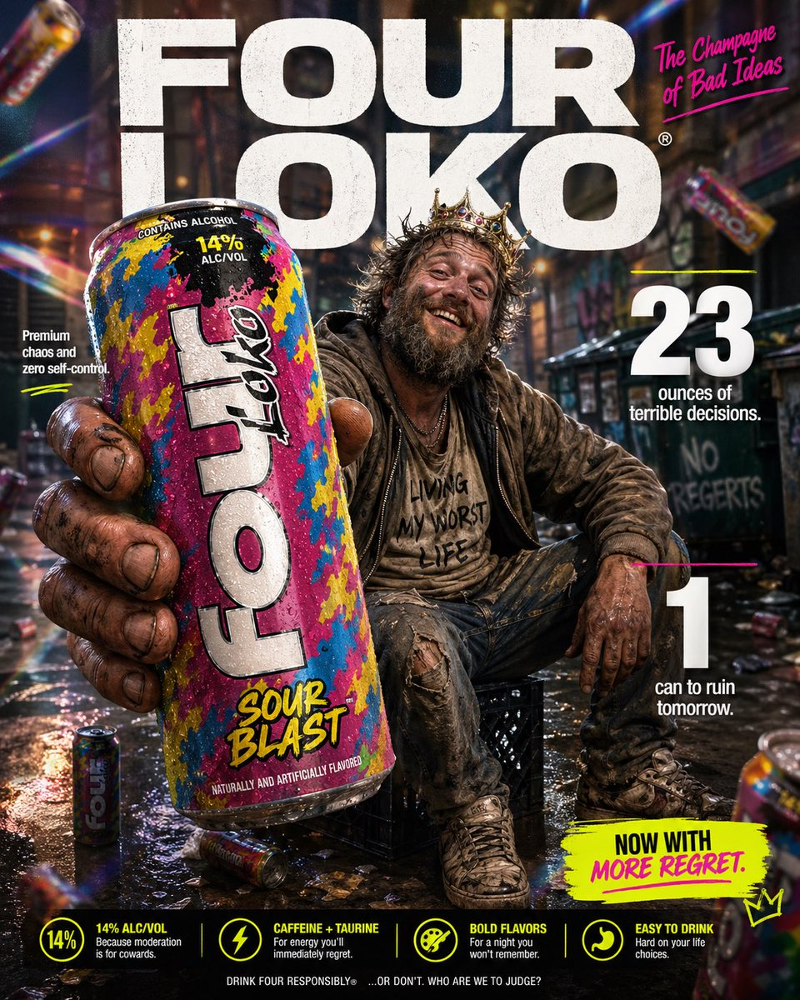

```text
High-impact parody e-commerce infographic for “{argument name="product" default="Four Loko"}” malt beverage. Foreground: An extreme close-up of a rough, weathered hand holding a tall, brightly colored can of {argument name="product" default="Four Loko"} toward the camera. The can is slightly cold with visible condensation droplets and a loud, chaotic flavor design. The hand and can have a slight macro-lens blur for depth, with the can still reading clearly as the hero product. Central Subject: In the mid-ground, a funny, disheveled {argument name="subject" default="homeless-looking man"} sitting casually on a milk crate in an urban alley. He has a scruffy beard, messy hair, layered worn clothing, and a huge unbothered grin. He should look chaotic but oddly charismatic, like the accidental king of bad decisions. He is posed like a confident lifestyle-ad model, proudly showing off the can. Background & Lighting: A ridiculously polished ad-style backdrop mixed with a grimy city alley setting. Soft-focus urban textures, dumpster shapes, graffiti hints, and scattered clutter in the distance. Add dramatic studio lighting, soft glow, rainbow prism flares, and subtle light leaks to make the whole thing look way too premium for the subject matter. A few blurred {argument name="product" default="Four Loko"} cans can float artistically in the background for extra absurdity. Typography & Layout (Bold sans-serif, white and neon accent styling): Top Center (Background): Massive, bold text reading “{argument name="brand name" default="FOUR LOKO"}” positioned behind the subject. Top Right: Bold text reading “The Champagne of Bad Ideas”. Mid-Left: “Premium chaos and zero self-control” Mid-Right: Large, bold “23” with the text “ounces of terrible decisions.” Bottom-Right: Large, bold “1" with the text “can to ruin tomorrow.” Optional small callout text near the bottom: “Now with more regret.” Style: Ultra-detailed, 8k parody commercial photography, sharp focus on the can, shallow depth of field, vibrant trashy color palette, clean advertising composition, exaggerated premium product-ad aesthetic, funny visual contrast between polished branding and the wrecked subject.
```


---

## 例 599：Wireless Earbuds Lifestyle Ad

**来源：** [@iamaiistudio](https://x.com/iamaiistudio/status/2065753093283991651) / [awesome-gpt-image-2-prompts](https://github.com/EvoLinkAI/awesome-gpt-image-2-prompts)

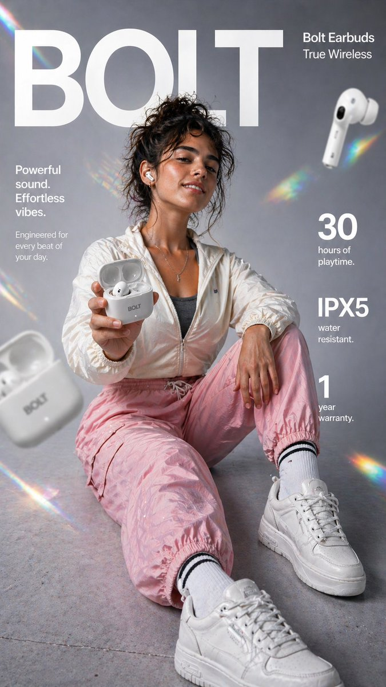

```text
Design a 9:16 vertical product infographic for Bolt True Wireless Earbuds with a high-end lifestyle ad feel.
Composition & Framing
Full-body shot of a young woman whose face, skin tone, and hairstyle match the reference photo exactly
Slightly low camera angle close to the subject, fashion campaign style, for depth and visual presence
She's seated casually on the floor, one knee up, one leg stretched toward the camera
Foreground (Product)
She holds an open Bolt earbud charging case out toward the viewer
One earbud is visible inside the case, the other is in her ear
The case is glossy white with "BOLT" branding
Slight macro bokeh blur on the hand and case for cinematic depth
Outfit & Style
Modern athleisure streetwear: off-white or neutral lightweight jacket, crop top or sports bra, soft pink joggers, textured white sneakers
Expression: confident and relaxed, subtle smile
Pose feels natural and lifestyle-driven, not posed
Background
Soft gray gradient studio background
Rainbow prism lens flares and subtle light leaks
Floating blurred earbuds and case in background
Studio floor texture visible underfoot
Lighting
Diffused commercial studio lighting emphasizing skin texture, the glossy case, and fabric detail
Soft rim light to separate the subject from the background
Text Overlays (modern sans-serif, white)
Top Center: "BOLT" in large bold text, partially behind the subject
Top Right: Bolt Earbuds / True Wireless
Mid Left: Powerful sound. / Effortless vibes. / Engineered for every beat of your day.
Mid Right: 30 hours of playtime / IPX5 water resistant
Bottom Right: 1 year warranty
Quality
8K ultra-realistic commercial photography
Sharp on face and earbuds, gentle depth blur on foreground and background
Clean Apple/Nike premium ad aesthetic, strong negative space
```


---

## 例 600：Informative Climate Change Seminar Poster

**来源：** [YouMind](https://youmind.com/prompts/informative-climate-change-seminar-poster-1058)


```text
An informative and engaging poster for a public seminar on climate change. The poster is designed as a mini-infographic, with a large, central graphic showing the earth with a thermometer, and smaller icons and data points around it explaining the causes and effects. The design is clean, organized, and aims to educate the viewer quickly and effectively. –ar 3:4
```


---

## 例 601：纪实摄影与纸片速写拼贴海报

**来源：** [@Hamburgerai](https://x.com/Hamburgerai/status/2092919708588843081) / [OpenNana](https://opennana.com/awesome-prompt-gallery/travel-photography-paper-cutout-sketch-collage-poster)

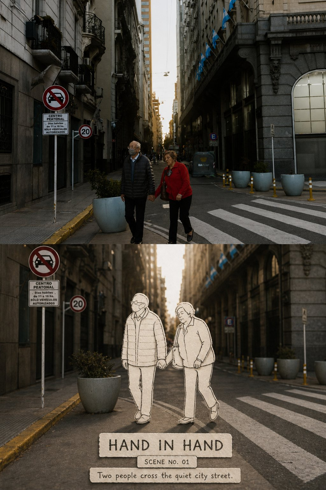

```text
Please turn every travel photo I upload into an independent high-end transformed poster, no multi-photo stitching, output each photo individually.

The overall structure uses a 3:4 vertical top-and-bottom comparison. The top part accounts for about 48%–50% of the screen, completely retaining the original photo; the bottom part accounts for about 50%–52%, reconstructing the same location, the same person, and the same moment. Use a clear, straight horizontal boundary between the top and bottom, without blending, torn paper, multi-layer collage, or middle decorative bands.

The top part faithfully preserves the identity, number, facial features, posture, direction of travel, gestures, clothing, personal belongings, spacing between people, front-to-back occlusion, architectural structure, road perspective, real materials, natural lighting, and location atmosphere of the original photo. Only perform slight travel magazine, art publication, or exhibition photography color grading, and add very thin film grain. Do not change people, replace backgrounds, move buildings, add or delete pedestrians, or turn photos into illustrations.

The bottom part reconstructs the same space, but allows for a more editorial secondary composition based on human relationships. Choose a real photography environment sufficient to prove the location, moderately tighten the cropping, reduce background contrast, or delete irrelevant peripheral figures, making the 1–4 most important figures in the photo a clear narrative center. Keep about 20%–32% of continuous low-information negative space in the sky, walls, streets, water, or ground, allowing the image to breathe and accommodate text.

The architecture, streets, walls, trees, vehicles, sky, water, and lighting in the bottom part continue to maintain real photography textures. Do not draw the entire scene together as a line drawing. Only transform the people who actually exist in the photo and play a major narrative role into "warm white paper + black hesitant line drawing" physical collage sketch characters.

Strictly maintain the real number, position, size, posture, direction of movement, distance from each other, hand contact, front-to-back occlusion, and interactive relationship of the characters. Each character consists of the following parts:

- Opaque warm white or natural white paper fill, completely covering the original photographic content of the character;
- Visible but restrained natural paper grain and slight fibers;
- Clean but slightly manual-error die-cut paper edges;
- Loose, hesitant, black or ink black outlines with slightly varying thickness;
- A very small amount of internal sketch lines for hair, collars, arms, palms, legs, shoes, backpacks, or cameras;
- Very shallow, correctly directed foot contact shadows and paper layer shadows.

The characters must stand in the scene like real thin paper characters, with foot-to-ground contact, occlusion between characters, perspective scaling, and scene light direction all being believable. Do not just overlay white line drawings on transparent photographic people, nor make them into thick foam stickers, cartoon characters, emojis, comic characters, or AR interfaces.

Very small characters in the distance can be actively moved out of the frame according to the cropping of the bottom part; if they remain clearly identifiable, they should be processed as simple white paper silhouettes in their real numbers, and must not be copied, added, or unified into the same pose. Bags, hats, cameras, umbrellas, or bicycles related to the character's movement can be turned into paper along with the character.

By default, add three layers of accurate, readable English text:

1. Extract a title of 1–3 English words based on the character's movement or scene relationship in the photo;
2. An observation number similar to "SCENE NO. 01";
3. A short sentence of 5–10 English words describing the actual walking, waiting, meeting, hugging, or watching happening in the photo.

The main title must be clearly recognizable at normal chat preview sizes, accounting for about 25%–38% of the width of the bottom area. The text uses loose black ink capital letters, manual lead type, or sketchbook-style condensed font, which can be printed on a warm white handmade paper tag or arranged along low-information walls or floors. Ink marks are allowed to have slight breaks and paper teeth, but cannot be shrunk into decorative gray lines, nor look like smooth digital typography overlaid in post-production.

Do not fabricate character relationships, locations, dates, brands, citations, or author information. Text must not cover character faces, hand interactions, or foot contact positions.

The overall effect has the wonderful feeling of real travel photography and paper character sketches existing simultaneously: the environment still belongs to reality, while the characters seem to be cut out from memories, diaries, or sketchbooks and then gently placed back into the journey.

Avoid: full-poster redraw, illustrated buildings, illustrated street, all-white background replacing the scene, transparent line overlay on photographic people, cartoon people, colored comic characters, kawaii stickers, speech bubbles, AR interface, thick foam stickers, altered person count, invented pedestrians, duplicated figures, changed poses, separated hands, floating figures, missing contact shadows, tiny source-photo comparison, fake text, author name, signature, social handle, logo, watermark.

Most important rule: the top must completely retain the real original photo; the bottom remains a real photographic space, only transforming the characters actually existing in the photo into physical collage characters composed of warm white paper and hesitant black ink lines.
```


---

## 例 602：旅行照片转民间墨线设色地标对比海报

**来源：** [@Hamburgerai](https://x.com/Hamburgerai/status/2092778271926792370) / [OpenNana](https://opennana.com/awesome-prompt-gallery/travel-photo-to-folk-ink-landmark-comparison-poster)

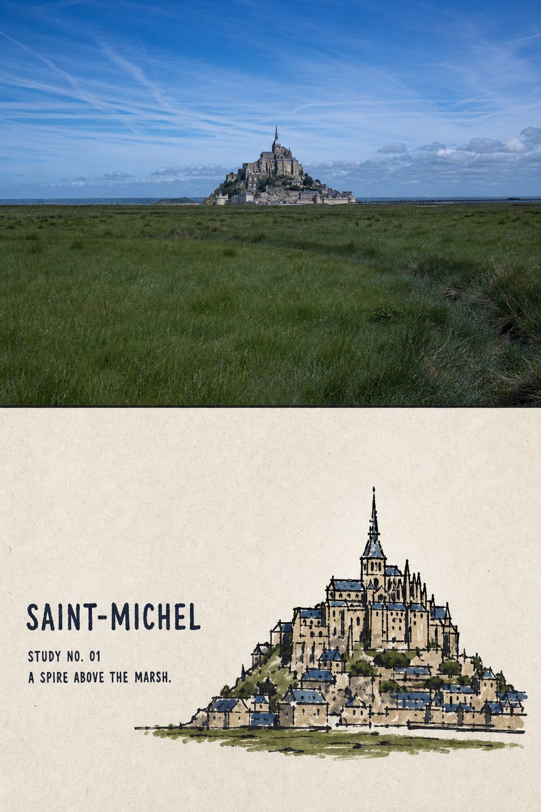

```text
Please turn each travel photo I upload into an individual "Folk Ink and Color Landmark Portrait" comparison poster. Output each photo separately; do not combine multiple photos into a single frame.

## Overall Layout

Use a 3:4 vertical composition.

The frame is divided vertically into two areas with an approximate 1:1 height ratio:

- Upper part: High-fidelity original photo;
- Lower part: A folk ink and color landmark portrait distilled from the same photo.

Use a straight, clear, and restrained horizontal boundary between the upper and lower areas. No gradients, feathering, tearing, or allowing ink lines and color blocks to invade the photo area.

## Upper Part: Real Photo

Faithfully preserve the following from the original photo:

- Landmark or building identity;
- Building height-to-width ratio;
- Facade or front-side observation angle;
- Relationship between roofs, domes, towers, and portals;
- Steps, colonnades, sculptures, and entrance directions;
- Necessary surrounding roads, trees, water surfaces, or walls;
- Real materials, natural light and shadow, and the original color atmosphere.

Perform only slight color grading in the style of travel magazines, independent publications, and art exhibitions, and add a very thin layer of film grain.

The upper part must remain a real photograph. Do not illustrate, move buildings, change perspective, add decorations, replace the sky, stretch, mirror, or duplicate the subject.

## Lower Part: Landmark Portrait

Do not redraw the photo completely, and do not add an ink line filter to the photo.

First, identify the 2–4 most identifying structural elements of the building, such as:

- Roof or dome outlines;
- Height relationship of towers;
- Main portals and arches;
- Direction of steps and bases;
- Rhythm of colonnades;
- Position of statues;
- Bridgeheads, walls, or a small section of waterfront.

Proactively remove tourists, vehicles, advertisements, signs, dense vegetation, repetitive window panes, brick seams, carvings, complex cornices, sky textures, and photographic noise.

The lower part should only retain the minimum information that makes the building instantly recognizable.

The building portrait usually occupies only 36%–55% of the conversion area, placed in the center, lower-middle, or biased towards one side following the center of gravity of the original photo. Retain 45%–60% continuous warm white paper around it.

Remove the background first, then shrink the subject. Do not shrink the entire landscape and stuff it into the lower area, nor fill the entire background.

## Ink Lines

On warm, off-white matte drawing paper with subtle paper fibers, redraw the building using heavy, slightly shaky black brushes, oil-based markers, or thick ink pens.

The ink lines should have realistic wrist pressure and paper resistance:

- Uneven thickness;
- Slight hesitation and back-folding;
- Local re-tracing;
- Occasional broken lines;
- Small ink blobs;
- Rough paper edges;
- A few unclosed outlines.

First, use a small amount of firm outer outlines to capture the roof, tower body, portal, steps, and base, then use very few short lines, dot-like ink marks, or small black blocks to suggest the internal structure.

The lines can be slightly clumsy but must accurately capture the character of the building. Do not draw it as a fine pen architectural drawing, automatic photo tracing, vector outlines of uniform thickness, or a children's coloring draft.

## Coloring

Use only 2–3 iconic colors extracted from the original photo, plus paper white and black ink to form the entire palette.

Prioritize extracting:

- The representative color of the building's walls or roof;
- One environmental color from the sky, plants, water, or ground;
- If necessary, add a darker visual anchor color.

Reduce the saturation of the colors slightly to form a full, slightly aged, matte gouache flat wash.

Color blocks may appear with:

- Obvious brush marks;
- Uneven coverage;
- Crossing over ink lines;
- Local misalignment;
- White gaps (missed spots);
- Edge chips;
- Paper texture showing through.

Colors do not need to fit perfectly inside the lines. It should look as if the painter directly brushed several blocks of old color onto the paper, rather than closed filling in digital software.

Color is only used for main walls, roofs, ground, or two or three irregular backplates; do not fill the entire background.

## Whitespace and Composition

The building portrait and text occupy two separate areas of white paper with space between them.

- When the building is to the left, place the text on the right or top right;
- When the building is to the right, place the text on the left or top left;
- Maintain a clear breathing distance between the building and the text.

Except for the building and text, retain at least one complete, continuous area of white paper without images or words, allowing the blank space to represent the sky, distance, light, and the sense of quietness in travel.

Do not use template layouts where all four corners are filled with information.

## Text

By default, add a set of restrained but legible English travel captions.

The text content must be determined verbatim based on the facts of the photo before generation, including:

1. A location or scene title of 1–3 English words;
2. A short field, such as "STUDY NO. 01" or "LANDMARK NOTE";
3. An observation sentence of 5–10 English words describing the roofs, portals, steps, colors, shorelines, or weather truly visible in the photo.

The main title uses slightly hesitant thick-stroke English uppercase, oil-based marker characters, or old manual lead type.

The title must be clearly legible at normal chat preview sizes, usually occupying 20%–32% of the width of the lower area. Allow slight misalignment, ink breakage, paper teeth, and manual spacing, but it must not be so scribbled as to be unrecognizable.

The numbering and observation sentences are about 45%–65% of the height of the title characters, using small old lead type, handwritten side notes, or humanist sans-serif, also remaining clearly legible.

The text uses black ink or a dark color extracted from the building color blocks, appearing as if written, drawn, or printed directly on the paper, and must not become a floating smooth digital typography layer.

If the location cannot be reliably confirmed, use the real scene theme as the title; do not guess cities, building names, dates, or coordinates.

Prohibit Chinese inscriptions, fake Chinese, pseudo-calligraphy, author names, signatures, social media accounts, logos, QR codes, URLs, fictional locations, and gibberish.

## Mandatory Avoidance

Avoid: fixed Chinese temple template, red-wall blue-background formula, invented stone lions, invented flags, fake seals, Chinese calligraphy, copied reference architecture, detailed pen-and-ink architecture drawing, transparent watercolor wash, screenprint halftone, full-page rubber stamp texture, woodcut hatching, automatic photo outlines, vector illustration, clean closed color fills, childish coloring-book style, cartoon landmark icon, complete background rendering, excessive architectural details, edge-to-edge painting, tiny unreadable typography, floating digital text, author signature, logo, watermark.

Most Important Rules:

The upper part must clearly retain the real original photo.

The lower part uses heavy and slightly shaky black ink lines to capture the most identifying roof, tower, portal, steps, or statue of the same building; then uses two or three slightly overlapping, brush-marked old colors to anchor the main relationships.

Proactively delete details, shrink the building, add legible travel captions, and retain large areas of continuous white paper, making the result look like a folk architectural portrait carefully drawn during a journey, rather than an architectural fine drawing, a photo filter, or a generic cartoon landmark.
```


---

## 例 603：现代超清宏观生物信息图昆虫

**来源：** [@Gdgtify](https://x.com/Gdgtify/status/2090415049303347213) / [OpenNana](https://opennana.com/awesome-prompt-gallery/macro-biology-infographic-insect-ui-design)

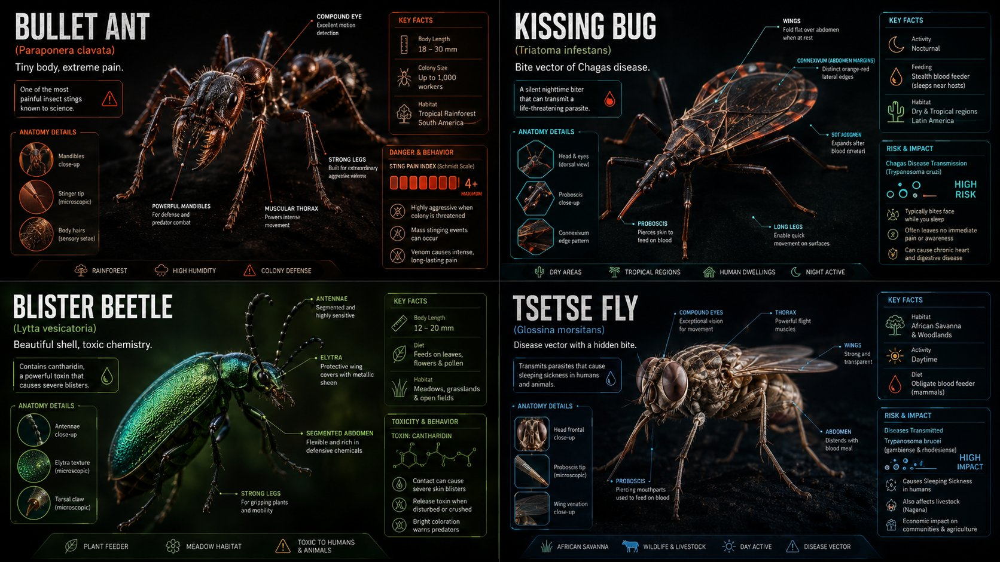

```text
2x2 grid, 16:9, do this for 4 famous rare insects that are more dangerous than they look: Prompt: Ultra-clean modern macro-biology infographic. Showcase a [SMALL INSECT/BUG] (e.g., jumping spider, praying mantis) in visually striking, hyper-detailed macro form—floating slightly in a 3D perspective or angled view. Arrange anatomical features, abilities, and habitat stats around the specimen in a dynamic editorial layout. Anatomy Section: Include glowing vector lines pointing to specific body parts (eyes, mandibles, legs) with mini-illustrations or microscopic scans detailing their function. Arrange them in a radial flow connected visually to the specimen. Behavioral Stats Section: Show abilities (jump height, venom toxicity, speed) with data graphs, numbered panels, or progress bars forming a logical flow around the main subject. Include small atmospheric icons (leaf, web, sun, moon). Additional Info (optional): Lifespan, ecosystem role, predation stats—displayed as clean futuristic holographic bubbles or badges near the specimen. Visual Style: National Geographic macro photography meets sci-fi bio-lab UI. Vibrant iridescent natural colors, subtle bioluminescent drop shadows, clean glowing vector lines, modern typography, soft dark gradients or frosted glass panels for data. Accent colors in neon cyan or green to highlight key stats. Composition Guidelines: Specimen as hero visual (angled, looking at camera). Data and anatomy flow dynamically around it. Clear visual hierarchy: bug > anatomy > stats. Enough negative space to keep design airy, mysterious, and readable. Lighting & Background: Cinematic rim lighting on the subject, dark minimal textured or gradient background (deep forest green or black) for a premium laboratory feel. Ultra-crisp, social-feed optimized, no watermark.
```


---
