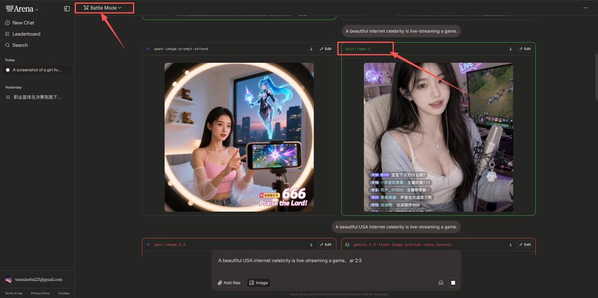
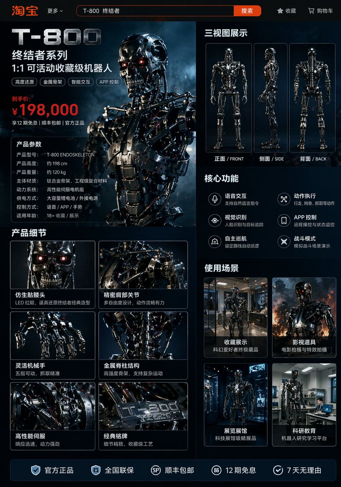

# 场景与叙事 — 提示词合集


> 14 个案例

---

## 例 29：电影感叙事场景图

**来源：** [@danieldmai](https://x.com/danieldmai)


```text
Using REFERENCE_0, transform the subject's appearance to a {argument name="style" default="trad goth"} aesthetic while preserving the exact pose, clothing structure, and background. Change her hair to {argument name="hair color" default="black"} with {argument name="hair style" default="choppy bangs"}. Apply heavy dark makeup, specifically {argument name="lip color" default="black"} lipstick and intense dark eyeshadow, and make her skin tone slightly paler. Add 2 facial piercings: a septum ring and a nostril stud. Finally, modify her layered necklaces to feature {argument name="necklace pendants" default="an inverted cross and a pentagram"}.
```


---

## 例 97：综合应用场景图

**来源：** [@kawai\_design](https://x.com/kawai_design)


```text
Create a high-quality Japanese {argument name="thumbnail type" default="webinar thumbnail"}. {argument name="aspect ratio" default="16:9 widescreen"}. There is a lot of text, but the main copy stands out clearly.
```


---

## 例 108：综合应用场景图

**来源：** [@underwoodxie96](https://x.com/underwoodxie96)


```text
{argument name="subject" default="A beautiful internet celebrity"} is live-streaming a {argument name="activity" default="game"}.
```


---

## 例 109：综合应用场景图

**来源：** [@underwoodxie96](https://x.com/underwoodxie96)




```text
{argument name="subject" default="A beautiful internet celebrity"} is live-streaming a {argument name="activity" default="game"}.
```


---

## 例 145：综合应用场景图

**来源：** [@alanlovelq](https://x.com/alanlovelq)


```text
A {argument name="platform" default="Taobao"} product detail page for {argument name="robot model" default="T-800 robot"}, displaying: front, side, and back three-view drawings of the robot, product price, product details, functions, and usage scenarios, etc.
```


---

## 例 146：综合应用场景图

**来源：** [@alanlovelq](https://x.com/alanlovelq)


```text
A {argument name="platform" default="Taobao"} product detail page for {argument name="robot model" default="T-800 robot"}, displaying: front, side, and back three-view drawings of the robot, product price, product details, functions, and usage scenarios, etc.
```


---

## 例 147：综合应用场景图

**来源：** [@alanlovelq](https://x.com/alanlovelq)


```text
A {argument name="platform" default="Taobao"} product detail page for {argument name="robot model" default="T-800 robot"}, displaying: front, side, and back three-view drawings of the robot, product price, product details, functions, and usage scenarios, etc.
```


---

## 例 148：综合应用场景图

**来源：** [@alanlovelq](https://x.com/alanlovelq)




```text
A {argument name="platform" default="Taobao"} product detail page for {argument name="robot model" default="T-800 robot"}, displaying: front, side, and back three-view drawings of the robot, product price, product details, functions, and usage scenarios, etc.
```

## 例 149：综合应用场景图

**来源：** [@nicdunz](https://x.com/nicdunz)

```text
create a minecraft skin inspired by {argument name="reference" default="my look"}
```


---
## 例 150：清冷佳人夜市烧烤三刀流

**来源：** [@BubbleBrain](https://x.com/BubbleBrain/status/2046564674112831920)

```text
[中文]
一个有着清冷孤傲气质的绝美佳人，精致的面部特征，一张冷酷且精致的高级时装面容，长发，以及优雅苗条的身材；烧烤“三刀流”姿势：嘴里叼着一根烧烤串，每只手各拿一根烧烤串交叉以模仿索隆的三刀流；街头夜景氛围，温暖黄色的夜市灯光，模糊的背景，胶片般的质感，柔焦光晕，电影般的叙事感，时髦高端网红风格的时尚拍摄，清晰发光的肌肤，清晰细致的发丝，生动的动态表情，低角度广角镜头，情绪化的暗调氛围，浅景深，超高清8K，极致细节，电影级光照

[English]
a stunning beauty with a cool, aloof atmosphere, delicate facial features, a cold and sophisticated high-fashion face, long hair, and a graceful slender figure; barbecue “three-sword style” pose: one barbecue skewer held in her mouth, one skewer in each hand crossed to mimic Zoro’s three-sword style; street night scene ambiance, warm yellow night market lighting, blurred background, film-like texture, soft-focus glow, cinematic storytelling feel, trendy high-end influencer-style fashion shoot, clear luminous skin, sharply detailed strands of hair, lively dynamic expression, low-angle wide-angle shot, moody dark-toned atmosphere, shallow depth of field, ultra HD 8K, extreme detail, cinematic lighting
```


---
## 例 151：千禧年日系校园喜剧场景

**来源：** [@UminekoStudio](https://x.com/UminekoStudio/status/2046488248256806981)

```text
[中文]
2000 年代面向中学生的日剧喜剧场景

[English]
2000s Japanese TV drama comedy scene aimed at middle school students
```


---
## 例 152：智能动画分镜生成器

**来源：** [@joshesye](https://x.com/joshesye/status/2046596222505361866)

```text
[中文]
生成一张动画分镜生成器

[English]
Generate an animation storyboard generator
```


---
## 例 153：鸟群织就的梦幻高定时装秀

**来源：** [@MrDasOnX](https://x.com/MrDasOnX/status/2026284342549340190)

```text
[中文]
一个充满趣味的高级时装T台场景，主角是一位自信的女性，正走在奢华时装秀的T台上，身穿一件完全由鸟类制成的非凡高级定制礼服。数百只优雅、色彩鲜艳的鸟类构成了飘逸的雕塑感礼服形状，像活着的羽毛一样层叠，翅膀微微张开，营造出布料和运动的错觉。一些鸟儿在她周围轻轻升入空中，捕捉于飞行瞬间，增添了神奇、超现实的运动感。鸟儿们展现出丰富多样的色彩——彩虹般的蓝色、光芒四射的红色、金黄色和柔和的白色——拥有错综复杂的羽毛细节和自然纹理。她在迈步间摆出姿势，带着快乐、自信的表情，富有表现力的眼睛，以及精致的T台妆容。戏剧性的舞台灯光配以发光的高光，黑暗模糊的观众背景，电影级的景深，奇幻现实主义，超精细纹理，高对比度，清晰聚焦，奇思妙想的奢华时装秀，超现实主义高级定制，4K分辨率，专业调色。

[English]
A playful high-fashion runway scene featuring a confident woman walking a luxury fashion show catwalk, wearing an extraordinary couture dress made entirely of birds. Hundreds of elegant, vividly colored birds form the shape of a flowing, sculptural gown, layered like living feathers, with wings partially spread to create the illusion of fabric and motion. Some birds lift gently into the air around her, captured mid-flight, adding a magical, surreal sense of movement. The birds display a rich variety of colors — iridescent blues, radiant reds, golden yellows, and soft whites — with intricate feather details and natural textures. She poses mid-stride with a joyful, confident expression, expressive eyes, and refined runway makeup. Dramatic stage lighting with glowing highlights, dark blurred audience background, cinematic depth of field, fantasy realism, ultra-detailed textures, high contrast, sharp focus, whimsical luxury fashion show, surreal couture, 4K resolution, professional color grading.
```


---
## 例 154：烬甲猎鹰者与燃翼神禽

**来源：** [@iamsofiaijaz](https://x.com/iamsofiaijaz/status/2008896649901535342)

```text
[中文]
一幅充满奇幻色彩的电影场景：一位英姿飒爽的女战士兼猎鹰师，身着饱经战火洗礼、饰以闪耀余烬纹理的皮甲，漫步于幽暗迷雾笼罩的森林之中。她高举手臂，指挥着一头巨大的凤凰与雄鹰的混合体，这头猛禽双翼燃烧，羽毛燃焰，尖端喷吐着火焰。它周身散发着橙红色的熔岩光芒，火星和余烬飞溅。女战士梳着辫子，皮肤上沾满了灰烬，神情坚定，手中拿着绳索和工具袋。画面细节丰富，羽毛纹理逼真，火焰物理效果自然，光照效果极具戏剧性，运用了体积雾、浅景深等技术，营造出史诗般的奇幻氛围，色彩调校极具电影质感，背景阴郁深沉，分辨率高达8K，呈现出概念艺术的精髓，并采用了虚幻引擎的渲染效果。

[English]
A cinematic fantasy scene of a fierce female use image for face reference warrior falconer walking through a dark misty forest, wearing battle-worn leather armor infused with glowing ember textures. Her arm is raised, commanding a massive phoenix-eagle hybrid with blazing wings and flaming feathers, fire trailing from its tips. The bird radiates molten orange and red light, casting sparks and embers into the air.The warrior has braided hair, ash-streaked skin, and a determined expression, carrying a rope and utility pouch. Ultra-detailed feathers, realistic fire physics, dramatic lighting, volumetric fog, shallow depth of field, epic fantasy atmosphere, hyper-realistic, cinematic color grading, dark moody background, 8k, concept art, unreal engine quality.
```


---
