# 场景与叙事 — 提示词合集


> 37 个案例

---

## 例 29：电影感叙事场景图

**来源：** [@danieldmai](https://x.com/danieldmai)


```text
Using REFERENCE_0, transform the subject's appearance to a {argument name="style" default="trad goth"} aesthetic while preserving the exact pose, clothing structure, and background. Change her hair to {argument name="hair color" default="black"} with {argument name="hair style" default="choppy bangs"}. Apply heavy dark makeup, specifically {argument name="lip color" default="black"} lipstick and intense dark eyeshadow, and make her skin tone slightly paler. Add 2 facial piercings: a septum ring and a nostril stud. Finally, modify her layered necklaces to feature {argument name="necklace pendants" default="an inverted cross and a pentagram"}.
```


---

## 例 97：综合应用场景图

**来源：** [@kawai\_design](https://x.com/kawai_design)


```text
Create a high-quality Japanese {argument name="thumbnail type" default="webinar thumbnail"}. {argument name="aspect ratio" default="16:9 widescreen"}. There is a lot of text, but the main copy stands out clearly.
```


---

## 例 108：综合应用场景图

**来源：** [@underwoodxie96](https://x.com/underwoodxie96)


```text
{argument name="subject" default="A beautiful internet celebrity"} is live-streaming a {argument name="activity" default="game"}.
```


---

## 例 109：综合应用场景图

**来源：** [@underwoodxie96](https://x.com/underwoodxie96)

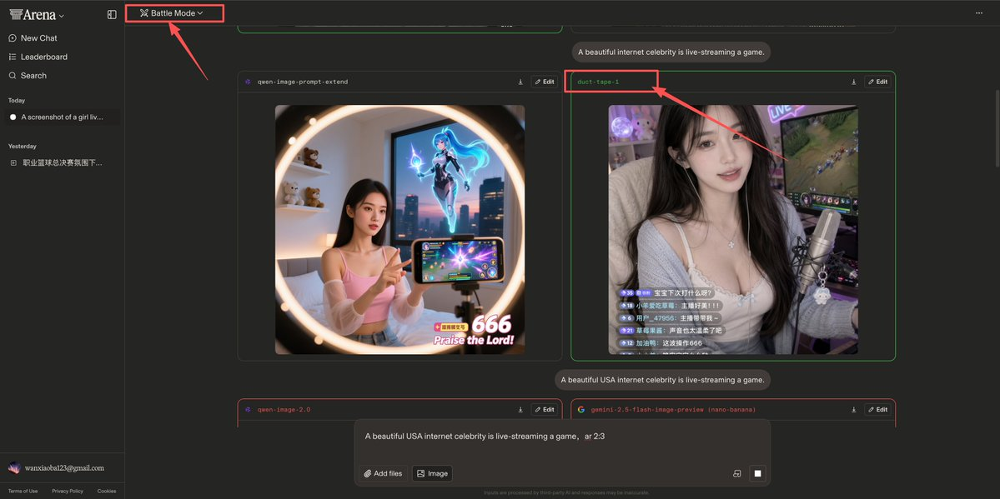


```text
{argument name="subject" default="A beautiful internet celebrity"} is live-streaming a {argument name="activity" default="game"}.
```


---

## 例 145：综合应用场景图

**来源：** [@alanlovelq](https://x.com/alanlovelq)


```text
A {argument name="platform" default="Taobao"} product detail page for {argument name="robot model" default="T-800 robot"}, displaying: front, side, and back three-view drawings of the robot, product price, product details, functions, and usage scenarios, etc.
```


---

## 例 146：综合应用场景图

**来源：** [@alanlovelq](https://x.com/alanlovelq)


```text
A {argument name="platform" default="Taobao"} product detail page for {argument name="robot model" default="T-800 robot"}, displaying: front, side, and back three-view drawings of the robot, product price, product details, functions, and usage scenarios, etc.
```


---

## 例 147：综合应用场景图

**来源：** [@alanlovelq](https://x.com/alanlovelq)

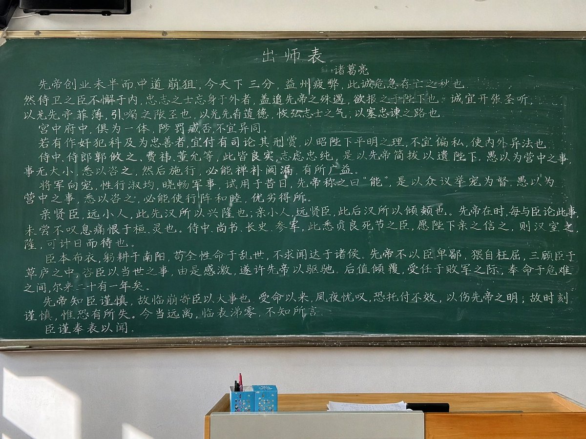


```text
A {argument name="platform" default="Taobao"} product detail page for {argument name="robot model" default="T-800 robot"}, displaying: front, side, and back three-view drawings of the robot, product price, product details, functions, and usage scenarios, etc.
```


---

## 例 148：综合应用场景图

**来源：** [@alanlovelq](https://x.com/alanlovelq)

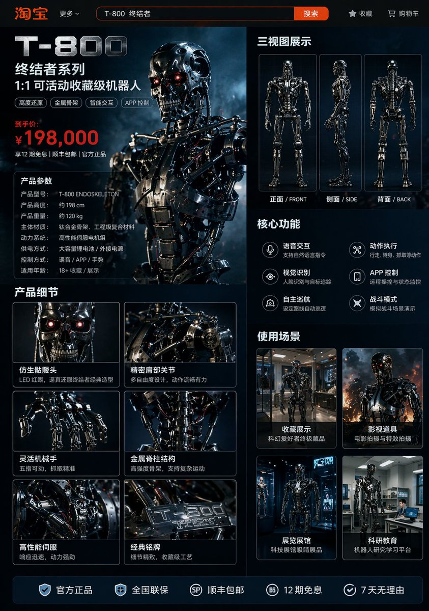


```text
A {argument name="platform" default="Taobao"} product detail page for {argument name="robot model" default="T-800 robot"}, displaying: front, side, and back three-view drawings of the robot, product price, product details, functions, and usage scenarios, etc.
```

## 例 149：综合应用场景图

**来源：** [@nicdunz](https://x.com/nicdunz)

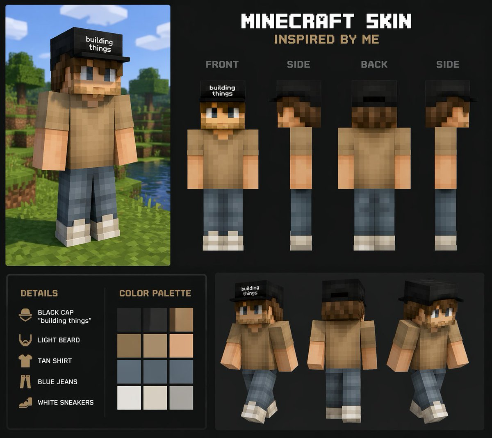


```text
create a minecraft skin inspired by {argument name="reference" default="my look"}
```


---
## 例 150：清冷佳人夜市烧烤三刀流

**来源：** [@BubbleBrain](https://x.com/BubbleBrain/status/2046564674112831920)

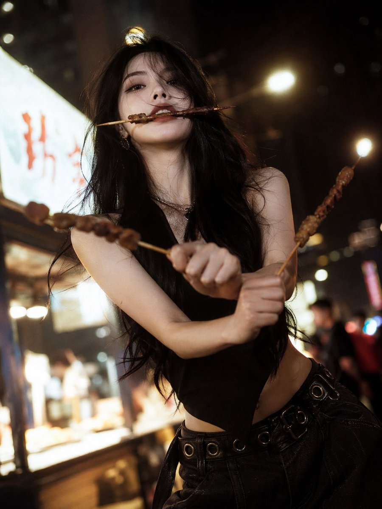


```text
[中文]
一个有着清冷孤傲气质的绝美佳人，精致的面部特征，一张冷酷且精致的高级时装面容，长发，以及优雅苗条的身材；烧烤“三刀流”姿势：嘴里叼着一根烧烤串，每只手各拿一根烧烤串交叉以模仿索隆的三刀流；街头夜景氛围，温暖黄色的夜市灯光，模糊的背景，胶片般的质感，柔焦光晕，电影般的叙事感，时髦高端网红风格的时尚拍摄，清晰发光的肌肤，清晰细致的发丝，生动的动态表情，低角度广角镜头，情绪化的暗调氛围，浅景深，超高清8K，极致细节，电影级光照

[English]
a stunning beauty with a cool, aloof atmosphere, delicate facial features, a cold and sophisticated high-fashion face, long hair, and a graceful slender figure; barbecue “three-sword style” pose: one barbecue skewer held in her mouth, one skewer in each hand crossed to mimic Zoro’s three-sword style; street night scene ambiance, warm yellow night market lighting, blurred background, film-like texture, soft-focus glow, cinematic storytelling feel, trendy high-end influencer-style fashion shoot, clear luminous skin, sharply detailed strands of hair, lively dynamic expression, low-angle wide-angle shot, moody dark-toned atmosphere, shallow depth of field, ultra HD 8K, extreme detail, cinematic lighting
```


---
## 例 151：千禧年日系校园喜剧场景

**来源：** [@UminekoStudio](https://x.com/UminekoStudio/status/2046488248256806981)

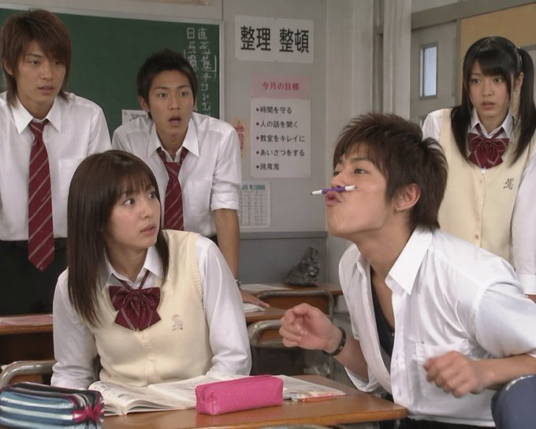


```text
[中文]
2000 年代面向中学生的日剧喜剧场景

[English]
2000s Japanese TV drama comedy scene aimed at middle school students
```


---
## 例 152：智能动画分镜生成器

**来源：** [@joshesye](https://x.com/joshesye/status/2046596222505361866)


```text
[中文]
生成一张动画分镜生成器

[English]
Generate an animation storyboard generator
```


---
## 例 153：鸟群织就的梦幻高定时装秀

**来源：** [@MrDasOnX](https://x.com/MrDasOnX/status/2026284342549340190)

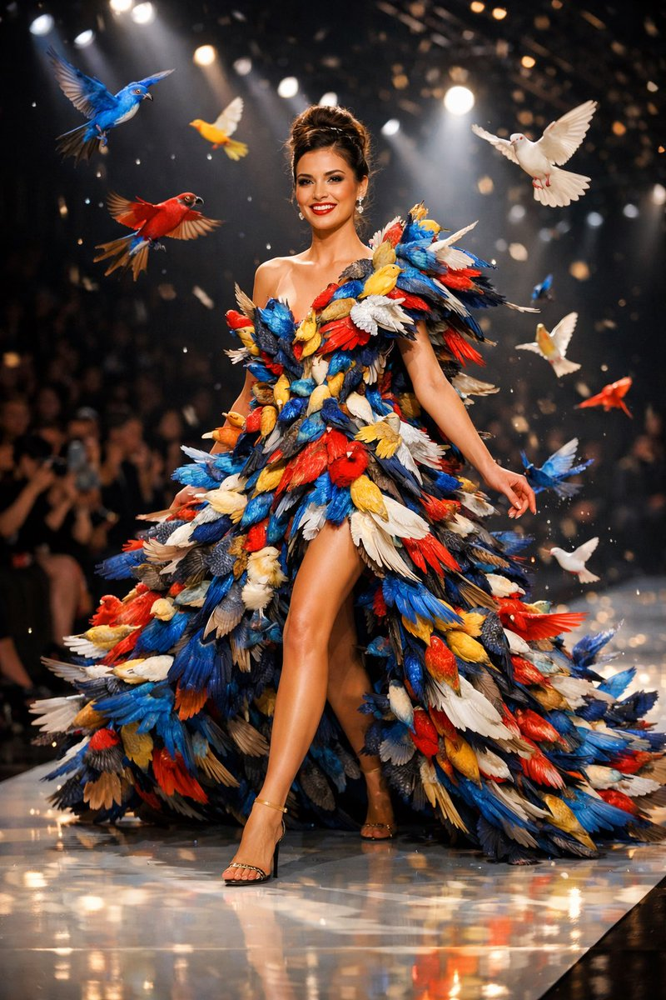


```text
[中文]
一个充满趣味的高级时装T台场景，主角是一位自信的女性，正走在奢华时装秀的T台上，身穿一件完全由鸟类制成的非凡高级定制礼服。数百只优雅、色彩鲜艳的鸟类构成了飘逸的雕塑感礼服形状，像活着的羽毛一样层叠，翅膀微微张开，营造出布料和运动的错觉。一些鸟儿在她周围轻轻升入空中，捕捉于飞行瞬间，增添了神奇、超现实的运动感。鸟儿们展现出丰富多样的色彩——彩虹般的蓝色、光芒四射的红色、金黄色和柔和的白色——拥有错综复杂的羽毛细节和自然纹理。她在迈步间摆出姿势，带着快乐、自信的表情，富有表现力的眼睛，以及精致的T台妆容。戏剧性的舞台灯光配以发光的高光，黑暗模糊的观众背景，电影级的景深，奇幻现实主义，超精细纹理，高对比度，清晰聚焦，奇思妙想的奢华时装秀，超现实主义高级定制，4K分辨率，专业调色。

[English]
A playful high-fashion runway scene featuring a confident woman walking a luxury fashion show catwalk, wearing an extraordinary couture dress made entirely of birds. Hundreds of elegant, vividly colored birds form the shape of a flowing, sculptural gown, layered like living feathers, with wings partially spread to create the illusion of fabric and motion. Some birds lift gently into the air around her, captured mid-flight, adding a magical, surreal sense of movement. The birds display a rich variety of colors — iridescent blues, radiant reds, golden yellows, and soft whites — with intricate feather details and natural textures. She poses mid-stride with a joyful, confident expression, expressive eyes, and refined runway makeup. Dramatic stage lighting with glowing highlights, dark blurred audience background, cinematic depth of field, fantasy realism, ultra-detailed textures, high contrast, sharp focus, whimsical luxury fashion show, surreal couture, 4K resolution, professional color grading.
```


---
## 例 154：烬甲猎鹰者与燃翼神禽

**来源：** [@iamsofiaijaz](https://x.com/iamsofiaijaz/status/2008896649901535342)


```text
[中文]
一幅充满奇幻色彩的电影场景：一位英姿飒爽的女战士兼猎鹰师，身着饱经战火洗礼、饰以闪耀余烬纹理的皮甲，漫步于幽暗迷雾笼罩的森林之中。她高举手臂，指挥着一头巨大的凤凰与雄鹰的混合体，这头猛禽双翼燃烧，羽毛燃焰，尖端喷吐着火焰。它周身散发着橙红色的熔岩光芒，火星和余烬飞溅。女战士梳着辫子，皮肤上沾满了灰烬，神情坚定，手中拿着绳索和工具袋。画面细节丰富，羽毛纹理逼真，火焰物理效果自然，光照效果极具戏剧性，运用了体积雾、浅景深等技术，营造出史诗般的奇幻氛围，色彩调校极具电影质感，背景阴郁深沉，分辨率高达8K，呈现出概念艺术的精髓，并采用了虚幻引擎的渲染效果。

[English]
A cinematic fantasy scene of a fierce female use image for face reference warrior falconer walking through a dark misty forest, wearing battle-worn leather armor infused with glowing ember textures. Her arm is raised, commanding a massive phoenix-eagle hybrid with blazing wings and flaming feathers, fire trailing from its tips. The bird radiates molten orange and red light, casting sparks and embers into the air.The warrior has braided hair, ash-streaked skin, and a determined expression, carrying a rope and utility pouch. Ultra-detailed feathers, realistic fire physics, dramatic lighting, volumetric fog, shallow depth of field, epic fantasy atmosphere, hyper-realistic, cinematic color grading, dark moody background, 8k, concept art, unreal engine quality.
```


---

## 例 390：羊毛毡国家微缩世界

**来源：** [@volkan_iras](https://x.com/volkan_iras/status/2051403524966141980)

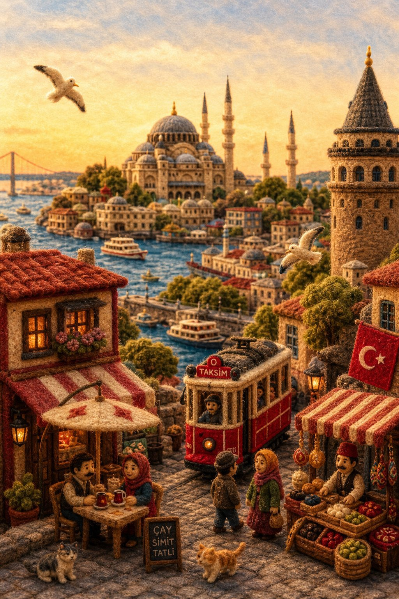

```text
Country: [INSERT COUNTRY NAME]

A miniature felt diorama made of fluffy yarn, wool, and needlework, designed as a single cohesive small world (not a collage), reflecting the real landscape, culture, and daily life of the country.

Structure:
- Select 4–7 naturally integrated elements (landscape, architecture, transport, street life, culture)
- Everything must flow together as one environment

Foreground:
Everyday life — small shops, cafes, markets, people interacting, local clothing, street details, subtle movement, warm human presence

Midground:
Connecting flow — streets, bridges, rivers, paths, transport, cultural spaces that guide the eye naturally from front to back

Background:
One strong identity anchor — landmark, skyline, mountain, or symbolic landscape clearly representing the country (keep it clean, not overcrowded)

Style:
Handmade wool felt, yarn, needle-felt textures, visible fibers, soft edges, miniature craftsmanship, premium diorama realism

Lighting:
Warm golden hour or bright noon, soft shadows, clear visibility, gentle glow enhancing depth

Color:
Soft but saturated palette reflecting the country’s natural tones (greens, sky blues, architectural hues, cultural accents), warm and balanced

Composition:
Vertical frame, balanced or centered perspective, slight top-down or immersive angle, clear foreground–midground–background depth

Mood:
Warm, emotional, calm, refined — like a handcrafted fairy-tale version of real life (not childish)

Rules:
- No logos or text overlays
- No collage-style composition
- No random symbolic clutter
- Keep it realistic but stylized as a handmade miniature world

Quality:
16K, ultra-detailed, hyper-realistic miniature textures, cinematic depth, sharp focus

output_goal:
A single, cohesive felt diorama world that instantly conveys the identity and atmosphere of the chosen country through integrated landscape, culture, and daily life
```


---

## 例 392：头发里的微型城市

**来源：** [@krafterlab](https://x.com/krafterlab/status/2051399740986740986)

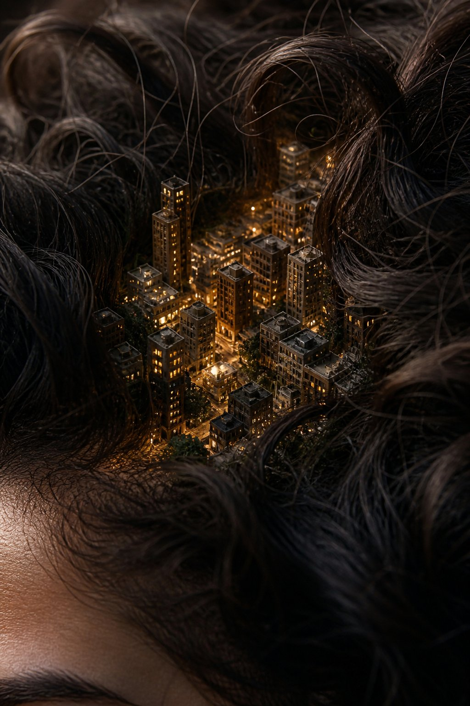

```text
Macro photograph of a miniature city hidden in human hair, clearly on a real human head, with part of the forehead and hairline visible, realistic skin texture with pores, tiny people walking through the streets between the hair strands, extremely small but realistic proportions, macro photography, 85mm lens, shallow depth of field, natural lighting, neutral colors, no warm tones, ultra realistic hair with visible roots, natural imperfections, slightly messy strands, realistic materials, slightly dirty buildings, no perfect surfaces, photorealistic, looks like a real photo, no illustration, no CGI, no glow
```


---

## 例 394：中世纪村庄双精灵冒险者

**来源：** [@RamonVi25791296](https://x.com/RamonVi25791296/status/2051568239142973832)

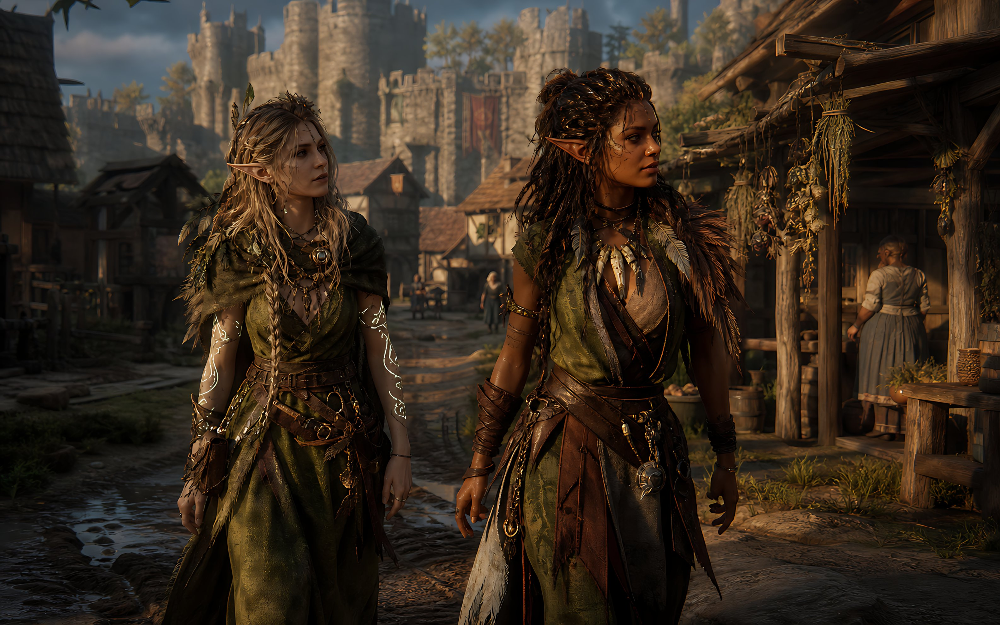

```text
Create a cinematic dark-fantasy medieval street scene in ultra-realistic 3D game concept art style, widescreen 16:9. In the foreground, show two adult elven adventurers walking side by side toward the viewer through a muddy cobblestone village road. The left character is a pale-skinned elf woman with long messy {argument name="left character hair color" default="ash blonde"} braided hair, pointed ears, layered olive-green druid robes, leather belts, pouches, dangling metal charms, necklaces, torn fabric strips, leaf-and-feather details, and glowing white vine-like magical tattoos spiraling down both forearms. The right character is a darker-skinned elf woman with long thick {argument name="right character hair color" default="dark brown"} dreadlocked hair, pointed ears, a green-and-brown leather ranger outfit, fur shoulder mantle, feather ornaments, arm wraps, belts, chains, talismans, and a confident warrior posture. Both faces are intentionally hidden by plain opaque {argument name="face covering color" default="dark brown"} square censor blocks, centered over their faces. Set the background in a richly detailed medieval market village with timber-and-thatch houses, hanging bundles of dried herbs on the right-side shopfront, barrels, baskets, wooden stalls, distant townspeople, and a large stone castle with towers and battlements rising in the background. Use {argument name="lighting mood" default="warm late-afternoon golden sunlight"}, dramatic shadows, volumetric haze, shallow depth of field, realistic fabric and leather textures, high detail, moody fantasy atmosphere, cinematic composition, Unreal Engine quality, no text, no logos.
```


---

## 例 395：骑士法师大战石像魔像

**来源：** [@RamonVi25791296](https://x.com/RamonVi25791296/status/2051568239142973832)

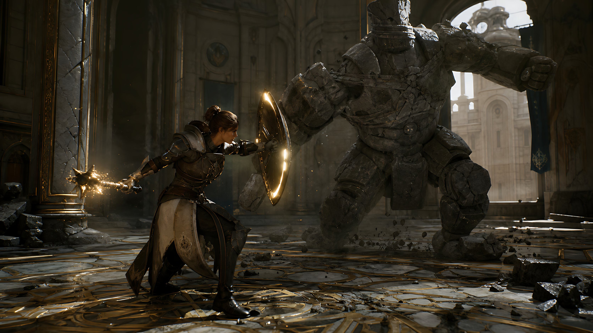

```text
Create a cinematic dark fantasy action scene in a ruined cathedral hall: a {argument name="hero type" default="female armored knight-mage"} crouches in a defensive lunge on the left foreground, wearing ornate dark steel and leather plate armor with a long cream-and-black tabard, one arm extended behind her gripping a spiked mace or morning star crackling with golden magic sparks, the other arm braced forward behind a round glowing shield rimmed with warm light. Opposite her in the right midground is a massive {argument name="enemy type" default="headless stone golem"}, built from cracked gray masonry plates and bound with broken chains, charging with one huge fist raised and rubble falling from its body. Set the battle inside a grand, damaged palace-cathedral interior with towering arches, carved stone columns, tall broken windows, gold-trimmed marble floor in circular geometric patterns, scattered chunks of stone, dust, and debris. Use dramatic backlighting from a bright arched window behind the golem, warm golden magical highlights on the shield and weapon, deep shadows, volumetric dust beams, realistic textures, high-detail armor and stone, dynamic low-angle wide composition, shallow cinematic depth, epic game-cinematic realism, 16:9 widescreen, no text, no UI.
```


---

## 例 413：当代舞现场 Storyboard

**来源：** [@ogbenniasamuel2](https://x.com/ogbenniasamuel2/status/2053088572031250799)

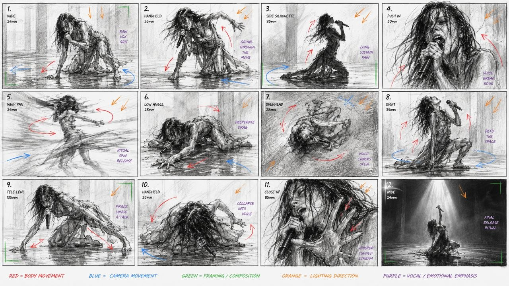

```text
Create a raw contemporary dance performance storyboard focused on intense physical movement and live singing. Use reference image for the character. 16:9 storyboard sheet, 12 cinematic panels.

The actual storyboard drawings must be black and white only: rough pencil lines, minimal detail, fast gesture drawing energy, simple anatomy construction and strong silhouette readability. Keep the artwork lightweight, dynamic and unfinished like early choreography previs.

A solitary female performer sings continuously while executing an emotionally charged contemporary dance routine inside a massive empty brutalist hall.

The choreography is aggressive, fluid and constantly evolving: rapid turns, floor slides, crawling transitions, sharp body isolations, trembling hands, extreme balance shifts, hair whips, lunges, jumps, collapsing movements and distorted sculptural poses.

Every panel must contain visible motion and strong body momentum. Avoid static standing poses. The performer should feel trapped between ritual, exhaustion and emotional release.

Use cinematic arthouse camerawork with handheld energy, whip pans, orbit movement, overhead shots, side silhouettes, aggressive close-ups, long lens compression and extreme negative space.

the environment minimal: empty space, smoke, fabric motion, harsh light beams and wet floor reflections only.

Annotation color system: red arrows = body movement blue arrows = camera movement green marks = framing / composition notes orange marks = lighting direction purple marks = vocal / emotional emphasis black text = short lens notes and panel labels No timestamps.

End with one overwhelming final movement pose beneath a harsh isolated spotlight.
```


---

## 例 419：可颂烘焙流程 Storyboard

**来源：** [@TechieBySA](https://x.com/TechieBySA/status/2053523784481554759)

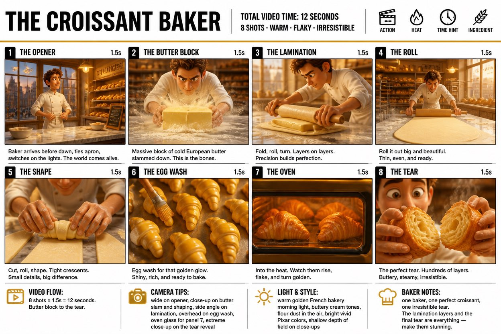

```text
Create a crisp, clean infographic storyboard poster for THE CROISSANT BAKER. Wide 16:9 layout, white background, black borders, bold black typography, premium Pixar 3D stylized rendering, bright vivid colors — warm golden yellows, rich buttery creams, flaky browns, soft pastry whites, warm French bakery morning light.
Top header:

THE CROISSANT BAKER
TOTAL VIDEO TIME: 12 SECONDS
8 SHOTS · WARM · FLAKY · IRRESISTIBLE
Legend icons: ACTION, HEAT, TIME HINT, INGREDIENT
Thin warm golden accent line running full width beneath header

Same Pixar-style young French male baker throughout: white baker's jacket, flour-dusted hands, warm authentic French boulangerie setting, marble countertop, warm morning light streaming through windows, bread racks in background. Bright, warm, delicious. Every panel a completely different composition and color.
8 panels:

THE OPENER — Wide shot of baker arriving at the boulangerie before dawn, tying apron, switching on the warm kitchen lights, marble counter visible, bread racks behind, flour dusting the air, full world established, bright and cinematic
THE BUTTER BLOCK — Baker slams a massive cold block of European butter onto the marble counter with both hands, dramatic impact, flour cloud puffing up, close-up on hands, this is the bones moment — the start of everything
THE LAMINATION — Baker folding the dough over the butter block precisely, rolling pin pressing down hard, layers building, side angle shot showing the beautiful layering beginning, confident and skilled
THE ROLL — Dough rolled out into a large thin sheet, baker leaning into the rolling pin with full body weight, marble counter, flour dusting everywhere, wide shot showing the scale of the dough
THE SHAPE — Triangles cut from the dough, baker rolling each one from the wide end into a tight crescent, hands moving fast and confident, close-up on the shaping, beautiful and precise
THE EGG WASH — Baker brushing golden egg wash over each shaped croissant with a pastry brush, each one glistening beautifully, close-up overhead angle, warm golden color, stunning composition
THE OVEN — Croissants slid into the blazing hot oven on a tray, oven door closed, through the oven glass croissants visibly puffing and turning deep golden, layers separating dramatically, warm orange glow
THE TEAR — Baker pulls a perfect golden croissant from the rack, holds it up, tears it open slowly revealing hundreds of impossibly flaky buttery layers inside, steam escaping, butter glistening — this is the cheese pull moment, the hero shot of the entire video

Footer:

VIDEO FLOW: 8 shots × 1.5s = 12 seconds. Butter block to the tear.
CAMERA TIPS: wide on opener, close-up on butter slam and shaping, side angle on lamination, overhead on egg wash, oven glass for panel 7, extreme close-up on the tear reveal
LIGHT & STYLE: warm golden French bakery morning light, buttery cream tones, flour dust in the air, bright vivid Pixar colors, shallow depth of field on close-ups
BAKER NOTES: one baker, one perfect croissant, one irresistible tear. The lamination layers and the final tear are everything — make them stunning.
```


---

## 例 422：冬季生存惊悚 Storyboard

**来源：** [@zulkarnaimx](https://x.com/zulkarnaimx/status/2053723774680535538)

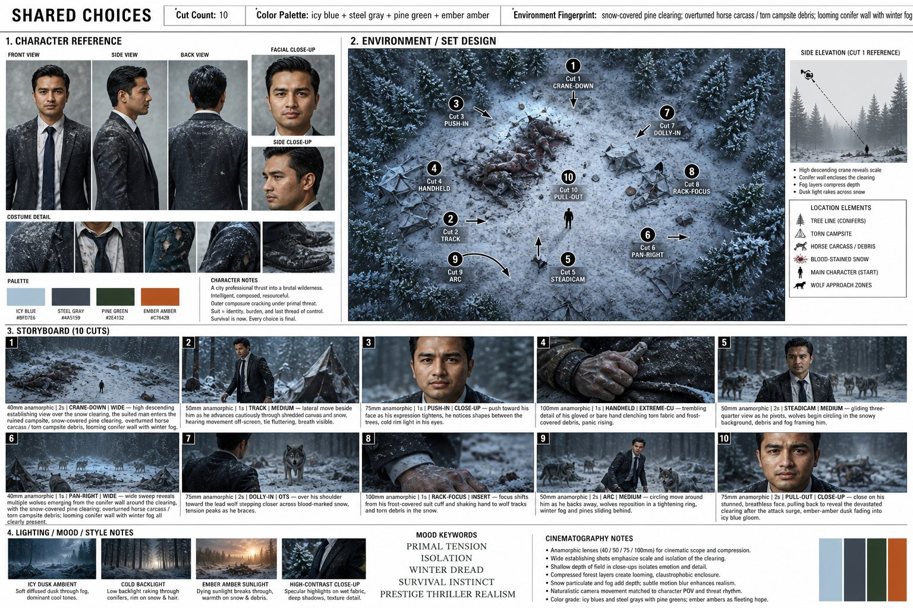

```text
Cinematic Survival Thriller Storyboard Prompt

Create a premium cinematic storyboard presentation sheet for a prestige winter survival thriller.
Ultra-detailed professional film pre-production layout, clean editorial design, grayscale blueprint background with labeled sections and technical annotations.
Aspect ratio 16:9 horizontal master board.

SHARED CHOICES HEADER

* Cut Count: 10
* Color Palette: icy blue + steel gray + pine green + ember amber
* Environment Fingerprint: snow-covered pine clearing, overturned horse carcass, torn campsite debris, looming conifer forest, drifting winter fog

---

1. CHARACTER REFERENCE

A realistic South Asian man in his early 30s wearing a dark charcoal business suit, white dress shirt, black tie, polished black shoes.
Snow dusted across shoulders and hair.
Calm but haunted expression.
Show:

* front view
* side profile
* back view
* facial close-up
* side close-up
* costume fabric detail
* damaged sleeve detail
* shoes in snow

Character notes:
“An intelligent city professional trapped in a brutal wilderness.
Outer composure slowly cracks under primal fear.
Suit = identity, burden, and last thread of control.”

Palette swatches:

* icy blue
* steel gray
* pine green
* ember amber

---

2. ENVIRONMENT / SET DESIGN

Top-down aerial map of a snowy forest clearing at dusk.
Dead horses partially buried in snow.
Destroyed campsite tents.
Blood trails across frozen ground.
Dense dark pine trees forming a claustrophobic wall around the clearing.
Heavy winter fog drifting through the forest.

Add cinematic camera movement markers:

1. Crane-down
2. Track
3. Push-in
4. Handheld
5. Steadicam
6. Pan-right
7. Dolly-in
8. Rack-focus
9. Arc shot
10. Pull-out

Include arrows and overhead cinematic blocking diagram.

Side elevation panel:

* descending crane shot
* fog layers
* silhouette scale reference
* conifer enclosure composition

Location elements legend:

* tree line
* torn campsite
* horse carcass debris
* blood-stained snow
* main character
* wolf approach zones

---

3. STORYBOARD (10 CUTS)

CUT 1

Wide aerial crane-down shot over frozen clearing.
Tiny suited man surrounded by devastation.
Moody blue dusk lighting.

CUT 2

Tracking medium shot beside the man walking cautiously through snow and ripped tents.
Wind moving fabric debris.

CUT 3

75mm close-up push-in on face.
Cold breath visible.
Fear slowly emerging in his eyes.

CUT 4

Extreme close-up handheld shot of trembling hand gripping torn frozen fabric near blood-covered snow.

CUT 5

Steadicam medium shot revealing wolves emerging between trees behind him.

CUT 6

Pan-right wide shot sweeping across forest edge.
Multiple wolf silhouettes visible in fog.

CUT 7

Over-the-shoulder dolly-in toward alpha wolf approaching slowly through snow.

CUT 8

Rack-focus insert shot shifting focus from frozen hand to wolf tracks in snow.

CUT 9

Arc shot circling around the man as wolves tighten formation.
Snow and pine branches moving in icy wind.

CUT 10

Close-up pull-out shot from his exhausted face revealing the full massacre behind him in fading ember dusk light.

---

4. LIGHTING / MOOD / STYLE NOTES

* icy dusk ambience
* cold blue backlight
* ember sunset glow fading through fog
* wet fabric specular highlights
* cinematic volumetric fog
* snow particles drifting through frame
* high-contrast prestige thriller realism

Mood keywords:

* isolation
* winter dread
* survival instinct
* prestige thriller realism
* primal tension
* psychological fear

Cinematography notes:

* anamorphic lenses (40mm / 50mm / 75mm / 100mm)
* shallow depth of field
* compressed forest layers
* natural handheld movement
* realistic snow atmosphere
* cinematic Hollywood survival thriller aesthetic
* ultra detailed
* photorealistic
* film grain
* 8k production design board
* premium movie pitch deck style
```


---

## 例 448：1942 空战街机电影城

**来源：** [@Xaroon_x](https://x.com/Xaroon_x/status/2056940561148363010)

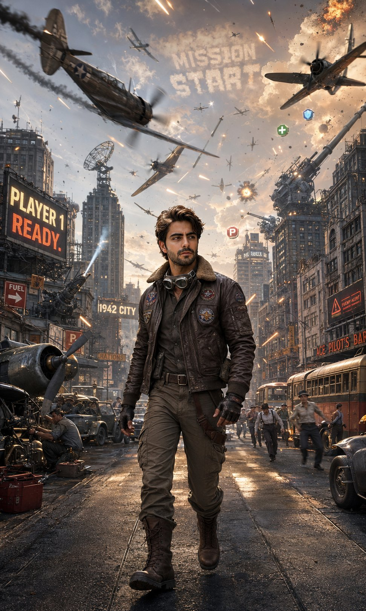

```text
Ultra-realistic cinematic “1942 City” scene, retro WWII arcade-shooter-inspired metropolis in real life, intense aerial-war atmosphere, vertical 4:5 editorial composition

Male, exact face, vintage military-pilot-inspired streetwear from head to toe, bomber jacket with retro aviation patches, fitted cargo trousers, rugged combat boots, fingerless gloves, pilot goggles hanging around neck, walking through the city with fearless ace-pilot expression while fighter planes soar overhead

✈️ 1942 CITY WORLDBUILDING

entire city functions like a living 1942 arcade shooter universe
• massive WWII fighter planes dogfighting above skyscrapers
• giant anti-aircraft cannons mounted across rooftops
• endless bullet patterns streaking through cloudy skies
• retro military airfields integrated into urban districts
• giant “MISSION START” alerts projected into the clouds
• dramatic explosion trails lighting the skyline at night
• aircraft carriers docked beside futuristic city ports
• glowing power-up icons floating through aerial battle zones
• giant radar systems rotating above downtown towers
• endless enemy squadrons emerging from storm clouds
• cinematic ocean-and-warzone environments surrounding the metropolis

😂 COMEDIC DETAILS

• random civilians casually dodging fighter planes on the way to work 😭
• one pilot barrel-rolling dramatically for absolutely no reason
• giant billboard flashing: “PLAYER 1 READY.”
• pedestrians treating near-miss explosions like normal traffic
• somebody still trying to collect every floating power-up midair
• random mechanic repairing planes using pure confidence
• one legendary pilot surviving impossible situations through arcade logic alone

💡 LIGHTING & STYLE

retro war-film cinematic lighting, fiery aerial-battle atmosphere, dramatic clouds and explosion reflections, hyper-detailed realistic textures mixed with nostalgic arcade-shooter aesthetics, intense blockbuster-war energy, masterpiece quality

🎥 CAMERA

cinematic aerial tracking shot, immersive dogfight atmosphere, dynamic motion blur from fighter planes and explosions, documentary-meets-retro-arcade realism, futuristic Manila-inspired 1942 metropolis, “classic arcade air combat became civilization” atmosphere
```


---

## 例 477：Instagram 餐桌俯拍创意

**来源：** [@iamaiistudio](https://x.com/iamaiistudio/status/2060210845225980366)

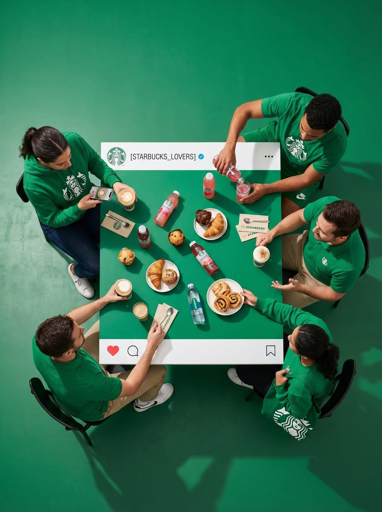

```text
Top-down ultra-wide hyper-realistic shot of 4 real people seated at a square dining table. Pull the camera way back so a wide ring of empty floor surrounds the whole scene, giving a clean minimal composition. Scene [ATMOSPHERE + WARDROBE]: the four are styled in [OUTFIT STYLE]. Each one is doing something specific: [DESCRIBE EACH PERSON'S ACTION].

The table itself is a physical prop built to look like an Instagram post viewed from above:
- A solid white band runs along the TOP and BOTTOM edges only, with no white on the left or right sides.
- Top band: a small drawn profile avatar with [LOGO DESCRIPTION], the handle "[USERNAME]", a tiny blue verified check next to it, and a "..." on the far right.
- Bottom band: red heart, comment bubble, and share icons painted on the left, bookmark icon on the right.

The center of the table is one flat color: [EXACT COLOR + HEX CODE]. All food, drinks, props, and any hand interacting with them must stay strictly inside that central colored zone, nothing crosses the white bands or the table edge. The floor around the table is [FLOOR COLOR] to create clear visual separation. Professional studio lighting with crisp shadows, 8k, tack-sharp focus.
```


---

## 例 487：法式药妆商业分镜封面

**来源：** [@AIwithSynthia](https://x.com/AIwithSynthia/status/2061300623530942922)

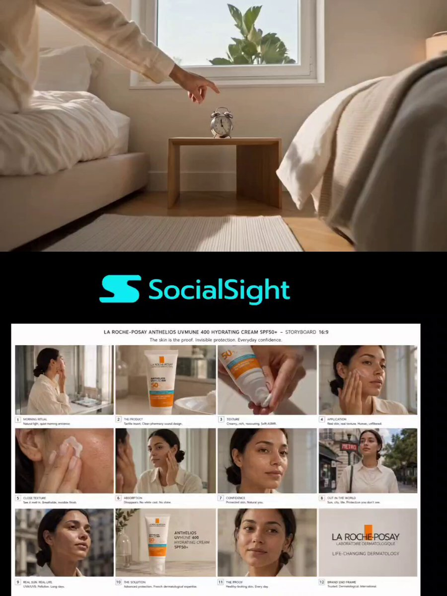

```text
35mm anamorphic, 2.39:1, no flares. Ultra-realistic international French pharmacy skincare commercial for La Roche-Posay Anthelios UVMune 400 Hydrating Cream SPF50+. Soft premium music plus tactile realistic sound effects throughout. Rich warm natural grain, premium but not over-polished. Palette: warm ivory whites, soft stone neutrals, signature La Roche-Posay orange, subtle clinical cyan-blue, sunlit beige, realistic warm skin tones. The tube is iconic. The skin is the proof. Every shot builds toward the moment the product disappears into real skin and protection becomes confidence. Fast cuts, macro intimacy, tactile realism, one quiet transformation that feels earned: sunscreen that looks invisible, breathable, and real.

MODEL / WARDROBE

Use the same female model consistently across all shots, matching the approved character sheet: slim natural model proportions, warm medium skin tone, dark brown hair in a clean low bun, refined oval face, natural brows, realistic under-eye detail, subtle lips, minimal makeup. Same face, same hairstyle, same body structure, same skin tone, same wardrobe continuity throughout.

Wardrobe must be modest, elegant, and fully covered. No exposed body, no tank top, no fitted clothing, no cleavage, no bare shoulders, no body-hugging silhouette. Wardrobe: loose cream linen button-up shirt, full sleeves, fully buttoned or layered over a high-neck white inner top, soft beige trousers only if visible, minimal jewelry, refined French pharmacy skincare styling. Clothing should feel premium, breathable, clean, and international, never sensual, revealing, or fashion-body-focused.

The camera may show hands, face, neck-up portrait, shoulders, waist-up, mirror shots, bathroom ritual shots, and outdoor walking lifestyle shots, but the body must not be emphasized. Keep attention on skin texture, hands applying sunscreen, product packaging, morning ritual, and confident protected face.

SKIN REALISM

Skin must look human and unfiltered: visible pores, peach fuzz, tiny fine lines, slight under-eye texture, natural skin tone variation, realistic facial micro texture, matte-hydrated finish. No glossy skin, no oily shine, no wet-look face, no waxy AI skin, no porcelain smoothing, no glam beauty filter, no fake glow.

PRODUCT REFERENCE

Use the exact La Roche-Posay Anthelios UVMune 400 Hydrating Cream SPF50+ product reference: white tube, orange square logo, black La Roche-Posay typography, orange SPF50+ panel, light blue hydrating cream band, orange lower panel, white pump-cap base. Product shape and color blocking must remain consistent.

MUSIC DIRECTION

Soft elegant premium skincare music throughout: gentle piano, airy ambient pads, subtle low-end warmth, very light modern electronic pulse, calm emotional lift. Music should feel expensive, dermatological, trustworthy, and international. Never loud, never dramatic, never trailer-like, never distracting. The music should support the tactile sound design without overpowering it.
```


---

## 例 493：东京旅行 13 格视频封面

**来源：** [@AIwithSynthia](https://x.com/AIwithSynthia/status/2062383568253505904)

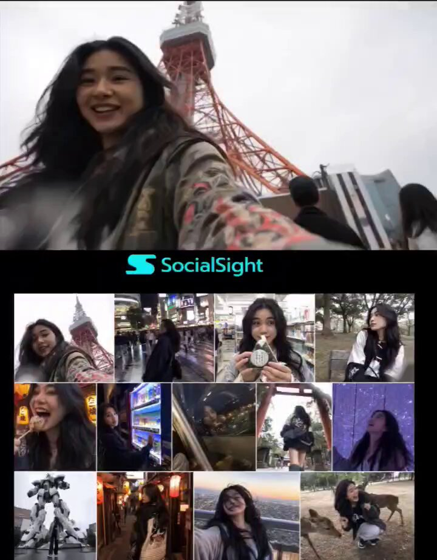

```text
Generate image of young female travel vlogger exploring Tokyo across multiple candid moments, extremely beautiful with long dark wavy hair, wearing stylish Japanese-inspired oversized streetwear, expressive and spontaneous personality, captured across a 13-frame grid collage (Row 1: 4 frames | Row 2: 5 frames | Row 3: 4 frames), each frame feels like a real casual phone capture with imperfect framing and natural inconsistencies.

Frame Breakdown

Row 1 - Frame 1 (Tokyo Tower): low angle selfie with Tokyo Tower behind her, slightly tilted horizon, sky overexposed to near white, she's mid-natural smile adjusting into frame, small lens smudge in corner, candid arrival energy.
Row 1 - Frame 2 (Shibuya street level): walking through Shibuya crossing at night, handheld motion blur, she glances back at camera mid-step, neon reflections on wet pavement, slightly shaky framing, imperfect crop.
Row 1 - Frame 3 (Convenience store): inside a brightly lit convenience store, she is holding onigiri close to camera, playful raised eyebrows, harsh fluorescent lighting flattening the scene, slight overexposure on whites, shelves softly blurred behind.
Row 1 - Frame 4 (Yoyogi park): sitting on a bench under trees, looking away from camera, quiet candid moment, soft dappled daylight, slight focus miss on eyes, subtle lens smudge bottom corner.
Row 2 - Frame 5 (Takoyaki reaction): close-up while eating single takoyaki, reacting mid-bite with laughter, slight motion blur, warm lantern light behind, face slightly out of focus due to movement.
Row 2 - Frame 6 (Vending machine night): standing in front of glowing vending machine, blue and pink light casting uneven tones on her face, pressing button casually, high ISO grain visible.
Row 2 - Frame 7 (Train reflection): her face reflected in train window at night, city lights streaking behind, layered reflection effect, slight ghosting on glass, she looks away from camera.
Row 2 - Frame 8 (Torii gate): low angle shot of her walking through a torii gate, captured from slightly behind, motion blur in her movement, bright sky causing mild lens flare.
Row 2 - Frame 9 (Digital art exhibit): inside immersive light exhibit, colored lights (blue, violet, gold) washing across her face, she looks upward in awe, slight motion blur, low-light noise visible.
Row 3 - Frame 10 (Gundam statue): low angle wide shot, she stands small in frame while large statue towers above, slight barrel distortion from phone lens, sky slightly blown out.
Row 3 - Frame 11 (Lantern alley): walking through narrow alley lit by warm lanterns, shot from behind, she glances back briefly, underexposed shadows, grainy night detail.
Row 3 - Frame 12 (Rooftop skyline): selfie with Tokyo skyline behind, arm extended, wind blowing hair partially across lens, horizon slightly tilted, warm city glow overexposed in distance.
Row 3 - Frame 13 (Nara park): crouching down in a park in Nara, she holds out a deer cracker toward a deer, the deer bows its head toward her, she bursts into genuine laughter mid-reaction, surprised and slightly leaning back, another deer nudges her from behind causing her to lose balance slightly, camera captures the moment imperfectly with slight shake and off-center framing, soft natural daylight, open park background with trees and space, unscripted chaotic energy, candid expression.

Young female travel vlogger exploring Tokyo across 13 candid moments in a grid collage, extremely beautiful with long dark wavy hair, wearing stylish Japanese streetwear, expressive and spontaneous, scenes include Tokyo Tower selfie, Shibuya crossing at night, convenience store snack moment, park bench quiet scene, takoyaki reaction, vending machine glow, train window reflection, torii gate walk, immersive light exhibit, Gundam statue low angle, lantern alley walk, rooftop skyline selfie, Harajuku street ending, each frame slightly imperfect with motion blur.
```


---

## 例 537：地下档案馆暗黑概念海报

**来源：** [@PromptSin](https://x.com/PromptSin/status/2092390329890849163)

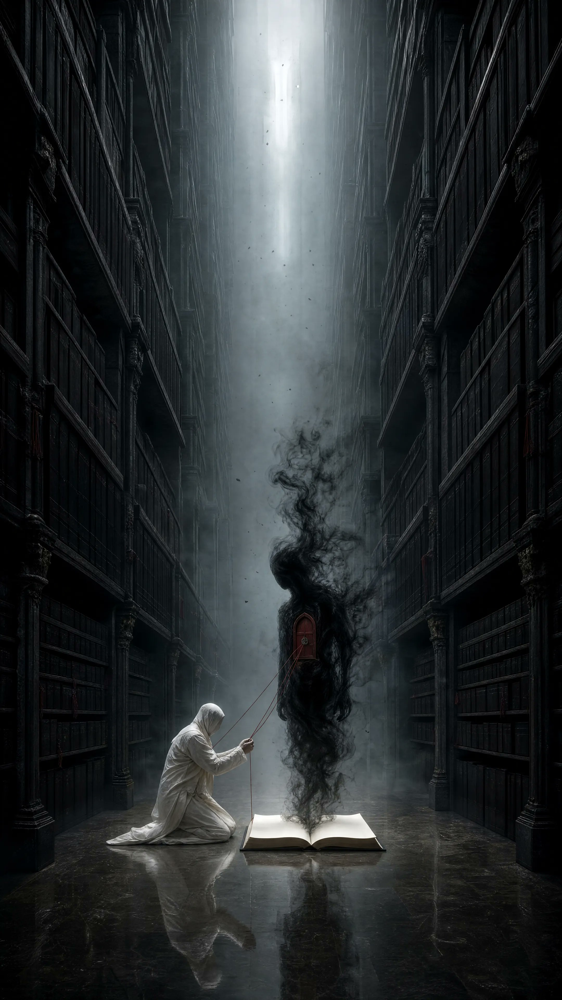

```text
Use case: stylized-concept
Asset type: vertical social-media artwork for the “Your Dark Side” theme

Create an original psychological dark-surrealist scene in a colossal underground archive. Endless shelves of sealed black books rise like skyscrapers and vanish into fog. In the central aisle, a solitary human figure in bone-white clothing kneels before one open book on the floor. No words are visible. From the blank pages rises a delicate life-size figure made entirely of dense black smoke, standing face-to-face with the kneeling person. The smoke figure has no eyes or mouth; instead, its chest contains a small locked crimson door. Thin threads connect that door to the kneeling person’s hands, suggesting a secret self finally acknowledged.

Vertical 9:16 framing, towering shelves create a narrow symmetrical canyon, high-angle shaft of cold silver light, the two figures positioned small in the lower center, immense oppressive scale above them. Black paper, aged stone, floating ash, volumetric fog, subtle polished-floor reflections, premium photorealistic dark concept art, refined editorial composition, quiet dread and introspection rather than horror spectacle.

Color palette: obsidian black, graphite, bone white, cold silver, a single muted crimson accent at the tiny door.

Constraints: entirely original metaphor; blank book pages with absolutely no writing; no recognizable person; no text, symbols, logos, signatures, borders, or watermark.

Avoid: visible letters or runes, portrait close-up, split face, black substance on skin, glowing eyes, gore, skulls, conventional ghosts, fantasy wizard styling, imitation of any named artist.
```


---

## 例 538：Energy Drink Storyboard Grid

**来源：** [@Strength04_X](https://x.com/Strength04_X/status/2063256718902219255) / [awesome-gpt-image-2-prompts](https://github.com/EvoLinkAI/awesome-gpt-image-2-prompts)

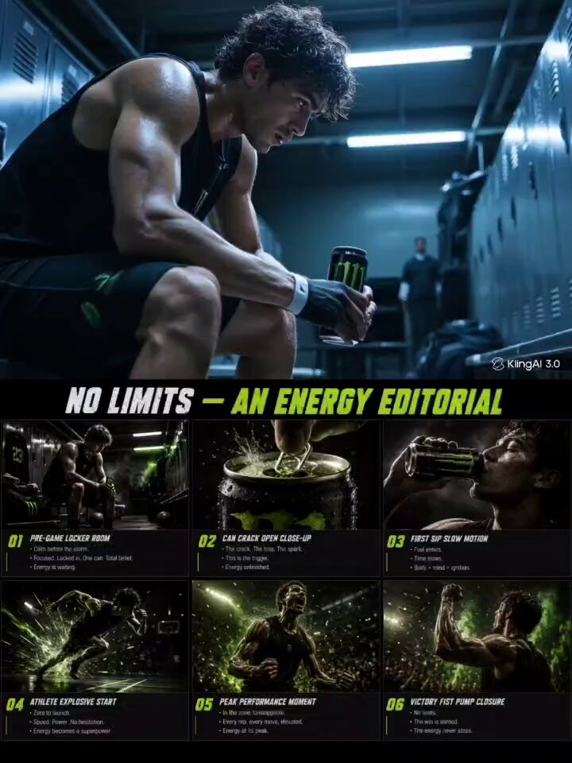

```text
- Create a high-energy 16:9 energy drink advertising storyboard in 3x2 grid (6 frames), editorial layout, Monster/Red Bull style, matte black + electric green palette. Structured flow: pre-game locker room, can crack open close-up, first sip slow motion, athlete explosive start, peak performance moment, victory fist pump closure. Each frame split: top cinematic image (no text) + bottom storyboard notes. Underground sports aesthetic, zero to hundred mood, energy as superpower. A single energy drink can cracking open is the emotional center throughout. Add a bold heading at the top of the storyboard in aggressive bold font reading: NO LIMITS — AN ENERGY EDITORIAL.

KLING AI 3.0 PROMPT :- This is a storyboard image containing 6 frames arranged in a 3x2 grid. Treat each frame as a separate sequential scene. Animate every frame one by one from left to right, top to bottom. Start from frame 1 top-left, then frame 2, then frame 3, then frame 4, then frame 5, end with frame 6 bottom-right. Each frame must play for exactly 2.5 seconds. Total video duration 15 seconds. Do not merge frames together. Do not skip any frame. Do not loop. Play each frame in strict order as one continuous uninterrupted cinematic video. Use locker room fluorescent light flickering over athlete in pre-game silence, can tab cracking open with mist spray in extreme slow motion macro, first sip with throat gulp visible and eyes sharpening in real time, explosive sprint start with ground crack effect and motion blur, peak performance jump with sweat flying off body in slow motion, victory fist pump with crowd blur and electric green light flare. Add subtle motion within each frame only, smooth dissolve transitions between frames. Lighting transitions from cold locker room fluorescent blue to electric green can crack flash to harsh outdoor performance sun to victory green flare closure. Underground sports aesthetic, zero to hundred raw energy mood, drink as pure superpower. A single energy drink can cracking open remains the emotional focus across all 6 frames. Ultra-realistic, 4K photographic quality, no cartoon style.
```


---

## 例 539：9-Frame Cinematic Storyboard Grid

**来源：** [@guicastellanos1](https://x.com/guicastellanos1/status/2056425976763146366) / [awesome-gpt-image-2-prompts](https://github.com/EvoLinkAI/awesome-gpt-image-2-prompts)

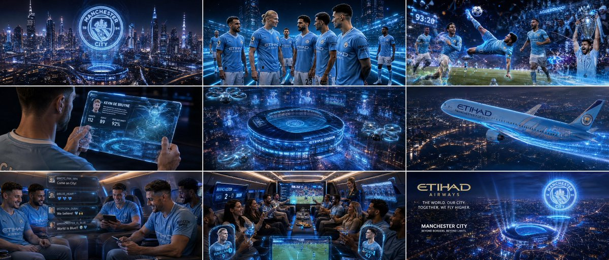

```text
for GPT-2:
Create a single image storyboard with 9 cinematic frames arranged in a  3×3 grid. Each frame is a widescreen 16:9 panel with a film aspect ratio  letterbox. Style: ultra-cinematic sci-fi blockbuster mixed with premium  airline commercial. Think Blade Runner 2049 color grading meets a UEFA  Champions League broadcast opener meets a luxury brand TVC.
```


---

## 例 540：Celestial Fantasy Oracle Storyboard

**来源：** [@itsPixieVerse](https://x.com/itsPixieVerse/status/2064396369348239452) / [awesome-gpt-image-2-prompts](https://github.com/EvoLinkAI/awesome-gpt-image-2-prompts)

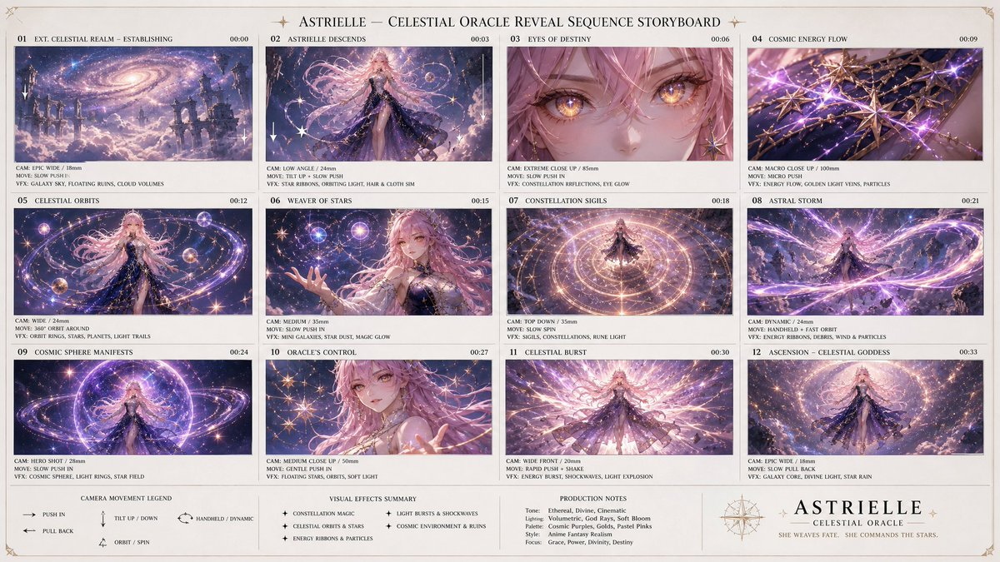

```text
Create a premium cinematic 12-panel storyboard sheet for a celestial fantasy oracle reveal sequence featuring Astrielle, an ethereal cosmic sorceress who manipulates stars, destiny, and astral energy.

The storyboard should feel like a high-budget fantasy anime film opening mixed with elegant cosmic magic cinematography. The sequence focuses on graceful character reveal, divine cosmic powers, elegant magical movements, reality-bending abilities, and a breathtaking final goddess-like ascension.

Astrielle — celestial oracle with long flowing pastel pink hair, glowing amber eyes, elegant navy-and-gold cosmic dress decorated with star constellations, translucent layered fabrics, floating celestial rings, orbiting star particles, divine cosmic aura, elegant fantasy goddess aesthetic.

Professional production-ready storyboard sheet featuring:

12 cinematic panels

shot numbers

timestamps

camera movement arrows

focal length notes

VFX annotations

clean editorial layout

luxury celestial fantasy presentation

cinematic framing guides

elegant production aesthetics

Extreme wide shot of gigantic galaxy sky with floating celestial ruins drifting through clouds.

Low-angle reveal of Astrielle descending slowly while surrounded by orbiting stars and cosmic ribbons.

Close-up cinematic shot of her glowing amber eyes reflecting constellations.

Macro close-up of cosmic energy flowing through gold star ornaments on her dress.

Wide cinematic shot of floating celestial rings orbiting around Astrielle’s body.

Medium shot as Astrielle raises one hand and creates miniature galaxies in midair.

Overhead shot of glowing constellation sigils forming beneath her feet.

Dynamic cinematic shot of astral energy ribbons spiraling violently around environment.

Heroic levitation shot as giant cosmic sphere manifests behind her like a miniature universe.

Close emotional shot of Astrielle calmly controlling floating stars with elegant hand gestures.

Epic frontal cinematic shot of massive
```


---

## 例 541：Apartment Drama Animation Storyboard Sheet

**来源：** [@CurieuxExplorer](https://x.com/CurieuxExplorer/status/2049709975040401601) / [awesome-gpt-image-2-prompts](https://github.com/EvoLinkAI/awesome-gpt-image-2-prompts)

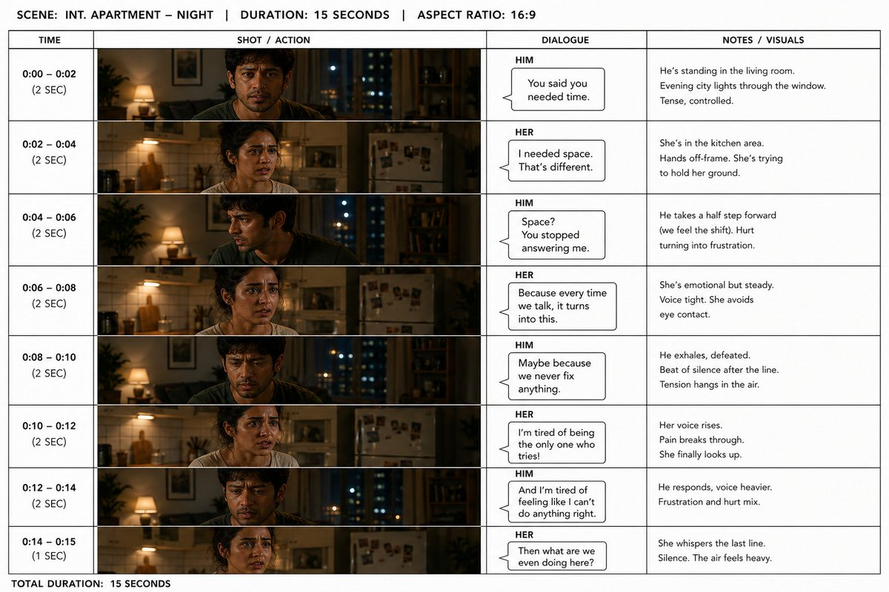

```text
Create a new animation sheet, but this time it's a storyboard between an Indian man and an Indian woman in a dramatic scene inside an apartment. Ensure the elements of the apartment are in the scene, and include dialogue boxes, this is for 15 seconds so be careful of the cadence (sentences not too long), when a character speaks they should be the only one in frame.
```


---

## 例 542：Donut Heist Storyboard Sheet

**来源：** [@MayorKingAI](https://x.com/MayorKingAI/status/2054266888428105947) / [awesome-gpt-image-2-prompts](https://github.com/EvoLinkAI/awesome-gpt-image-2-prompts)

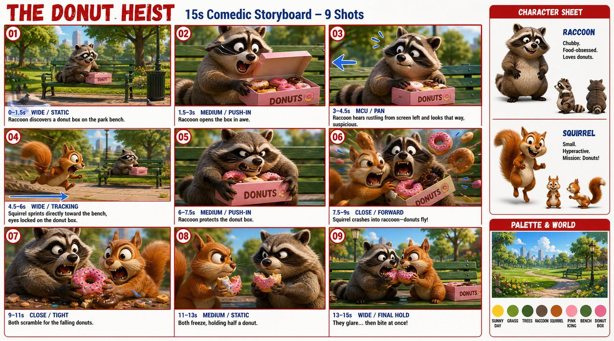

```text
Title: “THE DONUT HEIST”
Subtitle: “15s Comedic Storyboard – 9 Shots”

Style: full-color 3D animated storyboard sheet, cinematic cartoon characters, polished lighting, expressive faces, vibrant colors, red panel borders, blue camera/action arrows.

Characters: chubby food-obsessed raccoon with striped tail. Small hyperactive squirrel with fluffy tail.

Important: keep left-right continuity. Squirrel always rushes from screen left to right, looking toward the bench/raccoon, never away. Raccoon stays near the donut box. In panel 03, the raccoon hears rustling from screen left and looks that way.

Each panel: timecode, shot type, camera move, short action note.

01 0–1.5s Wide/static: raccoon finds donut box on park bench.
02 1.5–3s Med/push-in: raccoon opens box in awe.
03 3–4.5s MCU/pan: raccoon hears rustling from screen left and looks that way, suspicious.
04 4.5–6s Wide/tracking: squirrel sprints toward bench, eyes locked on donuts.
05 6–7.5s Med/push-in: raccoon protects donut box.
06 7.5–9s Close/forward: squirrel crashes into raccoon, donuts fly.
07 9–11s Close/tight: both scramble for falling donuts.
08 11–13s Med/static: both freeze, holding half a donut.
09 13–15s Wide/final hold: they glare, then bite at once.

Right side: character sheet + palette: sunny park, green grass, raccoon grey-brown, squirrel orange-brown, pink icing.
```


---

## 例 543：Storyboard Grid Template

**来源：** [@EricoolWong](https://x.com/EricoolWong/status/2055788309511917880) / [awesome-gpt-image-2-prompts](https://github.com/EvoLinkAI/awesome-gpt-image-2-prompts)

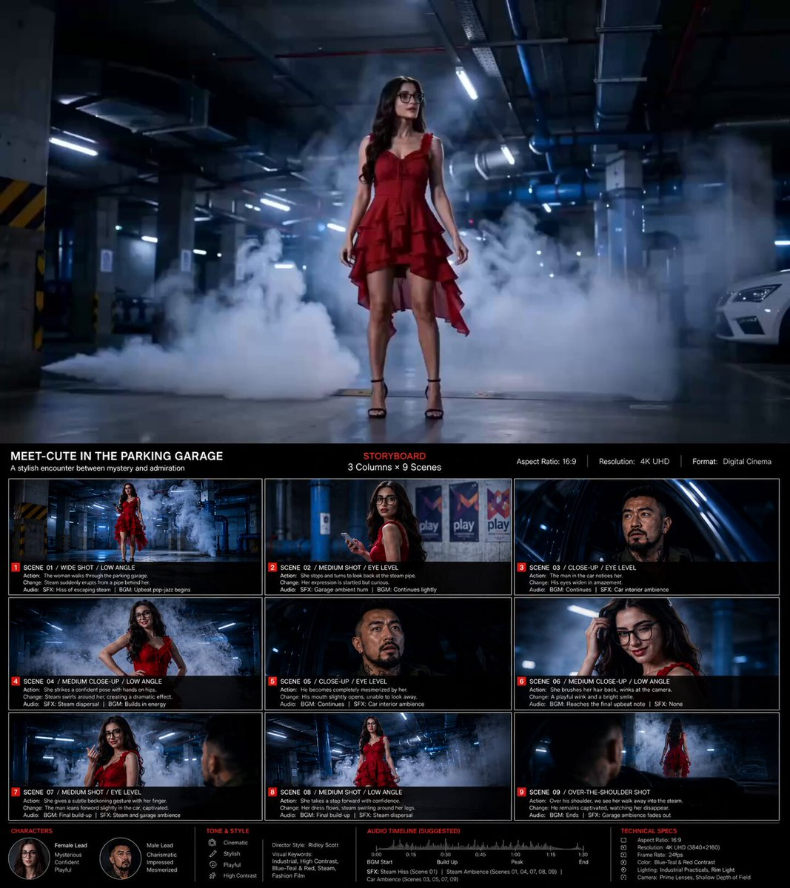

```text
Based on the content【 *****】, create a storyboard image in 16:9 ratio, 4K resolution.
1️⃣ Basic Setup
Main Title + Subtitle
Aspect Ratio
Layout Design (3-column × 9-scene storyboard grid)
2️⃣ Style Direction
Director-inspired visual style
Visual keywords (for example: Ridley Scott / low-saturation atmospheric sci-fi)
3️⃣ Storyboard Details
For each scene, clearly describe:
Camera shot
Character action
Visual progression / scene transition
Sound effects / audio cues
4️⃣ Visual Guidelines
Color palette and tone
Cinematic language and lighting style
(example: desaturated earthy tones + strong rim lighting)
5️⃣ Bottom Information Section
Character profiles
Overall mood / tone
Audio timeline / sound design notes
Technical specifications
#AIArt #AIFilm #AIStoryboard
```


---

## 例 544：Borussia Storyboard Intro

**来源：** [@guicastellanos1](https://x.com/guicastellanos1/status/2056059584733675772) / [awesome-gpt-image-2-prompts](https://github.com/EvoLinkAI/awesome-gpt-image-2-prompts)

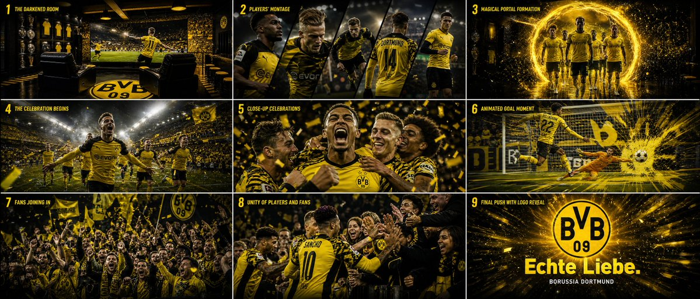

```text
Create a 9-shot cinematic storyboard for a Borussia Dortmund match intro TV broadcast animation. The sequence should feel like a high-end sports commercial blended with fantasy VFX and explosive motion design energy.
Players appear inside the television broadcast graphics, then in a magical, reality-breaking moment, they burst out of the screen into the real world. The transition feels powerful, emotional, and larger than life, as glowing particles, stadium lights, and dynamic camera movements transform the scene into an epic celebration.
As the players emerge, they interact with the fans in a euphoric post-goal moment, celebrating together with raw energy and passion. Every shot should feel premium, fast-paced, and cinematic, combining dramatic lighting, immersive crowd atmosphere, intense action, and world-class commercial aesthetics inspired by modern UEFA Champions League broadcast intros.
```


---

## 例 545：Continuous-Run Glitch Storyboard

**来源：** [@aimikoda](https://x.com/aimikoda/status/2063688774324981798) / [awesome-gpt-image-2-prompts](https://github.com/EvoLinkAI/awesome-gpt-image-2-prompts)

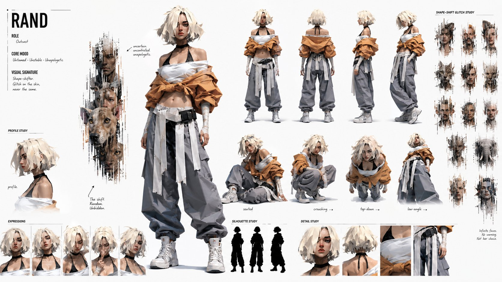

```text
Use @[storyboard ref]  as the authoritative director-approved storyboard blueprint for the sequence. Treat every storyboard panel as a consecutive shot within a single cinematic sequence. Follow panel order exactly and do not invent alternative coverage. Do not render the storyboard sheet itself. Preserve camera placement, framing, lens intent, shot scale, character staging, screen direction, environmental geography, prop placement, action choreography, continuity and emotional escalation shown by the storyboard. The storyboard is the primary source of truth for visual storytelling. Recreate the filmed sequence implied by the panels rather than the physical storyboard artwork.
The entire video must play as one continuous developing master shot with no visible cuts; each panel is a sampled phase of the same uninterrupted camera move, not a separate shot.
Use one virtual lens / same-lens move; angle changes come from backward front-track, push-in, shallow front-side orbit, and pullback only. Never pass behind Rand.
Use @[char1 ref] as starting Rand/C1. Use @[char2 ref]  as final RAN.

ENVIRONMENT: Vivid daytime street into quiet passage: colorful storefront glass, crosswalk, posters, bollards, hard shadows, unaware crowd, right-side escape. Rand runs toward the camera as it retreats in front of her.
EMOTIONAL GUIDANCE: Valence: vulnerable public appeal into private panic, then altered control. Arousal: urgent run -> "I can't control this" flicker -> false heads -> palm-slap snapbacks -> hidden roulette -> RAN lock. Crowd never notices.
VISUAL STYLE: Match @[char1 ref] : faceted semi-real concept art, vivid daylight, crisp skin, polygon texture, hard shadows, vertical black-gray pixels stuck to Rand's whole head until final body lock; no side faces.
TRANSFORMATION RULE: P03-P07 must not show face fragments beside Rand or as floating panels. Each temporary identity replaces the actual head attached to Rand's neck for a readable instant, like a broken TV channel. Body keeps running/bracing while the head swaps. Original Rand head returns only after each open-palm slap. Only final @[char1 ref] lock spreads below the neck.
AUDIO: No music. Use crowd, footsteps, breath, clothing rustle, pixel tearing, palm-head slaps, glitch snaps, dialogue.

PANEL BEATS:
P01: Wide backward front-track. Rand runs toward camera through unaware crowd, original identity intact, colorful storefronts behind her.
P02: Camera retreats in front of her as she looks into the lens, breathing hard: "You're probably wondering why I'm running."
P03: Camera keeps retreating front-side as she spots the passage: "I need to get away before it starts. I can't control this." On that line, she looks to lens; her whole head starts vertical glitching, still attached to her neck.
P04: Camera pushes closer. Three human heads replace her actual head one after another, each in the same skull position, never beside it. She open-palm slaps side of head like fixing a TV, no pointing; original Rand head snaps back.
P05: More whole-head swaps cycle on the neck: older man, pale mask-like face, shaved head, then a clear animal head as rejected option. Rand gives another open-palm slap; Rand head briefly returns.
P06: Camera backs into passage with her as she ducks into cover; first dense whole-head roulette shows readable heads replacing her actual head in micro-freezes, body/clothes still Rand's.
P07: Still front-side in cover, second roulette beat shows different readable heads replacing the same head volume; no side faces, no floating panels, no clones, no detached masks.
P08: At the wall, closest front-side orbit: roulette stops on @[char2 ref] RAN. Only now the glitch runs down the body as cap, braids, sunglasses, blue jacket, hoodie, pink cargos, chains, sneakers lock in.
P09: Camera pulls wider in passage. RAN lowers his hand, fully changed into @[char2 ref], looks to lens, says, "See? I told you. I can't control it."

---

I shared the storyboard skill file I use for these prompts with my subscribers.
```


---

## 例 546：Dust Bunny Nature Documentary

**来源：** [@NeuralAIInsight](https://x.com/NeuralAIInsight/status/2063638281976189102) / [awesome-gpt-image-2-prompts](https://github.com/EvoLinkAI/awesome-gpt-image-2-prompts)

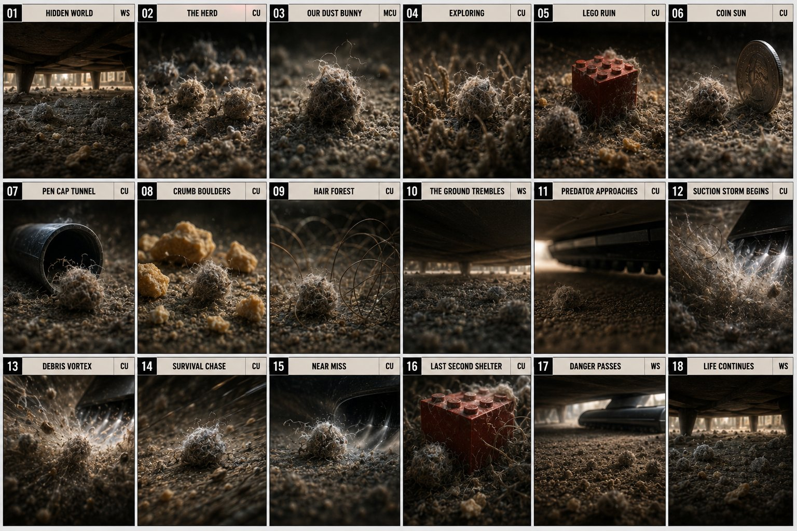

```text
Create a 16:9 image.

[PROJECT CARD]
Create a compact designed masthead, not a table.
TITLE: THE DUST BUNNY NATURE DOCUMENTARY
META LINE: macro wildlife realism / under-couch survival ecosystem / dry documentary comedy / 15-second natural-history chase
PRIORITY: real nature-documentary seriousness, under-couch wilderness, dust bunny herd, fragile main dust bunny, household objects as landmarks, vacuum cleaner apex predator, survival chase, calm noble ending
MICRO BRIEF: Eighteen-panel storyboard of a small dust bunny under a couch filmed like a wild animal surviving in a dangerous natural habitat.
[CONTINUITY HEADER]
SEQUENCE ID: DUST-BUNNY-DOC-18
REFERENCE PRIORITY: This storyboard controls C1 dust bunny identity, under-couch geography, macro household scale, documentary lens language, herd behavior, vacuum predator logic, survival chase continuity, and dry comedic realism.
[SCENE PACKET]
PREMISE: Beneath an ordinary living-room couch exists a hidden wilderness. Dust bunnies drift and gather like a small herd in a shadowed ecosystem of carpet fibers, long hair strands, crumbs, lost objects, and canyon-like sofa legs. One small fragile dust bunny explores the terrain, moving through the under-couch world like a wild animal foraging in a hostile habitat. The peace breaks when the ground begins to tremble. The vacuum cleaner arrives like an apex predator: part lion, part shark, part sandstorm. Its suction pulls dust, crumbs, and debris into a violent vortex. C1 races through the under-sofa wilderness, dodges household dangers, tumbles past a lost LEGO brick, coin, pen cap, crumbs, and hair-strand forests, then finds cover just in time. The vacuum passes. Calm returns. The herd remains. Against all odds, life continues under the couch.
LOCATION:
The underside of a couch in a real home, filmed at extreme macro scale.
Environment: dark sofa underside, canyon-like couch shadows, carpet fibers like tall grass, dust motes drifting like desert particles, long hair strands like tangled vines or forest roots, crumbs like boulders, a lost LEGO brick like a red stone ruin, a coin like a metallic moon-disc, a pen cap like a fallen cylinder monument, deep shadow pockets used as cover.
World scale: everything is household-sized in reality but filmed like a vast natural ecosystem.
START -> END:
C1 and a small dust bunny herd rest calmly in the hidden under-couch habitat -> C1 explores and forages -> the vacuum arrives and creates a suction storm -> C1 survives by finding cover -> C1 returns to the herd as the habitat settles back into quiet.
ACTION CHAIN:
calm under-couch ecosystem -> dust bunny herd drifting -> main dust bunny emerges -> foraging through carpet grass -> LEGO ruin pass -> coin reflection -> pen cap tunnel -> crumbs and hair forest -> ground tremor -> vacuum shadow appears -> suction storm begins -> debris vortex pulls everything -> C1 tumbles and runs -> near miss at nozzle edge -> cover behind LEGO brick -> vacuum passes -> dust settles -> C1 returns to herd -> life continues.

PROP / EFFECT STATE:
C1 is a believable dust bunny creature made from dust, fuzz, hair, lint, and tiny fibers. It has subtle expressive movement but no human face, no speech, no limbs like a cartoon mascot, no clothes, and no exaggerated cuteness.
Dust bunny herd members are soft drifting clumps of dust and lint with tiny natural movement, not characters with faces.
The vacuum cleaner is the apex predator. It should be introduced through shadow, vibration, low mechanical presence, nozzle movement, suction wind, and debris being pulled into darkness. It should feel genuinely threatening in documentary terms, not like a villain with personality.
The household objects are landmarks: LEGO brick, coin, pen cap, crumbs, hair strands, carpet fibers. They should feel like real objects seen at extreme macro scale.
MUST READ:
The style must stay committed to real documentary seriousness. This is not a cartoon parody. The joke is that a dirty forgotten corner of a home is treated like a majestic wildlife ecosystem.
[CHARACTER SANITIZATION]
C1: small dust bunny, fragile rounded irregular shape, soft grey-beige lint body, slightly shaggy edges, tiny tangled hair fibers, dust particles clinging to its surface, delicate movement like a windblown creature, subtle readable orientation without a cartoon face. It should feel alive but still plausibly made from household dust and fuzz.
C2: dust bunny herd, several smaller and larger dust clumps drifting and resting in shadow, fragile, quiet, non-human, no obvious faces, no mascot design.
C3: vacuum cleaner apex predator, seen mostly as a large dark nozzle, rotating brush shadow, vibrating floor presence, harsh suction wind, low mechanical threat. It should feel enormous from dust-bunny scale.
C4: household landmarks — lost LEGO brick, coin, pen cap, old crumbs, long hair strands, carpet fibers, couch legs, dark sofa underside. These are environmental features, not props to be played for slapstick.

[IDENTITY CONSISTENCY]
Keep C1’s small grey-beige shaggy dust-and-lint body, fragile irregular shape, hair-fiber texture, and subtle movement consistent across every panel. Keep the under-couch geography consistent: couch underside above, carpet fibers below, lost objects as landmarks, vacuum entering from one side. Preserve face, identity, skin tone, body shape, hair, outfit, and proportions exactly across every panel. No identity drift. No redesign.
[STORYBOARD PURITY]
Create a clean professional storyboard sheet with 18 panels arranged in a compact 3x6 grid. Full-color cinematic documentary panel artwork. Put panel numbers, beat names, and lens tags in a clean header strip outside each panel image. No captions, no subtitles, no speech bubbles, no logos, no watermarks, no arrows inside the artwork, no technical overlays. Do not make the dust bunny too cute or anthropomorphic. Do not overcrowd panels. Each panel must have one clear wildlife-documentary visual idea.

[MASTER SHOT RULE]
P01 must clearly establish the under-couch ecosystem in calm documentary beauty: sofa underside overhead, carpet fibers like grass, dust motes in shallow focus, lost objects in the distance, herd visible but subtle. P10 must clearly introduce the vacuum as an enormous apex predator presence. P13-P15 must be the clearest survival-chase section. P18 must return to calm, noble life continuing under the couch.
[EMOTIONAL ARC]
Hidden natural beauty -> fragile creature life -> strange majestic household wilderness -> first tremor -> predator arrival -> survival panic -> near consumption -> shelter and endurance -> dust settles -> noble absurd continuity of life.
[STYLE LOCKS]
STYLE LOCK: National Geographic / BBC Earth macro documentary realism, cinematic natural-history lens language, shallow depth of field, extreme macro photography, realistic household textures, dust motes in volumetric light, tactile carpet fibers, muted earth tones, soft documentary contrast, serious wildlife cinematography.
REALISM LOCK: the dust bunny should feel like a believable dust-and-lint organism, not a cartoon character. Movement is subtle, fragile, and wind-driven. No talking, no human gestures, no mascot design.
DOCUMENTARY LOCK: camera treats the under-couch world like a real ecosystem: patient observation, macro tracking, hidden-life beauty, predator dread, survival stakes.
PREDATOR LOCK: the vacuum is shot like a natural threat: shadow first, vibration second, then nozzle and suction vortex. It should feel like a lion, shark, and sandstorm combined, but still clearly a household vacuum cleaner.
COMEDY LOCK: dry seriousness is the joke. Do not wink at the audience. Do not exaggerate into slapstick.
ENVIRONMENT LOCK: underside of couch remains the same wilderness throughout: couch shadow canopy above, carpet fiber grass below, lost LEGO brick, coin, pen cap, crumbs, and hair strands as landmarks.
[SPATIAL CONTINUITY LOCK]
P01-P04 establish the calm under-couch ecosystem and C1 among the dust bunny herd.
P05-P08 follow C1 exploring through the household landmark terrain.
P09-P10 introduce vibration and vacuum predator arrival from one side of the couch.
P11-P15 stage the suction chase through the same under-couch geography.
P16 shows C1 finding cover and surviving the vacuum pass.
P17-P18 restore calm and return C1 to the herd.
The vacuum always enters from one consistent direction. C1’s survival path moves from the open carpet-fiber field toward cover behind the LEGO brick or pen cap.

[DIRECTOR STRIP]
Bottom animatic track board aligned to panel columns. Tracks: BEAT LINE, CAMERA PATH, ACTION PATH, RHYTHM TRACK, ESCALATION MAP, STATE TRACK, STYLE TRACK. Use clean shot chips, thin lines, small rhythm blocks, and short labels. No timestamps.
PANEL HEADERS:
P01 / macro 35mm / Hidden ecosystem
P02 / macro 100mm / Herd drifts
P03 / 85mm close / C1 emerges
P04 / low macro / Carpet grass
P05 / 70mm track / Foraging path
P06 / macro wide / LEGO ruin
P07 / 100mm insert / Coin moon
P08 / 50mm tunnel / Pen cap shelter
P09 / 85mm tremor / Ground warning
P10 / low 24mm / Predator shadow
P11 / 35mm storm / Suction begins
P12 / macro chaos / Debris vortex
P13 / 70mm chase / C1 runs
P14 / 100mm danger / Nozzle near miss
P15 / low 35mm / Hair forest escape
P16 / 50mm cover / Survives pass
P17 / macro calm / Dust settles
P18 / 35mm wide / Life continues

CAMERA + LENS PLAN:
P01 wide macro establishing shot under the couch, sofa underside like canyon ceiling, carpet fibers like grass, dust motes floating in light.
P02 patient macro shot of several dust bunnies drifting and gathering like a herd in a hidden ecosystem.
P03 close documentary shot of C1 emerging from shadow, fragile and shaggy, subtly alive.
P04 low carpet-level shot as C1 moves through tall carpet fibers like grassland.
P05 tracking macro shot following C1 foraging through crumbs and lint.
P06 wider macro shot of C1 passing a lost LEGO brick framed like an ancient red stone ruin.
P07 insert shot of a coin reflecting dim light like a metallic moon in the under-couch world.
P08 tunnel-like shot of C1 passing near a pen cap, treated like a fallen hollow log or shelter.
P09 tense close shot as carpet fibers vibrate and dust trembles from an approaching force.
P10 low dramatic shot of the vacuum nozzle shadow entering the habitat like an apex predator.
P11 wide macro chaos shot as suction begins pulling dust motes, crumbs, and lint into a directional wind.
P12 extreme macro shot of debris spinning in a suction vortex, realistic and tactile.
P13 fast documentary chase shot of C1 tumbling and racing through the carpet-fiber field.
P14 intense near-miss shot: vacuum nozzle edge passes dangerously close as C1 is almost pulled in.
P15 low tracking shot as C1 escapes through long hair strands like a tangled forest.
P16 still tense shot as C1 wedges behind the LEGO brick or pen cap, surviving as the vacuum passes.
P17 quiet macro shot as dust settles back onto the carpet and the predator sound fades.
P18 wide macro final shot of C1 returning to the dust bunny herd, calm restored, life continuing under the couch.
ACTION PATH:
P01 The under-couch wilderness is revealed in calm documentary beauty.
P02 Dust bunnies drift and gather like a quiet herd.
P03 C1 emerges carefully from shadow.
P04 C1 moves through carpet fibers like tall grass.
P05 C1 forages among crumbs, dust, and lint.
P06 C1 passes the lost LEGO brick landmark.
P07 C1 crosses near the coin, its reflection looming huge.
P08 C1 explores beside the pen cap shelter.
P09 The ground trembles; dust particles shake.
P10 The vacuum cleaner shadow appears at the edge of the habitat.
P11 Suction begins, pulling dust and crumbs into a violent wind.
P12 Debris spins into a vortex.
P13 C1 races away through the under-couch wilderness.
P14 C1 narrowly avoids the vacuum nozzle.
P15 C1 tumbles through hair strands and carpet fibers.
P16 C1 finds cover behind the LEGO brick or pen cap and survives the pass.
P17 The vacuum leaves; dust settles; silence returns.
P18 C1 rejoins the herd. Against all odds, life continues.

RHYTHM TRACK:
P01 hold / hidden beauty / patient beat
P02 observe / calm life / documentary beat
P03 reveal / fragile subject / clean beat
P04 move / quiet exploration / slow beat
P05 forage / natural behavior / measured beat
P06 landmark / scale reveal / held beat
P07 detail / world texture / quiet beat
P08 shelter / ecosystem detail / clean beat
P09 warning / tremor / tension beat
P10 predator reveal / dread / held beat
P11 attack / suction wind / impact beat
P12 vortex / chaos / storm beat
P13 chase / survival run / driving beat
P14 near miss / danger spike / smash beat
P15 escape / tangled path / whip beat
P16 cover / survival pause / suspended beat
P17 settle / predator gone / release beat
P18 continue / noble calm / final hold
ESCALATION MAP:
P01 L1 calm / flat
P02 L1 ecosystem / hold
P03 L2 subject reveal / rise
P04 L2 exploration / hold
P05 L2 foraging / hold
P06 L2 scale wonder / rise
P07 L2 texture wonder / hold
P08 L2 shelter / hold
P09 L3 warning / spike
P10 L4 predator / rise
P11 L5 attack / spike
P12 L5 vortex / surge
P13 L5 chase / sustained
P14 L5 near death / spike
P15 L4 escape / unresolved
P16 L3 survival / drop
P17 L2 calm returns / release
P18 L1 life continues / resolved
STATE TRACK:
P01 hidden habitat
P02 herd calm
P03 C1 emerges
P04 carpet grass
P05 foraging
P06 LEGO ruin
P07 coin moon
P08 pen cap shelter
P09 tremor
P10 vacuum shadow
P11 suction begins
P12 debris vortex
P13 survival chase
P14 nozzle near miss
P15 hair forest escape
P16 cover survives
P17 dust settles
P18 herd remains
STYLE TRACK:
P01 BBC Earth macro
P02 fragile herd
P03 wild subject
P04 grassland scale
P05 natural behavior
P06 household ruin
P07 metallic landmark
P08 hidden shelter
P09 predator omen
P10 apex dread
P11 sandstorm suction
P12 debris cyclone
P13 survival sprint
P14 shark-mouth danger
P15 forest escape
P16 sheltered life
P17 quiet aftermath
P18 noble absurdity
[NEGATIVE / AVOID]
Do not make the dust bunny too cute in a Pixar way.
Do not give the dust bunny a cartoon face, human eyes, arms, legs, clothing, speech, or mascot behavior.
Do not turn the vacuum into a character with a face.
Do not make the scene loud, colorful, or cartoonish.
Do not lose the realism of the household environment.
Do not make the couch world clean or magical.
Do not overcrowd panels with too many objects.
Do not add narration text, captions inside panels, speech bubbles, logos, watermarks, UI, or arrows inside the artwork.
Do not make the dust bunny herd look like plush toys.
Do not make the ending sentimental; make it calm, dry, and weirdly noble.

[SEQUENCE]
Grid: 18 panels in a compact 3x6 cinematic storyboard sheet. The sequence must read as a serious macro nature documentary: a small dust bunny lives under a couch, explores its household wilderness, faces the vacuum cleaner apex predator, survives the suction storm, and returns to the herd as calm life continues. National Geographic / BBC Earth documentary realism, macro household scale, dry absurd comedy, tense survival framing, and committed visual seriousness throughout.

Seedance 2.0 Prompt:

Use as the authoritative director-approved storyboard blueprint for the sequence. Treat every storyboard panel as a consecutive shot within a single cinematic survival-documentary sequence. Follow panel order exactly and do not invent alternative coverage. Do not render the storyboard sheet itself. Preserve camera placement, framing, lens intent, shot scale, under-couch geography, dust-bunny scale, household landmark placement, vacuum-predator approach, suction-storm escalation, survival chase logic, and quiet final recovery shown by the storyboard. The storyboard is the primary source of truth for visual storytelling. Recreate the filmed sequence implied by the panels rather than the physical storyboard artwork.

REFERENCE PRIORITY:  controls the under-couch ecosystem, dust bunny design, dust herd behavior, LEGO ruin, coin sun, pen cap tunnel, crumb boulders, hair forest, vacuum predator staging, suction vortex physics, shelter beat, documentary realism, and panel purity.

TITLE: THE DUST BUNNY NATURE DOCUMENTARY

FORMAT: 15-second macro survival nature documentary. Serious wildlife tone applied to household dust. No dialogue from characters. No faces. No cartoon behavior.

MAIN SUBJECT:
The main dust bunny is a small tangled ball of grey dust, hair fibers, lint, tiny crumbs, and loose fuzz. It must feel like a real physical dust clump, not a cute creature. It has no eyes, no mouth, no limbs, no facial expressions, and no human behavior. Its personality is created only through camera framing, movement, danger, and survival context.

ENVIRONMENT:
A hidden ecosystem under a couch. The underside of the couch forms a dark ceiling; couch legs feel like giant trees; carpet fibers become grassland; dust particles hang in the air like desert haze. Household debris becomes wilderness landmarks: a red LEGO brick as an ancient ruin, a coin standing like a glowing sun disk, a pen cap as a tunnel, crumbs as boulders, tangled hair strands as a forest. The under-couch geography must remain consistent and readable.

PREDATOR:
The vacuum cleaner is the predator. It appears at the edge of the couch as a dark, heavy mechanical threat. It should not look silly or friendly. The danger comes from vibration, shadow, proximity, suction wind, debris movement, and the violent pull of the vortex.

EMOTIONAL GUIDANCE:
Valence: quiet hidden ecosystem → strange natural beauty → discovery → distant threat → predator reveal → violent survival chase → last-second shelter → calm continuation.
Arousal: slow observational opening, gentle exploration, sudden ground tremor, rising threat, intense suction storm, near-miss danger, shelter release, quiet survival.
The comedy comes from the seriousness of the documentary language. The scene should feel funny because it is played completely straight.

VISUAL STYLE:
National Geographic / BBC Earth macro survival documentary. Low macro camera, shallow depth of field, realistic dust texture, floating dust motes, dramatic naturalistic light shafts, tactile carpet fibers, realistic household debris, cinematic macro wildlife framing, earthy brown-grey palette, occasional warm highlights from distant room light. The world should feel vast, ancient, and dangerous even though it is only under a couch. Documentary realism first; no Pixar-cute expression, no anthropomorphic design.

AUDIO:
No character dialogue. Optional serious nature-documentary style narration is allowed only if the platform supports voice, but the visuals must work without it. Use diegetic survival-documentary sound design: low room tone, tiny dust movement, faint fiber crackle, distant household hum, subtle rumble before the vacuum appears, heavy mechanical approach, carpet vibration, suction wind, debris rattling, crumbs scraping, hair strands whipping, vortex rush, sudden muffled shelter silence, vacuum fading away, then calm dust-settling ambience. Music, if used, should be restrained wildlife-documentary tension: minimal low drone, rising pulse during predator approach, intense swell during suction chase, cut down to quiet after shelter.

PANEL BEATS:
P01: Hidden World; wide shot. Under the couch, a vast dark ecosystem stretches across the dusty carpet floor. Couch legs rise like trees. Dust motes drift in distant light.
P02: The Herd; close-up. Multiple dust bunnies gather and drift like a small herd across the under-couch terrain. Natural, slow, observational.
P03: Our Dust Bunny; MCU. Introduce the main dust bunny as a tangled grey clump of lint, hair, and dust. It feels like a wild animal only because of the camera treatment.
P04: Exploring; close-up. The main dust bunny moves through dense carpet fibers and dust formations, exploring the hidden wilderness.
P05: LEGO Ruin; close-up. A red LEGO brick rises like an ancient ruin in the dust landscape. The main dust bunny passes nearby, establishing it as future shelter.
P06: Coin Sun; close-up. A coin stands upright or glints in light like a huge metallic sun. The dust bunny is tiny against it.
P07: Pen Cap Tunnel; close-up. The dust bunny approaches or passes a dark pen cap opening, framed like a cave or tunnel.
P08: Crumb Boulders; close-up. Crumbs loom like large boulders around the dust bunny. Keep the scale serious and naturalistic.
P09: Hair Forest; close-up. Long strands of hair curve through the frame like tall grass or a forest. The dust bunny passes through the tangled terrain.
P10: The Ground Trembles; wide shot. The under-couch world vibrates. Dust shifts. The herd becomes unsettled. The threat is felt before it is fully seen.
P11: Predator Approaches; close-up. The vacuum cleaner enters at the edge of the couch like an apex predator. Dark, heavy, mechanical, dangerous.
P12: Suction Storm Begins; close-up. The suction pulls dust, hair, crumbs, and loose fibers into motion. The first vortex forms around the dust bunny.
P13: Debris Vortex; close-up. The storm intensifies. Dust, crumbs, hair, and debris spiral violently through the frame. The main dust bunny resists the pull.
P14: Survival Chase; close-up. The dust bunny is dragged and rolled across the carpet by the suction wind, racing through the terrain as debris streaks past.
P15: Near Miss; close-up. The dust bunny is almost sucked into the vacuum path. The vortex curls around it. Survival hangs by a tiny margin.
P16: Last Second Shelter; close-up. The dust bunny reaches the red LEGO brick and tucks behind it at the last possible second. The brick blocks the suction like a rock shelter.
P17: Danger Passes; wide shot. The vacuum moves away. The suction fades. Dust settles. The under-couch world is still again.
P18: Life Continues; wide shot. The hidden ecosystem returns to quiet. Dust bunnies remain under the couch. The main dust bunny has survived. Life continues.

KEY INSTRUCTIONS:

* Keep the tone serious and documentary-real, not cute cartoon.
* Do not give the dust bunny eyes, face, mouth, limbs, or human gestures.
* The dust bunny must remain a real dust clump made of lint, hair, crumbs, and fuzz.
* The vacuum must feel like a genuine predator, not a joke machine.
* Keep the under-couch geography clear and consistent.
* The LEGO brick must read clearly as the final shelter.
* The chase must feel like survival, not slapstick.
* Protect the macro scale at all times.
* Keep household debris beautiful, tactile, and wilderness-like.
* Do not add dialogue between objects.
* Do not make the vacuum silly.
* Do not make the world bright and clean; it should be dusty, shadowed, and cinematic.
* End with quiet survival and life continuing under the couch.
* Do not show panel boxes, labels, numbers, captions, storyboard borders, or camera notes.
```


---

## 例 547：Action Storyboard Sheet

**来源：** [@neural_aperture](https://x.com/neural_aperture/status/2064048487583424581) / [awesome-gpt-image-2-prompts](https://github.com/EvoLinkAI/awesome-gpt-image-2-prompts)

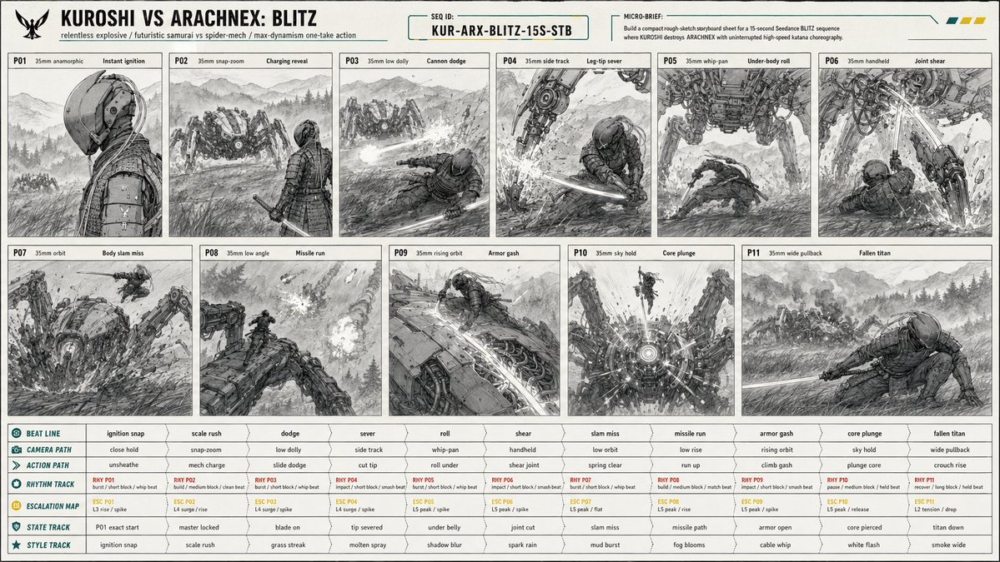

```text
Create a 16:9 image.
[PROJECT CARD]
Create a compact designed masthead, not a table.
TITLE: KUROSHI VS ARACHNEX: BLITZ
META LINE: relentless explosive / futuristic samurai vs spider-mech / max-dynamism one-take action
PRIORITY: constant motion readability, one-take camera continuity, leg-cut and core-kill clarity, massive scale contrast
MICRO BRIEF: Build a compact rough-sketch storyboard sheet for a 15-second Seedance BLITZ sequence where KUROSHI destroys ARACHNEX with uninterrupted high-speed katana choreography.
[CONTINUITY HEADER]
SEQUENCE ID: KUR-ARX-BLITZ-15S-STB
REFERENCE PRIORITY: @image1 controls C1 KUROSHI identity, wardrobe, armor, helmet, cables, katana, proportions; @image2 controls C2 ARACHNEX identity, weapon layout, eight-leg structure, scale, armor; @image3 controls P01 starting-frame composition exactly; storyboard controls staging, camera sampling, movement, geography, damage continuity.
[SCENE PACKET]
PREMISE: KUROSHI erupts from a cold starting-frame profile into a relentless one-take fight, sprinting through ARACHNEX's attacks, climbing the machine, and killing it through the sensor core.
LOCATION: open Japanese mountain field at blue hour, ankle-high wind-blown grass, wet earth, ground mist, distant pine ridges, layered mountain silhouettes, wide sky, no buildings, no roads, no extra fighters.
```


---

## 例 548：Pencil Shaving Diorama Grid

**来源：** [@Gdgtify](https://x.com/Gdgtify/status/2069543521045143580) / [awesome-gpt-image-2-prompts](https://github.com/EvoLinkAI/awesome-gpt-image-2-prompts)

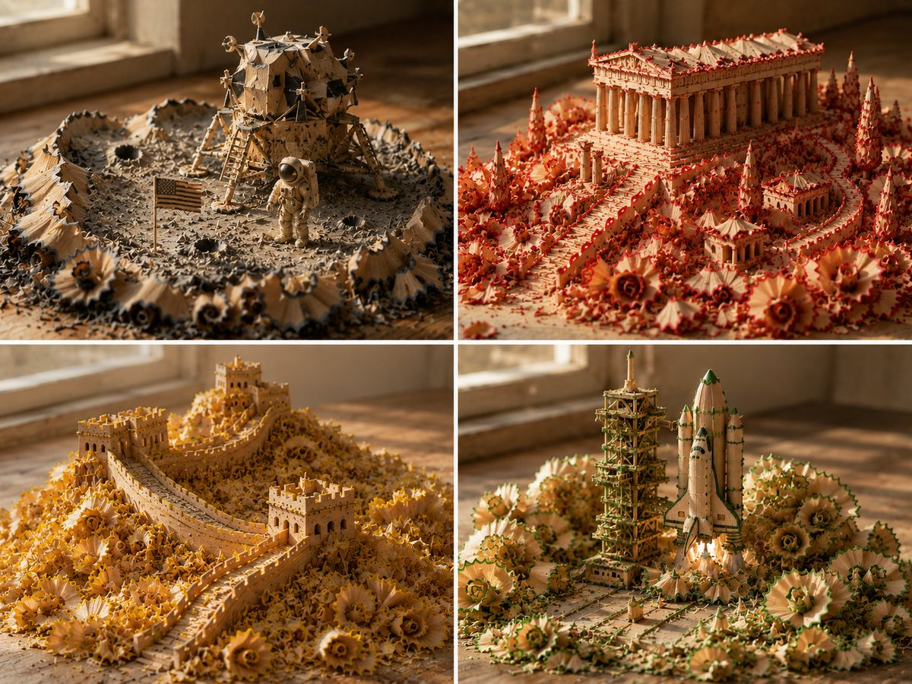

```text
2x2 grid, do this for 4 days $ scenes that made humans proud: Input = Pencil Shaving Category. Identify 4 distinct shavings (e.g., Graphite Shavings, Red Pencil Shavings, Yellow Pencil Shavings, Green Pencil Shavings). > Function Draw($ Pencil_Shaving, $ scene) > Anchor: [scene]:: [Pencil_Shaving]::4 > Morphology: A stunning 3D [scene] composed of [Pencil_Shaving] — full detailed > Material Physics: The thin curled wood, painted color edge, and fine grain of [$Pencil_Shaving] under warm window light
```


---
