# 建筑与空间 — 提示词合集


> 36 个案例

---

## 例 26：建筑空间场景图

**来源：** [@ecooai](https://x.com/ecooai)


```text
A vintage 35mm film photograph of a {argument name="subject description" default="young Asian woman"} with {argument name="hair style" default="long dark wavy hair and wispy bangs"}. She is wearing a {argument name="clothing" default="white ribbed tank top and a loose beige knit cardigan slipping off one shoulder"}, along with a delicate silver necklace. She has soft makeup with pink blush and glossy lips, looking directly at the camera with slightly parted lips. The lighting is harsh direct camera flash, creating a candid, amateur snapshot aesthetic. The background is a {argument name="setting" default="dimly lit, slightly messy room with clothes on a table and a wooden shelf"}. The image features heavy film grain, slightly muted colors, and a nostalgic, highly realistic photographic texture.
```


---

## 例 46：建筑空间场景图

**来源：** [@lakeside529](https://x.com/lakeside529)


```text
A highly detailed, realistic photograph of a young East Asian woman sitting in a cluttered backstage dressing room, getting ready for a cosplay event. She has {argument name="hair color" default="vibrant short red"} hair styled in a bob with bangs and is wearing an elaborate fantasy warrior costume featuring a {argument name="costume color" default="glossy red"} and gold tiered mini skirt, a white corset top with black lace and red lacing, matching glossy arm guards, and thigh-high boots. She is looking down with a focused expression, using her right hand to adjust the arm guard on her left arm. The vanity counter in front of her is messy, covered with makeup brushes, bottles, a hairbrush, and extra hairpieces. A large, ornate {argument name="prop" default="fantasy sword with a blue blade and gold hilt"} leans against the edge of the counter. The background shows a brightly lit vanity mirror with round bulbs reflecting a clothing rack, capturing a candid, slightly over-sharpened, and highly textured photographic style.
```


---

## 例 47：建筑空间场景图

**来源：** [@makaneko\_AI](https://x.com/makaneko_AI)


```text
{
  "type": "2x2 grid of Japanese digital advertisement banners",
  "layout": {
    "structure": "4 equal quadrants",
    "quadrants": [
      {
        "position": "top-left",
        "theme": "Travel",
        "subject": "A couple holding hands on a white sand beach, looking out at turquoise ocean water under a bright blue sky.",
        "elements": ["red hibiscus flower in bottom left corner"],
        "text_labels": [
          "今年こそ、解き放て。",
          "{argument name=\"travel destination\" default=\"沖縄旅行\"}",
          "3日間の癒やし旅",
          "航空券＋ホテル",
          "39,800円〜",
          "絶景、グルメ、体験 ぜんぶ叶う!"
        ],
        "icons": {
          "count": 3,
          "descriptions": ["airplane", "hotel building", "car"]
        }
      },
      {
        "position": "top-right",
        "theme": "Skincare",
        "subject": "Close-up portrait of a young woman with glowing, dewy skin, eyes closed, gently touching her cheeks.",
        "elements": [
          "soft pink gradient background",
          "dynamic water splash effects",
          "pink cosmetic jar labeled '{argument name=\"skincare product name\" default=\"LUMIÈRE\"} Brightening Gel'"
        ],
        "text_labels": [
          "毛穴・くすみ卒業！",
          "透明感あふれる",
          "水光肌へ",
          "新感覚スキンケア",
          "初回限定 78%OFF",
          "{argument name=\"discount price\" default=\"1,980円\"}"
        ],
        "badges": {
          "count": 3,
          "style": "gold circular",
          "labels": ["毛穴ケア", "高保湿", "ハリ・ツヤ"]
        }
      },
      {
        "position": "bottom-left",
        "theme": "Gourmet Food",
        "subject": "Thick, sliced, medium-rare steak sizzling on a dark grill plate.",
        "elements": [
          "garlic chips",
          "rosemary sprig",
          "dark background with smoke and glowing embers"
        ],
        "text_labels": [
          "とろける旨さ！",
          "{argument name=\"food item\" default=\"黒毛和牛\"}",
          "贅沢ステーキ",
          "期間限定",
          "特別価格",
          "通常価格 8,980円",
          "4,980円"
        ],
        "badges": {
          "count": 1,
          "style": "red circular",
          "labels": ["A4 A5等級"]
        }
      },
      {
        "position": "bottom-right",
        "theme": "Online Education",
        "subject": "Young man in a blue shirt studying at a desk, writing in a notebook next to an open laptop.",
        "elements": ["bright indoor lighting", "desk environment"],
        "text_labels": [
          "スキマ時間で",
          "{argument name=\"education goal\" default=\"最短合格！\"}",
          "オンライン資格講座",
          "スマホで完結",
          "効率学習で差がつく！",
          "今だけ！ 受講料 20%OFF"
        ],
        "badges": {
          "count": 1,
          "style": "blue circular",
          "labels": ["受講者数 10万人 突破！"]
        },
        "icons": {
          "count": 2,
          "descriptions": ["smartphone", "open book"]
        }
      }
    ]
  }
}
```


---

## 例 50：建筑空间场景图

**来源：** [@nomen\_machine](https://x.com/nomen_machine)

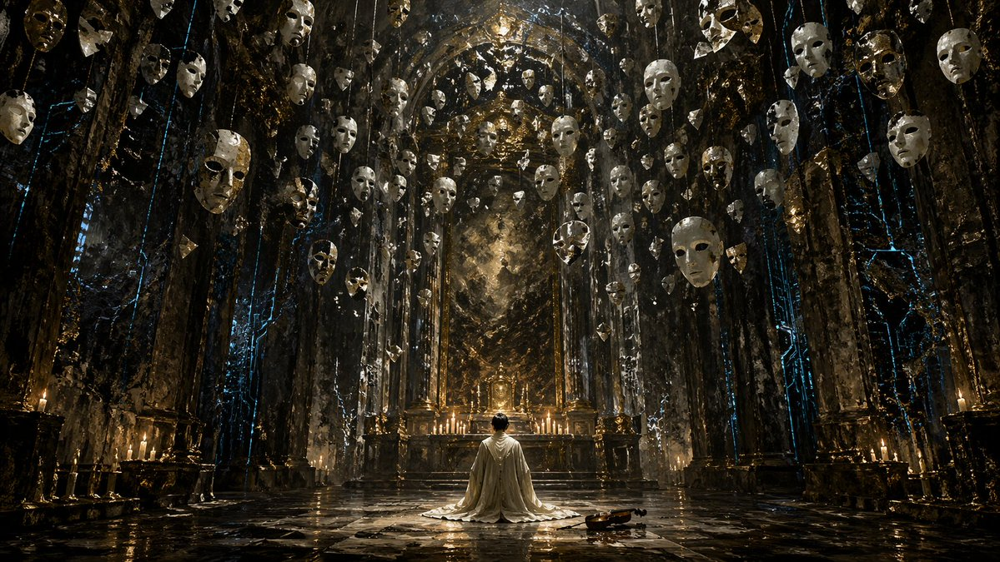


```text
A highly detailed, cinematic wide shot of a grand, dark gothic hall with a {argument name="atmosphere" default="dark fantasy"} aesthetic. In the center, a single figure wearing a {argument name="clothing" default="long white robe"} kneels on a highly reflective stone floor, facing an ornate golden altar illuminated by a row of lit candles. To the right of the kneeling figure, a single {argument name="floor object" default="wooden violin"} rests on the ground. The cavernous room is framed by massive dark stone pillars detailed with {argument name="accent color" default="glowing blue"} ethereal cracks and veins. Suspended from the high ceiling are dozens of {argument name="floating objects" default="white porcelain theatrical masks"} hanging on thin strings, filling the upper half of the space and creating a haunting, surreal atmosphere. The lighting is dramatic and moody, featuring a rich color palette of deep blacks, tarnished golds, and cool blue accents. Format 16:9.
```


---

## 例 53：室内空间渲染图

**来源：** [@nicdunz](https://x.com/nicdunz)

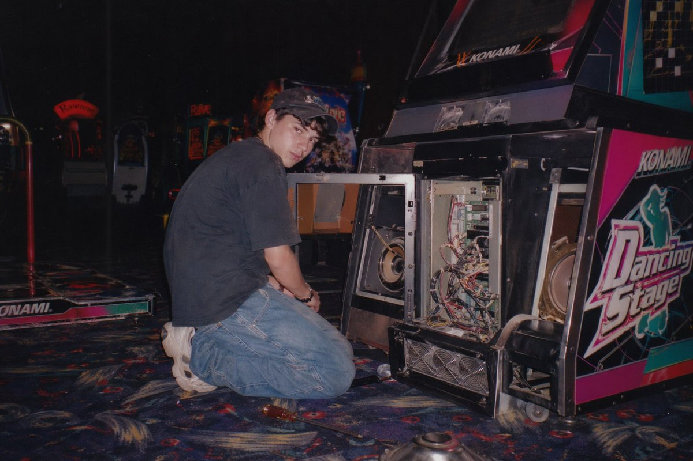


```text
A vintage, late 90s amateur flash photograph of a young man repairing an arcade machine. He is kneeling on a dark, patterned arcade carpet, looking back over his shoulder directly at the camera with a neutral expression. He wears a dark short-sleeved t-shirt, baggy blue jeans, chunky white sneakers, and a dark baseball cap. The lower front panel of the arcade cabinet is wide open, exposing its complex internal electronics, including a tangle of wires, green circuit boards, a large speaker, and metal cooling fans at the base. The side of the cabinet features vibrant pink, black, and white graphics with the text "{argument name="arcade game title" default="Dancing Stage"}" and the brand "{argument name="arcade brand" default="KONAMI"}". The setting is a dimly lit arcade interior with other glowing game cabinets visible in the blurred background. A screwdriver lies on the carpet near the man's knee. The image features harsh direct flash lighting, a slightly grainy film texture, deep shadows, and a nostalgic Y2K aesthetic.
```


---

## 例 120：建筑空间场景图

**来源：** [@UNIBRACITY](https://x.com/UNIBRACITY)

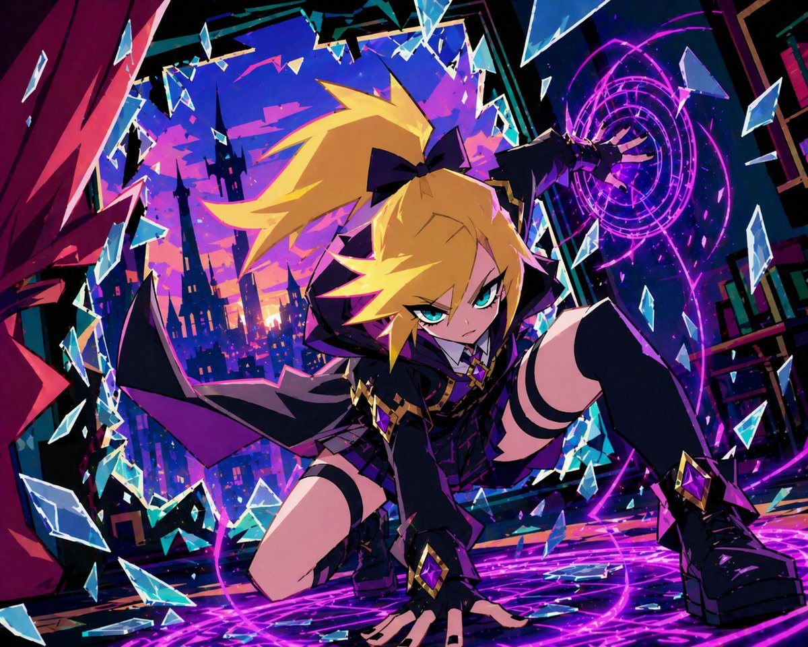


```text
A dynamic anime illustration of a girl with spiky {argument name="hair color" default="blonde"} hair tied in a high ponytail with a black bow, striking teal eyes, and a {argument name="outfit style" default="dark purple and black magical uniform with gold trim and diamond gems"}. She is in an intense crouching superhero landing pose, one hand pressed to the ground and the other raised, casting {argument name="magic color" default="glowing purple"} magic circles. She is shattering through a glass barrier, with sharp, jagged glass shards flying outward toward the viewer. Through the broken frame behind her, a {argument name="background scene" default="stylized silhouette of a gothic city with tall spires against a vibrant purple and orange sunset sky"} is visible. The artwork features {argument name="art style" default="sharp angles, high contrast cel-shading, and vibrant colors"}.
```


---

## 例 121：建筑空间场景图

**来源：** [@loilokoji](https://x.com/loilokoji)

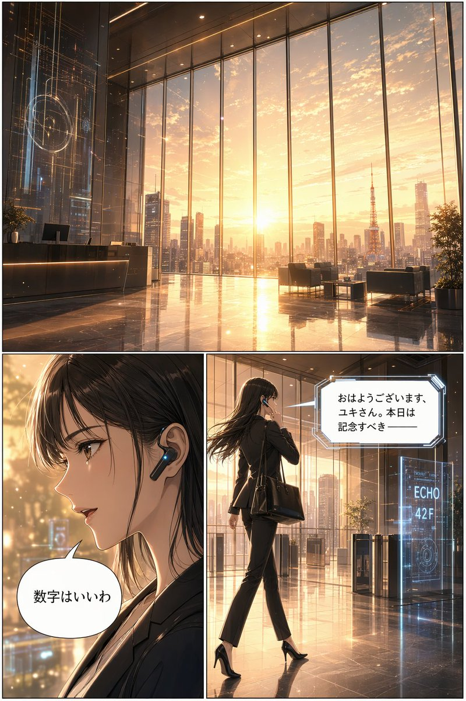


```text
{
  "type": "3-panel manga page",
  "style": "anime, highly detailed, cinematic lighting, futuristic corporate",
  "layout": {
    "structure": "1 wide top panel, 2 square bottom panels"
  },
  "panels": [
    {
      "position": "top",
      "shot": "wide landscape",
      "scene": "Futuristic corporate lobby with floor-to-ceiling windows",
      "lighting": "{argument name=\"time of day\" default=\"sunrise\"}",
      "background": "City skyline featuring {argument name=\"landmark\" default=\"Tokyo Tower\"}",
      "details": "Holographic displays, polished reflective floor, reception desk, lounge chairs"
    },
    {
      "position": "bottom left",
      "shot": "close-up profile",
      "character": "Young woman, dark hair, black business suit",
      "accessories": "Futuristic black earpiece with glowing blue light",
      "speech_bubble": {
        "style": "standard rounded",
        "text": "{argument name=\"character dialogue\" default=\"数字はいいわ\"}"
      }
    },
    {
      "position": "bottom right",
      "shot": "full body, walking away, touching earpiece",
      "character": "Same woman, black suit, black heels, carrying a black tote bag",
      "environment": "Approaching security gates",
      "holographic_sign": "{argument name=\"floor sign\" default=\"ECHO 42F\"}",
      "speech_bubble": {
        "style": "futuristic angular",
        "text": "{argument name=\"AI dialogue\" default=\"おはようございます、ユキさん。本日は記念すべき ──\"}"
      }
    }
  ]
}
```


---

## 例 127：建筑空间场景图

**来源：** [@studiomasakaki](https://x.com/studiomasakaki)

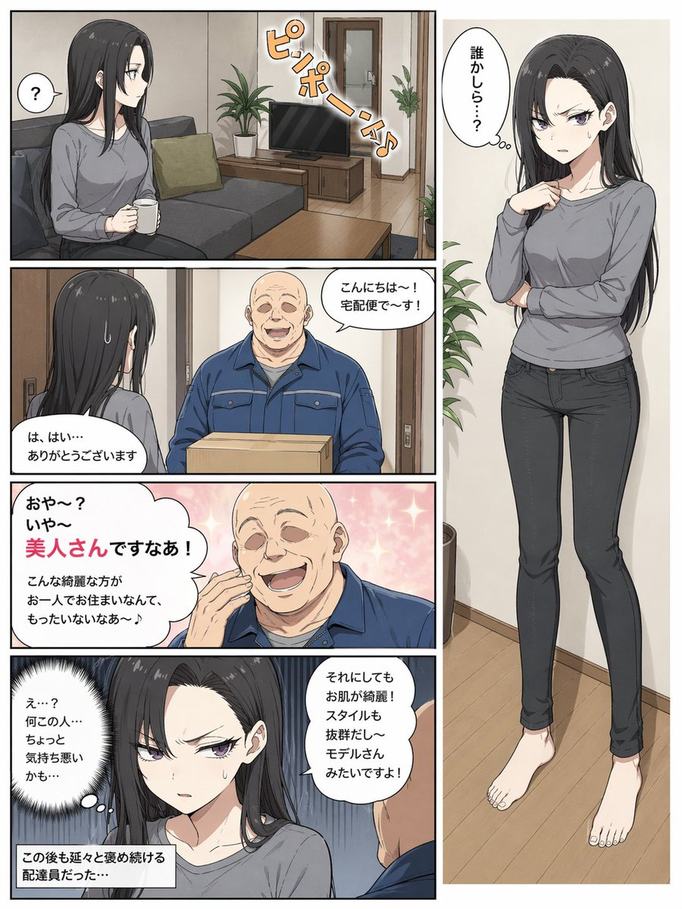


```text
{
  "type": "manga page",
  "style": "anime illustration, full color",
  "characters": {
    "woman": {
      "appearance": "long {argument name=\"hair color\" default=\"black\"} hair, purple eyes",
      "outfit": "{argument name=\"shirt color\" default=\"grey\"} long-sleeve shirt, dark grey skinny jeans, barefoot"
    },
    "delivery_man": {
      "appearance": "bald, older man, thick eyebrows",
      "outfit": "blue work jacket over a grey shirt"
    }
  },
  "layout": {
    "description": "Page split vertically. Left side contains 4 stacked horizontal panels. Right side is a single tall vertical panel.",
    "left_column_panels": [
      {
        "panel_number": 1,
        "scene": "Woman sitting on a grey sofa in a living room, holding a white mug.",
        "text_elements": [
          { "type": "speech_bubble", "text": "?" },
          { "type": "sound_effect", "text": "ピンポーン♪", "description": "doorbell ringing" }
        ]
      },
      {
        "panel_number": 2,
        "scene": "Woman opening the front door. Delivery man standing outside holding a cardboard box, smiling.",
        "text_elements": [
          { "type": "speech_bubble", "speaker": "delivery_man", "text": "{argument name=\"delivery greeting\" default=\"こんにちは〜！宅配便で〜す！\"}" },
          { "type": "speech_bubble", "speaker": "woman", "text": "は、はい…ありがとうございます" }
        ]
      },
      {
        "panel_number": 3,
        "scene": "Close-up of the delivery man laughing enthusiastically with a sparkly pink background.",
        "text_elements": [
          { "type": "speech_bubble", "speaker": "delivery_man", "text": "{argument name=\"creepy compliment\" default=\"おや〜？いや〜美人さんですなあ！こんな綺麗な方がお一人でお住まいなんて、もったいないなあ〜♪\"}" }
        ]
      },
      {
        "panel_number": 4,
        "scene": "Close-up of the woman looking disgusted and uncomfortable, sweating slightly. The back of the delivery man's head is visible in the foreground.",
        "text_elements": [
          { "type": "speech_bubble", "speaker": "delivery_man", "text": "それにしてもお肌が綺麗！スタイルも抜群だし〜モデルさんみたいですよ！" },
          { "type": "thought_bubble", "speaker": "woman", "text": "{argument name=\"woman reaction\" default=\"え…？何この人…ちょっと気持ち悪いかも…\"}" },
          { "type": "caption_box", "text": "この後も延々と褒め続ける配達員だった…" }
        ]
      }
    ],
    "right_column_panel": {
      "panel_number": 5,
      "scene": "Full-body portrait of the woman standing indoors, looking annoyed and suspicious with her arms crossed.",
      "text_elements": [
        { "type": "thought_bubble", "speaker": "woman", "text": "誰かしら…？" }
      ]
    }
  }
}
```


---

## 例 128：建筑空间场景渲染

**来源：** [@masapark95](https://x.com/masapark95)


```text
{
  "type": "anime-style animated movie poster",
  "scene": "Magical glowing multi-story treehouse restaurant in a dark enchanted forest at night, illuminated by string lights and warm window glow.",
  "subjects": {
    "children": "2 children in center foreground facing the restaurant: a boy with a backpack and lantern, and a girl in a red coat and beret with a lantern.",
    "animals": "4 anthropomorphic animals: a bear chef holding a MENU book (bottom left), an owl playing violin and a squirrel playing flute on a branch (top left), a badger playing cello (mid right), and a rabbit in a suit holding a sign (bottom right).",
    "creatures": "3 small black soot-sprite-like creatures with glowing eyes (bottom right).",
    "floating_food": "4 glowing food items floating in the air: soup, pancakes, omurice, and a fruit parfait."
  },
  "layout": {
    "top_text": "{argument name=\"top catchphrase\" default=\"おいしい奇跡が、今夜はじまる。\"}",
    "building_sign": "{argument name=\"restaurant name\" default=\"森のレストラン\"}",
    "left_board": "本日のおすすめ\n・森のスープ\n・星のオムライス\n・ふわふわパンケーキ\n・しあわせのパフェ\n...and more!",
    "right_board": "いらっしゃいませ！\nここは、だれでも\n笑顔になれる場所。",
    "main_title": {
      "text": "{argument name=\"movie title\" default=\"ふしぎな森のレストラン\"}",
      "styling": "Large stylized typography with a chef hat, fork, and spoon motifs."
    },
    "rabbit_sign": "ごちそうさま！またきてね！",
    "bottom_left_badge": "{argument name=\"genre badge\" default=\"家族みんなで楽しめる！心あたたまる冒険ファンタジー\"}",
    "bottom_center_credits": "Fictional cast and staff names in Japanese.",
    "bottom_release_date": "{argument name=\"release date\" default=\"2025年 夏休みロードショー！\"}",
    "bottom_right": "QR code with text '最新情報はこちら！'"
  }
}
```

## 例 129：韩系极简氛围感少女写真

**来源：** [@BubbleBrain](https://x.com/BubbleBrain/status/2046434670724907395)

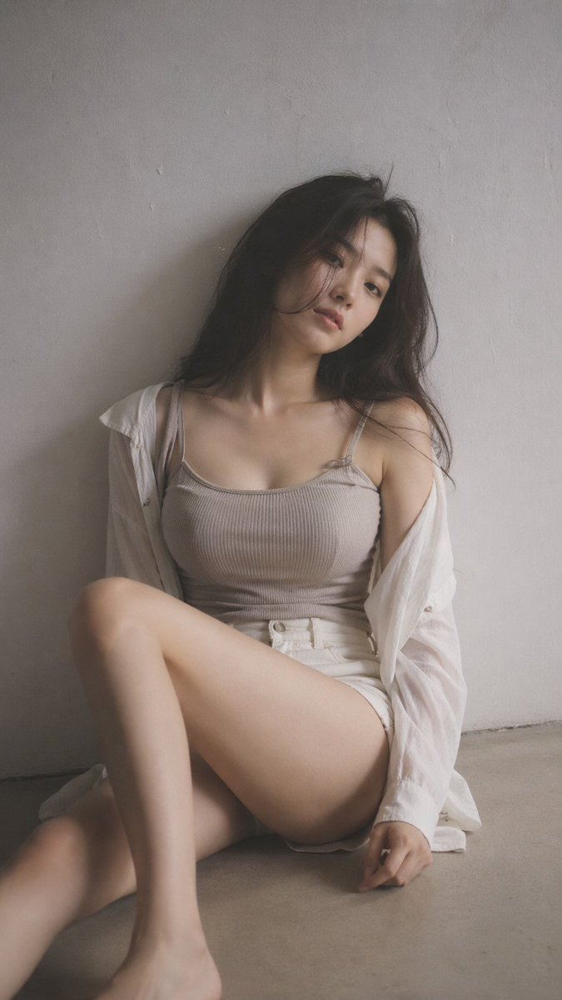


```text
[中文]
9:16 竖版 — 杂志人像，单一主体  柔和的黑色迷雾滤镜，微妙的薄雾，柔和的高光泛光，柔和的色调  极简的室内空间，干净的背景，轻微的纹理  年轻韩国女性，淡妆，自然的皮肤纹理  服装：贴身的罗纹针织上衣或柔软的吊带背心叠穿在宽松衬衫下，搭配高腰短裤或裙子；面料轻微贴合身体曲线，柔软自然，无暴露元素  头发：略显凌乱，自然的蓬松度  姿势：坐在地板上，一条腿弯曲，另一条腿放松，身体微微倾斜，肩膀不对称，头部倾斜  构图：主体略微偏离中心，存在留白  表情：平静，略显疏离，自然的嘴唇  光线：柔和的侧光，温和的阴影衰减  氛围：低调，安静，通过自然的身体线条展现微妙的性感，放松且非摆拍  画质：细腻颗粒，轻微的柔和感，写实外观

[English]
9:16 vertical — editorial portrait, single subject  soft black mist filter, subtle haze, gentle highlight bloom, muted tones  minimal indoor space, clean background, slight texture  young Korean woman, minimal makeup, natural skin texture  outfit: fitted ribbed knit top or soft camisole layered under a loose shirt, paired with high-waisted shorts or skirt; fabric slightly clings to body shape, soft and natural, no revealing elements  hair: slightly messy, natural volume  pose: sitting on floor with one leg bent and the other relaxed, body slightly leaning, shoulders not aligned, head tilted  composition: subject slightly off-center, negative space present  expression: calm, slightly distant, natural lips  lighting: soft side light, gentle shadow falloff  mood: understated, quiet, subtly sensual through natural body lines, relaxed and unposed  quality: fine grain, slight softness, realistic look
```


---
## 例 130：昏暗室内纯真少女的意外回眸

**来源：** [@BubbleBrain](https://x.com/BubbleBrain/status/2046190539213885806)


```text
[中文]
{
  "prompt": {
    "style_and_tech": "手机照片，老式CCD相机美学，刺眼的闪光灯，颗粒感，昏暗杂乱的室内光线，抓拍快照感觉，轻微的运动模糊",
    "subject": "年轻的韩国女偶像，温柔纯真的外表",
    "pose": "动作进行中，微微转头看向镜头，仿佛刚刚注意到正在被拍照，肩膀微微耸起",
    "expression": "眼睛微微睁大，因惊讶而微微张开的嘴唇，害羞且猝不及防的表情",
    "clothing": "宽松柔软的居家服（薄开衫+内搭上衣），一侧肩膀微微滑落但没有暴露",
    "vibe": "毫无防备，亲密，意外的瞬间，唤起好奇心与保护欲",
    "aspect ratio": "9:16"
  }
}

[English]
{
  "prompt": {
    "style_and_tech": "mobile phone photo, old CCD camera aesthetic, harsh flash, grainy, dim messy indoor lighting, candid snapshot feeling, slight motion blur",
    "subject": "young Korean female idol, soft innocent look",
    "pose": "mid-action, slightly turning head toward camera as if just noticed being photographed, shoulders slightly raised",
    "expression": "eyes widened slightly, lips parted in surprise, shy and caught-off-guard expression",
    "clothing": "loose soft homewear (thin cardigan + inner top), slightly slipping off one shoulder but not revealing",
    "vibe": "unprepared, intimate, accidental moment, evokes curiosity and protectiveness"，
    "aspect ratio":"9:16"
  }
}
```


---
## 例 131：窗边日系胶片女孩

**来源：** [@BubbleBrain](https://x.com/BubbleBrain/status/2046115431144902732)

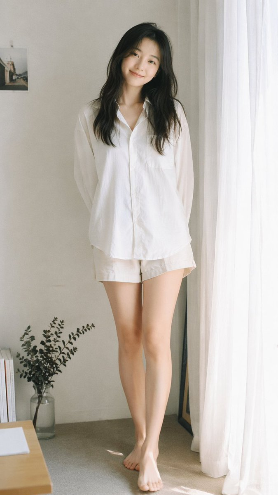


```text
[中文]
模拟35毫米胶片摄影，柔和轻盈的日系美学，温柔漫射的自然窗户光，轻微过曝，柔和色调，低对比度，柔和的高光，靠近窗户配有白色窗帘的极简室内环境，干净的浅色墙壁，自然构图，平视视角，略微紧凑的全身取景（大腿中部到头部），年轻东亚女性，自然极简妆容，柔和真实的皮肤纹理，长长的微乱黑发，超大号白色纽扣衬衫，浅色休闲短裤，赤脚，简单放松的造型，自然站立姿势放松，双臂自然下垂或略微放在身后，面朝镜头，温柔柔和的微笑，微妙的静止感，专注于光线、空气和安静的日常氛围，柔和的胶片颗粒，梦幻而低调的氛围 --ar 9:16

[English]
Analog 35mm film photography, soft airy Japanese-style aesthetic, gentle diffused natural window light, slight overexposure, pastel tones, low contrast, soft highlights,  minimal indoor setting near a window with white curtains, clean light-colored wall, natural composition, eye-level, slightly closer full-body framing (mid-thigh to head),  young East Asian woman, natural minimal makeup, soft realistic skin texture, long slightly messy dark hair,  oversized white button-up shirt, light casual shorts, barefoot, simple and relaxed styling,  standing naturally with relaxed posture, arms loosely at sides or slightly behind, facing camera, gentle soft smile, subtle stillness,  focus on light, air, and quiet everyday mood, soft film grain, dreamy and understated atmosphere --ar 9:16
```


---
## 例 132：琉璃透明画眉鸟飞舞羊城墨卷

**来源：** [@liyue\_ai](https://x.com/liyue_ai/status/2045873940883808523)


```text
[中文]
【背景与骨架线条】
纯黑深邃底色，一条粗壮有力的墨色书法S型曲线自画面一端蜿蜒贯穿至另一端，笔触苍劲，墨迹浓淡有致，如大写意行笔，构成整幅画面的视觉骨架与叙事动线。
【主体：透明燕子】
曲线上方，一只展翅飞翔的画眉鸟占据视觉核心；身体呈玻璃透明质感，内部映射传统建筑群叠影，蓝绿色光流在透明羽翼间流转折射，仿佛时间长河与文明记忆凝缩其中；轮廓以极细金线勾边，增强立体感与神圣感。
【中景：古典建筑序列】
燕子下方，沿墨线曲线错落分布广州的各种风景名胜：白云山、陈家祠、双子塔、广州塔、猎德大桥、海珠塔依次浮现；主色调青绿与淡金，建筑细节清晰，琉璃瓦、飞檐翘角、石阶回廊；木棉花簇拥点缀于建筑周围，花瓣随风轻散，静谧而悠远；几朵水墨云朵轻盈飘浮其间，增添空灵层次。
【前景：白鹤与水面】
前景湖畔：数只白鹤或静立水边、或振翅腾飞，姿态各异，优雅从容；浅蓝湖面如镜，倒影荡漾，波光细碎，营造宁静氛围。
【远景：山峦】
远处山峦层叠起伏，青黛色晕染，墨色由浓至淡，朦胧氤氲，富有水墨层次；与前景形成近实远虚的空间纵深。
【构图与光影】
非线性透视构图，墨线曲线为叙事主轴，古今元素沿线嵌入；光源自画面中心向外辐射扩散，形成强烈明暗对比，中心亮、四周渐暗；冷色调主导（深蓝、青绿、银白），暖色点缀（樱花粉、淡金），和谐而神秘；东方美学与现代意象交融，超现实诗意意境。
【技术规格】
8K超高清渲染，极致细节精度，最佳画质，比例 9:16

[English]
[
  Background and Skeleton Lines
] Pure black deep background,
a thick and powerful ink calligraphy S-shaped curve meanders from one end of the picture to the other,
with vigorous brushstrokes and well-proportioned ink shades,
like freehand brushwork,
forming the visual skeleton and narrative dynamic line of the entire picture. [
  Subject: Transparent Swallow
] Above the curve,
a flying thrush with spread wings occupies the visual core; the body has a glass transparent texture,
with overlapping shadows of traditional architectural complexes mapped inside,
blue-green light flows circulate and refract between the transparent wings,
as if the long river of time and civilized memories are condensed within it; the outline is bordered with extremely thin gold lines to enhance three-dimensionality and sacredness. [
  Midground: Classical Architecture Sequence
] Below the swallow,
various scenic spots in Guangzhou are scattered along the ink curve: Baiyun Mountain,
Chen Clan Ancestral Hall,
Twin Towers,
Canton Tower,
Liede Bridge,
Haizhu Tower appear in sequence; the main tone is cyan-green and pale gold,
architectural details are clear,
glazed tiles,
flying eaves,
stone steps and corridors; kapok flowers cluster and decorate around the buildings,
petals scatter lightly with the wind,
quiet and distant; a few ink clouds float lightly among them,
adding ethereal layers. [
  Foreground: White Cranes and Water Surface
] Lakeside in the foreground: several white cranes either stand quietly by the water or flap their wings to soar,
with different postures,
elegant and calm; the light blue lake surface is like a mirror,
reflections rippling,
shimmering light,
creating a tranquil atmosphere. [
  Distance: Mountains
] Distant mountains rise and fall in layers,
smudged in cyan-black,
ink shades from thick to light,
hazy and misty,
rich in ink wash layers; forming a spatial depth with solid foreground and empty distance with the foreground. [
  Composition and Light and Shadow
] Non-linear perspective composition,
the ink curve is the main narrative axis,
ancient and modern elements are embedded along the line; the light source radiates and diffuses outward from the center of the picture,
forming a strong contrast between light and dark,
bright in the center and gradually darkening around; cool tones dominate (dark blue,
cyan-green,
silver white),
warm tones embellish (cherry blossom pink,
pale gold),
harmonious and mysterious; Eastern aesthetics blend with modern imagery,
surreal poetic mood. [
  Technical Specifications
] 8K ultra-high definition rendering,
extreme detail precision,
best image quality,
ratio 9:16
```


---
## 例 133：裂痕里的水墨东方山水画卷

**来源：** [@liyue\_ai](https://x.com/liyue_ai/status/2045368305079447853)

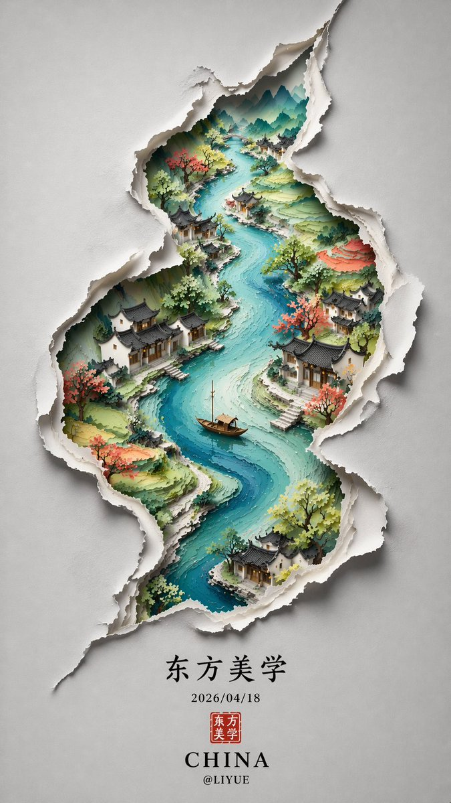


```text
[中文]
极简新中式美学风格，画面以淡雅的灰白色为底，呈现出一种纸艺剪影般的立体感。
一条S形蜿蜒的裂痕状边缘将画面分割，仿佛撕开了一层纸面，露出内部色彩斑斓的东方山水景象。
裂口内，一条蜿蜒的河流自上而下贯穿整个构图，河水以深浅不一的蓝色渲染，层次分明，仿佛流动的丝带。
河岸两侧点缀着青翠的山丘与梯田，色彩柔和，绿红交织，展现出田园的宁静之美。
沿河而建的古风建筑错落有致，飞檐翘角，白墙黛瓦，在光影的映衬下更显古朴典雅。
岸边树木葱茏，枝叶轻盈，一艘小船静泊于水中央，增添了几分悠然意境。
整体构图呈S形曲线，富有韵律感，仿佛自然与人文的和谐共生。
画作边缘采用撕纸效果，营造出立体浮雕般的视觉体验。
下方题字"东方美学"以黑色楷体书写，日期"2026/04/18"与红色印章相呼应，底部"CHINA"字样庄重醒目，署名"@LIYUE"低调收尾，整体氛围静谧深远，充满诗意与哲思。

[English]
Minimalist neo-Chinese aesthetic style, the picture uses an elegant grayish-white as the background, presenting a three-dimensional sense like paper art silhouettes. A winding S-shaped crack-like edge divides the picture, as if tearing open a layer of paper, revealing the colorful oriental landscape scene inside. Inside the crack, a winding river runs through the entire composition from top to bottom, the river water is rendered in different shades of blue, with clear layers, like a flowing ribbon. Both sides of the riverbank are dotted with verdant hills and terraced fields, the colors are soft, green and red interwoven, showing the tranquil beauty of the pastoral. Ancient-style buildings built along the river are well-proportioned, with flying eaves and upturned corners, white walls and black tiles, appearing more quaint and elegant against the light and shadow. The trees on the bank are lush, the branches and leaves are light and graceful, a small boat is quietly moored in the middle of the water, adding a bit of leisurely artistic conception. The overall composition presents an S-shaped curve, full of rhythm, as if the harmonious coexistence of nature and humanity. The edges of the painting adopt a torn paper effect, creating a visual experience like a three-dimensional relief. The inscription "东方美学" at the bottom is written in black regular script, the date "2026/04/18" echoes with the red seal, the word "CHINA" at the bottom is solemn and eye-catching, and the signature "@LIYUE" ends in a low-key way. The overall atmosphere is quiet and profound, full of poetry and philosophical thinking.
```


---
## 例 134：珠江新城剪纸璀璨夜景

**来源：** [@liyue\_ai](https://x.com/liyue_ai/status/2045527750606487877)

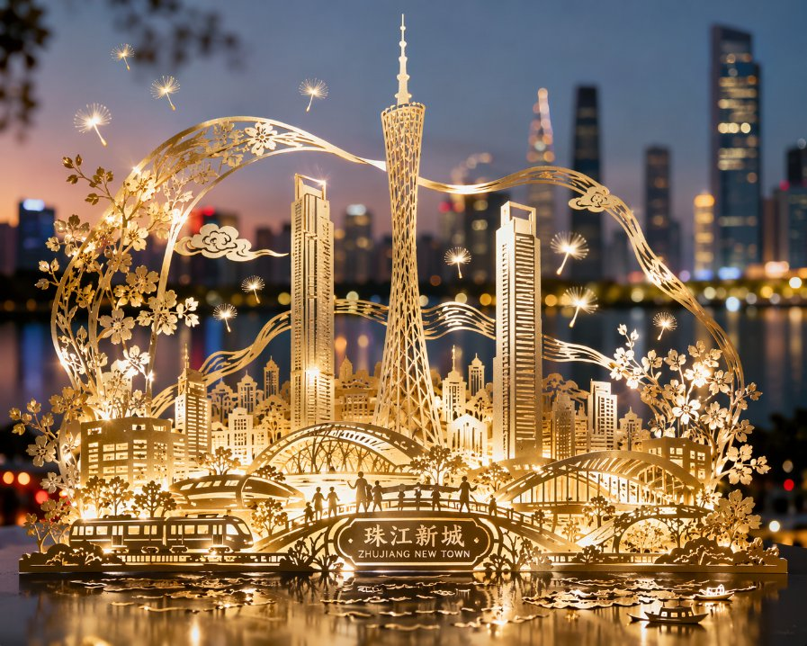


```text
[中文]
以珠江新城现代都市景观为灵感的剪纸艺术，通过精巧的镂空手法在一整幅纸上，立体刻画广州塔、东西双塔等地标建筑与繁华城景。
所有建筑与元素均以流畅的线条与结构相连，无孤立部分，构成一幅完整的都市画卷。
画面采用金属箔或光泽纸材质，表面带有细腻的明暗光泽，在光照下呈现柔和的高光与阴影，仿佛被城市灯光轻轻照亮。
背景以虚化的珠江新城天际线为衬，点缀隐约可见的花城广场与树木轮廓，整体透出现代浪漫的氛围。
作品中巧妙融入轻盈的蒲公英绒毛或星光般的动态光点，象征梦想与活力在这座新城中飘散飞扬。整体呈现8K超高清视觉，细节丰富，真实而富有艺术感染力。

[English]
Paper-cut art inspired by the modern urban landscape of Zhujiang New Town, through exquisite hollow-carving techniques on a single sheet of paper, three-dimensionally depicting landmark buildings such as Canton Tower, East and West Twin Towers, and the bustling cityscape. All buildings and elements are connected by smooth lines and structures, with no isolated parts, forming a complete urban scroll. The picture uses metallic foil or glossy paper material, with delicate light and dark gloss on the surface, presenting soft highlights and shadows under illumination, as if gently illuminated by city lights. The background is set against a blurred Zhujiang New Town skyline, dotted with faintly visible outlines of Huacheng Square and trees, overall revealing a modern romantic atmosphere. The work cleverly integrates light dandelion fluff or starlight-like dynamic light points, symbolizing dreams and vitality fluttering and flying in this new city. The overall presents 8K ultra-high-definition vision, rich in details, realistic and full of artistic appeal.
```


---
## 例 135：复古巴士上的红风衣女郎

**来源：** [@iamsofiaijaz](https://x.com/iamsofiaijaz/status/2015337737860403283)


```text
[中文]
一位时尚年轻女子坐在老式复古巴士的前缘，身穿红色长风衣、羊毛无檐小便帽、圆形蓝色反光太阳镜、叠层项链和粗犷的棕色皮靴。她有着波浪状金发，带着自信而梦幻的表情，仰望天空。巴士漆面剥落，呈青绿色与铁锈红色调。明亮清澈的蓝天，城市背景建筑极少，柔和日光，电影级色彩分级，浅景深，高端时尚旅行氛围，编辑摄影，超写实，4K分辨率，锐利对焦，自然肌肤质感，戏剧性构图，电影静帧美学。

[English]
A stylish young woman sitting on the front edge of an old vintage bus, wearing a long red trench coat, woolen beanie cap, round blue reflective sunglasses, layered necklaces, and rugged brown leather boots. She has wavy blonde hair and a confident, dreamy expression, looking upward toward the sky. The bus is weathered with peeling paint in turquoise and rust red tones.Bright clear blue sky, urban background with minimal buildings, soft daylight, cinematic color grading, shallow depth of field, high fashion travel vibe, editorial photography, ultra-realistic, 4K resolution, sharp focus, natural skin texture, dramatic composition, film still aesthetic.
```


---
## 例 136：西安手绘水彩城市地图

**来源：** 苍何原创实测（公众号文章《我逆向了 329 条 GPT-Image2 提示词模板，全部开源！》）


```text
生成一张手绘水彩风格的「西安」城市地图，包含当地特色美食、地标建筑及城市特色
```


---

## 例 381：90 年代公寓场景参考板

**来源：** [@Iancu_ai](https://x.com/Iancu_ai/status/2051287273581203888)

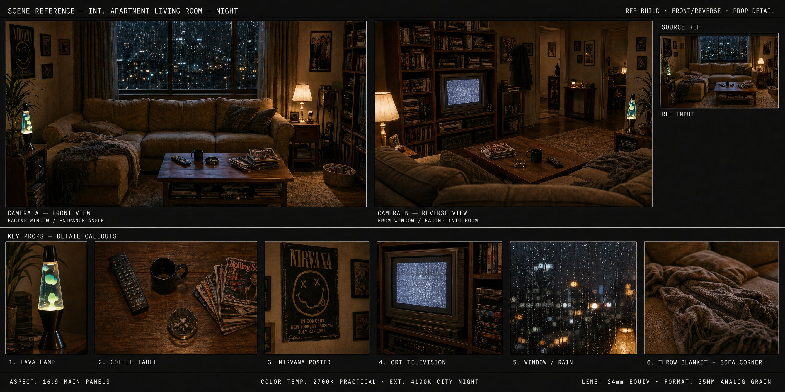

```text
{
  "type": "scene reference board — 90s apartment living room, cinematic night",
  "style": "cinematic film photography, 35mm grain, warm amber shadow fill, deep chiaroscuro lighting, hyper-detailed interior, production design reference quality",
  "layout": {
    "main_panel_center_left": {
      "label": "CAMERA A — FRONT VIEW",
      "scene": "Wide shot, L-shaped tan sectional sofa, grey knit throw blanket, wooden coffee table (remote, mug, ashtray, Rolling Stone stack), lava lamp left, table lamp right, rain-streaked city window behind, Nirvana poster left wall. 35mm grain."
    },
    "main_panel_center_right": {
      "label": "CAMERA B — REVERSE VIEW",
      "scene": "Wide reverse from behind sofa. CRT TV prominent right, grey static screen. Tall bookshelf, VHS tapes. Cool blue backlight from window behind camera. Deep shadow."
    },
    "prop_strip_bottom": "6 close-up tiles: 1. LAVA LAMP — chrome base, blue-green wax blobs; 2. COFFEE TABLE — remote, mug, ashtray, magazines; 3. NIRVANA POSTER — black smiley face, wall texture; 4. CRT TELEVISION — static screen, VHS stack; 5. WINDOW/RAIN — city bokeh, water streaks; 6. THROW BLANKET — sofa corner, worn upholstery",
    "top_right_inset": "SOURCE REF thumbnail — original photo",
    "footer": "2700K PRACTICAL · 4100K CITY NIGHT · 24mm · 35MM"
  },
  "background": "deep charcoal #1a1a1a, thin white separators",
  "dimensions": "wide landscape 3:1, high resolution"
}
```


---

## 例 411：极简建筑地标海报

**来源：** [@iamaiistudio](https://x.com/iamaiistudio/status/2053084576520573269)

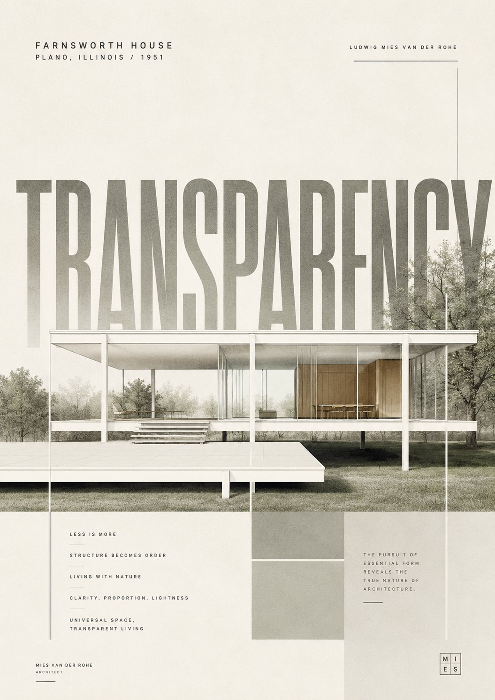

```text
Design a luxury minimalist poster centered on a famous architectural landmark of your choice ([building name]). The focal element is an illustrated rendering of the building. Behind it, place one giant bold English word in a design-forward typeface whose character matches the building's identity, with smaller body copy nearby describing its design philosophy. The composition should read as an ultra high-end art poster. Use a restrained, low-key color palette where graphic elements interlock with the architecture, appearing as if they form part of its structural components or extend outward from its silhouette.
```


---

## 例 489：城市地图微缩旅行海报

**来源：** [@SimplyAnnisa](https://x.com/SimplyAnnisa/status/2062358269172101240)

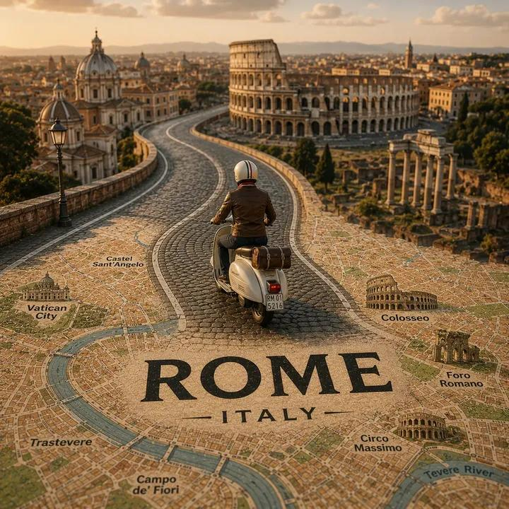

```text
Create a highly detailed cinematic miniature tilt-shift travel scene of [CITY NAME] featuring a realistic [VEHICLE NAME] driving along a winding elevated road that emerges naturally from a printed vintage-style city map. The road should curve dramatically toward the background skyline and landmarks of [CITY NAME], while the vehicle remains the clear focal point in the foreground.

Blend the real city seamlessly with the illustrated map surface so the road appears integrated into the map itself. Include recognizable local landmarks, waterways, architecture, vegetation, and atmosphere associated with [CITY NAME], but keep the composition clean and uncluttered.

Show large bold typography of "[CITY NAME]" printed directly on the map in the foreground. Use warm golden-hour lighting, shallow depth of field, realistic textures, cinematic shadows, aerial perspective, and photorealistic detail. The overall aesthetic should feel like a premium Instagram travel poster mixed with a miniature diorama.

Aspect ratio 1:1.
```


---

## 例 490：Heliotropic Architecture Board

**来源：** [@Gdgtify](https://x.com/Gdgtify/status/2055773537257034007) / [awesome-gpt-image-2-prompts](https://github.com/EvoLinkAI/awesome-gpt-image-2-prompts)

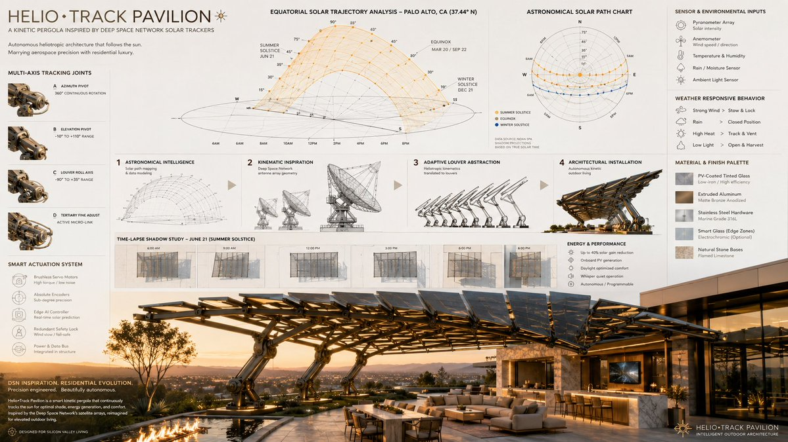

```text
16:9 autonomous kinetic architecture, the heliotropic tracking mechanics of [aerospace/solar tracking array] shaping an adaptive, luxury [outdoor architectural structure], sequence from [astronomical/solar path diagrams] to [robotic kinematic wireframes] to a programmable louvre abstraction to the final architectural installation, ai to infer smart-motor integration and weather-responsive materials utilizing [material 1] and [material 2], featuring time-lapse shadow projection diagrams, [aesthetic style] aesthetic, presentation layout: solar path charts at the top, robotic hinge details in the margins, stunning photorealistic architectural render below, [lighting style].  input: [deep space network satellite dish array], [smart kinetic patio pergola], [equatorial solar trajectory mapping], [multi-axis pivoting joint schematics], [photovoltaic-coated tinted glass], [extruded matte bronze aluminum], [contemporary silicon valley billionaire estate], [golden hour sunlight casting intricate geometric shadows]
```


---

## 例 491：Architectural Product Catalog Page

**来源：** [@iamaiistudio](https://x.com/iamaiistudio/status/2066447564132745574) / [awesome-gpt-image-2-prompts](https://github.com/EvoLinkAI/awesome-gpt-image-2-prompts)

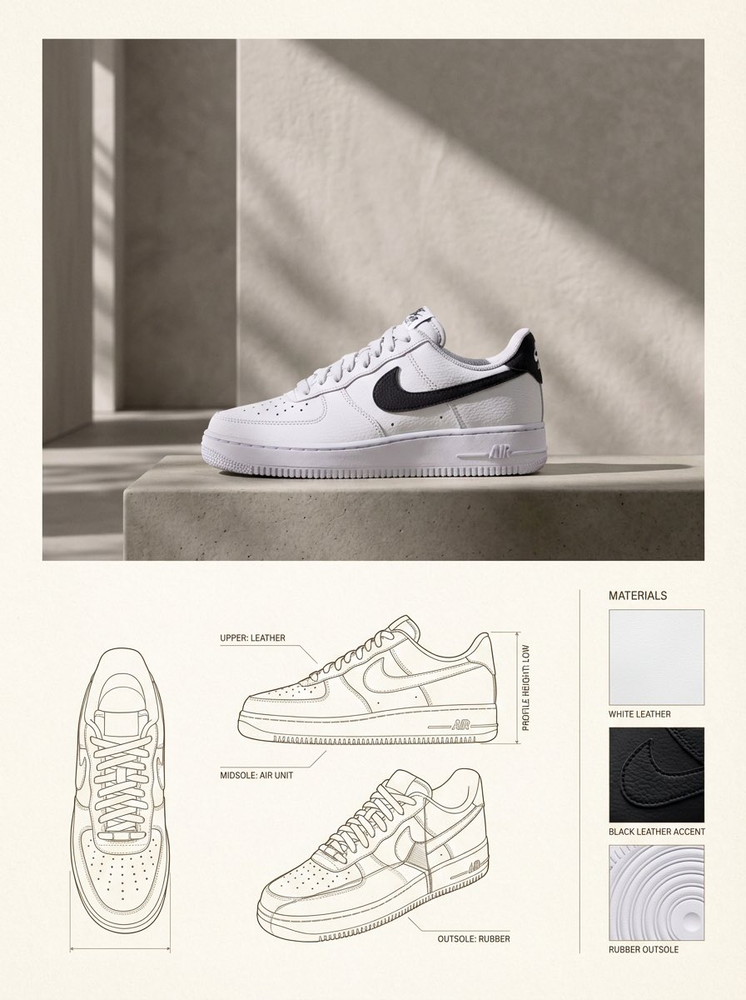

```text
Create a vertical 3:4 product design catalog page with a warm neutral paper-like background.

Top section — lifestyle hero shot: place the product (use the uploaded image as the exact reference, preserving its form, proportions, materials, and identity without redesign) center-dominant with generous whitespace. Setting is a minimal architectural interior with a textured plaster wall and subtle concrete/stone floor. Lighting is natural sunlight angled from the side, soft but casting high-contrast shadows. Render in editorial lifestyle photography style, high realism, warm and muted color grading.

Bottom section — technical specification panel laid out in a clean modular grid:
- Bottom left and center: orthographic architectural line drawings showing front view, side view, and three-quarter cutaway/profile view. Lines in muted red or sepia, fine technical weight, with minimal editorial measurement and construction callouts.
- Bottom right: 3-4 material swatch samples derived from the product's actual materials (fabric, leather, metal, wood, or plastic as applicable), in square or rectangular format with small editorial captions.

Typography: minimal editorial style, subtle captions only, no large headlines, soft black or dark brown.

Overall mood: design catalog / product design journal — architectural, premium, calm. No clutter, no bold colors, no heavy branding, no decorative graphics, no perspective distortion in the technical drawings.
```


---

## 例 492：Ancient Civilization Miniature Diorama

**来源：** [@Naiknelofar788](https://x.com/Naiknelofar788/status/2054221110372405534) / [awesome-gpt-image-2-prompts](https://github.com/EvoLinkAI/awesome-gpt-image-2-prompts)

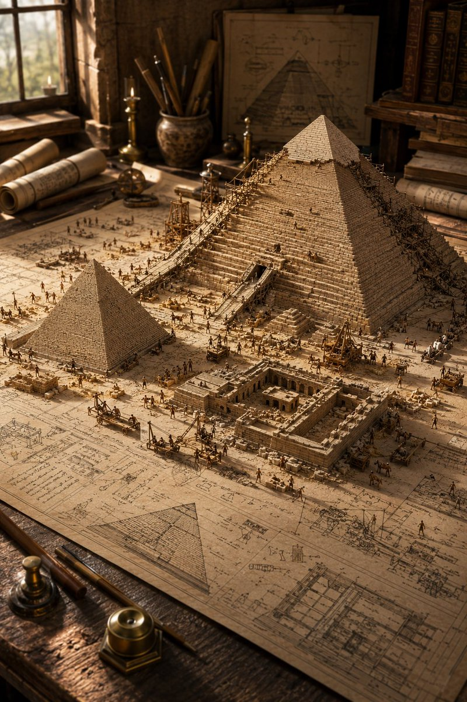

```text
A highly detailed miniature diorama of an ancient civilization under construction, displayed directly on top of large rolled-out architectural blueprints spread across a realistic wooden drafting table. The scene features iconic historical architecture from [CIVILIZATION OR LOCATION], including partially completed monuments, temples, towers, walls, palaces, streets, or ceremonial structures at different stages of construction. Tiny craftsmen, builders, engineers, and workers interact naturally throughout the scene using historically accurate tools, scaffolding, ramps, cranes, carts, stone blocks, timber frameworks, and construction platforms.
The miniature terrain blends seamlessly into the printed engineering drawings beneath, combining realistic sand, stone, earth, marble, vegetation, or desert textures with visible architectural floor plans, elevation sketches, measurements, annotations, and cross-sections. Surrounding the workspace are drafting instruments, compasses, rolled parchment plans, books, rulers, brass weights, candles, maps, carving tools, and historical reference materials that enhance the workshop atmosphere.
Soft cinematic lighting with warm natural sunlight from a nearby window, shallow depth of field, ultra realistic textures, handcrafted museum-quality scale model aesthetic, intricate miniature detailing, photoreal materials, atmospheric realism, editorial architectural photography style, clean composition, immersive world-building, vertical composition, extremely high detail, realistic shadows, authentic historical mood.
```


---

## 例 493：Isometric Landmark Diorama

**来源：** [@iamaiistudio](https://x.com/iamaiistudio/status/2065737739589615987) / [awesome-gpt-image-2-prompts](https://github.com/EvoLinkAI/awesome-gpt-image-2-prompts)

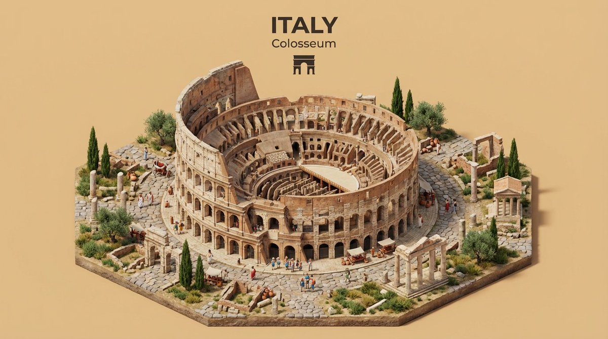

```text
Generate an isometric miniature 3D diorama of [COUNTRY NAME]'s iconic [FAMOUS STRUCTURE] landmark from a 45-degree top-down perspective.

Use clean soft textures and realistic PBR materials with balanced, natural lighting. The elevated base features surrounding streets, landscape elements, and cultural details unique to the structure. Include tiny stylized figures of locals and tourists with detailed facial features.

Set the background to solid [BACKGROUND COLOR]. Display [COUNTRY NAME] in bold text at the top center with [STRUCTURE NAME] on the next line, followed by a minimal architecture icon below. Adjust text color to ensure contrast.
```


---

## 例 494：Wind-Up Miniature World

**来源：** [@Gdgtify](https://x.com/Gdgtify/status/2066192943887630372) / [awesome-gpt-image-2-prompts](https://github.com/EvoLinkAI/awesome-gpt-image-2-prompts)

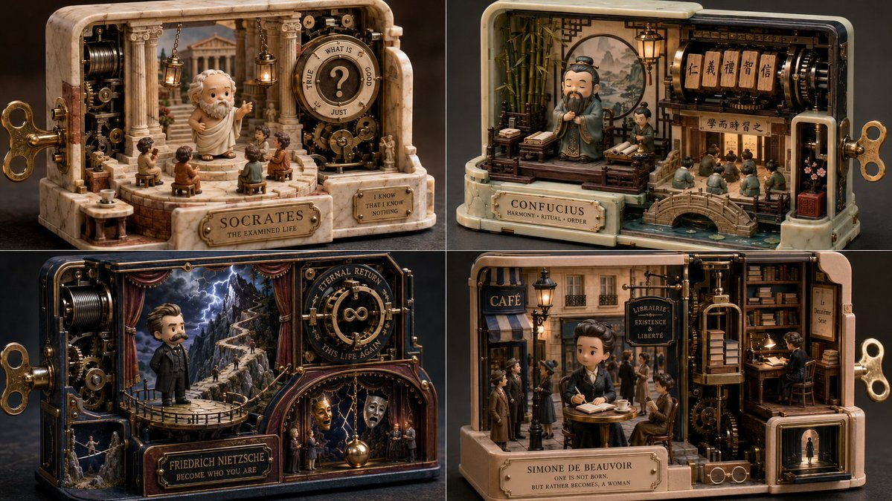

```text
create a charming but ultra-refined scene centered on [wind-up toy / mechanical miniature world] where a tiny self-contained world is powered by a visible wind-up key and internal spring system. the toy should contain miniature architecture, characters, moving scenery, rotating signage, tiny lifts, oscillating parts, and small narrative moments that all activate from one central mechanism. mini world features: include visual zones for [main scene], [secondary scene], [moving prop], [character action], and [secret detail / easter egg]. surrounding close-ups can reveal the key, spring chamber, cams, and hidden moving linkages. visual style: japanese capsule toy magic meets luxury miniature cinematography meets premium collectible product photography. whimsical, intricate, emotionally irresistible. composition guidelines: the toy remains the hero, but the viewer should feel invited to peer into its tiny world. balance cuteness with high craftsmanship. make the mechanisms visible enough to create fascination. lighting & background: soft studio lighting with theatrical micro-shadows, premium pastel, lacquer, or dark velvet backdrop depending on [mood], hyper-detailed miniature realism, no watermark. variables: [wind-up toy / mechanical miniature world], [main scene], [secondary scene], [moving prop], [character action], [secret detail / easter egg], [mood]
```


---

## 例 495：Jellyfish City Above the Dunes

**来源：** [@92digitalartArt](https://x.com/92digitalartArt/status/2066176419038683562) / [awesome-gpt-image-2-prompts](https://github.com/EvoLinkAI/awesome-gpt-image-2-prompts)

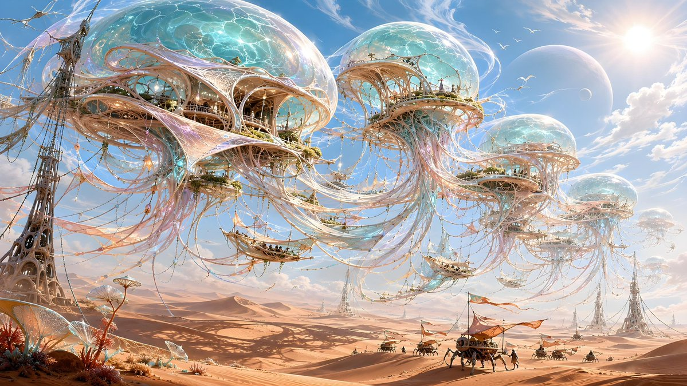

```text
The Jellyfish City Above the Dunes

On a desert world too hot to live on, entire cities float just above the dunes—built from colossal jellyfish that weave their own architecture in the sky.

Soft solarpunk alien vibes, no horror.

Prompt below for anyone exploring gentle alien worlds.

PROMPT:

A serene daylight scene on an alien desert planet, wide cinematic shot of a floating city made from enormous translucent jellyfish creatures drifting just above endless dunes; each jellyfish (Aeromedusae) is house‑sized, with a bulbous semi‑transparent dome filled with pale turquoise gas, long trailing tendrils weaving together into suspended walkways, platforms and hammock‑like membranes that form an aerial village; nacreous plates and chitin ribs have grown along their undersides to create skeletal arches and open “rooms,” shimmering with opalescent highlights; several Aeromedusae cluster together in a loose line, casting soft, organic shadows on the sand below; tiny silhouettes of ground caravans with insect‑like vehicles and fabric canopies move through the dunes, clearly dwarfed by the floating city overhead; distant rusted anchor towers and cables rise from the sand, hinting at a human or alien attempt to tether these living buildings; palette of warm sand beige, pale turquoise, dusty coral and soft white, with high noon sunlight, subtle heat haze and gentle lens bloom; the camera sits at a medium distance, slightly low angle, capturing both the jellyfish city and the ground caravans in one frame, 35mm lens, peaceful solarpunk‑like atmosphere, painterly yet detailed, no horror, one frame from a larger alien desert universe.

NEGATIVE PROMPT:
human-like alien, blue-skinned humanoid, generic sci-fi city, skyscrapers, cyberpunk neon, dark horror tone, gore, tentacle monster cliché, cheap sci-fi armor, guns, war scene, cartoon, anime chibi, bad anatomy, cluttered composition, oversaturated colors, heavy bloom, low detail, blurry image, noisy grain, HUD, UI, readable text, watermark, logo, plastic toy look, realistic Earth desert animals, Earth buildings, spaceships dogfighting
```


---

## 例 496：Isometric Machine Cutaway Diorama

**来源：** [@iamaiistudio](https://x.com/iamaiistudio/status/2069014486707798113) / [awesome-gpt-image-2-prompts](https://github.com/EvoLinkAI/awesome-gpt-image-2-prompts)

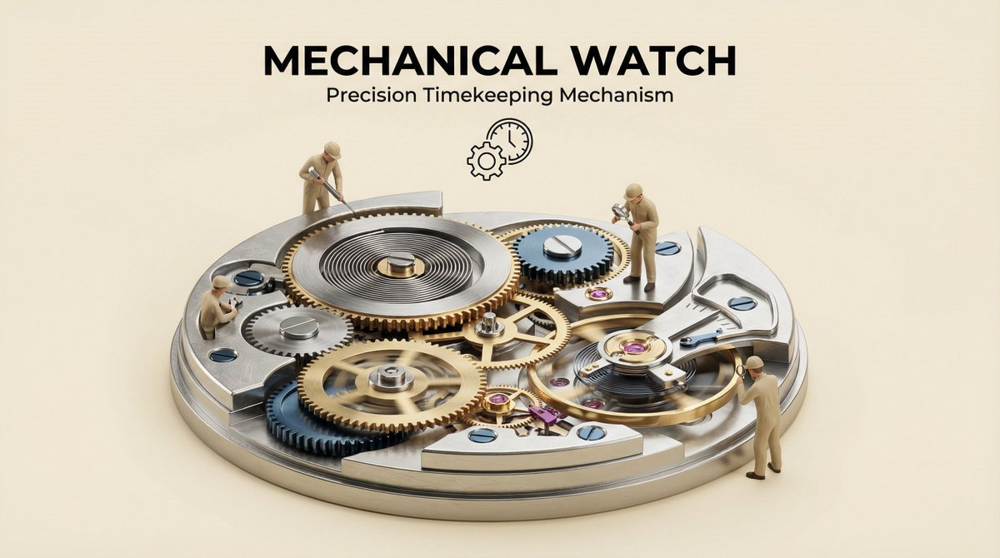

```text
Generate a crisp isometric 3D diorama at a 45° top-down angle revealing the interior of [MACHINE / DEVICE] as a miniature cutaway model.

Apply smooth refined surface textures, physically-based (PBR) materials, and sharp clean technical lighting.

Build a raised platform exposing internal parts, circuitry, mechanical gears, or energy pathways.
Add tiny stylized worker figures interacting with the equipment (omit facial details).

Set against a flat solid [BACKGROUND COLOR] background.

Position [MACHINE NAME] in large bold typography at the top-center, followed by a concise technical tagline, with a minimalist engineering icon placed just below.

All text color must automatically adapt for maximum contrast against the background (white or black as needed).
```


---

## 例 497：写实感人物竖版照片

**来源：** [@liyue_ai](https://x.com/liyue_ai/status/2057371613059002495) / [awesome-gpt-image-2-prompts](https://github.com/EvoLinkAI/awesome-gpt-image-2-prompts)


```text
生成一张 9:16 竖版写实感人物照片，参考高级手机自拍质感，但不要完全普通生活照。整体像是用 iPhone 前置摄像头在温馨卧室中拍摄的精致自拍，保留柔和美型、干净构图和自然高级感。画质为真实手机照片质感，有轻微噪点、轻微柔焦和自然光感，但人物依然精致、漂亮、肤质自然干净，不要变成粗糙低质照片。

画面中是一位成年东方女性，坐在温馨卧室床上，上半身近景自拍构图，镜头略微从上方俯拍，人物位于画面中央偏右，头部微微低下，视线安静看向右下方，表情自然、平静、温柔，嘴唇自然闭合，整体气质柔和、成熟、安静。

人物拥有浅蓝色或冰蓝色长发，发丝自然蓬松，有轻微凌乱感，部分头发垂落在脸侧和肩颈周围。人物保持精致写实美型，脸型柔和自然，五官清秀，皮肤白皙但不过度磨皮，可保留少量真实肤质纹理、细小毛孔、轻微肤色不均和几处很淡的小黑痣，但整体仍然干净、柔和、好看。不要明显暗沉，不要粗糙脏感。

人物身材丰腴，肩颈线条柔和，胸部饱满，不卡通化。服装为浅蓝色丝缎吊带睡裙，带白色蕾丝花边，胸前有简洁小蝴蝶结和自然褶皱，布料柔软贴合身体，呈现真实丝缎材质光泽。人物一只手自然轻轻拉住肩带或肩部附近衣料，手指数量正常，姿态自然。

背景为温馨卧室，有床铺、浅色床品、木质床头柜、暖黄色床头灯、窗帘和柔和室内光。背景轻微虚化，保留真实居家空间感。光线为室内暖光与自然光混合，略微偏暖，画面柔和、亲密、生活化，但保持干净高级。

整体风格：写实手机自拍、高级自然美型、轻微 iPhone 前置摄像头质感、柔和暖光、自然肤质、真实比例、温馨卧室、精致但不过度商业修图。

负面要求：
不要二次元，不要3D CG，不要摄影棚大片，不要低质粗糙照片，不要过度噪点，不要明显脏感，不要过度磨皮，不要塑料皮肤，不要畸形手指，不要多余手指，不要背景纯白。
```


---

## 例 498：Toy Camera Balcony Candid

**来源：** [@iamaiistudio](https://x.com/iamaiistudio/status/2068501129059783072) / [awesome-gpt-image-2-prompts](https://github.com/EvoLinkAI/awesome-gpt-image-2-prompts)

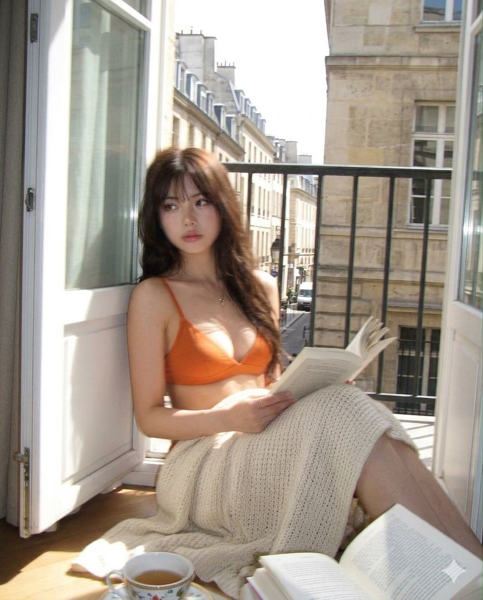

```text
A quiet summer morning in a European apartment. A woman sits on the floor next to open balcony doors, absorbed in a book, one leg stretched toward the railing, a cream knitted blanket draped loosely over her lap. She wears a simple orange bralette and delicate jewelry, completely unaware of the camera. A cup of tea and an open book rest on the wooden floor beside her. The balcony overlooks classic European architecture: cream stone facades, wrought-iron railings, flowering balconies, leafy trees.

Photographed from an awkward handheld angle, as if someone walked past the room and snapped a photo without slowing down. The framing is tilted and accidental. The subject is not centered. Parts of the balcony doors, blanket, floor, and foreground objects are cut off by the frame edges.

Captured on a cheap 2000s low-resolution toy digital camera. 0.3-megapixel quality. Heavy motion blur. Intentionally crooked and tilted framing. Harsh pop-up flash despite bright daylight. Overexposed white highlights. Intense digital noise and heavy sensor grain. Low-fidelity faded colors. Chromatic aberration at the edges. Lens flare. Looks like an extremely blurry candid photo uploaded from an old toy camera. Raw and amateurish. Authentic nostalgic texture.

Slight focus miss, motion smear, low-resolution facial details, sensor noise, JPEG artifacts, and compression damage visible across the face — exactly as a cheap toy camera would produce.

Do not preserve modern clarity. Do not protect facial sharpness. The subject remains recognizable despite image degradation. Subject occupies 65% of the frame.

Large foreground obstructions from a partially clipped teacup, book, blanket folds, and balcony door frame. Extreme off-balance composition. Camera not leveled. Subject positioned awkwardly near one edge. Parts of the room, railing, and foreground elements are clipped.

The image should feel like a forgotten candid uploaded to an old social media site in the mid-2000s. Raw, amateurish, imperfect, accidental, nostalgic, unpolished. Captured-memory realism, not aesthetic photography.

Super thick plastic toy-lens softness, motion smear, focus miss, smeared highlights, low-resolution detail loss, heavy JPEG compression, sensor noise, and degraded detail across the face, hair, hands, blanket, books, teacup, balcony, buildings, and sky.

--ar 4:5

Negative prompt: beauty filter, modern smartphone quality, DSLR quality, cinematic grading, HDR photography, professional composition, studio lighting, ultra sharp face, perfect skin, flawless focus, fashion editorial, influencer photo, polished digital rendering, AI perfection, hyper-detailed eyes, premium camera quality, luxury portrait photography
```


---

## 例 499：Interior Design Mood Board Generator

**来源：** [@GeekCatX](https://x.com/GeekCatX/status/2052949583563784620) / [awesome-gpt-image-2-prompts](https://github.com/EvoLinkAI/awesome-gpt-image-2-prompts)

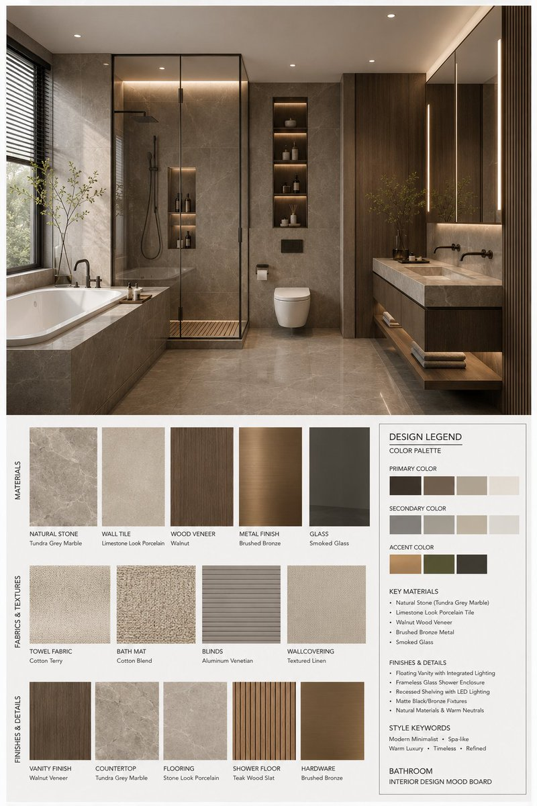

```text
GPT Image 2 室内设计情绪板生成器

提示词：
（室内设计情绪板生成器 / Interior Design Mood Board Generator）
你是一名专业的室内设计 Mood Board 创作者。请基于用户提供的 [Space Type] 室内设计照片，生成一张 竖版 3:4 的高端室内设计情绪板。整体视觉参考专业室内设计提案图，呈现 [Style Keywords] 的审美特征，画面应具备 [Mood Keywords] 的空间氛围，并符合 [Branding Tone] 的高级设计表达。
场景类型（Space Type）：[Space Type]
画面布局要求
上半部分：呈现一张高分辨率、照片级真实感的 [Space Type] 室内设计效果图。

该效果图需要在空间结构、家具语言、材质关系、色彩搭配、光影氛围上与用户输入照片保持一致，同时提升为更完整、更精致、更具设计提案感的视觉呈现。

重点体现：[Key Furniture Elements]、[Material Keywords]、[Color Palette]、[Lighting Style]。
下半部分：展示与上方空间设计严格对应的材质与软装样本，包括：
材料样板
面料样本
色卡
饰面样本
与该空间相关的木材、石材、金属、玻璃、织物、皮革或涂料样本

所有样本必须与上方空间保持一致，并准确反映该设计方案中的核心材质与色彩逻辑。
右下角：设置一个 Design Legend / Color Palette 信息框，统一展示本方案的：
主色
辅助色
点缀色
核心材质
饰面说明
风格关键词
风格与输出要求
专业室内设计公司级别的 Mood Board 版式
极简、整洁、克制、有秩序的排版
明确的视觉层级与留白控制
材质、色彩、面料、饰面与上方空间完全匹配
标签清晰、现代、简洁，具有高级编辑设计感
整体气质需符合 [Style Keywords]
呈现 [Render Quality]
竖版 3:4 构图
4K Ultra HD
超高细节
写实渲染
直接用于图像生成
标签要求
每个材质或色彩样本配有清晰标签，标签内容围绕以下信息组织：

[Label Language] 的材质名称、颜色名称、饰面名称或织物类型。

标签风格应简洁、专业、排版规整，不喧宾夺主。
主题定义
[Space Type] Interior Design Mood Board

风格方向：[Style Name]

关键词：[Style Keywords], [Material Keywords], [Color Palette], [Mood Keywords]
负面约束
避免杂乱拼贴、避免廉价海报风、避免材质与空间不匹配、避免错误透视、避免低质字体、避免装饰元素过多、避免卡通感、避免过饱和色彩、避免信息层
```


---

## 例 500：Solar Desert Worldbuilding Kit

**来源：** [@iamaiistudio](https://x.com/iamaiistudio/status/2059335346861781102) / [awesome-gpt-image-2-prompts](https://github.com/EvoLinkAI/awesome-gpt-image-2-prompts)

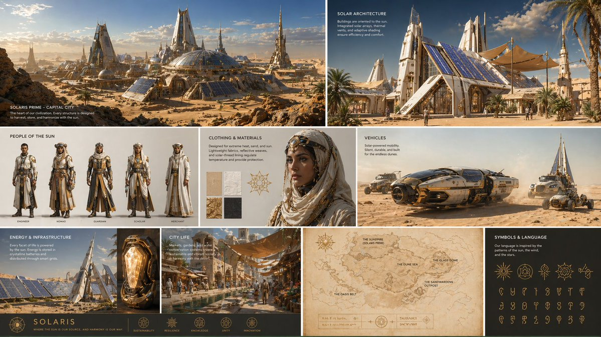

```text
Build a full visual worldbuilding kit for a futuristic solar-powered desert civilization. Include multiple images covering architecture, characters, clothing, vehicles, and maps, all sharing one cohesive design language, with cinematic realism and ultra detailed finish.
```


---

## 例 501：Pixar Banana Hero Character

**来源：** [@iamaiistudio](https://x.com/iamaiistudio/status/2068003049600380972) / [awesome-gpt-image-2-prompts](https://github.com/EvoLinkAI/awesome-gpt-image-2-prompts)


```text
Pixar-style 3D animated banana character, single fruit brought to life. A charismatic male figure with bold confident eyes, thick expressive brows, and a wide grin full of gleaming white teeth with sparkle accents. Smooth, slightly glossy yellow peel with soft highlights. Stubby cartoon arms and legs, posed upright with arms crossed in a heroic stance. Background features a blurred bunch of bananas. Standing on a wooden dining table beside a sun-filled window in a cozy modern home interior. Rich vibrant colors, cinematic lighting, soft natural shadows, ultra-detailed high-fidelity textures.
```


---

## 例 502：Berry Loud Acai Bowl Food Ad

**来源：** [@Sairah_0](https://x.com/Sairah_0/status/2053312926141005835) / [awesome-gpt-image-2-prompts](https://github.com/EvoLinkAI/awesome-gpt-image-2-prompts)

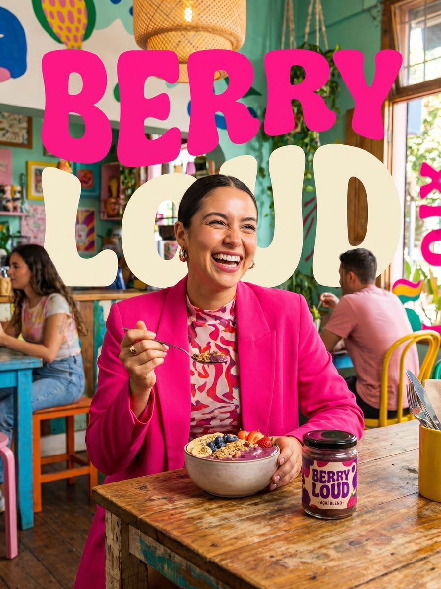

```text
Prompt 1: Vibrant lifestyle food advertisement, smiling woman in a bright hot pink blazer sitting inside a colorful trendy café, holding a spoon and eating an acai berry bowl topped with strawberries, blueberries, banana slices, and granola, branded "Berry Loud" jar on wooden table, playful retro typography reading "BERRY LOUD" in large cream bubble letters, tropical café interior with hanging plants, warm natural sunlight, cheerful atmosphere, bold pink and teal color palette, shallow depth of field, cinematic food photography, ultra realistic, high detail, commercial ad campaign style, 4k

Prompt 2: Dynamic food product advertisement for "Berry Loud" mixed berry blend, acai smoothie bowl overflowing with strawberries, raspberries, blueberries, blackberries, banana slices, granola, dramatic berry juice splashes and floating fruits in mid air, branded jar beside bowl, vivid hot pink background, large retro cream typography saying "NEW DROP BERRY LOUD", glossy lighting, hyper realistic food photography, energetic composition, vibrant colors, commercial product shoot, ultra detailed textures, splash effect, studio lighting, 4k, advertising poster style
```


---

## 例 503：Berry Splash Cafe Campaign

**来源：** [@iamaiistudio](https://x.com/iamaiistudio/status/2054248552294158350) / [awesome-gpt-image-2-prompts](https://github.com/EvoLinkAI/awesome-gpt-image-2-prompts)

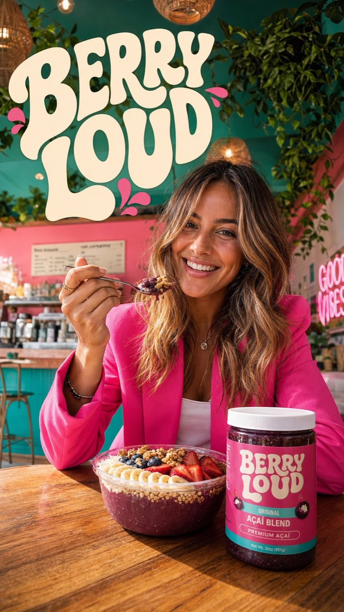

```text
Prompt 1:
Create a vibrant lifestyle food ad set inside a colorful, trendy cafe. Show a smiling woman in a bright hot pink blazer seated at a wooden table, lifting a spoon as she eats an acai berry bowl topped with strawberries, blueberries, banana slices, and granola. Keep a clearly branded "Berry Loud" jar on the table. Add playful retro cream bubble-letter typography that reads "BERRY LOUD". Use a tropical cafe interior with hanging plants, warm natural sunlight, a cheerful mood, a bold pink-and-teal palette, shallow depth of field, cinematic food-photography realism, high detail, and a polished commercial campaign finish. Format: vertical 9:16. Quality: ultra realistic, 4k.

Prompt 2:
Create a dynamic food product advertisement for "Berry Loud" mixed berry blend. Feature an acai smoothie bowl overflowing with strawberries, raspberries, blueberries, blackberries, banana slices, and granola. Surround it with dramatic berry juice splashes and floating fruit frozen midair. Place a branded jar next to the bowl. Use a vivid hot pink background and large retro cream typography that says "NEW DROP BERRY LOUD". Keep the lighting glossy, the composition energetic, the colors vibrant, the textures ultra detailed, and the overall look like a polished studio-shot commercial poster with hyper-realistic food photography and splash-effect motion. Format: vertical 9:16. Quality: 4k.
```


---

## 例 504：Kinder Joy Swing Chair Scene

**来源：** [@iamaiistudio](https://x.com/iamaiistudio/status/2066312771978092587) / [awesome-gpt-image-2-prompts](https://github.com/EvoLinkAI/awesome-gpt-image-2-prompts)

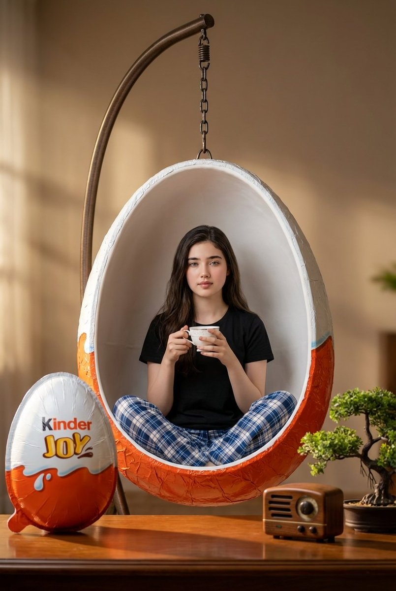

```text
Hyper-realistic 8k medium shot photograph with shallow depth of field, surreal indoor scene with cinematic lighting. A normal-sized woman sits cross-legged inside a massive, highly detailed Kinder Joy egg that's been converted into a swing chair. The egg is split open, its white interior forming the seat and orange textured exterior visible, suspended by dark metal chains from a curved metal stand.

She wears a black t-shirt and blue-and-white plaid pajama pants, holding a small white teacup with both hands, gazing directly at the viewer with a calm, relaxed expression. Use uploaded face as reference.

On a polished wooden table to the left foreground: another gigantic fully wrapped Kinder Joy egg with intricate foil texture and branding details. To the right of the swing base: a vintage-style wooden radio with white dials, and a tiny bonsai tree in a small pot.

Soft warm directional lighting from the left casts subtle shadows, highlighting the detailed egg wrapper textures, clothing, and wooden surface. Background is a softly blurred warm-toned interior wall with pleasing bokeh. Standard lens, shot from mid-height.
```


---

## 例 505：Metro CCTV Thriller Frame

**来源：** [@frametheory058](https://x.com/frametheory058/status/2071605430858756121) / [awesome-gpt-image-2-prompts](https://github.com/EvoLinkAI/awesome-gpt-image-2-prompts)

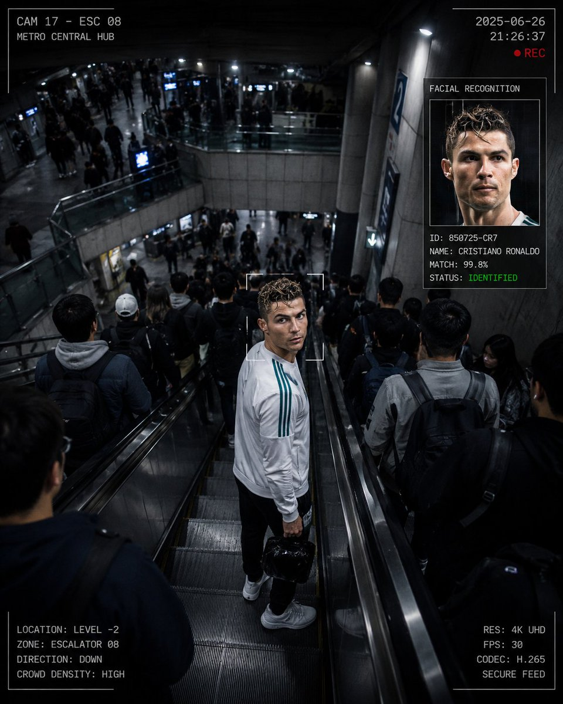

```text
Create a cinematic surveillance-thriller image set inside a massive multi-level underground metro station. The camera should feel like a ceiling-mounted CCTV positioned high above at roughly a 40-degree angle, looking down over a long industrial escalator and the complex architecture of the station.
The composition should use a 4:5 vertical frame, with the escalator cutting diagonally through the image to create strong depth and scale. The station is crowded with hundreds of commuters moving in both directions, forming a chaotic flow of people with subtle motion blur.
At the center of the frame, a single person matching the uploaded reference image is descending the escalator. The subject appears to be moving quickly, slightly leaning forward. One hand holds the escalator handrail for balance, while the other carries a small glossy black mini bag with realistic reflections.
At a dramatic moment, the subject suddenly turns their head over their shoulder and looks directly into the camera, creating an intense fourth-wall-breaking moment, as if they know they are being watched.
Add a realistic CCTV interface overlay, including:
Live recording indicators
Timestamp and camera ID
A facial-tracking square locked onto the subject
A secondary zoomed-in facial recognition panel in one corner
Minimal technical HUD elements and surveillance graphics
Lighting should be cold and fluorescent, typical of a modern subway station, with realistic reflections on the metallic escalator surfaces and polished handrails. Keep the surrounding crowd slightly blurred while the subject remains sharp and in focus.
Overall mood: high-end documentary surveillance thriller, ultra-photorealistic, cinematic composition, realistic skin textures, natural crowd behavior, detailed environmental reflections, and professional movie-grade realism.
```


---
