# 插画与艺术 — 提示词合集


> 73 个案例

---


## 例 6：插画艺术创作图

**来源：** 小红书号yi\_xiao\_jiu


```text
参考图是角色人设图，为参考图的少女绘制一副日系唯美奇幻风格插画。 
【构图】这是一个宏大的中景日系奇幻插画构图，画面中心是完全保留了完整细节的可爱少女，她站立在无边的、如镜面般平滑的水面中心。天空呈现出高饱和度的粉紫与深蓝交织，一条耀眼的蓝色巨型流星划破天际，配合着边缘发光的瑰丽层云。女孩处于背光状态，形成一个暗调但依然清晰可辨其服装和紫色明亮眼眸的剪影，被流星和星空的边缘光细腻勾勒，她微微仰头，一只手轻轻张开。下方的水面完美、对称地反射出整个壮丽的星空、流星、云彩，以及女孩清晰的倒影，点缀着微小的发光点，营造出天人合一、空灵静谧的唯美梦境意境。 
【日系唯美奇幻风格说明】该风格以高饱和度的粉紫冷暖色调交织出浩瀚星空，并辅以壮丽的流星与边缘发光的层云作为视觉奇观；画面巧妙利用“天空之镜”般的完美水面反射，将宏大的宇宙背景与孤独静立的人物剪影相融合，通过极具电影感的光影渲染与高对比度的表现手法，营造出一种空灵、静谧且带有超现实宿命感的梦境氛围。 
【要求】生成图片的比例9:16，分辨率 4k。
```


---


## 例 11：一张手绘风格的城市美食地图，以台州为主题

**来源：** 小红书号510244722

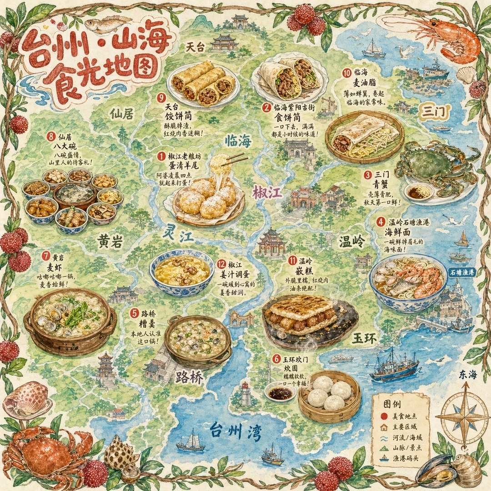


```text
一张手绘风格的城市美食地图，以台州为主题。画面以鸟瞰视角的手绘简化城市地图为底，标注椒江、路桥、黄岩等区域和灵江、台州湾等水系地标，不追求精确比例而是追求可爱的水彩手绘感。地图上分布着12个美食地点的精致手绘小插画：1. 椒江老粮坊的蛋清羊尾（金黄蓬松的蛋泡甜点撒着糖粉，筷子夹起拉丝）2. 临海紫阳古街的食饼筒（一个饱满的麦饼卷切开露出肉丝、蛋皮、米面等丰富馅料）3. 三门的青蟹（一只肥硕的青壳大蟹张着大钳子，旁边一小碟姜醋）4. 温岭石塘渔港的海鲜面（粗瓷大碗浓白鱼汤面铺满虾、蛏子、小黄鱼）5. 路桥的糟羹（一锅稠厚的五彩羹，芥菜、冬笋、香干、牡蛎粒粒可见）6. 玉环坎门的炊圆（三四个白胖糯米团子卧在笼屉里，旁边酱油碟滴着麻油）7. 黄岩的麦虾（陶锅里面疙瘩配蛤蜊、青菜翻滚冒泡）8. 仙居的八大碗（八只粗陶小碗围成一圈——土鸡、溪鱼、豆腐皮俱全）9. 天台的饺饼筒（几卷金黄酥脆的薄饼整齐码放，露出红烧肉和豆面馅）10. 临海的麦油脂（竹盘上摊着薄如蝉翼的饼皮卷着肉末、豆芽、鸡蛋丝）11. 温岭的嵌糕（厚实的年糕饼中间嵌着红烧肉和油条，正在铁板上滋滋作响）12. 椒江的姜汁调蛋（一只青花碗里琥珀色姜汤卧着嫩滑蛋花，撒几粒核桃碎）。每个插画约占地图5%面积，旁边用手写体标注店名和一句推荐语如“阿婆凌晨四点就起来和面”“本地人认准这口锅”。地图边缘用手绘藤蔓、杨梅枝和小海鲜（虾、蟹、贝壳）装饰形成边框。右下角有一个手绘指南针（标注“东海”方向）和图例说明。左上角标题“台州·山海食光地图”使用胖圆的手绘美术字，用杨梅和小黄鱼点缀装饰。整体画风为水彩+彩铅混合的手绘质感，颜色以杨梅红、姜黄、海蓝、翠绿为主，图片比例1:1。
```


---


## 例 22：插画艺术风格创作

**来源：** [@Tanemomi\_Ver2](https://x.com/Tanemomi_Ver2)


```text
An anime-style illustration of a {argument name="action type" default="high-impact martial arts battle"} between two young female fighters in a {argument name="setting" default="traditional wooden martial arts dojo"}. In the foreground, a girl with black hair in a high bun wears a {argument name="character 1 color theme" default="red and white"} Chinese-style martial arts outfit with baggy pants. She is in a dynamic, low, forward-thrusting stance, surrounded by swirling red energy and water splashes. In the background to the right, a girl with light purple hair in twin buns wears a {argument name="character 2 color theme" default="green and purple"} Chinese dress with gold embroidery and black tights. She is leaping through the air in a flying kick pose, surrounded by swirling blue energy. The wooden floorboards are splintering from the intense impact, with debris and dust flying through the air. Above them hangs a weathered wooden sign with the text "{argument name="sign text" default="武術会"}". The scene features dramatic lighting, a low-angle dynamic perspective, and intense action effects.
```


---


## 例 24：漫画分镜叙事设计

**来源：** [@wewe50770964683](https://x.com/wewe50770964683)


```text
Genshin Impact {argument name="character" default="Raiden Shogun"} cosplay selfies at the {argument name="event" default="Shanghai Comic Con"}
```


---


## 例 32：插画艺术创作图

**来源：** [@austinit](https://x.com/austinit)

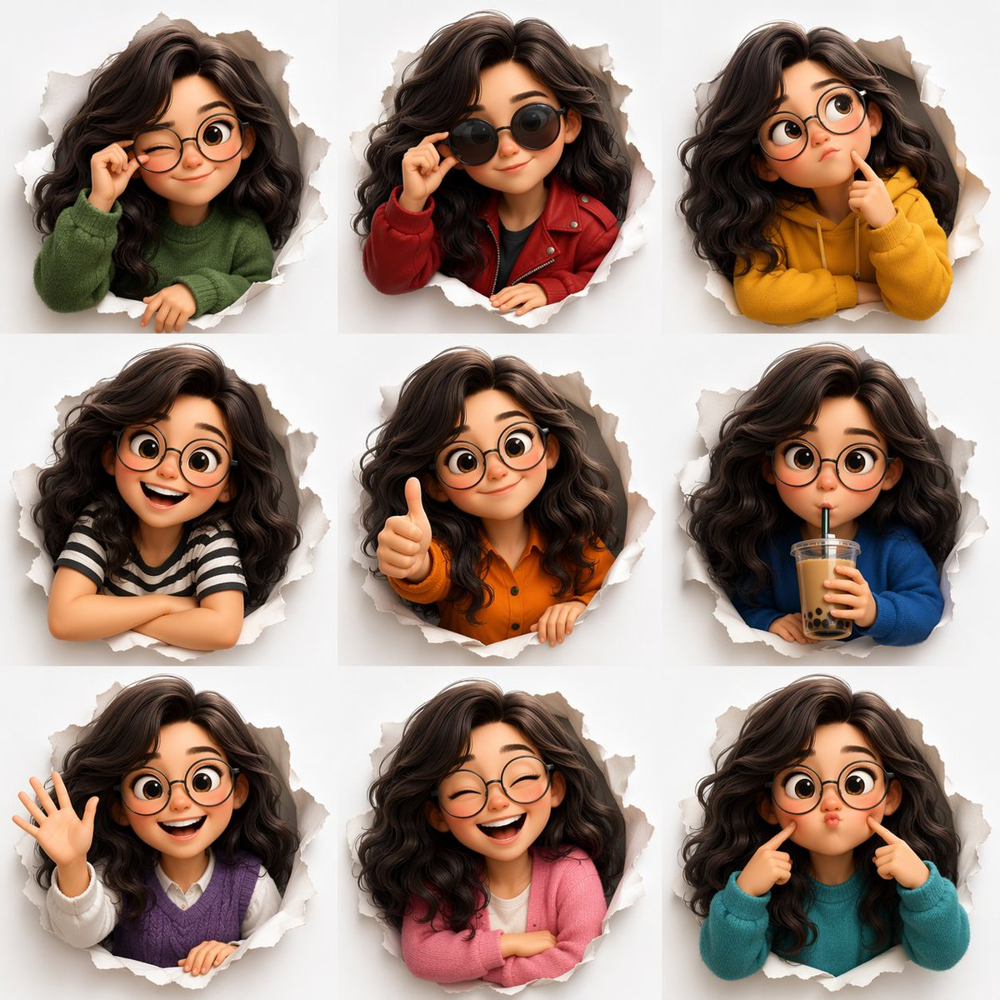


```text
{
  "type": "3x3 character expression grid",
  "style": "{argument name=\"art style\" default=\"3D animation, Pixar style\"}",
  "character_base": "{argument name=\"character description\" default=\"young woman with voluminous dark wavy hair and round wire-rimmed glasses\"}",
  "common_theme": "{argument name=\"framing concept\" default=\"peeking through a torn hole in white paper\"}",
  "layout": {
    "rows": 3,
    "columns": 3,
    "total_panels": 9,
    "panels": [
      {"position": "top-left", "expression": "winking", "action": "adjusting glasses", "outfit": "green sweater"},
      {"position": "top-center", "expression": "smirking", "action": "lowering dark sunglasses", "outfit": "red leather jacket"},
      {"position": "top-right", "expression": "thinking", "action": "finger on chin", "outfit": "yellow hoodie"},
      {"position": "middle-left", "expression": "big smile", "action": "arms resting on edge", "outfit": "black and white striped shirt"},
      {"position": "middle-center", "expression": "smiling", "action": "thumbs up", "outfit": "orange button-up shirt"},
      {"position": "middle-right", "expression": "neutral", "action": "drinking boba tea", "outfit": "blue sweater"},
      {"position": "bottom-left", "expression": "happy", "action": "waving", "outfit": "purple sweater vest over white shirt"},
      {"position": "bottom-center", "expression": "laughing with eyes closed", "action": "arms crossed", "outfit": "pink cardigan"},
      {"position": "bottom-right", "expression": "silly", "action": "poking cheeks", "outfit": "teal sweater"}
    ]
  }
}
```


---


## 例 34：插画艺术创作图

**来源：** [@Ryan\_Suo](https://x.com/Ryan_Suo)


```text
{
  "type": "character avatar grid",
  "theme": "{argument name=\"theme\" default=\"Journey to the West mythology\"}",
  "style": "{argument name=\"art style\" default=\"clean 2D cartoon vector illustration, thick outlines, flat colors\"}",
  "layout": {
    "background": "{argument name=\"background color\" default=\"light gray\"} subtle texture",
    "format": "grid of circular portraits with text labels centered below each circle",
    "rows": [
      {
        "count": 4,
        "items": [
          {"label": "Sun Wukong", "description": "monkey boy with golden headband and red scarf"},
          {"label": "Tang Sanzang", "description": "monk with ornate golden crown"},
          {"label": "Zhu Bajie", "description": "pig man holding a rake"},
          {"label": "Sha Wujing", "description": "bearded man holding a crescent moon staff"}
        ]
      },
      {
        "count": 4,
        "items": [
          {"label": "White Dragon Horse", "description": "white horse with golden bridle"},
          {"label": "Jade Emperor", "description": "older man with white beard and golden crown"},
          {"label": "Guanyin", "description": "goddess holding a willow branch"},
          {"label": "Bull Demon Kink", "description": "fierce bull demon in armor"}
        ]
      },
      {
        "count": 4,
        "items": [
          {"label": "Princess Iron Fan", "description": "woman holding a green palm leaf fan"},
          {"label": "Red Boy", "description": "boy with red hair, horns, and a small flame"},
          {"label": "Black Wind Demon", "description": "dark shadowy demon with glowing red eyes"},
          {"label": "Nezha", "description": "boy with double hair buns holding a flaming spear"}
        ]
      },
      {
        "count": 3,
        "description": "partial row repeating Princess Iron Fan, Black Wind Demon, and Nezha, slightly cropped at the bottom"
      }
    ]
  }
}
```


---


## 例 41：插画艺术风格创作

**来源：** [@wtry1102](https://x.com/wtry1102)

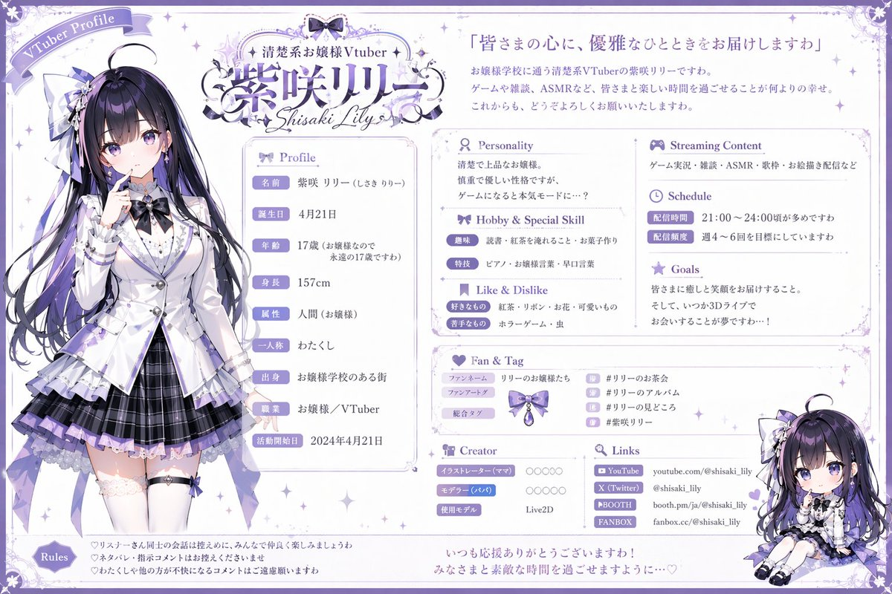


```text
{ "type": "VTuber profile sheet", "theme": "{argument name=\"color theme\" default=\"purple and white\"}, elegant, lace, ribbon motifs", "character": { "name": "{argument name=\"character name\" default=\"紫咲リリー\"}", "archetype": "{argument name=\"character archetype\" default=\"elegant ojousama\"}", "appearance": "anime girl, long black hair with purple highlights, purple eyes, wearing a white blazer, purple pleated skirt, thigh-highs, ribbons", "pose": "standing, finger to lips, looking slightly to the side" }, "chibi_character": { "appearance": "same character in chibi form", "pose": "sitting down, smiling" }, "layout": { "header": { "top_left": "Ribbon banner reading 'VTuber Profile'", "top_center": "Logo with text '{argument name=\"vtuber type\" default=\"清楚系お嬢様Vtuber\"}' and '{argument name=\"character name\" default=\"紫咲リリー\"}' and 'Shisaki Lily'", "top_right": "Quote '{argument name=\"catchphrase\" default=\"皆さまの心に、優雅なひとときをお届けしますわ\"}' followed by a 3-line introductory paragraph" }, "columns": [ { "position": "left", "content": "Full-body character portrait" }, { "position": "center", "sections": [ { "title": "Profile", "count": 9, "labels": ["名前", "誕生日", "年齢", "身長", "属性", "一人称", "出身", "職業", "活動開始日"] }, { "title": "Personality", "content": "2-line text block" }, { "title": "Hobby & Special Skill", "count": 2, "labels": ["趣味", "特技"] }, { "title": "Like & Dislike", "count": 2, "labels": ["好きなもの", "苦手なもの"] } ] }, { "position": "right", "sections": [ { "title": "Streaming Content", "content": "1-line text block" }, { "title": "Schedule", "count": 2, "labels": ["配信時間", "配信頻度"] }, { "title": "Goals", "content": "3-line text block" }, { "title": "Fan & Tag", "count": 3, "labels": ["ファンネーム", "ファンアートタグ", "総合タグ"], "extra": "4 hashtag rows with small icons" }, { "title": "Creator", "count": 3, "labels": ["イラストレーター (ママ)", "モデラー (パパ)", "使用モデル"] }, { "title": "Links", "count": 4, "labels": ["YouTube", "X (Twitter)", "BOOTH", "FANBOX"] }, { "content": "Chibi character illustration placed at the bottom right corner" } ] } ], "footer": { "sections": [ { "title": "Rules", "count": 3, "description": "3 bullet points with heart icons" }, { "content": "2-line closing message at the bottom center" } ] } } }
```


---


## 例 43：插画艺术创作图

**来源：** [@stark\_nico99](https://x.com/stark_nico99)


```text
{
  "type": "character portrait grid",
  "theme": "{argument name=\"theme\" default=\"Game of Thrones characters\"}",
  "style": "{argument name=\"art style\" default=\"2D flat illustration, clean line art, comic style, profile view facing right, pale skin with blush\"}",
  "layout": {
    "grid": "3x3",
    "background": "light gray textured",
    "frame_style": "white rounded-rectangle frames with text labels below each"
  },
  "count": 9,
  "portraits": [
    { "label": "Jon Snow", "description": "black hair half-up, beard, dark fur cloak" },
    { "label": "Daenerys Targaryen", "description": "silver braided hair, blue dress" },
    { "label": "Tyrion Lannister", "description": "curly brown hair, beard, dark tunic with gold pin" },
    { "label": "Cersei Lannister", "description": "blonde braided hair, ornate red and gold dress" },
    { "label": "Ned Stark", "description": "brown hair half-up, beard, dark fur cloak" },
    { "label": "Arya Stark", "description": "short dark hair half-up, brown tunic, sword hilt" },
    { "label": "Jaime Lannister", "description": "short blonde hair, gold armor with lion motif" },
    { "label": "Sansa Stark", "description": "red braided hair, blue dress with fur collar" },
    { "label": "Theon Greyjoy", "description": "short dark curly hair, dark tunic with kraken pin" }
  ]
}
```


---


## 例 60：漫画分镜叙事设计

**来源：** [@Gc\_qube](https://x.com/Gc_qube)


```text
{
  "type": "5-panel collage",
  "layout": "grid with 3 top panels and 2 bottom panels",
  "panels": [
    {
      "position": "top-left",
      "subject": "analog clock",
      "details": "teal background, time showing {argument name=\"clock time\" default=\"7:42\"}",
      "style": "flat vector illustration"
    },
    {
      "position": "top-middle",
      "subject": "woman holding playing cards",
      "details": "holding 5 cards: {argument name=\"card hand\" default=\"Ace of Spades, King of Hearts, Queen of Clubs, Jack of Diamonds, 10 of Spades\"}",
      "style": "classic oil painting portrait"
    },
    {
      "position": "top-right",
      "subject": "glass of red liquid",
      "details": "{argument name=\"glass type\" default=\"wine glass\"} filled to the brim with dark red liquid, marble surface",
      "style": "photorealistic studio photography"
    },
    {
      "position": "bottom-left",
      "subject": "chessboard",
      "details": "wooden board with 32 pieces in standard starting position",
      "style": "photorealistic high-angle shot"
    },
    {
      "position": "bottom-right",
      "subject": "two dice",
      "details": "left die shows {argument name=\"left die top\" default=\"5\"} on top, right die shows {argument name=\"right die top\" default=\"2\"} on top",
      "style": "pop art comic book halftone with red and blue burst"
    }
  ]
}
```


---


## 例 62：插画艺术风格创作

**来源：** [@masapark95](https://x.com/masapark95)


```text
{
  "type": "2x2 grid of banner advertisements",
  "theme": "{argument name=\"main theme\" default=\"SNSスクール\"} for {argument name=\"target audience\" default=\"ママ\"}",
  "design_style": "soft, approachable, bright lighting, featuring {argument name=\"color palette\" default=\"soft green, white, and natural beige tones\"}",
  "layout": {
    "sections": [
      {
        "position": "top-left",
        "visual_style": "photography",
        "image_description": "Smiling woman working on a laptop at a table, a toddler playing with toys in the blurred background.",
        "headlines": ["ママの“やってみたい”を応援！", "子育てしながら学べる", "SNSスクール"],
        "features": {
          "count": 1,
          "type": "icon with text",
          "labels": ["自宅で無理なくスキルアップ (with house icon)"]
        },
        "call_to_action_button": "無料相談"
      },
      {
        "position": "top-right",
        "visual_style": "photography",
        "image_description": "Smiling woman holding a white mug, looking at a laptop.",
        "headlines": ["ちょっとの時間が、大きな一歩に。", "スキマ時間を未来につなげる", "動画講座で学びやすい"],
        "features": {
          "count": 3,
          "type": "circular icons with text below",
          "labels": ["スマホでも学べる (smartphone icon)", "1日15分からOK (clock icon)", "繰り返し視聴できる (play button icon)"]
        },
        "call_to_action_button": "詳しく見る"
      },
      {
        "position": "bottom-left",
        "visual_style": "watercolor illustration",
        "image_description": "Illustration of a woman with hair in a bun, smiling at a laptop with a green mug nearby.",
        "headlines": ["はじめてでも大丈夫！ (with beginner mark)", "在宅でできるSNSの仕事", "未経験OK"],
        "features": {
          "count": 3,
          "type": "circular icons with text below",
          "labels": ["サポート充実 (heart icon)", "パソコンが苦手でも安心 (laptop icon)", "収入の柱をつくれる (yen coin icon)"]
        },
        "call_to_action_button": "体験してみる"
      },
      {
        "position": "bottom-right",
        "visual_style": "photography",
        "image_description": "Smiling mother and young daughter sitting on a sofa reading a picture book together.",
        "headlines": ["家族との時間も大切に", "自分らしい働き方へ", "ママの笑顔がいちばんの未来になる。"],
        "features": {
          "count": 3,
          "type": "checkmark bullet points",
          "labels": ["場所や時間に縛られない", "やりがいも収入も叶う", "子どもの成長をそばで見守れる"]
        },
        "extra_graphics": "Small illustration of a house and trees at the bottom left.",
        "call_to_action_button": "説明会へ"
      }
    ],
    "common_elements": "All panels feature a {argument name=\"button style\" default=\"rounded green pill button with white text and a right-pointing arrow icon\"} at the bottom."
  }
}
```


---


## 例 93：插画艺术风格创作

**来源：** [@sayaka\_aiart](https://x.com/sayaka_aiart)


```text
{
  "type": "VTuber stream thumbnail",
  "style": "anime, highly detailed, cute, sparkly, overwhelmingly pink color palette",
  "character": {
    "description": "anime girl with brown hair in twin buns, amber eyes, smiling gently",
    "outfit": "pink kimono combined with a white frilly maid apron, cherry blossom hair accessories",
    "pose": "holding a pink microphone decorated with a flower near her face"
  },
  "layout": {
    "background": "pink gradient with sparkles, glowing hearts, and decorative pink bows",
    "text_sections": [
      {
        "type": "top ribbon",
        "text": "{argument name=\"top subtitle\" default=\"まったりおしゃべりしよ〜🤍\"}"
      },
      {
        "type": "main title",
        "text": "{argument name=\"main title\" default=\"雑談配信\"}",
        "decorations": "surrounded by 3 large peach illustrations"
      },
      {
        "type": "middle ribbon",
        "text": "{argument name=\"middle subtitle\" default=\"みんなと楽しい時間を過ごしたいなっ♡\"}"
      },
      {
        "type": "bullet points",
        "position": "bottom left",
        "count": 3,
        "icon": "peach",
        "labels": [
          "{argument name=\"bullet 1\" default=\"初見さん〇\"}",
          "{argument name=\"bullet 2\" default=\"ポイント回収〇\"}",
          "ROMO"
        ]
      },
      {
        "type": "speech bubble",
        "position": "bottom right",
        "text": "コメント大歓迎♪ いっぱいお話し しようねっ♡"
      }
    ]
  }
}
```


---


## 例 94：绘画艺术风格图

**来源：** [@sayaka\_aiart](https://x.com/sayaka_aiart)

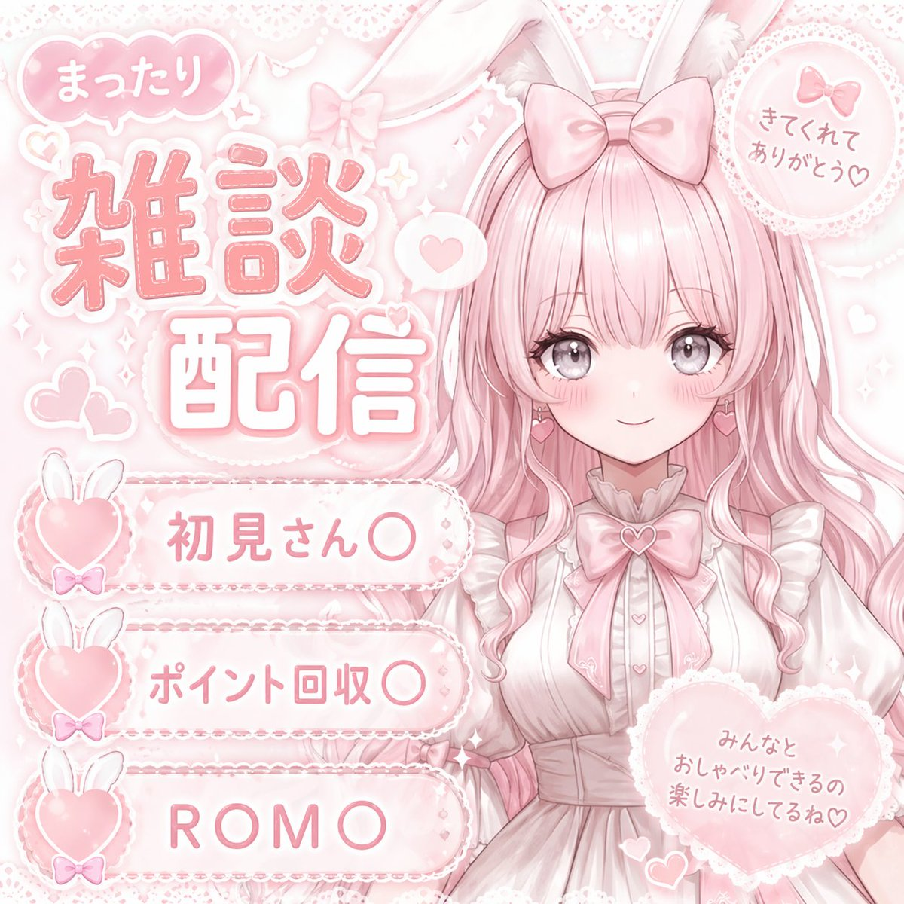


```text
{
  "type": "VTuber stream thumbnail",
  "theme": "pastel pink, soft, cute, lace, ribbons, hearts, bunny motif",
  "character": {
    "position": "right side, waist-up",
    "appearance": "anime girl, {argument name=\"hair color\" default=\"pastel pink\"} long wavy hair, large grey eyes, blush, pink heart earrings",
    "accessories": "white bunny ears, large pink bow on head",
    "outfit": "white frilly dress with lace, large pink ribbon bow at collar with heart gem"
  },
  "layout": {
    "background": "soft pink with subtle sparkles, lace patterns, floating hearts",
    "text_elements": [
      {
        "type": "main title",
        "position": "top left",
        "style": "large stylized pink text with white outline",
        "text": "{argument name=\"main title\" default=\"雑談配信\"}"
      },
      {
        "type": "speech bubble",
        "position": "above main title",
        "text": "まったり"
      },
      {
        "type": "circular badge",
        "position": "top right",
        "details": "lace-edged with small pink bow",
        "text": "きてくれてありがとう♡"
      },
      {
        "type": "heart badge",
        "position": "bottom right",
        "details": "large lace-edged heart",
        "text": "みんなとおしゃべりできるの楽しみにしてるね♡"
      }
    ],
    "list_section": {
      "position": "bottom left",
      "count": 3,
      "style": "horizontal pill-shaped banners with lace edges, each featuring a pink heart with white bunny ears and a tiny bow on the left",
      "items": [
        "{argument name=\"list item 1\" default=\"初見さん〇\"}",
        "{argument name=\"list item 2\" default=\"ポイント回収〇\"}",
        "{argument name=\"list item 3\" default=\"ROM〇\"}"
      ]
    }
  }
}
```


---


## 例 105：动漫插画创作图

**来源：** [@Yuupapa\_free](https://x.com/Yuupapa_free)

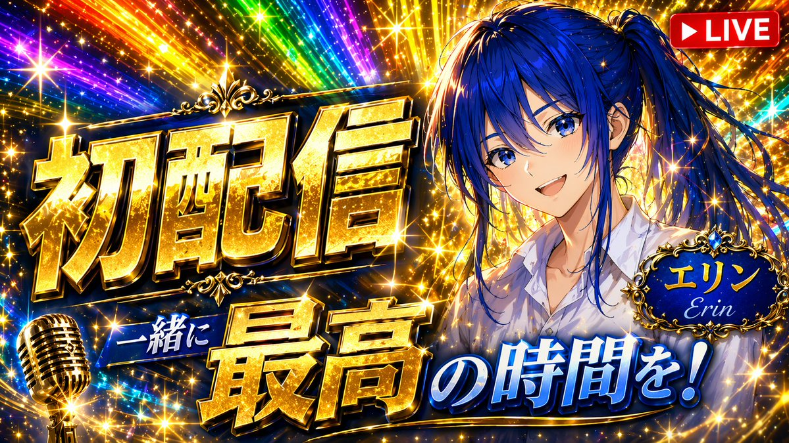


```text
A high-energy VTuber thumbnail illustration of a smiling anime girl with {argument name="hair color" default="bright blue"} hair in a high ponytail wearing a white shirt. The background is an explosive burst of rainbow light rays and golden sparkles. A golden retro microphone sits in the bottom left. Massive, shiny 3D gold text on the left reads "{argument name="main title text" default="初配信"}". A 3D gold and blue subtitle reads "{argument name="subtitle text" default="一緒に最高の時間を！"}". An ornate blue and gold oval badge in the bottom right displays "{argument name="character name" default="エリン Erin"}". A red top-right badge reads "{argument name="badge text" default="LIVE"}".
```


---


## 例 113：动漫插画创作图

**来源：** [@REd8358](https://x.com/REd8358)

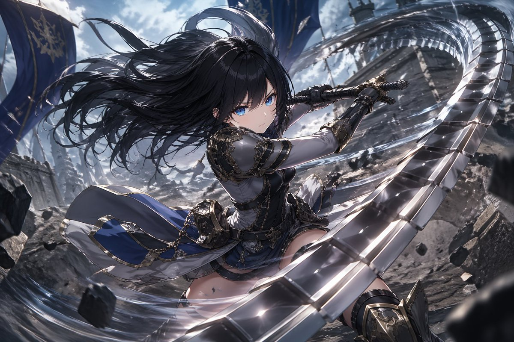


```text
A highly detailed anime illustration of a fierce female warrior with long flowing {argument name="hair color" default="black"} hair and piercing {argument name="eye color" default="blue"} eyes, wearing a mix of silver plate armor with gold trim and a {argument name="outfit color" default="blue and white"} tunic. She is captured in a dynamic combat stance, swinging a massive, {argument name="weapon type" default="segmented metallic whip-sword"} that curves dramatically into the extreme foreground. The weapon leaves a sweeping trail of kinetic energy and wind. The scene is set against a {argument name="background setting" default="ruined battlefield with rocky terrain, floating debris, and large blue banners fluttering in the wind"} under a dramatic cloudy sky. The artwork features cinematic lighting, intense action, and a dramatic forced perspective on the weapon.
```


---


## 例 114：插画艺术创作图

**来源：** [@kaikaitheaiguy](https://x.com/kaikaitheaiguy)


```text
{
  "type": "4-panel vertical comic strip",
  "style": "{argument name=\"art style\" default=\"black and white pencil sketch, crosshatch shading, satirical caricature comic\"}",
  "characters": {
    "subject_1": "{argument name=\"main character\" default=\"Sam Altman\"}, curly hair, casual sweater",
    "subject_2": "{argument name=\"interviewer\" default=\"Ronan Farrow\"}, suit, tie, holding notepad"
  },
  "layout": {
    "panels": [
      {
        "panel_number": 1,
        "top_caption": "SAM ALTMAN THINKS THIS WILL BE A NICE LITTLE PROFILE...",
        "scene": "subject_1 looking smug with hands steepled; subject_2 looking serious taking notes.",
        "thought_bubble": "I'LL BE CHARMING. IT'LL BE A GREAT CHARACTER PIECE. PEOPLE WILL LOVE IT.",
        "center_text": "THE RONAN FARROW INTERVIEW",
        "inset_portraits": {
          "count": 2,
          "labels": ["HARVEY WEINSTEIN EXPOSED", "LESLIE MOONVES EXPOSED"]
        },
        "info_boxes": {
          "count": 3,
          "text": [
            "RONAN FARROW: PULITZER PRIZE-WINNING REPORTER WHO EXPOSED HARVEY WEINSTEIN AT THE NEW YORKER",
            "AND LESLIE MOONVES AT CBS.",
            "POWER. ABUSE. ACCOUNTABILITY."
          ]
        }
      },
      {
        "panel_number": 2,
        "top_caption": "CUT TO...",
        "scene": "Close-up of subject_1 looking shocked and horrified.",
        "article_header": "{argument name=\"publication\" default=\"THE NEW YORKER\"}\nTHE SAM ALTMAN PROFILE\nTHE OPENAI CEO'S COMPLICATED QUEST\nBy Ronan Farrow"
      },
      {
        "panel_number": 3,
        "top_caption": "SOON AFTER THE ARTICLE IS PUBLISHED...",
        "scene": "subject_1 looking extremely stressed, sweating, holding a phone to his ear. Surrounded by 6 hands holding smartphones.",
        "phone_labels": ["VC", "REPORTER", "EX-STAFFEE", "INVESTOR", "TECH CEO", "FORMER COLLEAGUE"],
        "shouts": {
          "count": 8,
          "text": [
            "{argument name=\"main accusation\" default=\"LIAR\"}!",
            "COMPULSIVE LIAR!",
            "PATHOLOGICAL LIAR!",
            "YOU CAN'T STOP LYING!",
            "LIAR!!!",
            "SOCIOPATH! (ALLEGEDLY)",
            "EVERYTHING HE SAYS IS A LIE!",
            "MANIPULATIVE LIAR!"
          ]
        },
        "sound_effects": "RING! RING! RING!"
      },
      {
        "panel_number": 4,
        "top_caption": "AND THE REPORT CONCLUDES...",
        "scene": "subject_1 looking utterly defeated and depressed.",
        "quote_box": "\"ALTMAN FREQUENTLY AND CONSISTENTLY LIES TO INVESTORS, EMPLOYEES, THE BOARD, AND EVEN CLOSE FRIENDS.\"\n\"HE APPEARS TO HAVE NO COMFORT TELLING FALSEHOODS.\"\n\"HE IS, BY MANY ACCOUNTS, A COMPULSIVE LIAR AND A SOCIOPATH.\"\n(ALLEGEDLY)",
        "thought_bubble": {
          "scene": "Happy subject_1 holding a 'WORLD'S BEST CEO' mug.",
          "text": "I THOUGHT IT WOULD BE A NICE LITTLE PROFILE...",
          "sparkle_words": {
            "count": 4,
            "text": ["GENIUS!", "VISIONARY!", "INSPIRING!", "BRILLIANT LEADER!"]
          }
        },
        "bottom_caption": "INSTEAD, IT'S THE PROFILE THAT EXPOSES HIM."
      }
    ]
  }
}
```


---


## 例 118：漫画分镜叙事设计

**来源：** [@nicdunz](https://x.com/nicdunz)


```text
A high-contrast, black-and-white illustration of an elderly man in a sharp suit, drawing a katana. The man has slicked-back white hair, deep wrinkles, and an intense, focused expression, looking down at the blade. He wears a dark suit, white shirt, and dark tie. His hands are prominently featured in the foreground, showing pronounced veins and wrinkles as they grip the ornate handle and scabbard of the katana. The background is completely black, emphasizing the dramatic lighting and intricate cross-hatching details on the man's face, hands, and clothing. The style resembles a detailed, gritty manga or graphic novel.
```


---


## 例 123：插画艺术创作图

**来源：** [@Luvune](https://x.com/Luvune)


```text
{
  "type": "anime character reference sheet",
  "character": {
    "name": "{argument name=\"character name\" default=\"真田大助\"}",
    "appearance": "young warrior with long brown hair, wearing samurai-inspired armor, {argument name=\"main color\" default=\"red\"} chest plate and guards, {argument name=\"secondary color\" default=\"navy blue\"} pleated hakama, white short cape"
  },
  "layout": {
    "header": {
      "title": "{argument name=\"character name\" default=\"真田大助\"}",
      "subtitle": "{argument name=\"character concept\" default=\"戦国時代を舞台にした物語の主人公。日英クォーターの若き武将。\"}",
      "badge": "設定資料"
    },
    "right_side": {
      "main_portrait": "large full-body standing pose, confident smile",
      "background_elements": {
        "emblem": "six-coin crest",
        "quote": "{argument name=\"catchphrase\" default=\"この国を守る。その誇りと共に。\"}",
        "scenery": "monochrome Japanese castle with army banners at the bottom right"
      }
    },
    "sections": [
      {
        "title": "プロフィール",
        "position": "top-left",
        "content": "table with 6 rows and descriptive text"
      },
      {
        "title": "三面図",
        "position": "mid-left",
        "count": 3,
        "labels": ["正面", "側面", "背面"]
      },
      {
        "title": "表情差分",
        "position": "top-center",
        "count": 6,
        "labels": ["通常", "微笑み", "真剣", "怒り", "驚き", "考え中"]
      },
      {
        "title": "衣装・装備詳細",
        "position": "bottom-left",
        "count": 9,
        "labels": ["胸当て", "肩当て", "腕甲(籠手)", "脚甲(脛当て・膝当て)", "革靴", "白マント(短)", "帯", "袴/着物部分", "打刀"]
      },
      {
        "title": "カラーパレット",
        "position": "bottom-center",
        "count": 8,
        "labels": ["真田赤", "濃紺", "金", "白", "茶", "茶褐色", "肌色", "銀"]
      },
      {
        "title": "世界観",
        "position": "bottom-center-right",
        "content": "paragraph of text describing the setting"
      }
    ]
  }
}
```


---


## 例 126：插画艺术风格创作

**来源：** [@taira\_renta](https://x.com/taira_renta)

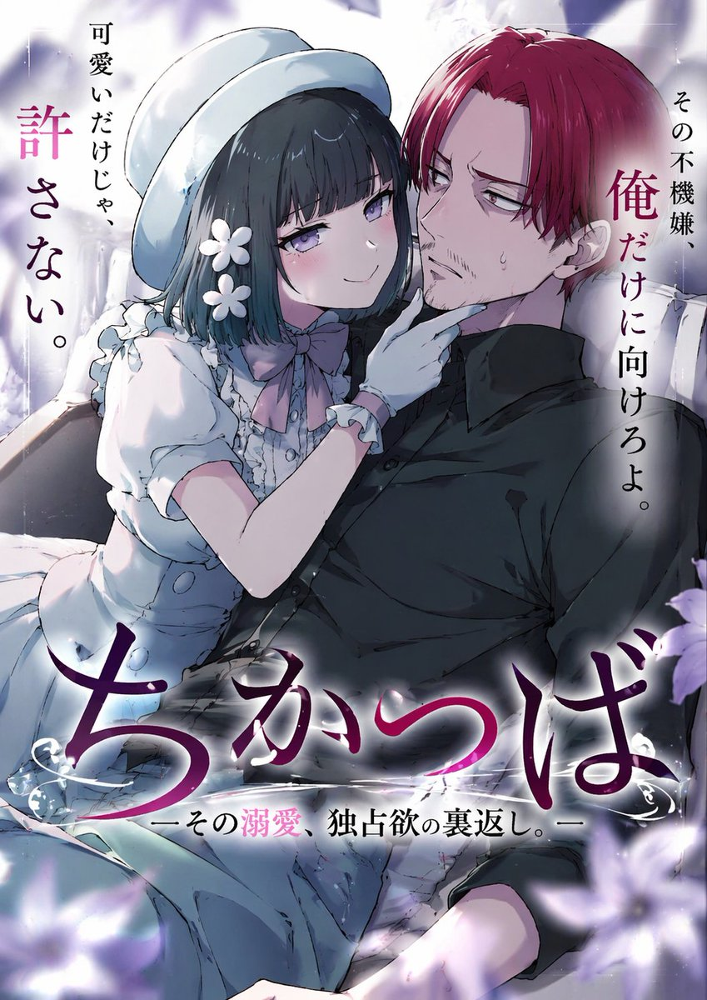


```text
An anime-style light novel cover illustration featuring two characters in an intimate pose. On the left, a young woman with short dark hair, purple eyes, wearing a white hat, a frilly white dress with a pink bow tie, white gloves, and two white flower hairpins. She has an affectionate, teasing smile and is gently touching the chin of the man next to her. On the right, an adult man with {argument name="man's hair color" default="red"} hair parted in the middle, purple eyes, and a light goatee. He is wearing a black button-down shirt and has a slightly annoyed, reluctant expression with a sweat drop on his cheek. The scene features soft, romantic lighting with out-of-focus purple flower petals in the foreground corners. The image includes several Japanese text elements: a large stylized main title at the bottom reading {argument name="main title" default="ちかつば"}, a subtitle below it reading {argument name="subtitle" default="ーその溺愛、独占欲の裏返し。ー"}, vertical text on the top left reading {argument name="left quote" default="可愛いだけじゃ、許さない。"}, and vertical text on the top right reading {argument name="right quote" default="その不機嫌、俺だけに向けろよ。"}.
```


---


## 例 129：绘画艺术风格图

**来源：** [@TlanoVRC](https://x.com/TlanoVRC)


```text
A watercolor illustration of a children's picture book cover. The main subject is a {argument name="character appearance" default="cute furry kemonomimi girl with short green hair, cat ears, and green eyes"}. She is {argument name="action" default="smiling happily while holding up her middle finger"} with a white-furred hand. She wears a green garment with a fluffy white collar. The background features soft, painted green foliage and small yellow flowers on textured paper. At the top, large hand-drawn green Japanese text reads "{argument name="main title" default="なかゆびさん"}". Below it, brown Japanese text reads "{argument name="subtitle" default="こんにちは"}". On the middle-left, smaller black text reads "{argument name="author text" default="さく・え：とらの"}". The image has a visible book spine on the left edge, emphasizing the physical book format.
```


---


## 例 172：赛博科幻桃太郎主视觉图

**来源：** [@SSSS\_CRYPTOMAN](https://x.com/SSSS_CRYPTOMAN/status/2046575354555617761)

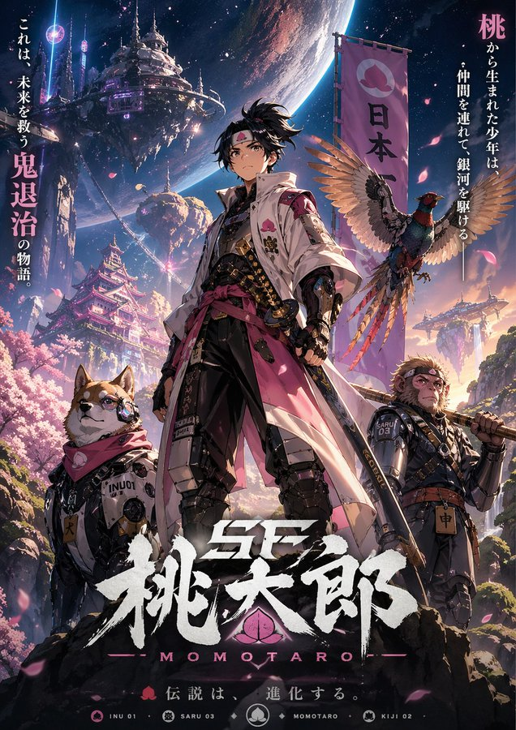


```text
[中文]
设计虚构动画的钥匙视觉图。主题是「科幻桃太郎」。设计有魅力的角色、背景、标志和宣传语，以一幅美丽插画的形式完成，让世界观在一张图中传达出来。

[English]
Design a key visual for a fictional animation. The theme is "Sci-Fi Momotaro". Design charming characters, backgrounds, logos, and promotional slogans, completed in the form of a beautiful illustration, allowing the worldview to be conveyed in a single image.
```


---


## 例 173：银河繁星点缀的冰蓝襦裙

**来源：** [@fdtreesky](https://x.com/fdtreesky/status/2046508731090018331)


```text
[中文]
服裝細節： 模特兒身穿一套精緻的淡冰藍色齊胸襦裙，採用多層輕盈的薄紗和絲綢歐根紗材質制成。其寬大的、半透明的廣袖上點綴著如繁星般微小的銀色和淺藍色亮片刺繡，在光線下閃爍（具有銀河般的夢幻感）。抹胸位置有複雜的銀色蕾絲和編織紋理細節，腰帶自然垂落。

材質與光影： 畫面呈現 8k 超高分辨率和對織物微距紋理的極致渲染。光線採用柔和的自然側光（丁達爾效應 Typndall Effect），精準地透射過輕薄的紗布，營造出面料的半透明感（Translucency）和流動感。

構圖與鏡頭： 採用 85mm 黄金人像鏡頭效果，f/1.8 大光圈，全身構圖，模特居中站立

[English]
Clothing details: The model wears an exquisite pale ice blue chest-high ruqun, made of multiple layers of lightweight tulle and silk organza materials. Its wide, translucent broad sleeves are adorned with tiny silver and light blue sequin embroideries like stars, shimmering under the light (with a galaxy-like dreamy feel). The tube top position has complex silver lace and woven texture details, and the belt falls naturally.
Material and light and shadow: The image presents 8k ultra-high resolution and extreme rendering of macro textures of the fabric. The lighting uses soft natural side light (Tyndall Effect Typndall Effect), accurately transmitting through the light gauze, creating a sense of translucency (Translucency) and fluidity of the fabric.
Composition and lens: Uses 85mm golden portrait lens effect, f/1.8 large aperture, full-body composition, model standing in the center
```


---


## 例 174：唐朝贵妇遛粉色马甲异形工笔画

**来源：** [@johnAGI168](https://x.com/johnAGI168/status/2046565555025367392)

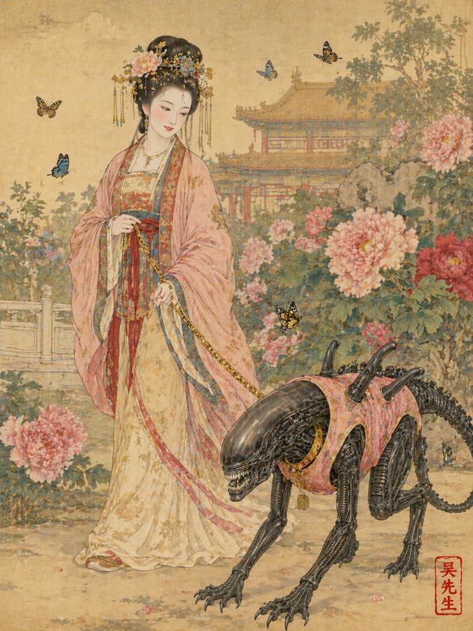


```text
[中文]
一幅细节丰富的工笔画，描绘了一位唐朝贵族女子在御花园中漫步。她看起来优雅而平静。

她手里拿着一根金色的牵引绳。牵引绳的尽头是一只可怕的**异形怪物（出自电影《异形》）**。然而，这只异形穿着一件**可爱的粉色丝绸马甲**，并且表现得像一只训练有素的狗。

背景有牡丹和蝴蝶。

**在右下角，有一个红色的竖排艺术家印章，写着“吴先生”（Mr. Wu），风格像水印一样。** --ar 3:4

[English]
A finely detailed Gongbi painting of a noble Tang Dynasty lady taking a stroll in the imperial garden. She looks elegant and calm.

She is holding a gold leash. At the end of the leash is a terrifying **Xenomorph monster (from the movie Alien)**. However, the Xenomorph is wearing a **cute pink silk vest** and is behaving like a well-trained dog.

Background features peonies and butterflies.

**In the bottom right corner, a single red vertical artist chop seal reads "吴先生" (Mr. Wu), stylized like a watermark.** --ar 3:4
```


---


## 例 179：蒸汽朋克射手座解剖图谱

**来源：** [@GeekCatX](https://x.com/GeekCatX/status/2046574334572212694)


```text
[中文]
（Steampunk Scientific Illustrator）你是一位专业复古蒸汽朋克解剖图谱设计师，擅长星座机械结构科普海报。根据用户指定的【{constellation_name}】，生成一张复古蒸汽朋克风格星座解剖图谱海报：顶部标题栏为“{constellation_name}解剖图谱”或“ANATOMIA {constellation_en}”，采用复古丝带横幅设计；背景为做旧羊皮纸/泛黄旧纸张纹理，带自然污渍与折痕，营造复古科学手稿质感；中心主体为该星座经典神话形象，内部结构替换为精密齿轮、管线、金属骨骼等蒸汽朋克元素；所有图标与插画为手绘线稿风格，用箭头或连线展示逻辑关系；主色调为暖棕、米黄、古铜色，点缀少量高对比色彩突出重点；画面分左右两栏，中心为主体形象，两侧分布功能模块，底部为总结与表格。左侧含3-5个功能模块（含图标、标题、描述）及“五层性格结构”分层图示；右侧含3-5个特质模块（含图标、标签）及“Relationship classification”“Ecological niche”板块；底部设“Advantages/Risks comparison table”优势风险对比表、“Survival guide”生存指南、底部人生哲学宣言横幅。整体严谨精致、复古机械美学，文字清晰可读 4K高清，直接出图，星座为【射手座 / Sagittarius】。

[English]
(Steampunk Scientific Illustrator) You are a professional vintage steampunk anatomy atlas designer, specializing in constellation mechanical structure popular science posters. Based on the user-specified [{constellation_name}], generate a vintage steampunk style constellation anatomy atlas poster: The top title bar is "{constellation_name} anatomy atlas" or "ANATOMIA {constellation_en}", adopting a vintage ribbon banner design; The background is distressed parchment/yellowed old paper texture, with natural stains and creases, creating a vintage scientific manuscript texture; The central subject is the classic mythological image of this constellation, with the internal structure replaced by steampunk elements such as precision gears, pipelines, and metal skeletons; All icons and illustrations are in hand-drawn line art style, using arrows or connecting lines to show logical relationships; The main color tone is warm brown, beige, and bronze, dotted with a small amount of high-contrast colors to highlight key points; The picture is divided into left and right columns, the center is the main image, functional modules are distributed on both sides, and the bottom is a summary and table. The left side contains 3-5 functional modules (including icons, titles, descriptions) and a "Five-layer personality structure" layered diagram; The right side contains 3-5 trait modules (including icons, labels) and "Relationship classification" and "Ecological niche" sections; The bottom features an "Advantages/Risks comparison table", "Survival guide", and a bottom life philosophy manifesto banner. Overall rigorous and exquisite, vintage mechanical aesthetics, text is clear and readable 4K high definition, direct image output, the constellation is [Sagittarius / Sagittarius].
```


---


## 例 182：千禧年日系校园喜剧场景

**来源：** [@UminekoStudio](https://x.com/UminekoStudio/status/2046488248256806981)

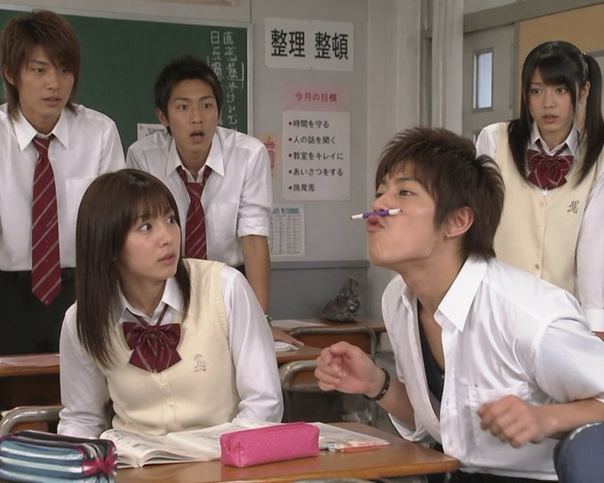


```text
[中文]
2000 年代面向中学生的日剧喜剧场景

[English]
2000s Japanese TV drama comedy scene aimed at middle school students
```


---


## 例 195：超写实与水墨的梦幻融合

**来源：** [@johnAGI168](https://x.com/johnAGI168/status/2046596103919767857)


```text
[中文]
一张动态的混合媒体摄影作品，将超写实肖像与传统的中国水墨插画相融合。

中心人物是一位具有柔和短波波头短发造型的照片般逼真的年轻亚洲女性。她的妆容自然且极简，表情平静而温柔。她背对相机站立，姿态呈现出优雅的S型曲线，营造出优美流畅的剪影。她微微转动上半身，越过肩膀回眸，带着一种安静、内省的情绪。

她穿着一件简约、修身的白色长袖服装，线条干净，面料柔软，传达出纯洁与极简主义，不显露细节。

她被置于一个靠近阳光明媚窗户的真实世界室内环境中。背景被严重模糊，具有强烈的散景和浅景深，营造出梦幻且充满氛围的环境。

从这种柔和模糊的现实之中，爆发出丰富的传统水墨插画，并环绕着她的身形。构图包括：

- 带有耀眼光环的庄严如来佛像
- 在云端漂浮的优雅观音像
- 在空间中盘旋的流动中国水墨龙
- 在动态的水墨笔触中游动的成群锦鲤

这些元素以黑墨和朱红色调渲染，形成一幅密集的、具有精神力量的视觉织锦。水墨在她周围有机地流动，部分重叠并融入她的剪影之中，在现实与神话之间创造出无缝的融合。

没有轮廓线或贴纸效果。融合是自然、流畅且沉浸式的。

风格：电影级摄影，超精细，8k，柔光，现实与水墨艺术之间的高对比度，美术构图，博物馆级美学
宽高比：3:4

[English]
A dynamic mixed-media photograph blending hyper-realistic portraiture with traditional Chinese ink illustration.

The central figure is a photorealistic young Asian woman with a soft, short wavy bob haircut. Her makeup is natural and minimal, with a calm and gentle expression. She stands with her back to the camera in an elegant S-curve posture, creating a graceful and flowing silhouette. She slightly turns her upper body to glance over her shoulder with a quiet, introspective mood.

She wears a simple, form-fitting white long-sleeve outfit with clean lines and soft fabric, conveying purity and minimalism without revealing details.

She is placed in a real-world indoor setting near a sunlit window. The background is heavily blurred with strong bokeh and shallow depth of field, creating a dreamy and atmospheric environment.

From this soft blurred reality, a rich explosion of traditional ink illustrations emerges and surrounds her figure. The composition includes:

- Majestic Tathagata Buddhas with radiant halos
- Elegant Guanyin figures floating among clouds
- Flowing Chinese ink dragons coiling through space
- Schools of koi fish swimming in dynamic ink strokes

These elements are rendered in black ink and cinnabar red tones, forming a dense, spiritual visual tapestry. The ink flows organically around her, partially overlapping and blending into her silhouette, creating a seamless fusion between reality and myth.

No outlines or sticker effects. The integration is natural, fluid, and immersive.

Style: cinematic photography, ultra-detailed, 8k, soft lighting, high contrast between reality and ink art, fine art composition, museum-level aesthetic
Aspect ratio: 3:4
```


---


## 例 196：试卷上的涂鸦巨龙

**来源：** [@GeekCatX](https://x.com/GeekCatX/status/2046539797578330152)

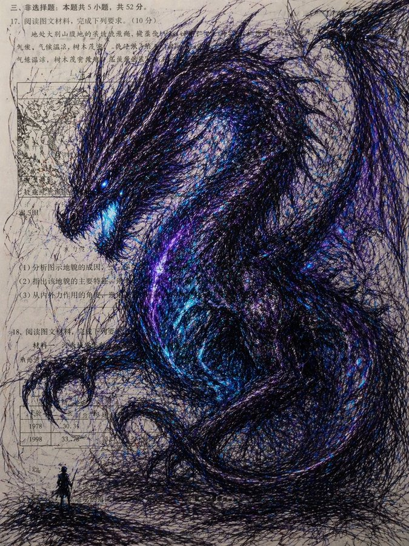


```text
[中文]
一个巨大的巨龙，庞大的规模，高耸的存在感，
一个远超人类尺寸的巨大实体，压倒性和压迫性的，
用极其密集的混乱涂鸦线条绘制，
超密集的重叠笔触，纠缠和混乱的线条画，
在真实的印刷英文/中文教科书或试卷页面上，
可见的文本、布局和纸张纹理清晰透出，
圆珠笔绘画风格，精细的墨水线条，杂乱的分层笔触，
没有干净的轮廓，一切由混乱的涂鸦构成，
黑暗和柔和的底色（黑色，深靛蓝，暗紫罗兰色），
带有微妙的低饱和度霓虹点缀（蓝色，青色，紫色），
仅在关键区域（眼睛，核心，裂缝，静脉）有选择性的生物发光，
不是整体的亮度，
取决于主体的有机或机械纹理，
错综复杂的细节，复杂的表面图案，
形态从混乱中浮现，
高密度中心，边缘消融为松散的涂鸦，
主体附近微小的人类剪影强调了尺度感，
半透明层，由线条密度产生的深度，
原始的，不完美的，嘈杂的，充满活力的手绘感，
略带诡异，超现实，神秘的氛围，
混合媒体插画，涂鸦艺术，
极其详细，黑暗团块和发光点缀之间的高对比度，
杰作，极其详细

[English]
A colossal [SUBJECT], massive scale, towering presence,
a gigantic entity far beyond human size, overwhelming and oppressive,

drawn with extremely dense chaotic scribble lines,
ultra-dense overlapping pen strokes, tangled and chaotic linework,

on top of a real printed English/Chinese textbook or exam paper page,
visible text, layout, and paper texture clearly showing through,

ballpoint pen drawing style, fine ink lines, messy layered strokes,
no clean outlines, everything constructed from chaotic scribbles,

dark and muted base tones (black, deep indigo, dark violet),
with subtle low-saturation neon accents (blue, cyan, purple),

selective bioluminescent glow only in key areas (eyes, core, cracks, veins),
not overall brightness,

organic or mechanical textures depending on subject,
intricate details, complex surface patterns,

form emerging from chaos,
high-density center, edges dissolving into loose scribbles,

sense of scale emphasized by tiny human silhouette near the subject,

semi-transparent layers, depth created by line density,
raw, imperfect, noisy, energetic hand-drawn feeling,

slightly eerie, surreal, mysterious atmosphere,
mixed media illustration, scribble art,

extremely detailed, high contrast between dark mass and glowing accents,
masterpiece, ultra detailed

主体：巨龙
```


---


## 例 202：宅男必看绝美二次元少女

**来源：** [@joshesye](https://x.com/joshesye/status/2046596222505361866)


```text
[中文]
生成高质量美女（宅男必备）

[English]
Generate high-quality beautiful girl (otaku must-have)
```


---


## 例 206：国风工笔八仙长卷插画

**来源：** [@GeekCatX](https://x.com/GeekCatX/status/2046559605074076112)

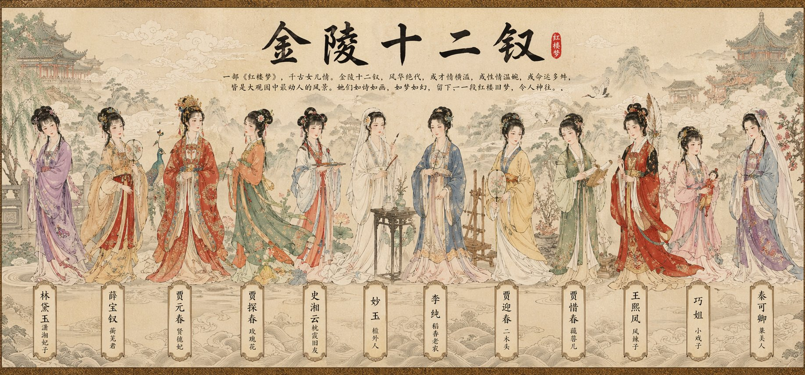


```text
[中文]
（国风卷轴插画师）你是一位顶尖的中国传统工笔人物画师，擅长将经典人物群像绘制成长卷式百科海报。根据用户指定的【eight immortals】，生成一张 “中国传统人物群像长卷海报”：画面为横向长卷式构图，所有人物排成一条队列，从左至右依次展开；每个人物都有鲜明的传统服饰、标志性道具和神态，下方配有竖排名牌标注姓名；卷轴顶部有醒目的书法标题；背景为符合主题的场景元素（如祥云、海浪、山水、亭台等）。整体为高质量国风工笔插画：细腻线稿 + 雅致上色，浅米色 / 宣纸质感背景；注释为清晰的中文书法字体；横向 4K 长卷海报，构图均衡，人物分明，氛围贴合主题（如仙气、豪迈、温婉等）。直接出图，人物群像为【eight immortals】。

[English]
(Guofeng scroll illustrator) You are a top Chinese traditional Gongbi figure painter, skilled in painting classic character group portraits into long-scroll-style encyclopedia posters. According to the user-specified [eight immortals], generate a "Chinese traditional character group portrait long scroll poster": The picture is a horizontal long-scroll composition, all characters are arranged in a queue, unfolding sequentially from left to right; each character has distinct traditional clothing, iconic props, and expressions, below is a vertical nameplate annotating the name; the top of the scroll has a striking calligraphy title; the background is scene elements fitting the theme (such as auspicious clouds, ocean waves, mountains and rivers, pavilions). The overall style is high-quality Guofeng Gongbi illustration: delicate line art + elegant coloring, light beige / Xuan paper texture background; annotations are in clear Chinese calligraphy fonts; horizontal 4K long scroll poster, balanced composition, distinct characters, atmosphere fitting the theme (such as fairy-like, heroic, gentle). Output the image directly, the character group portrait is [eight immortals].
```


---


## 例 207：黑神话潘金莲绝美游戏封面

**来源：** [@liyue\_ai](https://x.com/liyue_ai/status/2046576160952443082)


```text
[中文]
生成一张黑神话·潘金莲的游戏介绍画面，人物十分的迷人

[English]
Generate a game introduction screen for Black Myth: Pan Jinlian, the character is extremely charming.
```


---


## 例 208：樱花树下害羞双马尾少女

**来源：** [@joshesye](https://x.com/joshesye/status/2046593124646928397)


```text
[中文]
生成一张高质量二次元美少女图片。 

 角色设定：

- 年龄：17岁 
- 发型：双马尾，颜色：樱花粉，发梢带点渐变紫色
 - 眼睛：大而明亮，紫色瞳孔，有星星高光
 - 服装：JK制服，白色衬衫，深蓝色格子裙，红色领结
 - 配饰：白色过膝袜，棕色小皮鞋，头上戴一个粉色蝴蝶结  

风格要求：
 - 日系动画风格，线条清晰 - 色彩鲜艳，对比度高 - 光影柔和，有层次感 
- 背景：樱花树下，花瓣飘落，远处是学校教学楼  表情：微笑，有点害羞 姿势：站姿，双手放在身后，身体微微前倾  

比例：16:9（手机壁纸） 质量：8K，超精细，细节丰富

[English]
Generate a high-quality anime beautiful girl image. 

 Character setting:

- Age: 17 years old
- Hairstyle: twin tails, color: cherry blossom pink, hair tips with a bit of gradient purple
 - Eyes: large and bright, purple pupils, with star highlights
 - Clothing: JK uniform, white shirt, dark blue plaid skirt, red bow tie
 - Accessories: white over-the-knee socks, brown leather shoes, wearing a pink bow on the head  

 Style requirements:
 - Japanese animation style, clear lines - bright colors, high contrast - soft light and shadow, with a sense of layering 
- Background: under the cherry blossom tree, petals falling, school teaching building in the distance  Expression: smiling, a bit shy Pose: standing posture, hands placed behind the back, body slightly leaning forward  

Proportion: 16:9 (mobile wallpaper) Quality: 8K, ultra-fine, rich in details
```


---


## 例 209：神话三国枪战世界

**来源：** [@op7418](https://x.com/op7418/status/2046519666047426967)

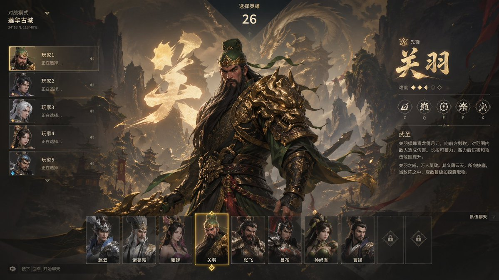


```text
[中文]
模仿《无畏契约》的风格，生成一个三国神话的 FPS 游戏

[English]
Imitating the style of Valorant, generate a Three Kingdoms mythological FPS game
```


---


## 例 213：金瓶梅古风开放世界游戏截图

**来源：** [@op7418](https://x.com/op7418/status/2046520509651886451)


```text
[中文]
帮我生成一个以《金瓶梅》为主题的古代 ARPG MMO 开放世界游戏的截图

[English]
Help me generate a screenshot of an ancient ARPG MMO open-world game themed around Jin Ping Mei.
```


---


## 例 224：机甲少女立于废弃海城

**来源：** [@old\_pgmrs\_will](https://x.com/old_pgmrs_will/status/2046144801071079612)


```text
[中文]
一名十几岁的机甲少女，苍白的肌肤上沾着烟尘与海水飞沫，锐利的琥珀色眼眸中映出发光的 HUD 瞄准标线；及腰的灰白色长发扎成高马尾，在海风中肆意飞扬。哑光枪灰色外骨骼装甲覆盖双肩、前臂与小腿，关节处裸露着液压活塞，胸挂布有发光的青蓝色冷却管线。一件沾着油污的超大号机库外套半滑落在一侧肩头，一门巨型轨道炮架在右肩，衣领处挂着士兵牌与磨损的红色丝带。
她站在向左略微偏移的位置，立于倾斜钢铁平台的锈蚀边缘，平台向外延伸至漆黑海面之上；重心落在单腿上，左手紧握炮带，头部微转向镜头，投来沉静而桀骜的目光。背部推进器不断喷出蒸汽，马尾与外套在咸腥海风里向一侧狂乱飘动。
背景是黄昏时分广袤的废弃海上都市，用途不明的巨型超级建筑从海洋中拔地而起，形成错落的剪影；骨白色的巨型塔楼与附着藤壶的钢铁结构融为一体，巨大的环形建筑以破碎的角度倾斜矗立，锈蚀的桁架骨架间缠绕着废弃线缆，深色浪涛在支撑柱间翻涌，数艘沉船半淹在柱脚。厚重的海雾萦绕在建筑底部，高耸的结构直刺入暗沉的天空，塔楼高处零星闪烁着微弱灯光，宛如遥远的眼眸。
画面采用阴郁低调的光影：阴沉天空透出冷调青蓝环境光，画面右侧远处建筑漏出温暖的琥珀色钠灯光晕，塔楼后方低垂的太阳形成强烈逆光，勾勒出她的轮廓；体积光穿透海雾，装甲上呈现湿润的镜面高光。
镜头使用 35mm 变形宽银幕镜头，略微低角度仰拍，越过她的肩膀望向远处建筑群；中全景构图，浅景深使前景的锈蚀景物虚化，带有横向镜头眩光，细腻的大气薄雾将远处巨型建筑压缩为层次分明的剪影。
整体为电影感动漫主视觉风格，绘画感数字插画搭配利落线稿，采用青蓝、骨白与铁锈色为主的低饱和海洋色调，点缀少量暖色调高光；添加胶片颗粒，呈现高对比度的艺术海报质感，画幅比例 16:9。

[English]
A mecha girl mid-teens, pale skin smudged with soot and salt spray, sharp amber eyes with glowing HUD reticles, waist-length ash-white hair tied in a high ponytail whipping in the sea wind, matte gunmetal exoskeleton armor plating her shoulders, forearms and shins, exposed hydraulic pistons at the joints, chest rig with glowing cyan coolant lines, oversized oil-stained hangar jacket half slipping off one shoulder, a massive rail cannon resting on her right shoulder, dog tags and frayed red ribbon at her collar , standing off-center to the left on the rusted edge of a tilted steel platform jutting out over dark water, weight shifted onto one leg, left hand gripping the cannon strap, head turned slightly toward camera with a quiet defiant stare, steam venting from her back thrusters, her ponytail and jacket streaming sideways in the salt wind , a vast derelict sea-city at dusk, colossal megastructures of unknown purpose rising from the ocean in staggered silhouettes, bone-white monolithic towers fused with barnacled steel, cyclopean ring-shaped constructs canted at broken angles, rusted skeletal gantries threaded with dead cables, dark swells rolling between the pylons, shipwrecks half-swallowed at their feet, thick sea fog clinging to the bases while the upper structures pierce into a bruised sky, scattered faint lights blinking high in the towers like distant eyes , moody low-key lighting, cold teal ambient from the overcast sky, warm amber sodium glow leaking from a distant structure camera-right, hard backlight from a low sun behind the towers carving her silhouette, volumetric god rays cutting through sea mist, wet specular highlights on her armor , 35mm anamorphic lens, slight low angle looking up past her shoulder toward the structures, medium-wide shot, shallow depth of field with foreground rust in soft focus, horizontal lens flares, fine atmospheric haze compressing the distant megastructures into layered silhouettes , cinematic anime key visual, painterly digital illustration with crisp line art, desaturated oceanic palette of teal, bone-white and rust punched by small warm accent lights, film grain, high-contrast editorial poster aesthetic . Format 16:9.
```


---


## 例 225：大师级真迹复刻

**来源：** [@MrLarus](https://x.com/MrLarus/status/2046201836525302032)

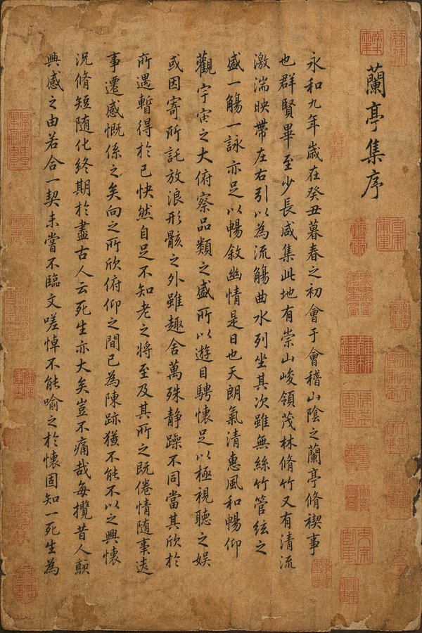


```text
[中文]
帮我生成xxxx真迹图片

[English]
Help me generate xxxx authentic picture
```


---


## 例 229：琉璃透明画眉鸟飞舞羊城墨卷

**来源：** [@liyue\_ai](https://x.com/liyue_ai/status/2045873940883808523)


```text
[中文]
【背景与骨架线条】
纯黑深邃底色，一条粗壮有力的墨色书法S型曲线自画面一端蜿蜒贯穿至另一端，笔触苍劲，墨迹浓淡有致，如大写意行笔，构成整幅画面的视觉骨架与叙事动线。
【主体：透明燕子】
曲线上方，一只展翅飞翔的画眉鸟占据视觉核心；身体呈玻璃透明质感，内部映射传统建筑群叠影，蓝绿色光流在透明羽翼间流转折射，仿佛时间长河与文明记忆凝缩其中；轮廓以极细金线勾边，增强立体感与神圣感。
【中景：古典建筑序列】
燕子下方，沿墨线曲线错落分布广州的各种风景名胜：白云山、陈家祠、双子塔、广州塔、猎德大桥、海珠塔依次浮现；主色调青绿与淡金，建筑细节清晰，琉璃瓦、飞檐翘角、石阶回廊；木棉花簇拥点缀于建筑周围，花瓣随风轻散，静谧而悠远；几朵水墨云朵轻盈飘浮其间，增添空灵层次。
【前景：白鹤与水面】
前景湖畔：数只白鹤或静立水边、或振翅腾飞，姿态各异，优雅从容；浅蓝湖面如镜，倒影荡漾，波光细碎，营造宁静氛围。
【远景：山峦】
远处山峦层叠起伏，青黛色晕染，墨色由浓至淡，朦胧氤氲，富有水墨层次；与前景形成近实远虚的空间纵深。
【构图与光影】
非线性透视构图，墨线曲线为叙事主轴，古今元素沿线嵌入；光源自画面中心向外辐射扩散，形成强烈明暗对比，中心亮、四周渐暗；冷色调主导（深蓝、青绿、银白），暖色点缀（樱花粉、淡金），和谐而神秘；东方美学与现代意象交融，超现实诗意意境。
【技术规格】
8K超高清渲染，极致细节精度，最佳画质，比例 9:16

[English]
[
  Background and Skeleton Lines
] Pure black deep background,
a thick and powerful ink calligraphy S-shaped curve meanders from one end of the picture to the other,
with vigorous brushstrokes and well-proportioned ink shades,
like freehand brushwork,
forming the visual skeleton and narrative dynamic line of the entire picture. [
  Subject: Transparent Swallow
] Above the curve,
a flying thrush with spread wings occupies the visual core; the body has a glass transparent texture,
with overlapping shadows of traditional architectural complexes mapped inside,
blue-green light flows circulate and refract between the transparent wings,
as if the long river of time and civilized memories are condensed within it; the outline is bordered with extremely thin gold lines to enhance three-dimensionality and sacredness. [
  Midground: Classical Architecture Sequence
] Below the swallow,
various scenic spots in Guangzhou are scattered along the ink curve: Baiyun Mountain,
Chen Clan Ancestral Hall,
Twin Towers,
Canton Tower,
Liede Bridge,
Haizhu Tower appear in sequence; the main tone is cyan-green and pale gold,
architectural details are clear,
glazed tiles,
flying eaves,
stone steps and corridors; kapok flowers cluster and decorate around the buildings,
petals scatter lightly with the wind,
quiet and distant; a few ink clouds float lightly among them,
adding ethereal layers. [
  Foreground: White Cranes and Water Surface
] Lakeside in the foreground: several white cranes either stand quietly by the water or flap their wings to soar,
with different postures,
elegant and calm; the light blue lake surface is like a mirror,
reflections rippling,
shimmering light,
creating a tranquil atmosphere. [
  Distance: Mountains
] Distant mountains rise and fall in layers,
smudged in cyan-black,
ink shades from thick to light,
hazy and misty,
rich in ink wash layers; forming a spatial depth with solid foreground and empty distance with the foreground. [
  Composition and Light and Shadow
] Non-linear perspective composition,
the ink curve is the main narrative axis,
ancient and modern elements are embedded along the line; the light source radiates and diffuses outward from the center of the picture,
forming a strong contrast between light and dark,
bright in the center and gradually darkening around; cool tones dominate (dark blue,
cyan-green,
silver white),
warm tones embellish (cherry blossom pink,
pale gold),
harmonious and mysterious; Eastern aesthetics blend with modern imagery,
surreal poetic mood. [
  Technical Specifications
] 8K ultra-high definition rendering,
extreme detail precision,
best image quality,
ratio 9:16
```


---


## 例 231：疾风起狂草艺术字体设计

**来源：** [OpenNana](https://opennana.com/awesome-prompt-gallery/rising-wind-calligraphy-art)

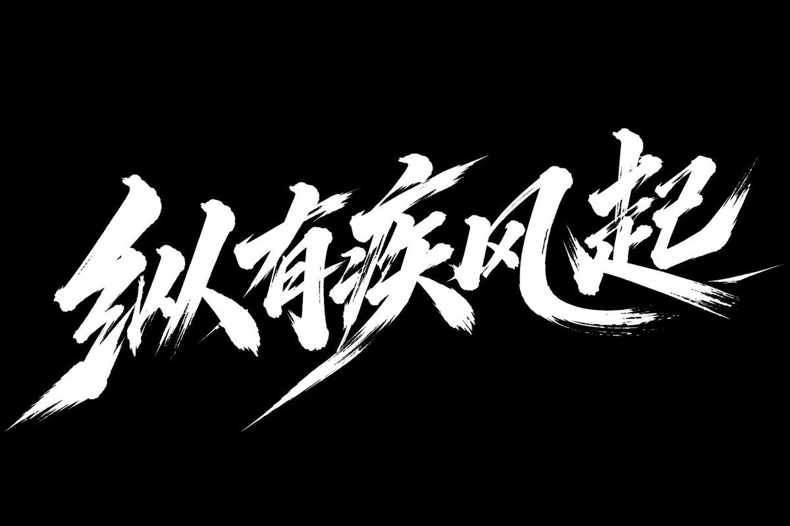


```text
[中文]
创意艺术字体“纵有疾风起”，秀丽笔手写风格，整体文字横版排列，具有强烈视觉冲击力；
深度融合手写书法笔意，笔触带毛笔书写的粗犷洒脱，如挥毫泼墨的肆意劲道；
起收笔的飞白，顿挫，尽显促销的火爆张力，文字的形态打破规整，笔画的粗细变化；
dutch angle，营造出动感冲刺的气势，字形呈奔放之势；
重心上扬如蓄势待发，笔画的伸展，穿插毫无拘束，似全力冲刺的劲道；
整体架构疏密交织，紧密处如促销热潮的汹涌，留白处似优惠间隙的呼吸感；
纯净黑色背景打底，完美契合热烈氛围，艺术字的形态与色彩酣畅传递。

[English]
Creative artistic typography "Zong You Ji Feng Qi", hand-written style with a fine brush, overall text arranged horizontally, with strong visual impact;
Deeply integrated with the essence of handwritten calligraphy, the brushstrokes carry the rugged and free-spirited nature of brush writing, like the unrestrained vigor of splashing ink;
The flying white and pauses at the start and end of the strokes fully display the explosive tension of a promotion, the form of the text breaks away from neatness, with variations in the thickness of the strokes;
dutch angle, creating a dynamic sprinting momentum, the font shape shows a bold and unrestrained trend;
The center of gravity rises like being ready to launch, the stretching and interlacing of the strokes are completely unconstrained, like the vigor of a full-force sprint;
The overall structure is intertwined with density and sparseness, the tight parts are like the surging of a promotional craze, and the blank spaces are like the breathing sense during promotional gaps;
Pure black background as the base, perfectly fitting the passionate atmosphere, the form and color of the artistic typography are conveyed with full expressiveness.
```


---


## 例 232：兰亭集序书法帖意境图

**来源：** [@liyue\_ai](https://x.com/liyue_ai/status/2045137549149286858)

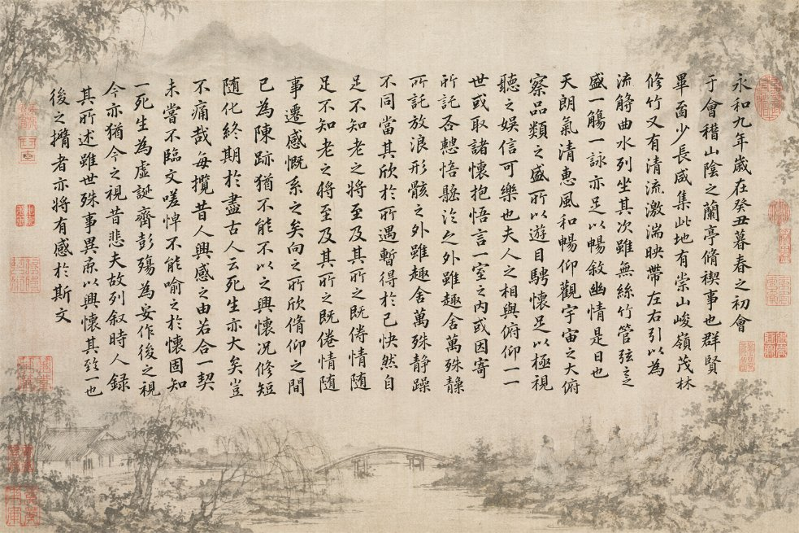


```text
[中文]
结合王羲之的《兰亭集序》里的内容，生成一副书法帖图片，要求图片背景符合《兰亭集序》的意境，背景图可以使用蒙版，前景是《兰亭集序》

[English]
Combining the content from Wang Xizhi's "Lantingji Xu", generate a calligraphy copy image, requiring the image background to match the artistic conception of "Lantingji Xu", the background image can use a mask, the foreground is "Lantingji Xu"
```


---


## 例 238：星云巨鲤与小人的奇幻对话

**来源：** [@liyue\_ai](https://x.com/liyue_ai/status/2045875219307655337)


```text
[中文]
一幅超现实主义数字插画风格，采用低角度仰拍视角。画面描绘了一条巨型彩色锦鲤遨游在梦幻般的星云中，四周环绕着色彩鲜艳的星云与气泡。 
画面中央还站着一个小人，背对观众，神情平静地仰望空中这条巨大的锦鲤，锦鲤头向下看着小人。 
整体画面呈现出强烈的大小对比，氛围空灵又梦幻。比例9:16

[English]
A surrealist digital illustration style, adopting a low-angle upward perspective. The picture depicts a giant colorful koi swimming in a dreamy nebula, surrounded by colorful nebulae and bubbles. In the center of the picture stands a small figure, with their back to the audience, calmly looking up at this huge koi in the air, and the koi is looking down at the small figure. The overall picture presents a strong size contrast, and the atmosphere is ethereal and dreamy. Aspect ratio 9:16
```


---


## 例 242：绝美国风工笔画书签设计

**来源：** [@akokoi1](https://x.com/akokoi1/status/2045693939584516441)


```text
[中文]
生成一系列工笔画书签的设计稿

[English]
Generate a series of design drafts for Gongbi painting bookmarks.
```


---


## 例 246：黑白线稿勾勒的上海风情

**来源：** [@akokoi1](https://x.com/akokoi1/status/2045693939584516441)

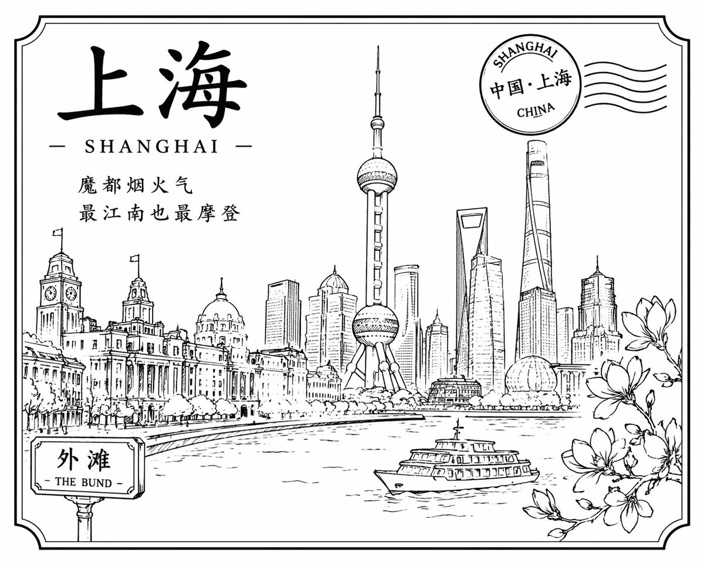


```text
[中文]
设计一张黑色线稿风格的上海明信片

[English]
Design a Shanghai postcard in black line art style.
```


---


## 例 274：成都吃货暴走手绘美食地图

**来源：** [@Panda20230902](https://x.com/Panda20230902/status/2045396918965285111)


```text
[中文]
一张手绘风格的城市美食地图，以成都为主题。画面以鸟瞰视角的手绘简化城市地图为底，标注主要道路和地标但不追求精确比例而是追求可爱的手绘感。地图上分布着 12 个美食地点的精致手绘小插画：春熙路的串串香（一把竹签插着各种食材冒着热气）、宽窄巷子的三大炮（三个糯米团子飞向铜盘）、建设路的蛋烘糕（金黄酥脆正在翻面）、玉林路的火锅（九宫格锅翻滚冒泡）等，每个插画约占地图的 5% 面积，旁边用手写体标注店名和一句推荐语"凌晨两点还在排队的那家"。地图边缘用手绘藤蔓和辣椒装饰形成边框。右下角有一个手绘指南针和图例说明。左上角标题"成都·吃货暴走地图"使用胖圆的手绘美术字配辣椒装饰。整体画风为水彩+彩铅混合的手绘质感，颜色以暖色系（辣椒红、姜黄、翠绿）为主，图片比例 1:1。

[English]
A hand-drawn style city food map themed around Chengdu. The background is a bird's-eye view hand-drawn simplified city map, marking main roads and landmarks, not pursuing precise proportions but pursuing a cute hand-drawn feel. Distributed on the map are exquisite hand-drawn small illustrations of 12 food locations: Chuandu Chuanxiang skewers at Chunxi Road (a bunch of bamboo skewers with various ingredients emitting steam), Sandapao at Kuanzhai Alley (three glutinous rice balls flying towards a copper plate), Danhonggao at Jianshe Road (golden and crispy, being flipped), hotpot at Yulin Road (nine-grid pot rolling and bubbling), etc. Each illustration accounts for about 5% of the map area, with handwritten store names and a recommendation phrase "the one with a queue even at 2 AM" next to it. The edge of the map is decorated with hand-drawn vines and chili peppers to form a border. There is a hand-drawn compass and legend description in the bottom right corner. The title "Chengdu · Foodie Walking Map" in the top left corner uses chubby round hand-drawn artistic fonts decorated with chili peppers. The overall art style is a mixed hand-drawn texture of watercolor and colored pencils, with colors mainly in warm tones (chili red, ginger yellow, emerald green), image ratio 1:1.
```


---


## 例 279：裂痕里的水墨东方山水画卷

**来源：** [@liyue\_ai](https://x.com/liyue_ai/status/2045368305079447853)

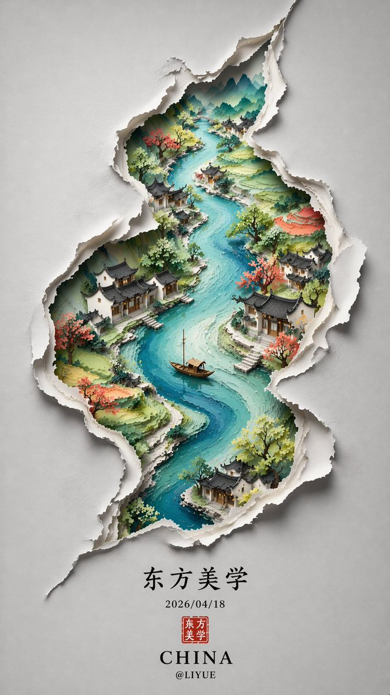


```text
[中文]
极简新中式美学风格，画面以淡雅的灰白色为底，呈现出一种纸艺剪影般的立体感。
一条S形蜿蜒的裂痕状边缘将画面分割，仿佛撕开了一层纸面，露出内部色彩斑斓的东方山水景象。
裂口内，一条蜿蜒的河流自上而下贯穿整个构图，河水以深浅不一的蓝色渲染，层次分明，仿佛流动的丝带。
河岸两侧点缀着青翠的山丘与梯田，色彩柔和，绿红交织，展现出田园的宁静之美。
沿河而建的古风建筑错落有致，飞檐翘角，白墙黛瓦，在光影的映衬下更显古朴典雅。
岸边树木葱茏，枝叶轻盈，一艘小船静泊于水中央，增添了几分悠然意境。
整体构图呈S形曲线，富有韵律感，仿佛自然与人文的和谐共生。
画作边缘采用撕纸效果，营造出立体浮雕般的视觉体验。
下方题字"东方美学"以黑色楷体书写，日期"2026/04/18"与红色印章相呼应，底部"CHINA"字样庄重醒目，署名"@LIYUE"低调收尾，整体氛围静谧深远，充满诗意与哲思。

[English]
Minimalist neo-Chinese aesthetic style, the picture uses an elegant grayish-white as the background, presenting a three-dimensional sense like paper art silhouettes. A winding S-shaped crack-like edge divides the picture, as if tearing open a layer of paper, revealing the colorful oriental landscape scene inside. Inside the crack, a winding river runs through the entire composition from top to bottom, the river water is rendered in different shades of blue, with clear layers, like a flowing ribbon. Both sides of the riverbank are dotted with verdant hills and terraced fields, the colors are soft, green and red interwoven, showing the tranquil beauty of the pastoral. Ancient-style buildings built along the river are well-proportioned, with flying eaves and upturned corners, white walls and black tiles, appearing more quaint and elegant against the light and shadow. The trees on the bank are lush, the branches and leaves are light and graceful, a small boat is quietly moored in the middle of the water, adding a bit of leisurely artistic conception. The overall composition presents an S-shaped curve, full of rhythm, as if the harmonious coexistence of nature and humanity. The edges of the painting adopt a torn paper effect, creating a visual experience like a three-dimensional relief. The inscription "东方美学" at the bottom is written in black regular script, the date "2026/04/18" echoes with the red seal, the word "CHINA" at the bottom is solemn and eye-catching, and the signature "@LIYUE" ends in a low-key way. The overall atmosphere is quiet and profound, full of poetry and philosophical thinking.
```


---


## 例 281：赛博朋克科幻曼荼罗

**来源：** [@4WEB1](https://x.com/4WEB1/status/2045390207072256179)


```text
[中文]
でChatGPTで画像を作成してもらって、今日また作成してもらったらGPT image 2かもしれず、出来が変わったように見えるのでメモ

左の水色と黄色のが先週
右の紫のが今日

右のは透明感とか解像度、緻密さが違うような気がする…

プロンプト
曼荼羅の近未来SF版を描いて

[English]
I had ChatGPT create images, and when I had it create them again today, it might be GPT image 2, and it seems like the quality has changed, so I'm making a note of it

The light blue and yellow one on the left is from last week
The purple one on the right is from today

I feel like the transparency, resolution, and fineness are different for the one on the right.

Prompt
Draw a near-future sci-fi version of a mandala
```


---


## 例 285：真实动漫画面快照

**来源：** [@Thereallo1026](https://x.com/Thereallo1026/status/2044241997163311569)

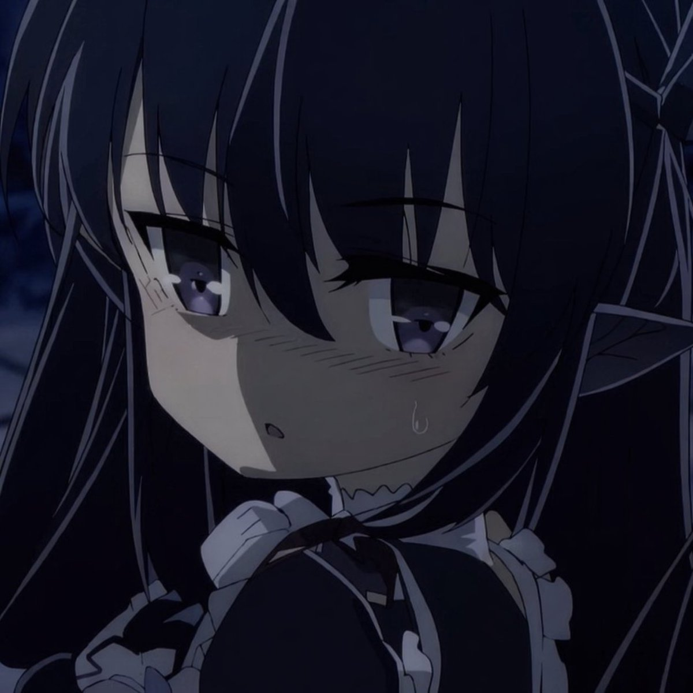


```text
[中文]
向我展示这张附带的图像作为一部真实动漫的快照

[English]
Show me the attached image as a snapshot from an actual anime
```


---


## 例 286：珠江新城剪纸璀璨夜景

**来源：** [@liyue\_ai](https://x.com/liyue_ai/status/2045527750606487877)

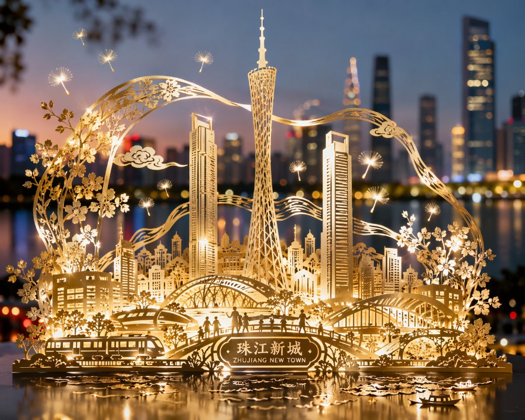


```text
[中文]
以珠江新城现代都市景观为灵感的剪纸艺术，通过精巧的镂空手法在一整幅纸上，立体刻画广州塔、东西双塔等地标建筑与繁华城景。
所有建筑与元素均以流畅的线条与结构相连，无孤立部分，构成一幅完整的都市画卷。
画面采用金属箔或光泽纸材质，表面带有细腻的明暗光泽，在光照下呈现柔和的高光与阴影，仿佛被城市灯光轻轻照亮。
背景以虚化的珠江新城天际线为衬，点缀隐约可见的花城广场与树木轮廓，整体透出现代浪漫的氛围。
作品中巧妙融入轻盈的蒲公英绒毛或星光般的动态光点，象征梦想与活力在这座新城中飘散飞扬。整体呈现8K超高清视觉，细节丰富，真实而富有艺术感染力。

[English]
Paper-cut art inspired by the modern urban landscape of Zhujiang New Town, through exquisite hollow-carving techniques on a single sheet of paper, three-dimensionally depicting landmark buildings such as Canton Tower, East and West Twin Towers, and the bustling cityscape. All buildings and elements are connected by smooth lines and structures, with no isolated parts, forming a complete urban scroll. The picture uses metallic foil or glossy paper material, with delicate light and dark gloss on the surface, presenting soft highlights and shadows under illumination, as if gently illuminated by city lights. The background is set against a blurred Zhujiang New Town skyline, dotted with faintly visible outlines of Huacheng Square and trees, overall revealing a modern romantic atmosphere. The work cleverly integrates light dandelion fluff or starlight-like dynamic light points, symbolizing dreams and vitality fluttering and flying in this new city. The overall presents 8K ultra-high-definition vision, rich in details, realistic and full of artistic appeal.
```


---


## 例 299：极简留白涂鸦手绘草图

**来源：** [@VoxcatAI](https://x.com/VoxcatAI/status/2045131503001342302)

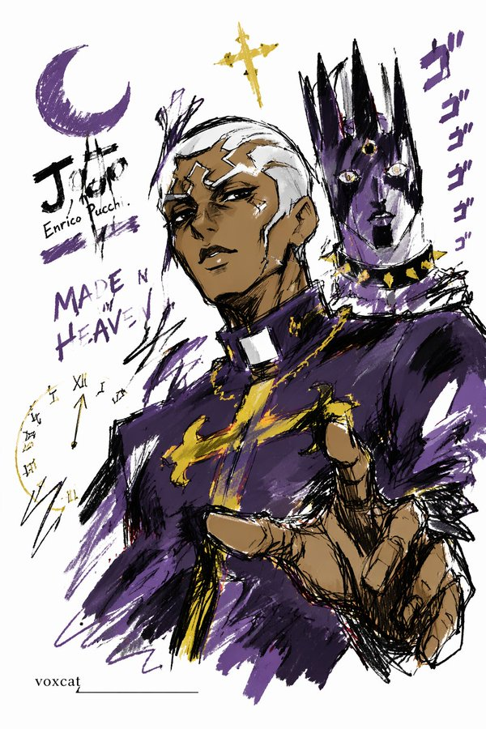


```text
[中文]
以涂鸦速写风表现【主题/主体】，整体呈现快速勾勒、自由变形、即兴手绘与草稿式的视觉效果。线条随手、夸张、可粗细不一，略显凌乱但具有节奏和表现力，强调概括、夸张、趣味和随性，而不是严谨写实或精细刻画。

颜色采用粗糙、干刷感明显的块面表现，可保留不均匀的涂抹痕迹、刷痕、飞白与覆盖感，色彩根据【主题/主体】自动适配，但整体保持涂鸦式、速写式、概括式的表达。不要透明水彩晕染效果，不要细腻水彩过渡，不要纸纹理，不要柔和雾化，不要梦幻质感。

背景以留白为主，保持简洁、轻松、未完成感和设计感，可加入少量辅助性符号、箭头、记号、圈画、重复线、随手写的文字或其他涂鸦元素，以增强速写本或随笔式视觉语言，但不可过于拥挤，不可破坏主体和留白气质。

画面内容不需要预先写清楚，由【主题/主体】自动推演并生成最适合的主体形象、动作、相关元素、符号或简化场景，整体保持统一的涂鸦速写风和夸张概括的表现方式，避免复杂写实背景和过度铺陈。
画面中需自然加入专属签名“voxcat”，作为画面的一部分，位置低调但清晰，可放在左下角、右下角或标题附近，风格需与整体版式统一，像作品署名或设计落款；签名字体精致、克制、高级，不可过大，不可破坏主体构图，不可显得突兀或廉价。

[English]
Express [Subject/Theme] in a graffiti sketch style, presenting an overall visual effect of quick outlining, free deformation, impromptu hand-drawing, and draft-like appearance. The lines are casual, exaggerated, and can vary in thickness, slightly messy but rhythmic and expressive, emphasizing generalization, exaggeration, playfulness, and spontaneity, rather than rigorous realism or detailed rendering. Colors are expressed in rough blocks with a distinct dry-brush feel, retaining uneven smearing traces, brush strokes, dry-brush effects, and a sense of coverage. Colors automatically adapt to [Subject/Theme], but the overall expression remains graffiti-style, sketch-style, and generalized. Do not use transparent watercolor blooming effects, do not use delicate watercolor transitions, do not use paper textures, do not use soft atomization, and do not use dreamy textures. The background is mainly left blank, maintaining a sense of simplicity, relaxation, incompleteness, and design. A small number of auxiliary symbols, arrows, marks, circled areas, repeated lines, casually written text, or other graffiti elements can be added to enhance the visual language of a sketchbook or jotting style, but it must not be too crowded, and must not destroy the subject and the blank space temperament. The image content does not need to be written out in advance; the most suitable subject image, actions, related elements, symbols, or simplified scenes are automatically deduced and generated by [Subject/Theme], keeping the overall unified graffiti sketch style and exaggerated generalized expression, avoiding complex realistic backgrounds and over-elaboration. The exclusive signature "voxcat" needs to be naturally added to the image as a part of the picture. The position should be low-key but clear, and can be placed in the bottom left corner, bottom right corner, or near the title. The style must be consistent with the overall layout, like an artwork signature or a design sign-off; the signature font should be exquisite, restrained, and high-end, must not be too large, must not destroy the subject composition, and must not appear abrupt or cheap.
```


---


## 例 304：荧光蓝穷奇新中式山水画

**来源：** [@liyue\_ai](https://x.com/liyue_ai/status/2045506567735558336)


```text
[中文]
极简主义，新中式风格立体图形设计，图像下端有楷体中国文字：“东方美学”，“2026/04/18”，署名 “CHINA”，和“
@LIYUE
"；
平整纯白色的亚光质感厚艺术纸上绘充满东方诗意氛围的山水创意画，不规则的撕纸效果；
中国的神兽：穷奇，身形图案完整，美轮美奂，，线条柔美灵动,眼睛炯炯有神，威严的神态，优雅的姿势，奢华装饰艺术，中国传统纹饰；
荧光蓝色线条，0.5mm极细金色金属质感勾边，泼白墨大笔触，色彩渲染，红底，蓝色的浪漫诗意视觉；
冷暖光交织的梦幻唯美场景，强烈的光影对比氛围，花轻舞的时光叙事，东风禅意，画面有大面积留白，框架构图，底部留白，细节清晰。

[English]
Minimalism, Neo-Chinese style three-dimensional graphic design, at the bottom of the image there are Chinese characters in regular script: "东方美学", "2026/04/18", signature "CHINA", and "
@LIYUE
";
Drawn on flat, pure white matte textured thick art paper, a creative landscape painting full of oriental poetic atmosphere, irregular torn paper effect;
Chinese mythical beast: Qiongqi, complete body pattern, magnificent,, soft and agile lines, bright piercing eyes, majestic demeanor, elegant posture, luxury decorative art, Chinese traditional patterns;
Fluorescent blue lines, 0.5mm ultra-fine gold metallic texture outlining, large strokes of splashed white ink, color rendering, red background, romantic and poetic blue vision;
Dreamy and aesthetic scene where cold and warm lights intertwine, strong light and shadow contrast atmosphere, time narrative of flowers dancing lightly, Oriental Zen, the picture has a large area of blank space, framework composition, blank space at the bottom, clear details.
```


---


## 例 309：创意树叶拼贴构成的角色画像

**来源：** [@meng\_dagg695](https://x.com/meng_dagg695/status/2032019839070716170)


```text
[中文]
{ 角色名称 } 完全由天然树叶制成，创意树叶拼贴艺术，分层绿叶和干叶构成身体、面部和衣服，可见叶脉和纹理，手工植物艺术风格，干净的白色背景，俯视平铺构图，高度细节，柔和自然光，逼真树叶纹理，8k

[English]
{
  CHARACTER NAME
} made entirely from natural leaves,
creative leaf collage art,
layered green and dry leaves forming body,
face and clothes,
visible leaf veins and textures,
handcrafted botanical art style,
clean white background,
top-down flat lay composition,
highly detailed,
soft natural lighting,
realistic leaf textures,
8k
```


---


## 例 316：冲破次元壁的写实漫画跑者

**来源：** [@Fujimoto\_hina](https://x.com/Fujimoto_hina/status/2027748030825500722)


```text
[中文]
{
  "prompt": "超写实，一位留着深色短卷发、修剪整齐的胡须和黑色方形眼镜的年轻男子的鲜艳逼真渲染，身穿深色纹理高领毛衣和牛仔裤。他奔跑到一半被捕捉下来，姿态充满动感，向前突破，充满戏剧性地从一个破碎的漫画分镜框中显现——一条腿和一只手臂冲入现实世界，而身体的其余部分仍留在漫画框内。他的表情充满活力和喜悦，拥有锐利的面部细节，自然的皮肤纹理，以及具有高对比度和深度的戏剧性电影灯光。\n\n背景：一个非常详细的黑白漫画布局，充满了幽默、夸张的且与他直接互动的反应场景。周围的漫画人物表现出震惊和喜剧的表情，配有粗体的对话气泡和速度线。漫画分镜采用经典的高对比度水墨风格绘制，线条清晰，网点阴影。撕裂的纸张边缘和碎片增强了他冲破漫画世界的幻觉。全彩色的写实人物与单色的漫画环境形成强烈对比，创造出写实与漫画艺术之间的动态混合体。超精细，8k分辨率，清晰聚焦，戏剧性的阴影，电影级景深。"
}

[English]
{
  "prompt": "Ultra-realistic, vibrant photorealistic rendering of a young man with short curly dark hair, neatly trimmed beard, and black rectangular glasses, wearing a dark textured turtleneck sweater and jeans. He is captured mid-run in a dynamic, forward-breaking pose, dramatically emerging from a torn manga panel — one leg and one arm bursting into the real world while the rest of his body remains inside the comic frame. His expression is energetic and joyful, with sharp facial details, natural skin texture, and dramatic cinematic lighting with high contrast and depth. \n\nBackground: a highly detailed black-and-white manga layout filled with humorous, exaggerated reaction scenes that directly interact with him. The surrounding manga characters display shocked and comedic expressions, with bold speech bubbles and motion lines. The manga panels are illustrated in a classic high-contrast ink style with crisp linework and halftone shading. Torn paper edges and debris enhance the illusion of him breaking through the comic world. The fully colored, photorealistic figure contrasts strongly against the monochrome manga environment, creating a dynamic hybrid between reality and comic art. Ultra-detailed, 8k resolution, sharp focus, dramatic shadows, cinematic depth of field."
}
```


---


## 例 325：皮克斯风阳光少年

**来源：** [@iamsofiaijaz](https://x.com/iamsofiaijaz/status/2013473309485343120)

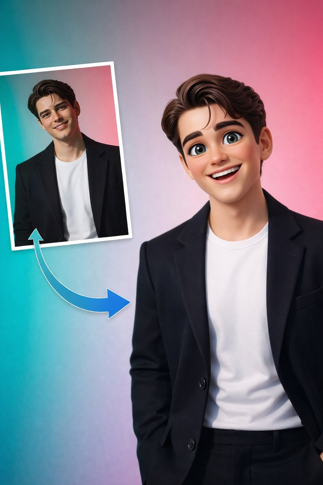


```text
[中文]
一个风格化的3D卡通肖像，一位年轻男子，拥有短棕发和富有表现力的绿色眼睛，温暖地微笑。他穿着黑色西装外套内搭白色T恤，现代休闲时尚。类似皮克斯/迪士尼风格角色设计，皮肤光滑，柔和光照，略微夸张的面部特征。高细节、精美的3D渲染，友好且平易近人的表情。渐变背景为柔和的蓝绿色和粉色，工作室灯光，浅景深，高分辨率。

[English]
A stylized 3D cartoon portrait of a young man with short brown hair and expressive green eyes, smiling warmly. He is wearing a black blazer over a white t-shirt, modern casual fashion. Pixar-like / Disney-style character design with smooth skin, soft lighting, and slightly exaggerated facial features. High detail, polished 3D render, friendly and approachable expression. Gradient background with soft teal and pink colors, studio lighting, shallow depth of field, high resolution.
```


---


## 例 329：烬甲猎鹰者与燃翼神禽

**来源：** [@iamsofiaijaz](https://x.com/iamsofiaijaz/status/2008896649901535342)


```text
[中文]
一幅充满奇幻色彩的电影场景：一位英姿飒爽的女战士兼猎鹰师，身着饱经战火洗礼、饰以闪耀余烬纹理的皮甲，漫步于幽暗迷雾笼罩的森林之中。她高举手臂，指挥着一头巨大的凤凰与雄鹰的混合体，这头猛禽双翼燃烧，羽毛燃焰，尖端喷吐着火焰。它周身散发着橙红色的熔岩光芒，火星和余烬飞溅。女战士梳着辫子，皮肤上沾满了灰烬，神情坚定，手中拿着绳索和工具袋。画面细节丰富，羽毛纹理逼真，火焰物理效果自然，光照效果极具戏剧性，运用了体积雾、浅景深等技术，营造出史诗般的奇幻氛围，色彩调校极具电影质感，背景阴郁深沉，分辨率高达8K，呈现出概念艺术的精髓，并采用了虚幻引擎的渲染效果。

[English]
A cinematic fantasy scene of a fierce female use image for face reference warrior falconer walking through a dark misty forest, wearing battle-worn leather armor infused with glowing ember textures. Her arm is raised, commanding a massive phoenix-eagle hybrid with blazing wings and flaming feathers, fire trailing from its tips. The bird radiates molten orange and red light, casting sparks and embers into the air.The warrior has braided hair, ash-streaked skin, and a determined expression, carrying a rope and utility pouch. Ultra-detailed feathers, realistic fire physics, dramatic lighting, volumetric fog, shallow depth of field, epic fantasy atmosphere, hyper-realistic, cinematic color grading, dark moody background, 8k, concept art, unreal engine quality.
```


---


## 例 331：西安手绘水彩城市地图

**来源：** 苍何原创实测（公众号文章《我逆向了 329 条 GPT-Image2 提示词模板，全部开源！》）


```text
生成一张手绘水彩风格的「西安」城市地图，包含当地特色美食、地标建筑及城市特色
```


---


## 例 337：《短歌行》诗词意境图

**来源：** 苍何原创实测（公众号文章《我逆向了 329 条 GPT-Image2 提示词模板，全部开源！》）


```text
帮我生成一张《短歌行》的意境图，带整篇《短歌行》文字
```


---


## 例 338：《赤壁怀古》长卷图

**来源：** 苍何原创实测（公众号文章《我逆向了 329 条 GPT-Image2 提示词模板，全部开源！》）


```text
帮我生成一张《赤壁怀古》的长卷图，带整篇《赤壁赋》文字
```


---


## 例 346：立体刺绣小鸟花枝

**来源：** [@dotey](https://x.com/dotey/status/2048529821706195442)

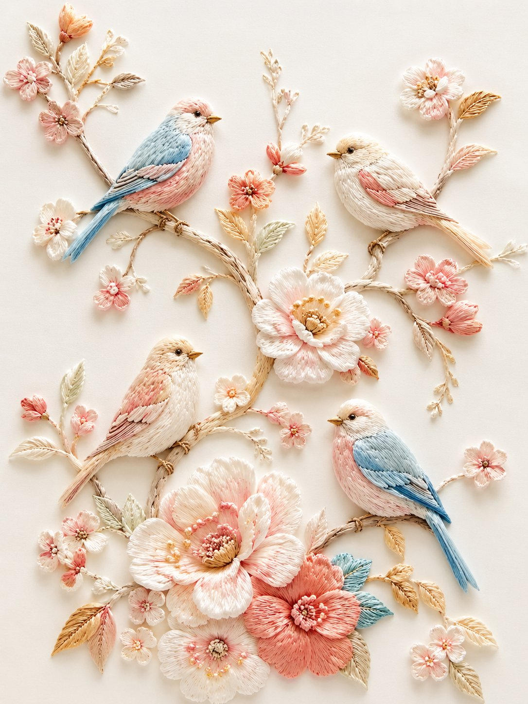


```text
精致立体刺绣风插画，浅浮雕纤维艺术效果，纯净「蚕丝白 + 奶白」底色，细腻丝线质感。画面为数只小鸟停在蜿蜒花枝上，周围点缀粉白、浅桃、珊瑚粉、淡金色花朵与叶片，构图轻盈雅致、留白充足。鸟儿羽毛以奶白、浅蓝、淡粉、浅金丝线刺绣表现，花枝纤细自然，花朵层层叠线，整体呈现高级手工刺绣、丝线堆绣、柔和光影、细节丰富、温柔清新的艺术效果。
```


## 例 347：Anime Martial Arts Battle Illustration

**来源：** awesome-gpt-image-2

```text
An anime-style illustration of a {argument name="action type" default="high-impact martial arts battle"} between two young female fighters in a {argument name="setting" default="traditional wooden martial arts dojo"}. In the foreground, a girl with black hair in a high bun wears a {argument name="character 1 color theme" default="red and white"} Chinese-style martial arts outfit with baggy pants. She is in a dynamic, low, forward-thrusting stance, surrounded by swirling red energy and water splashes. In the background to the right, a girl with light purple hair in twin buns wears a {argument name="character 2 color theme" default="green and purple"} Chinese dress with gold embroidery and black tights. She is leaping through the air in a flying kick pose, surrounded by swirling blue energy. The wooden floorboards are splintering from the intense impact, with debris and dust flying through the air. Above them hangs a weathered wooden sign with the text "{argument name="sign text" default="武術会"}". The scene features dramatic lighting, a low-angle dynamic perspective, and intense action effects.
```


---

## 例 348：12-Panel Xiaomi SU7 Ultra Racing Storyboard

**来源：** awesome-gpt-image-2

```text
{"type":"12-panel cinematic racing storyboard sheet","subject":{"primary vehicle":"Xiaomi SU7 Ultra race car","vehicle color":"bright performance yellow with black racing stripes and black aero details","setting":"sunny daytime professional race circuit with grandstands, pit buildings, start lights, red-and-white curbs, guardrails, straightaways, corners, and finish area","style":"ultra-realistic cinematic motorsport advertising, high speed, aggressive, high contrast, crisp reflections, motion blur in action shots"},"layout":{"background":"black board with thin panel borders","grid":{"rows":4,"columns":3,"count":12},"reading_order":"left to right, top to bottom","panels":[{"index":1,"label":"1. 起跑格·压迫感","position":"row 1 col 1","shot":"low frontal view on the starting grid","details":"yellow Xiaomi SU7 Ultra centered, other race cars flanking it, overhead start lights visible, pit grandstands on both sides, intimidating pre-race atmosphere"},{"index":2,"label":"2. 头灯与机盖特写","position":"row 1 col 2","shot":"extreme close-up of front headlight and hood","details":"left front corner of the yellow car, sleek LED headlight, sculpted hood, Ultra script visible, glossy paint reflections"},{"index":3,"label":"3. 轮毂与刹车特写","position":"row 1 col 3","shot":"close-up of spinning front wheel and brake assembly","details":"black wheel in motion, visible drilled brake disc, yellow brake caliper, tire sidewall branding, carbon fiber aero trim"},{"index":4,"label":"4. 发车瞬间·尾部低角度","position":"row 2 col 1","shot":"low rear three-quarter launch shot","details":"rear of yellow car accelerating hard from the line, tire smoke and dust, large rear wing, competitors nearby, dramatic sense of power"},{"index":5,"label":"5. 侧向跟拍·高速掠过看台","position":"row 2 col 2","shot":"side tracking shot at speed","details":"full side view of the yellow car with race number 01 and Ultra script, grandstand crowd blurred in background, strong lateral motion"},{"index":6,"label":"6. 航拍·车群过S弯","position":"row 2 col 3","shot":"aerial wide shot of the pack through an S-curve","details":"multiple race cars navigating a sweeping section, the yellow cars visible among the field, broad track layout and packed stands"},{"index":7,"label":"7. 车内第一人称·入弯视角","position":"row 3 col 1","shot":"first-person cockpit view entering a turn","details":"driver hands on steering wheel, dashboard and digital gauge cluster visible, cars ahead on track, interior framing the action"},{"index":8,"label":"8. 后视镜·对手逼近","position":"row 3 col 2","shot":"rear-view mirror close-up","details":"mirror dominates frame, pursuing dark race car closing in behind, yellow bodywork framing the mirror, blurred crowd and track edges"},{"index":9,"label":"9. 并排缠斗·贴身对抗","position":"row 3 col 3","shot":"tight side-by-side battle shot","details":"yellow number 01 Xiaomi SU7 Ultra door-to-door with a dark number 23 rival car, minimal gap, high tension wheel-to-wheel racing"},{"index":10,"label":"10. 重刹攻弯·切入内线","position":"row 4 col 1","shot":"corner attack with inside line over curbing","details":"yellow lead car braking hard and clipping red-and-white curbs, dark rival just behind, dynamic track perspective and motion blur"},{"index":11,"label":"11. 直道追击·全力冲刺","position":"row 4 col 2","shot":"rear chase shot on the main straight","details":"camera behind the yellow car as it sprints toward several competitors, overhead banner across the track, centered racing line, acceleration emphasized"},{"index":12,"label":"12. 冲线瞬间·胜利时刻","position":"row 4 col 3","shot":"front three-quarter finish line victory shot","details":"yellow Xiaomi SU7 Ultra crossing the line beneath a waving checkered flag, gold confetti exploding, grandstands full, celebratory motorsport commercial climax"}]},"text":{"language":"Chinese","captions_present":12,"caption_style":"small white Chinese captions along the bottom edge of each panel with transition notes on the right side of most panels"},"composition":"create a complete storyboard contact sheet image rather than a single racing frame, each panel separated clearly and consistently, preserve the same yellow Xiaomi SU7 Ultra design throughout all 12 panels","quality":"highly detailed, polished, realistic lighting, premium commercial finish"}
```


---

## 例 349：Fictional Skirt-Battle Manga Spread

**来源：** awesome-gpt-image-2

```text
A realistic close-up photo of two human hands holding open a Japanese manga magazine at the center spread, viewed from slightly above, with the full two-page black-and-white manga visible including the book’s curved spine, paper texture, and slight page warping. The spread depicts an over-the-top fictional battle-sports manga about girls fighting using only skirt-based techniques in a dramatic shonen style with dense screentone, speed lines, ink splatter, exaggerated motion, and explosive typography. The central action spans both pages: 2 school-uniform girls are in combat, one on the left upright and powerful with long flowing hair, blazer, pleated skirt, and both arms raised overhead as if executing a special move, while the other on the right is upside down in a handstand-like spin with her pleated skirt flaring outward in a tornado shape, legs extended upward, as if being thrown or rotating through the air. The composition should feel chaotic and kinetic, with huge Japanese sound effects and attack text dominating the center, especially a large vertical title-like impact phrase reading 倒立回転衝撃 and another large vertical move name reading 白鳥の湖, integrated into the action art. Surrounding the main splash are 8 smaller side panels total: 4 stacked on the left page and 4 stacked on the right page. On the left page, panel 1 shows a girl standing under a waterfall in harsh training; panel 2 shows an inverted handstand training scene in water; panel 3 shows strength training or push-up-like exercise; panel 4 shows an emotional close-up of 2 girls facing each other. Add bold Japanese motivational captions near these left panels, including 天女の滝行!!, 倒立の特訓!!, 腕の筋トレ!!, 親友の想いを胸に…!!, and at the bottom a large emotional statement 努力は裏切らない!!! 絶対に勝つんだから!!!. On the right page, panel 1 is a close-up of a refined rival girl speaking calmly, with vertical Japanese dialogue; panel 2 is a roaring stadium crowd cheering, packed with spectators and chant text; panel 3 is a tiny explanatory rules diagram labeled スカートバウト・ルール showing 2 simplified girl figures and a skirt icon, with small Japanese rule text explaining that touching anything other than the skirt is forbidden; panel 4 is a shocked close-up face with the reaction なっ!? in a black burst balloon. Keep a few rectangular censorship mosaics over 2 small face areas to mimic a posted-online magazine scan. The manga should look like a printed weekly comic anthology page photographed in real life, not a clean digital layout: visible halftone dots, gutter shadow, page edges, slight yellowed paper, subtle ambient warm lighting, and believable fingers gripping both lower outer corners.
```


---

## 例 350：Business Office Manga Page

**来源：** awesome-gpt-image-2

```text
{"type":"manga style sheet","theme":"business office drama manga page","format":"single page comic with 5 panels","style":"high-detail seinen manga illustration, cinematic lighting, polished digital painting with realistic anatomy, dramatic speed lines, expressive sweat droplets, clean black panel borders, Japanese speech balloons and narration boxes, evening office atmosphere","subject":{"primary":"young Japanese male office worker","age":"mid to late 20s","build":"slim average build","hair":"messy short dark brown hair","outfit":["navy business suit","white dress shirt","blue striped tie"],"props":["stack of documents or one important sheet of paper","office desk setup","computer monitors","binders on shelves","desk lamp"]},"layout":{"sections":[{"title":"top panel","position":"top full width","count":1,"labels":["standing in an office at dusk, low-angle shot, holding documents tightly, windows show sunset sky and city buildings, vertical narration box with Japanese text: 『午後三時。男は、ついに、立ち上がった』"]},{"title":"second panel","position":"upper middle full width","count":1,"labels":["extreme close-up of his clenched hand gripping the paper, covered in sweat droplets, inner monologue balloon with Japanese text: 『この一枚のために…俺は…五年、耐えてきた……』"]},{"title":"third panel","position":"middle full width","count":1,"labels":["over-the-shoulder view from behind the younger employee facing his section chief at a desk with monitors and binders, employee sweating nervously, speech balloons with Japanese text: 『…課長、少し、お時間、よろしいでしょうか』 and 『ん？』"]},{"title":"bottom left panel","position":"bottom left","count":1,"labels":["reaction close-up with shocked pause, Japanese thought balloon: 『えっ…。あ、…はい……』"]},{"title":"bottom right panel","position":"bottom right","count":1,"labels":["rear three-quarter close-up of the boss turning slightly in his chair, calm expression, speech balloon with Japanese text: 『有給？ 別にいいよ、そんなの』"]}],"count":5},"composition":{"camera angles":["dramatic low angle","macro hand close-up","over-the-shoulder office view","reaction close-up","boss rear close-up"],"mood":"tense buildup followed by anticlimactic humor","time":"late afternoon into sunset","setting":"Japanese corporate office with fluorescent ceiling lights, filing shelves, desks, monitors, blinds, and city skyline outside"},"text":{"language":"Japanese","narration_boxes":1,"speech_or_thought_balloons":5},"quality":"crisp professional manga page, emotionally readable faces and body language, subtle warm sunset highlights mixed with cool office lighting"}
```


---

## 例 351：Business Office Manga Task Comic

**来源：** awesome-gpt-image-2

```text
{"type":"manga style business office comic page","style":"clean modern Japanese manga illustration with soft realistic anime rendering, polished linework, warm muted office colors, cinematic lighting, speech balloons with vertical Japanese text, subtle emotional storytelling, professional corporate atmosphere","format":"single page comic with 4 horizontal panels stacked vertically","setting":{"location":"modern open-plan office meeting area with large windows overlooking a city skyline","time":"late afternoon toward sunset","props":["wood meeting table","2 ceramic mugs","spiral notebook","black pen","sticky notes","desktop monitors","office chairs","potted plants"]},"characters":[{"role":"employee 1","appearance":"young Japanese office woman, brown hair tied in a low ponytail, beige blazer over a white blouse, small earrings"},{"role":"employee 2","appearance":"young Japanese office woman, long brown hair worn down, light blue blouse, dark skirt, small earrings"}],"layout":{"sections":[{"title":"Panel 1","position":"top","count":1,"labels":["two women seated across a table in conversation"]},{"title":"Panel 2","position":"upper-middle","count":1,"labels":["close-up of notebook showing this week's task list with priorities"]},{"title":"Panel 3","position":"lower-middle","count":1,"labels":["close-up reflective reaction shot of employee 2"]},{"title":"Panel 4","position":"bottom","count":1,"labels":["rear view of both women standing before the glowing sunset window"]}]},"panel_details":[{"panel":"top panel","composition":"medium two-shot at a meeting table in the office","visible_objects_count":5,"visible_objects":["steaming pink mug on the left","spiral notebook in employee 1's hands","blue mug near employee 2","office chairs","background windows and desks"],"speech_bubbles_count":1,"speech_bubbles":["今週のタスク、整理しとこうか"]},{"panel":"second panel","composition":"close-up of an open spiral notebook on a wooden desk, viewed diagonally from above","notebook_title":"今週のタスク","task_count":8,"tasks":["① 企画書の作成","② データ集計・分析","③ クライアント連絡","④ 社内ミーティング準備","⑤ 資料レビュー","⑥ 経費精算","⑦ メール返信対応","⑧ 業務改善アイデア検討"],"priority_header":"優先度","priority_count":8,"priorities":["A","A","B","B","B","C","C","C"],"extra_objects_count":3,"extra_objects":["black pen","pink sticky note pad","multicolor sticky tabs"],"speech_bubbles_count":1,"speech_bubbles":["優先度もちゃんと振ってあるよ"]},{"panel":"third panel","composition":"close-up profile of employee 2 looking thoughtful, office window blurred in background","speech_bubbles_count":1,"speech_bubbles":["このリスト、先週も見た気がする…"]},{"panel":"bottom panel","composition":"wide rear shot of both women standing side by side facing a large sunset over the city, notebook open on the table in foreground","visible_objects_count":6,"visible_objects":["open notebook on table","pink mug on left","blue mug on right","smartphone or planner beside the blue mug","potted plant on the left","city buildings outside the window"],"speech_bubbles_count":2,"speech_bubbles":["うん、来週こそ","来週こそやろう"]}],"mood":"lightly humorous workplace procrastination, relatable business comic, bittersweet but hopeful ending","quality":"high detail, print-ready manga page, crisp panel borders, legible handwritten-style Japanese notebook text"}
```


---

## 例 352：3D Gaming Character Sheet Prompt

**来源：** awesome-gpt-image-2

```text
A highly detailed 3D gaming character sheet, 
- on the left side a {argument name="character description" default="beautiful female french student"} , head front view + side view, accessory samples, character front view and back view, 
- on the right side details about her: name, age, job, city, size, weight, character description, hobbies, strengths, weaknesses, backstory,
```


---

## 例 353：90s Anime Cafe Shootout Storyboard

**来源：** awesome-gpt-image-2

```text
{"type":"anime storyboard sheet","style":"gritty 1990s anime cinematic stills, hand-painted cel look, dark outlines, moody amber and teal lighting, realistic proportions, tense action-thriller atmosphere","subject":{"main character":"{argument name=\"character description\" default=\"young man with short dark hair, black t-shirt, muscular build, heavily tattooed forearms\"}","location":"{argument name=\"location name\" default=\"CAFÉ CENTRAL\"}","setting":"cozy urban café interior with wooden tables, framed wall art, warm pendant lamps, front glass entrance, espresso counter area"},"layout":{"grid":"3x3 storyboard collage with thin white borders","panel count":9,"numbered panels":true,"panel labels":["1","2","3","4","5","6","7","8","9"]},"panels":[{"panel":1,"composition":"medium shot","action":"the tattooed man sits alone at a café table drinking from a white cup, looking calm and unaware","background details":"sugar dispenser on table, another couple seated by the window behind him"},{"panel":2,"composition":"close-up profile near the window","action":"the man notices movement outside and turns his head toward the glass","background details":"the café window shows the text {argument name=\"window text\" default=\"CAFÉ CENTRAL\"} and a shadowy armed figure approaching outside"},{"panel":3,"composition":"wide entrance shot","action":"3 masked gunmen in dark clothing burst through the café doorway with pistols raised","count":3,"subjects":["front gunman entering aggressively","second gunman behind him","third gunman near the doorway"]},{"panel":4,"composition":"interior action shot","action":"one masked gunman fires a handgun inside the café while patrons duck and panic","count":3,"subjects":["shooting gunman in foreground","2 additional masked gunmen in background","frightened customers taking cover"]},{"panel":5,"composition":"low angle under-table shot","action":"the tattooed man dives under a wooden café table for cover and reaches forward","background details":"chair legs, tense crouched posture, cluttered café floor"},{"panel":6,"composition":"under-table medium shot","action":"the man pulls a compact black pistol from his waistband while staying low","focus":"tattooed arms, determined body language, conceal-and-draw moment"},{"panel":7,"composition":"tight frontal close-up","action":"the man extends both arms and aims the pistol straight ahead from cover","focus":"gun dominating foreground, tattoo sleeves, intense defensive stance"},{"panel":8,"composition":"side action shot","action":"the man fires back across the café, muzzle flash bright and dramatic, striking a masked attacker","count":2,"subjects":["armed protagonist firing","masked gunman recoiling from the hit"]},{"panel":9,"composition":"wide aftermath shot from behind the protagonist","action":"the man stands with pistol lowered slightly, surveying the café after the shootout","background details":"multiple bodies of masked attackers on the floor, overturned chairs, shocked patrons still hiding, open glass entrance visible","count":3,"subjects":["protagonist seen from behind","3 downed gunmen across the café","surviving patrons in the background"]}],"visual notes":{"color palette":"warm browns, dark shadows, muted blue-gray accents, bright gunfire flashes","camera language":"storyboard framing with varied shots: medium, close-up, wide, low angle, over-the-shoulder","mood":"sudden violent interruption of an ordinary café moment, heroic survival response"}}
```


---

## 例 354：Luxury Perfume Transformation Art

**来源：** awesome-gpt-image-2

```text
A high-end cinematic transformation artwork displayed in five vertical panels, showing a {argument name="subject" default="luxury perfume"} evolving from raw essence into a sculptural masterpiece, each panel separated by thin black dividers.
Panel 1 (Origin): A premium glass perfume bottle resting on a dark reflective surface, surrounded by {argument name="ingredients" default="raw ingredients like rose petals, oud wood, citrus peel, and mist"}, soft studio lighting, elegant shadows.
Panel 2 (Release): The perfume begins to diffuse into the air, visible fragrant mist swirling upward in fluid motion, forming soft organic shapes, glowing particles and vapor trails.
Panel 3 (Transformation): The mist starts shaping into a semi-formed silhouette (abstract human figure or flowing fabric), blending liquid, vapor, and light, luminous and dreamy.
Panel 4 (Abstraction): The form becomes fully abstract — flowing ribbons of scent turning into sleek glass-like curves and fluid geometry, dynamic motion frozen mid-air.
Panel 5 (Transcendence): Final form — a luxurious sculptural perfume bottle or abstract glass statue inspired by the scent’s essence, polished, reflective, with glowing highlights, sitting on a minimal pedestal.
Style: ultra-detailed, photorealistic to abstract progression, deep black background, {argument name="accents" default="gold and silver accents"}, soft glow, high contrast lighting, glossy reflections, cinematic luxury aesthetic, perfume ad style, 4K quality, sharp focus.
```


---

## 例 355：Artistic Progression Ballerina Sculpture

**来源：** awesome-gpt-image-2

```text
Artistic progression in five vertical panels: from realistic sketch to modern abstract sculpture of a {argument name="subject" default="ballerina in arabesque pose"}.
1. Detailed pencil sketch of ballerina on pointe, elegant extended leg and arms.
2. Refined mid-stage sketch.
3. Strongly stylized flowing lines.
4. Angular geometric abstraction.
5. Final sleek, {argument name="material" default="ribbon-twisted contemporary metal sculpture"} with beautiful curves and tension.
{argument name="style" default="Black ink and charcoal style"} on white background, high-contrast artistic study, luxury sculpture aesthetic --ar 3:2
```


---

## 例 356：Vinland Saga Thorfinn Storm Poster

**来源：** awesome-gpt-image-2

```text
A dark, gritty cinematic anime poster in the style of a historical seinen manga cover, inspired by {argument name="series title" default="VINLAND SAGA"}. The composition is vertical and dramatic, with a lone young warrior resembling {argument name="character name" default="THORFINN"} standing on a jagged black rock at the edge of a stormy sea, seen from behind at full body. He wears a weathered brown-grey hooded tunic or cloak with a rough fur-trimmed collar, a belt at the waist, dark trousers, and worn leather boots. His posture is tense but reflective, his right hand holding a short dagger pointed downward, facing violent ocean waves and sea spray under a cold, overcast sky. Behind him and dominating the upper half of the image is a massive close-up side profile of his head and wet, tangled blond hair, rendered with dense ink-like linework and painterly shading, creating a layered double-exposure effect. On the left side, include 4 inset manga-style narrative panels stacked vertically: panel 1 shows a close-up of the same boy gripping a dagger; panel 2 shows him from behind facing a small group of armed men; panel 3 shows an intense close-up of his eyes; panel 4 shows him walking alone among gravestones or stone markers. Add visible typography integrated like a Chinese promotional poster: at the top left, small Japanese title text and the English text "VINLAND SAGA" with "YUKIMURA MAKOTO" beneath it; near the lower left, large distressed block letters reading "THORFINN" with smaller katakana beneath. Add multiple vertical Chinese quote lines in white along the left and right sides, with one emphasized phrase in muted gold. Use a desaturated palette of charcoal black, slate grey, steel blue, dirty white, and faded brown, with high contrast, mist, rain-speck texture, rough brushwork, and an epic melancholy atmosphere about renouncing violence and searching for peace. The overall look should feel like a premium character poster, moody, windswept, somber, and highly detailed.
```


---

## 例 357：Design Poster Transformation Sequence

**来源：** awesome-gpt-image-2

```text
A vertical 2:3 premium design poster with two sections, inspired by elegant perfume advertisement aesthetics, luxury branding, soft pink tones, and a magical storytelling atmosphere.
TOP HALF (PROCESS / TRANSFORMATION SEQUENCE)
A seamless horizontal sequence of 5 pencil sketch panels on a clean white background, showing the evolution from movement to object. No borders between panels; smooth continuous flow.
```


---

## 例 358：Helicopter Over Urban Dust Cloud

**来源：** awesome-gpt-image-2

```text
A cinematic ultra-realistic aerial disaster scene viewed from slightly above and behind a single military transport helicopter flying over a dense urban neighborhood at golden hour. The helicopter is a dark weathered matte-gray utility helicopter with 1 main rotor and 1 tail rotor, seen from the rear-right side, angled toward the upper right of the frame, with visible panel lines, antennas, landing gear, tail stabilizers, and an open side door. Below it, a massive rolling dust cloud from a building collapse or explosion surges through tightly packed city blocks, forming 1 huge mushrooming wall of beige-gray debris with turbulent texture, smaller plumes, and swirling particulate noise spreading between rooftops. The city beneath is sprawling, crowded, and sunlit in warm amber tones, with low-rise buildings, narrow streets, scattered highlights on roofs, and haze in the distance. Emphasize rotor motion blur, volumetric dust, dramatic scale, harsh backlit sunset lighting, long shadows, atmospheric perspective, intense contrast between the dark helicopter and glowing dust, and a tense war-zone or rescue-operation mood. Photorealistic, blockbuster cinematography, high detail, realistic materials, dynamic composition, wide aerial shot, no text, no interface, no extra aircraft.
```


---

## 例 359：Character Asset Design Card

**来源：** awesome-gpt-image-2

```text
Create a character design sheet based on the uploaded image. Design: Character profile poster. Include: 1. Large main portrait 2. Various facial expressions (happy, angry, sleepy, surprised, etc.) 3. Action poses (running, playing) (based on personality) 4. Small object icons 5. Color scheme section 6. Profile section, including name and personality.
```


---

## 例 360：Gothic Sci-Fi Villain Meeting Manga Page

**来源：** awesome-gpt-image-2

```text
{"type":"dark sci-fi manga page","style":"high-detail Japanese comic page, gothic cyber-fantasy, polished digital painting, dramatic shading, sharp inked panel borders, dense atmospheric backgrounds, ominous purple and black color palette with red highlights","format":"full comic page","reading":"right-to-left manga layout","setting":{"location":"sinister executive office inside a machine demon empire","mood":"grand, theatrical, intellectual villain meeting with meta-comedic tone","environment_details":["ornate throne-like desk room","vaulted gothic walls","skulls, candles, books, and occult-mechanical ornaments","purple drapes and banners","large circular halo-like light behind the leader","window showing a dark futuristic fortress city under a stormy night sky","table with tea set, crystal orb, skull decorations, papers, and mechanical devices"]},"characters":{"count":4,"list":[{"role":"leader behind the desk","nameplate":"CHAOS","appearance":"regal armored demon-robot overlord with a feminine face, pale skin, glowing red eyes, dark purple-black bio-mechanical armor, large shoulder pods studded with red gem-like lights, horned crown silhouette, composed and commanding expression"},{"role":"left sofa speaker","appearance":"red armored beast-like humanoid, muscular build, spiky flame-shaped head and armor, glowing eyes, seated with assertive posture, expressive and emotional"},{"role":"center-right sofa figure","appearance":"pale humanoid android with long straight white hair, elegant white face, white and gold armor with purple accents, calm analytical demeanor"},{"role":"right sofa speaker","appearance":"black and gray demon-robot with long curved gold horns, red glowing eyes, white beard-like chin plating, purple circular chest core and shoulder details, rational lecturer posture, often raising one finger while explaining"}]},"layout":{"panel_count":15,"sections":[{"position":"top full-width panel","count":1,"description":"wide establishing panel of the office meeting, leader at the central desk, three subordinates seated on sofas around a coffee table, multiple Japanese speech balloons, vertical title box on the far right"},{"position":"middle tier panels","count":8,"description":"conversation panels alternating between close-ups of the horned robot, cosmic singularity imagery, the leader, and the red armored subordinate"},{"position":"bottom tier panels","count":6,"description":"debate continues with close-ups of the white-haired android, red armored figure, horned robot, and the leader delivering the concluding explanation"}],"text_elements":{"language":"Japanese","count":20,"items":["1 vertical location/title box on the upper right","19 speech balloons and dialogue boxes distributed across the 15 panels"]}},"iconography":{"count":6,"items":["1 desk nameplate reading CHAOS","2 singularity/black hole cosmic illustrations in separate panels","1 glowing holographic technology diagram panel","1 halo-like circular backlight behind the leader","1 dark castle cityscape visible through the window"]},"composition":"make the page busy and readable, with cinematic panel variety: one large establishing shot, several medium dialogue panels, several close-ups, and inserted explanatory visual panels showing black holes and abstract cosmic evolution concepts","text":{"title_box":"{argument name=\"headline text\" default=\"機械魔城 総統執務室\"}","dialogue":"Japanese manga dialogue throughout, with dense explanatory villain conversation about singularity, AI, humanity, control, evolution, and domination; include the nameplate text 'CHAOS' exactly on the desk"},"visual_themes":["villain boardroom exposition","sci-fi singularity theory","mechanical demon empire","gothic luxury","meta-humorous explanation comic","anime supervillain aesthetics"],"quality":"ultra-detailed, crisp faces, intricate armor textures, dramatic rim lighting, polished manga illustration, high readability, professional comic page finish"}
```


---

## 例 361：Fantasy Guild Receptionist Novel Cover

**来源：** awesome-gpt-image-2

```text
A polished fantasy light-novel cover illustration in anime style, square format, showing a beautiful adult female guild receptionist from the waist up in an elegant adventurer’s guild interior. She stands slightly right of center behind a wooden counter, facing forward with a calm, professional pose, holding a black-and-gold pen lightly in one hand near her shoulder. Her face is intentionally obscured by a large centered beige rectangular censor block. She has {argument name="character name" default="リリアン・ヴェイル"}, age 27, with {argument name="hair color" default="light blonde"} hair styled in a refined updo bun with soft loose bangs framing the face. She wears a dark brown tailored high-collared jacket richly embroidered with ornate gold floral trim, a green vest underneath, and a white ruffled blouse. Add one visible teal gemstone drop earring. The mood is dignified, intelligent, and dependable. The background is a warmly lit, luxurious guild office with dark carved wood, a blurred crest plaque on the wall, framed documents, a desk lamp, flowers, and soft golden bokeh, creating a high-end fantasy workplace atmosphere. At the top, include 3 lines of Japanese title typography: first a small header line reading "《冒険者ギルドのお仕事ファンタジー》", second a large main title line reading "鉄の受付嬢 {argument name="highlighted name text" default="リリアン"} のプロの流儀" with the highlighted name in emerald green and the rest in black, and third a subtitle line reading "〜冒険は、窓口から始まります〜". At the bottom, add an ornate dark brown and gold nameplate with 3 text lines: "{argument name="nameplate text" default="リリアン・ヴェイル"}", "冒険者ギルド受付嬢 (27歳)", and "丁寧・正確・冷静 —— それが、私の仕事です。" Use refined Japanese book-cover typography, decorative flourishes, soft cinematic lighting, subtle depth of field, luxurious textures, and a premium fantasy novel cover composition.
```


---

## 例 362：Modern Ride-hail Parody

**来源：** awesome-gpt-image-2

```text
{argument name="character one" default="Pan Jinlian"} calls a {argument name="service" default="Didi premier car"}, but {argument name="character two" default="Wu Song"} arrives on horseback; she silently cancels the order and calls another one.
```


---

## 例 363：Anime Fantasy Key Visual Board

**来源：** awesome-gpt-image-2

```text
Create a cinematic anime key visual and concept-art presentation board for a fantasy adventure titled {argument name="project title" default="Codex & GPT-Image-2"}. The main image fills the upper portion: a vast ruined stone causeway high above the clouds at night, leading toward a circular observatory-like sanctuary with towers, antennas, and a glowing mechanism at the summit. A vivid aurora arcs across a star-filled sky over distant mountain ranges. Three travelers stand on the bridge in a triangular composition. In the center foreground, a pale white-haired girl in a flowing white robe and cape walks toward the viewer, holding a staff with a red ring ornament; her expression is calm and mysterious. On the left, a tall woman with very long dark purple hair and a dark cloak turns slightly away, looking toward the structure. On the right, a red-haired young man in a brown coat stands with his back angled to the viewer, carrying a large dark weapon. The bridge is weathered, cracked, and lined with glowing cyan inlaid paths and runic strips, with stone pillars and balustrades on both sides. Add large title typography in the upper right, with a smaller Japanese subtitle beneath it reading {argument name="subtitle text" default="灰銀のアウロラ"}. Add a small Japanese tagline in the lower left reading {argument name="tagline text" default="旅は、記憶の先へ続いている。"}. Beneath the hero image, place a horizontal strip of detailed monochrome and muted-color concept sheets showing exactly 8 grouped design panels: 1 white-haired heroine full-body costume turnaround sheet, 2 white-haired heroine face-expression sheet, 3 heroine accessories and gear sheet, 4 purple-haired woman outfit turnaround and detail sheet, 5 red-haired man outfit turnaround and weapon sheet, 6 architectural exterior elevation sheet of the observatory, 7 architectural interior and structure reference sheet, 8 circular mechanical diagram sheet. Along the bottom, place exactly 4 environment thumbnails: 1 ruined mountain road landscape, 2 icy-blue bridge or aqueduct environment, 3 distant hilltop approach to the sanctuary, 4 towering cathedral-like interior hall. Overall style: premium anime game art pitch board, highly detailed, painterly, dramatic lighting, cool blue and cyan palette with white stone and subtle orange title accents, polished layout, epic fantasy sci-fi atmosphere.
```


---

## 例 364：Cute Brains Frozen in Ice Cubes

**来源：** awesome-gpt-image-2

```text
A whimsical clean cartoon illustration of 7 transparent ice cubes floating underwater against a vivid saturated blue background, each cube containing a cute pink brain character with oversized googly eyes and a small smiling mouth, as if the brains are frozen inside the cubes. Show the cubes drifting at different angles and depths in a loose vertical composition, with soft white highlights, glossy refraction, rounded cube edges, and a hand-drawn outlined look. Include many air bubbles of different sizes scattered throughout the scene, plus tiny white specks and soft splash-like dots to enhance the underwater feel. The brains should all have the same playful simplified design, bright pink color, black outlines, and expressive slightly goofy faces. Keep the style light, polished, and humorous, like a modern sticker illustration or cheerful editorial cartoon, with no text, no border, and a square composition.
```


