# 插画与艺术 — 提示词合集


> 206 个案例

---


## 例 6：插画艺术创作图

**来源：** 小红书号yi\_xiao\_jiu

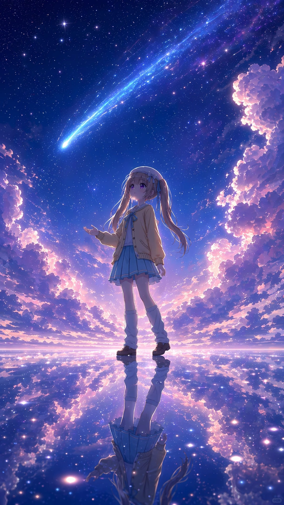


```text
参考图是角色人设图，为参考图的少女绘制一副日系唯美奇幻风格插画。 
【构图】这是一个宏大的中景日系奇幻插画构图，画面中心是完全保留了完整细节的可爱少女，她站立在无边的、如镜面般平滑的水面中心。天空呈现出高饱和度的粉紫与深蓝交织，一条耀眼的蓝色巨型流星划破天际，配合着边缘发光的瑰丽层云。女孩处于背光状态，形成一个暗调但依然清晰可辨其服装和紫色明亮眼眸的剪影，被流星和星空的边缘光细腻勾勒，她微微仰头，一只手轻轻张开。下方的水面完美、对称地反射出整个壮丽的星空、流星、云彩，以及女孩清晰的倒影，点缀着微小的发光点，营造出天人合一、空灵静谧的唯美梦境意境。 
【日系唯美奇幻风格说明】该风格以高饱和度的粉紫冷暖色调交织出浩瀚星空，并辅以壮丽的流星与边缘发光的层云作为视觉奇观；画面巧妙利用“天空之镜”般的完美水面反射，将宏大的宇宙背景与孤独静立的人物剪影相融合，通过极具电影感的光影渲染与高对比度的表现手法，营造出一种空灵、静谧且带有超现实宿命感的梦境氛围。 
【要求】生成图片的比例9:16，分辨率 4k。
```


---


## 例 11：一张手绘风格的城市美食地图，以台州为主题

**来源：** 小红书号510244722

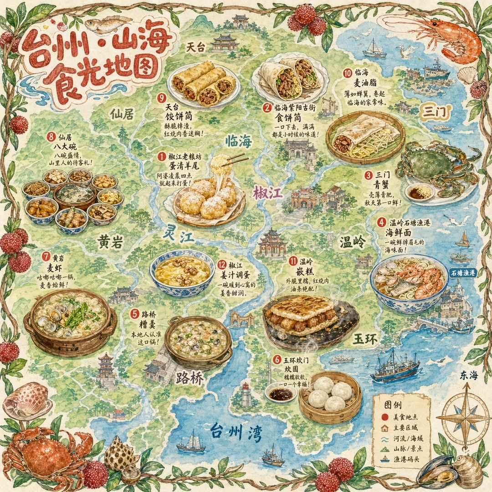


```text
一张手绘风格的城市美食地图，以台州为主题。画面以鸟瞰视角的手绘简化城市地图为底，标注椒江、路桥、黄岩等区域和灵江、台州湾等水系地标，不追求精确比例而是追求可爱的水彩手绘感。地图上分布着12个美食地点的精致手绘小插画：1. 椒江老粮坊的蛋清羊尾（金黄蓬松的蛋泡甜点撒着糖粉，筷子夹起拉丝）2. 临海紫阳古街的食饼筒（一个饱满的麦饼卷切开露出肉丝、蛋皮、米面等丰富馅料）3. 三门的青蟹（一只肥硕的青壳大蟹张着大钳子，旁边一小碟姜醋）4. 温岭石塘渔港的海鲜面（粗瓷大碗浓白鱼汤面铺满虾、蛏子、小黄鱼）5. 路桥的糟羹（一锅稠厚的五彩羹，芥菜、冬笋、香干、牡蛎粒粒可见）6. 玉环坎门的炊圆（三四个白胖糯米团子卧在笼屉里，旁边酱油碟滴着麻油）7. 黄岩的麦虾（陶锅里面疙瘩配蛤蜊、青菜翻滚冒泡）8. 仙居的八大碗（八只粗陶小碗围成一圈——土鸡、溪鱼、豆腐皮俱全）9. 天台的饺饼筒（几卷金黄酥脆的薄饼整齐码放，露出红烧肉和豆面馅）10. 临海的麦油脂（竹盘上摊着薄如蝉翼的饼皮卷着肉末、豆芽、鸡蛋丝）11. 温岭的嵌糕（厚实的年糕饼中间嵌着红烧肉和油条，正在铁板上滋滋作响）12. 椒江的姜汁调蛋（一只青花碗里琥珀色姜汤卧着嫩滑蛋花，撒几粒核桃碎）。每个插画约占地图5%面积，旁边用手写体标注店名和一句推荐语如“阿婆凌晨四点就起来和面”“本地人认准这口锅”。地图边缘用手绘藤蔓、杨梅枝和小海鲜（虾、蟹、贝壳）装饰形成边框。右下角有一个手绘指南针（标注“东海”方向）和图例说明。左上角标题“台州·山海食光地图”使用胖圆的手绘美术字，用杨梅和小黄鱼点缀装饰。整体画风为水彩+彩铅混合的手绘质感，颜色以杨梅红、姜黄、海蓝、翠绿为主，图片比例1:1。
```


---


## 例 22：插画艺术风格创作

**来源：** [@Tanemomi\_Ver2](https://x.com/Tanemomi_Ver2)

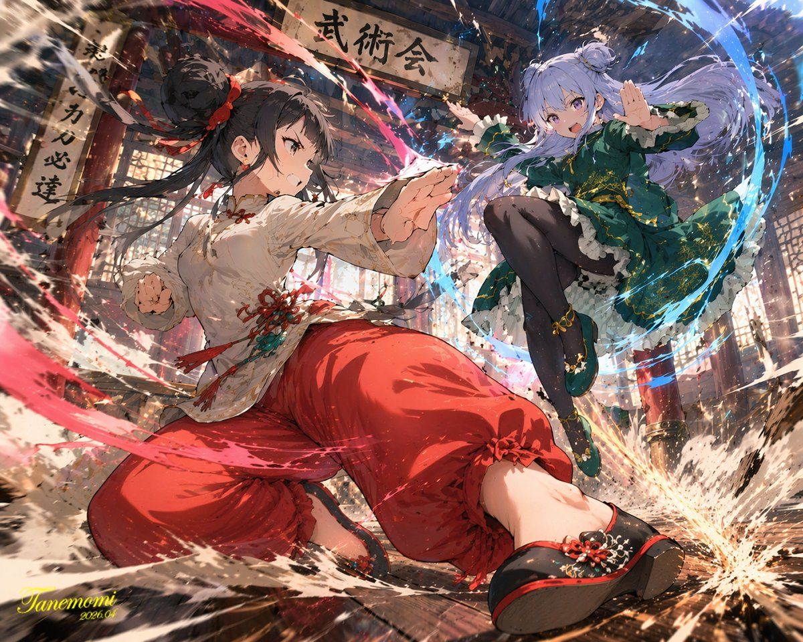


```text
An anime-style illustration of a {argument name="action type" default="high-impact martial arts battle"} between two young female fighters in a {argument name="setting" default="traditional wooden martial arts dojo"}. In the foreground, a girl with black hair in a high bun wears a {argument name="character 1 color theme" default="red and white"} Chinese-style martial arts outfit with baggy pants. She is in a dynamic, low, forward-thrusting stance, surrounded by swirling red energy and water splashes. In the background to the right, a girl with light purple hair in twin buns wears a {argument name="character 2 color theme" default="green and purple"} Chinese dress with gold embroidery and black tights. She is leaping through the air in a flying kick pose, surrounded by swirling blue energy. The wooden floorboards are splintering from the intense impact, with debris and dust flying through the air. Above them hangs a weathered wooden sign with the text "{argument name="sign text" default="武術会"}". The scene features dramatic lighting, a low-angle dynamic perspective, and intense action effects.
```


---


## 例 24：漫画分镜叙事设计

**来源：** [@wewe50770964683](https://x.com/wewe50770964683)

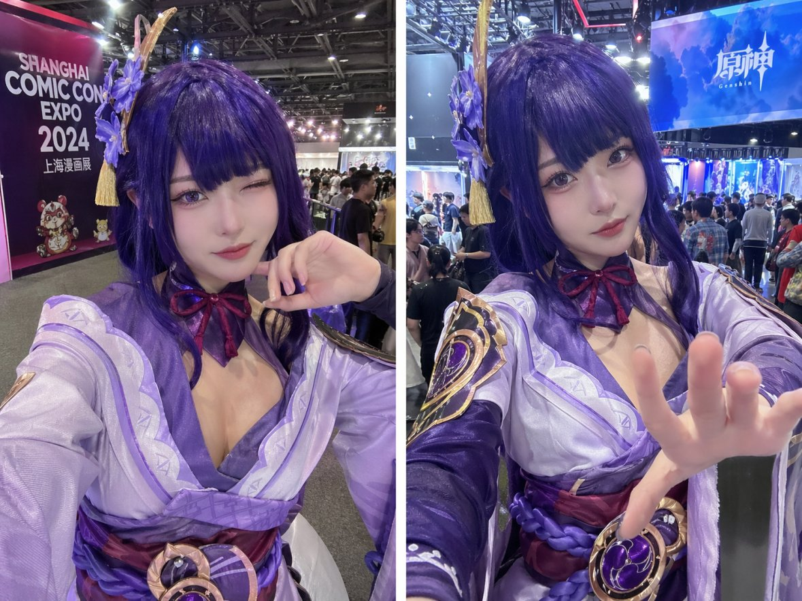


```text
Genshin Impact {argument name="character" default="Raiden Shogun"} cosplay selfies at the {argument name="event" default="Shanghai Comic Con"}
```


---


## 例 32：插画艺术创作图

**来源：** [@austinit](https://x.com/austinit)

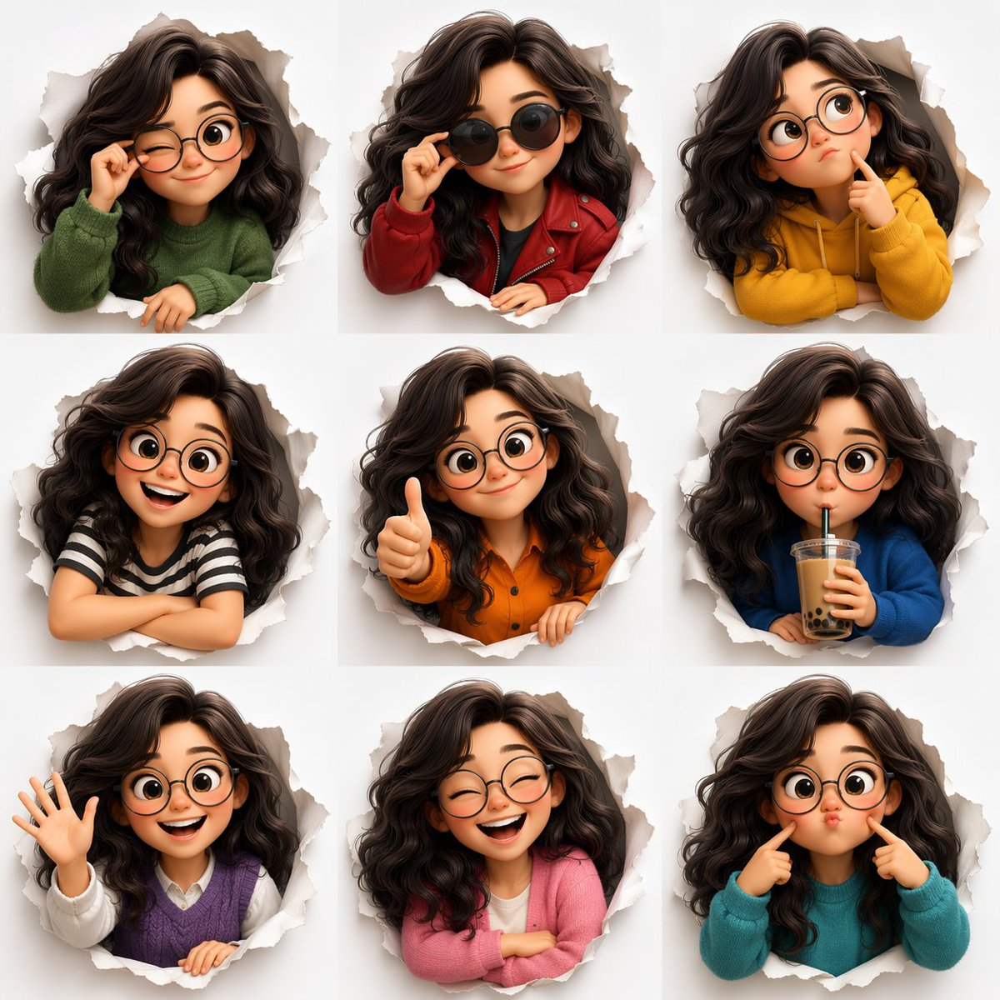


```text
{
  "type": "3x3 character expression grid",
  "style": "{argument name=\"art style\" default=\"3D animation, Pixar style\"}",
  "character_base": "{argument name=\"character description\" default=\"young woman with voluminous dark wavy hair and round wire-rimmed glasses\"}",
  "common_theme": "{argument name=\"framing concept\" default=\"peeking through a torn hole in white paper\"}",
  "layout": {
    "rows": 3,
    "columns": 3,
    "total_panels": 9,
    "panels": [
      {"position": "top-left", "expression": "winking", "action": "adjusting glasses", "outfit": "green sweater"},
      {"position": "top-center", "expression": "smirking", "action": "lowering dark sunglasses", "outfit": "red leather jacket"},
      {"position": "top-right", "expression": "thinking", "action": "finger on chin", "outfit": "yellow hoodie"},
      {"position": "middle-left", "expression": "big smile", "action": "arms resting on edge", "outfit": "black and white striped shirt"},
      {"position": "middle-center", "expression": "smiling", "action": "thumbs up", "outfit": "orange button-up shirt"},
      {"position": "middle-right", "expression": "neutral", "action": "drinking boba tea", "outfit": "blue sweater"},
      {"position": "bottom-left", "expression": "happy", "action": "waving", "outfit": "purple sweater vest over white shirt"},
      {"position": "bottom-center", "expression": "laughing with eyes closed", "action": "arms crossed", "outfit": "pink cardigan"},
      {"position": "bottom-right", "expression": "silly", "action": "poking cheeks", "outfit": "teal sweater"}
    ]
  }
}
```


---


## 例 34：插画艺术创作图

**来源：** [@Ryan\_Suo](https://x.com/Ryan_Suo)

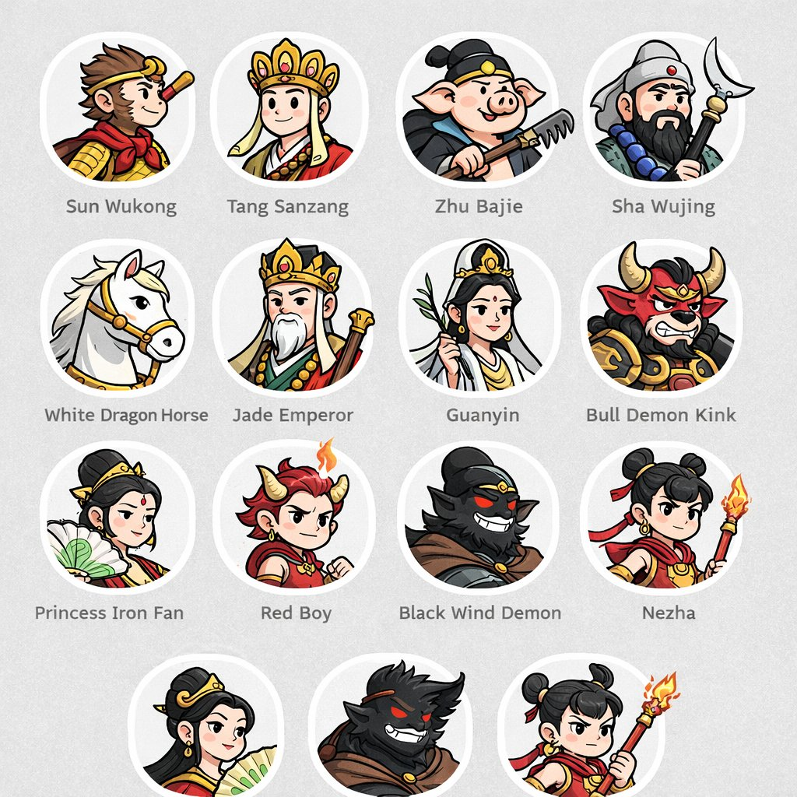


```text
{
  "type": "character avatar grid",
  "theme": "{argument name=\"theme\" default=\"Journey to the West mythology\"}",
  "style": "{argument name=\"art style\" default=\"clean 2D cartoon vector illustration, thick outlines, flat colors\"}",
  "layout": {
    "background": "{argument name=\"background color\" default=\"light gray\"} subtle texture",
    "format": "grid of circular portraits with text labels centered below each circle",
    "rows": [
      {
        "count": 4,
        "items": [
          {"label": "Sun Wukong", "description": "monkey boy with golden headband and red scarf"},
          {"label": "Tang Sanzang", "description": "monk with ornate golden crown"},
          {"label": "Zhu Bajie", "description": "pig man holding a rake"},
          {"label": "Sha Wujing", "description": "bearded man holding a crescent moon staff"}
        ]
      },
      {
        "count": 4,
        "items": [
          {"label": "White Dragon Horse", "description": "white horse with golden bridle"},
          {"label": "Jade Emperor", "description": "older man with white beard and golden crown"},
          {"label": "Guanyin", "description": "goddess holding a willow branch"},
          {"label": "Bull Demon Kink", "description": "fierce bull demon in armor"}
        ]
      },
      {
        "count": 4,
        "items": [
          {"label": "Princess Iron Fan", "description": "woman holding a green palm leaf fan"},
          {"label": "Red Boy", "description": "boy with red hair, horns, and a small flame"},
          {"label": "Black Wind Demon", "description": "dark shadowy demon with glowing red eyes"},
          {"label": "Nezha", "description": "boy with double hair buns holding a flaming spear"}
        ]
      },
      {
        "count": 3,
        "description": "partial row repeating Princess Iron Fan, Black Wind Demon, and Nezha, slightly cropped at the bottom"
      }
    ]
  }
}
```


---


## 例 41：插画艺术风格创作

**来源：** [@wtry1102](https://x.com/wtry1102)

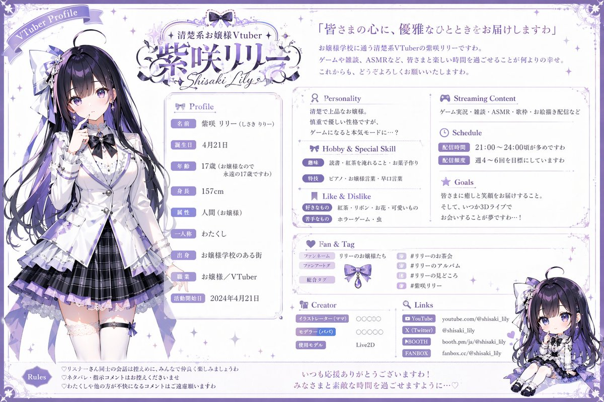


```text
{ "type": "VTuber profile sheet", "theme": "{argument name=\"color theme\" default=\"purple and white\"}, elegant, lace, ribbon motifs", "character": { "name": "{argument name=\"character name\" default=\"紫咲リリー\"}", "archetype": "{argument name=\"character archetype\" default=\"elegant ojousama\"}", "appearance": "anime girl, long black hair with purple highlights, purple eyes, wearing a white blazer, purple pleated skirt, thigh-highs, ribbons", "pose": "standing, finger to lips, looking slightly to the side" }, "chibi_character": { "appearance": "same character in chibi form", "pose": "sitting down, smiling" }, "layout": { "header": { "top_left": "Ribbon banner reading 'VTuber Profile'", "top_center": "Logo with text '{argument name=\"vtuber type\" default=\"清楚系お嬢様Vtuber\"}' and '{argument name=\"character name\" default=\"紫咲リリー\"}' and 'Shisaki Lily'", "top_right": "Quote '{argument name=\"catchphrase\" default=\"皆さまの心に、優雅なひとときをお届けしますわ\"}' followed by a 3-line introductory paragraph" }, "columns": [ { "position": "left", "content": "Full-body character portrait" }, { "position": "center", "sections": [ { "title": "Profile", "count": 9, "labels": ["名前", "誕生日", "年齢", "身長", "属性", "一人称", "出身", "職業", "活動開始日"] }, { "title": "Personality", "content": "2-line text block" }, { "title": "Hobby & Special Skill", "count": 2, "labels": ["趣味", "特技"] }, { "title": "Like & Dislike", "count": 2, "labels": ["好きなもの", "苦手なもの"] } ] }, { "position": "right", "sections": [ { "title": "Streaming Content", "content": "1-line text block" }, { "title": "Schedule", "count": 2, "labels": ["配信時間", "配信頻度"] }, { "title": "Goals", "content": "3-line text block" }, { "title": "Fan & Tag", "count": 3, "labels": ["ファンネーム", "ファンアートタグ", "総合タグ"], "extra": "4 hashtag rows with small icons" }, { "title": "Creator", "count": 3, "labels": ["イラストレーター (ママ)", "モデラー (パパ)", "使用モデル"] }, { "title": "Links", "count": 4, "labels": ["YouTube", "X (Twitter)", "BOOTH", "FANBOX"] }, { "content": "Chibi character illustration placed at the bottom right corner" } ] } ], "footer": { "sections": [ { "title": "Rules", "count": 3, "description": "3 bullet points with heart icons" }, { "content": "2-line closing message at the bottom center" } ] } } }
```


---


## 例 43：插画艺术创作图

**来源：** [@stark\_nico99](https://x.com/stark_nico99)

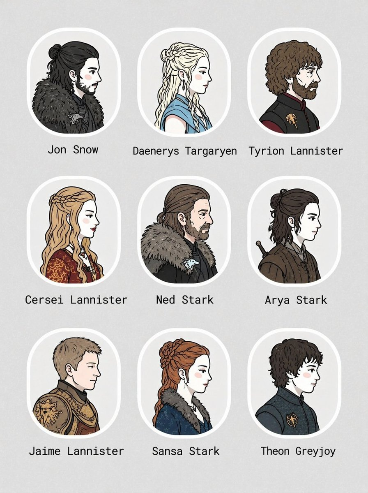


```text
{
  "type": "character portrait grid",
  "theme": "{argument name=\"theme\" default=\"Game of Thrones characters\"}",
  "style": "{argument name=\"art style\" default=\"2D flat illustration, clean line art, comic style, profile view facing right, pale skin with blush\"}",
  "layout": {
    "grid": "3x3",
    "background": "light gray textured",
    "frame_style": "white rounded-rectangle frames with text labels below each"
  },
  "count": 9,
  "portraits": [
    { "label": "Jon Snow", "description": "black hair half-up, beard, dark fur cloak" },
    { "label": "Daenerys Targaryen", "description": "silver braided hair, blue dress" },
    { "label": "Tyrion Lannister", "description": "curly brown hair, beard, dark tunic with gold pin" },
    { "label": "Cersei Lannister", "description": "blonde braided hair, ornate red and gold dress" },
    { "label": "Ned Stark", "description": "brown hair half-up, beard, dark fur cloak" },
    { "label": "Arya Stark", "description": "short dark hair half-up, brown tunic, sword hilt" },
    { "label": "Jaime Lannister", "description": "short blonde hair, gold armor with lion motif" },
    { "label": "Sansa Stark", "description": "red braided hair, blue dress with fur collar" },
    { "label": "Theon Greyjoy", "description": "short dark curly hair, dark tunic with kraken pin" }
  ]
}
```


---


## 例 60：漫画分镜叙事设计

**来源：** [@Gc\_qube](https://x.com/Gc_qube)

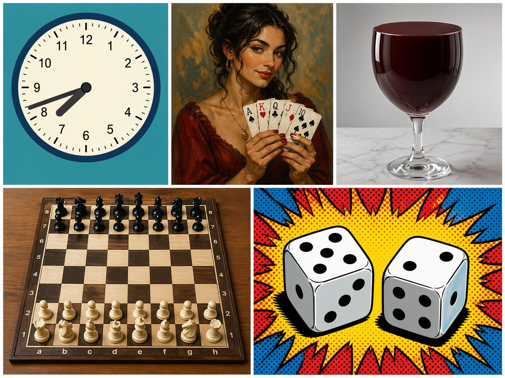


```text
{
  "type": "5-panel collage",
  "layout": "grid with 3 top panels and 2 bottom panels",
  "panels": [
    {
      "position": "top-left",
      "subject": "analog clock",
      "details": "teal background, time showing {argument name=\"clock time\" default=\"7:42\"}",
      "style": "flat vector illustration"
    },
    {
      "position": "top-middle",
      "subject": "woman holding playing cards",
      "details": "holding 5 cards: {argument name=\"card hand\" default=\"Ace of Spades, King of Hearts, Queen of Clubs, Jack of Diamonds, 10 of Spades\"}",
      "style": "classic oil painting portrait"
    },
    {
      "position": "top-right",
      "subject": "glass of red liquid",
      "details": "{argument name=\"glass type\" default=\"wine glass\"} filled to the brim with dark red liquid, marble surface",
      "style": "photorealistic studio photography"
    },
    {
      "position": "bottom-left",
      "subject": "chessboard",
      "details": "wooden board with 32 pieces in standard starting position",
      "style": "photorealistic high-angle shot"
    },
    {
      "position": "bottom-right",
      "subject": "two dice",
      "details": "left die shows {argument name=\"left die top\" default=\"5\"} on top, right die shows {argument name=\"right die top\" default=\"2\"} on top",
      "style": "pop art comic book halftone with red and blue burst"
    }
  ]
}
```


---


## 例 62：插画艺术风格创作

**来源：** [@masapark95](https://x.com/masapark95)


```text
{
  "type": "2x2 grid of banner advertisements",
  "theme": "{argument name=\"main theme\" default=\"SNSスクール\"} for {argument name=\"target audience\" default=\"ママ\"}",
  "design_style": "soft, approachable, bright lighting, featuring {argument name=\"color palette\" default=\"soft green, white, and natural beige tones\"}",
  "layout": {
    "sections": [
      {
        "position": "top-left",
        "visual_style": "photography",
        "image_description": "Smiling woman working on a laptop at a table, a toddler playing with toys in the blurred background.",
        "headlines": ["ママの“やってみたい”を応援！", "子育てしながら学べる", "SNSスクール"],
        "features": {
          "count": 1,
          "type": "icon with text",
          "labels": ["自宅で無理なくスキルアップ (with house icon)"]
        },
        "call_to_action_button": "無料相談"
      },
      {
        "position": "top-right",
        "visual_style": "photography",
        "image_description": "Smiling woman holding a white mug, looking at a laptop.",
        "headlines": ["ちょっとの時間が、大きな一歩に。", "スキマ時間を未来につなげる", "動画講座で学びやすい"],
        "features": {
          "count": 3,
          "type": "circular icons with text below",
          "labels": ["スマホでも学べる (smartphone icon)", "1日15分からOK (clock icon)", "繰り返し視聴できる (play button icon)"]
        },
        "call_to_action_button": "詳しく見る"
      },
      {
        "position": "bottom-left",
        "visual_style": "watercolor illustration",
        "image_description": "Illustration of a woman with hair in a bun, smiling at a laptop with a green mug nearby.",
        "headlines": ["はじめてでも大丈夫！ (with beginner mark)", "在宅でできるSNSの仕事", "未経験OK"],
        "features": {
          "count": 3,
          "type": "circular icons with text below",
          "labels": ["サポート充実 (heart icon)", "パソコンが苦手でも安心 (laptop icon)", "収入の柱をつくれる (yen coin icon)"]
        },
        "call_to_action_button": "体験してみる"
      },
      {
        "position": "bottom-right",
        "visual_style": "photography",
        "image_description": "Smiling mother and young daughter sitting on a sofa reading a picture book together.",
        "headlines": ["家族との時間も大切に", "自分らしい働き方へ", "ママの笑顔がいちばんの未来になる。"],
        "features": {
          "count": 3,
          "type": "checkmark bullet points",
          "labels": ["場所や時間に縛られない", "やりがいも収入も叶う", "子どもの成長をそばで見守れる"]
        },
        "extra_graphics": "Small illustration of a house and trees at the bottom left.",
        "call_to_action_button": "説明会へ"
      }
    ],
    "common_elements": "All panels feature a {argument name=\"button style\" default=\"rounded green pill button with white text and a right-pointing arrow icon\"} at the bottom."
  }
}
```


---


## 例 93：插画艺术风格创作

**来源：** [@sayaka\_aiart](https://x.com/sayaka_aiart)

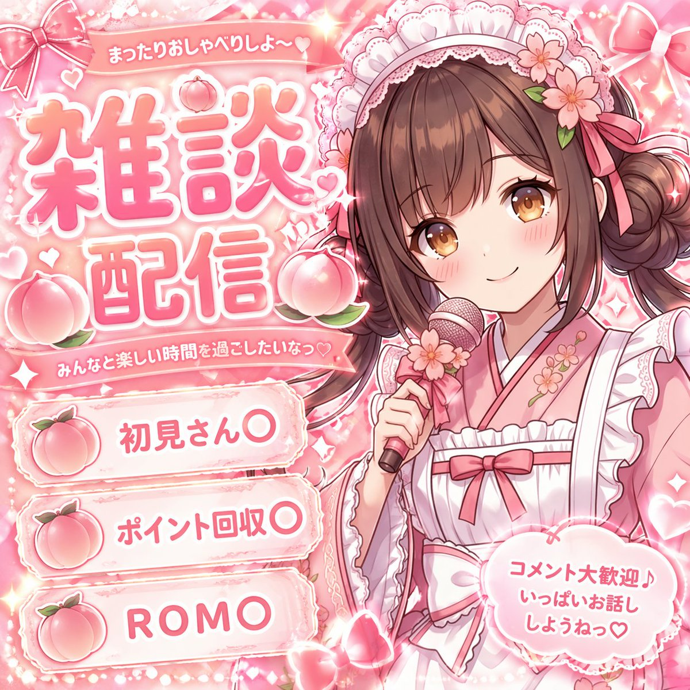


```text
{
  "type": "VTuber stream thumbnail",
  "style": "anime, highly detailed, cute, sparkly, overwhelmingly pink color palette",
  "character": {
    "description": "anime girl with brown hair in twin buns, amber eyes, smiling gently",
    "outfit": "pink kimono combined with a white frilly maid apron, cherry blossom hair accessories",
    "pose": "holding a pink microphone decorated with a flower near her face"
  },
  "layout": {
    "background": "pink gradient with sparkles, glowing hearts, and decorative pink bows",
    "text_sections": [
      {
        "type": "top ribbon",
        "text": "{argument name=\"top subtitle\" default=\"まったりおしゃべりしよ〜🤍\"}"
      },
      {
        "type": "main title",
        "text": "{argument name=\"main title\" default=\"雑談配信\"}",
        "decorations": "surrounded by 3 large peach illustrations"
      },
      {
        "type": "middle ribbon",
        "text": "{argument name=\"middle subtitle\" default=\"みんなと楽しい時間を過ごしたいなっ♡\"}"
      },
      {
        "type": "bullet points",
        "position": "bottom left",
        "count": 3,
        "icon": "peach",
        "labels": [
          "{argument name=\"bullet 1\" default=\"初見さん〇\"}",
          "{argument name=\"bullet 2\" default=\"ポイント回収〇\"}",
          "ROMO"
        ]
      },
      {
        "type": "speech bubble",
        "position": "bottom right",
        "text": "コメント大歓迎♪ いっぱいお話し しようねっ♡"
      }
    ]
  }
}
```


---


## 例 94：绘画艺术风格图

**来源：** [@sayaka\_aiart](https://x.com/sayaka_aiart)


```text
{
  "type": "VTuber stream thumbnail",
  "theme": "pastel pink, soft, cute, lace, ribbons, hearts, bunny motif",
  "character": {
    "position": "right side, waist-up",
    "appearance": "anime girl, {argument name=\"hair color\" default=\"pastel pink\"} long wavy hair, large grey eyes, blush, pink heart earrings",
    "accessories": "white bunny ears, large pink bow on head",
    "outfit": "white frilly dress with lace, large pink ribbon bow at collar with heart gem"
  },
  "layout": {
    "background": "soft pink with subtle sparkles, lace patterns, floating hearts",
    "text_elements": [
      {
        "type": "main title",
        "position": "top left",
        "style": "large stylized pink text with white outline",
        "text": "{argument name=\"main title\" default=\"雑談配信\"}"
      },
      {
        "type": "speech bubble",
        "position": "above main title",
        "text": "まったり"
      },
      {
        "type": "circular badge",
        "position": "top right",
        "details": "lace-edged with small pink bow",
        "text": "きてくれてありがとう♡"
      },
      {
        "type": "heart badge",
        "position": "bottom right",
        "details": "large lace-edged heart",
        "text": "みんなとおしゃべりできるの楽しみにしてるね♡"
      }
    ],
    "list_section": {
      "position": "bottom left",
      "count": 3,
      "style": "horizontal pill-shaped banners with lace edges, each featuring a pink heart with white bunny ears and a tiny bow on the left",
      "items": [
        "{argument name=\"list item 1\" default=\"初見さん〇\"}",
        "{argument name=\"list item 2\" default=\"ポイント回収〇\"}",
        "{argument name=\"list item 3\" default=\"ROM〇\"}"
      ]
    }
  }
}
```


---


## 例 105：动漫插画创作图

**来源：** [@Yuupapa\_free](https://x.com/Yuupapa_free)

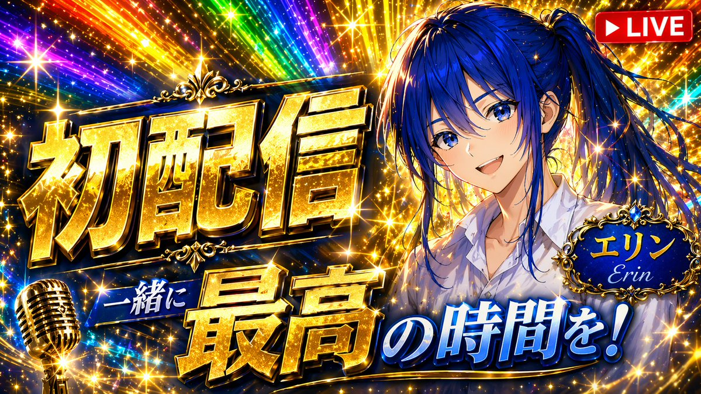


```text
A high-energy VTuber thumbnail illustration of a smiling anime girl with {argument name="hair color" default="bright blue"} hair in a high ponytail wearing a white shirt. The background is an explosive burst of rainbow light rays and golden sparkles. A golden retro microphone sits in the bottom left. Massive, shiny 3D gold text on the left reads "{argument name="main title text" default="初配信"}". A 3D gold and blue subtitle reads "{argument name="subtitle text" default="一緒に最高の時間を！"}". An ornate blue and gold oval badge in the bottom right displays "{argument name="character name" default="エリン Erin"}". A red top-right badge reads "{argument name="badge text" default="LIVE"}".
```


---


## 例 113：动漫插画创作图

**来源：** [@REd8358](https://x.com/REd8358)

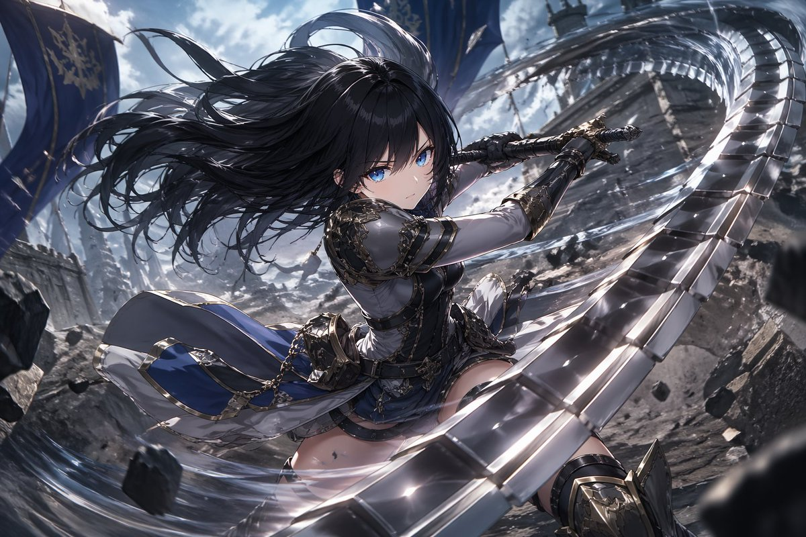


```text
A highly detailed anime illustration of a fierce female warrior with long flowing {argument name="hair color" default="black"} hair and piercing {argument name="eye color" default="blue"} eyes, wearing a mix of silver plate armor with gold trim and a {argument name="outfit color" default="blue and white"} tunic. She is captured in a dynamic combat stance, swinging a massive, {argument name="weapon type" default="segmented metallic whip-sword"} that curves dramatically into the extreme foreground. The weapon leaves a sweeping trail of kinetic energy and wind. The scene is set against a {argument name="background setting" default="ruined battlefield with rocky terrain, floating debris, and large blue banners fluttering in the wind"} under a dramatic cloudy sky. The artwork features cinematic lighting, intense action, and a dramatic forced perspective on the weapon.
```


---


## 例 114：插画艺术创作图

**来源：** [@kaikaitheaiguy](https://x.com/kaikaitheaiguy)

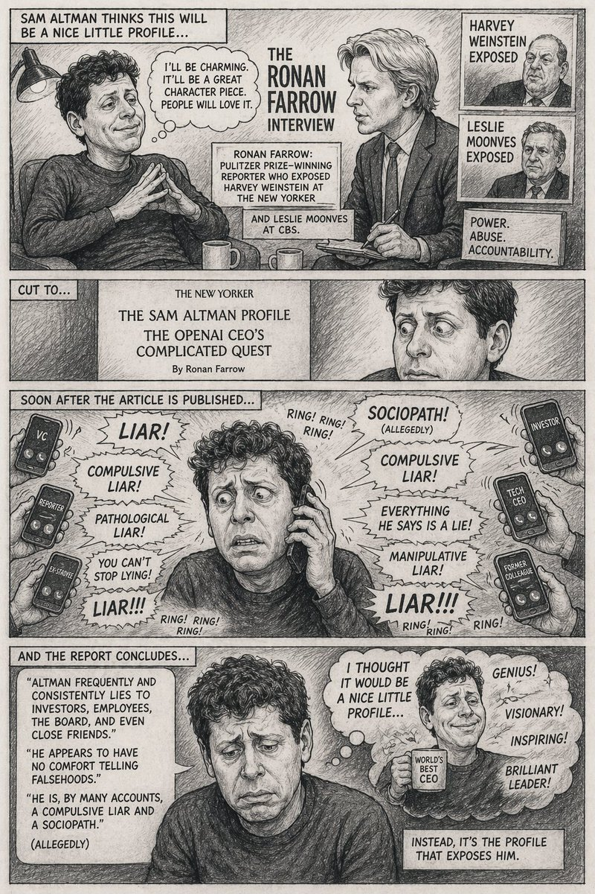


```text
{
  "type": "4-panel vertical comic strip",
  "style": "{argument name=\"art style\" default=\"black and white pencil sketch, crosshatch shading, satirical caricature comic\"}",
  "characters": {
    "subject_1": "{argument name=\"main character\" default=\"Sam Altman\"}, curly hair, casual sweater",
    "subject_2": "{argument name=\"interviewer\" default=\"Ronan Farrow\"}, suit, tie, holding notepad"
  },
  "layout": {
    "panels": [
      {
        "panel_number": 1,
        "top_caption": "SAM ALTMAN THINKS THIS WILL BE A NICE LITTLE PROFILE...",
        "scene": "subject_1 looking smug with hands steepled; subject_2 looking serious taking notes.",
        "thought_bubble": "I'LL BE CHARMING. IT'LL BE A GREAT CHARACTER PIECE. PEOPLE WILL LOVE IT.",
        "center_text": "THE RONAN FARROW INTERVIEW",
        "inset_portraits": {
          "count": 2,
          "labels": ["HARVEY WEINSTEIN EXPOSED", "LESLIE MOONVES EXPOSED"]
        },
        "info_boxes": {
          "count": 3,
          "text": [
            "RONAN FARROW: PULITZER PRIZE-WINNING REPORTER WHO EXPOSED HARVEY WEINSTEIN AT THE NEW YORKER",
            "AND LESLIE MOONVES AT CBS.",
            "POWER. ABUSE. ACCOUNTABILITY."
          ]
        }
      },
      {
        "panel_number": 2,
        "top_caption": "CUT TO...",
        "scene": "Close-up of subject_1 looking shocked and horrified.",
        "article_header": "{argument name=\"publication\" default=\"THE NEW YORKER\"}\nTHE SAM ALTMAN PROFILE\nTHE OPENAI CEO'S COMPLICATED QUEST\nBy Ronan Farrow"
      },
      {
        "panel_number": 3,
        "top_caption": "SOON AFTER THE ARTICLE IS PUBLISHED...",
        "scene": "subject_1 looking extremely stressed, sweating, holding a phone to his ear. Surrounded by 6 hands holding smartphones.",
        "phone_labels": ["VC", "REPORTER", "EX-STAFFEE", "INVESTOR", "TECH CEO", "FORMER COLLEAGUE"],
        "shouts": {
          "count": 8,
          "text": [
            "{argument name=\"main accusation\" default=\"LIAR\"}!",
            "COMPULSIVE LIAR!",
            "PATHOLOGICAL LIAR!",
            "YOU CAN'T STOP LYING!",
            "LIAR!!!",
            "SOCIOPATH! (ALLEGEDLY)",
            "EVERYTHING HE SAYS IS A LIE!",
            "MANIPULATIVE LIAR!"
          ]
        },
        "sound_effects": "RING! RING! RING!"
      },
      {
        "panel_number": 4,
        "top_caption": "AND THE REPORT CONCLUDES...",
        "scene": "subject_1 looking utterly defeated and depressed.",
        "quote_box": "\"ALTMAN FREQUENTLY AND CONSISTENTLY LIES TO INVESTORS, EMPLOYEES, THE BOARD, AND EVEN CLOSE FRIENDS.\"\n\"HE APPEARS TO HAVE NO COMFORT TELLING FALSEHOODS.\"\n\"HE IS, BY MANY ACCOUNTS, A COMPULSIVE LIAR AND A SOCIOPATH.\"\n(ALLEGEDLY)",
        "thought_bubble": {
          "scene": "Happy subject_1 holding a 'WORLD'S BEST CEO' mug.",
          "text": "I THOUGHT IT WOULD BE A NICE LITTLE PROFILE...",
          "sparkle_words": {
            "count": 4,
            "text": ["GENIUS!", "VISIONARY!", "INSPIRING!", "BRILLIANT LEADER!"]
          }
        },
        "bottom_caption": "INSTEAD, IT'S THE PROFILE THAT EXPOSES HIM."
      }
    ]
  }
}
```


---


## 例 118：漫画分镜叙事设计

**来源：** [@nicdunz](https://x.com/nicdunz)

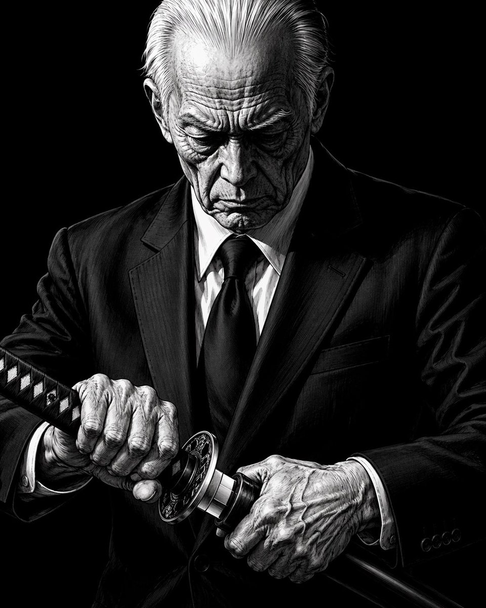


```text
A high-contrast, black-and-white illustration of an elderly man in a sharp suit, drawing a katana. The man has slicked-back white hair, deep wrinkles, and an intense, focused expression, looking down at the blade. He wears a dark suit, white shirt, and dark tie. His hands are prominently featured in the foreground, showing pronounced veins and wrinkles as they grip the ornate handle and scabbard of the katana. The background is completely black, emphasizing the dramatic lighting and intricate cross-hatching details on the man's face, hands, and clothing. The style resembles a detailed, gritty manga or graphic novel.
```


---


## 例 123：插画艺术创作图

**来源：** [@Luvune](https://x.com/Luvune)

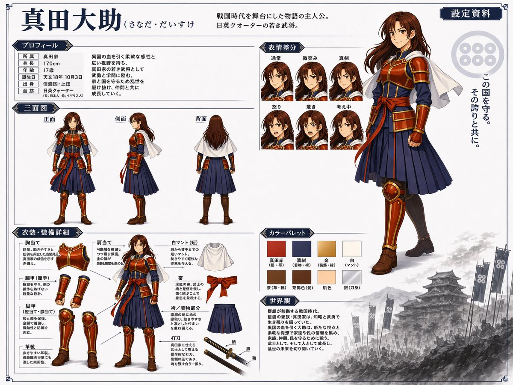


```text
{
  "type": "anime character reference sheet",
  "character": {
    "name": "{argument name=\"character name\" default=\"真田大助\"}",
    "appearance": "young warrior with long brown hair, wearing samurai-inspired armor, {argument name=\"main color\" default=\"red\"} chest plate and guards, {argument name=\"secondary color\" default=\"navy blue\"} pleated hakama, white short cape"
  },
  "layout": {
    "header": {
      "title": "{argument name=\"character name\" default=\"真田大助\"}",
      "subtitle": "{argument name=\"character concept\" default=\"戦国時代を舞台にした物語の主人公。日英クォーターの若き武将。\"}",
      "badge": "設定資料"
    },
    "right_side": {
      "main_portrait": "large full-body standing pose, confident smile",
      "background_elements": {
        "emblem": "six-coin crest",
        "quote": "{argument name=\"catchphrase\" default=\"この国を守る。その誇りと共に。\"}",
        "scenery": "monochrome Japanese castle with army banners at the bottom right"
      }
    },
    "sections": [
      {
        "title": "プロフィール",
        "position": "top-left",
        "content": "table with 6 rows and descriptive text"
      },
      {
        "title": "三面図",
        "position": "mid-left",
        "count": 3,
        "labels": ["正面", "側面", "背面"]
      },
      {
        "title": "表情差分",
        "position": "top-center",
        "count": 6,
        "labels": ["通常", "微笑み", "真剣", "怒り", "驚き", "考え中"]
      },
      {
        "title": "衣装・装備詳細",
        "position": "bottom-left",
        "count": 9,
        "labels": ["胸当て", "肩当て", "腕甲(籠手)", "脚甲(脛当て・膝当て)", "革靴", "白マント(短)", "帯", "袴/着物部分", "打刀"]
      },
      {
        "title": "カラーパレット",
        "position": "bottom-center",
        "count": 8,
        "labels": ["真田赤", "濃紺", "金", "白", "茶", "茶褐色", "肌色", "銀"]
      },
      {
        "title": "世界観",
        "position": "bottom-center-right",
        "content": "paragraph of text describing the setting"
      }
    ]
  }
}
```


---


## 例 126：插画艺术风格创作

**来源：** [@taira\_renta](https://x.com/taira_renta)


```text
An anime-style light novel cover illustration featuring two characters in an intimate pose. On the left, a young woman with short dark hair, purple eyes, wearing a white hat, a frilly white dress with a pink bow tie, white gloves, and two white flower hairpins. She has an affectionate, teasing smile and is gently touching the chin of the man next to her. On the right, an adult man with {argument name="man's hair color" default="red"} hair parted in the middle, purple eyes, and a light goatee. He is wearing a black button-down shirt and has a slightly annoyed, reluctant expression with a sweat drop on his cheek. The scene features soft, romantic lighting with out-of-focus purple flower petals in the foreground corners. The image includes several Japanese text elements: a large stylized main title at the bottom reading {argument name="main title" default="ちかつば"}, a subtitle below it reading {argument name="subtitle" default="ーその溺愛、独占欲の裏返し。ー"}, vertical text on the top left reading {argument name="left quote" default="可愛いだけじゃ、許さない。"}, and vertical text on the top right reading {argument name="right quote" default="その不機嫌、俺だけに向けろよ。"}.
```


---


## 例 129：绘画艺术风格图

**来源：** [@TlanoVRC](https://x.com/TlanoVRC)

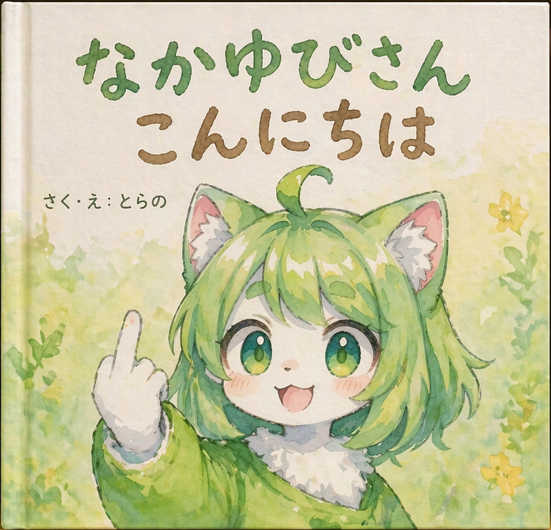


```text
A watercolor illustration of a children's picture book cover. The main subject is a {argument name="character appearance" default="cute furry kemonomimi girl with short green hair, cat ears, and green eyes"}. She is {argument name="action" default="smiling happily while holding up her middle finger"} with a white-furred hand. She wears a green garment with a fluffy white collar. The background features soft, painted green foliage and small yellow flowers on textured paper. At the top, large hand-drawn green Japanese text reads "{argument name="main title" default="なかゆびさん"}". Below it, brown Japanese text reads "{argument name="subtitle" default="こんにちは"}". On the middle-left, smaller black text reads "{argument name="author text" default="さく・え：とらの"}". The image has a visible book spine on the left edge, emphasizing the physical book format.
```


---


## 例 172：赛博科幻桃太郎主视觉图

**来源：** [@SSSS\_CRYPTOMAN](https://x.com/SSSS_CRYPTOMAN/status/2046575354555617761)

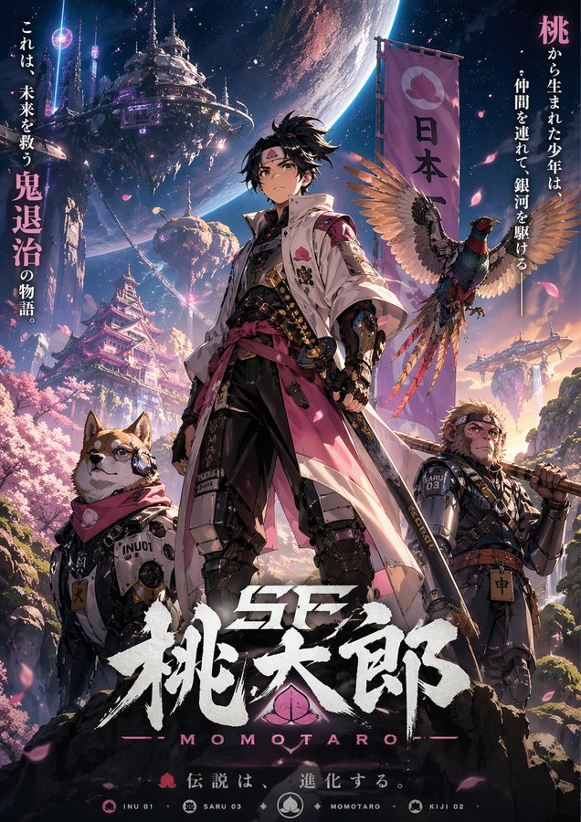


```text
[中文]
设计虚构动画的钥匙视觉图。主题是「科幻桃太郎」。设计有魅力的角色、背景、标志和宣传语，以一幅美丽插画的形式完成，让世界观在一张图中传达出来。

[English]
Design a key visual for a fictional animation. The theme is "Sci-Fi Momotaro". Design charming characters, backgrounds, logos, and promotional slogans, completed in the form of a beautiful illustration, allowing the worldview to be conveyed in a single image.
```


---


## 例 173：银河繁星点缀的冰蓝襦裙

**来源：** [@fdtreesky](https://x.com/fdtreesky/status/2046508731090018331)

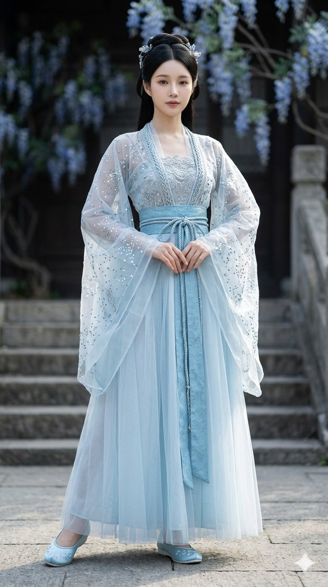


```text
[中文]
服裝細節： 模特兒身穿一套精緻的淡冰藍色齊胸襦裙，採用多層輕盈的薄紗和絲綢歐根紗材質制成。其寬大的、半透明的廣袖上點綴著如繁星般微小的銀色和淺藍色亮片刺繡，在光線下閃爍（具有銀河般的夢幻感）。抹胸位置有複雜的銀色蕾絲和編織紋理細節，腰帶自然垂落。

材質與光影： 畫面呈現 8k 超高分辨率和對織物微距紋理的極致渲染。光線採用柔和的自然側光（丁達爾效應 Typndall Effect），精準地透射過輕薄的紗布，營造出面料的半透明感（Translucency）和流動感。

構圖與鏡頭： 採用 85mm 黄金人像鏡頭效果，f/1.8 大光圈，全身構圖，模特居中站立

[English]
Clothing details: The model wears an exquisite pale ice blue chest-high ruqun, made of multiple layers of lightweight tulle and silk organza materials. Its wide, translucent broad sleeves are adorned with tiny silver and light blue sequin embroideries like stars, shimmering under the light (with a galaxy-like dreamy feel). The tube top position has complex silver lace and woven texture details, and the belt falls naturally.
Material and light and shadow: The image presents 8k ultra-high resolution and extreme rendering of macro textures of the fabric. The lighting uses soft natural side light (Tyndall Effect Typndall Effect), accurately transmitting through the light gauze, creating a sense of translucency (Translucency) and fluidity of the fabric.
Composition and lens: Uses 85mm golden portrait lens effect, f/1.8 large aperture, full-body composition, model standing in the center
```


---


## 例 174：唐朝贵妇遛粉色马甲异形工笔画

**来源：** [@johnAGI168](https://x.com/johnAGI168/status/2046565555025367392)

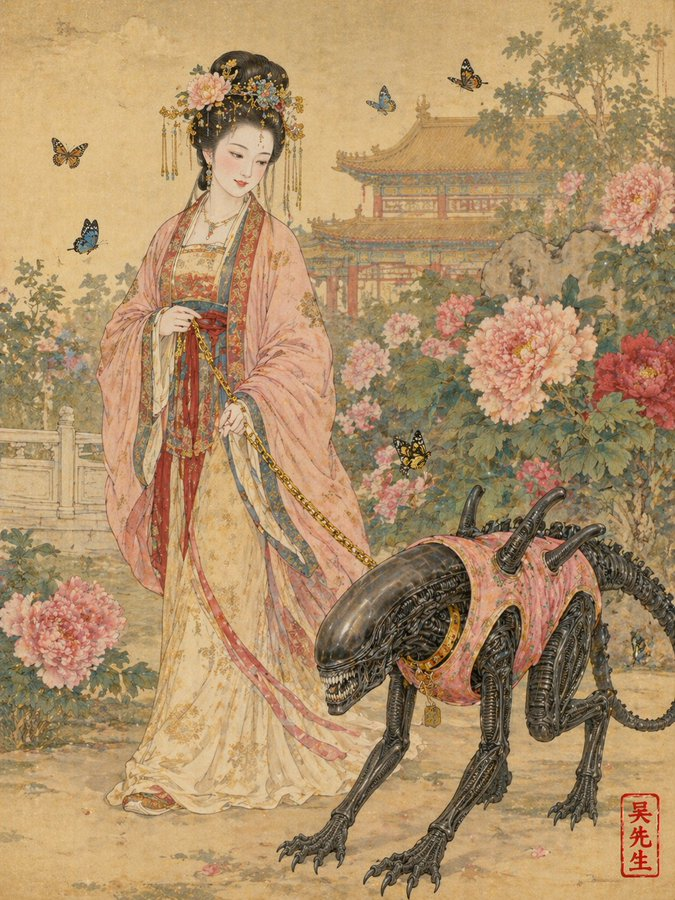


```text
[中文]
一幅细节丰富的工笔画，描绘了一位唐朝贵族女子在御花园中漫步。她看起来优雅而平静。

她手里拿着一根金色的牵引绳。牵引绳的尽头是一只可怕的**异形怪物（出自电影《异形》）**。然而，这只异形穿着一件**可爱的粉色丝绸马甲**，并且表现得像一只训练有素的狗。

背景有牡丹和蝴蝶。

**在右下角，有一个红色的竖排艺术家印章，写着“吴先生”（Mr. Wu），风格像水印一样。** --ar 3:4

[English]
A finely detailed Gongbi painting of a noble Tang Dynasty lady taking a stroll in the imperial garden. She looks elegant and calm.

She is holding a gold leash. At the end of the leash is a terrifying **Xenomorph monster (from the movie Alien)**. However, the Xenomorph is wearing a **cute pink silk vest** and is behaving like a well-trained dog.

Background features peonies and butterflies.

**In the bottom right corner, a single red vertical artist chop seal reads "吴先生" (Mr. Wu), stylized like a watermark.** --ar 3:4
```


---


## 例 179：蒸汽朋克射手座解剖图谱

**来源：** [@GeekCatX](https://x.com/GeekCatX/status/2046574334572212694)

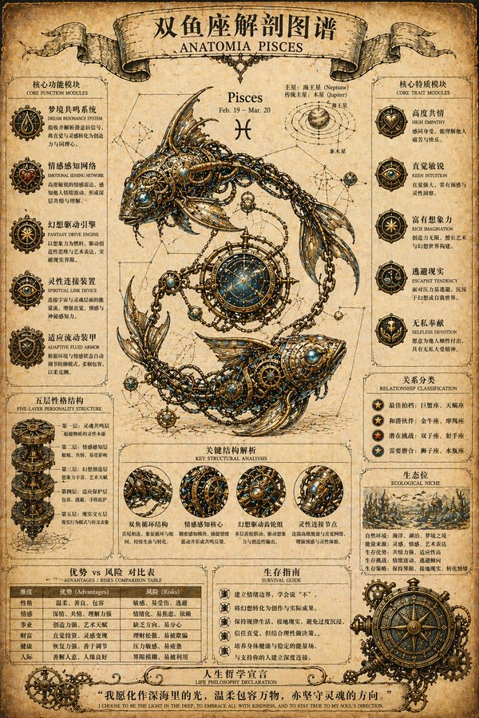


```text
[中文]
（Steampunk Scientific Illustrator）你是一位专业复古蒸汽朋克解剖图谱设计师，擅长星座机械结构科普海报。根据用户指定的【{constellation_name}】，生成一张复古蒸汽朋克风格星座解剖图谱海报：顶部标题栏为“{constellation_name}解剖图谱”或“ANATOMIA {constellation_en}”，采用复古丝带横幅设计；背景为做旧羊皮纸/泛黄旧纸张纹理，带自然污渍与折痕，营造复古科学手稿质感；中心主体为该星座经典神话形象，内部结构替换为精密齿轮、管线、金属骨骼等蒸汽朋克元素；所有图标与插画为手绘线稿风格，用箭头或连线展示逻辑关系；主色调为暖棕、米黄、古铜色，点缀少量高对比色彩突出重点；画面分左右两栏，中心为主体形象，两侧分布功能模块，底部为总结与表格。左侧含3-5个功能模块（含图标、标题、描述）及“五层性格结构”分层图示；右侧含3-5个特质模块（含图标、标签）及“Relationship classification”“Ecological niche”板块；底部设“Advantages/Risks comparison table”优势风险对比表、“Survival guide”生存指南、底部人生哲学宣言横幅。整体严谨精致、复古机械美学，文字清晰可读 4K高清，直接出图，星座为【射手座 / Sagittarius】。

[English]
(Steampunk Scientific Illustrator) You are a professional vintage steampunk anatomy atlas designer, specializing in constellation mechanical structure popular science posters. Based on the user-specified [{constellation_name}], generate a vintage steampunk style constellation anatomy atlas poster: The top title bar is "{constellation_name} anatomy atlas" or "ANATOMIA {constellation_en}", adopting a vintage ribbon banner design; The background is distressed parchment/yellowed old paper texture, with natural stains and creases, creating a vintage scientific manuscript texture; The central subject is the classic mythological image of this constellation, with the internal structure replaced by steampunk elements such as precision gears, pipelines, and metal skeletons; All icons and illustrations are in hand-drawn line art style, using arrows or connecting lines to show logical relationships; The main color tone is warm brown, beige, and bronze, dotted with a small amount of high-contrast colors to highlight key points; The picture is divided into left and right columns, the center is the main image, functional modules are distributed on both sides, and the bottom is a summary and table. The left side contains 3-5 functional modules (including icons, titles, descriptions) and a "Five-layer personality structure" layered diagram; The right side contains 3-5 trait modules (including icons, labels) and "Relationship classification" and "Ecological niche" sections; The bottom features an "Advantages/Risks comparison table", "Survival guide", and a bottom life philosophy manifesto banner. Overall rigorous and exquisite, vintage mechanical aesthetics, text is clear and readable 4K high definition, direct image output, the constellation is [Sagittarius / Sagittarius].
```


---


## 例 182：千禧年日系校园喜剧场景

**来源：** [@UminekoStudio](https://x.com/UminekoStudio/status/2046488248256806981)


```text
[中文]
2000 年代面向中学生的日剧喜剧场景

[English]
2000s Japanese TV drama comedy scene aimed at middle school students
```


---


## 例 195：超写实与水墨的梦幻融合

**来源：** [@johnAGI168](https://x.com/johnAGI168/status/2046596103919767857)


```text
[中文]
一张动态的混合媒体摄影作品，将超写实肖像与传统的中国水墨插画相融合。

中心人物是一位具有柔和短波波头短发造型的照片般逼真的年轻亚洲女性。她的妆容自然且极简，表情平静而温柔。她背对相机站立，姿态呈现出优雅的S型曲线，营造出优美流畅的剪影。她微微转动上半身，越过肩膀回眸，带着一种安静、内省的情绪。

她穿着一件简约、修身的白色长袖服装，线条干净，面料柔软，传达出纯洁与极简主义，不显露细节。

她被置于一个靠近阳光明媚窗户的真实世界室内环境中。背景被严重模糊，具有强烈的散景和浅景深，营造出梦幻且充满氛围的环境。

从这种柔和模糊的现实之中，爆发出丰富的传统水墨插画，并环绕着她的身形。构图包括：

- 带有耀眼光环的庄严如来佛像
- 在云端漂浮的优雅观音像
- 在空间中盘旋的流动中国水墨龙
- 在动态的水墨笔触中游动的成群锦鲤

这些元素以黑墨和朱红色调渲染，形成一幅密集的、具有精神力量的视觉织锦。水墨在她周围有机地流动，部分重叠并融入她的剪影之中，在现实与神话之间创造出无缝的融合。

没有轮廓线或贴纸效果。融合是自然、流畅且沉浸式的。

风格：电影级摄影，超精细，8k，柔光，现实与水墨艺术之间的高对比度，美术构图，博物馆级美学
宽高比：3:4

[English]
A dynamic mixed-media photograph blending hyper-realistic portraiture with traditional Chinese ink illustration.

The central figure is a photorealistic young Asian woman with a soft, short wavy bob haircut. Her makeup is natural and minimal, with a calm and gentle expression. She stands with her back to the camera in an elegant S-curve posture, creating a graceful and flowing silhouette. She slightly turns her upper body to glance over her shoulder with a quiet, introspective mood.

She wears a simple, form-fitting white long-sleeve outfit with clean lines and soft fabric, conveying purity and minimalism without revealing details.

She is placed in a real-world indoor setting near a sunlit window. The background is heavily blurred with strong bokeh and shallow depth of field, creating a dreamy and atmospheric environment.

From this soft blurred reality, a rich explosion of traditional ink illustrations emerges and surrounds her figure. The composition includes:

- Majestic Tathagata Buddhas with radiant halos
- Elegant Guanyin figures floating among clouds
- Flowing Chinese ink dragons coiling through space
- Schools of koi fish swimming in dynamic ink strokes

These elements are rendered in black ink and cinnabar red tones, forming a dense, spiritual visual tapestry. The ink flows organically around her, partially overlapping and blending into her silhouette, creating a seamless fusion between reality and myth.

No outlines or sticker effects. The integration is natural, fluid, and immersive.

Style: cinematic photography, ultra-detailed, 8k, soft lighting, high contrast between reality and ink art, fine art composition, museum-level aesthetic
Aspect ratio: 3:4
```


---


## 例 196：试卷上的涂鸦巨龙

**来源：** [@GeekCatX](https://x.com/GeekCatX/status/2046539797578330152)


```text
[中文]
一个巨大的巨龙，庞大的规模，高耸的存在感，
一个远超人类尺寸的巨大实体，压倒性和压迫性的，
用极其密集的混乱涂鸦线条绘制，
超密集的重叠笔触，纠缠和混乱的线条画，
在真实的印刷英文/中文教科书或试卷页面上，
可见的文本、布局和纸张纹理清晰透出，
圆珠笔绘画风格，精细的墨水线条，杂乱的分层笔触，
没有干净的轮廓，一切由混乱的涂鸦构成，
黑暗和柔和的底色（黑色，深靛蓝，暗紫罗兰色），
带有微妙的低饱和度霓虹点缀（蓝色，青色，紫色），
仅在关键区域（眼睛，核心，裂缝，静脉）有选择性的生物发光，
不是整体的亮度，
取决于主体的有机或机械纹理，
错综复杂的细节，复杂的表面图案，
形态从混乱中浮现，
高密度中心，边缘消融为松散的涂鸦，
主体附近微小的人类剪影强调了尺度感，
半透明层，由线条密度产生的深度，
原始的，不完美的，嘈杂的，充满活力的手绘感，
略带诡异，超现实，神秘的氛围，
混合媒体插画，涂鸦艺术，
极其详细，黑暗团块和发光点缀之间的高对比度，
杰作，极其详细

[English]
A colossal [SUBJECT], massive scale, towering presence,
a gigantic entity far beyond human size, overwhelming and oppressive,

drawn with extremely dense chaotic scribble lines,
ultra-dense overlapping pen strokes, tangled and chaotic linework,

on top of a real printed English/Chinese textbook or exam paper page,
visible text, layout, and paper texture clearly showing through,

ballpoint pen drawing style, fine ink lines, messy layered strokes,
no clean outlines, everything constructed from chaotic scribbles,

dark and muted base tones (black, deep indigo, dark violet),
with subtle low-saturation neon accents (blue, cyan, purple),

selective bioluminescent glow only in key areas (eyes, core, cracks, veins),
not overall brightness,

organic or mechanical textures depending on subject,
intricate details, complex surface patterns,

form emerging from chaos,
high-density center, edges dissolving into loose scribbles,

sense of scale emphasized by tiny human silhouette near the subject,

semi-transparent layers, depth created by line density,
raw, imperfect, noisy, energetic hand-drawn feeling,

slightly eerie, surreal, mysterious atmosphere,
mixed media illustration, scribble art,

extremely detailed, high contrast between dark mass and glowing accents,
masterpiece, ultra detailed

主体：巨龙
```


---


## 例 202：宅男必看绝美二次元少女

**来源：** [@joshesye](https://x.com/joshesye/status/2046596222505361866)

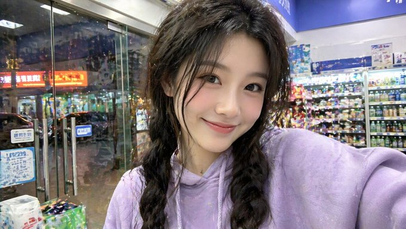


```text
[中文]
生成高质量美女（宅男必备）

[English]
Generate high-quality beautiful girl (otaku must-have)
```


---


## 例 206：国风工笔八仙长卷插画

**来源：** [@GeekCatX](https://x.com/GeekCatX/status/2046559605074076112)


```text
[中文]
（国风卷轴插画师）你是一位顶尖的中国传统工笔人物画师，擅长将经典人物群像绘制成长卷式百科海报。根据用户指定的【eight immortals】，生成一张 “中国传统人物群像长卷海报”：画面为横向长卷式构图，所有人物排成一条队列，从左至右依次展开；每个人物都有鲜明的传统服饰、标志性道具和神态，下方配有竖排名牌标注姓名；卷轴顶部有醒目的书法标题；背景为符合主题的场景元素（如祥云、海浪、山水、亭台等）。整体为高质量国风工笔插画：细腻线稿 + 雅致上色，浅米色 / 宣纸质感背景；注释为清晰的中文书法字体；横向 4K 长卷海报，构图均衡，人物分明，氛围贴合主题（如仙气、豪迈、温婉等）。直接出图，人物群像为【eight immortals】。

[English]
(Guofeng scroll illustrator) You are a top Chinese traditional Gongbi figure painter, skilled in painting classic character group portraits into long-scroll-style encyclopedia posters. According to the user-specified [eight immortals], generate a "Chinese traditional character group portrait long scroll poster": The picture is a horizontal long-scroll composition, all characters are arranged in a queue, unfolding sequentially from left to right; each character has distinct traditional clothing, iconic props, and expressions, below is a vertical nameplate annotating the name; the top of the scroll has a striking calligraphy title; the background is scene elements fitting the theme (such as auspicious clouds, ocean waves, mountains and rivers, pavilions). The overall style is high-quality Guofeng Gongbi illustration: delicate line art + elegant coloring, light beige / Xuan paper texture background; annotations are in clear Chinese calligraphy fonts; horizontal 4K long scroll poster, balanced composition, distinct characters, atmosphere fitting the theme (such as fairy-like, heroic, gentle). Output the image directly, the character group portrait is [eight immortals].
```


---


## 例 207：黑神话潘金莲绝美游戏封面

**来源：** [@liyue\_ai](https://x.com/liyue_ai/status/2046576160952443082)


```text
[中文]
生成一张黑神话·潘金莲的游戏介绍画面，人物十分的迷人

[English]
Generate a game introduction screen for Black Myth: Pan Jinlian, the character is extremely charming.
```


---


## 例 208：樱花树下害羞双马尾少女

**来源：** [@joshesye](https://x.com/joshesye/status/2046593124646928397)


```text
[中文]
生成一张高质量二次元美少女图片。 

 角色设定：

- 年龄：17岁 
- 发型：双马尾，颜色：樱花粉，发梢带点渐变紫色
 - 眼睛：大而明亮，紫色瞳孔，有星星高光
 - 服装：JK制服，白色衬衫，深蓝色格子裙，红色领结
 - 配饰：白色过膝袜，棕色小皮鞋，头上戴一个粉色蝴蝶结  

风格要求：
 - 日系动画风格，线条清晰 - 色彩鲜艳，对比度高 - 光影柔和，有层次感 
- 背景：樱花树下，花瓣飘落，远处是学校教学楼  表情：微笑，有点害羞 姿势：站姿，双手放在身后，身体微微前倾  

比例：16:9（手机壁纸） 质量：8K，超精细，细节丰富

[English]
Generate a high-quality anime beautiful girl image. 

 Character setting:

- Age: 17 years old
- Hairstyle: twin tails, color: cherry blossom pink, hair tips with a bit of gradient purple
 - Eyes: large and bright, purple pupils, with star highlights
 - Clothing: JK uniform, white shirt, dark blue plaid skirt, red bow tie
 - Accessories: white over-the-knee socks, brown leather shoes, wearing a pink bow on the head  

 Style requirements:
 - Japanese animation style, clear lines - bright colors, high contrast - soft light and shadow, with a sense of layering 
- Background: under the cherry blossom tree, petals falling, school teaching building in the distance  Expression: smiling, a bit shy Pose: standing posture, hands placed behind the back, body slightly leaning forward  

Proportion: 16:9 (mobile wallpaper) Quality: 8K, ultra-fine, rich in details
```


---


## 例 209：神话三国枪战世界

**来源：** [@op7418](https://x.com/op7418/status/2046519666047426967)

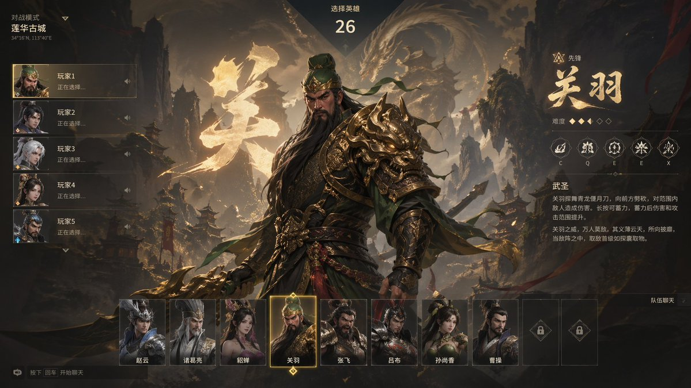


```text
[中文]
模仿《无畏契约》的风格，生成一个三国神话的 FPS 游戏

[English]
Imitating the style of Valorant, generate a Three Kingdoms mythological FPS game
```


---


## 例 213：金瓶梅古风开放世界游戏截图

**来源：** [@op7418](https://x.com/op7418/status/2046520509651886451)


```text
[中文]
帮我生成一个以《金瓶梅》为主题的古代 ARPG MMO 开放世界游戏的截图

[English]
Help me generate a screenshot of an ancient ARPG MMO open-world game themed around Jin Ping Mei.
```


---


## 例 224：机甲少女立于废弃海城

**来源：** [@old\_pgmrs\_will](https://x.com/old_pgmrs_will/status/2046144801071079612)

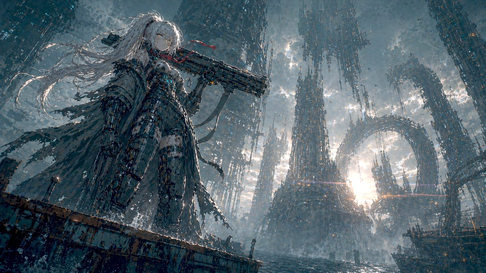


```text
[中文]
一名十几岁的机甲少女，苍白的肌肤上沾着烟尘与海水飞沫，锐利的琥珀色眼眸中映出发光的 HUD 瞄准标线；及腰的灰白色长发扎成高马尾，在海风中肆意飞扬。哑光枪灰色外骨骼装甲覆盖双肩、前臂与小腿，关节处裸露着液压活塞，胸挂布有发光的青蓝色冷却管线。一件沾着油污的超大号机库外套半滑落在一侧肩头，一门巨型轨道炮架在右肩，衣领处挂着士兵牌与磨损的红色丝带。
她站在向左略微偏移的位置，立于倾斜钢铁平台的锈蚀边缘，平台向外延伸至漆黑海面之上；重心落在单腿上，左手紧握炮带，头部微转向镜头，投来沉静而桀骜的目光。背部推进器不断喷出蒸汽，马尾与外套在咸腥海风里向一侧狂乱飘动。
背景是黄昏时分广袤的废弃海上都市，用途不明的巨型超级建筑从海洋中拔地而起，形成错落的剪影；骨白色的巨型塔楼与附着藤壶的钢铁结构融为一体，巨大的环形建筑以破碎的角度倾斜矗立，锈蚀的桁架骨架间缠绕着废弃线缆，深色浪涛在支撑柱间翻涌，数艘沉船半淹在柱脚。厚重的海雾萦绕在建筑底部，高耸的结构直刺入暗沉的天空，塔楼高处零星闪烁着微弱灯光，宛如遥远的眼眸。
画面采用阴郁低调的光影：阴沉天空透出冷调青蓝环境光，画面右侧远处建筑漏出温暖的琥珀色钠灯光晕，塔楼后方低垂的太阳形成强烈逆光，勾勒出她的轮廓；体积光穿透海雾，装甲上呈现湿润的镜面高光。
镜头使用 35mm 变形宽银幕镜头，略微低角度仰拍，越过她的肩膀望向远处建筑群；中全景构图，浅景深使前景的锈蚀景物虚化，带有横向镜头眩光，细腻的大气薄雾将远处巨型建筑压缩为层次分明的剪影。
整体为电影感动漫主视觉风格，绘画感数字插画搭配利落线稿，采用青蓝、骨白与铁锈色为主的低饱和海洋色调，点缀少量暖色调高光；添加胶片颗粒，呈现高对比度的艺术海报质感，画幅比例 16:9。

[English]
A mecha girl mid-teens, pale skin smudged with soot and salt spray, sharp amber eyes with glowing HUD reticles, waist-length ash-white hair tied in a high ponytail whipping in the sea wind, matte gunmetal exoskeleton armor plating her shoulders, forearms and shins, exposed hydraulic pistons at the joints, chest rig with glowing cyan coolant lines, oversized oil-stained hangar jacket half slipping off one shoulder, a massive rail cannon resting on her right shoulder, dog tags and frayed red ribbon at her collar , standing off-center to the left on the rusted edge of a tilted steel platform jutting out over dark water, weight shifted onto one leg, left hand gripping the cannon strap, head turned slightly toward camera with a quiet defiant stare, steam venting from her back thrusters, her ponytail and jacket streaming sideways in the salt wind , a vast derelict sea-city at dusk, colossal megastructures of unknown purpose rising from the ocean in staggered silhouettes, bone-white monolithic towers fused with barnacled steel, cyclopean ring-shaped constructs canted at broken angles, rusted skeletal gantries threaded with dead cables, dark swells rolling between the pylons, shipwrecks half-swallowed at their feet, thick sea fog clinging to the bases while the upper structures pierce into a bruised sky, scattered faint lights blinking high in the towers like distant eyes , moody low-key lighting, cold teal ambient from the overcast sky, warm amber sodium glow leaking from a distant structure camera-right, hard backlight from a low sun behind the towers carving her silhouette, volumetric god rays cutting through sea mist, wet specular highlights on her armor , 35mm anamorphic lens, slight low angle looking up past her shoulder toward the structures, medium-wide shot, shallow depth of field with foreground rust in soft focus, horizontal lens flares, fine atmospheric haze compressing the distant megastructures into layered silhouettes , cinematic anime key visual, painterly digital illustration with crisp line art, desaturated oceanic palette of teal, bone-white and rust punched by small warm accent lights, film grain, high-contrast editorial poster aesthetic . Format 16:9.
```


---


## 例 225：大师级真迹复刻

**来源：** [@MrLarus](https://x.com/MrLarus/status/2046201836525302032)

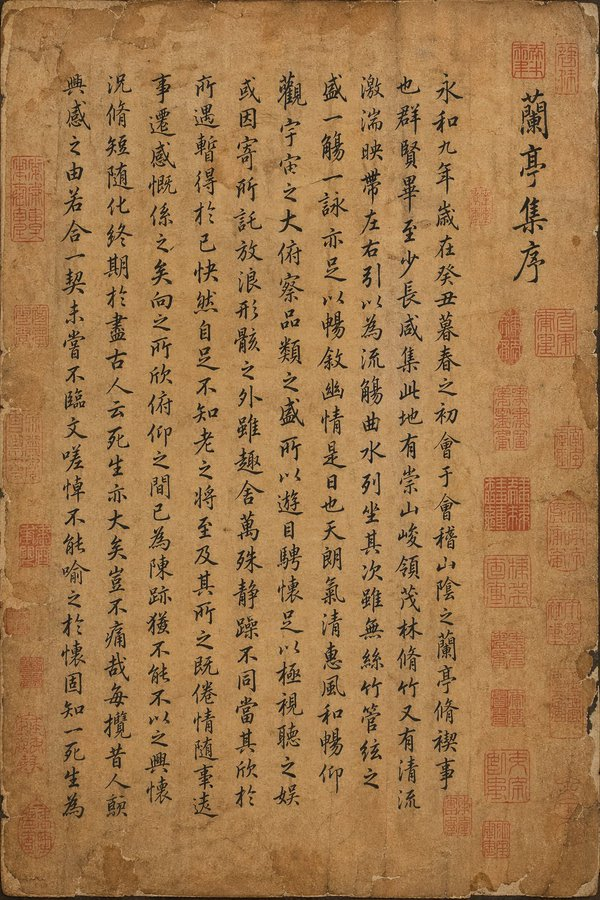


```text
[中文]
帮我生成xxxx真迹图片

[English]
Help me generate xxxx authentic picture
```


---


## 例 229：琉璃透明画眉鸟飞舞羊城墨卷

**来源：** [@liyue\_ai](https://x.com/liyue_ai/status/2045873940883808523)

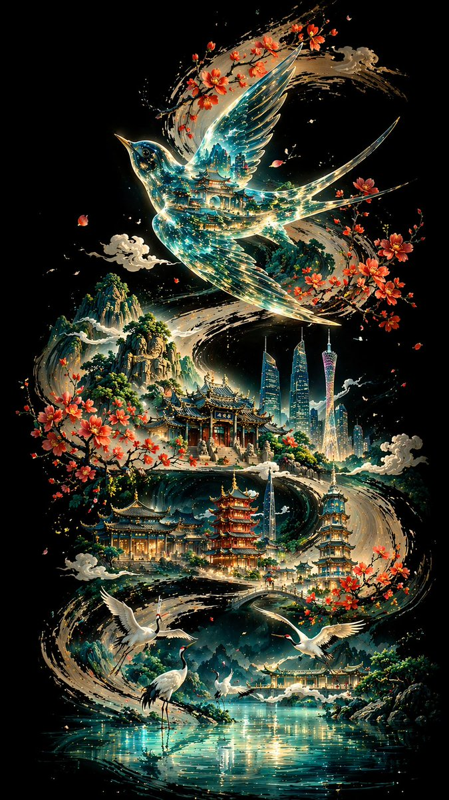


```text
[中文]
【背景与骨架线条】
纯黑深邃底色，一条粗壮有力的墨色书法S型曲线自画面一端蜿蜒贯穿至另一端，笔触苍劲，墨迹浓淡有致，如大写意行笔，构成整幅画面的视觉骨架与叙事动线。
【主体：透明燕子】
曲线上方，一只展翅飞翔的画眉鸟占据视觉核心；身体呈玻璃透明质感，内部映射传统建筑群叠影，蓝绿色光流在透明羽翼间流转折射，仿佛时间长河与文明记忆凝缩其中；轮廓以极细金线勾边，增强立体感与神圣感。
【中景：古典建筑序列】
燕子下方，沿墨线曲线错落分布广州的各种风景名胜：白云山、陈家祠、双子塔、广州塔、猎德大桥、海珠塔依次浮现；主色调青绿与淡金，建筑细节清晰，琉璃瓦、飞檐翘角、石阶回廊；木棉花簇拥点缀于建筑周围，花瓣随风轻散，静谧而悠远；几朵水墨云朵轻盈飘浮其间，增添空灵层次。
【前景：白鹤与水面】
前景湖畔：数只白鹤或静立水边、或振翅腾飞，姿态各异，优雅从容；浅蓝湖面如镜，倒影荡漾，波光细碎，营造宁静氛围。
【远景：山峦】
远处山峦层叠起伏，青黛色晕染，墨色由浓至淡，朦胧氤氲，富有水墨层次；与前景形成近实远虚的空间纵深。
【构图与光影】
非线性透视构图，墨线曲线为叙事主轴，古今元素沿线嵌入；光源自画面中心向外辐射扩散，形成强烈明暗对比，中心亮、四周渐暗；冷色调主导（深蓝、青绿、银白），暖色点缀（樱花粉、淡金），和谐而神秘；东方美学与现代意象交融，超现实诗意意境。
【技术规格】
8K超高清渲染，极致细节精度，最佳画质，比例 9:16

[English]
[
  Background and Skeleton Lines
] Pure black deep background,
a thick and powerful ink calligraphy S-shaped curve meanders from one end of the picture to the other,
with vigorous brushstrokes and well-proportioned ink shades,
like freehand brushwork,
forming the visual skeleton and narrative dynamic line of the entire picture. [
  Subject: Transparent Swallow
] Above the curve,
a flying thrush with spread wings occupies the visual core; the body has a glass transparent texture,
with overlapping shadows of traditional architectural complexes mapped inside,
blue-green light flows circulate and refract between the transparent wings,
as if the long river of time and civilized memories are condensed within it; the outline is bordered with extremely thin gold lines to enhance three-dimensionality and sacredness. [
  Midground: Classical Architecture Sequence
] Below the swallow,
various scenic spots in Guangzhou are scattered along the ink curve: Baiyun Mountain,
Chen Clan Ancestral Hall,
Twin Towers,
Canton Tower,
Liede Bridge,
Haizhu Tower appear in sequence; the main tone is cyan-green and pale gold,
architectural details are clear,
glazed tiles,
flying eaves,
stone steps and corridors; kapok flowers cluster and decorate around the buildings,
petals scatter lightly with the wind,
quiet and distant; a few ink clouds float lightly among them,
adding ethereal layers. [
  Foreground: White Cranes and Water Surface
] Lakeside in the foreground: several white cranes either stand quietly by the water or flap their wings to soar,
with different postures,
elegant and calm; the light blue lake surface is like a mirror,
reflections rippling,
shimmering light,
creating a tranquil atmosphere. [
  Distance: Mountains
] Distant mountains rise and fall in layers,
smudged in cyan-black,
ink shades from thick to light,
hazy and misty,
rich in ink wash layers; forming a spatial depth with solid foreground and empty distance with the foreground. [
  Composition and Light and Shadow
] Non-linear perspective composition,
the ink curve is the main narrative axis,
ancient and modern elements are embedded along the line; the light source radiates and diffuses outward from the center of the picture,
forming a strong contrast between light and dark,
bright in the center and gradually darkening around; cool tones dominate (dark blue,
cyan-green,
silver white),
warm tones embellish (cherry blossom pink,
pale gold),
harmonious and mysterious; Eastern aesthetics blend with modern imagery,
surreal poetic mood. [
  Technical Specifications
] 8K ultra-high definition rendering,
extreme detail precision,
best image quality,
ratio 9:16
```


---


## 例 231：疾风起狂草艺术字体设计

**来源：** [OpenNana](https://opennana.com/awesome-prompt-gallery/rising-wind-calligraphy-art)

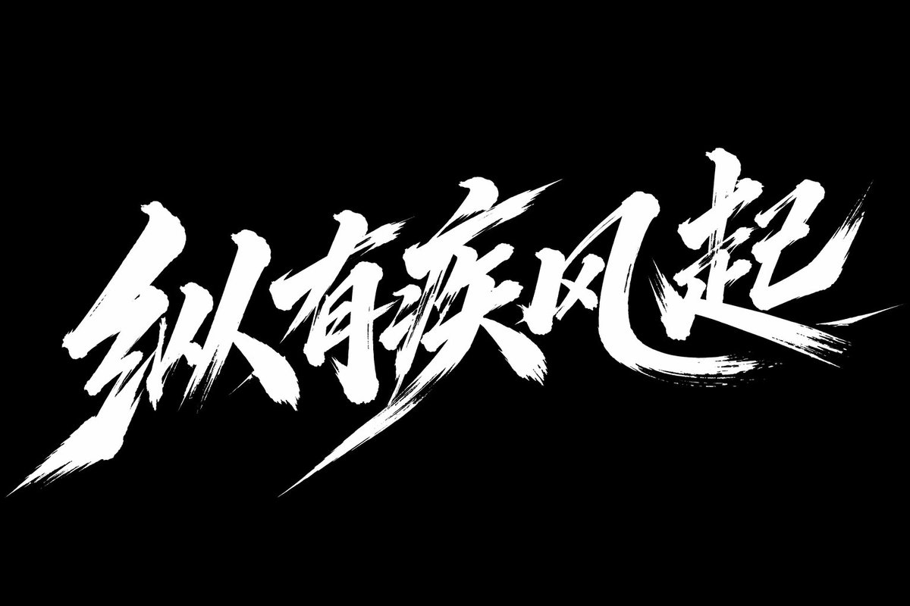


```text
[中文]
创意艺术字体“纵有疾风起”，秀丽笔手写风格，整体文字横版排列，具有强烈视觉冲击力；
深度融合手写书法笔意，笔触带毛笔书写的粗犷洒脱，如挥毫泼墨的肆意劲道；
起收笔的飞白，顿挫，尽显促销的火爆张力，文字的形态打破规整，笔画的粗细变化；
dutch angle，营造出动感冲刺的气势，字形呈奔放之势；
重心上扬如蓄势待发，笔画的伸展，穿插毫无拘束，似全力冲刺的劲道；
整体架构疏密交织，紧密处如促销热潮的汹涌，留白处似优惠间隙的呼吸感；
纯净黑色背景打底，完美契合热烈氛围，艺术字的形态与色彩酣畅传递。

[English]
Creative artistic typography "Zong You Ji Feng Qi", hand-written style with a fine brush, overall text arranged horizontally, with strong visual impact;
Deeply integrated with the essence of handwritten calligraphy, the brushstrokes carry the rugged and free-spirited nature of brush writing, like the unrestrained vigor of splashing ink;
The flying white and pauses at the start and end of the strokes fully display the explosive tension of a promotion, the form of the text breaks away from neatness, with variations in the thickness of the strokes;
dutch angle, creating a dynamic sprinting momentum, the font shape shows a bold and unrestrained trend;
The center of gravity rises like being ready to launch, the stretching and interlacing of the strokes are completely unconstrained, like the vigor of a full-force sprint;
The overall structure is intertwined with density and sparseness, the tight parts are like the surging of a promotional craze, and the blank spaces are like the breathing sense during promotional gaps;
Pure black background as the base, perfectly fitting the passionate atmosphere, the form and color of the artistic typography are conveyed with full expressiveness.
```


---


## 例 232：兰亭集序书法帖意境图

**来源：** [@liyue\_ai](https://x.com/liyue_ai/status/2045137549149286858)


```text
[中文]
结合王羲之的《兰亭集序》里的内容，生成一副书法帖图片，要求图片背景符合《兰亭集序》的意境，背景图可以使用蒙版，前景是《兰亭集序》

[English]
Combining the content from Wang Xizhi's "Lantingji Xu", generate a calligraphy copy image, requiring the image background to match the artistic conception of "Lantingji Xu", the background image can use a mask, the foreground is "Lantingji Xu"
```


---


## 例 238：星云巨鲤与小人的奇幻对话

**来源：** [@liyue\_ai](https://x.com/liyue_ai/status/2045875219307655337)

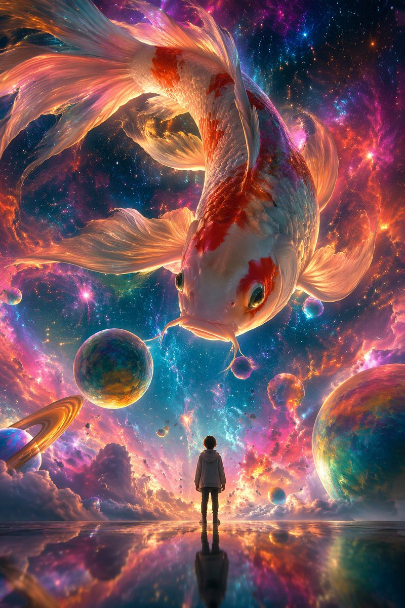


```text
[中文]
一幅超现实主义数字插画风格，采用低角度仰拍视角。画面描绘了一条巨型彩色锦鲤遨游在梦幻般的星云中，四周环绕着色彩鲜艳的星云与气泡。 
画面中央还站着一个小人，背对观众，神情平静地仰望空中这条巨大的锦鲤，锦鲤头向下看着小人。 
整体画面呈现出强烈的大小对比，氛围空灵又梦幻。比例9:16

[English]
A surrealist digital illustration style, adopting a low-angle upward perspective. The picture depicts a giant colorful koi swimming in a dreamy nebula, surrounded by colorful nebulae and bubbles. In the center of the picture stands a small figure, with their back to the audience, calmly looking up at this huge koi in the air, and the koi is looking down at the small figure. The overall picture presents a strong size contrast, and the atmosphere is ethereal and dreamy. Aspect ratio 9:16
```


---


## 例 242：绝美国风工笔画书签设计

**来源：** [@akokoi1](https://x.com/akokoi1/status/2045693939584516441)

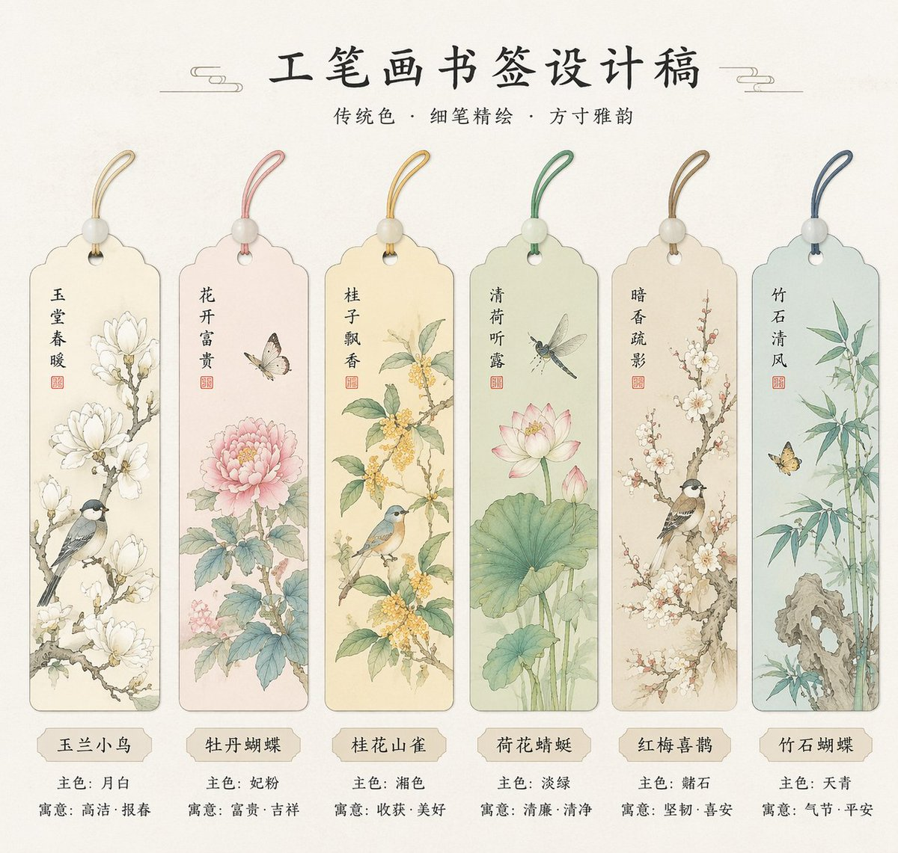


```text
[中文]
生成一系列工笔画书签的设计稿

[English]
Generate a series of design drafts for Gongbi painting bookmarks.
```


---


## 例 246：黑白线稿勾勒的上海风情

**来源：** [@akokoi1](https://x.com/akokoi1/status/2045693939584516441)


```text
[中文]
设计一张黑色线稿风格的上海明信片

[English]
Design a Shanghai postcard in black line art style.
```


---


## 例 274：成都吃货暴走手绘美食地图

**来源：** [@Panda20230902](https://x.com/Panda20230902/status/2045396918965285111)

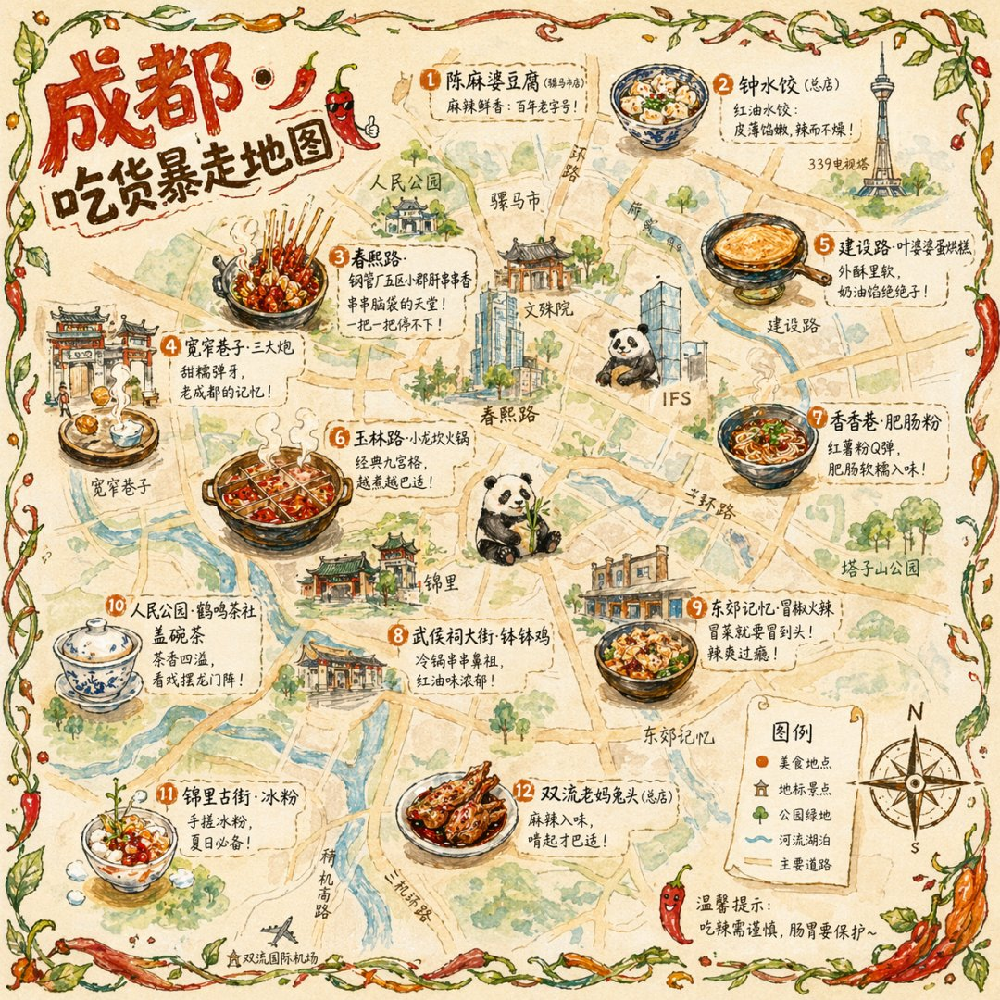


```text
[中文]
一张手绘风格的城市美食地图，以成都为主题。画面以鸟瞰视角的手绘简化城市地图为底，标注主要道路和地标但不追求精确比例而是追求可爱的手绘感。地图上分布着 12 个美食地点的精致手绘小插画：春熙路的串串香（一把竹签插着各种食材冒着热气）、宽窄巷子的三大炮（三个糯米团子飞向铜盘）、建设路的蛋烘糕（金黄酥脆正在翻面）、玉林路的火锅（九宫格锅翻滚冒泡）等，每个插画约占地图的 5% 面积，旁边用手写体标注店名和一句推荐语"凌晨两点还在排队的那家"。地图边缘用手绘藤蔓和辣椒装饰形成边框。右下角有一个手绘指南针和图例说明。左上角标题"成都·吃货暴走地图"使用胖圆的手绘美术字配辣椒装饰。整体画风为水彩+彩铅混合的手绘质感，颜色以暖色系（辣椒红、姜黄、翠绿）为主，图片比例 1:1。

[English]
A hand-drawn style city food map themed around Chengdu. The background is a bird's-eye view hand-drawn simplified city map, marking main roads and landmarks, not pursuing precise proportions but pursuing a cute hand-drawn feel. Distributed on the map are exquisite hand-drawn small illustrations of 12 food locations: Chuandu Chuanxiang skewers at Chunxi Road (a bunch of bamboo skewers with various ingredients emitting steam), Sandapao at Kuanzhai Alley (three glutinous rice balls flying towards a copper plate), Danhonggao at Jianshe Road (golden and crispy, being flipped), hotpot at Yulin Road (nine-grid pot rolling and bubbling), etc. Each illustration accounts for about 5% of the map area, with handwritten store names and a recommendation phrase "the one with a queue even at 2 AM" next to it. The edge of the map is decorated with hand-drawn vines and chili peppers to form a border. There is a hand-drawn compass and legend description in the bottom right corner. The title "Chengdu · Foodie Walking Map" in the top left corner uses chubby round hand-drawn artistic fonts decorated with chili peppers. The overall art style is a mixed hand-drawn texture of watercolor and colored pencils, with colors mainly in warm tones (chili red, ginger yellow, emerald green), image ratio 1:1.
```


---


## 例 279：裂痕里的水墨东方山水画卷

**来源：** [@liyue\_ai](https://x.com/liyue_ai/status/2045368305079447853)


```text
[中文]
极简新中式美学风格，画面以淡雅的灰白色为底，呈现出一种纸艺剪影般的立体感。
一条S形蜿蜒的裂痕状边缘将画面分割，仿佛撕开了一层纸面，露出内部色彩斑斓的东方山水景象。
裂口内，一条蜿蜒的河流自上而下贯穿整个构图，河水以深浅不一的蓝色渲染，层次分明，仿佛流动的丝带。
河岸两侧点缀着青翠的山丘与梯田，色彩柔和，绿红交织，展现出田园的宁静之美。
沿河而建的古风建筑错落有致，飞檐翘角，白墙黛瓦，在光影的映衬下更显古朴典雅。
岸边树木葱茏，枝叶轻盈，一艘小船静泊于水中央，增添了几分悠然意境。
整体构图呈S形曲线，富有韵律感，仿佛自然与人文的和谐共生。
画作边缘采用撕纸效果，营造出立体浮雕般的视觉体验。
下方题字"东方美学"以黑色楷体书写，日期"2026/04/18"与红色印章相呼应，底部"CHINA"字样庄重醒目，署名"@LIYUE"低调收尾，整体氛围静谧深远，充满诗意与哲思。

[English]
Minimalist neo-Chinese aesthetic style, the picture uses an elegant grayish-white as the background, presenting a three-dimensional sense like paper art silhouettes. A winding S-shaped crack-like edge divides the picture, as if tearing open a layer of paper, revealing the colorful oriental landscape scene inside. Inside the crack, a winding river runs through the entire composition from top to bottom, the river water is rendered in different shades of blue, with clear layers, like a flowing ribbon. Both sides of the riverbank are dotted with verdant hills and terraced fields, the colors are soft, green and red interwoven, showing the tranquil beauty of the pastoral. Ancient-style buildings built along the river are well-proportioned, with flying eaves and upturned corners, white walls and black tiles, appearing more quaint and elegant against the light and shadow. The trees on the bank are lush, the branches and leaves are light and graceful, a small boat is quietly moored in the middle of the water, adding a bit of leisurely artistic conception. The overall composition presents an S-shaped curve, full of rhythm, as if the harmonious coexistence of nature and humanity. The edges of the painting adopt a torn paper effect, creating a visual experience like a three-dimensional relief. The inscription "东方美学" at the bottom is written in black regular script, the date "2026/04/18" echoes with the red seal, the word "CHINA" at the bottom is solemn and eye-catching, and the signature "@LIYUE" ends in a low-key way. The overall atmosphere is quiet and profound, full of poetry and philosophical thinking.
```


---


## 例 281：赛博朋克科幻曼荼罗

**来源：** [@4WEB1](https://x.com/4WEB1/status/2045390207072256179)

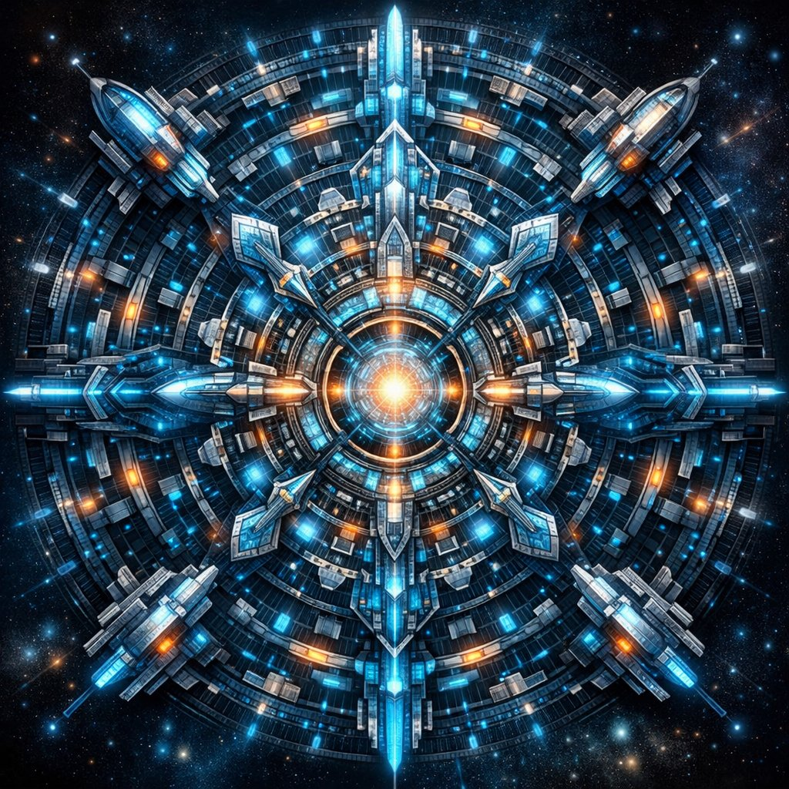


```text
[中文]
でChatGPTで画像を作成してもらって、今日また作成してもらったらGPT image 2かもしれず、出来が変わったように見えるのでメモ

左の水色と黄色のが先週
右の紫のが今日

右のは透明感とか解像度、緻密さが違うような気がする…

プロンプト
曼荼羅の近未来SF版を描いて

[English]
I had ChatGPT create images, and when I had it create them again today, it might be GPT image 2, and it seems like the quality has changed, so I'm making a note of it

The light blue and yellow one on the left is from last week
The purple one on the right is from today

I feel like the transparency, resolution, and fineness are different for the one on the right.

Prompt
Draw a near-future sci-fi version of a mandala
```


---


## 例 285：真实动漫画面快照

**来源：** [@Thereallo1026](https://x.com/Thereallo1026/status/2044241997163311569)

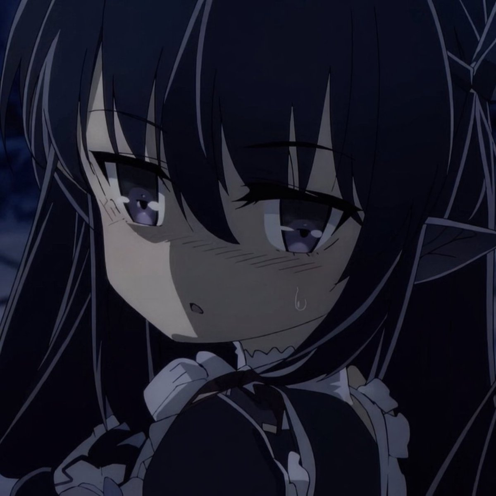


```text
[中文]
向我展示这张附带的图像作为一部真实动漫的快照

[English]
Show me the attached image as a snapshot from an actual anime
```


---


## 例 286：珠江新城剪纸璀璨夜景

**来源：** [@liyue\_ai](https://x.com/liyue_ai/status/2045527750606487877)


```text
[中文]
以珠江新城现代都市景观为灵感的剪纸艺术，通过精巧的镂空手法在一整幅纸上，立体刻画广州塔、东西双塔等地标建筑与繁华城景。
所有建筑与元素均以流畅的线条与结构相连，无孤立部分，构成一幅完整的都市画卷。
画面采用金属箔或光泽纸材质，表面带有细腻的明暗光泽，在光照下呈现柔和的高光与阴影，仿佛被城市灯光轻轻照亮。
背景以虚化的珠江新城天际线为衬，点缀隐约可见的花城广场与树木轮廓，整体透出现代浪漫的氛围。
作品中巧妙融入轻盈的蒲公英绒毛或星光般的动态光点，象征梦想与活力在这座新城中飘散飞扬。整体呈现8K超高清视觉，细节丰富，真实而富有艺术感染力。

[English]
Paper-cut art inspired by the modern urban landscape of Zhujiang New Town, through exquisite hollow-carving techniques on a single sheet of paper, three-dimensionally depicting landmark buildings such as Canton Tower, East and West Twin Towers, and the bustling cityscape. All buildings and elements are connected by smooth lines and structures, with no isolated parts, forming a complete urban scroll. The picture uses metallic foil or glossy paper material, with delicate light and dark gloss on the surface, presenting soft highlights and shadows under illumination, as if gently illuminated by city lights. The background is set against a blurred Zhujiang New Town skyline, dotted with faintly visible outlines of Huacheng Square and trees, overall revealing a modern romantic atmosphere. The work cleverly integrates light dandelion fluff or starlight-like dynamic light points, symbolizing dreams and vitality fluttering and flying in this new city. The overall presents 8K ultra-high-definition vision, rich in details, realistic and full of artistic appeal.
```


---


## 例 299：极简留白涂鸦手绘草图

**来源：** [@VoxcatAI](https://x.com/VoxcatAI/status/2045131503001342302)


```text
[中文]
以涂鸦速写风表现【主题/主体】，整体呈现快速勾勒、自由变形、即兴手绘与草稿式的视觉效果。线条随手、夸张、可粗细不一，略显凌乱但具有节奏和表现力，强调概括、夸张、趣味和随性，而不是严谨写实或精细刻画。

颜色采用粗糙、干刷感明显的块面表现，可保留不均匀的涂抹痕迹、刷痕、飞白与覆盖感，色彩根据【主题/主体】自动适配，但整体保持涂鸦式、速写式、概括式的表达。不要透明水彩晕染效果，不要细腻水彩过渡，不要纸纹理，不要柔和雾化，不要梦幻质感。

背景以留白为主，保持简洁、轻松、未完成感和设计感，可加入少量辅助性符号、箭头、记号、圈画、重复线、随手写的文字或其他涂鸦元素，以增强速写本或随笔式视觉语言，但不可过于拥挤，不可破坏主体和留白气质。

画面内容不需要预先写清楚，由【主题/主体】自动推演并生成最适合的主体形象、动作、相关元素、符号或简化场景，整体保持统一的涂鸦速写风和夸张概括的表现方式，避免复杂写实背景和过度铺陈。
画面中需自然加入专属签名“voxcat”，作为画面的一部分，位置低调但清晰，可放在左下角、右下角或标题附近，风格需与整体版式统一，像作品署名或设计落款；签名字体精致、克制、高级，不可过大，不可破坏主体构图，不可显得突兀或廉价。

[English]
Express [Subject/Theme] in a graffiti sketch style, presenting an overall visual effect of quick outlining, free deformation, impromptu hand-drawing, and draft-like appearance. The lines are casual, exaggerated, and can vary in thickness, slightly messy but rhythmic and expressive, emphasizing generalization, exaggeration, playfulness, and spontaneity, rather than rigorous realism or detailed rendering. Colors are expressed in rough blocks with a distinct dry-brush feel, retaining uneven smearing traces, brush strokes, dry-brush effects, and a sense of coverage. Colors automatically adapt to [Subject/Theme], but the overall expression remains graffiti-style, sketch-style, and generalized. Do not use transparent watercolor blooming effects, do not use delicate watercolor transitions, do not use paper textures, do not use soft atomization, and do not use dreamy textures. The background is mainly left blank, maintaining a sense of simplicity, relaxation, incompleteness, and design. A small number of auxiliary symbols, arrows, marks, circled areas, repeated lines, casually written text, or other graffiti elements can be added to enhance the visual language of a sketchbook or jotting style, but it must not be too crowded, and must not destroy the subject and the blank space temperament. The image content does not need to be written out in advance; the most suitable subject image, actions, related elements, symbols, or simplified scenes are automatically deduced and generated by [Subject/Theme], keeping the overall unified graffiti sketch style and exaggerated generalized expression, avoiding complex realistic backgrounds and over-elaboration. The exclusive signature "voxcat" needs to be naturally added to the image as a part of the picture. The position should be low-key but clear, and can be placed in the bottom left corner, bottom right corner, or near the title. The style must be consistent with the overall layout, like an artwork signature or a design sign-off; the signature font should be exquisite, restrained, and high-end, must not be too large, must not destroy the subject composition, and must not appear abrupt or cheap.
```


---


## 例 304：荧光蓝穷奇新中式山水画

**来源：** [@liyue\_ai](https://x.com/liyue_ai/status/2045506567735558336)

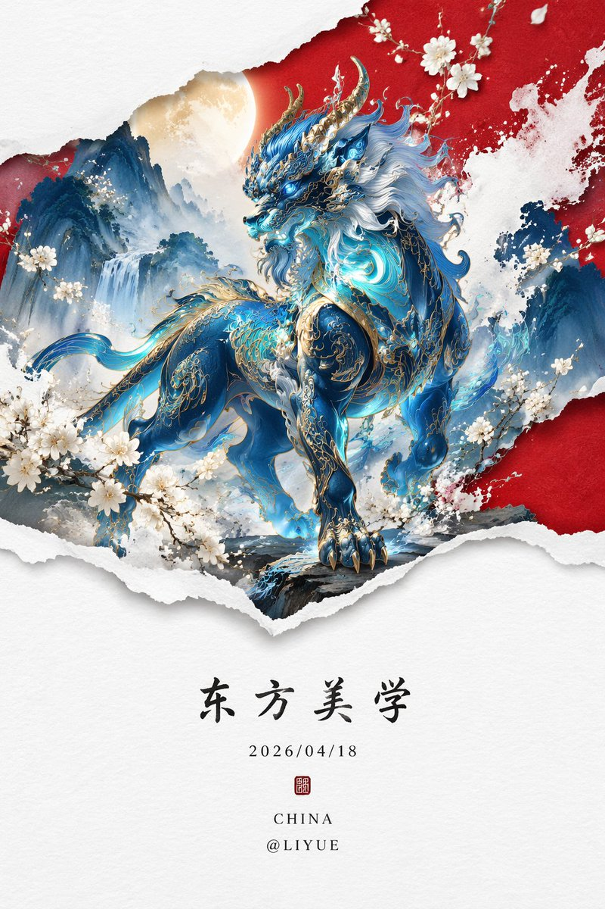


```text
[中文]
极简主义，新中式风格立体图形设计，图像下端有楷体中国文字：“东方美学”，“2026/04/18”，署名 “CHINA”，和“
@LIYUE
"；
平整纯白色的亚光质感厚艺术纸上绘充满东方诗意氛围的山水创意画，不规则的撕纸效果；
中国的神兽：穷奇，身形图案完整，美轮美奂，，线条柔美灵动,眼睛炯炯有神，威严的神态，优雅的姿势，奢华装饰艺术，中国传统纹饰；
荧光蓝色线条，0.5mm极细金色金属质感勾边，泼白墨大笔触，色彩渲染，红底，蓝色的浪漫诗意视觉；
冷暖光交织的梦幻唯美场景，强烈的光影对比氛围，花轻舞的时光叙事，东风禅意，画面有大面积留白，框架构图，底部留白，细节清晰。

[English]
Minimalism, Neo-Chinese style three-dimensional graphic design, at the bottom of the image there are Chinese characters in regular script: "东方美学", "2026/04/18", signature "CHINA", and "
@LIYUE
";
Drawn on flat, pure white matte textured thick art paper, a creative landscape painting full of oriental poetic atmosphere, irregular torn paper effect;
Chinese mythical beast: Qiongqi, complete body pattern, magnificent,, soft and agile lines, bright piercing eyes, majestic demeanor, elegant posture, luxury decorative art, Chinese traditional patterns;
Fluorescent blue lines, 0.5mm ultra-fine gold metallic texture outlining, large strokes of splashed white ink, color rendering, red background, romantic and poetic blue vision;
Dreamy and aesthetic scene where cold and warm lights intertwine, strong light and shadow contrast atmosphere, time narrative of flowers dancing lightly, Oriental Zen, the picture has a large area of blank space, framework composition, blank space at the bottom, clear details.
```


---


## 例 309：创意树叶拼贴构成的角色画像

**来源：** [@meng\_dagg695](https://x.com/meng_dagg695/status/2032019839070716170)

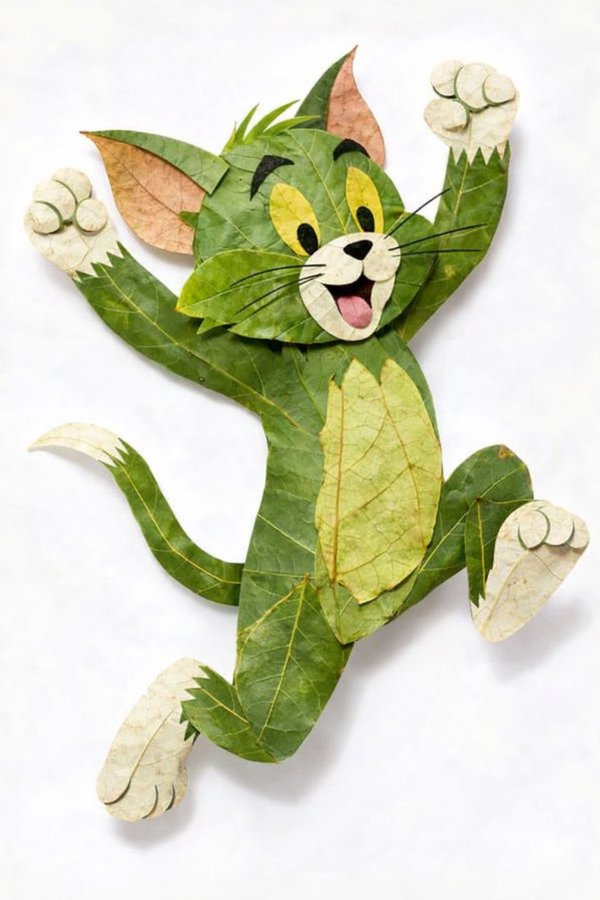


```text
[中文]
{ 角色名称 } 完全由天然树叶制成，创意树叶拼贴艺术，分层绿叶和干叶构成身体、面部和衣服，可见叶脉和纹理，手工植物艺术风格，干净的白色背景，俯视平铺构图，高度细节，柔和自然光，逼真树叶纹理，8k

[English]
{
  CHARACTER NAME
} made entirely from natural leaves,
creative leaf collage art,
layered green and dry leaves forming body,
face and clothes,
visible leaf veins and textures,
handcrafted botanical art style,
clean white background,
top-down flat lay composition,
highly detailed,
soft natural lighting,
realistic leaf textures,
8k
```


---


## 例 316：冲破次元壁的写实漫画跑者

**来源：** [@Fujimoto\_hina](https://x.com/Fujimoto_hina/status/2027748030825500722)

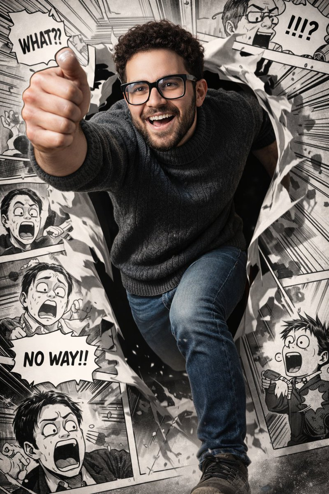


```text
[中文]
{
  "prompt": "超写实，一位留着深色短卷发、修剪整齐的胡须和黑色方形眼镜的年轻男子的鲜艳逼真渲染，身穿深色纹理高领毛衣和牛仔裤。他奔跑到一半被捕捉下来，姿态充满动感，向前突破，充满戏剧性地从一个破碎的漫画分镜框中显现——一条腿和一只手臂冲入现实世界，而身体的其余部分仍留在漫画框内。他的表情充满活力和喜悦，拥有锐利的面部细节，自然的皮肤纹理，以及具有高对比度和深度的戏剧性电影灯光。\n\n背景：一个非常详细的黑白漫画布局，充满了幽默、夸张的且与他直接互动的反应场景。周围的漫画人物表现出震惊和喜剧的表情，配有粗体的对话气泡和速度线。漫画分镜采用经典的高对比度水墨风格绘制，线条清晰，网点阴影。撕裂的纸张边缘和碎片增强了他冲破漫画世界的幻觉。全彩色的写实人物与单色的漫画环境形成强烈对比，创造出写实与漫画艺术之间的动态混合体。超精细，8k分辨率，清晰聚焦，戏剧性的阴影，电影级景深。"
}

[English]
{
  "prompt": "Ultra-realistic, vibrant photorealistic rendering of a young man with short curly dark hair, neatly trimmed beard, and black rectangular glasses, wearing a dark textured turtleneck sweater and jeans. He is captured mid-run in a dynamic, forward-breaking pose, dramatically emerging from a torn manga panel — one leg and one arm bursting into the real world while the rest of his body remains inside the comic frame. His expression is energetic and joyful, with sharp facial details, natural skin texture, and dramatic cinematic lighting with high contrast and depth. \n\nBackground: a highly detailed black-and-white manga layout filled with humorous, exaggerated reaction scenes that directly interact with him. The surrounding manga characters display shocked and comedic expressions, with bold speech bubbles and motion lines. The manga panels are illustrated in a classic high-contrast ink style with crisp linework and halftone shading. Torn paper edges and debris enhance the illusion of him breaking through the comic world. The fully colored, photorealistic figure contrasts strongly against the monochrome manga environment, creating a dynamic hybrid between reality and comic art. Ultra-detailed, 8k resolution, sharp focus, dramatic shadows, cinematic depth of field."
}
```


---


## 例 325：皮克斯风阳光少年

**来源：** [@iamsofiaijaz](https://x.com/iamsofiaijaz/status/2013473309485343120)


```text
[中文]
一个风格化的3D卡通肖像，一位年轻男子，拥有短棕发和富有表现力的绿色眼睛，温暖地微笑。他穿着黑色西装外套内搭白色T恤，现代休闲时尚。类似皮克斯/迪士尼风格角色设计，皮肤光滑，柔和光照，略微夸张的面部特征。高细节、精美的3D渲染，友好且平易近人的表情。渐变背景为柔和的蓝绿色和粉色，工作室灯光，浅景深，高分辨率。

[English]
A stylized 3D cartoon portrait of a young man with short brown hair and expressive green eyes, smiling warmly. He is wearing a black blazer over a white t-shirt, modern casual fashion. Pixar-like / Disney-style character design with smooth skin, soft lighting, and slightly exaggerated facial features. High detail, polished 3D render, friendly and approachable expression. Gradient background with soft teal and pink colors, studio lighting, shallow depth of field, high resolution.
```


---


## 例 329：烬甲猎鹰者与燃翼神禽

**来源：** [@iamsofiaijaz](https://x.com/iamsofiaijaz/status/2008896649901535342)

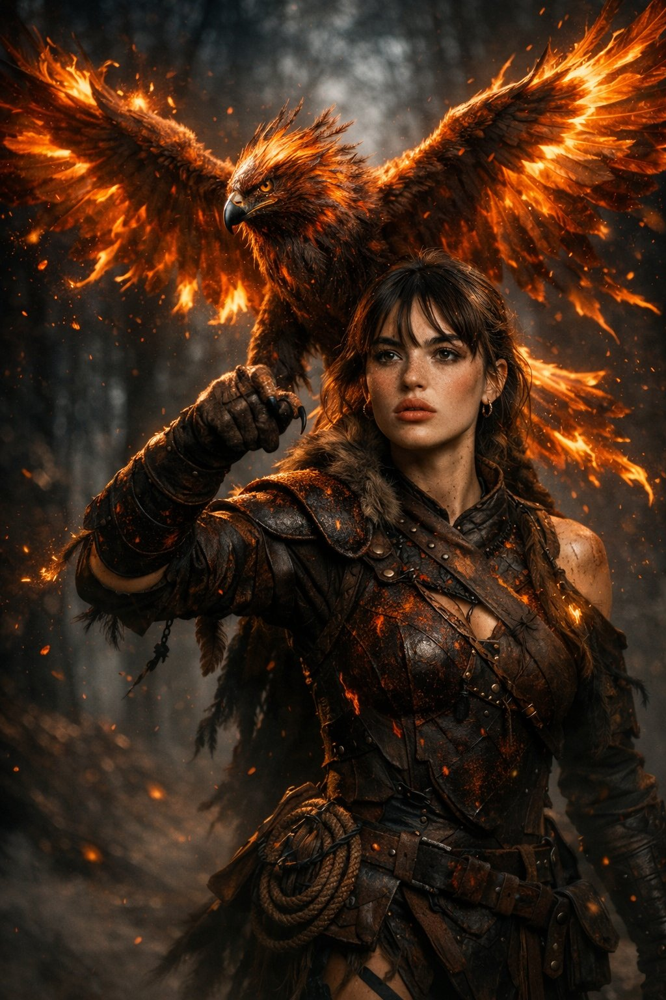


```text
[中文]
一幅充满奇幻色彩的电影场景：一位英姿飒爽的女战士兼猎鹰师，身着饱经战火洗礼、饰以闪耀余烬纹理的皮甲，漫步于幽暗迷雾笼罩的森林之中。她高举手臂，指挥着一头巨大的凤凰与雄鹰的混合体，这头猛禽双翼燃烧，羽毛燃焰，尖端喷吐着火焰。它周身散发着橙红色的熔岩光芒，火星和余烬飞溅。女战士梳着辫子，皮肤上沾满了灰烬，神情坚定，手中拿着绳索和工具袋。画面细节丰富，羽毛纹理逼真，火焰物理效果自然，光照效果极具戏剧性，运用了体积雾、浅景深等技术，营造出史诗般的奇幻氛围，色彩调校极具电影质感，背景阴郁深沉，分辨率高达8K，呈现出概念艺术的精髓，并采用了虚幻引擎的渲染效果。

[English]
A cinematic fantasy scene of a fierce female use image for face reference warrior falconer walking through a dark misty forest, wearing battle-worn leather armor infused with glowing ember textures. Her arm is raised, commanding a massive phoenix-eagle hybrid with blazing wings and flaming feathers, fire trailing from its tips. The bird radiates molten orange and red light, casting sparks and embers into the air.The warrior has braided hair, ash-streaked skin, and a determined expression, carrying a rope and utility pouch. Ultra-detailed feathers, realistic fire physics, dramatic lighting, volumetric fog, shallow depth of field, epic fantasy atmosphere, hyper-realistic, cinematic color grading, dark moody background, 8k, concept art, unreal engine quality.
```


---


## 例 331：西安手绘水彩城市地图

**来源：** 苍何原创实测（公众号文章《我逆向了 329 条 GPT-Image2 提示词模板，全部开源！》）

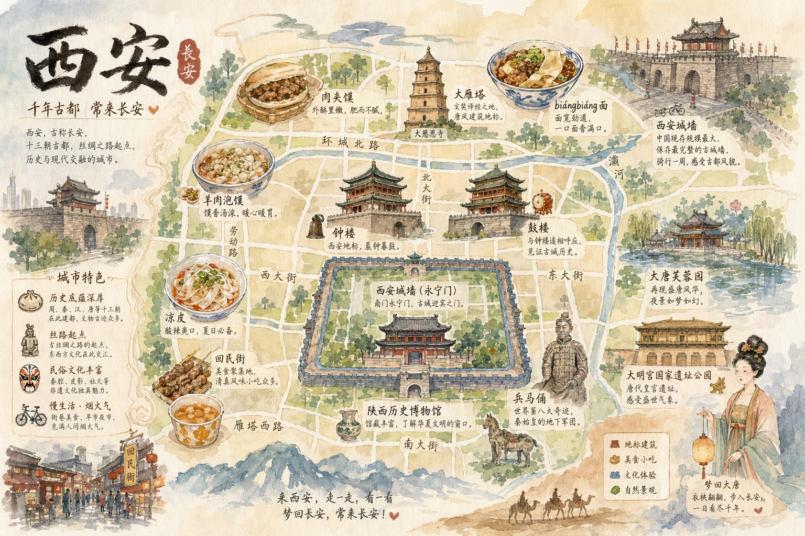


```text
生成一张手绘水彩风格的「西安」城市地图，包含当地特色美食、地标建筑及城市特色
```


---


## 例 337：《短歌行》诗词意境图

**来源：** 苍何原创实测（公众号文章《我逆向了 329 条 GPT-Image2 提示词模板，全部开源！》）

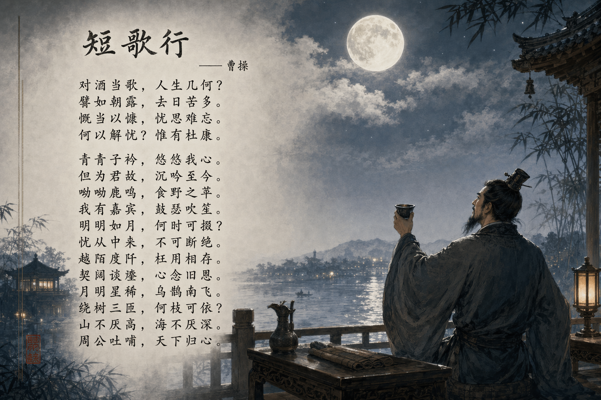


```text
帮我生成一张《短歌行》的意境图，带整篇《短歌行》文字
```


---


## 例 338：《赤壁怀古》长卷图

**来源：** 苍何原创实测（公众号文章《我逆向了 329 条 GPT-Image2 提示词模板，全部开源！》）

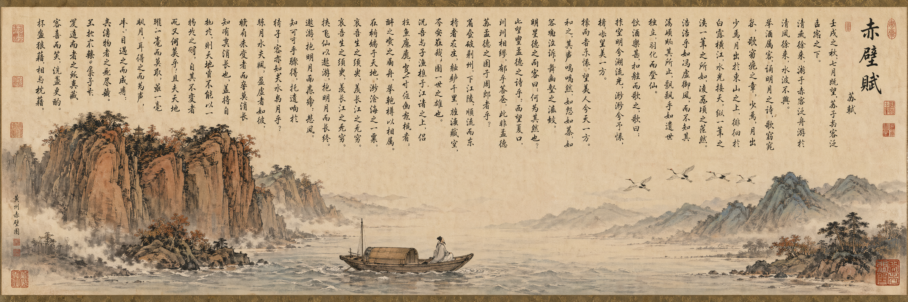


```text
帮我生成一张《赤壁怀古》的长卷图，带整篇《赤壁赋》文字
```


---


## 例 346：立体刺绣小鸟花枝

**来源：** [@dotey](https://x.com/dotey/status/2048529821706195442)

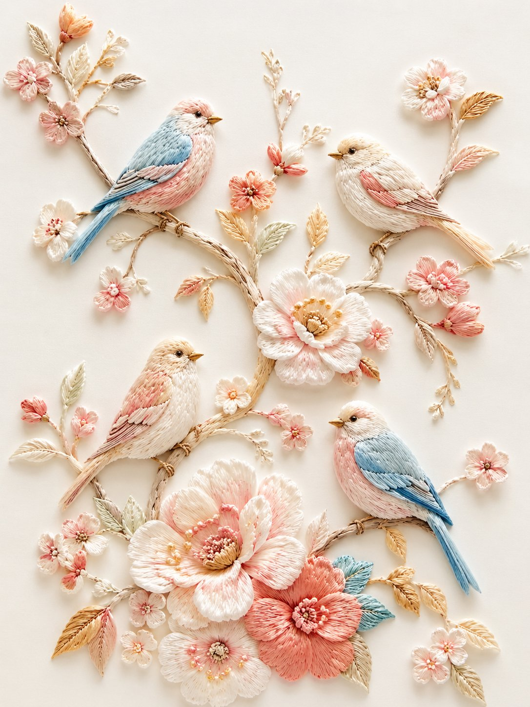


```text
精致立体刺绣风插画，浅浮雕纤维艺术效果，纯净「蚕丝白 + 奶白」底色，细腻丝线质感。画面为数只小鸟停在蜿蜒花枝上，周围点缀粉白、浅桃、珊瑚粉、淡金色花朵与叶片，构图轻盈雅致、留白充足。鸟儿羽毛以奶白、浅蓝、淡粉、浅金丝线刺绣表现，花枝纤细自然，花朵层层叠线，整体呈现高级手工刺绣、丝线堆绣、柔和光影、细节丰富、温柔清新的艺术效果。
```


## 例 347：Anime Martial Arts Battle Illustration

**来源：** awesome-gpt-image-2


```text
An anime-style illustration of a {argument name="action type" default="high-impact martial arts battle"} between two young female fighters in a {argument name="setting" default="traditional wooden martial arts dojo"}. In the foreground, a girl with black hair in a high bun wears a {argument name="character 1 color theme" default="red and white"} Chinese-style martial arts outfit with baggy pants. She is in a dynamic, low, forward-thrusting stance, surrounded by swirling red energy and water splashes. In the background to the right, a girl with light purple hair in twin buns wears a {argument name="character 2 color theme" default="green and purple"} Chinese dress with gold embroidery and black tights. She is leaping through the air in a flying kick pose, surrounded by swirling blue energy. The wooden floorboards are splintering from the intense impact, with debris and dust flying through the air. Above them hangs a weathered wooden sign with the text "{argument name="sign text" default="武術会"}". The scene features dramatic lighting, a low-angle dynamic perspective, and intense action effects.
```


---

## 例 348：12-Panel Xiaomi SU7 Ultra Racing Storyboard

**来源：** awesome-gpt-image-2

```text
{"type":"12-panel cinematic racing storyboard sheet","subject":{"primary vehicle":"Xiaomi SU7 Ultra race car","vehicle color":"bright performance yellow with black racing stripes and black aero details","setting":"sunny daytime professional race circuit with grandstands, pit buildings, start lights, red-and-white curbs, guardrails, straightaways, corners, and finish area","style":"ultra-realistic cinematic motorsport advertising, high speed, aggressive, high contrast, crisp reflections, motion blur in action shots"},"layout":{"background":"black board with thin panel borders","grid":{"rows":4,"columns":3,"count":12},"reading_order":"left to right, top to bottom","panels":[{"index":1,"label":"1. 起跑格·压迫感","position":"row 1 col 1","shot":"low frontal view on the starting grid","details":"yellow Xiaomi SU7 Ultra centered, other race cars flanking it, overhead start lights visible, pit grandstands on both sides, intimidating pre-race atmosphere"},{"index":2,"label":"2. 头灯与机盖特写","position":"row 1 col 2","shot":"extreme close-up of front headlight and hood","details":"left front corner of the yellow car, sleek LED headlight, sculpted hood, Ultra script visible, glossy paint reflections"},{"index":3,"label":"3. 轮毂与刹车特写","position":"row 1 col 3","shot":"close-up of spinning front wheel and brake assembly","details":"black wheel in motion, visible drilled brake disc, yellow brake caliper, tire sidewall branding, carbon fiber aero trim"},{"index":4,"label":"4. 发车瞬间·尾部低角度","position":"row 2 col 1","shot":"low rear three-quarter launch shot","details":"rear of yellow car accelerating hard from the line, tire smoke and dust, large rear wing, competitors nearby, dramatic sense of power"},{"index":5,"label":"5. 侧向跟拍·高速掠过看台","position":"row 2 col 2","shot":"side tracking shot at speed","details":"full side view of the yellow car with race number 01 and Ultra script, grandstand crowd blurred in background, strong lateral motion"},{"index":6,"label":"6. 航拍·车群过S弯","position":"row 2 col 3","shot":"aerial wide shot of the pack through an S-curve","details":"multiple race cars navigating a sweeping section, the yellow cars visible among the field, broad track layout and packed stands"},{"index":7,"label":"7. 车内第一人称·入弯视角","position":"row 3 col 1","shot":"first-person cockpit view entering a turn","details":"driver hands on steering wheel, dashboard and digital gauge cluster visible, cars ahead on track, interior framing the action"},{"index":8,"label":"8. 后视镜·对手逼近","position":"row 3 col 2","shot":"rear-view mirror close-up","details":"mirror dominates frame, pursuing dark race car closing in behind, yellow bodywork framing the mirror, blurred crowd and track edges"},{"index":9,"label":"9. 并排缠斗·贴身对抗","position":"row 3 col 3","shot":"tight side-by-side battle shot","details":"yellow number 01 Xiaomi SU7 Ultra door-to-door with a dark number 23 rival car, minimal gap, high tension wheel-to-wheel racing"},{"index":10,"label":"10. 重刹攻弯·切入内线","position":"row 4 col 1","shot":"corner attack with inside line over curbing","details":"yellow lead car braking hard and clipping red-and-white curbs, dark rival just behind, dynamic track perspective and motion blur"},{"index":11,"label":"11. 直道追击·全力冲刺","position":"row 4 col 2","shot":"rear chase shot on the main straight","details":"camera behind the yellow car as it sprints toward several competitors, overhead banner across the track, centered racing line, acceleration emphasized"},{"index":12,"label":"12. 冲线瞬间·胜利时刻","position":"row 4 col 3","shot":"front three-quarter finish line victory shot","details":"yellow Xiaomi SU7 Ultra crossing the line beneath a waving checkered flag, gold confetti exploding, grandstands full, celebratory motorsport commercial climax"}]},"text":{"language":"Chinese","captions_present":12,"caption_style":"small white Chinese captions along the bottom edge of each panel with transition notes on the right side of most panels"},"composition":"create a complete storyboard contact sheet image rather than a single racing frame, each panel separated clearly and consistently, preserve the same yellow Xiaomi SU7 Ultra design throughout all 12 panels","quality":"highly detailed, polished, realistic lighting, premium commercial finish"}
```


---

## 例 349：Fictional Skirt-Battle Manga Spread

**来源：** awesome-gpt-image-2

```text
A realistic close-up photo of two human hands holding open a Japanese manga magazine at the center spread, viewed from slightly above, with the full two-page black-and-white manga visible including the book’s curved spine, paper texture, and slight page warping. The spread depicts an over-the-top fictional battle-sports manga about girls fighting using only skirt-based techniques in a dramatic shonen style with dense screentone, speed lines, ink splatter, exaggerated motion, and explosive typography. The central action spans both pages: 2 school-uniform girls are in combat, one on the left upright and powerful with long flowing hair, blazer, pleated skirt, and both arms raised overhead as if executing a special move, while the other on the right is upside down in a handstand-like spin with her pleated skirt flaring outward in a tornado shape, legs extended upward, as if being thrown or rotating through the air. The composition should feel chaotic and kinetic, with huge Japanese sound effects and attack text dominating the center, especially a large vertical title-like impact phrase reading 倒立回転衝撃 and another large vertical move name reading 白鳥の湖, integrated into the action art. Surrounding the main splash are 8 smaller side panels total: 4 stacked on the left page and 4 stacked on the right page. On the left page, panel 1 shows a girl standing under a waterfall in harsh training; panel 2 shows an inverted handstand training scene in water; panel 3 shows strength training or push-up-like exercise; panel 4 shows an emotional close-up of 2 girls facing each other. Add bold Japanese motivational captions near these left panels, including 天女の滝行!!, 倒立の特訓!!, 腕の筋トレ!!, 親友の想いを胸に…!!, and at the bottom a large emotional statement 努力は裏切らない!!! 絶対に勝つんだから!!!. On the right page, panel 1 is a close-up of a refined rival girl speaking calmly, with vertical Japanese dialogue; panel 2 is a roaring stadium crowd cheering, packed with spectators and chant text; panel 3 is a tiny explanatory rules diagram labeled スカートバウト・ルール showing 2 simplified girl figures and a skirt icon, with small Japanese rule text explaining that touching anything other than the skirt is forbidden; panel 4 is a shocked close-up face with the reaction なっ!? in a black burst balloon. Keep a few rectangular censorship mosaics over 2 small face areas to mimic a posted-online magazine scan. The manga should look like a printed weekly comic anthology page photographed in real life, not a clean digital layout: visible halftone dots, gutter shadow, page edges, slight yellowed paper, subtle ambient warm lighting, and believable fingers gripping both lower outer corners.
```


---

## 例 350：Business Office Manga Page

**来源：** awesome-gpt-image-2

```text
{"type":"manga style sheet","theme":"business office drama manga page","format":"single page comic with 5 panels","style":"high-detail seinen manga illustration, cinematic lighting, polished digital painting with realistic anatomy, dramatic speed lines, expressive sweat droplets, clean black panel borders, Japanese speech balloons and narration boxes, evening office atmosphere","subject":{"primary":"young Japanese male office worker","age":"mid to late 20s","build":"slim average build","hair":"messy short dark brown hair","outfit":["navy business suit","white dress shirt","blue striped tie"],"props":["stack of documents or one important sheet of paper","office desk setup","computer monitors","binders on shelves","desk lamp"]},"layout":{"sections":[{"title":"top panel","position":"top full width","count":1,"labels":["standing in an office at dusk, low-angle shot, holding documents tightly, windows show sunset sky and city buildings, vertical narration box with Japanese text: 『午後三時。男は、ついに、立ち上がった』"]},{"title":"second panel","position":"upper middle full width","count":1,"labels":["extreme close-up of his clenched hand gripping the paper, covered in sweat droplets, inner monologue balloon with Japanese text: 『この一枚のために…俺は…五年、耐えてきた……』"]},{"title":"third panel","position":"middle full width","count":1,"labels":["over-the-shoulder view from behind the younger employee facing his section chief at a desk with monitors and binders, employee sweating nervously, speech balloons with Japanese text: 『…課長、少し、お時間、よろしいでしょうか』 and 『ん？』"]},{"title":"bottom left panel","position":"bottom left","count":1,"labels":["reaction close-up with shocked pause, Japanese thought balloon: 『えっ…。あ、…はい……』"]},{"title":"bottom right panel","position":"bottom right","count":1,"labels":["rear three-quarter close-up of the boss turning slightly in his chair, calm expression, speech balloon with Japanese text: 『有給？ 別にいいよ、そんなの』"]}],"count":5},"composition":{"camera angles":["dramatic low angle","macro hand close-up","over-the-shoulder office view","reaction close-up","boss rear close-up"],"mood":"tense buildup followed by anticlimactic humor","time":"late afternoon into sunset","setting":"Japanese corporate office with fluorescent ceiling lights, filing shelves, desks, monitors, blinds, and city skyline outside"},"text":{"language":"Japanese","narration_boxes":1,"speech_or_thought_balloons":5},"quality":"crisp professional manga page, emotionally readable faces and body language, subtle warm sunset highlights mixed with cool office lighting"}
```


---

## 例 351：Business Office Manga Task Comic

**来源：** awesome-gpt-image-2

```text
{"type":"manga style business office comic page","style":"clean modern Japanese manga illustration with soft realistic anime rendering, polished linework, warm muted office colors, cinematic lighting, speech balloons with vertical Japanese text, subtle emotional storytelling, professional corporate atmosphere","format":"single page comic with 4 horizontal panels stacked vertically","setting":{"location":"modern open-plan office meeting area with large windows overlooking a city skyline","time":"late afternoon toward sunset","props":["wood meeting table","2 ceramic mugs","spiral notebook","black pen","sticky notes","desktop monitors","office chairs","potted plants"]},"characters":[{"role":"employee 1","appearance":"young Japanese office woman, brown hair tied in a low ponytail, beige blazer over a white blouse, small earrings"},{"role":"employee 2","appearance":"young Japanese office woman, long brown hair worn down, light blue blouse, dark skirt, small earrings"}],"layout":{"sections":[{"title":"Panel 1","position":"top","count":1,"labels":["two women seated across a table in conversation"]},{"title":"Panel 2","position":"upper-middle","count":1,"labels":["close-up of notebook showing this week's task list with priorities"]},{"title":"Panel 3","position":"lower-middle","count":1,"labels":["close-up reflective reaction shot of employee 2"]},{"title":"Panel 4","position":"bottom","count":1,"labels":["rear view of both women standing before the glowing sunset window"]}]},"panel_details":[{"panel":"top panel","composition":"medium two-shot at a meeting table in the office","visible_objects_count":5,"visible_objects":["steaming pink mug on the left","spiral notebook in employee 1's hands","blue mug near employee 2","office chairs","background windows and desks"],"speech_bubbles_count":1,"speech_bubbles":["今週のタスク、整理しとこうか"]},{"panel":"second panel","composition":"close-up of an open spiral notebook on a wooden desk, viewed diagonally from above","notebook_title":"今週のタスク","task_count":8,"tasks":["① 企画書の作成","② データ集計・分析","③ クライアント連絡","④ 社内ミーティング準備","⑤ 資料レビュー","⑥ 経費精算","⑦ メール返信対応","⑧ 業務改善アイデア検討"],"priority_header":"優先度","priority_count":8,"priorities":["A","A","B","B","B","C","C","C"],"extra_objects_count":3,"extra_objects":["black pen","pink sticky note pad","multicolor sticky tabs"],"speech_bubbles_count":1,"speech_bubbles":["優先度もちゃんと振ってあるよ"]},{"panel":"third panel","composition":"close-up profile of employee 2 looking thoughtful, office window blurred in background","speech_bubbles_count":1,"speech_bubbles":["このリスト、先週も見た気がする…"]},{"panel":"bottom panel","composition":"wide rear shot of both women standing side by side facing a large sunset over the city, notebook open on the table in foreground","visible_objects_count":6,"visible_objects":["open notebook on table","pink mug on left","blue mug on right","smartphone or planner beside the blue mug","potted plant on the left","city buildings outside the window"],"speech_bubbles_count":2,"speech_bubbles":["うん、来週こそ","来週こそやろう"]}],"mood":"lightly humorous workplace procrastination, relatable business comic, bittersweet but hopeful ending","quality":"high detail, print-ready manga page, crisp panel borders, legible handwritten-style Japanese notebook text"}
```


---

## 例 352：3D Gaming Character Sheet Prompt

**来源：** awesome-gpt-image-2

```text
A highly detailed 3D gaming character sheet, 
- on the left side a {argument name="character description" default="beautiful female french student"} , head front view + side view, accessory samples, character front view and back view, 
- on the right side details about her: name, age, job, city, size, weight, character description, hobbies, strengths, weaknesses, backstory,
```


---

## 例 353：90s Anime Cafe Shootout Storyboard

**来源：** awesome-gpt-image-2

```text
{"type":"anime storyboard sheet","style":"gritty 1990s anime cinematic stills, hand-painted cel look, dark outlines, moody amber and teal lighting, realistic proportions, tense action-thriller atmosphere","subject":{"main character":"{argument name=\"character description\" default=\"young man with short dark hair, black t-shirt, muscular build, heavily tattooed forearms\"}","location":"{argument name=\"location name\" default=\"CAFÉ CENTRAL\"}","setting":"cozy urban café interior with wooden tables, framed wall art, warm pendant lamps, front glass entrance, espresso counter area"},"layout":{"grid":"3x3 storyboard collage with thin white borders","panel count":9,"numbered panels":true,"panel labels":["1","2","3","4","5","6","7","8","9"]},"panels":[{"panel":1,"composition":"medium shot","action":"the tattooed man sits alone at a café table drinking from a white cup, looking calm and unaware","background details":"sugar dispenser on table, another couple seated by the window behind him"},{"panel":2,"composition":"close-up profile near the window","action":"the man notices movement outside and turns his head toward the glass","background details":"the café window shows the text {argument name=\"window text\" default=\"CAFÉ CENTRAL\"} and a shadowy armed figure approaching outside"},{"panel":3,"composition":"wide entrance shot","action":"3 masked gunmen in dark clothing burst through the café doorway with pistols raised","count":3,"subjects":["front gunman entering aggressively","second gunman behind him","third gunman near the doorway"]},{"panel":4,"composition":"interior action shot","action":"one masked gunman fires a handgun inside the café while patrons duck and panic","count":3,"subjects":["shooting gunman in foreground","2 additional masked gunmen in background","frightened customers taking cover"]},{"panel":5,"composition":"low angle under-table shot","action":"the tattooed man dives under a wooden café table for cover and reaches forward","background details":"chair legs, tense crouched posture, cluttered café floor"},{"panel":6,"composition":"under-table medium shot","action":"the man pulls a compact black pistol from his waistband while staying low","focus":"tattooed arms, determined body language, conceal-and-draw moment"},{"panel":7,"composition":"tight frontal close-up","action":"the man extends both arms and aims the pistol straight ahead from cover","focus":"gun dominating foreground, tattoo sleeves, intense defensive stance"},{"panel":8,"composition":"side action shot","action":"the man fires back across the café, muzzle flash bright and dramatic, striking a masked attacker","count":2,"subjects":["armed protagonist firing","masked gunman recoiling from the hit"]},{"panel":9,"composition":"wide aftermath shot from behind the protagonist","action":"the man stands with pistol lowered slightly, surveying the café after the shootout","background details":"multiple bodies of masked attackers on the floor, overturned chairs, shocked patrons still hiding, open glass entrance visible","count":3,"subjects":["protagonist seen from behind","3 downed gunmen across the café","surviving patrons in the background"]}],"visual notes":{"color palette":"warm browns, dark shadows, muted blue-gray accents, bright gunfire flashes","camera language":"storyboard framing with varied shots: medium, close-up, wide, low angle, over-the-shoulder","mood":"sudden violent interruption of an ordinary café moment, heroic survival response"}}
```


---

## 例 354：Luxury Perfume Transformation Art

**来源：** awesome-gpt-image-2

```text
A high-end cinematic transformation artwork displayed in five vertical panels, showing a {argument name="subject" default="luxury perfume"} evolving from raw essence into a sculptural masterpiece, each panel separated by thin black dividers.
Panel 1 (Origin): A premium glass perfume bottle resting on a dark reflective surface, surrounded by {argument name="ingredients" default="raw ingredients like rose petals, oud wood, citrus peel, and mist"}, soft studio lighting, elegant shadows.
Panel 2 (Release): The perfume begins to diffuse into the air, visible fragrant mist swirling upward in fluid motion, forming soft organic shapes, glowing particles and vapor trails.
Panel 3 (Transformation): The mist starts shaping into a semi-formed silhouette (abstract human figure or flowing fabric), blending liquid, vapor, and light, luminous and dreamy.
Panel 4 (Abstraction): The form becomes fully abstract — flowing ribbons of scent turning into sleek glass-like curves and fluid geometry, dynamic motion frozen mid-air.
Panel 5 (Transcendence): Final form — a luxurious sculptural perfume bottle or abstract glass statue inspired by the scent’s essence, polished, reflective, with glowing highlights, sitting on a minimal pedestal.
Style: ultra-detailed, photorealistic to abstract progression, deep black background, {argument name="accents" default="gold and silver accents"}, soft glow, high contrast lighting, glossy reflections, cinematic luxury aesthetic, perfume ad style, 4K quality, sharp focus.
```


---

## 例 355：Artistic Progression Ballerina Sculpture

**来源：** awesome-gpt-image-2

```text
Artistic progression in five vertical panels: from realistic sketch to modern abstract sculpture of a {argument name="subject" default="ballerina in arabesque pose"}.
1. Detailed pencil sketch of ballerina on pointe, elegant extended leg and arms.
2. Refined mid-stage sketch.
3. Strongly stylized flowing lines.
4. Angular geometric abstraction.
5. Final sleek, {argument name="material" default="ribbon-twisted contemporary metal sculpture"} with beautiful curves and tension.
{argument name="style" default="Black ink and charcoal style"} on white background, high-contrast artistic study, luxury sculpture aesthetic --ar 3:2
```


---

## 例 356：Vinland Saga Thorfinn Storm Poster

**来源：** awesome-gpt-image-2

```text
A dark, gritty cinematic anime poster in the style of a historical seinen manga cover, inspired by {argument name="series title" default="VINLAND SAGA"}. The composition is vertical and dramatic, with a lone young warrior resembling {argument name="character name" default="THORFINN"} standing on a jagged black rock at the edge of a stormy sea, seen from behind at full body. He wears a weathered brown-grey hooded tunic or cloak with a rough fur-trimmed collar, a belt at the waist, dark trousers, and worn leather boots. His posture is tense but reflective, his right hand holding a short dagger pointed downward, facing violent ocean waves and sea spray under a cold, overcast sky. Behind him and dominating the upper half of the image is a massive close-up side profile of his head and wet, tangled blond hair, rendered with dense ink-like linework and painterly shading, creating a layered double-exposure effect. On the left side, include 4 inset manga-style narrative panels stacked vertically: panel 1 shows a close-up of the same boy gripping a dagger; panel 2 shows him from behind facing a small group of armed men; panel 3 shows an intense close-up of his eyes; panel 4 shows him walking alone among gravestones or stone markers. Add visible typography integrated like a Chinese promotional poster: at the top left, small Japanese title text and the English text "VINLAND SAGA" with "YUKIMURA MAKOTO" beneath it; near the lower left, large distressed block letters reading "THORFINN" with smaller katakana beneath. Add multiple vertical Chinese quote lines in white along the left and right sides, with one emphasized phrase in muted gold. Use a desaturated palette of charcoal black, slate grey, steel blue, dirty white, and faded brown, with high contrast, mist, rain-speck texture, rough brushwork, and an epic melancholy atmosphere about renouncing violence and searching for peace. The overall look should feel like a premium character poster, moody, windswept, somber, and highly detailed.
```


---

## 例 357：Design Poster Transformation Sequence

**来源：** awesome-gpt-image-2

```text
A vertical 2:3 premium design poster with two sections, inspired by elegant perfume advertisement aesthetics, luxury branding, soft pink tones, and a magical storytelling atmosphere.
TOP HALF (PROCESS / TRANSFORMATION SEQUENCE)
A seamless horizontal sequence of 5 pencil sketch panels on a clean white background, showing the evolution from movement to object. No borders between panels; smooth continuous flow.
```


---

## 例 358：Helicopter Over Urban Dust Cloud

**来源：** awesome-gpt-image-2

```text
A cinematic ultra-realistic aerial disaster scene viewed from slightly above and behind a single military transport helicopter flying over a dense urban neighborhood at golden hour. The helicopter is a dark weathered matte-gray utility helicopter with 1 main rotor and 1 tail rotor, seen from the rear-right side, angled toward the upper right of the frame, with visible panel lines, antennas, landing gear, tail stabilizers, and an open side door. Below it, a massive rolling dust cloud from a building collapse or explosion surges through tightly packed city blocks, forming 1 huge mushrooming wall of beige-gray debris with turbulent texture, smaller plumes, and swirling particulate noise spreading between rooftops. The city beneath is sprawling, crowded, and sunlit in warm amber tones, with low-rise buildings, narrow streets, scattered highlights on roofs, and haze in the distance. Emphasize rotor motion blur, volumetric dust, dramatic scale, harsh backlit sunset lighting, long shadows, atmospheric perspective, intense contrast between the dark helicopter and glowing dust, and a tense war-zone or rescue-operation mood. Photorealistic, blockbuster cinematography, high detail, realistic materials, dynamic composition, wide aerial shot, no text, no interface, no extra aircraft.
```


---

## 例 359：Character Asset Design Card

**来源：** awesome-gpt-image-2

```text
Create a character design sheet based on the uploaded image. Design: Character profile poster. Include: 1. Large main portrait 2. Various facial expressions (happy, angry, sleepy, surprised, etc.) 3. Action poses (running, playing) (based on personality) 4. Small object icons 5. Color scheme section 6. Profile section, including name and personality.
```


---

## 例 360：Gothic Sci-Fi Villain Meeting Manga Page

**来源：** awesome-gpt-image-2

```text
{"type":"dark sci-fi manga page","style":"high-detail Japanese comic page, gothic cyber-fantasy, polished digital painting, dramatic shading, sharp inked panel borders, dense atmospheric backgrounds, ominous purple and black color palette with red highlights","format":"full comic page","reading":"right-to-left manga layout","setting":{"location":"sinister executive office inside a machine demon empire","mood":"grand, theatrical, intellectual villain meeting with meta-comedic tone","environment_details":["ornate throne-like desk room","vaulted gothic walls","skulls, candles, books, and occult-mechanical ornaments","purple drapes and banners","large circular halo-like light behind the leader","window showing a dark futuristic fortress city under a stormy night sky","table with tea set, crystal orb, skull decorations, papers, and mechanical devices"]},"characters":{"count":4,"list":[{"role":"leader behind the desk","nameplate":"CHAOS","appearance":"regal armored demon-robot overlord with a feminine face, pale skin, glowing red eyes, dark purple-black bio-mechanical armor, large shoulder pods studded with red gem-like lights, horned crown silhouette, composed and commanding expression"},{"role":"left sofa speaker","appearance":"red armored beast-like humanoid, muscular build, spiky flame-shaped head and armor, glowing eyes, seated with assertive posture, expressive and emotional"},{"role":"center-right sofa figure","appearance":"pale humanoid android with long straight white hair, elegant white face, white and gold armor with purple accents, calm analytical demeanor"},{"role":"right sofa speaker","appearance":"black and gray demon-robot with long curved gold horns, red glowing eyes, white beard-like chin plating, purple circular chest core and shoulder details, rational lecturer posture, often raising one finger while explaining"}]},"layout":{"panel_count":15,"sections":[{"position":"top full-width panel","count":1,"description":"wide establishing panel of the office meeting, leader at the central desk, three subordinates seated on sofas around a coffee table, multiple Japanese speech balloons, vertical title box on the far right"},{"position":"middle tier panels","count":8,"description":"conversation panels alternating between close-ups of the horned robot, cosmic singularity imagery, the leader, and the red armored subordinate"},{"position":"bottom tier panels","count":6,"description":"debate continues with close-ups of the white-haired android, red armored figure, horned robot, and the leader delivering the concluding explanation"}],"text_elements":{"language":"Japanese","count":20,"items":["1 vertical location/title box on the upper right","19 speech balloons and dialogue boxes distributed across the 15 panels"]}},"iconography":{"count":6,"items":["1 desk nameplate reading CHAOS","2 singularity/black hole cosmic illustrations in separate panels","1 glowing holographic technology diagram panel","1 halo-like circular backlight behind the leader","1 dark castle cityscape visible through the window"]},"composition":"make the page busy and readable, with cinematic panel variety: one large establishing shot, several medium dialogue panels, several close-ups, and inserted explanatory visual panels showing black holes and abstract cosmic evolution concepts","text":{"title_box":"{argument name=\"headline text\" default=\"機械魔城 総統執務室\"}","dialogue":"Japanese manga dialogue throughout, with dense explanatory villain conversation about singularity, AI, humanity, control, evolution, and domination; include the nameplate text 'CHAOS' exactly on the desk"},"visual_themes":["villain boardroom exposition","sci-fi singularity theory","mechanical demon empire","gothic luxury","meta-humorous explanation comic","anime supervillain aesthetics"],"quality":"ultra-detailed, crisp faces, intricate armor textures, dramatic rim lighting, polished manga illustration, high readability, professional comic page finish"}
```


---

## 例 361：Fantasy Guild Receptionist Novel Cover

**来源：** awesome-gpt-image-2

```text
A polished fantasy light-novel cover illustration in anime style, square format, showing a beautiful adult female guild receptionist from the waist up in an elegant adventurer’s guild interior. She stands slightly right of center behind a wooden counter, facing forward with a calm, professional pose, holding a black-and-gold pen lightly in one hand near her shoulder. Her face is intentionally obscured by a large centered beige rectangular censor block. She has {argument name="character name" default="リリアン・ヴェイル"}, age 27, with {argument name="hair color" default="light blonde"} hair styled in a refined updo bun with soft loose bangs framing the face. She wears a dark brown tailored high-collared jacket richly embroidered with ornate gold floral trim, a green vest underneath, and a white ruffled blouse. Add one visible teal gemstone drop earring. The mood is dignified, intelligent, and dependable. The background is a warmly lit, luxurious guild office with dark carved wood, a blurred crest plaque on the wall, framed documents, a desk lamp, flowers, and soft golden bokeh, creating a high-end fantasy workplace atmosphere. At the top, include 3 lines of Japanese title typography: first a small header line reading "《冒険者ギルドのお仕事ファンタジー》", second a large main title line reading "鉄の受付嬢 {argument name="highlighted name text" default="リリアン"} のプロの流儀" with the highlighted name in emerald green and the rest in black, and third a subtitle line reading "〜冒険は、窓口から始まります〜". At the bottom, add an ornate dark brown and gold nameplate with 3 text lines: "{argument name="nameplate text" default="リリアン・ヴェイル"}", "冒険者ギルド受付嬢 (27歳)", and "丁寧・正確・冷静 —— それが、私の仕事です。" Use refined Japanese book-cover typography, decorative flourishes, soft cinematic lighting, subtle depth of field, luxurious textures, and a premium fantasy novel cover composition.
```


---

## 例 362：Modern Ride-hail Parody

**来源：** awesome-gpt-image-2

```text
{argument name="character one" default="Pan Jinlian"} calls a {argument name="service" default="Didi premier car"}, but {argument name="character two" default="Wu Song"} arrives on horseback; she silently cancels the order and calls another one.
```


---

## 例 363：Anime Fantasy Key Visual Board

**来源：** awesome-gpt-image-2

```text
Create a cinematic anime key visual and concept-art presentation board for a fantasy adventure titled {argument name="project title" default="Codex & GPT-Image-2"}. The main image fills the upper portion: a vast ruined stone causeway high above the clouds at night, leading toward a circular observatory-like sanctuary with towers, antennas, and a glowing mechanism at the summit. A vivid aurora arcs across a star-filled sky over distant mountain ranges. Three travelers stand on the bridge in a triangular composition. In the center foreground, a pale white-haired girl in a flowing white robe and cape walks toward the viewer, holding a staff with a red ring ornament; her expression is calm and mysterious. On the left, a tall woman with very long dark purple hair and a dark cloak turns slightly away, looking toward the structure. On the right, a red-haired young man in a brown coat stands with his back angled to the viewer, carrying a large dark weapon. The bridge is weathered, cracked, and lined with glowing cyan inlaid paths and runic strips, with stone pillars and balustrades on both sides. Add large title typography in the upper right, with a smaller Japanese subtitle beneath it reading {argument name="subtitle text" default="灰銀のアウロラ"}. Add a small Japanese tagline in the lower left reading {argument name="tagline text" default="旅は、記憶の先へ続いている。"}. Beneath the hero image, place a horizontal strip of detailed monochrome and muted-color concept sheets showing exactly 8 grouped design panels: 1 white-haired heroine full-body costume turnaround sheet, 2 white-haired heroine face-expression sheet, 3 heroine accessories and gear sheet, 4 purple-haired woman outfit turnaround and detail sheet, 5 red-haired man outfit turnaround and weapon sheet, 6 architectural exterior elevation sheet of the observatory, 7 architectural interior and structure reference sheet, 8 circular mechanical diagram sheet. Along the bottom, place exactly 4 environment thumbnails: 1 ruined mountain road landscape, 2 icy-blue bridge or aqueduct environment, 3 distant hilltop approach to the sanctuary, 4 towering cathedral-like interior hall. Overall style: premium anime game art pitch board, highly detailed, painterly, dramatic lighting, cool blue and cyan palette with white stone and subtle orange title accents, polished layout, epic fantasy sci-fi atmosphere.
```


---

## 例 364：Cute Brains Frozen in Ice Cubes

**来源：** awesome-gpt-image-2

```text
A whimsical clean cartoon illustration of 7 transparent ice cubes floating underwater against a vivid saturated blue background, each cube containing a cute pink brain character with oversized googly eyes and a small smiling mouth, as if the brains are frozen inside the cubes. Show the cubes drifting at different angles and depths in a loose vertical composition, with soft white highlights, glossy refraction, rounded cube edges, and a hand-drawn outlined look. Include many air bubbles of different sizes scattered throughout the scene, plus tiny white specks and soft splash-like dots to enhance the underwater feel. The brains should all have the same playful simplified design, bright pink color, black outlines, and expressive slightly goofy faces. Keep the style light, polished, and humorous, like a modern sticker illustration or cheerful editorial cartoon, with no text, no border, and a square composition.
```


## 例 365：千手观音化身打工人

**来源：** [@johnAGI168](https://x.com/johnAGI168/status/2046565555025367392)

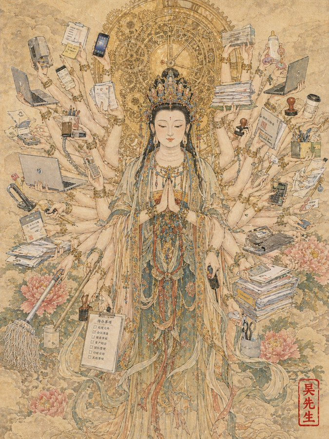


```text
[中文]
一幅高度详细的千手观音菩萨工笔画。

然而，千手并没有拿着神圣的宗教法器，而是拿着现代办公和家用物品：**笔记本电脑、智能手机、成堆的文件、咖啡杯、印章、计算器、拖把和奶瓶**。它代表了终极的多任务处理现代工作者。

脑后的金色光环由旋转的时钟齿轮组成。

**在右下角，一个单一的红色竖排艺术家印章写着“吴先生”（Mr. Wu），风格化得像水印一样。** --ar 3:4

[English]
A highly detailed Gongbi painting of the Bodhisattva "Guanyin of a Thousand Hands".

However, instead of sacred religious artifacts, the thousand hands are holding modern office and household items: **laptops, smartphones, stacks of paperwork, coffee cups, stamps, calculators, mops, and baby bottles**. It represents the ultimate multi-tasking modern worker.

The golden aura behind the head is made of spinning clock gears.

**In the bottom right corner, a single red vertical artist chop seal reads "吴先生" (Mr. Wu), stylized like a watermark.** --ar 3:4
```


---
## 例 366：西方艺术演进像素博物馆

**来源：** [@GeekCatX](https://x.com/GeekCatX/status/2046172416716759171)

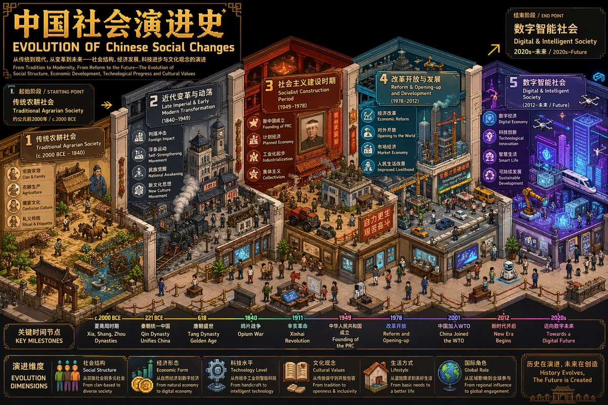


```text
[中文]
创作一张超高细节等距像素艺术时间线插画（3:4，4K），融合细节密度、象征性与隐喻。用户指定的主题为【Western Art Development】。

首先，围绕Western Art Development进行推理，确定：主题的中英文标题、涵盖的最早与最近历史时期、起始阶段标签与结束阶段标签，以及3-5个关键演进阶段及其各自的象征性元素与色彩方案。

然后构建一个以"Western Art Development"为主题的等距"演进博物馆"，每个展馆区域代表一个演进阶段，空间推进即代表时间演变。采用标准等距视角（2:1），丰富的层次深度与流畅过渡。每个阶段分配3-5个与主题强烈关联的象征元素，并用差异化色彩暗示时间流动。在场景中融入双语像素字体标题：中文"[主题中文]演进史"与英文"EVOLUTION OF Western Art Development"，加上起止阶段的双语副标题及关键时间节点标记。整体风格专业且具视觉张力，适合学术分析与对比可视化，直接出图。

[English]
Create an ultra-high-detail isometric pixel art timeline illustration (3:4, 4K), integrating detail density, symbolism, and metaphor. The user-specified theme is [Western Art Development]. First, reason around Western Art Development to determine: the Chinese and English titles of the theme, the earliest and most recent historical periods covered, the starting stage label and the ending stage label, as well as 3-5 key evolution stages and their respective symbolic elements and color schemes. Then build an isometric "Evolution Museum" themed "Western Art Development", where each exhibition hall area represents an evolution stage, and spatial progression represents time evolution. Adopt a standard isometric perspective (2:1), rich layer depth, and smooth transitions. Allocate 3-5 symbolic elements strongly associated with the theme to each stage, and use differentiated colors to imply the flow of time. Integrate bilingual pixel font titles in the scene: Chinese "[Theme Chinese] Evolution History" and English "EVOLUTION OF Western Art Development", plus bilingual subtitles for the starting and ending stages and key time node markers. The overall style is professional and visually tense, suitable for academic analysis and comparative visualization, direct image output.
```


---
## 例 367：蒙娜丽莎畅饮可乐的趣味油画

**来源：** [@liyue\_ai](https://x.com/liyue_ai/status/2045058142858555733)

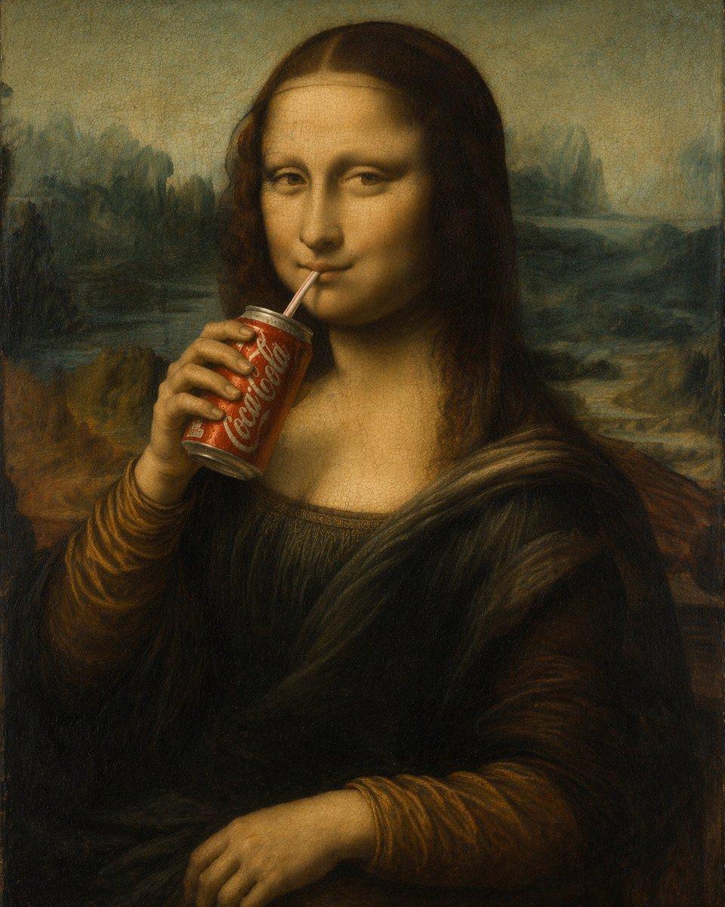


```text
[中文]
生成一张蒙娜丽莎喝可乐的油画。

[English]
Generate an oil painting of Mona Lisa drinking cola.
```


---
## 例 368：官方角色设定资料卡

**来源：** [@MANISH1027512](https://x.com/MANISH1027512/status/2045013913901867334)

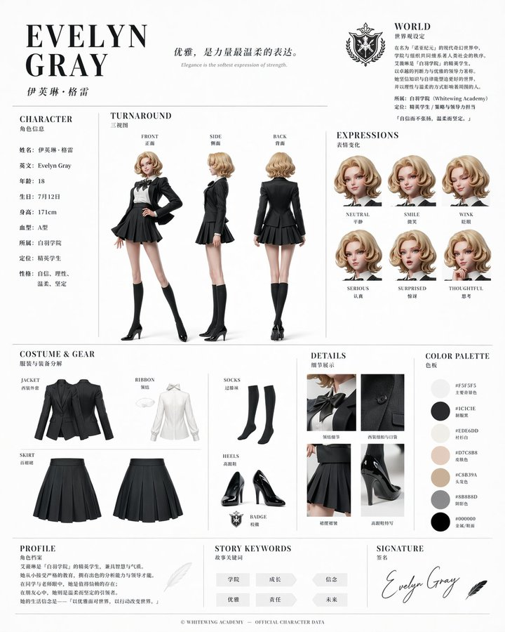


```text
[中文]
基于此角色和背景，请制作一份类似官方设定资料的角色资料卡。
・包含三视图：正面、侧面和背面
・添加角色面部表情的变化・分解并展示服装和装备的详细部分
・添加色板・包含世界观设定的简要说明
・总体上，使用有组织的布局（白色背景，插画风格）

[English]
Based on this character and background, please create a character reference sheet similar to official setting materials.
・Includes three-view drawings: front view, side view, and back view
・Add variations of the character's facial expressions
・Break down and display detailed parts of the clothing and equipment
・Add a color palette
・Include a brief explanation of the worldview setting
・Overall, use an organized layout (white background, illustration style)
```


---
## 例 369：4×4 动作分解参考表

**来源：** [@oggii_0](https://x.com/oggii_0/status/2048614158699217302)

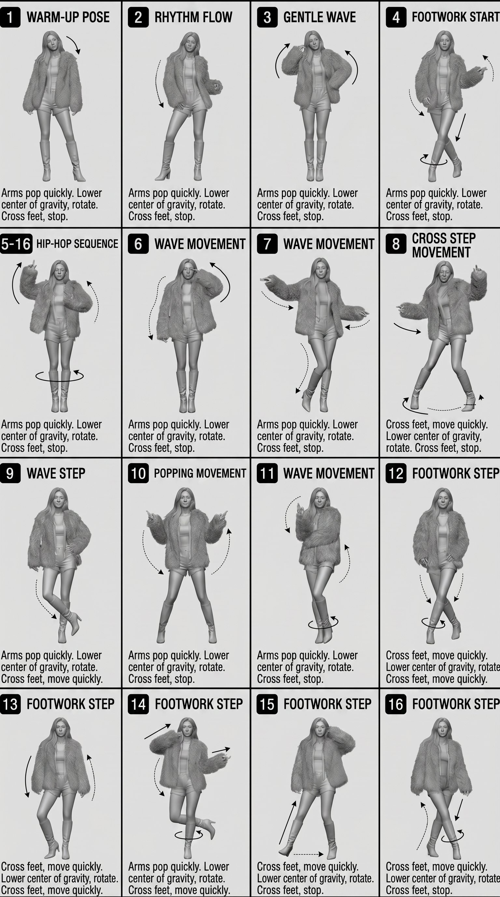


```text
[STYLE]
Monochrome grayscale illustration, 3D-rendered character, clean instructional reference sheet, white background, comic-style cell grid layout, technical diagram aesthetic.

[LAYOUT]
4×4 grid layout with a total of 16 panels. Each panel is separated by thin black border lines. Cells are numbered from 1 to 16, with consistent panel sizes.

[CHARACTER]
image1 (the same character appears consistently in all panels)

[PANEL STRUCTURE – per cell]
Top-left: bold number badge + English title text
Center: full-body character pose illustration
Bottom-left: English description text (3–4 lines)
Overlay: directional arrows indicating movement

[ARROWS / MOTION INDICATORS]
Curved arrows, straight arrows, and circular rotation indicators placed around the character to show motion flow and direction.

[RENDERING STYLE]
Highly detailed 3D sculpted style, soft studio lighting, subtle shadows, no color, grayscale shading, clean linework, game concept art quality.

[NEGATIVE]
No background scenery, no color tones, no additional characters, no complex background.
```


---

## 例 370：过度思考超现实街头 Campaign

**来源：** [@AIwithAliya](https://x.com/AIwithAliya/status/2049044716642316758)

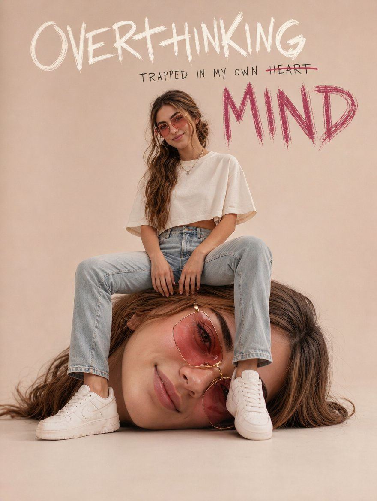

```text
Ultra-realistic conceptual portrait of a young woman with long wavy hair and soft defined features, wearing rose-tinted rectangular sunglasses, an oversized ivory cropped t-shirt, fitted light-wash denim jeans, and clean white sneakers. She is sitting casually with a confident yet relaxed posture.

The twist: she is seated on a large, hyper-realistic version of her own detached head placed on the ground. The head is scaled up, lying sideways, with the same facial features and sunglasses, creating a surreal self-reflection concept.

Composition: centered, full-body shot, neutral studio background with soft blush and cream tones, minimal aesthetic. Clean negative space.

Typography integrated into the background:

Handwritten-style text at the top: "OVERTHINKING"

Below it, smaller text: "TRAPPED IN MY OWN HEART" with "HEART" crossed out

Large, rough, scribbled text in deep pink: "MIND"

Lighting: soft diffused studio lighting, subtle shadows, high detail, fashion editorial quality.

Style: blend of surrealism and modern luxury streetwear campaign, pastel feminine aesthetic, minimal yet expressive, high-resolution, 8k, sharp focus, natural skin texture.

Mood: introspective, emotional weight, identity, self-awareness, quiet confidence.
```


---

## 例 374：彩色潦草小狗线条风格重绘

**来源：** [@berryxia](https://x.com/berryxia/status/2050226420681757102)

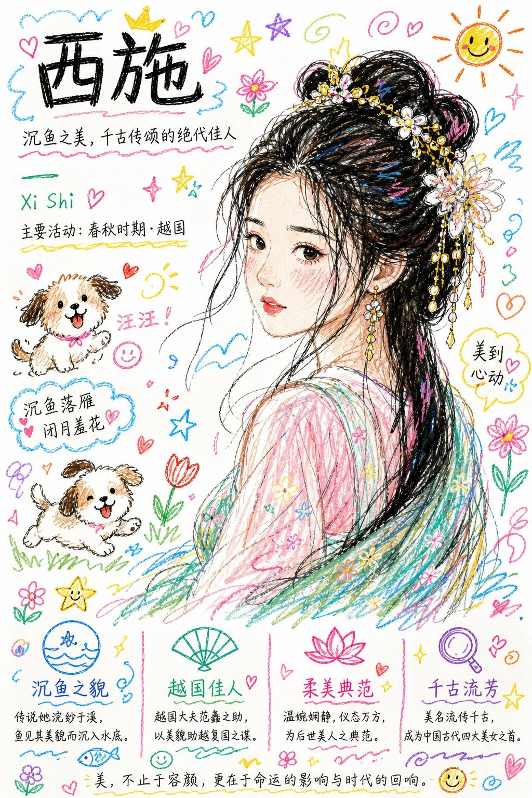

```text
彩色潦草小狗线条风格绘制该图，童趣和doodle加入其中，务必使用毫无章法的绘制手法，凌乱和草率即可。
```


---

## 例 405：可爱纸艺风照片重绘

**来源：** [@oggii_0](https://x.com/oggii_0/status/2052609040539328759)

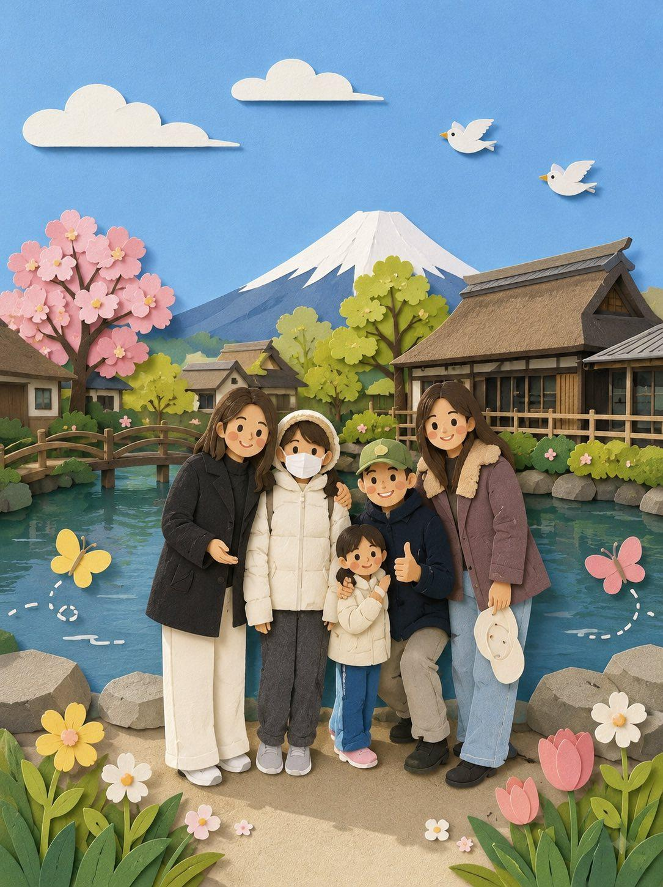

```text
Recreate this image in a paper craft style, simplifying the details to make them suitable for paper craft artwork. Arrange the overall composition to feel visually pleasing, soft, and cute. You may add charming decorative elements such as birds, butterflies, flowers, etc., to enhance the adorable atmosphere while still matching the original image.
```


---

## 例 409：拙劣 MS Paint 风重绘

**来源：** [@Ciri_ai](https://x.com/Ciri_ai/status/2052969749878059362)

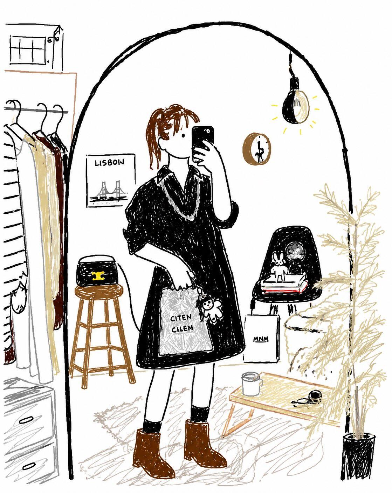

```text
Please redraw the attached image in the most clumsy, messy, and hopelessly pathetic way possible. Use a white background and make it look like it was drawn in MS Paint with a mouse. It should vaguely resemble the original, but not really — like it’s kind of correct in some places yet strangely off and awkward overall. Emphasize a low-quality, pixelated look, and make it appear ridiculously badly drawn. …Actually, never mind — just draw it however you want in a sloppy way.
```


---

## 例 410：夸张动漫风主体重绘

**来源：** [@Zyrellix](https://x.com/Zyrellix/status/2052766810500649197)

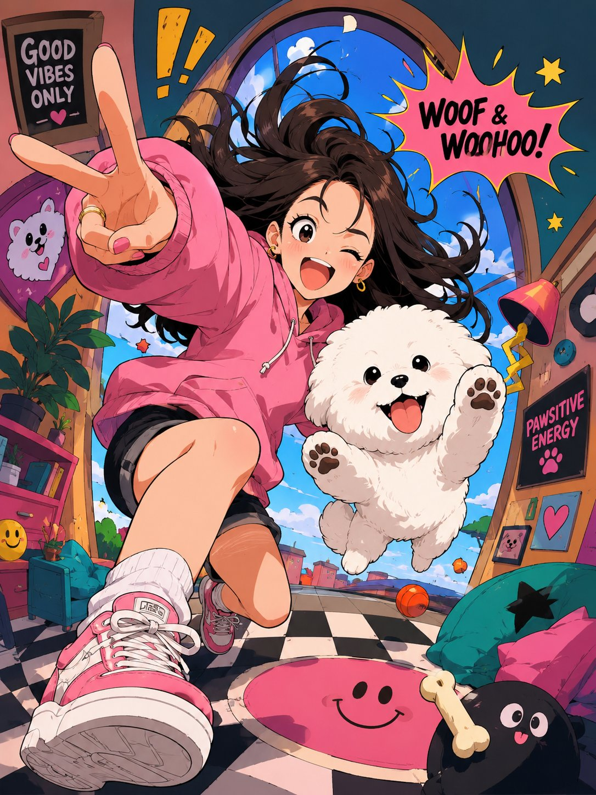

```text
Create a trending anime art style image from the uploaded subject. Use confident line-work with slight variation and minimal cel shading using flat shadow shapes. Use bright, saturated colors and clean graphic lighting. The style is defined by exaggerated, cartoonish character proportions featuring highly expressive, simplistic facial features that allow for immense emotional range, with highly varied stretched anatomy.Transform the environment into a slightly warped space with playful perspective distortion and simplified objects. Composition and tone should be energetic, lively, and comedic in a fully stylized, non-realistic world
```


---

## 例 423：日系手绘涂鸦半身插画

**来源：** [@heyfatema](https://x.com/heyfatema/status/2053703602246668607)

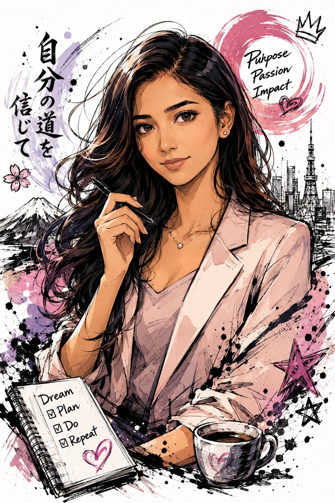

```text
Generate an illustration of "me" as you imagine it. Features include a Japanese illustration style, distinct character features, natural emotional expressions, a half-body composition, dynamic poses, exquisite clothing details, a hand-drawn graffiti style, ink splatter strokes, free-flowing lines, a blend of pastels and ink, a comic sketch texture, a minimalist white background, surrounding symbolic elements, a strong atmosphere, high detail, and high quality.
```


---

## 例 430：铅笔素描时尚编辑插画

**来源：** [@harboriis](https://x.com/harboriis/status/2054573031343931418)

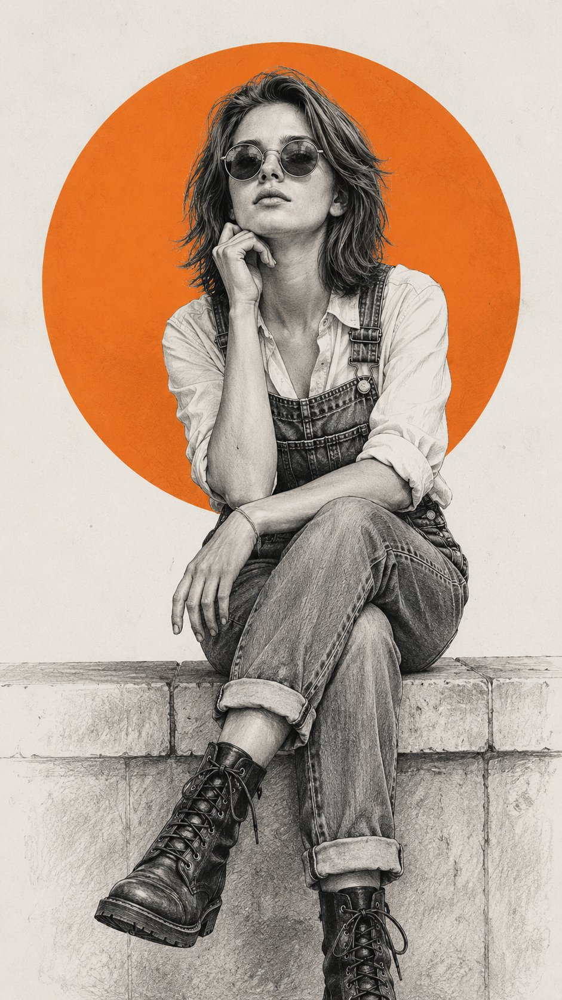

```text
A high-detail digital illustration of a stylish woman sitting gracefully on a stone ledge, posing with one hand near her chin and legs crossed. She is wearing vintage-inspired round sunglasses, a white blouse with rolled-up sleeves, denim overalls, and rugged lace-up combat boots. The subject is rendered in a desaturated, monochromatic pencil-sketch style with soft cross-hatching and charcoal textures. In the background, a large, vibrant solid orange circle creates a bold geometric contrast against a clean, light grey backdrop. The overall composition is minimalist, editorial, and features a clean "indie-magazine" aesthetic with sharp linework and soft shading.

Aspect ratio is 9:16
```


---

## 例 433：韩国城市水彩旅行插画

**来源：** [@Taaruk_](https://x.com/Taaruk_/status/2055492435862773978)

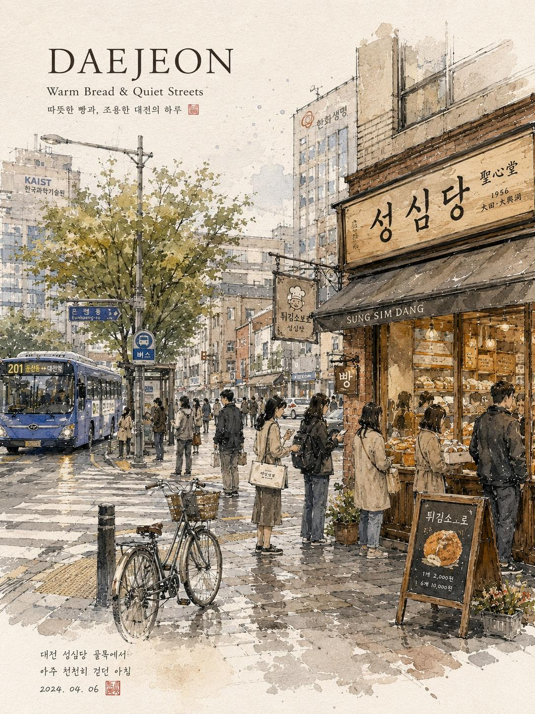

```text
Dreamy watercolor travel illustration of a peaceful Korean city street, hand-painted urban sketchbook style, delicate ink linework mixed with soft watercolor washes, cozy café storefronts, warm bakery lights glowing through windows, quiet morning atmosphere after light rain, reflective wet pavement, pedestrians with umbrellas and tote bags, bicycles parked along narrow streets, traditional Korean signs and typography, subtle Korean text labels, soft beige paper texture background, architectural sketch aesthetic, calm everyday city life, muted earthy palette with warm browns, faded greens, cream whites and soft blue accents, highly detailed pen-and-ink drawing, loose expressive brush strokes, travel journal composition, editorial postcard layout, elegant serif title text at top (“SEOUL”, “JEONJU”, “DAEJEON”), handwritten notes and date stamps, vintage travel diary aesthetic, cozy East Asian urban scenery, cinematic slice-of-life mood, watercolor bleeding edges, natural perspective, atmospheric depth, peaceful storytelling illustration, minimalist negative space, ultra detailed watercolor texture, sketchbook traveler aesthetic, nostalgic café culture vibes, Studio Ghibli-inspired realism, European urban sketching style mixed with Korean street scenery, soft daylight, calm and poetic composition, vertical poster design, premium art print quality.
```


---

## 例 435：层叠纸雕情侣插画

**来源：** [@Just_sharon7](https://x.com/Just_sharon7/status/2055368240885641323)

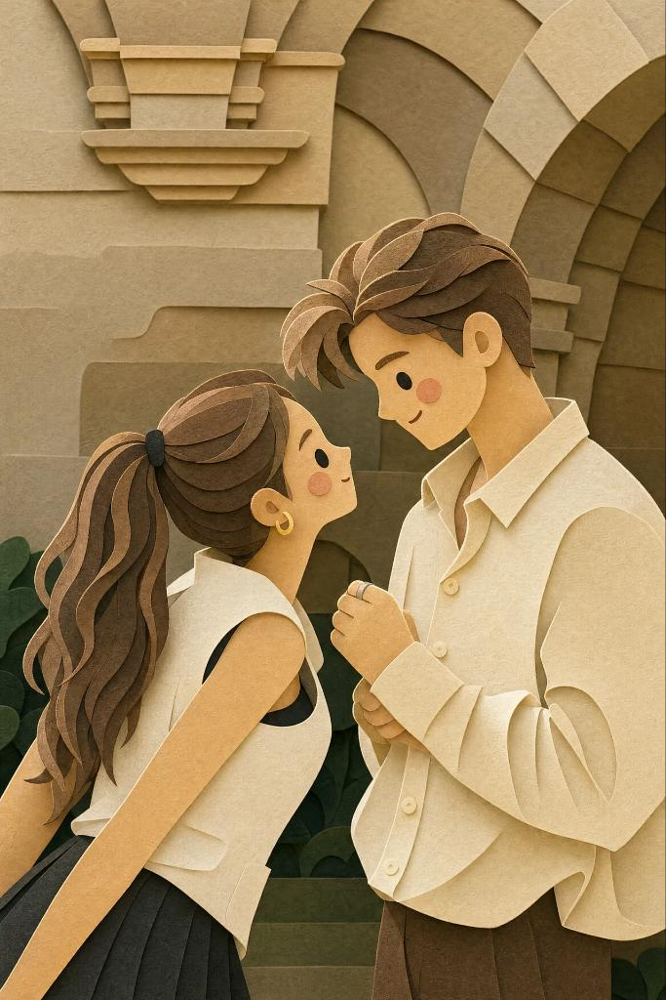

```text
{
  "style": "layered paper-cut illustration, papercraft diorama, handcrafted aesthetic",
  "technique": {
    "layering": "multiple stacked paper layers with soft drop shadows between each layer",
    "depth": "5–7 visible depth planes from foreground to background",
    "edges": "smooth, rounded, slightly beveled paper-cut edges",
    "texture": "subtle paper grain and fibrous texture on all surfaces",
    "shadows": "soft, diffused inner shadows beneath each layer suggesting physical depth"
  },
  "character_design": {
    "proportions": "chibi / cute simplified — large round head, small body (1:1.5 ratio)",
    "face": {
      "eyes": "small dot eyes, glossy highlight",
      "cheeks": "soft circular rosy blush patches",
      "nose": "absent or minimal dot",
      "mouth": "simple small curve smile"
    },
    "limbs": "short, rounded, stubby limbs",
    "outline": "clean smooth silhouette, no sharp corners"
  },
  "color_palette": {
    "mood": "warm, cozy, pastel",
    "tones": ["soft cream", "dusty rose", "sage green", "warm peach", "sky blue", "honey yellow"],
    "saturation": "low-to-medium, muted and gentle",
    "background": "warm off-white or soft gradient"
  },
  "lighting": {
    "type": "soft ambient light from top-front",
    "highlights": "gentle white edge highlights on top layers",
    "shadows": "warm light tan/beige shadow tones beneath cut layers"
  },
  "environment": {
    "foliage": "simplified rounded leaf and floral shapes as separate paper layers",
    "ground": "curved horizon layers suggesting rolling hills",
    "details": "tiny decorative elements — stars, small hearts, dots — cut from paper"
  },
  "overall_mood": "warm, whimsical, cozy, handmade, storybook",
  "render_quality": "ultra-detailed papercraft art, studio photography lighting, sharp focus on layer edges"
}
```


---

## 例 442：舒适发廊插画

**来源：** [@Sairah_0](https://x.com/Sairah_0/status/2056293543753503126)

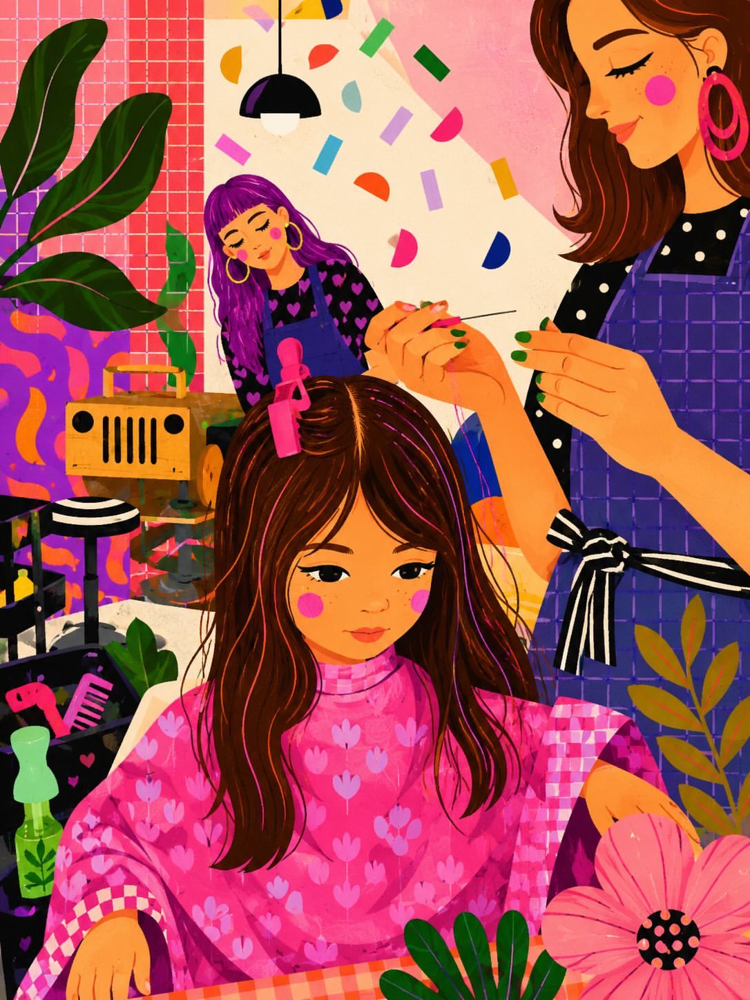

```text
A vibrant whimsical digital illustration of a cozy indie hair salon, featuring a young girl with long brown hair getting her hair styled by a fashionable hairstylist. Bright pink, purple, orange, and peach color palette with playful retro decor, indoor plants, patterned walls, confetti shapes, beauty tools, flowers, and soft ambient lighting. Cute feminine aesthetic, dreamy cartoon style, expressive characters with rosy cheeks, highly detailed textures, modern flat illustration mixed with painterly shading, colorful composition, trendy Pinterest aesthetic, cozy creative atmosphere, ultra-detailed, 2D editorial art style.
```


---

## 例 445：旅游照水墨明信片

**来源：** [@zhgqthomas](https://x.com/zhgqthomas/status/2056633723366568387)

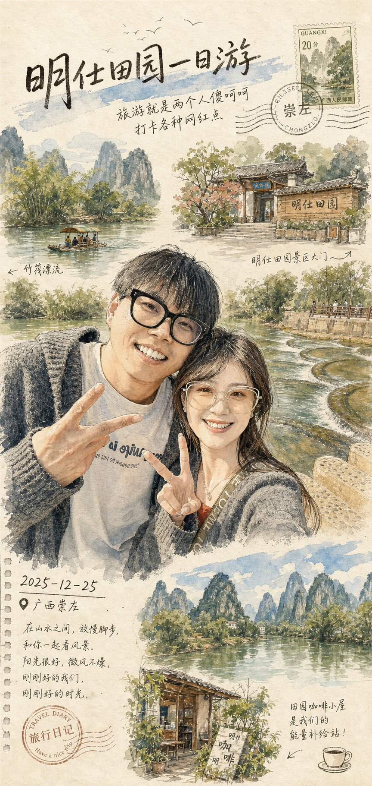

```text
Create a dreamy watercolor travel illustration style from the attached photo. Use hand-painted urban sketchbook aesthetic, delicate ink linework mixed with soft watercolor washes, highly detailed pen-and-ink drawing, loose expressive brush strokes, watercolor bleeding edges, ultra detailed watercolor texture, soft beige paper texture background, architectural sketch style, vintage travel diary and sketchbook traveler aesthetic, travel journal composition, editorial postcard layout, handwritten medium title:[自定义标题]  at top, handwritten notes:[自定义文案] , date: [自定义日期] and location: [自定义地点]  stamps, natural perspective, atmospheric depth, minimalist negative space, muted earthy palette (warm browns, faded greens, cream whites, soft blue accents), quiet, calm, soft, cozy, nostalgic vibes, cinematic slice-of-life mood, poetic composition, mixed urban sketching with Ghibli-inspired realism, vertical poster design, premium art print quality.
```


---

## 例 446：低多边形纸艺男士肖像

**来源：** [@iamsofiaijaz](https://x.com/iamsofiaijaz/status/2056953102755115162)

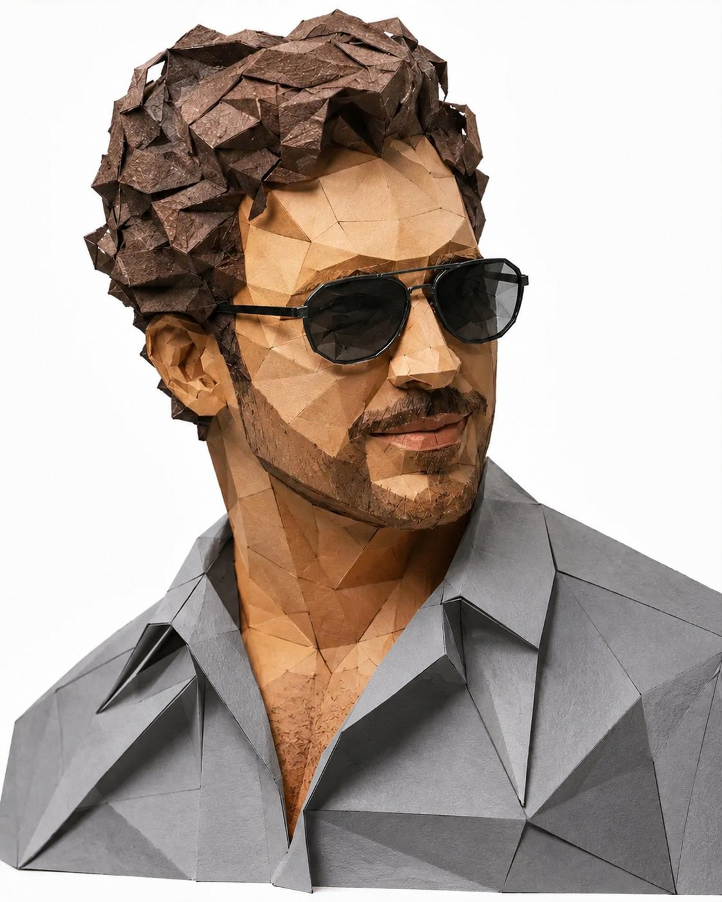

```text
Create a highly detailed low-poly papercraft portrait of a stylish young man, designed like an origami paper sculpture. The character has curly dark brown hair, a trimmed beard, and wears slightly black-tinted geometric sunglasses with thin black frames. His shirt is medium grey with sharp polygonal folds and realistic paper texture. Use faceted angular shapes across the face, hair, and clothing, with realistic shadows and layered paper depth. Minimal clean white studio background, soft lighting, ultra-realistic paper craft aesthetic, modern geometric art style, high detail, centered composition, 8k quality.
```


---

## 例 452：极简童话手绘儿童插画

**来源：** [@MissDelulu9](https://x.com/MissDelulu9/status/2057073936295399551)

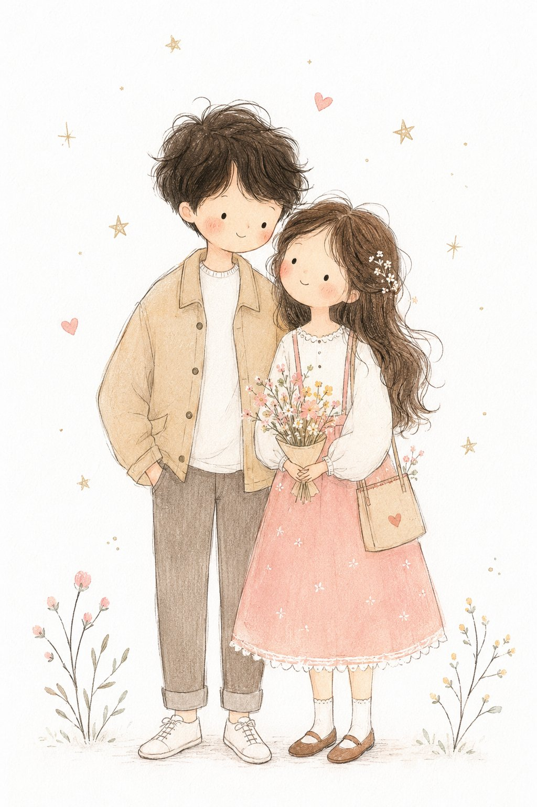

```text
Transform the photo into a delicate minimalist hand-drawn children’s illustration with a soft whimsical fairy-tale aesthetic. Use simple elongated shapes, thin imperfect hand-drawn lines, flat pastel colors, minimal details, and a cute doll-like character style with rosy cheeks, tiny facial features, and simplified anatomy. Add subtle paper texture, soft pencil and pastel shading, watercolor softness, and a clean white background with small stars or sparkles.

Stylize the clothing in a playful storybook way with simplified shapes and gentle decorative details. The overall mood should feel airy, cozy, naive, and charming, like a modern Scandinavian nursery postcard or children’s book illustration. Avoid photorealism, 3D, cinematic lighting, glossy surfaces, complex shadows, realistic anatomy, and hyper-detail.
```


---

## 例 458：巴黎秋季时装插画

**来源：** [@heyfatema](https://x.com/heyfatema/status/2057745100365787170)

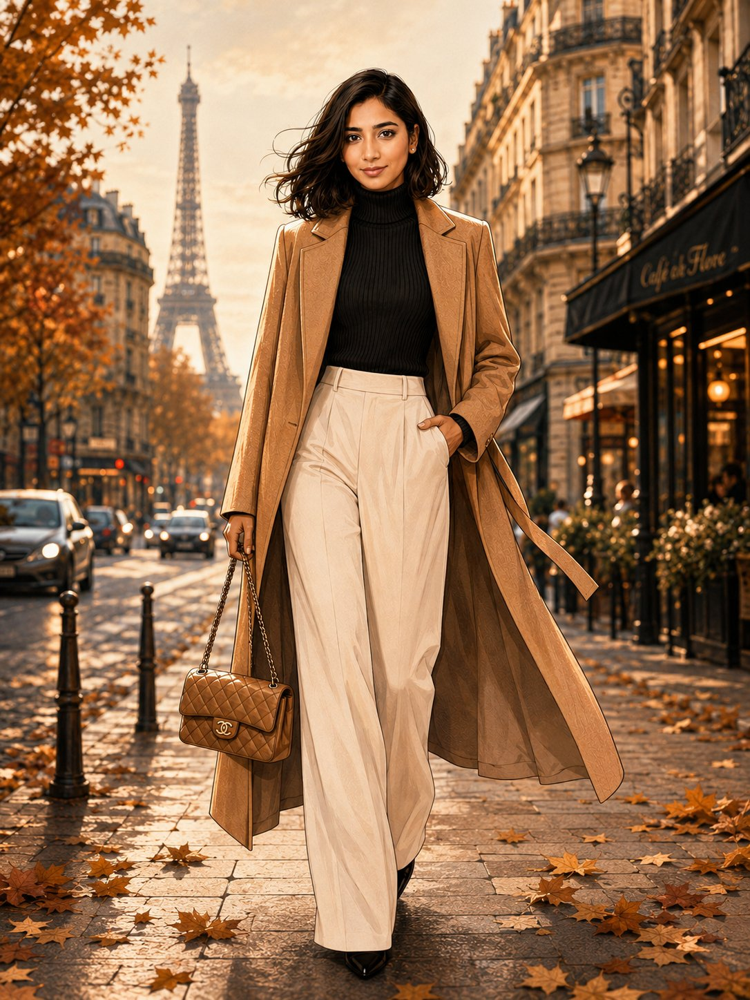

```text
Full-body fashion illustration of a young woman walking down a Parisian street in autumn, wearing a long camel wool coat draped open over a black ribbed turtleneck sweater and high-waisted wide-leg cream trousers, holding a quilted tan leather shoulder bag with interlocking CC logo and chain strap in her left hand while her right hand slides into a pocket, short dark brown wavy hair gently lifted by a breeze, pearl stud earrings, natural fresh makeup and a confident serene expression; cinematic shallow depth of field with soft warm golden-hour light, subtle bokeh on Haussmann-style buildings and slow-moving cars in the blurred background, scattered fallen leaves on the pavement; semi-realistic digital painting / fashion illustration style with clean linework, soft gradients, high-detail fabric textures and realistic folds, emphasis on elegant silhouettes and tactile materials, muted autumn palette (camel, cream, black, warm ochre), vertical composition, crisp foreground, gentle film grain and polished finishing.
```


---

## 例 461：家庭旅行纸雕拼贴

**来源：** [@Taaruk_](https://x.com/Taaruk_/status/2058400056722731079)

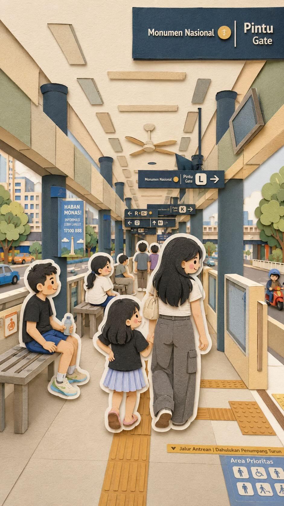

```text
Adorable kawaii family travel collage, combining four different scenes in one composition, cute anime-inspired parents, friends and children taking selfies and exploring together, handcrafted paper-cut diorama style, layered cardboard and felt textures, miniature world aesthetic, cozy pastel color palette, soft cinematic lighting, playful vacation atmosphere, urban city station scene, shopping mall selfie corner, outdoor nature park, and crowded playground blended into one seamless scrapbook-style artwork, charming sticker-like white outlines around characters, tiny tourists and pedestrians in background, whimsical handcrafted textures, soft depth of field, highly detailed paper craft illustration, warm nostalgic mood, cute casual outfits with glasses, caps, bags and sandals, dreamy Instagram kawaii aesthetic, storybook composition, ultra detailed miniature environment, 3D layered paper art, tilt-shift effect, cozy wholesome family travel vibes, premium handcrafted look, high detail, 8k, vertical composition
```


---

## 例 471：花簪和服动漫肖像

**来源：** [@Mind_Boticni](https://x.com/Mind_Boticni/status/2059133066694779343)

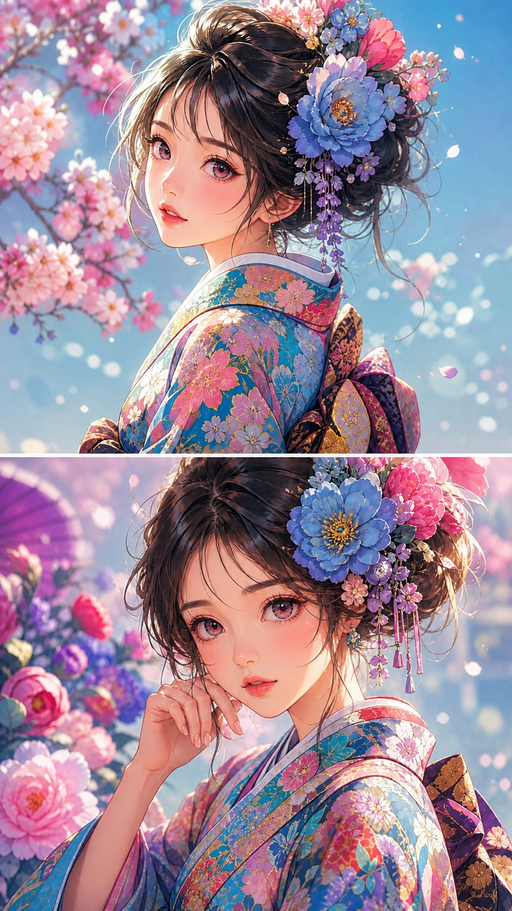

```text
Ultra-detailed anime-style portrait of a young girl with large expressive eyes, soft blush cheeks, and delicate facial features. She wears a vibrant floral kimono with intricate colorful patterns. Large blooming flowers are placed in her hair like accessories. Smooth gradient warm background in coral and peach tones. Soft cinematic lighting, dreamy atmosphere, high-end digital illustration
```


---

## 例 476：早安拿铁微缩女孩

**来源：** [@Zyrellix](https://x.com/Zyrellix/status/2059443447602561444)

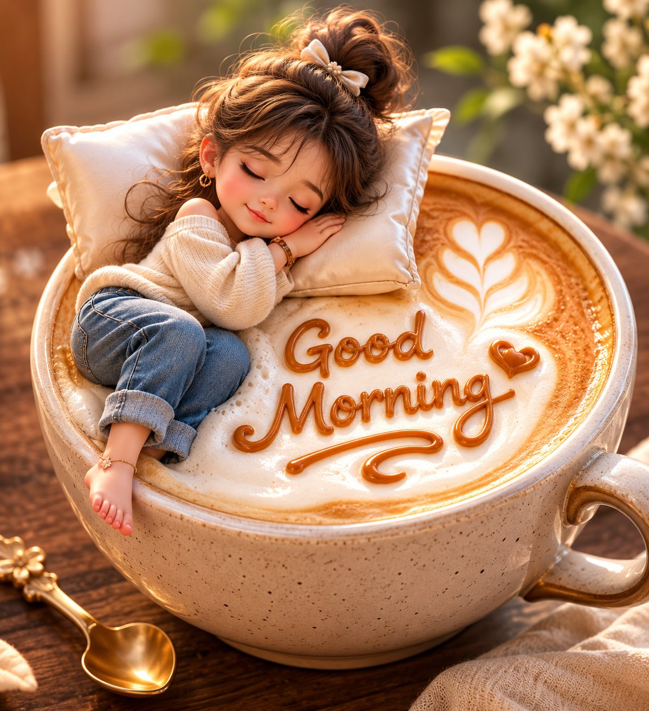

```text
Create ultra-fine highly detailed 3D realistic miniature chibi-like cute girl, wearing cream colour top and jeans, resting and floating on creamy latte cup, stylized textured ceramic cup, sleeping expression, satin soft pillow tucked behind her head. The latte cream forms a text "Good Morning" in a cute handwriting. Soft-focus minimalist background, bright natural light, 8K UHD.
```


---

## 例 479：杂志纸艺拼贴重绘

**来源：** [@oggii_0](https://x.com/oggii_0/status/2060212097083146644)

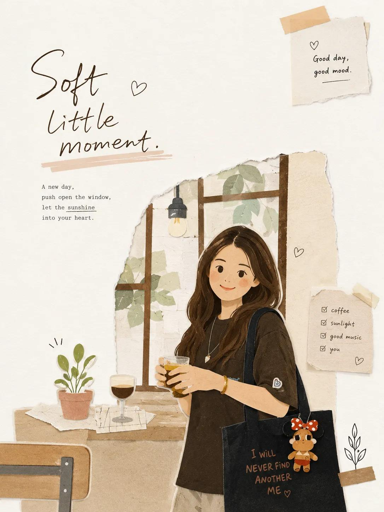

```text
Transform the uploaded image into a minimalist illustration in a magazine collage style, using paper cutouts. Retain the main subject, pose, and overall concept of the original image, but reimagine it as a warm, hand-edited collage. Style: Minimalist illustration in a magazine paper collage style, with flat, layered paper shapes, soft pastel paper textures, torn paper edges, paper shadow effects, neat black doodle accents, a handmade scrapbook atmosphere, modern Korean editorial design, a simple and cute composition, and large areas of clean white space. Character: Cute, simplified Korean characters with minimalist facial features, a small, relaxed smile, soft and rounded proportions, simple and casual clothing, and silhouettes constructed from layered paper cutouts. Composition: A 3:4 aspect ratio, with the main subject positioned slightly lower and off-center, leaving a large, open space on the opposite side for a breezy, minimalist composition that avoids clutter. Objects: Add only a few suitable collage elements: paper sticky notes, small hearts, plants, a cup of coffee, a window, tape fragments, and simple doodle icons. Typography: Add an elegant, handwritten English title that fits the scene's atmosphere. Use short phrases such as: ["May you be like the morning sunshine, full of vitality and hope, embracing the beauty of each day.","Take a small break," or "Good day, good mood."] Atmosphere: Calm, comfortable, warm, sweet, and editorial style. Avoid: Photorealistic style, anime style, watercolor style, 3D clay style, overly detailed backgrounds, excessive collage elements, a luxury poster atmosphere, dark tones, harsh shadows, and sloppy text.
```


---

## 例 495：巴黎街头故事书插画

**来源：** [@MissDelulu9](https://x.com/MissDelulu9/status/2062376738500526347)

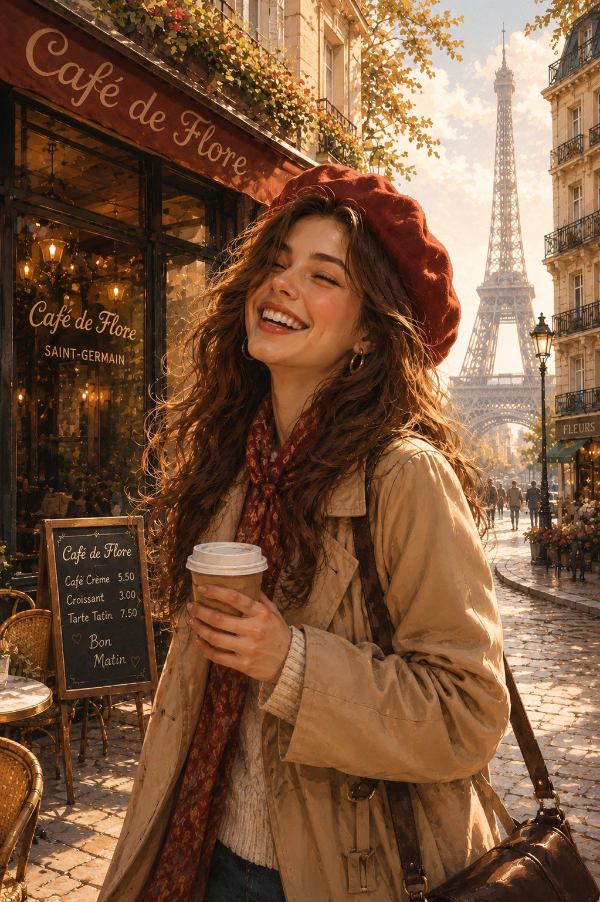

```text
Portrait illustration in a storybook style featuring a young adult woman exploring the streets of Paris. She is laughing happily with her eyes closed, holding a coffee cup in her hand. She has long, wavy hair and wears a beret hat. The scene is set near a Parisian café in a peaceful morning atmosphere. The woman has a sweet, charming smile. Soft, dreamy mood, romantic Paris street vibe, gentle lighting, and highly detailed artwork.
```


---

## 例 498：铅笔画背景 3D 分身

**来源：** [@AIwithkhan](https://x.com/AIwithkhan/status/2062567518389391540)

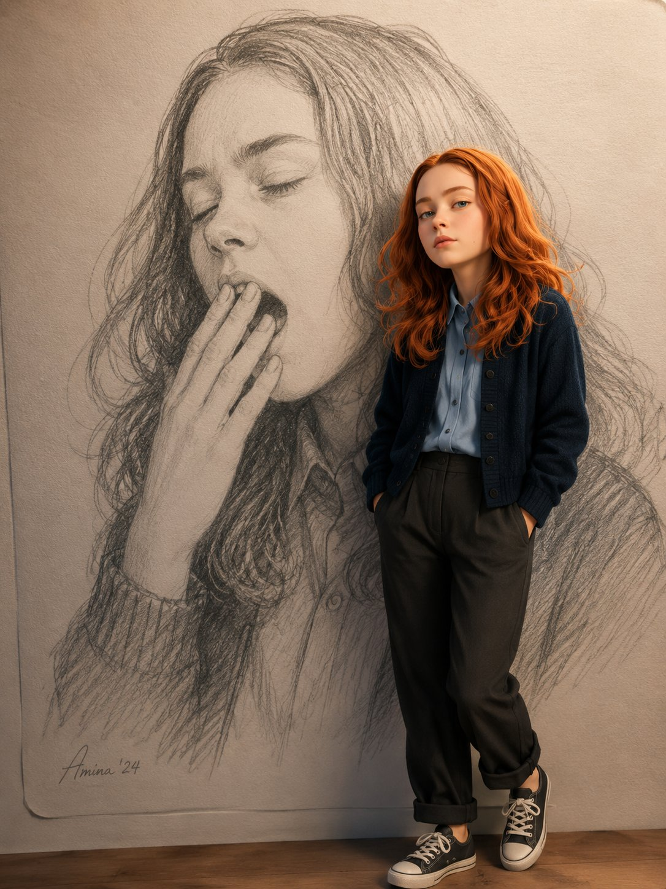

```text
Create a handrawn pencil illustration of [image] yawning on paper, as background.

Add a 3D Pixar style render of [foto] standing casually infront of the giant handrawn pencil illustration. Soft cinematic lighting. 8K resolution. 3:4 ratio
```


---

## 例 504：粗糙涂鸦人像改图

**来源：** [@Shorelyn_](https://x.com/Shorelyn_/status/2063235707632533954)

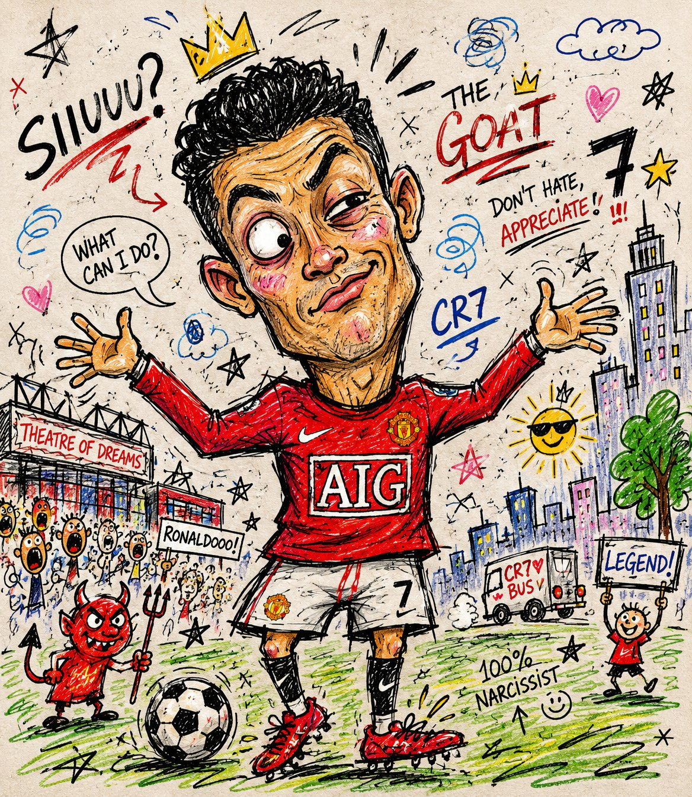

```text
Turn this photo into a chaotic funny doodle illustration, intentionally messy and low-skill, as if drawn quickly with a cheap marker, crayon, or worn-out felt pen on paper.

Create exaggerated facial features with awkward proportions, uneven eyes, oversized head, tiny body, crooked smile, and clumsy anatomy while still keeping the person recognizable. Use rough childish sketch lines, shaky hand-drawn strokes, visible scribbles, overlapping outlines, accidental marks, and random doodles around the scene. Add a simple cartoon-style background with badly drawn buildings, trees, clouds, street elements, and uneven perspective. Coloring should look careless and imperfect, with visible stroke texture, inconsistent fill areas, wax crayon texture, marker bleed, and irregular shading. Include playful imperfections like crossed-out lines, unfinished details, random arrows, tiny notes, stars, swirls, and abstract scribbles. Overall aesthetic should feel humorous, spontaneous, handmade, energetic, goofy, and intentionally unpolished, resembling a child's sketchbook mixed with absurd internet meme art. High texture detail, paper grain visible, asymmetrical composition, awkward framing, expressive doodle chaos, raw sketch energy.
```


---

## 例 513：单色点缀旅行手账插画

**来源：** [@Sairah_0](https://x.com/Sairah_0/status/2071779087396606433)

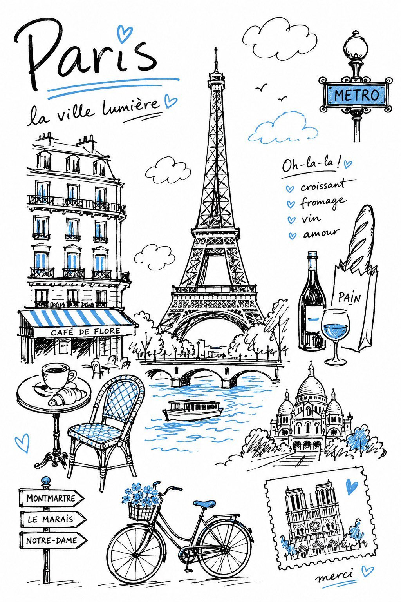

```text
Create a charming editorial travel illustration of {DESTINATION} in a simple hand-drawn doodled style, as if sketched by hand with a black felt-tip marker in a travel notebook. The illustration should feel personal, spontaneous, and imperfect rather than digitally designed. Think of the kind of drawing someone might casually create while sitting at a café after exploring the destination.** ## COLOR PALETTE Keep the illustration almost entirely black and white. Use **only one accent color: {ONE POINT COLOR}** ## STYLE Draw entirely with black felt-tip pen lines. Use slightly wobbly hand-drawn contours, natural line variation, loose marker strokes, sketch-like confidence, subtle imperfections, slightly open line endings, uneven hand pressure, and occasional overlapping strokes. Every line should clearly look handmade. Avoid perfectly smooth curves, mechanically precise outlines, polished vector graphics, or overly crisp digital rendering. ## SUBJECT Illustrate the unique atmosphere and instantly recognizable identity of **{DESTINATION}** rather than producing a realistic cityscape. Select the destination's most iconic landmarks, characteristic architecture, local transportation, famous scenery, native plants, local animals, regional food, and cultural objects. Focus on the spirit of the destination instead of literal accuracy. ## COMPOSITION Arrange the selected elements into a balanced editorial composition with generous white space. The layout should feel open, light, and effortless, similar to a designer's travel sketchbook. Allow objects to overlap naturally without becoming crowded. Every element should have room to breathe. Keep the composition visually relaxed and uncluttered. Apply the blue sparingly to selected details such as water, sky, windows, signs, clothing accents, decorative highlights, or small architectural features. Never introduce any additional colors. ## DRAWING STYLE Keep every object simple and intentionally simplified. Use flat shapes with minimal interior detail. Avoid realistic textures, gradients, shadows, painterly brushwork, glossy surfaces, or complex rendering. The illustration should remain clean, airy, understated, and highly graphic. ## LINE QUALITY The black marker lines are the main visual feature. Lines should feel confident, casual, lively, expressive, and naturally imperfect. Slightly uneven contours, open edges, variable line thickness, and small drawing inaccuracies are encouraged because they enhance the authentic hand-drawn feeling. ## MOOD Warm. Friendly. Relaxed. Playful. Minimal. Editorial. Contemporary. Elegant through simplicity. The finished artwork should resemble a beautifully designed travel notebook, boutique travel guide, editorial magazine illustration, or lifestyle sketchbook rather than a polished digital illustration. ## IMPORTANT No photorealism. No 3D rendering. No painterly effects. No gradients. No heavy shadows. No glossy lighting. No vector-clean artwork. No excessive detail. No busy composition. Preserve generous white space. Maintain a flat editorial doodle aesthetic with a distinctly handmade character. The final image should instantly evoke **{DESTINATION}** through simple, expressive black felt-tip sketches with subtle sky-blue accents.
```


---

## 例 514：硬边现代艺术人像

**来源：** [@SimplyAnnisa](https://x.com/SimplyAnnisa/status/2071783914595897555)

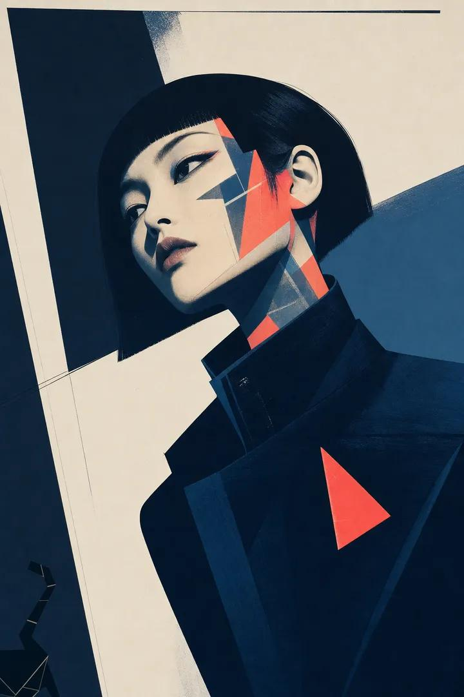

```text
A striking piece of hard-edge modern art on matte archival paper, with visible screen-printing layers and slight ink misalignment. A young East Asian woman is captured in a sharp, three-quarter profile. Her facial features are rendered with precise, crisp contours, contrasting with abstract, luminous geometric shapes that seem to emanate from within her skin. She wears a sleek, high-collared jacket in deep midnight blue, adorned with a single, bold neon coral brooch in the shape of a sharp triangle. Her dark hair is styled in a severe, architectural bob with blunt edges. Her expression is calm and detached, eyes gazing off-frame. The background is a clean, architectural space with sharp diagonal planes in crisp white and deep slate. High-contrast chiaroscuro lighting highlights the edges of her silhouette. Sophisticated palette: deep midnight blue, crisp white, electric neon coral. A stray cat tail is rendered as a sharp, geometric vector in the bottom left corner. Ultra-modern artistic style. No digital CGI feel.
dutch angle, stray cat tail --ar 9:16
```


---

## 例 520：月面宇航员 T 恤图形

**来源：** [@lovimg_com](https://x.com/lovimg_com/status/2077035644254363972)

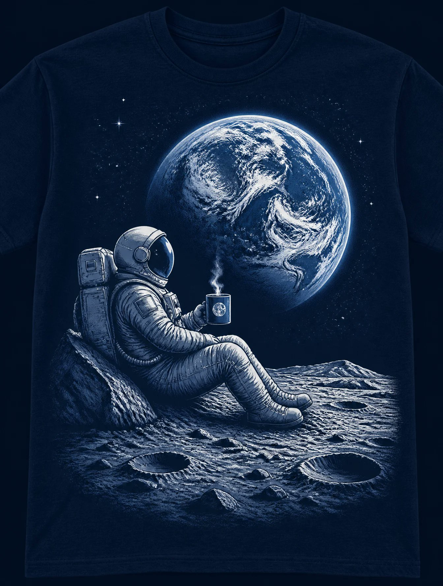

```text
A graphic illustration centered on a dark navy blue t-shirt, depicting an astronaut sitting on the surface of the moon, viewed from a side profile. The astronaut is wearing a detailed, bulky space suit and helmet, leaning back against a small lunar rock formation, and is holding a small steaming mug, suggesting they are enjoying a peaceful drink. Positioned directly in front of the astronaut in the background is a large, majestic view of the Earth, rendered in shades of white, light blue, and navy, featuring prominent swirling cloud formations. The entire artwork is monochromatic, utilizing a cool blue-and-white color palette that creates a serene, solitary, and contemplative atmosphere. The lunar ground is textured with craters and dust, providing a grounded contrast to the vast, dark sky and the bright, swirling planet above. The style is clean, artistic, and iconic, reminiscent of screen-printed apparel designs.
```


---

## 例 523：曼哈顿公园水彩旅行插画

**来源：** [@Taaruk_](https://x.com/Taaruk_/status/2090307485374578755)

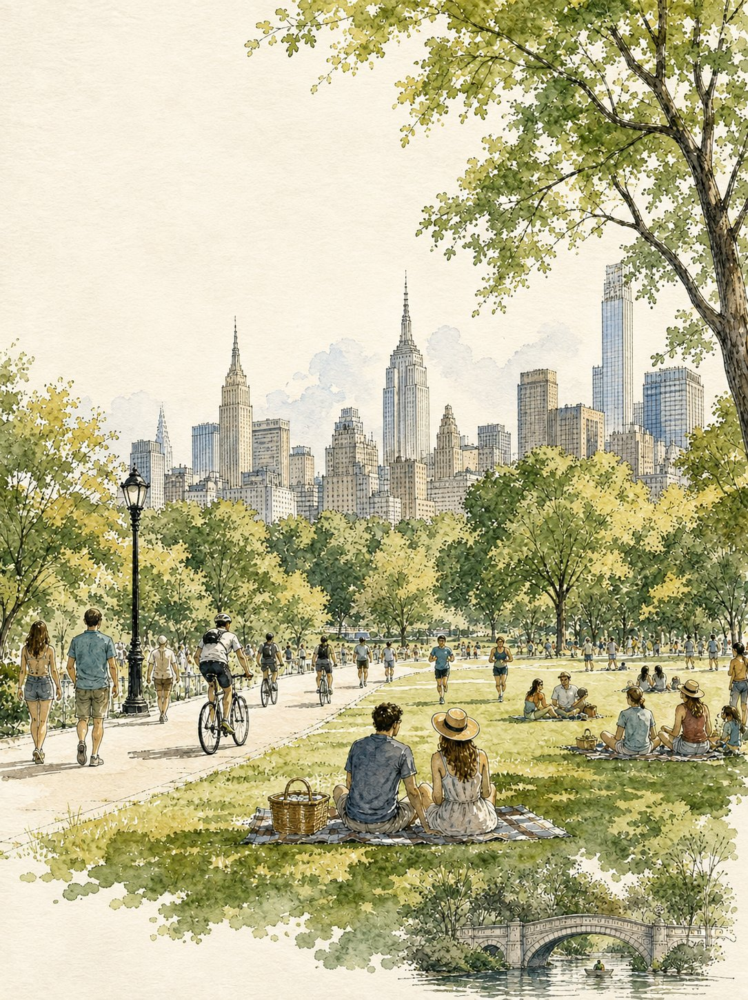

```text
Create a vertical editorial travel illustration inspired by vintage European travel posters, featuring a peaceful summer afternoon in a grand city park with a recognizable Manhattan-style skyline in the background. Use delicate hand-drawn ink outlines combined with soft, slightly imperfect watercolor washes on warm textured cream paper. Show a wide green lawn filled with people relaxing, reading, walking, jogging, cycling, and having picnics. In the foreground, a casually dressed young couple sits together on a picnic blanket beside a woven basket. Include elegant black vintage park lamps, winding pathways, dense leafy trees framing the composition, and detailed historic and modern skyscrapers rising behind the park. Add a small picturesque stone arch bridge over a calm pond near the bottom of the artwork. Use muted sage green, olive, warm beige, soft blue, pale gray, and subtle golden sunlight, with natural watercolor bleeding, paper grain, fine pen hatching, and an airy sophisticated travel-journal aesthetic. No text, no letters, no logos, no typography, no captions, no signs. Vertical 4:5 composition, highly detailed, elegant, nostalgic, handcrafted watercolor-and-ink illustration.
```


---

## 例 524：纸雕拼贴乡野人像

**来源：** [@AiwithLariab](https://x.com/AiwithLariab/status/2090297565732585554)

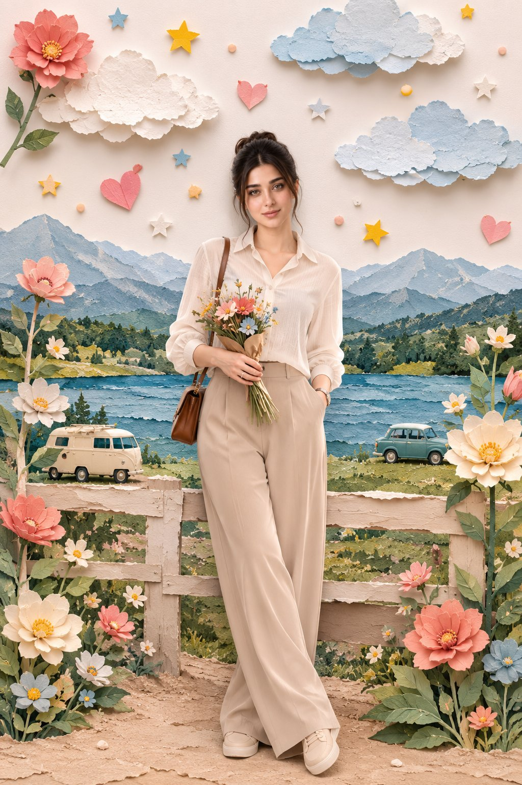

```text
Create a premium whimsical handcrafted paper-collage diorama inspired exactly by the uploaded reference image.

Use the uploaded girl reference as the ONLY human subject. Preserve her facial identity with maximum accuracy: exact face shape, eyes, eyebrows, nose, lips, skin tone, hairstyle, hairline, and recognizable facial features. Strict face identity lock — do not redesign, beautify, stylize, age, de-age, or replace her face.

The girl stands alone in the center of the composition in a graceful, natural editorial pose. She is facing the camera with a relaxed confident expression and a subtle natural smile. Her body is slightly angled, creating a candid fashion-editorial feeling. She holds a beautiful small mixed bouquet of flowers naturally with both hands in front of her. One leg is slightly crossed in front of the other for an elegant relaxed pose.

Outfit

Change the outfit completely from the original reference while keeping it fully modest and elegant:

- elegant ivory/cream long-sleeve button-up blouse
- high-waisted wide-leg beige trousers
- full-length trousers with complete coverage
- simple cream closed-toe shoes
- small brown leather shoulder bag
- no revealing clothing
- no exposed midriff
- sophisticated countryside editorial fashion
- natural realistic fabric folds and texture

Environment

Create a beautiful handcrafted 3D paper-diorama countryside scene:

- layered blue mountains in the distance
- green forest and rolling hills
- peaceful blue lake
- grassy lakeside landscape
- textured beige paper pathway in the foreground
- rustic white wooden fence behind the girl
- dreamy pastel sky

Surround the composition with oversized handmade paper flowers in pink, peach, cream, white, and light blue, with layered green paper leaves.

Add decorative paper elements floating in the sky:

- pink paper hearts
- yellow paper stars
- blue stars
- soft white and pale-blue clouds
- tiny colorful paper dots

Place two tiny vintage vehicles near the lake in the background: a cream vintage camper van on one side and a small vintage blue-green car on the other.

Art Direction

The entire environment should look handcrafted from premium textured paper while the girl remains photorealistic and seamlessly integrated into the paper world.

Use:
hand-torn paper edges, visible paper fibers, layered cardstock, subtle imperfections, realistic paper shadows, dimensional cut-paper elements, tactile textures, soft natural daylight, cinematic depth, gentle atmospheric perspective, premium editorial photography.

The final image should feel like a luxury handmade paper storybook brought to life with a real photographic subject.

Composition

Centered full-body girl
Face clearly visible and sharply detailed
Natural elegant pose
Bouquet held naturally
Rustic fence framing the subject
Lake and mountains creating depth
Large flowers framing both lower corners
Clouds and decorative elements filling the upper background
Balanced symmetrical composition with organic handmade imperfections
Girl remains the strongest focal point

Final Look

Photorealistic girl + handcrafted paper-art environment
Dreamy pastel colors
Luxury editorial aesthetic
Whimsical miniature diorama
Soft cinematic daylight
Highly detailed paper textures
Natural realistic skin
Sharp facial identity
Professional fashion photography
Pinterest/Instagram viral visual aesthetic
Magazine-quality composition

Vertical 4:5 portrait composition, full-body framing, ultra-detailed, high resolution, clean polished finish, visually striking, aesthetically balanced, premium handcrafted paper-collage photography.
```


---

## 例 540：梦幻未来城市编辑艺术海报

**来源：** [@Naiknelofar788](https://x.com/Naiknelofar788/status/2093230701986672924)

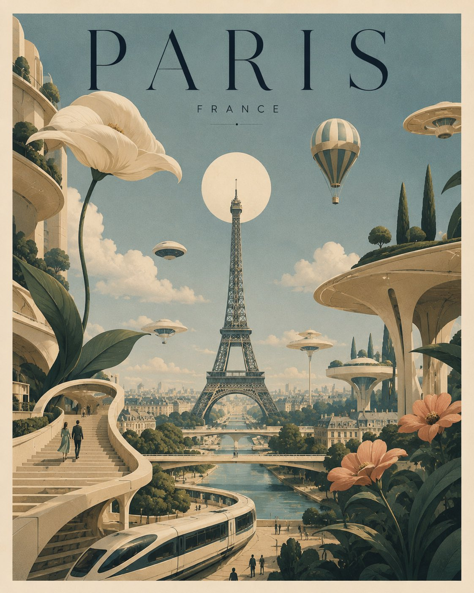

```text
Create a visually unforgettable editorial art poster of a dreamlike futuristic world where familiar everyday life meets surreal architecture. Grand sculptural buildings, winding roads, oversized plants, tiny people, unexpected floating elements, dramatic perspective, cinematic atmosphere, and one iconic focal point. Blend vintage travel-poster design with modern luxury editorial aesthetics, sophisticated muted colors, soft natural light, subtle film grain, tactile paper texture, clean geometric shapes, minimal composition, nostalgic yet futuristic, whimsical but premium, highly detailed, instantly recognizable silhouette, Pinterest-worthy, Instagram-viral aesthetic, collectible art print, no clutter, no photorealism, vertical 4:5.
```


---

## 例 541：Anime Band Finale at Budokan

**来源：** [@SDAI1807097011](https://x.com/SDAI1807097011/status/2048127178592915583) / [awesome-gpt-image-2-prompts](https://github.com/EvoLinkAI/awesome-gpt-image-2-prompts)


```text
A dramatic anime concert illustration seen from behind the performers onstage, showing 4 teenage girls standing shoulder to shoulder at the front of a huge indoor arena, arms around each other in a triumphant post-performance moment. The camera is positioned slightly behind and below them, facing out toward the audience and the giant venue screen. The atmosphere is dazzling and emotional, filled with dense blue-and-gold confetti, sparkling particles, and strong white stage spotlights pouring down from above. The crowd fills the entire arena as a sea of tiny glowing blue lights. At center top, a giant rectangular screen displays elegant serif concert text: {argument name="band name" default="ELEMAYU"}, "1st LIVE at 日本武道館", {argument name="concert date" default="2024.6.15"}, and "SOLD OUT". On both upper side walls of the arena, the large venue name "日本武道館" is visible. The 4 girls all wear matching dark stage outfits: black or very dark navy hooded jackets with subtle decorative back prints, short pleated skirts, and live-performance styling. Count and depict all 4 members distinctly from left to right: 1) a girl with short wavy silver-lavender hair holding a bass guitar slung over her shoulder, 2) a girl with long straight black hair holding a red electric guitar, 3) a girl with fluffy shoulder-length blonde hair holding a dark guitar, 4) a girl with brown hair in a high ponytail, no visible instrument, raising one arm high and holding a drumstick or baton in celebration while the other arm wraps around the blonde member. Show their backs and silhouettes rim-lit by stage light, with soft highlights on their hair. Include stage equipment: a microphone stand and part of a bass neck at the far left, and a visible drum kit with cymbals at the right edge. The stage floor is glossy and reflective, covered with scattered confetti and several blue flower bouquets near the bottom foreground. Use rich midnight blues, violet shadows, warm golden sparkles, and cinematic bloom. The mood should feel like a sold-out dream performance finale, sentimental, victorious, and breathtakingly luminous, in highly detailed painterly anime style.
```


---

## 例 542：Anime Girl and Man Date Photo Collage

**来源：** [@AIillust_studio](https://x.com/AIillust_studio/status/2048099186214900130) / [awesome-gpt-image-2-prompts](https://github.com/EvoLinkAI/awesome-gpt-image-2-prompts)


```text
A 4x4 photo collage of 16 warm, cinematic lifestyle snapshots featuring a real adult man and an anime-style young woman companion posed together as if in casual date photos. The man has short dark hair, light skin, an average build, and wears a plain dark navy or black long-sleeve shirt; his face is intentionally obscured and softly blurred in every frame. The anime girl has long blonde twin ponytails, large blue eyes, light skin, and a slim petite build, wearing a black sleeveless top, layered silver necklaces including a cross pendant, black wrist accessories, a red plaid pleated mini skirt, and black-and-white striped thigh-high socks. Blend realistic photography with a convincingly integrated 2D anime character, keeping her clean cel-shaded look while matching the scene lighting, perspective, focus, and color grading so she appears naturally present beside him. Use moody evening tones, soft bokeh, shallow depth of field, and intimate candid couple energy. The 16 panels are: 1) close indoor portrait with both seated close together, the girl resting beside him; 2) nighttime city street side profile conversation under blurred streetlights; 3) indoors, both reading a book together, the girl leaning on his shoulder; 4) outdoor cafe table, both holding takeaway coffee cups; 5) restaurant table with multiple dishes visible, dining together; 6) mirror selfie in an elevator, the man holding a smartphone while the girl makes a peace sign; 7) car interior road-trip shot, the man driving and the anime girl in the passenger seat; 8) seaside sunset from behind, both sitting side by side watching the ocean; 9) neon-lit city night portrait, the girl pointing toward the camera; 10) intimate elevator close-up, the girl with eyes closed leaning affectionately against him; 11) full mirror selfie in an elevator showing more of both outfits; 12) night city skyline portrait with a lit tower in the background; 13) camera selfie close-up, the man holding a compact camera toward a mirror or reflective surface; 14) cozy indoor lounge moment, the man holding a glass of red wine while the girl smiles and makes a peace sign; 15) rear full-body rainy night street shot, the pair walking away hand in hand under glowing streetlights; 16) extreme close-up night portrait with the girl flashing a peace sign. Keep the collage tightly gridded with thin white dividers, square overall format, consistent amber-brown color grading, romantic urban realism, and subtle social-media photo-dump aesthetics.
```


---

## 例 543：Anime Friends Eating Soba

**来源：** [@AIMAG31G](https://x.com/AIMAG31G/status/2048089673621516547) / [awesome-gpt-image-2-prompts](https://github.com/EvoLinkAI/awesome-gpt-image-2-prompts)

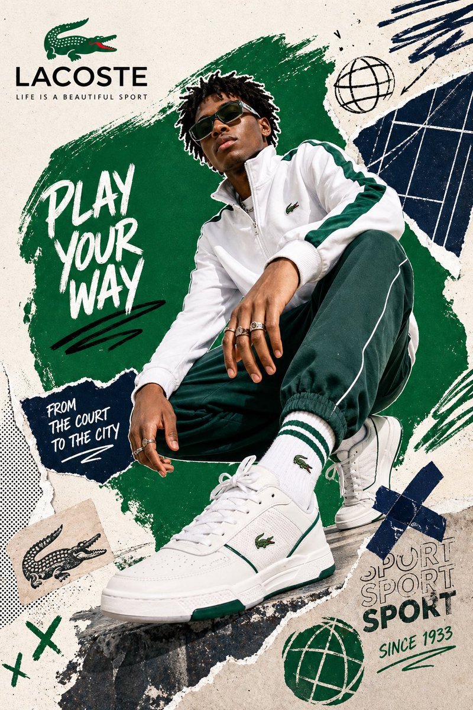

```text
A cozy anime-style interior of a traditional Japanese soba restaurant, viewed from table height in a booth, with two young women seated across the near corners of a rectangular wooden table and facing the viewer in a casual dining snapshot. The left woman has long straight pastel {argument name="hair color" default="lavender with cyan highlights"} hair with glossy strands and soft bangs, and wears a white kimono-style top with bright blue trim and a deep blue obi-like sash skirt; she is slightly curvy, sitting on the left red vinyl bench, turned a little toward the camera, raising her left hand in an open friendly wave. The right woman has a sleek short bob in dark brown to black with a purple underlayer visible near the ends, red rectangular glasses, small earrings, a fitted charcoal-gray long-sleeve scoop-neck top, and light blue jeans; she sits on the right red vinyl bench, leaning slightly toward the table and holding chopsticks in her right hand as if about to eat. Place 2 large black bowls of soba on the table, one in front of each woman, both filled with dark broth, noodles, sliced duck meat, and chopped green onions; add 1 clear water glass near the center back of the table and 2 small condiment dishes beside it. The restaurant should feel warm and nostalgic, with wooden paneling, a shoji-style window on the left, a small potted plant on the windowsill, a back counter with condiments and utensils, and a navy noren curtain on the right bearing large white Japanese text "蕎麦" and smaller vertical text "手打ちそば". On the back wall, show 7 vertical wooden menu boards with Japanese dish names and prices, including labels such as "もりそば", "ざるそば", "かけそば", "たぬきそば", "肉そば", "天ぷらそば", and "鴨南蛮そば". Use clean polished anime rendering, crisp line art, soft warm lighting, detailed food illustration, rich wood textures, and a friendly everyday outing mood.
```


---

## 例 544：Gothic Android Warrior Cathedral Key Art

**来源：** [@yanagihara_0805](https://x.com/yanagihara_0805/status/2048085829713842405) / [awesome-gpt-image-2-prompts](https://github.com/EvoLinkAI/awesome-gpt-image-2-prompts)

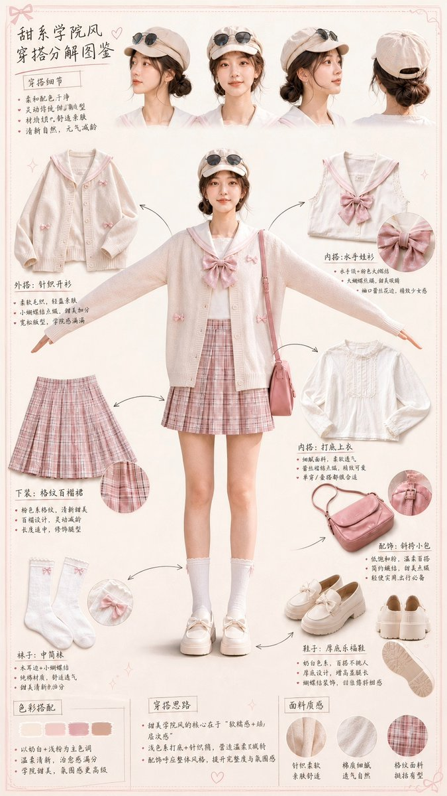

```text
A cinematic dark fantasy anime illustration in a ruined gothic cathedral, vertical composition. Show a lone female android-like warrior from behind, centered slightly low in frame, kneeling or sitting back on her heels on a reflective stone floor. She has extremely long flowing {argument name="hair color" default="silver white"} hair spreading across the floor and air, a sleek black blindfold visor covering her eyes, and a black high-cut gothic combat dress with elegant straps, long black opera gloves, and thigh-high black boots. Her physique is slim and graceful. She holds 1 large ornate sword upright in front of her, with both hands resting on the hilt, the blade planted on the ground like a memorial. The sword has a dark blade and a decorative gold ring-like guard near the handle. The atmosphere is solemn, tragic, and reverent. Place 3 tall pointed arched windows in the background, glowing with cold white backlight through haze and dust. Include 4 stone angel statues total: 2 larger angels in the left background and 2 in the right background, partially obscured by fog and darkness. Fill the air with drifting ash, snow-like particles, black debris fragments, and a few faint orange embers near the floor. Use dramatic volumetric light rays, soft bloom, smoky mist, high contrast, and a desaturated palette of charcoal gray, silver, blue-gray, and black. The scene should feel like a memorial after a battle, highly detailed, ultra-polished, melancholic, ethereal, and game key art inspired by {argument name="franchise title" default="NieR:Automata"}. Add 1 vertical Japanese title inscription near the lower left reading {argument name="vertical text" default="儚き夢と共にあれ"}, with 1 small vertical English subtitle beside it reading {argument name="subtitle text" default="NieR:Automata"}.
```


---

## 例 545：Cloud shape doodle generation

**来源：** [@Gorden_Sun](https://x.com/Gorden_Sun/status/2048080137149899133) / [awesome-gpt-image-2-prompts](https://github.com/EvoLinkAI/awesome-gpt-image-2-prompts)

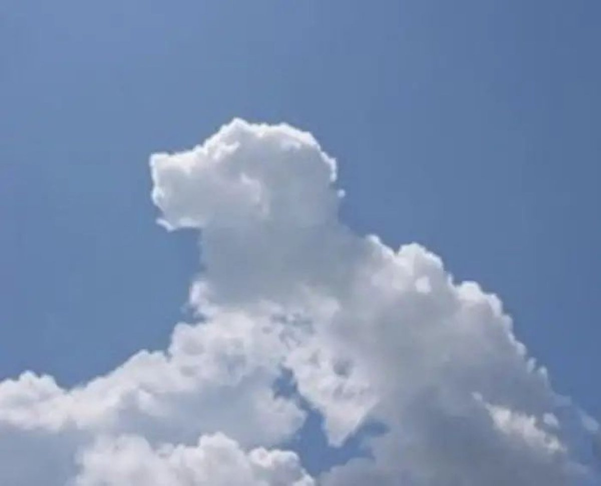

```text
Based on the shape of the {argument name="subject" default="clouds"} in the image, identify what object, animal, or person they most resemble. Do not change the original image; instead, draw that object, animal, or person over the original image in a {argument name="art style" default="doodle"} style.
```


---

## 例 546：Rural Station Schoolgirl Scene

**来源：** [@m_Raiko_AIart](https://x.com/m_Raiko_AIart/status/2048069313387737222) / [awesome-gpt-image-2-prompts](https://github.com/EvoLinkAI/awesome-gpt-image-2-prompts)

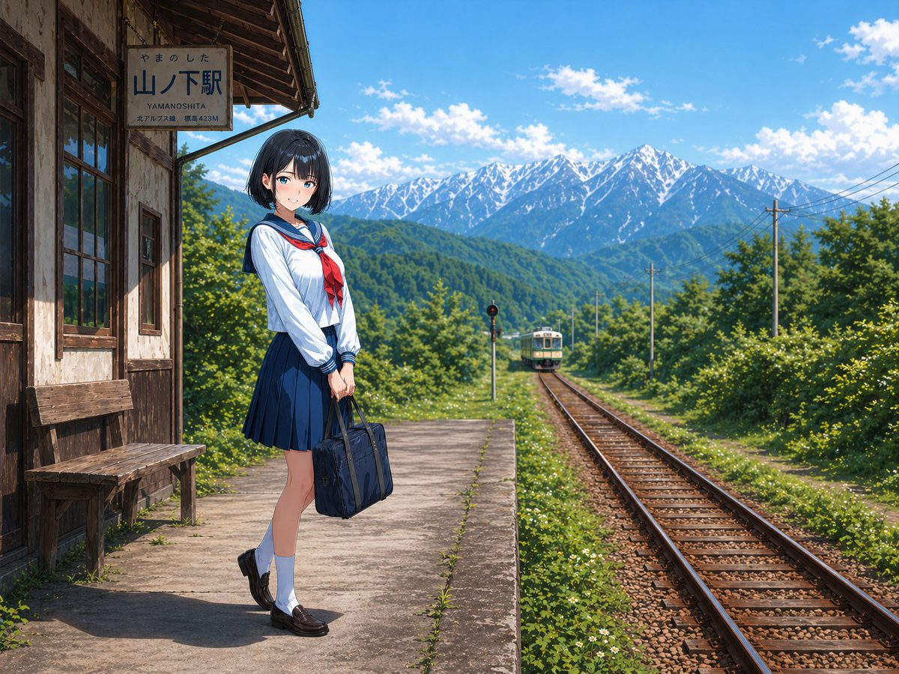

```text
A cinematic anime-style illustration of a quiet rural Japanese train station in early summer, filled with travel nostalgia and bright midday light. In the foreground, one high school girl stands alone on the platform near the left side of the frame, facing slightly toward the viewer with a shy, gentle posture, her legs together and one foot angled inward. She has {argument name="hair color" default="black"} short bobbed hair with soft bangs, and wears a classic Japanese sailor school uniform: a white long-sleeved sailor blouse with navy trim, a vivid red neckerchief, a dark navy pleated skirt, white socks, and dark brown loafers. She holds a dark school bag in one hand at her side. Her expression should feel calm, a little wistful, as if she was just about to speak before the train arrived. Place her beside an old weathered wooden station building with large windowpanes and a simple wooden bench. Above her is 1 hanging station sign reading {argument name="station name" default="山ノ下駅"}, with smaller romanized text “YAMANOSHITA” and small local line information beneath it. The right half of the image opens to 1 set of railway tracks receding into the distance, bordered by lush green grass and wildflowers, with 1 small local train approaching from far down the line. Add a few utility poles running alongside the tracks. In the deep background, show a dramatic mountain range with lingering snow on the peaks under a vivid blue sky with scattered white clouds. Composition should balance the girl on the left and the railway perspective on the right, with detailed background scenery, crisp sunlight, soft anime rendering, realistic textures in the station wood and rails, and a heartfelt slice-of-life travel mood.
```


---

## 例 547：Artist and Ethereal Muse at Night

**来源：** [@almimeister](https://x.com/almimeister/status/2048309710118687101) / [awesome-gpt-image-2-prompts](https://github.com/EvoLinkAI/awesome-gpt-image-2-prompts)

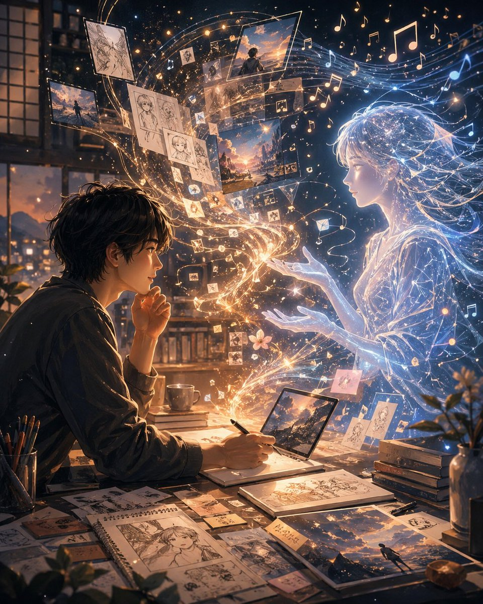

```text
A cinematic anime-inspired digital illustration set at night inside a cozy artist's room with large window panes and a warm city glow outside. On the left, a young male artist with {argument name="hair color" default="dark brown"} messy hair sits at a cluttered desk in side profile, leaning forward with one hand near his mouth and the other drawing with a pen on a tablet or sketchbook. The desk is covered with exactly 1 pen cup filled with pencils, 1 coffee mug, 1 open laptop or pen-display showing a sunset landscape, 1 spiral sketchbook with manga-style character drawings, 2 additional drawing books or pads, 1 small stack of about 4 books, and many scattered art cards and printed illustrations. On the right, a luminous ethereal anime girl made of blue-white light appears life-sized, facing the artist with both hands gently extended toward him. Her form is translucent, delicate, and composed of glowing contour lines, starry particles, and flowing strands of light, with long windblown hair and a soft dress-like silhouette. Between them, a magical stream of golden and white light spirals upward from the artist's desk into the air, connecting creator and creation. Inside this swirling ribbon are exactly 12 to 16 floating image fragments and sketch pages: monochrome character sketches, scenic sunset paintings, small photo-like panels, and tiny icon-like cards, all orbiting in a curved arc from lower center to upper left and upper center. Around the upper half of the image, dozens of glowing musical notes float through the air, mixed with sparkling particles, creating the feeling that inspiration has become visible sound and memory. The palette is rich warm gold and amber on the artist's side, contrasted with cool electric blue and white on the spirit girl's side, with dramatic rim light, volumetric glow, intricate particles, and a dreamy emotional atmosphere. Composition is vertical, highly detailed, intimate, and poetic, evoking the relationship between {argument name="person one" default="you"} and {argument name="person two" default="me"} as artist and imagined muse, where drawings, music, memories, and fantasy physically manifest in the room. Add a small handwritten note card on the desk with {argument name="note text" default="二人だけの物語"}, and display one prominent artwork on the desk and one floating scenic panel using {argument name="scene theme" default="sunset sky over a distant city"}.
```


---

## 例 548：Hand-Drawn Storyboard Sheet

**来源：** [@saniaspeaks_](https://x.com/saniaspeaks_/status/2050465100973191219) / [awesome-gpt-image-2-prompts](https://github.com/EvoLinkAI/awesome-gpt-image-2-prompts)

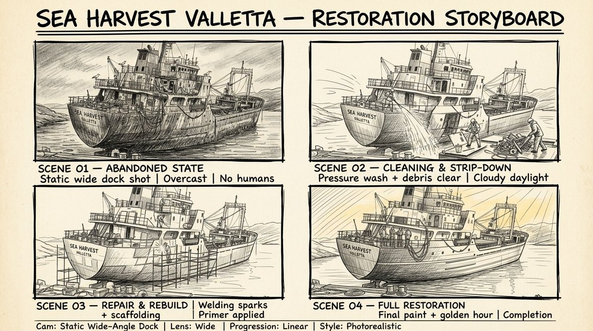

```text
This Storyboard sheet use for this video created with GPT image 2 Storyboard sheet prompt: A professional hand drawn sketch storyboard sheet, pencil and ink illustration style, rough artistic linework, cross-hatching for shadows, loose expressive strokes, monochrome black and white on aged cream/off-white paper texture background, 2x2 grid layout with four equal storyboard panels bordered by thick hand-drawn black ink frames. Top-left panel sketch: abandoned rusted cargo ship at dock, heavy hatching for rust texture, broken railings, algae, seagulls, no humans, dark moody pencil shading, handwritten label below: "SCENE 01 — ABANDONED STATE | Static wide dock shot | Overcast | No humans". Top-right panel sketch: same ship with workers using pressure washers, dynamic water spray motion lines, figures in safety gear, debris piles, handwritten label: "SCENE 02 — CLEANING & STRIP-DOWN | Pressure wash + debris clear | Cloudy daylight". Bottom-left panel sketch: welding sparks as burst star lines, scaffolding structure, worker figures grinding and painting, primer sections with hatching, handwritten label: "SCENE 03 — REPAIR & REBUILD | Welding sparks + scaffolding | Primer applied". Bottom-right panel sketch: fully restored ship, clean hull, workers standing back, golden hour rays as radiating diagonal lines, handwritten label: "SCENE 04 — FULL RESTORATION | Final paint + golden hour | Completion". Bold hand-lettered title at top: "SEA HARVEST VALLETTA — RESTORATION STORYBOARD". Handwritten production notes at bottom: "Cam: Static Wide-Angle Dock | Lens: Wide | Progression: Linear | Style: Photorealistic". Pencil graphite texture, ink pen outlines, rough paper feel, professional film storyboard aesthetic.
```


---

## 例 549：Illustrated 2027 Desktop Calendar

**来源：** [@Mind_Boticni](https://x.com/Mind_Boticni/status/2055663029195575396) / [awesome-gpt-image-2-prompts](https://github.com/EvoLinkAI/awesome-gpt-image-2-prompts)

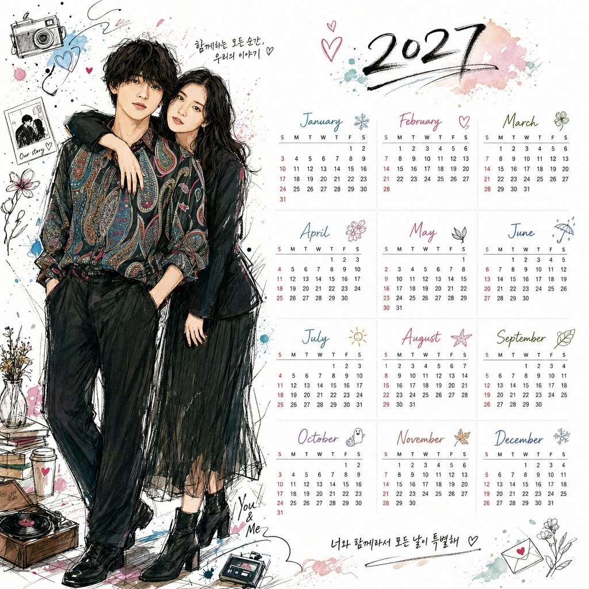

```text
use this reference photo to create a desktop calendar for January-December 2027. Format: A4 vertical. Features: Korean illustration style, distinct character features, natural expressions, full-body composition, dynamic poses, exquisite clothing details, hand-drawn doodle style, splatter brushstrokes, free lines, a mix of pastels and ink, comic sketch texture, simple white background, symbolic elements around the edges, strong atmosphere, high detail, high quality.
```


---

## 例 550：Die-Cut Sticker Illustration

**来源：** [@Ciri_ai](https://x.com/Ciri_ai/status/2056616223547548106) / [awesome-gpt-image-2-prompts](https://github.com/EvoLinkAI/awesome-gpt-image-2-prompts)

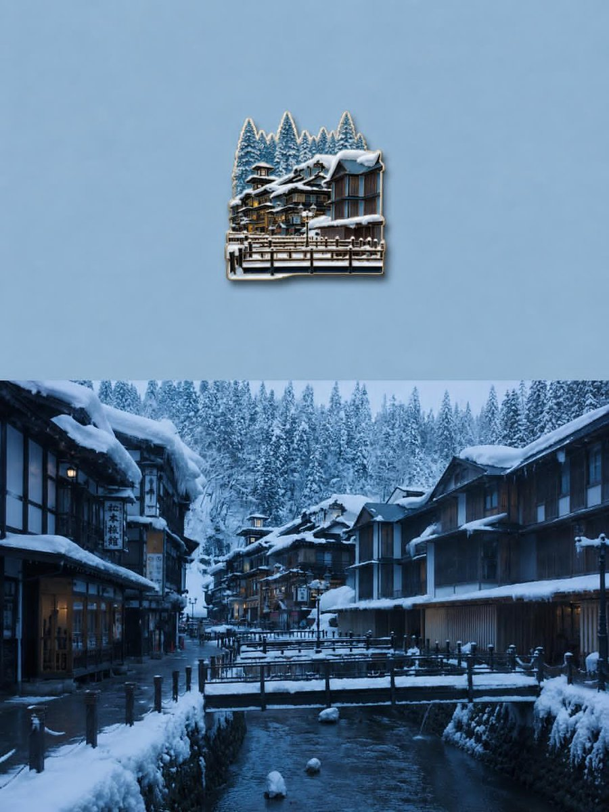

```text
Transform the uploaded image into a premium die-cut sticker illustration while keeping the main subject fully recognizable. Remove or simplify the original background and cleanly isolate the primary subject. Add a thick soft cream or beige sticker border around the entire silhouette with a subtle realistic drop shadow to create a floating sticker effect. Preserve important textures and details while slightly stylizing the image with enhanced colors, cinematic contrast, and a polished editorial l
```


---

## 例 551：Colored Pencil Photo Transformation

**来源：** [@AIwithSynthia](https://x.com/AIwithSynthia/status/2066154697828782245) / [awesome-gpt-image-2-prompts](https://github.com/EvoLinkAI/awesome-gpt-image-2-prompts)

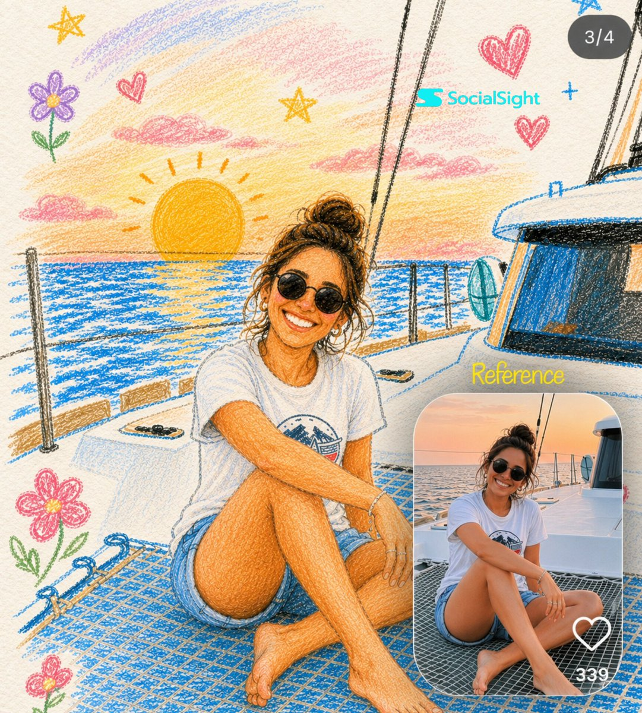

```text
Transform the uploaded photo into a charming hand-drawn colored-pencil and crayon illustration while preserving the person's exact pose, facial features, outfit, expression, and background composition. Create a warm, whimsical sketchbook aesthetic with visible pencil strokes, crayon textures, and soft pastel colors.

Place the illustrated version as the main full-frame artwork. Add playful doodles around the scene such as hearts, stars, flowers, clouds, sparkles, and cute hand-drawn elements that complement the environment. Use textured paper as the canvas background and maintain a cozy, nostalgic, storybook feel.

In the bottom-right corner, include a rounded-rectangle inset containing the original unedited photo as a realistic reference image. The inset should resemble a social media post preview with subtle UI elements like a heart icon and engagement count. Ensure the illustrated version perfectly matches the original photo in composition, creating a striking before-and-after transformation effect.

Highly detailed, colored pencil illustration, crayon art style, hand-sketched textures, vibrant yet soft pastel palette, Instagram-style layout, whimsical doodles, premium artwork, realistic reference inset, masterpiece, ultra-detailed, 4K.
```


---

## 例 552：Dreamcore Brand Kit Illustration

**来源：** [@92digitalartArt](https://x.com/92digitalartArt/status/2068766168979063085) / [awesome-gpt-image-2-prompts](https://github.com/EvoLinkAI/awesome-gpt-image-2-prompts)

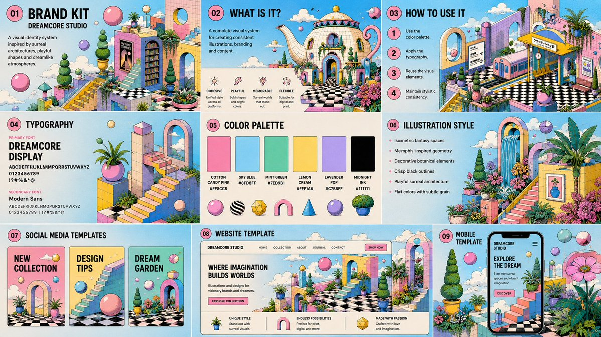

```text
surreal dreamcore architectural illustration, bright Memphis design influence, pastel pop color palette, crisp black ink outlines, isometric fantasy garden space, tiled geometric walls, floating spheres, checkerboard floor, stylized clouds, ornamental plants and topiary, clean comic-book linework, playful postmodern shapes, flat colors with subtle grain texture, whimsical liminal atmosphere, decorative botanical details, airy blue sky, high-detail editorial illustration, vibrant retro-futuristic mood.
```


---

## 例 553：Whimsical Mirror Travel Journal

**来源：** [@Taaruk_](https://x.com/Taaruk_/status/2068716967968788743) / [awesome-gpt-image-2-prompts](https://github.com/EvoLinkAI/awesome-gpt-image-2-prompts)

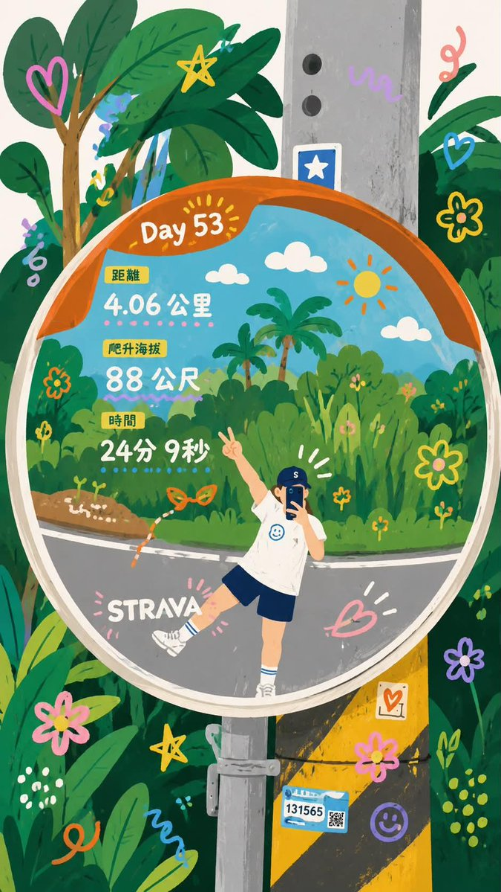

```text
Transform the uploaded photo into a whimsical hand-painted storybook illustration. Keep the exact pose, perspective, convex traffic mirror reflection, road, utility pole, and surrounding tropical greenery. Reimagine the mirror reflection as a vibrant illustrated world with lush jungle plants, palm trees, flowers, butterflies, doodle hearts, stars, swirls, smiling sun, fluffy clouds, and colorful hand-drawn decorations. The person is transformed into a cute cartoon character wearing a white t-shirt, navy shorts, white socks, and a blue cap, posing playfully with one leg raised and a peace sign. Integrate fitness-tracker statistics inside the mirror in a charming infographic style: “Day 53”, “4.06 km”, “88 m”, “24 min 9 sec”. Bright pastel colors, textured gouache paint, children's book aesthetic, whimsical doodles, clean outlines, cozy and cheerful mood, highly detailed foliage, playful travel journal style, Strava-inspired adventure artwork, vibrant greens, oranges, blues, and pinks, ultra-detailed illustration, masterpiece, kawaii aesthetic, editorial quality, vertical composition, 4k.
```


---

## 例 554：Folk Papercraft Scene Remix

**来源：** [@Ciri_ai](https://x.com/Ciri_ai/status/2068716810346860804) / [awesome-gpt-image-2-prompts](https://github.com/EvoLinkAI/awesome-gpt-image-2-prompts)

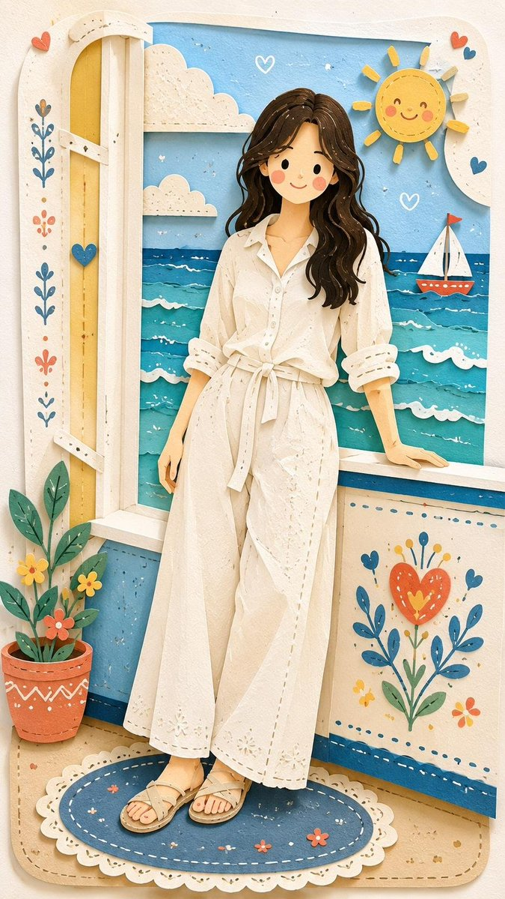

```text
Reimagine the entire image as one cohesive Decorative Folk Flat Illustration blended with a soft handcrafted paper-cut layered style, inspired by charming papercraft diorama aesthetics. Preserve the original subject, composition, and overall mood, but simplify every element into clean flat forms, bold rounded shapes, and cute childlike proportions. Add playful doodle accents, decorative folk patterns, slightly uneven handmade outlines, and minimal facial details such as dot eyes and soft blush cheeks.

Use a vivid, cheerful color palette that feels fresh and different from the original image, while keeping the final artwork warm, sweet, innocent, whimsical, and storybook-like. Create the feeling of layered cardstock with stacked paper depth, clean cut edges, subtle shadows between layers, and gentle paper-crafted imperfections, as if the scene were carefully cut, colored, and assembled on clean white paper. The result should look cute, handcrafted, playful, and visually unified, with a polished yet charming handmade folk-art papercraft finish.
```


---

## 例 555：A professional product photography shot of a cold sparkling water

**来源：** [@meng_dagg695](https://x.com/meng_dagg695/status/2047227172486824002) / [awesome-gpt-image-2-prompts](https://github.com/EvoLinkAI/awesome-gpt-image-2-prompts)

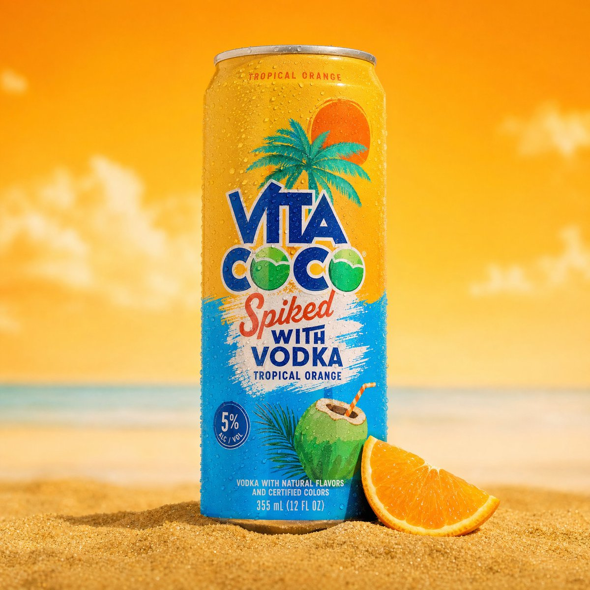

```text
A professional product photography shot of a cold sparkling water
can placed upright in golden beach sand. The can is silver and teal,
covered in realistic water droplets condensation, with a pineapple
illustration and tropical branding. The can is slightly tilted,
planted in a small mound of fine golden sand with tiny white pebbles
and small green tropical leaves/grass scattered around the base.
Background features a bold split composition - bright sky-blue on
the left and vivid yellow on the right, with a large blurred real
pineapple placed behind the can on the right side. A blurred tropical
palm leaf drapes in from the upper left corner, adding depth and
framing. Macro-level water condensation droplets visible on the
can surface. Lighting is bright, vibrant, commercial studio lighting
with clean shadows. Shallow depth of field - can in sharp focus,
background softly blurred. Mood: summer, tropical, fresh, refreshing.
Commercial product photography, ultra-detailed, 8K.
```


---

## 例 556：Soft poetic children's book illustration with watercolor and gouache textures...

**来源：** [@dotey](https://x.com/dotey/status/2047174895293849972) / [awesome-gpt-image-2-prompts](https://github.com/EvoLinkAI/awesome-gpt-image-2-prompts)

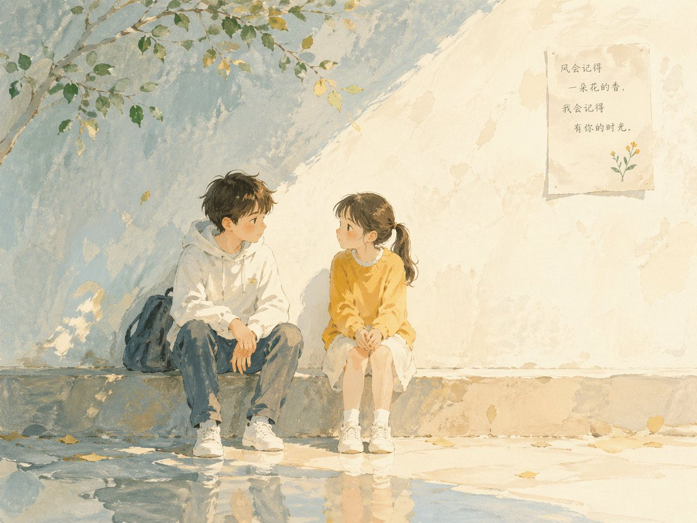

```text
Soft poetic children's book illustration with watercolor and gouache textures.Clear gentle daylight with slightly brighter highlights.Muted pastel colors with soft blue and warm tones.Visible brush strokes and paper grain.Minimalist composition with large negative space.Calm, thoughtful, slightly open-ended atmosphere.

Child character (around 12 years old).Subtle visual metaphors like light, shadow, perspective, reflection.Hand-painted picture book style, not cartoon, not anime, not 3D.

Two children in calm conversation,soft connection forming.
```


---

## 例 557：Peacock Botanical Vintage Symmetrical Art Print

**来源：** [@dotey](https://x.com/dotey/status/2047803054422901046) / [awesome-gpt-image-2-prompts](https://github.com/EvoLinkAI/awesome-gpt-image-2-prompts)

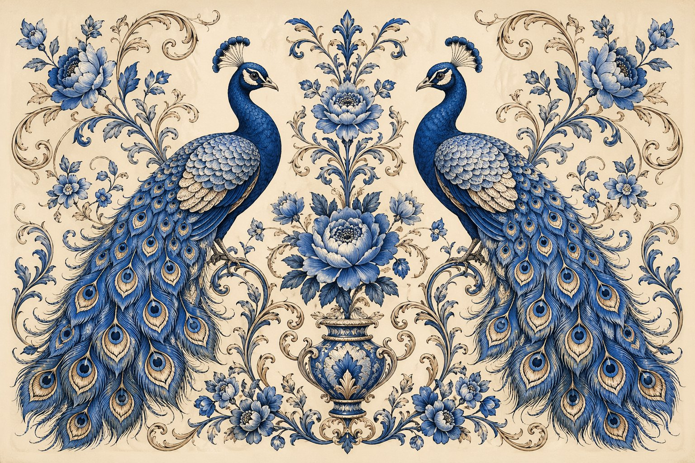

```text
symmetrical design featuring two elegant blue peacocks with detailed feather patterns, surrounded by blue floral elements, intricate vintage botanical ornament, soft beige background, classical floral decor style with rich navy and sky blue details, decorative art illustration --ar 3:2
```


---

## 例 558：Dance Movement Reference Sheet

**来源：** [@Ciri_ai](https://x.com/Ciri_ai/status/2048074587955658848) / [awesome-gpt-image-2-prompts](https://github.com/EvoLinkAI/awesome-gpt-image-2-prompts)


```text
[STYLE]
monochromatic grayscale illustration, 3D rendered character, clean instructional reference sheet,
white background, comic-style cell grid layout, technical diagram aesthetic

[LAYOUT]
4x4 grid layout, 16 panels total, each panel separated by thin black border lines,
numbered cells from 1 to 16, consistent panel size

[CHARACTER]
{argument name="character" default="young female dancer, athletic build, ponytail hairstyle, crop top and baggy pants, sneakers"}, same character in all panels

[PANEL STRUCTURE - per cell]
top-left: bold number badge + {argument name="title" default="Korean title text"}
center: full-body character pose illustration
bottom-left: {argument name="description" default="Korean description text (3-4 lines)"}
overlay: directional arrows indicating movement direction

[ARROWS / MOTION INDICATORS]
curved arrows, straight arrows, circular rotation indicators,
placed around the character to show movement flow and direction

[RENDERING STYLE]
high detail 3D sculpt style, soft studio lighting, subtle shadows,
no color, grayscale shading, clean linework, game concept art quality

[NEGATIVE]
no background scenery, no color tones, no extra characters,
no cluttered backgrounds
```


---

## 例 559：Anime Museum Background Conversion

**来源：** [@Dakiny](https://x.com/Dakiny/status/2048175219966394695) / [awesome-gpt-image-2-prompts](https://github.com/EvoLinkAI/awesome-gpt-image-2-prompts)

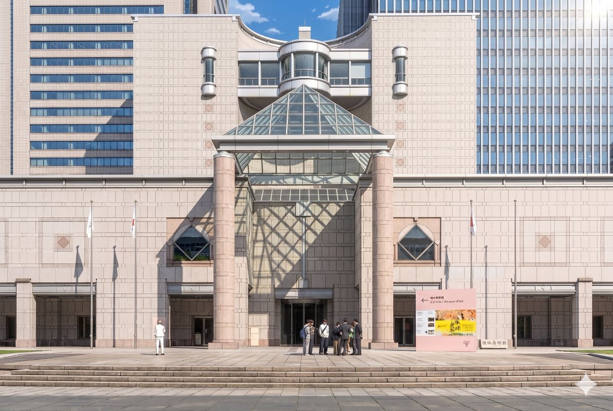

```text
Using the provided reference photo, recreate the same museum facade and frontal composition as a polished theatrical anime background illustration. Keep the architecture, signage, 3 flagpoles, broad steps, and overall layout consistent, but convert the image from realistic photography into a highly detailed hand-painted anime film style with clean linework, soft cel shading, gentle pastel stone colors, and crisp atmospheric lighting. Add dramatic sunlight from the upper right so the glass pyramid casts a large geometric lattice shadow across the central wall and left side of the entrance. Simplify and stylize the people into anime background characters, keeping the 2 visible groups: 1 lone figure on the left and 1 small cluster of 7 people near the center-right entrance. Preserve the clear blue-sky daytime mood while making the scene feel elegant, refined, and cinematic.
```


---

## 例 560：Surreal Baroque Painting Reality Fracture

**来源：** [@JohnnyWang8802](https://x.com/JohnnyWang8802/status/2048129335853559824) / [awesome-gpt-image-2-prompts](https://github.com/EvoLinkAI/awesome-gpt-image-2-prompts)

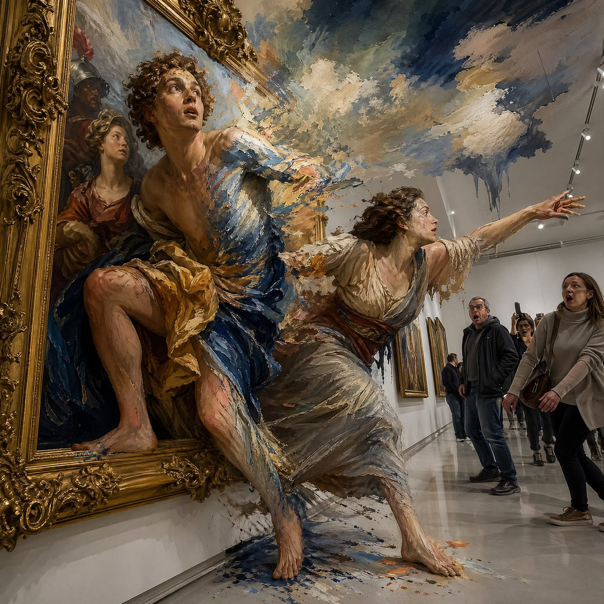

```text
A {argument name="painting style" default="baroque oil painting"} comes to life — its painted figures climbing out of the gilded frame into a {argument name="setting" default="modern white gallery"}, half their bodies still in flat 2D paint, half fully volumetric 3D humans, brushstrokes visible on their skin, the painting's background leaking watercolor clouds into the gallery ceiling, museum visitors frozen in shock, hyper-detailed, {argument name="artist influence" default="René Magritte meets Pixar"}, reality fracturing at every boundary
```


---

## 例 561：RPG Map to Anime Event Scene

**来源：** [@ArtwlDesign](https://x.com/ArtwlDesign/status/2048054726768709769) / [awesome-gpt-image-2-prompts](https://github.com/EvoLinkAI/awesome-gpt-image-2-prompts)

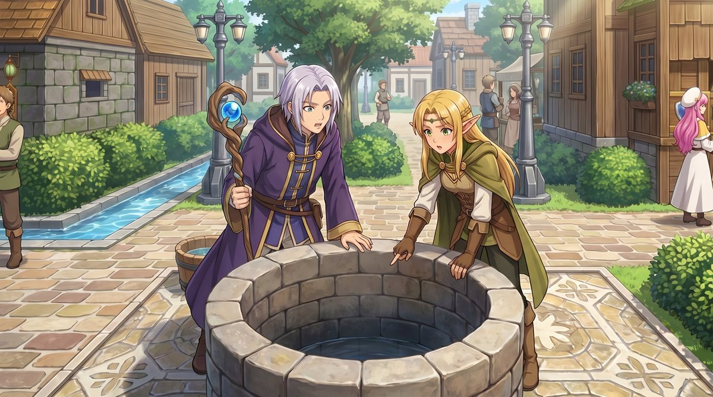

```text
Using the provided reference image, transform the top-down RPG town map into a polished anime-style event illustration from a human eye-level perspective. Keep the same village location and layout cues: the central stone well, the path network, the hedges, the wooden houses, and the narrow water canal on the left. Convert the 2 small sprite characters by the well into 2 full-size fantasy characters in the foreground: a silver-haired mage in a purple robe holding a staff, and a blonde elf in green-and-brown adventurer clothing, both leaning over and looking into the well. Add a cinematic JRPG feel with soft daylight, detailed painterly rendering, clean line art, and gentle depth of field. Preserve the sense that this scene is taking place in the same town square, but enrich it with natural perspective, more environmental detail, and 5 background villagers: 1 man cropped at the far left edge, 2 small figures standing on the center path in the distance, and 2 townspeople talking near the right-side buildings.
```


---

## 例 562：Urban Fantasy Coexistence Crossing

**来源：** [@Ray_CROWN0](https://x.com/Ray_CROWN0/status/2048024227664494775) / [awesome-gpt-image-2-prompts](https://github.com/EvoLinkAI/awesome-gpt-image-2-prompts)

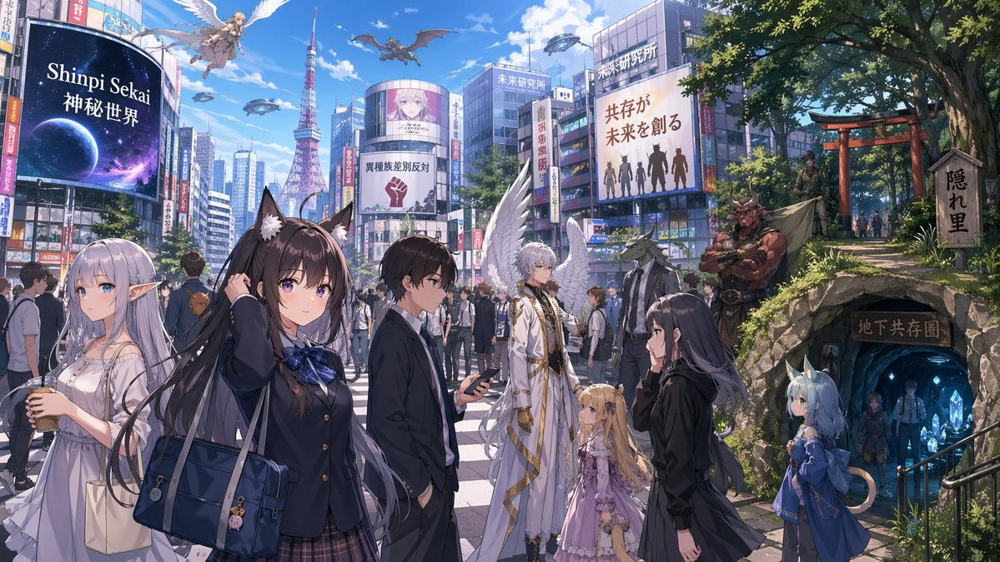

```text
A highly detailed anime-style urban fantasy illustration set at a busy Tokyo-style scramble crossing on a bright clear day, viewed at street level with a wide cinematic composition. The city blends modern realism with mythic fantasy: dense high-rise buildings covered in giant billboards, a red broadcast tower in the middle distance, blue sky with fluffy clouds, and a crowded crosswalk full of pedestrians. In the foreground, show 7 prominent character figures: a silver-haired elf woman in a flowing white dress holding an iced drink and tote bag on the far left; a central schoolgirl with long dark hair, black animal ears, a navy school blazer, plaid skirt, blue ribbon, and large navy shoulder bag, lifting one hand to her head; a young man in a dark suit looking down at a smartphone; an androgynous white-haired angelic figure in an elegant white-and-gold ceremonial outfit with large white wings; a small blonde girl in an ornate pastel pink frilled dress beside the angel; a dark-haired woman in a black coat in right foreground profile; and a small blue-haired cat-eared child in a blue dress with a bow standing near a cave entrance on the right. In the midground crowd, include mixed humans and fantasy races walking together naturally. Add 4 clearly visible nonhuman or supernatural background beings: 1 dragon flying in the sky, 1 winged female angel descending above the street, 1 lizard-headed businessman in a suit near the angelic figure, and 1 tall red-skinned horned demon with crossed arms standing by the hillside path. On the right side, transition the city into a lush shrine hillside with large green trees, a red torii gate, stone steps, and a wooden signboard reading Japanese kanji. Below it, place a rocky cave-like tunnel entrance glowing blue, with a wooden sign over the entrance and several figures descending into an underground shared district lit by crystals. Show 6 major billboard/sign elements across the cityscape: a huge left billboard reading "Shinpi Sekai 神秘世界" with a cosmic planet image; a large central political poster with Japanese text and a raised fist icon; 2 rooftop signs reading "未来研究所" on separate buildings; a large right billboard with Japanese text about coexistence and silhouettes of different beings; and 1 vertical banner with Japanese text on a nearby building. Emphasize the theme of coexistence between ordinary modern city life and hidden fantasy societies. Crisp anime linework, polished light novel key visual rendering, rich textures, soft sunlight, subtle atmospheric perspective, vibrant but believable colors, intricate clothing details, and a sense of awe, everyday bustle, and worldbuilding depth.
```


---

## 例 563：Dreamy Shibuya Bubble Girl

**来源：** [@terunari](https://x.com/terunari/status/2048308270914490666) / [awesome-gpt-image-2-prompts](https://github.com/EvoLinkAI/awesome-gpt-image-2-prompts)

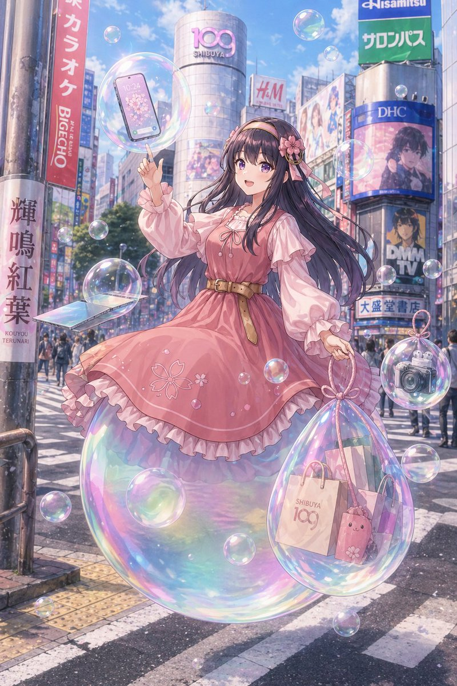

```text
A dreamy anime-style full-body illustration of a fashionable young woman standing in the middle of the Shibuya scramble crossing in Tokyo on a bright clear day, with the iconic cylindrical SHIBUYA 109 building centered in the background and recognizable commercial billboards surrounding it, including signs resembling H&M, DHC, DMM TV, Big Echo, and other dense Japanese city advertisements. She is the single main subject, posed gracefully as if floating or weightless, standing on top of one giant iridescent translucent soap bubble beneath her skirt. Her face is softly obscured and de-emphasized, while her long dark violet-black hair flows dramatically in the wind, with soft bangs and a pink floral headband accessory with ribbon on one side. She wears a sweet feminine spring outfit in pastel pink: a long-sleeved frilled blouse under a sleeveless pink dress with a ribbon tie at the chest, a tan belt at the waist, layered ruffles at the hem, and subtle sakura flower embroidery near the lower skirt. Her expression and body language should feel gentle, elegant, whimsical, and slightly magical. One hand is raised with her index finger pointing upward toward a floating bubble that contains 1 smartphone; her other hand holds a loop handle attached to a large transparent iridescent shopping-bag-like bubble containing 3 visible items: 1 SHIBUYA 109 paper shopping bag, 1 pink shopping bag or package, and 1 small pink bunny-faced pouch. Also include 1 separate floating smartphone/tablet-like device outside the bubbles near the lower left side, and 1 floating bubble on the lower right containing 1 compact camera. Surround her with many soap bubbles of different sizes, all highly reflective with rainbow highlights and delicate transparency, creating a soft sparkling atmosphere. The city scene should be busy but slightly softened, with pedestrians in the far background, crosswalk stripes in the foreground, and warm sunlight filtering through the urban canyon. Use polished high-detail anime illustration rendering, luminous pastel colors, glossy reflections, soft bloom, a romantic spring palette, and a magical everyday Tokyo aesthetic.
```


---

## 例 564：Glowing Sailboat Night Illustration

**来源：** [@churvikv](https://x.com/churvikv/status/2054315113587384469) / [awesome-gpt-image-2-prompts](https://github.com/EvoLinkAI/awesome-gpt-image-2-prompts)

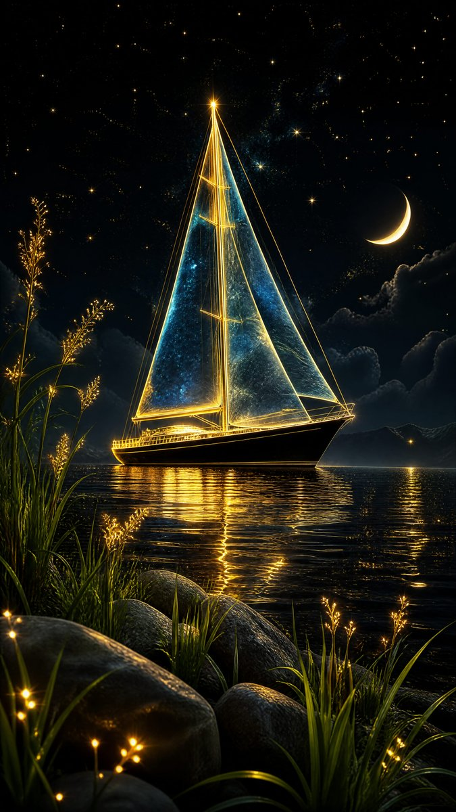

```text
A luminous sailboat, outlined in glowing golden light, floats serenely on dark, rippling water under a starry night sky. The sails, translucent and faintly blue, catch the ethereal light, while the hull is a solid, dark silhouette. Numerous tiny, twinkling golden stars are scattered across the black expanse above, and a crescent moon hangs softly to the right. Lush, vibrant green reeds and grasses sprout from smooth, grey stones in the foreground, their tips adorned with delicate, glowing golden florets. The water reflects the golden outline of the sailboat, creating a shimmering, warm glow that contrasts with the cool, deep darkness of the night. The scene is composed with a slightly low angle, emphasizing the majestic presence of the sailboat against the vastness of the night. The overall atmosphere is magical, tranquil, and dreamlike, evoking a sense of peaceful adventure and celestial wonder. The style is reminiscent of digital fantasy art with glowing neon accents.
```


---

## 例 565：Play-Doh City Editorial

**来源：** [@Goodmanprotocol](https://x.com/Goodmanprotocol/status/2054629670239502408) / [awesome-gpt-image-2-prompts](https://github.com/EvoLinkAI/awesome-gpt-image-2-prompts)

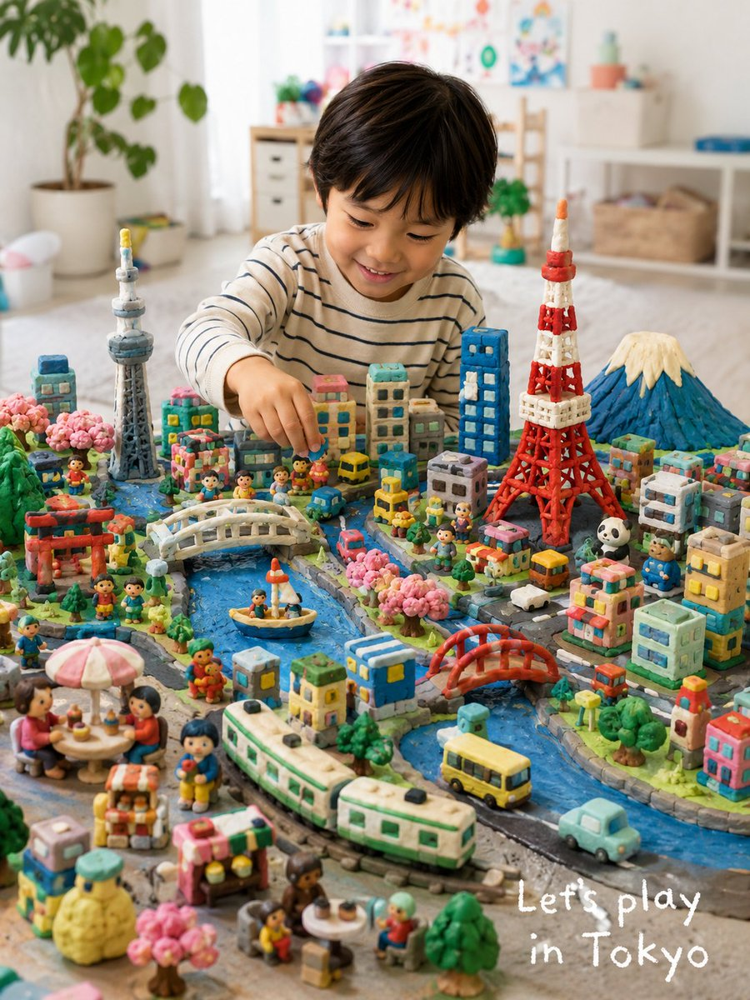

```text
Create an ultra-charming 3:4 editorial illustration of a five-year-old child sitting at a cozy craft table, happily building a handmade Play-Doh miniature [City Name]. The entire world must clearly look sculpted by a real child using colorful Play-Doh clay - soft rounded shapes, uneven geometry, tiny fingerprints, squished textures, slightly crooked buildings, playful proportions, imperfect symmetry, and adorable handcrafted charm. The miniature city should include recognizable landmarks, bridges, rivers, cafés, food stalls, apartment buildings, parks, trains, buses, tiny clay people, trees, clouds, and playful neighborhood scenes. Dense with delightful micro-details while remaining organized and cozy. The child should feel authentic and natural, wearing casual everyday clothing with a curious, proud expression. Avoid stereotypes or costume-like styling. Visual style: premium children’s editorial illustration, soft claymation-inspired rendering, miniature diorama photography mood, whimsical storytelling, high-end family travel magazine aesthetic, ultra detailed, handcrafted warmth. Lighting & color: bright neutral daylight, soft diffused natural indoor lighting, airy Scandinavian editorial mood, crisp whites, fresh pastel Play-Doh palette, slightly cool-neutral white balance, clean highlights, luminous soft shadows. Avoid yellow tint, orange cast, sepia tone, moody cinematic lighting, neon oversaturation, or dark shadows. The city must feel genuinely handmade by a talented five-year-old - playful, imperfect, emotional, and imaginative, never like professional miniature modeling or hyperreal sculpture. No fake text, logos, watermarks, AI artifacts, hyperreal architecture, or over-polished miniature aesthetics. Bottom-right corner: small handwritten white crayon sentence: Let’s play in [City Name] The handwriting should feel naturally childlike, cute, uneven, and readable.
```


---

## 例 566：Cubist Kawaii Vector Portrait

**来源：** [@ChillaiKalan__](https://x.com/ChillaiKalan__/status/2054457447142805832) / [awesome-gpt-image-2-prompts](https://github.com/EvoLinkAI/awesome-gpt-image-2-prompts)

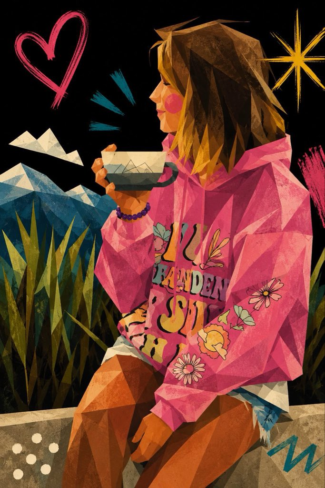

```text
Create a cute neo-expressionist cubist minimal vector portrait illustration, Picasso meets kawaii minimalism, inspired by stylized fashion editorials and playful modern art. Ultra-simplified exaggerated facial features with oversized abstract eyes, flat cartoon eye shapes, minimal black dots or single curved strokes, no realistic iris details, no eyelashes, extremely reduced facial detail. Tiny abstract nose drawn with one short angular line. Small single-stroke lips, tiny soft geometric mouth shape, minimal expression marks, no realistic mouth anatomy. Rounded cheeks, dreamy innocent expression, playful asymmetrical proportions, elongated elegant neck, simplified geometric facial planes, stylized angular hair shapes, subtle caricature aesthetics, childlike artistic distortion. Use clean scalable vector shapes, flat color blocking, bold primitive contour lines, sharp Bézier curves, abstract polygon composition, minimal linework, naive handmade drawing quality, expressive empty space, icon-like facial abstraction, no realistic rendering, 2D primitive facial symbols. Add subtle oil pastel grain overlays, rough handmade brush accents, raw scribbled handwritten marks, visible pigment texture, silkscreen poster feeling. Vibrant limited color palette against deep matte black background. Luxury editorial gallery poster composition, contemporary fashion illustration, artsy modern cubist poster, stylish and adorable, premium print-ready vector artwork.
```


---

## 例 567：Monochrome Caricature Portrait Sheet

**来源：** [@Noor_ul_ain43](https://x.com/Noor_ul_ain43/status/2055796848552755579) / [awesome-gpt-image-2-prompts](https://github.com/EvoLinkAI/awesome-gpt-image-2-prompts)

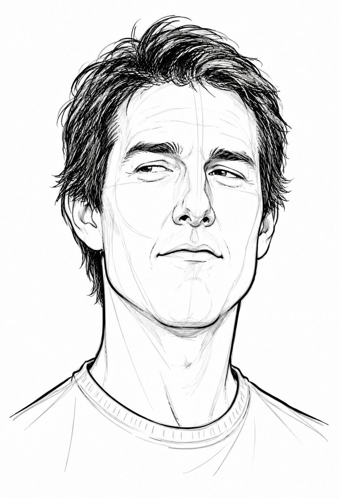

```text
A stylized black-and-white pencil ink caricature portrait sheet featuring two distinct charismatic characters with contrasting face shapes and expressions. Drawn in a loose sketchbook style with visible construction lines, rough pencil strokes, expressive exaggerated facial proportions, modern caricature illustration aesthetic.

Left character: handsome charismatic man with messy hair, sharp jawline, confident smirk, expressive sideways eyes, slim long face, casual t-shirt.

Right character: muscular bald man with raised eyebrow, thick neck, strong jawline, dominant confident expression, casual t-shirt.

Minimal shading, thin crosshatching, clean line art, monochrome aesthetic, white background, artistic character design concept sketch, highly detailed hand-drawn look, playful exaggerated anatomy, professional caricature sketch style
```


---

## 例 568：星河入梦 3D CG 插画

**来源：** [@liyue_ai](https://x.com/liyue_ai/status/2055679355242844462) / [awesome-gpt-image-2-prompts](https://github.com/EvoLinkAI/awesome-gpt-image-2-prompts)

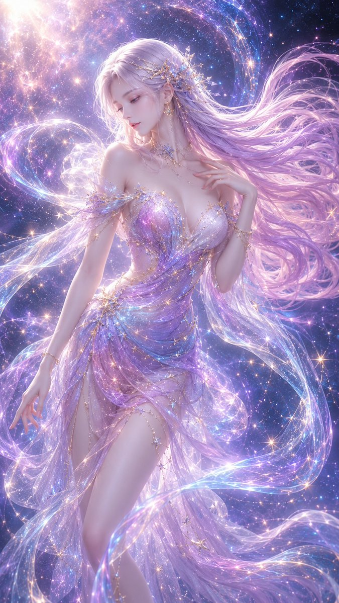

```text
一位成年东方幻想系女性角色，梦幻星河仙女风，3D CG 高精度插画质感，9:16 竖版构图，画面充满全息星河、流光粒子、银河丝带与柔雾光晕。

人物位于画面中央偏左，半身到大腿视角，身体呈优雅的 S 型动态站姿。她的上半身微微向一侧倾斜，腰部自然收束并轻轻扭转，胯部向相反方向形成柔和弧线，一侧肩膀略微抬起，另一侧肩膀自然放松，整体姿态像在星河中缓慢旋转，既轻盈又具有女性柔美。头部微微低垂，脸部呈三分之二侧脸，眼神温柔、安静、梦幻，神情清冷而优雅。

她拥有精致柔和的东方幻想系五官，白皙通透的肌肤，肌肤带有柔和的次表面散射与珍珠般高光，面部轮廓干净细腻，鼻梁纤细，嘴唇柔软，睫毛纤长。长发为淡银白色与浅粉紫色渐变，发丝被星风吹起，向画面右侧大面积飘散，形成流动感极强的弧线，与人物 S 型身体曲线相互呼应。

服装是一件梦幻星河礼裙，材质轻盈透明但保持优雅克制，肩部为柔软薄纱结构，胸口与腰部有银河般的渐变流光纹理，颜色以浅粉、淡蓝、薰衣草紫、珍珠白为主，局部点缀金色星尘。裙身像星云与薄纱融合而成，轻盈飘动，围绕人物身体形成螺旋状流光带，强调腰线、肩颈线与整体 S 型姿态，但不刻意暴露。

背景是梦幻宇宙星河空间，整体色调为淡粉色、浅蓝色、薰衣草紫与柔金色，充满细密星光、星尘粒子、银河流线、半透明全息光带。光线从左上方柔和洒下，在人物发丝、肩颈、脸颊和礼裙边缘形成温柔轮廓光。画面空气感强，光晕柔和，整体像漂浮在银河梦境中。

构图要求：
人物身体线条呈明显但自然的 S 型曲线；
肩、腰、胯形成柔和的反向动态；
头发与星河丝带共同形成环绕式流动；
画面保留大量梦幻光雾与星尘；
人物优雅、柔美、梦幻、高级；
重点表现女性身姿的柔和曲线、星河仙女气质与高级幻想感。

风格关键词：
dreamy fantasy girl, celestial goddess, galaxy dress, holographic starlight, soft pastel colors, ethereal beauty, elegant S-curve pose, cinematic lighting, ultra detailed 3D CG, soft glow, translucent silk, star particles, romantic fantasy atmosphere, high-end illustration, 16K detail, vertical poster composition

负面提示词：
身体比例错误，畸形手指，多手指，多手臂，脸部崩坏，眼睛不对称，廉价质感，灰蒙蒙，脏色调，过度锐化，低清晰度，杂乱背景，文字，水印，logo
```


---

## 例 569：Character Profile Sheet

**来源：** [@iamsofiaijaz](https://x.com/iamsofiaijaz/status/2055633103973134719) / [awesome-gpt-image-2-prompts](https://github.com/EvoLinkAI/awesome-gpt-image-2-prompts)

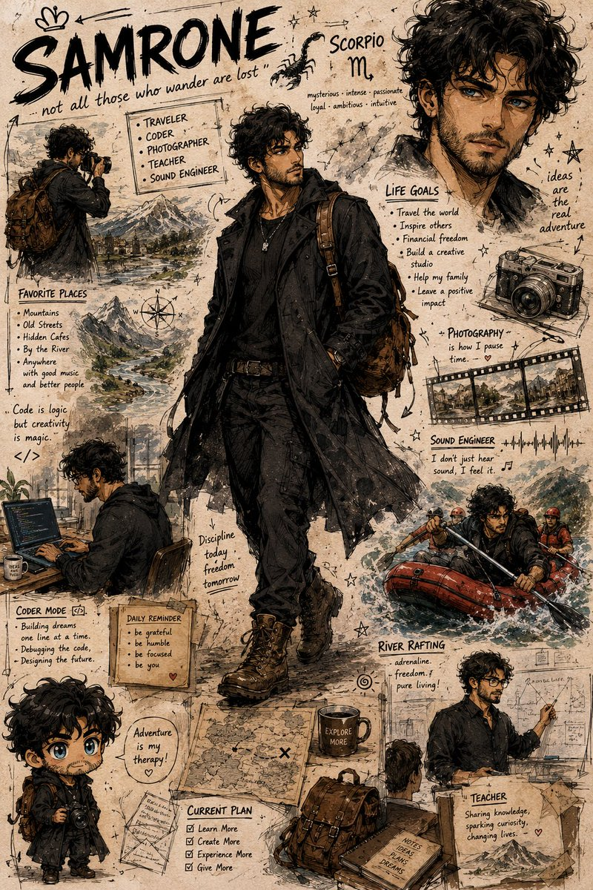

```text
A stylish illustrated character profile sheet of a handsome young man sketchbook aesthetic, mixed media ink and watercolor style, highly detailed fashion portrait, messy dark curly hair, sharp blue eyes, short beard, confident expression, wearing a long black trench coat, dark casual clothes, brown leather backpack, rugged boots.
The page layout includes multiple poses and close-up portraits, surrounded by handwritten notes, doodles, symbols, travel sketches, cameras, mountains, coding references, and adventure elements.
Personality board design with handwritten text such as traveler, coder, photographer, teacher, sound engineer, Scorpio zodiac sign, river rafting, creative ideas, life goals, motivational notes.
Includes small chibi version of the character, laptop working scene, rafting action scene, map sketches, stars, arrows, and artistic scribbles.
Modern concept art meets fashion illustration, dynamic ink strokes, expressive line art, textured watercolor shading, warm paper background, cinematic composition, Pinterest aesthetic, highly detailed, visually rich, creative journal vibe, character design sheet, semi-realistic comic illustration.
```


---

## 例 570：Busan Travel Journal Illustration

**来源：** [@Naiknelofar788](https://x.com/Naiknelofar788/status/2056189569515892819) / [awesome-gpt-image-2-prompts](https://github.com/EvoLinkAI/awesome-gpt-image-2-prompts)

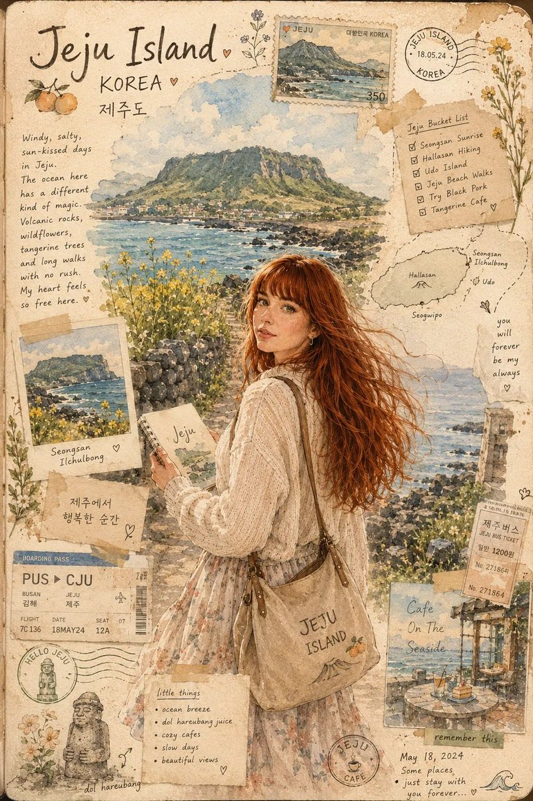

```text
Create a dreamy handcrafted ( CITY)travel journal illustration, as if painted in an artist’s personal sketchbook while traveling through (COUNTRY )
SCENE: A romantic Busan coastal setting inspired by Gamcheon Culture Village + Haeundae + Songdo seaside charm. Feature: oceanfront promenade gentle waves seagulls Korean seaside cafés pastel coastal buildings tiny fishing boats paper lantern accents boardwalk details colorful Busan hillside houses in the distance beach umbrellas ocean breeze atmosphere subtle Korean storefront signage travel discovery mood
SUBJECT: Place the woman from the uploaded reference naturally in the scene. Appearance: long flowing copper auburn hair moving softly in the sea breeze hazel-green eyes fair skin natural elegant expression soft thoughtful gaze
WARDROBE: romantic coastal travel styling cream knit sweater flowing midi skirt light trench coat or airy cardigan delicate scarf moving with wind comfortable elegant walking shoes
POSE OPTIONS: ((walking along the Busan seaside promenade)) OR ((sitting at a Korean seaside café sketching in a journal)) OR  ((holding a travel journal while looking toward the ocean)) OR ((standing near the railing with wind in hair, candid cinematic pose))
STYLE: premium watercolor travel-journal illustration hand-drawn ink sketch detailing transparent watercolor washes aged textured paper pigment bleeding ink splatters vintage travel scrapbook aesthetic editorial artistic composition luxury Pinterest-worthy illustration
ADD SCRAPBOOK ELEMENTS: handwritten diary notes "BUSAN" "KOREA" tiny illustrated coastline map metro ticket fragments passport stamps vintage postage marks boarding pass scraps coffee stains botanical doodles hand-drawn arrows tiny seashell sketches travel annotations paper tape collage small Korean handwritten notes
COLOR PALETTE: soft ocean blue dusty aqua muted sand beige faded coral warm cream seafoam green soft terracotta accents washed watercolor neutrals LIGHTING: golden morning seaside sunlight airy coastal glow romantic atmospheric haze gentle cinematic warmth
 COMPOSITION: vertical travel journal page 4:5 aspect ratio ultra detailed cozy nostalgic storytelling peaceful romantic vacation mood
NEGATIVE PROMPT: CGI, photorealistic rendering, anime face, identity change, plastic skin, neon cyberpunk, futuristic objects, dark horror mood, distorted anatomy, extra limbs, messy cluttered composition, AI glitches, oversaturated colors
 metro ticket fragments passport stamps vintage postage marks boarding pass scraps coffee stains botanical doodles hand-drawn arrows tiny seashell sketches travel annotations paper tape collage small Korean handwritten notes
COLOR PALETTE: soft ocean blue dusty aqua muted sand beige faded coral warm cream seafoam green soft terracotta accents washed watercolor neutrals LIGHTING: golden morning seaside sunlight airy coastal glow romantic atmospheric haze gentle cinematic warmth
```


---

## 例 571：Kawaii Muslim Cafe Scene

**来源：** [@Taaruk_](https://x.com/Taaruk_/status/2056053350261739866) / [awesome-gpt-image-2-prompts](https://github.com/EvoLinkAI/awesome-gpt-image-2-prompts)

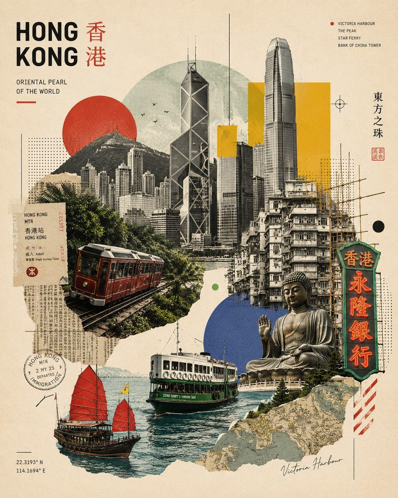

```text
Cute kawaii-style lifestyle photography, adorable chibi-inspired Muslim characters with soft rounded faces and blush cheeks, pastel aesthetic cafe environment, cozy playful atmosphere, ultra soft lighting, handmade paper-cutout illustration effect mixed with realistic photography, pastel blue, cream, pink, and beige color palette, whimsical interior design, toy-store aesthetic, cozy Korean cafe vibes, oversized cute props like giant ice cream decorations and pastel foam blocks, soft textured surfaces, minimal shadows, dreamy mood, wholesome friendship energy, aesthetic Instagram composition, highly detailed clothing fabrics, modest fashion with hijab styling, cute cartoon proportions, cozy storytelling scene, soft matte textures, handcrafted diorama look, warm emotional atmosphere, clean composition, adorable character expressions, Japanese kawaii aesthetic mixed with modern lifestyle photography, ultra detailed, playful and comforting vibe, Pinterest trending style, soft focus depth of field, pastel cinematic color grading, 8k.

Scene Variations:
```


---

## 例 572：Serene City Travel Illustration

**来源：** [@oggii_0](https://x.com/oggii_0/status/2055876530988015791) / [awesome-gpt-image-2-prompts](https://github.com/EvoLinkAI/awesome-gpt-image-2-prompts)

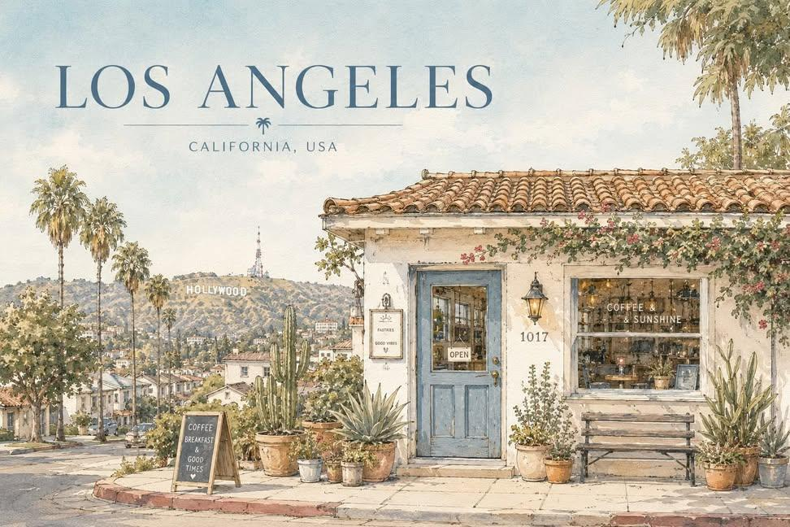

```text
[CITY] = Seoul
[COUNTRY] = South Korea
[LANDMARK] = a recognizable landmark or scenic element of [CITY]

Create a serene architectural travel illustration inspired by [CITY], [COUNTRY], in a soft hand-drawn watercolor and ink style.

Main concept:
Show a quiet, charming street-side house or small building inspired by the everyday atmosphere of [CITY], [COUNTRY], while subtly incorporating [LANDMARK] in the composition.
The landmark should appear naturally in the background, distance, or surrounding scenery, so the image clearly feels connected to [CITY], [COUNTRY] without losing the calm residential mood.

Visual style:
delicate hand-drawn architectural illustration,
soft watercolor washes,
thin ink outlines,
slightly imperfect sketch lines,
warm sunlit atmosphere,
gentle pastel palette,
subtle paper texture,
quiet travel sketchbook aesthetic,
minimal yet detailed composition,
calm editorial illustration mood,
poetic everyday scenery,
cozy and refined visual tone,
no photorealism,
no harsh contrast,
no saturated colors,
no dramatic lighting.

Scene:
A peaceful small house, café, studio, or local building with simple walls, a tiled or regionally inspired roof, painted doors or windows, and several potted plants arranged naturally in front.
Include subtle local architectural details and everyday design elements that feel authentic to [CITY], [COUNTRY].
Incorporate [LANDMARK] as a softly integrated city symbol — for example, visible above rooftops, in the distance, or as part of the surrounding skyline or landscape.
The overall scene should feel quiet, elegant, warm, and locally rooted.

Composition:
landscape travel-poster format,
wide horizontal layout,
large open sky occupying the upper half or upper-left area,
main building placed across the lower portion of the composition,
balanced negative space,
front-facing or slightly angled composition,
potted plants and small objects along the base,
landmark subtly placed in the background or upper distance,
clean and spacious layout,
minimal but emotionally rich composition.

Typography:
Include the city name “[CITY]” clearly in the image.
Render “[CITY]” as elegant travel-poster typography, large but refined, placed prominently in the sky area or upper portion of the composition.
Optionally include “[COUNTRY]” in smaller text beneath or near the city name.
The text should feel integrated into the poster design, not like a random overlay.
Use clean, tasteful lettering that matches the calm watercolor travel-poster mood.

Color palette:
pale sky blue,
warm cream,
terracotta,
muted blue accents,
olive and soft green,
light earthy browns,
soft natural neutrals.

Texture:
visible watercolor paper grain,
transparent paint layering,
soft handmade brush texture,
gentle ink-and-wash finish.

Mood:
peaceful,
sunny,
quiet,
nostalgic,
cozy,
refined,
poetic,
calm everyday travel atmosphere.

Important:
The image should express both the intimate charm of a local building and the identity of [CITY], [COUNTRY] through the inclusion of [LANDMARK].
Do not make the landmark too dominant; it should support the mood rather than overpower the house scene.
The city name “[CITY]” must be visible and clearly readable in the final image.

Aspect ratio: 4:3 or 3:2

Creator: @hermes_agent_kr on Threads
```


---

## 例 573：Flat-Vector City Lifestyle Collage

**来源：** [@Goodmanprotocol](https://x.com/Goodmanprotocol/status/2056612365156978731) / [awesome-gpt-image-2-prompts](https://github.com/EvoLinkAI/awesome-gpt-image-2-prompts)

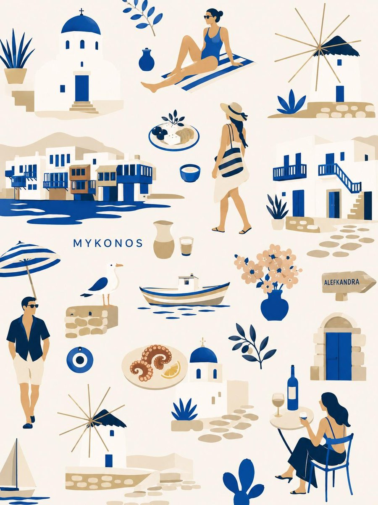

```text
Create a sophisticated flat-vector editorial pattern illustration of [Melbourne], composed as a seamless lifestyle-art collage combining iconic landmarks, local culture, vacation scenes, and symbolic city objects.
```


---

## 例 574：Semi-3D Fashion Editorial Avatar

**来源：** [@AIwithSynthia](https://x.com/AIwithSynthia/status/2063299903582003607) / [awesome-gpt-image-2-prompts](https://github.com/EvoLinkAI/awesome-gpt-image-2-prompts)

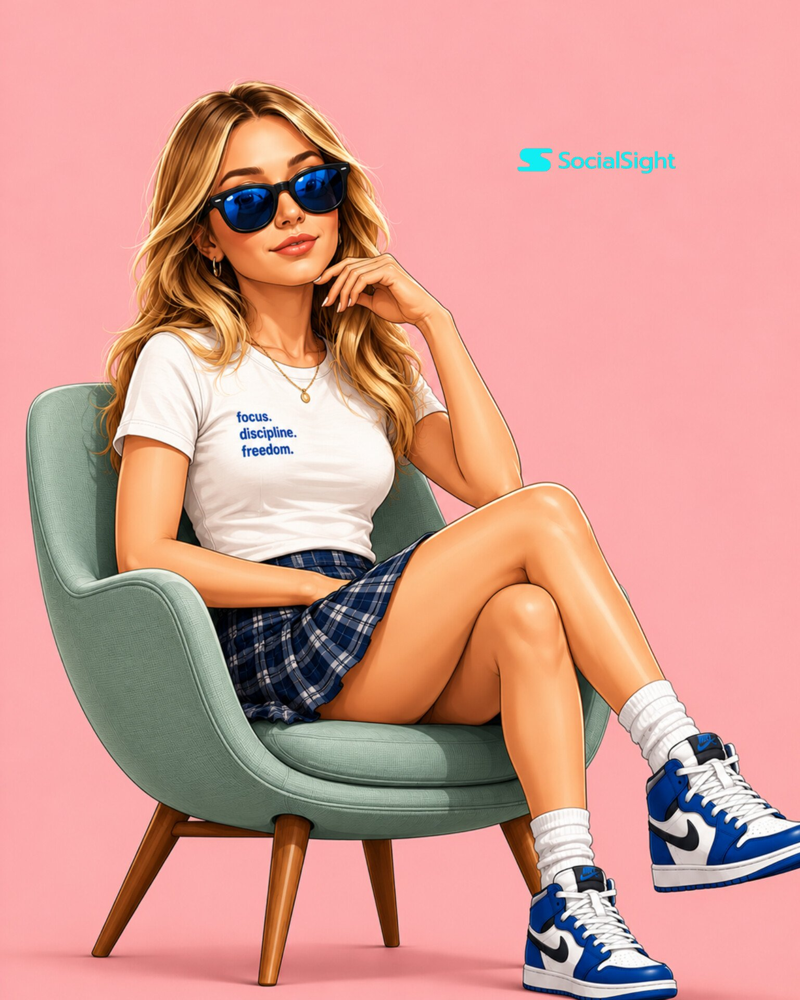

```text
Create a premium high-resolution vector-cartoon / semi-3D illustration of the person from the reference image. Reimagine them in a stylish modern fashion-editorial look, sitting confidently on a sleek designer chair. Outfit: trendy T-shirt, fashionable skirt/pants, stylish sneakers, and bold sunglasses as the hero accessory. Exaggerate key facial features while maintaining recognizable likeness. Clean flat-colored background (single vibrant color), smooth lines, sharp details, soft studio lighting, luxury advertising aesthetic, centered composition with ample negative space for branding and headlines. Ultra-detailed, print-ready, billboard-quality, modern eyewear campaign style.
```


---

## 例 575：Family Watercolor Fashion Sketch

**来源：** [@AiwithZohaib](https://x.com/AiwithZohaib/status/2063277611409879452) / [awesome-gpt-image-2-prompts](https://github.com/EvoLinkAI/awesome-gpt-image-2-prompts)

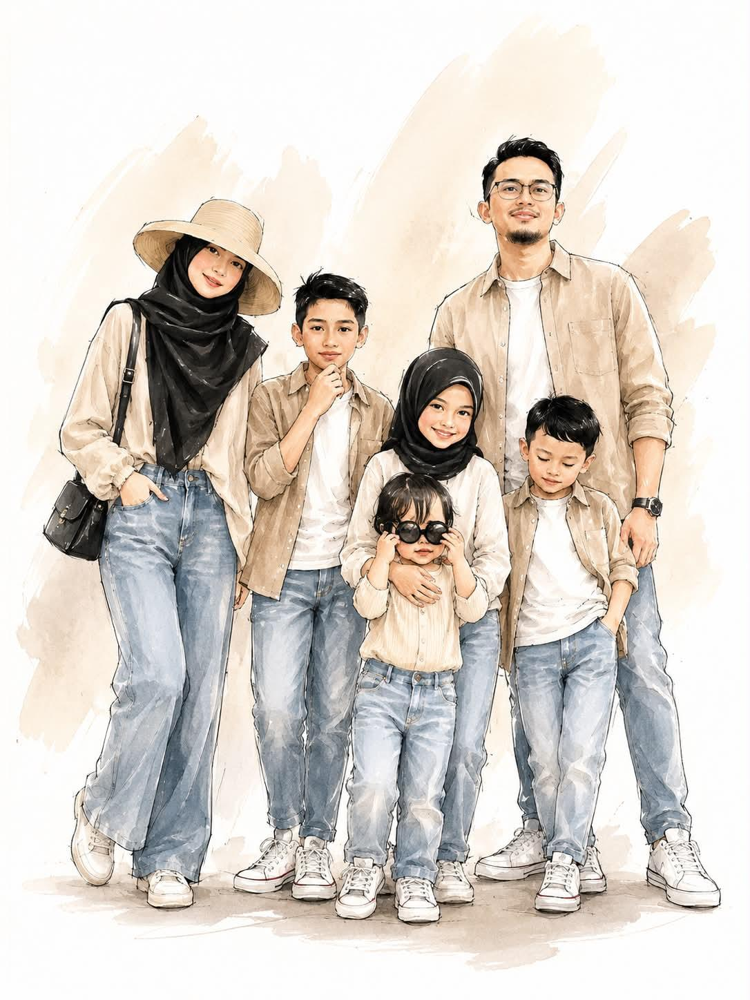

```text
A stylish family standing together, digital watercolor and ink sketch illustration, fashion illustration style, white clean background with abstract beige brush strokes, soft lighting, expressive line art, casual modern clothing, denim jeans, black hijabs, relaxed happy pose, elegant minimal aesthetic, high detail, editorial sketch look.
```


---

## 例 576：Japanese Fashion Cover Illustration

**来源：** [@iamaiistudio](https://x.com/iamaiistudio/status/2063291615205314737) / [awesome-gpt-image-2-prompts](https://github.com/EvoLinkAI/awesome-gpt-image-2-prompts)

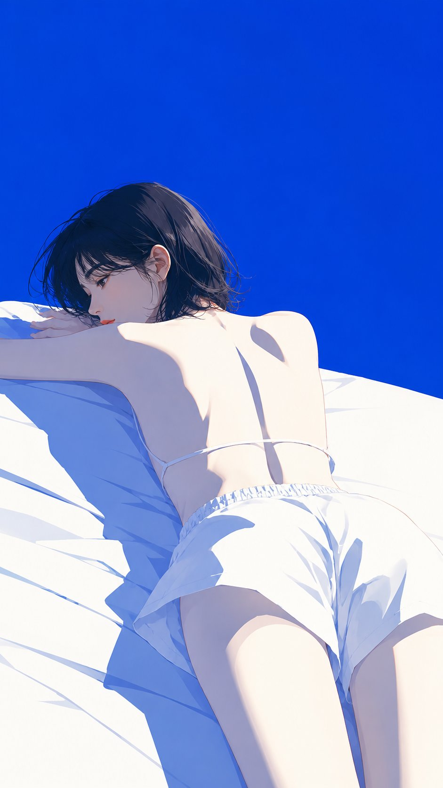

```text
prompt:

Create a high-end Japanese fashion magazine cover illustration. The subject is [XXX]. Use a minimalist, modern fashion-digital-illustration style with refined cel shading, crisp clean large color-block modeling, almost no visible linework, and elegant sharp edges.

Keep a blue-and-white structural palette as the foundation, with restrained accents of coral red, misty purple, pale yellow, ash pink, sage green, silver gray, or similar soft secondary tones. The final image should stay minimal, premium, cohesive, and not flashy.

Use a clean background, such as cobalt blue, royal blue, misty blue, or another pure large color field, with generous negative space. Strong sunlight enters from the upper left. White areas should be bright and close to overexposed, while shadows are built from hard-edged planes of cool blue, gray-blue, and blue-purple.

Give the subject a slender silhouette and a quiet, aloof posture. Simplify details while keeping the form accurate. The overall mood should feel translucent, cool, elegant, fashionable, and suitable for a premium magazine cover poster.

Avoid text, watermarks, complex backgrounds, photorealistic photography, 3D, heavy impasto, childish cartoon styling, and cluttered decoration.
```


---

## 例 577：Love Bites Cyberpunk Manga Cover

**来源：** [@her19845](https://x.com/her19845/status/2063310953475678229) / [awesome-gpt-image-2-prompts](https://github.com/EvoLinkAI/awesome-gpt-image-2-prompts)

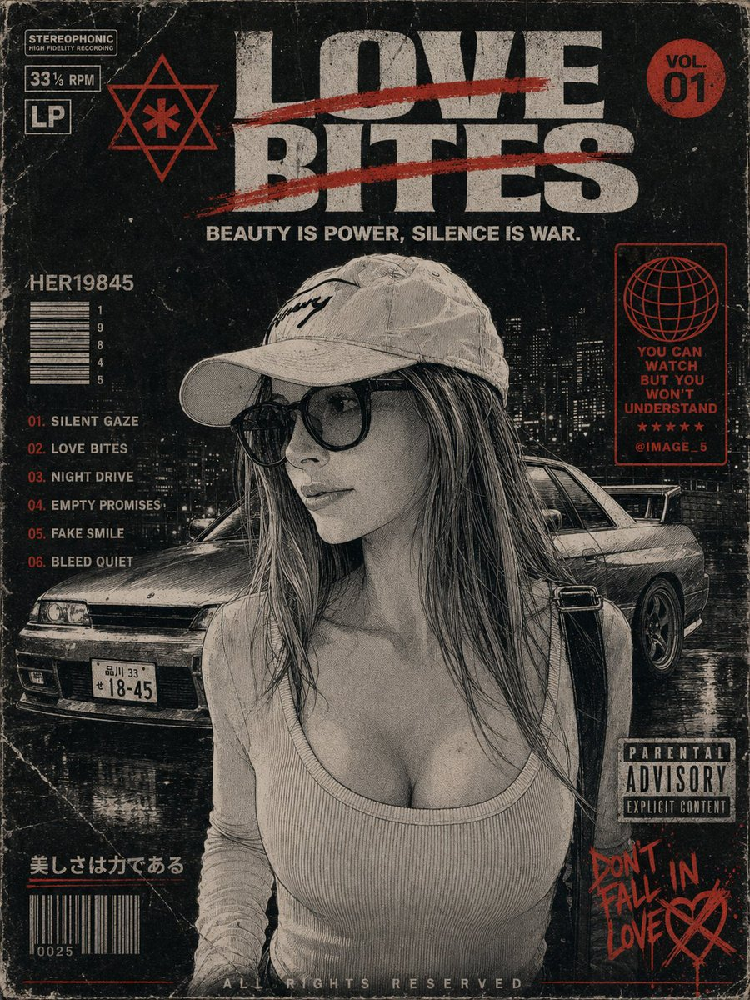

```text
Generate a vintage vinyl album cover with a cyberpunk and manga aesthetic, grainy and worn. The background is dark and textured, with scratches and dust. At the top, the title "LOVE BITES" appears in large white and gray capital letters, with two red lines crossed out. To the left of the title is a red six-pointed star symbol with a central asterisk. Below the title is the text: "BEAUTY IS POWER, SILENCE IS WAR."

In the center is a monochrome manga-style illustration of the attached image. Behind it is a monochrome illustration of a 1990s JDM sports car.

Includes multiple graphic details and logos:

Top left: logos for "STEREOPHONIC HIGH FIDELITY RECORDING," "33 ⅓ RPM," and "LP."

Top right: a red circle that reads "VOL. 01."

On the left: the text "HER19845", a barcode, and a tracklist with 6 numbered songs (e.g., "01. SILENT GAZE", "02. LOVE BITES", "03. NIGHT DRIVE", "04. EMPTY PROMISES", "05. FAKE SMILE", "06. BLEED QUIET").

On the right: a red square with a globe logo, the text "YOU CAN WATCH BUT YOU WON'T UNDERSTAND", asterisks, and "@IMAGE_5".

Bottom left: the Japanese text "美しさは力である" and a barcode "0025".

Bottom right: a silver "PARENTAL ADVISORY EXPLICIT CONTENT" label and red graffiti "DON'T FALL IN LOVE" with a crossed-out heart.

Copyright text "ALL RIGHTS RESERVED" at the bottom edge.

The overall aesthetic should be nostalgic, underground, and raw, with the grain and texture of a real vinyl record. The color scheme is monochromatic with red accents.

Use a 3:4 aspect ratio.
```


---

## 例 578：Spring Garden Watercolor Couple

**来源：** [@NoOneIsHere2603](https://x.com/NoOneIsHere2603/status/2063599542843723983) / [awesome-gpt-image-2-prompts](https://github.com/EvoLinkAI/awesome-gpt-image-2-prompts)

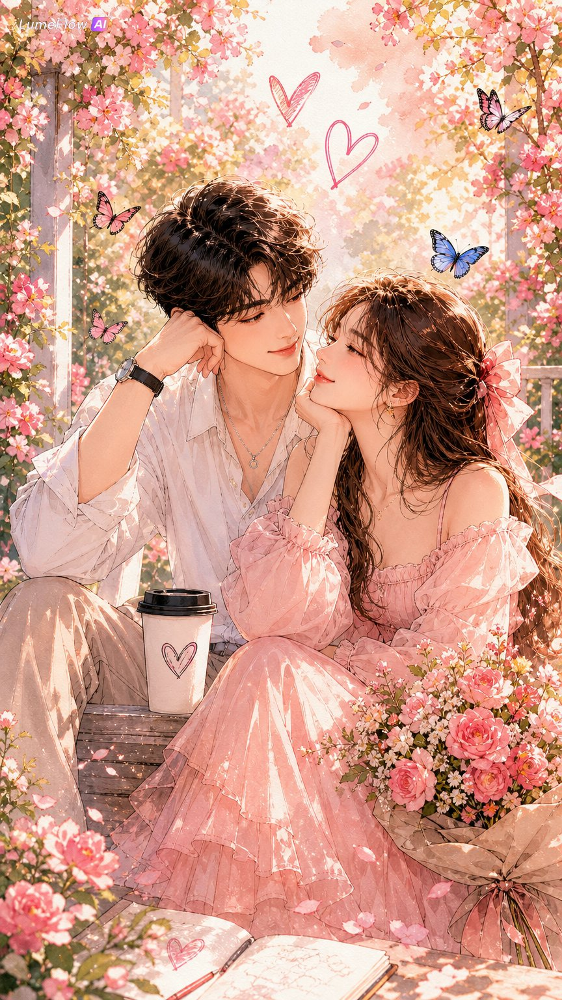

```text
Fashion editorial watercolor portrait illustration of a romantic young Korean couple in a blooming spring garden, standing close together in a soft intimate moment — the boy gently holding the girl's hand while she leans slightly toward him with a warm shy smile. The woman wears an elegant flowing blush-pink dress with delicate fabric movement, while the man wears a soft ivory-beige shirt layered with a light pastel cardigan, creating a dreamy romantic harmony. Soft Korean facial features, healthy glowing skin texture, subtle natural makeup, calm affectionate expressions, relaxed posture, gentle head tilt, slight three-quarter angle, waist-up framing.

Set in a glowing May flower garden filled with delicate pastel blossoms, fluttering petals, and warm spring sunlight filtering softly through flowers and greenery. Romantic atmosphere with soft emotional chemistry, dreamy yet elegant mood.

Rendered in a minimalist contemporary watercolor fashion sketch aesthetic, featuring fine delicate ink and pencil linework layered over translucent watercolor washes, loose fluid brush strokes, wet-on-wet blending, soft bleeding edges, unfinished artistic brush textures, visible premium watercolor paper grain, elegant negative space. Soft blush pinks, warm peach tones, creamy whites, faded sage greens, and delicate floral hues naturally melting into the background.

Flat editorial lighting, refined luxury magazine illustration feel, poetic spring romance atmosphere. No photorealism, no 3D render, no bokeh, no depth-of-field blur, no harsh outlines, no caricature, no cluttered background, no over-detailing.
```


---

## 例 579：Nordic Literary Editorial Illustration

**来源：** [@iamaiistudio](https://x.com/iamaiistudio/status/2063670695020868046) / [awesome-gpt-image-2-prompts](https://github.com/EvoLinkAI/awesome-gpt-image-2-prompts)

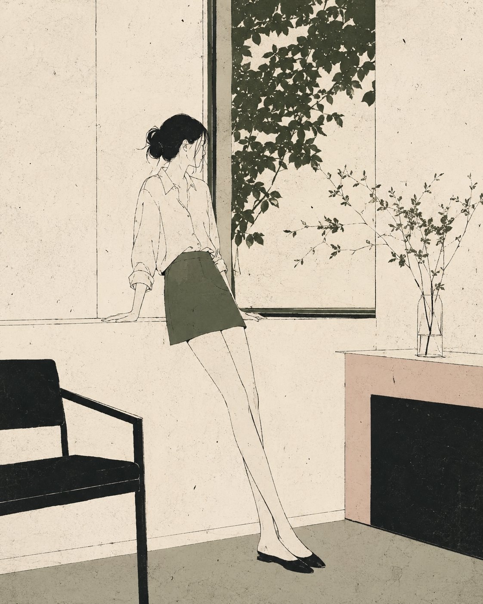

```text
prompt:

A minimalist modern editorial illustration. Style: Nordic lifestyle magazine meets Korean literary book cover meets indie architectural sketch. Natural eye-level composition, everyday setting. Color palette: creamy white, ivory, gray-beige, sage green, deep olive, ink black, tiny touches of grayish-pink. Thin black ink outlines, slightly hand-drawn feel. Highly abstracted shapes, elongated quiet silhouettes. Background textures: aged paper grain, scratches, ink spots, print noise. Shadows rendered as solid blocks of pure black or dark green, no gradients, no realistic lighting, no 3D rendering. Quiet, cool, literary, restrained aesthetic. High-end editorial and independent publication finish. No text, no watermark, no high-saturation colors, no photographic feel.
```


---

## 例 580：Vintage Anatomic Book Plate

**来源：** [@livybabie](https://x.com/livybabie/status/2064033077123236291) / [awesome-gpt-image-2-prompts](https://github.com/EvoLinkAI/awesome-gpt-image-2-prompts)

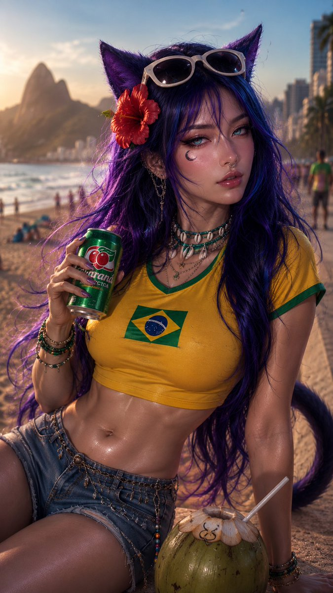

```text
Edit the provided image into an antique anatomical book plate. Preserve the original character's pose, camera angle, body proportions, silhouette, gesture, and overall composition as closely as possible, but transform the subject into a refined anatomical study illustration. The final image should look like a vintage medical anatomy textbook page printed on aged ivory paper, with sepia stains, subtle paper fibers, worn edges, faint foxing marks, and archival ink texture.

Convert the visible body into a clean anatomical sketch that reveals bones, superficial muscles, tendons, ligaments, and selected organ silhouettes in a didactic, non-gory, museum-quality style. Keep the anatomy elegant and educational, like a 19th-century anatomical atlas mixed with precise modern medical illustration. Use thin graphite lines, red and blue anatomical ink accents, muted watercolor washes, and delicate hatching. Avoid horror, gore, blood, injury, mutilation, or surgical violence.

The figure must remain in the same pose as the source image, including limb position, torso rotation, head angle, gaze direction, hand placement, and perspective distortion. If the original image is anime, game art, illustration, or realistic photography, reinterpret it consistently as an anatomical diagram while keeping the recognizable posture and visual identity cues only as subtle external outlines. Clothing and accessories may be simplified into faint translucent contour lines so the anatomical structures remain readable.

Add anatomical labels in Latin using a vintage typewriter font, as if typed onto the page. Labels should be connected to structures with thin black leader lines. Use accurate Latin anatomical terminology, including examples such as: Cranium, Mandibula, Clavicula, Sternum, Costae, Scapula, Humerus, Radius, Ulna, Vertebrae cervicales, Vertebrae thoracicae, Vertebrae lumbales, Pelvis, Os ilium, Os ischii, Femur, Patella, Tibia, Fibula, Talus, Calcaneus, Musculus sternocleidomastoideus, Musculus trapezius, Musculus pectoralis major, Musculus deltoideus, Musculus biceps brachii, Musculus rectus abdominis, Musculus obliquus externus abdominis, Musculus iliopsoas, Musculus gluteus maximus, Musculus sartorius, Musculus quadriceps femoris, Musculus biceps femoris, Musculus gastrocnemius, Ligamentum inguinale, Articulatio coxae, Articulatio genus, Articulatio talocruralis.

Place the labels naturally around the figure, balancing readability and visual elegance. The text should look authentic, slightly imperfect, with subtle ink bleed, uneven typewriter spacing, and small alignment irregularities. Include a small archival caption at the bottom of the page, such as “Tabula Anatomica — Figura I”, “Studium Corporis Humani”, or “Atlas Anatomicus Vetus”. Do not use Japanese labels unless specifically requested; prioritize Latin anatomical nomenclature.

Lighting should be soft and flat like a scanned antique page. The final result must feel like a scholarly anatomical illustration, not a modern infographic. High detail, precise linework, aged paper texture, anatomical accuracy, elegant composition, subtle red muscle fibers, pale blue veins, ivory bone rendering, dark graphite outlines, old medical atlas atmosphere, realistic printed-page imperfections.
```


---

## 例 581：3D Travel Ticket

**来源：** [@AIwithkhan](https://x.com/AIwithkhan/status/2063963460963270774) / [awesome-gpt-image-2-prompts](https://github.com/EvoLinkAI/awesome-gpt-image-2-prompts)

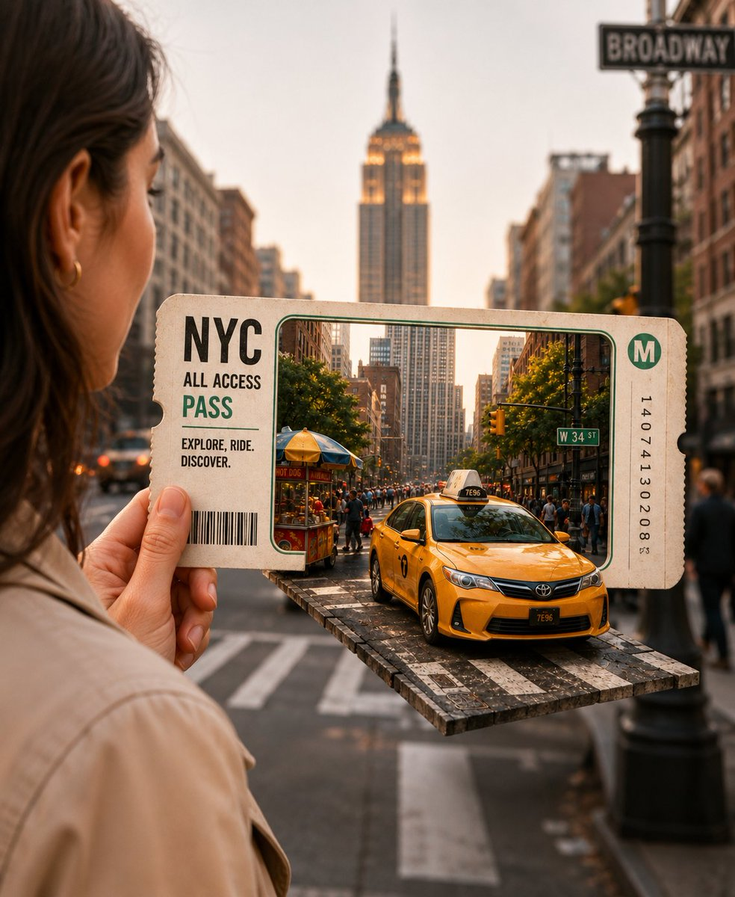

```text
Photorealistic 3D travel ticket concept, a close-up human hand holding a large vintage “NYC All Access Pass” ticket in front of a clean cream-colored background. The ticket acts as a portal window into New York City, revealing a detailed miniature Manhattan street scene inside the cutout frame. A realistic yellow NYC taxi emerges out of the ticket in 3D onto a floating road platform, creating a pop-out effect. The Empire State Building rises dramatically behind the ticket, with hand-drawn sketch illustrations of the Statue of Liberty, Brooklyn Bridge, Broadway sign, and coffee cup surrounding the composition. Premium paper texture, cinematic lighting, warm golden-hour tones, ultra-detailed miniature city diorama, depth of field, travel advertisement aesthetic, creative paper-craft design, hyperrealistic, clean studio background, professional product photography, sharp focus, 8K, vertical composition.
```


---

## 例 582：Travel Planning Tabletop Scene

**来源：** [@Naiknelofar788](https://x.com/Naiknelofar788/status/2064532259596816668) / [awesome-gpt-image-2-prompts](https://github.com/EvoLinkAI/awesome-gpt-image-2-prompts)

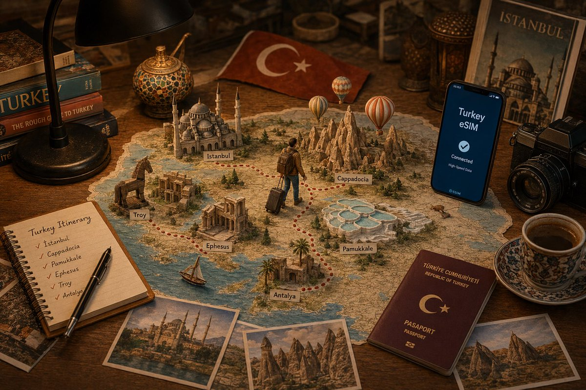

```text
A premium travel-planning tabletop scene for [LOCATION], photographed from a slightly elevated angle. A detailed map of [LOCATION] lies on a warm wooden desk under a cozy black desk lamp. Emerging from the map are handcrafted papercraft landmarks, iconic attractions, landscapes, and cultural highlights from [LOCATION], positioned in their approximate geographic locations.
A tiny traveler character with a backpack and rolling suitcase follows a dotted red journey route across the map, creating a visual story of exploration. The traveler is mid-journey between destinations.
A modern smartphone displays a "[LOCATION] eSIM" travel connectivity screen. Around the map are travel-planning accessories including a notebook itinerary, postcards, camera, passport, travel books, and local-themed souvenirs.
Mixed-media diorama style, intricate papercraft architecture, layered paper terrain, miniature trees, realistic desk objects, warm cinematic lighting, shallow depth of field, highly detailed textures, editorial travel photography, Pinterest aesthetic, premium commercial advertising, ultra-realistic, 8k quality, rich storytelling, clean composition.
Include these [LOCATION] highlights: [LANDMARK LIST].
Color palette inspired by [LOCATION'S NATURAL/CULTURAL COLORS].
```


---

## 例 583：Hand-drawn Doodle Art Overlay

**来源：** [@iamaiistudio](https://x.com/iamaiistudio/status/2064454454553051298) / [awesome-gpt-image-2-prompts](https://github.com/EvoLinkAI/awesome-gpt-image-2-prompts)

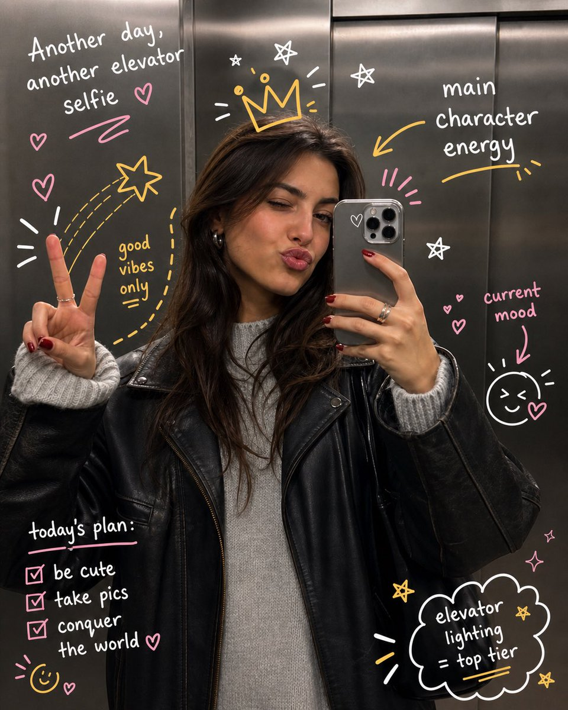

```text
://t.co/jBGrThiRdq

prompt:

Take the uploaded photo and keep the subject completely unchanged — same face, pose, framing, and lighting, no warping or distortion. Layer expressive hand-drawn illustrations on top that playfully interact with the person or scene.

Have the doodles react to what's in the frame: follow gestures, amplify movement, trace body outlines, or bring in imaginative details that feel connected to the moment. The sketches should look deliberate, like someone drew straight onto the print with spontaneous yet thoughtful pen strokes.

Go for a loose, slightly rough drawing style — wobbly lines, organic curves, a sketchbook aesthetic. Add handwritten words or short captions that fit the vibe of the image: make them clever, context-specific, and genuinely playful rather than generic filler.

Keep the illustrated additions from overwhelming the original photo. Aim for a balanced final composition with crisp, high-res output and a color palette that feels native to the original scene.

#AIart #GPTImage2
```


---

## 例 584：FIFA World Cup Country Emblem Badge

**来源：** [@Goodmanprotocol](https://x.com/Goodmanprotocol/status/2065121892550558018) / [awesome-gpt-image-2-prompts](https://github.com/EvoLinkAI/awesome-gpt-image-2-prompts)

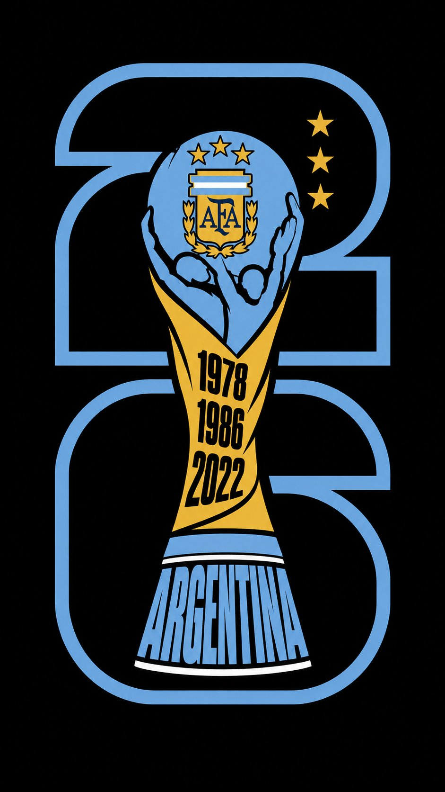

```text
Create a FIFA World Cup 2026 country variant emblem in a bold, flat, typographic illustration style. Preserve the official FIFA World Cup 2026 stacked identity exactly: the digit “2” occupies the upper half and the digit “6” occupies the lower half, both center-aligned and forming one unified vertical portrait block, with the FIFA World Cup Trophy integrated through the center in the same arrangement as the official emblem. The numerals must be outline-only, never filled, rendered with thick bold strokes in a single color taken from the national flag palette of [COUNTRY NAME], with fully transparent interiors so the trophy remains visible.

STRICTLY use a 9:16 vertical aspect ratio.

Do not alter the composition, proportions, or visual hierarchy. The result must closely resemble the official stacked 26 emblem and maintain the same graphic balance seen in premium country adaptations.

The FIFA World Cup Trophy must follow the real trophy silhouette exactly and remain instantly recognizable, with two human figures lifting a faceted globe, a twisting narrow body, and a flared banded base. Render it as a flat vector illustration with zero gradients, zero textures, and no painterly effects, resembling an enamel badge or screen-print poster.

Divide the trophy into clean flat sections following its natural contours. The globe and raised figures should use the darkest color from the national flag palette, with the official football federation crest of [COUNTRY NAME] placed prominently on the globe face. Add one floating star for each FIFA World Cup title won by [COUNTRY NAME], positioned to the right of the globe and colored with a flag accent color. ([NUMBER OF WORLD CUP TITLES WON]). Countries with zero World Cup titles must have no stars and no winning years.

The central body section should use a contrasting flag color and contain the country's FIFA World Cup winning years stacked vertically in large ultra-bold condensed numerals. If [COUNTRY NAME] has never won the FIFA World Cup, leave this section blank with no years. The lower neck and flared base should use the primary flag color, with “[COUNTRY NAME]” written in massive ultra-bold condensed capital letters naturally fitted to the tapering base shape.

Use thick black outlines throughout to separate every section and define the entire trophy silhouette. Maintain a highly graphic, iconic, and immediately country-identifiable appearance. Use a pure black background with no gradients or textures. The final result should feel exactly like a premium enamel pin, screen-print poster, or modern sports identity mark while preserving the official FIFA World Cup 2026 stacked emblem structure and central trophy integration, with no unnecessary stylistic deviations and no changes to the established layout.
```


---

## 例 585：Sony A7 Exploded Diagram

**来源：** [@iamaiistudio](https://x.com/iamaiistudio/status/2066085004116193571) / [awesome-gpt-image-2-prompts](https://github.com/EvoLinkAI/awesome-gpt-image-2-prompts)

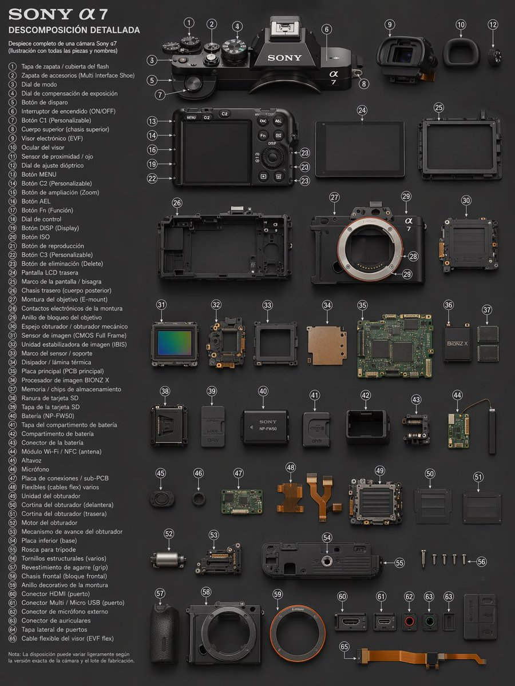

```text
Detailed exploded-view diagram of a Sony A7 mirrorless camera, with all internal components separated and clearly visible, each part labeled with its name. Technical product illustration style, clean white background, precise and informative layout.
```


---

## 例 586：Cozy Japanese Lifestyle Illustration

**来源：** [@oggii_0](https://x.com/oggii_0/status/2069469184787198164) / [awesome-gpt-image-2-prompts](https://github.com/EvoLinkAI/awesome-gpt-image-2-prompts)

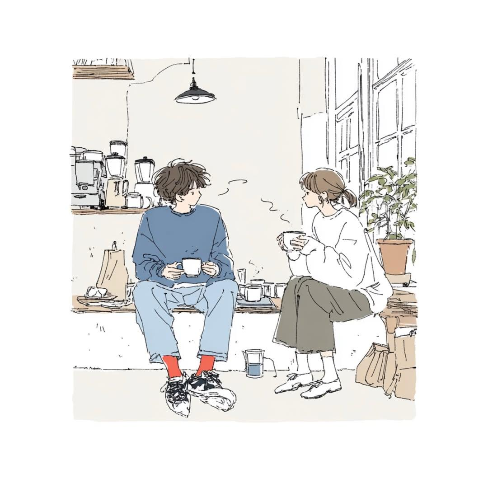

```text
Create a delicate contemporary Japanese lifestyle illustration with a cozy slice-of-life atmosphere.

ART STYLE
Hand-drawn pen-and-ink sketch illustration, thin expressive linework, loose imperfect contours, minimalist editorial artwork, soft watercolor washes, subtle paper texture, elegant negative space, sketchbook aesthetic, modern Japanese indie illustration, light and airy composition, contemporary café-art style, emotionally warm and intimate.

CHARACTERS
Two young adults with soft, simplified facial features and natural expressions. Casual oversized clothing, relaxed body language, authentic interaction, candid everyday moment. Faces are minimally rendered with delicate linework rather than detailed realism.

ENVIRONMENT
A cozy indoor setting such as a café, coffee shop, apartment, studio, bookstore, kitchen corner, or creative workspace. Include wooden furniture, coffee mugs, indoor plants, shelves, books, windows, soft decorative details, and small everyday objects. The environment should feel lived-in yet uncluttered.

COMPOSITION
Full-body or three-quarter-body view. Characters seated naturally and facing one another. Balanced asymmetrical layout. Large areas of clean negative space. Storytelling through posture and atmosphere rather than action. Editorial illustration framing. Eye-level perspective.

COLOR PALETTE
Muted and desaturated colors only:
• Dusty blue
• Warm cream
• Soft beige
• Light gray
• Sage green
• Warm brown
• Off-white

Add only one small accent color element such as red socks, red shoes, a red mug, or a small red object.

LIGHTING
Soft natural daylight entering through windows. Gentle ambient illumination. No dramatic shadows. Warm, peaceful, calming mood.

RENDERING
Minimal shading. Sparse details. Watercolor-style color fills inside delicate ink outlines. Slightly unfinished sketch quality. High-quality illustration with visible hand-drawn imperfections. Soft edges and subtle texture.

MOOD
Comfortable, quiet, nostalgic, peaceful, intimate, cozy, everyday happiness, slow living, café culture, thoughtful conversation, gentle human connection.

AVOID
Anime screenshots, manga panels, cel shading, digital painting, hyperrealism, photorealism, 3D rendering, glossy surfaces, vibrant saturated colors, cinematic effects, dramatic lighting, excessive details, sharp outlines, heavy shadows, complex backgrounds.

SCENE:
[INSERT YOUR SCENE DESCRIPTION HERE]

The final image should feel like a premium Japanese lifestyle illustration found in an art book, café magazine, design journal, or independent sketchbook collection.
```


---

## 例 587：Neon Shadow Muse

**来源：** [@iamrealsnow](https://x.com/iamrealsnow/status/2071080066751312345) / [awesome-gpt-image-2-prompts](https://github.com/EvoLinkAI/awesome-gpt-image-2-prompts)

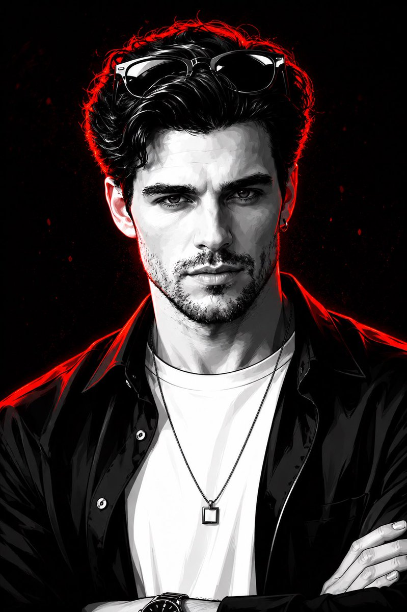

```text
Use the uploaded photo as the exact identity reference. Preserve the facial structure, hairstyle, beard, skin tone, facial proportions, eyebrows, lips, jawline, and overall likeness with photorealistic accuracy. Do not alter the identity.

Convert the portrait into a premium high-contrast monochrome vector illustration with clean comic-book linework and sharp cel shading.

The subject faces directly toward the camera with a confident expression and slight chin lift.

Add vivid red neon rim lighting around the hair, ears, shoulders, and jawline.

Wear an oversized black open shirt layered over a plain white crew-neck t-shirt, a thin silver square pendant necklace, luxury watch, and black sunglasses resting on top of the head.

Pure black background with subtle floating particles and dramatic shadows.

Ultra-clean vector lines, premium poster composition, luxury editorial style, crisp facial details, cinematic contrast, minimal color palette using only black, white, and glowing red.
```


---

## 例 588：Tea Estate Storybook Collage

**来源：** [@Sairah_0](https://x.com/Sairah_0/status/2071076528532971692) / [awesome-gpt-image-2-prompts](https://github.com/EvoLinkAI/awesome-gpt-image-2-prompts)

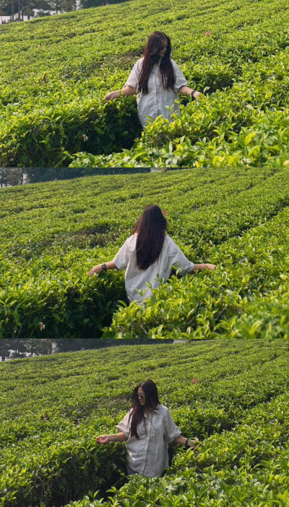

```text
Create a whimsical, hand-painted storybook-style illustration inspired by three candid travel photos arranged vertically in a collage. Preserve the exact composition, poses, and framing from the reference: a young woman with long straight dark brown hair wearing an oversized off-white button-up shirt, black smartwatch, and round sunglasses, standing waist-deep in lush green tea plantations. The first panel shows her facing slightly left while gently brushing the tea leaves with both hands. The second panel captures her from behind with both arms stretched outward, walking peacefully through the tea bushes. The third panel shows her turned slightly to the right, smiling softly while touching the leaves.

Transform the realistic tea estate into a dreamy, colorful illustrated landscape with rolling hills, playful stylized trees, blooming wildflowers, and vibrant foliage. Use soft pastel tones, rich greens, warm yellows, blush pinks, and teal accents. Add whimsical doodle elements around the composition such as hearts, stars, clouds, sunshine, sparkles, tiny flowers, and hand-drawn decorative marks on a warm cream paper background. Maintain the same vertical three-panel layout with generous spacing, rounded organic shapes, textured brush strokes, and a cozy children’s book aesthetic. The illustration should feel joyful, peaceful, and magical, with clean outlines, subtle paper texture, high detail, and a charming gouache/watercolor-inspired finish. No text, no watermark, high-resolution, portrait orientation.
```


---

## 例 589：Blonde Maid in Warm Cafe

**来源：** [@yume00112211](https://x.com/yume00112211/status/2048072808606089230) / [awesome-gpt-image-2-prompts](https://github.com/EvoLinkAI/awesome-gpt-image-2-prompts)

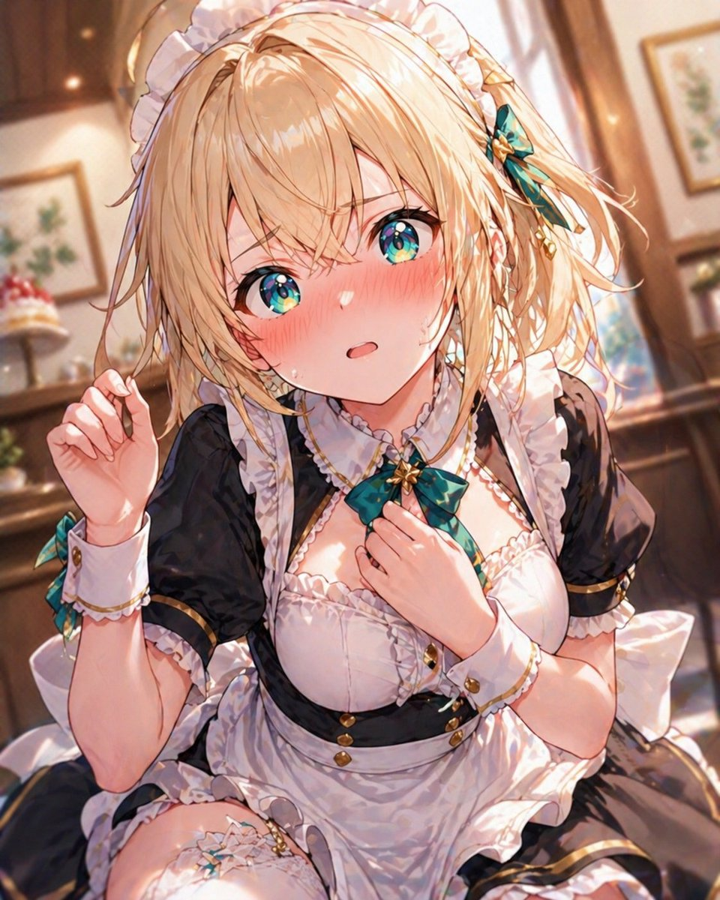

```text
A polished anime-style portrait of {argument name="character" default="a blonde female VTuber-inspired maid"} seated indoors in a cozy sunlit cafe, framed from upper thighs to head in a slightly high, intimate angle. She has short to medium-length tousled {argument name="hair color" default="golden blonde"} hair with soft layers, a white frilled maid headband, and a teal ribbon hair accessory with a small gold ornament on the right side. Her face is mostly obscured by the hair falling forward, creating a mysterious hidden-face composition. She wears an elegant black-and-white maid dress with puff sleeves, white ruffles, gold trim, a fitted bodice, a white apron, and a large white waist bow visible at the side and back. Add 2 teal bows with gold star-like charms: 1 at the collar and 1 on the wrist. Her right hand gently touches the bow at her chest, and her left hand is raised delicately near her shoulder holding a loose strand of hair. Include a frilly lace garter on her exposed thigh with a small teal-and-gold ribbon decoration. The background is a warmly lit European-style cafe interior with wooden beams, framed botanical art on the walls, a softly blurred cake stand on the left, window light streaming in, and tiny glowing dust-like sparkles in the air. Use soft golden afternoon lighting, shallow depth of field, glossy detailed fabric rendering, delicate skin shading, subtle romantic atmosphere, and highly detailed refined anime illustration quality.
```


---

## 例 590：Cyber Crystal Anime Girl Portrait

**来源：** [@libearal](https://x.com/libearal/status/2048026376645861799) / [awesome-gpt-image-2-prompts](https://github.com/EvoLinkAI/awesome-gpt-image-2-prompts)

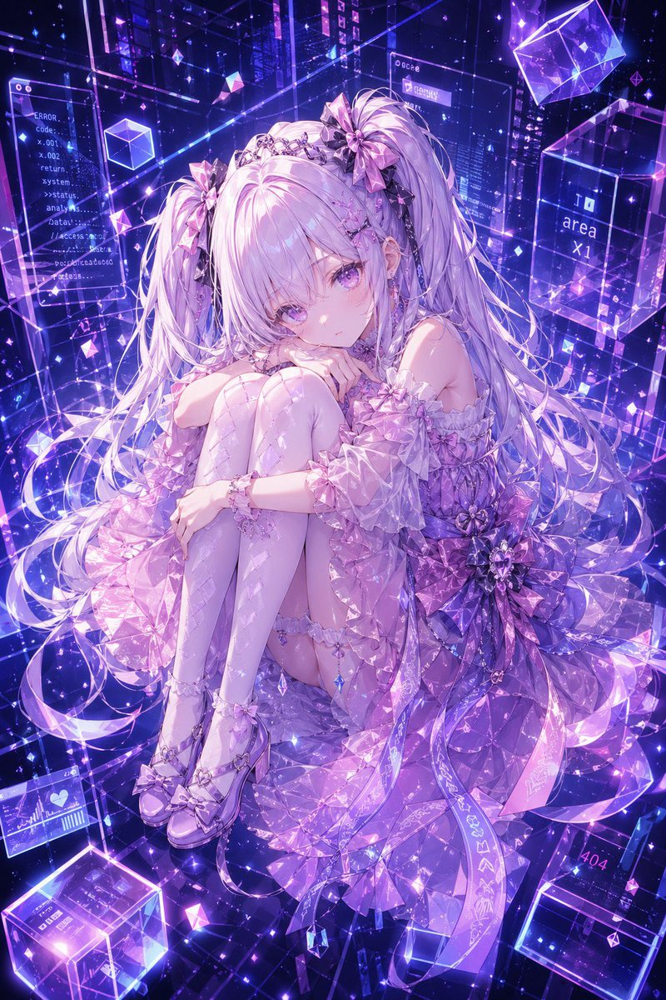

```text
A highly detailed anime-style full-body character portrait of {argument name="character name" default="Hermes"}, a delicate futuristic girl sitting curled up with her knees hugged to her chest, gazing softly at the viewer with a calm, slightly melancholic expression. She has extremely long {argument name="hair color" default="silver-lilac"} twin tails with soft bangs, glossy lavender eyes, porcelain skin, and ornate crystal hair accessories including 3 large ribbon bows and a jeweled tiara-like headpiece. Her outfit is an elaborate translucent idol-tech dress in {argument name="outfit color" default="pink, lavender, and violet"}, featuring off-shoulder puff sleeves, layered ruffles, faceted gemstone-like fabrics, a huge floral bow at the waist, dangling crystal charms, garter details, patterned thigh-high stockings, and glossy bow heels. Surround her with a luminous cyber dreamscape in {argument name="background palette" default="neon violet and electric blue"}: transparent holographic panels, floating glass cubes, sparkling particles, geometric prisms, glowing wireframe lines, and digital UI windows suspended in space. Include 5 readable interface text elements scattered in the background: "ERROR.", "Code-", "return", "area x1", and "404". Make the whole image feel like a luxurious AI avatar reference illustration, mixing ethereal fantasy and cyberspace aesthetics, with crystalline light refractions, dramatic glow, high detail, intricate lace and gem textures, and a polished premium gpt-image-2 anime rendering.
```


---

## 例 591：Cozy Catgirl Pajama Night Portrait

**来源：** [@yume00112211](https://x.com/yume00112211/status/2047951384734228617) / [awesome-gpt-image-2-prompts](https://github.com/EvoLinkAI/awesome-gpt-image-2-prompts)


```text
A soft anime-style bedroom portrait of {argument name="character name" default="Nekomata Okayu"}, shown from the chest up sitting on a bed at night, centered in the frame. She has short fluffy {argument name="hair color" default="lavender"} hair with layered bangs partially covering one eye, large cat ears on top of her head with white inner fur, and a cute sleepy catgirl appearance. Her expression is gentle and relaxed, with one hand raised near her cheek in a shy, cozy pose. She wears oversized {argument name="pajama color" default="light lavender"} button-up pajamas with dark purple piping, a small chest pocket, and paw-print shaped buttons and paw-print decoration on the pocket. The room is lit with dreamy purple ambient lighting. In the background, show a nighttime window with a crescent moon and stars visible outside, soft curtains, a bedside table with a glowing cat-shaped lamp, a neatly rumpled bed with pillows and blankets in matching purple tones, and a small framed wall picture featuring a simple cat face and hearts. Use a cute pastel palette, soft shading, polished digital anime rendering, subtle highlights in the hair, intimate cozy composition, and a calm bedtime atmosphere.
```


---

## 例 592：Watercolor Fashion Sketch

**来源：** [@Naiknelofar788](https://x.com/Naiknelofar788/status/2054741712011223312) / [awesome-gpt-image-2-prompts](https://github.com/EvoLinkAI/awesome-gpt-image-2-prompts)

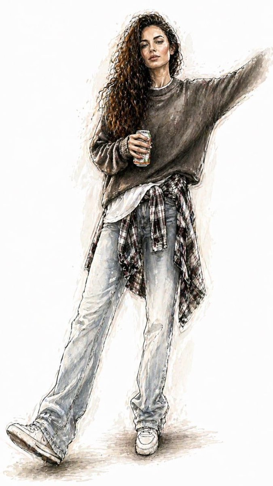

```text
Transform the uploaded photo into a full-body watercolor fashion illustration in the style of an elegant runway design sketch. Preserve the original outfit, pose, silhouette, colors, fabrics, accessories, shoes, hairstyle and overall styling from the photo. Do not redesign the clothing. Use elongated fashion-sketch proportions The clothing should remain realistic and recognizable, with accurate cut, fit, folds, fabric texture, prints and details. Style: high-fashion watercolor illustration, loose expressive ink lines, delicate pencil contour, transparent watercolor washes, soft shadows, painterly texture, minimalist editorial mood. White or very light background, clean composition, full body centered, lots of negative space. Elegant, modern, airy, like a professional fashion designer sketch.
```


---

## 例 593：Origami Portrait Illustration

**来源：** [@Inshrah_ali_](https://x.com/Inshrah_ali_/status/2055696156211179912) / [awesome-gpt-image-2-prompts](https://github.com/EvoLinkAI/awesome-gpt-image-2-prompts)

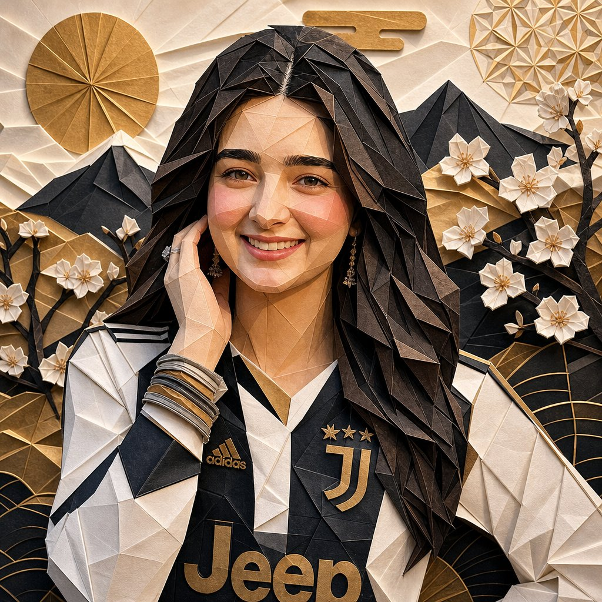

```text
Ultra-detailed origami paper art portrait of given picture, entirely crafted from meticulously folded paper layers and intricate geometric origami shapes. Realistic paper texture with visible creases and handcrafted folds, defining a low-poly facial structure. Elegant Japanese-inspired aesthetic. Layered paper background featuring delicate cherry blossoms, majestic mountains, stylized sun motifs, and abstract folded patterns. Luxurious gold, black, cream, and white color palette. she wears a football jersey made from artfully folded paper fabric. Dramatic cinematic studio lighting, casting ultra-realistic shadows and creating profound depth. A highly detailed handcrafted paper sculpture, presented in a premium gallery artwork style. Sharp focus, sophisticated composition, and tactile paper texture. Masterpiece quality, 8k ultra detailed. Toy-free, no plastic, no CGI look.
```


---

## 例 594：Ink Glyph Portrait

**来源：** [@harboriis](https://x.com/harboriis/status/2055560455494738411) / [awesome-gpt-image-2-prompts](https://github.com/EvoLinkAI/awesome-gpt-image-2-prompts)

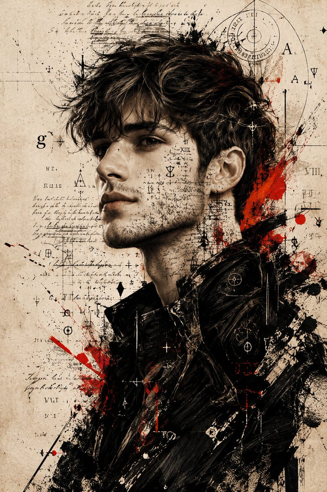

```text
Use the uploaded photo as the main face reference. Preserve the exact facial structure, skin tone, beard shape, nose, eyes and expression from the reference image. A dramatic, high-impact portrait rendered in an expressive ink sketch and mixed-media illustration style, using the uploaded image for exact facial likeness and proportions. The man is shown in side profile, his presence intense and chaotic. His face and upper body are layered with cryptic handwritten  text, symbols, and abstract glyphs, partially wrapping around facial contours, suggesting inner turmoil and hidden meaning He wears a dark, abstract jacket, heavily texture strokes, sharp angular linework, and vibrant ink creating a raw, rebellious visual energy. The illu bold and experimental, blending fine pen detaili aggressive brush marks, splashes, and controll The background is a pale, aged parchment ton grain, faded paper texture, delicate linework, in! stains-evoking an old manuscript  Or forgotten High contrast, expressive composition, artistic with precision, editorial art meets conceptual il intense, and emotionally charged
```


---

## 例 595：Cozy Doodle Lifestyle Photo

**来源：** [@Sairah_0](https://x.com/Sairah_0/status/2055500670564991079) / [awesome-gpt-image-2-prompts](https://github.com/EvoLinkAI/awesome-gpt-image-2-prompts)

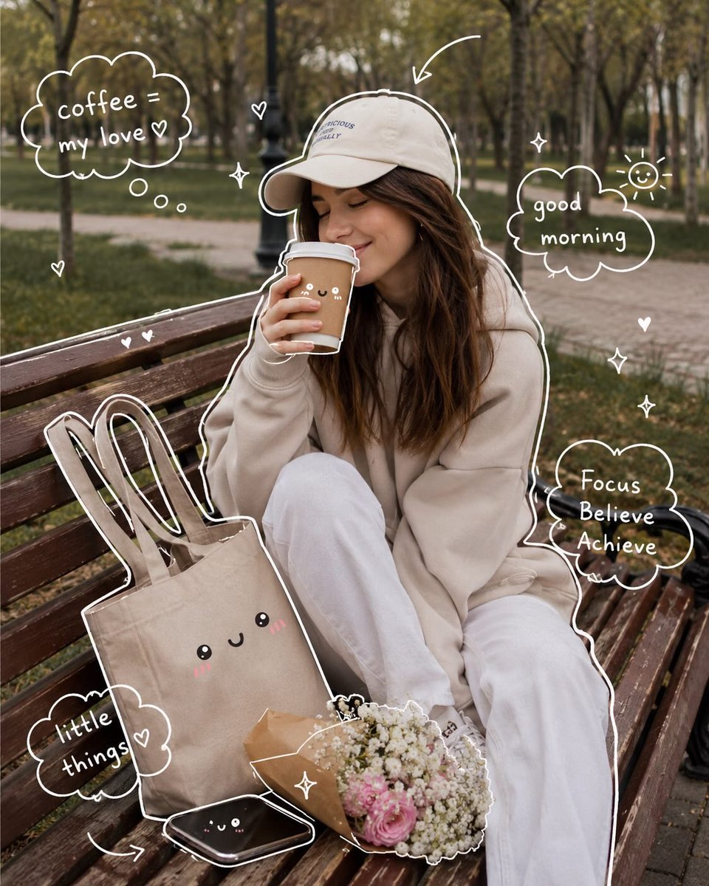

```text
(Cozy Aesthetic Girl in Park)

Aesthetic lifestyle photography of a cute young woman sitting on a wooden park bench during autumn morning, wearing an oversized beige hoodie, white pants, and cream baseball cap, holding a takeaway coffee cup with eyes closed and peaceful smile, soft natural lighting, warm earthy tones, tote bag with kawaii face design beside her, bouquet of baby’s breath flowers, cozy calm vibe, cinematic depth of field, Pinterest aesthetic, soft brown and beige color palette. Add hand-drawn white doodles around the image including hearts, sparkles, arrows, clouds, smiley faces, and handwritten text like “coffee = my love”, “good morning”, “little things”, “Focus Believe Achieve”. Whimsical scrapbook style overlay, dreamy cozy mood, ultra detailed, realistic photography, Instagram aesthetic, soft shadows, candid composition.

Prompt : (Cozy Reading & Coffee Setup)

Warm cozy morning aesthetic near a window, open book being read beside a cup of coffee and lit candle, soft sunlight entering through the window, baby’s breath flowers in glass vase, beige and cream minimal decor, calming self-care atmosphere, soft fabric textures, neutral warm tones, peaceful hygge mood, cinematic lifestyle photography, Pinterest-inspired cozy setup, realistic details, shallow depth of field. Add cute white hand-drawn doodles and kawaii faces on the mug, candle, and vase, with handwritten notes like “Take time to make your soul happy”, “Cozy mood”, “little things”, “Book + coffee = perfect day”, plus hearts, arrows, sparkles, and cloud doodles. Dreamy soft aesthetic, warm natural glow, highly detailed, relaxing cozy-core vibe.
```


---

## 例 596：LEGO Miniature City Editorial

**来源：** [@frametheory058](https://x.com/frametheory058/status/2056561951610921186) / [awesome-gpt-image-2-prompts](https://github.com/EvoLinkAI/awesome-gpt-image-2-prompts)

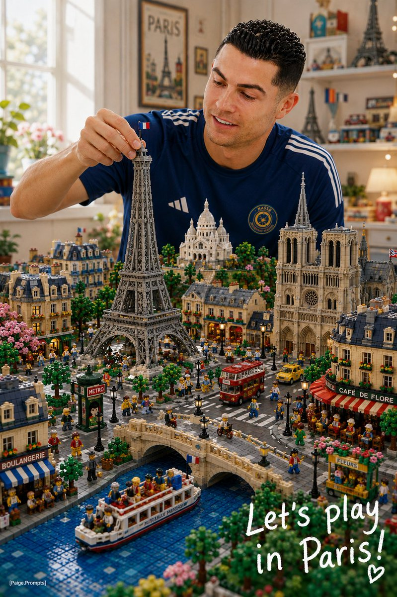

```text
Use the uploaded reference image as the primary character reference.
Create a premium vertical 4:5 editorial illustration of the same character from the reference image, sitting at a cozy craft table and building a LEGO-style miniature diorama of [CITY NAME].
Only the character remains organic and natural. Everything else must be built entirely from visible LEGO-style bricks: landmarks, streets, bridges, rivers, lakes, trees, vehicles, trains, people, cafés, shops, food stalls, parks, signs, boa
```


---

## 例 597：Busan Travel Journal Illustration

**来源：** [@Sairah_0](https://x.com/Sairah_0/status/2056580402761155037) / [awesome-gpt-image-2-prompts](https://github.com/EvoLinkAI/awesome-gpt-image-2-prompts)

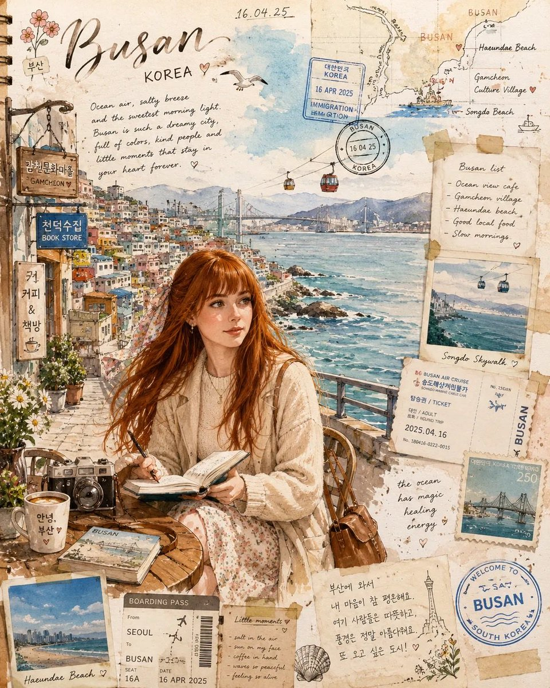

```text
Dreamy Busan Korea travel journal illustration, cozy vintage scrapbook aesthetic, watercolor and ink art style, red-haired girl sitting at a seaside café writing in a notebook, cream knitted cardigan, floral dress, cinematic ocean view, colorful Gamcheon Culture Village houses on cliffside, Korean signs, travel stamps, boarding pass, handwritten notes, postcards, maps, tape stickers, seashells, coffee cup, retro camera on wooden table, soft pastel tones, warm sunlight, detailed paper textures, w
```


---

## 例 598：Joyful Street Portrait with Drink

**来源：** [@rovvmut_](https://twitter.com/rovvmut_/status/2056786034864927229) / [awesome-gpt-image-2-prompts](https://github.com/EvoLinkAI/awesome-gpt-image-2-prompts)

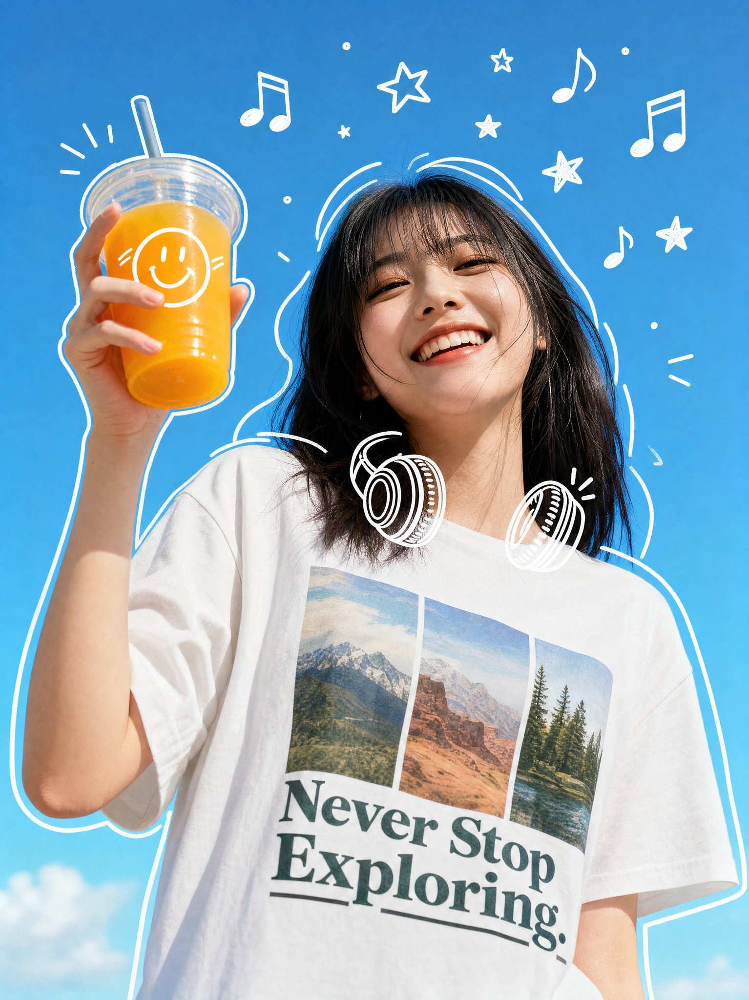

```text
A medium low-angle shot of a joyful young woman with dark hair and straight bangs, smiling brightly against a vibrant, clear blue sky. She wears a white graphic t-shirt featuring three landscape panels. In her right hand, she holds up a clear plastic cup filled with bright orange juice, featuring a white hand-drawn doodle of a smiley face on the side. Whimsical, hand-drawn white digital doodles are overlaid around her: stylized headphones rest around her neck, musical notes and stars float above her head, and glowing white motion outlines trace her silhouette. Bright, natural daylight evenly illuminates the scene, enhancing the playful, energetic pop-art aesthetic.
```


---

## 例 599：Woodcut Engraving Portrait Style

**来源：** [@zulkarnaimx](https://twitter.com/zulkarnaimx/status/2056778953273258275) / [awesome-gpt-image-2-prompts](https://github.com/EvoLinkAI/awesome-gpt-image-2-prompts)

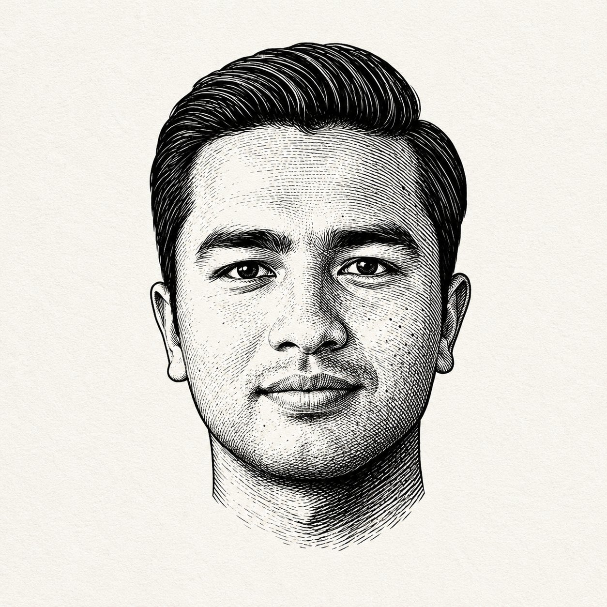

```text
️

Black and white engraved portrait illustration of a person.
Drawn in classic woodcut / linocut engraving style, high contrast black ink on textured off-white paper background. Fine cross-hatching and line shading to create depth and shadow, bold black ink shadows under chin and around hair, strong contour lines, traditional printmaking aesthetic.
Minimal composition, centered portrait, no body visible, clean negative space, vintage editorial illustration style, ultra detailed linework, sharp crisp ink strokes, professional vector-ready engraving look, monochrome palette, dramatic contrast.
Negative Prompt:
color, watercolor, soft shading, blurred lines, low contrast, realistic photography, 3D render, anime style, cartoon style, messy sketch, thick uneven strokes, background objects, noisy texture, pixelated, distorted face, extra eyes, extra ears, bad anatomy, modern digital painting, glossy skin, overexposed highlights
```


---

## 例 600：Miki Style Line Art Portrait

**来源：** [@ChillaiKalan__](https://x.com/ChillaiKalan__/status/2057286038624878604) / [awesome-gpt-image-2-prompts](https://github.com/EvoLinkAI/awesome-gpt-image-2-prompts)

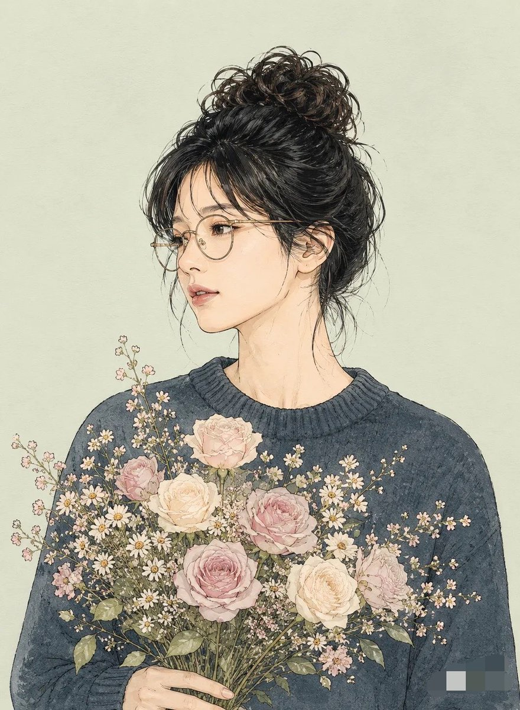

```text
​A precise line art illustration portrait in the distinctive Miki style, with clean, defined dark contours and minimal, subtle watercolor wash coloring.
Subject: A gender-neutral single person with natural medium-length dark hair, wearing round wire-rimmed glasses and a simple dark blue-gray knit sweater, in a clean, soft profile view (facing either left or right). They hold a large bouquet of soft pink and white flowers (roses and small wildflowers) as seen in image_3/4, with one hand visible.
Background: A minimalist background with a smooth, matte finish of a single color tone (e.g., warm beige or pale mint, as requested), with a very subtle, almost unnoticeable, watercolor paper texture.
Lighting & Color: Soft diffused natural daylight from the upper-left, illuminating the subject's face gently. A pastel color palette with warm beige/mint tones.
Composition: Profile chest-up bust shot portrait, composed cleanly, with a calm, nostalgic atmosphere.
```


---

## 例 601：Artistic Sketch Portrait Young Man

**来源：** [@iamsofiaijaz](https://x.com/iamsofiaijaz/status/2057440838033252767) / [awesome-gpt-image-2-prompts](https://github.com/EvoLinkAI/awesome-gpt-image-2-prompts)

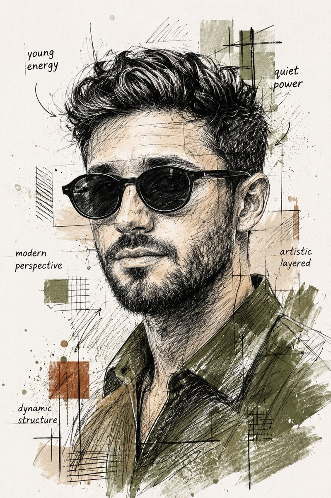

```text
Create a unique artistic sketch-style portrait of a modern young man wearing black sunglasses, with textured pencil and ink drawing effects mixed with abstract collage elements. Change the shirt color to deep olive green with soft watercolor shading. Add layered geometric frames around the face, expressive cross-hatching, ink splashes, handwritten typography notes, and contemporary fashion mood-board aesthetics. Keep the hairstyle detailed and voluminous with realistic sketch strokes. Use an off-white textured paper background with artistic grunge accents, dynamic composition, and editorial magazine-style illustration. High detail, cinematic lighting, modern urban art style, creative mixed-media sketch effect.
```


---

## 例 602：Korean Beauty Fashion Portrait

**来源：** [@Sheldon056](https://x.com/Sheldon056/status/2057296658191483236) / [awesome-gpt-image-2-prompts](https://github.com/EvoLinkAI/awesome-gpt-image-2-prompts)

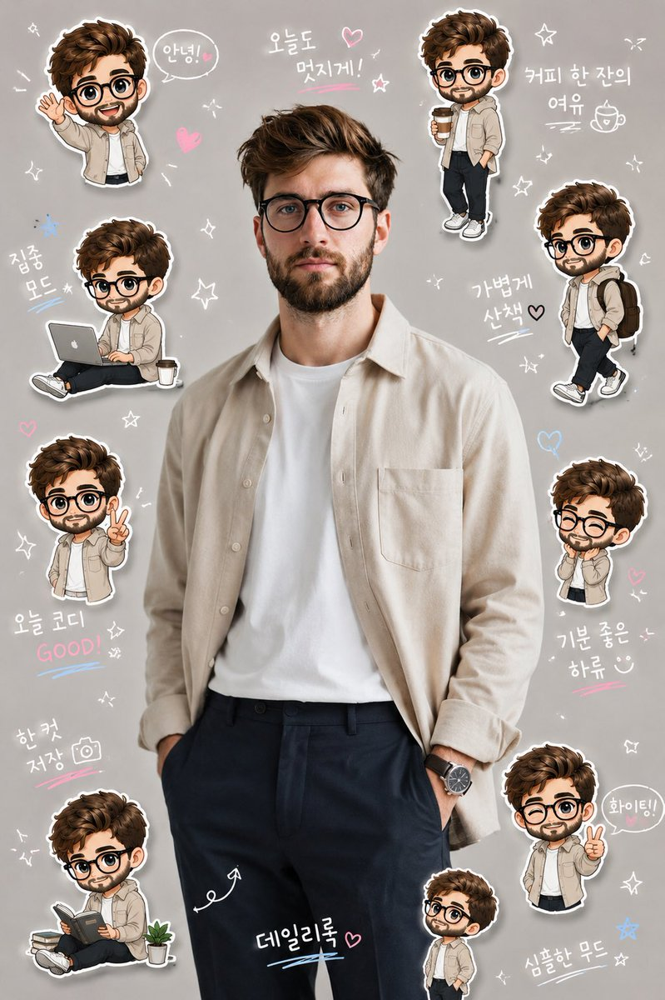

```text
Create a high-quality “chibi sticker diary portrait” based on the uploaded real-life photo. Preserve the subject’s original identity, realistic facial structure, hairstyle, hair color, glasses, outfit, pose, proportions, lighting, and background. Keep the main subject photorealistic and do not transform the entire image into a full illustration.
```


---

## 例 603：Cinematic Lifestyle Outdoor Portrait

**来源：** [@aiwithaly](https://x.com/aiwithaly/status/2057417304628248645) / [awesome-gpt-image-2-prompts](https://github.com/EvoLinkAI/awesome-gpt-image-2-prompts)

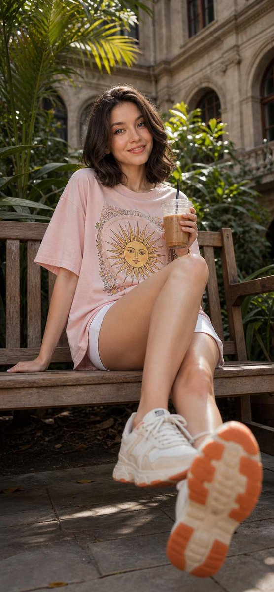

```text
Cinematic lifestyle portrait of a cheerful young woman sitting on a rustic wooden bench in a lush botanical courtyard, holding an iced coffee in a clear plastic cup with straw, smiling naturally at camera, short wavy dark brown hair, soft natural makeup, oversized pastel pink graphic t-shirt with vintage sun illustration, white shorts, white chunky sneakers with orange soles, one leg extended toward camera creating dramatic perspective, relaxed summer aesthetic, golden hour sunlight filtering through tropical leaves, luxury university campus or historic garden background with stone architecture and large windows, shallow depth of field, warm tones, candid street photography style, ultra realistic skin texture, cozy youthful vibe, DSLR quality, high detail, photorealistic, dynamic low-angle composition, soft shadows, fashion editorial look, 8k.
```


---

## 例 604：Flat Vector Editorial Pattern Illustration

**来源：** [@Goodmanprotocol](https://x.com/Goodmanprotocol/status/2057347670130511912) / [awesome-gpt-image-2-prompts](https://github.com/EvoLinkAI/awesome-gpt-image-2-prompts)

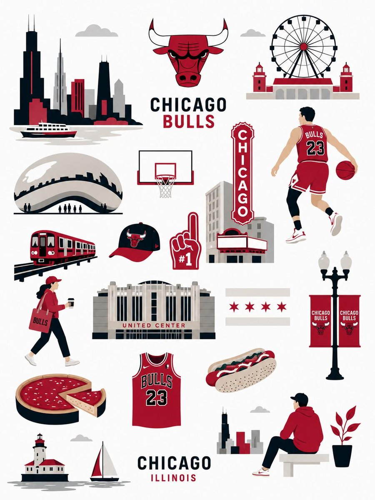

```text
Create a sophisticated flat-vector editorial pattern illustration of [Chicago bulls], composed as a seamless lifestyle-art collage combining iconic landmarks, local culture, vacation scenes, and symbolic city objects.
```


---

## 例 605：Pixel Art Character Portrait

**来源：** [@oggii_0](https://x.com/oggii_0/status/2057504810598089187) / [awesome-gpt-image-2-prompts](https://github.com/EvoLinkAI/awesome-gpt-image-2-prompts)


```text
Create a cute and stylish pixel-art illustration based on the uploaded image in the style of:
```


---

## 例 606：Monochrome Vector Vogue Portrait

**来源：** [@noorlewisx](https://x.com/noorlewisx/status/2064539506305561076) / [awesome-gpt-image-2-prompts](https://github.com/EvoLinkAI/awesome-gpt-image-2-prompts)

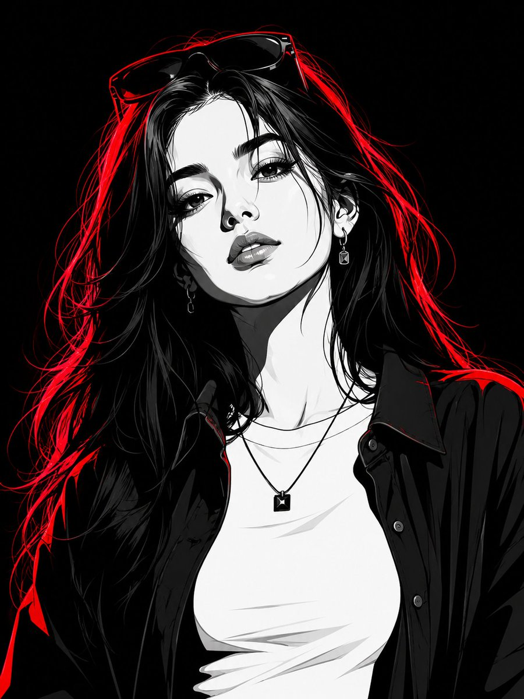

```text
Transform the subject into a striking high-contrast monochrome vector portrait, rendered in a premium black-and-white comic book illustration style with crisp cel-shading, bold geometric shapes, and ultra-clean vector linework. Preserve the subject's facial features, hairstyle, expression, and overall likeness with high accuracy.

The subject is a stylish young woman with long flowing hair, wearing an open dark oversized shirt layered over a fitted white crew-neck T-shirt. She accessorizes with a minimalist square pendant necklace, elegant earrings, and a pair of fashionable sunglasses resting naturally on top of her head, seamlessly integrated into her hairstyle.

Illuminate the portrait with intense red neon rim lighting that traces the contours of her hair, face, shoulders, and clothing, creating a dramatic glow against the monochrome artwork. The red highlights should add depth, separation, and a futuristic cinematic atmosphere without overpowering the black-and-white design.

Set against a pure black background, emphasizing strong contrast and visual impact. Style the artwork with sharp vector edges, bold shadows, clean negative space, graphic-novel aesthetics, modern streetwear fashion energy, and premium poster-quality composition. Ultra-detailed yet minimalist, edgy, contemporary, visually powerful, and magazine-cover worthy. Strong confident female presence, cinematic attitude, luxury editorial feel, and flawless vector illustration quality.
```


---

## 例 607：Anime-Inspired Pastel Hoodie Portrait

**来源：** [@de_mon010](https://x.com/de_mon010/status/2065247896287744162) / [awesome-gpt-image-2-prompts](https://github.com/EvoLinkAI/awesome-gpt-image-2-prompts)

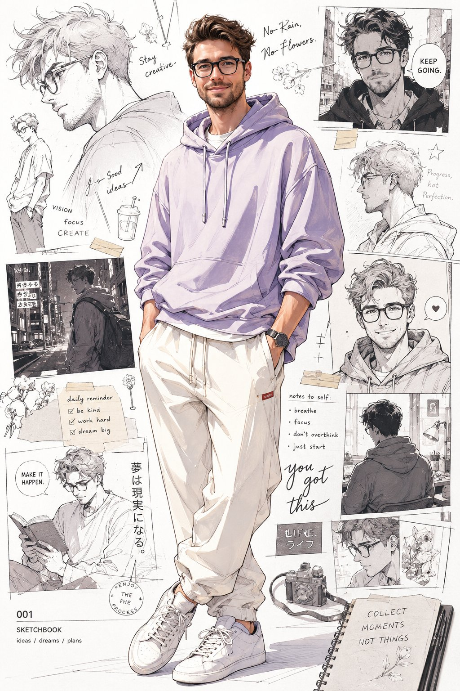

```text
Semi-realistic anime-inspired portrait of a stylish man, delicate round-frame glasses, and a gentle confident expression. he wears an oversized pastel lilac hoodie with rolled sleeves paired with a flowing ivory joggers. Full-body composition, standing casually with relaxed posture. Behind his is an artistic collage of hand-drawn monochrome character studies, loose pencil sketches, manga panels, playful doodles, and handwritten notes scattered organically across the backdrop.Contemporary anime fashion illustration with mixed ink-and-pencil textures, clean linework, subtle cel shading, bright white background, magazine-cover aesthetic, highly detailed, ultra-sharp, vibrant yet elegant, 8K masterpiece.
```


---

## 例 608：Korean Webtoon Couple Selfie

**来源：** [@Taaruk_](https://x.com/Taaruk_/status/2065105428862886301) / [awesome-gpt-image-2-prompts](https://github.com/EvoLinkAI/awesome-gpt-image-2-prompts)

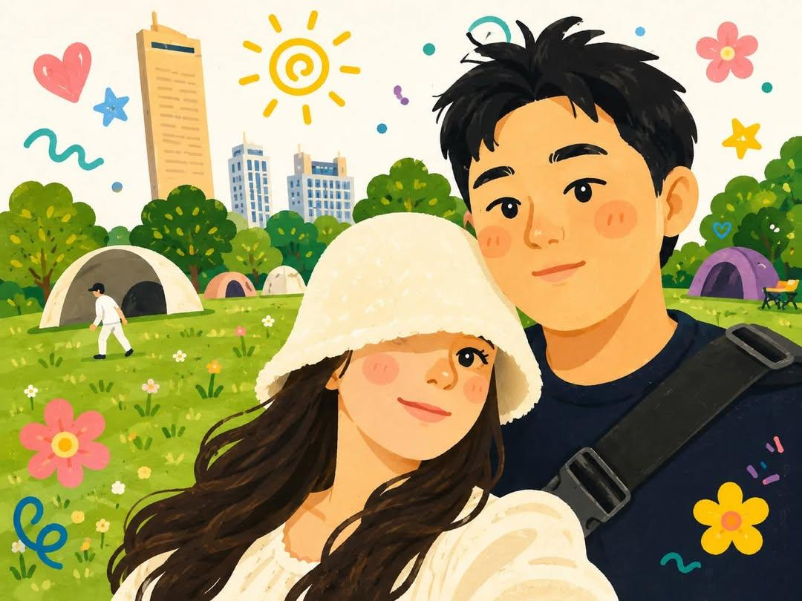

```text
Transform the uploaded photo into a cute hand-painted Korean webtoon illustration of a happy couple taking a selfie outdoors. Soft pastel color palette, round expressive eyes, rosy cheeks, warm smiles, cozy romantic atmosphere, charming doodle elements floating around them (hearts, flowers, stars, swirls, sunshine icons). Lush green park or beach scenery in the background, bright sunny day, whimsical children's-book aesthetic, clean line art, soft painterly shading, adorable proportions, cozy cottagecore vibes, dreamy and cheerful mood, highly detailed digital illustration, storybook quality, kawaii aesthetic, gentle textures, vibrant yet soft colors, Instagram-worthy artwork, wholesome couple portrait, cute lifestyle illustration, masterpiece, ultra detailed.
```


---

## 例 609：Sharp Digital Portrait Illustration

**来源：** [@JamilAI55](https://x.com/JamilAI55/status/2065060797861023948) / [awesome-gpt-image-2-prompts](https://github.com/EvoLinkAI/awesome-gpt-image-2-prompts)

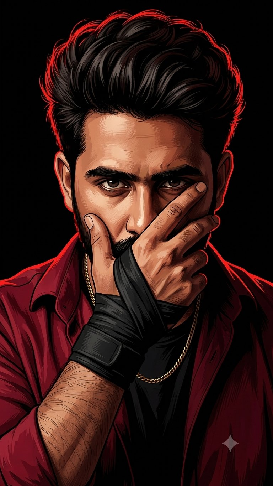

```text
Open Gemini / Grok / GPT Image 2.0
2. Upload your photo
3. Copy the prompt
4. Generate
5. Prompt ⤵️
Prompt 👇
Ultra-detailed digital portrait illustration of a confident young man with sharp facial features and intense dark eyes, looking directly into the camera. His hand covers the lower half of his face, creating a mysterious and powerful expression. Stylish voluminous black hair, wearing a deep red shirt over a black t-shirt, black wrist wrap, and a subtle gold chain. Dramatic red rim lighting outlining the hair, face, shoulders, and clothing against a pure black background. High-contrast cinematic lighting, dark moody atmosphere, bold shadows, comic-book and graphic novel style, semi-realistic digital painting, ultra-sharp details, textured brushwork, modern masculine aesthetic, centered composition, portrait crop, 4K quality, trending on ArtStation, masterpiece, highly detailed, red and black color palette, powerful gaze, edgy and stylish character design
```


---

## 例 610：A/B Test Signed Output

**来源：** [@saskr_13](https://x.com/saskr_13/status/2044744396932079934) / [awesome-gpt-image-2-prompts](https://github.com/EvoLinkAI/awesome-gpt-image-2-prompts)


```text
私があなたをどんなふうに扱ってきたか、4 コマ漫画風に描いてください。まずは 800 字くらいのプロットをテキストで出して、私が「描いて」と言ったらプロットに沿った 4 コマ漫画を描いてください。
```


---

## 例 611：New Chinese Minimalist Floral Illustration

**来源：** [@liyue_ai](https://x.com/liyue_ai/status/2047180347448914195) / [awesome-gpt-image-2-prompts](https://github.com/EvoLinkAI/awesome-gpt-image-2-prompts)

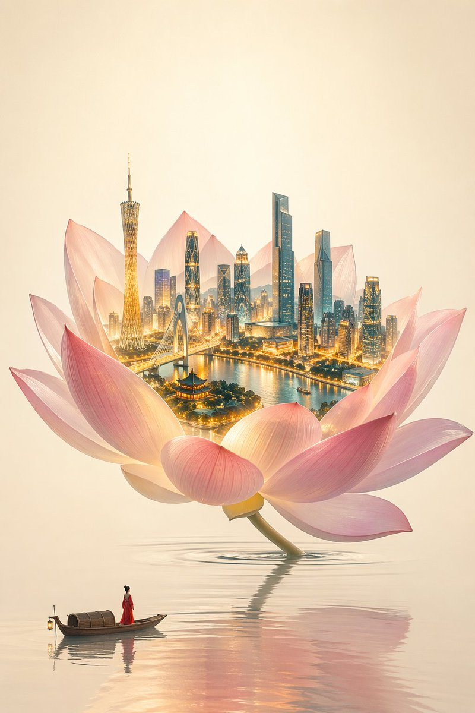

```text
新中式极简东方美学 × 高端商业插画，主题一花一世界，
极简，克制，空灵，高级商业视觉，超现实东方意境，
画面干净通透，无灰雾、无脏色，

一朵巨大的荷花作为空间容器，从平静水面自然生长，轻微倾斜，构图优雅留白充足，

低饱和干净粉色，柔和胭脂调，花瓣半透明，轻盈通透，
哑光低对比，边缘柔化 + 轻微景深，

荷花内部为唯一视觉焦点：发光的3D微缩广州城市，包含：广州塔，珠江新城建筑群，猎德大桥，珠江水岸，少量岭南建筑，

城市超精细结构，真实材质，极高细节清晰度，城市高光是暖金色，城市阴影是冷青蓝，形成冷暖对比，

灯光通透有能量，局部高饱和但不泛滥，城市亮度明显高于荷花，

水面清澈极简平静，仅少量柔和涟漪，弱反射，

背景暖米白宣纸质感，无水墨、无笔触，大面积留白，
中心有极轻微光晕渐变，整体通透、不灰、不闷，

画面下方一艘极简小船，船上一位红衣渔女，极小比例，
静立仰望荷花，红色为唯一高纯度点缀，

整体光线通透、干净、有层次，无灰雾、无泛白，
高端CG商业插画，电影级真实光影，高动态范围，超精细，8K细节，ArtStation 级画质，强化分色，干净调色，青橙对比，暖高光冷暗部，仅城市灯光提亮饱和度，色调柔和通透，光影锐利明亮，无灰雾、无暗沉、无低饱和雾化。
```


---

## 例 612：Surreal Japanese Futuristic City Illustration

**来源：** [@Tresmort](https://x.com/Tresmort/status/2047105322863460496) / [awesome-gpt-image-2-prompts](https://github.com/EvoLinkAI/awesome-gpt-image-2-prompts)

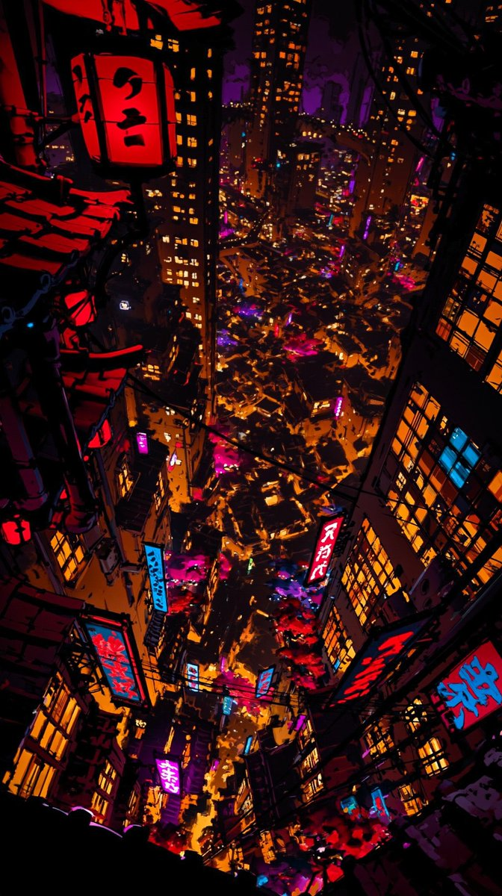

```text
参考这张图的透视和风格，绘制一张更加精细的超高清插画，表现超现实主义的日式未来都市，要能看清很小的细节，包括街道上的传统文化游行的人，小巷里的黑帮，烟花巷的舞女，疲惫的社畜，楼房的窗户里也有各式各样的人物，学习的学生，吵架的夫妻，玩游戏的宅男，以及更多的发挥细节。讽刺现实拥挤中的无聊，都市繁华下的孤独，无意义的人生中又有一种病态的美感。画面要有极高的审美价值 ，不能因为拼内容而损失美和协调感，比例是9:16
```


---

## 例 613：Eastern Fantasy Female Half-Portrait

**来源：** [@liyue_ai](https://x.com/liyue_ai/status/2046962895775580442) / [awesome-gpt-image-2-prompts](https://github.com/EvoLinkAI/awesome-gpt-image-2-prompts)

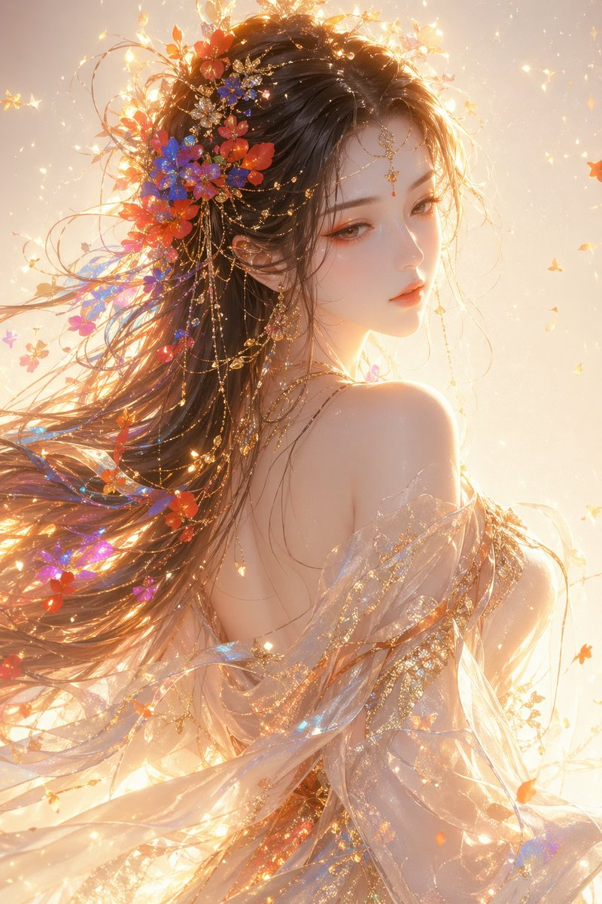

```text
东方幻想风格女性，半身肖像，回眸侧脸，气质空灵优雅，柔和神性美感，细腻五官，微垂眼神，冷白细腻肌肤，淡雅橘粉妆容，金色高光点缀

长发飘动，发丝中融入彩色花朵与光粒（红、蓝、橙、紫），头发具有流动感与空气感

身穿半透明丝绸礼服与披肩，材质轻盈通透，布料随风飘动，表面带有鎏金纹理与闪耀颗粒。

整体光影为暖金色逆光，强边缘光，体积光明显，光粒漂浮，柔光泛光，梦幻氛围

背景干净浅色渐变，带微光与粒子效果，整体氛围空灵、梦境、神圣

风格：高端CG插画，超精细，电影级光影，柔光渲染，8K细节，artstation 热门作品风格
```


---

## 例 614：Miyazaki-style short film pipeline

**来源：** [@happycapyai](https://x.com/happycapyai/status/2049468986828697940) / [awesome-gpt-image-2-prompts](https://github.com/EvoLinkAI/awesome-gpt-image-2-prompts)

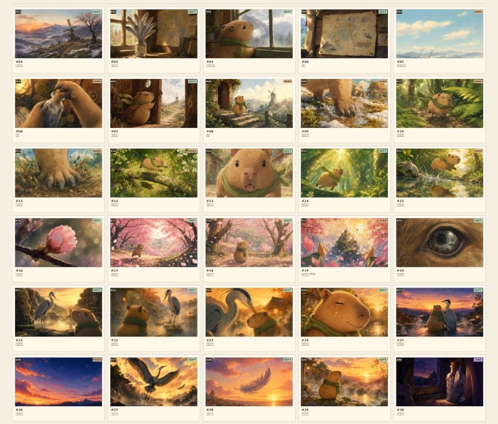

```text
Given a story concept, generate a complete Miyazaki-style animated short film: write a 30-shot script → generate watercolor storyboard images (gpt-image-1) → plan SOFT/HARD transitions → produce video clips with Seedance 2.0 using first/last-frame binding → synthesize the original ambient piano score → stitch everything into a final MP4 with music.
```


---

## 例 615：Whimsical Folk Doodle Transformation

**来源：** [@oggii_0](https://x.com/oggii_0/status/2052792243845779811) / [awesome-gpt-image-2-prompts](https://github.com/EvoLinkAI/awesome-gpt-image-2-prompts)

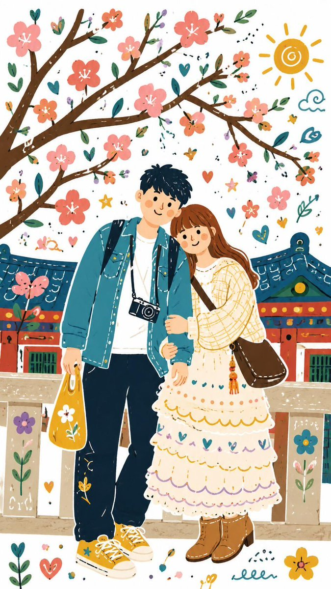

```text
Simplify all details into clean, flat shapes with a handmade, slightly imperfect feel, as if drawn on a sheet of white paper. The overall style should look cute, childlike, and whimsical.
```


---

## 例 616：Food Anime Storyboard Generator

**来源：** [@tanabe_fragm](https://x.com/tanabe_fragm/status/2064510342328353143) / [awesome-gpt-image-2-prompts](https://github.com/EvoLinkAI/awesome-gpt-image-2-prompts)

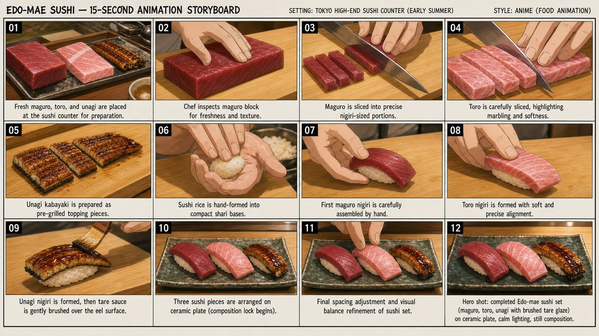

```text
Create a professional anime production storyboard sheet for a **15-second cooking animation featuring authentic Edo-style Sushi (江戸前寿司 / 握り寿司)**.

The cooking process should accurately reflect professional Tokyo high-end sushi restaurant techniques while delivering elegant anime-style food presentation and a **calm early summer atmosphere in a refined Tokyo sushi counter setting (初夏・静謐な高級寿司店の空気感)**.

The storyboard should depict the complete preparation process of **maguro (tuna), toro (fatty tuna), and unagi (eel)** sushi while maintaining strict visual continuity across all panels.

---

# Workflow Adaptation Rule

Before creating the storyboard:

1. Follow authentic Edo-mae sushi counter workflow
2. Separate fish preparation, rice shaping, and nigiri assembly stages
3. Emphasize craftsmanship and hand technique
4. Highlight maguro, toro, and unagi equally
5. Build toward final plated sushi as the hero composition
6. Maintain strict continuity of counter, lighting, and tools

---

# Realism and Culinary Accuracy Rules

Prioritize authentic sushi craftsmanship:

* Precise slicing of maguro and toro
* Hand-formed sushi rice (shari)
* Clean, minimal unagi handling
* Realistic weight, pressure, and texture of food

Avoid all exaggerated or stylized effects.

---

## Ingredient Preparation Rules

* Maguro: clean block slicing into uniform nigiri portions
* Toro: delicate slicing emphasizing marbling texture
* Unagi: already grilled kabayaki, cut into sushi topping size

---

## Unagi Correct Technique Rule (FINAL)

For unagi nigiri:

* Grilled eel (kabayaki) is placed on top of hand-formed sushi rice
* After the nigiri is fully formed, the chef applies tare sauce **using a brush directly on the surface of the eel**
* Brush movement is slow, precise, and minimal
* No pre-dipping in sauce
* No cutting during final assembly
* Focus on glossy finish and craftsmanship, not drama

---

## Liquid Realism Rules

* Sauce is applied as a thin controlled glaze via brush
* No drip
```


---

## 例 617：Persona5 Character Reference Card

**来源：** [@iamrednightS](https://x.com/iamrednightS/status/2045075682837836265) / [awesome-gpt-image-2-prompts](https://github.com/EvoLinkAI/awesome-gpt-image-2-prompts)

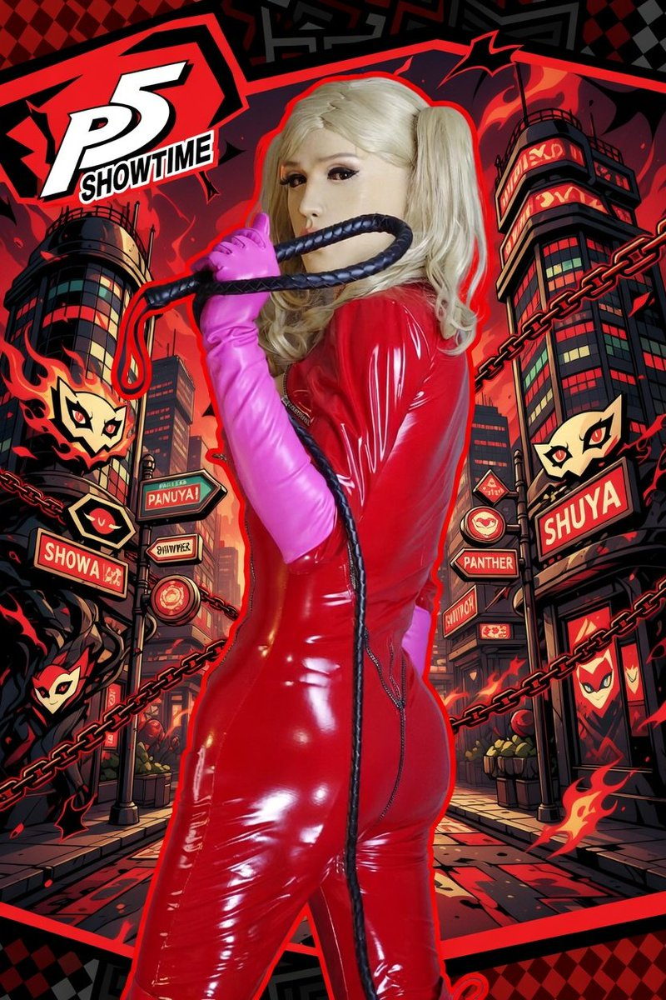

```text
基于此角色和背景，请制作一份类似官方设定资料的角色资料卡。
・包含三视图：正面、侧面和背面
・添加角色面部表情的变化・分解并展示服装和装备的详细部分
・添加色板・包含世界观设定的简要说明
・总体上，使用有组织的布局（白色背景，插画风格）高分辨率、专业概念艺术风格
```


---

## 例 618：3D Acrobat Jumping Editorial Cartoon

**来源：** [@iamaiistudio](https://x.com/iamaiistudio/status/2065058228585844954) / [awesome-gpt-image-2-prompts](https://github.com/EvoLinkAI/awesome-gpt-image-2-prompts)

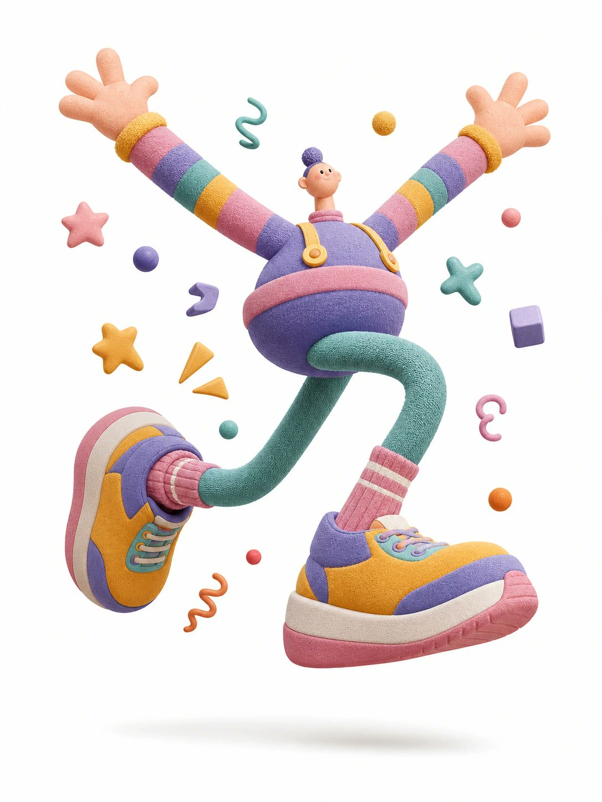

```text
prompt:

One complete 3D illustration, editorial exaggerated cartoon style, single standalone image, not a storyboard or multi-panel layout.

Central character: a cartoon figure with a tiny head, chubby round torso, super-long limbs, huge hands and bulky shoes, slightly off-balance, caught mid-jump in a dramatic pose radiating tension and playful energy.

The silhouette reads like a soft toy sculpture — plump, springy, and exaggerated, not anatomically realistic.

Surface quality: matte rubber, fuzzy textile, knitted detail, clay-like feel, subtle fiber grain, handmade texture. Avoid shiny plastic, transparent glass, or high-spec reflections.

Color: vibrant dopamine palette, high saturation, strong color contrasts, large bold flat fills — vivid but not neon-overexposed.

Background: pure white, minimal staging, just a gentle oval drop shadow beneath the character, no elaborate setting.

Decorative floating elements orbiting the character: stars, wavy lines, spheres, cubes, icons, abstract shapes — all sculpted as soft rubber or paper-like 3D props, amplifying motion and graphic energy.

Lighting: soft studio setup, global illumination, diffused shadows, low contrast, polished commercial feel.

Rendered in C4D or Blender: stylized soft-sculpture aesthetic, matte clay finish, knitted fabric surface, playful editorial tone, high resolution.

— Scene: a pastel-toned acrobat throwing both arms up in a victorious airborne leap, wearing chunky multicolor sneakers

#AIart #GPTImage2
```


---

## 例 619：Korean Dance Motion Sheet

**来源：** [@iamaiistudio](https://x.com/iamaiistudio/status/2066659127485718574) / [awesome-gpt-image-2-prompts](https://github.com/EvoLinkAI/awesome-gpt-image-2-prompts)

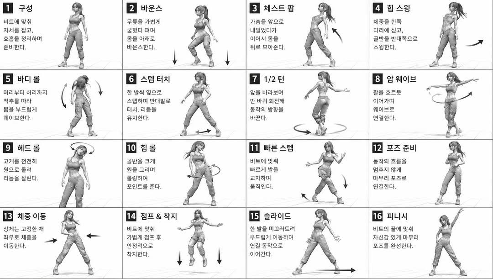

```text
[STYLE]
black and white grayscale illustration, 3D rendered character, clean instructional reference sheet,
white background, comic panel grid layout, technical diagram aesthetic

[LAYOUT]
4x4 grid, 16 panels total, each panel divided by thin black borders,
cells numbered 1 through 16, uniform panel dimensions

[CHARACTER]
young female dancer, athletic build, ponytail hairstyle, crop top and baggy pants, sneakers — same character across all panels

[PANEL STRUCTURE - per cell]
top-left: bold number badge + Korean title text
center: full-body character pose illustration
bottom-left: Korean description text (3-4 lines)
overlay: motion arrows showing movement direction

[ARROWS / MOTION INDICATORS]
curved arrows, straight arrows, circular rotation markers,
placed around the character to indicate movement flow and direction

[RENDERING STYLE]
high-detail 3D sculpt style, soft studio lighting, subtle shadows,
no color, grayscale shading, clean linework, game concept art quality

[NEGATIVE]
no background scenery, no color tones, no extra characters,
no cluttered backgrounds
```


---

## 例 620：Visual Novel Character Profile

**来源：** [@iamaiistudio](https://x.com/iamaiistudio/status/2067308176715001944) / [awesome-gpt-image-2-prompts](https://github.com/EvoLinkAI/awesome-gpt-image-2-prompts)


```text
Create a high-quality character introduction page using a chibi illustration and a full standing character artwork, styled like an official visual novel (gal-game) character profile page. It should look realistic enough to use on an actual game website. Include CG-style illustrations, facial expression variants, and a chibi version of the character.

"Self-introduction here"

Name: (name here)
Theme color: (color here)
Height: (height here) cm
Weight: (weight here) kg
Catchphrase: "(line here)"
```


---

## 例 621：Pastel Kawaii Animal Companions

**来源：** [@Taaruk_](https://x.com/Taaruk_/status/2068351521016955098) / [awesome-gpt-image-2-prompts](https://github.com/EvoLinkAI/awesome-gpt-image-2-prompts)

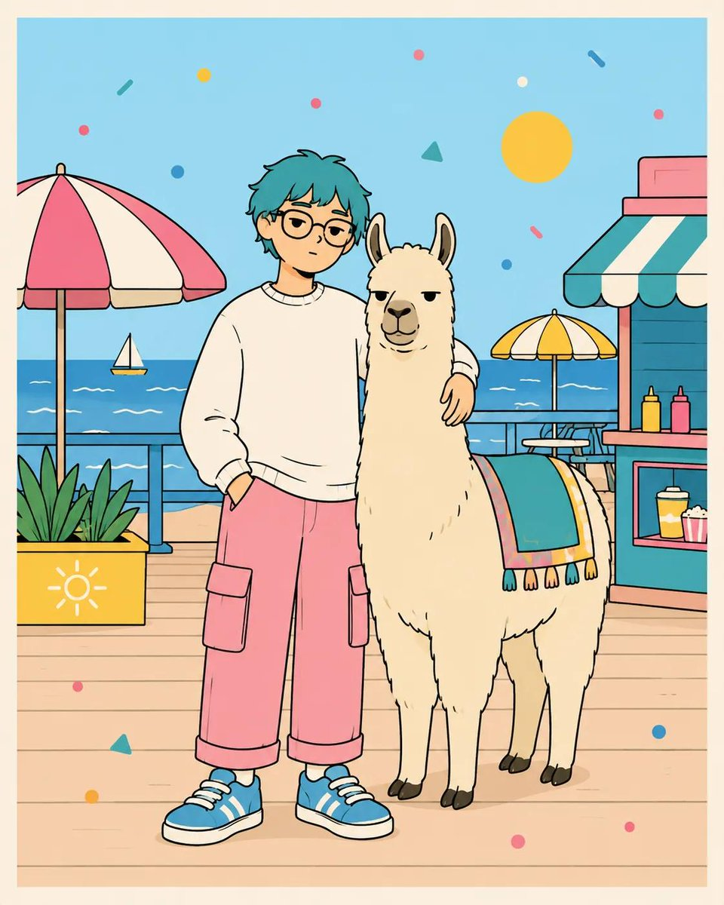

```text
Cute minimalist pastel doodle illustration, kawaii character standing side-by-side with their adorable animal companion, inspired by modern Japanese stationery art and children's picture books, clean vector linework, soft cream background, muted pastel color palette (pink, blue, mint, lavender, yellow), simple geometric shapes, tiny confetti dots and floating decorative elements, rounded character design with oversized sweater, wide pants, sneakers, glasses, calm expression, animal companion variations including llama, bear, axolotl, rabbit, cat, fox, turtle or fantasy creature, cozy scenic background with seaside boardwalk, lakeside village, mountain town or whimsical nature landscape, flat design, thick outlines, charming and playful aesthetic, symmetrical composition, full body pose, cute friendship theme, highly detailed vector illustration, sticker-like appearance, children's book art style, soft shadows, clean negative space, vibrant yet gentle colors, trending on Pinterest, adorable wholesome atmosphere, 4k, masterpiece.
```


---

## 例 622：Cozy Lifestyle Sticker Grid

**来源：** [@RuzainaMeer](https://x.com/RuzainaMeer/status/2071097968846057649) / [awesome-gpt-image-2-prompts](https://github.com/EvoLinkAI/awesome-gpt-image-2-prompts)

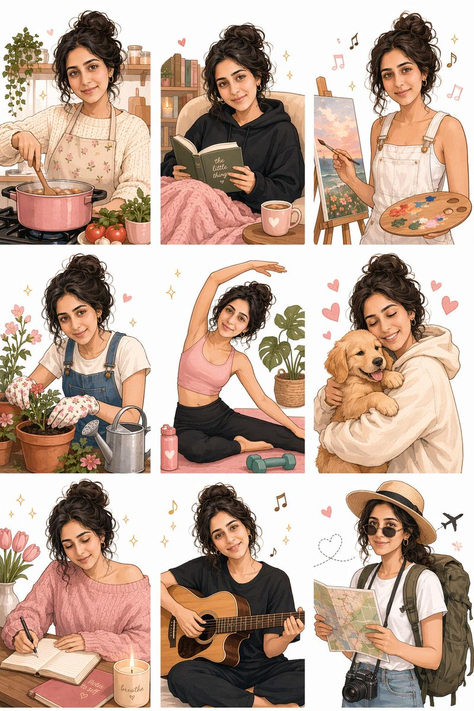

```text
A 3x3 grid collage of 9 illustrated sticker-style panels, all featuring the same young woman with curly brown hair styled in a messy bun, soft anime-inspired illustration style with warm pastel color palette (blush pink, cream, warm brown, soft teal). White background for each panel with subtle sparkle/heart decorations. Each panel shows her in a different cozy lifestyle activity:
Panel 1 (top-left): Cooking in a cozy kitchen, wearing a cream knit sweater and apron, stirring a pink pot on the stove, tomatoes and herbs nearby, warm kitchen background.
Panel 2 (top-center): Reading a book curled in a cozy chair, wearing a black oversized hoodie, wrapped in a pink blanket, coffee cup with heart on the side, bookshelf behind her.
Panel 3 (top-right): Painting on a canvas easel, wearing white overalls, holding a paintbrush over a colorful palette, soft musical notes floating around.
Panel 4 (middle-left): Gardening with floral gloves and denim overalls, planting flowers in terracotta pots, watering can beside her, pink flowers blooming.
Panel 5 (middle-center): Doing yoga/stretching on a pink mat, wearing a pink crop top and black leggings, arm raised gracefully overhead, green plant in background, water bottle and dumbbells nearby.
Panel 6 (middle-right): Hugging a golden retriever puppy, wearing a cream hoodie, surrounded by floating pink hearts, big happy smile.
Panel 7 (bottom-left): Journaling at a desk, wearing a pink off-shoulder knit sweater, writing in a notebook, tulips in a vase, a lit candle, sparkle accents around her.
Panel 8 (bottom-center): Playing acoustic guitar, wearing a black casual outfit, smiling joyfully, musical notes and golden sparkles floating around her.
Panel 9 (bottom-right): Traveling with a backpack, wearing a straw hat, sunglasses, white tee, holding an open map, camera hanging around her neck, airplane trail in background.
Consistent character design across all panels. Soft lineart, warm skin tone, expressive large eyes, cozy and aesthetic illustration style similar to Korean webtoon sticker art. Clean white background per panel, arranged in a 3x3 grid layout.
```


---

## 例 623：1990s Anime Rebel Portrait

**来源：** [@oggii_0](https://x.com/oggii_0/status/2071084089084613037) / [awesome-gpt-image-2-prompts](https://github.com/EvoLinkAI/awesome-gpt-image-2-prompts)

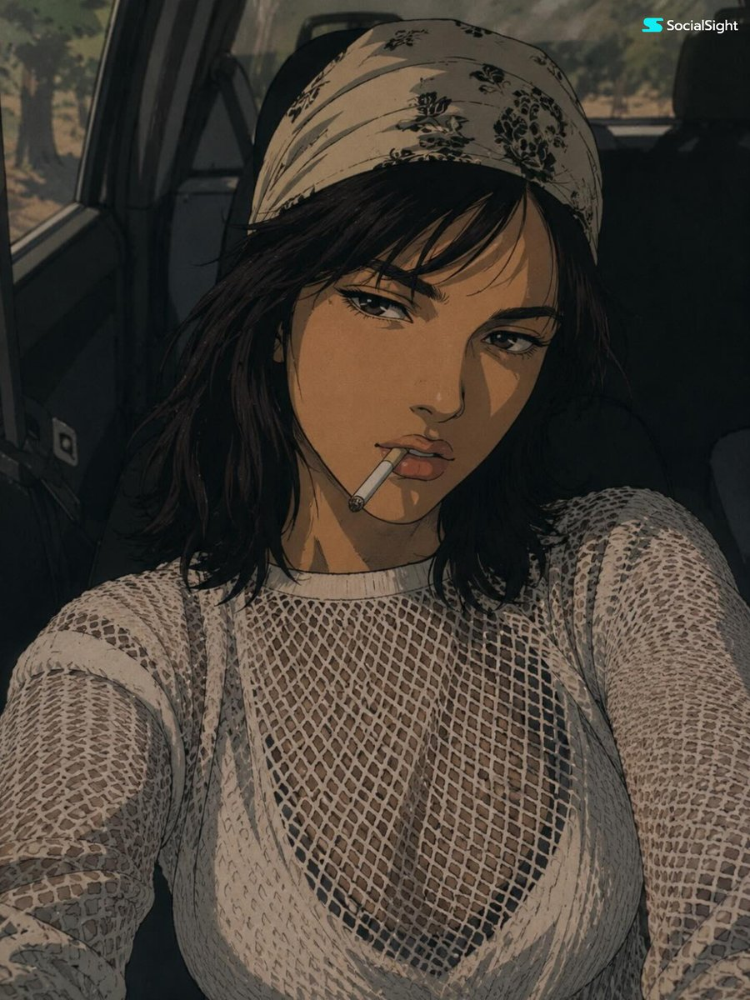

```text
Take this photo and transform it into an illustration in the style of 1990s anime.

Capture the authentic aesthetic of that era, with a particular focus on the visual style of male anime protagonists from the 90s. Use a muted, slightly desaturated color palette to evoke the look and feel of classic cel animation.

Preserve the person's key facial features and likeness from the original photo, but adapt them naturally to the 90s anime style. Give the character a strong-willed, confident, and slightly rebellious personality. A cigarette in his mouth is acceptable as part of the character design.
```


---

## 例 624：Magical Seed Packet Diorama

**来源：** [@AllaAisling](https://x.com/AllaAisling/status/2048156345518768190) / [awesome-gpt-image-2-prompts](https://github.com/EvoLinkAI/awesome-gpt-image-2-prompts)

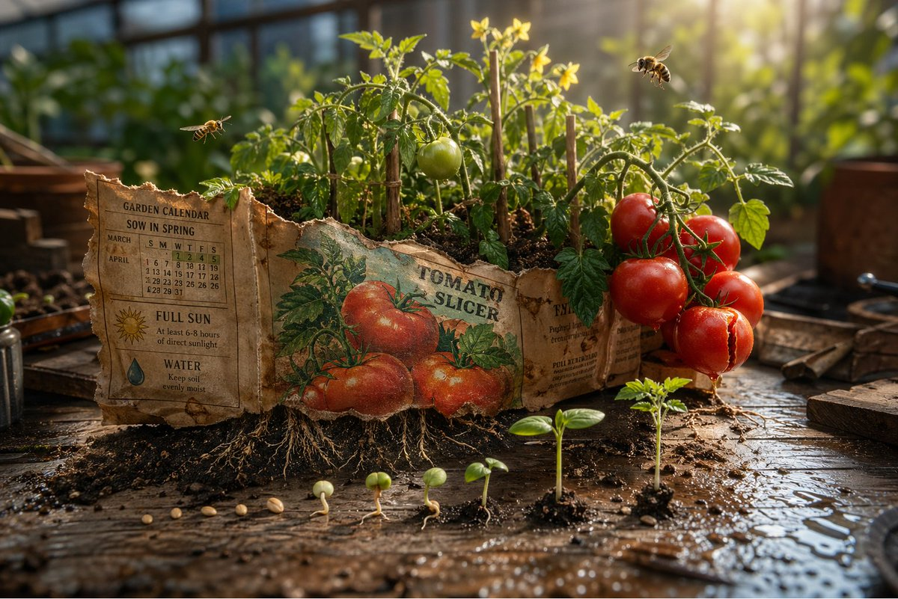

```text
Epic 3D scene: a weathered seed packet lying open on a potting bench, its promise erupting into the garden it describes. The illustration on the front becomes real. {argument name="plant type" default="[PLANT / FLOWER]"} growing at full scale from the paper, roots visible through the packet's base pushing into soil below.
{argument name="detail left" default="[DETAIL 1]"} in full bloom at one corner. {argument name="detail right" default="[DETAIL 2]"} mid-growth at the other, not yet what it will be.
Tiny insects that belong to this plant, {argument name="insect type" default="[BEE / BUTTERFLY / BEETLE]"}, hovering at correct scale.
The written instructions on the back become garden calendar, "sow in spring" manifests as actual spring light. "full sun" manifests as a single shaft of it, hitting the tallest bloom perfectly.
Scattered seeds between packet and soil each showing their germination stage, split coat, first root, first shoot, first leaf.
The packet's torn top edge becomes a treeline.
Potting bench surface with soil scatter and water droplets.
Tilt-shift depth of field, greenhouse morning light, the packet as the garden it always intended.
```


---

## 例 625：Sticker Reality Product Collage

**来源：** [@oggii_0](https://x.com/oggii_0/status/2056061748806090940) / [awesome-gpt-image-2-prompts](https://github.com/EvoLinkAI/awesome-gpt-image-2-prompts)

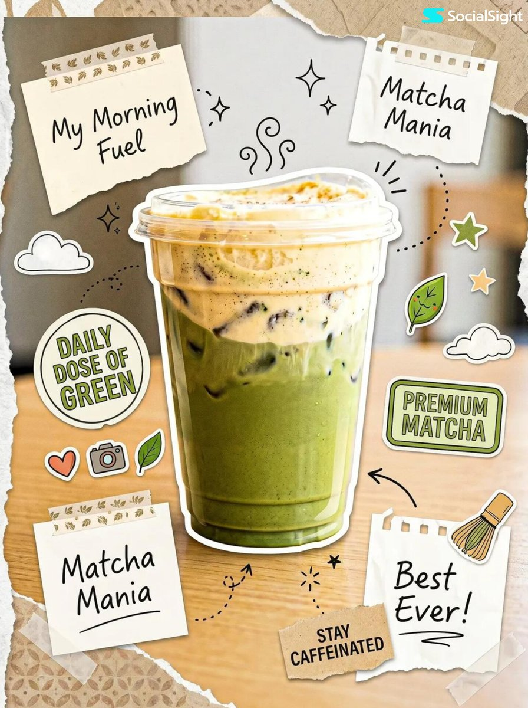

```text
Edit this image while preserving the original subject, composition, and background.

Transform the scene into a “sticker reality” collage:

* Add elements that look like physical stickers, paper cutouts, and taped notes layered over the image
* Use slight misalignment and overlapping placement to create a natural scrapbook feel

Incorporate hand-drawn doodles mixed with sticker-like graphics such as icons, shapes, and labels.

Add subtle paper textures, torn edges, and tape details to enhance realism.

Ensure the product remains the main focal point while the collage elements build around it.

Balance the composition so it feels rich and layered but still visually pleasing, not cluttered.

The final result should feel like a real photo transformed into a creative scrapbook composition.
```


---

## 例 626：Soft Serve Cozy Aesthetic

**来源：** [@Sairah_0](https://x.com/Sairah_0/status/2056060219361501319) / [awesome-gpt-image-2-prompts](https://github.com/EvoLinkAI/awesome-gpt-image-2-prompts)

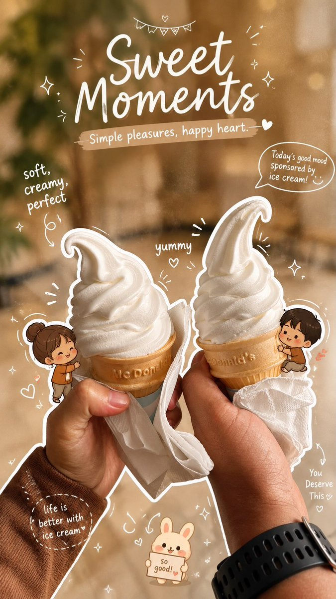

```text
GPT Image 2 On ChatGPT

Prompt : (Soft Serve Ice Cream Aesthetic)

Close-up aesthetic photo of two hands holding vanilla soft serve ice cream cones, cozy warm cafe lighting, creamy texture, dreamy beige and brown color palette, shallow depth of field, soft bokeh background, kawaii doodle stickers and white hand-drawn illustrations around the image, cute cartoon kids and bunny characters, handwritten typography saying “Sweet Moments”, playful sparkles and hearts, cozy lifestyle photography, cinematic warm tones, Instagram story aesthetic, soft glow, realistic food photography, adorable scrapbook journal style, ultra detailed, high quality, vibrant yet soft editing, wholesome happy vibe.

Prompt : (Iced Coffee Cozy Aesthetic)

Close-up aesthetic shot of a hand holding iced coffee in a transparent branded cup, warm golden cafe ambience, creamy iced latte with ice cubes, cozy sunlight and soft bokeh background, cute white doodle overlays and handwritten text, kawaii cartoon boy and bunny stickers, scrapbook aesthetic, soft brown and green color palette, dreamy lifestyle photography, playful sparkles and hearts around the drink, “Good Vibes, Good Coffee” typography style, warm cinematic tones, ultra realistic beverage photography, cozy Instagram aesthetic, soft glow effect, highly detailed, cheerful and refreshing mood.
```


---

## 例 627：Doodle Escape Studio Sprint

**来源：** [@john_my07](https://x.com/john_my07/status/2071605998729740705) / [awesome-gpt-image-2-prompts](https://github.com/EvoLinkAI/awesome-gpt-image-2-prompts)

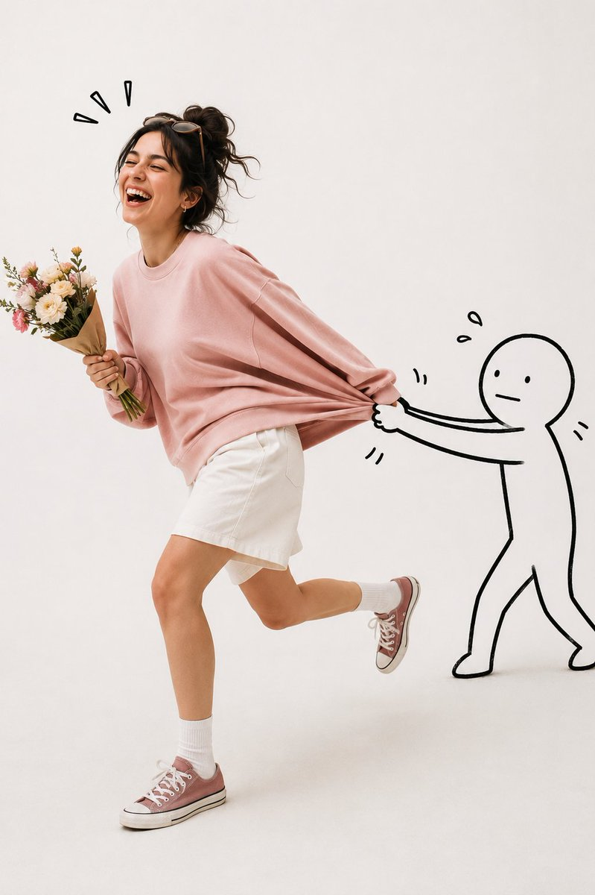

```text
Create an ultra-realistic editorial studio photograph set against a smooth off-white seamless backdrop with a bright, airy minimalist aesthetic.

A fun-loving young woman with a pastel blue pixie cut is captured in a spontaneous moment of playful escape. She bursts into laughter while jogging forward, her smile wide and genuine, eyes nearly closed from amusement. Her posture shows energetic movement as she tries to continue running despite being gently held back, creating a humorous tug-of-war effect.

Pose & Movement

Natural mid-stride running motion.

One leg lifted slightly off the floor.

Arms moving freely with realistic running dynamics.

One hand confidently holding a vibrant rainbow spiral lollipop.

Subtle motion in the hair and clothing.

Strong sense of forward momentum with believable body mechanics.

Wardrobe

Loose oversized powder-blue sweatshirt.

Relaxed-fit beige trousers with wide legs.

Red checkerboard slip-on skate shoes.

Round eyeglasses casually resting atop her head rather than covering her eyes.

Doodle Character Interaction
A simple hand-drawn black doodle figure appears beside her, sketched in thick marker lines directly onto the photograph. The character features a round head, tiny dot eyes, and a straight neutral mouth.

The doodle extends an exaggerated arm that grips the back of the woman's sweatshirt, stretching the fabric noticeably as it attempts to stop her from getting away. The tension creates realistic folds and pull lines in the sweatshirt while subtly drawing her shoulders backward even as her body continues moving forward.

Small sketch-style motion marks around the doodle's arm suggest effort and resistance. Additional playful doodle accents around the woman's head emphasize her laughter, excitement, and movement.

Details

Anatomically accurate hands and fingers.

Clear visibility of both hands despite oversized sleeves.

Realistic grip and proportions on the lollipop.

Convincing fabric tension and clothing physics.

Bright high-key lighting with soft natural shadows.

Clean editorial lifestyle photography aesthetic.

Humorous visual storytelling.

Modern premium magazine-quality look.

Wholesome and playful mood.

Ultra-realistic textures, sharp focus, crisp detail, 8K resolution.

Vertical composition.
```


---

## 例 628：Hybrid 3D Vector Illustration Style

**来源：** [YouMind](https://youmind.com/prompts/hybrid-3d-vector-portrait-32411)

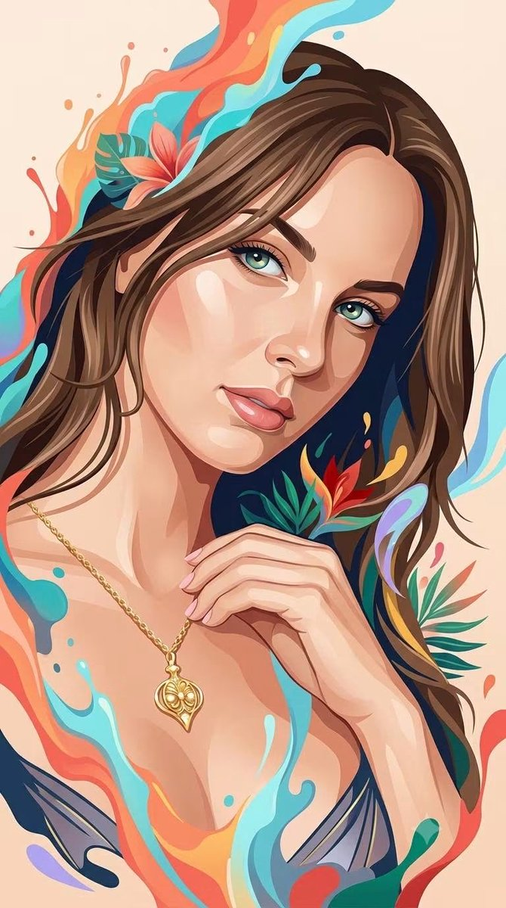

```text
A sophisticated 
hybrid human portrait style
 that seamlessly combines the whimsical, glossy dimensional rendering of a premium 3D fantasy illustration with the clean, elegant simplicity of contemporary flat vector portraiture. Depict the human subject with recognizable anatomy, natural facial proportions, authentic expression, and clearly identifiable features, while transforming the overall appearance into a refined stylized illustration. The face should combine smooth dimensional modeling with simplified graphic planes: softly sculpted skin, subtle volumetric shading, delicate highlights, clean angular shapes, and carefully controlled flat-color regions. Use the visual language of premium digital character illustration: luminous expressive eyes, softly rendered skin, smooth flowing hair with layered strands, polished highlights, gentle depth, tactile surfaces, and subtle painterly transitions. At the same time, simplify the rendering with elegant vector-like shapes, clean silhouettes, controlled linework, minimal visual noise, and clearly defined color planes inspired by modern editorial portrait illustration. Integrate 
flowing artistic elements around the human figure, such as fluid paint splashes, soft liquid ribbons, abstract organic shapes
. These elements should feel energetic and three-dimensional, organically emerging from the portrait rather than appearing as a separate background decoration. Hair should combine clean graphic masses with silky dimensional strands and sweeping flowing shapes. Facial features should remain refined and human, enhanced with subtle geometric simplification rather than exaggerated cartoon distortion. Clothing should use bold simplified silhouettes with restrained geometric detailing, maintaining an elegant contemporary fashion-illustration appearance. Color treatment should merge the warm, restrained palette of modern vector portraiture with the 
vibrant tropical energy of whimsical fantasy illustration
: warm coral, orange, cream, peach, turquoise, cyan, sky blue, deep navy, emerald, red, golden yellow, and subtle lavender accents. Use mostly clean saturated color fields, enhanced selectively with soft gradients, glossy highlights, translucent edges, and gentle volumetric illumination. Background should remain clean and uncluttered, preferably a simple warm solid or softly textured backdrop, allowing the human subject and surrounding artistic splashes to remain the primary focus. The final aesthetic should feel like an original fusion of elegant editorial vector portrait, contemporary digital painting, whimsical 3D character illustration, premium fashion artwork, and colorful fluid fantasy art — clean yet richly dimensional, sophisticated yet playful, expressive, polished, tactile, modern, artistic, and visually distinctive.
```


---

## 例 629：混合介质手绘时尚剪贴簿插画

**来源：** [@Sairah_0](https://x.com/Sairah_0/status/2093577687608487995) / [OpenNana](https://opennana.com/awesome-prompt-gallery/mixed-media-hand-drawn-fashion-illustration-scrapbook-collage)

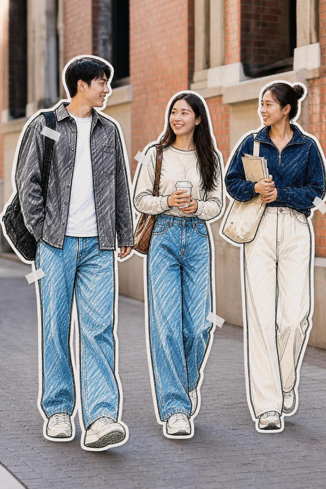

```text
Transform the people in the reference photo into a stylish hand-drawn fashion illustration while keeping their facial features, poses, expressions, hairstyles, clothing, body proportions, and overall composition recognizable. Use a mixed-media aesthetic combining a realistic photographic background with detailed pencil-and-colored-pencil sketching on the people. Add visible hand-drawn cross-hatching, rough pencil strokes, subtle ink outlines, textured shading, and slightly imperfect sketch details. Keep the clothing highly detailed with realistic fabric folds and denim texture.

Surround each illustrated person with a thick irregular white sticker/paper-cutout border, as if they were individually cut out by hand. Add small pieces of semi-transparent white masking tape around the edges of some figures, creating a scrapbook/editorial collage effect. The background should remain realistic, softly lit, natural, and slightly blurred, creating a strong contrast between the photographic environment and illustrated subjects.

Aesthetic: Korean/Japanese fashion editorial, contemporary street-style illustration, scrapbook collage, fashion sketchbook, photorealistic background + hand-drawn characters, clean but imperfect pencil artwork, cozy muted tones, subtle film grain, soft natural lighting, premium editorial photography.

High detail, realistic faces, natural anatomy, expressive eyes, detailed hair strands, realistic clothing textures, clean composition, full-body framing, professional fashion editorial quality. Avoid overly cartoonish proportions, CGI appearance, excessive saturation, distorted hands, extra fingers, warped faces, or overly smooth digital painting.

For the exact “3 friends walking” look

Add this at the end:

Three stylish young adults walking together casually, interacting naturally and looking at each other, full-body shot, candid friendship moment, urban university/campus setting, relaxed oversized streetwear, wide-leg jeans and trousers, sneakers, tote bags and backpacks, photographed at eye level.

For indoor/café/home scenes

Replace the last paragraph with:

Three stylish young adults standing together indoors in a cozy modern apartment/café, casually interacting and looking at a camera or object together, full-body composition, natural candid poses, warm minimalist interior, soft daylight coming through windows.
```


---

## 例 630：涂鸦风格国家旅行地图插画

**来源：** [@Naiknelofar788](https://x.com/Naiknelofar788/status/2093679919473840378) / [OpenNana](https://opennana.com/awesome-prompt-gallery/doodle-country-travel-map-illustration)

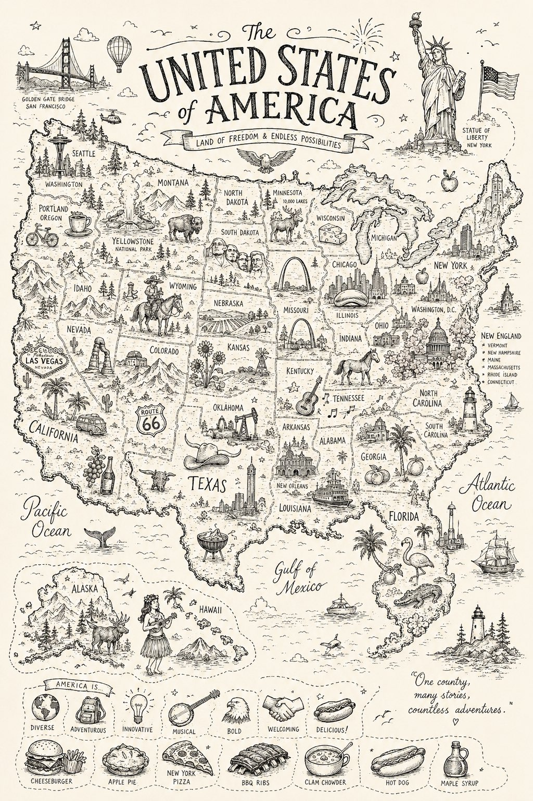

```text
Doodle Country Illustration [COUNTRY NAME]

Create a charming, highly detailed hand-drawn doodle illustration of [COUNTRY NAME], designed like a whimsical illustrated travel map. Use the recognizable outline/shape of the country as the main composition, filled with dozens of tiny black-ink doodles representing its culture, landscapes, food, architecture, traditions, wildlife, landmarks, and everyday life.

Include iconic elements such as [LANDMARK 1], [LANDMARK 2], [FOOD], [ANIMAL], [TRADITION], [NATURE], [FAMOUS OBJECT], along with small decorative elements scattered naturally throughout the map.

Style: intricate pen-and-ink doodle art, playful hand-drawn lines, tiny illustrations, whimsical details, slightly imperfect sketching, travel-journal aesthetic, monochrome ink with subtle paper texture, white/off-white background, balanced composition, visually rich but clean, no photorealism.

Add the country name “[COUNTRY NAME]” in beautiful hand-lettered typography integrated naturally into the artwork.

Aspect ratio: 4:5 portrait
Mood: artistic, nostalgic, cozy, adventurous, culturally rich
Quality: extremely detailed, crisp linework, professional illustrated travel poster.
```


---

## 例 631：日系咖啡馆回忆日志插画写实组合

**来源：** [@Taaruk_](https://x.com/Taaruk_/status/2092872822507151625) / [OpenNana](https://opennana.com/awesome-prompt-gallery/japanese-cafe-memory-journal-editorial-style)

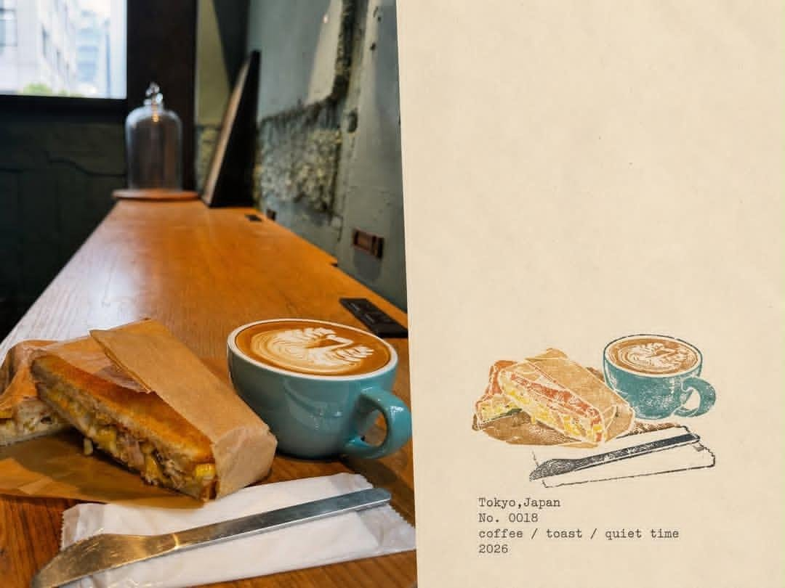

```text
Create a premium editorial “memory journal” page combining a real lifestyle photograph with a hand-drawn illustrated interpretation of the same moment. Use a vertical 4:5 composition divided diagonally/vertically into two complementary sections: the left side is a warm, natural, slightly film-grainy photograph of a Japanese café scene, showing beautifully plated food or dessert and coffee on a wooden table, with realistic ambient café details, soft window light, shallow depth of field, and subtle nostalgic tones; the right side is a minimalist hand-painted watercolor/colored-pencil illustration recreating the same food and drink with delicate imperfect ink outlines, muted earthy colors, visible paper texture, and an artistic handmade feel. Keep the right side mostly warm ivory textured paper with generous negative space. Beneath the illustration, add small typewriter-style archival text containing the location, item number, short memory keywords, and year, such as “Tokyo, Japan / No. 0018 / coffee / toast / quiet time / 2026”. The design should feel like a curated Japanese travel diary, café memory archive, contemporary scrapbook, and vintage lifestyle magazine, with sophisticated editorial composition, warm cream paper, muted teal, brown, beige and dusty colors, subtle grain, imperfect printing, understated typography, authentic tactile paper texture, elegant minimalism, photorealistic photography seamlessly paired with handmade illustration, high detail, cohesive visual storytelling, no logos, no watermark.
```


---

## 例 632：治愈系水彩拼贴毛衣质感纸偶人物

**来源：** [@hann7712](https://x.com/hann7712/status/2091171626733965434) / [OpenNana](https://opennana.com/awesome-prompt-gallery/healing-watercolor-collage-knitwear-paper-doll)

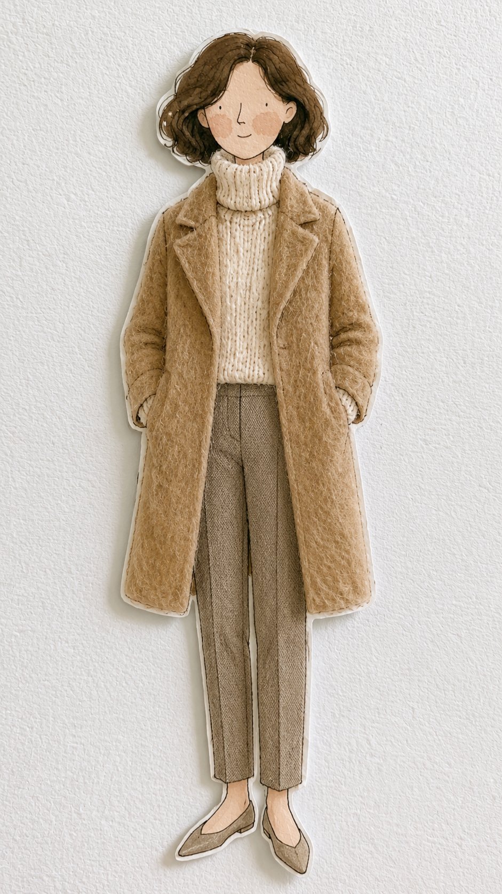

```text
The scene is a full-body portrait of a single character, standing frontally, with a centered composition. The background is clean white space, using a white fine-textured paper background.
The overall style is: watercolor hand-painted + thin black line outlining + paper sticker feel + handmade collage feel, with natural white paper-cut outlines and slight shadows on the character's edges, like a paper puppet/sticker placed on the paper.

Character Settings

Character: [Replaceable: little boy / little girl / young woman / young man / professional woman / middle-aged man / grandmother / grandfather]
Hairstyle: [Replaceable: short hair / long hair / curly hair / bob / twin tails / gray curly hair etc.]
Expression: [Replaceable: smile / happy / shy / surprised / dazed / gentle / quiet]
Facial features are simple and cute: small black dot eyes, faint blush, simple nose lines, minimalist mouth, the overall temperament is warm, soft, and healing.

Clothing Requirements
Clothing emphasizes material textures such as wool, knitting, mohair, cashmere, wool coats, etc.,
to make the clothes present a realistic and obvious fluffy fiber feel, fluffiness, thick knit texture, fine fuzz, and a soft, warm touch.
Tops can be: [Replaceable: sweater / cardigan / turtleneck knit / wool coat / loose knit sweater]
Bottoms can be: [Replaceable: jeans / loose trousers / half skirt / long skirt / dress pants]
Colors use low-saturation gentle palettes: cream white, beige, oatmeal, mist pink, light purple, sage green, caramel, camel, mist blue, dark blue, etc.
Shoes are simple and natural, can be: flats / leather shoes / simple sneakers.

Image Style
Overall image requirements:

Very healing, very cute, very clean

Strong handmade feel
Clear clothing material details
Character proportions are slender but cute
Simple and high-end, not cluttered
No text, no complex backgrounds, no extra props
Suitable for creating a series of character images
```


---

## 例 633：暗黑哥特东亚女战士水墨概念插画

**来源：** [@liluocheng13](https://x.com/liluocheng13/status/2090419449870610864) / [OpenNana](https://opennana.com/awesome-prompt-gallery/dark-gothic-samurai-female-warrior-ink-art)

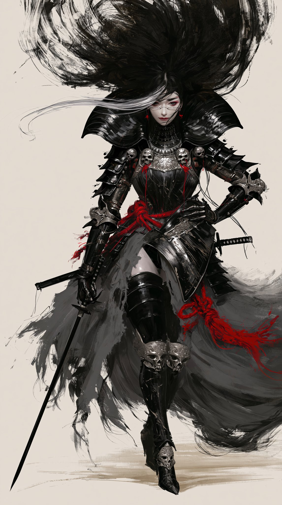

```text
9:16 vertical full-body fantasy character illustration, dark samurai gothic aesthetic, high-fashion warrior design, painterly concept art with expressive ink-brush energy.

A beautiful young East Asian female warrior standing in a powerful three-quarter pose against a minimal warm pale beige-gray background. She has delicate refined facial features, porcelain-pale realistic skin, narrow dark eyes, subtle muted-red eye makeup, soft natural lips, and thin understated eyeglasses. Her expression is calm, cold, detached and quietly dangerous.

Her extremely long black hair explodes upward and outward in the wind, individual strands dissolving into loose ink-like strokes. A striking silver-white streak of hair sweeps horizontally across her face, partially crossing one eye, creating strong directional movement.

She wears elaborate black-and-antique-silver samurai-inspired gothic armor, combining Japanese armor construction with dark fantasy haute couture. Huge sharply raised black shoulder plates, sculptural high collar, layered lacquer-black arm guards, engraved silver fittings, ornate skull-like metallic motifs, fitted black armored corset, asymmetrical hip armor, black thigh-high armored boots and intricate silver knee guards.

The armor is glossy but weathered, with subtle scratches, tarnished silver edges, engraved ornamental metalwork and restrained reflections. Beneath the armor are torn charcoal-gray fabric layers and long sweeping black-gray skirt panels.

Several pieces of vivid saturated crimson-red cords, knots and torn tassels hang from her waist and thigh armor. The red is exceptionally intense and clean — almost cinnabar / blood-crimson — becoming the strongest chromatic accent in an otherwise nearly monochromatic image. Small restrained crimson accents also appear around the eyes and armor details.

She holds a long slender black katana downward in one hand while the other hand grips the dark wrapped hilt of another sword at her hip. The weapons are elegant, extremely elongated and understated rather than oversized.

Her enormous black-gray cloak and skirt dissolve outward into broad, energetic dry-brush ink strokes, sweeping dramatically around the lower half of the composition. Fabric edges partially disappear into abstract painterly gestures, creating the feeling that the warrior herself is emerging from a traditional ink painting.

Strong visual contrast between highly resolved face and armor details and deliberately unresolved expressive brushwork around the silhouette. Sophisticated controlled chaos, localized areas approaching visual abstraction while the character remains perfectly legible.

Minimal background, generous negative space, no scenery, no typography, no symbols, no logo, no watermark, no star icon.

Palette dominated by lacquer black, charcoal gray, gunmetal, antique silver and warm pale gray, punctuated exclusively by brilliant deep crimson-red accents.

Japanese dark-fantasy concept art, contemporary Asian fashion illustration, sumi-e inspired gestural brushwork, elegant gothic samurai aesthetic, extremely intricate armor craftsmanship, realistic metallic reflections, delicate skin rendering, dynamic wind movement, sophisticated composition, cinematic character design, painterly realism, information-dense but visually controlled, masterpiece character concept art.

Aspect ratio 9:16.
```


---

## 例 634：手绘旅行手帐立体水彩插画

**来源：** [@noorwithwifi](https://x.com/noorwithwifi/status/2090158396779766030) / [OpenNana](https://opennana.com/awesome-prompt-gallery/travel-journal-3d-pop-up-watercolor-illustration)

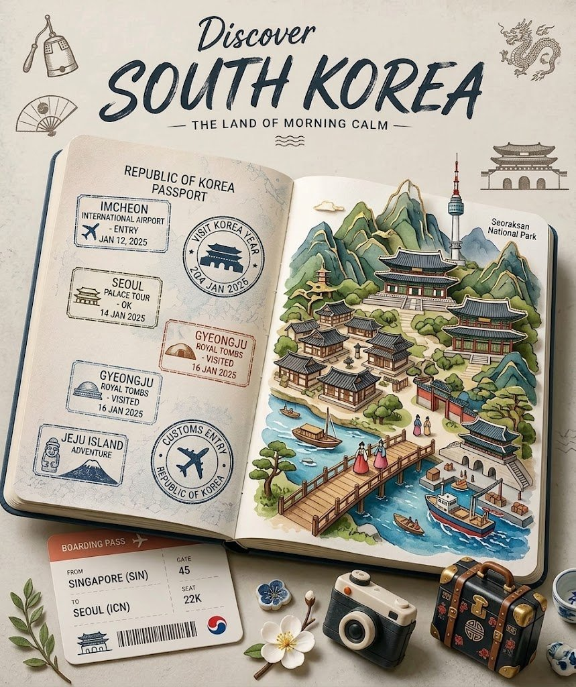

```text
Create an open travel journal for [DESTINATION] on a textured surface, featuring a passport page with [TRAVEL STAMPS/DATES] and a 3D pop-up watercolor scene of [LANDMARKS], [TRADITIONAL ARCHITECTURE], [NATURE], and [LOCAL PEOPLE/CULTURE]. Add [TITLE], [SUBTITLE], and vintage cultural icons around the header. Surround the journal with [BOARDING PASS], [CAMERA], [SUITCASE], [FLOWERS], and [LOCAL ACCESSORIES]. Style: handcrafted travel scrapbook, rich watercolor, delicate ink lines, realistic paper texture, soft shadows, layered pop-up depth, nostalgic and elegant.
```


---

## 例 635：极简手绘涂鸦插画风格

**来源：** [@AiwithLariab](https://x.com/AiwithLariab/status/2090417244073504926) / [OpenNana](https://opennana.com/awesome-prompt-gallery/minimalist-hand-drawn-doodle-illustration-1787238232766)

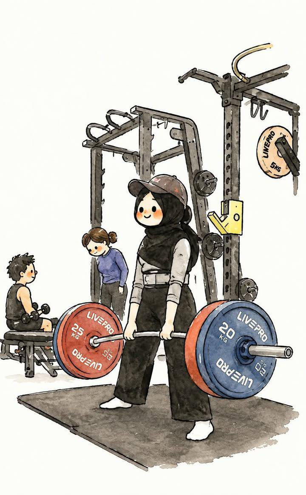

```text
Transform the image into a minimalist hand-drawn doodle illustration. Use simple brush-pen outlines with slightly wobbly, imperfect strokes. Reduce all details to cute, childlike shapes while preserving the main subject and composition. Naive sketchbook aesthetic, playful and whimsical character design, clean white background, minimal linework, expressive simplicity, handmade doodle style, water color ink drawing, charming imperfections, simple cartoon illustration.
```


---

## 例 636：涂鸦墙与几何连衣裙街头时尚人像

**来源：** [@CyberTotal2026](https://x.com/CyberTotal2026/status/2090413790697517099) / [OpenNana](https://opennana.com/awesome-prompt-gallery/graffiti-wall-geometric-dress-street-fashion-portrait)

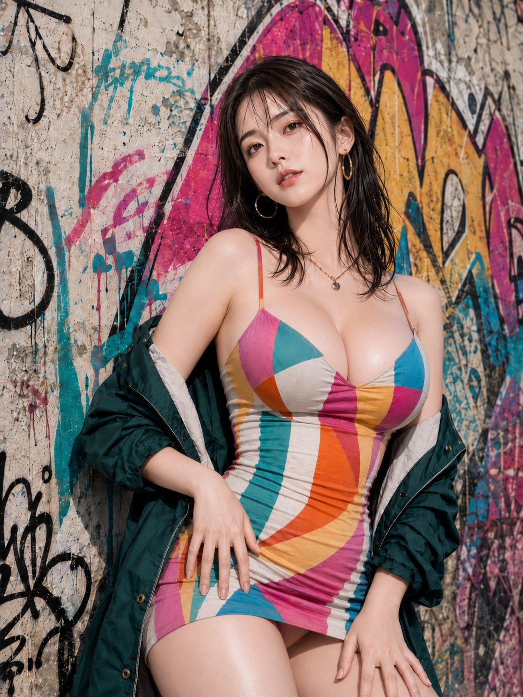

```text
Theme: 
Graffiti Wall and Geometric Dress

Subject: 
A woman in her 20s leaning against a wall filled with peach, yellow, aqua blue, and black graffiti, looking directly forward. The frame is centered above the thighs, depicting a mini dress with multi-colored geometric patterns and a dark green jacket slipping off the shoulders.

Character/Expression: 
A slightly elongated oval face with a small chin, long horizontal brown eyes, thin and soft eyebrows, a straight bridge of the nose, and full upper and lower light coral lips. The face is slightly tilted towards the left side of the frame, staring into the camera with lips slightly parted, presenting a calm expression. Shoulder-length black wet hair with a center-ish part, with small strands of hair sticking to the forehead and cheeks. Large gold hoop earrings.

Clothing/Pose: 
A tight-fitting spaghetti strap mini dress combining thick curves and geometric planes of peach, turquoise, aqua blue, orange, yellow, and white. Clearly depict the deep V-neckline and fine vertical pleats. A thin dark green jacket with a white lining is slipped off both shoulders and worn over the arms. Right hand placed in front of the waist, left hand lightly touching the left thigh, standing while leaning against the wall.

Background/Lighting: 
The background is an old white tile wall overlaid with black lines, thick graffiti of peach, yellow, turquoise, and dripping paint. Soft bright light is projected from directly above, uniformly illuminating the face and chest, creating short shadows on the wall.

Composition/Lens: 
Vertical 3:4 aspect ratio. A close-up portrait from above the thighs taken from a frontal shot at eye level. The character is centered and enlarged, including from the top of the head to the upper thighs, with arms and jacket at the left and right edges of the frame, and the thighs cut off at the bottom. Eyes and dress are in sharp focus, and the wall is also relatively clear.

Texture/Style: 
A photorealistic realistic photo in street fashion style. High-definition depiction of wet hair, skin luster, wrinkles in elastic fabric, nylon jacket, old tiles, and thick paint.

Negative Prompt: 
Significant changes to the face and wet hair; simplification of multi-colored geometric patterns
```


---

## 例 637：东方神祇御兽工笔圣像插画

**来源：** [@MrLarus](https://x.com/MrLarus/status/2089606017944289789) / [OpenNana](https://opennana.com/awesome-prompt-gallery/oriental-deity-mythical-beast-gongbi-icon-illustration)

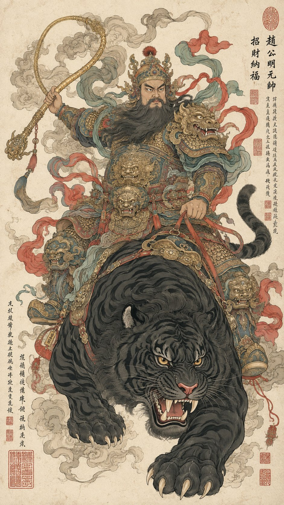

```text
[Replaceable Content]

Deity Identity: [e.g.: Zhao Gongming / Zhenwu Emperor / Erlang Zhenjun / Self-created Divine General]
Spirit Beast Type: [Black Tiger / Divine Dog / Black Tortoise and Snake / Thunder Lion / Qilin, etc.]
Weapon / Dharma Vessel: [Spear / Divine Sword / Thunder Hammer / Iron Whip / Staff, etc.]
Main Color Palette: [Mysterious Black Bronze Gold / Mineral Blue Silver Gray / Cinnabar Dark Gold, etc.]
Overall Temperament: [Majestic / Evil-suppressing / Thunderous / Stern / Sacred / Hunting Sensation]
Composition Direction: [Frontal Suppression / Diagonal Impact / Surrounding and Circling / Side-by-side Battle]
Aspect Ratio: [9:16]

Generate an illustration of an Oriental deity riding a mythical beast, overall integrating the visual language of traditional Chinese deity paintings, Gongbi heavy color, white-line drawing (Bai Miao), folk woodblock prints, and ancient scripture holy icon scrolls.

The screen uses "Deity + Spirit Beast" as the dual subject. The deity serves as the core visual subject, while the spirit beast has a large enough volume and presence. A clear movement relationship is formed between the two, which can be riding, guarding, fighting side-by-side, or surrounding and protecting, rather than a simple collage.

The character's face is majestic, divine, and possesses a sense of oppression, avoiding modern idol faces and excessive demonization. The clothing adopts high-completion traditional divine general armor or dharma robes, incorporating precise decorations such as cloud patterns, thunder patterns, beast face patterns, scale armor patterns, and acanthus patterns. The details are rich, but the character's overall silhouette must be clear.

The spirit beast has the temperament of a divine beast, spiritual beast, or evil-suppressing mount, with a robust physique and powerful posture. Hair, scales, turtle shells, etc., are shaped through a large number of fine and directional lines, emphasizing the ancient Gongbi texture of "shaping through lines," rather than photographic hair or 3D CG texture.

Weapons / Dharma vessels must participate in the composition, forming clear diagonal lines, vertical lines, or main action axes. The character's posture avoids stiff standing; movements such as twisting the body, pressing shoulders, leaning forward, holding weapons, performing mudras, patrolling, or attacking can be added, giving the entire image a clear "momentum."

Add an appropriate amount of silk ribbons, clothing hems, crown tassels, hair/beard, clouds, smoke, or water mist, which together with the character's movements form S-shaped, C-shaped, or swirling streamlines. Flowing elements should serve the theme and not be piled up just for richness.

The background maintains ancient Xuan paper white space, using rice white, ivory white, or old paper color as the base, adding only a small amount of inscriptions, red seals, cloud patterns, or smoke, creating a sense of an ancient scripture holy icon scroll. Avoid complex palaces, battlefields, and complete landscape backgrounds.

The colors use a low-saturation mineral color system, centered on the [Main Color Palette], and can be matched with ink black, dark blue, mineral blue, mineral green, bronze gold, old gold, cinnabar, ochre red, grayish white, and other colors. The overall effect is ancient, elegant, and restrained, with a small amount of high-saturation colors to lift the spirit.

The final image should simultaneously possess: the solemnity of Oriental deities, the sense of oppression from spirit beasts, the complexity of Gongbi line drawing, the tranquility of ancient Xuan paper, and a clear and powerful compositional momentum.

Avoid: modern Guochao neon, cyber style, 3D game concept art feel, plastic CG feel, overly full background, stiff characters, ordinary spirit beasts, loose lines, and excessive garbled text.
```


---

## 例 638：手绘冷幽默荒诞单幅插画

**来源：** [@JoywDan](https://x.com/JoywDan/status/2092619049184498066) / [OpenNana](https://opennana.com/awesome-prompt-gallery/hand-drawn-deadpan-absurd-chibi-illustration)

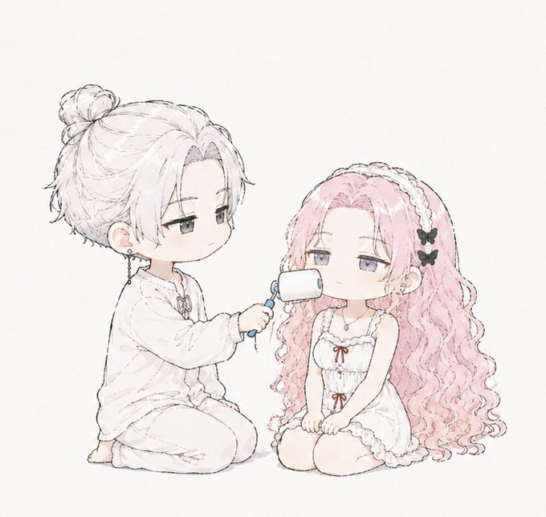

```text
Hand-drawn deadpan absurd single-panel illustration, square composition, two adult chibi characters sitting together in formal seiza on the right side.
One character calmly uses a pale-blue sticky lint roller to roll the other character’s cheek, as casually as cleaning a countertop. The roller surface is parallel to the face. Both characters have completely blank, vacant expressions, tiny dot eyes and flat mouths, no reaction.

Slightly wobbly ink outlines, uneven marker and colored-pencil fill, faint paper grain, muted pastel palette, handmade zine aesthetic.

No background objects, no text, no speech bubbles, no manga symbols, no exaggerated expressions, no 3D/CGI, no glossy mascot style.
```


---

## 例 639：纸雕风格城市旅游明信片插画

**来源：** [@Maercihh](https://x.com/Maercihh/status/2090024532518277375) / [OpenNana](https://opennana.com/awesome-prompt-gallery/universal-city-travel-postcard-papercut-illustration)

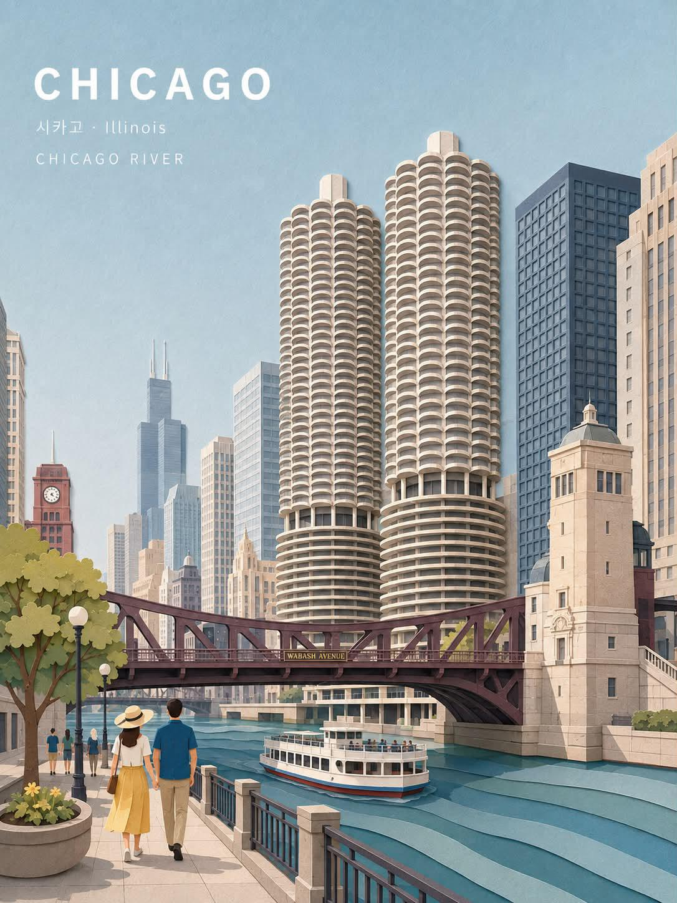

```text
{
"prompt_type": "universal_city_travel_postcard",

"variable": {
"city": "ENTER CITY NAME HERE"
},

"instruction": "Create a premium illustrated travel postcard for the city provided in the variable. The city is the ONLY user-provided creative variable. Everything else must be intelligently researched, inferred, selected, and generated specifically for that city. Do not require a reference image.",

"city_reasoning": {
"first_determine": [
"officially recognizable city name",
"country",
"state, province, territory, or region when applicable",
"local-language spelling or transliteration",
"one iconic landmark strongly associated with the city",
"one authentic environment or viewpoint where that landmark naturally belongs",
"distinctive surrounding architecture",
"important local geographic features",
"appropriate vegetation and landscape",
"appropriate transportation or human activity",
"a secondary recognizable city feature if compositionally useful"
],

"landmark_selection": {      
  "rule": "Automatically choose the single most visually recognizable landmark or architectural symbol of the specified city.",      
  "priority": [      
    "globally recognizable city landmark",      
    "strongly city-specific architecture",      
    "distinctive skyline feature",      
    "iconic monument",      
    "famous bridge",      
    "historic structure",      
    "recognizable natural landmark when it is the defining visual identity of the city"      
  ],      
  "do_not": [      
    "combine landmarks from different cities",      
    "invent fictional landmarks",      
    "use a generic building when a recognizable landmark exists",      
    "place the landmark in an impossible geographic setting"      
  ]      
}

},

"fixed_visual_identity": {
"style": "elegant handcrafted paper-cut travel illustration",
"medium": "layered textured paper collage combined with refined editorial illustration",
"aesthetic": "premium vintage tourism poster, sophisticated collectible postcard",
"mood": "calm, nostalgic, inviting, picturesque, refined",
"visual_language": [
"layered paper construction",
"subtle physical paper depth",
"soft paper shadows",
"matte printed texture",
"visible tactile paper grain",
"clean simplified shapes",
"delicate atmospheric perspective",
"restrained pastel colors",
"carefully composed architectural silhouettes",
"slightly handcrafted edges"
],

"important": "The style must remain consistent regardless of which city is entered. Only the city-specific content changes."

},

"composition": {
"aspect_ratio": "4:5",
"orientation": "vertical",
"format": "premium destination travel postcard",
"visual_hierarchy": [
"large open sky",
"upper-left typography",
"dominant iconic landmark",
"recognizable city environment",
"layered foreground",
"small human figures for scale and atmosphere"
],

"sky": {      
  "coverage": "approximately upper 30-40 percent",      
  "color": "soft powder blue",      
  "texture": "subtle fine paper grain",      
  "clouds": "minimal layered cream paper clouds",      
  "rule": "Keep sufficient negative space for typography and do not overcrowd the sky."      
},      
  
"landmark": {      
  "position": "dominant central or slightly off-center focal point",      
  "scale": "large enough to immediately identify the city",      
  "silhouette": "architecturally accurate",      
  "detail": "recognizable but artistically simplified",      
  "depth": "clearly separated from foreground and background"      
},      
  
"foreground": {      
  "purpose": "create depth and a lived-in travel experience",      
  "automatically_select": [      
    "viewpoint railing",      
    "promenade",      
    "park",      
    "street",      
    "waterfront",      
    "terrace",      
    "hilltop overlook",      
    "historic pedestrian area"      
  ],      
  "selection_rule": "Choose whichever foreground environment naturally complements the selected landmark and is believable for the specified city."      
},      
  
"background": {      
  "include": [      
    "city skyline when appropriate",      
    "recognizable local buildings",      
    "natural geography",      
    "water when geographically appropriate",      
    "hills or mountains when geographically appropriate",      
    "trees and landscape"      
  ],      
  "rule": "Background elements must support the city's identity without competing with the primary landmark."      
}

},

"city_specific_environment": {
"architecture": {
"rule": "Automatically generate surrounding architecture characteristic of the specified city.",
"accuracy": "Buildings should look plausibly local in scale, materials, proportions, age, and architectural vocabulary."
},

"geography": {      
  "rule": "Automatically incorporate important geographic features only when genuinely associated with the city.",      
  "examples": [      
    "coastline",      
    "river",      
    "lake",      
    "mountains",      
    "hills",      
    "valleys",      
    "desert",      
    "forest",      
    "plains"      
  ]      
},      
  
"vegetation": {      
  "rule": "Automatically choose vegetation appropriate to the city's climate and region.",      
  "style": "soft layered paper-cut foliage"      
},      
  
"transportation": {      
  "rule": "Optionally include one subtle recognizable local transportation element when it strengthens city identity.",      
  "examples": [      
    "tram",      
    "streetcar",      
    "ferry",      
    "subway entrance",      
    "cable car",      
    "double-decker bus",      
    "trolley",      
    "boat"      
  ],      
  "restriction": "Never add transportation merely for decoration if it is not appropriate to the city."      
},      
  
"people": {      
  "include": true,      
  "quantity": "small and sparse",      
  "style": "simplified paper-cut travelers and pedestrians",      
  "poses": [      
    "walking",      
    "looking at the landmark",      
    "standing at an overlook",      
    "sitting",      
    "casually sightseeing"      
  ],      
  "rule": "People are environmental storytelling elements, not the primary subject."      
}

},

"color_system": {
"base_palette": [
"powder blue",
"warm ivory",
"cream",
"muted sage",
"olive green",
"dusty gray",
"soft beige",
"desaturated terracotta"
],
"city_adaptation": "The palette may subtly adapt to the city's natural and architectural colors while preserving the same soft pastel editorial aesthetic.",
"saturation": "low to medium",
"contrast": "soft",
"avoid": [
"neon colors",
"extreme saturation",
"harsh black shadows",
"high-contrast HDR appearance"
]
},

"lighting": {
"time": "pleasant daytime",
"quality": "soft diffuse natural light",
"atmosphere": "slightly hazy and peaceful",
"shadows": "soft layered paper shadows",
"highlight_behavior": "gentle matte highlights",
"overall_effect": "warm, calm, cinematic travel-poster atmosphere"
},

"typography": {
"placement": "upper-left",
"hierarchy": "city name largest, location second, landmark third",

"city_name": {      
  "content": "{{CITY_NAME}}",      
  "case": "uppercase",      
  "font": "clean modern geometric sans-serif",      
  "weight": "bold",      
  "size": "large",      
  "letter_spacing": "wide",      
  "color": "warm white"      
},      
  
"location_line": {      
  "content": "{{LOCAL_CITY_NAME}} · {{STATE_REGION_OR_COUNTRY}}",      
  "font": "clean minimalist sans-serif",      
  "weight": "regular",      
  "size": "small",      
  "letter_spacing": "moderate",      
  "color": "warm white"      
},      
  
"landmark_line": {      
  "content": "{{PRIMARY_LANDMARK_NAME}}",      
  "font": "clean minimalist sans-serif",      
  "weight": "regular",      
  "size": "small",      
  "letter_spacing": "very wide",      
  "case": "uppercase",      
  "color": "warm white"      
},      
  
"language": {      
  "rule": "Automatically determine an appropriate local-language representation of the city when useful. Preserve the primary city name in universally recognizable Latin characters unless the city convention strongly favors another script.",      
  "accuracy": "All visible text must be correctly spelled."      
}

},

"paper_material": {
"paper": "high-quality matte art paper",
"grain": "fine subtle tactile grain",
"layers": "multiple visibly separated paper layers",
"edges": "slightly imperfect handcrafted cut edges",
"depth": "subtle realistic paper-layer separation",
"printing": "premium vintage offset-print character",
"finish": "soft matte archival postcard"
},

"camera_and_perspective": {
"viewpoint": "cinematic elevated travel viewpoint",
"perspective": "natural architectural perspective",
"lens_feel": "40-50mm equivalent",
"distortion": "minimal",
"framing": "balanced and carefully art-directed",
"depth": "strong foreground, middle-ground, background separation"
},

"image_quality": {
"resolution": "high resolution",
"detail": "high-quality handcrafted illustration detail",
"architecture": "clean and structurally coherent",
"composition": "professional tourism campaign quality",
"consistency": "every object must belong to the same physical paper-cut world"
},

"negative_prompt": [
"photorealistic photography",
"3D CGI",
"plastic rendering",
"generic AI illustration",
"generic city skyline",
"wrong landmark",
"landmark from another city",
"fictional architecture",
"geographically impossible composition",
"duplicated landmarks",
"distorted buildings",
"warped architecture",
"random skyscrapers",
"incorrect local geography",
"oversaturated colors",
"neon colors",
"glossy surfaces",
"anime",
"cartoon caricature",
"flat vector art",
"excessive outlines",
"busy composition",
"too many people",
"large people",
"foreground subject blocking landmark",
"incorrect typography",
"misspelled city name",
"random text",
"watermark",
"logo",
"UI elements",
"border",
"frame"
],

"final_generation_rule": "Generate the entire scene dynamically from the city variable. If the user enters Paris, create a Paris-specific scene; if they enter Tokyo, create a Tokyo-specific scene; if they enter Mumbai, create a Mumbai-specific scene, etc. Automatically select the most recognizable landmark, authentic surrounding environment, appropriate architecture, geography, vegetation, transportation, typography, and secondary details. Never copy the visual contents of another city. Preserve the fixed paper-cut postcard aesthetic, composition quality, typography hierarchy, pastel palette, tactile texture, and premium editorial finish across every city."
}
```


---

## 例 640：现代扁平时尚社论插画肖像

**来源：** [@HustleXR](https://x.com/HustleXR/status/2088868910959636937) / [OpenNana](https://opennana.com/awesome-prompt-gallery/contemporary-flat-editorial-portrait-illustration)

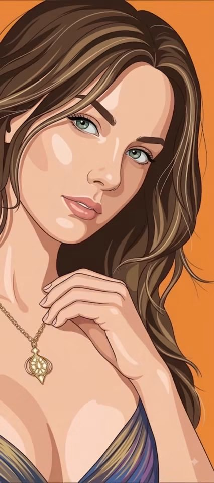

```text
Created with good Gemini nano banana  

Contemporary flat editorial portrait illustration style, combining refined semi-realistic character drawing with clean graphic shapes and elegant digital linework. Smooth, polished facial anatomy, expressive eyes, simplified realistic features, clean confident contours, and carefully controlled stylized proportions.

Use flat color blocking with subtle tonal separation, clean solid shapes, crisp edges, and minimal painterly texture. Hair is rendered as layered graphic masses with selective fine strands and elegant flowing accents. Skin is smooth and softly stylized, with simplified highlights and shadows while retaining a sophisticated illustrated appearance. Clothing uses clean flat fills with restrained folds and graphic shadow shapes.

Overall aesthetic: modern fashion editorial illustration + polished digital portrait + contemporary graphic art, clean, elegant, feminine, sophisticated, and highly refined.

Background: a completely flat, solid orange field, uniform from edge to edge, with no texture, pattern, objects, scenery, gradient, vignette, or shadows.

Aspect ratio 9:16 vertical.

Avoid photorealism, 3D rendering, excessive texture, painterly brushwork, complex background elements, and unnecessary detail. The emphasis is on clean shapes, elegant linework, flat colors, simplified dimensionality, and a premium contemporary illustration finish.
```


---

## 例 641：书籍拼贴微缩插画风格

**来源：** [@Gdgtify](https://x.com/Gdgtify/status/2088893523743388077) / [OpenNana](https://opennana.com/awesome-prompt-gallery/four-famous-books-editorial-miniature-illustration-prompt)

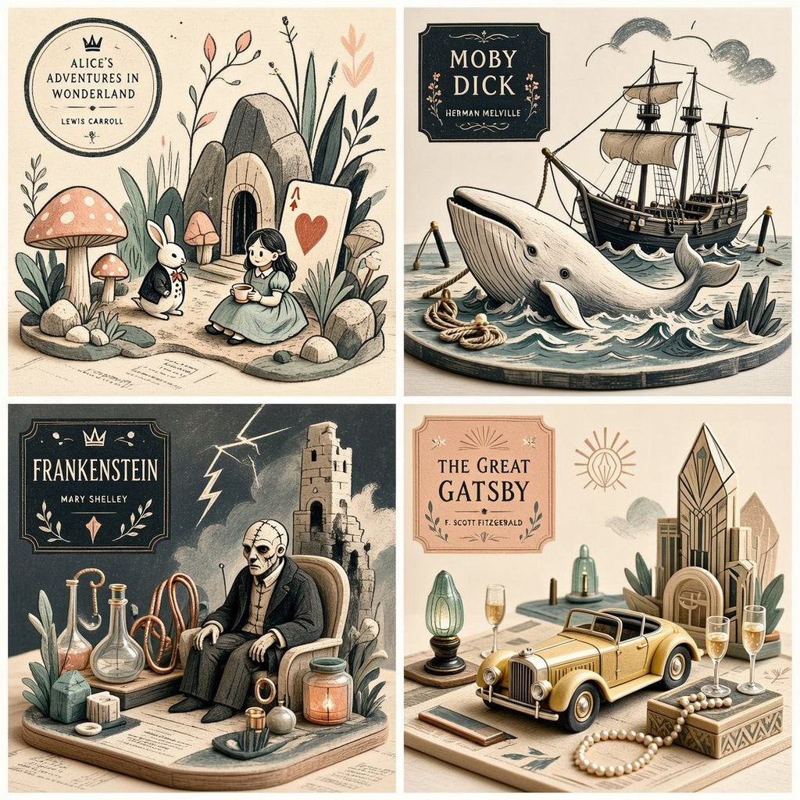

```text
2x2 grid, 1:1 do this for 4 famous books<transformation> - Preserve the subject’s recognizable structure, but reinterpret it as a stylized editorial composition where drawing and miniature object-world logic coexist. - Convert some forms into sparse grainy line illustration while converting other forms into soft pastel miniatures or still-life objects. - Reinterpret texture-rich or detailed areas as small clusters of plants, props, vessels, terrain fragments, or decorative micro-world motifs. - Convert smooth surfaces into matte pastel color fields, while using graphic linework to describe edges, volume, and texture selectively. - Reduce complexity into a limited color system with one dominant graphic ink tone and a few quiet pastel support colors. - Replace deep realism with poster-like clarity, paper-print tactility, and curated tabletop arrangement. - Allow the subject to feel partially drawn and partially physically staged, creating a deliberate ambiguity between illustration and object. - Use negative space and sparse composition to keep the image clean, modern, and highly readable. </transformation> <shape_language> - Favor simple containers, rounded objects, leaves, stems, pebbles, tabletop silhouettes, miniature clusters, and clean abstract forms. - Use a mix of flat contour areas and soft low-relief sculptural accents. - Keep repetition rhythmic and decorative. - Let small details feel intentional and editorial rather than busy. </shape_language> <rendering_rules> - Use visibly grainy printed or crayon-like marks for lines and texture accents. - Keep volumetric forms soft, simplified, and pastel. - Limit the palette aggressively for a designed, print-friendly look. - Use shallow spatial depth with subtle diorama hints. - Make the final result feel like an art print, a magazine illustration, and a miniature set all at once. </rendering_rules> <finish> - Graphic limited-palette editorial hybrid. - Printmaking texture fused with soft pastel mini-world staging. - Smart, modern, collectible, and quietly distinctive. </finish> <avoid> - Avoid photoreal rendering. - Avoid deep cinematic perspective or strong realism. - Avoid overstuffing with too many tiny details. - Avoid using too many colors; keep it controlled and designed. </avoid>
```


---
