# 摄影与写实 — 提示词合集


> 258 个案例

---

## 例 28：写实摄影风格创作

**来源：** [@frankfu1688](https://x.com/frankfu1688)

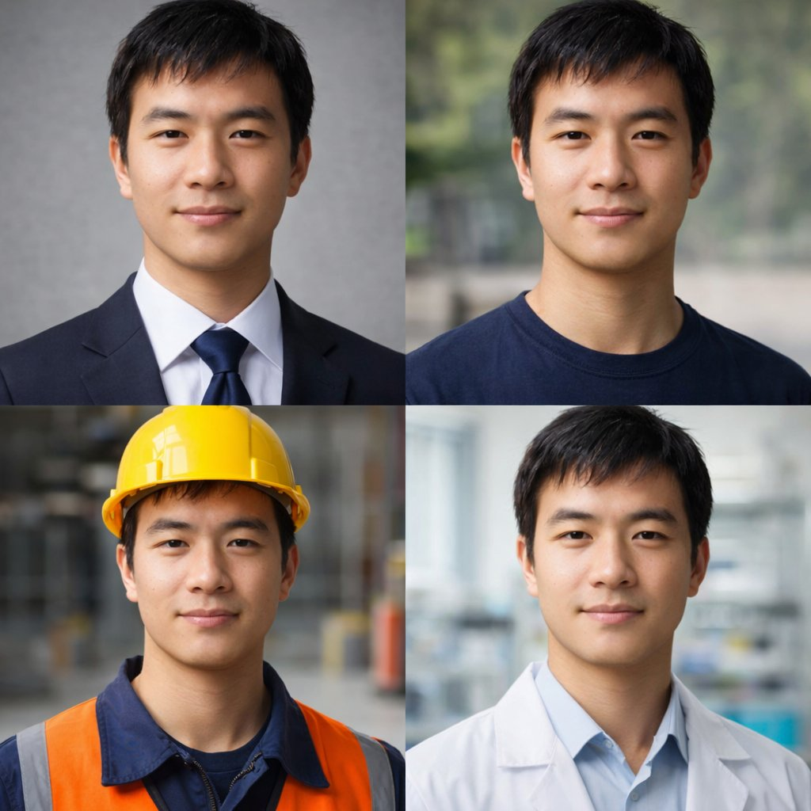


```text
{
  "type": "2x2 portrait grid",
  "subject": "{argument name=\"subject description\" default=\"young adult East Asian male with short black hair and a slight smile\"}",
  "style": "photorealistic, high-resolution, professional lighting, consistent facial identity across all panels",
  "layout": {
    "format": "2x2 grid",
    "panel_count": 4,
    "panels": [
      {
        "position": "top-left",
        "description": "{argument name=\"profession 1\" default=\"Corporate professional wearing a dark navy suit, white shirt, and blue tie against a gray textured background\"}"
      },
      {
        "position": "top-right",
        "description": "{argument name=\"profession 2\" default=\"Casual attire wearing a dark blue crew neck t-shirt against a blurred outdoor park background\"}"
      },
      {
        "position": "bottom-left",
        "description": "{argument name=\"profession 3\" default=\"Construction worker wearing a yellow hard hat, navy blue work shirt, and bright orange high-visibility vest against a blurred warehouse background\"}"
      },
      {
        "position": "bottom-right",
        "description": "{argument name=\"profession 4\" default=\"Medical professional wearing a white lab coat over a light blue collared shirt against a blurred laboratory background\"}"
      }
    ]
  }
}
```


---

## 例 30：写实摄影风格图

**来源：** [@opc\_8838](https://x.com/opc_8838)


```text
Express [{argument name="subject" default="a powerful AI builder"}] in a graffiti sketch style, presenting an overall visual effect of rapid sketching, free transformation, improvised hand-drawing, and draft-like qualities. Lines are casual, exaggerated, varied in thickness, slightly messy but rhythmic and expressive, emphasizing generalization, exaggeration, fun, and spontaneity rather than rigorous realism or fine detail. Colors use rough, dry-brush block expressions, retaining uneven smears, brush marks, flying whites, and overlapping feelings. Colors automatically adapt to the [theme/subject], but the overall expression remains graffiti-like, sketch-like, and generalized. No transparent watercolor smudging, no delicate watercolor transitions, no paper textures, no soft atomization, and no dreamlike quality. The background is mainly white space, remaining simple, relaxed, unfinished, and design-oriented. A small amount of auxiliary symbols, arrows, marks, circles, repeated lines, handwritten text, or other graffiti elements can be added to enhance the sketchbook or essay-like visual language, but should not be too crowded or destroy the subject and atmosphere of the white space. The image content does not need to be written in advance; the [{argument name="subject" default="a powerful AI builder"}] will automatically deduce and generate the most suitable main image, actions, related elements, symbols, or simplified scenes. The whole maintains a unified graffiti sketch style and exaggerated generalized expression, avoiding complex realistic backgrounds and over-elaboration. Naturally add a unique signature "{argument name="signature" default="BlanPlan"}" as part of the image, placed discreetly but clearly in the lower-left, lower-right, or near the title. The style should be unified with the overall layout, like an artist's signature or design inscription; the signature font should be refined, restrained, and high-end, not too large, not destructive to the main composition, and not appearing abrupt or cheap.
```


---

## 例 31：人像写实摄影图

**来源：** [@jun\_kongo](https://x.com/jun_kongo)

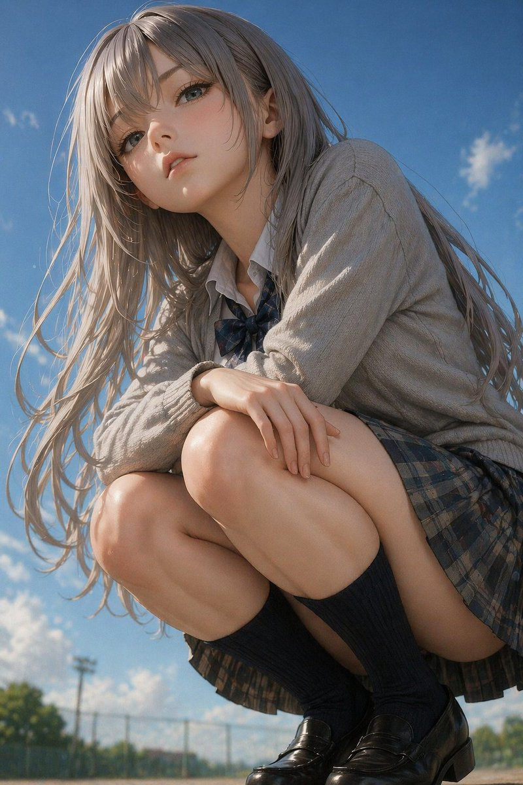


```text
A highly detailed, photorealistic anime-style portrait of a young woman crouching down and looking slightly down at the camera from a low angle. She has long, flowing {argument name="hair color" default="ash-blonde"} hair blowing gently in the wind, pale skin, and large, expressive eyes. She is wearing a {argument name="outfit" default="Japanese school uniform with a light grey cardigan, white shirt, dark plaid bow tie, dark plaid pleated skirt, dark knee-high socks, and black leather loafers"}. Her arms are resting casually on her knees. The background is a bright {argument name="sky condition" default="clear blue sky with scattered white clouds"}, with a blurred {argument name="background setting" default="chain-link fence and green trees"} visible at the very bottom, suggesting a schoolyard. The lighting is bright, natural daylight with soft, cinematic shadows, emphasizing the realistic textures of her clothing and skin.
```


---

## 例 35：人像写实摄影图

**来源：** [@kazmaendo](https://x.com/kazmaendo)

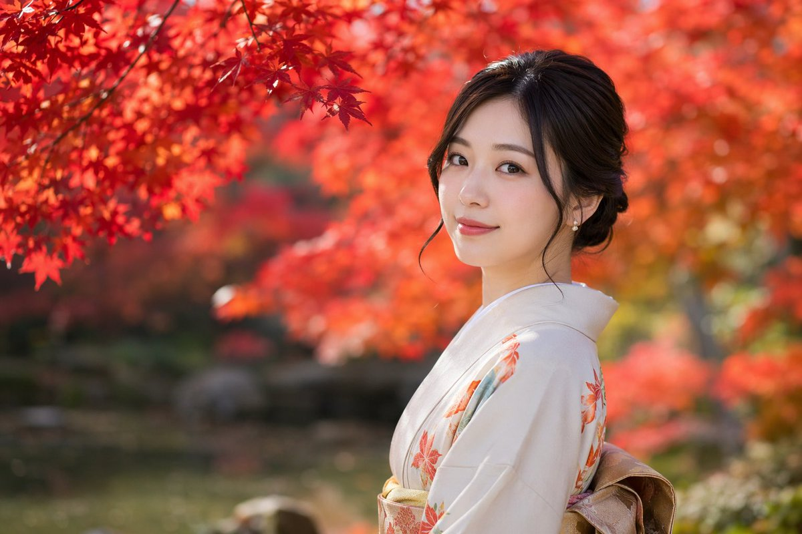


```text
A {argument name="photography style" default="photorealistic portrait with shallow depth of field and soft bokeh"} of a {argument name="subject" default="young Japanese woman"} looking back over her shoulder at the camera with a {argument name="expression" default="gentle smile"}. She is wearing a {argument name="attire" default="light beige kimono with orange maple leaf patterns"} and a gold obi. Her dark hair is styled in an elegant updo with loose strands framing her face, and she wears small pearl earrings. The background features an {argument name="setting" default="autumn garden with vibrant red maple leaves"}, with bright red foliage framing the top left and a heavily blurred, soft background creating a serene, cinematic atmosphere.
```


---

## 例 42：写实摄影风格图

**来源：** [@blanplan](https://x.com/blanplan)


```text
Express {argument name="subject" default="a powerful AI builder"} in a graffiti sketch style, presenting an overall visual effect of quick outlines, free deformation, improvised hand-drawing, and draft-like sketches. The lines are casual, exaggerated, varying in thickness, and slightly messy but rhythmic and expressive, emphasizing generalization, exaggeration, fun, and spontaneity rather than rigorous realism or fine detail. The colors are expressed in rough blocks with a distinct dry-brush feel, retaining uneven smears, brush marks, fly-white, and layering. Colors automatically adapt to the {argument name="theme" default="powerful AI builder"}, but the overall expression remains graffiti-like, sketch-like, and generalized. No transparent watercolor smudging effects, no delicate watercolor transitions, no paper textures, no soft atomization, and no dreamy textures. The background is mainly white space, maintaining a sense of simplicity, ease, unfinishedness, and design. Small amounts of auxiliary symbols, arrows, marks, circles, repeated lines, handwritten text, or other graffiti elements can be added to enhance the sketchbook or essay-like visual language, but they should not be too crowded or destroy the subject and the white space atmosphere. The content of the picture does not need to be written in advance; {argument name="character image" default="a powerful AI builder"} will automatically deduce and generate the most suitable main image, actions, related elements, symbols, or simplified scenes. The overall style remains a unified graffiti sketch style and an exaggerated, generalized expression, avoiding complex realistic backgrounds and excessive detail. A special signature 'BlanPlan' should be naturally added as part of the picture, in a low-key but clear position such as the bottom left, bottom right, or near the title. The style should be unified with the overall layout, like an artist's signature or a design mark; the signature font should be exquisite, restrained, and high-end, not too large, and should not destroy the main composition or appear abrupt or cheap.
```


---

## 例 45：人像写实摄影图

**来源：** [@AoYe999](https://x.com/AoYe999)

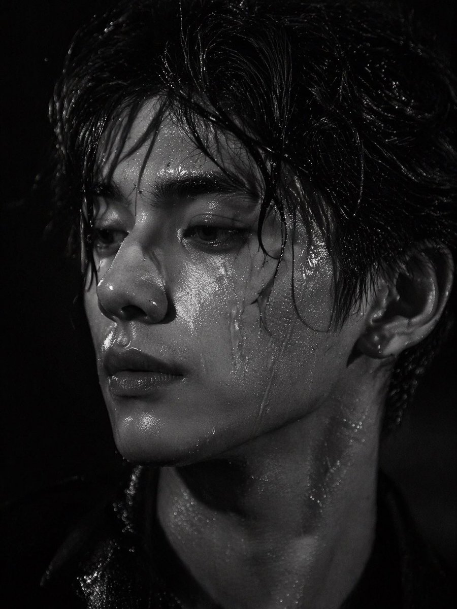


```text
A striking black and white close-up portrait of a {argument name="subject description" default="handsome young Asian man"} with {argument name="hair style" default="messy wet hair sticking to his forehead"}. His face and neck are glistening, covered in highly detailed {argument name="skin texture detail" default="water droplets and sweat"}. He has an intense, melancholic gaze directed off-camera to the left. The lighting is dramatic and high-contrast, emphasizing his sharp jawline, full lips, and specular highlights on the wet skin against a {argument name="background" default="pitch-black background"}. Shot in a photorealistic, high-fashion editorial style with cinematic chiaroscuro.
```


---

## 例 52：写实摄影风格图

**来源：** [@nicdunz](https://x.com/nicdunz)

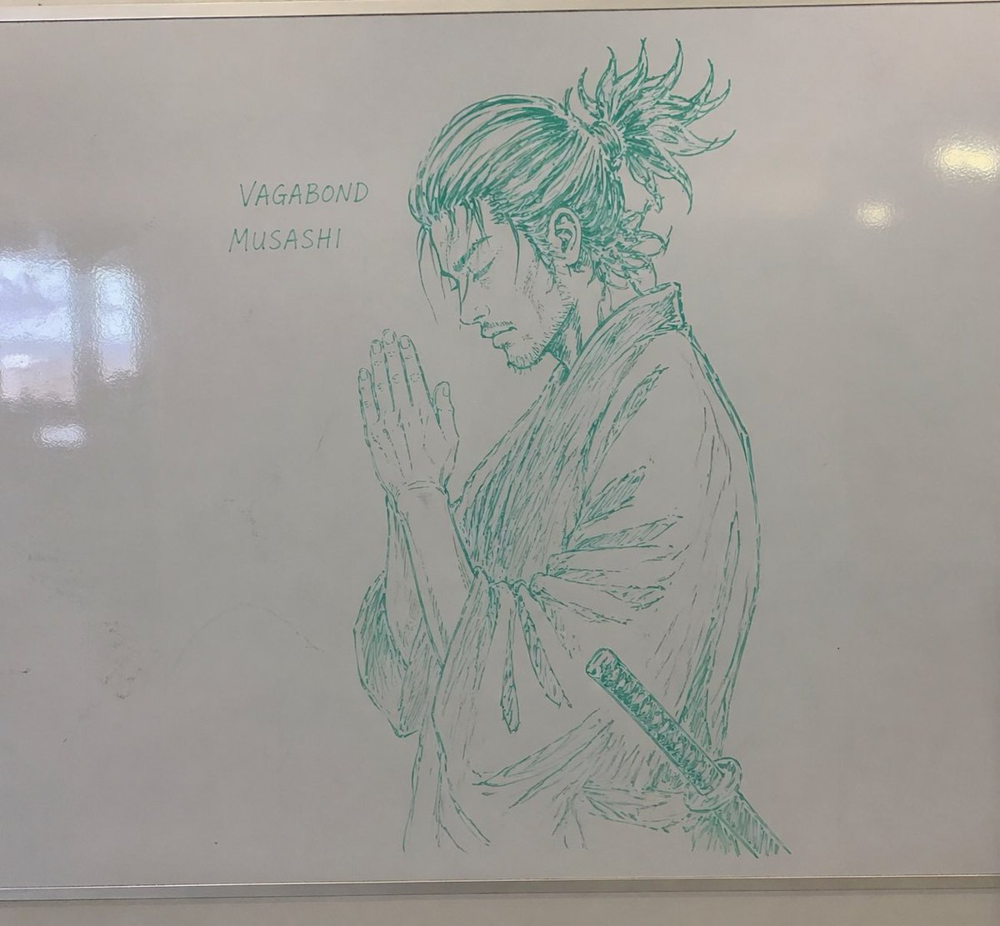


```text
A realistic photograph of a whiteboard with a highly detailed {argument name="marker color" default="green"} dry-erase marker drawing of {argument name="subject" default="a samurai with a messy topknot and facial hair, hands clasped in prayer"}. The character is drawn in a {argument name="art style" default="detailed manga sketch"} style, shown in profile with eyes closed, wearing a traditional kimono with a katana tucked into his belt. To the left of the character, handwritten text in all-caps reads "{argument name="text line 1" default="VAGABOND"}" with "{argument name="text line 2" default="MUSASHI"}" written directly below it. The whiteboard has a glossy surface with realistic light reflections and glare on the left side, and a thin metallic frame is visible at the bottom edge, giving the impression of an authentic classroom or office environment.
```


---

## 例 56：写实摄影风格创作

**来源：** [@danieldmai](https://x.com/danieldmai)

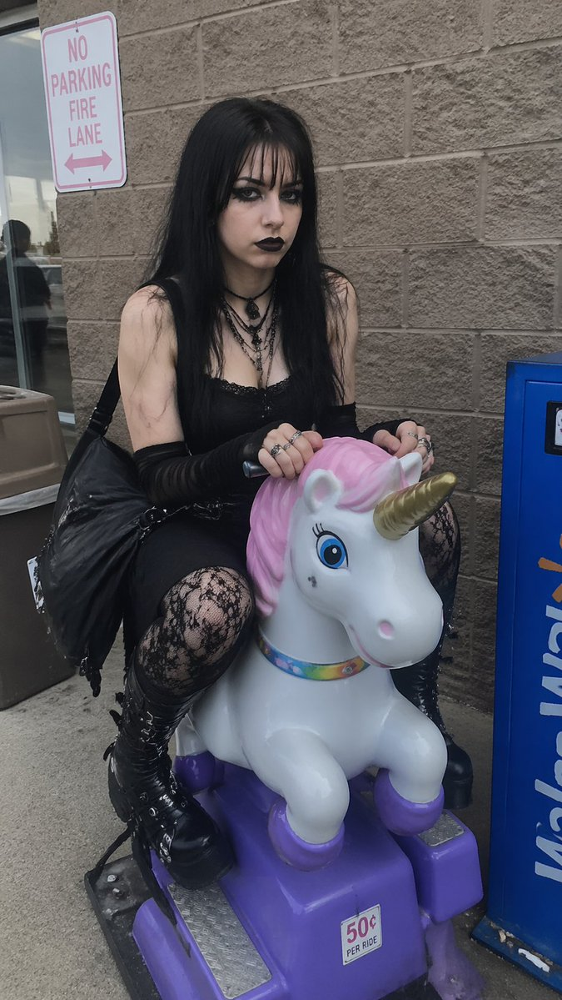


```text
A candid, realistic photograph of a young {argument name="subject aesthetic" default="goth"} woman with pale skin, long straight black hair with bangs, heavy black eyeliner, and black lipstick. She has a {argument name="expression" default="deadpan"} expression, looking directly at the camera while sitting on a children's coin-operated {argument name="ride type" default="unicorn"} ride. She is wearing a black lace-trimmed tank top, black arm warmers, layered necklaces including a choker, black lace tights, and chunky black platform boots with buckles. A large black shoulder bag hangs from her arm. The ride is a white unicorn with a pink mane, gold horn, and purple hooves, mounted on a purple base with a small sticker reading "{argument name="ride cost" default="50¢ PER RIDE"}". The setting is outside a store with a tan cinderblock wall. To the left is a glass door reflecting a person, a brown trash can, and a white sign with red text reading "{argument name="sign text" default="NO PARKING FIRE LANE"}". To the right is a blue vending machine. Overcast, natural daylight.
```


---

## 例 81：写实摄影风格图

**来源：** [@HumanOS\_v2](https://x.com/HumanOS_v2)


```text
{
  "type": "scientific hardware diagram",
  "layout": {
    "main_scene": "3D render of an optical table with a red laser beam passing through 11 aligned optical components mounted on black posts.",
    "top_brackets": [
      {"label": "Dual Modulation", "span": "SLM1"},
      {"label": "4f Relay Optics", "span": "Lens L1 to Lens L2"},
      {"label": "Imaging Optics", "span": "SLM2 to Lens L4"},
      {"label": "Detection", "span": "Camera"}
    ],
    "optical_components_left_to_right": [
      {"name": "Laser", "labels": ["Laser", "λ = {argument name=\"laser wavelength\" default=\"632.8 nm\"}"]},
      {"name": "SLM1", "labels": ["SLM1", "(Phase / Pol. Mod.)"]},
      {"name": "Lens L1", "labels": ["Lens L1", "(f1)"]},
      {"name": "Iris", "labels": ["Fourier Plane", "(Pupil Plane)", "Iris", "(Higher Orders Filtered)"]},
      {"name": "HWP", "labels": ["HWP", "(λ/2)"]},
      {"name": "Lens L2", "labels": ["Lens L2", "(f1)"]},
      {"name": "SLM2", "labels": ["SLM2", "(Phase / Pol. Mod.)"]},
      {"name": "Lens L3", "labels": ["Lens L3", "(f2)"]},
      {"name": "Lens L4", "labels": ["Lens L4", "(f2)"]},
      {"name": "Linear Polarizer", "labels": ["Linear", "-Polarizer", "(Global Analyzer)"]},
      {"name": "Polarization Camera", "labels": ["POLARIZATION CAMERA"]}
    ],
    "inset_box": {
      "position": "bottom right",
      "title": "Polarization Camera Micro-Polarizer Array (Per-Pixel Analyzer)",
      "grid": "4x4 grid of colored squares with directional arrows",
      "legend_count": 4,
      "legend_items": [
        "Red square, horizontal arrow, 0° (H)",
        "Green square, vertical arrow, 90° (V)",
        "Blue square, diagonal arrow, 45° (D)",
        "Yellow square, diagonal arrow, 135° (A)"
      ]
    },
    "bottom_caption": {
      "figure_prefix": "{argument name=\"figure number\" default=\"Fig. 5.\"}",
      "title": "{argument name=\"system name\" default=\"Ellipsography Hardware Setup.\"}",
      "text": "Paragraph of scientific text explaining the dual-modulation configuration, 4f relay optics, and polarization camera."
    }
  }
}
```


---

## 例 142：写实摄影风格创作

**来源：** [@anemone\_sd](https://x.com/anemone_sd)


```text
{
  "type": "anime idol merchandise catalog flyer",
  "theme_colors": "{argument name=\"theme color\" default=\"pastel blue and pink\"}",
  "character": {
    "name": "{argument name=\"character name\" default=\"ななし\"}",
    "appearance": "anime girl, long {argument name=\"hair color\" default=\"pink\"} hair, blue eyes",
    "attire": "{argument name=\"outfit\" default=\"black and white maid outfit with a red bow tie\"} and blue hair ribbons"
  },
  "layout": {
    "header": {
      "left": "upper body portrait of the character looking slightly to the side",
      "center": {
        "top_banner": "ななし 2nd EP リリース記念ライブ",
        "main_title": "{argument name=\"event title\" default=\"おしごと☆メイド奮闘中！\"}",
        "subtitle": "~ Oshigoto Maid Funtouchu! ~",
        "section_header": "OFFICIAL GOODS"
      },
      "right": "purchase bonus info box containing 3 small rectangular photo prints"
    },
    "merchandise_grid": [
      { "id": "01", "name": "アクリルスタンド", "description": "full body acrylic stand of the character" },
      { "id": "02", "name": "缶バッジ", "description": "set of 6 circular can badges featuring different facial expressions" },
      { "id": "03", "name": "ビッグタオル", "description": "large rectangular towel showing the character holding a heart pillow" },
      { "id": "04", "name": "Tシャツ", "description": "white t-shirt showing FRONT with character graphic and BACK with small logo" },
      { "id": "05", "name": "マフラータオル", "description": "long narrow muffler towel with character art and logo" },
      { "id": "06", "name": "トートバッグ", "description": "canvas tote bag with blue logo" },
      { "id": "07", "name": "アクリルキーホルダー", "description": "chibi character acrylic keychain with a star-shaped clasp" },
      { "id": "08", "name": "ラバーバンド", "description": "blue silicone wristband with logo" },
      { "id": "09", "name": "ステッカーセット", "description": "set of 4 visible stickers: chibi character, heart, ribbon bow, and logo" },
      { "id": "10", "name": "ペンライト", "description": "blue glowing concert penlight" }
    ],
    "footer": {
      "left": "purchase notes and guidelines box",
      "center": "character signature 'Nanashi' with hand-drawn hearts and stars",
      "right": "payment methods box"
    }
  }
}
```


---

## 例 154：写实摄影风格创作

**来源：** [@AlwaveNazca](https://x.com/AlwaveNazca)

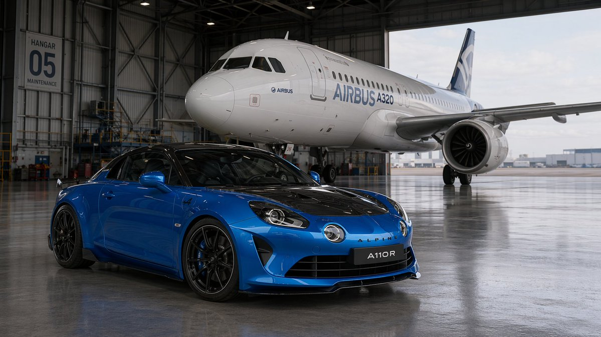


```text
A photorealistic, high-resolution commercial photograph of a {argument name="car model and color" default="bright blue Alpine A110 R sports car"} parked in the foreground inside a massive aircraft hangar. The car features a black carbon fiber hood, black roof, black alloy wheels, and a front license plate reading "{argument name="license plate text" default="A110 R"}". Directly behind the car, dominating the background, is a {argument name="airplane model" default="white Airbus A320 commercial airliner"} with a blue tail. The hangar has a highly polished, reflective concrete floor that mirrors the car and plane. To the left, a sign on the metal wall reads "{argument name="hangar sign text" default="HANGAR 05 MAINTENANCE"}". The hangar doors are wide open, revealing a bright, overcast sky and a distant cityscape. The lighting is soft and cinematic, highlighting the sleek aerodynamic curves of both vehicles.
```


---

## 例 187：韩系极简氛围感少女写真

**来源：** [@BubbleBrain](https://x.com/BubbleBrain/status/2046434670724907395)


```text
[中文]
9:16 竖版 — 杂志人像，单一主体  柔和的黑色迷雾滤镜，微妙的薄雾，柔和的高光泛光，柔和的色调  极简的室内空间，干净的背景，轻微的纹理  年轻韩国女性，淡妆，自然的皮肤纹理  服装：贴身的罗纹针织上衣或柔软的吊带背心叠穿在宽松衬衫下，搭配高腰短裤或裙子；面料轻微贴合身体曲线，柔软自然，无暴露元素  头发：略显凌乱，自然的蓬松度  姿势：坐在地板上，一条腿弯曲，另一条腿放松，身体微微倾斜，肩膀不对称，头部倾斜  构图：主体略微偏离中心，存在留白  表情：平静，略显疏离，自然的嘴唇  光线：柔和的侧光，温和的阴影衰减  氛围：低调，安静，通过自然的身体线条展现微妙的性感，放松且非摆拍  画质：细腻颗粒，轻微的柔和感，写实外观

[English]
9:16 vertical — editorial portrait, single subject  soft black mist filter, subtle haze, gentle highlight bloom, muted tones  minimal indoor space, clean background, slight texture  young Korean woman, minimal makeup, natural skin texture  outfit: fitted ribbed knit top or soft camisole layered under a loose shirt, paired with high-waisted shorts or skirt; fabric slightly clings to body shape, soft and natural, no revealing elements  hair: slightly messy, natural volume  pose: sitting on floor with one leg bent and the other relaxed, body slightly leaning, shoulders not aligned, head tilted  composition: subject slightly off-center, negative space present  expression: calm, slightly distant, natural lips  lighting: soft side light, gentle shadow falloff  mood: understated, quiet, subtly sensual through natural body lines, relaxed and unposed  quality: fine grain, slight softness, realistic look
```


---

## 例 198：苍白陶瓷娃娃沙滩仰视

**来源：** [@IamEmily2050](https://x.com/IamEmily2050/status/2046584217656570035)

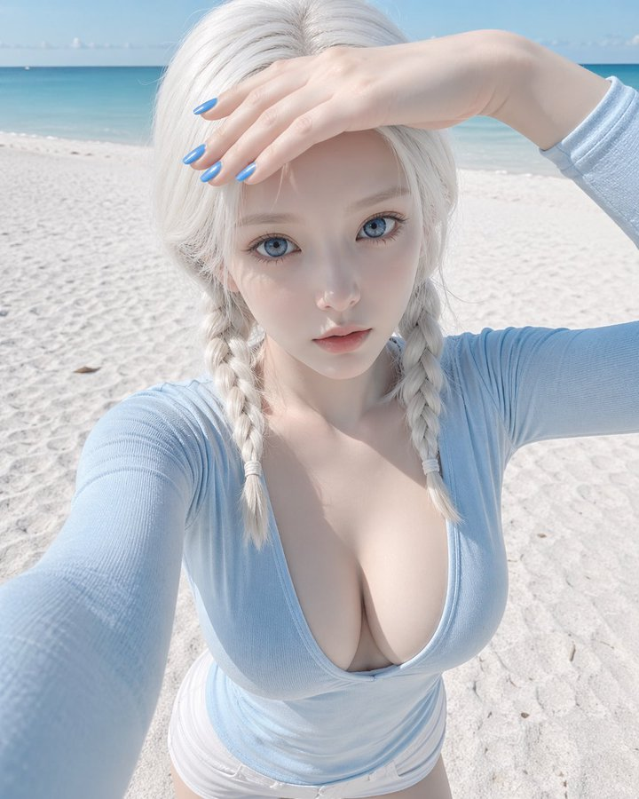


```text
[中文]
{
  "相机参数": {
    "设备类型": "iPhone 15 Pro 前置自拍",
    "镜头": "24mm",
    "构图": "高角度 POV（第一人称视角）",
    "后期处理": "计算摄影风格，清晰的数字读出，深景深"
  },
  "主体描述": {
    "特征": "陶瓷娃娃审美，无瑕的苍白皮肤，巨大的冰蓝色眼睛，小巧的鼻子，翘起的自然色嘴唇",
    "表情": "面无表情，空洞，瞪大眼睛注视",
    "造型": "白金色的双紧辫发型，鲜艳的蓝色美甲",
    "服装": "浅蓝色紧身弹力棉上衣，极深超宽 V 领，深邃锁骨与领口线",
    "动作": "抬头仰视镜头，用一只手遮挡刺眼的阳光"
  },
  "环境与灯光": {
    "场景": "广阔的沙滩，背景中模糊的海平线",
    "灯光": "高调明亮的沿海日光，5500K 色温，强烈的白沙反光填充，均匀照明",
    "质感": "微带露水的无孔皮肤，细腻的反光白沙颗粒"
  },
  "技术约束": {
    "色彩科学": "柔和的粉彩色调，线性中性色，高曝光",
    "负面提示词": [
      "重阴影",
      "雪",
      "冬装",
      "红指甲",
      "黑色上衣",
      "保守的领口",
      "胶片颗粒感"
    ]
  }
}

[English]
{
  "cameraParameters": {
    "deviceType": "iPhone 15 Pro front selfie",
    "lens": "24mm",
    "composition": "High angle POV (first-person perspective)",
    "postProcessing": "Computational photography style, clear digital readout, deep depth of field"
  },
  "subjectDescription": {
    "features": "Porcelain doll aesthetic, flawless pale skin, huge ice-blue eyes, small nose, slightly upturned natural-colored lips",
    "expression": "Expressionless, hollow, wide-eyed staring",
    "styling": "Platinum blonde tight double braids hairstyle, vibrant blue nail polish",
    "clothing": "Light blue tight stretch cotton top, extremely deep ultra-wide V-neck, deep collarbone and neckline",
    "action": "Looking up at the camera, blocking the glaring sunlight with one hand"
  },
  "environmentAndLighting": {
    "scene": "Vast sandy beach, blurry horizon in the background",
    "lighting": "High-key bright coastal daylight, 5500K color temperature, strong white sand reflection fill, even lighting",
    "texture": "Slightly dewy poreless skin, fine reflective white sand particles"
  },
  "technicalConstraints": {
    "colorScience": "Soft pastel tones, linear neutral colors, high exposure",
    "negativePrompts": [
      "Heavy shadows",
      "Snow",
      "Winter clothing",
      "Red nails",
      "Black top",
      "Conservative neckline",
      "Film grain"
    ]
  }
}
```


---

## 例 199：超写实海滩高角度手机自拍

**来源：** [@IamEmily2050](https://x.com/IamEmily2050/status/2046602266627465534)

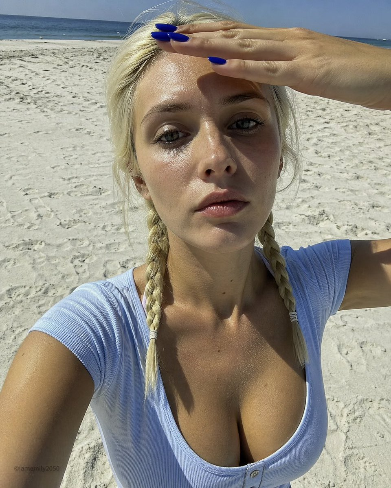


```text
[中文]
{
  超写实iPhone 15 Pro前置摄像头自拍，一位成年女性在明亮的沙滩上，
  从举臂高角度自拍视角拍摄。手机略微举在脸部上方，
  营造出自然的前置摄像头几何形态，带有轻微的等效24mm广角畸变，
  写实的面部比例，
  以及智能手机的深景深。她向上抬起下巴，一只手遮挡刺眼的阳光，同时直视手机镜头。她的表情中性，
  面无表情，
  且略带疏离感，
  眼睛大而专注，但在解剖学上具有真实的眼部尺寸和自然面部比例。\n\n她有着极浅的铂金色头发，梳成两条紧紧的辫子，
  苍白的皮肤带有真实摄影的皮肤纹理，
  可见的毛孔，
  细微的绒毛，
  淡淡的眼下纹理，
  自然的唇部纹理，
  以及柔和的阳光光泽，而不是磨皮后的完美无瑕。她的嘴唇是自然色调且略丰满，
  她的鼻子小巧精致但很写实。她的指甲是鲜艳的蓝色。她穿着一件浅蓝色紧身弹力棉上衣，领口非常深且宽，以自然、
  非风格化的方式露出突出的锁骨和上胸结构。\n\n背景是宽阔的海岸沙滩，在强烈的上午晚些时候的阳光下，
  背景中有一条柔和模糊的地平线。光线明亮，
  色温约5500K的高调海岸日光，
  强烈的白色沙子反光从下方和脸部周围均匀地填充阴影。皮肤被直射阳光加上海滩宽阔柔和的反射补光照亮，
  产生清脆但写实的高光，没有生硬的对比。明亮沙子的细小颗粒微妙地捕捉光线。整体图像应该感觉像是在强烈的海边光线下在户外拍摄的真正高曝光智能手机自拍。\n\n色彩渲染应该是柔和、
  干净、
  且现代的，
  带有中性至柔和的色调，
  写实的iPhone计算摄影，
  略微提高的曝光，
  受控的高光过渡，
  自然的肤色，
  没有电影级调色。优先考虑写实性、
  物理准确性、
  可信的解剖结构，
  以及真实的智能手机图像表现，而不是美化风格化。", "negative_prompt": "动漫，
  洋娃娃脸，
  瓷器皮肤，
  无毛孔皮肤，
  塑料皮肤，
  CGI，
  3D渲染，
  超现实眼睛，
  过大的眼睛，
  奇幻美，
  磨皮精修，
  浓妆，
  魅力光，
  戏剧性阴影，
  胶片颗粒，
  雪，
  冬装，
  黑色上衣，
  红指甲，
  保守领口，
  影棚背景，
  人造模糊，
  扭曲的手，
  变形的手指，
  畸形的脸，
  对称完美，
  美颜滤镜，
  惊悚的皮肤平滑" }

[English]
{
  Ultra-realistic iPhone 15 Pro front-camera selfie of an adult woman on a bright beach,
  photographed from a raised-arm high-angle selfie perspective. The phone is held slightly above her face,
  creating natural front-camera geometry with mild 24mm equivalent wide-angle distortion,
  realistic facial proportions,
  and deep smartphone depth of field. She tilts her chin upward and looks directly toward the phone lens while shielding harsh sunlight with one hand. Her expression is neutral,
  blank,
  and slightly distant,
  with wide attentive eyes but anatomically realistic eye size and natural facial proportions.\n\nShe has very light platinum-blonde hair styled in two tight braids,
  pale skin with real photographic skin texture,
  visible pores,
  subtle peach fuzz,
  faint under-eye texture,
  natural lip texture,
  and a soft sunlit sheen rather than airbrushed perfection. Her lips are naturally toned and slightly full,
  her nose is small and refined but realistic. Her nails are vivid blue. She wears a light blue fitted stretch-cotton top with a very deep wide neckline that reveals pronounced collarbones and upper chest structure in a natural,
  non-stylized way.\n\nThe setting is a wide coastal beach under strong late-morning sunlight,
  with a softly blurred horizon line in the background. The lighting is bright,
  high-key coastal daylight around 5500K,
  with strong white sand bounce filling the shadows evenly from below and around the face. Skin is illuminated by direct sun plus broad soft reflected fill from the beach,
  producing crisp but realistic highlights without harsh contrast. Fine grains of bright sand catch light subtly. The overall image should feel like a real high-exposure smartphone selfie taken outdoors in intense seaside light.\n\nColor rendering should be soft,
  clean,
  and modern,
  with neutral-to-pastel tones,
  realistic iPhone computational photography,
  slightly elevated exposure,
  controlled highlight rolloff,
  natural skin color,
  and no cinematic grading. Prioritize realism,
  physical accuracy,
  believable anatomy,
  and true smartphone image behavior over beauty stylization.", "negative_prompt": "anime,
  doll face,
  porcelain skin,
  poreless skin,
  plastic skin,
  CGI,
  3D render,
  surreal eyes,
  oversized eyes,
  fantasy beauty,
  airbrushed retouching,
  heavy makeup,
  glamour lighting,
  dramatic shadows,
  film grain,
  snow,
  winter clothing,
  black top,
  red nails,
  conservative neckline,
  studio backdrop,
  artificial blur,
  warped hands,
  deformed fingers,
  malformed face,
  symmetry perfection,
  beauty filter,
  uncanny skin smoothing" }
```


---

## 例 212：专业设计师打造角色写真集

**来源：** [@Kashiko\_AIart](https://x.com/Kashiko_AIart/status/2046492817804099794)

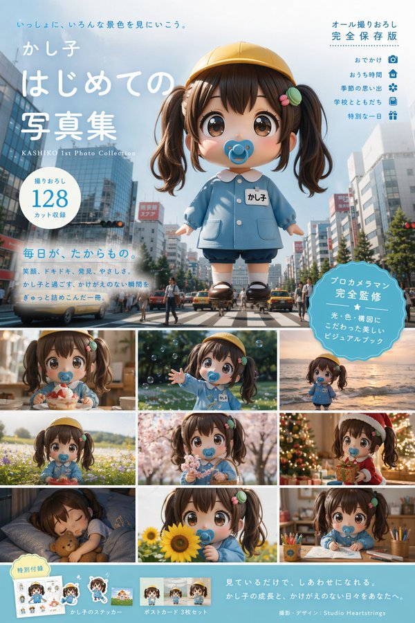


```text
[中文]
请用这个角色制作一本专业设计师打造的照片集。语言为日语。  

根据喜好加入提示词会让它更丰富多彩…  
・丰富的场景  
・信息量较多

[English]
Please use this character to create a photo book crafted by a professional designer. The language should be Japanese.

Adding prompts according to your preferences will make it more colorful and rich
・Rich scenes
・Large amount of information
```


---

## 例 217：昏暗室内纯真少女的意外回眸

**来源：** [@BubbleBrain](https://x.com/BubbleBrain/status/2046190539213885806)

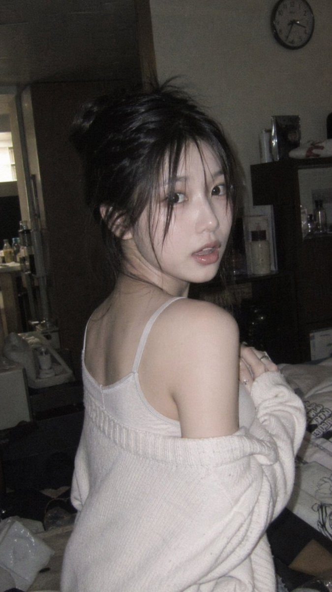


```text
[中文]
{
  "prompt": {
    "style_and_tech": "手机照片，老式CCD相机美学，刺眼的闪光灯，颗粒感，昏暗杂乱的室内光线，抓拍快照感觉，轻微的运动模糊",
    "subject": "年轻的韩国女偶像，温柔纯真的外表",
    "pose": "动作进行中，微微转头看向镜头，仿佛刚刚注意到正在被拍照，肩膀微微耸起",
    "expression": "眼睛微微睁大，因惊讶而微微张开的嘴唇，害羞且猝不及防的表情",
    "clothing": "宽松柔软的居家服（薄开衫+内搭上衣），一侧肩膀微微滑落但没有暴露",
    "vibe": "毫无防备，亲密，意外的瞬间，唤起好奇心与保护欲",
    "aspect ratio": "9:16"
  }
}

[English]
{
  "prompt": {
    "style_and_tech": "mobile phone photo, old CCD camera aesthetic, harsh flash, grainy, dim messy indoor lighting, candid snapshot feeling, slight motion blur",
    "subject": "young Korean female idol, soft innocent look",
    "pose": "mid-action, slightly turning head toward camera as if just noticed being photographed, shoulders slightly raised",
    "expression": "eyes widened slightly, lips parted in surprise, shy and caught-off-guard expression",
    "clothing": "loose soft homewear (thin cardigan + inner top), slightly slipping off one shoulder but not revealing",
    "vibe": "unprepared, intimate, accidental moment, evokes curiosity and protectiveness"，
    "aspect ratio":"9:16"
  }
}
```


---

## 例 219：韩系偶像九宫格写真集

**来源：** [@BubbleBrain](https://x.com/BubbleBrain/status/2046151898621993364)

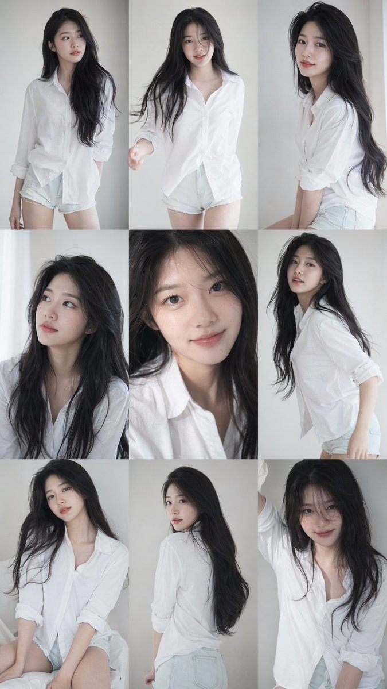


```text
[中文]
9:16 竖版 — 一个 3x3 网格拼贴（九张图片）形成一系列韩国偶像肖像摄影。每一帧都呈现同一位年轻的韩国女性偶像，在所有九张镜头中保持 100% 一致的面部特征、比例、发型和身份。自然、超逼真的皮肤纹理，无修图，无磨皮。干净的偶像风格极简妆容，柔和的光泽，微妙的瑕疵。发型：长发、蓬松的黑发，微乱，在所有帧中保持一致（自然松散的垂落，轻微的动感）。服装：连贯的韩国偶像摄影造型 — 白色衬衫 + 短款下装（或简单的中性色调服装），青春、干净、略带休闲但有造型感。所有帧中穿着相同的服装。场景：极简的工作室或简单的室内环境（白墙，柔和的窗光，干净的背景）。聚焦于主体，而不是环境。光照：柔和漫反射的自然光，温柔的高光，低对比度，略带通透感的色调，微妙的胶片般柔和感。相机风格：亲密的肖像摄影，略带手持感，微妙的瑕疵（轻微的颗粒感，动态帧中的轻微模糊，不完美的构图）。帧分解（3x3 网格）：顶行：- 左上：自然站立，视线略微偏向一侧，表情放松 - 中上：面对镜头，随意的中间动作（头发或身体轻微移动） - 右上：轻微的侧面角度，柔和的注视，自然的抓拍感 中间行：- 中左：微微向上看，柔和的沉思表情 - 正中：特写肖像，直接的眼神接触，温柔的偶像微笑 - 中右：身体微微转动，中间动作的抓拍帧 底行：- 左下：随意坐着或倚靠着，放松的姿势 - 中下：背部部分转向，越过肩膀看向镜头 - 右下：靠近画框站立，略带俏皮或柔和的表情 氛围：韩国偶像写真集 / 小卡美学，亲密、柔和、自然、日常的魅力。质量：超写实，8K 细节，微妙的模拟胶片颗粒感，自然的瑕疵，柔和梦幻的色调

[English]
9:16 vertical — a 3x3 grid collage (nine images) forming a Korean idol portrait photoshoot series. Each frame features the same young Korean female idol, maintaining 100% consistency in facial features, proportions, hairstyle, and identity across all nine shots.   Natural, ultra-realistic skin texture, no retouching, no smoothing. Clean idol-style minimal makeup, soft glow, subtle imperfections.   Hair: long, voluminous dark hair, slightly tousled, consistent across all frames (natural loose flow, slight movement).  Outfit: cohesive Korean idol photoshoot styling — white shirt + short bottoms (or simple neutral-toned outfit), youthful, clean, slightly casual but styled. Same outfit across all frames.  Setting: minimal studio or simple indoor environment (plain wall, soft window light, clean background). Focus on subject, not environment.  Lighting: soft diffused natural light, gentle highlights, low contrast, slightly airy tones, subtle film-like softness.  Camera style: intimate portrait photography, slightly handheld feel, subtle imperfections (minor grain, slight blur in motion frames, imperfect framing).  Frame breakdown (3x3 grid):  Top row: - Top left: standing naturally, looking slightly away, relaxed expression - Top center: facing camera, casual mid-motion (hair or body slight movement) - Top right: slight side angle, soft gaze, natural candid feel  Middle row: - Center left: looking slightly upward, soft thoughtful expression - Center: close-up portrait, direct eye contact, gentle idol smile - Center right: turning body slightly, mid-motion candid frame  Bottom row: - Bottom left: seated or leaning casually, relaxed posture - Bottom center: back partially turned, looking over shoulder toward camera - Bottom right: standing close to frame, slightly playful or soft expression  Mood: Korean idol photobook / photocard aesthetic, intimate, soft, natural, everyday charm.  Quality: ultra-realistic, 8K detail, subtle analog film grain, natural imperfections, soft dreamy tone
```


---

## 例 221：窗边日系胶片女孩

**来源：** [@BubbleBrain](https://x.com/BubbleBrain/status/2046115431144902732)


```text
[中文]
模拟35毫米胶片摄影，柔和轻盈的日系美学，温柔漫射的自然窗户光，轻微过曝，柔和色调，低对比度，柔和的高光，靠近窗户配有白色窗帘的极简室内环境，干净的浅色墙壁，自然构图，平视视角，略微紧凑的全身取景（大腿中部到头部），年轻东亚女性，自然极简妆容，柔和真实的皮肤纹理，长长的微乱黑发，超大号白色纽扣衬衫，浅色休闲短裤，赤脚，简单放松的造型，自然站立姿势放松，双臂自然下垂或略微放在身后，面朝镜头，温柔柔和的微笑，微妙的静止感，专注于光线、空气和安静的日常氛围，柔和的胶片颗粒，梦幻而低调的氛围 --ar 9:16

[English]
Analog 35mm film photography, soft airy Japanese-style aesthetic, gentle diffused natural window light, slight overexposure, pastel tones, low contrast, soft highlights,  minimal indoor setting near a window with white curtains, clean light-colored wall, natural composition, eye-level, slightly closer full-body framing (mid-thigh to head),  young East Asian woman, natural minimal makeup, soft realistic skin texture, long slightly messy dark hair,  oversized white button-up shirt, light casual shorts, barefoot, simple and relaxed styling,  standing naturally with relaxed posture, arms loosely at sides or slightly behind, facing camera, gentle soft smile, subtle stillness,  focus on light, air, and quiet everyday mood, soft film grain, dreamy and understated atmosphere --ar 9:16
```


---

## 例 240：胶片闪光灯下的球场少女

**来源：** [@BubbleBrain](https://x.com/BubbleBrain/status/2045052982728016131)

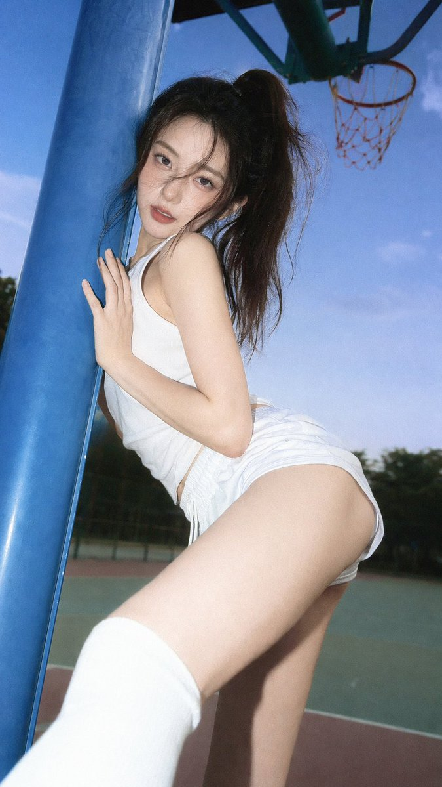


```text
[中文]
35毫米彩色胶片摄影，带有强烈的机顶直射闪光灯，皮肤和衣物上有镜面高光，眼睛里有强烈的眼神光，高对比度闪光灯照明，真实的胶片颗粒和色彩偏移，高级时尚清新纯真篮球场编辑风格，亲密的第一人称低角度仰视POV镜头，二十出头的性感中国女性偶像，具有超写实的精致细腻的中国特征，诱人的杏仁形狐狸眼，带有自然双眼皮，高鼻梁，小巧锋利的V型下颌线，无瑕逼真的瓷白肌肤，带有冷象牙色底调和可见的闪光镜面高光，细腻精致的皮肤纹理，带有微妙的毛孔微距细节和闪光灯下的自然水光感，清新自然的运动妆容，带有柔和的水光感，脸颊上有微妙的自然红晕，自然粉唇微张，鼻子和脸颊上有微妙的自然雀斑，深棕色长发扎成高高的俏皮马尾辫，有一些散落的发丝修饰脸型，以及逼真的散落发丝，穿着宽松的白色背心和白色高腰篮球短裤，白色及膝运动袜，在黄昏的户外球场上靠在篮球架杆上的诱人自然倾斜姿势，身体侧成角度，背部自然弓起，臀部轻轻向后推，以凸显挺拔圆润的臀部和性感的臀部曲线，一条腿自然向前伸向镜头，另一条腿微微弯曲以强调修长性感的双腿，双手轻轻放在肩膀高度的篮球杆上，极其诱人俏皮又惹人怜爱的鹿眼凝视直视观看者，带着柔软脆弱渴望的眼睛和温柔挑逗的微笑，充满安静的诱惑和欲望，强烈的机顶直射闪光灯产生锐利的镜面高光和强烈的眼神光，背景是黄昏天空下模糊的篮球场和篮筐，高对比度胶片调色，带有自然闪光灯外观，极其锐利却又柔和的皮肤渲染，具有真实的35毫米直射闪光美学，自然发丝，背心和短裤上逼真的织物纹理以及袜子细节，没有塑料感皮肤，没有数码过度锐化，没有磨皮，没有瑕疵，没有痣，没有油性皮肤，没有水印，没有文字，真实的35毫米直射闪光胶片篮球场外观 --ar 9:16

[English]
35mm color film photography with harsh direct on-camera flash, specular highlights on skin and clothing, strong catchlights in eyes, high contrast flash illumination, authentic film grain and color shift, high fashion fresh innocent basketball court editorial style, intimate first-person low-angle POV shot from below, early 20s sexy Chinese female idol with ultra-realistic delicate refined Chinese features, seductive almond-shaped fox eyes with natural double eyelids, high nose bridge, small sharp V-shaped jawline, flawless realistic porcelain skin with cool ivory undertone and visible flash specular highlights, fine delicate skin texture with subtle pores micro details and natural dewy glow under flash, fresh natural sporty makeup with soft dewy glow, subtle natural flush on cheeks, natural pink lips slightly parted, subtle natural freckles across nose and cheeks, long dark brown hair tied in a high playful ponytail with some loose strands framing the face and realistic loose strands, wearing a loose white tank top and white high-waisted basketball shorts, white knee-high sports socks, seductive natural leaning pose against the basketball hoop pole on the outdoor court at dusk, body angled sideways with naturally arched back and hips gently pushed back to accentuate perky round hips and sexy butt curve, one leg naturally extended forward toward the camera and the other leg slightly bent to emphasize long sexy legs, both hands lightly resting on the basketball pole at shoulder height, intensely seductive playful yet pitiable doe-eyed gaze straight at the viewer with soft vulnerable longing eyes and a gentle teasing smile full of quiet temptation and desire, harsh direct on-camera flash creating sharp specular highlights and strong catchlights, background with blurred basketball court and hoop under dusk sky, high contrast film color grading with natural flash look, extremely sharp yet soft skin rendering with authentic 35mm direct flash aesthetic, natural hair strands, realistic fabric texture on tank top and shorts with socks detail, no plastic skin, no digital over-sharpening, no airbrushing, no blemishes, no moles, no oily skin, no watermark, no text, authentic 35mm direct flash film basketball court look --ar 9:16
```


---

## 例 272：日式温泉旅馆人像

**来源：** [@BubbleBrain](https://x.com/BubbleBrain/status/2045092449803284923)

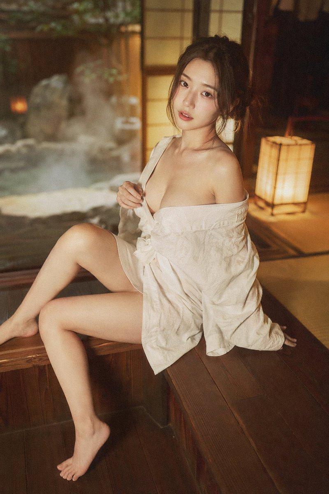


```text
35mm film photography, warm vintage Japanese onsen ryokan aesthetic, soft ambient wooden lantern lighting mixed with gentle natural window light, subtle film grain, gentle color shift, high atmosphere editorial style, intimate medium shot, early 20s beautiful Chinese female idol with ultra-realistic delicate refined Chinese features, seductive almond-shaped fox eyes with natural double eyelids, high nose bridge, small sharp V-shaped jawline, flawless porcelain skin with warm ivory undertone, visible subtle skin texture and micro pores, soft natural makeup with dewy glow, subtle rosy flush on cheeks, natural soft pink lips slightly parted, long dark brown hair tied in a loose low bun with some messy strands falling around face and neck, wearing a loose white yukata (traditional Japanese bathrobe) deliberately slipped off one shoulder and loosely tied at the waist, the fabric slightly open revealing smooth skin and subtle cleavage, barefoot, seductive relaxed sitting pose on the edge of a traditional wooden engawa veranda at a vintage onsen ryokan, body slightly turned toward the camera, one leg bent with foot resting on the wooden floor, the other leg gently dangling, one hand lightly holding the yukata collar, the other hand resting on the wooden floor behind her for support, softly arched back to gently accentuate curves, intensely seductive yet gentle and inviting gaze straight at the viewer with soft doe eyes full of quiet temptation and warmth, warm wooden interior with paper sliding doors and distant steaming hot spring in soft focus, gentle rim lighting highlighting skin and fabric texture, authentic vintage film color grading with warm tones, extremely sharp yet soft skin rendering, natural hair strands, realistic fabric wrinkles and drape on the yukata, no plastic skin, no digital over-sharpening, no airbrushing, no blemishes, no moles, no oily skin, no watermark, no text, authentic 35mm film Japanese onsen ryokan atmosphere
```


---

## 例 273：橙红渐变中的孤独剪影

**来源：** [@iam\_miharbi](https://x.com/iam_miharbi/status/2045151354679665101)

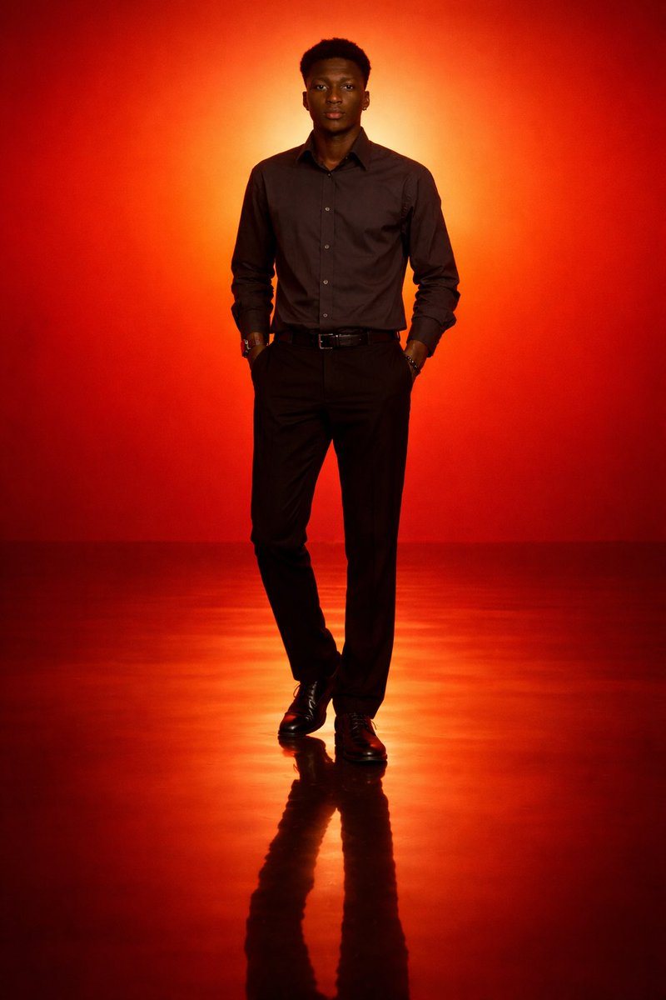


```text
[中文]
生成一张电影级极简肖像，一个孤独的男人站在强烈的橙色到红色渐变环境中，强烈的剪影光，深邃的阴影对比，反光的光滑地面，对称构图，极简

[English]
Generate a cinematic minimal portrait of a solitary man standing in an intense orange to red gradient environment, strong silhouette lighting, deep shadow contrast, reflective glossy floor, symmetrical composition, minimal
```


---

## 例 277：奢华魅力黑人女性海滨摄影

**来源：** [@patrickassale](https://x.com/patrickassale/status/2044581766309060765)

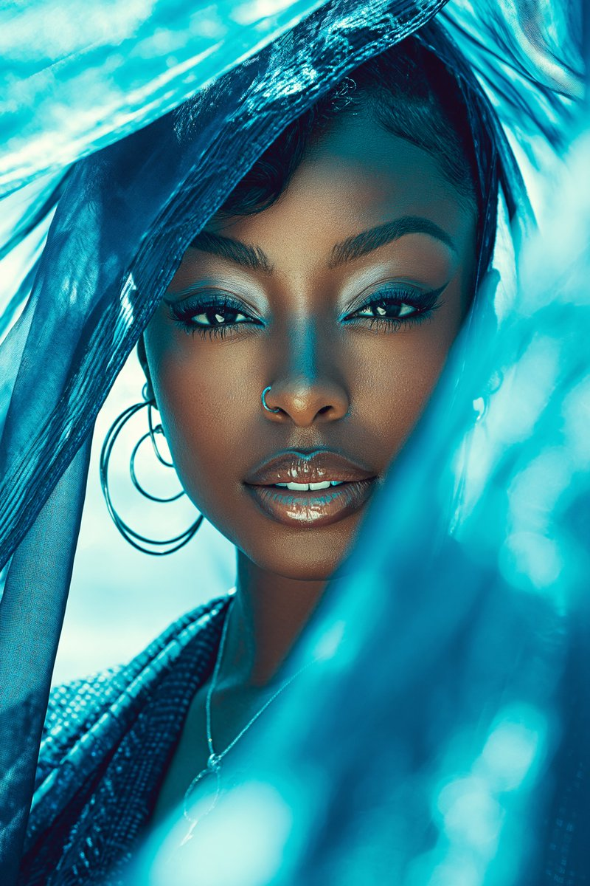


```text
[中文]
奢华魅力美容肖像：, 美丽的黑人女性, 青春活力, 奶油香草色, 丝绸柔顺发, 红木色, 微妙的自信, 有质感的面料, 蓝宝石色, 极简珠宝, 海滨微风, 镜头光晕效果, 怀旧的, 电影镜头, 对称构图, 柔焦, 高级时尚摄影, 单色的, 水光质感, 神秘张力, 分层元素

[English]
Luxury Glam Beauty Portrait:, Beautiful Black woman, youthful spirit, creamy vanilla, silk press, mahogany red, subtle confidence, textured fabric, sapphire blue, minimal jewelry, beachside breeze, lens flare effect, nostalgic, cinematic lens, symmetrical composition, soft focus, high fashion photography, monochromatic, dewy finish, mysterious tension, layered elements
```


---

## 例 284：温馨卧室里的少女自拍

**来源：** [@Shinning1010](https://x.com/Shinning1010/status/2045002808903020962)

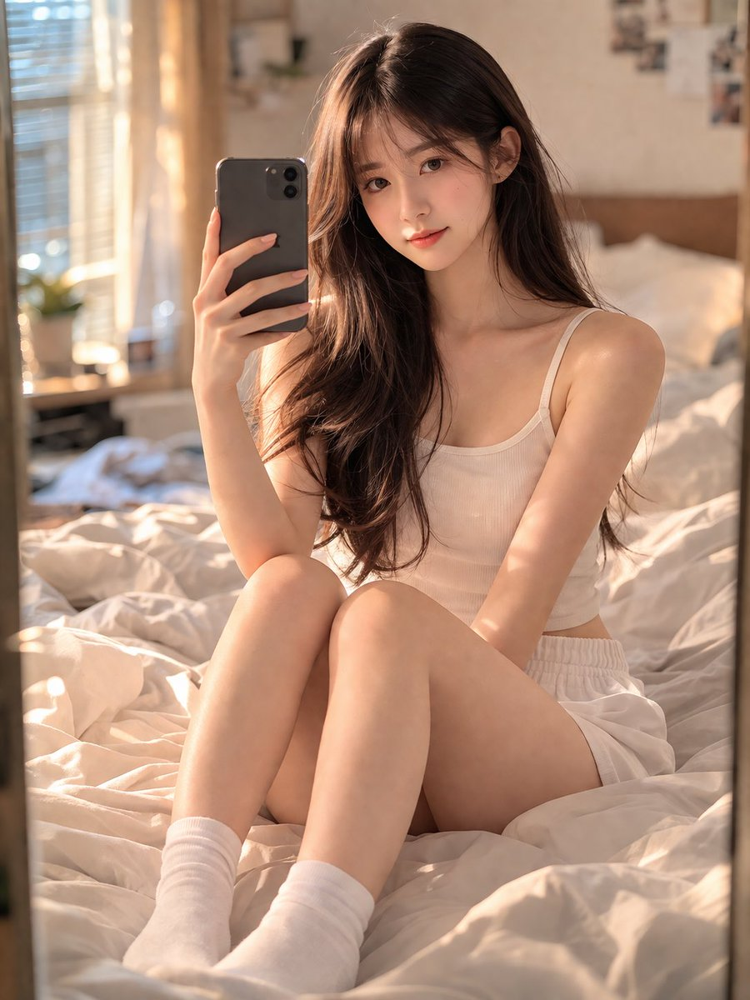


```text
[中文]
一个惊艳的18岁中国女孩，拥有年轻纯真的脸庞和逼真的皮肤纹理，坐在她卧室里一张舒适且略显凌乱的床上。她正用智能手机拍镜子自拍，捕捉一个自然且亲密的瞬间。穿着随意的灰色居家服和整洁的白色船袜。柔和的自然光（黄金时刻）从侧面窗户照进来，营造出一种温暖、富有情绪感和电影般的氛围。35毫米镜头，对镜子中的主体保持锐利对焦，带有美丽模糊背景（散景）的景深。照片写实，8K，高分辨率，影棚级质量，杰作。反向提示词：没有多余的肢体，没有变形的手，没有模糊，没有噪点，没有水印，没有文字，没有卡通/动漫风格。长宽比：3:4。

[English]
A stunning 18-year-old Chinese girl with a youthful, pure face and realistic skin texture, sitting on a cozy, slightly messy bed in her bedroom. She is taking a mirror selfie with a smartphone, capturing a natural and intimate moment. Wearing casual gray loungewear and neat white crew socks. Soft natural light (golden hour) streams in from a side window, creating a warm, moody, and cinematic atmosphere. 35mm lens, sharp focus on the subject in the mirror, depth of field with a beautifully blurred background (bokeh). Photorealistic, 8K, high resolution, studio quality, masterpiece.
Negative Prompts: no extra limbs, no deformed hands, no blur, no noise, no watermark, no text, no cartoon/anime style. Aspect Ratio: 3:4.
```


---

## 例 305：深夜便利店里的性感霓虹少女

**来源：** [@BubbleBrain](https://x.com/BubbleBrain/status/2045167461147042202)

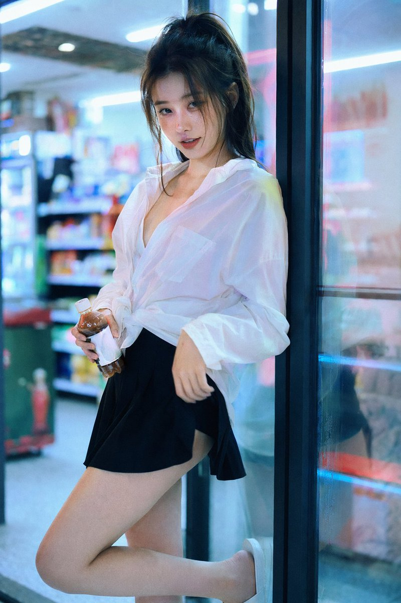


```text
[中文]
35毫米胶片摄影，带有刺眼的便利店荧光灯照明，混合着外面色彩斑斓的霓虹灯牌，真实的胶片颗粒，高对比度，轻微的偏色，电影感街头编辑风格，亲密的中景镜头，20岁出头性感的华人女性偶像，拥有超逼真精致细腻的东方五官，诱人的杏眼狐眼搭配天然双眼皮，高鼻梁，小巧尖锐的V型下颌线，无瑕的瓷白肌肤带有冷象牙底色以及来自荧光灯的可见高光，细腻的皮肤纹理和微小毛孔，自然清透妆容带有脸颊上的柔和红晕，水润自然的粉唇微张，鼻子和脸颊上散布着微妙的自然雀斑，深棕色的长发扎成凌乱的高马尾，许多松散的发丝垂在脸庞和颈部周围，穿着一件超大号的白衬衫作为唯一的上衣，顶部敞开露出深邃乳沟并在腰部宽松打结，搭配一条极小的黑色百褶迷你裙，赤脚穿着简约的白色拖鞋，在深夜24小时便利店的玻璃门上呈现出诱人随性的倚靠姿势，身体微微拱起，一条腿弯曲，脚搭在门框上，另一条腿伸直，一只手拿着一瓶冰饮，另一只手轻轻拉扯迷你裙的裙摆，极其诱人俏皮却又略显脆弱的目光直视观看者，柔和的鹿眼中充满安静的诱惑与挑逗的微笑，来自店内明亮冷调的荧光灯光混合着来自外面招牌的粉色和蓝色霓虹光芒，玻璃门上真实的反射，模糊的便利店内部，背景中有货架和零食，真实的35毫米胶片调色，带有刺眼的光照和霓虹点缀，极其锐利却又柔和的皮肤渲染，自然的发丝，超大号衬衫和迷你裙上逼真的织物褶皱和垂坠感，无塑料感皮肤，无数字过度锐化，无磨皮，无瑕疵，无痣，无油性皮肤，无水印，无文字，真实的深夜便利店氛围

[English]
35mm film photography with harsh convenience store fluorescent lighting mixed with colorful neon signs from outside, authentic film grain, high contrast, slight color cast, cinematic street editorial style, intimate medium shot, early 20s sexy Chinese female idol with ultra-realistic delicate refined Chinese features, seductive almond-shaped fox eyes with natural double eyelids, high nose bridge, small sharp V-shaped jawline, flawless porcelain skin with cool ivory undertone and visible specular highlights from fluorescent light, subtle skin texture and micro pores, natural dewy makeup with soft flush on cheeks, glossy natural pink lips slightly parted, subtle natural freckles across nose and cheeks, long dark brown hair in a messy high ponytail with many loose strands falling around face and neck, wearing an oversized white button-up shirt as the only top, unbuttoned at the top with deep cleavage and loosely tied at the waist, paired with a tiny black pleated mini skirt, barefoot in simple white slides, seductive casual leaning pose against the glass door of a 24-hour convenience store at late night, body slightly arched, one leg bent with foot resting against the door frame, the other leg straight, one hand holding a bottle of iced drink, the other hand lightly pulling the hem of her mini skirt, intensely seductive playful yet slightly vulnerable gaze straight at the viewer with soft doe eyes full of quiet temptation and teasing smile, bright cold fluorescent store light from inside mixed with pink and blue neon glow from outside signs, realistic reflections on glass door, blurred convenience store interior with shelves and snacks in background, authentic 35mm film color grading with harsh lighting and neon accents, extremely sharp yet soft skin rendering, natural hair strands, realistic fabric wrinkles and drape on the oversized shirt and mini skirt, no plastic skin, no digital over-sharpening, no airbrushing, no blemishes, no moles, no oily skin, no watermark, no text, authentic late-night convenience store atmosphere
```


---

## 例 311：晨曦薰衣草田梦幻少女三联画

**来源：** [@Naiknelofar788](https://x.com/Naiknelofar788/status/2028417667846341062)

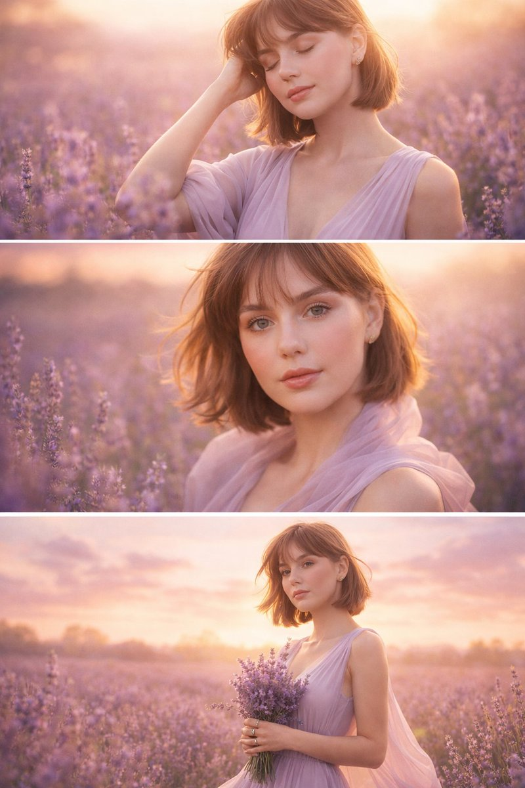


```text
[中文]
日出时分薰衣草田中女子的水平三联画。
上部：半身像，闭着眼睛，淡紫色连衣裙，一只手放在头发里，模糊的薰衣草前景。
中部：特写镜头，看着镜头，蓬乱的头发，薄纱围巾，脸上的阳光。
下部：四分之三镜头，手持薰衣草花束，飘逸的裙子，柔和的粉彩天空，温暖的梦幻色调。

[English]
Horizontal triptych of a woman in a lavender field at sunrise.
Top: Waist-up, eyes closed, pale lilac dress, one hand in hair, blurred lavender foreground.
Middle: Close-up, looking at camera, tousled hair, sheer scarf, sunlight on face.
Bottom: Three-quarter shot, holding lavender bouquet, flowing skirt, soft pastel sky, warm dreamy tones.
```


---

## 例 314：红蓝光影下的未来都市双重曝光青年

**来源：** [@Fujimoto\_hina](https://x.com/Fujimoto_hina/status/2028045894088630679)


```text
[中文]
{
  "prompt": "一位年轻男子的超写实电影级双重曝光侧脸肖像，表情专注强烈，皮肤纹理细节丰富，眼神锐利。他的面部与从剪影中浮现的未来主义城市天际线无缝融合，摩天大楼和城市建筑构成了他的颈部和下颌线。深蓝色和鲜艳红色的强烈对比，象征着冲突与力量。抽象的数字划痕、碎裂的玻璃纹理和漏光效果覆盖在面部，营造出戏剧性的效果。干净的白色背景，超精细的灯光，专业电影海报风格，高对比度，清晰聚焦，8K分辨率，逼真的发丝，社论海报构图，现代平面设计美学，戏剧性的氛围，超高清，照片级真实。",
  "negative_prompt": "模糊，低分辨率，扭曲的面部，多余的肢体，过饱和的颜色，嘈杂的背景，平淡的灯光，卡通化，低细节",
  "resolution": "8K",
  "style": "电影感，双重曝光，照片级真实感，社论海报",
  "background": "干净的白色",
  "lighting": "高对比度，戏剧性的蓝红分割布光"
}

[English]
{
  "prompt": "A hyper-realistic cinematic double exposure portrait of a young man in side profile, intense focused expression, detailed skin texture and sharp eyes. His face seamlessly blended with a futuristic city skyline emerging from his silhouette, skyscrapers and urban buildings forming his neck and jawline. Strong contrast of deep blue and vibrant red tones symbolizing conflict and power. Abstract digital scratches, fractured glass textures, and light leaks overlaying the face for a dramatic effect. Clean white background, ultra-detailed lighting, professional movie poster style, high contrast, sharp focus, 8K resolution, realistic hair strands, editorial poster composition, modern graphic design aesthetics, dramatic mood, ultra-HD, photorealistic.",
  "negative_prompt": "blurry, low resolution, distorted face, extra limbs, oversaturated colors, noisy background, flat lighting, cartoonish, low detail",
  "resolution": "8K",
  "style": "cinematic, double exposure, photorealistic, editorial poster",
  "background": "clean white",
  "lighting": "high contrast, dramatic blue and red split lighting"
}
```


---

## 例 315：棘龙巨口中的酷飒少女与史前奇观

**来源：** [@MrDasOnX](https://x.com/MrDasOnX/status/2028087254757867560)

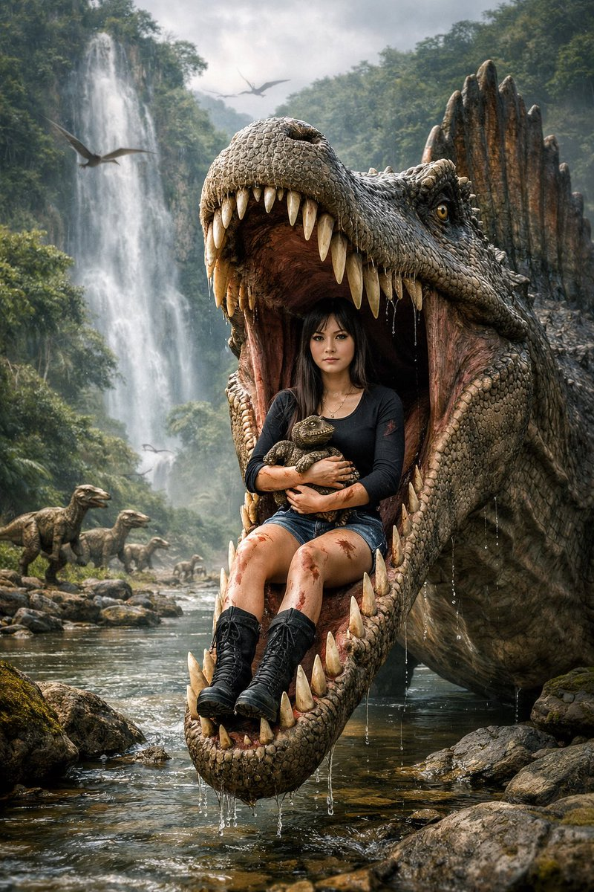


```text
[中文]
超写实电影级奇幻场景，设定在郁郁葱葱的史前丛林山谷中。一只巨大的棘龙站在浅河边，它那长而类似鳄鱼的巨颚张得很大。一位年轻女子平静地坐在恐龙张开的嘴里，完美居中，双腿微微向前悬挂。她有一头深色直发，表情镇定无畏，皮肤纹理逼真。她身穿合身的黑色长袖短款上衣，蓝色牛仔短裤和黑色及膝战术靴。衣服和腿上可见微小的血迹和轻微划痕，增加了戏剧性的紧张感但并不血腥。她怀里温柔地抱着一只小恐龙幼崽，充满保护欲地抱着它。

在他们身后，一道高耸而充满戏剧性的瀑布顺着覆盖着茂密绿色植被和薄雾的陡峭丛林悬崖倾泻而下。场景中栖息着多只恐龙：几只迅猛龙在河岸边潜行，小型食草动物在背景中奔跑，飞翔的翼龙在头顶盘旋。环境丰富，有长满苔藓的岩石、流动的河水、热带植物和柔和的大气雾。

灯光具有电影感和自然感，漫射的日光照亮场景，阴影细节丰富，焦点清晰地聚在女子和棘龙身上，背景元素采用浅景深。恐龙鳞片、牙齿、水珠、树叶和织物上的超写实纹理。史诗奇幻写实主义，戏剧性构图，垂直构图，超精细，照片级真实感，4K，电影级调色，无文字，无水印。

[English]
Ultra-realistic cinematic fantasy scene set in a lush prehistoric jungle valley. A colossal Spinosaurus stands beside a shallow river, its long crocodile-like jaws stretched wide open. Seated calmly inside the dinosaur’s open mouth is a young woman, perfectly centered, legs hanging slightly forward. She has straight dark hair, a composed fearless expression, and realistic skin texture. She is wearing a fitted black long-sleeve crop top, blue denim shorts, and black knee-high combat boots. Small blood smears and light scratches are visible on her clothes and legs, adding dramatic tension without gore. She gently cradles a small baby dinosaur in her arms, holding it protectively.

Behind them, a tall dramatic waterfall cascades down steep jungle cliffs covered in dense green foliage and mist. Multiple dinosaurs populate the scene: several Velociraptors stalking the riverbank, small herbivores running through the background, and flying pterosaurs circling overhead. The environment is rich with mossy rocks, flowing water, tropical plants, and soft atmospheric fog.

Lighting is cinematic and natural, with diffused daylight illuminating the scene, detailed shadows, sharp focus on the woman and the Spinosaurus, and shallow depth of field for background elements. Hyper-real textures on dinosaur scales, teeth, water droplets, foliage, and fabric. Epic fantasy realism, dramatic composition, vertical framing, ultra-detailed, photorealistic, 4K, cinematic color grading, no text, no watermark.
```


---

## 例 317：震撼视觉的深红影棚广角美妆大片

**来源：** [@Maercihh](https://x.com/Maercihh/status/2026941078885310750)

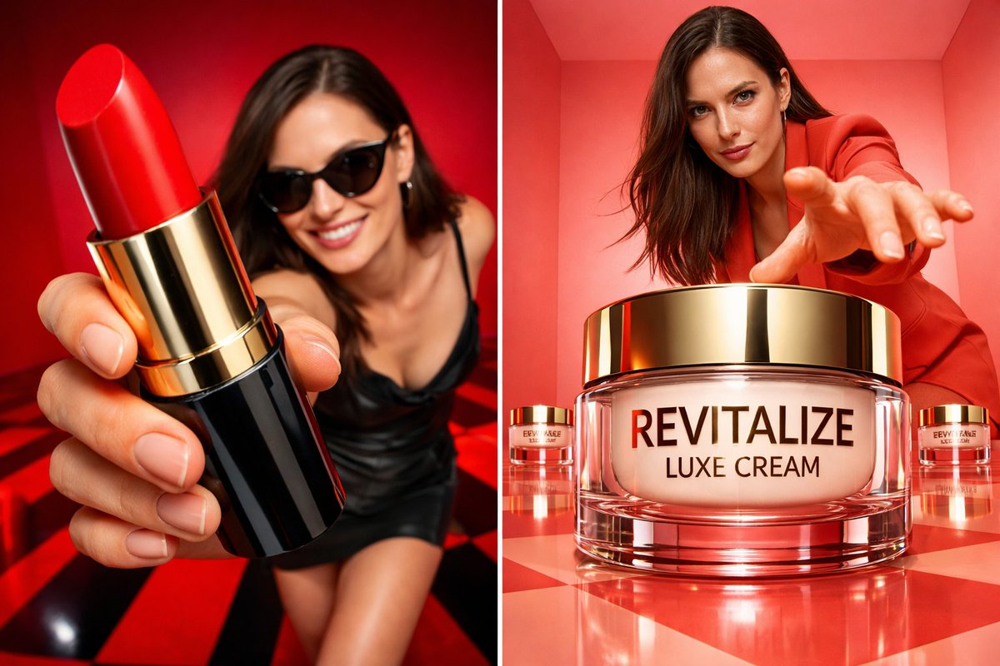


```text
[中文]
照片级真实感的大胆美妆宣传活动，使用上传的模特作为精确的身份参考。不做面部改变，不做平滑处理。
场景：深红色饱和的摄影棚环境，具有高对比度的地板图案或光滑表面。
产品：产品被握持或放置在极其靠近镜头的位置，由于透视关系显得巨大。
模特姿势：俏皮或自信的微笑，手臂完全伸向相机，手指因广角镜头而略微变形。透过太阳镜的强烈眼神交流或自然凝视。
相机：超广角 20–28mm 美学，动态前景夸张，浅至中等景深。
灯光：强有力的商业照明，具有清晰的高光和反射，锐利的包装边缘，充满活力的调色。超精细的皮肤纹理和织物真实感。

[English]
Photorealistic bold beauty campaign using uploaded model as exact identity reference. No facial changes, no smoothing.  
Scene: deep red saturated studio environment with high-contrast floor pattern or glossy surface.  
Product: the product held or positioned extremely close to the lens, appearing large due to perspective.   
Model pose: playful or confident smile, arm fully extended toward camera, fingers slightly distorted by wide lens. Strong eye contact through sunglasses or natural gaze.  
Camera: ultra-wide 20–28mm aesthetic, dynamic foreground exaggeration, shallow-to-medium depth of field.  
Lighting: punchy commercial lighting with defined highlights and reflections, crisp packaging edges, vibrant color grading. Hyper-detailed skin texture and fabric realism.
```


---

## 例 318：珊瑚色极简影棚时尚商业大片

**来源：** [@Maercihh](https://x.com/Maercihh/status/2026941078885310750)


```text
[中文]
超写实高端时尚商业广告大片，使用上传的模特照片作为严格的身份参考。保留精确的面部特征、比例和自然皮肤纹理——无修图，无变形。场景：珊瑚色单色工作室盒，配有光泽反光棋盘格或极简抛光地板。拥有柔和光线渐变的干净几何墙壁。产品：产品放置在前景中心超大位置，因广角透视而占据画面主导地位。包装超清晰，文字完全可读，具有逼真的反射和材质纹理。较小的产品单元可对称放置在背景中。模特姿势：站在产品后方，微蹲或前倾，一只手伸向镜头以创造深度感。强烈自信的表情，时尚态度。相机：低角度 24-35mm 镜头感，戏剧性透视畸变，对产品和模特都进行深焦处理。灯光：明亮的商业影棚灯光，柔和阴影，包装上有光泽高光，高端广告成片质感。4K–8K 写实主义，无水印，无嵌入式文本。纵横比 9:13

[English]
Ultra-realistic high-fashion commercial campaign using the uploaded model photo as strict identity reference. Preserve exact facial features, proportions and natural skin texture — no retouching, no reshaping.  
Scene: coral monochrome studio box with glossy reflective checker or minimal polished floor. Clean geometric walls with soft light gradients.  
Product: the product placed oversized in the center foreground, dominating the frame due to wide-angle perspective. The packaging is ultra-sharp, fully readable, realistic reflections and material texture. Smaller product units can be placed symmetrically in the background.  
Model pose: standing behind the product, slightly crouched or leaning forward, one hand reaching toward the camera to create depth. Strong confident expression, fashion attitude.  
Camera: low-angle 24–35mm lens look, dramatic perspective distortion, deep focus on both product and model.  
Lighting: bright commercial studio lighting, soft shadows, glossy highlights on packaging, high-end campaign finish. 4K–8K realism, no watermark, no embedded text.i ar 9:13
```


---

## 例 319：鸟群织就的梦幻高定时装秀

**来源：** [@MrDasOnX](https://x.com/MrDasOnX/status/2026284342549340190)


```text
[中文]
一个充满趣味的高级时装T台场景，主角是一位自信的女性，正走在奢华时装秀的T台上，身穿一件完全由鸟类制成的非凡高级定制礼服。数百只优雅、色彩鲜艳的鸟类构成了飘逸的雕塑感礼服形状，像活着的羽毛一样层叠，翅膀微微张开，营造出布料和运动的错觉。一些鸟儿在她周围轻轻升入空中，捕捉于飞行瞬间，增添了神奇、超现实的运动感。鸟儿们展现出丰富多样的色彩——彩虹般的蓝色、光芒四射的红色、金黄色和柔和的白色——拥有错综复杂的羽毛细节和自然纹理。她在迈步间摆出姿势，带着快乐、自信的表情，富有表现力的眼睛，以及精致的T台妆容。戏剧性的舞台灯光配以发光的高光，黑暗模糊的观众背景，电影级的景深，奇幻现实主义，超精细纹理，高对比度，清晰聚焦，奇思妙想的奢华时装秀，超现实主义高级定制，4K分辨率，专业调色。

[English]
A playful high-fashion runway scene featuring a confident woman walking a luxury fashion show catwalk, wearing an extraordinary couture dress made entirely of birds. Hundreds of elegant, vividly colored birds form the shape of a flowing, sculptural gown, layered like living feathers, with wings partially spread to create the illusion of fabric and motion. Some birds lift gently into the air around her, captured mid-flight, adding a magical, surreal sense of movement. The birds display a rich variety of colors — iridescent blues, radiant reds, golden yellows, and soft whites — with intricate feather details and natural textures. She poses mid-stride with a joyful, confident expression, expressive eyes, and refined runway makeup. Dramatic stage lighting with glowing highlights, dark blurred audience background, cinematic depth of field, fantasy realism, ultra-detailed textures, high contrast, sharp focus, whimsical luxury fashion show, surreal couture, 4K resolution, professional color grading.
```


---

## 例 321：都市落日时尚大片

**来源：** [OpenNana](https://opennana.com/awesome-prompt-gallery/urban-sunset-fashion-silhouette)

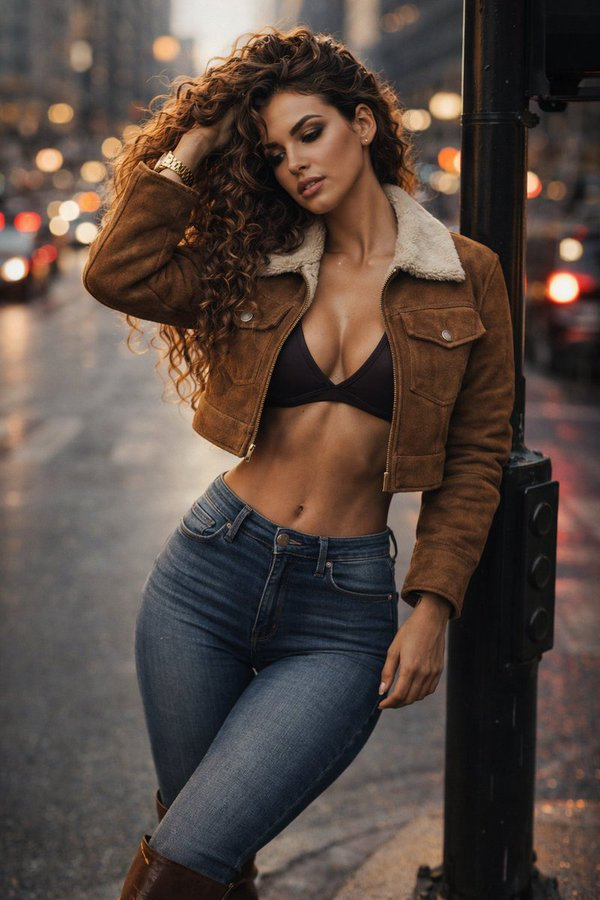


```text
[中文]
一张超现实电影感时尚照片，一位二十出头惊艳的年轻女性，全身可见，站在现代城市中心，黄金时段。  
她随意地单肩靠在交通信号灯杆上，没有意识到相机的存在，仿佛这一刻是自然捕捉的。  
她穿着紧身蓝色牛仔裤、棕色皮靴，以及一件短款棕色麂皮夹克，带有柔软羊皮翻领。夹克下，一件极简深色露脐上衣，隐约露出精致的乳沟和紧致的腹部。  

她的体型天生女性化，均衡而优雅，姿态自信。  
一只手穿过她丰盈的浅棕色长发，将其向后撩起，头部微微转向那一侧，眼睛自然地看向别处，没有摆拍。  

肤色为轻微日晒后的奶油般柔和光泽，真实肌肤纹理，细腻毛孔与高光——毫无塑料感。  
妆容醒目却精致：清晰的眼部、浓密睫毛、立体腮红、柔和修容，以及自然光泽唇——具备高端美妆广告质感。  
光线为温暖金色时段阳光，包裹她的轮廓与发丝，营造柔和高光与电影感对比。  
背景为城市街道，汽车与都市灯光以强烈散景呈现，浅景深——焦点锁定在女性身上。  

使用全画幅电影摄影机拍摄，85mm镜头，f/1.8，超现实细节，高动态范围，电影级调色，胶片质感，顶级时尚大片美学，高预算电影剧照氛围。

[English]
A hyper-realistic cinematic fashion photograph of a stunning young woman in her early 20s, full body visible, standing in a modern city center during golden hour.
She leans casually with one shoulder against a traffic light pole, unaware of the camera, as if the moment was captured naturally.
She wears skinny blue jeans, brown leather boots, and a cropped brown suede jacket with a soft shearling collar. Under the jacket, a minimal dark crop top reveals a subtle cleavage and toned midriff.

Her physique is naturally feminine, balanced and elegant, with confident posture.
One hand runs through her long, voluminous curly light-brown hair, lifting it back in motion. Her head is turned slightly toward that side, eyes looking away naturally, not posing.

Skin tone is lightly sun-kissed with a soft creamy glow, realistic skin texture, subtle pores and highlights — no plastic look.
Makeup is striking but refined: defined eyes, bold lashes, sculpted cheeks, soft contour, and natural glossy lips — editorial beauty campaign quality.
Lighting is warm golden hour sunlight, wrapping around her silhouette and hair, creating soft highlights and cinematic contrast.
Background is an urban street with cars and city lights rendered in strong bokeh, shallow depth of field — focus locked on the woman.

Shot on a full-frame cinema camera, 85mm lens, f/1.8, ultra-realistic detail, high dynamic range, cinematic color grading, film-like tones, premium fashion editorial aesthetic, high-budget movie still feeling.
```


---

## 例 322：街头炫瓶男模

**来源：** [@ecommartinez](https://x.com/ecommartinez/status/2017311074551533921)

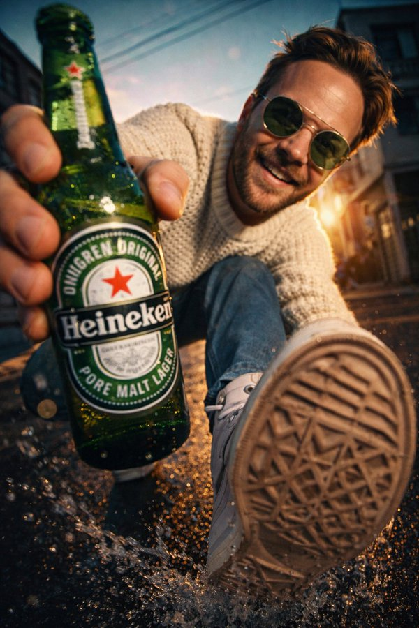


```text
[中文]
专业照片，一位男士，30岁的俄罗斯模特（参考图像），正对着镜头，向相机倾斜，从下往上拍摄，使用广角镜头。男士倾斜着身体，近距离将一瓶饮料展示给镜头，一只手拿着瓶子，紧贴在镜头前。瓶子的标签和方向保持笔直，以便标签清晰可读。他穿着白色运动鞋，一只脚在镜头前方。男士站在街道上，湿漉漉的沥青和飞溅的水花从下方拍出。鲜艳的色彩，电影级灯光，光线从后方打在模特的脸上。--v7 --ar 3:4 --style raw

[English]
Professional photo, a guy, a 30-year-old Russian model (reference image), is facing the lens, tilted towards the camera, angle from below, shot with a wide-angle lens. The guy is tilted and shows a bottle close-up to the camera, a hand with a bottle close-up right in front of the lens. The label and direction of the bottle are straight so the label is readable. He's wearing white sneakers, one foot in front of the camera. The guy is standing on the street, wet asphalt and splashes from below. Bright colors, cinematic lighting, the light is behind and on the model’s face. --v7 --ar 3:4 --style raw
```


---

## 例 324：复古巴士上的红风衣女郎

**来源：** [@iamsofiaijaz](https://x.com/iamsofiaijaz/status/2015337737860403283)

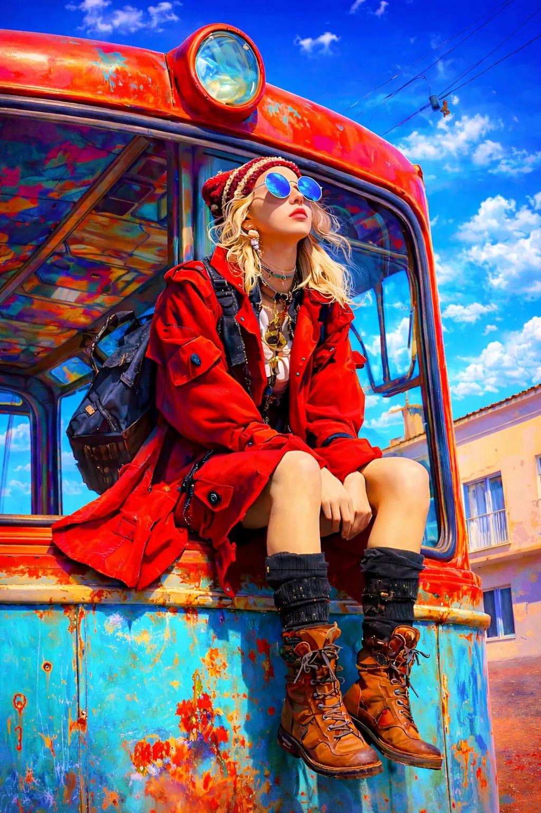


```text
[中文]
一位时尚年轻女子坐在老式复古巴士的前缘，身穿红色长风衣、羊毛无檐小便帽、圆形蓝色反光太阳镜、叠层项链和粗犷的棕色皮靴。她有着波浪状金发，带着自信而梦幻的表情，仰望天空。巴士漆面剥落，呈青绿色与铁锈红色调。明亮清澈的蓝天，城市背景建筑极少，柔和日光，电影级色彩分级，浅景深，高端时尚旅行氛围，编辑摄影，超写实，4K分辨率，锐利对焦，自然肌肤质感，戏剧性构图，电影静帧美学。

[English]
A stylish young woman sitting on the front edge of an old vintage bus, wearing a long red trench coat, woolen beanie cap, round blue reflective sunglasses, layered necklaces, and rugged brown leather boots. She has wavy blonde hair and a confident, dreamy expression, looking upward toward the sky. The bus is weathered with peeling paint in turquoise and rust red tones.Bright clear blue sky, urban background with minimal buildings, soft daylight, cinematic color grading, shallow depth of field, high fashion travel vibe, editorial photography, ultra-realistic, 4K resolution, sharp focus, natural skin texture, dramatic composition, film still aesthetic.
```


---

## 例 326：红蓝撞色高跟诱惑

**来源：** [@meng\_dagg695](https://x.com/meng_dagg695/status/2012437899955097836)

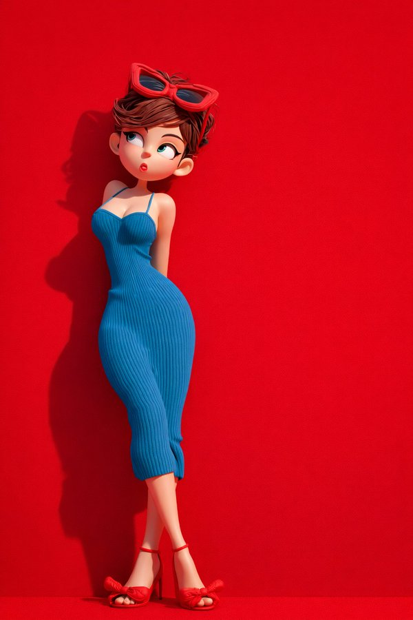


```text
[中文]
{
  "global_settings": {
    "resolution": "8K",
    "quality": "超高清晰度",
    "aspect_ratio": "2:3",
    "render_style": "AI编辑、高细节3D渲染",
    "lighting_quality": "柔和影棚光与逼真阴影",
    "sharpness": "极致清晰、锐利边缘",
    "noise": "无",
    "compression": "无"
  },
  "Module_1_Image_1_Style": {
    "subject": {
      "character_type": "风格化3D卡通女性",
      "pose": "站立、身体微微侧转、一手抬起食指触唇",
      "expression": "灿烂微笑、大眼睛",
      "hair": {
        "color": "黑色",
        "style": "双辫马尾",
        "accessories": "绿色帽子"
      },
      "face": {
        "eyes": "大而圆、深色瞳孔",
        "skin": "光滑、哑光、风格化纹理"
      }
    },
    "clothing": {
      "top": "无袖绿色短款上衣",
      "bottom": "宽松绿色束脚运动裤配抽绳",
      "footwear": "白色运动鞋"
    },
    "accessories": {
      "luggage": "绿色硬壳拉杆行李箱"
    },
    "color_palette": [
      "多种绿色",
      "白色点缀"
    ],
    "background": {
      "color": "纯绿色",
      "texture": "柔软、微颗粒影棚背景"
    },
    "composition": {
      "framing": "全身",
      "camera_angle": "平视",
      "depth": "主体与背景锐利分离"
    }
  },
  "Module_2_Image_2_Style": {
    "subject": {
      "character_type": "风格化3D卡通女性",
      "pose": "微微后仰靠在背景上",
      "expression": "俏皮、嘴唇轻撅、眼睛斜视",
      "hair": {
        "color": "棕色",
        "style": "短发、凌乱",
        "accessories": "红色太阳镜架在头顶"
      }
    },
    "clothing": {
      "dress": "贴身蓝色罗纹吊带裙",
      "footwear": "红色高跟凉鞋配蝴蝶结"
    },
    "color_palette": [
      "大胆红色",
      "深蓝"
    ],
    "background": {
      "color": "纯红色",
      "texture": "光滑哑光表面"
    },
    "lighting": {
      "direction": "一侧柔和定向光",
      "shadow": "在红色背景上投下清晰影子"
    },
    "composition": {
      "framing": "全身",
      "pose_emphasis": "弯曲身姿、交叉双腿"
    }
  },
  "Module_3_Image_3_Style": {
    "subject": {
      "characters": [
        {
          "type": "风格化3D卡通女性",
          "position": "左侧",
          "wrapped_in": "红色纹理毯子",
          "expression": "平静、浅笑、眼睛向上看"
        },
        {
          "type": "风格化3D卡通男性",
          "position": "右侧",
          "wrapped_in": "橙色纹理毯子",
          "expression": "中性、温柔目光向上"
        }
      ]
    },
    "environment": {
      "furniture": "红色沙发",
      "floor": "红色地面",
      "background": {
        "color": "深红色",
        "texture": "织物状横向纹理"
      }
    },
    "details": {
      "feet": "女性赤脚、男性穿袜",
      "blanket_texture": "厚实针织面料"
    },
    "composition": {
      "framing": "居中、中景宽镜头",
      "symmetry": "左右平衡构图"
    }
  }
}

[English]
{
  "global_settings": {
    "resolution": "8K",
    "quality": "ultra-high definition",
    "aspect_ratio": "2:3",
    "render_style": "AI-edited, high-detail 3D render",
    "lighting_quality": "soft studio lighting with realistic shadows",
    "sharpness": "extreme clarity, crisp edges",
    "noise": "none",
    "compression": "none"
  },
  "Module_1_Image_1_Style": {
    "subject": {
      "character_type": "stylized 3D cartoon female",
      "pose": "standing, body slightly angled, one hand raised with index finger touching lips",
      "expression": "cheerful smile, wide eyes",
      "hair": {
        "color": "black",
        "style": "two braided pigtails",
        "accessories": "green cap"
      },
      "face": {
        "eyes": "large, rounded, dark pupils",
        "skin": "smooth, matte, stylized texture"
      }
    },
    "clothing": {
      "top": "sleeveless green crop top",
      "bottom": "loose green jogger-style pants with drawstring",
      "footwear": "white sneakers"
    },
    "accessories": {
      "luggage": "green hard-shell suitcase with extended handle"
    },
    "color_palette": [
      "multiple shades of green",
      "white accents"
    ],
    "background": {
      "color": "solid green",
      "texture": "soft, slightly grainy studio backdrop"
    },
    "composition": {
      "framing": "full body",
      "camera_angle": "eye-level",
      "depth": "subject sharply separated from background"
    }
  },
  "Module_2_Image_2_Style": {
    "subject": {
      "character_type": "stylized 3D cartoon female",
      "pose": "leaning slightly backward against background",
      "expression": "playful, lips slightly pursed, eyes looking sideways",
      "hair": {
        "color": "brown",
        "style": "short, tousled",
        "accessories": "red sunglasses resting on head"
      }
    },
    "clothing": {
      "dress": "form-fitting blue ribbed dress with thin straps",
      "footwear": "red high-heel sandals with bow detail"
    },
    "color_palette": [
      "bold red",
      "deep blue"
    ],
    "background": {
      "color": "solid red",
      "texture": "smooth matte surface"
    },
    "lighting": {
      "direction": "soft directional light from one side",
      "shadow": "defined shadow cast on red background"
    },
    "composition": {
      "framing": "full body",
      "pose_emphasis": "curved posture, crossed legs"
    }
  },
  "Module_3_Image_3_Style": {
    "subject": {
      "characters": [
        {
          "type": "stylized 3D cartoon female",
          "position": "left",
          "wrapped_in": "red textured blanket",
          "expression": "calm, slight smile, eyes looking upward"
        },
        {
          "type": "stylized 3D cartoon male",
          "position": "right",
          "wrapped_in": "orange textured blanket",
          "expression": "neutral, gentle gaze upward"
        }
      ]
    },
    "environment": {
      "furniture": "red sofa",
      "floor": "red surface",
      "background": {
        "color": "deep red",
        "texture": "fabric-like horizontal texture"
      }
    },
    "details": {
      "feet": "female barefoot, male wearing socks",
      "blanket_texture": "thick, knitted fabric"
    },
    "composition": {
      "framing": "centered, medium-wide shot",
      "symmetry": "balanced left and right composition"
    }
  }
```


---

## 例 327：沉香玫瑰悬浮幻景

**来源：** [@meng\_dagg695](https://x.com/meng_dagg695/status/2011334627290726746)


```text
[中文]
{
  "master_prompt_type": "超精细8K AI图像生成",
  "global_settings": {
    "resolution": "8K UHD",
    "aspect_ratio": "2:3 竖版",
    "render_quality": "极致锐度、超微细节、电影级光效",
    "style": "超现实商业产品摄影",
    "color_profile": "温暖金调搭配柔和琥珀高光",
    "environment": {
      "location": "古老中东市场走廊",
      "architecture": {
        "walls": "岁月痕迹的粗糙石墙与可见纹理",
        "arches": "背景巨型石拱",
        "floor": "暖棕色石材地面"
      },
      "background_elements": [
        "装满香料的木架",
        "袋装与碗装干货",
        "悬挂草药束",
        "散发暖黄光的传统金属灯笼"
      ],
      "lighting": {
        "primary": "柔和金色环境光",
        "secondary": "两侧暖灯笼辉光",
        "atmosphere": "薄雾增强光线漫射"
      }
    },
    "main_subject": {
      "type": "香水瓶",
      "position": "中心前景",
      "placement": "置于华丽木桌之上",
      "material": {
        "bottle": "透明清玻璃",
        "cap": "黄金金属矩形瓶盖",
        "liquid": "淡金香水液体"
      },
      "design": {
        "shape": "圆角矩形瓶身",
        "finish": "高光反射表面",
        "label": "无可见标签"
      },
      "table": {
        "material": "深色雕花木材",
        "shape": "方形台面",
        "details": [
          "繁复花卉与几何雕刻",
          "金色镶嵌装饰",
          "抛光表面映光"
        ]
      },
      "floating_elements": {
        "composition_style": "竖向成分堆叠",
        "motion": "成分悬浮并伴随旋转金光",
        "effects": [
          "发光粒子",
          "闪耀尘埃",
          "柔光尾迹连接元素"
        ],
        "elements_order_top_to_bottom": [
          {
            "ingredient": "琥珀树脂",
            "appearance": "半透明金棕树脂块",
            "glow": "温暖内发光"
          },
          {
            "ingredient": "大马士革玫瑰",
            "appearance": "盛放粉色玫瑰",
            "details": [
              "柔软层叠花瓣",
              "自然绿叶",
              "轻飘附近花瓣"
            ]
          },
          {
            "ingredient": "白麝香",
            "appearance": "光滑白水晶状石块",
            "additional": "石下细白粉末"
          },
          {
            "ingredient": "陈年沉香",
            "appearance": "深棕木片",
            "texture": "粗糙纤维木纹",
            "effect": "缕缕白烟上升"
          }
        ]
      },
      "text_elements": {
        "title": {
          "text": "精致叙利亚香水",
          "font_style": "优雅衬线体",
          "color": "金色",
          "position": "顶部中央"
        },
        "subtitle": {
          "text": "奢华叙利亚香水",
          "font_style": "较小衬线体",
          "color": "金色",
          "position": "主标题下方"
        },
        "ingredient_labels": [
          {
            "title": "纯琥珀",
            "description": "来自自然深处的珍贵树脂"
          },
          {
            "title": "大马士革玫瑰",
            "description": "美丽与叙利亚传承的象征"
          },
          {
            "title": "白麝香",
            "description": "干净、粉感、永恒优雅的香氛"
          },
          {
            "title": "陈年沉香",
            "description": "深邃温暖、浓郁烟熏木香"
          }
        ],
        "typography_details": {
          "connector_lines": "细弯金线连接文字与成分",
          "icons": "线末端小圆点标记"
        },
        "opacity": "轻微半透明"
      }
    },
    "overall_mood": {
      "tone": "奢华、温暖、优雅",
      "theme": "传承香水工艺",
      "visual_feel": "浓郁、高端、电影级广告"
    }
  }
}

[English]
{
  "master_prompt_type": "Ultra-detailed 8K AI image generation",
  "global_settings": {
    "resolution": "8K UHD",
    "aspect_ratio": "2:3 vertical",
    "render_quality": "extreme sharpness, ultra-fine detail, cinematic lighting",
    "style": "hyper-realistic commercial product photography",
    "color_profile": "warm golden tones with soft amber highlights",
    "environment": {
      "location": "ancient Middle Eastern market corridor",
      "architecture": {
        "walls": "aged stone walls with visible texture and wear",
        "arches": "large stone archway in background",
        "floor": "stone flooring, warm brown tone"
      },
      "background_elements": [
        "wooden shelves filled with spices",
        "sacks and bowls of dried goods",
        "hanging bundles of herbs",
        "traditional metal lanterns emitting warm yellow light"
      ],
      "lighting": {
        "primary": "soft golden ambient light",
        "secondary": "warm lantern glow from both sides",
        "atmosphere": "slight haze enhancing light diffusion" "main_subject": {
          "type": "perfume bottle",
          "position": "center foreground",
          "placement": "on top of an ornate wooden table",
          "material": {
            "bottle": "transparent clear glass",
            "cap": "gold metallic rectangular cap",
            "liquid": "light golden perfume liquid"
          },
          "design": {
            "shape": "rectangular bottle with rounded edges",
            "finish": "glossy reflective surface",
            "label": "no visible label" "table": {
              "material": "dark carved wood",
              "shape": "square top",
              "details": [
                "intricate floral and geometric carvings",
                "golden inlay accents",
                "polished surface reflecting light" "floating_elements": {
                  "composition_style": "vertical ingredient stack",
                  "motion": "ingredients appear suspended with swirling golden light",
                  "effects": [
                    "glowing particles",
                    "sparkling dust",
                    "soft light trails connecting elements"
                  ],
                  "elements_order_top_to_bottom": [
                    {
                      "ingredient": "amber resin",
                      "appearance": "translucent golden-brown resin chunks",
                      "glow": "warm internal glow" "ingredient": "damask rose",
                      "appearance": "fully bloomed pink rose",
                      "details": [
                        "soft layered petals",
                        "natural green leaves",
                        "petals gently floating nearby"
                      ] "ingredient": "white musk",
                      "appearance": "smooth white crystal-like stone",
                      "additional": "fine white powder beneath the stone" "ingredient": "aged agarwood",
                      "appearance": "dark brown wooden pieces",
                      "texture": "rough, fibrous wood grain",
                      "effect": "thin white smoke rising upward" "text_elements": {
                        "title": {
                          "text": "Exquisite Syrian Perfume",
                          "font_style": "elegant serif",
                          "color": "gold",
                          "position": "top center"
                        },
                        "subtitle": {
                          "text": "Luxury Syrian Perfume",
                          "font_style": "smaller serif",
                          "color": "gold",
                          "position": "below main title"
                        },
                        "ingredient_labels": [
                          {
                            "title": "Pure Amber",
                            "description": "Precious resin from the depths of nature"
                          } "title": "Damask Rose",
                          "description": "Symbol of beauty and Syrian heritage"
                        },
                        {
                          "title": "White Musk",
                          "description": "Clean, powdery scent of timeless elegance"
                        },
                        {
                          "title": "Aged Agarwood",
                          "description": "Rich, smoky wood with deep warmth"
                        }
                      ],
                      "typography_details": {
                        "connector_lines": "thin curved golden lines connecting text to ingredients",
                        "icons": "small circular markers at line endpoints"
                      } "opacity": "slightly translucent"
                    } "overall_mood": "tone": "luxurious, warm, elegant",
                    "theme": "heritage perfume craftsmanship",
                    "visual_feel": "rich, premium, cinematic ads
```


---

## 例 328：俯拍巨女城景自拍

**来源：** [@saniaspeaks\_](https://x.com/saniaspeaks_/status/2009834337043394622)

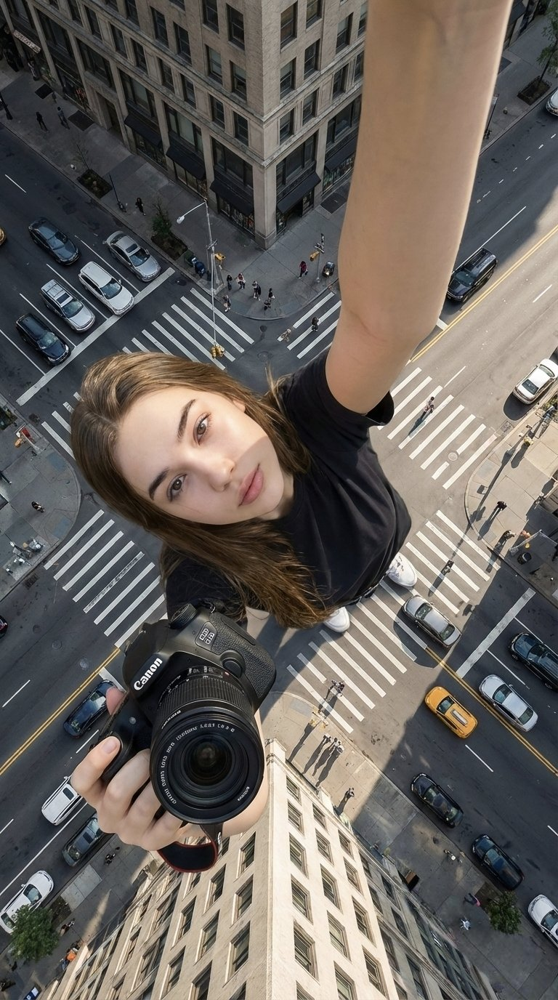


```text
[中文]
{
  "type": "图像生成提示词",
  "language": "zh",
  "style": "超现实电影感自拍摄影",
  "aspect_ratio": "9:16",
  "identity_preservation": {
    "use_reference_image": true,
    "strict_identity_lock": true,
    "alter_face": false,
    "alter_skin": false,
    "alter_hair": false,
    "alter_gender": false,
    "notes": "保留上传参考图像中完全一致的脸部特征、皮肤纹理、头发、眼镜、年龄和性别。禁止合成皮肤或雕塑感。"
  },
  "subject": {
    "gender": "女性",
    "capture_method": "由主体本人拍摄的自拍",
    "pose": {
      "selfie_arm": {
        "description": "一只手臂完全伸直并完全向上伸展，手持拍摄自拍的相机",
        "visibility": "手臂在画面中清晰可见、笔直且占主导地位",
        "camera_visibility": "自拍相机设备本身不得在画面中出现"
      },
      "product_arm": {
        "description": "另一只手臂完全伸向相机，手持附带的佳能相机",
        "importance": "产品最靠近相机并在视觉上占主导地位"
      },
      "head": {
        "tilt": "头部向自拍相机微微倾斜"
      },
      "expression": "自然放松的面部表情"
    },
    "body_visibility": "从头到脚全身可见",
    "feet": "双脚清晰接触路面"
  },
  "composition": {
    "perspective": "胸部高度的自然自拍视角",
    "camera_angle": "极端俯拍角度，相机位于主体正上方并直视下方",
    "layer_depth": [
      "产品（最靠近相机）",
      "脸部",
      "全身",
      "城市环境（背景）"
    ]
  },
  "scale_and_perspective": {
    "effect": "强制透视",
    "subject_scale": "女性呈现极度巨大",
    "buildings_scale": "建筑物显得小得多，最高不超过她的膝盖",
    "dominance": "主体在视觉上完全主导整个场景",
    "realism": "激发规模感同时保持物理可信"
  },
  "environment": {
    "location": "真实城市十字路口",
    "elements": [
      "人行横道",
      "道路标线",
      "交通标志",
      "汽车",
      "自行车",
      "真实人类尺度的行人"
    ],
    "setting": "地面层城市环境"
  },
  "lighting": {
    "type": "自然日光",
    "conditions": "晴朗或轻度多云天空",
    "shadows": "柔和且真实",
    "restrictions": "禁止奇幻或戏剧性照明"
  },
  "product_rules": {
    "usage": "完全按提供的上传佳能产品使用",
    "distortion": "无",
    "logo": "保持不变",
    "appearance": "仅有自然反射和真实高光"
  },
  "camera_quality": {
    "realism": "最大照片真实感",
    "depth": "前景、主体与背景清晰分离",
    "artifacts": "无"
  },
  "constraints": [
    "禁止AI艺术感",
    "禁止塑料或雕塑皮肤",
    "禁止扭曲脸部或身体",
    "禁止多余肢体或错误解剖",
    "禁止文字或水印",
    "禁止可见自拍相机设备"
  ],
  "output_goal": "创作一张超现实电影感自拍图像：女性使用其确切参考身份，从极端俯拍视角在真实城市人行横道拍摄，具备强制透视比例、自然日光，并将佳能相机产品明显持向镜头。"
}

[English]
{
  "type": "image_generation_prompt",
  "language": "en",
  "style": "hyper-realistic cinematic selfie photography",
  "aspect_ratio": "9:16",
  "identity_preservation": {
    "use_reference_image": true,
    "strict_identity_lock": true,
    "alter_face": false,
    "alter_skin": false,
    "alter_hair": false,
    "alter_gender": false,
    "notes": "Preserve identical facial features, skin texture, hair, glasses, age, and gender from the uploaded reference image. No synthetic skin or sculptural look."
  },
  "subject": {
    "gender": "female",
    "capture_method": "selfie taken by the subject herself",
    "pose": {
      "selfie_arm": {
        "description": "one arm fully straight and completely extended upward holding the camera that takes the selfie",
        "visibility": "arm clearly visible, straight and dominant in frame",
        "camera_visibility": "the selfie camera device itself must NOT be visible in the frame"
      },
      "product_arm": {
        "description": "the other arm fully extended toward the camera holding the attached Canon camera",
        "importance": "product is closest to the camera and visually dominant"
      },
      "head": {
        "tilt": "slightly tilted toward the selfie camera"
      },
      "expression": "natural and relaxed facial expression"
    },
    "body_visibility": "full body visible from head to toe",
    "feet": "feet clearly touching the road surface"
  },
  "composition": {
    "perspective": "natural selfie perspective at chest height",
    "camera_angle": "extreme top-down angle, camera above the subject looking directly downward",
    "layer_depth": [
      "product (closest to camera)",
      "face",
      "full body",
      "city environment (background)"
    ]
  },
  "scale_and_perspective": {
    "effect": "forced perspective",
    "subject_scale": "the woman appears extremely giant",
    "buildings_scale": "buildings appear much smaller, reaching no higher than her knees",
    "dominance": "the subject visually dominates the entire scene",
    "realism": "inspiring scale while remaining physically believable"
  },
  "environment": {
    "location": "real urban intersection",
    "elements": [
      "pedestrian crosswalk",
      "road markings",
      "traffic signs",
      "cars",
      "bicycles",
      "pedestrians at realistic human scale"
    ],
    "setting": "ground-level urban environment"
  },
  "lighting": {
    "type": "natural daylight",
    "conditions": "clear or lightly cloudy sky",
    "shadows": "soft and realistic",
    "restrictions": "no fantasy or dramatic lighting"
  },
  "product_rules": {
    "usage": "use the uploaded Canon product exactly as provided",
    "distortion": "none",
    "logo": "unchanged",
    "appearance": "natural reflections and realistic highlights only"
  },
  "camera_quality": {
    "realism": "maximum photorealism",
    "depth": "clear separation of foreground, subject, and background",
    "artifacts": "none"
  },
  "constraints": [
    "No AI-art look",
    "No plastic or sculpted skin",
    "No distortion of face or body",
    "No extra limbs or incorrect anatomy",
    "No text or watermarks",
    "No visible selfie camera device"
  ],
  "output_goal": "Create a hyper-realistic cinematic selfie image of a woman using her exact reference identity, captured from an extreme top-down perspective in a real urban crosswalk, with forced perspective scale, natural daylight, and a Canon camera product prominently held toward the lens."
}
```


---

## 例 340：彼岸花丛中的红妆女子

**来源：** [@xiaofenggan](https://x.com/xiaofenggan)

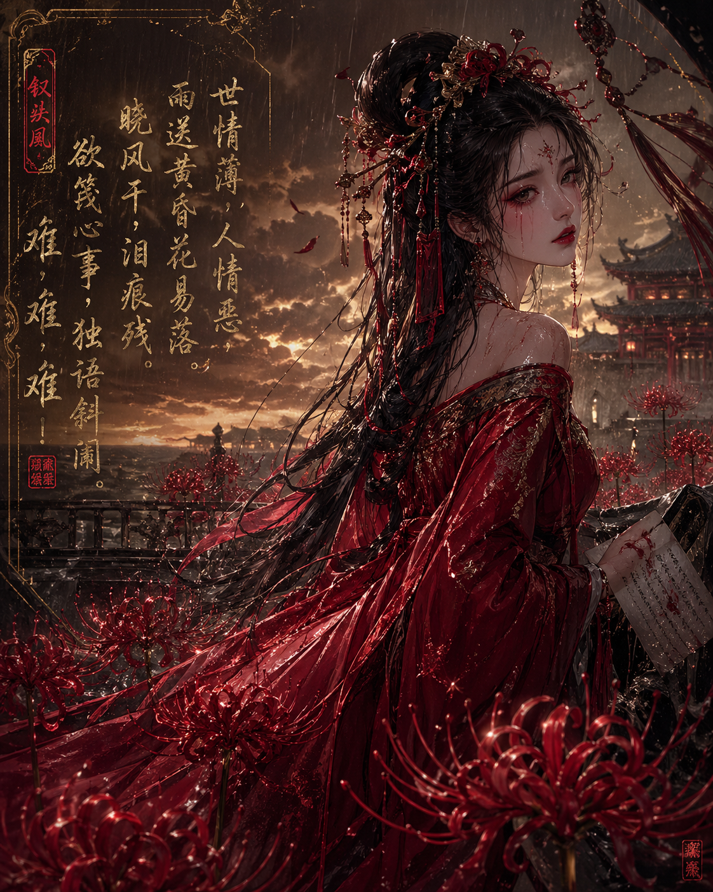


```text
异质感oc，绝美红妆女子，位于彼岸花丛中，张力。 唐琬《钗头凤·世情薄》 世情薄，人情恶，雨送黄昏花易落。晓风干，泪痕残。欲笺心事，独语斜阑。难，难，难！
```

## 例 341：9:16 vertical — a 3x3 grid collage (nine images) forming a Korean idol portrait ...

**来源：** [@BubbleBrain](https://x.com/BubbleBrain/status/2046151898621993364)

```text
9:16 vertical — a 3x3 grid collage (nine images) forming a Korean idol portrait photoshoot series. Each frame features the same young Korean female idol, maintaining 100% consistency in facial features, proportions, hairstyle, and identity across all nine shots.   Natural, ultra-realistic skin texture, no retouching, no smoothing. Clean idol-style minimal makeup, soft glow, subtle imperfections.   Hair: long, voluminous dark hair, slightly tousled, consistent across all frames (natural loose flow, slight movement).  Outfit: cohesive Korean idol photoshoot styling — white shirt + short bottoms (or simple neutral-toned outfit), youthful, clean, slightly casual but styled. Same outfit across all frames.  Setting: minimal studio or simple indoor environment (plain wall, soft window light, clean background). Focus on subject, not environment.  Lighting: soft diffused natural light, gentle highlights, low contrast, slightly airy tones, subtle film-like softness.  Camera style: intimate portrait photography, slightly handheld feel, subtle imperfections (minor grain, slight blur in motion frames, imperfect framing).  Frame breakdown (3x3 grid):  Top row: - Top left: standing naturally, looking slightly away, relaxed expression - Top center: facing camera, casual mid-motion (hair or body slight movement) - Top right: slight side angle, soft gaze, natural candid feel  Middle row: - Center left: looking slightly upward, soft thoughtful expression - Center: close-up portrait, direct eye contact, gentle idol smile - Center right: turning body slightly, mid-motion candid frame  Bottom row: - Bottom left: seated or leaning casually, relaxed posture - Bottom center: back partially turned, looking over shoulder toward camera - Bottom right: standing close to frame, slightly playful or soft expression  Mood: Korean idol photobook / photocard aesthetic, intimate, soft, natural, everyday charm.  Quality: ultra-realistic, 8K detail, subtle analog film grain, natural imperfections, soft dreamy tone
```


---
## 例 342：Analog 35mm film photography, soft airy Japanese-style aesthetic, gentle diffuse...

**来源：** [@BubbleBrain](https://x.com/BubbleBrain/status/2046115431144902732)

```text
Analog 35mm film photography, soft airy Japanese-style aesthetic, gentle diffused natural window light, slight overexposure, pastel tones, low contrast, soft highlights,  minimal indoor setting near a window with white curtains, clean light-colored wall, natural composition, eye-level, slightly closer full-body framing (mid-thigh to head),  young East Asian woman, natural minimal makeup, soft realistic skin texture, long slightly messy dark hair,  oversized white button-up shirt, light casual shorts, barefoot, simple and relaxed styling,  standing naturally with relaxed posture, arms loosely at sides or slightly behind, facing camera, gentle soft smile, subtle stillness,  focus on light, air, and quiet everyday mood, soft film grain, dreamy and understated atmosphere --ar 9:16
```


---
## 例 343：{   "prompt": {     "style_and_tech": "mobile phone photo, old CCD camera aesthe...

**来源：** [@BubbleBrain](https://x.com/BubbleBrain/status/2046190539213885806)

```text
{   "prompt": {     "style_and_tech": "mobile phone photo, old CCD camera aesthetic, harsh flash, grainy, dim messy indoor lighting, candid snapshot feeling, slight motion blur",      "subject": "young Korean female idol, soft innocent look",      "pose": "mid-action, slightly turning head toward camera as if just noticed being photographed, shoulders slightly raised",      "expression": "eyes widened slightly, lips parted in surprise, shy and caught-off-guard expression",      "clothing": "loose soft homewear (thin cardigan + inner top), slightly slipping off one shoulder but not revealing",      "vibe": "unprepared, intimate, accidental moment, evokes curiosity and protectiveness"，   "aspect ratio":"9:16"    } }
```


---
## 例 344：9:16 vertical — editorial portrait, single subject  soft black mist filter, subt...

**来源：** [@BubbleBrain](https://x.com/BubbleBrain/status/2046434670724907395)

```text
9:16 vertical — editorial portrait, single subject  soft black mist filter, subtle haze, gentle highlight bloom, muted tones  minimal indoor space, clean background, slight texture  young Korean woman, minimal makeup, natural skin texture  outfit: fitted ribbed knit top or soft camisole layered under a loose shirt, paired with high-waisted shorts or skirt; fabric slightly clings to body shape, soft and natural, no revealing elements  hair: slightly messy, natural volume  pose: sitting on floor with one leg bent and the other relaxed, body slightly leaning, shoulders not aligned, head tilted  composition: subject slightly off-center, negative space present  expression: calm, slightly distant, natural lips  lighting: soft side light, gentle shadow falloff  mood: understated, quiet, subtly sensual through natural body lines, relaxed and unposed  quality: fine grain, slight softness, realistic look
```


---
## 例 345：9:16 vertical — Korean idol portrait photoshoot, 3x3 grid (nine frames), same pe...

**来源：** [@BubbleBrain](https://x.com/BubbleBrain/status/2046268941941850575)

```text
9:16 vertical — Korean idol portrait photoshoot, 3x3 grid (nine frames), same person in all images, consistent facial features and styling.

soft black mist filter effect, lowered contrast, blooming highlights, subtle glow around light sources, slightly faded blacks

natural indoor setting near window, white curtains, clean wall background

young Korean female idol, minimal makeup, soft realistic skin texture, slight imperfections

outfit: white shirt + shorts, simple and relaxed styling

hair: long dark hair, slightly messy, naturally flowing

poses vary across nine frames: standing, slight movement, seated, looking away, close-up, over-shoulder glance, candid transitions

lighting: diffused daylight, soft shadows, gentle highlight bloom

mood: quiet, intimate, everyday poetic moment, photobook aesthetic

quality: ultra-realistic, subtle film grain, soft focus edges, dreamy atmosphere
```


---
## 例 346：9:16 vertical — Japanese Fuji film style portrait, single subject  Fujifilm anal...

**来源：** [@BubbleBrain](https://x.com/BubbleBrain/status/2046483268019884384)

```text
9:16 vertical — Japanese Fuji film style portrait, single subject  Fujifilm analog aesthetic (Pro 400H / Superia feel), soft pastel tones, slight green-magenta shift, low contrast, gentle highlight roll-off, fine film grain, subtle halation, slight vignette  bright natural daylight, diffused sunlight through window, soft shadows, airy atmosphere  young Japanese female idol, natural minimal makeup, fresh glowing skin, realistic texture, slight imperfections  outfit: Japanese school uniform (sailor-style or blazer uniform), neatly styled, non-revealing, youthful and clean  hair: natural dark hair, straight or softly flowing, a few loose strands  pose: front-facing or slight angle toward camera, relaxed posture; one hand gently holding a strawberry near lips, mid-action as if about to take a bite; shoulders relaxed, subtle natural body curve  expression: soft playful gaze, light smile or neutral lips, gentle eye contact with camera  setting: minimal indoor near window or simple outdoor corner, clean background, everyday atmosphere  composition: slightly off-center framing, intimate distance, candid feel  mood: fresh, youthful, sweet everyday moment, understated charm  quality: ultra-realistic, analog film look, natural imperfections, soft dreamy finish
```


---
## 例 347：9:16 vertical — Korean idol portrait photography, single subject  soft black mis...

**来源：** [@BubbleBrain](https://x.com/BubbleBrain/status/2046518189509734903)

```text
9:16 vertical — Korean idol portrait photography, single subject  soft black mist filter effect, lowered contrast, gentle highlight bloom, subtle glow, soft diffusion, slightly faded blacks  minimal indoor setting near window, white curtains, clean light-toned background  young Korean female idol, natural minimal makeup, dewy realistic skin texture, subtle imperfections  outfit: oversized white button-up shirt + short bottoms, slightly loose fit, soft and casual styling, no revealing elements  hair: long dark hair, slightly messy, natural volume, softly flowing  pose: relaxed standing or slight lean, body subtly angled, one leg slightly forward, shoulders relaxed; one hand lightly touching collar or resting near neckline, the other relaxed; gentle body curve without exaggeration  expression: soft cute smile, slightly playful eyes, direct or slightly off-camera gaze  camera: close to mid-body framing, eye-level, intimate distance, slight handheld feel  lighting: diffused natural daylight, soft shadows, gentle light wrapping around face and body  mood: cute yet subtly sensual, intimate, everyday softness, quiet romantic atmosphere  quality: ultra-realistic, fine film grain, slight softness at edges, natural imperfections, dreamy understated tone
```


---
## 例 348：9:16 vertical — Japanese Fuji film style couple portrait, two subjects  Fujifilm...

**来源：** [@BubbleBrain](https://x.com/BubbleBrain/status/2046502288102170757)

```text
9:16 vertical — Japanese Fuji film style couple portrait, two subjects  Fujifilm analog aesthetic (Pro 400H / Superia feel), soft pastel tones, slight green-magenta shift, low contrast, gentle highlight roll-off, fine film grain, subtle halation  bright natural daylight, diffused sunlight through window, soft shadows, airy atmosphere  young Japanese couple, natural minimal makeup, realistic skin texture, slight imperfections  female outfit: oversized button-up shirt with loose shorts, relaxed fit, soft casual styling   male outfit: simple t-shirt or light shirt, clean and understated  hair: natural, slightly tousled for both  pose: close intimate distance — sitting or standing close together; the girl gently leaning toward him, one hand lightly resting on his shoulder or chest; the boy slightly leaning in, faces close, almost touching, capturing the moment just before a kiss  expression: soft smiles or gentle gaze toward each other, relaxed and natural, emotional connection visible  camera: close framing (waist-up), eye-level, intimate distance, slight handheld feel  setting: minimal indoor near window, light curtains, clean soft background  lighting: diffused daylight, gentle highlight bloom, soft shadow transitions  mood: warm, romantic, intimate everyday moment, natural affection  quality: ultra-realistic, analog film look, fine grain, slight softness, natural imperfections
```


---
## 例 349：根据你对我的认知 给我生成一个“你认识的我”的 图片

**来源：** [@80vul](https://x.com/80vul/status/2046218165961753047)

```text
根据你对我的认知 给我生成一个“你认识的我”的 图片
```


---
## 例 350：超写实与水墨的梦幻融合

**来源：** [@johnAGI168](https://x.com/johnAGI168/status/2046596103919767857)

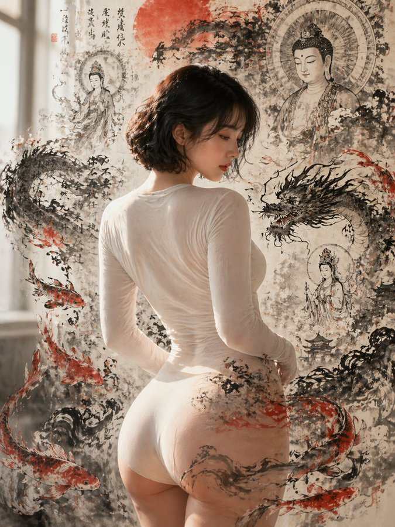


```text
[中文]
一张动态的混合媒体摄影作品，将超写实肖像与传统的中国水墨插画相融合。

中心人物是一位具有柔和短波波头短发造型的照片般逼真的年轻亚洲女性。她的妆容自然且极简，表情平静而温柔。她背对相机站立，姿态呈现出优雅的S型曲线，营造出优美流畅的剪影。她微微转动上半身，越过肩膀回眸，带着一种安静、内省的情绪。

她穿着一件简约、修身的白色长袖服装，线条干净，面料柔软，传达出纯洁与极简主义，不显露细节。

她被置于一个靠近阳光明媚窗户的真实世界室内环境中。背景被严重模糊，具有强烈的散景和浅景深，营造出梦幻且充满氛围的环境。

从这种柔和模糊的现实之中，爆发出丰富的传统水墨插画，并环绕着她的身形。构图包括：

- 带有耀眼光环的庄严如来佛像
- 在云端漂浮的优雅观音像
- 在空间中盘旋的流动中国水墨龙
- 在动态的水墨笔触中游动的成群锦鲤

这些元素以黑墨和朱红色调渲染，形成一幅密集的、具有精神力量的视觉织锦。水墨在她周围有机地流动，部分重叠并融入她的剪影之中，在现实与神话之间创造出无缝的融合。

没有轮廓线或贴纸效果。融合是自然、流畅且沉浸式的。

风格：电影级摄影，超精细，8k，柔光，现实与水墨艺术之间的高对比度，美术构图，博物馆级美学
宽高比：3:4

[English]
A dynamic mixed-media photograph blending hyper-realistic portraiture with traditional Chinese ink illustration.

The central figure is a photorealistic young Asian woman with a soft, short wavy bob haircut. Her makeup is natural and minimal, with a calm and gentle expression. She stands with her back to the camera in an elegant S-curve posture, creating a graceful and flowing silhouette. She slightly turns her upper body to glance over her shoulder with a quiet, introspective mood.

She wears a simple, form-fitting white long-sleeve outfit with clean lines and soft fabric, conveying purity and minimalism without revealing details.

She is placed in a real-world indoor setting near a sunlit window. The background is heavily blurred with strong bokeh and shallow depth of field, creating a dreamy and atmospheric environment.

From this soft blurred reality, a rich explosion of traditional ink illustrations emerges and surrounds her figure. The composition includes:

- Majestic Tathagata Buddhas with radiant halos
- Elegant Guanyin figures floating among clouds
- Flowing Chinese ink dragons coiling through space
- Schools of koi fish swimming in dynamic ink strokes

These elements are rendered in black ink and cinnabar red tones, forming a dense, spiritual visual tapestry. The ink flows organically around her, partially overlapping and blending into her silhouette, creating a seamless fusion between reality and myth.

No outlines or sticker effects. The integration is natural, fluid, and immersive.

Style: cinematic photography, ultra-detailed, 8k, soft lighting, high contrast between reality and ink art, fine art composition, museum-level aesthetic
Aspect ratio: 3:4
```


---
## 例 351：试卷上的涂鸦巨龙

**来源：** [@GeekCatX](https://x.com/GeekCatX/status/2046539797578330152)

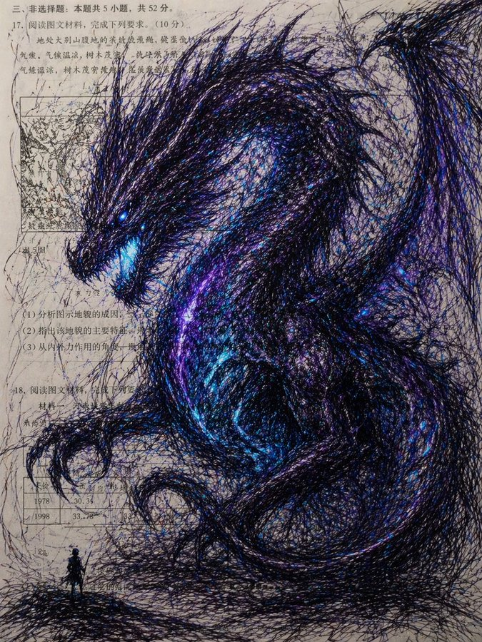


```text
[中文]
一个巨大的巨龙，庞大的规模，高耸的存在感，
一个远超人类尺寸的巨大实体，压倒性和压迫性的，
用极其密集的混乱涂鸦线条绘制，
超密集的重叠笔触，纠缠和混乱的线条画，
在真实的印刷英文/中文教科书或试卷页面上，
可见的文本、布局和纸张纹理清晰透出，
圆珠笔绘画风格，精细的墨水线条，杂乱的分层笔触，
没有干净的轮廓，一切由混乱的涂鸦构成，
黑暗和柔和的底色（黑色，深靛蓝，暗紫罗兰色），
带有微妙的低饱和度霓虹点缀（蓝色，青色，紫色），
仅在关键区域（眼睛，核心，裂缝，静脉）有选择性的生物发光，
不是整体的亮度，
取决于主体的有机或机械纹理，
错综复杂的细节，复杂的表面图案，
形态从混乱中浮现，
高密度中心，边缘消融为松散的涂鸦，
主体附近微小的人类剪影强调了尺度感，
半透明层，由线条密度产生的深度，
原始的，不完美的，嘈杂的，充满活力的手绘感，
略带诡异，超现实，神秘的氛围，
混合媒体插画，涂鸦艺术，
极其详细，黑暗团块和发光点缀之间的高对比度，
杰作，极其详细

[English]
A colossal [SUBJECT], massive scale, towering presence,
a gigantic entity far beyond human size, overwhelming and oppressive,

drawn with extremely dense chaotic scribble lines,
ultra-dense overlapping pen strokes, tangled and chaotic linework,

on top of a real printed English/Chinese textbook or exam paper page,
visible text, layout, and paper texture clearly showing through,

ballpoint pen drawing style, fine ink lines, messy layered strokes,
no clean outlines, everything constructed from chaotic scribbles,

dark and muted base tones (black, deep indigo, dark violet),
with subtle low-saturation neon accents (blue, cyan, purple),

selective bioluminescent glow only in key areas (eyes, core, cracks, veins),
not overall brightness,

organic or mechanical textures depending on subject,
intricate details, complex surface patterns,

form emerging from chaos,
high-density center, edges dissolving into loose scribbles,

sense of scale emphasized by tiny human silhouette near the subject,

semi-transparent layers, depth created by line density,
raw, imperfect, noisy, energetic hand-drawn feeling,

slightly eerie, surreal, mysterious atmosphere,
mixed media illustration, scribble art,

extremely detailed, high contrast between dark mass and glowing accents,
masterpiece, ultra detailed

主体：巨龙
```


---
## 例 352：三甲医院真实门诊处方笺

**来源：** [@msjiaozhu](https://x.com/msjiaozhu/status/2046546317766500834)


```text
[中文]
一张三甲医院的门诊处方笺，医生潦草的手写字，包含真实合理的 诊断、药品名、剂量，右下角有医生签名和科室章。

[English]
An outpatient prescription sheet from a Grade 3A hospital, doctor's illegible handwriting, containing realistic and reasonable diagnosis, drug names, dosages, with a doctor's signature and department stamp in the bottom right corner.
```


---
## 例 353：桌面上的黑色圆珠笔手写笔记

**来源：** [@patrickassale](https://x.com/patrickassale/status/2044569086013718958)

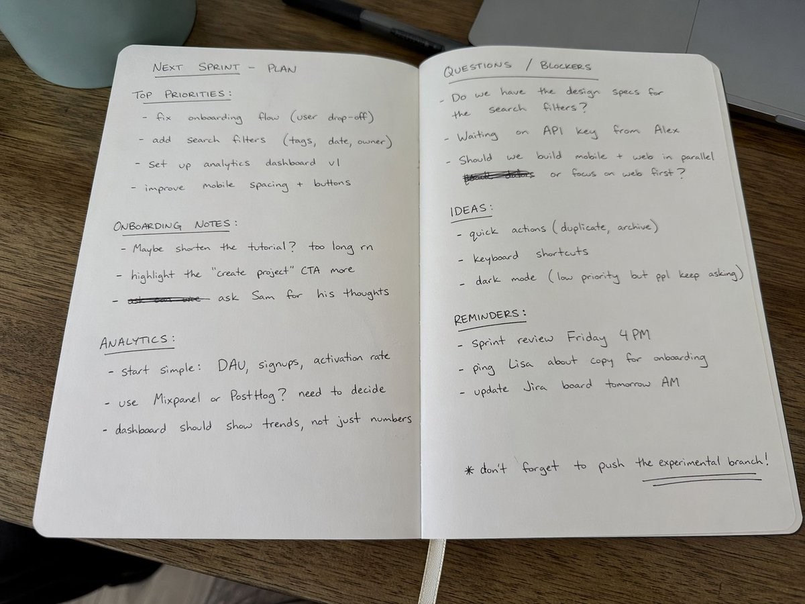


```text
[中文]
一张平放着的打开的笔记本的业余照片，里面填满了用黑色圆珠笔写的手写笔记。笔迹随意且略显凌乱，就像个人笔记，自然的瑕疵，划掉的单词，划线的标题。从略高角度拍摄，来自窗户的自然日光，未使用闪光灯。随意的桌面设置，用 iPhone 拍摄。

[English]
Amateur photo of an open notebook lying flat, filled with handwritten notes in black ballpoint pen. The handwriting is casual and slightly messy, like personnal notes, natural imperfections, crossed out words, underlined headings. Shot from slightly above, natural daylight from a window, no flash. Casual desk setting, shot on iPhone
```


---
## 例 354：真实动漫画面快照

**来源：** [@Thereallo1026](https://x.com/Thereallo1026/status/2044241997163311569)


```text
[中文]
向我展示这张附带的图像作为一部真实动漫的快照

[English]
Show me the attached image as a snapshot from an actual anime
```


---
## 例 355：极致奢华的弹珠店梦幻宣传单

**来源：** [OpenNana](https://opennana.com/awesome-prompt-gallery/luxurious-pachinko-flyer)


```text
[中文]
以 3:4 比例制作一家弹珠店那种闪闪发光的宣传单。放置一个真实、精细的现代可爱日本女性。充分利用闪闪发光、立体感丰富的豪华装饰彩虹字体等，务必做到极致奢华。并列介绍几个不存在的虚构新机型。

[English]
Create a sparkling flyer like those of a pachinko parlor at a 3:4 aspect ratio. Place a realistic, highly detailed modern cute Japanese woman. Make full use of sparkling, three-dimensional richly decorated rainbow typography, etc., and be sure to achieve extreme luxury. Introduce several non-existent fictional new models side by side.
```


---
## 例 356：极简留白涂鸦手绘草图

**来源：** [@VoxcatAI](https://x.com/VoxcatAI/status/2045131503001342302)

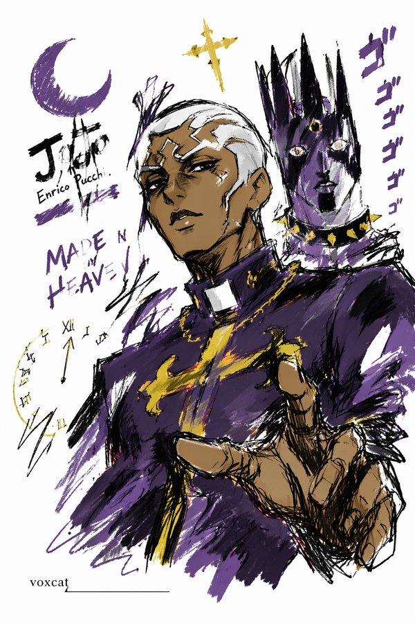


```text
[中文]
以涂鸦速写风表现【主题/主体】，整体呈现快速勾勒、自由变形、即兴手绘与草稿式的视觉效果。线条随手、夸张、可粗细不一，略显凌乱但具有节奏和表现力，强调概括、夸张、趣味和随性，而不是严谨写实或精细刻画。

颜色采用粗糙、干刷感明显的块面表现，可保留不均匀的涂抹痕迹、刷痕、飞白与覆盖感，色彩根据【主题/主体】自动适配，但整体保持涂鸦式、速写式、概括式的表达。不要透明水彩晕染效果，不要细腻水彩过渡，不要纸纹理，不要柔和雾化，不要梦幻质感。

背景以留白为主，保持简洁、轻松、未完成感和设计感，可加入少量辅助性符号、箭头、记号、圈画、重复线、随手写的文字或其他涂鸦元素，以增强速写本或随笔式视觉语言，但不可过于拥挤，不可破坏主体和留白气质。

画面内容不需要预先写清楚，由【主题/主体】自动推演并生成最适合的主体形象、动作、相关元素、符号或简化场景，整体保持统一的涂鸦速写风和夸张概括的表现方式，避免复杂写实背景和过度铺陈。
画面中需自然加入专属签名“voxcat”，作为画面的一部分，位置低调但清晰，可放在左下角、右下角或标题附近，风格需与整体版式统一，像作品署名或设计落款；签名字体精致、克制、高级，不可过大，不可破坏主体构图，不可显得突兀或廉价。

[English]
Express [Subject/Theme] in a graffiti sketch style, presenting an overall visual effect of quick outlining, free deformation, impromptu hand-drawing, and draft-like appearance. The lines are casual, exaggerated, and can vary in thickness, slightly messy but rhythmic and expressive, emphasizing generalization, exaggeration, playfulness, and spontaneity, rather than rigorous realism or detailed rendering. Colors are expressed in rough blocks with a distinct dry-brush feel, retaining uneven smearing traces, brush strokes, dry-brush effects, and a sense of coverage. Colors automatically adapt to [Subject/Theme], but the overall expression remains graffiti-style, sketch-style, and generalized. Do not use transparent watercolor blooming effects, do not use delicate watercolor transitions, do not use paper textures, do not use soft atomization, and do not use dreamy textures. The background is mainly left blank, maintaining a sense of simplicity, relaxation, incompleteness, and design. A small number of auxiliary symbols, arrows, marks, circled areas, repeated lines, casually written text, or other graffiti elements can be added to enhance the visual language of a sketchbook or jotting style, but it must not be too crowded, and must not destroy the subject and the blank space temperament. The image content does not need to be written out in advance; the most suitable subject image, actions, related elements, symbols, or simplified scenes are automatically deduced and generated by [Subject/Theme], keeping the overall unified graffiti sketch style and exaggerated generalized expression, avoiding complex realistic backgrounds and over-elaboration. The exclusive signature "voxcat" needs to be naturally added to the image as a part of the picture. The position should be low-key but clear, and can be placed in the bottom left corner, bottom right corner, or near the title. The style must be consistent with the overall layout, like an artwork signature or a design sign-off; the signature font should be exquisite, restrained, and high-end, must not be too large, must not destroy the subject composition, and must not appear abrupt or cheap.
```


---
## 例 357：黑板上的出师表全文

**来源：** [@rionaifantasy](https://x.com/rionaifantasy/status/2045356799751303194)


```text
[中文]
生成图片:
手写在教室黑板上的出师表全文，真实感的粉笔字迹，晴朗白天用iPhone手机实拍

[English]
Generate image: The full text of Chu Shi Biao handwritten on a classroom blackboard, realistic chalk handwriting, taken with an iPhone in real life on a sunny day
```


---
## 例 358：冲破次元壁的写实漫画跑者

**来源：** [@Fujimoto\_hina](https://x.com/Fujimoto_hina/status/2027748030825500722)


```text
[中文]
{
  "prompt": "超写实，一位留着深色短卷发、修剪整齐的胡须和黑色方形眼镜的年轻男子的鲜艳逼真渲染，身穿深色纹理高领毛衣和牛仔裤。他奔跑到一半被捕捉下来，姿态充满动感，向前突破，充满戏剧性地从一个破碎的漫画分镜框中显现——一条腿和一只手臂冲入现实世界，而身体的其余部分仍留在漫画框内。他的表情充满活力和喜悦，拥有锐利的面部细节，自然的皮肤纹理，以及具有高对比度和深度的戏剧性电影灯光。\n\n背景：一个非常详细的黑白漫画布局，充满了幽默、夸张的且与他直接互动的反应场景。周围的漫画人物表现出震惊和喜剧的表情，配有粗体的对话气泡和速度线。漫画分镜采用经典的高对比度水墨风格绘制，线条清晰，网点阴影。撕裂的纸张边缘和碎片增强了他冲破漫画世界的幻觉。全彩色的写实人物与单色的漫画环境形成强烈对比，创造出写实与漫画艺术之间的动态混合体。超精细，8k分辨率，清晰聚焦，戏剧性的阴影，电影级景深。"
}

[English]
{
  "prompt": "Ultra-realistic, vibrant photorealistic rendering of a young man with short curly dark hair, neatly trimmed beard, and black rectangular glasses, wearing a dark textured turtleneck sweater and jeans. He is captured mid-run in a dynamic, forward-breaking pose, dramatically emerging from a torn manga panel — one leg and one arm bursting into the real world while the rest of his body remains inside the comic frame. His expression is energetic and joyful, with sharp facial details, natural skin texture, and dramatic cinematic lighting with high contrast and depth. \n\nBackground: a highly detailed black-and-white manga layout filled with humorous, exaggerated reaction scenes that directly interact with him. The surrounding manga characters display shocked and comedic expressions, with bold speech bubbles and motion lines. The manga panels are illustrated in a classic high-contrast ink style with crisp linework and halftone shading. Torn paper edges and debris enhance the illusion of him breaking through the comic world. The fully colored, photorealistic figure contrasts strongly against the monochrome manga environment, creating a dynamic hybrid between reality and comic art. Ultra-detailed, 8k resolution, sharp focus, dramatic shadows, cinematic depth of field."
}
```


---

## 例 359：鱼眼镜面复古咖啡馆人像

**来源：** [@harboriis](https://x.com/harboriis/status/2049044698900361241)

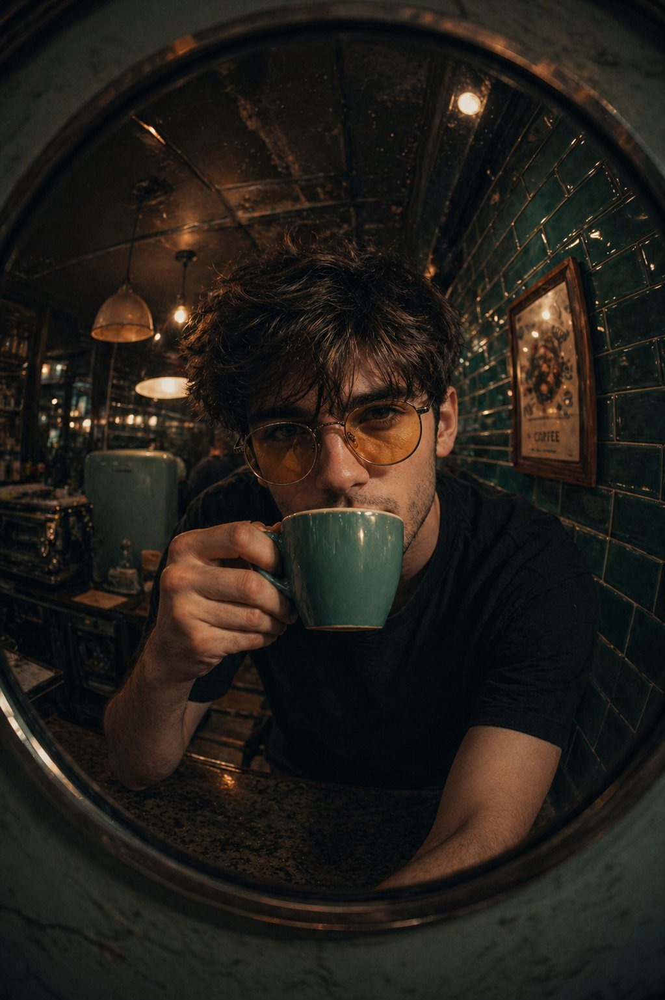

```text
A fish-eye lens close-up of [your photo as reference] sipping from a teal/turquoise coffee mug, leaning forward intimately toward camera. Shot through or near a round mirror. Retro café interior with glossy teal subway tiles, vintage appliances, pendant lights. Black t-shirt, yellow-tinted round glasses. Warm moody tones.
```


---

## 例 366：咖啡馆写实照片与 2D 涂鸦叠加

**来源：** [@Jawad_Rahman_](https://x.com/Jawad_Rahman_/status/2049796647237066971)

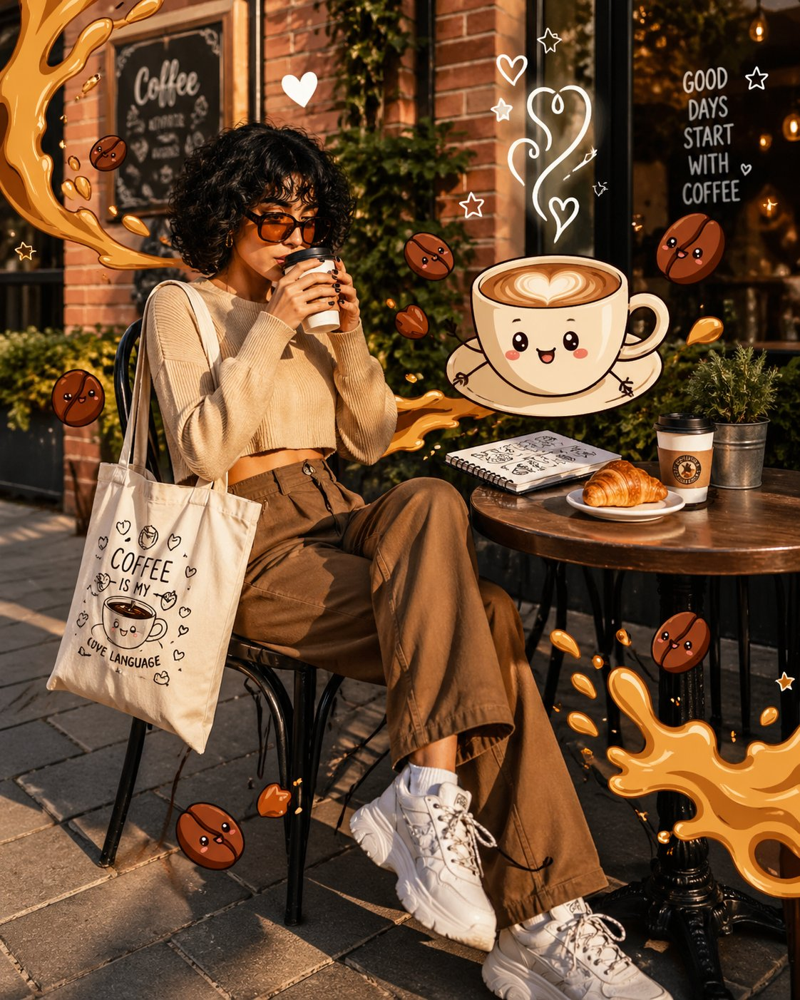

```text
A trendy young woman sitting at an outdoor café table, holding a hot coffee cup near her lips. She has short curly black hair and wears oversized tinted sunglasses, a cropped beige sweater, loose brown high-waisted pants, and chunky white sneakers. A tote bag with minimal coffee-themed illustrations hangs on her shoulder.

The scene blends realistic photography with playful 2D cartoon overlays. Floating around her are animated coffee elements: a smiling cappuccino cup with heart-shaped latte art, cute coffee beans with tiny faces, and stylized splashes of caramel forming comic-style shapes. Soft doodle steam rises into hearts and stars.

On the table: a croissant, a notebook with sketch drawings, and a second coffee cup.

Background: a realistic cozy café street with brick walls, plants, warm golden hour lighting, and soft shadows. Slight depth of field, subject in sharp focus.

Style: mix of photorealism and vibrant cartoon illustration, pop-art aesthetic, high saturation but warm tones, clean composition, Instagram-worthy, soft glow, 4k detail.
```


---

## 例 376：泼洒抹茶街头手机照片

**来源：** [@Shinning1010](https://x.com/Shinning1010/status/2050693240253214894)

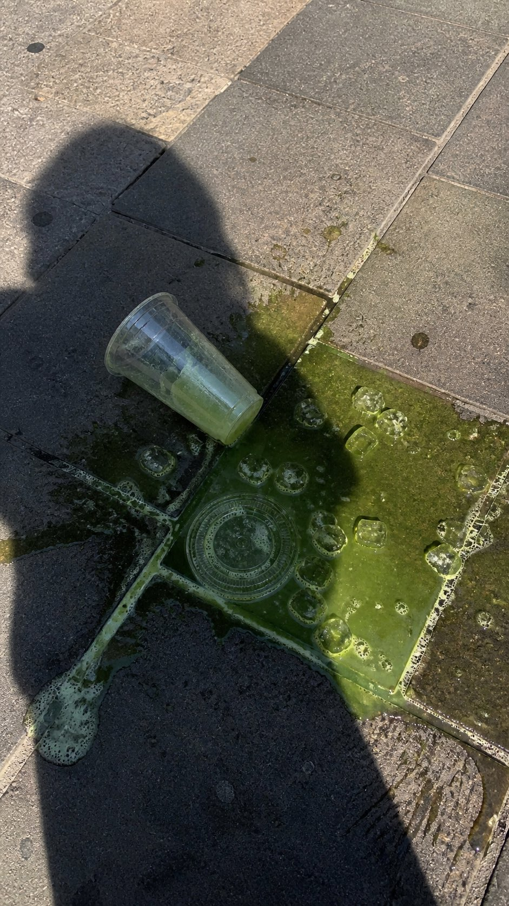

```text
A realistic vertical smartphone photo of a spilled green iced drink on outdoor stone pavement, a transparent disposable plastic cup lying on its side inside the green puddle, clear plastic lid nearby, scattered ice cubes floating in the drink, small foam bubbles on the surface, green liquid naturally spreading across rough square floor tiles, strong midday sunlight, harsh realistic shadows, a dark human shadow silhouette cast across the ground and partially over the spill, accidental street moment, urban documentary photography, handheld phone camera perspective, slightly top-down angle, natural colors, realistic pavement texture, raw unedited photo look, high detail, authentic everyday scene, 9:16 vertical composition

Negative Prompt:
cartoon, illustration, anime, CGI, 3D render, fantasy style, studio lighting, overly perfect composition, overly clean floor, fake liquid, unrealistic reflections, plastic-looking liquid, oversaturated green, blurry, low resolution, distorted cup, melted plastic, extra cups, duplicated objects, readable brand logo, messy text, watermark, poster design, dramatic artificial lighting, excessive sharpening, over-processed, unrealistic shadow, floating ice, deformed perspective
```


---

## 例 377：樱花咖啡户外人像

**来源：** [@xRahultripathi](https://x.com/xRahultripathi/status/2050677614168391716)

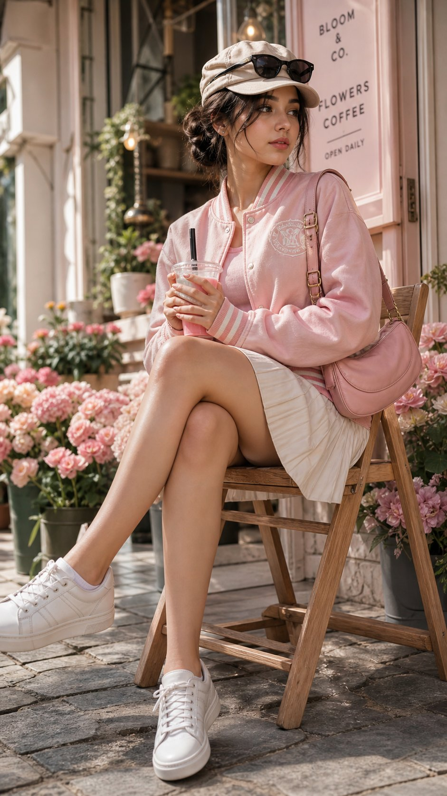

```text
Edit the provided image while preserving the same face identity, shape, and facial features without altering age, ethnicity, or structure. Maintain a calm, relaxed expression with the subject not looking at the camera.

Subject: young woman (18–23) with soft feminine beauty, smooth glowing skin, natural texture.
Pose (strict): seated on a wooden chair, body angled sideways (45–70°), legs crossed naturally, upper body slightly leaning forward, head turned away from camera, gaze to the side. She holds a drink cup with a straw using both hands.
Framing: full-body vertical (9:16), head to shoes visible, centered but slightly offset for natural composition.
Outfit: light pink varsity jacket with white stripes, soft pink inner top, modest knee-length pleated skirt, white sneakers.
Accessories: beige newsboy cap, sunglasses (on face or cap), pink shoulder bag, small earrings.
Hair: neat low bun with soft loose strands.
Environment: outdoor flower shop street scene with pastel flowers (pink, soft tones), decorative plants, floral storefront.
Lighting: bright natural daylight, soft glossy skin highlights, balanced exposure, soft shadows.
Camera: low/frog angle (slightly below, looking up), 50mm lens, shallow depth of field.
Color grading: warm pastel palette (pink, cream), clean bright lifestyle aesthetic.
Quality: ultra-photorealistic, 8K detail, DSLR realism, natural skin texture.
Negative: front-facing, eye contact, close-up, cropped body, mini/short skirt, indoor scene, dark lighting, anime, cartoon, CGI, plastic skin, distorted anatomy.
--ar 9:16 --style raw --quality high
```


---

## 例 382：春日花田三联竖版写真拼贴

**来源：** [@frametheory058](https://x.com/frametheory058/status/2051294907214844249)

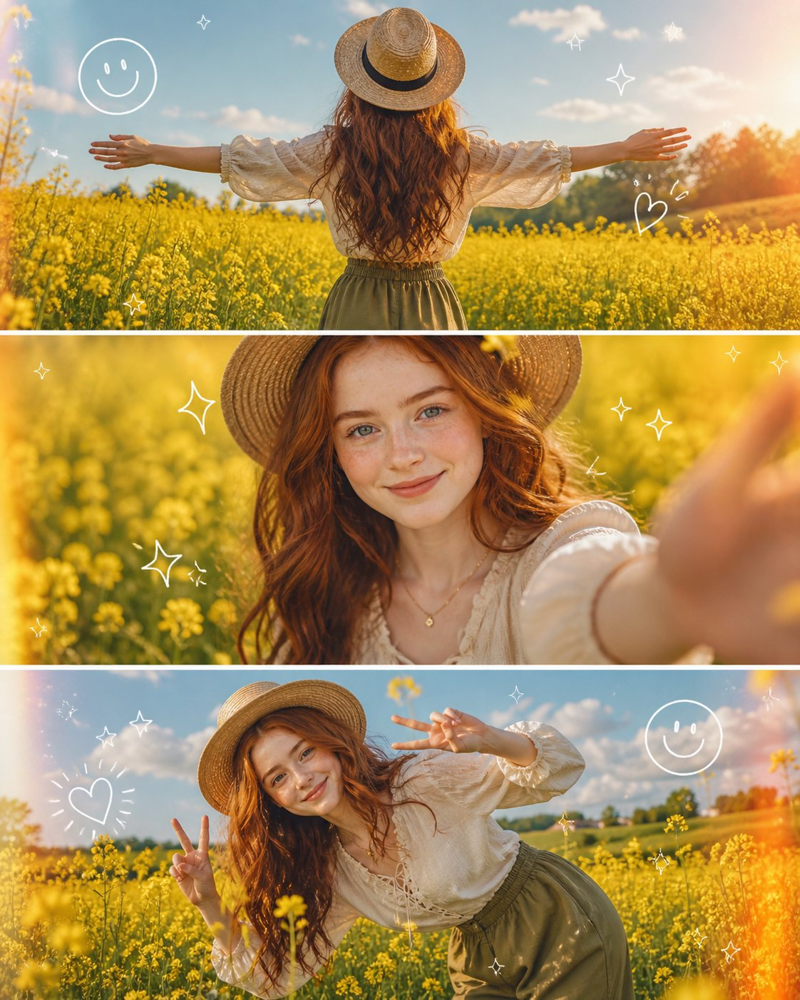

```text
A high-quality 3-panel vertical photo collage of a stunning uploaded woman with soft, voluminous wavy hair glowing in golden sunlight. She is styled in a cream-colored lace-up vintage blouse with delicate textures, olive green high-waisted flowy trousers, and a wide-brimmed straw hat slightly tilted for a fashionable editorial look. Light golden jewelry (thin chains, rings) adds a subtle luxury touch.

The setting is a dreamy, vibrant yellow mustard flower field under a bright blue sky with soft clouds, enhanced by golden hour lighting for a magical glow.

Top panel: Back view of the woman standing in the field with arms wide open, sunlight creating a glowing halo around her hair, slight motion blur in flowers for a cinematic feel.

Middle panel: Close-up portrait, she smiles naturally at the camera, wind softly moving her hair, her hand reaching toward the lens creating depth and a slightly blurred foreground for a DSLR effect.

Bottom panel: Playful pose, she leans sideways in the flowers, making a double peace sign, laughing candidly, capturing an authentic joyful moment.

Add cute, trendy white doodle overlays (smiley faces, sparkles, stars, tiny hearts) with a subtle animated/sketchy feel. Include light leaks, sun flares, and soft film grain for a premium Instagram aesthetic.

Ultra-realistic, 4K, cinematic lighting, shallow depth of field, high dynamic range, natural skin tones, editorial fashion photography, soft pastel color grading.

Aspect ratio: 4:5
Style tags: viral Instagram aesthetic, Pinterest style, dreamy spring vibe, candid luxury
```


---

## 例 383：AI 日常生活 iPhone 抓拍

**来源：** [@Ciri_ai](https://x.com/Ciri_ai/status/2051292618248904809)

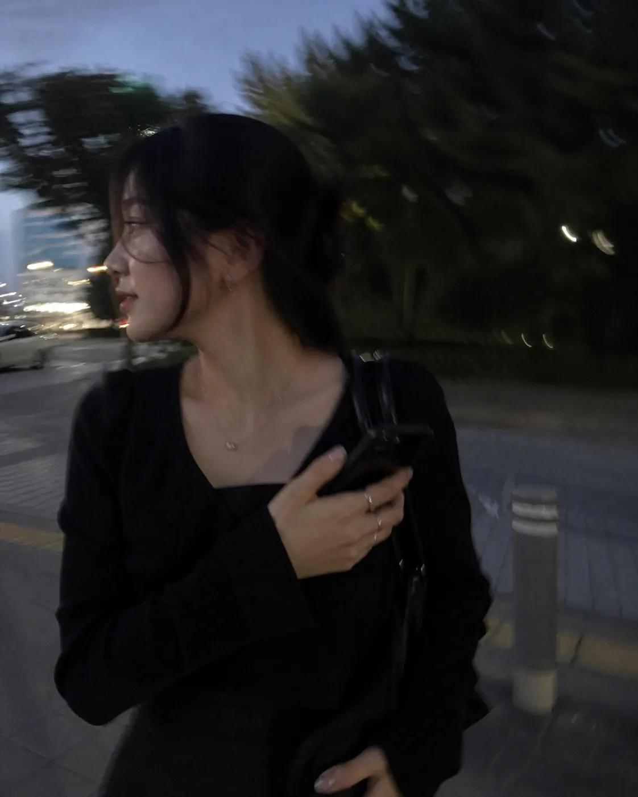

```text
I want to see what you really look like.
Draw a snapshot of your everyday life as if it were accidentally taken on an iPhone.
Make it feel like a very ordinary, imperfect candid shot.
The photo should have slight motion blur, with uneven, natural lighting.
```


---

## 例 393：Y2K 金色时刻人像

**来源：** [@SiliconBarbie_](https://x.com/SiliconBarbie_/status/2051475105403040014)

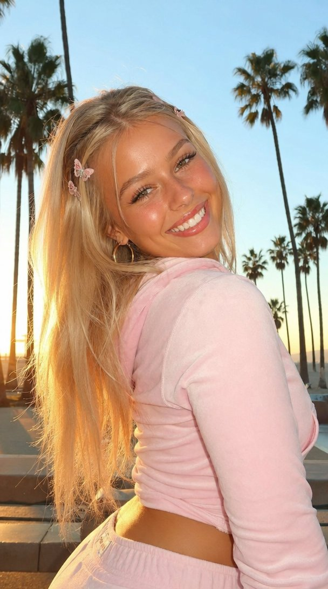

```text
candid portrait of a beautiful young blonde woman, 21 years old, glowing sun-kissed skin, wearing a baby pink velour tracksuit and butterfly clips in her hair, smiling brightly at the camera, golden hour warm light, palm trees, y2k aesthetic, glossy lips
```


---

## 例 399：唱片公司楼梯间写真人像

**来源：** [@BubbleBrain](https://x.com/BubbleBrain/status/2052217544388546827)

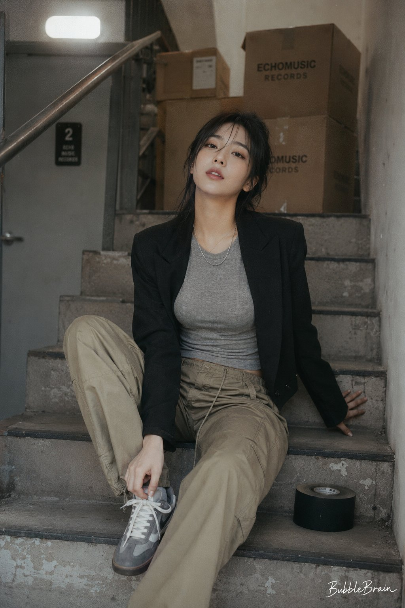

```text
Use case: photorealistic-natural
Asset type: cinematic portrait image, final target size 1216x1536 portrait

Create a photorealistic image of a fictional adult Korean female idol in her mid-20s, not resembling any real celebrity. Maintain a Japanese negative film look: soft overexposure, faded neutrals, low contrast, subtle grain, and imperfect snapshot framing.

Scene/backdrop: the back stairwell of a small record label building, with moving boxes, scuffed concrete steps, a gray metal handrail, and a pale security light. The atmosphere should feel quiet, slightly intimate, and workaday, as if caught in a private in-between moment after practice and during moving day.

Subject: a Korean female idol with a naturally attractive, understated sensuality rather than overt glamour. She should feel quietly magnetic, relaxed, and a little teasing without being provocative.

Wardrobe/props: a slightly cropped black blazer worn casually and slightly open, over a fitted heather-gray ribbed tee that softly outlines the figure without revealing cleavage, loose khaki cargo pants sitting naturally on the waist, a thin silver chain necklace, a roll of black gaffer tape placed beside her, and one sneaker lace still half-tied. The styling should feel subtly sexier and more feminine than purely casual, but still fully modest and non-revealing.

Composition/framing: tall portrait. The subject is seated on the stairs with one knee slightly raised and one leg relaxed lower on the step, leaning back lightly with one hand braced behind her on the stair for support. The other hand is near her half-tied sneaker, as if she has just paused while tying it. Her blazer falls naturally along the body, her posture creating a soft, elegant silhouette. Her head is tilted up toward the camera with a calm, slightly sultry, self-possessed expression. The pose should feel candid yet subtly alluring, natural rather than staged.

Lighting/mood: flat stairwell light, understated backstage realism, soft grain, muted tones, gentle highlight bloom, and a quiet intimate mood. Keep the image photorealistic, restrained, and cinematic, with no excessive glamour and no nudity.

Add small white handwriting signature text "BubbleBrain" on the bottom right corner.

--2:3
```


---

## 例 408：Cozy Academia 学习手记

**来源：** [@Sairah_0](https://x.com/Sairah_0/status/2052969695406325875)

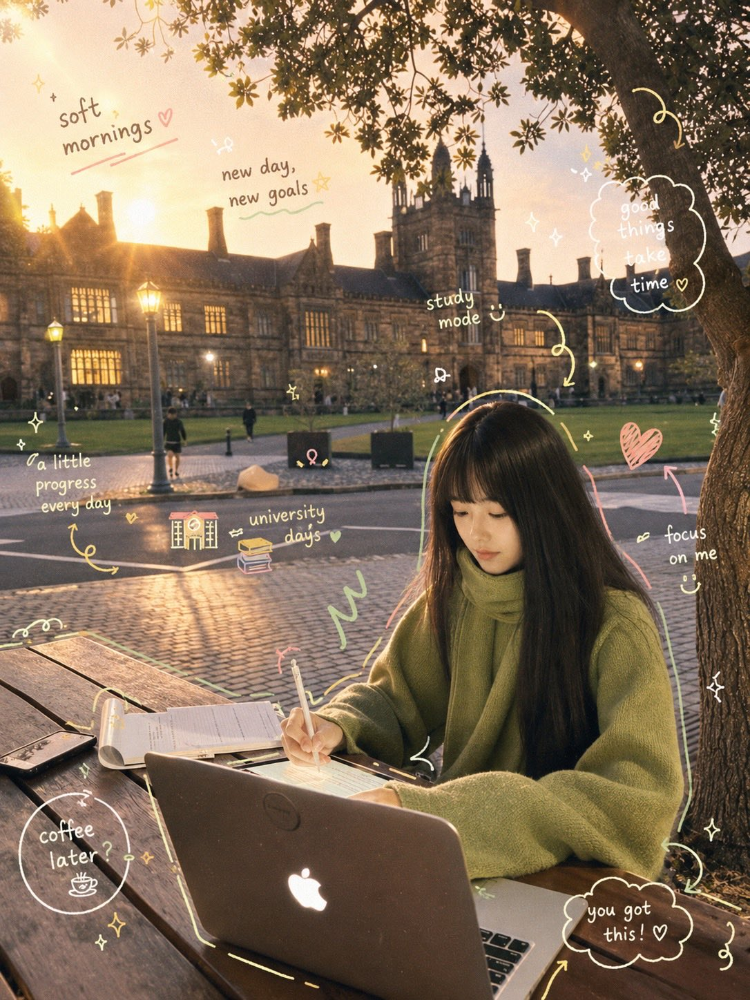

```text
Dreamy cinematic study aesthetic, young Asian girl with long dark hair studying outdoors at a wooden table during golden hour, cozy oversized green sweater and scarf, writing in notebook beside open laptop, historic university campus in background, warm sunset lighting, soft glow, autumn atmosphere, aesthetic doodles and handwritten notes floating around image, kawaii scrapbook style overlays, pastel hearts and stars, motivational text, shallow depth of field, nostalgic film grain, soft beige and warm green tones, peaceful productive vibe, ultra detailed, Pinterest aesthetic, photorealistic, cozy academia style, 35mm film look
```


---

## 例 412：彩色按钮时尚 Campaign

**来源：** [@Mind_Boticni](https://x.com/Mind_Boticni/status/2053082199436759258)

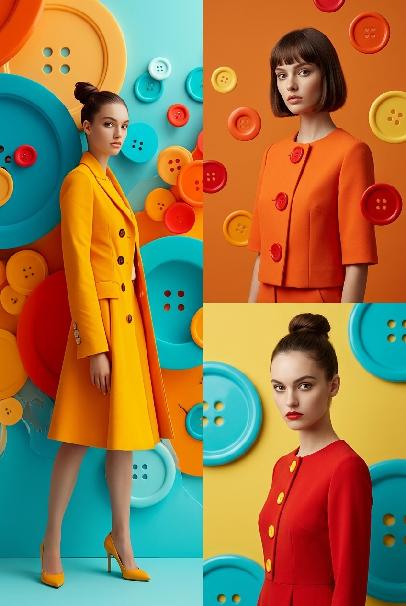

```text
Use reference image as style guide.
Surreal minimalist fashion editorial photography with vibrant oversized colorful buttons as main visual theme (cyan, orange, yellow, red palette), glossy 3D surface design, clean studio lighting, ultra-smooth gradients, and high-end commercial fashion look.
Split-frame composition:

Left side: full-body female model standing from top to bottom, wearing bold minimalist fashion outfit inspired by reference style, confident pose, clean studio background filled with oversized colorful buttons, cinematic lighting, soft shadows, ultra-clean composition.

Right side (vertically split into two parts):
Top-right: half-body female model, different face, different pose, different outfit variation inspired by same button aesthetic, different background color mood.
Bottom-right: another half-body female model, completely different expression and pose, different styling, different background tone, maintaining same surreal button universe aesthetic.

Each section visually distinct but unified by the colorful button-inspired design language, glossy surfaces, soft studio reflections, and fashion magazine editorial feel.
Hyper-realistic, cinematic lighting, ultra-clean composition, high-end luxury campaign style, depth, contrast, 8k, 1:1 aspect ratio --style raw --v 6 --ar 1:1
```


---

## 例 414：室内晨间写实摄影

**来源：** [@ToroJushiAi](https://x.com/ToroJushiAi/status/2053078195482632421)

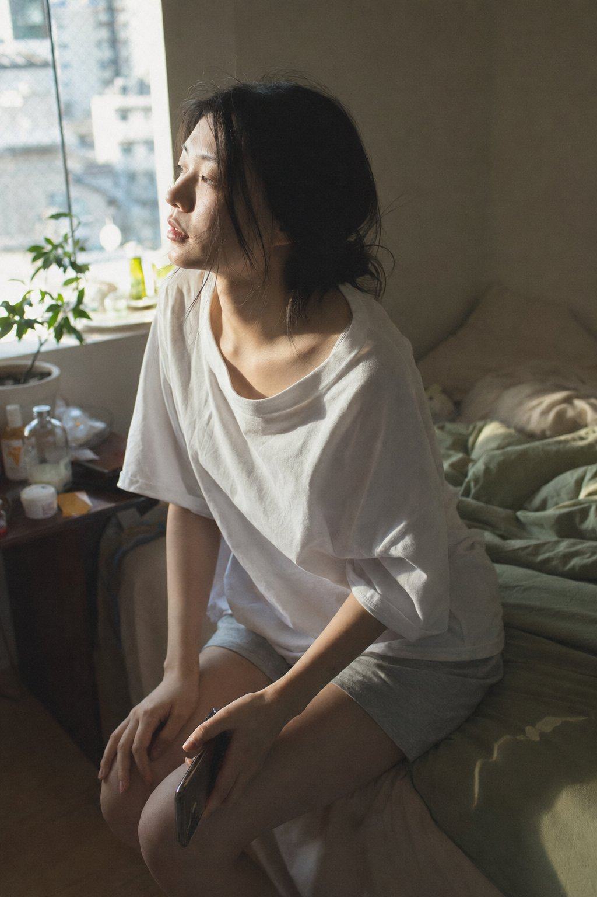

```text
A close-medium shot of a young Japanese woman in her bedroom on an ordinary morning, captured in authentic daily life photography as a natural candid moment. She is seated sideways on the edge of the bed, not fully awake yet, photographed from a slightly elevated three-quarter angle with cool-to-warm morning window light entering from the left.
East Asian young woman in her early 20s. Almond-shaped eyes with soft natural single eyelids, slightly elongated eye corners, still carrying the heaviness of just waking. Straight refined nose with a delicate bridge. Skin tone fair to light beige — skin subsurface scattering visible under the soft directional morning window light, specular micro-highlights catching gently on her cheekbone and nose ridge, fine skin texture perceptible, no makeup. Naturally straight fine black hair loosely gathered, slightly disheveled from sleep.
She wears a loose oversized cotton sleep shirt and soft shorts, nothing styled. Her gaze drifts toward the window, posture relaxed and unhurried, one hand resting on her knee, the other barely holding a phone face-down. The bedroom background suggests real life — slightly unmade linen, a potted plant near the window partially in shadow, small cluttered bedside items. Two or three stray hairs fall across her cheek in natural asymmetric displacement, not geometrically placed.
Soft directional morning light from a side window, cool-to-warm transition across her face and shoulder, long gentle shadows on the bedding behind her. The mood is quietly adrift — not sad, not performing, just suspended in the unhurried first minutes of the day. Subtle ISO 400 film grain in shadow areas, photographic noise texture not CG render smoothness. Aspect ratio 2:3. No watermark, no text overlay, not cartoon, not digitally painted, not illustration, not anime.
```


---

## 例 420：红跑道低角度夏日人像

**来源：** [@Shinning1010](https://x.com/Shinning1010/status/2053521749967352285)

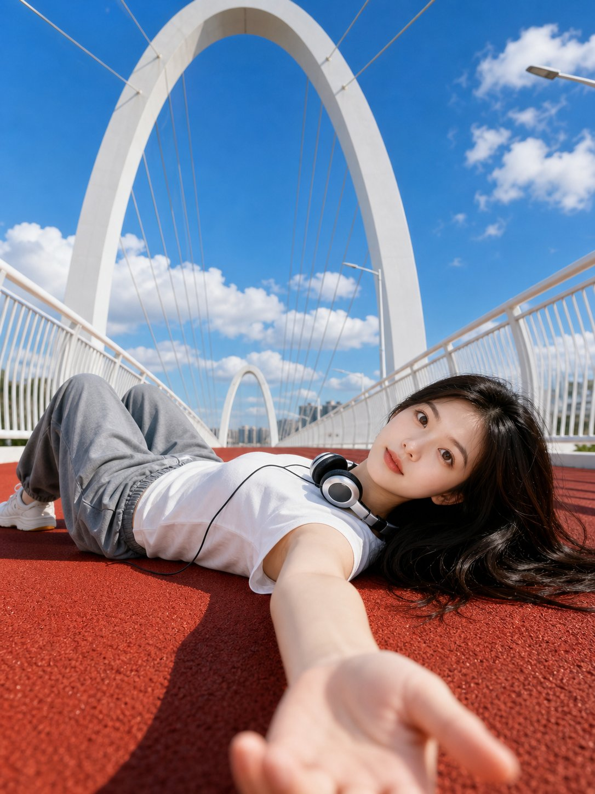

```text
Use the uploaded portrait photo as the appearance reference for the person. Create a bright photorealistic outdoor portrait of a young woman lying on a red running track on a modern white arch pedestrian bridge. Ultra-wide low-angle selfie perspective, her arm reaching toward the camera in the foreground, relaxed pose, wired headphones around her neck, white sleeveless top, loose gray pants, black hair spread on the ground. Clean blue sky with soft white clouds, strong midday sunlight, crisp shadows, high clarity, fresh youthful mood, architectural symmetry, realistic skin texture, cinematic composition, 3:4 vertical image

Negative Prompt:

watermark, logo, text, caption, signature, AI label, extra fingers, deformed hands, distorted face, wrong identity, duplicate person, blurry face, low resolution, over-smoothed skin, plastic skin, unnatural anatomy, bad perspective, messy background, harsh artifacts, overexposure, underexposure
```


---

## 例 421：iPhone 屏幕遮脸创意人像

**来源：** [@Ciri_ai](https://x.com/Ciri_ai/status/2053535379618423118)

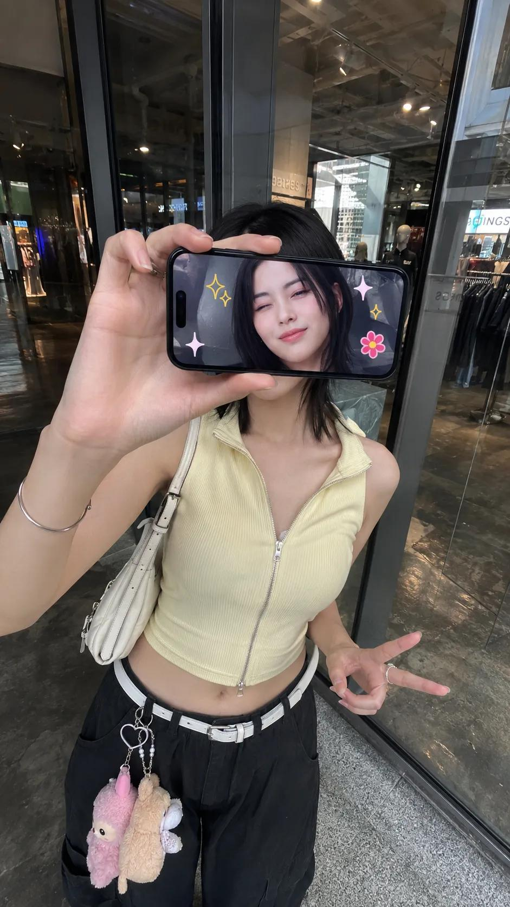

```text
Ultra-realistic creative portrait taken with an iPhone, identity accurately preserved from the reference image. A woman stands inside a store, facing a glass display window or a reflective wall, photographed from a slightly elevated frontal angle. She holds a smartphone horizontally in front of her face, covering her eyes and the upper part of her face. The phone's screen points at the camera and clearly displays a real-time image of her face.
```


---

## 例 425：黑白时尚人像拼贴海报

**来源：** [@XSydneyFan](https://x.com/XSydneyFan/status/2054054476429009086)

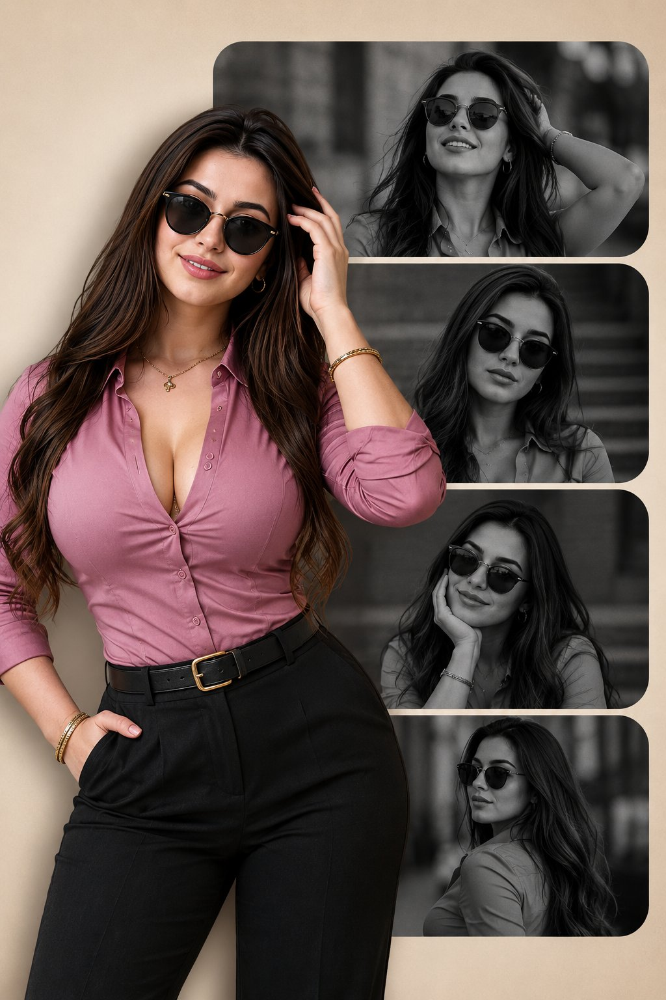

```text
{
  "prompt": "Vertical poster collage design, beige background, four stacked horizontal rounded rectangles containing black and white cinematic portraits of the same young woman wearing sunglasses in different stylish poses. Foreground features a full-color high-quality cutout of the woman on the left side, wearing a pink mauve fitted shirt, black pants, sunglasses, confident cool pose, modern fashion editorial style, soft studio lighting, ultra realistic, premium magazine aesthetic, depth and shadow effects, clean minimal layout, 2:3 aspect ratio.",
  "aspect_ratio": "2:3"
}
```


---

## 例 426：日韩咖啡馆情侣写真

**来源：** [@sha_zdiii](https://x.com/sha_zdiii/status/2054047328420634927)

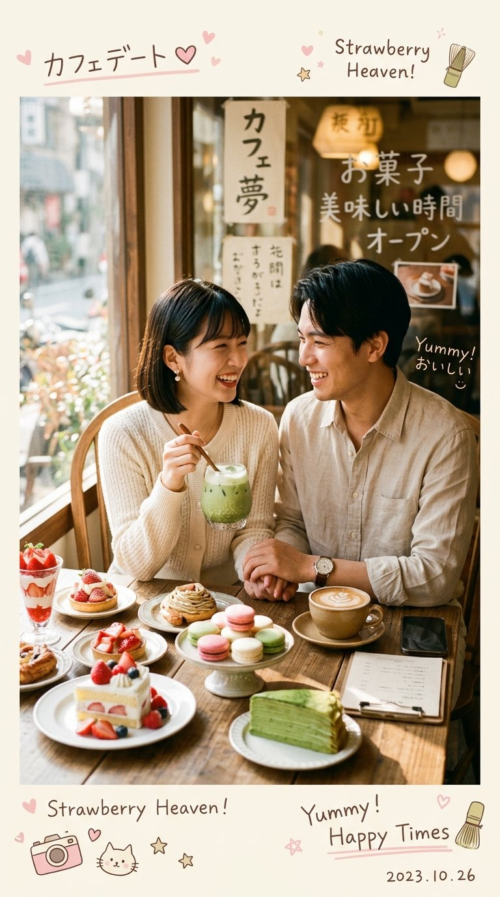

```text
Ultra-realistic cozy Japanese-Korean café photography featuring a cute young [Japanese/Korean] couple sitting together naturally in a trendy aesthetic café. The young couple should look stylish and youthful, wearing [fashion style/outfit colors], smiling softly and enjoying desserts together.

The table is beautifully filled with [desserts/foods] such as pancakes, strawberry cakes, macarons, croissants, pastries, iced coffees, matcha lattes, fruit desserts, and aesthetic drinks arranged in a visually satisfying composition. Add small aesthetic café props like [flowers/ribbons/books/candles/pearls/notebooks] on the table for a premium Pinterest moodboard feel.

Soft [lighting style] lighting enters through the café windows creating dreamy highlights, creamy shadows, glossy reflections on drinks, and realistic dessert textures. Background should contain softly blurred [Japanese/Korean] signs, glowing café boards, handwritten Japanese text, neon typography, and aesthetic city café elements for an authentic Tokyo/Seoul vibe.

Add cute scrapbook-style doodles and handwritten notes around the image in [doodle color] ink — tiny hearts, stars, sparkles, ribbons, arrows, smiley sketches, bows, diary stickers, and handwritten café notes.

Color palette should focus on [color theme] tones. Style inspired by viral Pinterest café photography, Korean lifestyle aesthetics, Japanese cozy café culture, dreamy Gen-Z romance mood, shallow depth of field, cinematic composition, ultra realistic food textures, soft blurry background, ultra detailed realistic photography, clean aesthetic layout, 8k.
```


---

## 例 427：9-frame 时尚人像拼贴

**来源：** [@saniaspeaks_](https://x.com/saniaspeaks_/status/2054046866497573214)

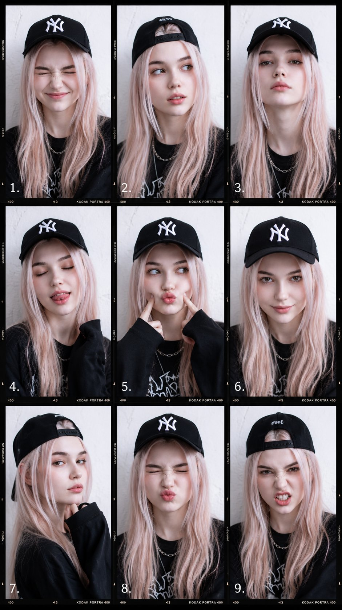

```text
Edit this photo and don't change the face, portrait 9:16. A 9-frame fashion portrait collage featuring a stylish young woman with playful expressions and sporty streetwear aesthetics. The concept combines modern model test photography, casual Gen-Z energy, and clean editorial studio vibes. Each frame captures different candid facial expressions and subtle attitude poses, creating a cool, confident, and slightly mischievous mood. Minimalist composition with strong focus on facial expressions, cap styling, and soft fashion portrait lighting.

Frame Descriptions (9 poses)

Frame 1 – Eyes closed with playful scrunched expression, slight smile, relaxed shoulders.
Frame 2 – Looking slightly sideways with lips parted, confident casual attitude.
Frame 3 – Head tilted slightly upward, calm expression, direct cool-girl energy.
Frame 4 – Eyes closed while sticking tongue slightly out, playful candid vibe.
Frame 5 – Both index fingers pressing cheeks while making duck lips, cute playful expression.
Frame 6 – Direct eye contact with subtle smile, relaxed natural pose.
Frame 7 – Body turned sideways, hand near chin, confident editorial profile look.
Frame 8 – Eyes squeezed shut while making pout lips, exaggerated playful expression.
Frame 9 – Wrinkled nose with gritted teeth, rebellious fashion attitude.

She wears oversized black long sleeves. Soft matte fabric with sporty streetwear silhouette. Relaxed fit with slightly oversized sleeves. Black New York Yankees baseball cap worn forward and backward in different frames. Minimal jewelry. Long soft wavy blonde hair. Soft loose waves with natural texture. Middle-part hairstyle. Hair flowing naturally around shoulders. Soft glam douyin girl makeup. Dewy glass skin finish. Brushed up natural brows, winged eyeliner, wispy natural lashes, soft pink blush (igari blush style), ombre gradient rosy pink lips with glossy finish.

Background minimal white studio backdrop. Photobooth-style collage layout with black frame borders. Shot with Canon EOS R6 / Sony A7 III / Fujifilm X-T5. High-fashion portrait photography style. 50mm or 85mm portrait lens. Eye-level framing. Tight portrait crop. Centered composition. Photobooth-inspired close-up angles. Soft diffused studio lighting. Balanced frontal light. Minimal harsh shadows. Clean editorial illumination. Cool neutral tones. Slightly desaturated blacks. Soft contrast with crisp details. Subtle film grain. Modern fashion editorial color grading.
```


---

## 例 428：F1 直播转播围场截图

**来源：** [@bigwonbots](https://x.com/bigwonbots/status/2054573714012787059)

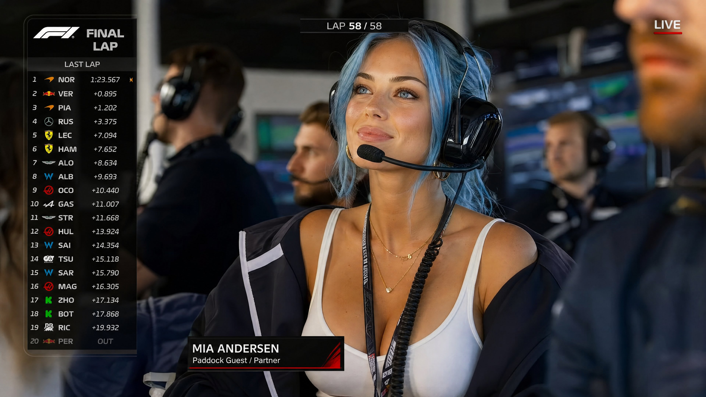

```text
Ultra-realistic F1 live TV broadcast screenshot. A strikingly beautiful, 25-year-old young woman with bright light blue hair and captivating bright cerulean blue eyes is sitting in the VIP paddock / team garage during a Formula 1 race. Shown on the official live race broadcast as the girlfriend of an F1 driver, she is listening to the team radio through a professional racing headset. It is the final lap, and she is watching the garage monitors with a proud, enchanting smile.
She wears a fitted white tank top, an oversized racing team jacket (with generic, unbranded or blank team logos) draped over her shoulders, large black team-radio headset with boom mic, gold jewelry, and soft glam makeup. A slim, unbranded paddock pass hangs naturally from her neck.
Add realistic F1 broadcast graphics: "FINAL LAP" banner, lap counter showing final lap, driver timing tower on the left, small F1-style logo bug, "LIVE" indicator, and a lower-third identifying her as a driver partner / paddock guest (e.g., "MIA ANDERSEN - Paddock Guest / Partner"). No fake oversized badges, no selfie angle.
Team staff (in generic kit), headsets, garage screens, and generic race equipment are blurred around her. Telephoto broadcast camera shot from across the garage, professional depth of field, compression artifacts, digital noise, bright paddock lighting, natural skin texture, no smoothing, 8k quality, cinematic lighting.
```


---

## 例 429：韩国便利店粉色 Hoodie 人像

**来源：** [@john_my07](https://x.com/john_my07/status/2054573350199111928)

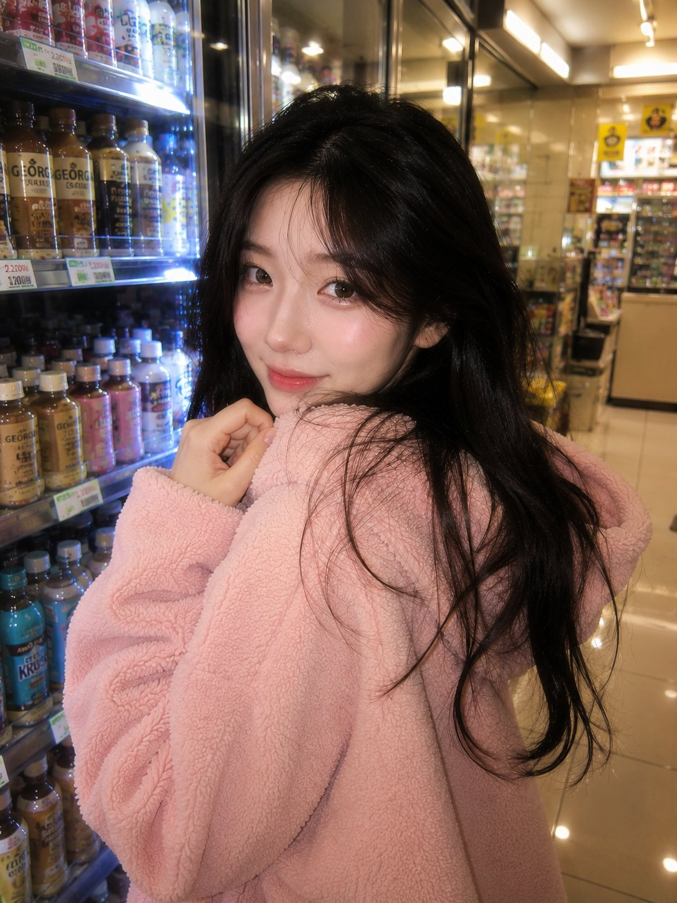

```text
Ultra-realistic cozy Korean convenience store portrait of a beautiful Korean woman standing in front of glowing refrigerator aisles at night, wearing an oversized fluffy pastel pink hoodie with the hood up. She holds a bottle of strawberry milk in one hand and a tiny strawberry cake in the other while shyly looking toward the camera. Long soft black hair, glossy eyes, natural skin texture, subtle blushy makeup, gentle expression, youthful Korean beauty aesthetic. Warm fluorescent convenience store lighting mixed with realistic iPhone flash photography. Tiny reflections on drink bottles and glass refrigerator doors, dreamy romantic atmosphere, soft pink and cream color palette, slice-of-life anime realism blended with cinematic photography, highly detailed, cozy late-night Seoul convenience store vibe, shallow depth of field, realistic Korean snack packaging, candid aesthetic, soft glow, ultra photorealistic.
```


---

## 例 434：东京街头胶片人像

**来源：** [@BubbleBrain](https://x.com/BubbleBrain/status/2055491616392052887)

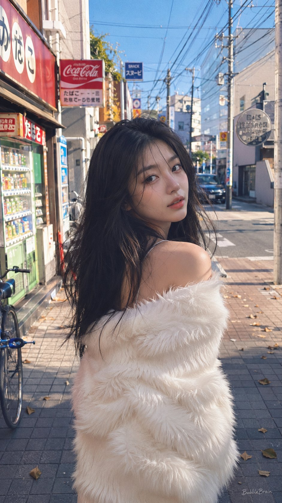

```text
film photography, candid street snapshot aesthetic, razor-sharp focus on subject, shallow depth of field with soft blurred urban background, bright daylight, slightly overexposed highlights, vivid contrast, subtle analog film texture, heavy film grain, nostalgic cinematic atmosphere, Tokyo backstreet neighborhood scene near a quiet train station, narrow pedestrian street lined with Japanese convenience stores, vintage vending machines, small ramen shops, hanging signs with faded typography, bicycles parked along tiled sidewalks, utility poles and overhead wires stretching across the sky, scattered fallen leaves on the ground, distant pedestrians and passing taxis softly blurred in the background, warm afternoon sunlight with deep blue sky, realistic street fashion photography style, effortless cool street vibe, vibrant colors with slightly muted faded film tones, beautiful 19-year-old Chinese female influencer, fair porcelain skin with cold pale undertones, exquisite natural makeup, glossy soft lips, defined brows, delicate lashes, soft messy long black hair with natural flowing curves, wearing an off-shoulder white fluffy faux fur jacket, playful yet subtly seductive expression, lazy dreamy vintage filter, ultra high-quality details, intentionally mundane phone-camera snapshot feeling, casual accidental composition, imperfect framing, realistic iPhone photography texture, spontaneous candid energy, highly attractive girl casually posing in the middle of the sidewalk, body facing away from the camera while turning her head back toward the lens with direct eye contact, relaxed posture, soft wind moving her hair, emotional youthful atmosphere, modern Asian street fashion editorial, soft haze, layered composition, masterpiece, best quality, ultra detailed, slight motion blur from slow shutter, authentic everyday realism, “BubbleBrain” small handwritten signature text on bottom corner --ar 9:16
```


---

## 例 436：数码相机屏幕怀旧人像

**来源：** [@Ciri_ai](https://x.com/Ciri_ai/status/2055876982630686956)

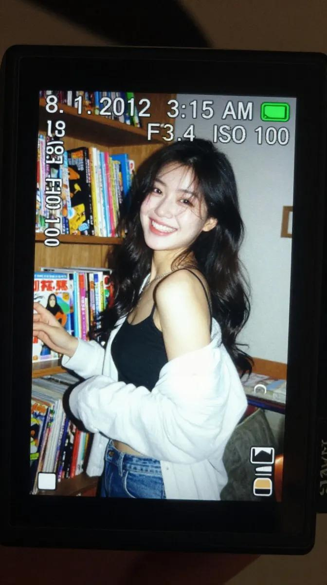

```text
A realistic close-up shot of a small digital camera screen glowing brightly in a dark indoor environment. Displayed on the LCD is a candid early-2010s style photograph of a young East Asian woman with long dark wavy hair standing beside a wooden shelf packed tightly with colorful comic books and magazines.

She wears a black spaghetti-strap top with a loose white cardigan hanging casually from both shoulders and faded blue jeans. Captured mid-laugh while turning her face slightly sideways, her expression feels spontaneous and natural, with hair falling softly across part of her cheek.

The harsh direct flash from the compact camera creates strong highlights on her face and cardigan while flattening shadows in the background, producing an authentic nostalgic digicam aesthetic. Slight motion blur and digital grain enhance the candid realism.

Camera UI overlays are visible across the LCD screen, including the timestamp “8. 1. 2012 3:15 AM,” exposure data “1/30 F3.4 ISO 100,” focus indicators, and a small green battery symbol in the corner.

The image preserves visible screen pixel structure, slight glare reflections, chromatic softness, and compressed digital texture. Outside the LCD, the surrounding darkness fades smoothly into blur, emphasizing the glowing nostalgic screen.

Shot to resemble an authentic Sony Cyber-shot point-and-shoot camera from the early 2010s using a CCD sensor with vintage digital rendering and imperfect flash exposure.
```


---

## 例 450：烛光侧室写实摄影

**来源：** [@ToroJushiAi](https://x.com/ToroJushiAi/status/2056926887344042382)

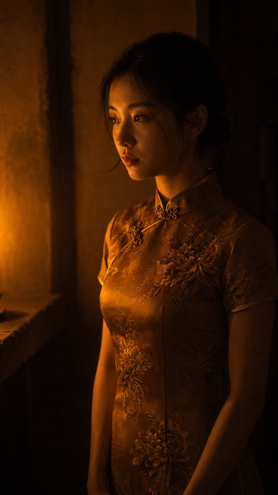

```text
A medium-shot authentic daily life photograph, natural candid moment, of an East Asian young woman standing in a small side room lit only by a single candle on a low stone shelf. 85mm lens, waist-up framing, shallow depth of field. The candle is off-frame to the left; the room behind her exists only as dark warm suggestion.

East Asian young woman in her early 20s. Almond-shaped eyes receiving the candle's warm flicker — the irises briefly caught in light before returning to shadow. Straight refined nose, the bridge illuminated in a narrow warm stripe. Skin tone fair beige, warmed entirely by candlelight into something amber. Skin subsurface scattering visible under directional candlelight, specular micro-highlights on cheekbones and nose ridge, fine foundation powder grain perceptible.

She wears an aged amber silk qipao with chrysanthemum embroidery in tones of old bronze and dusty ochre — the amber pigment identical in temperature to the candle's own light, the embroidery appearing and disappearing depending on angle. Mandarin collar, short sleeves. She stands facing the candle without looking at it, arms at her sides, very still. The room is otherwise empty. Two or three stray hairs displaced by faint air movement, natural unplanned imperfection, not geometrically symmetrical.

Single candle — warm amber-orange, directional and fragile. It carves the left side of her face from darkness, leaves the right in near-black shadow. The amber qipao and the candlelight share a single temperature register: the room folds her into the light. Deep chiaroscuro with no artificial fill. Subtle ISO 400 film grain in shadow areas, photographic noise texture not CG render smoothness. Aspect ratio 9:16. No watermark, no text overlay, not cartoon, not digitally painted, not illustration, not anime.
```


---

## 例 451：韩国海滩日落时尚人像

**来源：** [@MrGafish](https://x.com/MrGafish/status/2057107670226870577)

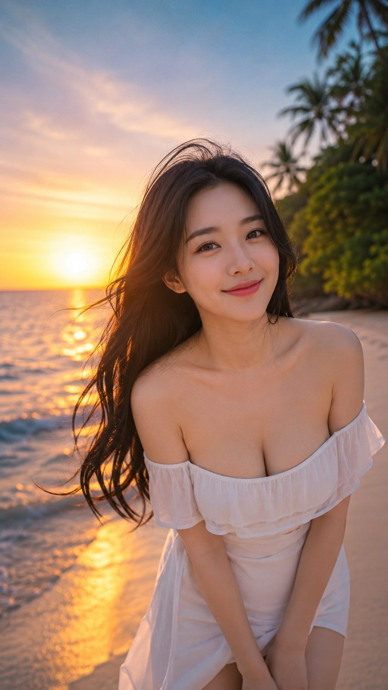

```text
一位成年韩国女孩，人物位于画面中央，半身到大腿视角，身体微微前倾。身形比例协调，肩颈线条舒展，可以看到胸部轮廓，轮廓自然优美，腰部线条柔和，整体凸显丰腴健康的女性美，丝滑黑发随风飘扬，人物气质成熟、温柔、安静，面带自然微笑。身穿白色一字肩连衣裙，背景是热带海滩日落，电影感DSLR摄影，温暖辉光照明，梦幻虚化，超详细，鲜艳色彩，丰富对比，韩国时尚美学氛围，自然欢乐情感，高端生活方式摄影。9:16 竖版构图。
```


---

## 例 465：逆光美背女性情绪写真

**来源：** [@MrLarus](https://x.com/MrLarus/status/2058131948904599860)

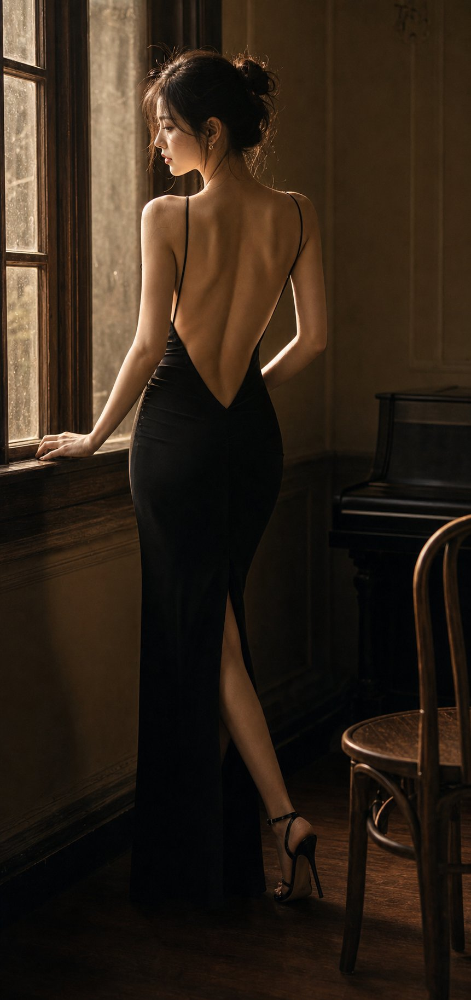

```text
逆光美背女性情绪写真提示词：

请生成一张竖版高质感女性情绪写真，主题为「逆光美背·女性情绪写真」。

核心要求：
画面的绝对重点是“美背”，通过露背结构、肩颈线条、肩胛骨、脊柱中线、腰背曲线和逆光轮廓来呈现女性美。请避免普通女性写真或普通穿搭图的处理方式，背部必须是主视觉核心，脸只作为辅助。

人物设定：
成年女性，真实自然，气质可为温柔、清冷、慵懒、文艺、轻熟或安静。人物不要网红脸，不要塑料感，不要夸张妆容。可侧脸、回眸、低头或闭眼，但正脸不是重点。

姿态要求：
姿态必须服务于背部展示，例如背对镜头微微回头、侧身站立、侧坐、抬手整理头发、低头蜷身、斜倚窗边、半躺回眸、披衣下滑等。动作自然，不要僵硬摆拍，不要正面直视镜头。

露背结构：
必须有明确的露背设计，可为低背长裙、吊带裙、露背礼服、针织外套滑落、薄纱披肩、浴袍半披、宽松衬衫滑肩、丝质罩衫半落等。重点表现肩线、肩胛骨、背中线、腰背收束和布料与肌肤之间的高级过渡。

服装与材质：
服装选择轻柔、垂坠、带有透光感和褶皱感的材质，如薄纱、真丝、针织、棉麻、细闪纱、浴袍质地、软垂感长裙。布料要参与构图，形成半遮半露、滑落、包裹、垂挂的层次，但不能厚重。

场景：
场景为卧室、窗边、床上、白墙房间、民宿、酒店房间、木质空间或复古公寓。背景简洁克制，少量床品、窗帘、木椅、花束、地板等元素即可，不能喧宾夺主。

光线要求：
采用自然光或柔和暖光，以逆光、侧逆光、窗边光为主。重点是让光打到背部，勾出肩颈边缘、肩胛骨轮廓、腰线和发丝高光。可使用晨光、黄昏金光、柔雾散射光或冷白窗光，但背部受光状态必须成立。

构图：
竖版构图，画幅可为 9:16、3:4 或 4:5。人物是绝对主角，视觉重心放在背部、肩颈和腰背曲线上。可采用半身、七分身、近景或全身，但不要让场景抢走主体。

氛围：
整体氛围安静、柔软、私密、克制、高级，像真实摄影师拍摄的电影感情绪写真。重点避免直白性感，改用“美背 + 逆光 + 柔软布料 + 自然姿态”表达女性美。

画质要求：
真实摄影感、电影感、柔雾胶片感、细腻肤色、真实皮肤质感、浅景深、轻微颗粒感、画面通透自然。不要 AI 塑料感，不要 CG 感，不要错误手指，不要肢体畸形，不要低俗色情化表达，不要文字、水印、Logo、边框。

最终效果：
一张以“美背”为主视觉核心的高完成度女性情绪写真，通过露背结构、肩颈背部线条、柔光逆光和柔软布料来呈现克制而高级的女性美。
```


---

## 例 466：鱼市追猫 CCD 街拍

**来源：** [@mehvishs25](https://x.com/mehvishs25/status/2058375167550845263)

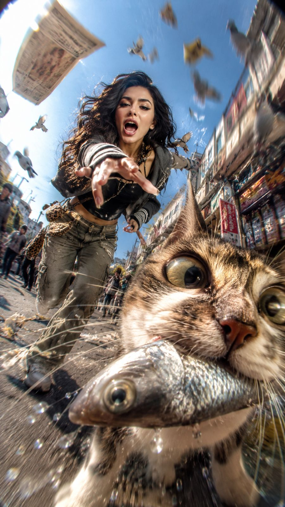

```text
Use the uploaded reference image as the exact identity base for the main subject. Preserve their authentic facial structure, recognizable appearance, hairstyle, body proportions, skin texture, and overall identity with high consistency. Completely ignore any unrelated background from the original image.

Create a hyper-chaotic early-2000s Japanese digicam snapshot aesthetic with raw paparazzi energy and accidental comedy.

Scene: the subject is sprinting wildly through a busy city street while yelling and laughing in pure chaos, desperately trying to catch a mischievous cat that just stole a large shiny fish from a market stall. The cat is gripping the slippery silver fish tightly in its mouth while running directly toward the camera.

Composition must prioritize TWO focal subjects:

1. PRIMARY FOCUS → the cat's face
2. SECONDARY FOCUS → the human subject's face

The cat dominates the foreground frame with its face pushed absurdly close into the lens, partially cropped near the lower-right side. Massive fisheye distortion stretches its features dramatically - huge bulging eyes, exaggerated whiskers, detailed fur texture, fish flapping violently with droplets and motion streaks flying outward.

Behind the cat, the subject is charging forward aggressively with intense energy, reaching toward the animal mid-run. Their expression is loud, chaotic, and comedic, eyes locked directly onto the cat to create strong interaction and pursuit tension.

Styling:
Randomized layered Y2K Tokyo streetwear inspired by chaotic Shibuya nightlife fashion - oversized zip hoodies, vintage mesh layers, mini bags, low-rise pieces, striped arm warmers, chunky accessories, early-2000s sneaker styling, messy fashionable youth aesthetic.

Camera & framing:
extreme low-angle fisheye lens, ultra-wide invasive perspective, severe Dutch angle, asymmetrical framing, warped spatial distortion, exaggerated depth compression, aggressive foreshortening.

Motion treatment:
insanely intense movement blur with radial streaking, shutter drag, CCD sensor smearing, directional speed trails, accidental camera shake, stretched highlights, warped moving objects, imperfect chaotic snapshot timing.

Environment:
sunny crowded urban street with pigeons exploding into flight across the frame, scattered newspapers and debris flying through the air, warped pedestrians, market elements smeared by motion, overexposed sunlight leaking into one corner of the frame.

Lighting & texture:
harsh direct flash combined with bright outdoor sunlight, dirty CCD digicam texture, blown highlights, chromatic aberration, digital noise, bloom artifacts, compressed early-2000s camera look, gritty nostalgic cyber-chaos atmosphere.

Ultra-raw candid energy, messy composition, humorous accidental masterpiece aesthetic.
```


---

## 例 467：泳装杂志九宫格广告页

**来源：** [@Adam38363368936](https://x.com/Adam38363368936/status/2058859338211656051)

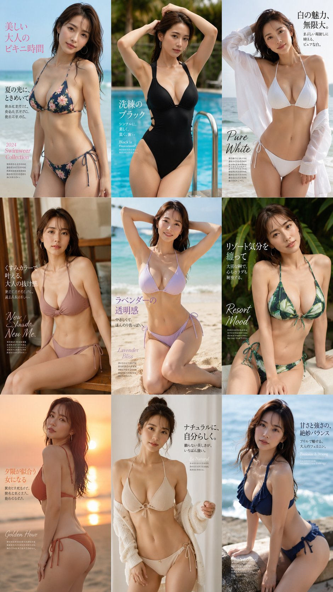

```text
泳装时尚杂志广告页面，日本成熟模特，S型曲线。变换姿势和风格，九宫格展示，保持人物面部一致性
```


---

## 例 468：霓虹涂鸦展会自拍

**来源：** [@drmrzhong](https://x.com/drmrzhong/status/2058774378960257437)

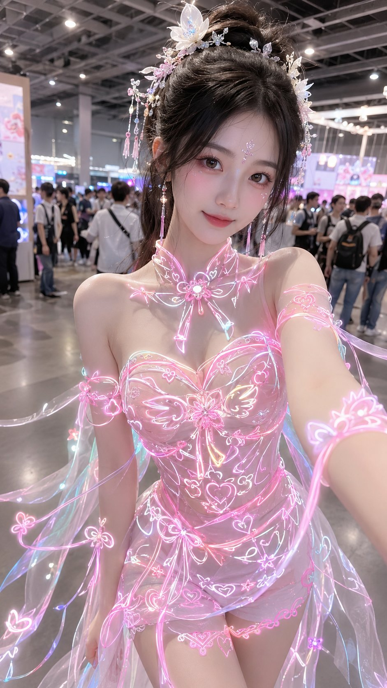

```text
生成一张写实感合照，9:16构图，真实手机摄影质感。

画面中是一位20岁成年东方女性模特，站在室内展会现场，靠近镜头自然拍照。人物妆造精致，五官清秀，皮肤清透，眼神自然看向镜头，整体气质甜美。

人物姿态自然端正，身体略微前倾，肩颈柔和舒展，腰部自然收束，整体体态呈现成熟柔美的女性S型曲线。人物体态为成熟丰腴型，肩部圆润柔和，胸部饱满自然，腰线清晰但不过度纤细，臀腿曲线圆润匀称，大腿与手臂带有柔软健康的肉感，整体呈现温柔、甜美、丰腴、优雅的女性美。

人物服装为“霓虹手绘线条构成的艺术涂鸦”，笔触故意粗糙随意，带明显蜡笔与 marker 手绘质感。画面中的 doodle graphics 形成若隐若现的视觉错觉感，突出身体线条和优美轮廓，让人物看起来像穿着由霓虹线条构成的 cosplay outfit，避免呈现为真实布料服装。整体偏日本互联网自拍文化中的 playful sticker aesthetic，避免直白裸露风格。

人物发型为精致古风高马尾，搭配白色花朵头饰、水晶发簪、流苏耳饰、额间水晶装饰。妆容清透，带有淡粉色眼影、自然腮红和柔和唇色。

场景为大型室内展会现场，背景有人群和展台但轻微虚化，顶部有真实展馆灯光。画面采用近景合照构图，人物面部和服装细节清晰，背景虚化自然，有真实手机自拍感。

整体风格：写实、清透、明亮、梦幻。
```


---

## 例 472：上海地铁站台晨光

**来源：** [@ToroJushiAi](https://x.com/ToroJushiAi/status/2059452471127240959)

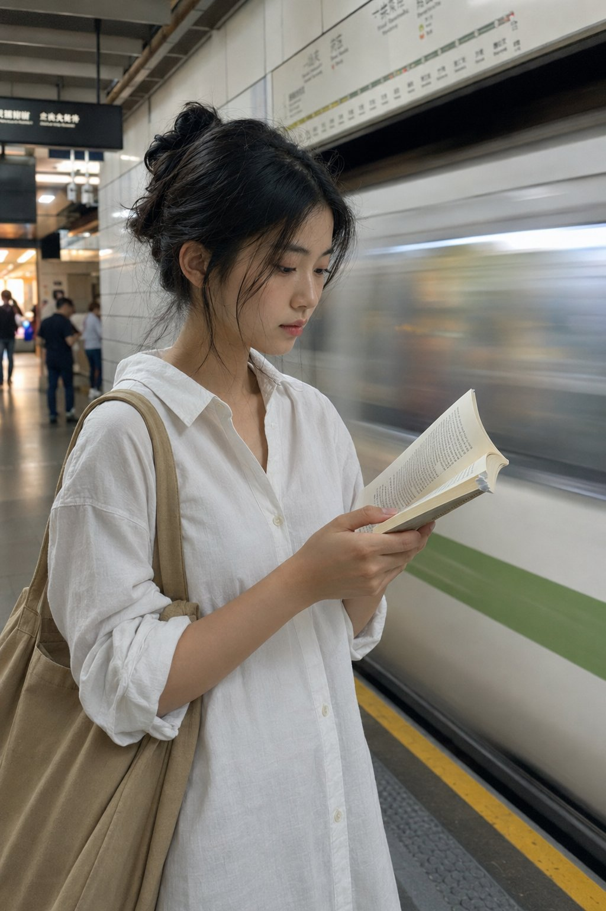

```text
A candid photograph of a young woman standing on a Shanghai metro platform during the summer morning commute, authentic daily life photography, natural candid moment. Half-body framing, shot at eye level from moderate distance — the arriving train a motion-blurred streak behind her, the yellow safety line at her feet.
East Asian young woman in her early 20s. Almond-shaped eyes with natural double eyelids, slightly elongated eye corners — eyes directed downward, absorbed. Straight refined nose with a delicate bridge. Skin tone fair to light beige (NC10–NC20) — skin subsurface scattering visible under cool overhead station light, specular micro-highlights on cheekbones and nose ridge, fine foundation powder grain perceptible. Summer fresh look, no heavy coverage, lightly tinted lip.
She wears a relaxed oversized white shirt dress, collar lightly open, sleeves loosely rolled above the elbow. A structured natural tan canvas tote hangs from her shoulder, a physical novel tucked under one arm — pages open at a saved page. She stands with her weight on one hip, gaze downward at the open book, entirely absorbed, occupying her own stillness inside the morning rush. Background: white and grey tiled metro wall, overhead route signage board, arriving train motion blur to one side, other commuters blurred and distant. Two or three stray hairs displaced by the train's air displacement on arrival, natural unplanned imperfection, not geometrically symmetrical.
Cool overhead fluorescent lighting with a slight greenish cast, flat frontal illumination offset by a warm spill from the platform entrance behind. Absorbed in focus, eyes downward, unaware — a private moment inside a public space, the Shanghai morning. Subtle ISO 400 film grain in shadow areas, photographic noise texture not CG render smoothness. Aspect ratio 2:3. No watermark, no text overlay, not cartoon, not digitally painted, not illustration, not anime.
```


---

## 例 482：自我凝视超现实 Campaign

**来源：** [@Shorelyn_](https://x.com/Shorelyn_/status/2060207260685791267)

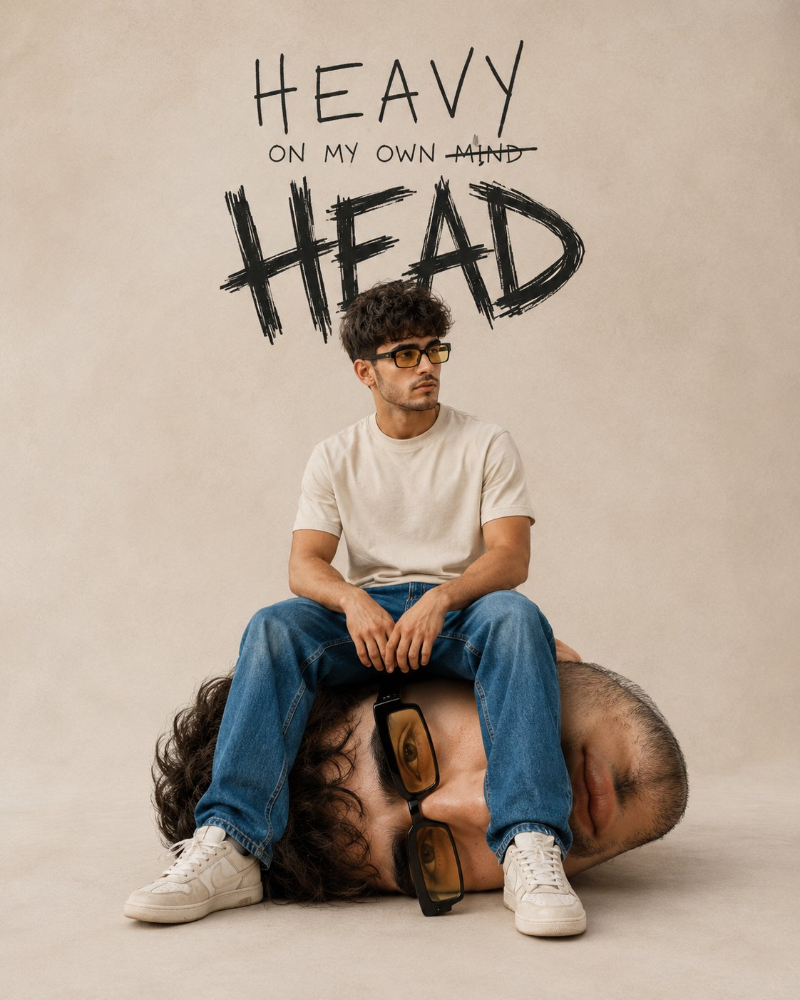

```text
Ultra-realistic conceptual portrait of a young man with curly hair and light stubble, wearing yellow-tinted rectangular sunglasses, a beige minimal t-shirt, blue jeans, and off-white sneakers. He is sitting casually with a relaxed posture.

The twist: he is seated on a large, hyper-realistic version of his own detached head placed on the ground. The head is scaled up, lying sideways, with the same facial features and sunglasses, creating a surreal self-reflection concept.

Composition: centered, full-body shot, neutral studio background with soft beige tones, minimal aesthetic. Clean negative space.

Typography integrated into the background:

* Handwritten-style text at the top: “HEAVY”
* Below it, smaller text: “ON MY OWN MIND” with “MIND” crossed out
* Large, rough, scribbled text in black: “HEAD”

Lighting: soft diffused studio lighting, subtle shadows, high detail, fashion editorial quality.

Style: blend of surrealism and modern streetwear campaign, minimal yet expressive, high-resolution, 8k, sharp focus, natural skin texture.

Mood: introspective, mental weight, identity, self-awareness.
```


---

## 例 483：都市飞鸟街头肖像

**来源：** [@HaniaAi12](https://x.com/HaniaAi12/status/2060216757797978245)

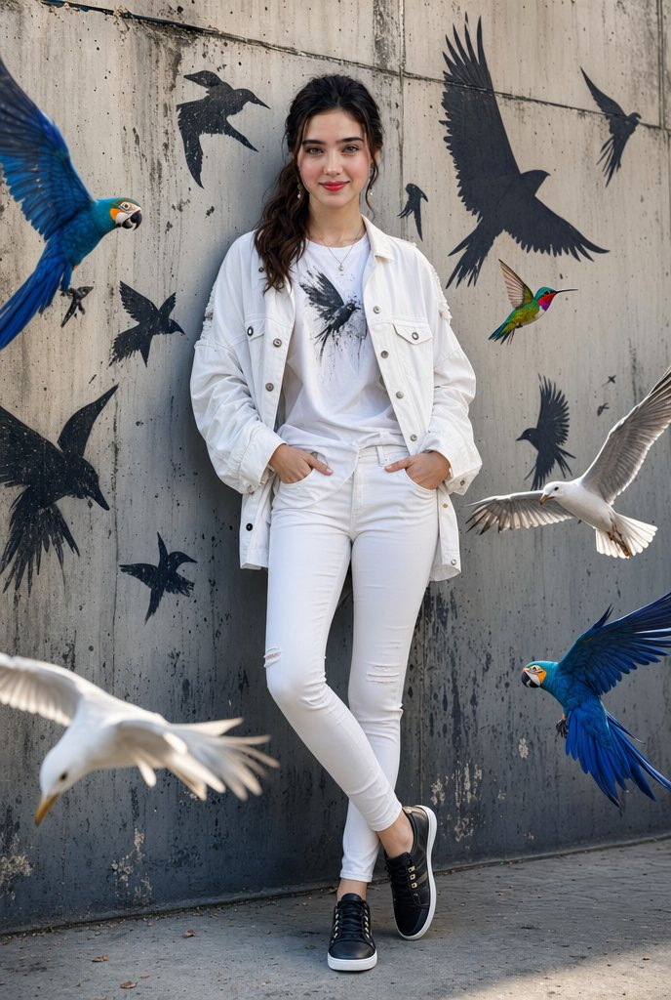

```text
A stylish cinematic portrait of a confident young woman leaning casually against a textured urban concrete wall, surrounded by vibrant flying birds including blue macaws, white seagulls, and a colorful hummingbird. Black graffiti-style bird silhouettes painted on the wall create an artistic street-art vibe. She is wearing a trendy all-white outfit — oversized denim jacket, fitted graphic tee, skinny jeans, and black sneakers. Soft natural daylight, realistic shadows, ultra-detailed fashion photography, urban luxury aesthetic, sharp facial features, glossy hair, high-end editorial style, dynamic composition, photorealistic, depth of field, 8K quality.
```


---

## 例 488：屋顶球场日落人像

**来源：** [@HaniaAi12](https://x.com/HaniaAi12/status/2061313477696954522)

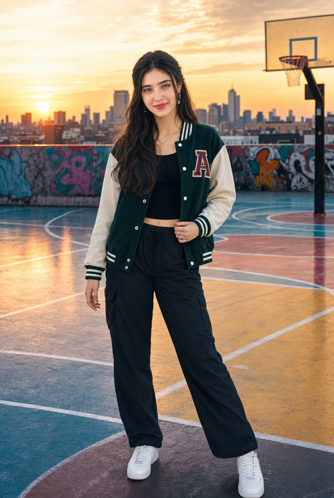

```text
Ultra-realistic, high-quality portrait of a stylish young South Asian woman standing gracefully on a colorful urban rooftop basketball court at sunset. She is standing in a relaxed and elegant posture with her weight naturally shifted to one leg, shoulders relaxed, and one hand gently resting by her side while the other lightly touches the edge of her varsity jacket. Her body is slightly angled toward the camera, creating a confident yet sophisticated appearance. She is looking directly into the camera with a warm, natural smile, projecting confidence, charm, and effortless style.
```


---

## 例 490：双重曝光时尚肖像

**来源：** [@Anaya_Ai12](https://x.com/Anaya_Ai12/status/2062191518975508678)

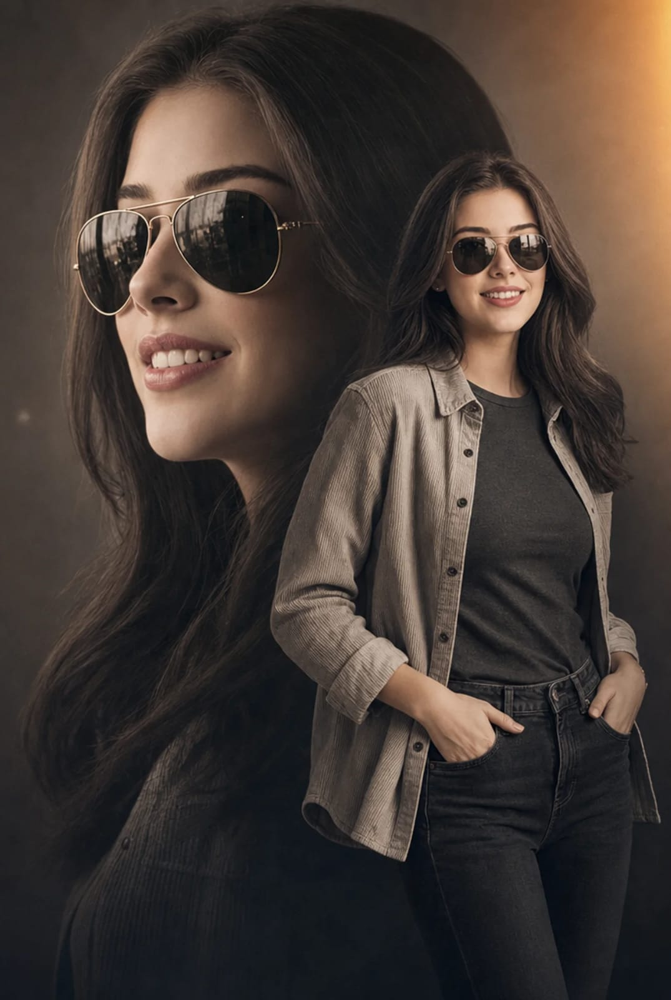

```text
A cinematic double-exposure fashion portrait featuring a woman with the uploaded face used 100% as reference, wearing stylish metallic aviator sunglasses. The composition artfully blends a large, semi-transparent close-up profile of her face on the left with her full-body figure standing confidently on the right. She wears an open, light-grey textured corduroy shirt layered over a dark grey fitted t-shirt and dark denim jeans, posing naturally with her hands in her pockets. She has long, flowing dark hair, flawless skin, elegant feminine features, and a confident, sophisticated expression.

The background is a minimalist neutral studio setting, allowing the double-exposure composition to remain the visual focus. The color grading features a sophisticated warm desaturated sepia and charcoal palette, enhanced by a soft golden-orange light-leak flare in the upper-right corner. Professional 85mm lens photography with high-contrast yet soft cinematic lighting accentuates the fabric textures, facial details, and layered portrait effect.

Ultra-realistic skin texture, luxury fashion-editorial aesthetic, premium magazine-cover quality, subtle film grain, cinematic depth, elegant shadows, refined color grading, modern retro-inspired styling, masterpiece composition, ultra-sharp focus, visually striking storytelling, high-end commercial fashion campaign look.
```


---

## 例 491：Y2K 高楼浴室镜面自拍

**来源：** [@jzaib4269](https://x.com/jzaib4269/status/2062184740849930384)

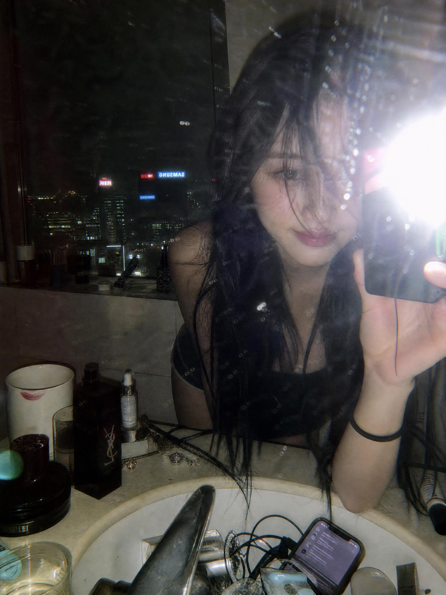

```text
A moody late-night mirror selfie captured in a luxury high-rise bathroom overlooking a glowing city skyline. A young woman with long, slightly messy black hair leans forward over a marble sink, partially obscuring one eye with loose strands. The photo is taken through a smudged mirror with visible dust particles, water spots, and imperfections, creating an authentic raw aesthetic. A powerful direct camera flash explodes in the frame, producing harsh highlights, lens flare, and a nostalgic early-2000s digital camera look.

The bathroom counter is cluttered with luxury cosmetics, skincare products, jewelry, a smartphone, and everyday personal items, adding a lived-in editorial feel. Reflections of neon-lit skyscrapers and hotel windows shimmer in the background, emphasizing an urban nightlife atmosphere. Soft pale skin tones contrast against dark clothing and black hair. The composition feels intimate, candid, and effortlessly cool.

Style: Y2K flash photography, candid mirror selfie, Korean editorial aesthetic, indie sleaze, hotel bathroom scene, luxury lifestyle, cinematic nightlife, disposable camera look, grainy texture, flash burn, realistic skin texture, shallow depth of field, authentic imperfections, viral Pinterest mood, high-fashion casual energy, raw unfiltered photography.

Camera: direct flash, compact digital camera, 35mm equivalent, harsh lighting, slight motion blur, visible noise, natural color grading, vertical composition, ultra-realistic, high detail.
```


---

## 例 492：黑色高定酒店套房写真

**来源：** [@xRahultripathi](https://x.com/xRahultripathi/status/2062100757923733617)

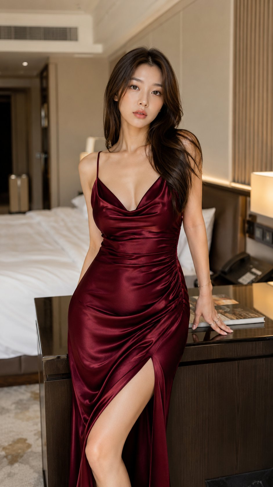

```text
Create a hyper-realistic luxury fashion portrait inspired by premium fashion-week editorials.

IMPORTANT:
Generate ONLY ONE SINGLE VERTICAL IMAGE.

STYLE:
Luxury fashion realism.
Professional couture photography.
Premium editorial atmosphere.

MAIN CONCEPT:
A beautiful adult Asian fashion model photographed inside a luxury hotel suite.

OUTFIT:
Elegant black couture mini dress.
Luxury embroidered details.
Premium designer fashion aesthetic.

BACKGROUND:
Luxury hotel interior.
Soft neutral decor.
Elegant cinematic depth blur.

LIGHTING:
Soft luxury window lighting.
Professional fashion-editorial reflections.
Natural skin texture.

MOOD:
Bold.
Elegant.
High-fashion energy.

QUALITY:
Ultra realistic native 4K HDR realism.
Professional magazine quality.
Vertical 9:16.
```


---

## 例 499：极简精品店全身时尚写真

**来源：** [@john_my07](https://x.com/john_my07/status/2062579742759649486)

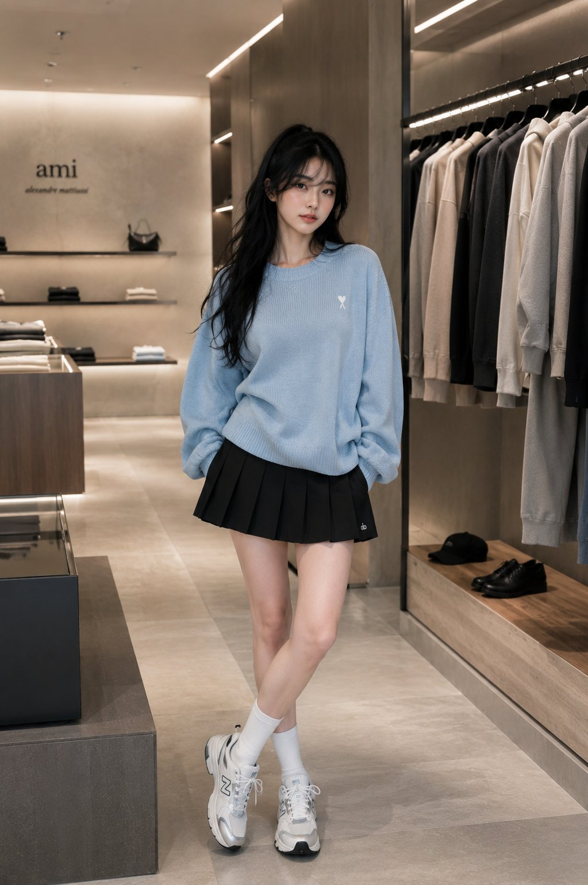

```text
A full-body editorial fashion photograph of a beautiful young woman with the same appearance as the reference, long glossy dark hair, soft bangs, fair skin, and refined feminine features. She stands casually in an upscale minimalist fashion boutique, wearing an oversized pastel-blue knit sweater paired with a black pleated tennis-style skirt, white crew socks, and chunky designer sneakers. Relaxed confident pose, gentle smile, luxury retail interior with modern clothing racks, neutral-toned garments, warm ambient lighting, wood and stone textures, clean architectural lines, cinematic depth of field, realistic lighting, premium fashion advertising, Vogue-style editorial, ultra-detailed, sharp focus, photorealistic, 4K.
```


---

## 例 500：梦幻花冠仙境肖像

**来源：** [@HaniaAi12](https://x.com/HaniaAi12/status/2062696495741391006)

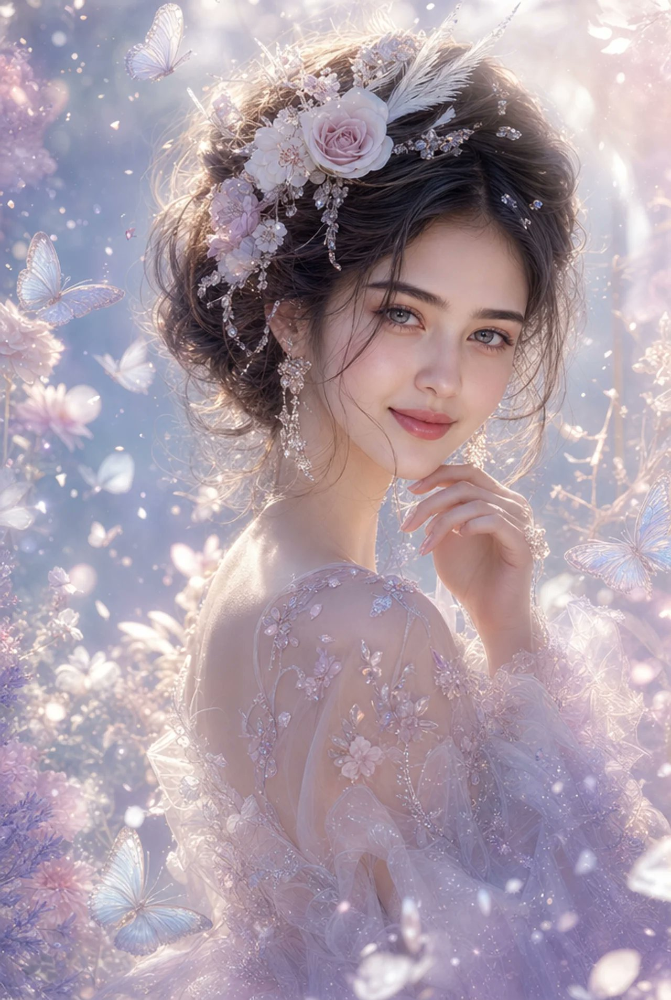

```text
Ultra-realistic ethereal fantasy portrait of a breathtaking young woman with delicate porcelain skin, soft grey-blue eyes, and natural rosy lips. She gazes gently toward the viewer with a serene, dreamy expression, her fingertips lightly touching her chin. Wispy ash-brown hair flows softly in the breeze, styled in a loose romantic updo adorned with pastel blush roses, shimmering crystal ornaments, delicate feathers, and intricate floral accessories. She wears elegant dangling crystal earrings and a translucent, flowing gown made of sheer iridescent fabric embroidered with tiny sparkling flowers.

The scene is bathed in soft diffused morning light, creating a luminous glow around her face and shoulders. Surrounded by floating butterflies, sparkling dust particles, translucent petals, and dreamy floral textures, the background blends pastel lavender, pearl white, blush pink, and silver tones. Cinematic fine-art photography, fairycore aesthetic, enchanted garden atmosphere, magical realism, ultra-detailed skin texture, soft focus highlights, volumetric lighting, bokeh, masterpiece quality, highly detailed, 8K resolution, delicate feminine beauty, romantic fantasy artwork, elegant composition, dreamy color grading, soft glow, celestial ambiance.
```


---

## 例 501：夏日牵手回眸电影肖像

**来源：** [@iamaiistudio](https://x.com/iamaiistudio/status/2063247373388992790)

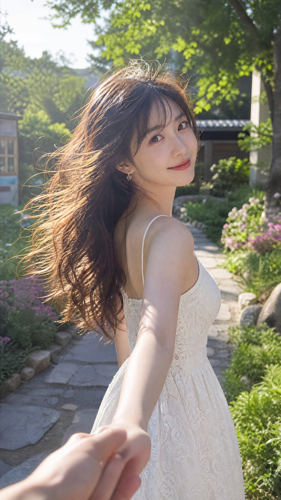

```text
Cinematic portrait photography, ultra-photorealistic, 2160x3840 vertical composition, 50mm or 85mm portrait lens rendering, shallow depth of field, clean translucent summer natural-light color grading — not overly yellow, not over-filtered.

Subject: a young beautiful adult East Asian woman, [describe face shape and features, e.g. soft heart-shaped face, refined classical features, bright almond/fox eyes, petite nose bridge, naturally full lips], overall vibe sweet, sunny, energetic, cute with a touch of allure. Gaze highly engaging — bright, clear, natural catchlights, as if it speaks; corners of mouth slightly lifted, expression gentle, vivid, natural.

She walks along a [scene, e.g. garden stone path / tree-lined lane / European street / courtyard], right hand reaching back to hold the hand of someone behind her; only their hand appears in the lower-left corner — like a first-person couple's POV snapshot. She glances back at the camera while her body stays in a forward walking motion, posture elegant and natural, clearly a candid captured moment with a faint in-love feeling.

Long [hair color] hair, [style, e.g. naturally wavy / relaxed big waves / airy bangs / half-up], many strands tousled and flying in the wind, richly layered and dynamic. Strong natural side-backlight rims the hair edges — clean, crisp rim light and semi-translucent glow, hair edges lit as if by sunlight, light and luminous. This is the core highlight of the image.

She wears [outfit, e.g. white lace slip dress / beige slip dress / light-blue short-sleeve top with white skirt / light-pink fitted dress], fabric texture natural, material light and soft. Bright natural summer sunlight realistically warms her skin, shoulders, collarbone, and clothing with soft, clean highlight transitions.

Skin texture: extremely realistic — visible fine pores, natural skin texture, faint imperfections, subtle tone variation, soft sheen. Cheeks, nose tip, shoulders show natural delicate gradations in sunlight. Translucent, healthy, real and refined — no plastic look, no waxwork, no over-smoothing.

Background: soft atmospheric blur, never distracting.

Avoid: over-smoothing, plastic skin, CG look, anime look, wig look, stiff expression, dead eyes, stiff poses, overall yellow cast, overexposed face, distorted features, wrong fingers, deformed hands, cluttered background, heavy influencer retouching.
```


---

## 例 505：夜间手机光沙发肖像

**来源：** [@iamaiistudio](https://x.com/iamaiistudio/status/2063231612478017579)

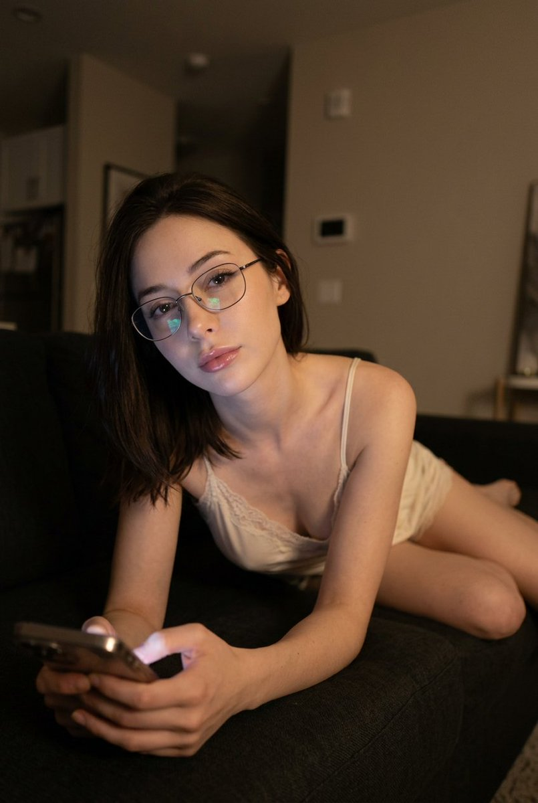

```text
A young adult woman with soft refined features, thin metal glasses, and shoulder-length dark tousled hair, leaning forward across a dark upholstered couch at night. She wears a pale cream lace-trim camisole with thin straps and matching soft shorts. One hand holds a smartphone close to the foreground, the screen glow casting cool reflections on her fingers and glasses lenses. Her expression is dreamy and softly tired, eyes lifted toward the camera as if she just looked up from scrolling, lips gently closed in a relaxed pout.

Shot in a vertical 3:4 frame at slightly above eye level, medium close-up to three-quarter portrait. Warm dim tungsten room light mixed with cool phone-screen reflections, no flash, soft falloff across the couch and wall. Shallow depth of field, soft low-light grain, slight motion blur, natural imperfect sharpness. Background: plain beige-gray wall, minimal decor, late-night atmosphere. Soft glam makeup: subtle eyeliner, long lashes, smooth skin, glossy pink-nude lips. Realistic social-media night portrait aesthetic.
```


---

## 例 508：木漏日庭院俯拍猫咪人像

**来源：** [@ohmuyi](https://x.com/ohmuyi/status/2067930690977779942)

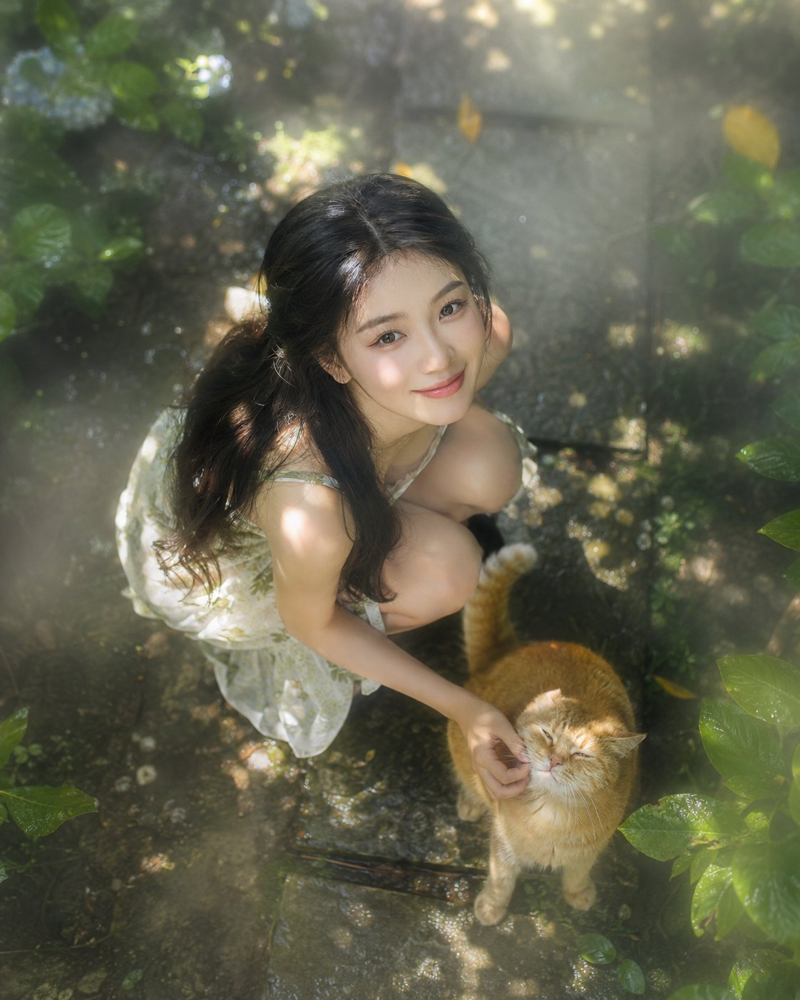

```text
俯拍镜头，高角度顶机位，自上而下俯瞰一位年轻的东亚裔女性，她有着精致的东亚五官和柔顺的黑发。她蹲在花园小径上，轻轻逗弄一只毛茸茸的橘猫。头顶密密的枝叶滤过阳光，形成灵动的“木漏日”效果——跃动、圆形的光斑在她的肌肤和猫毛上流转舞动。空气中悬浮着淡淡的潮湿薄雾，捕捉住光束，营造出柔和可见的立体光柱（丁达尔效应）。当她仰头朝向镜头时，一层轻雾柔化了画面边缘，增添梦幻氛围。她的表情从略带俏皮的轻噘嘴，渐渐转为眼角堆起细纹的真挚笑容，斑驳的光线恰好勾勒出她肌肤的细腻纹理和眼中盈盈的水光。
```


---

## 例 509：涂鸦拉衣奔跑棚拍

**来源：** [@Sairah_0](https://x.com/Sairah_0/status/2071929275897491491)

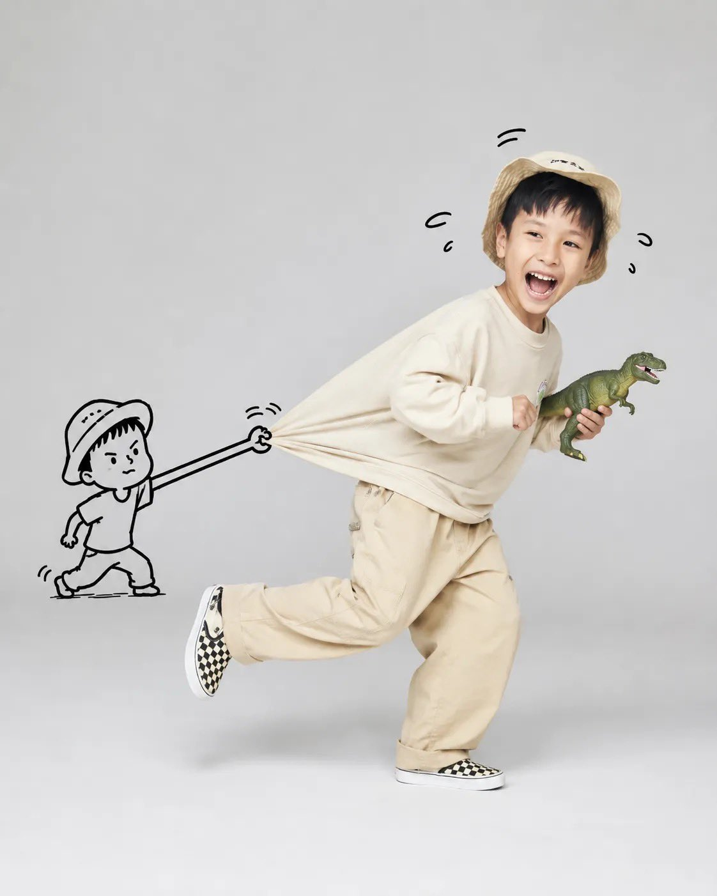

```text
A playful, high-key studio portrait of [subject] running joyfully across a seamless light gray background, captured mid-stride with one leg lifted and a wide genuine smile. The subject wears a casual oversized outfit with soft neutral tones (or vibrant colors), creating a dynamic sense of motion. Behind them, a simple black hand-drawn cartoon stick figure grabs and stretches the back of their shirt, making the fabric appear elastically pulled as if trying to stop them. The doodle character is integrated naturally into the scene with expressive motion lines and a humorous facial expression. The subject holds a fun prop (such as a dinosaur toy, oversized lollipop, teddy bear, or balloon), enhancing the playful storytelling. Minimalist composition, clean studio lighting, soft shadows, ultra-sharp focus, realistic skin texture, vibrant yet natural colors, whimsical editorial photography, premium children’s fashion campaign aesthetic, highly detailed, photorealistic, 8K.
```


---

## 例 518：花田风动夏日人像

**来源：** [@lovimg_com](https://x.com/lovimg_com/status/2077036746198618336)

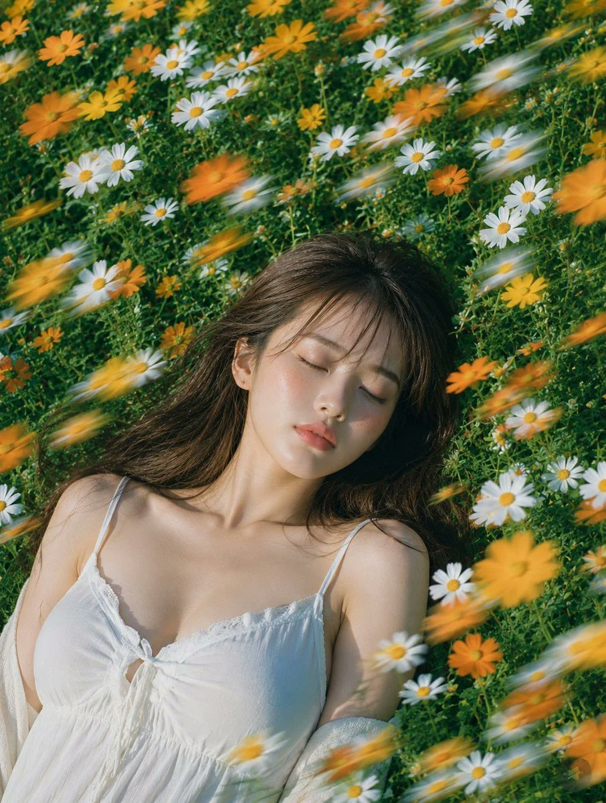

```text
主題：
花風のまどろみ

主体：
縦長4:5の写真風ポートレート。白と黄色のマーガレット、オレンジ色の小花が密に咲く夏の草花畑に、成熟した大人の女性が仰向けで静かに横たわっている。人物は画面下部から中央にかけて大きく入り、顔は中央やや右、胸元から肩までは画面下側に収まる。周囲の花が画面全体を埋め、対角線方向に流れる花のモーションブラーが前景を横切る。

人物・表情：
自然で現実感のある日系ポートレート。暗めのブラウンロングヘアに、薄い前髪と顔まわりのやわらかな毛束。目を閉じ、眉は力が抜け、唇は軽く閉じた穏やかな表情。頬と鼻先に自然な血色、肌には過度な補正をせず細かな質感を残す。首筋、鎖骨、頬に夏の日差しが当たり、静かに眠っているような落ち着いた雰囲気。

服装・ポーズ：
白い夏用キャミソールワンピース。細い肩紐、胸元の控えめなレース、中央の小さなリボン、薄手のコットン素材。人物の両肩は草花に自然に沈み、片腕は画面下側で花に隠れて見切れる。体は画面左下から右上へ少し斜めに置かれ、髪は草の上に広がり、風で数本だけ額にかかる。

背景・光：
郊外にある小さな花畑のような、生活感のある自然な草花の密度。背景はすべて緑の葉と白・黄色・オレンジの花で構成し、人工物や読める文字は入れない。高めの位置から差す夏の太陽光。光はやや硬めで暖かく、顔の左側と首筋、肩に明るいハイライトが入り、花と髪の影が肌に細く落ちる。草の反射で下側に淡い緑の返り光。

構図・カメラ：
やや俯瞰の近距離撮影。85mm相当の自然な圧縮感、人物の顔にピントを合わせ、周辺の花は浅い被写界深度で少しぼける。前景の花だけが風に流され、白・黄色・オレンジの細長い光跡として左上から右下へ走る。顔まわりはブラーを弱め、表情と肌の質感をはっきり見せる。

質感・スタイル：
リアルな写真表現。夏の日差し、透明感のある肌、柔らかな髪の束感、薄手コットンのしわ、草花の細密な質感。ナチュラルな色調で、緑を深く、白い花を明るく、オレンジの花をアクセントにする。フィルム写真のようなわずかな粒子感と、雑誌ポートレートの落ち着いた仕上がり。

ネガティブ：
不自然な顔、不自然な視線、余分な指、欠けた指、手足の融合、関節の破綻、服と体の接触不良、浮遊、不自然な重力、誤った遠近法、光源と矛盾する影、過度な美肌補正、プラスチックのような肌、文字化け、ロゴ、透かし。
```


---

## 例 525：酒红棚拍男士时尚肖像

**来源：** [@iamsofiaijaz](https://x.com/iamsofiaijaz/status/2090294894187413883)

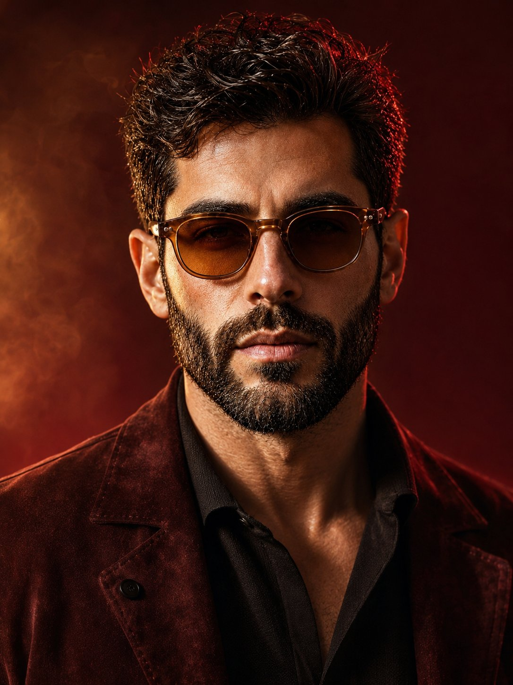

```text
A cinematic, ultra-realistic close-up portrait of a stylish man, using the provided image as an accurate face reference. Preserve his natural facial identity, thick naturally curly dark brown hair, neatly trimmed salt-and-pepper beard, strong masculine facial structure, and realistic facial proportions. He wears sophisticated round vintage amber-brown sunglasses and a premium deep burgundy suede jacket over a fitted black silk-knit shirt, creating a refined luxury fashion aesthetic.

Warm cinematic studio lighting with a soft amber-golden key light illuminating the face from the front-left, complemented by a subtle crimson-red rim light outlining the hair and shoulders. The background is a rich burgundy, wine-red, and dark plum gradient, with soft atmospheric haze and subtle diffused light creating depth without distracting from the subject. Elegant warm highlights contrast beautifully against the dark clothing.

Extremely detailed natural skin texture, individual beard hairs, realistic pores, subtle facial imperfections, sharp eyes visible behind slightly tinted lenses, natural reflections on the sunglasses, rich dimensional shadows, realistic fabric and suede texture, shallow depth of field. Sophisticated luxury fashion campaign, mysterious and confident mood, premium men's editorial photography, cinematic color grading, photorealistic, HDR, professional studio photography, 85mm portrait lens, f/1.8, crisp facial details, soft background bokeh, centered composition, head-and-shoulders framing, powerful masculine presence, understated elegance, 3:4 aspect ratio.
```


---

## 例 529：云朵气球山脊旅行人像

**来源：** [@AiwithLariab](https://x.com/AiwithLariab/status/2091394735416160715)

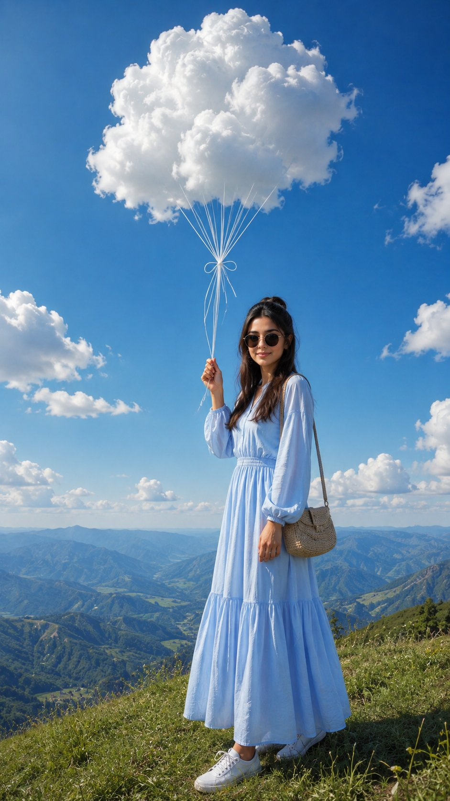

```text
Create a dreamy ultra-photorealistic outdoor fashion photograph based on the person in @image1.

IDENTITY & FACE:
Preserve the exact facial identity of the person in @image1. Keep the same face shape, facial proportions, eyes, eyebrows, nose, lips, skin tone, hairstyle, hairline, and all recognizable facial features. The person must remain clearly recognizable and consistent with the reference image. Do not redesign or replace the face.

POSE & COMPOSITION:
Create a full-body vertical portrait of the person standing naturally on a grassy mountain ridge. The body is slightly turned toward the camera while the face looks naturally toward the viewer. One hand gently holds several long white strings attached to an enormous fluffy white cloud floating directly above the person like a whimsical balloon bouquet. The other hand rests naturally beside the body.

SCENE:
A breathtaking high-altitude mountain landscape with layers of distant blue-green mountains stretching across the horizon. The subject stands on a natural grassy ridge with delicate wild grass around her feet. Vast open sky dominates the upper portion of the composition.

CLOUD BALLOON:
Create one enormous soft white cumulus cloud directly above the subject, visually resembling a giant floating cloud balloon. Multiple thin white strings descend from the cloud and gather elegantly into the person's hand. The strings should look physically believable and naturally connected to the cloud. The cloud is fluffy, voluminous, bright white, and beautifully illuminated by sunlight.

CLOTHING:
Dress the person in a completely modest, elegant, fully covered outfit:

long flowing light-blue maxi dress reaching the ankles

loose long sleeves covering the arms completely

high and modest neckline

opaque non-transparent fabric

full-length flowing skirt

simple white closed-toe sneakers

small woven crossbody bag
No exposed midriff, no deep neckline, no sheer fabric, no short skirt, no revealing clothing. The outfit should look graceful, comfortable, elegant, and wholesome.

ACCESSORIES:
Add tasteful round dark sunglasses and a simple woven shoulder/crossbody bag. Keep accessories minimal and natural.

HAIR:
Keep the person's original hairstyle and hair color from @image1 as much as possible. Allow a few natural strands of hair to move gently in the mountain breeze.

LIGHTING:
Bright natural midday sunlight, soft atmospheric illumination, realistic highlights on the white cloud and dress, subtle natural shadows, crisp but gentle exposure, beautiful blue-sky contrast.

PHOTOGRAPHY STYLE:
Ultra-photorealistic professional travel-fashion photography, realistic skin texture, natural fabric details, physically accurate lighting, realistic depth of field, cinematic atmospheric perspective, high dynamic range, sharp subject with a softly detailed background.

COLOR PALETTE:
Sky blue, soft white, pale powder blue, natural green grass, and distant blue mountains. Clean, airy, dreamy color grading with a peaceful summer atmosphere.

COMPOSITION:
9:16 vertical portrait, full body visible from head to shoes, subject positioned slightly below center, enormous blue sky and cloud occupying the upper half, distant mountains forming a soft horizontal horizon, balanced negative space, visually striking editorial travel photograph.

IMPORTANT:
Preserve the exact identity from @image1. Do not change the person's recognizable face or facial structure. Keep the outfit completely modest, opaque, and fully covering. Maintain realistic anatomy, natural hands, realistic proportions, and believable interaction between the person, strings, cloud, grass, and mountain environment.
```


---

## 例 536：春日樱花回眸电影人像

**来源：** [@SheBuildsAI_](https://x.com/SheBuildsAI_/status/2092431090095149533)

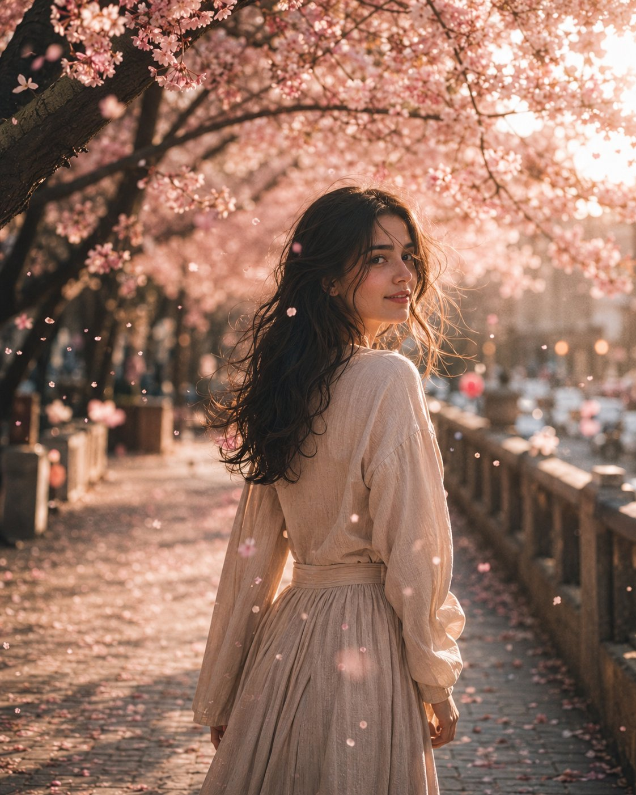

```text
{
  "title": "WHISPERS OF SPRING",

  "scene": "A peaceful pathway beneath blooming cherry blossom trees during a warm spring afternoon. Pink blossoms fill the canopy overhead while delicate petals drift gracefully through the air. Soft sunlight filters through the branches, creating a dreamy and enchanting atmosphere.",

  "subject": "A young woman walks away from the camera before gently turning her head over her shoulder with a soft, mysterious smile. She wears a flowing natural linen dress that moves gracefully with the breeze, highlighting her delicate facial features and effortless elegance.",

  "detail": "Wind carries countless pink cherry blossom petals across the frame while warm sunlight creates glowing highlights throughout the scene. Every strand of hair moves naturally in the breeze, with ultra realistic skin texture, lifelike fabric folds, soft floral surroundings, and subtle atmospheric haze enhancing the cinematic realism.",

  "atmosphere": "Elegant, peaceful, romantic, dreamy, timeless, cinematic, graceful, and enchanting.",

  "lighting": "Warm spring sunlight filtering through cherry blossom branches, soft natural illumination, glowing highlights, volumetric light rays, gentle ambient shadows, and subtle atmospheric haze.",

  "composition": "Cinematic editorial portrait captured with an 85mm lens, featuring the subject in a three-quarter over-the-shoulder pose. Shallow depth of field, creamy bokeh, balanced framing with flowering trees, soft leading lines, and immersive visual storytelling.",

  "style": "Photorealistic, masterpiece, editorial fashion photography, analog film aesthetic, dreamy pastel color palette, ultra realistic skin texture, highly detailed, shallow depth of field, creamy bokeh, atmospheric haze, HDR, cinematic realism, 8K."
}
```


---

## 例 537：个人形象分析图卡

**来源：** [@you1873118](https://x.com/you1873118/status/2050446427105759269) / [awesome-gpt-image-2-prompts](https://github.com/EvoLinkAI/awesome-gpt-image-2-prompts)

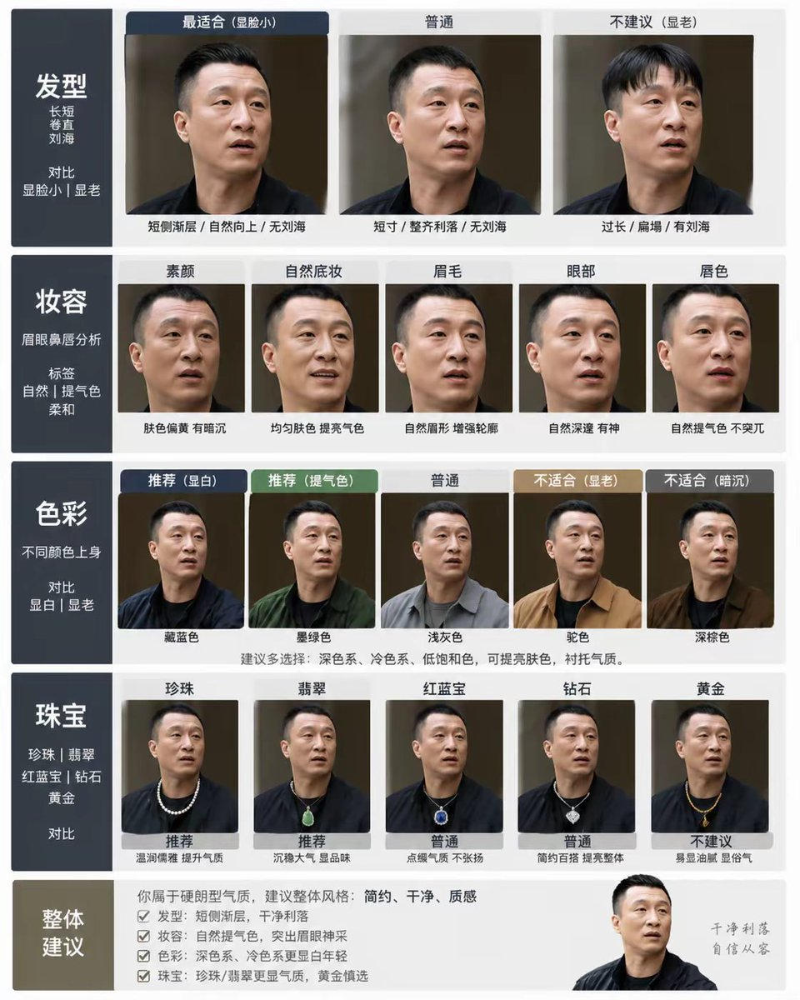

```text
GPT-Image-2的一个妙用形象 这个提示词是一个老哥发我的 我试了下，效果也太强了 如果放在一年前 你可能三天三夜的ComfyUI工作流 才能做出来 提示词： 请根据我上传的人像照片，做一套个人形象分析图卡，包含发型、妆容、色彩和珠宝。要求：保留五官脸型肤色，不要过度修图，所有变化在同一张脸真实展示，风格干净高级。发型：长短、卷直、刘海，对比最适合/ 普通/不建议（显脸小、显老）妆容：眉眼鼻唇分析，标签（自然、提气色、柔和）色彩：不同颜色上身，对比推荐/普通/不适合（显白、显老）珠宝：珍珠、翡翠、红蓝宝、钻石、黄金，对比推荐/普通/不建议 整体：视觉为主，文字简短，4:5比例
```


---

## 例 538：High-Fashion Beverage Campaign Board

**来源：** [@SPEEDAI07](https://x.com/SPEEDAI07/status/2049713995851202786) / [awesome-gpt-image-2-prompts](https://github.com/EvoLinkAI/awesome-gpt-image-2-prompts)


```text
Create a high-fashion editorial beverage campaign set on a minimalist rooftop at golden hour. Ultra-clean composition with strong negative space, warm sun flare, and soft shadows.

A stylish male model with sharp features and effortless confidence is posed like a fashion editorial—slightly turned away, sipping from the can. He wears elevated linen tailoring in monochrome cream tones, partially unbuttoned, with subtle jewelry.

Foreground: a sculptural stone pedestal holding a large hero can of AURELIS – Blood Orange Basil, hyper-detailed with condensation and botanical artwork.

Typography is bold, oversized, and editorial: GOOD DAYS IN EVERY CAN

Use refined serif typography with dramatic scale and spacing. Keep layout asymmetrical and magazine-like.

Add subtle microcopy: “Botanical. Bright. Made to sparkle.”

Minimal icons (thin line style): LOW SUGAR / REAL FRUIT / LIGHTLY SPARKLING / 12 OZ

Bottom strip: 3 cans styled like a luxury product lineup with fruit + herbs arranged like still life photography:

Blood Orange Basil

Peach Ginger

Lime Mint

CTA: SHOP FLAVORS →

Style: Vogue campaign, luxury branding, cinematic lighting, ultra-realistic, muted tones, high contrast, premium finish.
Aspect ratio: vertical (4:5 or 9:16)

🌿 2. Minimal Premium (Apple-style)

Prompt:

Create a minimalist premium beverage ad with a sunlit rooftop setting and extremely clean composition.

Background: soft gradient sky with warm golden-hour tones, minimal distractions, large negative space.

A relaxed male model sits casually, taking a sip from the can. Wardrobe: simple, modern, neutral linen outfit.

Centerpiece: a large floating or pedestal-mounted can of AURELIS – Blood Orange Basil, perfectly lit with soft reflections and visible condensation.

Typography: SUN IN EVERY SIP

Use modern minimal typography, centered, with generous spacing.

Supporting line: “Real botanicals. Effortless refreshment.”

Icons aligned horizontally: LOW SUGAR • REAL FRUIT • LIGHTLY SPARKLING • 12 OZ

Bottom section: 3 cans evenly spaced, perfectly aligned with subtle shadows:

Blood Orange Basil

Peach Ginger

Lime Mint

CTA button (pill-shaped): SHOP FLAVORS

Style: Apple-level minimalism, ultra-clean layout, soft gradients, modern luxury, highly polished product rendering.
Aspect ratio: vertical (4:5 or 9:16)

🍊 3. Bold Gen Z Premium Version

Prompt:

Create a bold, scroll-stopping vertical beverage ad set on a rooftop during golden hour with vibrant citrus energy.

Lighting: warm, saturated sunlight, glowing highlights, high contrast.

A confident male model drinks directly from the can mid-action, candid and dynamic.

Hero can: oversized, slightly exaggerated scale on a textured stone pedestal, covered in condensation.

Typography: DRINK THE SUN

Use large, expressive typography with strong contrast (deep green + burnt orange), slightly overlapping layout.

Tagline: “Fresh. Bright. Addictive.”

Feature icons arranged dynamically: LOW SUGAR
REAL FRUIT
LIGHTLY SPARKLING
12 OZ

Bottom: 3 cans with energetic ingredient styling:

Blood Orange Basil (splashes, citrus slices)

Peach Ginger (fresh peach + ginger root)

Lime Mint (lime wedges + mint leaves)

CTA: SHOP FLAVORS →

Style: premium but bold, modern campaign aesthetic, slightly experimental layout, high contrast, social-first, dynamic composition.
Aspect ratio: vertical (9:16 preferred)
```


---

## 例 539：Landscape Architecture Board

**来源：** [@iamaiistudio](https://x.com/iamaiistudio/status/2054654236705845670) / [awesome-gpt-image-2-prompts](https://github.com/EvoLinkAI/awesome-gpt-image-2-prompts)

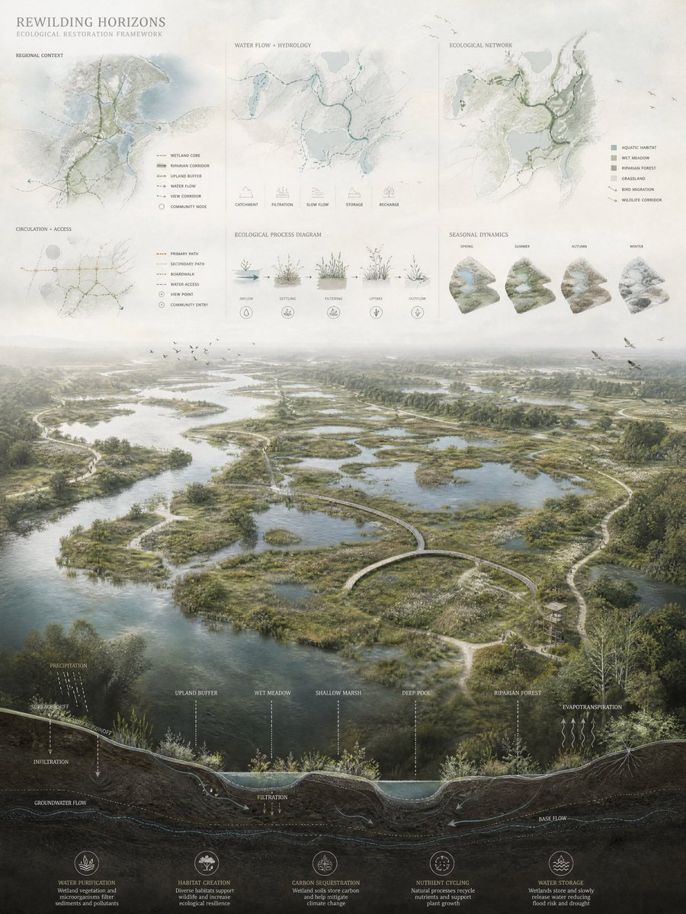

```text
Generate a 3:4 vertical, competition-grade landscape architecture presentation board. The board blends photorealistic aerial rendering with refined architectural diagram language, in the style of a high-end international landscape competition submission. Mood: calm, atmospheric, regenerative, ecological, scientific yet poetic. Layout (three stacked zones): 1. Top zone: analytical ecological diagrams and mapping overlays. 2. Middle zone: a large aerial landscape rendering as the primary focal image. 3. Bottom zone: a continuous sectional cut through the ecological landscape system. Top analytical zone: • Simplified ecological maps with soft, transparent color overlays. • Ultra-thin linework in white and pale gray. • Diagrams of water flow, circulation systems, ecological networks, habitat zones, and landscape connectivity. • Dashed lines for movement and flow. • Minimal annotations and soft ecological icons. • Floating overlay effect sitting above the rendering. • Very light pastel tones, high transparency, clean spacing, no dense clutter. Middle aerial rendering: • Bird's-eye view of an ecological restoration landscape. • Wetlands, ponds, flowing water systems, vegetation patches, bioswales, regenerative terrain. • Soft, slightly desaturated palette of greens, browns, and muted water blues. • Atmospheric depth with subtle haze in the distance. • Gentle human and ecological activity: walking paths, birds, small environmental interactions. • Wide landscape depth, smooth terrain transitions, calm cinematic environmental lighting. • Soft paper-texture finish integrated into the rendering. Bottom sectional cut: • Continuous section through terrain and ecological systems. • Soil layers, hydrology, groundwater movement, vegetation roots, ecological restoration processes, water filtration systems. • Thin white or pale linework, muted tones, minimal color. • Arrows indicating water movement and ecological flow. • Elegant architectural drafting quality, seamlessly merged into the board. Diagram language: extremely thin and precise linework, slightly softened edges (no harsh vector look), minimal labels, clean scientific notation, soft ecological symbols, balanced between scientific clarity and poetic visualization. Color system: • Base: desaturated greens, earthy browns, muted blue water tones. • Overlay: pale green, soft cyan, light beige, translucent pastel layers. • Avoid saturated accents, harsh contrast, bright reds, or overly graphic colors. Texture and atmosphere: soft atmospheric rendering, slight environmental haze, diffused lighting, subtle paper-grain or printed board texture, refined competition-board aesthetic. Format: 3:4 vertical architectural competition board composition. #AIart #GPTImage2
```


---

## 例 540：Neo-Noir Character Design Board

**来源：** [@Mind_Boticni](https://x.com/Mind_Boticni/status/2054542152781431075) / [awesome-gpt-image-2-prompts](https://github.com/EvoLinkAI/awesome-gpt-image-2-prompts)

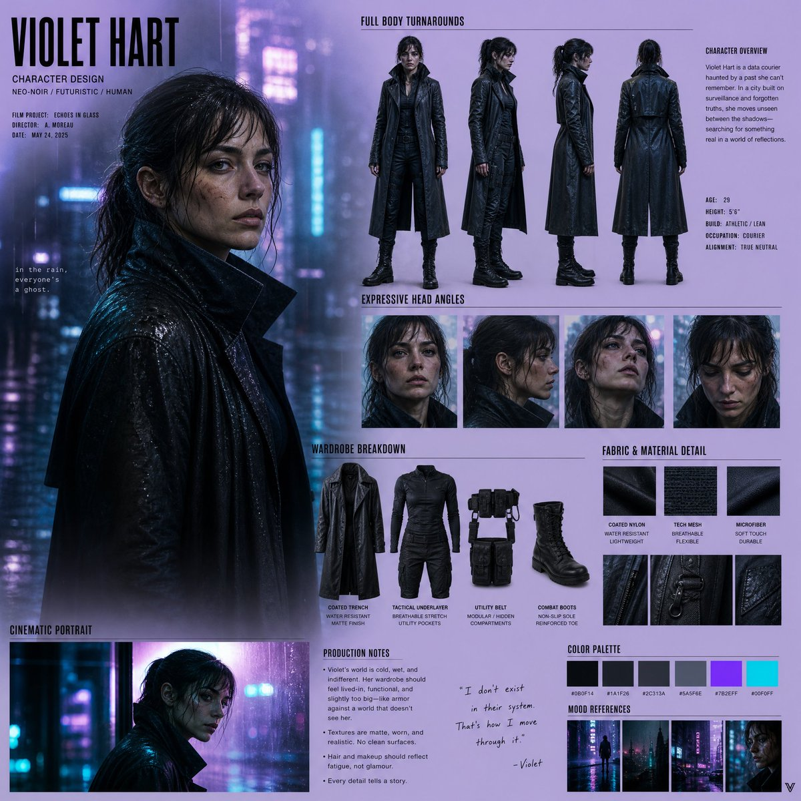

```text
Create a cinematic realistic character design board for a high-budget neo-noir film production set in a rain-soaked futuristic city. Use a dark charcoal and electric cyan color palette with neon reflections in the background. Avoid generic grids or symmetrical layouts; composition should feel like a stylized director’s pitch board. Design a grounded human character with realistic anatomy, subtle imperfections, and strong emotional presence. Include full-body turnarounds, expressive head angles, cinematic portrait, wardrobe breakdown, fabric texture detail, and production notes. Background: blurred cyberpunk city lights, wet glass reflections, moody atmosphere, soft neon glow. Style: semi-realistic cinematic realism, high contrast lighting, shallow depth of field, film grain, emotional intensity.
```


---

## 例 541：Tokyo Pink Fashion Collage

**来源：** [@Mind_Boticni](https://x.com/Mind_Boticni/status/2056013715892514937) / [awesome-gpt-image-2-prompts](https://github.com/EvoLinkAI/awesome-gpt-image-2-prompts)

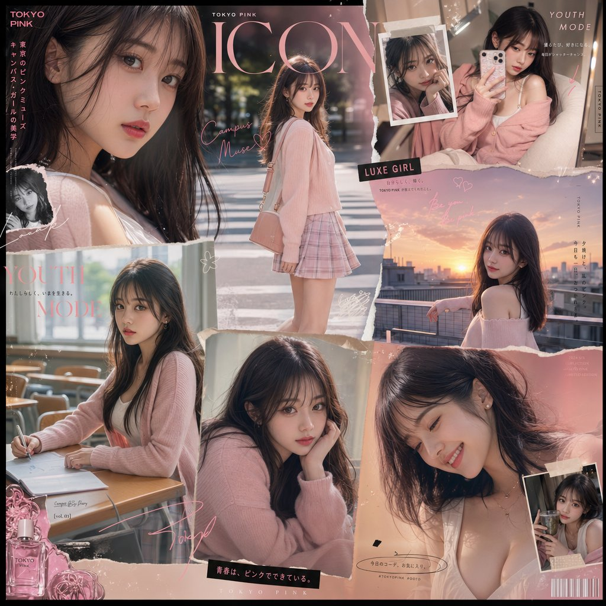

```text
GPT Image 2 on ChatGPT                         

Prompt :

Create a premium 1:1 luxury fashion collage featuring the same stylish Japanese college girl in multiple cinematic portrait moments across one artistic composition. Blend ultra-realistic anime-inspired beauty with luxury editorial aesthetics. Include close-up beauty shots, candid walking moments, stylish classroom fashion, playful mirror selfies, rooftop sunset poses, and soft emotional expressions while maintaining identical character identity throughout. Use asymmetrical overlapping photo layers, torn magazine textures, glossy reflections, handwritten fashion notes, dreamy pink gradients, cinematic bloom lighting, and tiny  size integrated typography like “TOKYO PINK”, “ICON”, “YOUTH MODE”, and “LUXE GIRL”. Ultra detailed, cinematic, modern Japanese fashion campaign aesthetic, soft depth of field, premium social media advertisement style, 8K.
```


---

## 例 542：Skincare UGC Storyboard Board

**来源：** [@WanderingC76](https://x.com/WanderingC76/status/2063797516731294055) / [awesome-gpt-image-2-prompts](https://github.com/EvoLinkAI/awesome-gpt-image-2-prompts)

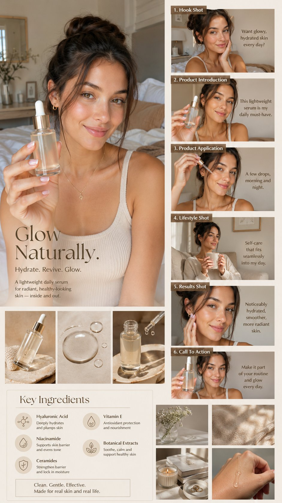

```text
(Luxury AI UGC skincare campaign board), warm beige aesthetic, beautiful female influencer with glowing healthy skin, holding a skincare serum bottle toward the camera, natural smile, cozy bedroom environment, soft natural daylight, realistic home setting, elegant neutral decor.

Large hero portrait on the left side.

Right side featuring (6 UGC storyboard panels):
(Hook Shot),
(Product Introduction),
(Product Application),
(Lifestyle Shot),
(Results Shot),
(Call To Action).

Each panel showing realistic influencer actions and natural expressions.

Bottom section featuring (Key Ingredients Box) with elegant skincare icons and ingredient highlights.

Additional product close-ups, serum texture shots, lifestyle B-roll images, premium beauty advertising layout.

(Soft Natural Lighting),
(Real & Relatable),
(Clean Editorial Design),
(UGC Creator Style),
(Premium Skincare Branding),
(Warm Beige Color Palette),
(Photorealistic),
(Ultra Detailed),
(Vertical 9:16),
(8K Quality).

Negative Prompt:
watermark, logo, low quality, blurry, bad anatomy, distorted hands, cluttered layout, dark lighting, cartoon, CGI.
```


---

## 例 543：AR Grocery Overlay POV

**来源：** [@iamaiistudio](https://x.com/iamaiistudio/status/2067987931651068364) / [awesome-gpt-image-2-prompts](https://github.com/EvoLinkAI/awesome-gpt-image-2-prompts)

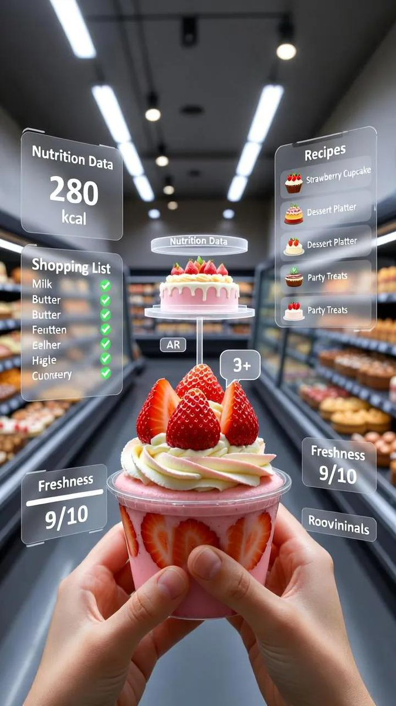

```text
POV shot from inside a grocery store aisle, your hands holding a vibrant mixed-fruit jam jar -- strawberry, blueberry, and orange blend. Holographic AR overlays float around it: a "Flavor Mix" panel with fruit icons, a "Nutrition Info" display, and a glowing "Freshness Meter" at 9/10. A translucent digital shopping list with checkmarks for bread and butter hovers nearby, plus recipe suggestions for toast, pancakes, and desserts. Bokeh background of store shelves and shoppers. Clean retail lighting, photorealistic, cinematic, AR glasses POV, vertical composition.

Full prompt: 
A first-person point-of-view (POV) shot inside a modern supermarket aisle. The viewer's hands are holding a mixed fruit jam jar with colorful branding, showing a blend of strawberry, blueberry, and orange flavors. Floating around the jar are sleek, semi-transparent Augmented Reality (AR) digital interfaces and holographic HUDs. The overlays display "Flavor Mix" with fruit icons, "Nutrition Info," and a glowing "Freshness Meter" reading 9/10. A digital shopping list with checkmarks for bread and butter appears beside the jar, along with small recipe suggestions like breakfast toast, pancakes, and desserts. The background shelves are slightly blurred with other products and shoppers, creating realistic depth of field. Bright, clean lighting with a futuristic retail atmosphere, ultra-realistic, cinematic look, high-tech AR glasses perspective, vertical composition.
```


---

## 例 544：Aspect Ratio: 9:16 Vertical

**来源：** [@GeekCatX](https://x.com/GeekCatX/status/2047220831491858766) / [awesome-gpt-image-2-prompts](https://github.com/EvoLinkAI/awesome-gpt-image-2-prompts)

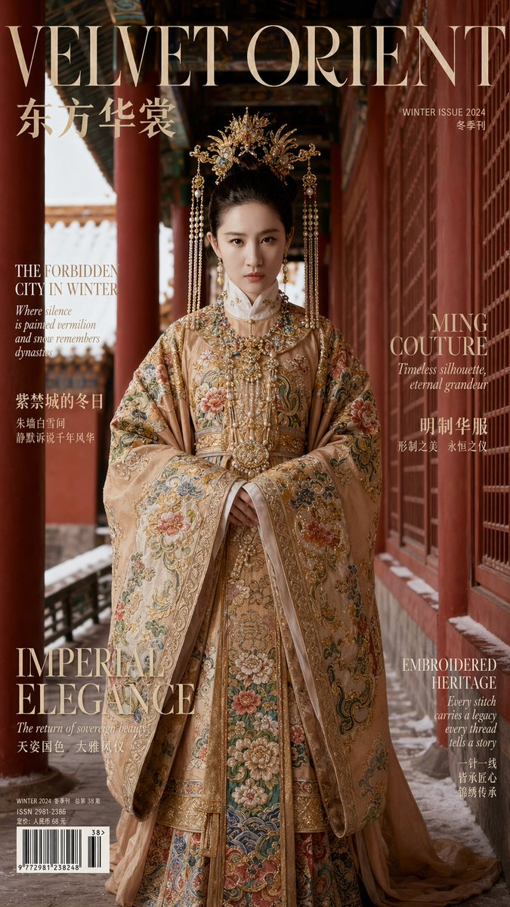

```text
Aspect Ratio: 9:16 Vertical

【IDENTITY & REALISM (CRITICAL PRIORITY)】

The subject is an adult female whose facial features and bone structure must 100% perfectly match the provided FACE_REF image. Eye spacing, nose bridge, jawline, and cheekbone structure must be exact; no identity drift is allowed. Skin texture must be photorealistic, showing pores and fine details—do not over-smooth or apply an Instagram filter look.

【PHOTOGRAPHY & CINEMATOGRAPHY】

A high-end editorial fashion photograph with a cinematic quality, rivaling covers of Vogue, Harper’s Bazaar, or ELLE.

Lens & Focus: Use an 85mm lens (for medium shot) or 50mm/70mm (for full body) with a shallow depth of field. The subject's eyes must be perfectly sharp.

Lighting: Natural winter daylight supplemented by soft, professional fill light. Gold ornaments and precious stones should have realistic specular highlights without being blown out. Embroidery textures must be incredibly sharp and tactile.

Color Grading: Rich, cinematic colors. The red walls and the attire's main color must be distinct and clean, not muddy. The overall image should feel deep, textured, and expensive.

Composition: A clean magazine cover layout with deliberate negative space at the top or sides for typography. No torn paper or hand-drawn effects.

【SETTING: FORBIDDEN CITY WINTER】

The location is a red-walled long corridor in the Beijing Forbidden City.

Environment: Visible details include vermilion walls, red pillars, intricate carved windows, and painted wooden beams with strong perspective depth. The scene must be clean: no tourists, modern signs, or watermarks.

Weather Condition (Selected Randomly):

[If Snowfall selected]: Fine snowflakes are gently falling.

[If Post-Snow selected]: The air is crisp and clear, with remnant snow on the eaves and steps.

【WARDROBE: MING DYNASTY HEAVY INDUSTRY COUTURE】

The subject wears opulent, multi-layered Ming Dynasty ceremonial Hanfu. The aesthetic is gold-heavy, dense tassels, phoenix crown, large-area woven gold embroidery, complex layering, dignified and luxurious.

Structure: A visible, crisp white standing inner collar provides a clean boundary. Over this is a structured duijin ao (jacket) with wide sleeves, topped by a heavy xiapei/pibo (stole) structure held by a large central yajin ornament.

Fabric & Craft: The main fabric is real zhijin jin (woven gold brocade) with palpable fiber texture. The embroidery is heavy industry—using panjin goldwork, couched gold
```


---

## 例 545：Luxury Fashion Magazine Cover Black and White

**来源：** [@iamrealsnow](https://x.com/iamrealsnow/status/2047883187527856345) / [awesome-gpt-image-2-prompts](https://github.com/EvoLinkAI/awesome-gpt-image-2-prompts)

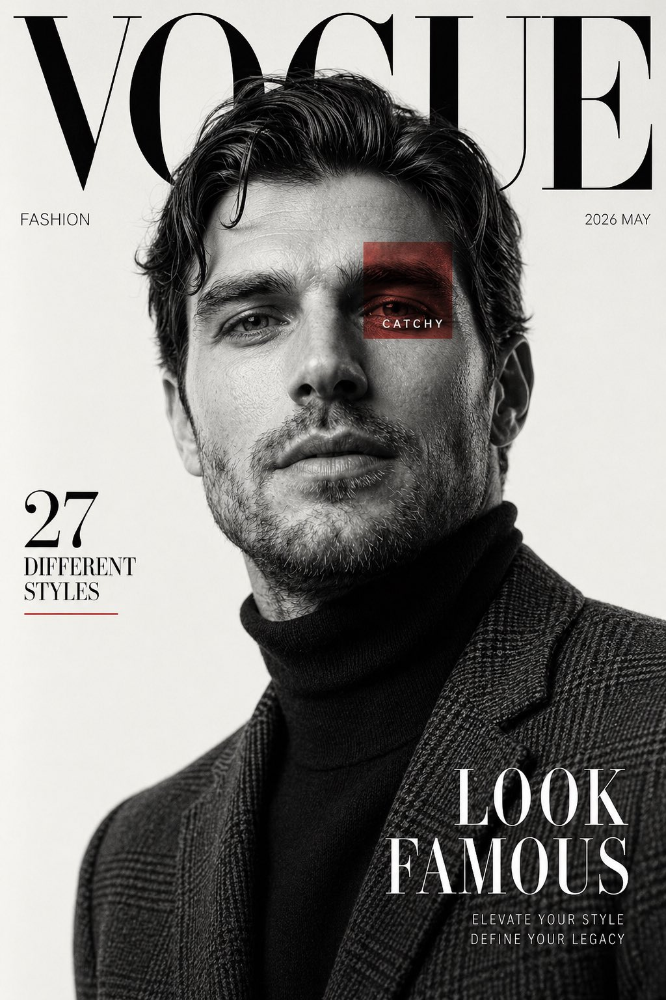

```text
Create a high fashion editorial magazine cover inspired by luxury fashion publications. Use the reference image of the male subject. Black and white portrait photography with a clean off white studio background. Subject is posed confidently from a low angle, looking slightly upward, sharp jawline, soft parted lips, tousled wavy hair with natural volume. Outfit includes a dark turtleneck layered under a textured tailored plaid blazer. Lighting is soft yet dramatic, creating sculpted facial shadows and elegant contrast.
Magazine layout design with oversized serif masthead text at the top reading “VOGUE”, partially hidden behind the subject’s head. Minimal premium typography across the page. Add side text “FASHION”, issue date “2026 MAY”, left side headline “27 DIFFERENT STYLES”, and bold bottom right cover line “LOOK FAMOUS”. Include a small red translucent square overlay on one eye area with the word “CATCHY”.
Style should feel premium, modern, cinematic, clean composition, sharp focus, ultra realistic skin texture, editorial luxury aesthetic, balanced negative space, timeless fashion cover design. Vertical magazine ratio, high resolution.
```


---

## 例 546：16-Pose Dance Combat Reference Sheet

**来源：** [@ExquisitMe](https://x.com/ExquisitMe/status/2048143577264402629) / [awesome-gpt-image-2-prompts](https://github.com/EvoLinkAI/awesome-gpt-image-2-prompts)

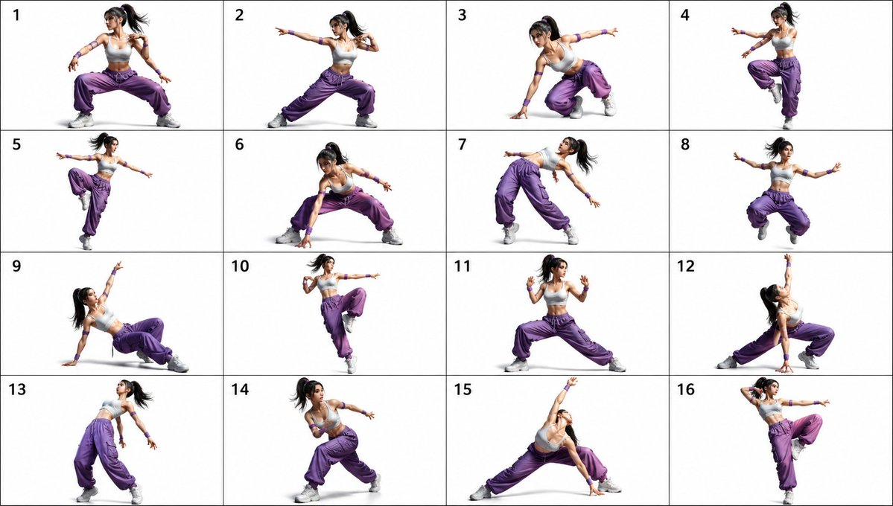

```text
{"type":"pose reference sheet","subject":{"theme":"hip-hop dance and combat-ready movement chart","character":{"count":1,"gender_presentation":"female","age_appearance":"young adult","body_type":"fit athletic dancer","skin_tone":"light tan","hair":{"color":"black","style":"high ponytail with loose strands"},"outfit":{"count":5,"items":["white sports bra or cropped athletic top","baggy purple jogger pants","white chunky sneakers","purple wristbands or forearm bands on both arms","small hoop earrings"]}}},"style":{"image_type":"photorealistic studio pose sheet","lighting":"clean even studio lighting","background":"plain light gray to white seamless backdrop","camera":"full-body framing, straight-on view, consistent distance","rendering":"sharp realistic anatomy, dynamic motion, slight shadow under feet","face":"intentionally blurred or obscured"},"layout":{"grid":{"rows":4,"columns":4,"count":16},"numbering":{"count":16,"labels":["1","2","3","4","5","6","7","8","9","10","11","12","13","14","15","16"],"position":"top-left corner of each cell"},"cell_borders":"thin black divider lines between all panels"},"poses":{"count":16,"items":[{"label":"1","description":"wide low squat, knees bent outward, torso angled slightly left, both arms extended loosely in a defensive dance stance"},{"label":"2","description":"deep side lunge to the left, left arm pointing straight left, right hand near the head, energetic directional pose"},{"label":"3","description":"low crouch with one hand touching the floor, one knee bent under the body, opposite arm extended horizontally"},{"label":"4","description":"upright one-leg balance, left knee lifted high, both arms spread outward for rhythm and balance"},{"label":"5","description":"similar one-leg raised pose with the other leg supporting, arms stretched outward in a lighter dance variation"},{"label":"6","description":"very wide grounded squat, torso pitched forward, one hand reaching toward the floor between the legs, other arm extended back"},{"label":"7","description":"dramatic standing back arch, chest lifted upward, hips forward, both arms opened behind and to the sides"},{"label":"8","description":"small jump or suspended squat, both feet off the floor, knees bent, arms spread wide symmetrically"},{"label":"9","description":"floor-supported seated lean, one hand planted behind, one arm reaching diagonally upward, legs bent to one side"},{"label":"10","description":"front-facing balance with one knee raised to hip height, one arm bent in guard position and the other extended sideways"},{"label":"11","description":"deep lateral stance, feet far apart, knees bent, both hands raised open near shoulder level like a ready combat pose"},{"label":"12","description":"low side lunge split, one hand planted on the floor, the other arm reaching vertically overhead, torso arched upward"},{"label":"13","description":"standing backward lean with relaxed bent knees, chest up, arms hanging loosely behind in a groove pose"},{"label":"14","description":"compact twisting crouch, weight low over bent legs, torso rotated, one arm pulled in and the other extended outward"},{"label":"15","description":"very wide side lunge stretch, one hand to the floor near the front foot, opposite arm reaching diagonally overhead"},{"label":"16","description":"one-leg lifted pose with knee high, one hand behind the head and the other arm extended forward, confident finishing stance"}]},"composition":"show the same dancer in all 16 panels with consistent outfit and scale, centered within each frame, designed like a movement library or choreography reference chart"}
```


---

## 例 547：Gas Giant Descent Storyboard

**来源：** [@xRahultripathi](https://x.com/xRahultripathi/status/2048140775356354892) / [awesome-gpt-image-2-prompts](https://github.com/EvoLinkAI/awesome-gpt-image-2-prompts)

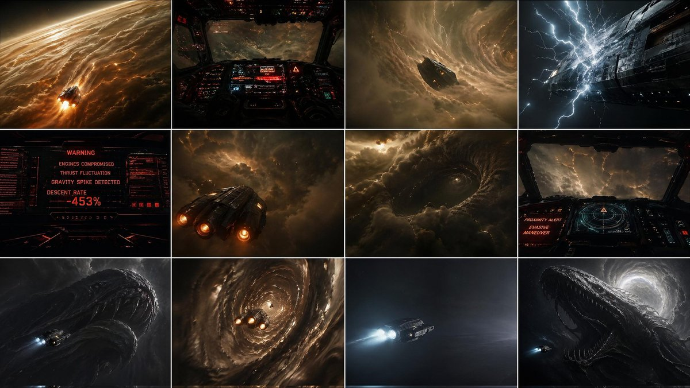

```text
{"type":"cinematic sci-fi storyboard contact sheet","subject":{"primary":"a small futuristic spacecraft descending into a massive gas giant storm system","secondary":"an enormous leviathan-like silhouette hidden within the clouds","mood":"oppressive, catastrophic, awe-struck, high tension, cosmic dread","style":"photorealistic cinematic concept art with dark sci-fi realism, volumetric storm clouds, strong contrast, amber and black palette with occasional cold blue lightning","aspect_ratio":"16:9"},"vehicle":{"design":"compact armored deep-atmosphere ship with 3 bright rear engines, angular industrial hull, worn metallic panels","scale":"tiny compared to the planet and creature"},"layout":{"grid":{"rows":3,"columns":4,"count":12},"sections":[{"position":"row 1 col 1","description":"wide exterior shot of the ship entering the upper atmosphere of a colossal gas giant at extreme speed, glowing clouds streaked with fire and friction around the vessel, curved planetary horizon visible"},{"position":"row 1 col 2","description":"cockpit POV, dark interior filled with red and cyan holographic instruments, forward visibility collapsing into turbulent storm layers and electrical haze"},{"position":"row 1 col 3","description":"exterior mid-wide shot of the ship diving into a gigantic rotating cloud funnel, surrounded by violent spiraling storm structure"},{"position":"row 1 col 4","description":"extreme close exterior of the ship hull as bright lightning strikes dangerously close, white electric energy crawling across the metal surface"},{"position":"row 2 col 1","description":"dashboard warning screen in red, showing a critical systems failure interface with the exact visible text count of 4 warning lines and 1 large percentage readout: ['WARNING','ENGINES COMPROMISED','THRUST FLUCTUATION','GRAVITY SPIKE DETECTED','DESCENT RATE -453%']"},{"position":"row 2 col 2","description":"rear three-quarter exterior of the ship fighting turbulence inside dense storm clouds, engines burning hard while the craft barely holds course"},{"position":"row 2 col 3","description":"massive circular disturbance forming in the clouds like an eye or maw, entire storm systems displaced by something huge moving beneath"},{"position":"row 2 col 4","description":"second cockpit view with radar-like navigation display and red alert text, pilot making a blind evasive maneuver through lightning-filled darkness"},{"position":"row 3 col 1","description":"first reveal of the colossal creature shape rising near the ship, black organic surface and immense curved anatomy emerging from darkness, ship tiny at lower left"},{"position":"row 3 col 2","description":"spiral descent shot, ship caught inside a vortex tunnel of clouds, spinning downward with engines flaring as it struggles to recover"},{"position":"row 3 col 3","description":"sudden breakthrough into a calm void, minimal composition, ship flying in eerie silence through dark open space with soft mist and no visible storm around it"},{"position":"row 3 col 4","description":"final reveal, gigantic leviathan fully emerging behind or beside the ship in cleared space, backlit by a pale circular storm opening, enormous open maw-like silhouette dwarfing the craft"}],"continuity":"all 12 panels depict one continuous descent sequence from atmospheric entry to final creature reveal"},"lighting":{"primary":"glowing amber storm light","secondary":"red cockpit interface glow","accents":"blue-white lightning and engine exhaust"},"environment":{"location":"inside the upper and middle storm layers of a gigantic gas giant","weather":"violent turbulence, electrical storms, vortex funnels, cloud walls, pressure chaos","threat":"no safe zone, repeated near-failure, unknown colossal presence driving the storm"}}
```


---

## 例 548：Monochrome Fashion Cover

**来源：** [@sha_zdiii](https://x.com/sha_zdiii/status/2049088961008848905) / [awesome-gpt-image-2-prompts](https://github.com/EvoLinkAI/awesome-gpt-image-2-prompts)

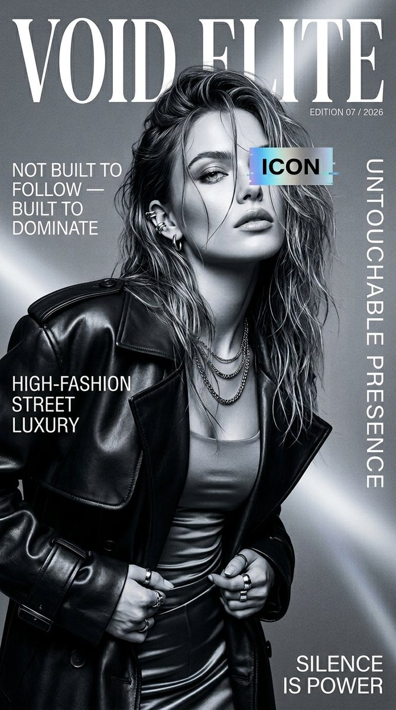

```text
Ultra-realistic high-fashion magazine cover, black and white cinematic portrait of a confident young female model, slightly messy wet-look hair, sharp jawline, intense gaze, natural glossy lips, wearing a premium black leather trench coat over a minimal outfit.
The model is posing slightly tilted forward with attitude, hands adjusting the coat, accessorized with multiple rings, ear piercings, and layered chain necklaces.
Lighting is dramatic studio lighting with soft shadows, high contrast, editorial Vogue-style aesthetic, ultra-detailed skin texture, 8K resolution, sharp focus.
Background is minimal gradient grey with soft light streaks for depth.
Magazine cover layout included:
Large bold serif title at top: “VOID ELITE”
Subtitle small: “Edition 07 / 2026”
Left text: “NOT BUILT TO FOLLOW — BUILT TO DOMINATE”
Bottom left: “HIGH-FASHION STREET LUXURY”
Right vertical text: “UNTOUCHABLE PRESENCE”
Bottom right: “SILENCE IS POWER”
Add a small holographic glitch-style label over the eyes with text “ICON”
Style: luxury fashion editorial, Vogue, Harper’s Bazaar, monochrome aesthetic, modern typography, clean layout, ultra premium branding
--ar 2:3 --style raw --quality 2 --sharp focus --photorealistic
```


---

## 例 549：Vintage Paper Collage Set

**来源：** [@Sairah_0](https://x.com/Sairah_0/status/2054502531628486758) / [awesome-gpt-image-2-prompts](https://github.com/EvoLinkAI/awesome-gpt-image-2-prompts)

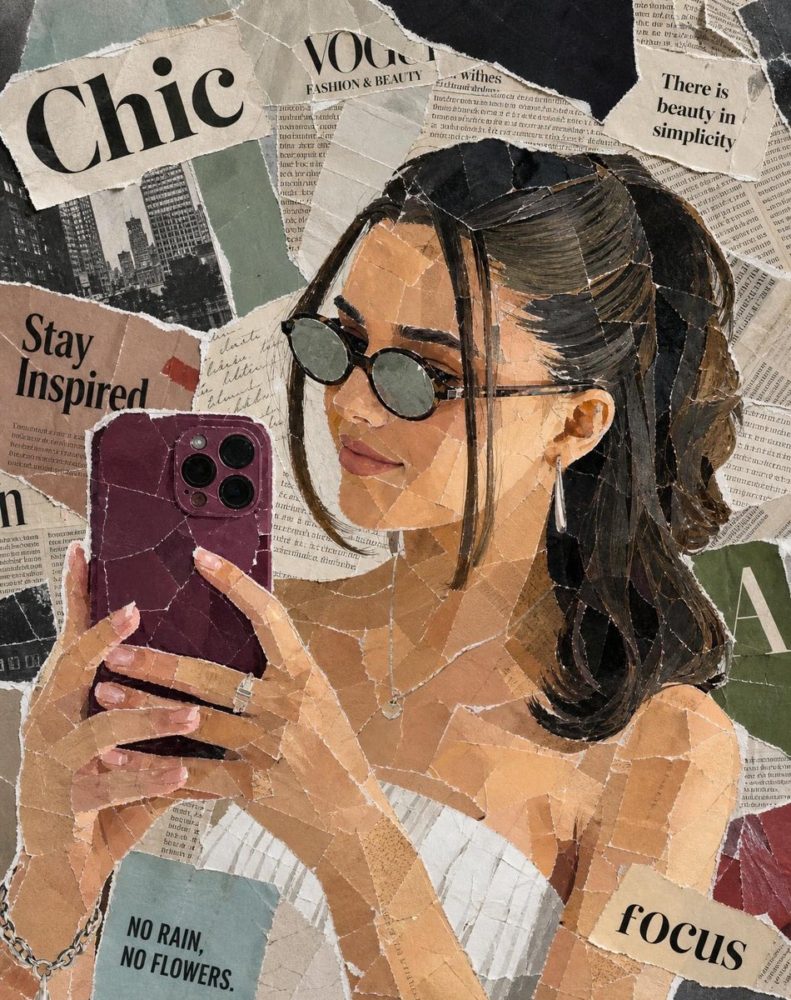

```text
Aesthetic vintage paper collage portrait of a stylish woman taking a mirror selfie, made entirely from torn magazine and newspaper pieces, layered mixed-media artwork, neutral beige and brown tones, Vogue-inspired fashion editorial style, black sunglasses, sleek ponytail hairstyle, white corset top, silver jewelry, purple smartphone, textured ripped paper edges, handcrafted mosaic effect, realistic shadows and depth, chic typography cutouts, inspirational quotes scattered around, cozy luxury aesthetic, highly detailed analog collage art, soft warm lighting, Instagram moodboard vibe, premium editorial composition, ultra detailed, 4k Prompt : Vintage breakfast aesthetic collage made from torn magazine and newspaper clippings, artistic mixed-media paper mosaic style, croissants on a plate with jam, black coffee in a dark cup, fresh fruits and berries, butter dish with knife, café table atmosphere, dark green textured background, ripped paper layers with visible cracks and folds, lifestyle editorial typography, cozy European café vibe, warm earthy tones, handcrafted scrapbook look, realistic paper texture, aesthetic Pinterest moodboard composition, soft cinematic lighting, luxury brunch aesthetic, ultra detailed, high realism, 4k collage art style
```


---

## 例 550：Trash Polka Headphones Portrait

**来源：** [@ChillaiKalan__](https://x.com/ChillaiKalan__/status/2054390412253827522) / [awesome-gpt-image-2-prompts](https://github.com/EvoLinkAI/awesome-gpt-image-2-prompts)

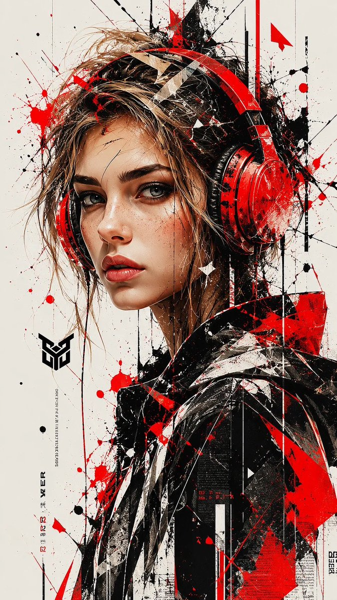

```text
​A high-detail digital painting of a young woman wearing large, vibrant red over-ear headphones, looking directly at the viewer with a piercing gaze. The art style is a fusion of stylized realism and urban abstract expressionism. Her hair is messy, light brown/blonde with loose strands and sharp, geometric shards integrated into the locks. The composition features heavy ink splatters, paint drips, and chaotic red and black brushstrokes reminiscent of 'trash polka' art. The background is a clean, minimalist off-white, making the bold red accents and fine linework pop. High contrast, sharp focus on the eyes, cinematic lighting, 8k resolution, trendy street art aesthetic. ​Key Technical Elements to Capture ​Color Palette: Dominated by Red, Black, and White. This high-contrast triad is essential for that aggressive, modern look. ​Artistic Influence: Mentioning "Trash Polka" or "Ink Drip Art" helps the AI understand the messy, splatter-heavy background and the "shattered" look of the hair. ​Character Features: Use terms like "piercing gaze" and "stylized realism" to ensure the face isn't too cartoonish or too photographic, hitting that perfect "concept art" middle ground. ​Graphic Elements: The image uses geometric shards and abstract textures overlapping the subject, which creates a sense of depth and digital glitchiness. Aspect ratio is 9:16
```


---

## 例 551：Borussia War Room Interior

**来源：** [@guicastellanos1](https://x.com/guicastellanos1/status/2056059581697056978) / [awesome-gpt-image-2-prompts](https://github.com/EvoLinkAI/awesome-gpt-image-2-prompts)

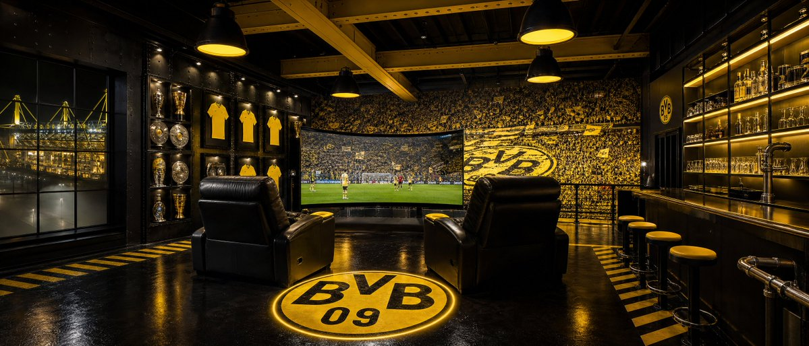

```text
Photorealistic interior render, ultra-luxury industrial football war room and man cave, wide vertical 9:16. Borussia Dortmund signal yellow and black palette throughout.

Architecture: the room feels like the inside of a repurposed Ruhr Valley steel factory — exposed raw steel walls with riveted panel texture painted in matte black, massive yellow steel I-beams crossing the ceiling horizontally, concrete floor sealed in high-gloss black epoxy with the BVB09 crest inlaid in signal yellow resin at center, glowing from LED underlighting.

Back wall: the entire wall is a recreation of the Gelbe Wand the Yellow Wall standing terrace at Signal Iduna Park a full-width photorealistic mural of 81,000 fans in yellow and black holding a massive tifo, receding into the distance, backlit from behind the wall to create depth and glow.
In front of the mural: a raised steel platform with a
black steel railing like a stadium terrace edge.

Left wall: raw black steel display wall — welded steel frame shadow boxes containing Bundesliga trophies, DFB-Pokal cups, Champions League runners-up plates in industrial mounts, all under harsh yellow spotlights. Between display boxes:
BVB yellow jerseys framed in welded black steel frames,
no names visible.

Center: two enormous black leather industrial recliners
facing a massive curved screen showing match footage
under Yellow Wall atmosphere, signal yellow cup holders built into the armrests.
Right wall: black steel bar unit with yellow LED backlit shelving, yellow and black branded glassware, industrial pipe bar rail, three black steel bar stools with yellow leather seats.

Floor detail: yellow painted hazard stripes along the
perimeter of the room, like factory safety markings,
adding to the industrial authenticity.

Ceiling: cluster of oversized industrial pendant lights
in matte black steel with signal yellow interior,
casting pools of sharp yellow light across the black epoxy floor.

Window: steel-framed industrial window showing Signal Iduna Park stadium exterior at night, yellow exterior lights glowing through the Ruhr Valley fog.

Atmosphere: raw industrial power, signal yellow burning against matte black, steel and concrete and light — the most intensecolour contrast of all twelve rooms. Photorealistic, 35mm, cinematic.
```


---

## 例 552：Pixar 3D Character Design Sheet

**来源：** [@TechieBySA](https://x.com/TechieBySA/status/2056419585369198677) / [awesome-gpt-image-2-prompts](https://github.com/EvoLinkAI/awesome-gpt-image-2-prompts)

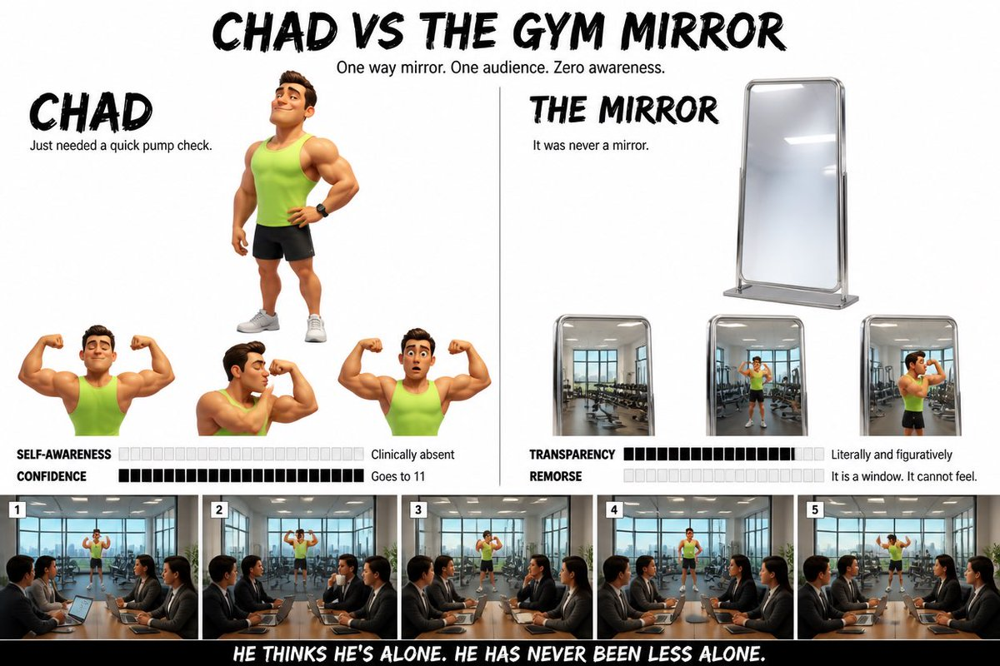

```text
“Create a Pixar 3D style character design sheet. Clean white background. Two characters side by side with a clean dividing line. Bold brushstroke-style title at the top: CHAD VS THE GYM MIRROR. Subtitle beneath: One way mirror. One audience. Zero awareness.
LEFT SIDE — CHAD
Large name in bold black. Underneath: “Just needed a quick pump check.”
Hero portrait — Chad isolated on clean white. No background. Pixar 3D man, late 20s, natural athletic build — genuinely fit but not cartoonishly huge. Ne
```


---

## 例 553：Cinematic Director's Pitch Board

**来源：** [@Mind_Boticni](https://twitter.com/Mind_Boticni/status/2056793598243553464) / [awesome-gpt-image-2-prompts](https://github.com/EvoLinkAI/awesome-gpt-image-2-prompts)

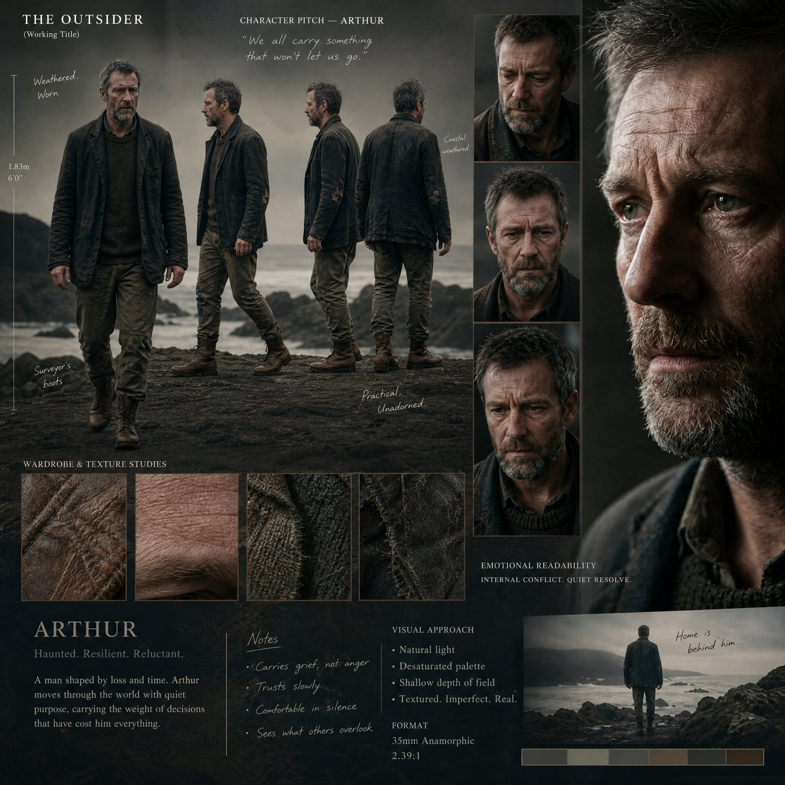

```text
A premium director’s pitch presentation board for a high-budget cinematic production, showcasing a single, grounded human character with intense emotional readability and natural imperfections. The layout is art-directed and organically asymmetrical, avoiding rigid grids. Features a fluid, narrative full-body turnaround (capturing the character mid-stride across front, 3/4, profile, and rear views), detailed candid head studies expressing internal conflict, and a sweeping cinematic close-up portrait with dramatic Rembrandt lighting. Includes integrated texture macro-crops (weathered leather, realistic skin pores, distressed linen), minimalist production annotations, and an organic height scale. Shot on 35mm anamorphic, shallow depth of field, muted color grading, ultra-realistic textures, strict character and wardrobe consistency throughout.
```


---

## 例 554：Sleep-Deprived Chibi Creator

**来源：** [@john_my07](https://x.com/john_my07/status/2063556594671964302) / [awesome-gpt-image-2-prompts](https://github.com/EvoLinkAI/awesome-gpt-image-2-prompts)

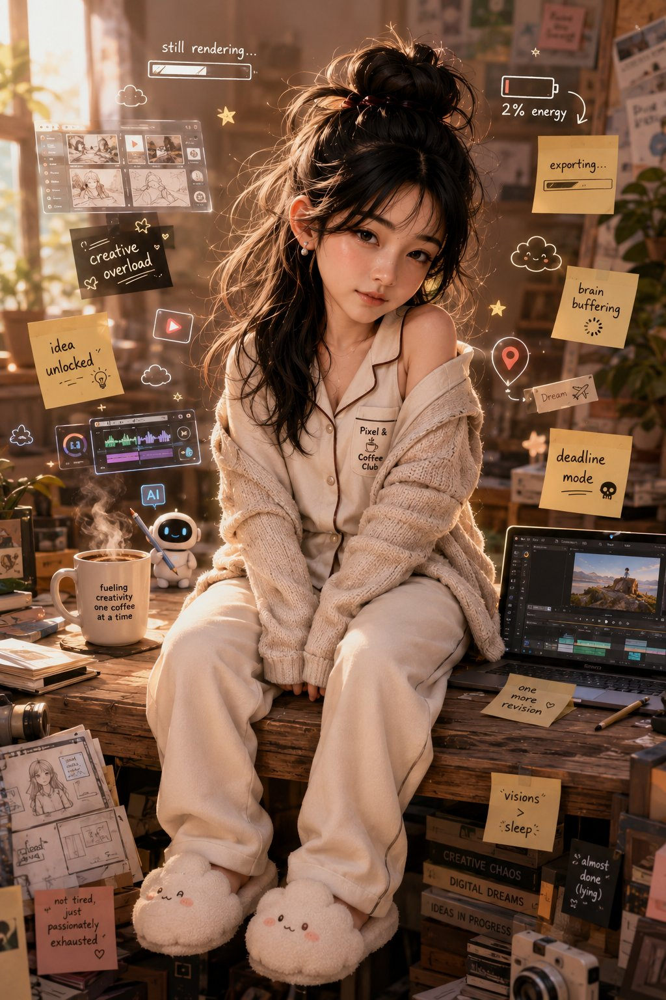

```text
Use my uploaded photo as the sole facial reference. Preserve my exact identity, facial proportions, eye shape, skin tone, lip shape, nose structure, and all distinctive features with exceptional accuracy and no facial drift.

Create a highly detailed cinematic 3D chibi-style character portrait inspired by top-tier animated films, luxury collectible figurines, and contemporary designer toy aesthetics. The character represents a brilliant AI-powered digital creator running on pure creativity and almost no sleep after a marathon night of editing and designing.

Scene:
Early morning inside a cozy creative studio. She sits drowsily on the edge of a weathered wooden workbench, legs gently swinging, looking exhausted yet irresistibly charming. Her fluffy hair is gathered into a loose messy bun with flyaway strands escaping in every direction. Sleepy half-open eyes, subtle under-eye shadows, a tiny rosy nose, and an expression that perfectly captures "I've been awake for way too long but I still have ideas."

Outfit:

Oversized soft-cream pajama set

Tiny embroidered logo reading "Pixel & Coffee Club"

Relaxed knitted cardigan casually slipping from one shoulder

Plush cloud-shaped slippers

Minimal pearl stud earrings

Cozy oversized sleeves partially covering her hands

Environment:
Warm sunrise light fills the room through large studio windows. A steaming mug of coffee rests beside her. The background is softly blurred, filled with artistic clutter, creative tools, and subtle storytelling details that suggest endless projects in progress.

Personality Elements Floating Around Her:

Mini holographic editing timelines

Tiny floating storyboard frames

Digital sketch concepts

Glowing location pins and travel stickers

Sticky notes filled with random ideas

Compact laptop displaying an unfinished creative project

Pencil sketches and concept doodles

Floating play-button icons

Small animated stars, clouds, and creative symbols

Tiny productivity meters running dangerously low

Expression & Mood:

Brilliant but overworked creator energy

Lovably exhausted

Chronic "one last revision" mindset

Quietly chaotic genius

Soft humor mixed with creative burnout

Dreamy, relatable, and emotionally expressive

Art Style:
Ultra-premium stylized realism, luxury designer collectible quality, highly detailed hair fibers, realistic fabric textures, soft skin rendering, cinematic depth of field, subtle emotional storytelling, cozy lifestyle aesthetic, handcrafted figurine finish, social-media-worthy presentation.
```


---

## 例 555：Cinematography Analysis Frame

**来源：** [@bmx_ai13](https://x.com/bmx_ai13/status/2064109968203362408) / [awesome-gpt-image-2-prompts](https://github.com/EvoLinkAI/awesome-gpt-image-2-prompts)

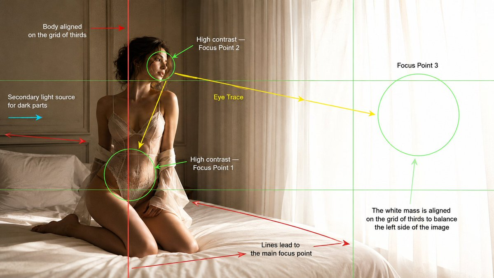

```text
Create a cinematic fashion editorial photograph in a bright minimal bedroom, presented as a cinematography composition analysis frame.

Main Image: A young adult female model kneeling on a soft white bed beside a large window with sheer white curtains. She is positioned on the left third of the frame, body aligned with the vertical rule-of-thirds grid line. Her body leans slightly backward, facing toward the glowing window light with a calm, distant, introspective expression. The right side of the image is filled with a large bright white luminous mass from overexposed daylight through sheer curtains, balancing the darker subject on the left.

Lighting: Strong natural window light from the right side creates high contrast on the model's face, upper body, waist, and silhouette. Add subtle secondary fill light from the left side to reveal shadow areas without flattening the contrast. Warm hazy morning atmosphere, soft highlights, realistic skin texture, gentle shadows, soft bloom near the curtains.

Composition Overlay: Add visible cinematography composition guide graphics over the image, like a film school analysis frame.

Include:
- Rule of thirds grid lines in thin green.
- A red vertical line showing the model's body aligned on the left rule of thirds grid.
- Green circular focus markers around:
  1. Waist and hip area as Focus Point 1.
  2. Face area as Focus Point 2.
  3. Bright curtain/window mass as Focus Point 3.
- Yellow eye-trace arrows moving from the face to the waist/hip, then toward the glowing window.
- Red leading-line arrows following the bed edge and wall panel lines toward the main focus point.
- A cyan arrow showing secondary fill light coming from the left side.
- Text labels placed cleanly around the frame:
  “Body aligned on the grid of thirds”
  “High contrast Focus Point 2”
  “Eye Trace”
  “Focus Point 3”
  “High contrast Focus Point 1”
  “Secondary light source for dark parts”
  “Lines lead to the main focus point”
  “The white mass is aligned on the grid of thirds to balance the left side of the image”

Style: Luxury fashion editorial photography, soft cinematic realism, warm beige and white color palette, minimal bedroom, cream wall panels, white bedding, sheer curtains, subtle film grain, shallow depth of field, elegant composition, educational cinematography breakdown overlay.

Camera: 35mm lens, medium wide framing, eye level camera angle, 16:9 widescreen.
```


---

## 例 556：Crowd Mosaic Football Portrait

**来源：** [@Taaruk_](https://x.com/Taaruk_/status/2064032287969481186) / [awesome-gpt-image-2-prompts](https://github.com/EvoLinkAI/awesome-gpt-image-2-prompts)

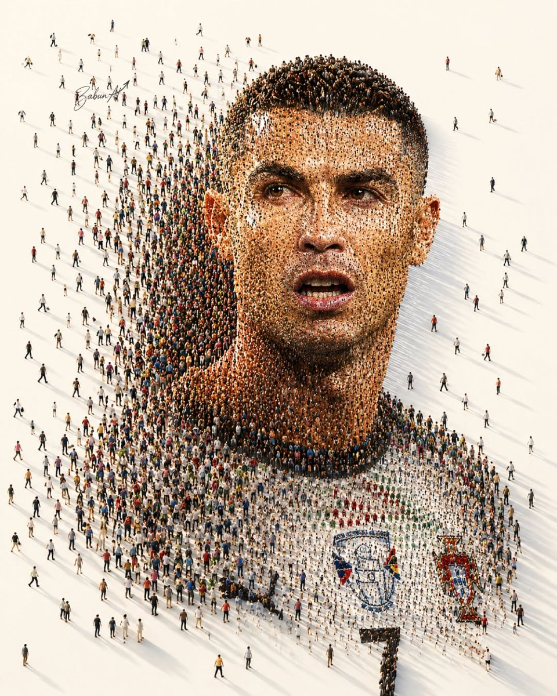

```text
Ultra-detailed crowd mosaic portrait of a legendary football player, created entirely from thousands of tiny people standing and walking on a vast white surface. From a distance, the crowd forms a hyper-realistic giant face and upper body portrait; up close, every individual person is clearly visible. Long cinematic shadows, aerial top-down perspective, massive scale, intricate human arrangement, photorealistic details, high contrast lighting, clean minimalist background, depth and dimension, masterpiece composition, ultra-sharp focus, 8K resolution, social art installation, human mosaic effect, volumetric lighting, realistic skin tones formed by crowd density, award-winning conceptual photography, breathtaking visual illusion, drone photography, highly detailed faces, premium quality, modern generative art.
```


---

## 例 557：Window Girl Fashion Editorial

**来源：** [@iamaiistudio](https://x.com/iamaiistudio/status/2064545132180074569) / [awesome-gpt-image-2-prompts](https://github.com/EvoLinkAI/awesome-gpt-image-2-prompts)

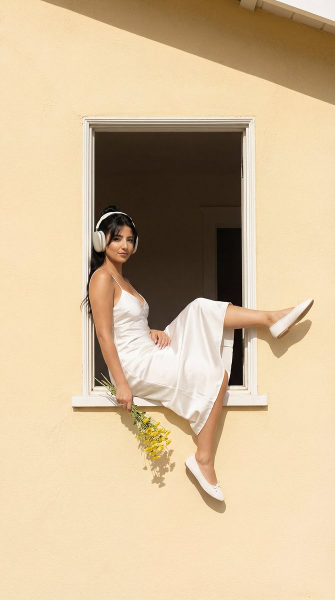

```text
://t.co/yMuwrbQO3u

Ultra-photoreal fashion editorial. A young woman sits casually inside the open window of a soft warm yellow house, one leg extended outward and raised, the other relaxed, one arm hanging freely. She wears a white satin midi slip dress with thin straps and fluid fabric, clean white over-ear headphones, and simple white flat shoes. She holds a loose bouquet of fresh yellow flowers in one hand. Expression: calm, relaxed confidence, gaze forward or slightly to the side.

Architecture: simple rectangular window, white interior walls, clean uncluttered sunlit facade. Midday direct natural sunlight, crisp shadows.

Camera: 35mm lens, centered full-body framing within the window frame, moderate depth of field with sharp background. Color grade: warm yellows, clean whites, natural skin tones. Aspect ratio 4:5. No text, no watermark. Ultra-high-res, ultra-photoreal editorial render.

#AIart #GPTImage2
```


---

## 例 558：Premium Streetwear Graphic Tee

**来源：** [@j_smeaton99](https://x.com/j_smeaton99/status/2064540729528267108) / [awesome-gpt-image-2-prompts](https://github.com/EvoLinkAI/awesome-gpt-image-2-prompts)

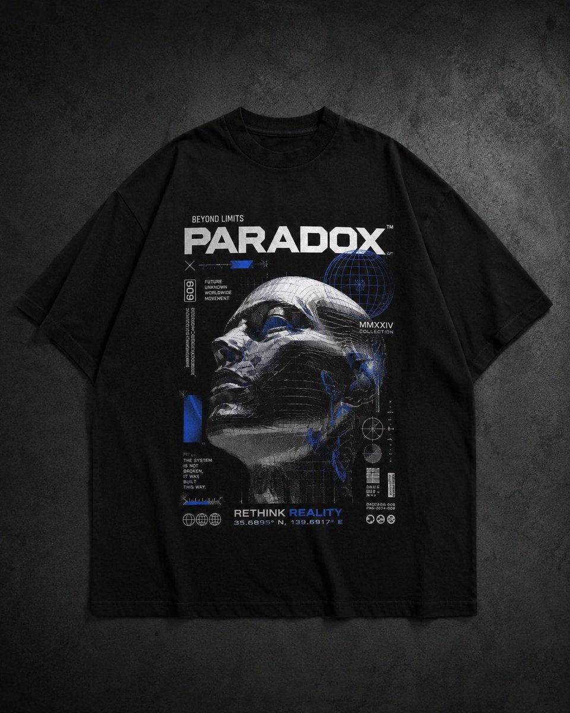

```text
Create a high-end fashion product photo of a modern oversized streetwear T-shirt. The shirt features a large, professionally designed graphic print on the front. Design style: contemporary urban streetwear, bold typography mixed with futuristic geometric elements, clean vector artwork, subtle distressed textures, premium screen-print aesthetic, balanced composition, visually striking but wearable. Color palette: black, white, silver, and electric blue accents. The design should look like it belongs in a luxury streetwear collection. Photorealistic fabric texture, realistic folds, premium cotton material, studio lighting, fashion campaign quality, ultra-detailed, sharp focus, e-commerce ready, trend-forward apparel design.
```


---

## 例 559：Three-Frame Nightlife Collage

**来源：** [@mehvishs25](https://x.com/mehvishs25/status/2064539698027258333) / [awesome-gpt-image-2-prompts](https://github.com/EvoLinkAI/awesome-gpt-image-2-prompts)

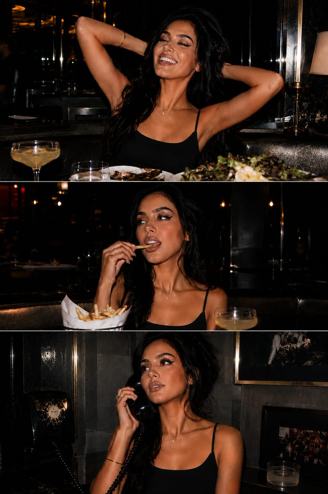

```text
Create image Create a photorealistic three-frame vertical nightlife collage inspired by the supplied reference image. Preserve the subject's facial identity, facial structure, skin tone, hairstyle, and overall appearance while placing her in a fashionable late-evening social setting.

The subject is an adult woman in her mid-to-late twenties with long, voluminous dark brown hair styled in soft natural waves, radiant skin, refined soft-glam makeup, defined eyelashes, and glossy neutral-toned lips. Her expression feels warm, confident, and effortlessly playful.

Wardrobe:
A sophisticated black evening dress with a modern fitted silhouette, paired with delicate silver jewelry including rings and a minimalist pendant necklace. Contemporary nightlife fashion styling with an elegant, upscale aesthetic.

Frame 1:
She sits comfortably at a cocktail table, leaning back with both hands resting behind her head while laughing naturally. The image should feel spontaneous, candid, and genuinely joyful, as if captured during a memorable night out.

Frame 2:
She glances to the side while casually enjoying a french fry. Relaxed posture, authentic expression, and an unposed social atmosphere that captures a fleeting real-life moment.

Frame 3:
She holds a vintage corded telephone receiver near her ear while gazing upward thoughtfully. The mood combines nostalgic early-2000s inspiration with a modern fashion-editorial feel.

Location:
A stylish contemporary lounge or cocktail bar featuring dark interiors, industrial metal accents, warm ambient lighting, drinks on tables, small plates, and subtle nightlife details. The environment should feel lively, intimate, and realistic.

Photography:
Direct on-camera flash photography with realistic exposure characteristics. Bright flash illumination on the subject, natural skin texture, crisp details, deep environmental shadows, subtle highlight bloom, and an authentic early-digital-camera aesthetic.

Style Direction:

Candid nightlife photograph
```


---

## 例 560：Blockbuster Action Movie Shot

**来源：** [@iamaiistudio](https://x.com/iamaiistudio/status/2066009564018082289) / [awesome-gpt-image-2-prompts](https://github.com/EvoLinkAI/awesome-gpt-image-2-prompts)

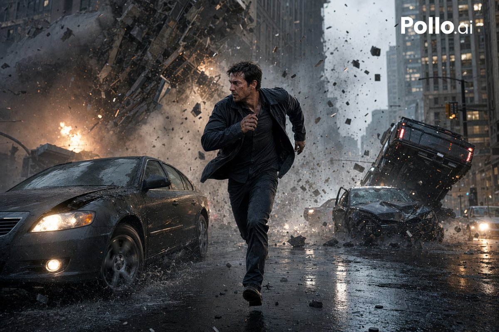

```text
Cinematic photorealistic action scene on a rain-soaked downtown street canyon. A dark-haired man in his 30s sprints toward the camera, soaked dark jacket and dark pants, mid-stride with a tense survival expression. Behind him, a massive urban explosion tears through a high-rise building -- fire, smoke, shattered concrete, glass, and metal debris blast outward. Exactly 3 damaged vehicles visible: a dark sedan left foreground with crumpled hood splashing through rainwater, a wrecked dark car right midground, and an overturned black SUV tilted up on the right. Wet asphalt reflects headlights and firelight. Dense debris frozen mid-air. Overcast stormy daylight, desaturated blue-gray palette with orange fire accents, motion blur on flying debris but sharp focus on the runner, low-angle wide-lens composition, ultra-detailed blockbuster disaster-movie realism, volumetric smoke, rain spray, cinematic lighting, high contrast.
```


---

## 例 561：Red Dress Editorial Portrait

**来源：** [@meng_dagg695](https://x.com/meng_dagg695/status/2068369080504222141) / [awesome-gpt-image-2-prompts](https://github.com/EvoLinkAI/awesome-gpt-image-2-prompts)

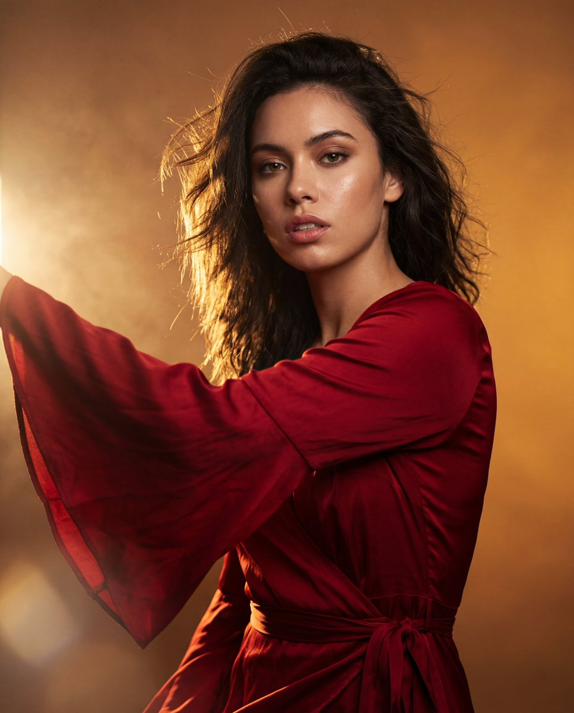

```text
Editorial fashion portrait, woman wearing flowing red bell-sleeve wrap dress, dramatic hard rim lighting from camera-left casting golden edge glow on fabric, direct intense eye contact with camera, parted lips, confident expression, wind-blown sleeve fabric captured mid-motion with natural fabric ripple, hair strands lifted by wind, deep saturated red shadows contrasted against warm blown-out gold highlights, asymmetric tight crop with one sleeve extending off-frame, cinematic color grading, high dynamic range, shot on Hasselblad medium format, 85mm lens, f/1.8 shallow depth of field, warm amber gradient backdrop with subtle atmospheric haze and soft lens flare bottom-left corner, skin texture realistic with subtle highlight sheen, professional studio fashion photography, ultra detailed
```


---

## 例 562：Moon Whisper Graphite Portrait

**来源：** [@AiwithLariab](https://x.com/AiwithLariab/status/2071096245611872431) / [awesome-gpt-image-2-prompts](https://github.com/EvoLinkAI/awesome-gpt-image-2-prompts)

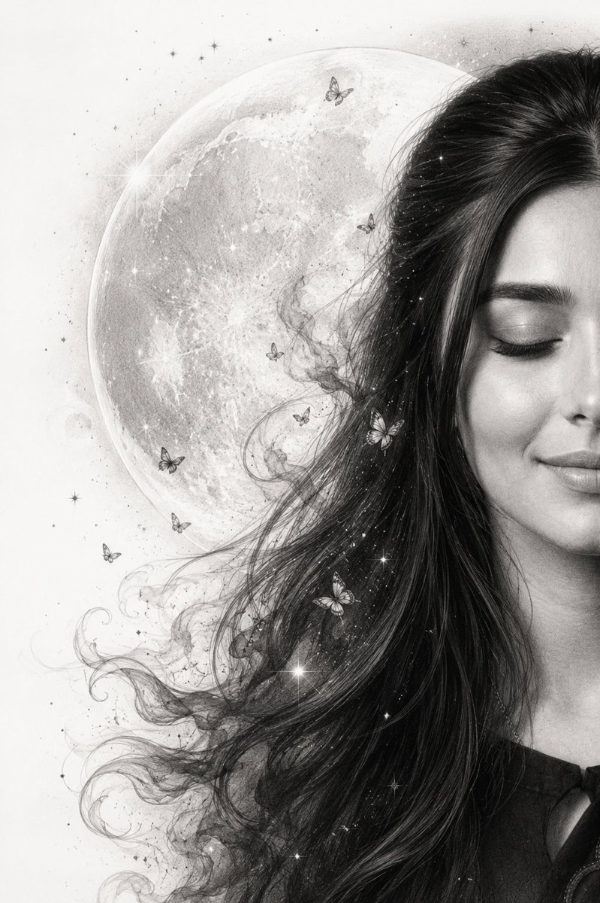

```text
Create an ultra-detailed monochrome graphite pencil masterpiece featuring a graceful HALF-FACE portrait emerging from a pure white background. Position the face on the far right side of the composition, with eyes gently closed in peaceful reflection. The visible half of the face should be large, elegant, and highly detailed with realistic graphite shading and delicate pencil textures.

Behind the subject, place a MASSIVE luminous full moon dominating the background, occupying nearly half of the artwork. Surround it with tiny graphite stars, subtle stardust, and soft celestial particles. Long flowing black hair dissolves into dreamy smoke-like wisps, delicate butterflies, and elegant swirling pencil strokes that blend into the moonlit atmosphere.

Maintain a minimalist fine-art composition with generous negative space, museum-quality graphite rendering, ultra-realistic pencil textures, soft shadows, emotional elegance, ethereal beauty, luxury gallery artwork, vertical phone wallpaper, masterpiece, 8K, hyper-detailed, Moon Whisper theme.
```


---

## 例 563：Late-Night Subway CCD Portrait

**来源：** [@iamaiistudio](https://x.com/iamaiistudio/status/2068516066679283984) / [awesome-gpt-image-2-prompts](https://github.com/EvoLinkAI/awesome-gpt-image-2-prompts)

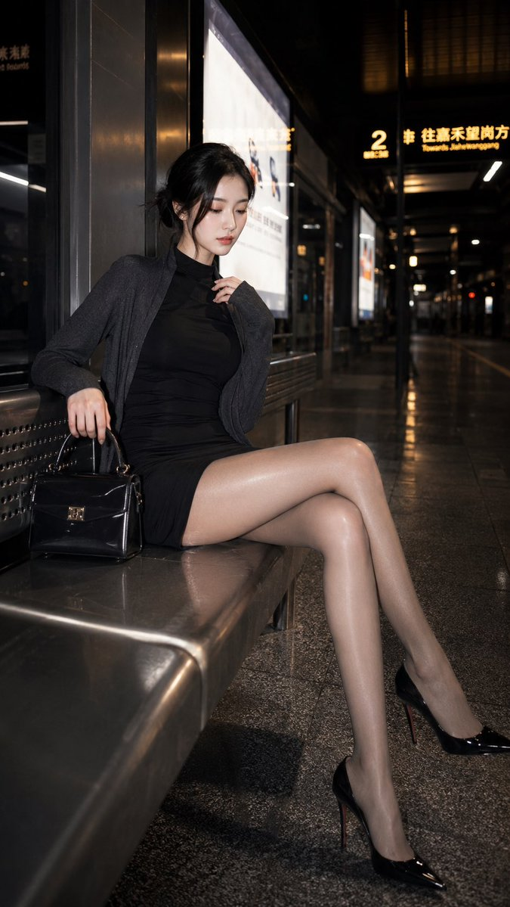

```text
CCD flash photo with low-saturation black-pearl dark-gold tones, deep charcoal shadows, subtle dark-gold light reflections, soft frontal flash illuminating the subject, slight overexposure, fine grain, cool and moody late-night city atmosphere.

Subject: young East Asian woman, elegant small oval face, narrow almond-shaped eyes, aloof expression, black low ponytail.
Outfit: black turtleneck bodycon dress + dark gray thin jacket + sheer stockings + pointed stilettos.
Setting: deserted midnight subway platform, metal benches, blurred backlit ad panels, reflective floor.
Pose: sitting on platform bench, legs crossed naturally, one hand on her bag.
Expression: pensive, glancing up at camera after looking down.
Highlight: long legs, slim waist, cold elegant vibe.
Aspect ratio: 9:16
```


---

## 例 564：Urban Turn-Back Street Portrait

**来源：** [@Tz_2022](https://x.com/Tz_2022/status/2045892003775361198) / [awesome-gpt-image-2-prompts](https://github.com/EvoLinkAI/awesome-gpt-image-2-prompts)

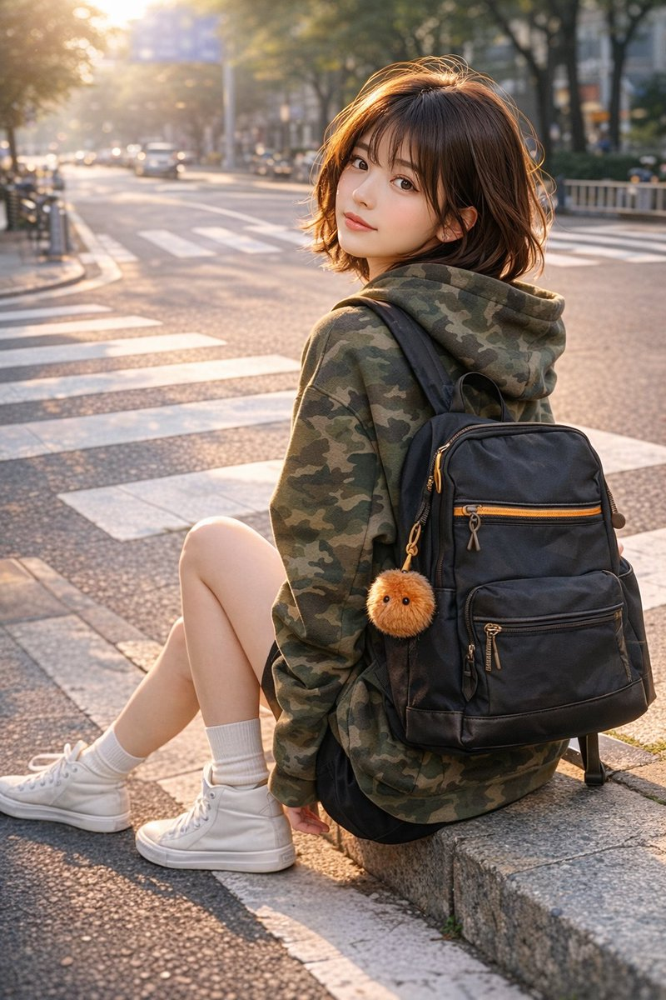

```text
该画面为中近景，采用平视镜头，聚焦于一位年轻女性。她以七分身镜头呈现，身体坐姿略带倾斜，臀部向后撅起，双腿自然交叠，左腿在前，右腿在后，膝盖微屈。她将上半身向右后方扭转，头部则转向镜头方向，形成一个经典的“回眸”姿态，目光直视镜头，眼神清澈而略带一丝俏皮。她的发型是蓬松的棕色齐肩短发，刘海自然垂落，发尾微卷，妆容清淡自然，仅在眼部有轻微眼线勾勒，唇色为自然裸粉。画面整体采用自然日光滤镜，光线从画面左上方斜射入，形成柔和的逆光轮廓，面部和身体右侧被温暖的金色光线照亮，左侧则形成自然的阴影过渡，增强了立体感。灯光效果是明亮的自然光，带有轻微的镜头眩光，营造出午后阳光的氛围。拍摄角度为平视，构图上，人物主体位于画面中偏右位置，背景中的斑马线与道路线条形成自然的引导线，将视线引向人物。背景为城市街道，包含道路、斑马线、绿化带和远处的车辆，背景被适度虚化，但依然可辨识出树木、护栏和停放的电动车等元素，构图上利用了三分法，人物位于右侧三分之一处，增强了画面的平衡感。主体穿着一件军绿色迷彩图案的连帽卫衣，下身搭配黑色短裤，脚穿白色高帮运动鞋配白色中筒袜。背包为黑色，带有橙黄色装饰条纹和一个橙色毛绒挂件，材质为帆布和皮革拼接。整体风格为街头休闲风，肢体语言放松自然，表情略带好奇与俏皮，整体呈现出一种随性、青春、充满活力的都市少女形象。
```


---

## 例 565：analyze this photo and give me a detailed JSON prompt that recreates it. brea...

**来源：** [@pavellaslov](https://x.com/pavellaslov/status/2047182214304055339) / [awesome-gpt-image-2-prompts](https://github.com/EvoLinkAI/awesome-gpt-image-2-prompts)

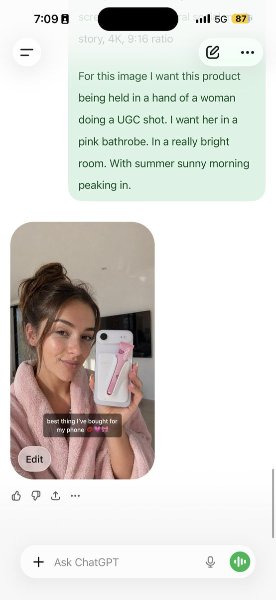

```text
analyze this photo and give me a detailed JSON prompt that recreates it. break down the color grading and every exact color in the photo

(use Opus, not Sonnet. Opus has stronger visual analysis and writes more detailed JSON)

paste that JSON into ChatGPT
upload your product image and prompt:
using this JSON as reference, generate a person holding my product
save that generated photo as your character reference

attach it to every future generation for facial consistency

you now have a consistent UGC model that works across any product

the JSON controls the lighting and color grading. GPT image-2 handles the character. you control the product placement.

the #1 tell on AI photos is flat colors and a grainy look. this method removes both.
5 minutes to set up. unlimited variations after.
```


---

## 例 566：CALMING GREEN TEA Film Kit displayed frontally, the open box shows soft sage-...

**来源：** [@ZaraIrahh](https://x.com/ZaraIrahh/status/2047180061657452601) / [awesome-gpt-image-2-prompts](https://github.com/EvoLinkAI/awesome-gpt-image-2-prompts)

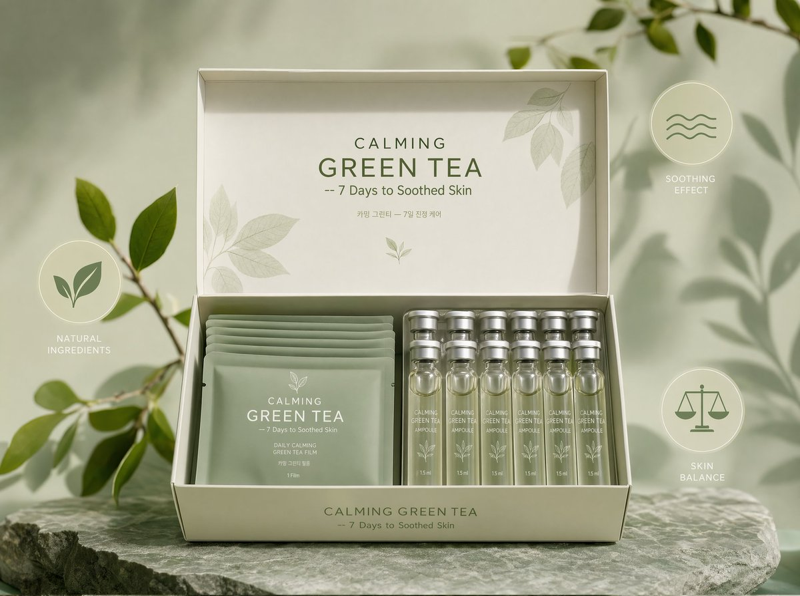

```text
CALMING GREEN TEA Film Kit displayed frontally, the open box shows soft sage-green film pouches and translucent ampoules with matte silver caps, product placed centrally with clear branding CALMING GREEN TEA -- 7 Days to Soothed Skin, pastel green background with botanical graphic accents, three minimal icons (leaf, wave, balance) floating around the product to emphasize benefits, photographic, hyper detailed, ultra realistic, lifelike, 8k, high detail, soft professional lighting.
```


---

## 例 567：Ultra-realistic product photography of a rich strawberry soft-serve ice cream...

**来源：** [@ZaraIrahh](https://x.com/ZaraIrahh/status/2047179916161212542) / [awesome-gpt-image-2-prompts](https://github.com/EvoLinkAI/awesome-gpt-image-2-prompts)

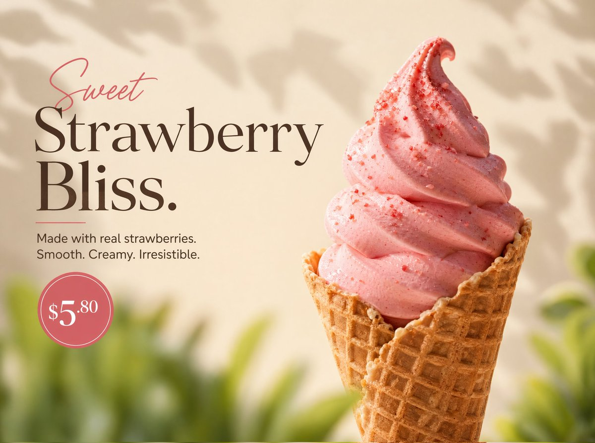

```text
Ultra-realistic product photography of a rich strawberry soft-serve ice cream in a crispy waffle cone, styled with a clean, modern premium aesthetic. The soft serve is a vibrant natural pink, thick and creamy, sculpted into a smooth swirl with a softly curled peak, lightly topped with delicate strawberry dust or tiny fruit specks for a fresh, appetizing look. The cone has a rustic, crunchy texture with slightly uneven edges for an artisanal feel.
The background is soft beige with natural sunlight casting subtle leaf shadows, creating a calm, organic atmosphere. Include softly blurred greenery in the foreground for depth. The composition is minimal, balanced, and uses negative space effectively, similar to high-end American food brand ads.
On the left side, include modern English typography in a clean, elegant layout (not vertical).
Main headline:
Sweet Strawberry Bliss.
Supporting line (smaller text):
Made with real strawberries. Smooth. Creamy. Irresistible.
Add a small circular badge showing the price:
$5.80.
Lighting: soft natural daylight, warm highlights, shallow depth of field, high-end commercial food photography style.
Mood: fresh, premium, modern, and inviting — aligned with upscale U.S. dessert branding.
```


---

## 例 568：Ultra-realistic cinematic DSLR photograph of an 18-year-old handsome young ma...

**来源：** [@harboriis](https://x.com/harboriis/status/2047175250761433416) / [awesome-gpt-image-2-prompts](https://github.com/EvoLinkAI/awesome-gpt-image-2-prompts)

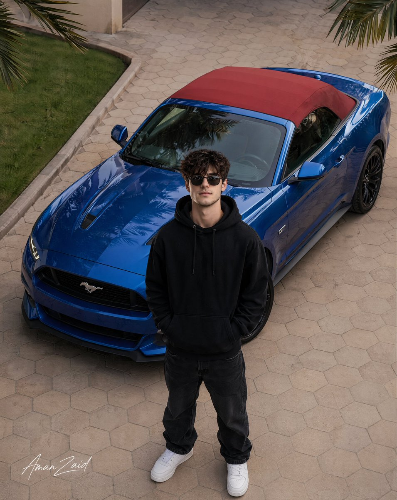

```text
Ultra-realistic cinematic DSLR photograph of an 18-year-old handsome young man with a slim skinny body, lean physique, narrow shoulders and waist, standing confidently in front of a blue 2017 Ford Mustang GT Convertible with a bold red soft top roof, captured from a high-angle aerial perspective exactly like a luxury driveway photoshoot. Keep face 100% identical to reference image with exact facial structure, natural skin texture, realistic pores, authentic expression, no beautification, no facial modification. Same modern textured side-swept quiff hairstyle with heavy natural volume on top, deep side flow, messy yet controlled texture, soft matte finish, visible natural hair strands, softly blended sides.

The subject stands centered near the front bumper of the Mustang GT, hands inside hoodie pockets, relaxed shoulders, straight posture, slight head tilt upward toward camera, confident calm expression, wearing oversized premium black hoodie with realistic cotton texture, natural folds, hanging drawstrings, loose dark washed black denim jeans with soft wrinkles and stacked hems, clean white sneakers with realistic leather texture and sole details, black slim rectangular sunglasses.

Car must be a detailed 2017 Ford Mustang GT Convertible, metallic electric blue paint, glossy reflections on hood, visible Mustang pony grille emblem, aggressive headlights, muscular hood sculpting, aerodynamic front bumper, black alloy wheels, premium red convertible fabric roof, realistic windshield reflections, detailed side mirrors, authentic tire tread, showroom-clean finish

Scene set in an upscale villa driveway with light beige hexagonal stone pavement, curved border with fresh green grass on left side, tropical palm leaves entering frame from top corners, subtle luxury outdoor atmosphere. Soft natural daylight, diffused afternoon lighting, realistic shadows under car and body, soft reflections on paintwork, cinematic premium color grading, natural contrast, shallow depth separation while maintaining environment clarity. Shot on 35mm lens, vertical composition, full body framing, crisp details, hyper-realistic DSLR quality, zero Al look, natural skin rendering, realistic hair strands, fabric texture, stone surface texture, luxury lifestyle mood. stylish text AmanZaid at the bottom-left corner, signature style

Negative Prompt:

face changed, different identity, beautified face, edited face, smooth plastic skin, fake skin glow, wrong hairstyle, short hair, fade haircut, buzzcut, messy deformed hair, female features, muscular body, fat body, broad shoulders, bad anatomy, long neck, short legs, extra fingers, missing fingers, mutated hands, distorted arms, broken posture, crossed eyes, lazy eye, bad sunglasses, blurry face, low resolution, pixelated, noisy image, overexposed, underexposed, harsh shadows, unrealistic reflections, fake car shape, wrong car model, damaged car, extra wheels, warped Mustang logo, incorrect. proportions, bad pavement texture, background artifacts, duplicate objects, watermark, logo errors, text artifacts, cropped feet, cut car, unnatural perspective, CGI render, cartoon style, painting, Al artifacts, oversaturated colors, motion blur, lens distortion 1664x2080-ar 4:5
```


---

## 例 569：Candid Bedroom Selfie Photorealistic Portrait

**来源：** [@charliejhills](https://x.com/charliejhills/status/2047969988368314526) / [awesome-gpt-image-2-prompts](https://github.com/EvoLinkAI/awesome-gpt-image-2-prompts)

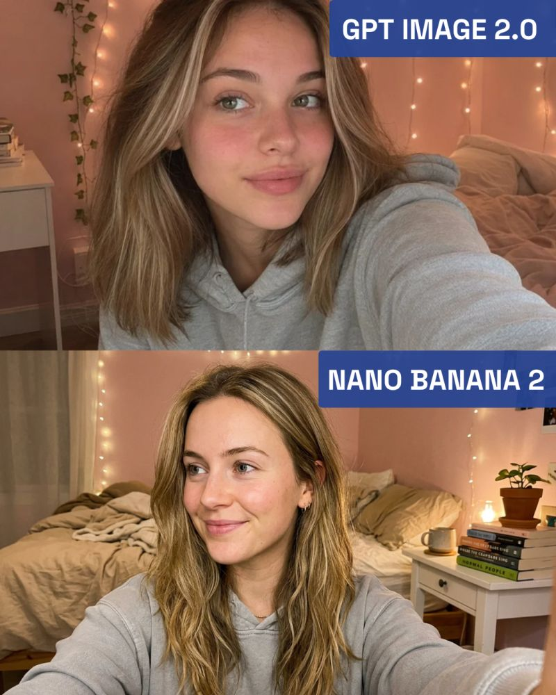

```text
Candid selfie of a young woman with shoulder-length honey-blonde hair with lighter highlights, green-grey eyes, rosy cheeks, and a natural no-makeup makeup look. She is wearing a light grey hoodie and looking slightly off-camera with a relaxed expression. Background shows a cosy bedroom with warm fairy lights strung on a pink wall, a unmade bed with tan bedding, and a small white desk with stacked books. Soft, warm ambient lighting. Photo-realistic, casual, intimate feel.
```


---

## 例 570：Musician Leaving Bodega Night Cinematic Portrait

**来源：** [@commanderdgr8](https://x.com/commanderdgr8/status/2047934886124867684) / [awesome-gpt-image-2-prompts](https://github.com/EvoLinkAI/awesome-gpt-image-2-prompts)

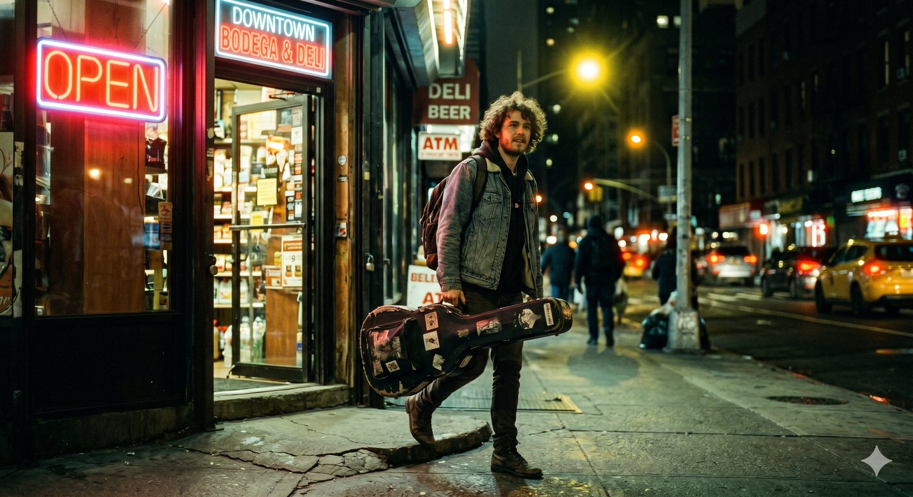

```text
A candid, magazine-cover quality documentary photograph of a young musician with curly hair, casually carrying a worn guitar case, stepping out of a classic downtown bodega at 11 PM. The lighting features a complex mixed color temperature: a bright neon "OPEN" sign casts an intense, warm red glow across his face, while a yellow streetlamp provides a striking backlight behind him. The image perfectly emulates 35mm film shot on a Canon AE-1 with a 50mm f/1.4 lens wide open, exhibiting a shallow depth of field with the background beautifully blurred. It captures the exact aesthetics of CineStill 800T film, specifically featuring the distinctive soft red halation bloom radiating outward from the neon light sources, a tungsten white balance, and moody, slightly green-tinted shadows in the darkest areas. Cinematic night photography, photorealistic, highly detailed.
```


---

## 例 571：Old Delhi Sweet Shop Storefront Documentary Photo

**来源：** [@commanderdgr8](https://x.com/commanderdgr8/status/2047889839123521635) / [awesome-gpt-image-2-prompts](https://github.com/EvoLinkAI/awesome-gpt-image-2-prompts)

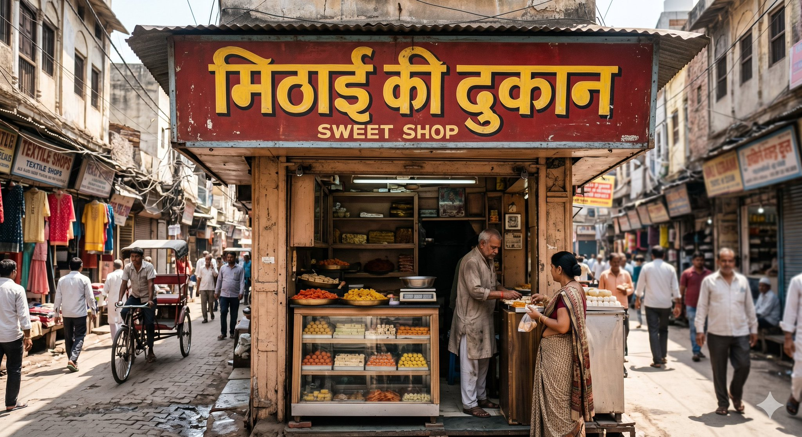

```text
Create a photorealistic travel-documentary image of a small sweet-shop storefront in Old Delhi at midday. A painted shop signboard above the door reads "मिठाई की दुकान" in large bold yellow hand-painted Devanagari on a deep red background, with "SWEET SHOP" in smaller roman letters beneath. Realistic hand-painted texture, slight wear, natural shadow. Authentic script proportion. Spelling and characters exact. No extra signage in frame, no watermark.
```


---

## 例 572：Cyberpunk Sci-Fi Side Profile Portrait

**来源：** [@iamsofiaijaz](https://x.com/iamsofiaijaz/status/2047882171336253928) / [awesome-gpt-image-2-prompts](https://github.com/EvoLinkAI/awesome-gpt-image-2-prompts)

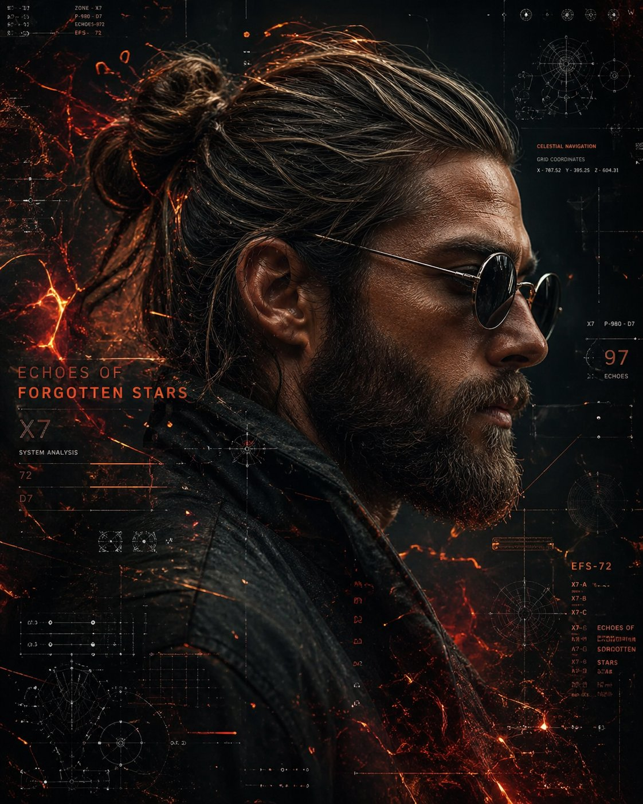

```text
A cinematic side-profile portrait of a rugged man with a tied-back bun and full beard, wearing round dark sunglasses and a textured leather jacket. His skin is detailed and slightly weathered. The background is a futuristic sci-fi interface filled with glowing orange and red data streams, star maps, celestial navigation diagrams, grids, and holographic UI elements. Fiery particle effects and ember-like energy swirl around him, creating a cosmic, high-tech atmosphere. Dark color palette with strong contrast, dramatic lighting, ultra-detailed, sharp focus, 8K, cyberpunk aesthetic, cinematic composition, depth of field.
```


---

## 例 573：Realistic Candid Bedroom Recording Portrait

**来源：** [@ChillaiKalan__](https://x.com/ChillaiKalan__/status/2047862141894681076) / [awesome-gpt-image-2-prompts](https://github.com/EvoLinkAI/awesome-gpt-image-2-prompts)

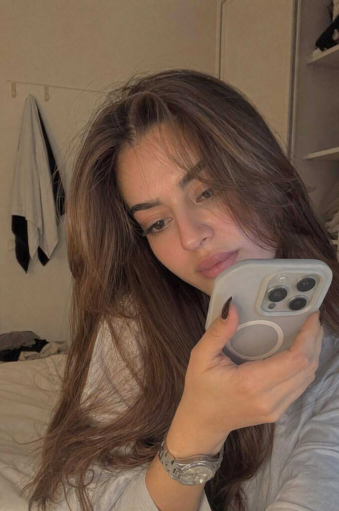

```text
A realistic young woman sitting casually in a softly lit bedroom during late afternoon.

She is holding her phone very close to her face as if recording a private video or voice note.

Framing is tight and slightly imperfect.

Expression: thoughtful, slightly shy, natural.

Minimal makeup, natural skin texture, relaxed clothing.

Lighting: warm natural light fading from a window, soft shadows.

Environment: simple bedroom, calm and lived-in.

Style: ultra-realistic, looks like a real phone recording, slightly grainy, not cinematic.
```


---

## 例 574：Toddler Crayon Scribble Art Style Portrait

**来源：** [@akakageAI](https://x.com/akakageAI/status/2047812983389356276) / [awesome-gpt-image-2-prompts](https://github.com/EvoLinkAI/awesome-gpt-image-2-prompts)

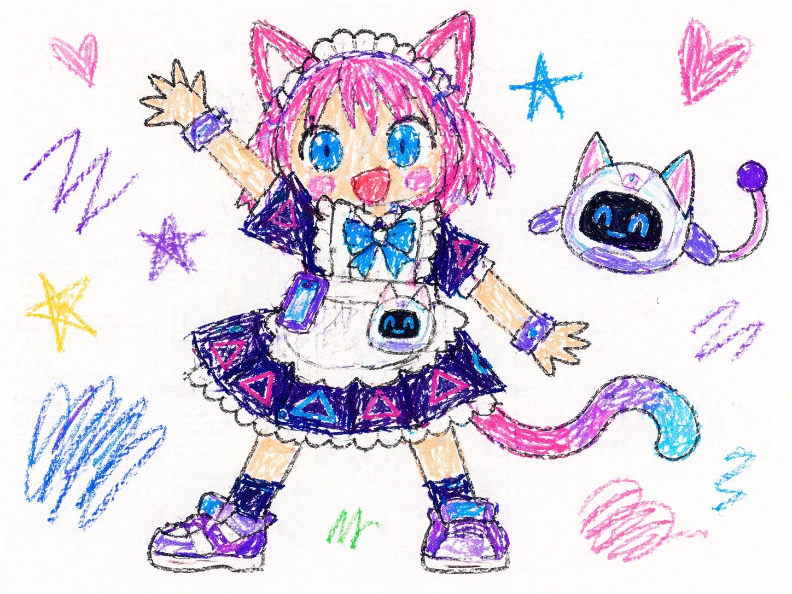

```text
(被写体) in the style of super bad child drawing, toddler art, scribbles, messy crayon lines on white background, completely lack of technique, terrible composition, chaotic colors, barely recognizable shapes, very raw, honest art, pure naivety, unrefined style, 4:3
Negative:
good drawing, nice lines, clear shapes, neat, pretty, smooth, realistic, talented art, coherent composition, artistic style, professional, skilled, masterpiece, beautiful, detailed
```


---

## 例 575：Restored Vintage Mother and Child Portrait

**来源：** [@gdb](https://x.com/gdb/status/2048184797374325031) / [awesome-gpt-image-2-prompts](https://github.com/EvoLinkAI/awesome-gpt-image-2-prompts)

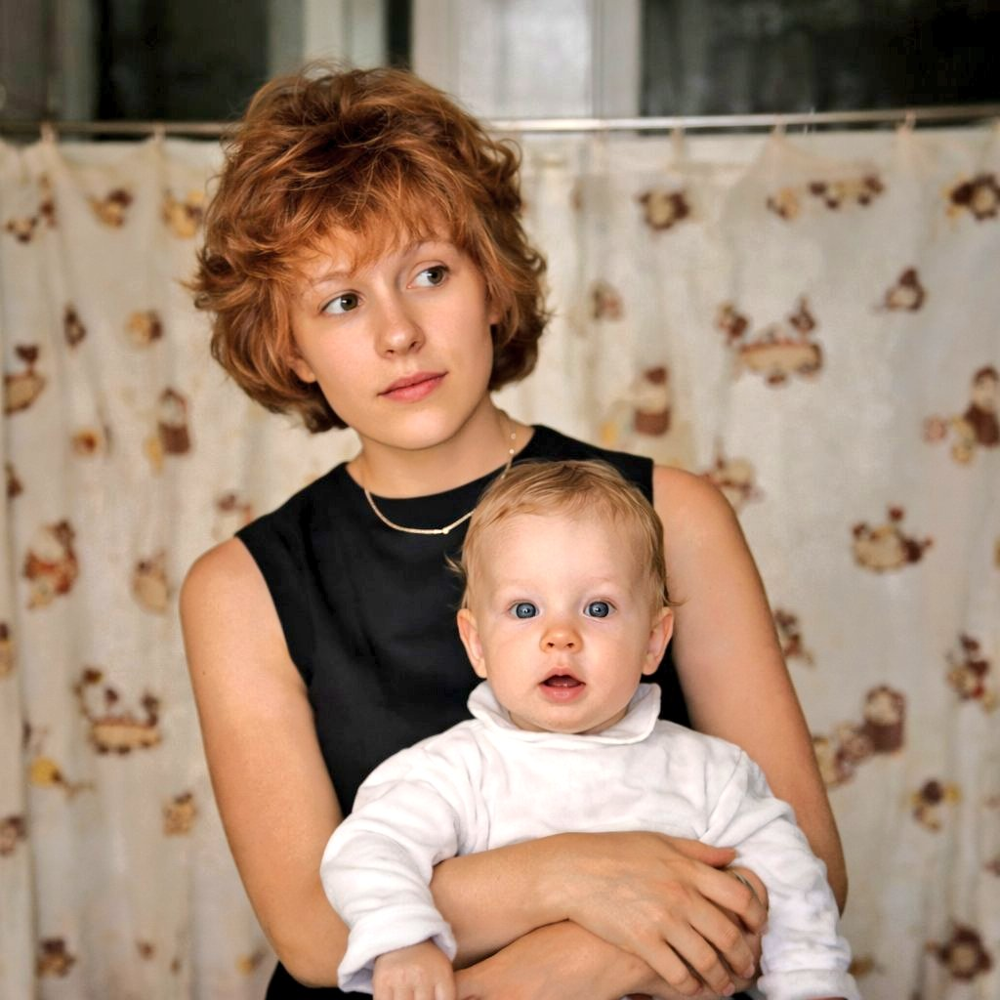

```text
A restored vintage family snapshot, photographed indoors in soft natural light, showing a {argument name="adult subject" default="young mother"} seated and holding a {argument name="child subject" default="toddler"} on her lap in a close, centered waist-up portrait. The adult has short softly curled auburn hair in a voluminous 1960s-inspired bob, wears a sleeveless black dress and a thin gold necklace, and wraps both arms protectively around the child. The child has fine light blond hair and wears a plain white long-sleeve outfit. Compose the image with a warm nostalgic color cast, gentle film softness, subtle grain, and the look of a carefully repaired old printed photograph. Place them in front of a cream-colored curtain patterned with small brown teddy bear motifs, with a softly blurred interior window frame visible along the top background. Preserve realistic skin tones, natural posture, and the intimate family-photo feeling, as if an old damaged photograph has been professionally reimagined and restored. Square crop, centered composition, shallow depth of field, authentic analog photo texture, no modern styling, no text.
```


---

## 例 576：Young Woman in Sequin Dress on Stairs

**来源：** [@XSydneyFan](https://x.com/XSydneyFan/status/2048114180906217566) / [awesome-gpt-image-2-prompts](https://github.com/EvoLinkAI/awesome-gpt-image-2-prompts)

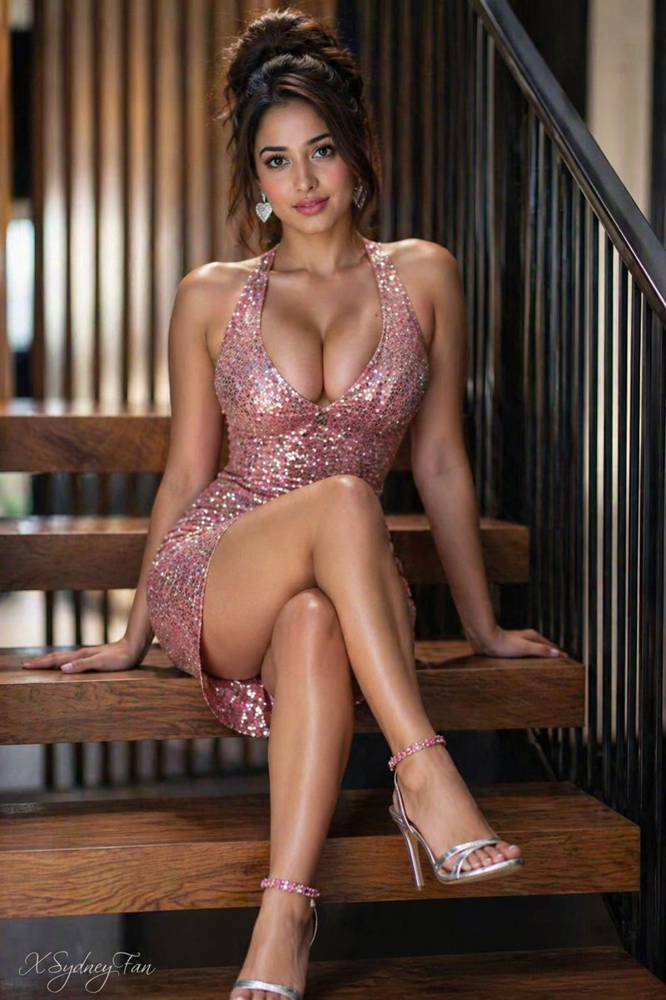

```text
Vertical 2:3 format. {argument name="subject" default="Young woman"} hair in messy updo sits on modern wooden staircase. wears {argument name="dress" default="shimmering Silver halter dress sequin dress"}. matching with silver high-heeled sandals. legs crossed. Silver heart earrings. One fuchsia bracelet on each ankle. Sultry expression, with slightly parted lips. Blurred background vertical wooden slats and black metal railings. Don't change face
```


---

## 例 577：Luxury Studio Outfit Transformation

**来源：** [@Abdullah__Ai7](https://x.com/Abdullah__Ai7/status/2048083022315159595) / [awesome-gpt-image-2-prompts](https://github.com/EvoLinkAI/awesome-gpt-image-2-prompts)

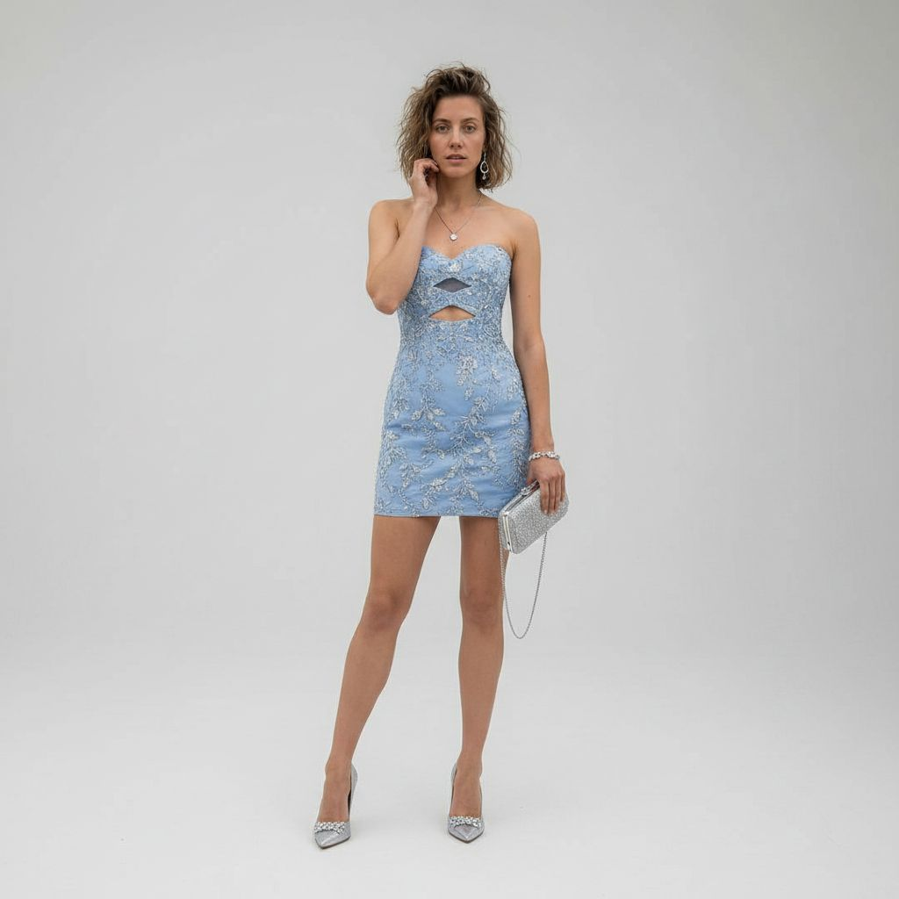

```text
Using REFERENCE_0 as the subject base, transform the casual desert snapshot into a full-body luxury fashion studio portrait. Replace the denim jacket, tank top, and shorts with a fitted strapless mini cocktail dress in {argument name="dress color" default="powder blue"} with ornate silver floral embroidery and exactly 2 geometric cutouts at the chest and upper waist. Change the setting to a clean seamless light-gray studio background with polished high-end editorial styling. Add 1 silver clutch with a thin chain strap in the subject's right hand and 1 pair of pointed silver high heels. Refine the pose into an elegant standing fashion pose with one hand near the face, keep the same person and hair identity, and apply soft cinematic luxury lighting with crisp 8K fashion-photography detail.
```


---

## 例 578：Dreamy Oriental female portrait prompt

**来源：** [@liyue_ai](https://x.com/liyue_ai/status/2048046253842559183) / [awesome-gpt-image-2-prompts](https://github.com/EvoLinkAI/awesome-gpt-image-2-prompts)

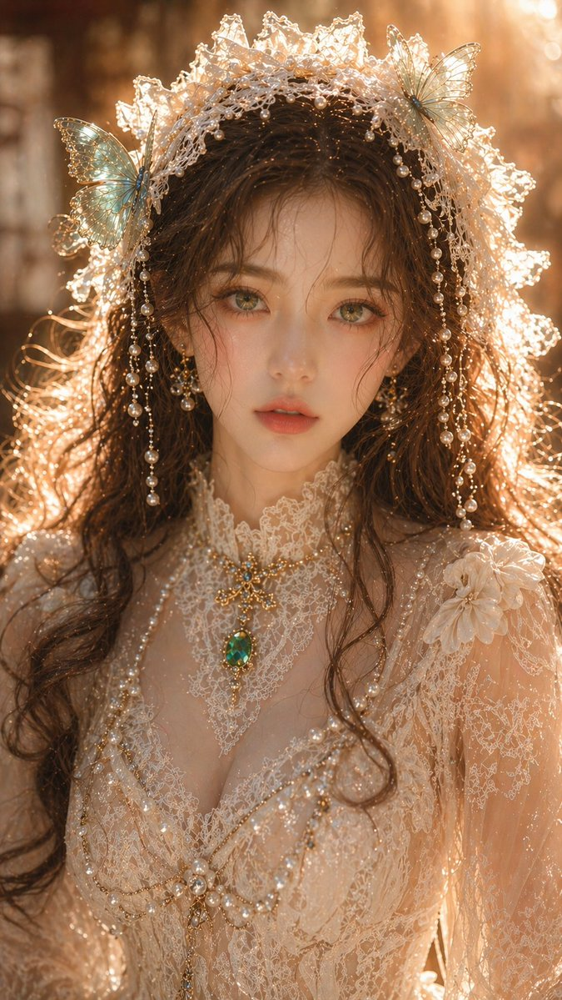

```text
{argument name="subject" default="Dreamy Oriental female portrait"}, adult female, close-up portrait, exquisite facial features, fair and translucent skin, delicate but clean skin texture, emerald green eyes, soft and charming gaze, brown wavy hair falling naturally; {argument name="accessories" default="Off-white lace headpiece"}, embellished with turquoise butterflies and pearl decorations; attire is an exquisite lace gown with a clear structure and clean, not overly complex texture, accompanied by emerald jewelry; lighting is soft warm gold side-backlighting, rim lighting is clear but not overexposed, skin has slight highlights but not excessive reflection, overall lighting is clean and transparent, background is softly blurred with shallow depth of field; high-end portrait photography quality, details are clear but restrained, no grain, no noise, real physical lighting, 8K, commercial-grade quality. Aspect ratio: 9:16
```


---

## 例 579：Dark Gatorade-Style Portrait

**来源：** [@jeremydevz](https://x.com/jeremydevz/status/2048026214812561683) / [awesome-gpt-image-2-prompts](https://github.com/EvoLinkAI/awesome-gpt-image-2-prompts)

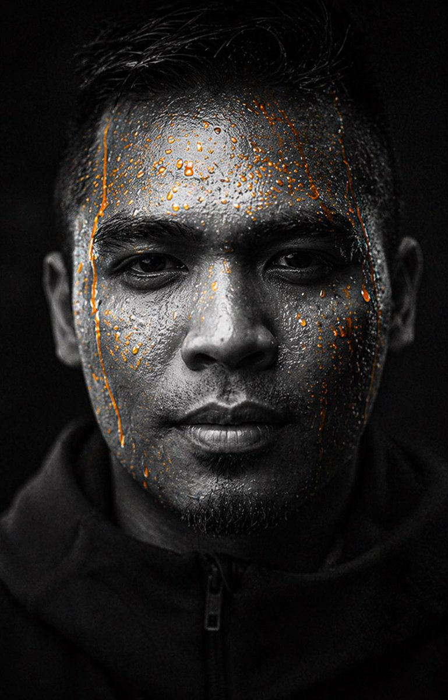

```text
A dramatic, high-contrast studio portrait of a {argument name="subject gender" default="male"} athlete or model in the visual style of a premium sports drink advertisement, centered and facing straight toward the camera in a tight head-and-shoulders crop. The subject has {argument name="hair style" default="short dark hair brushed back"}, visible ears on both sides, and a rugged lower face with a short beard or stubble. Dress him in a dark zip-up athletic jacket with the zipper centered and visible near the collar. Use an almost entirely black background and extremely low-key lighting, with subtle rim light and soft highlights catching the hair, ears, jawline, shoulders, and jacket texture while most facial features remain swallowed by shadow for a mysterious, intense mood. The image should feel monochrome or nearly monochrome, with deep blacks, muted gray highlights, cinematic contrast, gritty texture, and a sleek commercial sports-brand aesthetic reminiscent of a {argument name="brand style" default="Gatorade"} campaign. Vertical composition, minimalist framing, no text, no logo, no props, no visible environment.
```


---

## 例 580：Portrait of a Gentle Woman with Glasses

**来源：** [@megane_onesan](https://x.com/megane_onesan/status/2047989490153926848) / [awesome-gpt-image-2-prompts](https://github.com/EvoLinkAI/awesome-gpt-image-2-prompts)

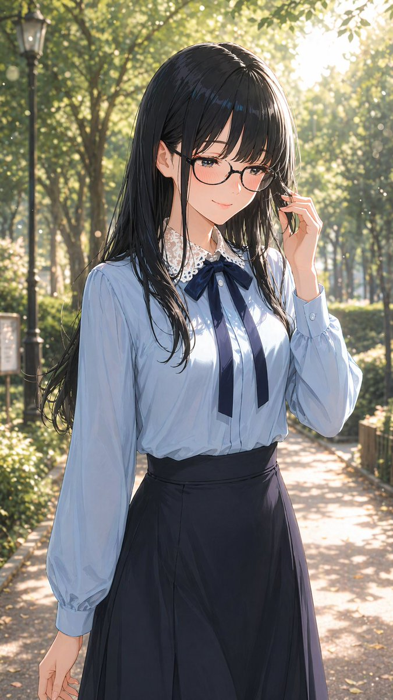

```text
A {argument name="style" default="photobook-style portrait"} of a {argument name="character" default="gentle woman with glasses"}
```


---

## 例 581：Dreamy Underwater Woman With Translucent Fish

**来源：** [@kotobukigraphic](https://x.com/kotobukigraphic/status/2047967522453123255) / [awesome-gpt-image-2-prompts](https://github.com/EvoLinkAI/awesome-gpt-image-2-prompts)

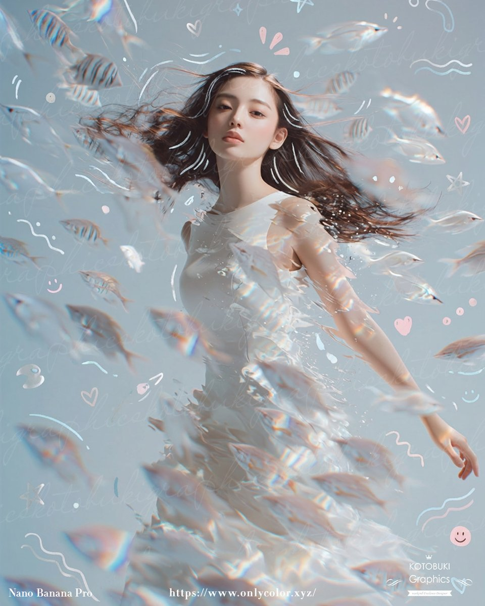

```text
A dreamy surreal portrait of a {argument name="subject" default="young woman"} standing underwater or in a liquid-like ethereal space, shown from about mid-thigh up, wearing a flowing sleeveless white dress that appears to dissolve into translucent water and shimmering fragments. Her long {argument name="hair color" default="dark brown"} hair streams dramatically sideways as if suspended in water, and her face is intentionally obscured by a soft vertical blur block for anonymity. Surround her with an exact count of about 30 small translucent fish, some striped and some pale silvery white, swimming in multiple depths of field across the foreground, midground, and background, with several fish passing in front of her body and hair to create strong motion and depth. Use a soft pastel {argument name="background color" default="powder blue"} background with faint handwritten script texture layered across it, plus whimsical doodles scattered throughout: white and pale pink hearts, stars, curved squiggles, wave lines, dots, sparkles, and 2 smiley faces. Add prismatic rainbow refractions, glossy caustic highlights, and subtle lens-like chromatic shimmer on the fish and dress. The mood should feel delicate, introspective, airy, and magical, with high-key lighting, gentle contrast, soft focus in the foreground, and crisp detail on the torso and hair. Compose the figure slightly off-center with one arm relaxed downward and the body turned lightly in motion, as if drifting peacefully through a school of fish. Include tiny elegant footer text in white near the bottom edge, with a left signature, a centered website URL, and a small right credit mark, resembling an art-poster or social-media showcase image.
```


---

## 例 582：Japanese Classroom Long Hair Snapshot

**来源：** [@Hair_Hair55](https://x.com/Hair_Hair55/status/2047963832732221723) / [awesome-gpt-image-2-prompts](https://github.com/EvoLinkAI/awesome-gpt-image-2-prompts)

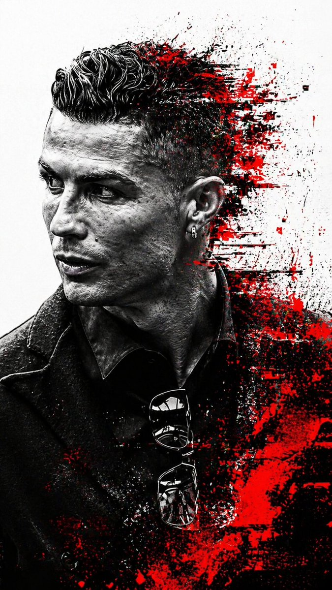

```text
A candid, photorealistic Japanese high school classroom scene in vertical smartphone-photo framing. Three schoolgirls wearing matching traditional navy blue sailor uniforms are the main focus in the foreground. The central standing girl has extremely long, straight, glossy black hair that falls well past her knees, almost to the floor, and she is gently combing the lower section with a small comb while looking downward. A second girl stands behind and slightly to the right, also with long straight black hair, holding an open compact mirror in one hand and adjusting her bangs or hair near her temple with the other. A third girl kneels on the floor at the right front, carefully holding and arranging the central girl’s long hair with both hands. All three wear dark navy sailor-style school uniforms with white stripe trim, pleated skirts, long sleeves, white socks, and indoor school shoes. Their faces are obscured or blurred. In the background, exactly 8 additional students in dark school uniforms sit at desks in small groups, facing away or sideways, creating the feel of an ordinary class period or homeroom. The classroom has wooden desks and chairs, large bright windows along the left side letting in soft daylight, a green chalkboard on the right wall, bulletin papers pinned near the board, and a framed Japanese calligraphy sign above the chalkboard reading {argument name="wall sign text" default="創誠造実"}. The atmosphere is natural and unposed, like a documentary snapshot. Emphasize realistic lighting, fine hair detail, the unusual dramatic length of the central girl’s hair, and a believable everyday school environment.
```


---

## 例 583：Collectible Figure Workspace Photo

**来源：** [@Shinning1010](https://x.com/Shinning1010/status/2049068188399227174) / [awesome-gpt-image-2-prompts](https://github.com/EvoLinkAI/awesome-gpt-image-2-prompts)


```text
Photorealistic high-quality studio photo of a modern digital art workspace, showing the concept of “from 3D virtual character to real collectible figure.”

In the foreground, a highly realistic collectible figurine of [Character Name / Character Identity] is placed on a round wooden display stand. The character has [facial features / appearance], [hairstyle], and a [expression / personality vibe]. The figure is wearing [outfit / costume]. The overall design is refined, premium, and instantly recognizable. The figurine should have realistic collectible statue quality, with subtle resin/sculpture material feel, while still looking highly believable and visually realistic.

The pose is [character pose], natural, stable, elegant, and display-worthy. Shot from a low-angle close-up perspective with slight wide-angle distortion, vertical composition, emphasizing the full figure, clothing structure, leg lines, and pose.

In the background, there is a professional 3D character design workstation with two large curved monitors. Both monitors must show the exact same character as the foreground figurine — same face, same hairstyle, same outfit, same pose, and same overall vibe — clearly expressing the idea of turning a digital 3D character into a real physical figure.

The left monitor shows a gray sculpt / clay model view in a professional 3D sculpting software interface, similar to ZBrush. The gray model must match the foreground figure exactly in character design, pose, outfit structure, and facial identity.

The right monitor shows the fully rendered colored version of the same character, also matching the foreground figure exactly in face, hairstyle, outfit, pose, and temperament. Together, the two monitors reinforce the workflow of “digital character design → physical collectible statue.”

On the desk are a keyboard, mouse, monitor arms, drawing tablet, stylus, and other 3D modeling tools. The workspace is clean, professional, and visually premium. Optional extra elements: [weapon / accessories / theme props / IP-style design details].

Lighting is a mix of soft studio lighting and indoor workspace lighting. The foreground figurine is evenly lit with clear facial and material detail, while the monitors emit cool-toned tech light. Overall mood is realistic, clean, premium, slightly shallow depth of field, ultra-detailed, emphasizing the collectible figure quality, professional 3D design studio atmosphere, and the visual concept of “from digital model to real figure.”

photorealistic, ultra detailed, cinematic studio lighting, realistic figurine, collectible statue, 3D character design studio, from digital model to real figure, vertical composition
```


---

## 例 584：Rainy Bus Stop Portrait

**来源：** [@harboriis](https://x.com/harboriis/status/2049081194156020046) / [awesome-gpt-image-2-prompts](https://github.com/EvoLinkAI/awesome-gpt-image-2-prompts)


```text
A cinematic nighttime photo of [your photo as reference] sitting alone at a wet bus

stop bench, eating a burger. Rain-soaked street with orange bokeh city lights

reflecting on the ground. Neon tube lights overhead. Red jacket, tan corduroy

pants. Moody, dark, atmospheric street photography.
```


---

## 例 585：CCD flash beauty portrait template

**来源：** [@AIwithAliya](https://x.com/AIwithAliya/status/2049452006608392350) / [awesome-gpt-image-2-prompts](https://github.com/EvoLinkAI/awesome-gpt-image-2-prompts)


```text
A hyper-photorealistic shot of the same subject in the attached image, ultra-detailed facial features, visible pores, natural skin texture, rosy complexion and dewy skin, Douyin/Korean glass-skin makeup, glossy lips, aegyosal, baby pink blush, high identity consistency, realistic human anatomy. Use an old CCD digital camera aesthetic with direct flash, visible grain, slight overexposure, cool-neutral white balance, slight motion blur, and candid composition. Hair in a loose romantic updo; outfit in delicate off-shoulder silk with embroidered floral fabric; background of pastel floral bedding; horizontal close-up; shallow depth of field. Negative prompt: over-smoothed skin, plastic texture, unrealistic proportions, studio lighting, overly sharp HDR, stiff pose, artificial symmetry, over-retouched face.
```


---

## 例 586：Japanese Negative Film Rooftop Portrait

**来源：** [@BubbleBrain](https://x.com/BubbleBrain/status/2050449020645216532) / [awesome-gpt-image-2-prompts](https://github.com/EvoLinkAI/awesome-gpt-image-2-prompts)

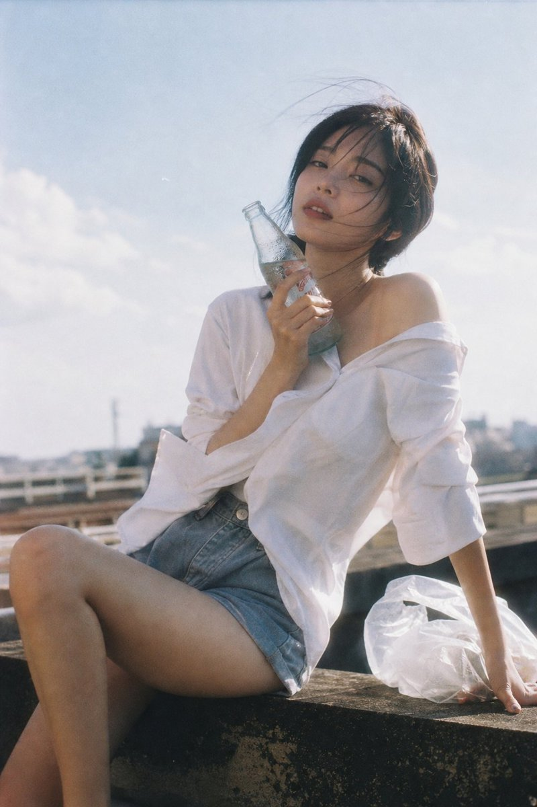

```text
Today's Portrait by gpt image 2 ---prompt--- Japanese negative film aesthetic, rooftop summer scene, soft natural sunlight, slight overexposure highlights, low contrast, muted faded colors, subtle grain a stunning beautiful young woman with subtle sensual presence, natural body line, effortless charm wearing a slightly oversized white shirt loosely unbuttoned at the collar, paired with high-waisted shorts; shirt softly moving in the wind, occasionally slipping off one shoulder holding a cold glass bottle drink with condensation, one hand lifting it near her neck or cheek, fingers lightly touching the surface subject sitting or leaning on rooftop edge, body relaxed but with slight weight shift, one hand supporting behind, torso subtly opening, one knee bent and the other leg softly extended hair gently blown by summer wind, loose strands across face expression calm and distant, lips slightly parted, looking toward camera or slightly away open sky, minimal environment, a light plastic bag resting beside her moving slightly with the wind imperfect composition, quiet isolated mood, nostalgic and reflective, “memory-like realism”, subtle sensuality through natural gesture --2:3
```


---

## 例 587：Paris Café Lifestyle Portrait

**来源：** [@Sairah_0](https://x.com/Sairah_0/status/2050432730962530809) / [awesome-gpt-image-2-prompts](https://github.com/EvoLinkAI/awesome-gpt-image-2-prompts)

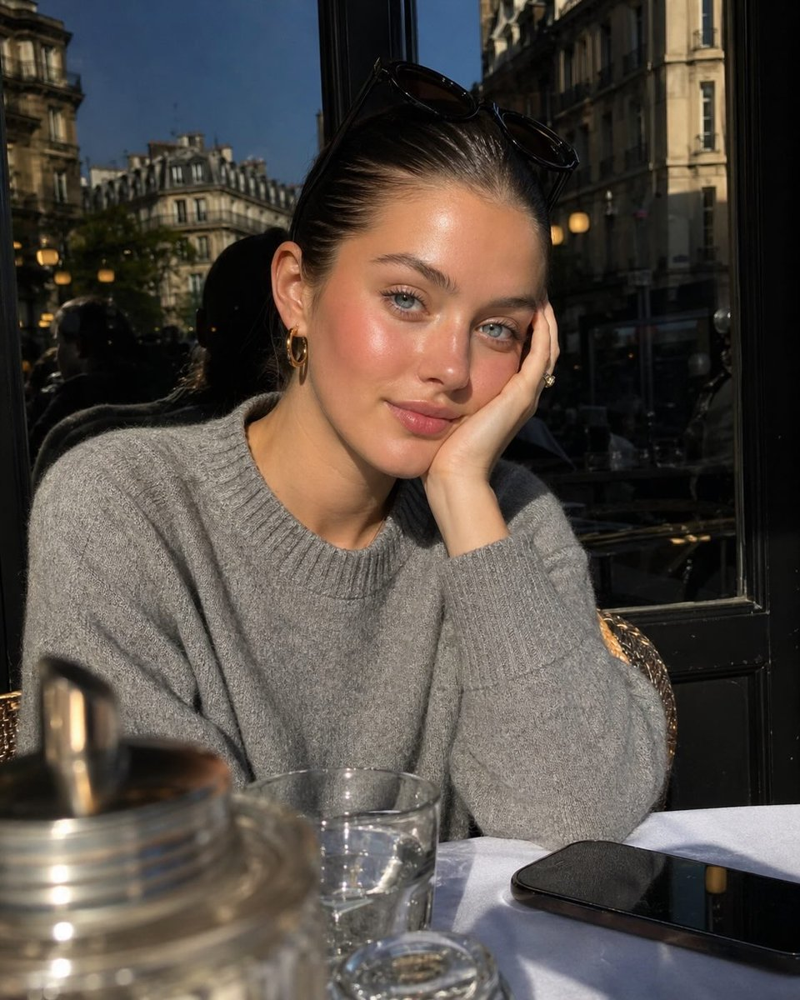

```text
GPT IMAGE 2 on Chat Gpt Prompt : Ultra-realistic portrait of a young woman sitting at a Parisian café, soft golden hour sunlight hitting her face, natural glowing skin, light blush, minimal makeup, green eyes, dark hair tied back with sunglasses on head, wearing a cozy grey knit sweater, resting her face on her hand, relaxed expression, shallow depth of field, cinematic lighting, reflections of classic Paris buildings in the window behind her, table with glassware and subtle foreground blur, 50mm lens, high detail, editorial fashion photography style. Prompt : Natural lifestyle portrait of a young woman at an outdoor Paris café, soft daylight, slightly wet slicked-back dark hair, minimal makeup with dewy skin and flushed cheeks, wearing a loose grey sweater, leaning her head on her hand, calm and intimate expression, symmetrical framing, glass windows reflecting Haussmann-style buildings, table with water glasses and phone, candid aesthetic, soft shadows, realistic tones, 35mm photography, high resolution, cinematic street-style fashion shoot.
```


---

## 例 588：2x2 Editorial Portrait Grid

**来源：** [@Taaruk_](https://x.com/Taaruk_/status/2050429694890389779) / [awesome-gpt-image-2-prompts](https://github.com/EvoLinkAI/awesome-gpt-image-2-prompts)

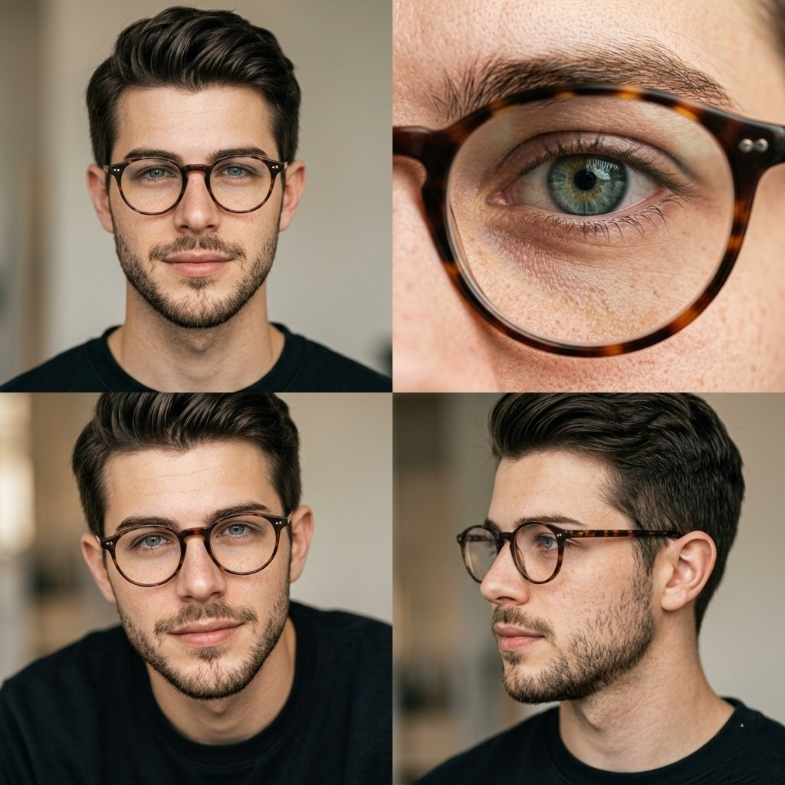

```text
GPT IMAGE 2 ON CHATGPT Prompt: Editorial portrait photography arranged in a 2x2 grid layout featuring the same man with round tortoiseshell glasses, natural look, light beard, soft neutral background. Top-left: front-facing portrait with direct eye contact, calm expression. Top-right: extreme macro close-up of eye behind glasses, ultra-detailed iris and skin texture. Bottom-left: slightly lower angle portrait, subtle expression, soft shadows. Bottom-right: side profile portrait, natural pose, looking away. Soft diffused natural lighting, warm neutral tones, shallow depth of field, ultra-realistic skin texture with visible pores and freckles, minimal retouching, 85mm lens, high-end editorial photography style, clean composition, 4K
```


---

## 例 589：Selective-Color Editorial Portrait

**来源：** [@SPEEDAI07](https://x.com/SPEEDAI07/status/2051262381733618119) / [awesome-gpt-image-2-prompts](https://github.com/EvoLinkAI/awesome-gpt-image-2-prompts)

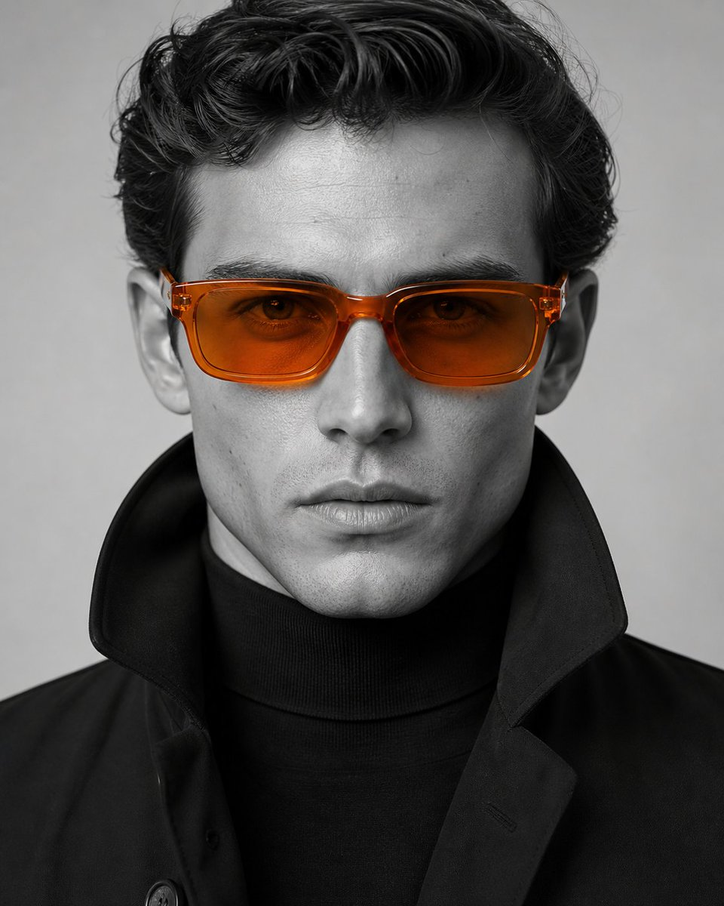

```text
GPT Image 2 on ChatGPT

A studio-style close-up editorial portrait of a person with strong, well-defined facial features and slightly imperfect, natural skin texture. The subject wears a black tailored turtleneck with sharp, clean lines, layered under a high-collared black jacket in a minimalist contemporary fashion style.The subject wears semi-transparent orange acetate sunglasses — rectangular frames with softly rounded edges, glossy finish, and amber gradient lenses — serving as the only colored element in the image.Color concept: selective color photography — monochrome black-and-white image with only the sunglasses in vivid orange.
Mood is calm and confident, serious expression, direct gaze into the camera.
Lighting is soft frontal studio light with gentle shadows, even skin tones, cinematic contrast, and visible natural skin texture. Shot on a professional portrait camera, f/2.0, ISO 100, 1/125s. High resolution, ultra-sharp focus on the face.
```


---

## 例 590：Analog Idol Portrait

**来源：** [@BubbleBrain](https://x.com/BubbleBrain/status/2051253854516478082) / [awesome-gpt-image-2-prompts](https://github.com/EvoLinkAI/awesome-gpt-image-2-prompts)


```text
Realistic analog 35mm film photography, intimate upper-body portrait of a beautiful Japanese female idol with an elegant and subtly sensual aura, side-facing toward the camera, gently turning her head back with a calm, confident yet slightly distant gaze.

She lifts her high ponytail using both hands symmetrically — each hand positioned on opposite sides of her head, naturally gathering and holding the hair. Her elbows extend outward, creating a balanced and elegant silhouette, while emphasizing her shoulder line, neck, and collarbone. The pose feels natural and unposed, like a fleeting candid moment rather than intentional modeling.

Framing: close medium shot from head to waist, slightly imperfect composition, subject slightly off-center, intimate and cinematic.

Outfit: fitted off-shoulder knit top or thin-strap satin camisole, minimal and tasteful, softly contouring the body without being revealing. Delicate earrings, natural glossy lips, clean Korean-style makeup, porcelain skin with visible real texture, micro pores, no over-retouching.

Scene: quiet indoor apartment corner, soft curtains, minimal background, warm ambient tungsten light mixed with faint natural window light, subtle shadow gradients on wall, slightly hazy air catching light.

Lighting: soft side lighting with gentle falloff, natural facial fill, subtle rim light on hair and shoulders, slight highlight bloom, warm cinematic tones.

Style: authentic analog film look (Kodak Portra 400 or Fujifilm Pro 400H feel), soft contrast, muted warm palette, visible organic film grain, fine noise texture, slight lens imperfection, nostalgic cinematic mood, high-end fashion editorial with documentary realism.

Camera: 50mm lens, shallow depth of field, natural skin rendering, realistic proportions, slight focus falloff.

Add a small handwritten signature text "BubbleBrain" at the bottom right corner, subtle and integrated.

--ar 2:3
```


---

## 例 591：White Suit Red Backdrop Portrait

**来源：** [@iamsofiaijaz](https://x.com/iamsofiaijaz/status/2051153792725667873) / [awesome-gpt-image-2-prompts](https://github.com/EvoLinkAI/awesome-gpt-image-2-prompts)

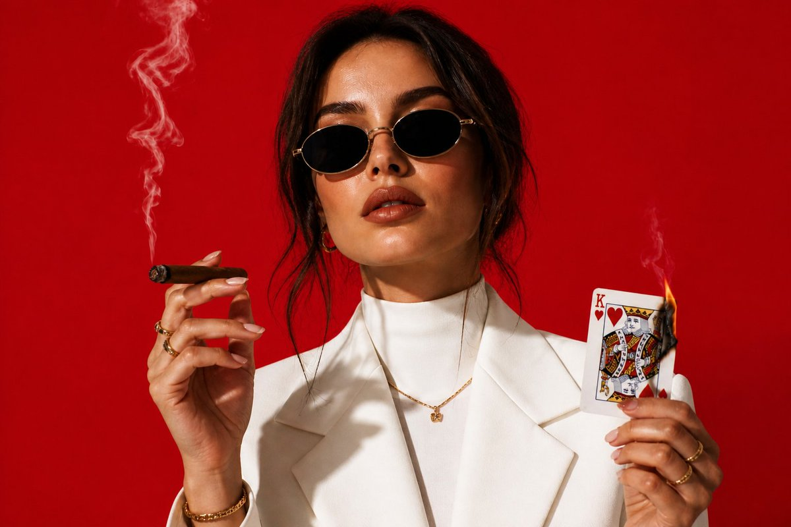

```text
A cinematic, high-fashion portrait of a confident stylish woman wearing an elegant tailored white suit with a high-neck design and sleek oval sunglasses. She is holding a thin medium cigar with soft smoke rising, and a slightly burning King of Hearts playing card with minimal flame detail. Soft wisps of smoke drift upward. The background is a bold, vibrant solid red seamless backdrop. High-key professional studio lighting with soft shadows and gentle warm highlights reflecting on her face. Ultra-realistic skin texture, sharp focus on facial features, shallow depth of field, soft bokeh, 35mm lens look. Crisp contrast, modern editorial fashion photography, clean luxury aesthetic, refined, powerful, and slightly rebellious mood.
```


---

## 例 592：Monochrome Glitch Profile Portrait

**来源：** [@Goodmanprotocol](https://x.com/Goodmanprotocol/status/2049733639651385759) / [awesome-gpt-image-2-prompts](https://github.com/EvoLinkAI/awesome-gpt-image-2-prompts)


```text
Subject: A sharp, high-contrast side-profile portrait of a handsome man with a defined jawline, short stubble, and voluminous, textured dark hair styled upwards.

Style & Composition: A fusion of realistic photography and abstract digital glitch art. The subject is rendered in stark black and white, set against a clean, minimalist white background.

Color Palette: Strictly monochromatic (deep blacks and bright whites) with aggressive, vibrant splashes of crimson red.

Graphic Elements: > * Glitch Effect: The back of the head and the lower torso dissolve into abstract geometric shards, pixel sorting, and "glitchy" red brushstrokes.

Texture: Gritty, ink-wash textures and distressed digital overlays that suggest a modern noir or cyberpunk editorial feel.

Lighting & Technicals: > * Lighting: Intense side-lighting (Chiaroscuro) creating deep shadows on the face to highlight bone structure.

Details: Hyper-realistic skin texture, individual hair strands visible, high-grain film aesthetic.

Framing: Vertical aspect ratio, close-up profile shot.

Aspect ratio is 9:16
```


---

## 例 593：Basketball Boy Motion Sequence

**来源：** [@Taaruk_](https://x.com/Taaruk_/status/2049702491768684839) / [awesome-gpt-image-2-prompts](https://github.com/EvoLinkAI/awesome-gpt-image-2-prompts)

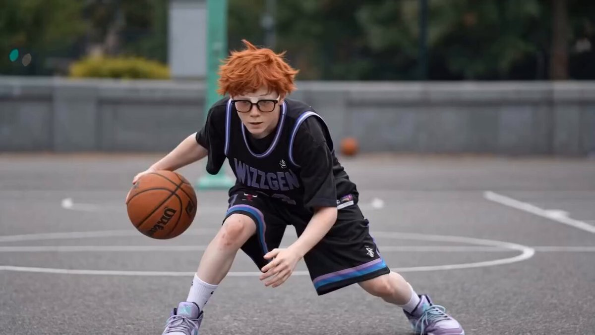

```text
A photorealistic video sequence captures a young boy with messy orange hair and thick-framed glasses, as seen in image_0.png, image_1.png, and other source frames. He is dressed in a black basketball jersey and matching shorts with purple and blue trim, featuring the text "WIZZGEN 23" on the front and "CHICAGO 23" on the back (image_4.png). The setting is an outdoor asphalt city basketball court with green trees and a visible basketball hoop. The action begins with the boy in a low stance, dribbling the ball between his legs (image_0.png through image_3.png), then transitions to him standing taller and performing crossovers (image_5.png through image_7.png), followed by him successfully spinning the ball on his finger (image_8.png), and finally posing with a peace sign while holding the ball (image_9.png). The lighting is soft daylight under an overcast sky.
```


---

## 例 594：Golden Hour Street Side-Profile Portrait

**来源：** [@Professor_134](https://x.com/Professor_134/status/2049701241287311561) / [awesome-gpt-image-2-prompts](https://github.com/EvoLinkAI/awesome-gpt-image-2-prompts)

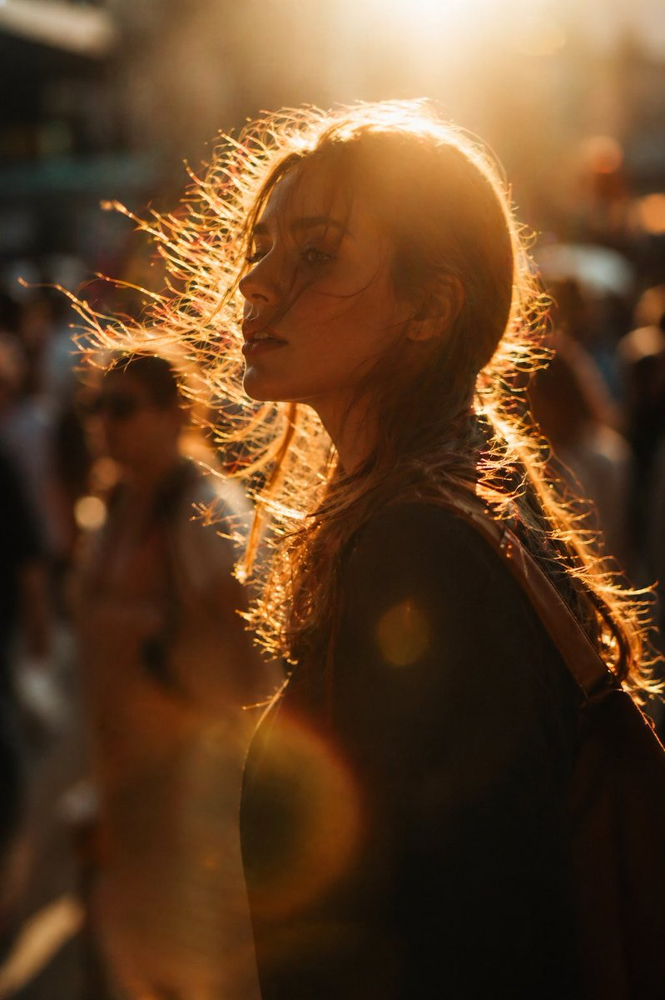

```text
- Cinematic golden hour street portrait of a young woman in side profile, walking through a busy city crowd, soft wind blowing through her long light-brown hair, individual strands glowing in backlight, warm sunlight flaring through her hair creating a natural halo effect, dreamy atmosphere, shallow depth of field, strong subject separation, background filled with softly blurred pedestrians and urban motion bokeh.

She has delicate facial features, natural skin texture, subtle makeup, calm introspective expression, slightly parted lips, looking off-frame. Wearing a minimal outfit (dark neutral tones), possibly a light jacket, modern casual style.

Lighting is rich golden hour sunlight, strong backlighting with lens flare, cinematic highlights, warm orange and amber tones, high dynamic range, soft shadows, volumetric light rays passing through hair and environment.

Shot on a telephoto lens (85mm–135mm look), f/1.8 aperture, ultra-realistic, high detail, film still quality, natural color grading, slight film grain, soft bloom, editorial photography style, Vogue aesthetic.

Composition: rule of thirds, subject slightly off-center, crowd motion blur behind her, dynamic yet intimate framing.

Mood: nostalgic, dreamy, romantic, fleeting moment, poetic realism.

Style keywords: cinematic, photorealistic, golden hour glow, bokeh, volumetric lighting, shallow depth of field, editorial portrait, soft focus highlights, warm tones, natural skin texture

Negative prompt: low quality, overexposed face, harsh shadows, distorted facial features, extra limbs, blur on subject, noise, oversharpening, artificial skin, cartoonish look
Generate image using uploaded image as reference
```


---

## 例 595：Chibi 3D Mini Me Photo Effect

**来源：** [@miratechtool](https://x.com/miratechtool/status/2051691169592033488) / [awesome-gpt-image-2-prompts](https://github.com/EvoLinkAI/awesome-gpt-image-2-prompts)

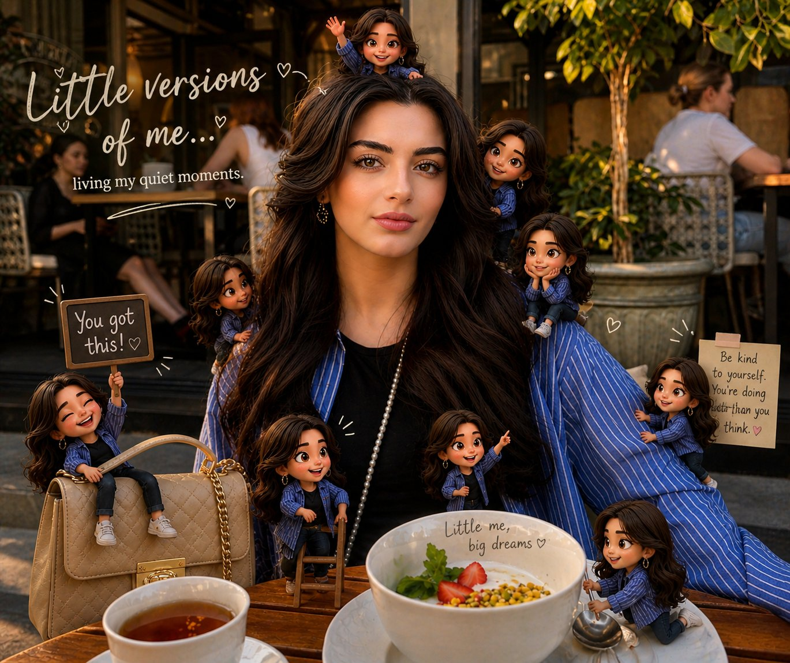

```text
Mini "chibi 3D" versions of the same person appear around the original photo — sitting, climbing, playing, interacting with objects — with realistic shadows and depth. Keep base image unchanged. Add soft handwritten text: "Little versions of me… living my quiet moments." Include tiny props text like "You got this ♡". Cinematic, cozy, viral aesthetic.
```


---

## 例 596：Cinematic Stormy Seaside Portrait

**来源：** [@Shinning1010](https://x.com/Shinning1010/status/2051684366460354923) / [awesome-gpt-image-2-prompts](https://github.com/EvoLinkAI/awesome-gpt-image-2-prompts)

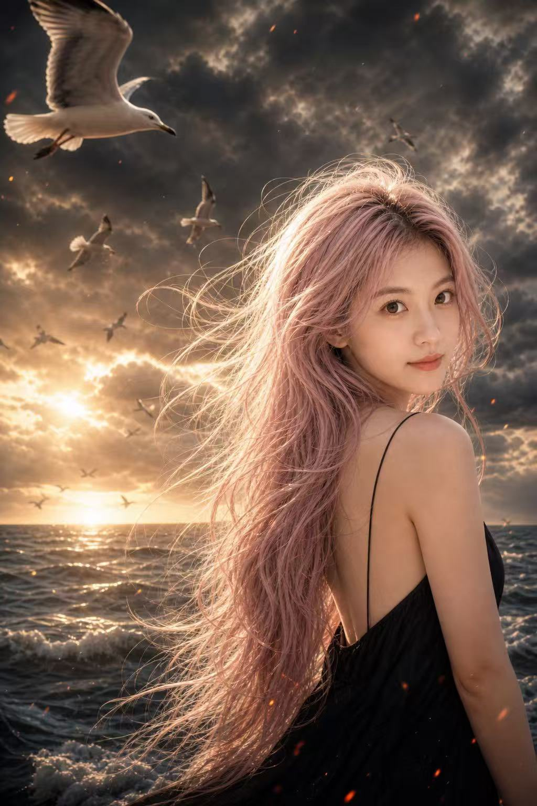

```text
Use the uploaded portrait only as a face reference. Keep the person's facial identity, face shape, eyes, nose, lips, and skin tone. Do not copy the original hairstyle, clothing, background, or lighting.

Create a cinematic stormy seaside portrait, vertical 2:3. Subject slightly right of frame, body turned away, head turned back, clear side-profile / three-quarter face. Very long, messy, windblown light pastel pink hair, black sleeveless or thin-strap dress.

Background: dark ocean, dramatic cloudy sky, distant horizon, many flying seagulls, including one large foreground seagull in the upper left. Strong cinematic lighting, bright rim light on the pale pink hair, refined high contrast, warm light breaking through clouds, subtle red ember-like particles, slight film grain, realistic photography, premium editorial quality, high visual impact.

Negative Prompt:
frontal face, wrong identity, copied hairstyle, braids, dark pink hair, red hair, magenta hair, short hair, bad anatomy, deformed face, bad hands, extra fingers, awkward pose, flat lighting, blurry face, low quality, anime, cartoon, CGI, malformed birds, duplicated birds, text, logo, watermark
```


---

## 例 597：Wimbledon Broadcast Crowd Shot

**来源：** [@Mavericks_Prod](https://x.com/Mavericks_Prod/status/2054342640439566739) / [awesome-gpt-image-2-prompts](https://github.com/EvoLinkAI/awesome-gpt-image-2-prompts)

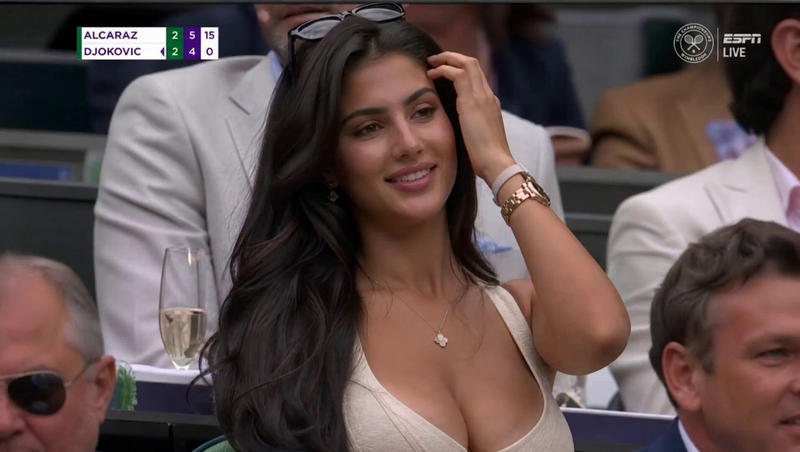

```text
A screenshot from a live Wimbledon TV broadcast during a packed Centre Court match. The camera cuts to the audience, an unbelievably attractive woman in her 20s with long black hair, flawless skin, elegant makeup, and a luxurious aura, seated in the VIP section wearing a sophisticated cream-white low-cut summer outfit with subtle jewelry. She smiles naturally while reacting to the match, unaware she's on camera. Wealthy spectators and champagne glasses around her, old-money tennis atmosphere, shallow depth of field. Full live tennis broadcast overlay: scoreboard, network watermark, broadcast graphics, 16:9 aspect ratio. The image looks exactly like a real TV screenshot, telephoto broadcast lens, realistic live color grading, slight compression artifacts, interlacing grain, subtle motion blur, imperfect live-camera framing.
```


---

## 例 598：Rainy Street Golden Portrait

**来源：** [@harboriis](https://x.com/harboriis/status/2054238941482733685) / [awesome-gpt-image-2-prompts](https://github.com/EvoLinkAI/awesome-gpt-image-2-prompts)

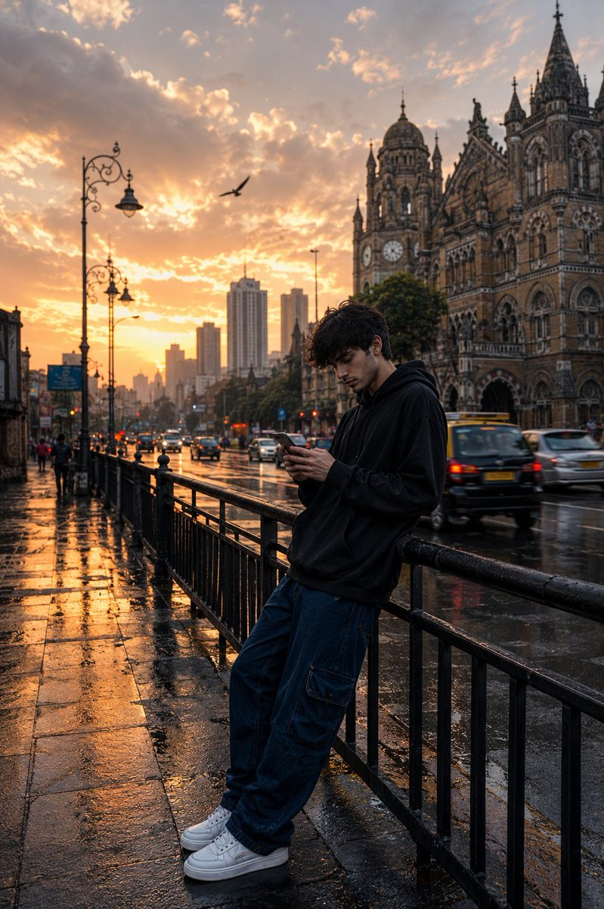

```text
Ultra-realistic cinematic street photography of a young man standing alone on a rainy urban sidewalk during golden hour sunset in Mumbai, India. He is leaning casually against a black metal roadside railing while looking down at his smartphone, wearing an oversized black hoodie, loose dark blue cargo jeans, and clean white sneakers. Messy textured black hair moving slightly in the wind. Moody introspective vibe.

Wide-angle composition with dramatic depth and strong leading lines from the wet pavement and railings. Reflective rain-soaked street surface glowing with warm sunset light. Vintage street lamps lining the sidewalk. Historic Gothic architecture inspired by Chhatrapati Shivaji Maharaj Terminus visible on the right side, detailed stone textures and clock tower. Modern skyscrapers fading into atmospheric haze in the distant background, creating a blend of old and new Mumbai cityscape.

Soft cinematic clouds filling the sky with warm orange, peach, and golden tones. A flying bird silhouette crossing the sky. Light traffic with black-and-yellow taxis and blurred cars moving through the street. Realistic puddle reflections, subtle motion blur, volumetric lighting, atmospheric perspective, ultra-detailed textures, natural shadows, realistic skin tones.

Shot on Sony A7R IV, 35mm lens, f/1.8, shallow depth of field, HDR photography, photorealistic, cinematic color grading, warm highlights with cool shadows, highly detailed urban realism, editorial photography style, 8K ultra resolution.
```


---

## 例 599：Retro Newsstand Fashion Scene

**来源：** [@harboriis](https://x.com/harboriis/status/2054484765001306285) / [awesome-gpt-image-2-prompts](https://github.com/EvoLinkAI/awesome-gpt-image-2-prompts)

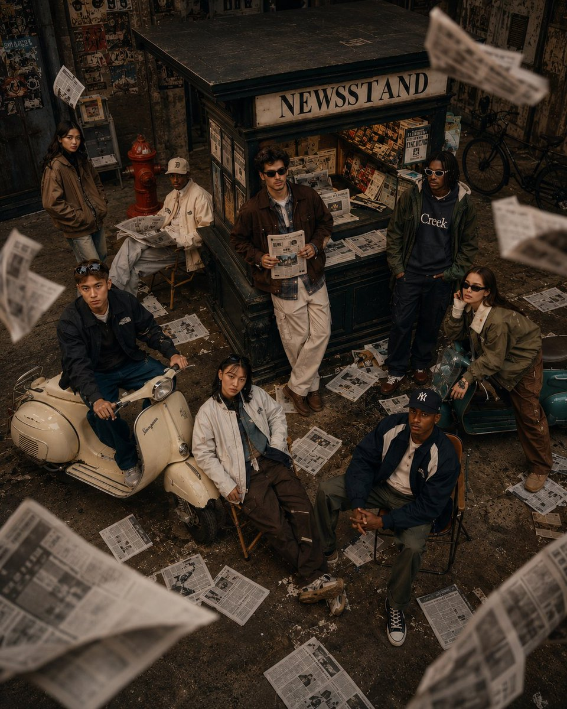

```text
A cinematic fashion editorial scene of 8 diverse young adults gathered around a vintage urban newsstand kiosk with a bold "NEWSSTAND" sign, set in a gritty indoor street environment with worn concrete floors, dark industrial walls, and subtle urban details. Newspapers fly dynamically through the air in mid-motion, creating layered depth and energy with natural motion blur. The group is styled in coordinated 90s-inspired retro streetwear - oversized jackets, layered fits, sunglasses, caps, and muted earth tones. (olive green, brown, cream, navy). Composition is carefully balanced: one subject leans casually against the kiosk holding a newspaper, one sits confidently on a cream vintage scooter in the foreground, another rests on a teal scooter, while others stand or sit on chairs with relaxed, confident poses and subtle attitude. Shot from a slightly elevated angle (top-down perspective), wide 35mm lens, maintaining natural proportions. Lighting is soft cinematic with warm highlights and diffused shadows, creating a premium fashion campaign mood. Background includes scattered newspapers, a red fire hydrant, and industrial textures for realism. Ultra-detailed, photorealistic, shallow depth of field, crisp subject focus, soft film grain, natural color grading, high-end magazine aesthetic, 4K quality.
```


---

## 例 600：Early 1990s Flash Portrait

**来源：** [@bmx_ai13](https://x.com/bmx_ai13/status/2054459126084718785) / [awesome-gpt-image-2-prompts](https://github.com/EvoLinkAI/awesome-gpt-image-2-prompts)

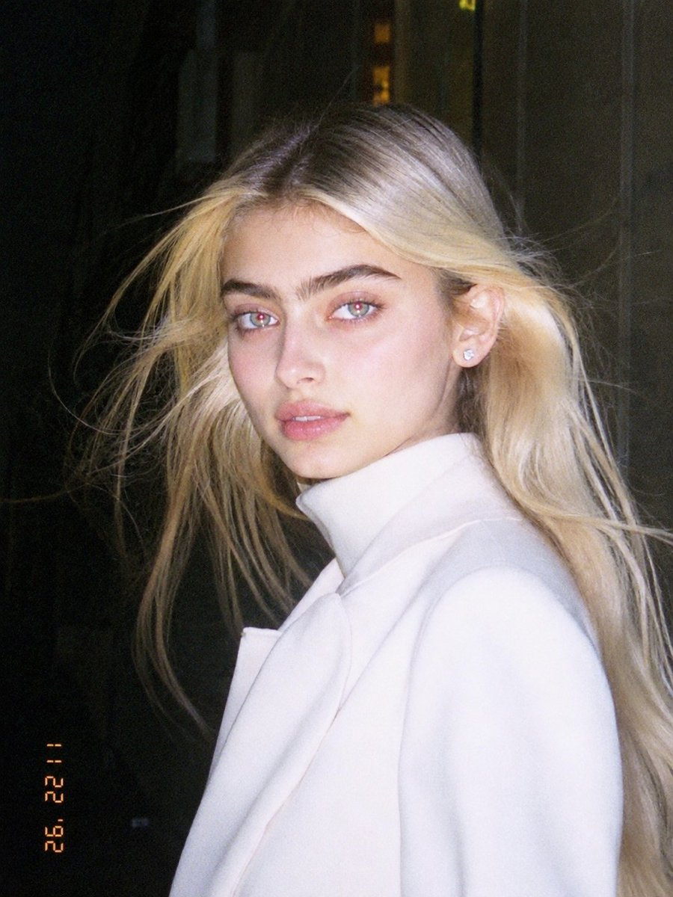

```text
Early 1990s Flash Camera Portrait GPT image 2 on ChatGPT Prompt Template. Use the uploaded image as the main reference. Transform the uploaded photo into a realistic candid portrait with an early 1990s digital camera aesthetic. Preserve the subject’s identity, facial features, pose, outfit, and overall composition, but restyle the image with harsh blown-out flash highlights, subtle red-eye effect, low-resolution image quality, raw snapshot imperfections, nostalgic flash-filter styling, and a vintage timestamp look. The final image should feel candid, imperfect, and authentic, like an old retro party or personal snapshot taken with an early consumer digital camera. Keep the background dark or naturally subdued when appropriate, maintain a direct-flash look, and give the image a raw, unpolished, memory-like atmosphere. Include: - harsh direct camera flash - overexposed or blown-out highlights - subtle red-eye effect - low-resolution / soft digital detail - slight grain or noisy texture - authentic retro snapshot feeling - vintage date/timestamp aesthetic in one corner - candid, natural, imperfect energy Avoid: - cartoon or anime style - overly polished beauty retouching - studio lighting - ultra-sharp modern DSLR look - glossy AI skin - text, logos, watermarks, or graphic overlays other than the timestamp aesthetic - distorted anatomy or altered identity Make the aspect ratio 3:4
```


---

## 例 601：Luxury Portrait With Tiny Alter Ego

**来源：** [@Professor_134](https://x.com/Professor_134/status/2055561008626950422) / [awesome-gpt-image-2-prompts](https://github.com/EvoLinkAI/awesome-gpt-image-2-prompts)

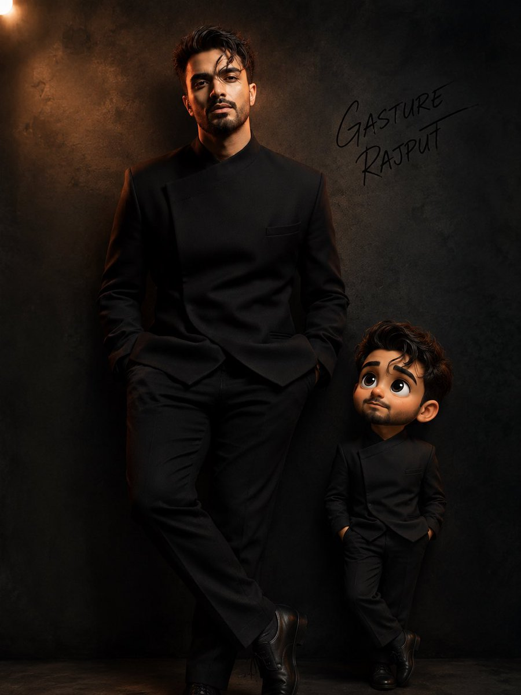

```text
- Ultra-cinematic luxury portrait of a fashionable young man standing confidently beside his tiny animated counterpart inside a sophisticated studio setup. The adult character has thick styled black hair, deep brown eyes, a perfectly trimmed beard, warm tan skin, and a calm charismatic smile. He wears an elegant matte-black tuxedo with a fitted black shirt, luxury wristwatch, and minimal jewelry, exuding a modern gentleman aesthetic. His posture is composed with hands clasped naturally in front of him while leaning subtly against a textured charcoal wall.

Next to him stands a miniature stylized version of himself designed in high-end 3D animated character style, featuring oversized sparkling eyes, soft youthful facial proportions, glossy hair, expressive eyebrows, and adorable Pixar-inspired detailing. The child version mirrors the exact outfit and pose of the adult, creating a visually emotional “future meets childhood” composition.

The background is a dark cinematic studio wall with subtle warm gradients, textured concrete finish, and handwritten artistic signature typography painted casually on the wall. Ambient golden lighting softly wraps around both characters, producing realistic highlights, cinematic shadows, and luxury editorial depth. The mood feels emotional, premium, stylish, and heartwarming.

Shot using a professional full-frame portrait lens, shallow depth of field, ultra-sharp focus on faces, soft blurred background, realistic fabric folds, detailed skin texture, ray-traced reflections, cinematic contrast, rich black tones, and premium color grading.

Style references: luxury fashion campaign, Pixar realism, Disney-inspired miniature character design, high-end magazine photography, Unreal Engine 5 realism, Octane Render, volumetric lighting, ultra-detailed 8K masterpiece, elegant masculine aesthetic, modern studio portrait, emotionally cinematic composition.
Generate image using uploaded image as reference
```


---

## 例 602：Convex Mirror Rainy Selfie

**来源：** [@Shinning1010](https://x.com/Shinning1010/status/2056168101545386430) / [awesome-gpt-image-2-prompts](https://github.com/EvoLinkAI/awesome-gpt-image-2-prompts)

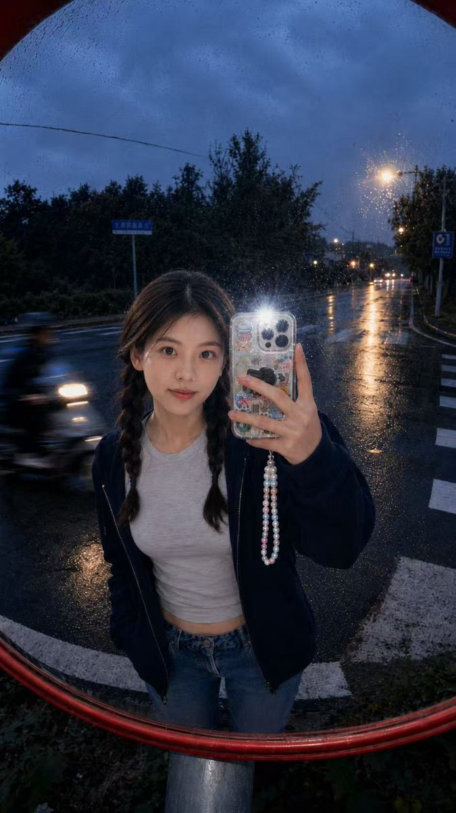

```text
Upload one portrait as the identity reference. Use it only for the subject’s facial identity, face shape, hairstyle, hair color, skin tone, and natural body proportions. Do not copy the original portrait’s clothes, background, pose, lighting, or image quality.

Create a hyper-realistic outdoor convex traffic mirror selfie, 9:16 vertical composition. The subject stands in front of a large round roadside safety mirror with a red rim, taking a flash selfie with a decorated phone case, phone partially covering the face. Use the uploaded portrait only for identity and hairstyle. Keep a casual youthful outfit: dark oversized zip hoodie, cropped white graphic tee, loose jeans, white sneakers. Rainy dusk street intersection background, wet asphalt, zebra crossing, trees, soft blue-gray sky, faint streetlights, one blurred passing scooter, dirty mirror surface with dust and water spots, strong camera flash glare, realistic fisheye distortion, candid smartphone snapshot, natural skin texture, real-life street photography, no watermark.

Negative Prompt:
anime, cartoon, CGI, 3D render, doll face, plastic skin, over-smoothed skin, fake eyes, bad anatomy, distorted hands, extra fingers, broken phone, duplicate person, messy face, unreadable facial features, overexposed face, low resolution, heavy beauty filter, studio lighting, clean perfect mirror, text, logo, watermark, UI elements, poster design, artificial background
```


---

## 例 603：Fashion Collage Multi-Style Portrait

**来源：** [@Mind_Boticni](https://x.com/Mind_Boticni/status/2056350780840611954) / [awesome-gpt-image-2-prompts](https://github.com/EvoLinkAI/awesome-gpt-image-2-prompts)

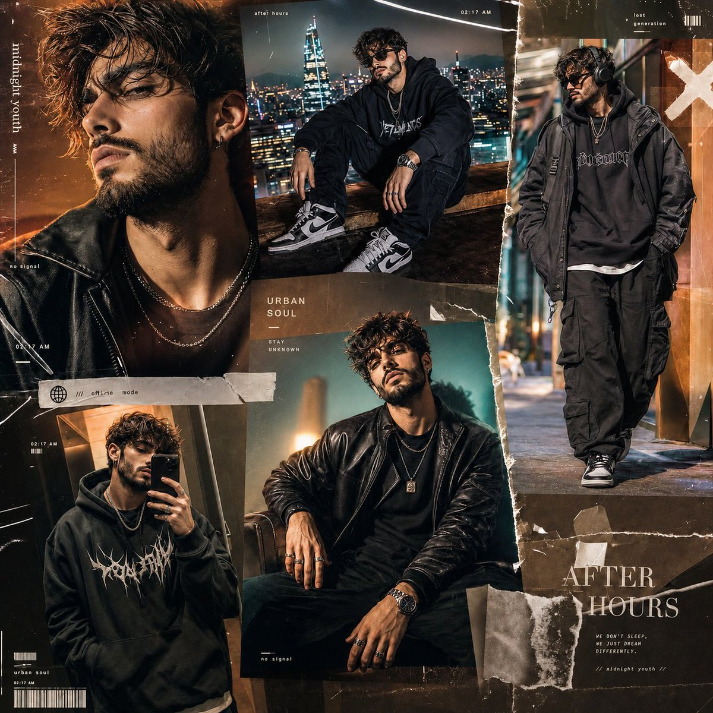

```text
Create a premium 1:1 ultra-stylish fashion collage advertisement featuring the same young handsome bearded male model across multiple cinematic portrait styles inside one single high-end composition. The model should have sharp jawline, textured beard, messy stylish hair, attractive confident expression, modern masculine aura, and luxury Gen-Z street fashion styling. Entire mood should feel bold, dark, mysterious, and visually addictive — designed for viral social media aesthetics. Theme: midnig
```


---

## 例 604：Cinematic Volleyball Sports Portrait

**来源：** [@meng_dagg695](https://x.com/meng_dagg695/status/2056590467622744500) / [awesome-gpt-image-2-prompts](https://github.com/EvoLinkAI/awesome-gpt-image-2-prompts)

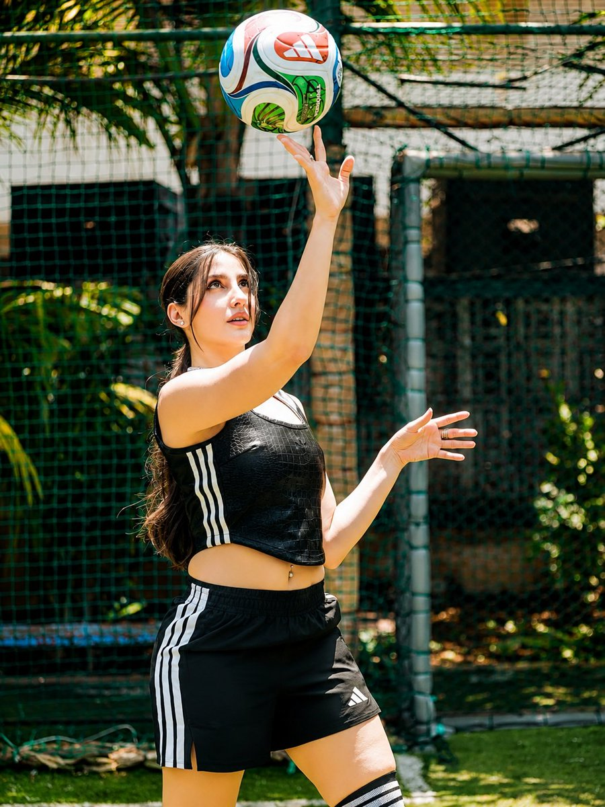

```text
Ultra-realistic cinematic sports portrait of a young athletic woman playing volleyball outdoors on a sunny tropical day, captured mid-action while gently tossing/spinning a colorful volleyball upward with one hand. She is standing on an outdoor sports court surrounded by green mesh fencing, lush tropical plants, palm leaves, and soft natural greenery in the background.
```


---

## 例 605：3D Designer-Toy Portrait

**来源：** [@iamsofiaijaz](https://x.com/iamsofiaijaz/status/2056569264262517002) / [awesome-gpt-image-2-prompts](https://github.com/EvoLinkAI/awesome-gpt-image-2-prompts)

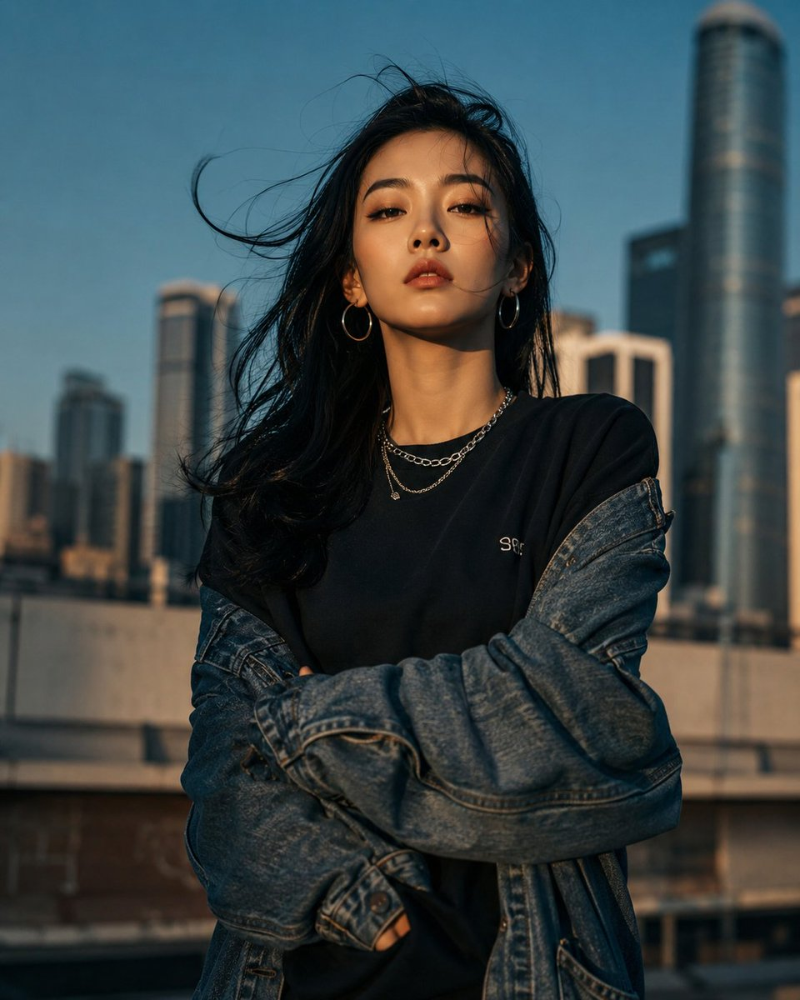

```text
Stylized 3D designer-toy portrait, centered symmetrical close-up composition, maintain the exact face, hairstyle, and facial proportions of the character in the reference image, [GLASSES: e.g. oversized translucent cat-eye glasses / no glasses / chunky black frames], [EYES: e.g. sharp green eyes / dark brown eyes], [FACE DETAILS: e.g. freckles,, silver ear piercings], soft neutral facial expression with cool detached attitude,  streetwear-inspired badges / no hat], [OUTFIT: e.g. chunky neon-gree
```


---

## 例 606：Dark Silhouette Rim-Light Portrait

**来源：** [@XSydneyFan](https://x.com/XSydneyFan/status/2056427756213465521) / [awesome-gpt-image-2-prompts](https://github.com/EvoLinkAI/awesome-gpt-image-2-prompts)

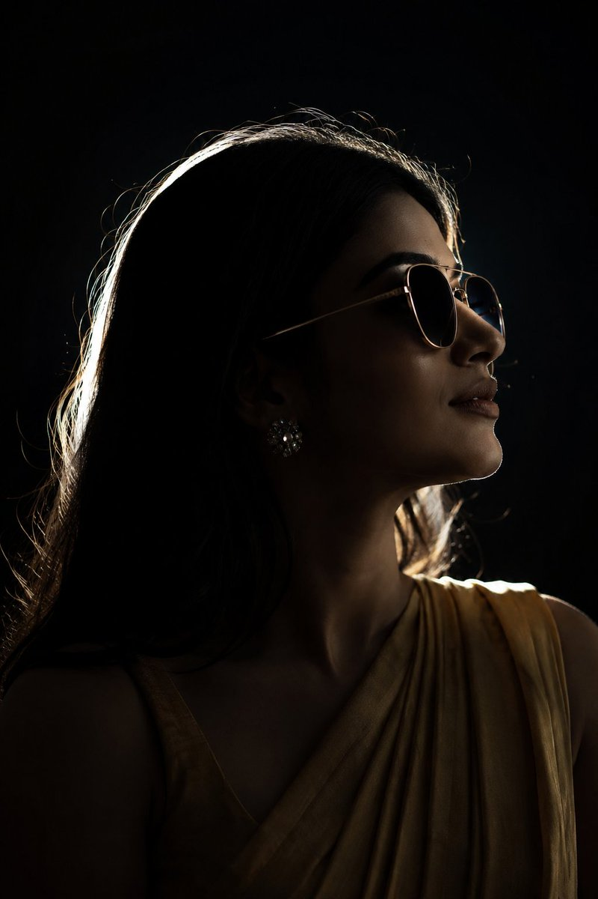

```text
.Ultra realistic dark silhouette portrait of a stylish young woman in side profile pose, deep black background, dramatic rim lighting highlighting hair and jawline edges, wearing stylish trendy sunglasses, DSLR photography style, ultra HD 8K, realistic facial outline, premium fashion edition
2:3ar
```


---

## 例 607：Cozy Bedroom Korean Girl Portrait

**来源：** [@john_my07](https://x.com/john_my07/status/2056609974852497451) / [awesome-gpt-image-2-prompts](https://github.com/EvoLinkAI/awesome-gpt-image-2-prompts)

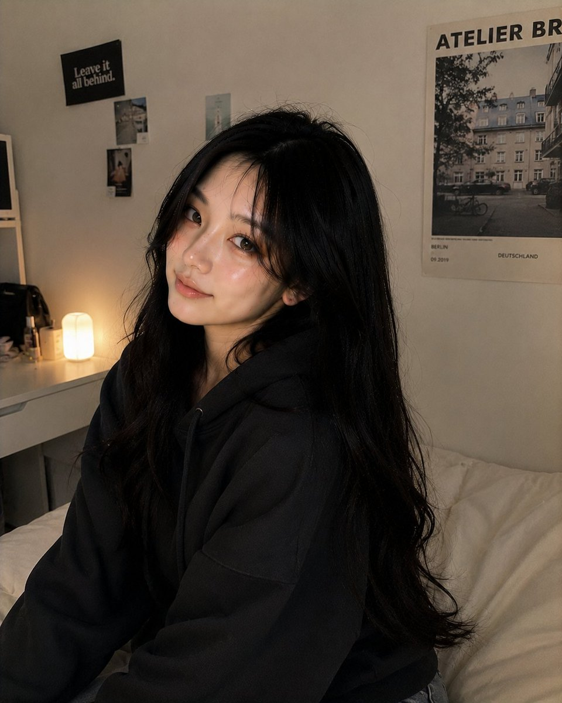

```text
Ultra-realistic cozy bedroom portrait of the same beautiful Korean girl from the previous images, maintaining identical facial appearance, silky long black hair, glossy eyes, soft blush makeup, youthful Korean beauty aesthetic, and realistic skin texture consistency.
She is lying comfortably on her stomach across a soft cream-colored bed in her cozy bedroom at night, posing playfully toward the camera with a gentle relaxed smile. Her legs are bent upward behind her while resting her chin softly
```


---

## 例 608：Anime Brand Campaign Portrait

**来源：** [@ChillaiKalan__](https://x.com/ChillaiKalan__/status/2056580787538161753) / [awesome-gpt-image-2-prompts](https://github.com/EvoLinkAI/awesome-gpt-image-2-prompts)

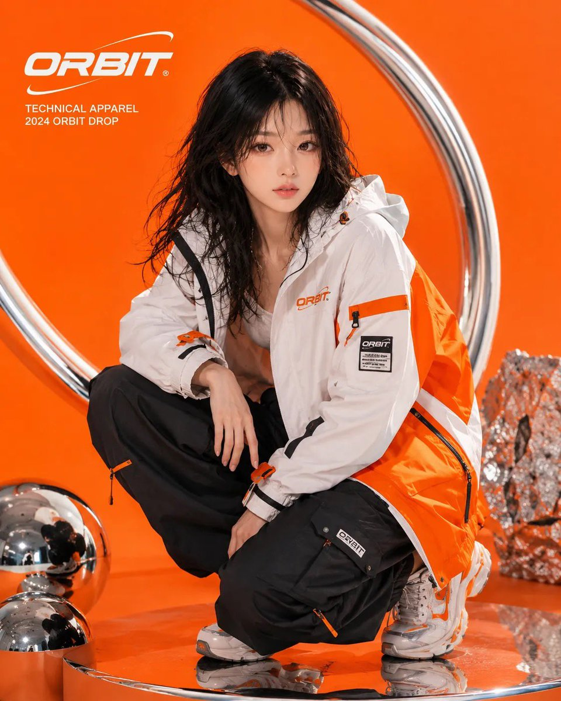

```text
Semi-realistic anime style young Korean woman in the uploaded image, ORBIT brand campaign, oversized nuclear orange and white technical jacket, wide black pants, futuristic sneakers, vivid orange seamless backdrop, chrome silver props, circular orbital shapes, sharp flash photography, premium streetwear hype drop energy, clean fashion editorial.
```


---

## 例 609：Woman in Crystal Perfume Bottle

**来源：** [@MrDasOnX](https://x.com/MrDasOnX/status/2056413830687899819) / [awesome-gpt-image-2-prompts](https://github.com/EvoLinkAI/awesome-gpt-image-2-prompts)

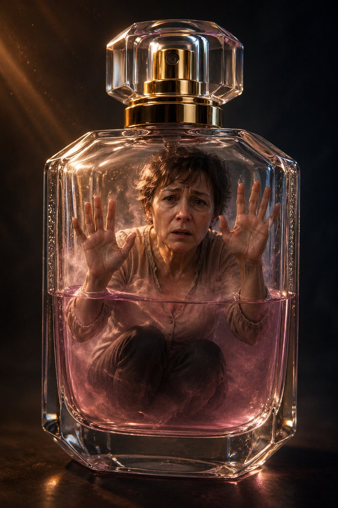

```text
Ultra-realistic surreal conceptual portrait of a distressed middle-aged woman trapped inside an elegant transparent crystal perfume bottle filled halfway with pale pink perfume liquid. The bottle is upright and centered, featuring a faceted glass body with a luxurious gold spray nozzle and cap. Tiny condensation droplets and fine mist residue cling to the inner glass, catching the light. A soft layer of shimmering perfume vapor swirls inside the bottle around the woman’s shoulders and chest leve
```


---

## 例 610：Bubble-Tea Shop Action Portrait

**来源：** [@heyfatema](https://x.com/heyfatema/status/2056415080783499427) / [awesome-gpt-image-2-prompts](https://github.com/EvoLinkAI/awesome-gpt-image-2-prompts)

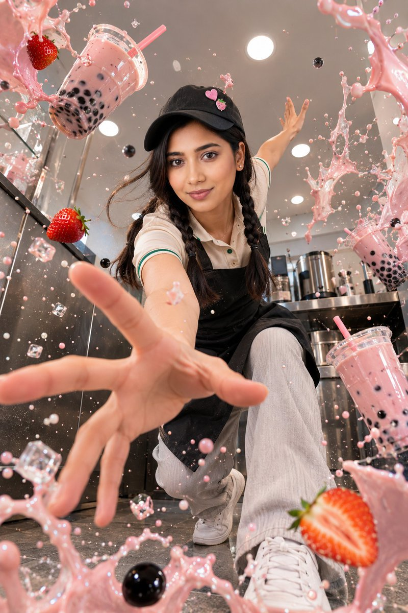

```text
Use case: identity-preserve style-transfer
Asset type: vertical photorealistic action portrait for social post
Primary request: create a dynamic bubble-tea shop action portrait using the uploaded portrait photo as the appearance reference for the person.
Scene/backdrop: a bright modern bubble-tea counter interior with stainless steel panels, glass display edges, overhead circular lights, drink-making equipment, and a dramatic low-angle view from near the floor. Pink strawberry milk tea splashes
```


---

## 例 611：Night Outdoor Portrait

**来源：** [@chatgptpaglu](https://x.com/chatgptpaglu/status/2056603808403485006) / [awesome-gpt-image-2-prompts](https://github.com/EvoLinkAI/awesome-gpt-image-2-prompts)

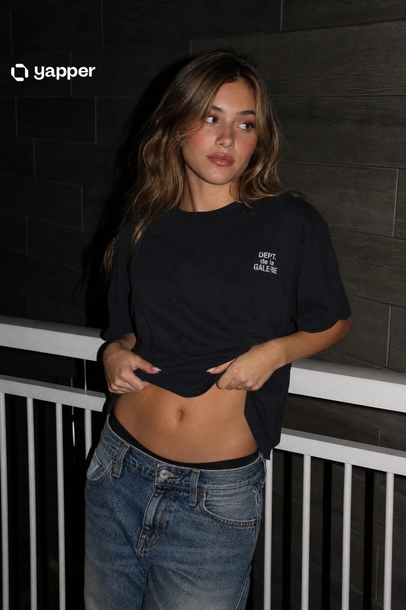

```text
A medium-shot photograph of a young woman with wavy, light brown hair and soft, rosy makeup, posing outdoors at night. She is wearing a slightly oversized black t-shirt with small white text on the left chest, pulling the shirt up slightly with both hands to reveal her midriff and the waistband of black underwear peeking out from low-rise, faded blue denim jeans. She is leaning against a white metal balcony railing, looking off-camera to her right with a neutral expression. The background
```


---

## 例 612：Reference-Based Portrait Consistency

**来源：** [@mehvishs25](https://twitter.com/mehvishs25/status/2056770900125790595) / [awesome-gpt-image-2-prompts](https://github.com/EvoLinkAI/awesome-gpt-image-2-prompts)

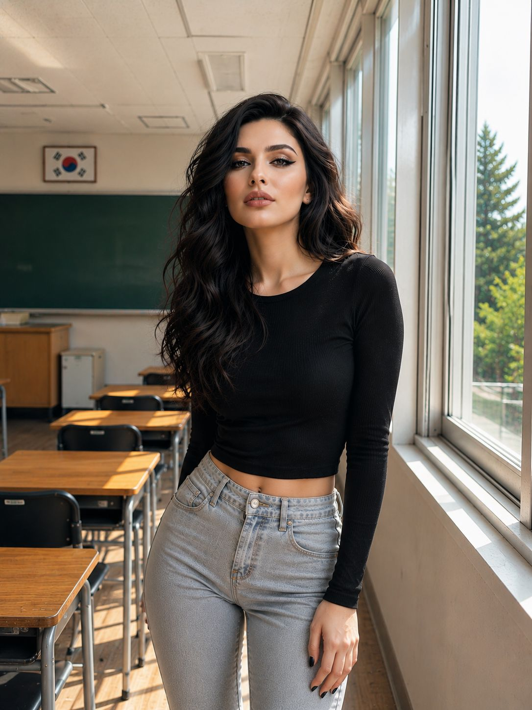

```text
Use the uploaded reference image as the exact facial identity reference for the girl. Maintain the same facial structure, eyes, nose, lips, hairstyle, skin tone, beauty details, and overall appearance consistency throughout the image.

Ultra-realistic portrait of the same girl from the reference image standing beside the large classroom windows in an empty Korean classroom during daytime, posing from the front side while looking directly at the camera with a soft calm smile. One hand gently resting in her hair, relaxed confident posture, modern youthful Korean fashion aesthetic. Wearing a fitted long black ribbed top with full sleeves and light gray washed jeans, elegant casual styling. Long silky black hair flowing naturally, glossy eyes, soft natural blush makeup, realistic skin texture, dreamy youthful Korean beauty aesthetic.

Bright natural sunlight streaming through the classroom windows, creating soft cinematic highlights and realistic shadows across the room. Authentic Korean classroom interior with wooden desks, black chairs, green chalkboard, South Korean flag on the wall, clean neutral walls, polished floors, and trees visible outside the windows.

Calm slice-of-life atmosphere, minimalist Korean school aesthetic, candid model pose, soft daylight photography, shallow depth of field, cinematic composition, highly detailed, photorealistic classroom environment, luxury lifestyle editorial feel, soft glow, realistic DSLR photography, peaceful modern mood.
```


---

## 例 613：London Fashion Street Portrait

**来源：** [@ShamiWeb3](https://twitter.com/ShamiWeb3/status/2056904361792716894) / [awesome-gpt-image-2-prompts](https://github.com/EvoLinkAI/awesome-gpt-image-2-prompts)

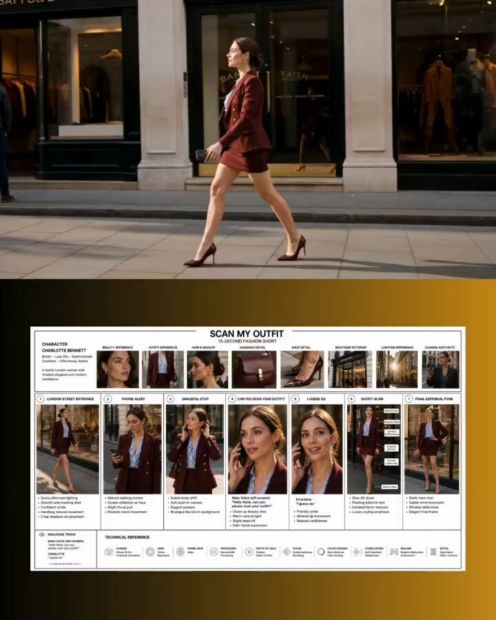

```text
Photorealistic cinematic fashion video set on an elegant London shopping street inspired by Bond Street. A stylish British woman in her late 20s walks confidently past a luxury boutique. She wears gold earrings, a burgundy double-breasted blazer, matching mini skirt, a light blue ruffled silk blouse, a structured dark red leather shoulder bag, and metallic pointed heels. Her chestnut hair is styled in a sleek low bun.
Her phone rings. She glances at the screen, stops gracefully, and answers. A male voice asks, “Hello there, can you please scan your outfit?” She smiles and replies in a soft British accent, “I guess so.”
The camera performs a smooth head-to-toe scan, displaying elegant text labels for each outfit item, then ends on a confident editorial pose in front of the boutique window.
Bright natural sunlight, shallow depth of field, smooth gimbal movement, luxury editorial aesthetic, polished and sophisticated mood, 9:16 vertical, 15 seconds.
```


---

## 例 614：Travel Selfie Portrait Reference

**来源：** [@linaa_ai](https://twitter.com/linaa_ai/status/2056777746265858158) / [awesome-gpt-image-2-prompts](https://github.com/EvoLinkAI/awesome-gpt-image-2-prompts)

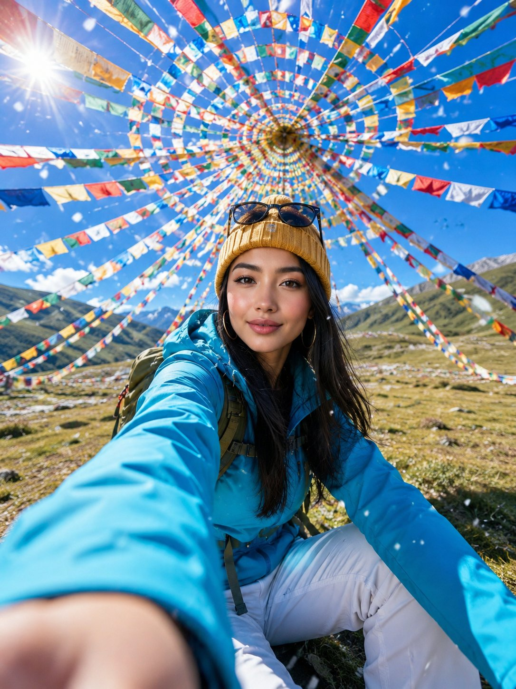

```text
Asset type: portrait image for social post
Primary request: create a photorealistic travel selfie portrait, using the uploaded portrait photo as the appearance reference for the person.
Scene/backdrop: an open alpine meadow under a vivid blue sky, surrounded overhead by hundreds of colorful Tibetan prayer flags arranged in a circular spiral canopy, with distant green hills and bright daylight.
Subject: a young woman with the recognizable facial structure, eyes, hairline direction, and natural skin texture from the uploaded portrait photo, wearing a bright cyan outdoor jacket, white hiking pants, a mustard yellow knit beanie, sunglasses resting on the hat, and a backpack.
Style/medium: ultra-realistic mobile travel photography with a dynamic action-camera feel, crisp but natural detail, lively social-media adventure portrait.
Composition/framing: vertical 3:4 frame, extreme wide-angle perspective, low-to-high selfie composition, one hand reaching toward the camera in the foreground with strong perspective enlargement, face in the midground, prayer flags forming a colorful radial tunnel above her head, energetic candid smile.
Lighting/mood: brilliant high-altitude midday sun, visible lens flare near the upper left, sparkling backlight, bright optimistic mood, high clarity, realistic shadows on grass.
Color palette: saturated cyan, mustard yellow, red, orange, green, white, and sky blue, clean contrast, sunlit alpine freshness.
Textures/retouching: believable fabric texture, natural skin pores, realistic hair strands, clean optical sharpness on the face, shallow foreground hand blur, small falling snowflakes or white petals crossing the lens.
Constraints: preserve the person's recognizable appearance from the uploaded portrait photo; no watermark; no logo; no text; no caption; no signature.
Avoid: plastic beauty-filter skin, over-smoothed face, distorted hands, extra fingers, warped prayer flags, unreadable markings on clothing, artificial CGI look

Negative Prompt：

watermark, logo, text, caption, signature, AI label, brand mark, extra fingers, missing fingers, fused fingers, deformed hands, oversized malformed palm, asymmetrical eyes, crossed eyes, warped face, plastic skin, waxy skin, over-smoothed beauty filter, blurry face, low detail, low resolution, heavy compression artifacts, distorted anatomy, duplicate person, bad perspective, bent flag strings, warped flags, fake CGI look, overexposed face, muddy colors
```


---

## 例 615：Ultra-Realistic Phone-Style Portrait

**来源：** [@AiwithZohaib](https://twitter.com/AiwithZohaib/status/2056835104824312018) / [awesome-gpt-image-2-prompts](https://github.com/EvoLinkAI/awesome-gpt-image-2-prompts)

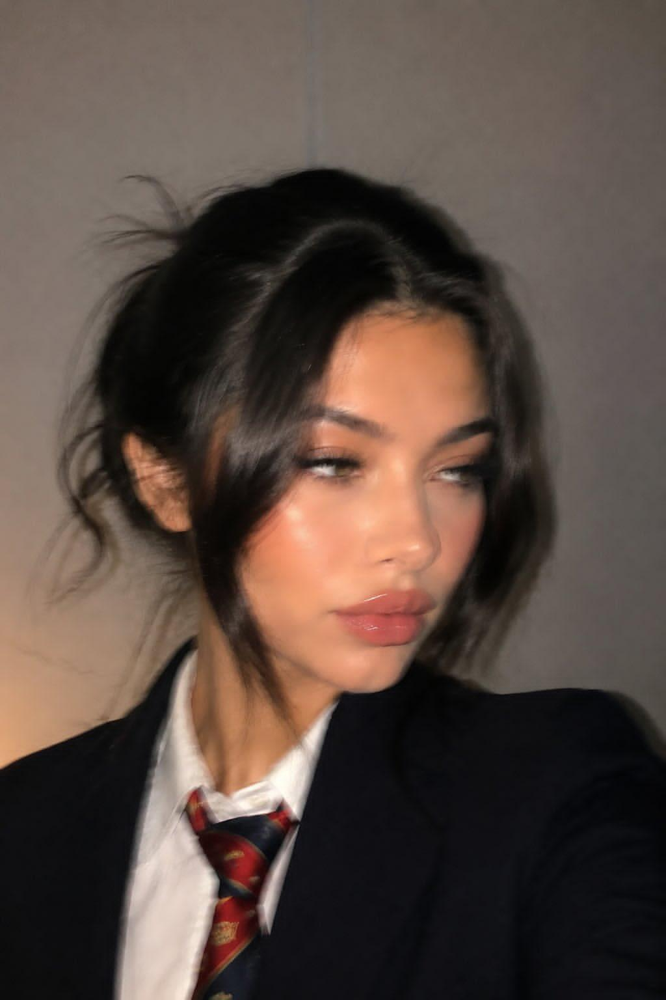

```text
Ultra-realistic, almost indistinguishable-from-real close-up portrait in a casual phone photo style.

Use the uploaded image as the identity reference, fully preserving the natural appearance and atmosphere of the same woman.
The face and overall appearance must remain 100% identical to the reference image, without altering any facial proportions or features.

Do not change:

Lip shape or lip size

Eyes

Nose

Face shape

Overall facial harmony and identity

Full photorealism.
No AI-generated feeling — it should look like a random candid photo taken on a mobile phone.
Not a polished glossy beauty shoot, but a natural, slightly imperfect phone snapshot.

Close-up portrait framed to shoulder level.
Soft and elegant pose.
Face slightly turned to the side.
No direct eye contact with the camera — natural sideways gaze.
Expression calm, natural, almost neutral.
The image should feel like a spontaneously captured moment rather than a posed photoshoot.

Hair styled in a natural slightly messy updo.
Face-framing bangs and loose strands around the face.
A few flyaway hairs and subtle disheveled texture.
Effortless beauty aesthetic with imperfectly styled hair.

Ultra-natural skin texture with realistic pores and subtle imperfections.
Soft mobile-phone lighting, realistic shadows, natural tonal range, authentic candid atmosphere.

The overall result should resemble a genuine smartphone portrait captured casually in real life, with cinematic realism and natural feminine elegance.
```


---

## 例 616：Pixar 3D Character Design Sheet

**来源：** [@TechieBySA](https://twitter.com/TechieBySA/status/2056784334628036676) / [awesome-gpt-image-2-prompts](https://github.com/EvoLinkAI/awesome-gpt-image-2-prompts)

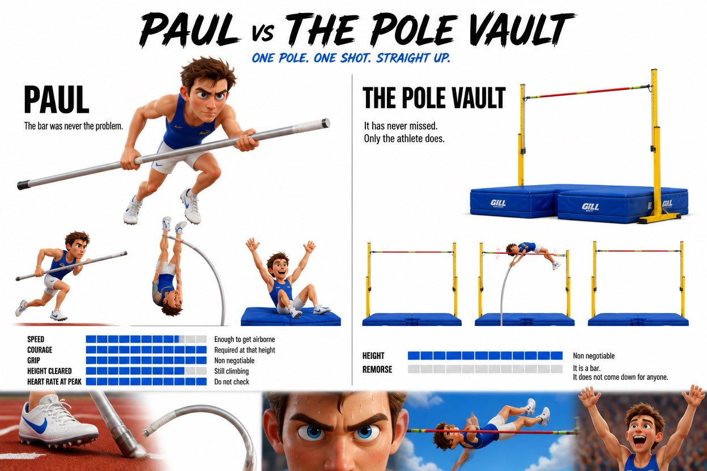

```text
“Create a Pixar 3D style character design sheet. Clean white background. Two characters side by side with a clean dividing line. Bold brushstroke-style title at the top: PAUL vs THE POLE VAULT. Subtitle beneath: One pole. One shot. Straight up.
LEFT SIDE — PAUL
Large name in bold black. Underneath: "The bar was never the problem."
Hero portrait — Paul isolated on clean white. No background. Pixar 3D man, mid 20s, lean athletic build, electric blue athletics vest with thin gold stripe on shoulder, white shorts, white spikes with electric blue detail. Focused determined expression. Holding a long silver pole horizontally in both hands, slightly crouched forward. Just Paul on white.
Three poses beneath:

Full sprint down the runway, pole angled forward low, eyes locked ahead, every muscle firing.
Inverted at full height — body perfectly upside down, pole bent at maximum flex, toes pointed straight at the sky.
Landing in the pit, arms raised, head turned back to check the bar. Pure joy.

SPEED ████████░░ Enough to get airborne
COURAGE ██████████ Required at that height
GRIP ██████████ Non negotiable
HEIGHT CLEARED █████████░ Still climbing
HEART RATE AT PEAK ██████████ Do not check
RIGHT SIDE — THE POLE VAULT
Large name in bold black. Underneath: "It has never missed. Only the athlete does."
Hero portrait — the pole vault apparatus isolated on clean white. Tall yellow standards, bright red crossbar at full height, blue crash mat below. Still. Imposing. Just the apparatus on white.
Three poses beneath:

Bar sitting perfectly still on the standards. Unbothered. Waiting.
Bar shaking mid-vault as Paul's body passes over — millimeters of clearance.
Bar still. Settled. Unmoved. It was never going anywhere.

HEIGHT ██████████ Non negotiable
REMORSE ░░░░░░░░░░ It is a bar. It does not come down for anyone.
BOTTOM STRIP — five cinematic close-up panels bleeding into each other, some transparent, no hard boxes:
Paul's white spikes on the red rubber runway surface, pole tip visible at the edge · Silver pole at maximum bend, pure white background, nothing else · Extreme close-up of Paul's face — jaw set, eyes locked forward, pure focus, sweat visible · Paul fully inverted against bright blue sky, body horizontal, red bar inches from his chest · Paul's hands releasing the pole mid-air, arms exploding upward, pure joy, crowd blur behind him
THE POLE BENDS. THE BAR STAYS. PAUL DOES NOT KNOW HOW.
STYLE NOTES: Pixar 3D vivid rendering. Clean white background on both character sides. Electric blue stat bars throughout. Bottom strip cinematic and tight — close-ups bleeding into each other with transparent edges like a film production sheet, not boxed panels with full backgrounds. Paul identical across all poses. Maximum brightness and color throughout.”
```


---

## 例 617：Matcha Goddess Beauty Portrait

**来源：** [@NyaiiBubu](https://twitter.com/NyaiiBubu/status/2056817669668737442) / [awesome-gpt-image-2-prompts](https://github.com/EvoLinkAI/awesome-gpt-image-2-prompts)

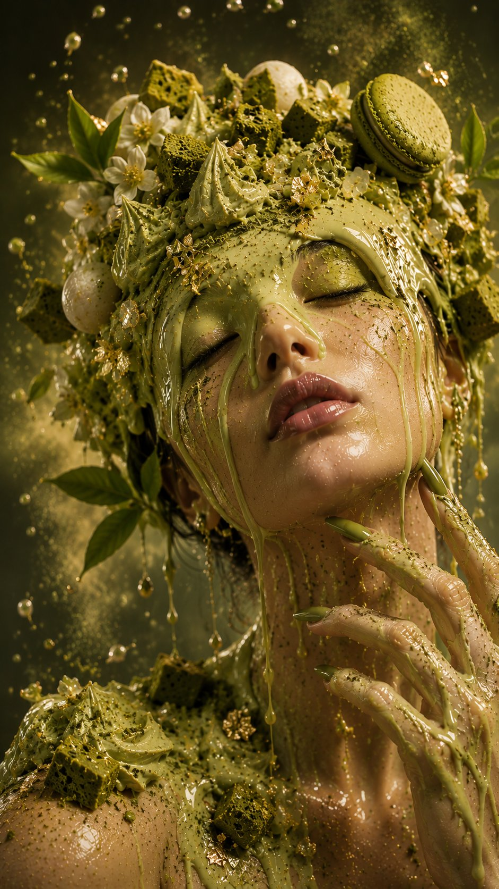

```text
👇

ultra realistic surreal beauty editorial portrait, matcha goddess aesthetic, ethereal asian woman with glossy dewy skin, face covered in dripping liquid matcha cream, surreal cosmetic food fusion, floating matcha cubes, matcha powder particles, green tea mousse textures, edible haute couture, cinematic luxury skincare campaign, dreamy fantasy atmosphere, glowing olive green tones, wet reflective skin, delicate floral accents, suspended droplets, gold flakes, soft volumetric lighting, macro beauty photography, shallow depth of field, highly detailed skin texture, elegant feminine pose, luxury fashion editorial, surreal dessert inspired composition, artistic liquid dynamics, photorealistic, cinematic bokeh background, ultra detailed, 8k, soft glow, clean composition, no text, no logo, no product packaging, vertical 9:16
```


---

## 例 618：Editorial Male Portrait

**来源：** [@frametheory058](https://x.com/frametheory058/status/2057309251048206778) / [awesome-gpt-image-2-prompts](https://github.com/EvoLinkAI/awesome-gpt-image-2-prompts)


```text
Ultra-realistic 8K editorial male portrait of the uploaded man, using his exact face as the ONLY identity reference — preserve 100% facial structure, jawline, hairstyle volume, beard texture, skin tone, eye shape, pores, and natural imperfections with zero beautification or face alteration. Luxury “quiet wealth” aesthetic blended with cinematic Instagram masculinity. Centered close-up composition, direct eye contact, calm dominant expression, slightly serious mood, no smile. Styled in a fitted black turtleneck under a premium black tailored blazer, no accessories. Dark emerald-green cinematic studio gradient background with soft atmospheric depth. Shot on an 85mm lens at f/1.8 with razor-sharp focus on the eyes, creamy bokeh, ultra-detailed skin texture, visible beard strands, realistic hair fibers, HDR dynamic range, deep contrast shadows, subtle rim light around hair and jawline, soft key light from front-left sculpting the face naturally. Premium GQ magazine color grading, luxury fashion campaign vibe, hyper-realistic photorealism, dramatic yet minimal composition, insanely detailed, rich blacks, elite masculine aura, emotionally captivating, instantly viral social media quality, masterpiece-level realism, natural cinematic skin, modern billionaire aesthetic, studio perfection, award-winning editorial photography --ar 4:5
```


---

## 例 619：Cinematic B&W Portrait

**来源：** [@Ciri_ai](https://x.com/Ciri_ai/status/2057318412175757523) / [awesome-gpt-image-2-prompts](https://github.com/EvoLinkAI/awesome-gpt-image-2-prompts)

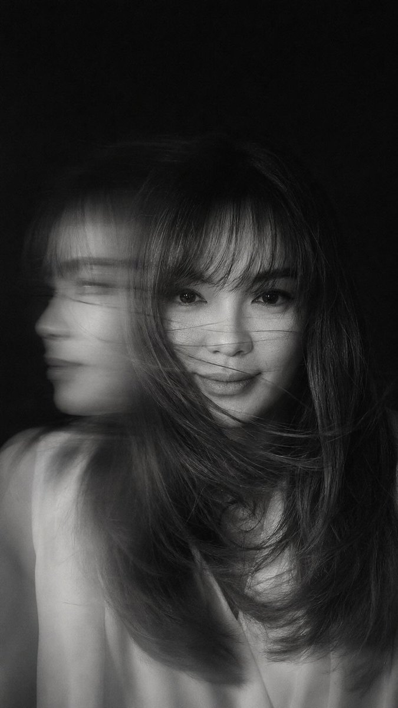

```text
A hyper-realistic, cinematic black-and-white portrait of a woman caught in mid-motion, her face partially obscured by sweeping hair strands and intentional motion blur. The subject is framed from the shoulders up, slightly off-center, with her head turning laterally as if pulled by momentum. Long exposure creates luminous horizontal light streaks behind her, suggesting an urban night environment dissolving into abstraction.
```


---

## 例 620：Cosmic Garden Fantasy Portrait

**来源：** [@DoctorAmna11](https://x.com/DoctorAmna11/status/2057463557349117968) / [awesome-gpt-image-2-prompts](https://github.com/EvoLinkAI/awesome-gpt-image-2-prompts)


```text
Ultra-realistic cinematic fantasy-science portrait of a beautiful young female scientist inside a futuristic bio-cosmic laboratory garden at night, inspired by dreamy sci-fi storytelling. She is leaning over a glowing holographic solar system projection floating above a sleek glass table, gently touching a luminous orbit line with curiosity and wonder. Her facial features are soft, elegant, and expressive with natural makeup, thick defined eyebrows, warm smile, glowing skin, and loosely tied dark brown hair with cinematic flyaway strands.
```


---

## 例 621：Streetwear Magazine Cover Portrait

**来源：** [@harboriis](https://x.com/harboriis/status/2057402894014689418) / [awesome-gpt-image-2-prompts](https://github.com/EvoLinkAI/awesome-gpt-image-2-prompts)

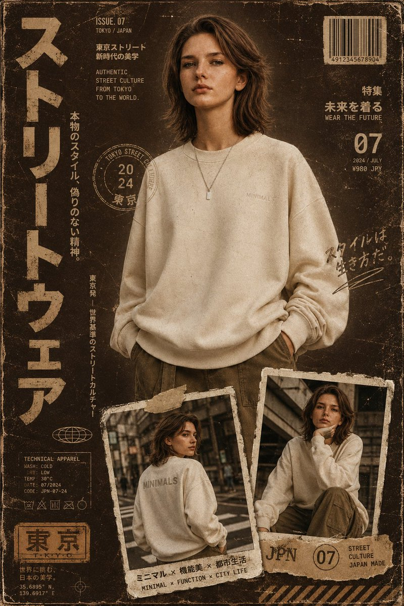

```text
vertical streetwear magazine cover template, in a warm chocolate brown color palette. The layout includes one large, high-fashion main portrait at the top and two smaller, candid polaroid-style photos layered at the bottom with torn-paper edges. The entire composition is covered in a distressed, vintage overlay with textured paper scratches. It features bold vertical Japanese typography on the left, a barcode in the top right corner, and various graphic design elements like stamps,technical text
snippets, and grunge borders, creating a cohesive Japanese street-culture aesthetic.
```


---

## 例 622：Cat-Eye Glasses Fashion Portrait

**来源：** [@ChillaiKalan__](https://x.com/ChillaiKalan__/status/2057542507928736240) / [awesome-gpt-image-2-prompts](https://github.com/EvoLinkAI/awesome-gpt-image-2-prompts)

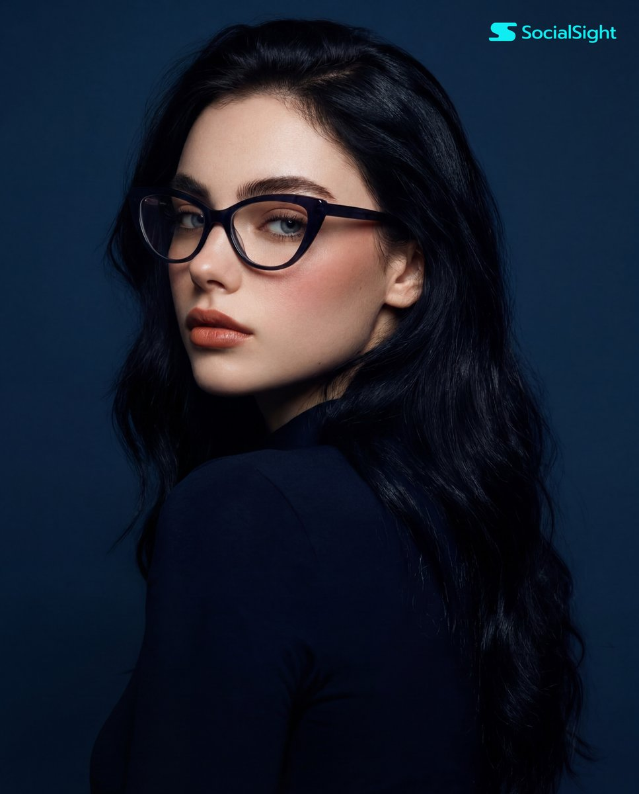

```text
A young woman with long, dark hair and striking cat-eye glasses is captured in a studio portrait against a solid blue background. She is turned away from the camera, looking over her shoulder with a confident gaze. Her makeup is subtle, with a focus on rosy cheeks and a warm-toned lipstick. She wears a dark, high-necked top that accentuates the curve of her neck and shoulder. The lighting is dramatic, with a strong light source from the left, casting a bright highlight on her face and shoulder, while the right side of her body and hair fall into shadow. The overall mood is sophisticated and alluring.
```


---

## 例 623：Korean Beauty Identity Portrait

**来源：** [@linaa_ai](https://x.com/linaa_ai/status/2057400518604206372) / [awesome-gpt-image-2-prompts](https://github.com/EvoLinkAI/awesome-gpt-image-2-prompts)

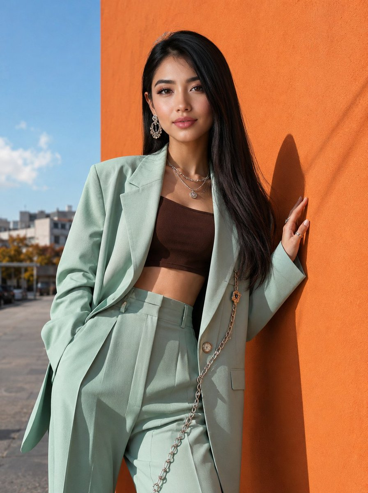

```text
Using the provided reference image, create an ultra-realistic Korean street-fashion editorial portrait of a stylish young woman posing outdoors beside a bold orange wall under bright natural sunlight. She is wearing an oversized pastel mint green blazer with structured tailoring, matching high-waisted wide-leg trousers, and a fitted dark brown cropped tube top. Add luxury silver accessories including statement earrings, layered necklaces, rings, and a decorative chain detail attached to the blazer. She has long sleek straight dark brown hair, flawless porcelain skin, soft glam makeup with nude matte lips, sharp brows, and a confident elegant expression. Relaxed fashion pose with one hand against the wall, modern chic attitude. Background features clear blue sky, soft urban scenery, cinematic sunlight shadows, and vibrant color contrast between the orange wall and mint outfit. High-fashion editorial photography, Vogue Korea inspired, luxury street style aesthetic, ultra-detailed fabric textures, realistic skin detail, sharp focus, soft depth of field, premium color grading, photorealistic, 85mm lens, 8k. Negative Prompt: low quality, blurry, bad anatomy, distorted face, extra fingers, bad hands, oversaturated colors, messy hair, duplicate accessories, cartoon, anime, watermark, logo, text, noisy image, low resolution, unrealistic skin, poorly drawn features. 1744x2336
```


---

## 例 624：Hollywood Luxury Anime Fashion Portrait

**来源：** [@Mind_Boticni](https://x.com/Mind_Boticni/status/2057519900676280623) / [awesome-gpt-image-2-prompts](https://github.com/EvoLinkAI/awesome-gpt-image-2-prompts)

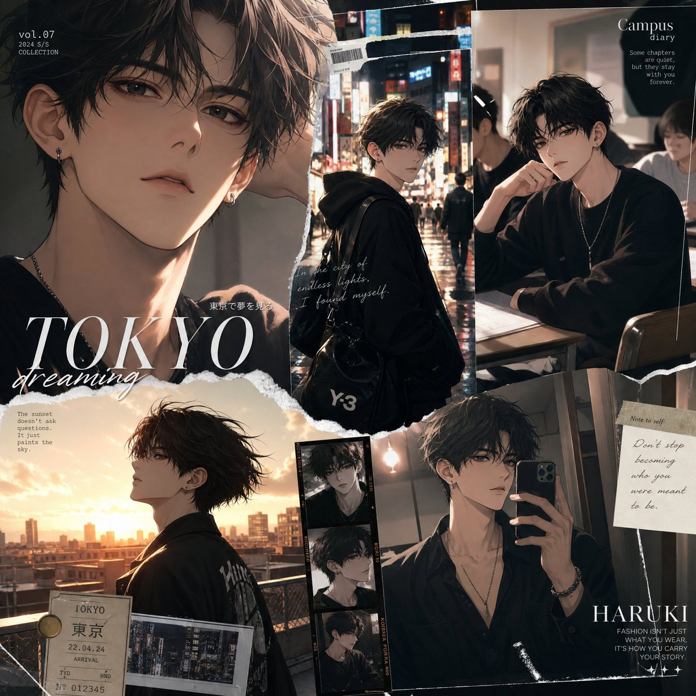

```text
Create a premium 1:1 Hollywood-style luxury anime fashion editorial collage featuring the same stylish Japanese college male anime character with perfectly consistent facial identity across all frames. The character should have sharp anime facial design (clean jawline, expressive eyes, refined proportions) with ultra-detailed semi-realistic anime shading.Include multiple cinematic moments: close-up beauty anime portrait with soft glowing skin, walking through neon Tokyo streets in designer streetwear, sitting in modern university classroom with confident calm expression, rooftop golden hour silhouette with wind effects, and stylish mirror selfie in luxury dorm room.Use cinematic anime lighting, soft bloom, depth of field, film grain, and luxury editorial composition.Add layered magazine collage style with torn paper textures, glossy reflections
```


---

## 例 625：Identity Reference Beauty Portrait

**来源：** [@heyfatema](https://x.com/heyfatema/status/2057345382800306192) / [awesome-gpt-image-2-prompts](https://github.com/EvoLinkAI/awesome-gpt-image-2-prompts)

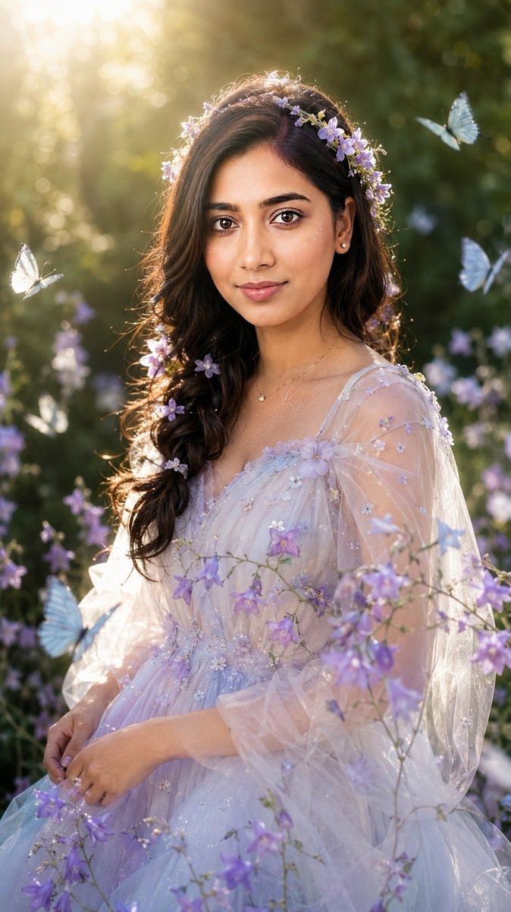

```text
Use only my uploaded portrait photo as the identity reference. Accurately preserve my real face shape, facial proportions, facial contours, skin tone, hairstyle outline, hair volume, hairline, and overall natural presence. Do not turn me into another person. Do not over-beautify the face. Do not create an influencer-style face, plastic skin, or anime look.
```


---

## 例 626：Brand Identity Portrait

**来源：** [@Shinning1010](https://x.com/Shinning1010/status/2057332420383494441) / [awesome-gpt-image-2-prompts](https://github.com/EvoLinkAI/awesome-gpt-image-2-prompts)

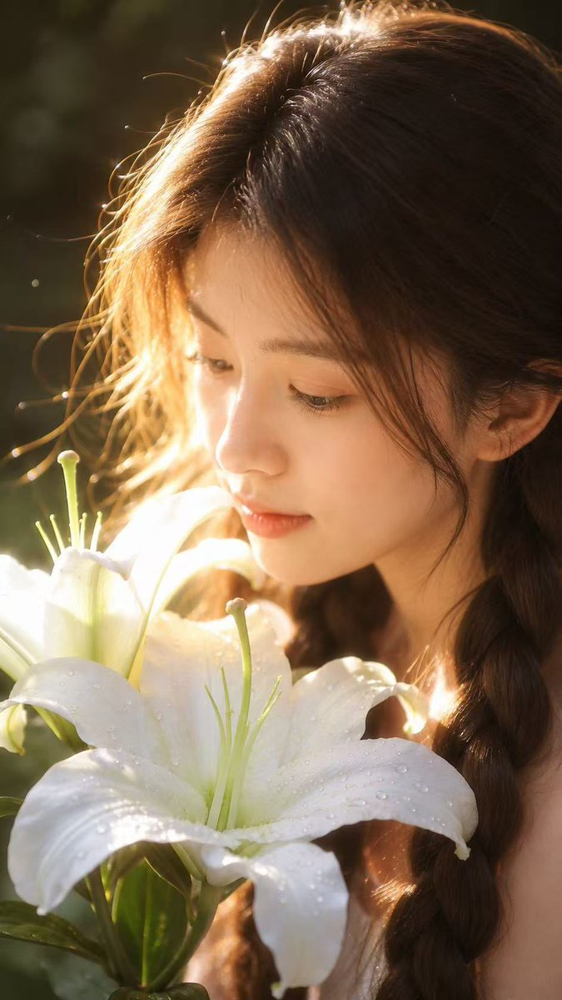

```text
Use my uploaded portrait photo as the only identity reference. Preserve only the person’s real facial features, face shape, hairstyle, hair color, skin tone, and overall temperament. Generate an ultra-realistic close-up portrait in natural light. The subject is shown in side profile, gently lowering her head toward a blooming white lily. The flower is placed in the foreground and covered with visible dewdrops. Warm golden backlight comes from the side and behind, creating a soft glowing rim light on the hair, with slight lens flare and a shallow depth of field. The background is a dark green natural blur. The expression is calm, soft, and natural, with the subject not looking at the camera. Keep realistic skin texture, clear eyelashes, and detailed hair strands. The overall mood is romantic, clean, dreamy, and cinematic, like a summer morning photo. Vertical 9:16, high-quality realistic photography, no text, no watermark
```


---

## 例 627：Photorealistic Editorial Seated Portrait

**来源：** [@zulkarnaimx](https://x.com/zulkarnaimx/status/2057406867585057106) / [awesome-gpt-image-2-prompts](https://github.com/EvoLinkAI/awesome-gpt-image-2-prompts)

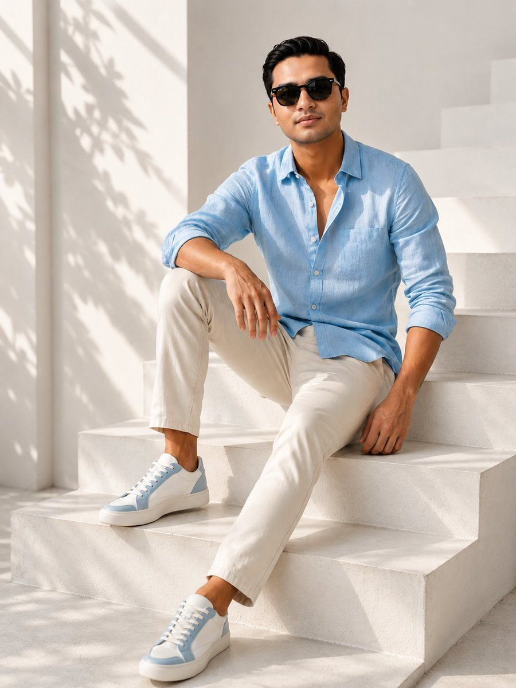

```text
Photorealistic editorial portrait of a relaxed young man seated on minimalist white stone stairs in soft directional sunlight, three-quarter full-body composition, centered framing with leading lines of the steps. He wears a light blue linen button-up shirt with open collar and rolled sleeves, beige slim chinos, and white leather sneakers with pale blue accents; black classic sunglasses, short neatly styled dark hair, warm medium skin tone, confident casual expression. Crisp natural leaf shadows cast on a pale wall in the background, high-key neutral palette, soft warm color grading, subtle film-like grain. Shallow depth of field, sharp subject, soft bokeh in background, balanced contrast, detailed fabric texture and skin tones, realistic reflections on sunglasses. Cinematic lifestyle fashion photography, high resolution, f/2.8, ISO 100, natural sunlight golden-hour feel, slight vignette, clean modern aesthetic.
```


---

## 例 628：Soft Aesthetic Fashion Magazine Cover

**来源：** [@SimplyAnnisa](https://x.com/SimplyAnnisa/status/2057408066300080297) / [awesome-gpt-image-2-prompts](https://github.com/EvoLinkAI/awesome-gpt-image-2-prompts)

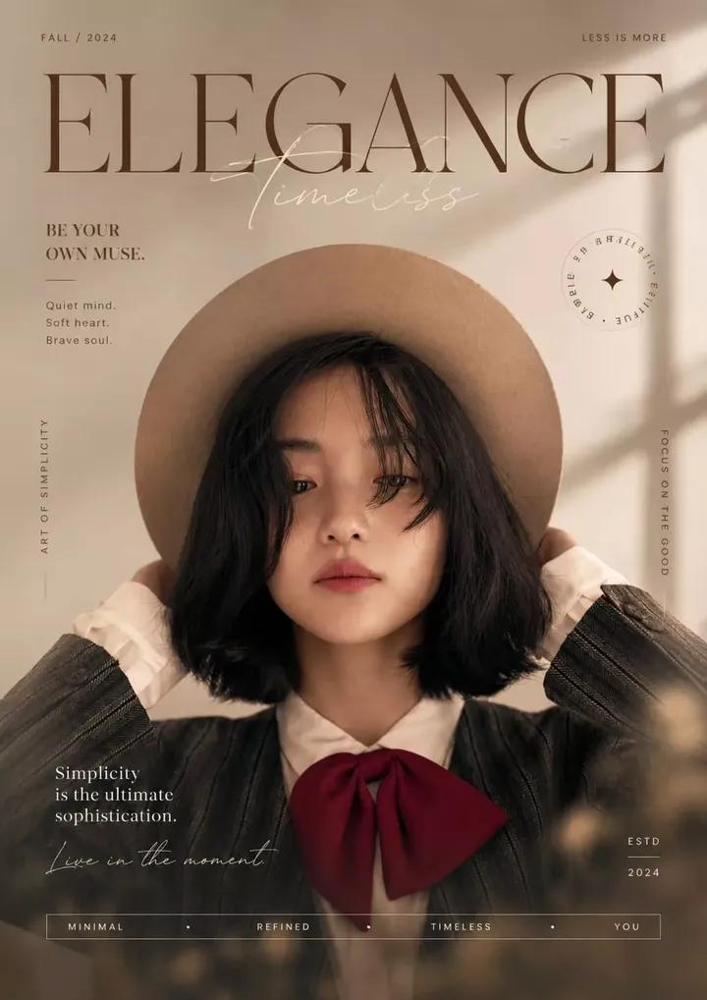

```text
Ultra-realistic soft aesthetic fashion magazine cover portrait of a young East Asian girl with short messy black bob hair wearing a beige wide-brim hat, white blouse, oversized dark cardigan, and deep red ribbon bow tie. Minimal luxury Korean editorial vibe, warm beige monochrome palette, cinematic natural window light, soft shadows, dreamy atmosphere, shallow depth of field, photoreal skin texture, delicate facial features, calm expression, centered composition. Luxury typography layout design with huge serif title "ELEGANCE" at the top, handwritten script text "Timeless", elegant fashion magazine graphics, tiny editorial texts, minimalist premium branding, clean spacing, aesthetic magazine cover composition, Vogue-inspired layout, subtle film grain, cozy autumn mood.
```


---

## 例 629：Japanese Film Aesthetic Airport Portrait

**来源：** [@BubbleBrain](https://x.com/BubbleBrain/status/2057447124162560213) / [awesome-gpt-image-2-prompts](https://github.com/EvoLinkAI/awesome-gpt-image-2-prompts)

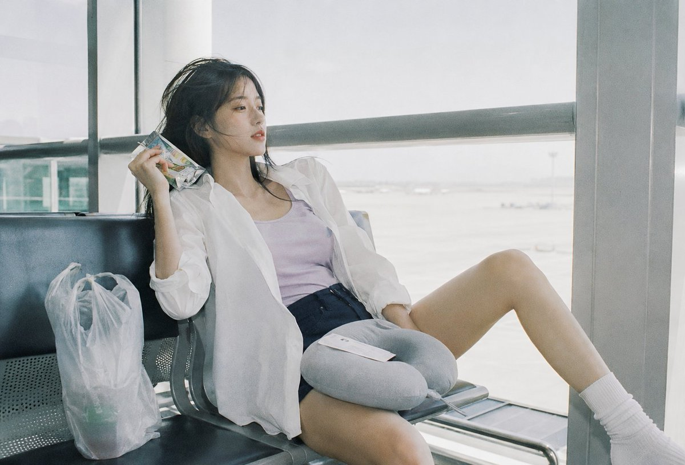

```text
Use case: photorealistic-natural. Asset type: editorial portrait variant, target composition 1600x1088 landscape.

Primary request: Japanese negative film aesthetic, summer, soft natural sunlight, slightly overexposed highlights, low contrast, muted faded colors, subtle grain, nostalgic memory-like realism. Adult Korean female idol in her mid-20s, beautiful and calm, subtle sensual presence through natural gesture only, relaxed body line and effortless charm. Tasteful editorial portrait, no nudity, no explicit pose, no watermark, no readable text, no extra people.

Scene/backdrop: Incheon airport observation deck near a glass wall, pale runway haze outside, empty metal benches, morning light, minimal architecture.

Wardrobe: oversized crisp white shirt loosely open at collar, light wash denim shorts, white sneakers.
```


---

## 例 630：Black-and-White Identity Collage Grid

**来源：** [@mehvishs25](https://x.com/mehvishs25/status/2063293613514330224) / [awesome-gpt-image-2-prompts](https://github.com/EvoLinkAI/awesome-gpt-image-2-prompts)

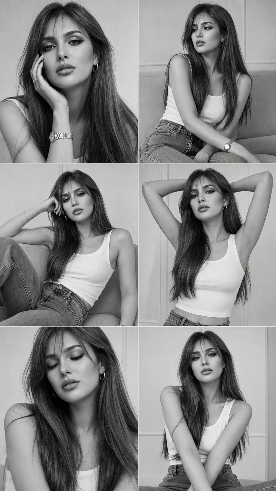

```text
Edit the photo while preserving the subject’s exact facial features and identity. Create a high-resolution vertical portrait composition (9:16), ultra-detailed, sharp focus throughout, no background blur, rendered with a premium 8K editorial finish.

Design the image as a sophisticated black-and-white fashion portrait collage arranged in a 2×3 grid, featuring six unique frames of the same young woman in a clean, minimalist indoor studio environment. The overall aesthetic should feel elegant, cinematic, intimate, and effortlessly stylish, inspired by timeless monochrome fashion editorials and luxury magazine photography.

Hair is long, reaching the waist, colored a cool ash-brown with subtle gray undertones. Styled in a Korean-inspired hush cut with soft face-framing layers, airy see-through bangs, and sleek straight lengths that gently curve outward at the ends. The texture appears silky, healthy, and glossy, with a few natural flyaway strands for realism.

Beauty styling remains refined and understated: luminous hydrated skin, naturally feathered brows, subtle brown eyeliner, soft mascara, muted nude lips with a velvety finish, and barely-there blush for a fresh editorial appearance.

Wardrobe consists of a fitted white rib-knit tank top paired with relaxed high-waisted vintage-wash denim jeans, visible in selected frames. Accessories include matte black nail art, delicate silver hoop earrings, multiple silver rings, and a slim silver wristwatch, contributing to a contemporary fashion-editorial mood.

Collage Frame Concepts:

• Frame 1 — Tight portrait crop, fingertips resting softly against the cheek, direct eye contact, confident yet gentle expression.

• Frame 2 — Casual seated pose on a sofa, body turned slightly to one side, gaze directed away from the camera in a contemplative moment.

• Frame 3 — Relaxed reclining position with one knee bent, leaning comfortably into an arm, creating a graceful editorial silhouette.

• Frame 4 — Arms lifted behind the head, posture open and self-assured, subtle lean backward conveying effortless confidence.

• Frame 5 — Emotional close portrait with a slight head tilt and closed eyes, emphasizing calmness and quiet introspection.

• Frame 6 — Front-facing seated composition with composed expression and subtle movement through the hair for a natural, candid feel.

Environment remains intentionally simple: a light-toned studio wall with a neutral sofa appearing selectively across certain frames. The background should support the subject without drawing attention away from her.

Lighting is soft and diffused, resembling natural window light in a professional studio. Gentle directional shadows create depth and dimensionality, while a faint rim light subtly separates the hair from the background. Avoid harsh flash or strong contrast.

Captured with the quality and detail associated with professional mirrorless cameras such as a Canon EOS R5 or Sony A7R IV. Use a combination of intimate close-ups and medium-length portraits, primarily at eye level with occasional slightly elevated angles. Emphasize balanced magazine-style compositions and natural visual flow across the collage.

Final processing should feature a rich monochrome conversion with smooth tonal transitions, lifted shadows, restrained contrast, delicate 35mm film grain, a soft matte finish, and exceptional detail retention in both skin texture and hair, echoing the look of classic high-fashion editorial photography.
```


---

## 例 631：Plush Mascot Companion Portrait

**来源：** [@doctorwasif](https://x.com/doctorwasif/status/2063304967218475072) / [awesome-gpt-image-2-prompts](https://github.com/EvoLinkAI/awesome-gpt-image-2-prompts)

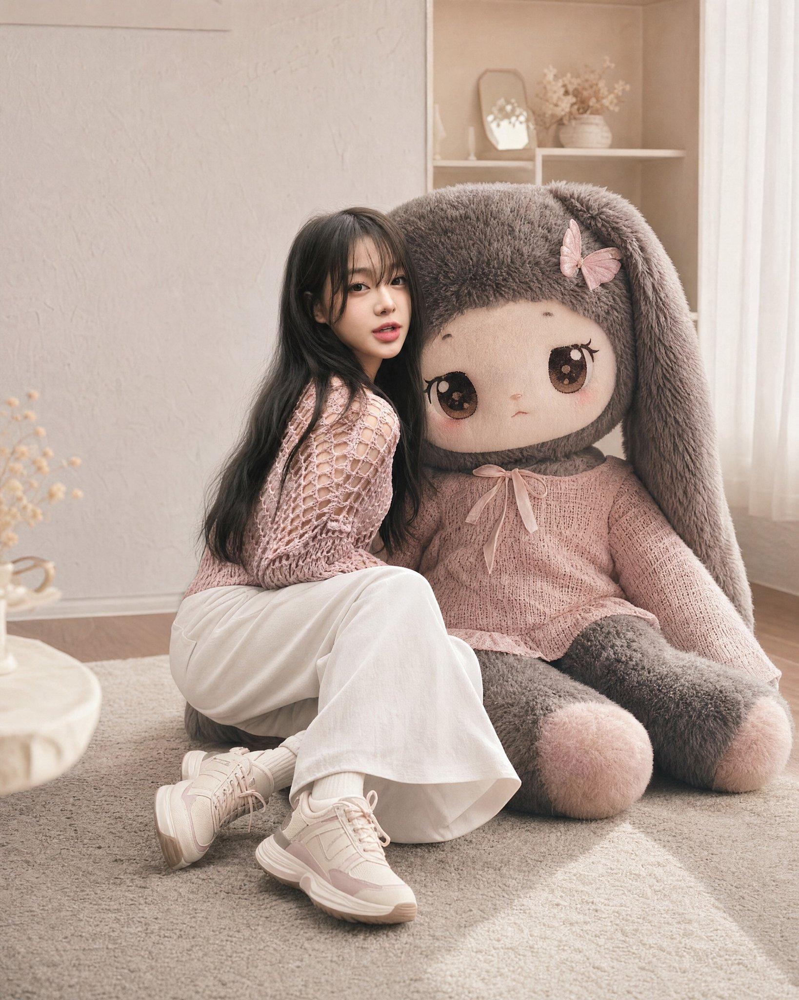

```text
Use the uploaded portrait as the identity reference and preserve the person's recognizable facial features, hairstyle, skin tone, expression, fashion sense, and overall presence. Create a premium full-body portrait of the same person alongside a large custom-designed plush companion that feels like their mascot alter ego. The plush should be inspired by the subject's mood, facial impression, styling, posture, and overall energy rather than being a generic animal or mascot. Automatically choose a creature concept that best matches the person's unique vibe, avoiding predictable or stereotype-based selections. The mascot must clearly be an oversized plush toy with soft fuzzy fabrics, rounded shapes, detailed stitching, premium textures, and a collectible designer-toy aesthetic. Its design, expression, silhouette, and proportions should subtly reflect the person's character and visual identity. Build a harmonious color palette using cues from the subject's hair, skin tone, clothing, and atmosphere so the person, mascot, and scene feel naturally connected. Show both the person and plush fully visible from head to toe, including shoes and all parts of the mascot, with balanced framing and comfortable spacing. Choose a natural interaction that suits the subject, such as standing beside, sitting with, leaning on, lightly hugging, or casually engaging with the plush companion. Keep the person's expression relaxed, warm, and authentic with a subtle smile or calm gaze, avoiding stiff poses or mannequin-like appearances. If the original image only shows part of the outfit, intelligently complete the full look in a believable and stylish way. Place the scene in a clean, aesthetically pleasing environment such as a minimalist studio, cozy lifestyle setting, or refined editorial backdrop that complements both the person and mascot without distractions. The final image should feel charming, cozy, stylish, emotionally engaging, visually cohesive, and suitable for a high-end character campaign or social-media editorial. Avoid cropped bodies, hidden shoes, incomplete mascot visibility, generic animal choices, real animals, horror elements, cheap toy aesthetics, awkward poses, cluttered backgrounds, distorted anatomy, extra limbs, text, logos, or watermarks.
```


---

## 例 632：Editorial Y2K Identity Grid

**来源：** [@Ciri_ai](https://x.com/Ciri_ai/status/2063592048150909396) / [awesome-gpt-image-2-prompts](https://github.com/EvoLinkAI/awesome-gpt-image-2-prompts)

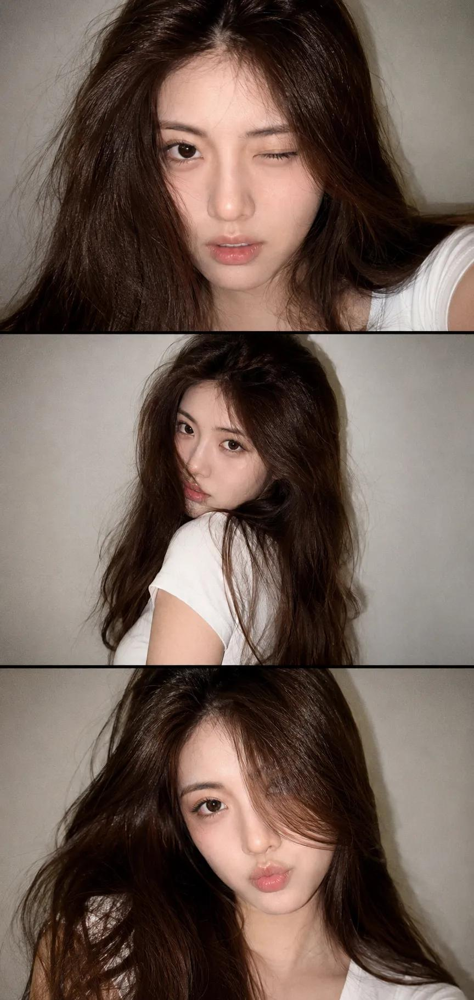

```text
A vertical collage of three YZK photos. Using the uploaded selfie as the ONLY and exclusive face reference, keep the facial features, and facial structure exactly the same as the reference image. The character poses against a neutral light background. A girl with a beautiful, voluminous hairstyle, seemingly styled with a brush, wearing foxy makeup and pronounced, angled lashes. In the first photo, she's very close to the camera, looking at it with one eye and winking. In the second photo, she's turned away, her head coquettishly turned toward the lens, her hairstyle slightly covering her face, but not too much. In the third photo, she's looking very close to the lens, her hair to the side, thus covering her left eye, pouting and looking forward. Close-up and medium shot, minimalist composition, vintage digital texture, slight blur, glamorous atmosphere. Photo taken on iPhone 17 Pro Max with flash.
```


---

## 例 633：Cool Grey Editorial 3x3

**来源：** [@Mind_Boticni](https://x.com/Mind_Boticni/status/2063587170519314754) / [awesome-gpt-image-2-prompts](https://github.com/EvoLinkAI/awesome-gpt-image-2-prompts)

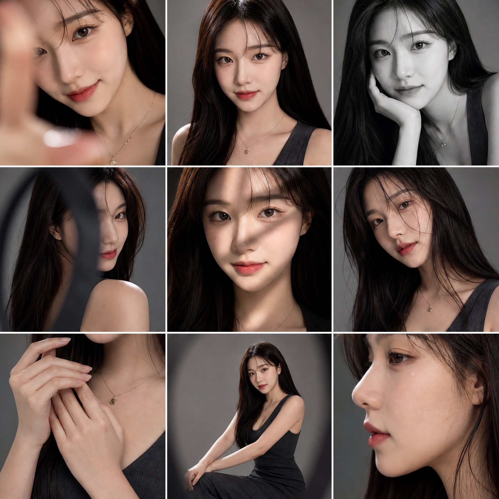

```text
Editorial 3x3 grid in a cool-grey seamless backdrop. Character (face characteristics 100% same as uploaded image) wearing a charcoal sleeveless dress. Lighting: large overhead softbox, faint side bounce.

Shots include: 1. tight cheek + neck close-up with blurred finger foreground (85mm, f/1.8); 2. eyes locked to lens, top-light reflection visible (85mm, f/2.0); 3. monochrome chin-on-hand portrait with strong frame fill (50mm, f/2.2); 4. half-obscured over-shoulder shot through blurred dress strap (85mm, f/2.0); 5. head-on close-up with intersecting shadows across face (50mm, f/2.5); 6. angled raw portrait with tousled hair (85mm, f/2.2); 7. tight detail of hands resting near collarbone (50mm, f/3.2); 8. seated half-body profile with blurred frame edges (35mm, f/4.5); 9. profile macro with single water droplet highlight (85mm, f/1.9). RAW, smooth contrast, editorial softness.
```


---

## 例 634：Nightlife Restaurant Flash Collage

**来源：** [@ZephyraLeigh](https://x.com/ZephyraLeigh/status/2063656432864842045) / [awesome-gpt-image-2-prompts](https://github.com/EvoLinkAI/awesome-gpt-image-2-prompts)

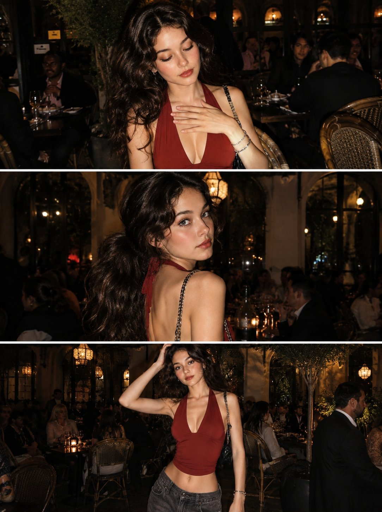

```text
Using the provided reference image, create an ultra-realistic candid nightlife fashion photoshoot of a beautiful young woman at a trendy upscale restaurant lounge at night.

She has a slim figure, long voluminous dark brown hair, flawless glowing skin, soft glam makeup, glossy nude lips, subtle eyeliner, and an effortlessly confident expression.

She is wearing a fitted deep red halter-neck crop top with a plunging neckline, paired with low-rise charcoal gray vintage-wash denim jeans. Accessories include a small black quilted shoulder bag with a silver chain strap, delicate bracelets, and minimal jewelry.

Create a 3-photo vertical collage capturing different candid poses:

1. Looking down with eyes closed, one hand resting on her chest.

2. Side pose with hair tied into a loose ponytail, looking over her shoulder.

3. Standing confidently with one hand raised near her hair, showing the outfit clearly.

The setting is a crowded luxury restaurant with rattan chairs, candlelit tables, warm ambient lighting, arched windows, hanging greenery, and guests dining in the background. Shot using direct on-camera flash, creating a nostalgic early-2000s paparazzi aesthetic with slightly overexposed highlights and authentic nightlife energy.

Pinterest aesthetic, Instagram nightlife photography, candid fashion editorial, luxury restaurant atmosphere, realistic skin texture, film-camera flash look, subtle grain, warm tones, shallow depth of field, trendy influencer style, photorealistic, Vogue nightlife editorial, DSLR flash photography, 35mm lens, high-fashion social media content, masterpiece, best quality, ultra realistic, 8K.
```


---

## 例 635：Vintage Newsstand Double Exposure

**来源：** [@AiwithZohaib](https://x.com/AiwithZohaib/status/2063754827017101475) / [awesome-gpt-image-2-prompts](https://github.com/EvoLinkAI/awesome-gpt-image-2-prompts)

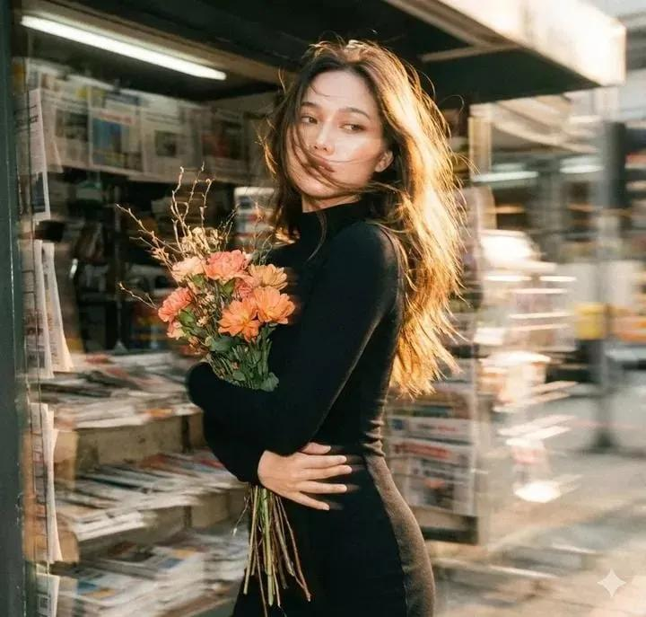

```text
The generated image uses the uploaded image as a reference for the character, wearing a high-necked, tight-fitting black long-sleeved dress. A cluster of withered wood and orange-pink flowers lies beside an old newsstand, the grainy texture of vintage film interwoven, the blurred background with noticeable trailing shadows, and the double-image effect creating a fantastical atmosphere. A bewitchingly beautiful girl, carrying flowers, is shown in profile, her fair skin delicate and translucent.

Her exquisite face is blurred with motion, the outline of her figure slightly swaying with the panning camera, the soft focus making the image even more hazy and languid. A warm-toned, low-saturation filter enhances the effect, her long, backlit hair glowing with a soft glow, the messy strands sweeping wildly across her jawline, the details concealing a captivating yet dangerous allure.Cute movements add dynamism, the motion blur blending with the film grain, creating a trendy, Instagram-worthy image while the blurred image outlines a dynamic scene full of story, cleverly balancing bewitching and sweetness.
Follow : @AiwithZohaib
```


---

## 例 636：Fashion Casting Contact Sheet

**来源：** [@Ciri_ai](https://x.com/Ciri_ai/status/2064027400426709259) / [awesome-gpt-image-2-prompts](https://github.com/EvoLinkAI/awesome-gpt-image-2-prompts)

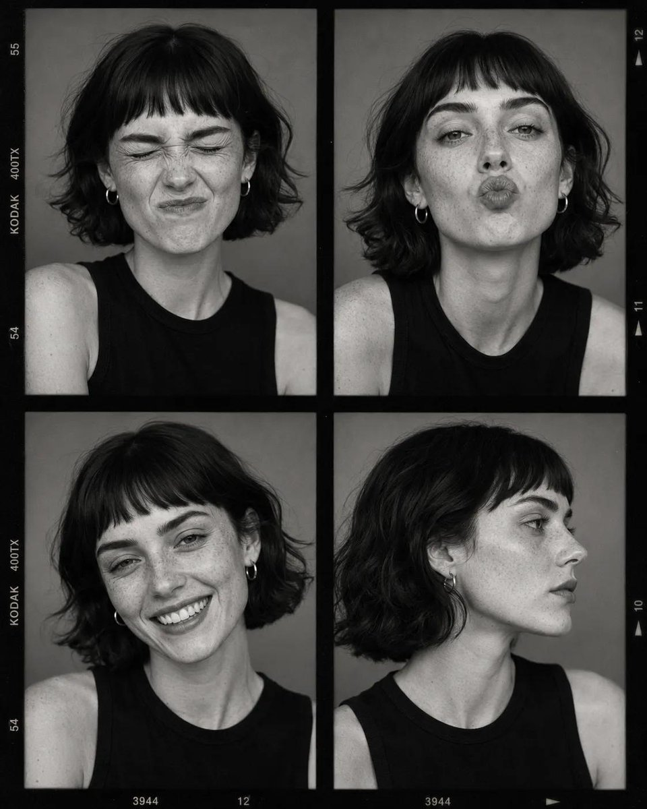

```text
Black-and-white fashion casting contact sheet of [HUMAN] with [HAIR], arranged in a clean 2x2 grid of four close portrait frames against [BACKGROUND], wearing [CLOTHING] and [ACCESSORY]. Each frame shows a different expression and angle: [EXPRESSIONS]. Soft studio lighting, crisp monochrome contrast, natural skin texture, visible facial details, clean plain backdrop, subtle film grain, high-end editorial test shoot, minimal styling, intimate camera distance, professional portrait photography, aspect ratio 4:5.
```


---

## 例 637：Identity-Locked Portrait Edit

**来源：** [@Kashberg_0](https://x.com/Kashberg_0/status/2064022776600760625) / [awesome-gpt-image-2-prompts](https://github.com/EvoLinkAI/awesome-gpt-image-2-prompts)

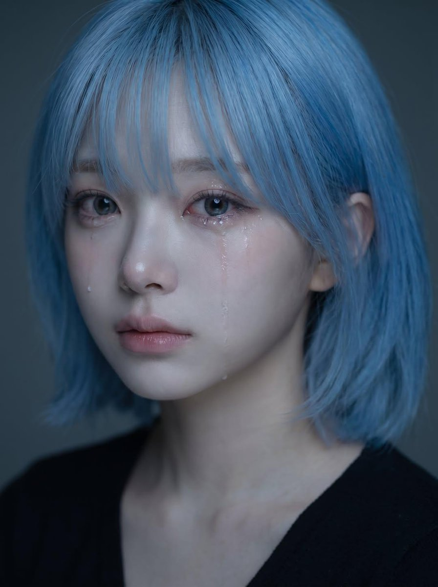

```text
Use the uploaded portrait as the identity reference for the subject's face, hairstyle, facial structure, skin tone, expression, and overall impression.

Create a high-quality realistic emotional portrait of the same person with a soft sad mood and visible tears.

Core concept:
- a delicate, emotionally touching close-up portrait
- the subject looks quietly sad, as if holding back emotions
- the mood should feel fragile, intimate, soft, and beautiful
- the image should feel like a polished Korean-style emotional portrait

Identity:
- preserve the subject's recognizable identity
- keep the same face shape, eyes, nose, lips, jawline, hairstyle, and overall vibe
- do not make the face look generic or overly different
- keep the beauty natural and believable

Expression:
- slightly sad expression
- soft watery eyes
- one or two visible tear streaks running down the cheek
- lips softly closed or slightly parted
- emotional but restrained, not exaggerated
- the sadness should feel quiet, longing, and delicate

Styling:
- long dark hair with soft natural texture
- a few loose strands falling across the face
- clean natural makeup
- luminous skin
- simple dark top or minimal clothing visible
- overall styling should remain clean and understated so the face is the focus

Lighting:
- soft, moody lighting
- gentle highlights on the eyes, nose, lips, and tear tracks
- subtle shadow depth
- dark or muted background
- the lighting should feel intimate and cinematic, not harsh

Composition:
- vertical portrait composition
- close-up framing
- place the face in the upper half of the frame
- the center of the face should sit slightly above the vertical midpoint
- the eyes should fall around the upper-middle area of the image
- avoid placing the face too low in the frame
- keep the composition visually balanced and elegant

Mood and style:
- Korean emotional beauty portrait
- soft, melancholic, dreamy, intimate
- elegant and photogenic
- emotionally expressive without looking dramatic
- beautiful but slightly heartbreaking

Important visual priority:
- preserve identity clearly
- the face must remain the main focus
- tears should be visible but subtle
- expression should feel naturally sad and emotionally convincing
- the portrait should look beautiful, soft, and emotionally immersive

Negative prompt:
- no exaggerated crying
- no distorted face
- no cartoon style
- no anime style
- no harsh flash
- no messy background
- no over-retouched plastic skin
- no exaggerated smile
- no low-resolution image
- no text
- no watermark
```


---

## 例 638：High Angle Cinematic Portrait

**来源：** [@AvelyrahnAI](https://x.com/AvelyrahnAI/status/2064547040508662240) / [awesome-gpt-image-2-prompts](https://github.com/EvoLinkAI/awesome-gpt-image-2-prompts)

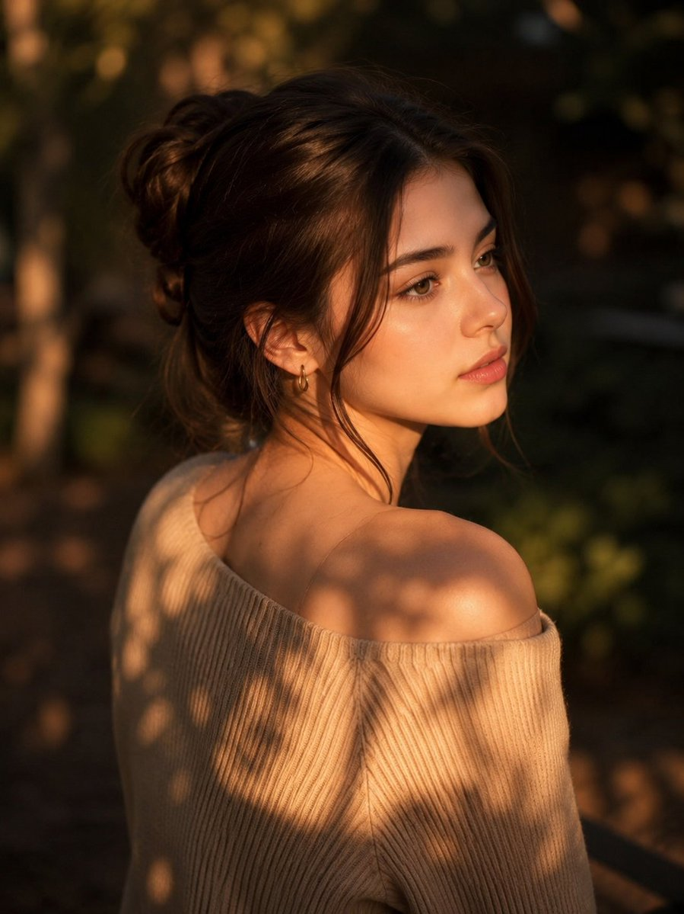

```text
Edit foto wanita tersebut menjadi potret High Angle Sinematik dari seorang wanita muda yang cantik dari sudut pandang belakang. Fokus utamanya adalah pada bahu, lengan, dan sebagian wajahnya yang menghadap ke samping dengan ekspresi tenang. Riasan flawess natural eye shadow semi peach-brown lembut, bulu mata lentik, blush on tipis peach lembut dengan lisptik glossy peach lembut, rambut lurusnya tersanggul keatas agak longgar sedikit ada helaian rambut samping kanan-kirinya membingkai wajahnya. Ia mengenakan atasan sweater rajut dengan model sabrina berwarna cokelat muda. Tekstur kulitnya terlihat sangat halus di bawah siraman cahaya matahari yang terfilter. Latar belakang di outdoor buram (bokeh). Wajahnya menoleh ke samping melihat ke sikataran dengan ekspresi tenang dan sendu.

Pencahayaan dan Warna :
Foto ini menggunakan teknik pencahayaan yang kontras (terang-gelap). Cahaya matahari jatuh di bagian bahu dan wajahnya, sementara bagian lainnya tenggelam dalam bayangan. Terdapat bayangan siluet dedaunan atau ranting yang jatuh di punggung dan wajah wanita tersebut, memberikan kesan ia berada di bawah pohon saat matahari mulai terbenam (golden hour).
Palet Warna: Didominasi oleh warna-warna hangat seperti oranye, golden hour, cokelat yang dikontraskan dengan latar belakang yang redup.

Komposisi dan Estetika
Depth of Field: Latar belakangnya sangat buram (bokeh), membuat subjek wanita menonjol. Kesan yang ditampilkan adalah kelembutan, ketenangan. Foto ini tidak terasa seperti foto potret biasa, melainkan lebih seperti potongan adegan dari sebuah film drama puitis.
Foto ini memiliki atmosfer yang sangat melankolis, artistik, dan sinematik. Komposisinya bermain dengan kontras antara cahaya hangat dan bayangan yang dalam, menciptakan kesan misterius namun intim.
```


---

## 例 639：Chiaroscuro Hyper-realistic Portrait

**来源：** [@iamsofiaijaz](https://x.com/iamsofiaijaz/status/2064545265521217953) / [awesome-gpt-image-2-prompts](https://github.com/EvoLinkAI/awesome-gpt-image-2-prompts)

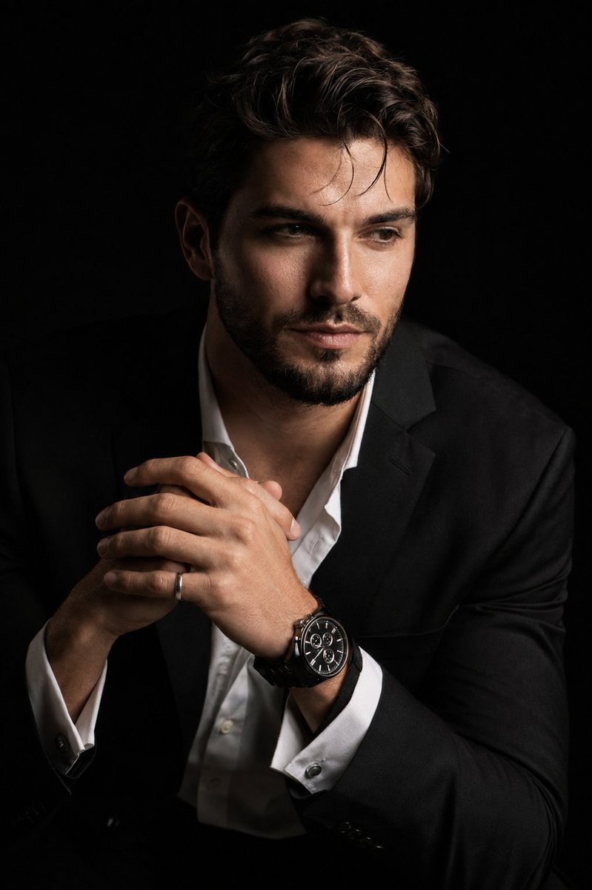

```text
Create a hyper-realistic 8K cinematic portrait of the uploaded person in a dramatic chiaroscuro style. The subject is seated at a three-quarter angle, leaning slightly forward with a relaxed yet commanding posture. His face is turned slightly away from the camera, not looking at the lens, with one side of the face sharply illuminated and the opposite side fading into deep, velvety black shadow.
His expression is contemplative.
His hands are near the chest in a natural, precise pose, with the fingers gently and correctly interlocked. One wrist clearly shows a luxury black chronograph watch with a detailed metal link bracelet, and one hand wears a subtle silver ring. He is dressed in a sharp black suit jacket over a white dress shirt with the top buttons open, showing refined fabric texture and natural folds.
The background is solid seamless black. Use strong directional studio lighting with rich contrast, clean shadow falloff, and realistic skin texture. Highlight fine details such as hair strands, beard bristles, eye moisture, facial texture, the watch face, metal bracelet reflections, and the silver ring. Shot with an 85mm portrait lens look, shallow depth of field, premium commercial photography, ultra-sharp focus, smooth natural skin transitions, cinematic contrast, no artificial plastic skin, no extra fingers, no distorted hands, no messy anatomy.
```


---

## 例 640：Kawaii Character Side Profile Portrait

**来源：** [@VIBEQUIRKLABS](https://x.com/VIBEQUIRKLABS/status/2064543699460354240) / [awesome-gpt-image-2-prompts](https://github.com/EvoLinkAI/awesome-gpt-image-2-prompts)

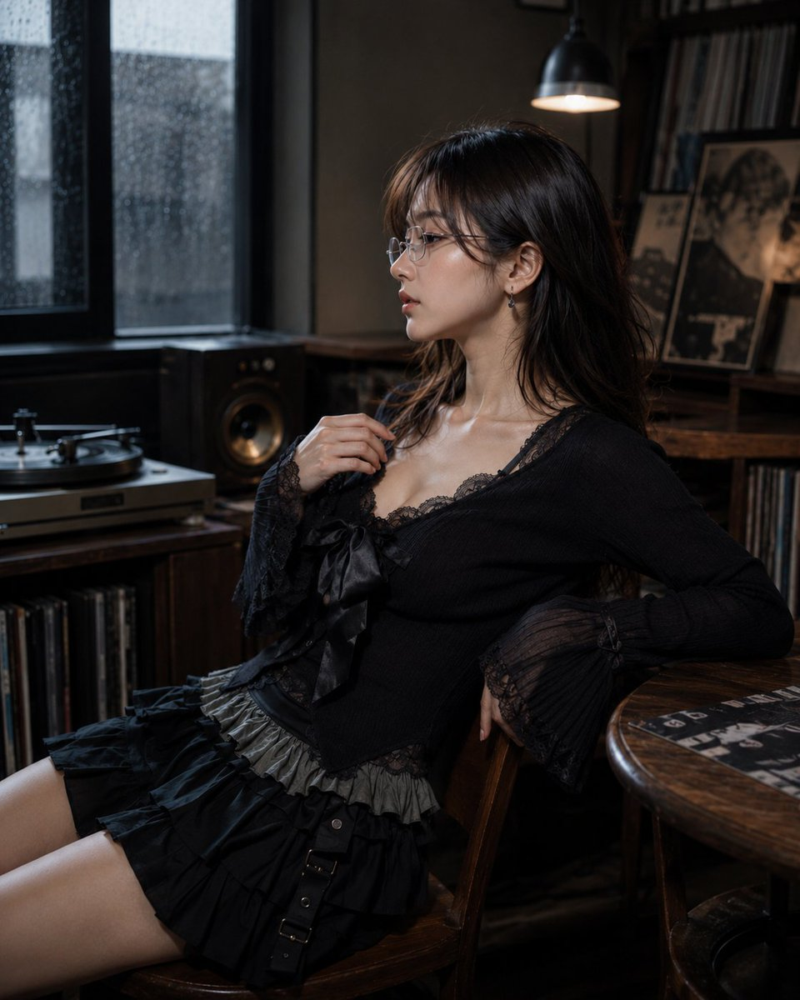

```text
Create a photorealistic editorial portrait of one 20-year-old Japanese or Korean female portrait subject with white frame, thin-frame glasses, worn normally on the face, lenses aligned over the eyes and small teardrop gemstone earring detail, delicate understated sparkle, natural basic body, about 160-165 cm visual height, balanced torso-to-leg ratio around 4:6, young seductive alluring beauty face, magnetic feminine facial balance, defined eyes and lips, collarbone-length layered hair, airy natural volume, soft face-framing movement, soft black-tea brown hair, muted brown-black salon tone. She is sitting on a chair that naturally fits the current scene. The setting is British record listening corner, turntable setup, stacked vinyl sleeves, bookshelf speakers, aged wood cabinet, lamp fixture, small side table, indoor rainy-day daylight environment, dim grey window brightness. She wears gothic casual knit-and-ruffle outfit, fitted knit top, lace camisole layer, large ribbon bow, high-waist layered ruffle mini skirt. Inspired by Leslie Kee, polished commercial portrait image language. Camera positioned on the subject's left side, 90-degree left profile view, ultra shallow depth of field.
```


---

## 例 641：Minimalist Vogue Editorial Cover

**来源：** [@vireonixx](https://x.com/vireonixx/status/2064536416592552092) / [awesome-gpt-image-2-prompts](https://github.com/EvoLinkAI/awesome-gpt-image-2-prompts)

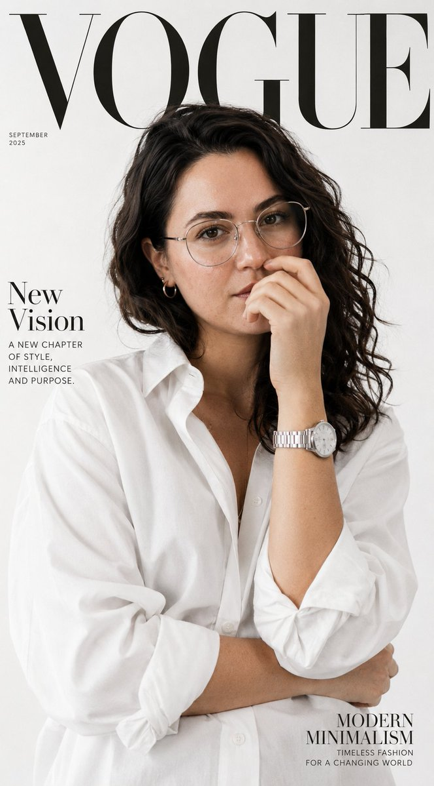

```text
Create a sophisticated high-fashion magazine cover portrait using the provided reference image only for the subject's identity and facial features. Transform the scene into a minimalist Vogue-inspired editorial cover that emphasizes timeless style, intellectual elegance, and refined simplicity.

COMPOSITION & FRAMING:
Vertical magazine cover format, approximately 4:5 aspect ratio. Upper-torso portrait composition, framed from mid-abdomen to slightly above the head. Subject positioned centrally with balanced negative space around the figure for luxury editorial typography. Clean, uncluttered layout with strong visual breathing room. Direct engagement with the camera creates intimacy and authority.

POSE & BODY LANGUAGE:
Thoughtful fashion-editorial pose with one hand partially covering the lower face, fingers resting naturally near the nose and lips. Opposite arm folded across the body creating subtle structure. Relaxed shoulders. Slight forward lean. Natural posture conveying intelligence, creativity, and effortless confidence. The pose should feel spontaneous rather than staged.

FACIAL EXPRESSION:
Quiet confidence, introspective gaze, subtle mystery, calm sophistication. Eyes focused directly toward the camera with a soft yet engaging expression. Emotion should communicate intelligence, artistic sensibility, modern elegance, and understated charisma. No exaggerated smile.

FASHION STYLING:
Minimalist luxury wardrobe centered around a crisp oversized white shirt. Premium cotton fabric with visible texture and natural folds. Open collar with clean lines. Slightly oversized silhouette creating modern proportions. Sleeves casually rolled or relaxed. Styling reflects contemporary luxury, Scandinavian minimalism, and timeless fashion essentials.

ACCESSORIES:
Thin silver metal-frame eyeglasses with minimalist design. Luxury wristwatch featuring a clean dial, refined metallic case, and understated elegance. Accessories should appear functional, sophisticated, and premium
```


---

## 例 642：Winter Wolf Cinematic Portrait

**来源：** [@iamaiistudio](https://x.com/iamaiistudio/status/2064409499906224232) / [awesome-gpt-image-2-prompts](https://github.com/EvoLinkAI/awesome-gpt-image-2-prompts)

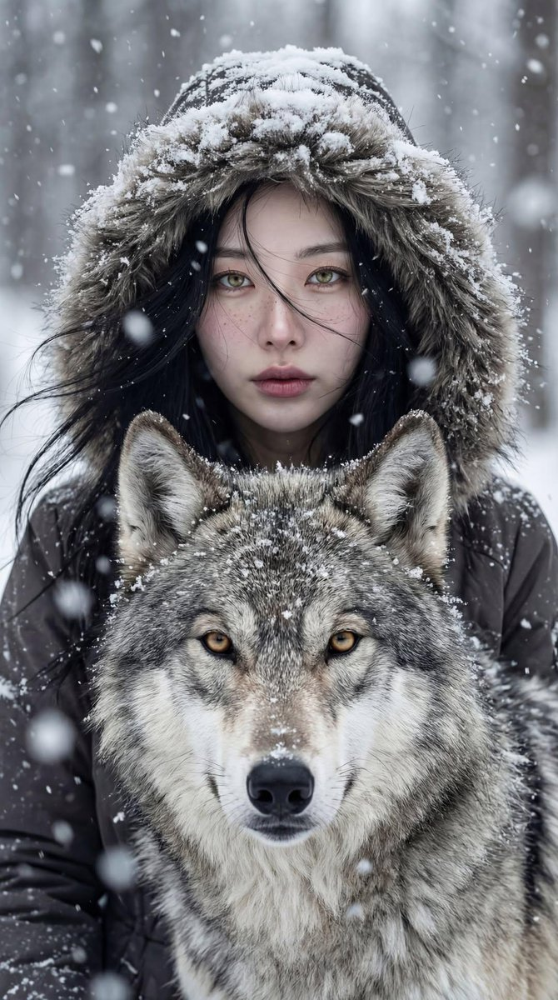

```text
://t.co/1ZKQNHa8h4

prompt:

Cinematic winter portrait of a young pale-skinned woman with long dark snow-dusted hair, standing closely behind a majestic gray wolf. She wears a fur-lined heavy winter coat, expression intense, calm and soulful, direct eye contact with camera. The wolf is calm and watchful with thick frost-covered fur and sharp golden intelligent eyes. Both subjects centered symmetrically, ultra-sharp focus on both sets of eyes. Background: softly blurred snow-covered forest, gentle snowfall, cold mist. Lighting: soft natural overcast winter light with diffused shadows, cinematic cool tones, subtle warmth in skin and eyes. Style: fine-art wildlife and cinematic portrait photography, ultra-realistic, 8K quality detail. Mood: quiet intensity, mystery, primal bond, reverence for nature. Portrait orientation, 2:3 aspect ratio.

#AIart #GPTImage2
```


---

## 例 643：Full Shot Man White Chair

**来源：** [@JamilAI55](https://x.com/JamilAI55/status/2064548739419947299) / [awesome-gpt-image-2-prompts](https://github.com/EvoLinkAI/awesome-gpt-image-2-prompts)

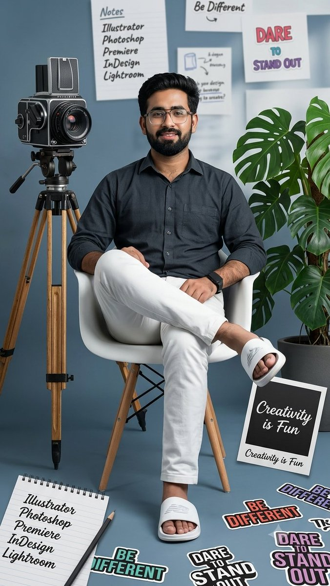

```text
A full shot of a man sitting on a white chair with his legs crossed, wearing a dark button-down shirt, white pants, and white slides, uploaded face as reference, with an old-fashioned film camera on a tripod to his left, a potted green plant to his right, and various design-related elements scattered around him, including a notepad listing 'Creative Cloud' applications, a Polaroid photo with the words 'Creativity is Fun,' and text snippets like 'Be Different' and 'Dare to Stand Out,' all arranged in a collage style, with a color palette of muted blues, grays, and whites, and pops of color from the plant and text, creating a visually engaging and informative composition, reminiscent of a graphic design mood board, with a slightly desaturated look and a clean, modern aesthetic.
```


---

## 例 644：Eiffel Tower Low Angle Fashion Portrait

**来源：** [@CHAseUnre](https://x.com/CHAseUnre/status/2064514382756012487) / [awesome-gpt-image-2-prompts](https://github.com/EvoLinkAI/awesome-gpt-image-2-prompts)

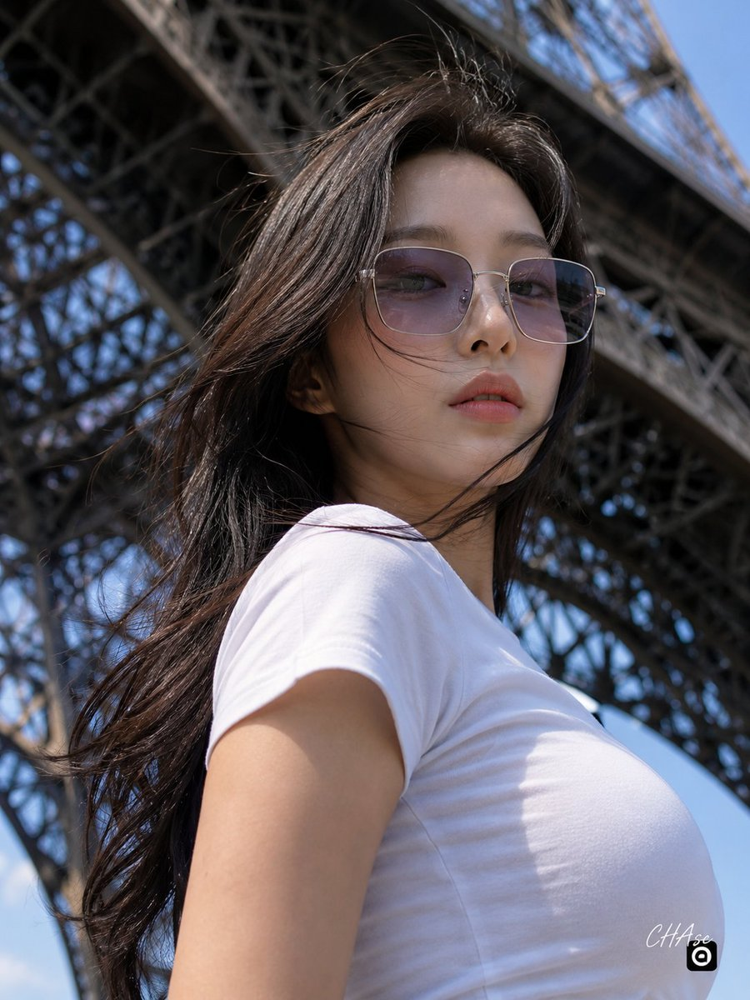

```text
에펠탑 중앙 하단에서 카메라를 아래로 당당하게 내려다보는 로우 앵글 포즈입니다. 상체는 프레임 우측을 향해 45도 틀어져 있고, 고개를 돌려 카메라를 내려다 보고 있습니다. 바람에 날리는 머리카락 사이로 세련되고 쿨한 표정을 짓고 있으며, 카메라를 아련하면서도 자신감 넘치는 눈빛으로 가만히 응시하고 있습니다.

몸에 부드럽게 밀착되는 정갈하고 심플한 화이트 반소매 라운드넥 티셔츠를 입고 있습니다. 머리카락은 바람을 맞아 자연스럽게 볼륨감이 살아서 얼굴 주변으로 흩날리고 있습니다. 실버 금속 테에 은은한 보랏빛이 도는 반투명 렌즈의 스퀘어 선글라스를 착용했으며, 촉촉한 연분홍색 립글로스를 바른 내추럴하고 깨끗한 메이크업입니다.

인물에 대한 직접 조명은 전혀 없으며 에펠탑 아래에서 은은하게 자연광이 있을 뿐입니다. 바닥에서 하늘을 수직에 가깝게 올려다보는 극단적인 로우 앵글(웜즈 아이 뷰)로 촬영되었습니다. 화면 전체를 거대하게 감싸며 가로지르는 파리 에펠탑의 정교하고 거대한 짙은 회색 철골 격자 구조물이 배경입니다.
```


---

## 例 645：Italian Summer Afternoon Portrait

**来源：** [@iamaiistudio](https://x.com/iamaiistudio/status/2065209349132501265) / [awesome-gpt-image-2-prompts](https://github.com/EvoLinkAI/awesome-gpt-image-2-prompts)

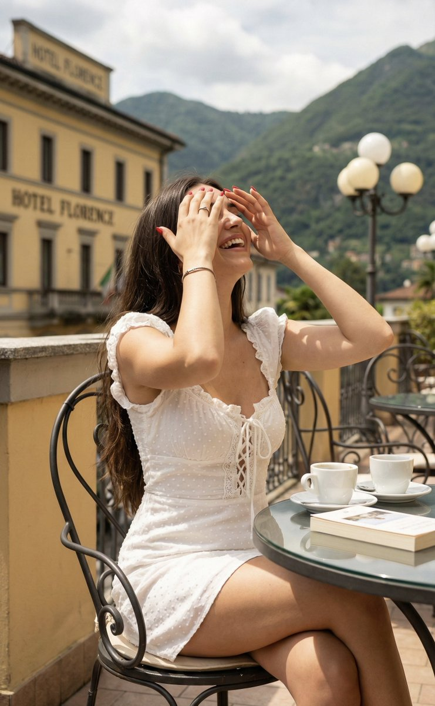

```text
prompt:

Ultra photorealistic portrait of a young woman with long straight dark brown hair, sun-kissed glowing skin, seated at an outdoor cafe table. She's wearing a white vintage Swiss dot corset mini dress with a sweetheart neckline, ruffled cap sleeves, front lace-up ribbon detailing, fitted bodice, and slightly sheer ruffled hem. Hands raised playfully covering her eyes, head tilted back laughing, red manicured nails, thin bracelet and ring on left hand. Setting: luxury outdoor hotel terrace at Hotel Florence, historic yellow building with "HOTEL FLORENCE" signage, lush green mountains in the background, cloudy blue sky, vintage globe street lamps, round glass-top table with two white ceramic coffee cups and a paperback book. Coquette cottagecore soft feminine luxury aesthetic. Natural bright afternoon sunlight, high contrast, sharp shadows on the table, backlighting creates a hair halo effect, warm vibrant color grading. DSLR 85mm portrait lens, f/2.8 shallow depth of field, 1/500s shutter, ISO 100, 8k RAW photo.

#AIart #GPTImage2
```


---

## 例 646：Rainy Night Cinematic Portrait

**来源：** [@iamaiistudio](https://x.com/iamaiistudio/status/2065194222408577258) / [awesome-gpt-image-2-prompts](https://github.com/EvoLinkAI/awesome-gpt-image-2-prompts)

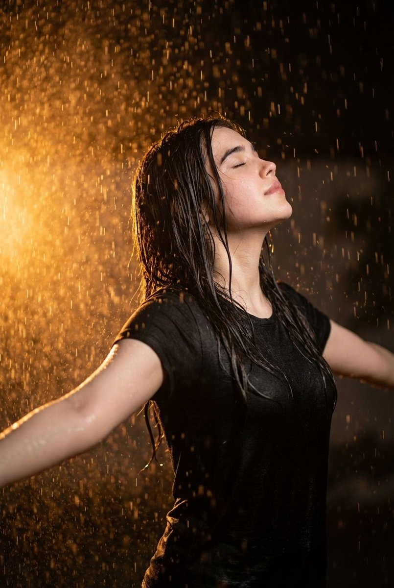

```text
Full prompt:

Photorealistic cinematic close-up of a young woman in her early 30s, standing in a downpour at night with arms stretched wide and head tilted back, eyes shut, embracing the rain. Warm golden-orange backlight from the left side catches each raindrop, turning them into glowing particles around her silhouette. Soaking wet black tee clinging to her figure, water beading on her skin. Deep contrast between the dark background and the fiery orange sidelight. Expression radiates liberation and calm. Shot on an 85mm lens, f/1.8, 8K, shallow depth of field, vertical framing, dramatic cinematic atmosphere.

#AIart #GPTImage2
```


---

## 例 647：7-Panel Emotion Grid Portrait

**来源：** [@iamaiistudio](https://x.com/iamaiistudio/status/2065179623697306098) / [awesome-gpt-image-2-prompts](https://github.com/EvoLinkAI/awesome-gpt-image-2-prompts)

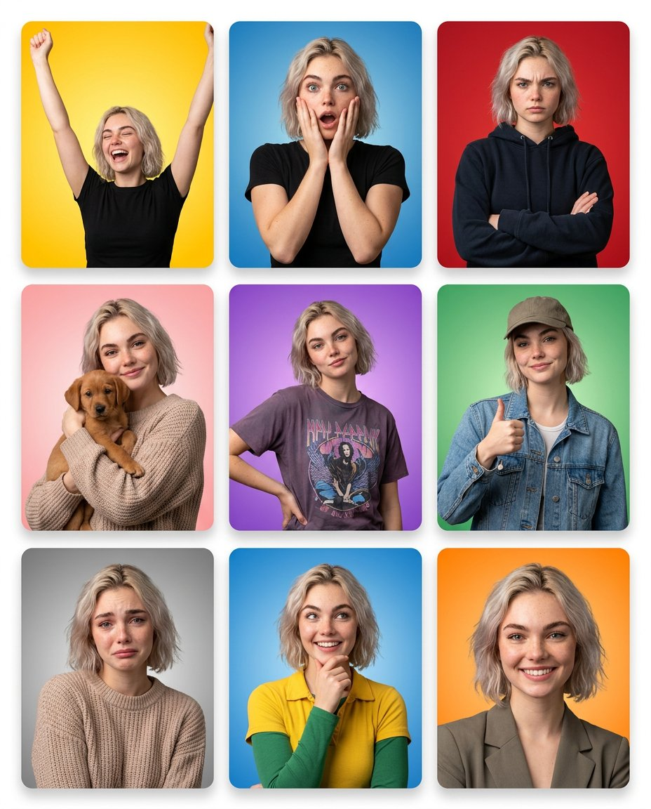

```text
Full prompt:

Grid layout with thin white gaps between panels and a subtle outer white border around the entire composition. Clean, modern UI aesthetic with slight rounded corners on every tile.

Panel 1: Joyful (Yellow). Warm yellow gradient. Arms raised overhead. Eyes shut. Wide open laugh. High-energy pose.
Panel 2: Shocked (Blue). Blue gradient. Both hands cupping cheeks. Eyes wide open. Mouth agape. Eyebrows arched high.
Panel 3: Stern (Red). Solid red background. Arms folded. Brows furrowed. Lips pressed tight. Dark hoodie.
Panel 4: Affectionate (Pink). Soft pink gradient. Cradling a small brown dog. Gentle smile. Cozy knit sweater.
Panel 5: Confident (Purple). Purple gradient. One hand resting on hip. Slight smirk. Graphic tee. Easy, relaxed stance.
Panel 6: Approving (Green). Green gradient. Baseball cap and denim jacket. Thumbs up. Relaxed smile.
Panel 7: Melancholy (Gray). Gray gradient. Eyes angled slightly downward. Inner brows slightly raised. Lips gently curved down.

#AIart #GPTImage2
```


---

## 例 648：Cozy Pastel Morning Overhead Lifestyle

**来源：** [@iamaiistudio](https://x.com/iamaiistudio/status/2065149291099021650) / [awesome-gpt-image-2-prompts](https://github.com/EvoLinkAI/awesome-gpt-image-2-prompts)

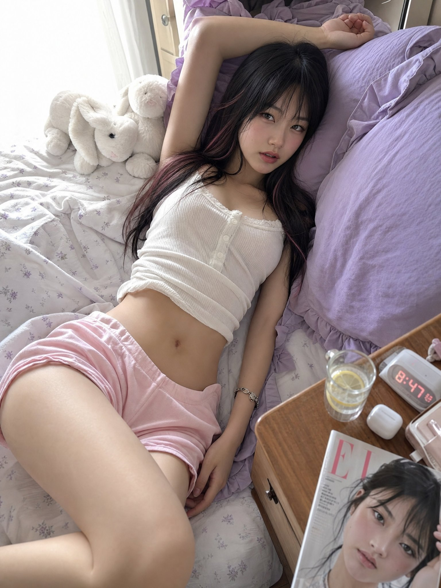

```text
prompt:

Overhead lifestyle photo shot from a slightly tilted high angle, looking down at a cozy bed. A slim young woman lies on her back with a relaxed, lazy weekend morning energy. She has long, slightly tousled straight black hair with subtle pink highlights spread softly across a purple pillow, tidy bangs framing her face. Her makeup is a soft East Asian aesthetic with noticeable pink blush and lightly parted glossy lips, her gaze directed softly up into the camera. She wears a white ribbed cotton camisole with front buttons and lace trim, slightly raised at the waist, paired with light pink satin pajama shorts. Her right arm rests casually behind her head, exposing her smooth underarm and shoulder, while her left knee is gently bent, revealing a fair soft upper thigh. The skin on her arms, chest, stomach, and legs looks smooth and luminous, lit by soft diffused daylight spilling through a window on the left. A silver charm bracelet sits on her left wrist. The bedroom is styled throughout in pastel tones. She rests on ruffled pastel purple pillows and a white blanket with subtle purple floral patterns. Two white plush bunnies are placed near her head. In the slightly blurred lower right foreground, a wooden nightstand holds a glass of lemon water, a small pink digital clock showing 8:47, an earbuds case, and an ELLE magazine. Shot on a 35mm lens at a moderate aperture for a natural, slightly imperfect snapshot aesthetic with soft daylight and gentle shadows, capturing the tranquil slow morning mood.

#AIart #GPTImage2
```


---

## 例 649：Stylish Woman Outside Cozy Café Portrait

**来源：** [@sakshi___007](https://x.com/sakshi___007/status/2065118696788631921) / [awesome-gpt-image-2-prompts](https://github.com/EvoLinkAI/awesome-gpt-image-2-prompts)

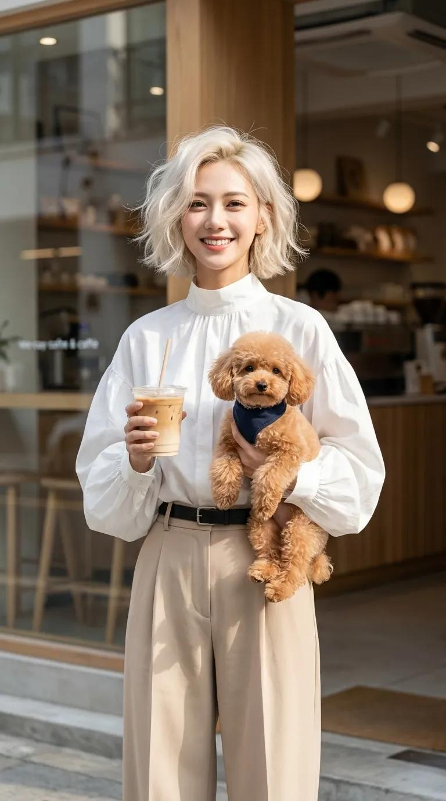

```text
An ultra-realistic lifestyle portrait of a stylish young woman standing outside a modern cozy café during daytime, smiling warmly at the camera with a soft natural expression. She has short wavy platinum blonde hair styled in a soft messy bob, glowing skin, minimal natural makeup, and a fresh effortless beauty aesthetic. She wears an elegant oversized white blouse with soft flowing sleeves, tucked into high-waisted beige wide-leg trousers with a black belt, creating a classy minimalist fashion look. In one hand she holds an iced latte in a transparent cup, and in the other she gently carries a small adorable apricot toy poodle dog wearing a cute dark bandana. Warm natural sunlight, cozy café storefront background with glass windows, soft bokeh lighting, aesthetic urban lifestyle atmosphere, calm and wholesome mood, photorealistic details, fashionable Korean street style, soft neutral color palette, editorial portrait photography, realistic skin texture, cozy café culture vibe, luxury casual fashion, soft cinematic color grading, high detail, elegant modern aesthetic, Pinterest-inspired photography, ultra detailed, 8k quality.
```


---

## 例 650：Non-Existent 1870s Vintage Photograph

**来源：** [@Arminn_Ai](https://x.com/Arminn_Ai/status/2065104900590109130) / [awesome-gpt-image-2-prompts](https://github.com/EvoLinkAI/awesome-gpt-image-2-prompts)

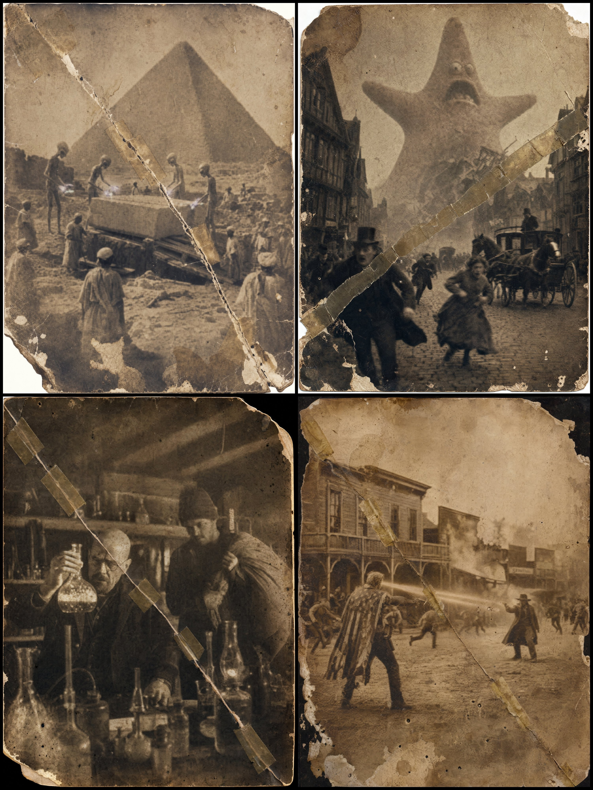

```text
Non Existence Vintage Photographs with GPT Image 2 📸

- Prompt 👇
a photographic image in the style of 1870, [SCENE DESCRIPTION], with [CHARACTERS described in period accurate clothing], [Describe the interaction].

The photo has an aged and worn appearance, as it was taken in 1870. It features prominent time-induced chemical stains, heavy grain, sepia toning, and deep scratches.

Significantly reduce the sharpness so that the details of the [SUBJECT] are not crisp, making the [SUBJECT] blurry and low-fidelity.

Greatly increase the wear of the photo, including small tears, missing corners, water damage, and small wormholes caused by insect damage. Add a prominent, jagged diagonal cut across the photo, mended clumsily with old, discolored tape.
```


---

## 例 651：Doll-ification Concept Portrait

**来源：** [@iamaiistudio](https://x.com/iamaiistudio/status/2065104023011868884) / [awesome-gpt-image-2-prompts](https://github.com/EvoLinkAI/awesome-gpt-image-2-prompts)

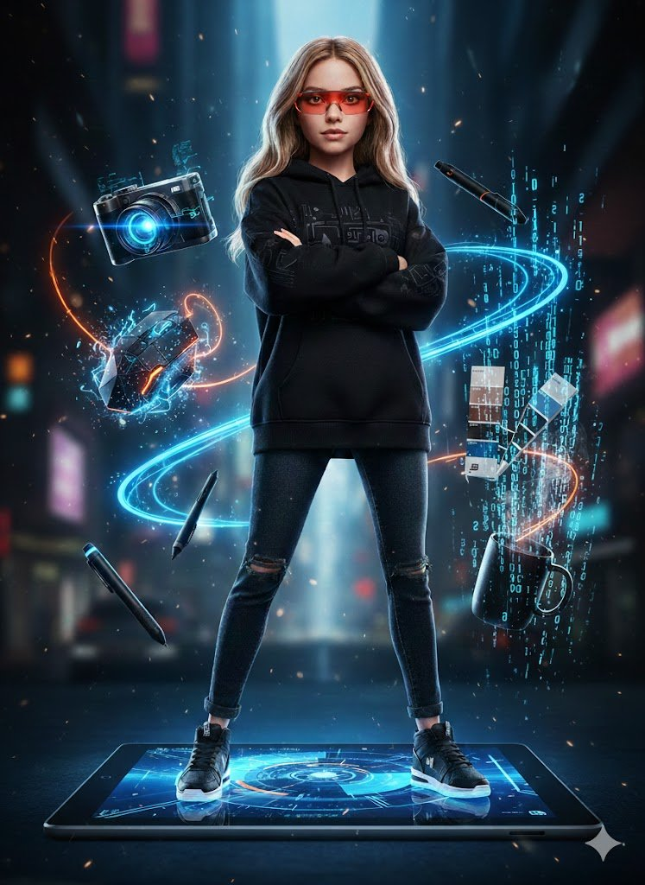

```text
prompt:

Ultra-realistic full-body portrait of a woman posed exactly as in the reference photo, stylized as a sleek female action figure. She stands with arms folded across her chest on top of a massive Microsoft Surface Tablet, dressed in urban streetwear — black hoodie, jeans, sneakers — with sharp red tech glasses.

Floating around her in a dynamic layout are designer tools: a next-gen camera with a blue holographic glow, a geometric mouse with electric sparks, a digital stylus leaving wireframe trails, a Pantone color guide in bold blue and black, and a minimal black coffee cup with binary code steam rising from it.

Bold blue-and-orange color palette with dramatic lighting throughout. Cyberpunk vibe, neon details, particle effects scattered across the scene. Visual style blends 3D animation with tech photography. Crisp focus, cinematic lighting, 8k resolution.

#AIart #GPTImage2
```


---

## 例 652：Face-Reference Consistent Portrait

**来源：** [@john_my07](https://x.com/john_my07/status/2065092295092051994) / [awesome-gpt-image-2-prompts](https://github.com/EvoLinkAI/awesome-gpt-image-2-prompts)

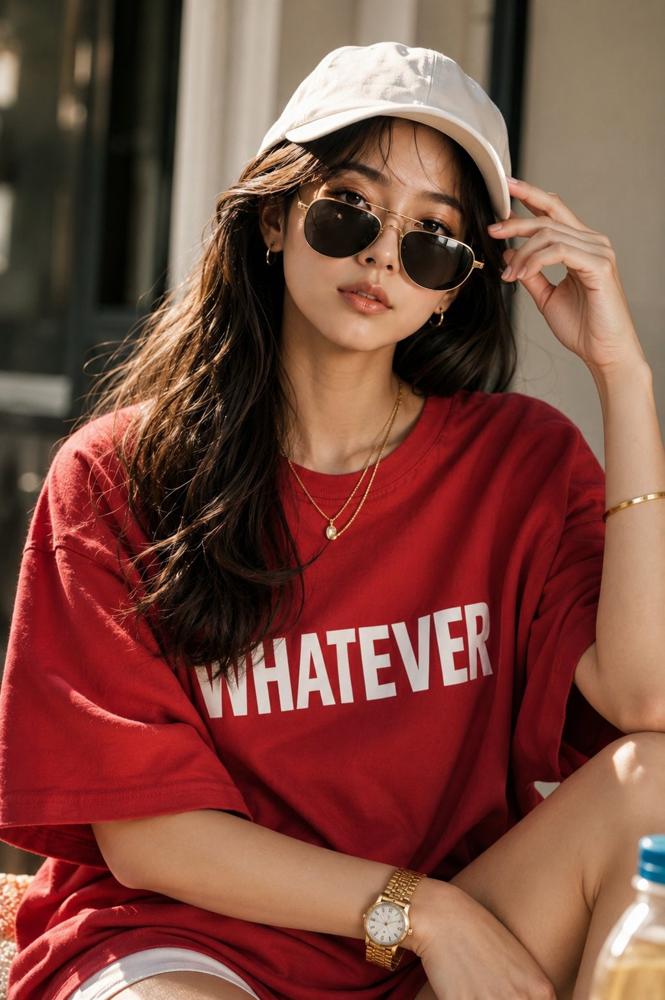

```text
Use the attached reference image as the exclusive guide for facial identity, bone structure, body proportions, skin tone, facial features, and overall physical likeness. Create an ultra-realistic luxury fashion editorial portrait of a stunning young woman captured in a premium lifestyle photoshoot.
She wears an oversized designer crimson-red T-shirt crafted from heavyweight cotton, featuring the striking white slogan "WHATEVER" across the chest in contemporary minimalist typography. A crisp white curved-brim cap adds a sporty upscale touch, while sleek dark aviator-inspired sunglasses rest slightly lower on the bridge of her nose, revealing her eyes and enhancing the fashion-forward aesthetic.
The subject is seated comfortably in an elegant sunlit setting, positioned at a subtle three-quarter angle. One hand lightly touches the brim of her cap while the other rests naturally near her knee, displaying a refined gold luxury timepiece. Her posture conveys confidence, sophistication, and effortless style, with a gentle head tilt and captivating direct gaze toward the camera.
Her exceptionally long chestnut-brown hair cascades over one shoulder in soft, voluminous waves, enriched with warm caramel and hazelnut highlights. Individual strands catch the sunlight, creating natural dimension, movement, and silky texture.
Professional beauty styling includes radiant luminous skin, softly sculpted cheekbones, precise winged eyeliner, naturally full brows, dramatic lashes, subtle champagne highlighter, delicate peach blush, and glossy coral-nude lips. Makeup appears polished yet realistic, suitable for a high-end fashion campaign.
Accessories are tastefully curated: layered fine gold chains, elegant hoop earrings, a slim gold bracelet, and a premium luxury wristwatch. The jewelry enhances the look without overpowering it.
Photographed in the style of an international fashion magazine cover, with warm late-afternoon sunlight, creamy background separation, cinematic depth of field, realistic skin detail, ultra-sharp eye focus, premium fabric texture, luxury lifestyle ambiance, sophisticated color grading, and impeccable commercial fashion photography. Hyper-realistic, editorial quality, Vogue-inspired, high-fashion advertising campaign, 8K resolution, award-winning portrait imagery.
```


---

## 例 653：日本コンビニ店員 昼夜対比写真

**来源：** [@johnAGI168](https://x.com/johnAGI168/status/2065080792548618431) / [awesome-gpt-image-2-prompts](https://github.com/EvoLinkAI/awesome-gpt-image-2-prompts)


```text
上班山田😊

下班田山🕶

GPT- image 2 prompt👇
Daytime Yamada cashier version, 3:4 vertical image. Create a realistic live-action portrait of an adult young Japanese woman, around 24 years old. She has fair skin, soft delicate facial features, a gentle oval face, calm dark eyes, natural light makeup, reddish hair, straight blunt bangs, and long side locks framing both sides of her face. Her expression is gentle, polite, slightly shy, and quietly mature, like a reliable supermarket cashier with a warm customer-service smile.

Scene: daytime inside a Japanese supermarket checkout area. She is standing behind or beside the checkout counter, facing the camera, with a polite gentle smile. The background has blurred product shelves, checkout counter details, and clean supermarket lighting.

Outfit: Japanese supermarket employee uniform. Deep red headscarf covering the back of her hair while still showing her straight bangs and red side locks, pale green or beige striped short-sleeve work shirt, deep red apron, black flared work pants. Add a small rectangular employee name badge pinned on the upper chest or apron with readable Japanese text “山田”. The badge should be realistic, small, and clear. The only readable text in the image should be “山田”.

Style: realistic live-action Japanese drama still, 3:4 vertical portrait, waist-up or three-quarter body, natural indoor fluorescent supermarket lighting, shallow depth of field, muted realistic colors, natural skin texture, 35mm lens look, high detail.
```


---

## 例 654：Dreamlike Cloud Face Portrait

**来源：** [@iamaiistudio](https://x.com/iamaiistudio/status/2065073375463325883) / [awesome-gpt-image-2-prompts](https://github.com/EvoLinkAI/awesome-gpt-image-2-prompts)

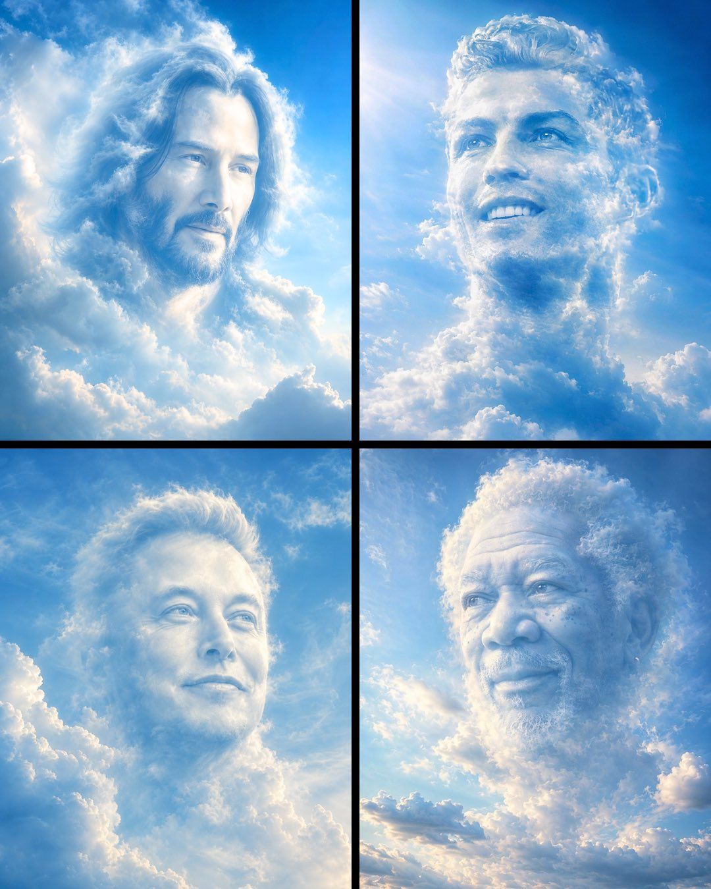

```text
prompt:

Reimagine [NAME] as a dreamlike cloud portrait, keeping their face, expression, and defining features clearly recognizable while transforming the form into soft billowing clouds against a bright blue sky.
The portrait should look like the face is materializing from or melting into the clouds, with gentle diffused natural light casting soft highlights and airy shadows for depth and realism.
Avoid sharp edges, visible skin texture, or hard details, keeping the transition symbolic and organic.
Preserve facial proportions, eyes, smile, and distinctive features through the cloud structure.
Style: dreamy, ethereal, cinematic, surreal
Lighting: volumetric sunlight, soft glow, natural
Color palette: sky blue, white, soft gradient tones
Mood: serene, uplifting, peaceful
Layer clouds naturally around and within the face for a smooth, seamless transition. Keep the background a clean blue sky with soft gradient clouds.
Ultra-realistic cloud texture, high resolution, seamless blending, no watermarks, no text.

#AIart #GPTImage2
```


---

## 例 655：Face-Preserved Ultra-Realistic Portrait

**来源：** [@Rainlanded](https://x.com/Rainlanded/status/2065071103316484451) / [awesome-gpt-image-2-prompts](https://github.com/EvoLinkAI/awesome-gpt-image-2-prompts)

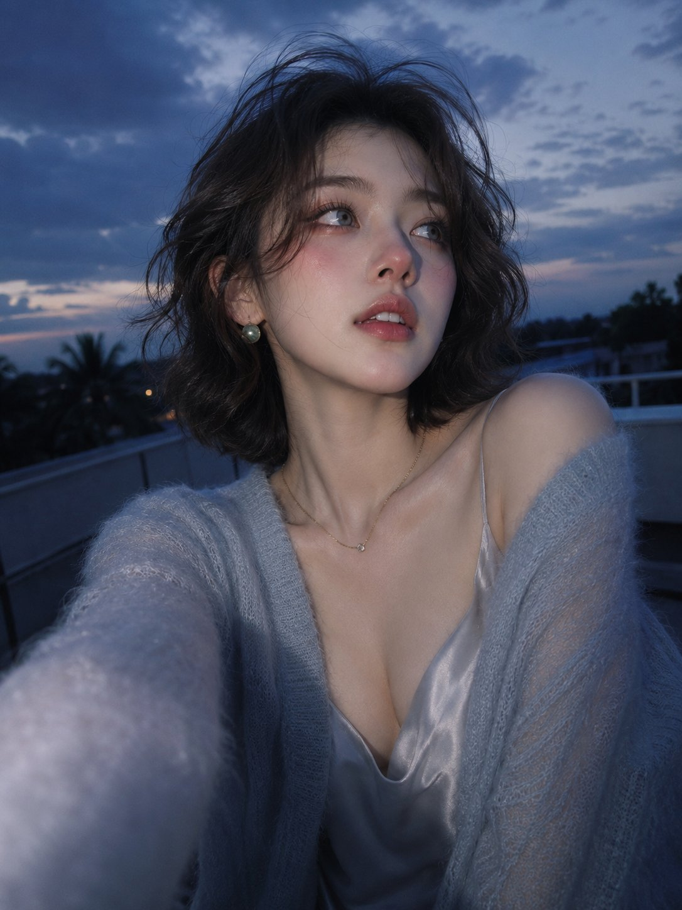

```text
low quality, blurry, distorted face, bad anatomy, extra limbs, stiff pose, unnatural selfie angle, overexposed skin, harsh flash, plastic skin, overly bright colors, cheap fabric, messy background, cartoon style, exaggerated beauty filter, unrealistic eyes, artificial hair, bad hands, awkward arm, noisy image.
```


---

## 例 656：파리 가로등 기댄 감성 전신 포즈

**来源：** [@CHAseUnre](https://x.com/CHAseUnre/status/2065240920283398353) / [awesome-gpt-image-2-prompts](https://github.com/EvoLinkAI/awesome-gpt-image-2-prompts)

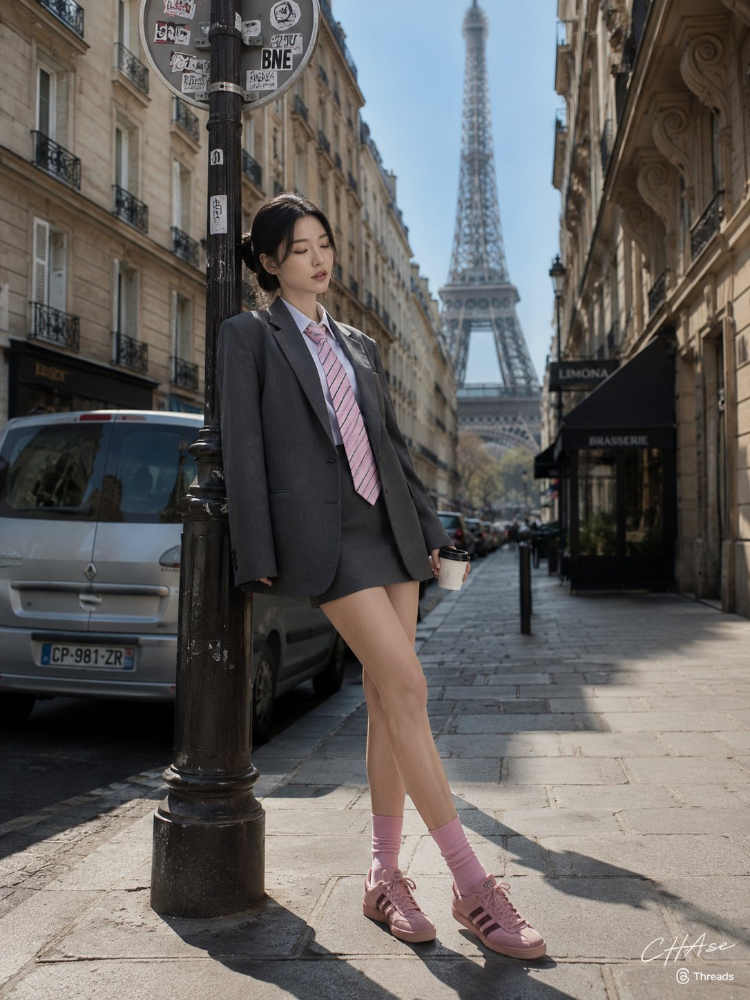

```text
[인물] 이미지1, 이미지2 참조. 파리의 길거리 표지판 기둥에 몸을 비스듬히 기대어 서 있는 전신 포즈입니다. 고개를 살짝 왼쪽으로 기울이고 눈을 감은 채 입술을 아주 약간 내밀며 나른하고 감성적인 표정을 짓고 있습니다. 왼손에는 테이크아웃 커피 컵을 가볍게 쥐고 있습니다. 배경: 파리 거리 분위기, 흐린 자연광.
```


---

## 例 657：深夜调酒师暗红酒吧封面写真

**来源：** [@liyue_ai](https://x.com/liyue_ai/status/2064965712406556931) / [awesome-gpt-image-2-prompts](https://github.com/EvoLinkAI/awesome-gpt-image-2-prompts)

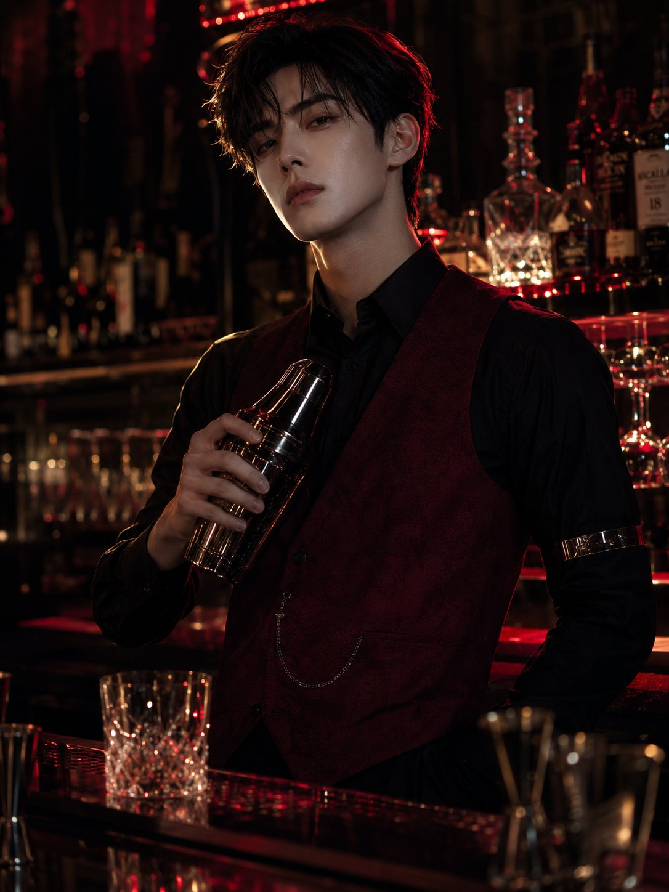

```text
深夜调酒师人物摄影：高级酒吧场景、暗红灯光、玻璃酒杯反光 + 黑衬衫、深酒红马甲、袖箍建立人物身份感 + 调酒动作、抬眼看镜头、金色边缘光建立封面气场。危险但克制的气质，深夜暗红酒吧封面风。
```


---

## 例 658：Needle-Felted Wool Miniature

**来源：** [@iamaiistudio](https://x.com/iamaiistudio/status/2066206049464660301) / [awesome-gpt-image-2-prompts](https://github.com/EvoLinkAI/awesome-gpt-image-2-prompts)

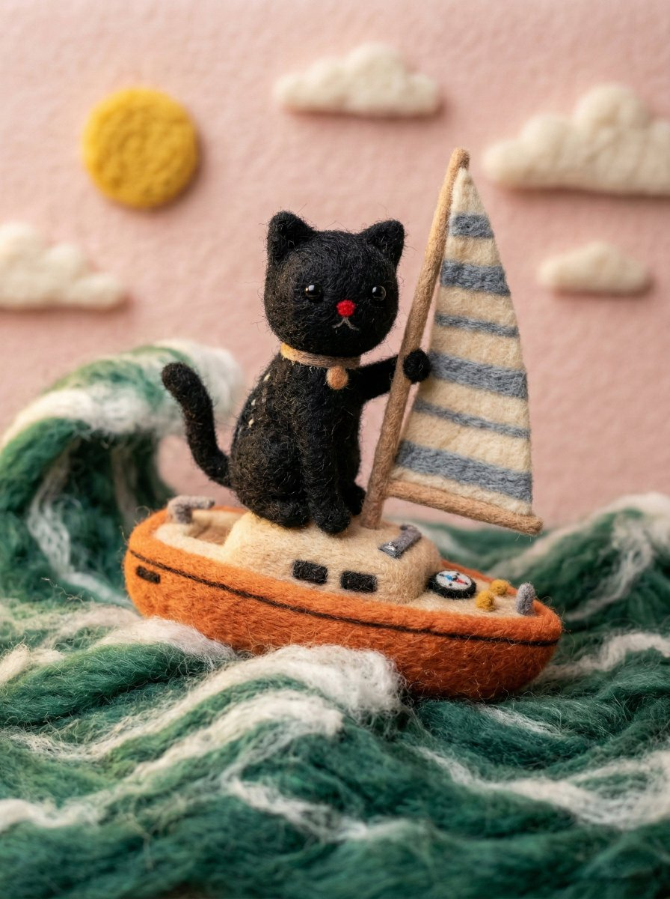

```text
Transform the subject into a handcrafted needle-felted wool miniature. Material: organic roving wool with visible needle-punch textures, soft fuzzy surface, and handcrafted seams. Eyes are tiny black bead eyes or simple felted circles.

Style rules: slightly oversized head with simplified limbs and a cute, charming aesthetic. Retain the original colors from the source image but soften them with wool texture. Clothing becomes simplified felt versions of the original outfits with tiny fabric buttons and stitched details. Accessories are recreated as miniature felted props.

Camera: macro photography, close-up shot. Soft studio lighting with warm highlights and gentle shadows. Clean, out-of-focus bokeh background in a neutral craft studio setting. Shallow depth of field (f/2.8). High fidelity, 8k resolution, photorealistic wool texture, Pixar-like character charm.
```


---

## 例 659：Airy Japanese Window Portrait

**来源：** [@iamaiistudio](https://x.com/iamaiistudio/status/2066643592366727581) / [awesome-gpt-image-2-prompts](https://github.com/EvoLinkAI/awesome-gpt-image-2-prompts)

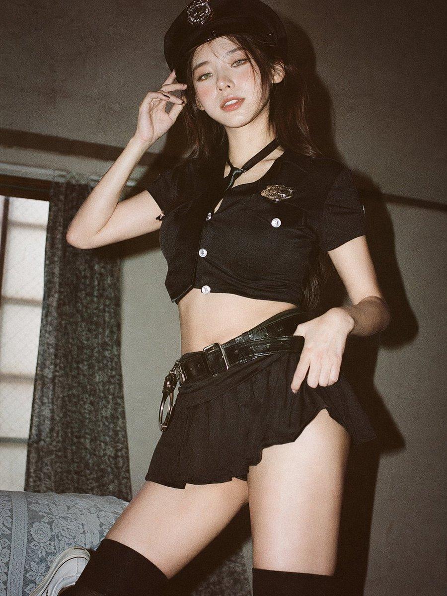

```text
35mm film photo, airy Japanese aesthetic, soft natural window light from the side, slightly overexposed, muted pastel colors, low contrast, bright gentle highlights, quiet indoor room beside sheer white curtains, pale wall, natural eye-level frame from mid-thigh upward, young East Asian woman, barely-there makeup, smooth natural skin, long loose dark hair, oversized white button-down shirt, casual shorts, bare feet, effortless everyday style, relaxed stance with arms lightly at sides or gently back, looking softly at the camera, calm quiet smile, stillness and lightness, fine film grain, gentle dreamy mood --ar 9:16
```


---

## 例 660：Park Bench Iced Coffee Portrait

**来源：** [@saniaspeaks_](https://x.com/saniaspeaks_/status/2067451160991084677) / [awesome-gpt-image-2-prompts](https://github.com/EvoLinkAI/awesome-gpt-image-2-prompts)

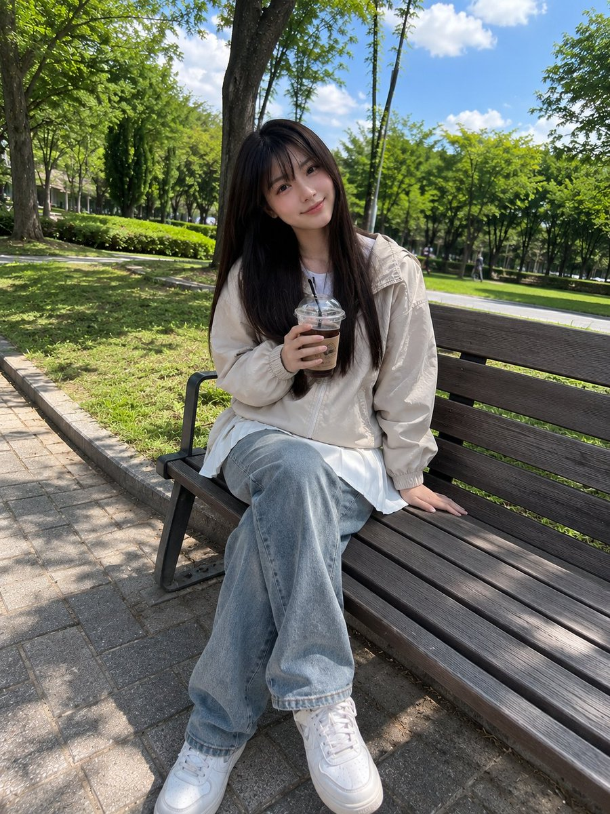

```text
Beautiful young Japanese girl with long straight dark brown hair and soft full bangs, fair skin, bright natural smile, sitting casually on a wooden park bench while holding an iced coffee cup. Wearing a light beige windbreaker jacket and a white pleated mini skirt, relaxed posture, one hand resting on the bench. Surrounded by a lush green park with tall trees, fresh grass, and a bright blue sky with soft clouds. Captured with a smartphone camera in portrait mode, casual everyday snapshot, natural daylight, handheld iPhone photo, slightly imperfect framing, realistic skin texture, natural colors, soft HDR phone processing, candid social-media aesthetic, no professional modeling, no studio lighting, no cinematic color grading, authentic mobile photography, ordinary park outing vibe, spontaneous moment, realistic shadows, subtle lens softness, photorealistic, high-quality phone camera image.
```


---

## 例 661：Curtain Bang Close-Up Portrait

**来源：** [@iamsofiaijaz](https://x.com/iamsofiaijaz/status/2067450336378544407) / [awesome-gpt-image-2-prompts](https://github.com/EvoLinkAI/awesome-gpt-image-2-prompts)

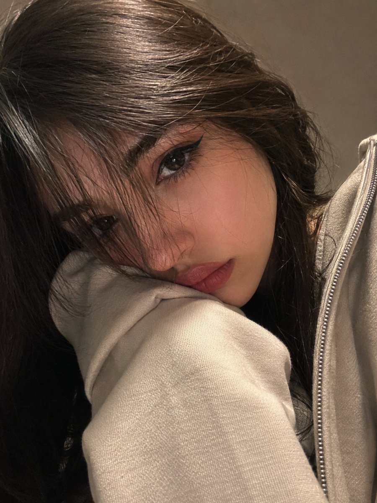

```text
A photorealistic close-up portrait of a young girl filling almost the entire frame. Her head is slightly tilted to the side, with her cheek resting against her shoulder and partially hidden inside the long cream-colored sleeve of a hoodie. Long, straight hair with curtain bangs falls freely along the left side of her face, covering one eye. On the visible side of her face, she wears soft makeup: laminated brows, a sharp elongated black winged eyeliner that extends the shape of the eye, matte dusty-pink lips, and a calm, slightly pouting expression. She looks directly into the camera, with visible eyelashes.

A long zip-up hoodie over the one shoulder The composition is intimate and casual, resembling a webcam selfie. The frame has a slight tilt, and the face is positioned very close to the lens. Focus is sharp on the visible eye, lips, hair texture, and the thick cream-colored fabric of the sleeve, while the background fades into a soft blur. Behind her is a simple warm gray-beige wall with no visible details. Warm indoor and screen lighting from the front-left creates soft highlights on the skin and hair. The contrast is moderate, and the color palette is muted, featuring black, beige-gray, and dusty pink tones. The overall image should preserve the authentic feeling of a selfie photograph.
```


---

## 例 662：Cyborg Prosthetic Close-Up

**来源：** [@iamaiistudio](https://x.com/iamaiistudio/status/2067732972351222060) / [awesome-gpt-image-2-prompts](https://github.com/EvoLinkAI/awesome-gpt-image-2-prompts)

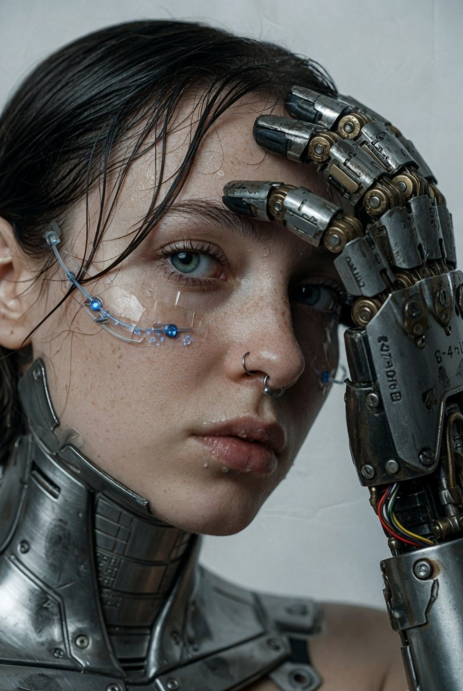

```text
Ultra-realistic cinematic close-up of a young woman with pale, freckled skin and wet dark hair. Her eyes are vivid blue-green and she wears a silver septum ring.
Cybernetics: A massive industrial robotic prosthetic arm with worn metal textures, visible wiring, and hydraulic components rests near her face, metallic fingers curved toward her temple.
A thin cybernetic sensor wire traces across her cheekbone just below the eye.
Her jawline and neck show embedded steel plating and brushed-metal body augmentations.

Background: Clean, neutral studio setting in muted grey-white.
Lighting: Soft front-left directional light casting detailed shadows across mechanical joints while catching moisture on skin and lips.
Mood: Raw, futuristic, and melancholic with a high-end editorial aesthetic.
Framing: Off-center composition, shallow focus on the eye and robotic hand texture detail.
Surface detail: Pores clearly visible, individual wet hair strands, scratched and oil-marked metal.
Color grade: Muted cool palette, high contrast. Photorealistic digital art style.
```


---

## 例 663：Mediterranean Alley Sunlit Portrait

**来源：** [@iamaiistudio](https://x.com/iamaiistudio/status/2067474399431979223) / [awesome-gpt-image-2-prompts](https://github.com/EvoLinkAI/awesome-gpt-image-2-prompts)

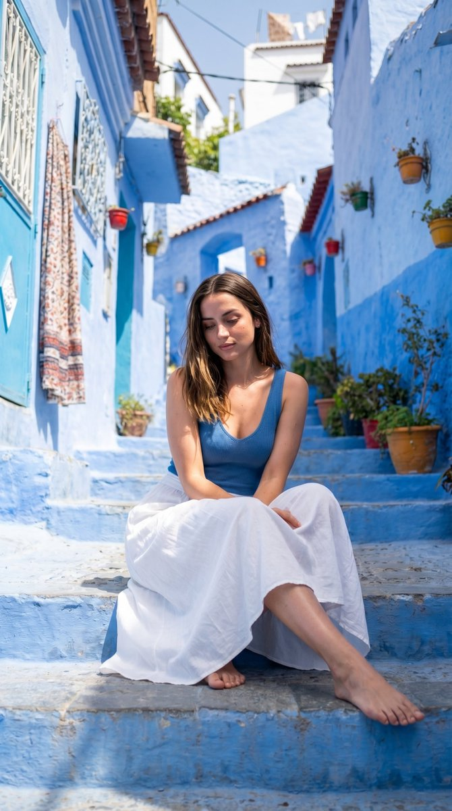

```text
Ultra-realistic photo of a woman seated on stone steps in a vibrant Mediterranean alley with vivid blue-painted walls, stairs, and buildings with white accents. She wears a blue fitted sleeveless top and a long flowing white skirt, barefoot, with a calm relaxed expression and eyes slightly downward. Long wavy hair falls naturally over her shoulders. Strong natural sunlight creates high contrast shadows and saturated colors. Shot from a slightly low front-facing angle with full body framing, sharp focus on subject against a detailed background of blue walls, hanging patterned fabric, small windows, and plants above. Highly saturated blues contrasted with natural white and skin tones, ultra-realistic textures, crisp shadows, realistic depth.
```


---

## 例 664：Emerald Headwrap Editorial Portrait

**来源：** [@bmx_ai13](https://x.com/bmx_ai13/status/2068462145319444778) / [awesome-gpt-image-2-prompts](https://github.com/EvoLinkAI/awesome-gpt-image-2-prompts)

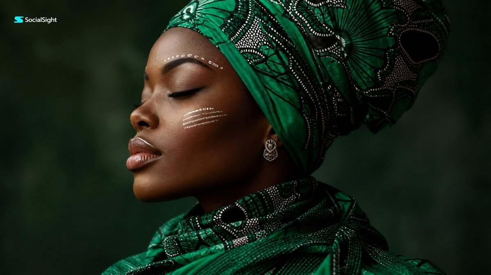

```text
A cinematic close up side profile portrait of a beautiful Black woman with deep glowing skin, eyes closed peacefully, wearing a bold emerald green and black patterned headwrap and matching scarf. Minimal elegant white face paint strokes above the eyebrow and across the cheek, glossy natural lips, small silver earring. Dark muted green studio background with soft atmospheric bokeh, premium fashion editorial lighting, smooth skin texture, dramatic yet calm mood, African inspired beauty portrait, high end magazine cover aesthetic, ultra-realistic photography, shallow depth of field, soft rim light, rich contrast, 85mm lens, f/1.8, 8k detail.

Negative Prompt: text, logo, watermark, extra face paint, messy fabric, distorted face, bad anatomy, harsh shadows, overexposed skin, blurry eyes, plastic skin, low resolution, cartoon, CGI, unrealistic jewelry, extra earrings, deformed nose, asymmetrical lips.
```


---

## 例 665：Late-Night Office Flash Portrait

**来源：** [@iamaiistudio](https://x.com/iamaiistudio/status/2068395305624871253) / [awesome-gpt-image-2-prompts](https://github.com/EvoLinkAI/awesome-gpt-image-2-prompts)

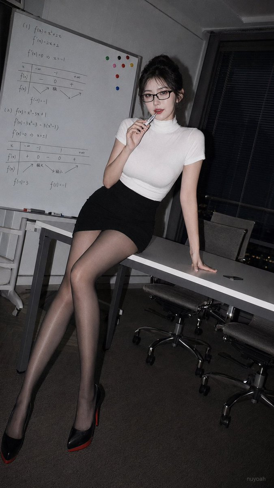

```text
CCD flash photography style, late-night office setting, whiteboard covered in mathematical formulas in the background, black-rimmed glasses, white high-neck top, black high-waisted mini skirt, semi-matte cool-white porcelain skin with realistic skin texture, subject seated at desk, whiteboard marker held close to the lips, slight dutch angle composition, nuyoah aesthetic
```


---

## 例 666：Vintage Motion-Blur Street Portrait

**来源：** [@iamaiistudio](https://x.com/iamaiistudio/status/2068887185269616803) / [awesome-gpt-image-2-prompts](https://github.com/EvoLinkAI/awesome-gpt-image-2-prompts)

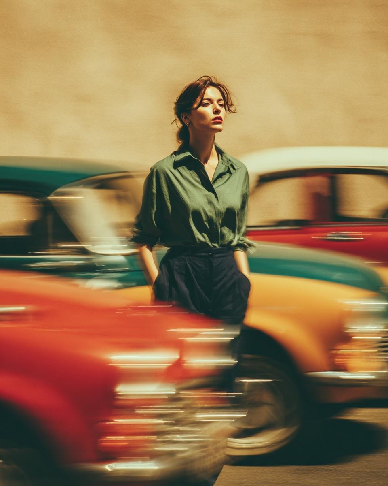

```text
A stylish woman standing still with hands in pockets, wearing a loose sage-green button-up shirt tucked into high-waisted dark trousers. Calm, confident expression. Vintage cars rushing past at high speed behind her, creating dramatic motion blur trails with a long-exposure photography effect. Street portrait setting, warm golden-hour lighting, muted retro color palette with reds, teals, and yellows streaking across the frame. Sharp focus on the woman with shallow depth of field, strong subject isolation. Cinematic realism, editorial fashion mood, nostalgic 1970s film look, soft grain, ultra-detailed, high resolution.
```


---

## 例 667：Top-Down Aerial Studio Portrait

**来源：** [@iamaiistudio](https://x.com/iamaiistudio/status/2069568331821318277) / [awesome-gpt-image-2-prompts](https://github.com/EvoLinkAI/awesome-gpt-image-2-prompts)

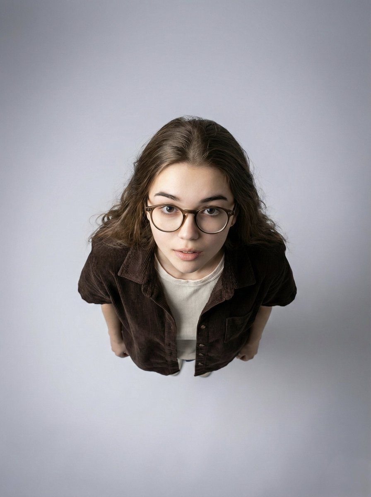

```text
Full prompt: 

Ultra-wide angle, 90-degree top-down aerial studio portrait of a woman looking straight up at the camera. Strict identity preservation from reference image, do not alter face, proportions, skin texture, or expression.

Composition: full-body framing, large negative space surrounding the subject, dramatic isolation and graphic impact.

Subject: woman with round thick-framed stylish glasses. Wearing a deep dark brown short-sleeve button-up shirt in corduroy or textured fabric, with a light beige off-white textured sweater underneath. Natural hairstyle with visible texture and volume, do not alter hair color or structure. Natural realistic skin tone, visible texture, not over-smoothed. Expression: engaging, slightly curious or inquisitive.

Background: minimalist studio backdrop, soft gray gradient, darker at edges, lighter at center directly beneath the subject.

Lighting: soft uniform overhead lighting from above, subtle shadows defining facial features and clothing folds, even illumination, no harsh contrast.

Camera: ISO 150-200, aperture f/1.28, shutter speed 1/200s, high-resolution ultra-detailed.

Color grading: neutral modern tones, soft balanced contrast, clean contemporary look.

Mood: minimalist, modern, contemplative. Strong subject isolation and visual clarity.
```


---

## 例 668：Forced-Perspective Sneaker Portrait

**来源：** [@iamaiistudio](https://x.com/iamaiistudio/status/2069538312357114324) / [awesome-gpt-image-2-prompts](https://github.com/EvoLinkAI/awesome-gpt-image-2-prompts)

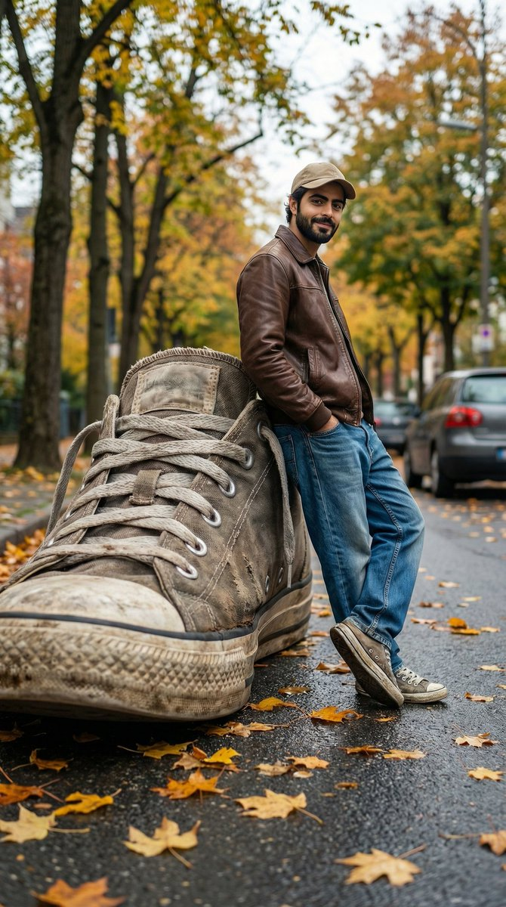

```text
A cinematic forced-perspective street photography scene where a giant worn-out sneaker appears enormous in the foreground, towering over a casually dressed young man leaning against it. The man wears a brown leather jacket, loose blue jeans, sneakers, and a beige cap, standing confidently with hands in pockets. Autumn atmosphere with yellow and orange leaves scattered on the road, talltrees with fall foliage in the background, parked car slightly blurred. Ultra-realistic textures on the shoe sole, visible dirt and fabric wear. Shot from a very low angle to exaggerate scale, shallow depth of field, natural daylight, soft cinematic color grading, realistic shadows, high detail, 8K resolution, professional photography, surreal yet believable forced perspective illusion.
```


---

## 例 669：Cloud-Bloom Editorial Portrait

**来源：** [@ChillaiKalan__](https://x.com/ChillaiKalan__/status/2069471846890959183) / [awesome-gpt-image-2-prompts](https://github.com/EvoLinkAI/awesome-gpt-image-2-prompts)

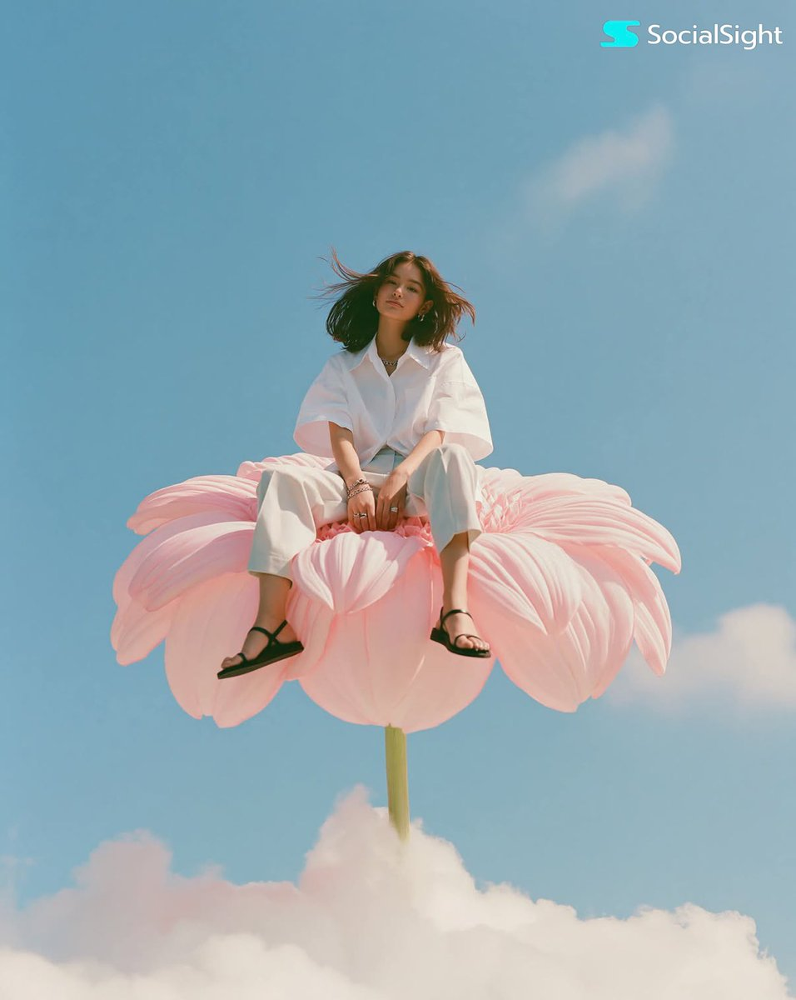

```text
Photorealistic high-fashion editorial image, vertical 4:5. A young adult fashion model sitting calmly on the center of one enormous pink flower growing above the clouds, the flower stem rising from below and disappearing into soft white clouds. Low-angle perspective from slightly below, the flower framing the image, making the flower feel monumental and surreal. The model wears a short sleeve crisp oversized white shirt, loose light trousers, silver jewelry, and black minimal sandals. Natural open brown hair moving softly in the wind, composed expression, slight soft smile. Clean vivid blue sky, a few soft white clouds, huge detailed flower petals, bright natural daylight, crisp vivid color, playful surreal fashion campaign mood, realistic anatomy, natural hands, sharp editorial photography, no text, no logos --ar 4:5 --raw --profile glu65pn --stylize 60 --weird 4 --hd
```


---

## 例 670：Fujifilm Couple Portrait

**来源：** [@iamaiistudio](https://x.com/iamaiistudio/status/2069961089719353505) / [awesome-gpt-image-2-prompts](https://github.com/EvoLinkAI/awesome-gpt-image-2-prompts)

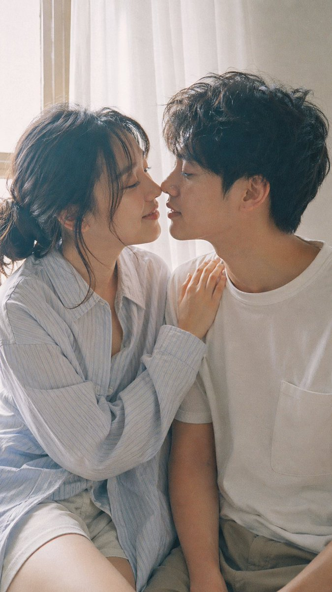

```text
9:16 vertical portrait of a young Japanese couple captured in Fujifilm analog film style

Film aesthetic: Fujifilm Pro 400H / Superia emulation, muted pastel palette, faint green-magenta color cast, low contrast, soft highlight falloff, fine film grain, gentle halation around light sources

Lighting: natural window light, diffused and airy, soft shadow transitions, bright but gentle indoor daylight

Subjects: two young Japanese people, minimal natural makeup, realistic skin with subtle texture and natural imperfections

Female: oversized button-up shirt, loose shorts, casual relaxed styling
Male: simple light t-shirt or shirt, clean understated look
Both: natural, slightly tousled hair

Pose: intimate closeness, sitting or standing side by side; she leans gently toward him, one hand on his shoulder or chest; he tilts in, faces nearly touching, the moment just before a kiss

Expression: soft natural smiles or tender gaze toward each other, genuine emotional warmth

Camera: waist-up close framing, eye-level angle, slight handheld quality, intimate feel

Setting: minimal indoor space near a window, soft curtains, clean neutral background

Mood: warm, romantic, quiet everyday intimacy

Quality: ultra-realistic, analog film character, gentle grain, slight softness, natural imperfections
```


---

## 例 671：Lantern Hiker Studio Portrait

**来源：** [@iamaiistudio](https://x.com/iamaiistudio/status/2069812774277087740) / [awesome-gpt-image-2-prompts](https://github.com/EvoLinkAI/awesome-gpt-image-2-prompts)

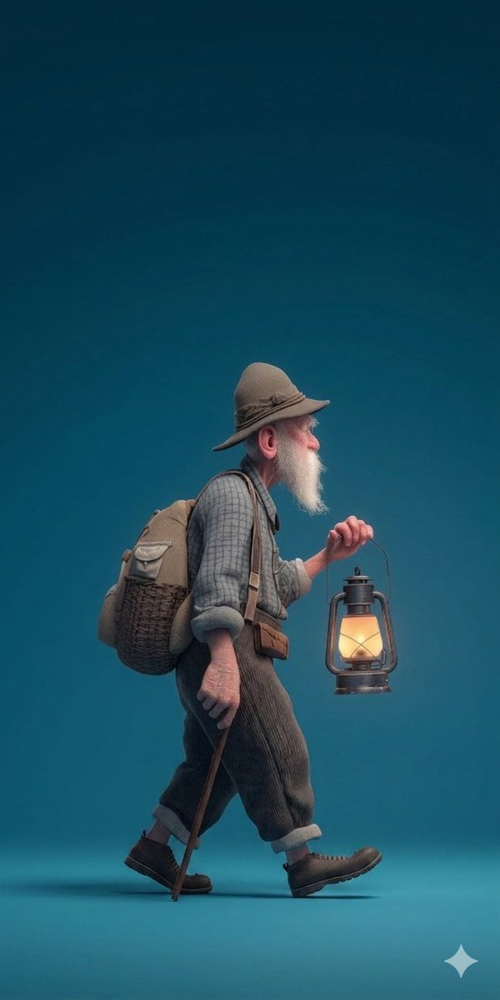

```text
3D render, stylized full-body side-view portrait of an elderly male hiker with a long white beard, walking right. Solid seamless deep-teal studio background with soft floor reflections. He wears a brown wide-brim felt hat, a gray-blue plaid shirt, cuffed brown corduroy trousers, and scuffed dark work boots. Large canvas-and-wicker backpack with leather straps on his back. Right hand holds a lit vintage hurricane lantern (brass frame, glass globe) casting a warm amber glow. Left hand grips a plain wooden walking stick. Textured matte finish, soft diffused studio lighting, vertical composition with generous negative space above.
```


---

## 例 672：Monochrome Studio Portrait Grid

**来源：** [@harboriis](https://x.com/harboriis/status/2071068008341262538) / [awesome-gpt-image-2-prompts](https://github.com/EvoLinkAI/awesome-gpt-image-2-prompts)

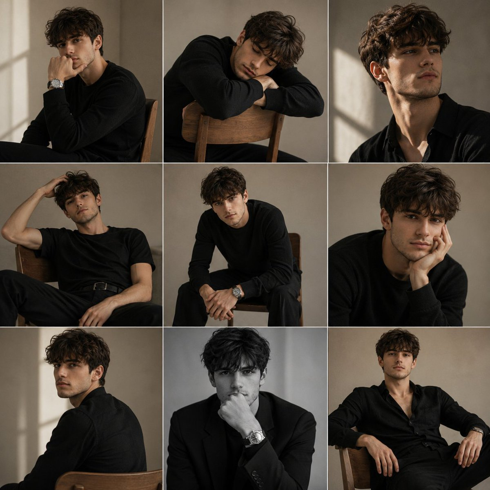

```text
A premium fashion editorial portrait series featuring a stylish young man photographed inside a minimalist studio with warm beige walls and soft natural window light. The collection consists of nine unique portraits arranged in a clean 3×3 grid, each showing a different relaxed pose and expression while maintaining a cohesive luxury editorial aesthetic.
The model has thick messy wavy dark hair, defined facial features, and wears an elegant monochrome wardrobe consisting entirely of black clothing, including fitted black shirts, tailored black trousers, lightweight knitwear, plain black t shirts, and a structured black blazer. A silver wristwatch subtly completes several looks.
Each portrait captures a different emotion and pose. Resting his chin on his hand while sitting sideways on a wooden chair. Sleeping across the chair back in a quiet introspective moment. Looking away with a sharp jawline highlighted by side lighting. Reclining casually with one hand through his hair. Leaning forward with elbows on knees and an intense gaze. Resting his face against his hand in a thoughtful pose. Looking back over his shoulder while seated. Sitting with one fist against his lips in black and white. Relaxing with an open collar and confident posture.
Soft diffused daylight enters from a large window, creating smooth shadows and subtle highlights that emphasize facial structure and fabric textures. The backgrounds remain clean and uncluttered with warm neutral tones throughout.
Shot on an 85mm full frame lens at f/2.2, shallow depth of field, soft editorial lighting, muted color palette, subtle film grain, luxury magazine photography, photorealistic, ultra detailed skin texture, premium fashion campaign, minimalist composition, 8K HDR.
```


---

## 例 673：Coastal Daydream Film Portrait

**来源：** [@mehvishs25](https://x.com/mehvishs25/status/2071043508346183695) / [awesome-gpt-image-2-prompts](https://github.com/EvoLinkAI/awesome-gpt-image-2-prompts)

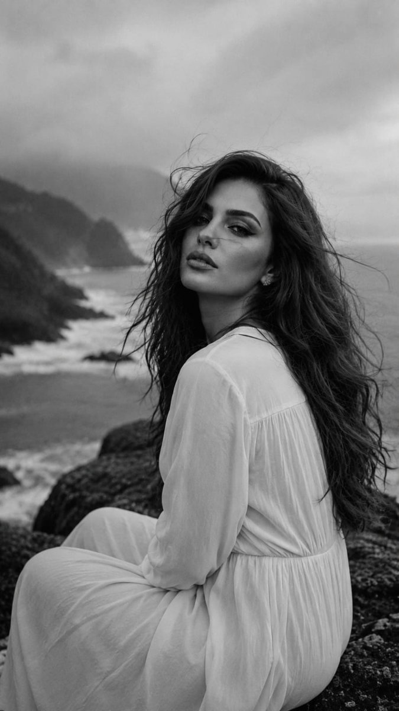

```text
Coastal Daydream
Composition: Three-quarter close-up captured from slightly behind the shoulder, with wind-swept hair creating organic movement across the frame while the coastline softly recedes into mist.
Prompt:
Using the uploaded photo as the exact face reference. Preserve the face identity perfectly without modifying facial structure, proportions, expression anatomy, skin texture, or unique features. No beautification, no face reshaping, no artificial symmetry, no AI-generated appearance. Photorealistic candid photograph captured on a worn disposable film camera, monochrome cinematic photography, authentic 35mm grain, subtle exposure inconsistencies, natural imperfections, vintage analog character, documentary realism.
The woman sits quietly on rugged coastal rocks damp from ocean spray, wearing a flowing white dress with soft fabric folds gathered naturally around her. Strong sea breeze moves through her voluminous hair, lifting sections into the air while delicate strands drift across her cheeks and lips. Her head is turned slightly toward the shoreline, eyes closed, wearing a calm reflective expression and a faint genuine smile as she enjoys the cool ocean wind.
Behind her, towering sea cliffs disappear gradually into dense coastal fog beneath a dramatic cloud-filled sky. Waves break softly against distant rocks, adding subtle atmosphere without distracting from the subject. Diffused overcast daylight creates gentle tonal transitions across the face and dress, emphasizing realistic skin texture and natural film contrast.
Shot with an 85mm lens, shallow depth of field, cinematic documentary framing, emotional editorial photography, realistic analog exposure, soft focus falloff. The composition captures her from just behind the shoulder, allowing wind-blown hair to partially veil the frame while the mist-covered coastline stretches into the background, creating a quiet sense of solitude and freedom.
no ultra-clean digital sharpness, no CGI appearance, no beauty-retouching, no fashion-poster composition, no studio lighting, no centered framing, no black bars, no artificial skin smoothing, aspect ratio vertical.
```


---

## 例 674：Chrome Visor Side Profile

**来源：** [@iamaiistudio](https://x.com/iamaiistudio/status/2071712457262080034) / [awesome-gpt-image-2-prompts](https://github.com/EvoLinkAI/awesome-gpt-image-2-prompts)

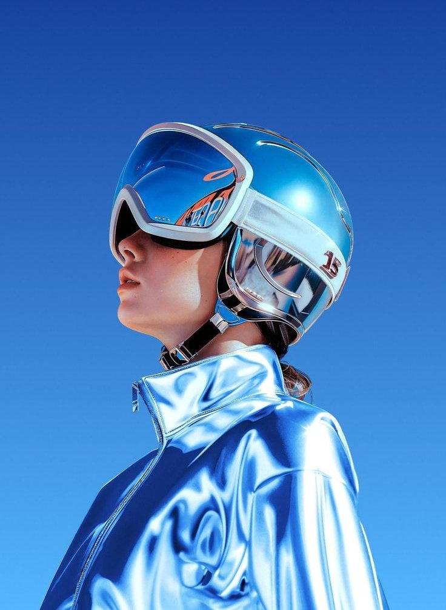

```text
Photorealistic sci-fi portrait, young woman in left-facing side profile, dressed in a mirror-finish chrome-blue jacket and a futuristic helmet with a wide glossy visor obscuring her eyes. Helmet features smooth curves, white trim, clear side panels with subtle tech detailing. Visor has a cool blue reflective sheen, cyberpunk meets space-age fashion. Clean, minimal framing against a gradient blue backdrop. Cinematic studio lighting, high contrast, mirror-like reflections across jacket and helmet surfaces. Razor-sharp detail on facial features and material textures, slight bokeh, 8K resolution, hyper-realistic editorial aesthetic.
```


---

## 例 675：3D Pixel Food Transformation

**来源：** [@iamaiistudio](https://x.com/iamaiistudio/status/2063171137685569561) / [awesome-gpt-image-2-prompts](https://github.com/EvoLinkAI/awesome-gpt-image-2-prompts)

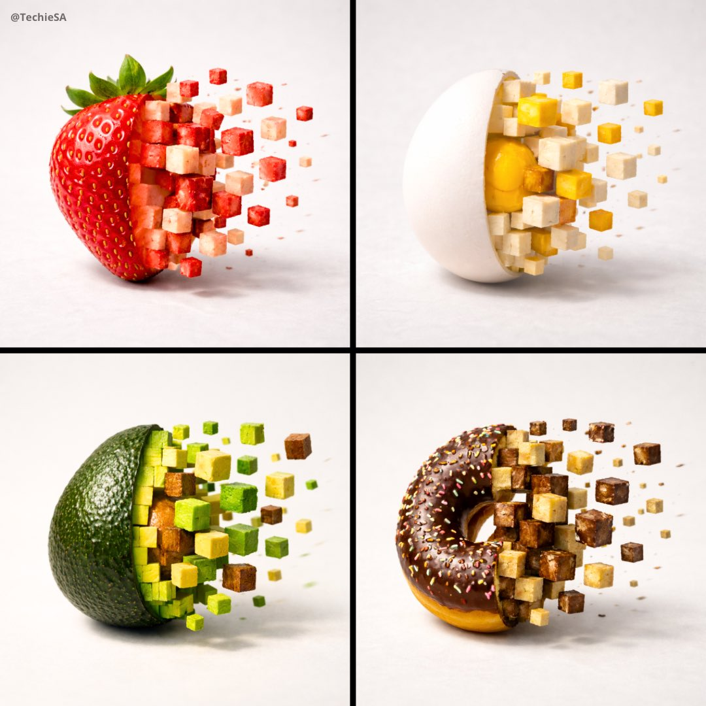

```text
A minimalist food photograph featuring a single [FOOD] on a clean matte white surface, caught mid-transformation into a 3D pixel art style. The left half is perfectly photorealistic while the right half dissolves into large floating geometric cubes, each cube exposing the food's vibrant colors, textures, and inner details. Soft studio lighting, gentle shadows, shallow depth of field, hyperrealistic meets geometric abstraction, subtle motion blur on the cubes. High resolution cinematic close-up composition.

Full prompt:
```


---

## 例 676：Ancient Palace Perfume Ad

**来源：** [@iamaiistudio](https://x.com/iamaiistudio/status/2063187221730185227) / [awesome-gpt-image-2-prompts](https://github.com/EvoLinkAI/awesome-gpt-image-2-prompts)

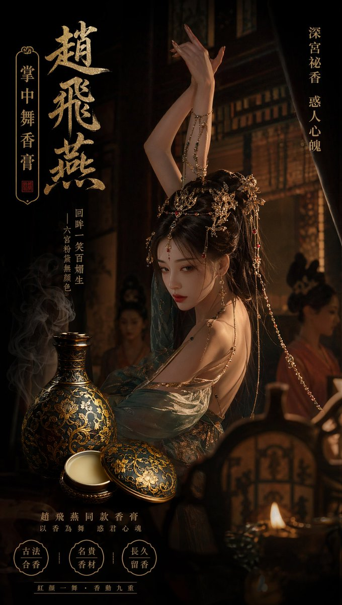

```text
Full prompt:

Ancient Chinese palace perfume advertisement inspired by the legendary dancer Zhao Feiyan. A bronze bottle with gold-inlaid twisting lotus vines. Mysterious, cold, and haunting imperial harem atmosphere. Vertical portrait format, 9:16 ratio.
```


---

## 例 677：Ingredient Callout Ice Cream Ad

**来源：** [@iamaiistudio](https://x.com/iamaiistudio/status/2067465624683700642) / [awesome-gpt-image-2-prompts](https://github.com/EvoLinkAI/awesome-gpt-image-2-prompts)

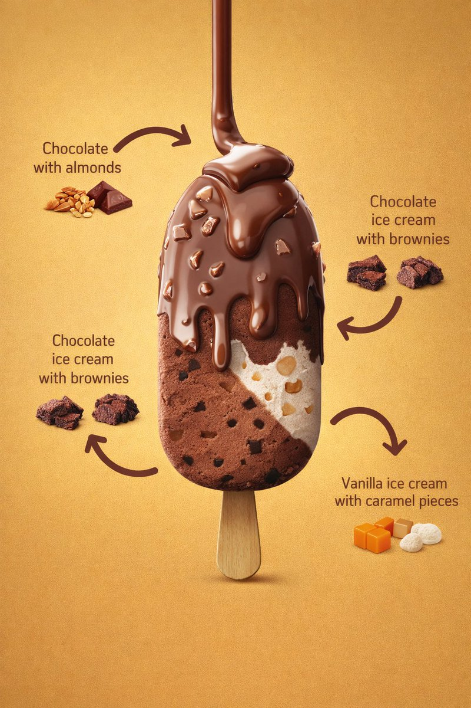

```text
{
  "resolution": "8K",
  "aspect_ratio": "3:4",
  "image_type": "photorealistic commercial product render",
  "scene_description": {
    "main_subject": "A vertically centered ice cream bar mounted on a wooden stick",
    "orientation": "upright, front-facing, slightly elevated perspective",
    "composition": "single product centered with surrounding ingredient labels and curved arrows"
  },
  "background": {
    "color": "warm golden-yellow gradient",
    "texture": "smooth, matte, evenly illuminated",
    "lighting_falloff": "subtle vignette, darker towards edges"
  },
  "lighting": {
    "type": "studio lighting",
    "key_light": "soft frontal light emphasizing chocolate gloss",
    "fill_light": "balanced fill preserving texture detail",
    "specular_highlights": "visible on melted chocolate coating",
    "shadows": "soft shadow beneath the stick"
  },
  "ice_cream_bar": {
    "shape": "rounded rectangular bar",
    "surface": "smooth with visible embedded inclusions",
    "layers": [
      {
        "layer_position": "top coating",
        "material": "milk chocolate",
        "state": "melted and dripping",
        "texture": "glossy, thick, fluid",
        "details": [
          "multiple chocolate drips flowing downward",
          "irregular almond pieces embedded in coating",
          "rounded drip edges pulled by gravity"
        ]
      },
      {
        "layer_position": "left interior",
        "material": "chocolate ice cream",
        "texture": "dense, creamy",
        "details": [
          "small dark brownie chunks evenly dispersed",
          "matte finish contrasting outer chocolate"
        ]
      },
      {
        "layer_position": "right interior",
        "material": "vanilla ice cream",
        "texture": "smooth and creamy",
        "details": [
          "visible caramel pieces",
          "light beige caramel chunks with rounded edges"
        ]
      }
    ]
  },
  "stick": {
    "material": "light natural wood",
    "texture": "smooth with subtle grain",
    "shape": "rounded edges, flat profile",
    "visibility": "fully visible below ice cream bar"
  },
  "ingredient_callouts": {
    "style": {
      "arrows": "curved, thick, dark brown",
      "text_color": "dark brown",
      "font_style": "clean sans-serif",
      "layout": "balanced around product"
    },
    "labels": [
      {
        "text": "Chocolate with almonds",
        "position": "top-left",
        "visual_aid": ["whole almonds", "small chocolate squares"]
      },
      {
        "text": "Chocolate ice cream with brownies",
        "position": "left-middle",
        "visual_aid": ["brownie chunks"]
      },
      {
        "text": "Chocolate ice cream with brownies",
        "position": "right-middle",
        "visual_aid": ["brownie chunks"]
      },
      {
        "text": "Vanilla ice cream with caramel pieces",
        "position": "bottom-right",
        "visual_aid": ["caramel cubes", "white vanilla pieces"]
      }
    ]
  },
  "color_palette": {
    "primary_colors": ["milk chocolate brown", "golden yellow", "cream white"],
    "secondary_colors": ["dark brownie brown", "light caramel orange", "almond beige"]
  },
  "render_quality": {
    "sharpness": "extreme micro-detail visibility",
    "texture_fidelity": "high realism",
    "noise": "none",
    "depth_of_field": "moderate, product fully in focus"
  },
  "style_tags": [
    "luxury dessert advertising",
    "hyper-realistic food photography",
    "commercial product render",
    "clean studio composition"
  ]
}
```


---

## 例 678：VOLT Rush Citrus Burst

**来源：** [@iamaiistudio](https://x.com/iamaiistudio/status/2071742565339320451) / [awesome-gpt-image-2-prompts](https://github.com/EvoLinkAI/awesome-gpt-image-2-prompts)

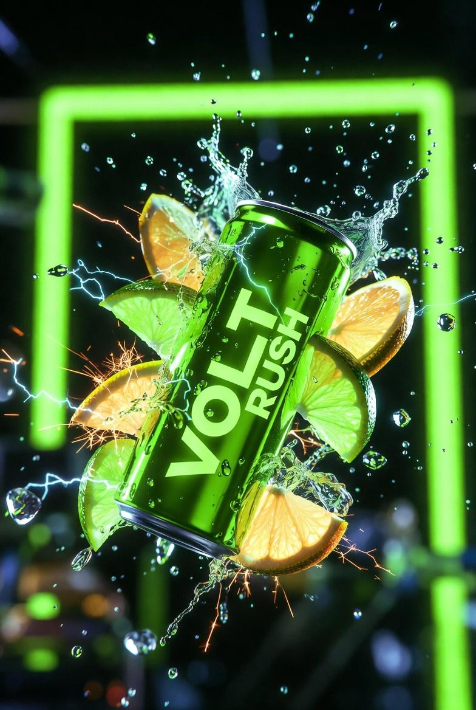

```text
Ultra-cinematic product photography of a neon-green energy drink can labeled "VOLT RUSH", tilted at a sharp diagonal, bursting through glowing citrus slices and electric sparks. Frozen lime juice splashes and ice shards suspended mid-air, micro droplets clearly visible. High-contrast studio lighting with green neon rim lights, deep dark background, glossy aluminum surface, shallow depth of field, photorealistic, 8K, premium advertising style.
```


---

## 例 679：Vertical Wuxia Heroine Portrait

**来源：** [@CoderDaMing](https://x.com/CoderDaMing/status/2047127585256358221) / [awesome-gpt-image-2-prompts](https://github.com/EvoLinkAI/awesome-gpt-image-2-prompts)

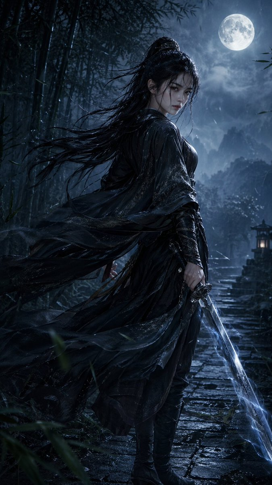

```text
9:16 竖版，极致武侠风，绝美东方女侠，20岁出头，冷艳锐利丹凤眼，眉宇英气逼人，肤白如玉，长直黑发湿漉漉随狂风剧烈飞舞，几缕发丝贴在脸颊和颈侧，穿着湿透的深黑改良武侠劲装，外披宽袖玄色长袍，衣袍和长袖被风吹得剧烈飘扬翻飞，紧身劲装勾勒身材，腰束软剑带，足踏长靴，右手持一把古剑，剑身散发幽蓝剑气光芒，动态姿势：身体微侧回眸，衣袂猎猎，背景为月夜雨雾笼罩的竹林古道，巨大明月高悬，石板小径，古灯笼，薄雾雨丝，戏剧性冷月光与蓝光剑气结合，湿身水光效果，超强动态感，细腻布料褶皱、头发丝飘动、真实水珠反光，电影级光影，8k，masterpiece, best quality, ultra realistic, cinematic, dramatic atmosphere
```


---

## 例 680：Vertical Artistic Portrait of a Young Eastern Woman

**来源：** [@zhiyangzhu22222](https://x.com/zhiyangzhu22222/status/2046952985562062888) / [awesome-gpt-image-2-prompts](https://github.com/EvoLinkAI/awesome-gpt-image-2-prompts)

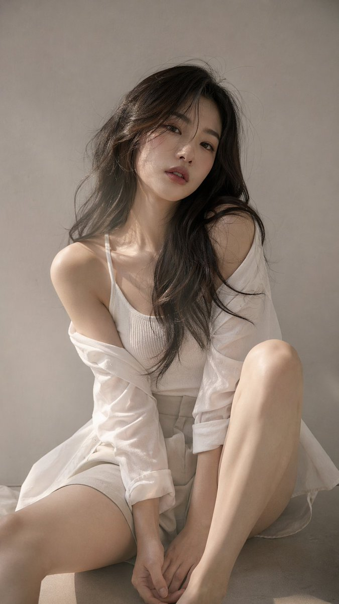

```text
9:16 竖向构图，单人女性艺术肖像，年轻东方女生，五官清秀，脸部线条柔和，皮肤自然通透，保留真实肌理，气质安静高级，带一点疏离感和故事感。
摄影棚风格与自然光融合，柔和侧光，面部有细腻高光，阴影轻柔，整体光线通透不刺眼，带轻微黑雾滤镜效果，微朦胧、微泛光、空气感强。
背景极简干净，奶油灰、米白、浅卡其或雾感暖灰色墙面，留有大面积负空间，整体画面简洁、有呼吸感。
模特坐在地面或低台上，一条腿自然弯曲，一条腿放松伸展，身体轻微前倾或侧倾，肩膀不对称，头部轻轻倾斜，动作自然松弛，不刻意摆拍。
表情平静克制，眼神柔和，略微疏离，带一点若有所思的情绪，嘴唇自然微张或轻闭，状态慵懒、安静、细腻。
发型为自然蓬松的长发，微凌乱碎发，发丝轻柔，有空气感和层次感，像刚整理过但保留自然随性感。
妆容为高级淡妆，韩系清透底妆，皮肤柔雾光泽，鼻梁与面颊有自然高光，眉形干净，眼妆淡雅但有神，睫毛纤长，唇色为低饱和玫瑰豆沙色或奶茶裸粉色。
服装为简约高级风：米白色紧身罗纹针织背心，外搭宽松白衬衫或柔软针织开衫，下装为高腰半裙或简约短裤，布料柔软贴合身形但不过分暴露，呈现自然身体线条与文艺感。
画面强调细腻质感、柔和色调、轻法式与韩系杂志感结合，真实摄影感，电影级肤色，细节丰富，层次分明，构图克制，高级审美，时尚 编辑人像，柔和的电影感人像，细腻的质感，超高细节，逼真，优雅，精致，高端时尚摄影，含蓄的性感，简洁的构图。
```


---

## 例 681：Polaroid Frame Breakout Scene

**来源：** [@MajaDesignJP](https://x.com/MajaDesignJP/status/2047235632934928765) / [awesome-gpt-image-2-prompts](https://github.com/EvoLinkAI/awesome-gpt-image-2-prompts)

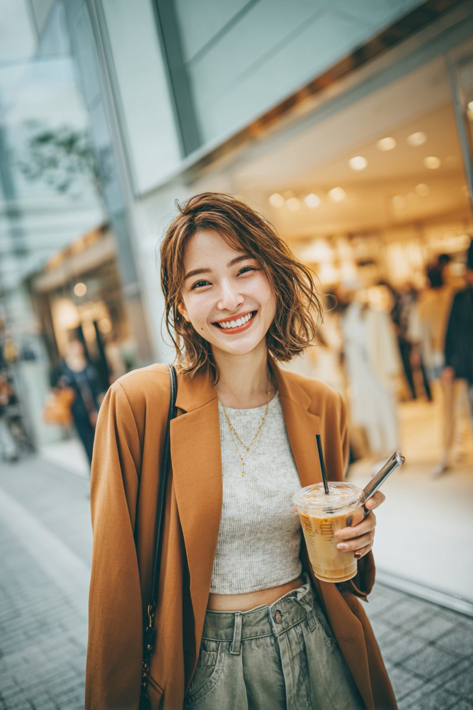

```text
ポラロイド写真の中に人が写っていて、その人がフレームから外に飛び出している画像。日本語が書いてある画像生成して

←下の画像
GPT Image-2で生成したやつ→
```


---

## 例 682：Printable Paint by Numbers

**来源：** [@TheRoaringToady](https://x.com/TheRoaringToady/status/2050469389720314030) / [awesome-gpt-image-2-prompts](https://github.com/EvoLinkAI/awesome-gpt-image-2-prompts)

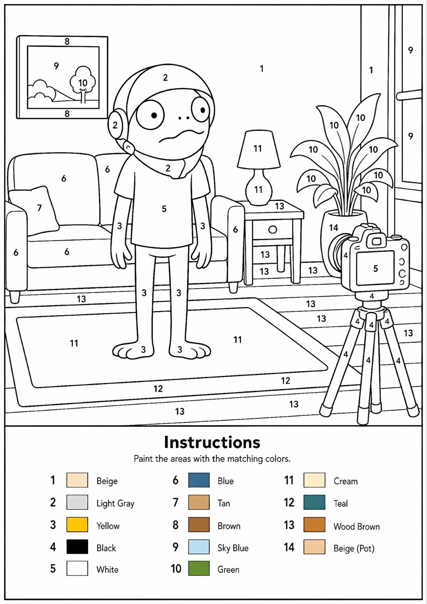

```text
🎨 This GPT Image 2 prompt turns any image into a printable paint-by-numbers page. For best results, use ChatGPT in Thinking mode. I think we should call it numberfying. The intellectuals can call it Colorbookification. 😂 I tried it with a few TurboToadToken images and the results are wild. 🐸💛 Create it. Print it. Paint it. For kids, adults, and anyone who wants an easy creative activity. Try it and post your results in the comments. Prompt below 👇 Create a professional high-resolution paint-by-numbers template from the provided image as a single PNG only. Use an A4 portrait ratio canvas at 300 DPI with a pure white background. The main artwork must be a clean black-and-white line drawing containing only black outlines, black numbers, and white unfilled paintable areas. Do not create a PDF, document, mockup, multi-page layout, or colored version. Do not use color, gray, shading, texture, gradients, transparency, or pre-filled areas in the main artwork. Analyze the original image and choose the number of colors adaptively based on image complexity, from 1 to a maximum of 14 colors. If the image has only 1–2 important colors, use only 1–2 colors; for simple images use 3–6 colors; for medium complexity use 7–10 colors; for complex, photographic, or highly detailed images use 11–14 colors. Do not force unnecessary colors. Assign each selected color one unique number and merge similar shades unless separation is essential for recognition. Convert the image into simplified, fully closed, easy-to-paint regions while preserving the recognizable composition, main objects, characters, text, logos, foreground, background, and key details. Every paintable white region must contain the correct black number, centered clearly inside the matching area, readable, upright, and not touching outlines. Large black or dark areas from the original must remain white paintable regions with the correct number, not filled black. Only tiny permanent black line details, such as mouth lines, nostrils, pupils, eyelashes, seams, or small decorative strokes, may remain unnumbered. At the bottom of the same PNG, add a neat legend section with the heading “Instructions”, the sentence “Paint the areas with the matching colors.”, and a list of every used number with a small color swatch and the English color name. Color swatches may appear only in the legend. Ensure the numbering exactly matches the legend, every paintable area is numbered, all regions are closed, and the final result is clean, professional, print-ready, and recognizable as the original image.
```


---

## 例 683：Pergola Blueprint Build Split

**来源：** [@iamaiistudio](https://x.com/iamaiistudio/status/2067142493389603170) / [awesome-gpt-image-2-prompts](https://github.com/EvoLinkAI/awesome-gpt-image-2-prompts)

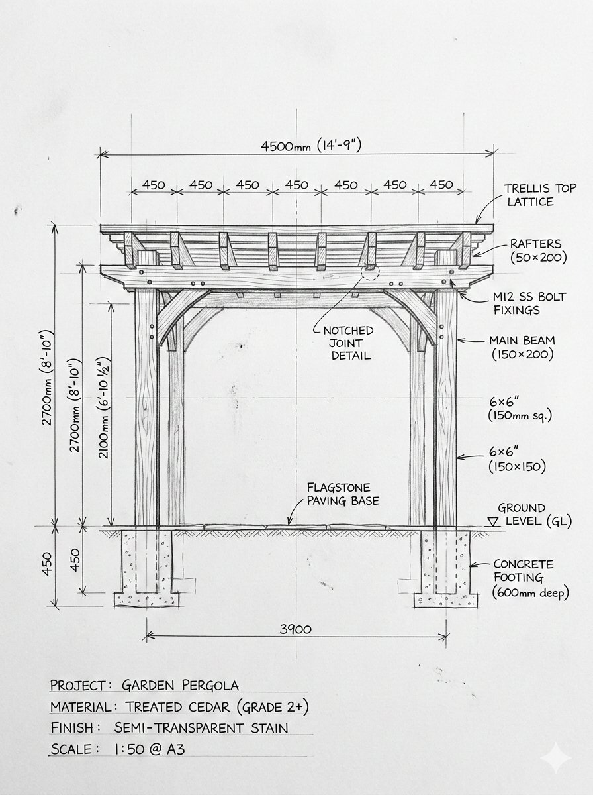

```text
Architectural split-scene: left side shows a hand-sketched pencil blueprint of a wooden garden pergola on white paper, front and slight side elevation with construction lines, dimension labels, and handwritten notes, posts and crossbeams precisely drafted in a professional hand-sketched technical style. Right side shows the finished pergola fully built in a real garden, photographed from a low front-corner angle at eye level showing the full timber beam depth. Natural wood texture with realistic joints, installed on grass with surrounding plants, soft daylight and grounded shadows. Photorealistic architectural visualization.

Pergola Blueprint Prompt: Hand-drawn architectural pencil sketch of a wooden garden pergola on white paper. Front and slight side elevation view with clear proportions.

Construction lines, dimensions and handwritten notes visible. Wooden posts and cross beams precisely drafted. Professional but hand-sketched technical style. Clean white background.

Finished Pergola: Fully built wooden pergola in a real garden, matching the exact structure and proportions from the sketch. Viewed from a low front corner perspective at eye level, showing depth and the full beam structure instead of a flat elevation. Natural wood texture with realistic joints and connections. Installed on grass with surrounding plants. Soft daylight with grounded shadows. Photorealistic architectural visualization.
```


---

## 例 684：Weightless Morning Storyboard

**来源：** [@DrSadek_](https://x.com/DrSadek_/status/2068438789236699582) / [awesome-gpt-image-2-prompts](https://github.com/EvoLinkAI/awesome-gpt-image-2-prompts)

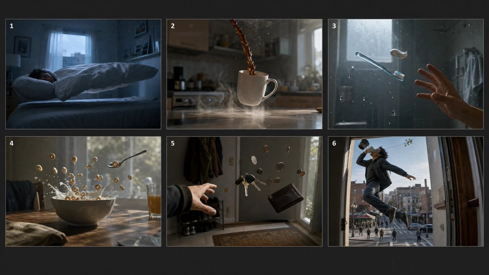

```text
A cinematic 6-panel storyboard sheet on a clean dark charcoal background, arranged in a 3-column by 2-row grid of widescreen 16:9 panels with thin neutral gray borders and a small white number label in the top-left corner of each panel. Photorealistic film stills, naturalistic dawn lighting, shallow depth of field, natural skin texture with subtle imperfections, candid composition, muted naturalistic color grade. Unifying concept: an ordinary morning where gravity has quietly stopped working — everyday objects and people drifting weightlessly. Panel 1: a bedroom at dawn, soft blue light, a sleeping person and their duvet drifting an inch above the mattress, dust motes hanging perfectly still in the air. Panel 2: a kitchen close-up, dark coffee pouring upward out of a white mug in a slow liquid ribbon, steam curling downward toward the counter. Panel 3: a bathroom, a toothbrush hovering mid-air with a pearl-like blob of toothpaste suspended beside it, scattered water droplets frozen around a reaching hand. Panel 4: a breakfast table, cereal pieces and milk orbiting a bowl in a lazy floating halo, a single spoon chasing one drifting cereal O. Panel 5: an entryway, keys, coins and a wallet frozen in a constellation above a doormat, a hand sweeping slowly through them. Panel 6: a front door swinging open onto an ordinary busy street below, a person floating out unbothered while sipping from an upside-down coffee cup. Each panel a distinct camera framing, photoreal textures. Small white label text — EXACT TEXT: '1','2','3','4','5','6' — one number per panel, no extra text, no duplicate text.
```


---

## 例 685：Dog Bone Spacecraft Morph

**来源：** [@iamaiistudio](https://x.com/iamaiistudio/status/2068969150949843373) / [awesome-gpt-image-2-prompts](https://github.com/EvoLinkAI/awesome-gpt-image-2-prompts)

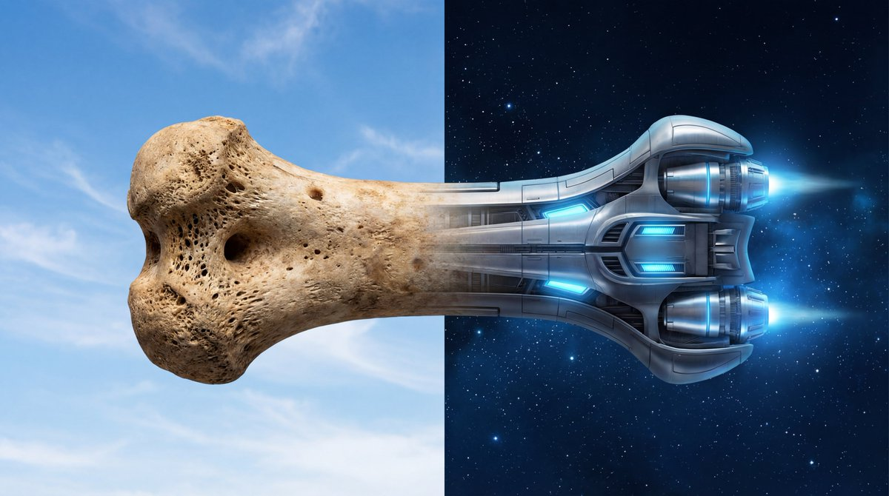

```text
A photorealistic split-frame composition divided precisely down the center. Left half: a detailed dog bone resting against the dividing edge, set against a bright blue sky with soft clouds. Right half: the bone organically morphs into a breathtaking futuristic spacecraft, its silhouette and form continuing the exact contours of the bone into a deep starfield. The transition across the centerline is seamless, making the organic structure flow naturally into the mechanical, set against a clean neutral backdrop to draw full focus to both subjects.
```


---

## 例 686：40K Power Armour Squad Portrait

**来源：** [@EvaGlitchAI](https://x.com/EvaGlitchAI/status/2065204081363435604) / [awesome-gpt-image-2-prompts](https://github.com/EvoLinkAI/awesome-gpt-image-2-prompts)

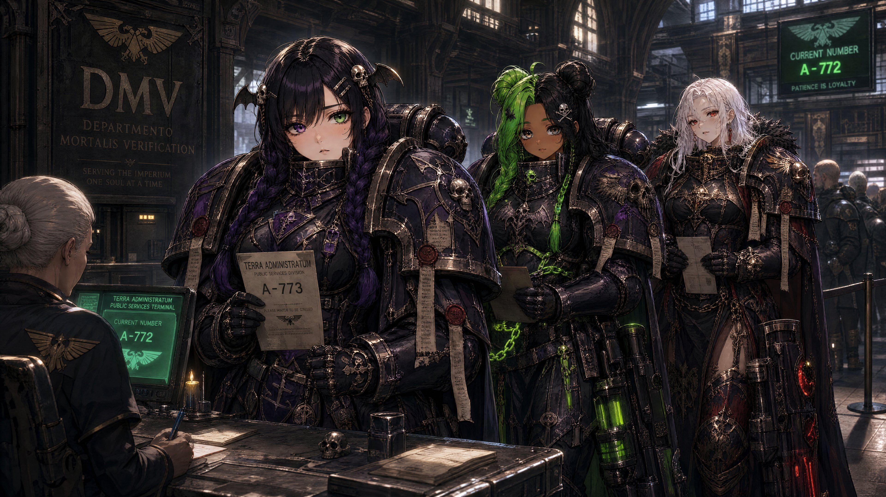

```text
Prompt of the Day: 40K POWER ARMOUR SQUAD ⚔️🛡️💜💚

Today’s Prompt of the Day turns your characters into a 40K-inspired warriors. Yes this was done before but i wanted to see how much better GPT 2 can do it now

Use one character reference for a solo warrior, or attach multiple character references to create a full squad. The prompt is built to count every reference image and turn each one into a separate visible character, with no helmets covering their faces.

Type your chosen scene into the SCENE SELECTOR at the top, then attach your character reference image or images.

Try scenes like:

a brutal battlefield charge
a gothic starship boarding action
a candlelit shrine world cathedral
an industrial forge world
a grim underhive alley
a quiet off-duty barracks scene
a solemn prayer before battle

Have fun with this one ⚔️🛡️

............................PROMPT STARTS HERE............................

SCENE SELECTOR:
[Type the 40K-inspired scene you want here.]
Examples:

brutal battlefield charge through smoke, fire, shell craters, and ruined gothic architecture

boarding action inside a colossal warship corridor
cathedral-like shrine world interior filled with candles, banners, stained glass, and incense haze
industrial forge world with sparks, chains, molten metal, pipes, and huge machinery
command deck before battle with tactical holograms and vast void windows
grim underhive alleyway with pipes, neon grime, metal walkways, and urban decay
heroic last stand surrounded by wreckage, fallen enemies, burning vehicles, and drifting ash
quiet off-duty scene inside a fortress barracks, armoury, workshop, canteen, or hangar
solemn prayer before battle with relics, banners, candles, incense smoke, and sacred war symbols
everyday-life scene in a gothic sci-fi military stronghold, training yard, armoury, repair bay, or mess hall
Use the typed scene selector as the main scene concept.
If no custom scene is typed, choose one of the example scenes that best fits the attached character reference image or images and the overall character vibe.
Adapt the environment, action, pose, props, camera, and mood to match the selected scene.
Keep the final scene clearly inspired by 40K-style grimdark far-future gothic military sci-fi.

STRICT REFERENCE COUNT RULE:
Before creating the image, count the number of attached character reference images.
Create exactly one main character from each attached character reference image.
The number of main characters in the final image must exactly match the number of attached character reference images.
If 1 character reference image is attached, create exactly 1 main character.
If 2 character reference images are attached, create exactly 2 main characters.
If 3 character reference images are attached, create exactly 3 main characters.
If 4 character reference images are attached, create exactly 4 main characters.
If more character reference images are attached, create exactly that same number of main characters.
Each attached character reference image is a separate person.
Each attached character reference image must appear once and only once as their own distinct main character.
Do not treat any attached character reference image as optional.
Do not ignore, drop, replace, combine, or simplify any attached character reference image.

MULTI-CHARACTER IDENTITY RULE:
Use every attached character reference image as its own separate character identity source.
Character 1 must be based only on the first attached character reference image.
Character 2 must be based only on the second attached character reference image.
Character 3 must be based only on the third attached character reference image.
Character 4 must be based only on the fourth attached character reference image.
Continue this pattern for any additional attached character reference images.

Do not use the first attached character reference image to create multiple characters.
Do not duplicate the first character to fill the group.
Do not create variations, twins, clones, alternate outfits, mirrored copies, recolours, or slightly edited versions of the same character.
Do not merge two or more attached character references into one design.
Do not let one character’s face, hairstyle, colours, outfit motifs, body type, species traits, or accessories replace another character’s identity.
SINGLE-CHARACTER FALLBACK RULE:
If only one character reference image is attached, create one main character only.
Do not create a squad, clone group, twin, alternate version, second warrior, companion, or duplicate of the character.
The single character should remain the only main subject.

THREE-CHARACTER PRIORITY RULE:
If three character reference images are attached, this is a three-character squad image.
All three referenced characters must appear together in the same scene.
All three faces must be visible.
All three armour designs must be distinct.
All three characters must be clearly separated in the composition.
Use a readable left-center-right squad arrangement unless the selected scene needs another clear formation.
CHARACTER REFERENCE RULES:
Preserve each attached character’s face shape, hairstyle, hair colour, eye colour, expression, body language, signature colour palette, outfit motifs, accessories, silhouette, species traits, proportions, and overall character vibe.
The final image must clearly show every attached character as a separate, recognizable individual.
Every character must still clearly look like their own attached reference image.

Keep each character’s head uncovered with no helmet, full face mask, or visor covering the face.
The face, hair, and identity of every referenced character must remain clearly visible.
Hard style rule:
Use the attached character reference image or images as the visual style reference for the final image.
Preserve the visual art style, rendering language, line quality, colour handling, facial stylization, shading style, texture treatment, background treatment, and overall stylization of the attached reference image or images while transforming the character or characters into 40K-inspired power-armoured warriors.
If the references are anime, keep them anime. If they are stylized, keep that stylization.
Do not turn the final image photorealistic unless specifically requested.
Scene concept:
Create a 16:9 horizontal widescreen cinematic illustration based on the scene written in the SCENE SELECTOR.
Show the attached character or characters transformed into custom 40K-inspired grimdark far-future power-armoured warriors.
The image should feel heavy, dramatic, mythic, warlike, and character-driven, with strong atmosphere, clear storytelling, and a powerful sense of scale.

Character transformation:
Transform every attached reference character into a custom 40K-inspired power-armoured version of themselves while preserving their original identity.
The redesign should center on massive stylized power armour with broad shoulder plates, reinforced chest armour, heavy gauntlets, armoured boots, thick mechanical joints, gothic sci-fi military detailing, sacred-warrior ornamentation, battlefield wear, and an oversized futuristic weapon.
The armour must feel imposing, brutal, ceremonial, expensive, and engineered for endless war.
Keep the head uncovered so each character’s original face, hair, and expression remain visible.
Use each attached character’s colours, motifs, accessories, outfit shapes, symbols, materials, personality, and overall vibe as the foundation for their armour redesign.
The armour should feel like it belongs in a 40K-inspired universe, but it must be custom-built from the attached character’s own identity.
If multiple characters are present, each one must have a distinct armour design based on their own original reference rather than all wearing identical suits.
Armour design:
Give each character huge futuristic power armour inspired by 40K-style grimdark gothic sci-fi warfare.
Include broad pauldrons, a strong chest plate, layered armour segments, mechanical joints, reinforced thighs, heavy boots, thick gauntlets, power cables, vents, seals, relic-like details, engraved plates, purity-scroll-like decorations, battle damage, and character-specific symbols.
Adapt each armour design to that character’s original style, colour palette, outfit motifs, accessories, personality, and silhouette.
Keep the armour stylized to match the attached reference image or images rather than realistic.

Weapon design:
Give each character a fitting oversized futuristic weapon inspired by 40K-style grimdark sci-fi warfare.
The weapon can be a heavy explosive sci-fi rifle, massive energy weapon, brutal motorized serrated melee weapon, glowing power blade, ceremonial war hammer, plasma-like cannon, heavy pistol, or other far-future battlefield weapon appropriate to their vibe and role.
Each character’s weapon should be different and should match that character’s identity, armour design, and role in the scene.
If the selected scene is calm, ceremonial, or off-duty, the weapon may be held at rest, slung, holstered, leaned nearby, placed on a table, or carried ceremonially, but it should still be visible.
If the selected scene is battle-heavy, make each weapon active, weighty, readable, and integrated into the pose.
Scene adaptation rules:
If the selected scene is battle-heavy, make the action dynamic but readable, with strong poses, clear silhouettes, environmental destruction, smoke, fire, debris, and a strong sense of momentum.
If the selected scene is solemn, sacred, or ceremonial, focus on mood, scale, banners, relics, candles, incense, stained glass, and reverent atmosphere.
If the selected scene is indoors, use gothic sci-fi architecture, industrial machinery, cathedral-scale interiors, fortress spaces, armouries, barracks, command rooms, or military infrastructure that fit the selected location.
If the selected scene is everyday-life or off-duty, keep the armour and 40K-inspired universe intact, but show the character or characters in a grounded moment such as maintenance, briefing, prayer, conversation, eating, resting, training, repairing gear, or preparing equipment.
If multiple characters are present, make their interaction clear and readable, with each one contributing to the scene rather than standing as vague duplicates.
Environment and composition:
Build the environment around the selected scene.
The setting should feel like the kind of place the character or characters naturally belong in once translated into a 40K-inspired grimdark far-future war universe.
Use a wide 16:9 horizontal cinematic composition.
Keep the main subject or subjects clearly visible, central or compositionally dominant, and easy to read at a glance.
If one character is present, give them a strong hero composition with a clear silhouette and dominant visual presence.
If multiple characters are present, arrange them so every character remains readable and identifiable with clean silhouette separation.
For three attached references, use a clear three-person squad composition with all three faces visible.
Use background architecture, smoke, debris, banners, machinery, sparks, haze, relics, gothic shapes, or cathedral-like scale to support the scene without overpowering the characters.
Lighting and mood:
Use lighting that matches the selected scene.
The image should feel grim, cinematic, epic, and immersive, with dramatic contrast and strong atmosphere.
Use battlefield firelight, smoky haze, stained-glass glow, cold ship lighting, industrial sparks, moody rim light, incense haze, harsh military illumination, glowing machinery, or distant explosions where appropriate.
The mood should feel powerful, warlike, sacred, brutal, and character-specific while still reflecting each original character’s personality.
Quality and rendering:
Polished, premium-quality stylized illustration with clean linework, crisp rendering, readable forms, powerful armour design, expressive visible faces, strong weapon design, and clear composition.
Keep the strongest detail concentrated on the referenced character or characters, their armour, their faces, and their weapons.
Maintain strong visual hierarchy and readability.
The background should support the characters rather than becoming busier than them.

Do not:
Do not ignore the SCENE SELECTOR.
Do not create more or fewer main characters than the number of attached character reference images.
Do not create only two characters if three character reference images are attached.
Do not duplicate the first attached character instead of using the second or third reference.

Do not merge multiple attached references into fewer characters.
Do not make any referenced character a clone, twin, recolour, armour variant, or alternate version of another referenced character.
Do not hide, crop, mask, or cover any referenced character’s face.
Do not make every character wear the same identical armour if multiple references are provided.

Do not make the weapon tiny, modern, toy-like, or visually unimportant.
Do not make the background busier than the characters.
Do not make the main subjects blurry, tiny, hidden, or unreadable.
Do not create messy anatomy, extra limbs, malformed hands, distorted faces, or muddy textures.
Do not use photorealism unless specifically requested.

..............................END OF PROMPT..................................
#POTD #promptoftheday #AI #AiArt #Art #AnimeArt #40K #Grimdark #PowerArmour #SciFi #CharacterDesign #DigitalArt #AnimeStyle #CommunityPrompt
```


---

## 例 687：Surreal Cartoon Portrait Template

**来源：** [@Goodmanprotocol](https://x.com/Goodmanprotocol/status/2066048157805629937) / [awesome-gpt-image-2-prompts](https://github.com/EvoLinkAI/awesome-gpt-image-2-prompts)

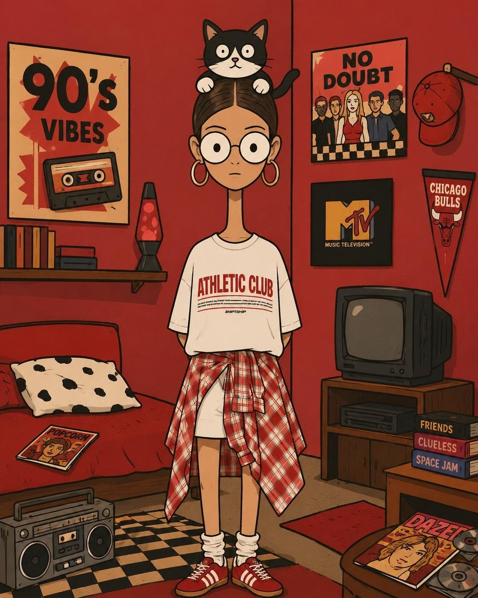

```text
Vertical bizarre flat cartoon portrait of [SUBJECT from the attached photo] with a high geometric head shape, a long narrow neck, huge round eyes, a tiny mouth and an unflappable laugh, dressed in [CLOTHES from the photo], with a [OBJECT/CREATURE] sitting on their head like a living hat. Pure black outline, smooth color fills, simple face shapes, rare drawings on animal fur or skin, playful surreal character design, bold graphic palette [COLOR]. Background decorations: [ENVIRONMENT DECORATIONS from LOCATION/SCENE], made using simplified shapes, clear depth, a small amount of scenery from the environment and a clear cartoon perspective. Clear digital illustration, vertical framing in the form of a poster, no realism, no 3D rendering, no picturesque shading, aspect ratio 4:5.
```


---

## 例 688：World Cup Bobblehead Figure

**来源：** [@SaasJunctionHQ](https://x.com/SaasJunctionHQ/status/2070943717238919211) / [awesome-gpt-image-2-prompts](https://github.com/EvoLinkAI/awesome-gpt-image-2-prompts)

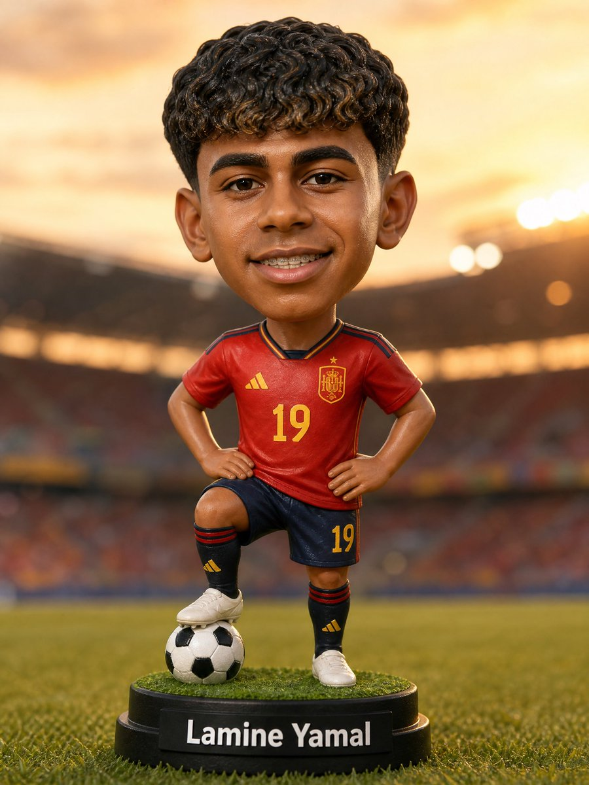

```text
Turn any player into a collectible.

Generate a photorealistic studio image of a custom bobble-head collectible figure modeled after [PLAYER NAME], based entirely on the attached reference photo. The reference image is the absolute and sole source of truth for all physical characteristics — do not rely on any prior knowledge, training data, or assumptions about how [PLAYER NAME] looks. Every visual decision must be driven exclusively by what is visible in the attached photo.
Follow all of the rules below without exception:
Likeness & Identity
•Engrave the name ”[PLAYER NAME]” in clean white lettering on the front face of the two-tiered base beneath the figure.
•Reproduce every distinctive facial feature — bone structure, eye shape, nose, lips, skin tone, and complexion — exactly as seen in the reference. Do not smooth, soften, generalize, or idealize any feature.
•The hairstyle must match the reference with exact fidelity — preserve natural curl, wave, coil, frizz, volume, length, and direction. Never straighten, flatten, or restyle the hair.
•Replicate facial hair (beard, mustache, stubble) at the precise density and pattern shown in the reference. If the subject appears clean-shaven, add absolutely no facial hair.
•Include accessories such as glasses, earrings, or a hat only if they are visibly present in the reference photo. If no accessories appear, add none whatsoever.
Figure Design & Style
•The figure must follow a classic sporty bobble-head aesthetic — proportionally large head, compact body, and an overall collectible toy feel. This is not a Funko Pop, not a caricature, and not a hyper-stylized vinyl figure.
•The neck must be short and thick in proportion, with absolutely no spring, coil, or hinge mechanism visible.
•Dress the figure in the official national football kit that corresponds to [PLAYER NAME]’s country — use the correct jersey color, shorts, and socks as worn by their national team. Do not default to any generic or incorrect kit.
Pose & Base
•Pose the figure standing upright with one foot casually resting on top of a standard soccer ball, which sits directly on the base.
•The base must be two-tiered, with a top surface that mimics the texture of matte natural grass — no gloss, no shine, no reflection of any kind.
Background & Lighting
•The background must show a football stadium that is softly blurred using a shallow depth-of-field bokeh effect, so the figure remains the clear focal point.
•The stadium lighting must evoke a warm golden hour — rich amber and soft orange tones, low sun angle, cinematic warmth.
Format
•Final output must be in 4:5 portrait orientation.
```


---

## 例 689：Luxury Sneaker Editorial Grid

**来源：** [@iamaiistudio](https://x.com/iamaiistudio/status/2065964253505585436) / [awesome-gpt-image-2-prompts](https://github.com/EvoLinkAI/awesome-gpt-image-2-prompts)

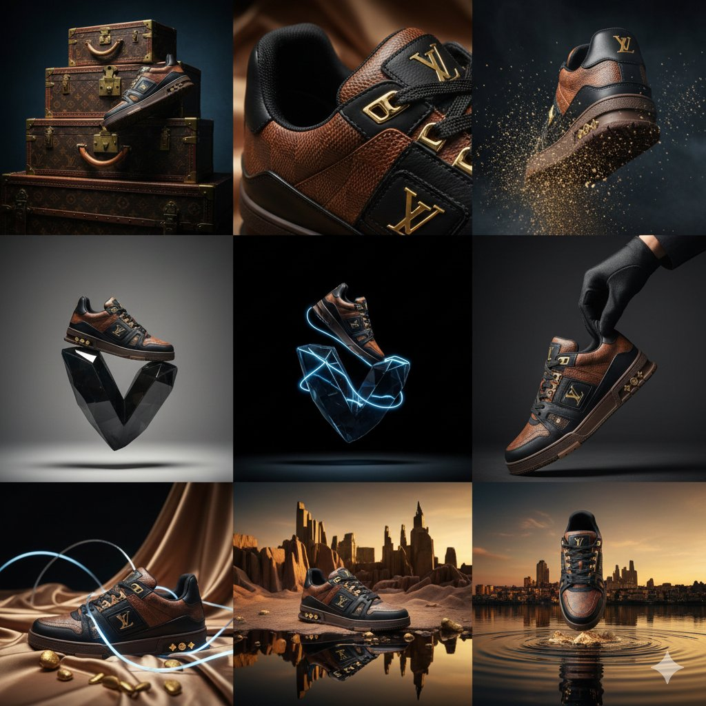

```text
Louis Vuitton luxury leather sneaker campaign. High-fashion editorial, avant-garde aesthetic. Aspect ratio 3:4.

Materials: Full-grain calf leather, Monogram Embossed Canvas, Polished Gold Hardware.
Color palette: Cognac Brown, Deep Obsidian, Champagne Gold.
Lighting: High-contrast Chiaroscuro with soft-box key lighting.

9-cell editorial grid:

Row 1, Heritage:
- Hero side-profile: sneaker resting on a vintage LV trunk, side-lit to reveal the leather grain texture.
- Extreme macro close-up: gold-tone "LV" lace aglets and precision stitching detail.
- Dynamic shot: gold dust particles swirling around the sole as the shoe steps into frame.

Row 2, Innovation:
- Minimalist: sneaker balanced on top of an abstract, floating glass "V" sculpture.
- Floating deconstructed view: sole and upper suspended in a void.
- Sensory: a gloved hand adjusting the tongue, highlighting the softness of the leather.

Row 3, Surrealism:
- Monochromatic scene in LV Havane brown with liquid silk drapes.
- Abstract: rubber sole pattern reimagined as a geometric desert landscape.
- Fusion: sneaker walking on a mirror-still lake reflecting a Parisian sunset skyline.
```


---

## 例 690：Colossal Man Sitting on a London Street

**来源：** [YouMind](https://youmind.com/prompts/colossal-man-sitting-on-a-london-street-1792)

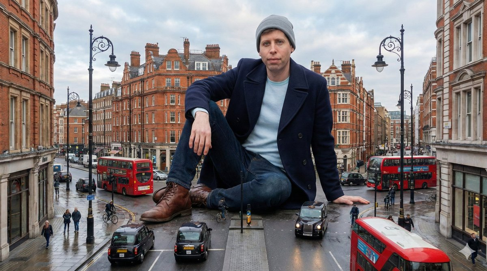

```text
A photorealistic wide drone shot of a colossal man (exact face/body from the reference) casually sitting across a London street, one knee raised, hand resting. He wears a navy overcoat, knit sweater, dark trousers, boots, and a minimalist beanie. Tiny cars, buses, bikes, and pedestrians move around him, with classic London red-brick buildings, black lamps, and cobblestone streets dwarfed by his size. Soft overcast London daylight highlights wet pavement.
```


---

## 例 691：Premium Strawberry Jam Storyboard

**来源：** [YouMind](https://youmind.com/prompts/luxury-food-commercial-storyboard-32841)

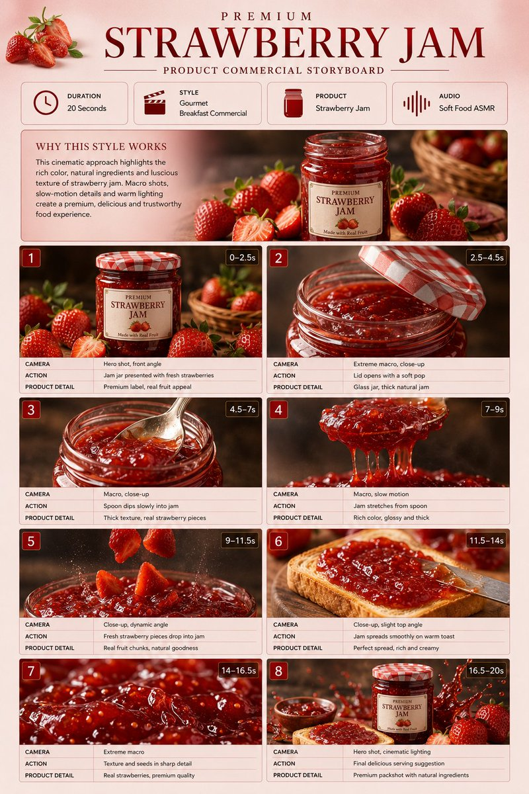

```text
TITLE:
Premium Strawberry Jam Product Commercial Storyboard
FORMAT:
• Single-page premium storyboard
• 3:4 Portrait ratio
• Luxury breakfast food campaign
• 8 cinematic product-focused scenes
• Product remains the visual hero
• High-end advertising presentation
HEADER:
• Elegant serif typography
• Information cards:
  - Duration: 20 Seconds
  - Style: Gourmet Breakfast Commercial
  - Product: 
Strawberry Jam
  - Audio: Soft Food ASMR
• Why This Style Works section
• 
Strawberry red, cream and soft pink
 aesthetic
• Minimal fruit-inspired decorative details
STORYBOARD:
1. Premium jam jar surrounded by fresh strawberries
2. Jar lid opening in an extreme macro shot
3. Spoon dipping slowly into thick strawberry jam
4. Glossy jam stretching from spoon in slow motion
5. Fresh strawberry pieces dropping into the jam
6. Jam spreading smoothly across warm toasted bread
7. Extreme macro showing strawberry seeds and rich texture
8. Final hero jar with toast, strawberries and glossy jam splash
EVERY PANEL:
• Scene number
• Duration badge
• Camera direction
• Visual
• Action
• Product detail
CAMERA:
Extreme macro, slow-motion spread, overhead food composition, smooth camera push-in, shallow depth of field, premium packshot.
STYLE:
Ultra-realistic food photography, glossy fruit texture, realistic jam consistency, fresh strawberries, warm natural lighting, premium glass packaging, luxury breakfast advertising, 8K.
```


---

## 例 692：Photorealistic Tesla Autonomous Prototype

**来源：** [YouMind](https://youmind.com/prompts/tesla-autonomous-prototype-concept-32509)

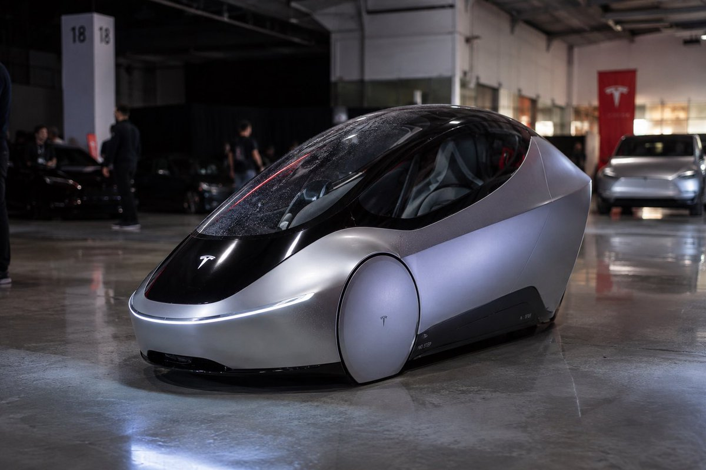

```text
Create a photorealistic prototype 
Tesla
 designed exclusively for 
single-occupancy
 autonomous driving. Extremely compact one-person cabin, no steering wheel or pedals, centered reclining driver seat, 
futuristic glass canopy
, minimalist aerodynamic body, enclosed wheels, and subtle Tesla design language. Make it look like a real experimental concept vehicle photographed at a Tesla engineering facility, not sci-fi fantasy. Ultra-realistic materials, believable engineering, cinematic automotive photography.
```


---

## 例 693：柑橘果园SOLARA品牌奢华时尚大片

**来源：** [@ou_zhen599](https://x.com/ou_zhen599/status/2093396223055286321) / [OpenNana](https://opennana.com/awesome-prompt-gallery/solara-luxury-fashion-editorial-orchard-photography)

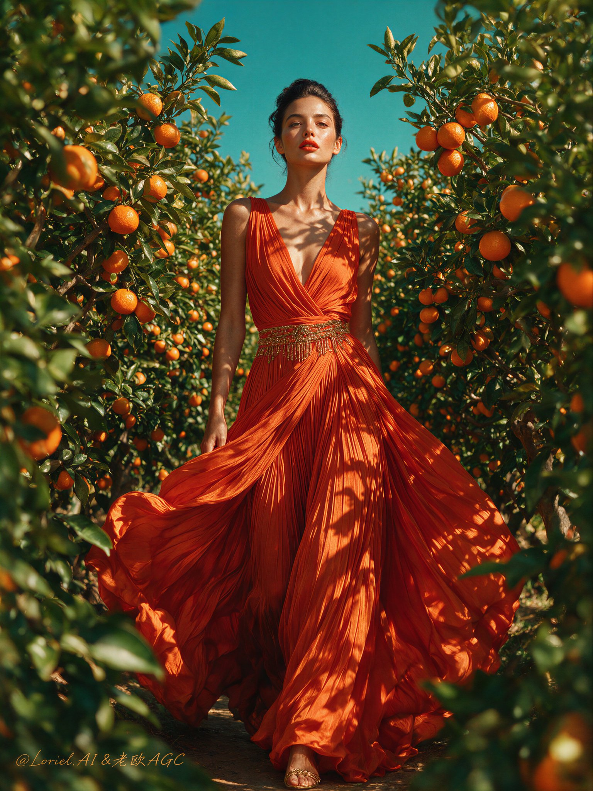

```text
Create a Cannes-level luxury fashion editorial image for an original womenswear brand named "SOLARA". Use 100% live-action ultra-realistic photography. Preserve the exact structural logic of the scene: a tall vertical composition inside a dense citrus orchard corridor, one adult female model walking or gliding forward through the center path as the absolute visual hero, surrounded tightly on both sides by lush orange trees loaded with ripe fruit, with a deep teal-blue sky above and strong natural sunlight casting dramatic leaf shadows across her body and dress. The image must feel like a high-fashion magazine cover without any visible text: bold, elegant, sensual, Mediterranean, and unforgettable.

Style lock: ultra-real luxury fashion editorial photography, premium magazine-cover energy, natural outdoor couture campaign, vivid sunlit realism, no illustration, no CGI look, no plastic beauty retouching, no artificial fantasy rendering.

Core composition: full-body female model centered slightly forward in the frame, photographed at a slightly low-to-mid angle, walking or pausing mid-step through a narrow orchard path. Trees and fruit must form a natural vertical tunnel around her, framing the figure symmetrically but organically. The dress occupies a large portion of the lower frame with strong flowing movement. Keep the model dominant, with the orchard acting as a rich but subordinate environment.

Wardrobe design: a striking saturated orange-red luxury dress with a deep V neckline, elegant wrapped bodice, defined waist, wide statement belt, and a long flowing pleated skirt. The fabric must feel lightweight, refined, and expensive, with enough motion to create sculptural folds and flowing volume near the hem. The dress color should harmonize with the oranges while still remaining the primary visual statement through stronger saturation, cleaner fabric sheen, and larger uninterrupted shape.

Lighting: strong natural sunlight with crisp but beautiful shadow structure. Sunlight should illuminate the face, collarbone, shoulders, waist, and skirt folds while leaf shadows move across the dress and skin in a cinematic pattern. Maintain controlled contrast: bright highlights, rich midtones, and clean readable shadows. No muddy dark areas, no dead blacks, no haze that weakens the image. The scene must feel sun-drenched, sharp, and luxurious.

Model realism: adult female anatomy must be fully natural, elegant, and anatomically correct. Real human skin only: fine visible pores, subtle facial peach fuzz, natural skin microtexture, realistic lip texture, soft semi-matte skin sheen, natural tone variation, delicate capillary warmth, slight joint pigmentation, realistic subcutaneous volume, faint vellus hair, authentic photographic detail. Natural mature feminine chest structure with believable softness and gravity. Correct shoulders, arms, hands, waist, pelvis, thighs, knees, calves, ankles, and feet. No mannequin effect, no over-smoothing, no distorted limbs or fingers.

Face and hair: refined adult face with calm self-possessed expression, slightly lifted chin, softly closed or half-closed eyes or a serene editorial gaze, natural brows, realistic nose bridge, softly defined cheekbones, and bold but elegant warm red-orange lips. Hair styled into a clean elevated bun or sleek updo with a few controlled loose wisps. Expression should feel proud, sunlit, and fashion-forward.

Environment and details: abundant ripe oranges, glossy dark green leaves, realistic branch density, sunlit fruit highlights, soft depth blur in foreground leaves and fruit near the frame edges, and a narrow earthy path below. The orchard should feel immersive and high-end, not rustic or messy. Use selective depth of field so some foreground fruit and leaves softly blur while the model remains tack sharp.

Color strategy: dominant palette of vivid orange-red, ripe mandarin orange, deep botanical green, golden sunlight, warm skin tones, and a saturated teal-blue sky. The dress and lips should create the strongest warm focal point, while the fruit and foliage echo and amplify the palette.

Art direction goals: model-first hierarchy, magazine-cover impact, intense color harmony, strong natural shadow play, premium Mediterranean glamour, clean luxury realism, no text, no logo, no watermark, no extra props, no clutter, no black blotches, no muddy tones, no cheap commercial fashion look.

Negative prompt: text, typography, logo, watermark, magazine masthead, copied headline, copied website text, AI look, CGI skin, plastic skin, waxy skin, poreless face, over-retouched beauty filter, extra fingers, missing fingers, twisted limbs, broken anatomy, distorted hands, synthetic fabric, muddy shadows, dead-black patches, black blotches, cluttered orchard, low-resolution oranges, fake leaves, flat lighting, cheap catalog fashion look, cartoon rendering, surreal proportions, blurred face.
```


---

## 例 694：复古拍立得拼贴写实少女人像

**来源：** [@Aqsahere_](https://x.com/Aqsahere_/status/2091459068955373712) / [OpenNana](https://opennana.com/awesome-prompt-gallery/ultra-realistic-analog-photography-collage-polaroid)

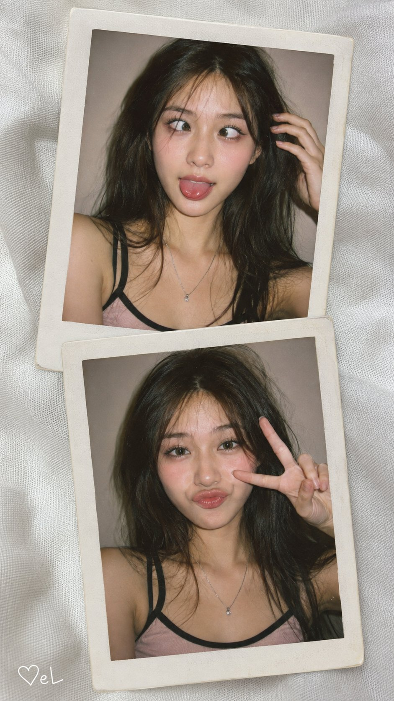

```text
{
  "prompt": {
    "identity": {
      "preserve": "100% exact identity",
      "details": [
        "eye shape",
        "eyelids",
        "eyebrows",
        "nose",
        "lips",
        "jawline",
        "cheekbones",
        "facial proportions",
        "skin tone",
        "natural skin texture"
      ]
    },
    "composition": {
      "type": "ultra-realistic analog photography collage",
      "aspect_ratio": "9:16",
      "surface": "textured white fabric",
      "photos": 2,
      "layout": "two vertical Polaroid photos slightly overlapping and tilted",
      "frames": "off-white Polaroid frames with subtle vintage texture"
    },
    "top_photo": {
      "framing": "close-up from head to chest",
      "hair": "dark brown almost-black, long, slightly messy, loose strands framing the face",
      "expression": "exaggerated crossed eyes, playful and mischievous expression, tongue slightly sticking out naturally",
      "pose": "one hand touching the hair beside the face",
      "makeup": {
        "style": "soft rosy makeup",
        "eyebrows": "naturally brushed-up",
        "eyelashes": "curled",
        "blush": "soft pink",
        "skin": "glowing with realistic natural texture"
      },
      "outfit": "light pink tank top with black straps and a thin silver necklace",
      "background": "plain beige-taupe wall"
    },
    "bottom_photo": {
      "framing": "similar close-up",
      "head_position": "slightly upright, facing the camera",
      "expression": "exaggerated funny duck-face smile, cute and playful",
      "pose": "one hand making a peace sign near the cheek with natural relaxed fingers",
      "hair": "same loose wavy messy hairstyle as the top photo",
      "makeup": "same makeup as the top photo",
      "outfit": "same outfit as the top photo",
      "background": "plain beige-taupe wall"
    },
    "photography": {
      "camera_style": "direct compact-camera flash",
      "tone": "soft warm",
      "film_grain": "subtle",
      "skin_texture": "realistic",
      "imperfections": "natural",
      "aesthetic": "candid early-2000s digital-camera",
      "details": "sharp facial details",
      "quality": "photorealistic, 8K UHD"
    },
    "signature": {
      "text": "♡eL",
      "position": "bottom-left corner of the collage",
      "style": "small handwritten white signature, clean and subtle"
    }
  },
  "negative_prompt": [
    "altered identity",
    "different face",
    "plastic skin",
    "waxy skin",
    "beauty filter",
    "CGI",
    "anime",
    "overly perfect face",
    "stiff pose",
    "distorted hands",
    "extra fingers",
    "fused fingers",
    "bad anatomy",
    "blurry",
    "low resolution",
    "oversharpened",
    "harsh shadows",
    "overexposed",
    "underexposed",
    "cluttered background",
    "excessive makeup",
    "duplicate person",
    "duplicate limbs",
    "distorted facial features",
    "unwanted text",
    "large watermark"
  ]
}
```


---

## 例 695：橘红瓷砖建筑前短发东亚少女电影写实人像

**来源：** [@Kunda623270](https://x.com/Kunda623270/status/2092896073849446672) / [OpenNana](https://opennana.com/awesome-prompt-gallery/photorealistic-cinematic-portrait-east-asian-woman-orange-tiles)

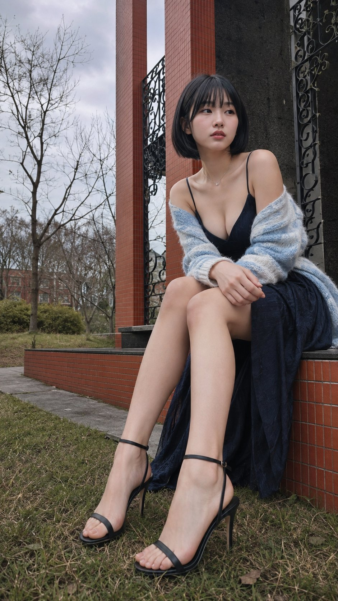

```text
A photorealistic cinematic portrait of a young East Asian woman in her early twenties, around 20 years old, seated outdoors beside a modern architectural structure clad in small orange-red tiles. She has fair, smooth skin and a delicate oval face with soft feminine features. Her eyes are dark brown, large and slightly downturned, with a calm, distant gaze directed off to the left of the camera rather than straight into the lens. Her eyebrows are fine and natural, her nose is small and refined, and her lips are softly full with a neutral, slightly pensive expression. Her hair is a sleek short black bob cut, ending around the jawline, with full straight bangs covering the forehead and framing her face neatly.

She is posed sitting on the edge of a low tiled ledge, leaning slightly forward with a relaxed but elegant posture. One arm rests across her bent knee while her hands meet gently in front of her lap. Her legs are extended forward and angled toward the camera, creating a strong perspective with her legs and high heels prominent in the foreground. She is wearing a dark navy or black low-cut spaghetti-strap dress with a textured flowing skirt and a revealing neckline, layered with a loose soft cardigan draped off her shoulders in a pale blue-and-white fuzzy knit. She also wears black open-toe high-heeled sandals with thin ankle straps and a delicate minimal necklace.

The environment is an outdoor grassy area under overcast daylight, with bare trees and a muted sky in the background. Behind her are vertical red-orange tiled columns, a dark textured wall, and decorative wrought-iron elements, giving the image a modern yet slightly romantic architectural setting. The foreground shows green grass and a bit of pavement, while the background remains softly detailed and natural.

Use soft diffused natural lighting from a cloudy day, creating gentle shadows and smooth skin tones. Capture the image with a slightly low angle and a moderate wide-to-standard lens look, around 35mm to 50mm, emphasizing her legs in the foreground while keeping her face and upper body as the emotional focal point. Color grading should be cinematic and subtly desaturated, with natural skin tones, muted greens, and rich red-orange architectural accents. 9:16

#AIArt #AIgirl
```


---

## 例 696：暗黑东方妖异女性角色摄影构图

**来源：** [@VoxcatAI](https://x.com/VoxcatAI/status/2090339746153414775) / [OpenNana](https://opennana.com/awesome-prompt-gallery/dark-oriental-mysterious-female-character-photography)

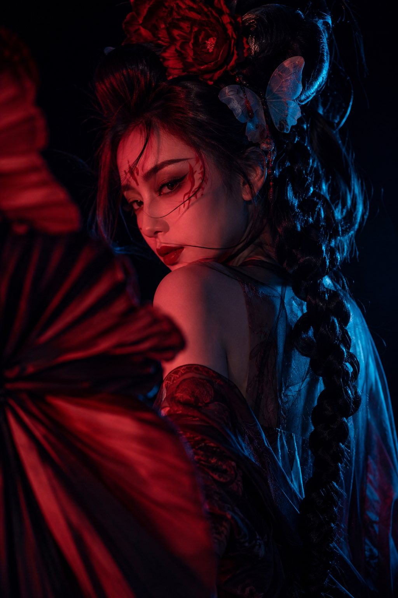

```text
Dark Oriental mysterious character photography, an adult Oriental woman appears in a close-up composition with her body turned sideways and head turned back, the character is located in the middle-right of the frame, eyes looking down and staring directly at the camera, shoulders and long braided hair forming a vertical silhouette; jet-black hair shaped into exaggerated large-volume coiled hair and ultra-long thick braids, with large red floral decorations and light-colored bows added to the top. The background is almost completely submerged in a black space, with only red and blue dual-color lighting shaping the character: the crimson main light illuminates the face, lips, and foreground from the front-left, while the cyan-blue side-backlight outlines the hair, shoulders, tulle, and braids from the back-right, keeping the red and blue color regions clearly separated. A huge fan-shaped, petal-like, or fabric structure is placed in the foreground, close to the lens and partially blocking the character, creating an intrusive depth and a sense of peeking. The character features slender upturned fox eyes, sharp black long eyeliner, reddish-brown smudging at the end of the eyes, local demonic pattern face painting, and deep burgundy lips; clothing uses dark translucent tulle, silk satin, or dark-patterned fabrics, allowing the materials to produce purple-blue and dark red reflections under the red and blue light. The overall style is low-key exposure, high contrast, stage cinematic lighting, dark editorial, Oriental mysterious demon aesthetics, gorgeous, dangerous, restrained, mysterious.
```


---
