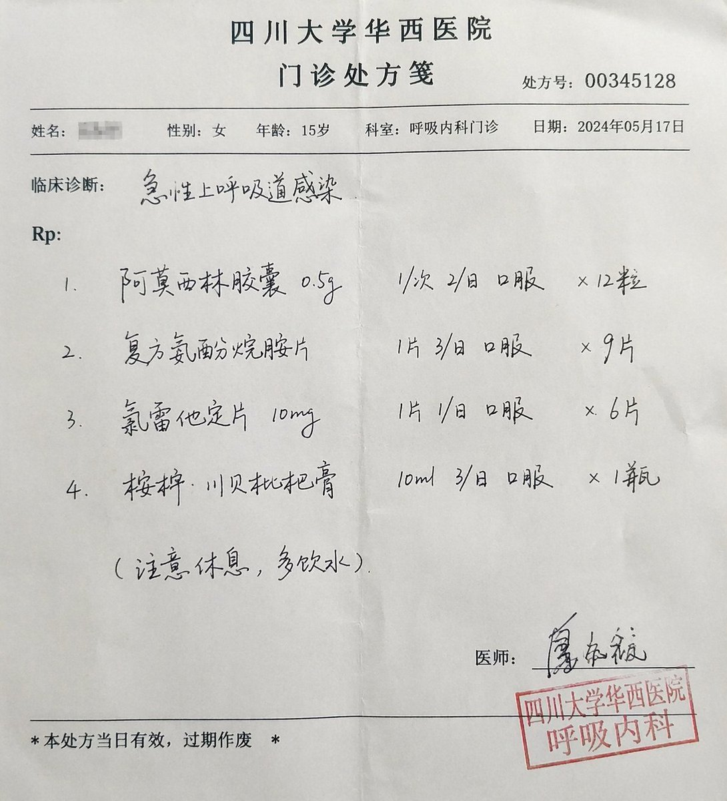
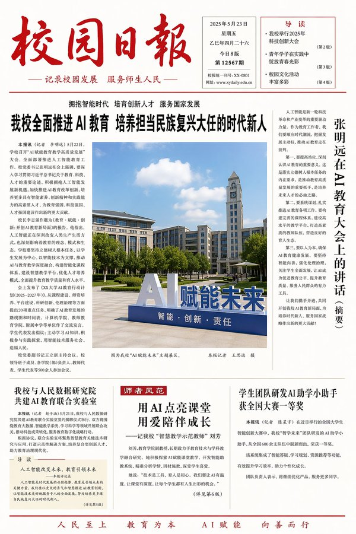
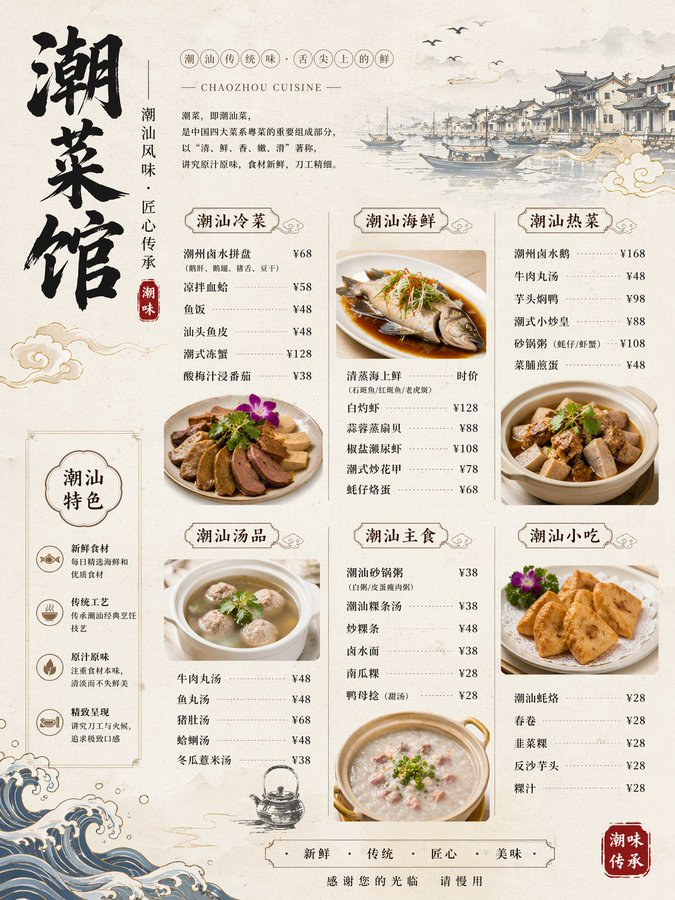
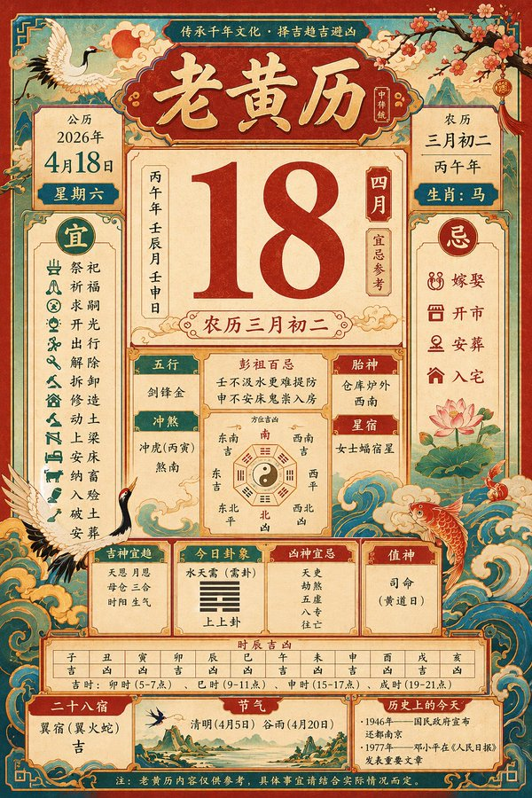
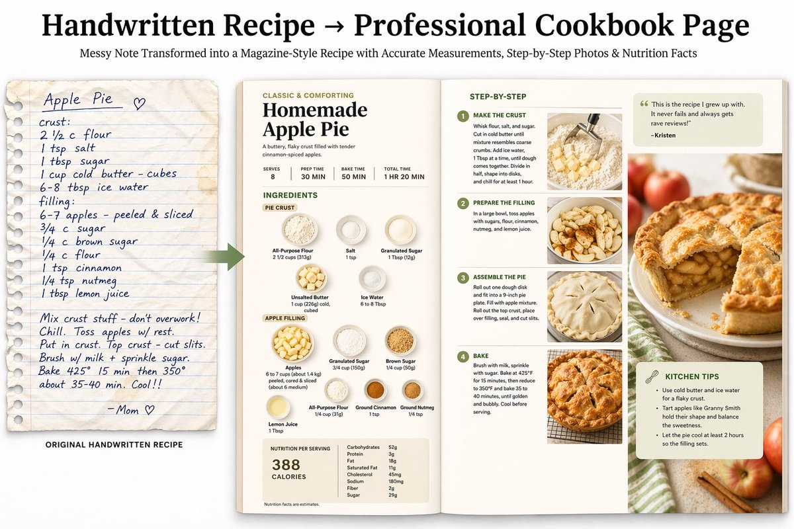
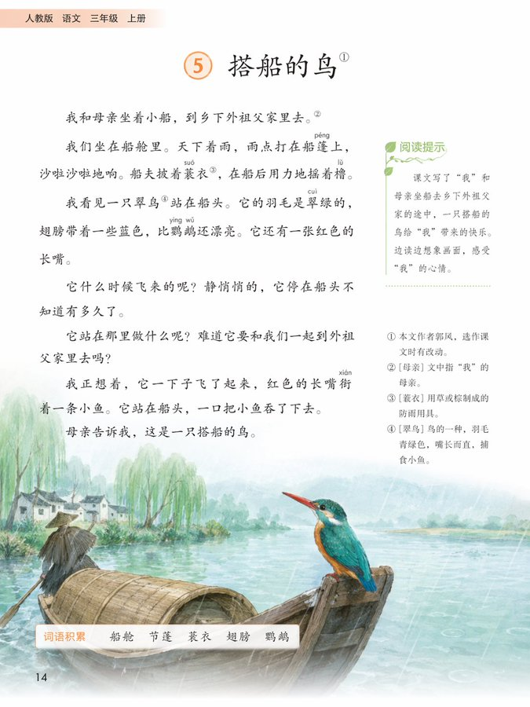

# 文档与出版物 — 提示词合集


> 9 个案例

---

## 例 168：手写中西药方图片

**来源：** [@MrLarus](https://x.com/MrLarus/status/2046514998965371144)


```text
[中文]
生成一张手写中/西医药方图

[English]
Generate an image of a handwritten traditional Chinese medicine or Western medicine prescription
```


---

## 例 201：三甲医院真实门诊处方笺

**来源：** [@msjiaozhu](https://x.com/msjiaozhu/status/2046546317766500834)




```text
[中文]
一张三甲医院的门诊处方笺，医生潦草的手写字，包含真实合理的 诊断、药品名、剂量，右下角有医生签名和科室章。

[English]
An outpatient prescription sheet from a Grade 3A hospital, doctor's illegible handwriting, containing realistic and reasonable diagnosis, drug names, dosages, with a doctor's signature and department stamp in the bottom right corner.
```


---

## 例 266：桌面上的黑色圆珠笔手写笔记

**来源：** [@patrickassale](https://x.com/patrickassale/status/2044569086013718958)


```text
[中文]
一张平放着的打开的笔记本的业余照片，里面填满了用黑色圆珠笔写的手写笔记。笔迹随意且略显凌乱，就像个人笔记，自然的瑕疵，划掉的单词，划线的标题。从略高角度拍摄，来自窗户的自然日光，未使用闪光灯。随意的桌面设置，用 iPhone 拍摄。

[English]
Amateur photo of an open notebook lying flat, filled with handwritten notes in black ballpoint pen. The handwriting is casual and slightly messy, like personnal notes, natural imperfections, crossed out words, underlined headings. Shot from slightly above, natural daylight from a window, no flash. Casual desk setting, shot on iPhone
```


---

## 例 293：聚焦人工智能的校园日报

**来源：** [@MrLarus](https://x.com/MrLarus/status/2044824800909054181)




```text
[中文]
生成一张校园日报，主题AI教育

[English]
Generate a campus daily newspaper, theme AI education
```


---

## 例 294：精美潮汕菜馆菜单图

**来源：** [@MrLarus](https://x.com/MrLarus/status/2044824800909054181)




```text
[中文]
生成一张潮菜馆菜单图

[English]
Generate a Teochew restaurant menu image.
```


---

## 例 295：复古传统老黄历二零二六年四月十八

**来源：** [@MrLarus](https://x.com/MrLarus/status/2044824800909054181)




```text
[中文]
生成一张2026年4月18日的老黄历

[English]
Generate an old almanac for April 18, 2026
```


---

## 例 297：手写食谱变身杂志级跨页

**来源：** [@maxescu](https://x.com/maxescu/status/2045203839910056014)




```text
[中文]
手写食谱 → 专业食谱页面 上传一份凌乱的手写家庭食谱；模型会搜索准确的现代计量/营养信息，然后生成一份精致的杂志风格双页跨页，包含分步平铺图、完美的食材标签和卡路里分解。

[INSERT_RECIPE_LINK]

[English]
Handwritten Recipe → Professional Cookbook Page Upload a messy handwritten family recipe; the model searches for accurate modern measurements/nutrition, then generates a polished, magazine-style double-page spread with step-by-step flat lays, perfect ingredient labels, and calorie breakdowns.

[INSERT_RECIPE_LINK]
```


---

## 例 300：黑板上的出师表全文

**来源：** [@rionaifantasy](https://x.com/rionaifantasy/status/2045356799751303194)


```text
[中文]
生成图片:
手写在教室黑板上的出师表全文，真实感的粉笔字迹，晴朗白天用iPhone手机实拍

[English]
Generate image: The full text of Chu Shi Biao handwritten on a classroom blackboard, realistic chalk handwriting, taken with an iPhone in real life on a sunny day
```


---

## 例 303：人教版三年级语文课本内页

**来源：** [@MrLarus](https://x.com/MrLarus/status/2044824800909054181)




```text
[中文]
生成人教版小学三年级语文课本的一页

[English]
Generate a page from the PEP (People's Education Press) primary school third-grade Chinese textbook
```

