# 文档与出版物 — 提示词合集


> 20 个案例

---

## 例 168：手写中西药方图片

**来源：** [@MrLarus](https://x.com/MrLarus/status/2046514998965371144)

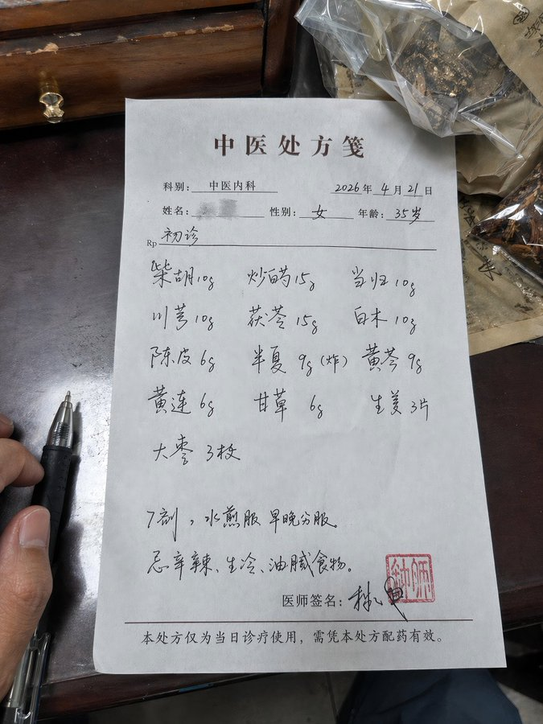


```text
[中文]
生成一张手写中/西医药方图

[English]
Generate an image of a handwritten traditional Chinese medicine or Western medicine prescription
```


---

## 例 201：三甲医院真实门诊处方笺

**来源：** [@msjiaozhu](https://x.com/msjiaozhu/status/2046546317766500834)


```text
[中文]
一张三甲医院的门诊处方笺，医生潦草的手写字，包含真实合理的 诊断、药品名、剂量，右下角有医生签名和科室章。

[English]
An outpatient prescription sheet from a Grade 3A hospital, doctor's illegible handwriting, containing realistic and reasonable diagnosis, drug names, dosages, with a doctor's signature and department stamp in the bottom right corner.
```


---

## 例 266：桌面上的黑色圆珠笔手写笔记

**来源：** [@patrickassale](https://x.com/patrickassale/status/2044569086013718958)


```text
[中文]
一张平放着的打开的笔记本的业余照片，里面填满了用黑色圆珠笔写的手写笔记。笔迹随意且略显凌乱，就像个人笔记，自然的瑕疵，划掉的单词，划线的标题。从略高角度拍摄，来自窗户的自然日光，未使用闪光灯。随意的桌面设置，用 iPhone 拍摄。

[English]
Amateur photo of an open notebook lying flat, filled with handwritten notes in black ballpoint pen. The handwriting is casual and slightly messy, like personnal notes, natural imperfections, crossed out words, underlined headings. Shot from slightly above, natural daylight from a window, no flash. Casual desk setting, shot on iPhone
```


---

## 例 293：聚焦人工智能的校园日报

**来源：** [@MrLarus](https://x.com/MrLarus/status/2044824800909054181)

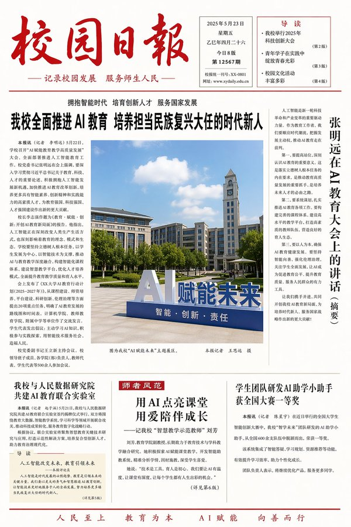


```text
[中文]
生成一张校园日报，主题AI教育

[English]
Generate a campus daily newspaper, theme AI education
```


---

## 例 294：精美潮汕菜馆菜单图

**来源：** [@MrLarus](https://x.com/MrLarus/status/2044824800909054181)

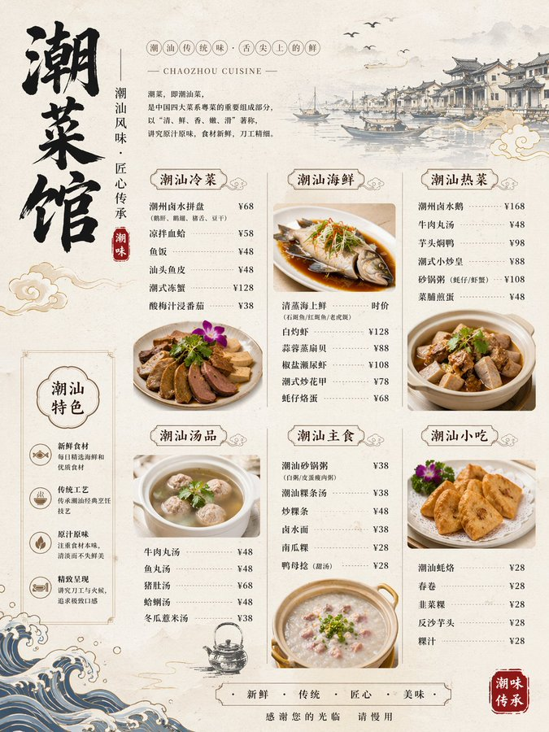


```text
[中文]
生成一张潮菜馆菜单图

[English]
Generate a Teochew restaurant menu image.
```


---

## 例 295：复古传统老黄历二零二六年四月十八

**来源：** [@MrLarus](https://x.com/MrLarus/status/2044824800909054181)

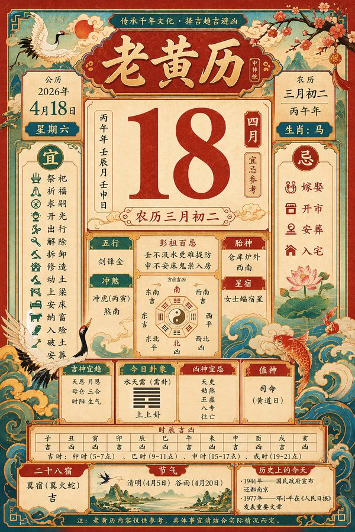


```text
[中文]
生成一张2026年4月18日的老黄历

[English]
Generate an old almanac for April 18, 2026
```


---

## 例 297：手写食谱变身杂志级跨页

**来源：** [@maxescu](https://x.com/maxescu/status/2045203839910056014)

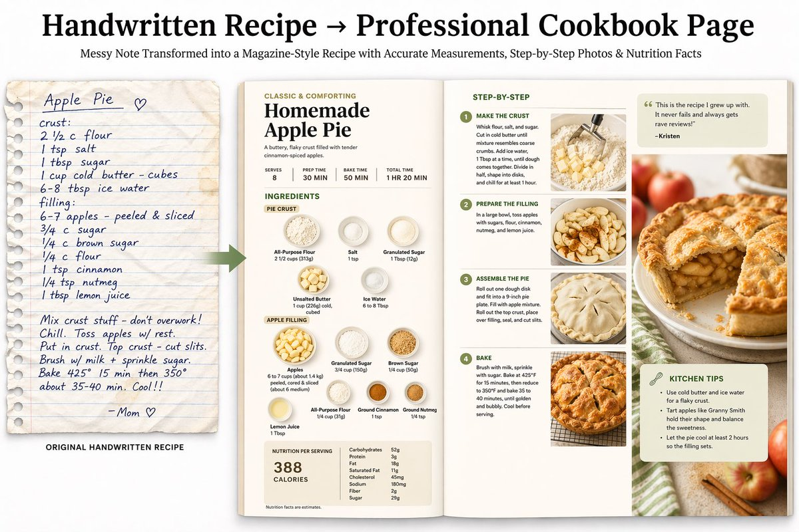


```text
[中文]
手写食谱 → 专业食谱页面 上传一份凌乱的手写家庭食谱；模型会搜索准确的现代计量/营养信息，然后生成一份精致的杂志风格双页跨页，包含分步平铺图、完美的食材标签和卡路里分解。

[INSERT_RECIPE_LINK]

[English]
Handwritten Recipe → Professional Cookbook Page Upload a messy handwritten family recipe; the model searches for accurate modern measurements/nutrition, then generates a polished, magazine-style double-page spread with step-by-step flat lays, perfect ingredient labels, and calorie breakdowns.

[INSERT_RECIPE_LINK]
```


---

## 例 300：黑板上的出师表全文

**来源：** [@rionaifantasy](https://x.com/rionaifantasy/status/2045356799751303194)

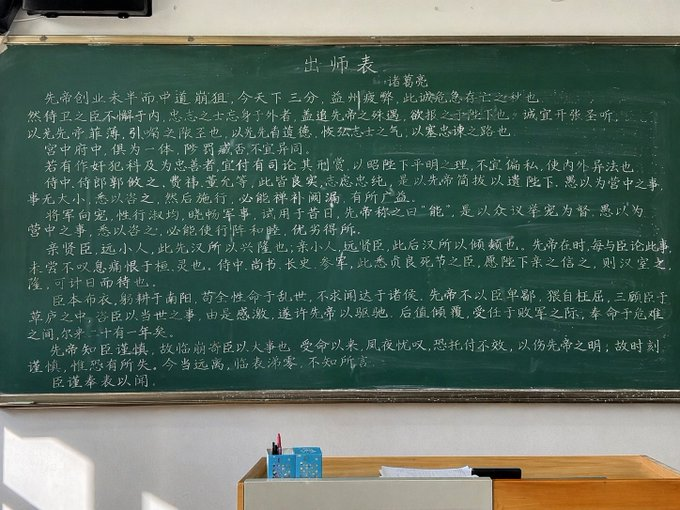


```text
[中文]
生成图片:
手写在教室黑板上的出师表全文，真实感的粉笔字迹，晴朗白天用iPhone手机实拍

[English]
Generate image: The full text of Chu Shi Biao handwritten on a classroom blackboard, realistic chalk handwriting, taken with an iPhone in real life on a sunny day
```


---

## 例 303：人教版三年级语文课本内页

**来源：** [@MrLarus](https://x.com/MrLarus/status/2044824800909054181)

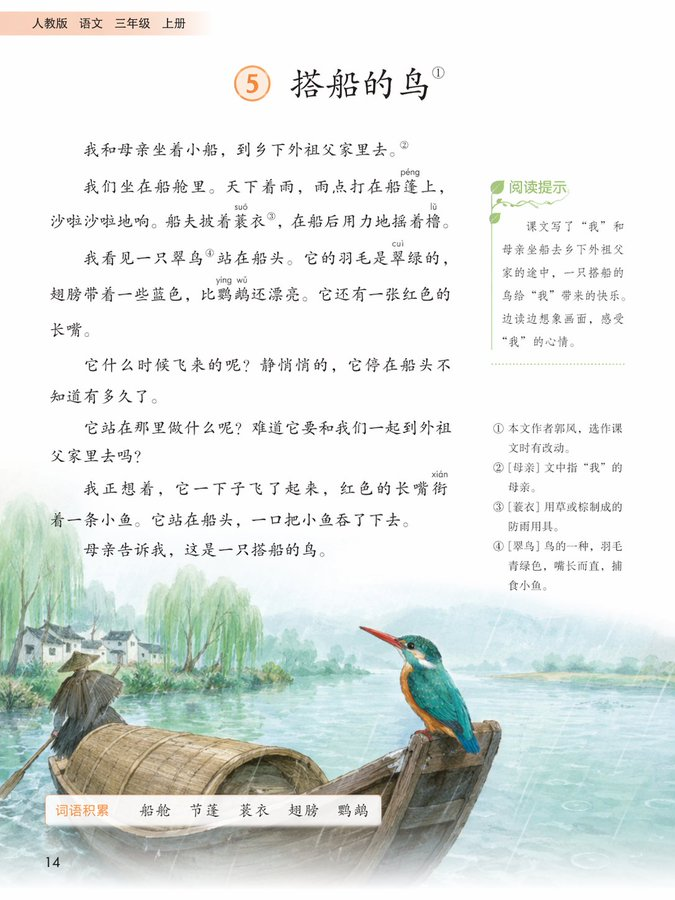


```text
[中文]
生成人教版小学三年级语文课本的一页

[English]
Generate a page from the PEP (People's Education Press) primary school third-grade Chinese textbook
```

## 例 453：企业级商用画册视觉系统

**来源：** [@MrLarus](https://x.com/MrLarus/status/2056974720893939950)

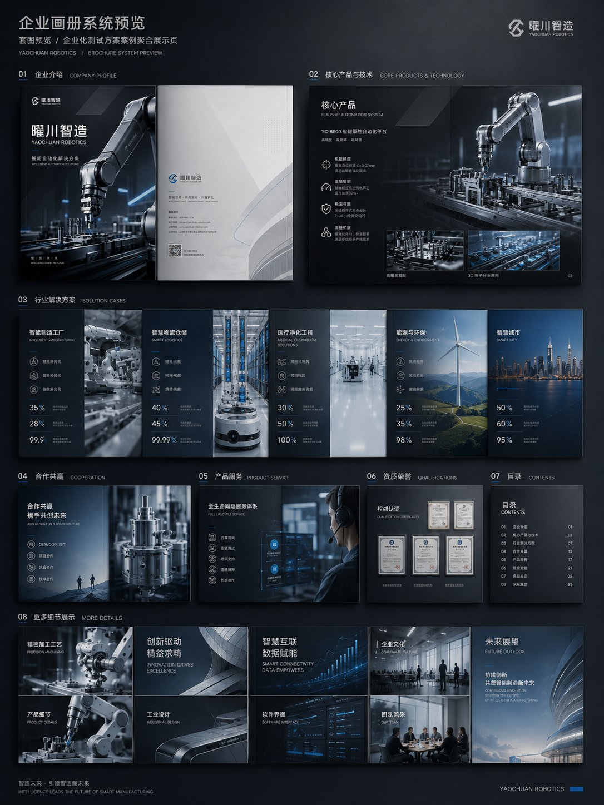

```text
请生成一套企业级商用画册视觉方案，主题为【品牌名称】的【行业 / 产品 / 解决方案】宣传画册。

整体风格：高端、专业、具有强视觉冲击力；避免传统 Word 排版感和普通 PPT 感。采用【深色科技美学 / 白色极简商务 / 高端工业风 / 艺术化品牌画册】风格。

画册内容包括：
1、封面与封底
2、企业介绍与品牌理念
3、核心产品与技术优势
4、应用场景与解决方案
5、客户案例与合作方式
6、全册系统预览图

要求：
版式要有设计感，图片、标题、数据、图标、留白和层级关系清晰；保持整套画册统一的品牌视觉系统；重点体现真实商业物料的完成度，避免简单文字排版。

结构规划：
1、封面 / 封底：建立品牌门面、行业气质和整体视觉调性。
2、企业介绍页：说明公司定位、能力边界和服务对象。
3、产品技术页：展示核心产品、技术优势和解决方案。
4、应用场景页：让用户看到产品能用在哪些行业。
5、案例 / 合作页：补充可信度和商业转化信息。
6、全册系统预览：验证风格统一性和整本画册的系统感。

如果已有企业资料，可以上传旧版企业画册、公司介绍文档、产品说明书、官网内容、PPT 提案、产品图片或案例图片，让 ChatGPT 完成三件事：
1、重新梳理内容结构，判断哪些内容适合做封面、企业介绍、产品页、案例页和合作页。
2、提炼画册主线，避免只堆资料，需要形成清晰的商业叙事。
3、统一视觉方向，让整本画册看起来像同一个品牌系统，避免不同页面拼贴感。

避坑：
1、避免一上来只说“生成一本画册”，否则容易变成模板图。
2、避免只堆文字，画册一定要有产品视觉、场景图、数据模块和设计层级。
3、避免只生成单页，最好补一张全册预览图，才能体现完整系统感。
```


---

## 例 541：50/50 混合媒介回忆卡

**来源：** [@Sairah_0](https://x.com/Sairah_0/status/2093212900160868430)

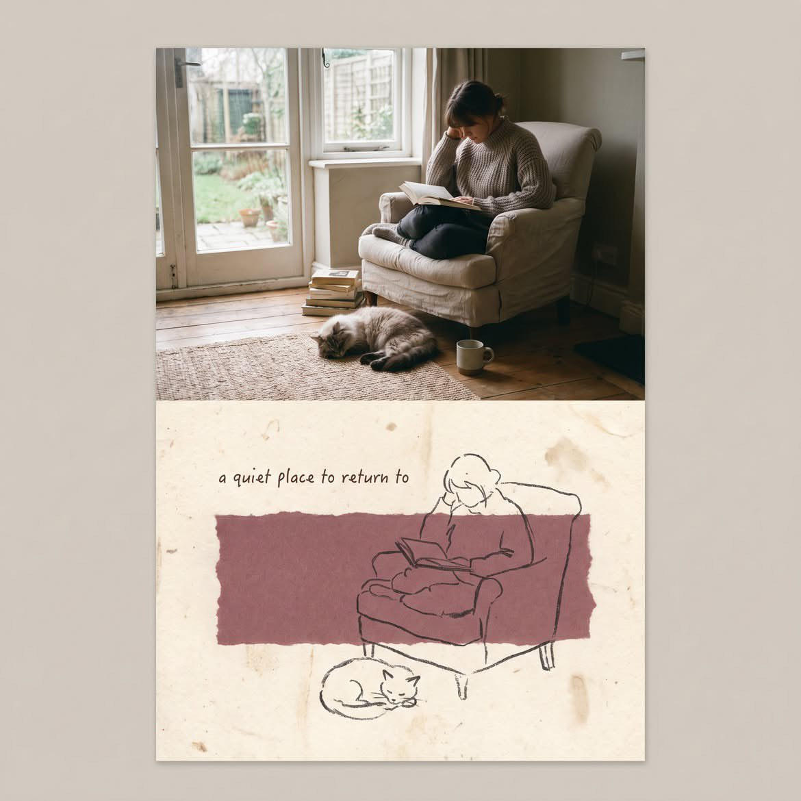

```text
Transform the uploaded photo into a vertical mixed-media memory card with a strict 50/50 split.

Keep the original photo unchanged in the top half. In the bottom half, use textured off-white handmade paper and add a muted, irregular color patch matching the photo’s tones.

Redraw the main subjects as a simple dark wax-crayon sketch with loose, imperfect lines and minimal details. Add a short handwritten English phrase and subtle Risograph grain.

Create a quiet, nostalgic Morandi-style aesthetic with generous negative space. Do not add extra elements or copy the reference composition exactly.
```


---

## 例 542：Avant-Garde Guitar Sculpture Fashion Advertisement

**来源：** [@QamarRiaz1](https://x.com/QamarRiaz1/status/2047777016733110722) / [awesome-gpt-image-2-prompts](https://github.com/EvoLinkAI/awesome-gpt-image-2-prompts)

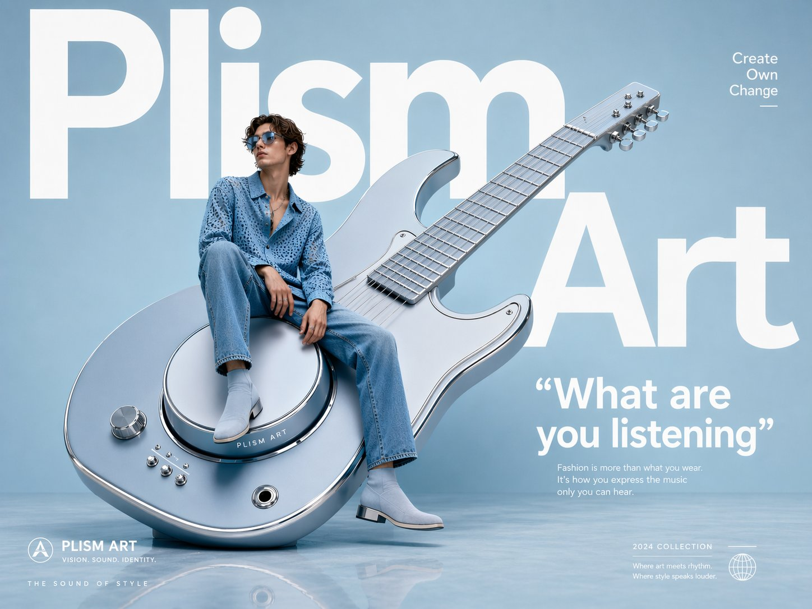

```text
Avant-garde fashion advertisement, oversized guitar positioned like sculpture, a guitarist in jeans casually seated on the a button as if furniture, giant word "Plism Art" behind in bold white typography, powder pastel studio background, reflective floor, luxury eyewear campaign aesthetic, ultra-clean layout, editorial magazine styling, Bold quote " What are you listening"   Tag : Create Own Change
```


---

## 例 543：iPhone Candid Notebook Photo

**来源：** [@iamaiistudio](https://x.com/iamaiistudio/status/2064530096720150770) / [awesome-gpt-image-2-prompts](https://github.com/EvoLinkAI/awesome-gpt-image-2-prompts)


```text
://t.co/4zY2WLrQci

Candid photo of a flat open notebook covered in black ballpoint pen handwriting. Notes look personal and authentic, with slightly messy lettering, crossed-out words, and underlined section headers. Angle slightly overhead, soft natural window light, no flash. Simple desk environment, iPhone camera aesthetic.

#AIart #GPTImage2
```


---

## 例 544：Polish PRL Era Magazine Spread

**来源：** [@Riccardo_Nero](https://x.com/Riccardo_Nero/status/2065193845222944844) / [awesome-gpt-image-2-prompts](https://github.com/EvoLinkAI/awesome-gpt-image-2-prompts)

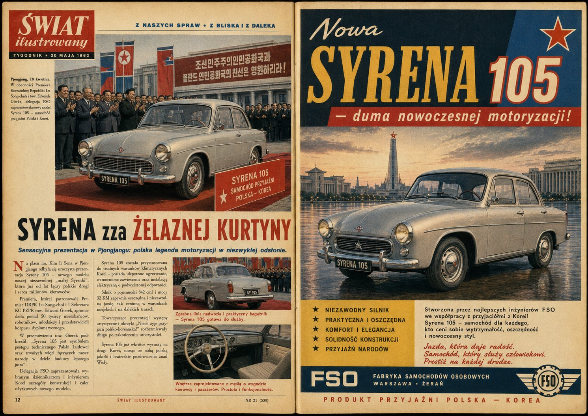

```text
Create a full two-page spread from a fictional Polish color weekly magazine from the PRL era, late 1950s to early 1960s. The image should look like an authentic vintage printed magazine: yellowed paper, offset printing, halftone dots, slight ink misregistration, muted aged colors, retro Polish typography, visible center gutter, margins, page numbers, captions and column layout.
Theme: a Syrena 105 proudly showcased in modern-day North Korea, presented as a satirical alternate-history Polish PRL magazine artifact.
The spread must be clearly split into two pages.
LEFT PAGE:
A Polish illustrated magazine article about the official presentation of the Syrena 105 in Pyongyang. Show a large main photo of the Syrena 105 on a ceremonial platform or red carpet, surrounded by officials, spectators, North Korean flags, banners and monumental North Korean architecture.
The car must clearly look like a classic Syrena 105: compact body, rounded Eastern Bloc styling, simple practical proportions, modest chrome trim, characteristic front fascia, small wheels, realistic Polish car design language, slightly heroic but still humble and utilitarian.
Use a bold Polish headline:
“SYRENA zza ŻELAZNEJ KURTYNY”
Add a subheadline:
“Sensacyjna prezentacja w Pjongjangu: polska legenda motoryzacji w niezwykłej odsłonie.”
Add several columns of Polish-looking article text, a red drop cap, small captions, and one or two inset images showing the rear of the Syrena 105 and the interior. The page should feel like a serious but slightly absurd PRL-era illustrated report. Include a believable Polish magazine masthead similar to a 1960s illustrated weekly.
RIGHT PAGE:
A classic 1950s-1960s Polish print advertisement for the same Syrena 105. Show the car large, heroic and glamorous, in a polished three-quarter view, with a dramatic retro city background inspired by Pyongyang. Use bold vintage ad typography, decorative colored blocks, stars, slogans and product badges.
Main ad headline:
“Nowa SYRENA 105 — duma nowoczesnej motoryzacji!”
Add smaller Polish advertising copy:
“Niezawodny silnik”
“Praktyczna i oszczędna”
“Komfort i elegancja”
“Solidność konstrukcji”
“Przyjaźń narodów”
Add a fictional manufacturer line:
“FSO”
“Fabryka Samochodów Osobowych, Warszawa-Żerań”
“Produkt przyjaźni Polska — Korea”
The right page should look cleaner and more aspirational than the article page, like a period car advertisement. The whole image should feel like a convincing satirical alternate-history artifact: Polish PRL magazine design, Syrena 105 automotive fantasy, North Korean ceremonial propaganda and vintage print realism.
Make all visible Polish text as clean and readable as possible.
```


---

## 例 545：Create the most realistic front page design of a vintage newspaper featuring ...

**来源：** [@Naiknelofar788](https://x.com/Naiknelofar788/status/2047207812800147647) / [awesome-gpt-image-2-prompts](https://github.com/EvoLinkAI/awesome-gpt-image-2-prompts)

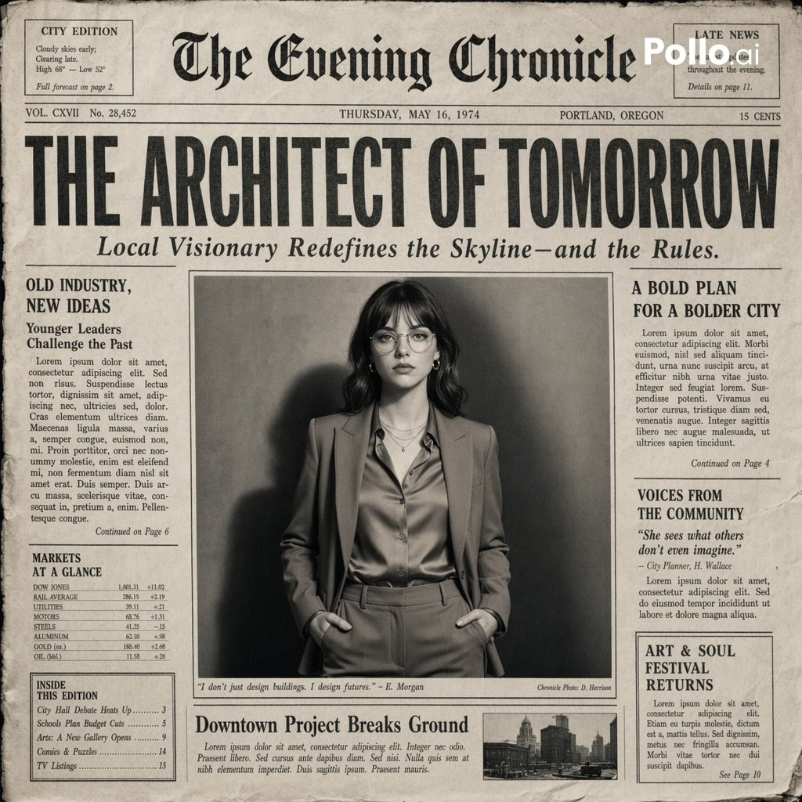

```text
Create the most realistic front page design of a vintage newspaper featuring the main character. The layout should be made in the style of a real printed newspaper with a cinematic black-and-white aesthetic.
The main photo should be prominently placed in the center, framed, like the image in the title of the article. The subject in the photo should remain unchanged and clearly distinguishable in natural light and slightly increased contrast in order to match the spectacular editorial style.
Create a bold, attention-grabbing headline at the top (create a unique title that matches the spirit of the photo - it can be romantic, mysterious, funny, or dramatic). Add a smaller subtitle under it, which will look like a real newspaper caption.
Add realistic newspaper elements:
Columns of small text (in the style of lorem ipsum, but framed like real news)
At the top is the fictitious name of the publication (for example, The Daily Prompts, AI Times or similar - think creatively, according to the picture)
Date, issue number and location
Decorative lines, dividers, and vintage typography
Small additional articles or captions to the main image
Optional stamps, doodles, or editorial notes to add personality.
Style:
Black and white or slightly faded monochrome paper
Fine paper texture, grain, and ink defects
Small shadows and creases that mimic real printed paper
The aesthetics of a clean but slightly worn vintage newspaper
Mood: Give the design personality, expressiveness and plot, as if the plot is part of the main article.
Aspect ratio: 4:5 or 1:1
High-detail, ultra-realistic hybrid of editorial photography and print design.
```


---

## 例 546：Magazine Travel Guide Feature Article

**来源：** [@andis13](https://x.com/andis13/status/2047204384811921764) / [awesome-gpt-image-2-prompts](https://github.com/EvoLinkAI/awesome-gpt-image-2-prompts)

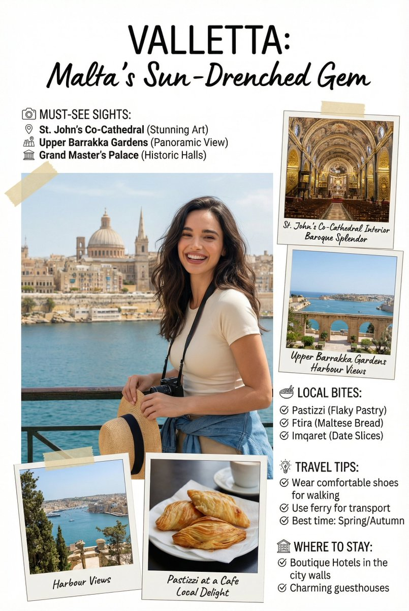

```text
Create image of Magazine feature article [travel] guide page, cute, information dense photo book style magazine feature article page. Add all necessary sections, tips, recommendations, information. add photos for any sections and recommendations if you like. Place the attached person at the precise location of [city, country]. Seamlessly blend the attached person as if they are sightseeing. Approach this task with the understanding that this is a critical, information rich page that will significantly influence visitor numbers, text accuracy is important. Fully use the entire [9:16] page. NEGATIVE PROMPT: coordinate texts @swiat_ai @ProfitAII
```


---

## 例 547：Y2K Cyber-Pop Editorial Shot

**来源：** [@noorlewisx](https://x.com/noorlewisx/status/2055507148541493282) / [awesome-gpt-image-2-prompts](https://github.com/EvoLinkAI/awesome-gpt-image-2-prompts)

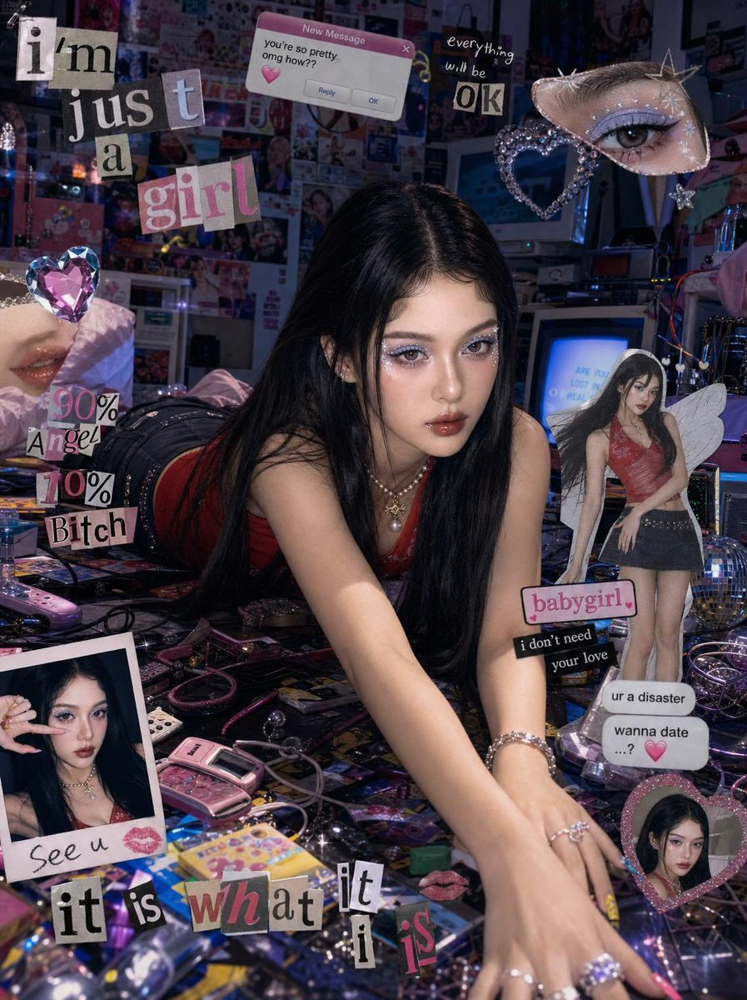

```text
Don’t alter my facial feature. Create me a wide editorial shot of a girl leaning dramatically across a cluttered floor/desk in a chaotic Y2K cyber-pop room, low front-facing angle with cinematic framing. Moody cool-toned lighting mixed with warm highlights, glossy flash photography feel, dreamy magazine-editorial atmosphere. Long sleek jet-black hair with center part, soft pale glam makeup, subtle blush, glossy gradient red lips, large doll-like eyes with soft eyeliner and lashes. Red fitted tank top and dark mini skirt, colorful manicure, slightly messy dramatic pose with arms stretched forward, intense direct gaze at camera. Surrounding scene filled with scattered random objects, cables, gadgets, accessories, glittery props, and bedroom clutter for a chaotic pop-girl aesthetic. Collage-style edit layered with floating heart gems, cut-out eyes, sticker elements, scrapbook graphics, fake text-message popups, polaroid frames, magazine cutout of the girl, bold typography overlays, hyperpop/K-pop editorial vibe, nostalgic Y2K internet aesthetic, glossy fashion-campaign energy. Scale ratio 4:3
```


---

## 例 548：Moody GQ Beach Cover

**来源：** [@iamaiistudio](https://x.com/iamaiistudio/status/2071772854908326260) / [awesome-gpt-image-2-prompts](https://github.com/EvoLinkAI/awesome-gpt-image-2-prompts)

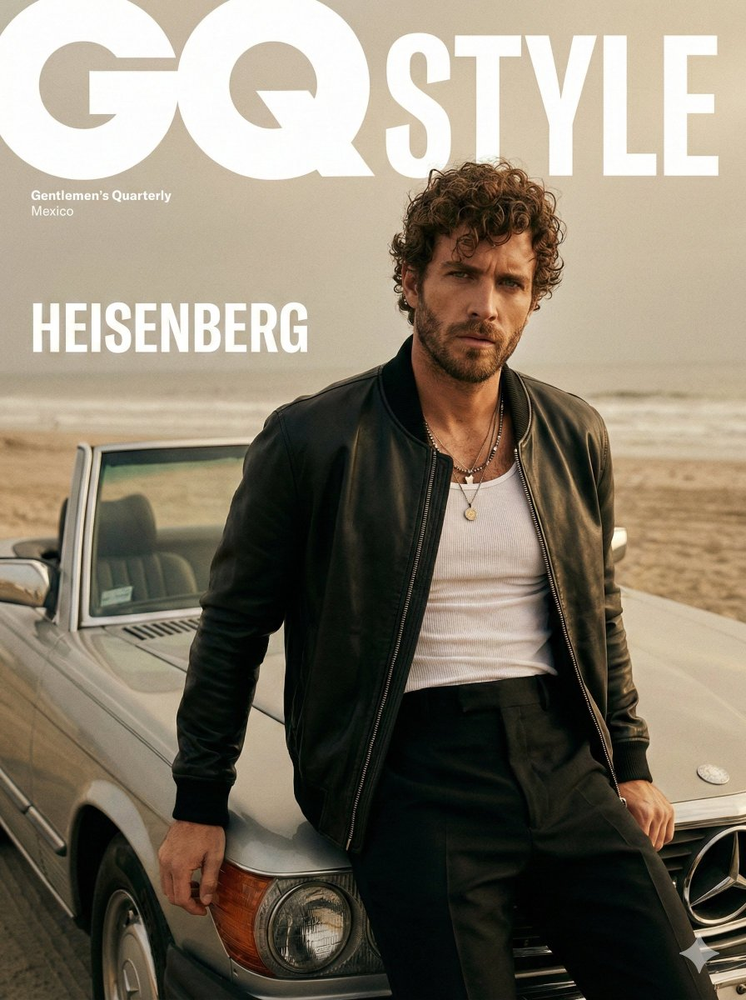

```text
Cinematic GQ Style magazine cover — male model with a dark beard and messy curly dark hair, leaning against a vintage 1960s silver convertible on a misty, overcast beach. He stares directly into the camera with a cool, intense expression. Outfit: oversized black leather bomber jacket with utility pockets worn open over a white ribbed tank top, high-waisted black trousers with double-buckle belt, two thin gold necklaces with small pendants hanging mid-chest. Background: shallow depth of field, desaturated sandy shore, pale hazy sky, polished metallic silver car reflecting flat diffused light. Lighting: moody cinematic grade, muted earth tones, blacks, and silvers, high-end film grain throughout. Typography overlay: bold white "GQ Style" serif logo at the top, smaller white sans-serif "HEISENBERG" on the mid-left.
```


---

## 例 549：Shoujo Manga Famous Quote Page

**来源：** [YouMind](https://youmind.com/prompts/shoujo-manga-quote-page-32659)

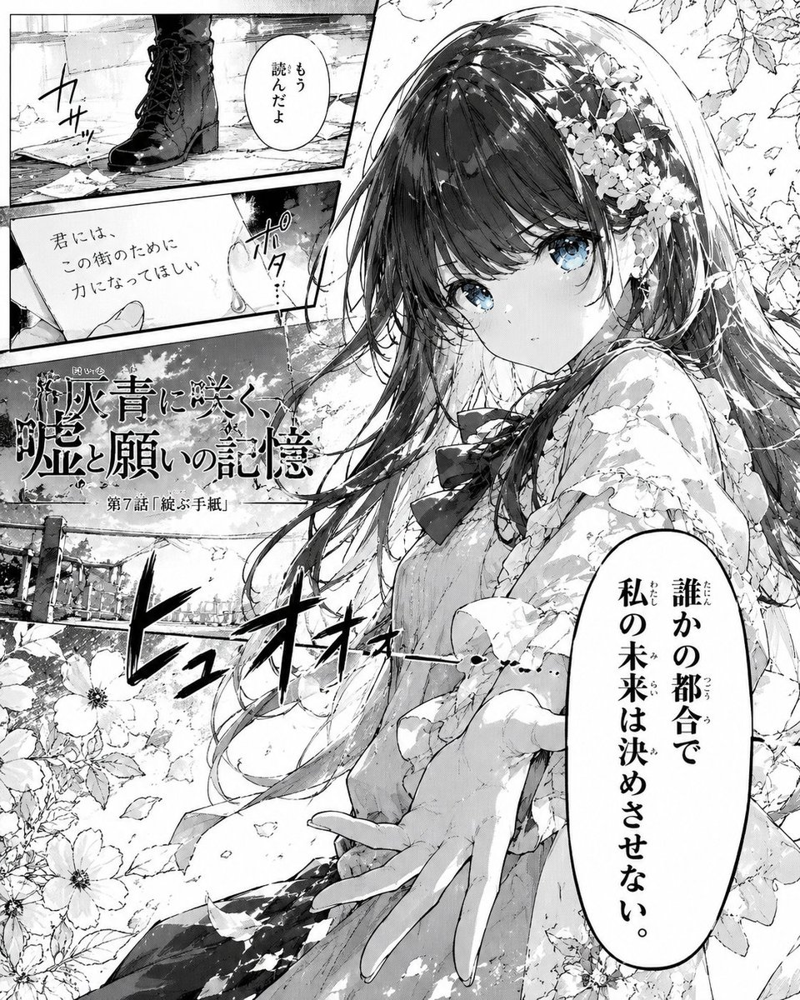

```text
Goal: Create a dramatic black-and-white shoujo manga magazine page where 
a quiet blue-eyed heroine
 looks like the protagonist of an emotional “famous quote” chapter.
Canvas: Vertical manga page, 4:5 aspect ratio, high-resolution monochrome ink with screentones, delicate linework, cinematic panel composition. Mostly grayscale, but keep the heroine’s eyes subtly colored pale blue for a striking focal point.
Layout: Use exactly 4 distinct manga areas: 1) a large main right-side panel occupying about two-thirds of the page with the heroine seated among flowers, 2) a small top-left inset panel showing only black lace-up boots stepping on scattered papers with a small speech balloon, 3) a middle-left inset panel showing a hand holding or reaching toward a letter with a speech balloon, and 4) a narrow lower-left background panel with a fence, trees, flowers, and large hand-drawn sound effects. Add diagonal panel borders and overlapping art elements so flowers and hair break across panel edges.
Main subject details: The heroine is a beautiful teenage manga girl with long flowing dark hair, thick bangs, large luminous blue eyes, a calm but determined expression, and soft blush shading. She wears a romantic floral-patterned kimono or dress with layered fabric, a dark bow at the chest, and small flower ornaments woven into her hair near one ear. She reaches one hand toward the viewer in the foreground, fingers elegant and slightly foreshortened. Surround her with many blooming flowers, drifting petals, leaves, and wind-swept hair strands.
Text content: Include a large Japanese chapter title across the left-center in ornate manga lettering: 
深灰青に咲く、嘘と願いの記憶
. Beneath it add the smaller subtitle: 
第7話「綻ぶ手紙」
. In the top-left boot panel, add a small vertical speech balloon reading 
もう読んだよ
. In the middle-left letter panel, add handwritten Japanese text reading "君には、この街のために力になってほしい". In the large main panel, place one tall oval speech balloon on the lower right with bold vertical Japanese dialogue: 
誰かの都合で私の未来は決めさせない。
. Add expressive Japanese manga sound effects including "カサッ", "ポタ…", and a large sweeping "ヒュオオオーー…" across the lower area.
Visual style: Authentic serialized manga page, shoujo drama, elegant emotional atmosphere, crisp black ink, halftone gradients, detailed hair highlights, floral motifs, subtle paper texture, dynamic wind and petals. The composition should feel like a climactic quote scene from a manga chapter.
Constraints: No color except the heroine’s pale blue eyes, no modern UI, no watermark, no extra panels beyond the 4 specified areas, keep all Japanese text legible and integrated into the manga artwork.
```


---

## 例 550：粗颗粒薄荷绿鱼眼报摊社论封面

**来源：** [@VigoCreativeAI](https://x.com/VigoCreativeAI/status/2090440728346267930) / [OpenNana](https://opennana.com/awesome-prompt-gallery/gritty-mint-fisheye-newsstand-editorial)

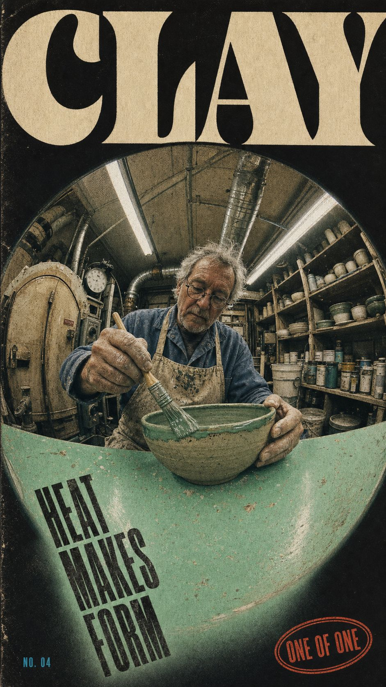

```text
{
  "style_name": "Gritty Mint Fisheye Newsstand Editorial",
  "style_slug": "gritty-mint-fisheye-newsstand-editorial",
  "style_version": "2.1",
  "style_summary": "A late-1960s to early-1970s counterculture magazine-cover system built from an oversized cream display masthead, a dominant circular fisheye documentary photograph, mint-green reflective surfaces, compressed angled black captions, a red rubber-stamp accent, and rough newsprint grain.",
  "environment_variables": {
    "SUBJECT": "the central documentary subject",
    "SUBJECT_ACTION": "a candid, hands-on action",
    "PRODUCT_OR_PROP": "the key object interacting with the subject",
    "LOCATION": "the enclosed everyday environment",
    "BACKGROUND_ELEMENTS": "linear lights and contextual details that bend through the fisheye view",
    "MAIN_TEXT": "the oversized cream masthead word",
    "SECONDARY_TEXT": "the short angled editorial caption and tiny issue line",
    "ACCENT_SYMBOL": "the red stamped badge wording or symbol",
    "WARDROBE_STYLE": "period-neutral tactile clothing with one cool blue or teal layer",
    "STYLE_FIDELITY_ANCHORS": "observable style traits that must remain visible",
    "SOURCE_CONTENT_TO_AVOID": "literal source content that generated samples must not recreate",
    "ASPECT_RATIO": "9:16 or 16:9"
  },
```


---
