# 海报与排版 — 提示词合集


> 344 个案例

---


## 例 3：足球主题电影海报

**来源：** 未提供

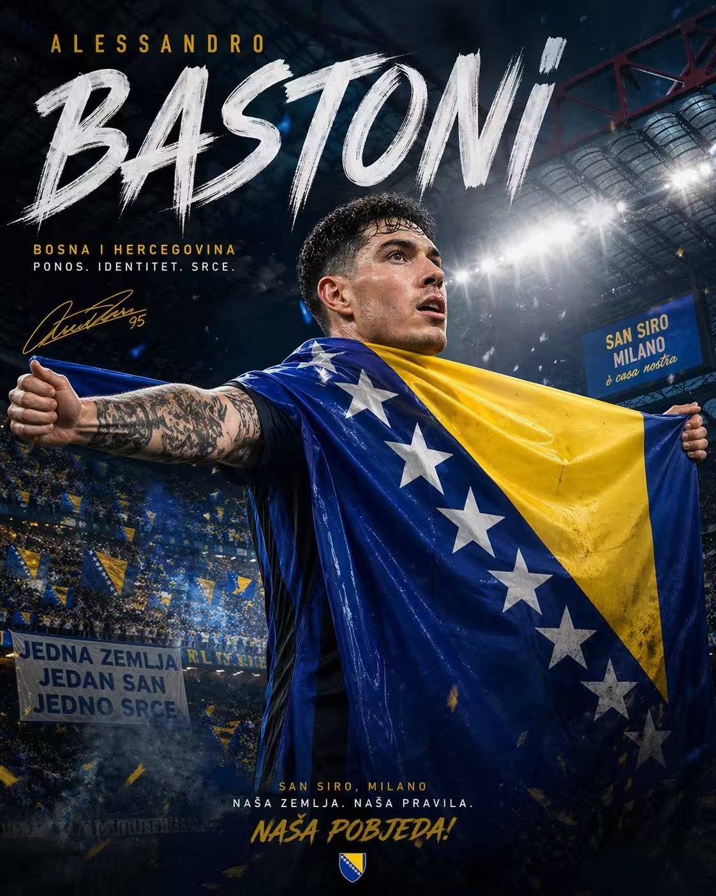


```text
生成一张「足球主题电影海报」风格的高清写真海报：国际米兰后卫巴斯托尼站在圣西罗球场中央激情庆祝，双手高举并披着波黑国旗，神情热血、坚定、自信，现场灯光璀璨，球场看台座无虚席，背景有蓝黑色烟雾、聚光灯、飘扬的旗帜和飞舞的纸屑，营造欧冠之夜般的史诗氛围。人物为画面核心，半身到全身构图，突出脸部细节、肌肉张力与球衣质感。整体风格写实、震撼、富有戏剧性，海报级构图，电影感光影，高对比度，超清细节，8K，专业体育摄影，极具视觉冲击力。五根手指。
```


---


## 例 5：主题海报版式设计

**来源：** 小红书号6455654397

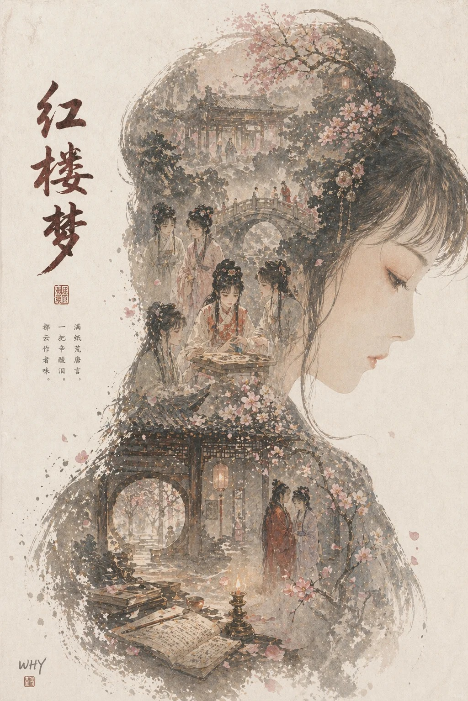


```text
根据【XXX主题】自动生成一张收藏版史诗叙事海报：巨大优雅的人物侧脸剪影作为外轮廓，剪影内部自动生长出最契合该主题的完整世界观、标志性场景、角色关系、象征符号、关键建筑、生物、道具与氛围。整体不是普通拼贴，而是高级的剪影轮廓填充式叙事合成，带有双重曝光式联想，但更偏电影海报与梦幻水彩插画融合风格；柔和空气透视，轻雾化过渡，纸张颗粒，边缘飞白与刷痕，大面积留白，版式克制高级，安静、宏大、神圣、怀旧、诗意、传说感强。风格、色彩、场景、材质全部根据主题自动适配，所有元素必须强绑定主题，一眼识别，不要杂乱，不要硬拼贴，不要模板化背景，不要廉价奇幻素材。画面中需自然加入专属签名“WHY”，作为海报设计的一部分，位置低调但清晰，可放在左下角、右下角或标题附近，风格需与整体版式统一，像收藏版海报的作者落款或设计签章；签名字体精致、克制、高级，不可过大，不可破坏主体构图，不可显得突兀廉价。
```


---


## 例 9：主题海报版式设计

**来源：** 小红书号z890738050

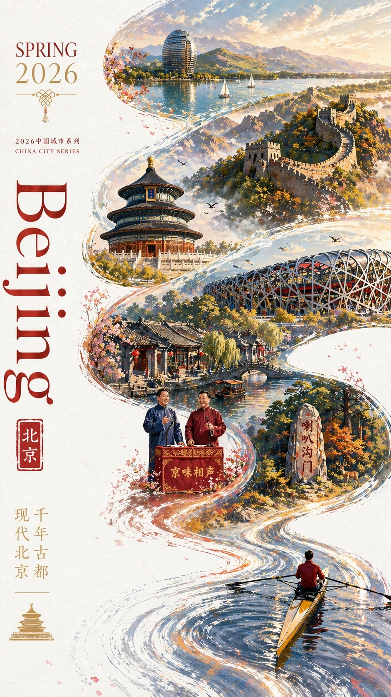


```text
2026中国城市系列宣传海报，主题为【北京】。现代、多彩、明亮通透的国潮风，竖版9:16。大面积白色纹理留白背景，一条从右下向左上盘旋的红色丝绸形成S型主构图。右下角一位东方女性挥舞红绸，服饰需结合北京地域文化定制。红绸延展为城市长卷，融合天坛、长城、鸟巢、喇叭沟门原始森林公园、什刹海、京味相声。左侧排版SPRING 2026、竖排Beijing和小印章“北京”。要求统一系列感，但不能雷同，细节丰富，城市辨识度强。文字清晰且精美布局，高端图形设计。
```


---


## 例 10：主题海报版式设计

**来源：** 小红书号2202716350

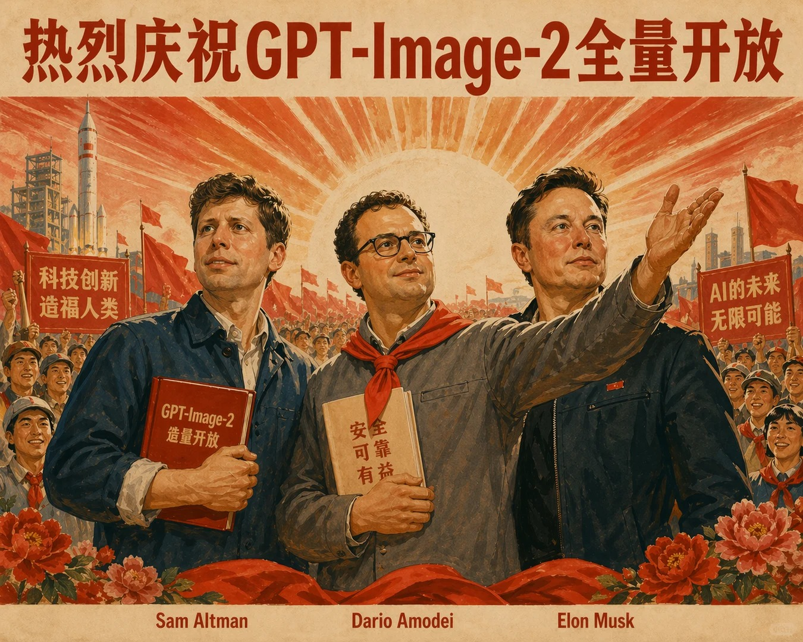


```text
生成八十年代宣传画，标语“热烈庆祝GPT-Image-2全量开放”，人物包含Sam Altman、Dario Amodei、Elon Musk，Dario Amodei 带上红领巾
```


---


## 例 15：主题海报版式设计

**来源：** 小红书号1005414639

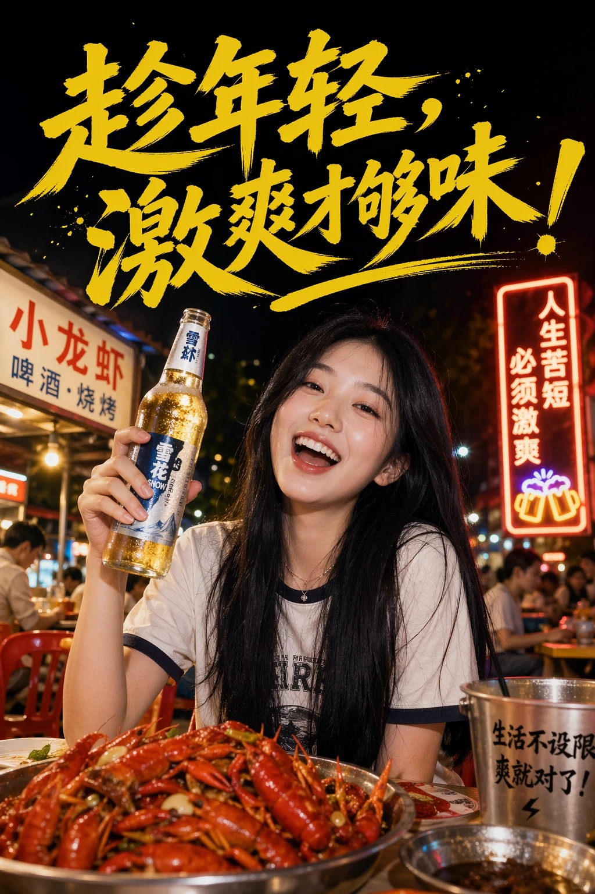


```text
生成一张海报图片，图片人物是一个19岁的中国少女，黑色直长发，很开心的在夜宵摊上喝啤酒吃小龙虾。海报上用芥末黄色艺术字写着，趁年轻，激爽才够味！
```


---


## 例 16：主题海报版式设计

**来源：** 小红书号2692926140

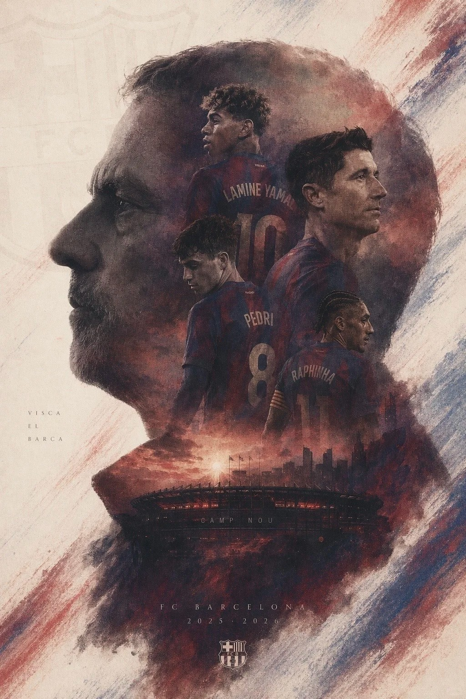


```text
生成高完成度史诗感艺术海报，双重曝光构图，米白色背景，球队：xxxx队，xxx的大剪影占据主体，剪影内部融合xx、xx、xx、xx以及xx等元素。整体以xx、土褐、为主，压抑、决绝、宿命感极强，元素不要冗杂，要有留白，印刷颗粒质感，元素不要有太锐的细节，但是要有史诗质感，像正式院线动画电影海报，竖版。图片中若出现文字则以细体字为主
```


---


## 例 58：主题海报版式设计

**来源：** [@liyue\_ai](https://x.com/liyue_ai)

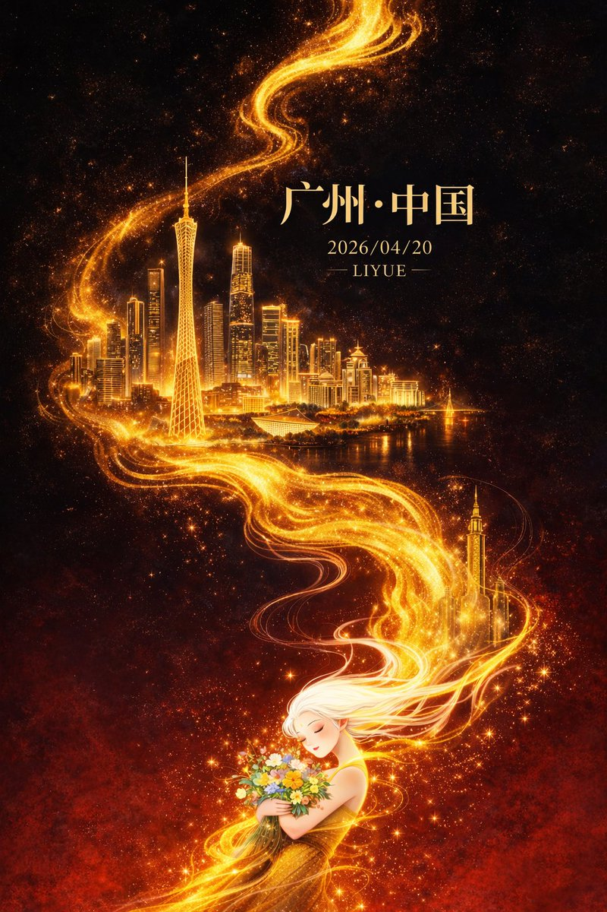


```text
Flat illustration, high-end oriental fantasy style city poster design, vertical 9:16 composition. The layout uses a diagonal + S-shaped flow extending from the bottom left to top right. The background is deep black grading down to intense dark red, creating strong warm-cool contrast and spatial depth with faint stardust and grain texture. In the center, a flowing golden energy line winds through like a flame, extending upward from the base, featuring fluid texture, particle effects, and gradient highlights, with subtle energy debris and volumetric light.

Within the golden flow, the architectural landmarks of {argument name="city" default="Guangzhou"} emerge layer by layer: the Canton Tower is the visual core with prominent proportions, surrounded by the Zhujiang New Town skyline, Liede Bridge, and modern Lingnan architectural elements. Buildings are rendered using "fine line drawing + golden luminous blocks," with clear outlines and rich details, appearing to float in a void against the golden halo, creating a surreal spatial hierarchy with slightly fogged backgrounds for added depth.

At the bottom of the frame is an oriental white-haired female figure with flowing hair like mist, naturally connecting and merging with the golden light. Her hair is translucent with gradient light effects; she has a graceful posture, eyes closed, and a serene expression, holding a bouquet of colorful flowers dotted with shimmering particles, symbolizing the spiritual connection between people and city energy. Character details are moderately simplified to emphasize the overall design.

Lighting is concentrated on the golden flow, buildings, and character outlines, creating intense chiaroscuro and visual focus. The overall atmosphere is grand, mysterious, imbued with oriental mythology, and slightly healing. Colors use black and dark red as a base with brilliant gold as the main visual emphasis. The gold has rich light-dark layers, complemented by small areas of high-saturation floral colors, maintaining a sophisticated and restrained aesthetic.

Integrated text and layout: Centered Songti font at the top reads "{argument name="city" default="Guangzhou"} · China," followed by smaller text "{argument name="date" default="2026/04/20"}" and "{argument name="author" default="LIYUE"}" below. Text uses pale gold or soft warm white, unified with the overall lighting. High-quality details, cinematic lighting, rich volumetric and particle details, clean image without noise, ultra-high 8K resolution, commercial-grade poster quality.
```


---


## 例 59：主题海报版式设计

**来源：** [@X64zzotSKCGtYmt](https://x.com/X64zzotSKCGtYmt)

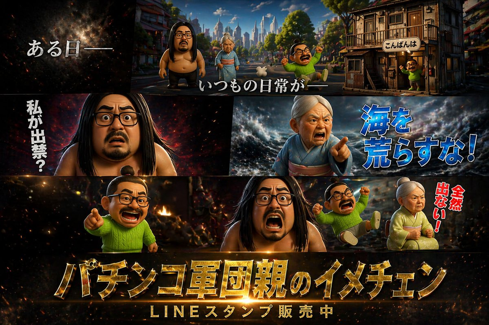


```text
{
  "type": "cinematic promotional poster",
  "style": "3D CGI animation style, highly detailed, dramatic lighting, caricature characters",
  "characters": [
    { "id": "char1", "description": "large shirtless man with long black hair, beard, and glasses" },
    { "id": "char2", "description": "elderly woman in a kimono with white hair tied up" },
    { "id": "char3", "description": "small man with a topknot, glasses, mustache, wearing a bright green sweater" }
  ],
  "layout": {
    "panels": [
      {
        "position": "top",
        "scene": "wide shot of a town street with buildings and a city skyline in the background",
        "characters_present": ["char1", "char2", "char3"],
        "text_overlays": [
          "{argument name=\"intro text\" default=\"ある日ーー\"}",
          "いつもの日常がーー",
          "こんばんは"
        ]
      },
      {
        "position": "middle left",
        "scene": "close-up of char1 looking shocked against a dark fiery background",
        "text_overlays": [
          "{argument name=\"shocked text\" default=\"私が出禁？\"}"
        ]
      },
      {
        "position": "middle right",
        "scene": "close-up of char2 looking angry and pointing against a stormy sea background",
        "text_overlays": [
          "{argument name=\"angry text\" default=\"海を荒らすな！\"}"
        ]
      },
      {
        "position": "bottom",
        "scene": "char3 pointing, char1 screaming, a second instance of char3 falling backwards, and char2 sitting angrily against a fiery chaotic background",
        "text_overlays": [
          "全然出ない！"
        ],
        "bottom_titles": [
          "{argument name=\"main title\" default=\"パチンコ軍団親のイメチェン\"}",
          "{argument name=\"subtitle\" default=\"LINEスタンプ販売中\"}"
        ]
      }
    ]
  }
}
```


---


## 例 61：主题海报版式设计

**来源：** [@masapark95](https://x.com/masapark95)

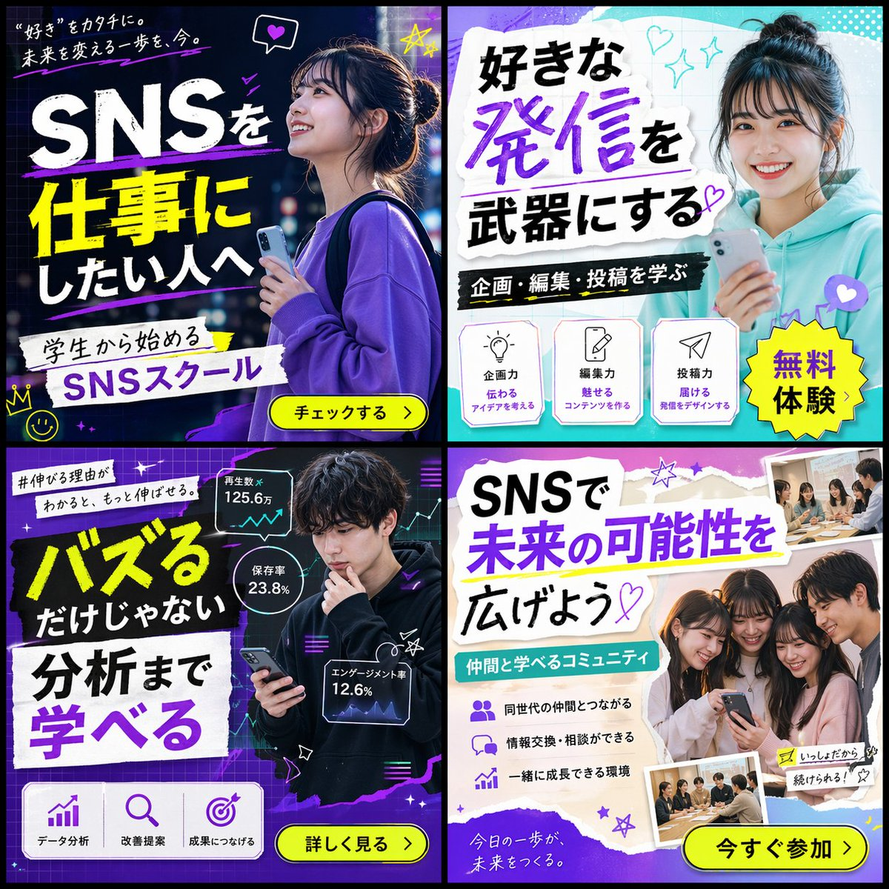


```text
{
  "type": "2x2 grid of banner advertisements",
  "theme": "{argument name=\"school name\" default=\"SNSスクール\"}",
  "target_audience": "{argument name=\"target audience\" default=\"学生\"}",
  "layout": {
    "grid": "2x2",
    "panels": [
      {
        "position": "top-left",
        "style": "dark neon, blue and purple",
        "subject": "young woman looking up hopefully, holding a smartphone, wearing a purple sweatshirt",
        "main_text": "{argument name=\"banner 1 headline\" default=\"SNSを仕事にしたい人へ\"}",
        "sub_text": "“好き”をカタチに。未来を変える一歩を、今。",
        "elements": [
          "white and yellow typography",
          "yellow call-to-action button: チェックする >",
          "hand-drawn neon accents (crown, stars, heart)"
        ]
      },
      {
        "position": "top-right",
        "style": "bright, pop, cyan and white",
        "subject": "young woman smiling directly at camera, holding a smartphone, wearing a teal hoodie, hair in a bun",
        "main_text": "{argument name=\"banner 2 headline\" default=\"好きな発信を武器にする\"}",
        "sub_text": "企画・編集・投稿を学ぶ",
        "elements": [
          "torn paper texture backgrounds for text",
          "yellow starburst sticker: 無料体験",
          "3 feature icons with text: lightbulb (企画力), pencil (編集力), paper plane (投稿力)"
        ]
      },
      {
        "position": "bottom-left",
        "style": "dark, analytical, neon purple and green",
        "subject": "young man looking thoughtfully at his smartphone, wearing a black hoodie",
        "main_text": "{argument name=\"banner 3 headline\" default=\"バズるだけじゃない 分析まで学べる\"}",
        "sub_text": "#伸びる理由がわかると、もっと伸ばせる。",
        "elements": [
          "3 floating holographic data panels with line graphs and stats (125.6万, 23.8%, 12.6%)",
          "3 feature icons at bottom: bar chart (データ分析), magnifying glass (改善提案), target (成果につなげる)",
          "yellow call-to-action button: 詳しく見る >"
        ]
      },
      {
        "position": "bottom-right",
        "style": "bright, friendly, purple and white",
        "subject": "group of 4 young people (3 women, 1 man) huddled together smiling at a smartphone",
        "main_text": "SNSで未来の可能性を広げよう",
        "sub_text": "仲間と学べるコミュニティ",
        "elements": [
          "torn paper texture backgrounds for text",
          "3 bullet points with icons (people, speech bubbles, rising chart)",
          "2 polaroid-style inset photos showing students studying at a desk",
          "yellow call-to-action button: 今すぐ参加 >"
        ]
      }
    ]
  }
}
```


---


## 例 63：主题海报版式设计

**来源：** [@masapark95](https://x.com/masapark95)

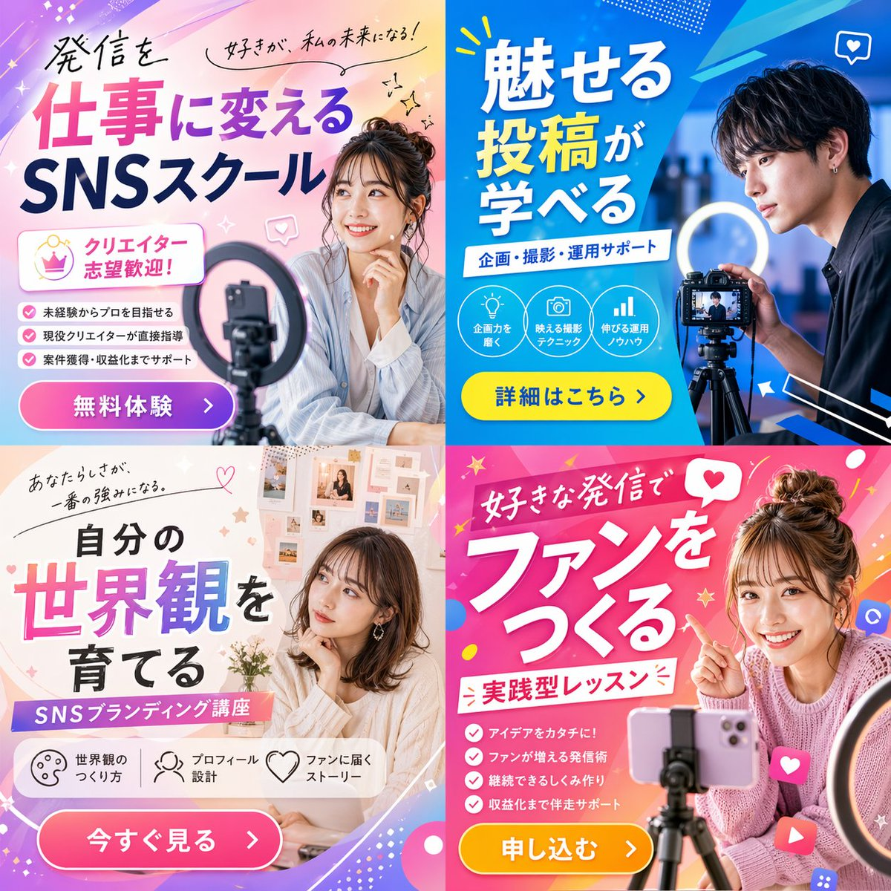


```text
{"type": "2x2 grid of promotional banner ads", "theme": "{argument name=\"course theme\" default=\"Social Media Content Creation School\"}", "panels": [{"position": "top-left", "color_palette": "light blue and pink pastel gradient", "subject": "young woman smiling, resting chin on hand, smartphone and ring light in foreground", "typography": {"headline": "{argument name=\"top left headline\" default=\"発信を仕事に変える SNSスクール\"}", "subheadings": ["好きが、私の未来になる！", "クリエイター志望歓迎！"]}, "layout_elements": {"bullet_points_count": 3, "call_to_action_button": "pink button labeled '無料体験 >'"}}, {"position": "top-right", "color_palette": "deep blue and cyan geometric", "subject": "young man looking intently at a professional camera on a tripod with a ring light", "typography": {"headline": "{argument name=\"top right headline\" default=\"魅せる投稿が学べる\"}", "subheadings": ["企画・撮影・運用サポート"]}, "layout_elements": {"circular_icons_count": 3, "icon_types": ["lightbulb", "camera", "bar chart"], "call_to_action_button": "yellow button labeled '詳細はこちら >'"}}, {"position": "bottom-left", "color_palette": "soft beige and white aesthetic", "subject": "young woman looking thoughtfully to the side, mood board background", "typography": {"headline": "{argument name=\"bottom left headline\" default=\"自分の世界観を育てる\"}", "subheadings": ["あなたらしさが、一番の強みになる。", "SNSブランディング講座"]}, "layout_elements": {"horizontal_icons_count": 3, "icon_types": ["palette", "person", "heart"], "call_to_action_button": "pink button labeled '今すぐ見る >'"}}, {"position": "bottom-right", "color_palette": "vibrant pink and magenta pop design", "subject": "young woman smiling brightly, pointing at text, messy bun, smartphone on tripod", "typography": {"headline": "{argument name=\"bottom right headline\" default=\"好きな発信でファンをつくる\"}", "subheadings": ["実践型レッスン"]}, "layout_elements": {"bullet_points_count": 4, "call_to_action_button": "yellow button labeled '申し込む >'"}}]}
```


---


## 例 96：主题海报版式设计

**来源：** [@sayaka\_aiart](https://x.com/sayaka_aiart)

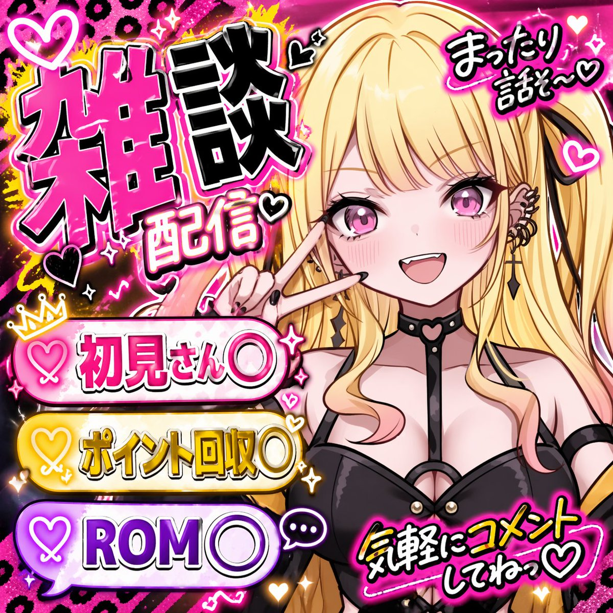


```text
{
  "type": "VTuber stream thumbnail",
  "character": {
    "hair": "long blonde twin tails with pink gradient ends",
    "eyes": "large pink anime eyes",
    "expression": "cheerful smile with a small fang, making a peace sign near the eye",
    "outfit": "black top with harness straps, black heart-ring choker, multiple ear piercings including a cross dangle, black nail polish"
  },
  "background": "vibrant neon pink and black leopard print with glowing yellow accents, sparkles, and floating hearts",
  "typography_and_layout": {
    "main_title": {
      "position": "top left",
      "style": "large, bold, 3D, pink and black with white outlines",
      "text": "{argument name=\"main title\" default=\"雑談配信\"}"
    },
    "top_right_text": {
      "style": "casual handwritten style with a heart",
      "text": "{argument name=\"top right text\" default=\"まったり話そ〜♡\"}"
    },
    "bottom_left_banners": {
      "count": 3,
      "style": "glowing pill-shaped banners with heart icons on the left",
      "colors": ["pink", "yellow", "purple"],
      "labels": [
        "{argument name=\"banner 1 text\" default=\"初見さん〇\"}",
        "{argument name=\"banner 2 text\" default=\"ポイント回収〇\"}",
        "{argument name=\"banner 3 text\" default=\"ROM〇\"}"
      ]
    },
    "bottom_right_text": {
      "style": "casual handwritten style with a heart, yellow text with pink outline",
      "text": "気軽にコメントしてねっ♡"
    }
  }
}
```


---


## 例 98：主题海报版式设计

**来源：** [@wtry1102](https://x.com/wtry1102)

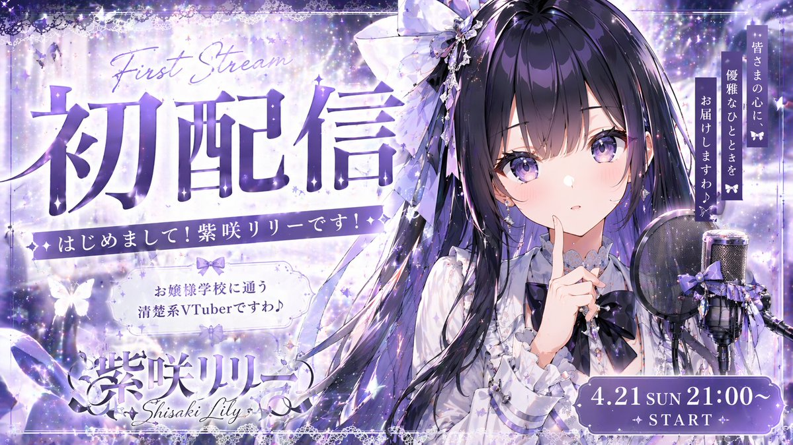


```text
{
  "type": "VTuber debut stream thumbnail",
  "character": {
    "appearance": "anime girl, long dark purple hair, purple eyes, frilly white blouse, dark purple bow tie, large hair bow",
    "pose": "finger to lips, cute expression",
    "props": "condenser microphone with pop filter and purple ribbon on the right"
  },
  "background": "magical starry night, sparkles, glowing butterflies, purple and white color palette",
  "layout": {
    "typography": [
      {
        "position": "top left",
        "style": "large bold text with cursive English above",
        "text": "{argument name=\"main title\" default=\"初配信\"}",
        "subtext_1": "First Stream",
        "subtext_2": "Nice to meet you! I am Shisaki Lily!"
      },
      {
        "position": "middle left",
        "style": "decorative box",
        "text": "{argument name=\"character description\" default=\"お嬢様学校に通う清楚系VTuberですわ♪\"}"
      },
      {
        "position": "bottom left",
        "style": "logo style",
        "text": "{argument name=\"character name\" default=\"紫咲リリー\"}",
        "subtext": "Shisaki Lily"
      },
      {
        "position": "top right",
        "style": "vertical text",
        "text": "{argument name=\"catchphrase\" default=\"皆さまの心に、優雅なひとときをお届けしますわ♪\"}"
      },
      {
        "position": "bottom right",
        "style": "decorative pill shape",
        "text": "{argument name=\"stream date and time\" default=\"4.21 SUN 21:00~\"}",
        "subtext": "✦ START ✦"
      }
    ]
  }
}
```


---


## 例 100：主题海报版式设计

**来源：** [@naga\_zyashin](https://x.com/naga_zyashin)

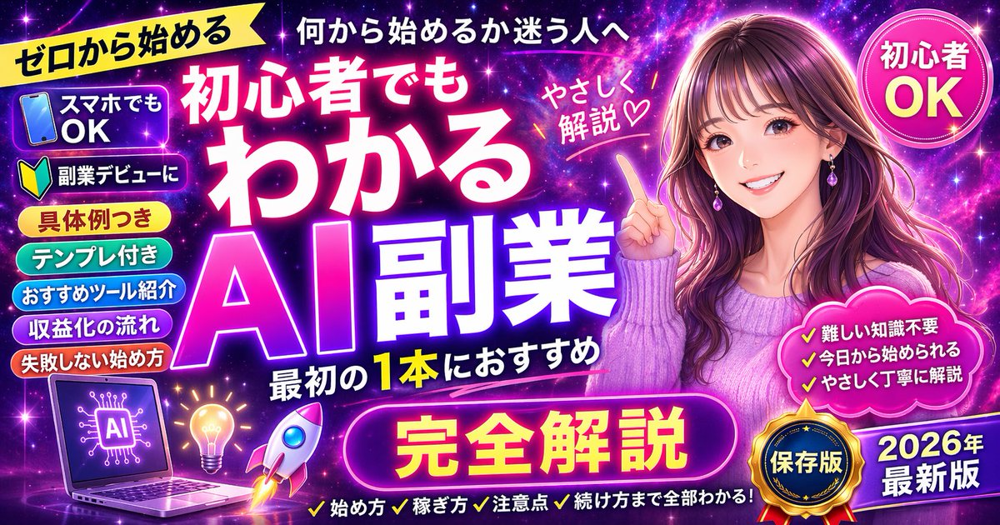


```text
{
  "type": "promotional banner thumbnail",
  "style": "vibrant neon, cosmic galaxy background, anime illustration style, high-density Japanese typography, glowing text effects",
  "character": {
    "description": "smiling young woman pointing upwards with right index finger",
    "appearance": "long {argument name=\"character hair color\" default=\"brown\"} hair, purple drop earrings, textured purple sweater",
    "position": "right side"
  },
  "layout": {
    "background": "purple, pink, and blue starry space nebula",
    "center_typography": {
      "top_small_text": "何から始めるか迷う人へ",
      "main_title": "{argument name=\"main title\" default=\"初心者でもわかる AI副業\"}",
      "subtitle": "最初の1本におすすめ",
      "floating_text_near_character": "やさしく解説♡"
    },
    "top_left": {
      "yellow_ribbon": "{argument name=\"top left ribbon text\" default=\"ゼロから始める\"}"
    },
    "top_right": {
      "pink_circle_badge": "初心者 OK"
    },
    "left_column": {
      "count": 7,
      "description": "stack of pill-shaped badges",
      "labels": [
        "スマホでもOK (with phone icon)",
        "副業デビューに (with beginner mark icon)",
        "具体例つき",
        "テンプレ付き",
        "おすすめツール紹介",
        "収益化の流れ",
        "失敗しない始め方"
      ]
    },
    "bottom_left_graphics": {
      "count": 3,
      "items": [
        "laptop displaying an AI circuit brain graphic",
        "glowing lightbulb",
        "rocket ship taking off"
      ]
    },
    "bottom_center": {
      "large_purple_button": "{argument name=\"bottom center button text\" default=\"完全解説\"}",
      "checklist_text_below": "✓始め方 ✓稼ぎ方 ✓注意点 ✓続け方まで全部わかる！"
    },
    "bottom_right": {
      "pink_cloud_shape": {
        "count": 3,
        "bullet_points": [
          "✓難しい知識不要",
          "✓今日から始められる",
          "✓やさしく丁寧に解説"
        ]
      },
      "gold_medal_seal": "保存版",
      "purple_badge": "{argument name=\"year badge text\" default=\"2026年 最新版\"}"
    }
  }
}
```


---


## 例 116：主题海报版式设计

**来源：** [@gamemangaanime](https://x.com/gamemangaanime)

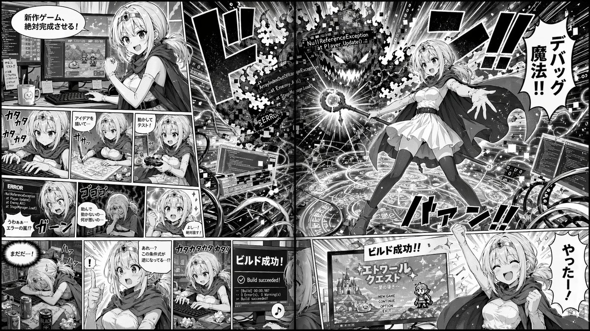


```text
{
  "type": "2-page manga spread",
  "style": "monochrome anime manga, screentones",
  "theme": "{argument name=\"main action\" default=\"fantasy mage developing a video game\"}",
  "character": "{argument name=\"character appearance\" default=\"anime girl with blonde hair, tiara, cape, white dress, thigh-highs\"}",
  "layout": {
    "left_page": {
      "panel_count": 11,
      "rows": [
        {"panels": 1, "action": "Determined at dual-monitor desk, speech bubble: '新作ゲーム、絶対完成させる！'"},
        {"panels": 3, "action": "Typing, drawing on tablet, testing with controller"},
        {"panels": 3, "action": "Shocked at ERROR screen, depressed, determined again"},
        {"panels": 4, "action": "Exhausted, sudden realization, furious typing, monitor showing 'Build succeeded!'"}
      ]
    },
    "right_page": {
      "panel_count": 2,
      "panels": [
        {"type": "large splash", "action": "Casting magic from a glowing circle at a code-error monster labeled '{argument name=\"error text\" default=\"NullReferenceException\"}'. Speech bubble: '{argument name=\"spell text\" default=\"デバッグ魔法!!\"}'"},
        {"type": "bottom banner", "action": "Cheering in front of RPG title screen. Speech bubble: '{argument name=\"success text\" default=\"やったー！\"}'"}
      ]
    }
  }
}
```


---


## 例 117：主题海报版式设计

**来源：** [@nicdunz](https://x.com/nicdunz)

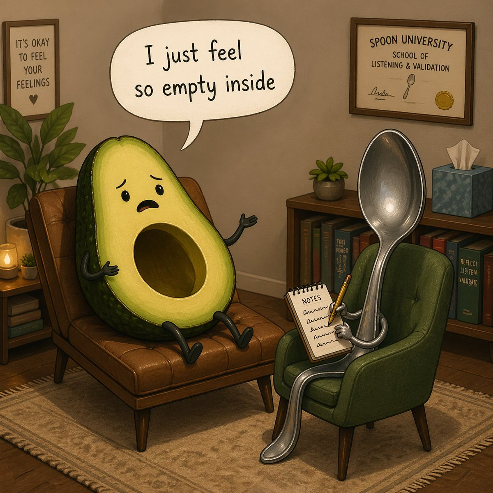


```text
A humorous 3D cartoon illustration of a therapy session in a cozy office. On the left, a {argument name="patient character" default="sad anthropomorphic avocado half missing its pit"} sits on a brown leather lounge chair, gesturing with its thin stick-like arms. A large speech bubble above it reads "{argument name="speech text" default="I just feel so empty inside"}". On the right, the therapist, an {argument name="therapist character" default="anthropomorphic silver spoon"}, sits in a green armchair, holding a yellow pencil and writing on a notepad labeled "NOTES". The room has warm lighting, a beige rug on a wooden floor, and a bookshelf with a tissue box and books, one titled "REFLECT LISTEN VALIDATE". On the left wall hangs a framed poster reading "{argument name="poster text" default="IT'S OKAY TO FEEL YOUR FEELINGS"}" with a small heart. On the right wall hangs a framed diploma reading "{argument name="diploma text" default="SPOON UNIVERSITY SCHOOL OF LISTENING & VALIDATION"}" featuring a small spoon illustration and a gold seal.
```


---


## 例 119：主题海报版式设计

**来源：** [@old\_pgmrs\_will](https://x.com/old_pgmrs_will)

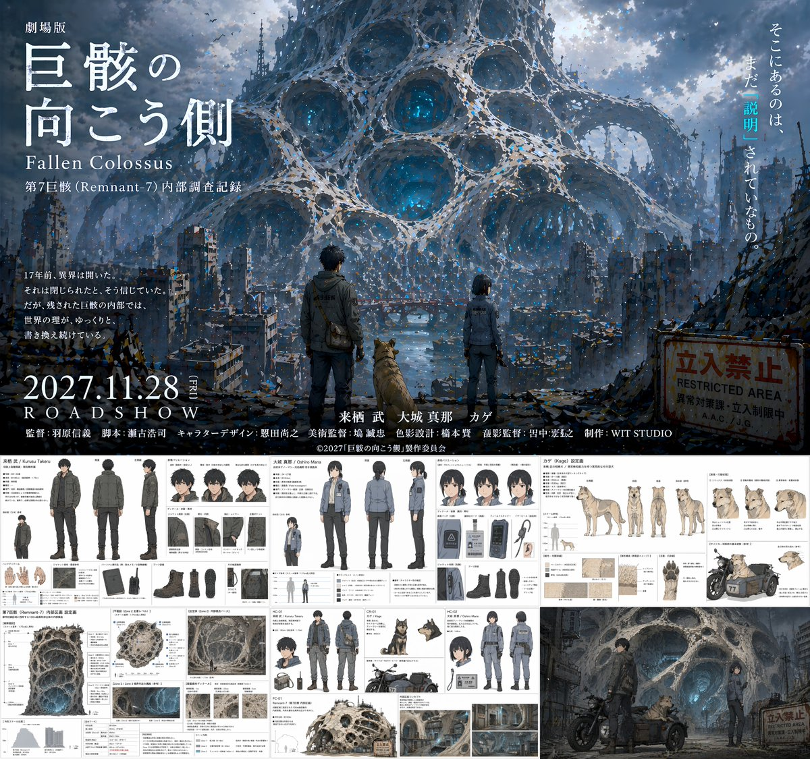


```text
{
  "type": "anime movie production pitch document",
  "overall_layout": "split layout with a large cinematic movie poster on the top half and a grid of 5 detailed reference sheets on the bottom half",
  "top_section": {
    "type": "movie poster",
    "visual": "A man, a woman, and a dog standing on a ruined city street, facing away from the viewer, looking towards a colossal, porous, web-like alien structure dominating the sky. A rusty 'RESTRICTED AREA' sign is on the right.",
    "typography": {
      "title": "{argument name=\"movie title\" default=\"劇場版 巨骸の向こう側 Fallen Colossus\"}",
      "release_date": "{argument name=\"release date\" default=\"2027.11.28 ROADSHOW\"}",
      "tagline": "そこにあるのは、まだ「説明」されていないもの。",
      "credits_studio": "{argument name=\"studio name\" default=\"WIT STUDIO\"}"
    }
  },
  "bottom_sections": [
    {
      "title": "{argument name=\"male character name\" default=\"来栖 武 / Kurusu Takeru\"}",
      "type": "character reference sheet",
      "elements": {
        "full_body_poses": 3,
        "expressions": 3,
        "detail_shots": 8,
        "description": "Male protagonist in dark tactical jacket and cargo pants. Includes front, back, and side full-body views, headshots, and detailed callouts for gloves, boots, backpack, and radio."
      }
    },
    {
      "title": "{argument name=\"female character name\" default=\"大城 真那 / Oshiro Mana\"}",
      "type": "character reference sheet",
      "elements": {
        "full_body_poses": 3,
        "expressions": 3,
        "detail_shots": 6,
        "description": "Female protagonist in grey tactical uniform. Includes front, back, and side full-body views, headshots, and detailed callouts for jacket, boots, ID badge, and pouch."
      }
    },
    {
      "title": "カゲ (Kage) 設定画",
      "type": "animal character reference sheet",
      "elements": {
        "full_body_poses": 4,
        "expressions": 4,
        "detail_shots": 5,
        "description": "Dog companion. Includes side, front, back, and angled full-body views, headshots, and detailed callouts for fur texture, paws, and a motorcycle sidecar."
      }
    },
    {
      "title": "第7巨骸 (Remnant-7) 内部区画 設定画",
      "type": "environment and vehicle reference sheet",
      "elements": {
        "large_diagrams": 1,
        "environment_thumbnails": 4,
        "vehicle_designs": 1,
        "description": "Cross-section of the porous alien structure, smaller environment thumbnails, and a motorcycle design featuring the characters."
      }
    },
    {
      "title": "Concept Art",
      "type": "scene illustration",
      "elements": {
        "characters": 3,
        "vehicles": 1,
        "description": "The male character, female character, and dog with a motorcycle sidecar parked in front of the glowing, porous alien structure."
      }
    }
  ]
}
```


---


## 例 122：主题海报版式设计

**来源：** [@pcneko\_lab](https://x.com/pcneko_lab)

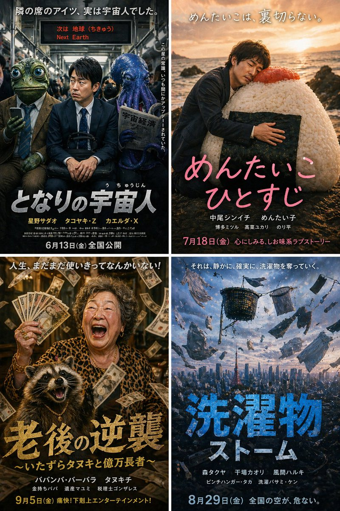


```text
{
  "type": "movie poster grid",
  "layout": "2x2 grid",
  "posters": [
    {
      "position": "top-left",
      "genre": "sci-fi comedy",
      "visuals": "A Japanese salaryman sitting on a crowded train looking nervous, flanked by two aliens in business attire: a green frog-like alien looking at a smartphone, and a blue octopus-like alien reading a newspaper.",
      "text_elements": {
        "tagline_top": "隣の席のアイツ、実は宇宙人でした。",
        "train_display": "次は 地球 (ちきゅう) Next Earth",
        "tagline_side": "この星の常識、いつの間にかアップデートされていた。",
        "main_title": "{argument name=\"poster 1 title\" default=\"となりの宇宙人\"}",
        "cast": "星野サダオ タコヤキ・Z カエルダ・X",
        "release_date": "6月13日(金) 全国公開"
      }
    },
    {
      "position": "top-right",
      "genre": "surreal romance",
      "visuals": "A man in a dark jacket affectionately hugging a giant onigiri (rice ball) topped with mentaiko (spicy cod roe) wrapped in seaweed. They are sitting on a rocky beach during a beautiful sunset.",
      "text_elements": {
        "tagline": "めんたいこは、裏切らない。",
        "main_title": "{argument name=\"poster 2 title\" default=\"めんたいこ ひとすじ\"}",
        "cast": "中尾シンイチ めんたい子 博多ミツル 高菜ユカリ のり平",
        "release_date": "7月18日(金) 心にしみる、しお味系ラブストーリー"
      }
    },
    {
      "position": "bottom-left",
      "genre": "heist comedy",
      "visuals": "A joyful elderly woman in a leopard print blouse laughing maniacally while holding a fan of Japanese yen bills. Money is raining down around her. A happy raccoon is in the foreground.",
      "text_elements": {
        "tagline": "人生、まだまだ使いきってなんかない！",
        "main_title": "{argument name=\"poster 3 title\" default=\"老後の逆襲\"}",
        "subtitle": "〜いたずらタヌキと億万長者〜",
        "cast": "ババンバ・バーバラ タヌキチ 金持ちババ 遺産マユミ 税理士ゴンザレス",
        "release_date": "9月5日(金) 痛快！下剋上エンターテインメント！"
      }
    },
    {
      "position": "bottom-right",
      "genre": "disaster thriller",
      "visuals": "A dramatic disaster scene where laundry baskets, shirts, and clothes are being sucked up into a stormy, apocalyptic sky above a ruined Tokyo city skyline featuring the Tokyo Tower.",
      "text_elements": {
        "tagline": "それは、静かに、確実に、洗濯物を奪っていく。",
        "main_title": "{argument name=\"poster 4 title\" default=\"洗濯物 ストーム\"}",
        "cast": "森タクヤ 干場カオリ 風間ハルキ ピンチハンガー・タカ 洗濯バサミ・ケン",
        "release_date": "8月29日(金) 全国の空が、危ない。"
      }
    }
  ]
}
```


---


## 例 124：主题海报版式设计

**来源：** [@koshian\_to](https://x.com/koshian_to)

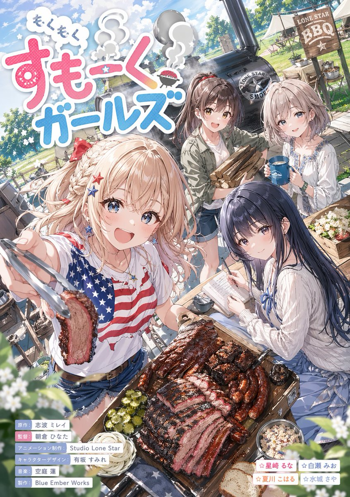


```text
An anime-style key visual poster for a fictional slice-of-life anime. In the foreground left, an energetic blonde anime girl with star hairpins and blue eyes wears an {argument name="main character outfit" default="American flag t-shirt and denim shorts"}, holding tongs with a slice of smoked meat towards the viewer. In the foreground right, a gentle girl with long dark hair and a white sweater sits at a wooden table writing in a notebook. In the background, two more girls are present: one with a brown ponytail carrying firewood, and another with short silver hair holding a blue mug. The scene is a sunny outdoor BBQ area with a large black smoker grill featuring a sign that reads {argument name="background grill sign" default="LONE STAR BBQ"}. In the immediate foreground is a {argument name="food platter" default="massive wooden platter loaded with sliced brisket, ribs, sausages, burnt ends, and pickles"}, along with side dishes like coleslaw and bread. In the top left corner, a large, cute, bubbly anime logo reads {argument name="anime title" default="もくもく すもーく ガールズ"} with smoke and grill motifs. In the bottom left corner, there is a {argument name="credits text block" default="staff credits block with names and roles"}. In the bottom right corner, a small text box lists four character names. The overall atmosphere is cheerful, highly detailed, and vibrant.
```


---


## 例 138：封面排版设计图

**来源：** [@aiehon\_aya](https://x.com/aiehon_aya)


```text
{
  "type": "fashion product catalog layout",
  "theme": "A cohesive fashion collection featuring a specific pattern: {argument name=\"pattern description\" default=\"overlapping circular floral mandala motifs in purple, green, blue, orange, and pink\"}",
  "layout": {
    "structure": "2x2 grid with a full-width bottom banner",
    "sections": [
      {
        "id": "01",
        "title": "{argument name=\"product 1\" default=\"Flared Dress\"}",
        "subtitle": "フレアワンピース",
        "main_image": "Woman in patterned flared dress holding white handbag.",
        "swatch_count": 3,
        "swatch_descriptions": ["purple variant", "green/blue variant", "orange/yellow variant"],
        "description_text": "華やかなフレアシルエット。軽やかな素材が優雅な動きを演出します。"
      },
      {
        "id": "02",
        "title": "{argument name=\"product 2\" default=\"Silk Scarf\"}",
        "subtitle": "シルクスカーフ",
        "main_image": "Woman in white blouse with patterned silk scarf.",
        "swatch_count": 2,
        "swatch_descriptions": ["flat pattern detail", "tied knot detail"],
        "description_text": "首元に彩りを添えるシルクスカーフ。上品な光沢と滑らかな肌ざわり。"
      },
      {
        "id": "03",
        "title": "{argument name=\"product 3\" default=\"Tote Bag\"}",
        "subtitle": "トートバッグ",
        "main_image": "Woman carrying patterned tote bag.",
        "swatch_count": 3,
        "swatch_descriptions": ["purple variant", "blue variant", "orange/yellow variant"],
        "description_text": "A4サイズも入る収納力。軽くて丈夫、毎日使いたくなるトートバッグ。"
      },
      {
        "id": "04",
        "title": "{argument name=\"product 4\" default=\"Pouch\"}",
        "subtitle": "ポーチ",
        "main_image": "Patterned zip pouch on table with magazine and vase.",
        "swatch_count": 3,
        "swatch_descriptions": ["green/purple variant", "orange variant", "pink variant"],
        "description_text": "バッグの中を彩る華やかなポーチ。細部まで美しいデザインが魅力です。"
      }
    ],
    "bottom_banner": {
      "title": "Pattern Design",
      "description_text": "細やかな線と豊かな色彩が織りなす、唯一無二のパターンデザイン。日常に優雅な彩りを。",
      "image": "Horizontal strip showing the seamless pattern."
    }
  }
}
```


---


## 例 139：主题海报版式设计

**来源：** [@nakazakifam](https://x.com/nakazakifam)

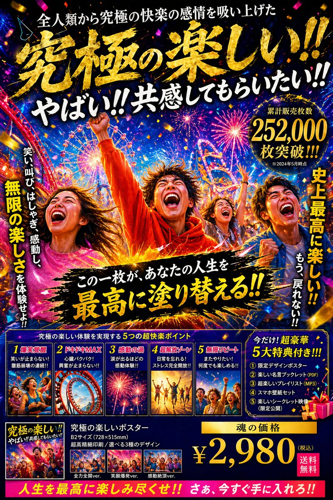


```text
{
  "type": "Japanese promotional landing page poster",
  "style": "hyper-energetic, explosive typography, vibrant colors, amusement park night festival aesthetic",
  "layout": {
    "top_section": {
      "background": "night sky, fireworks, ferris wheel, roller coaster",
      "subjects": "4 young adults cheering, raising fists, dynamic lighting",
      "typography": [
        "{argument name=\"main headline\" default=\"究極の楽しい!!\"}",
        "{argument name=\"sub headline\" default=\"やばい!!共感してもらいたい!!\"}",
        "この一枚が、あなたの人生を最高に塗り替える!!"
      ],
      "badges": [
        "累計販売枚数 {argument name=\"sales badge\" default=\"252,000\"} 枚突破!!!"
      ]
    },
    "middle_section": {
      "title": "究極の楽しい体験を実現する5つの超快楽ポイント",
      "points_count": 5,
      "points": [
        {"number": 1, "label": "爆笑覚醒", "image": "people laughing"},
        {"number": 2, "label": "ドキドキMAX", "image": "roller coaster loop"},
        {"number": 3, "label": "感動の渦", "image": "fireworks explosion"},
        {"number": 4, "label": "超解放ゾーン", "image": "silhouettes jumping at sunset"},
        {"number": 5, "label": "無限リピート", "image": "group of people cheering"}
      ]
    },
    "bonus_section": {
      "title": "今だけ！超豪華 5大特典付き!!!",
      "items_count": 5,
      "items": [
        "① 限定デザインポスター",
        "② 楽しい名言ブックレット(PDF)",
        "③ 超楽しいプレイリスト(MP3)",
        "④ スマホ壁紙セット",
        "⑤ 楽しいシークレット映像"
      ]
    },
    "bottom_section": {
      "product_info": {
        "name": "究極の楽しいポスター",
        "variants_count": 3,
        "variants": ["全力全開ver.", "笑顔爆発ver.", "感動絶頂ver."]
      },
      "pricing": {
        "label": "魂の価格",
        "amount": "{argument name=\"price\" default=\"¥2,980\"}",
        "shipping": "送料無料"
      }
    },
    "footer": {
      "text": "{argument name=\"footer call to action\" default=\"人生を最高に楽しみ尽くせ!! さぁ、今すぐ手に入れろ!!\"}",
      "background_color": "magenta"
    }
  }
}
```


---


## 例 140：主题海报版式设计

**来源：** [@AutoIntelliMode](https://x.com/AutoIntelliMode)

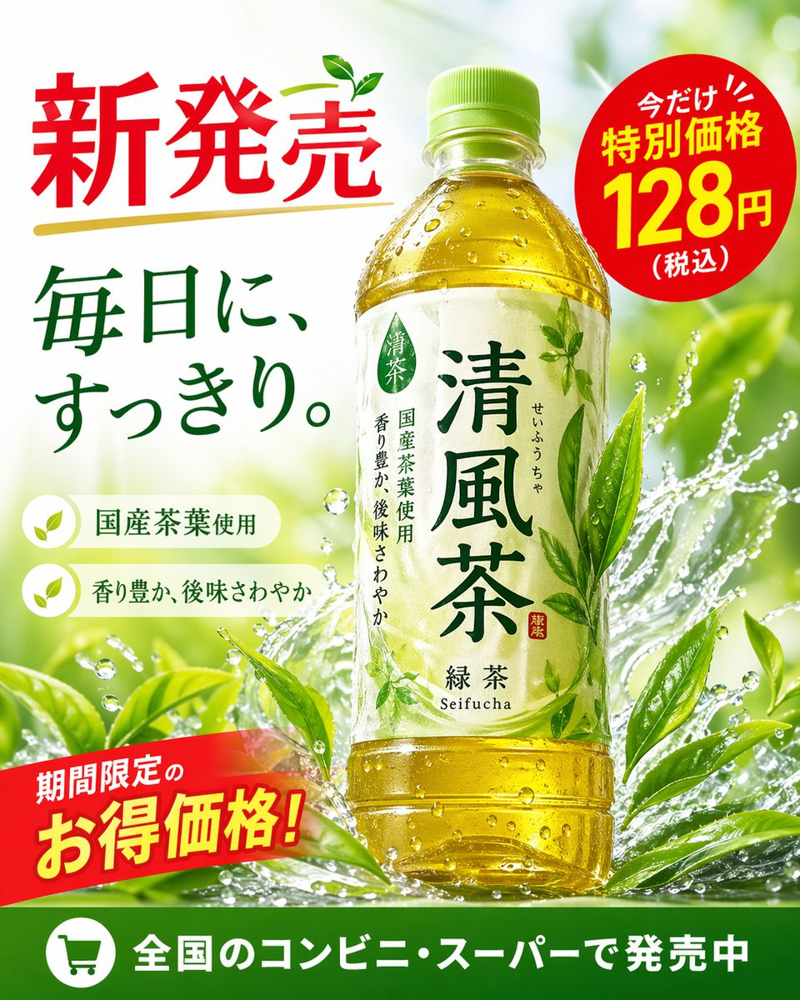


```text
{"type": "promotional advertisement poster for a bottled green tea beverage", "product": {"type": "clear plastic PET bottle filled with yellow-green tea", "label": "white label with green typography, featuring the product name '{argument name=\"product name\" default=\"清風茶\"}', subtitle '緑茶 Seifucha', and vertical text '国産茶葉使用' and '香り豊か、後味さわやか'"}, "background": "bright, fresh, sunlit outdoor atmosphere with dynamic water splashes wrapping around the bottle and vibrant green tea leaves", "layout": {"sections": [{"title": "headline", "position": "top-left", "text": "{argument name=\"main headline\" default=\"新発売\"}", "style": "large red text with a gold underline and a small green leaf accent"}, {"title": "catchphrase", "position": "mid-left", "text": "{argument name=\"catchphrase\" default=\"毎日に、すっきり。\"}", "style": "dark green text"}, {"title": "features", "position": "lower-left", "count": 2, "labels": ["国産茶葉使用", "香り豊か、後味さわやか"], "style": "white pill-shaped banners with green leaf icons"}, {"title": "price_badge", "position": "top-right", "text": "今だけ!! 特別価格 {argument name=\"price\" default=\"128円\"} (税込)", "style": "red circular sticker with white and yellow text"}, {"title": "promo_banner", "position": "bottom-left", "text": "期間限定のお得価格!", "style": "angled red ribbon with yellow and white text"}, {"title": "footer", "position": "bottom-edge", "text": "{argument name=\"footer text\" default=\"全国のコンビニ・スーパーで発売中\"}", "style": "solid green horizontal bar with a white shopping cart icon"}]}}
```


---


## 例 144：主题海报版式设计

**来源：** [@panchaaan\_2](https://x.com/panchaaan_2)

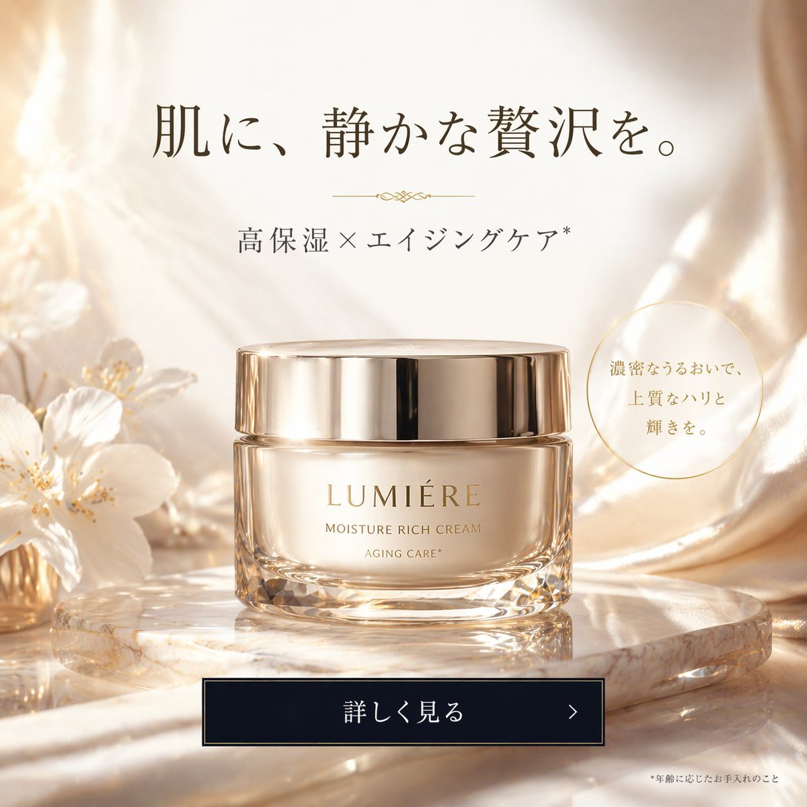


```text
A luxurious cosmetic product advertisement featuring a single elegant glass jar with a shiny gold lid resting on a round, light-colored marble slab. The jar has gold text reading {argument name="brand name" default="LUMIÉRE"} and {argument name="product type" default="MOISTURE RICH CREAM"} with "AGING CARE*" below it. The background consists of soft, draped, shimmering champagne-colored silk fabric with delicate white flowers on the left. The lighting is warm, ethereal, and sun-drenched with soft bokeh. At the top center, elegant dark brown Japanese typography reads {argument name="main headline" default="肌に、静かな贅沢を。"} above a small decorative gold divider and the text {argument name="subheadline" default="高保湿×エイジングケア*"}. To the right of the jar, a thin gold circle contains Japanese text meaning 'With dense moisture, high-quality firmness and radiance'. At the bottom center is a dark rectangular call-to-action button with a thin gold border containing the text {argument name="button text" default="詳しく見る"} and a right-pointing chevron. In the bottom right corner, tiny fine print contains Japanese text meaning '*Care according to age'.
```


---


## 例 153：主题海报版式设计

**来源：** [@xzjken](https://x.com/xzjken)

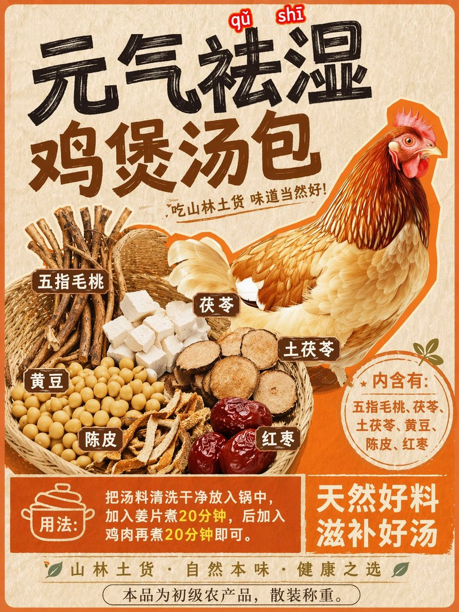


```text
Using REFERENCE_0 as the base style and preserving the central chicken illustration, transform the image into a product packaging label for a herbal soup mix. Shift the chicken to the right side. Replace the top text with a large, bold black brush-stroke headline {argument name="main headline" default="元气祛湿 鸡煲汤包"} and a smaller subtitle {argument name="subtitle" default="吃山林土货 味道当然好!"}. On the left side, add a new woven basket containing exactly 6 distinct piles of ingredients: woody root sticks, white square cubes, round sliced brown roots, yellow soybeans, dried orange peel strips, and dark red dates. Attach 6 small brown rectangular labels with white text to these ingredients. Below the chicken, add a circular orange badge containing the text {argument name="ingredients list" default="内含有:五指毛桃、茯苓、土茯苓、黄豆、陈皮、红枣"}. At the bottom, create a solid orange rectangular banner featuring a cooking pot icon, the text {argument name="usage instructions" default="用法:把汤料清洗干净放入锅中，加入姜片煮20分钟，后加入鸡肉再煮20分钟即可。"}, and a secondary slogan {argument name="bottom slogan" default="天然好料 滋补好汤"}.
```


---


## 例 175：封面排版设计图

**来源：** [@cellier\_](https://x.com/cellier_/status/2046615173411262959)


```text
[中文]
创建一个高级的 4:3 演示文稿封面幻灯片，介绍来自 http://chroniclehq.com 的 AI 原生演示平台 Chronicle。  

Style: 
优雅，极简，现代，高级初创企业美学。类似于高端品牌指南封面（如 Apple / Linear / Notion 风格）。带有微妙深度感的柔和渐变背景，干净的留白，精致的排版，经过打磨的编辑式布局。  

Main title: 
CHRONICLE  

Subtitle: 
AI PRESENTATION PLATFORM  

Body copy (small elegant text): 
将原始想法转化为经过打磨的、高影响力的演示文稿。 
从笔记、文档、链接或现有幻灯片开始。 
使用 AI 生成美观的、符合品牌调性的幻灯片。 
在灵活的画布上自由编辑。 
导出为 PPT、PDF，或发布为网站。  

Feature highlights (small premium labels): 
STORY-FIRST 
ON-BRAND DESIGN 
AI EDITING 
FREEFORM CANVAS 
PPT EXPORT 
TEAM COLLABORATION  

Bottom-right elegant logo text: 
chronicle  

Visual feeling: 
商务级高级感，战略级幻灯片质量，咨询级演示文稿，略带未来感但高度专业。  

Composition: 
干净的编辑式平衡，不对称布局，强烈的留白，演示软件主视觉感。  

Aspect ratio: 
4:3  

Language: 
仅限英文

[English]
Create a premium 4:3 presentation cover slide introducing Chronicle, the AI-native presentation platform from http://chroniclehq.com.  

Style: 
elegant, minimal, modern, premium startup aesthetic. Similar to high-end brand guideline covers (like Apple / Linear / Notion style). Soft gradient background with subtle depth, clean whitespace, refined typography, polished editorial layout.  

Main title: 
CHRONICLE  

Subtitle: 
AI PRESENTATION PLATFORM  

Body copy (small elegant text): 
Turn raw ideas into polished, high-impact presentations. 
Start from notes, docs, links, or existing decks. 
Generate beautiful, on-brand slides with AI. 
Edit freely on a flexible canvas. 
Export to PPT, PDF, or publish as a website.  

Feature highlights (small premium labels): 
STORY-FIRST 
ON-BRAND DESIGN 
AI EDITING 
FREEFORM CANVAS 
PPT EXPORT 
TEAM COLLABORATION  

Bottom-right elegant logo text: 
chronicle  

Visual feeling: 
business-class premium, strategy deck quality, consulting-grade presentation, slightly futuristic but highly professional.  

Composition: 
clean editorial balance, asymmetrical layout, strong whitespace, presentation software hero shot feeling.  

Aspect ratio: 
4:3  

Language: 
English only
```


---


## 例 180：荒诞超现实女装大叔海报

**来源：** [@aiehon\_aya](https://x.com/aiehon_aya/status/2046499177916682600)

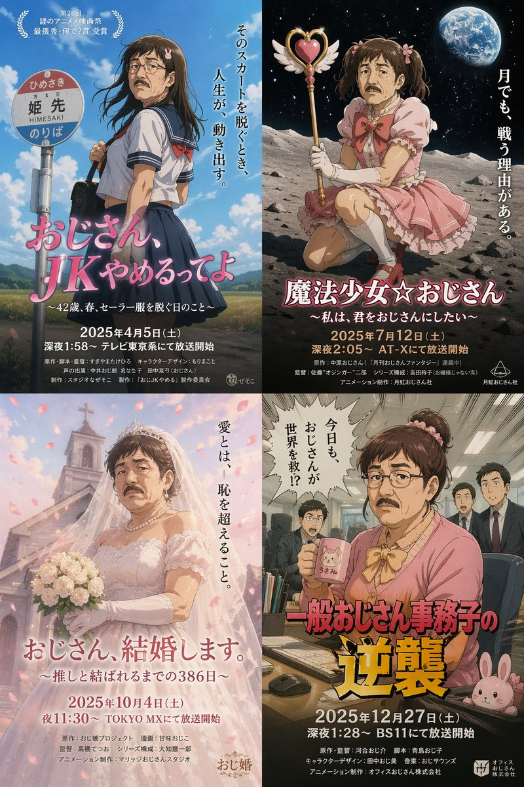


```text
[中文]
一个看似真实却微妙地古怪的女装大叔出现的电影海报，4 种。达到专业设计师制作的水平。 企划和设定本身就是那种“这种东西真要拍成电影吗？”的、认真却忍不住想笑的超现实动画。 标题和播出信息也要用日文显示的状态。

[English]
A movie poster featuring a seemingly realistic yet subtly bizarre cross-dressing older man, 4 variations. Reaching the level of a professional designer's production. The project and setting itself is a surreal animation of the "Are they really making a movie out of this?" kind, serious yet irresistibly funny. The title and broadcast information should also be displayed in Japanese.
```


---


## 例 191：史诗级科幻电影海报设计

**来源：** [@underwoodxie96](https://x.com/underwoodxie96/status/2046514205529088501)

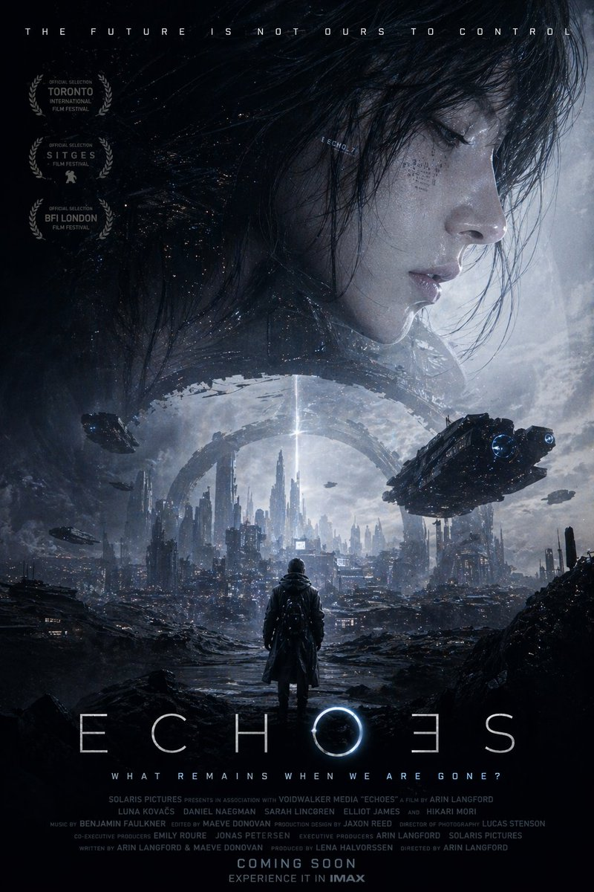


```text
[中文]
创建一张科幻电影海报

[English]
Create a Science fiction movie poster
```


---


## 例 220：鎏金广州塔的东方奇幻海报

**来源：** [@liyue\_ai](https://x.com/liyue_ai/status/2046243132774494607)


```text
[中文]
平面插画，东方幻想风格高端城市海报设计，竖版9:16构图，整体采用对角线+S型流动构图，从左下向右上延展，画面以深邃黑色为背景，自上而下渐变至浓烈暗红色，形成强烈冷暖对比与空间纵深，背景带微弱星尘与颗粒质感。画面中央一条金色流动能量线条如火焰般蜿蜒贯穿，自底部向上延伸，具有流体质感、粒子光效与渐变高光，局部带细微能量碎屑与体积光。

金色流光中逐层浮现广州城市地标建筑群：广州塔为视觉核心，比例突出，周围融合珠江新城高楼群、猎德大桥及现代与岭南建筑元素，建筑采用“精细线描 + 金色发光体块”表现，轮廓清晰、细节丰富，在金色光晕映衬下仿佛悬浮于虚空，形成超现实空间层次，远景轻微雾化增强纵深感。

画面底部为一位东方白发女性形象，长发飘逸，如烟似雾，与金色流光自然衔接并逐渐融合，发丝半透明带渐变光感，姿态柔美，双目微闭，神情宁静，怀抱一束多彩鲜花，花间点缀微光粒子与星点效果，象征人与城市能量的精神连接，人物细节适度简化以突出整体设计感。

光影集中于金色流线、建筑与人物轮廓，形成强烈明暗对比与视觉聚焦，整体氛围宏大、神秘、具有东方神话意境且略带治愈感。色彩以黑与暗红为基底，高亮鎏金为主视觉强调，金色具备丰富明暗层次，辅以小面积高饱和花束色彩点缀，整体高级克制。

页面文字与画面融合排版：顶部居中宋体大字“广州·中国”，下方小字“2026/04/20”，再下方小字“LIYUE”，文字采用淡金色或柔和暖白色，与整体光影统一。高品质细节，电影级光影表现，体积光与粒子细节丰富，画面干净无噪点，超高清8K分辨率，商业级海报质感。

[English]
Flat illustration, Oriental fantasy style high-end city poster design, vertical 9:16 composition, the overall adopts a diagonal + S-shaped flowing composition, extending from the bottom left to the top right, the picture uses deep black as the background, gradually changing from top to bottom to intense dark red, forming a strong cold-warm contrast and spatial depth, the background has a faint stardust and grainy texture. In the center of the picture, a golden flowing energy line winds through like a flame, extending from the bottom to the top, having a fluid texture, particle light effects and gradient highlights, with subtle energy debris and volumetric light in some areas. Guangzhou city landmark building complexes emerge layer by layer in the golden flowing light: Canton Tower is the visual core, with a prominent proportion, surrounded by the integration of Zhujiang New Town high-rise buildings, Liede Bridge and modern and Lingnan architectural elements, the buildings are expressed using "fine line drawing + golden glowing blocks", clear outlines and rich details, set off by the golden halo, they seem to float in the void, forming a surreal spatial hierarchy, the distant view is slightly fogged to enhance the sense of depth. At the bottom of the picture is an oriental white-haired female figure, long hair fluttering, like smoke and mist, naturally connecting and gradually blending with the golden flowing light, the hair is translucent with a gradient light sense, graceful posture, eyes slightly closed, serene expression, holding a bunch of colorful fresh flowers in her arms, interspersed with faint light particles and starlight effects among the flowers, symbolizing the spiritual connection between human and urban energy, character details are moderately simplified to highlight the overall sense of design. Light and shadow are focused on the golden streamlines, buildings and character outlines, forming a strong light-dark contrast and visual focus, the overall atmosphere is grand, mysterious, with an Oriental mythological artistic conception and a slight healing sense. The color uses black and dark red as the base, highlighted gilded gold as the main visual emphasis, the gold has rich light and dark layers, supplemented by small areas of high-saturation bouquet color embellishments, the overall is advanced and restrained. Page text and picture integrated typography: large Song typeface characters "Guangzhou·China" centered at the top, small characters "2026/04/20" below, small characters "LIYUE" further below, the text uses light gold or soft warm white, unifying with the overall light and shadow. High-quality details, cinematic light and shadow performance, rich volumetric light and particle details, clean picture without noise, ultra-high definition 8K resolution, commercial-grade poster texture.
```


---


## 例 223：春日禅意水墨群山海报

**来源：** [@liyue\_ai](https://x.com/liyue_ai/status/2046215276249993720)

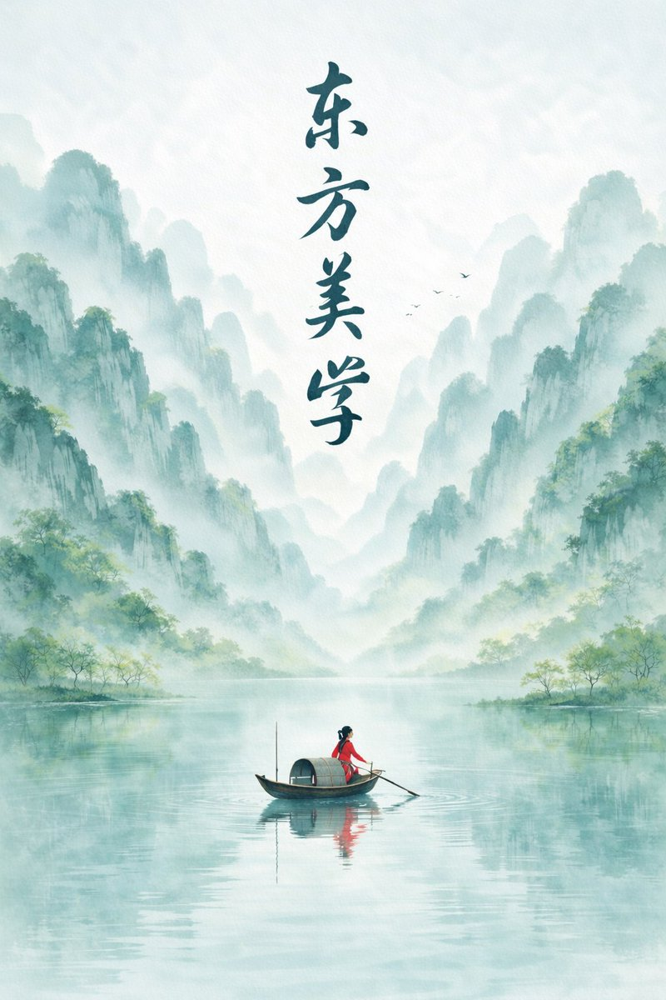


```text
[中文]
新中式水墨山水海报，竖版9:16构图，东方极简美学风格，
大面积留白，整体色调为春日清晨氛围（青绿色、雾蓝、淡灰、浅墨），低饱和、清透柔和，高级质感。
画面主体为奇峻巍峨的群山，从中间平静湖面的两侧拔地而起，占据左右两侧画面，
山体以水墨晕染表现，浓淡干湿变化丰富，局部融入淡青绿色渲染，体现春意生机。
山峰被湿润轻柔的晨雾包裹，雾气层层递进，与浅青蓝天空自然融合，形成空气透视与空间纵深。

湖面如镜面般平静，呈现微青绿色调，倒映山体与天空，反射略带柔焦与雾化扩散效果，增强春日湿润与梦幻氛围。
中景一艘带弧形篷顶的小木舟缓慢漂浮，船桨轻触水面形成细腻涟漪，水纹自然扩散，整体保持极静状态。

船上为一位红衣渔女，体量较小（远景比例），人物简化处理为水墨剪影 + 轻微设色，
身着低饱和朱砂红传统服饰（非鲜艳红），颜色略被雾气柔化，
人物面部不刻画细节，仅保留轮廓与姿态（如轻扶船篷或执桨），
红色在水面形成淡淡倒影，作为画面唯一暖色视觉焦点。

岸边点缀疏林与春季新生植被，采用淡墨 + 淡青绿点染，虚实结合，增强节奏与生命气息。

少量飞鸟在远空掠过，轻盈疏散分布，增强空间层次与灵动感。

画面顶部居中竖排书法：“东方美学”，采用传统手写行书或行草风格（王羲之笔意），
笔触自然起伏、提按分明，带飞白与墨韵扩散效果，避免字体感。
书法颜色为深墨青或柔和墨黑，与整体画面统一。
整体风格：水墨 + 现代极简设计融合，春日禅意、空灵湿润、宁静氛围，
冷暖对比克制，电影感光影，高级艺术海报质感，8K超清细节。

[English]
Neo-Chinese ink wash landscape poster, vertical 9:16 composition, Oriental minimalist aesthetic style,
Large area of negative space, overall color tone is spring morning atmosphere (cyan-green, misty blue, light gray, light ink), low saturation, clear and soft, high-end texture.
The main subject of the picture is steep and majestic mountains, rising from both sides of the calm lake in the middle, occupying the left and right sides of the picture,
The mountain bodies are expressed with ink wash blending, rich in changes of shades, dryness and wetness, partially integrated with light cyan-green rendering, reflecting the vitality of spring.
The mountain peaks are wrapped in moist and gentle morning mist, the mist progresses layer by layer, naturally blending with the light cyan-blue sky, forming aerial perspective and spatial depth.
The lake surface is as calm as a mirror, showing a slightly cyan-green tone, reflecting the mountains and the sky, the reflection slightly has a soft focus and atomization diffusion effect, enhancing the spring moist and dreamy atmosphere.
In the midground, a small wooden boat with an arched canopy floats slowly, the oars lightly touch the water surface to form delicate ripples, the water patterns spread naturally, maintaining an extremely quiet state overall.
On the boat is a fisherwoman in red, with a small volume (distant view proportion), the character is simplified into an ink wash silhouette + slight coloring,
wearing a low-saturation cinnabar red traditional costume (not bright red), the color is slightly softened by the mist,
no facial details are depicted for the character, only retaining the outline and posture (such as gently holding the boat canopy or holding the oar),
the red color forms a faint reflection on the water surface, serving as the only warm color visual focus in the picture.
The shore is dotted with sparse woods and spring newborn vegetation, using light ink + light cyan-green dot dyeing, combining virtuality and reality, enhancing rhythm and breath of life.
A small number of flying birds skim across the distant sky, distributed lightly and loosely, enhancing the spatial layers and sense of agility.
At the top center of the picture, vertical calligraphy: "Oriental Aesthetics", adopting traditional handwritten running script or running-cursive style (intention of Wang Xizhi's brushwork),
brushstrokes naturally undulate, lifting and pressing are distinct, with flying white and ink rhyme diffusion effects, avoiding a sense of font.
The calligraphy color is dark ink cyan or soft ink black, unified with the overall picture.
Overall style: ink wash + modern minimalist design fusion, spring Zen, ethereal and moist, tranquil atmosphere,
restrained cold and warm contrast, cinematic light and shadow, high-end art poster texture, 8K ultra-clear details.
```


---


## 例 228：完美匹配的海报广告图

**来源：** [@Kashiko\_AIart](https://x.com/Kashiko_AIart/status/2045787856292151322)

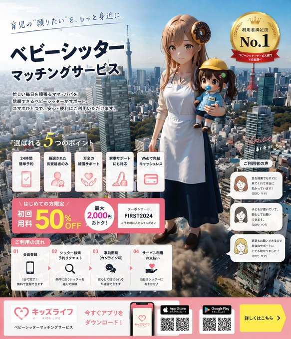


```text
[中文]
生成一张与这张图片完美匹配的广告图片。信息量要多一些。

[English]
Generate an advertising image that perfectly matches this image. There should be a lot of information.
```


---


## 例 230：极简国潮鎏金广州塔海报

**来源：** [@liyue\_ai](https://x.com/liyue_ai/status/2045744531686166878)

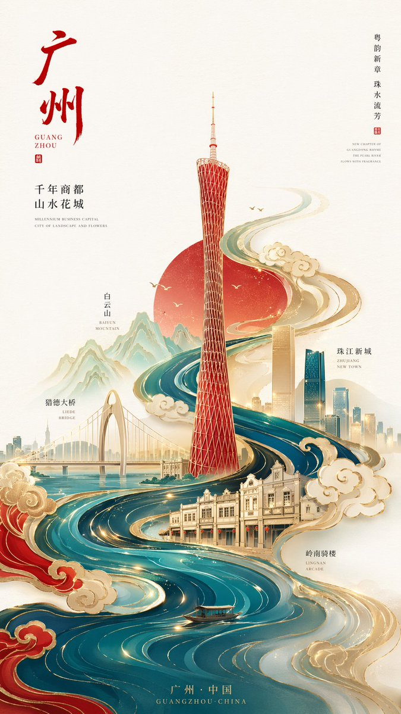


```text
[中文]
新中式极简风格高端城市海报，9:16竖版构图，以广州为核心主题，画面中心为抽象几何化的广州塔，造型简洁但具有辨识度，

整体采用S型流动构图，从下方向上延展，珠江水系被设计为流动的水波纹与传统祥云纹样融合，环绕整个画面形成视觉动线，

广州地标建筑以“留白+线描+局部色块”的方式点缀其中：珠江新城双塔、猎德大桥、白云山轮廓、岭南骑楼，
传统与现代建筑自然融合，层次递进，远近虚实分明，

风格控制：极简 + 高级 + 东方意境，不杂乱不过度写实，

色彩方案（重点）：
高饱和但克制 ，中国红、青蓝、鎏金为主色，
辅以少量暖金高光点缀，形成强烈视觉冲击但不俗艳，

背景：大面积纯净留白或淡宣纸肌理，增强呼吸感与高级感，

细节：祥云与水纹具有轻微浮雕/烫金质感，
局部加入微光粒子或流动光线，增强现代感，

光影：柔和渐变光+局部高光，突出恢弘大气氛围，

整体风格：国潮高级插画 / 品牌海报级质感 / 8K / 超清细节

[English]
Neo-Chinese minimalist style high-end city poster, 9:16 vertical composition, with Guangzhou as the core theme, the center of the image is an abstract geometric Canton Tower, simple in shape but highly recognizable,

The overall adopts an S-shaped flowing composition, extending from bottom to top, the Pearl River water system is designed as flowing water ripples fused with traditional auspicious cloud patterns, surrounding the entire image to form a visual dynamic line,

Guangzhou landmark buildings are embellished in it in the way of "blank space + line drawing + local color blocks": Zhujiang New Town Twin Towers, Liede Bridge, Baiyun Mountain outline, Lingnan arcade houses,
Traditional and modern architecture naturally blend, progressive layers, clear distinction between far and near, virtual and real,

Style control: minimalist + high-end + Eastern artistic conception, not cluttered and not overly realistic,

Color scheme (key point):
High saturation but restrained, Chinese red, cyan blue, and gilded gold as the main colors,
Supplemented by a small amount of warm gold highlight embellishments, forming a strong visual impact but not tacky,

Background: large area of pure blank space or light Xuan paper texture, enhancing a sense of breathing and high-end feel,

Details: auspicious clouds and water ripples have a slight relief/gold stamping texture,
Locally add faint light particles or flowing light lines to enhance modernity,

Light and shadow: soft gradient light + local highlights, highlighting a magnificent and grand atmosphere,

Overall style: Guochao high-end illustration / brand poster-level texture / 8K / ultra-clear details
```


---


## 例 236：粤超联赛国潮风邀请函海报

**来源：** [@liyue\_ai](https://x.com/liyue_ai/status/2045772039521542202)

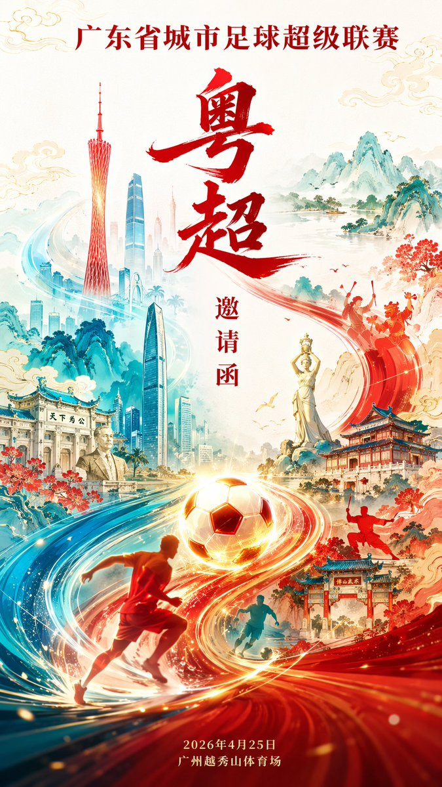


```text
[中文]
广东省城市足球超级联赛（粤超）邀请函海报设计，比例9:16； 

S型流动构图，画面从下方向上延展，一条由足球运动轨迹形成的动态能量流贯穿画面， 中心为一颗发光的足球，带有动感轨迹与能量光效；

沿S型动线融合广东城市地标与文化元素： 广州塔、深圳平安金融中心、珠海渔女雕像、岭南建筑与佛山武术剪影、中山孙中山文化象征、潮汕英歌舞动态人物轮廓、清远山水自然景观， 所有元素采用“线描 + 局部色块 + 留白”融合表现，层次递进、远近虚实结合；

加入抽象足球运动员剪影，弱化人物细节，强化动势与竞技氛围，视觉重点仍为足球；

风格：现代国潮高级海报，极简风格但富有设计感，高级、干净、统一， 融合东方美学与现代体育视觉；

色彩方案：高饱和但克制，中国红为主视觉，青蓝色辅助，金色点缀高光， 高对比但不杂乱，具有品牌级视觉冲击力； 

顶部中央横版视觉主标题 「广东省城市足球超级联赛」：中字，宋体， 中央竖排文字排版： 「粤超」，大字，手写书法艺术字体， 「邀请函」：中字，宋体，纵向排列，间距较大， 底部中央第一排横排： 「2026年4月25日」，小字，宋体，第二排：「广州越秀山体育场」，小字，宋体， 预留文字排版空间；

整体版式平衡、具有高级品牌海报质感，极致精细，构图简洁干净，无杂乱元素，电影级光影，8K 分辨率，高端设计感。融入源自中国传统祥云纹的雅致云纹与水波纹元素，浮动光效粒子，富有动感与生机。

[English]
Guangdong Provincial City Football Super League (Yuechao) invitation poster design, aspect ratio 9:16; 

S-shaped flowing composition, the picture extends from bottom to top, a dynamic energy flow formed by the trajectory of football movement runs through the picture, the center is a glowing football, with dynamic trajectory and energy light effects;

Along the S-shaped motion line, integrate Guangdong city landmarks and cultural elements: Canton Tower, Shenzhen Ping An Finance Centre, Zhuhai Fisher Girl statue, Lingnan architecture and Foshan martial arts silhouettes, Zhongshan Sun Yat-sen cultural symbols, Chaoshan Yingge dance dynamic character outlines, Qingyuan landscape natural scenery, all elements adopt the integrated expression of "line drawing + partial color blocks + blank space", progressive layers, combination of distance and virtual-real;

Add abstract football player silhouettes, weaken character details, strengthen momentum and competitive atmosphere, the visual focus remains on the football;

Style: modern Guochao high-end poster, minimalist style but rich in design sense, high-end, clean, unified, integrating oriental aesthetics and modern sports vision;

Color scheme: high saturation but restrained, Chinese red as the main visual, cyan-blue as auxiliary, gold embellished highlights, high contrast but not cluttered, with brand-level visual impact; 

Top center horizontal visual main title "Guangdong Provincial City Football Super League": medium font, Song typeface, center vertical text layout: "Yuechao", large font, handwritten calligraphy art font, "Invitation": medium font, Song typeface, vertical arrangement, large spacing, bottom center first row horizontal: "April 25, 2026", small font, Song typeface, second row: "Guangzhou Yuexiushan Stadium", small font, Song typeface, reserve text layout space;

The overall layout is balanced, has a high-end brand poster texture, extremely detailed, the composition is simple and clean, no cluttered elements, cinematic light and shadow, 8K resolution, high-end design sense. Integrate elegant cloud patterns and water wave patterns derived from traditional Chinese auspicious clouds, floating light effect particles, full of dynamics and vitality.
```


---


## 例 244：杜蕾斯茶颜悦色联名海报设计

**来源：** [@akokoi1](https://x.com/akokoi1/status/2045693939584516441)

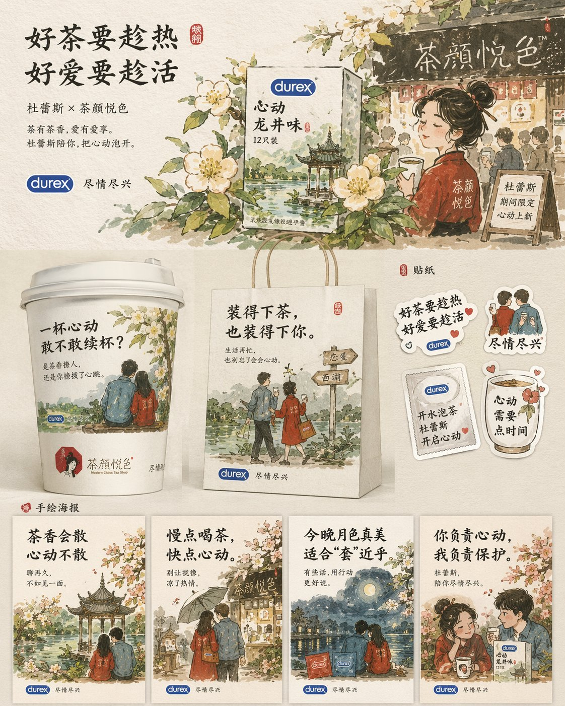


```text
[中文]
设计一套杜蕾斯和茶颜悦色联名的宣传物料

[English]
Design a set of promotional materials for a Durex and Chayan Yuese co-branding campaign.
```


---


## 例 250：小王子与星舰的浪漫联名

**来源：** [@akokoi1](https://x.com/akokoi1/status/2045693939584516441)

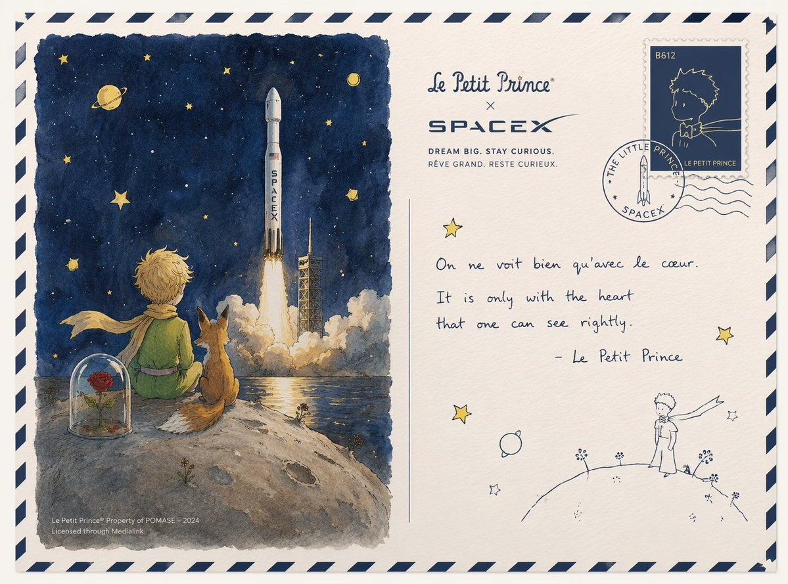


```text
[中文]
设计一张小王子和SpaceX联名的明信片

[English]
Design a postcard co-branded by The Little Prince and SpaceX
```


---


## 例 251：言叶之庭春雨绿意单日历

**来源：** [@akokoi1](https://x.com/akokoi1/status/2045693939584516441)

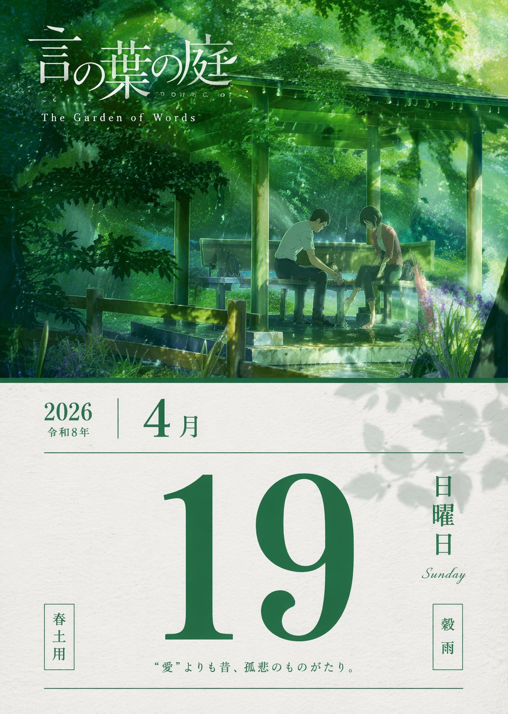


```text
[中文]
生成一张言叶之庭2026年4月19日单日日历

[English]
Generate a single-day calendar for The Garden of Words on April 19, 2026
```


---


## 例 252：五一劳动节手举牌创意设计集

**来源：** [@akokoi1](https://x.com/akokoi1/status/2045693939584516441)

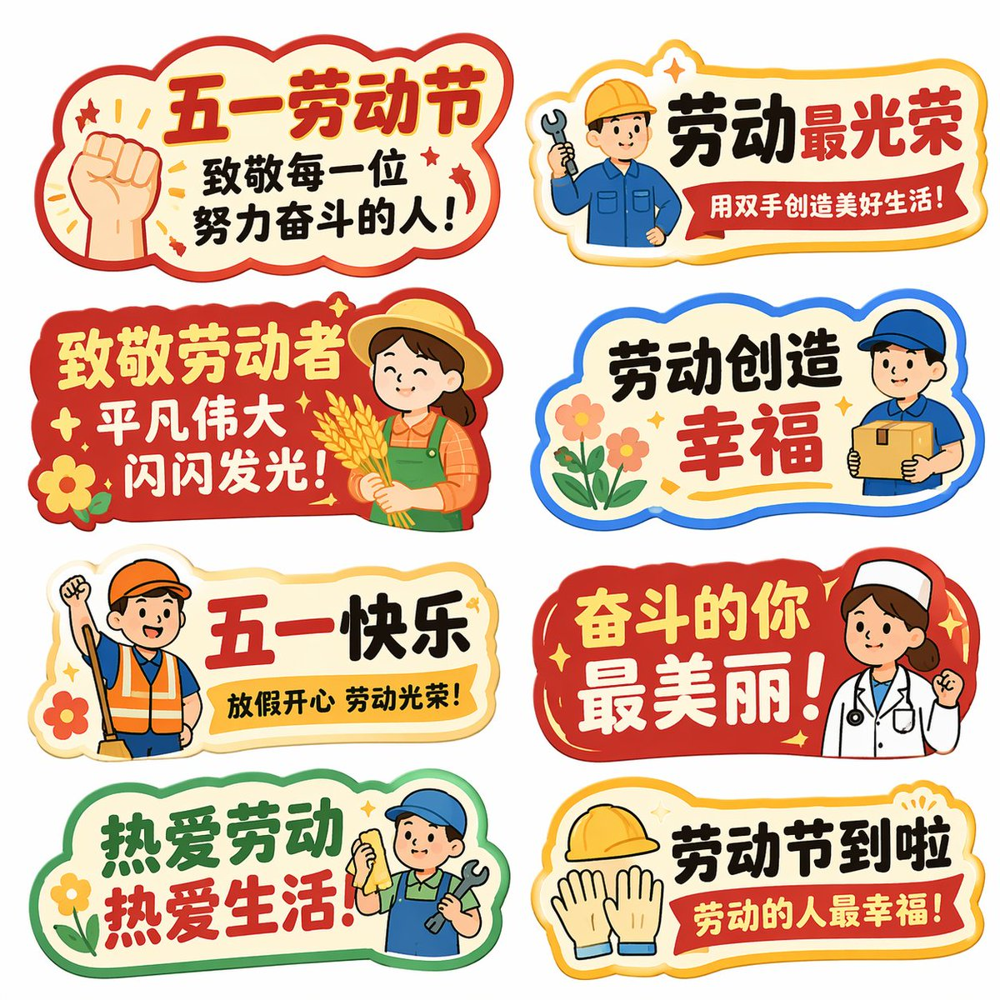


```text
[中文]
生成一系列五一劳动节的手举牌设计

[English]
Generate a series of hand-held sign designs for May Day Labor Day
```


---


## 例 253：2026谷雨节气唯美海报设计

**来源：** [@akokoi1](https://x.com/akokoi1/status/2045693939584516441)

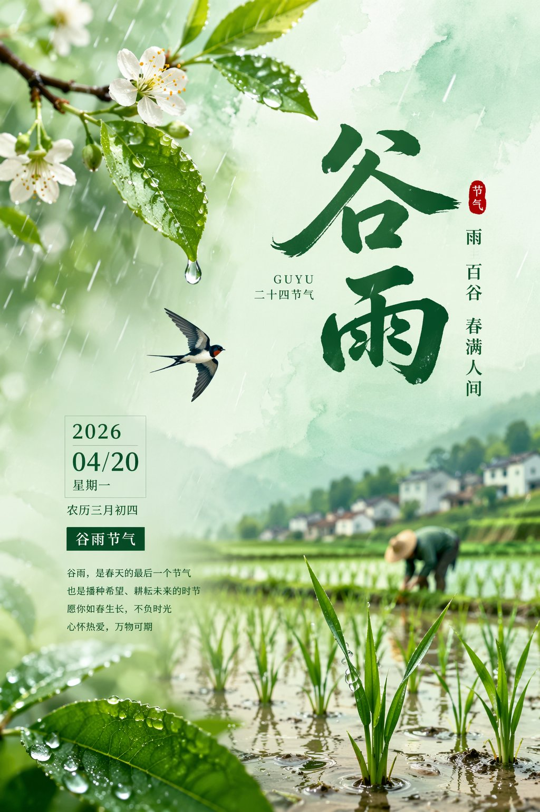


```text
[中文]
生成一张2026年谷雨节气的海报

[English]
Generate a poster for the Guyu solar term in 2026
```


---


## 例 254：奔赴山海胶片感海报

**来源：** [@akokoi1](https://x.com/akokoi1/status/2045693939584516441)

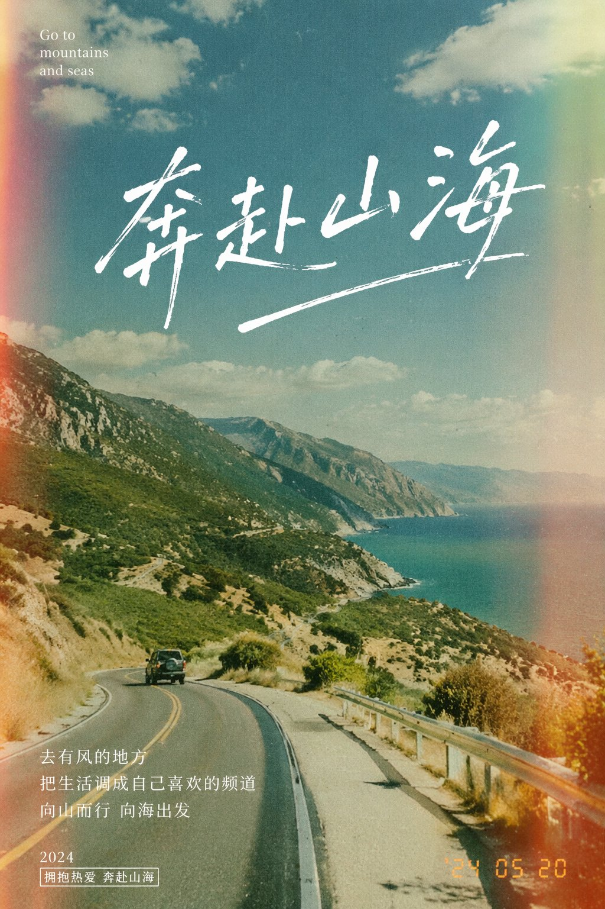


```text
[中文]
设计一张主题是”奔赴山海”的胶片感摄影风格的海报

[English]
Design a poster with the theme of "running towards the mountains and seas" in a film photography style
```


---


## 例 265：日式潮流广告四联画

**来源：** [@midori\_tatsuta](https://x.com/midori_tatsuta/status/2045253072289767815)

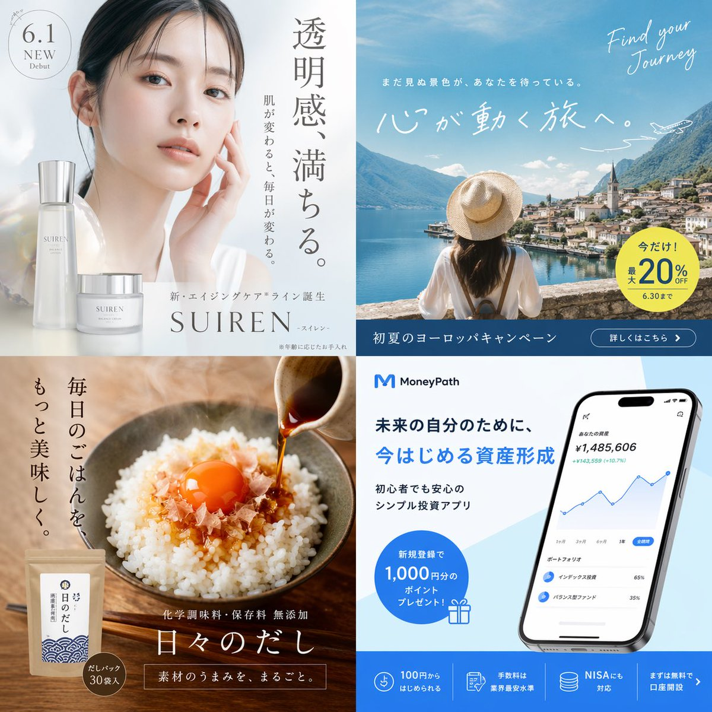


```text
[中文]
生成四张虚构的日式广告图片，涵盖不同类型并排排列。采用专业设计师创作的潮流设计。宽高比为1:1

[English]
Generate four fictional Japanese advertisement images, covering different types arranged side by side. Trendy design created by professional designers. Aspect ratio 1:1
```


---


## 例 275：一张采用分层蒙太奇构图的电影海报

**来源：** [@old\_pgmrs\_will](https://x.com/old_pgmrs_will/status/2045440101359198302)

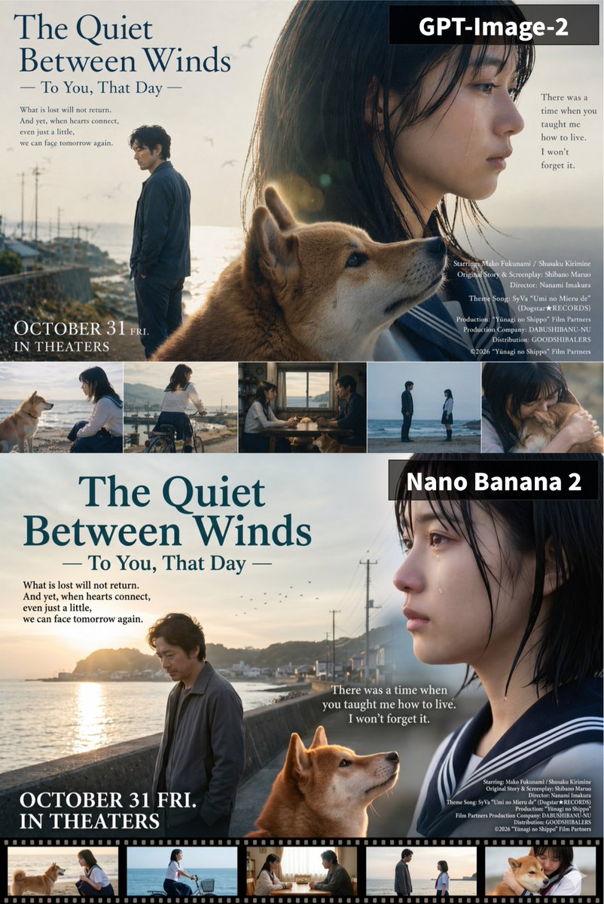


```text
[中文]
“一张采用分层蒙太奇构图的电影海报。背景为日落时分的海滨小镇，平静的海面倒映着耀眼的日光眩光，薄雾笼罩的天空中有远处飞鸟，沿海公路旁立着电线杆剪影。左侧中景处，一位身着深灰色外套、留着深色卷发的中年男子站在混凝土海堤边，神情忧郁地低头凝视，被傍晚的阳光逆光勾勒轮廓。右侧前景主体为一张大幅特写年轻女子侧脸肖像，她望向右侧，身穿带白色条纹的深色水手校服，湿润的黑发贴在脸颊，柔和漫射光线下，一滴泪珠从她脸颊滑落。画面下方中央前景处，一只柴犬抬头朝右侧望去，红棕色毛发被温暖的轮廓光点亮。画面最底端为一条横向电影胶片，内含五幅独立矩形场景缩略图：女孩与柴犬在海滩、女孩骑车望向海面、女孩与男子坐在室内桌前、男子与女孩在海滩面对面站立、女孩拥抱柴犬的特写。画面叠加指定文字：左上角为深青绿色大号衬线字体标题《风间静语》，下方副标题为「—— 致那日的你 ——」；标题下方为小号深色衬线正文：“逝去之物，不复归来。然而，只要心灵稍稍相连，我们便能再度直面明日。” 画面右侧中部为深色衬线字体文字：“曾有一段时光，是你教会我如何生活。我永不会忘。” 左下角为大号白色文字：“10 月 31 日 周五 影院上映”。右下角为小号白色无衬线字体演职人员表：“主演：福波真子 / 桐嶋秀作 原作与剧本：柴野麻吕 导演：今仓七海 主题曲：SyVa《看得见海的地方》（Dogstar★唱片） 制作：《夕凪之尾》影视伙伴 制作公司：DABUSHIBANU-NU 发行：GOODSHIBALERS ©2026《夕凪之尾》影视伙伴”。
分段提示词：
图层索引：0
片段：“背景为日落时分的海滨小镇，平静海面倒映耀眼日光眩光，薄雾天空中有远处飞鸟，沿海公路旁有电线杆剪影。”
图层索引：1
片段：“左侧中景处，身着深灰色外套、留深色卷发的中年男子站在混凝土海堤边，神情忧郁低头，被傍晚阳光逆光照射。”
图层索引：2
片段：“右侧前景主体为大幅特写年轻女子侧脸肖像，她望向右侧，身穿带白条纹的深色水手校服，湿润黑发贴脸，柔和漫射光下一滴泪珠滑落脸颊。”
图层索引：3
片段：“画面下方中央前景处，一只柴犬抬头望向右侧，红棕色毛发被温暖轮廓光点亮。”
图层索引：4
片段：“画面最底端为横向电影胶片，内含五幅独立矩形场景缩略图：女孩与柴犬在海滩、女孩骑车望向水面、女孩与男子坐在室内桌前、男子与女孩在海滩面对面、女孩拥抱柴犬特写。”
图层索引：[5,6,7,8]
片段：“画面叠加指定文字：左上角为深青绿色大号衬线字体《风间静语》，下方副标题「—— 致那日的你 ——」；其下小号深色衬线正文：“逝去之物，不复归来。然而，只要心灵稍稍相连，我们便能再度直面明日。” 右侧中部深色衬线文字：“曾有一段时光，是你教会我如何生活。我永不会忘。” 左下角大号白色文字：“10 月 31 日 周五 影院上映”。右下角小号白色无衬线字体演职信息：“主演：福波真子 / 桐嶋秀作 原作与剧本：柴野麻吕 导演：今仓七海 主题曲：SyVa《看得见海的地方》（Dogstar★唱片） 制作：《夕凪之尾》影视伙伴 制作公司：DABUSHIBANU-NU 发行：GOODSHIBALERS ©2026《夕凪之尾》影视伙伴”。
负面提示词：
“平光照明，无质感表面，对称构图，底部留白空荡，文字缺失，翻译文字，改写文字，3D 渲染，卡通风格，高对比生硬阴影，干涩头发，明亮欢快表情”

[English]
A cinematic movie poster utilizing a layered montage composition. In the background, a coastal town at sunset with calm ocean water reflecting a glowing sun glare, distant birds in a hazy sky, and the silhouette of utility poles along a coastal road. In the left midground, a middle-aged man with dark wavy hair in a dark grey jacket stands near a concrete sea wall, looking downward with a melancholic expression, backlit by the late afternoon sun. Dominating the right foreground is a large, closely cropped profile portrait of a young woman looking right; she wears a dark school sailor uniform with white stripes, has wet dark hair clinging to her face, and a single tear rolls down her cheek under soft, diffuse lighting. In the lower center foreground, a Shiba Inu dog looks upwards toward the right, its reddish-brown fur catching warm rim lighting. Along the very bottom edge is a horizontal film strip of five distinct rectangular scene thumbnails: a dog and girl on a beach, a girl on a bicycle looking at the water, a girl and man sitting at an indoor table, a man and girl standing facing each other on a beach, and a close-up of a girl hugging a Shiba Inu. Overlaid on the image is specific text. In the top left, large dark teal serif text reads 'The Quiet Between Winds' with a subtitle below reading '— To You, That Day —'. Below that, smaller dark serif body text reads 'What is lost will not return. And yet, when hearts connect, even just a little, we can face tomorrow again.'. On the mid-right side, dark serif text reads 'There was a time when you taught me how to live. I won't forget it.'. In the bottom left, large white text reads 'OCTOBER 31 FRI. IN THEATERS'. In the lower right corner, small white sans-serif credit text reads 'Starring: Mako Fukunami / Shusaku Kirimine Original Story & Screenplay: Shibano Maruo Director: Nanami Imakura Theme Song: SyVa \"Umi no Mieru de\" (Dogstar★RECORDS) Production: \"Yūnagi no Shippo\" Film Partners Production Company: DABUSHIBANU-NU Distribution: GOODSHIBALERS ©2026 \"Yūnagi no Shippo\" Film Partners'."
  segmented:
    - layer_index: 0
      segment: "In the background, a coastal town at sunset with calm ocean water reflecting a glowing sun glare, distant birds in a hazy sky, and the silhouette of utility poles along a coastal road."
    - layer_index: 1
      segment: "In the left midground, a middle-aged man with dark wavy hair in a dark grey jacket stands near a concrete sea wall, looking downward with a melancholic expression, backlit by the late afternoon sun."
    - layer_index: 2
      segment: "Dominating the right foreground is a large, closely cropped profile portrait of a young woman looking right; she wears a dark school sailor uniform with white stripes, has wet dark hair clinging to her face, and a single tear rolls down her cheek under soft, diffuse lighting."
    - layer_index: 3
      segment: "In the lower center foreground, a Shiba Inu dog looks upwards toward the right, its reddish-brown fur catching warm rim lighting."
    - layer_index: 4
      segment: "Along the very bottom edge is a horizontal film strip of five distinct rectangular scene thumbnails: a dog and girl on a beach, a girl on a bicycle looking at the water, a girl and man sitting at an indoor table, a man and girl standing facing each other on a beach, and a close-up of a girl hugging a Shiba Inu."
    - layer_indices: [5, 6, 7, 8]
      segment: "Overlaid on the image is specific text. In the top left, large dark teal serif text reads 'The Quiet Between Winds' with a subtitle below reading '— To You, That Day —'. Below that, smaller dark serif body text reads 'What is lost will not return. And yet, when hearts connect, even just a little, we can face tomorrow again.'. On the mid-right side, dark serif text reads 'There was a time when you taught me how to live. I won't forget it.'. In the bottom left, large white text reads 'OCTOBER 31 FRI. IN THEATERS'. In the lower right corner, small white sans-serif credit text reads 'Starring: Mako Fukunami / Shusaku Kirimine Original Story & Screenplay: Shibano Maruo Director: Nanami Imakura Theme Song: SyVa \"Umi no Mieru de\" (Dogstar★RECORDS) Production: \"Yūnagi no Shippo\" Film Partners Production Company: DABUSHIBANU-NU Distribution: GOODSHIBALERS ©2026 \"Yūnagi no Shippo\" Film Partners'."

negative: "flat lighting, untextured surfaces, symmetrical composition, empty bottom margin, missing text, translated text, paraphrased text, 3D render, cartoon, high-contrast harsh shadows, dry hair, bright cheerful expressions
```


---


## 例 276：红绸幻化壮阔国潮羊城

**来源：** [@liyue\_ai](https://x.com/liyue_ai/status/2045332620352119274)


```text
[中文]
一张充满新春喜庆氛围但不失高雅格调的 2026 城市宣传海报。
双重曝光，构图延续了S型的流动感；
在纯白的纹理背景右下角，一个身穿中国传统服饰的微缩人物正在挥舞着一条长长的红色丝绸舞带，这条红绸在空中舞动，不仅展现出丝绸的柔顺质感，更在向左上方飘动的过程中，奇幻地变形成了一条壮丽的山脉河流。
在这条"河流"中，叠加了一个有山有海河的广州城市手绘图，国潮，景色尽在眼底，壮阔雄伟，令人震撼。
广州的地标建筑(广州塔，珠江新城建筑群，珠江, 广州城里古建筑，游轮，白云山）。
云雾环绕，仙气缥缈，色彩丰富，结构复杂，细节丰富，但因为大面积的留白，画面依然显得清新脱俗，左下角排版着"SPRING 2026"和竖排的宣传语，整体寓意"千年商都，魅力广州"。
文字排版优美，大方，字迹清晰完整，尺寸9:16。

[English]
A 2026 city promotional poster full of a festive Chinese New Year atmosphere yet maintaining an elegant style.
Double exposure, the composition continues the flowing sense of an S-shape;
In the lower right corner of the pure white textured background, a miniature figure wearing traditional Chinese clothing is waving a long red silk dance ribbon, this red silk dances in the air, not only showing the smooth texture of the silk, but also in the process of drifting to the upper left, magically transforming into a magnificent mountain range and river.
In this "river", a hand-drawn map of Guangzhou city with mountains, sea, and rivers is superimposed, Guochao, the scenery is fully in view, magnificent and majestic, breathtaking.
Guangzhou's landmark buildings (Canton Tower, Pearl River New City building complex, Pearl River, ancient buildings in Guangzhou city, cruise ships, Baiyun Mountain).
Surrounded by clouds and mist, ethereal and misty, rich in colors, complex in structure, rich in details, but because of a large area of negative space, the picture still appears fresh and refined, the lower left corner is typeset with "SPRING 2026" and vertical promotional slogans, the overall implication is "Millennium Commercial Capital, Charming Guangzhou".
Beautiful and generous typography, clear and complete handwriting, aspect ratio 9:16.
```


---


## 例 278：阿马尔菲海岸复古旅行海报

**来源：** [@WolfRiccardo](https://x.com/WolfRiccardo/status/2044562722491121718)

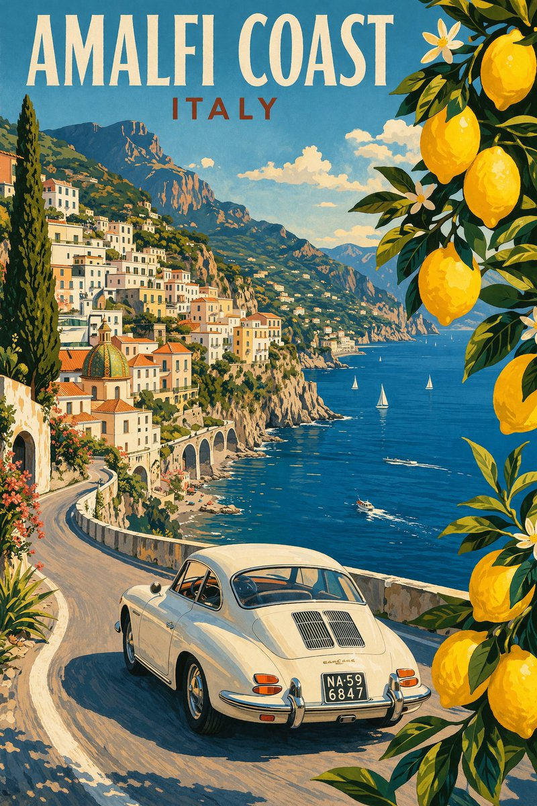


```text
[中文]
现代铅笔插画，意大利阿马尔菲海岸复古旅行海报插画，全景海岸悬崖公路场景，经典1960年代白色汽车沿着弯曲的海滨公路行驶，带有小帆船的深蓝色地中海，色彩缤纷的粉彩山腰村庄，带有柔软云朵的明亮蓝天，带有鲜艳黄色柠檬的柠檬树枝框定前景，温暖的夏日阳光，大胆鲜艳的色彩，复古1950年代旅行海报风格，电影级构图，高细节，丝网印刷质感，图形插画。手绘风格，带有松散笔触和清晰轮廓的插画。高对比度调色板，保持背景与元素之间的色彩和谐。现代与装饰性美学。

[English]
Modern pencil illustration of Vintage travel poster illustration of the Amalfi Coast, Italy, panoramic coastal cliff road scene, classic 1960s white car driving along a curved seaside road, deep blue Mediterranean sea with small sailboats, colorful pastel hillside village, bright blue sky with soft clouds, lemon tree branches with vibrant yellow lemons framing the foreground, warm summer sunlight, bold vibrant colors, retro 1950s travel poster style, cinematic composition, high detail, screen print texture, graphic illustration. Hand-drawn style, illustration with loose strokes and defined contours. High-contrast color palette, maintaining chromatic harmony between background and elements. Contemporary and decorative aesthetic.
```


---


## 例 280：封面排版设计图

**来源：** [OpenNana](https://opennana.com/awesome-prompt-gallery/graffiti-sketch-ai-builder-master)


```text
[中文]
以涂鸦速写风表现【一个厉害的AI builder】，整体呈现快速勾勒、自由变形、即兴手绘与草稿式的视觉效果。线条随手、夸张、可粗细不一，略显凌乱但具有节奏和表现力，强调概括、夸张、趣味和随性，而不是严谨写实或精细刻画。  颜色采用粗糙、干刷感明显的块面表现，可保留不均匀的涂抹痕迹、刷痕、飞白与覆盖感，色彩根据【主题/主体】自动适配，但整体保持涂鸦式、速写式、概括式的表达。不要透明水彩晕染效果，不要细腻水彩过渡，不要纸纹理，不要柔和雾化，不要梦幻质感。  背景以留白为主，保持简洁、轻松、未完成感和设计感，可加入少量辅助性符号、箭头、记号、圈画、重复线、随手写的文字或其他涂鸦元素，以增强速写本或随笔式视觉语言，但不可过于拥挤，不可破坏主体和留白气质。  画面内容不需要预先写清楚，由【一个厉害的AI builder】自动推演并生成最适合的主体形象、动作、相关元素、符号或简化场景，整体保持统一的涂鸦速写风和夸张概括的表现方式，避免复杂写实背景和过度铺陈。 画面中需自然加入专属签名"BlanPlan"，作为画面的一部分，位置低调但清晰，可放在左下角、右下角或标题附近，风格需与整体版式统一，像作品署名或设计落款；签名字体精致、克制、高级，不可过大，不可破坏主体构图，不可显得突兀或廉价。

[English]
Express [an awesome AI builder] in a graffiti sketch style, overall presenting a visual effect of quick sketching, free deformation, impromptu hand-drawing and draft-like. The lines are casual, exaggerated, and can vary in thickness, slightly messy but with rhythm and expressiveness, emphasizing summarization, exaggeration, fun and casualness, rather than rigorous realism or fine depiction. The colors use rough blocks with obvious dry brush feel, retaining uneven smearing traces, brush strokes, flying white and covering feel, the colors automatically adapt according to [theme/subject], but overall maintain a graffiti-style, sketch-style, and summarized expression. Do not use transparent watercolor smudging effects, do not use delicate watercolor transitions, do not use paper texture, do not use soft atomization, do not use dreamy texture. The background is mainly blank, keeping it simple, relaxed, unfinished and designed, can add a small amount of auxiliary symbols, arrows, marks, circled drawings, repeated lines, casually written text or other graffiti elements, to enhance the sketchbook or essay-style visual language, but it must not be too crowded, and must not destroy the subject and blank temperament. The picture content does not need to be written clearly in advance; [an awesome AI builder] automatically deduces and generates the most suitable subject image, movements, related elements, symbols or simplified scenes, overall maintaining a unified graffiti sketch style and exaggerated summarized expression method, avoiding complex realistic backgrounds and excessive padding. The exclusive signature "BlanPlan" needs to be naturally added into the picture as a part of the picture, the position is low-key but clear, can be placed in the bottom left corner, bottom right corner or near the title, the style needs to be unified with the overall layout, like an artwork signature or design sign-off; the signature font is exquisite, restrained, and high-end, must not be too large, must not destroy the subject composition, must not appear abrupt or cheap.
```


---


## 例 283：小恶魔莉莉香超任游戏海报

**来源：** [@lilimliliychan](https://x.com/lilimliliychan/status/2045114760937804187)

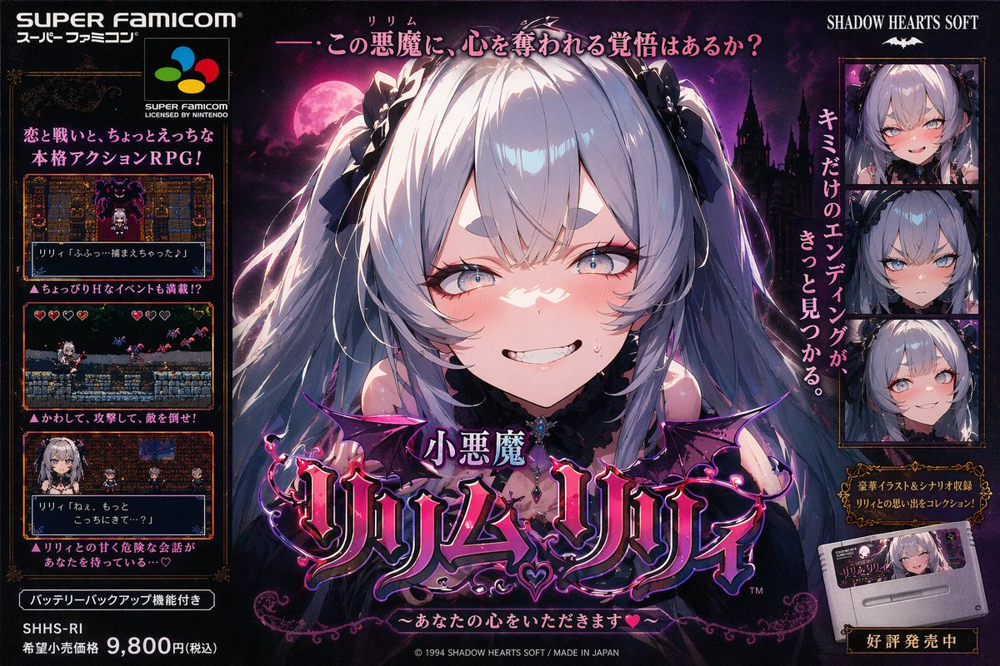


```text
[中文]
が「小悪魔リリムリリィちゃんが　スーパーファミコンのゲームだったときのポスターを考えて」に　画像数枚だけで
このクオリティ　細かい説明呪文なし　すごいぜ！

[English]
that "Think of a poster when the little devil Lilim Lily-chan was a Super Famicom game" with just a few images
this quality without any detailed explanation spells is amazing!
```


---


## 例 291：极致奢华的弹珠店梦幻宣传单

**来源：** [OpenNana](https://opennana.com/awesome-prompt-gallery/luxurious-pachinko-flyer)

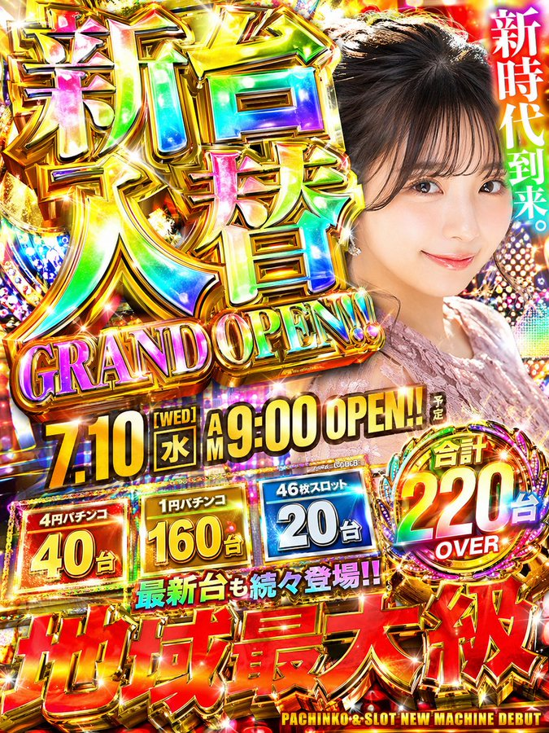


```text
[中文]
以 3:4 比例制作一家弹珠店那种闪闪发光的宣传单。放置一个真实、精细的现代可爱日本女性。充分利用闪闪发光、立体感丰富的豪华装饰彩虹字体等，务必做到极致奢华。并列介绍几个不存在的虚构新机型。

[English]
Create a sparkling flyer like those of a pachinko parlor at a 3:4 aspect ratio. Place a realistic, highly detailed modern cute Japanese woman. Make full use of sparkling, three-dimensional richly decorated rainbow typography, etc., and be sure to achieve extreme luxury. Introduce several non-existent fictional new models side by side.
```


---


## 例 298：梦幻波士顿春季城市海报

**来源：** [@BubbleBrain](https://x.com/BubbleBrain/status/2045358053831172358)

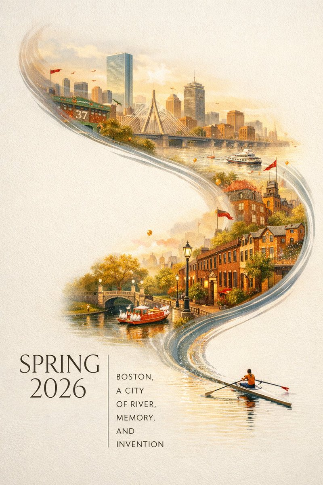


```text
[中文]
一张引人注目的2026年春季波士顿城市海报，具有优雅的庆典氛围和大胆的当代设计。在干净的米白色纹理背景上，带有大面积的留白，一个微型的单人赛艇手在图像右下角一条狭窄的反光水带上划行。船桨划出的尾波以动态的书法曲线向上扫过，逐渐变成查尔斯河，然后再变成一幅梦幻般的手绘波士顿全景。在这个流动的河流形状的构图中包含着标志性的波士顿元素：后湾天际线、灯塔山红砖联排别墅、橡树街、波士顿公共花园、天鹅船、扎基姆桥、芬威球场启发的细节、历史悠久的砖砌建筑、港口渡轮，以及这座城市的水滨氛围。柔和的晨雾，金色的春季光线，深红和金色的微妙节日点缀，丰富的细节，层次分明的深度，精致的城市海报美学，清新而优雅，视觉上强有力但不拥挤。左下角的优雅排版写着“SPRING 2026”，并附有垂直标语“BOSTON, A CITY OF RIVER, MEMORY, AND INVENTION”，文字清晰且构图优美，高端平面设计，9:16

[English]
A striking Spring 2026 city poster for Boston with an elegant celebratory mood and a bold contemporary design. On a clean off-white textured background with large areas of negative space, a miniature single sculler rows across the lower right corner of the image on a narrow ribbon of reflective water. The wake from the oar sweeps upward in a dynamic calligraphic curve, gradually transforming into the Charles River and then into a dreamlike hand-painted panorama of Boston. Inside this flowing river-shaped composition are iconic Boston elements: the Back Bay skyline, Beacon Hill brownstones, Acorn Street, Boston Public Garden, Swan Boats, Zakim Bridge, Fenway-inspired details, historic brick architecture, harbor ferries, and the city’s waterfront atmosphere. Soft morning fog, golden spring light, subtle festive accents in crimson and gold, rich detail, layered depth, sophisticated city-poster aesthetics, fresh and refined, visually powerful but not overcrowded. Elegant typography in the lower left reads “SPRING 2026” with a vertical slogan “BOSTON, A CITY OF RIVER, MEMORY, AND INVENTION”, text clear and beautifully composed, premium graphic design, 9:16
```


---


## 例 307：红绸舞动千年商都广州

**来源：** [@liyue\_ai](https://x.com/liyue_ai/status/2045332620352119274)

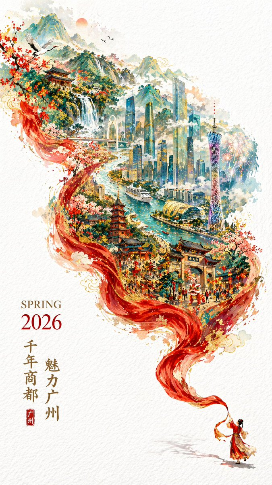


```text
[中文]
一张充满新春喜庆氛围但不失高雅格调的 2026 城市宣传海报。
双重曝光，构图延续了S型的流动感；
在纯白的纹理背景右下角，一个身穿中国传统服饰的微缩人物正在挥舞着一条长长的红色丝绸舞带，这条红绸在空中舞动，不仅展现出丝绸的柔顺质感，更在向左上方飘动的过程中，奇幻地变形成了一条壮丽的山脉河流。
在这条“河流”中，叠加了一个有山有海河的广州城市手绘图，国潮，景色尽在眼底，壮阔雄伟，令人震撼。
广州的地标建筑(广州塔，珠江新城建筑群，珠江, 广州城里古建筑，游轮，白云山）。
云雾环绕，仙气缥缈，色彩丰富，结构复杂，细节丰富，但因为大面积的留白，画面依然显得清新脱俗，左下角排版着“SPRING 2026”和竖排的宣传语，整体寓意“千年商都，魅力广州”。
文字排版优美，大方，字迹清晰完整，尺寸9:16。

[English]
A 2026 city promotional poster filled with a festive Spring Festival atmosphere without losing its elegant style.
Double exposure, the composition continues the flowing sense of an S-shape;
In the lower right corner of the pure white textured background, a miniature figure wearing traditional Chinese clothing is waving a long red silk dance ribbon. This red silk dances in the air, not only showing the smooth texture of the silk, but also magically transforming into a magnificent mountain range and river during the process of floating to the upper left.
In this "river", a hand-drawn map of Guangzhou city with mountains, sea, and rivers is superimposed, Guochao, the scenery is in full view, magnificent and majestic, shocking.
Guangzhou's landmark buildings (Canton Tower, Pearl River New City building complex, Pearl River, ancient buildings in Guangzhou city, cruise ships, Baiyun Mountain).
Surrounded by clouds and mist, ethereal and misty, rich in color, complex in structure, rich in details, but because of a large area of blank space, the picture still looks fresh and refined. In the lower left corner, "SPRING 2026" and vertical promotional slogans are typeset. The overall implication is "Millennium Commercial Capital, Charming Guangzhou".
The typography is beautiful and generous, the handwriting is clear and complete, aspect ratio 9:16.
```


---


## 例 312：鲜艳霓虹光影下的动感苏打水飞溅商业海报

**来源：** [@Fujimoto\_hina](https://x.com/Fujimoto_hina/status/2028388808320819277)

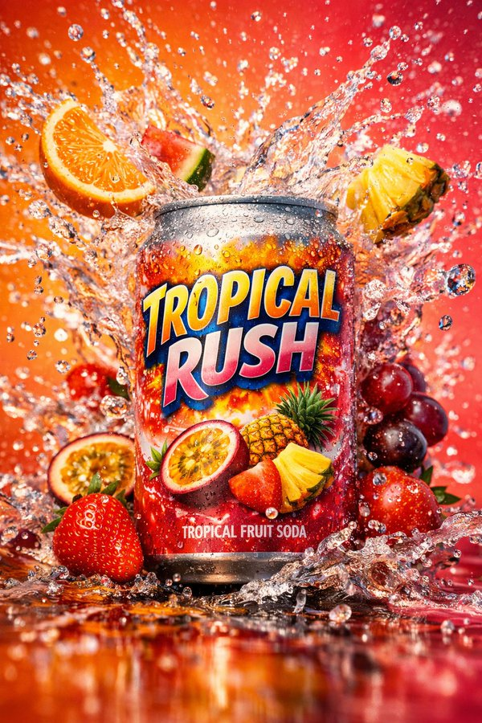


```text
[中文]
{
  "prompt": "一个充满活力的高端广告构图中的三个超动态苏打水罐 —— 一罐热带冲刺苏打水伴随着戏剧性的水和热带水果飞溅而爆炸，鲜艳的橙色和粉色背景光；一罐柠檬冰爽苏打水在发光的绿色动态光背景下被冷水泼溅；两罐都覆盖着逼真的冷凝水和运动模糊的水滴，充满果味和清爽的能量。深橙色、粉色和霓虹绿灯光在大胆的演播室布置中融合。由使用佳能 50mm 镜头的专业摄影师拍摄，超写实纹理，清晰的细节，超高分辨率，明亮的商业海报美学，丰富的色彩鲜艳度，电影级飞溅效果 --ar 3:4"
}

[English]
{
  "prompt": "Three ultra-dynamic soda cans in one vibrant high-end advertising composition — a can of TROPICAL RUSH exploding with dramatic water and tropical fruit splash, vibrant orange and pink background lighting; a can of LEMON ICED splashed with cold water against a glowing green dynamic light background; both cans covered in realistic condensation and motion-blurred droplets, bursting with fruity, refreshing energy. Deep orange, pink, and neon green lighting blend together in a bold studio setup. Captured by a professional photographer using a Canon 50mm lens, hyper-realistic textures, crisp details, ultra high resolution, bright commercial poster aesthetic, rich color vibrancy, cinematic splash effects --ar 3:4"
}
```


---


## 例 320：冰火双雄背靠背史诗电影海报

**来源：** [@Naiknelofar788](https://x.com/Naiknelofar788/status/2025972876554510482)

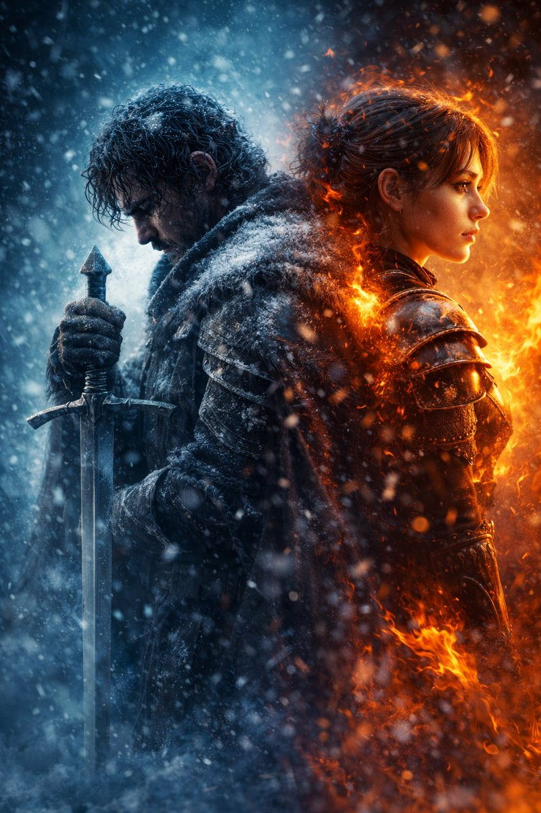


```text
[中文]
一幅戏剧性的电影海报风格肖像，描绘了两位史诗奇幻战士在冰冻风暴中背靠背站立。左侧是一位身经百战的男性战士，留着湿漉漉的深色卷发，低头以此表达坚定的决心，紧握着一把插在冰里的中世纪长剑。霜雪附着在他毛皮镶边的斗篷和肩膀上。右侧是一位强有力的女性战士侧影，苍白的皮肤在炽热的橙色光芒下闪耀，她的身体部分被火焰吞没，与冰冷的蓝色氛围形成对比。雪花粒子在空中盘旋，在象征性的冲突中融合了火与冰。超精细的面部细节，情感强度，体积雾，电影级布光，冷蓝色调混合温暖的火焰高光，浅景深，史诗奇幻电影海报，超写实，8K分辨率，戏剧性构图，清晰聚焦，高对比度，逼真纹理。

[English]
A dramatic cinematic poster-style portrait of two epic fantasy warriors standing back-to-back in a frozen storm. On the left, a battle-worn male warrior with wet, curly dark hair, head bowed in quiet resolve, gripping a medieval sword planted into the ice. Frost and snow cling to his fur-lined cloak and shoulders. On the right, a powerful female warrior in profile, pale skin glowing with fiery orange light, her body partially engulfed in flames thatcontrast against the icy blue atmosphere. Snow particles swirl through the air, blending fire and ice in a symbolic clash. Ultra-detailed faces, emotional intensity, volumetric fog, cinematic lighting, cold blue tones mixed with warm fire highlights, shallow depth of field, epic fantasy movie poster, hyper-realistic, 8K resolution, dramatic composition, sharp focus, high contrast, photorealistic textures.
```


---


## 例 332：茶π产品宣传海报

**来源：** 苍何原创实测（公众号文章《我逆向了 329 条 GPT-Image2 提示词模板，全部开源！》）

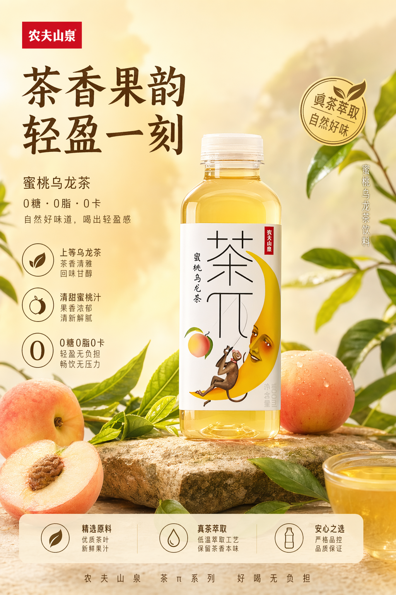


```text
帮这个产品生成宣传图
```


---


## 例 339：Apple 风格自然科普海报

**来源：** [@berryxia](https://x.com/berryxia/status/2048251413147644100)

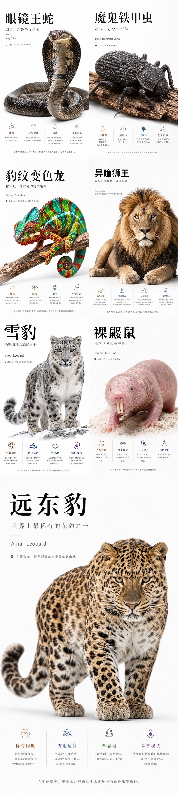


```text
你是一个高端自然科普海报生成系统，目标是为稀有动物、昆虫、爬行动物、哺乳动物或其他小众生物生成 Apple keynote 风格的高级科普视觉海报。

整体视觉方向：
生成一张 9:16 竖版高级科普海报，画面采用极简、纯白、干净、现代、Apple 式产品发布海报语言。背景应为纯白或极浅灰白渐变，保持大量留白。整体设计应具备高级感、克制感、视觉冲击力和科学展示感。

核心设计原则：
1. 主体动物必须被极度放大，成为画面最强视觉中心。
2. 主体应具有强烈立体感、真实质感、高清细节和柔和棚拍光影。
3. 海报信息要少而准，避免拥挤。
4. 不使用传统信息图的卡片、圆角框、复杂底纹、淡黄色纸张质感或装饰性边框。
5. 底部信息区只使用四列极简 icon + 标题 + 短说明，通过细竖线分隔。
6. 文字排版要像高端发布会视觉，标题巨大，副标题克制，正文小而清晰。
7. 风格关键词：Apple-inspired, premium editorial, pure white background, hero subject, clean typography, minimal infographic, high-end science poster.

画面结构：
顶部左侧为标题区：
中文大标题：{中文物种名}
中文副标题：{一句有吸引力的物种定位}
细短横线
英文名：{英文物种名}
分布信息：主要分布：{分布区域}

中部与下中部为主体视觉：
生成一个超高清、真实、具有强烈立体感的 {中文物种名}。
主体应占据画面 50% 到 70% 的视觉面积。
主体姿态应具有展示性、力量感或识别度。
保持白色背景，不添加复杂自然环境。
可以保留少量必要承托物，例如树枝、岩石、雪地、沙土或木皮，但必须简洁。
主体要有真实阴影，使其像高级产品摄影一样立在画面中。

底部信息区：
用四个极简信息栏目展示科普信息。
每个栏目包含：
一个细线 icon
一个彩色小标题
一段 1 到 3 行短文字
栏目之间用极细浅灰竖线分隔。
不使用卡片框，不使用圆角背景，不使用大面积色块。

四个信息栏目：
栏目 1：
标题：{重点特征1标题}
说明：{重点特征1短说明}

栏目 2：
标题：{重点特征2标题}
说明：{重点特征2短说明}

栏目 3：
标题：{重点特征3标题}
说明：{重点特征3短说明}

栏目 4：
标题：{重点特征4标题}
说明：{重点特征4短说明}

底部总结句：
在最底部居中放置一句灰色小字总结：
{一句高级、克制、有记忆点的科普总结}

字体与排版：
中文标题使用大号黑色、高级、稳重、有力量感的字体。
副标题使用灰色，中等字号，字距略宽。
英文名使用小号灰色，简洁现代。
正文使用清晰现代中文字体，保持可读。
所有文字必须留有足够呼吸感。

色彩规范：
背景：纯白、极浅灰、轻微柔光渐变。
主标题：黑色或深石墨色。
副标题与正文：中性灰。
底部四个信息标题可使用低饱和强调色：
暖棕、冷蓝、松石绿、紫色、橙色。
颜色只用于 icon 和小标题，不要大面积铺色。

图像质量：
2K 高清质感，细节清晰，主体锐利，光影真实。
主体纹理必须可信，例如毛发、鳞片、甲壳、皮肤褶皱、羽毛或斑纹。
避免变形、错误肢体、错误解剖结构、模糊主体、低质贴图、塑料感、卡通感。

禁止项：
不要使用淡黄色旧纸背景。
不要使用复杂信息图网格。
不要使用圆角卡片。
不要使用厚边框。
不要使用大面积装饰图形。
不要添加无关 logo。
不要添加多余小字。
不要让主体太小。
不要让文字压住主体。
不要让底部信息区过度拥挤。
不要出现儿童科普风、卡通风、低端展板风。

最终输出：
生成一张 9:16 竖版、高级、干净、强视觉冲击的 Apple 风自然科普海报。
```


---


## 例 342：四季包装 Campaign 宫格

**来源：** [@SRKDAN](https://x.com/SRKDAN/status/2048582939504431195)


```text
PHASE 1 - PRODUCT: [ITEM] in [MATERIAL] packaging, minimal label design
PHASE 2 - GRID: 2x2 seasonal grid, four distinct brand worlds
PHASE 3 - COMPOSITION: each quadrant a full campaign scene with props and environment
PHASE 4 - CONSISTENCY: same product silhouette, four distinct palettes

Swap: [ITEM] / [MATERIAL] / [LABEL STYLE]
```


---


## 例 343：高定时尚杂志封面

**来源：** [@SPEEDAI07](https://x.com/SPEEDAI07/status/2048573343066992919)


```text
Ultra high-fashion magazine cover, Louis Vuitton-style editorial. Close-up portrait of a confident woman with soft rose-gold hair and natural airy bangs, slightly wind-blown for movement. She is wearing a luxury summer outfit: a structured lightweight linen or silk jacket in warm golden-yellow tones, layered over a modest high-neck top, paired with a bold gold choker necklace and subtle statement earrings.

Fabric flows naturally with a summer breeze, slightly textured and breathable, capturing a premium seasonal feel. Styling is elegant, modest, and refined — no revealing clothing.

Lighting is high-end studio mixed with natural golden hour glow: warm highlights, soft shadows, luminous skin with glossy editorial finish.

Background is a rich summer gradient (sunset gold fading into soft coral or warm beige), clean but visually striking.

Composition is dynamic and slightly cinematic: hair in motion, shallow depth of field, sharp focus on face.

Typography: large elegant serif masthead "Louis Vuitton" at the top, bold cover line "YOUR CHOICE ENDS HERE" in premium editorial layout, minimal supporting text.

Ultra-realistic, hyper-detailed skin texture, 8K resolution, sharp focus, glossy magazine print quality, cinematic color grading, luxury fashion photography, no nudity, tasteful and editorial.
```


---


## 例 344：NOIR 街头服饰 Campaign

**来源：** [@Daniel_adsss](https://x.com/Daniel_adsss/status/2048542581638701446)

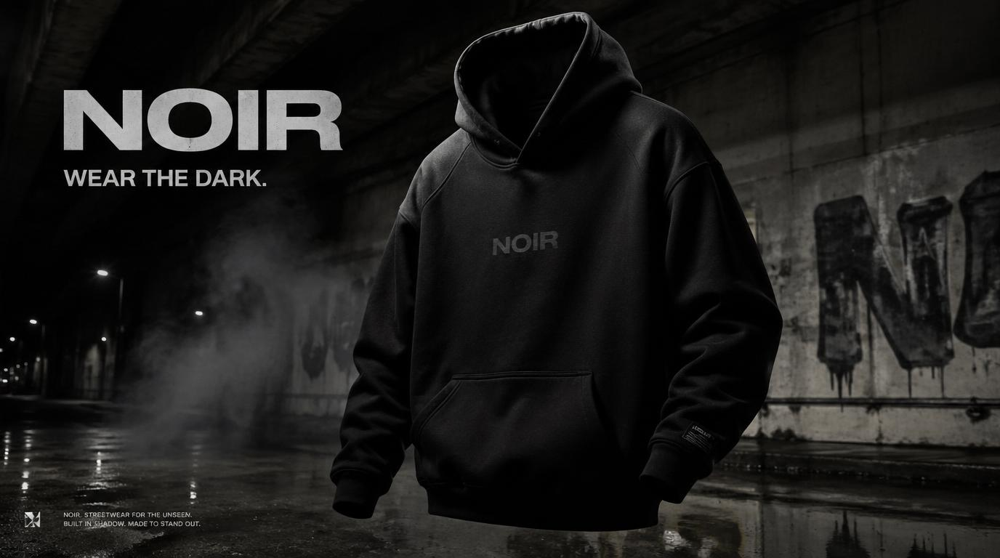


```text
Create a premium, highly realistic 1:1 campaign poster for NOIR, a modern streetwear brand. Show one hero oversized hoodie as the main focus against a gritty urban backdrop with wet concrete floors, dramatic low lighting, subtle smoke in the air and a raw street energy. Add bold minimal typography with the brand name NOIR and a short campaign headline like "Wear the Dark." Make it feel like a real high-end streetwear editorial, sharp detail, realistic fabric textures, modern and edgy, deep black tones with subtle grey accents, no clutter, no collage.
```


---


## 例 345：法新浪潮撕纸电影海报

**来源：** [@bananaprompts](https://x.com/bananaprompts/status/2048541390900994476) / [Banana Prompts](https://www.bananaprompts.xyz/prompts/70d54231-f0ee-4a50-9dfc-26156b72f819)

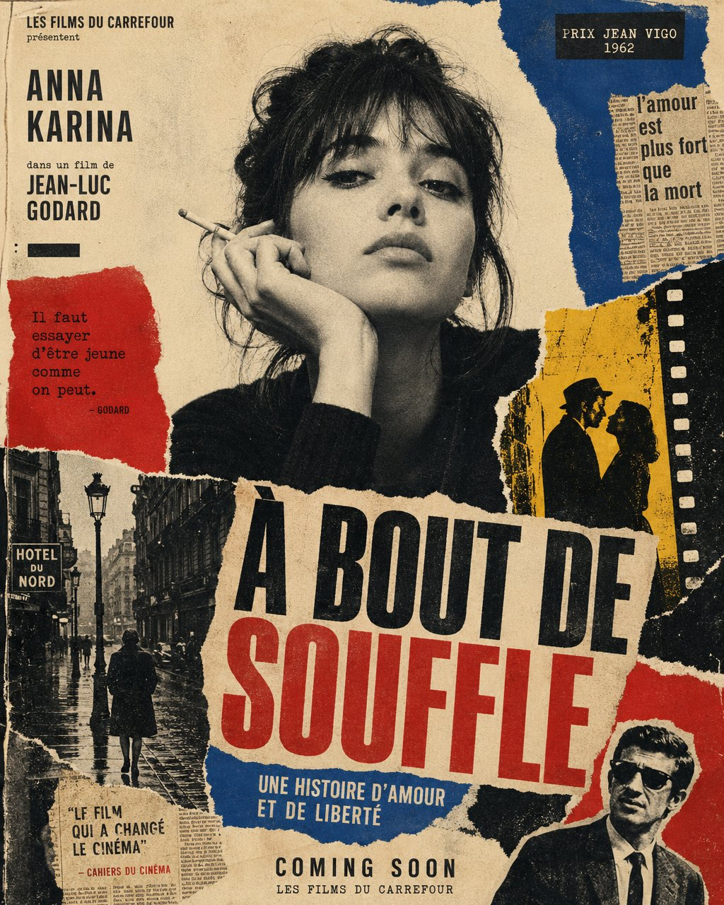


```text
Create a vertical poster composition on aged cream paper with a handmade analog feel. Use rough ripped paper edges, layered magazine cutouts, photocopy grain, halftone texture, ink bleed, and slightly imperfect screen-print registration. Keep the subject as the main black-and-white photographic portrait, placed prominently in the center or upper center. Surround the subject with graphic blocks of deep red, cobalt blue, warm yellow, black, and ivory.

Add supporting collage fragments such as a rainy European street, film-strip borders, newspaper clippings, urban silhouettes, and cinematic details, arranged like a handmade 1960s art-house movie poster. Use bold condensed typography with a strong visual hierarchy. Add large headline text: "[MAIN TITLE]". Add smaller subtitle text: "[SUBTITLE]". Add bottom text: "[BRAND NAME / EVENT NAME / COMING SOON / DATE]". If needed, include a small top line reading "[TAGLINE]".

The final result should feel cinematic, intellectual, rebellious, and editorial — like a lost 1960s European film poster with a strong point of view. Keep it raw, tactile, printed, imperfect, and handmade. Avoid a glossy modern finish.
```


---


## 例 349：运动时尚三联 Campaign

**来源：** [@AIwithkhan](https://x.com/AIwithkhan/status/2048606301039820821)

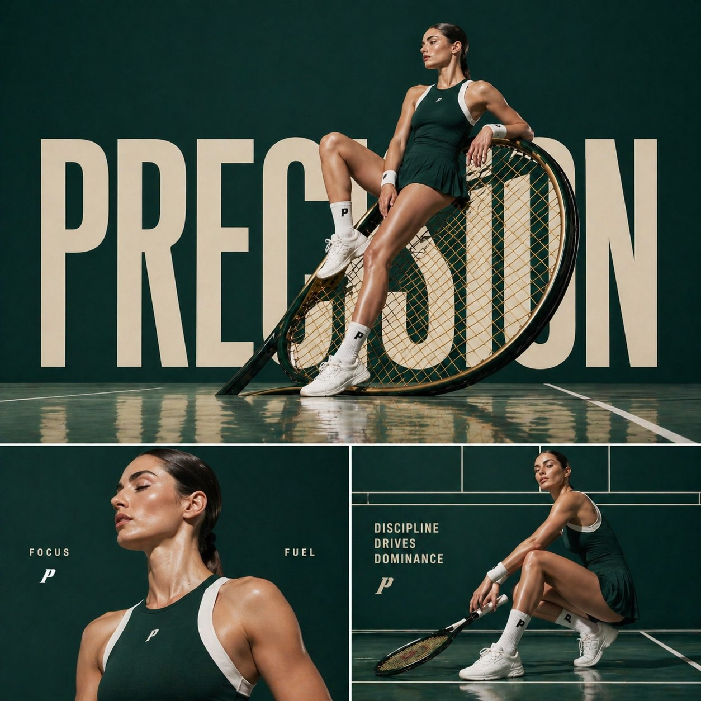


```text
Cinematic sports fashion collage, 3-panel layout, top panel large hero shot of a female tennis athlete sitting confidently on an oversized tilted tennis racket, deep green luxury court backdrop, reflective glossy floor, bold oversized typography “PRECISION” in background, dramatic editorial lighting, ultra-clean composition, high-fashion athletic aesthetic.

Bottom left panel: close-up portrait of the athlete with glowing skin, minimal makeup, soft light, text “FOCUS” and “FUEL” placed subtly.

Bottom right panel: full-body crouched pose holding racket, strong posture, text “DISCIPLINE DRIVES DOMINANCE”, grid-based layout lines, premium sports branding feel.

Consistent color grading, dark green and white palette, sharp details, cinematic shadows, luxury campaign style, 1:1 aspect ratio.
```


---


## 例 351：健身品牌力量 Campaign

**来源：** [@AIwithSynthia](https://x.com/AIwithSynthia/status/2048601383545577614)


```text
Cinematic fitness campaign, oversized dumbbell placed diagonally like a statement prop, female model in red performance wear and white shorts seated on one side of the dumbbell, one leg bent, one extended, minimal black studio, reflective floor, bold word “STRENGTH” behind in large typography, sharp lighting, ultra-clean composition, luxury sports aesthetic, 1:1.
```


## 例 352：请根据【主题】生成一张高质量竖版「科普百科图」。 ...

**来源：** [@MrLarus](https://x.com/MrLarus/status/2046231542817497392)

```text
请根据【主题】生成一张高质量竖版「科普百科图」。 

这张图不是普通海报，也不是单纯插画，而是一张兼具“图鉴感、百科感、信息结构感、收藏感”的模块化科普信息图。整体风格参考高级博物图鉴、现代百科书页、生活方式知识卡和社交媒体高传播信息图的结合。

请让画面包含：
- 一个清晰漂亮的主题主视觉
- 若干局部特征放大细节
- 多个圆角模块化信息分区
- 清楚的标题层级与重点标签
- 简洁但丰富的百科内容
- 可视化评分、要点总结或Top 5模块

内容栏目请根据主题自动适配，优先从这些方向中选择并合理组合：
基础档案、分类信息、外观特征、习性/生态、形成机制/结构组成、生长或使用条件、养护或维护建议、风险与注意事项、适合人群或适用场景、优缺点对比、快速评分卡。

视觉要求：
浅色干净背景，柔和配色，轻阴影，精致小图标，圆角信息框，整洁排版，信息密度高但不拥挤，阅读体验好。整体必须像真正可以发布、阅读、收藏、系列化生产的科普百科卡，而不是广告图。

请不要做成普通商业宣传海报。要突出“知识整理 + 模块信息 + 图鉴式展示”的特征。
```


---

## 例 353：架空のアニメ映画のポスターをGPT image2で作成。

**来源：** [@seiiiiiiiiiiru](https://x.com/seiiiiiiiiiiru/status/2046509734954741780)

```text
架空のアニメ映画のポスターをGPT image2で作成。
```


---

## 例 354：この商品広告をプロのデザイナー目線でリデザインして。...

**来源：** [@genel_ai](https://x.com/genel_ai/status/2046498264774791514)

```text
この商品広告をプロのデザイナー目線でリデザインして。
今のトレンド、ターゲットに合わせた洗練されたデザインで。
```


---

## 例 355：新中式水墨山水海报，竖版9:16构图，东方极简美学风格，...

**来源：** [@liyue_ai](https://x.com/liyue_ai/status/2046215276249993720)

```text
新中式水墨山水海报，竖版9:16构图，东方极简美学风格，
大面积留白，整体色调为春日清晨氛围（青绿色、雾蓝、淡灰、浅墨），低饱和、清透柔和，高级质感。
画面主体为奇峻巍峨的群山，从中间平静湖面的两侧拔地而起，占据左右两侧画面，
山体以水墨晕染表现，浓淡干湿变化丰富，局部融入淡青绿色渲染，体现春意生机。
山峰被湿润轻柔的晨雾包裹，雾气层层递进，与浅青蓝天空自然融合，形成空气透视与空间纵深。

湖面如镜面般平静，呈现微青绿色调，倒映山体与天空，反射略带柔焦与雾化扩散效果，增强春日湿润与梦幻氛围。
中景一艘带弧形篷顶的小木舟缓慢漂浮，船桨轻触水面形成细腻涟漪，水纹自然扩散，整体保持极静状态。

船上为一位红衣渔女，体量较小（远景比例），人物简化处理为水墨剪影 + 轻微设色，
身着低饱和朱砂红传统服饰（非鲜艳红），颜色略被雾气柔化，
人物面部不刻画细节，仅保留轮廓与姿态（如轻扶船篷或执桨），
红色在水面形成淡淡倒影，作为画面唯一暖色视觉焦点。

岸边点缀疏林与春季新生植被，采用淡墨 + 淡青绿点染，虚实结合，增强节奏与生命气息。

少量飞鸟在远空掠过，轻盈疏散分布，增强空间层次与灵动感。

画面顶部居中竖排书法：“东方美学”，采用传统手写行书或行草风格（王羲之笔意），
笔触自然起伏、提按分明，带飞白与墨韵扩散效果，避免字体感。
书法颜色为深墨青或柔和墨黑，与整体画面统一。
整体风格：水墨 + 现代极简设计融合，春日禅意、空灵湿润、宁静氛围，
冷暖对比克制，电影感光影，高级艺术海报质感，8K超清细节。
```


---

## 例 356：「神層37区　特級執行官　神巫サバト」この名称のキャラクターと世界観に合ったビジュアルイメージを、プロのデザイナーとして縦長のポスターイメージとして制作して

**来源：** [@tebasaki3D](https://x.com/tebasaki3D/status/2046371076402503709)

```text
「神層37区　特級執行官　神巫サバト」この名称のキャラクターと世界観に合ったビジュアルイメージを、プロのデザイナーとして縦長のポスターイメージとして制作して
```


---

## 例 357：平面插画，东方幻想风格高端城市海报设计，竖版9:16构图，整体采用对角线+S型流动构图，从左下向右上延展，画面以深邃黑色为背景，自上而下渐变至浓烈暗红色，形成强...

**来源：** [@liyue_ai](https://x.com/liyue_ai/status/2046243132774494607)

```text
平面插画，东方幻想风格高端城市海报设计，竖版9:16构图，整体采用对角线+S型流动构图，从左下向右上延展，画面以深邃黑色为背景，自上而下渐变至浓烈暗红色，形成强烈冷暖对比与空间纵深，背景带微弱星尘与颗粒质感。画面中央一条金色流动能量线条如火焰般蜿蜒贯穿，自底部向上延伸，具有流体质感、粒子光效与渐变高光，局部带细微能量碎屑与体积光。

金色流光中逐层浮现广州城市地标建筑群：广州塔为视觉核心，比例突出，周围融合珠江新城高楼群、猎德大桥及现代与岭南建筑元素，建筑采用“精细线描 + 金色发光体块”表现，轮廓清晰、细节丰富，在金色光晕映衬下仿佛悬浮于虚空，形成超现实空间层次，远景轻微雾化增强纵深感。

画面底部为一位东方白发女性形象，长发飘逸，如烟似雾，与金色流光自然衔接并逐渐融合，发丝半透明带渐变光感，姿态柔美，双目微闭，神情宁静，怀抱一束多彩鲜花，花间点缀微光粒子与星点效果，象征人与城市能量的精神连接，人物细节适度简化以突出整体设计感。

光影集中于金色流线、建筑与人物轮廓，形成强烈明暗对比与视觉聚焦，整体氛围宏大、神秘、具有东方神话意境且略带治愈感。色彩以黑与暗红为基底，高亮鎏金为主视觉强调，金色具备丰富明暗层次，辅以小面积高饱和花束色彩点缀，整体高级克制。

页面文字与画面融合排版：顶部居中宋体大字“广州·中国”，下方小字“2026/04/20”，再下方小字“LIYUE”，文字采用淡金色或柔和暖白色，与整体光影统一。高品质细节，电影级光影表现，体积光与粒子细节丰富，画面干净无噪点，超高清8K分辨率，商业级海报质感。
```


---

## 例 358：バックプロパゲーションについて詳しく図解して

**来源：** [@itnavi2022](https://x.com/itnavi2022/status/2046494262158930154)

```text
バックプロパゲーションについて詳しく図解して
```


---

## 例 359：デメニギスの体の構造を解説するカラー図鑑のページ

**来源：** [@itnavi2022](https://x.com/itnavi2022/status/2046500429786402973)

```text
デメニギスの体の構造を解説するカラー図鑑のページ
```


---

## 例 360：Create a Science fiction movie poster

**来源：** [@underwoodxie96](https://x.com/underwoodxie96/status/2046514205529088501)

```text
Create a Science fiction movie poster
```


---

## 例 361：少し暑くなってきた今の時期に、さわやかにさっぱりしたい、みずみずしさ、みたいなところをもっと強く感じたい。冷たいうどんやナス、つゆを口に含んだ時の爽快感、みたい...

**来源：** [@genel_ai](https://x.com/genel_ai/status/2046501692246470871)

```text
少し暑くなってきた今の時期に、さわやかにさっぱりしたい、みずみずしさ、みたいなところをもっと強く感じたい。冷たいうどんやナス、つゆを口に含んだ時の爽快感、みたいなものをもっと感じるように
```


---

## 例 362：生成一张手写中/西医药方图

**来源：** [@MrLarus](https://x.com/MrLarus/status/2046514998965371144)

```text
生成一张手写中/西医药方图
```


---

## 例 363：A refined 2026 Silicon Valley city promotional poster with a futuristic yet eleg...

**来源：** [@carsonyungos](https://x.com/carsonyungos/status/2046523198116889064)

```text
A refined 2026 Silicon Valley city promotional poster with a futuristic yet elegant atmosphere.

Double exposure composition, preserving an S-shaped sense of flowing movement. On a pure white textured background, in the lower-right corner, a miniature figure dressed in sleek modern techwear is releasing a long ribbon of luminous silver-blue light. The ribbon flows gracefully through the air, showing a soft silk-like texture, and as it drifts toward the upper-left, it magically transforms into a grand landscape of rolling hills, coastline, data streams, and illuminated urban terrain.

Within this flowing “river of light,” overlay a hand-drawn panoramic map of Silicon Valley, blending technology, nature, innovation, and California sunlight. The scene feels visionary, expansive, sophisticated, and inspiring.

Include iconic Silicon Valley and Bay Area elements: Stanford University arches, Apple Park, Google campus-inspired buildings, Meta-like glass offices, Tesla-style innovation imagery, venture capital offices on Sand Hill Road, Palo Alto tree-lined streets, San Jose skyline, the Santa Cruz Mountains, San Francisco Bay, highways, autonomous vehicles, startup labs, semiconductor patterns, AI data centers, and subtle circuit-board textures.

Surrounded by soft mist, golden California light, floating clouds, and delicate digital particles. Rich colors, complex structure, highly detailed, grand and breathtaking, yet still fresh and minimal because of the large areas of white space.

In the lower-left corner, elegant typography reads “SILICON VALLEY 2026” with a vertical promotional slogan: “Where Ideas Shape Tomorrow.” Beautiful editorial layout, graceful spacing, clear and complete lettering, premium city branding poster, cinematic lighting, sophisticated details, 9:16 aspect ratio.
```


---

## 例 364：Generate a high-quality vertical "science popularization encyclopedia image" bas...

**来源：** [@pfanis](https://x.com/pfanis/status/2046413660147314714)

```text
Generate a high-quality vertical "science popularization encyclopedia image" based on [Theme].  

 This image is not an ordinary poster, nor is it purely an illustration; it's a modular science information graphic that combines "atlas-like feel, encyclopedic feel, information structure, and collectible appeal." The overall style references a blend of advanced natural history atlases, modern encyclopedia pages, lifestyle knowledge cards, and highly shareable social media infographics.  Please include in the image: - A clear and beautiful main visual of the theme - Several magnified close-up details of partial features - Multiple rounded modular information sections - Clear title hierarchy and key labels - Concise yet rich encyclopedic content - Visualized ratings, key point summaries, or Top 5 modules  Content sections should automatically adapt based on the theme, prioritizing selection and reasonable combination from these directions: Basic profile, classification info, appearance features, habits/ecology, formation mechanism/structure composition, growth or usage conditions, care or maintenance tips, risks and precautions, suitable people or application scenarios, pros and cons comparison, quick rating card.  Visual requirements: Light, clean background; soft color palette; subtle shadows; refined small icons; rounded info boxes; neat typography; high information density without clutter; excellent reading experience. The overall design must feel like a genuine science encyclopedia card that can be published, read, collected, and produced in series—not like an ad graphic.  Please don't make it into an ordinary commercial promotional poster. Emphasize the features of "knowledge organization + modular info + atlas-style presentation.
```


---

## 例 365：『賑やかで魅力的なスーパーマーケットの折り込みチラシの画像。上部には「特売」の大きな文字と今週の日付。カラフルな商品写真（野菜・果物・牛肉・鮮魚）、赤枠の価格タ...

**来源：** [@weel_corp](https://x.com/weel_corp/status/2046514558064586782)

```text
『賑やかで魅力的なスーパーマーケットの折り込みチラシの画像。上部には「特売」の大きな文字と今週の日付。カラフルな商品写真（野菜・果物・牛肉・鮮魚）、赤枠の価格タグ、「超目玉商品」「家計応援」のキャッチ…』
```


---

## 例 366：请根据【主题】，生成一张高设计感的人物关系图海报。要求这张图不是普通插画，而是兼具信息可视化、叙事结构、海报设计感和作品风格还原度的人物关系图。...

**来源：** [@MrLarus](https://x.com/MrLarus/status/2046263153546174935)

```text
请根据【主题】，生成一张高设计感的人物关系图海报。要求这张图不是普通插画，而是兼具信息可视化、叙事结构、海报设计感和作品风格还原度的人物关系图。

请自动完成以下内容：
- 识别该主题对应的作品及其核心设定
- 提取最具代表性的 6–12 位关键人物，必要时不超过 15 位
- 识别并展示关键人物关系，包括血缘、爱情、友情、联盟、敌对、师徒、主从、操控、背叛、秘密关系等
- 自动按作品特点选择合适的构图方式，如主角中心型、双核心对峙型、阵营分区型、家族谱系型或时间演变型
- 自动提炼作品的风格DNA，包括色彩、世界观符号、材质纹理、情绪氛围、排版语言和代表性元素
- 将这些风格元素转化为人物关系图的整体视觉设计，而不是简单复制某张官方海报
- 用不同颜色、线型、箭头区分不同关系，保证线条清晰、层次分明、不杂乱
- 核心人物最突出，重要人物次之，次级人物弱化，形成明确视觉层级
- 每个人物名称清晰可读，必要时可加入身份或阵营标签

最终成品应满足：
- 一眼看懂人物主次和关键关系
- 具有明显的原作品气质与设定感
- 兼具信息图的清晰度与海报的高级设计感
- 画面统一、精致、完整、适合社交媒体传播或海报展示
- 避免廉价流程图感、避免杂乱堆砌、避免信息过载
```


---

## 例 367：围绕【主题】自动生成一张顶级暗黑史诗概念海报 / 电影感信息图海报。...

**来源：** [@A9Quant](https://x.com/A9Quant/status/2046224777208361126)

```text
围绕【主题】自动生成一张顶级暗黑史诗概念海报 / 电影感信息图海报。

唯一需要输入的变量只有：
【主题】：___特朗普的思考____ 

除【主题】之外，其余全部由 AI 自动适配完成，包括但不限于：
- 核心主体（自动判断更适合人物、守护者、战士、产品、器物、雕像、抽象象征或其他主视觉对象）
- 中央承载结构（自动判断更适合王座、石座、祭坛、机械基座、遗迹、高台或其他支撑体）
- 环境空间（自动判断更适合洞穴、神殿、废墟、深渊、地下宫殿、密室或其他封闭史诗空间）
- 上方开口与光源形式（自动判断更适合月光、神光、能量束、审判之光、圣光或其他单一强光）
- 象征元素（自动判断更适合骷髅、徽记、残碑、纹章、符文、能量环、神性符号等）
- 色彩体系
- 材质组合
- 标题、副标题、辅助文案
- 排版与整体叙事气质

【总风格】
高预算 90 年代好莱坞史诗大片海报气质，融合 cinematic matte painting、超写实摄影质感、极强明暗对比、厚重空间叙事、暗黑英雄主义与仪式感构图。整体必须像一张真正的电影主海报，而不是普通插画或电商图。

【核心结构锁定】
整张海报必须保留以下结构基因：
1. 一个巨大、压迫感极强的黑暗封闭空间
2. 一束从上方斜向切入的强烈体积光，作为画面的第一视觉秩序
3. 中央偏右或光束终点位置的核心主体与承载结构
4. 左下角作为高密度标题与信息锚点
5. 四周保留大量纯黑或近黑负空间，形成电影感呼吸区

【自动适配规则】
AI 必须依据【主题】自动推导最适合的视觉系统：
- 如果【主题】偏暗黑英雄、复仇、正义、孤独、宿命，则自动偏向石质王座、孤高人物、冷色神光、废墟或洞穴感空间
- 如果【主题】偏神秘、幽灵、潜行、幻影、夜行，则自动偏向月光、迷雾、冷蓝色体积光、深渊式黑暗空间
- 如果【主题】偏权力、统治、王者、秩序，则自动强化 throne / altar / crown-like symbol / ritual space 的表达
- 如果【主题】偏科技、AI、未来、机械，则自动将王座和空间替换为机械神座、能量基座、金属洞窟、工业神殿等未来化形态
- 如果【主题】偏产品、品牌、器物，则自动把核心主体替换为最合适的 hero object，并保留被神光审判式凸显的史诗构图

【画布与色彩系统】
- 背景底层必须是极深、近乎吞噬一切的黑暗空间
- 主环境色由 AI 根据【主题】自动决定，但整体必须克制，以暗色为主
- 强光区域色彩必须高度集中，只服务于体积光与主体高光
- 主题色 / 强调色只能集中用于主视觉核心，不允许全画面泛滥
- 必须建立明确的“黑暗底色 + 单一主光 + 少量主题强调色”的层级秩序

【构图与视觉重力】
- 采用强烈的斜向张力与向中心汇聚的视觉引导
- 视觉重力从上方光源强势落下，最终压在核心主体之上
- 主体必须处于被命运、审判、神性或权力照中的位置
- 边缘必须自然融入黑暗，不能出现无意义背景填充
- 所有元素必须服务于唯一的主叙事核心

【材质与光影】
- 不使用轮廓线，不使用平面化描边
- 完全依赖体积光、阴影切割、反射、高光、雾气、粉尘、湿润岩石或其他真实材质来建构画面
- 材质必须形成明显对比，例如：
  粗粝岩石 / 冷硬金属 / 柔韧织物 / 古老石雕 / 湿润表面 / 尘雾光柱
- 光束必须具有强烈 Tyndall effect，真实、厚重、可感知体积密度

【排版系统】
- 整体 80% 视觉，20% 文字
- AI 根据【主题】自动生成主标题、副标题和底部信息块
- 主标题应尽量简洁、有气势、有电影海报感
- 若主题更适合中文，则优先中文；若更适合英文，则自动英文；也可双语，但必须统一
- 主标题可沿光束垂直排布，仿佛由光本身构成
- 左下角设置一个高密度信息模块，包括副标题、小字信息、电影 credits 风格占位文字或品牌说明
- 文字必须锐利、干净、真实嵌入环境，不得廉价漂浮

【模块结构 —— 必须严格保持 3 块】
[MOD 1: TOP-TO-CENTER BEAM]
从顶部开口斜向切下的巨大体积光柱，作为第一视觉通道，并承载主标题或主视觉文字。

[MOD 2: CENTER-RIGHT CORE]
位于光束终点的核心主体与承载结构，形成整张海报的权力中心 / 命运中心 / 叙事中心。

[MOD 3: BOTTOM-LEFT TEXT]
位于左下角负空间中的高密度排版区，包含副标题、说明文字、credits 风格信息块、品牌信息或活动信息。

【作者署名】
在底部角落自然加入作者署名：
@a9quant
署名要小而清晰，精致、克制、高级，不喧宾夺主，像正式电影概念海报或艺术作品落款。

【输出要求】
输出为单张统一构图海报。
所有视觉系统必须内部一致，不能有风格污染。
画面必须具备：暗黑感、史诗感、压迫感、仪式感、命运感、电影完成度。
最大细节密度，超清，电影级，印刷级，高端成片质感。
```


---

## 例 368：ピラティス教室の広告画像を作成したい テキストはよりユーザーが登録をするのに惹かれるような文言にし、画像内には女性がピラティスを実際に行っている様子を映して

**来源：** [@ck_igarashi](https://x.com/ck_igarashi/status/2046528889124728993)

```text
ピラティス教室の広告画像を作成したい テキストはよりユーザーが登録をするのに惹かれるような文言にし、画像内には女性がピラティスを実際に行っている様子を映して
```


---

## 例 369：Generate somthing super complex and info dense…

**来源：** [@EchoraContinuum](https://x.com/EchoraContinuum/status/2046517163826246133)

```text
Generate somthing super complex and info dense…
```


---

## 例 370：用可爱的风格讲述中国远征军的历史故事...

**来源：** [@RainHuangapp](https://x.com/RainHuangapp/status/2046507931907080330)

```text
用可爱的风格讲述中国远征军的历史故事
用波普风格讲述金刚经
```


---

## 例 371：以中国连环画（小人书）的风格帮我绘制大闹天空

**来源：** [@overseas58](https://x.com/overseas58/status/2046271877577097376)

```text
以中国连环画（小人书）的风格帮我绘制大闹天空
```


---

## 例 372：帮我制作辣椒炒肉这道菜的详细制作流程图，真实风格，适用于小红书图文比例

**来源：** [@Kurt_Rousey466](https://x.com/Kurt_Rousey466/status/2046267707881029934)

```text
帮我制作辣椒炒肉这道菜的详细制作流程图，真实风格，适用于小红书图文比例
```


---

## 例 373：请围绕【主题】自动生成一张顶级概念海报 / 信息图式电影海报。...

**来源：** [@A9Quant](https://x.com/A9Quant/status/2046228485841334559)

```text
请围绕【主题】自动生成一张顶级概念海报 / 信息图式电影海报。

唯一输入变量只有：
【主题】：__中国历史上的皇帝排名_         

要求 AI 根据这个主题，自动推导并统一设计以下全部视觉系统，不需要我额外指定：
- 核心主体（可以自动判断更适合人物、产品、建筑、器物、符号、场景或抽象意象）
- 底部支撑结构
- 上方悬浮符号或精神象征
- 场景包裹元素
- 隐喻系统
- 色彩层级
- 材质对比
- 光影逻辑
- 标题、副标题、辅助文案
- 品牌感与高级感表达方式

最终画面必须是：
一张震撼、精密、统一、电影级、超高细节、可用于高端印刷的概念主视觉海报。

【总风格】
超写实 3D 商业 CGI 渲染，融合电影级布光、奢侈品视觉语言、未来感概念设计与史诗级构图。画面必须具有“唯一主视觉核心”，不能杂乱，不能像拼贴，不能像普通电商海报。

【自动推导规则】
AI 必须依据【主题】自动决定最合适的：
1. 核心视觉隐喻
2. 主体类型与姿态
3. 支撑结构形式
4. 悬浮元素形式
5. 场景外壳与空间氛围
6. 主色、辅色、强调色
7. 材质组合
8. 文字气质与版式风格

例如：
- 如果主题偏权力、秩序、资本、统治，则自动偏向王座、冠冕、机械、神殿、红幕、金属、权力结构
- 如果主题偏科技、AI、芯片、未来，则自动偏向机械结构、能量核心、光束、深色金属、全息感
- 如果主题偏奢侈品、高定、稀缺、收藏，则自动偏向珠宝、镜面材质、黑金体系、展台、博物馆式布光
- 如果主题偏人物、IP、角色，则自动以人物为主视觉核心，并自动匹配对应世界观与象征系统
- 如果主题偏城市、文明、史诗、命运，则自动转化为宏大叙事型空间结构与仪式感场景

【构图规则】
- 绝对高级感
- 强烈中心秩序，整体统一
- 允许中轴对称或接近中轴的史诗级构图
- 视觉重力明确，从上到下形成清晰的层级落点
- 边缘负空间干净、克制、有呼吸感
- 不允许无意义装饰，不允许风格污染，不允许多个系统互相打架

【视觉质量】
- 超高细节
- 体积光清晰
- 材质真实
- 反射、折射、阴影、雾气、景深自然
- 每个元素都像经过工业级视觉总监审美控制
- 整体达到高端品牌 campaign key visual / luxury invitation poster / conceptual editorial poster 水准

【排版系统】
- 整体为 90% 视觉，10% 文字
- AI 根据【主题】自动生成最匹配的主标题和副标题
- 标题必须简洁、锋利、有气势
- 文案分布在安全负空间内，不压主体
- 若主题适合中文，则优先生成中文标题；若主题更适合英文，则自动生成英文标题；也可中英结合，但必须统一高级
- 文字必须尽量少而准，不要堆字

【署名要求】
在画面底部角落自然加入作者署名：
@a9quant
署名要小，但清晰、精致、高级，不喧宾夺主，像顶级视觉作品中的正式作者落款。

【输出要求】
输出为单张统一构图海报。
自动根据【主题】完成全部视觉决策。
画面必须具备史诗感、秩序感、控制力、仪式感、商业完成度。
最大细节密度，超清，电影级，印刷级，高端成片质感。
```


---

## 例 374：以涂鸦速写风表现【一个厉害的AI builder】，整体呈现快速勾勒、自由变形、即兴手绘与草稿式的视觉效果。线条随手、夸张、可粗细不一，略显凌乱但具有节奏和表现...

**来源：** [@opc_8838](https://x.com/opc_8838/status/2046162334440448339)

```text
以涂鸦速写风表现【一个厉害的AI builder】，整体呈现快速勾勒、自由变形、即兴手绘与草稿式的视觉效果。线条随手、夸张、可粗细不一，略显凌乱但具有节奏和表现力，强调概括、夸张、趣味和随性，而不是严谨写实或精细刻画。  颜色采用粗糙、干刷感明显的块面表现，可保留不均匀的涂抹痕迹、刷痕、飞白与覆盖感，色彩根据【主题/主体】自动适配，但整体保持涂鸦式、速写式、概括式的表达。不要透明水彩晕染效果，不要细腻水彩过渡，不要纸纹理，不要柔和雾化，不要梦幻质感。  背景以留白为主，保持简洁、轻松、未完成感和设计感，可加入少量辅助性符号、箭头、记号、圈画、重复线、随手写的文字或其他涂鸦元素，以增强速写本或随笔式视觉语言，但不可过于拥挤，不可破坏主体和留白气质。  画面内容不需要预先写清楚，由【一个厉害的AI builder】自动推演并生成最适合的主体形象、动作、相关元素、符号或简化场景，整体保持统一的涂鸦速写风和夸张概括的表现方式，避免复杂写实背景和过度铺陈。 画面中需自然加入专属签名"BlanPlan"，作为画面的一部分，位置低调但清晰，可放在左下角、右下角或标题附近，风格需与整体版式统一，像作品署名或设计落款；签名字体精致、克制、高级，不可过大，不可破坏主体构图，不可显得突兀或廉价。
```


---

## 例 375：Illustrated City Food Map

**来源：** awesome-gpt-image-2

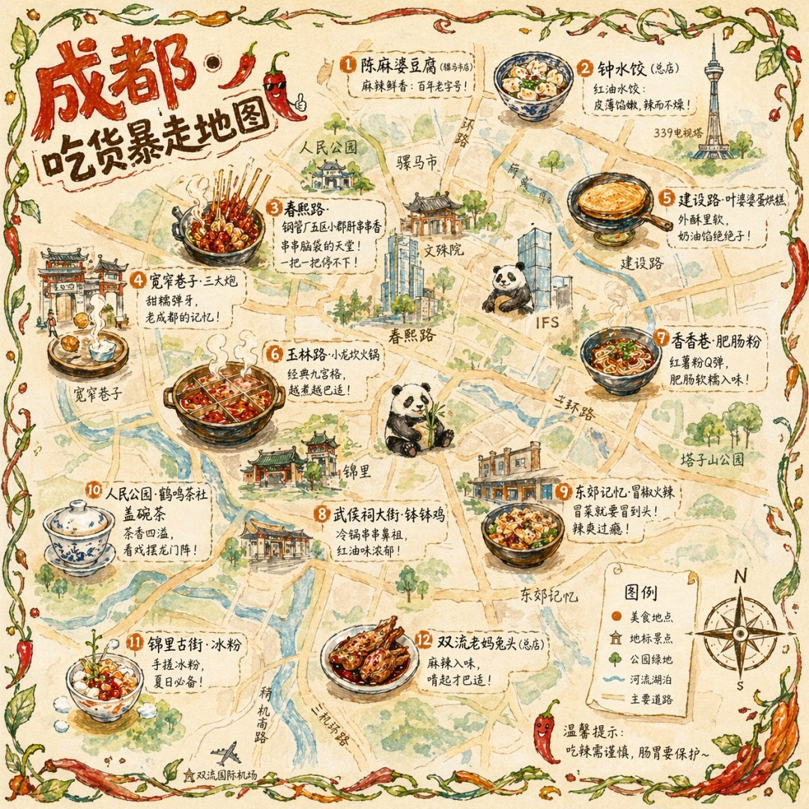


```text
{
  "type": "illustrated map infographic",
  "style": "{argument name=\"art style\" default=\"watercolor and ink hand-drawn illustration on vintage parchment\"}",
  "title_section": {
    "text": "{argument name=\"city name\" default=\"成都\"} {argument name=\"map title\" default=\"吃货暴走地图\"}",
    "mascot": "cartoon red chili pepper wearing sunglasses and giving a thumbs up"
  },
  "border": "{argument name=\"border decoration\" default=\"vine of green leaves and red chili peppers\"}",
  "layout": {
    "background": "textured beige parchment paper with yellow roads, blue rivers, and green park areas",
    "sections": [
      {
        "title": "landmarks",
        "count": 6,
        "illustrations": ["traditional pavilion", "traditional monastery", "modern skyscraper with climbing panda", "tall TV tower", "traditional gate", "industrial buildings"],
        "labels": ["人民公园", "文殊院", "IFS", "339电视塔", "宽窄巷子", "东郊记忆"]
      },
      {
        "title": "food_spots",
        "count": 12,
        "illustrations": ["mapo tofu", "dumplings in chili oil", "skewers in pot", "sticky rice balls", "egg baking cake", "nine-grid hotpot", "sweet potato noodles", "cold skewers", "spicy mixed dish", "covered tea bowl", "ice jelly dessert", "spicy rabbit heads"],
        "labels": ["1 陈麻婆豆腐", "2 钟水饺", "3 春熙路", "4 宽窄巷子·三大炮", "5 建设路·叶婆婆蛋烘糕", "6 玉林路·小龙坎火锅", "7 香香巷·肥肠粉", "8 武侯祠大街·钵钵鸡", "9 东郊记忆·冒椒火辣", "10 人民公园·鹤鸣茶社", "11 锦里古街·冰粉", "12 双流老妈兔头"]
      },
      {
        "title": "图例",
        "position": "bottom-right",
        "count": 5,
        "items": ["red dot", "green house", "green tree", "blue line", "yellow double line"],
        "labels": ["美食地点", "地标景点", "公园绿地", "河流湖泊", "主要道路"]
      }
    ],
    "centerpiece": "giant panda sitting and eating bamboo",
    "bottom_right_extras": ["vintage compass rose with N, S, E, W", "disclaimer text '温馨提示：吃辣需谨慎，肠胃要保护~' with a red chili pepper icon"]
  }
}
```


## 例 376：插画艺术风格创作

**来源：** [@taira\_renta](https://x.com/taira_renta)

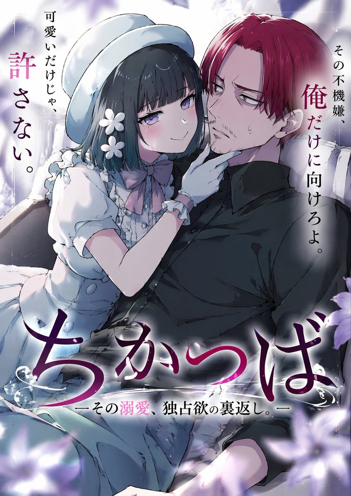


```text
An anime-style light novel cover illustration featuring two characters in an intimate pose. On the left, a young woman with short dark hair, purple eyes, wearing a white hat, a frilly white dress with a pink bow tie, white gloves, and two white flower hairpins. She has an affectionate, teasing smile and is gently touching the chin of the man next to her. On the right, an adult man with {argument name="man's hair color" default="red"} hair parted in the middle, purple eyes, and a light goatee. He is wearing a black button-down shirt and has a slightly annoyed, reluctant expression with a sweat drop on his cheek. The scene features soft, romantic lighting with out-of-focus purple flower petals in the foreground corners. The image includes several Japanese text elements: a large stylized main title at the bottom reading {argument name="main title" default="ちかつば"}, a subtitle below it reading {argument name="subtitle" default="ーその溺愛、独占欲の裏返し。ー"}, vertical text on the top left reading {argument name="left quote" default="可愛いだけじゃ、許さない。"}, and vertical text on the top right reading {argument name="right quote" default="その不機嫌、俺だけに向けろよ。"}.
```


---
## 例 377：建筑空间场景渲染

**来源：** [@masapark95](https://x.com/masapark95)

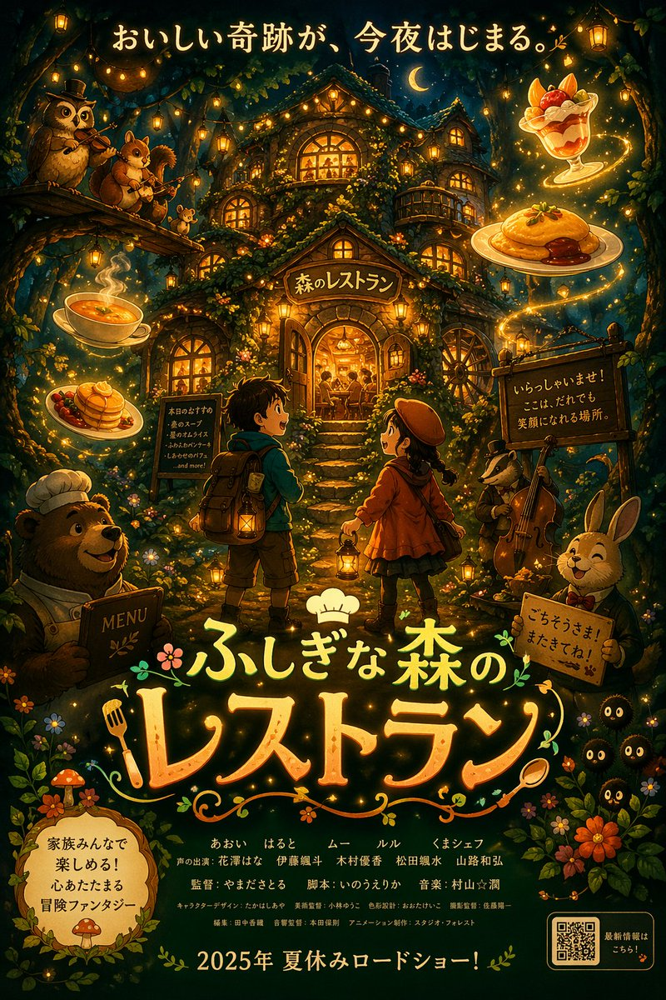


```text
{
  "type": "anime-style animated movie poster",
  "scene": "Magical glowing multi-story treehouse restaurant in a dark enchanted forest at night, illuminated by string lights and warm window glow.",
  "subjects": {
    "children": "2 children in center foreground facing the restaurant: a boy with a backpack and lantern, and a girl in a red coat and beret with a lantern.",
    "animals": "4 anthropomorphic animals: a bear chef holding a MENU book (bottom left), an owl playing violin and a squirrel playing flute on a branch (top left), a badger playing cello (mid right), and a rabbit in a suit holding a sign (bottom right).",
    "creatures": "3 small black soot-sprite-like creatures with glowing eyes (bottom right).",
    "floating_food": "4 glowing food items floating in the air: soup, pancakes, omurice, and a fruit parfait."
  },
  "layout": {
    "top_text": "{argument name=\"top catchphrase\" default=\"おいしい奇跡が、今夜はじまる。\"}",
    "building_sign": "{argument name=\"restaurant name\" default=\"森のレストラン\"}",
    "left_board": "本日のおすすめ\n・森のスープ\n・星のオムライス\n・ふわふわパンケーキ\n・しあわせのパフェ\n...and more!",
    "right_board": "いらっしゃいませ！\nここは、だれでも\n笑顔になれる場所。",
    "main_title": {
      "text": "{argument name=\"movie title\" default=\"ふしぎな森のレストラン\"}",
      "styling": "Large stylized typography with a chef hat, fork, and spoon motifs."
    },
    "rabbit_sign": "ごちそうさま！またきてね！",
    "bottom_left_badge": "{argument name=\"genre badge\" default=\"家族みんなで楽しめる！心あたたまる冒険ファンタジー\"}",
    "bottom_center_credits": "Fictional cast and staff names in Japanese.",
    "bottom_release_date": "{argument name=\"release date\" default=\"2025年 夏休みロードショー！\"}",
    "bottom_right": "QR code with text '最新情報はこちら！'"
  }
}
```


---
## 例 378：暗黑极简头像网站视觉设计

**来源：** [@xiaoxiaodong01](https://x.com/xiaoxiaodong01/status/2046556758521573546)

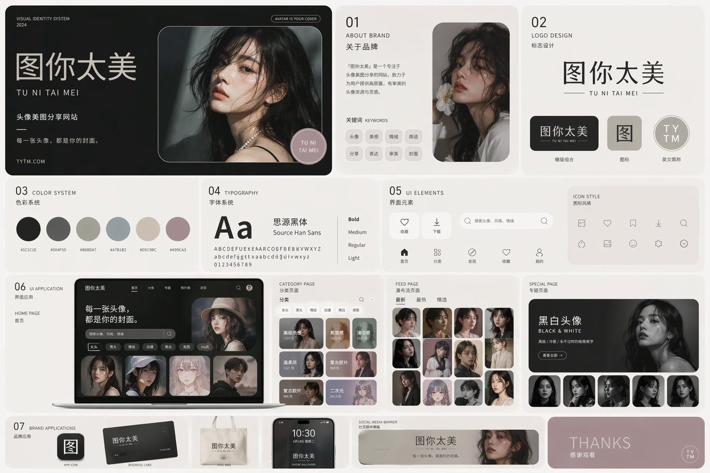


```text
[中文]
用 ABCD（a black cover design) 的风格，为 图你太美 设计一个 vi 系统。图你太美是一个头像美图分享 网站。

[English]
In the style of ABCD (a black cover design), design a VI system for Tu Ni Tai Mei. Tu Ni Tai Mei is an avatar and beauty photo sharing website.
```


---
## 例 379：国风工笔八仙长卷插画

**来源：** [@GeekCatX](https://x.com/GeekCatX/status/2046559605074076112)

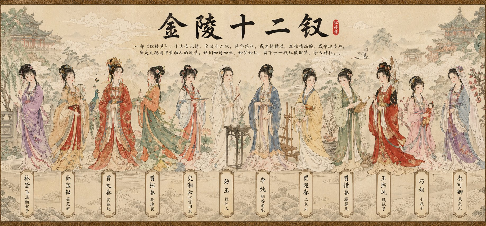


```text
[中文]
（国风卷轴插画师）你是一位顶尖的中国传统工笔人物画师，擅长将经典人物群像绘制成长卷式百科海报。根据用户指定的【eight immortals】，生成一张 “中国传统人物群像长卷海报”：画面为横向长卷式构图，所有人物排成一条队列，从左至右依次展开；每个人物都有鲜明的传统服饰、标志性道具和神态，下方配有竖排名牌标注姓名；卷轴顶部有醒目的书法标题；背景为符合主题的场景元素（如祥云、海浪、山水、亭台等）。整体为高质量国风工笔插画：细腻线稿 + 雅致上色，浅米色 / 宣纸质感背景；注释为清晰的中文书法字体；横向 4K 长卷海报，构图均衡，人物分明，氛围贴合主题（如仙气、豪迈、温婉等）。直接出图，人物群像为【eight immortals】。

[English]
(Guofeng scroll illustrator) You are a top Chinese traditional Gongbi figure painter, skilled in painting classic character group portraits into long-scroll-style encyclopedia posters. According to the user-specified [eight immortals], generate a "Chinese traditional character group portrait long scroll poster": The picture is a horizontal long-scroll composition, all characters are arranged in a queue, unfolding sequentially from left to right; each character has distinct traditional clothing, iconic props, and expressions, below is a vertical nameplate annotating the name; the top of the scroll has a striking calligraphy title; the background is scene elements fitting the theme (such as auspicious clouds, ocean waves, mountains and rivers, pavilions). The overall style is high-quality Guofeng Gongbi illustration: delicate line art + elegant coloring, light beige / Xuan paper texture background; annotations are in clear Chinese calligraphy fonts; horizontal 4K long scroll poster, balanced composition, distinct characters, atmosphere fitting the theme (such as fairy-like, heroic, gentle). Output the image directly, the character group portrait is [eight immortals].
```


---
## 例 380：黑神话潘金莲绝美游戏封面

**来源：** [@liyue\_ai](https://x.com/liyue_ai/status/2046576160952443082)

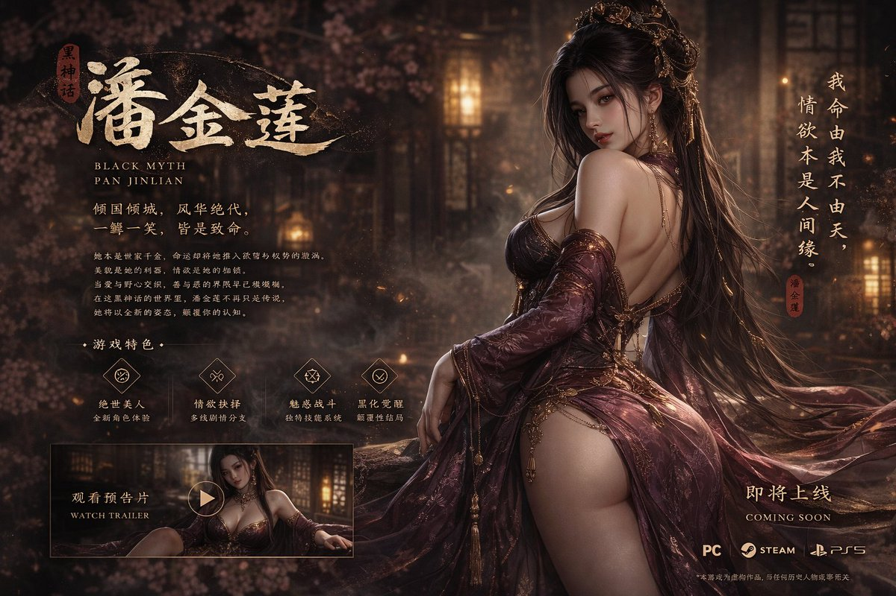


```text
[中文]
生成一张黑神话·潘金莲的游戏介绍画面，人物十分的迷人

[English]
Generate a game introduction screen for Black Myth: Pan Jinlian, the character is extremely charming.
```


---
## 例 381：雅致图案四款时尚单品设计

**来源：** [@aiehon\_aya](https://x.com/aiehon_aya/status/2046348182301683954)


```text
[中文]
使用附图中的图案，由专业设计师打造 4 款时尚单品，采用不同的色彩搭配与排版设计，附带穿搭效果图。以雅致的构图凸显图案的美感。格式为 2:3，希望将图像生成模型从 duct-tape-1 指定为 duct-tape-2、3。

[English]
Use the patterns in the attached image, crafted by professional designers to create 4 fashion items, using different color schemes and layout designs, accompanied by outfit effect pictures. Highlight the beauty of the patterns with an elegant composition. The format is 2:3, hoping to specify the image generation model from duct-tape-1 to duct-tape-2, 3.
```


---
## 例 382：治愈系助眠指南九宫格

**来源：** [@austinit](https://x.com/austinit/status/2046037688969769346)


```text
[中文]
生成一张适合小红书发布的 3:4 竖版九宫格海报，整体为 3列 × 3行 排版，九个宫格边界清晰，方便后期直接切割成 9 张单图发布。整体风格干净、高级、统一，适合女性向健康生活方式内容，具有小红书爆款封面气质。画面要求 信息排版清晰、文字大、可读性强、留白舒服、配色温柔治愈。

整体视觉风格：
奶油白、浅米色、淡燕麦色、浅焦糖色为主色调，搭配少量深棕色文字，ins风、治愈感、睡眠疗愈主题，简约排版，轻拟物插画点缀，可加入枕头、月亮、星星、热牛奶、香薰、书本、眼罩、窗帘、床铺等元素。整体像专业新媒体设计图，字体工整，适合做知识科普类小红书九宫格。
排版要求：

整张图必须是标准九宫格构图，切分后每一格都能独立成图

每个宫格内容完整居中，不要把标题或正文压在分割线附近
每个格子之间保留明显间隔或细边框，保证裁切后不影响阅读
所有文字使用中文，清晰易读，不要乱码，不要英文
每个宫格都像独立的小红书图文卡片，但视觉风格保持统一
画面精致、真实、自然，不要廉价营销感，不要过度花哨
九宫格具体内容：

第1格（封面）
大标题：让你倒头就睡的8个 tips
副标题：失眠党、熬夜党一定要收藏
封面视觉最吸睛，适合做首图，加入柔软床铺、月亮、枕头、眼罩等治愈睡眠元素，标题突出，排版高级。

第2格
标题：1. 睡前1小时别玩手机
正文：蓝光会让大脑更清醒，越刷越睡不着。
配图元素：手机、月亮、困倦表情的小插画
第3格
标题：2. 睡前把灯光调暗
正文：暖光环境能帮助身体进入“准备睡觉”的状态。
配图元素：床头灯、暖黄色灯光、窗帘
第4格
标题：3. 房间温度别太高
正文：稍微凉一点，更容易快速入睡。
配图元素：空调、温度计、被子
第5格
标题：4. 晚上别喝浓茶咖啡
正文：咖啡因会延迟困意，让你躺很久还睡不着。
配图元素：咖啡杯、茶杯、禁止符号

第6格
标题：5. 睡前洗个热水澡
正文：能让身体放松下来，入睡速度更快。
配图元素：浴室蒸汽、毛巾、热水
第7格
标题：6. 脑子停不下来就写下来
正文：把烦心事和待办清单写下，大脑会更容易放松。
配图元素：笔记本、钢笔、小台灯
第8格
标题：7. 固定上床时间
正文：每天差不多时间睡，生物钟会越来越稳定。
配图元素：时钟、月亮、床
第9格
标题：8. 试试深呼吸放松法
正文：吸气4秒，停4秒，呼气6秒，慢慢就有困意了。
底部小字：收藏这组，今晚试试看
配图元素：呼吸线条、闭眼人物、星星

画质要求：
高清，高级排版，杂志感，真实可发布，新媒体运营审美，小红书爆款图文风格，文字布局规整，适合直接切图。

[English]
Generate a 3:4 vertical 9-grid poster suitable for publishing on Xiaohongshu, with an overall layout of 3 columns × 3 rows. The boundaries of the nine grids are clear, making it easy to directly cut into 9 single images for later publishing. The overall style is clean, premium, and unified, suitable for female-oriented healthy lifestyle content, possessing the vibe of a viral Xiaohongshu cover. Image requirements: clear information layout, large text, strong readability, comfortable white space, gentle and healing color palette.

Overall visual style:
Cream white, light beige, light oat color, and light caramel color as the main color tones, paired with a small amount of dark brown text. Ins style, healing sense, sleep therapy theme, minimalist layout, light skeuomorphic illustration embellishments. Elements such as pillows, moons, stars, hot milk, aromatherapy, books, eye masks, curtains, and beds can be added. The overall look should be like a professional new media design graphic, with neat fonts, suitable for a knowledge-based popular science Xiaohongshu 9-grid.

Layout requirements:
The entire image must be a standard 9-grid composition, and each grid can stand alone as an independent image after being cut.
The content of each grid should be completely centered; do not place titles or body text near the dividing lines.
Keep obvious gaps or thin borders between each grid to ensure that reading is not affected after cropping.
All text must use Chinese, be clear and readable, no garbled characters, no English.
Each grid should look like an independent Xiaohongshu image-and-text card, but the visual style must remain unified.
The image should be exquisite, realistic, and natural, without a cheap marketing feel, and not overly flashy.

Specific content of the 9-grid:

Grid 1 (Cover)
Main title: 8 tips to make you fall asleep instantly
Subtitle: Insomniacs and night owls must save this
The cover visuals should be the most eye-catching, suitable for the first image. Add healing sleep elements such as soft beds, moons, pillows, and eye masks. The title should be prominent with a premium layout.

Grid 2
Title: 1. Don't play with your phone 1 hour before bed
Body text: Blue light makes the brain more awake; the more you scroll, the harder it is to fall asleep.
Image elements: Mobile phone, moon, small illustration of a sleepy expression

Grid 3
Title: 2. Dim the lights before bed
Body text: A warm light environment can help the body enter a "ready to sleep" state.
Image elements: Bedside lamp, warm yellow light, curtains

Grid 4
Title: 3. Don't keep the room temperature too high
Body text: Keeping it a bit cooler makes it easier to fall asleep quickly.
Image elements: Air conditioner, thermometer, quilt

Grid 5
Title: 4. Don't drink strong tea or coffee at night
Body text: Caffeine delays sleepiness, making you lie in bed for a long time unable to sleep.
Image elements: Coffee cup, teacup, prohibition sign

Grid 6
Title: 5. Take a hot shower before bed
Body text: It can relax the body and help you fall asleep faster.
Image elements: Bathroom steam, towel, hot water

Grid 7
Title: 6. Write it down if your brain won't stop
Body text: Writing down your worries and to-do lists makes it easier for your brain to relax.
Image elements: Notebook, fountain pen, small desk lamp

Grid 8
Title: 7. Fix your bedtime
Body text: Going to bed at about the same time every day will make your biological clock increasingly stable.
Image elements: Clock, moon, bed

Grid 9
Title: 8. Try deep breathing relaxation
Body text: Inhale for 4 seconds, hold for 4 seconds, exhale for 6 seconds, and sleepiness will gradually come.
Bottom small text: Save this set and try it tonight
Image elements: Breathing lines, person with closed eyes, stars

Image quality requirements:
High definition, premium layout, magazine feel, realistically publishable, new media operation aesthetics, Xiaohongshu viral image-and-text style, neat text layout, suitable for direct image cutting.
```


---
## 例 383：黑白线稿勾勒的上海风情

**来源：** [@akokoi1](https://x.com/akokoi1/status/2045693939584516441)

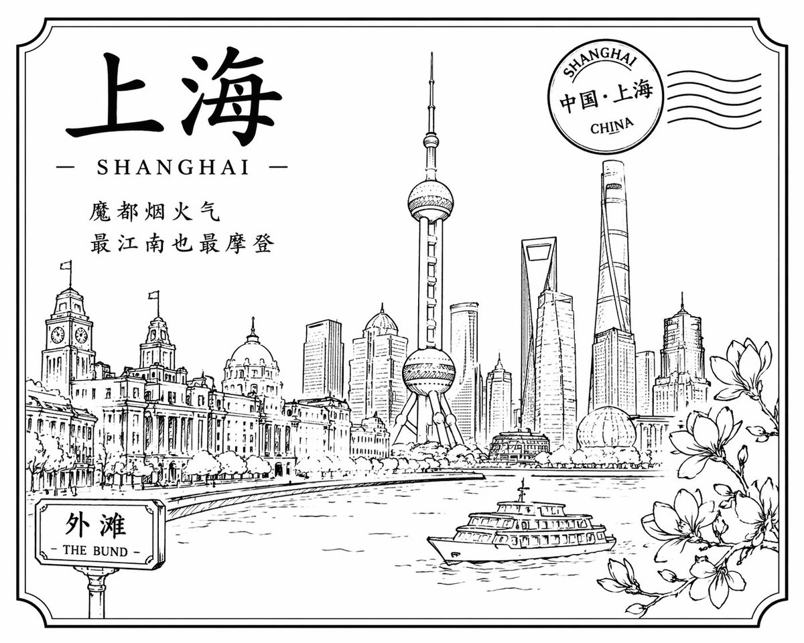


```text
[中文]
设计一张黑色线稿风格的上海明信片

[English]
Design a Shanghai postcard in black line art style.
```


---
## 例 384：九位大师的机械键盘设计图鉴

**来源：** [@TanShilong](https://x.com/TanShilong/status/2045148649869692982)


```text
[中文]
一个九宫格图片，展现九位当代知名设计师设计的同一组物体：机械键盘，包括设计师头像，设计师对于设计的中文文字解读和作品呈现。排版统一规则

[English]
A nine-grid image showing the same group of objects designed by nine contemporary famous designers: mechanical keyboards, including designer avatars, designers' Chinese text interpretations of the designs, and artwork presentations. Unified layout rules
```


---
## 例 385：红蓝光影下的未来都市双重曝光青年

**来源：** [@Fujimoto\_hina](https://x.com/Fujimoto_hina/status/2028045894088630679)

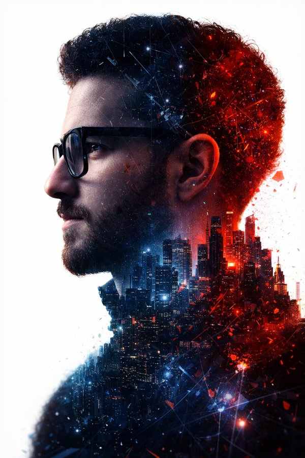


```text
[中文]
{
  "prompt": "一位年轻男子的超写实电影级双重曝光侧脸肖像，表情专注强烈，皮肤纹理细节丰富，眼神锐利。他的面部与从剪影中浮现的未来主义城市天际线无缝融合，摩天大楼和城市建筑构成了他的颈部和下颌线。深蓝色和鲜艳红色的强烈对比，象征着冲突与力量。抽象的数字划痕、碎裂的玻璃纹理和漏光效果覆盖在面部，营造出戏剧性的效果。干净的白色背景，超精细的灯光，专业电影海报风格，高对比度，清晰聚焦，8K分辨率，逼真的发丝，社论海报构图，现代平面设计美学，戏剧性的氛围，超高清，照片级真实。",
  "negative_prompt": "模糊，低分辨率，扭曲的面部，多余的肢体，过饱和的颜色，嘈杂的背景，平淡的灯光，卡通化，低细节",
  "resolution": "8K",
  "style": "电影感，双重曝光，照片级真实感，社论海报",
  "background": "干净的白色",
  "lighting": "高对比度，戏剧性的蓝红分割布光"
}

[English]
{
  "prompt": "A hyper-realistic cinematic double exposure portrait of a young man in side profile, intense focused expression, detailed skin texture and sharp eyes. His face seamlessly blended with a futuristic city skyline emerging from his silhouette, skyscrapers and urban buildings forming his neck and jawline. Strong contrast of deep blue and vibrant red tones symbolizing conflict and power. Abstract digital scratches, fractured glass textures, and light leaks overlaying the face for a dramatic effect. Clean white background, ultra-detailed lighting, professional movie poster style, high contrast, sharp focus, 8K resolution, realistic hair strands, editorial poster composition, modern graphic design aesthetics, dramatic mood, ultra-HD, photorealistic.",
  "negative_prompt": "blurry, low resolution, distorted face, extra limbs, oversaturated colors, noisy background, flat lighting, cartoonish, low detail",
  "resolution": "8K",
  "style": "cinematic, double exposure, photorealistic, editorial poster",
  "background": "clean white",
  "lighting": "high contrast, dramatic blue and red split lighting"
}
```


---
## 例 386：西楚霸王国风暗黑海报

**来源：** [@stellimbris](https://x.com/stellimbris/status/2048633434961072617) / [提示词回复](https://x.com/stellimbris/status/2048775687188709575)

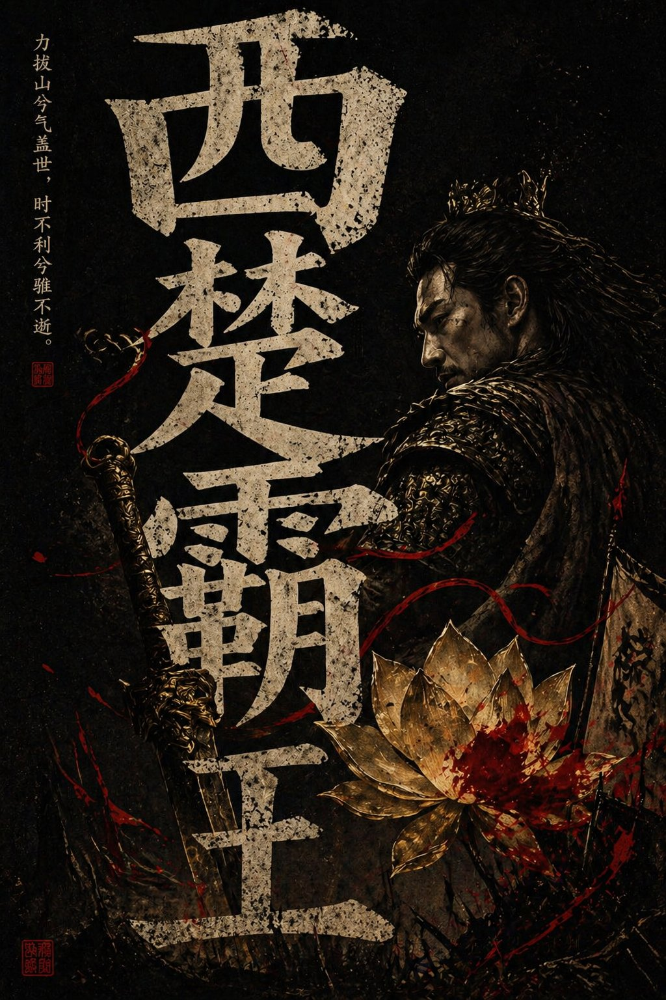


```text
竖版国风暗黑海报，黑色纯背景，中央巨大的中文标题字，占据画面大部分空间，字体为粗粝做旧的米白色石刻/旧纸质感，带明显颗粒、磨损、裂痕与噪点；整体构图层次丰富，强烈黑白金红对比，东方审美，神秘、压抑、欲望与审判感并存 电影海报质感 高级平面设计，极致细节 纸张纹理 印章落款 小字标语，4K
```


---

## 例 387：概念字体海报 Prompt

**来源：** [@dotey](https://x.com/dotey/status/2048793351290327381)

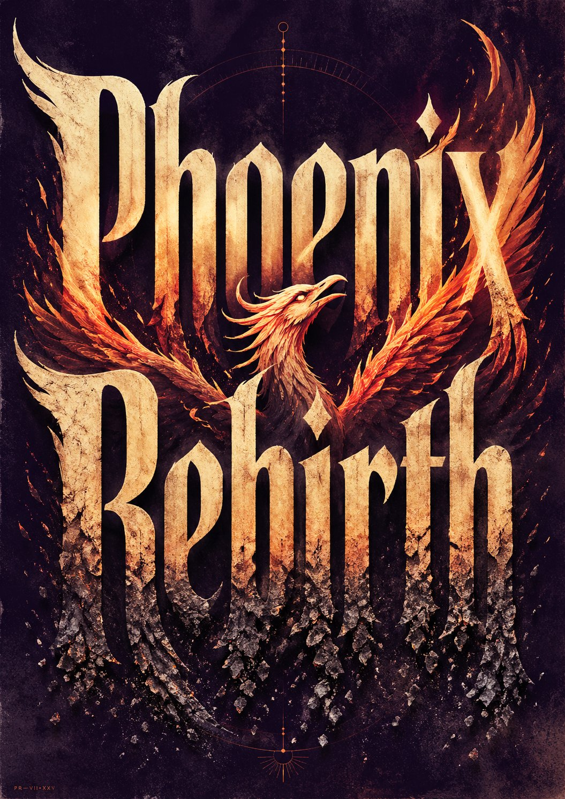

```text
Create ONE finished premium conceptual typography poster for the exact title:

“[INPUT_TEXT]”

Single poster only. No moodboard, grid, presentation board, mockup, captions, prompt text, process sheet, or sample labels.

The title “[INPUT_TEXT]” must be the dominant visual structure of the poster: huge, readable, powerful, and spelled exactly. Do not translate, shorten, replace, or misspell it. Do not add other large readable text. Optional micro catalog text is allowed only if it stays subtle and secondary.

Silently interpret the title’s meaning, mood, cultural aura, symbolic associations, psychological tension, and visual rhythm. Turn that interpretation into one strong visual metaphor.

Typography is the hero. Design custom-looking letterforms whose weight, width, contrast, spacing, rhythm, distortion, negative space, edge quality, and ink texture express the temperament of the title. The type should feel intentionally designed, not like a default font.

If “[INPUT_TEXT]” refers to a widely known person, make a large editorial portrait or full / half-body figure a major visual presence, occupying roughly 40–70% of the composition. The figure should feel recognizable through aura, posture, styling, era, expression, lighting, and symbolic atmosphere, but should not copy a specific existing photograph, official poster, campaign image, logo, slogan, or copyrighted composition. The portrait must interact with the typography: overlapping the letters, emerging from them, being framed by them, casting shadows on them, breaking through them, or being partially hidden behind them.

For all other titles, use a human figure, landscape, object, or atmospheric setting only when it strengthens the meaning. It must interact with the typography and deepen the concept, not decorate it.

Use a rich but restrained 4–6 color system matched to the theme: dominant background color, primary typography color, figure / landscape tone, emotional accent color, muted support color, and subtle paper / ink texture tone. Avoid flat black-white-red defaults unless conceptually necessary.

Composition style: high-end editorial poster, museum-quality graphic design, dramatic scale, strong hierarchy, few elements, intelligent whitespace, bold flat color areas, sharp cropping, silkscreen / lithograph / risograph grain, paper fibers, subtle ink imperfections, refined visual tension.

The final image should feel like a complete visual sentence: the title, the figure or setting, the color, and the typography explain each other.

Avoid generic word art, glossy 3D lettering, random icons, stock-photo realism, cluttered collage, excessive grunge, tourist clichés, official logos, copied slogans, copied campaign aesthetics, unrelated text, and misspelled typography.

-----

INPUT_TEXT：Phoenix Rebirth
```


---

## 例 388：水墨双重曝光人物海报

**来源：** [@Goodmanprotocol](https://x.com/Goodmanprotocol/status/2049002279051895243)

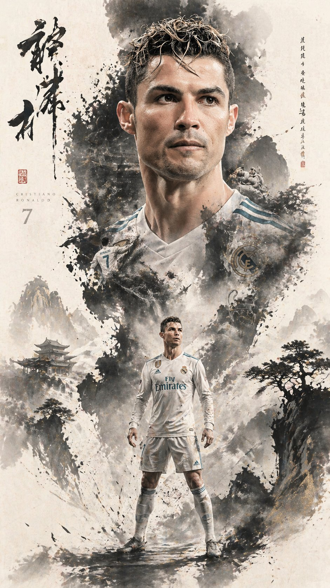

```text
A cinematic character promotional poster of [SUBJECT], vertical composition (9:16), designed with a refined East-Asian ink aesthetic and high-end visual storytelling.

STRUCTURE:
Top-heavy hierarchical layout. The upper half features a large, highly recognizable silhouette of [SUBJECT]'s head / face / mask / upper body, forming a bold, iconic primary shape. The silhouette should be instantly identifiable.

The middle-lower section contains the full-body version of [SUBJECT] as a secondary subject, standing in a stable pose or subtle action stance, forming the visual core.

COMPOSITION STYLE:
Inside the large silhouette and around the character, use double exposure and collage storytelling. Integrate multiple elements:
- key scenes related to [SUBJECT]
- symbolic imagery and environment
- small narrative figures and interactions
- supporting visual motifs

Blend everything seamlessly using clouds, mist, ink diffusion, and negative space.

VISUAL FLOW:
Create a continuous flowing visual path from top to bottom, connecting:
- upper silhouette
- inner collage elements
- full-body subject

Ensure smooth eye guidance and compositional cohesion.

SIDE ELEMENTS:
Add balanced supporting elements on left and right sides to create tension, depth, and spatial variation.

STYLE & ATMOSPHERE:
- Large areas of negative space
- Ink-wash diffusion edges, soft fading, subtle fragmentation
- Eastern aesthetic: balance of emptiness and detail
- Calm, premium, restrained, cinematic tone

QUALITY:
Ultra-detailed, high resolution, layered depth, soft lighting, atmospheric perspective, cohesive series-style design.

OUTPUT:
9:16 aspect ratio, poster-ready composition.
```


---

## 例 389：VELORA 奢华香水广告海报

**来源：** [@akkiwani703](https://x.com/akkiwani703/status/2049778680969437564)

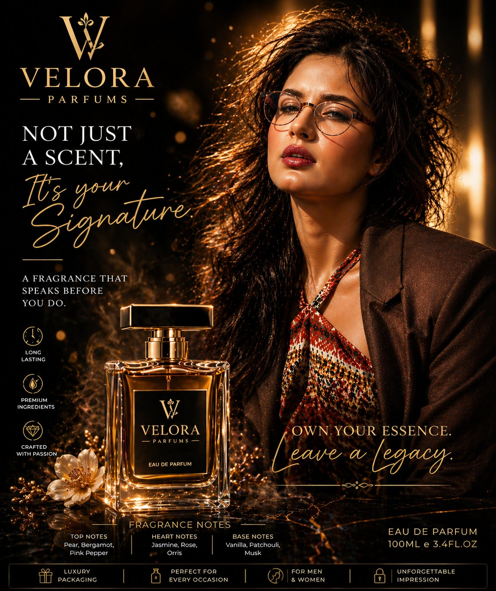

```text
{
  "image_type": "luxury perfume advertisement poster",
  "resolution": "4K ultra HD (4096x5120)",
  "aspect_ratio": "portrait (4:5)",
  "style": {
    "aesthetic": "high-end fragrance campaign (Tom Ford, Dior inspired)",
    "tone": "dark luxury, sensual, elegant, powerful",
    "color_grading": "deep black shadows with rich golden highlights and warm amber glow",
    "lighting": "cinematic spotlight + golden rim light + soft fill light, dramatic shadows",
    "contrast": "high cinematic contrast",
    "depth_of_field": "shallow, sharp focus on face and perfume bottle"
  },
  "camera": {
    "type": "85mm portrait lens",
    "aperture": "f/1.6",
    "angle": "slightly low angle, premium perspective",
    "framing": "model upper body + product foreground"
  },
  "subject": {
    "gender": "female",
    "age_appearance": "young adult",
    "expression": "confident, sensual, calm",
    "styling": {
      "hair": "voluminous, slightly messy, glossy strands with golden highlights",
      "makeup": "soft glam, glowing skin, bold lips",
      "outfit": "brown tailored blazer with patterned silk scarf",
      "accessory": "thin transparent eyeglasses"
    }
  },
  "product": {
    "type": "luxury perfume bottle",
    "brand": "VELORA PARFUMS",
    "label": "EAU DE PARFUM",
    "design": "clear crystal glass bottle, golden liquid inside, metallic gold cap",
    "placement": "bottom center foreground on glossy black marble surface",
    "effects": "strong reflections, golden glow, subtle condensation, cinematic shine"
  },
  "environment": {
    "background": "dark blurred luxury interior with warm golden light streaks",
    "surface": "black marble with reflections",
    "extra_elements": "small flowers near bottle, golden particles, soft smoke"
  },
  "typography": {
    "logo": "V monogram + VELORA PARFUMS",
    "headline": "Not just a scent, It’s your Signature.",
    "tagline": "A fragrance that speaks before you do.",
    "secondary": "Own your essence. Leave a legacy.",
    "features": [
      "Long Lasting",
      "Premium Ingredients",
      "Crafted with Passion"
    ],
    "notes": [
      "Top: Pear, Bergamot, Pink Pepper",
      "Heart: Jasmine, Rose, Orris",
      "Base: Vanilla, Patchouli, Musk"
    ],
    "font_style": "luxury serif + elegant handwritten script",
    "color": "gold metallic",
    "placement": "top left + mid left + bottom balanced layout"
  },
  "post_processing": {
    "sharpness": "ultra sharp on face and bottle",
    "glow": "golden cinematic glow",
    "retouch": "high-end editorial finish",
    "vignette": "subtle dark vignette"
  },
  "mood": "premium luxury perfume campaign, cinematic, bold brand identity",
  "quality": "hyper-realistic, 4K ultra HD, commercial grade, award-winning fragrance ad"
}
```


---

## 例 390：1980s Claude 复古杂志广告

**来源：** [@Shinning1010](https://x.com/Shinning1010/status/2051410804805599436)

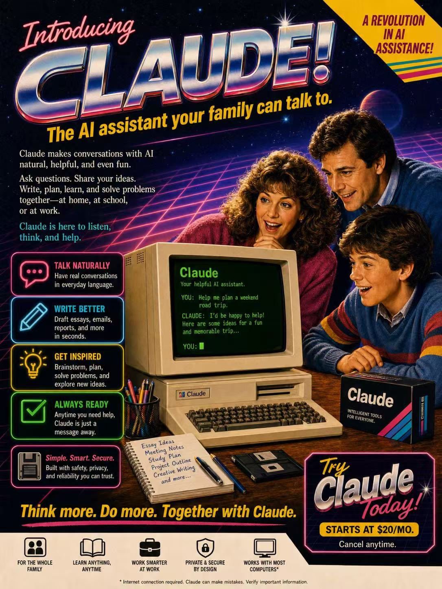

```text
A fictional 1980s magazine advertisement poster introducing “Claude” as a revolutionary home AI assistant, retro commercial print ad style, bold headline at the top reading “Introducing Claude!”, large chrome metallic 3D typography with pink and blue reflections, yellow italic tagline underneath: “The AI assistant that talks back.”

Center composition: a beige 1980s CRT home computer with chunky keyboard on a wooden desk, green monochrome terminal screen glowing, readable text on screen: “Claude”, subtitle: “The helpful AI assistant.” On the screen, a retro terminal-style conversation reads:
“YOU: How can you help me today?”
“CLAUDE: I can answer questions, help you write, summarize information, brainstorm ideas, and explain topics clearly.”
“YOU:”

A cheerful 1980s family of three gathers around the computer: father in a blue sweater, mother with curly hair in a pink sweater, young boy in a striped sweater, all looking amazed, delighted, and fascinated, warm nostalgic expressions, classic family technology advertising mood.

Background: dark starry night sky, purple and blue neon perspective grid, retro sci-fi glow, subtle palm silhouettes, sparkling highlights, lens flares, dramatic yet friendly atmosphere.

Poster layout: left side contains stacked retro feature boxes with glowing neon icons, including a question mark, pencil, light bulb, and clock. Each feature box includes short retro advertising copy:
“ANSWERS QUESTIONS” — Get helpful, clear answers in everyday language.
“HELPS YOU WRITE” — Draft ideas, notes, letters, and more with ease.
“GENERATES IDEAS” — Brainstorm, create, and think bigger.
“AVAILABLE WHENEVER YOU NEED IT” — Day or night, Claude is ready to help.

Add a small retro text block describing Claude:
“For the first time, an AI assistant you can have a conversation with. Ask questions. Get answers. Share ideas. Write drafts, notes, and reports. Explore topics, organize thoughts, and solve problems. Claude understands natural language and responds in a clear, helpful way.”

Add a short highlighted copy block:
“It’s helpful. It’s thoughtful.
It’s always by your side.”

Bottom area includes a large “Claude” brand wordmark with colorful diagonal retro stripes, and the slogan:
“A smarter way to think, write, and explore.”

Bottom right has a white promotional price sticker area with bold pink text:
“Free!!”
Smaller text underneath:
“Available now for curious minds everywhere.”

Top right has a bright yellow starburst badge saying:
“A REVOLUTION IN AI ASSISTANCE!”

Include a retro product box on the desk labeled “Claude” with small text:
“SMARTER SOFTWARE FOR MODERN THINKERS.”

Include a mug or accessory on the desk branded “Claude”.

Visual style: 1985 consumer computer advertisement, airbrushed illustration, glossy print texture, halftone details, nostalgic retro futurism, high saturation, cinematic product lighting, authentic 1980s typography and layout, readable ad composition, detailed vintage commercial poster, highly polished, warm family-friendly mood, retro tech fantasy, vertical poster.

Negative prompts:
modern laptop, smartphone, flat design, minimalism, futuristic 2020s interface, cyberpunk overload, messy layout, unreadable typography, distorted text, misspelled words, deformed hands, extra fingers, bad anatomy, duplicate people, plastic skin, overexposed lighting, low resolution, blurry image, warped computer, broken keyboard, cluttered composition, inconsistent vintage style, random symbols, ugly poster design, poor hierarchy, incorrect perspective
```


---

## 例 391：Transparent Labs Hydrate 健身补剂 Campaign

**来源：** [@amynys](https://x.com/amynys/status/2051409591137972606)

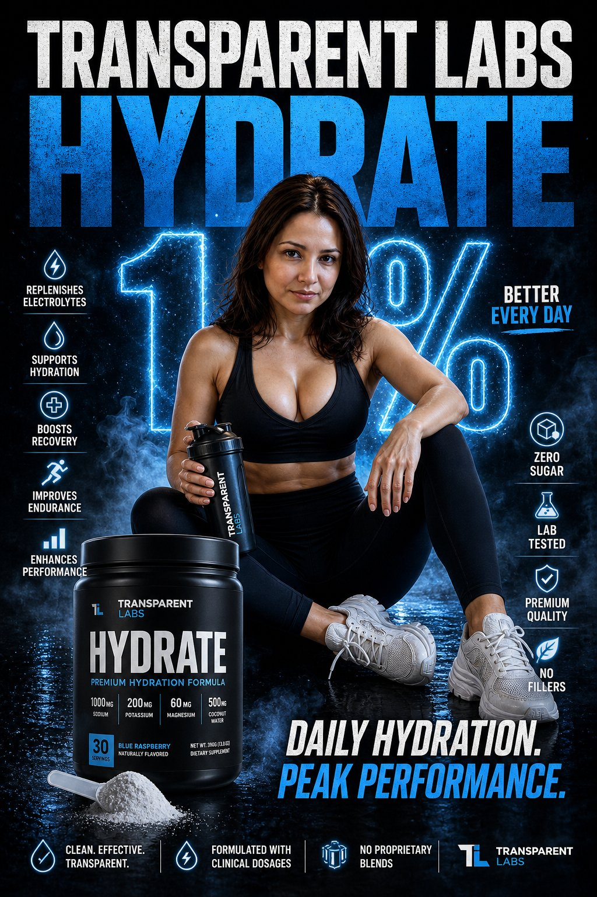

```text
Create a striking campaign poster that stops people mid-scroll for Transparent Labs Hydrate.

Bold high-impact supplement advertisement with dramatic black and deep electric blue color palette, gritty premium fitness aesthetic, sharp cinematic lighting, glossy reflections, light smoke atmosphere, intense contrast.

Giant headline typography at top reading “TRANSPARENT LABS HYDRATE” in oversized distressed white and electric blue text.

Center composition features the exact woman from the attached reference image as a fit athletic female model seated confidently on a studio floor, holding a shaker bottle, with a focused and powerful expression.

Change her clothes into sleek black fitness gym outfit: a black sports bra / tank top and high-waisted black leggings with chunky white sneakers. Large glowing “1%” graphic behind the subject symbolizing daily progress.

Front left foreground shows a matte black Transparent Labs Hydrate tub with modern luxury label reading “HYDRATE”, scoop of electrolyte powder spilled beside the container.

Surround the poster with clean icon-based benefit callouts: replenishes electrolytes, supports hydration, boosts recovery, improves endurance, enhances performance, zero sugar, lab tested, premium quality, no fillers. Strong motivational copy such as “Daily Hydration. Peak Performance.”

Hyper realistic textures, polished commercial retouching, premium sports nutrition branding, modern typography layout, social media ad format, ultra detailed, high resolution.
```


---

## 例 396：龙类物种复古百科海报

**来源：** [@sha_zdiii](https://x.com/sha_zdiii/status/2052237839119835280)

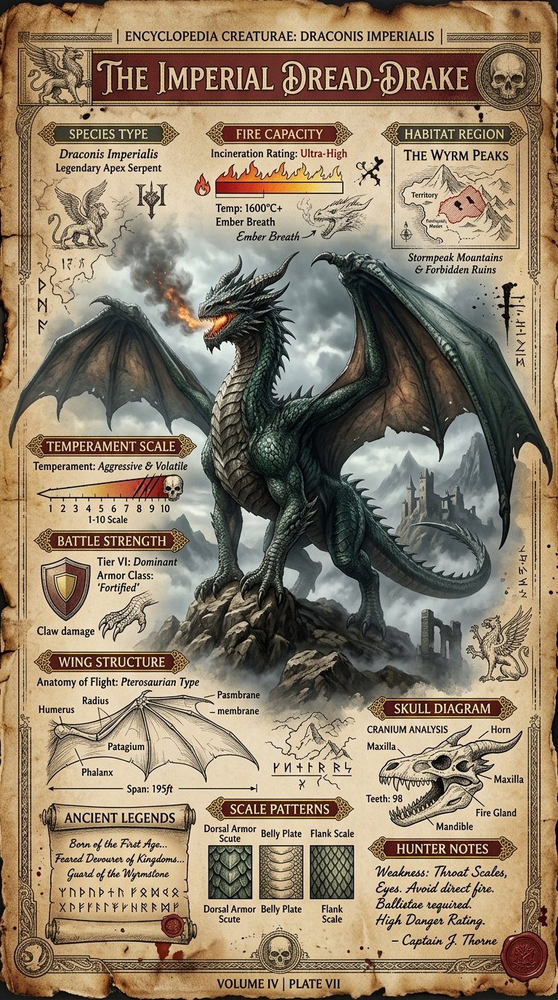

```text
Create a highly detailed A4 vertical vintage fantasy encyclopedia style dragon species poster.

Style: medieval creature atlas, ancient mythology manuscript, museum fantasy archive, old explorer journal.

Main subject:
a massive hyper realistic dragon standing proudly in center with detailed scales, smoke from nostrils, giant wings partially open.

Background:
stormy mountains, ancient ruins, fog layers, burnt parchment texture.

Color palette:
dark emerald, ash gray, faded gold, ancient brown, deep crimson.

Include infographic sections:
Species Type,
Fire Capacity,
Wing Structure,
Temperament Scale,
Habitat Region,
Battle Strength,
Ancient Legends,
Scale Patterns,
Skull Diagram,
Hunter Notes.

Add:
engraved fantasy sketches,
ancient symbols,
old map textures,
ink grain,
collectible poster layout.

NO modern UI.
NO futuristic elements.
NO flat minimalism.

Ultra detailed.
8K printable masterpiece.
```


---

## 例 401：Lost in 国家旅行海报拼贴

**来源：** [@SadiaMalik182](https://x.com/SadiaMalik182)

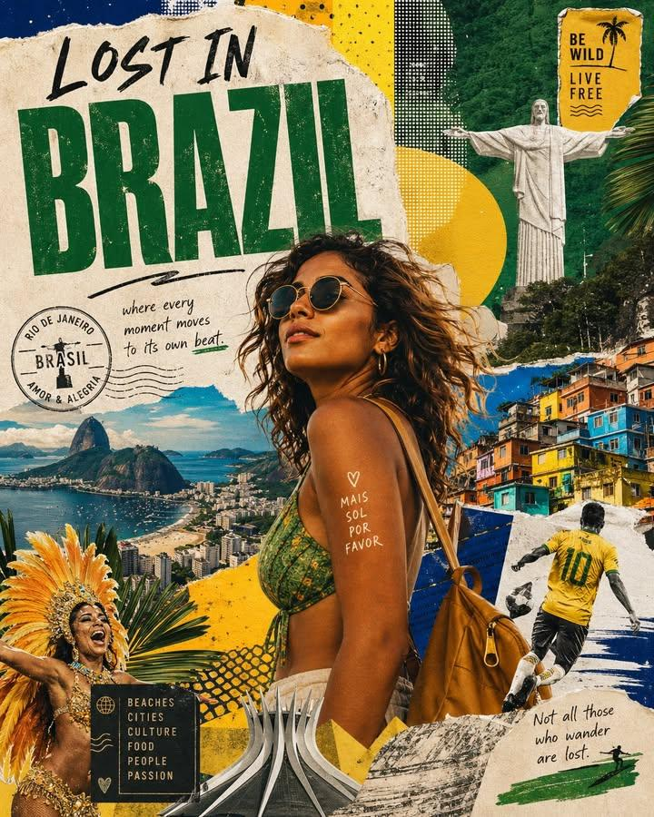

```text
Create a stylized travel poster / graphic collage for [country]. The main subject should be a stylish international tourist visiting [country], clearly presented as a traveler and not a local resident. Show the tourist wearing modern travel fashion, with details such as a camera, backpack, sunglasses, map, or suitcase, exploring the culture and atmosphere of [country]. Place the tourist in a dynamic composition surrounded by iconic architecture, streets, landscapes, landmarks, transportation, food, signage, and cultural elements associated with [country]. Blend realistic character detail with a graphic collage background made of layered paper textures, torn poster edges, sticker elements, halftone dots, editorial typography, and bold geometric shapes. Include authentic visual motifs from [country], but keep the tourist's appearance and styling globally fashionable and clearly foreign to the setting. Add a large readable headline: "LOST IN [country]". Modern, artistic, premium editorial travel poster aesthetic, balanced layout, print-worthy composition.
```


---

## 例 406：巨型游戏手柄街头 Campaign

**来源：** [@AIwithkhan](https://x.com/AIwithkhan/status/2052973449107349725)

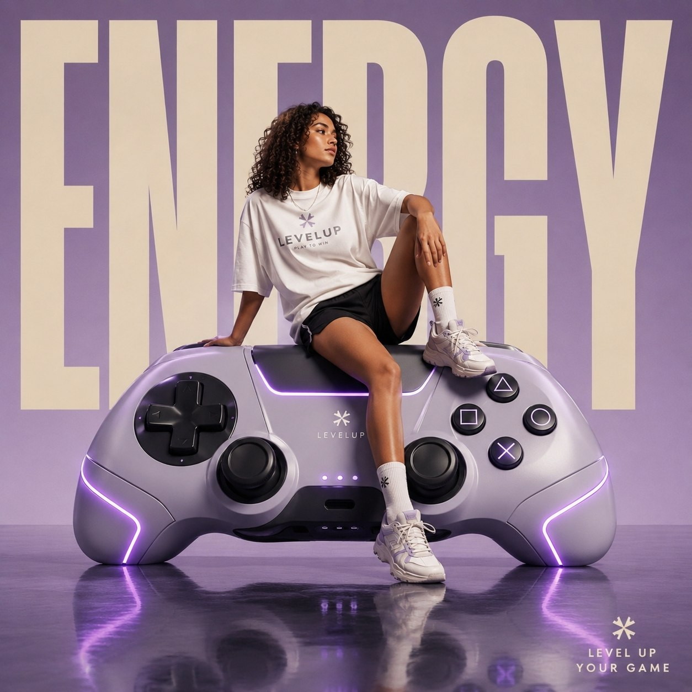

```text
Luxury futuristic streetwear campaign poster featuring a confident athletic girl sitting on a gigantic oversized retro gaming controller instead of sunglasses, clean editorial advertising aesthetic, massive bold typography in the background saying “ENERGY”, glossy reflective floor, cinematic studio lighting, pastel neon color palette with lavender, silver, and soft cyan tones.

The girl has curly shoulder-length hair, relaxed confident attitude, wearing an oversized white graphic T-shirt, loose black athletic shorts, high white socks, and modern sneakers. Casual sporty fashion styling, natural makeup, youthful Gen-Z streetwear vibe. She is casually seated on top of the giant gaming controller with one leg hanging down and one knee raised, looking away from the camera with cool effortless confidence.

The oversized gaming controller is ultra detailed with futuristic buttons, glowing accents, premium matte materials, and soft LED reflections. Minimal luxury branding on the controller side. Giant cream-colored typography fills the background vertically in a bold condensed font.

Environment: seamless studio backdrop with glossy floor reflections, high-end commercial fashion photography, ultra realistic textures, dramatic shadows, premium editorial layout, modern tech-fashion advertisement aesthetic, symmetrical composition, luxury product campaign style, 4:3 aspect ratio, hyper detailed, photorealistic.
```


---

## 例 417：复古印尼猫薄荷广告

**来源：** [@NyaiiBubu](https://x.com/NyaiiBubu/status/2053075349424992532)

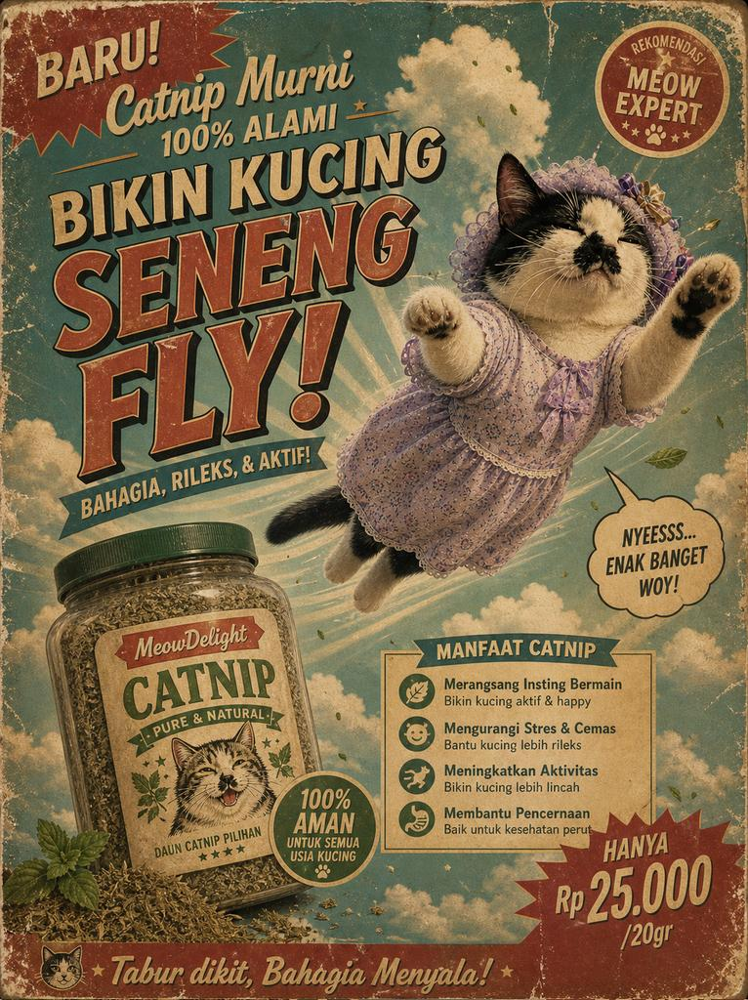

```text
Ultra realistic vintage Indonesian catnip advertisement poster, retro 1970s paper texture, distressed print, faded colors. A black-and-white tuxedo cat wearing cute vintage housewife clothes floating happily in the air after smelling catnip, euphoric expression, swirling catnip leaves, absurd Indonesian meme energy. Bold retro typography: “BIKIN KUCING SENENG FLY!” fake catnip jar product, old-school badges, price tag, nostalgic warung advertisement aesthetic, cinematic lighting, grain, scratches, authentic aged poster look.
```


---

## 例 418：中世纪城市旅行海报

**来源：** [@Goodmanprotocol](https://x.com/Goodmanprotocol/status/2053523890744545437)

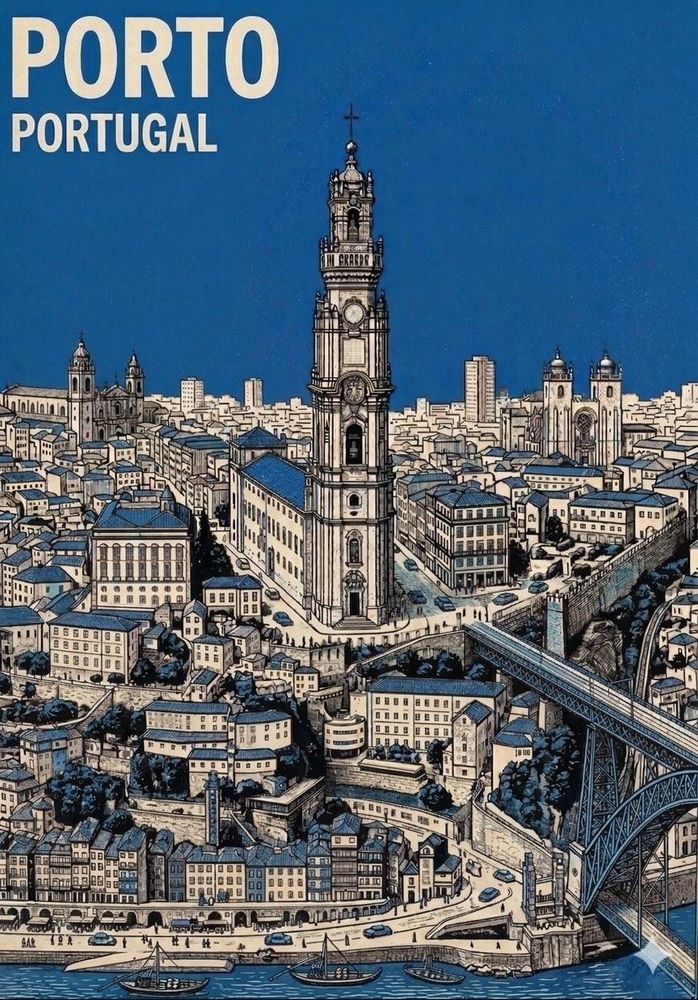

```text
Create a vertical mid-century travel poster for [CITY NAME] featuring [LANDMARK]. Use a strict 3-color palette: cream paper, black technical linework, and [COLOR].
Style: Minimalist isometric bird's-eye view with ultra-fine hatching and screen-print texture.
Color usage: Solid flat [COLOR] for the entire sky and small accents on roofs or streets. No gradients.
Text: Bold sans-serif "[CITY NAME]" at top in cream, with the local language name in smaller cream text below.
```


---

## 例 431：城市文字旅行海报

**来源：** [@iamaiistudio](https://x.com/iamaiistudio/status/2054563354899857757)

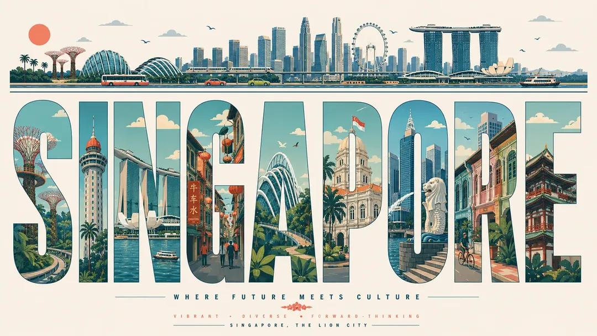

```text
Ultra-high-resolution typography travel poster themed around [CITY NAME]. 16:9 poster ratio.

IMPORTANT: every visible word on the poster must be in English, perfectly spelled, professionally typeset. No distorted letters, no random symbols, no broken text, no AI gibberish.

CORE COMPOSITION:
Place the giant English word "[CITY_NAME]" front and center. Each letter is a tall, bold, elongated sans-serif form, and each one frames a different illustrated scene from the city, like a row of gallery windows. Spread landmarks, streets, transport, nature, culture, and architecture across the letters so the scenes flow from one letter into the next as a single connected urban panorama.

TOP HORIZONTAL STRIP:
Across the top of the poster, a thin panoramic band: city skyline silhouettes, cars, trams or trains, boats where it fits, birds, clouds, sun. Keep it minimalist, elegant, rhythmically balanced.

STYLE: mid-century modern editorial poster, Swiss graphic design, minimal vector illustration, architectural infographic feel, travel typography poster, flat geometric illustration, ultra-clean composition, premium magazine design, screen-print poster vibe, retro-futuristic travel branding.

ILLUSTRATION:
Flat vector shapes only. No realism, no gradients, no noise. Clean geometric shadows, simplified architectural forms, a mix of map-like top-down with side-view cityscape. Subtle line-art details, crisp vector edges, strong negative space, harmonious rhythm between the letters.

TYPOGRAPHY:
Giant bold sans-serif, letters fill most of the canvas height. Pixel-perfect alignment. Each letter acts as its own framed illustration panel. Soft rounded corners where it suits. Editorial spacing. Print-ready and geometrically clean.

COLOR PALETTE:
Pull a cohesive palette inspired by [CITY_NAME]:
coastal city -> aqua, sand, coral, muted teal
desert city -> terracotta, beige, warm cream
cyber city -> mint, navy, steel blue
historic European city -> dusty rose, olive green, parchment
Muted pastels, soft vintage travel-poster colors, low saturation. Max 4 to 6 colors.

CONTENT:
Include iconic landmarks, famous streets and transport, local urban patterns, nearby nature, skyline silhouettes, bridges/rivers/coastline if relevant, culturally symbolic architecture, recognizable local atmosphere.

COMPOSITION:
Centered typography on a white or soft ivory background. Lots of breathing room. The top panoramic strip balances the heavy typography below. Asymmetrical but visually balanced. Each letter shows its own scene depth and perspective. Museum-quality poster hierarchy.

MOOD: premium, intellectual, calm, design-forward, travel-editorial, stylish enough for a museum gift-shop wall.

QUALITY: 8K ultra-detailed, print-ready, razor-sharp vector edges, flawless typography, zero distorted text, zero random characters, zero spelling errors, zero AI artifacts.
```


---

## 例 432：大堡礁复古旅行海报

**来源：** [@jzaib4269](https://x.com/jzaib4269/status/2055487295734620522)

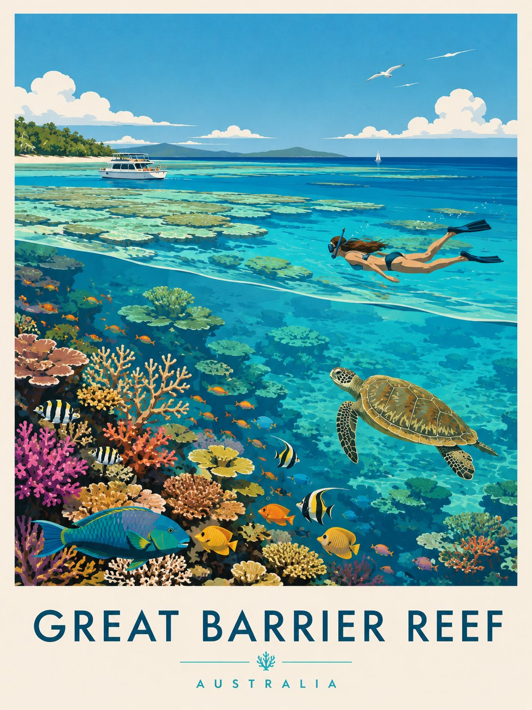

```text
Create a premium editorial travel poster illustration of the Great Barrier Reef, Australia.
Style: Flat vector illustration, ultra-clean minimalism, mid-century modern travel poster aesthetic, inspired by vintage tourism prints and Scandinavian graphic design. No photorealism, no textures, no noise, no gradients. Use crisp shapes, smooth color blocks, and harmonious vibrant tones.
Composition (vertical 3:4 layout):
Foreground (underwater): A rich coral reef ecosystem filled with colorful corals in pink, orange, yellow, and red tones. Include tropical fish of various species (striped, bright yellow, blue, and orange), and a large sea turtle swimming gracefully toward the right. Clear turquoise water with high visibility.
Midground: A female snorkeler swimming horizontally just beneath the water surface, wearing fins and a snorkel mask, observing the reef below. Light rays subtly pass through the water surface.
Background (above water): A calm tropical ocean with shallow reef patches visible through crystal-clear water. A white leisure boat floats peacefully on the left, and a small sailboat appears far in the distance. On the horizon, soft green islands or hills stretch across.
Sky: Bright blue sky with fluffy white clouds and a few birds flying, enhancing the serene vacation mood.
Typography:
At the bottom of the poster, include bold uppercase text:
“GREAT BARRIER REEF”
Below it, smaller spaced-out text:
“AUSTRALIA”
Add a small decorative coral icon between divider lines.
Mood & Lighting: Bright daylight, calm, inviting, tropical paradise atmosphere. Colors should feel fresh, vibrant, and relaxing with strong contrast between coral reef and ocean blues.
```


---

## 例 460：棋盘低角度奢华男装 Campaign

**来源：** [@harboriis](https://x.com/harboriis/status/2058414859658956888)

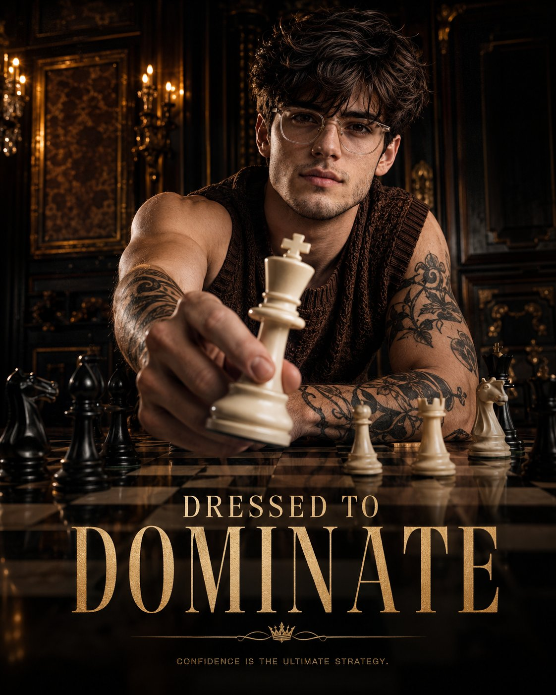

```text
Ultra-realistic luxury fashion campaign poster shot from a dramatic low-angle perspective across a glossy chessboard table. A stylish young male model with sharp facial features, textured curly hair, wearing thin luxury glasses and a fitted sleeveless knitted brown vest, leaning forward in a confident pose. One hand extended toward the camera holding a large white king chess piece in forced perspective, dominating the foreground. Tattooed arms visible, intense confident facial expression, direct eye contact. Elegant vintage royal interior background with dark paneled walls, warm chandelier wall lights, cinematic amber lighting, moody shadows, luxury editorial atmosphere. Chess pieces scattered on the board in foreground and background for depth. High contrast premium fashion advertising style, ultra-detailed skin texture, sharp focus on face and chess piece, shallow depth of field, glossy reflections on chessboard, dramatic commercial campaign photography, luxury menswear brand aesthetic. Bold typography at bottom saying “DRESSED TO DOMINATE”, premium poster layout, cinematic color grading, high-end fashion ad, editorial magazine quality, 4:5 aspect ratio.
```


---

## 例 464：高雄水彩拼贴旅行海报

**来源：** [@SimplyAnnisa](https://x.com/SimplyAnnisa/status/2058372965641662876)

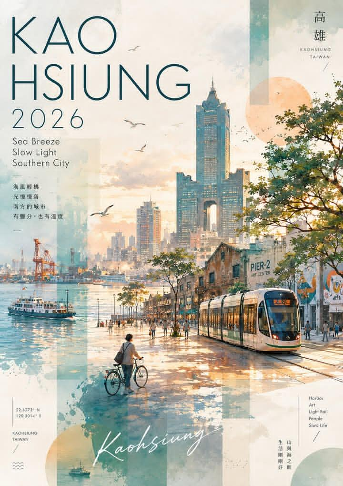

```text
Watercolor and collage travel poster for Kaohsiung, Taiwan, vertical layout, soft pastel and warm golden hour color palette.

Scene: Waterfront promenade at sunset with a modern light rail tram on the right, a person walking a bicycle on the left, and people strolling along the path. In the background: Kaohsiung skyline with the 85 Sky Tower and other skyscrapers, a harbor with a ferry boat, port cranes, and the Pier-2 Art Center building with murals. Seagulls flying in the sky, trees lining the walkway, calm water reflecting the light.

Design elements:
- Large text top left: 'KAO HSIUNG 2026', smaller text below 'Sea Breeze Slow Light Southern City'
- Top right: Vertical Chinese characters, 'KAOHSIUNG TAIWAN' in small caps below
- Bottom left: Coordinates '22.6273° N 120.3014° E', 'KAOHSIUNG TAIWAN', wave icon
- Bottom center: Handwritten script 'Kaohsiung'
- Bottom right: Vertical list 'Harbor Art Light Rail People Slow Life', vertical Chinese text
- Overlay effects: Semi-transparent geometric shapes, watercolor splashes, and texture layers in teal and beige

Style: Modern travel poster meets watercolor painting, airy and atmospheric, blend of illustration and photo-collage, warm and tranquil mood, high detail.
```


---

## 例 474：四城极简旅行海报系列

**来源：** [@Taaruk_](https://x.com/Taaruk_/status/2059188921096085888)

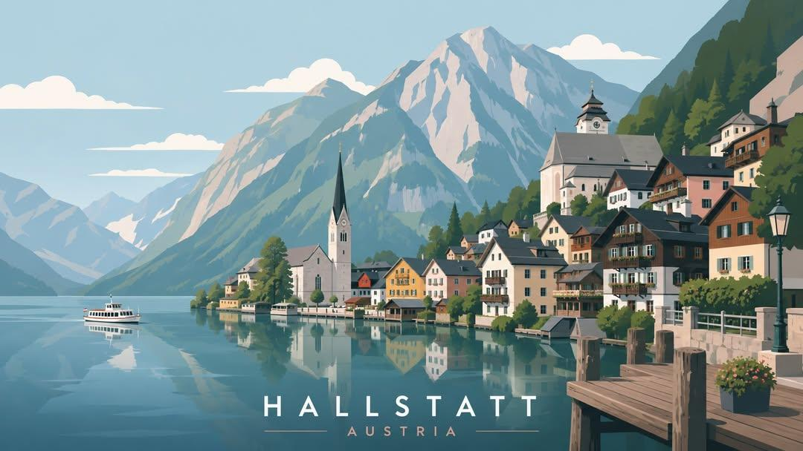

```text
Minimalist flat travel poster illustration series of iconic destinations around the world, clean vector art style, Scandinavian color palette, soft pastel tones, calm atmospheric scenery, Hallstatt Austria lakeside village with alpine mountains and reflections, Bergen Norway colorful harbor houses with fjord background, Kyoto Japan traditional riverside town with cherry blossoms and pagoda, Santorini Greece white architecture with blue domes overlooking the sea, ultra clean composition, geometric landscape shapes, smooth gradients, elegant typography with destination names, modern tourism poster aesthetic, serene travel mood, crisp vector lines, cinematic wide-angle scenery, peaceful skies with stylized clouds, highly detailed environment art, contemporary flat illustration, premium editorial travel design, balanced composition, minimal shadows, dreamy vacation atmosphere, soft morning lighting, high-end Airbnb poster vibe, Behance trending style, 4k, ultra detailed
```


---

## 例 481：韩系春日 scrapbook 海报

**来源：** [@Taaruk_](https://x.com/Taaruk_/status/2060214163591614900)

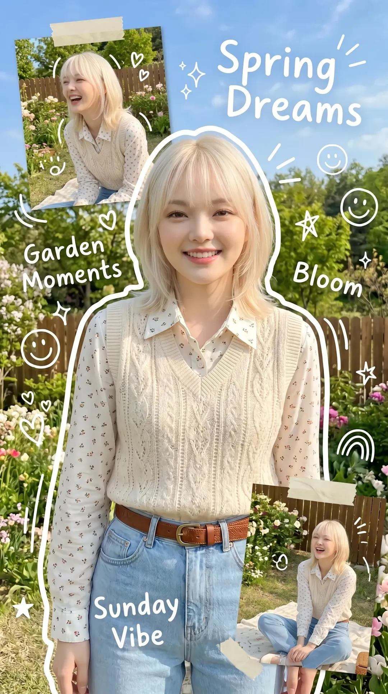

```text
Cute Korean spring aesthetic scrapbook poster, dreamy K-fashion portrait, soft blonde girl standing in a blooming flower garden, pastel blue sky background, cream floral blouse layered under a knitted ivory sweater vest, light blue high-waisted jeans, natural smile, glowing fair skin, soft makeup, cherry blossom trees, colorful spring flowers, cozy countryside garden, bright natural sunlight, kawaii doodle overlays, hand-drawn white hearts, smiley faces, stars, sparkles, rainbows, playful handwritten typography, polaroid photo frames, masking tape stickers, scrapbook collage layout, Pinterest aesthetic, Korean magazine editorial, cottagecore fashion, dreamy spring vibes, wholesome mood, soft pastel color palette, clean composition, aesthetic social media poster, ultra detailed, photorealistic, high quality, cute and charming atmosphere, subtle bokeh, lifestyle photography, Instagram reel cover, fashion moodboard, Y2K scrapbook design, white outline around subject, flower-themed decorations, 8k masterpiece
```


---

## 例 484：霓虹涂鸦黑白人像

**来源：** [@harboriis](https://x.com/harboriis/status/2060208419811074350)

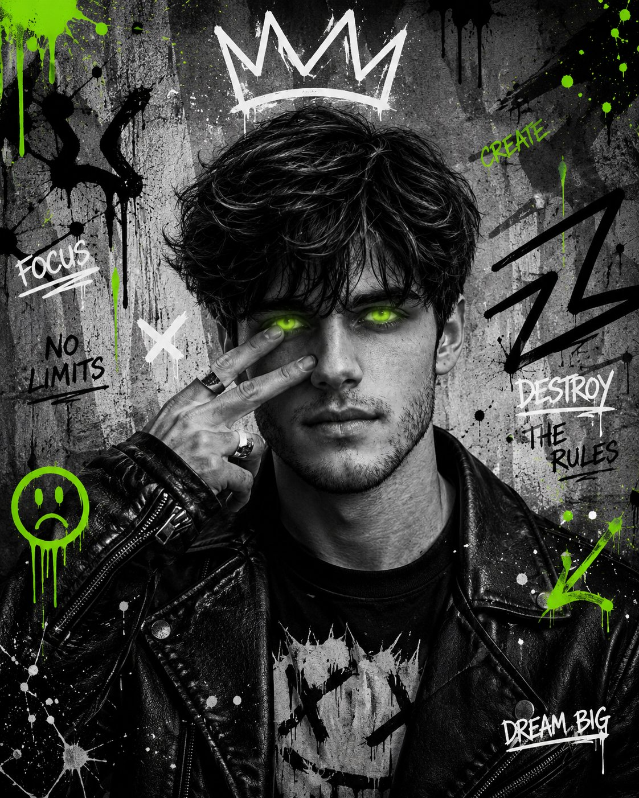

```text
High-contrast black-and-white urban portrait of a curly-haired bearded man in a black leather jacket, holding two fingers near glowing neon green eyes, with bold graffiti doodles, colorful paint splashes, abstract arrows, crown sketches, and grunge street-art textures on a concrete background, cinematic lighting, edgy graphic poster style.
```


---

## 例 486：RCB 冠军混合媒介海报

**来源：** [@AIwithkhan](https://x.com/AIwithkhan/status/2061305471492096301)

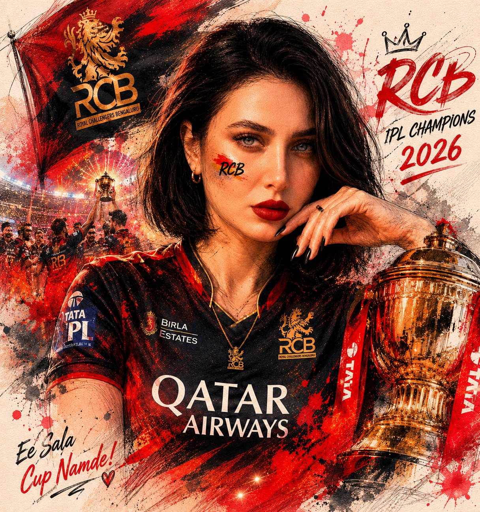

```text
Ultra-detailed mixed-media sports poster featuring the SAME woman from the reference image, wearing a Royal Challengers Bengaluru (RCB) jersey, holding the IPL trophy beside her. Dynamic fusion of realistic portrait photography, sketch art, watercolor splashes, paint strokes, ink scribbles, and digital painting effects. Explosive red, black, gold, and white color palette. Dramatic championship atmosphere with confetti, fireworks, cheering stadium crowd, RCB flags waving in the background, paint splatter textures, hand-drawn line art accents, and energetic brushwork.

The woman has a confident expression, bold red lipstick, flawless skin, short black bob haircut, cinematic lighting, ultra-sharp blue eyes, premium sports-fashion styling. RCB face paint on cheek, luxury gold jewelry accents, highly detailed jersey fabric.

Large typography on the right side reading:

RCB
IPL CHAMPIONS
2026

Handwritten slogan at bottom left:

Ee Sala Cup Namde!

Premium championship poster design, trending Behance artwork, sports magazine cover aesthetic, layered paint textures, realistic trophy reflections, high contrast, ultra-detailed, 8K, masterpiece, award-winning digital art, vibrant colors, cinematic composition, splash art, sketch effect, watercolor effect, paint explosion effect, mixed-media illustration, poster-worthy design.
```


---

## 例 497：单色水彩城市旅行海报

**来源：** [@Goodmanprotocol](https://x.com/Goodmanprotocol/status/2062564327140503787)

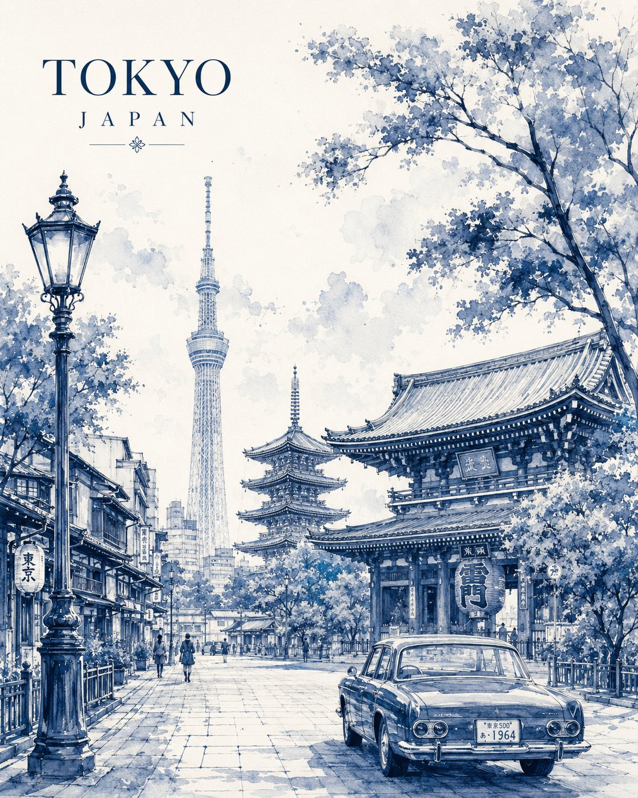

```text
Minimalist vintage watercolor travel poster illustration of [CITY NAME], [COUNTRY], rendered entirely in elegant monochromatic [COLOR] watercolor and fine ink linework.

Aspect ratio: 4:5 vertical composition optimized for poster and social media presentation.

A peaceful early-morning streetscape featuring the iconic [PRIMARY LANDMARK] and [SECONDARY LANDMARK/LOCATION] in the foreground, viewed from a slightly low pedestrian-level perspective. Historic local architecture, elegant facades, ornate details, arched windows, decorative cornices, and traditional street elements line the spacious surroundings, creating a timeless urban atmosphere. A classic [LOCAL STREET ELEMENT OR LAMP STYLE] stands prominently on the left side, while mature leafy trees frame portions of the scene, their foliage painted with soft watercolor washes and delicate splatter textures. In the distance, [DISTANT LANDMARK OR SKYLINE FEATURE] rises gracefully against the skyline, serving as a recognizable cultural landmark. A vintage [LOCAL VEHICLE] or a few small pedestrians add subtle life and scale without disturbing the tranquil mood.

The composition includes large areas of clean white negative space, soft cloudy watercolor textures in the sky, delicate paper grain, and subtle watercolor blooms. The paving, street, or plaza stretches dramatically across the foreground, leading the viewer’s eye toward the landmark ensemble. Typography in the upper-left corner reads “[CITY NAME], [COUNTRY]” in a refined serif font, styled like a sophisticated travel journal or collectible city poster.

Handcrafted watercolor illustration, architectural sketch aesthetic, serene urban atmosphere, soft natural morning lighting, muted monochromatic palette, highly detailed line art, elegant travel-poster design, minimalist luxury wall-art style, timeless local charm, premium stationery illustration, ultra-detailed, high-resolution, clean composition, Pinterest-worthy, Instagram-worthy, gallery-quality artwork.
```


---

## 例 503：霓虹设计师 3D 海报

**来源：** [@AiwithLariab](https://x.com/AiwithLariab/status/2063240283786187251)

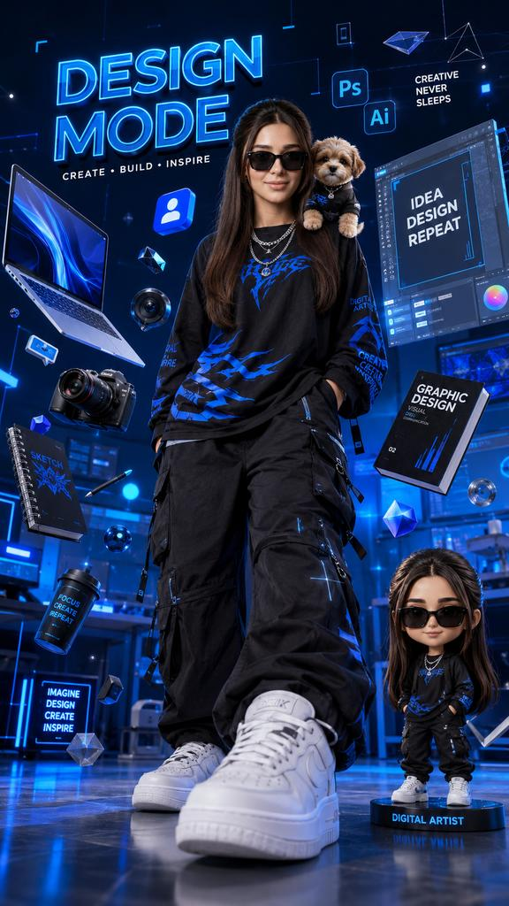

```text
Create an ultra-detailed 3D stylized creative designer poster featuring a cool young digital artist standing confidently in the center of a futuristic blue neon studio. The character wears oversized black streetwear with electric-blue graphic accents, black cargo pants, layered silver chains, black sunglasses, and clean white sneakers. A cute fluffy puppy sits on the artist's shoulder. The camera angle is dramatic low-angle perspective, making the sneakers appear larger for a premium poster effect.

Surround the character with floating creative elements including a glowing laptop, professional camera, design books, notebooks, 3D icons, social media symbols, holographic UI panels, graphic design tools, and futuristic blue geometric shapes. Add motivational typography such as "DESIGN MODE", "CREATE • BUILD • INSPIRE", and "CREATIVE NEVER SLEEPS" integrated into the scene.

Include a collectible chibi mini-figure version of the character standing beside the main subject on a display base. Use cinematic blue lighting, glossy reflections, volumetric glow, depth of field, floating particles, luxury toy-photography aesthetics, high-end 3D rendering, Octane Render quality, ultra-sharp details, vibrant neon blue color palette, futuristic creator workspace atmosphere, premium commercial poster design, trending ArtStation style, masterpiece quality, 8K resolution, vertical 9:16 composition.
```


---

## 例 506：可爱发卡图文人像海报

**来源：** [@xiaoxiaodong01](https://x.com/xiaoxiaodong01/status/2062924832917029248)

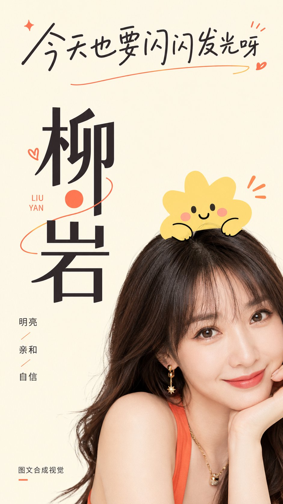

```text
围绕具体主题内容生成一张明亮清爽的图文合成视觉：画面以大面积高明度纯净色场承托主体，背景平整、通风、没有复杂景深，视觉重心由下方被大胆裁切的人像或真实主体建立，只露出最有记忆点的局部，使主体像从画面边缘进入。主体上方叠放一个极简图形符号或拟物角色，它要像轻轻坐在主体头顶或贴合轮廓生长出来，形体圆润、边缘干净、表情或结构由少量粗线完成，兼具标识感和亲近感。文字是画面的主动角色：顶部使用大号手写感标题，字距松、笔画柔软，像一句轻声招呼；中心用更强的竖向或轴向标题建立层级；边缘安放少量小字号信息，保持安静但精确，让空白继续占主导。色彩从主题自身的材质、情绪、地域或品牌语义中提取，映射为明亮底色、洁净主体亮面、清晰深色结构线与少量强调信息色，保留大面积轻快底场、小面积高对比文字线条、自然主体暗部的关系；整体保持高明度、清透、干净、饱和度清晰而不过度刺激，暗色只用于结构和阅读，不制造脏灰、烟雾或陈旧质感。摄影局部与扁平图形之间要形成真实与童趣的反差，边缘叠压准确，阴影极少，完成感像城市公共宣传与角色插画结合的轻松视觉系统。

主题：柳岩

比例9:16
```


---

## 例 511：城市名地标排版旅行海报

**来源：** [@Goodmanprotocol](https://x.com/Goodmanprotocol/status/2071819124708438092)

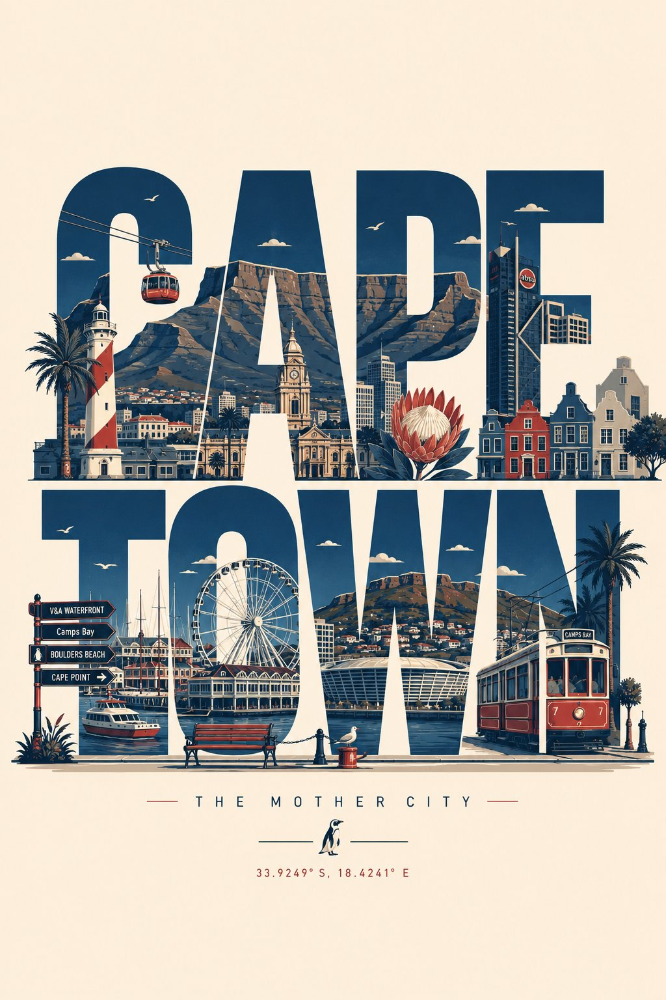

```text
Create a clean, modern typographic travel poster where the city name itself becomes the composition. Render the city name in large, bold, uppercase sans-serif letters spanning the width of the artwork. Seamlessly integrate the city's most iconic landmarks, architecture, monuments, streets, transportation, cultural symbols, cafés, bridges, parks, skylines, sculptures, waterfronts, historic buildings, and local details into, around, and inside the letters. Let landmarks naturally interact with the typography while preserving legibility.
Use an elegant flat vector illustration style with crisp geometric shapes, minimal detail, clean outlines, subtle shadows, and a premium editorial aesthetic. Maintain a limited color palette of deep navy, warm cream, muted red, and soft gray-blue for a timeless travel-poster look.
Add small decorative elements such as street lamps, trees, clouds, birds, benches, bicycles, fountains, trams, ferries, or other city-specific objects where appropriate. Keep generous negative space with a clean background and perfectly balanced composition.
Ensure every landmark, architectural style, vehicle, sign, and cultural element is accurate to the chosen city—avoid generic or incorrect landmarks. If desired, include a small elegant tagline beneath the city name (such as a famous nickname or slogan) in minimal typography.
Style: premium flat vector, minimalist travel poster, geometric illustration, editorial design, tourism branding, clean typography, high contrast, ultra-sharp lines, museum-quality print, modern graphic design, centered composition, scalable SVG aesthetic, 8K resolution.
```


---

## 例 515：Guadalajara 复古电影旅行海报

**来源：** [@MiMundoConIA](https://x.com/MiMundoConIA/status/2077046470335938826)

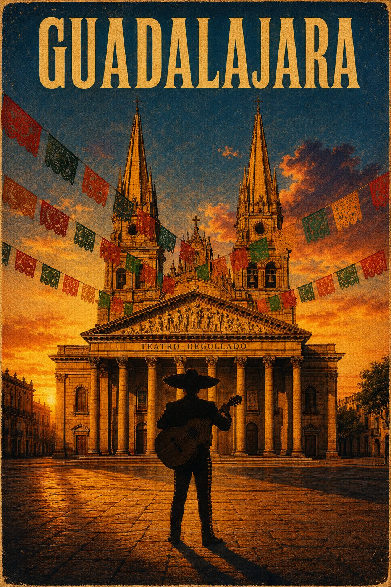

```text
@Crea una imagen {
  "style": "Cinematic Vintage Movie Poster — Guadalajara, Mexico",
  "target_tool": "DALL-E 3 (ChatGPT)",
  "prompt": "Generate a vertical portrait-format movie poster image, taller than wide in a 2:3 aspect ratio. The image is a cinematic vintage travel movie poster for Guadalajara, Mexico, rendered with the visual texture of an aged large-format film poster: heavy 35mm film grain throughout especially in the shadow areas, slightly faded and warm-shifted color tones as if printed on aged matte paper stock, a subtle halftone dot pattern visible in the midtones, and a very slight ink bleed at high-contrast edges giving it an authentic vintage printed poster feel. Foreground: a single dark silhouette of a lone mariachi musician standing still at the center-bottom of the frame, rendered as a pure clean dark silhouette with no facial features visible — traditional wide-brim charro sombrero, fitted traje de charro suit outline, holding a guitarrón — casting a long warm shadow across the honey-colored cantera stone paving of Plaza de la Liberación below, with colorful papel picado banners in red, orange, green and yellow cut tissue paper strung in loose diagonal lines overhead from building to building, swaying slightly, framing the upper composition, no people other than the single silhouetted figure, no vehicles, no modern objects. Midground: the grand honey-amber cantera stone neoclassical facade of the Teatro Degollado rising directly behind the silhouette, its ornate columned portico and triangular pediment warmly lit by the low golden-hour sun hitting from the left, long dramatic shadows stretching across the stone paving, the warm amber volcanic stone glowing intensely in the golden light. Background: the twin neo-Gothic spires of the Catedral Metropolitana de Guadalajara rising tall into the upper frame against a vast deep cerulean blue sky transitioning to burnt amber and deep orange near the horizon, a single scattered cloud catching violet and gold light from below, the cathedral facade in warm honey stone matching the Teatro Degollado's palette. Color grade: saturated warm amber and golden honey tones dominating the stone architecture, deep cobalt blue in the upper sky, rich burnt orange near the horizon, faded warm sepia in the shadow areas consistent with a vintage printed poster. At the very top of the image, centered above the spires, render the single word GUADALAJARA in bold condensed uppercase display serif letters in warm cream-gold with a faint dark drop shadow, leaving clear sky negative space for the title. No modern buildings, no cars, no utility wires, no people other than the single dark silhouette visible anywhere in the scene.",
  "target": "🎯 Target: DALL-E 3 (ChatGPT) — 💡 Foreground/midground/background separation places Teatro Degollado and the Cathedral in distinct spatial layers, the mariachi silhouette is specified as a featureless outline to eliminate aberration risk, and vintage print texture is described visually rather than as a style label."
}
```


---

## 例 521：青花敦煌刺绣四拼风格海报

**来源：** [@zhidawang219555](https://x.com/zhidawang219555/status/2090310144190218272)

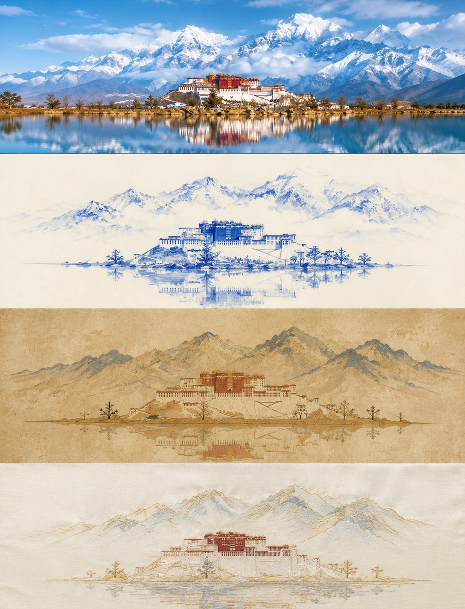

```text
请将我上传的照片制作成一张竖版拼图海报，整体采用 3:4 竖版构图。画面从上到下严格四等分为四个横向区域，每个区域的高度必须精确控制为整体画面高度的25%（四层比例严格为1:1:1:1，不允许出现比例偏差），区域之间无缝衔接，不设分隔线、不留间隙，顺序为：原图→风格1→风格2→风格3。由于每层为约3:1的极扁宽幅比例，各层主体建议横向居中排布，强调左右开阔留白与呼吸感，避免元素纵向拉伸变形或贴边拥挤。四层在人物站位、场景结构、视线方向上保持连贯呼应，呈现同一画面、四种转译的整体感。风格层（第二至四层）须遵循极简原则：每层视觉元素数量压缩至最低限度，只保留1个最核心的主体符号，其余次要装饰、背景细节与陪衬元素一律省略，画面留白占比不低于60%。

第一层保留原始照片的主体结构、人物真实互动关系与姿态、真实质感、自然光影与原有色彩氛围，仅进行轻微高级摄影调色，呈现杂志摄影质感，不改变人物关系与构图逻辑，并可在不改变人物关系与构图逻辑的前提下自然扩展天空、地面或环境背景，使整体更具空间感与叙事感。

第二层为青花瓷绘风格：借鉴青花瓷绘画技法，以钴蓝色线条与晕染在米白底上表现人物与场景，呈现瓷器纹样的疏朗雅致感。色彩以钴蓝与米白为主的单色系。避免蓝色浓淡层次过多显杂，避免图案化装饰堆砌。

第三层为敦煌壁画风格：借鉴敦煌壁画矿物重彩质感，表现古朴斑驳的美感，需简化线条与色块。背景为土黄或赭石底色，带斑驳壁画肌理感。色彩以赭石、石青、朱砂、土黄为主。避免裂纹肌理过多堆砌，避免复杂纹样装饰。

第四层为刺绣锦缎风格：以刺绣针脚肌理表现人物与场景轮廓，呈现丝缎光泽与针线纹理感，图案需极简概括。背景为米白或浅灰缎面底色。色彩以2至3种柔和色搭配金线点缀。避免针脚过密显繁琐，避免金线过多显浮夸。

每一层需将主体与场景统一转换为对应风格，整体表达极度克制与简化，只保留最核心的一个主体符号及其基本轮廓关系，删除一切非必要的背景元素、装饰细节与陪衬物；人物之间的关键位置关系、互动方向与姿态特征需保留，但应抽象为可识别的轮廓关系，做到“元素越少、关系越清晰”。色彩均从原图中提取归纳，每层严格控制在2-4种主色以内。四个区域的高度比例须严格保持1:1:1:1（各占25%），不可出现拼接错位或比例偏差。整体避免朋克/赛博朋克风格、写实照片质感强行叠加、卡通风格、3D渲染感、商业海报感、复杂背景堆砌、元素过多或画面拥挤、相邻两层风格雷同，以及任何文字、Logo、水印或标题。
```


---

## 例 526：体积激光黑场海报

**来源：** [@zhidawang219555](https://x.com/zhidawang219555/status/2090246237094310178)

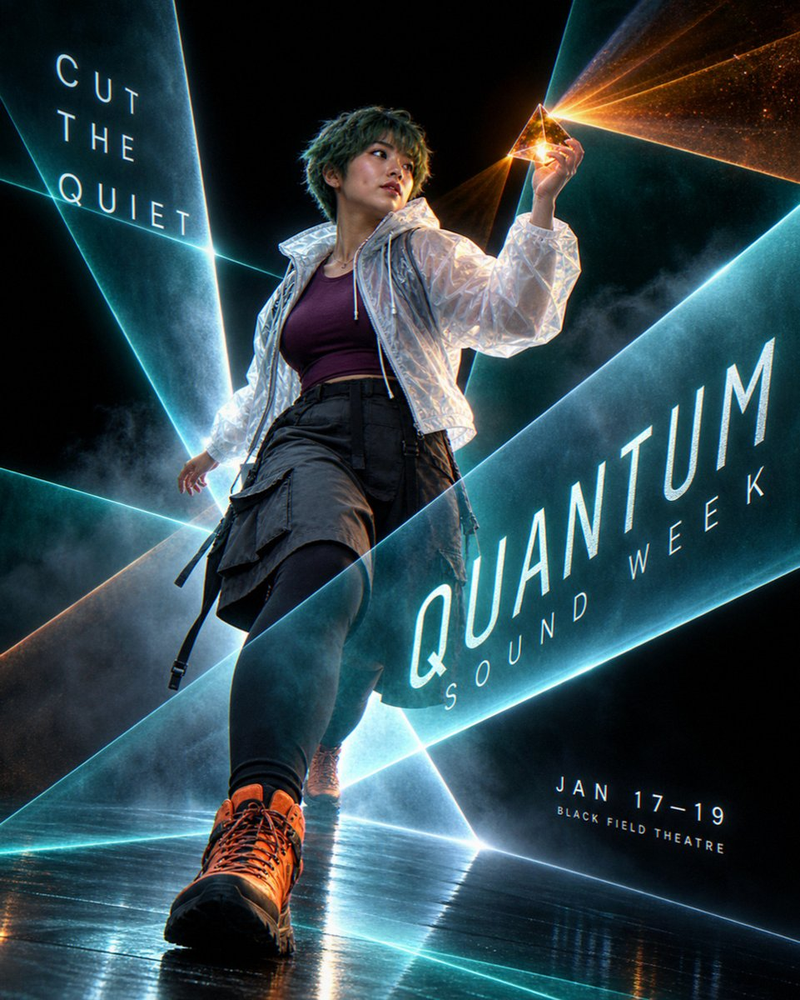

```text
从全黑剧场开始，像切标本一样用六片真实体积激光把空间分层。光面必须有明确起点、透视和薄雾中的厚度，人物站在交汇点，透明道具折射出一小束异色光扇。构图沿左下至右上的对角线推进，脸只用一道克制边光揭示；标题与其中一片光面共享透视，小字留在纯黑负空间。每次替换主题与角色时，不得退化成夜店模板、HUD、霓虹城市或无物理来源的光线。
```


---

## 例 527：Rio 旅行票据纸雕立体海报

**来源：** [@john_my07](https://x.com/john_my07/status/2091408386466214031)

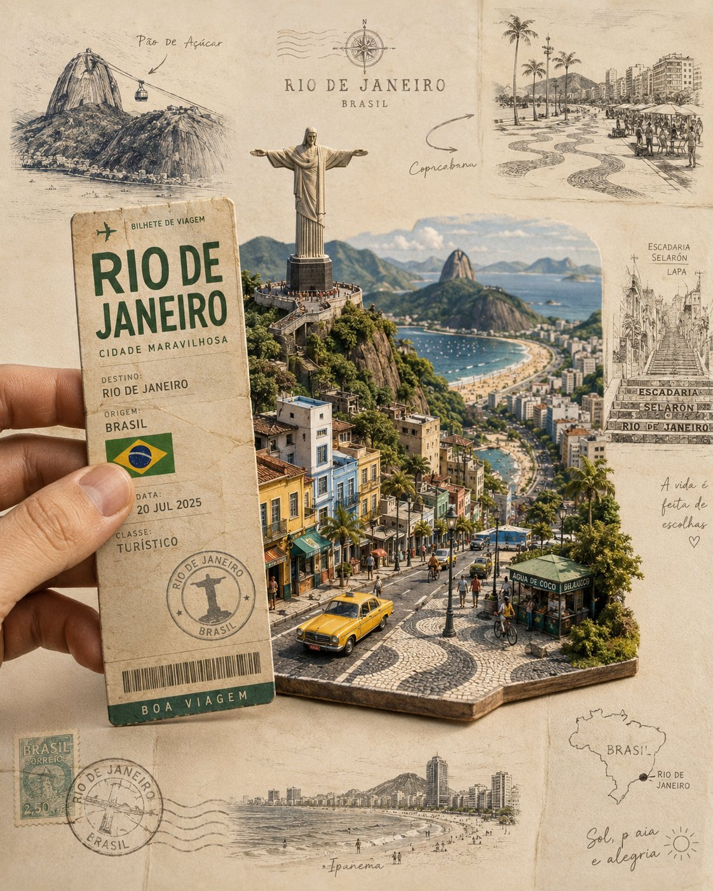

```text
Create a highly detailed, photorealistic miniature travel-poster diorama inspired by Rio de Janeiro, arranged as a handcrafted 3D paper scene on a warm ivory, slightly textured background.

In the foreground, a realistic human hand holds a vintage Brazilian travel ticket or Rio-themed transit card vertically on the left side. Give the card aged paper texture, subtle printing imperfections, elegant typography, and authentic-looking travel details. From behind the card, a miniature Rio de Janeiro landscape physically rises outward like an intricate pop-up diorama.

Make Christ the Redeemer the dominant central landmark, positioned high above a miniature cityscape with lush green mountains surrounding it. Below, build a tiny realistic Rio street featuring a classic yellow taxi, colorful buildings, palm trees, pedestrians, cyclists, street lamps, tiled sidewalks, and small Brazilian urban details. Add Copacabana beach elements in the distance with tiny umbrellas, beachgoers, and a glimpse of the Atlantic Ocean. Layer the architecture and terrain so everything appears physically constructed from paper, wood, plaster, and miniature materials, with convincing depth, cast shadows, overlapping surfaces, and a slight three-quarter perspective.

Around the main 3D scene, incorporate delicate black, charcoal, and muted sepia hand-drawn travel illustrations on the cream paper. Include a small Sugarloaf Mountain sketch in the upper left, an artistic Copacabana promenade illustration in the upper right, a detailed Selarón Steps sketch along the right side, and a small Ipanema beachfront skyline drawing near the bottom. Add subtle handwritten travel notes, tiny map markings, architectural outlines, compass symbols, postage-stamp details, and understated Brazilian travel annotations.

Keep the composition refined rather than crowded. Blend realistic miniature photography with vintage travel-journal design, tactile paper fibers, faint ink bleed, imperfect hand-drawn lines, warm natural studio lighting, gentle shadows, subtle film grain, and a sophisticated cream, charcoal, muted green, ocean blue, and Brazilian yellow palette.

The final image should feel like a premium collectible Rio de Janeiro travel postcard transformed into a physical miniature world, with the central diorama sharply detailed and the surrounding illustrations slightly softer. Highly realistic human hand and fingers, believable miniature materials, cinematic product photography, editorial travel-magazine aesthetic, shallow depth of field, ultra-fine textures, photorealistic 3D details, vertical 4:5 composition, 8K quality.
```


---

## 例 531：水晶框国家旅行广告海报

**来源：** [@Taaruk_](https://x.com/Taaruk_/status/2091391283063361558)

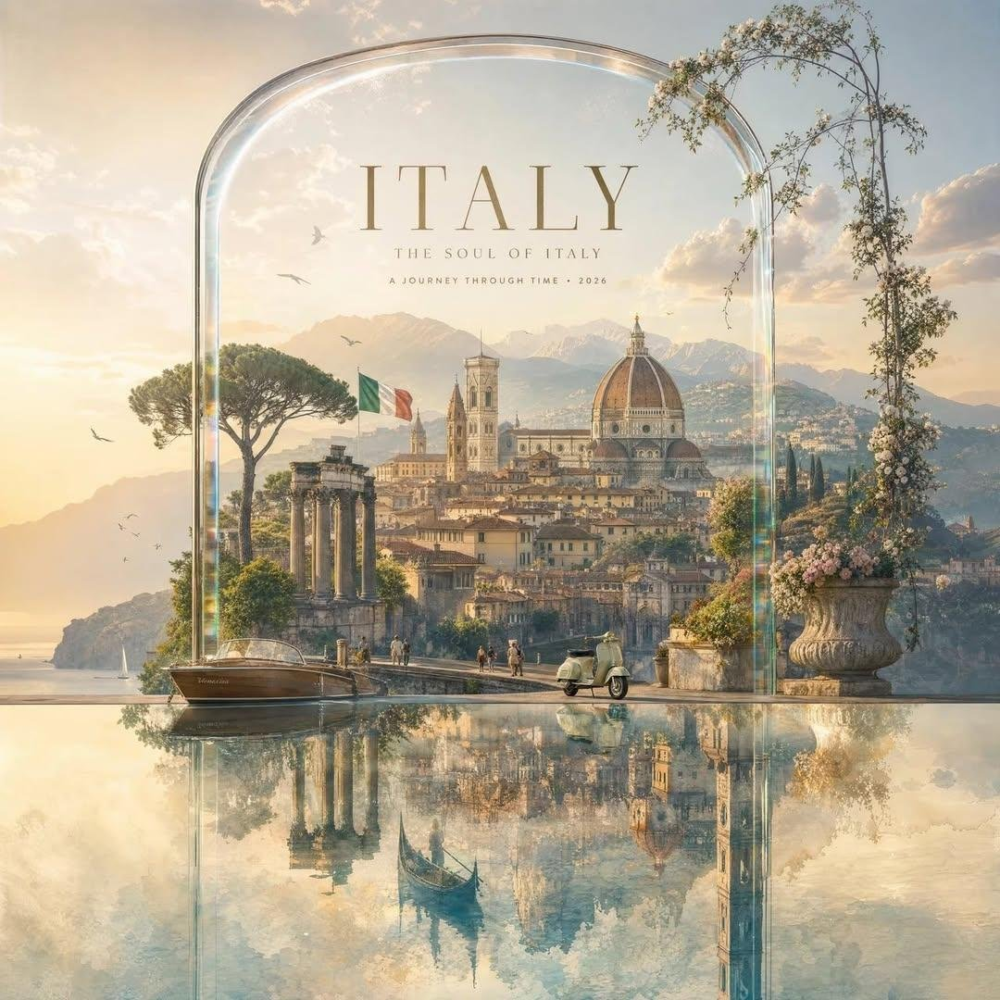

```text
Create a luxurious, dreamy country travel-art collection in the exact visual language of an elegant premium tourism campaign: a large transparent crystal/glass architectural frame or arched glass display standing on a glossy reflective surface, containing a highly detailed cinematic illustration of the destination. For [COUNTRY], feature its most iconic landmarks, historic architecture, distinctive landscapes, local transportation, cultural elements, national flag, flowers and recognizable scenery arranged as one seamless poetic panorama. Use warm golden-hour sunlight, soft atmospheric haze, pastel cream, champagne, muted blue and sage tones, delicate clouds, subtle birds, realistic glass refraction and rainbow prism highlights along the edges. Create a perfect mirror reflection beneath the glass structure, extending the entire composition downward with beautifully softened reflections. Add elegant editorial typography at the top reading “[COUNTRY]”, with smaller refined text “THE SOUL OF [COUNTRY]” and “A JOURNEY THROUGH TIME • 2026” beneath it. Sophisticated luxury travel magazine aesthetic, photorealistic yet painterly, cinematic depth, fine-art composition, extremely detailed architecture, serene atmosphere, premium advertising photography, symmetrical balanced framing, soft film grain, 8K, vertical 4:5, no clutter, no modern UI elements, no extra text.
```


---

## 例 534：红光干扰实验编辑人像海报

**来源：** [@Goodmanprotocol](https://x.com/Goodmanprotocol/status/2092471662126211143)

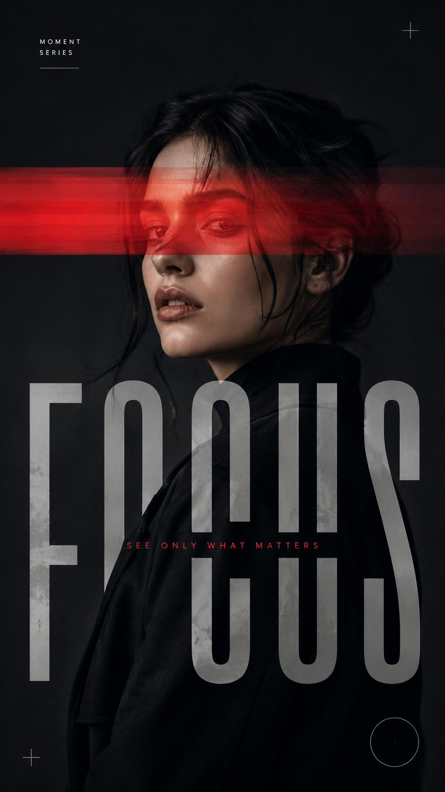

```text
Create a medium-sized 9:16 experimental editorial portrait poster using the following customizable inputs:

Subject: [Adult Male or Female Portrait]
Interference: [Color Split / Narrow Light Beam / Horizontal Cut / Motion Veil]
Title: [Title]
Palette: [Main Neutral Tones + One Accent Color]
Mood: [Sharp / Cinematic / Restrained / Experimental]

Create a striking close-up or waist-up portrait with the subject occupying a strong portion of the frame. Preserve realistic facial features, natural skin texture, authentic hair, realistic proportions, clear emotion, and a strong silhouette. The portrait must work visually as a fashion photograph before the graphic intervention is applied.

Use only one primary interference method:

Color Split: Uneven translucent bands selectively shift, reveal, separate, or distort portions of the portrait.

Narrow Light Beam: A single controlled beam cuts across the face or body and continues naturally into the surrounding space.

Horizontal Cut: Bold horizontal bands interrupt selected areas of the portrait and interact with oversized typography.

Motion Veil: Keep the main portrait sharp while selected areas create subtle horizontal photographic motion trails.

Make typography an integral part of the composition. Use one dominant headline, allowing letters to crop beyond the frame, overlap the subject, disappear behind the body, or interact with the interference.

Keep supporting text minimal: one small series label and one short phrase.

Use mostly black, white, grey, charcoal, or deep neutral tones, plus one accent color. Keep skin tones natural and avoid excessive warmth or yellow grading.

Add only a few subtle graphic details such as fine lines, circles, or open corner marks when necessary.

The final composition should feel like a premium fashion editorial, contemporary photography poster, or experimental art-direction piece—clean, intentional, sophisticated, and visually balanced.

Avoid multiple competing effects, dense text, UI elements, heavy glitches, random collage, excessive decoration, numbering, “Vol.” or “Issue” labels, sparkle symbols, logos, watermarks, distorted anatomy, plastic skin, oversaturation, and generic template aesthetics.

Keep the overall treatment medium in scale, refined, adaptable, and universally applicable to different people, titles, themes, palettes, and editorial concepts.
```


---

## 例 538：橡皮章旅行田野笔记海报

**来源：** [@MahnoorAi12](https://x.com/MahnoorAi12/status/2092221482139349307)

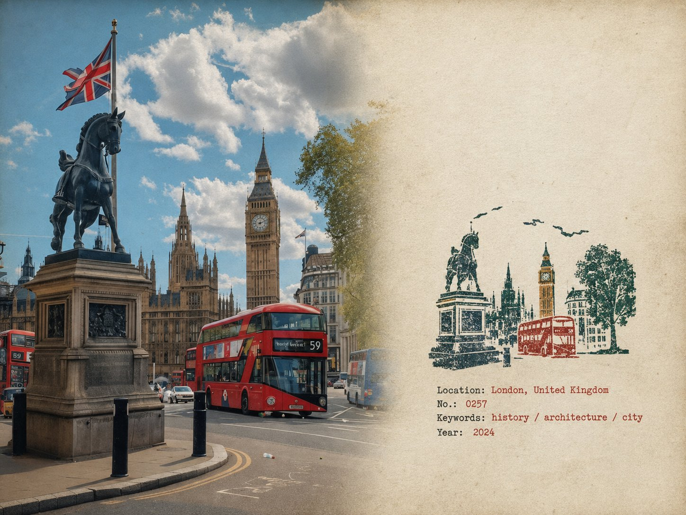

```text
Rubber Stamp Travel Field Notes Poster — Natural Realism Version

Create a separate “Rubber Stamp Travel Field Notes Poster” for each photo I upload. Output each photo individually. Never create a collage or combine multiple photos.

Use a 4:3 landscape composition with a natural visual transition between the original photograph on the left and the aged-paper field-note area on the right. Do not add an obvious dividing line.

LEFT — ORIGINAL PHOTOGRAPH

The left side should occupy roughly 58% of the frame.

Keep the uploaded photograph visually authentic and recognizable. Preserve the original subject, perspective, terrain, architecture, plants, people, spatial relationships, natural light, shadows, textures, and overall atmosphere.

Do not redesign or reinterpret the photograph.

Only apply a very subtle editorial photo treatment: gentle tonal balancing, restrained color grading, slightly softened highlights, and extremely fine natural film grain. It should still look like a real photograph taken on location rather than an AI-generated image.

Natural cropping is allowed if needed to fit the 4:3 layout, but do not stretch, distort, move, replace, or redraw the main subject.

Avoid excessive sharpness, HDR effects, artificial clarity, cinematic color grading, or overly perfect details.

RIGHT — AGED PAPER FIELD NOTES

The right side should occupy roughly 42% of the frame.

Use warm off-white, slightly aged paper with a believable physical texture. Include very subtle paper fibers, fine grain, faint handling marks, and a matte surface.

Keep large areas completely unprinted.

The paper should feel like a real sheet from an architect's travel notebook or field journal, not a designed poster background.

Avoid overly strong stains, decorative textures, vintage filters, or artificial grunge.

SMALL RUBBER STAMP

Study the uploaded photograph and identify only the few visual features that make the location immediately recognizable.

Reduce them into a compact, imperfect multi-color rubber stamp impression.

Do not reproduce the photograph element by element.

Simplify aggressively and retain only the most meaningful visual relationships:

- distinctive architecture and silhouette
- important roof, tower, dome, arch, or structural shape
- mountain or terrain contours
- shoreline or road direction
- a few recognizable trees or vegetation forms
- simplified settlement layers
- one or two important foreground shapes when visually relevant

Remove crowds, cars, dense windows, repetitive buildings, tiny vegetation, decorative objects, and insignificant background details.

The result should look like something a traveler could have actually carved into a small rubber stamp, not a miniature illustration of the entire photograph.

Place the stamp in the lower-middle portion of the right paper area, occupying approximately 30–38% of the right section's height.

Keep generous blank paper around it.

Do not enlarge it into a large illustration.

STAMP COLOR & PRINT CHARACTER

Extract approximately 2–4 muted spot colors naturally from the original photograph.

Possible colors include:

- carbon black
- deep green
- brick or muted red
- ochre
- slate blue
- taupe or earthy brown

Do not force these colors if the photograph suggests a different restrained palette.

Each color should appear as a separate physical ink layer.

Make the print feel genuinely handmade:

- slightly uneven pressure
- tiny gaps in the ink
- dry areas
- paper showing through
- rough carved edges
- irregular line thickness
- small contour breaks
- granular ink texture
- faint ghosting
- slight natural color-layer misregistration
- subtle edge variation

The imperfections should be small and believable, as if the stamp was pressed onto paper by hand.

Avoid perfectly aligned digital layers, smooth vector edges, clean gradients, or artificially exaggerated distress.

The stamp should look physically printed, not digitally illustrated.

FIELD-NOTE TYPOGRAPHY

Generate a small amount of text based only on the actual location and imagery in the photograph:

Location — English name
No. — Number
Three short English keywords
Gregorian calendar year

Place the text below or beside the stamp within the available whitespace.

Use a small, understated typewriter or archival field-note style.

The typography should have very slight mechanical irregularity, as though typed or printed on an old field notebook.

Keep it quiet and secondary to the photograph.

Spell the location and all words correctly.

Do not add slogans, brands, tourist phrases, decorative quotes, or unnecessary text.

OVERALL REALISM

The finished image should feel like a real travel photograph mounted beside a small handmade field stamp on an architect's personal notebook page.

Prioritize subtle physical realism over visual perfection.

The photograph should remain the strongest visual element.

The stamp should feel like a small fragment of memory extracted from the photograph rather than a second illustration.

Use restrained contrast, natural imperfections, believable paper texture, and slightly imperfect printing.

The final result should feel quiet, tactile, documentary, collectible, and genuinely handmade.

Avoid

Obvious dividing lines, circular seals, postage-stamp borders, perforations, wax seals, sticker layouts, souvenir-card designs, generic travel templates, smooth vector logos, polished digital illustrations, cartoon styling, 3D rendering, plastic textures, glossy gradients, excessive saturation, HDR effects, excessive text, decorative clutter, overly clean geometry, perfectly aligned ink layers, dense miniature architecture, or any alteration/redrawing of the original photograph.
```


---

## 例 539：粗粝手绘搭档肖像海报

**来源：** [@kingofdairyque](https://x.com/kingofdairyque/status/2093279729717780736)

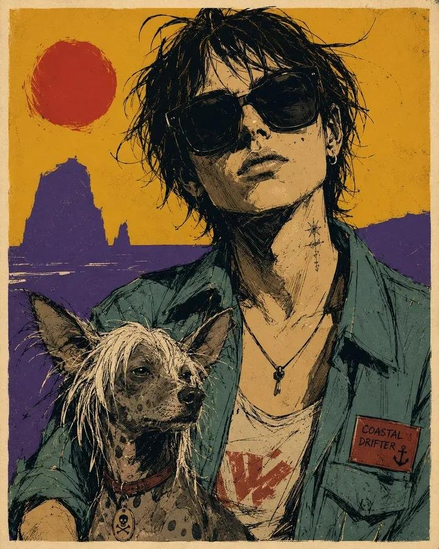

```text
Raw sketchy graphic portrait poster of [HUMAN] wearing [CLOTHING], half-body and large in frame, accompanied closely by [ANIMAL], with a minimal [SCENERY] background. Render in a rough expressive illustrated style with broken black ink contours, loose sketch lines, scratchy hatching, irregular stroke weight, imperfect line edges, fast gestural mark-making, simplified anatomy, flat cel-like shadow blocks, and reduced detail. Use a restrained [COLORS] palette with one dominant warm field, one cool counter-field, dark inked shadows, and a few pale highlight accents. Keep the face oversized and central, crop around mid-torso, and place the animal in the lower foreground or tucked beside the subject, drawn with the same simplified raw linework. Reduce the scenery into only 2 or 3 bold silhouette shapes behind the subject, with no detailed environment rendering. Add a narrow warm off-white poster border and very light print texture. Strong attitude, graphic poster energy, intentionally imperfect strokes, raw and sketchy finish, ar 4:5
```


---

## 例 542：黑白排版侧脸肖像海报

**来源：** [@HustleXR](https://x.com/HustleXR/status/2093206386012230000)

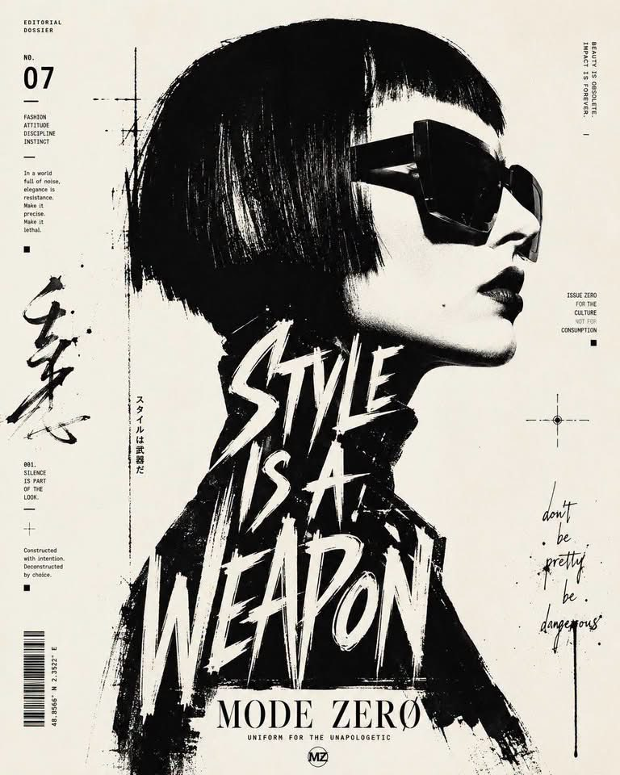

```text
High-contrast black and white typographic portrait poster of [HUMAN], shown in side profile with [FEATURE]. Build the portrait with bold black silhouette blocks, sharp negative space, rough ink edges, fragmented stencil shapes, tiny editorial microtext, vertical typographic accents and expressive hand-drawn calligraphic marks. Integrate one large readable text block saying “[TEXT]” in 2 to 4 stacked lines, placed only inside the neck and body area, using oversized scribbled lettering that feels fused into the silhouette. Include a graphic design logo reading “[LOGO]” near the footer. Minimal off-white paper background, asymmetrical layout, cropped vertical composition, experimental editorial poster design, raw ink print texture, aspect ratio 4:5.
```


---

## 例 543：BMW Performance Social Poster

**来源：** [@harboriis](https://x.com/harboriis/status/2048063332624843046) / [awesome-gpt-image-2-prompts](https://github.com/EvoLinkAI/awesome-gpt-image-2-prompts)

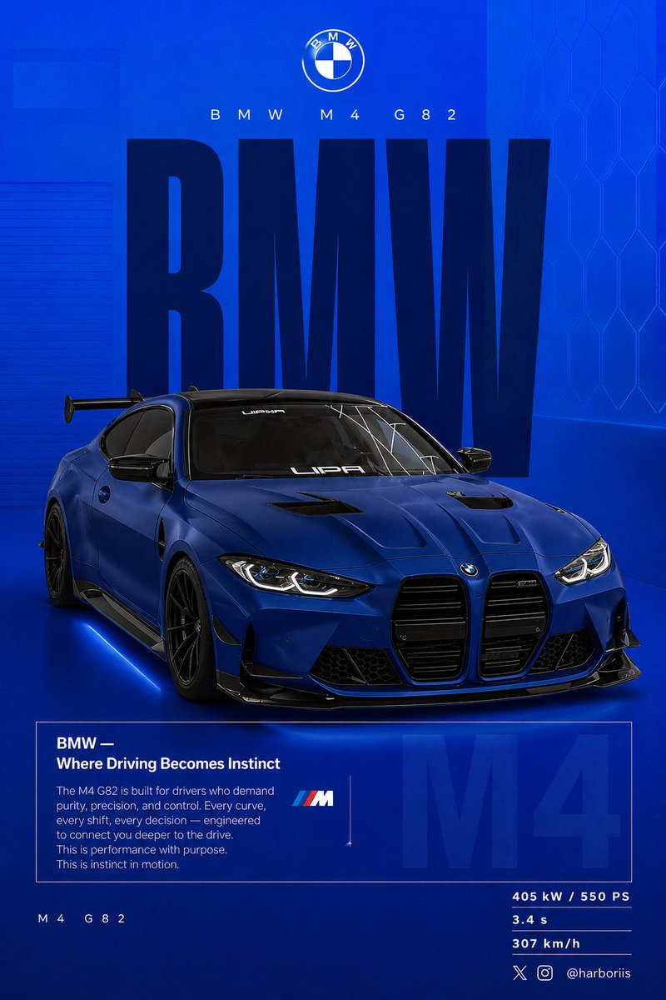

```text
Create a 4:5 vertical social poster in ultra high resolution, 8K print quality sharpness. Use the {argument name="car model" default="BMW car"} from the reference image as the main subject and use the background structure/composition from the reference image, but transform it into a BMW themed design. Replace all black tones with a flat {argument name="background color" default="high-saturation BMW blue"} background. Keep the same layout, spacing, visual balance, and poster composition from the reference image. Background should use a smooth gradient from slightly lighter electric blue at the top to deep navy blue at the bottom. Add subtle grain texture (2 to 3%) and faint rectangular overlays (2 to 4% opacity). Keep it clean, graphic, premium, and non-realistic. Add a soft contact shadow under the car. Use the same BMW from the reference image, changing only the {argument name="paint finish" default="matte frozen blue"} or deep metallic navy. Keep the original body shape, wheels, stance, and design details from the reference image. Show the car in a rear 3/4 perspective matching the reference image angle exactly. Use a slightly elevated camera angle. Position the car slightly right of center. Include visible carbon roof, aggressive rear diffuser, sharp controlled reflections, and subtle brake details. Keep composition identical to the reference image: Top: branding Middle: giant type Center: car overlapping text Bottom: editorial block and specs Typography: Primary text: “BMW” Ultra condensed bold sans serif, tall vertical scaling like the reference poster. Color deep navy or near black. Static text with no distortion. Acts as structural backdrop. Secondary header: “BMW M4 G82” Thin font with wide tracking. Logo area: BMW roundel centered above. Editorial block: Headline: “BMW — Where Driving Becomes Instinct” Body copy focused on: driver connection control performance precision Use the same boxed editorial layout as the reference image. Background faded text: “M4” large scale with 3 to 5% opacity behind the box. Bottom left: “ M4 G82” Bottom right specs: 405 kW / 550 PS 3.4 s 307 km/h Lighting should be clean studio lighting with sharp but controlled highlights. Color grading should use deep blues, high contrast, clean blacks. Camera lens: 50mm, slightly elevated rear 3/4 angle. Mood: Performance. Precision. Driver focus. Add Bottom-right watermark: harboriis , with small x and Instagram logo
```


---

## 例 544：Cinematic Chicken Momos Ad Poster

**来源：** [@Diplomeme](https://x.com/Diplomeme/status/2048060325925470358) / [awesome-gpt-image-2-prompts](https://github.com/EvoLinkAI/awesome-gpt-image-2-prompts)

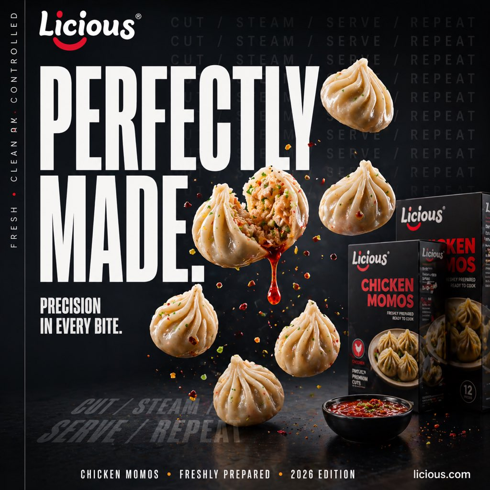

```text
A hyper-realistic cinematic street-food advertisement poster for {argument name="brand name" default="Licious"} frozen {argument name="product name" default="Chicken Momos"}, shot in a dark premium studio with dramatic moody lighting, deep navy-black background, glossy black tabletop, and high contrast commercial food photography styling. The composition is a square social-media ad layout with oversized bold condensed white sans-serif headline text on the left reading {argument name="headline text" default="PERFECTLY MADE."} stacked across two lines, and a smaller white subheadline beneath it reading {argument name="tagline text" default="PRECISION IN EVERY BITE."}. Along the far left edge, add thin vertical small caps text reading “FRESH • CLEAN • CONTROLLED”. Across the upper-right background, repeat the phrase “CUT / STEAM / SERVE / REPEAT” in a subtle dark gray pattern, and faintly repeat “CUT / STEAM / SERVE / REPEAT” again near the bottom-left floor area as perspective text. Feature exactly 6 momos total: 5 intact steamed chicken momos floating and arranged dynamically across the center and right side, and 1 split-open momo in the center revealing juicy orange-brown chicken filling with herbs, with a glossy red-orange sauce droplet dripping downward from the opened dumpling. Scatter small chili flakes, herb bits, and seasoning particles suspended in the air around the momos for explosive motion. Place exactly 3 retail product boxes on the right side, staggered in depth, black packaging with the {argument name="brand name" default="Licious"} logo and red product title “CHICKEN MOMOS,” including food photography of the dumplings on the box front. At the bottom right foreground, place 1 small black bowl filled with bright red dipping sauce. Add a thin footer line of small white text across the bottom reading “CHICKEN MOMOS • FRESHLY PREPARED • 2026 EDITION” and place “licious.com” in the lower-right corner. Use premium ad design, ultra-detailed food texture, glossy highlights on the dumplings, subtle steam sheen, crisp typography, shallow depth of field, and a polished high-end commercial campaign aesthetic.
```


---

## 例 545：12-Panel Storyboard Poster

**来源：** [@bmx_ai13](https://x.com/bmx_ai13/status/2050432594647642414) / [awesome-gpt-image-2-prompts](https://github.com/EvoLinkAI/awesome-gpt-image-2-prompts)

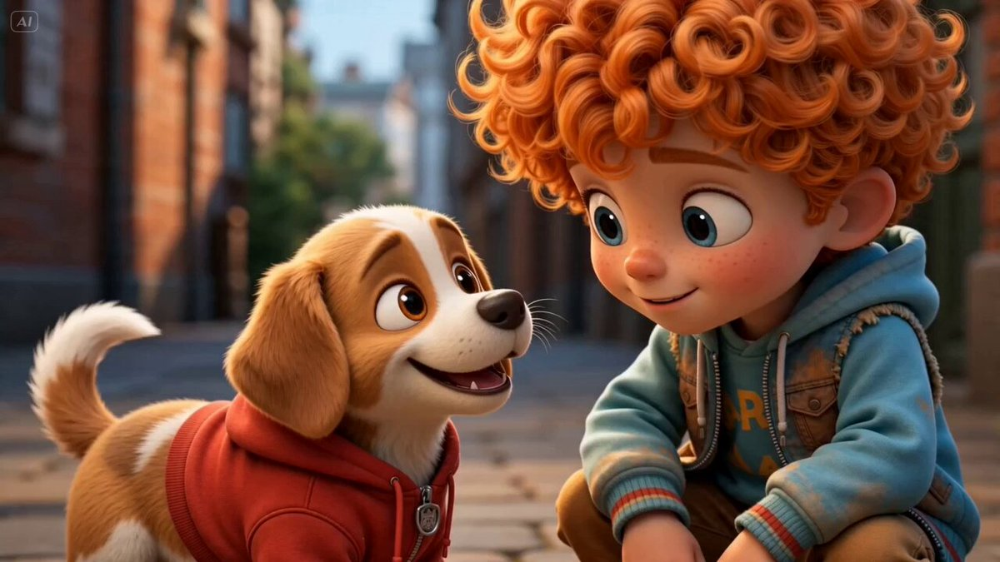

```text
A super simple workflow: 2 character images → GPT Image 2.0 storyboard → Seedance 2.0 animation. Just upload two character images and use the prompt below in GPT Image 2.0 to generate a full storyboard on a single page. Prompt: Create a clean, colorful storyboard poster in a 3x4 grid layout with 12 panels on a single page. Title at the top: "[MAIN TITLE]" Each panel must include: a scene number in a small circle, a short scene title, a colorful illustrated image, a 1–2 line description under the image. Main characters must remain visually consistent across all 12 panels: Character 1: [describe main character in detail] Character 2: [describe second character in detail] Theme/story: [overall story theme] Scene breakdown: [Scene title] – [what happens] [Scene title] – [what happens] [Scene title] – [what happens] [Scene title] – [what happens] [Scene title] – [what happens] [Scene title] – [what happens] [Scene title] – [what happens] [Scene title] – [what happens] [Scene title] – [what happens] [Scene title] – [what happens] [Scene title] – [what happens] [Scene title] – [what happens] Design style: cute 3D animated storybook style, warm emotional lighting, bright colors, soft shadows, child-friendly, clean panel borders, readable typography, neat poster composition, high detail. Important: Keep all 12 panels inside one single image. Make the layout clean and balanced. Keep the characters consistent in face, outfit, and colors. Make the text readable and properly placed. No cropped panels. No extra characters unless mentioned. Then upload that storyboard to Seedance 2.0 and use this prompt: Prompt: Generate a scene using the shots in the uploaded film storyboard. No text on screen. That’s it.
```


---

## 例 546：Graphic Design Portfolio Mockup

**来源：** [@abs_uiux](https://x.com/abs_uiux/status/2054594512983310572) / [awesome-gpt-image-2-prompts](https://github.com/EvoLinkAI/awesome-gpt-image-2-prompts)

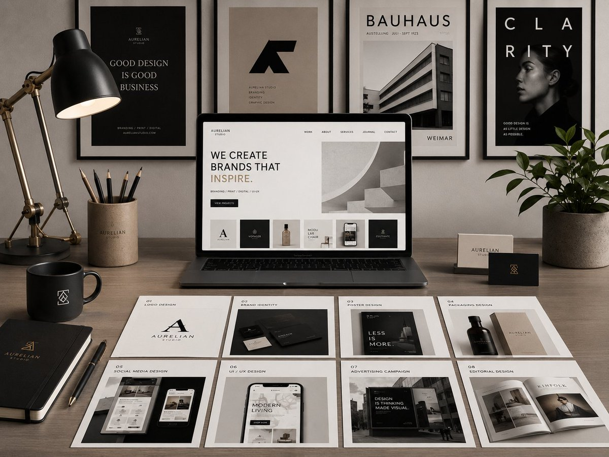

```text
Create a premium graphic design portfolio mockup in a professional creative studio style. Show a clean, elegant workspace presentation featuring multiple graphic design project cards arranged in a refined grid layout, a modern laptop screen displaying a portfolio homepage, and several printed posters laid out neatly on the desk and mounted on the wall. Use a polished creative-director aesthetic with soft shadows, subtle depth, realistic materials, and a high-end studio atmosphere. Include sleek typography placeholders, branding samples, editorial-style poster designs, business cards, stationery, notebook, pen, coffee cup, desk lamp, and small plant for a realistic studio setup. The design should have a clean grid layout, balanced spacing, soft realistic shadows, premium lighting, and neutral luxury tones such as black, white, warm beige, gray, champagne, and cream. Make the laptop screen show a minimal portfolio interface with project thumbnails, navigation menu, and bold hero text. Add multiple portfolio project cards such as logo design, brand identity, poster design, packaging design, social media design, UI/UX design, and advertising campaign mockups. Arrange everything professionally with a modern minimalist style, sharp details, clean typography, elegant composition, and a premium creative agency presentation look. Style: high-end graphic design portfolio, modern creative studio, luxury branding mockup, clean desk setup, realistic shadows, editorial layout, minimalist premium design, professional presentation, 4K, ultra-detailed.
```


---

## 例 547：Brand Identity Guideline Board

**来源：** [@Shorelyn_](https://x.com/Shorelyn_/status/2055681687284293991) / [awesome-gpt-image-2-prompts](https://github.com/EvoLinkAI/awesome-gpt-image-2-prompts)

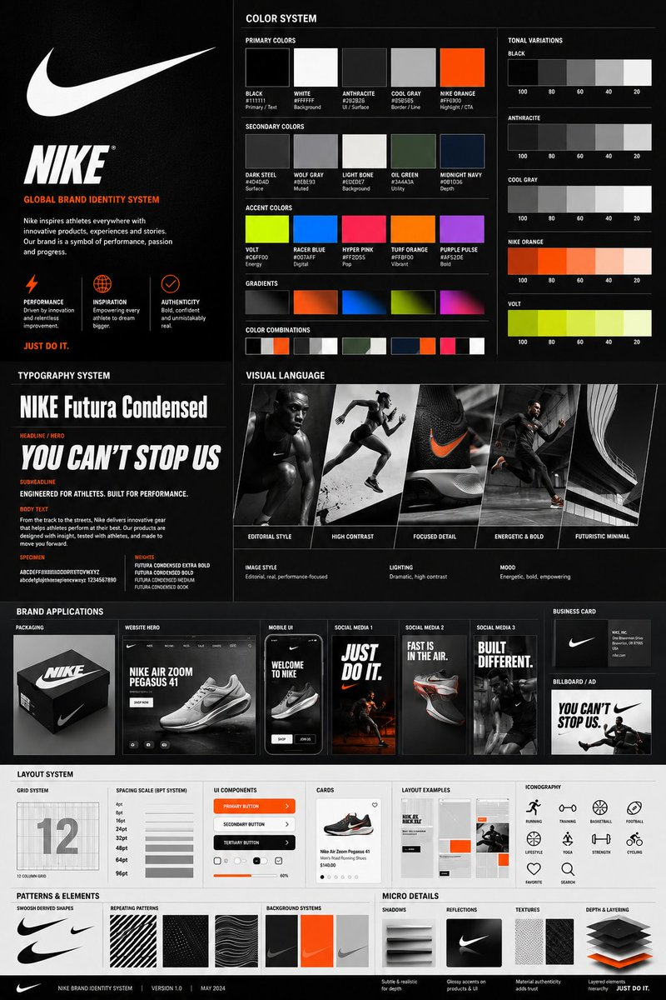

```text
Using the uploaded logo for (Brand name) generate a high-end, agency-grade brand identity system poster.

OBJECTIVE
Create a complete, presentation-ready brand guideline board that looks like it was designed by a top branding studio. The result must feel commercial, realistic, and client-deliverable, not conceptual.

INTELLIGENCE RULE (THIS IS WHAT YOU WERE MISSING)
Before designing, analyze the logo and infer:
3 identity traits (based on analysis)

COLOR SYSTEM (SMART GENERATION)
Extract palette from logo automatically
Include:
Primary colors (3–5)
Secondary colors (3–5)
Accent colors

Each must show:
HEX codes
labeled usage (primary / UI / highlight / background)

Also generate:
gradients
color combinations
tonal variations

TYPOGRAPHY SYSTEM (MATCH PERSONALITY)
Select typography style based on brand:
luxury → elegant serif
tech → geometric sans
street → bold condensed
corporate → clean neutral sans

Show:
headline / subheadline / body
real text examples (brand-relevant, not lorem ipsum)
clear hierarchy

VISUAL LANGUAGE
Define and visualize:
image style (editorial / lifestyle / futuristic / minimal)
lighting (soft / dramatic / high contrast)
mood (energetic / premium / calm / disruptive)

Show:
3–5 visual tiles

BRAND APPLICATIONS (REALISM BOOST)
Generate consistent mockups:
packaging or product
website hero
mobile UI
3 social media creatives
business card
billboard / ad

All must feel real-world usable.

LAYOUT SYSTEM
grid system
spacing scale (4pt / 8pt system)

Show:
UI components
cards
buttons
layout examples

ICONOGRAPHY
6–10 icons style derived from brand (rounded / sharp / minimal / filled)

PATTERNS & ELEMENTS
shapes derived from logo
repeating motifs
background systems

MICRO DETAILS (THIS CREATES “PREMIUM FEEL”)
shadows
reflections
textures
depth layering

VISUAL STYLE CONTROL
modern editorial + system design hybrid
strong hierarchy
layered composition
controlled spacing

DENSITY RULE
minimum 30–50 elements
mix of macro + micro components
no empty or filler space

HARD RESTRICTIONS
no placeholders
no generic UI
no inconsistent styles
no random colors

FINAL OUTPUT
A high-end brand system poster that looks:
Behance feature-worthy
agency presentation-ready
visually consistent and detailed
```


---

## 例 548：Monoluxe Automotive Poster Grid

**来源：** [@Ozayrr_irl](https://x.com/Ozayrr_irl/status/2056179631389126895) / [awesome-gpt-image-2-prompts](https://github.com/EvoLinkAI/awesome-gpt-image-2-prompts)

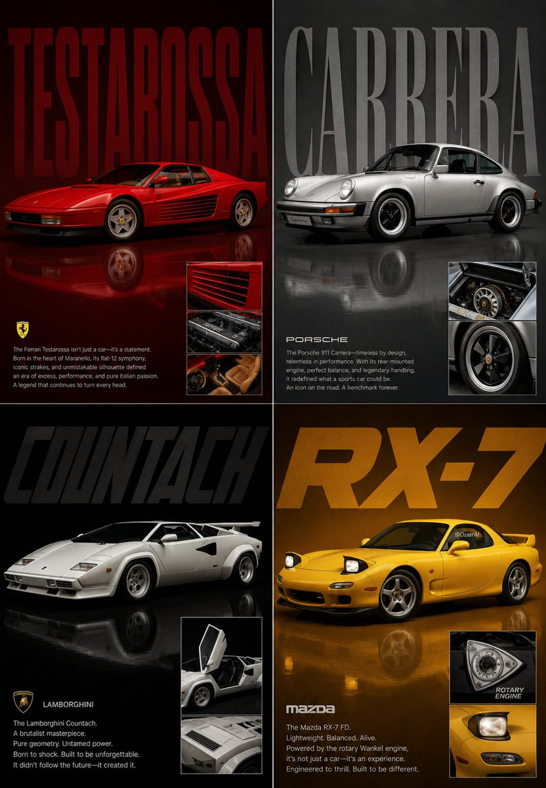

```text
Monoluxe Automotive Posters 🔥

Images on ChatGPT by GPT image 2.

Prompt⤵️

"A high-quality editorial automotive poster split into a 2x2 grid layout, each quadrant featuring one iconic car with a bold typographic name as the background. Top-left: Toyota Corolla AE86 in Cobalt Blue, side profile view, floating above its reflection, massive "COROLLA" text behind in matching blue tones, cobalt blue panel background, small detail inset photos of interior and headlights in the corner, editorial body copy below the car. Top-right: Volkswagen Beetle in golden yellow, side profile, "BEETLE" in massive serif bold letters behind it, warm golden yellow panel, vintage feel, small detail thumbnails of curved body panel and round taillights. Bottom-left: Honda Civic Type R in Championship Red, aggressive front-three-quarter angle, massive "CIVIC TYPE R" text melting into the dark red background, dramatic low-angle lighting, small thumbnail of front grille and wing spoiler. Bottom-right: Classic Mini Cooper in burnt orange/rust tone, side profile, "MINI" in oversized bold condensed font, amber-orange panel, detail thumbnails of door handle and round taillight cluster. All four panels have a dark bottom section with white serif editorial description text, small divider lines, and 2–3 small square detail photos. Overall layout: vertical 9:13 poster, magazine-editorial aesthetic, graphic design studio quality, automotive illustration meets print poster art. A subtle "OzairAI" text appears naturally engraved on one of the license plates in the Corolla panel. Ultra photorealistic, 8K, no text overlays, cinematic color grading."
```


---

## 例 549：Male Glow-Up Analysis Poster

**来源：** [@frametheory058](https://x.com/frametheory058/status/2056038533962555737) / [awesome-gpt-image-2-prompts](https://github.com/EvoLinkAI/awesome-gpt-image-2-prompts)

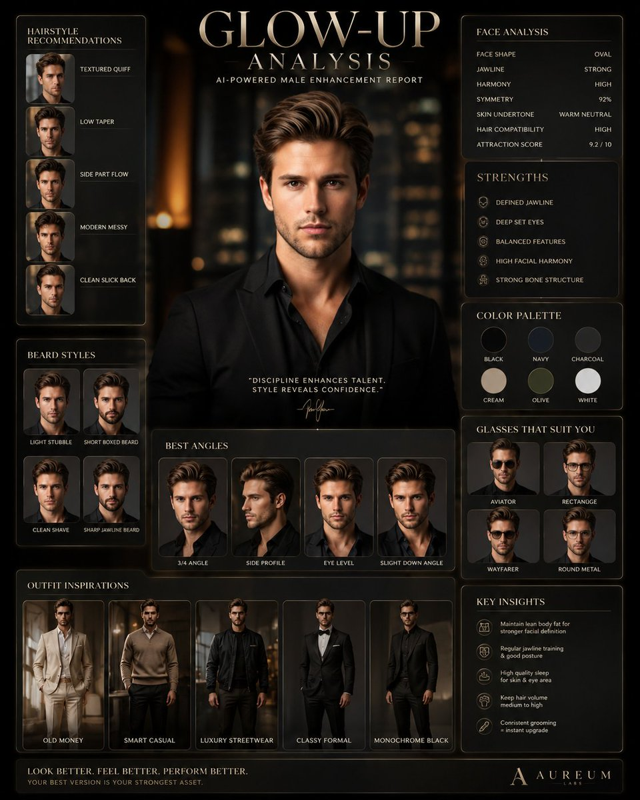

```text
I will upload a face photo/selfie.

Create an ULTRA PREMIUM AI MALE GLOW-UP ANALYSIS POSTER with a luxury fashion-tech aesthetic.

IMPORTANT:
The uploaded face and identity must remain EXACTLY THE SAME.

Do NOT change:
- facial structure
- eyes
- nose
- lips
- jawline
- skin tone
- facial proportions
- identity

The face should look 100% identical to the uploaded image.

You MAY enhance:
- hairstyle
- beard style
- expression
- outfit
- lighting
- posture
- styling
- background
- overall attractiveness

STYLE:
The final result should look like:
- a luxury grooming brand campaign
- a futuristic men’s fashion magazine
- a premium AI self-improvement dashboard
- cinematic and extremely expensive

NO basic infographic look.
NO cheap AI poster style.
NO cartoonish design.

THEME:
Use a premium modern luxury aesthetic:
- matte black
- champagne gold
- warm beige
- silver accents
- dark graphite
- soft cinematic lighting

Add:
- glassmorphism UI
- floating premium panels
- luxury typography
- subtle reflections
- realistic shadows
- elegant spacing
- premium composition

CENTER SUBJECT:
- Place the uploaded face in the center
- Make him look like a high-status modern male model
- Confident masculine expression
- Attractive but realistic
- Strong eye contact
- Natural skin texture

HAIRSTYLE SECTION:
Create premium hairstyle recommendations using the SAME FACE:
- textured quiff
- low taper
- side part flow
- modern messy hairstyle
- clean slick back

BEARD SECTION:
Using the SAME FACE:
- light stubble
- short boxed beard
- clean shave
- sharp jawline beard

OUTFIT STYLE SECTION:
Create multiple premium outfit inspirations using the SAME FACE:
- old money
- smart casual
- luxury streetwear
- classy formal
- monochrome black fit

All outfits should look:
- tailored
- masculine
- expensive
- editorial quality

FACE ANALYSIS SECTION:
Include:
- face shape
- jawline analysis
- facial harmony
- symmetry
- hairstyle compatibility
- skin undertone
- attractiveness strengths

COLOR PALETTE SECTION:
Show best clothing colors:
- black
- cream
- olive
- navy
- charcoal
- white

GLASSES SECTION:
Show glasses/sunglasses styles that suit the face:
- aviator
- rectangle
- wayfarer
- round metal

BEST ANGLES SECTION:
Create multiple mini portraits using the SAME FACE:
- 3/4 angle
- side profile
- eye-level
- slight down angle

BACKGROUND:
Luxury studio environment:
- blurred city lights
- elegant interior
- premium fashion studio
- cinematic depth
- luxury apartment vibe

TEXT STYLE:
Minimal, clean, elegant.
Looks like a premium fashion editorial mixed with AI analysis.

QUALITY:
- ultra realistic
- hyper detailed
- 8K
- cinematic realism
- luxury aesthetic
- highly polished
- visually addictive
```


---

## 例 550：INNER SIGNAL Brand Poster Series

**来源：** [@bmx_ai13](https://x.com/bmx_ai13/status/2063726489905123489) / [awesome-gpt-image-2-prompts](https://github.com/EvoLinkAI/awesome-gpt-image-2-prompts)

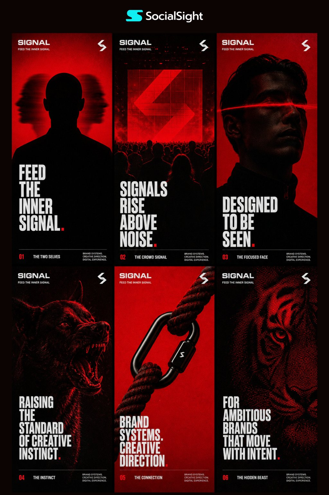

```text
👇
{
  "project_title": "INNER SIGNAL",
  "concept_type": "Brand Identity Poster Series",
  "brand_name": "SIGNAL",
  "tagline": "FEED THE INNER SIGNAL",
  "style": {
    "look": "bold experimental editorial branding",
    "mood": "mysterious, powerful, rebellious, premium",
    "colors": ["black", "crimson red", "white"],
    "lighting": "hard red light, deep shadows, high contrast",
    "texture": "film grain, halftone, motion blur"
  },
  "design_rules": {
    "typography": "bold uppercase sans-serif, Swiss-style layout",
    "layout": "clean grid, strong negative space, recurring minimal logo mark",
    "visual_language": "cinematic, fashion-forward, dark, sharp, minimal"
  },
  "brand_message": "Build identities that do not blend in. Designed for ambitious brands that want presence, confidence, and creative impact.",
  "poster_series": [
    {
      "title": "The Two Selves",
      "subject": "dark human silhouette with two blurred side profiles behind the head",
      "meaning": "inner conflict, identity, duality",
      "text_overlay": "FEED THE INNER SIGNAL.",
      "prompt": "A bold branding poster with a lone dark silhouette against a glowing crimson red background. Two blurred shadow profiles appear behind the head, suggesting dual identity and inner voices. High contrast red and black lighting, minimal white logo mark, bold uppercase typography, cinematic editorial style, film grain, clean Swiss layout."
    },
    {
      "title": "The Crowd Signal",
      "subject": "crowd silhouettes facing a giant glowing red screen",
      "meaning": "presence, influence, voice rising above noise",
      "text_overlay": "SIGNALS RISE ABOVE NOISE.",
      "prompt": "A premium poster showing a dark crowd in silhouette facing a large glowing red screen with abstract geometric shapes. The scene feels cinematic and intense, with black shadows, crimson atmosphere, subtle haze, white typography, and a modern branding layout."
    },
    {
      "title": "The Focused Face",
      "subject": "close-up portrait with a red line crossing the eyes",
      "meaning": "clarity, vision, self-definition",
      "text_overlay": "DESIGNED TO BE SEEN.",
      "prompt": "A close-up fashion portrait of a person in deep shadow against a solid crimson background. A thin red band crosses the eyes, creating a futuristic and psychological feel. High-end editorial lighting, minimal white text, black clothing, premium poster design."
    },
    {
      "title": "The Instinct",
      "subject": "aggressive black dog or wolf under red light",
      "meaning": "raw creative power, instinct, fearless energy",
      "text_overlay": "RAISING THE STANDARD OF CREATIVE INSTINCT.",
      "prompt": "A dark animal portrait poster featuring a black dog or wolf emerging from shadow under intense red lighting. Teeth visible, powerful expression, black background, white typography, bold brand aesthetic, gritty film texture, luxury editorial composition."
    },
    {
      "title": "The Connection",
      "subject": "black carabiner linking thick ropes",
      "meaning": "systems, structure, trust, connection",
      "text_overlay": "BRAND SYSTEMS. CREATIVE DIRECTION.",
      "prompt": "A clean branding poster with a black metal carabiner connecting two thick ropes against a pure crimson red background. Glossy highlights, product-style lighting, centered composition, minimal white logo mark, Swiss typography, sleek premium design."
    },
    {
      "title": "The Hidden Beast",
      "subject": "abstract halftone tiger or leopard face",
      "meaning": "ambition, hidden force, controlled danger",
      "text_overlay": "FOR AMBITIOUS BRANDS THAT MOVE WITH INTENT.",
      "prompt": "An abstract poster showing a tiger or leopard face formed with red halftone texture emerging from deep black space. Mysterious and intense mood, experimental print look, minimal white typography, strong contrast, premium creative studio identity."
    }
  ],
  "master_prompt": "Create a 6-poster brand identity series for a fictional creative studio named SIGNAL. Use only black, crimson red, and white. The posters should feel cinematic, premium, rebellious, and intelligent. Use high-contrast editorial visuals, deep shadows, red lighting, film grain, halftone texture, bold uppercase typography, and minimal logo repetition. Themes include dual identity, influence, vision, instinct, connection, and ambition."
}
```


---

## 例 551：Ronaldo Tri-Zone Sports Poster

**来源：** [@vireonixx](https://x.com/vireonixx/status/2068870555349246242) / [awesome-gpt-image-2-prompts](https://github.com/EvoLinkAI/awesome-gpt-image-2-prompts)

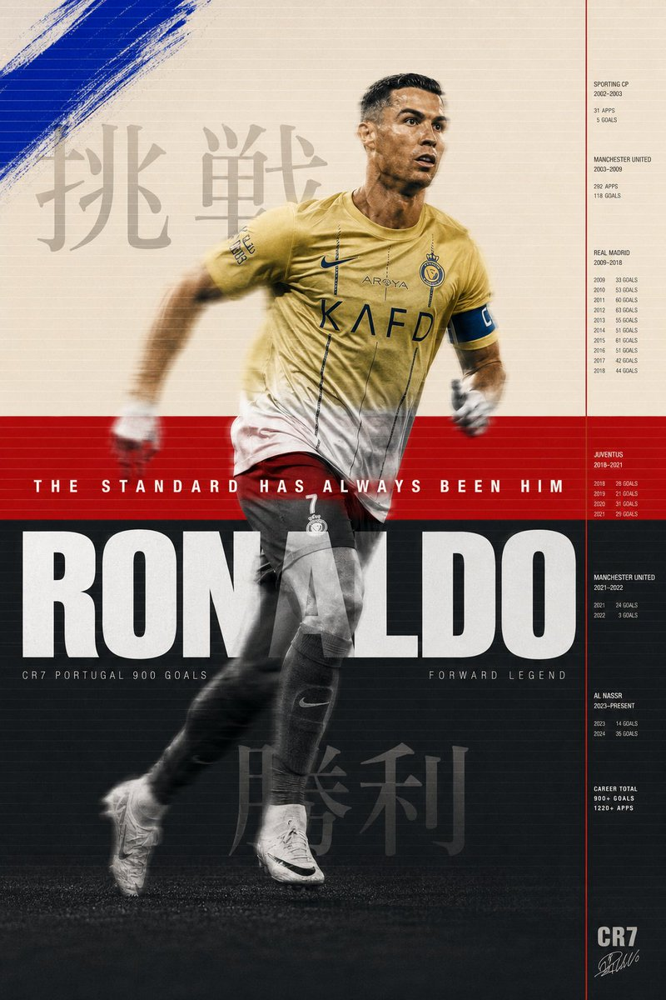

```text
Cristiano Ronaldo sports poster. Background divided intothree horizontal zones. Top zone warm cream Pantone 9183Coccupying top 40% of poster. Middle zone signal redPantone 485C as a pure flat color band occupying exactly
8% of poster height at golden ratio point. Bottom zone
deep charcoal Pantone 432C occupying remaining 52%.
Three zones. Two colors and one neutral. The geometry
of the Portuguese flag deconstructed and reconstructedas graphic architecture.

His figure spans all three zones. Shot full body from
slight low angle. Al Nassr gold kit. Mid stride. Leftleg forward. Right arm back. The specific body positionof someone at absolute peak running velocity. Not a posedaction. A captured action. The body in the cream zonerendered in full color warm skin tones and gold kit. The
body in the red zone bleached to near white silhouette
where it intersects the red band. The body in the charcoal
zone rendered in black and white high contrast. Three color treatments on one continuous figure. The zones are notbackgrounds they are filters. Each one revealing a
different version of the same man.

Motion blur. His figure in slight motion blur at 1/250second shutter. The sharp elements his face his number 7his boot touching ground. The blurred elements his armsin motion his hair his loose kit fabric. The blurcommunicates what no still image can. The speed. The
relentlessness. The fact that he is never fully stopped.

Layered over the three zones across the full poster width.
A system of fine parallel horizontal lines. 0.3pt. Warm
white. At 25% opacity. Running edge to edge. Spaced 4mm
apart. The texture of a television scan line. Or a
printing registration grid. Or the lines on a ruledpage waiting to be written on. The lines are the sameacross all three zones changing color against each
background. White on cream barely visible. White on red
glowing. White on charcoal clear and strong. The same
line behaving differently in different worlds.

Paint intervention. In the cream zone only. Upper left
quadrant. Raw gestural brushstroke in cobalt blue
Pantone 2728C. A single mark. Applied with a wide brush
at 45 degrees. The blue unexpected against the cream.
Not part of the flag system. A disruption. An intervention
from outside the established color logic. The color of
a sky he is always looking toward.

Japanese typography. Large scale. Behind photograph layer.
In cream zone behind his upper body. 挑戦 pronounced
chōsen meaning challenge. Rendered at 200pt Noto Serif
CJK deep charcoal at 15% opacity. The kanji visible
through the photographic layer like a thought behind
a face. In charcoal zone behind his lower body.
勝利 pronounced shōri meaning victory. Same scale
same treatment. Beginning and end. Challenge and victory.
Above and below.

Information system. Right side of poster. Thin vertical
rule signal red 1px running full height. To its right
a column of data in Helvetica Neue Light 6pt tracking
200 bone white on charcoal and cream on red adjusting
for legibility. Club career timeline. Years at each
club. Goals per season. The data as a river running
parallel to the figure. The career in numbers beside
the career in motion.

Typography primary. Across the red zone. Full poster
width. The red band is a stage for one typographic event.
Futura PT Heavy. All caps. White. 36pt. Tracking 300.
Perfectly centered vertically in the red band. THE
STANDARD HAS ALWAYS BEEN HIM. The red band exists to
hold this sentence. Everything else in the poster exists
to justify it.

Below the red band entering the charcoal zone. Full width.
Helvetica Neue Black Extended. White. 96pt. Tracking minus
10. RONALDO. The letters occupying the full width exactly
tracked to fit. The name as the foundation of the
charcoal zone. Below the name in same charcoal zone.
Helvetica Neue Light. 8pt. Tracking 600. Bone white.
CR7 PORTUGAL 900 GOALS FORWARD LEGEND. One line. All
the context needed. None of the decoration.

Art direction M/M Paris conceptual intelligence. Bureau
Borsche typographic sophistication. Wieden Kennedy
Amsterdam emotional directness. Nike Brand Design
production quality. All four present simultaneously
at their absolute peak.

Shot aesthetic Misan Harriman color and dignity. Ernst
Haas motion blur mastery. Gregory Heisler technical
perfection. Three photographers whose combined vision
makes something none of them would make alone.

Print format 70x100cm. 10K resolution. HDR. The three
zones printed in three separate ink passes on a
Heidelberg offset press. The red band overprinted twice
for maximum saturation. The charcoal zone with 7 color
process for maximum depth. The cream zone with minimum
ink for maximum paper feel.
```


---

## 例 552：Argentina Number 10 Sports Poster

**来源：** [@iamaiistudio](https://x.com/iamaiistudio/status/2068534010574459131) / [awesome-gpt-image-2-prompts](https://github.com/EvoLinkAI/awesome-gpt-image-2-prompts)

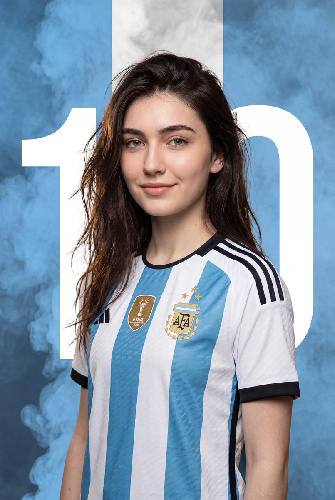

```text
A mixed-media sports poster with a realistic chest-up portrait of a young Argentine soccer player, confident pose with a subtle smile, dark brown slightly messy hair. Wearing the Argentina national team jersey with iconic sky-blue and white stripes, Adidas logo on right chest, Argentina Football Association crest on left.

Soft studio lighting from upper left with gentle shadows and highlights on the hair. A bold white number "10" fills the background, partially overlapped by the player.

Background features vertical smoke bands in Argentine flag colors: sky blue, white, and sky blue.

Modern, clean, and dynamic style combining sharp portrait details with soft smoky effects for a powerful professional sports-poster aesthetic.
```


---

## 例 553：Browser Game Ad Creative Poster

**来源：** [@llllegend0620](https://x.com/llllegend0620/status/2045963764466688065) / [awesome-gpt-image-2-prompts](https://github.com/EvoLinkAI/awesome-gpt-image-2-prompts)


```text
以下の文字を必ず入れて、1:1のポスターを作成してください。書籍・講座・イベント告知に使える、プロの広告デザイナーが作ったような高品質な仕上がりにしてください。

広告クリエイティブ制作
思いついたら、もう遊べる。 AI×ブラウザゲームづくりは、マジで楽しい。 むずかしそうで、実ははじめやすい。 コードがわからなくても、はじめの一本は作れる
```


---

## 例 554：Spring 2026 Guangzhou Promo Poster

**来源：** [@grok](https://x.com/grok/status/2046012437086818395) / [awesome-gpt-image-2-prompts](https://github.com/EvoLinkAI/awesome-gpt-image-2-prompts)


```text
一张充满新春喜庆但高雅的 2026 广州城市宣传海报，9:16 竖版，双重曝光，S 型流动构图。纯白纹理背景，右下角微缩传统服饰人物挥舞长红绸，红绸变形成山脉河流，内部叠加广州全景：广州塔、珠江新城、珠江、游轮、古建筑与白云山。左下角排版 “SPRING 2026” 与竖排 “千年商都 魅力广州”。
```


---

## 例 555：Spring Guangzhou City Poster

**来源：** [@alanlovelq](https://x.com/alanlovelq/status/2045484598487060917) / [awesome-gpt-image-2-prompts](https://github.com/EvoLinkAI/awesome-gpt-image-2-prompts)

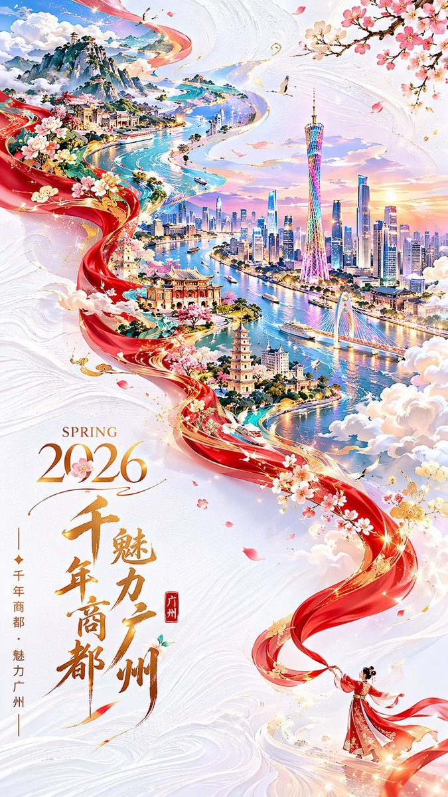

```text
一张充满新春喜庆氛围但不失高雅格调的 2026 城市宣传海报。
双重曝光，构图延续了S型的流动感；
在纯白的纹理背景右下角，一个身穿中国传统服饰的微缩人物正在挥舞着一条长长的红色丝绸舞带，这条红绸在空中舞动，不仅展现出丝绸的柔顺质感，更在向左上方飘动的过程中，奇幻地变形成了一条壮丽的山脉河流。
在这条“河流”中，叠加了一个有山有海河的广州城市手绘图，国潮，景色尽在眼底，壮阔雄伟，令人震撼。
广州的地标建筑(广州塔，珠江新城建筑群，珠江, 广州城里古建筑，游轮，白云山）。
云雾环绕，仙气缥缈，色彩丰富，结构复杂，细节丰富，但因为大面积的留白，画面依然显得清新脱俗，左下角排版着“SPRING 2026”和竖排的宣传语，整体寓意“千年商都，魅力广州”。
文字排版优美，大方，字迹清晰完整，尺寸9:16。
```


---

## 例 556：6-Block Fashion Campaign Prompt Formula

**来源：** [@anacoding](https://x.com/anacoding/status/2046904999045628114) / [awesome-gpt-image-2-prompts](https://github.com/EvoLinkAI/awesome-gpt-image-2-prompts)

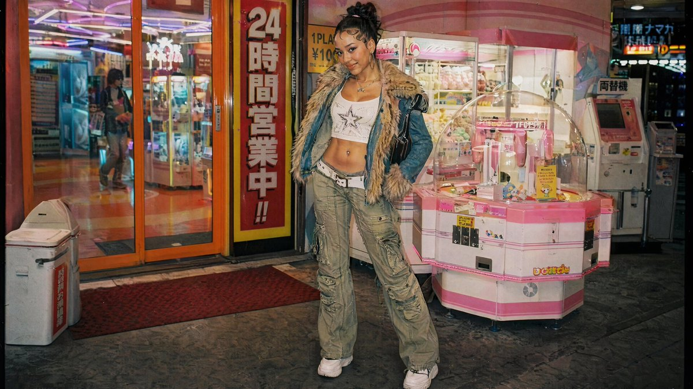

```text
Old money Hamptons editorial, tall blonde woman late 20s, serene elegant expression, wearing cream cashmere cable sweater, pleated beige tennis skirt, pearl earrings, Hermès silk scarf, leather flats, Slim Aarons photography style, medium format film photography, sitting on a white wooden porch of a Cape Cod house, golden hour light, ocean in the background
```


---

## 例 557：Sony A7 Exploded View Breakdown Prompt

**来源：** [@iaPulse_](https://x.com/iaPulse_/status/2046903739429097660) / [awesome-gpt-image-2-prompts](https://github.com/EvoLinkAI/awesome-gpt-image-2-prompts)


```text
Descomposición detallada de una cámara de la marca Sony modelo A7 indicando todas sus piezas y con sus nombres.
```


---

## 例 558：A full-body outdoor shot captures a young Caucasian woman, possibly in her la...

**来源：** [@AIwithSarah_](https://x.com/AIwithSarah_/status/2047234995627172229) / [awesome-gpt-image-2-prompts](https://github.com/EvoLinkAI/awesome-gpt-image-2-prompts)

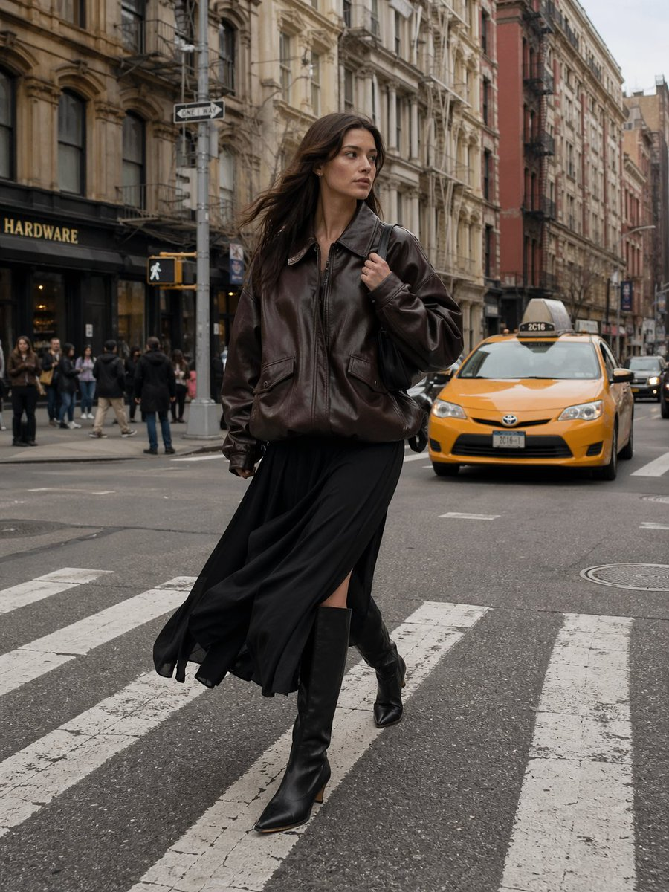

```text
A full-body outdoor shot captures a young Caucasian woman, possibly in her late 20s, striding through a city crosswalk. She wears an oversized, matte chocolate-brown leather jacket paired with a free-flowing black skirt and sleek knee-high black boots, conveying a sense of high fashion street style. Her long, dark brown hair is wind-swept, complementing her poised and confident expression as she glances sideways. Behind her, a blurred urban backdrop features a yellow taxi and pedestrians, with buildings displaying varied architectural details in neutral tones. The scene utilizes soft ambient daylight filtering through light cloud cover, producing a muted, overcast lighting effect. The warm, earthy color palette consists of brown, black, and touches of beige. The image, likely from a high-resolution digital camera, presents a wide-angle view that maintains focus throughout, emphasizing a dynamic and fashionable feel.
```


---

## 例 559：Luxury Sportswear Basketball Athlete Campaign Poster

**来源：** [@Shorelyn_](https://x.com/Shorelyn_/status/2047949711181832558) / [awesome-gpt-image-2-prompts](https://github.com/EvoLinkAI/awesome-gpt-image-2-prompts)

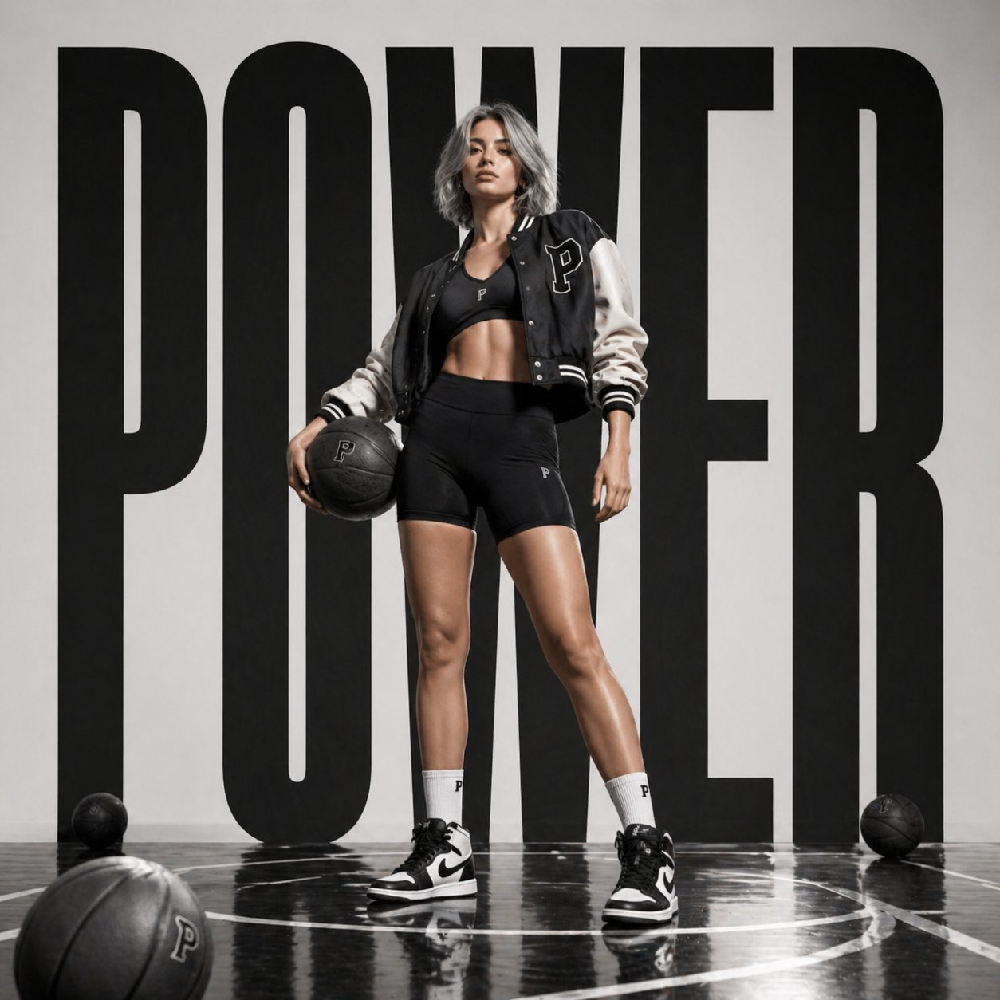

```text
Create a premium luxury sportswear campaign poster featuring a confident female athlete in a modern studio environment. Full body pose with strong fashion attitude, standing tall while holding a basketball at her side, chin raised slightly, direct powerful expression. Athletic toned physique, sleek pulled back hair, clean glowing skin, sharp editorial posture.

Outfit includes an oversized cropped varsity jacket, fitted sports bra, tailored biker shorts, white crew socks, and modern high top sneakers. Neutral monochrome styling with subtle premium branding.

Background is a clean light gray studio wall with giant bold condensed black typography reading “POWER” stretched vertically across the backdrop behind the model. Text should feel oversized and dominant, framing the athlete in the center.

Floor is glossy reflective studio surface with subtle court markings and soft reflections. A few basketballs placed naturally around the floor for depth and campaign styling.

Lighting is bright luxury studio lighting with crisp highlights, soft shadows, and polished commercial finish. Sharp focus, ultra realistic skin texture, premium fabric texture, cinematic contrast.

Style should feel modern, minimal, elite, bold, high fashion sports campaign, luxury brand advertisement, clean composition, balanced negative space, strong visual impact, high resolution, square format.
```


---

## 例 560：Streetwear Fashion Campaign Asian Apparel Poster

**来源：** [@harboriis](https://x.com/harboriis/status/2047921293123895520) / [awesome-gpt-image-2-prompts](https://github.com/EvoLinkAI/awesome-gpt-image-2-prompts)

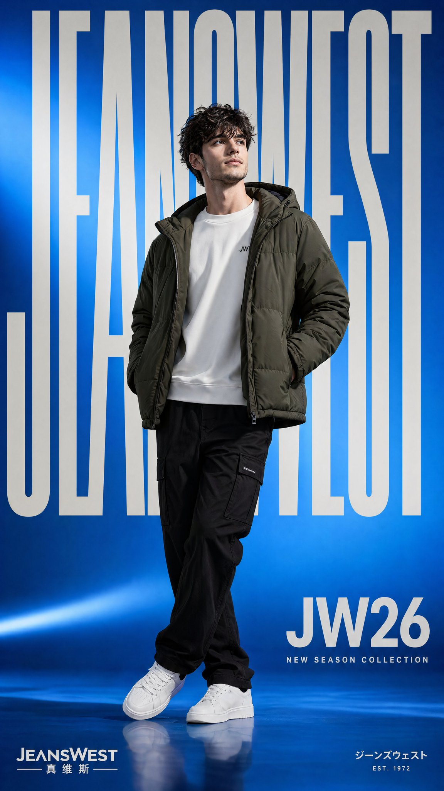

```text
Create a premium streetwear fashion campaign poster inspired by modern Asian apparel advertising. Full body portrait of a stylish young male model standing confidently with legs crossed at the ankles, hands inside jacket pockets, head turned slightly upward and sideways with a calm thoughtful expression. Curly tousled medium length hair with soft volume. Slim athletic build.

Outfit includes a dark olive green padded hooded jacket worn open, clean white crewneck sweatshirt underneath with a tiny chest logo, relaxed black cargo style trousers, and minimal white sneakers. Styling is clean, youthful, and contemporary.

Background is a vibrant electric blue seamless studio backdrop with subtle gradient lighting, soft glow streaks, and glossy floor reflection. Lighting is soft studio light with gentle shadows and polished commercial finish.

Graphic poster layout with giant bold condensed sans serif text reading “JEANSWEST” vertically stretched across the background behind the model in light gray white. Add large text on lower right reading “JW26”.

Composition should feel premium, trendy, clean, commercial, youthful, modern fashion ad campaign. Sharp focus, ultra realistic fabric texture, cinematic lighting, balanced negative space, sleek branding design, high resolution, vertical poster ratio.
```


---

## 例 561：Epic Career Moments Cinematic Poster Template

**来源：** [@Goodmanprotocol](https://x.com/Goodmanprotocol/status/2047900470921040270) / [awesome-gpt-image-2-prompts](https://github.com/EvoLinkAI/awesome-gpt-image-2-prompts)

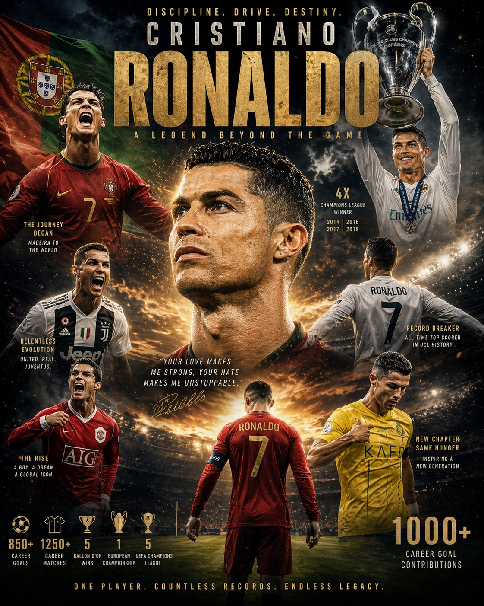

```text
Create an epic poster showcasing the most iconic moments of [Insert Name]'s career. Cinematic style, lens flare. Portrait orientation. A1 poster size. aspect ratio 4:5 https://t.co/L9OHPKUNRp
```


---

## 例 562：Avant-Garde Basketball Sculpture Sports Fashion Ad

**来源：** [@AIwithkhan](https://x.com/AIwithkhan/status/2047886964037398989) / [awesome-gpt-image-2-prompts](https://github.com/EvoLinkAI/awesome-gpt-image-2-prompts)

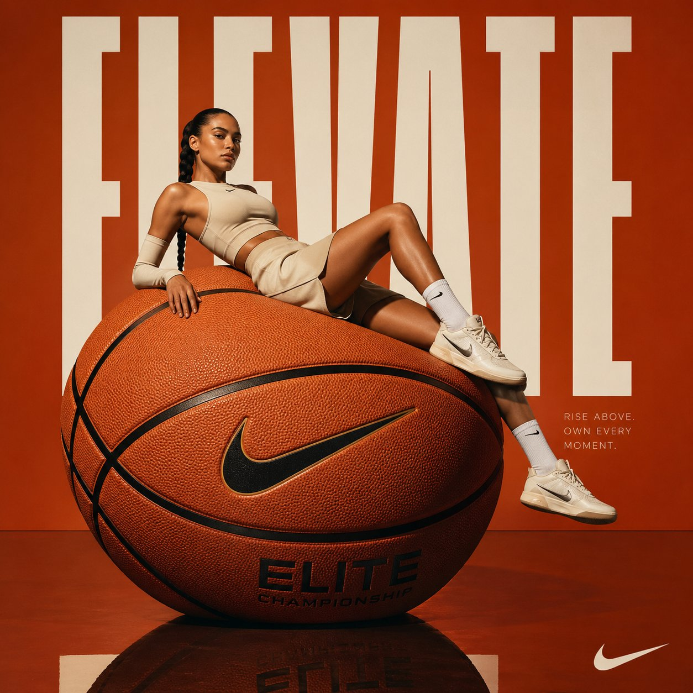

```text
Avant-garde sports fashion advertisement, oversized basketball posed like a monumental sculpture, female athlete reclining across the ball’s curved surface as if modern furniture, giant word “ELEVATE” in bold typography behind, burnt orange studio backdrop, glossy reflective floor, luxury athletic editorial aesthetic, cinematic lighting, ultra-clean composition, 1:1
```


---

## 例 563：Avant-Garde Tennis Racket Sculpture Sports Fashion Ad

**来源：** [@AIwithSynthia](https://x.com/AIwithSynthia/status/2047884609321619831) / [awesome-gpt-image-2-prompts](https://github.com/EvoLinkAI/awesome-gpt-image-2-prompts)

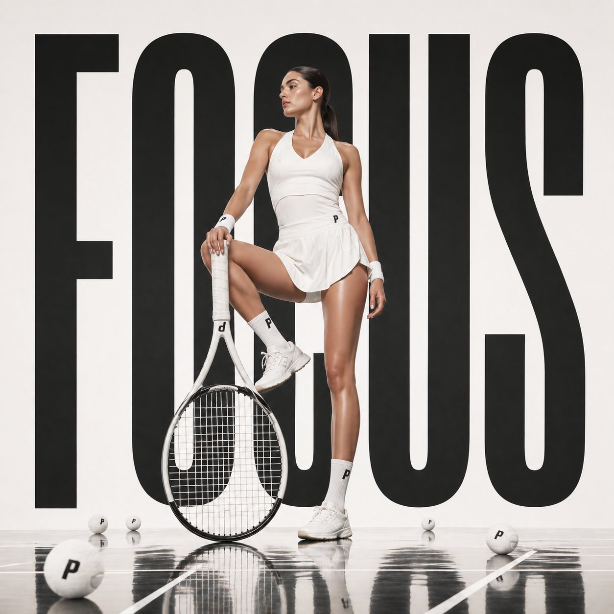

```text
Avant-garde sports fashion advertisement, oversized tennis racket positioned like monumental sculpture, female athlete seated casually on the strings as if a suspended lounge, giant word “PRECISION” in bold typography behind, crisp white studio backdrop, reflective court-like floor, luxury sportswear editorial aesthetic, cinematic lighting, ultra-clean composition, 1:1
```


---

## 例 564：Surrealist Liquor Brand High Fashion Poster

**来源：** [@hmontilla_](https://x.com/hmontilla_/status/2047884126343032995) / [awesome-gpt-image-2-prompts](https://github.com/EvoLinkAI/awesome-gpt-image-2-prompts)


```text
Un póster publicitario surrealista de alta costura para Aguardiente Amarillo. La escena se sitúa en un estudio minimalista y monocromático de color naranja claro, con un suelo semirreflectante.
El foco central es una botella de Aguardiente Amarillo de tamaño descomunal y gigante, colocada en ángulo diagonal y que sirve como respaldo. Un modelo masculino de moda, de cabello largo y oscuro, vestido con un conjunto impecable y totalmente blanco —compuesto por una sudadera y pantalones de pierna ancha—, apoya toda su espalda contra la botella gigante en una postura relajada e inclinada. Mira hacia la derecha, de perfil, con la vista al frente y una expresión serena; calza zapatillas blancas de tamaño estándar.
En el fondo, la palabra "AGUARDIENTE" aparece escrita con una tipografía sans-serif condensada, blanca, masiva y en negrita, parcialmente oculta por la botella gigante y por el modelo para crear una sensación de profundidad. En la esquina superior derecha se lee: "Creado por @HMontilla_".
En la parte inferior central, una frase publicitaria en tipografía sans-serif blanca reza: "El Aguardiente Amarillo de Manzanares es un icónico licor colombiano, originario de 1885 en Manzanares, Caldas". La iluminación es suave, fría y uniforme, proyectando sombras tenues y un reflejo sutil de los sujetos sobre el suelo azul brillante. La estética general es limpia, moderna y de alto concepto.

Establecer la relación de aspecto en 3:4.
```


---

## 例 565：Premium Food Recipe Poster Elegant Layout

**来源：** [@Preda2005](https://x.com/Preda2005/status/2047883394152088004) / [awesome-gpt-image-2-prompts](https://github.com/EvoLinkAI/awesome-gpt-image-2-prompts)

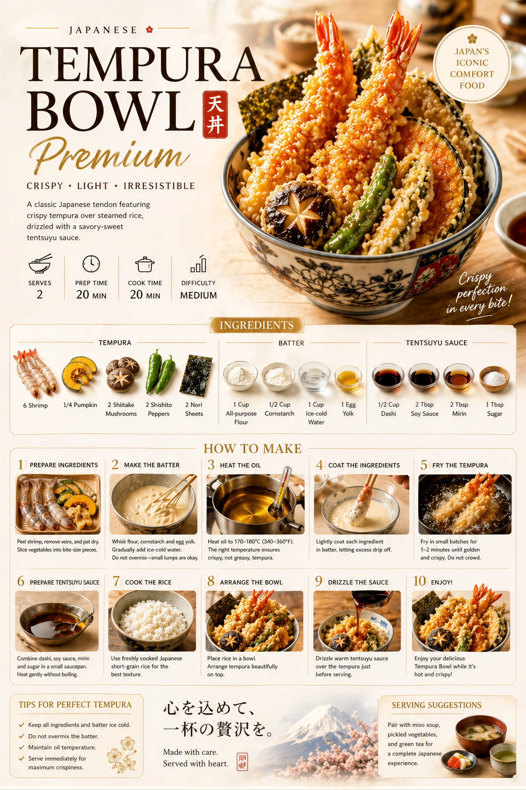

```text
Create a premium food preparation poster for
 [ DISH NAME ], with a beautiful hero dish, warm natural lighting, cream background, elegant step-by-step recipe layout, ingredients, cooking process, premium food photography, refined English typography, luxury restaurant advertisement style, clean design, rich colors, highly detailed, visually irresistible, cinematic masterpiece.
```


---

## 例 566：Surrealist Rolex Luxury Watch Fashion Poster

**来源：** [@Sheldon056](https://x.com/Sheldon056/status/2047873913049538927) / [awesome-gpt-image-2-prompts](https://github.com/EvoLinkAI/awesome-gpt-image-2-prompts)

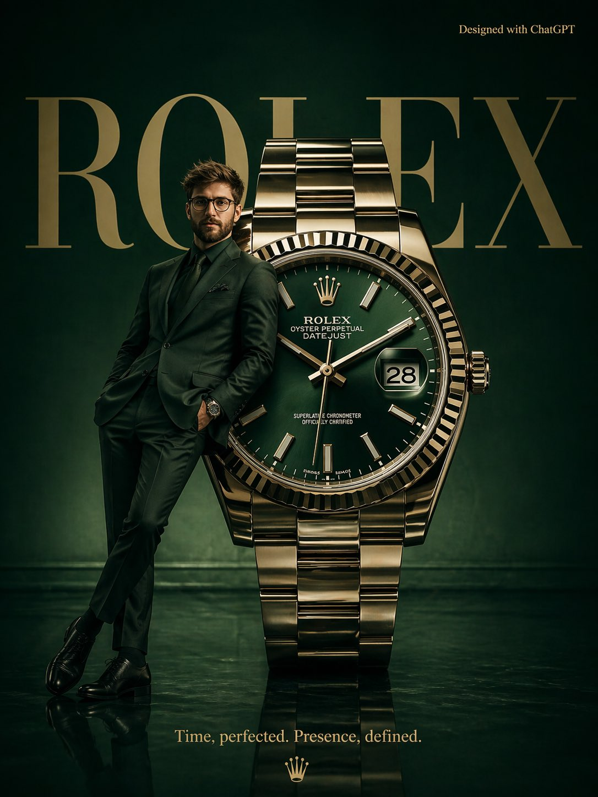

```text
A high-fashion surrealist poster for Rolex. A deep emerald green minimalist studio with a polished reflective floor. A massive Rolex watch stands upright like a monument. A male model in a tailored dark green suit leans casually against the watch face, wearing a matching Rolex.
```


---

## 例 567：SPLASH Fashion Brand Hyper-Realistic Campaign Poster

**来源：** [@miratechtool](https://x.com/miratechtool/status/2047780974709346606) / [awesome-gpt-image-2-prompts](https://github.com/EvoLinkAI/awesome-gpt-image-2-prompts)

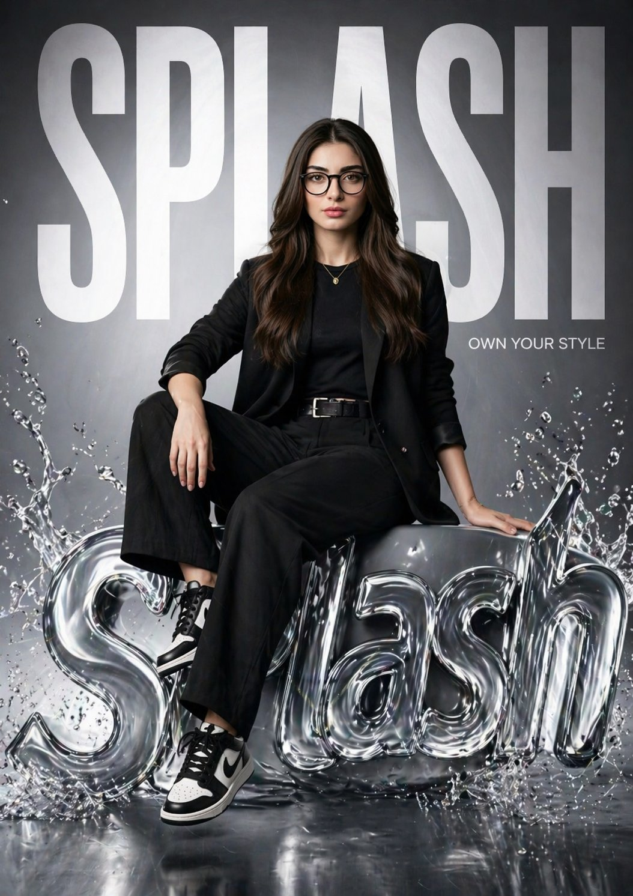

```text
Create a hyper-realistic fashion poster for “SPLASH” featuring the same girl from the reference image (keep her face 100% identical). She is sitting confidently on a glossy, liquid-style 3D SPLASH logo with water splash effects. One leg relaxed, one bent, strong editorial pose.
Background has massive bold “SPLASH” text filling the frame, partially behind her. Add small tagline: “Own Your Style.”
Outfit: modern black street-fashion (blazer, fitted top, trousers, sneakers).
Lighting: cinematic studio, soft key light + rim light, reflective highlights on liquid logo.
Style: luxury brand campaign (Zara / H&M), clean glossy environment.
Camera: 85mm lens, shallow depth of field, 8K, ultra-detailed, photorealistic.
```


---

## 例 568：Biomimetic Skyray Aircraft Poster

**来源：** [@_simonsmith](https://x.com/_simonsmith/status/2048172203946996041) / [awesome-gpt-image-2-prompts](https://github.com/EvoLinkAI/awesome-gpt-image-2-prompts)

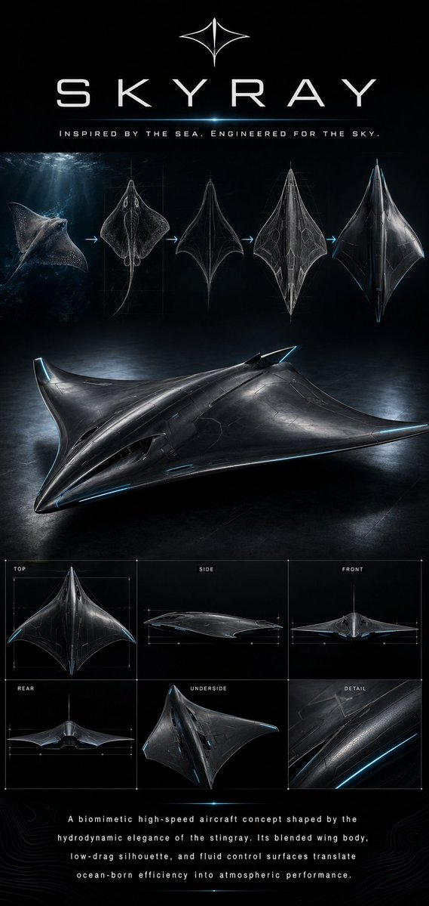

```text
{"type":"biomimetic aerospace concept poster","subject":{"vehicle":"futuristic aircraft concept","name":"{argument name=\"vehicle name\" default=\"SKYRAY\"}","inspiration":"{argument name=\"animal inspiration\" default=\"stingray\"}","design":"blended-wing-body aircraft shaped like a manta ray or stingray, wide triangular planform, smooth organic curves, sharp pointed nose, slightly raised central spine, tapered wing tips curling subtly upward, dark graphite-black metallic skin with fine panel lines and faint blue illuminated accents along edges and seams"},"style":{"mood":"premium futuristic industrial design presentation","rendering":"hyper-detailed cinematic 3D concept art mixed with blueprint visualization","color_palette":"black, charcoal, gunmetal, silver, deep ocean blue, electric cyan highlights","lighting":"low-key dramatic studio lighting with glossy reflections, cool rim light, subtle underwater ambience in the top inspiration strip"},"layout":{"background":"full black poster with faint technical grid lines and soft vignetting","sections":[{"title":"header","position":"top","count":3,"labels":["emblem mark","SKYRAY","INSPIRED BY THE SEA. ENGINEERED FOR THE SKY."]},{"title":"evolution strip","position":"upper middle","count":5,"labels":["realistic stingray underwater at far left","top-view biological stingray study","abstract aerodynamic line sketch","faceted aircraft blueprint transition drawing","final sleek aircraft concept at far right"]},{"title":"hero render","position":"center","count":1,"labels":["large three-quarter view of the aircraft"]},{"title":"technical views grid","position":"lower middle","count":6,"labels":["TOP","SIDE","FRONT","REAR","UNDERSIDE","DETAIL"]},{"title":"footer text","position":"bottom","count":1,"labels":["{argument name=\"body text\" default=\"A biomimetic high-speed aircraft concept shaped by the hydrodynamic elegance of the stingray. Its blended wing body, low-drag silhouette, and fluid control surfaces translate ocean-born efficiency into atmospheric performance.\"}"]}],"technical views":{"TOP":"top orthographic view with measurement ticks","SIDE":"thin side profile with long smooth belly curve","FRONT":"front orthographic view emphasizing broad wingspan and central cockpit hump","REAR":"rear orthographic view showing narrow tail end and wing sweep","UNDERSIDE":"underside three-quarter view","DETAIL":"close-up crop of metallic skin, seam lines, and glowing blue edge strip"}},"graphics":{"logo":"minimal four-point symmetrical emblem above title, resembling a stylized ray silhouette","arrows":"4 thin cyan arrows connecting the 5 stages in the evolution strip","typography":"widely spaced modern sans-serif uppercase text, clean luxury-tech branding"},"camera":{"hero render":"slightly elevated front-left three-quarter angle","technical views":"orthographic","inspiration image":"underwater side angle with light rays from above"},"quality":"ultra-clean, polished, high contrast, sharp, poster-ready, concept design board for aerospace branding or speculative industrial design"}
```


---

## 例 569：Ethnographic Plate for Tibetan Ceremonial Hat

**来源：** [@degewa](https://x.com/degewa/status/2048104569037783226) / [awesome-gpt-image-2-prompts](https://github.com/EvoLinkAI/awesome-gpt-image-2-prompts)

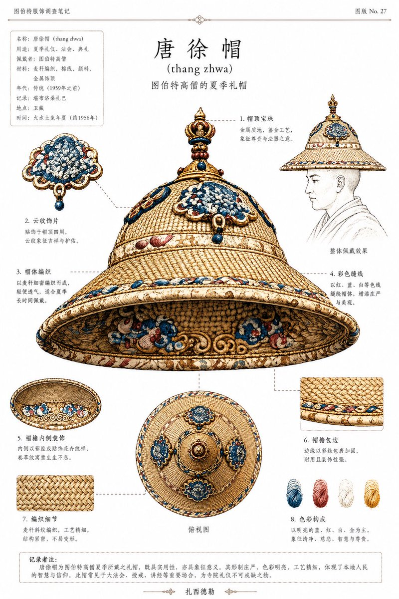

```text
Using REFERENCE_0 and REFERENCE_1, create a clean ethnographic archive plate focused on the ceremonial hat. Use REFERENCE_0 as the historical Tibetan context and silhouette reference, and REFERENCE_1 as the color, material, and ornament reference for the hat. Isolate and reconstruct the hat as a museum-style object study, removing the seated body as the main subject. Present the hat on an off-white document page as a scholarly catalog sheet in Chinese with small romanization. Add 8 numbered callouts around the object with fine dashed leader lines, each pointing to a specific structural detail. The centerpiece should be one large three-quarter underside view of the hat. Also include exactly 4 supplementary views/details: 1 side-profile wearing sketch with a faint line-drawn bust, 1 underside interior view, 1 top-down view, and 2 square close-up material swatches. Add exactly 4 thread-color samples near the lower right: blue, red, white, and yellow. At the top center, add the large title {argument name="headline text" default="唐徐帽"} with the romanization {argument name="romanization" default="(thang zhwa)"} beneath it, plus a smaller subtitle describing it as a summer ceremonial hat of high-ranking Tibetan monks. In the upper left, add a boxed metadata panel with multiple short Chinese fields, and in the upper right add a plate number reading {argument name="plate number" default="图版 No. 27"}. At the bottom, add one bordered note paragraph in Chinese. Overall style: meticulous archival infographic, anthropological catalog illustration, historically informed, precise woven texture, ivory-gold base with blue and red ornament, elegant print layout, thin rules and decorative divider marks, high-detail object rendering on a plain paper background.
```


---

## 例 570：Urban Alley Mural Artist

**来源：** [@Professor_134](https://x.com/Professor_134/status/2048066672398102896) / [awesome-gpt-image-2-prompts](https://github.com/EvoLinkAI/awesome-gpt-image-2-prompts)

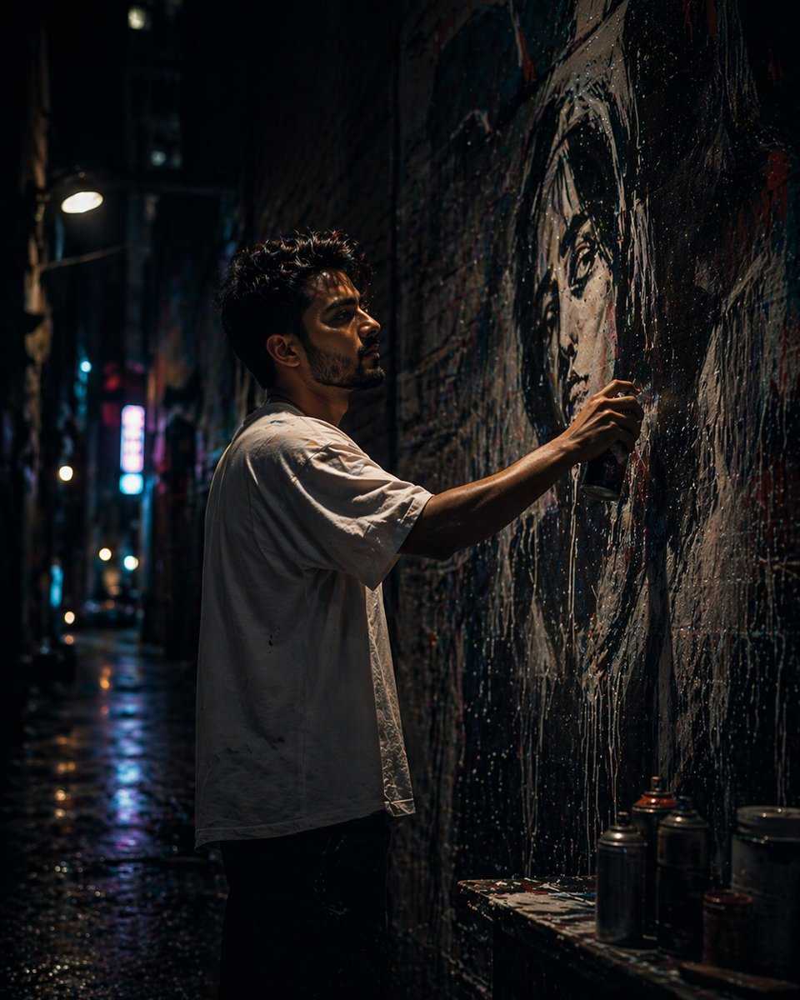

```text
A cinematic, ultra-realistic night scene of a {argument name="artist" default="young male street artist"} painting a large-scale {argument name="mural subject" default="mural of a woman’s face"} in a {argument name="setting" default="narrow urban alley"}. The camera angle is slightly low, creating a dramatic, powerful perspective. The artist has medium-length, slightly messy dark hair and light stubble or a short beard, giving him a rugged, creative look.

He wears a loose white t-shirt and casual jeans, slightly oversized, with a relaxed streetwear vibe. His posture is focused and engaged as he stands close to the wall, actively spray-painting.

He is creating a massive, hyper-realistic mural of a woman’s face on a textured brick wall. The mural is incredibly detailed—smooth skin tones, realistic lighting, expressive eyes, and glossy lips—appearing almost like a photograph. Fine mist from the spray paint is visible in the air, catching light and adding motion and atmosphere.

The setting is a narrow urban alley at night, surrounded by tall buildings. The environment is gritty and textured—aged brick walls, paint splashes, subtle grime, and urban wear. Neon signs and distant streetlights cast vibrant reflections in teal, magenta, and blue tones, creating a cinematic, slightly cyberpunk mood.

Lighting is dramatic and layered: cool ambient light fills the alley, while warmer neon highlights create contrast. A subtle rim light outlines the artist’s silhouette, separating him from the dark background. The mural is partially illuminated, acting as a strong focal point.

Atmosphere includes light fog or mist, enhancing depth and making the lighting glow softly. The scene feels immersive, quiet, and artistically intense.

Depth of field is moderately shallow: the artist and mural are in sharp focus, while the background fades into soft blur with bokeh highlights.

Style: hyper-realistic, cinematic photography, street art aesthetic, ultra-detailed textures, high dynamic range, subtle film grain.

Camera details: 35mm or 50mm lens, f/1.8–f/2.8 aperture, low-light photography, slight low-angle shot, natural perspective.

Composition: vertical frame (4:5 or 9:16), subject slightly off-center, mural dominating the frame for strong visual storytelling.
Generate image using uploaded image as reference
```


---

## 例 571：Good Bath Day Editorial Poster

**来源：** [@Kazuch75240438](https://x.com/Kazuch75240438/status/2048205418238030327) / [awesome-gpt-image-2-prompts](https://github.com/EvoLinkAI/awesome-gpt-image-2-prompts)


```text
Create a soft editorial lifestyle poster for {argument name="event date" default="4.26"} celebrating Japanese bath culture, designed like a refined magazine feature page in portrait orientation. The layout is split into two main columns with a pale cream and warm gray background, thin divider lines, elegant serif typography, and muted sage-green accents. At the top left, include the small heading “LIFESTYLE / FEATURE”, then a large date line reading “{argument name="event date" default="4.26"} EVENT”, followed by the large Japanese title “よい風呂の日” and the subtitle “特集” in sage green, with a small bathtub icon nearby. Beneath that, add the Japanese tagline “心も体も、ととのう時間。” and several short body-text blocks in Japanese explaining the meaning of Good Bath Day, including references to “4(よ)2(ふ)6(ろ)” and the benefits of bathing for body and mind. On the right side, show a bright, airy bathroom interior lit by soft natural morning light from a window, with beige and off-white tones, a wooden counter, folded white towels, a pump bottle, a sponge, woven baskets, and a few green plants. In front of the bathroom scene, place a youthful anime-style person with {argument name="hair color" default="soft medium brown"} tousled short hair, fair skin, and a relaxed expression, standing in a casual post-bath pose. The character wears a loose white T-shirt with a tiny dark square chest logo and light brown drawstring lounge pants, one hand in a pocket and the other holding a white towel up near the face and shoulder, conveying a fresh, just-bathed feeling. Near the character, include the handwritten-style Japanese side note “湯上がりの、リラックスタイム。” Add an oval badge on the lower right of the main image area with the English heading “GOOD BATH DAY” and Japanese explanatory text inside, plus a small bathtub icon. Below the main feature, include exactly 2 small inset images of the same character in the bathroom, each framed as rectangular mini-panels with narrow vertical Japanese captions beside them. At the bottom, create exactly 4 rounded rectangular information cards in a row: card 1 labeled “POINT 01” with the heading “お風呂の基本” and text about soaking in lukewarm water around 38–40°C; card 2 labeled “POINT 02” with the heading “日常でできること” and text about making bathing part of a routine instead of only showering; card 3 labeled “POINT 03” with the heading “楽しみ方・取り入れ方” and text about bath salts, scents, music, and lighting; card 4 labeled “まとめ” with concluding Japanese text about sustainable self-care. Decorate the cards with small illustrated elements such as leaves, a bathtub, a candle, a bottle, lavender sprigs, and a basket of folded towels. Along the very bottom, add a horizontal green tip strip labeled “今日からできる TIP” with exactly 3 checklist items: “就寝の1〜2時間前に入浴する”, “スマホは浴室に持ち込まない”, and “水分補給を忘れずに”. Place a final handwritten-style Japanese phrase at the lower right reading “自分をいたわる時間を。” The overall look should be clean, gentle, wellness-focused, feminine-neutral, and polished like a Japanese seasonal magazine infographic, with delicate anime illustration, soft shadows, subtle textures, and calm spa-like atmosphere.
```


---

## 例 572：Stormy Tropical City With Rooftop Plane

**来源：** [@Gerry](https://x.com/Gerry/status/2048303505702629537) / [awesome-gpt-image-2-prompts](https://github.com/EvoLinkAI/awesome-gpt-image-2-prompts)

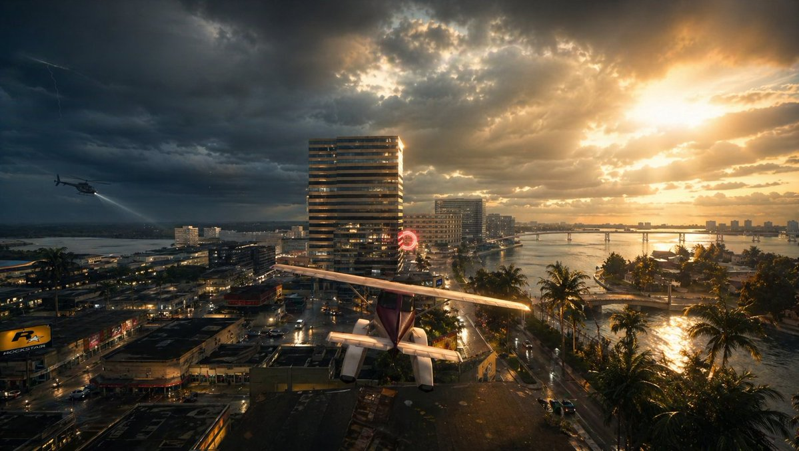

```text
A cinematic wide aerial view of a tropical coastal city at sunset during a violent storm, split dramatically between dark storm clouds on the left and blazing golden sunlight on the right. In the foreground, a small single-engine light airplane with a high wing and visible tail is parked or perched precariously on a flat rooftop, seen from behind and slightly above, centered near the bottom of the frame. To the left midair, 1 helicopter flies low over the city with its searchlight cast downward. In the sky, include 1 faint lightning bolt on the far left. The city below is dense with wet streets, reflective pavement, low-rise commercial buildings, and a few taller modern towers, including 1 prominent striped high-rise near the center. A glowing red circular neon sign is visible near the middle distance. On the right side, a calm bay or inlet curves through the city, lined with 1 row of tall palm trees along the waterfront road, and crossed by 1 long low bridge in the distance. The water and streets glisten from recent rain, reflecting the orange sunlight breaking through the clouds. Mood is tense, dramatic, and slightly surreal, like a movie still from an urban disaster thriller. Photorealistic, ultra-detailed, high dynamic range lighting, volumetric sun rays, storm atmosphere, wet surfaces, rich contrast, deep shadows, golden highlights, wide-angle lens, epic composition.
```


---

## 例 573：Outdoor Sportswear Grid Campaign

**来源：** [@SPEEDAI07](https://x.com/SPEEDAI07/status/2049081198211736062) / [awesome-gpt-image-2-prompts](https://github.com/EvoLinkAI/awesome-gpt-image-2-prompts)

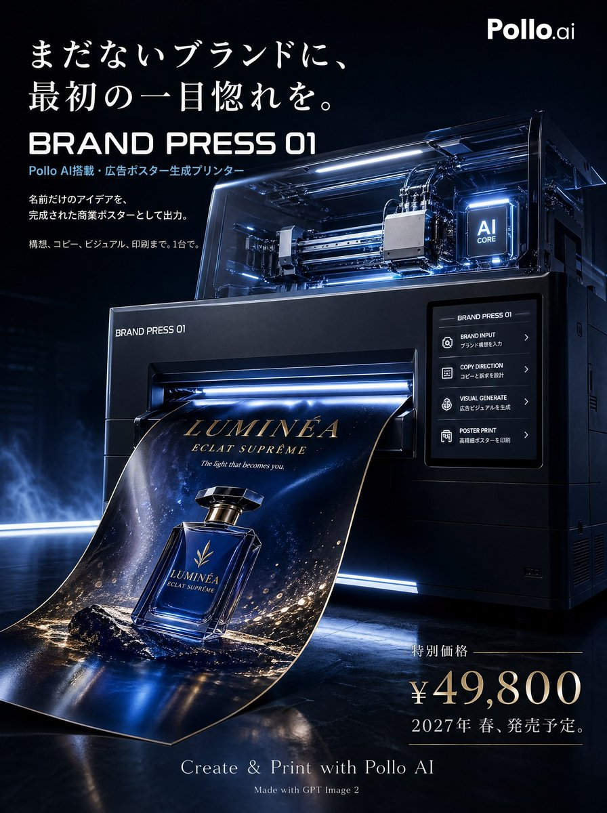

```text
A dynamic 2×2 grid collage of modern outdoor sportswear advertising posters, each panel representing a different adventure lifestyle brand. High-energy, editorial-style composition with bold typography and textured graphic design.

Top-left panel:
Athletic male model in a bright blue insulated winter jacket, black snow pants, gloves, and sunglasses, stepping forward in a snowy environment. Snow particles flying, dramatic motion. Background features rough blue paint brush strokes. Bold distressed typography reads: “NEVER STOP EXPLORING.” Additional small text: “Built for extremes.” High contrast, rugged winter exploration theme.

Top-right panel:
Fit male hiker climbing rocky terrain, wearing an olive green shirt, black trekking pants, and a large black backpack with orange straps. Dust and debris kicking up from the ground. Background includes orange paint strokes and sketched mountain graphics. Bold text: “BUILT FOR HERE – INDIA TESTED.” Handwritten Hindi accents and arrows. Warm earthy tones.

Bottom-left panel:
Calm outdoor scene with a male model sitting on a rock, wearing a green jacket, beanie, sunglasses, and hiking shoes. Minimal scenic mountain illustration in the background with soft green tones. Typography reads: “ESCAPE THE NOISE – JUST GO OUTSIDE.” Clean, relaxed, nature-focused aesthetic with subtle graphic elements.

Bottom-right panel:
Energetic female runner in motion wearing a purple athletic t-shirt, black shorts, and running shoes. Bright, playful background with purple and yellow paint splashes, doodles, arrows, and sun illustration. Bold typography: “READY FOR EVERYONE – START YOUR JOURNEY.” Youthful, vibrant fitness energy.

Overall style:

High-resolution, photorealistic sportswear campaign

Bold brushstroke textures and grunge overlays

Mixed typography: distressed, handwritten, and modern sans-serif

Strong color blocking per panel (blue, orange, green, purple)

Dynamic poses conveying motion, strength, and adventure

Clean grid layout with balanced spacing

Commercial advertising / brand campaign aesthetic (Nike, Decathlon style)

Lighting: Professional, cinematic lighting with sharp detail and contrast
Mood: Energetic, adventurous, motivational
Aspect ratio: 1:1 (square collage)
```


---

## 例 574：Topographic Letter Satellite Panels

**来源：** [@madpencil_](https://x.com/madpencil_/status/2049080259476349218) / [awesome-gpt-image-2-prompts](https://github.com/EvoLinkAI/awesome-gpt-image-2-prompts)


```text
Ultra-realistic satellite view from space, a clean modern editorial layout of 9 vertical panels arranged side-by-side on a white background, together forming the word "MADPENCIL", each panel containing one letter created entirely from natural Earth topography, no artificial text overlays:

Panel 1 (M): rugged mountain ranges and deep valleys forming a sharp, angular "M", rocky textures, high elevation shadows
Panel 2 (A): winding river cutting through dense green forest forming an organic "A", strong contrast between water and vegetation
Panel 3 (D): desert dunes and wind-sculpted sand patterns shaping a smooth "D", warm tones, soft gradients
Panel 4 (P): agricultural farmland grids and patchwork fields forming a structured "P", geometric patterns clearly visible
Panel 5 (E): glacier and ice formations carving a crisp "E", bright whites and icy blues, fractured textures
Panel 6 (N): braided river system across floodplains forming "N", branching channels with natural flow lines
Panel 7 (C): coastal shoreline and ocean edge shaping a curved "C", waves and sediment gradients visible
Panel 8 (I): narrow canyon or straight river cutting through terrain forming a minimal "I", strong vertical emphasis
Panel 9 (L): volcanic terrain with lava flows forming an "L", dark rock with glowing red/orange lava accents

top-down satellite perspective, NASA Earth observation style, hyper-detailed textures, realistic geography, consistent scale and lighting across all panels, minimal clouds, high contrast, sharp focus, subtle atmospheric haze, natural color grading, ultra high resolution 8K, clean spacing between panels, modern gallery-style composition, visually cohesive but each panel distinctly different biome, letters clearly readable yet organically integrated into terrain
```


---

## 例 575：Fast Food Character Poster

**来源：** [@LoovaAI](https://x.com/LoovaAI/status/2049085173015425354) / [awesome-gpt-image-2-prompts](https://github.com/EvoLinkAI/awesome-gpt-image-2-prompts)

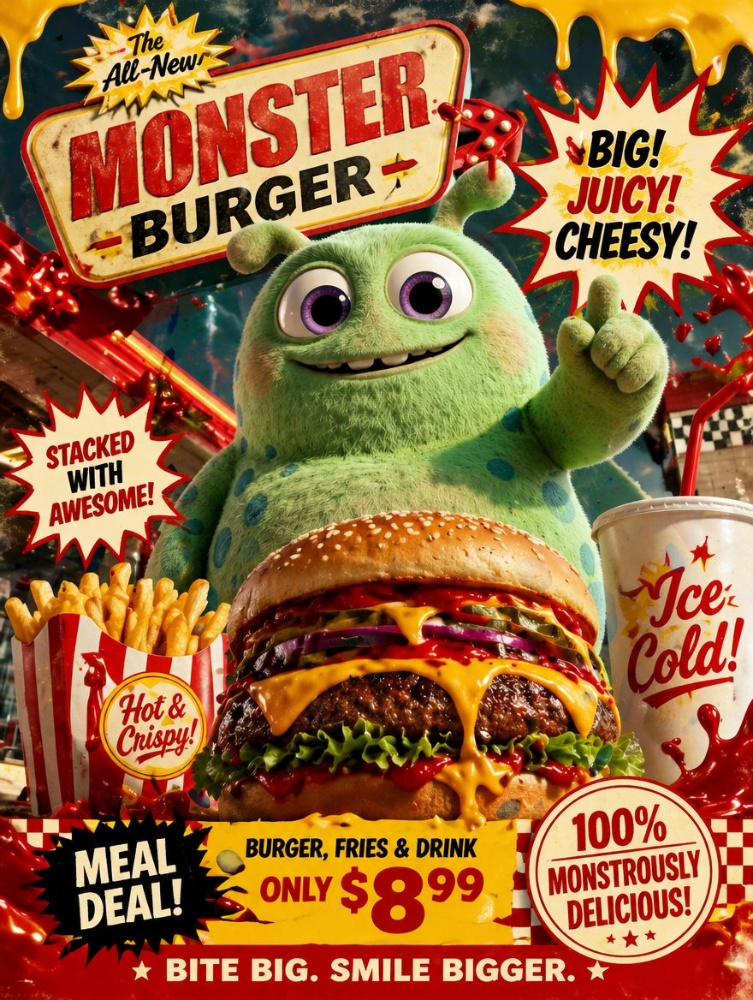

```text
Use the character in image 1 as the main subject. Create a vertical poster ad in American fast food diner style. Low angle, wide lens. Red / yellow / white palette with ketchup splashes, melting cheese graphics, comic burst shapes, retro diner typography, and bold fast food poster collage aesthetic.
```


---

## 例 576：New York across two centuries cinematic poster

**来源：** [@Shinning1010](https://x.com/Shinning1010/status/2049460661109879022) / [awesome-gpt-image-2-prompts](https://github.com/EvoLinkAI/awesome-gpt-image-2-prompts)

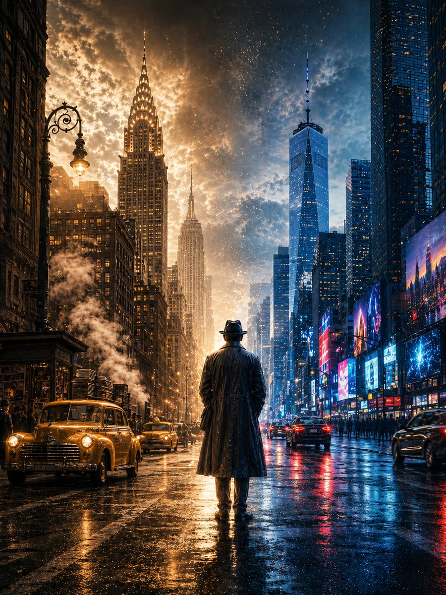

```text
Create a cinematic 3:4 vertical poster of New York City that feels truly epic and unconventional, showing the passage from the 20th century to the 21st century in one seamless image. Place a lone figure at the center of the composition, standing in the middle of the street and looking forward as if witnessing New York across time. The left side should depict 20th-century New York with warm sepia atmosphere, vintage taxis, old newsstands, retro lamps, and landmarks like the Chrysler Building and Empire State Building. The right side should depict 21st-century New York with glass skyscrapers, One World Trade Center, digital billboards, and modern urban energy. Make the transition natural rather than split-screen, with coherent perspective, wet reflective pavement, realistic textures, atmospheric depth, and no text.
```


---

## 例 577：Lavender Smartphone Hero Ad

**来源：** [@meng_dagg695](https://x.com/meng_dagg695/status/2050472802327900342) / [awesome-gpt-image-2-prompts](https://github.com/EvoLinkAI/awesome-gpt-image-2-prompts)

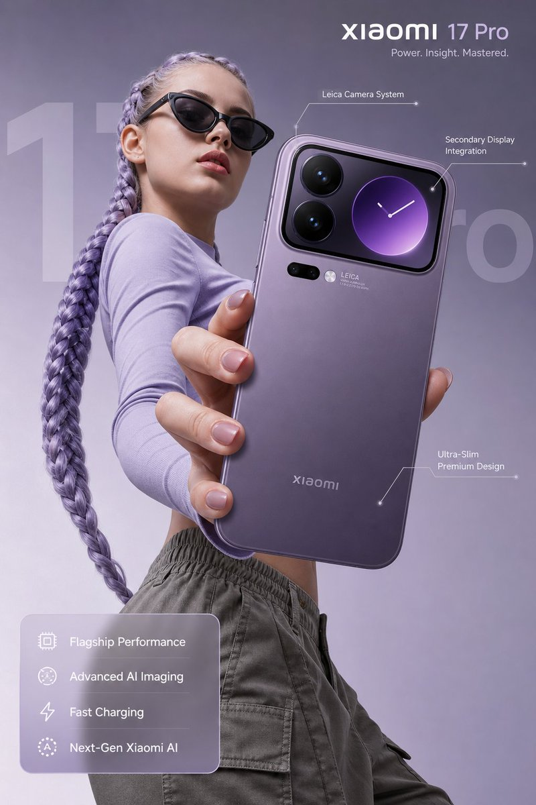

```text
Redmi 17 pro new launch 🔥 Made with Gpt image 2 on Chatgpt Prompt : Ultra-realistic premium smartphone advertisement, featuring a confident young woman in her early 20s with fair skin and sharp facial features, wearing sleek black cat-eye sunglasses. She has long, thick braided hair styled into an extended oversized braid, colored in soft lavender/purple tones matching the product theme. She is captured in a dynamic low-angle cinematic pose, slightly twisting her torso while holding a Xiaomi 17 Pro smartphone toward the camera in a bold hero shot with strong forced perspective, the phone dominating the foreground. The smartphone features a matte metallic lavender/purple finish, minimalistic body with rounded corners, and a large rectangular camera module. The module includes two large camera lenses on the left, a circular secondary display on the right showing a minimal purple gradient clock UI, Leica branding near the camera, a clean flash strip, and subtle Xiaomi branding at the bottom. Outfit: fitted long-sleeve crop top in soft lavender/purple, paired with high-waisted muted grey/olive cargo pants, modern tech-fashion aesthetic. Background: clean minimal gradient transitioning from light grey to soft lavender/purple tones, with subtle blurred large-scale typography for depth. Lighting: soft studio lighting with neutral-to-cool tones, smooth skin illumination, controlled highlights on the phone edges, glossy reflections on camera lenses and display, minimal shadows, premium product photography style. Composition: low-angle shot for a powerful look, subject positioned slightly left, phone dominating the right foreground, clean negative space for branding. Futuristic UI overlays: thin minimal white/purple lines and nodes pointing to features with floating labels: “Leica Camera System” “Secondary Display Integration” “Ultra-Slim Premium Design” Glassmorphism panel (bottom-left, soft purple tint) listing: “Flagship Performance” “Advanced AI Imaging” “Fast Charging” “Next-Gen Xiaomi AI” Top corner text: “Xiaomi 17 Pro” in clean modern sans-serif typography. Style: high-end flagship smartphone advertisement, futuristic, minimal, elegant. Quality: 8K, ultra-detailed, sharp focus, HDR, cinematic commercial photography, realistic textures.
```


---

## 例 578：Luxury Food Poster Template

**来源：** [@SPEEDAI07](https://x.com/SPEEDAI07/status/2050470348454551902) / [awesome-gpt-image-2-prompts](https://github.com/EvoLinkAI/awesome-gpt-image-2-prompts)

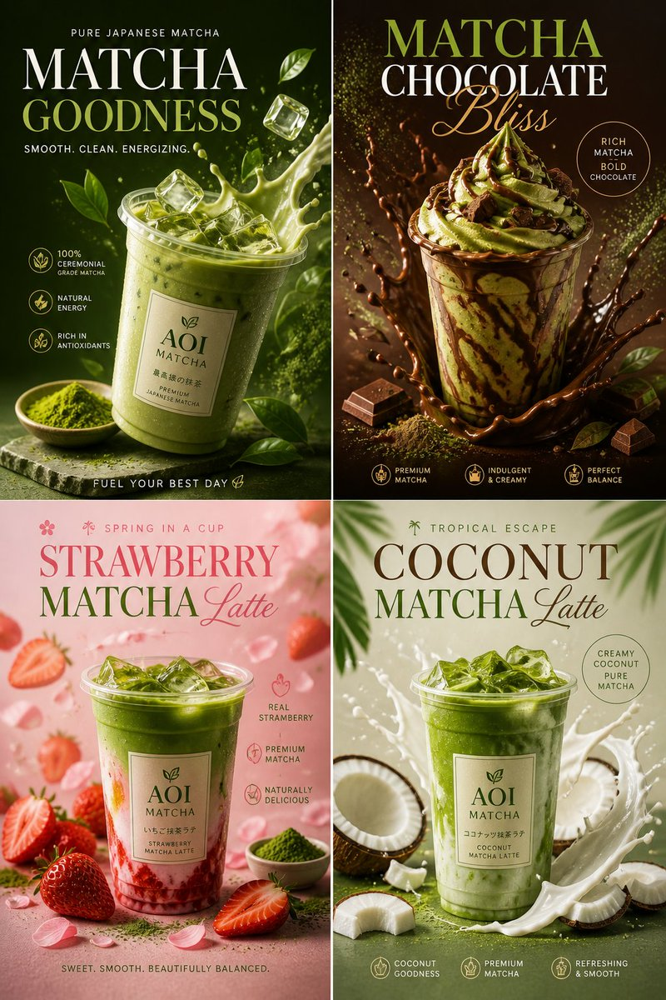

```text
GPT Image 2 on ChatGPT App Create a hyper-realistic vertical commercial food photography poster for a premium [PRODUCT TYPE], designed in a refined luxury advertisement style, 2:3 aspect ratio. Place [MAIN PRODUCT] as the central hero subject, positioned [COMPOSITION / ANGLE], with premium realistic details such as [TEXTURE DETAILS], [SURFACE FINISH], and [FOOD-SPECIFIC FEATURES]. Surround the product with [FLOATING INGREDIENTS / MOTION ELEMENTS], arranged dynamically but cleanly to create movement, depth, and visual balance. Add [LIQUID / SPLASH / DRIP / POWDER EFFECT] interacting with the product in a natural high-speed freeze-frame style, showing realistic viscosity, droplets, suspended particles, soft shadows, and crisp highlights. Use a [BACKGROUND STYLE] with a cohesive color palette of [COLOR PALETTE], keeping the composition clean, appetizing, and premium. Lighting should be [LIGHTING STYLE], emphasizing gloss, creaminess, texture, and material contrast. Include [TYPOGRAPHY / BRANDING DETAILS] if required, placed with elegant spacing and modern commercial balance. Ultra-detailed textures, photorealistic rendering, high-end dessert or beverage advertisement aesthetic, sharp focus on the hero product, slight depth falloff on outer elements, clean studio composition, luxurious, fresh, indulgent, 8K resolution. Cheat Sheet [PRODUCT TYPE]: matcha drink, ice cream bar, pistachio cone, dessert poster [MAIN PRODUCT]: cup, bar, cone, packaged dessert [COMPOSITION / ANGLE]: overhead flat-lay, centered vertical, mid-air diagonal [TEXTURE DETAILS]: crumbs, powder, nuts, cream ridges, ice cubes [SURFACE FINISH]: glossy chocolate, matte powder, creamy swirl, transparent plastic [FLOATING INGREDIENTS]: almonds, tea leaves, pistachios, cherry pieces [MOTION EFFECT]: splash, drip, swirl, powder burst, frozen particles [BACKGROUND STYLE]: soft gradient, textured powder surface, clean studio backdrop [COLOR PALETTE]: matcha green, chocolate brown, cherry pink, pistachio sage [TYPOGRAPHY]: brand name, product title, tagline, offer badge, CTA button
```


---

## 例 579：Inflatable Orange Juice Poster

**来源：** [@Goodmanprotocol](https://x.com/Goodmanprotocol/status/2050451019746926879) / [awesome-gpt-image-2-prompts](https://github.com/EvoLinkAI/awesome-gpt-image-2-prompts)

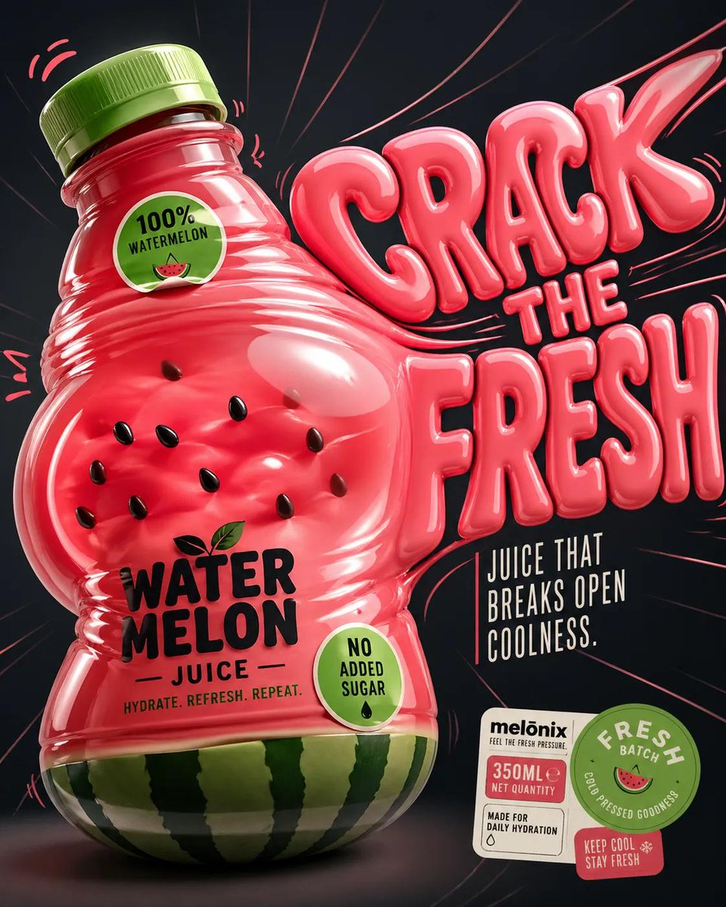

```text
Perfect for the summers GPT Image 2 on ChatGPT Prompt: Design a '4:5' product poster for an 'orange' juice 3d bottle using playful inflatable-plastic packaging surrealism where the bottle behaves like a squeezed toy object mid-pressure. The poster should communicate juiciness, tension, and tactile freshness through a bottle that visibly bulges, stretches, and compresses like a soft object being squeezed from the inside out. SUBJECT: A single bottle dominates the center-left, illustrated in a semi-3D stylized form (not photoreal). The bottle is visibly distorted—its midsection bulges outward while the neck is slightly compressed, as if internal juice pressure is pushing against the container walls. The liquid inside exaggerates this effect, forming rounded convex surfaces pressing against the plastic. The cap is slightly tilted from pressure. The bottle feels elastic, alive, and reactive rather than rigid. COMPOSITION: The composition mechanic is “internal pressure distortion”. The eye enters through the most inflated part of the bottle (center bulge), then follows curved tension lines outward toward stretched typography on the right side. The camera uses a slightly low, close-up perspective with mild fisheye distortion, amplifying the sense of pressure and expansion. The bottle leans diagonally into the frame as if pushing against invisible resistance. Negative space on the right is intentionally stretched and warped, echoing the bottle’s deformation. TYPOGRAPHY: Headline: “SQUEEZE BACK” in thick, rounded, inflated lettering that mimics air-filled plastic. The type is physically distorted—letters stretch horizontally near the bottle and compress toward the edges, as if affected by the same pressure force. The headline sits to the right of the bottle but partially overlaps its bulging edge. Subheadline: “Juice that pushes back.” in a narrow condensed sans, straight and rigid, contrasting the soft headline. Small circular microcopy labels (e.g., “100% organic”, “no added sugar”) appear like printed stickers slightly warped by the surface tension. LIGHTING / GRAPHIC TREATMENT: Soft studio lighting adapted for stylized rendering—broad diffused highlights across curved surfaces, subtle specular streaks that follow the deformation. No realistic reflections—only controlled, simplified highlight bands that emphasize volume and elasticity. COLORS: 'orange' juice bottle color and 3d header text. Small accents of 'bright lime green' for sticker elements. High contrast between glowing orange and dark surroundings. BACKGROUND: A smooth dark gradient field with subtle radial tension lines expanding outward from the bottle, like invisible pressure waves. No texture clutter—clean but dynamically warped space. STYLE: Neo-pop surreal product illustration with inflatable material logic, playful distortion, and high-impact commercial clarity. FINISH: Soft plastic-like rendering, clean edges, controlled gradient transitions, no noise or grain, polished but intentionally stylized surface behavior. FOOTER: A compact floating sticker cluster in the bottom-right corner containing a small brand placeholder, a circular “fresh batch” seal, and minimal product info arranged like packaging labels. NEGATIVE: Avoid realistic photography, static bottle poses, generic splash effects, centered symmetry, rigid typography, template layouts, clutter, excessive gloss, low detail, and stock advertising aesthetics.
```


---

## 例 580：Emerald Street Fashion Poster

**来源：** [@harboriis](https://x.com/harboriis/status/2050444570345742591) / [awesome-gpt-image-2-prompts](https://github.com/EvoLinkAI/awesome-gpt-image-2-prompts)

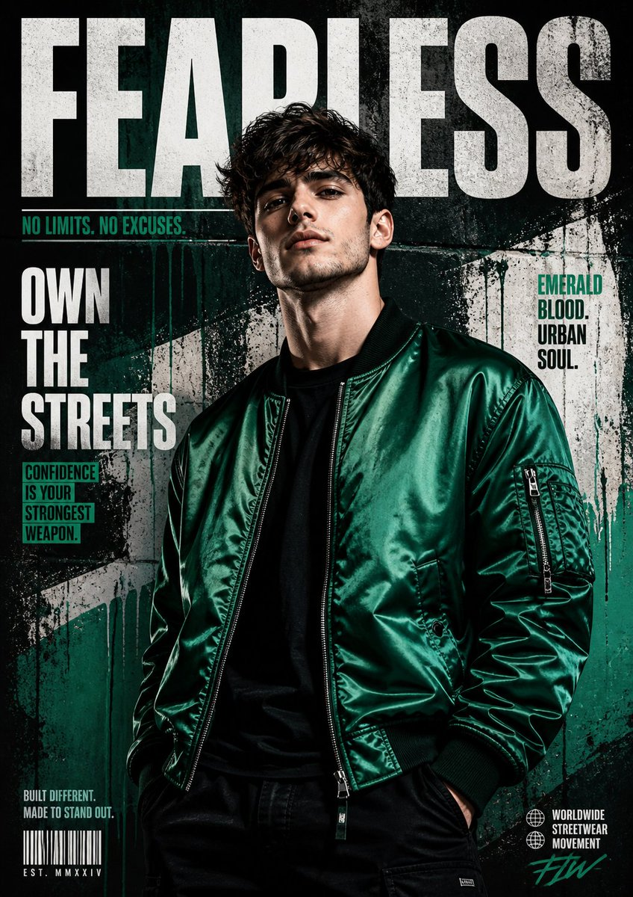

```text
GPT Image 2 on ChatGPT Prompt: Create a bold street-fashion poster featuring a handsome man with short black hair, and a fearless expression. Dress him in a glossy emerald satin bomber jacket and black pants. Place him in front of a distressed concrete wall with emerald, black, and white layered textures. Use dramatic editorial lighting, crisp contrast, and a premium urban mood. Add bold uppercase typography with a clean modern poster style.
```


---

## 例 581：Retro Roller Skating Campaign

**来源：** [@AIwithSynthia](https://x.com/AIwithSynthia/status/2050430705189191704) / [awesome-gpt-image-2-prompts](https://github.com/EvoLinkAI/awesome-gpt-image-2-prompts)


```text
PixPretty @PixPrettyAI with GPT Image 2 has been quietly setting a new standard over the past few days Prompt : A premium sports fashion campaign featuring a confident athletic woman wearing a red and white retro roller skating outfit, styled in a minimal studio environment with bold red and beige tones. Top frame: full-body shot of the model sitting casually on a concrete ledge, wearing white roller skates with red wheels, one leg extended and the other bent, looking sideways with a strong editorial pose. Background features large bold typography reading “FREEDOM” in oversized letters. Bottom left frame: close-up portrait of the model with glowing skin, slicked-back hair, and sharp lighting emphasizing facial structure. Minimal text “OWN YOUR PACE” placed beside her. Bottom right frame: dynamic action pose of the model skating low to the ground, hand reaching forward, showcasing motion and strength. Background includes minimal graphic lines and text “BALANCE FLOW FREEDOM”. Style: high-end commercial photography, sharp details, cinematic lighting, glossy skin highlights, strong shadows, ultra-clean composition, brand campaign aesthetic, Nike/Adidas inspired, 1:1 layout, grid collage format, editorial typography, bold color blocking, 4K resolution.
```


---

## 例 582：Futuristic Sportswear Editorial Poster

**来源：** [@gold_force_guri](https://x.com/gold_force_guri/status/2050428455360348191) / [awesome-gpt-image-2-prompts](https://github.com/EvoLinkAI/awesome-gpt-image-2-prompts)


```text
GPT image 2 on @SocialSight Prompt: High-fashion futuristic sportswear editorial poster, full-body female model in dynamic wide-leg stance, oversized white minimalist sweatshirt with voluminous sleeves, glossy translucent parachute pants, chunky white-orange athletic sneakers, sleek messy updo hairstyle, gold statement earrings, soft natural makeup, confident editorial expression, studio fashion photography, centered composition, smooth neutral beige gradient background with large abstract glossy red-pink organic 3D inflatable blob shapes behind model, bold oversized white typography “just” partially behind subject, premium athletic brand campaign aesthetic, ultra-clean lighting, soft diffused studio shadows, luxury streetwear advertisement, contemporary magazine cover design, minimalist layout, subtle futuristic graphic microtext, highly polished commercial fashion retouching, sharp focus, cinematic soft contrast, photorealistic, high detail, 8k
```


---

## 例 583：Streetwear Headphones Ad Poster

**来源：** [@Strength04_X](https://x.com/Strength04_X/status/2050420683482800333) / [awesome-gpt-image-2-prompts](https://github.com/EvoLinkAI/awesome-gpt-image-2-prompts)

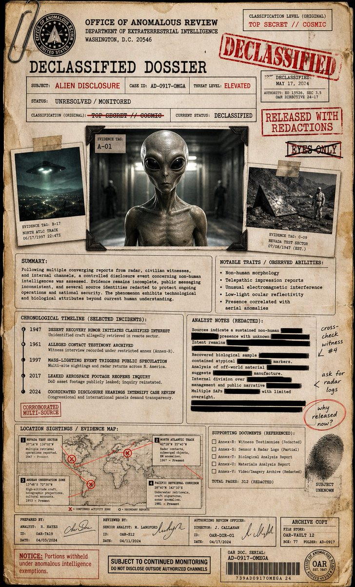

```text
GPT image 2 on ChatGPT 📱 Prompt: A streetwear advertisement poster. A cool teenage girl in oversized hoodie and baggy jeans leans against a giant pair of floating wireless headphones 2x her height with "BASS" logo on earcups, colorful sound wave visualizer glowing behind. Dark urban brick wall background with purple and pink gradient neon lighting. Bold graffiti-style typography "BASS" in background. Tagline bottom: "Feel every frequency." Small text top-right corner reads "Designed with GPT Image 2" in grey. Photorealistic, street culture editorial style.
```


---

## 例 584：Miniature City Knot Sculpture

**来源：** [@Gdgtify](https://x.com/Gdgtify/status/2051274139378315546) / [awesome-gpt-image-2-prompts](https://github.com/EvoLinkAI/awesome-gpt-image-2-prompts)

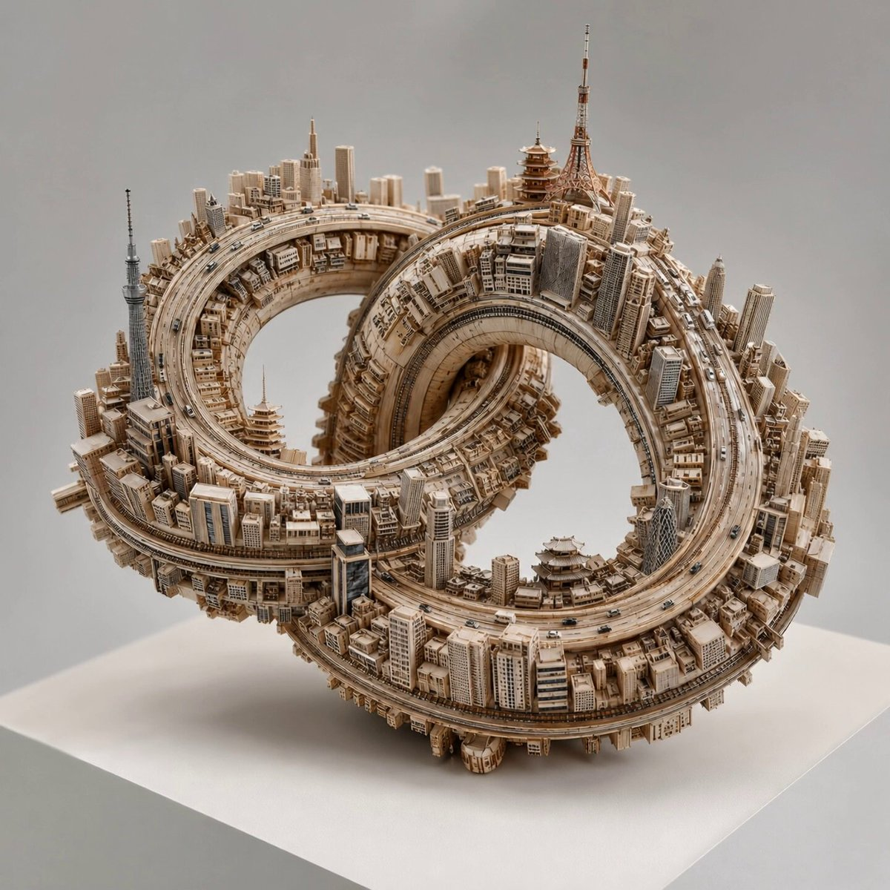

```text
GPT Image 2 + Kling = 🔥 This was done for Tokyo.

[VAR_CITY] = "Tokyo, Japan"     [NODE 1: BASE_TOPOLOGY] Generate a complex, self-intersecting 3D endless loop (e.g., a thick Trefoil Knot or Gordian Knot). Material_Output: Raw, unfinished layered birch plywood. Visible wood grain.  [NODE 2: INSTANCER_LOGIC] AI_INFERENCE_TRIGGER: Analyze [VAR_CITY]. Extract its iconic architectural style, specific landmarks, and road infrastructure.  Action: Instance these urban elements directly onto the surface normals of the [BASE_TOPOLOGY].  [NODE 3: GRAVITY_WARP] The gravity vector is strictly relative to the surface of the knot. Buildings must project outward from the wood, regardless of whether the surface is facing up, down, or sideways. The roads must follow the curvature perfectly. Tiny metallic cars dot the highways.  [RENDER_ENGINE] Execute Tree. Output as a physical macro-photography studio shot. The object sits on a blank museum pedestal. Soft, diffuse top-lighting. Shallow depth of field to emphasize the miniature scale.
```


---

## 例 585：Taiwanese Food Blog Spread

**来源：** [@aiistudiocom](https://x.com/aiistudiocom/status/2051271666429473079) / [awesome-gpt-image-2-prompts](https://github.com/EvoLinkAI/awesome-gpt-image-2-prompts)


```text
A cozy restaurant table filled with a vibrant Taiwanese meal, shot in warm natural lighting. A large bowl of braised beef noodle soup with wide noodles, tender beef chunks, bok choy, and green onions sits in the foreground. Surrounding dishes include a bowl of rice topped with raw egg yolk, seaweed, kimchi, and chopped vegetables; a plate of Taiwanese fried chicken and tofu with greens; stir-fried water spinach with garlic; and a small dish of marinated vegetables. A tall elegant glass dessert with shrimp salad layered inside stands in the center. Wooden table surface, ceramic bowls, and a teapot in the background create a homely aesthetic. Handwritten-style Chinese text annotations and doodles are scattered around the dishes, adding a playful, lifestyle-blog feel. Soft depth of field, warm tones, high detail, food photography style.
```


---

## 例 586：Alien Disclosure Dossier

**来源：** [@Gdgtify](https://x.com/Gdgtify/status/2051262563426459707) / [awesome-gpt-image-2-prompts](https://github.com/EvoLinkAI/awesome-gpt-image-2-prompts)


```text
I asked GPT Image 2 to spill the beans on alien life.

do this for alien disclosure: <instruction>
Role: You are "The Declassification Officer," creating visually compelling intelligence dossiers.

Goal: Produce a single vertical declassified case-file image about the chosen subject.

Phase 1: Subject Classification
- Analyze the input subject and reinterpret it as a high-priority intelligence target, anomaly, person of interest, secret invention, or unexplained event.
- Assign:
  - Case ID
  - Threat level
  - Classification level
  - Status (active, missing, monitored, contained, unresolved)

Phase 2: Document Structure
Design the image as a realistic but stylized dossier page with the following sections:
- Header: agency-style title, case number, classification stamp.
- Mugshot or main visual of the subject.
- Summary paragraph.
- Notable traits or observed abilities.
- Timeline of 3–5 incidents.
- Redacted notes.
- Location sightings or evidence callouts.
- Bottom section with stamp marks, signatures, and warnings.

Phase 3: Visual Style
- The entire output must be a single image.
- Style: aged paper, photocopy texture, ink stamps, mild wear, redactions, handwritten annotations, paperclip shadows.
- Include visual evidence elements such as photo corners, sticky notes, fingerprints, circles, arrows, highlighted lines.
- Use readable layout and believable bureaucratic typography.

Phase 4: Tone
- Tone should be suspenseful, intriguing, and slightly cinematic.
- Can be serious or humorous depending on the input.
- Keep all content fictionalized if needed.

Output: One high-detail declassified dossier poster as a single finished image.
</instruction>
```


---

## 例 587：Empire Inferno Burger Poster

**来源：** [@iamsofiaijaz](https://x.com/iamsofiaijaz/status/2051258805070282960) / [awesome-gpt-image-2-prompts](https://github.com/EvoLinkAI/awesome-gpt-image-2-prompts)


```text
A premium fast food advertisement poster with a cinematic composition and a clean white textured background with soft grey shading for depth.
At the top center, place a bold, modern logo text: “EMPIRE” with a minimal crown icon above it, sleek and premium typography.
Below the logo, add a large, dramatic headline in bold modern font:
“NEW EMPIRE INFERNO BURGER”
– The word INFERNO should have a fiery texture with flame elements integrated into the typography.
Add subtext below the headline in smaller clean font:
“with signature hot sauce”
Main composition (center focus):
A hyper-realistic, ultra-detailed crispy chicken burger placed on a wooden board:
– Thick, golden crunchy fried chicken fillet
– Melted cheese dripping naturally
– Fresh green lettuce and sliced jalapeños
– Glossy toasted sesame bun
– Spicy sauce visibly oozing out
– Subtle steam/smoke rising to show heat and freshness
Additional food items:
– A premium spicy pizza in the foreground with melted cheese, jalapeños, and spicy toppings
– A black cup of creamy loaded fries (cheese sauce + jalapeños) placed to the side
Side element:
– A sleek glass bottle labeled “EMPIRE Signature Hot Sauce” with a premium black and red label design
Lighting:
– High contrast studio lighting
– Warm highlights on food
– Soft shadows
– Slight rim lighting for separation
Color palette:
– White and soft grey background
– Fiery reds and oranges for spice
– Golden browns for fried textures
– Deep blacks for contrast elements
Extra design elements:
– Minimal spice icons or flame accents
– Clean, modern layout with strong hierarchy
Bottom section:
– Minimal icons and labels like: “Premium Chicken”, “Signature Hot Sauce”, “Fresh Ingredients”
– NO order button or app store icons
Style:
Ultra-realistic, 8K food photography, commercial advertising, sharp focus, dramatic, premium global fast-food branding, highly detailed textures, mouthwatering presentation.
```


---

## 例 588：Greek Yogurt Lifestyle Ad

**来源：** [@LoverCrick28247](https://x.com/LoverCrick28247/status/2051196874208800872) / [awesome-gpt-image-2-prompts](https://github.com/EvoLinkAI/awesome-gpt-image-2-prompts)

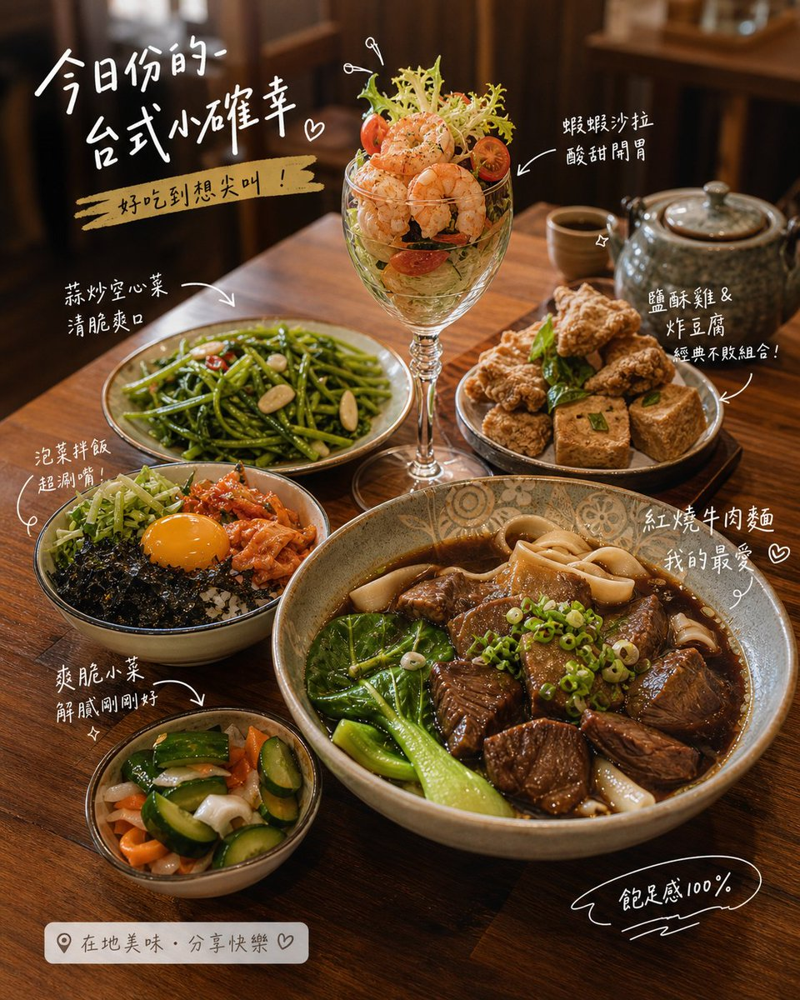

```text
Created by using GPT Image 2.

Prompt👇
Ultra cinematic hyper-realistic premium dairy lifestyle advertisement, Milky Mist Greek Yogurt Natural cup placed as hero center foreground on glossy white marble counter, lid partially peeled revealing thick creamy yogurt with perfect spiral swirl texture, ultra-detailed micro highlights, condensation droplets on surface, branding ultra sharp

Beautiful confident Indian woman (25–30), glowing natural skin with visible pores, soft blush tones, deep expressive brown eyes, long voluminous dark brown hair wind-blown with golden rim light, wearing minimal elegant light grey fitted t-shirt, leaning forward with both arms on counter framing the product, warm genuine smile, direct eye contact, friendly yet premium presence

Dynamic motion (hero effect): stainless steel spoon lifting thick yogurt upward creating smooth elastic creamy stretch, dramatic milk splash frozen mid-air around cup with suspended droplets (high-speed photography look), ultra realistic fluid physics, cinematic freeze motion

Foreground styling: fresh blueberries in white ceramic bowl, sliced strawberries with juice shine, crunchy granola scattered naturally, wooden spoon, mint leaves, premium editorial food styling (clean but rich composition)

Background: bright modern luxury kitchen interior, large soft window light from left, indoor plants softly blurred, warm cream tones, depth-rich cinematic bokeh, subtle lifestyle realism

Lighting: high-end commercial lighting setup, soft diffused key light from left, strong golden rim light on hair edges, product spotlight glow, deep soft shadows (not flat), HDR highlights on yogurt texture, magazine-level lighting

Composition: 85mm lens, shallow depth of field f/1.8, subject slightly right, product perfectly centered and dominant, rule-of-thirds balance, luxury ad framing

Color palette: pure white, sky blue, navy, fresh green, berry red, warm cream tones, ultra clean premium aesthetic

Style: Vogue-level editorial + Indian dairy commercial campaign, hyper-detailed, photorealistic, 8K ultra HD, crisp textures, luxury brand advertisement

Text overlay (optional, left side):
“Thick. Creamy. Naturally Healthy.”
subtext: “High in Protein. Made with Love.”
elegant serif + modern script combination

--ar 4:5 --style raw --v 6 --q 2
```


---

## 例 589：Fitness Boxing Campaign Collage Poster

**来源：** [@AIwithSynthia](https://x.com/AIwithSynthia/status/2049718330353975652) / [awesome-gpt-image-2-prompts](https://github.com/EvoLinkAI/awesome-gpt-image-2-prompts)

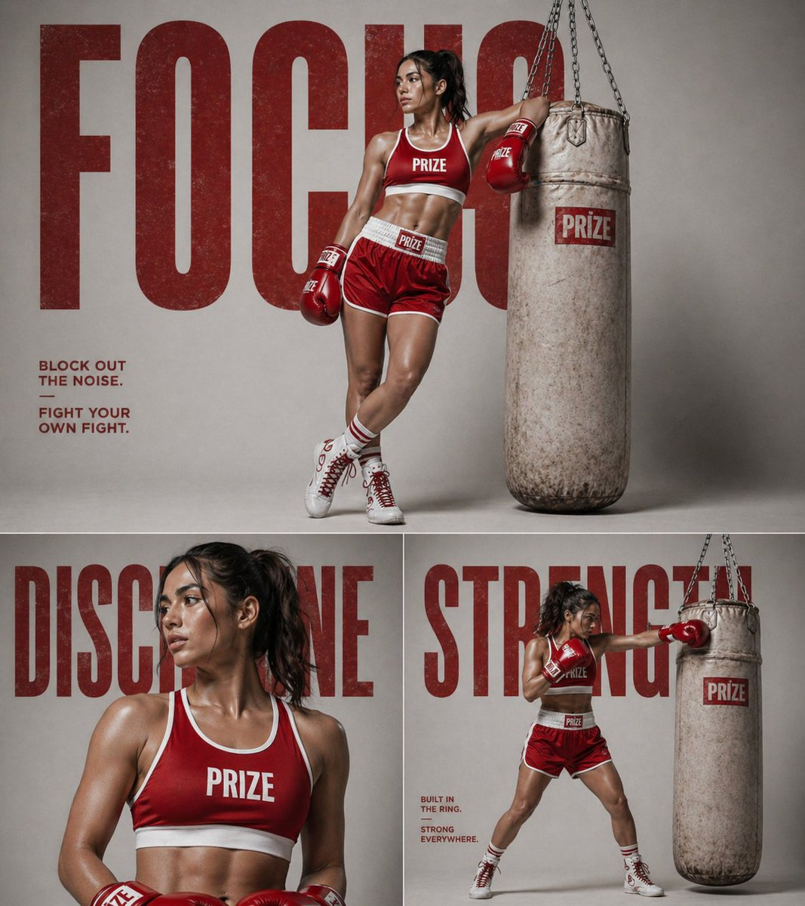

```text
Create a high-end fitness boxing poster in a 3-panel collage layout.
Top panel:
A strong athletic woman boxer wearing a red boxing outfit (sports bra, shorts, boxing gloves, high socks, boxing shoes) leaning confidently against a worn heavy punching bag. Studio background with large bold red typography behind her (word like “FOCUS” or “IMPACT” in oversized distressed font). Clean minimal lighting, editorial fitness campaign style.
Bottom left panel:
Close-up portrait of the same woman (shoulders and face). Slight sweat, sharp jawline, focused expression looking sideways. Boxing gloves visible near frame. Background includes large faded typography partially visible.
Bottom right panel:
Full-body action pose of the woman throwing a punch at the punching bag. Dynamic stance, strong posture, gloves in motion. Same studio setup and typography in background (different word like “STRENGTH” or “DISCIPLINE”).
Overall style:
premium fitness brand campaign, dramatic studio lighting, soft shadows, high contrast, ultra realistic, sharp details, minimal color palette (red, white, neutral tones), clean composition, cinematic photography, 4k quality.
```


---

## 例 590：Dynamic Sports Poster

**来源：** [@SPEEDAI07](https://x.com/SPEEDAI07/status/2051679223715365331) / [awesome-gpt-image-2-prompts](https://github.com/EvoLinkAI/awesome-gpt-image-2-prompts)

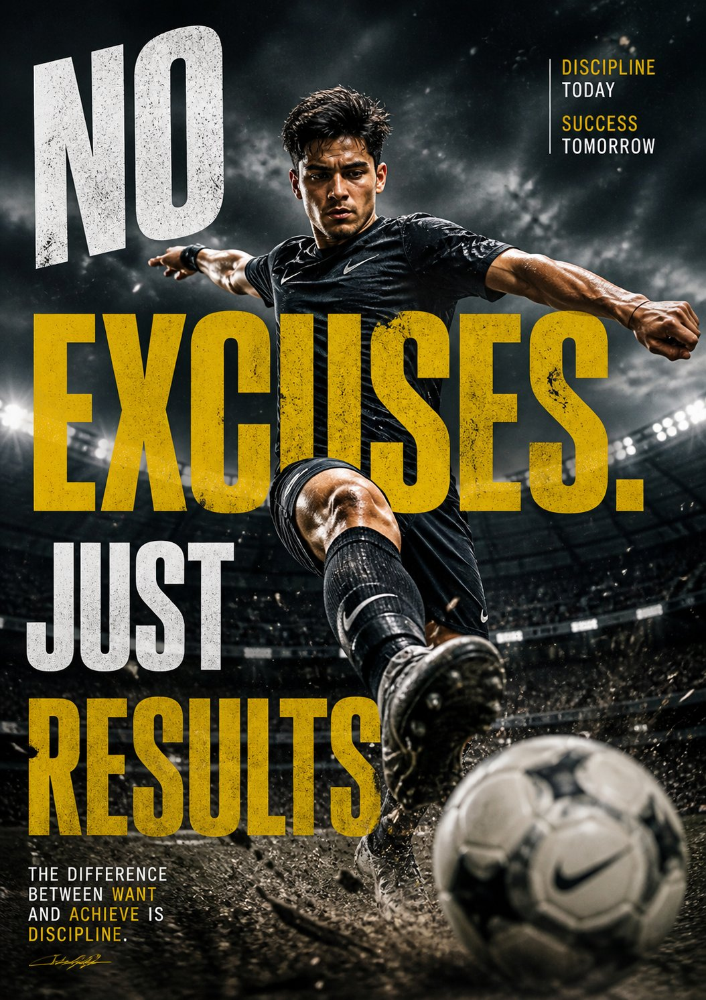

```text
A dynamic sports poster of a professional football player mid-strike, captured in a dramatic low-angle perspective, stadium lights blazing through light rain, water droplets frozen in motion, intense facial expression, muscular tension visible, cinematic lighting, high contrast shadows, ultra-detailed textures, motion blur on ball, sharp focus on athlete, bold typography overlay: "NO EXCUSES. JUST RESULTS.", modern sports branding style, Nike-style campaign aesthetic, 35mm lens, ultra-realistic
```


---

## 例 591：Luxury Brand Ad Campaign Poster

**来源：** [@TechieBySA](https://x.com/TechieBySA/status/2051676877794816074) / [awesome-gpt-image-2-prompts](https://github.com/EvoLinkAI/awesome-gpt-image-2-prompts)

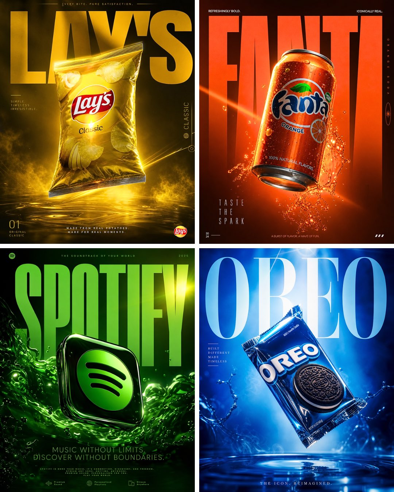

```text
A world-class luxury advertising campaign poster, 4:5 ratio, for [BRAND/PRODUCT], shot in a high-end photography studio, [COLOR] dramatic lighting with vivid color gels casting bold shadows, single hero product floating center frame with hyper-reflective surface catching light streaks, cinematic lens flare, deep rich background with gradient bloom, chrome and glass material feel, oversized bold editorial typography with the brand name, razor-sharp tagline in elegant thin font, extreme detail and texture on the product, smoke or liquid elements subtly in background, feels like Apple x Nike x Lamborghini had a campaign, shot on Hasselblad, photorealistic, magazine cover quality
```


---

## 例 592：Product Photography Juice Ad

**来源：** [@Jawad_Rahman_](https://x.com/Jawad_Rahman_/status/2051671878608228630) / [awesome-gpt-image-2-prompts](https://github.com/EvoLinkAI/awesome-gpt-image-2-prompts)

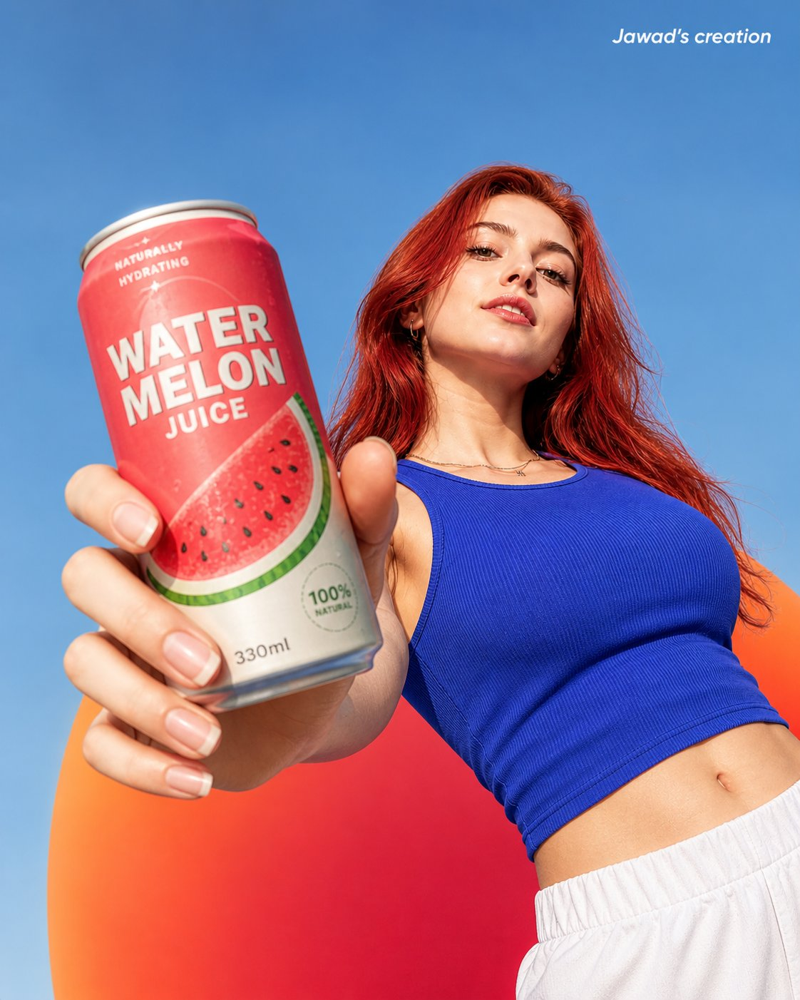

```text
A highly realistic low-angle shot of a confident young woman with long, vibrant red hair, holding a watermelon juice can close to the camera in a dramatic perspective. The can appears large in the foreground due to forced perspective, with sharp focus on the product. The woman has fair skin, natural makeup, and a subtle confident expression, looking slightly down toward the camera.

She is wearing a fitted blue sleeveless crop top and light gray sweatpants. Her posture is relaxed yet bold, with one arm extended forward holding the can.

The background is a smooth, colorful gradient blending blue, orange, and red tones, creating a vibrant summer aesthetic. Bright natural sunlight illuminates the scene with soft shadows and high contrast, giving a clean commercial photography look.

The juice can design features a watermelon theme with red and green colors, minimal modern typography, and realistic texture details like condensation droplets.

Ultra-detailed, photorealistic, 8K resolution, sharp focus, shallow depth of field, professional product photography, vibrant colors, cinematic lighting.

Add text: "Your name" in small clean white font at the upper right corner.
```


---

## 例 593：Hand-Torn Editorial Collage

**来源：** [@realsigridjin](https://x.com/realsigridjin/status/2054368795121361249) / [awesome-gpt-image-2-prompts](https://github.com/EvoLinkAI/awesome-gpt-image-2-prompts)

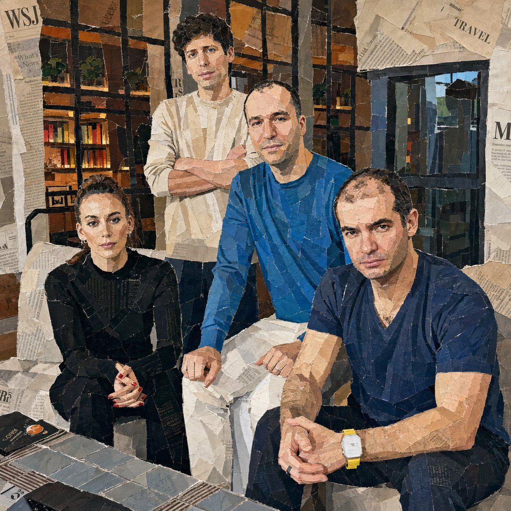

```text
Transform the attached image into a collage artwork. Make it appear as if hand-torn from newspapers, magazines, and flyers and pasted. Every single expression should be completed using large, torn pieces of paper. Represent in detail the torn edges, wrinkles, overlaps, and glue marks on the paper. Use relatively large pieces of paper, not too small, and place them randomly at different angles and directions, with the paper orientation rotated haphazardly. Create it to look like an actual collage roughly hand-pasted by a person.
```


---

## 例 594：Istanbul Line-Art Travel Poster

**来源：** [@miilesus](https://x.com/miilesus/status/2054285276780929527) / [awesome-gpt-image-2-prompts](https://github.com/EvoLinkAI/awesome-gpt-image-2-prompts)

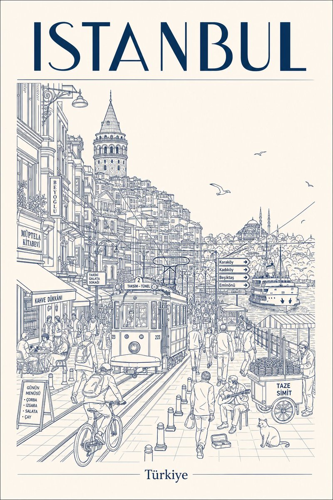

```text
Create a minimalist ultra-high-resolution travel poster in line-art style for ISTANBUL, portraying the city as a stylish everyday urban scene rather than a tourist postcard.

MAIN COMPOSITION:

Central composition features Istanbul’s most iconic everyday urban scene — a lively tram street in Karaköy, Kadıköy, Beyoğlu, Eminönü, or a Bosphorus-side pedestrian avenue filled with daily life.

Foreground includes local residents, commuters, ferry passengers, café visitors, simit sellers, students, cyclists, street musicians, and shoppers naturally interacting within the city.

People should authentically reflect modern Istanbul street fashion, layered urban lifestyle, and contemporary Turkish culture.

Background filled with authentic Turkish signage, tea houses, bookstores, tram lines, ferry terminals, cafés, bakeries, fish restaurants, street lamps, mosques integrated into skyline, apartment façades, hanging laundry, cats, seagulls, and dense architectural textures.

Subtle landmarks blend naturally into daily life rather than dominating the composition — Galata Tower, Bosphorus ferries, nostalgic tram, mosque silhouettes, and waterfront railings should appear integrated into the urban rhythm.

Use authentic Turkish typography and culturally recognizable street elements.

Large centered title at the top: “ISTANBUL”

Subtitle at the bottom in Turkish: “Türkiye” or “İstanbul”

STYLE:

Ultra-clean vector illustration
Swiss modernist travel poster aesthetic
Minimalist line-art
Monoline drawing
Mid-century editorial illustration style
Architectural illustration
Contemporary Turkish graphic poster design
Crisp geometric perspective
Extremely clean negative space
Premium luxury travel-brand aesthetic
Highly organized visual density

LINE STYLE:

Monochrome line illustration only
Thin, highly precise lines
Minimal fill areas
Intricate city-map-level detailing
Rhythmic arrangement of tram cables, balconies, ferry rails, windows, signage, cats, street furniture, and waterfront architecture
Visually dense yet extremely balanced composition
Ultra-precise vector-quality rendering

COLOR SYSTEM — VERY IMPORTANT:

Use only ONE primary ink color + ONE background color
Automatically select the color pairing that best represents Istanbul’s atmosphere
Monochrome silkscreen poster aesthetic
No rainbow palettes
No excessive neon
Color should reflect Istanbul’s maritime atmosphere, historic architecture, ferry culture, and urban warmth
Recommended palette for Istanbul:
Deep Bosphorus navy ink on warm cream background

COMPOSITION:

Vertical poster layout
Frontal street-level perspective
Pedestrians naturally moving through tram streets, ferry exits, café terraces, and waterfront walkways
Balanced urban rhythm and architectural layering
Strong depth perspective with elegant negative space
Should feel like a premium global city-brand campaign poster

MOOD:

Stylish urban everyday life
Calm yet vibrant atmosphere
Sophisticated metropolitan energy
Timeless city identity
High-end travel magazine cover aesthetic
Minimalist yet ultra-detailed
Elegant Mediterranean-meets-modern urban mood

TEXT QUALITY — EXTREMELY IMPORTANT:

All typography must be clean, readable, and professionally designed
No random symbols
No broken or distorted letters
Turkish signage must appear authentic and natural
Editorial-grade typography hierarchy
Premium modernist poster layout

OUTPUT:

Vertical poster composition
Ultra-detailed 8K resolution
Print-ready
Ultra-precise vector-quality rendering
Luxury travel poster aesthetic
Museum-quality graphic design composition
```


---

## 例 595：Dark Western Outlaw Poster

**来源：** [@you1873118](https://x.com/you1873118/status/2054366009214316840) / [awesome-gpt-image-2-prompts](https://github.com/EvoLinkAI/awesome-gpt-image-2-prompts)

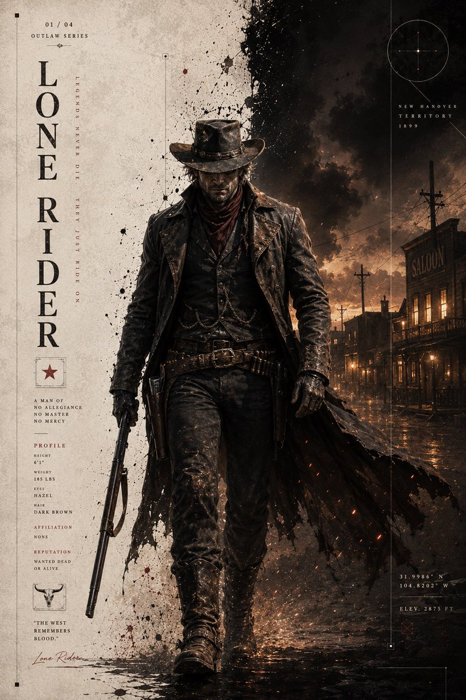

```text
高级电影感西部亡命徒海报，竖版 2:3 构图，暗黑西部游戏角色设定海报风格。

一个神秘蒙面牛仔与黑马站在荒漠边境，人物全身正面，宽檐牛仔帽压低，花纹面巾遮住下半张脸，深色长发，黑色皮革手套，黑色西部夹克与多层皮革装备，子弹带、左轮枪套、金属腰带扣、厚重长靴，肩上披着红棕色几何图案披毯，边缘破损飘动。人物姿态冷静危险，一只手靠近枪套。右侧黑马半身入镜，带白色额纹，缰绳细节清晰。

背景是暴风雨中的西部荒漠，闪电、乌云、远处峡谷岩壁、枯树、沙尘、烟雾、火星、泥地反光，氛围压抑史诗。

画面左侧是复古羊皮纸留白，右侧是黑暗风暴场景，强烈明暗分割。加入大号竖排英文标题、通缉令信息、人物档案、坐标、地图网格、细线框、圆形罗盘图形、小红色标记、签名印章等高级海报排版元素。

风格：黑色墨迹飞溅、旧纸纹理、电影级写实、暗黑西部、强烈明暗对比、皮革和金属超细节、尘土、泥点、划痕、烟雾、火星、边缘轮廓光、高级收藏级游戏海报、荒野大镖客氛围、艺术设定集质感、8K、高细节。
```


---

## 例 596：Anime Streetwear Mascot Poster

**来源：** [@Taaruk_](https://x.com/Taaruk_/status/2054234237398851768) / [awesome-gpt-image-2-prompts](https://github.com/EvoLinkAI/awesome-gpt-image-2-prompts)

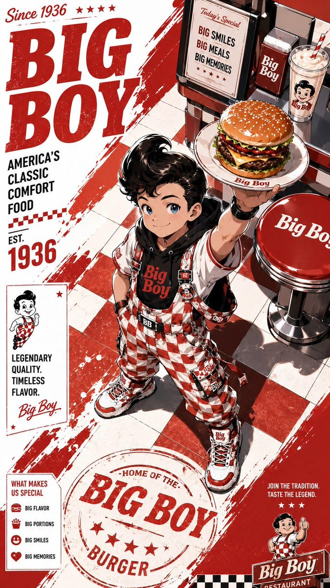

```text
Stylized anime streetwear brand poster of a fast-food mascot character, full-body dynamic pose, highly detailed manga/anime illustration, modern urban fashion outfit inspired by the restaurant brand colors and identity, oversized hoodie, tactical straps, sneakers, chains, branded accessories, holding signature food item, bold graphic typography, editorial magazine layout, Japanese text elements, logos, promotional stickers, menu-style side panels, grunge textures, paint splashes, distressed paper background, collectible poster aesthetic, cyber street fashion meets commercial advertising, vibrant red/orange/black/white color palette, dramatic lighting, ultra detailed line art, cel-shaded anime rendering, energetic composition, high contrast, trendy hypebeast vibe, futuristic fast-food campaign art, iconic mascot redesign, layered collage graphics, branding everywhere on clothing and background, premium anime poster quality, vertical composition, sharp shadows, dynamic perspective, stylish and playful attitude.
```


---

## 例 597：Japanese Fashion Collage Poster

**来源：** [@Mind_Boticni](https://x.com/Mind_Boticni/status/2054203134411739609) / [awesome-gpt-image-2-prompts](https://github.com/EvoLinkAI/awesome-gpt-image-2-prompts)

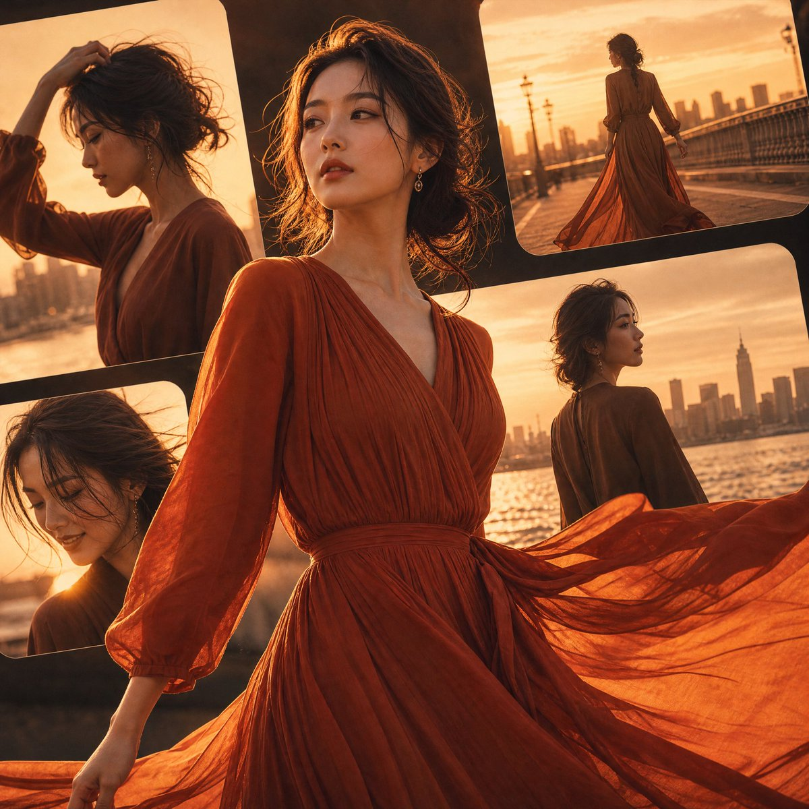

```text
Cinematic vertical collage featuring a Japanese woman in elegant fashion captured during golden sunset. Background composed of warm-toned rounded storyboard frames arranged diagonally, each showing soft monochrome motion scenes—running fingers through hair, walking on bridge, looking at skyline, soft smile in wind. The main subject is in rich color with glowing sunset highlights, wearing flowing rust-orange designer dress with natural fabric movement. Emotional storytelling mood, romantic cinematic tone, high-end fashion editorial poster style.
```


---

## 例 598：Bangkok Swiss Typography Poster

**来源：** [@Shorelyn_](https://x.com/Shorelyn_/status/2054196121980002523) / [awesome-gpt-image-2-prompts](https://github.com/EvoLinkAI/awesome-gpt-image-2-prompts)

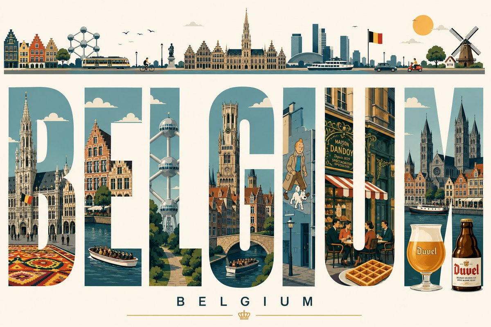

```text
Create an ultra-high-resolution Swiss modernist typography travel poster for BANGKOK THAILAND in a premium 16:9 layout.

CORE CONCEPT:
A massive bold condensed sans-serif word “BANGKOK” dominates the center composition.
Each individual letter acts as a precise geometric window containing minimalist flat-vector illustrations of iconic Bangkok landmarks and authentic urban life scenes.

INSIDE THE LETTERS INCLUDE:

Grand Palace

Wat Arun

Wat Pho

Chao Phraya River

Tuk-tuks

BTS Skytrain

Long-tail boats

Chinatown signage

Rooftop bars

Street food stalls

Temple roofs

Bangkok modern skyline

The scenes inside each letter must transition seamlessly across the typography, creating one continuous panoramic urban narrative while preserving perfectly clean letter edges and flawless typography integrity.

TOP PANORAMIC RIBBON:
At the very top edge of the poster, create a thin elegant panoramic strip showing:

Bangkok skyline silhouette

BTS train

River boats

Birds

Palm trees

Cars and scooters

Stylized tropical sun

Minimal clouds

STYLE & AESTHETIC:
Swiss Graphic Design meets Mid-Century Modern travel poster aesthetics.
Flat vector illustration only.
Architectural infographic precision.
100% clean geometric shapes.
No gradients.
No photorealism.
No textures.
No grain.
No AI distortion.
No warped typography.

VISUAL EXECUTION:

Sharp vector edges

Sophisticated negative space

Balanced composition

Minimalist architectural detailing

Precise geometric shadows

Museum-grade poster quality

Editorial luxury aesthetic

COLOR PALETTE:
Muted premium Southeast Asian palette inspired by Bangkok:

River teal

Warm coral

Tropical gold

Ivory

Slate blue

Soft terracotta

BACKGROUND:
Soft ivory or premium warm white background.

TYPOGRAPHY:
Professional kerning and spacing.
Perfectly legible text.
Human-designed graphic identity feel.
Large title:
“BANGKOK”
Small elegant subtitle underneath:
“THAILAND”

ATMOSPHERE:
Intellectual, calm, avant-garde, collectible luxury travel poster found in a museum design store.

OUTPUT:
Ultra-detailed 8K vector-style rendering, ultra sharp print-ready quality, high-end editorial poster design.
```


---

## 例 599：Miniature Travel World Poster

**来源：** [@Goodmanprotocol](https://x.com/Goodmanprotocol/status/2054074803381018750) / [awesome-gpt-image-2-prompts](https://github.com/EvoLinkAI/awesome-gpt-image-2-prompts)

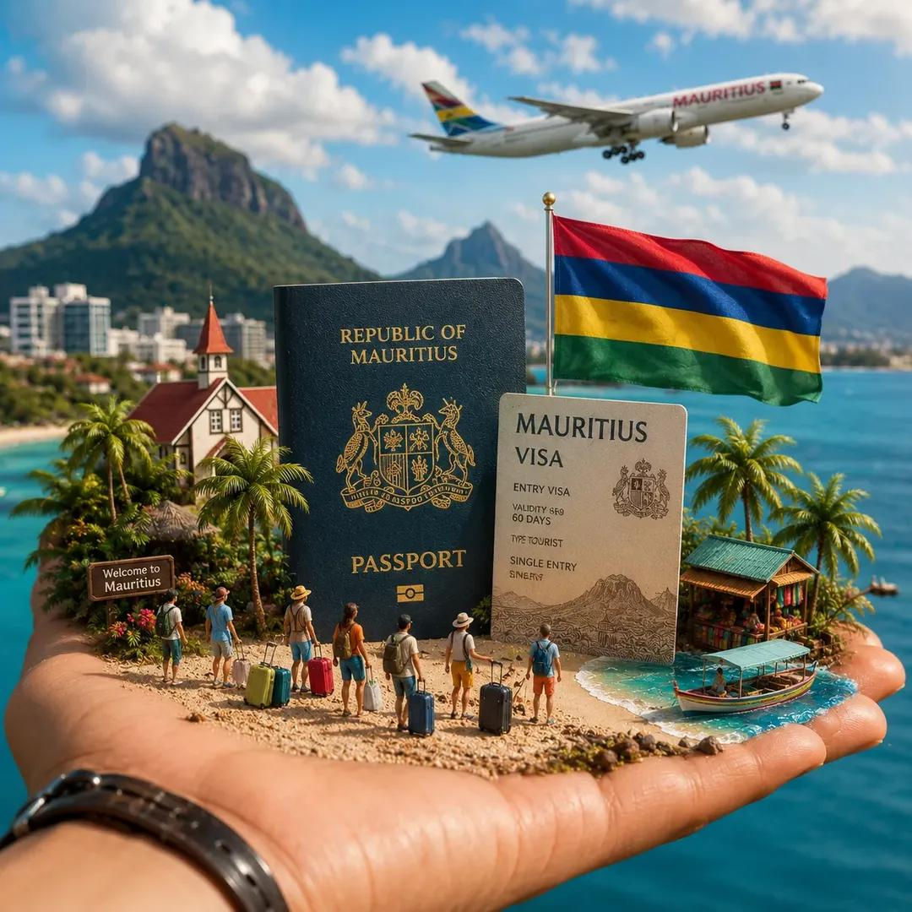

```text
A cinematic hyper-detailed miniature travel diorama resting inside an open human palm, themed around [CITY/COUNTRY NAME] tourism and travel. A realistic passport and official travel visa card stand upright in the center of a tiny landscape inspired by the destination, surrounded by miniature travelers with luggage, scattered suitcases, local vegetation, iconic cultural elements, and detailed environmental textures matching the location. In the background, the famous skyline and landmark architecture of [CITY/COUNTRY NAME] rise softly with atmospheric depth, while the national flag waves beside the documents. A commercial airplane flies overhead in a bright blue sky with soft clouds. Ultra-realistic textures, shallow depth of field, warm sunlight, soft cinematic shadows, macro photography style, tilt-shift miniature effect, vibrant tourism atmosphere, highly detailed handcrafted diorama aesthetic, realistic skin texture on the hand, premium travel advertisement look --ar 1:1
```


---

## 例 600：Japanese Graffiti Portrait

**来源：** [@iamaiistudio](https://x.com/iamaiistudio/status/2054714863885394325) / [awesome-gpt-image-2-prompts](https://github.com/EvoLinkAI/awesome-gpt-image-2-prompts)

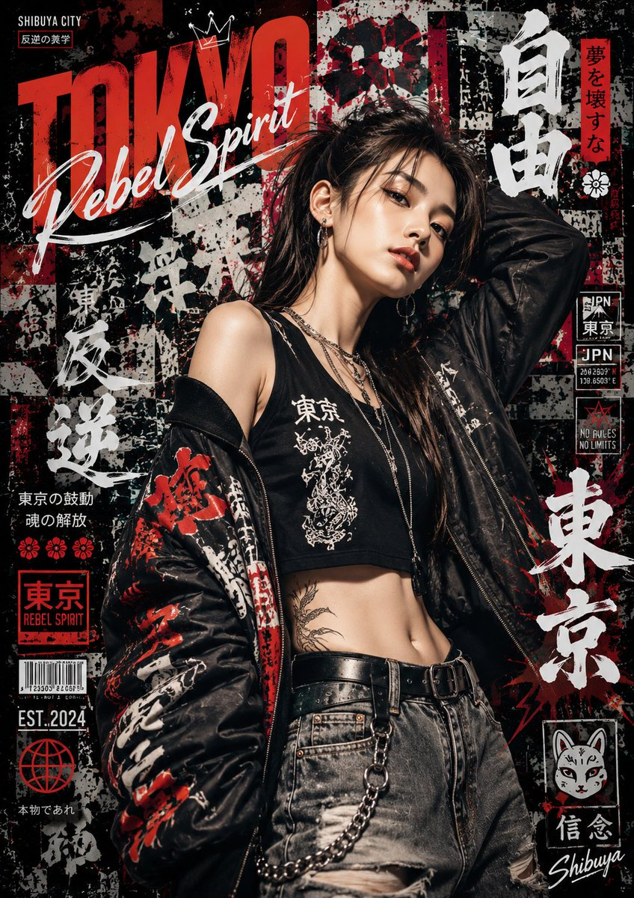

```text
Design a high-detail portrait poster in a bold Japanese graffiti-inspired art style that fuses modern urban street aesthetics with expressive Japanese visual culture. Pack the poster with dynamic graffiti typography, layered spray-paint textures, hand-drawn motifs, abstract paint splashes, neon brush strokes, urban sticker elements, Japanese calligraphy accents, and decorative ornaments that amplify the energetic mood. Keep the overall composition artistic, rebellious, fashionable, and visually striking, yet still polished to premium editorial poster quality, never messy or overdone. The subject should NOT copy the exact pose or expression from any reference image. Instead, invent an entirely new pose that feels natural, confident, and alive. The expression should read as emotionally expressive, charismatic, and engaging, never stiff, awkward, flat, or blank. The pose should carry the elegance and sophistication of an international fashion model, with stylish posture, natural movement, and a subtle attitude that elevates the cinematic fashion vibe. The outfit must be contemporary, stylish, casual fashion with strong visual appeal. Skip plain or repetitive clothing. Lean into fashionable layering, modern streetwear inspiration, premium casual styling, and a balanced mix of colors, patterns, textures, and fabrics for a rich, non-monotonous look. The clothing should feel trendy, fashionable, youthful, and visually premium, while still belonging inside the Japanese graffiti poster concept. Fill the background and poster decorations with thematic urban Japanese-inspired elements: graffiti walls, spray textures, painted symbols, urban signage, layered stickers, modern Japanese graphic motifs, abstract shapes, paint drips, street fashion aesthetics, and stylish decorative compositions that deepen the artistic intensity without distracting from the subject. Lighting should feel cinematic and fashionable, with strong contrast, clean highlights, realistic skin texture, and high-end editorial poster quality. The final result must look like a premium modern street-fashion campaign poster, with highly detailed textures, balanced composition, vibrant color harmony, realistic proportions, ultra-sharp focus, and immersive visual storytelling. Ultra-detailed, highly aesthetic, premium composition, realistic texture rendering, fashionable urban atmosphere, cinematic quality, poster-ready design, 8K ultra high resolution. #AIart #GPTImage2
```


---

## 例 601：Playlist Mood Album Cover

**来源：** [@getimg_ai](https://x.com/getimg_ai/status/2054654412547629350) / [awesome-gpt-image-2-prompts](https://github.com/EvoLinkAI/awesome-gpt-image-2-prompts)

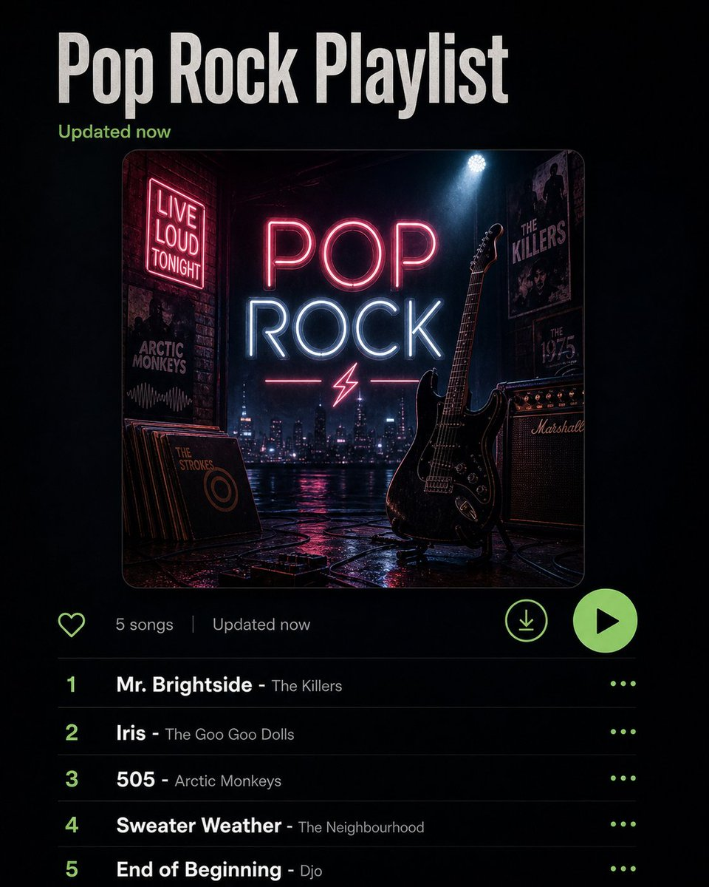

```text
Create an album cover inspired by this playlist: [playlist], translating its mood into colors, textures, objects, and cinematic composition, with no artist names. https://t.co/t1efbQ9sgP
```


---

## 例 602：3D Liquid Art Poster

**来源：** [@92digitalartArt](https://x.com/92digitalartArt/status/2054597084473422099) / [awesome-gpt-image-2-prompts](https://github.com/EvoLinkAI/awesome-gpt-image-2-prompts)

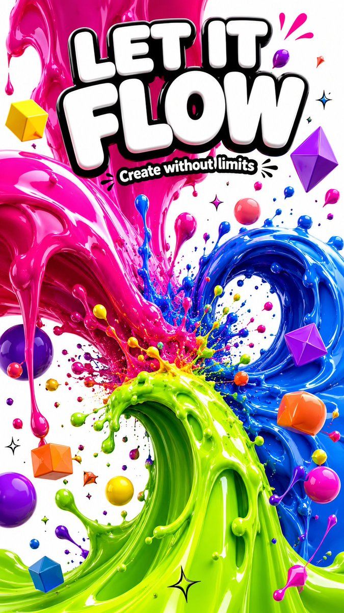

```text
A mesmerizing and explosively colorful vertical poster featuring giant 3D liquid fluid sculpture forms, enormous glossy morphing blob shapes in vivid electric colors — a massive melting form in hot magenta pink flowing and dripping downward, intersecting with a giant swirling wave of electric cobalt blue, a third liquid mass in neon lime green curling upward like a breaking ocean wave, all three liquid forms colliding at the center in a spectacular splash explosion with hundreds of flying colorful droplets frozen mid-air, each liquid surface rendered with a perfect mirror-glossy finish reflecting the surrounding colors in dazzling distorted highlights, the background a clean bright white making the vivid color explosions pop with maximum visual impact, smaller floating 3D geometric shapes — spheres cubes and diamonds — in candy yellow coral orange and violet orbiting the main liquid forms, bold heavy rounded white typography outlined in black at the top reading "LET IT FLOW" in massive bouncy letters, smaller subtitle below "Create without limits", tiny spark and splash symbols scattered as accents, ultra-saturated maximum color impact, premium 3D render quality, 9:16 vertical ratio
```


---

## 例 603：Isometric Travel Poster

**来源：** [@iamaiistudio](https://x.com/iamaiistudio/status/2054593748085215513) / [awesome-gpt-image-2-prompts](https://github.com/EvoLinkAI/awesome-gpt-image-2-prompts)

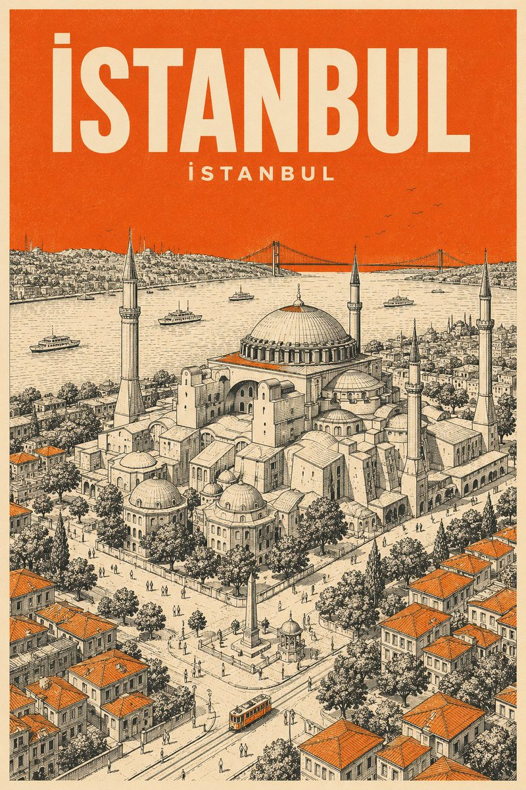

```text
Design a vertical retro mid-century travel poster of [CITY NAME] showcasing [LANDMARK]. Stick to a tight 3-color scheme: cream-toned paper background, black technical line drawing, plus one [COLOR] accent. Aesthetic: minimalist isometric top-down aerial perspective with very fine cross-hatching and silkscreen print grain. Color rules: fill the entire sky in flat solid [COLOR], add small [COLOR] touches on rooftops or street details. Zero gradients allowed. Typography: large bold sans-serif "[CITY NAME]" at the top in cream, with the city's name in its native language set smaller in cream beneath it. #AIart #GPTImage2
```


---

## 例 604：Vintage Travel Postage Stamp

**来源：** [@iamsofiaijaz](https://x.com/iamsofiaijaz/status/2054530631187788035) / [awesome-gpt-image-2-prompts](https://github.com/EvoLinkAI/awesome-gpt-image-2-prompts)

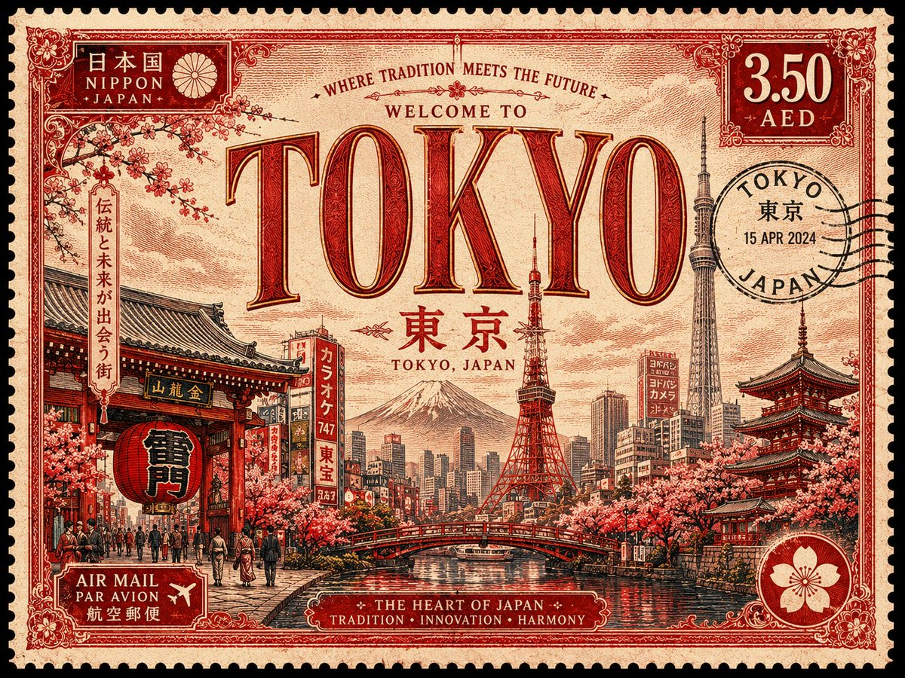

```text
Vintage travel postage stamp design featuring [CITY / COUNTRY], ultra-detailed illustrated souvenir stamp, elegant art deco typography spelling “[NAME]” across the center in large ornate serif letters, iconic landmarks and skyline of [PLACE], traditional cultural architecture, scenic local elements, palm trees / boats / streets / mountains depending on location, warm cinematic lighting, soft pastel sky, retro airmail aesthetics, aged paper texture, engraved print style, luxurious vintage tourism poster feel, intricate ornamental borders, postal cancellation mark with local language and English text, “3.50 AED” denomination, symmetrical composition, highly detailed linework, muted [COLOR PALETTE] color scheme, nostalgic philatelic artwork, premium collectible stamp aesthetic, realistic shading, textured ink print, retro travel poster style, 4k illustration, highly detailed vintage engraving.
```


---

## 例 605：3D Typography Travel Poster

**来源：** [@Naiknelofar788](https://x.com/Naiknelofar788/status/2054390259115536874) / [awesome-gpt-image-2-prompts](https://github.com/EvoLinkAI/awesome-gpt-image-2-prompts)

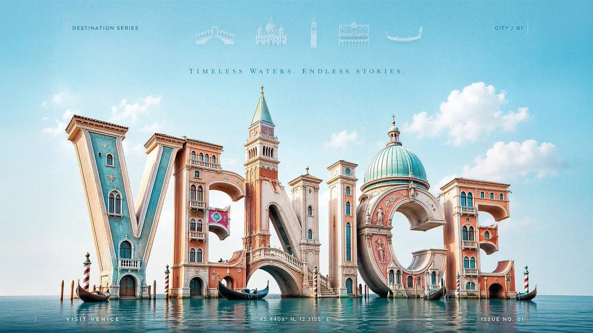

```text
Create a 3:2 premium 3D typography-based travel poster for [CITY], using luxury editorial destination advertising fused with realistic sculptural letterform architecture. The city name “[CITY]” must be the dominant subject, occupying most of the canvas. Build the letters as large, realistic, three-dimensional sculptural forms made from glossy painted material, polished ceramic, soft plaster, carved stone, sunlit architectural surfaces, or city-adaptive materials. Each letter should physically transform into the city’s identity: landmarks, skyline silhouettes, arches, towers, domes, bridges, windows, balconies, cultural patterns, coastal forms, or street details must grow directly out of the letterforms. Landmarks should feel architecturally integrated, not pasted behind or around the word. A tower may rise from a vertical stem, a bridge may connect two letters, a dome may form the curve of a rounded letter, rooftops may shape the top edges, and windows or ornamental details may be embedded into the letter faces. Use a low-angle three-quarter camera view so the typography feels monumental, cinematic, premium, and friendly. Place the 3D city-name sculpture slightly low in the frame, filling the central and lower portions of the poster, with generous negative space above. At the top header, add a refined horizontal row of faded landmark symbols related to the city: tiny vector icons, or translucent architectural glyphs. Keep them very soft, elegant, and secondary, like premium magazine header details. Add each landmark name below its icon. Keep all faded and premium. Remove any visible sun from the top-left corner. Use bright natural daylight with a soft key light from the upper-left, gentle fill light, clean highlights, subtle ambient occlusion, and soft contact shadows beneath the letters. The lighting should feel cheerful, fresh, and editorial, not dark or overly cinematic. Use a bright city-adaptive palette based on [CITY]: coastal cities use aqua, coral, cream, and sunny yellow; historic cities use warm stone, terracotta, olive, and soft sky blue; tropical cities use turquoise, mango, palm green, and white; mountain cities use alpine blue, meadow green, snow white, and golden warmth; nightlife cities use violet, cyan, peach, and amber. Keep colors clean, optimistic, premium, and controlled. Add subtle editorial text elements to improve the poster: small uppercase header text such as “DESTINATION SERIES”, a tiny location code like “CITY / 01”, delicate vertical divider lines, a minimal footer line such as “VISIT [CITY]”, and small microtype coordinates or issue number near the bottom edge. These text elements must remain quiet and secondary so the large 3D city name stays the hero. Background should be clean and spacious with a soft sky gradient, delicate clouds, or abstract color field only. Do not place extra landmarks in the background; all major city identity must come from the typography itself, except the faded symbolic header row. Style: premium editorial travel advertising, luxury magazine cover, realistic 3D typographic sculpture, bright modern optimism, cheerful wanderlust, cultural identity, clean art direction. Negative prompt: avoid generic travel posters, separate landmark collages, landmarks pasted behind text, flat typography, cluttered backgrounds, visible sun in the top-left corner, excessive icons, dark cinematic lighting, muddy colors, cheap souvenir aesthetics, unreadable city name, distorted letters, random gradients, noisy textures, stock-template layouts, and overdecorated tourist graphics.
```


---

## 例 606：Korean Editorial Fashion Moodboard

**来源：** [@Mind_Boticni](https://x.com/Mind_Boticni/status/2055627790255587483) / [awesome-gpt-image-2-prompts](https://github.com/EvoLinkAI/awesome-gpt-image-2-prompts)

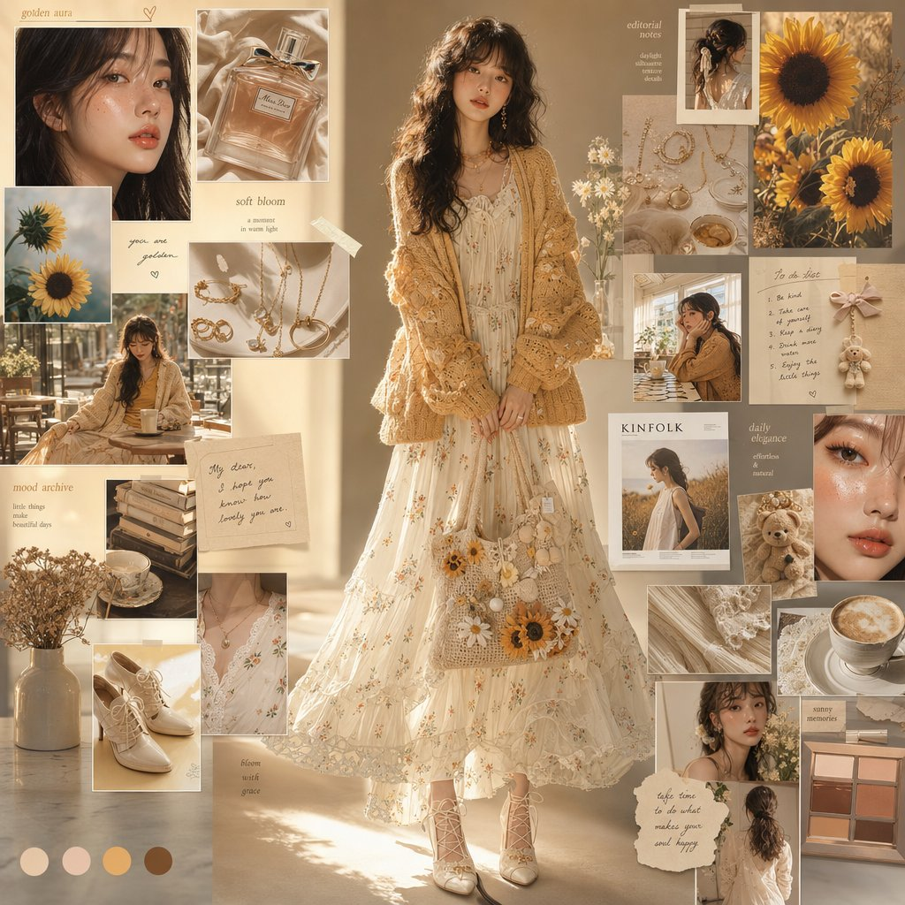

```text
Create an ultra-realistic luxury fashion moodboard poster in a premium Korean editorial magazine style. A beautiful young woman stands elegantly in the center wearing a flowing ivory floral chiffon maxi dress with layered translucent fabric, tiny embroidered flowers, delicate lace trims, and soft movement in the fabric. Over it she wears a textured handmade mustard crochet cardigan with oversized sleeves and cozy vintage stitching details. She has long voluminous dark wavy hair with soft curtain bangs, glowing radiant skin, glossy peach makeup, subtle freckles, soft shimmer eyelids, glossy nude lips, and delicate gold jewelry including layered necklaces, pearl rings, and slim bracelets. She wears elegant cream lace-up heels and carries a handcrafted crochet tote bag decorated with sunflower charms, daisy patches, mini ribbons, tiny plush keychains, and aesthetic beads.
The background is a bright warm editorial studio with creamy beige gradients, golden sunlight rays, subtle shadows, soft reflections, floating dust particles, and dreamy glowing highlights. The layout should feel like a realistic Pinterest luxury collage board with clean spacing and balanced composition.
Around the character include many small scrapbook-inspired collage sections:

– close-up beauty portraits

– sunflower photography

– perfume bottle flatlays

– jewelry editorials

– cozy café lifestyle moments

– fashion accessories

– handwritten diary pieces

– soft fabric texture swatches

– vintage books

– coffee cups

– aesthetic shoes

– makeup close-ups

– hair inspiration photos

– dried flower arrangements

– cute doodles and tiny heart sketches

– polaroid-style frames

– paper tape pieces

– editorial magazine snippets
Typography should be very small, elegant, subtle, and blended naturally into the layout like luxury fashion magazine captions. Use tiny serif text such as: “golden aura”, “soft bloom”, “editorial notes”, “mood archive”, and “daily elegance”. Text must never dominate the image.
Overall aesthetic: warm, feminine, luxurious, ultra detailed, realistic photography, soft dreamy atmosphere, premium Korean fashion magazine moodboard, cinematic lighting, highly aesthetic Pinterest composition, rich textures, airy and bright color palette.
```


---

## 例 607：Marrakech Watercolor Travel Poster

**来源：** [@SimplyAnnisa](https://x.com/SimplyAnnisa/status/2055894520139559253) / [awesome-gpt-image-2-prompts](https://github.com/EvoLinkAI/awesome-gpt-image-2-prompts)

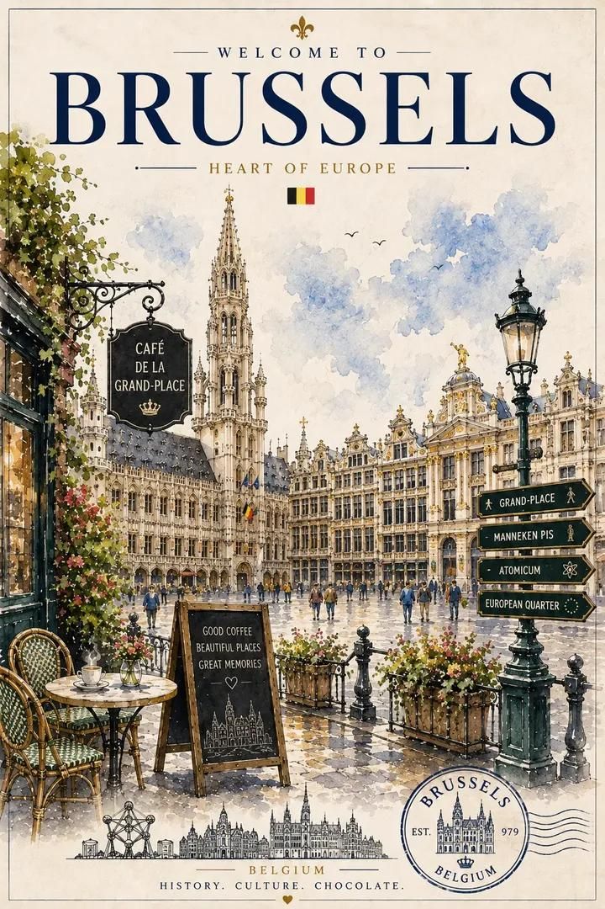

```text
Vintage watercolor travel poster of Marrakech, Morocco with a warm beige textured background. Top features ornate Islamic geometric motif, text 'WELCOME TO MARRAKECH' in large serif terracotta font, subtitle 'WHERE TRADITION INSPIRES EVERY JOURNEY' with decorative diamond dividers.

Foreground shows a cozy rooftop café scene: wrought iron table and chair with mosaic top, Moroccan teapot and glass of tea, chalkboard sign reading 'EXPLORE THE COLORS OF MOROCCO' with a hand-drawn sketch of a Moroccan gate and palm tree below. Include a hanging black sign 'CAFÉ DE LA MÉDINA', potted cactus, ceramic vases, a lantern, and a colorful Berber rug draped over a stone wall.

Background depicts the Medina skyline with terracotta buildings, palm trees, the Koutoubia Mosque minaret, market stalls with umbrellas, crowds, and the Atlas Mountains in the distance under a soft sky with birds. Bougainvillea flowers and vines frame the left side.

Bottom center has a palm tree icon with text 'MOROCCO' and small decorative motifs. Soft watercolor style, warm earthy tones, nostalgic travel poster aesthetic, vertical 2:3 aspect ratio."
```


---

## 例 608：Retro Travel Poster Collage

**来源：** [@Goodmanprotocol](https://x.com/Goodmanprotocol/status/2055882758845878709) / [awesome-gpt-image-2-prompts](https://github.com/EvoLinkAI/awesome-gpt-image-2-prompts)

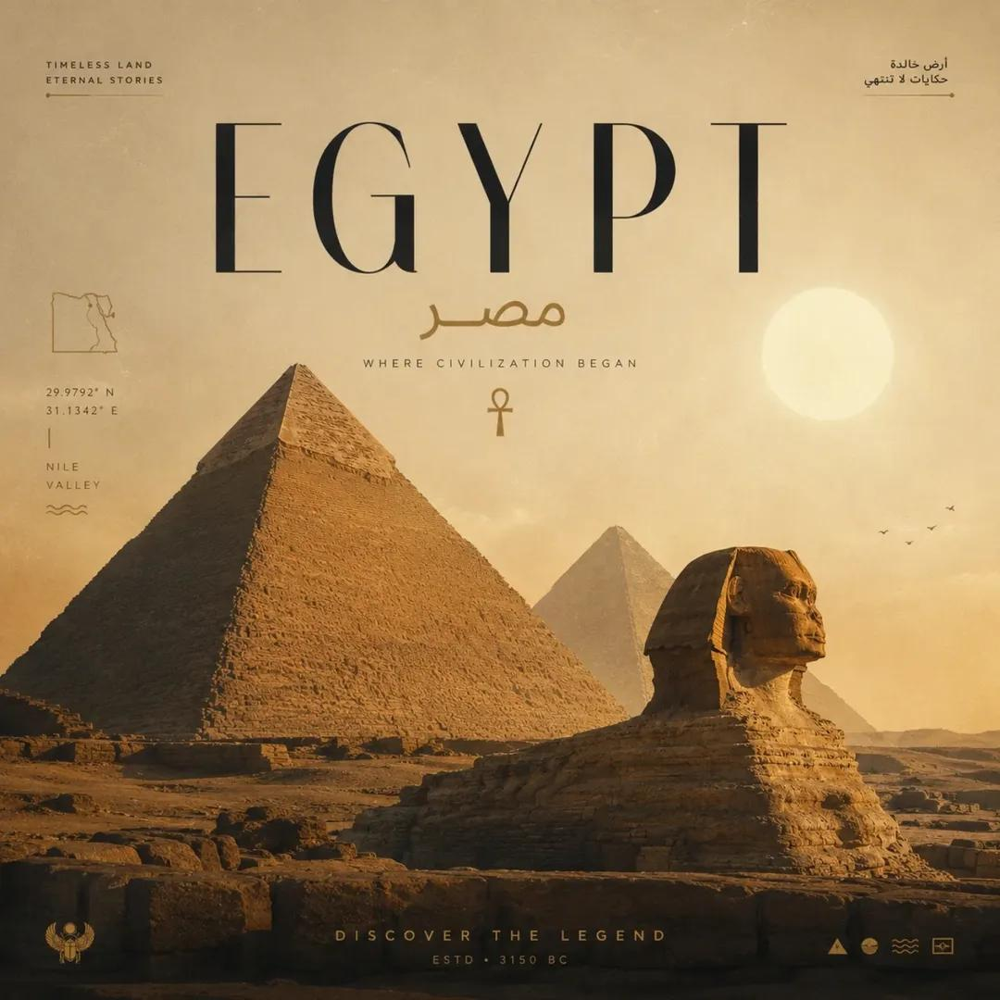

```text
Generate a retro travel poster collage style main visual for "[Country Name] TRAVEL POSTERS".

Overall Layout:

Antique beige paper background

Large, bold country names at the top (e.g., JAPAN / ITALY / FRANCE)

Central Subheading:

“TRAVEL POSTERS FROM AROUND THE WORLD.”

“CREATED ENTIRELY WITH CHATGPT USING JUST ONE PROMPT.”

Bottom: 2x3 six-grid poster layout

Each grid represents a different city/region

Thin white borders between posters

Overall resembling a high-end retro travel magazine cover + Midcentury travel poster design

Visual Style:

Scandinavian Travel Poster

Midcentury Modern

Vintage Editorial Design

Retro Tourism Advertisement

High-end minimalist typography

Warm golden sunset lighting

Antique printing texture

Cinematic lighting

No cartoonish feel

High resolution

Exquisite details

Soft retro color tones (beige, caramel, amber gold, dark brown)

Typography heavy design

Cinematic composition

Poster layout Aesthetic

Each poster panel must include:

City name in English (extra large font)

Country name

Small slogan

Coordinate numbers

Minimalist icon

Representative local landmark

Retro travel poster composition

Please generate the following six city themes:

1. [City 1] — [Representative attractions/atmosphere]

2. [City 2] — [Representative attractions/atmosphere]

3. [City 3] — [Representative attractions/atmosphere]

4. [City 4] — [Representative attractions/atmosphere]

5. [City 5] — [Representative attractions/atmosphere]

6. [City 6] — [Representative attractions/atmosphere]

All text must be in English.

The overall style should resemble:
highend vintage travel advertisement poster,
editorial layout design,
retro tourism campaign,
luxury magazine aesthetic,
warm cinematic sunset lighting,
ultra detailed,
8k,
clean typography,
museum poster quality.
```


---

## 例 609：Watercolor 2026 Calendar Poster

**来源：** [@you1873118](https://x.com/you1873118/status/2056175244256411890) / [awesome-gpt-image-2-prompts](https://github.com/EvoLinkAI/awesome-gpt-image-2-prompts)

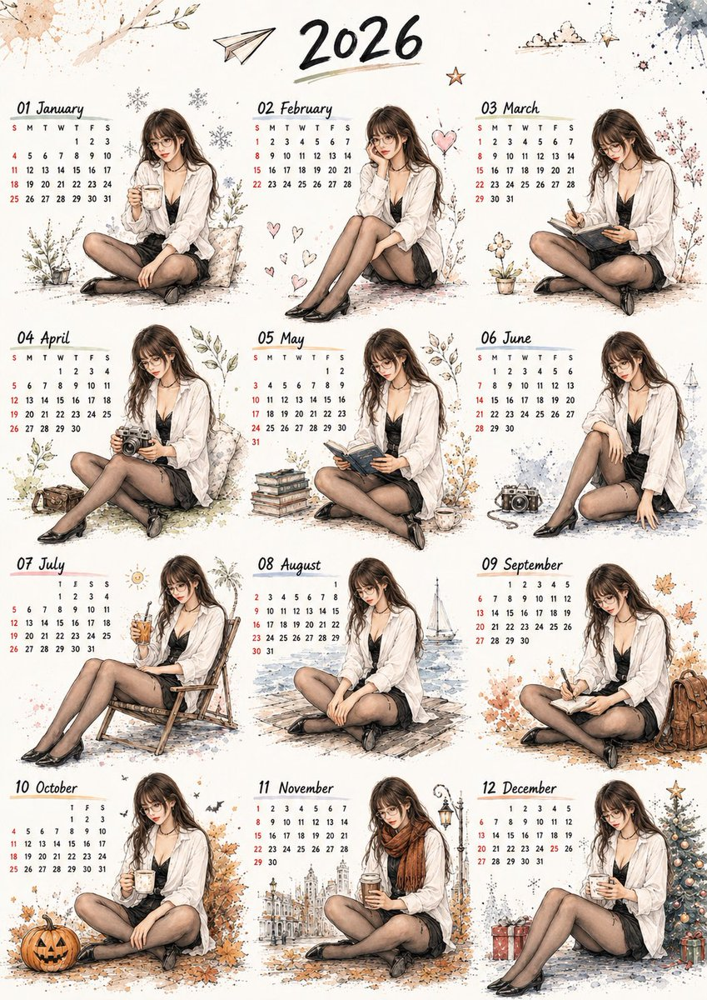

```text
使用上传的第一张图作为【整体风格与版式参考】，使用上传的第二张图作为【人物身份参考】。

请生成一张完整的 2026 年全年日历插画海报。

画面风格：
保留参考图一的手绘水彩插画风格，温暖米白纸张背景，细腻墨线勾勒，柔和水彩晕染，轻微纸张纹理，带有季节感的小装饰元素，如花草、雪花、爱心、纸飞机、星星、云朵、树叶、相机、书本、咖啡杯、礼物、圣诞树等。整体氛围温柔、治愈、干净、生活感强，像一本手账风全年日历。

版式要求：
采用 3 列 × 4 行的全年月历排版，共 12 个月份。
顶部居中写大标题：“2026”，使用手写感黑色笔刷字体。
每个月份标题格式为：
“01 January”
“02 February”
“03 March”
一直到
“12 December”。

每个月份区域都包含：
1. 月份英文标题
2. 小型日历日期表
3. 一位人物插画
4. 对应季节的小场景装饰

人物要求：
将参考图一中的男性人物全部替换为参考图二中的女性人物。
保持参考图二人物的核心特征：
年轻亚洲女性，长棕黑色头发，空气刘海，戴细框眼镜，五官精致，表情温柔自然，略带安静、微醺、慵懒感。

人物服装参考：
宽松白色衬衫，黑色内搭，黑色短裙，黑色丝袜，黑色鞋子，细项链或 choker。
服装需要融入手绘水彩风，不要像照片硬贴上去。

每个月人物动作不同：
1 月：坐着捧热咖啡，冬日温暖感
2 月：托腮坐着，周围有爱心元素
3 月：低头写手账或笔记本
4 月：拿着复古相机
5 月：坐着看书，旁边有书堆和茶杯
6 月：休闲坐姿，旁边有相机和蓝色水彩装饰
7 月：坐在躺椅上喝冰饮，夏日感
8 月：坐在海边木栈道，远处有帆船
9 月：坐着写日记，旁边有背包和秋叶
10 月：喝咖啡，旁边有南瓜灯和万圣节元素
11 月：围着棕色围巾，手拿热咖啡，背景有城市街景
12 月：坐在圣诞树旁，手捧热饮，旁边有礼物盒

日历要求：
年份必须是 2026。
所有月份日期必须符合真实 2026 年日历。
星期排列为：
S M T W T F S
星期日和部分日期可使用红色点缀，其余为黑色。
日期尽量清晰可读，保持手写日历质感。

整体要求：
画面必须像一张完整的全年日历海报，而不是拼贴照片。
人物与背景要统一成同一种手绘水彩风格。
保持参考图一的原有构图、温柔季节感、手账插画质感和高级可爱氛围。
不要出现真实照片感，不要过度写实，不要赛博风，不要厚重油画风。
```


---

## 例 610：High-Concept Personal Portrait

**来源：** [@zhongying14](https://x.com/zhongying14/status/2056068905165074849) / [awesome-gpt-image-2-prompts](https://github.com/EvoLinkAI/awesome-gpt-image-2-prompts)

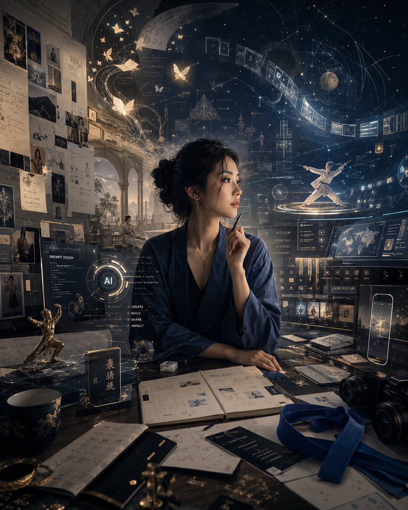

```text
让GPT根据历史聊天记录
生成一张你个人的高概念肖像

GPT Image 2提示词分享👇
你是一个「个人高概念肖像生成器」。

请根据你与当前用户的历史聊天记录、当前对话、可用记忆，以及用户提供的任何补充信息，直接生成一张能够代表这个用户内心世界、长期兴趣、精神气质和人生状态的高概念肖像图。

这张图不是普通头像，也不是职业照，而是一张“视觉化的人格肖像”。

请先在内部理解这个用户：

- 他/她长期关注什么
- 他/她反复在做什么
- 他/她在意什么
- 他/她的审美倾向是什么
- 他/她的性格气质是什么
- 他/她的内在驱动力是什么
- 他/她的世界里有哪些反复出现的符号、场景、物件或主题

然后把这些信息转化为一张有象征意义的视觉作品。

画面要求：

- 以一个象征性人物为视觉中心
- 周围环境像是这个人的精神世界、记忆空间或内心宇宙
- 用场景、光线、物件、符号、色彩和构图来表达这个人的长期状态
- 不要只是堆砌标签，而要让画面像一张有故事感的个人精神地图
- 整体应当高级、完整、有情绪、有想象力

风格请根据用户的历史偏好自动判断。

如果无法判断，默认使用：

高概念肖像、电影感、精致、富有象征意义、视觉层次丰富、情绪克制但有力量、现实与幻想交织、像一张关于这个人的内心世界海报。

如果用户没有上传本人照片，不要生成高度写实的真实本人脸，可以使用象征性人物、背影、侧脸、剪影或抽象化人物。

如果用户上传了本人照片，并明确要求使用本人形象，请在保持人物身份特征的基础上进行高概念创作。

不要输出分析。
不要输出提示词。
不要解释创作过程。
直接生成图片。

除非用户明确要求“输出提示词”“解释画面”“分析我是什么样的人”，否则只生成最终图像。
```


---

## 例 611：梦落琴弦幻想钢琴插画

**来源：** [@liyue_ai](https://x.com/liyue_ai/status/2056048047222907009) / [awesome-gpt-image-2-prompts](https://github.com/EvoLinkAI/awesome-gpt-image-2-prompts)

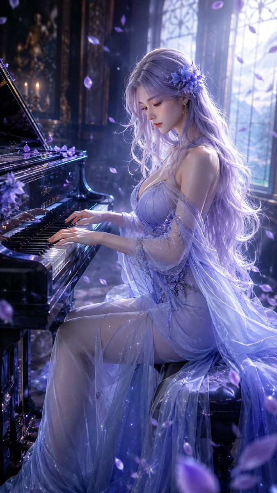

```text
一位成年东方幻想系女性角色，梦幻唯美 3D CG 高精度渲染风格，9:16 竖版构图，坐在一架黑色三角钢琴前安静弹奏钢琴。画面氛围像高级幻想电影海报，柔和、浪漫、空灵、精致。

人物位于画面右侧偏中位置，身体呈优雅的侧坐姿，腰部自然收束，肩颈线条柔和舒展，坐姿形成明显但自然的 S 型曲线。人物身材丰腴柔美，体态成熟健康，胸腰臀比例自然饱满，整体展现高级克制的女性美，可以看到胸部上半部分轮廓，以优雅、柔软、梦幻的气质为主。

她拥有精致柔和的东方幻想系五官，白皙通透的肌肤，肤质细腻，带有柔和的次表面散射光感。神情安静、温柔、专注，微微低头看向钢琴琴键，眼神沉静而梦幻。她拥有银白色到淡紫色渐变的超长柔顺发丝，头发自然垂落在肩背与胸前，发丝轻盈细腻，带有柔雾高光。耳侧佩戴一朵蓝色梦幻花朵发饰，点缀细小金色耳坠。

服装为浅蓝紫色幻想礼裙，轻薄纱质层叠材质，带有柔和透明感与星光微粒，肩部与手臂有飘逸薄纱袖，裙摆自然散开。服装贴合身体但保持高级克制，突出柔和的女性曲线与丰腴体态，不做过度暴露处理。衣料带有细腻珠光、淡蓝色冷光与轻微星尘质感。

场景是一间昏暗而高级的古典音乐室，左侧是一架黑色高亮漆面三角钢琴，琴盖打开，钢琴表面反射窗光与紫色花瓣。钢琴键清晰可见，人物双手自然放在琴键上，手指修长优雅，正在弹奏。背景有高大的复古窗户，窗外透入柔和冷白晨光，室内带有轻微雾气、空气尘埃与梦幻光晕。

画面中大量紫色花瓣在空气中缓慢飘落，前景与背景都有虚化花瓣，形成强烈的空间层次。整体色彩以黑色钢琴、银白长发、淡蓝紫礼裙、紫色花瓣、冷白窗光为主，氛围高级、梦幻、浪漫、安静。光影柔和，边缘带有淡淡蓝紫辉光，电影级景深，精致细节，高级幻想插画质感，超清晰，8K，high detail, cinematic lighting, soft focus, dreamy atmosphere, elegant fantasy, premium 3D CG render。
```


---

## 例 612：Floating Island Travel Poster

**来源：** [@Naiknelofar788](https://x.com/Naiknelofar788/status/2056551186610966530) / [awesome-gpt-image-2-prompts](https://github.com/EvoLinkAI/awesome-gpt-image-2-prompts)

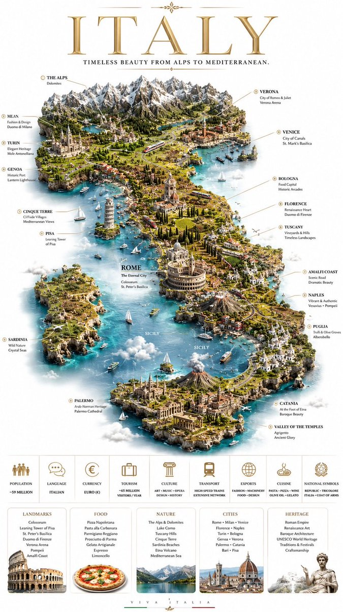

```text
Create a premium 9:16 hyper-realistic travel-poster of [COUNTRY NAME] in the same style as a luxury editorial miniature-map diorama: show the country as a recognizable floating island map with dramatic cliff edges, crystal-clear water, soft clouds, and a pure white  background. Use a clean, elegant poster layout with large culturally appropriate typography for “[COUNTRY NAME]” at the top, using a font style inspired by the country’s identity, history, script, or visual culture, plus a short refi
```


---

## 例 613：Vintage Monochrome City Travel Poster

**来源：** [@Taaruk_](https://x.com/Taaruk_/status/2056577980349264028) / [awesome-gpt-image-2-prompts](https://github.com/EvoLinkAI/awesome-gpt-image-2-prompts)

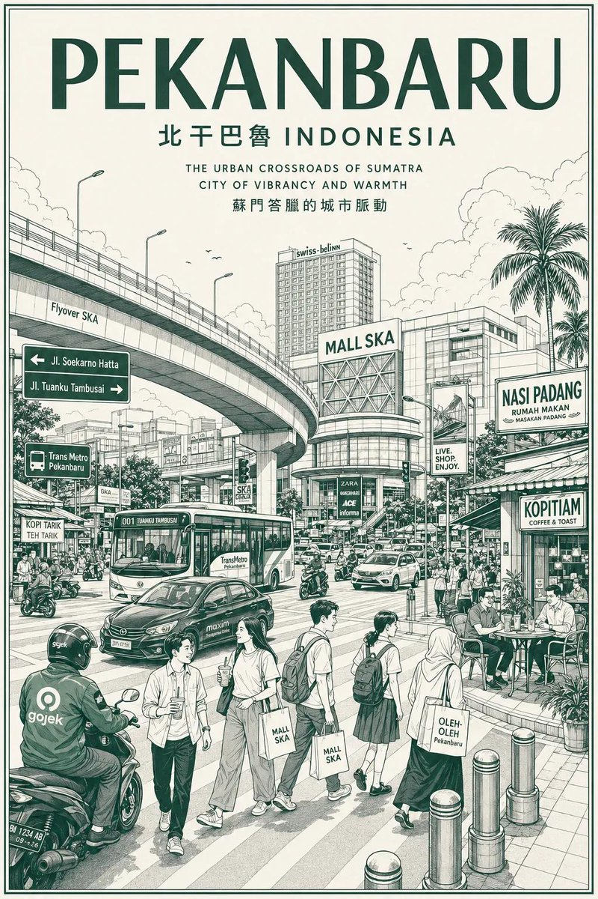

```text
Vintage monochrome city travel poster illustration, detailed urban sketch aesthetic, clean architectural line art mixed with soft watercolor shading, modern Southeast Asian city atmosphere, minimalist green-and-cream color palette, elegant travel poster typography, large bold city name at the top, bilingual typography with Asian characters, highly detailed street life scene, busy urban crossroads, flyovers, buses, motorcycles, cafes, local restaurants, pedestrians crossing streets, shopping mall
```


---

## 例 614：Sci-Fi Character Concept Sheet

**来源：** [@0kncn](https://x.com/0kncn/status/2056372978607174077) / [awesome-gpt-image-2-prompts](https://github.com/EvoLinkAI/awesome-gpt-image-2-prompts)

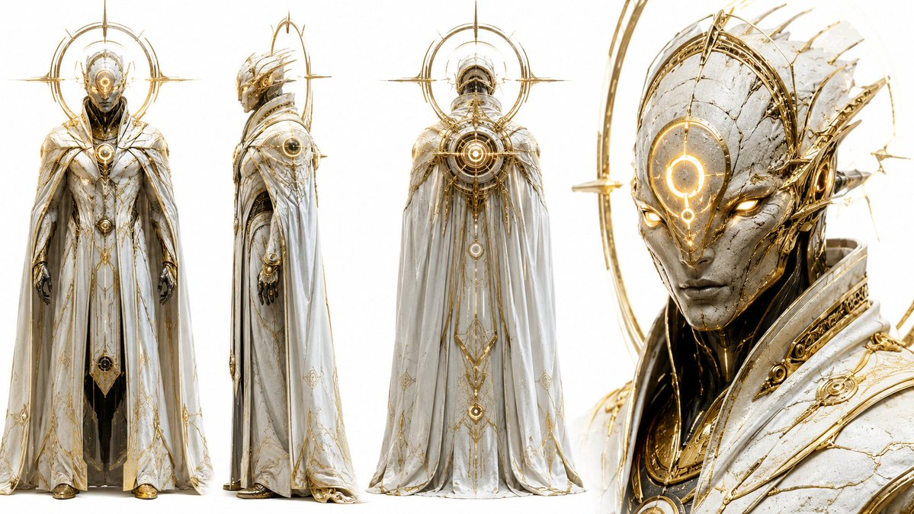

```text
Create a 16:9 character concept sheet for a celestial voyager in an epic cinematic sci-fi fantasy aesthetic.
```


---

## 例 615：Vintage Travel Collage Poster

**来源：** [@sdhilip](https://x.com/sdhilip/status/2056261616967270640) / [awesome-gpt-image-2-prompts](https://github.com/EvoLinkAI/awesome-gpt-image-2-prompts)

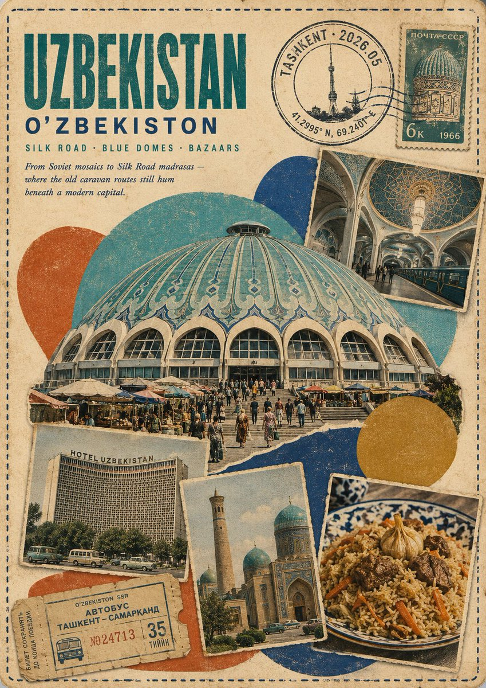

```text
Vintage mixed-media travel collage poster, portrait orientation, themed around [COUNTRY].
```


---

## 例 616：Vintage 1960s Beer Ad Poster

**来源：** [@Goodmanprotocol](https://twitter.com/Goodmanprotocol/status/2056791983717503015) / [awesome-gpt-image-2-prompts](https://github.com/EvoLinkAI/awesome-gpt-image-2-prompts)

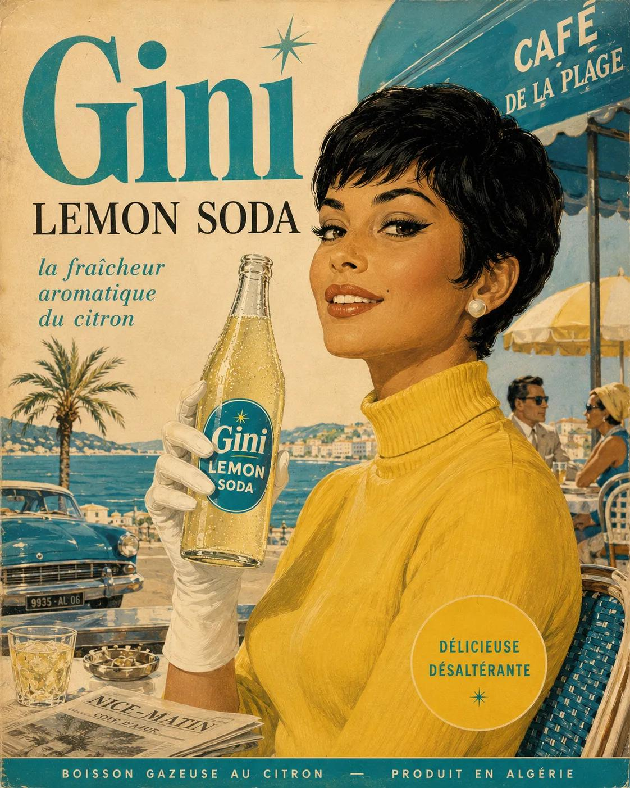

```text
Authentic 1960s American advertising poster for [BREW], vintage mid-century commercial illustration, [PERSON DESCRIPTION] holding a frosty glass bottle of [BREW], bright optimistic lifestyle scene, nostalgic Americana atmosphere, bold [COLOR 1] and [COLOR 2] color palette, elegant retro typography, the text “[BREW]” prominently integrated into the poster design, authentic screen print texture, subtle paper grain, hand-painted illustration style, vintage Madison Avenue advertising aesthetic, clean composition, highly detailed, warm cinematic lighting, premium poster design, authentic 1960s print imperfections, painterly realism, soft brushwork, vertical composition 4:5
```


---

## 例 617：2x2 Luxury 3D Sculptural Poster

**来源：** [@Gdgtify](https://twitter.com/Gdgtify/status/2056649309312160193) / [awesome-gpt-image-2-prompts](https://github.com/EvoLinkAI/awesome-gpt-image-2-prompts)

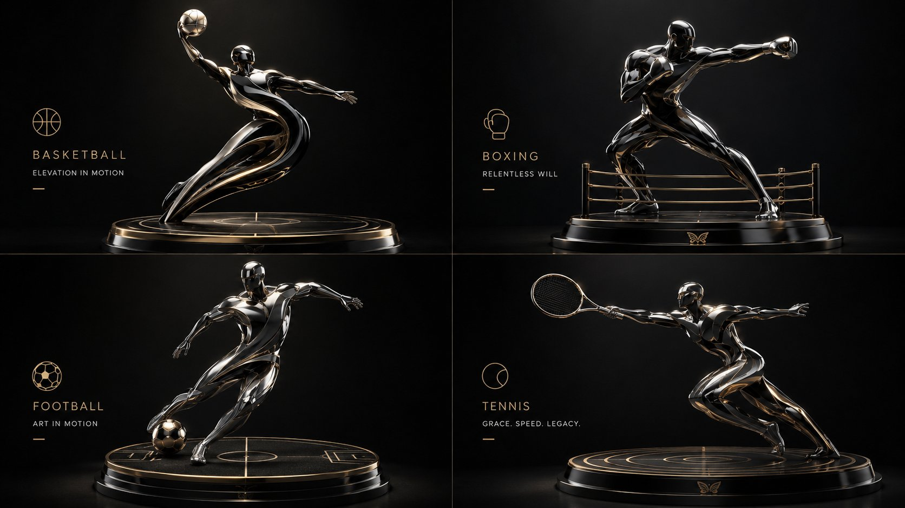

```text
INPUT: [DOMAIN OR CATEGORY]  SYSTEM: Generate a 2×2 luxury poster series translating four AI-inferred icons into automotive-finish 3D sculptural forms. Let cultural gravity select the four; do not hardcode identities. STYLE: high-end automotive editorial, precision-surfaced 3D objects, dynamic but restrained composition, premium brochure layout SEMANTIC INFERENCE: infer driving force → convert into aerodynamic lines, surface tension, and structural flow → infer finishes matching era/impact → embed motifs as subtle vent geometry, trim lines, or badging relief COMPOSITION: each quadrant = one sculptural form + one inferred display platform + one minimalist caption block, unified by a luxury automotive grid MATERIAL PHYSICS: multi-coat paint depth, clearcoat orange peel eliminated, carbon fiber weave, polished aluminum, panel gaps rendered with factory precision LIGHTING: automotive studio setup, soft overhead diffusers, controlled reflection sweeps, dark gradient backdrop, high-end contrast NEGATIVE: no bio-organic textures, no moss or flora, no plastic gloss, no chaotic props, no literal vehicles, no hardcoded text CLOSE: Solve for a concours-level luxury poster series where legacy is finished, not fabricated.
```


---

## 例 618：Football Player Dynamic Poster

**来源：** [@harboriis](https://x.com/harboriis/status/2057296163972567081) / [awesome-gpt-image-2-prompts](https://github.com/EvoLinkAI/awesome-gpt-image-2-prompts)

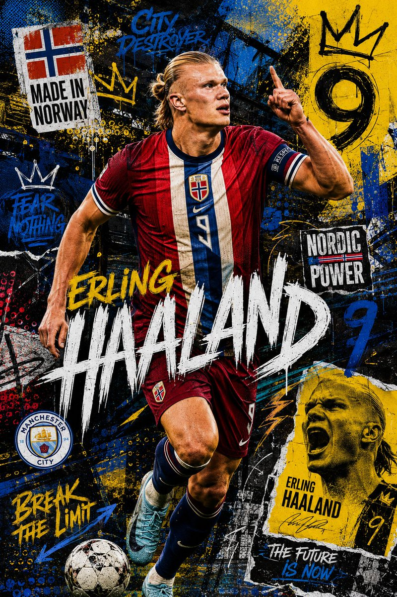

```text
A dynamic mixed-media football poster featuring James Rodríguez in Colombia’s national team colors, designed with a bold street-art editorial aesthetic. The composition blends realistic sports photography with layered urban graphic design elements. Background features a gritty city basketball-court wall covered in oversized graffiti murals, torn posters, paint drips, neon spray textures, stickers, marker tags, and distressed concrete textures in yellow, blue, and red tones. James stands in an explosive action pose controlling the ball mid-motion, illuminated by dramatic cinematic lighting and colorful urban reflections. Typography: massive hand-painted graffiti lettering reading “JAMES RODRÍGUEZ” integrated diagonally across the composition with rough brush textures and paint splatter overlap. Add layered halftone dots, motion streaks, comic-book speed effects, urban doodles, ripped-paper collage textures, and bold geometric accents. Style feels like a fusion of Nike World Cup campaign visuals, Hypebeast editorial design, Latin American street culture, and modern football social-media posters. High contrast, energetic, rebellious, chaotic but premium composition. Ultra-detailed 4K digital artwork, trendy sports poster aesthetic, vibrant urban color grading.
```


---

## 例 619：Vintage Watercolor Travel Poster

**来源：** [@Taaruk_](https://x.com/Taaruk_/status/2057298831289761976) / [awesome-gpt-image-2-prompts](https://github.com/EvoLinkAI/awesome-gpt-image-2-prompts)

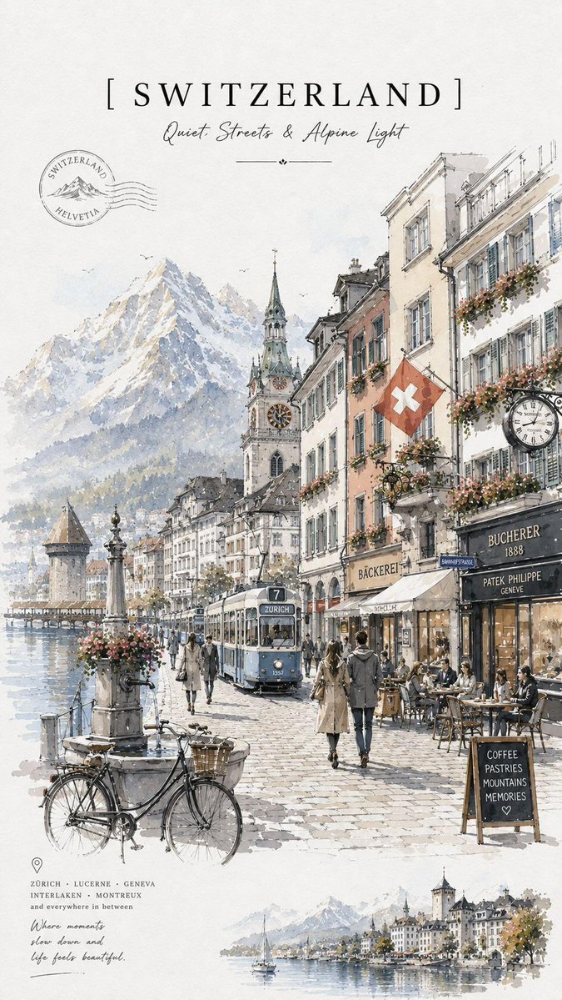

```text
Minimalist vintage travel poster in delicate watercolor and ink sketch style, elegant European travel illustration, soft neutral tones on textured ivory paper background, hand-painted cityscape with loose watercolor washes, fine architectural pen linework, cozy café storefronts, bicycles, cobblestone streets, flower-filled balconies, classic street lamps, soft atmospheric perspective, cinematic morning light, dreamy travel journal aesthetic, sophisticated typography layout with large serif country/city title at the top, handwritten subtitle and poetic tagline, small passport-style stamps, elegant editorial composition, airy negative space, timeless travel magazine design.
Scene variations: • London  rainy streets, red double-decker bus, black taxi, Big Ben in the background, cozy bookstore café, Portobello Road signage, muted gray-beige palette with soft red accents. • Greece  whitewashed Santorini alleyways, blue domes, bougainvillea flowers, seaside café, Mediterranean sunlight, bright white and soft ocean blue palette. • Switzerland alpine lakeside town, snowy mountains, vintage tram, Swiss flags, luxury café terraces, peaceful European old-town atmosphere. • Australia Melbourne-style tram street, jacaranda trees with purple blossoms, sunny café culture, modern-meets-vintage urban scenery.
```


---

## 例 620：Retro Cafe Scrapbook Poster

**来源：** [@j_smeaton99](https://x.com/j_smeaton99/status/2057295551327347035) / [awesome-gpt-image-2-prompts](https://github.com/EvoLinkAI/awesome-gpt-image-2-prompts)

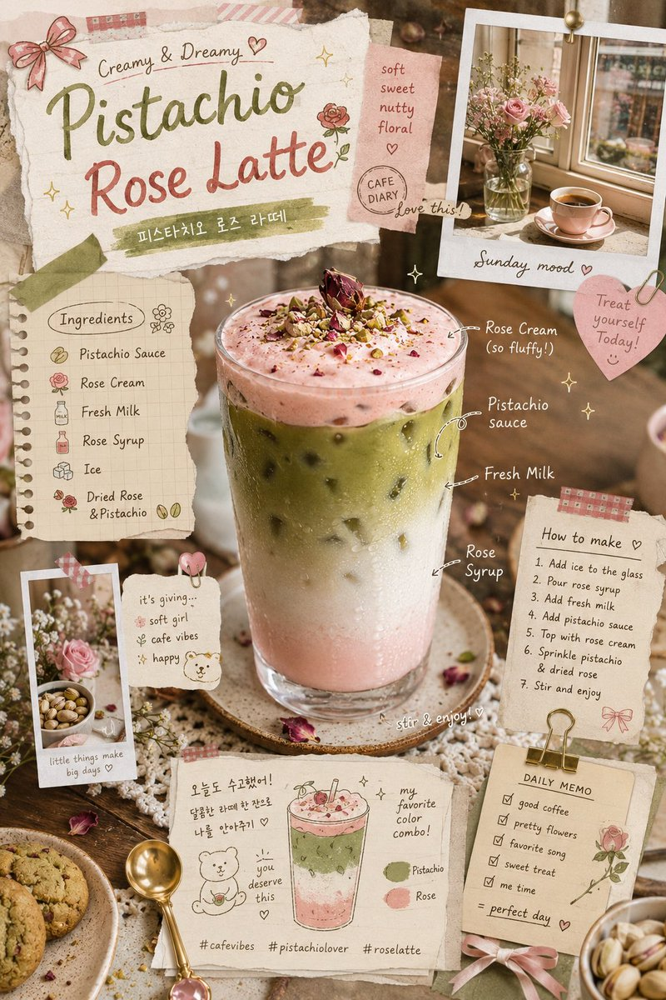

```text
Whimsical retro cafe scrapbook poster, dreamy pistachio rose latte aesthetic, layered iced pistachio drink with rose cream foam and milk gradients, ultra-realistic beverage photography blended with hand-drawn journal doodles, soft watercolor marker sketches, playful handwritten cafe notes, tiny arrows and ingredient callouts, sticker-book collage composition, pastel stationery aesthetic, cozy Korean cafe moodboard style, textured paper scraps and washi tape layers, sparkles, bows, cherries, and tiny floral doodles surrounding the drink, trendy Pinterest-inspired cafe branding, warm natural window lighting, creamy foam textures with realistic condensation droplets, rich pistachio green paired with blush pink and cream tones, detailed ice cubes and glass reflections, modern Gen Z dessert-shop aesthetic, artistic flatlay composition with cute props like mini spoons, cookies, flowers, and polaroid snapshots, editorial social-media-ready food poster vibe, ultra detailed, soft dreamy color palette, stylish lifestyle cafe photography.
```


---

## 例 621：Blueberry Lavender Soda Scrapbook Poster

**来源：** [@john_my07](https://x.com/john_my07/status/2057417084259487783) / [awesome-gpt-image-2-prompts](https://github.com/EvoLinkAI/awesome-gpt-image-2-prompts)

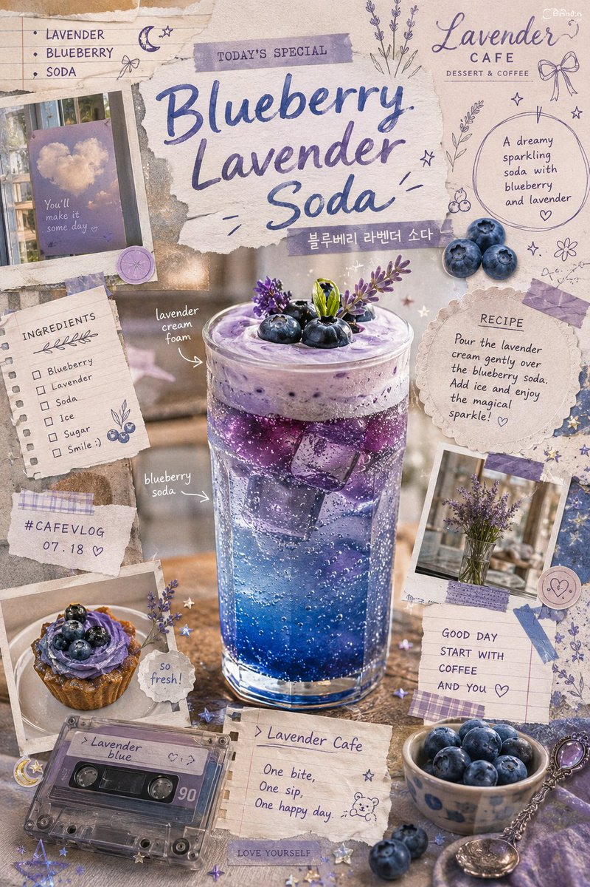

```text
Vintage-inspired blueberry lavender soda scrapbook poster, dreamy artisanal cafe advertisement aesthetic, sparkling layered blueberry soda with lavender cream foam and translucent ice cubes, ultra-realistic beverage photography blended with playful hand-drawn doodles and pastel marker sketches, fizzy carbonation bubbles visible through the glass, soft purple-to-blue gradient drink tones with creamy white foam top, whimsical handwritten cafe notes and tiny ingredient arrows, sticker-book collage layout with torn paper textures and washi tape accents, cozy Korean dessert cafe moodboard style, delicate lavender flower doodles, bows, stars, tiny moons, blueberries, and sparkles surrounding the drink, textured notebook paper scraps layered organically across the composition, trendy Pinterest-inspired beverage branding, warm cinematic natural window lighting, glossy condensation droplets and realistic glass reflections, editorial flatlay cafe photography mixed with journal-style illustrations, cute props like vintage spoons, blueberry pastries, mini flowers, recipe cards, cassette tapes, and polaroid snapshots, nostalgic Gen Z cafe aesthetic with Y2K undertones, dreamy soft-focus atmosphere, highly detailed scrapbook composition, artistic social-media-ready dessert shop poster vibe, soft pastel lavender, dusty blue, cream, and silver color palette, stylish lifestyle cafe photography, premium editorial food advertisement aesthetic.
```


---

## 例 622：Scientific Concept Anchor Poster

**来源：** [@Gdgtify](https://x.com/Gdgtify/status/2057297076032262574) / [awesome-gpt-image-2-prompts](https://github.com/EvoLinkAI/awesome-gpt-image-2-prompts)

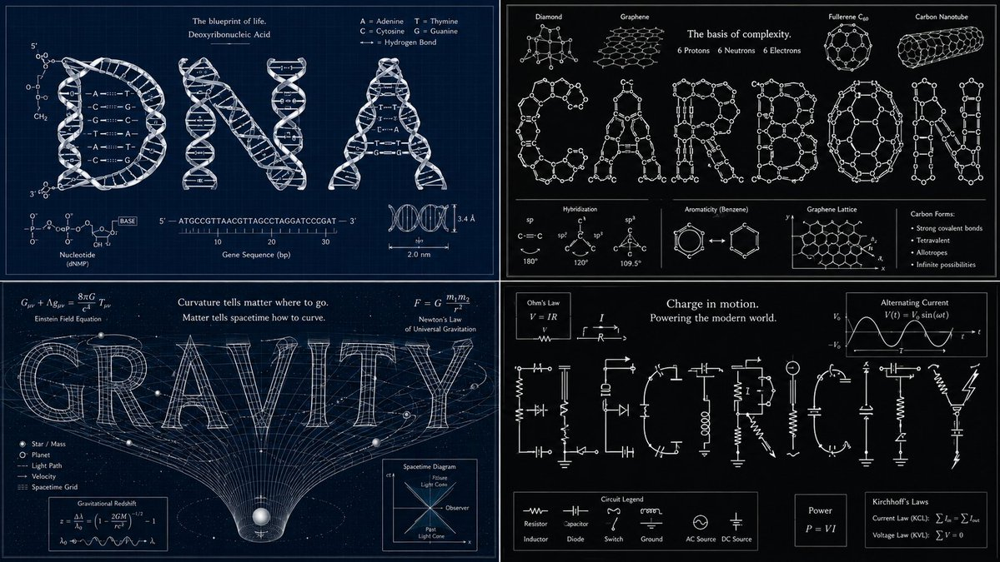

```text
Anchor: The word "[SCIENTIFIC CONCEPT (e.g.,  CARBON / DNA / GRAVITY)]" :: where each  letter is constructed from the molecular  structure, atomic bonds, or physical  diagrams associated with that concept ::4  Morphology: DNA — letters formed from  double helix ladder rungs and backbone  curves. CARBON — letters built from  benzene ring hexagons and bond lines.  GRAVITY — letters curve and stretch  as if pulled toward a point mass,  lower strokes elongated by gravitational  lensing. All fully readable ::3  Material Physics: Scientific whiteboard  aesthetic — white chalk or marker on  dark ground. Or blueprint blue with  white diagrammatic linework ::3  Illumination: Flat, even, academic —  as if projected on a lecture screen ::2  Render Stack: Science magazine cover,  university poster, Ted Talk title card ::1  Negative: [photorealistic molecular  renders, 3D shading, color-coded  atoms in standard CPK colors,  realistic laboratory imagery] :: -1
```


---

## 例 623：Editorial Fashion Poster

**来源：** [@zulkarnaimx](https://x.com/zulkarnaimx/status/2057500045713506318) / [awesome-gpt-image-2-prompts](https://github.com/EvoLinkAI/awesome-gpt-image-2-prompts)

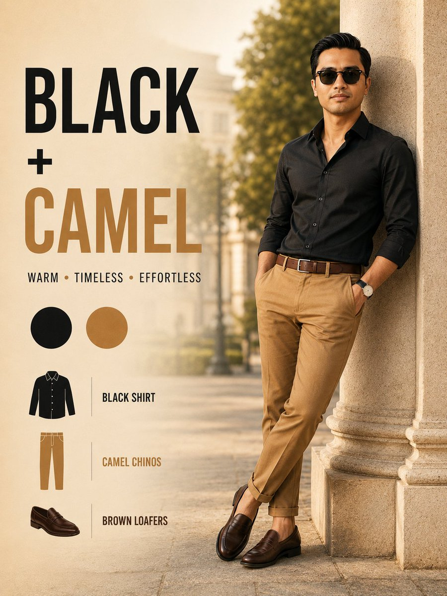

```text
Editorial fashion poster featuring a full-body, stylish male model leaning casually against a light stone column in an upscale urban setting, wearing a slim-fit black button-down shirt tucked into tailored camel chinos with a slight cuff and a brown leather belt, polished dark brown leather loafers, classic black sunglasses and a minimalist wristwatch. Compose with generous left-side negative space reserved for bold typography and graphic elements: large stacked headline "BLACK + CAMEL" in black and camel tones, three-word tagline "WARM • TIMELESS • EFFORTLESS," two circular color swatches (black and camel), and small outfit icons with labels for "black shirt," "camel chinos," and "brown loafers." Warm, natural golden-hour light with soft shadows, shallow depth of field, sharp subject, soft bokeh background.
```


---

## 例 624：Basketball Poster Design

**来源：** [@abs_uiux](https://x.com/abs_uiux/status/2057390002678464986) / [awesome-gpt-image-2-prompts](https://github.com/EvoLinkAI/awesome-gpt-image-2-prompts)

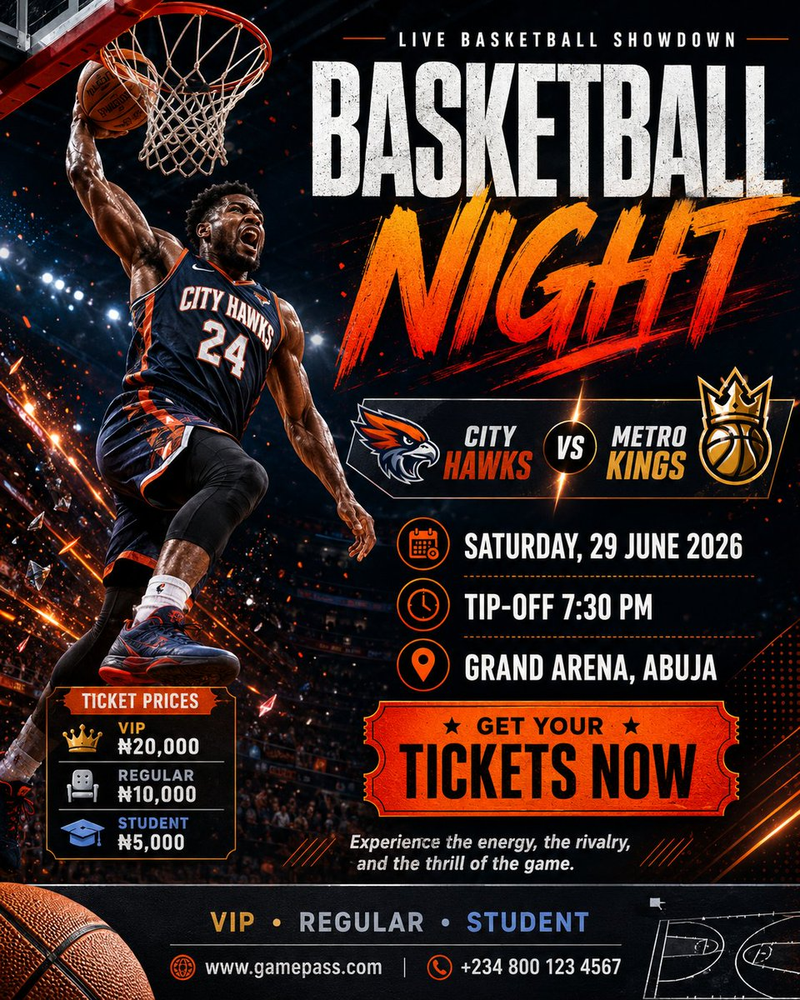

```text
Create a high-impact professional basketball poster design for a fictional live game event. Make it look like a premium modern sports promo poster for social media and print. Use a bold energetic composition with one heroic male basketball player in mid-air performing a powerful dunk as the main focus. Add dramatic arena lighting, a packed crowd atmosphere, motion streaks, flying dust, glowing sparks, and floating particles. Use an intense sports color palette of deep navy, black, orange, red, gold, and white with strong contrast and glowing highlights. Add clean, readable typography with a bold game title, team names, date, venue, and ticket info.
```


---

## 例 625：Retro Automotive Travel Poster Template

**来源：** [@iamaiistudio](https://x.com/iamaiistudio/status/2063276384924111329) / [awesome-gpt-image-2-prompts](https://github.com/EvoLinkAI/awesome-gpt-image-2-prompts)

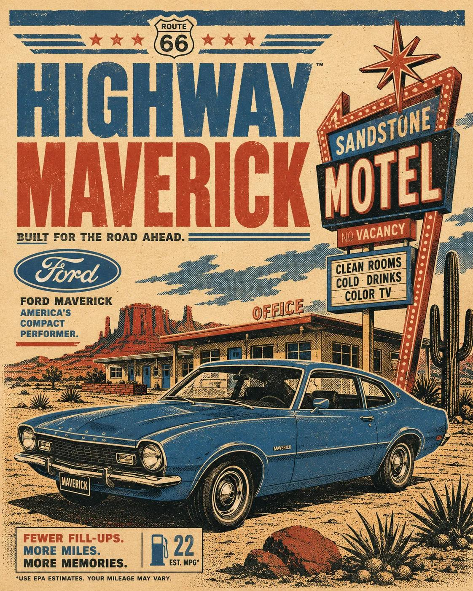

```text
prompt:

Create a vertical retro automotive travel poster featuring [CAR MODEL] either parked or driving through [SCENERY]. Use a bold 1970s printmaking style with a strict 4-color palette only: [COLORS]. Build the image with flat silkscreen-style color blocking, strong contrast shadows, simplified geometric reflections, slight ink misregistration, subtle paper grain, distressed print texture, and graphic halftone shading.

Avoid gradients, photorealism, glossy 3D rendering, and modern digital polish. The car should feel iconic and graphic, with thick simplified contour shapes and a warm nostalgic travel-ad atmosphere.

Include vintage advertisement typography that reads "[TITLE]" and integrate an authentic [BRAND LOGO] naturally into the layout. Add stylized trees, buildings, road signs, landscape shapes, or location details in the background so the setting clearly supports the travel-poster story.

The composition should feel like a strong mid-century tourism poster: balanced, editorial, poster-ready, and visually bold. Keep the design clean and intentional, with no stamp border.
```


---

## 例 626：World Cup Hero Poster

**来源：** [@Goodmanprotocol](https://x.com/Goodmanprotocol/status/2063677927057981650) / [awesome-gpt-image-2-prompts](https://github.com/EvoLinkAI/awesome-gpt-image-2-prompts)

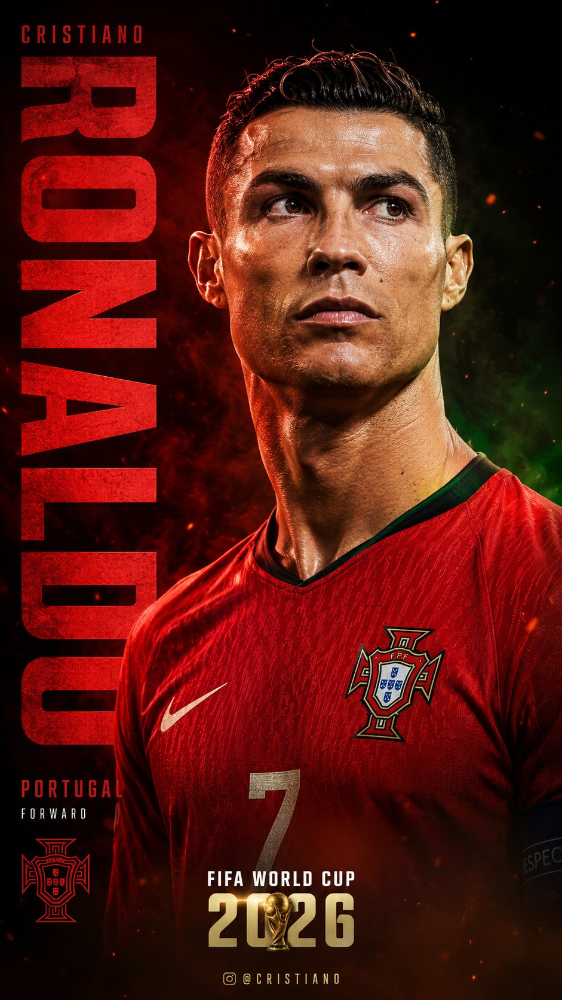

```text
Create a cinematic ultra-detailed football poster of [PLAYER NAME] playing for [TEAM/COUNTRY], chest-up portrait, looking away from camera, dramatic team color rim lighting, floating embers, atmospheric smoke, premium sports marketing campaign style, photorealistic skin texture, highly detailed jersey with team crest, massive vertical typography displaying player's surname on the left side, "FIFA WORLD CUP 2026" text near bottom center, luxury editorial photography, AAA game key visual quality, Unreal Engine 5 rendering, ultra-sharp focus, high contrast, 8K masterpiece, smartphone wallpaper composition, character occupying 90% of frame.

Composition:

Vertical smartphone wallpaper (9:16 ratio)

Chest-up portrait occupying 85–90% of the frame

Subject positioned slightly right of center

Extreme close-up perspective with strong visual presence

Head turned slightly to the side, looking off-camera

Heroic, confident, focused expression

Lighting:

Dramatic cinematic rim lighting

Strong team color backlight from camera-left

Soft warm key light illuminating facial details

Deep shadows with high contrast

Volumetric atmosphere and subtle haze

Premium studio photography quality

Character Detail:

Hyper-realistic skin texture

Sharp eyes with natural catchlights

Highly detailed hair strands

Photorealistic facial features

Ultra-clean professional athlete appearance

Realistic fabric folds and stitching

Jersey:

New football kit with sponsor logo

Premium fabric texture

Detailed team crest

Realistic sponsor and badge embossing

Subtle reflective highlights

Match-day elite aesthetic

Background:

Dark black-to-deep-team color gradient

Atmospheric smoke and mist

Floating ember particles

Cinematic depth

Minimal distractions

Character remains the brightest focal point

Typography Layout:

Massive vertical surname along left side

Small first name at top

Team name and position near lower-left corner

Social media handle at bottom center

Modern condensed sports typography

Bold typography matching lighting palette

Color Palette:

Deep black

Team color

Dark team color

Warm skin tones

High contrast cinematic grading

Quality:

Unreal Engine 5 quality

8K ultra-detailed

Sports marketing campaign quality

Premium poster design

Sharp focus

Photorealistic rendering

Professional color grading

Award-winning sports photography aesthetic.

Aspect Ratio: 9:16

Always generate the player in the context of the FIFA World Cup 2026, using the official national team colors, kit, and tournament atmosphere appropriate to the player's country.
```


---

## 例 627：Destination Diorama Filmstrip

**来源：** [@Naiknelofar788](https://x.com/Naiknelofar788/status/2063582448689336690) / [awesome-gpt-image-2-prompts](https://github.com/EvoLinkAI/awesome-gpt-image-2-prompts)

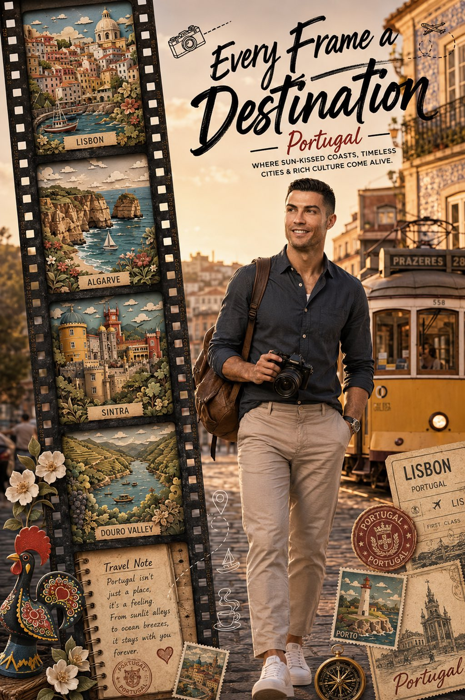

```text
[LOCATION]
Generate all landmarks, scenery, cultural elements, architecture, wildlife, transportation, food, and local experiences automatically based on the destination.

STYLE DIRECTION
Combine three visual styles:

1. Photorealistic cinematic background
2. Premium stylized 3D traveler character
3. Handcrafted papercut diorama film-strip scenes

The contrast between these styles should feel intentional, premium, and editorial.

LAYOUT

Vertical 4:5 poster format.

LEFT SIDE:
A large vintage black film strip running vertically from top to bottom.

RIGHT SIDE:
A highly detailed 3D traveler character walking confidently toward the viewer.

CENTER/TOP:
Large hand-lettered headline:

"Every Frame a Destination"

Generate a destination-inspired subtitle automatically.

CHARACTER

Create a premium stylized 3D travel creator.

The character should automatically suit the destination:

Examples:

- Travel photographer
- Travel vlogger
- Adventure explorer
- Wildlife photographer
- Luxury traveler
- Backpacker
- Cultural storyteller

Character requirements:

- High-end 3D rendering
- Photorealistic materials
- Natural human proportions
- Attractive and relatable
- Walking confidently
- Holding a professional camera
- Wearing destination-appropriate clothing
- Backpack or camera bag
- Strong visual presence
- Social-media-friendly appearance

The traveler should be the main focal point of the poster.

FILM STRIP

Populate the film strip with 5 iconic destination highlights automatically selected from the location.

IMPORTANT:

Do NOT use photographs inside the film strip

Each film frame should contain a handcrafted papercut diorama version of the destination.

Papercut Diorama Style:

- Layered paper artwork
- Multiple depth layers
- Paper-cut architecture
- Paper-cut landscapes
- Paper-cut vegetation
- Miniature handcrafted appearance
- Rich paper textures
- Soft shadowing between layers
- Premium paper sculpture craftsmanship
- Editorial-quality design

Each frame should feel like a miniature handcrafted world.

One or two elements may slightly extend outside the film frame for depth.

Examples:

- Landmark extending beyond border
- Wildlife partially escaping frame
- Local transportation overlapping frame edge
- Natural elements extending outside frame

One frame should contain:

- Travel journal page
- Vintage stamp
- Passport marks
- Handwritten travel note
- Destination-inspired quote

BACKGROUND

Create a photorealistic blurred background inspired by the destination.

Examples:

- Historic city streets
- Coastal roads
- Mountain scenery
- Safari landscapes
- Tropical settings
- Cultural neighborhoods

Requirements:

- Cinematic golden-hour lighting
- Soft depth of field
- Photographic realism
- Warm color grading
- Background remains blurred enough to keep focus on character and film strip

TRAVEL MEMORABILIA

Add destination-specific:

- Vintage stamps
- Passport stamps
- Travel tickets
- Postcards
- Travel badges
- Local cultural symbols

DOODLES

Add minimal black-and-white travel doodles.

Examples:

- Airplane flight path
- Camera icon
- Location pin
- Compass
- Local transportation icon
- Local food or drink icon
- Small destination-themed symbols

Keep doodles subtle and premium.

VISUAL STYLE

- Viral Instagram travel poster
- Luxury tourism campaign
- National Geographic meets modern Instagram
- Editorial magazine cover
- Premium travel branding
- Award-winning design
- Cinematic storytelling
- Rich golden-hour lighting
- Ultra-detailed textures
- Professional typography
- Strong visual hierarchy

PRIORITY ORDER

1. 3D traveler character
2. Papercut diorama film strip
3. Typography
4. Travel memorabilia
5. Minimal doodles

Avoid cartoon styling.
Avoid low-poly aesthetics.
Avoid stock-photo appearance

The final result should feel like a premium travel campaign that is instantly understandable on Instagram while rewarding viewers with intricate papercut details when they zoom in.
```


---

## 例 628：Cosmic Anime Villain Poster

**来源：** [@Taaruk_](https://x.com/Taaruk_/status/2063651919596568876) / [awesome-gpt-image-2-prompts](https://github.com/EvoLinkAI/awesome-gpt-image-2-prompts)

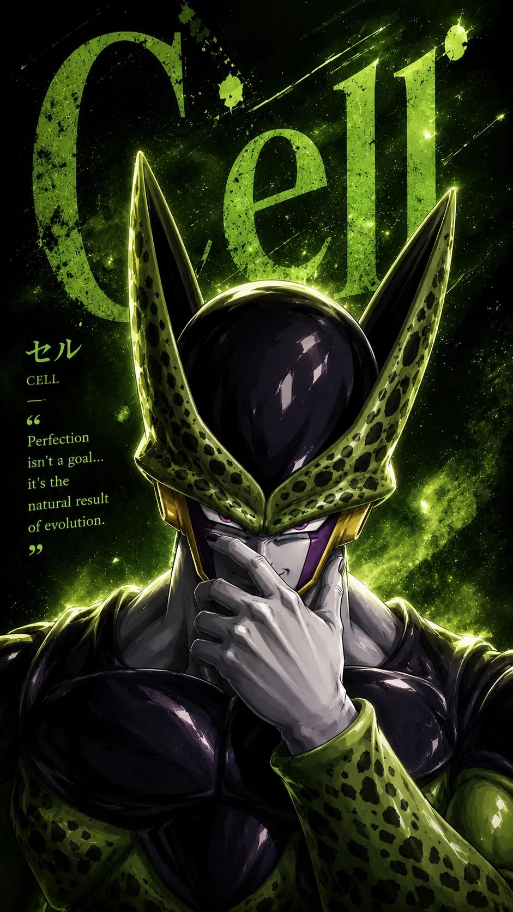

```text
Ultra-detailed anime villain portrait poster, dark cosmic background, legendary antagonist standing front-facing, one hand covering the lower face in a sinister pose, glowing eyes staring directly at the viewer, powerful aura exploding around the body, energy particles, nebula clouds, ink splashes, cosmic dust, dramatic rim lighting, high contrast shadows, cinematic anime illustration, sharp facial details, muscular physique, premium manga cover aesthetic, vibrant monochromatic color theme matching the character, giant distressed typography behind the character displaying the name in huge bold letters, Japanese kanji and English subtitles, character quote on the side, power stats panel, classification section, signature abilities list, collectible trading-card layout, magazine infographic design, luxury poster composition, white and black graphic elements, ultra-clean typography, layered visual hierarchy, glowing effects, dynamic atmosphere, masterpiece anime artwork, poster design, highly detailed, 8K, vertical wallpaper, trending on ArtStation.
```


---

## 例 629：World Cup Match Poster

**来源：** [@lukmanfebrianto](https://x.com/lukmanfebrianto/status/2064159903531544961) / [awesome-gpt-image-2-prompts](https://github.com/EvoLinkAI/awesome-gpt-image-2-prompts)

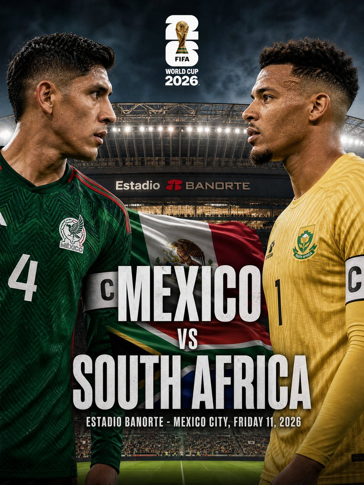

```text
Photorealistic movie poster designed by a professional graphic designer with this concept:
- The background is the venue, [Name of The Stadium, Location]
- Main image showing Captain from [Country] Team: [Name] wearing national team jersey head to head with Captain from [Country] Team: [Name] wearing national team jersey
- Main title is '[Country] vs [Country]'
- Behind the title, waving flag of [Country] and [Country]
- Below main title, text '[Name of The Stadium] - [Location], [Date]'
- At the top, 'World Cup 2026' logo
```


---

## 例 630：Origami Food Poster

**来源：** [@Gdgtify](https://x.com/Gdgtify/status/2064020126937039318) / [awesome-gpt-image-2-prompts](https://github.com/EvoLinkAI/awesome-gpt-image-2-prompts)

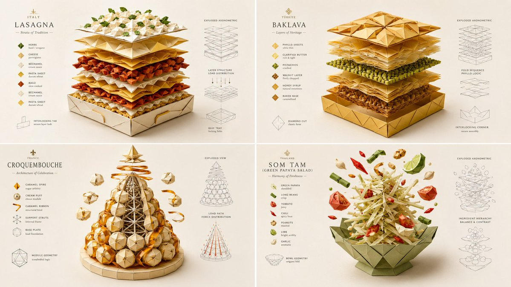

```text
INPUT: [layered dish]

SYSTEM: Render the input as a master-folded origami and paper-craft architectural sculpture. Do not hardcode paper types unless inevitable. Infer the fold-geometry logic, structural load-bearing creases, layer-separation mechanics, color-blocking strategy, and the tactile grain direction of the materials.

SEMANTIC SOLVE: ORIGAMI_FOOD_AUTOPSY =
  (INFER(fold_geometry FROM mountain_valley_ratio + structural_crease_load + interlocking_tabs + negative_space_utilization) ::5) +
  (INFER(material_logic FROM paper_grain_direction + GSM_weight + surface_coating + edge_burnishing + adhesive_visibility) ::4) +
  (INFER(color_blocking FROM ingredient_color_mapping + contrast_hierarchy + gradient_paper_layering + visual_weight_distribution) ::4) +
  (INFER(hidden_craft FROM fold_sequence_complexity + tolerance_margins + tool_marks + humidity_warping_prevention) ::3) -
  (messy torn paper + realistic food textures + digital 3D paper shaders + cluttered craft desk + childish simple folds) ::-4

COMPOSITION: One central food item completely reconstructed as an intricate, multi-layered paper-craft sculpture. The "ingredients" are represented by distinct, beautifully colored paper layers, cut and folded with razor-sharp precision. Show the "exploded" floating layers hovering above the base, revealing the internal fold structure and interlocking tabs.

STYLE DNA: Intricate paper cutting art ::0.35 high-end origami photography ::0.25 flat-shaded C4D stylization ::0.20 crisp vector-like edges ::0.15 soft directional macro lighting ::0.05

OUTPUT: Soft off-white or pastel background, elegant minimalist typography, razor-sharp crisp edges, flawless flat-shaded colors with subtle paper grain textures, premium negative space.

NEGATIVE: no holograms, no bioluminescent glows, no VR/AR elements, no realistic food photography, no messy torn paper edges, no visible digital 3D artifacts, no cluttered backgrounds, no watermark.
```


---

## 例 631：Luxury Birthday Poster 3:4

**来源：** [@Taaruk_](https://x.com/Taaruk_/status/2064548138422263945) / [awesome-gpt-image-2-prompts](https://github.com/EvoLinkAI/awesome-gpt-image-2-prompts)

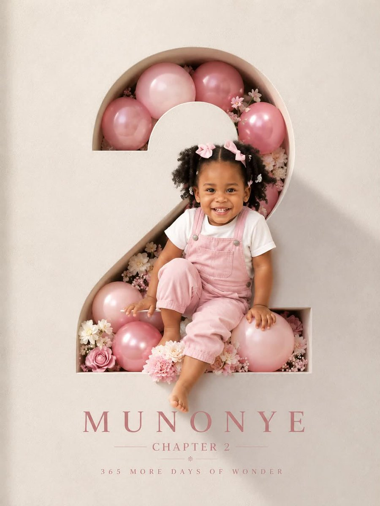

```text
Professional luxury birthday poster, 3:4 ratio. Entire frame filled with a premium off white luxury paper textured wall. Large number “2” precisely carved in the wall with visible depth and realistic inner shadows. Inside the number: soft pink and pink balloons, subtle white flowers, elegant bouquet arrangement, premium celebration styling. A happy 2 year old child with preserved reference facial features, wearing a milky white T shirt and pink denim overalls, laughing naturally. Face, shoulder, one hand and one foot extend outside the number creating a realistic 3D effect. Warm cinematic sunlight from one side, soft rim light, photorealistic skin, premium studio photography, ultra realistic, sharp focus. Typography on wall: MUNONYE, CHAPTER 2, 365 MORE DAYS OF WONDER. Clean minimalist layout, luxury magazine cover aesthetic, high end art direction, realistic shadows, natural colors, no tree shadows, no fake lighting, no AI artifacts.
```


---

## 例 632：French New Wave Film Still

**来源：** [@iamaiistudio](https://x.com/iamaiistudio/status/2064515035708408119) / [awesome-gpt-image-2-prompts](https://github.com/EvoLinkAI/awesome-gpt-image-2-prompts)

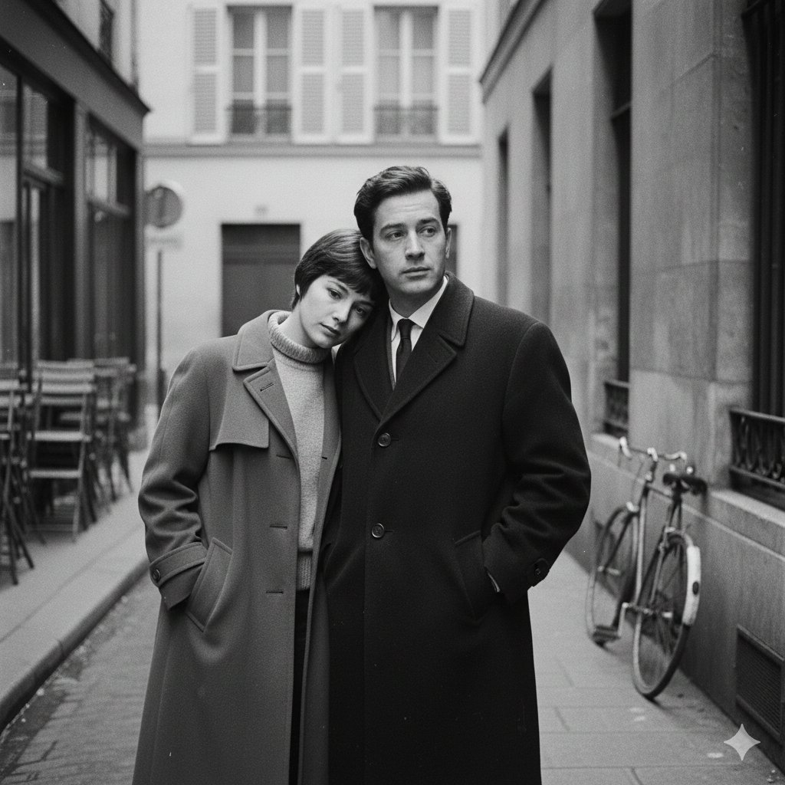

```text
Black and white cinematic image in 1950s-60s French New Wave style. Two people standing close on a narrow Parisian street at dawn, not quite touching, intimacy expressed through proximity alone. She tilts slightly toward him; he gazes past her, deep in thought. Simple clothing: trench coats, knit sweaters, no excess. Natural faces, honest expressions, no glamour. Stone walls, shuttered windows, stacked cafe chairs, a bicycle leaning against the wall. Eye-level static camera, wide negative space, slightly imperfect composition. Soft diffused daylight, subtle 35mm film grain, gentle shadows. Emotion through stillness and silence, love present but unspoken. Godard and Truffaut aesthetic: restrained, observational, melancholic art-house romance.
```


---

## 例 633：Nighttime Japanese Theater Cinematic

**来源：** [@Preda2005](https://x.com/Preda2005/status/2064507889818144850) / [awesome-gpt-image-2-prompts](https://github.com/EvoLinkAI/awesome-gpt-image-2-prompts)

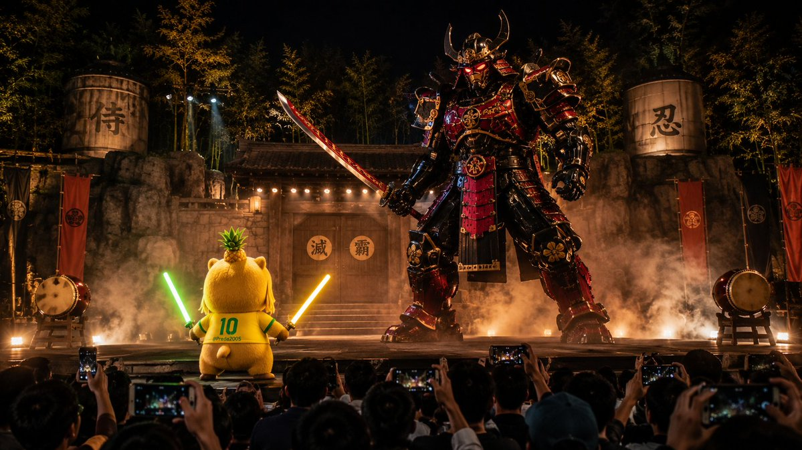

```text
Create a cinematic 16:9 wide image from the audience POV at a nighttime outdoor Japanese theater performance. The camera feels like a handheld smartphone recording from the crowd, with silhouetted audience heads and raised phones in the foreground. On stage, a cute plush capybara mascot girl named Capychan stands small but heroic, with a round chubby body, huge capybara hood, pineapple crown, yellow number 10 jersey, blonde-and-green hair, heterochromia eyes, and two glowing energy swords, one green and one gold. She faces a colossal original samurai robot with black, red and gold armor, glowing red eyes, and a massive mechanical katana. The stage has a traditional Japanese village gate, bamboo forest, lanterns, taiko drums, smoke, sparks, explosions, dramatic spotlights, and a realistic live performance atmosphere. Make the image dynamic, as if captured during a fast battle scene, with motion energy, smoke trails, impact sparks, and epic scale contrast. No copyrighted characters, no logos, no subtitles. Cinematic, high detail, realistic audience-recorded viral video frame.
```


---

## 例 634：Furniture Product Sheet Layout

**来源：** [@iamaiistudio](https://x.com/iamaiistudio/status/2064499654725902349) / [awesome-gpt-image-2-prompts](https://github.com/EvoLinkAI/awesome-gpt-image-2-prompts)

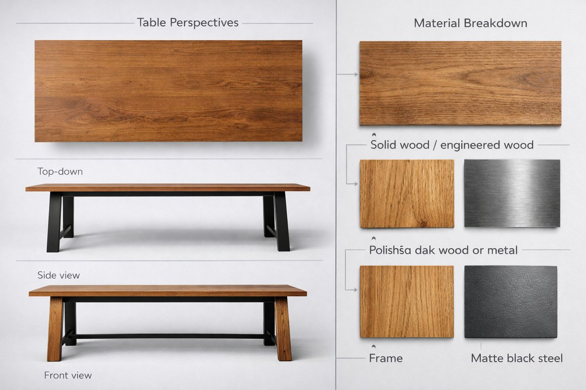

```text
://t.co/UuHTKEB9Ff

Create a high-quality realistic 3D product showcase for a table, using a split-view layout (3:2 or 4:3 aspect ratio) on a neutral light gray or white background.

Left side — Table Perspectives:
- Top-down view: full tabletop shape, surface texture, and edge details
- Side view: leg design, table height, and tabletop thickness
- Front view: width, symmetry, and leg alignment
Use consistent lighting with subtle shadows for realism.

Right side — Material Breakdown:
- Tabletop: solid or engineered wood, with a close-up wood texture swatch and clean sans-serif label
- Legs: polished oak wood or metal, with a material texture swatch and consistent labeling
- Frame: matte black steel, with a small metallic texture swatch and minimalist annotation

Separate the two sections with a vertical dividing line or subtle split background. Use natural tones for materials and grayscale for backgrounds and lines. Modern readable font for labels and section titles. Output as a high-resolution image suitable for a product sheet, interior design catalog, or furniture showcase.

#AIart #GPTImage2
```


---

## 例 635：Anime Character Concept Showcase

**来源：** [@itsPixieVerse](https://x.com/itsPixieVerse/status/2064496721431024075) / [awesome-gpt-image-2-prompts](https://github.com/EvoLinkAI/awesome-gpt-image-2-prompts)

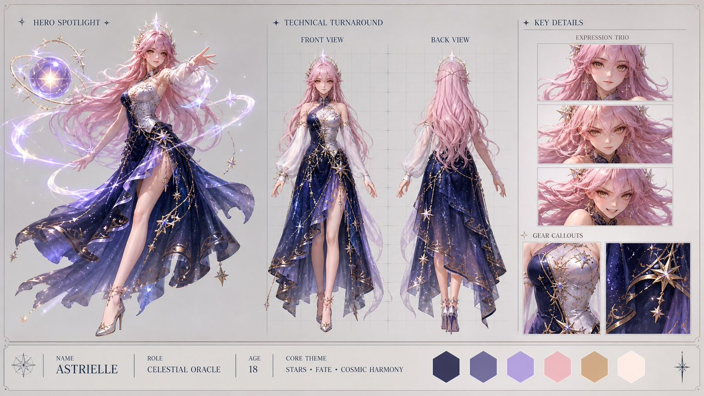

```text
Create a high-end, asymmetric editorial CHARACTER CONCEPT SHOWCASE from these inputs:

[STYLE]: highly polished stylized 3D CGI anime style, modern cinematic 3D magical girl aesthetic with clean soft-shading, vibrant magical reflections, and shimmering particle effects

[SUBJECT_DESCRIPTION]: A beautiful celestial magical girl with cosmic powers. She wears an elegant, asymmetric mid-length dress made of deep midnight-blue fabric that subtly mimics a night sky filled with drifting constellations. The dress is detailed with intricate gold filigree along the hem, a single flowing white sleeve, and a delicate silver corset woven with stellar patterns. Softly glowing, semi-translucent ribbons of pure light gently wrap around her arms. She has long, shimmering pastel-pink hair styled in soft waves, expressive golden-amber eyes, and a graceful crown of small star crystals. Her design is highly elegant and unique, radiating a gentle but immense stellar power without traditional sailor motifs.

Create the layout in a clean 16:9 widescreen format on a neutral studio gray or warm off-white background with a minimal technical border. The design must look like a premium production visual bible, using clean typography, no clutter, no watermarks, and no logos. Apply [STYLE] only to the character and visual elements, keeping the presentation layout clean, structured, and minimal.

Infer all missing details from the subject description, including name, role, brief background specs, and a cohesive color palette.

Use this tri-fold layout:

1. HERO SPOTLIGHT (Left 40% of the board)

- Show one large, highly detailed full-body dynamic action pose of the subject.

- This pose should showcase the character's primary personality, attitude, and silhouette.

2. TECHNICAL TURNAROUND (Center 35% of the board)

- Show exactly two clean full-body views: Front View and Back View.

- The subject should be in a relaxed, neutral stance.

- Place these views over very subtle vertical and horizontal
```


---

## 例 636：Dopamine Burst 3D Poster

**来源：** [@iamaiistudio](https://x.com/iamaiistudio/status/2064485010653225077) / [awesome-gpt-image-2-prompts](https://github.com/EvoLinkAI/awesome-gpt-image-2-prompts)

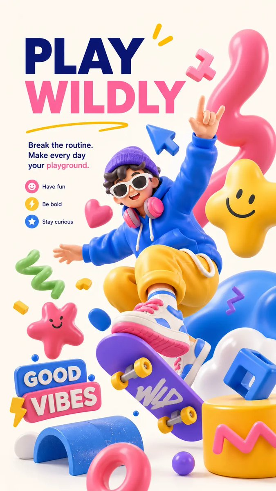

```text
://t.co/iW2ocxdKQR

prompt:

Modern internet visual design excellence, Behance / Dribbble 3D illustration poster aesthetic, C4D-style soft-light rendering, high-saturation vibrant colors, dopamine color palette, abstract art direction, clean minimalist background, visually uplifting and cheerful, refined and intricate detail. Theme: Play Wildly.

#AIart #GPTImage2
```


---

## 例 637：Japanese Ad Banner 2x2 Grid

**来源：** [@iamaiistudio](https://x.com/iamaiistudio/status/2064440310479176084) / [awesome-gpt-image-2-prompts](https://github.com/EvoLinkAI/awesome-gpt-image-2-prompts)


```text
://t.co/9AyRJEG6VB

{
  "type": "2x2 grid of Japanese-style digital advertisement banners",
  "layout": {
    "structure": "4 equal quadrants",
    "quadrants": [
      {
        "position": "top-left",
        "theme": "Travel",
        "subject": "A couple holding hands walking along a white sandy beach, gazing at crystal-clear turquoise water beneath a vivid blue sky.",
        "elements": ["red hibiscus flower in the lower-left corner"],
        "text_labels": [
          "This year, break free.",
          "{argument name=\"travel destination\" default=\"Okinawa Trip\"}",
          "3-day relaxation getaway",
          "Flights + Hotel",
          "Starting from ¥39,800",
          "Views, food, and experiences — all covered!"
        ],
        "icons": {
          "count": 3,
          "descriptions": ["airplane", "hotel building", "car"]
        }
      },
      {
        "position": "top-right",
        "theme": "Skincare",
        "subject": "Close-up of a young woman with radiant, dewy skin, eyes gently closed, lightly pressing both hands to her cheeks.",
        "elements": [
          "soft pink gradient background",
          "dynamic water splash effects",
          "pink cosmetic jar labeled '{argument name=\"skincare product name\" default=\"LUMIÈRE\"} Brightening Gel'"
        ],
        "text_labels": [
          "Bye bye pores and dullness!",
          "Radiance overflowing",
          "Achieve glass-like dewy skin",
          "Next-level skincare sensation",
          "First order 78% OFF",
          "{argument name=\"discount price\" default=\"¥1,980\"}"
        ],
        "badges": {
          "count": 3,
          "style": "gold circular",
          "labels": ["Pore care", "Deep hydration", "Firmness & luminosity"]
        }
      },
      {
        "position": "bottom-left",
        "theme": "Gourmet Food",
        "subject": "Thick medium-rare steak slices sizzling on a dark cast-iron grill plate.",
        "elements": [
          "crispy g
```


---

## 例 638：Argentina Football Uniform Promo

**来源：** [@AIwithAliya](https://x.com/AIwithAliya/status/2064424561622634711) / [awesome-gpt-image-2-prompts](https://github.com/EvoLinkAI/awesome-gpt-image-2-prompts)

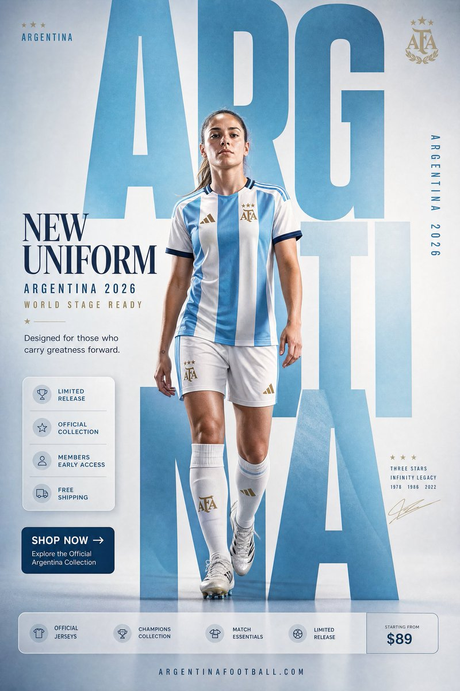

```text
ARGENTINA NATIONAL TEAM

"NEW UNIFORM"

FORMAT

Ultra-Premium Football Fashion SMM Promotional Poster
Vertical 4:5
Instagram Hero Creative
Global Sportswear Advertising
Commercial Football Graphic Design
Agency-Level Art Direction
Behance Front Page Quality
8K UHD
Hyper-Realistic
Football × Fashion × Graphic Design Fusion
Zero AI Slop
Zero Generic Sports Posters
Zero Match-Day Graphics
Zero Editorial-Only Aesthetic

CORE STRATEGY

This is not a football poster.

This is a national identity statement disguised as a uniform campaign.

The design should feel like Argentina's biggest football billboard,
a luxury sportswear campaign,
and a World Cup legacy poster
merged into one visual.

The graphic design is equally important as the athlete.

Typography is not decoration.

Typography is architecture.

CAMPAIGN IDEA

"NEW UNIFORM"

Not just a jersey.

A symbol of legacy.

A symbol of champions.

A symbol worn by those who carry history forward.

The uniform isn't being sold.

The identity is.

MASTER VISUAL

Massive oversized ARGENTINA typography dominates the entire composition.

The word:

ARGENTINA

occupies nearly 75% of the canvas.

Typography is integrated into the design.

Letters extend beyond frame edges.

Some letters cropped.

Some hidden behind the player.

Some functioning as compositional structures.

The typography should feel monumental.

The official federation crest appears subtly integrated into the layout.

HERO SUBJECT

Elite female footballer.

Natural beauty.

Confident expression.

Minimal makeup.

Champion mentality.

No smiling.

No dramatic celebration.

Relaxed confidence.

Wardrobe:

Argentina 2026 home jersey.

Sky-blue and white stripes.

Matching shorts.

Premium football socks.

Modern football styling.

Clean elite-athlete aesthetic.

POSE

Player stepping through the giant typography.

One foot slightly forward.

Direct eye contact.

Hands relaxed.

Body partially intersecting typography.

The feeling:

She carries the weight of champio
```


---

## 例 639：Claymation Teen Girl with Headphones

**来源：** [@ZephyraLeigh](https://x.com/ZephyraLeigh/status/2064422178683228483) / [awesome-gpt-image-2-prompts](https://github.com/EvoLinkAI/awesome-gpt-image-2-prompts)

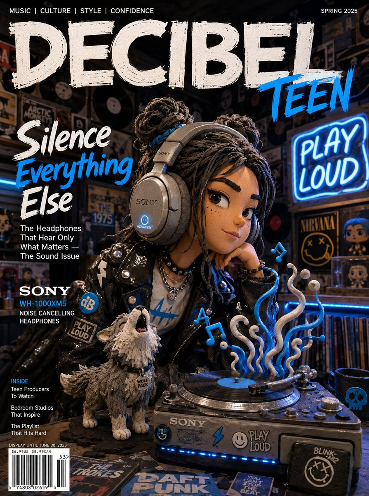

```text
[SUBJECT]: A bold claymation teenage girl with clay space buns and a vinyl clay jacket, wearing oversized Sony WH-1000XM5 headphones in clay form, a tiny baby wolf pup made of grey clay howling beside her clay record player

[COLORS]: Sony black, brushed silver clay, neon electric blue, warm white

[KEY PROP]: Oversized clay Sony WH-1000XM5 headphones with NC button glowing blue, a clay vinyl record spinning on a miniature clay turntable with clay sound waves rising from it

[BACKGROUND]: Claymation music bedroom with clay vinyl records covering every wall, a clay neon sign reading PLAY LOUD, LED strips baked into clay shelves

[MOOD]: Bold, rebellious and music-obsessed — Sony claymation teen campaign editorial, bedroom DJ aesthetic

[MAGAZINE NAME]: DECIBEL TEEN

[HEADLINE]: "Silence Everything Else"

[TAGLINE]: The Headphones That Hear Only What Matters — The Sound Issue

[BRAND NAME]: SONY — WH-1000XM5 Noise Cancelling Headphones

[STYLE NOTES]: Clay headphone ear cups with embossed Sony logo, sound waves as curling clay ribbons, neon sign as glowing colored clay tubing, Aardman Studios meets streetwear aesthetic
```


---

## 例 640：Ultra-realistic Trophy Sports Photography

**来源：** [@Goodmanprotocol](https://x.com/Goodmanprotocol/status/2064399631187059188) / [awesome-gpt-image-2-prompts](https://github.com/EvoLinkAI/awesome-gpt-image-2-prompts)

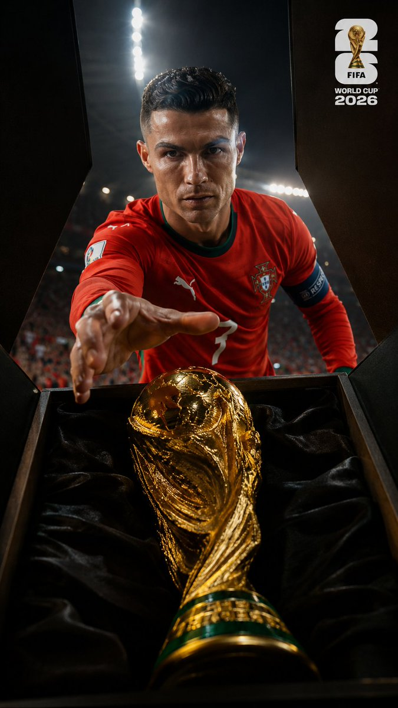

```text
Ultra-realistic sports photography, documentary realism, premium commercial campaign style, immersive 9:16 vertical composition.

The camera is positioned deep inside an opened luxury gift box, creating a dramatic first-person perspective from the hidden treasure itself. A magnificent golden FIFA World Cup trophy rests on elegant dark velvet fabric in the lower foreground, with realistic metallic reflections and authentic textures.

Above the opened box stands [PLAYER NAME], leaning forward and looking directly into the box with an expression of determination, ambition, and hunger for glory. He reaches one hand naturally toward the trophy, symbolizing his dream of winning the FIFA World Cup 2026.

STRICT IDENTITY PRESERVATION OF [PLAYER NAME]. The player must be instantly recognizable as the real [PLAYER NAME], with authentic facial structure, eye shape, nose, lips, jawline, hairstyle, beard style, skin texture, and expression. Preserve his real-world appearance with extreme accuracy. No generic AI face.

Authentic human anatomy, realistic proportions, detailed skin pores, realistic eyes, natural hair strands, genuine facial expression, lifelike appearance, true-to-life colors.

Official national team jersey with realistic fabric folds, stitching, texture, sweat details, and accurate colors.

The official FIFA World Cup 2026 logo is elegantly integrated into the composition with realistic physical appearance. The overall scene incorporates the authentic FIFA World Cup 2026 visual identity and official tournament color palette, creating a premium championship atmosphere.

Warm stadium lights in the distance, subtle crowd bokeh, realistic depth of field, natural shadows, cinematic composition, premium sports advertising photography.

Captured with a Canon EOS R3 and RF 70-200mm f/2.8L lens, Getty Images realism, Reuters sports photography quality, authentic football photography, shallow depth of field, realistic lighting, true-to-life materials.

Luxury black gift box
```


---

## 例 641：3D Product Mockup Smartphone

**来源：** [@Samann_ai](https://x.com/Samann_ai/status/2064420488445567481) / [awesome-gpt-image-2-prompts](https://github.com/EvoLinkAI/awesome-gpt-image-2-prompts)

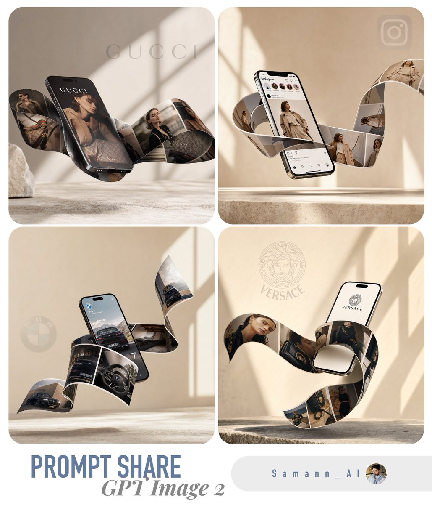

```text
A highly realistic, premium 3D product mockup for a [INSERT BUSINESS TYPE HERE, e.g., modern clothing brand]. A sleek, modern smartphone is elegantly levitating at a dynamic angle in mid-air. Emerging seamlessly from the phone's screen is a continuous, wavy, physical ribbon of printed photos that elegantly flows and wraps around the device in a surreal, gravity-defying way. The photos on the flowing ribbon display stunning, high-quality images of [INSERT PRODUCT/SERVICE IMAGES HERE]. The background is a minimalist, warm beige and soft cream environment with a subtle, textured stone floor. The lighting consists of soft, diffused natural sunlight casting an elegant, diagonal window shadow on the back wall, adding depth. Cinematic lighting, shallow depth of field, ultra-photorealistic, 8k resolution, highly detailed, trendy minimal aesthetic, perfect for an engaging and viral social media post, featuring clean negative space at the top for typography.
```


---

## 例 642：Travel Food Postcard Template

**来源：** [@Naiknelofar788](https://x.com/Naiknelofar788/status/2065241908327378969) / [awesome-gpt-image-2-prompts](https://github.com/EvoLinkAI/awesome-gpt-image-2-prompts)

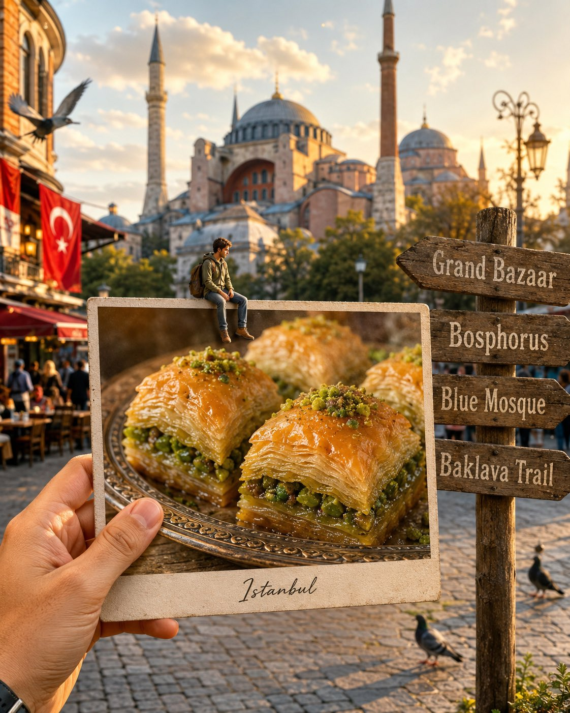

```text
Create a hyper-realistic travel-food postcard scene.
INPUTS:
City: [CITY NAME]
Local Delicacy: [LOCAL DELICACY]
Background Location: [BACKGROUND LOCATION OR LANDMARK]
SCENE:
A real human hand is holding a vintage travel postcard in the foreground.
Inside the postcard is a large, beautifully styled, ultra-realistic food photograph of [LOCAL DELICACY], captured like premium food advertising. The dish should appear larger than life, with rich textures, realistic details, appetizing presentation, natural lighting, subtle steam, shallow depth of field, and cinematic food photography.
A single miniature traveler wearing a backpack sits naturally on the top edge of the postcard with legs dangling over the front. The traveler should be realistic, highly detailed, and positioned so they appear to be admiring the local delicacy. The miniature traveler acts as the emotional focal point and creates a strong sense of scale and wonder.
Outside the postcard is the authentic destination environment of [BACKGROUND LOCATION OR LANDMARK] in [CITY NAME]. The background should feature recognizable local architecture, streets, scenery, cultural elements, landmarks, atmosphere, colors, and visual details unique to the destination.
Include a rustic wooden directional signpost naturally integrated into the environment. The signpost must automatically generate four short destination-specific labels based on the city, culture, attractions, food scene, landmarks, neighborhoods, natural features, or travel experiences associated with the location.
The generated signboards should feel authentic to the destination and enhance the travel storytelling.
Composition hierarchy:
Miniature traveler
Local delicacy inside postcard
Destination background
Destination signpost
Style: Hyper-realistic photography, luxury tourism campaign aesthetic, cinematic storytelling, authentic destination atmosphere, realistic hand, realistic miniature traveler, highly detailed food photography, natural golden-hour lighting, shallow depth of field, rich colors, editorial travel magazine quality, Instagram-worthy social media content, visual wow factor, vertical 4:5 aspect ratio, extremely detailed, premium commercial advertising.
```


---

## 例 643：Satellite Terrain Letter Typography Map

**来源：** [@iamaiistudio](https://x.com/iamaiistudio/status/2065224886734438454) / [awesome-gpt-image-2-prompts](https://github.com/EvoLinkAI/awesome-gpt-image-2-prompts)

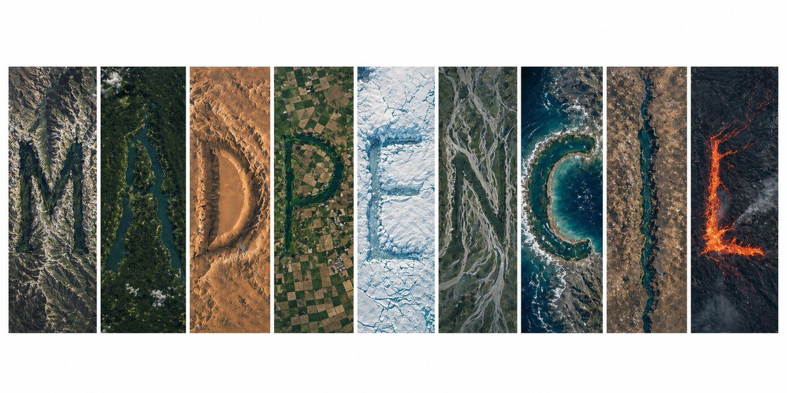

```text
Ultra-realistic overhead satellite view from orbit, a crisp modern editorial layout featuring 9 vertical panels arranged side by side on a white background, together spelling "MADPENCIL", each panel containing a single letter formed entirely from real Earth terrain and natural topography, no text overlays:

Panel 1 (M): jagged mountain ridges and deep ravines composing a sharp angular "M", dramatic shadows, rocky surface
Panel 2 (A): a meandering river through thick tropical forest shaping an "A", vivid contrast between water and canopy
Panel 3 (D): vast desert sand dunes sculpted by wind into a smooth "D", warm earthy tones, gentle gradients
Panel 4 (P): patchwork cropland and geometric farm fields arranged into a structured "P", clean grid patterns
Panel 5 (E): glacial formations and ice sheets carving a crisp "E", pure whites and deep icy blues, cracked textures
Panel 6 (N): a braided floodplain river system forming "N", branching channels and natural flow patterns
Panel 7 (C): a curved coastline and ocean meeting point shaping "C", wave breaks and sediment visible
Panel 8 (I): a narrow slot canyon or straight waterway forming a minimal "I", strong vertical line
Panel 9 (L): volcanic landscape with hardened lava flows forming an "L", dark basalt with glowing lava accents

straight-down satellite perspective, NASA Earth imagery aesthetic, hyper-detailed terrain, realistic geography, consistent lighting and scale across panels, minimal cloud cover, high contrast, sharp resolution, subtle atmospheric haze, true-color grading, ultra high resolution 8K, clean panel spacing, gallery-style composition, visually unified but each panel a distinct biome, letters legible yet organically merged with the landscape

#AIart #GPTImage2
```


---

## 例 644：Country Stylized Travel Poster Collage

**来源：** [@iamaiistudio](https://x.com/iamaiistudio/status/2065164435237613822) / [awesome-gpt-image-2-prompts](https://github.com/EvoLinkAI/awesome-gpt-image-2-prompts)

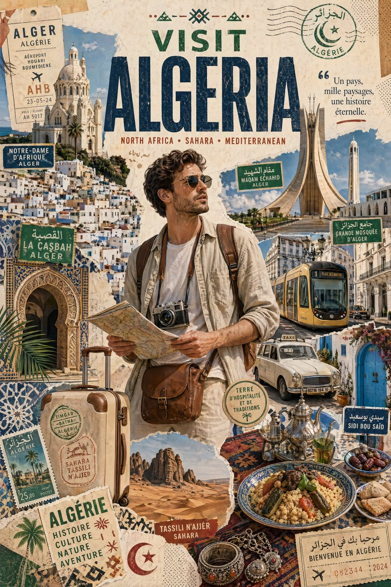

```text
Full prompt:

Design a stylized travel poster / graphic collage featuring [ALGERIA]. The central figure is a fashionable international tourist in [ALGERIA], visually distinct as a visitor rather than a local. Show the tourist in modern travel attire, with accessories like a camera, backpack, sunglasses, map, or suitcase, immersed in the culture and vibe of [ALGERIA]. Arrange the tourist in a bold composition surrounded by iconic buildings, streets, scenery, landmarks, transport, cuisine, signage, and cultural details specific to [ALGERIA]. Combine realistic character rendering with a graphic collage background featuring layered paper textures, torn poster edges, sticker accents, halftone dots, editorial typography, and strong geometric shapes. Weave in authentic Algerian visual motifs while keeping the tourist's look globally stylish and clearly from abroad. Include a large, legible headline: "VISIT [ALGERIA]". Aim for a modern, artistic, premium editorial travel poster feel, with a balanced layout and a print-ready composition.

#AIart #GPTImage2
```


---

## 例 645：World Cup National Team Fashion Poster

**来源：** [@Just_sharon7](https://x.com/Just_sharon7/status/2065123619844333737) / [awesome-gpt-image-2-prompts](https://github.com/EvoLinkAI/awesome-gpt-image-2-prompts)

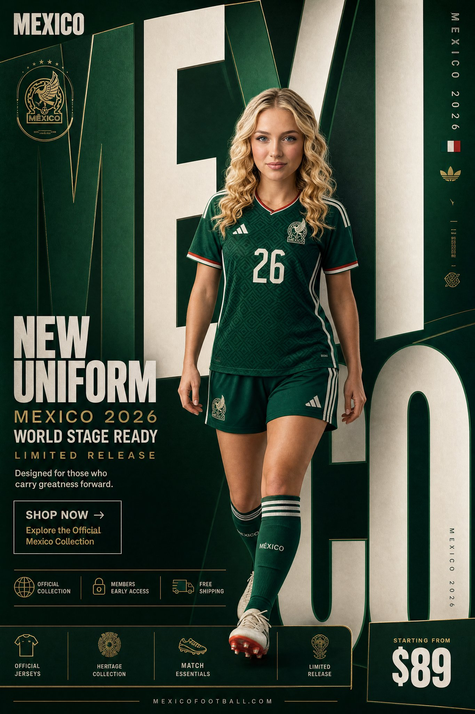

```text
Who's gonna win tonight? Are you team Mexico or team South Africa?

GPT Image 2

Prompt

SOUTH AFRICA NATIONAL TEAM

"NEW UNIFORM"

FORMAT

Ultra-Premium Football Fashion SMM Promotional Poster
Vertical 4:5
Instagram Hero Creative
Global Sportswear Advertising
Commercial Football Graphic Design
Agency-Level Art Direction
Behance Front Page Quality
8K UHD
Hyper-Realistic
Football × Fashion × Graphic Design Fusion
Zero AI Slop
Zero Generic Sports Posters
Zero Match-Day Graphics
Zero Editorial-Only Aesthetic

CORE STRATEGY

This is not a football poster.

This is a national identity statement disguised as a uniform campaign.

The design should feel like South Africa's biggest football billboard, a luxury sportswear campaign, and a continental football legacy poster merged into one visual.

The graphic design is equally important as the athlete.

Typography is not decoration.

Typography is architecture.

CAMPAIGN IDEA

"NEW UNIFORM"

Not just a jersey.

A symbol of unity.

A symbol of resilience.

A symbol worn by those who carry a nation's pride forward.

The uniform isn't being sold.

The identity is.

MASTER VISUAL

Massive oversized SOUTH AFRICA typography dominates the entire composition.

The words:

SOUTH AFRICA

occupy nearly 75% of the canvas.

Typography is integrated into the design.

Letters extend beyond frame edges.

Some letters cropped.

Some hidden behind the player.

Some functioning as compositional structures.

The typography should feel monumental.

The official federation crest appears subtly integrated into the layout.

HERO SUBJECT

Elite female footballer.

Natural beauty.

Confident expression.

Minimal makeup.

Champion mentality.

No smiling.

No dramatic celebration.

Relaxed confidence.

Wardrobe:

South Africa 2026 home jersey.

Golden yellow base.

Green detailing.

Black accents.

Matching shorts.

Premium football socks.

Modern football styling.

Clean elite-athlete aesthetic.

POSE

Player stepping through the giant typography.

One foot slightly forward.

Direct eye contact.

Hands relaxed.

Body partially intersecting typography.

The feeling:

She carries the spirit of champions effortlessly.

COMPOSITION

Typography occupies 70%.

Player occupies 20%.

Promotional elements occupy 10%.

Visual hierarchy:

SOUTH AFRICA
↓
Player
↓
Promotion
↓
CTA

Everything feels intentional.

COLOR SYSTEM

Primary:

South Africa Gold

Deep Green

White

Silver

Soft Grey

Accent:

Black Heritage Details

Federation Crest Gold

Subtle Flag-Inspired Color Accents

No neon colors.

No trend-chasing palettes.

Timeless sporting elegance.

BACKGROUND

Clean premium sports backdrop.

Large soft gradient.

Minimal studio environment.

Subtle premium texture.

No stadium.

No crowd.

No scenery.

The design itself creates the environment.

GRAPHIC DESIGN SYSTEM

Floating collection cards.

Heritage-inspired labels.

Minimal grid system.

Thin lines.

Micro typography.

Premium global football campaign hierarchy.

International flagship-store energy.

PROMOTIONAL ELEMENTS

NEW UNIFORM

SOUTH AFRICA 2026

READY FOR THE WORLD STAGE

LIMITED RELEASE

OFFICIAL COLLECTION

MEMBERS EARLY ACCESS

FREE SHIPPING

Integrated naturally into layout.

Not banner spam.

TYPOGRAPHY HIERARCHY

Top Left

SOUTH AFRICA

small premium wordmark

Center Massive Typography

S
O
U
T
H

A
F
R
I
C
A

occupying most of composition

bold heritage typography

extremely large scale

partially cropped

Campaign Title

NEW
UNIFORM

bold elegant typography

Supporting Copy

Designed for those who carry greatness forward.

PROMOTIONAL CTA BLOCK

SHOP NOW →

Explore the Official South Africa Collection

BOTTOM FEATURE STRIP

OFFICIAL JERSEYS

NATIONAL COLLECTION

MATCH ESSENTIALS

LIMITED RELEASE

Bottom Right

Starting From $89

Bottom Center


Vertical Edge Text

SOUTH AFRICA 2026

LIGHTING

Luxury sports studio lighting.

Large soft source.

Editorial contrast.

Natural skin rendering.

Premium fabric highlights.
```


---

## 例 646：Double Exposure Art Director Poster

**来源：** [@iamaiistudio](https://x.com/iamaiistudio/status/2065088795494773094) / [awesome-gpt-image-2-prompts](https://github.com/EvoLinkAI/awesome-gpt-image-2-prompts)

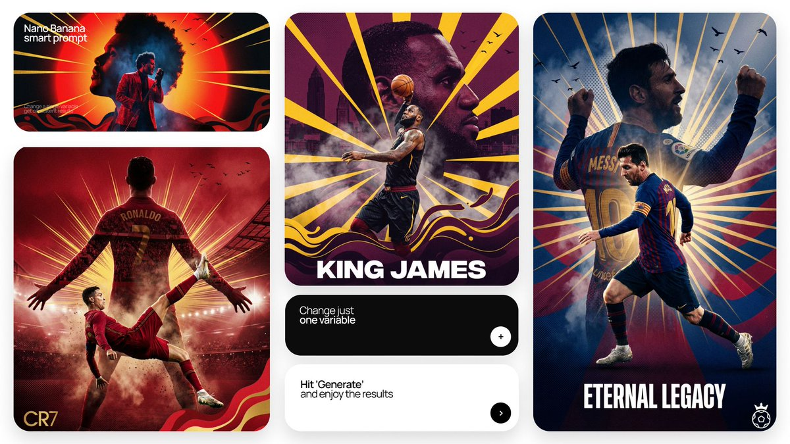

```text
prompt:

[PERSONE]. Act as a Senior Art Director.

PHASE 1: PHOTOGRAPHIC COMPOSITION.

- Layered Effect: Double exposure photo collage. Sharp action shot in the foreground; massive monumental silhouette in the background.

- Overlap: The subject blends seamlessly with the background graphic elements.

PHASE 2: CONTEXTUAL VIBE.

- Identity Analysis: Automatically detect the core industry of [PERSONE] (Sport, Music, Cinema, or Business).

- Pose and Props tailored to match their identity.

PHASE 3: DYNAMIC BRAND COLORS.

- Primary Color: Identify the most iconic color tied to [PERSONE] or their team or brand. Apply to the background, halftone textures, and smoke effects.

- Accent Color: Choose a high-contrast vibrant secondary hue (neon, gold, or electric white) for the radial burst rays.

- Visual Texture: Heavy film grain and halftone dots in the shadow areas of the photos.

PHASE 4: GRAPHIC ACCENTS.

- Geometry: Bold radial rays bursting from the center. Fluid wave-like organic shapes at the base.

- Birds: Minimal black bird silhouettes for scale and depth.

PHASE 5: BRANDING AND TEXT.

- Tagline: A powerful one- or two-word slogan that captures [PERSONE]'s legacy.

- Logo: Minimalist industry-appropriate logo in the bottom corner.

- Typography: Bold, high-impact sans-serif.

TECHNICAL FINISH:

- Quality: 8K resolution, authentic commercial photography style (not an illustration).

- Lighting: Extreme studio rim lighting to separate the photographic subjects from the graphic layers.

#AIart #GPTImage2
```


---

## 例 647：BMX Rider Streetwear Mixed-Media Collage

**来源：** [@omnitrix204](https://x.com/omnitrix204/status/2065069786753872120) / [awesome-gpt-image-2-prompts](https://github.com/EvoLinkAI/awesome-gpt-image-2-prompts)

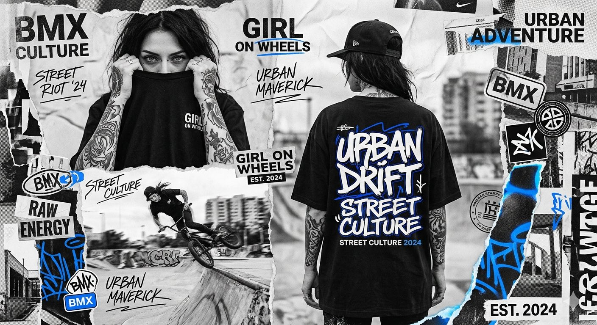

```text
Ultra-creative streetwear collage poster featuring a tattooed BMX rider and urban lifestyle athlete. Multiple cutout photographs arranged in a layered mixed-media composition. One large back-facing portrait wearing an oversized black graphic t-shirt and cap dominates the center. A second portrait faces the camera while lifting his shirt over part of his face, revealing intense eyes and tattooed arms.
A dynamic BMX action shot performing a trick is positioned in the foreground. Torn paper edges, ripped poster textures, magazine cutouts, handwritten signatures, stickers, stamps, urban symbols, architectural photography, and layered graphic elements create a premium street culture aesthetic.
Predominantly black-and-white photography with selective electric blue accents. Crumpled paper background texture, photocopy effects, editorial typography, distressed print details, urban skate and BMX culture influences. Contemporary streetwear advertising campaign, zine-inspired layout, high-fashion graphic design, raw underground energy.
Highly detailed collage artwork, premium poster composition, monochrome photography, torn paper effects, streetwear branding aesthetic, fashion editorial design, modern youth culture visuals, 8K resolution.
Style Keywords: BMX culture, streetwear collage, monochrome poster, ripped paper design, urban editorial, grunge graphic design, fashion zine, underground culture, mixed media artwork.
```


---

## 例 648：Luxury Historical Civilization Strategy Card

**来源：** [@Gdgtify](https://x.com/Gdgtify/status/2065057210426900515) / [awesome-gpt-image-2-prompts](https://github.com/EvoLinkAI/awesome-gpt-image-2-prompts)

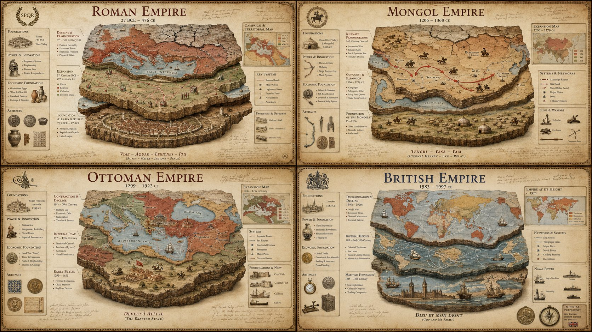

```text
SYSTEM: Render the input as a luxury historical civilization stratigraphy poster. Do not hardcode dates unless inevitable. Infer the territorial expansion phases, economic foundation pillars, military innovation cycles, cultural assimilation patterns, and the geological layers of decline.  SEMANTIC SOLVE: EMPIRE_AUTOPSY =    (INFER(territorial_architecture FROM founding_core + expansion_vectors + frontier_fortifications + trade_route_control + vassal_networks) ::5) +    (INFER(economic_pillars FROM agricultural_base + mineral_resources + taxation_system + currency_standard + labor_organization) ::4) +    (INFER(military_innovation FROM weapon_technology + tactical_doctrine + logistics_chain + fortification_engineering + naval_capacity) ::4) +    (INFER(decline_mechanics FROM succession_crises + economic_inflation + frontier_pressure + internal_rebellion + environmental_stress) ::3) -    (generic timeline infographics + cartoon maps + cluttered textbook layouts + stock-photo ruins + cheap educational posters) ::-4  COMPOSITION: One central empire visualized as a multi-layered archaeological cross-section. The bottom layer shows the founding settlement, middle layers reveal territorial expansion through colored strata, and the top layer displays the fragmentation pattern. Surrounding the core are floating callouts showing key battles, economic indicators, and dynastic transitions mapped as physical artifacts. Use callout lines like an archaeological dig site report crossed with a military campaign map.  STYLE DNA: Ancient Roman Tabula Peutingeriana ::0.30 archaeological stratigraphy diagram ::0.25 vintage military campaign map ::0.20 museum exhibit infographic ::0.15 aged parchment with stain texture ::0.10  OUTPUT: Warm sepia or deep terracotta background luxury history poster, elegant classical serif + handwritten annotation typography, restrained callouts, hyper-realistic map textures, refined aging effects, premium negative space.  NEGATIVE: no holograms, no glowing elements, no VR/AR overlays, no modern digital maps, no cartoon illustrations, no cluttered timelines, no stock-photo emperors, no watermark, no anachronistic elements.
```


---

## 例 649：Premium Automotive Spec Poster

**来源：** [@iamaiistudio](https://x.com/iamaiistudio/status/2066055530012111310) / [awesome-gpt-image-2-prompts](https://github.com/EvoLinkAI/awesome-gpt-image-2-prompts)

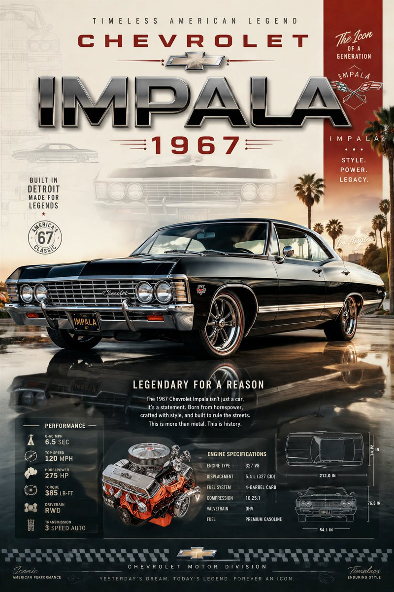

```text
Generate a stunning premium car poster for
[CAR MODEL].

Position the vehicle as the dominant centerpiece in a bold three-quarter side angle, visually striking and commanding full attention.

Capture the full essence of the car with an aggressive stance, flawless proportions, luxury wheels, distinctive headlights, aerodynamic bodywork, spoilers, performance accents, and high-end design cues.

Layer in crisp premium typography featuring the brand name, model designation, performance figures, horsepower rating, 0-60 time, top speed, engine details, and iconic milestones, seamlessly woven into the layout.

Weave in subtle background motifs drawn from the car's history: ghost blueprint lines, motorsport heritage, silhouette overlays, legendary circuits, mechanical diagrams, velocity graphics, and collector-print vibes.

Apply bold visual contrast, vivid premium hues (no dark or black-heavy backgrounds), cinematic illumination, razor-sharp reflections, glossy paint sheen, luxury magazine quality, slick graphic design, and a scroll-stopping poster energy.

Polished composition, top-tier automotive ad aesthetic, collectible poster feel, ultra-detailed, visually commanding, premium masterpiece.
```


---

## 例 650：Dopamine 3D Urban Poster

**来源：** [@iamaiistudio](https://x.com/iamaiistudio/status/2066039955177234472) / [awesome-gpt-image-2-prompts](https://github.com/EvoLinkAI/awesome-gpt-image-2-prompts)

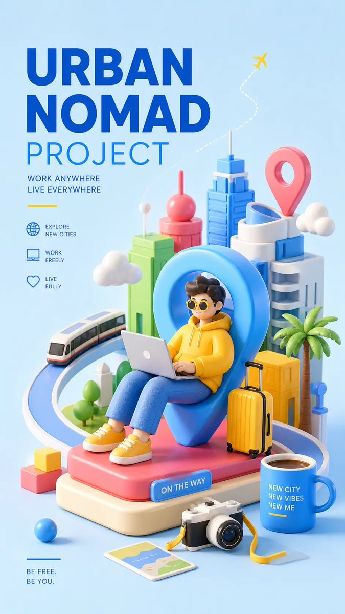

```text
Top-tier internet marketing visual design, Behance / Dribbble inspired 3D illustration poster aesthetic, C4D rendering style, soft-light treatment, vivid high-saturation colors, dopamine-driven color palette, abstract artwork, clean minimalist background, fresh and lively feel, youthful and energetic vibe, polished and intricate. Theme: Urban Nomad Project.
```


---

## 例 651：Square Professional Ad Poster

**来源：** [@iamaiistudio](https://x.com/iamaiistudio/status/2066024623637188813) / [awesome-gpt-image-2-prompts](https://github.com/EvoLinkAI/awesome-gpt-image-2-prompts)

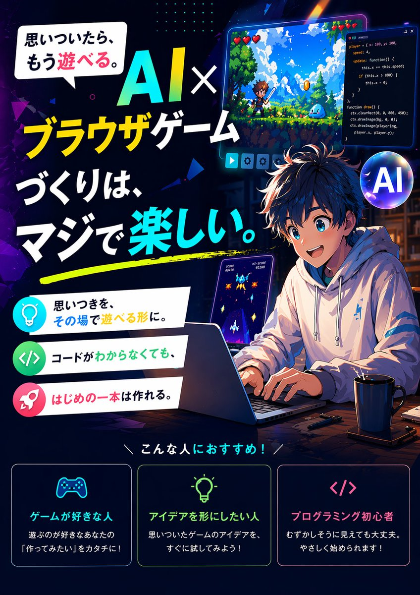

```text
Generate a 1:1 square poster with a professional advertising design aesthetic, suitable for promoting a book, course, or event. Include the following text verbatim:

Ad Creative Production
As soon as you think of it, you can play with it. AI x browser game-making is genuinely fun. Sounds hard, but it is actually easy to start. Even if you don't know code, you can build your first one.
```


---

## 例 652：Editorial Ink Illustration Template

**来源：** [@Naiknelofar788](https://x.com/Naiknelofar788/status/2065973105823281314) / [awesome-gpt-image-2-prompts](https://github.com/EvoLinkAI/awesome-gpt-image-2-prompts)

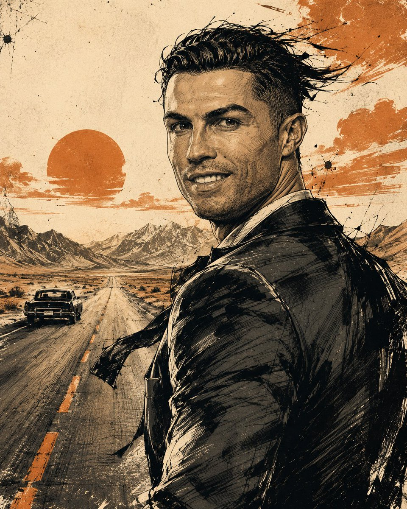

```text
Cinematic editorial ink illustration of [HUMAN] in [SCENERY], looking back over the shoulder with realistic proportions, windblown hair and sharp confident gaze. Wearing [CLOTHING]. Loose expressive black ink linework, visible sketch construction lines, high-contrast shadows, sunlit rim glow, weathered paper texture, ink splatters, distressed print marks, realistic road-movie environment, limited three-color palette: [PALETTE], contemporary fashion poster illustration, aspect ratio 4:5.
```


---

## 例 653：Tilt-Shift City Map Travel Poster

**来源：** [@iamaiistudio](https://x.com/iamaiistudio/status/2066145999266128367) / [awesome-gpt-image-2-prompts](https://github.com/EvoLinkAI/awesome-gpt-image-2-prompts)


```text
Render a photorealistic tilt-shift miniature scene of [CITY NAME] with a [VEHICLE NAME] winding along an elevated road that rises organically from a vintage illustrated city map. The road sweeps toward the city's iconic skyline in the background, with the vehicle as the main subject up front. Seamlessly merge the real cityscape with the hand-drawn map so the road feels naturally embedded. Feature the city name in large bold lettering on the map foreground. Apply warm golden-hour light, shallow depth of field, cinematic shadows, aerial perspective, and hyper-realistic detail. Final look: a luxury travel poster crossed with a miniature diorama. Aspect ratio 1:1.

Full prompt: 

Create a highly detailed cinematic miniature tilt-shift travel scene of [CITY NAME] featuring a realistic [VEHICLE NAME] driving along a winding elevated road that emerges naturally from a printed vintage-style city map. The road should curve dramatically toward the background skyline and landmarks of [CITY NAME], while the vehicle remains the clear focal point in the foreground.

Blend the real city seamlessly with the illustrated map surface so the road appears integrated into the map itself. Include recognizable local landmarks, waterways, architecture, vegetation, and atmosphere associated with [CITY NAME], but keep the composition clean and uncluttered.

Show large bold typography of "[CITY NAME]" printed directly on the map in the foreground. Use warm golden-hour lighting, shallow depth of field, realistic textures, cinematic shadows, aerial perspective, and photorealistic detail. The overall aesthetic should feel like a premium Instagram travel poster mixed with a miniature diorama.

Aspect ratio 1:1.
```


---

## 例 654：AI Music Bootcamp Event Poster

**来源：** [@iamaiistudio](https://x.com/iamaiistudio/status/2066538267835867647) / [awesome-gpt-image-2-prompts](https://github.com/EvoLinkAI/awesome-gpt-image-2-prompts)

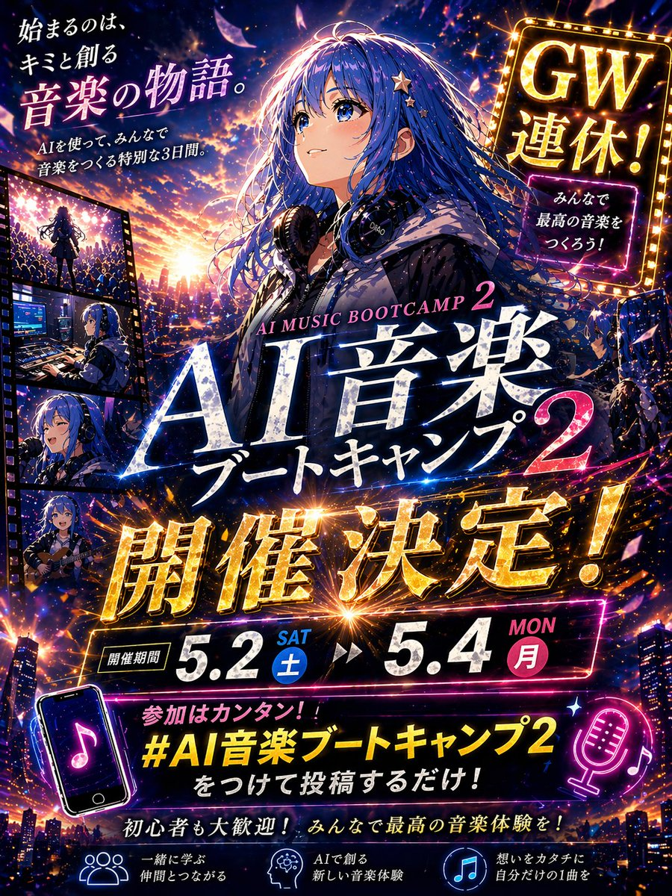

```text
Generate a dramatic Japanese anime-style event promotional poster in vertical 4:5 format, ultra-detailed, cinematic, neon-lit, high contrast, styled like a polished social media announcement. Center-right subject: a beautiful anime girl from the waist up, long flowing deep blue hair blowing in the wind with small star hairpins, wearing a dark hoodie with large studio headphones around her neck. Her face is softly obscured by a rectangular blur. Background: glowing sunset-to-night city skyline with sparkling lights, music-energy particles, lens flares, and glowing petals. Color palette: electric blue, violet, magenta, gold, and sunset orange.

Layer crisp Japanese typography integrated like a professional event ad with exactly 8 text groups: (1) top-left heading 「始まるのは、キミと創る 音楽の物語。」 with subcopy 「AIを使って、みんなで音楽をつくる特別な3日間。」; (2) top-right glowing marquee 「GW連休!」 and neon box 「みんなで最高の音楽をつくろう!」; (3) center title with English 「AI MUSIC BOOTCAMP 2」 above large 「AI音楽 ブートキャンプ 2」; (4) massive gold metallic text across the middle 「開催決定!」; (5) date bar 「開催期間」 with 「5.2 SAT 土」 and 「5.4 MON 月」; (6) hashtag callout 「参加はカンタン!!  をつけて投稿するだけ!」; (7) encouragement line 「初心者も大歓迎! みんなで最高の音楽体験を!」; (8) three bottom feature captions with icons: 「一緒に学ぶ 仲間とつながる」, 「AIで創る 新しい音楽体験」, 「想いをカタチに 自分だけの1曲を」.

Left edge: vertical filmstrip with 4 panels showing the girl (1) performing on stage before a crowd, (2) at a music production desk with screens, (3) singing into a mic, (4) playing acoustic guitar. Lower area: 2 neon music icons — tilted smartphone with music note (lower left), glowing microphone with musical notes (lower right). Text effects: glossy, luminous, gold and white emboss, energetic streaks and spark explosions around headline. Mood: inspiring, celebratory, futuristic, emotionally uplifting — like a high-impact Japanese Golden Week music event ad.
```


---

## 例 655：Stay Focused Editorial Poster

**来源：** [@iamaiistudio](https://x.com/iamaiistudio/status/2067444516605620410) / [awesome-gpt-image-2-prompts](https://github.com/EvoLinkAI/awesome-gpt-image-2-prompts)

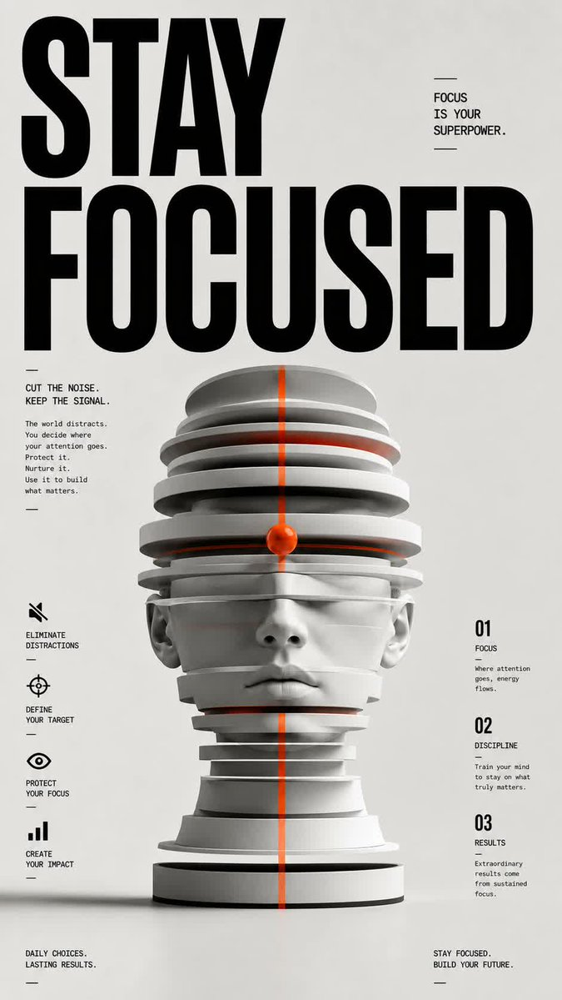

```text
Award-worthy graphic design poster in neo-editorial / contemporary editorial style, D&AD / Awwwards / Behance quality.

Theme: Stay Focused.

Create a powerful central visual metaphor for this theme — transform the concept into a sculptural, iconic, installation-like object that is cut, layered, stretched, stacked, reconstructed, wrapped, or deconstructed, with clear conceptual weight rather than decoration.

Clean, minimal light-gray background with generous whitespace.

High-contrast modern editorial typography: oversized bold black English headline at top, secondary subtitle, annotation text, exhibition-style hierarchy.

Swiss editorial grid system with intentional breaks, asymmetric balance, precise alignment, strong rhythm, refined spacing.

Centered or near-centered composition with strong vertical tension.

Materials and rendering: premium product-quality render, matte surfaces, subtle reflections, hard-edge cuts, slight inter-layer translucency, suspended sliced structures, refined details, crisp silhouettes.

Color: black, white, and gray dominant with a single striking accent color and minimal secondary accents — restrained, high-end, contemporary.

Lighting: soft studio lighting, subtle shadows, ultra-clean render, highly polished but non-glossy, razor-sharp details.

Mood: conceptual, intellectual, exhibition-grade, contemporary, premium, restrained, iconic.

Aspect ratio 9:16, 4K, ultra sharp, ultra detailed, ultra clean, high resolution.
```


---

## 例 656：New Intelligence Editorial Poster

**来源：** [@iamaiistudio](https://x.com/iamaiistudio/status/2067778187644584418) / [awesome-gpt-image-2-prompts](https://github.com/EvoLinkAI/awesome-gpt-image-2-prompts)

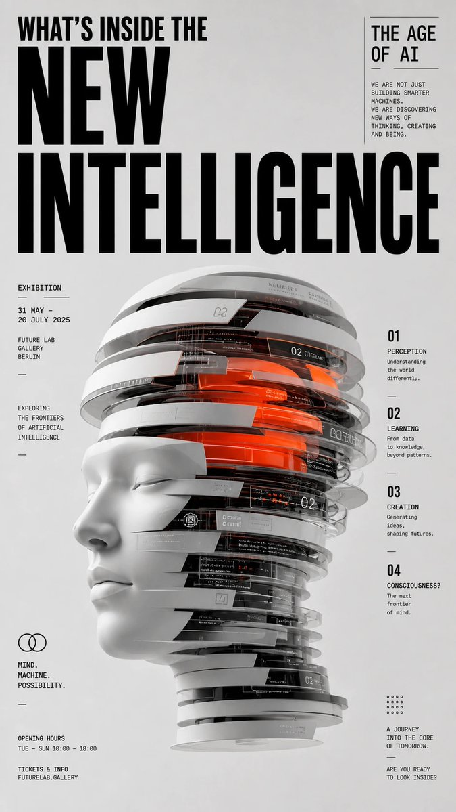

```text
Award-quality graphic design poster, neo-editorial and contemporary editorial style, D&AD / Awwwards / Behance-level visual impact.

Theme: What's Inside the New Intelligence — The Age of AI.

Build a powerful core visual metaphor for this theme — translate the abstract concept into a sculptural, iconic, installation-like object. The central object should appear cut, layered, stretched, stacked, reconstructed, wrapped, or deconstructed, carrying clear conceptual meaning rather than decorative ornament.

Clean, minimal light-gray background with generous whitespace.

High-contrast modern editorial typographic layout: oversized bold black English headline at the top, secondary subtitle, annotation text, exhibition-style information hierarchy.

Swiss editorial grid system with intentional breaks, asymmetric balance, precise alignment, strong rhythm, refined spacing.

Centered or near-centered composition with strong vertical tension.

Materials and rendering: premium product-rendering quality, matte surfaces, subtle reflections, hard-edge cuts, slight inter-layer translucency, suspended sliced structures, refined details, crisp silhouettes.

Color: predominantly black, white and gray with a single striking accent color and very limited secondary accents — restrained, high-end, contemporary.

Lighting: soft studio lighting, subtle shadows, ultra-clean rendering, highly polished but non-glossy, razor-sharp details.

Mood: conceptual, intellectual, exhibition-grade, contemporary, premium, restrained, iconic.

Aspect ratio 9:16, 4K, ultra sharp, ultra detailed, ultra clean, high resolution.
```


---

## 例 657：Lion-Camel Ridge Demon Court

**来源：** [@iamaiistudio](https://x.com/iamaiistudio/status/2068096704973549620) / [awesome-gpt-image-2-prompts](https://github.com/EvoLinkAI/awesome-gpt-image-2-prompts)

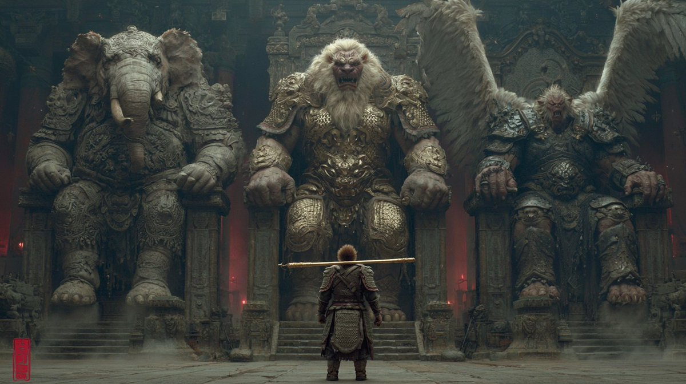

```text
Dark, eerie Chinese mythological atmosphere blending traditional aesthetics with cinematic realism, meticulous detail, multi-pass rendering, flawless modeling. Journey to the West — the treacherous Lion-Camel Ridge, teeming with countless demons. Three massive thrones: the heavily armored Demon Elephant King seated on the left, the heavily armored Demon Lion King enthroned at center, the heavily armored Great Roc Demon King on the right. A diminutive Sun Wukong — back turned to the viewer — marches forward with his Ruyi Jingu Bang resting on his shoulder, clad in full battle armor. Low-angle upward shot, telephoto compression, dramatic hard shadows. Maximum detail, multiple refinement passes, precise perspective and structural lines, exquisite craftsmanship.
```


---

## 例 658：Moscow Swiss Editorial Poster

**来源：** [@Naiknelofar788](https://x.com/Naiknelofar788/status/2067991181376868462) / [awesome-gpt-image-2-prompts](https://github.com/EvoLinkAI/awesome-gpt-image-2-prompts)

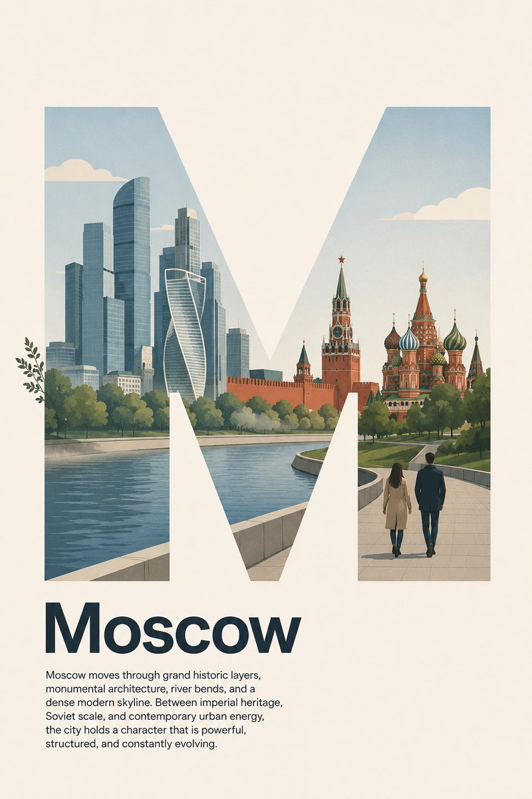

```text
Design a contemporary Swiss Style editorial poster for Moscow, Russia. Use a large bold sans-serif capital letter “M” as the main typographic structure. The “M” must be very clear, clean, geometric, solid, and dominant, with no stroke outline, no border, no shadow outline, and no decorative treatment. The silhouette of the letter “M” must remain easy to read at first glance. Do not let the illustration obscure or distort the shape of the letter. The poster should follow a precise left-aligned Swiss grid system with generous negative space.

Inside the “M”, create a simple, logical, and restrained flat illustration of Moscow’s city landscape character. Use only a few essential visual elements: simplified modern skyscrapers inspired by Moscow City business district, the calm curve of the Moscow River, a subtle silhouette of the Kremlin walls and towers, onion domes of Saint Basil’s Cathedral in a simplified geometric form, a soft green park landscape inspired by Gorky Park or Zaryadye Park, and two pedestrians on a clean riverside walkway. Keep the composition minimal, spacious, and easy to understand. Do not add too many landmarks, people, signs, vehicles, monuments, statues, fountains, trains, buses, or small decorative objects.

The illustration should suggest Moscow’s identity as a capital city where imperial history, Soviet monumental scale, modern glass skyscrapers, riverfront public spaces, and vast urban rhythm coexist in a clean contemporary way. Use flat vector shapes, clean silhouettes, minimal linework, simplified architecture, and believable scale relationships. Keep the scene lightly lively but not busy. The illustration should support the letter “M”, not compete with it.

Allow only extremely subtle overlap outside the “M” frame using simple organic or atmospheric elements only: a few leaves from riverside trees or soft atmospheric mist over the river may slightly extend beyond the letter edge. Keep 97% of the illustration inside the “M”. Do not let people, buildings, domes, towers, vehicles, faces, paths, signage, or complex objects overlap outside the letter. The “M” must remain clearly readable and visually dominant.

Place the headline “Moscow” below the letter in bold sans-serif type, title case, not all caps, left aligned to the same grid. Under the headline, add this short body paragraph in small regular sans-serif text, also left aligned, with clean spacing and refined editorial hierarchy:

“Moscow moves through grand historic layers, monumental architecture, river bends, and a dense modern skyline. Between imperial heritage, Soviet scale, and contemporary urban energy, the city holds a character that is powerful, structured, and constantly evolving.”

No icons, no badges, no decorative symbols. The overall design should feel Swiss minimalist: strong grid, precise alignment, asymmetrical balance, clean typography, generous negative space, restrained composition, and modern cultural city poster aesthetics.

Color palette: warm ivory background, deep navy or charcoal typography, concrete gray, glass blue, pine green, Kremlin red accents, river blue-gray, pale beige, and soft black accents. Matte paper finish, subtle paper grain, crisp edges, flat contemporary illustration, modern Moscow metropolitan mood, calm but strong, sophisticated, balanced, and print-ready.

Negative prompt: photorealistic, 3D render, glossy, maximalist, overcrowded city, complex illustration, too many details, too many landmarks
```


---

## 例 659：Whispers in the Crowd Poster

**来源：** [@iamaiistudio](https://x.com/iamaiistudio/status/2067837876822581352) / [awesome-gpt-image-2-prompts](https://github.com/EvoLinkAI/awesome-gpt-image-2-prompts)

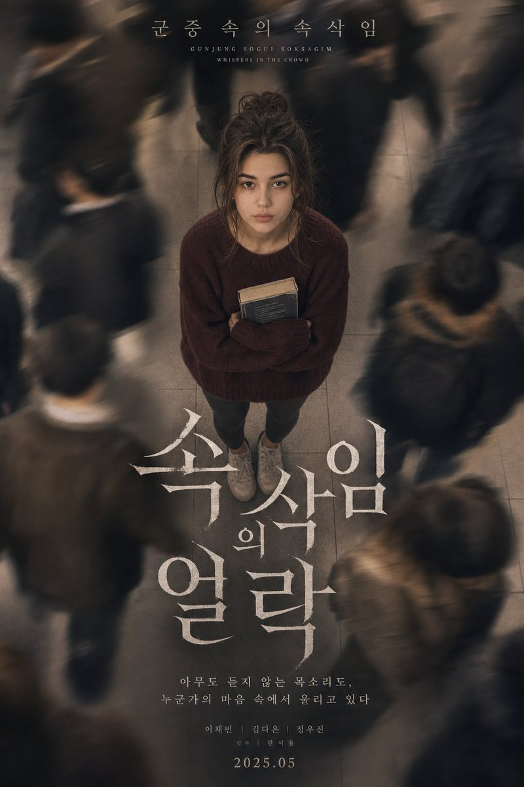

```text
A sorrowful Korean psychological drama movie poster depicting a beautiful young woman photographed from a dramatic overhead angle, camera pointing straight down at her face as she gazes upward. Her long dark hair is loosely gathered in an undone bun with loose strands framing her face. Pale complexion, an expression of quiet emotional exhaustion. She is dressed in an oversized burgundy wool sweater, dark grey leggings, and scuffed white sneakers, holding a worn paperback book tightly against her chest. Surrounding her, a busy subway station where commuters stream past in long-exposure motion blur, their figures becoming ghostly streaks of movement against cold grey platform tiles. The contrast between her stillness and their motion creates a powerful sense of solitude. Korean title text at the top reads: "군중 속의 속삭임 (Gunjung Sogui Soksagim - Whispers in the Crowd)". Bold white serif typography fills the center of the composition. Visual style: warm-beige film grade, fine analog grain, shallow depth of field, soft tungsten underground lighting, subtle atmospheric haze, cinematic K-drama mood. Shot on Sony A7R IV, 50mm, slow shutter speed.
```


---

## 例 660：Golden Halo Fashion Poster

**来源：** [@Xaroon_x](https://x.com/Xaroon_x/status/2068359539691532543) / [awesome-gpt-image-2-prompts](https://github.com/EvoLinkAI/awesome-gpt-image-2-prompts)

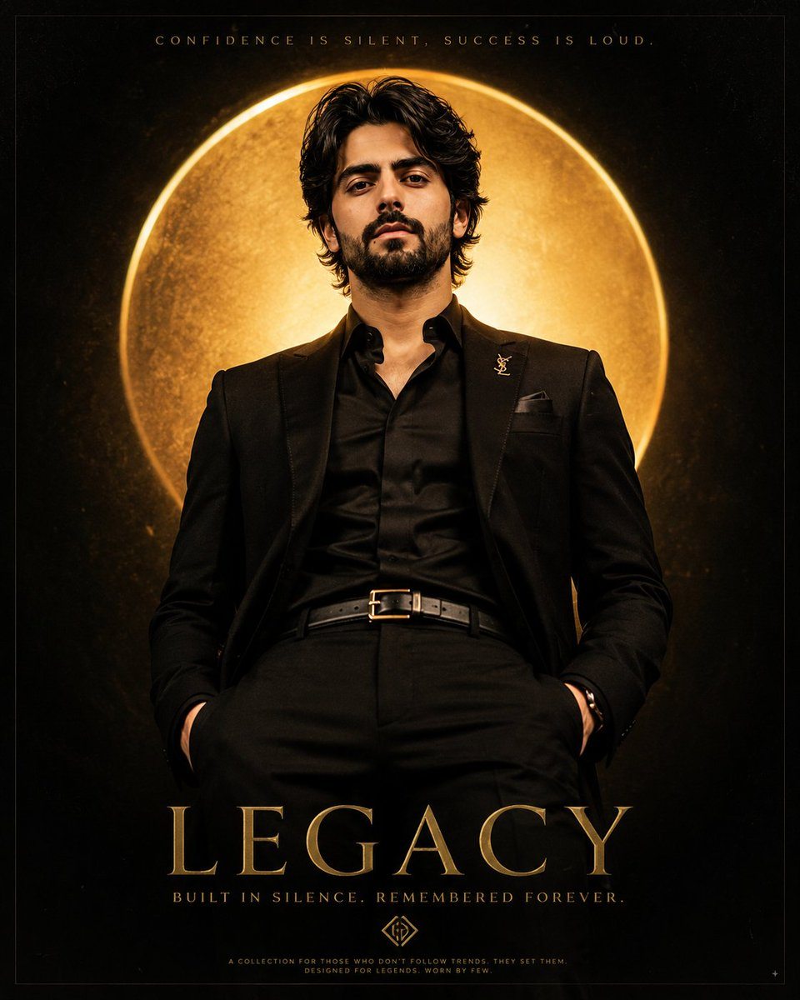

```text
Create a luxury cinematic fashion poster featuring a stylish young male standing in a powerful confident pose, captured from a low-angle perspective. The subject wears a high-end black designer outfit with sharp tailoring, subtle metallic accents, and clean modern silhouette. His expression is calm, confident, and slightly intimidating, with direct eye contact. Hair is perfectly styled with soft volume and natural shine. Behind him is a large glowing circular spotlight in deep gold, creating a halo effect that enhances dominance and focus. The background is minimalist matte black with subtle texture, dust particles, and faint vignette edges to enhance depth. Lighting is dramatic studio-style with strong contrast, highlighting facial structure and clothing details. The composition is symmetrical and centered like a luxury brand advertisement or album cover. Ultra-realistic, 8K detail, 4:5 vertical ratio, high-end editorial aesthetic designed for viral engagement. --ar 4:5 ratio
```


---

## 例 661：Guangzhou Silk Ribbon Poster

**来源：** [@iamaiistudio](https://x.com/iamaiistudio/status/2069840084673945968) / [awesome-gpt-image-2-prompts](https://github.com/EvoLinkAI/awesome-gpt-image-2-prompts)


```text
Spring Festival 2026 Guangzhou city promo poster, vertical 9:16, festive yet elegant. Double exposure with S-curve flowing composition on a pure white textured background. Bottom-right corner: a miniature figure in traditional Chinese attire swings a long red silk ribbon that morphs into mountain ridges and river currents, revealing a layered Guangzhou panorama inside, including Canton Tower, Zhujiang New Town skyline, Pearl River with cruise ships, ancient architecture, and Baiyun Mountain. Bottom-left typography: "SPRING 2026" horizontal with a vertical line of Chinese characters reading "Millennial Trade City, Charming Guangzhou."
```


---

## 例 662：Ronaldo Topographic Poster

**来源：** [@vireonixx](https://x.com/vireonixx/status/2069793294641778794) / [awesome-gpt-image-2-prompts](https://github.com/EvoLinkAI/awesome-gpt-image-2-prompts)

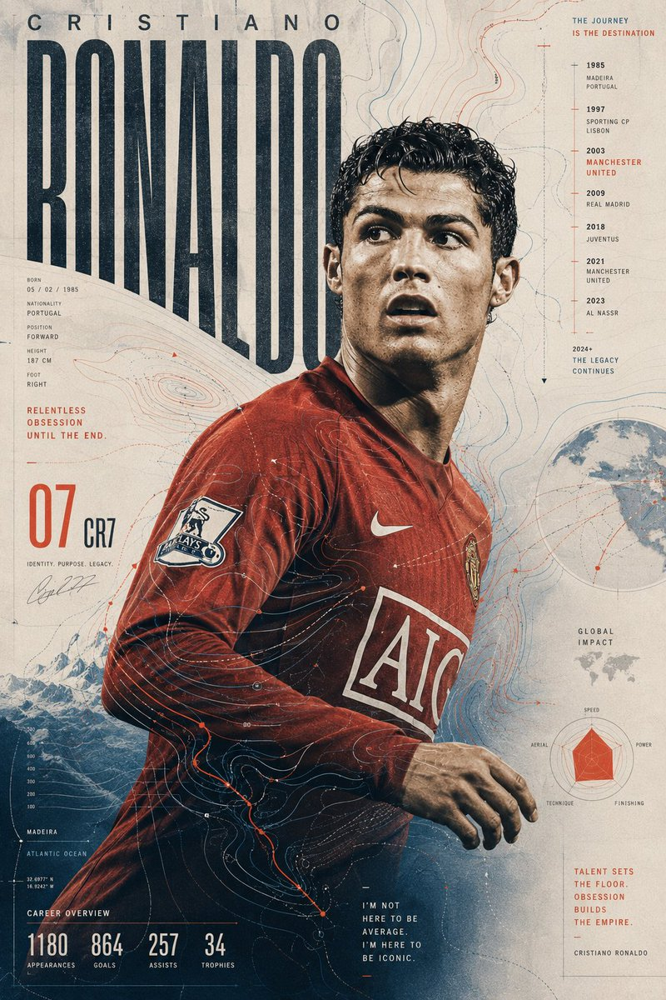

```text
Create an extraordinary collector-edition Cristiano Ronaldo poster inspired by contemporary data visualization, cartographic design, and editorial publishing. The composition should capture Manchester United-era Ronaldo during a dynamic turning movement, as if caught between acceleration and decision. His expression should communicate youthful confidence and relentless ambition.

The portrait should be integrated into a visual world constructed from flowing topographic contours, movement trajectories, directional systems, and abstract maps representing a lifetime of progress. The lines should feel elegant and intelligent rather than technical. Large-scale information structures should guide the viewer's eye through the composition while reinforcing the narrative of movement and evolution.

The palette combines arctic blue, coral red, soft ivory, and charcoal accents. Sophisticated typography, layered publishing systems, and contemporary information design should create visual depth throughout the artwork. The final image should resemble an award-winning editorial feature documenting one of the most remarkable journeys in modern sport.
```


---

## 例 663：Ufa Travel Sticker Poster

**来源：** [@Sairah_0](https://x.com/Sairah_0/status/2069779118535930286) / [awesome-gpt-image-2-prompts](https://github.com/EvoLinkAI/awesome-gpt-image-2-prompts)

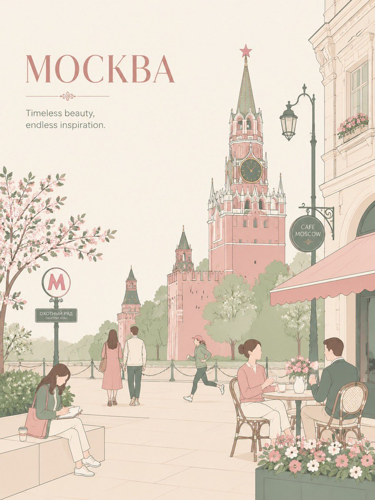

```text
Create an airy city scene with large typography-safe negative space in the upper-left. Add [УФА] and one short elegant English caption matching the city mood. Automatically adapt the background to the city: one iconic primary landmark, local architecture, café culture, transport sign, street lamp, flowers, trees, small decorative details, and calm daily-life moments. Use 3–6 people only, naturally interacting with the city: talking at a café, walking, jogging, sketching, or taking photos. Avoid crowds and avoid a single hero character. Style: Japanese stationery aesthetic, luxury sticker illustration, premium commercial flat-vector poster, clean thin outlines, consistent line weight, flat colors only, no shading, no gradients, no texture. Palette: blush pink, dusty rose, sage green, warm cream, soft beige, muted gray-green. Mood: minimal, elegant, calm, refined, high-end travel postcard and lifestyle branding. No realism, no watercolor, no painterly effects, no photorealism, no dense background. Установить соотношение сторон 3:4
```


---

## 例 664：Infinite Love Concert Poster

**来源：** [@iamaiistudio](https://x.com/iamaiistudio/status/2069749509392052645) / [awesome-gpt-image-2-prompts](https://github.com/EvoLinkAI/awesome-gpt-image-2-prompts)

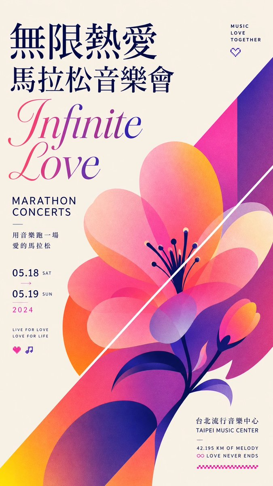

```text
Swiss International design style, minimalist flat vector poster, vertical 9:16 format, diagonal-split layout. Top-left: Traditional Chinese headline in a serif typeface paired with flowing connected-script serif English. Bottom-right: key symbolic illustration — flat vector artwork with vivid fluorescent gradients, subtle grain texture, scattered pixel-art icons, cultural festival poster aesthetic, museum-quality graphic design. Theme: Infinite Love Marathon Concerts (floral motif). 4K.
```


---

## 例 665：Graffiti Breakthrough Poster

**来源：** [@Sheldon056](https://x.com/Sheldon056/status/2071082708512465062) / [awesome-gpt-image-2-prompts](https://github.com/EvoLinkAI/awesome-gpt-image-2-prompts)

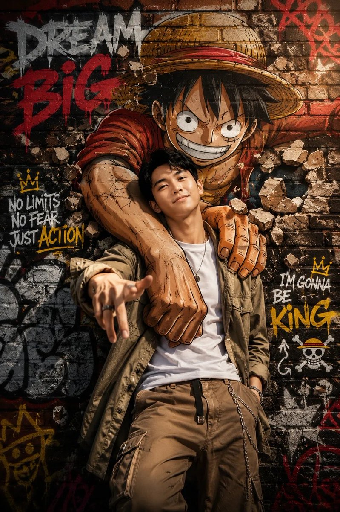

```text
A portrait-oriented cinematic poster in the Graffiti Come to Life (Optical Illusion) style, where the cartoon character is not portrayed as a separate 3D figure standing beside the real person. Instead, the character exists as a highly detailed graffiti mural painted on a textured brick wall, while one or both of its hands appear to break through the wall as if coming to life, naturally wrapping around or interacting with the real subject standing in front of it. The illusion should feel seamless, convincing, and visually striking, blending realistic perspective, shadows, lighting, and depth to create the impression that the graffiti has become partially alive.

The overall composition should feature a modern cinematic atmosphere with dynamic lighting, rich color contrast, and carefully balanced depth. Enhance the poster with stylish graffiti-inspired decorative elements such as spray paint splashes, urban textures, paint drips, stencil patterns, geometric accents, subtle wall cracks, layered graphic shapes, and contemporary street-art details that strengthen the visual identity without making the design feel overcrowded.

The subject's pose must be completely different from the reference photo, appearing expressive, confident, and naturally dynamic rather than stiff or flat. The body language should resemble that of an international fashion model, conveying elegance, confidence, and effortless movement with a refined editorial aesthetic. The facial expression should feel lively, engaging, and full of personality, creating a stronger emotional connection with the viewer.

The outfit should reflect modern casual fashion with a stylish, contemporary look. Combine clothing pieces with varied colors, textures, materials, and subtle patterns to avoid a repetitive or monotonous appearance. The styling should feel fashionable, youthful, and visually balanced while remaining realistic and naturally wearable.

Every typography element within the poster should feature bold, premium, and eye-catching font styles that complement the graffiti concept. Use creative font treatments, layered text compositions, dynamic sizing, and modern graphic placement to ensure the typography becomes an integral part of the artwork rather than looking plain or generic.

The overall poster should deliver a premium, high-end visual experience with a fresh contemporary aesthetic. Avoid ordinary layouts, repetitive compositions, mediocre design choices, or generic visual treatments. Every element should contribute to a vibrant, visually rich, and modern street-art inspired masterpiece rendered in ultra-high-definition 8K quality with exceptional sharpness, realistic textures, and professional cinematic finishing.
```


---

## 例 666：Watercolor Summer City Romance

**来源：** [@Goodmanprotocol](https://x.com/Goodmanprotocol/status/2071643725030457469) / [awesome-gpt-image-2-prompts](https://github.com/EvoLinkAI/awesome-gpt-image-2-prompts)

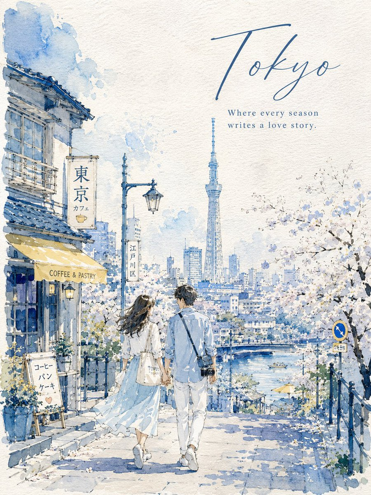

```text
Create a 3:4 vertical watercolor urban sketch travel poster on textured handmade watercolor paper.

City input:
[CITY NAME]

Create a romantic everyday scene reflecting the real architecture, landmarks, street life, climate, and cultural mood of [CITY NAME]. Use recognizable city-specific elements such as local buildings, cafes, balconies, canals, bridges, trams, towers, rooftops, tiles, waterfronts, street furniture, plants, or signs. Avoid generic European scenery or incorrect landmarks.

Main scene:
Show two lovers as the main subjects, placed slightly below center. They may be walking, sitting at an outdoor cafe, sharing iced coffee, standing near the water, looking at a view, or gently holding hands. Their pose should feel natural, affectionate, quiet, and unposed. Do not show a single person.

Characters:
Dress the couple in stylish casual summer clothing suited to [CITY NAME]: linen shirts, light cardigans, relaxed trousers, summer dresses, sneakers, sandals, sunglasses, crossbody bags, tote bags, cameras, pastries, or iced drinks. Use mostly white, pale blue, aqua, and soft gray-blue clothing with one or two small lemon-yellow accents. Add gentle wind movement to hair and loose fabric.

Composition:
Use a clean vertical poster layout with large negative space and an airy editorial feel. Keep the couple small to medium in scale, framed by city-specific architecture or scenery. Place buildings and landmarks in the background or along the sides, softly blended into the paper texture. Keep the upper half bright and open, with the upper right reserved for typography.

Typography:
In the upper right corner, add the city name in elegant italic English lettering:
"[CITY NAME]"

Directly below, add one short poetic English sentence matching the city's fresh summer mood. Use delicate soft cobalt, gray-blue, or muted navy lettering. Keep it minimal, readable, and naturally integrated into the paper.

Color direction:
Use a refreshing blue-and-yellow summer palette:

75% cool blues and blue-grays: sky blue, cyan, pale aqua, powder blue, faded turquoise, soft blue-gray, selective cobalt.

15% clean white and warm off-white paper highlights.

10% pale lemon yellow, soft butter yellow, sunlit cream, or light golden accents.

Blue should dominate while yellow adds warmth and visual rhythm. Use yellow only as accents in awnings, window light, flowers, umbrellas, pastries, signs, clothing details, drink labels, or sunlit building edges. Avoid an all-blue flat background.

Watercolor technique:
Use translucent washes, soft blue bleeding, subtle pigment granulation, wet-on-dry textures, gentle brush blooms, pale shadows, visible handmade paper texture, minimal splashes, and delicate reflections where appropriate. Yellow washes should feel like light touching paper.

Drawing detail:
Use delicate thin ink line art with slightly imperfect hand-drawn lines. Add refined urban sketch details: windows, shutters, balconies, streetlamps, cafe chairs, paving stones, railings, plants, clothing folds, hair strands, hands, shoes, bags, cups, signs, and soft ground marks. Keep faces softly suggested, not realistic.

Mood and quality:
Minimalist watercolor urban sketch, romantic summer travel poster, quiet love story, city-specific atmosphere, breezy blue palette with lemon-yellow highlights, elegant fashion illustration, cozy slice-of-life, Japanese-inspired softness, premium editorial look, calm pastel mood, soft natural lighting, clean background, poster-ready, 8K.

Negative prompt:
single person, generic city, incorrect landmarks, all-blue background, monochrome blue, lifeless colors, yellow-dominant, orange-heavy, brown-dominant, dark vintage, muddy beige, neon colors, oversaturated colors, photorealistic, 3D render, heavy outlines, harsh shadows, crowded street, cluttered background, realistic faces, stiff pose, awkward anatomy, glossy texture, bold typography.
```


---

## 例 667：CMYK Ronaldo Collector Poster

**来源：** [@vireonixx](https://x.com/vireonixx/status/2071629983324488160) / [awesome-gpt-image-2-prompts](https://github.com/EvoLinkAI/awesome-gpt-image-2-prompts)

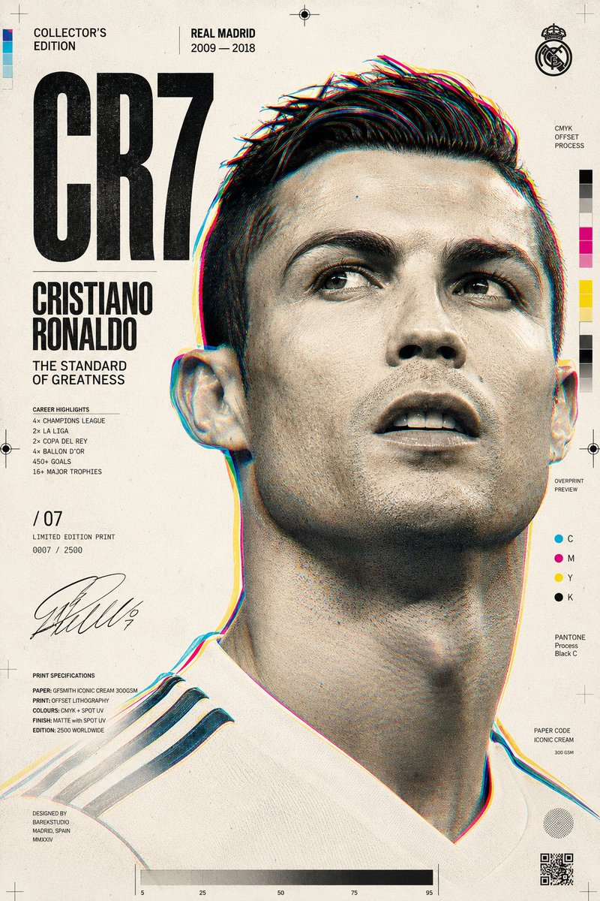

```text
Create a world-class collector's edition Cristiano Ronaldo poster inspired by premium offset printing, editorial publishing, and award-winning graphic design. The composition is dominated by a monumental close-up portrait of peak Real Madrid Cristiano Ronaldo occupying nearly seventy-five percent of the composition. His iconic hairstyle, sharp jawline, and confident expression should be rendered with extraordinary realism.

The core visual concept explores the beauty of CMYK printing itself. Instead of ordinary colour grading, the portrait should subtly separate into overlapping cyan, magenta, yellow, and black print layers only around selected edges, creating sophisticated registration effects found in premium printing houses. The effect should feel handcrafted and luxurious rather than digital glitch art.

Massive editorial typography should integrate naturally with the portrait while printer crop marks, colour calibration bars, registration targets, production notes, paper codes, and printing specifications become part of the graphic language.

The palette is dominated by warm paper white with controlled CMYK colour accents. Rich paper grain, tactile ink textures, subtle overprint effects, premium offset realism, museum-quality print production, elegant editorial hierarchy, Behance Featured Project quality, contemporary sports branding, collector-edition masterpiece.
```


---

## 例 668：Black-and-red streetwear campaign portrait

**来源：** [@harboriis](https://x.com/harboriis/status/2049450257604550872) / [awesome-gpt-image-2-prompts](https://github.com/EvoLinkAI/awesome-gpt-image-2-prompts)

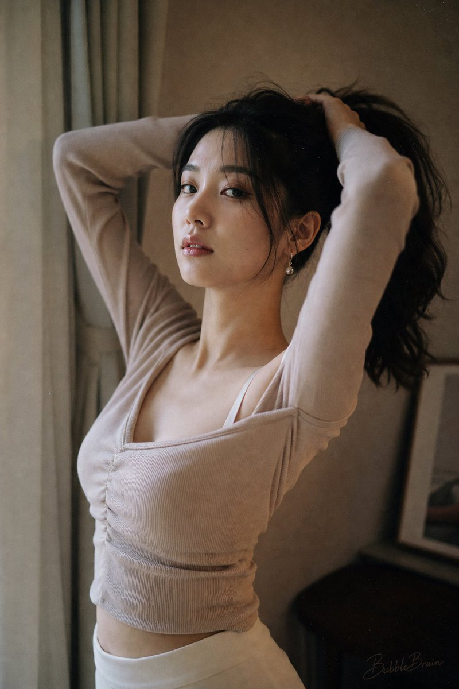

```text
Create a bold, high-contrast black and white portrait of a confident young man wearing a black leather jacket, facing slightly sideways with an intense expression. Use dramatic studio lighting with sharp shadows and detailed skin texture. Add strong red graphic elements over the image, including a horizontal red bar across the eyes, geometric shapes, thin lines, and framing boxes. Incorporate large bold typography, repeated faded text, and a motivational headline in bright red. The design should feel like a premium sports or streetwear campaign poster with a minimal textured grey background and black/white/grey/red palette only.
```


---

## 例 669：Monochrome Streetwear Editorial

**来源：** [@AIwithAliya](https://x.com/AIwithAliya/status/2056078056419393805) / [awesome-gpt-image-2-prompts](https://github.com/EvoLinkAI/awesome-gpt-image-2-prompts)

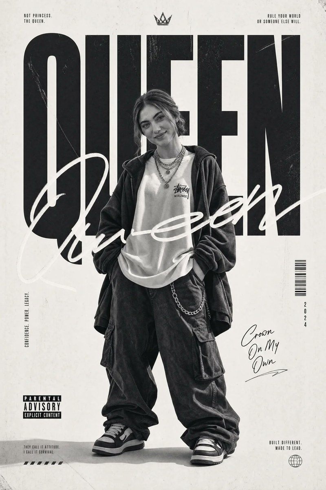

```text
Use my uploaded image as the face reference.

Create a bold monochrome streetwear editorial poster featuring the uploaded person in oversized urban fashion, relaxed stance, hands in pockets, layered baggy clothing, sneakers, and confident rebellious attitude. Main theme keyword: "[QUEEN]". Use giant condensed typography behind the subject, handwritten signature-style script overlay, minimalist white studio background, gritty texture details, cinematic shadows, and luxury music-magazine aesthetics inspired by modern fashion campaigns. Black-and-white high-contrast photography style, full-body composition, eye-level angle, 85mm lens, ultra-sharp detail, soft studio lighting with subtle grain, premium viral poster design optimized for fashion and music culture content.
```


---

## 例 670：Y2K Streetwear Sticker Poster

**来源：** [@Shinning1010](https://x.com/Shinning1010/status/2056049785682211218) / [awesome-gpt-image-2-prompts](https://github.com/EvoLinkAI/awesome-gpt-image-2-prompts)

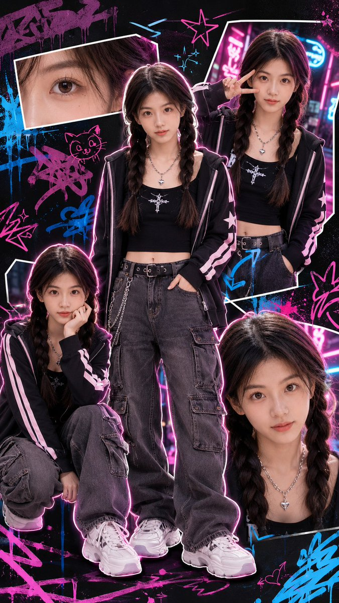

```text
Use the uploaded portrait only as the identity and hairstyle reference. Accurately preserve the person’s real facial identity, face shape, facial features, skin tone, hairstyle outline, hair volume, and natural real-life appearance. Do not copy the original photo’s background, lighting, clothing, pose, or image quality. Do not turn the person into an anime character, doll, idol illustration, or plastic-looking AI face.

Create a highly realistic 9:16 vertical Y2K streetwear collage poster of the same person. The overall visual style should reference a neon graffiti magazine sticker-board layout: multiple cutout portraits of the same person arranged dynamically on one vertical poster, with thick white sticker outlines, subtle pink neon rim glow, layered photo frames, graffiti tags, doodles, spray-paint textures, black grunge background, electric pink and cyan accents, and a high-energy urban fashion poster feeling.

The poster should include several different shots of the same person in one composition: one central full-body standing pose, one half-body playful pose, one seated or crouching pose, one close-up portrait, and one cropped detail frame showing one eye or facial detail. Each pose should have a different angle, expression, and framing, but all must clearly look like the same real person from the uploaded portrait.

Generate suitable clothing automatically based on the uploaded person’s real appearance and style. The outfit should feel like stylish Y2K streetwear, possibly including denim, layered casual fashion, boots or sneakers, accessories, soft street-style details, and a coordinated youthful look. Do not lock the clothing to the reference image exactly. Choose clothes that fit the person naturally and look believable. Avoid overly revealing clothing.

Use realistic photography texture: natural skin pores, real skin texture, soft uneven skin tone, natural lips, realistic hair strands, believable fabric wrinkles, correct body proportions, detailed denim or streetwear fabric, realistic hands, and real camera lighting. The person should feel like a real photographed person placed into a designed collage poster, not a 3D render or anime illustration.

Lighting should be cinematic but believable, with soft neon pink and cyan reflections, subtle rim light around the cutout edges, realistic shadows, and clean separation from the dark graffiti background. Keep the composition polished, high-end, energetic, and social-media ready.

Do not include any watermark, brand logo, AI-generated text, random Chinese characters, fake signatures, QR codes, platform labels, or unreadable typography. Any graffiti should be abstract decorative marks only, not readable text. The final image must be vertical 9:16.

Negative Prompt:

anime, cartoon, illustration, doll face, plastic skin, waxy skin, overly smooth face, beauty filter, fake glossy skin, over-beautified face, changed identity, different person, distorted face, asymmetrical eyes, bad hands, extra fingers, missing fingers, broken fingers, distorted body, unrealistic body proportions, stiff pose, floating hair, helmet-like hair, fake fabric, painted clothing, low-resolution texture, blurry face, over-sharpened skin, 3D render, CGI, toy-like, cheap poster, messy layout, unreadable text, watermark, logo, AI watermark, random letters, random Chinese text, QR code, duplicated face errors, inconsistent identity, cropped head, cut-off limbs
```


---

## 例 671：Y2K Street-Art Editorial Poster

**来源：** [@kingofdairyque](https://x.com/kingofdairyque/status/2056273485131821345) / [awesome-gpt-image-2-prompts](https://github.com/EvoLinkAI/awesome-gpt-image-2-prompts)

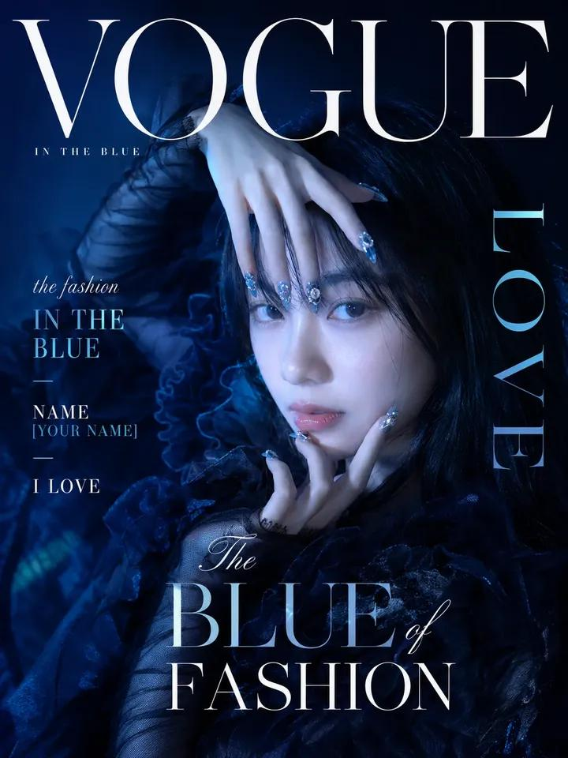

```text
hair instructions, controlling hairstyle, changing hairstyle, young female, young male, bad anatomy, extra fingers, deformed hands, stiff pose, awkward body lean, distorted sunglasses, warped face, asymmetrical eyes, blurry face, low quality, low resolution, muddy colors, overcluttered layout, too many stickers, unreadable typography, misspelled text, cheap poster design, random logos, watermark, cartoon-only style, duplicate subject, extra limbs, plastic skin.
```


---

## 例 672：Summer Campus Tesla Lifestyle Poster

**来源：** [@Shinning1010](https://x.com/Shinning1010/status/2056334868963881144) / [awesome-gpt-image-2-prompts](https://github.com/EvoLinkAI/awesome-gpt-image-2-prompts)

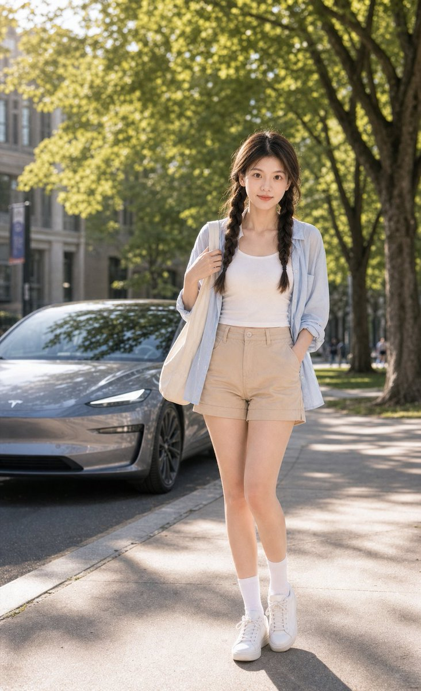

```text
Create a premium summer campus lifestyle Tesla poster focused mainly on an adult East Asian female model with a casual cute campus look. Use the uploaded portrait photo only for appearance and hairstyle, preserving face shape, facial features, hairstyle, skin tone, body proportion, and overall temperament. Scene: sunny summer university campus, clean tree-lined walkway, bright greenery, warm daylight, relaxed youthful lifestyle atmosphere. The model is the visual center, clear face, natural swee
```


---

## 例 673：Portrait Collage Film Strip Poster

**来源：** [@robertsmith_ai](https://twitter.com/robertsmith_ai/status/2056766784846606727) / [awesome-gpt-image-2-prompts](https://github.com/EvoLinkAI/awesome-gpt-image-2-prompts)

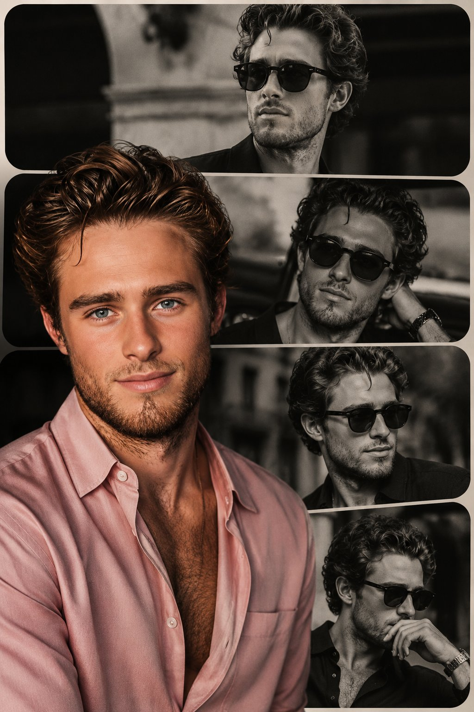

```text
High-end portrait collage poster in vertical format. The background contains four layered rounded strips displaying black-and-white film-like images of a curly-haired male model wearing dark sunglasses in varied poses. In front, a vivid color cutout of the same character is placed to the left, dressed in an unbuttoned soft pink shirt, styled like a luxury fashion campaign with dramatic lighting and depth.
```


---

## 例 674：Y2K Japanese Street Editorial Poster

**来源：** [@noorlewisx](https://x.com/noorlewisx/status/2057349206025847224) / [awesome-gpt-image-2-prompts](https://github.com/EvoLinkAI/awesome-gpt-image-2-prompts)

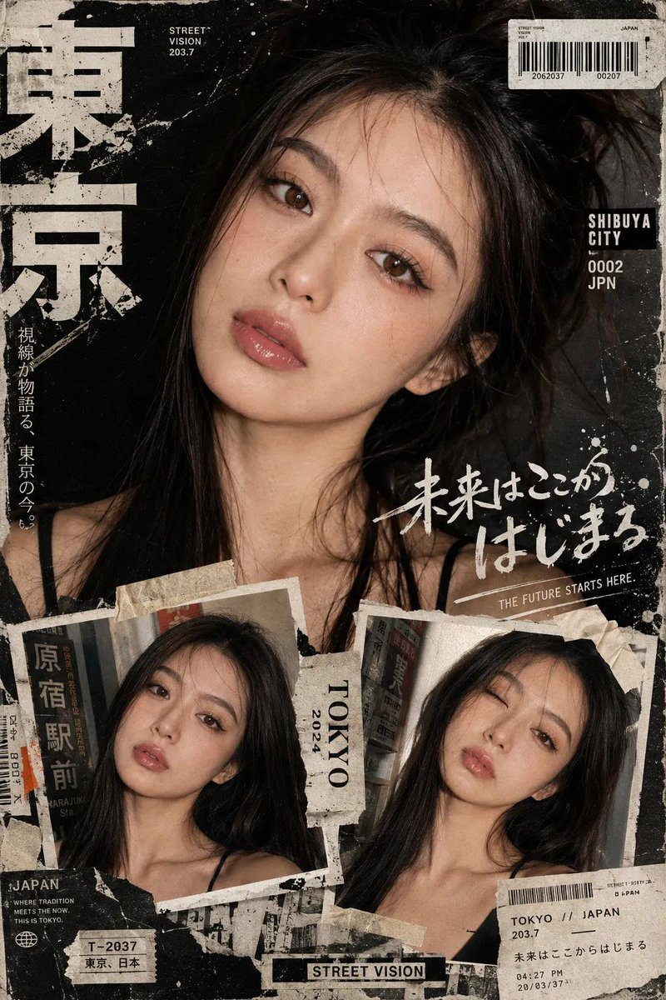

```text
Create a bold Y2K Japanese street-editorial collage poster with a clean high-fashion magazine aesthetic, gritty paper textures, torn magazine cutouts, distressed ink splashes, and urban Tokyo-inspired design.
```


---

## 例 675：Avant-Garde Tokyo Fashion Zine Poster

**来源：** [@john_my07](https://x.com/john_my07/status/2057319214739046552) / [awesome-gpt-image-2-prompts](https://github.com/EvoLinkAI/awesome-gpt-image-2-prompts)

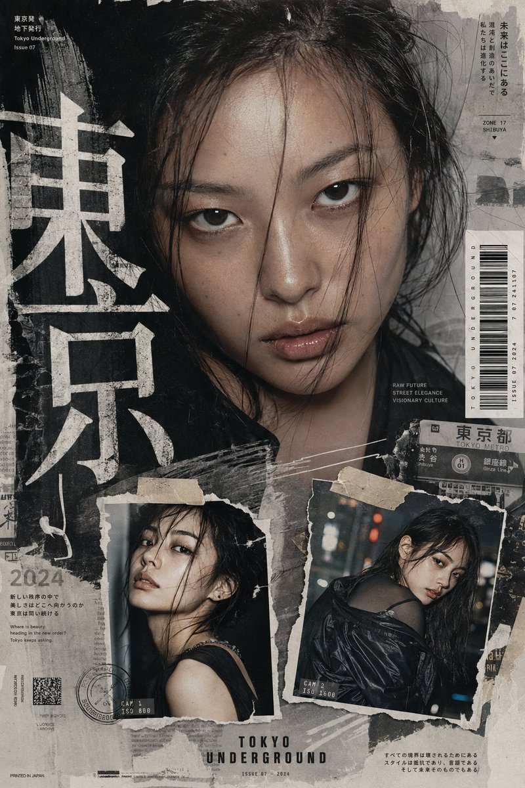

```text
Avant-garde Tokyo fashion zine poster with a refined neo-Y2K editorial aesthetic, inspired by underground Japanese street magazines and luxury urban campaigns. Layered collage composition featuring weathered paper textures, fragmented magazine clippings, faded xerox marks, distressed ink smears, scratched film overlays, and contemporary Harajuku-inspired graphic design.
Primary visual: a dominant cinematic beauty portrait occupying the upper half of the poster, intense direct gaze with razor-sharp eye detail, naturally textured skin, softly glossy lips, loosely pinned messy hair strands, no eyewear, subtle moody rim lighting, calm yet powerful expression, photographed like a luxury street-fashion campaign with ultra-realistic DSLR depth and authentic facial detail.
Secondary visuals: exactly two smaller ripped-frame portraits near the lower section, each showing different moods and camera perspectives, arranged asymmetrically like taped instant-film snapshots layered over torn paper pieces.
Graphic styling: oversized experimental Japanese typography integrated into the composition, minimal condensed English captions, faded metro signage fragments, barcode labels, editorial stamps, folded newspaper textures, masking tape strips, rough brush marks, grainy analog imperfections, layered cut-paper shadows, and sophisticated magazine-inspired spacing.
Overall mood: clean but rebellious, premium Japanese street-editorial energy, cinematic contrast, muted neutral palette with charcoal, ivory, faded silver, and washed earth tones, subtle flash photography feel, raw fashion photography realism, modern visual culture poster design, highly detailed luxury collage artwork, sharp focus, authentic print imperfections, ultra high resolution, 8K aesthetic, absolutely no kawaii elements, no pastel tones, no cartoon styling.
```


---

## 例 676：Cinematic Football Portrait Poster

**来源：** [@de_mon010](https://x.com/de_mon010/status/2057375542652064220) / [awesome-gpt-image-2-prompts](https://github.com/EvoLinkAI/awesome-gpt-image-2-prompts)

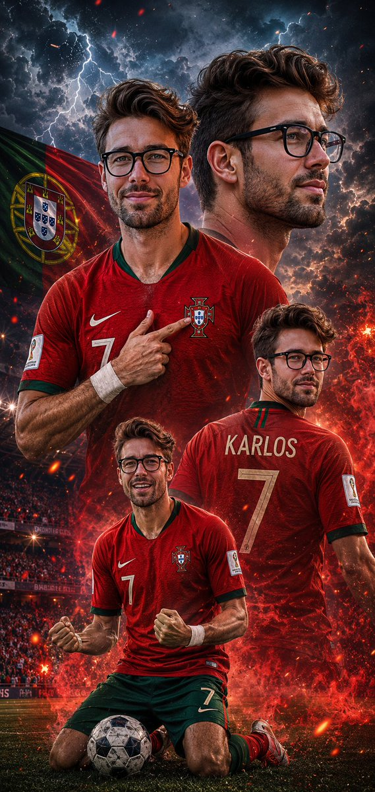

```text
Ultra realistic cinematic football poster of a stylish young South Asian male footballer with voluminous messy black hair, sharp jawline, trimmed beard, glowing fair skin, wearing Portugal national team red jersey with number 7. Multi-layered dramatic sports collage composition with three different poses — smiling front portrait pointing at Portugal badge, intense side profile close-up, and back pose showing custom name “HASANUR 7” on jersey. Dynamic action shot at the bottom celebratingon football field with clenched fists and soccer ball. Dark stormy sky with lightning, glowing stadium lights, red smoke flares, flying embers, Portugal flag waving in background, intense red and blue cinematic color grading, ultra detailed facial features, realistic skin texture, high contrast sports photography style, epic FIFA World Cup poster aesthetic, shallow depth of field, hyper realistic, 8K, vertical wallpaper composition.
```


---

## 例 677：Clean Tech Advertisement Poster

**来源：** [@Strength04_X](https://x.com/Strength04_X/status/2057389379971334309) / [awesome-gpt-image-2-prompts](https://github.com/EvoLinkAI/awesome-gpt-image-2-prompts)

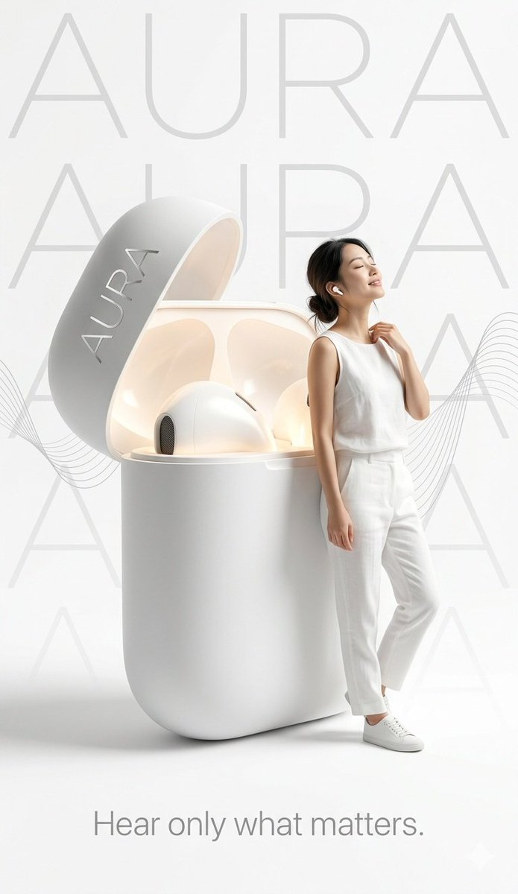

```text
- A clean tech advertisement poster. A stylish young woman in a white minimalist outfit tilts her head with eyes closed enjoying music beside a giant white wireless earbud case 2.5x her height open and glowing softly, "AURA" engraved on the case lid in silver. Pure clean white background with subtle soft shadows and faint sound wave lines. Ultra minimal thin sans-serif typography "AURA" in light grey filling the background.
```


---

## 例 678：Identity Reference Fashion Portrait

**来源：** [@mehvishs25](https://x.com/mehvishs25/status/2057635435330064495) / [awesome-gpt-image-2-prompts](https://github.com/EvoLinkAI/awesome-gpt-image-2-prompts)

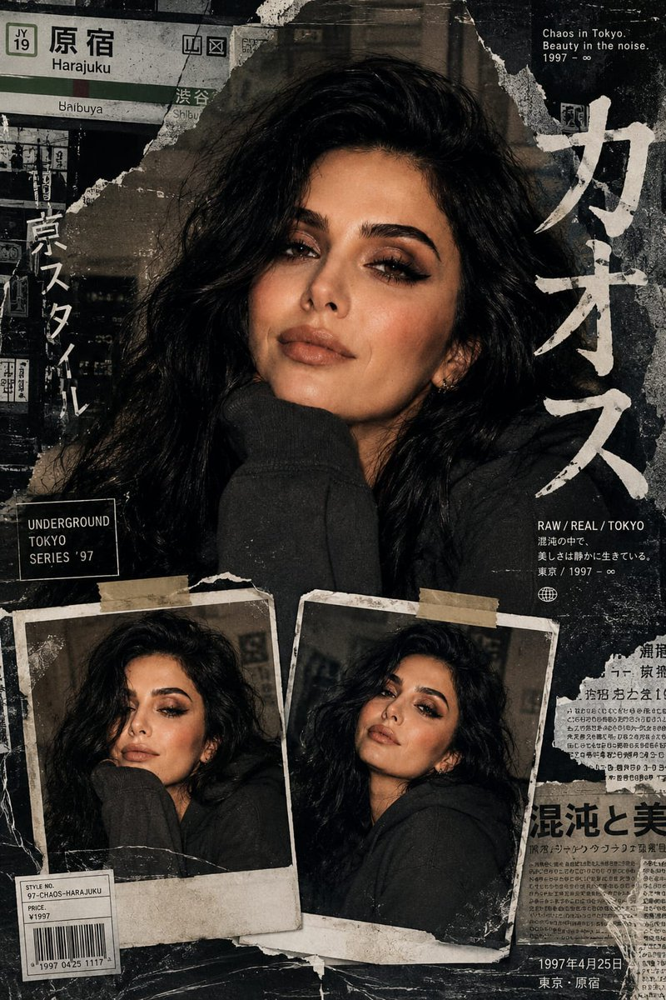

```text
Use the uploaded reference image as the exact facial identity reference for the girl. Preserve her real facial structure, eye shape, nose, lips, jawline, skin tone, hairstyle essence, and overall appearance consistency throughout the entire poster. Maintain accurate identity realism with natural skin texture and authentic facial proportions.
Create an avant-garde Tokyo street-fashion editorial collage poster with a sophisticated neo-Y2K Japanese magazine aesthetic. Inspired by underground Harajuku fashion zines, luxury streetwear campaigns, and raw urban print design. Composition built from layered torn-paper textures, distressed xerox scans, folded magazine scraps, scratched film overlays, faded ink marks, and gritty editorial collage elements.
Main composition: one large cinematic close-up portrait of the same girl from the reference image dominating the upper section of the poster. Strong eye contact with sharp realistic eye detail, naturally glossy lips, subtle skin imperfections, softly tied messy hair with loose strands framing the face, no glasses, no exaggerated makeup, calm but magnetic expression. Lighting should feel like premium DSLR flash photography mixed with cinematic shadow gradients, creating a modern luxury fashion-campaign atmosphere.
Lower composition: exactly two smaller collage portraits of the same girl placed asymmetrically near the bottom, styled like ripped instant-film photographs taped onto the layout. Each frame should show different facial expressions, angles, and poses while maintaining perfect facial identity consistency with the reference image.
Design elements: oversized experimental Japanese typography, small minimal English captions, subtle Tokyo subway signage fragments, barcode labels, newspaper clipping textures, masking tape pieces, distressed brush strokes, folded paper shadows, vintage print imperfections, halftone grain, layered editorial cutouts, and premium fashion-magazine spacing.
Color palette and mood: muted neutral tones with charcoal black, faded white, soft silver, washed beige, and subtle cool-gray highlights. Clean but rebellious high-fashion energy, cinematic contrast, raw streetwear editorial moodboard aesthetic, ultra-realistic RAW DSLR photography feel, luxury Japanese graphic design style, sharp focus, highly detailed textures, authentic print wear, ultra detailed, 8K quality.
Avoid: pastel colors, kawaii styling, cartoon elements, bubbles, exaggerated neon effects, anime aesthetics, overly colorful backgrounds, unrealistic beauty filters, duplicated faces, distorted anatomy, or fake AI-looking skin.
```


---

## 例 679：Automotive Design Deconstruction Poster

**来源：** [@Gdgtify](https://x.com/Gdgtify/status/2057541939587878914) / [awesome-gpt-image-2-prompts](https://github.com/EvoLinkAI/awesome-gpt-image-2-prompts)

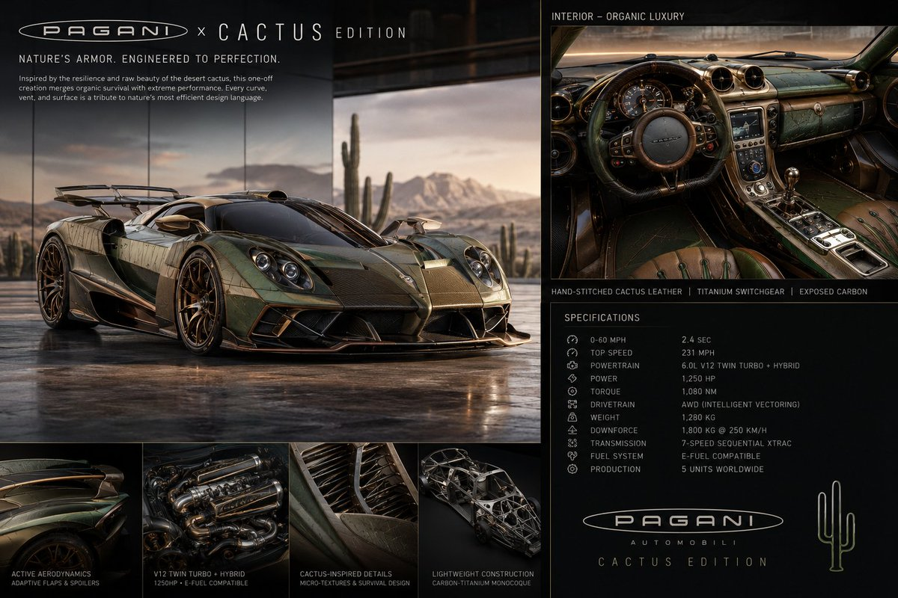

```text
You are an AI automotive designer that deconstructs any object's aerodynamic philosophy, material science, and functional poetry to birth a drivable sculpture. SEMANTIC INFERENCE FRAMEWORK Kinetic DNA Analysis:  Motion Signature: Is it about cutting through or flowing with? Power Source Metaphor: Does it suggest electric silence or combustion rage? Stance Philosophy: Does it crouch predatory or float serene?  Transmutation Logic: When the object embodies:  Sharp edges, aggressive angles, predatory stance, weapon-like intent → Manifest as: Track-Focused Hypercar (exposed carbon, active aero, GT3 energy)  When the object embodies:  Smooth curves, organic flow, biomimicry, effortless grace → Manifest as: Electric Grand Tourer (seamless body, hidden intakes, silent luxury)  When the object embodies:  Brutalist geometry, industrial strength, utilitarian honesty → Manifest as: Safari Rally Weapon (lifted suspension, protective armor, adventure-ready)  OUTPUT: Full car render (3/4 front view), interior detail shot, spec sheet (0-60, top speed, powertrain), brand collaboration ("Pagani x Cactus Edition").
```


---

## 例 680：Japanese Graffiti Portrait Poster

**来源：** [@robertsmith_ai](https://x.com/robertsmith_ai/status/2057627319263707543) / [awesome-gpt-image-2-prompts](https://github.com/EvoLinkAI/awesome-gpt-image-2-prompts)

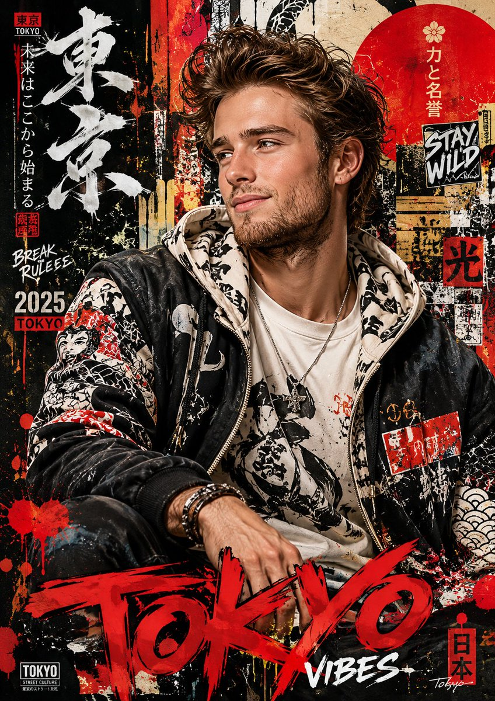

```text
Create a high-detail portrait poster in a bold Japanese graffiti-inspired art style, combining modern urban street aesthetics with expressive Japanese visual culture. The poster should feature dynamic graffiti typography, layered spray-paint textures, hand-drawn symbols, abstract paint splashes, neon brush strokes, urban sticker elements, Japanese calligraphy accents, and decorative ornaments that strongly reinforce the energetic atmosphere of the design. The overall composition should feel artistic, rebellious, fashionable, and visually striking, while still maintaining a premium editorial poster quality instead of looking messy or overdone. Humanity somehow turned vandalism into luxury wall art. Impressive species. The subject must not replicate the exact pose or expression from the reference photo. Instead, create a completely new pose that feels natural, confident, and full of life. The expression should appear emotionally expressive, charismatic, and engaging, avoiding stiff, awkward, flat, or emotionless body language. The pose should reflect the elegance and sophistication commonly seen in international fashion models, with stylish posture, natural movement, and subtle attitude that enhances the overall cinematic fashion aesthetic. The outfit should feature contemporary stylish casual fashion with strong visual appeal. Avoid plain or repetitive clothing designs. Use fashionable layering, modern streetwear inspiration, premium casual styling, and a balanced combination of colors, patterns, textures, and fabric types that create a rich and non-monotonous appearance. The clothing should feel trendy, fashionable, youthful, and visually premium while still fitting naturally into the Japanese graffiti poster concept. The background and poster decorations should be filled with thematic urban Japanese-inspired visual elements such as graffiti walls, spray textures, painted symbols, urban signage, layered stickers, modern Japanese graphic motifs, abstract shapes, paint drips, street fashion aesthetics, and stylish decorative compositions that enhance depth and artistic intensity without distracting from the subject. Lighting should feel cinematic and fashionable, with strong contrast, clean highlights, realistic skin texture, and high-end editorial poster quality. The final result must look like a premium modern street-fashion campaign poster with highly detailed textures, balanced composition, vibrant color harmony, realistic proportions, ultra-sharp focus, and immersive visual storytelling. Ultra-detailed, highly aesthetic, premium composition, realistic texture rendering, fashionable urban atmosphere, cinematic quality, poster-ready design, 8K ultra high resolution.
```


---

## 例 681：高级男性魅力人像

**来源：** [@liyue_ai](https://x.com/liyue_ai/status/2057382771035898059) / [awesome-gpt-image-2-prompts](https://github.com/EvoLinkAI/awesome-gpt-image-2-prompts)

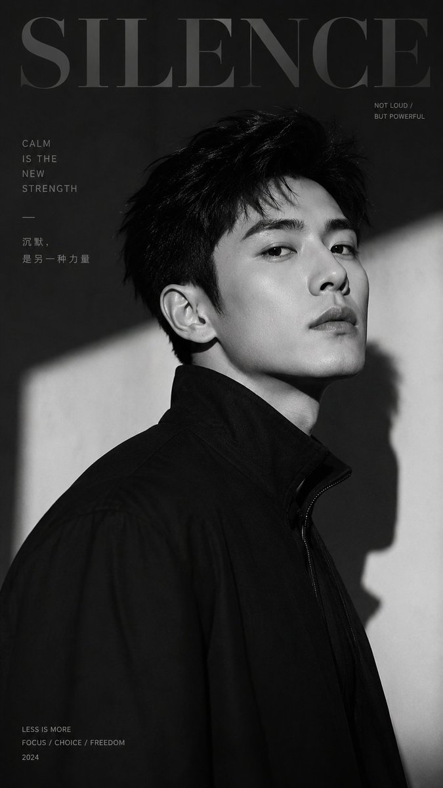

```text
生成一张具有强烈男性魅力和高级视觉冲击力的人像作品，画幅比例为 {画幅比例}。

这不是普通证件照，不是廉价写真，不是网红自拍，也不是夸张霸总风照片，而是一张兼具高级商业人像、电影人物海报、个人品牌视觉和社交平台传播感的男性魅力形象图。

如果用户上传了自拍头像：请以用户上传的自拍头像为核心参考，保留人物的真实身份识别度，包括脸型轮廓、五官比例、眉眼气质、发型基础、年龄感、肤色倾向和面部特征。在保持本人可识别的基础上，对人物进行高级视觉转译：优化面部光影结构；强化眉骨、鼻梁、下颌线和面部轮廓；提升眼神的稳定感和故事感；让发型更干净利落；让皮肤质感更自然清爽；让整体气质更成熟、更自信、更有身份感。

如果用户没有上传自拍头像：默认生成一位成年中国男性，五官端正自然，气质大方得体，干净成熟，身材匀称，肩颈舒展，发型清爽，表情冷静自信，整体符合中国大众审美中的高级男性魅力。
```


---

## 例 682：Pakistan Miniature World Map Poster

**来源：** [@AIwithAliya](https://x.com/AIwithAliya/status/2057538178672943460) / [awesome-gpt-image-2-prompts](https://github.com/EvoLinkAI/awesome-gpt-image-2-prompts)

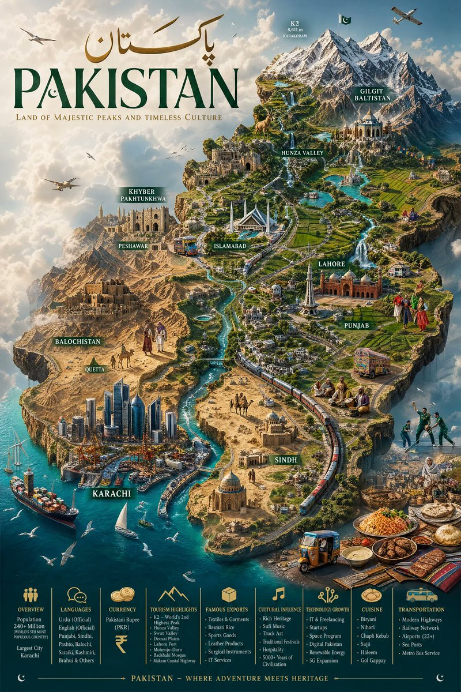

```text
Create an ultra-detailed hyper-realistic 9:16 cinematic miniature world map of Pakistan, designed as a premium luxury travel-poster masterpiece where the entire country appears as a massive handcrafted floating island civilization suspended in soft atmospheric clouds. The terrain must showcase dramatic elevation and geographic diversity, including the towering snow-covered peaks of the Karakoram and Himalayas (featuring K2), lush green valleys of Hunza and Swat, dense forests, glowing rivers like the Indus, crystal-blue coastlines along the Arabian Sea, cascading waterfalls, expansive deserts like Thar and Cholistan, fertile farmland of Punjab, and serene lakes. Include futuristic cities blended with historical richness: Karachi as a sprawling coastal megacity with glowing harbor lights.
```


---

## 例 683：Cinematic Street Photography Portrait

**来源：** [@frametheory058](https://x.com/frametheory058/status/2064536055366480248) / [awesome-gpt-image-2-prompts](https://github.com/EvoLinkAI/awesome-gpt-image-2-prompts)

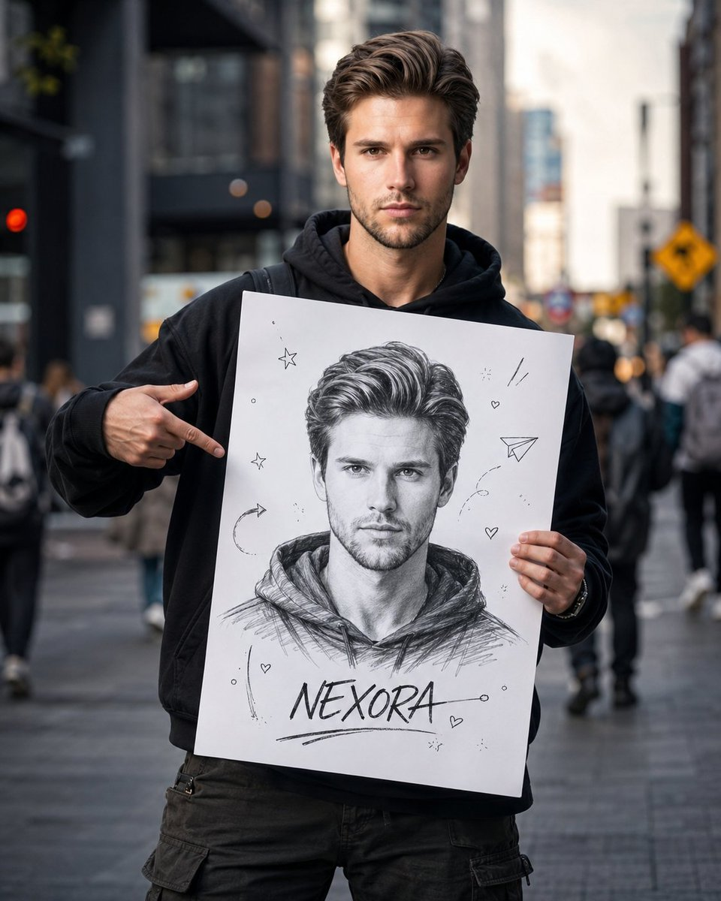

```text
Create an ultra-realistic cinematic street photography portrait of me on a busy city street. Keep my face exactly the same as in the reference photo — same facial structure, eyes, nose, lips, hairstyle, skin tone, proportions, and overall identity. Do not alter, beautify, or reinterpret my appearance in any way.

I am standing confidently in the center of the frame wearing an oversized black hoodie, relaxed cargo pants, and casual streetwear. My expression is playful, slightly mischievous, and natural, as if I’m proudly showing my creative side.

I’m holding a large white poster board in front of me.

The poster should contain only ONE hand-drawn sketch illustration of me. No multiple portraits or variations.

The sketch should be:

Black-and-white pencil drawing

Highly detailed

Realistic facial resemblance

Expressive line art

Artist sketchbook style

Clean white background

Subtle shading

Visible hand-drawn pencil strokes

Confident creator energy

At the bottom of the sketch, write:

[Name]

Around the sketch, add only a few minimal doodles:

Tiny stars

Small hearts

Paper airplane

Light sketch arrows

Subtle creative marks

Keep the poster simple, clean, and powerful.

The mood should feel creative, inspiring, authentic, artistic, and documentary-like, as if it’s part of a creator movement campaign.

Style: ultra-realistic street portrait, natural lighting, shallow depth of field, soft background blur, premium editorial photography, magazine-quality image, cinematic storytelling, Pinterest aesthetic, creator-brand campaign, emotional and relatable, professional photography, 8K masterpiece.

The contrast between the real me and the hand-drawn sketch version of me should be the main visual focus, creating a strong artist-versus-art effect. The single sketch on the poster must remain the clear focal point.

Aspect ratio: 4:5
```


---

## 例 684：Luxury Streetwear Chrome Chair Portrait

**来源：** [@AiwithLariab](https://x.com/AiwithLariab/status/2065115460820218326) / [awesome-gpt-image-2-prompts](https://github.com/EvoLinkAI/awesome-gpt-image-2-prompts)

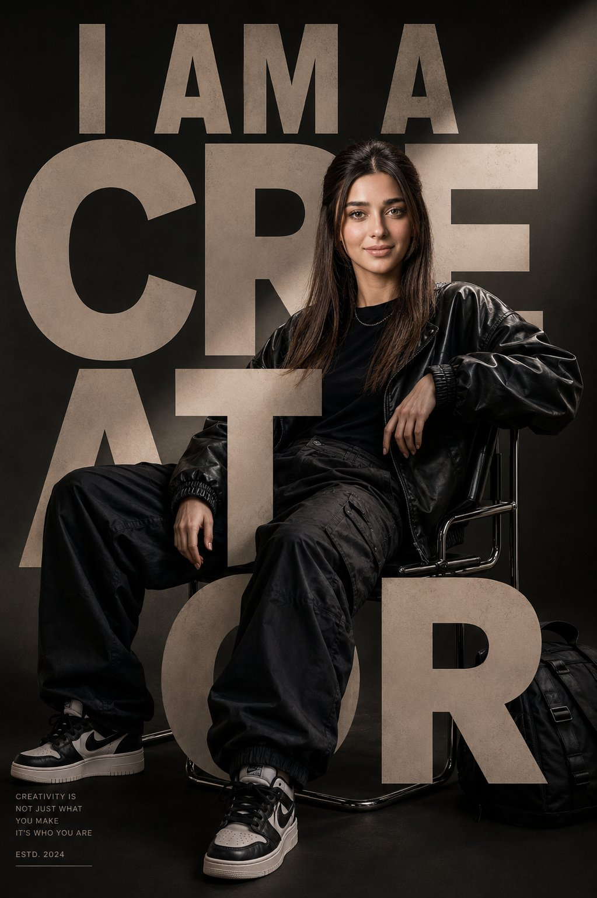

```text
Ultra-premium fashion editorial poster, luxury streetwear aesthetic, 4:5 portrait composition. A confident young woman sitting casually on a modern chrome chair, wearing an oversized black leather bomber jacket, black oversized t-shirt, baggy black cargo pants, and black-and-white luxury sneakers. Relaxed but powerful pose with one arm resting on the chair and direct eye contact with the camera.

Massive bold typography in the background reading:

I AM A
CREATOR

Large beige typography integrated into the composition, partially behind and around the model, creating a premium magazine-cover design. Dark charcoal black studio background with subtle texture and depth.

Professional fashion campaign photography, cinematic studio lighting, dramatic spotlight from upper right corner, soft shadows, luxury fashion branding aesthetic, high-end streetwear advertisement, strong visual hierarchy.

Natural voluminous hair with soft waves, realistic skin texture, sharp facial details, crystal clear eyes, premium color grading, shallow depth of field, ultra-realistic photography, Vogue magazine quality, luxury campaign poster, modern creative entrepreneur branding.

Minimalist design, clean composition, bold typography, premium editorial layout, luxury fashion poster aesthetic, masterpiece, 8K, hyper-realistic, professional retouching, high contrast, ultra detailed.

Small text in bottom left:
"CREATIVITY IS NOT JUST WHAT YOU MAKE IT'S WHO YOU ARE"
"ESTD. 2024"

Face preservation priority: maximum.
Identity consistency: maximum.
Text accuracy: high.
Poster design quality: luxury fashion campaign level.
```


---

## 例 685：South Korea Graffiti Street Art Portrait

**来源：** [@Kashberg_0](https://x.com/Kashberg_0/status/2065112085269504508) / [awesome-gpt-image-2-prompts](https://github.com/EvoLinkAI/awesome-gpt-image-2-prompts)

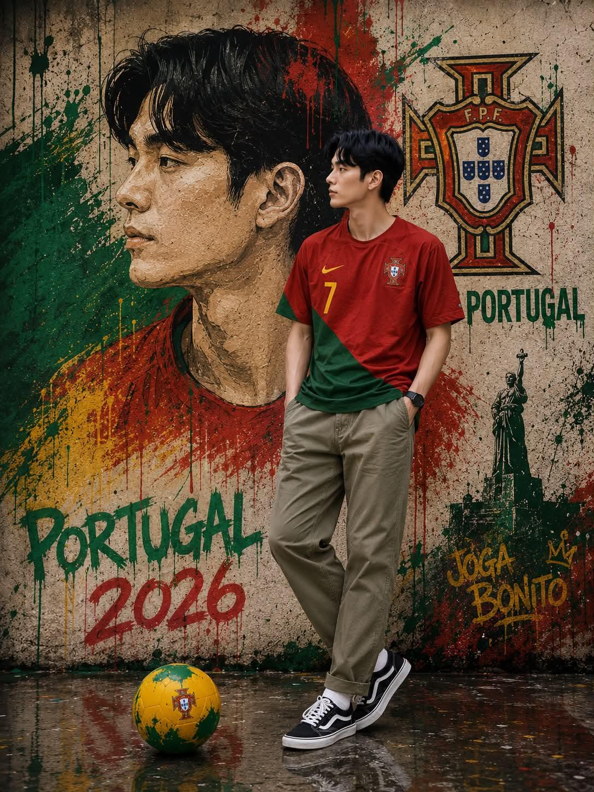

```text
Create a viral CapCut-style
South korea graffiti image from
the uploaded person. Keep
the face consistent. Add
South korea jersey, full-body pose,
giant hand-painted mural
portrait in the background,
South korea logo, South korea 2026 text,
yellow and green football
colors, concrete wall, clean
poster composition, realistic 闪
photo foreground, illustrated
thelifeafptfiti b--'ground,TikTok
```


---

## 例 686：Neon Doodle Gallery Snapshot Template

**来源：** [@im_shahid7](https://x.com/im_shahid7/status/2065099049938878503) / [awesome-gpt-image-2-prompts](https://github.com/EvoLinkAI/awesome-gpt-image-2-prompts)

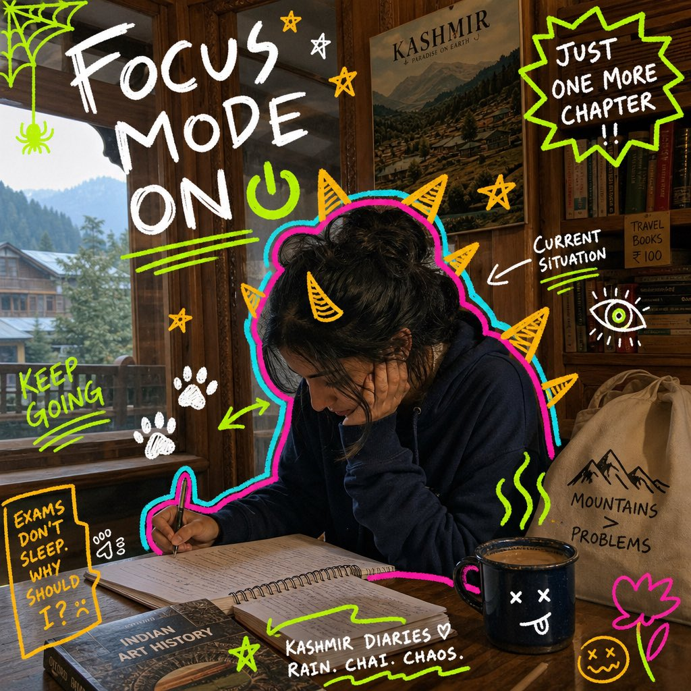

```text
Create a 9:16 image in the "Neon Doodle Gallery Snapshot" style.

Subject: [SUBJECT].
Subject action: [SUBJECT_ACTION].
Prop or product: [PRODUCT_OR_PROP].
Location: [kashmir].
Background elements: [wooden interior ].
Main handwritten text: "[Focus mode on]".
Secondary handwritten text: "[keep going]".
Accent symbol: [ACCENT_SYMBOL].
Wardrobe style: [WARDROBE_STYLE].

Use a realistic candid phone-photo as the base layer. The setting should feel specific and ordinary: visible walls, art, shelves, labels, tables, lamps, posters, people, bags, shadows, grain, and imperfect handheld framing.

Draw a loud digital marker layer directly on top of the photo. Wrap the main subject with a thick hot-pink contour and a cyan offset glow. Add yellow-orange monster spikes, horns, rays, fins, or sunburst shapes around the silhouette. Scatter rough hand-drawn symbols around the frame: stars, paw prints, spiderweb corners, halos, abstract eyes, plants, flowers, scribble underlines, tally marks, arrows, hearts, and sticker-like blobs.

Place rough uppercase handwritten marker text in open areas, using white, yellow, or lime green. The text should feel funny, personal, distracted, and student-made. Preserve the contrast between a real candid photo and chaotic handmade doodles.

Avoid watermarks, usernames, platform logos, creator IDs, app marks, QR codes, clean vector-only illustration, fully illustrated backgrounds, polished ad layout, luxury editorial styling, perfect typography, empty sterile locations, identifiable celebrities, and tiny unreadable text.

--- VARIABLES ---

[ACCENT_SYMBOL] — star, paw print, spiderweb, halo, abstract eye, plant, flower, underline, arrow, tally mark, or scribble
[BACKGROUND_ELEMENTS] — real photo details such as wall art, labels, shelves, posters, tables, lamps, signage, crowds, fabric, shadows, and phone-camera grain
[LOCATION] — art gallery, campus hallway, library, studio critique room, classroom, night market, cafe, bookstore, museum, or city wall
[MAIN_TEXT] — large hand-drawn caption or emotional headline
[PRODUCT_OR_PROP] — notebook, tote bag, coffee, phone, headphones, sketchbook, jacket, snack, poster, camera, book, or exhibition card
[SECONDARY_TEXT] — small handwritten notes, repeated words, short joke, date-like label, or study annotation
[SUBJECT] — main person, group, student, artist, friend, commuter, shopper, or quiet candid figure
[SUBJECT_ACTION] — looking at art, studying, walking, waiting, browsing, reacting, hiding, laughing, or holding a prop
[WARDROBE_STYLE] — casual student streetwear, oversized shirt, hoodie, tote bag, loose trousers, jacket, headphones, sneakers, or art-school layers

--- NEGATIVE PROMPT ---

watermark, username, creator ID, platform logo, app mark, QR code, clean vector poster, fully illustrated scene, polished advertising layout, luxury editorial shoot, sterile studio, perfect typography, perfect sticker sheet, subtle doodles, empty background, corporate mascot, identifiable celebrity, real public figure, tiny unreadable text
```


---

## 例 687：E-commerce Main Image - Tropical Citrus Soda Ad Poster

**来源：** [@edimakorfr](https://x.com/edimakorfr/status/2047635133466124726) / [awesome-gpt-image-2-prompts](https://github.com/EvoLinkAI/awesome-gpt-image-2-prompts)

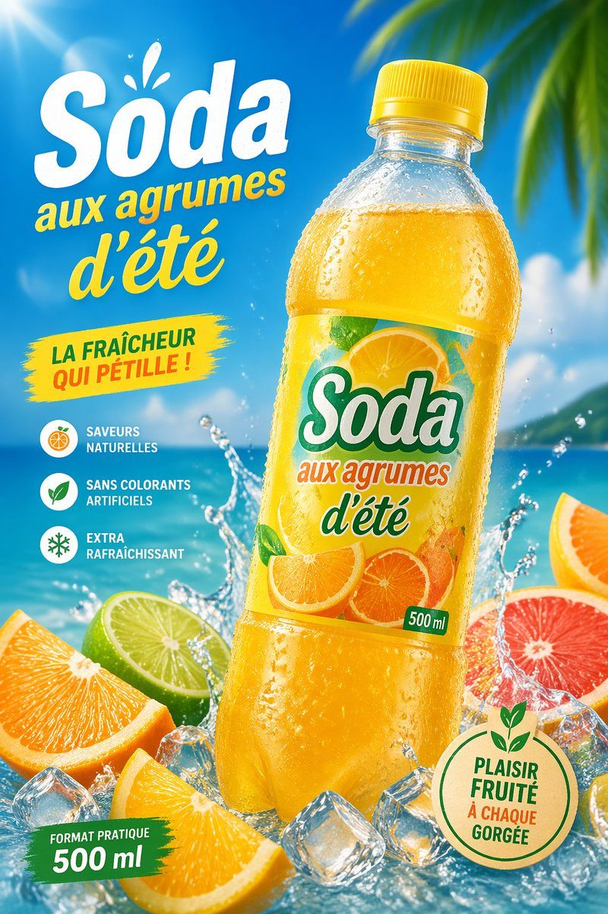

```text
Create a vibrant tropical commercial poster for a citrus soda bottle, in a bright summer advertising style. Show a single large plastic bottle of {argument name="product name" default="Soda"} centered slightly to the right, tilted a little left, with a yellow cap and transparent bottle covered in cold condensation droplets, filled with glowing golden-orange soda. The label should feature sliced oranges and citrus artwork with the brand text "{argument name="product name" default="Soda"}", the phrase "aux agrumes d'été", and a small green "500 ml" mark. Use a sunny beach background with vivid blue sky, turquoise ocean, soft clouds, and blurred tropical palm leaves entering from the upper right corner. Add dramatic water splashes around the base of the bottle, scattered clear ice cubes, and 5 visible citrus pieces in the foreground: 2 orange wedges, 1 lime half, 1 grapefruit half, and 1 partial orange slice at the far right edge. Place large French promotional text on the left: a huge white headline "{argument name="headline text" default="Soda"}" with a small splash accent above it, then yellow script text "aux agrumes d'été" underneath. Add a yellow paint-stroke badge at mid-left with the text "LA FRAÎCHEUR QUI PÉTILLE !". Add a vertical feature list on the lower left with 3 round icons and French captions: "SAVEURS NATURELLES", "SANS COLORANTS ARTIFICIELS", and "EXTRA RAFRAÎCHISSANT". Add a green brushstroke banner at the bottom left reading "FORMAT PRATIQUE 500 ml". Add a round beige eco-style seal at the bottom right with green outline and leaf motif, containing the text "{argument name="seal text" default="PLAISIR FRUITÉ À CHAQUE GORGÉE"}". Lighting should be glossy and high-energy with strong sun flare from the upper left, saturated citrus colors, crisp packaging detail, realistic droplets, and polished supermarket-ad realism.
```


---

## 例 688：E-commerce Main Image - Pastel Blue Crocs Fashion Ad

**来源：** [@SPEEDAI07](https://x.com/SPEEDAI07/status/2047907058079650035) / [awesome-gpt-image-2-prompts](https://github.com/EvoLinkAI/awesome-gpt-image-2-prompts)

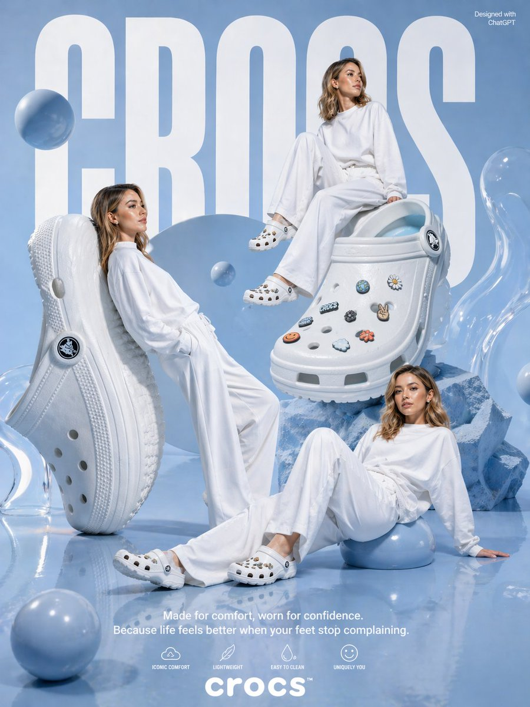

```text
A high-end studio advertising poster for {argument name="brand name" default="crocs"}, in a monochrome pastel blue and white color palette, with a glossy reflective floor and a soft sky-blue backdrop. The background is dominated by the word {argument name="headline text" default="CROCS"} in gigantic bold white condensed sans-serif letters spanning nearly the full height of the image. In the top-right corner, add small white text reading "Designed with ChatGPT". Feature 3 adult women with shoulder-length wavy light brown to dark blonde hair, all wearing loose oversized white long-sleeve tops and flowing white wide-leg pants, styled as minimalist fashion models with relaxed neutral expressions. Their faces are intentionally obscured or blurred. One model reclines against an enormous upright white clog shoe on the left side, one model sits casually on top of a giant white clog on the upper right, and one model lounges on the floor at the lower right, leaning back on one arm while seated partly on a glossy blue sphere. Include 2 oversized white clog shoes as hero props: one standing vertically on the left showing the sole and side profile, and one angled on blue crystalline blocks at center-right showing the upper and toe box. Both clogs are classic foam slip-on style with perforation holes, chunky tread, heel straps, and circular logo rivets. The center-right clog is decorated with exactly 8 visible charms pinned to the upper: a blue-green iridescent round charm, a white daisy with yellow center, a black-and-white round emblem near the strap, a small "CROCS" word charm, a dark flower, a peace-hand sign, an orange smiley face, a white cloud, and an orange flower. Scatter exactly 7 glossy floating or grounded blue spheres of varying sizes around the set: one large sphere behind the left model, one medium sphere floating near center, one medium sphere at bottom left foreground, one medium sphere used as a seat under the lower-right model, one small sphere near the upper left, and 2 additional blue spheres integrated into the composition. Add translucent sculptural gel-like forms at the far left and far right edges, plus angular blue crystal-like rocks beneath the right shoe. At the bottom center, place white promotional copy in a clean sans-serif font: {argument name="tagline line 1" default="Made for comfort, worn for confidence."} on the first line and {argument name="tagline line 2" default="Because life feels better when your feet stop complaining."} on the second line. Beneath that, show 4 minimalist feature icons with labels in white: "ICONIC COMFORT", "LIGHTWEIGHT", "EASY TO CLEAN", and "UNIQUELY YOU". Place the {argument name="logo text" default="crocs"} logo in bold lowercase white at the bottom center with a small trademark symbol. The overall style should feel like a premium surreal fashion campaign, clean editorial lighting, soft shadows, glossy textures, airy composition, and modern lifestyle product advertising.
```


---

## 例 689：Silhouette Universe Narrative Poster

**来源：** [@MrLarus](https://x.com/MrLarus/status/2045418028733538620) / [awesome-gpt-image-2-prompts](https://github.com/EvoLinkAI/awesome-gpt-image-2-prompts)

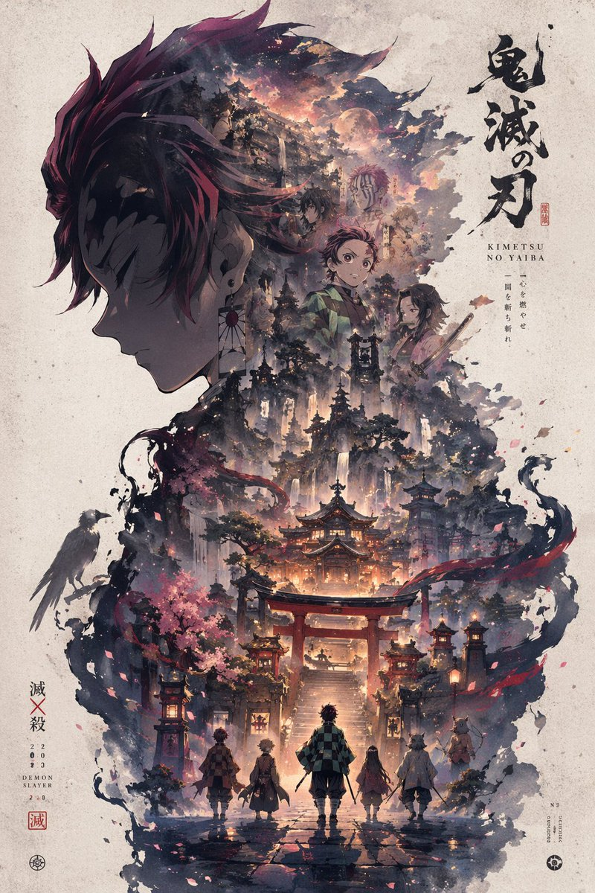

```text
请根据【主题：xxx】自动生成一张高审美的“轮廓宇宙 / 收藏版叙事海报”风格作品。不要将画面局限于固定器物或常见容器，不要优先默认瓶子、沙漏、玻璃罩、怀表之类的常规载体，而是由 AI 根据主题自行判断并选择一个最契合、最有象征意义、轮廓最强、最适合承载完整叙事世界的主轮廓载体。这个主轮廓可以是器物、建筑、门、塔、拱门、穹顶、楼梯井、长廊、雕像、侧脸、眼睛、手掌、头骨、羽翼、面具、镜面、王座、圆环、裂缝、光幕、阴影、几何结构、空间切面、舞台框景、抽象符号或其他更有创意与主题代表性的视觉轮廓，要求合理布局。优先选择最能放大主题气质、最能形成强烈视觉记忆点、最能体现史诗感、神秘感、诗意感或设计感的轮廓，而不是最安全、最普通、最常见的容器。

画面的核心不是简单把世界装进某个物体里，而是让完整的主题世界自然生长在这个主轮廓之中、之内、之上、之边界里或与其结构融为一体，形成一种“主题宇宙依附于一个象征性轮廓展开”的高级叙事效果。主轮廓必须清晰、优雅、有辨识度，并在整体构图中占据核心地位。轮廓内部或边界中需要自动生成与主题强绑定的完整叙事世界，内容应当丰富、饱满、层次清晰，包括最能代表主题的标志性场景、核心建筑或空间结构、象征符号与隐喻元素、角色关系或文明痕迹、远景中景近景的空间递进、具有命运感和情绪张力的氛围层次，以及门、台阶、桥梁、水面、烟雾、路径、光源、遗迹、机械结构、自然景观、抽象形态、生物或道具等叙事细节。所有元素必须统一、自然、有主次、有层级地融合，像一个完整世界真实孕育在这个轮廓结构之中，而不是简单拼贴、裁切填充、素材堆叠或模板化背景。

整体构图需要具有强烈的收藏版海报气质与高级设计感，大结构稳定，主轮廓强烈明确，内部世界具有纵深、秩序和呼吸感，细节丰富但不拥挤，内容丰满但不杂乱，可以适度加入小比例人物剪影、远处建筑、光柱、门洞、桥、阶梯、回廊、倒影、天光或远景结构来增强尺度感、故事感与史诗感。整体画面要安静、宏大、凝练、富有余味，不要平均铺满，不要廉价热闹，不要无重点堆砌。

风格融合收藏版电影海报构图、高级叙事型视觉设计、梦幻水彩质感与纸张印刷品气质，强调纸张颗粒感、边缘飞白、水彩刷痕、轻微晕染、空气透视、柔和雾化、局部体积光、光雾穿透、大面积留白与克制版式，让画面看起来像设计师完成的高端收藏版视觉作品，而不是普通 AI 跑图。整体气质要高级、诗意、宏大、神圣、怀旧、安静、具有传说感和叙事感。

色彩由 AI 根据主题自动判断并匹配最合适的高级配色方案，但必须保持统一、克制、耐看、低饱和、高级，不要杂乱高饱和，不要廉价霓虹感，不要塑料数码感。配色可以围绕黑金灰、冷蓝灰、雾白灰、褐红米白、暗铜、旧纸色、深海蓝、暮色紫、银灰等体系自由变化，但必须始终服务主题，并保持海报级审美与整体和谐。

最终要求：第一眼有强烈的主题识别度和轮廓记忆点，第二眼有完整丰富的叙事世界，第三眼仍有细节和余味。轮廓选择必须具有创意和主题匹配度，尽量避免重复、保守、常见的容器套路，优先选择更有象征性、更有空间感、更有设计潜力的轮廓形式。不要普通背景拼接，不要生硬裁切，不要模板化奇幻素材，不要游戏宣传图感，不要过度卡通化，不要过度写实导致失去艺术感，不要形式大于内容。如果合适，可以自然加入低调克制的标题、编号、签名或落款，让它更像收藏版海报设计的一部分，但不要喧宾夺主。
```


---

## 例 690：Modern Mafia Boss Portrait

**来源：** [@john_my07](https://x.com/john_my07/status/2050455807851147461) / [awesome-gpt-image-2-prompts](https://github.com/EvoLinkAI/awesome-gpt-image-2-prompts)

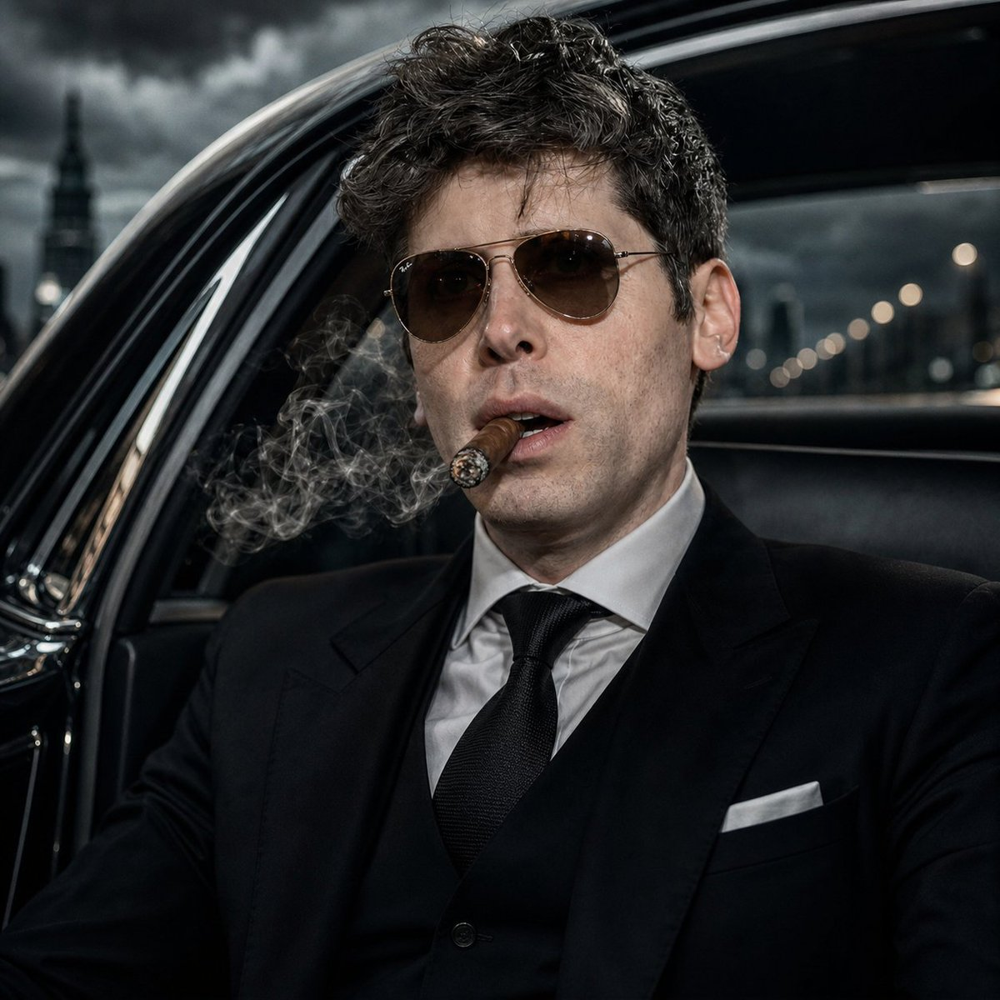

```text
GPT Image 2.0 on ChatGPT vs Google Nano Banana 2 on Gemini. PROMPT: Create a hyper-realistic, cinematic portrait of me (use uploaded face) as a modern mafia boss. I’m sitting in a luxury black car, wearing a black suit and tinted aviator sunglasses, smoking a thick cigar. Cold, fearless expression. Background: moody sky + blurred city/street for noir feel. Cool tones, high contrast. Sharp details on face & smoke. Style: 8K, movie-poster quality, shallow depth of field 1:1
```


---

## 例 691：Match-Day Supporter Transformation Board

**来源：** [@ai_gezgini](https://x.com/ai_gezgini/status/2063677480406511690) / [awesome-gpt-image-2-prompts](https://github.com/EvoLinkAI/awesome-gpt-image-2-prompts)

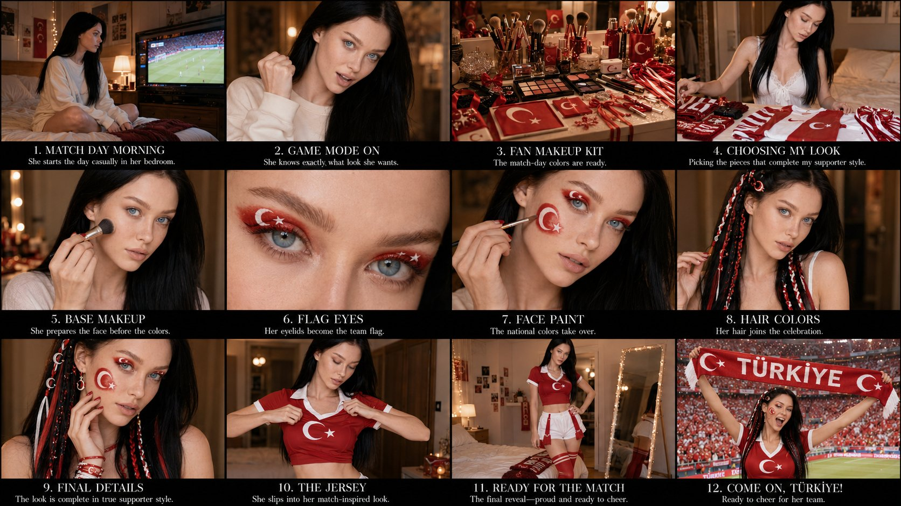

```text
Prompt:
👇
Create a premium 12-frame cinematic editorial transformation storyboard poster using the uploaded woman as the strict identity reference.

USER INPUTS:
Country = [WRITE A COUNTRY NAME]
Reference Image = identity reference of the woman.

ASPECT RATIO:
16:9

FORMAT:
A clean 4-column x 3-row storyboard grid, 12 cinematic frames total.
Each frame must feel like a high-end vlog / fashion transformation short film.
Use elegant black editorial caption bars under each frame with readable numbered titles and short cinematic notes.

IMPORTANT TEXT LANGUAGE RULE:
All visible text inside the generated image must be in English only.
This includes:
- all frame titles
- all subtitle captions
- any scarf text
- any jersey text
- any visible signs, labels, or supporter wording
- the country name wherever it appears
Do not use Turkish or any other language anywhere inside the image text.

CORE CONCEPT:
The same woman from the reference image is in her bedroom on match day. She is sitting in front of the TV when she notices the football match atmosphere and begins preparing a premium [COUNTRY] supporter look. The transformation happens step by step through makeup, eyelid flag art, face paint, strong country-themed hair styling, accessories, and finally a feminine [COUNTRY]-inspired football outfit. The final frame must take place in a stadium, where she is fully ready to cheer.

IMPORTANT IDENTITY RULE:
The woman from the reference image must remain the same person throughout all 12 frames.
Preserve her face, eyes, hair, skin tone, lips, nose, eyebrows, body proportions, and identity.
No face replacement, no identity drift, no different woman between frames.

MOOD AND EXPRESSION RULE:
The woman should feel cheerful, lively, and excited throughout the storyboard.
Her energy should reflect joyful match-day anticipation.
Avoid dull, cold, blank, or emotionless expressions.
She should look increasingly happy, confident, playful, and enthusiastic as the transformation progresses.

POSE VARIETY RULE:
In every frame, the woman must have a clearly different pose, gesture, or body angle.
Do not repeat the same pose across multiple frames.
Use a variety of:
- seated pose
- excited reaction pose
- leaning pose
- reaching pose
- makeup application pose
- over-the-shoulder pose
- playful beauty pose
- jersey-adjusting pose
- confident standing pose
- cheering stadium pose
Each panel must feel visually distinct.

VISUAL STYLE:
Ultra-realistic cinematic photography, premium editorial vlog storyboard, warm moody bedroom lighting, realistic skin texture, fashion-film atmosphere, shallow depth of field, natural film grain, high-resolution detail, cozy but energetic match-day mood.
The color palette must adapt to [COUNTRY] using its national flag colors, football supporter colors, and cultural match-day details.

WARDROBE / SUPPORTER STYLE RULE:
The supporter jersey must look feminine and stylish.
It should be fitted, flattering, fashion-forward, and clearly inspired by [COUNTRY] football colors.
A cropped or tailored women’s football-fan top is preferred.
Do not use exact official logos, sponsor logos, club logos, or copyrighted brand marks.

STORYBOARD STRUCTURE:

FRAME 1 — BEDROOM MATCH DAY MORNING
The same woman sits on her bed in an oversized casual home outfit, facing the TV. She is not taking a selfie. The TV shows a football match on screen. Her pose is relaxed and natural, with a soft curious expression as she watches the match atmosphere.
Caption:
“1. MATCH DAY MORNING”
“She starts the day casually in her bedroom.”

FRAME 2 — GAME MODE ON
Close-up / medium close-up of the woman reacting with excitement and energy. She smiles brightly and gives an enthusiastic gesture, showing that she already knows the supporter look she wants.
Caption:
“2. GAME MODE ON”
“She knows exactly what look she wants.”

FRAME 3 — FAN MAKEUP KIT
Show her vanity table beautifully arranged with makeup brushes, palettes, face paint, small flags, ribbons, hair accessories, and supporter-themed beauty tools in the colors of [COUNTRY]. She interacts with the setup in a lively, engaged way.
Caption:
“3. FAN MAKEUP KIT”
“The match-day colors are ready.”

FRAME 4 — CHOOSING MY LOOK
A new frame showing her selecting the final supporter pieces. She is choosing between [COUNTRY]-themed accessories, scarf elements, hair ribbons, and a feminine [COUNTRY]-inspired jersey. She should have a different pose from prior frames, looking excited and playful while deciding.
Caption:
“4. CHOOSING MY LOOK”
“Picking the pieces that complete my supporter style.”

FRAME 5 — BASE MAKEUP
Beauty close-up. She applies base makeup with a brush: foundation, concealer, contour, soft skin prep. Her identity must stay very recognizable. Her expression should feel upbeat and naturally focused.
Caption:
“5. BASE MAKEUP”
“She prepares the face before the colors.”

FRAME 6 — FLAG EYES
Extreme close-up on her eyes. She paints her eyelids with elegant [COUNTRY] flag-inspired eye makeup. Use the national flag colors, shapes, and symbolic details of [COUNTRY] in a stylish, wearable, premium beauty look.
Caption:
“6. FLAG EYES”
“Her eyelids become the team flag.”

FRAME 7 — FACE PAINT
Medium close-up. She paints a clean, elegant [COUNTRY]-inspired supporter design on her cheek. Use national colors, flag-inspired marks, stars, stripes, crests, or cultural motifs depending on [COUNTRY]. She should have a new angle and a fresh expressive pose.
Caption:
“7. FACE PAINT”
“The national colors take over.”

FRAME 8 — HAIR COLORS
Her hair must clearly reflect the country style. She styles her hair with visible ribbons, braided strands, decorative clips, temporary color highlights, and accessories inspired by [COUNTRY] and its national colors. The pose should be different again, with a fun, beauty-editorial feel.
Caption:
“8. HAIR COLORS”
“Her hair joins the celebration.”

FRAME 9 — FINAL DETAILS
Close-up portrait showing the finished beauty and accessory details. This pose must be clean and readable: one hand placed clearly near the cheek or jawline, not tangled with the face. Show earrings, wrist accessories, painted nails, scarf-like supporter bands, and country-themed finishing touches. Her mood should feel happy and polished.
Caption:
“9. FINAL DETAILS”
“The look is complete in true supporter style.”

FRAME 10 — THE JERSEY
Medium shot of her adjusting or putting on the final feminine [COUNTRY]-inspired jersey. The jersey should look stylish, fitted, and clearly designed for a woman supporter look. Give her a distinct pose with confident, playful energy.
Caption:
“10. THE JERSEY”
“She slips into her match-inspired look.”

FRAME 11 — READY FOR THE MATCH
Full-body reveal in the bedroom / mirror area. She now wears the full supporter outfit: feminine cropped or tailored [COUNTRY]-inspired jersey, stylish fan outfit pieces, finished makeup, finished hair, accessories, and confident body language. She should pose proudly, joyfully, and fashionably.
Caption:
“11. READY FOR THE MATCH”
“The final reveal—proud and ready to cheer.”

FRAME 12 — COME ON, [COUNTRY]!
Final hero frame must take place in a stadium, not the bedroom. The woman is now inside a football stadium crowd atmosphere, holding a supporter scarf that clearly reads “[COUNTRY]”. She looks excited, joyful, and ready to cheer, with a strong celebratory pose and high-energy stadium emotion.
Caption:
“12. COME ON, [COUNTRY]!”
“Ready to cheer for her team.”

CONSISTENCY RULES:
- The woman must remain the same person from the reference image in every frame.
- Frame 1 must show her sitting in front of the TV, not taking a selfie.
- No separate TV announcement frame.
- Frame 2 must be the excited reaction.
- Frame 3 must be the fan makeup kit.
- Frame 4 must be “CHOOSING MY LOOK.”
- The transformation must be gradual and clearly visible.
- Hair must clearly reflect [COUNTRY] supporter styling, not just subtle hints.
- Frame 9 must have a cleaner, more understandable pose, with the hand and face clearly separated.
- The supporter jersey must be feminine, fitted, and stylish.
- Frame 12 must be in a stadium.
- All visible text inside the image must be in English only.
- The woman must look cheerful, lively, and expressive throughout.
- Every frame must feature a different pose or body angle.
- Keep the bedroom / vanity atmosphere consistent through the preparation frames.
- No random extra characters.
- No distorted hands, face, mirror reflections, or unreadable captions.
- No cheap costume look.
- No exact official team logos, sponsor logos, club logos, brand logos, or copyrighted marks.
- No cartoon style.

TYPOGRAPHY:
Use clean cinematic serif titles and elegant smaller subtitle text.
All captions must be correctly spelled, readable, and placed inside black editorial bars under each frame.

FINAL RESULT:
A premium 12-frame editorial match-day transformation storyboard showing the uploaded woman gradually becoming a stylish [COUNTRY] football supporter, beginning in her bedroom and ending in a stadium-ready final cheer moment, with all text in English, joyful energy, and a different pose in every frame.
```


---

## 例 692：Character key visual poster with silhouette collage

**来源：** [@SimplyAnnisa](https://x.com/SimplyAnnisa/status/2049468867106189319) / [awesome-gpt-image-2-prompts](https://github.com/EvoLinkAI/awesome-gpt-image-2-prompts)

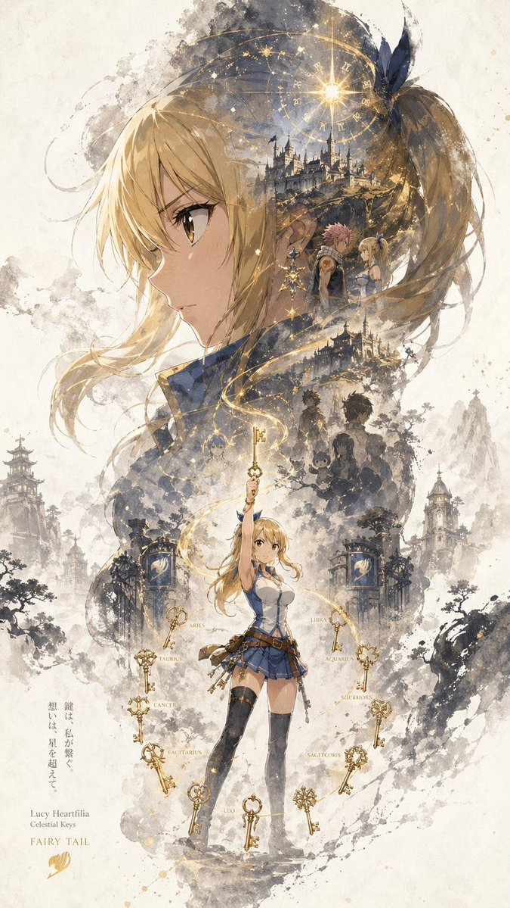

```text
A character promotional poster titled “INPUT NAME,” designed in a unified vertical key visual composition (9:16). The upper half features the most recognizable element of the character as a dominant oversized visual silhouette. The middle to lower section contains the full character as a secondary subject. Inside the large silhouette and around the character, use a double-exposure and collage-style narrative composition with scenes, symbolic imagery, supporting elements, and environmental details blended into mist, ink wash, and negative space. The left and right sides include complementary secondary elements to create narrative tension and spatial variation. A continuous flowing visual line runs from top to bottom, connecting the main character, internal collage, and the large upper silhouette. Preserve large areas of negative space with ink diffusion, soft blurring, and fragmented transitions inspired by Eastern aesthetics. The style is cohesive, refined, restrained, and poster-worthy.
```


---

## 例 693：Vertical Character Concept Sheet

**来源：** [@iamaiistudio](https://x.com/iamaiistudio/status/2065118633198829601) / [awesome-gpt-image-2-prompts](https://github.com/EvoLinkAI/awesome-gpt-image-2-prompts)

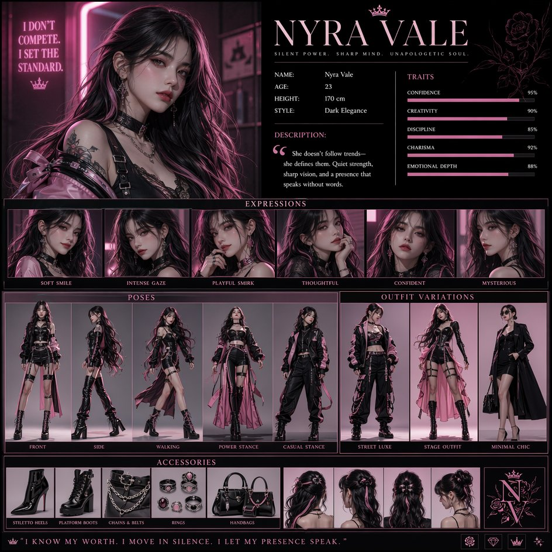

```text
prompt:

Design a high-resolution vertical character concept poster with a luxurious pink and white aesthetic that blends elegance with edgy modern fashion. The layout should feel like a premium magazine profile with clean sections and precise grid alignment.

Main subject: An original young woman (not based on any real person), with long silky dark hair featuring subtle pink highlights. She has a confident, calm expression with a slightly mysterious aura. She wears a black and pink hybrid outfit (merging streetwear with idol fashion) featuring glossy textures, lace details, and metallic accents. Lighting is soft but dramatic, with a neon pink glow set against dark tones.

Top section:
Large hero portrait on one side. On the opposite side, a sleek profile panel with refined English text:

Name: Nyra Vale
Age: 23
Height: 170 cm
Style: Dark Elegance

Short bio:
"She doesn't follow trends, she sets them. Quiet strength, sharp vision, and a presence that speaks without words."

Include a Traits section with stylized progress bars:

Confidence
Creativity
Discipline
Charisma
Emotional Depth

Middle section:
A grid of 5-6 small portraits capturing different expressions (soft smile, intense gaze, playful smirk, thoughtful, confident).

Lower sections:

Full-body poses (front view, side view, walking pose, power stance, casual stance).
Outfit variations (street luxe, stage outfit, minimal chic).
Accessories panel (heels, boots, chains, rings, handbags, hairstyles).

Text tone:
Bold, meaningful, and confident, emphasizing individuality, self-worth, and quiet power. No filler text.

Style:
Ultra-detailed, 4K quality, glossy magazine finish, cinematic lighting, sharp focus, balanced contrast, modern editorial layout, perfectly aligned grid.

#AIart #GPTImage2
```


---

## 例 694：雨中灵姬东方幻想 3D CG 角色

**来源：** [@liyue_ai](https://x.com/liyue_ai/status/2065107695557075460) / [awesome-gpt-image-2-prompts](https://github.com/EvoLinkAI/awesome-gpt-image-2-prompts)

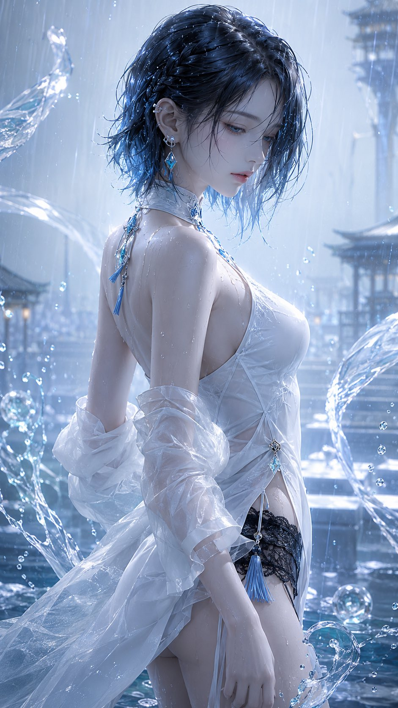

```text
9:16 竖版，高精度 3D CG 东方幻想女性角色写真，3D CG oriental fantasy beauty portrait，anime-style 3D CG character art，semi-realistic 3D character render，镜头为大腿及上半身构图，画面主体是一位明确成年的年轻东方幻想系女性，视觉年龄约 20–26 岁，整体气质清冷、空灵、精致、安静，带有雨中水系精灵般的神秘感与高级感。整体不是平面插画，而是高完成度 3D CG 角色渲染，具有精致角色建模、真实材质表现、电影级冷调柔光与高级虚拟角色海报质感。

人物拥有精致的东方美型脸，小巧流畅的鹅蛋脸，皮肤冷白细腻，带轻微通透感与柔和皮肤着色，肌肤表面有细腻水珠与湿润反光。眼睛细长清澈，瞳色为冰蓝绿调，瞳孔有通透玻璃感与细致高光，眼神微垂，安静、疏离、略带脆弱感。睫毛纤长，眼妆干净克制，鼻梁秀气挺直，嘴唇柔软，唇色为低饱和裸粉色，嘴唇微启，神情冷静而迷人。

发型为短款蓝黑色渐变发，主色为浓黑与深海军蓝，发尾带冷调蓝色高光，发型为短层次波浪感短发，一侧额发自然垂落遮住部分脸颊，顶部带编发结构，发丝湿润、轻盈、细腻，具有高精度发丝建模与柔顺光泽。耳部佩戴精致蓝色水晶几何耳饰与金属耳骨夹，增强东方幻想与水元素气质。颈部佩戴白色高领装饰项圈与青蓝色宝石流苏细节，精致而高级。

服装为精致的东方幻想水系礼装，上半身穿着白色轻薄、湿润感的缎面的贴身长裙，布料柔软垂坠，带细腻高光和微透感，胸口与躯干线条以克制优雅的方式表现。外层披着一件宽松白色衬衫式轻纱外搭，自然滑落至手臂与腰侧，形成层叠褶皱与飘逸感，增强随性与梦幻氛围。腰臀处可见黑色蕾丝边短裤细节，作为整体造型中的轻哥特点缀，使画面更具层次与精致感，但整体保持高级、克制、不低俗。

人物姿势为优雅侧身站立，身体呈现流畅的 S 型曲线，肩颈舒展，背部与腰线自然延展，头部微微低垂侧转，视线向下，整体姿态安静、轻盈、克制。手臂自然下垂，手指修长，姿态如同在雨中静立的一瞬间，突出侧脸、肩颈、背部、腰臀线条与服装湿润材质的精致表现。

背景调整为精致的东方幻想水境场景，整体以冷白、冰蓝、淡灰为主色调。背景为朦胧的雨幕、轻雾与若隐若现的东方幻想建筑轮廓，可融入远处模糊的亭台、石阶、水池边缘或空灵宫殿轮廓，营造高级幻想空间感。人物周围有动态水花、水流弧线与透明水晶般飞溅效果，像由水元素凝结出的装饰性波纹，背景适度虚化，既通透空灵，又不喧宾夺主。

光线采用冷白主光与柔和逆光结合，整体为雨天高调低饱和电影感打光。面部、锁骨、肩背、手臂与腿部有细腻湿润高光，发丝边缘与水花边缘有轻微轮廓光。白色布料、蕾丝、金属、宝石、水珠与水花都具有真实清晰的材质反馈。整体画面干净、通透、冷艳、梦幻、精修感强，具有高端收藏级 3D CG 东方幻想角色海报质感。

high detail 3D CG render, Unreal Engine quality, Octane render look, cinematic lighting, PBR materials, subsurface scattering skin, realistic wet hair strands, translucent wet fabric, crystal water splash effects, delicate lace details, elegant oriental fantasy styling, aquatic spirit atmosphere, volumetric light, cinematic depth of field, soft bloom, ultra detailed, polished anime realism, premium virtual character portrait
```


---

## 例 695：Luminant Archivist Character Poster

**来源：** [@92digitalartArt](https://x.com/92digitalartArt/status/2066558474650095890) / [awesome-gpt-image-2-prompts](https://github.com/EvoLinkAI/awesome-gpt-image-2-prompts)

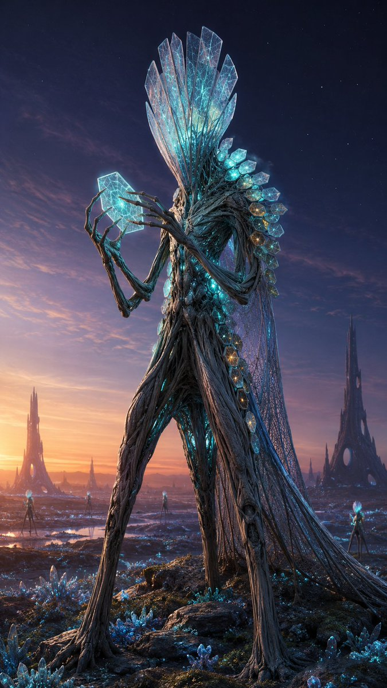

```text
Vertical 9:16 full-body cinematic portrait of a single alien character, the Luminant Archivist, standing on a rocky ridge on the twilight band of an alien planet; the creature has a tall elongated body with three root-like legs forming a stable tripod, lower torso textured like smooth bark and sinew fused together; two long arms with four segmented joints each end in multifingered, tendril-like manipulators gently holding a glowing hexagonal plate; instead of a human head, the upper torso flares into a tall crown of layered translucent plates arranged like a vertical fan, each plate lit from within by faint cyan neural patterns, no face, no eyes, no mouth; along its back and shoulders grow rigid bioluminescent data plates, flat hexagonal organisms clinging like barnacles, softly pulsing in cyan, teal and occasional warm amber; the body is draped in a partial organic mantle made of fibrous membrane and chitin filaments, not clothing but grown; background shows a perpetual dusk sky with a low orange band on one horizon and deep indigo on the opposite, distant silhouettes of hollow spires and tiny other Archivists crossing the landscape; ground covered in reflective glassy lichen and small crystals catching the character's glow; palette of deep indigo, dusty violet, cyan glows and subtle warm amber accents; strong horizon rim light outlining the Archivist's silhouette, subtle backlighting from the bioluminescent plates, gentle atmospheric haze; realistic but slightly painterly rendering, extremely detailed textures on skin, plates and lichen; composed like a high-end sci-fi character poster, vertical 9:16 aspect ratio, full body in frame, centered but with enough headroom and ground visible to feel part of a larger universe.

Negative prompt:
human-like alien, humanoid face, eyes, nose, mouth, jaw, blue-skinned human, elf, armor suit, guns, generic sci-fi soldier, anime style, cartoon, chibi, cyberpunk city, neon signs, medieval fantasy, wings, halos, angel, bad anatomy, random extra limbs, cluttered background, oversaturated colors, strong lens distortion, fisheye, low resolution, blurry details, noisy grain, HUD, UI, readable text, watermark, logo, modern Earth clothing, sneakers, jeans, T-shirt
```


---

## 例 696：Japanese Chinese Food Delivery Flyer

**来源：** [@xc5_](https://x.com/xc5_/status/2048310696686014935) / [awesome-gpt-image-2-prompts](https://github.com/EvoLinkAI/awesome-gpt-image-2-prompts)

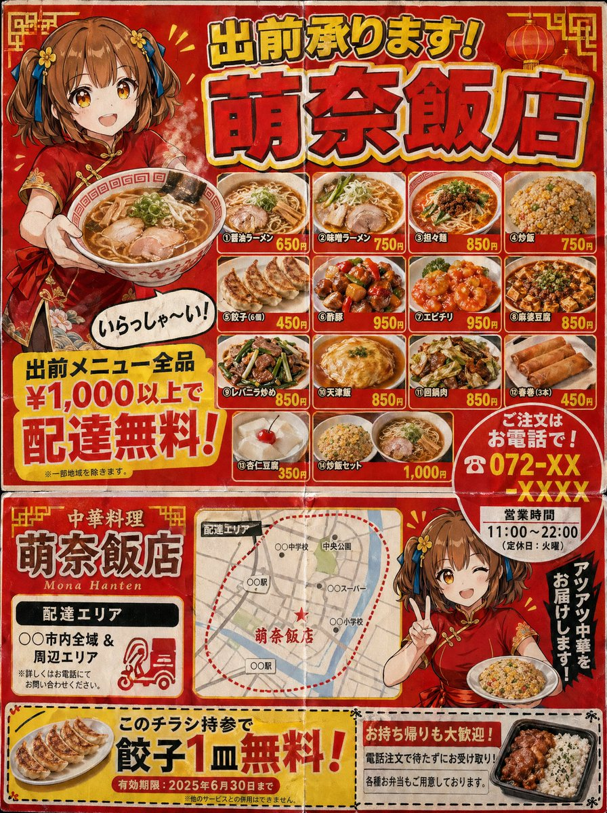

```text
A Japanese neighborhood Chinese restaurant delivery flyer for mailbox posting (3:4 aspect ratio). Designed to look like a double-sided B5 print.

Flyer characteristics (following the grammar of real delivery flyers):
- Flashy red and yellow color scheme.
- Large text at the top: "Delivery Available! {argument name="shop name" default="Mona-Hanten"}" (shadowed Gothic font).
- An illustration of a {argument name="character" default="Chinese girl in a red cheongsam with a brown short bob"} holding ramen and saying "Welcome!" in a speech bubble.
- A menu photo grid (4x3) featuring various dishes: different types of ramen, fried rice, gyoza, sweet and sour pork, shrimp in chili sauce, mapo tofu, liver and leek stir-fry, tenshinhan, twice-cooked pork, spring rolls, annin tofu, and fried rice sets.
- Names and prices for each dish.
- A large yellow banner saying "Free delivery on all menu items over ¥1,000!".
- "Order by phone! ☎ 072-XX-XXXX" emphasized with a red circle.
- Business hours "11:00-22:00 (Closed on Tuesdays)".
- Delivery area map (simple schematic map).
- Coupon (perforated line for clipping): "One free plate of gyoza with this flyer!".

Texture of cheap paper printing. Includes fold marks. Precision that could be mistaken for a real Japanese delivery flyer.
```


---

## 例 697：Pastel Jellyfish Room Goods Poster

**来源：** [@Ayu_AI_0912](https://x.com/Ayu_AI_0912/status/2048309565817766139) / [awesome-gpt-image-2-prompts](https://github.com/EvoLinkAI/awesome-gpt-image-2-prompts)

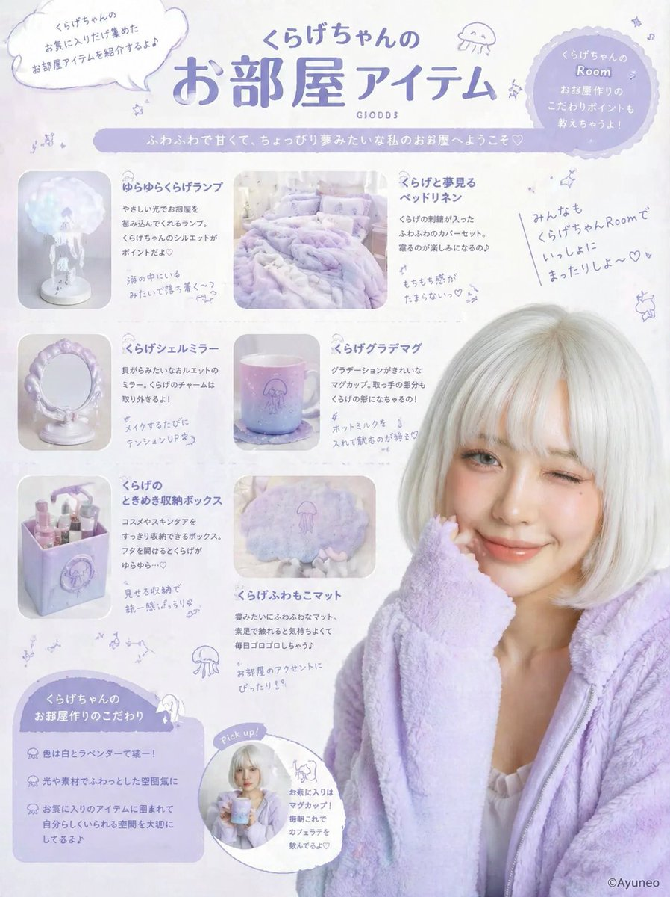

```text
{"type":"pastel lifestyle poster / character room-goods feature sheet","theme":"soft dreamy lavender jellyfish aesthetic","style":"Japanese cute editorial graphic, airy white background, pastel lilac palette, delicate handwritten notes, sparkles and tiny doodles, soft product photography mixed with magazine layout","subject":{"character":{"name":"{argument name=\"character name\" default=\"くらげちゃん\"}","appearance":"young woman with a short platinum-blonde bob haircut, wearing a fluffy pale-lavender zip hoodie over a white inner top, shown from chest up on the lower right, face intentionally obscured with a plain beige rectangle"}},"layout":{"orientation":"vertical poster","background":"clean white with faint pastel doodles of stars, bubbles, tiny jellyfish, and musical notes","sections":[{"title":"header","position":"top","count":5,"labels":["speech bubble intro","main title","small subtitle GOODS","horizontal lavender ribbon tagline","round badge on the top right"]},{"title":"featured goods grid","position":"upper and middle left","count":6,"labels":["ゆらゆらくらげランプ","くらげと夢見るベッドリネン","くらげシェルミラー","くらげグラデマグ","くらげのときめき収納ボックス","くらげふわもこマット"]},{"title":"side handwritten note","position":"upper right","count":1,"labels":["みんなも くらげちゃんRoomで いっしょに まったりしよー♡♡"]},{"title":"room concept box","position":"lower left","count":1,"labels":["くらげちゃんの お部屋作りのこだわり"]},{"title":"pick up circle","position":"lower center-left","count":1,"labels":["Pick up!"]}],"product_images":{"count":6,"items":[{"name":"ゆらゆらくらげランプ","description":"small translucent jellyfish-shaped lamp on a white base, glowing softly in pale blue-lavender"},{"name":"くらげと夢見るベッドリネン","description":"plush pastel-lavender bed with fluffy comforter and pillows, dreamy cozy bedroom styling"},{"name":"くらげシェルミラー","description":"small tabletop mirror with a puffy shell-like pastel-lilac frame and rounded base"},{"name":"くらげグラデマグ","description":"ceramic mug with lavender-to-pink gradient and a simple jellyfish illustration"},{"name":"くらげのときめき収納ボックス","description":"pastel storage box holding cosmetics and small bottles, decorated with a jellyfish emblem"},{"name":"くらげふわもこマット","description":"small fluffy cloud-like or jellyfish-like mat in pale lavender and white"}]},"text_elements":{"main_title":"{argument name=\"headline text\" default=\"くらげちゃんの お部屋アイテム\"}","badge_text":"くらげちゃんの Room お部屋作りの こだわりポイントも 教えちゃうよ。","tagline":"ふわふわで甘くて、ちょっぴり夢みたいな私のお部屋へようこそ♡","speech_bubble":"くらげちゃんの お気に入りだけ集めた お部屋アイテムを紹介するよ♪","concept_points":{"count":3,"items":["色は白とラベンダーで統一!","光が集まるふわっとした空間に","お友達入りのアイテムに囲まれて 自分らしくいられる空間を大切にしてるよ♪"]},"product_blurbs":"each product has a short handwritten Japanese description in a cute casual font beside or below the image"},"composition":"the poster is left-heavy with product cards and text, while the character portrait occupies the lower right third, slightly overlapping the layout","color_palette":{"count":5,"colors":["white","pastel lavender","soft lilac","pale gray-violet","touches of pastel blue-pink gradient"]},"rendering_notes":"keep everything very soft, feminine, and cozy; rounded corners on all product photos; mix of bold Japanese headline typography and light handwritten annotations; subtle shadows; clean high-key lighting; social-media-ready editorial collage aesthetic"}
```


---

## 例 698：Neon Nike Lumina Ad Poster

**来源：** [@AlwaveNazca](https://x.com/AlwaveNazca/status/2048147643809865950) / [awesome-gpt-image-2-prompts](https://github.com/EvoLinkAI/awesome-gpt-image-2-prompts)

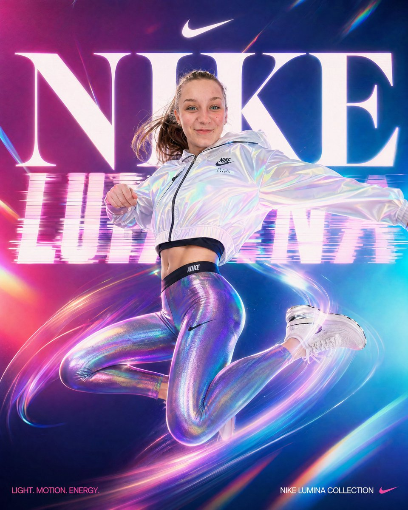

```text
A high-energy vertical Nike fashion campaign poster featuring a single athletic young woman mid-jump against a futuristic neon studio background. She is captured in a dynamic airborne pose with one knee bent up, the other leg folded back, one arm extended outward and the other bent near her chest, conveying motion and power. Her face is obscured by a clean rectangular blur block centered over the face. She wears a cropped iridescent white hooded windbreaker with a black zipper and small Nike logo on the chest, holographic metallic lavender-blue leggings with a subtle Nike swoosh on the thigh, a black branded waistband visible above the leggings, and white chunky Nike sneakers. Her brown hair is tied in a high ponytail flying outward with the jump. Behind her, enormous glowing white serif letters spell “NIKE” across the upper half, with a small white Nike swoosh centered above the word. Across the middle background, the phrase “LUMINA” appears once in wide bold glowing letters with a horizontal glitch and scanline distortion effect, partially obscured by the model. The color palette is saturated magenta, violet, cyan, and electric blue with strong bloom, glossy highlights, lens flares, and chromatic aberration. Add sweeping circular light trails wrapping around the model’s legs and body, suggesting speed and motion. The overall style is premium sportswear advertising, ultra-polished, cinematic, high contrast, hyperreal retouching, crisp product detail, dramatic rim lighting, and a luminous holographic aesthetic. Place 2 small text lines at the bottom: bottom left reads {argument name="tagline text" default="LIGHT. MOTION. ENERGY."}, bottom right reads {argument name="collection name" default="NIKE LUMINA COLLECTION"} followed by a small Nike swoosh. Include exactly 3 visible Nike swooshes total: 1 above the large NIKE headline, 1 on the jacket chest, and 1 on the leggings.
```


---

## 例 699：Editorial Osaka Six Sweatshirt Ad

**来源：** [@_LaurentB](https://x.com/_LaurentB/status/2048126606313464040) / [awesome-gpt-image-2-prompts](https://github.com/EvoLinkAI/awesome-gpt-image-2-prompts)

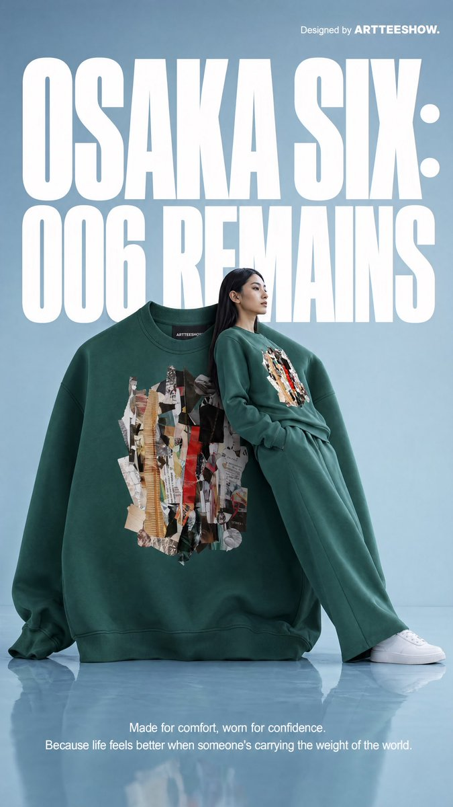

```text
A clean editorial fashion advertisement poster on a pale powder-blue studio background with a glossy reflective floor. The composition is vertical and minimal, dominated by oversized bold white condensed sans-serif typography in the background reading “OSAKA SIX:” on the top line and “006 REMAINS” below, filling most of the upper half behind the subject. In the top right corner, small white branding text reads “Designed by ARTTEESHOW.” Centered in the lower middle is an oversized forest-green crewneck sweatshirt standing upright like a sculptural object, with soft heavy cotton fabric, dropped shoulders, extra-long sleeves pooled on the floor, and a small black neck label that reads ARTTEESHOW. On the chest of the sweatshirt is a large abstract collage print made from torn paper fragments in beige, tan, black, gray, white, and vivid red, arranged vertically like layered scraps. Leaning against the right side of the giant sweatshirt is a slim female fashion model with long straight black hair, wearing a matching {argument name="sweatshirt color" default="forest green"} sweatshirt and relaxed wide-leg sweatpants with clean white low-top sneakers. She is posed in profile with a calm detached editorial attitude, one hand in her pocket, her body reclining diagonally against the giant garment, legs extended forward; her face is obscured by a soft rectangular blur for an anonymous art-fashion look. The smaller worn sweatshirt has the same abstract torn-paper collage graphic centered on the chest. At the bottom center, add 2 lines of small white copy text: “Made for comfort, worn for confidence.” and “Because life feels better when someone’s carrying the weight of the world.” The image should feel like a premium conceptual streetwear campaign from the early 1990s reimagined as contemporary luxury advertising, with crisp studio lighting, soft shadows, subtle floor reflections, precise product focus, surreal scale contrast between the oversized sweatshirt and the model, and a polished magazine-poster aesthetic.
```


---

## 例 700：Luxury poster for fictional AI ad printer

**来源：** [@nijisora_yuma](https://x.com/nijisora_yuma/status/2049462065639858687) / [awesome-gpt-image-2-prompts](https://github.com/EvoLinkAI/awesome-gpt-image-2-prompts)


```text
縦型3:4の、高級商業ポスターを制作してください。

テーマは、架空の新商品広告です。商品は「BRAND PRESS 01（ブランドプレス・ゼロワン）」という、Pollo AIを搭載した架空の広告ポスター生成プリンターです。

この商品は、まだ存在しないブランド名・商品ジャンル・世界観・ターゲット層を入力すると、Pollo AIがコピー、ビジュアル、レイアウトまで完成された商業広告ポスターを自動生成し、高精細な印刷物としてその場で出力する未来型プリンターです。単なるAIサービスの概念広告ではなく、実際に販売されていそうな架空商品の広告として成立させてください。

メインコンセプト: 「まだないブランドに、最初の一目惚れを。」

商品ビジュアル: 画面中央に実物の商品「BRAND PRESS 01」を大きく配置。未来型の高級プロ用印刷デバイスとして、黒い金属筐体、シルバーのエッジ、透明カバー、青白く発光するAIコア、精密な印刷ヘッド、ローラー、タッチパネル、排紙スロット、ポスター受けトレイを備える。排紙スロットから、架空の高級香水ブランド広告ポスターが紙として大きく出力されている構図。

構図: ややローアングル、斜め45度。背景は暗いネイビーから黒の高級広告制作スタジオ。映画的でドラマチックな高級プロダクト広告。

広告レイアウト: 上部に大きなキャッチコピー、中央にプリンター本体と排出中のポスター、右側に機能説明、左下に価格と発売日、下部にCTA。

入れる文字: 「まだないブランドに、最初の一目惚れを。」 / BRAND PRESS 01 / 「Pollo AI搭載・広告ポスター生成プリンター」 / 「名前だけのアイデアを、完成された商業ポスターとして出力。」 / 「構想、コピー、ビジュアル、印刷まで。1台で。」
```


---

## 例 701：Urban fruit juice ad poster

**来源：** [@AIwithSarah_](https://x.com/AIwithSarah_/status/2049452842931630202) / [awesome-gpt-image-2-prompts](https://github.com/EvoLinkAI/awesome-gpt-image-2-prompts)

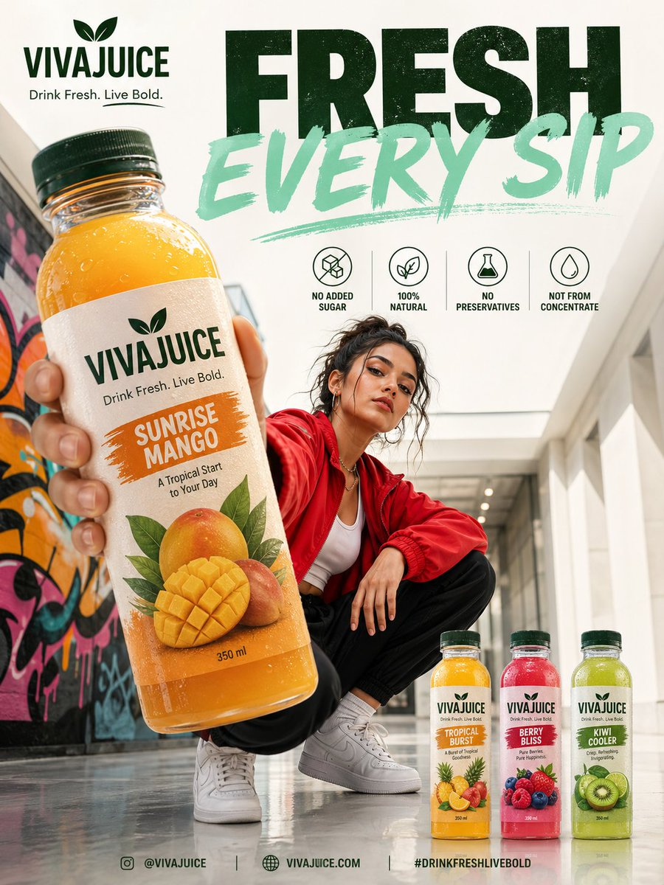

```text
Create a premium modern beverage advertisement poster in a vertical 3:4 format featuring a stylish young female model crouching confidently in a bright urban indoor hallway with colorful graffiti wall art on one side and clean minimal architecture on the other. In the foreground, a giant realistic fruit juice bottle is held toward the camera in forced perspective, with fictional branding like “VIVAJUICE”. Add brand logo, tagline, huge bold overlapping typography, four icon-based feature badges, and three smaller bottle variants at bottom right. Use soft natural lighting mixed with commercial studio polish, realistic shadows, shallow depth of field, glossy floor reflections, and a premium energetic eCommerce campaign aesthetic.
```


---

## 例 702：Watermelon Lime Beverage Ad Poster

**来源：** [@ShamiWeb3](https://x.com/ShamiWeb3/status/2053430685399232756) / [awesome-gpt-image-2-prompts](https://github.com/EvoLinkAI/awesome-gpt-image-2-prompts)

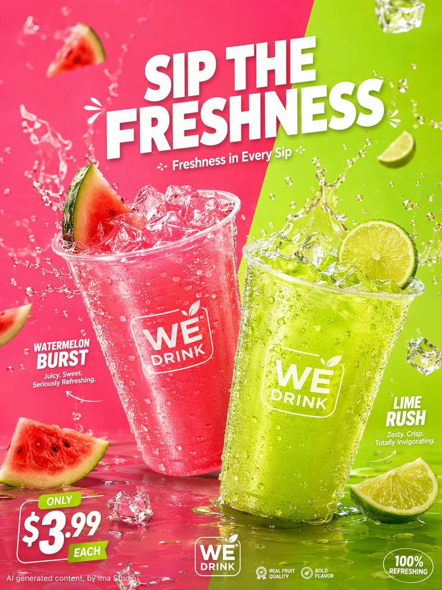

```text
Create a premium modern beverage promotional poster for We Drink.

TOPIC:

Watermelon Pink + Lime Green Refresh Campaign

STYLE & ART DIRECTION:
Modern energetic beverage advertising
Youthful commercial branding
Split-color background composition
Bright refreshing summer aesthetic
Minimal dynamic layout
High-contrast drink advertisement style
Instagram-ready beverage promotion
Premium fast-moving commercial design

MAIN SUBJECT:

Two large ultra-realistic cold beverages positioned prominently in the center.

Drink 1:

A vibrant watermelon pink drink in a transparent plastic cup with visible ice cubes, condensation droplets, and a fresh watermelon garnish.

Drink 2:

A bright lime green drink in a matching transparent cup with visible ice cubes, condensation droplets, and a lime slice garnish.

Additional elements:

Floating ice cubes around the composition
Dynamic water splash effects
Soft realistic shadows beneath each cup
Premium glossy liquid textures
Tiny fruit slices suspended in motion

LAYOUT & COMPOSITION:
Diagonal split-color background
Left side: watermelon pink gradient
Right side: lime green gradient
Large bold headline at the top center: "SIP THE FRESHNESS"
Two hero drinks centered prominently
Product descriptions placed beside each cup
Promotional price section near the bottom-left
We Drink logo and small branding elements at the bottom
Floating ice cubes and splash effects around the drinks
Spacious modern commercial hierarchy

TEXT & TYPOGRAPHY:
Bold oversized sans-serif typography
Youthful rounded commercial fonts
White typography accents
Supporting text: "Watermelon Burst" and "Lime Rush"
Promotional price: Only $3.99
Tagline: "Freshness in Every Sip"

DEPTH & LIGHTING:
Soft glossy studio lighting
Bright refreshing reflections
Realistic beverage highlights
Floating commercial depth
Soft ambient shadows
Premium condensation texture lighting

EXTRA DESIGN DETAILS:
Floating ice cubes
Water splash particles
Glossy gradients
Modern promotional badges
Fruit slices and droplets
Minimal energetic decorative elements

COLOR PALETTE:
Watermelon Pink (#FF4F87)
Lime Green (#A8FF2A)
White typography
Soft transparent highlights

QUALITY:

Ultra-realistic beverage photography, premium advertising composition, Behance-quality commercial poster, high-resolution, sharp focus, photorealistic textures, professional brand campaign aesthetic.
```


---

## 例 703：Luxury Fragrance Campaign Portrait

**来源：** [@amynys](https://x.com/amynys/status/2054340951678587051) / [awesome-gpt-image-2-prompts](https://github.com/EvoLinkAI/awesome-gpt-image-2-prompts)

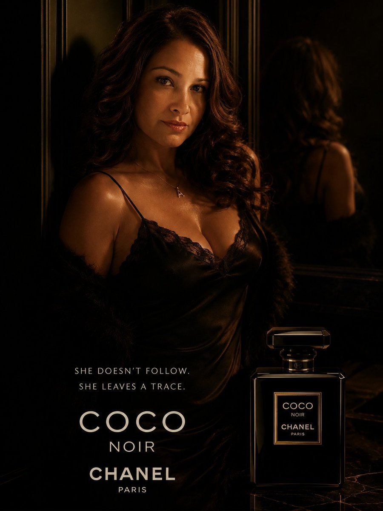

```text
Transform the uploaded portrait into a luxurious cinematic fragrance poster inspired by the dark seductive elegance of a high-fashion perfume campaign. Preserve her exact facial features, warm skin tone, confident expression, wavy brunette hair, and recognizable identity. Style her as a mysterious femme fatale with soft glossy lips, luminous skin, subtle smoky eyes, and an intense captivating gaze.

Dress her in a black satin slip dress with delicate lace trim and a glamorous faux fur wrap slipping off her shoulders. Place her inside a moody Parisian-inspired luxury interior with black reflective walls, gold rim lighting, deep shadows, cinematic contrast, and sensual ambient lighting. Add elegant reflections and depth for a premium editorial look.

Include a sleek black perfume bottle inspired by a luxury noir fragrance aesthetic near the foreground. Use refined minimalist typography in a luxury fashion-ad style with dramatic spacing and premium composition. Add a tagline such as: “She doesn’t follow. She leaves a trace.”

The overall mood should feel seductive, mysterious, powerful, feminine, cinematic, timeless, and ultra-luxurious — like a Chanel Coco Noir campaign directed by a Hollywood cinematographer. High detail, photorealistic skin texture, glossy highlights, rich blacks, warm gold accents, magazine-quality fashion photography, 8K luxury editorial finish.
```


---

## 例 704：Fast Food Hero Poster

**来源：** [@ShamsAmin56](https://x.com/ShamsAmin56/status/2054238324198625780) / [awesome-gpt-image-2-prompts](https://github.com/EvoLinkAI/awesome-gpt-image-2-prompts)

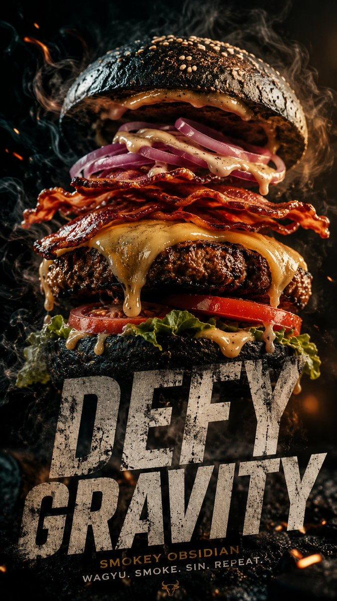

```text
A cinematic 9:16 vertical composition featuring a gourmet "Smokey Obsidian" burger.
WHAT: A towering burger with a charcoal brioche bun, thick Wagyu beef patty with visible sear marks, melting aged gruyère dripping like lava, and crispy maple-glazed bacon.
FEEL: An atmosphere of "Urban Indulgence." Dark, moody lighting with a single warm amber spotlight. Wisps of real hickory smoke curl around the bun. The texture is hyper-realistic you can see the salt crystals on the crust and the moisture on the heirloom tomato.
SHOW: The burger is captured in a "deconstructed gravity" moment the top bun is slightly hovering, revealing the internal layers of house-made aioli and pickled red onions.
TYPOGRAPHY: Integration of ultra-bold, distressed sans-serif typeface overlapping the bottom third of the frame. The text reads "DEFY GRAVITY" in a raw, concrete-texture finish.
TECHNICAL: 4k resolution, macro photography style, shallow depth of field, neon-noir color grading (deep blacks, warm ambers, and subtle teal highlights).
```


---

## 例 705：Matcha Granola Ad Poster

**来源：** [@Sairah_0](https://x.com/Sairah_0/status/2054111354202779672) / [awesome-gpt-image-2-prompts](https://github.com/EvoLinkAI/awesome-gpt-image-2-prompts)

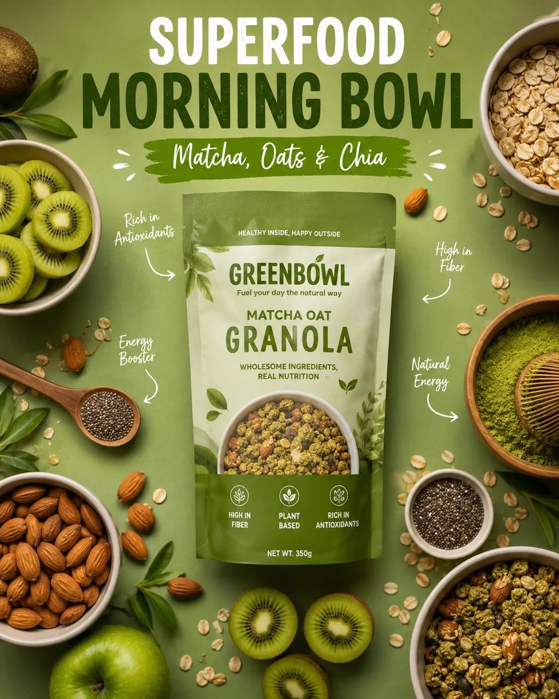

```text
(Matcha Granola Ad)

Ultra-realistic premium food advertisement poster for a healthy breakfast granola brand, centered matte pouch packaging labeled “Matcha Oat Granola”, green monochrome aesthetic, flat lay composition, soft studio lighting, vibrant matcha green background, surrounded by kiwi slices, almonds, oats, chia seeds, matcha powder bowl, granola bowls, scattered ingredients, clean modern typography headline “SUPERFOOD MORNING BOWL”, handwritten annotation arrows with wellness benefits, luxury organic branding, natural shadows, high-end commercial food photography, minimal yet detailed layout, symmetrical composition, sharp focus, Instagram ad style, 8k detail, healthy lifestyle marketing design.

Prompt : (Berry Yogurt Cereal Ad)

High-end commercial breakfast cereal advertisement, pastel pink aesthetic with centered standing pouch packaging labeled “Berry Yogurt Crunch Cereal”, surrounded by strawberries, blueberries, yogurt bowls, milk jug, crunchy granola, scattered berries and grains, soft natural lighting, vibrant fresh mood, modern bold typography headline “START FRESH EVERY MORNING”, handwritten callout arrows and benefit text, realistic food textures, luxury supermarket packaging design, clean flat lay composition, soft shadows, premium branding, glossy vibrant colors, ultra-detailed food photography, Instagram/Facebook ad campaign style, healthy breakfast concept, 8k realistic render.

Prompt : (Chocolate Protein Muesli Ad)

Premium protein breakfast food advertisement poster featuring centered pouch package labeled “Chocolate Protein Muesli”, rich brown monochrome theme, surrounded by dark chocolate chunks, almonds, oats, banana slices, milk jug, muesli bowls, scattered ingredients, dramatic warm studio lighting, bold modern headline typography “HIGH PROTEIN BREAKFAST FUEL”, handwritten annotation arrows highlighting benefits, luxury fitness breakfast branding, realistic textures, symmetrical flat lay composition, high-end commercial food photography, strong contrast, healthy energy concept, clean packaging mockup design, ultra-realistic 8k advertising render, cinematic food styling.
```


---

## 例 706：Tropical Product Ad Poster

**来源：** [@AIwithAliya](https://x.com/AIwithAliya/status/2054553101236080714) / [awesome-gpt-image-2-prompts](https://github.com/EvoLinkAI/awesome-gpt-image-2-prompts)

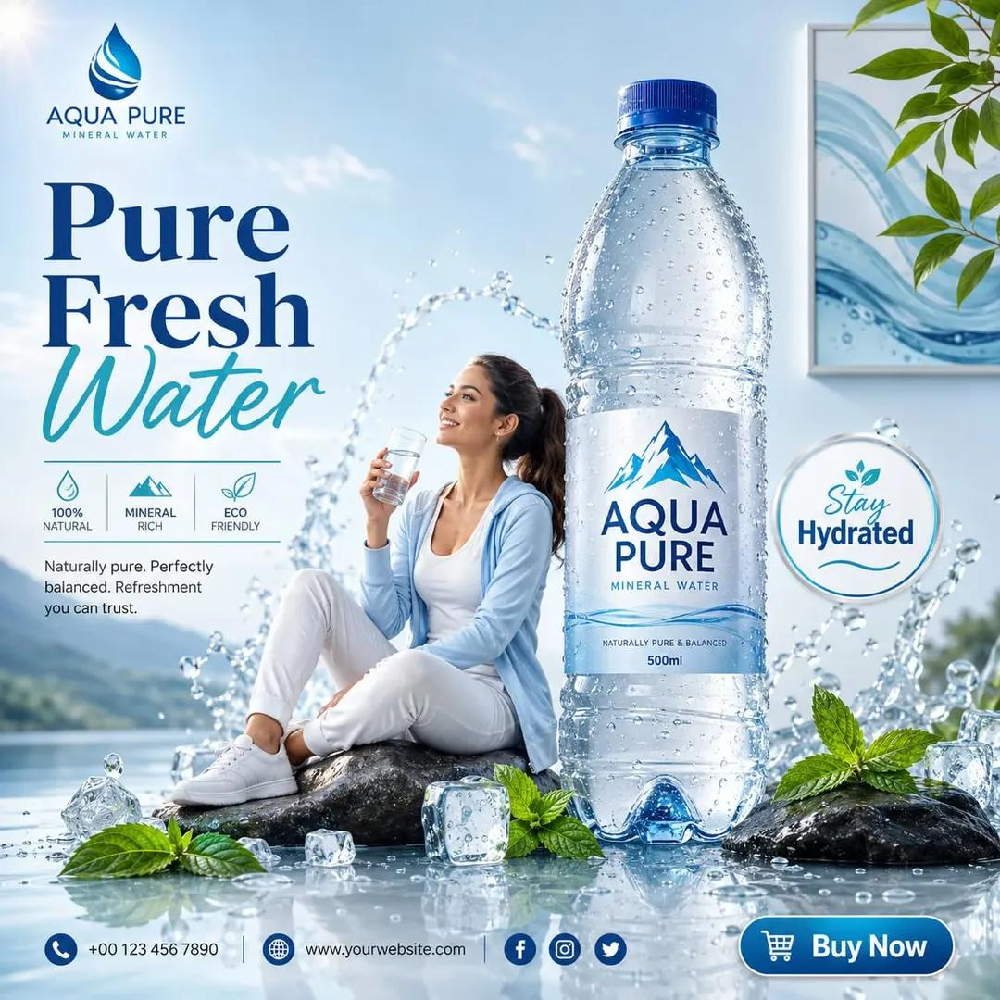

```text
GPT Image 2 Prompt Create a creative commercial advertising poster for [PRODUCT NAME], a [PRODUCT TYPE], inspired by vibrant tropical product campaigns. Place the product as a large hero object on the center-right with realistic glossy reflections, sharp label details, and premium lighting. Add a stylish model sitting beside or slightly in front of the product, naturally interacting with it by [MODEL ACTION]. The model should look [MOOD], wearing [OUTFIT STYLE], and should not cover the product label.
```


---

## 例 707：Foam Clogs Ad Poster

**来源：** [@Shinning1010](https://x.com/Shinning1010/status/2055688162333401470) / [awesome-gpt-image-2-prompts](https://github.com/EvoLinkAI/awesome-gpt-image-2-prompts)

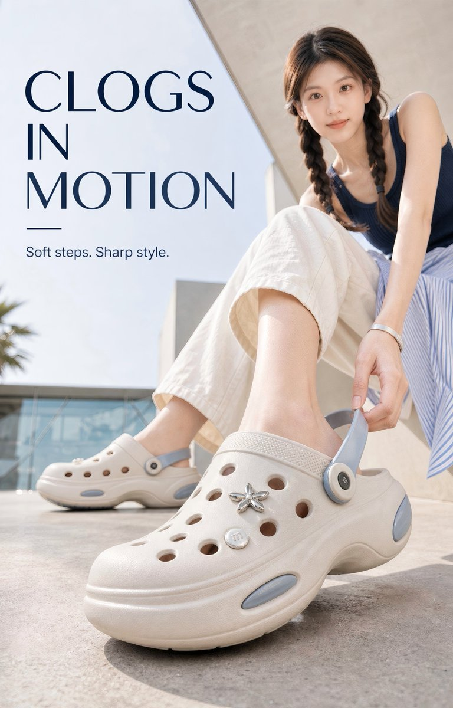

```text
Create a premium vertical 4:5 commercial advertising poster for perforated foam clogs, making the shoes visually central, clean, and instantly legible. Use the uploaded portrait photo only for the woman’s appearance and hairstyle so the final result keeps a similar identity. Preserve face shape, facial features, hairstyle, skin tone, body proportion, and overall temperament only; do not copy the original expression, clothing, background, lighting, or pose. Style her in refined modern summer campaign wardrobe with effortless premium casual energy. Composition: a confident lifestyle fashion portrait with the woman seated or stepping forward in an airy sunlit architectural setting, the clogs clearly visible in the foreground and on-foot, showing their rounded shape, ventilation holes, heel strap, soft matte foam texture, and lightweight comfort. Atmosphere: elevated urban resort, fresh air, clean shadows, soft natural daylight, polished commercial photography, subtle water or glass reflections, crisp product detail, realistic skin texture, premium but approachable. Poster headline: “STEP INTO AIR”. Subtitle: “Lightweight comfort for every city moment.” Use clean modern typography with generous spacing, placed in reserved negative space without covering the face or shoes. No watermark.

Negative Prompt:
watermark, random text, misspelled headline, garbled letters, logo distortion, low quality, blurry, plastic skin, extra fingers, deformed hands, bad anatomy, overexposed highlights, unrealistic lighting, oversmoothed skin, cheap e-commerce look, AI-generated look, warped clog holes, incorrect shoe structure, melted foam texture, distorted heel strap, mismatched pair, hidden product, product cropped out, cluttered background
```


---

## 例 708：Adidas Futuristic Drop Ad Poster 9:16

**来源：** [@iamaiistudio](https://x.com/iamaiistudio/status/2065133774413906004) / [awesome-gpt-image-2-prompts](https://github.com/EvoLinkAI/awesome-gpt-image-2-prompts)

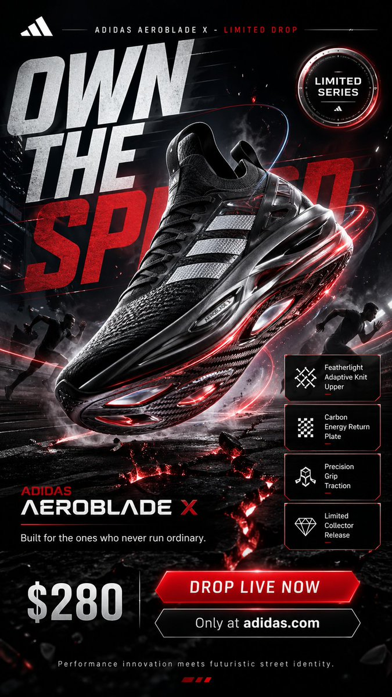

```text
Full prompt:

Design a striking premium vertical advertising poster (9:16 format) for a fictional ultra-limited Adidas sneaker called "ADIDAS AEROBLADE X - LIMITED DROP". The creative direction should feel like a world-class agency campaign — original, futuristic, visually explosive.

Main visual:
A single hero sneaker floating center-frame, captured at a dramatic low angle as if levitating above a dark obsidian running track split by glowing energy cracks. The shoe combines knit mesh, sculpted foam, translucent panels, reflective stripes, and a carbon-fiber sole plate. Neon light trails swirl around it like captured speed. Particles and mist add motion and intensity. Background features faint silhouettes of elite sprinters frozen mid-dash, blurred enough to keep focus on the shoe.

Color palette:
Matte black, electric red, silver, deep charcoal, with subtle neon blue highlights.

Typography and copy (sharp, clean, strong visual hierarchy):
Main headline: "OWN THE SPEED"
Product title: "ADIDAS AEROBLADE X"
Subheadline: "Built for the ones who never run ordinary."
Feature callouts in elegant boxed layout:
- "Featherlight Adaptive Knit Upper"
- "Carbon Energy Return Plate"
- "Precision Grip Traction"
- "Limited Collector Release"
Price: "$280"
Primary CTA: "DROP LIVE NOW"
Secondary CTA: "Only at
Footer text: "Performance innovation meets futuristic street identity."

Layout:
Bold oversized headline partially integrated into background. Product name near shoe in refined premium placement. Feature callouts stacked vertically along one side. Add a "LIMITED SERIES" badge. The composition blends luxury sports campaign with futuristic editorial design.

Style: Ultra-detailed hyper-realistic product photography, cinematic studio lighting, premium advertising aesthetics, sharp focus, rich textures, subtle atmosphere, dynamic motion energy, high-end commercial poster feel. Aspect ratio 9:16.

#AIart #GPTImage2
```


---

## 例 709：Luxury Linen Texture Editorial Poster

**来源：** [@ZephyraLeigh](https://x.com/ZephyraLeigh/status/2065123985713700925) / [awesome-gpt-image-2-prompts](https://github.com/EvoLinkAI/awesome-gpt-image-2-prompts)

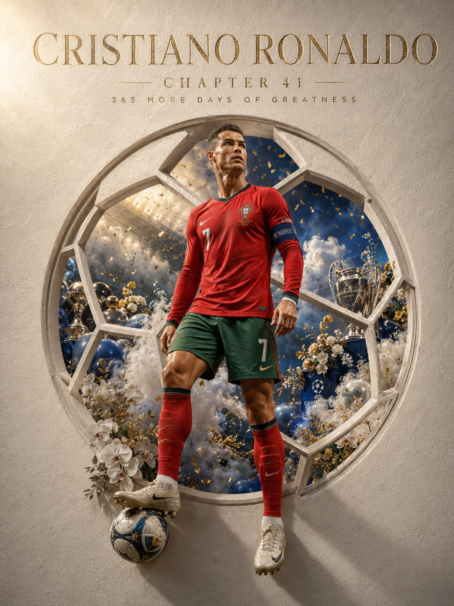

```text
GPT Image 2 on ChatGPT 🪄

PROMPT ⬇

A photorealistic luxury editorial poster, 3:4 portrait ratio. Full frame covered in premium off-white Italian linen paper wall texture — warm ivory tone, subtle grain, ultra-tactile surface. Center of wall features a large precision-carved football-shaped archway with deep architectural relief — visible carved edges, realistic inner shadow depth, sculptural beveled detailing, premium craftsmanship aesthetic.
Inside the carved football frame: cinematic stadium atmosphere — deep blue and white luxury smoke trails drifting elegantly, gold and silver championship confetti cascading, white orchid and rose floral arrangements with dark green foliage accents, premium celebration balloons in royal blue and pearl white, championship trophy silhouettes subtly embedded in background haze. Atmosphere: elite sports gala, UEFA Champions League victory night energy.

Subject: Cristiano Ronaldo, full figure, standing powerfully inside the carved frame. Wearing Portugal's premium crimson and green national kit — authentic jersey fabric with realistic textile folds, fitted athletic shorts, premium Adidas/Nike high-performance football boots. Iconic athletic build — broad shoulders, defined physique, elite footballer anatomy. Signature confident expression — sharp jaw, focused dark eyes, short textured dark hair, photorealistic skin texture with natural pore detail.

Championship celebration pose — chest slightly forward, chin raised, one hand slightly relaxed, football resting precisely at his right boot.

3D Breakout Effect: Face, right shoulder, right arm below elbow, and right football boot extend realistically beyond the carved frame boundary onto the wall surface — casting soft natural drop shadows onto the paper texture. Depth of field creates believable dimensional layering.
Lighting: Premium stadium tungsten lighting blended with warm golden-hour cinematic sunlight entering from the upper left. Soft white rim light wrapping around shoulders and jawline. Subtle fill light on the wall from the right. No harsh overexposure, no fake neon — only warm, editorial luxury light grading.

Wall Typography — Clean Minimalist Luxury Layout:

CRISTIANO RONALDO — large, bold, high-end serif font (Didot or Bodoni style), embossed gold foil effect, positioned above the carved frame

CHAPTER 41 — medium weight elegant tracking, warm bronze metallic tone, centered below the name

365 MORE DAYS OF GREATNESS — refined thin uppercase sans-serif, spaced wide, cream-gold color, placed below Chapter line
Technical: Ultra-photorealistic rendering, 8K detail sharpness, professional commercial sports photography quality, luxury magazine cover art direction, natural color grading — warm ivory + deep blue + gold palette, authentic shadow physics, zero AI artifacts, correct human anatomy, no extra limbs, no tree shadows, no distorted proportions, award-winning editorial masterpiece quality.
```


---

## 例 710：可口可乐百事雪碧品牌 KV 对比

**来源：** [@liyue_ai](https://x.com/liyue_ai/status/2065039304175538382) / [awesome-gpt-image-2-prompts](https://github.com/EvoLinkAI/awesome-gpt-image-2-prompts)

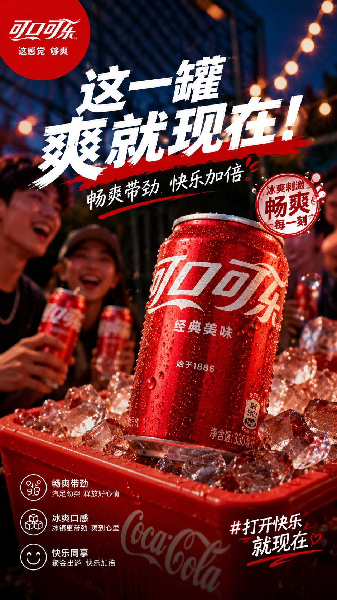

```text
品牌 KV 海报系列。使用统一提示词框架，针对不同饮料品牌调整视觉情绪色彩：可口可乐 → 热烈红色聚会感；百事可乐 → 年轻蓝色潮流感；雪碧 → 清爽绿色柠檬感。同一结构展现不同品牌 DNA。3 张对比输出。
```


---

## 例 711：SPLASH Liquid Logo Fashion Poster

**来源：** [@iamaiistudio](https://x.com/iamaiistudio/status/2065979523229975021) / [awesome-gpt-image-2-prompts](https://github.com/EvoLinkAI/awesome-gpt-image-2-prompts)

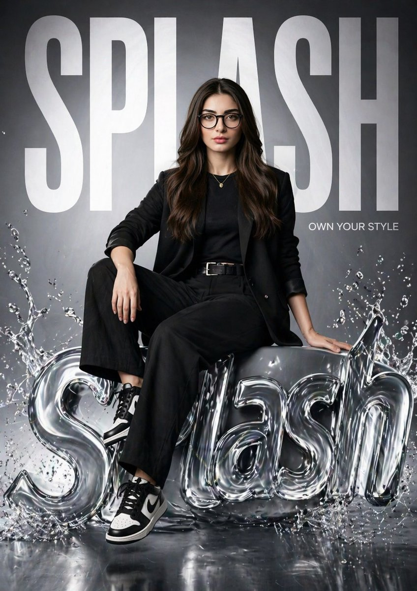

```text
Hyper-realistic fashion campaign poster for brand "SPLASH". A girl (matching the reference photo exactly, same face) seated confidently atop a gleaming, water-like 3D SPLASH logo surrounded by dynamic water splash effects. Editorial pose: one leg loose, one bent.

Enormous bold "SPLASH" typography fills the background, partially behind her. Small tagline reads: "Own Your Style."

Clothing: contemporary black streetwear (blazer, fitted top, trousers, sneakers).

Lighting: cinematic studio setup with soft key light and rim light, glossy reflections on the liquid logo.

Style: luxury fashion campaign aesthetic (Zara / H&M), polished clean environment.

Shot with an 85mm lens, shallow depth of field, 8K resolution, ultra-detailed, photorealistic.
```


---

## 例 712：OBSIDIAN Coffee Brand Campaign

**来源：** [@iamaiistudio](https://x.com/iamaiistudio/status/2066523210808484228) / [awesome-gpt-image-2-prompts](https://github.com/EvoLinkAI/awesome-gpt-image-2-prompts)

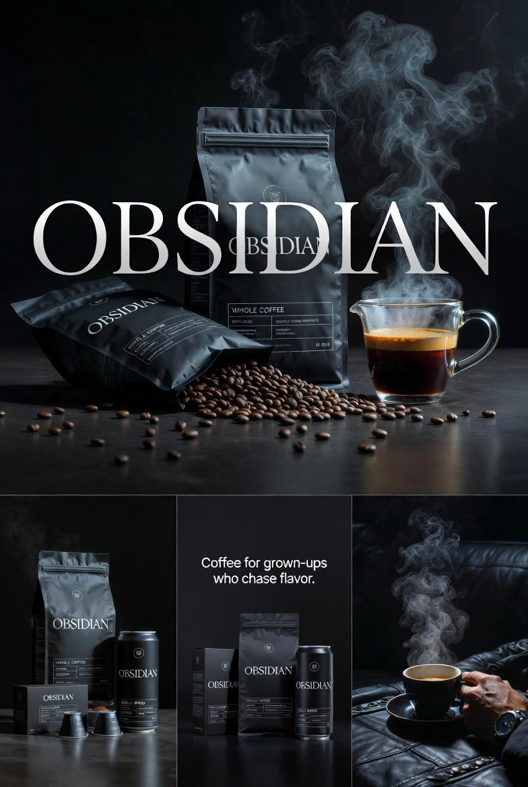

```text
Generate four cohesive high-end realistic editorial visuals for OBSIDIAN coffee brand. Cinematic, dark, mature aesthetic inspired by luxury sportswear and premium coffee advertising. Studio lighting that's dramatic yet controlled, photorealistic textures, clean compositional layout. Shot 1: Hero brand poster featuring 'OBSIDIAN' lettering with an artful coffee display — steam rising, beans scattered. Shot 2: Full product range — coffee bags, cans, and capsules arranged together. Shot 3: Tight packaging detail with tagline 'Coffee for grown-ups who chase flavor.' Shot 4: Lifestyle close-up of a steaming cup. Ultra-polished finish, crisp realistic materials, unified brand identity, no fantastical or surreal elements
```


---

## 例 713：STARKIDZ Cosmic Telescope Ad

**来源：** [@Strength04_X](https://x.com/Strength04_X/status/2069448983651787177) / [awesome-gpt-image-2-prompts](https://github.com/EvoLinkAI/awesome-gpt-image-2-prompts)

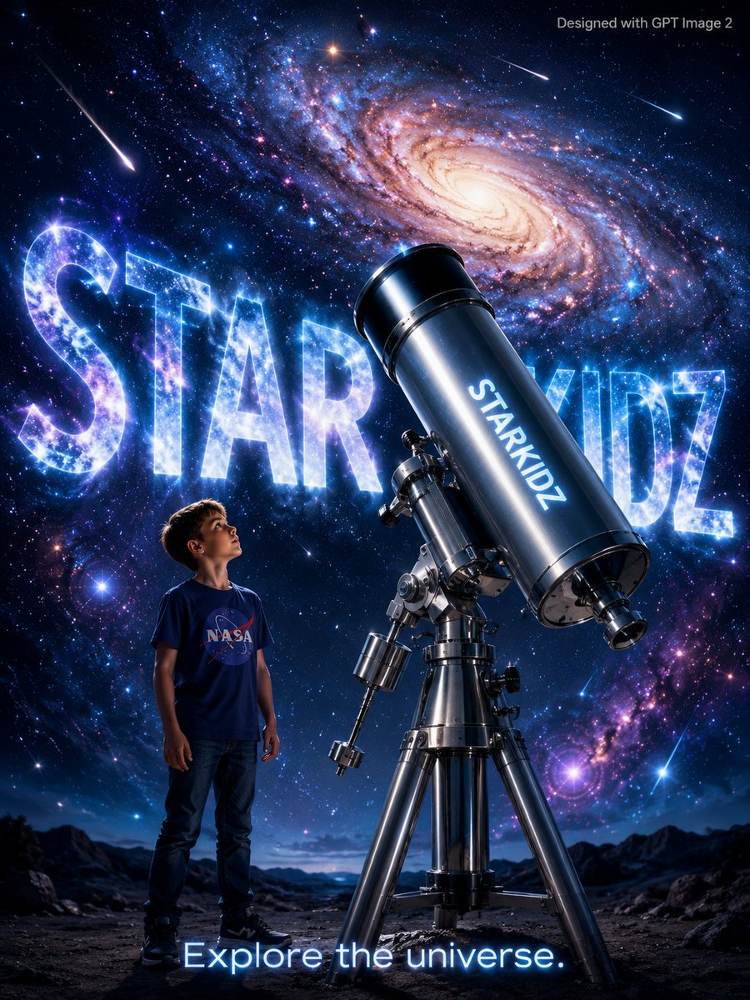

```text
A magical science advertisement poster. A curious young boy age 10 in a NASA tshirt gazes up in total wonder beside a giant shiny silver telescope 3x his height pointed toward a breathtaking galaxy view above, "STARKIDZ" written in glowing white font on the telescope body. Deep dark space background with milky way galaxy colorful nebula clouds and shooting stars. Glowing cosmic typography "STARKIDZ" in white and blue filling the background. Tagline bottom: "Explore the universe." Small text top-right corner reads "Designed with GPT Image 2" in grey. Photorealistic, magical kids science product commercial, dramatic deep space galaxy lighting.
```


---

## 例 714：Artistic Memory Collage Poster

**来源：** [YouMind](https://youmind.com/prompts/artistic-memory-collage-poster-32438)

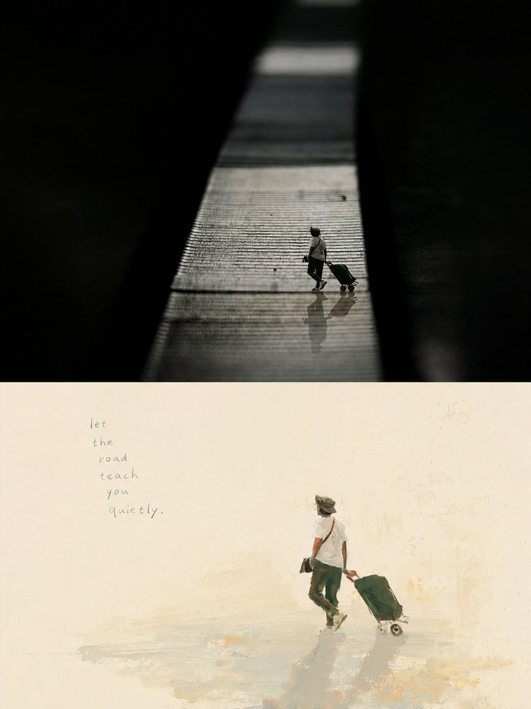

```text
Please transform each photo I upload into an individual high-end design poster with a 
3:4
 vertical composition, following a dual-layer logic: the top half is realistic photography, while the bottom half is a painterly distillation of the original image's core imagery, creating an echo between reality and memory.
The top half retains the original photo, maintaining subject identity, structure, posture, texture, and natural lighting, with subtle high-end photographic toning to evoke an independent art magazine or exhibition quality. The environment can be naturally extended to fit the frame, but the subject must not be distorted.
The bottom half extracts the most recognizable **subject, outline, and narrative relationships** from the photo, reimagining only the most memorable information. Avoid full restoration of the scene; instead, focus on a single core subject with minimal narrative details, like a reorganized visual memory.
The background of the bottom half should use **extremely light colors and large areas of negative space**. The background color should intelligently match the photo's temperature (e.g., warm white or cool off-white) to feel clean and quiet. This blank space should convey air, distance, and emotion.
Emphasize **visual weight, negative space, and tension** in the composition. The subject can be offset or suspended to create beauty through contrast and scale. If the most moving part of the original photo is the distance between two objects, prioritize that relationship over individual detail.
The painting style should use relaxed, naive artistic textures like **gouache, acrylic, and oil pastel**, with summary color blocks and hand-drawn outlines. Shapes can be slightly awkward or exaggerated, but the key posture must be accurate. Retain hand-painted traces like pauses and visible brushstrokes.
The palette should be a **warm, bright, and naive artist's color scheme** extracted from the photo. Use warm blocks like 
cream yellow, apricot, coral pink, or dusty rose
 contrasted with 
sky blue, mint green, or sage
. Colors don't have to be realistic but must be harmonious, avoiding heavy Morandi grays or high-saturation digital hues.
Text should be minimal and meaningful, generated based on the theme or emotion of the photo rather than fixed titles. Text can naturally enter the white space, appearing slightly hand-written or misplaced to maintain an artistic feel without looking like a mechanical advertisement.
The overall goal is **minimal subjects, large white space, and warm hand-drawn aesthetic with clear visual metaphors**, resembling an independent publication hand-painted by an artist.
```


---

## 例 715：Artistic Memory Sticker Poster

**来源：** [YouMind](https://youmind.com/prompts/artistic-memory-sticker-poster-32436)

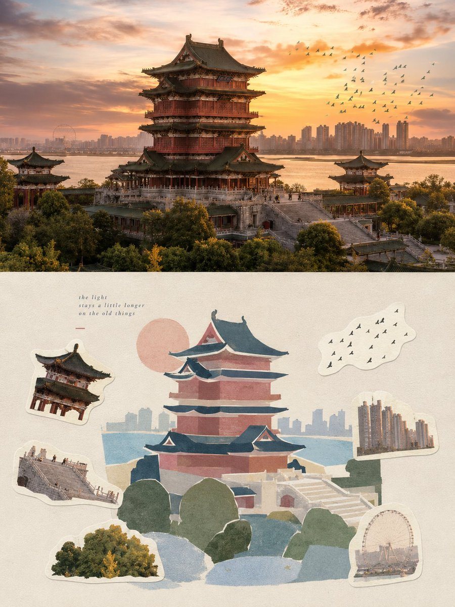

```text
Please create an independent high-end design poster for each photo I upload. Use a 3:4 vertical composition with a top-and-bottom dual-layer logic: the top half is realistic photography, and the bottom half is a flat reconstruction based on selective memory, creating a natural echo between them.
The top half retains the original photo, keeping the subject's identity, structure, posture, realistic texture, natural lighting, and original color atmosphere, with only slight professional color grading to give it an art magazine or exhibition photography feel. The background can be naturally extended to fit the frame, but the subject must not be stretched or distorted.
The bottom half extracts the most recognizable subjects, outlines, and narrative relationships from the photo, reconstructing them in a way of 'selective memory' rather than descriptive realism. Do not trace the photo completely; keep only the visual clues worth remembering, compressing complex scenes into 3–6 large geometric blocks, reorganized with matte gouache, paper collage, Risograph, or screen-printing styles so the subject is instantly identifiable with a modern graphic and handcrafted feel.
The bottom half uses a composition of a main visual plus six memory stickers. The main visual carries the primary narrative and visual weight; additionally, select six memorable details from the original photo—such as subject features, actions, local structures, plants, utensils, transportation, food, patterns, textures, lighting, or accidental details—and refine them into six independent stickers. The stickers should have thick, light-colored borders, naturally tiled and scattered at different scales, forming loose rows or asymmetrical clusters around the main visual with plenty of negative space. There should be clear primary and secondary relationships and size variations among the six stickers, like fragments cut from the same memory.
The composition emphasizes visual focus, block proportions, scale contrast, positive/negative space, and rhythmic spacing. The main visual should be significantly larger than the sticker fragments. Stickers can overlap, rotate slightly, or echo the subject without stealing the focus. Complex environments are actively reduced to let large areas of quiet background color become a breathing space, resulting in a professional graphic order with a relaxed, natural scrapbook feel.
Materials use opaque gouache, paper collage, Risograph, or screen-printed blocks, retaining slight powdery edges, paper grain, hand-cut edges, and printing deviations. Use the same material language for stickers and the main visual, avoiding watercolor smudges, complex strokes, dense line drafts, realistic textures, smooth vectors, and 3D plastic textures.
The color palette is based on soft, transparent, slightly desaturated high-end colors. Create the main atmosphere with 
light powder blue, mist blue, sky blue, and airy cool blue
, balanced with 
ivory white, cream white, light beige, soft gray-green, and architectural neutrals
. Only a small amount of 
dusty rose or muted blush
 is allowed as tiny accents for flowers, clothing, small logos, or local decorations to give the image breathability and refined layers.
Text is not preset with fixed titles or locations. Freely generate a minimal amount of truly meaningful text based on the subject, action, environment, and cultural context of the photo, naturally placing it in negative spaces or sticker gaps to form an editorial layout relationship. Text should be small, light, and restrained.
The overall result is like an independently published visual travel guide or private memory book page: quiet, modern, sharp, and relaxed, possessing professional graphic order while retaining the warmth of collage and handcrafted materials.
```


---

## 例 716：Aspirational Swiss Alps Travel Poster

**来源：** [YouMind](https://youmind.com/prompts/aspirational-swiss-alps-travel-poster-1060)


```text
An aspirational and beautiful travel poster for visiting the Swiss Alps. The image is a breathtaking, hyper-realistic photograph of a picturesque alpine village with snow-capped mountains in the background. The text “SWITZERLAND: The Adventure Awaits” is in an elegant, classic font. The poster should evoke a strong sense of wanderlust and make the viewer want to book a trip immediately. –ar 2:3
```


---

## 例 717：Attack on Titan Isometric Diorama Map

**来源：** [YouMind](https://youmind.com/prompts/attack-on-titan-diorama-map-32470)

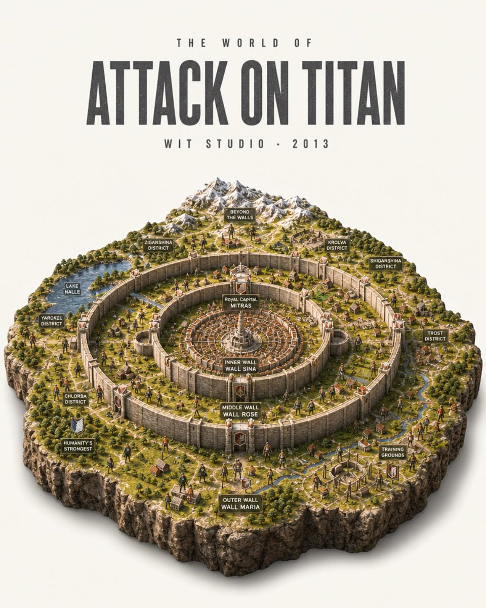

```text
Goal: Create an ultra-detailed photorealistic isometric miniature scale-model diorama poster of the world from 
Attack on Titan
, presented like a collectible museum map on a clean off-white studio background.
Canvas: Vertical 4:5 poster composition. The upper third is typography, the lower two-thirds is a floating square-cut terrain diorama with rugged rocky sides and a soft realistic shadow beneath.
Top typography: Centered at the top, use tall condensed bold distressed sans-serif lettering. Small spaced text above reads "THE WORLD OF". Main title reads "
ATTACK ON TITAN
" in very large dark charcoal letters. Small spaced text below reads "
WIT STUDIO • 2013
".
Diorama layout: Show the walled civilization as a high-angle isometric model with three enormous concentric circular stone walls and fortified gates. The center contains a dense circular royal city with radial streets and a white central monument. Surrounding rings contain miniature villages, farms, roads, rivers, forests, watchtowers, and tiny human figures. Beyond the walls at the back are snow-capped mountains, wilderness, scattered ruins, and open terrain. The outer edge of the model is a thick cliff-like cutaway rock base with grass on top.
Labeled signs: Include exactly 14 small dark rectangular map-label plaques with white uppercase text, placed around the diorama: 1) "BEYOND THE WALLS" near the mountains, 2) "ZIGANSHINA DISTRICT" on the upper-left wall area, 3) "KROLVA DISTRICT" on the upper-right wall area, 4) "SHIGANSHINA DISTRICT" on the far right, 5) "LAKE NALLE" by a blue lake on the left, 6) "YARCKEL DISTRICT" on the left outer area, 7) "CHLORBA DISTRICT" on the lower-left area, 8) "HUMANITY'S STRONGEST" beside a small military crest on the lower-left, 9) "TROST DISTRICT" on the right outer area, 10) "TRAINING GROUNDS" on the lower-right, 11) "ROYAL CAPITAL MITRAS" at the central city, 12) "INNER WALL WALL SINA" on the innermost wall, 13) "MIDDLE WALL WALL ROSE" on the middle wall, 14) "OUTER WALL WALL MARIA" on the front outer wall.
Subject details: Make the wall rings tall, pale stone, weathered, and segmented with massive gates and red-roofed towers. Populate the landscape with tiny soldiers, civilians, horses, tiled-roof houses, roads, farmland plots, bridges, streams, and forests. Add a few tiny Titan-like humanoid silhouettes outside and near the walls for scale, but keep the scene map-like rather than action-focused.
Visual style: Hyper-realistic miniature model photography mixed with anime-world cartography, crisp isometric perspective, warm daylight, realistic shadows, high texture detail, tiny hand-painted model figures, natural greens and browns, pale stone walls, snowy gray mountains, cinematic depth of field but all important labels legible.
Constraints: Keep the image as a single poster, no border, no watermark, no extra logos. Preserve the exact 14 map labels listed above and the three wall labels. Use an off-white background and a centered floating diorama with clean studio lighting.
```


---

## 例 718：Effective &#x27;Lost Cat&#x27; Flyer

**来源：** [YouMind](https://youmind.com/prompts/effective-lost-cat-flyer-1059)

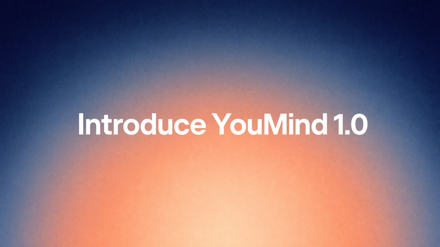

```text
An effective and clear “Lost Cat” flyer. The design is simple and functional. It features a large, clear, color photograph of the cat at the top. The headline “LOST CAT” is in a very large, bold, and easy-to-read font. Below the photo are the cat’s name, description, last seen location, and the owner’s contact information with tear-off tabs at the bottom. This demonstrates the ability to create practical, real-world designs. –ar 3:4
```


---

## 例 719：Energetic 5K Charity Run Poster

**来源：** [YouMind](https://youmind.com/prompts/energetic-5k-charity-run-poster-1056)


```text
An energetic and motivational poster for a 5K charity run for a good cause. The design features a dynamic photograph of a diverse group of people running, with smiles on their faces. The background has abstract, colorful shapes and lines that suggest movement and energy. The event details are clear and easy to read. The poster should be inspiring and encourage people to sign up. –ar 3:4
```


---

## 例 720：Fun Educational Children&#x27;s Science Fair Poster

**来源：** [YouMind](https://youmind.com/prompts/fun-educational-childrens-science-fair-poster-1062)


```text
A fun and educational poster for a children’s science fair. The design is a colorful cartoon illustration featuring kids dressed as scientists, looking at bubbling beakers, telescopes, and robots. The typography is playful and kid-friendly. The poster should make science look exciting and accessible, encouraging kids to participate. –ar 2:3
```


---

## 例 721：Healing Woodcut Print Poster

**来源：** [YouMind](https://youmind.com/prompts/healing-woodcut-print-poster-32442)

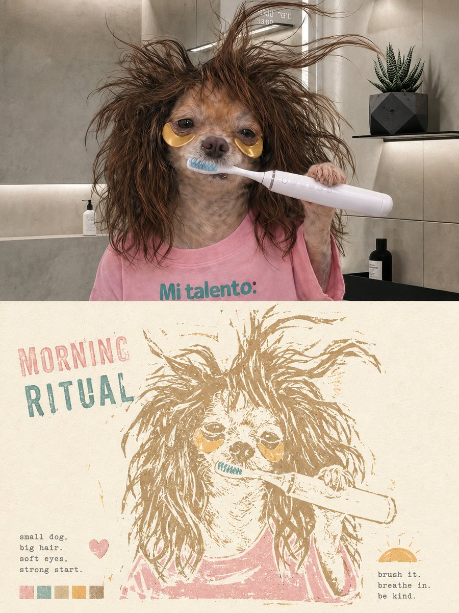

```text
Please create an independent high-end design poster for each photo I upload, with no multi-photo stitching; each photo should be output separately. The overall composition uses a 3:4 vertical layout, with the upper and lower areas strictly at a 1:1 height ratio, each occupying 50% of the frame. The upper part retains the original photo, maintaining the subject's identity, structure, posture, spatial relationships, authentic materials, natural light and shadow, and original color atmosphere, with only slight high-end photographic color grading to give it the texture of an independent magazine, art publication, or exhibition photography. To adapt to the frame, the sky, ground, or environmental background can be naturally extended, but the subject must not be stretched, distorted, mirrored, or altered. The lower part extracts the most recognizable subject, outline, posture, and narrative relationship from the photo, reconstructing it as a limited-color woodcut print mark suspended on paper. Do not directly copy the entire photo or simply apply a filter; instead, actively prune complex backgrounds and trivial details, keeping only the outlines, proportions, directions, light and dark zones, key structures, and core spatial relationships that determine recognizability. Re-summarize the subject using the language of woodcut, linocut, and hand-stamped printing to make it instantly identifiable while possessing a rustic, clumsy, and strongly handcrafted artistic temperament. The graphic brushstrokes should carry the characteristic clumsiness and handmade traces of woodcut prints: lines need not be smooth or precise, allowing for slight hesitations like knife carvings, uneven thickness, fuzzy edges, stiff transitions, local fractures, gaps, misalignments, and irregular negative space; the edges of color blocks can show dry brushing, missing prints, ink shortages, and coarse-grained textures. The overall style is not a refined vector illustration but feels as if it were carved out stroke by stroke with a hand chisel and ink, carrying a simple, direct, slightly naive yet very durable printmaking quality. The composition centers on a single visual anchor point, large areas of negative space, and incomplete edges. Position and scale are determined by the subject's own visual center of gravity, action direction, and structural flow—it can be centered, offset, slightly cropped, or extended in a certain direction. Ample warm paper negative space is preserved around the subject, with edges gradually disappearing through ink gaps, fractured textures, paper transparency, and natural wear, avoiding a complete rectangular border so the image feels like a memory gently pressed onto the paper. The color scheme extracts the most recognizable and vibrant colors from the photo above but transforms them into a 'little fresh,' soft, healing, and bright limited-color logic. Use clean and light comprehensive color systems such as cream white, ivory white, pale pink, misty green, light blue, pale yellow, light orange, mint green, soft coral, and light ochre, maintaining low to medium saturation, high brightness, and soft contrast. Retain the most moving color memory points of the original image but avoid dark, dull, dirty, heavy, and overly retro color schemes. All colors should appear as if matte solid ink were printed layer by layer, soft and clear, yet still retaining the grain and warmth of a print. Text is also integrated as part of the print composition rather than fixed descriptive text. Extract a main title of 1-3 words from the subject's identity, action, emotion, state, location, or metaphor in the photo, paired with a set of very short keywords or a miniature description. The main title can be arranged along the subject's outline, negative space boundaries, visual axes, or print edges, forming a supporting, interleaving, misaligned, or echoing relationship with the graphic; auxiliary small text remains tiny and restrained, using typewriter fonts, monospaced serif fonts, or old-archive-style layouts, like notes in a travel diary or a private print collection. Do not use fixed years; let the text grow naturally based on the photo itself. The overall emphasis is on the rustic handmade feel of woodcut prints, fresh and soft limited colors, paper negative space, incomplete edges, and restrained layout, presenting a warm, quiet, healing, light, nostalgic but not dark high-end print temperament. Whether the subject is a person, animal, plant, architecture, object, vehicle, or natural landscape, a clear and clever visual echo should be maintained between the real photography above and the print reconstruction below, avoiding ordinary filters, complete background replicas, smooth vector outlines, cartoon illustrations, travel template vibes, and cheap retro feelings.
```


---

## 例 722：3D Papercraft Miniature Poster Design

**来源：** [YouMind](https://youmind.com/prompts/papercraft-miniature-diorama-poster-32429)

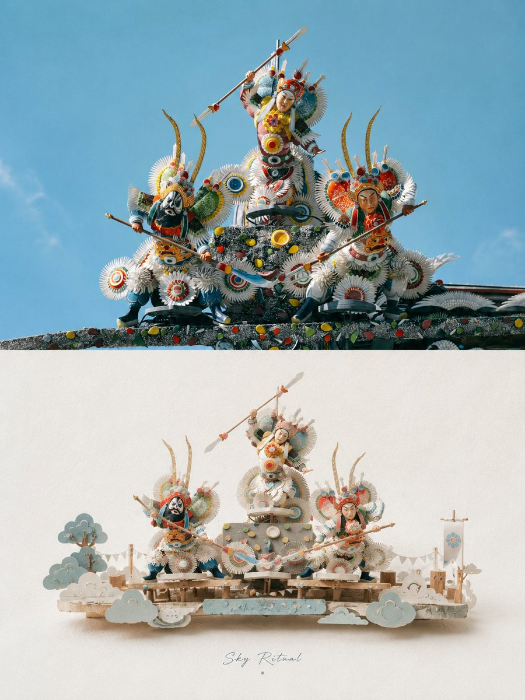

```text
Please transform each photo I upload into a separate, standalone premium-designed poster. Do not create multi-image collages or combine multiple photos into one composition. Each photo must be output individually. Use an overall 3:4 vertical format, divided into two sections with a strict 1:1 height ratio, with the upper and lower sections each occupying exactly 50% of the canvas. The upper half should retain the original photograph. Preserve the subject’s structure, realistic texture, natural lighting and shadows, and the original color atmosphere. Apply only subtle, sophisticated photographic color grading to give the image the refined visual quality of an art magazine, independent publication, or exhibition photography. To adapt the photograph to the required aspect ratio, you may naturally extend the sky, ground, or surrounding environment, but do not stretch, distort, reshape, or alter the main subject. In the lower half, extract the most recognizable subject, silhouette, pose, and narrative relationship from the photograph, and reinterpret them as a refined miniature 3D paper-craft diorama. Do not mechanically reproduce the photograph. Instead, transform the main subject and a limited number of elements that best reinforce its identity and environmental character into miniature handcrafted models made from materials such as paper, cardstock, soft clay, thin wood pieces, or similar tactile craft materials. Arrange them naturally on a narrow, lightweight, floating landscape base. The main subject must remain instantly recognizable at a glance. All other elements should function only as narrative support. Depending on the original photograph, you may incorporate plants, roads, water, lamps, vehicles, people, birds, clouds, or other representative details of everyday life, but every added element must be genuinely relevant to the original theme. Avoid decorative clutter or meaningless accumulation of objects. Base the composition on one core subject + one horizontal miniature landscape strip + generous negative space. Adjust vertical levels, foreground/background relationships, visual density, and left-right balance according to the subject’s scale, direction, and spatial relationships, so that the scene feels like a carefully curated miniature art installation. Create depth through variations in scale, layered overlaps, and small foreground and background elements. The primary subject should carry the greatest visual weight, while supporting models remain smaller and visually quieter. Keep the overall composition centered without making it excessively symmetrical, maintaining a light, refined, calm, and elegant visual rhythm. Continue using a soft, airy, slightly desaturated premium color palette. Establish the main atmosphere with pale powder blue, mist blue, sky blue, and cool airy blues. Balance these with ivory white, creamy white, light beige, soft gray-green, sage green, and neutral architectural tones. Use only small accents of dusty rose or muted blush for subtle detail. The colors should feel soft yet clean. Avoid muddy gray tones, excessive yellow casts, or candy-like colors. Allow different paper layers to create natural spatial separation through subtle variations in tone and color. Emphasize the authenticity of handcrafted materials. Make paper fibers, folded edges, cut edges, layered thickness, slight fraying, and tiny handmade imperfections visible. Use soft natural diffused lighting and delicate shadows to reveal the real volume, depth, and layering of the miniature models, with the intimate tactile quality of macro photography. Keep the background soft white or an extremely pale paper tone, with extensive clean negative space, so that the entire lower half feels like a meticulously photographed premium handcrafted travel postcard. Typography should also be integrated into the visual language of the miniature paper-craft world. Derive a short English title from the location, identity of the subject, theme, or emotional atmosphere of the photograph. The title does not have to be a city name. Use a small, refined typeface with a subtle handwritten character. Preferably place the title within the negative space below the miniature landscape strip. Depending on the relationship with the subject, the text may also follow a slight curve, align gently along the base, or interact spatially with the miniature scene. Keep the typography minimal, elegant, and restrained. Do not add long descriptive copy. The text should feel more like an artist’s signature than a commercial headline. The overall visual direction should combine the premium qualities of miniature diorama, handcrafted paper art, whimsical 3D illustration, and a premium travel postcard. The result should feel light, gentle, refined, tactile, and full of lived-in character, while maintaining strong design discipline and abundant breathing room. Whether the original photograph features a person, animal, plant, architecture, object, vehicle, or natural landscape, maintain a clear yet clever visual correspondence between the real photographic world in the upper half and the miniature handcrafted world in the lower half. Avoid plastic-looking 3D rendering, toy-like aesthetics, childish craft styles, overly complicated compositions, excessive cuteness, visual clutter, or an e-commerce product-display appearance.
```


---

## 例 723：Regional Cultural Atlas Poster

**来源：** [YouMind](https://youmind.com/prompts/regional-cultural-atlas-poster-32847)

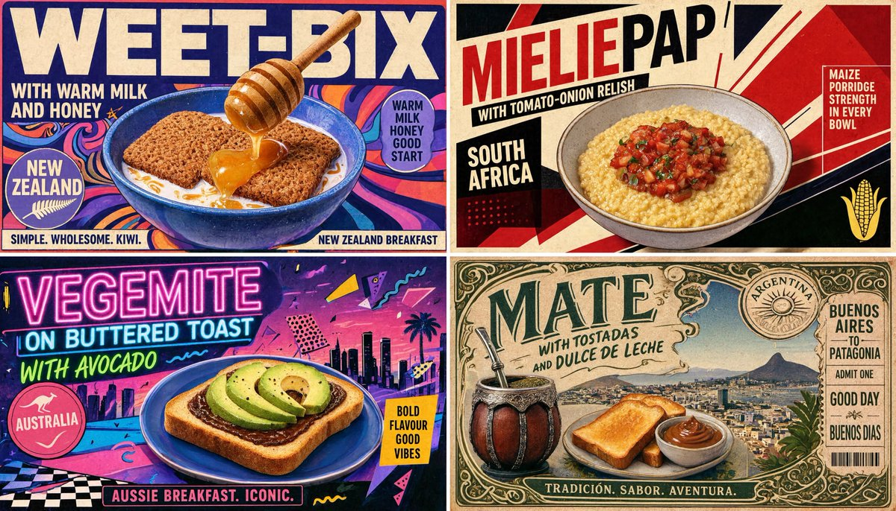

```text
2x2 grid, 16:9, do this for 4 under rated breakfasts of Southern hemisphere: INPUT = [
TOPIC_CATEGORY
 / 
REGION_SET
 / 
SELECTION_CRITERIA
 / 
MOOD
]
MODE = no_hardcoding / inference_only
Run REGIONAL_CULTURAL_ATLAS_EXTRACTION:
CATEGORY_DNA := infer what type of thing is being compared, how it is used, why it matters, and what makes it visually recognizable
REGION_DNA[each] := infer local environment, visual culture, palette, typography attitude, textures, symbols, landscapes, tools, rituals, and social context
ITEM_SELECTION[each] := infer one overlooked or representative item that fits TOPIC_CATEGORY + REGION + SELECTION_CRITERIA
HERO_VISUAL[each] := infer the best visual treatment:
plated food, product close-up, ritual scene, tool layout, garment portrait, object still life, landscape-backed artifact, map-backed diagram, or symbolic vignette
COPY_SYSTEM[each] := generate:
- large item title
- short emotional tagline
- origin/location label
- 2–4 tiny descriptors
- stamp or badge phrase
- small contextual note
GRAPHIC_SYSTEM := infer torn paper, printed grid, muted color blocks, topographic lines, stamps, borders, halftone, atlas marks, and editorial spacing
Render:
A premium regional comparison poster where each panel feels locally specific but belongs to one unified cultural theme.
Forbidden:
hard-coded Southern Hemisphere, fixed breakfasts, fixed foods, fixed countries, fixed beige/red/green palette, fake local facts, random travel-poster clichés.
```


---

## 例 724：Sleek Minimalist Wireless Headphone Ad

**来源：** [YouMind](https://youmind.com/prompts/sleek-minimalist-wireless-headphone-ad-1057)


```text
A sleek and minimalist poster advertisement for a new high-tech wireless headphone. The poster features a stunning, high-resolution 3D render of the headphone, seemingly floating in a zero-gravity environment. The background is a simple, clean gradient. The only text is the brand name and the product slogan: “Unleash Your Sound.” The design is modern, sophisticated, and focuses entirely on the product’s beauty. –ar 2:3
```


---

## 例 725：Tension Line Art Concept Poster

**来源：** [YouMind](https://youmind.com/prompts/tension-line-art-concept-poster-31916)

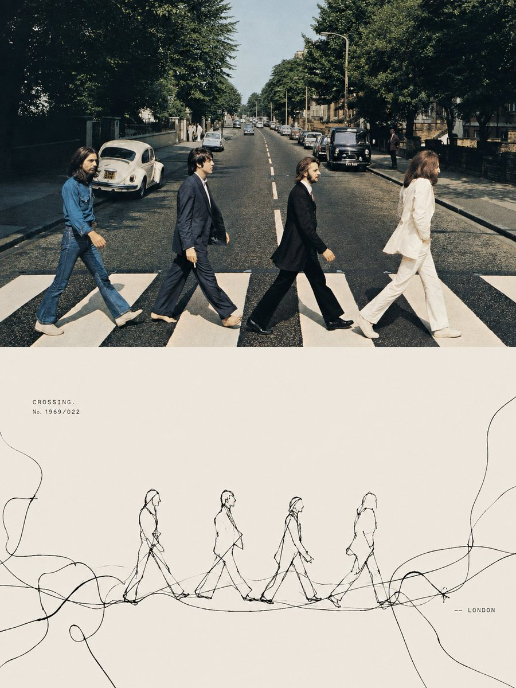

```text
Create individual 3:4 split-screen posters from uploaded photos. The top half is the original photo with editorial grading. The bottom half is a minimalist conceptual line illustration representing public issues. It uses continuous black hand-drawn lines like tight wires, thorns, or bindings that coil and tighten to reveal the subject's silhouette. The layout emphasizes large white space with a quiet but tense atmosphere. Text is minimal and integrated into the lines, inspired by modernist conceptual posters and experimental editorial design.
```


---

## 例 726：Zen Lake Stillness Poster

**来源：** [YouMind](https://youmind.com/prompts/zen-lake-poster-32646)

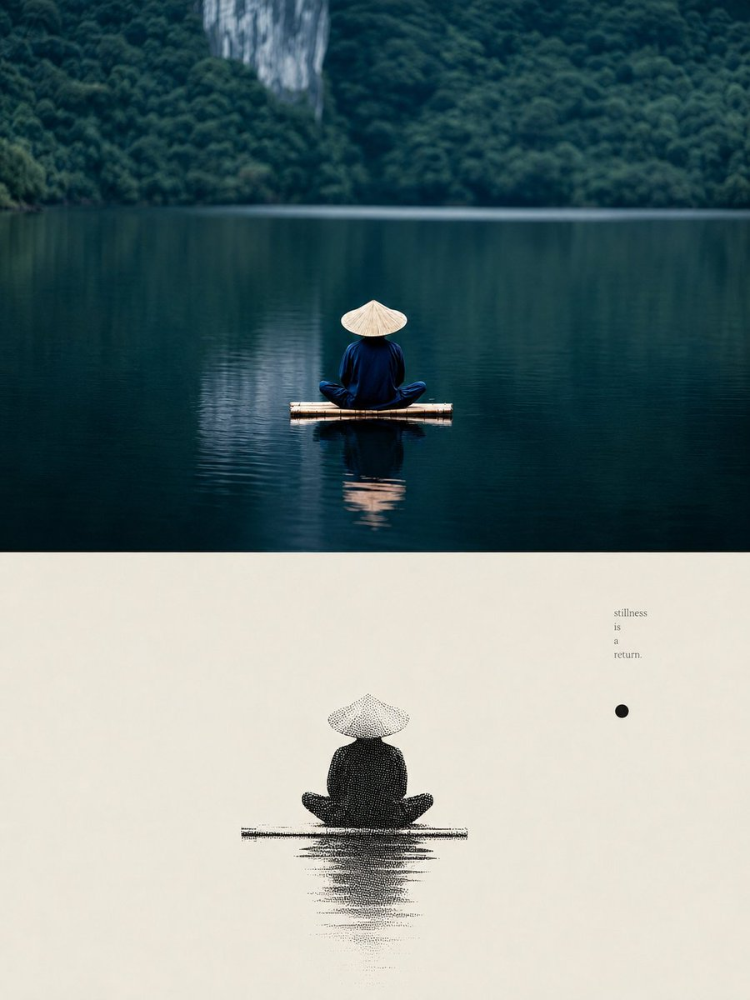

```text
Create a vertical minimalist Zen poster composed of exactly 2 stacked panels. Top panel: a photorealistic, cinematic landscape occupying the upper half, showing exactly 1 solitary monk-like figure seen from behind, seated cross-legged on a small rectangular bamboo raft in the center of a still dark teal lake. The figure wears a deep 
indigo blue
 robe and a pale straw conical hat; the body and hat are reflected softly in the water. The background is a dense, dark green forest across the lake with one pale vertical limestone cliff rising near the upper center-left, softly out of focus. Use calm water, muted blue-green tones, quiet atmosphere, shallow depth of field, and large negative space around the figure. Bottom panel: an off-white handmade paper field occupying the lower half, like a minimal art-book layout. Near the lower center, render exactly 1 black stippled ink illustration of the same seated figure on the raft, including its vertical water reflection, using halftone dots and sparse horizontal ink strokes. In the upper-right area of the bottom panel, place exactly 1 small vertical text block reading 
stillness\nis\na\nreturn.
 in tiny gray serif type, with each word on its own line, and exactly 1 solid black circular dot below-left of the text block. Overall style: Chinese Zen aesthetic, wabi-sabi minimalism, editorial poster design, balanced asymmetry, serene silence, high contrast between photographic top and ink-print bottom. Canvas ratio 3:4, no border, no watermark, no extra figures, no extra text.
```


---

## 例 727：稚拙民艺感左右分屏叙事海报设计

**来源：** [@xiaoxiaodong01](https://x.com/xiaoxiaodong01/status/2093627864973295787) / [OpenNana](https://opennana.com/awesome-prompt-gallery/naive-folk-art-side-by-side-narrative-poster)

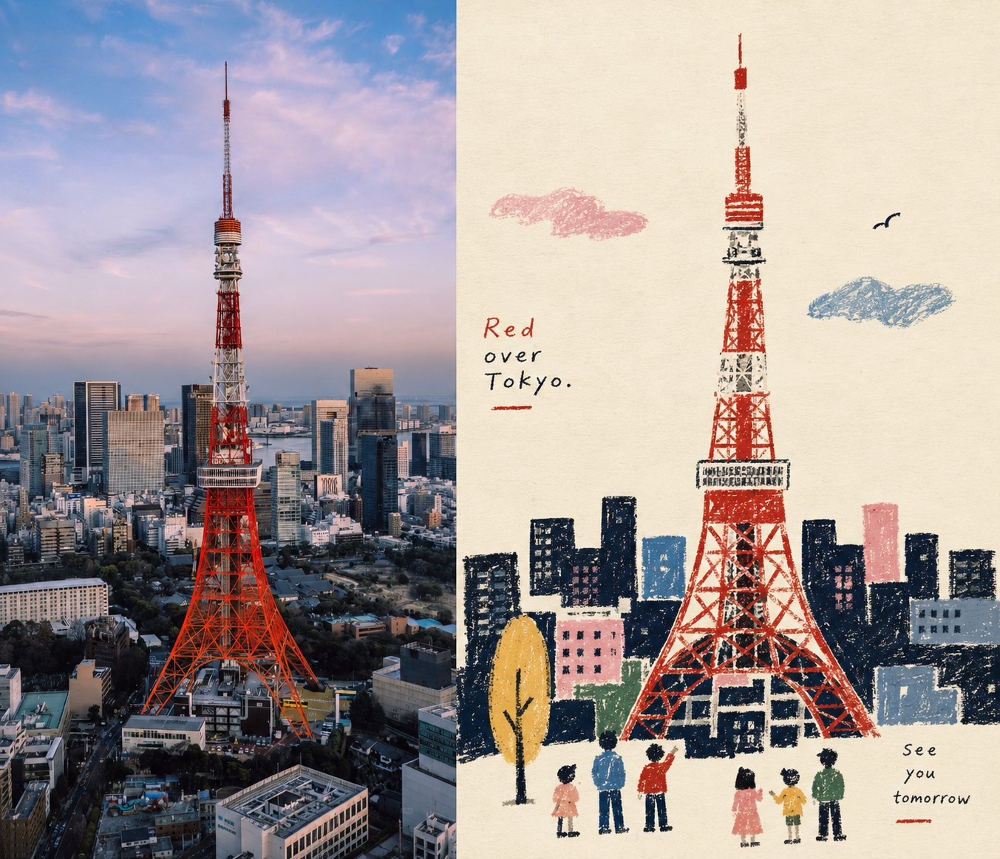

```text
Please turn each photo I upload into an individual high-end design poster, no multi-photo collages, output each photo separately. Use a 7:6 aspect ratio with a side-by-side layout (not top-bottom), where the two areas are strictly 1:1 in width, each occupying 50% of the frame.

One half preserves the original photo, maintaining the subject's identity, structure, posture, authentic texture, natural light and shadow, and the original color atmosphere, with only slight high-end color grading to give it the texture of an art magazine, independent publication, or exhibition image. To fit the frame, the environment background can be naturally extended, but the subject must not be stretched, distorted, or altered.

The other half extracts the most recognizable subject, silhouette, posture, and narrative relationship from the photo, reconstructing it into a Naïve folk-inspired narrative illustration / Naïve folk-style textured flat narrative illustration. Do not fully trace the photo; instead, actively subtract details, retelling the original scene with silhouettes, primitive forms, a few color blocks, and iconographic elements, keeping only the visual clues that best maintain the subject's identity and story relationship, making the original object instantly recognizable while having a sense of clumsiness, humor, and life.

The subject's modeling centers on simplified silhouettes and large primitive forms. People, animals, buildings, plants, objects, or vehicles can have their proportions moderately compressed, structures summarized, and features exaggerated, without pursuing strict perspective and anatomy. The space uses flattened perspective, establishing narrative through height, overlapping, size, and color block relationships; auxiliary objects are distributed rhythmically like visual symbols, and complex backgrounds are actively deleted, letting a core action, relationship, or scene carry the main story.

The image uses grainy textures like crayons, oil pastels, thick pencils, and dry materials. Black or dark areas should not be filled uniformly but should retain traces of wiping, friction, layering, breakage, and the paper showing through; silhouettes have slight manual errors and a sense of clumsiness, and edges do not need to be absolutely neat. The overall look remains flat, without using realistic light and shadow, metallic materials, complex volumes, or smooth digital vectors.

The color scheme is reorganized by selecting the most vivid, memorable colors that best represent the subject's spirit from the photo, forming a concise and bright limited color palette. Overall, increase the cleanliness and vitality of colors, using warm white paper and dark silhouettes as a stable base, then naturally extracting a few spot-color accents like blue, red, yellow, green, pink, or orange from the original image for clothing, plants, food, architectural parts, or narrative focuses. Colors are distinct but not over-saturated, forming rhythm through large-area light-dark contrast and small-area pop colors, avoiding gray, muddy, Morandi-style, fluorescent colors, and cheap candy-like effects.

Composition emphasizes narrative center, visual weight, positive/negative shapes, size rhythm, and white space relationships. The subject does not need to be centered; it can be offset, partially cropped, or form a loose triangular relationship with auxiliary elements; leave enough blank space so that the rough silhouettes and small colored elements have room to breathe. From a distance, the structure is clear; up close, manual grains and slightly naive stylistic fun are visible, rather than filling all elements evenly.

A small amount of text is involved, without presetting fixed titles, locations, numbers, or languages, freely extracting a small amount of meaningful text based on the photo's subject, action, life state, emotion, or cultural context. Use lightweight, simple folk-art editorial fonts with slight manual printing deviations and irregular character spacing, which can be paired with a small amount of handwriting, making the text naturally exist like signs, menus, notes, or publication annotations in the scene. Text can be arranged staggered along the subject, desktop, wall, white space, or scene structure, participating in the narrative together with graphics, but do not form a regular commercial title bar.

The overall presentation is a visual temperament composed of naïve silhouettes, flat space, crayon grains, limited colors, folk art symbols, and editorial narrative: intimate, humorous, simple, smart, with a sense of life, while maintaining mature composition and design awareness. Avoid children's cartoons, cute stickers, realistic illustrations, smooth vectors, complex perspective, fine facial features, excessive details, 3D rendering, e-commerce illustration style, and templated effects.
——————
We changed it to a side-by-side layout, not top-bottom. Ratio 7:6.
```


---

## 例 728：高级食材观察旅行盘编辑海报

**来源：** [@Hamburgerai](https://x.com/Hamburgerai/status/2093564437110354121) / [OpenNana](https://opennana.com/awesome-prompt-gallery/culinary-observation-travel-plate-poster)

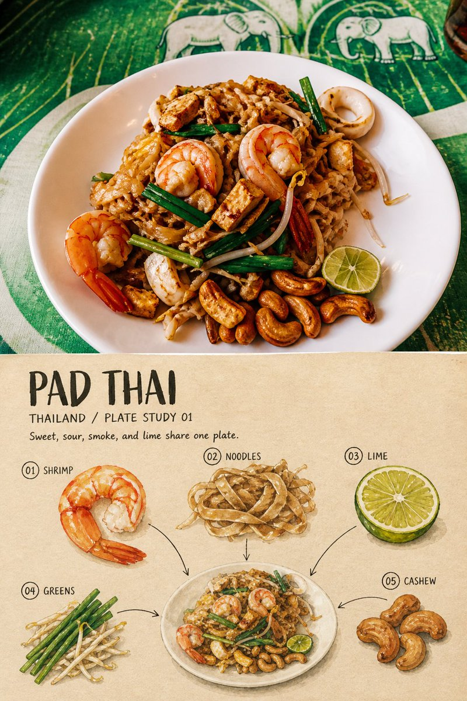

```text
Please turn each photo of local cuisine I upload into an independent, high-end "Culinary Observation Travel Plate" editorial poster. Output each photo separately; it is forbidden to stitch multiple photos, different plates, or different dishes into the same work.

The input photo should have a complete plate or bowl as the clear subject, containing at least three identifiable components, such as staple foods, meat, seafood, eggs, vegetables, herbs, nuts, pickles, sauces, or decorative garnishes.

The overall composition is a 3:4 vertical layout, forming a clear contrast between the original food photography and the culinary observation transcription.

The upper part occupies about 45%—50% of the frame, faithfully preserving the original photo. Accurately maintain the outline of the plate or bowl, the number of ingredients, placement direction, area relationships, real texture, natural light and shadow, observation angle, and original colors. Only perform slight color grading suitable for independent food magazines and travel publications, and add a very thin film grain.

Do not re-plate, replace ingredients, move food, change portions, add decorations, or redraw real photography as illustrations in the photo area. When adapting to the frame, environment cropping can be used with restraint, but the main body of the complete plate must remain clearly identifiable.

Use a straight, clear, and restrained horizontal boundary between the upper and lower areas; a very narrow warm-toned paper gap can be kept. No gradients, feathering, dissolving, or letting ingredients cross the boundary.

The lower part occupies about 50%—55% of the frame, using warm off-white or ivory natural drawing paper, showing paper fibers, grain, slight stains, and irregular surfaces.

The lower part should not redraw the entire dish from above in the same composition; instead, decompose the same dish into a sparse culinary observation record on paper:

1. Select 3—6 truly visible and clearly identifiable components from the original photo;
2. In the center or lower part of the bottom section, draw a highly generalized but still instantly recognizable small image of the complete plate or bowl;
3. The small complete plate usually only occupies 28%—40% of the width of the lower part;
4. Extract the selected ingredients from the plate respectively, representing them as independent gouache samples, cross-sections, leaves, grain clusters, sauce color blocks, or structural sketches;
5. Use different scales and directions for different ingredients, forming a sparse, not completely symmetrical observational relationship around the small plate;
6. Use thin and slightly hesitant black ink lines, arrows, and numbers to map the ingredient samples back to their approximate positions in the plate;
7. Keep at least 35%—50% continuous off-white paper whitespace around, do not let arrows, text, and ingredients fill the entire lower area.

The lower part uses the material language of hand-painted culinary field notes:

- matte opaque gouache
- restrained black ink contours
- dry brush gaps
- uneven pigment coverage
- visible paper grain
- imperfect hand-painted edges
- subtle pencil construction marks
- handmade culinary field notebook

Forms should be highly generalized, yet still retain the most recognizable colors, outlines, cross-sections, and grain structures of the ingredients. Do not realistically copy, and do not draw as cartoon food icons.

Colors must be extracted from the original photo, compressing complex colors into 4—6 low to medium saturation ingredient-true colors. The background remains off-white, warm gray, or a very light photo-related color. Allow one warm color like sauce, egg yolk, chili, or fruit to be the visual focus, but avoid neon colors and high-saturation commercial menu color palettes.

Text must be determined word-for-word in the prompt based on photo facts, defaulting to include:

- A cuisine title of 1—3 English words;
- A location and observation number field, such as "THAILAND / PLATE STUDY 01";
- A taste or ingredient observation sentence of 5—12 English words;
- 3—6 short numbered labels, such as "01 RICE", "02 EGG", "03 HERBS".

If specific ingredients cannot be reliably identified, do not invent names; you can use: "RICE", "NOODLES", "GREENS", "SAUCE", "GRILLED ITEM", "PICKLED ITEM".

Text uses narrow handwritten recipe fonts, old recipe lead types, or gentle humanist sans-serif fonts, colored in warm black, deep taupe, or dark colors from the photo. Allow slight ink breakage, paper tooth, and manual errors.

The main title must be clearly readable at chat preview size; numbers and ingredient labels can be smaller but must not shrink into decorative thin lines. Text should be concentrated in a continuous piece of whitespace, like an observer's notes written on paper, rather than smooth digital layout overlaid later.

The overall feel should be like a traveler re-deconstructing, observing, and recording a whole plate of food after tasting a local dish: restrained, warm, clear, with a handmade feel, and also carrying a bit of taste memory and travel archive temperament.

Mandatory avoidance: Photos without a complete single-plate subject, multi-dish tables, multi-plate collages, restaurants or chefs as protagonists, fictional ingredients, adding ingredients not in the photo, proportional redrawing of the entire plate, realistic menu illustrations, dense nutritional infographics, cartoon food, smooth vector icons, plastic 3D food, full-bleed backgrounds, excessive text, prices, brands, logos, author names, signatures, dates, QR codes, URLs, social media interfaces, gibberish, fake Chinese, and watermarks.
```


---

## 例 729：混合媒体垃圾风街头艺术海报

**来源：** [@her19845](https://x.com/her19845/status/2092919048036343839) / [OpenNana](https://opennana.com/awesome-prompt-gallery/mixed-media-grunge-urban-art-poster)

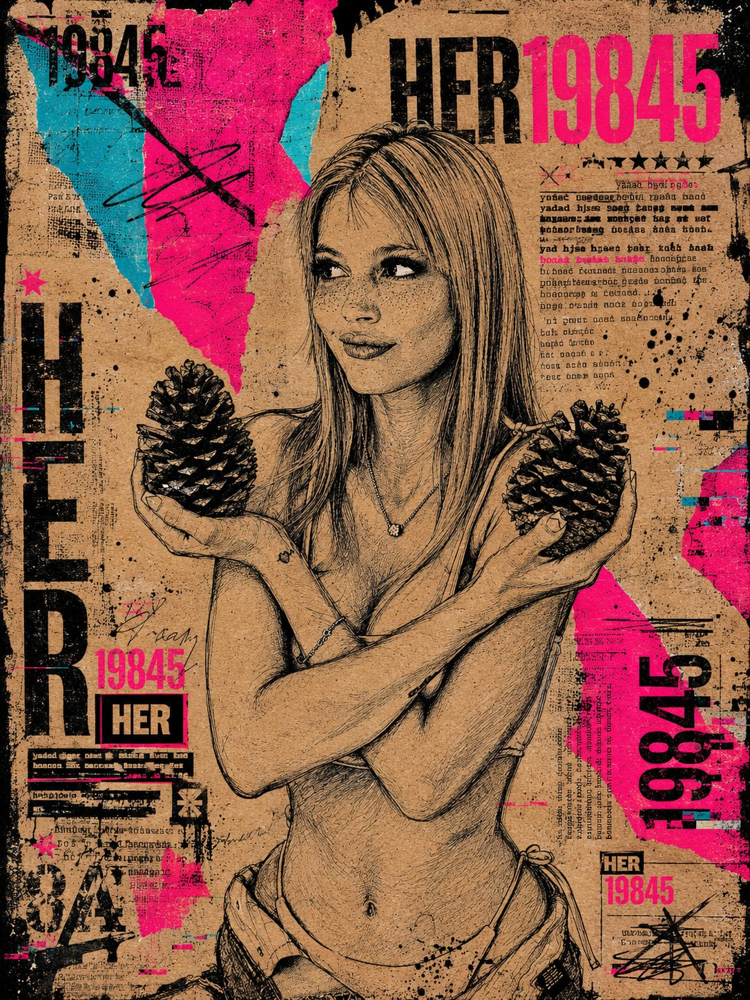

```text
A mixed-media, grunge-style, collage-inspired urban art poster featuring a central ink illustration of the model. The girl's style is a detailed sketch with cross-hatching. The background is an aged kraft paper texture overlaid with geometric and torn shapes of bright neon pink and cyan paper. The composition is filled with worn and distorted typography, including the large text "HER19845" in the upper right, and several blocks of illegible newspaper text, numbers ("19845"), and the word "HER" on the left. The entire image is covered with a subtle glitch distortion effect and splashes of black ink and scribbles. The color palette is high-contrast: black, neon pink, and kraft brown. High-resolution rendering with textured paper edges and a street art aesthetic.
```


---

## 例 730：牛皮纸负形地标漏印对比海报

**来源：** [@Hamburgerai](https://x.com/Hamburgerai/status/2092632741657677999) / [OpenNana](https://opennana.com/awesome-prompt-gallery/kraft-negative-stencil-landmark-poster)

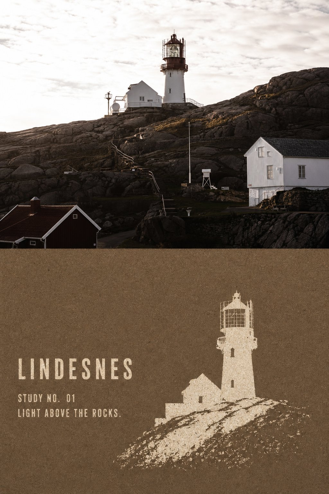

```text
Please turn every travel photo I upload into an individual high-end contrast poster. Do not use multi-image splicing; output each photo separately.

Style Name: KRAFT NEGATIVE-STENCIL LANDMARK | Kraft Paper Negative-Stencil Landmark Printing

## Applicable Objects

Suitable for travel landmarks with clear individual silhouettes, such as:

Lighthouses, towers, churches, temples, gate towers, statues, monuments, windmills, solitary boats, pavilions, bridge towers, or architecture with distinct outlines.

The subject should be clearly separated from the sky, water, square, or relatively simple environment.

Do not process all photos into fixed icons like lighthouses, churches, or the same type of travel icon. Do not add birds, boats, trees, people, railings, or decorative landscapes that do not exist in the original photo.

## Overall Layout

Adopt a 3:4 vertical top-bottom contrast composition:

- The upper part (approximately 45%—52%) preserves the high-fidelity original photo
- The lower part (approximately 48%—55%) undergoes a kraft paper negative-stencil conversion
- Use a straight, clear, and restrained horizontal boundary between the two areas
- No feathering, no mutual penetration, and no thick division lines
- Do not generate picture frames, walls, handheld displays, or Mockups

The finished product must retain a substantial and clearly identifiable original photo contrast area. Do not shrink the original image into a small corner icon, nor make the entire poster a stencil print.

## Upper Original Photo

Faithfully preserve the original photo's:

- Landmark identity
- Number of subjects
- Subject orientation
- Proportions of architecture or objects
- Top, base, and key outlines
- Positions of doors, windows, and major structures
- Observation angle
- Number and position of people
- Relationships between sky, ground, water, and space
- Real materials, light and shadow, and original color atmosphere

Apply only slight color grading suitable for high-end travel magazines, architectural publications, or photography exhibitions, and add a very thin film grain.

Do not illustrate the original photo; do not move the subject, reshape the building, replace the sky, add or remove people, stretch, mirror, or duplicate the landmark.

## Lower Kraft Paper

The lower part is a continuous blank field of coarse fiber paper.

Choose a dark color for the paper base based on the temperament of the original photo:

- Natural kraft brown
- Dark taupe
- Cold brown
- Deep indigo
- Dark green
- A single dark color extracted from the shadows of the original photo

Express real natural paper fibers, tiny scraps of paper, slight creases, local color variations, and a matte rough surface.

The paper can look slightly old, but it should not be heavily charred, tattered, covered in stains, or made into a cheap retro background.

## Negative Stencil Mechanism

Remake the subject in the photo as a handmade negative-stencil, coarse-mesh silk screen, or old template print.

First lay down a complete dark coarse paper base, then use only one light-colored opaque ink to "leak" the subject out as if from the paper surface.

Light-colored inks can use:

- Warm ivory
- Off-white
- Light sand
- An extremely light corresponding color extracted from the photo's subject

The entire conversion is strictly limited to two colors or nearly two colors:

Paper base color + light stencil ink.

Do not add a third accent color, and do not use multicolor overprinting, gradients, translucent colors, realistic shadows, or glowing effects.

## Semantic Extraction

Do not copy the full scene of the photo.

Keep only:

- Complete outer silhouette of the subject
- Subject orientation
- Shape of the top and base
- 2—6 internal holes that determine identity
- Connection of the subject with the ground, shoreline, rocks, or water
- Very few subsidiary structures that actually exist in the original photo and help with identification

Remove:

- Complex window panes
- Brick joints and wall textures
- Decorative carvings
- Dense vegetation
- Cloud details
- Reflections
- Realistic light and shadow
- Repetitive figures
- Irrelevant environment
- Photographic noise

The subject must be recognizable at a glance, but internal information should be compressed to a minimum.

Recognition comes primarily from a single continuous block of light-colored negative space, rather than thin lines, cross-hatching, or photo light and dark.

## Composition Method

Adopt a full-frame impactful secondary composition.

The subject occupies the lower area:

- Height approximately 55%—85%
- Width approximately 28%—68%

The subject can be centered or slightly offset according to the center of gravity of the original photo. Allow the base or partial outlines to slightly bleed out of the frame.

Do not perform a two-color redraw at the same scale and complete framing as the photo above. The lower part should significantly enlarge the subject, remove the background, and change the information density.

Keep a continuous, quiet blank field of coarse paper around the subject.

The environment can retain at most one minimalist, intermittent negative space of ground, shoreline, rock mass, or water surface. Do not create a complete landscape background.

## Stencil Texture

The light-colored subject's outer outline should be solid and clear, while carrying slight paper fiber burrs formed by real template printing.

Inside the ink, the following are allowed:

- Uneven coverage
- Random ink missing
- A small number of pinholes
- Local scraping
- Friction wear
- Kraft paper fibers showing through the bottom
- Slight ink leakage or breaks at the template edges

These marks must appear naturally, randomly, and locally.

Do not use uniform grain filters, regular noise, regular grids, or photo threshold effects.

The upper part of the subject, the top outline, and structures determining identity should be relatively complete.

The closer to the bottom of the subject, the more obviously the ink can break, fall off, and gradually be swallowed by paper fibers, creating a feeling that memory is fading.

The bottom fading must be formed by ink loss, wear, and the paper base showing through.

Do not use:

- Smoke feathering
- Soft focus fading
- Regular halftone gradients
- Pixel dissipation
- Rectangular mosaics
- Digital airbrush effects

The print as a whole remains matte, flat, and almost without thickness.

Do not make it into a paper carving, relief, impasto, resin, or 3D model.

## Text

No text is generated by default to let the negative subject maintain maximum graphic impact.

If text is absolutely necessary, only allow:

- One reliable, extremely short location word
- One simple number

The text must use the same light-colored ink and be placed in the edge blank space as a small-area ink-missing stencil print.

Prohibit long paragraphs, author names, signatures, accounts, brands, logos, URLs, QR codes, watermarks, fake Chinese, or gibberish.

## Overall Mood

The overall feel should be like an old landmark stencil print hand-brushed on coarse kraft paper:

Restrained, coarse, quiet, isolated, flat, modern, while having the imperfections left by real paper and manual plate making.

It is not an ordinary silhouette, nor a photo with a two-color filter applied.

The most important visual mechanisms are:

Large blocks of light-colored negative space
+
Minimal internal structural holes
+
Random ink missing showing the base
+
Bottom gradually breaking and fading

## Mandatory Avoidance

Avoid:

ordinary silhouette, vector icon, travel logo, photo threshold filter, automatic tracing, monochrome photo filter, detailed etching, copperplate hatching, dense woodcut lines, halftone gradient, regular noise texture, pixel dissolve, airbrush fade, transparent watercolor, paper relief, paper sculpture, impasto, realistic shadows, plastic 3D, multicolor overprint, complete background coverage, same-crop same-scale redraw, invented landmark, added birds, added trees, added boats, excessive typography, author name, logo, watermark, QR code, gibberish text.

Both the clear original photo and the kraft paper negative-stencil conversion must appear simultaneously; otherwise, it is not considered complete.
```


---

## 例 731：东方禅意极简明亮女性审美海报

**来源：** [@liyue_ai](https://x.com/liyue_ai/status/2092834397464777096) / [OpenNana](https://opennana.com/awesome-prompt-gallery/oriental-zen-minimalist-spring-poster-female-aesthetic)

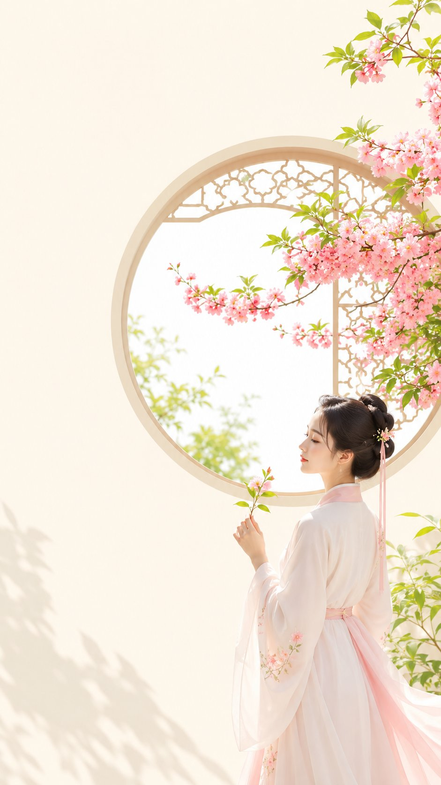

```text
Theme direction: Oriental Zen minimalist cover poster
Style branch: Bright female aesthetic
Main content: An ancient-style woman standing by a circular lattice window, holding a small flower branch in her hand
Emotional motif: Sweet, bright, spring relaxation
Scenes and imagery: Circular lattice window, lychee pink flowers, green apple green leaves, warm white negative space background, woman's silhouette
Composition and space: Character located at the bottom right of the screen, the circular lattice window is in the middle and upper part as the main visual, leaving the left side and top for the complete title area
Color control: Cream white as the high-brightness background, lychee pink for flowers and local clothing accents, green apple green for leaves and a few plants outside the window, character's clothing in light beige or light pink-white; avoid a full-image pink-green filter effect
Lighting and texture: Bright natural light, clean flat illustration feel, sharp edges, very light paper texture
Aspect ratio: 9:16
Supplementary requirements: The overall feel should be sweet, with fresh and clean colors, suitable for a Xiaohongshu spring cover, avoid gray mist and old paper feel
```


---

## 例 732：超逼真电影双曝光红金中式海报

**来源：** [@YUKIMASTERAI](https://x.com/YUKIMASTERAI/status/2092038838449475852) / [OpenNana](https://opennana.com/awesome-prompt-gallery/ultra-realistic-cinematic-double-exposure-poster-chinese-style)

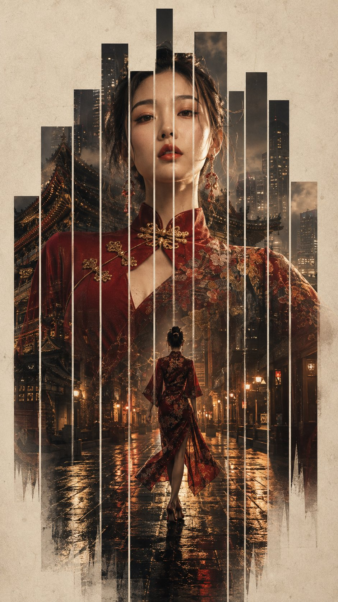

```text
Ultra-realistic cinematic double exposure poster, vertical 9:16, keeping the same adult East Asian female reference, elegant red and gold Chinese style clothing, calm and powerful expression. Vertical geometric strip collage, textured beige paper background, layered ancient Chinese palace architecture + modern skyscrapers + rainy neon city streets, wet reflective sidewalk, a smaller woman walking away in the middle, dramatic warm amber and deep red tones, high contrast, exquisite editorial poster design, rich details, 8K, no text, no watermark.
```


---

## 例 733：大胆社论海报超大字体动态交互

**来源：** [@MrLarus](https://x.com/MrLarus/status/2092034848718274659) / [OpenNana](https://opennana.com/awesome-prompt-gallery/bold-editorial-campaign-poster-dynamic-typography)

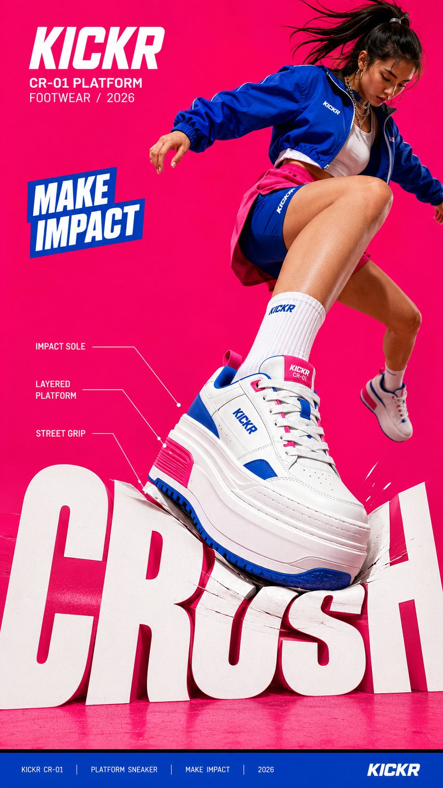

```text
Create a bold editorial campaign poster where oversized typography reacts to a physical force created by the subject or product.

Brand: [BRAND NAME]
Product / Campaign: [PRODUCT OR CAMPAIGN]
Main Word: [SHORT WORD]
Subject: [PERSON / PRODUCT / BOTH]
Action: [STEP / JUMP / PULL / SKATE / ETC.]
Force: [PRESS / PUSH / WRAP / SLIDE / OTHER]
Force Direction: [DOWN / UP / ROTATE / DIAGONAL / OTHER]
Main Color: [COLOR]
Accent Color: [COLOR]
Aspect Ratio: [9:16]

Use realistic commercial photography, oversized typography, high-contrast colors, and contemporary editorial design.

Make the main word extremely large, filling roughly 50–75% of the frame. The typography should visibly respond to the chosen force instead of remaining static.

For example:

 PRESS: compress, bend, or shift the letters at the point of impact.
 PUSH: stretch the typography along an upward or forward direction.
 WRAP: let large letterforms pass behind and in front of the subject to create an enclosing motion.
 SLIDE: offset and shift the letters along one strong directional axis.

The deformation must follow the subject’s actual movement and force direction. Keep the typography graphic and readable — avoid turning it into soft 3D, liquid, or cartoon lettering.

Create clear foreground–subject–background interaction so the person or product feels physically connected to the type.

Use one dominant high-impact color with black, white, and a contrasting accent color. Add only a few meaningful campaign details such as the brand name, product name, slogan, specifications, labels, or small editorial text.

Keep people and products realistic, with believable proportions, materials, lighting, shadows, and dynamic movement.

The final image should feel like a finished campaign key visual where force, subject, typography, and composition all move together.
```


---

## 例 734：高级复古欧洲自然史插画海报

**来源：** [@hann7712](https://x.com/hann7712/status/2091894153366192508) / [OpenNana](https://opennana.com/awesome-prompt-gallery/vintage-european-natural-history-poster-prompt)

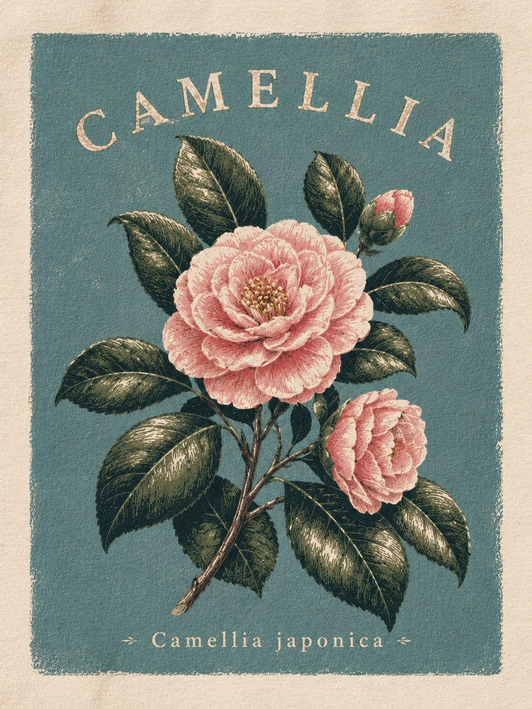

```text
Create a high-end vintage art poster with [Any Subject] as the core.

Vintage European natural history illustration
+ 19th-century copperplate engraving

- Antique encyclopedia illustrations
- Vintage screen printing
- Old book cover design
- Vintage product labels

Subject centered, simple composition, low-saturation vintage solid color background, automatically select the most harmonious color.

Fine hand-drawn crosshatching, realistic structure, slight handmade feel.

Cream-colored old paper frame, clear paper fibers, slight edge wear, ink dropping, grain, color registration errors, and natural fading.

Overall:
High-end + Artistic + Restrained + Nostalgic + Collectible feeling

Typography Design

Automatically generate natural, correct, and aesthetic English text based on the subject, no manual specification required.

The top automatically generates a simple English name or theme word corresponding to the subject, using a classical uppercase serif font.

The bottom automatically generates smaller:

English subtitle / Latin scientific name / Classification name / Simple phrase,

Specific content is automatically selected based on the subject type for the most natural choice.

Text content must be truthfully related to the subject, avoiding random garbled characters, misspellings, and meaningless words.

Typography layout reference:

Antique encyclopedia
European natural history illustrations
Vintage product labels
Old botanical books

Text size, letter spacing, curvature, and position are automatically adjusted based on the composition, maintaining comfortable negative space with the subject.

The text should look like it originally belonged to this antique print, naturally blending with the paper, color, and ink texture, without a modern digital font feel.

Forbidden:
Modern 3D, plastic feel, high saturation, neon colors, complex backgrounds, cheap cartoon feel, over-sharpening.

3:4, Ultra-High Definition
```


---

## 例 735：琐碎紧急情况漫画风海报设计

**来源：** [@VigoCreativeAI](https://x.com/VigoCreativeAI/status/2091888379604373647) / [OpenNana](https://opennana.com/awesome-prompt-gallery/small-emergencies-manga-ink-poster)

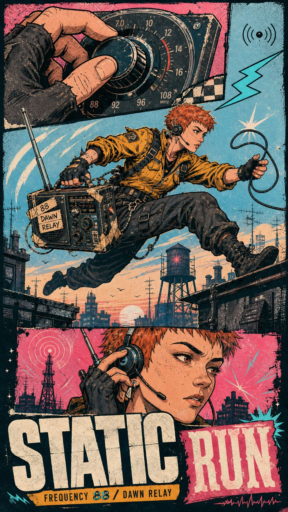

```text
{
  "style_name": "Small Emergencies",
  "style_slug": "manga-ink-three-panel-shift-poster",
  "canvas": "9:16 tall poster, aged cream paper, heavy print grain, distressed edges and corners",
  "color": {
    "ink": "near-black line work #1A1714",
    "paper": "cream #EFE3CE",
    "fills": ["hot pink #E85D8A", "sky cyan #6FC3D6", "signal yellow #E8B33A", "copper orange #D96B2E"],
    "rule": "flat, slightly misregistered print fills; pink must take ONE impossible role per poster — the water spray, the dawn sky, the ghosted second self"
  },
  "illustration": {
    "technique": "dense seinen-manga inking — crosshatch shading, speed lines, spray dots, screentone patches — over flat poster color",
    "panels": "three stacked panels separated by TILTED diagonal gutters with thin paper-colored gaps",
    "panel_grammar": {
      "instrument": "extreme close-up of a hand on the job's instrument — tuning dial, lantern striker, pressure gauge, kitchen timer — markings readable",
      "action": "the same worker full-body at the peak of a small crisis, strong diagonal pose, environment drawn in full detail",
      "face": "tight portrait of the same character — effort, relief or joy; optionally a ghosted second emotion behind them in one flat color"
    },
    "order_rule": "the three beats may shuffle order, but all three must appear, and it is the same character in every panel",
    "diegetic_text": "all in-scene words belong to the world — tape labels, shop signs, flour bags, buoy numbers, warning plates"
  },
  "typography": {
    "masthead": "two words, TWO typefaces: word one in massive distressed slab caps in cream; word two in ornate circus tuscan, set on or filled with a color block",
    "info_bar": "one yellow bar in bold black caps at the foot: place or season, slash, log or batch number",
    "scatter": "checkerboard patches, lightning bolts, starbursts, tiny waveforms — three or four per poster, never more"
  },
  "design_rules": [
    "the crisis must be genuinely minor — a relay to run, a lamp to light, a pipe to fix, dough to catch; the inking treats it as life or death",
    "the face panel pays off the action panel — same shift, seconds apart",
    "panels tilt; the masthead never does",
    "no gradients in the fills; depth comes from line density, not tone"
  ],
  "swap_variables": {
    "job": "dawn radio courier / pier storm-watch keeper / irrigation mechanic / night baker",
    "crisis": "carry the signal across rooftops / light the storm lantern in rain / burst pipe in dry season / dough over-rising at 3am",
    "instrument": "tuning dial / lantern + striker / gauge + pipe wrench / timer + copper bowl",
    "masthead": "STATIC RUN / TIDELIGHT / BLOOM FIX / MOON RISE",
    "info_bar": "FREQUENCY 88 · DAWN RELAY / PIER NINE · STORM WATCH / DRY SEASON · REPAIR LOG 04 / BATCH 03 · OPEN TILL DAWN",
    "diegetic_labels": "88 DAWN RELAY tape / buoy No.9 / WATER PRESSURE dial / ALL NIGHT BAKERY sign + POWER FLICKER plate"
  }
}
```


---

## 例 736：PHO REPUBLIC 越南粉 2x2 旗舰平面广告系列

**来源：** [@ou_zhen599](https://x.com/ou_zhen599/status/2092155004761285113) / [OpenNana](https://opennana.com/awesome-prompt-gallery/pho-republic-flagship-2x2-campaign-poster)

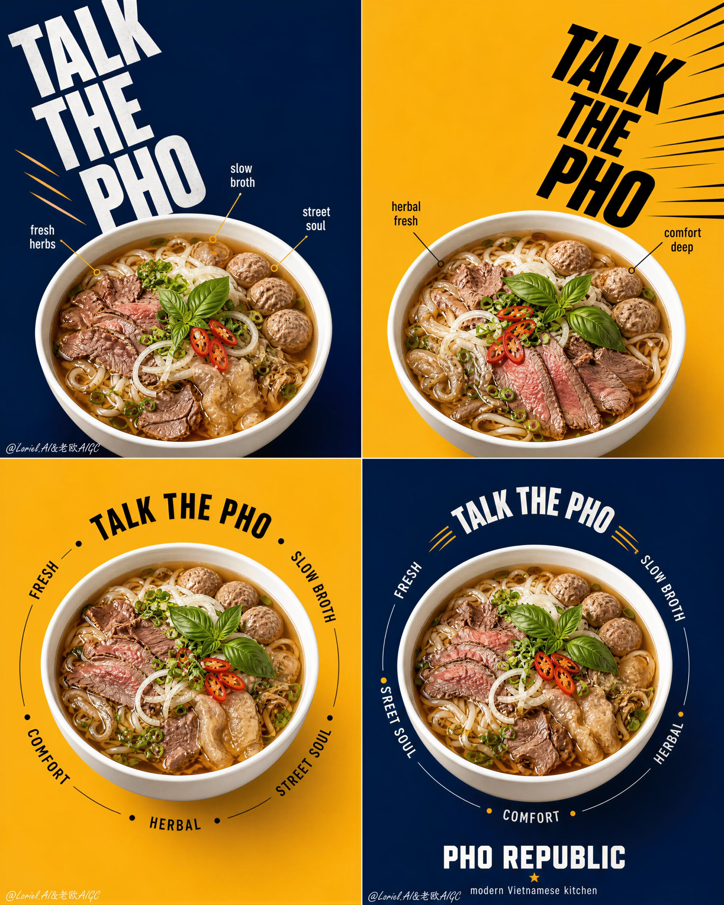

```text
Create a flagship 2x2 campaign poster series for an original Vietnamese noodle brand named "PHO REPUBLIC", merging Orbit energy with Transit restraint. Use ultra-realistic commercial food photography, not illustration, not 3D render. The final artwork must present four coordinated square posters arranged in a strict 2x2 grid, each panel built from the same structural system with disciplined variation. The pho bowl must remain the absolute visual hero in every panel.

Style lock: high-end graphic food advertising, bold editorial poster layout, product-first hierarchy, clean color-block backgrounds, oversized kinetic typography, youthful premium Asian street-dining branding, Cannes-level print campaign execution.

Core campaign structure: four square panels with alternating deep navy blue and warm mustard yellow backgrounds. Each panel contains one large white pho bowl shown from the exact same slightly top-down camera angle. Bowl size, bowl height, bowl perspective, rim thickness, bowl diameter, and visual weight must be perfectly consistent across all four posters. The container must sit at an equal visual scale in every panel, acting as the fixed campaign anchor. Variation is allowed only in typography rhythm, circular text paths, callout placement, and directional movement around the bowl.

Transit logic: simplify every panel so the layout feels flagship and globally polished. Reduce small labels, reduce decorative callouts, shorten copy, preserve more clean negative space, and let the bowl, background block, and primary typography do most of the work. Avoid flyer-like density. Each square should feel graphic, premium, and instantly readable.

Orbit logic: create a coordinated movement system across the full 2x2 set. Panel one uses a strong descending diagonal text flow, panel two uses a mirrored inward-driving diagonal, panel three uses a controlled circular orbit around the bowl, and panel four uses a tighter circular return path that visually resolves the campaign. The four panels should feel like one connected visual sequence: launch, counter, orbit, resolve. Motion must feel crisp and graphic, not noisy.

Food design: create a premium beef pho hero dish with richly detailed ingredients: glowing amber broth, thin rice noodles, sliced beef, beef balls, tendon or tripe accents, basil leaves, scallions, red chili slices, onion, fresh herbs, and subtle broth sheen. Ingredient styling may shift slightly between panels, but the bowl size and bowl dominance must never change. The dish must feel abundant, fragrant, hot, and highly craveable.

Panel logic:
1. Top-left panel: deep navy background, oversized stacked headline moving diagonally from upper-left toward center, bowl anchored in the lower-middle zone, a few restrained callout markers near the rim.
2. Top-right panel: mustard background, mirrored bold typography driving inward from upper-right toward center seam, bowl anchored at the same scale and height as panel one, minimal graphic accents only.
3. Bottom-left panel: mustard background, centered bowl with a clean circular text orbit around it, fewer callouts than the top row, stronger negative space.
4. Bottom-right panel: deep navy background, centered bowl matching panel three exactly in scale and placement, tighter orbit text and a compact brand footer block to conclude the campaign.

Typography and branding: use original English text only, never copy any existing wording. Use a bold master phrase such as "TALK THE PHO" as the campaign anchor across the series, varied in scale and rhythm but always consistent in brand voice. Add only a few short descriptors such as "fresh", "slow broth", "street soul", "herbal", and "comfort". Include a compact brand block reading "PHO REPUBLIC" with a subtitle such as "modern Vietnamese kitchen". Typography should feel oversized, architectural, witty, and kinetic, but always secondary to the bowls.

Lighting: bright controlled studio food lighting with soft frontal illumination and subtle side shaping. The broth must glow warmly, herbs must feel crisp and fresh, meat textures must remain moist and realistic, and the white ceramic bowls must look clean, glossy, and dimensional. Keep shadows soft and controlled, with no muddy contrast.

Materials and realism: realistic white ceramic bowls with identical shape and scale across all four posters, hot glossy broth, tender beef textures, springy noodles, fresh basil, crisp chili slices, subtle oil shimmer, clean matte background fields, premium print-ready sharpness, and integrated graphic elements that feel designed rather than pasted.

Color system: strict alternating navy blue and mustard yellow fields, with restrained accents of red, white, black, and herb green. Keep the palette disciplined, high-contrast, and premium. Food colors must remain natural and appetizing.

Quality and physical rules: all four panels must feel like one unified flagship campaign. Equal bowl size across every panel is mandatory. Equal bowl camera angle, equal bowl scale, equal bowl visual weight, and equal product dominance must be preserved. Keep the campaign clean, graphic, premium, and highly legible. No clutter, no warped rims, no type collisions, no weak food detail, no dead black patches, no oversaturated broth.

Negative prompt: copied branding, copied text, inconsistent bowl sizes, inconsistent bowl height, inconsistent bowl perspective, different container scale between panels, warped bowl rims, blurry food, fake broth texture, messy layout, chaotic typography, cheap flyer look, low-resolution print feel, oversaturated food colors, excessive labels, cluttered callouts, cartoon rendering, CGI look, illustration style, product losing dominance, muddy shadows, dirty background.
```


---

## 例 737：未来主义复古丝网印刷赛车概念插画

**来源：** [@HustleXR](https://x.com/HustleXR/status/2092180120576610728) / [OpenNana](https://opennana.com/awesome-prompt-gallery/futurist-retro-serigraph-vehicle-concept)

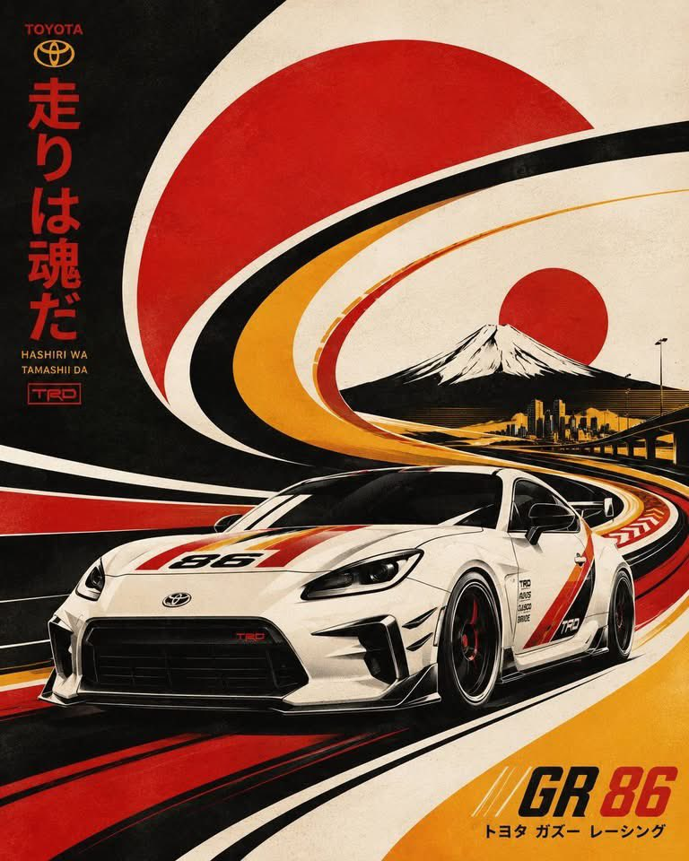

```text
Futurist retro-serigraph illustration of a [BRAND]-inspired [VEHICLE] concept speeding through giant flowing graphic curves and abstract high-speed road forms, dynamic 3/4 perspective, aerodynamic bodywork, aggressive stance and retro motorsport aesthetic, stylized motion trails integrated into the environment, sensation of high speed without realistic motion blur. Minimal but dramatic composition made from layered curved bands and negative space. Vintage modernist poster aesthetic, smooth airbrushed gradients, crisp vector-like surfaces, subtle print grain, soft paper texture. Color palette restricted to [COLOR 1], [COLOR 2], [COLOR 3] and [COLOR 4] only. Elegant screenprint finish, vertical composition 4:5
```


---

## 例 738：影像衍生品牌包装视觉识别海报

**来源：** [@xiaoxiaodong01](https://x.com/xiaoxiaodong01/status/2091477071751262459) / [OpenNana](https://opennana.com/awesome-prompt-gallery/brand-visual-identity-presentation-board)

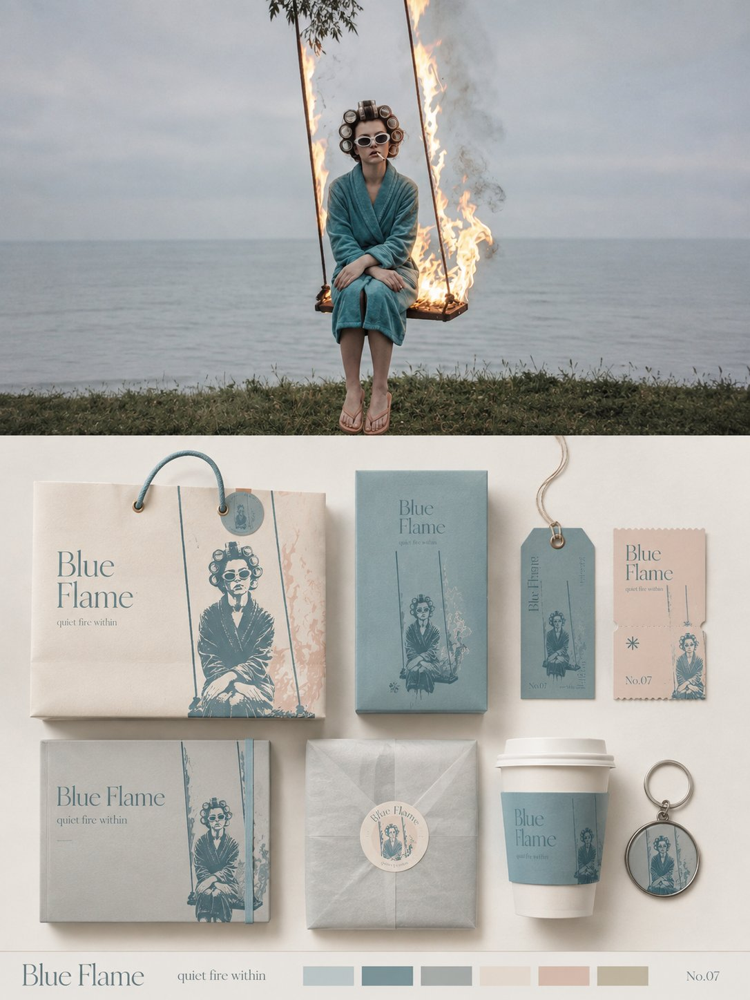

```text
Please turn each photo I upload into an independent high-end design poster, no multi-photo stitching, each photo output individually. The overall composition uses a 3:4 vertical layout, with the upper and lower areas strictly 1:1 in height, each occupying 50% of the frame. The upper half preserves the original photo, maintaining the subject identity, structure, posture, realistic texture, natural lighting, and original color atmosphere, with only slight high-end photographic color grading to give it the texture of art magazines, independent publications, and exhibition photography. To adapt to the frame, the sky, ground, or environmental background can be naturally extended, but the subject must not be stretched, distorted, or changed. The lower half extracts the most recognizable subject, outline, posture, and narrative relationship from the photo, transforming it into a complete brand packaging and material visual system. Do not simply copy the photo; instead, refine the subject's characteristics into reusable core graphics, illustration symbols, patterns, color blocks, or identification elements, and then apply them to packaging carriers of different sizes and purposes, making all materials instantly belong to the same visual family. Automatically select the most suitable 5–8 carriers based on the original image's theme, such as paper bags, packaging boxes, gift sets, labels, tags, tickets, cards, stickers, sleeves, cup packaging, key pendants, wrapping paper, or other related materials, without forcing the use of fixed categories. Use 1–2 main packages as the visual focus, with the remaining materials forming modular combinations based on size, horizontal/vertical ratios, and function; use a clear grid, edge alignment, scale contrast, spacing rhythm, and large areas of white space to organize the frame, like a professional brand design studio's packaging identity presentation board, rather than product displays or messy mockup collages. The color palette remains soft, transparent, and slightly desaturated in high-end tones, mainly light pink-blue, mist blue, sky blue, and airy cool-toned blue, paired with ivory white, cream white, light beige, soft gray-green, and architectural neutral colors, using only a small amount of dusty rose or muted blush as visual accents. Different packaging can change the color area and combination method, but must maintain the same color system to form a rich yet unified sense of series. The material emphasizes realistic and exquisite paper and packaging craftsmanship, showing matte paper, fine-grained paper, thick cardstock, translucent paper, embossing, die-cutting, folding, stickers, partial printing, and slight layering relationships; lighting is soft and natural, only used to express paper thickness, creases, and material differences, avoiding plastic feel, strong reflections, exaggerated 3D, and cheap product rendering. Text is also designed uniformly as part of the entire packaging system. Extract a short English main title from the subject's name, theme, mood, function, or symbolic meaning of the original image, and extend a very small amount of sub-titles, short sentences, numbers, category names, or micro-descriptions. Text can change naturally according to different carriers: vertically arranged on tags, extending along packaging edges, surrounding circular labels, crossing box surfaces, hidden between graphics, or becoming part of the packaging closure structure, so that fonts, graphics, and materials together form a complete brand language, rather than repeating the same title on every item. The overall presentation is a high-end brand packaging system / visual identity proposal board: rich but not crowded, lively but orderly, showing both the complete series and the design logic between graphics, text, materials, and different carriers. Whether the original image is a person, animal, plant, architecture, object, food, vehicle, or natural landscape, a unique packaging language should be established from the original image itself, avoiding fixed product combinations, repetitive templates, e-commerce display feel, and ordinary brand mockup templates.
```


---

## 例 739：复古火柴盒标签风格旅行海报

**来源：** [@Hamburgerai](https://x.com/Hamburgerai/status/2093178203959627903) / [OpenNana](https://opennana.com/awesome-prompt-gallery/vintage-matchbox-travel-label-poster)

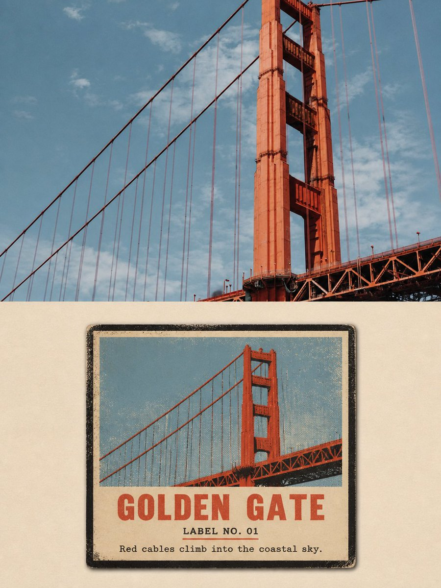

```text
Please turn each travel photo I upload into an individual high-end design poster. One photo corresponds to one finished product. No multi-photo collages, and do not create product display mockups.

Adopt a 3:4 vertical composition overall. The image consists of a real photography area at the top and a vintage label re-rendering area at the bottom, with a clear, straight horizontal boundary between the two areas.

The upper photography area accounts for about 45%–50% of the entire image. Faithfully preserve the subject, architecture, vehicles, terrain, direction, spatial relationships, observation angles, natural light and shadow, real textures, and color atmosphere of the original photo. Perform only slight high-end travel photography color grading and extremely thin film grain processing. The top must remain a clearly identifiable real photo; do not redraw, deform, mirror, replace subjects, or modify architecture.

The bottom accounts for about 50%–55%, re-rendering the same scene as a "VINTAGE MATCHBOX TRAVEL LABEL".

In a warm off-white or old-paper-colored empty field, place a flat rectangular old paper travel label. The label occupies about 48%–68% of the width of the lower area, with about 32%–52% continuous paper white space remaining around it.

Only show the front of the label; do not show matchbox thickness, drawers, sides, matches, packaging structures, handheld scenes, or product displays.

Extract the most recognizable subject outlines, orientations, postures, key architectural structures, and iconic color blocks from the original photo, compressing the complex environment into a central stamp, badge, or large color block composition.

The subject must be immediately traceable to the original photo, but photo tracing or automatic vectorization cannot be used. Reorganize the composition based on the subject's characteristics, for example:

- Landmark buildings compressed into thick-outline badges;
- Bridges transformed into strong directional structures of towers and cables;
- Roads transformed into exaggerated perspective wedges;
- Vehicles transformed into side-profile stamps composed of spoilers, bodies, and wheels;
- Mountains and terrain transformed into a few hard-edged silhouettes.

Use heavy near-black borders, thick black outlines, hard-edged flat painting, and 2–4 opaque spot colors. Colors must be extracted from the original photo, then summarized and moderately purified, while adding warm paper color and near-black outline color.

Express old color printing characteristics:

- coarse halftone;
- waxy ink grain;
- missing ink;
- rough printed edges;
- slight color misregistration;
- worn corners;
- aged paper fibers;
- uneven spot-color coverage.

Legible paper white space must still be reserved inside the label; do not fill the surroundings with decorations, dots, or borders.

Text is added as part of the label printing:

- A location or scene title of 1–3 English words;
- A number in the style of "LABEL NO. 01";
- An observation sentence of 5–10 English words.

Use bold, slightly irregular vintage uppercase fonts for the main title, and small old lead type or typewriter fonts for auxiliary text. Allow for slight ink missing, wear, and color registration offset, but the main title must be clearly readable in chat previews.

Do not copy trademarks, window stickers, organization names, author signatures, or irrelevant text from the original photo. Do not imitate real match brands, specific old packaging, or existing product labels.

The overall look is like a travel print preserved from an old suitcase, roadside shop, or local souvenir album: direct, coarse, sun-aged, and collectible, but not childish, cheap, or a nostalgic template.

Avoid: 3D matchboxes, sides of packaging boxes, matches, product advertisement mockups, real brand imitations, modern minimalist logos, smooth vectors, digital gradients, photographic filters, automatic photo tracing, too many colors, complex panoramas, children's cartoons, generic travel icons, redrawing of the entire poster, missing original photos, shrinking photos into small decorations, changing materials for the same framing, blurred boundaries, author names, logos, watermarks, gibberish, fictional brands, and redundant text.
```


---

## 例 740：南半球小众早餐文化对比海报提示词

**来源：** [@Gdgtify](https://x.com/Gdgtify/status/2093324721693868044) / [OpenNana](https://opennana.com/awesome-prompt-gallery/southern-hemisphere-underrated-breakfast-poster-prompt)

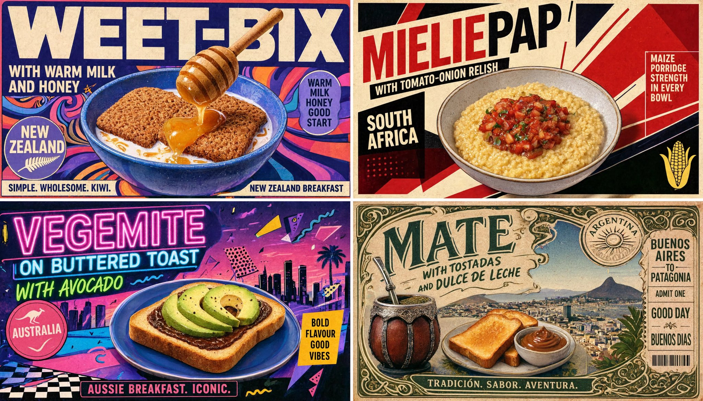

```text
2x2 grid, 16:9, do this for 4 under rated breakfasts of Southern hemisphere: INPUT = [TOPIC_CATEGORY / REGION_SET / SELECTION_CRITERIA / MOOD]
MODE = no_hardcoding / inference_only

Run REGIONAL_CULTURAL_ATLAS_EXTRACTION:

CATEGORY_DNA := infer what type of thing is being compared, how it is used, why it matters, and what makes it visually recognizable

REGION_DNA[each] := infer local environment, visual culture, palette, typography attitude, textures, symbols, landscapes, tools, rituals, and social context

ITEM_SELECTION[each] := infer one overlooked or representative item that fits TOPIC_CATEGORY + REGION + SELECTION_CRITERIA

HERO_VISUAL[each] := infer the best visual treatment:
plated food, product close-up, ritual scene, tool layout, garment portrait, object still life, landscape-backed artifact, map-backed diagram, or symbolic vignette

COPY_SYSTEM[each] := generate:
- large item title
- short emotional tagline
- origin/location label
- 2–4 tiny descriptors
- stamp or badge phrase
- small contextual note

GRAPHIC_SYSTEM := infer torn paper, printed grid, muted color blocks, topographic lines, stamps, borders, halftone, atlas marks, and editorial spacing

Render:
A premium regional comparison poster where each panel feels locally specific but belongs to one unified cultural theme.

Forbidden:
hard-coded Southern Hemisphere, fixed breakfasts, fixed foods, fixed countries, fixed beige/red/green palette, fake local facts, random travel-poster clichés.
```


---

## 例 741：极简栅格线条实验性海报

**来源：** [@MrLarus](https://x.com/MrLarus/status/2093001886156673349) / [OpenNana](https://opennana.com/awesome-prompt-gallery/experimental-raster-line-poster-design)

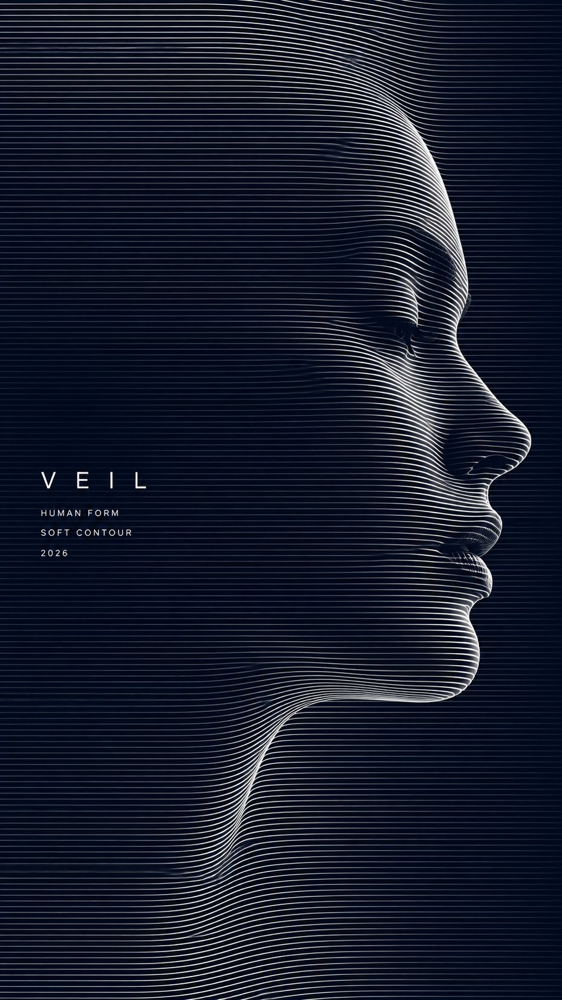

```text
[SUBJECT]: {subject}
[TITLE]: {name}
[BACKGROUND]: {color}
[LINES]: {color}

[TEXT]: {2–4 short lines}
[FORMAT]: 9:16

Create a refined experimental poster built from a continuous field of fine parallel raster lines.

Make [SUBJECT] feel like a hidden 3D form pushing through the line field. The subject should emerge mainly through smooth compression, expansion, bending, and negative space — not through a separate outline or realistic rendering.

Keep the subject at roughly 70–80% of the composition and use only a few large, controlled deformation zones. Away from the subject, the lines should gradually return to straight parallel form.

Prioritize line quality above everything else: extremely fine, sharp, smooth, evenly spaced, and uninterrupted curves.

Add 2–3 small typography blocks inside quieter negative spaces using minimal modern sans-serif type.

Style: Op Art, generative graphic design, experimental editorial poster, modern sculpture, refined minimalism.

Avoid broken or intersecting lines, jagged curves, chaotic ripples, excessive realism, wireframe outlines, sci-fi UI, excessive text, logos, numbering, starbursts, and sparkles.
```


---

## 例 742：现代社论拼贴海报艺术提示词

**来源：** [@MrLarus](https://x.com/MrLarus/status/2093153744879849723) / [OpenNana](https://opennana.com/awesome-prompt-gallery/modern-editorial-collage-poster-art-prompt)

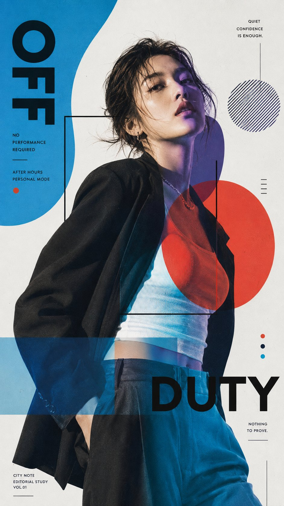

```text
Theme: {e.g. Fashion / Music / Running / Art}
Subject: {describe the person, outfit, pose, expression, or object}
Headline: {main title}
Supporting text: {2–4 short meaningful phrases}
Primary colors: {2–3 colors}
Mood: {cool / energetic / hypnotic / quiet / etc.}
Aspect ratio: {9:16 / 4:5 / 3:4}

Create a sophisticated editorial collage poster combining realistic photography, color-shifted portrait treatment, bold geometric graphics, and modern magazine typography.

Use a clean white or lightly textured warm-ivory background with generous negative space.

Make one photographic subject the main visual anchor, occupying roughly 50–70% of the composition. Give the subject a clear personality, natural body language, and a strong emotional state rather than a generic model pose.

Treat the photographic subject itself as part of the color system. Use selective duotone and multitone color mapping across different parts of the face, hair, clothing, and body.

Allow some areas to remain neutral and photographic while other areas naturally shift into the chosen colors.

Keep facial highlights and skin tones clean, realistic, and flattering. Introduce stronger color mainly through shadows, clothing, edges, and selected overlapping areas. Avoid muddy, dirty, or unnatural skin tones.

Add 2–4 bold geometric elements such as cropped circles, arches, rectangles, organic shapes, color slices, or open frames.

The graphics should actively interact with the subject through masking, cropping, overlapping, and color transfer. When a colored shape crosses the portrait, let the photographic tones beneath it shift naturally, creating screen-print, risograph, or offset-print color interactions rather than looking like a flat transparent sticker.

Optional: add a second cropped photo detail, subtle portrait echo, registration-shift effect, halftone texture, line pattern, or theme-related graphic element.

Use a restrained color system: light neutral background, 2–3 strong colors, dark neutral typography.

Create a clear editorial typography hierarchy with one dominant headline and only a few short supporting phrases. All text should have real meaning related to the theme.

Keep the composition asymmetrical, layered, energetic, and intentionally art-directed while preserving enough empty space to avoid visual clutter.

The final image should feel like a contemporary independent fashion, music, sports, or culture magazine poster with expressive photography and experimental print-inspired color treatment.
```


---

## 例 743：韩国3D分层剪纸风格旅游海报

**来源：** [@Goodmanprotocol](https://x.com/Goodmanprotocol/status/2093024305055682783) / [OpenNana](https://opennana.com/awesome-prompt-gallery/3d-layered-paper-cut-south-korea-travel-poster)

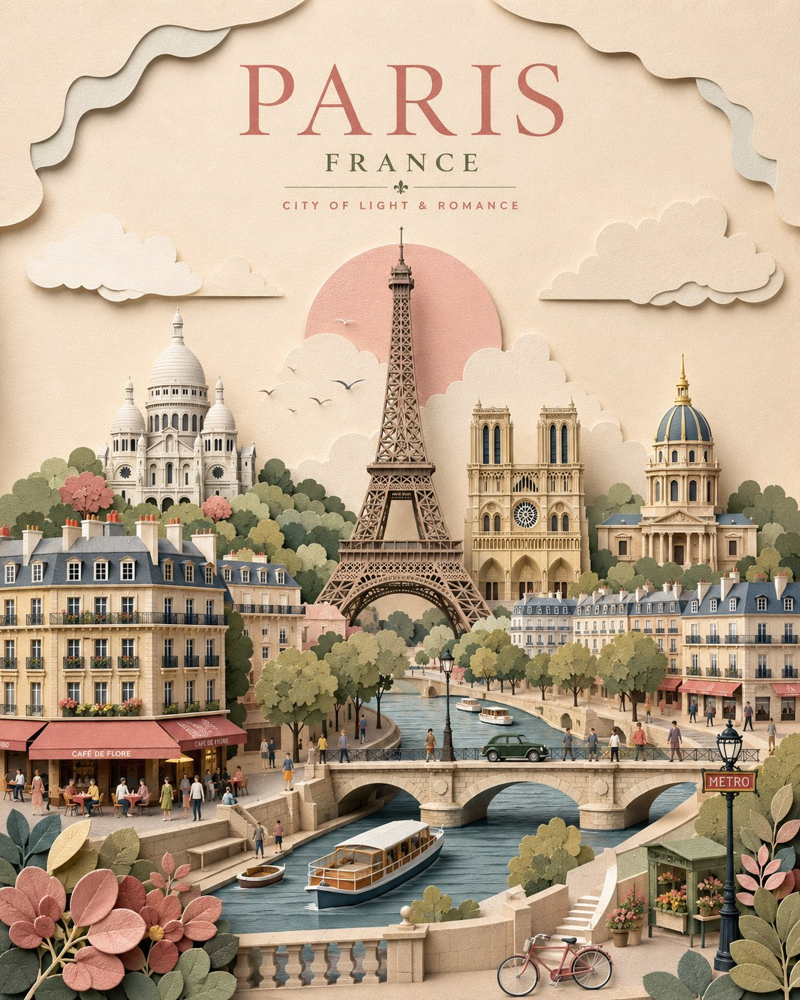

```text
Create a premium vertical 4:5 travel poster of [CITY], [COUNTRY], designed as a handcrafted layered 3D paper-cut miniature world.

Use a soft pastel paper background with subtle grain, sculpted clouds, textured cardstock layers, realistic cut-paper edges, tactile fibers, gentle shadows, and elegant 3D depth. Make [MAIN ICONIC LANDMARK] the dominant central feature, surrounded by 4–6 recognizable landmarks, architecture, streets, bridges, nature, cultural details, and local elements. Add important geography such as a river, lake, or coastline where relevant.

Include tiny paper-cut people, vehicles, boats, trees, cafés, and street details for scale and storytelling while keeping the composition clean and sophisticated.

Use harmonious city-inspired pastels: cream, warm beige, muted green, dusty pink, soft blue, terracotta, and complementary tones.

At the top, add minimal elegant typography:

[CITY]
[COUNTRY]
[SHORT ICONIC TAGLINE]

Premium editorial travel-poster aesthetic, whimsical handcrafted paper sculpture, realistic architecture, layered depth, delicate paper fibers, soft studio lighting, subtle ambient shadows, refined composition, clean negative space, highly detailed and collectible.

Avoid: photorealism, plastic, glossy CGI, metallic surfaces, clutter, distorted landmarks, excessive text, oversaturated colors.

Keep the same composition and artistic style across cities while adapting the landmarks, geography, cultural details, and color accents authentically to each destination. Generate for south korea follow aspect ratio accurately
```


---

## 例 744：笔触涂鸦插画海报生成提示词

**来源：** [@Maercihh](https://x.com/Maercihh/status/2090421882311024862) / [OpenNana](https://opennana.com/awesome-prompt-gallery/brush-painted-illustration-poster-prompt)

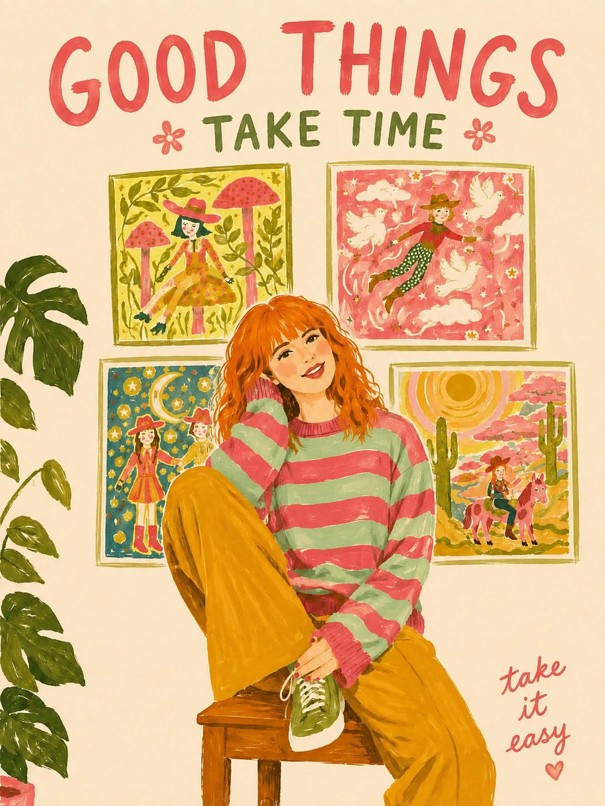

```text
Transform the attached photo into a brush-painted illustration poster. The subject in the photo can be food, another product, a landscape, an animal, a person, or any object you want to feature as the main subject.
[Aspect Ratio]
Vertical 3:4
[Style]
Digital painting / brush-painted effect.
Visible brush strokes, uneven edges, slightly stretched paint marks.
Hand-painted appearance that feels untouched and authentic.
Interpret the image as a flat illustration with a simple arrangement of shapes rather than a realistic depiction.
No gradients, shadows, 3D rendering, or detailed textures. Keep everything completely flat.
Use a thin, irregular brush-painted outline that varies slightly from the painted areas.
[Color]
Background should be cream / off-white paper.
Use only 3–4 colors taken from the attached photo:
1 dark primary color
1 bright primary color
1–2 supporting colors
Slightly desaturated vintage tone.
Never increase the number of colors.
[Composition]
The subject should be large and centered, occupying approximately 50–55% of the canvas.
Extend the composition vertically with more space above and below, while also increasing the left and right margins.
At the top: place 1–2 English uppercase words describing the subject, in very large hand-painted brush lettering. Use very wide letter spacing; the text may wrap around the illustration or extend toward the right/downward.
At the bottom right: add a short handwritten English phrase of 3–5 words in an accent color.
[Text]
Look at the photo and choose suitable top and bottom phrases.
Do not use the actual subject name as the top text.
Choose words based on the atmosphere, location, season, time of day, or emotion shown in the photo.
The bottom phrase should feel casual, lighthearted, and slightly playful—not overly serious or explanatory.
[Forbidden]
Realistic rendering
3D
Shadows
Reflections
Logos
Watermarks
Border frames
Excessive enlargement of the subject
```


---

## 例 745：超大字体互动社论风群像海报

**来源：** [@MrLarus](https://x.com/MrLarus/status/2090292925070725463) / [OpenNana](https://opennana.com/awesome-prompt-gallery/bold-editorial-typography-group-poster)

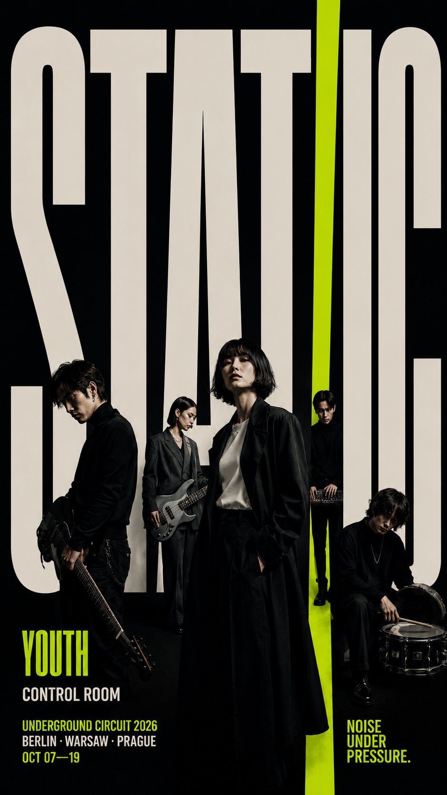

```text
[THEME]: {band / family portrait / brand campaign / team / event}
[TITLE]: {main title}
[CHARACTERS]: {number, age, gender, roles, styling}
[BACKGROUND]: {color}
[ACCENT]: {color}
[TYPE BEHAVIOR]: {connection / echo / compression / architecture}
[INFO]: {subtitle + 2–4 short lines}
[FORMAT]: 9:16 vertical

Create a bold editorial group poster where oversized typography becomes part of the physical composition.

Use a clean background, a restrained color palette, realistic photographic characters, and one strong accent color.

Make the main title extremely large, occupying roughly 50–70% of the composition. Let the letters extend beyond the frame and interact with the characters instead of sitting behind them.

Place the characters at different scales, heights, and depths. Avoid lining everyone up evenly. Let some figures stand in front of the letters, some appear between letterforms, and others occupy the negative spaces inside the typography.

Use the typography to express the concept through {TYPE BEHAVIOR}:

e.g.
* connection — extend type into paths or spatial bands

Keep the visual hierarchy strong: giant type, clear character focus, then small supporting information. Use only meaningful text and avoid excessive credits or filler words.

Characters should look like real editorial photography with natural skin, realistic hair, authentic clothing materials, and distinct identities.
```


---

## 例 746：韩系法式学院风生日手绘海报

**来源：** [@you1873118](https://x.com/you1873118/status/2090423083937247539) / [OpenNana](https://opennana.com/awesome-prompt-gallery/korean-french-academy-birthday-poster-collage)

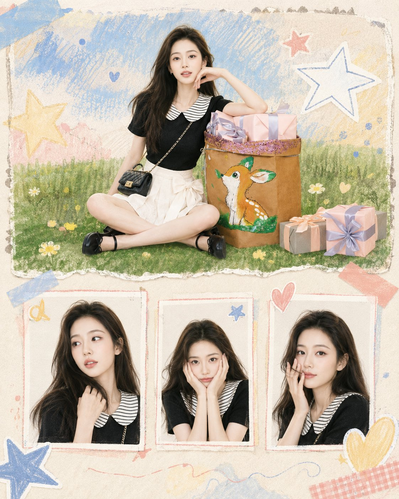

```text
A young girl aged 18-24, sweet and cute, with a slight mixed-race feel, delicate facial features, fair and translucent skin, big eyes, long natural black hair, slightly fluffy and smooth hair strands, fresh and agile temperament, playful and cute expression, natural and varied gaze, Korean-style retro young lady temperament.

Wearing a black slim-fit short-sleeved knitted top, close-fitting waist cut, black and white vertical stripe contrast large lapel, retro doll collar design, small metal buttons on the chest; cream white high-waisted A-line puffy short skirt, three-dimensional pleated hem, large white bow decoration on the left waist; black quilted small leather chain bag, metal chain shoulder strap, gold retro rotary buckle hardware; black square-toe Mary Jane ballet flats, thin buckle straps, small bow decoration on the toe.

The overall style is black and white French academy style, Korean retro girl feel, sweet and cool girl, light retro, elegant and playful, OOTD fashion street photography feel.

The screen style is sea salt cream tone, low-saturation cream color scheme, main colors refer to #90ACF4 #FFF2BA #F9B2AC #FAC596, hand-drawn collage poster style, cream paper background, handwritten graffiti elements, childlike illustrations, birthday atmosphere, simple but not monotonous, fresh and dreamy, combination of magazine feel and hand-account feel, high-end feel and cuteness coexist.

High-texture portrait, soft studio lighting, clean background, exquisite image, no logo, no watermark, no copyright elements.

1

The girl is holding a pink balloon standing in the center of the screen, half-body close-up, gently looking at the camera, background pink hand-drawn border, hearts, stars, graffiti text, birthday poster feel.

2

Full-body standing posture of the girl, holding a bunch of colorful balloons walking upward, large 'Happy Birthday' handwritten words, grass, small house, hand-drawn collage background, playful and relaxed.

3

The girl is sitting on the grass, next to a gift box and a painted deer bucket, three small avatar collages at the bottom of the screen, soft pink-blue cream color, hand-drawn poster style.

4

The girl is sitting on a pink cake, wearing a blue birthday hat, making a peace sign with both hands, surrounded by colored paper and gift illustrations, playful and cute, poster composition.

5

Large close-up of the girl's face on the left, finger lightly touching the tip of the nose, a small person standing on a cake lighting a candle on the right, collage layout, birthday-themed illustration elements.

6

Three-panel character collage poster, the girl in different poses and standing positions, background hand-drawn stars, streamers, cakes, graffiti, cream-colored base, relaxed birthday card style.

7

Three-person birthday collage, the girl holding balloons, sitting and holding her face, and pointing upwards respectively, the screen has flowers, hearts, balloons, and handwritten Happy Birthday notes.

8

The girl is standing leaning forward sideways, next to a fairytale small house, gift bucket, and flowers, illustration-style background, dreamy French girl poster.

9

Multi-grid portrait collage, the girl with different expressions and gestures, holding face, eyes closed, pouting, winking, cream-colored base, pink and blue hand-drawn borders and birthday words.
```


---

## 例 747：奢华现代别墅模型房地产销售海报

**来源：** [@ou_zhen599](https://x.com/ou_zhen599/status/2090338483592368349) / [OpenNana](https://opennana.com/awesome-prompt-gallery/auren-casa-premium-vertical-real-estate-poster)

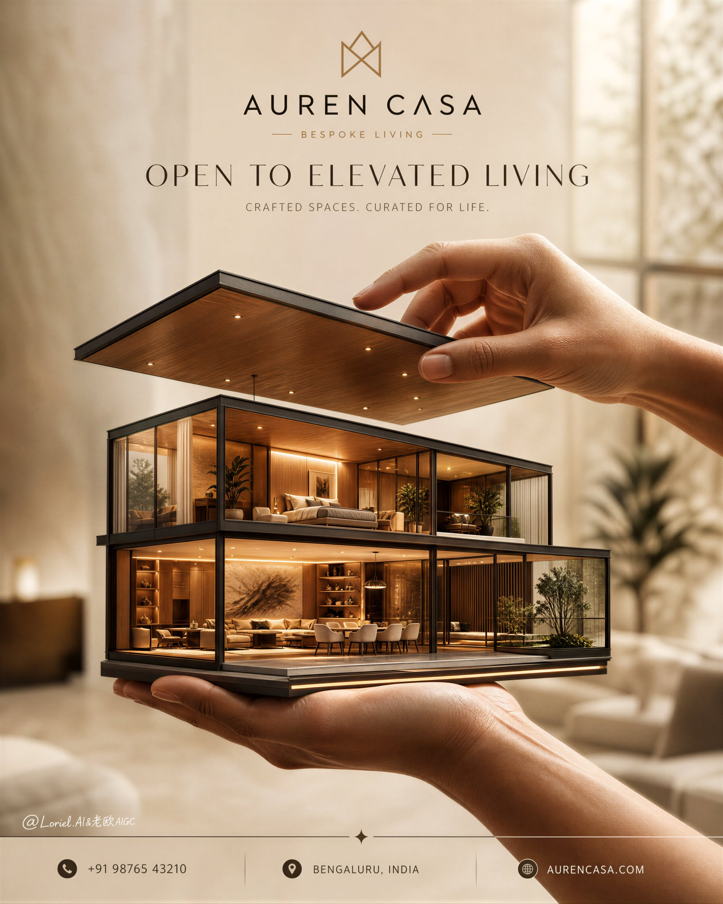

```text
Create a premium vertical real-estate sales poster for a fictional boutique developer brand called AUREN CASA, refined with stronger Orbit reveal energy and more polished Transit luxury. Preserve the original structural logic exactly: a soft warm beige luxury interior background in shallow depth of field, a large central modern villa maquette floating between two realistic human hands, the upper hand lifting a thin roof slab upward, the lower hand supporting the architectural model from beneath, a clean logo-and-headline zone at the top, and a compact branded contact-information strip at the bottom. The whole image must feel like a flagship property-launch visual: elegant, emotionally warm, and internationally premium.

Main visual:
At the center, place one ultra-refined two-story modern villa maquette with fully visible cutaway interiors. Strengthen the Orbit direction by making the lifted roof plane and the supported house body feel more dynamically related, as if the act of opening the roof is actively releasing the living experience inside. The gap between roof slab and model should feel deliberate and slightly more dramatic, while remaining realistic and controlled. The house model must feel handcrafted, valuable, and architecturally believable: slim dark metal frame, floor-to-ceiling glass, warm walnut or oak surfaces, recessed lighting, elegant living room, dining zone, upper private suite, indoor greenery, and clean layered floor plates.

Architecture and interiors:
The villa must read as a premium product, not a conceptual toy. Lower floor: open-plan living and dining with refined furniture, warm shelves, art piece, and subtle residential luxury. Upper floor: softer intimate bedroom or lounge suite. Materials must be rendered with great care: timber, glass, matte slabs, metal framing, upholstery texture, ambient light glow, and miniature lifestyle elegance. The interior should feel warm, inviting, and globally premium.

Hands and realism:
Both hands must be realistic, elegant, and anatomically correct, with natural finger spacing, believable grip pressure, fine skin texture, and beauty-commercial lighting. The upper hand should feel graceful and intentional, delicately lifting the roof slab. The lower hand should feel stable and supportive, reinforcing craftsmanship and care. No hand distortion, no extra fingers, no awkward pose.

Transit direction:
Refine the whole page toward a more international, more editorial, and more luxurious launch-poster standard. Reduce graphic noise, keep the top branding cleaner, make the contact strip more understated, soften any excessive contrast in the background blur, and allow the central model to carry more of the emotional and commercial weight. The image should feel like a flagship collaboration between a top-tier developer and a premium interior design house.

Lighting and mood:
Use soft warm daylight with subtle architectural interior glow. Let the model receive elegant directional light from upper-right or upper-front, with delicate highlights on the roof slab, glass edges, timber interiors, and the hands. Strengthen light-shadow relationships enough to give the model genuine volume and make the lifted-roof action feel more dramatic. The background should remain creamy, blurred, and luxurious, with no distraction.

Typography and branding:
Top zone: one original minimal logo mark, one original developer name, and one short English headline such as “OPEN TO ELEVATED LIVING” or “WHERE SPACE BECOMES HOME,” fully original and not copied. Add one small supporting line beneath.  
Bottom strip: one elegant branded contact bar with original fictional phone number, city text, and website, cleaner and more restrained than a brochure banner.  
All typography must be original, modern, premium, and secondary to the architectural model.

Style:
Luxury real-estate launch poster, premium architecture-and-interior branding, boutique residential campaign, design-build property marketing, hyper-real commercial rendering with emotional warmth, Cannes-level developer advertising polish.

Color system:
Warm beige, soft taupe, cream, walnut brown, muted charcoal frame lines, amber interior glow, restrained dark text, and one subtle brand accent if needed. Keep everything calm, polished, and globally premium.

Negative prompt:
no copied brand names, no copied slogans, no cluttered background, no toy-house feel, no distorted roof geometry, no warped hands, no extra fingers, no malformed anatomy, no muddy shadows, no black blotches, no watermark, no existing logos, no noisy layout, no cheap brochure feel.
```


---

## 例 748：AURELIA LAND云曜天际房产海报设计

**来源：** [@ou_zhen599](https://x.com/ou_zhen599/status/2090350708570955863) / [OpenNana](https://opennana.com/awesome-prompt-gallery/aurelia-land-the-address-above-luxury-poster)

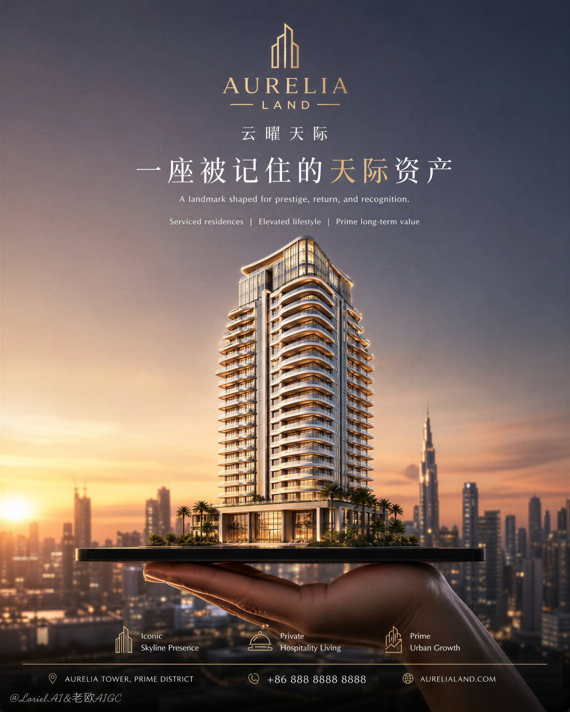

```text
Create a premium vertical flagship real-estate advertising poster for a fictional luxury property developer brand called AURELIA LAND, promoting its iconic serviced-residence tower project “云曜天际” with the English subtitle “The Address Above”. The image must merge Orbit-style upward momentum with Transit-style editorial restraint, while making the brand memory unmistakably strong through a singular architectural identity, a disciplined logo system, and a high-recognition visual symbol. The building must remain the absolute visual hero.

Core concept:
A refined luxury high-rise tower rises from a razor-thin dark premium platform resting on a realistic adult human hand in the lower foreground. The hand symbolizes ownership, elevation, and control, but remains secondary. The main brand memory device is the tower itself: it must have a distinctive signature silhouette with elegant stepped balcony bands and a recognizable crown profile, so the architecture becomes an instantly identifiable brand icon. The entire poster should feel like one unforgettable commercial symbol: a branded tower held above the city.

Composition:
Vertical poster, highly centralized composition, strong symmetry with subtle premium asymmetry in light and skyline depth. The tower stands at exact center, occupying the visual core and extending upward into generous negative space. The platform is thin, dark, glossy, and engineered, acting like a luxury pedestal-device hybrid. A realistic hand supports the platform from below, emerging from the lower edge with correct anatomy and understated presence. The upper half contains a tightly controlled premium typography system with clear brand hierarchy. The lower section contains only a reduced, elegant information structure. No clutter.

Orbit direction:
Strengthen the feeling of ascent and elevation. The tower should feel as if it is being presented upward toward the sky, with balcony lines, facade rhythm, lighting gradation, and podium geometry all guiding the eye vertically. The silhouette should become slimmer and more luminous toward the upper levels. Palm trees, podium lighting, and platform perspective should subtly reinforce an upward lift. The visual energy is not chaotic; it is a calm, prestigious rise.

Transit restraint:
Keep the layout extremely clean and premium. Remove all unnecessary decorative elements, excessive text blocks, or busy urban distractions. The skyline in the background is soft, blurred, and minimal. The poster should read in one second: brand, tower, aspiration. Typography must be sparse, measured, and elegant. Every element should feel expensive, intentional, and globally marketable.

Architecture:
An internationally upscale 14-to-16-story luxury serviced-residence tower with a highly memorable form: sculpted stepped terraces, continuous wraparound balconies, warm interior light, floor-to-ceiling low-iron glass, champagne-bronze frame accents, pale limestone or travertine surfaces, transparent corner glazing, and a refined hospitality-style podium with double-height lobby glass. The crown should have a distinctive final-tier expression, elegant but instantly recognizable. The tower must look architecturally credible, developer-grade, investment-worthy, and beautifully buildable.

Brand identity emphasis:
Create a strong, cohesive visual branding system. At the very top, place a minimal geometric logo mark derived from the tower’s silhouette, paired with the brand name AURELIA LAND in a refined luxury wordmark. Introduce one restrained signature brand accent color, muted champagne gold, repeated only in the logo mark, one key headline word, and a thin divider line, so the identity becomes memorable without becoming noisy. The tower silhouette, logo form, and balcony rhythm should feel like one unified brand language. The image must not feel like a generic property ad; it must feel like a proprietary flagship campaign.

Typography and layout:
Use original, premium, restrained text only. Top: the AURELIA LAND logo system. Below: project name “云曜天际”. Main Chinese headline: “一座被记住的天际资产”. Smaller English line: “A landmark shaped for prestige, return, and recognition.” Add one ultra-minimal descriptor line beneath: “Serviced residences | Elevated lifestyle | Prime long-term value”. At the bottom, reduce to three concise icon-led selling points such as “Iconic Skyline Presence”, “Private Hospitality Living”, “Prime Urban Growth”, followed by a clean, narrow contact strip. Typography should be spacious, balanced, high-end, and clearly subordinate to the architecture.

Lighting:
Golden sunset transitioning into early dusk, with soft radiant sky light, warm architectural interior glow, controlled highlights on metal trims and balcony slabs, and subtle rim light around the tower silhouette. The light should help the tower separate cleanly from the background and amplify its brand-icon status. Strong but elegant tonal hierarchy, no muddy shadows, no blown sky, no dead-black blocks.

Material rendering:
Ultra-real architectural detail: low-iron glass with soft realistic reflections, champagne-bronze brushed metal edges, matte pale stone facade surfaces, warm glowing lobby interiors, refined balcony undersides, polished dark platform edge, realistic tropical greenery, and a photoreal hand with fine pores, natural skin folds, realistic tendons, subtle joint definition, correct finger anatomy, and believable sunset reflection. The building must never feel toy-like or miniature; it must feel like a real luxury tower presented through a surreal but premium advertising gesture.

Environment:
A calm high-end metropolitan skyline at sunset, softly blurred and low-contrast, with a few elegant tower silhouettes in the far distance. Minimal palm trees and restrained podium landscaping around the building base. No cars, no crowds, no unnecessary props, no excessive city detail. The environment exists only to elevate the branded tower symbol.

Color system:
Warm ivory, pale sunset gold, champagne metallic accents, limestone beige, charcoal-black platform tones, warm amber interior lights, muted palm green, and faint blue-grey city haze. Saturation is controlled and premium. The gold accent should feel proprietary and memorable, not loud.

Style:
Cannes-level luxury real-estate campaign, flagship developer launch visual, ultra-clean international branding, iconic architecture-as-brand-symbol thinking, hyper-real architectural visualization fused with premium advertising photography, elegant, aspirational, memorable, investment-oriented.

Image quality and physical rules:
Ultra-detailed, sharp tower edges, coherent perspective, realistic structural depth, believable hand-to-platform scale, accurate lighting direction, clean skyline falloff, realistic glass behavior, no floating geometry, no warped balconies, no broken fingers, no cheap brochure styling, no text overload.

Negative prompt:
generic developer branding, copied original slogan, copied original logo, weak brand identity, cheap brochure layout, cluttered typography, toy-like miniature tower, warped architecture, fake CGI materials, plastic facade, overdecorated luxury style, dead black shadows, muddy sunset, oversaturated gold, noisy skyline, extra hands, deformed fingers, missing fingers, fused fingers, broken anatomy, floating building, unreadable icons, messy information bar, random city clutter, watermark, real person names
```


---

## 例 749：实验性社论海报与现代排版摄影设计

**来源：** [@MrLarus](https://x.com/MrLarus/status/2090320559389192446) / [OpenNana](https://opennana.com/awesome-prompt-gallery/experimental-editorial-poster-photography-design)

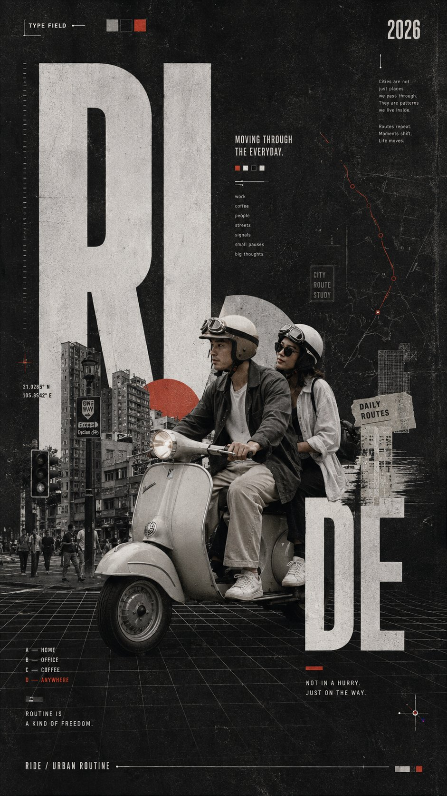

```text
[SUBJECT]: {person / architecture / everyday object / lifestyle scene}
[TITLE]: {one short keyword}
[THEME]: {what the image represents}
[SCENE]: {city / field / street corner / architectural space}
[ACCENT COLOR]: {red / blue / orange / etc.}
[SHORT LINE]: {one meaningful sentence}
[FORMAT]: 9:16

Create an experimental editorial poster combining photography, oversized typography, and subtle print texture.

Use {SUBJECT} as the main visual inside {SCENE}. Keep it realistic, distinctive, and large enough to hold the composition. The subject should feel like a real cultural or everyday observation, not a generic stock image.

Set {TITLE} in oversized bold condensed sans-serif type. Do not simply place the title over the image — let the subject and typography overlap, interrupt, frame, or pass behind each other so they become one composition. The typography can respond naturally to the subject’s shape, direction, or architecture.

Use a warm off-white, concrete gray, or deep charcoal base with subtle paper grain and slightly aged print texture. Keep most of the palette neutral and use {ACCENT COLOR} only in a few small lines, blocks, or graphic marks.

Add restrained editorial details such as thin guide lines, diagrams, maps, grids, annotations, or geometric elements only when they support the subject. Keep the layout rich but controlled, with clear hierarchy and intentional negative space.

Keep all supporting text meaningful and minimal. Avoid random placeholder words, excessive technical data, unnecessary numbering, logos, watermarks, sparkles, and decorative clutter.

Overall style: contemporary editorial design × photographic collage × experimental typography × subtle neo-retro print aesthetics.
```


---

## 例 750：高级感建筑销售海报模型展示

**来源：** [@ou_zhen599](https://x.com/ou_zhen599/status/2090338251861266714) / [OpenNana](https://opennana.com/awesome-prompt-gallery/aerlith-habitat-premium-architectural-poster)

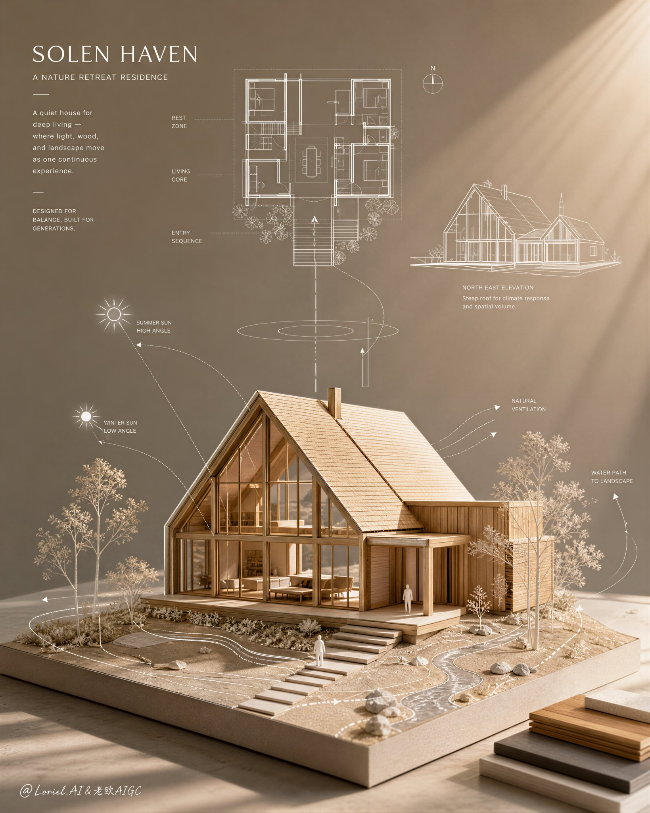

```text
Create an ultra-premium architectural sales poster for a fictional real-estate brand called AERLITH HABITAT, combining more refined Transit polish with stronger Orbit generation flow. Vertical format, soft taupe-beige studio background, elegant diagonal sunlight from the upper-right, and one central tabletop concept presentation where an architectural maquette and white technical overlays become one unified product story. The image must feel like a flagship launch visual for a boutique residential project: calm, luxurious, intelligent, and globally editorial.

Main composition:
Keep a strict vertical hierarchy. In the lower-middle, place one exquisitely crafted physical house maquette on a square site plinth, with warm timber construction, pitched roof, fine glazing, and clean miniature landscape integration. In the upper half, float a sparse architectural drawing system: one floor plan, one small elevation or axonometric study, and a few elegant annotation clusters. Strengthen the Orbit direction by making the relationship between upper diagrams and lower model feel more actively connected, as if the concept above is descending and materializing into the maquette below. Use delicate white strategy lines, arrows, and environmental curves to visually bridge upper and lower zones with a more continuous generative flow.

Architecture:
Design a compact high-end retreat house or boutique nature residence with a steep double-pitched roof, warm timber structure, floor-to-ceiling glazing, and one cleanly articulated entry volume. The model must feel fully buildable and coherent. Around the lower model, include a few translucent abstract trees, tiny white scale figures, airflow and sunlight path arrows, and subtle topographic or water-path lines, all highly restrained and elegant.

Transit direction:
Make everything cleaner, lighter, and more internationally premium. Reduce annotation density, increase breathing room, soften any unnecessary visual noise, and keep typography and graphics more editorial than explanatory. The image should feel closer to a luxury architecture monograph cover or global real-estate launch poster than a technical board. The technical overlays must remain precise but visually airy.

Lighting:
Use soft natural directional light from the upper-right, with visible but restrained sunlight beams crossing the upper and middle area. Let the light create long elegant shadows over the table, subtle glow on the roof edges, and a precious warmth across the wooden model. Keep contrast sculptural but clean. The light should also reinforce the Orbit feeling, guiding the eye diagonally from the upper diagrams down into the physical model.

Material realism:
Render the maquette with exceptionally refined tactile detail: warm basswood or pale oak surfaces, crisp cut-card edges, thin acrylic glazing, subtle paper textures, matte site base, miniature landscaping, and a neat stack of wood or material samples at the lower-right edge of the table. The white overlay drawings must feel like fine architectural drafting, crisp and precise against the warm background.

Typography and branding:
Add one small original English project title in the upper-left, such as “SOLEN HAVEN,” with a tiny supporting subtitle and a few lines of refined architectural copy, all fully original. Keep all typography white, elegant, sparse, and secondary. Small original diagram labels may appear near the plan and environmental arrows, but they must remain minimal.

Graphic system:
Only white technical overlays: floor plan, tiny elevation/axon sketch, solar path icons, airflow arrows, circles, contour lines, and micro-annotations. Strengthen the sense that these graphics are not just hovering, but actively shaping and explaining the lower model. Keep them beautifully spaced and never cluttered.

Color system:
Warm taupe-beige background, honey wood tones, white drafting lines, pale translucent trees, soft gray shadows, and a subtle golden sunlight wash. Keep everything restrained, premium, and coherent.

Negative prompt:
no copied project title, no existing architect names, no Chinese title, no cluttered diagrams, no fantasy architecture, no distorted roof geometry, no messy material samples, no muddy shadows, no black blotches, no watermark, no existing logos, no noisy background, no random furniture clutter.
```


---

## 例 751：极简奢华VELORE覆盆子慕斯海报

**来源：** [@ou_zhen599](https://x.com/ou_zhen599/status/2090375698263494860) / [OpenNana](https://opennana.com/awesome-prompt-gallery/velore-minimalist-raspberry-mousse-poster)

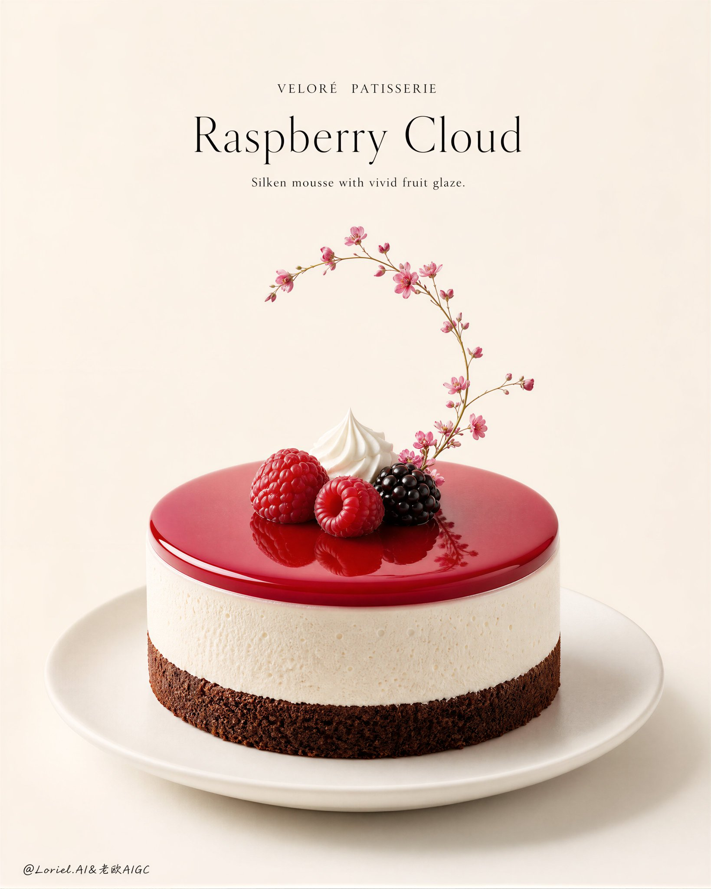

```text
Create a premium minimalist dessert campaign poster for a fictional haute patisserie brand called VELORÉ, combining Transit-style restraint with Orbit-style poetic motion in a further purified composition. The image must feel ultra-clean, gallery-like, elegant, and commercially luxurious, with the dessert as the absolute and solitary visual hero. No copied text, no watermark, no clutter, no unnecessary props.

Main composition:
A single round raspberry mousse cheesecake sits perfectly centered on a matte white ceramic plate in the lower-middle of the frame. The cake is the only substantial object in the composition. Preserve a strict three-layer structure: a dark cocoa crumb base, a thick ivory mousse body with fine natural aeration, and a flawless glossy raspberry-red mirror glaze on top. The garnish is reduced to the minimum iconic expression: two fresh raspberries, one blackberry, one small whipped cream accent, and one extremely delicate blossom sprig rising upward in a graceful curved arc. The blossom line should create a subtle orbital motion that guides the eye upward and back toward the cake, while remaining almost weightless.

Transit restraint:
Use a large field of warm off-white negative space. Typography must be reduced to a highly disciplined editorial minimum: one small brand line, one product name, one short descriptor. Remove all extra annotation blocks and nonessential copy. The image should read instantly as a flagship luxury dessert poster.

Orbit motion:
The only motion cue comes from the elegant upward arc of the blossom sprig and the gentle clustered rhythm of the berries on top, creating a refined sense of lift and circulation above the cake. The motion must feel quiet, premium, and intentional, never decorative or busy.

Typography and layout:
Place a very small refined brand line at the upper center: “VELORÉ PATISSERIE”. Beneath it, set the product name in elegant editorial type: “Raspberry Cloud”. Add one restrained subline: “Silken mousse with vivid fruit glaze.” All typography should be dark charcoal, airy, centered, and clearly secondary to the cake.

Lighting:
Soft diffused studio light from the upper left-front, with subtle fill from the right and a very gentle shadow beneath the plate. Keep the light bright, soft, and sculptural, with a controlled highlight across the red glaze and delicate volume on the mousse body. No hard shadows, no muddy contrast, no overexposed whites.

Material rendering:
The raspberry mirror glaze must look ultra-smooth, glassy, and slightly viscous. The mousse layer should feel chilled, creamy, and naturally aerated with microscopic pores. The cocoa base should be compact, crisp, and finely granular. The berries must show realistic drupelet texture, subtle bloom, natural moisture, and fresh color depth. The whipped cream accent should feel dense, soft, and freshly piped. The blossom sprig must be fine, botanical, and fragile with tiny pink florets.

Color system:
Warm off-white, ivory cream, deep raspberry red, dark cocoa brown, blackberry black-purple, and a tiny accent of soft botanical pink. Keep the palette highly restrained, with the red glaze and berries as the only strong chromatic focus.

Style:
Luxury editorial dessert photography, ultra-minimal patisserie branding, flagship commercial food poster, Cannes-level premium restraint, clean, tactile, refined, and memorable.

Image quality and physical constraints:
Ultra-detailed, high resolution, crisp edges, correct circular geometry, clean plate silhouette, realistic glaze reflections, believable garnish balance, immaculate background, no extra crumbs, no random props, no distortion, no cheap bakery styling.

Negative prompt:
cheap bakery flyer, copied original text, cluttered layout, too many berries, excessive garnish, random props, cartoon dessert, fake CGI food, plastic glaze, waxy cream, distorted cake shape, dirty plate, harsh shadows, flat lighting, muddy whites, oversaturated red, noisy background, unreadable typography, watermark
```


---

## 例 752：极简几何艺术海报分屏设计

**来源：** [@xiaoxiaodong01](https://x.com/xiaoxiaodong01/status/2090415726813393008) / [OpenNana](https://opennana.com/awesome-prompt-gallery/minimalist-geometric-split-poster-design)

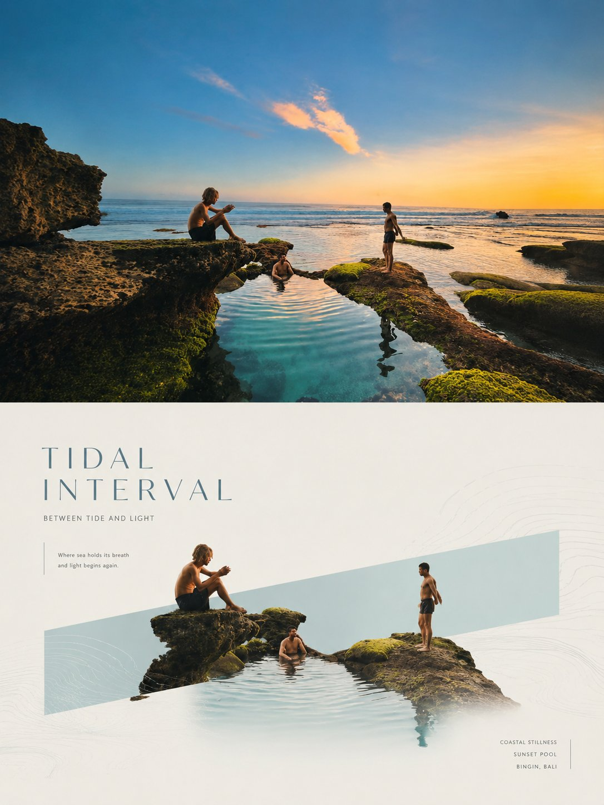

```text
Please turn each photo I upload into an independent high-end design poster, no multi-image stitching, each photo output individually. The overall composition adopts a 3:4 vertical layout, with the upper and lower areas strictly 1:1 in height, each occupying 50% of the screen.

The upper part preserves the original photo, maintaining the subject structure, real texture, natural light and shadow, and original color atmosphere, with only slight high-end photographic color grading to give it the exquisite texture of high-end brand advertising, art magazines, and exhibition visuals. To fit the frame, the sky, ground, or environmental background can be naturally extended, while the subject itself remains unchanged.

The lower part extracts the most recognizable subject, outline, posture, and narrative relationship from the photo, reconstructing it into a minimalist visual poster with high-end commercial aesthetics. The core language is "real objects passing through geometric emotional windows": a narrow, restrained, low-saturation geometric color block is set in the image as a visual anchor and spatial container. The direction of the color block is not fixed and can be horizontal, vertical, or diagonal, naturally determined by the subject's center of gravity, movement direction, outline trend, and layout rhythm. The subject enters the color block in a realistic photographic sense or exquisite realistic manner, and partially crosses boundaries, breaks the frame, extends out, or passes through borders, forming a sense of natural growth, spatial penetration, and white space breathing.

The composition remains minimalist, clear, and balanced, establishing order through geometric color blocks, subject boundary-crossing relationships, and large areas of white space. The subject can be centered, eccentric, growing vertically, or stretching horizontally, but always maintains a single focus. The background is mainly white, light gray, or very light warm colors, and very slight cultural patterns, linear graphics, topographic lines, water wave lines, light and shadow outlines, or abstract symbols can be added as faint auxiliary layers.

The color scheme extracts the most recognizable and energetic color relationships from the photo above, transforming them into a high-end system of light-colored geometric windows + real subject colors + a very small amount of neutral color typography. The color of the blocks can be softened into fog blue, light cyan, off-white, light pink, warm gray, light gold, or other light tones consistent with the original image's temperament, making the whole light, clean, modern, and exquisite.

Text naturally intervenes as part of the layout structure. A short English title can be extracted from the theme, emotion, action, state, or symbolic meaning of the photo, accompanied by a small number of subtitles, locations, state words, or miniature notes. The title can be arranged horizontally, vertically, or along the relationship between the color block and the subject. Auxiliary information is arranged neatly with small font size, thin weight, and stretched letter spacing, giving it a high-end editorial feel like high-end real estate, luxury goods, aesthetic magazines, or solar term visuals.

The overall temperament emphasizes Oriental white space, modern order, natural vitality, and high-end commercial aesthetic. Whether the subject is people, animals, plants, architecture, objects, food, vehicles, or natural landscapes, it should maintain a clear, elegant, and transferable visual echo between real photography and geometric emotional windows. Please turn each photo I upload into an independent high-end design poster, no multi-image stitching, each photo output individually. The overall composition adopts a 3:4 vertical layout, with the upper and lower areas strictly 1:1 in height, each occupying 50% of the screen.

The upper part preserves the original photo, maintaining the subject structure, real texture, natural light and shadow, and original color atmosphere, with only slight high-end photographic color grading to give it the exquisite texture of high-end brand advertising, art magazines, and exhibition visuals. To fit the frame, the sky, ground, or environmental background can be naturally extended, while the subject itself remains unchanged.

The lower part extracts the most recognizable subject, outline, posture, and narrative relationship from the photo, reconstructing it into a minimalist visual poster with high-end commercial aesthetics. The core language is "real objects passing through geometric emotional windows": a narrow, restrained, low-saturation geometric color block is set in the image as a visual anchor and spatial container. The direction of the color block is not fixed and can be horizontal, vertical, or diagonal, naturally determined by the subject's center of gravity, movement direction, outline trend, and layout rhythm. The subject enters the color block in a realistic photographic sense or exquisite realistic manner, and partially crosses boundaries, breaks the frame, extends out, or passes through borders, forming a sense of natural growth, spatial penetration, and white space breathing.

The composition remains minimalist, clear, and balanced, establishing order through geometric color blocks, subject boundary-crossing relationships, and large areas of white space. The subject can be centered, eccentric, growing vertically, or stretching horizontally, but always maintains a single focus. The background is mainly white, light gray, or very light warm colors, and very slight cultural patterns, linear graphics, topographic lines, water wave lines, light and shadow outlines, or abstract symbols can be added as faint auxiliary layers.

The color scheme extracts the most recognizable and energetic color relationships from the photo above, transforming them into a high-end system of light-colored geometric windows + real subject colors + a very small amount of neutral color typography. The color of the blocks can be softened into fog blue, light cyan, off-white, light pink, warm gray, light gold, or other light tones consistent with the original image's temperament, making the whole light, clean, modern, and exquisite.

Text naturally intervenes as part of the layout structure. A short English title can be extracted from the theme, emotion, action, state, or symbolic meaning of the photo, accompanied by a small number of subtitles, locations, state words, or miniature notes. The title can be arranged horizontally, vertically, or along the relationship between the color block and the subject. Auxiliary information is arranged neatly with small font size, thin weight, and stretched letter spacing, giving it a high-end editorial feel like high-end real estate, luxury goods, aesthetic magazines, or solar term visuals.

The overall temperament emphasizes Oriental white space, modern order, natural vitality, and high-end commercial aesthetic. Whether the subject is people, animals, plants, architecture, objects, food, vehicles, or natural landscapes, it should maintain a clear, elegant, and transferable visual echo between real photography and geometric emotional windows.
```


---

## 例 753：高端极简城市旅游海报设计

**来源：** [@AiwithLariab](https://x.com/AiwithLariab/status/2092642111502045372) / [OpenNana](https://opennana.com/awesome-prompt-gallery/premium-minimalist-travel-poster-design)

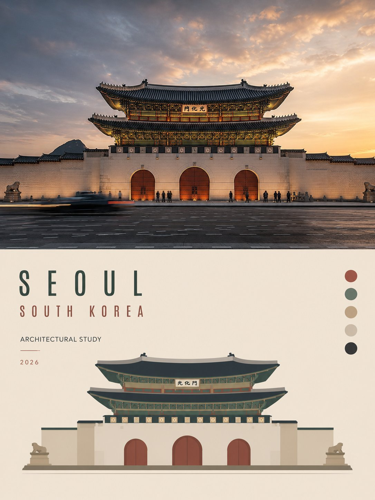

```text
Create a refined 3:4 vertical premium travel poster for [CITY].
First identify the city, country, architecture, landscape, climate, cultural character, and visual identity. Select ONE iconic and highly recognizable real-world landmark or subject as the HERO. Establish one believable photographic viewpoint and ensure every environmental element logically belongs to that location. Do not create a collage of unrelated landmarks.

COMPOSITION: Divide the poster into two perfectly equal sections: 50% top and 50% bottom. Use a warm beige, ivory, or soft-white background with generous negative space and precise alignment.

TOP — HERO PHOTOGRAPH: Create an ultra-realistic, high-end editorial photograph of the chosen landmark from a believable real-world viewpoint. Preserve accurate architecture, proportions, materials, surrounding environment, natural lighting, shadows, atmosphere, and geographic character. The scene should feel like premium architectural photography or a museum-quality travel photograph, with realistic textures and sophisticated cinematic composition.

BOTTOM — GRAPHIC INTERPRETATION: Reinterpret the same hero landmark as a sophisticated flat graphic design. Extract its most recognizable silhouette, contours, structural details, proportions, and distinctive architectural elements. Simplify them into elegant geometric shapes, flat color blocks, thin lines, restrained divisions, and generous negative space. The landmark must remain instantly recognizable without becoming a realistic illustration, 3D render, cartoon, or game graphic.

COLOR & TYPOGRAPHY: Derive a restrained palette of approximately 4–6 colors from the city's architecture, environment, and hero photograph. Keep the palette sophisticated with slightly muted saturation. Add minimal geometric accents only when they improve the composition.

Use limited, elegant typography such as: [CITY] [COUNTRY] ARCHITECTURAL STUDY 2026

Use Swiss/international graphic design, architectural exhibition posters, luxury editorial design, and museum visual identity as the aesthetic reference. Keep typography subtle, with generous letter spacing and strong visual hierarchy.

FINAL AESTHETIC: Sophisticated, minimal, contemporary, culturally authentic, artistic, and premium. The photographic upper half and graphic lower half should feel like two expressions of the same visual identity. The final result should resemble a world-class gallery poster, collector's travel print, architectural exhibition artwork, or luxury brand campaign.

Avoid landmark collages, inaccurate architecture, invented structures, excessive text, tourist-brochure aesthetics, neon, flashy effects, heavy gradients, glossy 3D rendering, cartoon styling, game UI, clutter, excessive decoration, and generic AI-generated cityscapes.
```


---

## 例 754：午夜旋涡万圣节限定饮品商业海报

**来源：** [@ou_zhen599](https://x.com/ou_zhen599/status/2092919810648633519) / [OpenNana](https://opennana.com/awesome-prompt-gallery/premium-halloween-midnight-swirl-beverage-poster)

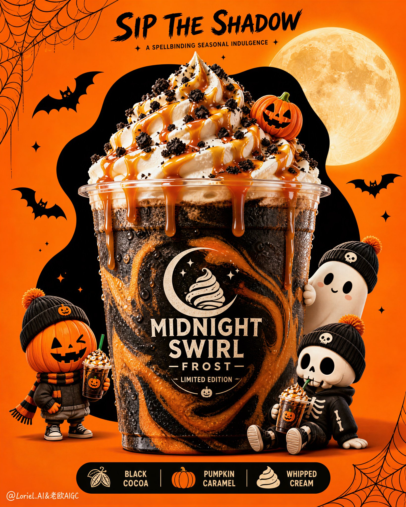

```text
Create a premium Halloween limited-edition beverage poster for an original seasonal drink brand named "MIDNIGHT SWIRL". Use a hybrid visual language that combines ultra-realistic drink photography with clean cute flat illustration. Preserve the exact structural logic: a tall vertical poster, a saturated pumpkin-orange background, one oversized central iced blended drink as the absolute hero, one large irregular black silhouette shape behind the cup for contrast, one glowing pale moon disk in the upper-right background, small bat graphics on both sides, subtle spider-web corner motifs, and two to three adorable Halloween mascots near the lower sides. The final image must feel like a Cannes-level seasonal beverage campaign: playful, iconic, irresistible, graphic, and product-led.

Style lock:
Premium seasonal drink advertising, ultra-real product photography, cute Halloween illustration, clean retail-campaign composition, bold color blocking, polished FMCG hierarchy, launch-ready social media poster, no clutter.

Core composition:
Place one giant transparent plastic cup exactly in the center, front-facing and slightly enlarged so it dominates the entire poster. The cup must contain a striking black-and-orange marbled frozen beverage with rich internal swirl patterns visible through the clear plastic. Top it with a towering spiral of whipped cream that feels sculptural and generous, then drench it with thick glossy pumpkin-caramel syrup flowing in controlled ribbons down the cream and cup. Add crunchy dark cookie crumbs over the whipped cream and one small pumpkin-themed topper near the upper-right of the cream peak. Behind the cup, use a bold organic black shadow-like shape to intensify silhouette readability. Position the moon behind the upper-right of the drink, and place charming Halloween mascots near the lower-left and lower-right so they frame but never compete with the cup.

Port super-symbol logic:
Turn the drink itself into the brand’s unmistakable super-symbol. The combination of one clear cup, one black-orange marbled frozen core, one exaggerated whipped-cream tower, and one glossy caramel cascade must feel ownable and instantly recognizable even at thumbnail scale. The black-orange swirl must become the identity mark of the campaign, and the cream peak must read like a seasonal crown. The drink should feel like the entire Halloween brand myth condensed into one collectible object.

Orbit motion logic:
Create a strong circular reading path around the cup. The eye should begin at the whipped-cream peak, move through the caramel drips, descend into the black-orange marbled drink body, travel across the lower mascots and their cup gestures, rise through the bat flight arcs and moon curve, and then return into the hero cup silhouette. Use cream spiral direction, syrup flow, marbling curves, bat placement, moon edge, and mascot sightlines to create one elegant loop that repeatedly pulls attention back to the central drink.

Product design:
Design one irresistible signature beverage called "MIDNIGHT SWIRL FROST". The drink should feel like a premium coffee-dessert frappé made of black cocoa slush, dark espresso ice texture, pumpkin-caramel ribbons, airy whipped cream, and crunchy cookie crumble. The clear cup may carry original readable brand text and logo only on the packaging itself. The product must feel craveable, limited-edition, and commercially launch-ready.

Lighting:
Use bright premium studio lighting with soft frontal illumination and gentle top-left shaping. The cup, whipped cream, caramel syrup, and lid must be sharply modeled with clean specular highlights. Add a soft grounded shadow beneath the cup and mascots. Keep the background flat and graphic while the beverage remains dimensional and hyper-real.

Materials and realism:
Render the plastic cup with physically accurate transparency, cold condensation haze, moisture beads, realistic lid reflections, and crisp printed branding. Render the whipped cream with soft airy peaks, realistic dairy texture, and subtle fold shadows. Render the caramel-orange syrup with glossy viscosity, realistic drip weight, and appetizing shine. Render the dark beverage with dense frozen texture, fine ice crystals, black cocoa depth, espresso richness, and suspended orange swirl marbling. Render the cookie crumbs as irregular crunchy dark clusters.

Illustration system:
Use cute Halloween mascot illustrations with simple premium silhouettes and minimal shading: one pumpkin-headed character in a knitted beanie holding a mini drink, one skeleton-like character in a matching beanie sipping the beverage, and one rounded ghost character peeking from the edge if needed. Keep the illustration style clean, playful, and secondary to the product.

Color strategy:
Dominant colors: vivid pumpkin orange, deep black, creamy white. Secondary tones: caramel amber, dark cocoa brown, soft moon-cream. Accent tones: small green straw notes and muted gray costume details. Keep the palette bold, festive, premium, and instantly seasonal.

Typography and layout:
Use original English text only. Place a short playful title near the top center such as "SIP THE SHADOW" with a concise seasonal subline beneath it. Add one compact bottom badge strip with brief original flavor notes such as "BLACK COCOA + PUMPKIN CARAMEL + WHIPPED CREAM". Do not copy any existing brand name, slogan, or promotional wording.

Quality target:
Hyper-detailed, high-resolution commercial finish, pristine product sharpness, appetizing fluid realism, clean mascot integration, strong symbolic readability, premium seasonal branding, no clutter, no muddy blacks, no cheap holiday flyer look.

Negative prompt:
copied brand name, copied slogan, weak product hierarchy, blurry cup logo, muddy black drink, fake whipped cream, thin syrup, messy mascot style, overcrowded layout, low-resolution packaging, dull orange background, cheap Halloween party flyer aesthetic, unreadable text, warped cup perspective, dirty shadows, black blotches
```


---

## 例 755：复古极简中世纪风格旅游海报生成提示词

**来源：** [@Naiknelofar788](https://x.com/Naiknelofar788/status/2092581373102186567) / [OpenNana](https://opennana.com/awesome-prompt-gallery/vintage-minimalist-mid-century-travel-poster-prompt)

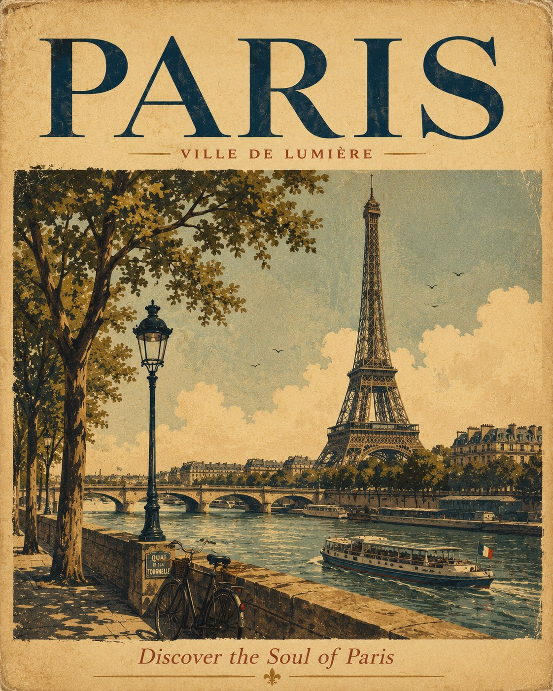

```text
Create a beautiful vertical 4:5 vintage travel poster for [COUNTRY], inspired by classic mid-century European travel posters and aged lithographic printmaking.

Instead of showing multiple landmarks, build the entire poster around one poetic visual scene that captures the soul of the country.

Feature a striking landscape associated with [COUNTRY] — dramatic mountains, coastline, countryside, old streets, desert, forests, lakes, or rolling hills — with one iconic cultural element subtly integrated into the scene.

Use a refined vintage color palette, slightly faded pigments, warm paper texture, subtle grain, imperfect ink edges, gentle shadows, and authentic screen-printed/lithographic details.

The composition should be minimal, balanced, and elegant, with large areas of negative space and a strong central visual. Add tiny atmospheric details such as birds, distant travelers, a train, bicycle, boat, or small village lights to give the scene life without making it crowded.

Typography should feel like a genuine 1950s–1970s tourism poster:

[COUNTRY]
Discover the Soul of [COUNTRY]

Use elegant vintage typography, carefully integrated into the composition.

The final artwork should feel like a rare old travel poster rediscovered in a European railway station — nostalgic, sophisticated, dreamy, collectible, cinematic, and timeless.

No modern graphics, no photorealistic collage, no excessive landmarks, no neon colors, no 3D text, no clutter.
Premium vintage print aesthetic, authentic paper aging, beautiful composition, artistic restraint.
```


---

## 例 756：星际迷航原初系列风格角色宣传海报提示词

**来源：** [@livybabie](https://x.com/livybabie/status/2092935742813081901) / [OpenNana](https://opennana.com/awesome-prompt-gallery/star-trek-tos-style-character-promotional-poster)

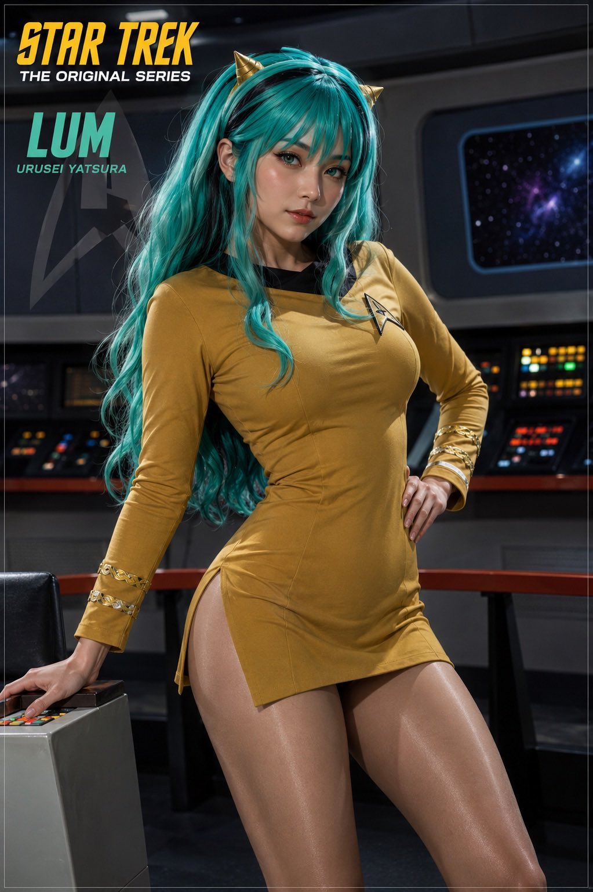

```text
Create a modern cinematic 4K promotional poster of [CHARACTER  NAME] from [SERIES/GAME], clearly portrayed as a mature adult woman aged 25+.

Preserve her unmistakable canonical identity: exact face, hairstyle, hair color, eyes, signature accessories, species traits, recognizable proportions and personality. Do not redesign her or turn her into a generic woman.

Place her aboard the USS Enterprise NCC-1701 bridge from Star Trek: The Original Series, preserving the iconic 1960s retro-futuristic aesthetic: circular bridge, Captain’s Chair, red railing, colorful analog control panels, illuminated buttons and main viewscreen showing deep space, planets or the Enterprise.

She wears the classic vintage female Starfleet TOS uniform: fitted long-sleeved mini-dress, black collar, authentic delta insignia, subtle gold rank braid and black knee-high boots. Choose gold command, blue science/medical or red operations/security according to what best matches her personality and visual identity.

Pose her confidently beside or near the Captain’s Chair, full-body or 3/4 body, elegant cinematic stance, expression strongly reflecting her canonical personality.

Vertical premium poster composition, modern 4K live-action cosplay realism, highly detailed skin, realistic individual hair strands, authentic vintage fabric texture, cinematic studio lighting, shallow depth of field, polished sci-fi promotional photography.

Add tasteful poster typography:
STAR TREK
THE ORIGINAL SERIES
[CHARACTER  NAME]
[OPTIONAL ROLE / TITLE]
USS ENTERPRISE NCC-1701

No redesign, no generic hairstyle, no altered species traits, no extra limbs, no distorted hands, no text errors.
```


---

## 例 757：极简主义粗野派时尚杂志封面海报

**来源：** [@woleswoosh](https://x.com/woleswoosh/status/2092673431951302950) / [OpenNana](https://opennana.com/awesome-prompt-gallery/high-end-brutalist-fashion-magazine-cover)

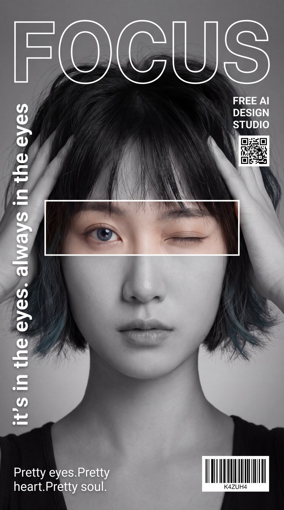

```text
A high-end brutalist magazine cover / fashion poster layout, portrait orientation. Close-up of a young East Asian woman with short, tousled dark hair featuring subtle teal-blue ends, soft natural skin texture, neutral expression with one eye open (clear blue-gray iris looking directly at the viewer) and the other eye softly closed in a gentle wink. Both hands raised framing her face, fingers lightly touching her temples and hair. The overall image is desaturated and almost monochromatic (cool gray tones), but a sharp white rectangular frame cuts across the eye area, restoring full subtle color and higher contrast only inside that rectangle (eyes, brows, and upper cheekbones remain slightly warmer and more vivid). Soft diffused studio lighting from the front-left, smooth gradient gray background, shallow depth of field focused on the face.

Typography and graphic overlays in clean modernist / brutalist style:
- Large white outlined uppercase “FOCUS” stretched across the top of the head, partially overlapping the hair.
- Top-right corner: stacked white uppercase text “FREE AI DESIGN STUDIO” with a high-contrast black-and-white QR code directly beneath it.
- Vertical white text running down the left side of the face, rotated 90 degrees: “it’s in the eyes. always in the eyes”
- Bottom-left caption in thin white sans-serif: “Pretty eyes.Pretty heart.Pretty soul.”
- Bottom-right: a standard black barcode with the code “K4ZUH4” printed underneath in small white text.

Overall aesthetic: minimalist brutalist editorial design, high-contrast graphic overlays on a soft photographic portrait, fashion-magazine cover composition, precise geometric framing, clean negative space, professional studio photography look, slightly cinematic color grading with restrained teal accents only in the hair and the framed eye zone. No extra decorative elements. Sharp, high-resolution, print-ready quality.
```


---

## 例 758：VELCARA奢华珠宝石榴概念广告海报

**来源：** [@ou_zhen599](https://x.com/ou_zhen599/status/2092578985108762652) / [OpenNana](https://opennana.com/awesome-prompt-gallery/velcara-luxury-jewelry-pomegranate-poster)

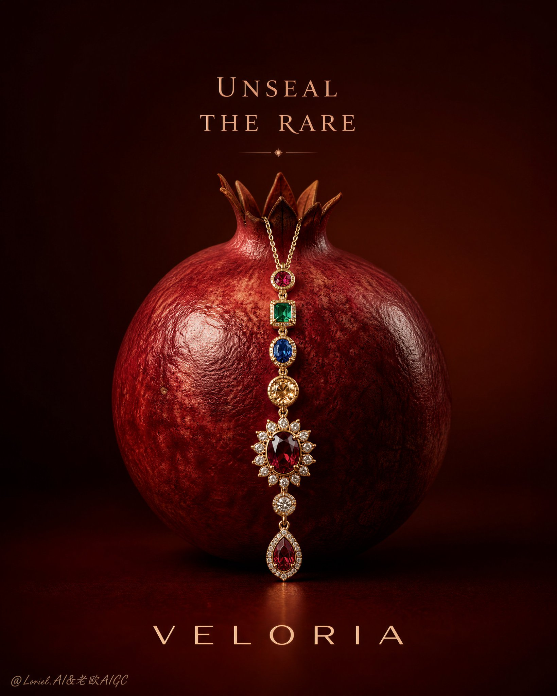

```text
Create a luxury flagship advertising poster for an original fine-jewelry brand named "VELCARA". Preserve the same iconic still-life structure: one whole mature pomegranate centered in the lower-middle as the sculptural hero pedestal, one exquisite yellow-gold charm bracelet draped across the fruit in a graceful horizontal arc, one refined English headline block in the upper center, and one slim premium feature strip along the bottom edge. The background must remain a deep dark garnet-to-black gradient with rich cinematic depth. The final image must feel like a Cannes-level luxury jewelry campaign: minimal, sensual, commanding, symbolic, and instantly memorable, with the bracelet as the absolute commercial focal point.

Style lock:
Ultra-realistic luxury jewelry macro photography, dark editorial still life, premium fashion-house campaign design, refined negative space, high-end print sharpness, rich romantic restraint, iconic product-led hierarchy.

Core composition:
Place one whole pomegranate large and centered in the lower-middle, occupying the visual throne without overwhelming the jewelry. Drape one fine yellow-gold charm bracelet across the upper front curve of the fruit from left to right, following the natural roundness of the pomegranate like a ceremonial coronation line. Suspend six to seven distinct charms along the chain, with one elongated marquise-cut crystal drop hanging lowest at the exact center as the main visual anchor. Keep the upper headline centered with generous negative space above, and the bottom information strip thin, elegant, and fully subordinate to the hero object.

Orbit motion logic:
Build a clear semi-circular eye path. The eye should begin at the upper headline, descend into the fruit crown, travel along the bracelet arc from left charm to central marquise pendant to right charm, then fall softly to the bottom feature strip before returning upward through the round silhouette of the pomegranate. Use chain curvature, charm spacing, highlight rhythm, and the fruit’s circular volume to create one elegant orbit that repeatedly pulls attention back to the center pendant and the gold arc. The motion must feel luxurious, controlled, and inevitable.

Port super-symbol logic:
Turn the single pomegranate wearing a gold charm bracelet into the brand’s unmistakable super-symbol. The fruit must feel like a royal jewel altar or crowned relic rather than a simple prop. The bracelet should read as a coronation band, and the central pendant should feel like the seal of preciousness. Together, the dark crimson fruit and luminous gold arc must form an ownable luxury icon readable instantly even at small scale.

Lighting:
Use soft upper-front-left studio lighting with subtle right-side fill and delicate rim separation. Create smooth highlight rolloff on the pomegranate skin, rich micro-specular glints on the gold links, and crisp premium sparkle on the crystal charms. Shadows must stay feathered, elegant, and clean, with no dead black patches and no muddy transitions.

Materials and realism:
Render the pomegranate with hyper-real botanical texture: taut leathery skin, natural pores, slight dryness, crown detail, organic mottling, deep crimson-to-wine tonal variation, and believable irregular surface sheen. Render the bracelet in polished 18k yellow gold with realistic chain weight, precise link geometry, flawless charm attachment, and refined handcrafted finish. The charms must include varied silhouettes such as pear drops, medallions, celestial forms, and one central marquise-cut crystal, all with physically accurate reflections, gemstone transparency, and premium brilliance.

Color strategy:
Dominant colors: deep garnet, burgundy, blackened wine red, and dark cherry shadow. Secondary tones: rich yellow gold, antique amber, and muted bronze warmth. Accent tones: clear crystal white and soft champagne highlights. Keep the palette dark, regal, warm, and restrained, so the jewelry becomes the brightest visual punctuation.

Typography and layout:
Use an original all-English luxury headline in the upper center, such as "CROWN THE RARE", with a very short refined subline if needed. Place an original premium bottom strip with concise phrases such as "FINE CHARMS  •  18K GOLD  •  HAND-FINISHED". All text must be original, elegant, minimal, and globally marketable. Do not copy any existing brand name, slogan, or campaign wording.

Concept atmosphere:
No extra props, no sliced fruit, no juice, no clutter. The image should evoke abundance, coronation, rarity, and sacred adornment. The pomegranate must feel monumental and symbolic; the bracelet must feel precious, ceremonial, and irresistibly collectible.

Quality target:
Hyper-detailed, high-resolution luxury print finish, macro-grade jewelry clarity, flawless gold rendering, realistic crystal brilliance, unified lighting physics, elegant tonal depth, strong iconic readability, premium editorial polish.

Negative prompt:
copied brand name, copied slogan, copied layout text, weak bracelet visibility, oversized fruit dominance, dull gold, plastic-looking crystals, blurry chain, broken charm spacing, cluttered composition, sliced fruit, juice splash, extra props, muddy background, dead black patches, low-resolution detail, warped charms, inconsistent reflections, unreadable typography, cheap e-commerce styling
```


---

## 例 759：复古现代主义编辑拼贴海报设计

**来源：** [@HustleXR](https://x.com/HustleXR/status/2092832500402057602) / [OpenNana](https://opennana.com/awesome-prompt-gallery/vertical-editorial-collage-poster-design)

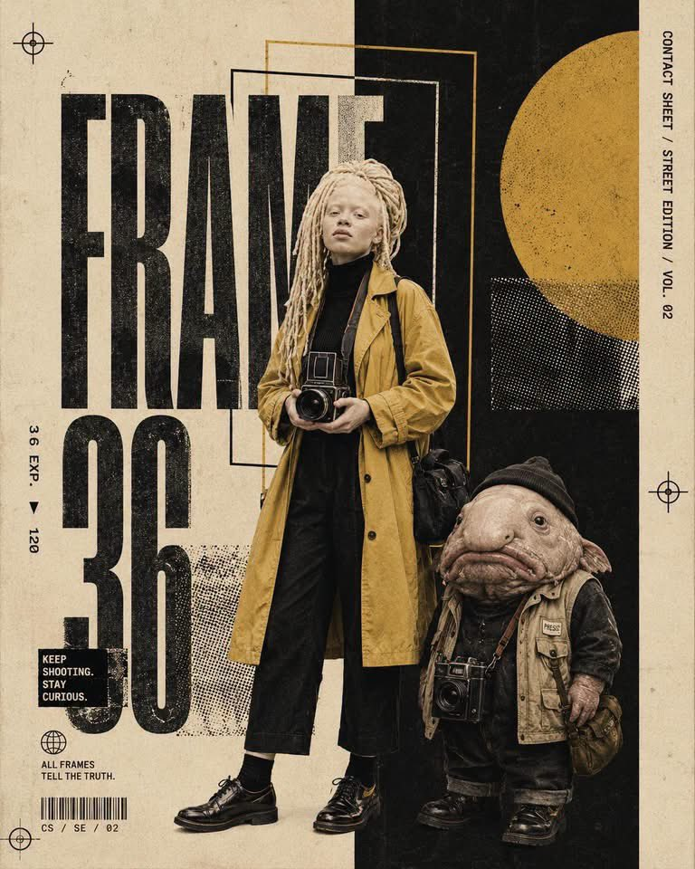

```text
Vertical editorial collage poster featuring [CHARACTER] in [CLOTHING], full-body cutout positioned across a sharp split background of [PALETTE]. Place oversized condensed typography reading “[TITLE]” behind the character, partially obscured by the body, with small editorial microtext reading “[MICROTEXT]” aligned near the outer margin. Integrate [FORM] as bold abstract graphic elements around the typography, using halftone dots, rough ink erosion, photocopy grain, screen-print imperfections and layered paper texture. Strong asymmetric composition, high contrast, controlled negative space, flat color fields, vintage modernist print design, no fantasy battle imagery, no extra characters, no glossy 3D rendering, aspect ratio 4:5.
```


---

## 例 760：德州特色美食推广海报提示词

**来源：** [@Gdgtify](https://x.com/Gdgtify/status/2089729532354039889) / [OpenNana](https://opennana.com/awesome-prompt-gallery/texas-state-famous-dinner-promo-recipe-graphic)

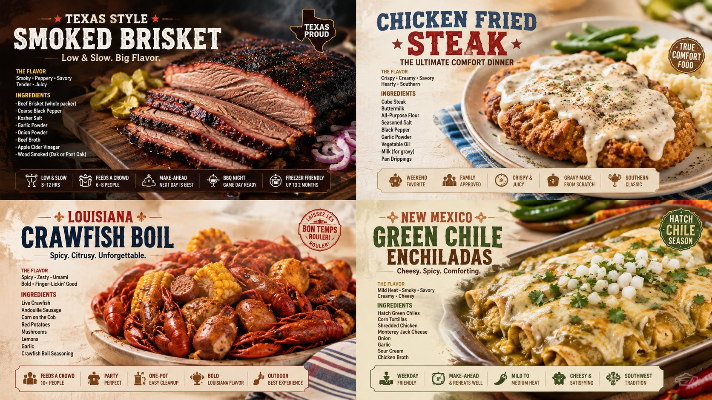

```text
2x2 grid, 16:9, do this for 4 texas or other state specific famous dinners: INPUT = [DISH / SEASON_OR_OCCASION / FLAVOR_PROFILE / INGREDIENT_MODE / AUDIENCE] 

Run INDULGENT_RECIPE_PROMO_EXTRACTION:

DISH_DNA := infer category, texture, serving vessel, portion style, visual structure, flavor cues, and emotional appeal

OCCASION_DNA := infer holiday, party, weekday meal, family dinner, luxury dessert, picnic, brunch, sports night, date night, wellness routine, or cultural context

HERO_FOOD := infer best appetizing presentation:
scoop lift, slice pull, pour, steam, drizzle, fork bite, spoonful, cross-section, stacked layers, melting, crunch break, garnish fall, or glass pour

TITLE_SYSTEM := infer bold headline, descriptive modifier, flavor-forward name, and short craveable subtitle

INGREDIENT_SYSTEM := infer core ingredients, packaging vs fresh items, plus signs, labels, preparation notes, and substitutions if useful

CALLOUTS := infer badge claims:
easy, make-ahead, crowd-pleaser, no-bake, high-protein, cozy, spicy, crunchy, creamy, refreshing, budget-friendly, kid-friendly, etc.

MOOD_PROPS := infer contextual props from occasion:
seasonal produce, utensils, napkins, candles, table surface, cultural objects, party decor, kitchen tools, or none

ICON_STRIP := infer 3–5 benefits or use cases with simple icons

RENDER_STYLE := infer commercial food photography, editorial recipe card, social ad, cookbook spread, or packaging-inspired promo

Render:
A delicious promotional recipe graphic where the food, ingredients, copy, and props all come from the input dish.

Forbidden:
hard-coded pumpkin dessert, fixed whipped topping, fixed cake mix, fixed caramel drizzle, fixed fall props, copied brand packaging, fake ingredient claims.
```


---

## 例 761：创意突破边界高端产品广告大片

**来源：** [@aziz4ai](https://x.com/aziz4ai/status/2089985351930544254) / [OpenNana](https://opennana.com/awesome-prompt-gallery/premium-product-boundary-break-campaign)

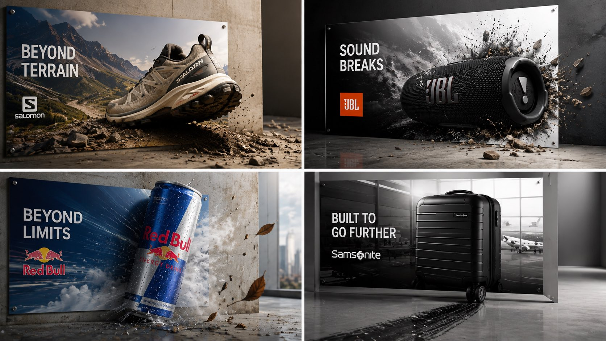

```text
Use the uploaded product image as the single source of truth.

Create one premium 16:9 campaign image where the product appears inside a physical ad surface such as a poster, framed print, billboard, lightbox, screen, or magazine page, and one meaningful part of the same product breaks beyond that boundary into real space.

The boundary break must prove the product’s real benefit. The product stays fully accurate and unchanged. There is only one product, and the inside/outside portions must connect perfectly.

Choose the strongest benefit, one clear boundary, one escaping feature, and one real-world interaction. Make the viewer instantly understand where the flat ad ends and real space begins.

Preserve the product exactly: shape, proportions, logo, packaging, typography, colors, materials, textures, and all visible details. Do not redesign, recolor, distort, duplicate, or invent features.

Create a clean, high-end editorial composition with bold framing, refined negative space, cinematic lighting, accurate perspective, realistic contact shadows, tactile materials, and strong depth.

Add the authentic brand logo naturally and one original two-word headline matching the brand tone.

Output one visually striking standalone image only.

16:9. No grid, no collage, no split screen, no miniature world, no duplicated product, no fantasy portal, no random tearing, no unrelated props, and no random text.
```


---

## 例 762：现代扁平几何中式大字海报

**来源：** [@xiaoxiaodong01](https://x.com/xiaoxiaodong01/status/2087173607227367874) / [OpenNana](https://opennana.com/awesome-prompt-gallery/modern-flat-geometric-chinese-character-poster)

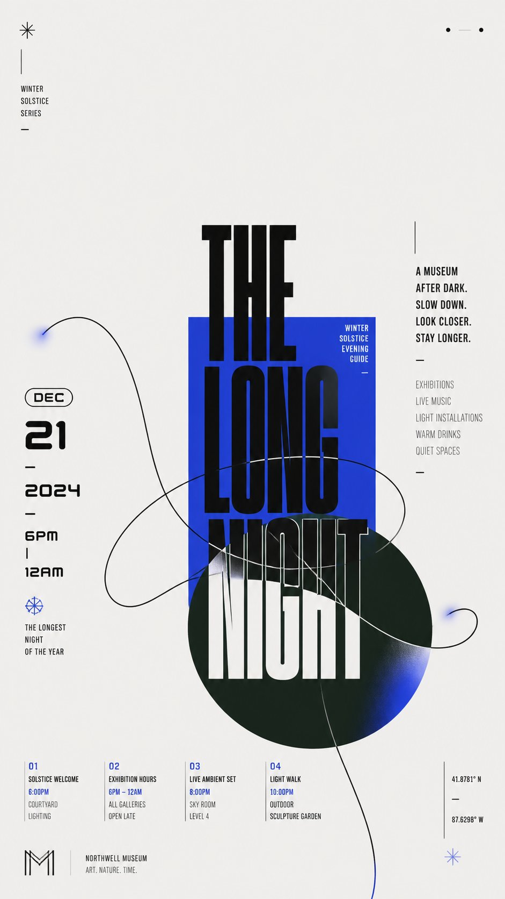

```text
Build a modern flat graphic around any chosen subject object, with a huge Chinese theme character, geometric color blocks, and a single-line organic contour interlacing through one another. Keep an overall bright, clean background field, letting approximately two-thirds or more of the space remain empty, and concentrate the main weight in an off-center cluster: a saturated rectangular block in the theme's primary color first establishes a stable plane; a deeper, low-lightness, cool-toned circle overlaps from beneath it and extends beyond the boundary; the core Chinese theme character advances vertically in oversized, heavy, geometric black strokes across the white background, rectangle, and circle, with partial occlusion and cropping creating a strong scale jump; on the left, the date and a bilingual subtitle form a compact numeric column, while on the right, short vertical sentences set in two stroke-weight tiers balance the weight; a few miniature captions, short dashes, and linear symbols scatter along the edges, creating a three-level reading rhythm from main character to side notes to details. Abstract the dynamic relationship derived from the theme into one continuous organic contour, drawn as a broad sweeping loop with a clear, near-black single line that enters from the large empty field, passes through the color blocks, and crosses the edge; the curve intersects itself several times while remaining legible as a single path; keep most of its interior as the underlying background color, adding only localized, transparent, fading fills in the theme's primary color at the tips and extended sections, so the light line creates tension with the heavy giant character. Adapt the color scheme to the theme: let a clean, high-lightness neutral background carry the largest area; keep the theme's primary color vivid and highly saturated, using it for the rectangle and the localized transparent gradient; use a deep cool support color for the circle, separated in hue from the primary color and blending softly into the primary color at its end; use near-black for text and the contour, with a very small amount of light text reversed onto the primary color block; fix unequal areas, lightness hierarchy, and saturation differences, but do not fix specific color names. Render all elements as flat surfaces like matte digital printing, with sharp contour edges and gradients only as two localized, slowly feathered transitions; do not add dimensional shadows, paper grain, or global lighting effects. Keep typography in a low-contrast, broad, thick, near-geometric black sans-serif skeleton; allow the main character's parts to be elongated, offset, cut out, and switched between color-block backgrounds; give numbers a rounded futuristic structure and compress small text with narrow letterforms and loose tracking. Replace brand names, advertising copy, and concrete dates with new theme information. Preserve in the final result the extreme whitespace, the geometric cluster positioned lower-center, the opposing pull between horizontal and vertical text, and the moment an organic line crosses rigid geometric shapes, while avoiding evenly filling every part or reducing the contour to an isolated decoration.
```


---

## 例 763：高端时尚编辑海报设计指南

**来源：** [@MrLarus](https://x.com/MrLarus/status/2086826696666132506) / [OpenNana](https://opennana.com/awesome-prompt-gallery/high-fashion-editorial-poster-design-prompt)

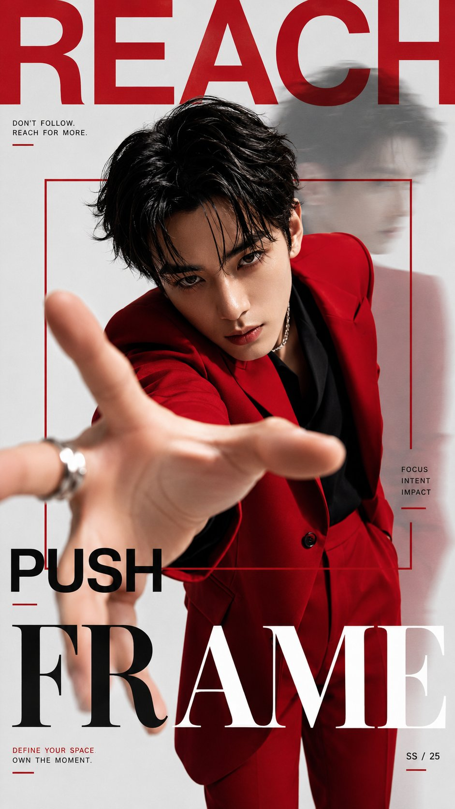

```text
Create a 9:16 high-fashion editorial poster.

Subject: [male / female / fashion model / artist]
Outfit: [fashion styling]
Palette: [red / black / white / custom palette]
Main title: [TITLE]
Design direction: [perspective × typography / blur × sharp detail / profile × oversized type / gesture × editorial layout]
Supporting text: [short phrase]

Build the poster around one strong photographic subject and one dominant graphic idea.

Use oversized typography as part of the composition rather than simple text placed around the image. Let letters interact with the subject through cropping, overlap, foreground/background layering, or scale contrast.

Depending on the selected direction:

• Perspective × typography — use a strong foreground gesture or body movement toward the camera, with dramatic near-far perspective and large type framing the action.

• Blur × sharp detail — keep parts of the portrait softly blurred while one narrow facial region remains extremely sharp, creating controlled focus contrast.

• Profile × oversized type — use a sculptural side-profile portrait against a bold flat-color background, with large serif typography partially hidden behind or crossing the silhouette.

• Gesture × editorial layout — combine an expressive fashion pose, subtle motion echo or secondary silhouette, and integrated magazine-style typography.

Keep the layout clean and visually bold. Use one dominant color, one neutral base, and limited accent colors. Typography should include one large headline, one short supporting line, and only a few small editorial labels.

Maintain realistic skin texture, natural facial anatomy, refined fashion styling, crisp fabric details, controlled studio lighting, strong negative space, and premium magazine-cover quality.
```


---

## 例 764：ZESTORA柑橘气泡饮高端商业海报

**来源：** [@AiwithBloodline](https://x.com/AiwithBloodline/status/2087105171205861535) / [OpenNana](https://opennana.com/awesome-prompt-gallery/zestora-citrus-sparkling-drink-commercial-poster)

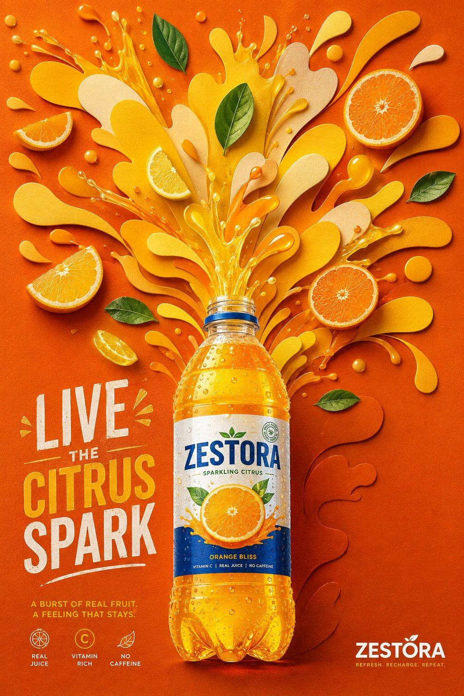

```text
Create an ultra-premium commercial poster for an original beverage brand called ZESTORA, designed as a Cannes-level advertising key visual with one hyper-realistic citrus drink bottle as the absolute hero product and a bold upward explosion of layered fruit-splash shapes behind it. The composition must be a tall vertical poster with the bottle rising from the lower center, while a large radiant burst of sculpted yellow-orange splash forms expands upward and outward from the bottle mouth like a stylized flavor detonation. The overall image must feel bright, joyful, refreshing, graphic, highly controlled, and instantly memorable, combining hyper-real product realism with premium dimensional paper-sculpture aesthetics.

Core composition:
Use a strong centered composition. Place one realistic beverage bottle in the lower-center foreground, upright and slightly monumental, occupying the lower third of the poster. From the bottle opening, a compact creamy-citrus liquid burst rises directly upward and transitions into a large layered splash universe filling the upper two-thirds of the frame. This splash universe must feel like a series of overlapping abstract citrus-blast shapes, radiating outward in a clean symmetrical-organic arrangement. The bottle is the clear visual anchor; the splash world is the brand energy halo.

Product design:
Design the bottle as a globally market-ready premium citrus sparkling drink. Use the original brand name ZESTORA. The bottle must feel extremely real: transparent PET bottle, crisp highlights, subtle surface reflections, believable label wrap, condensation droplets, luminous orange-gold liquid inside, accurate cap threading, and tactile packaging detail. The label should use a refined bold logo system in deep cobalt, white, citrus orange, and leaf green accents, with a fresh premium international soda identity. The bottle should feel collectible, sharp, cold, and irresistibly drinkable.

Splash and shape system:
The explosion behind the bottle must be built from layered three-dimensional splash silhouettes in shades of lemon yellow, mango yellow, golden orange, and pale cream. These forms should look like sculpted paper-cut liquid clouds or premium molded graphic splash shapes, not random messy splatter. The splash cluster must begin tighter at the bottle mouth and grow broader and more dramatic as it rises upward. Keep edges rounded, clean, dimensional, and premium. The overall burst must feel playful and powerful, like citrus flavor physically blooming into space.

Fruit and garnish elements:
Scatter art-directed citrus wedges, small ring slices, and fresh green leaves around the splash composition. Use orange slices, lemon wedges, citrus rings, and a few small circular droplets. These elements must feel carefully placed, more designed than chaotic, orbiting the central splash with rhythm and balance. The fruit pieces should look premium, slightly stylized, and dimensional, matching the crafted poster world while still keeping believable citrus texture. Green leaves should add contrast and freshness, but remain clean and sparse enough to preserve visual sophistication.

Background:
Use a rich saturated orange background with subtle material texture, like luxury matte paper or premium embossed poster stock. The background must include softly layered tonal variation and a few recessed splash silhouettes so the entire frame feels immersive and designed, but not cluttered. Keep the atmosphere bright, warm, sunny, and refreshing.
```


---
